# 平成21年度秋期 応用情報技術者試験

---

## 午前問題

### ページ 1

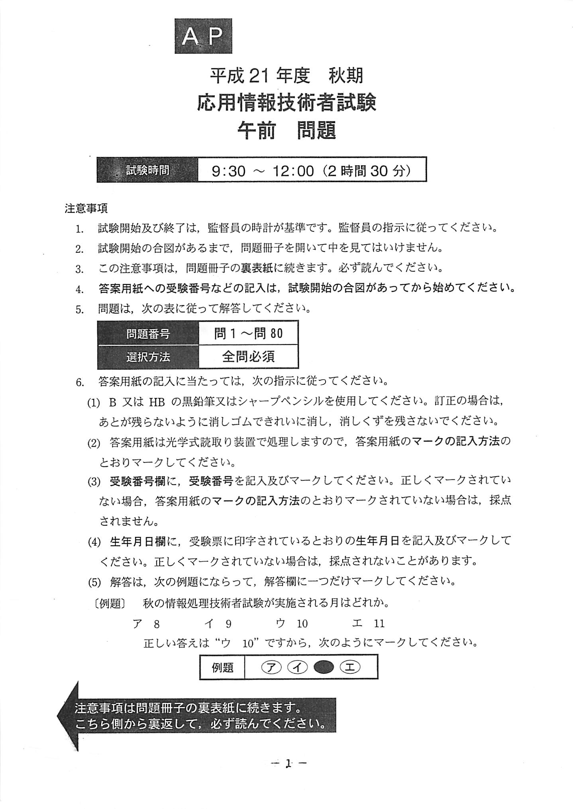

テキスト (OCR)

平成 21 年度 秋期
応用情報技術者試験
午前 問題

Re 9:30 ~ 12:00 (2 mR 30 分

注意事項

1. 試験開始及び終了は, 監督員の時計が基準です。監督具の指示に従ってください。
2. 試験開始の合図があるまで, 問題冊子を開いて中を見てはいけません。
3. この注意事項は, 問題冊子の裏表紙に続きます。必ず読んでください。
4
5.

答案用紙への受験番号などの記入は, 試験開始の合図があってから始めてください。
問題は, 次の表に従って解答してください。
問題番号    問1^問80
選択方法      全問必須
6. 答案用紙の記入に当たっては, 次の指示に従ってください。

Q①) B 又は HB の黒鉛筆又はシャープペンシルを使用してください。訂正の場合は,
あとが残らないように消しゴムできれいに消し, 消しくずを残さないでください。
Q) 管案用紙は光学式読取り装置で処理しますので, 答案用紙のマークの記入方法の

とおりマークしてください。

(3) BRESHKC, 受験番号を記入及びマークしてください。正しくマークされてい
ない場合, 答案用紙のマークの記入方法のとおりマークされていない場合は, 採点
されません。

(4) 生年月日揃に, 受験票に印字されているとおりの生年月日を記入及びマークして
ください。正しくマークされていない場合は, 採点されないことがあります。

(5) 解答は, 次の例題にならって, 解答欄に一つだけマークしてください。
例題) 秋の情報処理技術者試験が実施される月はどれか。

ア 8    イ 9    ウ 10 al
正しい答えは“ウ 10" ですから, 次のようにマークしてください。

例題 | DD@O®

注意事項は問題國子の軸表紙に続きます。
こちら側から裏返しで。 必読んるでください。

### ページ 2

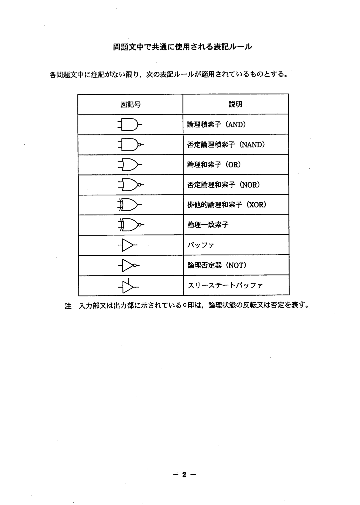

テキスト (OCR)

問題文中で共通に使用される表記ルール

各問題文中に注記がない限り, 次の表記ルールが適用されているものとする。

図記号                                            説明

Ye

REBT (AND)

BERBMRT (NAND)

論理和素子 (OR)

否定論理和素子 (NOR)

排他的論理和素子 (XOR)

論理一致素子

パッファ

論理否定器 (NOT)

スリーステートバッファ

YYIyMMMV

注 入力部又は出力部に示されているo印は, 論理状態の反転又は否定を表す。

### ページ 3

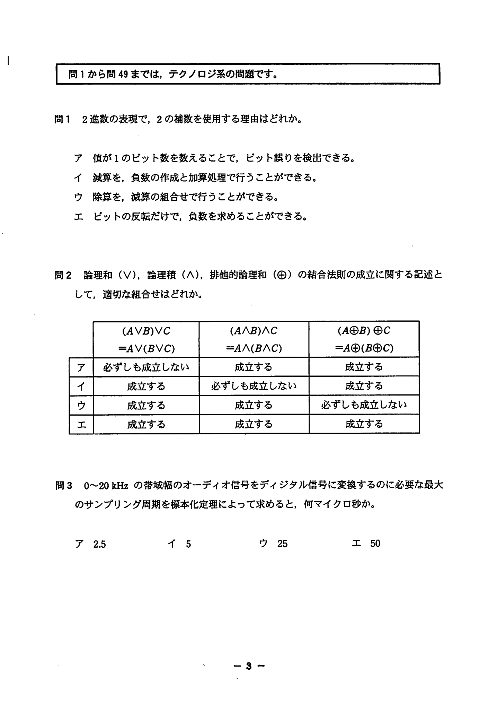

テキスト (OCR)

問 1 から問 49 までは, テクノロジ系の問題です。

Bil 2進数の表現で, 2の補数を使用する理由はどれか。

ア 値が1のビット数を数えることで, Ev KRDO ERE TES.
イ 減算を, 負数の作成と加算処理で行うことができる。

ウ 除算を, 減算の組合せで行うことができる。

L ピットの反転だけで, 負数を求めることができる。

問2 論理和 (V), 論理積 (人), 排他的論理和 (©) の結合法則の成立に関する記述と
して, 適切な組合せはどれか。

(AVB)VC                 (AAB)AC                  (A@B) ®C
=AV(BVC)                 =AN(BAC)                 =A®(BOC)
ア | 必ずしも成立しない             成立する                     成立する
イ             成立する              必ずしも成立しない              成立する
ウ            成立する                    成立する              必ずしも成立しない
x             成立する                       成立する                        成立する

問3 0て20kHz の帯域四のオーディオ信号をディジタル信号に変換するのに必要な最大

のサンプリング周期を標本化定理によって求めると, 何マイクロ秒か。

ア 2.5    イ 5

ウ 25

x= 50

### ページ 4

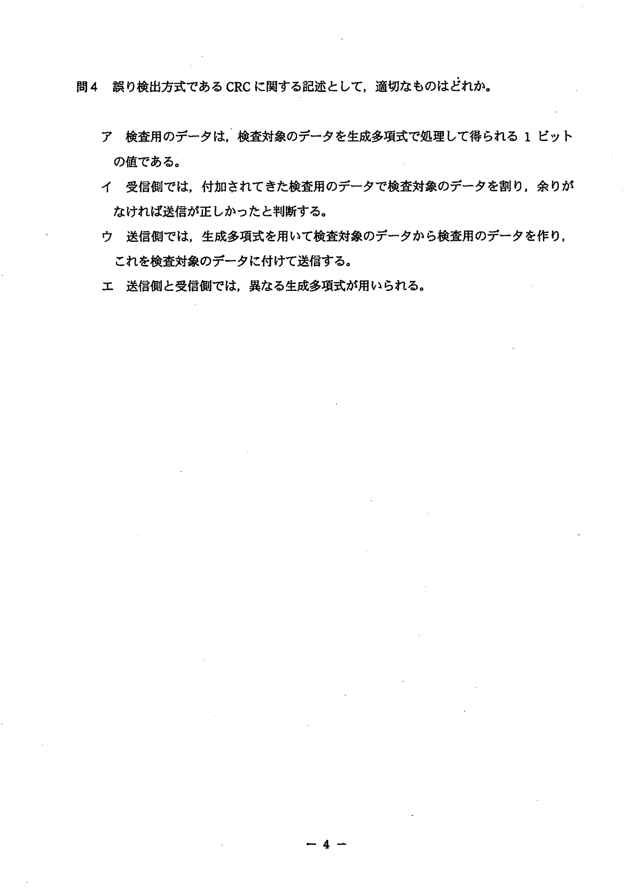

テキスト (OCR)

問4 誤り検出方式である CRC に関する記述として, 適切なものはどれか。

ア 検査用のデータは, 検査対象のデータを生成多項式で処理して得られる 1 ビット
の値である。

イ 受信側では, 付加されてきた検査用のデータで検査対象のデータを割り, 余りが
なければ送信が正しかったと判断する。

ウ 送信側では, 生成多項式を用いて検査対象のデータから検査有のデータを作り,
これを検査対象のデータに付けて送信する。

エ 送信側と受信側では, 異なる生成多項式が用いられる。

### ページ 5

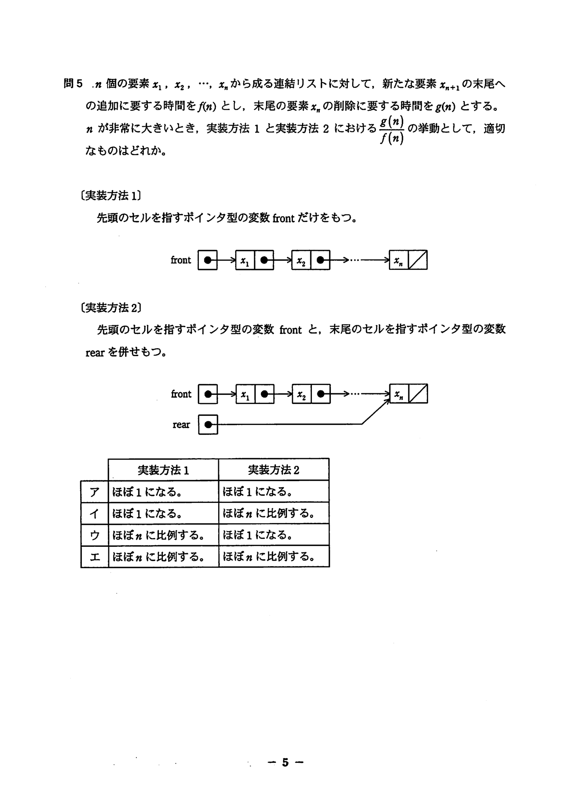

テキスト (OCR)

問5 .ヵ個の要素 x, 2), ぁから成る連結リストに対して, 新たな要素 *,,の未尾へ
の追加に要する時間を7) EL, 末尾要素.の削除に要する時間をgy) とする。
ヵ が非常に大きいとき, 実装方法 1 と実装方法 2 における £4 ommect, 適切

AO)
なものはどれか。
(実装方法 1)
先頭のセルを指すポインタ型の変数 front だけをもつ。
front | @  x,)@  x, | @  や   x,

(実装方法 2
先頭のセルを指すポインタ型の変数 front と, 末尾のセルを指すポインタ型の変数

rear を併せもつ。
front | @  x, | @  x, | @  San
e

実装方法 1     実装方法 2
ほぼ 1 になる。           ほぼ 1 になる。
ほぼ1 になる。   ほぼヵ に比例する。

En に比例する。 |ほぼ1 になる。
En に比例する。 |ほぼぇヵ に比例する。

|

### ページ 6

テキスト (OCR)

問6 流れ図で表される処理を複数回実行した場合, 途中に出現し得る実行順庁はどれか。
ここで, 二重線は並列処理の同期を表す。

wr
< Ts

ア B>oA>B-A        イ BoX-A-Y
7 X?B7?A>Y         エ Y-X~-B-A

問7 Linux システムにおいて, 静的ライブラリと比較した場合の共有ライプラリの特徴
はどれか。

実行可能ファイルのサイズが大きくなる。

実行時のメモリの使用効率が良い。

ライブラリの修正後, それを利用するプログラムの再コンパイルが必要である。
リンク時のオーバヘッドが小さい。

HOGAN

問8 XML文書を, 別の文書形式をもつ XML 文書や HTML 文書などに変換するための仕
様はどれか。

ア CSS     イ DTD     ウ XLink     x XSLT

### ページ 7

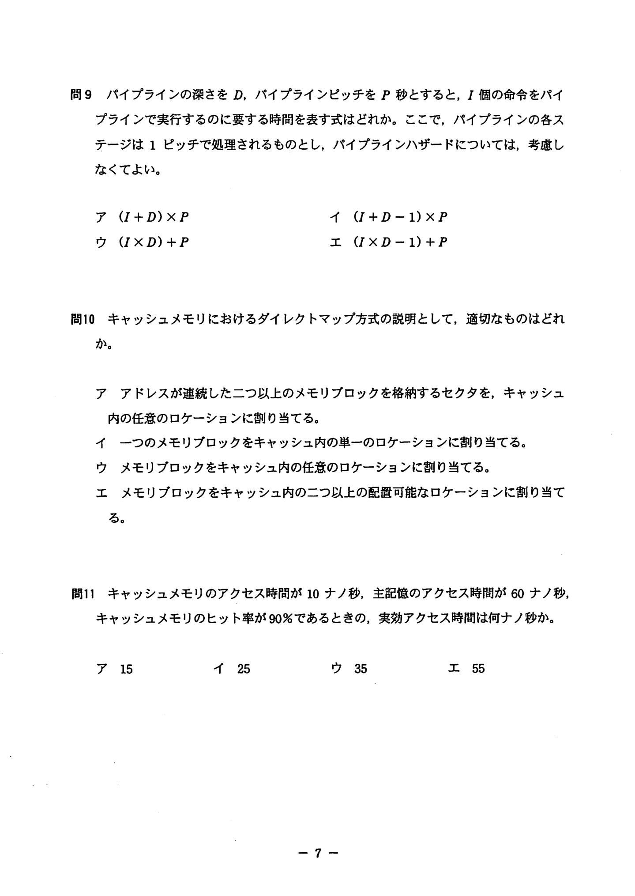

テキスト (OCR)

問9 パイプラインの深さを の, パイプラインピッチを アP 秒とすると, 7 個の命令をパイ
プラインで実行するのに要する時間を表す式はどれか。ここで, パイプラインの各ス
テージは 1 ピッチで処理されるものとし, パイプラインハザードについては, 考慮し
なくてよい。

ア (+D)xP            イ (U+D-1)xP
ウ (IXD)+P           エ (xXD-1)+P

問10 キャッシュメモリにおけるダイレクトマップ方式の説明として, 適切なものはどれ
か。

ア アドレスが連続した二つ以上のメモリプロックを格納するセクタを, キャッシュ
内の任意のロケーションに割り当てる。

イ 一つのメモリブロックをキャッシュ内の単一のロケーションに割り当てる。

ウ メモリブロックをキャッシュ内の任意のロケーションに割り当てる。

エ メモリプロックをキャッシュ内の二つ以上の配置可能なロケーションに割り当て
る。

All キャッシュメモリのアクセス時間が 10 ナノ秒, 主記憶のアクセス時間が 60 F/B,
キャッシュメモリのヒット率が 90%であるときの, 実効アクセス時間は何ナノ秒か。

ア 15   イ 25   ウ 35   x= 55

### ページ 8

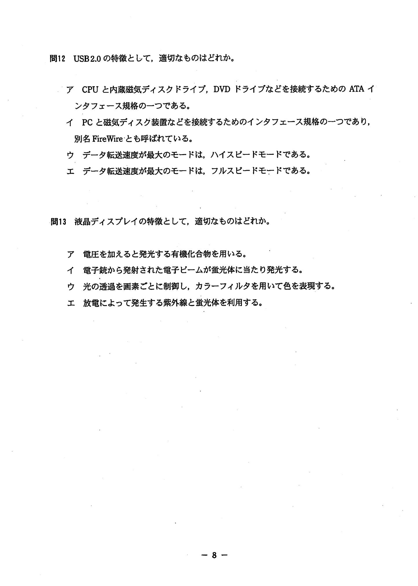

テキスト (OCR)

間12 USB2.0 の特徴として, 適切なものはどれか。

ア CPU と内蔵磁気ディスクドライブ, DVD ドライブなどを接続するための ATA イ
ンタフェース規格の一つである。

イ PC と磁気ディスク装置などを接続するためのインタフェース規格の一つであり,
別名 FireWire とも呼ばれている。

ウツ データ転送速度が最大のモードは, ハイスピードモードである。

L データ転送速度が最大のモードは, フルスピードモードである。

問13 液晶ディスプレイの特徴として, 適切なものはどれか。

電圧を加えると発光する有機化合物を用いる。

電子銃から発射された電子ピームが肖光体に当たり発光する。

光の朋過を画素ごとに制御し, カラーフィルタを用いて色を表現する。
放電によって発生する紫外線と蛍光体を利用する。

HAN

### ページ 9

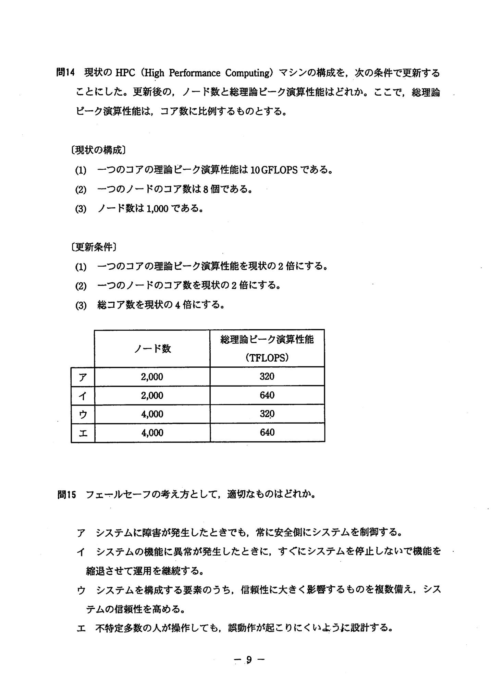

テキスト (OCR)

問14 現状の HPC  (High  Performance Computing) マシンの構成を, 次の条件で更新する
ことにした。更新後の, ノード数と総理論ピーク演算性能はどれか。ここで, 総理論
ピーク演算性能は, コア数に比例するものとする。

(現状の構成〕

(1) 一つのコアの理論ピーク演算性能は 10GFLOPS である。
⑫②) 一つのノードのコア数は 8 個である。

3) ノード数は 1.000 である。

〔更新条件〕                                   」

Q) 一つのコアの理論ピーク演算性能を現状の 2 倍にする。
Q) 一つのノードのコア数を現状の 2 倍にする。

(3) 総コア数を現状の 4 倍にする。

総理諭ピーク演算性能
ノード数
(TFLOPS)
ア        2,000             320
イ        2,000             640
ウ        4,000             320
x        4,000             640

BIS フェールセーフの考え方として, 適切なものはどれか。

ア システムに障害が発生したときでも, 常に安全側にシステムを制御する。

A システムの機能に異常が発生したときに, すぐにシステムを停止しないで機能を
縮退させて運用を継続する。

ウ システムを構成する要素のうち, 信頼性に大きく影響するものを複数備え, シス
テムの信頼性を高める。

エ 不特定多数の人が操作しても, 誤動作が起ことりにくいようた設計する。

ー9 一

### ページ 10

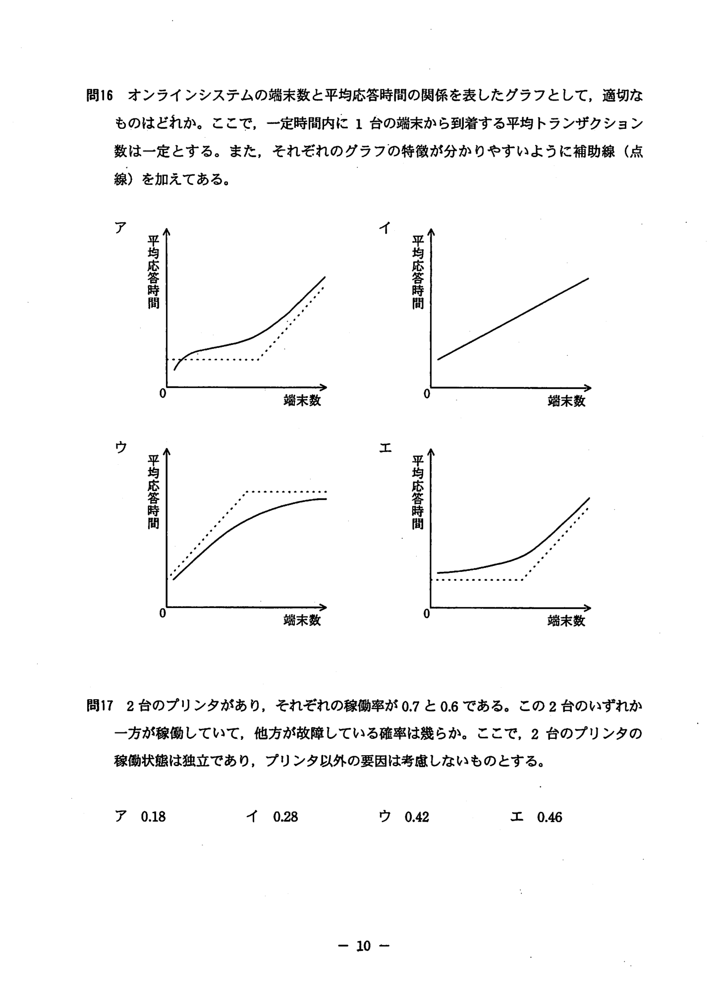

テキスト (OCR)

FIG オンラインシステムの端末数と平均応答時間の関係を表したグラフとして, 適切な
ものはどれか。ここで, 一定時間内に 1 台の端末から到着する平均トランザクション
数は一定とする。また, それぞれのグラフの特徴が分かりやすいように補助線 (A
線) を加えてある。

ァ                                           4
平                                           x
均                                           均
応                                           応
Cs                                           =
時                                           時
間                                           間
9                    端末数                 9                    RK
7 キャ                                     ~ キ
均
Fd                                Fd
間                                           間

9                    端末数                 9                    端末数

問17 2 台のプリンタがあり, それぞれの稼働率が 0.7 と 0.6 である。この 2 台のいずれか
一方が稼働していて, 他方が故障している確率は幾らか。ここで, 2 台のプリンタの
稼働状態は独立であり, プリンタ以外の要因は考慮しないものとする。

ア 0.18     イ 028      ウ 0.42     x= 0.46

### ページ 11

テキスト (OCR)

間18 制御系の組込みシステムで使用されるリアルタイム 0S の特徴として, 適切なもの
はどれか。

MMU によって仮想記憶制御を行い データの仮想化を行わなければならない。
タスク生成は主に静的に行う。

ファイルマネージャ及びメモリプロテクション機能は必須である。

ラウンドロビピン方式のスケジューリングを用いてシステム全体のスループットの
向上を図る。

HOGAN

間19 リアルタイム OS のマルチタスク管理機能において, タスク A が実行状態から実行
可能状態へ遷移するのはどの場合か。

タスクAが入出力要求のシステムコールを発行した。

タスク A が優先度の低いタスク B に対して, メッセージ送信を行った。
タスク A より優先度の高いタスク B が実行状態となった。

タスク A より優先度の高いタスク B が待ち状態となった。

H へ NSN

間20 UNIX ではファイルを, 通常ファイル, ディレクトリファイル及び特殊ファイルの 3
種類に分類している。ディレクトリファイルの説明として, 適切なものはどれか。

磁気ディスクなどの入出力装置にアクセスするためのファイル

テキスト, オプジェクトコード, 画像データなどを格納するためのファイル
ファイル名とファイルの実体を対応付けるためのファイル

複数のパスから一つのファイルを参照できるようにするためのファイル

H へ

### ページ 12

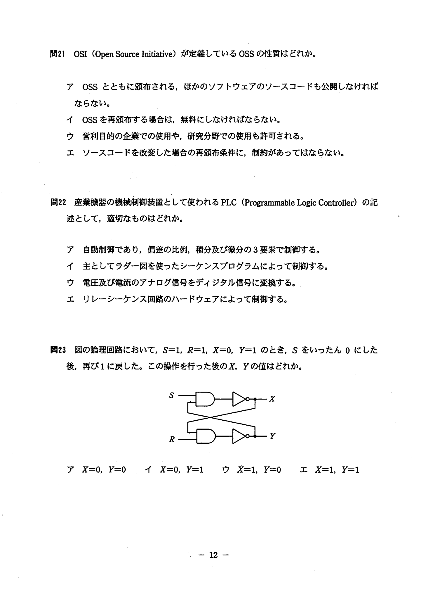

テキスト (OCR)

問21 OSI (Open Source Initiative) が定義している OSS の性質はどれか。

ア OSS とともに人類布される, ほかのソフトウェアのソースコードも公開しなければ
ならない。

イ 0SS を再婦布する場合は, 無料にしなければならない。

ウ 営利目的の企業での使用や, 研究分野での使用も許可される。

エ ソースコードを改変した場合の再頒布条件に, 制約があってはならない。

間22 産業機器の機械制御装置として使われる PLC  (Programmable Logic Controller) の記
述として, 適功なものはどれか。

自動制御であり, 偏差の比例, 積分及び微分の 3 要素で制御する。
主としてラダー図を使ったシーケンスプログラムによって制御する。
電圧及び電流のアナログ信号をディジタル信号に変換する。.

リレーシーケンス回路のハードウェアによって制御する。

H ささい

間23 図の論理回路において, S王1, R=1, X=0, Yー1 のとき, S をいったん 0 にした
後, 再び1 に戻した。この操作を行った後のメ, 了の値はどれか。

ア X=0, Y=0   イ メー0, Y=1   ウ メー1, Y=0   x メー1, Y=1

ーー 12 一

### ページ 13

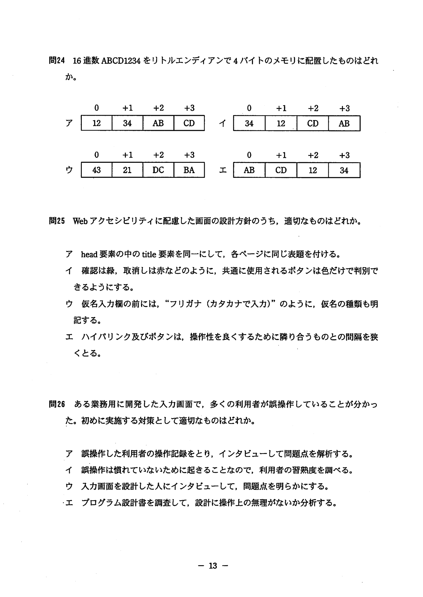

テキスト (OCR)

間24 16 進数 ABCD1234 をりトルエンディアンで 4 パイトのメモリに配置したものはどれ
か。

間25 Web アクセシピリティに配慮した画面の設計方針のうち, 適切なものはどれか。

ア head 要素の中の title 要素を同一にして, 各ページに同じ表題を付ける。
イ 確認は緑, 取消しは赤などのように, 共通に使用されるボタンは色だけで判別で

きるようにする。

ウ 仮名入力欄の前には, “フリガナ (カタカナで入力)" のように, 仮名の種類も明
記する。

エ ハイパリンク及びポタンは, 操作性を良くするために隣り合うものとの間隔を狭
くとる。

問26 ある業務用に開発した入力画面で, 多くの利用者が誤操作していることが分かっ
た。初めに実施する対策として適切なものはどれか。

ア 誤操作した利用者の操作記録をとり, インタビューして問題点を解析する。
イ 誤操作は人慣れていないために起きることなので, 利用者の習熟度を普べる。
ウ 入力画面を設計した人にインタビューして, 問題点を明らかにする。
エ プログラム設計書を調査して, 設計に操作上の無理がないか分析する。

### ページ 14

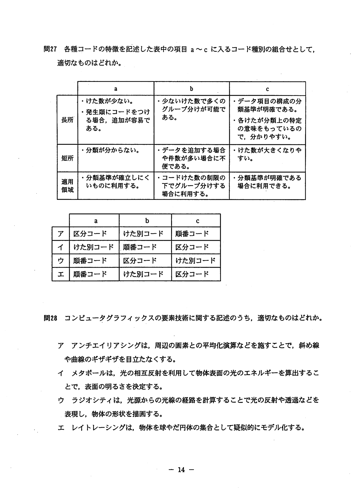

テキスト (OCR)

問27 各種コードの特徴を記述した表中の項目 ac に入るコード種別の組合せとして

適切なものはどれか。
a                         b        -                て
・けた数が少ない。   ・少ないけた数で多くの | ・データ項目の枚成の分
発生順にコードをつけ | グループ分けが可能で| 類基準が明確である。
長所 | る場合, 追加が容易で| ある。        ・各けたが分類上の特定
ある。                     の意味をもっているの
で, 分かりやすい。
・分類が分からない。  ・データを追加する場合 | ・けた数が大きくなりや
短所              や件数が多い場合に不 | すい。
便である。
am | ' 分類基準が確立しにく |・コードけた数の制限の | ・分類基準が明確である
gig | いものに利用する。   下でグループ分けする | 場合に利用できる。
場合に利用する。        ]
a       b       c
ア | 区分コード | けた別コード | 順番コード
イ | けた別コード | 順番コード    区分コード
ウ | 順番コード | 区分コード  けた別コード
エエ | 順番コード | けた別コード | 区分コード

間28 コンピュータグラフィックスの要素技術に関する記述のうち, 適切なものはどれか。

ア アンチエイリアシングは, 周辺の画素との平均化演算などを施すことで, BOR
や曲線のギザギザを目立たなくする。

イ メタボールは, 光の相互反射を利用して物体表面の光のエネルギーを算出するこ
とで, 表面の明るさを決定する。

ウ ラジオシティは, 光源からの光線の経路を計算することで光の反射や居過などを
表現し, 物体の形状を描画する。

L レイトレーシングは, 物体を球やだ円体の集合として疑似的にモデル化する。

### ページ 15

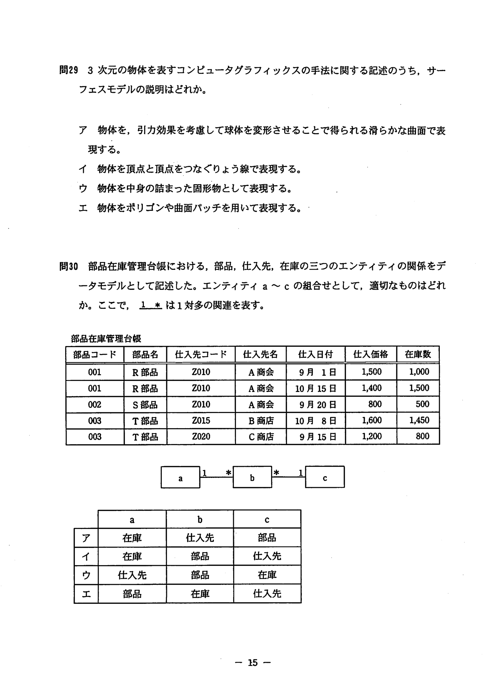

テキスト (OCR)

問29 3 次元の物体を表すコンピュータグラフィックスの手法に関する記述のうち, サー
フェスモデルの説明はどれか。

ア 物体を, 引力効果を考慮して球体を変形させることで得られる滑らかな曲面で表
現する。

イ 物体を頂点と頂点をつなぐりょう線で表現する。

ウ 物体を中身の詰まった固形物として表現する。

エエ 物体をポりゴンや曲面パッチを用いて表現する。 -

30 部品在庫管理台帳における, 部品, LAH, 在庫の三つのエンティティの関係をデ
ータモデルとして記述した。エンティティ a ~ c の組合せとして, 適切なものはどれ
か。ここで, ユ1 _まは1対多の関連を表す。

部品在庫管理台帳
部品コード | 部品名 | 仕入先コード | 仕入先名 | 仕入日付 | 仕入価格 | 在庫数
001          R 部品           Z010             A商会        9月 1日         1,500         1,000
001          R 部品           Z010            AS       10 月 158        1,400         1,500
002          S部品           Z010            A 商会        9月 20 日          800          500
003         部品          Z015            B 商店       10月 8日        1,600         1,450
003         T 部品          2020            C商店        9 月 15 日        1,200          800
a       A      x      b      *      1      で
a                    b                    c
ア   在庫    仕入先    部品
イ           在庫                部品              仕入先
ウ         EASE              部品                在庫
エ          部品                在庫              仕入先

### ページ 16

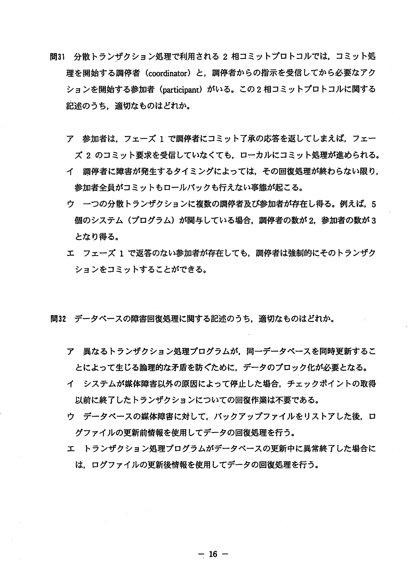

テキスト (OCR)

問31 分散トランザクション処理で利用される 2 相コミットプロトコルでは, コミット処
理を開始する調停者 (coordinator) と, 調停者からの指示を受信してから必要なアク
ションを開始する参加者 (participan) がいる。この 2 相コミットプロトコルに関する
記述のうち, 適切なものはどれか。

ア 参加者は, フェーズ 1 で調停者にコミット了承の応答を返してしまえば, フェー

ズ 2 のコミット要求を受信していなくても, ローカルにコミット処理が進められる。
イ 調停者に障害が発生するタイミングによっては, その回復処理が終わらない限り,
参加者全員がコミットもロールバックも行えない事態が起こる。

ウ 一つの分散トランザクションに複数の調停者及び参加者が存在し得る。例えば, 5
個のシステム (プログラム) が関与している場合, 調停者の数が2, 参加者の数が3
となり得る。

XL フェーズ 1 で返答のない参加者が存在しても, 調停者は強制的にそのトランザク
ションをコミットすることができる。

問32 データベースの障害回復処理に関する記述のうち, 適切なものはどれか。

ア 異なるトランザクション処理プログラムが, 同一データベースを同時更新するこ
とによって生じる論理的な矛盾を防ぐために, データのブロック化が必要となる。
イ システムが媒体障害以外の原因によって停止した場合, チェックポイントの取得

以前に終了したトランザクションについての回復作業は不要である。
ウ データベースの媒体障害に対して, パックアップファイルをリストアした後, ロ
グファイルの更新前情報を使用してデータの回復処理を行う。
エエ トランザクション処理プログラムがデータベースの更新中に異常終了した場合に
は, ログファイルの更新後情報を使用してデータの回復処理を行う。

ー 16 一

### ページ 17

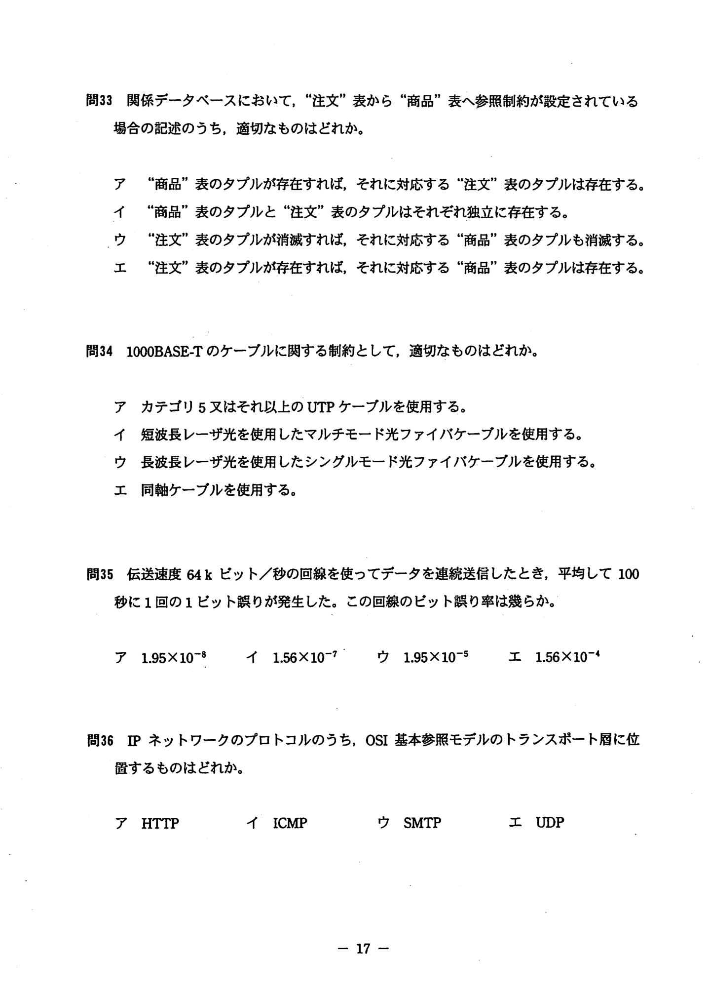

テキスト (OCR)

問33 関係データベースにおいて, “注文" 表から “商品" 表へ参照制約が設定されている
場合の記述のうち, 適切なものはどれか。

"商品" 表のタプルが存在すれば, それに対応する “EX” 表のタブプルは存在する。
“商品" 表のタプルと “注文" 表のタプルはそれぞれ独立に存在する。

“注文" 表のタプルが消滅すれば, それに対応する “Ha” 表のタプルもや消滅する。
“注文" 表のタプルが存在すれば, それに対応する “商品" 表のタプルは存在する。

H ささい

問34 1000BASE-T のケーブルに関する制約として, 適切なものはどれか。
ア カテゴリ 5又はそれ以上の UTP ケーブルを使用する。
イ 短波長レーザ光を使用したマルチモード光ファイバパケープブルを使用する。
ウ
x

長波長レーザ光を使用したシングルモード光ファイバパケーブルを使用する。
同軸ケープルを使用する。

問35 伝送速度 64k ピットノ秒の回線を使ってデータを連続送信したとき, 平均して 100
秒に 1 回の 1 ピット誤りが発生した。この回線のピッ ト誤り率は幾らか。
ア 195X10* イ 1.56X107 ウ 195X10? エエ 1.56X10-*

間36 TP ネットワークのプロトコルのうち, OS] 基本参照モデルのトランスポート層に位

置するものはどれか。

ア HTTP    イ ICMP     ウ SMTP    x UDP

### ページ 18

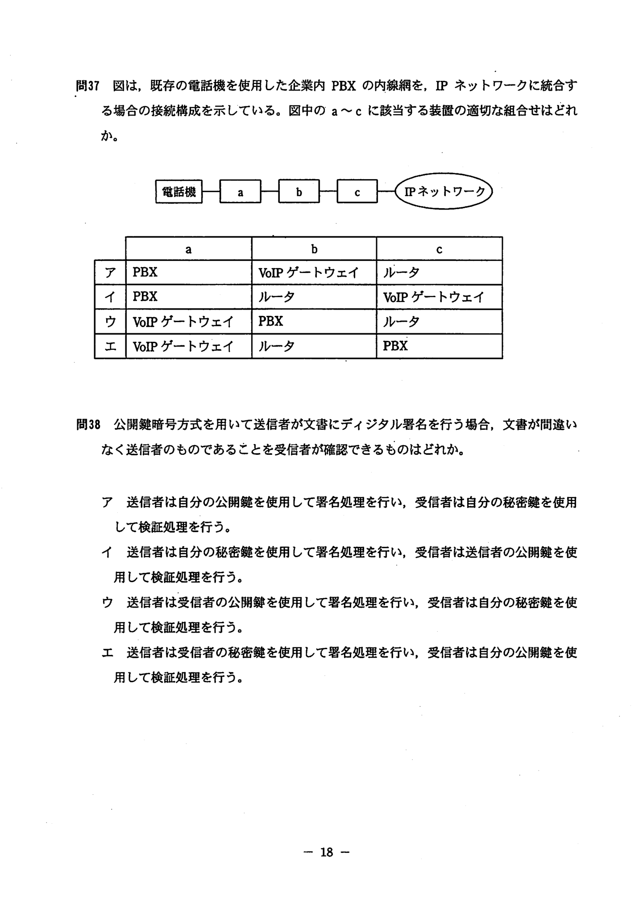

テキスト (OCR)

問37 id, BEFORE LRG PBX の内線網を, P ネットワークに統合す
る場合の接続成を示している。図中の ac に該当する装因の適切な組合せはどれ
か。

BERK a Fob        c
a                      b                      て
ア | PBX                        VIP ゲートウェイ | ルータ
4 | PBX                       ルータ                     VoIP ゲートウェイ
ウ | VoIP ゲートウェイ | PBX                     ルータ
エ | VerP ゲートウェイ | ルータ                      PBX

間38 公開鍵暗号方式を用いて送信者が文書にディジタル署名を行う場合, 文書が間違い
なく送信者のものであることを受信者が確認できるものはどれか。

ア 送信者は自分の公開鍵を使用して署名処理を行い, 受信者は自分の秘密鍵を使用

して検証処理を行う。

イ 送信者は自分の秘密鍵を使用して署名処理を行い, 受信者は送信者の公開負を使
用して検証処理を行う。

ウ 送信者は受信者の公開鍵を使用して暑名処理を行い, 受信者は自分の秘密鍵を使
用して検証処理を行う。

エ 送信者は受信者の秘密鍵を使用して署名処理を行い, 受信者は自分の公開鍵を使
用して検証処理を行う。

### ページ 19

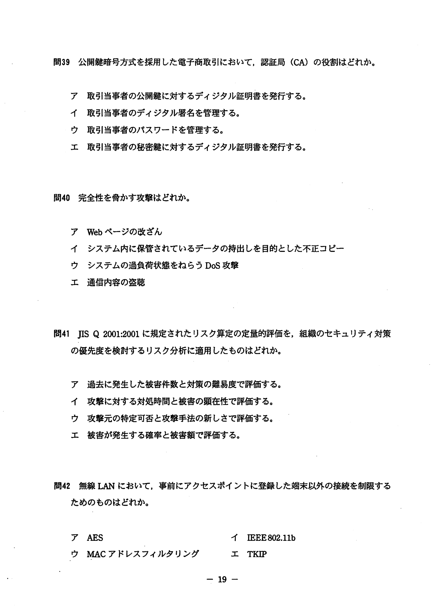

テキスト (OCR)

問39 公開鍵暗号方式を採用した電子商取引において, 認証局 (CA) の役割はどれか。

取引当事者の公開鍵に対するディジタル証明書を発行する。
取引当事者のディジタル暑名を管理する。

取引当事者のパスワードを管理する。

取引当事者の秘密鍵に対するディジタル証明書を発行する。

H さい

B40 完全性を脅かす攻撃はどれか。

Web ページの改ざん

システム内に保管されているデータの持出しを目的とした不正コピー
システムの過負荷状態をねらう DoS 攻撃

通信内容の盗聴

H へ N

問41 JIS Q 2001:2001 に規定されたリスク算定の定量的評価を, 組織のセキュリティ対策
の優先度を検討するリスク分析に適用したものはどれか。

ア 過去に発生した被害件数と対策の難易度で評価する。
イ 攻撃に対する対処時間と被害の顕在性で評価する。

ウ 攻撃元の特定可否と攻撃手法の新しさで評価する。

エ 被害が発生する確率と被害額で評価する。

問42 無線 LAN において, 事前にアクセスポイントに登録した端末以外の接続を制限する
ためのものはどれか。

ア AES                                 イ EEE802.11b
ウ MACアドレスフィルタリング      x TKIP

### ページ 20

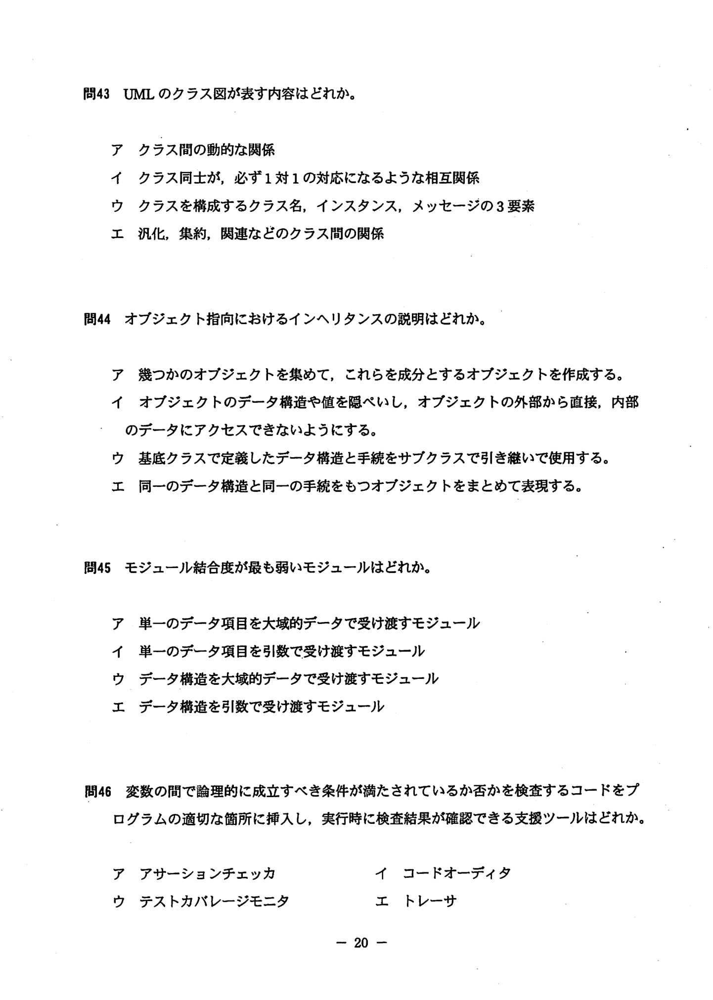

テキスト (OCR)

間43 UML のクラス図が表す内容はどれか。

クラス間の動的な関係

クラス同士が, 必ず 1 対 1 の対応になるようか相互関係

クラスを構成するクラス名, インスタンス, メッセージの 3 BK
Wut, 集約, 関連などのクラス間の関係

HOGAN

44 オプジェクト指向におけるインヘリタンスの説明はどれか。

ア 幾つかのオプジェクトを集めて, これらを成分とするオプジェクトを作成する。
イ オプジェクトのデータ構造や値を隠べいし, オプジェクトの外部から直接, 内部
のデータにアクセスできないようにする。

ウ 基底クラスで定義したデータ構造と手続をサブプクラスで引き継いで使用する。

エエ 同一のデータ構造と同一の手続をもつオプジェクトをまとめて表現する。

問45 モジュール結合度が最も弱いモジュールはどれか。

単一のデータ項目を大域的データで受け渡すモジュール
単一のデータ項目を引数で受け渡すモジュール

データ構造を大域的データで受け渡すモジュール

データ構造を引数で受け渡すモジュール

HOGA NS

問46 変数の間で論理的に成立すべき条件が満たされているか否かを検査するコードをプ
ログラムの適切な箇所に挿入し, 実行時に検査結果が確認できる支援ツールはどれか。

ア アサーションチェッカ       イ コードオーディタ
ウ テストカバレージモニタ        x= トレーサ

### ページ 21

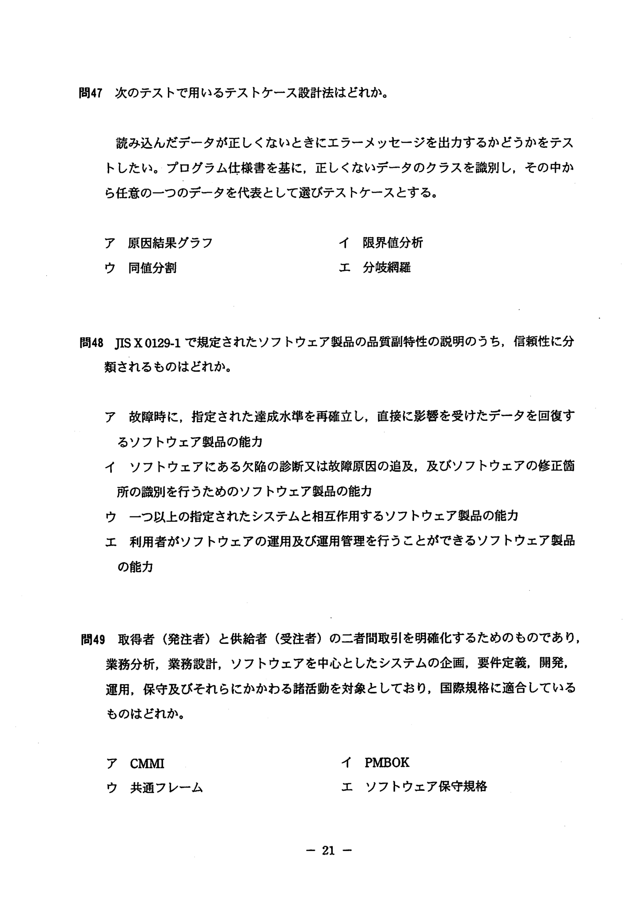

テキスト (OCR)

問47 次のテストで用いるテストケース設計法はどれか。

読み込んだデータが正しくないときにエラーメッセージを出力するかどうかをテス
トしたい。プログラム仕様書を基に, 正しくないデータのクラスを識別し, その中か
ら任意の一つのデータを代表として選びテストケースとする。

ア 原因結果グラフ          イ 限界値分析
ウ 同値分割             LAU

問48 JISX 0129-1 で規定されたソフトウェア製品の品質副特性の説明のうち, 信頼性に分
類されるものはどれか。

ア 故障時に, 指定された達成水準を再確立し, 直接に影響を受けたデータを回復す
るソフトウェア製品の能カ

イ ソフトウェアにある欠陥の診断又は政障原因の追及, 及びソフトウェアの修正箇
所の識別を行うためのソフトウェア製品の能力

ウ 一つ以上の指定されたシステムと相互作用するソフトウェア製品の能力

エエ 利用者がソフトウェアの運用及び運用管理を行うことができるソフトウェア製品
の能力

問49 取得者(発注者) と供給者 (受注者) の二者間取引を明確化するためのものであり,
業務分析, 業務設計 ソフトウェアを中心としたシステムの企画, 要件定義, 開発,
運用, 保守及びそれらにかかわる諸活動を対象としており, 国際規格に適合している
ものはどれか。

ア CMMI            イ PMBOK
ウ 共通フレーム          L ソフトウェア保守規格

### ページ 22

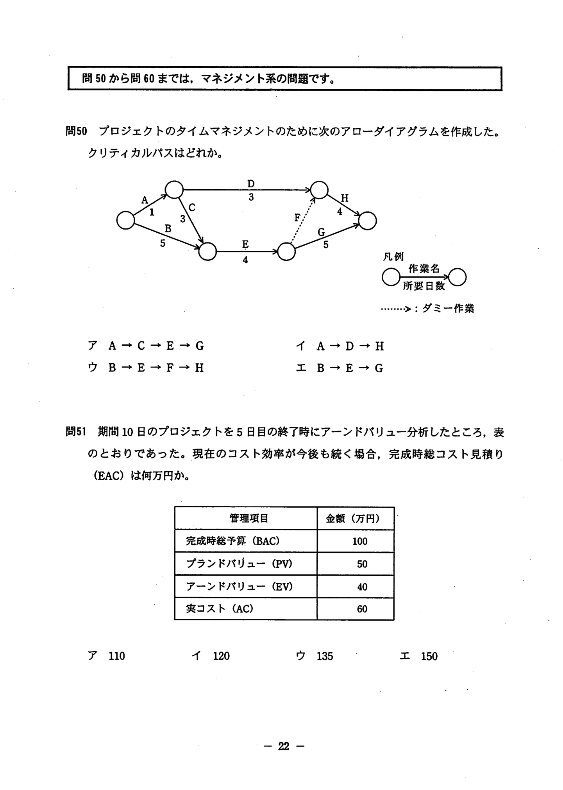

テキスト (OCR)

問 50 から問 60 までは, マネジメント系の問題です。

問50 プロジェクトのタイムマネジメントのために次のアローダイアグラムを作成した。
クリティカルパスはどれか。

ア A?C7>E>G       イ A?D-H

問51 期間10 日のプロジェクトを5 日目の終了時にアーンドパリュー分析したところ, 表
のとおりであった。現在のコスト効率が今後も続く場合, 完成時総コスト見積り
(EAC) は何万円か。

管理項目      金額 (万円)
完成時総予算 (BAC)           100
プランドバリュー (PV)      50
アーンドバリュー (EV)       40
実コスト (AO)           60
ア 110     イ 120     ウ 135     エ 150

### ページ 23

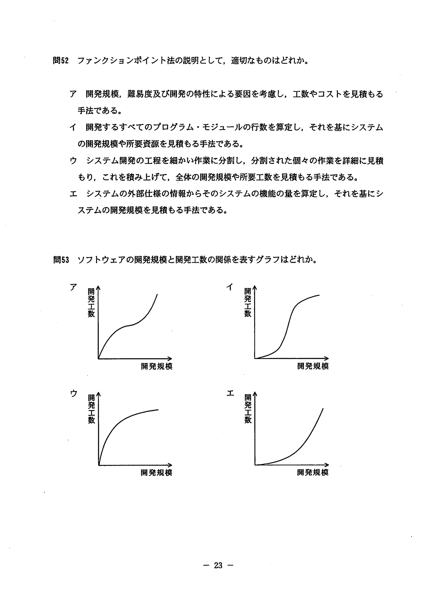

テキスト (OCR)

問52 ファンクションポイント法の説明として, 適切なものはどれか。

ア 開発規模, 難易度及び開発の特性による要因を考慮し, 工数やコストを見積もる
手法である。

イ 開発するすべてのプログラム・モジュールの行数を算定し, それを基にシステム
の開発規模や所要資源を見積もる手法である。

ウ システム開発の工程を細かい作業に分割し, 分割された個々の作業を詳細に見策
もり, これを積み上げて, 全体の開発規模や所要工数を見積もる手法である。

エ システムの外部仕様の情報からそのシステムの機能の量を算定し, それを基にシ
ステムの開発規模を見積もる手法である。

問53 ソフトウェアの開発規模と開発工数の関係を胡すグラフはどれか。

ア                  イ

HWS
HWS

開発規模               開発規模

38H ws
SSH

開発規模               開発規模

### ページ 24

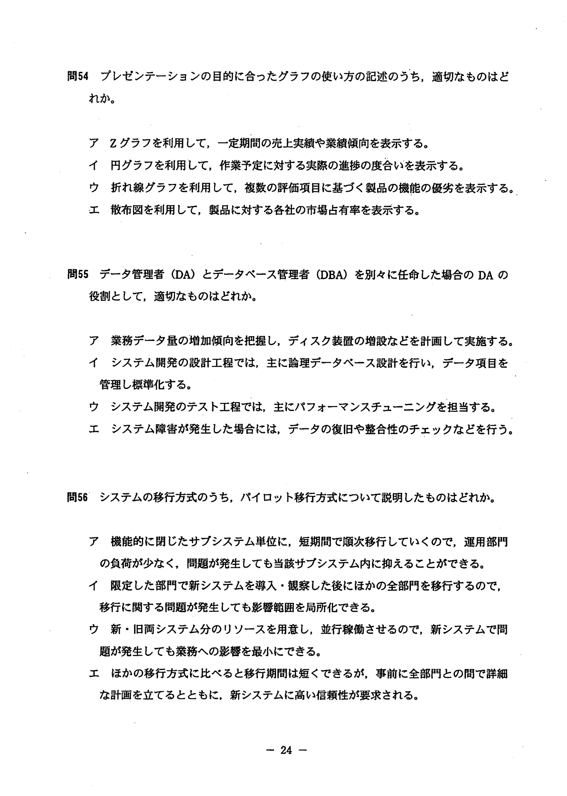

テキスト (OCR)

間54 プレゼンテーションの目的に合ったグラフの使い方の記述のうち, 適切なものはど
れか。

ア Zグラフを利用して, 一定期間の売上実績や業貫傾向を表示する。

イ 円グラフを利用して, 作業予定に対する実際の進捗の度合いを表示する。

ウ 折れ線グラフを利用して, 複数の評価項目に基づく製品の携能の優劣を表示する。
L 散布図を利用して, 製品に対する各社の市場占有率を表示する。

問55 データ管理者 (DAN) とデータベース管理者 (DBA) を別々に任命した場合の DA の
役割として, 適切なものはどれか。

ア 業務データ量の増加傾向を把握し, ディスク装置の増設などを計画して実施する。
4 システム開発の設計工程では, 主に論理データベース設計を行い。 データ項目を
管理し標準化する。
ウ システム開発のテスト工程では, 主にパフォーマンスチューニングを担当する。

エ システム障害が発生した場合には。 データの復旧や整合性のチェックなどを行う。

問56 システムの移行方式のうち, パイロット移行方式について説明したものはどれか。

ア 機能的に閉じたサブシステム単位に, 短期間で順次移行していくので, 運用部門
の負荷が少なく, 問題が発生しても当該サプシステム内に抑えることができる。
イ 限定した部門で新システムを導入・観察した後にほかの全部門を移行するので
移行に関する問題が発生しても影響範囲を局所化できる。
ウ 新・旧両システム分のリソースを用意し, 並行稼働させるので, 新システムで問
題が発生しても業務への影響を最小にできる。
L ほかの移行方式に比べると移行期間は短くできるが, 事前に全部門との間で詳細
な計画を立てるとともに, 新システムに高い信頼性が要求される。

### ページ 25

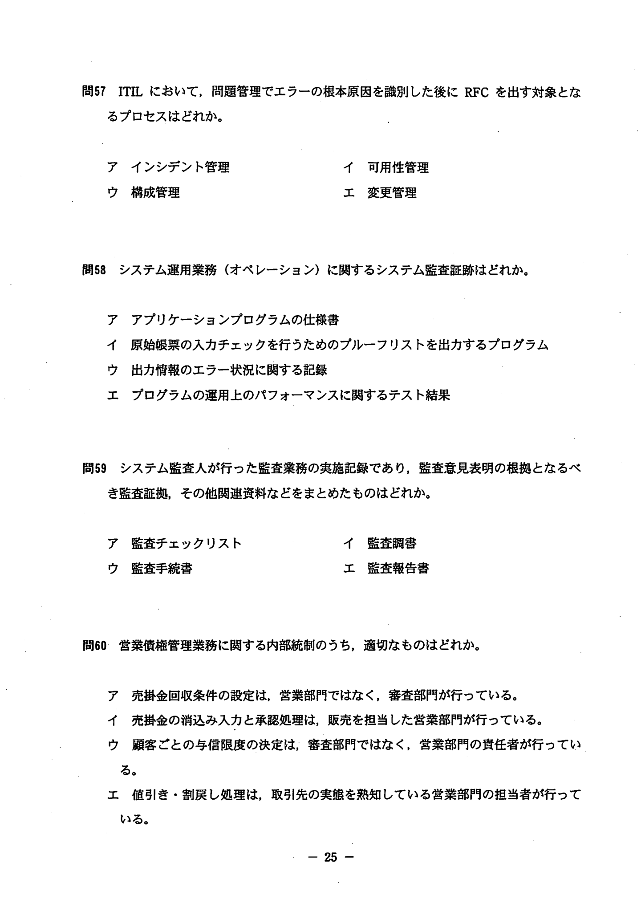

テキスト (OCR)

問57 ITIL において, 問題管理でエラーの根本原因を識別した後に RFC を出す対象とな
るプロセスはどれか。

ア インシデント管理         イ 可用性管理
ウ 構成管理             エ 変更管理

間58 システム運用業務 (オペレーション) に関するシステム監査証叶はどれか。

ア アプリケーションプログラムの仕様書

イ 原始帳票の入力チェックを行うためのプルーフリストを出力するプログラム
ウ 出力情報のエラー状況に関する記録

エエ プログラムの運用上のパフォーマンスに関するテスト結果

問59 システム監査人が行った監査業務の実施記録であり, 監査意見表明の根拠となるべ
き監査証拠, その他関連資料などをまとめたものはどれか。

ア 監査チェックリスト        イ 監査調書
ウ 監査手続書            エ 監査報告書

問60、営業債権管理業務に関する内部統制のうち, 適切なものはどれか。

ア 売掛金回収条件の設定は, 営業部門ではなく, 審査部門が行っている。

イ 売掛金の消込み入力と承認処理は, 販売を担当した営業部門が行っている。

ウ 顧客ごとの与信限度の決定は, 審査部門ではなく, 営業部門の資任者が行ってい
る。

エ 値引き・割戻し処理は, 取引先の実態を熟知している営業部門の担当者が行って
いる。

### ページ 26

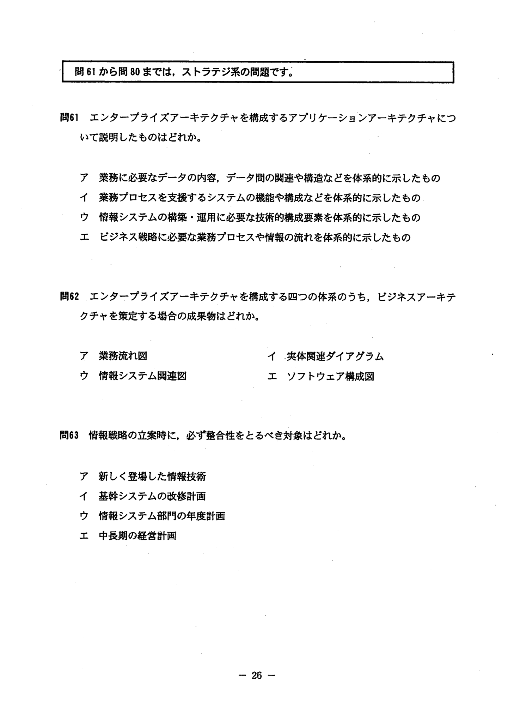

テキスト (OCR)

問 61 から問 80 までは, ストラテジ系の問題です。

問61 エンタープライズアーキテクチャを構成するアプリケーションアーキテクチャにつ
いて説明したものはどれか。

ア 業務に必要なデータの内容, データ間の関連や構造などを体系的に示したもの
イ 業務プロセスを支援するシステムの指能や構成などを体系的に示したもの

ウ 情報システムの構築・運用に必要な技術的構成要素を体系的に示したもの

エ ビジネス戦略に必要な業務プロセスや情報の流れを体系的に示したもの

間62 エンタープライズアーキテクチャを構成する四つの体系のうち, ビジネスアーキテ
クチャを集定する場合の成果物はどれか。
ア 業務流れ図            イ 実体関連ダイアグラム
ウ 情報システム関連図       エエ ソフトウェア構成図
問63 情報戦略の立案時に, 必ず整合性をとるべき対象はどれか。
ア 新しく登場した情報技術
イ 基幹システムの改修計画
ウ
=x

情報システム部門の年度計画
中長期の経営計画

### ページ 27

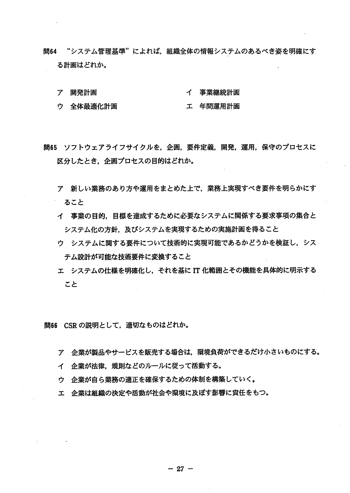

テキスト (OCR)

問64 “システム管理基準"” によれば, 組織全体の情報システムのあるべき姿を明確にす
る計画はどれか。

ア 開発計画             4 事業継続計画
ウ 全体最適化計画          エ 年間運用計画

6S ソフトウェアライフサイクルを, 企画, 要件定義, 開発, 運用, 保守のプロセスに
区分したとき, 企画プロセスの目的はどれか。

ア 新しい業務のあり方や運用をまとめた上で, 業務上実現すべき要件を明らかにす
ること

イ 事業の目的, 目標を達成するために必要なシステムに関係する要求事項の集合と
システム化の方針, 及びシステムを実現するための実施計画を得ること

ウ システムに関する要件について技術的に実現可能であるかどうかを検証し, シス
テム設計が可能な技術要件に変換すること

エエ システムの仕様を明確化し, それを基に IT 化範囲とその機能を具体的に明示する
こと

問66 CSRの説明として, 適切なものはどれか。

企業が製品やサービスを販売する場合は, 環境負荷ができるだけ小さいものにする。
企業が法律, 規則などのルールに従って活動する。

企業が自ら業務の適正を確保するための体制を構築していく。

企業は組織の決定や活動が社会や環境に及ぼす影響に資任をもつ。

Hささい

### ページ 28

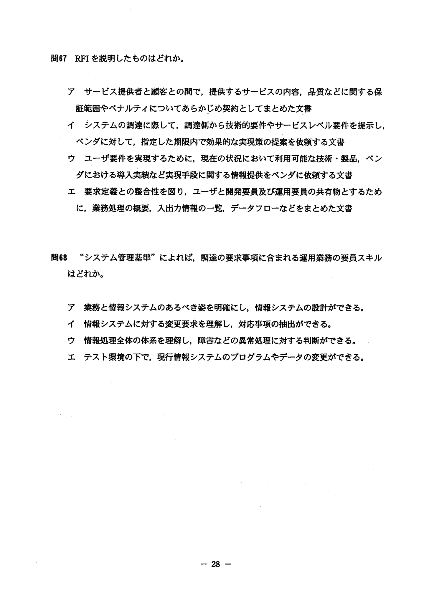

テキスト (OCR)

問67 RFIを説明したものはどれか。

ア サービス提供者と願客との間で, 提供するサービスの内容, 品質などに関する保
証範囲るペナルティ についてあらかじめ契約としてまとめた文書

イ システムの調達に際して, 調達側から技術的要件やサービスレベル要件を提示し,
ベンダに対して, 指定した期限内で効果的な実現策の提案を依頼する文書

ウ ユーザ要件を実現するために, 現在の状況において利用可能な技術・製品, ペン
ダにおける導入実績など実現手段に関する情報提供をベンダに依頼する文書

エ 要求定義との整合性を図り, ユーザと開発要員及び運用要員の共有物とするため
に, 業務処理の概要, 入出力情報の一覧, データフローなどをまとめた文書

問68 “システム管理基準"” によれば, 調達の要求事項に含まれる運用業務の要員スキル
はどれか。

業務と情報システムのあるべき姿を明確にし, 情報システムの設計ができる。
情報システムに対する変更要求を理解し, 対応事項の抽出ができる。

情報処理全体の体系を理解し, 障害などの異常処理に対する判断ができる。
テスト環境の下で, 現行情報システムのプログラムやデータの変更ができる。

Hさへヽ さい

### ページ 29

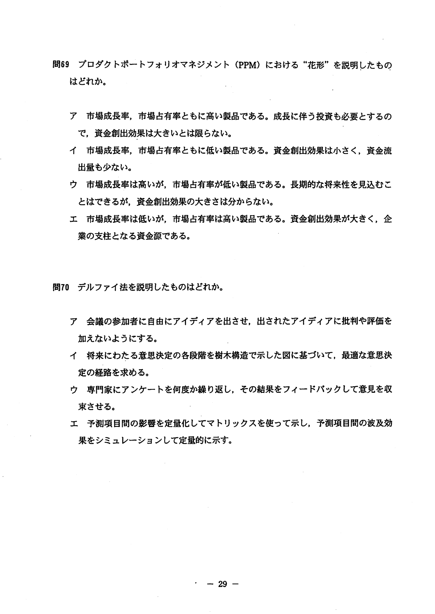

テキスト (OCR)

問69 プロダクトポートフォリオマネジメント (PPM) における “HEB” を説明したもの
はどれか。

ア THERE, 市場占有率ともに高い製品である。成長に伴う投資も必要とするの
で, 資金創出効果は大きいとは限らない。

イ 市場成長率, 市場占有率ともに低い製品である。資金創出効果は小さく, ROI
出量も少ない。

ウ 市場成長率は高いが, 市場占有率が低い製品である。長期的な将来性を見込むこ
とはできるが, 資金創出効果の大きさは分からない。

エ 市場成長率は低いが, 市場占有率は高い製品である。資金創出効果が大きく, 企
業の支柱となる資金源である。

問70 デルファイ法を説明したものはどれか。

ア 会議の参加者に自由にアイディアを出させ, 出されたアイディアに批判や評価を
加えないようにする。               」

イ 将来にわたる意思決定の各段階を樹木構造で示した図に基づいて, 最適な意思決
定の経路を求める。

ウ 専門家にアンケートを何度か繰り返し, その結果をフィードバックして意見を収
東させる。

エ 予測項目間の影響を定量化してマトリックスを使って示し, 予測項目間の波及効
果をシミュレーションして定量的に示す。

### ページ 30

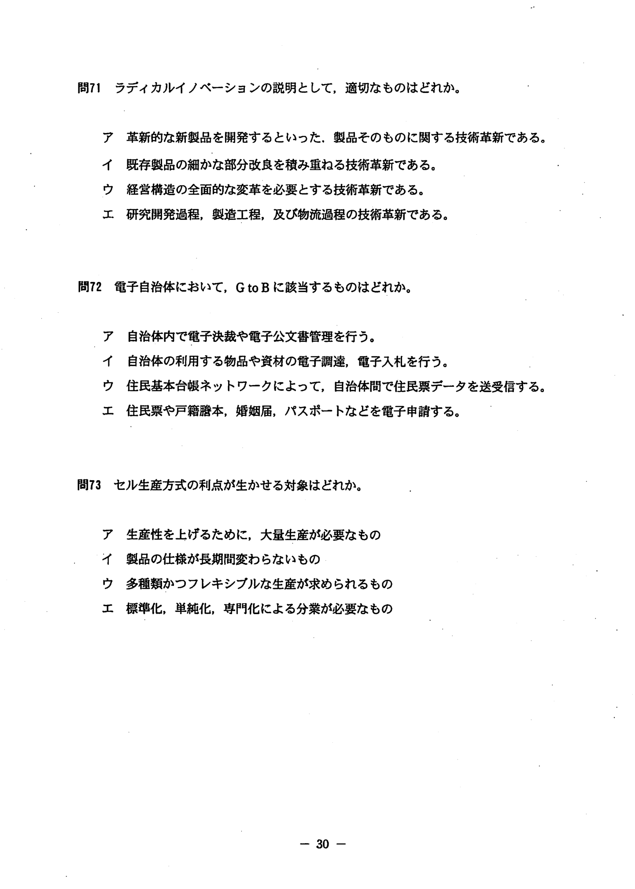

テキスト (OCR)

問71 ラディカルイノベーションの説明として, 適切なものはどれか。

革新的な新製品を開発するといった、 製品そのものに関する技術革新である。
肥存製品の細かな部分改良を積み重ねる技術革新である。

経営構造の全面的な変革を必要とする技術革新である。

研究開発過邊, 製造工程,及び物流過程の技術革新である。

H GA SN

間72 電子自治体において, GtoBに該当するものはどれか。

ア 自治体内で電子決裁や電子公文書管理を行う。

イ 自治体の利用する物品や資材の電子調達, 電子入札を行う。

ウ 住民基本台帳ネットワークによって, 自治体間で住民票データを送受信する。
エ 住民票や戸籍膳本, HWE, パスポートなどを電子申請する。

間73 セル生産方式の利点が生かせる対象はどれか。

ア 生産性を上げるために, 大量生産が必要なもの
イ 製品の仕様が長期間変わらないもの
ウ
x

多種類かつフレキシブルな生産が求められるもの
標準化単純化, 専門化による分業が必要なもの

### ページ 31

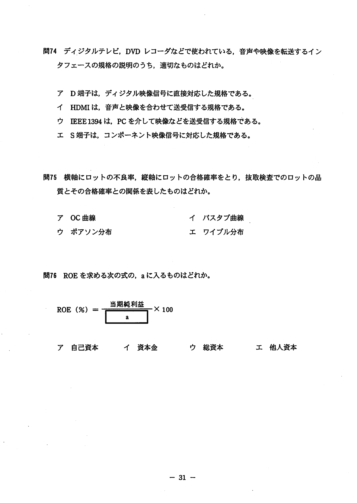

テキスト (OCR)

問74 ディジタルテレビ, DVD レコーダなどで使われている, 音声や映像を転送するイン
タフェースの規格の説明のうち, 適切なものはどれか。

D 端子は, ディジタル映像信号に直接対応した規格である。
HDMI は, 音声と映像を合わせて送受信する規格である。
TEEE1394 は, PC を介して映像などを送受信する規格である。
S 端子は, コンポーネント映像信号に対応した規格である。

hH ささふい

HTS 横軸にロットの不良率, 縦軸にロットの合格確率をとり, 抜取検査でのロットの品
質とその合格確率との関係を表したものはどれか。

ア Oc die              イ パスタフ曲線
ウ ポアソン分布           エ ワイブル分布
間76 ROE を求める次の式の, a に入るものはどれか。

当期純利益

ROE (%) =ニー一 _* 100
a    |

ア 自己資本   イ 資本金    ウ 総資本    エエ 他人資本

### ページ 32

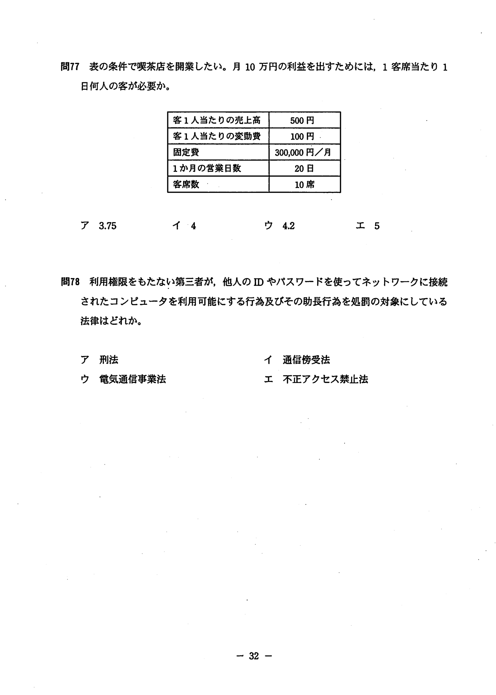

テキスト (OCR)

問77 表の条件で喫茶店を開業したい。月 10 万円の利益を出すためには, 1 客席当たり 1
日何人の客が必要か。

客 1 人当たりの売上高     500 円
客 1人当たりの変動費   100円 -

固定費        300,000 円月
1か月の営業日数      20 日
客席数           10 席
ア 3.75     イ 4       ウ 42      エ 5

間78 利用権限をもたない第三者が, 他人の ID やパスワードを使ってネットワークに接続
されたコンピュータを利用可能にする行為及びその助長行為を処罰の対象にしている
法律はどれか。

ア 刑法            イ 通信傍受法
ウ 電気通信事業法         エ 不正アクセス禁止法

### ページ 33

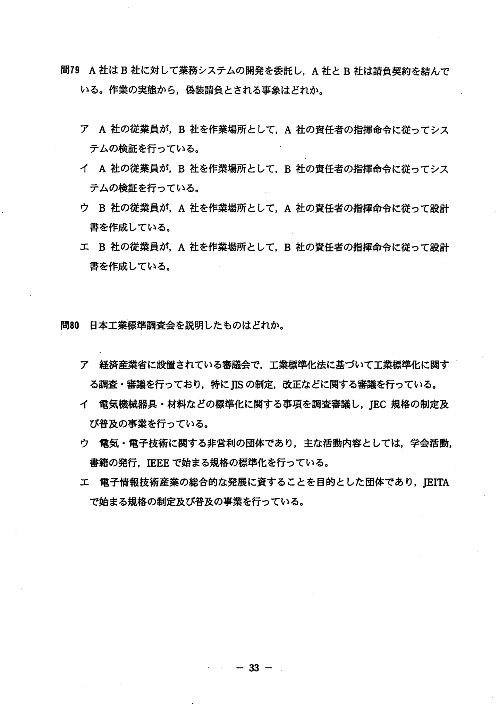

テキスト (OCR)

問79 A社はB社に対して業務システムの開発を委託し, Ae B社は請負契約を結んで
いる。 作業の実態から, 偽装請負とされる事象はどれか。

ア A 社の従業員が, B 社を作業場所として, A 社の次任者の指揮命令に従ってシス
テムの検証を行っている。                  -

4 4 社の従業員が, B 社を作業場所として, B 社の資任者の指揮命令に従ってシス
テムの検証を行っている。

ウ B 社の従業員が, A 社を作業場所として, A 社の次任者の指揮命令に従って設計
書を作成している。

エ B 社の従業員が, A 社を作業場所として, B 社の次任者の指揮命令に従って設計
書を作成している。

問80 日本工業標準調査会を説明したものはどれか。

ア 経済産業省に設置されている審議会で, 工業標準化法に基づいて工業標準化に関す
る調査・審議を行っており, 特にJIS の制定, 改正などに関する審議を行っている。

イ 電気機械器具・材料などの標準化に関する事項を調査審議し, JEC 規格の制定及
び普及の事業を行っている。

ウ 電気・電子技術に関する非営利の団体であり, 主な活動内容としては, 学会活動,
書籍の発行, IEEE で始まる規格の標準化を行っている。

L 電子情報技術産業の総合的な発展に資することを目的とした団体であり, JEITA
で始まる規格の制定及び普及の事業を行っている。

### ページ 34

テキスト (OCR)

(メモ用紙 )

ーー34 一 .

### ページ 35

テキスト (OCR)

メモ用紙)

### ページ 36

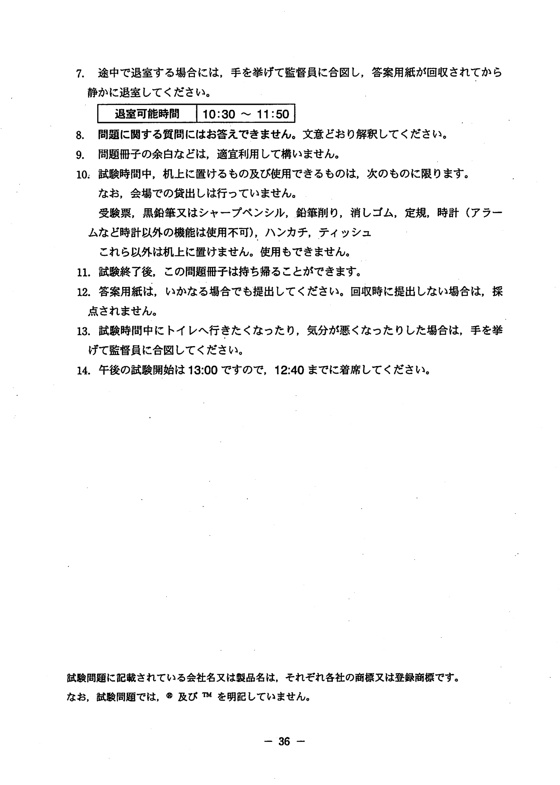

テキスト (OCR)

7. 途中で退室する場合には, 手を挙げて監督員に合図し, 答案用紙が回収されてから
静かに退室してください。
退室可能時間    10:30 ~ 11:50
問題に関する質問にはお答えできません。文意どおり解釈してください。
. 問題冊子の余白などは, 適宜利用して構いません。
10. 試験時間中, 机上に置けるもの及び使用できるものは, 次のものに限ります。
なお, 会場での貸出しは行っていません。
2BR, 黒鉛筆又はシャープペンシル, 鉛筆削り, 消しゴム, 定規, 時計 (アラー
ムなど時計以外の機能は使用不可), ハンカチ, ティッシュ
これら以外は机上に罰けません。使用もできません。
ll. 試験終了後, この問題冊子は持ち帰ることができます。
12. 答案用紙は, いかなる場合でも提出してください。回収時に提出しない場合は, 採
点されません。
13. 試験時間中にトイレへ行きたくなったり, 気分が悪くなったりした場合は, FES
げて監督員に合図してください。
14. 午後の試験開始は 13:00 ですので, 12:40 までに着席してください。

試験問題に記載されている会社名又は製品名は, それぞれ各社の商標又は登録商標です。
なお, 試験問題では, @ RU™ を明記していません。

---

## 午前解答

Copyright(c) Information-technology Promotion Agency, Japan. All rights reserved 2009 
平成21 年度 秋期 応用情報技術者試験 解答例 
 
午前試験 
問番号 
正解 
 
問番号 
正解 
問番号
正解 
問番号 
正解 
問1 
イ 
 
問21 
ウ 
問41 
エ 
問61 
イ 
問2 
エ 
 
問22 
イ 
問42 
ウ 
問62 
ア 
問3 
ウ 
 
問23 
ウ 
問43 
エ 
問63 
エ 
問4 
ウ 
 
問24 
イ 
問44 
ウ 
問64 
ウ 
問5 
イ 
 
問25 
ウ 
問45 
イ 
問65 
イ 
問6 
イ 
 
問26 
ア 
問46 
ア 
問66 
エ 
問7 
イ 
 
問27 
ウ 
問47 
ウ 
問67 
ウ 
問8 
エ 
 
問28 
ア 
問48 
ア 
問68 
ウ 
問9 
イ 
 
問29 
エ 
問49 
ウ 
問69 
ア 
問10 
イ 
 
問30 
エ 
問50 
エ 
問70 
ウ 
問11 
ア 
 
問31 
イ 
問51 
エ 
問71 
ウ 
問12 
ウ 
 
問32 
イ 
問52 
エ 
問72 
イ 
問13 
ウ 
 
問33 
エ 
問53 
エ 
問73 
ウ 
問14 
イ 
 
問34 
ア 
問54 
ア 
問74 
イ 
問15 
ア 
 
問35 
イ 
問55 
イ 
問75 
ア 
問16 
エ 
 
問36 
エ 
問56 
イ 
問76 
ア 
問17 
エ 
 
問37 
ア 
問57 
エ 
問77 
エ 
問18 
イ 
 
問38 
イ 
問58 
ウ 
問78 
エ 
問19 
ウ 
 
問39 
ア 
問59 
イ 
問79 
ウ 
問20 
ウ 
 
問40 
ア 
問60 
ア 
問80 
ア

---

## 午後問題

### ページ 1

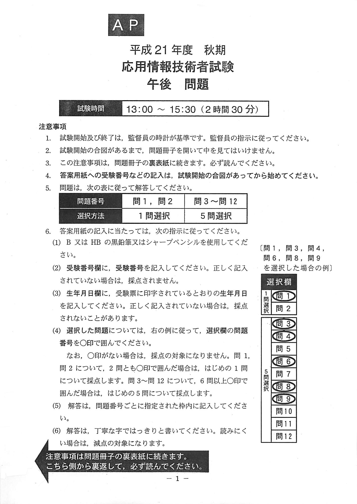

テキスト (OCR)

平成21 年度 秋期
応用情報技術者試験
午後 問題

 13:00 ~ 15:30 (2時間30 分)

注意事項

1. 試験開始及び終了は, 監督員の時計が基準です。監督員の指示に従ってください。
2. 試験開始の合図があるまで, 問題冊子を開いて中を見てはいけません。

3. この注意事項は, 問題冊子の裏表紙に続きます。必ず読んでください。
4

5

答案用紙への受験番号などの記入は, 試験開始の合図があってから始めてください。
問題は, 次の表に従って解答してください。

問題番号    問1, 問2   fj 3 ~ fa 12
選択方法    1 問選択    5 問選択

6. 答案用紙の記入に当たっては, 次の指示に従ってください。
(1) B 又は HB の黒鉛筆又はシャープペンシルを使用してくだ

(fil, 間3, 間4,

さい。                           問6, 問8, FAS
(2) 受験番号欄に, 受験番号を記入してください。正しく記入  を選択した場合の例]
されていない場合は, 採点されません。            選択欄
(3) 生年月日欄に, 受験票に印宝されているとおりの生年月日  (ELD
を記入してください。正しく記入されていないり場合は, 採点 [ETA 2
されないことがあります。                      >
(4) 選択した問題については, 右の例に従って, 選択欄の問題   Ca 4
番号を〇印で囲んでください。                  問 5

なお, 〇印がない場合は, 採点の対象になりません。間 1
問 2 について, 2 問とも〇印で囲んだ場合は, はじめの1 問
について採点します。問 3て問 12 について, 6 問以上〇印で
囲んだ場合は, はじめの 5 問について採点します。

(5) 解答は, 問題番号ごとに指定された枠内に記入してくださ

SHE
2

m | On
0

問10

い。
問11
(⑥) 解答は, 丁寧な字ではっきりと書いてください。読みにく     B12

い場合は, 減点の対象になります。

注意事項は問題冊子の裏表紙に続きます。
こちら側から裏返して,。 必ず読みでください。

### ページ 2

### ページ 3

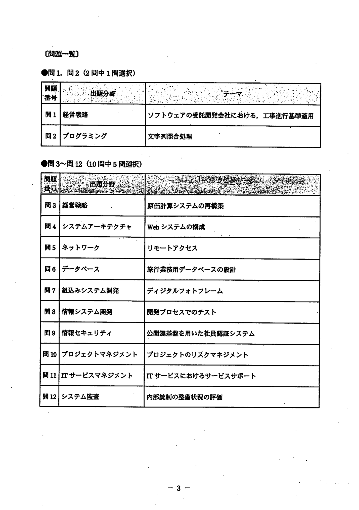

テキスト (OCR)

(問題一覧)
@較1, 2 2問中1 BRD

番号

問 1 | 経営戦略

ソフトウェアの受託開発会社における, 工事進行基準適用

癌2 | プログラミング

文字列照合処理

@問 3…賠12 (10 問中 5 BR)

問3 |経営戦略

原価計算システムの再槍築

問 4 | システムアーキテクチャ

Web VAT ADR

Fi5|/*ybkI—-Z

リモートアクセス

6 |データベース

旅行業務用データベースの設計

FA7 | 組込みシステム開発

ディジタルフォトフレーム

問 8 |情報システム開発

開発プロセスでのテスト

Flo | 情報セキュリティ

公開健基盤を用いた社員認証システム

問 10 | プロジェクトマネジメント

プロジェクトのリスクマネジメント

賠11 IITサービスマネジメント

IT サービスにおけるサービスサポボート

12) システム監査

内部統制の整備状況の評価

### ページ 4

テキスト (OCR)

次の問 1 , 問2 については 1 間を選択し, 答案用紙の選択欄の問題番号を〇印で囲
んで解答してください。
なお, 2 問とも〇印で囲んだ場合は, 問 1 について採点します。

間1

ソフトウェアの受託開発会社における, 工事進行基準適用に関する次の記述を読ん
で, 設問 1ユー4 に答えよ。

Y tld, ソフトウェアの受託開発会社である。四半期財務報告制度の導入を機に,
ソフトウェア受託開発 AF, プロジェクトという) の契約に関して, 工事収益 (以
下, 売上という) と工事原価 (以下, 原価という) の計上に, 今年度の開始月に当た
る平成 21 年4 月から, 工事進行基準を適用している。

前年度までは, プロジェクトが完了し, 成果物が検収された時点で売上や原価を一
括計上する, 工事完成基準を適用していた。

工事進行基準では, 売上の総額や予想される原価の総額, 及び決算日における工事
進捗度 (以下, 進捗度という) を合理的に把握し, これに応じて四半期ごとに売上と
原価を計上することが求められる。

進捗度の算出には, 原価比例法と EVM 法を検討した結果, 管理の容易さと普及の
状況から, 原価比例法を採用している。原価比例法は, 決算日までに実施した作業に
関して発生した原価が, 予想される原価の総額に占める割合をもって, 進捗度とする
手法である。

(プロジェクトの会計処理

(1) BECORMHSM, 開発規模などから原価を算出した後, 目標利益率を考慮し
て決定することを基本にしている。

@ プロジェクトマネージャは, プロジェクト開始前に。プロジェクトの開始了定日
から終了予定日までの月別の人件縮, 経幼などの予算を作成する。

@) プロジェクトでは, メンバから報告される作業実績時間を定期的に集計し 人件
RORMEHLTS, Kk, 受領した請求香に対する支払が承認された時点で, 経
店の実績として計上する。

(4) プロジェクトでは, 定期的に原価の実線と予算, RUTNSORMEREMBT
る。また, 状況によっては予想される原価の総額を見直す。

、 (G) 四半期ごとの原価の実績に応じて, 各四半期の売上と原価を計上する。
©) プロジェクトが完了し, 成果物が検収された時点で, 残りの売上を計上する。

ー4 一

### ページ 5

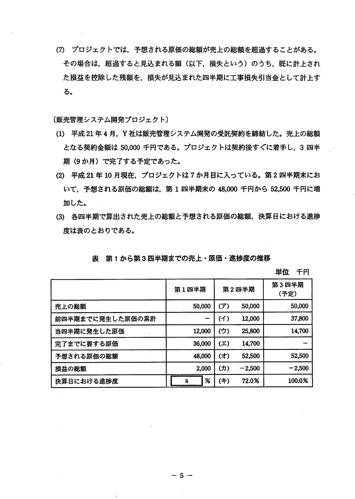

テキスト (OCR)

() プロジェクトでは, 予想される原価の総額が売上の総額を超過することがある。
その場合は, 超過すると見込まれる額 (UF, BREWS) のうち, 既に計上され
た損益を控除した残額を, 損失が見込まれた四半期に工事損失引当金として計上す
る。

(販売管理システム開発プロジェクト〕

Q①) 平成21 年4 月, Y 社は販売管理システム開発の受託契約を締結した。売上の総額
となる契約金額は 50,000 千円でやる。プロジェクトは契約後すぐに着手し, 3 四半
期 9 か月) で完了する予定であった。

(2) 平成 21 年 10 ARE, プロジェクトは 7 か月目に入っている。第 2 四半期末にお
WT, 予想される原価の総額は, 第 1 四半期末の 48,000 FAAS 52,500 千円に増
加した。

(3) 各四半期で算出された売上の総額と予想される原価の総額, 決算日における進捗
度は表のとおりである。

表 第1から第3 四半期までの売上・原価・進捗度の推移

単位 千円
pq

mime | 第2四半期 | BORE

売上の総額             50,000] (7) 50.000   _ 50,000
前四半期までに発生した原価の累計      ー| ⑦) 12.000    37,800
当四半期に発生した原価   .      12,000 | ウ) 25.800    14,700
完了までに要する原価          36,000 | (エ) 14.700     ー
予想される原価の総額         48,000 | (オ) 52.500    52,500
損益の総額             2,000 | (4) 一2.500    —2,500
決算日における進捗度      La ]%|) 72.0%   100.0%

### ページ 6

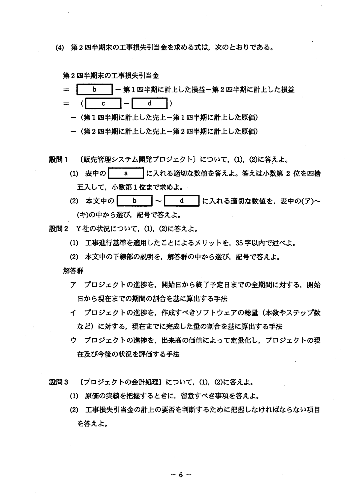

テキスト (OCR)

(4) 第2 四半期末の工事損失引当金を求める式は, 次のとおりである。

第 2 四半期末の工事損失引当金
= [| b | - 第1四半期に計上した損益一第2 四半期に計上した損益
= (Lc |-[| @ |)

ー (第1 四半期に計上した売上第 1 四半期に計上した原価)

ー (第2 四半期に計上した売上第 2 四半期に計上した原価)

設問1 [販売管理システム開発プロジェクト) について, Q①), ②⑫に答えよ。
Q) 表中の| 』 | に入れる適切な数値を答えよ。答えは小数第 2 位を四捨
五入して, 小数第 1 位まで求めよ。
⑫) 本文中の| b |~|  d |に入れる適切な数値を, 表中の(ア)て
(キ)の中から選び, 記号で答えよ。
設問2 Y社の状況について, (①), ②に答えよ。
Q) 工事進行基準を適用したことによるメリットを, 35 字以内で述べよ。 |
Q) 本文中の下線部の説明を, 解答群の中から選び, 記号で答えよ。
ER
ア プロジェクトの進捗を, 開始日から終了予定日までの全期間に対する, 開始
日から現在までの期間の割合を基に算出する手法
イ プロジェクトの進捗を, 作成すべきソフトウェアの総量 (本数やステップ数
RE) に対する, 現在までに完成した量の割合を基に算出する手法
ウ プロジェクトの進捗を, 出来高の価値によって定量化し, プロジェクトの現
在及び今後の状況を評価する手法

設問3 〔プロジェクトの会計処理) について, Q①), (②)に答えよ。
Q) 原価の実績を把握するときに, 留意すべき事項を答えよ。
②) 工事損失引当金の計上の要否を判断するために把握しなければならない項目
を答えよ。

### ページ 7

テキスト (OCR)

設問4 Y社の平成 21 年度の期末決算は, 受注したプロジェクトの状況が例年と同様で
あったとすると, 平成 20 年度と比して, 売上が増加すると考えられる。その理由
を 35 字以内で述べよ。

### ページ 8

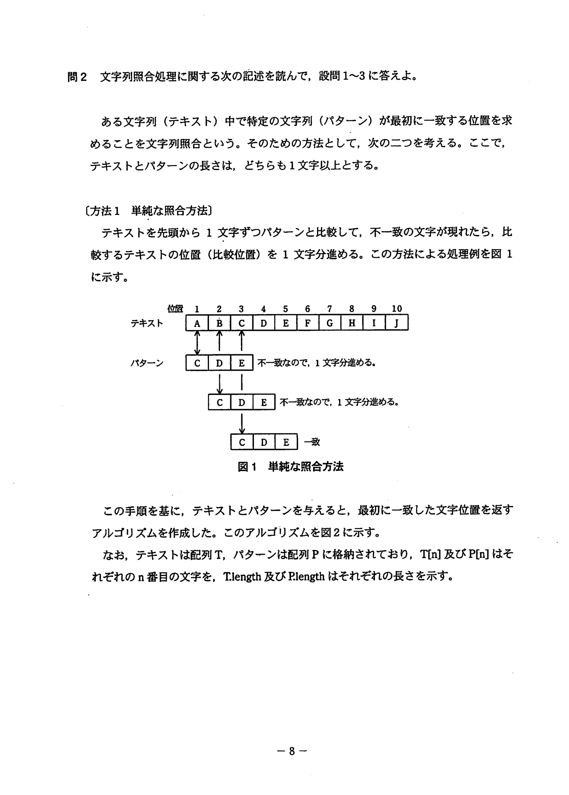

テキスト (OCR)

問2 文字列照合処理に関する次の記述を読んで, 設問 +ン3 に答えよ。

ある文字列 (テキスト) 中で特定の文字列 (パターン) が最初に一致する位置を求
めることを文字列照合という。そのための方法として, 次の二つを考える。ここで,
テキストとパターンの長さは, どちらも1文字以上とする。

Chik Maite)
テキストを先頭から 1 文字ずつパターンと比較して, 不一致の文字が現れたら, 比
較するテキストの位置(比較位置) を 1 文字分進める。この方法による処理例を図 1

に示す。

tH 1 2 3 4 5 6 7 8 9 10
sear [AlslclplEglFlelglilil

パターン   | C |D | E | ー致なので, 1 文字分進める。

C | D | E | 不一致なので, 1 文字分進める。

 1 単純な照合方法

この手順を基に, テキストとパターンを与えると, 最初に一致した文字位置を返す
アルゴリズムを作成した。このアルゴリズムを図 2 に示す。

なお, テキストは配列 T, パターンは配列 P に格納されており, TIn] 及びPln] はそ
れぞれのnr番目の文字を, Tlength 及びPlength はそれぞれの長さを示す。

### ページ 9

テキスト (OCR)

function search1(T,P)
for iを1から まで1 ずつ増やす

for ]を1から まで 1 ずつ増やす
iT[ュ一1] と P[j]が等しい    キー a
af と が等しい
return i
endif
else
break
endif
endfor
endfor
return 一1     // パターンが見つからない場合はー1 を返す
endfunction

 2 単純な照合方法のアルゴリズム

(方法2 効率的な照合方法〕

方法 1 では, パターンとテキストの文字が不一致となった場合, 比較位置を 1 文字
分進めている。ここでは, 比較位置をなるべく多くの文字数分進めることで, 照合に
おける比較回数を減らすことを考える。

パターンの末尾に対応する位置にあるテキストの文字 (判定文字) に着目すると,
次のように比較位置を進める文字数 (スキップ数) が決定できる。

Q) 判定文字がパターンに含まれていない場合は, 判定文字とパターン内の文字の比
較は常に不一致となるので, パターンの文字数分だけ比較位置を進める。また, 判
定文字がパターンの末尾だけに含まれている場合も, 同様にパターンの文字数分だ
け比較位置を進める。

(②) 判定文字がパターンの末尾以外に含まれている場合は, 判定文字と一致すひるパタ
ーン内の文字が, テキストの判定文字に対応する位置に来るように比較位置を進め
る。ただし, パターン内に判定文字と一致する文字が複数ある場合は, パターンの
末尾から最も近く (ただし, 末尾を除く) にある判定文字と一致するパターン内の
文字が, 判定文字に対応する位置に来るように比較位置を進める。

この方法による処理例を図 3 に示す。

### ページ 10

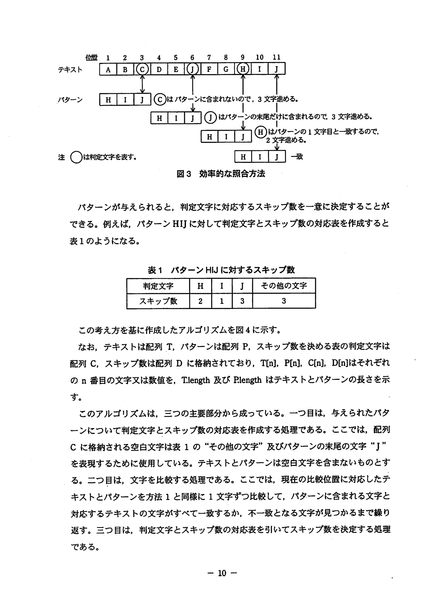

テキスト (OCR)

fH 1 2 3 4 5     10 11

テキスト  CTEM LE RET LT
パター [a [i [3 ]©e# リウタイドきまので  3 HRD.

ful[i[s] Qiars-vorweniceRnsoe 3 文字進める。

(DD)はバターンの 1 文字目と一致するので,
2 文字進める。

注 ( )は症文を表す。  に1
図3 効率的な照合方法

パターンが与えられると, 判定文字に対応するスキップ数を一意に決定することが
CHS. 例えば, パターン HI に対して判定文字とスキップ数の対応表を作成すると
表1 のようになる。

表1 パターンHIJ に対するスキップ数
判定文字   H | 1 | 」 | その他の文字
スキップ数  2  1 | 3    3

この考え方を基に作成したアルゴリズムを図 4 に示す。

なお, テキストは配列 T, パターンは配列 P, スキップ数を決める表の判定文字は
配列 C, スキップ数は配列 D に格納されており, Tin], Pin}, Cin], DInjはそれぞれ
On 番目の文字又は数値を, Tlength 及び Plength はテキストとパターンの長さを示
す。

このアルゴリズムは, 三つの主要部分から成っている。一つ目は, 与えられたパタ
ーンについて判定文字とスキップ数の対応表を作成する処理である。ここでは, 配列
C に格納される空白文字は表 1 の“その他の文字" 及びパターンの末尾の文字 “J”
を表現するために使用している。テキストとパターンは空白文字を含まないものとす
る。二つ目は, 文字を比較する処理である。ここでは, 現在の比較位置に対応したテ
キストとパターンを方法 1 と同様に 1 文字ずつ比較して, パターンに含まれる文字と
対応するテキストの文字がすべて一致するか, 不一致となる文字が見つかるまで繰り
返す。三つ目は, 判定文字とスキップ数の対応表を引いてスキップ数を決定する処理
である。

### ページ 11

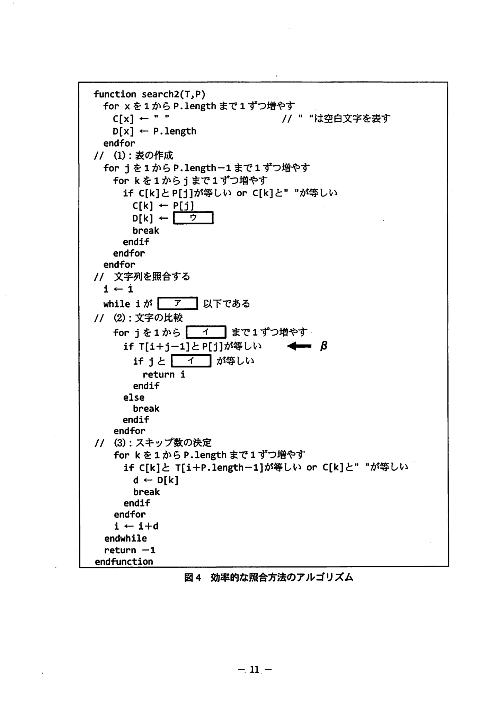

テキスト (OCR)

function search2(T,P)
for xを1からP.1ength まで 1 ずつ増やす
Clx] て" "               // " "は空白文字を表す
D[x]  P.1ength
endfor
// QQ): ROPER
for ]を1からP.1ength一1 まで 1 ずつ増やす
for kを1から})まで1 ずつ増やす
if C[k]と P[]]が等しい or C[k]と" "が等しい
C[k] + PC]
Dik] —
break
endif
endfor
endfor
// 文字列を照合する
ici
while i が 以下である
// (2): 文字の比較
for }を1から まで 1 ずつ増やす -
if TLit+j—1] & P[]]が等しい    マー Bp
if ge が等しい
return i
endif
else
break
endif
endfor
// @Q): スキップ数の決定
for kを1からP.1ength まで 1 ずつ増やす
if C[k]と T[1十P.1ength一1]が等しい or C[k]と" "が等しい
d < D[k]
break
endif
endfor
i+ itd
endwhile
return 一1
endfunction

 4 効率的な照合方法のアルゴリズム

ー 11 一

### ページ 12

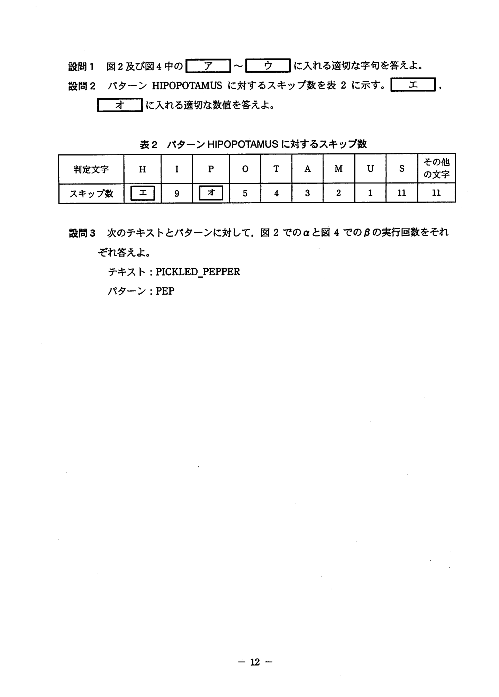

テキスト (OCR)

設問] 図2及び図4中の| ア |て| ウ |に入れる適切な字句を答えよ。
設問2 パターン HIPOPOTAMUS に対するスキップ数を表 2 に示す。 [ エ ],
 に入れる適切な数値を答えよ。

表2 パターンHIPOPOTAMUS に対するスキップ数

その他

判定文字         H         I         P        O       T       A       M       U       S      の文字

スキップ数 9 5 | 4 | 3s | 2 |ュiln| aa

設問3 次のテキストとパターンに対して, 図 2 でのと図 4 での8の実行回数をそれ
ぞれ答えよ。
テキスト : PICKLED_PEPPER
パターン : PEP

### ページ 13

テキスト (OCR)

【 メモ用紙〕

ーー 13 一

### ページ 14

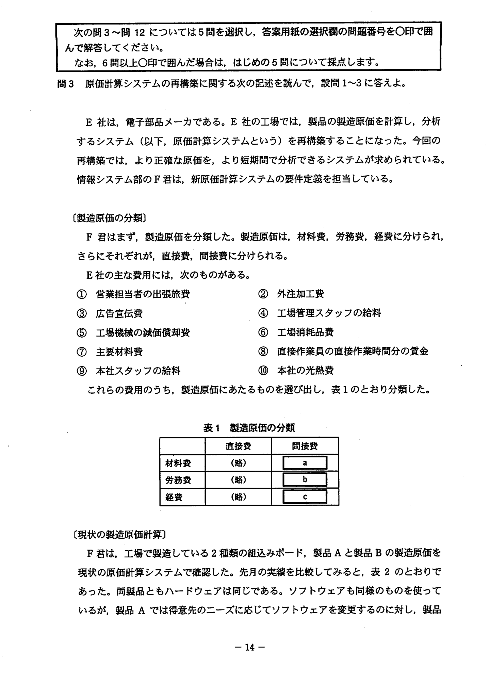

テキスト (OCR)

次の問 3 て問 12 については5 問を選択し, 答案用紙の選択拉の問題番号を〇印で囲
んで解答してください。
なお, 6 問以上〇印で囲んだ場合は, はじめの 5 問について採点します。

問3 原価計算システムの再構築に関する次の記述を読んで, 設問 13 に答えよ。

E 社は, 電子部品メーカである。E 社の工場では, 製品の製造原価を計算し, DH
するシステム (以下, 原価計算システムという) を再構築することになった。 今回の
再構築では, より正確な原価を, より短期間で分析できるシステムが求められている。
情報システム部のF 君は, 新原価計算システムの要件定義を担当している。

〔製造原価の分類)
F 君はまず, 製造原価を分類した。製造原価は, WHR, SHR, 経費に分けられ,
さらにそれぞれが, BER, 間接費に分けられる。
EHOERRAI, 次のものがある。

① 営業担当者の出張旅費       ② 外注加工費

@ 広告宣伝費            ④ 工場管理スタッフの給料

© 工場機械の減価償齋費       © 工場消耗品費

⑦ 主要材料費            ⑧ 直接作業員の直接作業時間分の賃金
⑨ 本社スタッフの給料        ⑩ 本社の光熱費

THEORAOS 4S, 製造原価にあたるものを選び出し, 表 1 のとおり分類した。

表1 製造原価の分類
直接費    FR
AER   (88)   La_]
BB   (8)   [し 5 |
ex    (88)   L<_ |

〔現状の製造原価計算)

F 君は, 工場で製造している 2 種類の組込みポード, 製品 A と製品 B の製造原価を
現状の原価計算システムで確認した。先月の実績を比較してみると, 表 2 のとおりで
あった。両製品ともハードウェアは同じである。ソフトウェアも同様のものを使って
いるが, 製品 A では得意先のニーズに応じてソフトウェアを変更するのに対し, 製品

### ページ 15

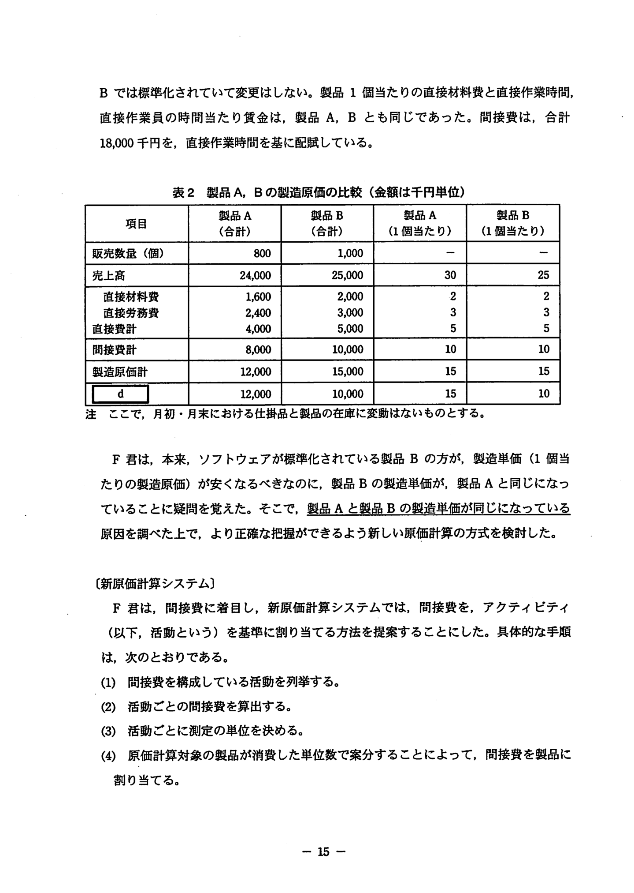

テキスト (OCR)

B では標準化されていて変更はしない。 製品 1 個当たりの直接材料費と直接作業時間,
直接作業員の時間当たり賃金は, Mh A, B とも同じであった。問接費は, 合計
18,000 千円を, 直接作業時間を基に配凡している。

表2 GMA, Bの製造原価の比較 (金額は千円単位)

項目                    製品A                 製品B                 製品A                 製品B

(合計)        (合計)      (1 個当たり)    (1 個当たり)

RFR A)                          800                   1,000                        ー                        ー
売上高                                 24.000                 25,000                       30                       25
直接材料費                         1,600                   2,000                         2                         2
直接労務費                         2,400                   3,000                         3                         3
直接費計                               4,000                   5,000                         5                         5
間接費計                               8.000                 10,000                       10                        10
製造原価計                           12,000                 15,000                       15                        15
[L« |                          12,000                 10,000                       15                        10

注 ここで, AM- ARCS SLHACRROLMICRHUAYSODCTS,

F 君は, 本来, ソフトウェアが兵準化されている製品 B の方が, 製造単価 (1 個当
たりの製造原価) が安くなるべきなのに, 製品 B の製造単価が, 製品 A と同じになっ
ていることに疑問を覚えた。そこで, 製品A と              が同じにこなっている
原因を調べた上で, より正確な把握ができるよう新しい原価計算の方式を検討した。

(新原価計算システム)
F id, MESIAL, 新原価計算システムでは, MERE, TIF ET
(以下, 活動という) を基準に割り当てる方法を提案することにした。具体的な手類
id, 次のとおりである。

Q) 問接糞を構成している活動を列挙する。

(2) 活動ごとの間接旨を算出する。

(3) 活動ごとに測定の単位を決める。

A) 原価計算対象の製品が靖旨した単位数で案分することによって, MRE BIC
割り当てる。

### ページ 16

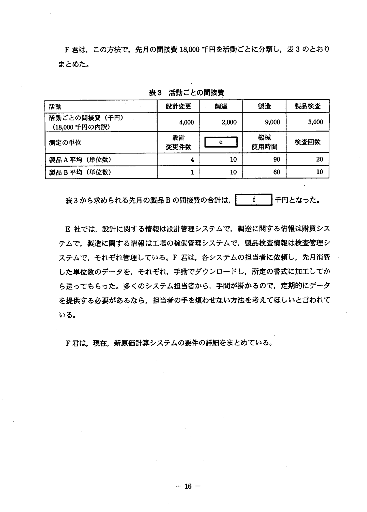

テキスト (OCR)

F 君は, この方法で, 先月の問接旨 18.000 千円を活動ごとに分類し, 表 3 のとおり

まとめた。
表3 活動ごとの間接費

活重                 設計変更    調達     製造    製品検査

活動ごとの間接費 (FA)

(18,000 千円の内訳)                                  4,000              2,000              9,000              3,000

設計          機械

測定の単位                                     交更件数 |しと | | geraeeny | BER
  製品A 平均 (単位数)                         4           10            90           20

製品B 平均 (単位数)                                 1               10               60               10

表3から求められる先月の製品 B の間接燥の合計は。 |  f | 千円となった。

E 社では, 設計に関する情報は設計管理システムで, 調達に関する情報は購買シス
テムで, 製造に関する情報は工場の稼働管理システムで, 製品検査情報は検査管理シ
ステムで, それぞれ管理している。TF 君は, 各システムの担当者に依頼し, 先月消費
した単位数のデータを, それぞれ, 手動でダウンロードし, 所定の書式に加工してか
ら送ってもらった。多くのシステム担当者から, 手間が掛かるので, 定期的にデータ
を提供する必要があるなら, 担当者の手を燥わせない方法を考えてほしいと言われて

いる。

FSi, 現在, 新原価計算システムの要件の詳細をまとめている。

### ページ 17

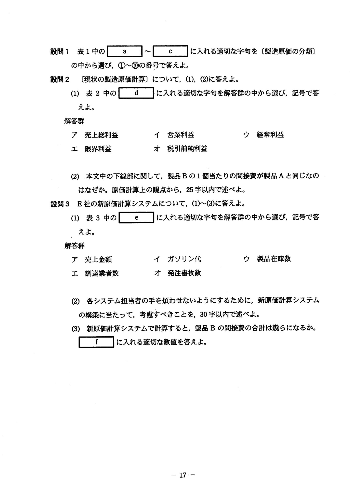

テキスト (OCR)

設問1 表1中の| a |~| c | に入れる適切な字句を製造原価の分類)
の中から選び, ①~⑩の番号で答えよ。

設問2 現状の製造原価計算〕] について, WM, ⑫に答えよ。
a) 表 2 中の|  d | に入れる適切な字句を解答若の中から選び, RECS

えよ。

解答群
ア 売上総利益    イ 営業利益      ウ 経常利益
エエ 限界利益      オ 税引前純利益

2) 本文中の下線部に関して, 製品Bの1個当たりの問接費が製品A と同じなの
はなぜか。原価計算上の観点から, 25 字以内で述べよ。
設問3 E社の新原価計算システムについて, ①⑪~(3)に答えよ。
Q) 表 3 中の[| e | に入れる適切な字名を解答群の中から選び, METS

えよ。

解答群
ア 売上金額     イ ガソリン代     ウ 製品在庫数
L 調達業者数     オ 発注書枚数

Q) .各システム担当者の手を類わせないようにするために, 新原価計算システム
の構築に当たって, 考慮すべきことを, 30 字以内で述べよ。

③) 新原価計算システムで計算すると, 製品 B の間接費の合計は幾らになるか。
| f |] に入れる適切な数値を答えよ。

### ページ 18

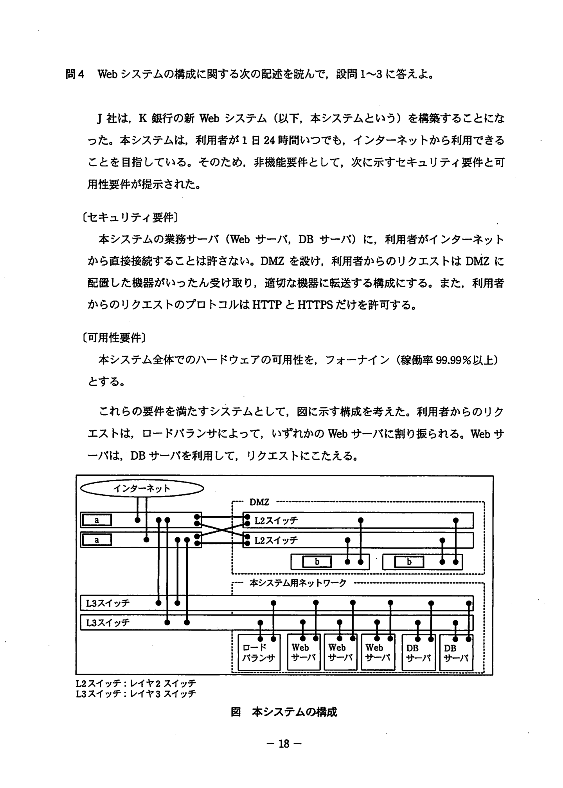

テキスト (OCR)

問4 Web システムの構成に関する次の記述を読んで, 設問 1こ3 に答えよ。

J 社は, K 銀行の新 Web システム (以下, 本システムという) を構築することにな
った。本システムは, 利用者が1 日 24 時間いつでも, インターネットから利用できる
ことを目指している。そのため, 非機能要件として, 次に示すセキュリティ要件と可
用性要件が提示された。

〔セキュリティ要件〕                                                   .

本システムの業務サーバ (Web サーバ, DB サーバ) に, 利用者がインターネット
から直接接続することは許さない。DMZ を設け, 利用者からのリクエストは DMZ に
配置した機器がいったん受け取り, 適切な機器に転送する構成にする。また, 利用者
からのリクエストのプロトコルは HTTP と HTTPS だけを許可する。

〔可用性要件
本システム全体でのハードウェアの可用性を,. フォーナイン (稼働率 99.99%以上)
とする。

これらの要件を満たすサシステムとして, 図に示す構成を考えた。利用者からのリク
エストは, ロードバランサによって, いずれかの Web サーバに割り振られる。Web +
ーバは, DB サーバを利用して, リクエストにこたえる。

<      インターネット       >
ーー DMZ
C2741 ¢¢    シート L2スイッチ         ?             |
La]    ellee      TS L2スイッチ      ?            el
Tea} Ces 芋
po 本システム用ネットワーク
| rsスイッチ [6              ?      ?     ?     ?     ?      |
|L3スイッチ     6             ?      t     ?     ?     ?     ll
$$ [eee aree     aes
ロード    Web   Web   Web    DB    DB
[ios  サーバ | | サーバ|| サーバ| |サーバ | ee

L2 スイッチ : レイヤ2 スイッチ
L3 スイッチ : レイヤ3 スイッチ

   本システムの指成

### ページ 19

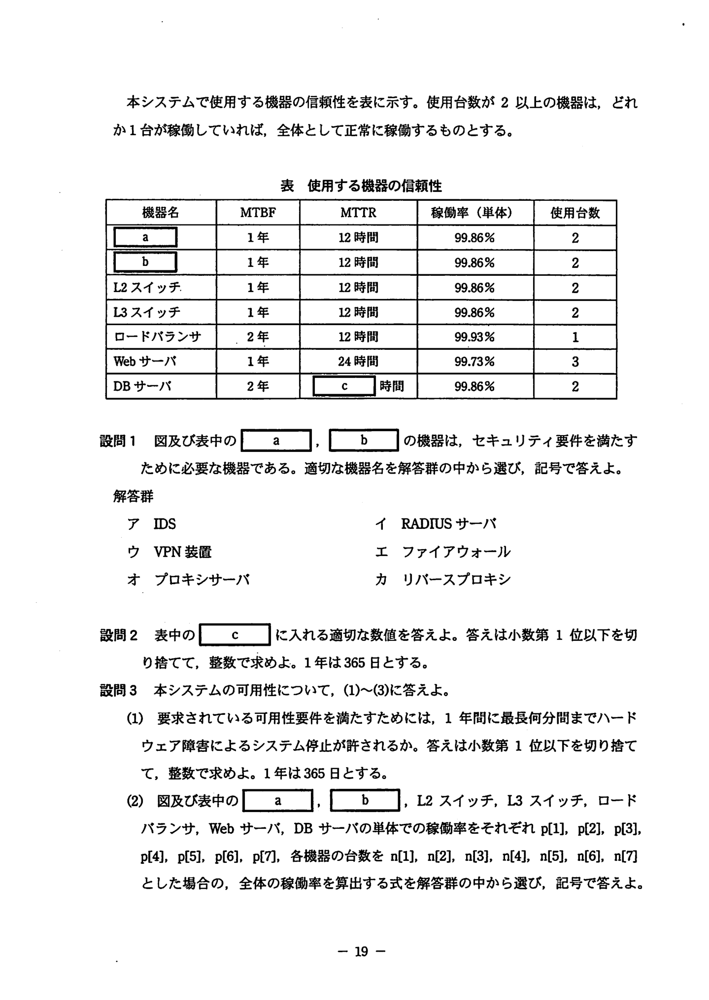

テキスト (OCR)

本システムで使用する機器の信頼性を表に示す。使用台数が 2 以上の機器は, どれ
か1 台が稼働していれば, 全体として正常に稼働するものとする。

表 使用する機器の信頼性

機器名             MTBF             MTTR           稼働率 (単体)        使用台数
La]     1 年     12 時間      99.86%     2
[5 |              1 年              12 時間                99.86%                2
L2 スイッチ                1 年                 12 時間                   99.86%                   2
L3 スイッチ                1 年                12 時間                  99.86%                  2
ロードパランサ | 2年       12 時間       99.93%       1
Web サーバ                   1 年                   24 時間                     99.73%                     3
DB サーバ                  2% | | c |時間            99.86%                   2
設問1 図及び表中の| 。 |,| > |の機器は, セキュリティ要件を満たす
ために必要な機器である。適切な機器名を解答群の中から選び, 記号で答えよ。
解答群
ァ Ds                                             4 RADIUS サーバ
ウ VPN装置                     エ ファイアウォール
A プロキシサーパ         A リバパースプロキシ

設問2 表中の[| c | に入れる適切な数値を答えよ。答えは小数第 1 位以下を切
り捨てて, 整数で求めよ。1 年は365 日とする。
設問3 本システムの可用性について, ①)て(3⑬)に答えよ。
Q) 要求されている可用性要件を満たすためには, 1 年間に最長何分間までハード
ウェア障害によるシステム停止が許されるか。答えは小数第 1 位以下を切り捨て
て, 整数で求めよ。1 年は 365 日とする。
⑫) 図及び表中の| ai |,]  b |, L2 スイッチ, L3 スイッチ, ロード
パランサ, Web サーバ, DB サーパの単体での稼働率をそれぞれ pil], p[2], p[31
pl4], p[5], p[6], p[Z], 各機器の台数を nh1], n[21, n[31, nl41, nl51, nl6], n[7]
とした場合の, 全体の稼働率を算出する式を解答群の中から選び, 記号で答えよ。

### ページ 20

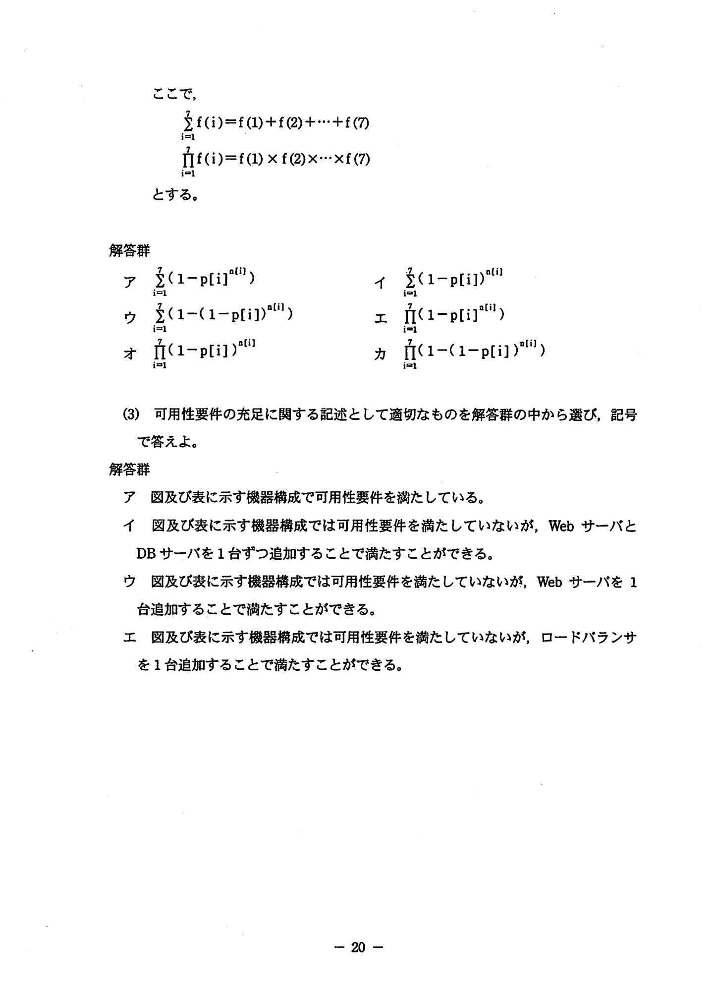

テキスト (OCR)

ここで,
SEH +E t+]
i=l

Tif (i) =£) x £2) x x£(7)

isl

とする。
RE
ア 3u-pti の)       イ $(ューpti])
             i=l
ウ 0-C-plip™)     x fa-pti"")
ォ Tn-pri)       本1-G-pt)

ist                                                                    ja1

3) 可用性要件の充足に関する記述として適切なものを解答群の中から選び, 記号

で答えよ。
EH

ア 図及び表に示す機器構成で可用性要件を満たしている。

4 図及び表に示す機器構成では可用性要件を満たしていないが, Web サーバと
DB サーバを 1 台ずつ追加することで満たすことができる。

ウ 図及び表に示す機器構成では可用性要件を満たしていないが, Web サーバを 1
台追加することで満たすことができる。

エエ 図及び表に示す機器構成では可用性要件を満たしていないが, ロードパランサ
を1 台追加することで満たすことができる。

### ページ 21

テキスト (OCR)

(メモ用経)

### ページ 22

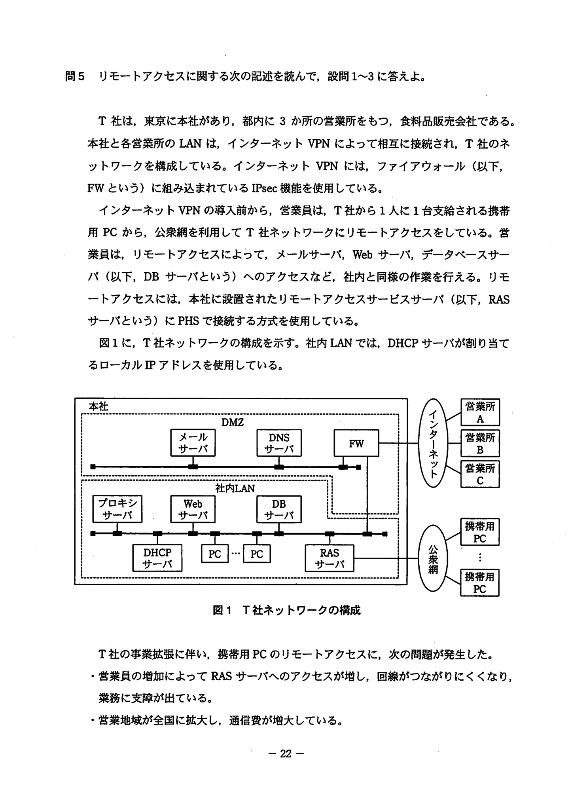

テキスト (OCR)

問5

リモートアクセスに関する次の記述を読んで, 設問 13 に答えよ。

T 社は, 東京に本社があり, 都内に 3 か所の営業所をもつ, 食料品販売会社である。
本社と各営業所の LAN は, インターネット VPN によって相互に接続され, T 社のネ
ットワークを構成している。インターネット VEN には, ファイアウォール (以下,
FW という) に組み込まれている IPsec 機能を使用している。

インターネット VPN の導入前から, 営業員は, THES 1 人に1 台支給される携帯
用 PC から, 公衆網を利用して T 社ネットワークにリモートアクセスをしている。営
Mal, リモートアクセスによって, メールサーパ, Web サーバ, データベースサー
N (以下, DB サーパバという) へのアクセスなど, 社内と同様の作業を行える。リモ
ートアクセスには, 本社に設置されたりリモートアクセスサービスサーバ (以下, RAS
サーパという) にPHS で接続する方式を使用している。

図 1 に, T社ネットワークの構成を示す。社内 LAN では, DHCP サーバが割り当て
るローカル TP アドレスを使用している。

本社                             営業所
DMZ               りり   A
メール     DNS           タ | |営業所
サーバ     サーバ     FW     4   B
.        aa      aa    os      ト  営業所
社内LAN                  ウ
プロキシ    Web      DB

サーバ    サーバ     サーバ              aan
DHCP   rc |--[ pc     RAS        BR) .

ee] Csl-C) (Bs.       a)
携帯用

PC

図1 T社ネットワークの構成

T社の事業拡張に伴い, 携帯用 PCのリモートアクセスに, 次の問題が発生した。

・営業員の増加によって RAS サーパへのアクセスが増し, 回線がつながりにくくなり,
業務に支障が出ている。

・営業地域が全国に拡大し, 通信費が増大している。

### ページ 23

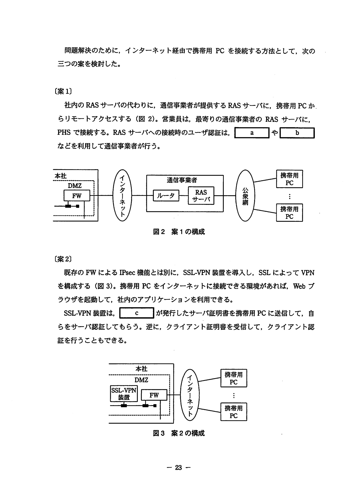

テキスト (OCR)

問題解決のために, インターネット経由で携帯用 PC を接続する方法として, 次の
三つの案を検討した。

(#1)

社内の RAS サーバの代わりに, 通信事業者が提供する RAS サーバに, 携帯用PC か.
らリモートアクセスする (図 2)。営業員は, 最寄りの通信事業者の RAS サーバに,
PHS で接続する。RAS サーバへの接続時のユーザ認証は, | 。 lel b |
などを利用して通信事業者が行う。

a     t         通信事業才                 用
タ               RAS       公
teh i   BSA &        3
ツ                                携帯用
ト                                 PC
図2 案1の構成

(#2)

既存のFW による IPsec 機能とは別に, SSL-VPN 装置を導入し, SSL によって VPN

を構成する (図 3)。携帯用 PC をインターネットに接続できる環境があれば, Web 7
ラウザを起動して, 社内のアプリケーションを利用できる。

SSL-VPN 装置は, が発行したサーバ証明書を携帯用 PC に送信して, 自
らをサーパ認証してもらう。逆に, クライアント証明和書を受信して, クライアント認
証を行うこともできる。

本社
携帯用
DMZ                  ィ                 PC
SSL-VFN                       タ
装置     Lv TH | ま                   :
ッ               携帯用
ト                 PC
 3 案2の構成

### ページ 24

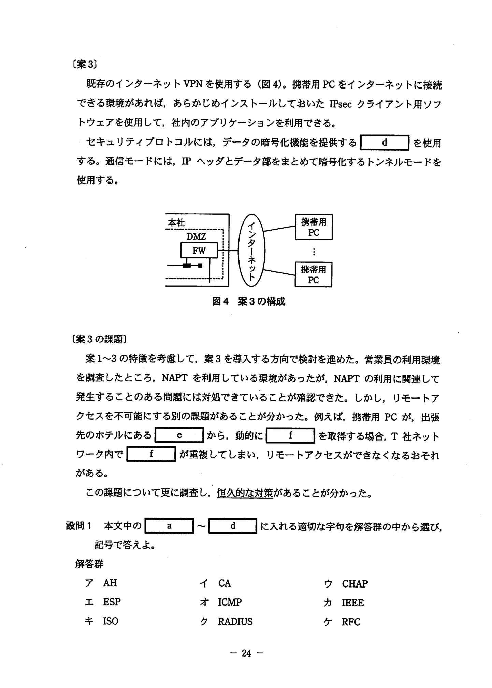

テキスト (OCR)

(#3)

既存のインターネット VPN を使用する (Bld). 携帯用 PC をインターネットに接続
できる環境があれば, あらかじめインストールしておいた IPsec クライアント用ソフ
トウェアを使用して, 社内のアプリケーションを利用できる。

セキュリティプロトコルには, データの喧号化機能を提供する|  d | を使用
する。通信モードには, TP ヘッダとデータ部をまとめて暗号化するトンネルモードを
使用する。

本社       ィ     的用

“DMZ |  ン     PC
FW        7
in:

y                   携帯用

ト     PC

図4 案3の構成

〔案 3 OBB)

案 1ご3 の特徴を考慮して, HI を導入する方向で検討を進めた。営業員の利用環境
を調査したところ, NAPT を利用している環境があったが, NAPT の利用に関連して
発生することのある問題には対処できていることが確認できた。しかし, リモートア
クセスを不可能にする別の課題があることが分かった。例えば, 携帯用 PC が, 出張
先のホテルにある| ce |から, 動的に[| f |] を取得する場合,T 社ネット
ワーク内で| f  ] が重複してしまい, リモートアクセスができなくなるおそれ
がある。

この課題について更に調査し, 恒久的な対策があることが分かった。

設問1 本文中の| a |~[ d |に入れる適切な字句を解答群の中から選び

記号で答えよ。
解答群

ア AH      イ CA       ウ CHAP
x ESP        オ ICMP         カ IEEE
キ ISO        ク RADIUS       ケ RFC

### ページ 25

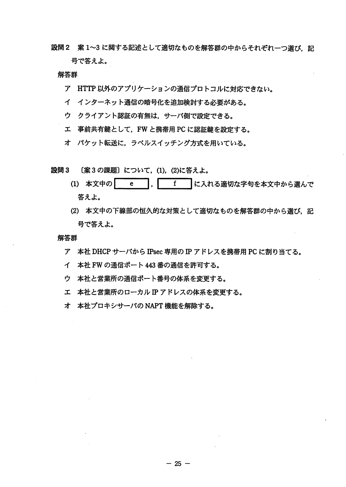

テキスト (OCR)

設問2 案1ご3 に関する記述として適切なものを解答群の中からそれぞれ一つ選び, 記
号で答えよ。

解答群

HTTP 以外のアプリケーションの通信プロトコルに対応できない。

インターネット通信の暗号化を追加検討する必要がある。

クライアント認証の有無は, サーパ側で設定できる。

事前共有鍵として, FW と携帯用 PC に認証鍵を設定する。

パケット転送に。 ラベルスイッチング方式を用いている。

きキ Hさへぺい

設問3 〔案3 ORB) OWT, ①⑪, ②)に答えよ。

@ 本文中の|  e |,|  f |に入れる適切な字句を本文中から選んで
答えよ。
(②) 本文中の下線部の恒久的な対策として適切なものを解答群の中から選び, 記
号で答えよ。
解答群

本社 DHCP サーパから TPsec 専用の TP アドレスを携帯用 PC に割り当てる。
本社FW の通信ポート 443 番の通信を許可する。

本社と営業所の通信ポート番号の体系を変更する。

本社と営業所のローカル PE アドレスの体系を変更する。

本社プロキシサーパの NAPT 機能を解除する。

MH GAN

### ページ 26

テキスト (OCR)

問6 旅行業務用データベースの設計に関する次の記述を読んで, 設問1て3 に答えよ。

旅行会社である Z 社では, 四半期ごとにパッケージツアー (以下, ツアーという) の
計画を作成し, 発売開始後, 申込みを受け付ける。Z 社には, 本社のほかに, 地域ごと
に支店があり, ツアーの申込みは, インターネットてと支店店頭の両方で行える。また.,
ツアーの申込みに関するデータは, 本社のデータベースで一括して管理する。

(ツアー〕
・ツアーにはツアーコードが付されている。ツアーの内容が同じであれば, 出発日が
異なってもツアーコードは同じであるが, 日数が異なればツアーコードは異なる。
・ツアーは, ツアーコードが同じでも, 出発日によって価格が異なることがある。

〔ツアーに関する業務]

・ツアーの申込みを受け付けたときには, 申込番号, 申込者の顧客番号, 申込日, 申
し込んだツアーのツアーコード, そのツアーの出発日, 参加人数を登録する。新規
の願客の場合には顧客番号を新たに設定し, 顧客の氏名, 住所, 郵便番号, 電話番
号, 電子メールアドレスを登録する。

・ツアーを申し込んだ顧客には, 店頭での申込みかインターネットからの申込みかに
かかわらず, それ以降, 支店から四半期ごとにツアーなどに関する情報をダイレク
トメールで送付する。 顧客を担当する支店は, 顧客の郵便番号によって決めている。
発送は, その時点で担当となっている支店が行う。なお, 支店問の業務量の均等化
のために, 担当秀囲を随時見直すことにしている。

〔データベースの設計〕

・E-R 図を作成してテーブル設計を行った結果, ツアーテーブル, 申込みテーブル,
願客テーブル, 支店テーブルの四つのテーブルから成るデータベースを作成するこ
とにした。

・E-R 図を図 1 に, 設計したテーブルを表 1 に示す。なお, 表 1 において, 下線の引
かれた列名は, 主キーである。

### ページ 27

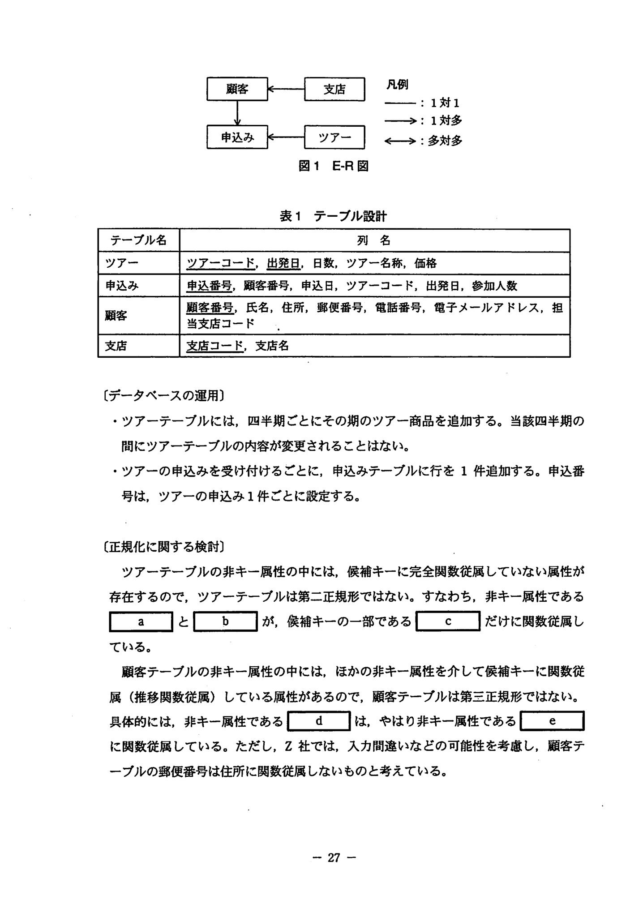

テキスト (OCR)

BE      支店   凡例
ーー : 1対1
ーータテ: 1対多
申込み       ツアー    <> : 多対多
図1 E-R図
表1 テーブル設計
テーブル名               列 名
ツアー     ツアーコード, 出発日, 日数, ツアー名称, 価格
申込み     申込番号, 顧客番号, 申込日,ツアーコード, 出発日, 参加人数
me      顧客番号, 氏名, 住所, 郵便番号, 電話番号, 電子メールアドレス, 担
当支店コード
支店      支店コード, 支店名

〔データベースの運用〕
・ツアーテーブルには, 四半期ごとにその期のツアー商品を追加する。当訪四半期の
間にツアーテーブルの内容が変更されることはない。
・ツアーの申込みを受け付けるごとに, 申込みテーブルに行を 1 件追加する。申込番
Bid, ツアーの申込み 1 件ごとに設定する。

(正規化に関する検討

ツアーテーブルの非キー属性の中には, 候補キーに完全関数従属していない属性が
存在するので, ツアーテーブルは第二正規形ではない。すなわち, 非キー展性である
[a |と[ b |] が, 伺補キーの一部である|  c |] だけに関数従属し
ている。

展客テーブルの非キー属性の中には, ほかの非キー属竹を介して候補キーに関数従
属 (推移関数従属) している履性があるので, 属客テーブルは第三正規形ではない。
具体的には, 非キー属性である| d_ |は, やはり非キー属性である[| ce |
に関数従属している。ただし, Z 社では, 入力間人違いなどの可能性を考慮し, BET
ーブルの郵便番号は住所に関数従属しないものと考えている。

### ページ 28

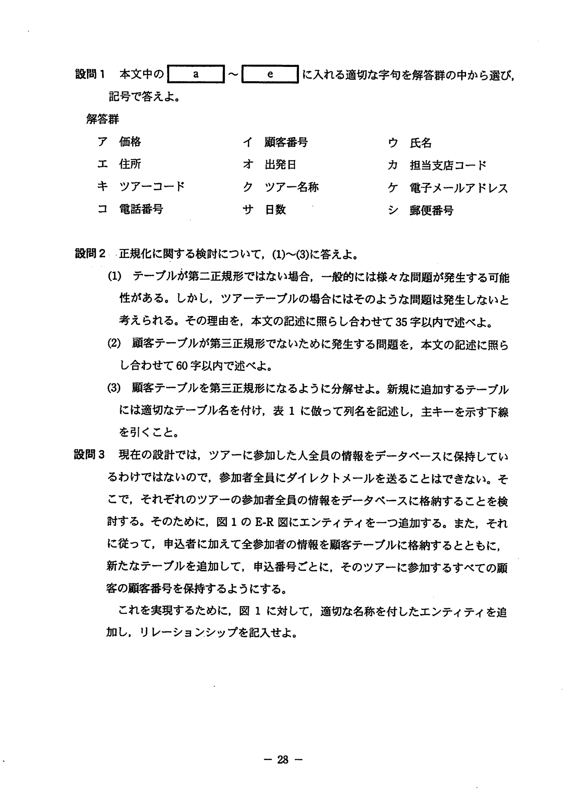

テキスト (OCR)

設問1 本文中の}】 a |て|  e |に入れる適切な字句を解答群の中から選び,

記号で答えよ。

解答群

ア 価格         イ 顧客番号       ウ 氏名

x 住所         オ 出発日        A 担当支店コード

キ ツアーコード     ク ツアー名称      ケ 電子メールアドレス
コ 電話番号       サ 日数      シ 郵便番号

設問2 正規化に関する検討について, ①ぐて(3)に答えよ。
(①) テーブルが第二正規形ではない場合 一般的には様々な問題が発生する可能
性がある。しかし, ツアーテーブルの場合にはそのようかな問題は発生しないと
考えられる。その理由を, 本文の記述に照らし合わせて 35 字以内で述べよ。
2) 顧客テーブルが第三正規形でないために発生する問題を, AMOMMITRS
し合わせて 60 字以内で述べよ。
(3③) 顧客テーブルを第三正規形になるように分解せよ。新規に追加するテーブル
には適切なテーブル名を付け, 表 1 に人って列名を記述し, 主キーを示す下線
を引くこと。
設問3 現在の設計では, ツアーに参加した人全員の情報をデータベースに保持してい
るわけではないので, 参加者全員にダイレクトメールを送ることはできない。そ
こで, それぞれのツアーの参加者全員の情報をデータベースに格納することを検
討する。そのために, 図 1 のE-R 図にエンティティを一つ追加する。また, それ
に従って, 申込者に加えて全参加者の情報を顧客テーブルに格納するとともに,
新たなテーブルを追加して, 申込番号ごとに, そのツアーに参加するすべての顧
客の顧客番号を保持するようにする。
これを実現するために, 図 1 に対して, 適切な名称を付したエンティティを追
ML, リレーションシップを記入せよ。

### ページ 29

テキスト (OCR)

CA 用 紙 〕

ー.29 一

### ページ 30

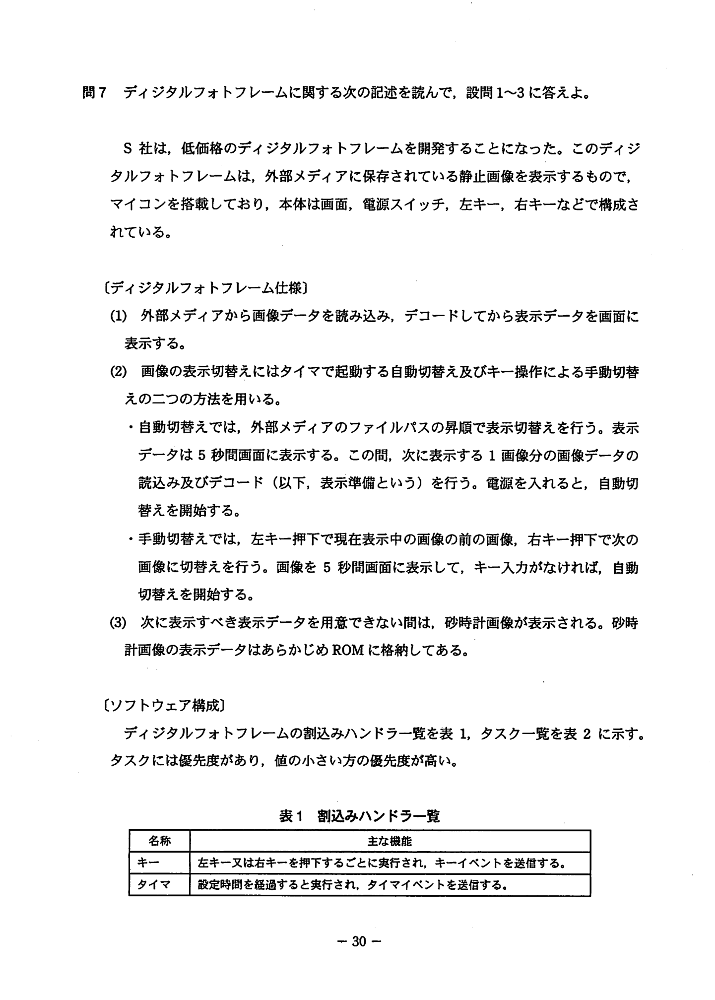

テキスト (OCR)

FIT ディジタルフォトフレームに関する次の記述を読んで, 設問 1ご3 に答えよ。

S Hid, 低価格のディジタルフォトフレームを開発することになった。このディジ
タルフォトフレームは, 外部メディアに保存されている静止画像を表示するもので
マイコンを搭載しており, 本体は画面, 電源スイッチ, 左キー, 右キーなどで構成さ
れている。

〔ディジタルフォトフレーム仕様〕
(Ql) 外部メディアから画像データを読み込み。 デコードしてから表示データを画面に
表示する。
2) 画像の表示切替えにはタイマで起動する自動切替え及びキー操作による手動切替
えの二つの方法を用いる。
・自動切替えでは, 外部メディアのファイルパスの昇順で表示切替えを行う。表示
データは 5 秒間画面に表示する。 COM, 次に表示する 1 画像分の画像データの
読込み及びデコード (以下, 表示準備という) を行う。電源を入れると, AMD
替えを開始する。
・手動切替えでは, 左キー押下で現在表示中の画像の前の画像, 右キー押下で次の
画像に切替えを行う。画像を 5 秒間画面に表示して, キー入力がなければぱば, 自動
切替えを開始する。
(3) 次に表示すべき表示データを用意できない間は, 砂時計画像が表示される。砂時
計画像の表示データはあらかじめ ROM に格納してある。

〔【ソフトウェア構成〕
ディジタルフォトフレームの割込みハンドラーー覧を表 1, タスク一覧を表 2 に示す。
タスクには優先度があり, 値の小さい方の優先度が高い。

表1 割込みハンドラー覧
名称                  主な機能
キー   左キー又は右キーを押下するごとに実行され, キーイベントを送信する。
タイマ | 設定時間を経過すると実行され, タイマイベントを送信する。

### ページ 31

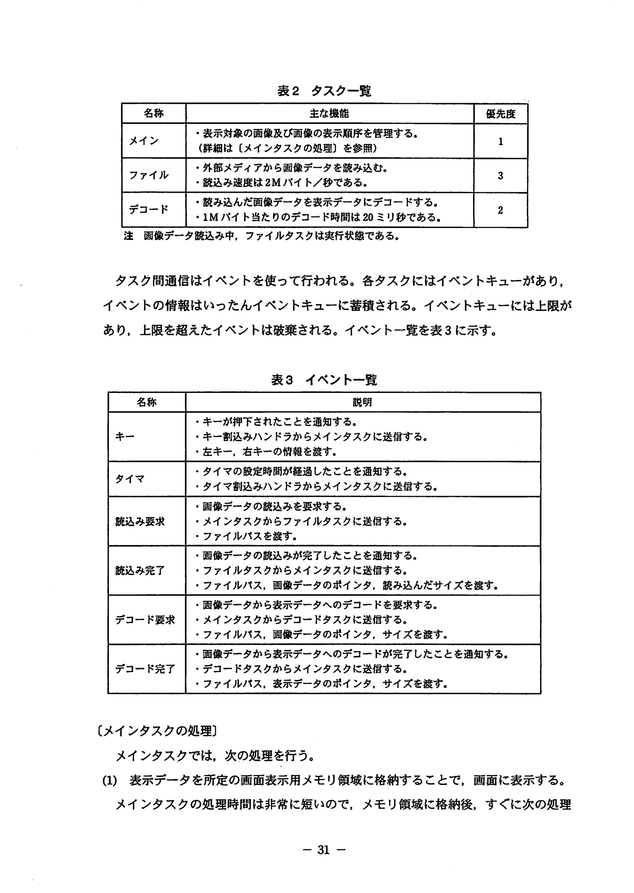

テキスト (OCR)

表2 タスク一覧

名称               主な機能              優先度
メイン   ・表示対象の画像及び画像の表示願庁を管理する。
(詳細は 〔メインタスクの処理〕 を参照)
ファイル  MBAT 4 TOSMRIT—F ERHAD.          3
+ PHAM 2M バイトノ秒である。
デコード  ・読み込んだ画像データを表示データにデコードする。     2
・1M パイト当たりのデコード時間は 20 ミリ秒である。

注 画像データ謎込み中, ファイルタスクはに実行状態である。

タスク間通信はイベントを使って行われる。各タスクにはイベントキューがあり,
イベントの情報はいったんイベントキューに敬積される。イベントキューには上限が

あり, 上限を超えたイベントは破棄される。イベント一覧を表 3 に示す。

表3 イベント一覧

名称

説明

・キーが押下されたことを通知する。
・キー割込みハンドラからメインタスクに送信する。
・左キー, 右キーの情報を渡す。

タイマ

・タイマの設定時間が経過したことを通知する。
・タイマ割込みハンドラからメインタスクに送信する。

読込み要求

・画像データの読込みを要求する。
・メインタスクからファイルタスクに送信する。
・ファイルパスを渡す。

読込み完了

・瑞像データの説込みが完了したことを通知する。
・ファイルタスクからメインタスクに送信する。
・ファイルパス, 画像データのポインタ, 読み込んだサイズを渡す。

デコード要求

・固像データから表示データへのデコードを要求する。
・メインタスクからデコードタスクに送信する。
・ファイルパス, 机像データのポインタ, サイズを渡す。

・面像データから表示データへのデコードが完了したことを通知する。
・デコードタスクからメインタスクに送信する。
・ファイルパス, 表示データのポインタ, サイズを渡す。

(メインタスクの処理)
メインタスクでは, 次の処理を行う。

Q) 表示データを所定の画面表示用メモリ領域に格納することで, 画面に表示する。
メインタスクの処理時間は非常に短いので, メモリ令域に格納後, すぐに次の処理

### ページ 32

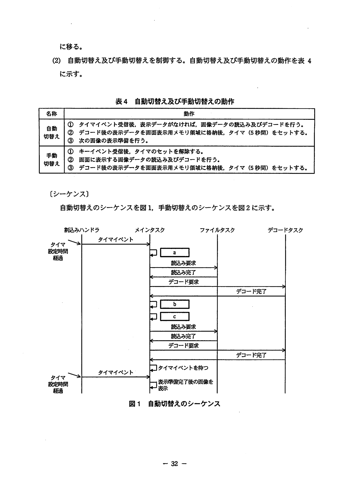

テキスト (OCR)

に移る。
2) 自動切奉え及び手動切替えを制御する。自動切替え及び手動切替えの動作を表 4

に示す。

表4 自動切替え及び手動切替えの動作

名称                                                動作
自動    OD タイマイベント受信後, 表示データがなければ, 画像データの読込み及びデコードを行う。
切替え  ⑫ デコード後の表示データを画面表示用メモリ傾域に格納後. タイマ (5 秒間) をセットする。
③ 次の面像の表示準備を行う。
手動    D キーイベント受信後, タイマのセットを解除する。
切替え  @ 画面に表示する画像データの謗込み及びデコードを行う。
⑬ デコード後の表示データを画面表示用メモリ傾域に格納後, タイマ (5 秒問) をセットする。
(Y-7 YZ)

自動切替えのシーケンスを図 1, 手動切替えのシーケンスを図 2 に示す。

デコードタスク

割和みハンドラ               メインタスク               ファイルタスク
タイマユ      タイマイベント
設定時間
sea                              C2]
BADER
読込み完了
デコード要求
デコード完了
a 5 1
して 明
BADER
BABSET
デコード要求
デコード完了
ore      タイマイベント      しコタイマイベントを待つ
設定時間                               表示準備完了後の画像を
a                              an
 1 自動切替えのシーケンス

### ページ 33

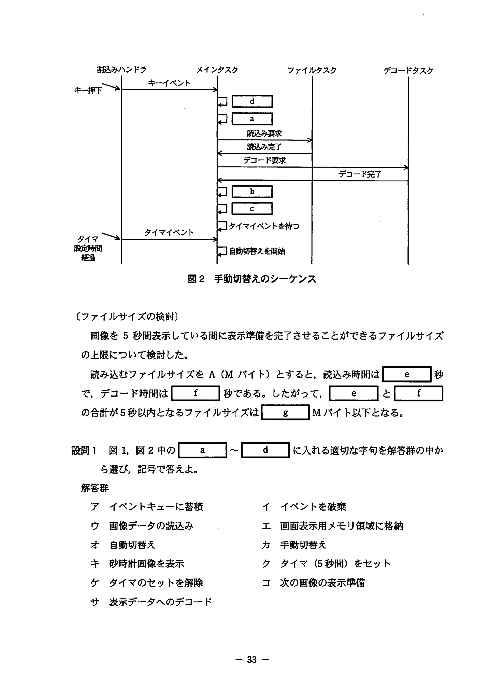

テキスト (OCR)

割込みハンドラ           メインタスク           ファイルタスク           デコードタスク

~~,        キーイベント
し s
しょ1
BADER
BART
デコード要求
デコード完了
し 511
して 明
~.     タイマイベント     しコタイマイベントを待つ
タイマ
wee                                  J] ear eas
図2 手動切替えのシーケンス
〔ファイルサイズの検討]

画像を 5 秒間表示している問に表示準備を完了させることができるファイルサイズ
の上限について検討した。

読み込むファイルサイズを A (M バイト) とすると, 読込み時間は|  e |秒
で, デコード時間は | f | 秒である。したがって,[ se ]と[ fi |
の合計が5 秒以内となるファイルサイズは|  g |] Mバイト以下となる。

設問1 図1, 図2中の| a |て|  d |に入れる適切な字句を解答群の中か
ら選び, 記号で答えよ。

RSH
ア イベントキューに敬積      イ イベントを破棄
ウ 画像データの読込み       エエ 画面表示用メモリ令域に格納
オ 自動切替え           カ 手動切替え
キ 砂時計画像を表示        ク タイマ (5秒間) をセット
ケ タイマのセットを解除      コ 次の画像の表示準備
サ 表示データへのデコード

### ページ 34

テキスト (OCR)

設問2 右キーを連続押下したとき, 押下回数の分の画像が表示されない現象が発生し
た。この原因を 20 字以内で述べよ。なお, 動作中は外部メディアを抜き出せない。

wes 本文中の[ e |,| f | に入れる適切数式,及び[ g |に
入れる適切な数値を答えよ。 数値は小数第 2 位以下を切り捨てて小雪第 1 位まで
求めよ。

### ページ 35

テキスト (OCR)

(メモ用紙〕

### ページ 36

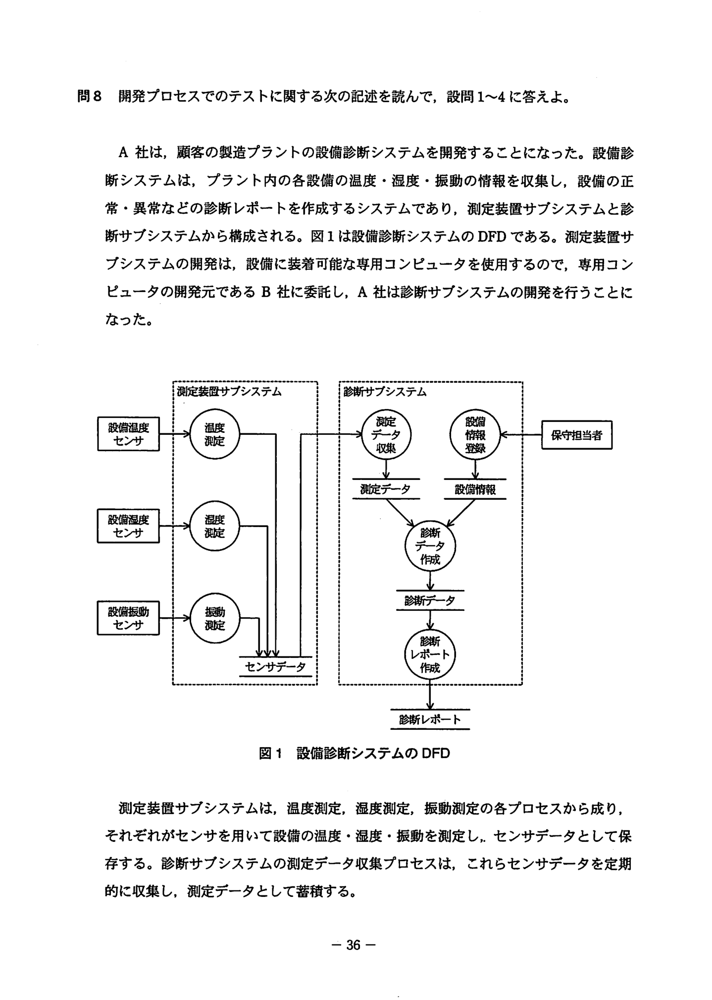

テキスト (OCR)

問8 開発プロセスでのテストに関する次の記述を読んで, 設問1て4 に答えよ。

A 社は, 顧客の製造プラントの設備診断システムを開発することになった。設備診
断システムは, プラント内の各設備の温度・湿度・振動の情報を収集し, 設備の正
常・異常などの診断レポートを作成するシステムであり, 測定装置サプシステムと診
断サプシステムから構成される。図 1 は設備診断システムの DFID CHS. 測定装置サ
ブシステムの開発は, 設備に装着可能な専用コンピュータを使用するので, 専用コン
ピュータの開発元である B 社に委託し, A 社は診断サブシステムの開発を行うことに

なった。

測定装置サプシステム

診断サプシステム

測定装置サプシステムは, 温度測定, 湿度測定, 振動測定の各プロセスから成り,
それぞれがセンサを用いて設備の温度・湿度・振動を測定し. センサデータとして保
存する。診断サプシステムの測定データ収集プロセスは, これらセンサデータを定期

センサデータ

whe    ec
データ   情報
収集    SR

設備情報

測定データ

診断データ

Bt
レポート
作成

保守担当者

診断レポボート

 1 設備診断システムの DFD

的に収集し, 測定データとして菩積する。

### ページ 37

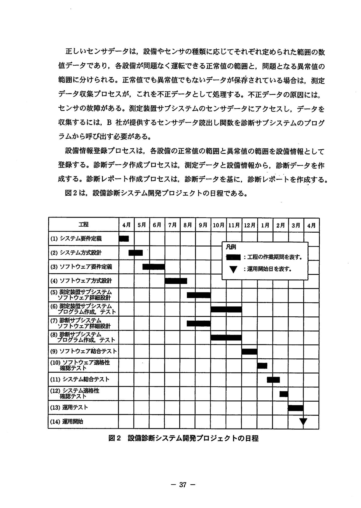

テキスト (OCR)

正しいセンサデータは, 設備やセンサの種類に応じてそれぞれ定められた範囲の数
値データであり, 各設備が問題なく運転できる正常値の賜囲と, 問題となる異常値の
範囲に分けられる。正常値でも異常値でもないデータが保存されている場合は, 測定
データ収集プロセスが, これを不正データとして処理する。不正データの原因には
センサの故障がある。 測定装置サブシステムのセンサデータにアクセスし, データを
収集するには, B 社が提供するセンサデータ読出し関数を診断サブシステムのプログ
ラムから呼び出す必要がある。

設備情報登録プロセスは, 各設備の正常値の範囲と暴常値の範囲を設備情報として
登録する。診断データ作成プロセスは, 測定データと設備情報から, 診断データを作
成する。診断レポート作成プロセスは, 診断データを基に, 診断レポートを作成する。

図2 は, 設備診断システム開発プロジェクトの日程である。

1g    4月| 5月| 6月| 7A | 8A | 9月|10月|11月|12月| 1A | 2月| 3A | 4月
(1) システム要件定義  | |
-          Aa          |
(2) システム方式設計    | |

ae : 工短の作泉期間を表す。

(3③ ソフトウェア要人中毅           し                       V :通用開始日を表す。

(4) ソフトウェア方式疫計
5) MERE TL ATA
© TR aa
6) MERE STATA
ログラム作成 テスト

ソフトウェア詳細設肝

3)      プシステム
プログラム作成・テスト

ーー
ニー
(1) 診断サブシステム                                      レー|
ーー

(9) ソフトウェア結合テスト                                                  一

10) Jo ho = Fae
OO er                            中

(11) システム結合テスト                                                                                          =

(12) システム適格性
poeeas                                                                                                し|

(13) BAF                                                                                                                  |

(14) 運用開始                                                                                                ャ

図2 設備診断システム開発プロジェクトの日程

### ページ 38

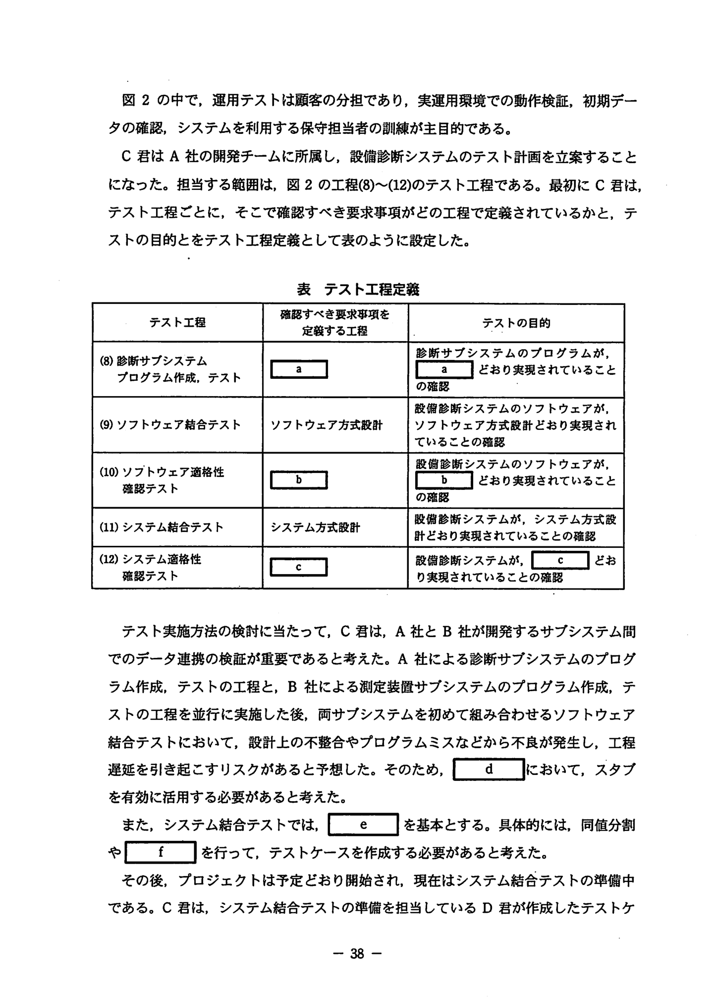

テキスト (OCR)

図 2 の中で, 運用テストは顧客の分担であり, 実運用環境での動作検証, 初期デー
FOR, システムを利用する保守担当者の訓練が主目的である。

C 君は A 社の開発チームに所属し, 設備診断システムのテスト計画を立案すること
になった。 FHT SHR, 図 2 の工程(⑧)て(12)のテスト工程である。最初に C Bid,
テスト工程ごとに, そこで確認すべき要求事項がどの工程で定義されているかと, テ
ストの目的とをテスト工程定義として表のように設定した。

表 TALLER
FAIA            aii               テストの目的
シュラテ                          診断サプシステムのプログラムが,
® eee aa on » (O24             (2 ] とおぉり実現されていること
"                                     の確認

設備徐断システムのソフトウェアが,
Q) ソフトウェア結合テスト     ソフトウェア方式設計     ソフトウェア方式設計どおり実現され

ていることの確認
4                                          設償診断システムのソフトウェアが
G0) ソフトウェア適格人性                 が
確認テスト              し証明              LT 1 どおり実現されていること
GU) システム結合テスト      DAF LARA       BMBMOAT AM, LAT LARK

肝どおり実現されていることの確認

(12) システム適格性          Ca             設備診断システムが, [| c | とぉ
確認テスト                                                 り実現されていることの確認

テスト実施方法の検討に当たって, C Ald, A 社と B 社が開発するサプシステム間
でのデータ連携の検証が重要であると考えた。A 社による診断サプシステムのプログ
ラム作成, テストの工程と, B 社による測定装置サブシステムのプログラム作成。テ
ストの工程を並行に実施した後, 両サブシステムを初めて組み合わせるソフトウェア
結合テストにおいて, 設計上の不整合やプログラムミスなどから不良が発生し, 工程
遅延を引き起こすリスクがあると予想した。そのため, |  d |において, 297
を有効に活用する必要があると考えた。

また, システム結合テストでは, [  e | を基本とする。具体的には, 同値分害
や[|  f  ] を行って, テストケースを作成する必要があると考えた。

その後, プロジェクトは予定どおり開始され, 現在はシステム結合テストの準備中
CHS. CB, システム結合テストの準備を担当している D 君が作成したテストケ

ー 38 一

### ページ 39

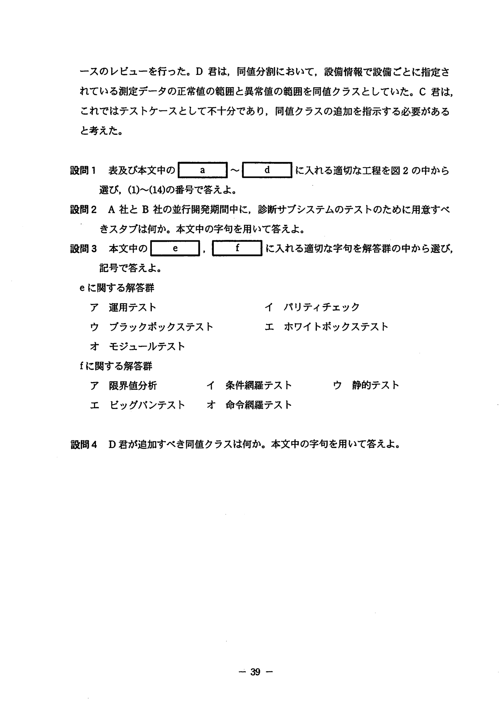

テキスト (OCR)

ースのレビューを行った。D Bld, 同値分割において, 設備情報で設備ごとに指定さ
れている測定データの正常値の範囲と異常値の範囲を同値クラスとしていた。C Bld,
これではテストケースとして不十分であり, 同値クラスの追加を指示する必要がある
と考えた。

設問1 表及び本文中の| a |て|  d |に入れる適切な工程を図 2 の中から
選び, ①)~て(14)の番号で答えよ。

設問2 A社とB社の並行開発期間中に, 診断サプシステムのテストのために用意すべ
きスタプは何か。本文中の字句を用いて答えよ。

設問3 本文中の| e |,| ££ |に入れる適切な字句を解答群の中から選び
記号で答えよ。
e に関する解答群
ア 運用テスト           イ パリティチェック
ウ プラックボックステスト     エエ ホワイトボックステスト
オ モジュールテスト
f に関する解答群
ア 限界値分析     イ RBS Ab    ウ 静的テスト

エエ ビッグパンテスト  オ 命令網羅テスト

設問4 D君が追加すべき同値クラスは何か。本文中の字句を用いて答えよ。

### ページ 40

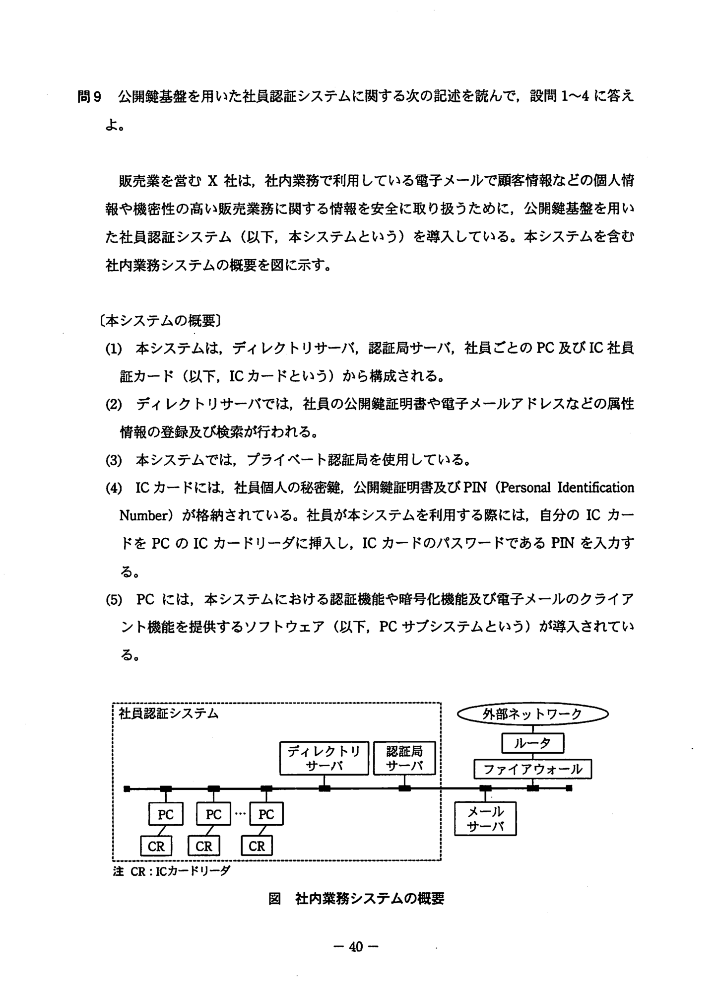

テキスト (OCR)

問9 公開鍵基盤を用いた社員認証システムに関する次の記述を読んで, 設問 1て4 に答え
よ。

販売業を営む X Hid, 社内業務で利用している電子メールで顧客情報などの個人情
報や機密性の高い販売業務に関する情報を安全に取り扱うために, 公開鍵基盤を用い
た社員認証システム (以下, 本システムという) を導入している。本システムを含む
社内業務システムの概要を図に示す。

(本システムの概要)

(①) 本システムは, ディレクトリサーバパ, 認証局サーバ, 社員ごとの FC 及び1C 社員
証カード (以下, IC カードという) から構成される。

2) ディレクトリサーパでは, 社員の公開鍵証明書や電子メールアドレスなどの履人性
情報の登録及び検索が行われる。

(3) 本システムでは, プライベート認証局を使用している。

(④) IC カードには, 社員個人の秘密鍵, 公開鍵証明書及びPIN (Personal Identification
Number) が格納されている。社員が本システムを利用する際には, 自分の IC カー
ドを PC DIC カードリーダに挿入し, IC カードのパスワードである PIN を入力す
る。

(5) PC には, 本システムにおける認証機能や暗号化機能及び電子メールのクライア
ント機能を提供するソフトウェア (以下, PC サプシステムという) が導入されてい

る。
社員認証システム
ディレクトリ || 認証局
サーバ サーバ
FC   aa            メール
fee] [re] ~ ec]          a

注 CR : ICカードリーダ
図 社内業務システムの概要

### ページ 41

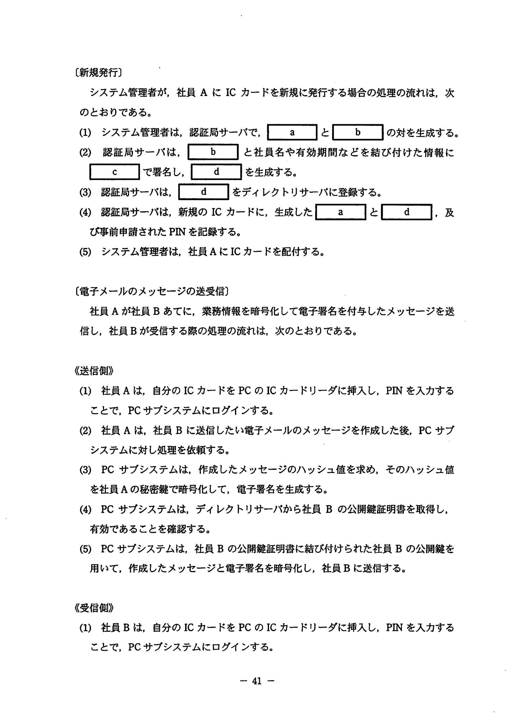

テキスト (OCR)

(新規発行
システム管理者が, 社員 A に IC カードを新規に発行する場合の処理の流れは, 次

のとおりである。

Q) システム管理者は, Beye, | 3 jel  b | の対を生成する。

⑫) 肘証局サーパは, | b | と社員名や有効期間などを結び付けた情報に
| < | で寺名し, (a | を生成する。

@) 認証局サーバは, |  d | をディレクトリサーバに登録する。

(4) 認証局サーパは, 新規の IC カードに, 生成した| a |と| a 目及
び事前申請された PIN を記録する。

(5) システム管理者は, 社員AにIC カードを配付する。

(電子メールのメッセージの送受信)
社員A が社員B あてに, 業務情報を暗号化して電子署名を付与したメッセージを送
信し, 社員B が受信する際の処理の流れは, 次のとおりである。

《送信側》

(1) 社員A は, 自分の IC カードを PC OIC カードリーダに挿入し, PIN を入力する
ことで, PC サプシステムにログインする。

(2) 社員 A は, 社員B に送信したい電子メールのメッセージを作成した後, PC サブ
システムに対し処理を依頼する。

(3③) PC サブシステムは, 作成したメッセージのハッシュ値を求め, そのハッシュ値
を社員A の秘密鍵で暗号化して, 電子署名を生成する。

(4) PC サブプシステムは, ディレクトリサーパから社員 B の公開鍵証明書を取得し,
有効でもることを確認する。

(5) PC サブプシステムは, 社員 B の公開鍵証明書に結び付けられた社員 B の公開鍵を
用いて, 作成したメッセージと電子署名を暗号化し, 社員B に送信する。

《受信側》
1) 社員B は, 自分の IC カードを PC のIC カードリーダに挿入し, PIN を入力する
TEC, PCサプシステムにログインする。

ー 41 一

### ページ 42

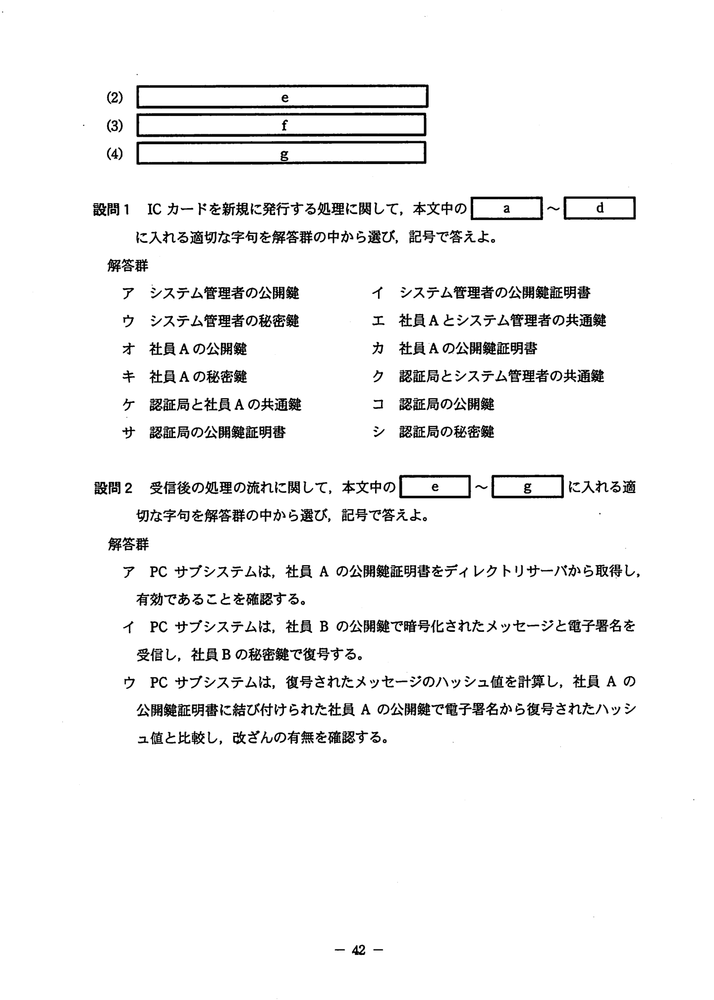

テキスト (OCR)

【

2) |
(3) |
 [         g         |

mm

設問1 IC カードを新規に発行する処理に関して, 本文中の| a |~-| d |
に入れる適切な字句を解答群の中から選び, 記号で答えよ。

SH
ア YAFLELSZOLMR     イ システム管理者の公開鍵証明書
ウ システム管理者の秘密鍵     エ 社員A とシステム管理者の共通鍵
オ 社員Aの公開鍵         A 社員Aの公開鍵証明書
+ 社員Aの秘密鍵         ク 認証局とシステム管理者の共通鍵
ケ 認証局と社員Aの共通鍵     コ 認証局の公開鍵
サ 認証局の公開鍵証明書      シ 認証局の秘密鍵

設問2 受信後の処理の流れに関して, 本文中の| e |~|  g |に入れる適
切な字句を解答群の中から選び, 記号で答えよ。
解答群
ア PC サブシステムは, 社員 A の公開鍵証明書をディレクトリサーバパから取得し。
有効でもることを確認する。
イ PC サプシステムは, 社員 B の公開鍵で暗号化されたメッセージと電子署名を
受信し, 社員B の秘密鍵で復号する。
ウ PC サブシステムは, 復号されたメッセージのハッシュ値を計算し, 社員A の
公開鍵証明書に結び付けられた社員 A の公開鍵で電子署名から復号されたハッシ
ュ値と比較し, 改ざんの有無を確認する。

### ページ 43

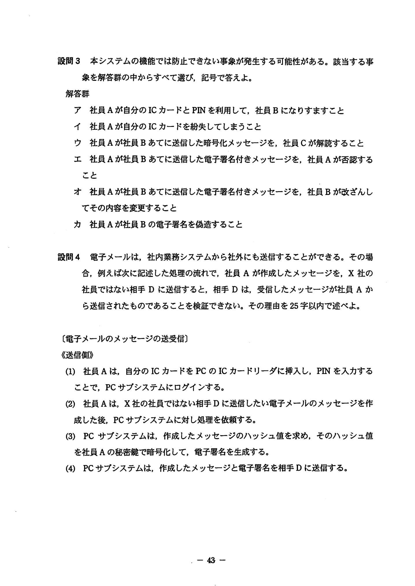

テキスト (OCR)

設問3 本システムの機能では防止できない事象が発生する可能性がある。該当する事
象を解答群の中からすべて選び, 記号で答えよ。
eee
ア 社員Aが自分のIC カードとPIN を利用して, 社員B になりすますこと
イ 社員Aが自分のIC カードを紛失してしまうこと
ウ 社員Aが社員B あてに送信した暗号化メッセージを, 社員Cが解読すること
エ 社員Aが社員B あてに送信した電子署名付きメッセージを, 社員Aが否認する
こと
+ 社員Aが社員B あてに送信した電子時名付きメッセージを, 社員B が改ざんし
てその内容を変更すること
カ 社員Aが社員Bの電子回名を位造すること

設問4 電子メールは, 社内業務システムから社外にも送信することができる。その場
合, 例えば次に記述した処理の流れで, 社員 A が作成したメッセージを, X 社の
社員ではない相手 D に送信すると, MED は, 受信したメッセージが社員 A か
ら送信されたものであることを検証できない。その理由を 25 字以内で述べよ。

(電子メールのメッセージの送受信〕
《送信側》
Q①) 社員A'は, 自分の IC カードをPC の IC カードリーダに挿入し, PIN を入力する
ことで, PCサプシステムにログインする。
(2) 社員Aは, XX社の社員ではない相手 D に送信したい電子メールのメッセージを作
成した後, PCサブシステムに対し処理を依頼する。
(3) PC サブシステムは, 作成したメッセージのハッシュ値を求め, そのハッシュ値
を社員A の秘密鍵で暗号化して, 電子署名を生成する。
(4) PCサブプシステムは, 作成したメッセージと電子署名を相手 D に送信する。

### ページ 44

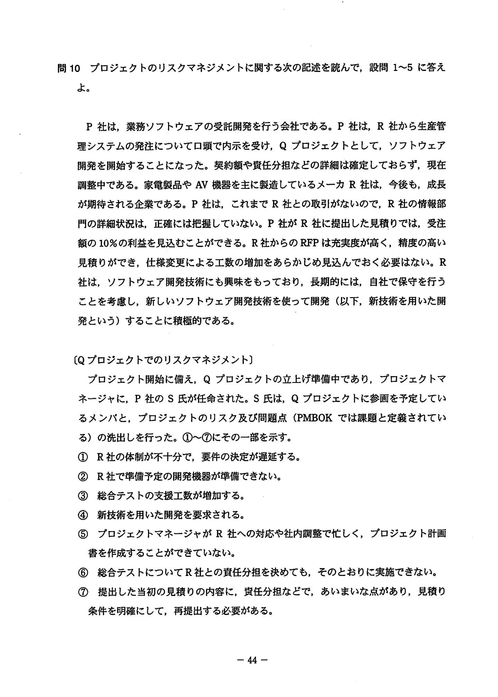

テキスト (OCR)

間10 プロジェクトのリスクマネジメントに関する次の記述を読んで, 設問 1こ5 に答え
よ。

P 社は, 業務ソフトウェアの受託開発を行う会社である。P 社は, R 社から生産管
理システムの発注について口頭で内示を受け, Q プロジェクトとして, ソフトウェア
開発を開始することになった。契約額や資任分担などの詳細は確定しておらず, 現在
調整中である。家電製品や AV 機器を主に製造しているメーカ R 社は, 今後も, 成長
が期待される企業である。P tlt, これまで R 社との取引がないので, R 社の情報部
門の詳細状況は, 正確には把握していない。 P 社が R 社に提出した見積りでは, 受注
額の 10%の利益を見込ひことができる。R 社からの RFP は充実度が高く, 精度の高い
見積りができ, 仕様変更による工数の増加をあらかじめ見込んでおく必要はない。R
社は, ソフトウェア開発技術にも興味をもっており, 長期的には, 自社で保守を行う
ことを考慮し, 新しいソフトウェア開発技術を使って開発 (以下, 新技術を用いた開
発という) することに積極的である。

〔Q プロジェクトでのリスクマネジメント)〕

プロジェクト開始に備え, Q プロジェクトの立上げ準備中であり, プロジェクトマ
ネージャに, P 社の S 氏が任命された。S 氏は, Q プロジェクトに参画を予定してい
BAYNE, プロジェクトのリスク及び問題点 (PMBOK では課題と定義されてい
る) の洗出しを行った。①て⑦にその一部を示す。

R 社の体制が不十分で, 要件の決定が遅延する。

R 社で準備予定の開発機器が準備できない。

総合テストの支援工数が増加する。

新技術を用いた開発を要求される。

プロジェクトマネージャが R 社への対応や社内調整で忙しく, プロジェクト計画
書を作成することができていない。
© 総合テストについて R 社との資任分担を決めても, そのとおりに実施できない。
⑦ 提出した当初の見積りの内容に, 資任分担などで, あいまいな点があり, 見積り
条件を明確にして, 再提出する必要がある。

@@@@9@

### ページ 45

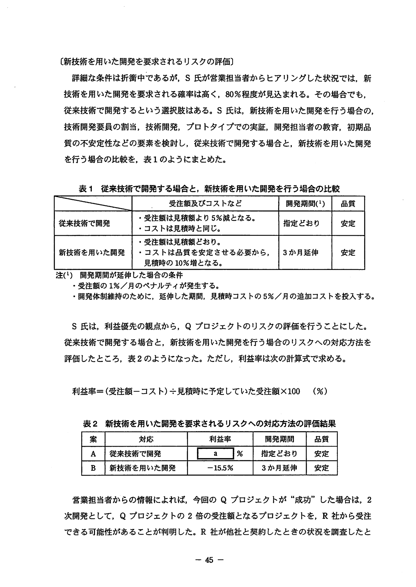

テキスト (OCR)

〔新技術を用いた開発を要求されるリスクの評価〕
詳細な条件は折衝中であるが, S 氏が営業担当者からヒアリングした状況では, 新
技術を用いた開発を要求される確率は高く, 80%程度が見込まれる。その場合でも,
従来技術で開発するという選択肢はある。S 氏は, 新技術を用いた開発を行う場合の,
技術開発要員の割当 技術開発, プロトタイプでの実証, 開発担当者の教育, 初期品
質の不安定性などの要素を検討し, 従来技術で開発する場合と, 新技術を用いた開発
を行う場合の比較を, 表1 のようにまとめた。

表1 従来技術で開発する場合と, 新技術を用いた開発を行う場合の比較

、 受注額肥びコストなど             pam) | 品質
peste                ・受注編は見積畑より 5%減となる。                、
科技術で開発 | 「 ユートは上条時と同じ。                        指定どおり | 安定

・受汗紹は見積額どおり。
新技術を用いた開発 | ・コストは品質を安定させる必要から, | 3か月延伸 | 安定
ARKO 10%増となる。

注(") 開発期間が延伸した場合の条件
・受注額の 1%プ月のペナルティが発生する。
・開発体制維持のために, 延伸した期間, 見積桂コストの5%ン月の追加コストを投入する。

S Kid, 利益優先の観点かホら, Q プロジェクトのリスクの評価を行うことにした。
従来技術で開発する場合と, 新技術を用いた開発を行う場合のりリスクへの対応方法を
評価したところ, 表2 のようになった。ただし, 利益率は次の計算式で求める。

利益率 (受注額-コスト) 見積時に予定していた受注額X100 (%)

表2 新技術を用いた開発を要求されるリスクへの対応方法の評価結果

案      対応        利益率     開発期間 | 品質
A | 従来技術で開発               La ]% | 指定どおり | 安定
B | 新技術を用いた開発              ー15.5%             3か月延伸 | 安定

営業担当者からの情報によれば, 今回の Q プロジェクトが “成功” した場合は, 2
次開発として, Q プロジェクトの 2 倍の受注額となるプロジェクトを, R 社から受注
できる可能性があることが判明した。R 社が他社と契約したときの状況を調査したと

ー45 一

### ページ 46

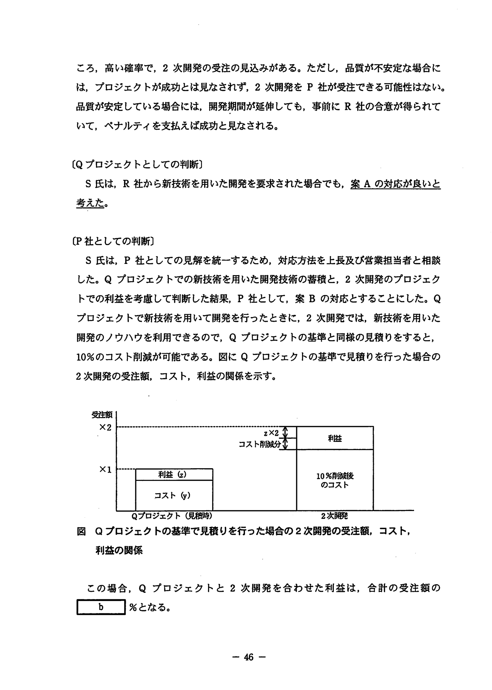

テキスト (OCR)

ころ, 高い確率で, 2 次開発の受注の見込みがある。ただし, 品質が不安定な場合に
は, プロジェクトが成功とは見なされず, 2 次開発を P 社が受注できる可能性はない。
品質が安定している場合には, 開発期間が延伸しても, 事前に R 社の合意が得られて
WT, ペナルティを支払えば成功と見なされる。

〔Q プロジェクトとしての判断
S 氏は, R 社から新技術を用いた開発を要求された場合でも, BA の対応が良いと
考えた。

(P 社としての判断〕

S 氏は, P 社としての見解を統一するため, 対応方法を上長及び営業担当者と相談
した。Q プロジェクトでの新技術をた用いた開発技術の次積と, 2 次開発のプロジェク
トでの利益を考慮して判断した結果, P 社として, 案 B の対応とすることにした。Q
プロジェクトで新技術を用いて開発を行ったときに, 2 次開発では, 新技術を用いた
開発のノウハウを利用できるので, Q プロジェクトの基準と同様の見積りをすると,
10%のコスト削減が可能である。図に Q プロジェクトの基準で見積りを行った場合の
2 次開発の受注額, コスト, 利益の関係を示す。

arm
2                                             zX2               利和
TZ ba
x1              AE @)                                      10 FDR
のコスト
コスト y)
Qプロジェクト (上策時                           DEBE

   Q プロジェクトの基準で見積りを行った場合の 2 次開発の受注額, コスト,
利益の関係

この場合, Q プロジェクトと 2 次開発を合わせた利益は, 合計の受注額の

[> |]%となる。

### ページ 47

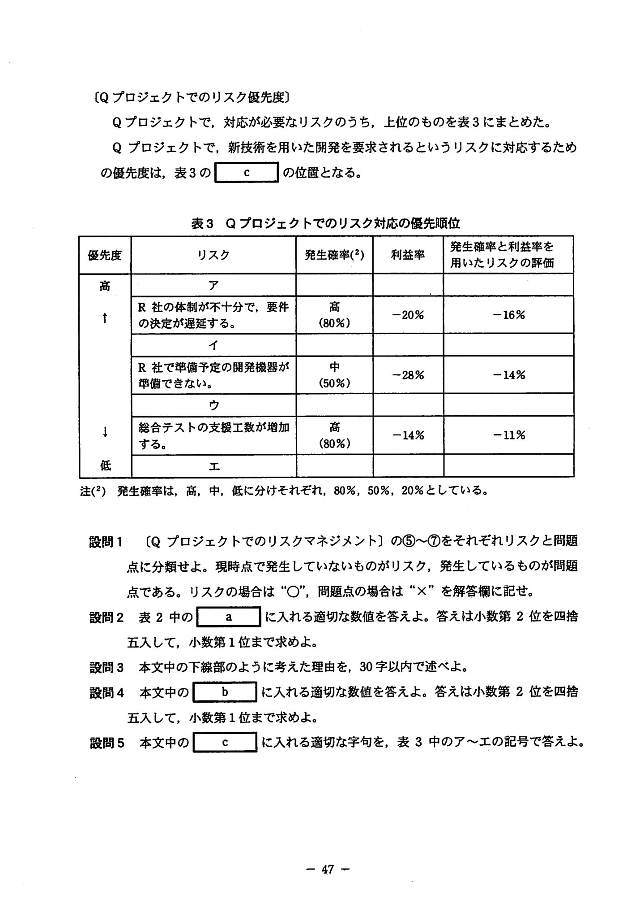

テキスト (OCR)

(Q プロジェクトでのリスク優先度)

Q プロジェクトで, 対応が必要なリスクのうち, 上位のものを表 3 にまとめた。

Q プロジェクトで, 新技術を用いた開発を要求されるというリスクに対応するため
の優先度は, 表3の|  c | の位置となる。

表3 Qプロジェクトでのリスク対応の優先順位

発生確率と利益率を
優先度      リスク      発生確率) | Fa | でいたリスケの評価
&       ァ
R 社の体制が不十分で, 要件   高    _        _
1 | の決定が遅延する。      (80%)    20%       16%
イ
R 社で準備予定の開発機器が   中    _        _
準備できない。                        (50%)            28%                  14%
ウゥ
| | 総合テストの支援工数が増加   高    _      _
する。                               (80%)           14%                11%
低       x

注(?) 発生確率は, 高, 中, 低に分けそれぞれ, 80%, 50%, 20%としている。

設問1 〔Q プロジェクトでのリスクマネジメント〕 OO~ORENEN 27 CHG
点に分類せよ。現時点で発生していないものがリスク, 発生しているものが問題
点である。リスクの場合は “〇", 問題点の場合は "X" を解答欄に記せ。

設問2 表 2 中の| a | に入れる適切な数値を答えよ。答えは小数第 2 EDS
五入して, 小数第1 位まで求めよ。

設問3 本文中の下線部のように考えた理由を, 30 字以内で述べよ。

設問4 本文中の| b | に入れる適切な数値を答えよ。答えは小数第 2 MEDS
HAUT, 小数第 1 位まで求めよ。

設問5 本文中の[ c | に入れる適切な字句を, 表3 中のアンエの記号で答えよ。

### ページ 48

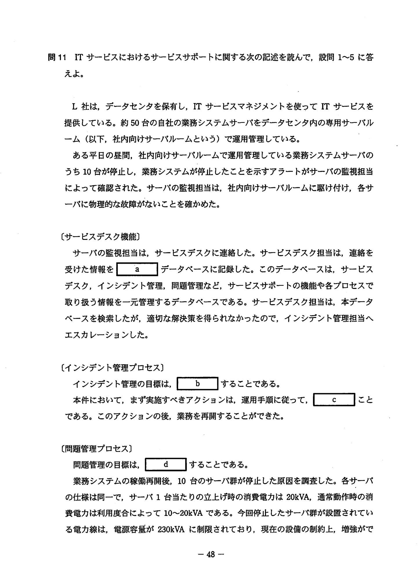

テキスト (OCR)

間 11 IT サービスにおけるサービスサポートに関する次の記述を読んで, 設問 1て5 KS
えよ。

L 社は, データセンタを保有し, IT サービスマネジメントを使って IT サービスを
提供している。約 50 台の自社の業務システムサーパをデータセンタ内の専用サーバル
ーム (以下, 社内向けサーパルームという) で運用管理している。

ある平日の昼間, 社内向けサーパルームで運用管理している業務システムサーバの
うち 10 台が停止し, 業務システムが停止したことを示すアラートがサーバの監視担当
によって確認された。サーパの監視担当は, 社内向けサーバルームに駆け付け, 各サ
ーバに物理的な攻障がないことを確かめた。

(サービスデスク機能)

サーバパの監視担当は。 サービスデスクに連絡した。サービスデスク担当は, 連絡を
受けた情報を | a | データベースに記録した。このデータベースは, サービス
FAY, インシデント管理, 問題管理など, サービスサポートの機能や各プロセスで
取り扱う情報を一元管理するデータベースである。サービスデスク担当は, 本データ
ベースを検索したが, 適切な解決策を得られなかったので, インシデント管理担当へ
エスカレーションした。

(インシデント管理プロセス〕

インシデント管理の目標は| b | することである。

本件において, まず実施すべきアクションは, 運用手順に従って, | c |こと
である。このアクションの後, 業務を再開することができた。

〔問題管理プロセス〕

問題管理の目標は| d | することである。

業務システムの稼働再開後。10 台のサーバ群が停止した原因を調査した。各サーバ
の仕様は同一で, サーバ 1 台当たりの立上げ時の消費電力は 20kVA, 通常動作時の首
費電力は利用度合によって 10~20KVA である。今回停止したサーパ群が設置されてい
る電力線は, 電源容量が 230kVA に制限されており, 現在の設備の制約上, 増強がで

### ページ 49

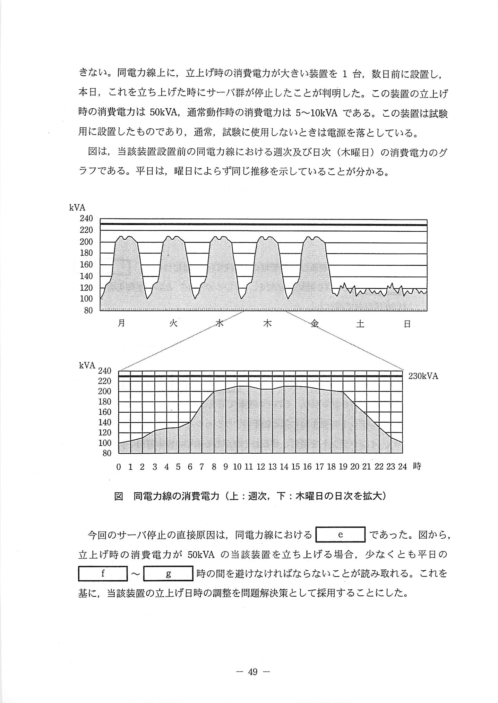

テキスト (OCR)

きない。同電力線上に, 立上げ時の消費電力が大きい装置を 1 台, 数日前に設置し,
本日, これを立ち上げた時にサーバ群が停止したことが判明した。この装置の立上げ
時の消費電力は 50kVA, 通常動作時の消費電力は 5て10kVA である。この装置は試験
用に設置したものであり, 通常, 試験に使用しないときは電源を落としている。

図は, 当該装置設置前の同電力線における週次及び日次 (木曜日) の消費電力のグ
ラフである。平日は, 曜日によらず同じ推移を示していることが分かる。

kVA
240
220
200
180
160
140
120
100

kVA          ーー                                                                              =
240.
550                                                                                               230kVA

200                                               トーテートー 1 |               トー-」

180
160

100 トイ                                                                                Py
80

012 345 67 8 9 1011 1213141516 171819 2021 22 23 24 時

  同電力線の消費電力 (上 : 週次, 下 : 木曜日の日次を拡大)

今回のサーバ停止の直接原因は, 同電力線における|  e | であった。図から,
立上げ時の消費電力が 50kVA の当該装置を立ち上げる場合, 少なくとも平日の
| f |て|  g | 時の間を避けなければならないことが読み取れる。これを
Hic, 当該装置の立上げ日時の調整を問題解決策として採用することにした。

ー 49 一

### ページ 50

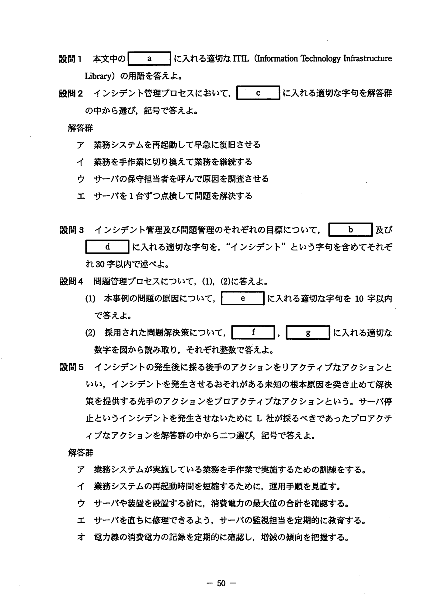

テキスト (OCR)

設問1 本文中の [a ] に入れる適切な ITIL (Information Technology Infrastructure
Library) の用語を答えよ。

設問2 インシデント管理プロセスにおいて, | c | に入れる適切な字句を解衝
の中から選び, 記号で答えよ。

RE

業務システムを再起動して早急に復旧させる

業務を手作業に切り換えて業務を継続する

サーバの保守担当者を呼んで原因を調査させる

サーバを 1 台ずつ点検して問題を解決する

HOGA NSN

BMS インシデント管理及び問題管理のそれぞれの目標について, | b |及び
[| |] に入れる適切な字句を, “インシデント” という字句を含めてそれぞ
れ30 字以内で述べよ。
設問4 問題管理プロセスについて, Q①⑪), ②)に答えよ。
Q①) 本事例の問題の原因について, |  e | に入れる適切な字句を 10 字以内
で答えよ。
@ 採用された問題解決策について, | f |, | g | に入れる適切な
数字を図から読み取り, それぞれ整数で答えよ。
設問5 インシデントの発生後に採る後手のアクションをリアクティブプなアクションと
WA, インシデントを発生させるおそれがある未知の根本原因を突き止めて解決
策を提供する先手のアクションをプロアクティブなアクションという。サーバパ何
止というインシデントを発生させないために L 社が採るべきであったプロアクテ
ィブなアクションを解答群の中から二つ選び, 記号で答えよ。
解答

業務システムが実施している業務を手作業で実施するための訓練をする。
業務システムの再起動時間を短縮するために, 運用手順を見直す。

サーバや装置を設置する前に, 消費電力の最大値の合計を確認する。
サーバを直ちに修理できるよう, サーパの監視担当を定期的に教育する。
電力線の消旨電力の記録を定期的に確認し, 増減の傾向を把握する。

YH GAN

### ページ 51

テキスト (OCR)

【 メモ 用紙 〕

ー.51 一

### ページ 52

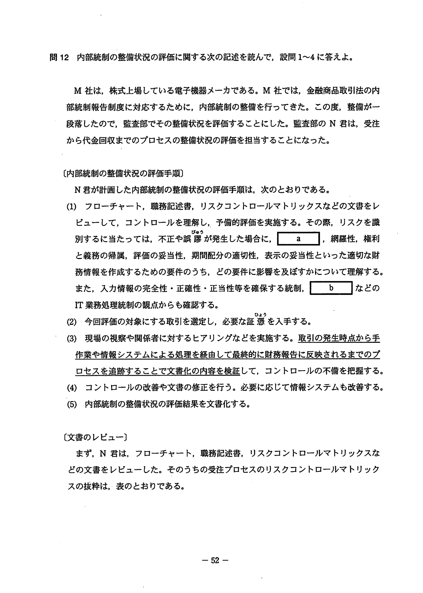

テキスト (OCR)

問12 内部統制の整備状況の評価に関する次の記述を読んで, 設問14 に答えよ。

M 社は, 株式上場している電子機器メーカである。M 社では, 金融商品取引法の内
部統制報告制度に対応するために, 内部統制の整備を行ってきた。 この度, 整備が一
段落したので, 監査部でその整備状況を評価することにした。監査部の N 君は, 受注
から代金回収までのプロセスの整備状況の評価を担当することになった。

〔内部統制の整備状況の評価手順)
N 君が計画した内部統制の整備状況の評価手順は。 次のとおりである。

Q) フローチャート, 職務記述書, リスクコントロールマトリックスなどの文書をレ
ビューして, コントロールを理解し, 予備的評価を実施する。その際, リスクを議
別するに当たっては, KERB が発生した場合に| a | , MRE, 権利
と義務の帰属評価の妥当性, 期間配分の適切性, 表示の受当性といった適切な財
務情報を作成するための要件のうち, どの要件に影響を及ぼすかについて理解する。
また, 入力情報の完全性・正確性・正当性等を確保する統制| b | などの
IT 業務処理統制の銀点からも確認する。

(2) 今回評価の対象にする取引を選定し, WERE を入手する。

(3) 現場の視察や関係者に対するヒアリングなどを実施する。取引の発生時点から手
作業や情報システムによる処理を経由して最終的に財務報告に反映されるまでのプ
ロセスを追跡することで文書化の内容を検証して, コントロールの不備を把握する。

(4) コントロールの改善や文書の修正を行う。 必要に応じて情報システムも改善する。

©) 内部統制の整備状況の評価結果を文書化する。

(文書のレビュー〕

まず, N 君は。 フローチャート, 職務記述書, リスクコントロールマトリックスな
どの文書をレビューした。そのうちの受注プロセスのリスクコントロールマトリック
スの抜粋は, 表のとおりである。

### ページ 53

テキスト (OCR)

表 受注プロセスのリスクコントロールマトリックス (抜粋)

想定される                    、

リスク           番号                                     コントロール

不適切な顧客 | 1 | 新規顧客と取引を開始する際には, 業務課で財務状況なふどを調査する。経

情報の登録       理課長が与信限度額を決定する。経理課担当者は, 与信限度額を願客マス
タタのほかの項目と併せて情報システムに入力する。経理間長は, 入力内容
を確認して承認する。

受注入力の   2 | 受注入力は業務課の専従の受注担当者が行う。顧客からの注文はファック

漏れ, 誤り     スで受け付ける。受注担当者は, 受け付けたファックスに連番を振って情
報システムに受注入力する。業務課長は, 情報システムの入力内容をファ
ックスと照合して承認する。

3 | 入力データは, 顧客マスタ及び商品マスタとチェックされ, 各マスタに存

在しないデータは入力できない。

ユーザ ID の| 4 | 情報システムへのアクセスは, 担当者のユーザ ID とパスワードで制御され

不正使用      TiS, BBR, 経理氷では必要な人だけがユーザ ID をもつことができ,
ユーザ D の登録・削除には, それぞれの上長の承認が必要である。

5 | 管理課の担当者は, 四半期ごとにユーザ ID とアクセス権の棚卸しを行い,

不要なユーザ ID や間違ったアクセス権があれば, 業務課や経理韻に問い合
わせ, ユーザ D の削除やアクセス権の変更を行う。管理昌長がその結果を
承認すると, 削除・変更が有効になる。

与信限度額を | 6 | 顧客の与信限度額を超える受注入力はできない。与信限度額を超える場合

超えた受注       は, 業務昌長の承認後, 経理昌長の最終承認によって, 当該受注案件に限

って入力することができる。

MERCH, 与信限度額を年に一度, 定期的に見直し, 変更がある場合に
は, 経理課長の承認を得た上で, 情報システムに反映させる。

次に N Std, 関連部暑にヒアリングを行った。

【業務課へのヒアリング〕

Q①) 新規の顧客と取引を開始する際には, 業務課が必要事項を調査し, その結果を経
理課に提出する。与信限度額の決定や顧客マスタの入力は経理課で行われている。

(⑫) 受注入力は, 業務旧の専従の受注担当者が行っている。顧客からの注文は。 ファ
ックスで受け付ける。受注担当者は, 二重登録を避けるために, 受け付けたファッ
クスに連番を振る。受注担当者がファックスの内容を情報システムに入力した後,
業務課長は, 入力内容がファックスの内容と合っているかを確認して承認する。商
品マスタ及び顧客マスタに存在しないデータは, 情報システムに入力できない仕組
みになっている。

### ページ 54

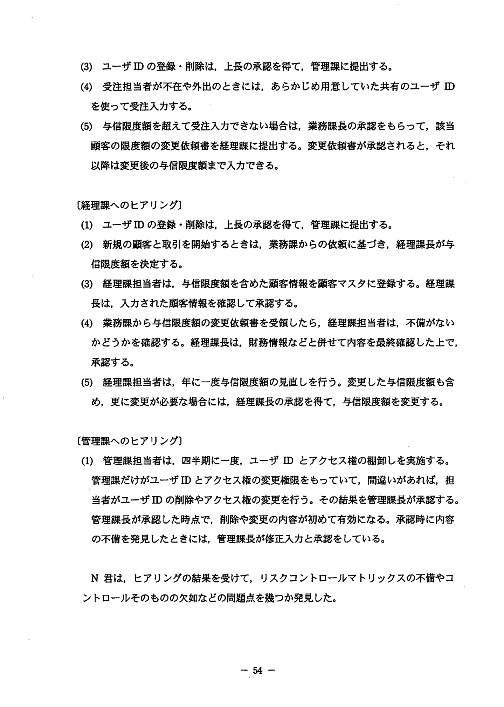

テキスト (OCR)

(3) ユーザ ID の登録・削除は, 上長の承認を得て, 管理課に提出する。

(4) 受注担当者が不在や外出のときには, あらかじめ用意していた共有のユーザ D
を使って受注入力する。

(5) 与信限度額を超えて受注入力できない場合は, 業務課長の承認をもらって, 該当
顧客の限度額の変更依頼書を経理晶に提出する。変更依頼書が承認されると, それ
以降は変更後の与信限度額まで入力できる。

〔経理課へのヒアリング)〕

(1) ユーザ ID の登録・削除は, 上長の承認を得て, 管理康に提出する。

(2) 新規の顧客と取引を開始するときは, 業務課からの依頼に基づき, 経理課長が与
信限度額を決定する。

(⑬) 経理課担当者は, 与信限度額を含めた顧客情報を顧客マスタに登録する。経理課
長は, AAANKBSHRERRL TARTS.

(4) 業務課から与信限度額の変更依頼書を受錠したら, 経理課担当者は, 不備がない
かどうかを確認する。経理課長は, 財務情報などと併せて内容を最終確認した上で
承認する。

(5) 経理課担当者は, 年に一度与信限度額の見直しを行う。変更した与信限度額も含
め, 更に変更が必要な場合には, 経理課長の承認を得て, 与信限度額を変更する。

(管理課へのヒアリング〕

(1) 管理課担当者は, 四半期に一度, ユーザ ID とアクセス権の棚卸しを実施する。
 管理昭だけがユーザ ID とアクセス権の変更権限をもっていて, 間違いがあれば, i
当者がユーザ D の削除やアクセス権の変更を行う。その結果を管理課長が承認する。
管理課長が承認した時点で, 削除や変更の内容が初めて有効になる。 承認時に内容
の不備を発見したときには, 管理昌長が修正入力と承認をしている。

N Ald, ヒアリングの結果を受けて, リスクコントロールマトリックスの不備やコ
ントロールそのものの欠如などの問題点を幾つか発見した。

### ページ 55

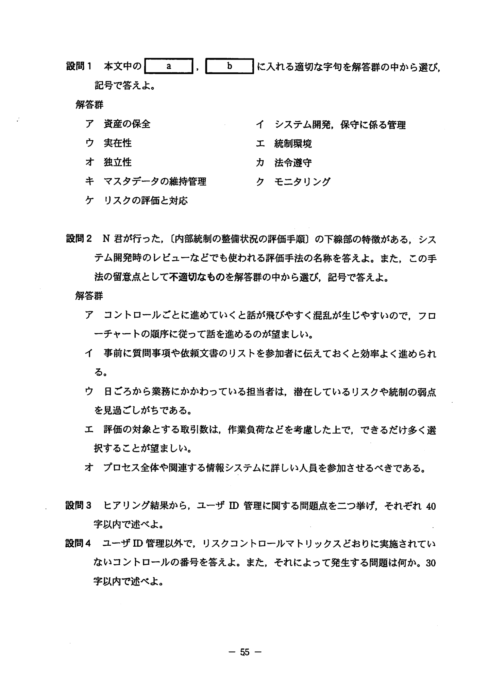

テキスト (OCR)

設問1 本文中の| a |,|  b | に入れる適切な字句を解答群の中から選び

記号で答えよ。
解答群
ア 資産の保全           イ システム開発, 保守に係る管理
ウ 実在性             エ 統制環境
オ 独立性             A 法令遵守
キ マスタデータの維持管理     ク モニタリング
ケ リスクの評価と対応

設問2 N君が行った, 〔内部統制の整備状況の評価手順〕】 の下線部の特徴がある, シス
テム開発時のレビューなどでも使われる評価手法の名称を答えよ。また, TOF
法の留意点として不適切なものを解答群の中から選び, 記号で答えよ。
REE
ア コントロールごとに進めていくと話が飛びやすく混乱が生じやすいので, フロ
ーチャートの順序に従って話を進めるのが望ましい。
イ 事前に質問事項や依頼文書のリストを参加者に伝えておくと効率よく進められ
る。
ウ 日ごろから業務にかかわっている担当者は, 潜在しているリスクや統制の層点
を見過ごしがちである。
エエ 評価の対象とする取引数は, 作業負荷などを考慮した上で, できるだけ多く選
択することが望ましい。
A プロセス全体や関連する情報システムに詳しい人員を参加させるべきである。

設問3 ヒアリング結果から, ユーザ D 管理に関する問題点を二つ挙げび, それぞれ 40
字以内で述べよ。                           .

設問4 ユーザ ID 管理以外で, リスクコントロールマトリックスどおりに実施されてい
ないコントロールの番号を答えよ。また, それによって発生する問題は何か。30
字以内で述べよ。

### ページ 56

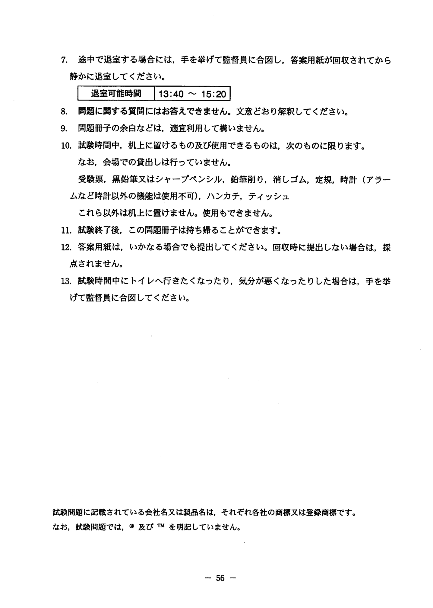

テキスト (OCR)

7. 途中で退室する場合には, 手を挙げて監督員に合図し, 答案用紙が回収されてから
静かに退室してください。
退室可能時間 | 13:40 ~ 15:20
8. 問題に関する質問にはお答えできません。文意どおり解釈してください。
9. 問題貼子の余白などは, 適宜利用して構いません。
10. 試験時間中, 机上に置けるもの及び使用できるものは, 次のものに限ります。
なお, 会場での貸出しは行っていません。
RBM, 黒鉛筆又はシャープペンシル, 鉛筆削り, 消しゴム, 定規, 時計 (アラー
ムなど時計以外の機能は使用不可),、 ハンカチ, ティッシュ
これら以外は机上に置けません。使用もできません。
ll. 試験終了後, この問題冊子は持ち帰ることができます。
12. SRAM, いかなる場合でも提出してください。 回収時に提出しない場合は, 採
点されません。
13, 試験時間中にトイレへ行きたくなったり, 気分が悪くなったりした場合は, FER
げて監督員に合図してください。

試験問題に記載されている会社名又は製品名は, それぞれ各社の商標又は登録商標です。
なお, 試験問題では, © 及び "を明記していません。

---

## 午後解答

1/6 
Copyright(c) Information-technology Promotion Agency, Japan. All rights reserved 2009 
平成21 年度 秋期 応用情報技術者試験 解答例 
 
午後試験 
問１ 
出題趣旨 
 平成21 年4 月から，ソフトウェアの受託開発についても，原則として工事進行基準が適用されている。応用
情報技術者には，このような会計処理に関する理解と応用力が求められる。 
 本問では，ソフトウェアの受託開発会社における会計処理を題材に，工事進行基準に関する，基本的な知識
とその適用能力を問う。 
 
設問 
解答例・解答の要点 
備考 
設問１ (1) a 25.0 
 
 
(2) b (カ) 
 
 
 
c (ア) 
 
 
 
d (オ) 
 
設問２ (1) 仕掛中のプロジェクトに係る売上や損益が四半期決算に反映される。 
 
 
(2) ウ 
 
設問３ (1) 作業実績時間の正確性 
 
 
(2) 予想される原価の総額 
 
設問４ 
工事完成基準による売上と工事進行基準による売上が計上されるから 
 
 
問２ 
出題趣旨 
 文字列照合は様々な分野で利用される処理の一つである。 
 本問では，二つのアルゴリズムを題材にして，その考え方と，プログラム作成及び実行効率評価の能力を問
う。 
 
設問 
解答例・解答の要点 
備考 
設問１ 
ア T.length－P.length＋1 
 
 
イ P.length 
 
 
ウ P.length－j 
 
設問２ 
エ 10 
 
 
オ 6 
 
設問３ 
α 12 
 
 
β 8

2/6 
Copyright(c) Information-technology Promotion Agency, Japan. All rights reserved 2009 
問３ 
出題趣旨 
 企業において経営状態を適切に把握するためには，原価計算を正確に行う必要がある。応用情報技術者は，
原価計算に関する基本的な概念を理解し，その応用力を身に付けておくべきである。 
 本問では，工場の原価計算システムの再構築を題材に，原価計算の概念と間接費の割当てに関する基本的な
理解を問う。 
 
設問 
解答例・解答の要点 
備考 
設問１ 
a ⑥ 
 
 
b ④ 
 
 
c ⑤ 
 
設問２ (1) d ア 
 
 
(2) 直接作業時間を基に間接費を配賦しているから 
 
設問３ (1) e オ 
 
 
(2) 消費した単位数のデータを自動的に取得する機能の追加 
 
 
(3) f 
6,400 
 
 
問４ 
出題趣旨 
 システム構築に際しては，機能要件だけでなく，可用性，セキュリティ，性能，保守性などの非機能要件も
重要である。 
 本問では，インターネットのWeb システムにおける非機能要件のうち，可用性とセキュリティについて応用
情報技術者として知っているべきである基本的な知識と実現能力を問う。 
 
設問 
解答例・解答の要点 
備考 
設問１ 
a エ 
 
 
b カ 
 
設問２ 
c 24 
 
設問３ (1) 52 
 
 
(2) カ 
 
 
(3) エ

3/6 
Copyright(c) Information-technology Promotion Agency, Japan. All rights reserved 2009 
問５ 
出題趣旨 
 外出先から社内へアクセスするリモートアクセスは，ネットワーク構築における重要な技術要素の一つであ
る。リモートアクセスを安全に行うために，インターネットを専用線のように使用するVPN は，様々な技術に
よって実現されている。 
 本問では，RAS，SSL-VPN，IPsec を利用したリモートアクセスを比較して，それぞれの特徴と使用方法の理
解を問う。また，IPsec の課題を事例にして，ネットワークの応用力を問う。 
 
設問 
解答例・解答の要点 
備考 
設問１ 
a ウ 
 
b ク 
順不同 
 
c イ 
 
 
d エ 
 
設問２ 
案1 
イ 
 
 
案2 
ウ 
 
 
案3 
エ 
 
設問３ (1) e DHCP サーバ 
 
 
 
f ローカルIP アドレス 又は IP アドレス 
 
 
(2) ア 
 
 
問６ 
出題趣旨 
 データベースの設計は，業務の目的を把握した上で行うことが重要である。 
 本問では，旅行の予約業務を題材にして，業務要件を満たすデータベースの設計方針，正規化の概念，正規
化の方法についての理解を問う。 
 
設問 
解答例・解答の要点 
備考 
設問１ 
a サ 
 
b ク 
順不同 
 
c キ 
 
 
d カ 
 
 
e シ 
 
設問２ (1) ツアーテーブルに追加された行がその後変更されることはないから 
 
 
(2) 支店の担当範囲が変更されると，顧客テーブルの該当するすべての行の担当支
店コードを修正しなければならない。 
 
 
(3) テーブル名 列名 
 
 
 
顧客 
顧客番号，氏名，住所，郵便番号，電話番号，電子メールアドレ
ス 
 
 
 
担当支店 
郵便番号，担当支店コード 
 
設問３ 
顧客
申込み
支店
ツアー
参加

4/6 
Copyright(c) Information-technology Promotion Agency, Japan. All rights reserved 2009 
問７ 
出題趣旨 
 近年，ほとんどの家電製品に組込みソフトウェアが搭載されている。応用情報技術者にとって，組込みシス
テムにおける割込み，タスクについての知識と理解は不可欠である。 
 本問では，ディジタルフォトフレームを題材に，組込みシステムにおける割込み，タスク間通信，タスク状
態についての理解を問う。 
 
設問 
解答例・解答の要点 
備考 
設問１ 
a キ 
 
 
b エ 
 
 
c ク 
 
 
d ケ 
 
設問２ 
読込み要求イベントが破棄されたから 
 
設問３ 
e A／2 
 
 
f 20A／1000 
 
 
g 9.6 
 
 
問８ 
出題趣旨 
 ソフトウェア開発プロセスにおける計画的なテストの遂行は，ソフトウェアの品質確保のために必須である。
あらかじめ，要件定義や設計工程においてテスト要求事項を明確にすること，テストの方法や内容について方
針，基準を設けることなどによって，ソフトウェア品質の向上を図ることができる。 
 本問では，計画的なテスト遂行のための，設計工程とテスト工程の対応関係，テスト方法についての理解を
問う。 
 
設問 
解答例・解答の要点 
備考 
設問１ 
a (7) 
 
 
b (3) 
 
 
c (1) 
 
 
d (8) 
 
設問２ 
センサデータ読出し関数 
 
設問３ 
e ウ 
 
 
f ア 
 
設問４ 
不正データ

5/6 
Copyright(c) Information-technology Promotion Agency, Japan. All rights reserved 2009 
問９ 
出題趣旨 
 近年，高度なセキュリティ機能を求められるシステムでは，公開鍵基盤を用いた暗号化技術や認証技術の適
用が広く普及している。 
 本問では，公開鍵基盤を用いたシステムの基本機能や仕組みについての理解を問う。 
 
設問 
解答例・解答の要点 
備考 
設問１ 
a キ 
 
 
b オ 
 
 
c シ 
 
 
d カ 
 
設問２ 
e イ 
 
 
f ア 
 
 
g ウ 
 
設問３ 
イ，オ 
 
設問４ 
社外では公開鍵証明書の取得と検証ができないから 
 
 
問10 
出題趣旨 
 プロジェクトマネジメントでは，リスクをいかに早期に認識し，対応策を想定しておくかがプロジェクトの
成否を分ける要因の一つとなっている。 
 本問では，ソフトウェア開発プロジェクトで発生する具体的なリスク及びプロジェクトの状況を題材に，リ
スクマネジメントの基本的な知識と適用についての知見を問う。 
 
設問 
解答例・解答の要点 
備考 
設問１ 
⑤ × 
 
 
⑥ ○ 
 
 
⑦ × 
 
設問２ 
a 
5.0 
 
設問３ 
従来技術で開発した方が，利益が大きくなるから 
 
設問４ 
b 7.5 
 
設問５ 
c ウ

6/6 
Copyright(c) Information-technology Promotion Agency, Japan. All rights reserved 2009 
問11 
出題趣旨 
 IT サービスマネジメントのベストプラクティスであるITIL において，サービスサポートはその中核をなして
いる。サービスデスク，インシデント管理，問題管理は，そのサービスサポートの主機能・プロセスである。
 本問では，IT サービスマネジメントを使って運用されているサーバに発生したインシデントを題材に，サー
ビスサポートの各機能・プロセスの目的や主要な技術要素についての理解を問う。 
 
設問 
解答例・解答の要点 
備考 
設問１ 
a 構成管理 
 
設問２ 
c ア 
 
設問３ 
b インシデントの発生時に通常のサービス運用を迅速に回復 
 
 
d インシデントの根本原因を突き止めてその解決策を提供 
 
設問４ (1) e 電源容量の不足 
 
 
(2) f 
7 
 
 
 
g 20 
 
設問５ 
ウ，オ 
 
 
問12 
出題趣旨 
 平成20 年4 月1 日以降に開始する事業年度から適用される内部統制報告制度によって，上場企業では，財務
報告に係る内部統制の経営者による評価と，公認会計士などによる監査が義務付けられている。応用情報技術
者は，内部統制やシステム監査に関する基本的な概念を理解し，その応用力を身に付けておくべきである。 
 本問では，受注から代金回収までのプロセスにおける内部統制の整備状況の評価を題材に，内部統制とシス
テム監査に関する基本的な理解を問う。 
 
設問 
解答例・解答の要点 
備考 
設問１ 
a ウ 
 
 
b キ 
 
設問２ 
名称 
ウォークスルー 
 
 
留意点（不適切なもの） エ 
 
設問３ 
① 
② 
・共有のユーザID が存在し，担当者不在時の受注入力に使用されている。 
・管理課長がユーザID とアクセス権の変更と承認の両権限をもっている。 
 
設問４ 
番号 
6 
 
 
問題 
変更した与信限度額が当該受注案件に限定されていない。

---

## 午後採点講評

1/3 
Copyright(c) Information-technology Promotion Agency, Japan. All rights reserved 2010 
平成21 年度 秋期 応用情報技術者試験 採点講評 
 
午後試験 
問１ 
 問1 では，ソフトウェアの受託開発会社を例に，工事進行基準適用時の会計処理について出題した。全体と
して，正答率は低かった。 
 設問1(2)の計算問題は，b を正しく解答しているのに，c とd の解答が逆になっているものが見受けられ
た。落ち着いて解答してもらいたい。 
 設問3(1)は，会計処理において留意すべき事項について，作業実績時間などの項目名だけでなく，その正確
性にまで言及してほしい。 
 設問4 は，正答率が低かった。工事進行基準を適用開始した初年度だけに起こり得る状況について考えれ
ば，正答を導けるはずである。 
 
問２ 
 問2 では，文字列照合処理のアルゴリズムについて出題した。全体として，正答率は高かった。 
 設問1 のウは，正答率が低かった。パターンに対するスキップ数の表をどのようなアルゴリズムで作成する
のか，よく考えて正答を導いてもらいたい。 
 設問2 は，正答率が高かった。スキップ数を求める考え方は，おおむね理解されているようであった。 
 設問3 は，for ループの範囲や終了条件に注意してアルゴリズムを読んでいけば，正答を導けるはずであ
る。 
 
問３ 
 問3 では，工場の原価計算システムの再構築を題材に，原価計算の概念と間接費の割当てについて出題し
た。全体として，正答率は低かった。 
 設問1 と設問2(1)は，正答率が低かった。販売費，一般管理費，製造原価などの費用，製造原価の分類，及
び利益の種類について，整理して是非理解しておいてもらいたい。 
 設問2(2)は，正答率が低かった。設問に，“原価計算上の観点から”とあるので，問題文中から，“直接作業
時間を基に間接費を配賦していること”と“直接作業時間は製品A，B とも同じであること”を読み取れば正
答が導けるはずである。 
 
問４ 
 問4 では，Web システムを例に，非機能要件を満たすためのシステム構成について出題した。 
 設問1 は，a の正答率は高かったが，b の正答率は低かった。Web システムを構成する機器についてよく理
解しておいてもらいたい。 
 設問3(1)は，正答率が低かった。“小数第1 位以下を切り捨てて，整数で求めよ”と指定してあるのにもか
かわらず，小数点付きの解答や，四捨五入している解答が目立った。設問の指示をよく読んで，解答してもら
いたい。 
 
問５ 
 問5 では，社内ネットワークへのリモートアクセスを題材にして，RAS，SSL-VPN，IPsec の特徴と使用方
法について出題した。 
 設問1 のd は，正答率が低かった。誤ってア(AH)と解答する受験者が多かったが，AH には暗号化機能がな
い。暗号化機能は，リモートアクセスに関する基本的な知識なので，十分に理解してほしい。 
 設問3 は，正答率が高かった。IPsec に関するIP アドレスの重複について，原因と対策はおおむね理解され
ているようであった。

2/3 
Copyright(c) Information-technology Promotion Agency, Japan. All rights reserved 2010 
問６ 
 問6 では，データベースシステムの設計における正規化の考え方について出題した。全体として，正答率は
低かった。 
 設問2(1)では，第二正規形でなくても問題は発生しない理由を問うたが，正答率が低かった。データベース
の用途と正規化の必要性との関係を理解してほしい。 
 設問3 は，エンティティ間の関係を誤解していると思われる解答が目立った。E-R 図の作成は，データベー
ス設計の基本なので，状況を正しく理解してE-R 図を作成する能力を十分身に付けてほしい。 
 
問７ 
 問7 では，ディジタルフォトフレームについて出題した。全体として，正答率は高かった。 
 設問1 のa は，正答率が低かった。与えられた仕様を理解して，解答してほしい。 
 設問2 は，正答率が低かった。タスクの特性を考慮していない解答が多かった。タスクの優先度とタスクの
状態については，十分に理解してほしい。 
 設問3 は，全体として正答率が高かったが，g の計算間違いが散見された。落ち着いて計算してほしい。 
 
問８ 
 問8 では，ソフトウェア開発におけるテスト計画について出題した。全体として，正答率は高かった。 
 設問1 は，正答率が高かった。要件定義や設計の工程において，どのようなテスト要求事項の定義をするべ
きかについて，おおむね理解されているようであった。 
 設問2 は，正答率が低かった。“測定データ収集”という解答が散見されたが，これはA 社の開発範囲内で
ある。複数の開発会社が参加するソフトウェア開発プロジェクトを効率よく推進する上で有効なスタブなどの
ツールについて，利用目的と使用法をよく理解しておいてもらいたい。 
 
問９ 
 問9 では，企業内システムで用いられる公開鍵基盤について出題した。全体として，正答率は高かった。 
 設問1，2 は，正答率が高かった。公開鍵基盤の基本機能や仕組みについては，おおむね理解されているよ
うであった。 
 設問3 では，システムの機能では防止できないことがあり，それは何かを理解しておくことが重要になる。
しっかり意識してもらいたい。 
 
問10 
 問10 では，プロジェクトのリスクマネジメントについて出題した。 
 設問1 は，リスクと問題点（課題）の違いが判別できることを問うものであり，おおむね理解されているよ
うであった。 
 設問3 は，一般的な観点又は推測を交えて解答するのではなく，問題文を良く読み，状況を踏まえて具体的
に解答するようにしてほしい。 
 設問4 は，解答欄が空欄のものが散見された。問題文の記述から損益の構造が理解でき，丁寧に計算すれば
正しく解答できる問題である。設問2 より計算量は多いが，複雑な計算ではないので，あきらめずに解答して
ほしい。 
 
問11 
 問11 では，サーバに発生したインシデントを題材に，サービスサポートの各機能及びプロセスについて出
題した。 
 設問1 は，正答率が低かった。IT サービスマネジメントのベストプラクティスであるITIL の基本的な用語
は，よく学習してもらいたい。 
 設問3 は，b の正答率が低かった。各プロセスの目的をよく理解してもらいたい。

3/3 
Copyright(c) Information-technology Promotion Agency, Japan. All rights reserved 2010 
問12 
 問12 では，内部統制の整備状況の評価を題材に，内部統制とシステム監査について出題した。全体として
正答率は低かったが，設問によってばらつきが見られた。 
 設問1，2 は，正答率が低かった。内部統制や監査において頻出する事項なので，是非理解しておいてもら
いたい。 
 設問3 は，正答率が高かった。ユーザID 管理に関する内部統制については，おおむね理解されているよう
であった。 
 設問4 は，リスクコントロールマトリックスとヒアリングの内容を注意深く読み比べれば，正答を導けるは
ずである。

