# 平成21年度春期 応用情報技術者試験

---

## 午前問題

### ページ 1

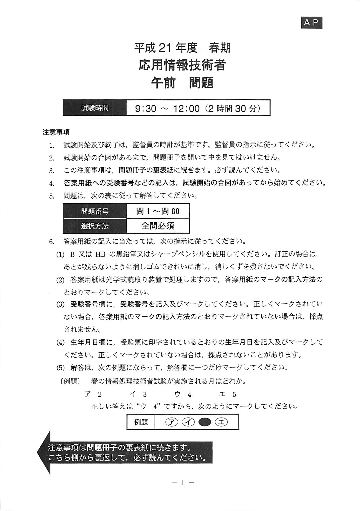

テキスト (OCR)

平成21年度 春期
応用情報技術者

午前 問題
ie 9:30 ~ 12:00 (②時間30人3

注意事項

1. 試験開始及び終了は, 監督貞の時計が基準です。監督貞の指示に従ってください。
2. 試験開始の合図があるまで, 問題冊子を開いて中を見てはいけません。

3. この注意事項は, 問題冊子の裏表紙に続きます。必ず読んでください。

4. 答案用紙への受験番号などの記入は, 試験開始の合図があってから始めてください。
5. 問題は, 次の表に従って解答してください。

問題番号    fa] 1 ~ fej 80
選択方法    全問必須

6. 答案用紙の記入に当たっては, 次の指示に従ってください。

1) B 又は HB の黒鉛筆又はシャープペンシルを使用してください。訂正の場合は,
あとが残らないように消しゴムできれいに消し, 消しくずを残さないでください。
2) 答案用紙は光学式読取り装置で処理しますので, 答案用紙のマークの記入方法の

とおりマークしてください。

(3) BRESWK, 受験番号を記入及びマークしてください。正しくマークされてい
ない場合, 答案用紙のマークの記入方法のとおりマークされていない場合は, 採点
されません。

(4) 生年月日欄に, 受験票に印字されているとおりの生年月日を記入及びマークして
ください。正しくマークされていない場合は, 採点されないことがあります。

(5) 解答は, 次の例題にならって, 解答欄に一つだけマークしてください。

(例題】 春の情報処理技術者試験が実施される月はどれか。

ア 2    イ 3    ウ 4    エ 5
正しい答えは “ウ 4" ですから, 次のようにマークしてください。

例題 | DD@®

注意事項は問題國子の裏表紙に続きます。

こちら側から裏返しで, 必ず読ん々でください。

### ページ 2

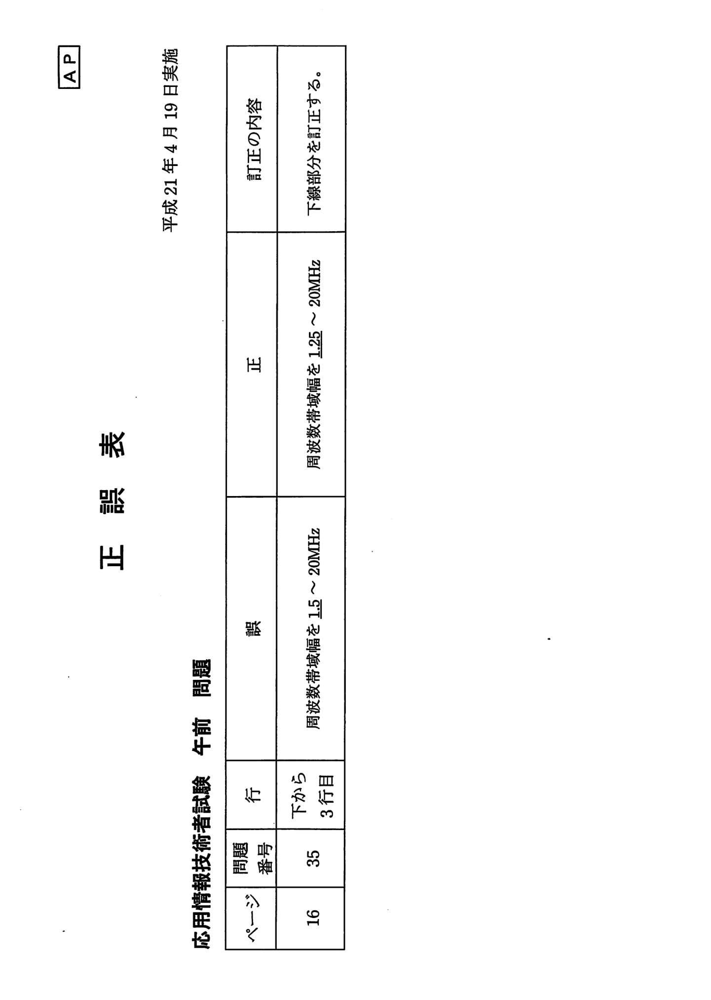

テキスト (OCR)

ー                                         ーー                             y
°C BAT ER OA        ZHINOZ ~ SOT Sih ee SH 206 2 ay          ZHINOZ ~ ST & Bir £4 RF 2 fay       oad     ce       9T
ンド
SMOILE                              x                                          "1                         4       a   <ーン

Hid My Weeo aes
Mise A GT Hf 7 ay 12 Wate

HR
円

### ページ 3

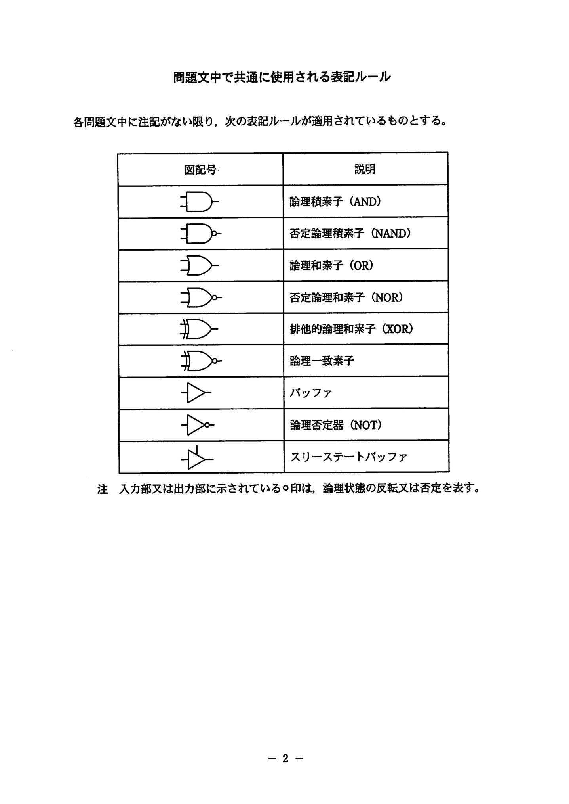

テキスト (OCR)

問題文中で共通に使用される表記ルール

各問題文中に注記がない限り, 次の表記ルールが適用されているものとする。

図記号            説明

論理積素子 (AND)

否定論理積素子 (NAND)

論理和素子 (OR)

否定論理和素子 (NOR)

排他的論理和素子 CXOR)

論理一致素子

パッファ

論理否定器 (NOT)

スリーステートパッファ

YIYYMMVMMVM

注 入力部又は出力部に示されているo印は, 論理状態の反転又は否定を表す。

### ページ 4

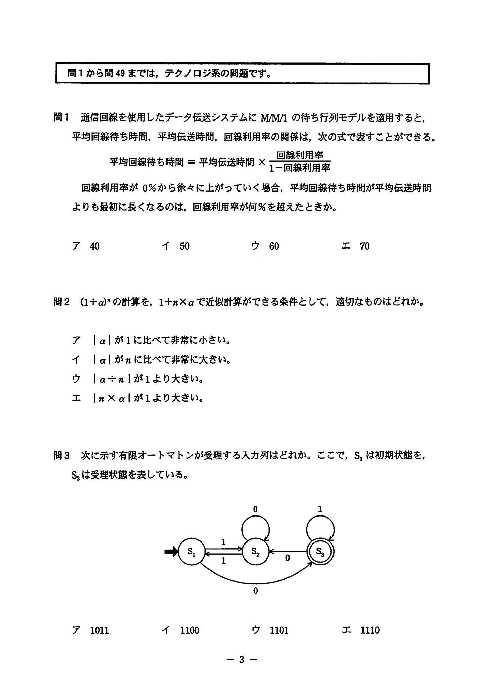

テキスト (OCR)

問 1 から問 49 までは, テクノロジ系の問題です。

問1 通信回線を使用したデータ伝送システムに M/M/1 の待ち行列モデルを適用すると,
平均回線待ち時間, 平均伝送時間, 回線利用率の関係は, 次の式で表すことができる。

          _         、             回線利用率
平均回線待ち時間 = 平均伝送時間 x ュー回線利用率

回線利用率が 0%から徐々に上がっていく場合 平均回線待ち時間が平均伝送時間
よりも最初に長くなるのは, 回線利用率が何%を超えたときか。

ア 40   イ 50   ウ 60   x= 70

問2 ①+oの"の計算を, 1+ヵXcで近似計算ができる条件として, 適切なものはどれか。

|1z| が1 に比べて非常に小さい。
1z | がヵに比べて非常に大きい。
1z+ヵ| が1より大きい。
|lz x gl が1より大きい。

HUA NS

問3 次に示す有限オートマトンが受理する入力列はどれか。ここで, S, は初期状態を,
S。は受理状態を表している。

ア 1011     イ 1100     ウ 1101     x= 1110

### ページ 5

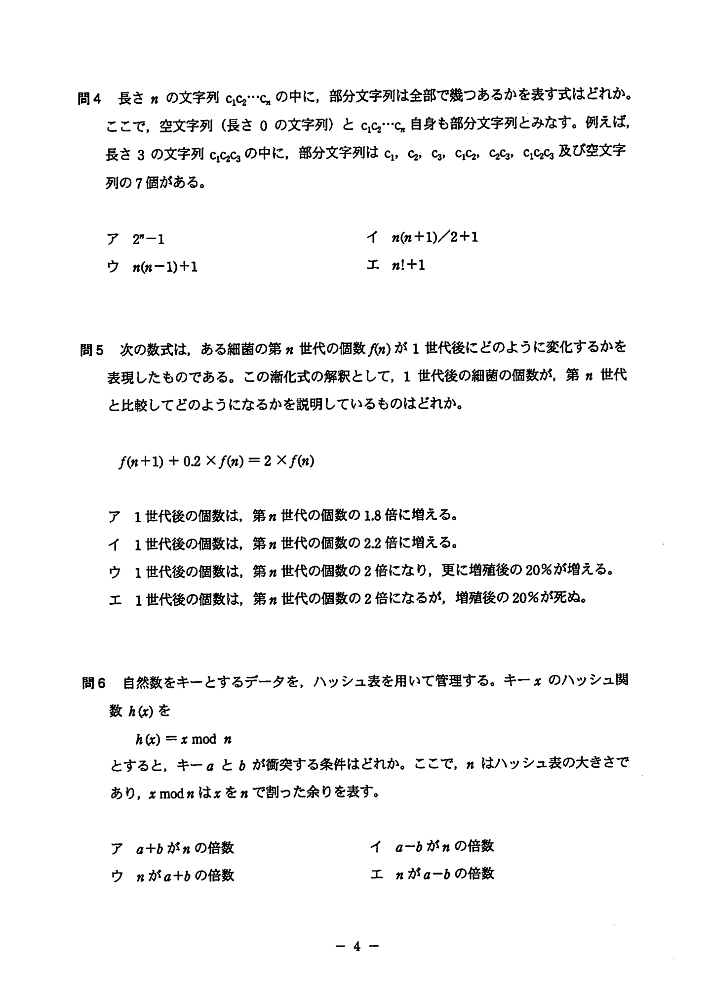

テキスト (OCR)

A4 長さぁヵの文字列 cc…c。 の中に, 部分文字列は全部で幾つあるかを表す式はどれか。
ここで, 空文字列 (BS 0 の文字列) と cic…c。 自身も部分文字列とみなす。例えば,
EX 3 の文字列 cic。 の中に, 部分文字列は co, cu, CC CC CC, 及び空文字
WD 7 個がある。

ア 2-1              イ z@キ1)プ2填1
ウ na-1tl            XL nt+1

問5 次の数式は, ある細菌の第 n 世代の個数 flr) が 1 世代後にどのように変化するかを
表現したものである。この顔化式の解釈として, 1 世代後の細菌の個数が, 第 ヵ 世代
と比較してどのようになるかを説明しているものはどれか。

f(ntl) + 0.2 X fn) =2 X fm)

1 世代後の個数は, Bn 世代の個数の 1.8 倍に増える。

1 世代後の個数は, Bn 世代の個数の 2.2 倍に増える。

1 世代後の個数は, Bn 世代の個数の 2 倍になり, 更に増殖後の 20%が増える。
1 世代後の個数は, 第ヵ 世代の個数の 2 倍になるが, 増殖後の 20%が死ぬ。

H へ

AG 自然数をキーとするデータを, ハッシュ表を用いて管理する。キーァ のハッショ関
Kha) を
he) =x mod n
とすると, キーと? が衝突する条件はどれか。ここで, n はハッシュ表の大きさで
HO, xmodz はヶをぁヵで割った余りを表す。

ア g+ヵがぇの倍数                          4 g-ヵがぁヵの倍数
ウ n®atbh の倍数                 エ ヵzがg-ヵの倍数

### ページ 6

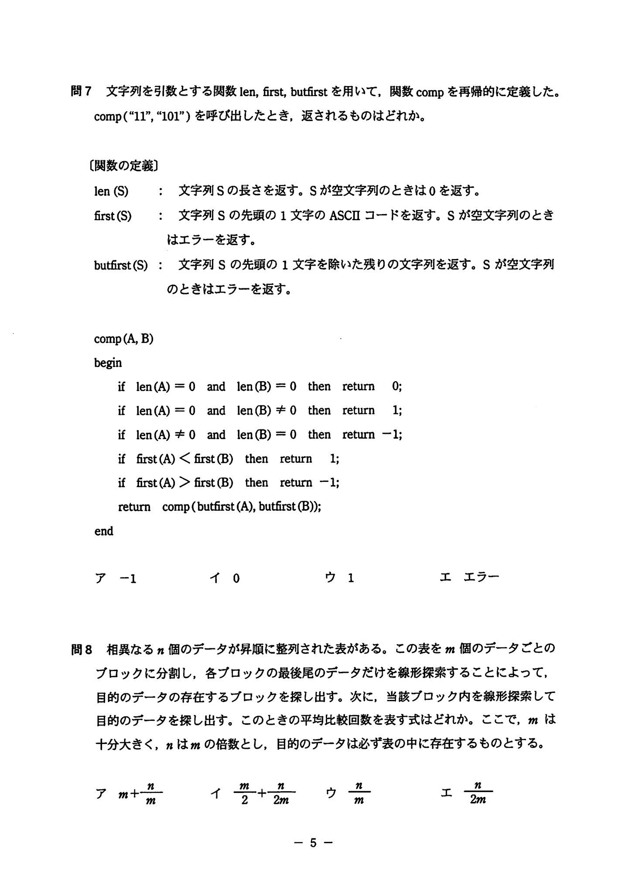

テキスト (OCR)

A? 文字列を引数とする関数 len, first, butfirst を用いて, 関数 comp を再帰的に定義した。
comp(“11”, “101”) を呼び出したとき, 返されるものはどれか。

(関数の定義
len (S)        : 文字列Sの長さを返す。S が空文字列のときは 0 を返す。
first(S) : 文字列Sの先頭の1 文字の ASC コードを返す。S が空文字列のとき

はエラーを返す。
butfrstS) : 文字列 S の先頭の 1 文字を除いた残りの文字列を返す。S が空文字列
のときはエラーを返す。

comp (A, B)

begin

len(A)三0 and len(B)=0 then return 0;
len(A) =0 and len(B) #0 then return 1;
len(A) #0 and len(B)=O0 then return —1;
first(A) < first(B) then return 1;

first(A) > first(B) then return —1;

return comp(butfirst (A), butfirst (B));

BR eR RR Rw

end

問8 RTS n POF—-IMAAICBASHERMHS, CORE mWOT-FTLO
プロックに分割し, 各プロックの最後尾のデータだけを線形探索することによって,
目的のデータの存在するブロックを探し出す。次に, 当該ブロック内を線形探索して
目的のデータを探し出す。このときの平均比較回数を表す式はどれか。ここで, mid
十分大きく, ヵ は の倍数とし, 目的のデータは必ず表の中に存在するものとする。

n    m n
7 mt,   t 2+ on  ウゥる    = om

### ページ 7

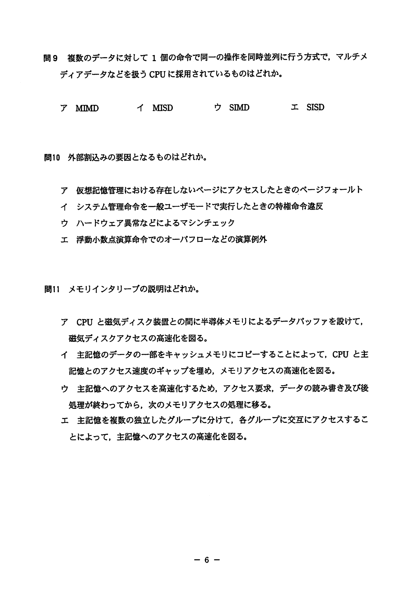

テキスト (OCR)

間9 複数のデータに対して 1 個の命令で同一の操作を同時並列に行う方式で, マルチメ
ディアデータなどを扱う CPU に採用されているものはどれか。

ア MIMD     イ MISD     ウ SIMD     エ SISD

FO 外部割込みの要因となるものはどれか。

仮想記憶管理における存在しないページにアクセスしたときのページフォールト
システム管理命令を一般ユーザモードで実行したときの特権命令違反

ハードウェア異常などによるマシンチェック

浮動小数点演算命令でのオーパフローなどの演算例外

H GAN

問11 メモリインタリープの説明はどれか。

ア CPU と磁気ディスク装置との間に半導体メモリによるデータパッファを設けて,
磁気ディスクアクセスの高速化を図る。

イ 主記憶のデータの一部をキャッシュメモリにコピーすることによって, CPU EE
記憶とのアクセス速度のギャップを埋め, メモリアクセスの高速化を図る。

ウ 主記憶へのアクセスを高速化するため, アクセス要求, データの読み書き及び後
処理が終わってから, 次のメモリアクセスの処理に移る。

エエ 主記憶を複数の独立したグループに分けて, 各グループに交互にアクセスするこ
とによって, 主記憶へのアクセスの高速化を図る。

### ページ 8

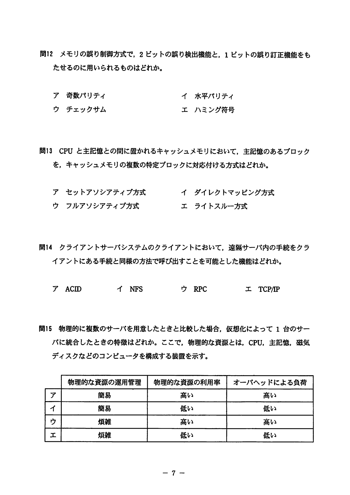

テキスト (OCR)

問12 メモリの誤り制御方式で, 2 ビットの誤り検出機能と, 1 ピットの誤り訂正機能をも
たせるのに用いられるものはどれか。

ア 奇数パリティ          イ 水平パリティ
ウ チェックサム           エエ ハミング符号

間13 CPU と主記憶との間に儲かれるキャッシュメモリにおいて, 主記憶のあるプロック
を, キャッシュメモリの複数の特定ブロックに対応付ける方式はどれか。

ア セットアソシアティブ方式    イ ダイレクトマッピング方式

ウ フルアソシアティブ方式     XL ライトスルー方式

間14 クライアントサーバパシステムのクライアントにおいて, 遠隔サーバ内の手続をクラ

イアントにある手続と同様の方法で呼び出すことを可能とした機能はどれか。

ア ACID     イ NFS     ウ RPC     x= TCP/IP

間15 物理的に複数のサーパを用意したときと比較した場合, 仮想化によって 1 台のサー

バに統合したときの特徴はどれか。ここで, 物理的な資源とは, CPU, 主記憶, 磁気
ディスクなどのコンピュータを構成する装置を示す。

物理的な資源の運用管理 | 物理的な資源の利用率 | オーパヘッドによる負荷

ア                   簡易                                高い                                高い
イ                    fiz                                低い                                低い
ウ          類雑                 高い                 高い
エ                   tet                                低い                                低い

### ページ 9

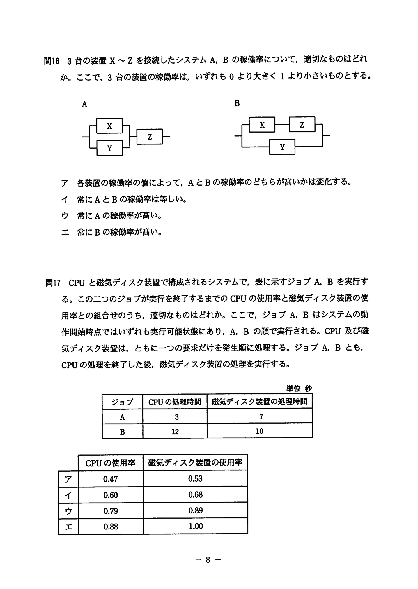

テキスト (OCR)

間16 3 台の装置メーZを接続したシステム A, B の稼働率について, 適切なものはどれ
か。ここで, 3 台の装置の稼働率は, いずれも 0 より大きく 1 より小さいものとする。

A

B

上

ア 各装置の稼働率の値によって, AとBの稼働率のどちらが高いかは変化する。
イ 常にAとBの稼働率は等しい。
ウ 常にAの稼働率が高い。
L 常にBの稼働率が高い。

問17 CPU と磁気ディスク装置で構成されるシステムで, 表に示すジョプ A, B を実行す
る。この二つのジョブが実行を終了するまでの CPU の使用率と磁気ディスク装置の使
用率との組合せのうち, 適切なものはどれか。ここで, ジョブ A, B はシステムの動
作開始時点ではいずれも実行可能状態にあり, A, B の順で実行される。CPU 及び磁
気ディスク装置は ともに一つの要求だけを発生順に処理する。ジョブ A, B とも,
CPU の処理を終了した後, 磁気ディスク装置の処理を実行する。

単位 秒
ジョブ | CPUの処理時間 | 磁気ディスク装置の処理時間
A                     3                                   7
B                    12                                 10
CPU の使用率 | 磁気ディスク装置の使用率
ア              0.47                              0.53
イ              0.60                              0.68
ウ              0.79                              0.89
エ              0.88                               1.00

### ページ 10

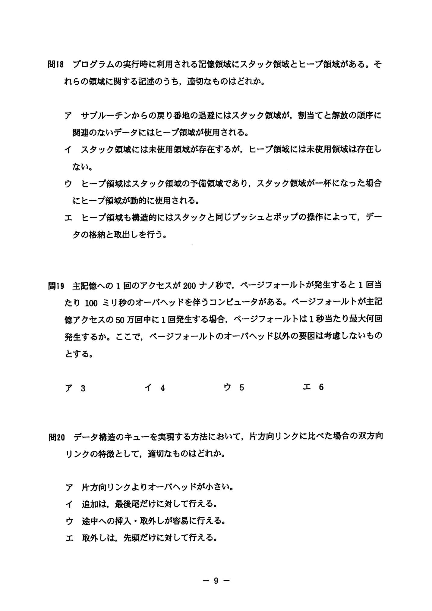

テキスト (OCR)

間18 プログラムの実行時に利用される記億領域にスタック領域とヒープ領域がある。そ
れらの領域に関する記述のうち, 適切なものはどれか。

ア サブルーチンからの戻り番地の退避にはスタック領域が, 割当てと解放の順序に
関連のないデータにはヒープ信域が使用される。

イ スタック傾域には未使用領域が存在するが, ヒープ領域には未使用領域は存在し
ない。

ウ ヒープ傾域はスタック領域の予備領域でちり, スタック信域が一杯になった場合
にヒープ傾域が動的に使用される。

エ ヒーブプ領域も構造的にはスタックと同じプッシュとポップの操作によって, デー
タの格納と取出しを行う。

FNS 主記憶への 1 回のアクセスが 200 ナノ秒で, ページフォールトが発生すると 1 回当
たり 100 ミリ秒のオーパヘッドを伴うコンピュータがある。ページフォールトが主記
憶アクセスの 50 万回中に 1 回発生する場合, ページフォールトは1 秒当たり最大何回
発生するか。ここで, ページフォールトのオーパヘッド以外の要因は考慮しないもの
とする。

ア 3       イ 4       ウ 5       エ 6

間20 データ構造のキューを実現する方法において, 片方向リンクに比べた場合の双方向
リンクの特徴として, 適切なものはどれか。

ア 片方向リンクよりオーパヘッドが小さい。
イ 追加は, 最後尾だけに対して行える。
ウ 途中への挿入・取外しが容易に行える。
KL 取外しは, 先頭だけに対して行える。

### ページ 11

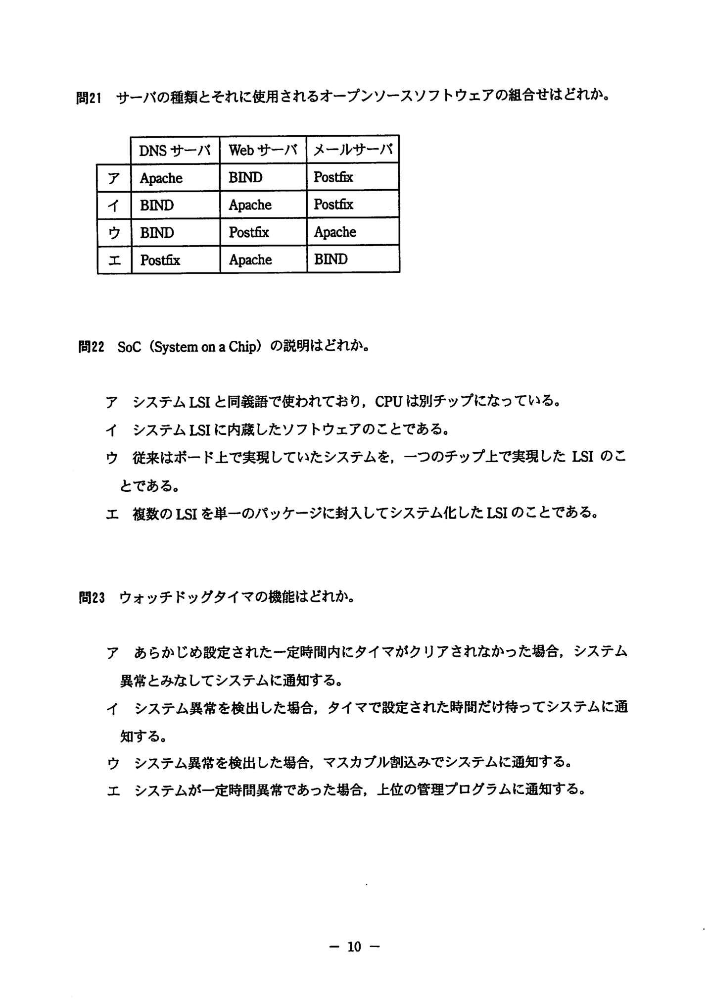

テキスト (OCR)

問21 サーパの種類とそれに使用3されるオープンソースソフトウェアの組合せはどれか。

DNS サーパ | Web サーバ | メールサーバ
ア | Apache             BIND               Postfix
イ | BIND                Apache            Postfix
ウ | BIND                Postfix             Apache
=x. | Postfix              Apache            BIND

間22 SoC (System on a Chip) の説明はどれか。

ア システムLSI と同義語で使われており, CPU は別チップになっている。

イ システム LSI に内蔵したソフトウェアのことである。

ウ 従来はボード上で実現していたシステムを, 一つのチップ上で実現した LSI OF
とである。

エ 複数のLSIを単一のパッケージに封入してシステム化した LSI のことである。

問23 ウォッチドッグタイマの機能はどれか。

ア あらかじめ設定された一定時間内にタイマがクリアされなかった場合, システム
異常とみなしてシステムに通知する。

イ システム異常を検出した場合, タイマで設定された時間だけ待ってシステムに通
知する。

ウ システム異常を検出した場合, マスカブル割込みでシステムに通知する。

L システムが一定時間異常であった場合, 上位の管理プログラムに通知する。

### ページ 12

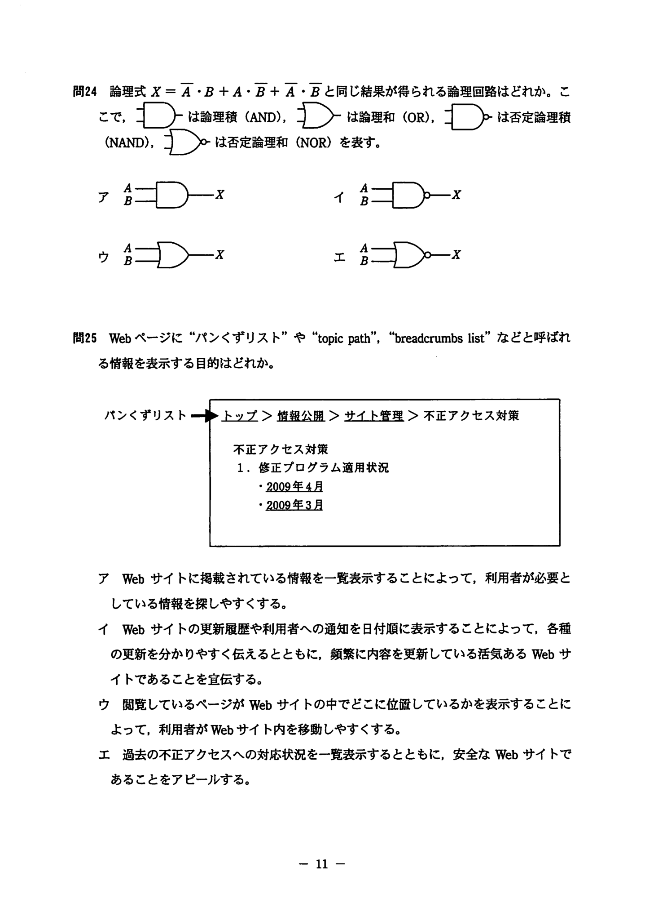

テキスト (OCR)

問24 論理式アニーニ4・ぢ十4・十 4・万と同じ結果が得られる論理回路はどれか。こ

ce, |  )- は只理策 anv), ] >- wae oR), [> warms

(NAND), -] は耕定論理和 (NOR) を表す。
7 ゴー*       + 人ゴータ*
» 5) >—*       ェ ゴメー*

問25 Web ページに“パンくずリスト" や “topic path”, “breadcrumbs list” "などと呼ばれ
る情報を表示する目的はどれか。

パンくずリスト    トップ > 情報公開 > サイト管理 > 不正アクセス対策

不正アクセス対策

1 . 修正プログラム適用状況
・2009年4月
・2009年3月

ア Web サイトに掲載されている情報を一覧表示することによって, 利用者が必要と
している情報を探しやすくする。

イ Web サイトの更新履歴や利用者への通知を日付原に表示することによって, 各種
の更新を分かりやすく伝えるとともに, 頻繁に内容を更新している活気ある Web +
イトであることを宣伝する。

ウ 閲覧しているページが Web サイトの中でどこに位置しているかを表示することに
よって, 利用者が Web サイト内を移動しやすくする。

エエ 過去の不正アクセスへの対応状況を一覧表示するとともに, 安全な Web サイトで
あることをアピールする。

### ページ 13

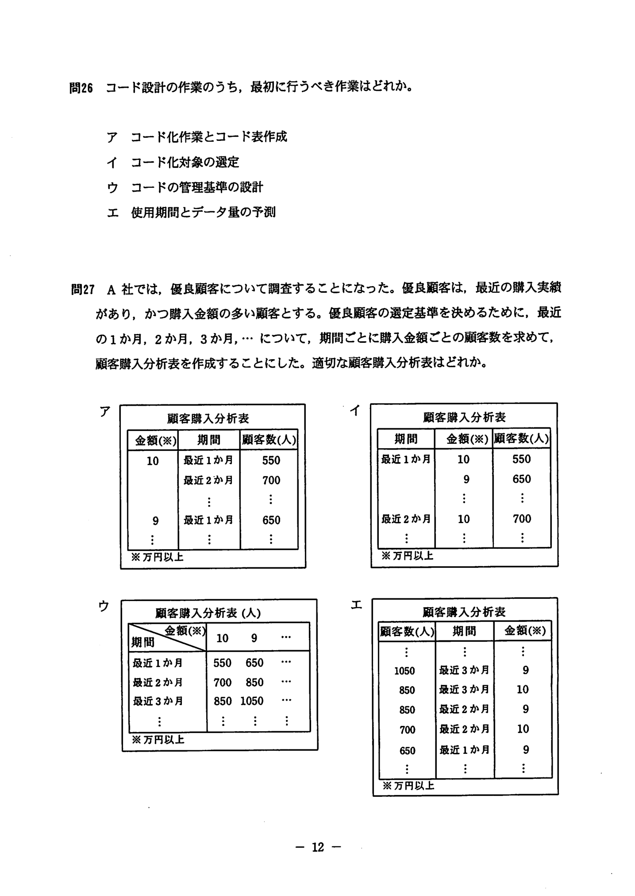

テキスト (OCR)

問26 コード設計の作業のうち, 最初に行うべき作業はどれか。

コード化対象の選定

HOGAN

コード化作業とコード表作成

コードの管理基準の設計
使用期間とデータ量の予測

問27 A 社では, 優良顧客について調査することになった。優良顧客は, 最近の購入実績
があり, かつ購入金額の多い顧客とする。優良顧客の選定基準を決めるために, 最近
の1か月, 2か月, 3か月,… について, 期間ごとに購入金額ごとの顧客数を求めて,
顧客購入分析表を作成することにした。 適切な顧客購入分析表はどれか。

ア           BEMA DR

金額(※)| 期間 |顧客数(人)

10    最近1か月
最近2か月

9    最近1か月

550
700

650

※万円以」

顧客購入分析表 (A)

SANS     cx    10     9

最近1か月         550 650
最近2か月          700 850
最近3か月         850 1050

※万円以上

イ

顧客購入分析表

期間

金額(※)

願客数(人)

最近1か月

最近2か月

10
9

10

550
650

700

※万円以上

願客購入分析表

期間

願客数(人)

1050
850
850
700
650

最近3か月
最近3か月
最近2か月
最近2か月
最近1か月

金額(※)
9
10
9

10
9

※万円以上

### ページ 14

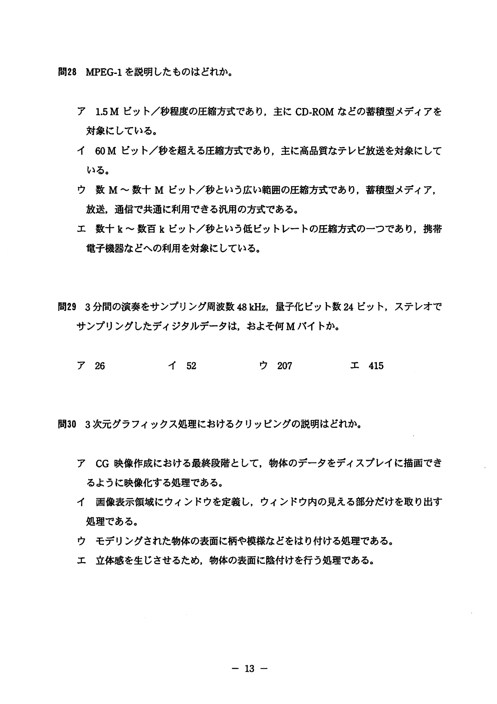

テキスト (OCR)

間28 MPEG-1 を説明したものはどれか。

ア 15M ビットノ秒程度の圧縮方式であり, 主に CD-ROM などの薔積型メディアを
対象にしている。

イ 60M ピットンノ秒を超える圧縮方式であり, 主に高品質なテレビ放送を対象にして
いる。

ウ 数Mて数十M ピットノ秒という広い範囲の圧縮方式であり, 鞭積型メディア,
放送, 通信で共通に利用できる汎用の方式である。

エエ 数十kて数百k ビットノ秒という低ピットレートの圧縮方式の一つであり, 携帯
電子機器などへの利用を対象にしている。

問29 3分間の演奏をサンプリング周波数 48 kHz, 量子化ビット数 24 ビット, ステレオで
サンプリングしたディジタルデータは, およそ何 M パイトか。

ア 26      イ 52      ウ 207      x= 415

問30 3次元グラフィックス処理におけるクリッピングの説明はどれか。

ア CG 映像作成における最終段階として, 物体のデータをディスプレイに描画でき
るように映像化する処理である。

イ 画像表示領域にウィンドウを定義し, ウィンドウ内の見える部分だけを取り出す
処理である。

ウ モデリングされた物体の表面に柄や模様などをはり付ける処理である。

エ 立体感生じさせるため, 物体の表面に陰付けを行う処理である。

### ページ 15

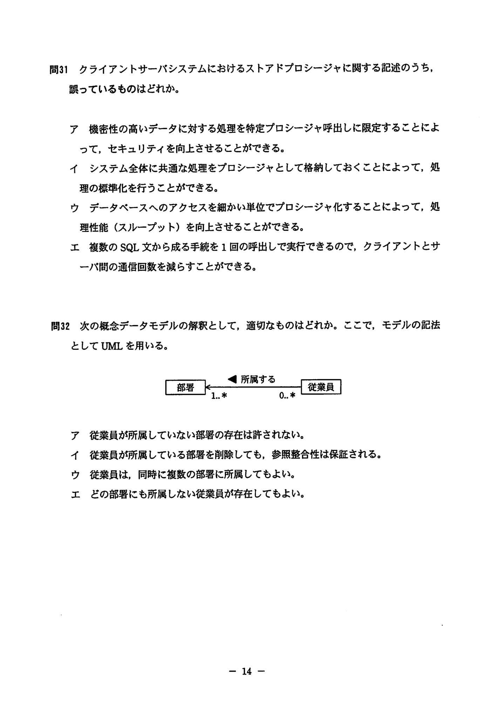

テキスト (OCR)

問31 クライアントサーバシステムにおけるストアドプロシージャに関する記述のうち,
誤っているものはどれか。

ア 機密性の高いデータに対する処理を特定プロシージャ呼出しに限定することによ
って, セキュリティを向上させることができる。

イ システム全体に共通な処理をプロシージャとして格納しておくことによって, 処
理の標準化を行うことができる。

ウ データベースへのアクセスを細かい単位でプロシージャ化することによって, 処
理性能 (スループット) を向上させることができる。

エエ 複数の SQL 文から成る手続を 1 回の呼出しで実行できるので, クライアントとサ
ーバ間の通信回数を減らすことができる。

問32 次の概念データモデルの解釈として, 適切なものはどれか。ここで, モデルの記法
として UML を用いる。

ア 従業員が所属していない部署の存在は許されない。

イ 従業員が所属している部署を削除しても, 参照整合性は保証される。
ウ RAM, 同時に複数の部暑に所属してもよい。

エ どの部暑にも所属しない従業員が存在してもよい。

### ページ 16

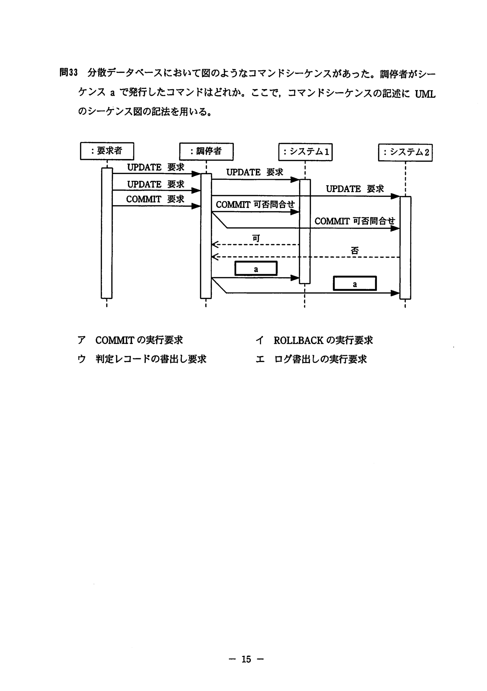

テキスト (OCR)

問33 分散データベースにおいて図のようなコマンドシーケンスがあった。調停者がシー
ケンス a で発行したコマンドはどれか。ここで, コマンドシーケンスの記述に UML
のシーケンス図の記法を用いる。

: 要求者                 ES                : システム1               システム2
ry UPDATE 要求 | uppare wet}
as

UPDATE 要求                      UPDATE BR |
>
| COMMIT 要求 | | COMMIT 可否問合せ
ヽ               COMMIT 可否問合せ
lcーーーーーー     La.               5
aーーニーニーニーニーニーニーニーニーニーー ーこここここニーニーニニニーニニーーー
ir

1              >

“Tt               “tT               4                a

ア COMMIT の実行要求

ウ 判定レコードの書出し要求

イ ROLLBACK の実行要求

エ ログ書出しの実行要求

### ページ 17

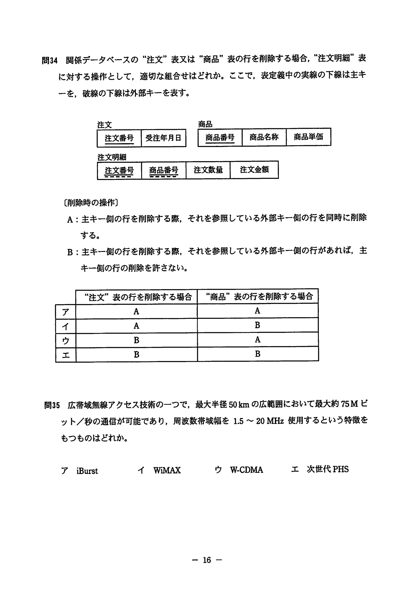

テキスト (OCR)

問34 関係データベースの “HEX” 表又は “商品” 表の行を削除する場合“注文明細" 表
に対する操作として, 適切な組合せはどれか。ここで, 表定義中の実線の下線は主キ
ーを, 破線の下線は外部キーを表す。

注文      商品
注文番号 | 受注年月日  商品番号 | 商品名称 | 商品単価

注文番号 | 商品番号 | 注文数量 | 注文金額

(削除時の操作〕

A: 主キー便の行を削除する際, それを参照している外部キー側の行を同時に削除
する。

B : 主キー側の行を削除する際, それを参照している外部キー側の行があれば, 主
キー側の行の削除を許さない。

“EX” 表の行を削除する場合 | “Hh” 表の行を削除する場合

H] IAIN
wW) wo] >| >
wo} >| oo] >

間35 広帯域無線アクセス技術の一つで, 最大半径 50 km OLMAICSY TRAN IME
ットノ秒の通信が可能であり, 周波数帯域幅を 1.5 ~ 20 MHz 使用するという特徴を
もつものはどれか。

ア iBurst    イ WiMAX    ウ W-CDMA   エ 次世代PHS

### ページ 18

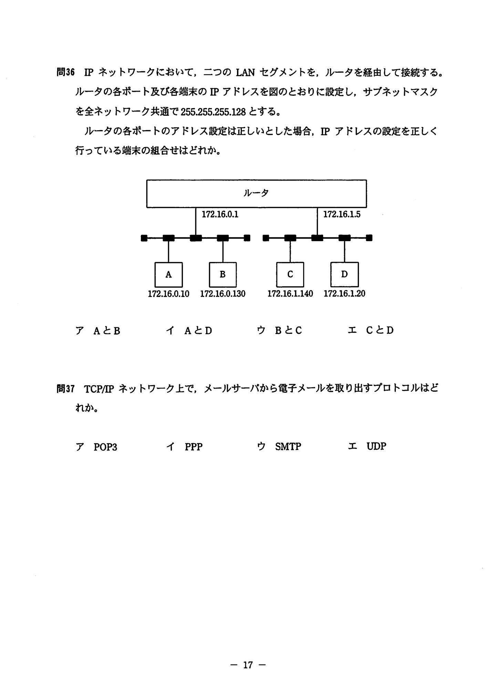

テキスト (OCR)

間36 IP ネットワークにおいて, 二つの LAN セグメントを, ルータを経由して接続する。
ルータの各ポート及び各端末の IP アドレスを図のとおりに設定し, サブネットマスク
を全ネットワーク共通で 255.255.255.128 とする。
ルータの各ポートのアドレス設定は正しいとした場合, TP アドレスの設定を正しく
行っている端末の組合せはどれか。

ルータ

172.16.0.1                                         172.16.1.5

A    B     C    D

172.16.0.10 172.16.0.130  172.16.1.140 172.16.1.20

ア AとB     tf AとD    ウ BとC     x CとD

問37 TCPAP ネットワーク上で, メールサーパから電子メールを取り出すプロトコルはど

れか。

ア POP3     イ PPP     ウ SMTP    x= UDP

ー 17 一

### ページ 19

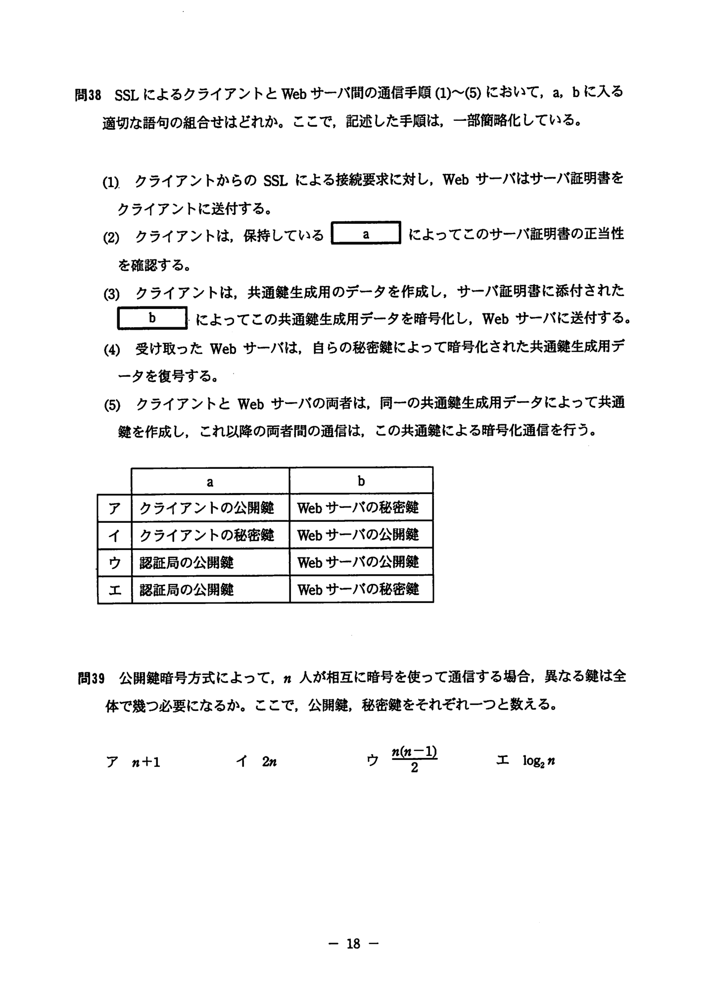

テキスト (OCR)

問38 SSL によるクライアントと Web サーバ間の通信手順 (1)て5) において, a, b に入る
適切な語句の組合せはどれか。ここで, 記述した手順は, 一部簡略化している。

(①) クライアントからの SSL による接続要求に対し, Web サーパはサーパ証明書を
クライアントに送付する。

2) クライアントは, 保持している |  』 | によってこのサーバ証明書の正当性
を確認する。

(⑬ クライアントは, 共通鍵生成用のデータを作成し, サーバ証明午に添付された
[| | によってこの共通鍵生成用データを暗号化し, Web サーバに送付する。

(④ 受け取った Web サーバは, 自らの秘密鍵によって暗号化された共通鍵生成用デ
ータを復号する。

©) クライアントと Web サーバの両者は, 同一の共通鍵生成用データによって共通
鍵を作成し, これ以降の両者間の通信は, この共通凌による暗号化通信を行う。

a                                          b
クライアントの公開鍵 | Web サーパの秘密鍵
クライアントの秘密鍵 | Web サーバの公開鍵
ROARS      Web サーバの公開鍵
認証局の公開鍵      Web サーバの秘密鍵

HIT1ユ1

問39 公開鍵暗号方式によって, n 人が相互に暗号を使って通信する場合, 異なる鍵は全
体で幾つ必要になるか。ここで, ABR, 秘密鍵をそれぞれ一つと数える。

ア z十1     イ 2x      ウ nn)    X log,n

### ページ 20

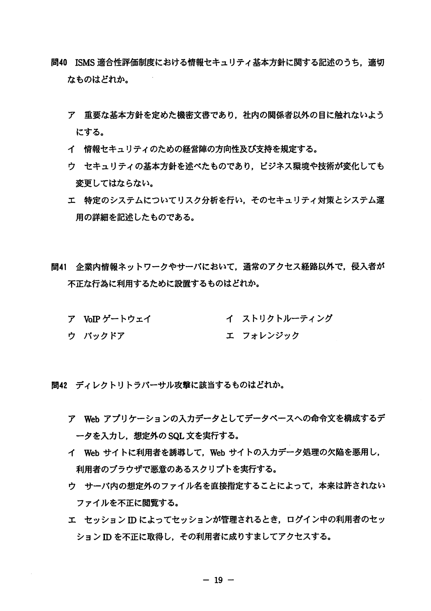

テキスト (OCR)

問40 ISMS 適合性評価制度における情報セキュリティ基本方針に関する記述のうち, 適切
なものはどれか。

ア 重要な基本方針を定めた機密文書であり, 社内の関係者以外の目に触れないよう
にする。

イ 情報セキュリティのための経営陣の方向性及び支持を規定する。

ウ もセキュリティの基本方針を述べたものであり, ビジネス環境や技術が変化しても
変更してはならない。

エエ 特定のシステムについてリスグ分析を行い そのセキュリティ対策とシステム運
用の詳細を記述したものである。

間41 企業内情報ネットワークやサーパにおいて, 通常のアクセス経路以外で, 侵入者が
不正な行為に利用するために設置するものはどれか。

ア VoIP ゲートウェイ       イ ストリクトルーティング
ウ パックドア           L フォレンジック

B42 ディレクトリトラパーサル攻撃に該当するものはどれか。

ア Web アプリケーションの入力データとしてデータベースへの命令文を構成するデ
ータを入力し, BEAD SQL 文を実行する。

A Web サイトに利用者を誘導して, Web サイトの入力データ処理の欠陥を悪用し,
利用者のブラウザで悪意のあるスクリプトを実行する。

ウ サーバ内の想定外のファイル名を直接指定することによって, 本来は許されない
ファイルを不正に閲覧する。

エ セッション ID によってセッションが管理されるとき, ログイン中の利用者のセッ
ション D を不正に取得し, その利用者に成りすましてアクセスする。

### ページ 21

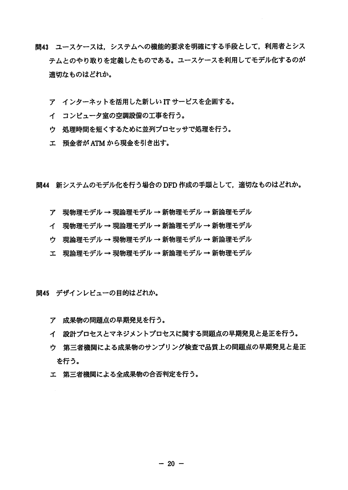

テキスト (OCR)

問43 ユースケースは, システムへの機能的要求を明確にする手段として, 利用者とシス
テムとのやり取りを定義したものである。ユースケースを利用してモデル化するのが
適切なものはどれか。

インターネットを活用した新しい IT サービスを企画する。
コンピュータ室の空調設備の工事を行う。

処理時間を短くするために並列プロセッサで処理を行う。
預金者が ATM から現金を引き出す。

H へ WN

問44 新システムのモデル化を行う場合の DFD 作成の手順として, 適切なものはどれか。

ア 現物理モデル 現論理モデル — 新物理モデル 新論理モデル
イ 現物理モデル 現論理モデル 新論理モデル 一 新物理モデル
ウ 現論理モデル 現物理モデル 一 新物理モデル 一 新論理モデル
エエ 現論理モデル 現物理モデル 一 新論理モデル — 新物理モデル

問45 デザインレビューの目的はどれか。

ア 成果物の問題点の早期発見を行う。

イ 設計プロセスとマネジメントプロセスに関する問題点の早期発見と是正を行う。

ウ 第三者機関による成果物のサンプリング検査で品質上の問題点の早期発見と是正
を行う。

エ 第三者機関による全成果物の合否判定を行う。

### ページ 22

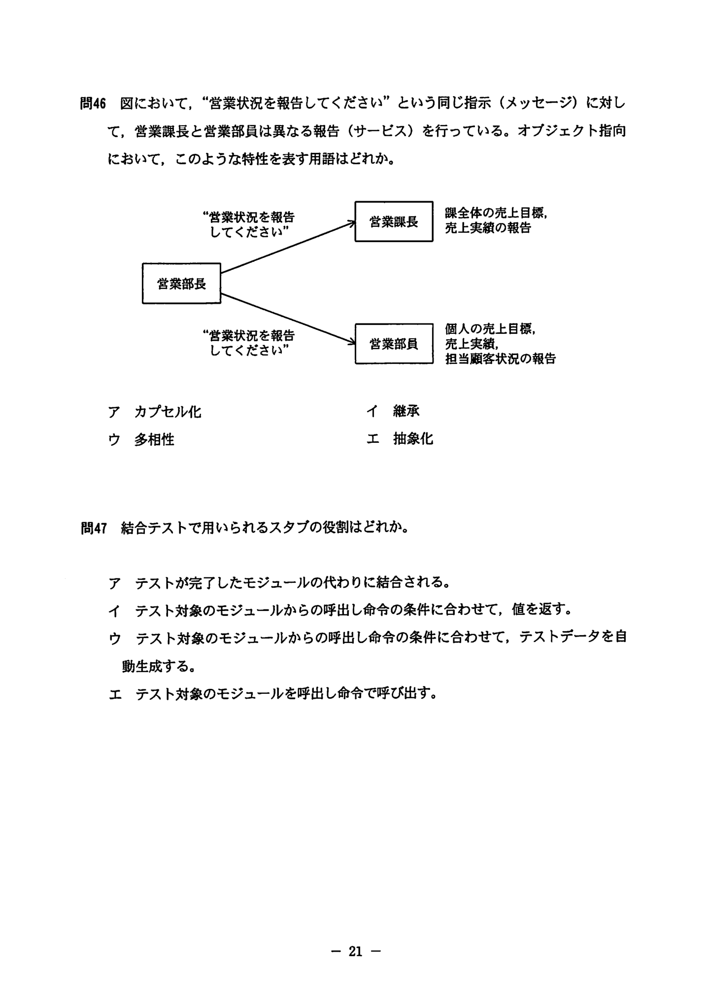

テキスト (OCR)

間46 図において, “営業状況を報告してください"という同じ指示 (メッセージ) に対し
て, 営業課長と営業部員は異なる報告 (サービス) を行っている。オブジェクト指向
において, このような特性を表す用語はどれか。

“営業状況を報告            則全体の売上目標
してください"            売上実績の報告
営業部長
"営業状況を報告            個人の売上目標
してください"             売上実績,
担当顧客状況の報告

ア カプセル化                                          イ 継承
ウ 多相性              エ 抽象化

問47 結合テストで用いられるスタプの役割はどれか。

ア テストが完了したモジュールの代わりに結合される。

イ テスト対象のモジュールからの呼出し命令の条件に合わせて, 値を返す。

ウ テスト対象のモジュールからの呼出し命令の条件に合わせて, テストデータを自
動生成する。

エエ テスト対象のモジュールを呼出し命令で呼び出す。

### ページ 23

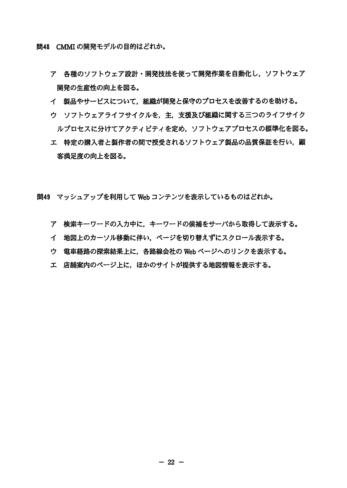

テキスト (OCR)

問48 CMMIの開発モデルの目的はどれか。

ア 各種のソリフトウェア設計・開発技法を使って開発作業を自動化し, ソフトウェア
開発の生産性の向上を図る。

イ 製品やサービスについて, 組織が開発と保守のプロセスを改善するのを助ける。
ウ ソフトウェアライフサイクルを, 主, 支援及び組織に関する三つのライフサイク
ルプロセスに分けてアクティ ビティを定め, ソフトウェアプロセスの標準化を図る。
エ 特定の購入者と製作者の間で授受されるソフトウェア製品の品質保証を行い, B
客満足度の向上を図る。

間49 マッシュアップを利用して Web コンテンツを表示しているものはどれか。

ア 検索キーワードの入力中に, キーワードの候補をサーパから取得して表示する。
イ 地図上のカーソル移動に伴い, ページを切り替えずにスクロール表示する。
ウ
x

電車経路の探索結果上に, 各路線会社の Web ページへのリンクを表示する。
店舗案内のページ上に, ほかのサイトが提供する地図情報を表示する。

### ページ 24

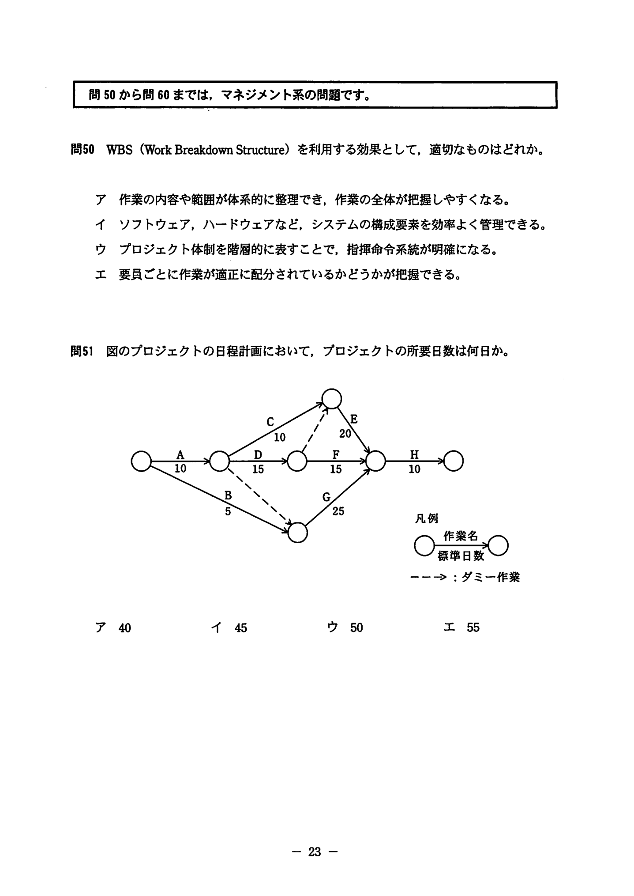

テキスト (OCR)

間 50 から問 60 までは, マネジメント系の問題です。

問50 WBS (Work Breakdown Structure) を利用する効果として, 適切なものはどれか。

作業の内容や範囲が体系的に整理でき, 作業の全体が把握しやすくなる。

ソフトウェア, ハードウェアなど, システムの構成要素を効率よく管理できる。
プロジェクト体制を階層的に表すことで, 指揮命令系統が明確になる。

要員ごとに作業が適正に配分されているかどうかが把握できる。

HOGAN

問51 図のプロジェクトの日程計画において, プロジェクトの所要日数は何日か。

H
10

凡例
〇 作業名  〇
標準日数

ーー : ダミー作業

### ページ 25

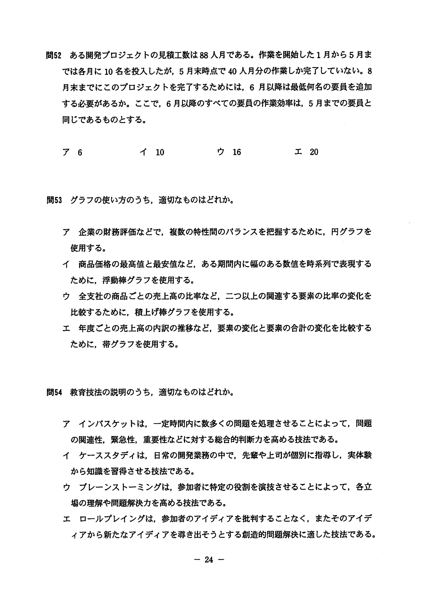

テキスト (OCR)

問52 ある開発プロジェクトの見積工数は 88 人月である。作業を開始した 1 月から5 月ま
では各月に 10 名を投入したが, 5 月末時点で 40 人月分の作業しか完了していない。8
月末までにこのプロジェクトを完了するためには, 6 月以降は最低何名の要員を追加
する必要があるか。ここで, 6 月以降のすべての要員の作業効率は, 5 月までの要員と
同じであるものとする。

ア 6   イ 10   ウ 16   x= 20

問53 グラフの使い方のうち, 適切なものはどれか。

ア 企業の財務評価などで, 複数の特性間のパランスを把握するために, 円グラフを
使用する。

イ 商品価格の最高値と最安値など, ある期間内に幅のある数値を時系列で表現する
ために, 浮動棒グラフを使用する。

ウ 全支社の商品ごとの売上高の比率など, 二つ以上の関連する要素の比率の変化を
比較するために, 積上げ棒グラフを使用する。

エ 年度ごとの売上高の内訳の推移など, 要素の変化と要素の合計の変化を比較する
ために, 帯グラフを使用する。

問54 教育技法の説明のうち, 適切なものはどれか。

ア インパスケットは, 一定時間内に数多くの問題を処理させることによって, 問題
の関連性, 緊急性, 重要性などに対する総合的判断力を高める技法である。

イ ケーススタディは, 日常の開発業務の中で, 先輩や上司が個別に指導し, RAR
から知識を習得させる技法である。

ウ プレーンストーミングは, 参加者に特定の役割を演技させることによって, 各立
場の理解や問題解決力を高める技法である。

エ ロールプレイングは, 参加者のアイディアを批判することなく, またそのアイデ
ィアから新たなアイディアを導き出そうとする創造的問題解決に適した技法である。

— 24 一

### ページ 26

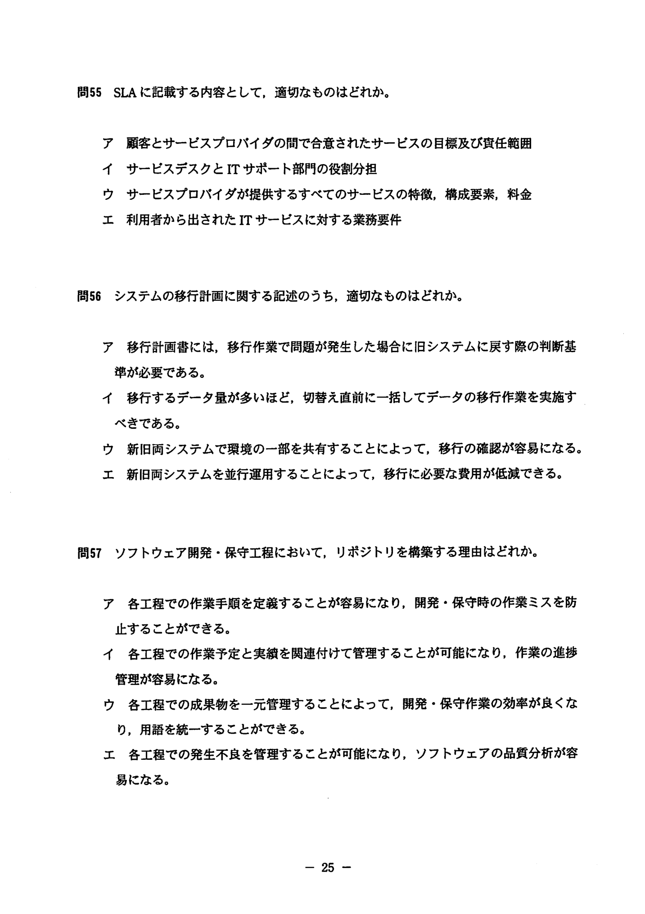

テキスト (OCR)

55 SLAに記載する内容として, 適切なものはどれか。

ア 顧客とサービスプロパイダの問で合意されたサービスの目標及び責任範囲
イ サービスデスクと IT サポート部門の役割分担

ウ サービスプロバイダが提供するすべてのサービスの特徴, 構成要素, 料金
エ 利用者から出された IT サービスに対する業務要件

問55 システムの移行計画に関する記述のうち, 適切なものはどれか。

ア 移行計画書には, 移行作業で問題が発生した場合に旧システムに戻す際の判断基
準が必要である。

イ 移行するデータ量が多いほど, 切替え直前に一括してデータの移行作業を実施す
べきである。

ウ 新旧両システムで環境の一部を共有することによって, 移行の確認が容易になる。

エ 新旧両システムを並行運用することによって, 移行に必要な費用が低減できる。

AS? ソフトウェア開発・保守工程において, リポジトリを構築する理由はどれか。

ア 各工程での作業手順を定義することが容易になり, 開発・保守時の作業ミスを防
止することができる。

4 各工程での作業予定と実績を関連付けて管理することが可能になり, 作業の進捗
管理が容易になる。

ウ 各工程での成果物を一元管理することによって, 開発・保守作業の効率が良くな
り, 用語を統一することができる。

L 各工程での発生不良を管理することが可能になり, ソフトウェアの品質分析が容
易になる。

### ページ 27

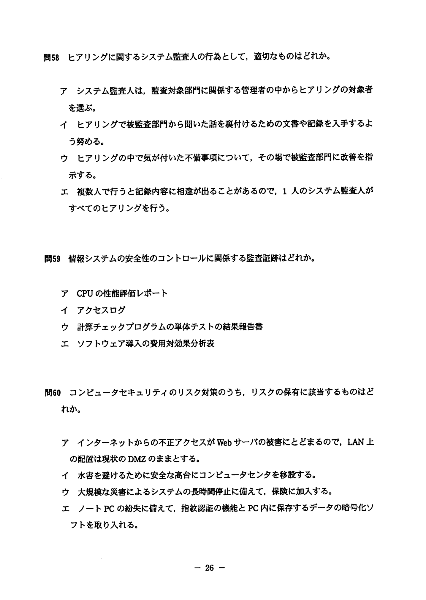

テキスト (OCR)

B58 ヒアリングに関するシステム監査人の行為として, 適切なものはどれか。

ア システム監査人は, 監査対象部門に関係する管理者の中からヒアリングの対象者
を選ぶ。

A ヒアリングで被監査部門から開いた話を裏付けるための文書や記録を入手するよ
う努める。

ウ ヒアリングの中で気が付いた不備事項について, その場で被監査部門に改善を指
示する。

エ 複数人で行うと記録内容に相違が出ることがあるので, 1 人のシステム監査人が
すべてのヒアリングを行う。

問59 情報システムの安全性のコントロールに関係する監査証跡はどれか。

CPU の性能評価レポート

アクセスログ

計算チェックプログラムの単体テストの結果報告書
ソフトウェア導入の費用対効果分析表

HAN

間60 コンピュータセキュリティのリスク対策のうち, リスクの保有に該当するものはど
れか。

ア インターネットからの不正アクセスが Web サーバの被害にとどまるので, LAN 上
の配置は現状の DMZ のままとする。

イ 水害を避けるために安全な高台にコンピュータセンタを移設する。

ウ 大規模な災害によるシステムの長時間停止に備えて, 保険に加入する。

エ ノート PCの紛失に備えて, 指紋認証の機能と PC 内に保存するデータの障号化ソ
フトを取り入れる。

### ページ 28

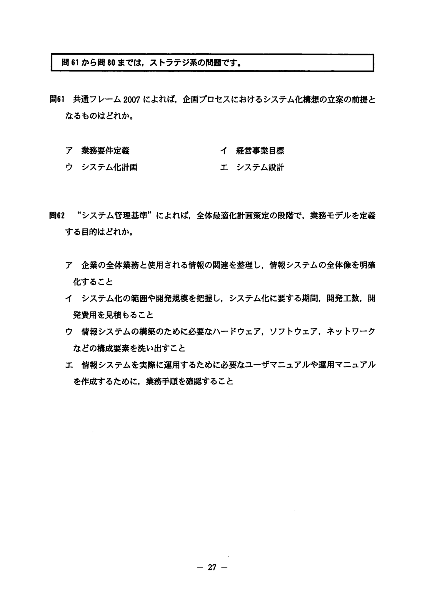

テキスト (OCR)

問 61 から問 80 までは, ストラテジ系の問題です。

問61 共通フレーム 2007 によれぱば, 企画プロセスにおけるシステム化構想の立案の前提と
なるものはどれか。

ア 業務要件定義           イ 経営事業目標
ウ システム化計画          エ システム設計

問62 “システム管理基準" によれば, 全体最適化計画策定の段階で, 業務モデルを定義
する目的はどれか。

ア 企業の全体業務と使用される情報の関連を整理し, 情報システムの全体像を明確
化すること

イ システム化の範囲や開発規模を把握し, システム化に要する期間, 開発工数, 開
発費用を見積もること

ウ 情報システムの楠築のために必要なハードウェア, ソフトウェア, ネットワーク
などの構成要素を洗い出すこと

エエ 情報システムを実際に運用するために必要なユーザマニュアルや運用マニュアル
を作成するために, 業務手順を確認すること

### ページ 29

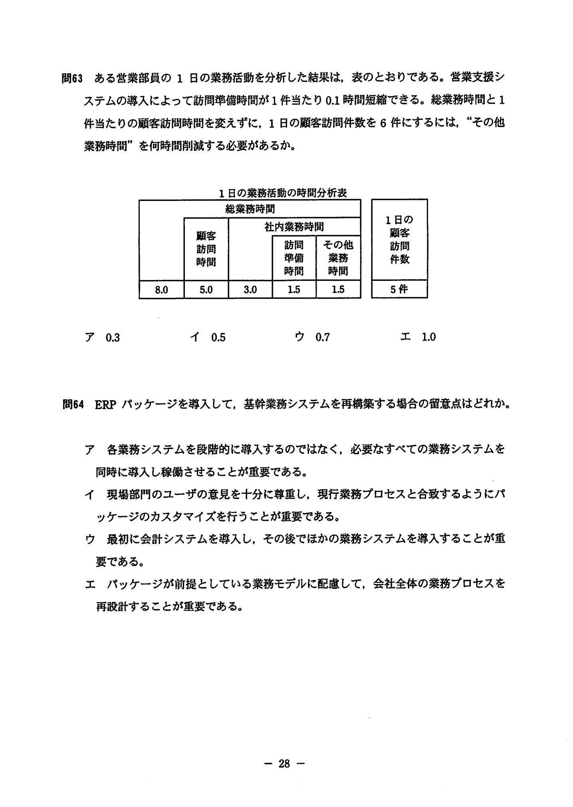

テキスト (OCR)

問63 ある営業部員の 1 日の業務活動を分析した結果は, 表のとおりである。営業支援シ
ステムの導入によって訪問準備時間が 1 件当たり 0.1 時間短縮できる。総業務時間と 1
件当たりの顧客訪問時間を変えずに, 1 日の顧客訪問件数を 6 件にするには, “その他
業務時間" を何時間削減する必要があるか。

1 日の業務活動の時間分析表

総業務時間           LAO
wx     社内業務時間       Bx
訪問      訪問 | その他   訪問
時間      amg | 業務    件数
時間  時間
8.0   5.0   3.0   1.5   1.5    5件
ア 03      イ 0.5      ウ 0.7      x= 10

問64 ERP パッケージを導入して, 基幹業務システムを再構築する場合の留意点はどれか。

ア 各業務システムを段階的に導入するのではなく, 必要なすべての業務システムを
同時に導入し稼働させることが重要である。

イ 現場部門のユーザの意見を十分に尊重し, 現行業務プロセスと合致するようにパ
ッケージのカスタマイズを行うことが重要である。

ウ 最初に会計システムを導入し, その後でほかの業務システムを導入することが重
要である。

エ パッケージが前提としている業務モデルに配慮して, 会社全体の業務プロセスを
再設計することが重要である。

### ページ 30

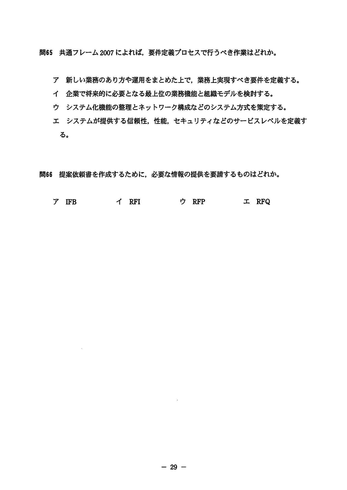

テキスト (OCR)

問65 共通フレーム 2007 によれば, 要件定義プロセスで行うべき作業はどれか。

新しい業務のあり方や運用をまとめた上で, 業務上実現すべき要件を定義する。
企業で将来的に必要となる最上位の業務機能と組織モデルを検討する。

システム化機能の整理とネットワーク構成などのシステム方式を集定する。

システムが提供する信頼性, 性能. セキュリティなどのサービスレベルを定義す
る。

H GAN

問66 提案依頼書を作成するために, 必要な情報の提供を要請するものはどれか。

ア IFB    イ RFI     ウ RFP    = RFQ

### ページ 31

テキスト (OCR)

問67 図に示すマトリックス表を用いたポートフォリオ類型によって, 事業計画や競争優
位性の分析を行う目的はどれか。

事業の強み (市場シェア)

(BNO aS) FREES HR

強        弱

ア 目標として設定したプロモーション効果を測定するために, 自らの置かれた立場
を評価する。

イ 目標を設定し, 資源配分の優先順位を設定するための基礎として, 自らの置かれ
た立場を評価する。

ウ 目標を設定し, 製品の品質を高めることによって, 市場での優位性を維持する方
集を評価する。

工 目標を設定するために, 季節変動要因や地域的広がりを加味することによって

市場の変化を評価する。

問68 SWOT分析を説明したものはどれか。

ア 企業の財務諸表を基に, 収益性及び安全性を分析する手法である。

イ 経営戦略を立てるために, 自社の強みと弱み, 機会と脅威を分析する手法である。
ウ 自社製品・サービスの市場での位置付けや評価を明らかにする手法である。

エエ 自社製品の価格設定のために, 市場での競争力を分析する手法である。

### ページ 32

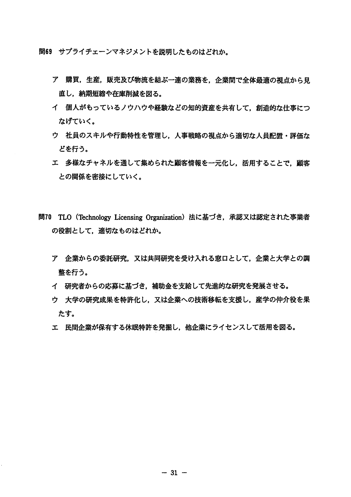

テキスト (OCR)

間69 サプライチェーンマネジメントを説明したものはどれか。

ア 購買, 生産, 販売及び物流を結ぶ一連の業務を, 企業問で全体最適の視点から見
直し, 納期短縮や在庫削減を図る。

イ 個人がもっているノウハウや経験などの知的資産を共有して, 創造的な仕事につ
なげていく。

ウ 社員のスキルや行動特性を管理し, 人事戦略の視点から適切な人員配置・評価な
どを行う。

エ 多様なテャネルを通して集められた顧客情報を一元化し, 活用することで, 顧客
との関係を密接にしていく。

問70 TLO (Technology Licensing Organization) 法に基づき, 承認又は認定された事業者
の役割として, 適切なものはどれか。

ア 企業からの委託研究, 又は共同研究を受け入れる窓口として, 企業と大学との調
整を行う。

イ 研究者からの応募に基づき, 補助金を支給して先進的な研究を発展させる。

ウ 大学の研究成果を特許化し, 又は企業への技術移転を支援し, 産学の仲介役を果
たす。

エエ 民間企業が保有する休眼特許を発掘し, 他企業にライセンスして活用を図る。

### ページ 33

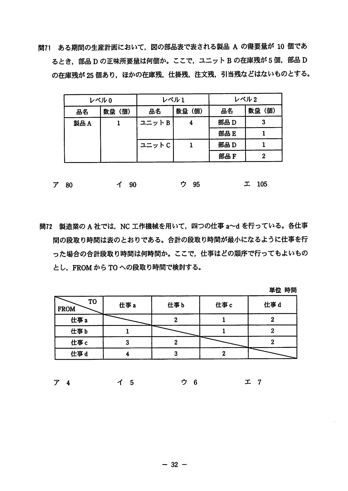

テキスト (OCR)

Al] ある期間の生産計画において, 図の部品表で表される製品 A の委要量が 10 個であ
るとき, RAD の正味所要量は何個か。ここで, ユニット B の在庫残が5 個, 部品D
の在庫残が 25 個あり, ほかの在庫残, 仕掛残, 注文残, 引当残などはないものとする。

レベル0                           レベル 1                           レベル 2
品名    数量 (個)     品名    SR (個)     品名    SR (個)
製品A    1   ユニットB   4    部品D    3
部品E   1
ユニットC   1    部品D    1
部品F   2
ア 80           イ 90           ウ 95           x 105

間72 製造業の A 社では, NC 工作機械を用いて, 四つの仕事 ad を行っている。各仕事
間の段取り時間は表のとおりである。合計の段取り時間が最小になるように仕事を行
った場合の合計段取り時間は何時間か。ここで, 仕事はどの順序で行ってもよいもの
とし, FROM から TO への段取り時間で検討する。

単位 時間
TO    仕事a      仕事b     仕事c      仕事
FROM
仕事a                                                   2                           1                           2
仕事b                       1                                                       1
仕事c                       3                           2                                                       2
仕事d                       4                           3                           2

### ページ 34

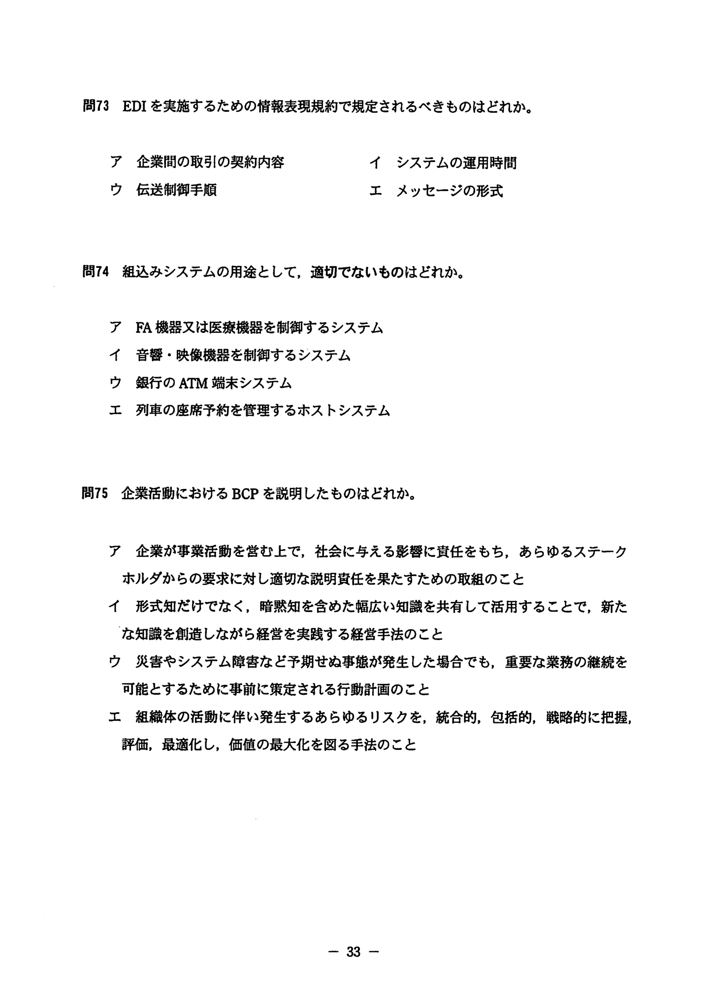

テキスト (OCR)

間73 EDI を実施するための情報表現規約で規定されるべきものはどれか。

ア 企業間の取引の契約内容      イ システムの運用時間
ウ 伝送制御手順           エエ メッセージの形式

間74 組込みシステムの用途として, 適切でないものはどれか。

ア RA 機器又は医療機器を制御するシステム
イ 音故・映像機器を制御するシステム
ウ 銀行の ATM 端末システム

エ 列車の座席予約を管理するホストシステム

問75 企業活動における BCP を説明したものはどれか。

ア 企業が事業活動を営む上で, 社会に与える影響に次任をもち, あらゆるステーク
ホルダからの要求に対し適切な説明資任を果たすための取組のこと
イ 形式知だけでなく, 暗黙知を含めた幅広い知識を共有して活用することで, 新た
な知識を創造しながら経営を実践する経営手法のこと
ウ 災害やシステム障害など予期せぬ事態が発生した場合でも, 重要な業務の継続を
可能とするために事前に策定される行動計画のこと
エエ 組織体の活動に伴い発生するあらゆるリスクを, BAW, 包括的, 戦略的に把握
評価, 最適化し, 価値の最大化を図る手法のこと

### ページ 35

テキスト (OCR)

問76 ゲーム理論を使って検討するのに適している業務はどれか。

イベント会場の入場ゲート数の決定
売れ筋商品の要因の分析
競争者がいる地域での販売戦略の集定
新規開発商品の第要の予測

H へ SW

HiT? Rid, ある企業の損益計算書である。損益分野点は何百万円か。

単位 百万円
項 目               AR         金額
売上高                                                 700
売上原価                   変動旨 100
固定費 200| 300
売上総利益                                          400

販売費・一般管理費| SHR 40
HER 300  340

税引前利益

3

ア 250     イ 40 |   ウ 500     x 625

間78 FERSMILEICSYCT, 営業秘密となる要件は, “秘密として管理されているこ
と"。 “事業活動に有用な技術上又は営業上の情報であること" ともう一つはどれか。

ア 営業譲渡が可能なこと                          イ 期間が10 年を超えないこと
ウ 公然と知られていないこと         エエ 特許出願をしていること

### ページ 36

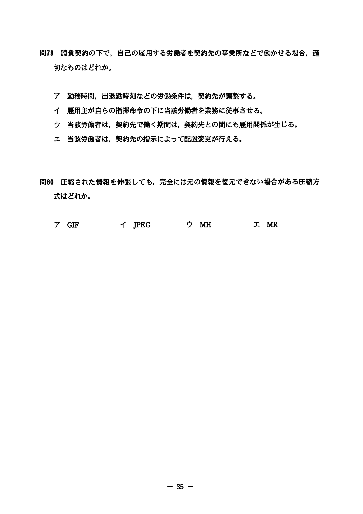

テキスト (OCR)

問79 請負契約の下で, 自己の雇用する労働者を契約先の事業所などで働かせる場合 敵
切なものはどれか。

ア 勤務時間, 出退勤時刻などの労働条件は, 契約先が調整する。
イ 雇用主が自らの指揮命令の下に当該労働者を業務に従事させる。

ウ 当該労働者は, 契約先で働く期間は, 契約先との間にも雇用関係が生じる。
エエ 当該労働者は, 契約先の指示によって配置変更が行える。

問80 圧縮された情報を伸張しても, 完全には元の情報を復元できない場合がある圧縮方

式はどれか。

ア GIF   イ JPEG  ウ MH   <= MR

### ページ 37

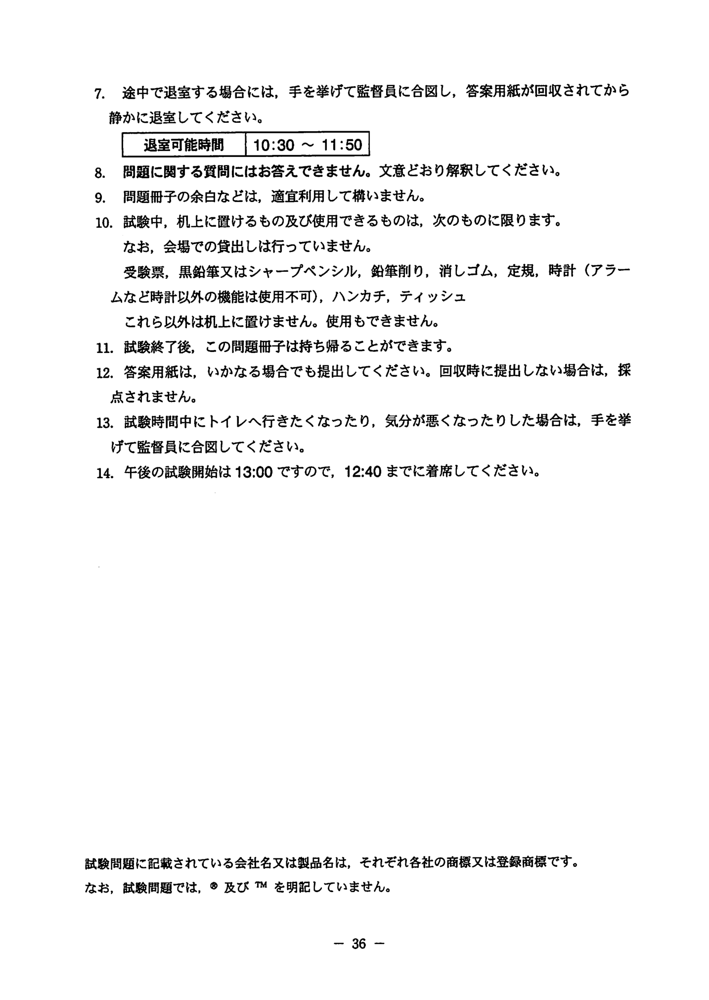

テキスト (OCR)

7. 途中で退室する場合には, 手を挙げて監督員に合図し, 答案用紙が回収されてから
静かに退室してください。
退室可能時間    10:30 ~ 11:50
問題に関する質問にはお答えできません。文意どおり解釈してください。
. 問題冊子の余白などは, 適宜利用して構いません。
10. 試験中, 机上に置けるもの及び使用できるものは, 次のものに限ります。
なお, 会場での貸出しは行っていません。
SBM, 黒鉛筆又はシャープペンシル, 鉛筑削り, 消しゴム, 定規, 時計 (アラー
ムなど時計以外の機能は使用不可), ハンカチ, ティッシュ
これら以外は机上に置けません。使用もできません。
11. 試験終了後, この問題冊子は持ち帰ることができます。
12. 答案用紙は, いかなる場合でも提出してください。回収時に提出しない場合は, 採
点されません。
13. 試験時間中にトイレへ行きたくなったり, 気分が悪くなったりした場合は, FE
げて監督員に合図してください。
14. 午後の試験開始は 13:00 ですので, 12:40 までに着席してください。

試験問題に記載されている会社名又は製品名は, それぞれ各社の商標又は登録商標です。
なお, 試験問題では, @ 及び "W を明記していません。

---

## 午前解答

Copyright(c) Information-technology Promotion Agency, Japan. All rights reserved 2009 
平成21 年度 春期 応用情報技術者試験 解答例 
 
午前試験 
問番号 
正解 
 
問番号 
正解 
問番号
正解 
問番号 
正解 
問1 
イ 
 
問21 
イ 
問41 
ウ 
問61 
イ 
問2 
ア 
 
問22 
ウ 
問42 
ウ 
問62 
ア 
問3 
ウ 
 
問23 
ア 
問43 
エ 
問63 
ウ 
問4 
イ 
 
問24 
イ 
問44 
イ 
問64 
エ 
問5 
ア 
 
問25 
ウ 
問45 
ア 
問65 
ア 
問6 
イ 
 
問26 
イ 
問46 
ウ 
問66 
イ 
問7 
ア 
 
問27 
ウ 
問47 
イ 
問67 
イ 
問8 
イ 
 
問28 
ア 
問48 
イ 
問68 
イ 
問9 
ウ 
 
問29 
イ 
問49 
エ 
問69 
ア 
問10 
ウ 
 
問30 
イ 
問50 
ア 
問70 
ウ 
問11 
エ 
 
問31 
ウ 
問51 
エ 
問71 
イ 
問12 
エ 
 
問32 
ウ 
問52 
イ 
問72 
ア 
問13 
ア 
 
問33 
イ 
問53 
イ 
問73 
エ 
問14 
ウ 
 
問34 
イ 
問54 
ア 
問74 
エ 
問15 
ア 
 
問35 
イ 
問55 
ア 
問75 
ウ 
問16 
エ 
 
問36 
イ 
問56 
ア 
問76 
ウ 
問17 
イ 
 
問37 
ア 
問57 
ウ 
問77 
エ 
問18 
ア 
 
問38 
ウ 
問58 
イ 
問78 
ウ 
問19 
ウ 
 
問39 
イ 
問59 
イ 
問79 
イ 
問20 
ウ 
 
問40 
イ 
問60 
ア 
問80 
イ

---

## 午後問題

### ページ 1

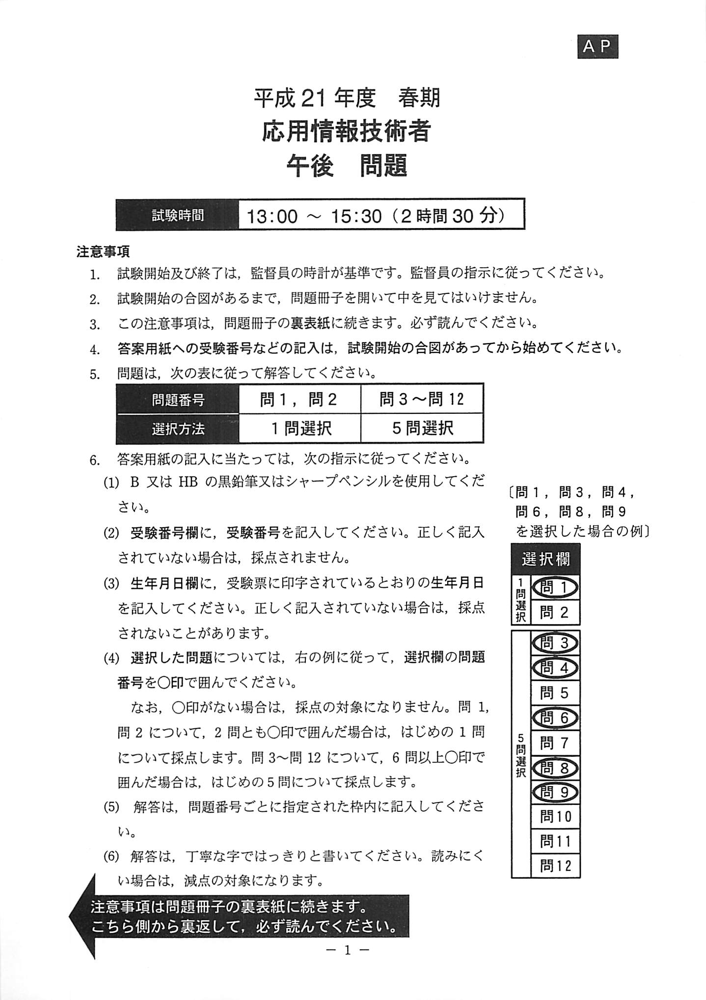

テキスト (OCR)

平成21年度 春期
応用情報技術者
午後 問題

 13:00 ~ 15:30 (2時間 30 分)

注意事項

1. 試験開始及び終了は, 監督中の時計が基準です。監督貞の指示に従ってください。
2. 試験開始の合図があるまで, 問題冊子を開いて中を見てはいけません。

3. この注意事項は, 問題冊子の裏表紙に続きます。必ず読んでください。
4

5

答案用紙への受験番号などの記入は, 試験開始の合図があってから始めてください。
問題は, 次の表に従って解答してください。

問題番号        ll, 問2      問3 >問 12
選択方法    1 問選択    5 間選択

6. 答案用紙の記入に当たっては, 次の指示に従ってください。
(1) B 又は HB の黒鉛筆又はシャープペンシルを使用してくだ

〔問1, fi3, 問4,

さい。                         BiG, RIS, 問9
⑫ 受験番号欄に, 受験番号を記入してください。正しく記入 。 を選択した場合の例】
されていないり場合は, 採点されません。           選択欄
3 SAAC, 受験票に印字されているとおりの生年朋日 [MTD
を記入してください。正しく記入されていない場合は, 採点 [BT ey 2
されないことがあります。                     GD
(4) 選択した問題については, 右の例に従って, 選択欄の問題   as
番号を〇印で囲んでください。                  Fs
なお, 〇印がない場合は, 採点の対象になりません。問 1,  本で
問 2 について, 2 問とも〇印で囲んだ場合は。はじめの1問 |, Pm
について採点します。問 3て問 12 について, 6 問以上O印で = [8k
囲んだ場合は,。 はじめの 5 問について採点します。       —
©) 解答は, 問題番号ごとに指定された拝内に記入してくださ    本10
い。                                                                問11
(6) 解答は, 丁寧な字ではっきりと書いてください。読みにく    P12

い場合は, 減点の対象になります。

注意事項は問題冊子の裏表紙に続きます。
こちら側から裏返して, 必ず読んでください。

### ページ 2

### ページ 3

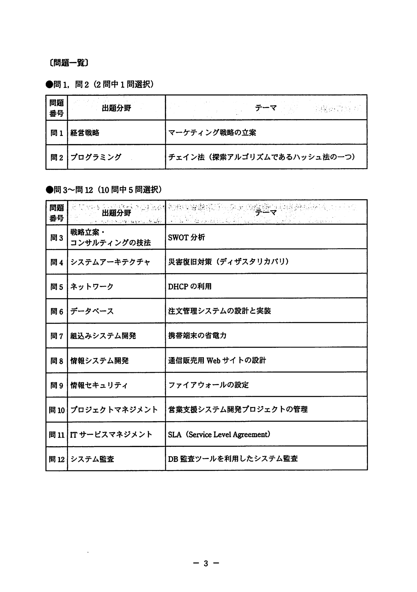

テキスト (OCR)

〔間題一覧〕

@Fi1, 問2 (2問中1問選択)

               HBF                                               テーマ

問 1 | 経営戦略                        マーケティング戦略の立案

則2 |プログラミング            チェイン法 (探索アルゴリズムであるハッシュ法の一つ)
@FFi 3~Fi 12 (10 問中 5 問選択)

fas   コンサルティ vy oti [SWOT aH

4 | | システムアーキテクチャ     災害復旧対策 (ディザスタリカバリ)

問5 | ネットワーク         DHCP の利用

Fi6 | データベース                      注文管理レステムの設計と実装

7 | 組込みシステム開発           携帯端末の省電力

Hs | 情報システム開発               通信販売用 Web サイトの設計

Bo | 情報セキュリティ       ファイアウォールの設定

Flo) プロジェクトマネジメント |営業支援システム開発プロジェクトの管理
問11 |TT サービスマネジメント |SLA (Service Level Agreement)

問12| システム監査                      DB 監査ツールを利用したシステム監査

### ページ 4

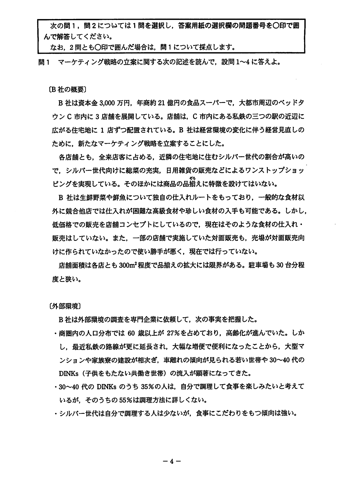

テキスト (OCR)

次の間 1 , 問2 については 1 問を選択し, 答案用紙の選択拉の問題番号を〇印で囲
んで解答してください。
なお, 2 問とも〇印で囲んだ場合は, 問 1 について採点します。

All マーケティング戦略の立案に関する次の記述を読んで, 設問 1ご4 に答えよ。

(B 社の概要)

B 社は資本金 3.000 万円, 年商約 21 億円の食品スーパーで, 大都市周辺のベッドタ
OY 市内に 3 店舗を展開している。店舗は, C 市内にある私鉄の三つの駅の近辺に
広がる住宅地に 1 店ずつ配置されている。B 社は経営環境の変化に伴う経営見直しの
ために, 新たなマーケティング戦略を立案することにした。

各店舗とも, 全来店客に占める, 近隣の住宅地に住むシルバー世代の割合が高いの
で, シルバー世代向けに総菜の充実, 日用雑貨の販売などによるワンストップショッー
ピングを実現している。そのほかには商品の品揃えに特徴を設けてはいない。

B 社は生鮮野菜や鮮角について独自の仕入れルートをもっており, 一般的な食材以
外に競合他店では仕入れが困難な高級食材や珍しい食材の入手も可能である。しかし,
低価格での販売を店舗コンセプトにしているので, 現在はそのような食材の仕入れ・
販売はしていない。また, 一部の店舗で実施していた対面販売も, 売場が対面販売向
けに作られていなかったので使い勝手が悪く, 現在では行っていない。

店舗面積は各店とも 300m*程度で品揃えの拡大には限界がある。駐車場も 30698
度と狭い。

(外部環境)
B 社は外部環境の調査を専門企業に依頼して, 次の事実を把握した。

・商昭内の人口分布では 60 歳以上が 27%を占めており, 高齢化が進んでいた。しか
し, 最近私鉄の路線が更に延長され, 大幅な増便で便利になったことから, 大型マ
ンションや家族寮の建設が相次ぎ, 車離れの傾向が見られる若い世帯や 30て40 代の
DINKs (子供をもたない共働き世帯) の流入が顕著こになってきた。

+30~40 代の DINKs のうち 35%の人は, 自分で調理して食事を楽しみたいと考えて
いるが, そのうちの 55%は調理方法に詳しくない。

・シルバー世代は自分で調理する人は少ないが, 食事にこだわりをもつ傾向は強い。

### ページ 5

テキスト (OCR)

CRORE)

・B 社の店舗がある住宅地の近辺には, 総合スーパーが 2 店ある。いずれも店舗面策
は 2.000m 以上で, 大型駐車場を併設している。品揃えは幅広く, 特定の分野には
特化していない。2 店とも低価格での販売を競っており, 店舗運営コストを押える
ROK, 対面販売は一切行っていない。幅広い年齢悦をターゲットにしているが,
最近はシルバー世代をねらった品揃えを充実させている。

・コンビニエンスストアは年々店舗数が増え, 現在 B HOMBAI 8 店点在している。
いずれも売れ筋の食料品や日用品に特化した品揃えで, 弁当や総菜も充実させている。

〔マーケティング戦略の立案プロセス〕
このようかな競合環境から, B 社では近隣住民の年齢構成の変化を踏まえて, シルバ
ーー世代の固定客を維持しつつ, 新たな顧客層の開拓を目指したマーケティング戦略を
立案することにし, 次の1へ3 の手順に従って進めた。
1. 市場の細分化
外部環境の調査結果などから, B 社の商昭内の顧客を同質のニーズや類似した購
買傾向をもつグループに細分化して分析した結果, まず次の四つのグループ (UF,
1 てIVで表す) をターゲット市場の候補として選定した。
[ 店舗の徒歩圏 (半径 1km 以内) に住む世帯
HI 可処分所得に余裕がある 30~40 代の DINKs
I 車をもっていない世帯
NV 自分で調理して食事を楽しみたいと考えている世帯
2. ターゲット市場の選定
市場の細分化によって選定した四つの候補の中から, B 社の企業体力を考慮して,
最も有望な 1 グループに絞り込んで新たなターゲット市場を選定することにした。
候補を絞り込むために, 次の五つの視点から各グループの有効性を分析し, 評価した。

・| 3 | は適正で成長性があるか

国勢柚査の結果から, [ 。 | は適正であると判断された。

外部環境の調査結果から, | 3 |は適正であると判断された。

外部下境の調査では分析・評価ができなかった。

選|目|日|コ

外部環境の調査結果から, | 3。 | は十分ではないと判断された。

ー5一

### ページ 6

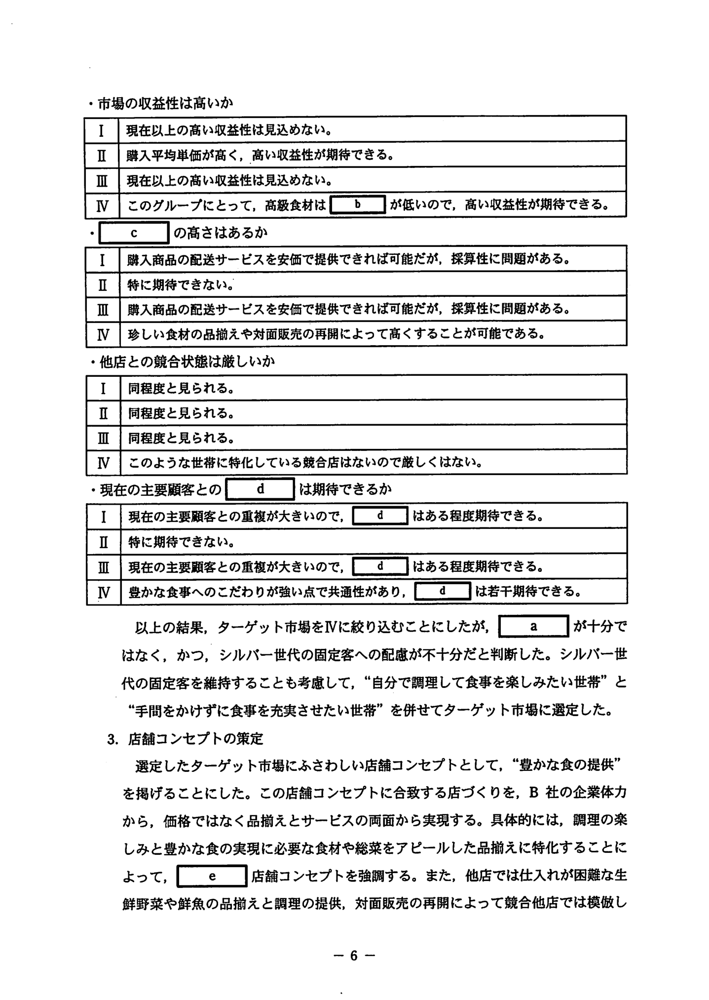

テキスト (OCR)

・市場の収益性は高いか

I

現在以上の高い収益性は見込めない。

購入平均単価が高く, 高い収益性が期待できる。

現在以上の高い収益性は見込めない。

I
I
V

このグループにとって, 高級食材は [| 5 | が低いので, 高い収益性が期待できる。

‘Lc | の高きはあるか

購入商品の配送サービスを安価で提供できれば可能だが, 採算性に問題がある。

特に期待できない。

購入商品の配送サービスを安価で提供できれば可能だが, 採算性に問題がある。

aE] Ryo

珍しい食材の品揃えや対面販売の再開によって高くすることが可能である。

・他店との競合状態は厳しいか

I

同程度と見られる。

0

同程度と見られる。

sig

同程度と見られる。

VV

このような世帯に特化している競合店はないので厳しくはない。

・現在の主要匠客との[| d | は期待できるか

I

HEOEBMECOMAMAZOT, [| d |] はある程度期待できる。

特に期待できない。

現在の主要大客との重複が大きいので, [ d ] はある程度期待できる。

I
0
VV

豊かな食事へのこだわりが強い点で共通性があり, [ d |は若干期待できる。

以上の結果, ターゲット市場をWに絞り込むことにしたが, |  a | が十分で
はなく, DD, シルバー世代の固定客への配慮が不十分だと判断した。シルバー世

代の固定客を維持することも考慮して, “自分で調理して食事を楽しみたい世帯" と

“手間をかけずに食事を充実させたい世帯" を併せてターゲット市場に選定した。

3. 店舗コンセプトの集定

選定したターゲット市場にふさわしい店舗コンセプトとして, “豊かな食の提供"
を掲げることにした。 この店舗コンセプトに合致する店づくりを, B 社の企業体力
DS, 価格ではなく品揃えとサービスの両面から実現する。具体的には, HHOR
しみと豊かな食の実現に必要な食材や総菜をアピールした品揃えに特化することに
kot, [| ce | 店舗コンセプトを強明する。また, 他店では仕入れが困難な生

鮮野菜や鮮魚の品揃えと調理の提供, 対面販売の再開によって競合他店では模條し

ー6一

### ページ 7

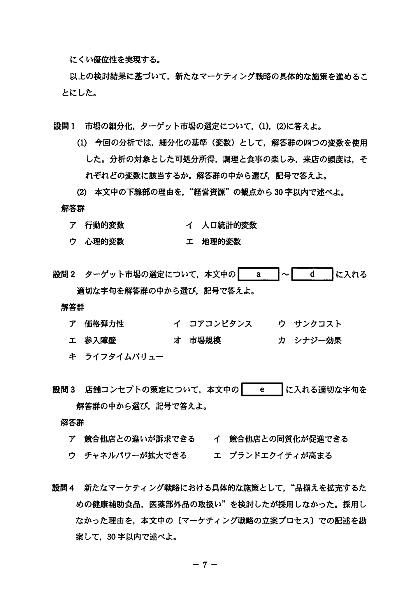

テキスト (OCR)

にくい優位性を実現する。
以上の検討結果に基づいて, 新たなマーケティング戦略の具体的な施策を進めるこ
とにした。

設問1 市場の細分化,. ターゲット市場の選定について, (YD, (⑫②)に答えよ。
Q) 今回の分析では, 細分化の基準 (BR) ELT, 解答群の四つの変数を使用
した。分析の対象とした可処分所得, 調理と食事の楽しみ, ROBE, そ
れぞれどの変数に該当するか。解答群の中から選び, 記号で答えよ。
2) 本文中の下線部の理由を, “EHR” OBADS 30 字以内で述べよ。

解答群
ア 行動的変数        イ 人口統計的変数
ウ 心理的変数        エ 地理的変数

設問2 ターゲット市場の選定について, 本文中の| a |て|  d |に入れる
適切な字句を解答群の中から選び, 記号で答えよ。

解答群
ア 価格弾力性      イ コアコンピタンス   ウ サンクコスト
エ 参入障壁       オ 市場規模       A シナジー効果

キ ライフタイムパリュー

設問3 店舗コンセプトの策定について, 本文中の| ce | に入れる適切な字句を
解答群の中から選び, 記号で答えよ。

SRB
ア 競合他店との人違いが訴求できる イ 競合他店との同質化が促進できる
ウ チャネルパワーが拡大できる   エ プランドエクイティが高まる

設問4 新たなマーケティング戦略における具体的な施策として, “品揃えを拡充するた
めの健康補助食品, 医薬部外品の取扱い" を検討したが採用しなかった。採用し
なかった理由を, 本文中の〔マーケティング戦略の立案プロセス〕 での記述を勘
案して, 30 字以内で述べよ。

### ページ 8

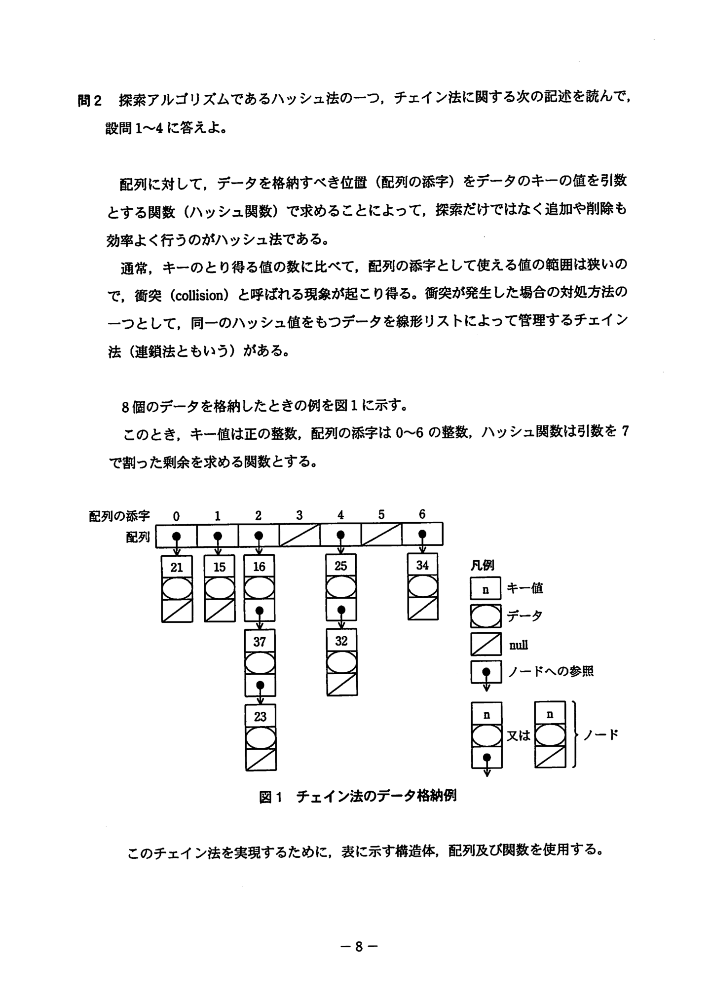

テキスト (OCR)

問2 探索アルゴリズムであるハッシュ法の一つ, チェイン法に関する次の記述を読んで,
設問 1こ4 に答えよ。

配列に対して, データを格納すべき位置 (配列の添字) をデータのキーの値を引数
とする関数 (ハッシュ関数) で求めることによって, 探索だけではなく追加や削除も
効率よく行うのがハッシュ法である。

通常, キーのとり得る値の数に比べて, 配列の添字として使える値の秋囲は狭いの
で, 衝突 (collision) と呼ばれる現象が起こり得る。衝突が発生した場合の対処方法の
ーつとして, 同一のハッシュ値をもつデータを線形リストによって管理するチェイン
法 (連鎖法ともいう) がある。

8 個のデータを格納したときの例を図 1 に示す。
このとき, キー値は正の整数, 配列の添字は 0て6 の整数, ハッシュ関数は引数を 7
で割った剰余を求める関数とする。

配列の添字 0     1     2     3     4     5     6
配列
Lele te tTyll 9}
21    15    16         25         34      凡例
ロコ    で    yr
トトスルトノ   ト、ノ   トノ | 5 | +—ti
yo lg     Or
37         32
Pf             Vay
bh         Ns                   Le] J-FADER
n        n
@&                               DE: @ i vas

B1 チェイン法のデータ格納例

このチェイン法を実現するために, 表に示す構造体, 配列及び関数を使用する。

### ページ 9

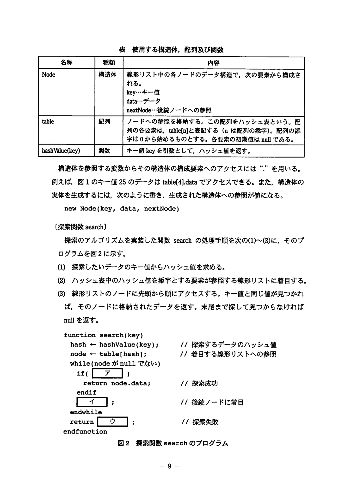

テキスト (OCR)

表 使用する構造体, 配列及び関数

名称                種類                                                 内容

Node            Hae | 線形リスト中の各ノードのデータ構造で, 次の要素から構成さ
れる。

key…キー値

data…データ

nextNode…後続ノードへの参照

table            配列     ノードへの参照を格納する。この配列をハッシュ表という。 配
列の各要素は, tableln]と表記する (n は配列の添字)。配列の添
字は 0 から始めるものとする。各要素の初期値は null である。

hashValue(key)         関数        キー値 key を引数として, ハッシュ値を返す。

構造体を参照する変数からその構造体の構成要素へのアクセスには “.”を用いる。
例えば, 図 1 のキー値 25 のデータは table[4].data でアクセスできる。また, 構造体の
実体を生成するには, 次のように書き, 生成された構造体への参照が値になる。

new Node (key , data, nextNode)

(探索関数 search)
探索のアルゴリズムを実装した関数 search の処理手順を次の(1)て(3に, そのプ
ログラムを図 2 に示す。
Q①) 探索したいデータのキー値からハッシュ値を求める。
Q) ハッシュ表中のハッシュ値を添字とする要素が参照する線形リストに着目する。
(3) 線形リストのノードに先頭から順にアクセスする。キー値と同じ値が見つかれ
ば, そのノードに格納されたデータを返す。末尾まで探して見つからなければ
null を返す。

function search(key)
hash < hashValue(key);         // 探索するデータのハッシュ値
node « tab1e[ hash]           // 着目する線形リストへの参照
while(node がnu11 でない)
se ァ 」)
return node.data;            // 探索成功
endif

 i                 // 後続ノードに着目

endwhi1e

return ;           // 探索失敗

endfunction

 2 探索関数 seacch のプログラム

ー9一

### ページ 10

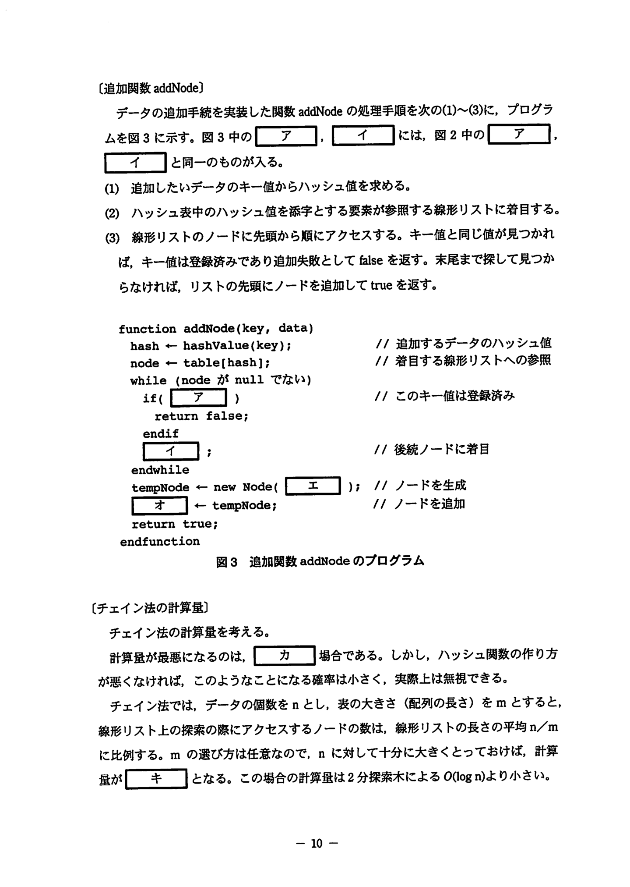

テキスト (OCR)

(追加関数 addNode〕
データの追加手続を実装した関数 addNode の処理手順を次の(1①)て(3)に, プログラ

ムを図 3 に示す。 図3中の| ア |,| イ |には,図2中の[| アァ |,

 と同一のものが入る。

Q) 追加したいデータのキー値からハッシュ値を求める。

Q) ハッシュ表中のハッシュ値を添字とする要素が参照する線形リストに着目する。

3) 線形リストのノードに先頭から順にアクセスする。キー値と同じ値が見つかれ
ば, キー値は登録済みであり追加失敗として false を返す。 末尾まで探して見つか
らなければ, リストの先頭にノードを追加して true を返す。

function addNode(key, data)

hash < hashValue(key);              // 追加するデータのハッシュ値
node < table[hash];                 // 着目する線形リストへの参照
while (node が null でない)
if( )                // このキー値は登録済み
return false;
endif
 i                       // 後続ノードに着目
endwhile
tempNode < new Node( ): // ノードを生成
 ィー tempNode               // ノードを追加
return true;
endfunction

図3 追加関数 addNiode のプログラム

〔チェイン法の計算量]
チェイン法の計算量を考える。

計算量が最悪になるのは, [| カカ |場合である。しかし, ハッシコ関数の作り方
が悪くなければ, このようなことになる確率は小さく, 実際上は無視できる。

チェイン法では, データの個数を n とし, 表の大きさ (配列の長き) を m とすると,
線形リスト上の探索の際にアクセスするノードの数は, 線形リストの長さの平均nm
に比例する。m の選び方は任意なので, n に対して十分に大きくとっておけば, 計算
量が[ キ | となる。この場合の計算量は2分探索木によるOogn)より小さい。

### ページ 11

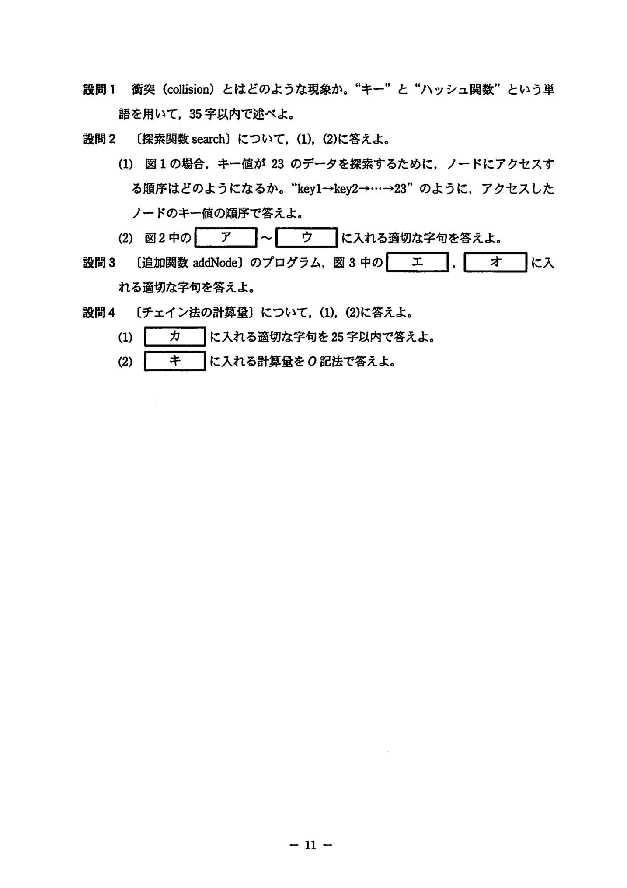

テキスト (OCR)

設問1 HR (collision) とはどのような現象か。“キー" と“ハッシュ関数” という単
語を用いて, 35 字以内で述べよ。
設問2 (探索関数 seach) について, (1), ②に答えよ。
Q) 図1 の場合, キー値が 23 のデータを探索するために, ノードにアクセスす
る順序はどのようになるか。"key1一key2つ…っ23" のように, アクセスした
ノードのキー値の順序で答えよ。
⑫) 図2中の| ア |て| ウ |に入れる適切な字句を答えよ。
設問3 (追加関数 addNode}】 のプログラム, 図3中の| エ ||,| オ Ja
れる適切な字句を答えよ。
設問4 〔チェイン法の計算量) について, (D, (②に答えよ。
60 に入れる適切な字句を 25 字以内で答えよ。
@ [| キ ] に入れる時算量を0記法で答えよ。

ー 11 一

### ページ 12

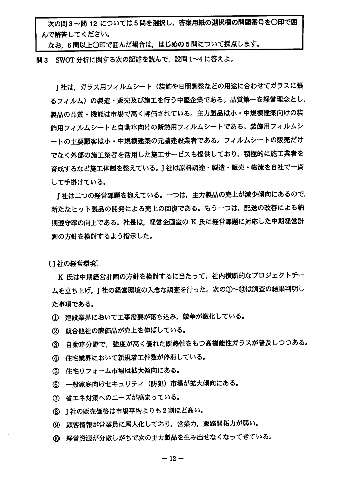

テキスト (OCR)

次の問 3 ご問 12 については5 問を選択し, 答案用紙の選択欄の問題番号を〇印で囲
んで解答してください。
なお, 6 問以上〇印で囲んだ場合は, はじめの 5 問について採点します。

間3 SWOT分析に関する次の記述を読んで, 設問1こ4 に答えよ。

了 社は, ガラス用フィルムシート (装飾や日照調整などの用途に合わせてガラスに張
るフィルム) の製造・販売及び施工を行う中堅企業である。品質第一を経営理念とし,
製品の品質・機能は市場で高く評価されている。主力製品は小・中規模建築向けの装
飾用フィルムシートと自動車向けの断熱用フィルムシートである。装飾用フィルムシ
ートの主要顧客は小・中規模建築の元請建設業者である。フィルムシートの販売だけ
でなく外部の施工業者を活用した施工サービスも提供しており, 積極的に施工業者を
育成するなど施工体制整えている。 」 社は原料間達・製造・販売・物流を自社で一貰
して手掛けている。

了社はつの経営課題を抱えている。一つは, 主力製品の売上が減少傾向にあるので,
新たなヒット製品の開発による売上の回復でちる。もう一つは, 配送の改善による納
MATROMLTHS. HH, 経営企画室の K 氏に経営課題に対応した中期経営計
画の方針を検討するよう指示した。

〔] 社の経営環境
K 氏は中期経営計画の方針を検討するに当たって, 社内横断的なプロジェクトチー
ムを立ち上げ, 」社の経営環境の入念な調査を行った。次の①て⑬は調査の結果判明し
た事項である。
建設業界において工事箇要が落ち込み, 競争が激化している。
競合他社の廉価品が売上を伸ばしている。
自動車分野で, 強度が高く優れた断熱性をもつ高機能性ガラスが普及しつつある。
住宅業界において新規着工件数が停薄している。
住宅リフォーム市場は拡大傾向にある。
一般家庭向けセキュリティ (防犯) 市場が拡大傾向にある。
省エネ対策へのニーズが高まっている。
 社の販売価格は市場平均よりも 2 割ほど高い。
願客情報が営業員に属人化しており, BH, 販路開拓力が弱い。
経営資源が分散しがちで次の主力製品を生み出せなくなってきている。

@@@③@@@@@ら

### ページ 13

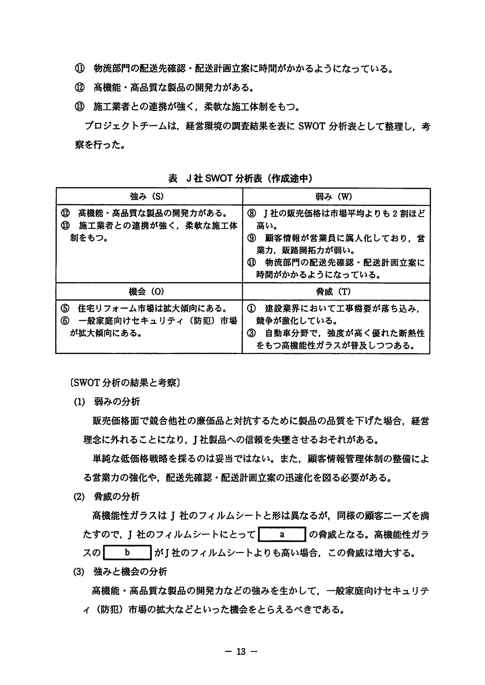

テキスト (OCR)

⑩ 物流部門の配送先確認・配送計画立案に時間がかかるようになっている。
⑫ 高機能・高品質な製品の開発力がある。
@ 施工業者との連携が強く, 柔軟な施工体制をもつ。
プロジェクトチームは, 経営環境の調査結果を表に SWOT 分析表として整理し, 考
察を行った。

表 J社SWOT 分析表 (作成途中)

強み (S)                                                                弱み (W)

®@
®

高機能・高品質な製品の開発力がある。  J 社の販売価格は市場平均よりも 2 割ほど
施工業者との連携が強く, 柔軟な施工体| 高い。

制をもつ。                             © 灰客情報が営業員に属人化しており, 営
業カ, 販路開拓力が弱い。

QD 物流部門の配送先確認・配送計画立案に
時間がかかるようになっている。

機会 (0)                                                         脅威 ①

© 住宅リフォーム市場は拡大傾向にある。 |① 建設業界において工事短要が落ち込み,
© 一般家庭向けセキュリティ (防犯) 市場  競争が激化している。
が拡大傾向にある。            @ 自動車分野で, 強度が高く優れた断熱性
をもつ高機能性ガラスが普及しつつある。
(SWOT 分析の結果と考察〕
Q) 弱みの分析

販売価格面で競合他社の廉価品と対抗するために製品の品質を下げた場合, 経営
理念に外れることになり, [UMA OEMERMA LSHENUSS.

単純な低価格戦略を採るのは妥当ではない。また, BSCE BAO RICE
る営業力の強化や, 配送先確認・配送計画立案の迅速化を図る必要がある。
2) BROS

高機能性ガラスは 」社のフィルムシートと形は異なるが, MROMEI— LER
たすので, 了社のフィルムシートにとって|  a | の會戚となる。高機能性ガラ
スの[|  b |] がj社のフィルムシートよりも高い場合, この脅契は増大する。
3) 強みと機会の分析

高機能・高品質な製品の開発力などの強みを生かして, 一般家庭向けセキュリテ
4 (防犯) 市場の拡大などといった機会をとらえるべきである。

### ページ 14

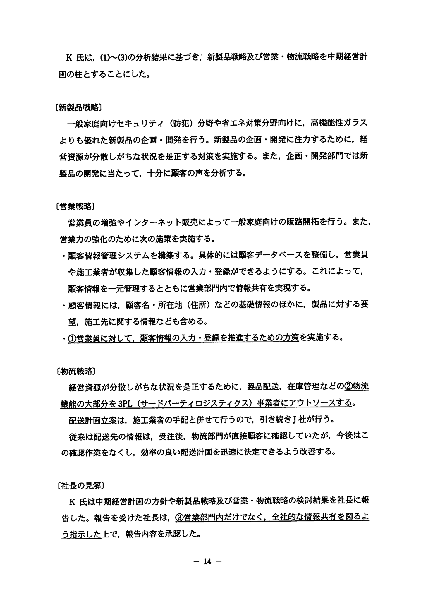

テキスト (OCR)

K Kid, (①て⑬)の分析結果に基づき, 新製品戦略及び営業・物流戦略を中期経営計
画の柱とすることにした。

CSL RAS)
一般家庭向けセキュリティ (GL) 分野や省エネ対策分野向けに, 高機能性ガラス

よりも優れた新製品の企画・開発を行う。新製品の企画・開発に注力するために, 経
営資源が分散しがちな状況を是正する対策を実施する。また, 企画・開発部門では新
製品の開発に当たって, 十分に題客の声を分析する。

(営業戦略
営業員の増強やインターネット販売によって一般家庭向けの販路開拓を行う。また,
営業力の強化のために次の施策を実施する。
・願客情報管理システムを構築する。具体的には顧客データベースを整備し, BRA
や施工業者が収集した願客情報の入力・登録ができるようにする。これによって,
顧客情報を一元管理するとともに営業部門内で情報共有を実現する。
・原客情報には, 顧客名・所在地 (住所) などの基礎情報のほかに, 製品に対する要
望, 施工先に関する情報なども含める。
を情報の入力・登録を推進するための方策を実施する。

物流戦略

経営資源が分散しがちな状況を正するために, 製品配送, 在庫管理などの②物流
機能の大部分を 3PL (サードパーティロジスティクス) 事業者にアウトソースする。

配送計画立案は, 施工業者の手配と併せて行うので, 引き続き」社が行う。

従来は配送先の情報は, 受注後, 物流部門が直接願客に確認していたが, 今後はこ
の確認作業をなくし, 効率の良い配送時画を迅速に決定できるよう改善する。

(社長の見解〕
K 氏は中期経営計画の方針や新製品戦略及び営業・物流戦略の検討結果を社長に報

告した。報告を受けた社長は, ③営業部門内だけでなく, 全社的な情報共有を図るよ
う指示した上で, 報告内容を承認した。

### ページ 15

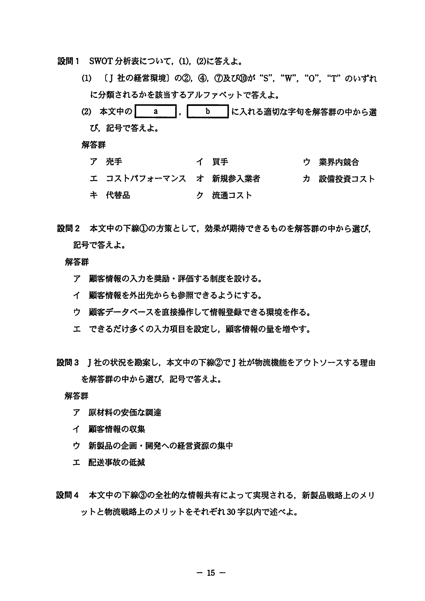

テキスト (OCR)

設問1 SWOT 分析表について, (D, (2)に答えよ。
①) (J 社の経営環境】の②, ④, ⑦及び⑩が “S”, “W”, “O”, “T” のいずれ
に分類されるかを該当するアルファベットで答えよ。

⑫) 本文中の| a |,|  b |に入れる適切な字句を解答群の中から選
U, 記号で答えよ。

ER
ア RF         イ 買手         ウ 業界内競合
エエ コストパフォーマンス + 新規参入業者     A 設備投資コスト
+ RBG        ク 流通コスト

設問2 本文中の下線①の方策として, 効果が期待できるものを解答群の中から選び
記号で答えよ。
RE
ア 顧客情報の入力を奨励・評価する制度を設ける。
イ 顧客情報を外出先からも参照できるようにする。
ウ 顧客データベースを直接操作して情報登録できる環境を作る。
エエ できるだけ多くの入力項目を設定し, 願客情報の量を増やす。

設問3 」社の状況を勘案し, 本文中の下線②でJ 社が物流機能をアウトソースする理由
を解答群の中から選び, 記号で答えよ。
解答群
原材料の安価な調達
顧客情報の収集
新製品の企画・開発への経営資源の集中
配送事故の低減

HUAN

設問4 本文中の下線③の全社的な情報共有によって実現される, 新製品戦略上のメリ
ットと物流戦略上のメリットをそれぞれ30 字以内で述べよ。

### ページ 16

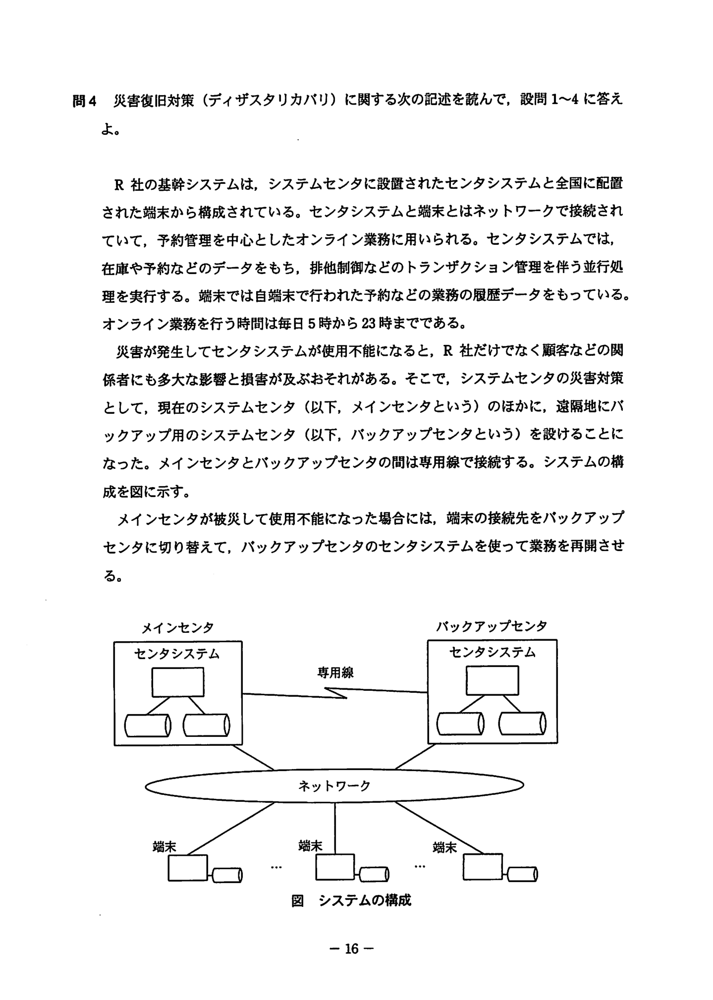

テキスト (OCR)

間4 災害復旧対策 (ディザスタリカパリ) に関する次の記述を読んで, 設問 1ご4 に答え
よ。

R 社の基幹システムは, システムセンタに設置されたセンタシステムと全国に配置
された端末から構成されている。センタシステムと端末とはネットワークで接続され
ていて, 予約管理を中心としたオンライン業務に用いられる。センタシステムでは,
在庫や予約などのデータをもち, 排他制御などのトランザクション管理を伴う並行処
理を実行する。端末では自端末で行われた予約などの業務の履歴データをもっている。
オンライン業務を行う時間は毎日 5 時から 23 時までである。

炎害が発生してセンタシステムが使用不能になると, R 社だけでなく顧客などの関
係者にも多大な影響と損害が及ぶおそれがある。そこで, システムセンタの炎害対策
ELT, 現在のシステムセンタ (以下,メインセンタという) のほかに, 遠隔地にバ
ックアップ用のシステムセンタ (以下, パックアップセンタという) を設けることに
なった。メインセンタタとバックアップセンタの間は専用線で接続する。システムの構
成を図に示す。

メインセンタが被災して使用不能になった場合には, 端末の接続先をパックアップ
センタに切り替えて, パックアップセンタのセンタシステムを使って業務を再開させ
る。

メインセンタ                  パックアップセンタ

センタシステム                   センタシステム
専用線

し 0 Co                 し 0( 0
<      ネットワーク       ーー
端末           端末          端末

HM LAT ADR

### ページ 17

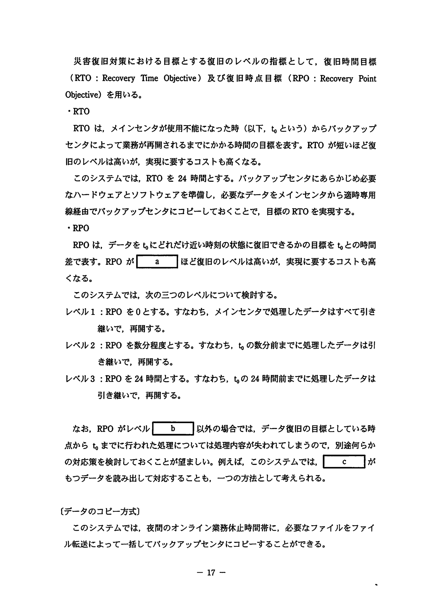

テキスト (OCR)

災害復旧対策における目標とする復旧のレベルの指標として, 復旧時間目標
(RTO : Recovery Time Objective) 及び復旧時点目標 (RPO : Recovery Point
Objective) を用いる。
・RTO
RTO は, メインセンタが使用不能になった時 (以下, t。 という) からパックアップ
センタによって業務が再開されるまでにかかる時間の目標を表す。RTO が短いほど復
旧のレベルは高いが, 実現に要するコストも高くなる。
このシステムでは, RTO を 24 時間とする。パックアップセンタにあらかじめ必要
なハードウェアとソフトウェアを準備し, 必要なデータをメインセンタから適時専用
線経貼でパックアップセンタにコピーしておくことで, 目標の RTO を実現する。
・RPO
RPO は, データを t。にどれだけ近い時刻の状態に復旧できるかの目標を t。との時間
差で表す。RPO が|  』 | ほど復旧のレベルは高いが, 実現に要するコストも高
くなる。
このシステムでは, 次の三つのレベルについて検討する。
レベル 1 : RPO を0 とする。すなわち, メインセンタで処理したデータはすべて引き
継いで, 再開する。
レベル 2 : RPO を数分程度とする。すなわち, tb の数分前までに処理したデータは引
き継いで, 再開する。
レベル3 : RPO を24 時間とする。すなわち, yO 24 時間前までに処理したデータは
引き継いで, 再開する。

なお, RPO がレベル|  b | 以外の場合では, データ復旧の目標としている時
ADS t。 までに行われた処理については処理内容が失われてしまうので, 別途何らか
の対応策を検討しておくことが望ましい。例えば, このシステムでは, | c |が
もつデータを読み出して対応することも, 一つの方法として考えられる。

〔データのコピビー方式〕
このシステムでは, 夜問のオンライン業務休止時間帯に, 必要なファイルをファイ
ル転送によって一括してパックアップセンタにコピーすることができる。

### ページ 18

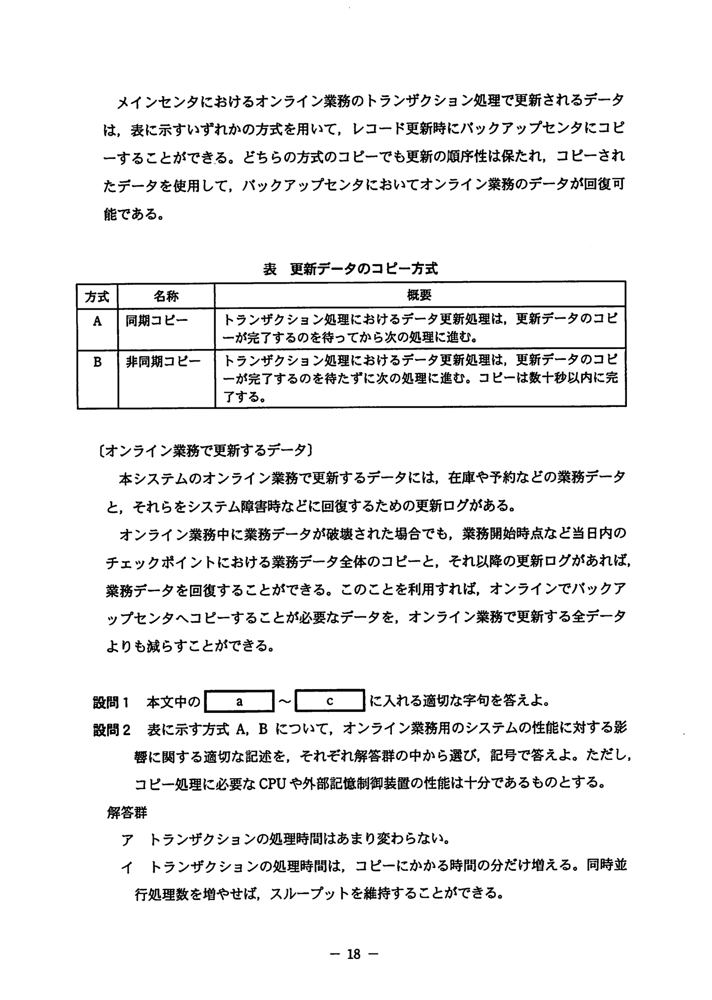

テキスト (OCR)

メインセンタにおけるオンライン業務のトランザクション処理で更新されるデータ
は, 表に示すいずれかの方式を用いて, レコード更新時にパックアップセンタにコピ
ーすることができる。どちらの方式のコピーでも更新の順序性は保たれ, コピーされ
たデータを使用して, パックアップセンタにおいてオンライン業務のデータが回復可
能である。

表 更新データのコビー方式

方式   名称                 概要

A | 同期コピー     トランザクション処理におけるデータ更新処理は, 更新データのコピ
ーが完了するのを待ってから次の処理に進む。

B | 非同期コピー | トランザクション処理におけるデータ更新処理は, 更新データのコピ
ーが完了するのを待たずに次の処理に進む。コピーは数十秒以内に完
了する。

〔オンライン業務で更新するデータ〕

本システムのオンライン業務で更新するデータには, 在庫や予約などの業務データ
と, それらをシステム障害時などに回復するための更新ログがある。

オンライン業務中に業務データが破玩された場合でも, 業務開始時点など当日内の
チェックポイントにおける業務データ全体のコピーと, それ以降の更新ログがあればぱ,
業務データを回復することができる。このことを利用すれば, オンラインでパックア
ップセンタへコピーすることが必要なデータを, オンライン業務で更新する全データ
よりも減らすことができる。

設問1 本文中の| a |~|  c |に入れる適切な字句を答えよ。

設問2 表に示す方式 4, B について, オンライン業務用のシステムの性能に対する影
細に関する適切な記述を, それぞれ解答群の中から選び, 記号で答えよ。ただし,
コピー処理に必要な CPU や外部記億制御装置の性能は十分であるものとする。

HER
ア トランザクションの処理時間はあまり変わらない。
イ トランザクションの処理時間は, コピーにかかる時間の分だけ増える。同時普
行処理数を増やせば, スループットを維持することができる。

### ページ 19

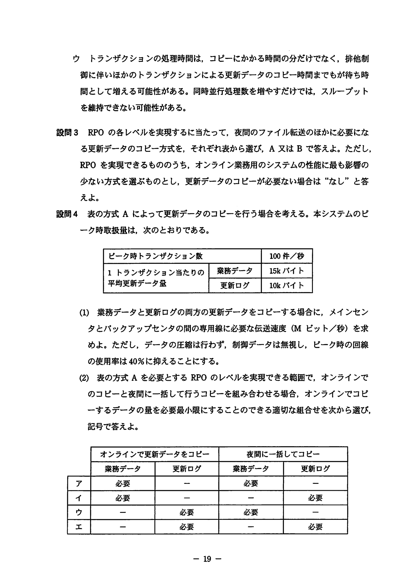

テキスト (OCR)

ウ トランザクションの処理時間は, コピーにかかる時間の分だけでなく, 排他制
御に伴いほかのトランザクションによる更新データのコピー時間までもが待ち時
間として増える可能性がある。同時並行処理数を増やすだけでは, スループット
を維持できない可能性がある。

設問3 RPO の各レベルを実現するに当たって, 夜間のファイル転送のほかに必要にな
る更新データのコピビー方式を, それぞれ表から選び, A 又は B で答えよ。ただし,
RPO を実現できるもののうち, オンライン業務用のシステムの人性能に最も影響の
少ない方式を選ぶものとし, 更新データのコピーが必要ない場合は “なし"と答
えよ。

設問4 表の方式 A によって更新データのコピーを行う場合を考える。本システムのピ
ーク時取扱量は, 次のとおりである。

ピーク時トランザクション数            100 件ノ秒
1 トランザクション当たりの | 業務データ | 15kパイト
平均更新データ硬              更新ログ | 1okパイト

(1) 業務データと更新ログの両方の更新データをコピーする場合に, メインセン
タタとパックアップセンタの間の専用線に必要な伝送速度 (M ビットノ秒) ER
めよ。ただし, データの圧縮は行わず, 制御データは無視し, ピーク時の回線
の使用率は 40%に抑えることにする。

(2) 表の方式 A を必要とする RPO のレベルを実現できる箇囲で オンラインで
のコピーと夜問に一括して行うコピーを組み合わせる場合, オンラインでコピ
ーするデータの時を必要最小限にすることのできる適切な組合せを次から選び,

記号で答えよ。
オンラインで更新データをコピー        夜間に一括してコピー
業務データ           更新ログ           業務データ           更新ログ
ア             必要                     ー                     必要                     ー
イ             必要                     ー                      ー                     必要
ウ               ー                     必要                   必要                     ー
エ               ー                     必要                     ー                     必要

### ページ 20

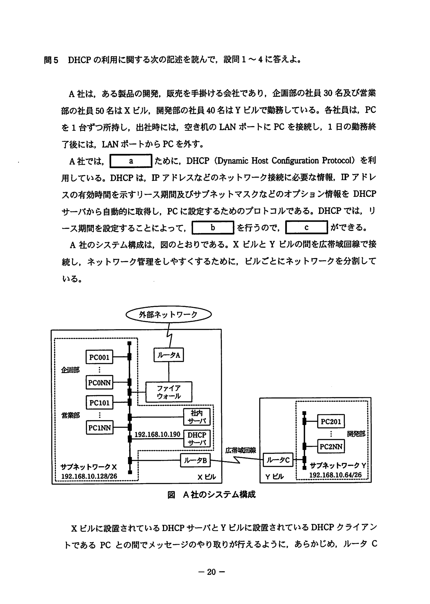

テキスト (OCR)

問5 DHCP の利用に関する次の記述を読んで, 設問1ン4に答えよ。

A 社は, ある製品の開発, 販売を手掛ける会社であり, 企画部の社員 30 名及び営業
部の社員 50 名は X ビル, 開発部の社員 40 名は Y ビルで勤務している。各社員は, PC
を 1 台ずつ所持し, 出社時には, 空き机の LAN ポートに PC を接続し, 1 日の勤務終
了後には, LAN ポートから PC を外す。

A 社では, | 』 | ために, DHCP (Dynamic Host Configuration Protocol) を利
用している。DHCP は, TP アドレスなどのネットワーク接続に必要な情報, TP アドレ
スの有効時間を示すリース期間及びサプネットマスクなどのオプション情報を DHCP
サーバから自動的に取得し, PC に設定するためのプロトコルである。DHCP では, リ
ース期間を設定することによって, |  b  ] を行うので,[ c |ができる。

A 社のシステム機成は, 図のとおりである。X ビルと Y ビルの間を広演城回線で接
続し, ネットワーク管理をしやすくするために, ピルごどとにネットワークを分割して
いる。

外部ネットワーク

[テ多|
企画部
ファイア
ウォール
営業部                                       | 社内
サーバ
192.168.10.190 [ DHCP                                                    開発部
サーパ
ルータB
サプネットワークX                                                                            サプネットワーク Y
192.168.10.128/26                              xX                                   192.168.10.64/26

   A社のシステム構成

ピルに設置されている DHCP サーパとY ピルに設置されている DHCP クライアン
トである PC との間でメッセージのやり取りが行えるように, あらかじめ, ルータ C

### ページ 21

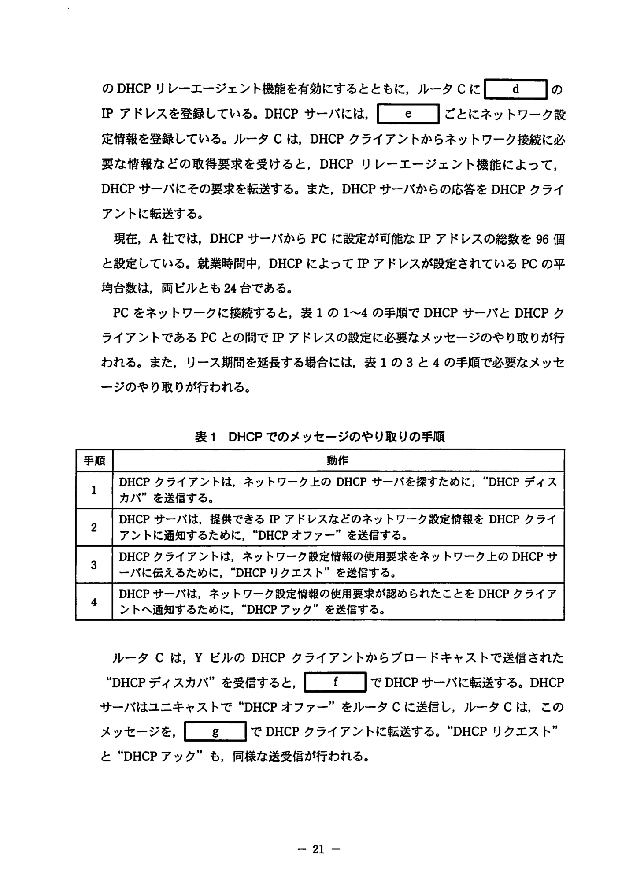

テキスト (OCR)

の DHCP リレーエージェント機能を有効にするとともに, ルータCに[| dq jo
TP アドレスを登録している。DHCP サーパには, [_e | ごとにネットワーク設
定情報を登録している。ルータ Cid, DHCP クライアントからネットワーク接続に必
要な情報などの取得要求を受けると, DHCP リレーエージェント機能によって,
DHCP サーバにその要求を転送する。また, DHCP サーバからの応答を DHCP クライ
アントに転送する。

現在, A 社では, DHCP サーバから PC に設定が可能な TP アドレスの総数を 96 個
と設定している。 就業時間中, DHCP によって TP アドレスが設定されている PC OF
均台数は, 両ビルとも 24 台である。

PC をネットワークに接続すると, 表 1 の 1~4 の手順で DHCP サーバと DHCP ク
ライアントである PC OMT IP アドレスの設定に必要なメッセージのやり取りが行
われる。また, V-AMMEMAT SBA, 表 1 の 3 と4 の手順で必要なメッセ
ージのやり取りが行われる。

表1 DHCP でのメッセージのやり取りの手順

手順                                                                        動作

DHCP クライアントは, ネットワーク上の DHCP サーバを探すために, “DHCP ディス
AN” を送信する。

DHCP サーバは, 提供できる IP アドレスなどのネットワーク設定情報を DHCP クライ
アントに通知するために, “DHCP オファー" を送信する。

DHCP クライアントは, ネットワーク設定情報の使用要求をキットワーク上の DHCP サ
ーパに伝えるために, “DHCP リクエスト" を送信する。

DHCP サーパは, ネットワーク設定情報の使用要求が認められたことを DHCP クライア
ントへ通知するために, “DHCP アック" を送信する。

ルータ C は, Y ビルの DHCP クライアントからプロードキャストで送信された
“DHCP ディスカバ" を受信すると, | f |] でDHCP サーバに転送する。DHCP
サーバはユニキャストで “DHCP オファー" をルータ C に送信し, ルータC は, この
メッセージを, |  g | でDHCP クライアントに転送する。“DHCP リクエスト”"
と “DHCP アック” も, 同様な送受信が行われる。

### ページ 22

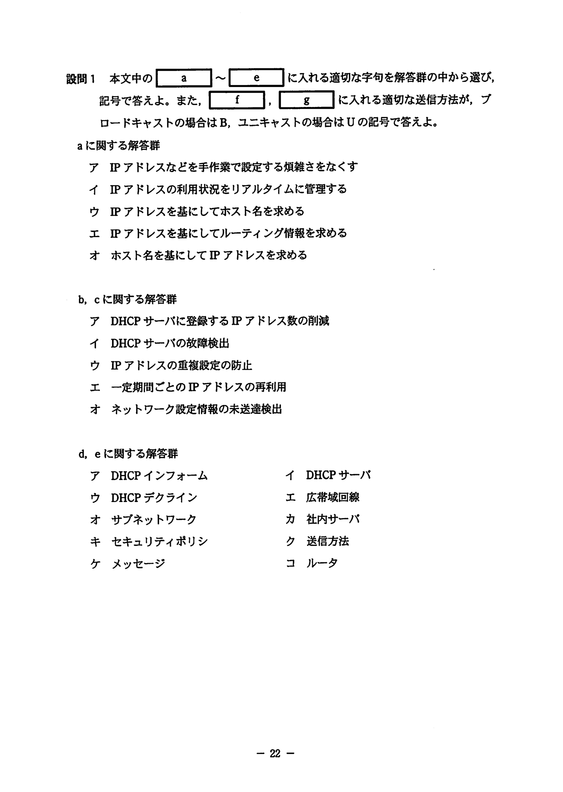

テキスト (OCR)

設問1 本文中の| "3 |て|  e |に入れる適切な字句を解答群の中から選び,
記号で答えよ。また, | f |,|  g |に入れる適切な送信方法が,ブ
ロードキャストの場合は B, ユニキャストの場合はUの記号で答えよ。

a に関する解答群
ア IPアドレスなどを手作業で設定する炉雑さをなくす

TP アドレスの利用状況とそりリアルタイムに管理する

TP アドレスを基にしてホスト名を求める

TP アドレスを基にしてルーティング情報を求める

ホスト名を基にして IP アドレスを求める

4% HG A

b, cに関する解答群
ア DHCP サーバに登録する IP アドレス数の削減
DHCP サーパの故障検出
TP アドレスの重複設定の防止
一定期間ごとの IP アドレスの再利用
ネットワーク設定情報の未送達検出

\ H さ ユ

d, eに関する解答群

ア DHCP インフォーム                      4 DHCP サーバ
ウ DHCP デクライン                          エ RRB
オ サプネットワーク              A 社内サーバ
キ セキュリティポリシ            ク 送信方法

ケ メッセージ                               コ ルータ

### ページ 23

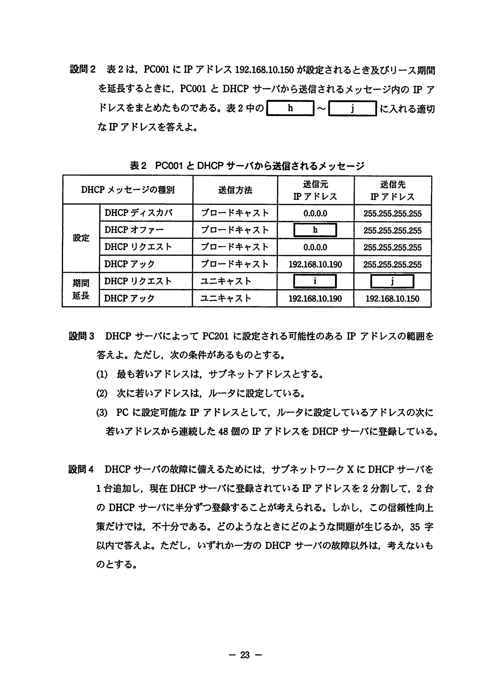

テキスト (OCR)

設問2 表2は, PCO01 にIP アドレス 192.168.10.150 が設定されるとき及びリース期間
を延長するときに, PC001 と DHCP サーパから送信されるメッセージ内の PT

ドレスをまとめたものである。表2中の| bh ]~[  」 |に入れる適切
なTIP アドレスを答えよ。
表2 PC001 と DHCP サーバから送信されるメッセージ
ees                                             送信元               送信先
DHCP メッセージの種別      送信方法      アドレス     Py LZ
DHCP ディスカパ           プロードキャスト             0.0.0.0              255.255.255.255
we LDHCPオファー            プロードキャスト | [ 1』 ] | 255255255255
DHCP リクエスト          プロードキャスト            0.0.0.0            255.255.255.255
DHCP アック                 プロードキャスト | 192.168.10.190 | 255.255.255.255
期間 | DHCP リクエスト        ユニキャスト            Li         [ i |
延長 | DHCP アック               ユニキャスト            192.168.10.190 | 192.168.10.150
設問3 DHCP サーパによって PC201 に設定される可能性のある IP アドレスの範囲を

BAK. KEL, 次の条件があるものとする。

Q) 最も若いアドレスは, サプネットアドレスとする。

②) 次に若いアドレスは, ルータに設定している。

(3) PC に設定可能な P アドレスとして, ルータに設定しているアドレスの次に
若いアドレスから連続した 48 個の IP アドレスを DHCP サーバに登録している。

設問4 DHCP サーバの改障に備えるためには, サブネットワーク X に DHCP サーバを
1 台追加し, 現在 DHCP サーバに登録されている PE アドレスを 2 分割して, 2 台
の DHCP サーバに半分ずつ登録することが考えられる。しかし, この信頼性向上
集だけでは, 不十分である。どのようなときにどのような問題が生じるか, 35 字
以内で答えよ。ただし, いずれか一方の DHCP サーバの故障以外は, 考えないも
のとする。

### ページ 24

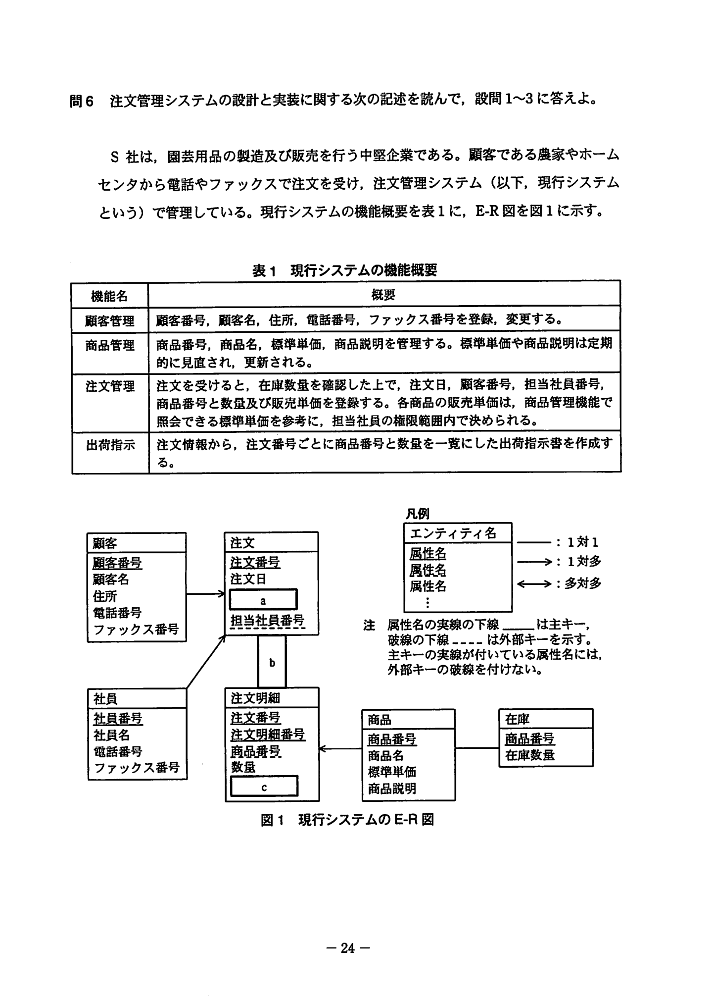

テキスト (OCR)

問6 注文管理レステムの設計と実装に関する次の記述を読んで, 設問1こ3 に答えよ。

S 社は, 結芸用品の製造及び販売を行う中堅企業である。顧客である農家やホーム
センタから電話やファックスで注文を受け, 注文管理システム (以下, 現行システム
という) で管理している。 現行システムの機能概要を表 1 に, E-R 図を図 1 に示す。

表1 現行システムの機能概要
機能名                  概要
顧客管理 | BEES, BSH, 住所, 電話番号, ファックス番号を登録, 変更する。

商品管理 | 商品番号, 商品名 標準単価, 商品説明を管理する。標誰単価や商品説明は定期
的に見直され, 更新される。

注文管理 | 注文を受けると, 在庫数量を確認した上で, 注文日, 顧客番号, 担当社員番号
商品番号と数量及び販売単価を登録する。各商品の販売単価は, 商品管理機能で
照会できる標準単価を参考に, 担当社員の権限秋囲内で決められる。

出荷指示 | 注文情報から, 注文番号ごとに商品番号と数量を一覧にした出荷指示書を作成す
る。

凡例
Be         EX            ae ティ名     : 1対1
トッ       Eee          属性名     —>: 1対多
ie            XA                         。
a     ーー     wee
en    担当社員番号     注 BLOM FR はキー
破線の下線 ---- は外部キーを示す。
b         主キーの実線が付いている属性名には
外部キーの破線を付けない。
社員          注文明細
ease       注文番号       商品         在庫
電話番号       商品番号       商品名        在庫数量
ファックス番号              RR                              標準単価
し     商品説明

Bi 現行システムの E-R 図

### ページ 25

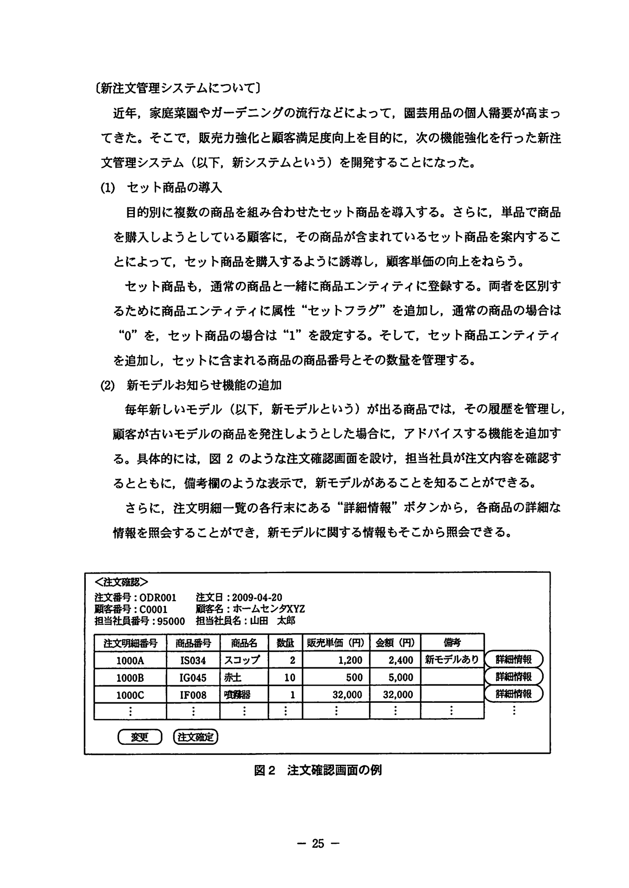

テキスト (OCR)

(新注文管理システムについて〕
近年, 家庭菜園やガーデニングの流行などによって, 園芸用品の個人乱要が高まっ
てきた。そこで, 販売力強化と顧客満足度向上を目的に, 次の機能強化を行った新注
文管理レステム (UE, 新システムという) を開発することになった。
Q) セット商品の導入
目的別に複数の商品を組み合わせたセット商品を導入する。さらに, 単品で商品
を購入しようとしている顧客に, その商品が含まれているセット商品を案内するこ
とによって, セット商品を購入するように誘導し, 顧客単価の向上をねらう。
セット商品も, 通常の商品と一緒に商品エンティティに登録する。両者を区別す
るために商品エンティティに属性 “セットフラグ" を追加し, 通常の商品の場合は
"0" を, セット商品の場合は “1” を設定する。そして, セット商品エンティティ
を追加し, セットに含まれる商品の商品番号とその数量を管理する。
Q) 新モデルお知らせ機能の追加
毎年新しいモデル (以下, 新モデルという) が出る商品では, その履歴を管理し,
願客が古いモデルの商品を発注しようとした場合に, アドパイスする機能を追加す
る。具体的には, 図 2 のような注文確認画面を設け, 担当社員が注文内容を確認す
るとともに, 備考楓のような表示で, 新モデルがあることを知ることができる。
さらに, 注文明細一覧の各行末にある “詳細情報" ボタンから, 各商品の詳細な
情報を照会することができ, 新モデルに関する情報もそこから照会できる。

ぐ注文確認>

注文番号 :ODR001 注文日 :2009-04-20
顧客番号 : C0001        顧客名 : ホームセンタXYZ
担当社員番号 : 95000 担当社員名:山田 太朗

注文明細番号 | 商品番号 | 商品名 | Bok | 販売単価 (円) | 金額 (円)     備考
1000A  18034 |スコップ| 2   1,200 | 2.400 | 新モデルあり【 詳細情報 )
1000B          16045 _| set            10               500 | sooo                     €ZD)
1000C         IF008 | 989438          1          32,000 | 32.000                  EZ)

2 注文確認画面の例

### ページ 26

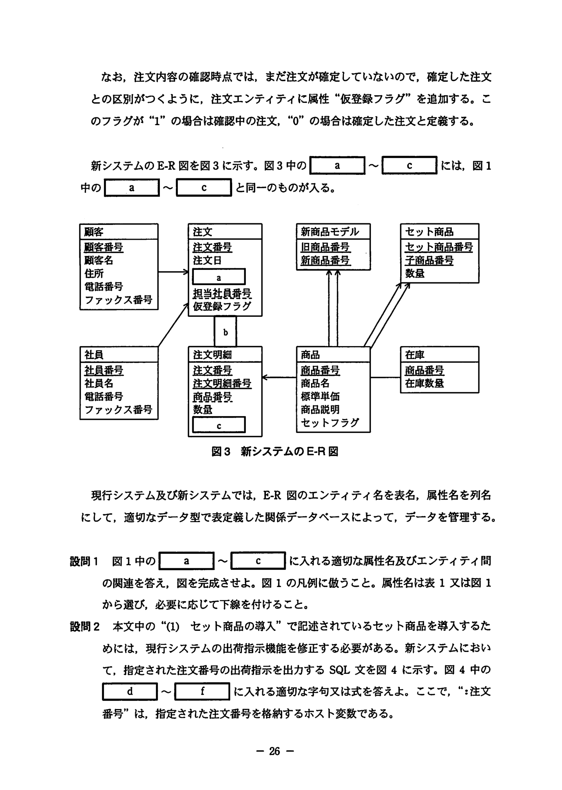

テキスト (OCR)

なお, 注文内容の確認時点では, まだ注文が確定していないので, 確定した注文
との区別がつくように, 注文エンティティに履性 “仮登録フラグ” を追加する。こ
のフラグが “1” の場合は確認中の注文, “0" の場合は確定した注文と定義する。

新システムの E-R 図を図 3 に示す。 図3中の| a |て|  c |には,図1
中の| a |て|  c |と同一のものが入る。

顧客         注文         新商品モデル    セット商品
顧客名        注文日        新商品番号     子商品番号
住所        Cc]               Ke
EES             SeHARS
ファックス番号    RERISY
b

社員         注文明細       商品        在庫
社員番号             注文番号            ieee            Bees
社員名        注文明細番号     商品名        在庫数量
電話番号       商品番号       標準単価
ファックス番号    数量         商品説明

| 。 1     セットフラグ

図3 新シレステムの E-R 図

現行システム及び新システムでは, ER 図のエンティティ名を表名, 属性名を列名
にして, 適切なデータ型で表定義した関係データベースによって, データを管理する。

設問1 図1中の] ai |~|  c |に入れる適切な属性名及びエンティティ問
の関連を答え, 図を完成させよ。図 1 の凡例に條うこと。履性名は表 1 又は図 1
から選び, 必要に応じて下線を付けること。

設問2 本文中の “①) セット商品の導入" で記述されているセット商品を導入するた
めには, 現行システムの出荷指示機能を修正する必要がある。新システムにおい
て, 指定された注文番号の出荷指示を出力する SQL 文を図 4 に示す。図 4 中の
|  d |~|  f | に入れる適切な字句又は式を答えよ。ここで, “EX
番号" は, 指定された注文番号を格納するホスト変数である。

ー26 一

### ページ 27

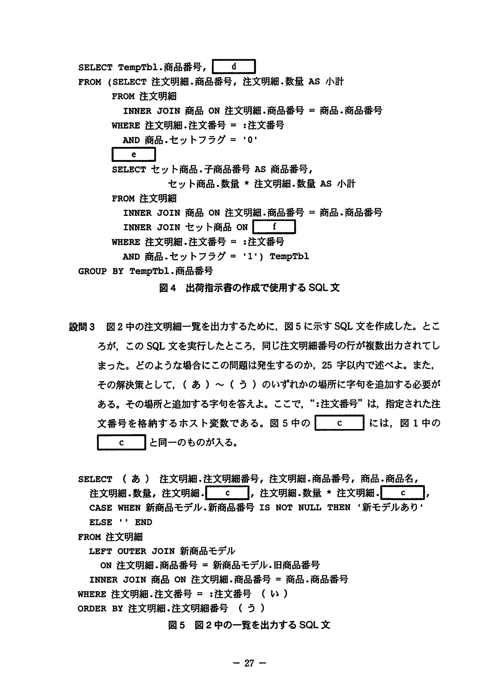

テキスト (OCR)

SELECT mempTb1.商品番号,[ d ]
FROM (SELECT 注文明細 .商品番号, 注文明細.数量 AS 小計
FROM 注文明細

INNER JOIN 商品 ON 注文明細.商品番号 = 商品商品番号

WHERE 注文明細.注文番号 = :注文番号
AND 商品-.セットフラグ = '0'

a)

SELECT セット商品.子商品番号 AS 商品番号,

セット商品数量 * 注文明細数量 AS 小計

FROM 注文明細

INNER JOIN 商品 ON 注文明細.商品番号 = 商品-商品番号

INNER JOIN セット商品 ON
WHERE 注文明細.注文番号 = :注文番号
AND 商品-セットフラグ = '1') TempTb1
GROUP BY TempTb1 .商品番号
 4 出荷指示香の作成で使用する SQL 文

設問3 図2中の注文明細一覧を出力するために, 図5 に示す SQL 文を作成した。とこ
ろが, この SQL 文を実行したところ, 同じ注文明細番号の行が複数出力されてし

まった。どのような場合にこの問題は発生するのか, 25 字以内で述べよ。また,
その解決策として, ( あ ) ~ ( う ) のいずれかの場所に字句を追加する必要が
ある。その場所と追加する字句を答えよ。ここで, “:注文番号" は, 指定された注
文番号を格納するホスト変数である。図 5中の| c | には,図1中の

[<  ] と同一のものが入る。

SELECT (あ) 注文明細.注文明細番号, 注文明細.商品番号, 商品商品名
注文明細 数量。 注文明細.[ <c |, 注文明細.数量* 注文明細| c |
CASE WHEN 新商品モデル-新商品番号 rs NOT NULL THEN '新モデルあり・

ELSE '' END
FROM 注文明細
LEFT OUTER JOIN 新商品モデル
ON 注文明細.商品番号 = 新商品モデル・旧商品番号
INNER JOIN 商品 ON 注文明細.商品番号 = 商品.商品番号
WHERE 注文明細.注文番号 = :注文番号 (い)
ORDER BY 注文明細.注文明細番号 (う)

 5 図2中の一覧を出力する SQL 文

4

### ページ 28

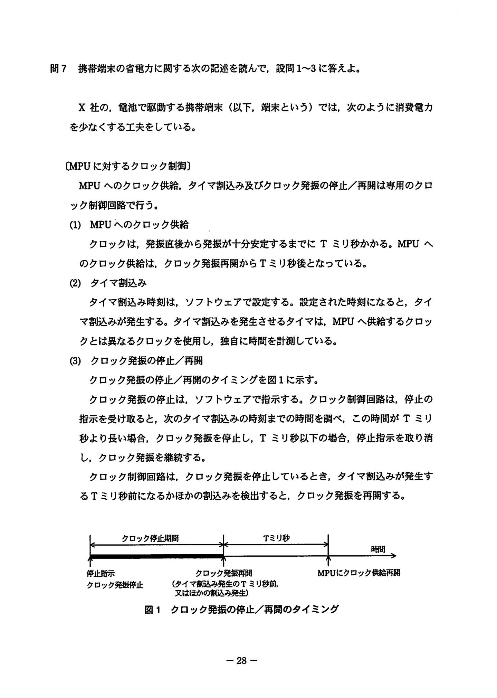

テキスト (OCR)

問7 携帯端末の省電力に関する次の記述を読んで, 設問 1こ3 に答えよ。

X HO, 電池で駆助する携帯端末 (以下, 端末という) では, 次のように消費電力

を少なくする工夫をしている。

(MPU に対するクロック制御}
MPU へのクロック供給, タイマ割込み及びクロック発振の停止再開は専用のクロ
ック制御回路で行う。

Q) MPU へのクロック供給
クロックは, 発振直後から発振が十分安定するまでに T ミリ秒かかる。MPU へ

のクロック供給は, クロック発振再開からT ミリ秒後となっている。

Q) タイマ割込み
タイマ割込み時刻は, ソフトウェアで設定する。設定された時刻になると, タイ

マ割込みが発生する。タイマ割込みを発生させるタイマは, MPU へ供給するクロッ
クとは異なるクロックを使用し, 独自に時間を計測している。
(3) クロック発振の停止ノ再開

クロック発振の停止再開のタイミングを図 1 に示す。
クロック発振の停止は。 ソフトウェアで指示する。クロック制御回路は, 停止の

指示を受け取ると, 次のタイマ割込みの時刻までの時間を調べ, この時間が T ミリ
秒より長い場合, クロッグ発振を停止し, T ミリ秒以下の場合, 停止指示を取り消

し, クロック発振を継続する。
クロック制御回路は, クロック発振を停止しているとき, タイマ割込みが発生す

るT ミリ秒前になるかほかの割込みを検出すると, クロック発振を再開する。

|    クロック停上期間      |     エミリ秒

|                |                  時間

停上指示            Dy DRESS         MPUICY Oy 2 SSF
(PA VHAAREOT ミリ秒間

クロック発拓信上
又はほかの割込み発生)
クロック発振の停止ノ再開のタイミング

図1

### ページ 29

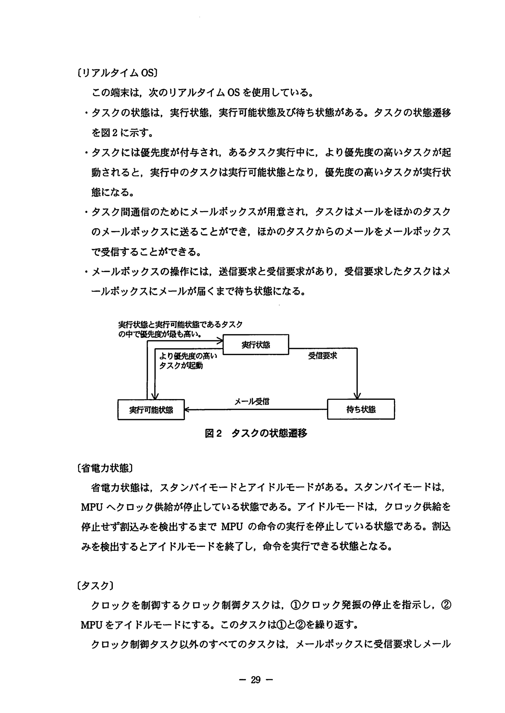

テキスト (OCR)

(リアルタイム 0S)
この端末は, 次のリアルタイム 0S を使用している。

・タスクの状態は, 実行状態, 実行可能状態及び待ち状態がある。タスクの状態選移
を図 2 に示す。

・タスクには優先度が付与され, あるタスク実行中に, より優先度の高いタスクが起
動されると, 実行中のタスクに実行可能状態となり, 優先度の高いタスクが実行状
態になる。

・タスク問通信のためにメールポボックスが用意され, タスクはメールをほかのタスク
のメールボックスに送ることができ, ほかのタスクからのメールをメールボックス
で受信することができる。

・メールボックスの操作には, 送信要求と受信要求があり, 受信要求したタスクはメ
ールボックスにメールが届くまで待ち状態になる。

実行状態と実行可能状態であるタスク
の中で優先度が最も高い。
RETIRE
より優先庶の高い                        受信要求
FAI WEB
ブリ
実行可能状態                  aves                      待ち状態

H2 タスクの状態遷移

(省電力状態〕

省電力状態は, スタンパイモードとアイドルモードがある。スタンパイモードは,
MPU ヘクロック供給が停止している状態である。アイドルモードは, クロック供給を
停止せず割込みを検出するまで MPU の命令の実行を停止している状態である。割込
みを検出するとアイドルモードを終了し, 命令を実行できる状態となる。

(F227)

クロックを制御するクロック制御タスクは, ①クロック発振の停止を指示し, ©
MPU をアイドルモードにする。このタスクは①と②を繰り返す。

クロック制御タスク以外のすべてのタスクは, メールボックスに受信要求しメール

### ページ 30

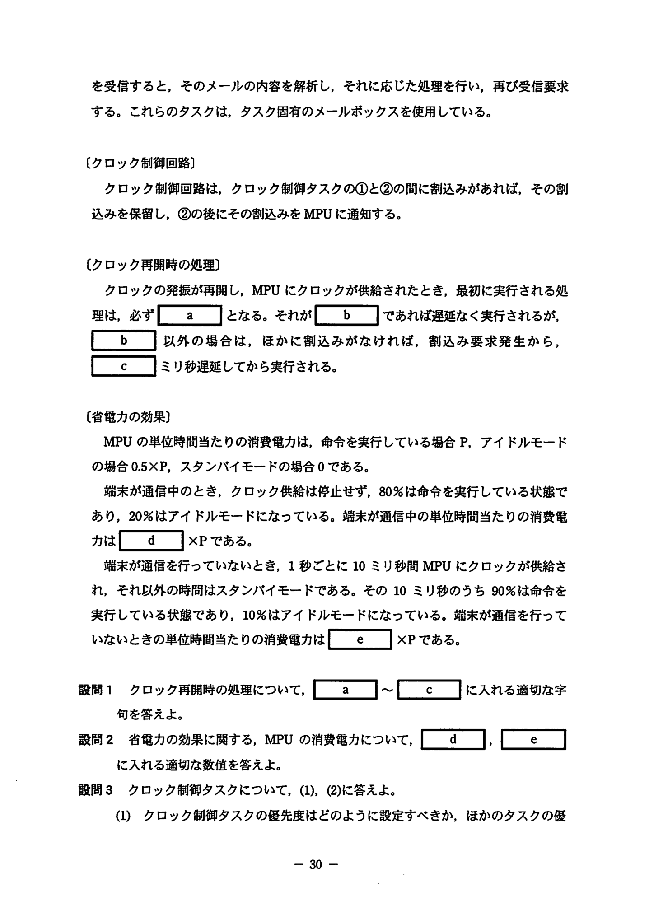

テキスト (OCR)

を受信すると, そのメールの内容を解析し, それに応じた処理を行い, 再び受信要求
する。これらのタスクは, タスク固有のメールボックスを使用している。

〔クロック制御回路〕
クロック制御回路は, クロック制御タスクの①と②の間に割込みがあれば, その割
込みを保留し, ②の後にその割込みを MPU に通知する。

(クロック再開時の処理〕

クロックの発振が再開し。 MPU にクロックが供給されたとき, 最初に実行される処
理は, 必ず[| a | となる。それが[| b | であれば運延なく実行されるが,
[> | 以外の場合は, ほかに割込みがなければ, 割込み要求発生から,
[| < | ミリ秒遅延してから実行される。

(GA OBR)

MPU の単位時間当たりの消費電力は, 命令を実行している場合 P,アイドルモード
の場合 0.5XP, スタンパイモードの場合 0 である。

端末が通信中のとき, クロック供給は停止せず, 80%は命令を実行している状態で
あり, 20%はアイドルモードになっている。端末が通信中の単位時間当たりの消費電
カは[| dq |] xpでぁる。

端末が通信を行っていないとき, 1 秒ごとに 10 ミリ秒間 MPU にクロックが供給さ
れ, それ以外の時間はスタンパイモードである。その 10 ミリ秒のうち 90%は命令を
実行している状態であり, 10%はアイドルモードになっている。端末が通信を行って
いないときの単位時間当たりの消費電力は| e | xPである。

設問1 クロック再開時の処理について, | a |て| ic |に入れる適切な字
旬を答えよ。

設問2 省電力の効果に関する, MPU の消費電力について, | d || e |
に入れる適切な数値を答えよ。

設問3 クロック制御タスクについて, ⑪), (2②)に答えよ。
(1) クロック制御タスクの優先度はどのように設定すべきか, ほかのタスクの優

ー 30 一

### ページ 31

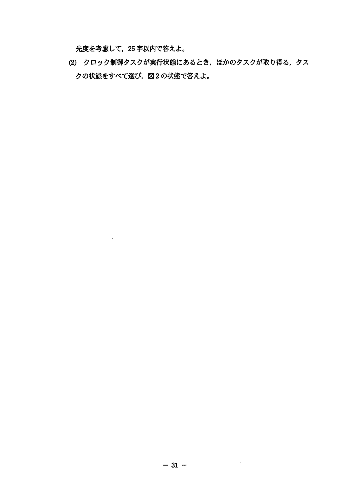

テキスト (OCR)

先度を考慮して, 25 字以内で答えよ。
(⑫) クロック制御タスクが実行状態にあるとき, ほかのタスクが取り得る, タス
クの状態をすべて選び, 図2 の状態で答えよ。

### ページ 32

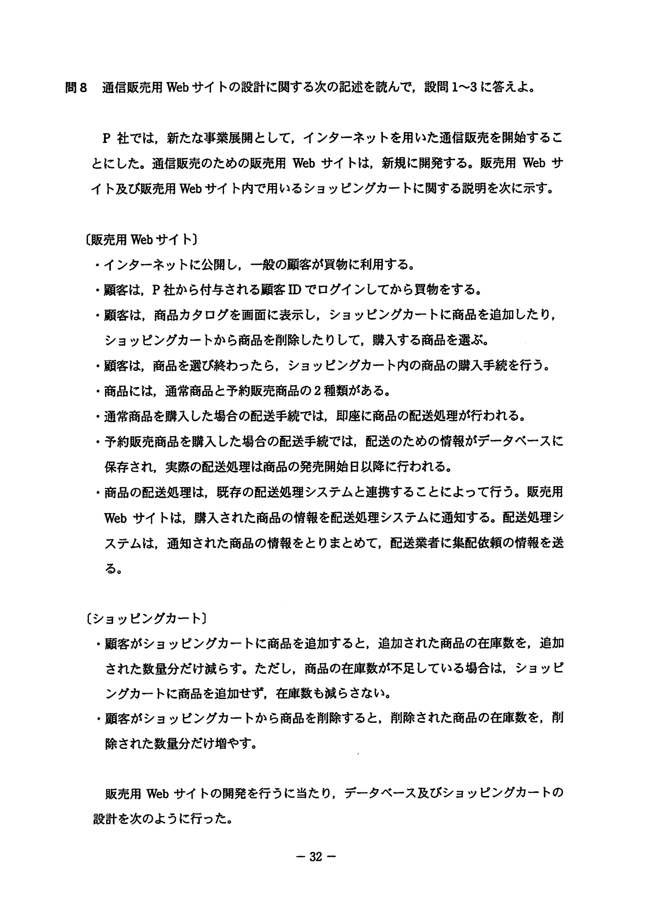

テキスト (OCR)

問8 通信販売用 Web サイトの設計に関する次の記述を読んで, 設問 1こ3 に答えよ。

P 社では, 新たな事業展開として, インターネットを用いた通信販売を開始するこ
とにした。通信販売のための販売用 Web サイトは, 新規に開発する。販売用 Web サ
イト及び販売用 Web サイト内で用いるショッピングカートに関する説明を次に示す。

(販売用 Web サイト〕

・インターネットに公開し, 一般の願客が買物に利用する。

“Bel, P 社から付与される顧客 ID でログインしてから買物をする。

‘Be, 商品カタログを画面に表示し, ショッピングカートに商品を追加したり,
ショッピングカートから商品を削除したりして, 購入する商品を選ぶ。

‘BS, 商品を選び終わったら, ショッピングカート内の商品の購入手続を行う。

・商品には, 通常商品と予約販売商品の 2 稲類がある。

・通常商品を購入した場合の配送手続では, 即座に商品の配送処理が行われる。

・予約販売商品を購入した場合の配送手続では, 配送のための情報がデータベースに
保存され, 実際の配送処理は商品の発売開始日以降に行われる。

・商品の配送処理は, 既存の配送処理シレステムと連携することによって行う。販売用
Web サイトは, 購入された商品の情報を配送処理システムに通知する。配送処理シ
ステムは, 通知された商品の情報をとりまとめて, 配送業者に集配依頼の情報を送
る。

〔ショッピングカート〕

・顧客がショッピングカートに商品を追加すると, 追加された商品の在庫数を, 追加
された数量分だけ減らす。ただし, 商品の在庫数が不足している場合は, ショッピ
ングカートに商品を追加せず, 在庫数も減らさない。

・顧客がショッピングカートから商品を削除すると, 削除された商品の在庫数を, 削
除された数量分だけ増やす。

販売用 Web サイトの開発を行うに当たり, データベース及びショッピングカートの
設計を次のように行った。

### ページ 33

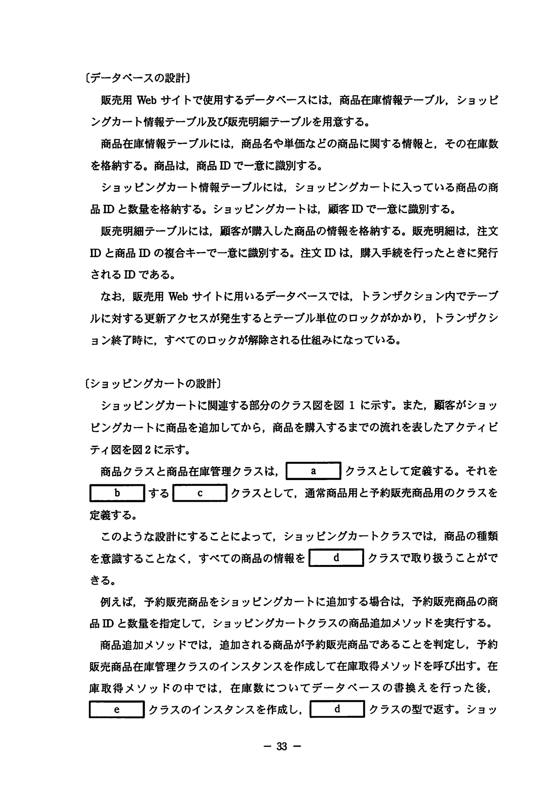

テキスト (OCR)

(データベースの設計〕

販売用 Web サイトで使用するデータベースには, 商品在庫情報テーブル, ショッピ
ングカート情報テーブル及び販売明細テーブルを用意する。

商品在庫情報テーブルには, 商品名や単価などの商品に関する情報と, その在庫数
を格納する。商品は, 商品 ID で一意に識別する。

ショッピングカート情報テープブルには, ショッピングカートに入っている商品の商
品 D と数量を格納する。ショッピングカートは, BSD で一意に識別する。

販売明細テーブルには, 顧客が購入した商品の情報を格納する。販売明細は, 注文
ID と商品 ID の複合キーで一意に識別する。注文 D は, 購入手続を行ったときに発行
される ID である。

なお, 販売用 Web サイトに用いるデータベースでは, トランザクション内でテーブ
ルに対する更新アクセスが発生するとテーブル単位のロックがかかり, トランザクシ
ョン終了時に, すべてのロックが解除される仕組みになっている。

(ショッピングカートの設計)

ショッピングカートに関連する部分のクラス図を図 1 に示す。また, BEM ay
ピングカートに商品を追加してから, 商品を購入するまでの流れを表したアクティビ
ティ図を図 2 に示す。

商品クラスと商品在庫管理クラスは, |  』 | クラスとして定義する。それを
Lb |する|  c クラスとして, 通常商品用と予約販売商品用のクラスを
定義する。

このような設計にすることによって, ショッピングカートクラスでは, 商品の種類
を意識することなく, すべての商品の情報を | d |] クラスで取り扱うことがで
きる。

例えば, 予約販売商品をショッピングカートに追加する場合は, 予約販売商品の商
HID と数量を指定して, ショッピングカートクラスの商品追加メソッドを実行する。

商品追加メソッドでは, 追加される商品が予約販売商品であることを判定し 予約
販売商品在庫管理クラスのインスタンスを作成して在庫取得メソッドを呼び出す。在
庫取得メソッドの中では, 在庫数についてデータベースの番換えを行った後

[| < | クラスのインスタンスを作成し, [| d | クラスの型で返す。ショッ

ー 33 一

### ページ 34

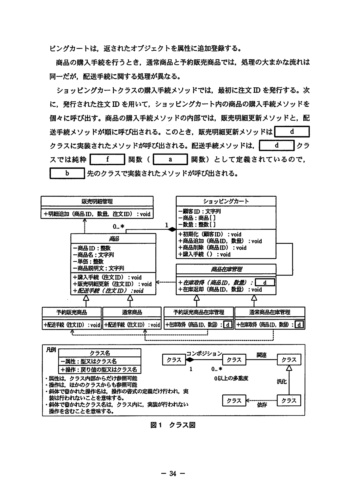

テキスト (OCR)

ピングカートは, BENKAT IA hEMMEIEMBRT 5.

商品の購入手続を行うとき, 通常商品と予約販売商品では, 処理の大まかな流れは
同一だが, 配送手続に関する処理が異なる。

ショッピングカートクラスの購入手続メソッドでは, 最初に注文 D を発行する。次
に, 発行された注文 D を用いて, ショッピングカート内の商品の購入手続メソッドを
個々に呼び出す。商品の購入手続メソッドの内部では, 販売明細更新メソッドと, 配
送手続メソッドが順に呼び出される。このとき, 販売明細更新メソッドは|  qd |
クラスに実装されたメソッドが呼び出される。 配送手続メソッドは, | d |クラ
スでは純粋 | f | 関数(| a | 関数) として定義されているので,

[| ! | 先のクラスで実装されたメソッドが呼び出される。

販売明細管理                       ショッピングカート
= vol        —BEEID : 文字列
+明細追加 (商品ID, Bok, 注文D) : void       ia BALI
0..*      1 | 一数量 : 整数[]
ー           +208 GEBID) :void
Ld             +i GERD, BAD: void
ー商品ID : Se               商品削除 (商品ID) :void
at               +購入手統 () :void
ー単価 : 3k
ー商品説明文 : 文字列                    BES
+PRA Fe (注文D) : void
販売明細更新 (注文ID) : void      + ZORA (ID, SB :[(—a_]
+X FH (AEXID) : v0id        = (商品ID, uD  な   |

T   T

予約販売商品 昌    通常商品       —_        —_—
+RAFH XID) void | HEBER EXID) : void) | +#5a0K GRID, EE    Ca] +e GID, 数 :[a]
人生                i
H
Aa        クラス名                  ュージョイッ      x1  BR     =
TE BIN SAE            ZZ -             ス |         クラス
操作 : 戻り値の型又はクラス名                 0.. A,
“Mies, クラス内部からだけ参昭可能                  0以上の多重度       aut
・操作は, ほかのクラスからも参照可能
・斜体で侍かれた操作名は, 操作の秋式の定義だけ行われ, 実
装は行われないことを意味する。                         クラス トー クラス
・斜体で知かれたクラス名は, クラス内に。 実装が行われない                tke?
操作を含むことを意味する。

Bi

クラス図

### ページ 35

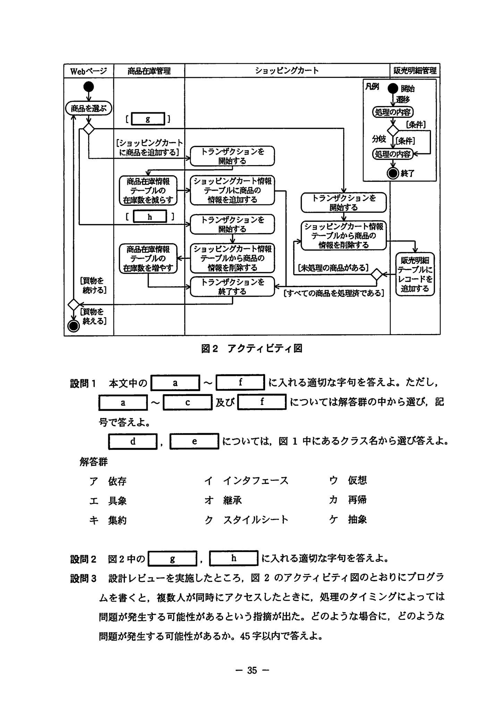

テキスト (OCR)

Webページ | 商品在管理            ショッピングカート
商品を選ぶ
( ]
[ショッピングカート
に商品を追加する] | ( トランザクションを
  開始する
ーー 」
商品在庫情報     ショッピングカート情報
テーブルの                テーブルに商品の
EHRERST     情報を追加する        トランザクションを
開始する
(Pa    トラブウションを      ショッピングカート人情報
テーブルから商品の
商品在軍情報 ] | ショッピングカート情報      情報を削除する
テーブルの              テーブルから商品の
在電数を増やす     情報を削除する      [未処理の商品がある]
on
続ける]                終了する     (すべての商品を処理済である]
(Ree
終える]

 2 アクティビティ図

設問1 本文中の| a |~[ f | に入れる適切な字句を答えよ。ただし,
[a |て| <c |及び| ft |については解答群の中から選び, 記

号で答えよ。
| da |,|  e |については, 図 1 中にあるクラス名から選び答えよ。
RE
ア 依存        イ インタフェース    ウ 仮想
x BR        オ 継承         カ 再帰
キ 集約        ク スタイルシート    ケ 抽象

設問2 図2中の| g |,|  h |に入れる適切な字句を答えよ。

設問3 設計レビューを実施したところ, 図 2 のアクティビティ図のとおりにプログラ
ムを書くと, 複数人が同時にアクセスしたときに, 処理のタイミングによっては
問題が発生する可能性があるという指摘が出た。どのような場合に, どのような
問題が発生する可能性があるか。45 字以内で答えよ。

### ページ 36

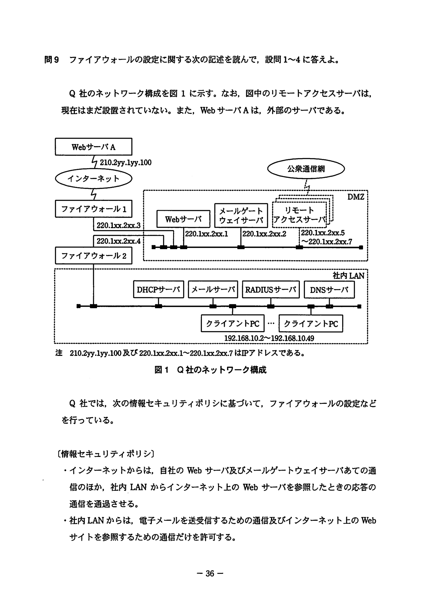

テキスト (OCR)

FS ファイアウォールの設定に関する次の記述を読んで, 設問1ご4 に答えよ。

Q 社のネットワーク構成を図 1 に示す。なお, 図中のリモートアクセスサーバは,
現在はまだ設置されていない。また, Web サーバA は, 外部のサーパである。

WebサーバA
210.2yy.1yy.100
ンー  し                                                       公衆通信綱
7
1 DMZ
ファイアウォール1                ュールゲート    リェート
220.1xx.2xx.3         WebF—-N | | ウェイサーパ | アクセスサーパ

220.1xx.2xx.1 1220.1xx.2xx.2  】220.xx.2xx.5
220.1xx.2xx.4                                                                                      ee 220-10. 2x.7    回

ファイアウォール 2

社内LAN

JDHCPサーバ | | メールサーバ| | RADIUSサーバ | | DNSサーバ

ーょ      ェ     エーューーエーー ニーエーー 。

クライアントFC | … | クライアントFC
192.168.10.2て192.168.10.49

注 210.2yy.1yy.100 及び 220.1xx.2xx.1~220.1xx2xx.7 はPDアドレスである。

H1 Q社のネットワーク構成

Q 社では, 次の情報セキュリティボリシに基づいて, ファイアウォールの設定など
を行っている。

(情報セキュリティポリシ)

・インターネットからは, 自社の Web サーバ及びメールゲートウェイサーパあての通
信のほか, HA LAN からインターネット上の Web サーバを参照したときの応答の
通信を通過させる。

・社内 LAN からは, 電子メールを送受信するための通信及びインターネット上の Web
サイトを参照するための通信だけを許可する。

### ページ 37

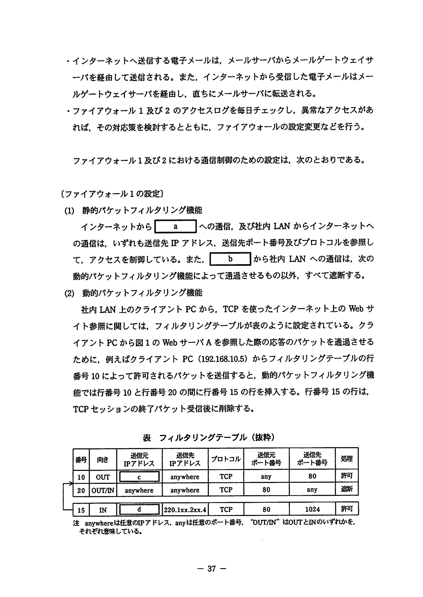

テキスト (OCR)

・インターネットへ送信する電子メールは, メールサーパからメールゲートウェイサ
ーパを経由して送信される。また, インターネットから受信した電子メールはメー
ルゲートウェイサーバを経由し, 直ちにメールサーパに転送される。

・ファイアウォール 1 及び 2 のアクセスログを毎日チェックし, 異常なアクセスがあ
hid, その対応策を検討するとともに, ファイアウォールの設定変更などを行う。

ファイアウォール 1 及び2 における通信制御のための設定は, 次のとおりである。

(ファイアウォール1 OR)
Q) 静的パケテットフィルタリング機能
インターネットから| sa | への通信, 及び社内 LAN からインターネットへ
の通信は, いずれも送信先 PP アドレス, 送信先ポート番号及びプロトコルを参照し
て, アクセスを制御している。また, |  b |から社内 LAN への通信は, 次の
動的パケットフィルタリング機能によって通過させるもの以外。 すべて遮断する。
(2) 動的パケットフィルタリング機能
社内 LAN 上のクライアント PC から, TCP を使ったインターネット上の Web サ
イト参照に関しては, フィルタリングテーブルが表のように設定されている。クラ
イアント PC から図 1 の Web サーバA を参照した際の応答のパケットを通過させる
ために, 例えばクライアント PC (192.168.10.5) からフィルタリングテーブルの行
番号 10 によって許可されるパケットを送信すると, 動的パバケットフィルタリング機
能では行番号 10 と行番号 20 の間に行番号 15 の行を挿入する。行番号 15 の行は,
TCP セッションの終了パケット受信後に削除する。

表 フィルタリングテーブル (抜粋)

送信元      送信先             送信元      送信先
#3) 向き | jpアドレス | mpアドレス |フロトコル| ホート番号 | ポート番号 |
10 | our | < | anywhere | TCP      any       80     前可
20 |OUT/IN| anywhere   anywhere    TCP      80       any     at
is] m [L 4 zonxz4| Top | so       1024 | st |

注 anywhereは任意のIPアドレス, any は任意のポート番号, “OUT/IN" はOUTとINのいずれかを,
それぞれ意味している。

### ページ 38

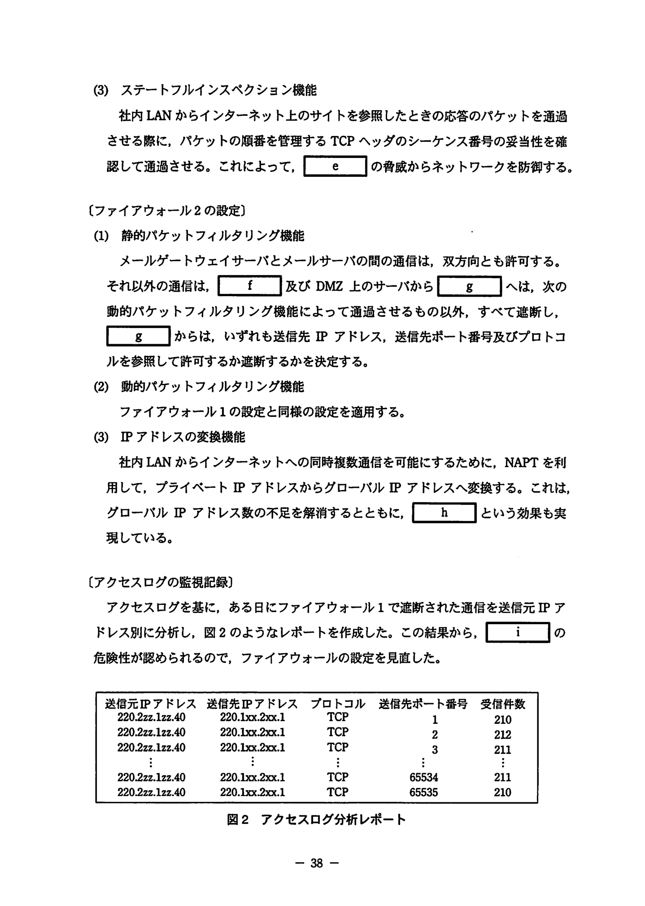

テキスト (OCR)

QB) ステートフルインスペクション機能
社内 LAN からインターネット上のサイトを参照したときの応答のパケットを通過
させる際に, パケットの願番を管理する TCP ヘッダのシーケンス番号の妥当性を確
妥して通過させる。これによって, | es |om@mrsrxy hU-veEMHTs.

(ファイアウォール2 ORE)
Q) 静的パケットフィルタリング機能
メールゲートウェイサーバとメールサーバの間の通信は, 双方向とも許可する。
それ以外の通信は, | f | 及び DMZ 上のサーバから[  g |] へは, xo
動的パケットフィルタリング機能によって通過させるもの以外, すべて遮断し
 からは, いずれも送信先 中 アドレス, 送信先ポボート番号及びプロトコ
ルを参照して許可するか借断するかを決定する。
2) 動的パケットフィルタリング機能
ファイアウォール 1 の設定と同様の設定を適用する。
3) TP アドレスの変換機能
社内 LAN からインターネットへの同時複数通信を可能にするために, NAPT を利
用して, プライベート IP アドレスからグローバル IP アドレスへ変換する。これは,
グローバル IP アドレス数の不足を解消するとともに, という効果も実
現している。

(アクセスログの監視記録

アクセスログを基に, ある日にファイアウォール 1 で遮断された通信を送信元 P ア
ドレス別に分析し, 図 2のようなレポートを作成した。この結果から, | i |の
危険性が認められるので, ファイアウォールの設定を見直した。

送信元P アドレス 送信先下アドレス プロトコル 送信先ポボート番号 受信件数
220.2zz.1zz.40           220.1xx.2xx.1             TCP                           1                  210
220.2zz.1zz.40           220.1xx.2xx.1             TCP                           2                  212
220.222.122.40           220. 1xx.2xx.1             TCP                           3                  211
220.222.122.40           220.1xx.2xx.1             TCP                    65534                  211
220.222.122.40           220.1xx.2xx.1             TCP                   65535                  210

図2 アクセスログ分析レポート

ー 38 一

### ページ 39

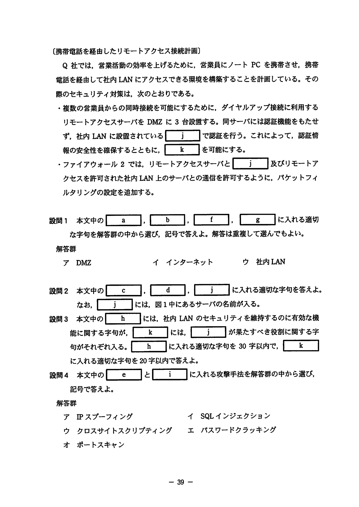

テキスト (OCR)

(携帯電話を経由したリモートアクセス接続計画)

Q 社では, 営業活動の効率を上げるために, 営業員にノート PC を携帯させ, 携帯
電話を経由して社内 LAN にアクセスできる環境を構築することを計画している。その
際のセキュリティ対策は, 次のとおりである。

・複数の営業員からの同時接続を可能にするために, ダイヤルアップ接続に利用する
リモートアクセスサーバを DMZ に 3 台設置する。同サーバには認証機能をもたせ
ず, 社内 LAN に設置されている|  j | で認証を行う。これによって, Batt
報の安全性を確保するとともに, | k | を可能にする。

・ファイアウォール 2 では, リモートアクセスサーバと[|  j |及びぴりモートア
クセスを許可された社内 LAN 上のサーバとの通信を許可するように, パケットフィ
ルタリングの設定を追加する。

設問1 本文中の| a || > 中.| f£ |. Lg |に入れる適切
な字句を解答群の中から選び, 記号で答えよ。解答は重複して選んでもよい。
RSH
ア DMZ        4 インターネット    ウ 社内LAN
設問2 本文中の| c |,】  d |,]| i | に入れる適切な字句を答えよ。

なお, (i | には, 図1中にあるサーバの名前が入る。
設問3 本文中の[| h | には, 社内 LAN のセキュリティを維持するのに有効な機
能に関する字句が, | k | には,|  }  ] が果たすべき役割に関する字
名がそれぞれ入る。[  h | に入れる適切な字句を30字以内| k |
に入れる適切な字句を 20 字以内で答えよ。

設問4 本文中の|  e |と| i |に入れる攻撃手法を解答群の中から選び,
記号で答えよ。

RS
ア TPスプーフィング       イ SQLインジェクション

ウ クロスサイトスクリプティング DL パスワードクラッキング
オ ポートスキャン

### ページ 40

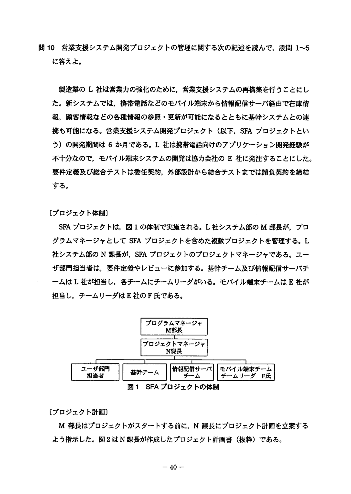

テキスト (OCR)

問10 営業支援システム開発プロジェクトの管理に関する次の記述を読んで, 設問 1て5
に答えよ。

製造業の L 社は営業力の強化のために, 営業支援システムの再構築を行うことにし
た。新システムでは, 携帯電話などのモバイル端末から情報配信サーバ経由で在庫情
報, 顧客情報などの各種情報の参照・更新が可能になるとともに基幹システムとの連
携も可能になる。営業支援システム開発プロジェクト (以下, SFA プロジェクトとい
う) の開発期間は 6 か月である。L 社は携帯電話向けのアプリケーション開発経験が
不十分なので, モバイル端末システムの開発は協力会社の E 社に発注することにした。
要件定義及び総合テストは委任契約, 外部設計から結合テストまでは請負契約を締結
する。

〔プロジェクト体制〕

SFA プロジェクトは, Bl の体制で実施される。 L 社システム部の M 部長が, プロ
グラムマネージャとして SFA プロジェクトを含めた複数プロジェクトを管理する。 し
社システム部の N 課長が, SFA プロジェクトのプロジェクトマネージャである。ユー
ザ部門担当者は, 要件定義やレビューに参加する。基幹チーム及び情報配信サーパチ
ームは 社が担当し, 各チームにチームリーダがいる。モパイル端末チームは E 社が
担当し, チームリーダは 社のF 氏である。

プログラムマネージャ
M部長

L
プロジェクトマネージャ
N課長
I

[                                                      I
ユーザ部門                      _           情報配信サーパ| | モバイル端末チーム
揚当者           基幹チーム          チーム         チームリーダ FR

 1 SFAプロジェクトの体制

(プロジェクト計画〕
M 部長はプロジェクトがスタートする前に, N 課長にプロジェクト計画を立案する
よう指示した。図 2 はN課長が作成したプロジェクト計画書 (抜粋) である。

### ページ 41

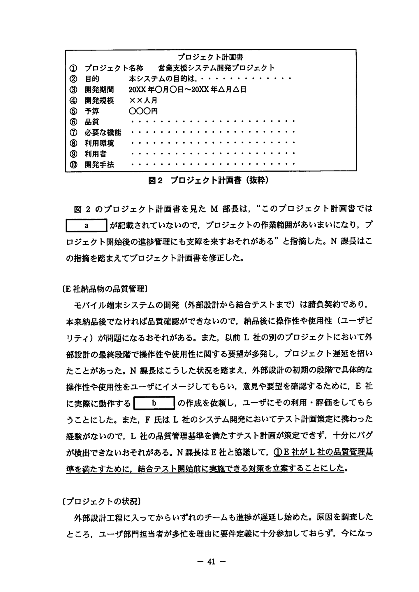

テキスト (OCR)

プロジェクト計画書
① プロジェクト名称 営業支援システム開発プロジェクト
@ 目的    本システムの目的は, ・・・・・・・・・・・・・
@ 開発期間 20XX年〇月〇日20XX 年人月人日
@ 開発規模 "メメ人月
© 予算    OOO円
O+
⑦ 必要な機能 ・・・・・・・トトトトトトトトドトトトットトットバ
@ 利用環境  ・・・・・・・トトトトトトトトトトトトトトッ
⑨ 利用者   EE
⑩ 開発手法 ・・・・・・トトトトトトトトトトトトトトドトットバ

図2 プロジェクト計画書 (抜粋

図 2 のプロジェクト計画書を見た M 部長は, “このプロジェクト計画書では
| 』 ] が記載されていないので, プロジェクトの作業範囲があいまいになり, 7
ロジェクト開始後の進抄管理にも支障を来すおそれがある"と指摘した。N 課長はこ
の指摘を踏まえてプロジェクト計画午を修正した。

CE 社納品物の品質管理

モバイル端末システムの開発 (外部設計から結合テストまで) は請負契約であり,
本来納品後でなければ品質確認ができないので, 納品後に操作性や使用性 (ユーザビ
リティ) が問題になるおそれがある。また, 以前 L 社の別のプロジェクトにおいて外
部設計の最終段階で操作性や使用性に関する要望が多発し, プロジェクト遅延を招い
たことがあった。N 課長はこうした状況を踏まえ, 外部設計の初期の段階で具体的な
操作性や使用性をユーザにイメージしてもらい, 意見や要望を確認するために, E tt
に実際に動作する | b | の作成を依頼し, ユーザにその利用・評価をしてもら
うことにした。また, F 氏は L 社のシステム開発においてテスト計画集定に携わった
経験がないので, L 社の品質管理基準を満たすテスト計画が策定できず, 十分にバグ
が検出できないおそれがある。N 課長はE 社と協議して, rh

〔プロジェクトの状況}
外部設計工程に入ってからいずれのチームも進捗が遅延し始めた。原因を調査した
ところ, ユーザ部門担当者が多忙を理由に要件定義に十分参加しておらず, 今になっ

### ページ 42

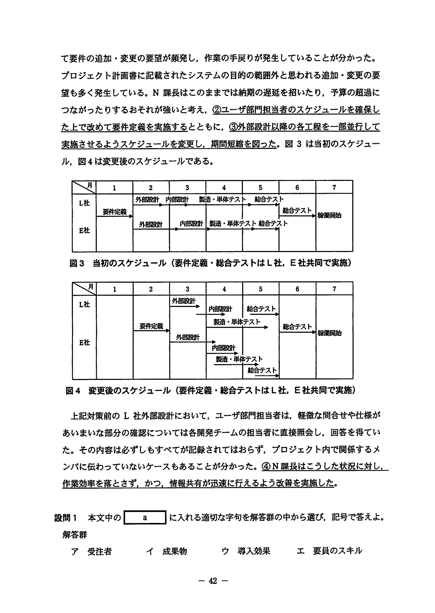

テキスト (OCR)

て要件の追加・変更の要望が頻発し, 作業の手戻りが発生にしていることが分かった。
プロジェクト計画書に記載されたシステムの目的の館囲外と思われる追加・変更の要
望も多く発生している。N 課長はこのままでは納期の遅延を招いたり, 予算の超過に
つながったりするおそれが強いと考え, ②ユーザ部門担当者のスケジュールを確保し
た上で改めて要件定義を実施するとともに, ③外部設計以降の各工程を一部並行して

実施させるようスケジュールを変更し, 期間短縮を図った。図 3 は当初のスケジュー
ル, 図4 は変更後のスケジュールである。

A  1    2   3    4    5   6    7
Lit        a ee ee ed 結合テスト
Bree                 総合テスト
SBE       PABRARET | 製造 ・単体テスト 結合テスト

Ett

図3 当初のスケジュール (要件定義・総合テストはし社, E 社共同で実施)

Ltt          Set       ュ
内部設計 | 結合テスト
要件定義            製造・単体テスト       合テスト
E社
PERRY
an
製造・単体テスト
ヒーと
合テスト
——

図4 変更後のスケジュール (要件定義・総合テストはしL社, E 社共同で実施)

上記対策前の L 社外部設計において, ユーザ部門担当者は, 軽微な問合せや仕様が
あいまいかな部分の確認については各開発チームの担当者に直接照会し, 回答を得てい
た。その内容は必ずしもすべてが記録されてはおらず, プロジェクト内で関係するメ
ンパに伝わっていないケースもあることが分かった。④N 課長はこうした状況に対し,

Zs                    as                    う改善を実施した。

設問1 本文中の| a | に入れる適切な字句を解答群の中から選び, 記号で答えよ。
SE
ア xe    イ 成果物    ウ 導入効果 xc 要員のスキル

ー42ー

### ページ 43

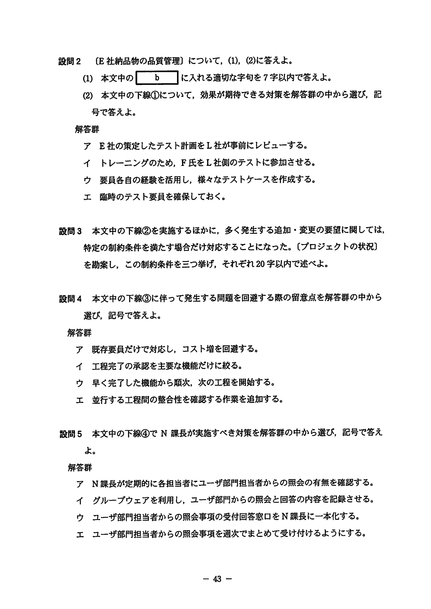

テキスト (OCR)

設問2  (E社納品物の品質管理)]について, (1⑪), (②に答えよ。
Q) 本文中の[| b |] に入れる適切な字句を7字以内で答えよ。
Q) 本文中の下線①について, 効果が期待できる対策を解答群の中から選び, 記
号で答えよ。
解答群
ア 社の策定したテスト計画をL 社が事前にレビューする。
イ トレーニングのため, 氏をし 社側のテストに参加させる。
ウ 要員各自の経験を活用し, 様々なテストケースを作成する。
XL 臨時のテスト要員を確保しておく。

設問3 本文中の下線②を実施するほかに, 多く発生する追加・変更の要望に関しては
特定の制約条件を満たす場合だけ対応することになった。〔プロジェクトの状況
を勘案し, この制約条件を三つ挙げ, それぞれ20 字以内で述べよ。

設問4 本文中の下線③に伴って発生する問題を回避する際の留意点を解答群の中から
選び, 記号で答えよ。

RoR

既存要員だけで対応し, コスト増を回避する。

工程完了の承認を主要な機能だけに絞る。

早く完了した機能から順次, 次の工程を開始する。

並行する工程問の整合性を確認する作業を追加する。

Hさヽへさい

設問5 本文中の下線④で N 課長が実施すべき対策を解答群の中から選び, 記号で答え
よ。
RE
N 課長が定期的に各担当者にユーザ部門担当者からの照会の有無を確認する。
グループウェアを利用し, ユーザ部門からの照会と回答の内容を記録させる。
ユーザ部門担当者からの照会事項の受付回答窓口を N 課長に一本化する。
ユーザ部門担当者からの照会事項を週次でまとめて受け付けるようにする。

H へ SN

### ページ 44

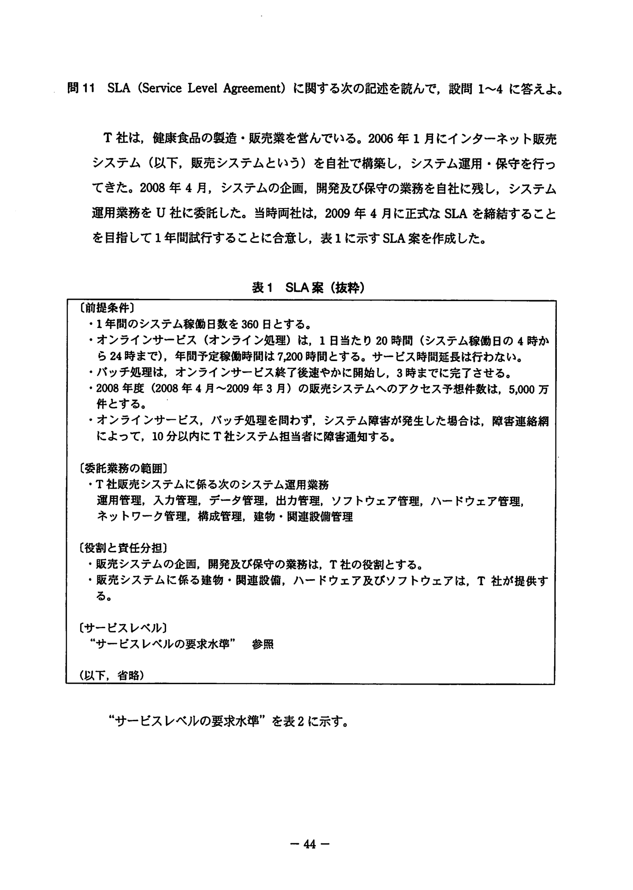

テキスト (OCR)

問11 SLA (Service Level Agreement) に関する次の記述を読んで, 設問 1ン4 に答えよ。

T 社は, 健康食品の製造・販売業を営んでいる。2006 年 1 月にインターネット販売
システム (以下, 販売システムという) を自社で構築し, システム運用・保守を行っ
てきた。2008 年 4 月。 システムの企画, 開発及び保守の業務を自社に残し, システム
運用業務を U 社に委託した。当時両社は, 2009 年 4 月に正式な SLA を締結すること
を目指して 1 年間試行することに合意し, 表1 に示す SLA 案を作成した。

表1 SLAR (抜粋)

〔前提条件〕

・1 年間のシステム稼働日数を 360 日とする。

・オンラインサービス (オンライン処理) は, 1 日当たり 20 時間 (システム稼働日の 4 時か
ら 24 時まで), 年間予定稼働時間は 7.200 時間とする。サービス時間延長は行わない。

・バパッチ処理は, オンラインサービス終了後速やかに開始し, 3 時までに完了させる。

+ 2008 年度 (2008 年4 月て2009 年 3 月) の販売システムへのアクセス予想件数は, 5,000 万
件とする。

・オンラインサービス, パッチ処理を問わず, システム障害が発生した場合は, 障害連絡綱
によって, 10 分以内にT社システム担当者に障害通知する。

(委託業務の範囲〕
・T 社販売システムに係る次のシステム運用業務
運用管理, 入力管理. データ管理, 出力管理.ソフトウェア管理, ハードウェア管理,
ネットワーク管理, 構成管理, 建季・関連設備管理

(RHC HED)
・販売システムの企画, 開発及び保守の業務は, T 社の役割とする。
・販売システムに係る建物・関連設備, ハードウェア及びソフトウェアは, T 社が提供す
る。

〔サービスレベル〕
“サービスレベルの要求水準” 参照

(以下, 省略)

“サービスレベルの要求水準" を表 2 に示す。

### ページ 45

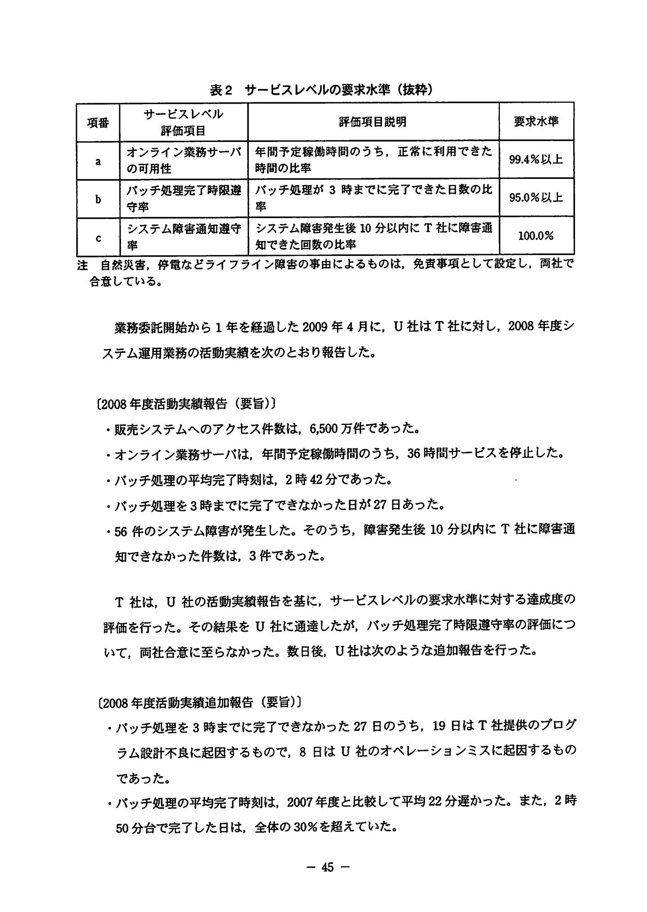

テキスト (OCR)

表2 サービスレベルの要求水準 (抜粋)

サービスレベル
ae        nena                     評価項目説明                 要求水準
オンライン業務サーバ | 年間予定稼働時間のうち, 正常に利用できた        、
3 | の可用性             時間の比率                                SeAK ELE
、 | バッチ和理売陸人| バッチ処理が 3 時までに完了できた日数の比 | 。
7a
MG ae oe 」 oz
#                   知できた回数の比率

注 自然災害, 停電などライフライン原害の事由によるものは, 免責事項として設定し, 両社で
合意している。

業務委託開始から 1 年を経過した 2009 年 4 月に, U社は T 社に対し, 2008 FRY
ステム運用業務の活動実績を次のとおり報告した。

(2008 年度活動実績報告 (要旨))

・販売システムへのアクセス件数は, 6,500 万件であった。

・オンライン業務サーバは, 年間予定稼働時間のうち, 36 時間サービスを停止した。

・バパッチ処理の平均完了時刻は, 2 時 42 分であった。

・パバッチ処理を 3 時までに完了できなかった日が27 日あった。

・56 件のシステム障害が発生した。そのうち, 障害発生後 10 分以内に T 社に障害通
知できなかった件数は, 3 件であった。

T 社は, U 社の活動実績報告を基に, サービスレベルの要求水準に対する達成度の
評価を行った。その結果を U 社に通達したが, パッチ処理完了時限遵守率の評価につ
WT, 両社合意に至らなかった。数日後, U社は次のような追加報告を行った。

(2008 年度活動実績追加報告 (要旨)〕
・バッチ処理を 3 時までに完了できなかった 27 日のうち, 19 日は T 社提供のプログ
ラム設計不良に起因するもので, 8 日は U 社のオペレーションミスに起因するもの

であった。

・バパッチ処理の平均完了時刻は, 2007 年度と比較して平均 22 分遅かった。また, 2時

50 分台で完了した日は,

全体の 30%を超えていた。

ー 45 一

### ページ 46

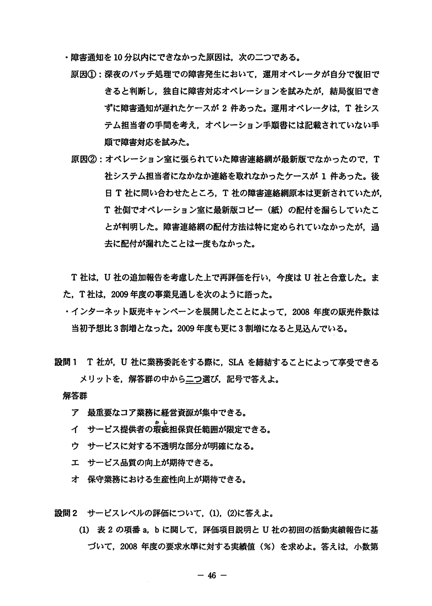

テキスト (OCR)

・障害通知を 10 分以内にできなかった原因は, 次の二つである。

原因① : 深夜のパッチ処理での障害発生において, 運用オペレータが自分で復旧で
きると判断し, 独自に障害対応すオペレーションを試みたが, 結局復旧でき
ずに障害通知が遅れたケースが 2 件あった。運用オペレータは, T 社シス
テム担当者の手間を考え, オペレーション手順書には記載されていない手
順で障害対応を試みた。

原因② : オペレーション室に張られていた障害連絡網が最新版でなかったので, T
社システム担当者になかなか連絡を取れなかったケースが 1 件あった。後
日 T 社に問い合わせたところ, T 社の障害連絡網原本は更新されていたが,
T 社側でオペレーション室に最新版コピー (紙) の配付を漏らしていたこ
とが判明した。障害連絡網の配付方法は特に定められていなかったが, 過
去に配付が漏れたことは一度もなかった。

T tid, U 社の追加報告を考慮した上で再評価を行い, 今度は U 社と合意した。ま
た, T 社は, 2009 年度の事業見通しを次のように語った。
・インターネット販売キャンペーンを展開したことによって, 2008 年度の販売件数は
当初予想比 3 割増となった。2009 年度も更に 3 割増になると見込んでいる。

設問1 T 社が, U社に業務委託をする際に, SLA を締結することによって享受できる
メリットを, 解答若の中からニつ選び, 記号で答えよ。
解答
最重要なコア業務に経営資源が集中できる。
サービス提供者の下交担保次任範囲が限定できる。
サービスに対する不秀明な部分が明確になる。
サービス品質の向上が期待できる。
保守業務における生産性向上が期待できる。

YHGA YN

設問2 サービスレベルの評価について, (1), ②)に答えよ。
Q①) 表2 の項番 4, b に関して, 評価項目説明と U 社の初回の活動実績報告に基
づいて, 2008 年度の要求水準に対する実絹値 (%) を求めよ。答えは, 小数第

ー46 一

### ページ 47

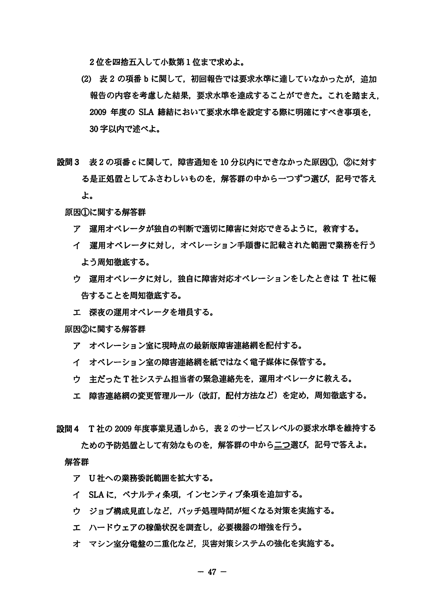

テキスト (OCR)

2 位を四捨五入して小数第 1 位まで求めよ。

(2) 表2 の項番b に関して, 初回報告では要求水準に達していなかったが, 追加
報告の内容を考貞した結果, 要求水準を達成することができた。 これを踏まえ
2009 年度の SLA 締結において要求水準を設定する際に明確にすべき事項を,
30 字以内で述べよ。

設問3 表2の項番c に関して, 障害通知を 10 分以内にできなかった原因①, ②に対す
る是正処置としてふさわしいものを, 解答群の中からーつずつ選び, 記号で答え
よ。
原因①に関する解答群
ア 運用オペレータが独自の判断で適切に障害に対応できるように, 教育する。
イ 運用オペレータに対し, オペレーション手順書に記載された範囲で業務を行う
よう周知徹底する。
ウ 運用オペレータに対し, 独自に障害対応オペベレーションをしたときは T 社に報
告することを周知徹底する。
エエ 深夜の運用オペレータを増員する。
原因②に関する解答群
ア オペレーション室に現時点の最新版障害連絡網を配付する。
イ オペレーション室の障害連絡綱を紙ではなく電子媒体に保管する。
ウ 主だったT社システム担当者の緊急連絡先を, 運用オペレータに教える。
エ 障害連絡網の変更管理ルール (改訂, 配付方法など) を定め, 周知徹底する。

設問4 T社の 2009 年度事業見通しから, 表2 のサービスレベルの要求水準を維持する
ための予防処罰として有効なものを, 解答群の中から二つ選び, 記号で答えよ。

解答群

U社への業務委託秋囲を拡大する。

SLA に, ペナルティ条項, インセンティブ条項を追加する。

ジョプブ構成見直しなど, バッチ処理時間が短くなる対策を実施する。

ハードウェアの稼働状況を調査し, 必要機器の増強を行う。

マシン室分電盤の二重化など, 災害対策システムの強化を実施する。

YHA

### ページ 48

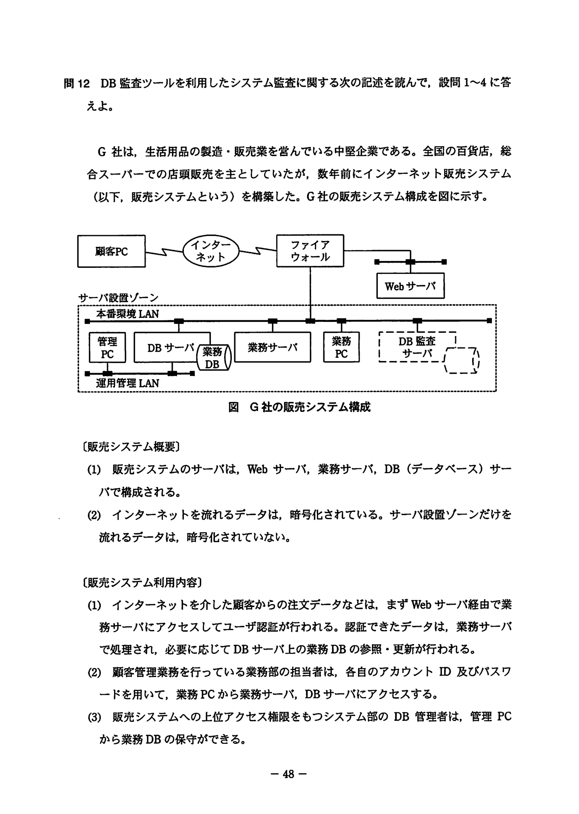

テキスト (OCR)

問 12 DB監査ツールを利用したシステム監査に関する次の記述を読んで, 設問 1こ4 に答
えよ。

G 社は, 生活用品の製造・販売業を営んでいる中堅企業である。 全国の百貨店, 総
合スーパーでの店頭販売を主としていたが, 数年前にインターネット販売システム
(以下, 販売システムという) を構築した。G 社の販売システム構成を図に示す。

ファイア
REZPC  メール  —
Web サーバ
サーパ設罰ソゾーン
ABR LAN
.         tT         Ei a
管理                業務   | DB監査 !
mc | | DPサーバ(本務| RBIS | | Cc] | ターリース
bp Vーーーーごーーご ーーーーーー \__W
運用管理LAN
 G 社の販売システム構成
(販売システム概要〕
①) 販売システムのサーバは, Web サーパ, 業務サーパ, DB (データベース) サー
NCHRENZS.

Q) インターネットを流れるデータは, 暗号化されている。サーバ設置ソゾーンだけを
流れるデータは, 暗号化されていない。

(販売システム利用内容)

Q) インターネットを介した顧客からの注文データなどは, まず Web サーバ経由で業
務サーパにアクセスしてユーザ認証が行われる。認証できたデータは, 業務サーバ
で処理され, 必要に応じて DB サーパ上の業務 DB の参照・更新が行われる。

(⑫) 顧客管理業務を行っている業務部の担当者は, 各自のアカウント ID 及びパスワ
ードを用いて, 業務PC から業務サーパ, DB サーバにアクセスする。

3) MHYVAFANOLIT 7 UAMRE DIOYAT LBRO DB 管理者は, 管理 PC
から業務 DB の保守ができる。

### ページ 49

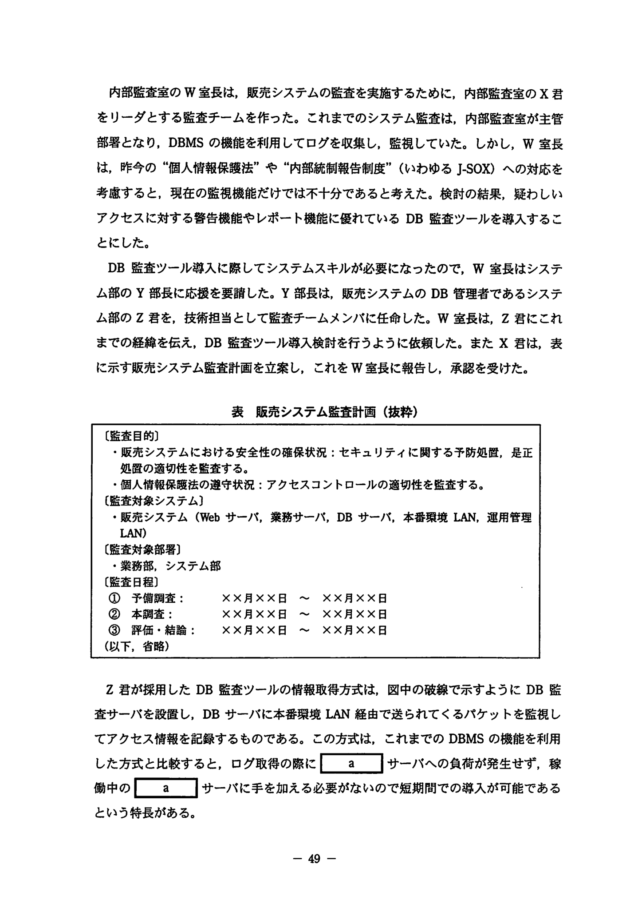

テキスト (OCR)

内部監査室の W 室長は, 販売システムの監査を実施するために, 内部監査室のX君
をリーダとする監査チームを作った。これまでのシステム監査は, 内部監査室が主管
部署となり, DBMS の機能を利用してログを収集し, 監視していた。しかし, W 室長
は, 昨今の “個人情報保護法" や“内部統制報告制度" (いぃわゆる J-SOX) への対応を
考慮すると, 現在の監視機能だけでは不十分であると考えた。 検討の結果, 疑わしい
アクセスに対する和告機能やレポート機能に優れている DB 監査ツールを導入するこ
とにした。

DB 監査ツール導入に際してシステムスキルが必要になったので, W 室長はシステ
ABO Y 部長に応援を要請した。Y 部長は, 販売システムの DB 管理者であるシステ
ム部の Z Bt, 技術担当として監査チームメンパに任命した。W 室長は, Z Bice
までの経緯を伝え, DB 監査ツール導入検討を行うように依頼した。また X BU, 表
に示す販売システム監査計画を立案し, これを W 室長に報告し, 承認を受けた。

表 販売システム監査計画 (抜粋)

〔監査目的

・販売システムにおける安全性の確保状況 : セキュリティに関する予防処置, 是正
処賀の適切性を監査する。

・個人情報保護法の遵守状況 ・ アクセスコントロールの適切性を監査する。

(監査対象システム〕}

・販売システム (Web サーパ, 業務サーバ, DB サーパ, 本番環境 LAN, 運用管理
LAN)

(AN RAE)

・業務部, システム部

(EAA)

① Fez :   XX月XX日 て XXAXXE

@ 本調査 :    XX月XX日 て メメ月XX日

@ 評価・結論 :  メメ月XX日 て XX月メメ日

(以下, 省略)

Z 君が採用した DB 監査ツールの情報取得方式は, 図中の破線で示すように DB 監
査サーバを設置し. DB サーバに本番環境 LAN 経由で送られてくるパケットを監視し
てアクセス情報を記録するものである。この方式は, これまでの DBMS の携能を利用
した方式と比較すると, ログ取得の際に | a | サーバへの負荷が発生せず, 稼
働中の| a | サーバに手を加える必要がないので短期間での導入が可能である
という特長がある。

### ページ 50

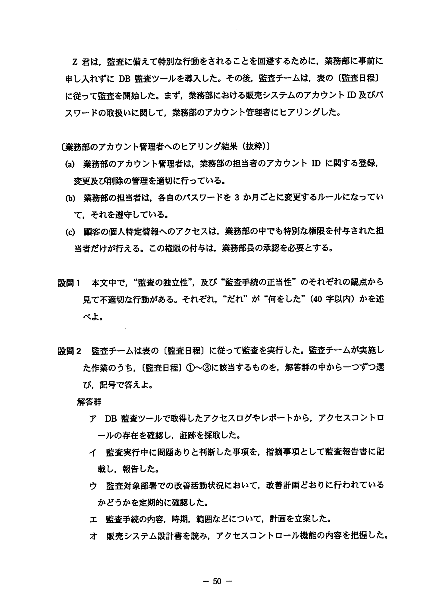

テキスト (OCR)

Z 君は, 監査に備えて特別な行動をされることを回避するために, 業務部に事前に
申し入れずに DB 監査ツールを導入した。その後, 監査チームは, 表の(監査日程
に従って監査を開始した。まず, 業務部における販売システムのアカウント D RUN
スワードの取扱いに関して, 業務部のアカウント管理者にヒアリングした。

〔業務部のアカウント管理者へのヒアリング結果 (抜粋))

(@) 業務部のアカウント管理者は, 業務部の担当者のアカウント ID に関する登録,
変更及び削除の管理を適切に行っている。

(b) 業務部の担当者は, 各自のパスワードを 3 か月ごとに変更するルールになってい
て, それを遵守している。

©) 顧客の個人特定情報へのアクセスは, 業務部の中でも特別な権限を付与された担
当者だけが行える。この権限の付与は, 業務部長の承認を必要とする。

設問1 本文中で, “監査の独立性", 及び “監査手続の正当性" のそれぞれの観点から
見て不適切な行動がある。 それぞれ, “Eh” が “何をした" (40 字以内) かを述
べよ。

設問2 監査チームは表の【〔監査日程] に従って監査を実行した。監査チームが実施し
た作業のうち, 〔監査日程] ①て③に該当するものを, 解答群の中からーつずつ選
び, 記号で答えよ。

BER
ア DB 監査ツールで取得したアクセスログやレポートから, アクセスコントロ
ールの存在を確認し, 証上跡を採取した。
イ 監査実行中に問題ありと判断した事項を, 指摘事項として監査報告書に記
RL, 報告した。
ウ 監査対象部暑での改善活動状況において, 改善計画どおりに行われている
かどうかを定期的に確認した。
エエ 監査手続の内容, 時期, 範囲などについて, 計画を立案した。
A 販売システム設計書を読み. アクセスコントロール機能の内容を把握した。

### ページ 51

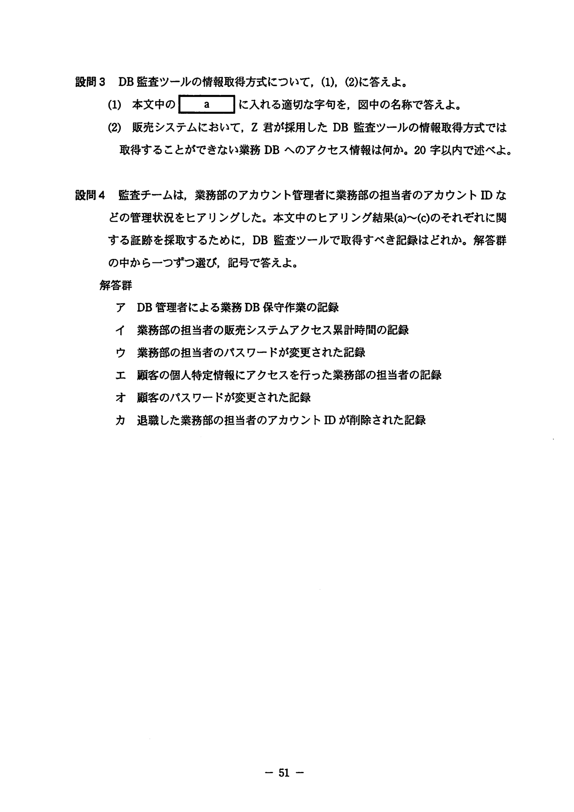

テキスト (OCR)

山間3 DB監査ツールの情報取得方式について, (1), ②)に答えよ。
a 本文中の| 』 | に入れる適切な字句を, 図中の名称で答えよ。

Q) 販売システムにおいて, Z 君が採用した DB 監査ツールの情報取得方式では

取得することができない業務 DB へのアクセス情報は何か。20 字以内で述べよ。

設問4 監査チームは, 業務部のアカウント管理者に業務部の担当者のアカウントDな
どの管理状況とそヒアリングした。本文中のヒアリング結果(4)て(cC)のそれぞれに関
する証跡を採取するために, DB 監査ツールで取得すべき記録はどれか。 BER
の中から一つずつ選び, 記号で答えよ。

BER

DB 管理者による業務 DB 保守作業の記録

業務部の担当者の販売システムアクセス累計時間の記録

業務部の担当者のパスワードが変更された記録

顧客の個人特定情報にアクセスを行った業務部の担当者の記録

願客のパスワードが変更された記録

退職した業務部の担当者のアカウント ID が削除された本録

に

### ページ 52

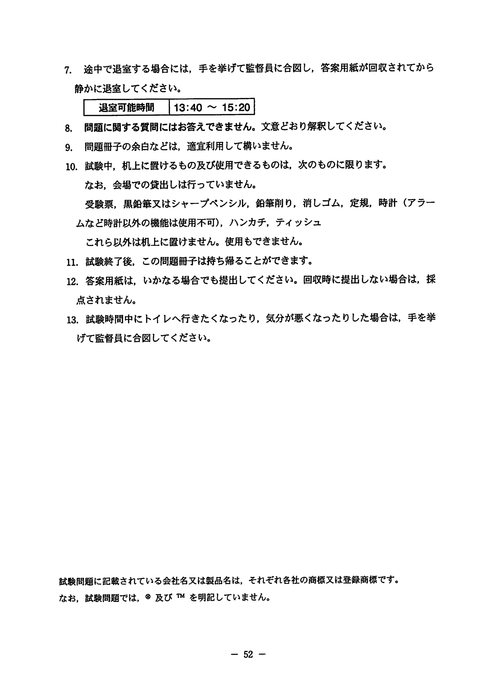

テキスト (OCR)

7. 途中で退室する場合には, 手を挙げて監督中に合図し, 答案用紙が回収されてから
POITBELTCESW,
退室可能時間 | 13:40 ~ 15:20
8. 問題に関する質問にはお答えできません。文意どおり解釈してください。
9. 問題冊子の余白などは, 適宜利用して構いません。
10. RAH, 机上に置けるもの及び使用できるものは, 次のものに限ります。
なお, 会場での貸出しは行っていません。
SBE, 黒鉛筑又はシャープペンシル, 鉛筆削り, 消しゴム, eR, 時計 (アラー
ムなど時計以外の機能は使用不可), ハンカチ, ティッシュ
これら以外は机上に置けません。使用もできません。
ll. 試験終了後, この問題冊子は持ち帰ることができます。
12. SRAM, いかなる場合でも提出してください。回収時に提出しない場合は, 採
点されません。
13, 試験時間中にトイレへ行きたくなったり, 気分が悪くなったりした場合は, FEB
げて監督員に合図してください。

試験問題に記載されている会社名又は製品名は, それぞれ各社の商標又は登録商標です。
なお, 試験問題では, © 及び ™ を明記していません。

---

## 午後解答

1/6 
Copyright(c) Information-technology Promotion Agency, Japan. All rights reserved 2009 
平成21 年度 春期 応用情報技術者試験 解答例 
 
午後試験 
問１ 
出題趣旨 
 企業や店舗を取り巻く外部環境は常に変化している。企業や店舗が収益力を維持していくためには，外部環
境の変化に応じてマーケティング戦略を見直し，改善策を立案しなければならない。マーケティング戦略の立
案に際しては，マーケティング理論と手法を理解し，その応用能力を身に付けておくことが重要である。 
 本問では，食品スーパーにおける経営見直しを題材に，マーケティング戦略立案のプロセスについての基礎
的な知識と応用力を問う。 
 
設問 
解答例・解答の要点 
備考 
設問１ (1) 可処分所得 
イ 
 
 
 調理と食事の楽しみ 
ウ 
 
 
 来店の頻度 
ア 
 
 
(2) 経営資源を集中的に投入することを可能にする。 
 
設問２ 
a オ 
 
 
b ア 
 
 
c エ 
 
 
d カ 
 
設問３ 
e ア 
 
設問４ 
店舗コンセプトに合致する品揃えが維持できなくなるから 
 
 
問２ 
出題趣旨 
 配列やリンクリストなどのデータ構造を用いたアルゴリズムの実装や，その計算量を考慮することは，応用
情報技術者が理解しておくべき基礎技術の一つである。 
 本問では，探索アルゴリズムであるハッシュ法の一つ，チェイン法を題材に，データ構造（リンクリストの
配列）やそれを用いたアルゴリズムを実装する能力を問う。さらに，アルゴリズムを評価する際の指標である
計算量に関する理解について問う。 
 
設問 
解答例・解答の要点 
備考 
設問１ 
違うキーの値でも，ハッシュ関数を適用した結果が同じ値になること 
 
設問２ (1) 16→37→23 
 
 
(2) ア node.key がkey と等しい 
 
 
 
イ node ← node.nextNode 
 
 
 
ウ null 
 
設問３ 
エ key, data, table[hash] 
 
 
オ table[hash] 
 
設問４ (1) カ すべてのキーについてハッシュ値が同じになる 
 
 
(2) キ O(1)

2/6 
Copyright(c) Information-technology Promotion Agency, Japan. All rights reserved 2009 
問３ 
出題趣旨 
 SWOT 分析は，企業の経営環境分析や戦略立案のための基本的な手法であり，経営環境を総合的に分析する
ための有効なツールとなる。 
 本問では，製造業における新製品戦略及び営業・物流戦略の策定を題材に，SWOT 分析と事業戦略立案に関
する基本的な理解を問う。 
 
設問 
解答例・解答の要点 
備考 
設問１ (1) ② T 
 
 
 
④ T 
 
 
 
⑦ O 
 
 
 
⑩ W 
 
 
(2) a キ 
 
 
 
b エ 
 
設問２ 
ア 
 
設問３ 
ウ 
 
設問４ 
新製品戦略 
・顧客の声を反映した製品の企画・開発が可能になる。 
・製品に対する要望を満たす製品の企画・開発が可能になる。 
 
 
物流戦略 
・配送先確認をなくし，配送計画立案を迅速化できる。 
・効率的な配送ルート決定など迅速に配送計画を立案できる。  
 
問４ 
出題趣旨 
 企業のシステムに関して災害復旧対策（ディザスタリカバリ）が注目され，多くの対策製品も現れている。
 本問では，企業のオンラインシステムを題材に，災害復旧対策における復旧目標と，その実現方法及びオン
ラインシステムの信頼性や性能についての理解と応用力を問う。 
 
設問 
解答例・解答の要点 
備考 
設問１ 
a 短い 
 
 
b 1 
 
 
c 端末 
 
設問２ 
A ウ 
 
 
B ア 
 
設問３ 
レベル1 
A 
 
 
レベル2 
B 
 
 
レベル3 
なし 
 
設問４ (1) 50 
 
 
(2) ウ

3/6 
Copyright(c) Information-technology Promotion Agency, Japan. All rights reserved 2009 
問５ 
出題趣旨 
 近年の企業内のネットワークの導入が進むに連れ，その効率的な運用の必要性が高まっている。 
 本問では，ネットワークを容易，かつ，確実に運営する観点から重要なDHCP の基本動作，基本機能に関す
る知識と理解度を問う。 
 
設問 
解答例・解答の要点 
備考 
設問１ 
a ア 
 
 
b エ 
 
 
c ア 
 
 
d イ 
 
 
e オ 
 
 
f U 
 
 
g B 
 
設問２ 
h 192.168.10.190 
 
 
i 192.168.10.150 
 
 
j 192.168.10.190 
 
設問３ 
192.168.10.66～192.168.10.113 
 
設問４ 
繁忙時にDHCP サーバが故障すると，IP アドレスが不足する。 
 
 
問６ 
出題趣旨 
 近年のソフトウェア開発では，新規システムの開発よりも運用中のシステムへの機能追加や改修を行うケー
スが多くなってきている。既存システムを理解し，さらに追加・修正を加えるためのデータモデリングの能力
が求められる。 
 本問では，園芸用品の注文管理システムを題材に，既存システムへ機能追加を行う際に求められる，データ
モデリング及びSQL 文による問合せ記述の能力を問う。 
 
設問 
解答例・解答の要点 
備考 
設問１ 
a 顧客番号 
 
 
b ↓ 
 
 
c 販売単価 
 
設問２ 
d SUM(TempTbl.小計) 
 
 
e UNION ALL 
 
 
f 商品.商品番号 = セット商品.セット商品番号 
又は 
注文明細.商品番号 = セット商品.セット商品番号 
 
設問３ 
場合 
一つの商品に複数の新モデルが存在する場合 
 
 
場所 
（ あ ） 
 
 
字句 
DISTINCT

4/6 
Copyright(c) Information-technology Promotion Agency, Japan. All rights reserved 2009 
問７ 
出題趣旨 
 電池を使用した組込み系端末などでは，電池の寿命を長くするために様々な省電力を行っている。 
 本問では，MPU クロック供給停止による省電力方式の理解，及びリアルタイムOS のタスクの制御について
の知識と理解を問う。 
 
設問 
解答例・解答の要点 
備考 
設問１ 
a 割込み処理 
 
 
b タイマ割込み処理 
 
 
c T 
 
設問２ 
d 0.9 
 
 
e 0.0095 
 
設問３ (1) ・ほかのタスクより低い優先度とする。 
・すべてのタスクの中で最も低い優先度とする。 
 
 
(2) 待ち状態 
 
 
問８ 
出題趣旨 
 オブジェクト指向に基づいたソフトウェア開発の現場では，分析及び設計を行う際に，UML（Unified Modeling 
Language）を用いることが多い。UML を理解しておくことは，分析及び設計を行うツールとしてはもちろん，
複数の開発関係者の間で，設計の内容に関する共通認識を得るためにも重要なことである。 
 本問では，商品販売用Web アプリケーションの設計を題材にして，UML を用いたソフトウェア設計に関する
理解を問う。 
 
設問 
解答例・解答の要点 
備考 
設問１ 
a ケ 
 
 
b オ 
 
 
c エ 
 
 
d 商品 
 
 
e 予約販売商品 
 
 
f ウ 
 
設問２ 
g ショッピングカート内の商品の購入手続を行う 
 
 
h ショッピングカートから商品を削除する 
 
設問３ 
商品の追加と削除が同時に行われると，デッドロックが発生することがある。

5/6 
Copyright(c) Information-technology Promotion Agency, Japan. All rights reserved 2009 
問９ 
出題趣旨 
 社内ネットワークを外部ネットワーク，特にインターネットに接続すると，様々な不正アクセスや攻撃の脅
威にさらされることになる。ファイアウォールは，このような場合に社内ネットワークのセキュリティを維持
する上で，不可欠な機器である。 
 本問では，ファイアウォールの果たす機能についての基礎的な理解を問う。 
 
設問 
解答例・解答の要点 
備考 
設問１ 
a ア 
 
 
b イ 
 
 
f イ 
 
 
g ウ 
 
設問２ 
c 220.1xx.2xx.4 
 
 
d 210.2yy.1yy.100 
 
 
j RADIUS サーバ 
 
設問３ 
h 社内LAN 上にある機器のアドレス情報を隠ぺいする 
 
 
k 認証情報の一元的な管理 
 
設問４ 
e ア 
 
 
i オ 
 
 
問10 
出題趣旨 
 システム開発プロジェクトを効率よく運営し，成功に導く上で，プロジェクトマネジメントスキルは必須で
ある。 
 本問では，製造業における営業支援システム開発プロジェクトを題材に，プロジェクトの計画と管理に関す
る理解を問う。 
 
設問 
解答例・解答の要点 
備考 
設問１ 
a 
イ 
 
設問２ (1) b 
プロトタイプ 
 
 
(2) ア 
 
設問３ 
① 
② 
③ 
・システムの目的の範囲内であること 
・納期遅延を発生させないこと 
・予算を超過しないこと 
 
設問４ 
エ 
 
設問５ 
イ

6/6 
Copyright(c) Information-technology Promotion Agency, Japan. All rights reserved 2009 
問11 
出題趣旨 
 昨今，アウトソーシングの利用において，顧客とサービス提供者間の合意内容を明確にするためにSLA を締
結することが定着しつつある。 
 本問では，アウトソーシング利用時のSLA 締結を題材に，SLA の策定や評価に関する基本的な理解，及び合
意した要求水準の達成に向けた施策の理解について問う。 
 
設問 
解答例・解答の要点 
備考 
設問１ 
ウ，エ 
 
設問２ (1) a 99.5 
 
 
 
b 92.5 
 
 
(2) ・T 社の責任に帰すべき障害は，免責事項とすること 
・T 社が提供する資源の不良に起因するものは免責事項とすること 
・U 社の責任に帰すべき障害だけを評価対象とすること 
 
設問３ 
原因① 
イ 
 
 
原因② 
エ 
 
設問４ 
ウ，エ 
 
 
問12 
出題趣旨 
 システム監査を正確にかつ効率よく行うための手段として，DB 監査ツールの導入，利用が進んでいる。 
 本問では，企業のシステム監査実施を題材に，監査計画立案，監査手順についての基本的な理解と，DB 監査
ツールを利用した場合の監査実施の知識と理解について問う。 
 
設問 
解答例・解答の要点 
備考 
設問１ 
だれ 
Y 部長 
 
 
監査の 
独立性 
何をした 
 
システム部のZ 君を技術担当として監査チームメンバ
に任命した。 
 
 
だれ 
Z 君 
 
 
監査手続の 
正当性 
何をした 
 
監査対象部署である業務部に事前に申し入れずにDB
監査ツールを導入した。 
 
設問２ 
① オ 
 
 
② ア 
 
 
③ イ 
 
設問３ (1) a 
DB 
 
 
(2) 管理PC から業務DB へのアクセス情報 
 
設問４ (a) カ 
 
 
(b) ウ 
 
 
(c) エ

---

## 午後採点講評

1/3 
Copyright(c) Information-technology Promotion Agency, Japan. All rights reserved 2009 
平成21 年度 春期 応用情報技術者試験 採点講評 
 
午後試験 
問１ 
 問1 では，食品スーパーにおける経営見直しを例にとり，マーケティング戦略の立案に伴う分析手法や意思
決定のプロセスについて出題した。全体として，正答率は低かった。 
 設問1 の(2)は，問題文中の“B 社の企業体力を考慮して”という記述から，B 社の経営資源全体の観点から
の解答を求めていたが，個々の経営資源や競合他社との比較について記述した解答が目立った。 
 設問2 のb とc は，正答率が低かった。マーケティング戦略立案において頻出する用語なので，是非理解し
ておいてもらいたい。 
 設問4 は，問題文中に記述されていない事柄を推測した解答が散見された。この設問では，B 社の店舗コン
セプトが“豊かな食の提供”であることに留意すれば，正答を導けるはずである。 
 
問２ 
 問2 では，探索アルゴリズムであるハッシュ法の一つ，チェイン法を題材に，リンクリストの配列を用いた
アルゴリズムについて出題した。全体として，正答率は低かった。 
 設問3 のエは，3 番目の引数を間違えた解答が多かった。問題文中にあるアルゴリズムの処理手順に示され
ている，“リストの先頭にノードを追加して”を実装するためには，どのようなノードを生成しなければなら
ないのか，よく考えて正答を導いてもらいたい。 
 設問4 の(2)は，計算量をO 記法で答えていない解答が目立った。O 記法の基本的な考え方や記述方法など
は理解しておいてもらいたい。 
 
問３ 
 問3 では，製造業を例にとり，SWOT 分析を用いた事業戦略立案について出題した。全体として，正答率は
高かった。 
 設問1 は，(2)a を除き，正答率が高かった。SWOT 分析の手法については，おおむね理解されているようで
あった。 
 設問4 は，正答率が低かった。全社的な情報共有とは直接関係ないメリットを記述している解答が目立っ
た。解答に当たっては，全社的な情報共有によって実現される，それぞれの戦略上のメリットをJ 社の状況を
ふまえて具体的に記述してもらいたい。 
 
問４ 
 問4 では，オンラインシステムの災害復旧対策について出題した。全体として，正答率は高かった。 
 設問1 は，正答率が高かった。RTO，RPO などの復旧目標の考え方は，おおむね理解されているようであっ
た。 
 設問2 のB は，正答率が低かった。トランザクション処理のデータ更新処理における同期，非同期の各コピ
ー方式について，システム全体の性能に対する影響を理解し，評価してもらいたい。 
 設問3 の“レベル1”は，正答率が低かった。各RPO のレベルを達成するために必要なバックアップセンタ
でのデータの状態と，それを実現できるコピー方式の選択ができるよう，理解を深めてもらいたい。 
 
問５ 
 問5 では，企業内のネットワークを効率的に運営する観点で必要性の高いDHCP について出題した。全体と
して，正答率は高かった。 
 設問1，2 は，正答率が高かった。DHCP の基本動作，基本機能については，おおむね理解されているよう
であった。 
 設問3 は，正答率が低かった。“192.168.10.66～192.168.10.114”という誤った解答が散見された。登録する
IP アドレスが，“192.168.10.66”から48 番目までの範囲の連続するIP アドレスであることに注意すれば，正
答を導けるはずである。 
 設問4 は，正答率が低かった。IP アドレスが2 分割されて2 台のDHCP サーバに登録されているので，一
方のDHCP サーバに故障が発生すると，提供可能なIP アドレス数が半減してしまうということを考え，どの
ようなときにどのような問題が生じるかを問題文中の記述から読み取ってほしい。

2/3 
Copyright(c) Information-technology Promotion Agency, Japan. All rights reserved 2009 
問６ 
 問6 では，注文管理システムを題材に，既存システムへ機能追加を行う際に求められる，データモデリング
及びSQL 文について出題した。全体として正答率は低かったが，設問によってばらつきが見られた。 
 設問1 は，全体として正答率は高かったが，外部キーを示す下線を忘れた解答や，エンティティ間の関連を
凡例に倣って書いていない解答が目立った。設問の指示に従い，ミスのない解答を書くように注意してもらい
たい。 
 設問2 は，正答率が低かった。d はSUM が付いていない解答が目立った。出荷指示の機能概要に記述され
ている要件を満たすには，どのような処理が必要かをよく考えてもらいたい。 
 設問3 の“場合”は，正答率が低かった。商品エンティティと新商品モデルエンティティとの関連から，旧
商品と新商品との関連が多対多であることが分かる。この点をよく考え，正答を導いてもらいたい。 
 
問７ 
 問7 では，クロック停止による携帯端末の省電力制御の効果と制御方法について出題した。全体として，正
答率は低かった。 
 設問2 のe は，正答率が低かった。この計算は，電池での運用可能時間を計算するときに使用するものであ
り，単純な計算間違いをしないよう，落ち着いて計算してほしい。 
 設問3 は，正答率が低かった。(1)の誤った解答の多くは，優先度設定を間違っていた。クロック制御タスク
の優先度がほかより高いとクロック制御タスク実行中は，ほかのタスクが実行できなくなるので，最低の優先
度としなければならない。リアルタイムOS の特性を十分に理解し，タスクの特性を考慮するよう心掛けてほ
しい。 
 
問８ 
 問8 では，通信販売用Web サイトを題材として，UML を用いたオブジェクト指向設計について出題した。
全体として，正答率は低かった。 
 設問1 のd は正答率が高かったが，e は低かった。抽象クラスや仮想関数を用いたオブジェクト指向設計で
は，どのクラスのインスタンスを生成し，生成したインスタンスを何のクラスとして取り扱うかが重要であ
る。抽象化についてだけではなく，オブジェクトの生成とその取扱いについても，意識するようにしてもらい
たい。 
 設問2 のg では，“ショッピングカートの初期化”という誤った解答が散見された。注意深くアクティビテ
ィ図を読めば正答を導けるので，落ち着いて解答してもらいたい。 
 
問９ 
 問9 では，情報セキュリティポリシに基づいたファイアウォールの設定を例にとり，ファイアウォールの詳
細な機能や，リモートアクセスにおけるユーザ認証について出題した。全体として，正答率は低かった。 
 設問2 のc とd は，正答率が低かった。動的パケットフィルタリングの仕組みが十分理解できていないため
と見られ，この仕組みをしっかり学習してもらいたい。 
 設問3 のk は，正答率が低かった。RADIUS サーバは，リモートアクセスにおけるユーザ認証システムとし
て広く利用されており，その基本的な機能については十分理解しておいてもらいたい。 
 
問10 
 問10 では，営業支援システム開発プロジェクトを例にとり，プロジェクトの計画と管理について出題し
た。全体として，正答率は高かった。 
 設問2 の(2)や設問4 は，正答率が高かった。プロジェクトにおける品質管理やスケジュール管理の基本につ
いては，おおむね理解されているようであった。 
 設問3 は，正答率が低かった。下線②の内容を再度書いている解答が散見されたが，問題文を注意深く読め
ば正答を導けるはずである。 
 システム開発プロジェクトにおいて，品質，コスト，納期が重要な要素であることを，是非理解しておいて
もらいたい。

3/3 
Copyright(c) Information-technology Promotion Agency, Japan. All rights reserved 2009 
問11 
 問11 では，企業のアウトソーシング利用を題材に，SLA の策定，評価について出題した。全体として，正
答率は低かった。 
 設問1 は，正答率が低かった。SLA を締結することによって，顧客とサービス提供者が，それぞれどのよう
なメリットを享受できるかを理解しておいてもらいたい。 
 設問2 の(2)は，正答率が低かった。顧客とサービス提供者との間で明らかにすべき免責事項の条件を，具体
的に考えていけば，正答を導けるはずである。 
 
問12 
 問12 では，DB 監査ツールの導入を例にとり，システム監査の実施について出題した。全体として正答率は
高く，監査手順，監査実施に対する今回の問いの内容について，おおむね理解されているようであった。 
 設問1 の“独立性”は，正答率が低かった。監査担当者は，監査対象から独立し，中立公正な立場から点
検，評価する必要があることを理解しておいてもらいたい。 
 設問3 の(2)では，問題文中での情報取得方式に着目し，この方式では本番環境LAN 経由で送られてくるパ
ケットを監視しアクセス情報を記録しているので，運用管理LAN 経由のアクセス情報は取得できないことを
考えていけば，正答を導けるはずである。

