# 平成22年度秋期 応用情報技術者試験

---

## 午前問題

### ページ 1

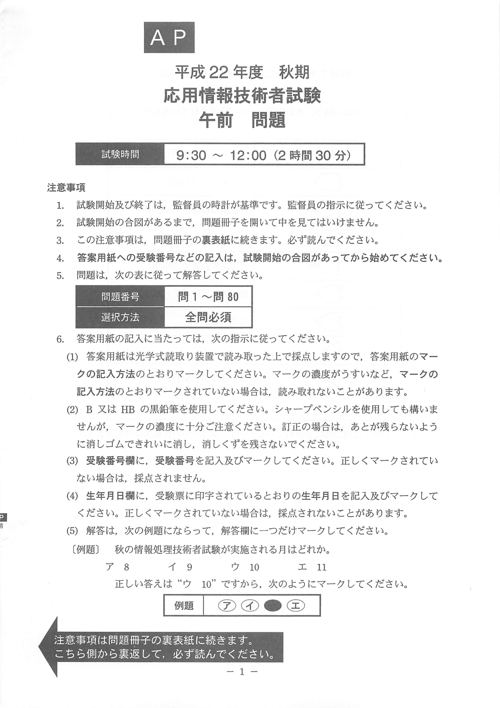

テキスト (OCR)

平成22 年度 秋期
応用情報技術者試験

午前 問題
  9:30 ~ 12:00 (2時間 30 分)

注意事項
1. 試験開始及び終了は, 監督員の時計が基準です。監督員の指示に従ってください。
2. 試験開始の合図があるまで, 問題冊子を開いて中を見てはいけません。
3. この注意事項は, 問題冊子の裏表紙に続きます。必ず読んでください。
4. 答案用紙への受験番号などの記入は, 試験開始の合図があってから始めてください。
5. 問題は, 次の表に従って解答してください。
問題番号   問1 て問 80
選択方法    全間必須
6. 管案用紙の記入に当たっては, 次の指示に従ってください。
(1) 答案用紙は光学式読取り装置で読み取った上で採点しますので, 答案用紙のマー
クの記入方法のとおりマークしてください。マークの濃度がうすいなど, マークの
記入方法のとおりマークされていない場合は, 読み取れないことがあります。
(2) B 又は HB の黒鉛筆を使用してください。シャープペンシルを使用しても構いま
せんが, マークの濃度に十分ご注意ください。訂正の場合は, あとが残らないよう
に消しゴムできれいに消し, 消しくずを残さないでください。
3) 受験番号欄に, 受験番号を記入及びマークしてください。正しくマークされてい
ない場合は, 採点されません。
(4) 生年月日科に, 受験票に印字されているとおりの生年月日を記入及びマークして
5]       ください。正しくマークされていない場合は, 採点されないことがあります。
;      (5) 解答は, 次の例題にならって, 解答欄に一つだけマークしてください。
(例題】 秋の情報処理技術者試験が実施される月はどれか。
ア 8  イ 9  ウ 10  x= il
正しい答えは “ウ 10” ですから, 次のようにマークしてください。

例題 | DDO@e®

注意事項は問題冊子の裏表紙に続きます。

こちら側から裏返して, 必ず読んでください。

### ページ 2

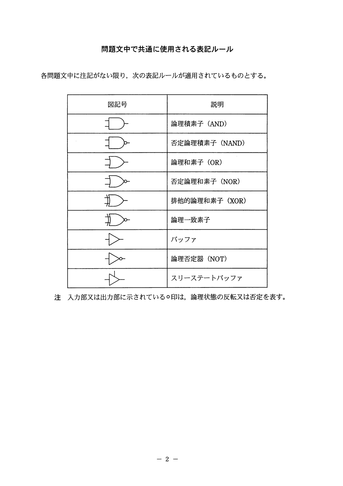

テキスト (OCR)

問題文中で共通に使用される表記ルール

各問題文中に注記がない限り, 次の表記ルールが適用されているものとする。

加
tu
dh

説明

論理積素子 (AND)

否定論理積素子 (NAND)

論理和素子 (OR)

否定論理和素子 (NOR)

排他的論理和素子 (XOR)

論理一致素子

バッファ

論理否定器 (NOT)

YIYIMMMMMV

スリーステートバッファ

注 入力部又は出力部に示されているo印は, 論理状態の反転又は否定を表す。

### ページ 3

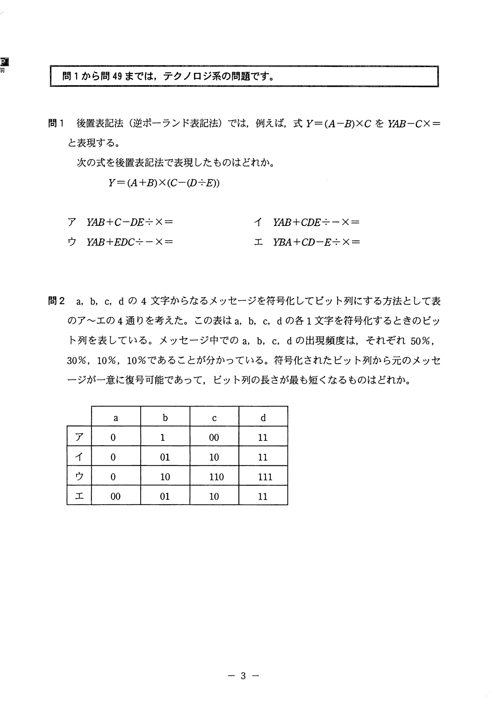

テキスト (OCR)

問 1 から問 49 までは, テクノロジ系の問題です。

問1 後置表記法 (逆ポーランド表記法) では, 例えば, 式 ニー(4ーXC を YAB-CX=
と表現する。
次の式を後置表記法で表現したものはどれか。
Y=(A+B)x(C-(+E))

ア YAB+C—DE~X=      4 YAB+CDE+—xX=
ウ YAB+EDC+-— X=       i YBA+CD-E+xX=

問2 ab, c, dD 4 文字からなるメッセージを符号化してビット列にする方法として表
のアーてエの 4 通りを考えた。この表はa, b, c, d の各1文字を符号化するときのビッ
ト列を表している。メッセージ中での a, b, c, d の出現頻度は, それぞれ 50%,
30%, 10%, 10%であることが分かっている。 符号化されたビット列から元のメッセ
ージが一意に復号可能であって, ビット列の長さが最も短くなるものはどれか。

a                  b                  C                  d
ア        0             1             00           11
イ        0             01           10           11
ウ        0             10           110          111
xr        00           01           10           11

### ページ 4

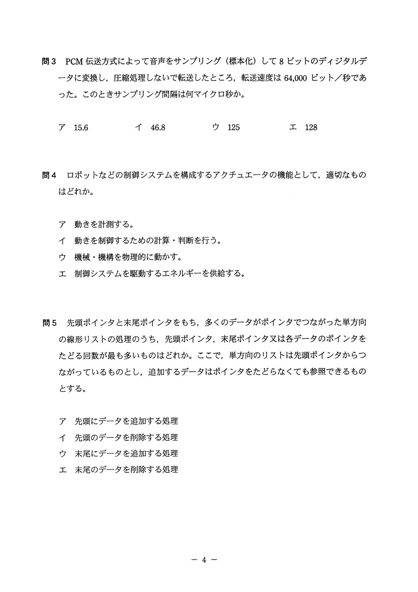

テキスト (OCR)

問3 PCM 伝送方式によって音声をサンプリング (標本化) して 8 ビットのディジタルデ
ータに変換し, 圧縮処理しないで転送したところ, 転送速度は 64,000 ビットノ秒であ
った。このときサンプリング間隔は何マイクロ秒か。

ア 15.6     イ 46.8     ウ 125     xX 128

問4 ロボットなどの制御システムを構成するアクチュエータの機能として, 適切なもの
はどれか。

ア 動きを計測する。

イ 動きを制御するための計算・判断を行う。

ウ 機械・機構を物理的に動かす。

エ 制御システムを駆動するエネルギーを供給する。

問5 先頭ポインタと末尾ポインタをもち, 多くのデータがボインタでつながった単方向
の線形リストの処理のうち, 先頭ポインタ, 末尾ポインタは各データのポインタを
たどる回数が最も多いものはどれか。ここで, 単方向のリストは先頭ポインタからつ
ながっているものとし, 追加するデータはポインタをたどらなくても参照できるもの
とする。

ア 先頭にデータを追加する処理
イ 先頭のデータを削除する処理
ウ 末尾にデータを追加する処理
エ 末尾のデータを削除する処理

### ページ 5

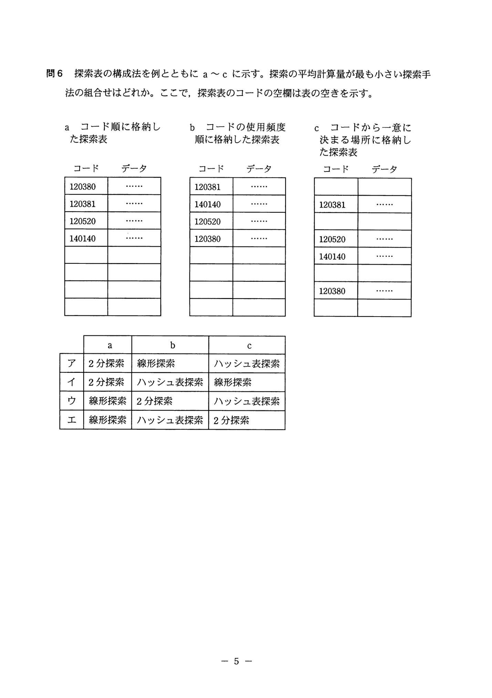

テキスト (OCR)

問6 探索表の構成法を例とともに ac に示す。探索の平均計算量が最も小さい探索手
法の組合せはどれか。ここで, 探索表のコードの空欄は表の空きを示す。

a コード順に格納し    b コードの使用頻度    c コードから一意に

た探索表                  順に格納した探索表        決まる場所に格納し
た探索表
コード    データ          コード    データ          コード    データ
120380 |  ……            120381 | ……
120881 |  ……            140140 | ……            120381
120520 | ……            120520 | ……
140140 | ……            120380 | ……            120520 | ……
140140 | ……
120380 | ……
a       b        c
ア | 2分探索 | 線形探索        ハッシュ表探索
イ | 2分探索 | ハッシュ表探索 | 線形探索
ウ | 線形探索 | 2 分探索        ハッシュ表探索
| 線形探索 | ハッシュ表探索 | 2 分探索

### ページ 6

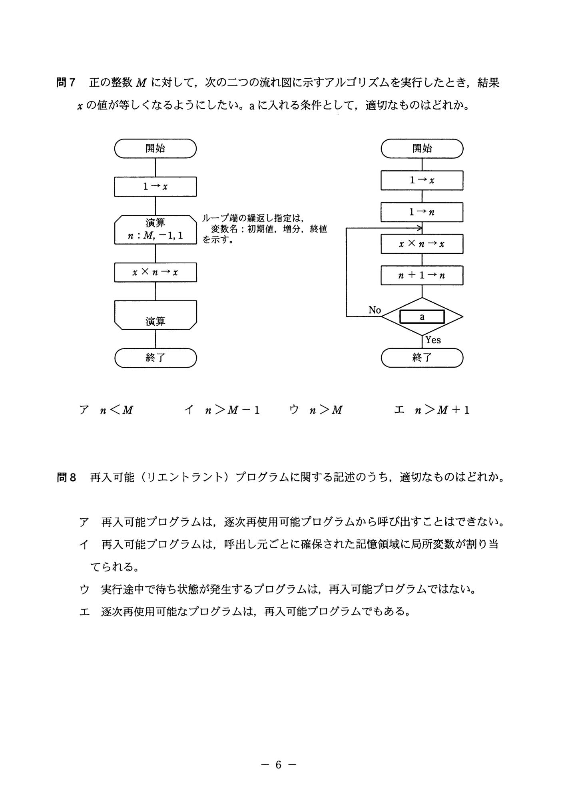

テキスト (OCR)

問7 正の整数 巡 に対して, 次の二つの流れ図に示すアルゴリズムを実行したとき, 結果
x の値が等しくなるようにしたい。a に入れる条件として, 適切なものはどれか。

開始                      開始
1 ーーァ                      1>x
|
Re          ループ端の線返し指定は,                              1ブタ
リー] | REE DM, 地分. 終値 エーーー一ポ
_  を示す。          カーァ
」
バタビタ                    n+1l-n
a ュ
演算
Yes
終了                      終了
アー n<M    tf n>M-1   7 n>M     Ln>M+1

AS 再入可能 (リエントラント) プログラムに関する記述のうち, 適切なものはどれか。

ア 再入可能プログラムは, 逐次再使用可能プログラムから呼び出すことはできない。

イ 再入可能プログラムは, 呼出し元ごとに確保された記憶領域に局所変数が割り当
てられる。

ウ 実行途中で待ち状態が発生するプログラムは, 再入可能プログラムではない。

エエ 逐次再使用可能なプログラムは, 再入可能プログラムでもある。

### ページ 7

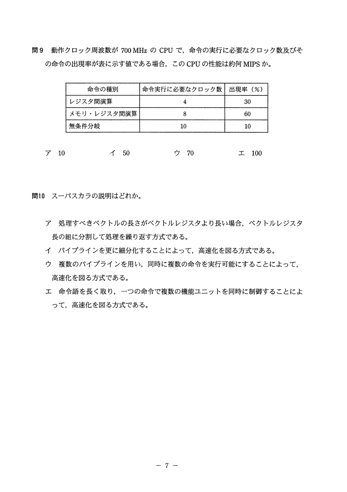

テキスト (OCR)

問9 動作クロック周波数が 700 MHz の CPU で, 命令の実行に必要なクロック数及びそ
の命令の出現率が表に示す値である場合, この CPU の性能は約何 MIPS か。

命令の種別    命令実行に必要なクロック数| 出現率 (%)
レジスタ間演算                  4               30
メモリ・レジスタ間演算            8              60
FESR HES}                     10               10
ア 10              イ 50              ウ 70              x 100

間10 スーパスカラの説明はどれか。

ア 処理すべきベクトルの長さがベクトルレジスタより長い場合. ベクトルレジスタ
長の組に分割して処理を繰り返す方式である。

イ パイプラインを更に細分化することによって, 高速化を図る方式である。

ウ 複数のパイプラインを用い, 同時に複数の命令を実行可能にすることによって,
高速化を図る方式である。

エエ 命令語を長く取り, 一つの命令で複数の機能ユニットを同時に制御することによ
って, 高速化を図る方式である。

### ページ 8

テキスト (OCR)

間11 容量が2 M バイトでアクセス時間が* ナノ秒のキャッシュメモリと, RRM MIN
イトでアクセス時間がナノ秒の主記憶をもつシステムにおいて, CPU からみた, 主
記憶とキャッシュメモリとを合わせた平均アクセス時間を表す式はどれか。ここで,
読み込みたいデータがキャッシュメモリに存在しない確率を > とし, キャッシュメモ
リ管理に関するオーバヘッドは無視できるものとする。

B)

d=n:a   r*b
ath) * + tp 2   t U-nextrey
r°a   (1一の・65

ウ ath at  a+b        Lorex +(1—-n-y

間12 DMA コントローラの説明として適切なものはどれか。

ア MPU では時間がかかる積和演算を, 高速に行う。

イ 仮想メモリ機能, メモリ保護機能などのメモリ管理機能を提供する。

ウ 動作クロックに合わせてカウントするカウントレジスタをもち, それによって時
間の経過を保持する。

エエ メモリと入出力装置との間, 又はメモリとメモリとの間でのデータ交換を, MPU
を介さずに行う。

### ページ 9

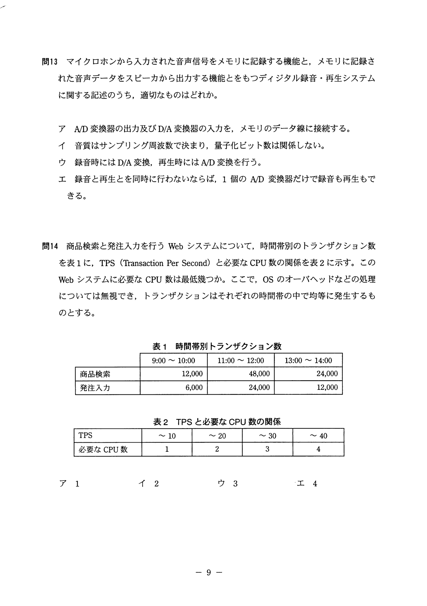

テキスト (OCR)

間13 マイクロホンから入力された音声信号をメモリに記録する機能と, メモリに記録さ
れた音声データをスピーカから出力する機能とをもつディジタル録音・再生システム
に関する記述のうち, 適切なものはどれか。

A/D 変換器の出力及び D/A 変換器の入力を, メモリのデータ線に接続する。

音質はサンプリング周波数で決まり, 量子化ビピット数は関係しない。

録音時には D/A 変換, 再生時には A/D 変換を行う。

録音と再生とを同時に行わないならば, 1 個の AD 変換器だけで録音も再生もで
きる。

H へ

問14 商品検索と発注入力を行う Web システムについて, 時間帯別のトランザクション数
を表 1 に, TPS (Transaction Per Second) と必要な CPU 数の関係を表 2 に示す。この
Web システムに必要な CPU 数は最低幾つか。ここで, OS のオーバヘッドなどの処理
については無視でき, トランザクションはそれぞれの時間帯の中で均等に発生するも
のとする。

Ri 時間帯別トランザクション数

9:00 て10:00       11:00 ~ 12:00       13:00 ~ 14:00
商品検索                      12,000              48,000              24,000
発注入力                       6,000              24,000              12,000

表2 TPS と必要な CPU 数の関係

TPS                     て10           て 20           ~ 30           ~ 40
必要な CPU数              1                 2                 3                  4
ア 1                    イ 2                    ウ 3                    xo 4

### ページ 10

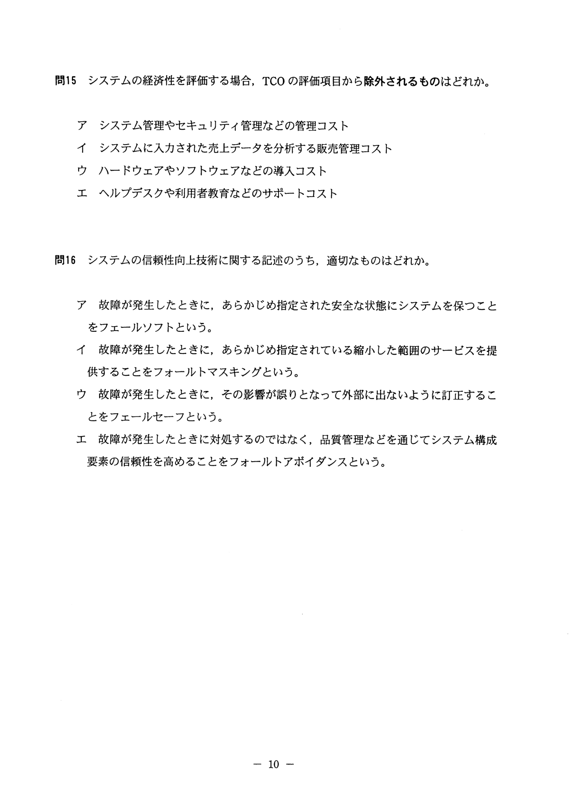

テキスト (OCR)

BS システムの経済性を評価する場合, TCO の評価項目から除外されるものはどれか。

システム管理やセキュリティ管理などの管理コスト

システムに入力された売上データを分析する販売管理コスト
ハードウェアやソフトウェアなどの導入コスト

ヘルプデスクや利用者教育などのサポートコスト

HAN

間16 システムの信頼性向上技術に関する記述のうち, 適切なものはどれか。

ア 故障が発生したときに, あらかじめ指定された安全な状態にシステムを保つこと
をフェールソフトという。

イ 故障が発生したときに, あらかじめ指定されている縮小した範時のサービスを提
供することをフォールトマスキングという。

ウ 故障が発生したときに, その影響が誤りとなって外部に出ないように訂正するこ
とをフェールセーフという。

エ 故障が発生したときに対処するのではなく, 品質管理などを通じてシステム構成
要素の信頼性を高めることをフォールトアポイダンスという。

ー 10 一

### ページ 11

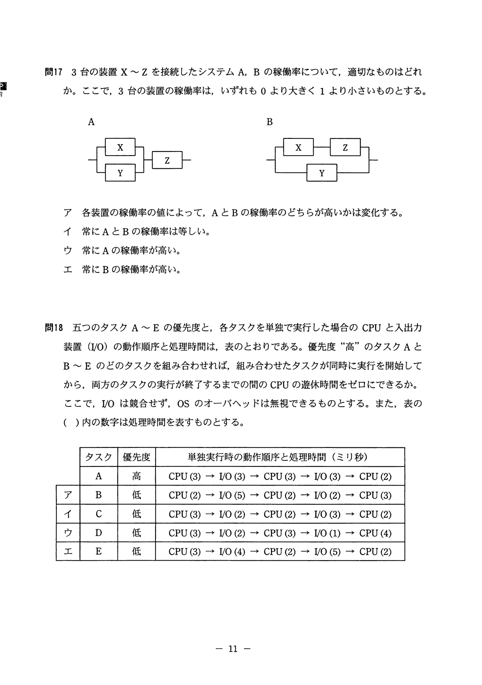

テキスト (OCR)

間17 3 台の装置メーZ を接続したシステム A, B の稼働率について, 適切なものはどれ
か。ここで, 3 台の装置の稼働率は, いずれも 0 より大きく 1 より小さいものとする。

A

H tA N

B

X    Z
< 7       sh
Y

各装置の稼働率の値によって, A とBの稼働率のどちらが高いかは変化する。
常にAとBの稼働率は等しい。
常にA の稼働率が高い。
常にB の稼働率が高い。

間18 五つのタスク A~E の優先度と, 各タスクを単独で実行した場合の CPU CAMA
装置 (WO) の動作順序と処理時間は, 表のとおりである。 優先度“高" のタスクAと
BYE のどのタスクを組み合わせれば, 組み合わせたタスクが同時に実行を開始して
から, 両方のタスクの実行が終了するまでの間の CPU の遊休時間をゼロにできるか。

表の

TOC, YO は競合せず, OS のオーバヘッドは無視できるものとする。また,
( ) 内の数字は処理時間を表すものとする。
タスク | 優先度         単独実行時の動作順序と処理時間 (ミリ秒)

A      高     CPU (3) > YO ⑬) > CPU③) > YO ⑬ > CPU (2)
ア     B      低     CPU (2) 一 YO⑤) > CPU(2) > 70O② > CPU (3)
イ     C      低     CPU (3) 一 1/0 (2) > CPU(2) > I/0 (3) > CPU (2)
ウ    D      低     CPU (3) > I/O (2) > CPU⑬③ ~ YO Q①) > CPU (4)
x    E      低     CPU (3) > YO ⑬⑭ 一 CPU⑫ > TO 0⑤5) > CPU (2)

ー 11 一

### ページ 12

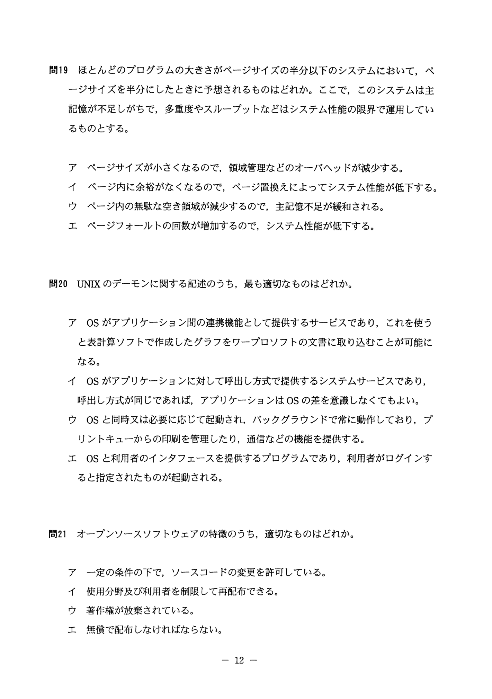

テキスト (OCR)

FAIS ほとんどのプログラムの大きさがページサイズの半分以下のシステムにおいて, ペ
ージサイズを半分にしたときに予想されるものはどれか。ここで, このシステムはに主
記憶が不足 しがちで, 多重度やスループットなどはシステム性能の限界で運用してい
るものとする。

ページサイズが小さくなるので, 領域管理などのオーバヘッドが減少する。

ページ内に余裕がなくなるので, ページ置換えによってシステム性能が低下する。
ページ内の無駄な空き領域が減少するので, 主記憶不足が緩和される。

ページフォールトの回数が増加するので, システム性能が低下する。

HGA SN

問20 UNIX のデーモンに関する記述のうち, 最も適切なものはどれか。

ア 0S がアプリケーション間の連携機能として提供するサービスであり, これを使う
と表計算ソフトで作成したグラフをワープロソフトの文書に取り込むひことが可能に
なる。

イ OS がアプリケーションに対して呼出し方式で提供するシステムサービスであり,
呼出し方式が同じであれば, アプリケーションは OS の差を意識しなくてもよい。

ウ OS と同時又は必要に応じて起動され, バックグラウンドで常に動作しており, プ
リントキューからの印刷を管理したり, 通信などの機能を提供する。

L OS と利用者のインタフェースを提供するプログラムであり, 利用者がログインす
ると指定されたものが起動される。

問21 オープンソースソフトウェアの特徴のうち, 適切なものはどれか。

一定の条件の下で, ソースコードの変更を許可している。
使用分野及び利用者を制限して再配布できる。
著作権が放棄されている。

無償で配布しなければならない。

H GAN

ー 12 一

### ページ 13

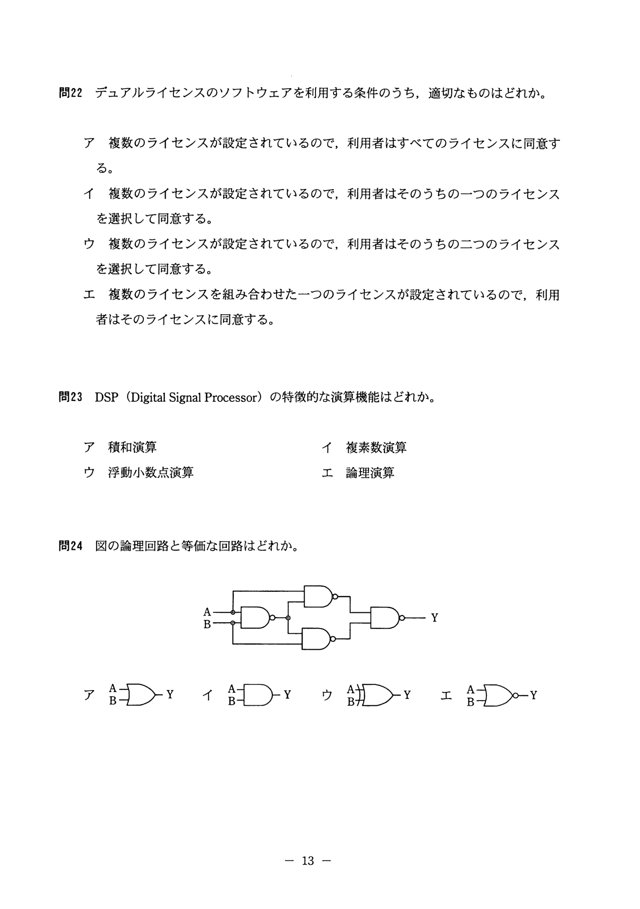

テキスト (OCR)

問22 デュアルライセンスのソフトウェアを利用する条件のうち, 適切なものはどれか。

ア 複数のライセンスが設定されているので, 利用者はすべてのライセンスに同意す
る。

イ 複数のライセンスが設定されているので, 利用者はそのうちの一つのライセンス
を選択して同意する。

ウ 複数のライセンスが設定されているので, 利用者はそのうちの二つのライセンス
を選択して同意する。

エエ 複数のライセンスを組み合わせた一つのライセンスが設定されているので, 利用
者はそのライセンスに同意する。

問23 DSP (Digital Signal Processor) の特徴的な演算機能はどれか。

ア 積和演算           イ 複素数演算
ウ 浮動小数点演算         エ 論理演算

問24 図の論理回路と等価な回路はどれか。

yedoy 4 sly 9 phy ェ包テッ

ー 13 一

### ページ 14

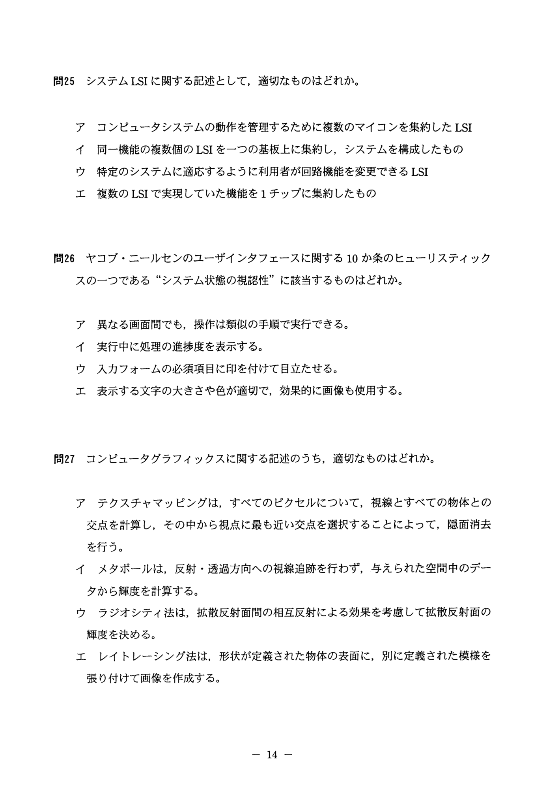

テキスト (OCR)

間25 システム LSI に関する記述として, 適切なものはどれか。

ア コンピュータシステムの動作を管理するために複数のマイコンを集約した LSI
イ 同一機能の複数個の LSI を一つの基板上に集約し, システムを構成したもの
ウ 特定のシステムに適応するように利用者が回路機能を変更できる LSI

エエ 複数のLSI で実現していた機能を 1 チップに集約したもの

間26 ヤコブプ・ニールセンのユーザインタフェースに関する 10 か条のヒューリスティック
スの一つである “システム状態の視認性" に該当するものはどれか。

異なる画面間でも, 操作は類似の手順で実行できる。

実行中に処理の進捗度を表示する。

入力フォームの必須項目に印を付けて目立たせる。

表示する文字の大きさや色が適切で, 効果的に画像も使用する。

H GAN

問7 コンピュータグラフィックスに関する記述のうち, 適切なものはどれか。

ア テクスチャマッピングは, すべてのピクセルについて, 視線とすべての物体との
交点を計算し, その中から視点に最も近い交点を選択することによって, 隠面消去
を行う。

イ メタボールは, 反射・透過方向への視線追跡を行わず, 与えられた空間中のデー
タから輝度を計算する。

ウ ラジオシティ法は, 拡散反射面間の相互反射による効果を考慮して拡散反射面の
輝度を決める。

エ レイトレーシング法は, 形状が定義された物体の表面に, 別に定義された模様を

張り付けて画像を作成する。

ー 14 一

### ページ 15

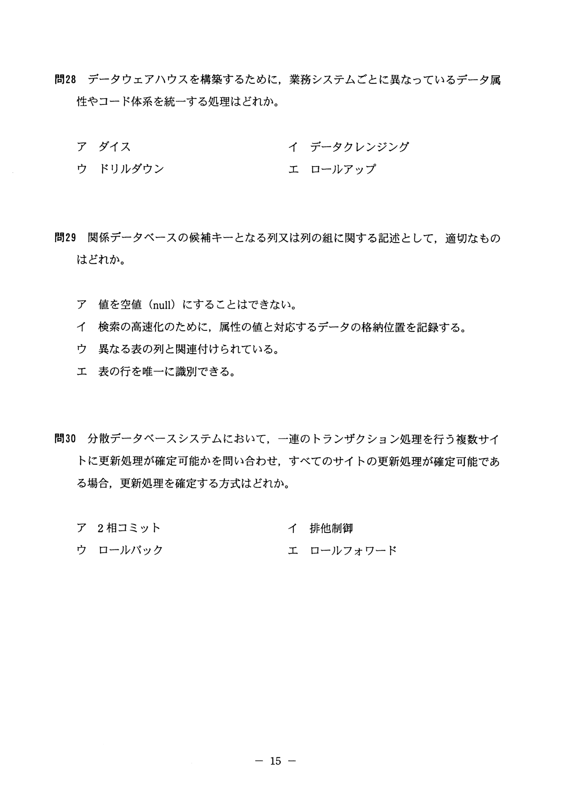

テキスト (OCR)

間28 データウェアハウスを構築するために, 業務システムごとに異なっているデータ属
性やコード体系を統一する処理はどれか。

ア ダイス                         イ データクレンジング
ウ ドリルダウン           エ ロールアップ

問29 関係データベースの候補キーとなる列又は列の組に関する記述として, 適切なもの
はどれか。

ア 値を空値 (null) にすることはできない。

イ 検索の高速化のために, 属性の値と対応するデータの格納位置を記録する。
ウ 異なる表の列と関連付けられている。

エエ 表の行を唯一に識別できる。

間30 分散データベースシステムにおいて, 一連のトランザクション処理を行う複数サイ
トに更新処理が確定可能かを問い合わせ, すべてのサイトの更新処理が確定可能であ
る場合, 更新処理を確定する方式はどれか。

ア 2相コミット            イ 排他制御
ウ ロールバック           エエ ロールフォワード

ー 15 一

### ページ 16

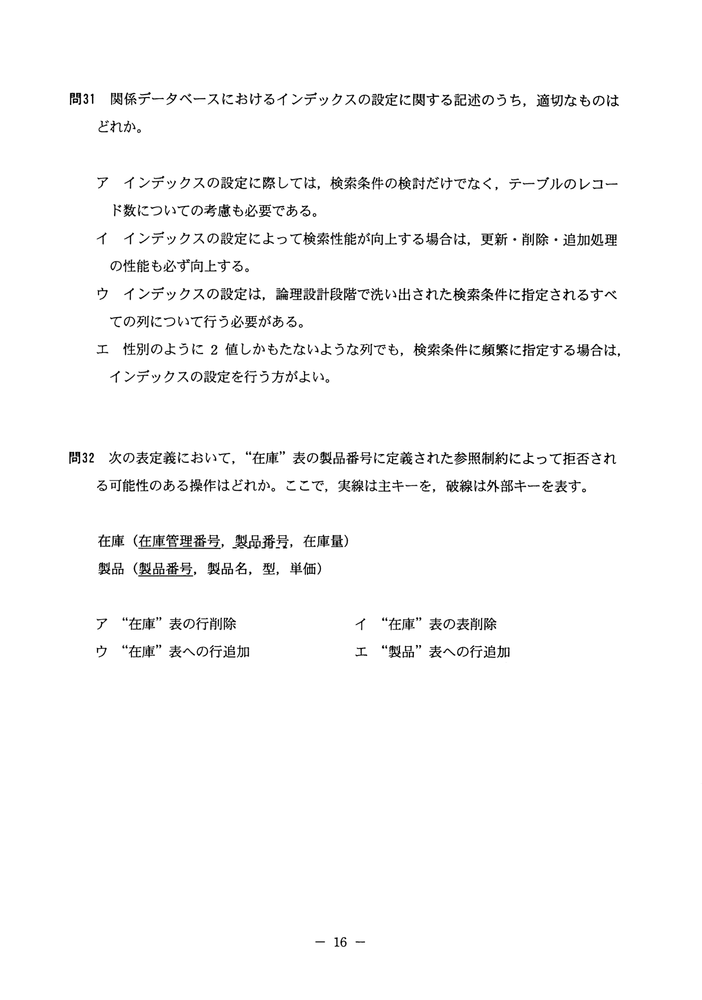

テキスト (OCR)

問31 関係データベースにおけるインデックスの設定に関する記述のうち, 適切なものは
どれか。

ア インデックスの設定に際しては, 検索条件の検討だすけでなく, テーブルのレコー
ド数についての考慮も必要である。

イ インデックスの設定によって検索性能が向上する場合は, 更新・削除・追加処理
の性能も必ず向上する。

ウ インデックスの設定は, 論理設計段階で洗い出された検索条件に指定されるすべ
ての列について行う必要がある。

エ 性別のように 2 値しかもたないような列でも, 検索条件に頻繁に指定する場合は,
インデックスの設定を行う方がよい。

問32 次の表定義において, “HH” 表の製品番号に定義された参照制約によって拒否され

る可能性のある操作はどれか。ここで, 実線は主キーを, 破線は外部キーを表す。

在庫 (在庫管理番号, 製品番号, 在庫量)
製品 (製品番号, 製品名, 型, 単価)

ア “在庫” 表の行削除          イ “CER” 表の表削除
ウ 在庫" 表への行追加         エ "製品" 表への行追加

ー 16 一

### ページ 17

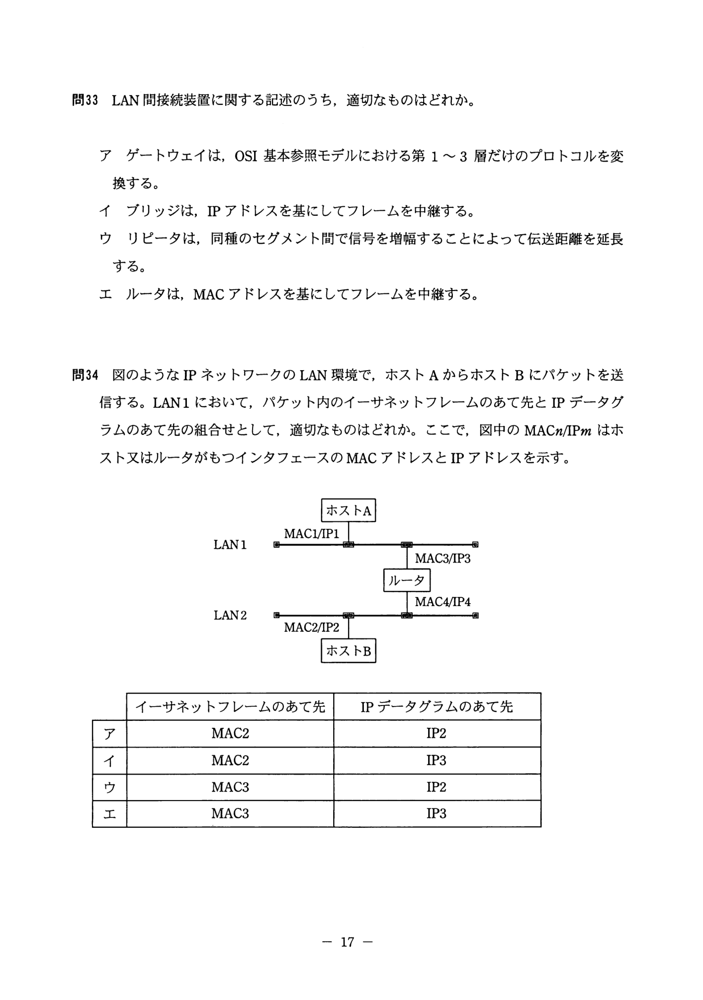

テキスト (OCR)

問33 LAN 間接続装置に関する記述のうち, 適切なものはどれか。

ア ゲートウェイは, OSI 基本参照モデルにおける第 1 ^ 3 層だけのプロトコルを変
換する。

イ ブリッジは, IP アドレスを基にしてフレームを中継する。

ウ リピータは, 同種のセグメント間で信号を増幅することによって伝送距離を延長
する。

エエ ルータは, MAC アドレスを基にしてフレームを中継する。

34 図のような IP ネットワークの LAN 環境で, ホスト A からホスト B にパケットを送
信する。LAN1 において, パケット内のイーサネットフレームのあて先と IP データグ
ラムのあて先の組合せとして, 適切なものはどれか。ここで, 図中の MACz/IP はホ
スト又はルータがもつインタフェースのMAC アドレスと IP アドレスを示す。

MAC1/IP1
LAN1             a          =

MAC3/IP3

LAN2

MAC2/IP2 T
ホストB

イーサネットフレームのあて先     IP データグラムのあて先

ア                            MAC2                                                   IP2
イ                            MAC2                                                   TP3
ウ                            MAC3                                                    IP2
x                            MAC3                                                    TP3

ー 17 一

### ページ 18

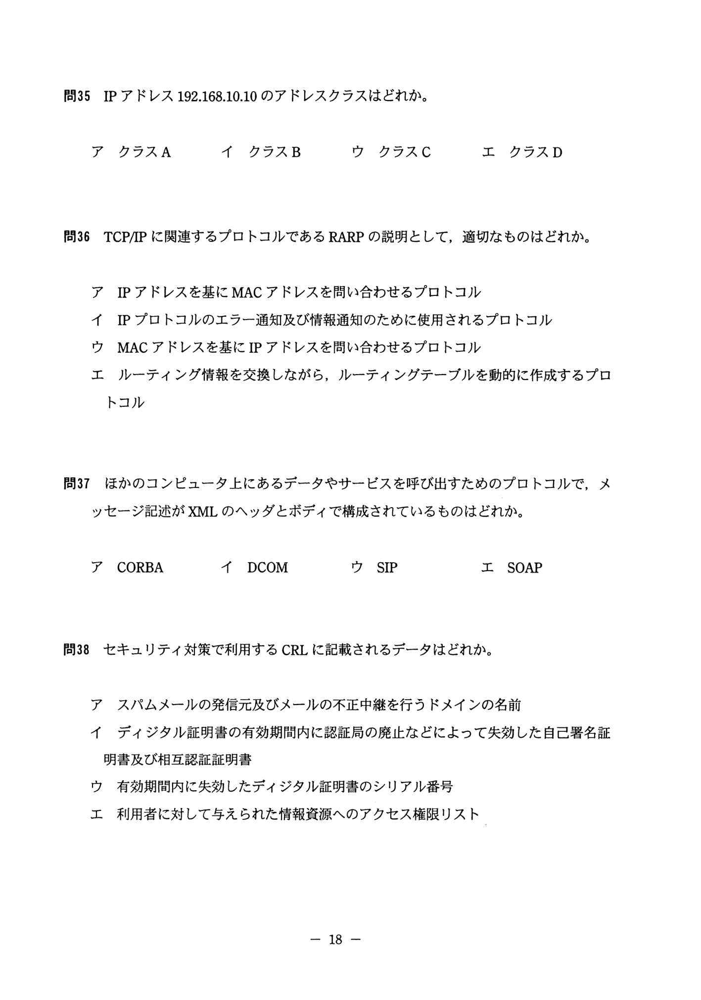

テキスト (OCR)

問35 IP アドレス 192.168.10.10 のアドレスクラスはどれか。

ア クラスA   イ クラスB   ウ クラスC   = クラスD

問36 TCP/IP に関連するプロトコルである RARP の説明として, 適切なものはどれか。

IP アドレスを基に MAC アドレスを問い合わせるプロトコル

IP プロトコルのエラー通知及び情報通知のために使用されるプロトコル

MAC アドレスを基に IP アドレスを問い合わせるプロトコル

ルーティング情報を交換しながら, ルーティングテーブルを動的に作成するプロ
トコル

H GA NW

問37 ほかのコンピュータ上にあるデータやサービスを呼び出すためのプロトコルで, メ
ッセージ記述が XML のヘッダとボディで構成されているものはどれか。

ア CORBA    イ DCOM    ウ SIP     <= SOAP

問38 セキュリティ対策で利用する CRL に記載されるデータはどれか。

ア スパムメールの発信元及びメールの不正中継を行うドメインの名前

イ ディジタル証明書の有効期間内に認証局の廃止などによって失効した自己署名証
明書及び相互認証証明書

ウ 有効期間内に失効したディジタル証明書のシリアル番号

LO 利用者に対して与えられた情報資源へのアクセス権限りリスト

ー 18 一

### ページ 19

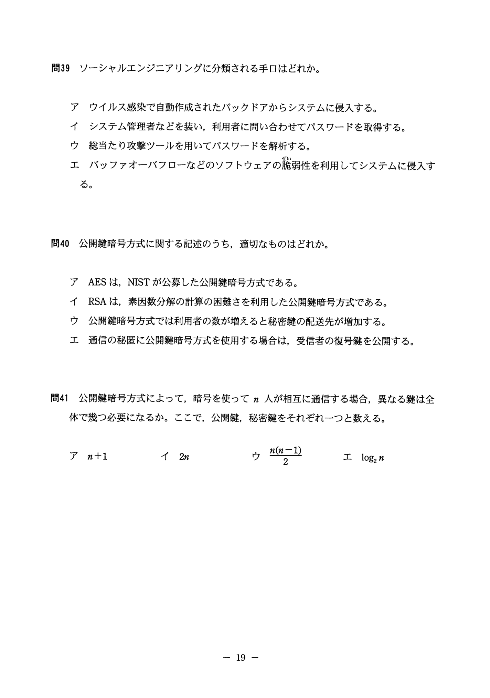

テキスト (OCR)

間39 ソーシャルエンジニアリングに分類される手口はどれか。

ウイルス感染で自動作成されたパックドアからシステムに侵入する。

システム管理者などを装い, 利用者に問い合わせてパスワードを取得する。

総当たり攻撃ツールを用いてパスワードを解析する。

パッファオーパフローなどのソフトウェアの脆弱性を利用してシステムに侵入す
る。

HAN

問40 公開鍵暗号方式に関する記述のうち, 適切なものはどれか。

AES は, NIST が公募した公開鍵暗号方式である。

RSA ld, 素因数分解の計算の困難さを利用した公開鍵暗号方式である。

公開鍵暗号方式では利用者の数が増えると秘密鍵の配送先が増加する。

通信の秘匿に公開鍵暗号方式を使用する場合は, 受信者の復号鍵を公開する。

HUAN

問41 公開鍵暗号方式によって, 暗号を使って n 人が相互に通信する場合, 異なる鍵は全
体で幾つ必要になるか。ここで, 公開鍵, 秘密鍵をそれぞれ一つと数える。

n(n—1)

F nti     イ 2      ウ  2     エエ logzz

ー 19 一

### ページ 20

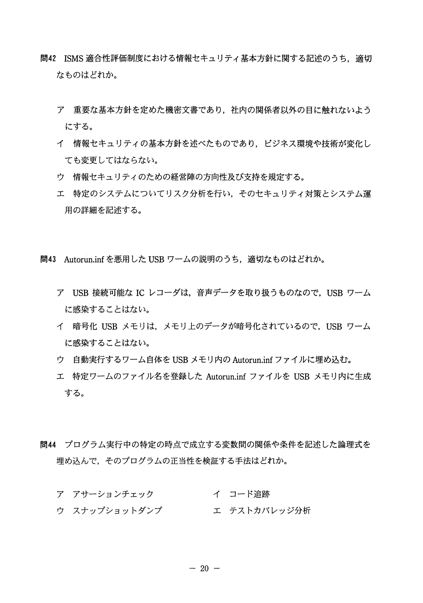

テキスト (OCR)

問42 ISMS 適合性評価制度における情報セキュリティ基本方針に関する記述のうち, 適切
なものはどれか。

ア 重要な基本方針を定めた機密文書であり, 社内の関係者以外の目に触れないよう
にする。

イ 情報セキュリティの基本方針を述べたものであり, ビジネス環境や技術が変化し
ても変更してはならない。

ウ 情報セキュリティのための経営陣の方向性及び支持を規定する。

エエ 特定のシステムについてリスク分析を行い そのセキュリティ対策とシステム運
用の詳細を記述する。

間43 Autorun.inf を悪用した USB ワームの説明のうち, 適切なものはどれか。

ア USB 接続可能な IC レコーダは, 音声データを取り扱うものなので, USB ワーム
に感染することはない。

イ 暗号化 USB メモリは, メモリ上のデータが暗号化されているので, USB ワーム
に感染することはない。

ウ 自動実行するワーム自体を USB メモリ内の Autorun.inf ファイルに埋め込む。

エエ 特定ワームのファイル名を登録した Autorun.inf ファイルを USB メモリ内に生成
する。

問44 プログラム実行中の特定の時点で成立する変数間の関係や条件を記述した論理式を
埋め込んで, そのプログラムの正当性を検証する手法はどれか。

ア アサーションチェック     4 コード追跡
ウ スナップショットダンプ      エエ テストカバレッジ分析

ー 20 一

### ページ 21

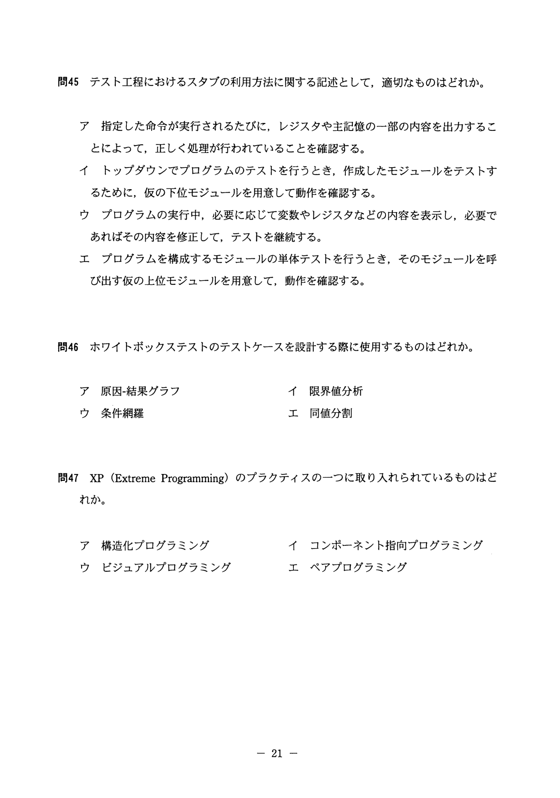

テキスト (OCR)

間45 テスト工程におけるスタプブの利用方法に関する記述として, 適切なものはどれか。

ア 指定した命令が実行されるたびに, レジスタや主記憶の一部の内容を出力するこ
とによって, 正しく処理が行われていることを確認する。

イ トップダウンでプログラムのテストを行うとき, 作成したモジュールをテストす
るために, 仮の下位モジュールを用意して動作を確認する。

ウ プログラムの実行中, 必要に応じて変数やレジスタなどの内容を表示し, 必要で
あればその内容を修正して, テストを継続する。

L プログラムを構成するモジュールの単体テストを行うとき, そのモジュールを呼
び出す仮の上位モジュールを用意して, 動作を確認する。

46 ホワイトボックステストのテストケースを設計する際に使用するものはどれか。

ア 原因-結果グラフ        イ 限界値分析
ウ 条件網羅           エ 同値分割

問47 XP (Extreme Programming) のプラクティスの一つに取り入れられているものはど
れか。

ア 構造化プログラミング     イ コンポーネント指向プログラミング
ウ ビジュアルプログラミング    エ ペアプログラミング

ー 21 一

### ページ 22

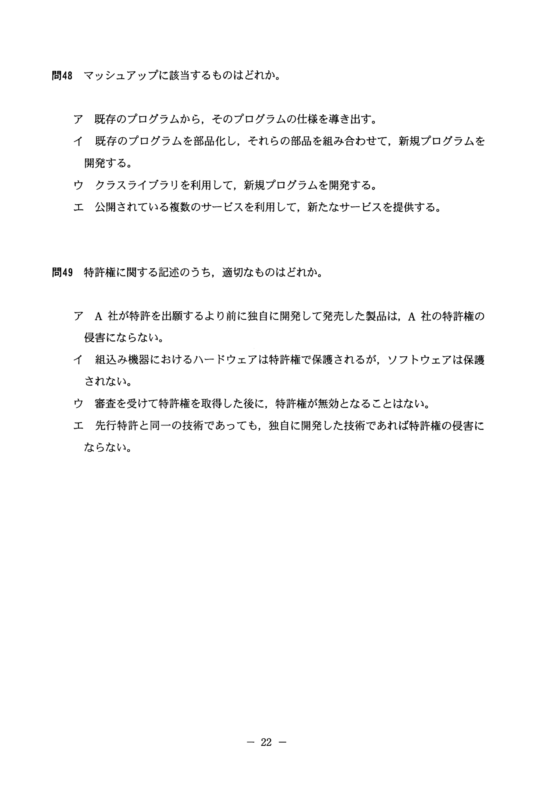

テキスト (OCR)

問48 マッシュアップに該当するものはどれか。

ア 既存のプログラムから, そのプログラムの仕様を導き出す。

イ 既存のプログラムを部品化し, それらの部品を組み合わせて, 新規プログラムを
開発する。

ウ クラスライブラリを利用して, 新規プログラムを開発する。

エエ 公開されている複数のサービスを利用して, 新たなサービスを提供する。

間49 特許権に関する記述のうち, 適切なものはどれか。

ア A 社が特許を出願するより前に独自に開発して発売した製品は, A 社の特許権の
侵害にならない。

イ 組込み機器におけるハードウェアは特許権で保護されるが, ソフトウェアは保護
されない。

ウ 審査を受けて特許権を取得した後に, 特許権が無効とかることはない。

エ 先行特許と同一の技術であっても, 独自に開発した技術であれば特許権の侵害に
ならない。

### ページ 23

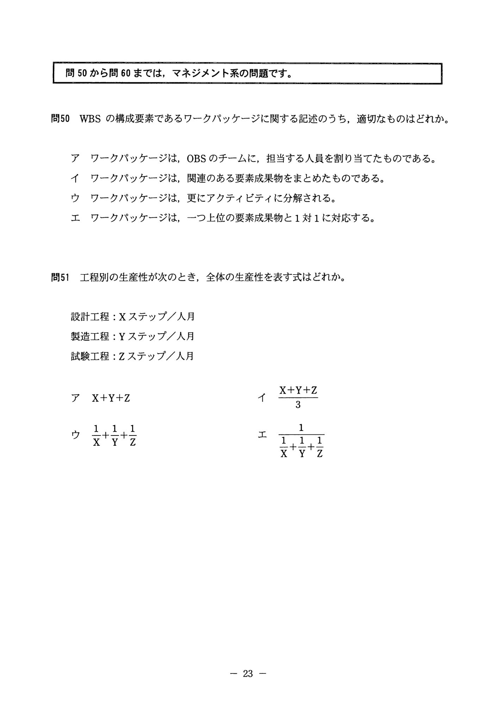

テキスト (OCR)

問 50 から問 60 までは, マネジメント系の問題です。

問50 WBS の構成要素であるワークパッケージに関する記述のうち, 適切なものはどれか。

H GAN

ワークパッケージは,
ワークパッケージは,
ワークパッケージは,
ワークパッケージは,

OBS のチームに, 担当する人員を割り当てたものである。
関連のある要素成果物をまとめたものである。

更にアクティビティに分解される。

ーつ上位の要素成果物と1 対 1 に対応する。

間51 工程別の生産性が次のとき, 全体の生産性を表す式はどれか。

設計工程 :X ステップン人月
製造工程:Yステップン人月
試験工程 :/Zステップン人月

### ページ 24

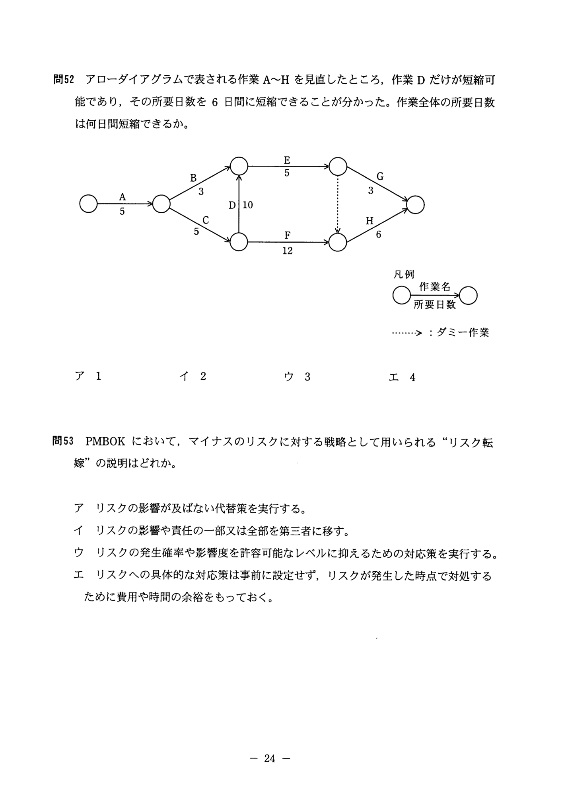

テキスト (OCR)

問52 アローダイアグラムで表される作業 AH を見直したところ, 作業 D だけが短縮可
能であり, その所要日数を 6 日間に短縮できることが分かった。作業全体の所要日数
は何日間短縮できるか。

問53 PMBOK において, マイナスのリスクに対する戦略として用いられる “リスク転
嫁" の説明はどれか。

リスクの影響が及ばない代替策を実行する。

リスクの影響や責任の一部又は全部を第三者に移す。

リスクの発生確率や影響度を許容可能なレベルに抑えるための対応策を実行する。

リスクへの具体的な対応策は事前に設定せすず, リスクが発生した時点で対処する
ために費用や時間の余裕をもっておく。

HOGAN

ー 24 一

### ページ 25

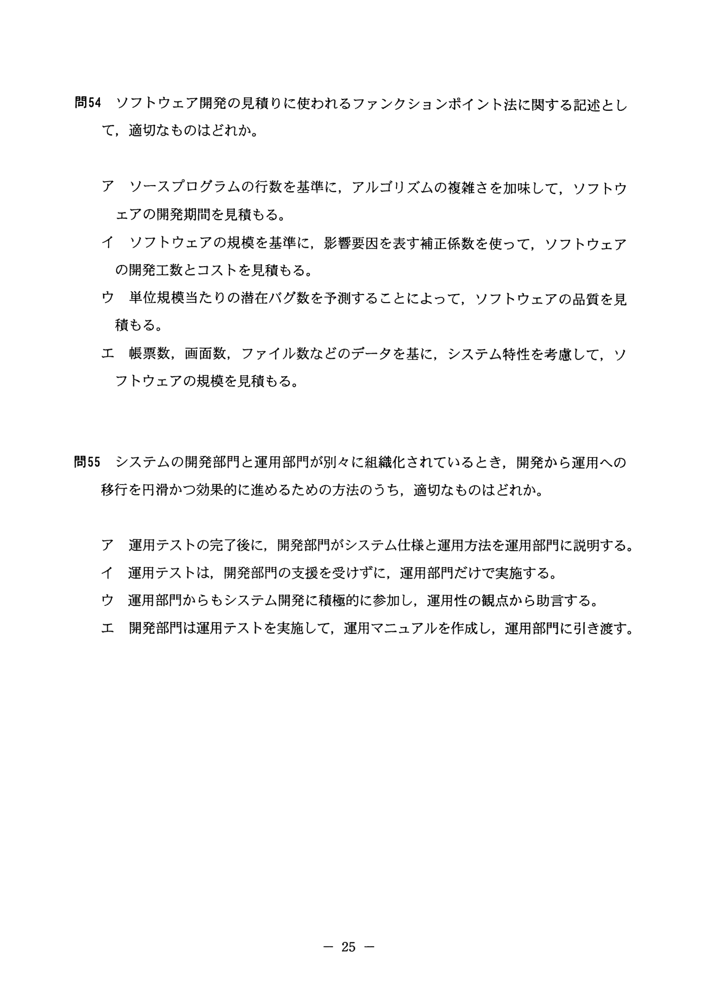

テキスト (OCR)

問54 ソフトウェア開発の見積りに使われるファンクションポイント法に関する記述とし
て, 適切なものはどれか。

ア ソースプログラムの行数を基準に, アルゴリズムの複雑さを加味して, ソフトウ
エアの開発期間を見積もる。

イ ソフトウェアの規模を基準に, 影響要因を表す補正係数を使って, ソフトウェア
の開発工数とコストを見積もる。

ウ 単位規模当たりの潜在バグ数を予測することによって, ソフトウェアの品質を見
積もる。

工 帳票数, 画面数.、 ファイル数などのデータを基に, システム特性を考慮して, ソ
フトウェアの規模を見積もる。

問55 システムの開発部門と運用部門が別々に組織化されているとき, 開発から運用への
移行を円滑かつ効果的に進めるための方法のうち, 適切なものはどれか。

運用テストの完了後に, 開発部門がシステム仕様と運用方法を運用部門に説明する。
運用テストは, 開発部門の支援を受けずに, 運用部門だけで実施する。

運用部門からもシステム開発に積極的に参加し, 運用性の観点から助言する。
開発部門は運用テストを実施して, 運用マニュアルを作成し, 運用部門に引き渡す。

H へ

ー 25 一

### ページ 26

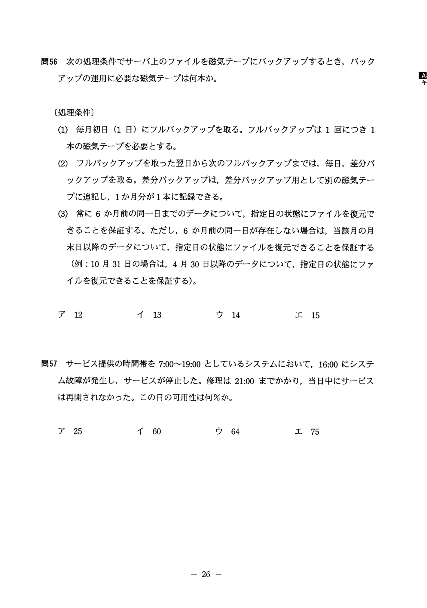

テキスト (OCR)

間56 次の処理条件でサーバ上のファイルを磁気テープにバックアップするとき, バック
アップの運用に必要な磁気テープは何本か。

(処理条件)

Q) 毎月初日 (1 日) にフルバックアップを取る。フルバックアップは 1 回につき 1
本の磁気テープを必要とする。

Q) フルバックアップを取った翌日から次のフルバックアップまでは, HA, 差分バ
ックアップを取る。差分バックアップは, 差分バックアップ用として別の磁気テー
プに追記し, 1 か月分が1 本に記録できる。

(3) 常に6か月前の同一日までのデータについて, 指定日の状態にファイルを復元で
きることを保証する。ただし, 6 か月前の同一日が存在しない場合は, 当該月の月
末日以降のデータについて, 指定日の状態にファイルを復元できることを保証する
(例 : 10 月 31 日の場合は, 4 月 30 日以降のデータについて, 指定日の状態にファ
イルを復元できることを保証する)。

問57 サービス提供の時間帯を 7:00て19300 としているシステムにおいて, 16:00 にシステ
ム故障が発生し, サービスが停止した。修理は 21:00 までかかり, 当日中にサービス
は再開されなかった。 この日の可用性は何%か。

ア 25     イ 60     ウ 64     xr 75

ー 26 一

### ページ 27

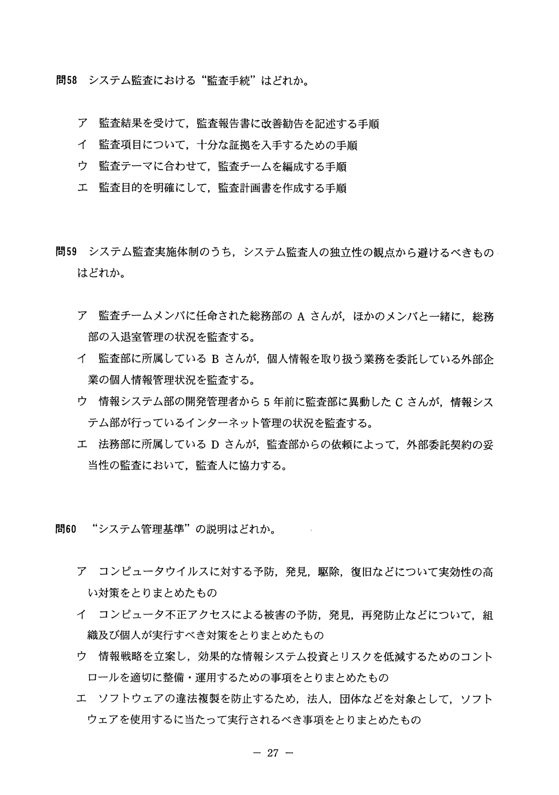

テキスト (OCR)

問58 システム監査における “監査手続" はどれか。

監査結果を受けて, 監査報告書に改善勧告を記述する手順
監査項目について, 十分な証拠を入手するための手順
監査テーマに合わせて, 監査チームを編成する手順
監査目的を明確にして, 監査計画書を作成する手順

H GAN

問59 システム監査実施体制のうち, システム監査人の独立性の観点から避けるべきもの
はどれか。

ア 監査チームメンバに任命された総務部の A さんが, ほかのメンバと一緒に, 総務
部の入退室管理の状況を監査する。

イ 監査部に所属している B さんが, 個人情報を取り扱う業務を委託している外部企
業の個人情報管理状況を監査する。

ウ 情報システム部の開発管理者から 5 年前に監査部に異動した C さんが, 情報シス
テム部が行っているインターネット管理の状況を監査する。

エエ 法務部に所属している D SAM, 監査部からの依頼によって, 外部委託契約の妥
当性の監査において, 監査人に協力する。

問60 “システム管理基準" の説明はどれか。

ア コンピュータウイルスに対する予防, 発見, 駆除, 復旧などについて実効性の高
い対策をとりまとめたもの

イ コンピュータ不正アクセスによる被害の予防, 発見, 再発防止などごどについて, A
織及び個人が実行すべき対策をとりまとめたもの

ウ 情報戦略を立案し, 効果的な情報システム投資とリスクを低減するためのコント
ロールを適切に整備・運用するための事項をとりまとめたもの

エエ ソフトウェアの違法複製を防止するため, HA, 団体などを対象として, ソフト
ウェアを使用するに当たって実行されるべき事項をとりまとめたもの

ー 27 一

### ページ 28

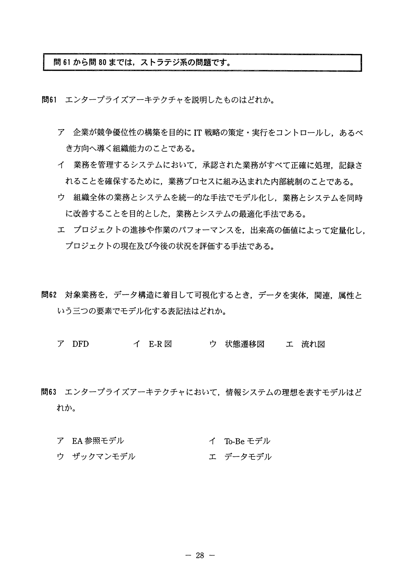

テキスト (OCR)

問 61 から問 80 までは, ストラテジ系の問題です。

問61 エンタープライズアーキテクチャを説明したものはどれか。

ア 企業が競争優位性の構築を目的に IT 戦略の策定・実行をコントロールし, HSN
き方向へ導く組織能力のことである。

イ 業務を管理するシステムにおいて, 承認された業務がすべて正確に処理, 記録さ
れることを確保むするために, 業務プロセスに組み込まれた内部統制のことである。
ウ 組織全体の業務とシステムを統一的な手法でモデル化し, 業務とシステムを同時

に改善することを目的とした, 業務とシステムの最適化手法である。
L プロジェクトの進捗や作業のパフォーマンスを, 出来高の価値によって定量化し,
プロジェクトの現在及び今後の状況を評価する手法である。

問62 対象業務を, データ構造に着目して可視化するとき, データを実体, 関連, 属性と

いう三つの要素でモデル化する表記法はどれか。

ア DFD     イ ERE    ウ 状態遷移図  エ 流れ図

間63 エンタープライズアーキテクチャにおいて, 情報システムの理想を表すモデルはど

れか。

ア EA 参照モデル        イ ToBe モデル
ウ ザックマンモデル        エ データモデル

ー 28 一

### ページ 29

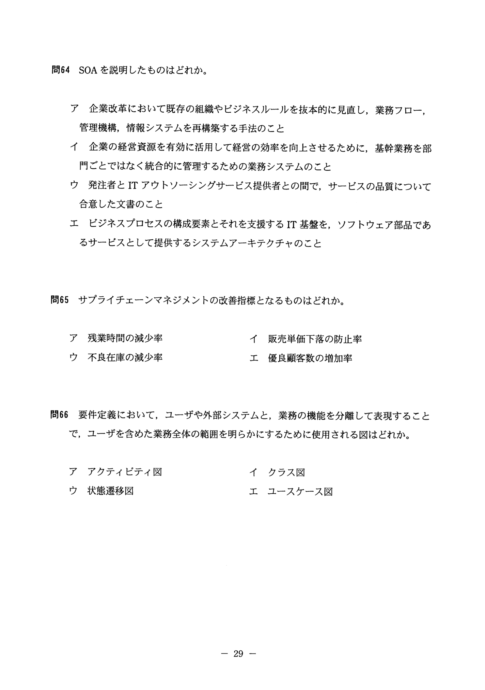

テキスト (OCR)

問64 SOA を説明したものはどれか。

ア 企業改革において既存の組織やビジネスルールを抜本的に見直し, 業務フロー,
管理機構, 情報システムを再構築する手法のこと

イ 企業の経営資源を有効に活用して経営の効率を向上させるために, 基幹業務を部
門ごとではなく統合的に管理するための業務システムのこと

ウ 発注者とIT アウトソーシングサービス提供者との間で, サービスの品質について
合意した文書のこと

エ ビジネスプロセスの構成要素とそれを支援する IT 基盤を, ソフトウェブ部品であ
るサービスとして提供するシステムアーキテクチャのこと

問55 サプライチェーンマネジメントの改善指標となるものはどれか。

ア 残業時間の減少率         イ 販売単価下落の防止率

ウ 不良在庫の減少率         cL 優良顧客数の増加率

問66 要件定義において, ユーザや外部システムと, 業務の機能を分離して表現すること

で, ユーザを含めた業務全体の範囲を明らかにするために使用される図はどれか。

ア アクティビティ図         イ クラス図
ウ 状態遷移図            エエ ユースケース図

ー 29 一

### ページ 30

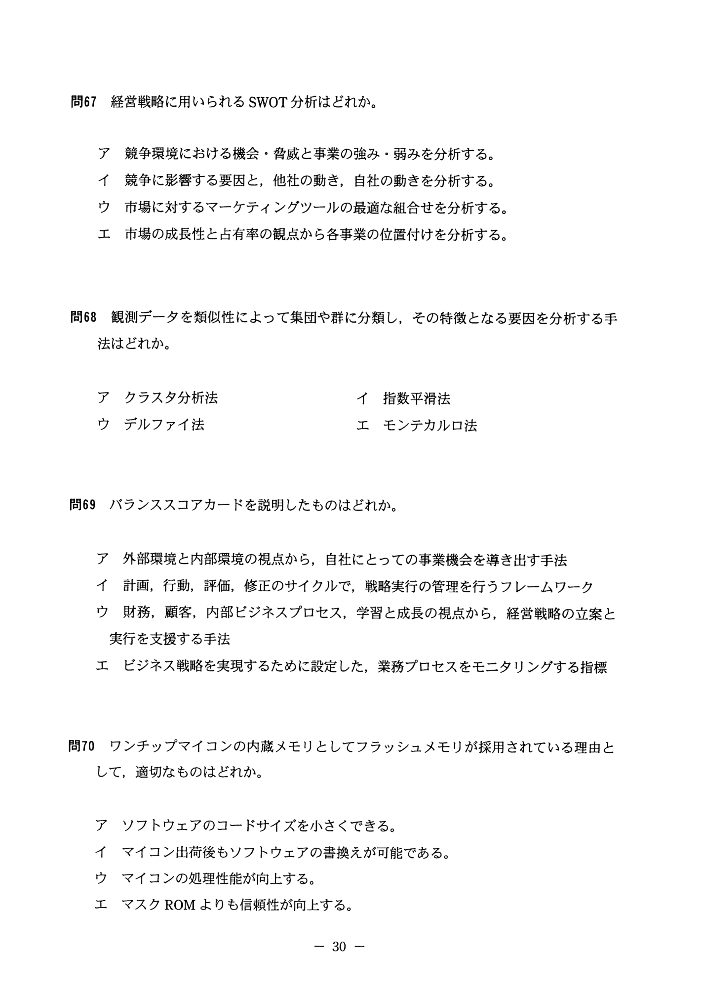

テキスト (OCR)

間67 経営戦略に用いられる SWOT 分析はどれか。

競争環境における機会脅威と事業の強み・弱みを分析する。
競争に影響する要因と, 他社の動き, 自社の動きを分析する。
市場に対するマーケティングツールの最適な組合せを分析する。
市場の成長性と占有率の観点から各事業の位置付けを分析する。

HUAN

問68 観測データを類似性によって集団や群に分類し, その特徴となる要因を分析する手
法はどれか。

ア クラスタ分析法        イ 指数平滑法
ウ デルファイ法          DL モンテカルロ法

間69 バランススコアカードを説明したものはどれか。

ア 外部環境と内部環境の視点から, 自社にとっての事業機会を導き出す手法

イ 計画, 行動, 評価, 修正のサイクルで, 戦略実行の管理を行うフレームワーク

ウ 財務, 顧客, 内部ビジネスプロセス, 学習と成長の視点から, 経営戦略の立案と
実行を支援する手法

エエ ビジネス戦略を実現するために設定した, 業務プロセスをモニタリングする指標

RIO ワンチップマイコンの内蔵メモリとしてフラッシュメモリが採用されている理由と
して, 適切なものはどれか。

ソフトウェアのコードサイズを小さくできる。

マイコン出荷後もソフトウェアの書換えが可能である。
マイコンの処理性能が向上する。

マスク ROM よりも信頼性が向上する。

RHささい

ー 30 一

### ページ 31

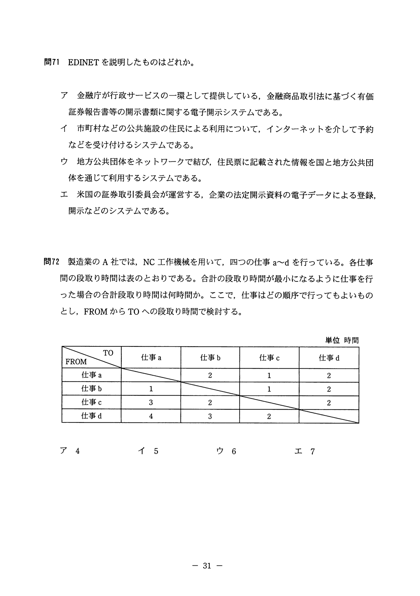

テキスト (OCR)

問71 EDINET を説明したものはどれか。

ア 金融庁が行政サービスの一環として提供している, 金融商品取引法に基づく有価

券報告書等の開示書類に関する電子開示システムである。

イ 市町村などの公共施設の住民による利用について, インターネットを介して予約
などを受け付けるシステムである。

ウ 地方公共団体をキネキットワークで結び, 住民票に記載された情報を国と地方公共団
体を通じて利用するシステムである。

L 米国の証券取引委員会が運営する, 企業の法定開示資料の電子データによる登録,
開示などのシステムである。

Buy

間72 製造業の A 社では, NC 工作機械を用いて, MOOS a~d を行っている。各仕事
間の段取り時間は表のとおりである。 合計の段取り時間が最小になるように仕事を行
った場合の合計段取り時間は何時間か。ここで, 仕事はどの順序で行ってもよいもの
とし, FROM から TO への段取り時間で検討する。

単位 時間
TO          仕事a             仕事             仕事c             仕事
FROM
仕事a                                    2                   1                   2
仕事b                1                                       1                   2
仕事c                3                   2                                       2
仕事d                4                   3                   2

ー 31 一

### ページ 32

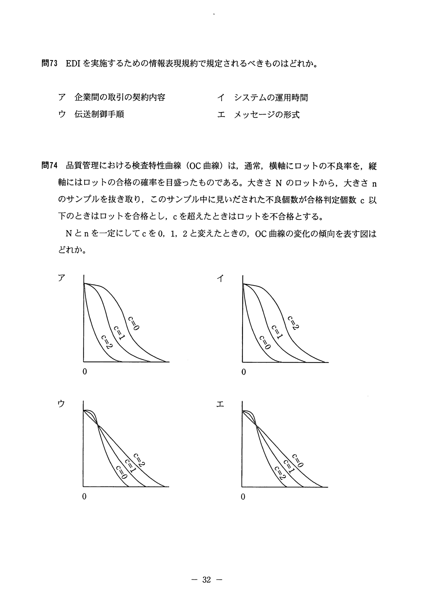

テキスト (OCR)

問73 EDI を実施するための情報表現規約で規定されるべきものはどれか。

ア 企業間の取引の契約内容     イ システムの運用時間
ウ 伝送制御手順          Lo メッセージの形式

問74 品質管理における検査特性曲線 (OC 曲線) は, 通常, 横軸にロットの不良率を, 縦
軸にはロットの合格の確率を目盛ったものである。 大きさ N のロットから, 大きさ n
のサンプルを抜き取り, このサンプル中に見いだされた不良個数が合格判定個数 c 以
下のときはロットを合格とし, c を超えたときはロットを不合格とする。
N とn を一定にしてcを0, 1, 2 と変えたときの, 0C曲線の変化の傾向を表す図は
どれか。

ア

ー 32 一

### ページ 33

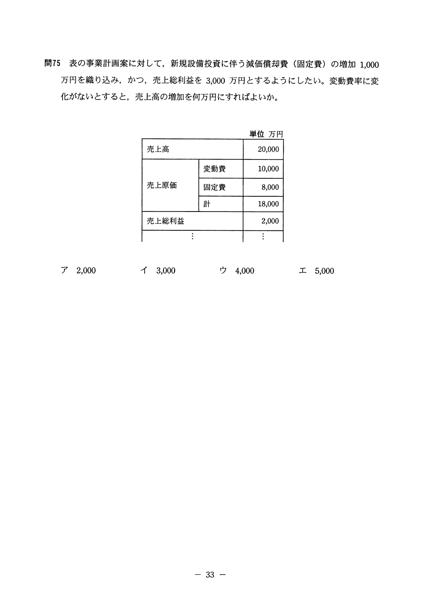

テキスト (OCR)

問75 表の事業計画案に対して, 新規設備投資に伴う減価償序費 (固定費) の増加 1.000
万円を織り込み, DO, 売上総利益を 3,000 万円とするようにしたい。 変動費率に変
化がないとすると, 売上高の増加を何万円にすればよいか。

単位 万円
売上高          20,000
変動費    10.000
売上原価   固定費    8,000
at     18,000
売上総利益         2.000
ア 2,000     イ 3,000     ウ 4000     エ 5,000

ー 33 一

### ページ 34

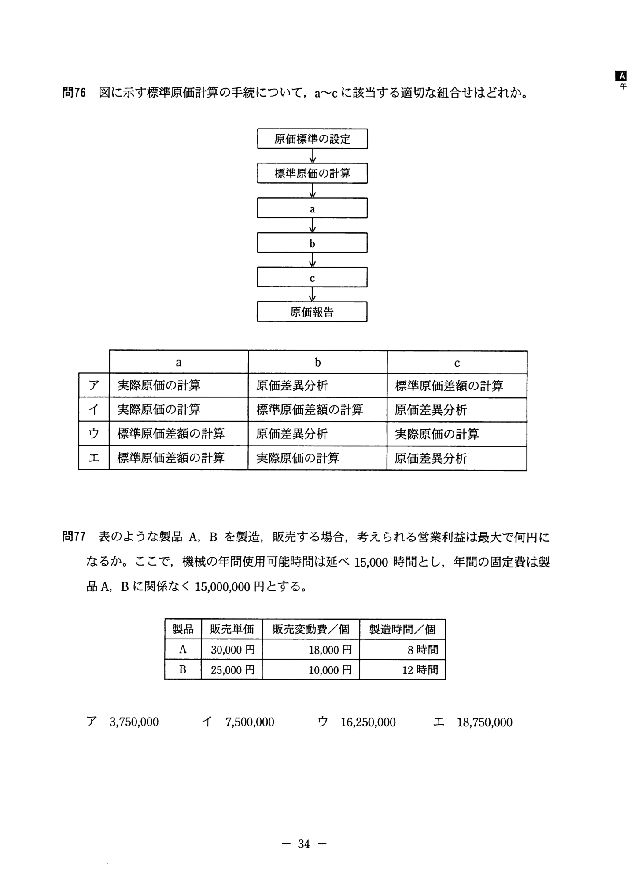

テキスト (OCR)

間76 図に示す標準原価計算の手続について, ac に該当する適切な組合せはどれか。

原価標準設定
標準原価の計算

a                                           b                                            c
ア | 実際原価の計算             原価差異分析               標準原価差額の計算
イ | 実際原価の計算                標準原価差額の計算         原価差異分析
ウ | 標準原価差額の計算         原価差異分析                   実際原価の計算
エ | 標準原価差額の計算         実際原価の計算                原価差異分析

間77 表のような製品 A, B を製造, 販売する場合, 考えられる営業利益は最大で何円に
TOD. COC, 機械の年間使用可能時間は延べ 15,000 時間とし, 年間の固定費は製
mA, Bに関係なく 15,000,000 円とする。

製品 | 販売単価 | 販売変動費個 | 製造時間ン個
A | 30,000 A            18,000 円            8 時間
B | 25.000円            10,000 円           12 時間
ア 3,750,000         イ 7,500,000         ウ 16,250,000        < 18,750,000

ー 34 一

### ページ 35

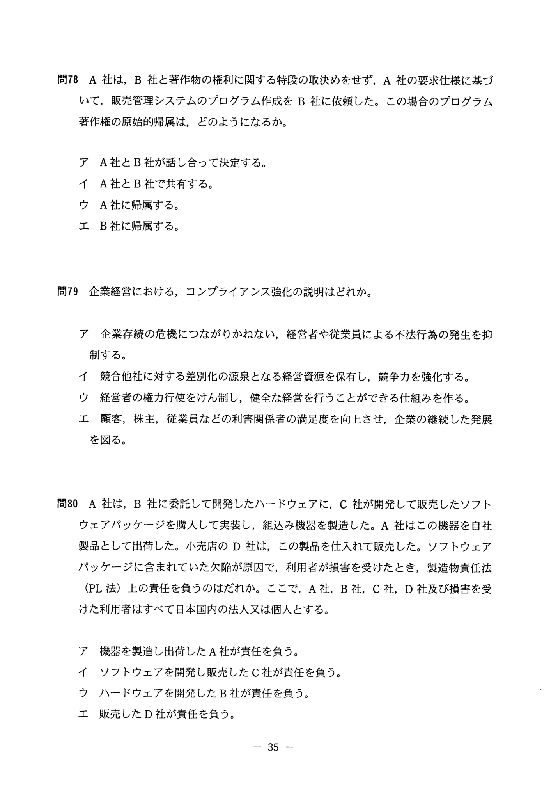

テキスト (OCR)

問78 A 社は, B 社と著作物の権利に関する特段の取決めをせず, A 社の要求仕様に基づ
いて, 販売管理システムのプログラム作成を B 社に依頼した。この場合のプログラム
著作権の原始的帰属は, どのようになるか。

A社とB 社が話し合って決定する。
A社とB 祉で共有する。

A 社に帰属する。

B 社に帰属する。

H へ

問79 企業経営における, コンプライアンス強化の説明はどれか。

ア 企業存続の危機につながりかねない, 経営者や従業員による不法行為の発生を抑
制する。

イ 競合他社に対する差別化の源泉となる経営資源を保有し, 競争力を強化する。

ウ 経営者の権力行使をけん制し, 健全な経営を行うことができる仕組みを作る。

エ 顧客, 株主, 従業員などの利害関係者の満足度を向上させ, 企業の継続した発展
を図る。

問80 A 社は, B 社に委託して開発したハードウェアに, C 社が開発して販売したソフト
ウェアパッケージを購入して実装し, 組込み機器を製造した。A 社はこの機器を自社
製品として出荷した。小売店の D 社は, この製品を仕入れて販売した。ソフトウェア
パッケージに含まれていた欠陥が原因で, 利用者が損害を受けたとき, 製造物責任法
(PL 法) 上の責任を負うのはだれか。ここで, Ath Bt, C社, D 社及び損害を受
けた利用者はすべて日本国内の法人又は個人とする。

ア 機器を製造し出荷した A 社が責任を負う。

イ ソフトウェアを開発し販売したC 社が責任を負う。
ウ ハードウェアを開発した B 社が責任を負う。

エエ 販売したD 社が責任を負う。

ー 35 一

### ページ 36

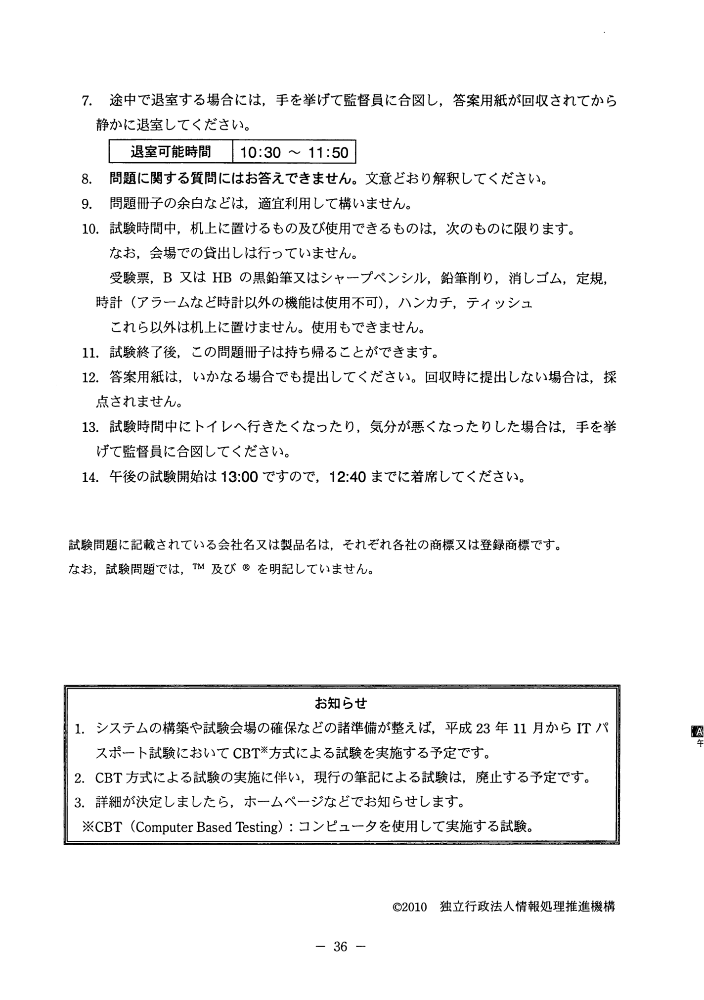

テキスト (OCR)

7. 途中で退室する場合には, 手を挙げて監督員に合図し, 答案用紙が回収されてから
静かに退室してください。
| 退記可能時間 | 10:30 ~ 11:50
8. 問題に関する質問にはお答えできません。文意どおり解釈してください。
9. 問題冊子の余白などは, 適宜利用して構いません。
10. 試験時間中, 机上に置けるもの及び使用できるものは, 次のものに限ります。
なお, 会場での食出しは行っていません。
受験票, B 又は HB の黒鉛筆又はシャープペンシル, 鉛筆削り, 消しゴム, 定規,
時計 (アラームなど時計以外の機能は使用不可), ハンカチ, ティッシュ
これら以外は机上に置けません。使用もできません。
11. 試験終了後, この問題冊子は持ち帰ることができます。
12. SRAM, いかなる場合でも提出してください。回収時に提出しない場合は, 採
点されません。
13, 試験時間中にトイレへ行きたくなったり, 気分が悪くなったりした場合は, FEM
げて監督員に合図してください。
14. 午後の試験開始は 13:00 ですので, 12:40 までに着席してください。

試験問題に記載されている会社名又は製品名は, それぞれ各社の商標又は登録商標です。
なお, 試験問題では, ™ 及び @ を明記していません。

お知らせ
1. システムの構築や試験会場の確保などの諸準備が整えば, 平成 23 年 11 月から IT パ
スポボート試験において CBT\方式による試験を実施する予定です。
2. CBT 方式による試験の実施に伴い, 現行の筆記による試験は, 廃止する予定です。
3. 詳細が決定しましたら, ホームページなどでお知らせします。
※CBT (Computer Based Testing) : コンピュータを使用して実施する試験。

@2010 独立行政法人情報処理推進機構

ー 36 一

---

## 午前解答

Copyright(c) Information-technology Promotion Agency, Japan. All rights reserved 2010 
平成22 年度 秋期 応用情報技術者試験 解答例 
 
午前試験 
問番号 
正解 
問1 
イ 
問2 
ウ 
問3 
ウ 
問4 
ウ 
問5 
エ 
問6 
ア 
問7 
ウ 
問8 
イ 
問9 
エ 
問10 
ウ 
問11 
イ 
問12 
エ 
問13 
ア 
問14 
イ 
問15 
イ 
問16 
エ 
問17 
エ 
問18 
ウ 
問19 
ウ 
問20 
ウ 
 
 
問番号 
正解 
問21 
ア 
問22 
イ 
問23 
ア 
問24 
ウ 
問25 
エ 
問26 
イ 
問27 
ウ 
問28 
イ 
問29 
エ 
問30 
ア 
問31 
ア 
問32 
ウ 
問33 
ウ 
問34 
ウ 
問35 
ウ 
問36 
ウ 
問37 
エ 
問38 
ウ 
問39 
イ 
問40 
イ 
 
 
問番号
正解 
問41 
イ 
問42 
ウ 
問43 
エ 
問44 
ア 
問45 
イ 
問46 
ウ 
問47 
エ 
問48 
エ 
問49 
ア 
問50 
ウ 
問51 
エ 
問52 
ウ 
問53 
イ 
問54 
エ 
問55 
ウ 
問56 
ウ 
問57 
エ 
問58 
イ 
問59 
ア 
問60 
ウ 
 
 
問番号 
正解 
問61 
ウ 
問62 
イ 
問63 
イ 
問64 
エ 
問65 
ウ 
問66 
エ 
問67 
ア 
問68 
ア 
問69 
ウ 
問70 
イ 
問71 
ア 
問72 
ア 
問73 
エ 
問74 
イ 
問75 
ウ 
問76 
イ 
問77 
イ 
問78 
エ 
問79 
ア 
問80 
ア

---

## 午後問題

### ページ 1

テキスト (OCR)

平成22年度 秋期
応用情報技術者試験
午後 問題

ee 13:00 ~ 15:30 (2 wt 30 分)

注意事項
1. 試験開始及び終了は, 監督員の時計が基準です。監督員の指示に従ってください。
2. 試験開始の合図があるまで, 問題冊子を開いて中を見てはいけません。
3. この注意事項は, 問題同子の裏表紙に続きます。必ず読んでください。
4. 答案用紙への受験番号などの記入は, 試験開始の合図があってから始めてください。
5. 問題は, 次の表に従って解答してください。
問題番号        fll, 問2      問3一問 12
選択方法         1 問選択        5 問選択
6. 管案用紙の記入に当たっては, 次の指示に従ってください。
() B 又は HB の黒鉛筆又はシャープペンシルを使用してくだ

[問1, 問3, 問4,

きい。                         問6, 問8, 問9
⑫) 受験番号欄に, 受験番号を記入してください。正しく記入 を選択した場合の例〕

されていない場合は, 採点されません。                選択欄

(3) 生年月日欄に, 受験票に印字されているとおりの生年月日
を記入してください。正しく記入されていない場合は, 採点
されないことがあります。

(④ 選択した問題については, 右の例に従って, 選択欄の問題
番号を〇印で囲んでください。

なお, 〇印がない場合は, 採点の対象になりません。問 1,

問 2 について, 2 問とも〇印で囲んだ場合は, はじめの 1 問
について採点します。問 3て問 12 について, 6 問以上〇印で
囲んだ場合は. はじめの5 問について採点します。

(5) 解答は, 問題番号ごとに指定された枠内に記入してくださ
い。

(6) 解答は, 丁寧な字ではっきりと書いてください。読みにく
い場合は, 減点の対象になります。

注意事項は問題冊子の裏表紙に続きます。

こちら側から裏返して, 必ず読んでください。

### ページ 2

### ページ 3

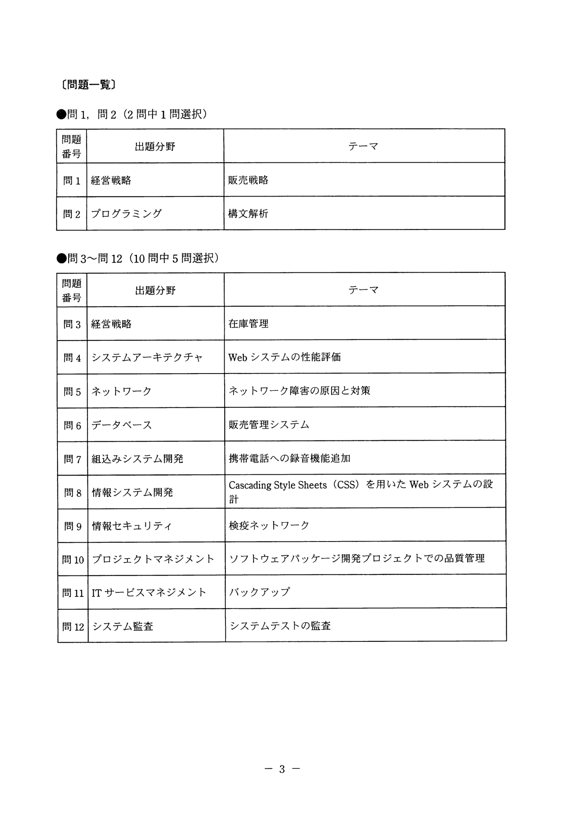

テキスト (OCR)

〔問題一覧〕

@Fi1, 問2 (2 問中1問選択)

       出題分時                      テーマ

問 1 |経営戦略         販売戦略

間2 | プログラミング      構文解析

人問 3…問 12 (10 問中 5 問選択)

       出題分野                      テーマ

FL 3 | 経営戦略         在庫管理

問 4 | システムアーキテクチャ  Web システムの性能評価

問5 | ネットワーク             ネットワーク障害の原因と対策

間6 | データベース       販売管理システム

間 7 | 組込みシステム開発    携帯電話への録音機能追加

問8 |情報システム開発       Cascading Style Sheets (CSS) を用いた Web システムの設
問 | 情報セキュリティ       検疫ネットワーク

問 10 | プロジェクトマネジメント |ソフトウェアパッケージ開発プロジェクトでの品質管理
問11 |IT サービスマネジメント   バックアップ

問 12| システム監査            システムテストの監査

### ページ 4

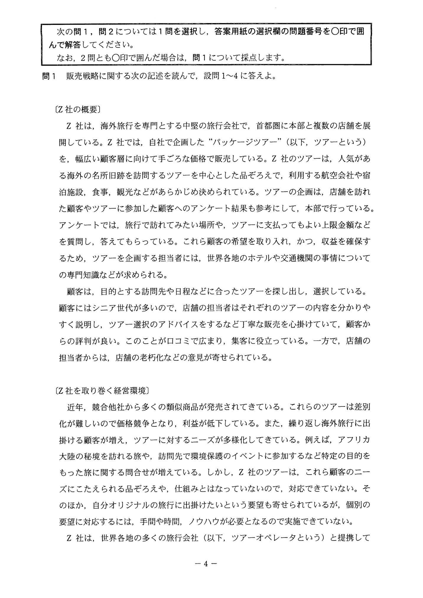

テキスト (OCR)

次の問 1 , 問2 については 1 間を選択し, 答案用紙の選択彰の問題番号を〇印で囲
んで解答してください。
なお, 2 問とも〇印で囲んだ場合は, 問 1 について採点します。

問1 販売戦略に関する次の記述を読んで, 設問 14 に答えよ。

(Z LOWE)

Z 社は, 海外旅行を専門とする中堅の旅行会社で, 首都圏に本部と複数の店舗を展
開している。Z 社では, 自社で企画した “パッケージツアー" (以下,ツアーという)
を, 幅広い顧客層に向けて手ごろな価格で販売している。Z 社のツアーは, 人気があ
る海外の名所旧跡を訪問するツアーを中心とした品ぞろえで, 利用する航空会社や宿
泊施設, 食事, 観光などがあらかじめ決められている。ツアーの企画は, 店舗を訪れ
た顧客やツアーに参加した顧客へのアンケート結果も参考にして, 本部で行っている。
アンケートでは, 旅行で訪れてみたい場所や, ツアーに支払ってもよい上限金額など
を質問し, 答えてもらっている。これら願客の希望を取り入れ, DO, 収益を確保す
るため, ツアーを企画する担当者には, 世界各地のホテルや交通機関の事情について
の専門知識などが求められる。

顧客は, 目的とする訪問先や日程などに合ったツアーを探し出し, 選択している。
顧客にはシニア世代が多いので, 店舗の担当者はそれぞれのツアーの内容を分かりや
すく説明し, ツアー選択のアドバイスをするなど丁寧な販売を心掛けていて, 顧客か
らの評判が良い。このことが口コミで広まり, 集客に役立っている。一方で, 店舗の
担当者からは, 店舗の老朽化などの意見が寄せられている。

〔Z 社を取り巻く経営環境)

近年, 競合他社から多くの類似商品が発売されてきている。これらのツアーは差別
化が難しいので価格競争となり, 利益が低下している。また, 繰り返し海外旅行に出
掛ける顧客が増え, ツアーに対するニーズが多様化してきている。例えば, アフリカ
大陸の秘境を訪れる旅や, 訪問先で環境保護のイベントに参加するなど特定の目的を
もった旅に関する問合せが増えている。しかし, Z 社のツアーは, これら顧客のニー
ズにこたえられる品ぞろえや, 仕組みとはなっていないので, 対応できていない。そ
のほか, 自分すサリジナルの旅行に出掛けたいという要望も寄せられているが, 個別の
要望に対応するには, 手間や時間, ノウハウが必要となるので実施できていない。

Z 社は, 世界各地の多くの旅行会社 (以下, ツアーオペレータという) と提携して

ー4 一

### ページ 5

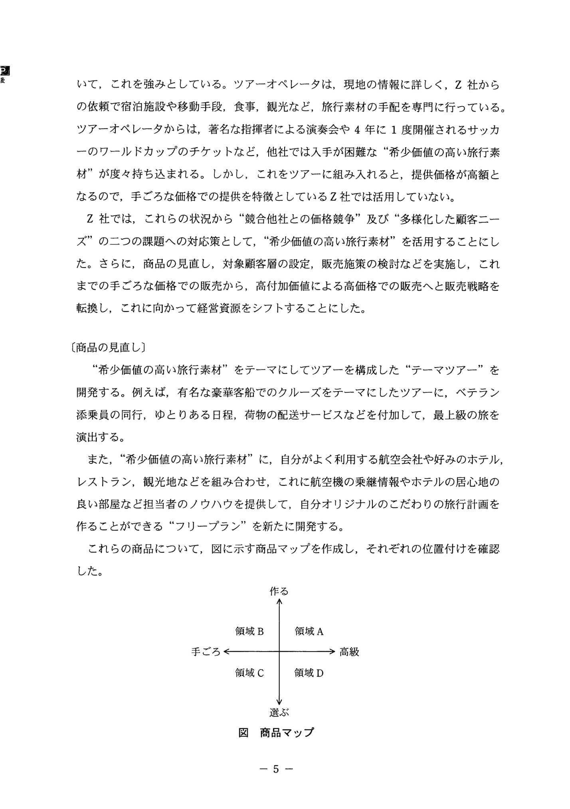

テキスト (OCR)

いて, これを強みとしている。ツアーオペレータは, 現地の情報に詳しく, Z 社から
の依頼で宿泊施設や移動手段, 食事, 観光など, 旅行素材の手配を専門に行っている。
ツアーオペレータからは, 著名な指揮者による演奏会や 4 年に 1 度開催されるサッカ
ーのワールドカップのチケットなど, 他社では入手が困難な “希少価値の高い旅行素
Hh” が度々持ち込まれる。しかし, これをツアーに組み入れると, 提供価格が高額と
なるので, 手ごろな価格での提供を特徴としているZ 社では活用していない。

Z 社では, これらの状況から “競合他社との価格競争" 及び“多様化した顧客ニー
ズ” の二つの課題への対応策として, “希少価値の高い旅行素材"を活用することにし
た。 さらに, 商品の見直し, 対象顧客層の設定, 販売施策の検討などを実施し, これ
までの手ごろな価格での販売から, 高付加価値による高価格での販売へと販売戦略を
転換し, これに向かって経営資源をシフトすることにした。

(商品の見直し〕

“希少価値の高い旅行素材"をテーマにしてツアーを構成した“テーマツアー" を
開発する。例えば, 有名な豪華客船でのクルーズをテーマにしたツアーに, ベテラン
添乗員の同行, ゆとりある日程, 荷物の配送サービスなどを付加して, 最上級の旅を
演出する。

また, “希少価値の高い旅行素材"に, 自分がよく利用する航空会社や好みのホテル,
レストラン, 観光地などを組み合わせ, これに航空機の乗継情報やホテルの居心地の
良い部屋など担当者のノウハウを提供して, 自分オリジナルのこだわりの旅行計画を
作ることができる“フリープラン" を新たに開発する。

これらの商品について, 図に示す商品マップを作成し, それぞれの位置付けを確認
した。

作る

領域B   領域 A

cay
&

領域C   領域D

選ぶ
図 商品マップ

ー5 一

### ページ 6

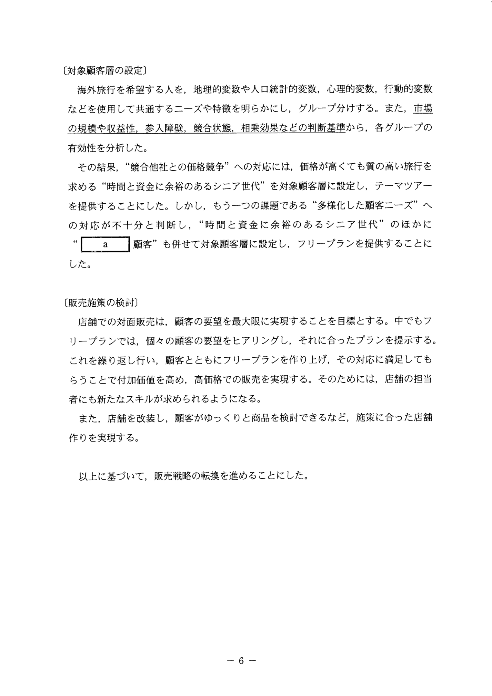

テキスト (OCR)

(ht RE OBE)

海外旅行を希望する人を, WHAM ACPO, 心理的変数, 行動的変数
などを使用して共通するニーズや特徴を明らかにし, グループ分けする。また, 市坦
の規模や収益性参入障壁。 競合状態。 相乗効果などの判断基準から, 各グループの
有効性を分析した。

その結果, “競合他社との価格競争"への対応には, 価格が高くても質の高い旅行を
求める “時間と資金に余裕のあるシニア世代"を対象選客層に設定し, テーマツアー
を提供することにした。しかし, もう一つの課題である “多様化した顧客ニーズ” へ
の対応が不十分と判断し, “時間と資金に余裕のあるシニア世代" のほかに
“Lae” も併せて対象必客層に設定し, フリープランを提供することに
した。

(販売施策の検討]

店舗での対面販売は, 顧客の要望を最大限に実現することを目標とする。中でもフ
リープランでは, 個々の顧客の要望をヒアリングし, それに合ったプランを提示する。
これを繰り返し行い, 顧客とともにフリープランを作り上げ, その対応に満足しても
らうことで付加価値を高め, 高価格での販売を実現する。そのためには, 店舗の担当
者にも新たなスキルが求められるようになる。

また, 店舗を改装し, 顧客がゆっくりと商品を検討できるなど, 施策に合った店舗
作りを実現する。

以上に基づいて, 販売戦略の転換を進めることにした。

### ページ 7

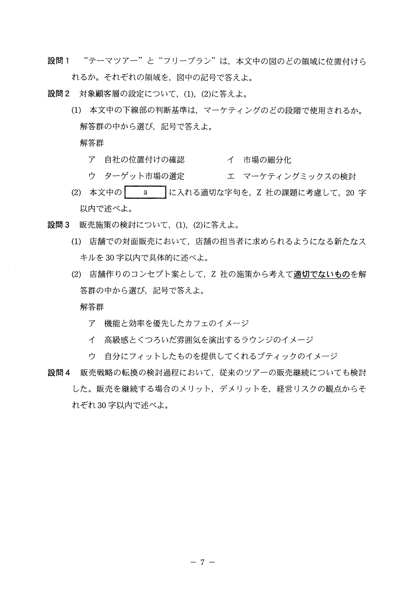

テキスト (OCR)

設問1 “テーマツアー" と“フリープラン" は, 本文中の図のどの領域に位置付けら
れるか。それぞれの領域を, 図中の記号で答えよ。
設問2 対象顧客層の設定について, ①, (②)に答えよ。
Q) 本文中の下線部の判断基準は, マーケティングのどの段階で使用されるか。
解答群の中から選び, 記号で答えよ。

解答
ア 自社の位置付けの確認     イ 市場の細分化
ウ ターゲット市場の選定     エ マーケティングミックスの検討
⑫) 本文中の| 3a | に入れる適切な字句を, Z 社の課題に考慮して, 20 字
DATE.

設問3 販売施策の検討について, ①), (②に答えよ。
(1) 店舗での対面販売において, 店舗の担当者に求められるようになる新たなス
キルを 30 字以内で具体的に述べよ。
(2) 店舗作りのコンセプト案として, Z 社の施策から考えて適切でないものを解
答群の中から選び, 記号で答えよ。
解答群
ア 機能と効率を優先したカフェのイメージ
イ 高級感とくつろいだ究囲気を演出するラウンジのイメージ
ウ 自分にフィットしたものを提供してくれるブティックのイメージ
設問4 販売戦略の転換の検討過程において, 従来のツアーの販売継続についても検討
LK. 販売を継続する場合のメリット, デメリットを, 経営リスクの観点からそ
れぞれ 30 字以内で述べよ。

### ページ 8

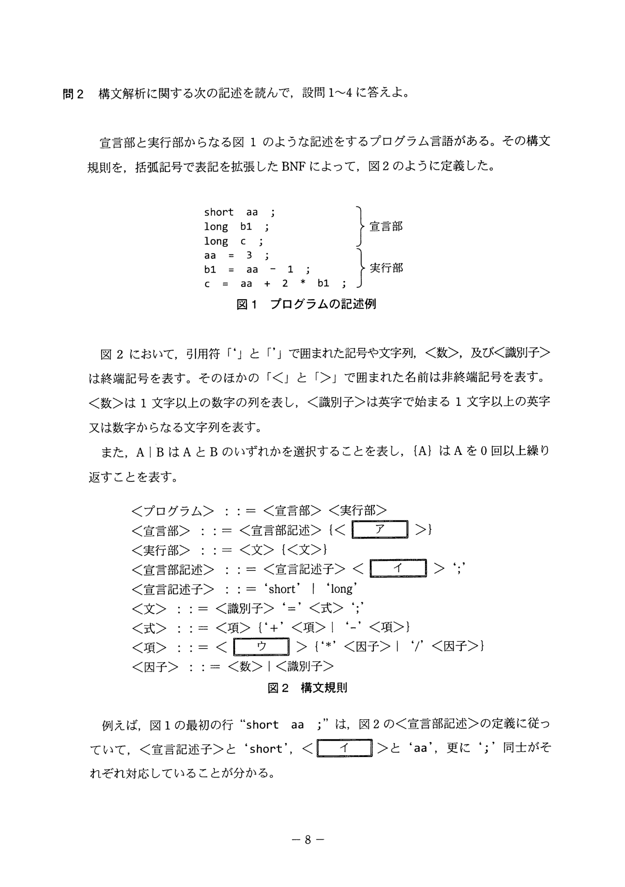

テキスト (OCR)

問2 構文解析に関する次の記述を読んで, 設問14 に答えよ。

宣言部と実行部からなる図 1 のような記述をするプログラム言語がある。その構文
規則を, 括弧記号で表記を拡張した BNF によって, 図2 のように定義した。

short aa ;

long b1 ;       EE
long c 3;

aa = 3 ぅ

bl = aa - 1 ;   em
c = aa + 2 * bl 3

 1 プログラムの記述例

 2 において, 引用符「'」と「"」で囲まれた記号や文字列,ぐ数>, 及びぐ識別子>
は終端記号を表す。そのほかの「ぐ」と「」で囲まれた名前は非終端記号を表す。
ぐ数>は 1 文字以上の数字の列を表し, 識別子>は英字で始まる 1 文字以上の英字
又は数字からなる文字列を表す。

Ek, AlIBはAとB のいずれかを選択することを表し, {A} はAを0 回以上繰り
返すことを表す。

ごくプログラムツ : >= <EEM> ーー
宮言部> : = 宣言部記述> (<[ アァ |>)
ご実行部> : = <文> 【ベ文>}
宣言部記述> ©: = ぐ宣言記述子> < >の
宣言記述子> : : = ‘short’ | ‘long’
く文> : = 識別子> ="マ<式>
<> : :ー でく項> (+' ぐ項>| "-" ぐ項>)
く項> ::=マく > (8 因子>| 7'ぐ因子>}
ご因子> : = ぐ数|ご識別子>

 2 構文規則

例えば, 図1 の最初の行 “short aa ;” は, 図2 のご宮言部記述の定義に従っ
ていて, 宮言記述子>と "short',く[ イ ] >と ‘aa’, 更に ‘3’ 同士がそ
れぞれ対応していることが分かる。

### ページ 9

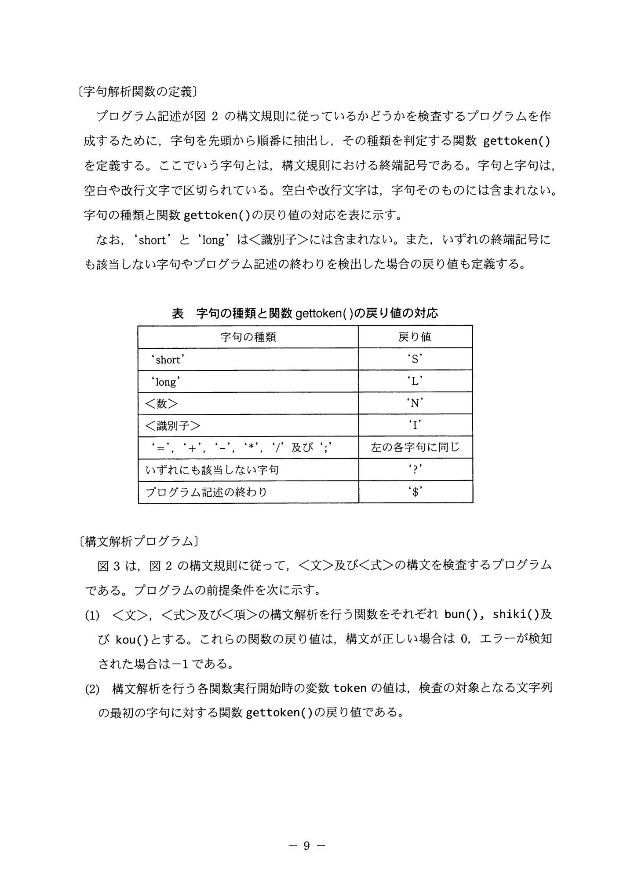

テキスト (OCR)

(字句解析関数の定義

プログラム記述が図 2 の構文規則に従っているかどうかを検査するプログラムを作
成するために, 字句を先頭から順番に抽出し, その種類を判定する関数 gettoken( )
を定義むする。ここでいう字句とは, 構文規則における終端記号である。 字句と字句は,
空白や履行文字で区切られている。 空白や改行文字は, 字句そのものには含まれない。
字句の種類と関数 gettoken()の戻り値の対応を表に示す。

なお, ‘short’ と ‘long’ はべく識別子>には含まれない。また, いずれの終端記号に
も該当しない字名やプログラム記述の終わりを検出した場合の戻り値も定義する。

表 字句の種類と関数 gettoken( )の戻り値の対応

字句の種類               戻り値
“short”                           ‘s’
‘long’                           ‘L’
ぐ数>                            ‘N’
識別子>                         ‘T
リーリキリーリー OP 及び     左の各字句に同じ
いずれにも該当しない字旬                °
プログラム記述の終わり                 '$

[構文解析プログラム]〕

 3 は, 図 2 の構文規則に従って, べ文及びぐ式>の構文を検査するプログラム

である。プログラムの前提条件を次に示す。

GQ) ぐ文>, <式>及びく項の構文解析を行う関数をそれぞれ bun(), shiki()及
び kou() とする。これらの関数の戻り値は, 構文が正しい場合は 0, エラーが検知
された場合はー1 である。

(②) 構文解析を行う各関数実行開始時の変数 token の値は, 検査の対象となる文字列
の最初の字句に対する関数 gettoken( )の戻り値である。

### ページ 10

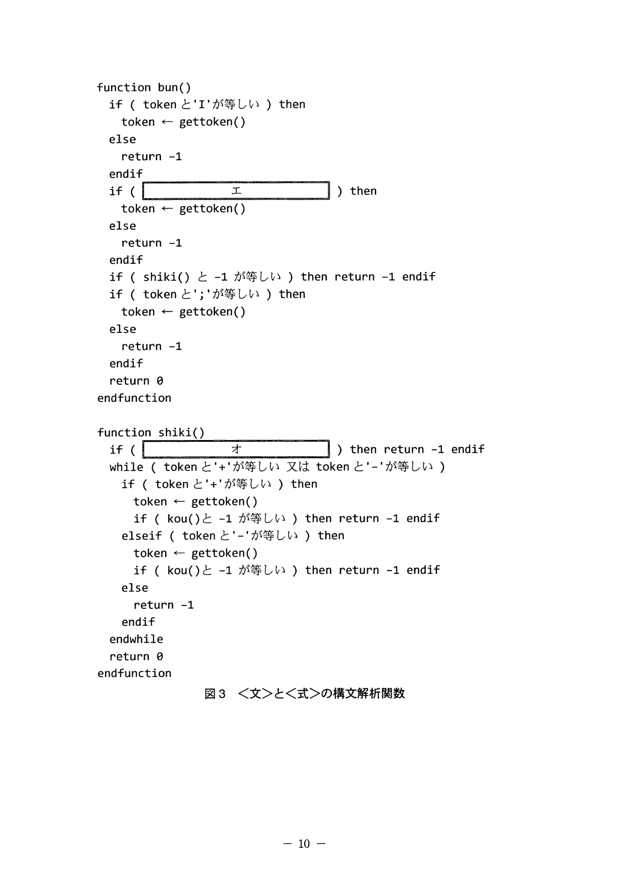

テキスト (OCR)

function bun( )
if ( token と'1'が等しい ) then
token <- gettoken( )
else
return -1
endif
if (|          x          | ) then
token < gettoken()
else
return -1
endif
if ( shiki() と -1 が等しい ) then return -1 endif
if ( token と"が等しい ) then
token < gettoken( )
else
return -1
endif
return @
endfunction

function shiki()
if (|             オ            | ) then return -1 endif
while ( token と'+'が等しい 又は token と"-'が等しい )
if ( token と+'が等しい ) then
token て- gettoken( )
if ( kou()& -1 が等しい ) then return -1 endif
elseif ( token と'- 'が等しい ) then
token < gettoken( )
if ( kou()と -1 が等しい ) then return -1 endif
else
return -1
endif
endwhile
return @
endfunction

 3 ぐ文>とぐ式>の構文解析関数

ー 10 一

### ページ 11

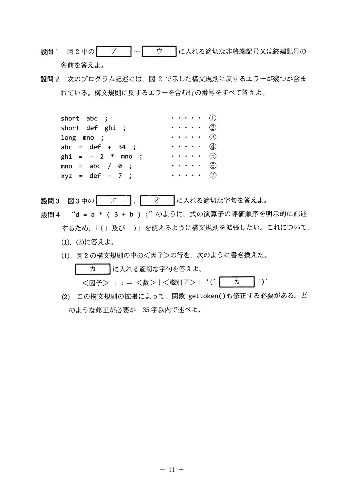

テキスト (OCR)

設問1 図2中の| ア |~| ウ |に入れる適切な非終端記号又は終端記号の
名前を答えよ。

設問2 次のプログラム記述には, 図 2 で示した構文規則に反するエラーが幾つか含ま
れている。構文規則に反するエラーを含む行の番号をすべて答えよ。

short abc 3; 888     ①
short def ghi ; し     ②
long mno 3し frre     ®
abc = def + 34 5; = see e8     ④
ghi = - 2 * mo っーー 、- しにドドトト     ⑤
mno = abc / 9 3; +888     ©
xyz = def - 7 5; ete e8     @
設問3 図3中の| エ |,[ 4 |に入れる適切な字句を答えよ。

設問4 "d=a*(3+b ) :" のように, 式の演算子の評価順序を明示的に記述
するため, 「(」及び「) 」を使えるように構文規則を拡張したい。これについて,
(1), ②)に答えよ。
(1) 図2 の構文規則の中の因子>の行を, 次のように書き換えた。
 に入れる適切な字句を答えよ。
ぐ因子> : = ぐ数>|ぐ識別子>| "で り"
(2) この構文規則の拡張こによって, 関数 gettoken() も修正する必要がある。ど
のような修正が必要か, 35 字以内で述べよ。

ー 11 一

### ページ 12

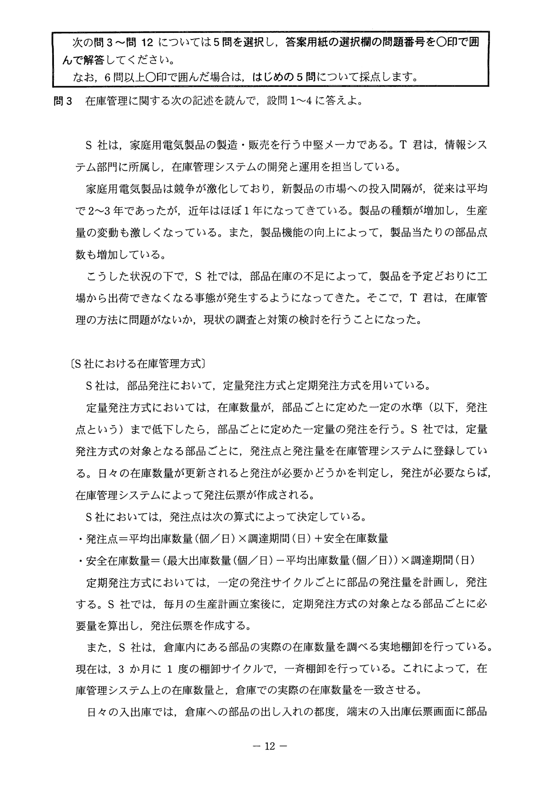

テキスト (OCR)

次の問 3 て問 12 については5 問を選択し, 答案用紙の選択拉の問題番号を〇印で囲
んで解答してください。
なお, 6 問以上〇印で囲んだ場合は, はじめの5 問について採点します。

AS 在庫管理に関する次の記述を読んで, 設問14 に答えよ。

S 社は, 家庭用電気製品の製造・販売を行う中堅メーカである。T Ald, 情報シス
テム部門に所属し, 在庫管理システムの開発と運用を担当している。

家庭用電気製品は競争が激化しており, 新製品の市場への投入間隔が, 従来は平均
で2^3 年であったが, 近年はほぼ 1 年になってきている。製品の種類が増加し, 生産
量の変動も激しくなっている。また, 製品機能の向上によって, 製品当たりの部品点
数も増加している。

こうした状況の下で, S 社では, 部品在庫の不足によって, 製品を予定どおりに工
場から出荷できなくなる事態が発生するようになってきた。そこで, T Bld, CHE
理の方法に問題がないか, 現状の調査と対策の検討行うことになった。

〔S 社における在庫管理方式

S 社は, 部品発注において, 定量発注方式と定期発注方式を用いている。

定量発注方式においては, 在庫数量が, 部品ごとに定めた一定の水準 (以下, 発注
点という) まで低下したら, 部品ごとに定めた一定量の発注を行う。S 社では, 定量
発注方式の対象となる部品ごとに, 発注点と発注量を在庫管理システムに登録してい
る。 日々の在庫数量が更新されると発注が必要かどうかを判定し, 発注が必要ならば,
在庫管理システムによって発注伝票が作成される。

S 社においては, 発注点は次の算式によって決定している。

・発注点三平均出庫数量 (個/日) X調達期間(日) 安全在庫数量

・安全在庫数量王 (最大出庫数量(個日) 一平均出庫数量 (個日)) 調達期間(日)

定期発注方式においては, 一定の発注サイクルごとに部品の発注量を計画し, 発注
する。S 社では, 毎月の生産計画立案後に, 定期発注方式の対象となる部品ごとに必
要量を算出し, 発注伝票を作成する。

また, S tid, 倉庫内にある部品の実際の在庫数量を調べる実地棚卸を行っている。
現在は, 3 か月に 1 度の棚卸サイクルで, 一斉棚卸を行っている。これによって, 在
庫管理システム上の在庫数量と, 倉庫での実際の在庫数量を一致させる。

日々の入出庫では, 倉庫への部品の出し入れの都度, 端末の入出庫伝票画面に部品

ー 12 一

### ページ 13

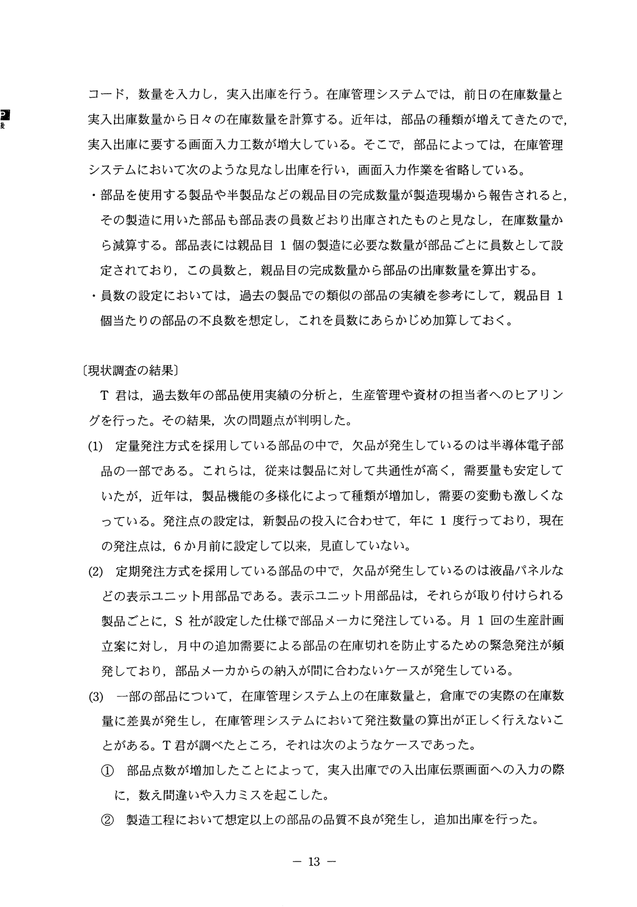

テキスト (OCR)

コード, 数量を入力し, 実入出庫を行う。在庫管理システムでは, 前日の在庫数量と

実入出庫数量から日々の在庫数量を計算する。 近年は, 部品の種類が増えてきたので

実入出庫に要する画面入力工数が増大している。そこで, 部品によっては, 在庫管理
システムにおいて次のような見なし出庫を行い, 画面入力作業を省略している。

・部品を使用する製品や半製品などの親品目の完成数量が製造現場から報告されると,
その製造に用いた部品も部品表の員数どおり出庫されたものと見なし, 在庫数量か
ら減算する。部品表には親品目 1 個の製造に必要な数量が部品ごとに員数として設
定されており, この員数と, 親品目の完成数量から部品の出庫数量を算出する。

・員数の設定においては, 過去の製品での類似の部品の実績を参考にして, 親品目 1
個当たりの部品の不良数を想定し, これを員数にあらかじめ加算しておく。

〔現状調査の結果〕

T Ald, 過去数年の部品使用実績の分析と, 生産管理や資材の担当者へのヒアリン

グを行った。その結果, 次の問題点が判明した。

1) 定量発注方式を採用している部品の中で, 欠品が発生しているのは半導体電子部
品の一部である。これらは, 従来は製品に対して共通性が高く, 需要量も安定して
いたが, 近年は, 製品機能の多様化によって種類が増加し, 需要の変動も激しくな
っている。 発注点の設定は, 新製品の投入に合わせて, 年に 1 度行っており, 現在
の発注点は, 6 か月前に設定して以来, 見直していない。

(2) 定期発注方式を採用している部品の中で, 欠品が発生しているのは液晶パネルな
どの表示ユニット用部品である。表示ユニット用部品は, それらが取り付けられる
製品ごとに, S 社が設定した仕様で部品メーカに発注している。 月 1 回の生産計画
立案に対し, 月中の追加規要による部品の在庫切れを防止するための緊急発注が頻
発しており, 部品メーカからの納入が間に合わないケースが発生している。

(3) 一部の部品について, 在庫管理レステム上の在庫数量と, 倉庫での実際の在庫数
量に差異が発生し, 在庫管理システムにおいて発注数量の算出が正しく行えないこ
とがある。T 君が調べたところ, それは次のようなケースであった。
① 部品点数が増加したことによって, 実入出庫での入出上庫伝票画面への入力の際

に, 数え間違いや入力ミスを起こした。
② 製造工程において想定以上の部品の品質不良が発生し, 追加出庫を行った。

ー 13 一

### ページ 14

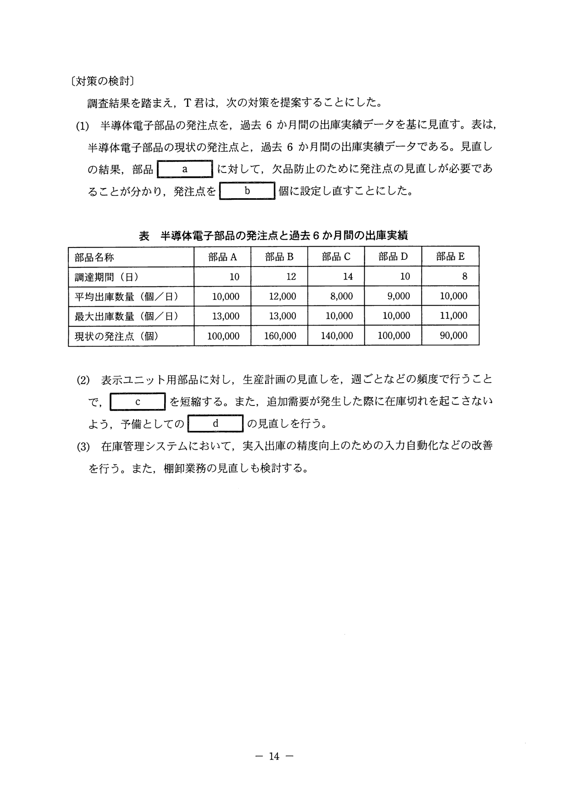

テキスト (OCR)

(対策の検討

調査結果を踏まえ, TH, 次の対策を提案することにした。
Q) 半導体電子部品の発注点を, 過去 6 か月間の出庫実績データを基に見直す。表は,
半導体電子部品の現状の発注点と, 過去 6 か月間の出庫実績データである。見直し
の結果, 部品 | a | に対して, 欠品防止のために発注点の見直しが必要であ

ることが分かり, 発注点を| b |個に設定し直すことにした。

表 半導体電子部品の発注点と過去 6 か月間の出庫実績

部品名称

部品A        部品B        部品C        部品D        部品E
調達期間 (A)                        10            12            14            10             8
平均出庫数量 (個日)   10,000  12,000   8,000   9,000   10,000
最大出庫数量 (個日)      13,000      13,000      10,000      10,000      11,000
現状の発注点 (個)             100,000       160,000       140,000       100,000        90,000

Q) 表示ユニット用部品に対し, 生産計画の見直しを, 週ごとなどの類度で行う
で, | <c | を短給する。また, 追加震要が発生した際に在庫切れを起こさない

よう, 予備としての|  dq  ] の見直しを行う。
⑬ 在庫管理システムにおいて, 実入出庫の精度向上のための入力自動化などの改善

を行う。また, 棚卸業務の見直しも検討する。

ー 14 一

こと

### ページ 15

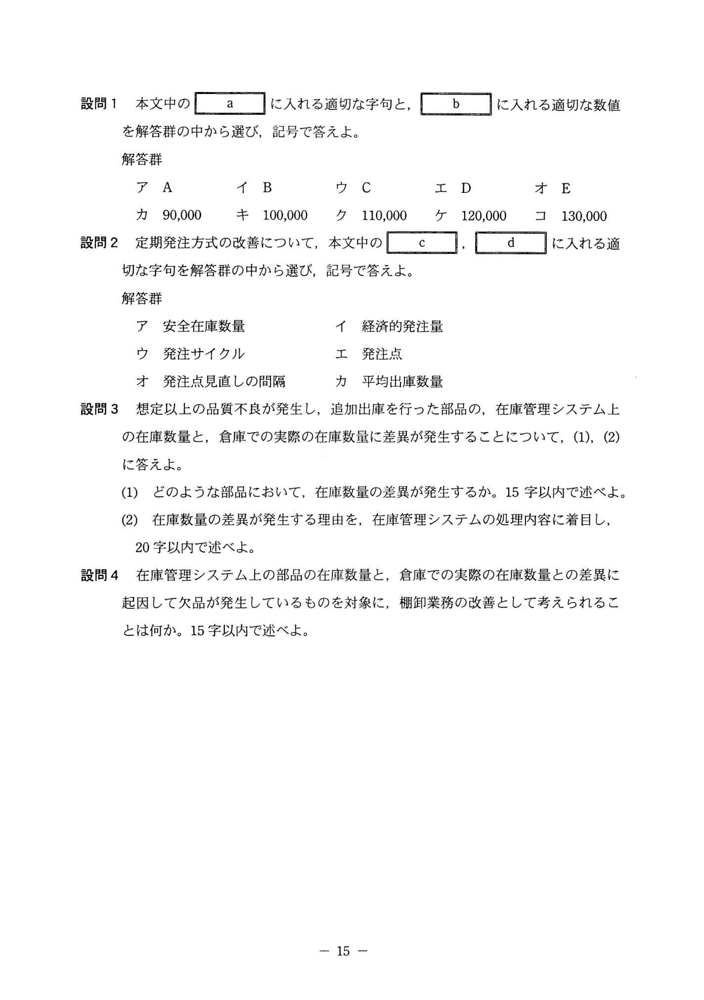

テキスト (OCR)

設問1 本文中の| a |

を解答群の中から選び, 記号で答えよ。

に入れる適切な字句と, に入れる適切数値

解答群

ア A    イ B    ウ C    エ D    オ E

カ 90,000 + 100,000 ク 110,000 ケ 120,000 コ 130,000

設問2 定期発注方式の改善について, 本文中の| c |,|  d |に入れる適

切な字句を解答群の中から選び, 記号で答えよ。
解答群

ア 安全在庫数量     イ 経済的発注量

ウ 発注サイクル      エ 発注点

オ 発注点見直しの間隔   カ 平均出庫数量

設問3 想定以上の品質不良が発生し, 追加出庫を行った部品の, 在庫管理システム上
の在庫数量と, 倉庫での実際の在庫数量に差異が発生することについて, ①, (2)
に答えよ。
(1) どのような部品において, 在庫数量の差異が発生するか。15 字以内で述べよ。
(2) 在庫数量の差異が発生する理由を, 在庫管理システムの処理内容に着目し,
20 字以内で述べよ。

設問4 在庫管理システム上の部品の在庫数量と, 倉庫での実際の在庫数量との差異に
起因して欠品が発生にしているものを対象に, 棚卸業務の改善として考えられるこ
とは何か。15 字以内で述べよ。

ー 15 一

### ページ 16

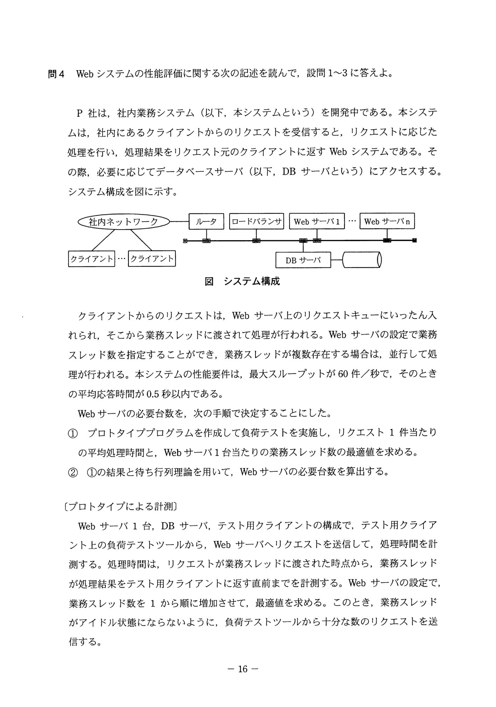

テキスト (OCR)

問4 Web システムの性能評価に関する次の記述を読んで, 設問13 に答えよ。

P 社は, 社内業務システム (以下, 本システムという) を開発中である。本システ
ムは, 社内にあるクライアントからのリクエストを受信すると, リクエストに応じた
処理を行い, 処理結果をリクエスト元のクライアントに返す Web システムである。そ
OR, 必要に応じてデータベースサーバ WF, DB サーバという) にアクセスする。
システム構成を図に示す。

ご和社内ネットワーク      ルクタ | ロードバラテンサ| [ wer サーバュ| | Web サーバョ|

レライァント|…レクシァント|  (0

図 システム構成

クライアントからのリクエストは, Web サーバ上のリクエストキューにいったん入
れられ, そこから業務スレッドに渡されて処理が行われる。Web サーバの設定で業務
スレッド数を指定することができ, 業務スレッドが複数存在する場合は, 並行して処
理が行われる。本システムの性能要件は, 最大スループットが60 件プ秒で, そのとき
の平均応答時間が 0.5 秒以内である。

Web サーバの必要台数を, 次の手順で決定することにした。
① プロトタイププログラムを作成して負荷テストを実施し, リクエスト 1 件当たり

の平均処理時間と, Web サーバ 1 台当たりの業務スレッド数の最適値を求める。
② ①の結果と待ち行列理論を用いて, Web サーバの必要台数を算出する。

【プロトタイプによる計測〕

Web サーバ 1 台, DB サーバ, テスト用クライアントの構成で、テスト用クライア
ント上の負荷テストツールから, Web サーバヘリクエストを送信して, 処理時間を計
測する。処理時間は, リクエストが業務スレッドに渡された時点から, 業務スレッド
が処理結果をテスト用クライアントに返す直前までを計測する。Web サーバの設定で,
業務スレッド数を 1 から順に増加させて, 最適値を求める。このとき, 業務スレッド
がアイドル状態にならないように, 負荷テストツールから十分な数のリクエストを送
信する。

ー 16 一

### ページ 17

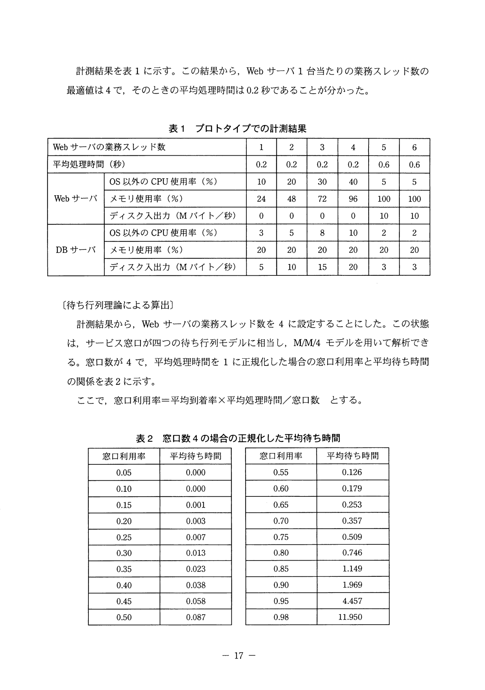

テキスト (OCR)

計測結果を表 1 に示す。この結果から, Web サーバ 1 台当たりの業務スレッド数の

最適値は4で, そのときの平均処理時間は 0.2 秒であることが分かった。

表1 プロトタイプでの計測結果

Web サーバの業務スレッド数           1  2   3  4   5  6
平均処理時間 (秒)                02 | 02  0.2  0.2  0.6  0.6
OS 以外の CPU 使用率 (%)              10       20       30        40        5         5
Web サーバ | メモリ使用率 (%)                          24        48        72        96 | 100 | 100
ディスク入出力 (M バイトン/秒)  0  0   0  0  10  10
OS 以外の CPU 使用率 (%)    3  5  8  10  2  2
DB サーバ | メモリ使用率 (%)        20  20  20  20  20  20
ディスク入出力 (M バイトンノ秒)  5  10  15  20   3  3

(待ち行列理論による算出]

計測結果から, Web サーバの業務スレッド数を 4 に設定することにした。この状態
は, サービス窓口が皿つの待ち行列モデルに相当し, M/M/4 モデルを用いて解析でき
る。窓口数が 4 で, 平均処理時間を 1 に正規化した場合の窓口利用率と平均待ち時間

の関係を表 2 に示す。
COC, 窓口利用率王平均到着率メ平均処理時間ノ窓口数 とする。

表2 窓口数4の場合の正規化した平均待ち時間

窓口利用率     平均待ち時間        窓口利用率     平均待ち時間
0.05                           0.000                                  0.55                           0.126
0.10             0.000                0.60             0.179
0.15                           0.001                                  0.65                           0.253
0.20                           0.003                                 0.70                          0.357
0.25                           0.007                                 0.75                          0.509
0.30                           0.013                                 0.80                           0.746
0.35                           0.023                                  0.85                           1.149
0.40                           0.038                                 0.90                           1.969
0.45                           0.058                                  0.95                           4.457
0.50                       0.087                             0.98                     11.950

ー 17 一

### ページ 18

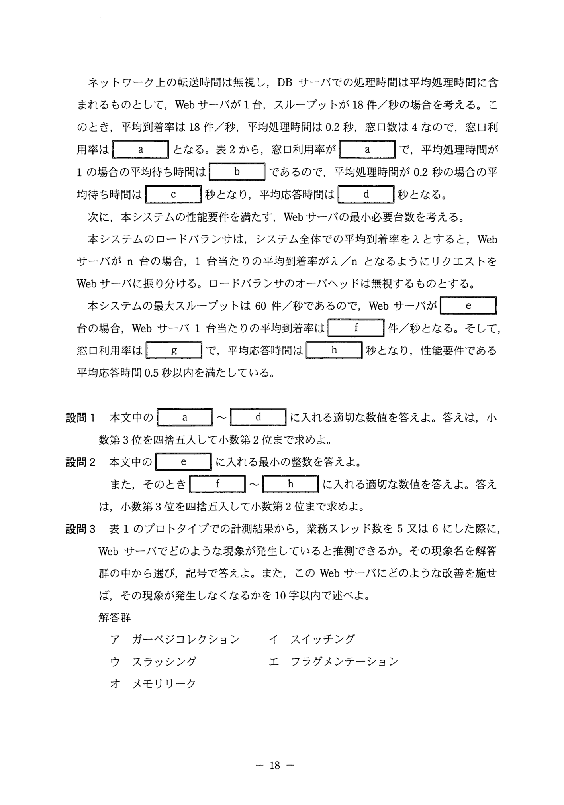

テキスト (OCR)

ネットワーク上の転送時間は無視し, DB サーバでの処理時間は平均処理時間に含
まれるものとして, Web サーバが1 台, スループットが18 件/秒の場合を考える。こ
のとき, 平均到着率は 18 件ノ秒, 平均処理時間は 0.2 秒。 窓口数は ROT, BOA
用率は| a | となる。表2から, 窓口利用率が| a | で, 平均処理時間が
1 の場合の平均待ち時間は | b | であるので, 平均処理時間が0.2 秒の場合の平
均待ち時間は|  c |秒となり, 平均応答時間は|  d |秒となる。

KIL, 本システムの性能要件を満たす, Web サーバの最小必要台数を考える。

本システムのロードバランサは, システム全体での平均到着率をAとすると, Web
サーバが n BOBS, 1 台当たりの平均到着率がヘンn となるようにリクエストを
Web サーバに振り分ける。ロードバランサのオーバヘッドは無視するものとする。

本システムの最大スループットは 60 件/秒であるので, Web サーバが| e |
BOBS, Web サーバ 1 台当たりの平均到着率は | f | 件/秒となる。そして,
窓口利用率は|  g | で, 平均応答時間は| h |秒となり, 性能要件である

平均応答時間 0.5 秒以内を満たしている。

設問1 本文中の| a |~|  d |に入れる適切な数値を答えよ。答えは, 小
数第 3 位を四捨五入して小数第 2 位まで求めよ。
設問2 本文中の|  e |に入れる最小の整数を答えよ。
また, そのとき|  { |て|  h |に入れる適切な数値を答えよ。答え
は, 小数第 3 位を四捨五入して小数第 2 位まで求めよ。
設問3 表1 のプロトタイプでの計測結果から, 業務スレッド数を 5 又は 6 にした際に,
Web サーバでどのような現象が発生していると推測できるか。その現象名を解答
群の中から選び, 記号で答えよ。また, この Web サーバにどのような改善を施せ
ば, その現象が発生しなくなるかを10 字以内で述べよ。
SEE
ア ガーベジコレクション 4 スイッチング

ウ スラッシング           L フラグメンテーション

オ メモリリーク

ー 18 一

### ページ 19

テキスト (OCR)

【 メモ 用.紙 〕

ー 19 一

### ページ 20

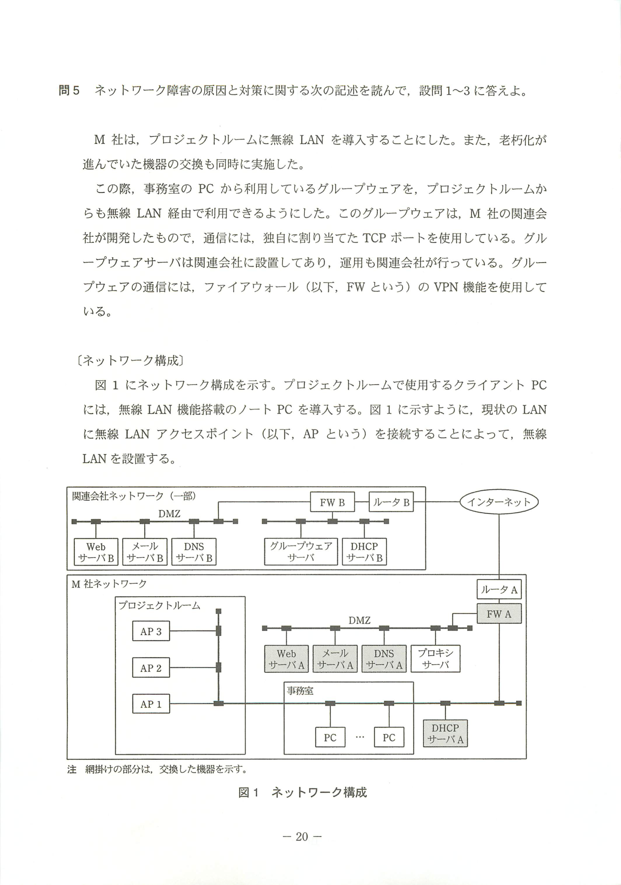

テキスト (OCR)

問5 ネットワーク障害の原因と対策に関する次の記述を読んで, 設問 1ー3 に答えよ。

M 社は, プロジェクトルームに無線 LAN を導入することにした。また, 老朽化が
進んでいた機器の交換も同時に実施した。

TOM, 事務室の PC から利用しているグループウェアを, プロジェクトルームか
らも無線 LAN 経由で利用できるようにした。このグループウェアは, M 社の関連会
社が開発したもので, 通信には, 独自に割り当てた TCP ボートを使用している。グル
ープウェアサーバは関連会社に設置してあり, 運用も関連会社が行っている。グルー
プウェアの通信には, ファイアウォール (以下, FW という) の VPN 機能を使用して
いる。

〔ネットワーク構成〕

 1 にネットワーク構成を示す。プロジェクトルームで使用するクライアント PC
には, 無線 LAN 機能搭載のノート PC を導入する。図 1 に示すように, 現状の LAN
に無線 LAN アクセスポイント (以下, AP という) を接続することによって, 無線
LAN を設置する。

会:  ネュ    ーー   iil
関連会社ネットワーク (一部)        インターネット
DMZ
Web      メール      DNS               グループウェア    DHCP
サーバB | | サーバB | | サーバB                         サーバ           サーバB
M 社ネットワーク                                                  ルータA
プロジェクトルーム
FWA

DMZ

中  イーイイ

wed || テル || Dns | フロキシ
AP 2        サーバAl |サーバAl |サーバA|| サーバ

事務室
AP 1                                                                       T           a
    a    jar
PC | | PC           サーバA

注 綱掛けの部分は, 交換した機器を示す。
 1 ネットワーク構成

ー 20 一

### ページ 21

テキスト (OCR)

(無線 LAN)

無線 LAN は, 理論上の伝送速度が最高 | 。 |M ピットノ秒になるIEEE
802.11g を採用した。同じ周波数帯の規格に | b |] があるが, 伝送速度が不十分
であった。また, 理論上の伝送速度が同じ規格に | c  ] もあるが, 関連会社で
導入実績のある IEEE 802.11g を選択した。

IEEE 802.11g では, 2.4GHz 帯に中心周波数を 5MHz 刻みにして, 13 個の無線チャ
ネルを割り当てている。図 2 に各チャネルが使用する周波数帯域の割当てを示す。1
個のチャネルの周波数幅は 22MHz であり, 互いに干渉しない独立した周波数帯域で
利用できるチャネルは最大 3 個である。そのチャネルの組合せには “1, 6, 11", “2,
7, 12”, “3, 8, 13" などがある。プロジェクトルームの API~AP3 には, 電波干渉
が発生しないようにそれぞれ異なるチャネルを設定する。

チャネル1    チャネル6    チャネル 11

チャネル2 | チャネル7 | チャネル12 | |}

チャネル3    チャネル8    チャネル 13

チャネル4     チャネル9

チャネル5    チャネル10

周波数                                                                                                  i
(GHz) 24                                                              25

図2 各チャネルの使用周波数帯域

〔グループウェアサーバの接続不良

機器の交換を終了した直後から, 事務室の PC からグループウェアサーバへの接続
ができなくなった。

事務室の PC からの関連会社の Web サイトの閲覧, 関連会社からの M 社の Web +
イトの閲覧, 事務室の PC と関連会社との間のメール送受信は可能であった。グルー
プウェアサーバのホスト名を指定して, 事務室の PC から ping コマンドを実行した結
果も正常だった。また, 関連会社では, グループウェアへの接続は問題なく, 利用で
きていた。

原因は, 交換した機器の①設定ミスと分かり, 設定を修正した。

ー 21 一

### ページ 22

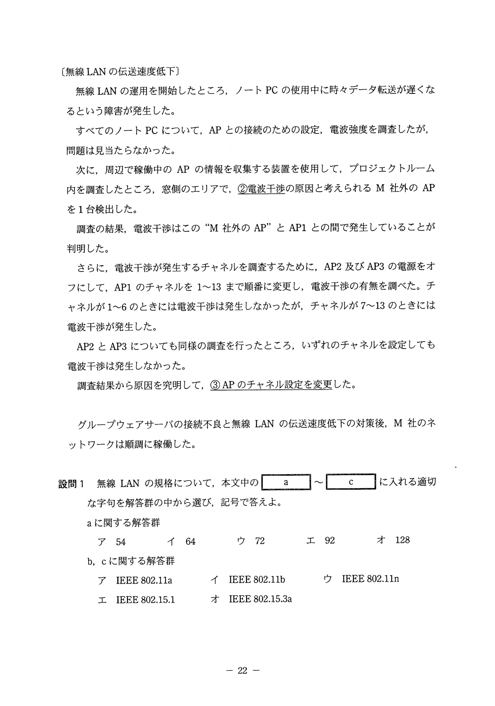

テキスト (OCR)

(無線 LAN の伝送速度低下〕

無線 LAN の運用を開始したところ, ノート PC の使用中に時々データ転送が遅くな
るという障害が発生した。

すべてのノート PC について, AP との接続のための設定, 電波強度を調査したが,
問題は見当たらなかった。

次に, 周辺で稼働中の AP の情報を収集する装置を使用して, プロジェクトルーム
内を調査したところ, 窓側のエリアで, ②電波干渉の原因と考えられる M 社外の AP
を1台検出した。

調査の結果, 電波干渉はこの “M 社外の AP” と AP1 との間で発生していることが
判明した。

さらに, 電波干渉が発生するチャネルを調査するために, AP2 及び AP3 の電源をオ
フにして, AP1 のチャネルを 1て13 まで順番に変更し, 電波干渉の有無を調べた。チ
ャネルが 1へ6 のときには電波干渉は発生しなかったが, チャネルが 7て13 のときには
電波干渉が発生した。

AP2 と AP3 についても同様の調査行ったところ, いずれのチャネルを設定しても
電波干渉は発生しなかった。

調査結果から原因を究明して, ③ AP のチャネル設定を変更した。

グループウェアサーバの接続不良と無線 LAN の伝送速度低下の対策後, M 社のネ
ットワークは順調に稼働した。

設問1 無線 LAN の規格について, 本文中の|  a |一| c |に入れる適切
な字句を解答群の中から選び, 記号で答えよ。

a に関する解答群

ア 54    イ 64    ウ 72    xr 92    オ 128
b, cに関する解答群

ア IEEE 802.1la    イ IEEE 802.11b    ウ IEEE 802.11n

x IEEE 802.15.1     オ IEEE 802.15.3a

ー 22 一

### ページ 23

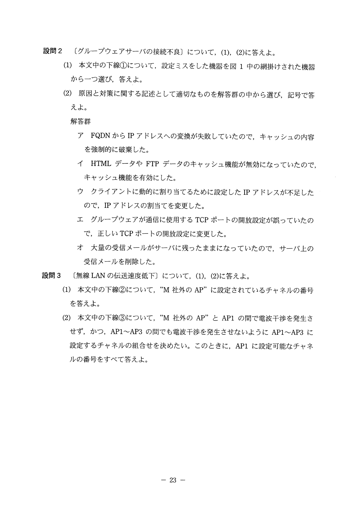

テキスト (OCR)

(グループウェアサーバの接続不良) について, (D, (2②)に答えよ。
Q) 本文中の下線やについて, 設定ミスをした機器を図 1 中の網掛けされた機器

から一つ選び, BAK.
(2) 原因と対策に関する記述として適切なものを解答群の中から選び,

設問2

記号で答

Gu

ア FQDN から IP アドレスへの変換が失敗していたので, キャッシュの内容

を強制的に破棄した。
イ HTML データや FIP データのキャッシュ機能が無効になっていたので,

キャッシュ機能を有効にした。
ウ クライアントに動的に割り当てるために設定した IP アドレスが不足した

OC, IP アドレスの割当てを変更した。
エ グループウェアが通信に使用する TCP ボートの開放設定が誤っていたの
設定に変更した。

で, 正しい TCP ポートの開放設定に
ールがサーバに残ったままになっていたので, サーバ上の

オ 大量の受信メ
受信メールを削除した。
設問3 【〔無線LAN の伝送速度低下] について, (1), (②)に答えよ。
に設定されているチャネルの番号

1) 本文中の下線②について, “M 社外の AP”

を答えよ。
(2) 本文中の下線③について, “M 社外の AP” と AP] の間で電波干渉を発生さ

せず, DD, API~AP3 の間でも電波干渉を発生させないように AP1へAP3 に
に設定可能なチャネ

AR,

設定するチャネルの組合せを決めたい。このときに,
ルの番号をすべて答えよ。

ー 23 一

### ページ 24

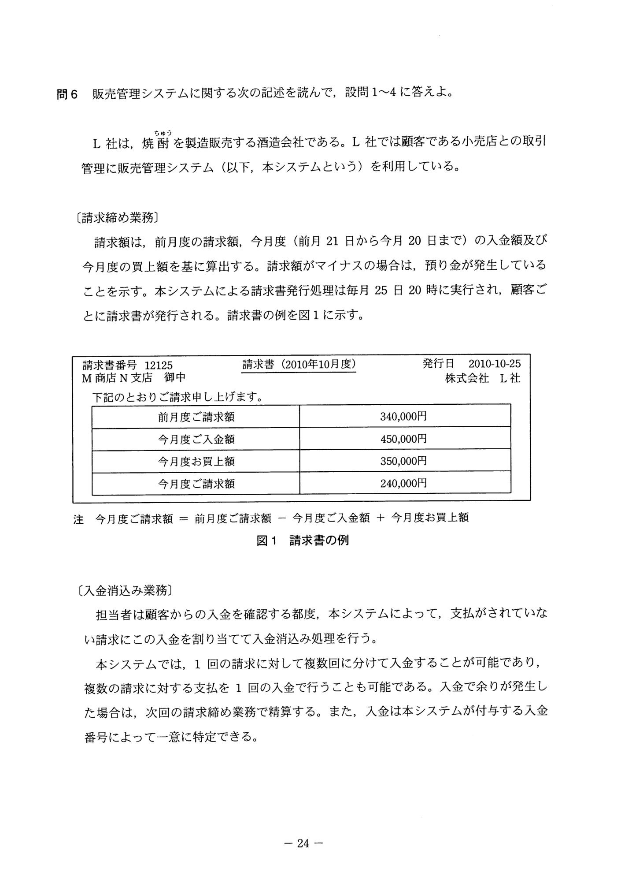

テキスト (OCR)

問6 販売管理システムに関する次の記述を読んで, 設問 1ー4 に答えよ。

L 社は, 焼呈を製造販売する酒造全社である。L 社では顧客である小売店との取引
管理に販売管理システム (以下本システムという) を利用している。

(請求締め業務]
請求額は, 前月度の請求額,    度 (前月 21 日から今月 20 日まで) の入金額及び

今月度の買上額を基に算出する。請求額がマイナスの場合は, 預り金が発生している
ことを示す。本システムによる請求書発行処理は毎月 25 日 20 時に実行され, 顧客ご
とに請求書が発行される。 請求書の例を図 1 に示す。

請求書番号 12125                請求書 (2010年10月度)               発行日 2010-10-25
M 商店N支店 御中        ーー             株式会社 L社
下記のとおりご請求申し上げます。

前月度ご請求額                                 340,000F4

今月度ご入金額             450,000円

今月度お買上額             350,000円

今月度ご請求額             240.000円

注 今月度ご請求額 前月度ご請求額一 今月度ご入金額 + 今月度お買上額

〔入金消込み業務

担当者は顧客からの入金を確認する都度, 本システムによって, 支払がされていな
い請求にこの入金を割り当てて入金消込み処理を行う。

本システムでは, 1 回の請求に対して複数回に分けて入金することが可能であり,
複数の請求に対する支払を 1 回の入金で行うことも可能である。 入金で余りが発生し
た場合は, 次回の請求締め業務で精算する。また, 入金は本システムが付与する入金
番号によって一意に特定できる。

ー 24 一

### ページ 25

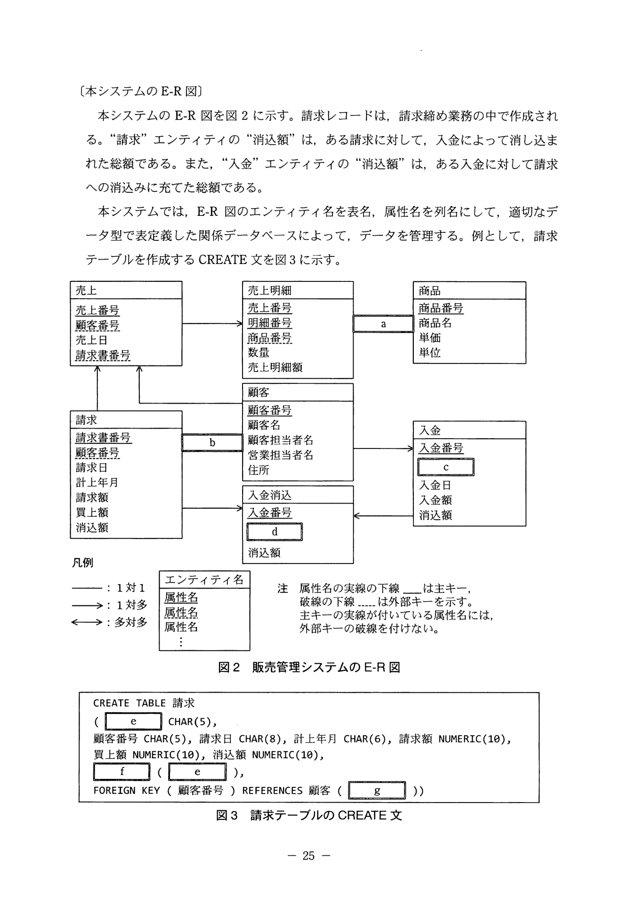

テキスト (OCR)

〔本システムのE-R 図]

本システムの ER 図を図 2 に示す。請求レコードは, 請求締め業務の中で作成され
る。 "請求" エンティティの HAR” ld, ある請求に対して, 入金によって消し込ま
れた総額であやる。また, “入金"エンティティの AM" Wd, ある入金に対して請求
への消込みに充てた総額である。

本システムでは, ER 図のエンティティ名を表名, 属性名を列名にして, 適切なデ
ータ型で表定義した関係データベースによって, データを管理する。例として, 請求
テーブルを作成する CREATE 文を図 3 に示す。

売上              売上明細            商品
売上番号                売上番号                商品番号
巴客番号                明細番号           a    商品名
請求書番号           数量              単位
売上明細額
He
題客番号
wee
Ke
1 | See,             ー
me   we =               入金番号
営業担当者名          ES
住所              Lc
=           Kee
入金消込                入金額
Agi          WA
[oa]
ns
mu                me
: 1対+ トーンティテイ名| s peoxmorm__ mee,
ーー > : 194 | SES         破線の下線 は外部キーを示す。
<>. 33 | BES             主キーの実線が付いている属性名には。
|同性名             外部キーの破線を付けない。

 2 販売管理レステムの E-R

CREATE TABLE 請求

(L_e cat(5),

顧客番号 CHAR(5), 請求日 CHAR(8), 計上年月 CHAR(6), 請求額 NUMERIC(19) ,
買上額 NUMERIC(19), 消込額 NUMERIC(19) ,

L 7 ce ee

FOREIGN KEY ( 顧客番号 ) REFERENCES 顧客 ( ))

 3 請求テーブルの CREATE 文

ー 25 一

### ページ 26

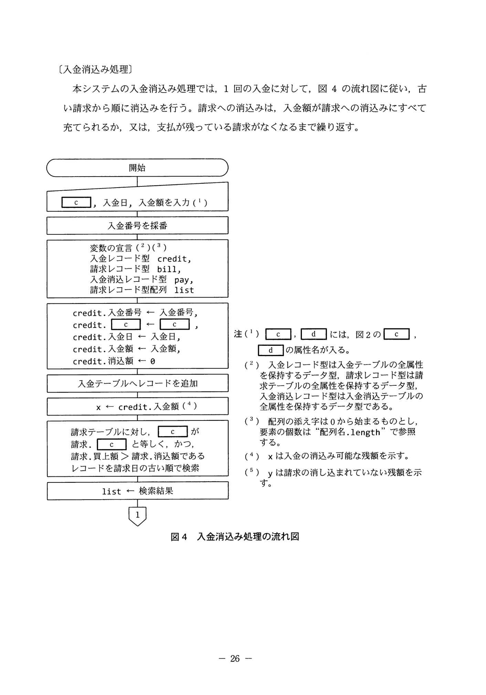

テキスト (OCR)

[入金消込み処理

本システムの入金消込み処理では, 1 回の入金に対して, 図 4 の流れ図に従い, 古
い請求から順に消込みを行う。請求への消込みは, 入金額が請求への消込みにすべて
充てられるか, Mid, 支払が残っている請求がなくなるまで繰り返す。

(     i     )
re ee

[し< ], 入金日, 入金額を入力(「)
i
入金番号を採番
I
BUDGE (2 )(*)
入金レコード型 credit,
請求レコード型 bill,
入金消込レコード型 pay,
請求レコード型配列 list
I
credit. 入金番号 — 入金番号,

credit. ー ,

credit. A&A — ASA,        #C) Ce], しす] には, meole],
credit.入金額 <— 入金額,               [し3 ] の属性名が入る。
credit. HAM — 0                 (2) 入金レコード型は入金テーブルの全属性
=     ーーーーー          を保持するデータ型, 請求レコード型は請
入金テーブルヘレコードを追加              求テーブルの全必性を保持するデータ型,
              入金消込レコード型は入金消込テーブルの
x で credit.入金額(*)              全属性を保持するデータ型である。

                   (? ) 配列の添え字は0から始まるものとし,
請求テーブルに対し,[ c ]が           要素の個数は “AZ. length” THK
請求. と等しく, かつ,           する。

APR. ELE > 請求.消込額である      (4) x は入金の消込み可能な残額を示す。
a7 PERERA OBIT CRR     (? ) yは請求の消し込まれていない残額を示
す。

list て 検索結果

9

図4 入金消込み処理の流れ図

ー 26 一

### ページ 27

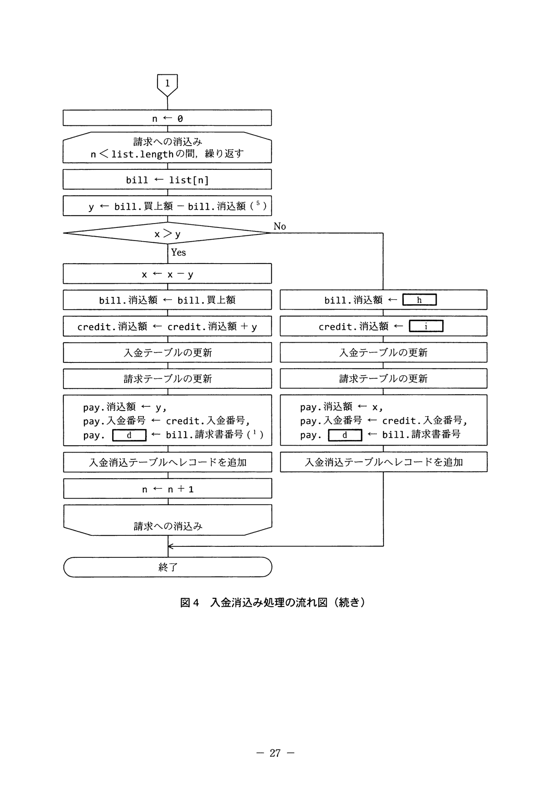

テキスト (OCR)

Y

nてと 9@     |

L
請求への消込み
nぐ1ist.1engthの間, 繰り返す

bill て 1ist[n]

y で bill. BE — bill. 消込額(* )

N
x>y        っ

Yes

x デxーy

bill. HAM 一 bill. 買上額

bi11.消込額
i

credit. iA <— credit. HAM + y

credit. iA <—

I

I

入金テーブルの更新

入金テーブルの更新

I

請求テーブルの更新

請求テーブルの更新

I

pay. HAR < y,
pay. A@BS 一 credit.入金番号,
pay・[ d ] ~ bi11.請求書番号(! )

pay. HA <— x,
pay・入金番号 て credit.入金番号
pay・[ d ] ~ bi11.請求書番号

[

入金消込テーブルヘレコードを追加

入金消込テーブルヘレコードを追加

nnロ十1

請求への消込み

終了

う

図4 入金消込み処理の流れ図 (続き)

ー 27 一

### ページ 28

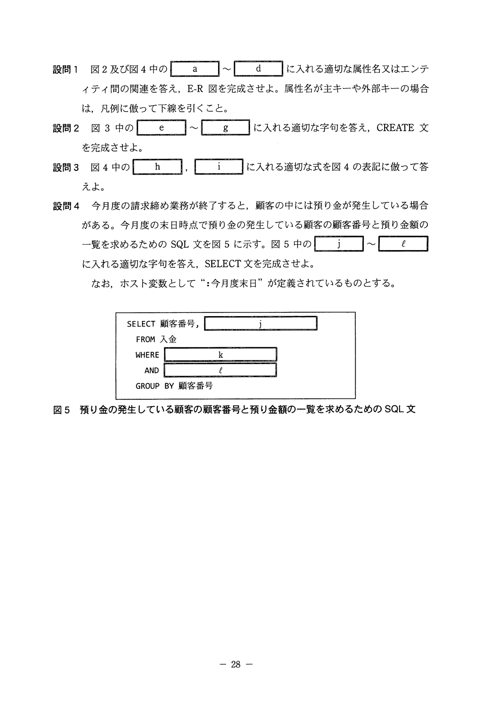

テキスト (OCR)

設問1 図2及び図4中の| a |~|  d |に入れる適切な属性名又はエンテ
ィティ間の関連を答え, ER 図を完成させよ。属性名が主キーや外部キーの場合
は, 凡例に條って下線を引くこと。

設問2 図 3 中の|  e |~l  g |に入れる適切な字句を答え, CREATE 文
を完成させよ。

設問3 図4中の| bh |,| i |に入れる適切な式を図 4 の表記に條って答
えよ。

設問4 今月度の請求締め業務が終了すると, 顧客の中には預り金が発生している場合
がある。今月度の末日時点で預り金の発生している顧客の顧客番号と預り金額の
一覧を求めるための SQL 文を図 5 に示す。図5中の| j |^| Z% |
に入れる適切な字句を答え, SELECT 文を完成させよ。
なお, ホスト変数として “:今月度末日" が定義されているものとする。

SELECT 顧客番号, |          j          |
FROM 入金

WHERE  |               k               |
AND [                ?               ]

GROUP BY 顧客番号

 5 預り金の発生している顧客の顧客番号と預り金額の一覧を求めるための SQL 文

ー 28 一

### ページ 29

テキスト (OCR)

【 メモ 用 紙 〕

### ページ 30

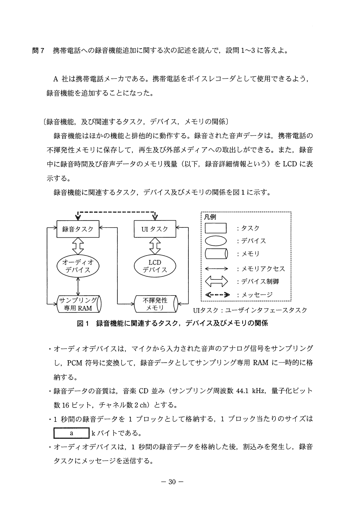

テキスト (OCR)

問7 携帯電話への録音機能追加に関する次の記述を読んで, 設問 1ご3 に答えよ。

A 社は携帯電話メーカである。携帯電話をボイスレコーダとして使用できるよう,
録音機能を追加することになった。

(録音機能, 及び関連するタスク, デバイス, メモリの関係〕

録音機能はほかの機能と排他的に動作する。 録音された音声データは, 携帯電話の
不揮発性メモリに保存して, 再生及び外部メディアへの取出しができる。また, RF
中に録音時間及び音声データのメモリ残量 (以下, 録音詳細情報という) を LCD に表
示する。

録音機能に関連するタスク, デバイス及びメモリの関係を図 1 に示す。

\                \          凡例
| 録音タスク        タスク      | | :タスク
CD テバイメ
(0  : メモリ
Gee)      — >  : メモリアクセス
> : デバイス制御

i Seed : メッセージ
リンブリンク|      不揮発性 (|    に       ーー
専用RAM           メモリ      USA : ユーザインタフェースタスク

図1 録音機能に関連するタスク, デバイス及びメモリの関係

・オーディオデバイスは, マイクから入力された音声のアナログ信号をサンプリング
し, PCM 符号に変換して, 録音データとしてサンプリング専用 RAM に一時的に格
納する。
録音データの音質は, 音楽 CD 並み (サンプリング周波数 44.1 kHz, 量子化ビット
数 16 ビット, チャネル数 2 ch) とする。

・1 秒間の録音データを 1 ブロックとして格納する, 1 ブロック当たりのサイズは
[oa kth cas.

・オーディオデバイスは, 1 秒間の録音データを格納した後, 割込みを発生し, 録音
タスクにメッセージを送信する。

ー 30 一

### ページ 31

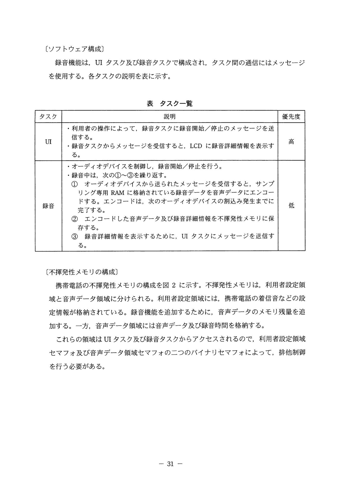

テキスト (OCR)

〔ソフトウェア構成〕
録音機能は, UI タスク及び録音タスクで構成され, タスク間の通信にはメッセージ
を使用する。各タスクの説明を表に示す。

表 タスク一覧
タスク                 説明                 優先度
・利用者の操作によって, 録音タスクに録音開始停止のメッセージを送
TL   信する。                                6
・録音カスクからメッセージを受信すると, LCD に録音詳細情報を表示す
る。
・オーディオデバイスを制御し, 録音開始/停止を行う。
・録音中は, 次の①て③を繰り返す。
① オーディオデバイスから送られたメッセージを受信すると, サンプ
リング専用 RAM に格納されている録音データを音声データにエンコー
ドする。エンコードは, 次のオーディオデバイスの割込み発生までに
録音    ー                                  低
完了する。
@ エンコードした音声データ及び録音詳細情報を不揮発性メモリに保
存する。
@ 録音詳細情報を表示するために, UI タスクにメッセージを送信す
る。
〔不揮発性メモリの構成]

携帯電話の不揮発性メモリの構成を図 2 に示す。不揮発性メモリは, 利用者設定領
域と音声データ領域に分けられる。利用者設定領域には, 携帯電話の着信音などの設
定情報が格納されている。録音機能を追加するために, 音声データのメモリ残量を追
加する。一方, 音声データ領域には音声データ及び録音時間を格納する。

これらの領域は UI タスク及び録音カタスクからアクセスされるので, 利用者設定領域
セマフォ及び音声データ領域シセマフォの二つのバイナリセマフォによって, 排他制御
を行う必要がある。

ー 31 一

### ページ 32

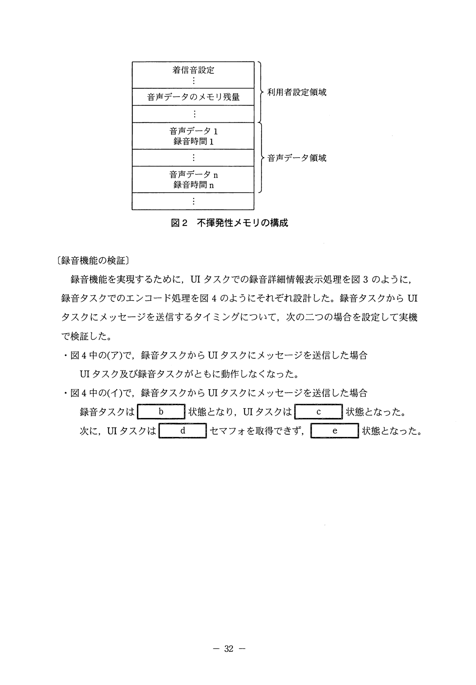

テキスト (OCR)

着

=
6
1
2

設定

音声データのメモリ残量

/ 利用者設定領域

図2 不揮発性メモリの構成

(録音機能の検証

録音機能を実現するために, UI タスクでの録音詳細情報表示処理を図 3 のように,
録音タスクでのエンコード処理を図 4 のようにそれぞれ設計した。録音タスクから UI

タスクにメッセージを送信するタイミングについて, 次の二つの場合を設定して実機

で検証した。

・図4 中の(ア)で, 録音タスクから UI タスクにメッセージを送信した場合
UI タスク及び録音シスクがともに動作しなくなった。

・図4 中の(イ)で, 録音タスクから UI タスクにメッセージを送信した場合
録音タスクは| b |状態となり, UIタスクは[| c |状態となった。
次に, UI タスクは[| d | セマフォを取得できず, | c | 状態となった。

ー 32 一

### ページ 33

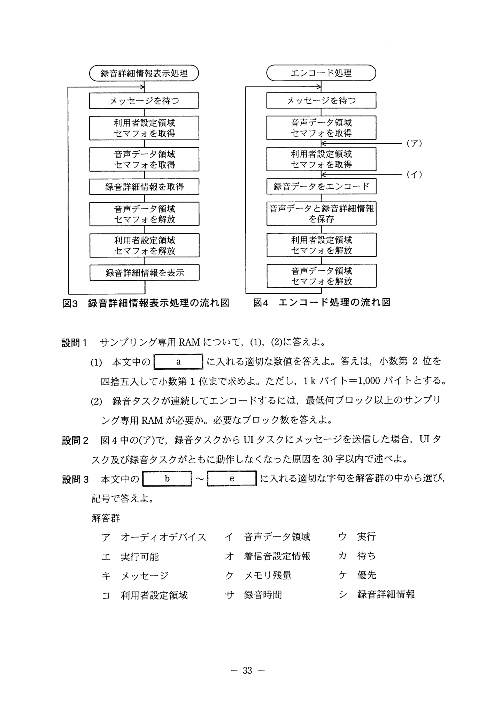

テキスト (OCR)

| メッセージを待つ |       | メッセージを待つ |
Hee aR             BRT —7 Be
セマフォを取得             セマフォを取得
|                   ドーーーーー — (7)
BRT 7 BR             AE
セマフォを取得             セマフォを取得
I                     ———— (1)
録音詳細情報を取得          録音データをエンコード
I
BRT 7 Gm           音声データと録音詳細情報
セマフォを解放               を保存
I
利用者設定領域             FABLE BUR
セマフォを解放             セマフォを解放
| 録音詳細情報を表示 |          FAT 7 GR
|                セマフォを解放
eS

図3 録音詳細情報表示処理の流れ図  図4 エンコード処理の流れ図

設問1 サンプリング専用 RAM について, (1), ②に答えよ。
@ 本文中の| 。 | に入れる適切な数値を答えよ。答えは, 小数第 2 位を
四捨五入して小数第 1 位まで求めよ。ただし, 1 k バイト1.000 バイトとする。
⑫) 録音タスクが連続してエンコードするには, 最低何ブロック以上のサンプリ
ング専用 RAM が必要か。必要なブロック数を答えよ。
設問2 図4中の(ア)で, 録音タスクから UIタスクにメッセージを送信した場合, UI タ
スク及び録音タスクがともに動作しなくなった原因を 30 字以内で述べよ。
設問3 本文中の| b |~[  e |に入れる適切な字句を解答群の中から選び

記号で答えよ。
解答群
ア オーディオデバイス イ 音声データ領域   ウ 実行
エ 実行可能       オ 着信音設定情報   カカ 待ち
キ メッセージ      ク メモリ残量     ケ 優先
コ 利用者設定領域    サ 録音時間      シ 録音詳細情報

ー 33 一

### ページ 34

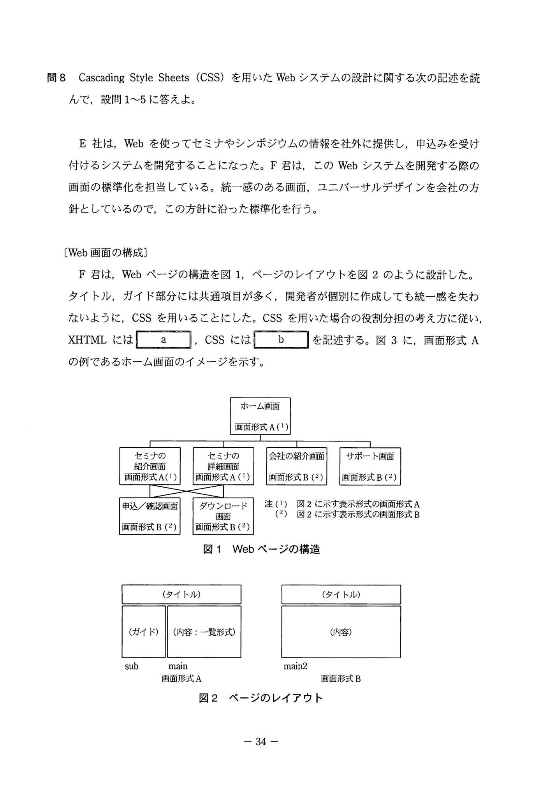

テキスト (OCR)

問8 Cascading Style Sheets (CSS) を用いた Web システムの設計に関する次の記述を読
んで, 設問 1ご5 に答えよ。

E 社は, Web を使ってセミナやシンポジウムの情報を社外に提供し, 申込みを受け
付けるシステムを開発することになった。F Bld, この Web システムを開発する際の
画面の標準化を担当している。 統一感のある画面, ユニバーサルデザインを会社の方
針としているので, この方針に沿った標準化を行う。

(Web 画面の構成

F 君は, Web ページの構造を図 , ページのレイアウトを図 2 のように設計した。
タイトル, ガイド部分には共通項目が多く, 開発者が個別に作成しても統一感を失わ
ないように, CSS を用いることにした。CSS を用いた場合の役割分担の考え方に従い,

XHTML には|  a |. css には| b | を記述する。図 3 に, 画面形式 A

の例であるホーム画面のイメージを示す。

ホーム画面
画面形式A(!)
[                           I             :             I                        コ
セミナの                セミナの           会社の紹介画面| | サポート画面
紹介画面               詳細画面
画面形式A(!)    画面形式A(!)    画面形式B (?)    画面形式B(?)
ニー
申込確認画面       ダウンロード | #C) 図2 に示す表示形式の画面形式A
本               2) 図2 に示す表示形式の画面形式 B
画面形式B (?)    画面形式B(?)
 1 Web ページの構造
(タイトル)                          (タイトル)
(ガイド) | (AS : 一覧形式)                                   (内容)
sub           main                                   main2
画面形式A                                            画面形式B

図2 ページのレイアウト

ー 34 一

### ページ 35

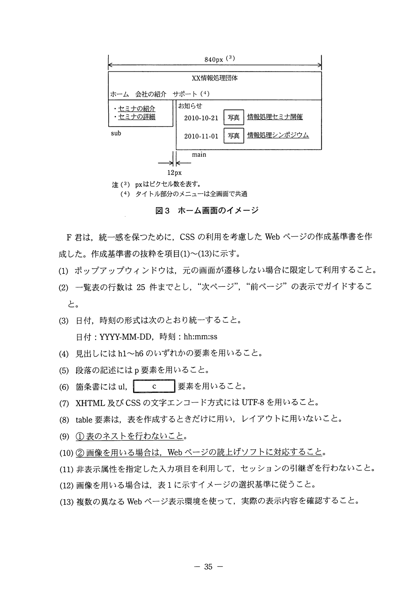

テキスト (OCR)

840px (③)
ホーム 会社の紹介 サポート (4)
・セミナの紹介   お知らせ
・セミナの詳細   2010-10-21 | 写真 | 情報処理セミナ開催
sub       2010-11-01 | 写真 | 情報負理シンポジウム

main

12px
注 (3③) pxはピクセル数を表す。
(3④) タイトル部分のメニューは全画面で共通

 3 ホーム画面のイメージ

F Bld, 統一感を保つために, CSS の利用を考慮した Web ページの作成基準書を作
MLE. 作成基準書の抜粋を項目(1)て(13)に示す。
(1) ポップアップウィンドウは, 元の画面が遷移しない場合に限定して利用すること。
(2) 一覧表の行数は 25 件までとし, “次ページ", “前ページ" の表示でガイドするこ
と。
(3) Att, 時刻の形式は次のとおり統一すること。
日付 : YYYY-MM-DD, 時刻 : hh:mm:ss
(4) 見出しには hI~h6 のいずれかの要素を用いること。
(5) 段落の記述には p 要素を用いること。
© 箇条書にはml |  c |要素を用いること。
(7) XHTML 及びCSS の文字エンコード方式には UTF-8 を用いること。
(8) table 要素は, 表を作成するときだけに用い, レイアウトに用いないこと。
9) ①表のネストを行わないこと。
(10) ②画像を用いる場合は, Web ページの読上げソフトに対応すること。
(11) 非表示属性を指定した入力項目を利用して, セッションの引継ぎを行わないこと。
(12) 画像を用いる場合は, 表 1 に示すイメージの選択基準に従うこと。
(13) 複数の異なる Web ページ表示環境を使って, 実際の表示内容を確認すること。

ー 35 一

### ページ 36

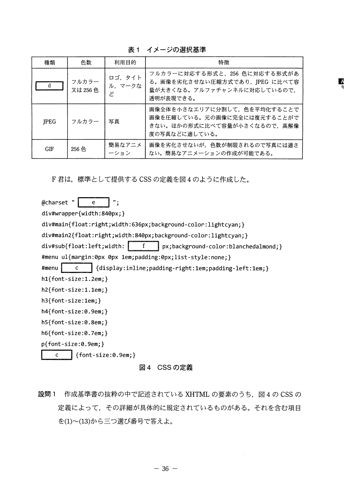

テキスト (OCR)

表1 イメージの選択基準

種類           色数          利用目的                                  特徴

ロゴ。タイト  フルカラーに対応する形式と, 256 色に対応する形式があ
にュ」  フルカラー  ル, マークな  る。画像を劣化させない圧縮方式であり, JPEG に比べて容

又は 256 色   内        量が大きくなる。アルファチャンネルに対応しているので,
透明が表現できる。

画像全体を小さなエリアに分割して, 色を平均化することで
画像を圧縮している。元の画像に完全には復元することがで
きない。ほかの形式に比べて容量が小さくなるので, 高解像
度の写真などに適している。

JPEG        フルカラー | 写真

簡易なはアニメ | 画像を劣化させないが, 色数が制限されるので写真には適さ

GIF | 256 &     ーション | ない。 簡易なアニメーションの作成が可能である。

F 君は, 標準として提供する CSS の定義を図 4 のように作成した。

@charset " ie | "5

div#wrapper{width : 84@px; }

divi#main{ float :right ; width: 636px; background-color: lightcyan; }
divi#main2{float:right ; width: 84@px; background-color: lightcyan; }
divi#sub{float:left;width: px; background-color: blanchedalmond; }
#menu ul{margin:@px 9px lem; padding: @px;list-style:none; }

」    ! {display: inline; padding-right: 1em:padd1ing- 1eft: 1em:}
h1{font-size:1.2em;}

h2{font-size:1.1em; }

h3{font-size:1em;}

h4{font-size:@.9em; }

h5{font-size:@.8em; }

h6{font-size:@.7em; }

p{font-size:0.9em; }

 {font-size:0.9em;}

 4 CSS の定義
設問1 作成基準書の抜粋の中で記述されている XHTML の要素のうち, 図4 のCSS の

定義によって, その詳細が具体的に規定されているものがある。それを含む項目
を(①てQ①3)から三つ選び番号で答えよ。

ー 36 一

### ページ 37

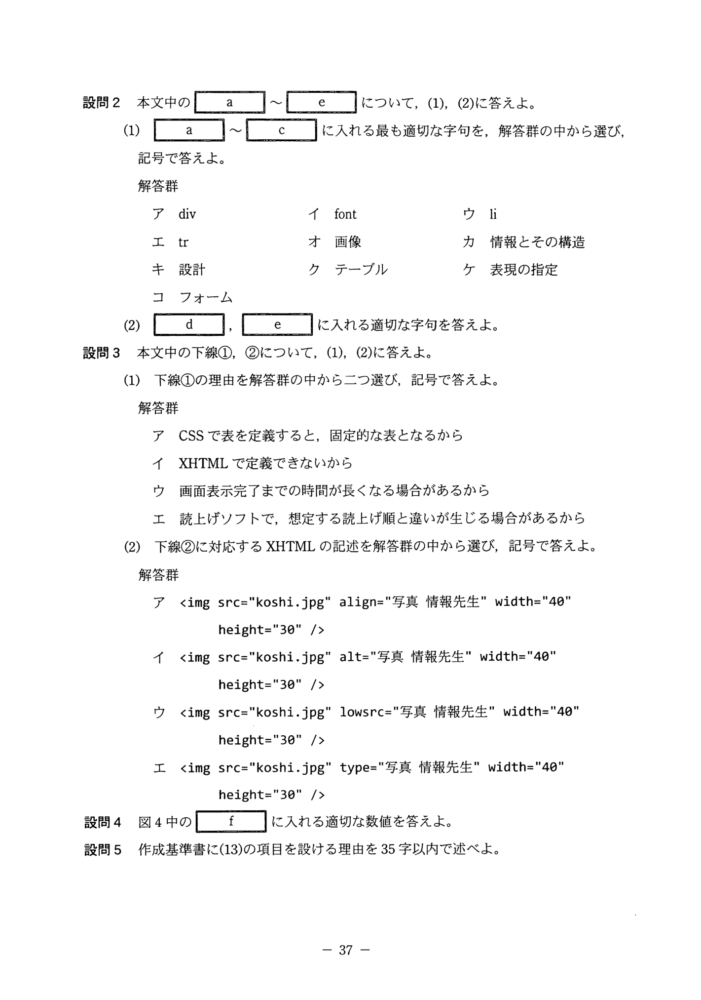

テキスト (OCR)

設問2 本文中の|  a |~|  e |について, Q①, @②)に答えよ。

Q① [oa |て|  c |に入れる最も適切な字句を, 解答群の中から選び,
記号で答えよ。
解答群
ア div      イ font      ウ ii
エ fr        オ 画像       A 情報とその構造
キ 設計      ク テーブル     ケ 表現の指定
コ フォーム
a | 4 1 | e |に入れる適切な字句を答えよ。

設問3 本文中の下線①〇, ②について, ①), ②に答えよ。
GQ) 下線①の理由を解答群の中から二つ選び, 記号で答えよ。
解答群
ア CSS で表を定義むすると, 固定的な表となるから
4 XHTML で定義できないから
ウ 画面表示完了までの時間が長くなる場合があるから
LL 読上げソフトで, 想定する読上げ順と違いが生じる場合があるから
(2) 下線②に対応する XHTML の記述を解答群の中から選び, 記号で答えよ。
解答群
ア 
4 
ウ 
エ 
設問4 図4中の[ f | に入れる適切な数値を答えよ。

設問5 作成基準書に(13)の項目を設ける理由を 35 字以内で述べよ。

ー 37 一

### ページ 38

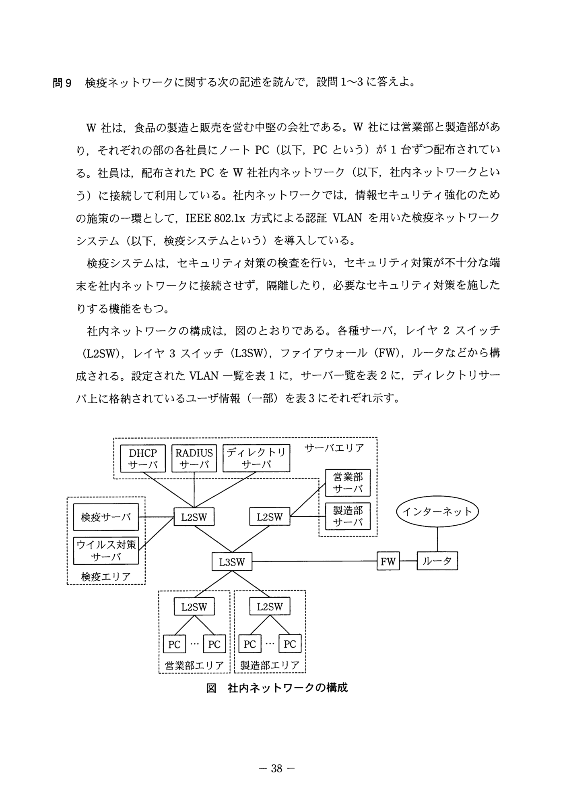

テキスト (OCR)

問9 検疫ネットワークに関する次の記述を読んで, 設問 1て3 に答えよ。

W 社は, 食品の製造と販売を営む中堅の会社である。W 社には営業部と製造部があ
り, それぞれの部の各社員にノート PC (以下, PC という) が 1 台ずつ配布されてい
る。社員は, 配布された PC を W 社社内ネットワーク (以下, 社内ネットワークとい
う) に接続して利用している。社内ネットワークでは, 情報セキュリティ強化のため
の施策の一環として, IEEE 802.1x 方式による認証 VLAN を用いた検疫ネットワーク
システム (以下, 検疫システムという) を導入している。

RBRY ATA, セキュリティ対策の検査を行い セキュリティ対策が不十分な端
未を社内ネットワークに接続させず, 隔離したり, 必要なセキュリティ対策を施した
りする機能をもつ。

社内ネットワークの構成は, 図のとおりである。各種サーバ, レイヤ 2 スイッチ

(L2SW), レイヤ 3 スイッチ (L3SW), ファイアウォール (FW), ルータなどから構
成される。設定された VLAN 一覧を表 1 に, サーバ一覧を表 2 に, ディレクトリサー
バ上に格納されているユーザ情報 (一部) を表 3 にそれぞれ示す。

DHCP | [RADrUs | |ディレクトリ| サーパエリア
サーバ | | サーバ  サーバ
ーーーー    営業部 |
サーバ |
ー人へ                   製造部 | | (インターネット
(tA NN
(Las                 Fwトゴルータ
検疫エリア

| 営業部エリア | 製造部エリア

  社内ネットワークの構成

ー 38 一

### ページ 39

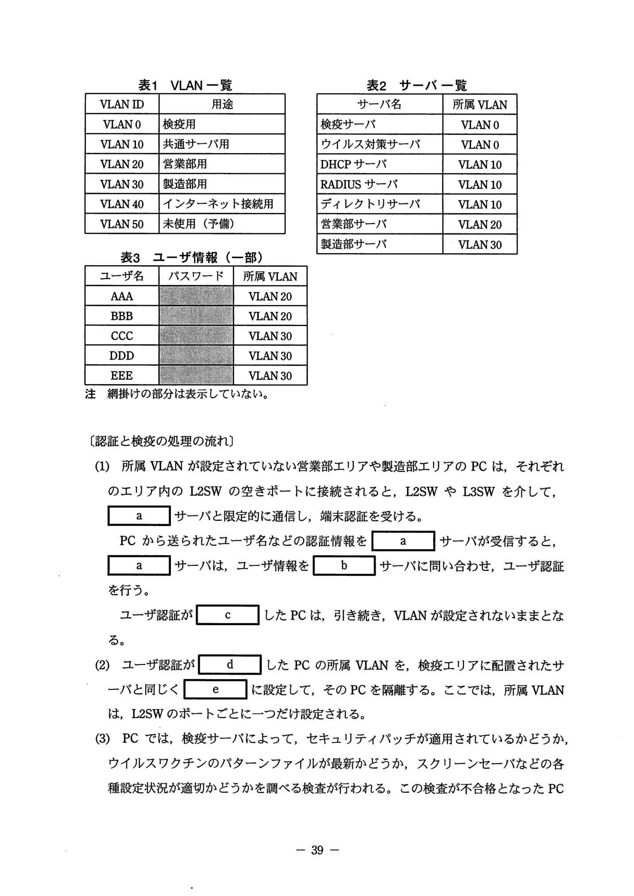

テキスト (OCR)

表1 VLAN一覧         表2 サーバー一覧
VLAN ID               用途                            サーバ名            所属 VLAN
VLANO |検疫用            検疫サーバ        VLAN 0
VLAN10 |共通サーバ用                     ウイルス対策サーバ         VLAN0
VLAN20 |営業部用                                    DHCP サーバ                      VLAN10
VLAN30 |製造部用                                  RADIUS サーバ                  VLAN10
VLAN40 |インターネット接続用    ディレクトリサーバ   VLAN10
VLAN50 |未使用 (予備)        営業部サーバ       VLAN20
製造部サーバ       VLAN30
表3 ユーザ情報 (一部)
ユーザ名 | パスワード | 所属VLAN
AAA | | ~VLAN20
BBB               VLAN 20
ccc               VLAN 30
DDD               VLAN 30
EEE     VLAN 30

注 網掛けの部分は表示してい

【認証と検送の処理の流れ〕

(1) 所属 VLAN が設定されていない営業部エリアや製造部エリアの PC は, それぞれ
のエリア内の L2SW の空きボートに接続されると, L2SW や L3SW を介して,
[a | サーバと限定的に通信し, 端末認証を受ける。

PC から送られたユーザ名などの認証情報を | 。 | サーバが受信すると,
| 。 | サーバは, ユーザ情報を | b | サーバに問い合わせ, ユーザ認証
を行う。

ユーザ認証が| c | したPCは, 引き続き, VLANが設定されないままとな

る。

@) ユーザ認証が| d | したPCの所属 VLANを, 検疫エリアに配置されたサ
ーバと同じく |  e  ] に設定して, そのPCを隔離する。ここでは, 所属 VLAN

ない。

td, L2SW のポートごとに一つだけ設定される。

(3) PC では, 検着サーバによって, セキュリティパッチが適用されているかどうか,
ウイルスワクチンのパターンファイルが最新かどうか, スクリーンセーバなどの各
種設定状況が適切かどうかを調べる検査が行われる。この検査が不合格となった PC

ー 39 一

### ページ 40

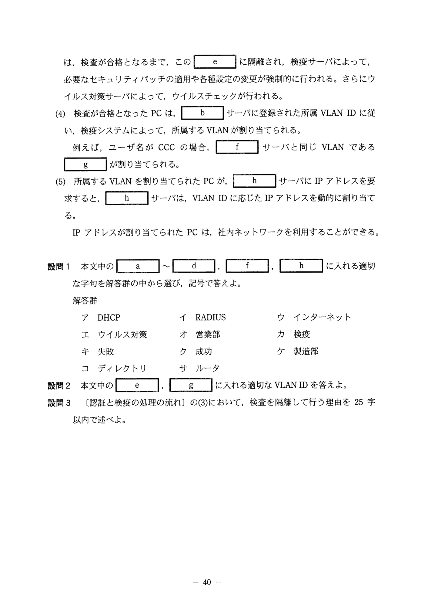

テキスト (OCR)

は, 検査が合格となるまで, この| ce | に隔離され, 検症サーバによって,
必要なセキュリティパッチの適用や各種設定の変更が強制的に行われる。さらにウ
イルス対策サーバによって, ウイルスチェックが行われる。

(④ 検査が合格となった PC は, | b | サーバに登録された所属 VLANID に従
い, BEY ATFAICKT, 所属する VLAN が割り当てられる。

例えば, ユーザ名が CCC OBA, サーバと同じ VLAN である
| g | が割り当てられる。

(5) 所属する VLAN を割り当てられた PC が, | h |] サーバにITP アドレスを要
求すると, | h | サーバは, VLAN IDに応じたIP アドレスを動的に割り当て
る。

TP アドレスが割り当てられた PC は, 社内ネットワークを利用することができる。

設問1 本文中の| a |~|  d |,| f |.| bh |に入れる適切
な字句を解答群の中から選び, 記号で答えよ。
解答衝
ア DHCP      イ RADIUS     ウ インターネット
エ ウイルス対策    オ 営業部       カ 検疫
キ 失敗        ク 成功        ケ 製造部
コ ディレクトリ    サ ルータ

設問2 本文中の| ie |,|  g |に入れる適切な VLANIDを答えよ。
設問3 認証と検疫の処理の流れ〕 の(3)において, 検査を隔離して行う理由を 25 字
以内で述べよ。

ー 40 一

### ページ 41

テキスト (OCR)

【 メモ 用 紙 〕

ー 41 一

### ページ 42

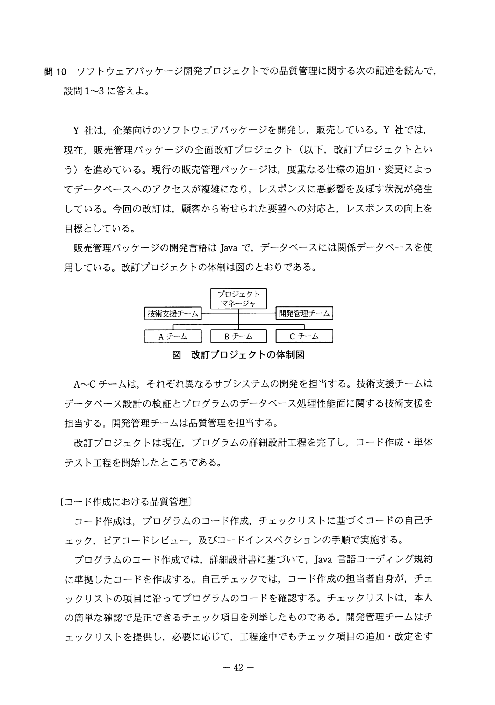

テキスト (OCR)

A10 ソフトウェアパッケージ開発プロジェクトでの品質管理に関する次の記述を読んで,

設問 1て3 に答えよ。

Y 社は, 企業向けのソフトウェアパッケージを開発し, 販売している。Y 社では,
WE, 販売管理パッケージの全面改訂プロジェクト (以下, 改訂プロジェクトとい
う) を進めている。現行の販売管理パッケージは, 度重なる仕様の追加・変更によっ
てデータベースへのアクセスが複雑になり, レスポンスに悪影響を及ぼす状況が発生
している。 今回の改訂は, 顧客から寄せられた要望への対応と, レスポンスの向上を
目標としている。

販売管理パッケージの開発言語は Java で, データベースには関係データベースを使
用している。改訂プロジェクトの体制は図のとおりである。

プロジェクト
マネージャ
     人管理チーム
[              1
| 4チーム | | pra | | cチテム |

   改訂プロジェクトの体制図

A<C チームは, それぞれ異なるサブシステムの開発を担当する。技術支援チームは
データベース設計の検証とプログラムのデータベース処理性能面に関する技術支援を
担当する。開発管理チームは品質管理を担当する。

改訂プロジェクトは現在, プログラムの詳細設計工程を完了し, コード作成・単体
テスト工程を開始したところである。

〔コード作成における品質管理

コード作成は, プログラムのコード作成。チェックリストに基づくコードの自己チ
ェック, ピアコードレビュー, 及びコードインスペクションの手順で実施する。

プログラムのコード作成では, 詳細設計書に基づいて, Java 言語コーディング規約
に準拠したコードを作成する。自己チェックでは, コード作成の担当者自身が, チェ
ックリストの項目に沿ってプログラムのコードを確認する。チェックリストは, 本人
の簡単な確認で是正できるチェック項目を列挙したものである。 開発管理チームはチ
ェエックリストを提供し, 必要に応じて, 工程途中でもチェック項目の追加・改定をす

ー 42 一

### ページ 43

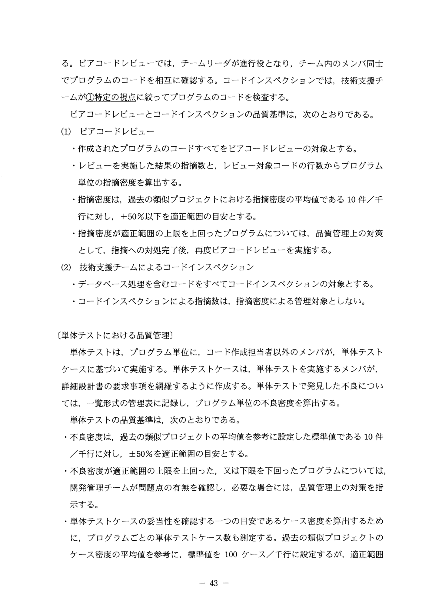

テキスト (OCR)

る。ピアコードレビューでは, チームリーダが進行役となり, チーム内のメンバ同士
でプログラムのコードを相互に確認する。コードインスペクションでは, 技術支援チ
ームが①特定の視点に絞ってプログラムのコードを検査する。
ピアコードレビューとコードインスペクションの品質基準は, 次のとおりである。
Q①) ピアコードレビュー
・作成されたプログラムのコードすべてをピアコードレビューの対象とする。
・レビューを実施した結果の指摘数と, レビュー対象ユードの行数からプログラム
単位の指摘密度を算出する。
・指摘密度は, 過去の類似プロジェクトにおける指摘密度の平均値である 10 件プ千
行に対し, 十50%以下を適正範囲の目安とする。
・指摘密度が適正範囲の上限を上回ったプログラムについては, 品質管理上の対策
として, 指摘への対処完了後, 再度ピアコードレビューを実施する。
(2) 技術支援チームによるコードインスペクション
・データベース処理を含むコードをすべてコードインスペクションの対象とする。
・コードインスペクションによる指摘数は, 指摘密度による管理対象としない。

(単体テストにおける品質管理〕
単体テストは, プログラム単位に, コード作成担当者以外のメンバが, 単体テスト
ケースに基づいて実施する。 単体テストケースは, 単体テストを実施するメンバが
詳細設計書の要求事項を網維するように作成する。 単体テストで発見した不良につい
ては, 一覧形式の管理表に記録し, プログラバム単位の不良密度を算出する。
単体テストの品質基準は, 次のとおりである。
・不良密度は, 過去の類似プロジェクトの平均値を参考に設定した標準値である 10 件
ノ千行に対し, 土50%を適正範囲の目安とする。
・不良密度が適正範時の上限を上回った, 又は下限を下回ったプログラムについては,
開発管理チームが問題点の有無を確認し, 必要な場合には, 品質管理上の対策を指
示する。
・単体テストケースの妥当性を確認するーーつの目安であるケース密度を算出するため
に, プログラムごとの単体テストケース数も測定する。過去の類似プロジェクトの
ケース密度の平均値を参考に, 標準値を 100 ケースノ千行に設定するが, 適正範囲

ー 43 一

### ページ 44

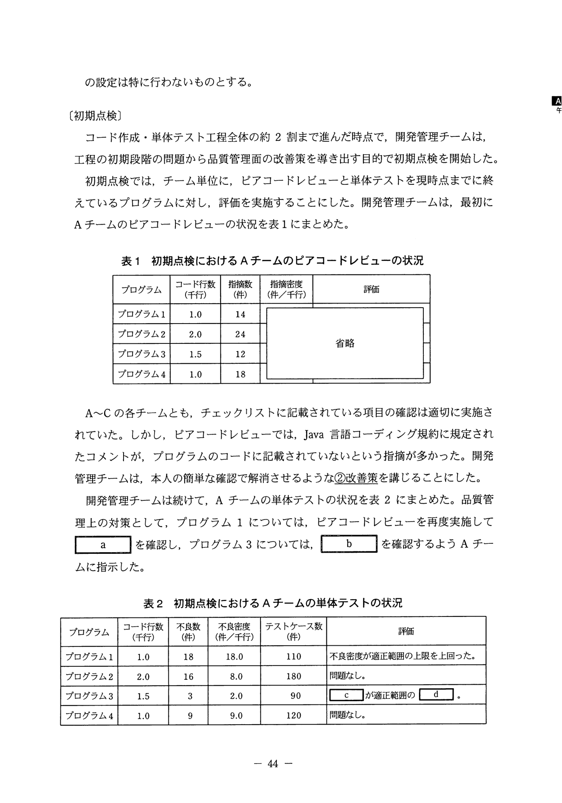

テキスト (OCR)

の設定は特に行わないものとする。

(初期点検]
コード作成・単体テスト工程全体の約 2 割まで進んだ時点で, 開発管理チームは,
工程の初期段階の問題から品質管理面の改善策を導き出す目的で初期点検を開始した。
初期点検では, チーム単位に, ピアコードレビューと単体テストを現時点までに終
えているプログラムに対し, 評価を実施することにした。開発管理チームは, 最初に
Aチームのピアコードレビューの状況を表 1 にまとめた。

表1 初期点検における Aチームのピアコードレビューの状況

=      コード行数 | 指摘数 | 指摘密度                #
ブログラム |” rey |) | EAE               Pil
プログラム1      1.0         14
四

プログラム 2      2.0         24

省略                  日
プログラム3      1.5         12
プログラム4| 1.0         18                 .

AWC の各チームとも, チェックリストに記載されている項目の確認は適切に実施さ
れていた。しかし, ピアコードレビューでは, Java 言語コーディング規約に規定され
たコメントが, プログラムのコードに記載されていないという指摘が多かった。 開発
管理チームは, 本人の簡単な確認で解消させるような②改善策を講じることにした。

開発管理チームは続けて, A チームの単体テストの状況を表 2 にまとめた。 HAE
理上の対策として, プログラム 1 については, ピアコードレビューを再度実施して
[a | を確認し, プログラム 3 については, を確認するよう A チー

ムに指示した。

表2 初期点検における Aチームの単体テストの状況

プログラム1        1.0           18           18.0              110         不良密度が適正範囲の上限を上回った。
プログラム 2  2.0   16   8.0   180  問題なし。

プログラム3| 1.5         3         2.0           90       (casero (“a_].
プログラム 4  1.0   9   9.0   120  問題なし。

### ページ 45

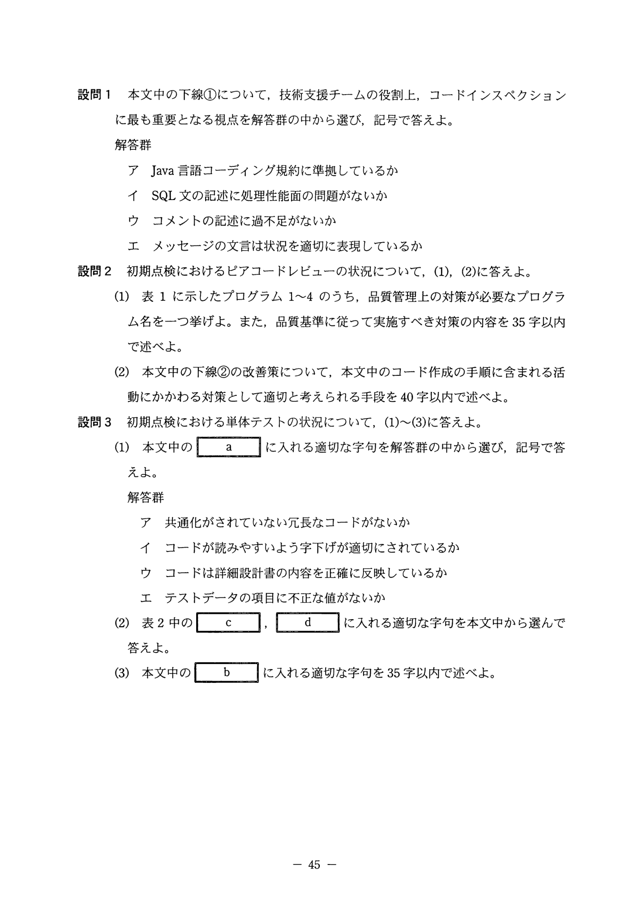

テキスト (OCR)

設問1 本文中の下線のについて, 技術支援チームの役割上, コードインスペクション
に最も重要となる視点を解答群の中から選び, 記号で答えよ。
解答群
ア Java 言語コーディング規約に準拠しているか
イ SQL 文の記述に処理性能面の問題がないか
ウ コメントの記述に過不足がないか
DL メッセージの文言は状況を適切に表現しているか
設問2 初期点検におけるピアコードレビューの状況について, (MD, (2②)に答えよ。
Q) 表 1 に示したプログラム 1て4 のうち, 品質管理上の対策が必要なプログラ
ム名を一つ挙げばよ。また, 品質基準に従って実施すべき対策の内容を 35 字以内
で述べよ。
(2) 本文中の下線②の改善策について, 本文中のコード作成の手順に含まれる活
動にかかわる対策として適切と考えられる手段を 40 字以内で述べよ。
設問3 初期点検における単体テストの状況について, ①)て(3③)に答えよ。
Q①) 本文中の に入れる適切な字句を解答群の中から選び, 記号で答

ア 共通化がされていない冗長なコードがないか
イ コードが読みやすいよう字下げが適切にされているか
ウ コードは詳細設計書の内容を正和に反映しているか
エエ テストデータの項目に不正な値がないか
2) 表2中の| c |,|  d |に入れる適切な字句を本文中から選んで
答えよ。

⑬) 本文中の に入れる適切な字句を 35 字以内で述べよ。

ー 45 一

### ページ 46

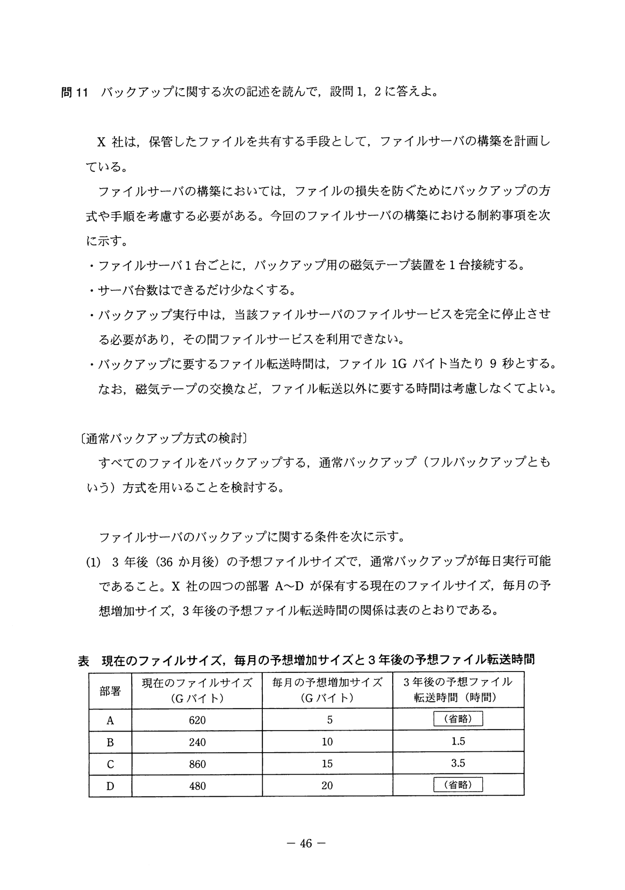

テキスト (OCR)

問11 バックアップに関する次の記述を読んで, 設問1, 2 に答えよ。

X 社は, 保管したファイルを共有する手段として, ファイルサーバの構築を計画し
ている。
ファイルサーバの構築においては, ファイルの損失を防ぐためにバックアップの方
式や手順を考慮する必要がある。 今回のファイルサーバの構築における制約事項を次
に示す。
・ファイルサーバ 1 台ごとに, バックアップ用の磁気テープ装置を 1 台接続する。
・サーバ台数はできるだけ少なくする。
・バックアップ実行中は, 当該ファイルサーバのファイルサービスを完全に停止させ
る必要があり, その間ファイルサービスを利用できない。
・バックアップに要するファイル転送時間は, ファイル 1G バイト当たり 9 秒とする。
なお, 磁気テープの交換など, ファイル転送以外に要する時間は考慮しなくてよい。

(通常バックアップ方式の検討]
すべてのファイルをバックアップする, 通常バックアップ (フルバックアップとも
いう) 方式を用いることを検討する。

ファイルサーバのバックアップに関する条件を次に示す。

(1) 3 年後 (36 DAK) の予想ファイルサイズで, 通常バックアップが毎日実行可能
であること。X 社の四つの部署 AD が保有する現在のファイルサイズ, 毎月の予
想増加サイズ, 3 年後の予想ファイル転送時間の関係は表のとおりである。

表 現在のファイルサイズ, 毎月の予想増加サイズと3 年後の予想ファイル転送時間

部時    現在のファイルサイズ | 毎月の予想増加サイズ    3 年後の予想ファイル
(G バイト)             (G バイト)          転送時間 (時間)
A                   620                               5
B                   240                              10                              15
C                   860                              15                              3.5
D                   480                             20

ー 46 一

### ページ 47

テキスト (OCR)

(⑫) 図の各部署のファイルサービス停止可能時間帯でバックアップを完了すること。
例えば, BE A は顧客をサポートする部署であり, ファイルサービスを 02:00~
06:00 の4時間に限って停止できる。

なお, 週末である土曜日 02:00 から月曜日 06:00 までの 52 時間は, どの部署もフ
ァイルサービスを停止できる。

時
部署    … 20 21 22 23 00 01 02 03 04 05 06 07 08…
A               renin
B     cman ames inser
c          am
D         ーーーーーー

   各部署のファイルサービス停止可能時間帯

3 年後,四つの部署の予想ファイルサイズの合計は| GT he, 通常パ
ックアップに要するファイル転送時間の合計は 時間になる。

ファイルサーバを 1 台のサーバで構築した場合全部署のファイルサービス停止可
能時間帯の条件を満たすことができない。2 台のサーバで構築し, 1 台のサーバを
| < Ja, もうぅ1台のサーバを残りの部暑が使えば. これらの条件を満たすこと
ができる。

(バックアップ方式の見直し〕
ファイルサーバ 1 台で構築できるよう, バックアップ方式を見直すことにした。月
に 1 度, 第 1 日曜日に通常バックアップを行い, そのほかの日は, 次に示す増分バッ
クアップ又は差分バックアップのいずれかを行う。
・増分バックアップ : 直前の通常バックアップ又は増分バックアップから追加・変更
のあったファイルだけをバックアップする。
・差分バックアップ : 直前の通常バックアップから追加・変更のあったファイルすべ
てをバックアップする。
バックアップ方式を決めるために, 次の 2 点について上記 2 方式を比較し, 検討し

ー 47 一

### ページ 48

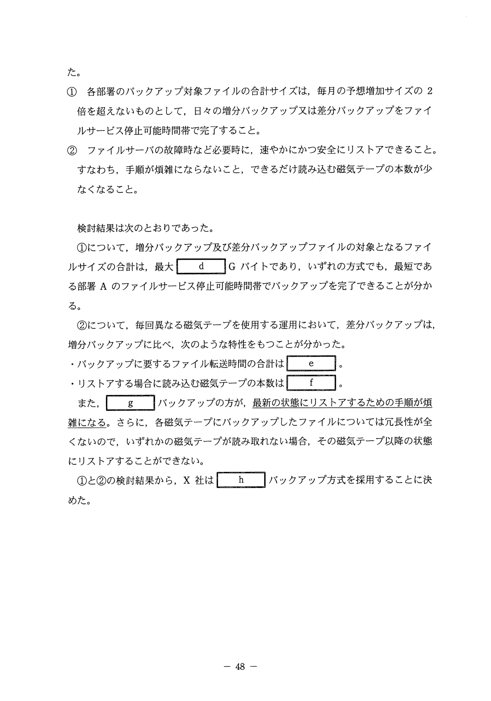

テキスト (OCR)

た。

① 各部署のバックアップ対象ファイルの合計サイズは, 毎月の予想増加サイズの 2
倍を超えないものとして, 日々の増分バックアップ又は差分バックアップをファイ
ルサービス停止可能時間帯で完了すること。

② ファイルサーバの故障時など必要時に, 速やかにかつ安全にリストアできること。
すなわち, 手順が類雑にならないこと, できるだけ読み込む磁気テープの本数が少
なくなること。

検討結果は次のとおりであった。

①について, 増分バックアップ及び差分バックアップファイルの対象となるファイ
ルサイズの合計は, 最大 [| d |G バイトであり, いずれの方式でも, 最短であ
BBE A A のファイルサービス停止可能時間帯でバックアップを完了できることが分か
る。

②について, 毎回異なる磁気テープを使用する運用において, 差分バックアップは,
増分バックアップに比べ, 次のような特性をもつことが分かった。
・パバックアップに要するファイル転送時間の合計は| e |。
・リストアする場合に読み込む磁気テープの本数は| f  ]。

ER, パックアップの方が, BRORBICY ALT T Sie O FMA
雑になる。さらに, 各磁気テープにバックアップしたファイルについては冗長性が全
くないので, いずれかの磁気テープが読み取れない場合, その磁気テープ以降の状態
にリストアすることができない。

①と②の検討結果から, X 社は バックアップ方式を採用することに決
めた。

### ページ 49

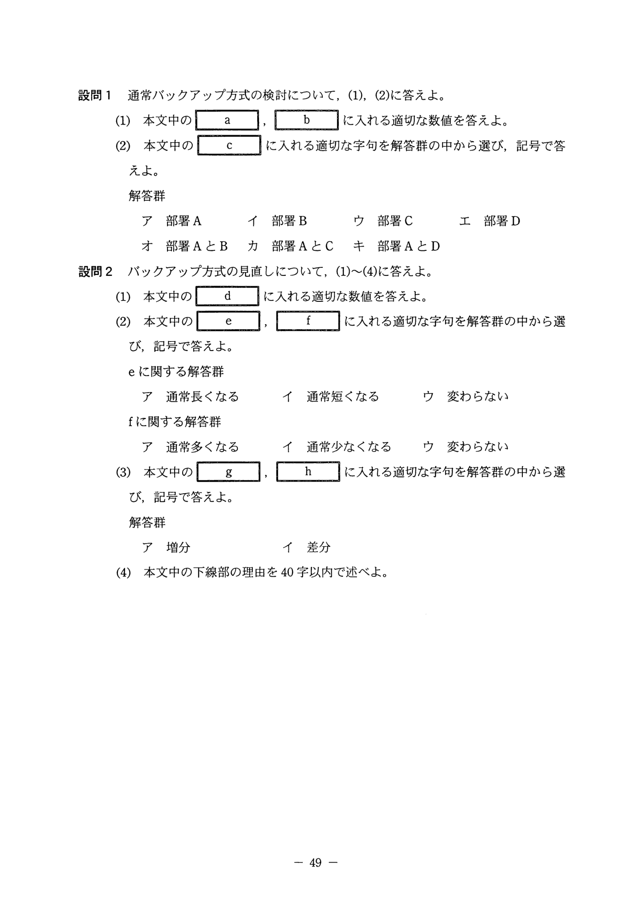

テキスト (OCR)

設問1 通常バックアップ方式の検討について, ①), ②)に答えよ。

Q①) 本文中の| a |,|  b |に入れる適切な数値を答えよ。
⑫) 本文中の| c |] に入れる適切な字句を解答群の中から選び, 記号で
えよ。

解答衝

ア MEA   4 EB   ウ HBC

オ 部署AとB

エ 部署D
A 部署A4とC + 部署A4とD
設問2

バックアップ方式の見直しについて, ①⑪~て(④に答えよ。
@ 本文中の[| d |] に入れる適切な数値を答えよ。
② 本文中の| e |[| 5

UO, 記号で答えよ。

| に入れる適切な字句を解答群の中から選
e に関する解答群

ア 通常長くなる

イ 通常短くなる   ウ 変わらない
f に関する解答群
ア 通常多くなる   イ 通常少なくなる  ウ 変わらない
3) 本文中の|  g |,| bh |に入れる適切な字句を解答群の中から選
び, 記号で答えよ。
解答群
ア 増分

イ 差分
4) 本文中の下線部の理由を 40 字以内で述べよ。

ー 49 一

### ページ 50

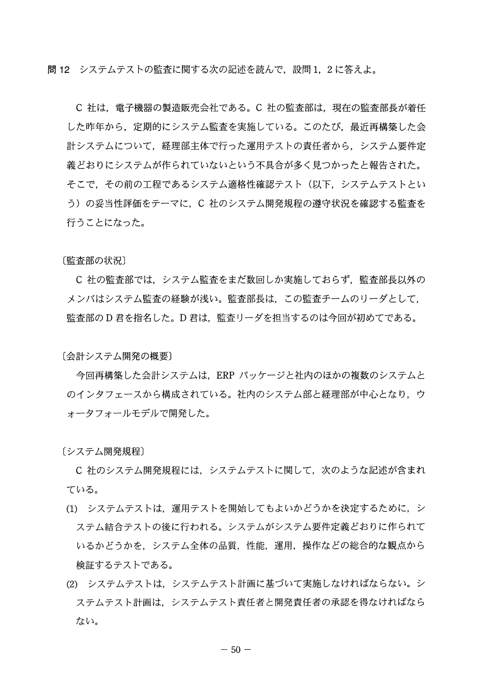

テキスト (OCR)

間 12 システムテストの監査に関する次の記述を読んで, 設問 1,2 に答えよ。

C 社は, 電子機器の製造販売会社である。C 社の監査部は, 現在の監査部長が着任
した昨年から, 定期的にシステム監査を実施している。このたび, 最近再構築した会
計システムについて, 経理部主体で行った運用テストの責任者から, システム要件定
義ごどおりにシステムが作られていないという不具合が多く見つかったと報告された。
そこで, その前の工程であるシステム適格性確認テスト (以下、システムテストとい
う) の妥当性評価をテーマに, C 社のシステム開発規程の遵守状況を確認する監査を
行うことになった。

(監査部の状況
C 社の監査部では, システム監査をまだ数回しか実施しておらず, 監査部長以外の
メンバはシステム監査の経験が浅い。監査部長は, この監査チームのリーダとして,
監査部の D 君を指名した。D 君は, 監査リーダを担当するのは今回が初めてである。

〔会計システム開発の概要〕

今回再構築した会計システムは, ERP パッケージと社内のほかの複数のシステムと
のインタフェースから構成されている。社内のシステム部と経理部が中心となり, ウ
ォータフォールモデルで開発した。

〔システム開発規程]

C 社のシステム開発規程には, システムテストに関して, 次のような記述が含まれ

ている。

GQ) システムテストは, 運用テストを開始してもよいかどうかを決定するために, シ
ステム結合テストの後に行われる。システムがシステム要件定義どおりに作られて
いるかどうかを, システム全体の品質, 性能, 運用, 操作などの総合的な観点から
検証するテストである。

(2) システムテストは, システムテスト計画に基づいて実施しなければならない。シ
ステムテスト計画は. システムテスト責任者と開発責任者の承認を得なければなら
ない。

ー 50 一

### ページ 51

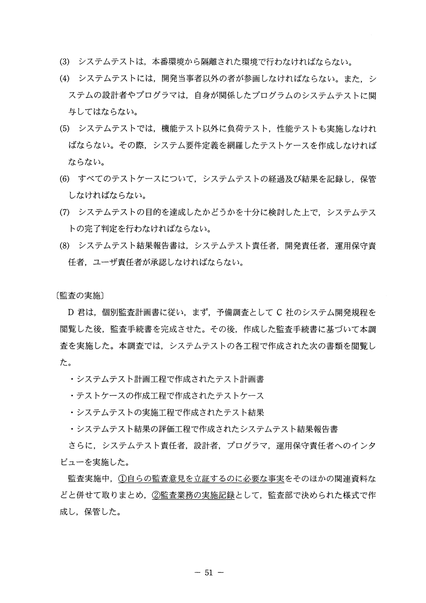

テキスト (OCR)

(3) システムテストは, 本番環境から隔離された環境で行わなければならない。

(④ システムテストには, 開発当事者以外の者が参画しなければならない。また, シ
ステムの設計者やプログラマは, 自身が関係したプログラムのシステムテストに関
与してはならない。

(5) システムテストでは, 機能テスト以外に負荷テスト, 性能テストも実施しなけれ
ばならない。その際, システム要件定義を網維したテストケースを作成しなければ
ならない。

(6) すべてのテストケースについて, システムテストの経過及び結果を記録し, RE
しなければならない。

() システムテストの目的を達成したかどうかを十分に検討した上で, システムテス
トの完了判定を行わなければならない。

(82) システムテスト結果報告書は, システムテスト資任者, 開発責任者, 運用保守貢
任者, ユーザ責任者が承認しなければならない。

[監査の実施〕

D 君は, 個別監査計画書に従い まず, 予備調査として C 社のシステム開発規程を
閲覧した後, 監査手続書を完成させた。その後, 作成した監査手続書に基づいて本調
査を実施した。本調査では, システムテストの各工程で作成された次の書類を閲覧し
た。

・システムテスト計画工程で作成されたテスト計画書

・テストケースの作成工程で作成されたテストケース

・システムテストの実施工程で作成されたテスト結果

・システムテスト結果の評価工程で作成されたシステムテスト結果報告書

さらに, システムテスト責任者, 設計者, プログラマ, 運用保守責任者へのインタ
ビューを実施した。

監査実施中, ①自らの監査意見を立証するのに必要な事実をそのほかの関連資料な
どと併せて取りまとめ, ②監査業務の実施記録として, 監査部で決められた様式で作
RL, 保管した。

ー 51 一

### ページ 52

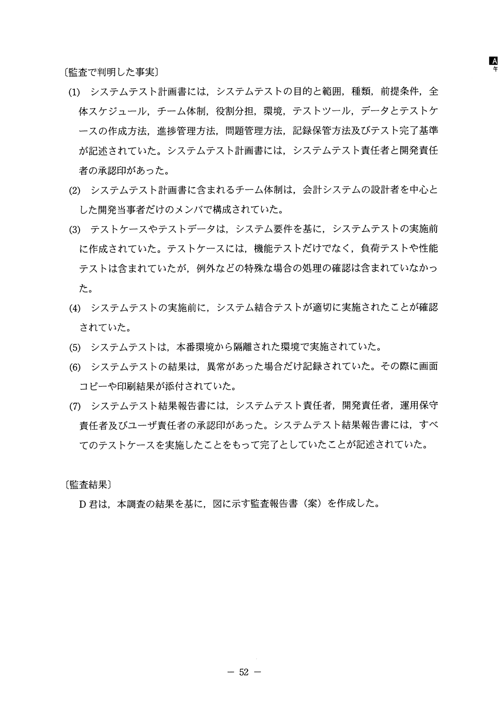

テキスト (OCR)

(監査で判明した事実〕

(1) システムテスト計画書には, システムテストの目的と範囲, 種類, 前提条件, 全
体スケジュール, チーム体制, 役割分担, 環境, テストツール, データとテストケ
ースの作成方法, 進捗管理方法, 問題管理方法, 記録保管方法及びテスト完了基準
が記述されていた。システムテスト計画書には, システムテスト責任者と開発責任
者の承認印があった。

(QQ) システムテスト計画書に含まれるチーム体制は, 会計システムの設計者を中心と
した開発当事者だけのメンバで構成されていた。

(3) テストケースやテストデータは, システム要件を基に, システムテストの実施前
に作成されていた。テストケースには, 機能テストだけでなく, 負荷テストや性能
テストは含まれていたが, 例外などの特殊な場合の処理の確認は含まれていなかっ
た。

(4) システムテストの実施前に, システム結合テストが適切に実施されたことが確認
されていた。

(5) システムテストは, 本番環境から隔離された環境で実施されていた。

6) システムテストの結果は, 異常があった場合だけ記録されていた。その際に画面
コピーや印刷結果が添付されていた。

(⑦ システムテスト結果報告書には, システムテスト責任者, 開発責任者, 運用保守
責任者及びユーザ責任者の承認印があった。システムテスト結果報告書には, すべ
てのテストケースを実施したことをもって完了としていたことが記述されていた。

(監査結果)
D 君は, 本調査の結果を基に, 図に示す監査報告書 (案) を作成した。

ー 52 一

### ページ 53

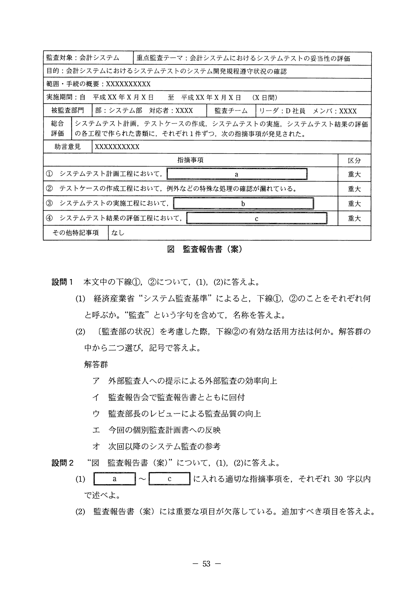

テキスト (OCR)

監査対象 : 会計システム  重点監査テーマ : 会計システムにおけるシステムテストの妥当性の評価

目的 : 会計システムにおけるシステムテストのシステム開発規程遵守状況の確認

範囲・手続の概要 : XXXXXXXXXX

実施期間:自 平成XX年X月X日  至 平成XX年X月X日 (X 日間)

被監査部門 |部: システム部 対応者 : XXXX   監査チーム |リーダ:D社員 メンバ:XXXX

総合 |システムテスト計画, テストケースの作成, システムテストの実施,、 システムテスト結果の評価
評価 | の各工程で作られた書類に, それぞれ 1 件ずつ, 次の指摘事項が発見された。

助言意見 | XXXXXXXXXX

指摘事項                     区分
① システムテスト計画工程において, |         a         |      重大
Q テストケースの作成工程において, 例外などの特殊な処理の確認が漏れている。         重大
③ システムテストの実施工程において, |         b         |     重大
(④ システムテスト結果の評価工程において, |         c         i  重大

その他特記事項 |なし

図 監査報告書(案)

設問1 本文中の下線①〇, ②について, Q①), ②)に答えよ。
Q) 経済産業省 “システム監査基準” によると, FRO, ②のことをそれぞれ何
と呼ぶか。 “監査" という字句を含めて, 名称を答えよ。
(2) 【監査部の状況〕 を考慮した際, 下線②の有効な活用方法は何か。解答群の
中から二つ選び, 記号で答えよ。
解答群

YY

外部監査人への提示による外部監査の効率向上
監査報告会で監査報告書とともに回付
監査部長のレビューによる監査品質の向上
今回の個別監査計画書への反映
次回以降のシステム監査の参考
設問2 "図 監査報告書 (案)" について, ①), ②に答えよ。
a [oa |て| < |に入れる適切な指摘事項を, それぞれ 30 字以内
CHAK.
2) 監査報告書 (案) には重要な項目が欠落している。追加すべき項目を答えよ。

ー 53 一

### ページ 54

テキスト (OCR)

〔( メモ 用 紙 }

ー 54 一

### ページ 55

テキスト (OCR)

CA 用 J

ー 55 一

### ページ 56

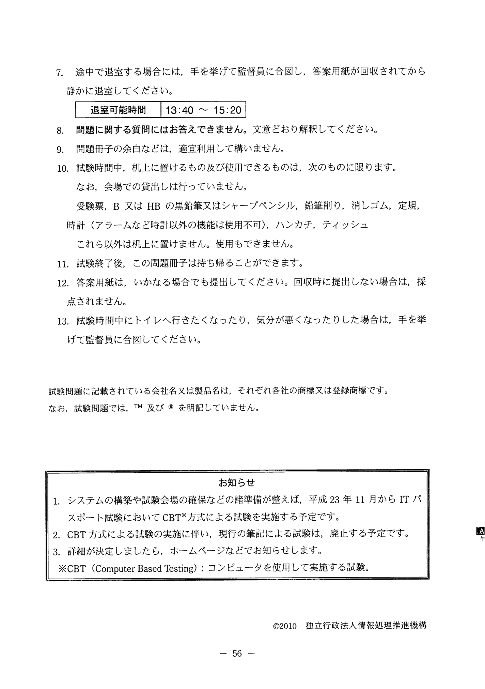

テキスト (OCR)

7. 途中で退室する場合には, 手を挙げて監督員に合図し, 答案用紙が回収されてから
静かに退室してください。
| 退室可能時間 [13:40 ~ 15:20
8. 問題に関する質問にはお答えできません。文意どおり解釈してください。
9. 問題冊子の余白などは, 適宜利用して構いません。
10. 試験時間中机上に置けるもの及び使用できるものは, 次のものに限ります。
なお, 会場での貸出しは行っていません。
受験票, B 又は HB の黒鉛筆又はシャープペンシル, 鉛筆削り, 消しゴム, 定規,
時計 (アラームなど時計以外の機能は使用不可)。 ハンカチ, ティッシュ
これら以外は机上に置けません。使用もできません。
Ll. 試験終了後, この問題民子は持ち帰ることができます。
12. 答案用紙は。 いかなる場合でも提出してください。回収時に提出しない場合は, 採
点されません。
13. 試験時間中にトイレへ行きたくなったり, 気分が悪くなったりした場合は, FE
げて監督中に合図してください。

試験問題に記載されている会社名又は製品名は, それぞれ各社の商標又は登録商標です。
なお, 試験問題では, ™ 及び @ を明記していません。

お知らせ
1. システムの構築や試験会場の確保などの諸準備が整えば, 平成 23 年 11 月からIT パ
スポート試験において CBT※方式による試験を実施する予定です。
2. CBT 方式による試験の実施に伴い, 現行の筆記による試験は, 廃止する予定です。
3. 詳細が決定しましたら, ホームページなどでお知らせします。
※CBT (Computer Based Testing) : コンピュータを使用して実施する試験。

@2010 独立行政法人情報処理推進機構

ー 56 一

---

## 午後解答

1/6 
Copyright(c) Information-technology Promotion Agency, Japan. All rights reserved 2010 
平成22 年度 秋期 応用情報技術者試験 解答例 
 
午後試験 
問１ 
出題趣旨 
 企業は，常に競合他社との競争にさらされている。企業が利益を確保するためには，商品開発などの販売戦
略が重要で，これを状況に応じて見直す必要がある。販売戦略の立案に際しては，マーケティング理論の理解
と，その応用が重要である。 
 本問では，旅行会社における販売戦略の転換を題材に，販売戦略立案についての知識と応用力を問う。 
 
設問 
解答例・解答の要点 
備考 
設問１ 
テーマツアー 
（領域）D 
 
 
 
フリープラン 
（領域）A 
 
設問２ (1) ウ 
 
 
(2) a ・自分オリジナルの旅行に出掛けたい 
・繰り返し海外旅行に出掛ける 
 
設問３ (1) 世界各地のホテルや交通機関の事情についての専門知識の活用 
 
 
(2) ア 
 
設問４ 
メリット 
新商品の売上が目標未達成のときに補てんが見込める。 
 
 
 
デメリット ・高級化へのブランドイメージの転換が市場に浸透しない。 
・経営資源が分散されるので，販売戦略の転換が遅れる。 
 
 
問２ 
出題趣旨 
 プログラム言語やプロトコルは，BNF のような表記法に従ってあいまいさなく記述することによって，プロ
グラムによる構文解析や意味の認識が可能となる。 
 本問では，簡単なプログラム言語を題材に，BNF による記述方法や構文規則に関する理解と，構文規則と構
文解析のための制御ロジックの関係に関する理解を問う。 
 
設問 
解答例・解答の要点 
備考 
設問１ 
ア 宣言部記述 
 
 
イ 識別子 
 
 
ウ 因子 
 
設問２ 
②，⑤ 
 
設問３ 
エ token と'='が等しい 
 
 
オ kou()と‐1 が等しい 
 
設問４ (1) カ ＜式＞ 
 
 
(2) ・「(」と「)」に対してほかの字句とはそれぞれ別の戻り値を戻す。 
・ ‘(’と‘)’の字句に対してそれぞれ‘(’と‘)’を戻す。

2/6 
Copyright(c) Information-technology Promotion Agency, Japan. All rights reserved 2010 
問３ 
出題趣旨 
 在庫管理は，企業における重要な経営管理の一つであり，過剰在庫や，在庫不足を起こさないよう，適切に
管理する必要がある。 
 本問では，製造業での在庫管理を題材に，発注方式や棚卸の基本についての理解を問う。 
 
設問 
解答例・解答の要点 
備考 
設問１ 
a ア 
 
 
 
b コ 
 
設問２ 
c ウ 
 
 
 
d ア 
 
設問３ (1) 見なし出庫を行っている部品 
 
 
(2) 部品表の員数を超えて出庫される。 
 
設問４ 
棚卸サイクルを短縮する。 
 
 
問４ 
出題趣旨 
 システム構成の設計においては，与えられた性能要件を実現するためにキャパシティプランニングの手法（プ
ロトタイピングや待ち行列理論など）の理解が重要である。 
 本問では，社内向けWeb システムのシステム構成の設計を題材に，キャパシティプランニングの理解と適用
能力を問う。 
 
設問 
解答例・解答の要点 
備考 
設問１ 
a 0.90 
 
 
b 1.97 
 
 
c 0.39 
 
 
d 0.59 
 
設問２ 
e 4 
 
 
f 15.00 
 
 
g 0.75 
 
 
h 0.30 
 
設問３ 
現象 
ウ 
 
 
改善策 
メモリを増設する。

3/6 
Copyright(c) Information-technology Promotion Agency, Japan. All rights reserved 2010 
問５ 
出題趣旨 
 情報処理システムにおいて，ネットワークは非常に重要であり，高い稼働率が求められる。 
 本問では，無線LAN に関連するネットワーク障害を題材に，ネットワークの仕組みやトラブル事例などの理
解，及びネットワーク障害を解決する能力について問う。 
 
設問 
解答例・解答の要点 
備考 
設問１ 
a ア 
 
 
b イ 
 
 
c ア 
 
設問２ (1) FW A 
 
 
(2) エ 
 
設問３ (1) 11 
 
 
(2) 1，2，3，6 
 
 
問６ 
出題趣旨 
 データベースを扱ったプログラム開発においては，E-R 図を基にしたCREATE 文の作成に加え，レコード型
を扱うプログラム設計が必要である。 
 本問では，販売管理システムを題材に，E-R 図，CREATE 文及びレコード型を扱う流れ図に対する理解，並
びにSQL 文の記述能力を問う。 
 
設問 
解答例・解答の要点 
備考 
設問１ 
a ← 
 
 
 
b ← 
 
 
 
c 顧客番号 
 
 
 
d 請求書番号 
 
設問２ 
e 請求書番号 
 
 
 
f PRIMARY KEY 
 
 
 
g 顧客番号 
 
設問３ 
h bill.消込額 ＋ x 
 
 
 
i credit.入金額 
 
設問４ 
j SUM(入金額 – 消込額) 
 
 
 
k 入金日 <= :今月度末日 
 
 

入金額 > 消込額 
順不同

4/6 
Copyright(c) Information-technology Promotion Agency, Japan. All rights reserved 2010 
問７ 
出題趣旨 
 昨今，組込みシステムにおいて，セマフォを利用してリソース管理，タスク同期制御を行っている。そのた
め，応用情報技術者はセマフォについて理解する必要がある。 
 本問では，携帯電話の録音機能を題材に，組込みシステムにおけるセマフォの使用方法とその注意点につい
ての理解を問う。 
 
設問 
解答例・解答の要点 
備考 
設問１ (1) a 176.4 
 
 
(2) 2 
 
設問２ 
・二つのタスクで2 種類のセマフォ取得順序が逆だから 
・デッドロックが発生したから 
 
設問３ 
b エ 
 
 
 
c ウ 
 
 
d コ 
 
 
e カ 
 
 
問８ 
出題趣旨 
 Web システムでは，統一感のある画面構成，ユニバーサルデザインの観点及び画面のメンテナンス性が重要
になる。情報とその構造であるコンテンツと表現の分離は，このための有効な方法である。 
 本問では，この観点から情報提供サイトの具体的な例を題材に，CSS とXHTML を正しく理解し，Web 画面
の標準化及びCSS を含めた設計能力があるかを問う。 
 
設問 
解答例・解答の要点 
備考 
設問１ 
(4)，(5)，(6) 
 
設問２ (1) a カ 
 
 
 
b ケ 
 
 
 
c ウ 
 
 
(2) d PNG 
 
 
 
e UTF-8 
 
設問３ (1) ウ，エ 
 
 
(2) イ 
 
設問４ 
f 192 
 
設問５ 
使用するブラウザによって，表示のされ方に相違があるから

5/6 
Copyright(c) Information-technology Promotion Agency, Japan. All rights reserved 2010 
問９ 
出題趣旨 
 近年，企業の社内ネットワークシステムにおけるセキュリティ対策の重要性は，ますます高まっている。 
 本問では，セキュリティ対策の一つである，検疫ネットワークシステムを題材に，検疫ネットワークシステ
ムの基本的な知識と仕組みに関する理解を問う。 
 
設問 
解答例・解答の要点 
備考 
設問１ 
a イ 
 
 
b コ 
 
 
c キ 
 
 
d ク 
 
 
f ケ 
 
 
h ア 
 
設問２ 
e VLAN0 
 
 
g VLAN30 
 
設問３ 
ウイルスなどの二次感染の範囲を限定できるから 
 
 
問10 
出題趣旨 
 ソフトウェア開発のレビューやテストでは，発見した不良を単に除去するだけでなく，不良の発生状況を定
量的に評価して，ほかに見つかっていない不良が残っている危険性を確認することも重要である。 
 本問では，コードレビューと単体テストをテーマに，品質の定量的な評価方法についての理解を問う。 
 
設問 
解答例・解答の要点 
備考 
設問１ 
イ 
 
設問２ (1) プログラム名 
プログラム4 
 
 
 
実施すべき対策
指摘への対処完了後，再度ピアコードレビューを実施する。  
 
(2) チェックリストに，コメントの記載漏れがないかのチェック項目を追加する。  
設問３ (1) a ウ 
 
 
(2) c 不良密度 
 
 
 
d 下限を下回った 
 
 
(3) b 単体テストケースが詳細設計書の要求事項を網羅しているか

6/6 
Copyright(c) Information-technology Promotion Agency, Japan. All rights reserved 2010 
問11 
出題趣旨 
 ファイルのバックアップの設計においては，予定の時間内にバックアップが完了し業務に支障がないこと，
リストアが確実に行えることが重要なポイントとなる。 
 本問では，ファイルサーバの構築時におけるバックアップの方式や手順の検討を題材に，バックアップにつ
いての基本的な理解を問う。 
 
設問 
解答例・解答の要点 
備考 
設問１ (1) a 4,000 
 
 
 
b 10.0 
 
 
(2) c オ 
 
設問２ (1) d 100 
 
 
(2) e ア 
 
 
 
f イ 
 
 
(3) g ア 
 
 
 
h イ 
 
 
(4) 増分バックアップした複数の磁気テープを古い順に読み込む必要があるから 
 
 
問12 
出題趣旨 
 システムの開発に携わる者は，システム監査計画，システム監査の実施，報告，評価の考え方の基本を修得
し，適用する能力を身に付けていなければならない。 
 本問では，システム適格性確認テストの監査を題材に，システム監査の実施，報告についての基本的な知識
と理解を問う。 
 
設問 
解答例・解答の要点 
備考 
設問１ (1) ① 監査証拠 
 
 
 
② 監査調書 
 
 
(2) ウ，オ 
 
設問２ (1) a 
開発当事者以外がチームに含まれない計画書を作成している。 
 
 
 
b 正常終了した場合の結果を記録していない。 
 
 
 
c 目的を達成したかどうかが十分に検討されていない。 
 
 
(2) 改善勧告

---

## 午後採点講評

1/3 
Copyright(c) Information-technology Promotion Agency, Japan. All rights reserved 2011 
平成22 年度 秋期 応用情報技術者試験 採点講評 
 
午後試験 
問１ 
 問1 では，旅行会社における販売戦略の転換を題材に，販売戦略の立案について出題した。 
 設問2(1)は，正答率が高かった。マーケティングのプロセスについては，おおむね理解されているようであ
った。 
 設問4 は，販売戦略の転換に対して，従来ツアーの継続販売による，経営リスクの観点からのメリット，デ
メリットを問うていたが，既存施策そのものについてのメリット，デメリットの記述が散見された。販売戦略
の転換を踏まえて，正答を導いてほしい。 
 
問２ 
 問2 では，簡単なプログラム言語を題材に，BNF による記述方法や，構文規則と構文解析のための制御ロジ
ックとの関係について出題した。全体として，正答率は高かった。 
 設問2 は，構文規則に反するエラーだけでなく，０による割り算などの構文以外のエラーも含める誤った解
答が散見された。 
 設問3 は，構文規則に使用した‘｜’や‘｛’と‘｝’の記号と，制御ロジックとの関係をよく見比べれば正
答が導き出せるはずである。 
 
問３ 
 問3 では，製造業での部品発注，入出庫，棚卸業務を題材に，在庫管理について出題した。 
 設問1 は，正答率が高かった。発注点の意義や，見直しの考え方について，おおむね理解されているようで
あった。 
 設問4 は，正答率が低かった。問題文では，棚卸業務の改善について問うたが，入出庫方法の改善を記述し
た解答が散見された。設問の指示をよく読んで，落ち着いて解答してもらいたい。 
 
問４ 
 問4 では，社内業務システムのシステム構成を題材に，プロトタイププログラムによる負荷テストと待ち行
列理論による性能評価について出題した。 
 設問1 は，正答率が高かった。待ち行列理論の基本はおおむね理解されているようであった。 
 設問2 は，正答率が低かった。考え方は設問1 と同じなので，落ち着いて注意深く解答すれば，正答を導け
るはずである。 
 設問3 は，“現象”の正答率が低かった。実際の業務では，テストの計測結果から発生している現象を特定
する能力が要求される。是非身に付けておいてもらいたい。 
 
問５ 
 問5 では，無線LAN の導入を題材に，ネットワークの仕組みやトラブル事例などの理解，及びネットワー
ク障害を解決する能力について出題した。 
 設問2 の接続不良の原因と対策については，正答率が高かった。しかし，設定ミスをした機器について不適
切な機器を挙げている解答が散見された。ネットワークを構成する機器とその機能や役割を十分に理解してお
くことが望まれる。 
 設問3(2)は，正答率が低かった。無線LAN のチャネルの組合せと電波干渉について正しく理解してほしか
ったが，誤った解答のチャネル4，5 を含めた解答が目立った。問題文の記述と図2 から正答を導き出してほ
しい。

2/3 
Copyright(c) Information-technology Promotion Agency, Japan. All rights reserved 2011 
問６ 
 問6 では，販売管理システムを題材に，データベースの設計とSQL 文の記述，レコード型を扱うプログラ
ム設計について出題した。全体として，正答率は低かった。 
 設問1 は，正答率が高かった。E-R 図についての基礎的な事項は，おおむね理解されているようであった。
ただし，d は，属性名は正しく解答できているものの，凡例に倣って下線を引くところで“外部キー”とした
解答が多かった。テーブル中のレコードを一意に識別するためには，“主キー”でなければならないことを，
よく理解しておいてほしい。 
 設問2 は，正答率が高かった。CREATE 文については，おおむね理解されているようであった。 
 設問 4 は，正答率が低かった。集計関数のSUM を書き忘れた解答や，不等号の向きを取り違えた解答が多
く見られた。落ち着いて注意深く解答するように心掛けてほしい。 
 
問７ 
 問7 では，携帯電話の録音機能を題材に，組込みシステムにおけるセマフォの使用方法とその注意点につい
て出題した。 
 設問1(1)は，正答率が低かった。PCM 符号のデータサイズの計算方法について理解しておいてほしい。計算
結果の記入ミスと思われる解答が散見された。 
 設問2 は，タスクが動作しなくなった理由を問うたが，タスクと取得したセマフォを読み取れていない解答
が見受けられた。セマフォの取得・解放について，よく理解してほしい。 
 設問3 のb は，正答率が低かった。タスクの実行可能状態と待ち状態について，よく理解してほしい。 
 
問８ 
 問8 では，セミナやシンポジウムの情報提供と申込み受付を行うWeb システムの開発を題材に，その開発で
必要となるXHTML 及びCSS について出題した。 
 設問2(2)のd は，正答率が低かった。比較的新しい画像形式であるが，Web システムの開発者が，画像を扱
う上では必要な形式である。Web で使用される画像形式の特徴と利用目的は理解しておいてほしい。 
 設問3(1)は，正答率が低かった。Web ページ上で表を利用する場合の留意点を認識しておいてほしい。 
 設問5 は，正答率が高かった。通常のWeb 閲覧でも直面することがあるので，よく認識されていたようであ
る。 
 
問９ 
 問9 では，企業の社内ネットワークシステムにおける検疫システムを題材に，その基本知識と仕組みについ
て出題した。全体として，正答率は高かった。 
 設問1 は，特にa やb で誤った選択肢を選んでいる解答が散見された。RADIUS サーバやディレクトリサー
バが提供する個々の機能の理解だけに留まらず，検疫システム全体の中で，それぞれの機能がいかに連携して
いるかを総合的に理解してほしい。 
 設問3 は，具体的な理由の記述に乏しい解答が散見された。隔離して検査を行うことは，検疫システムが有
する重要な機能の一つであるので，隔離して検査する意味や目的を十分に理解してほしい。 
 
問10 
 問10 では，コードレビューと単体テストを題材に，品質の定量的な評価と管理方法について出題した。全
体として，正答率は高かった。 
 設問2(1)は，正答率が高かった。品質基準の適用方法についてはよく理解されているようであった。 
 設問2(2)は，現在実施中の開発作業に対して，A～C 各チームではなく開発管理チームが行う品質向上対策
という観点で考え解答してほしい。 
 設問3(3)は，正答率が低かった。テストケースが十分かどうかは，数だけでなく，テストケースが仕様に基
づいて作成されているかなどによっても判断する必要があることをよく理解しておいてもらいたい。

3/3 
Copyright(c) Information-technology Promotion Agency, Japan. All rights reserved 2011 
問11 
 問11 では，ファイルサーバの構築時におけるバックアップの方式や手順の検討を題材に，その所要時間の
算出方法や増分・差分のバックアップ方式の特徴などについて出題した。全体として，正答率は高かった。 
 設問1(2)は，各部署で必要なファイル転送時間を求め，ファイルサービス停止時間帯を正しく認識できれ
ば，正答を導けるはずである。 
 設問2(1)は，本文をよく読み，必要な条件を漏れなく見つけることができれば，正答を導けるはずである。
 設問2(4)は，正答率が低かった。各バックアップ方式の特徴をよく理解しておいてもらいたい。 
 
問12 
 問12 では，システム適格性確認テストの監査を題材に，システム監査の実施，報告について出題した。全
体として，正答率は低かった。 
 設問1(2)は，監査リーダを含めて，監査部長以外のメンバがシステム監査の経験が浅い状況から何が有効か
を考えれば，正答を導けるはずである。 
 設問2(1)は，指摘された問題がどの工程で発生したかに留意すれば，正答を導けるはずである。 
 設問2(2)は，正答率が低かった。監査業務のカバーすべき範囲や各手順の役割をしっかり理解しておいても
らいたい。

