# 平成22年度春期 応用情報技術者試験

---

## 午前問題

### ページ 1

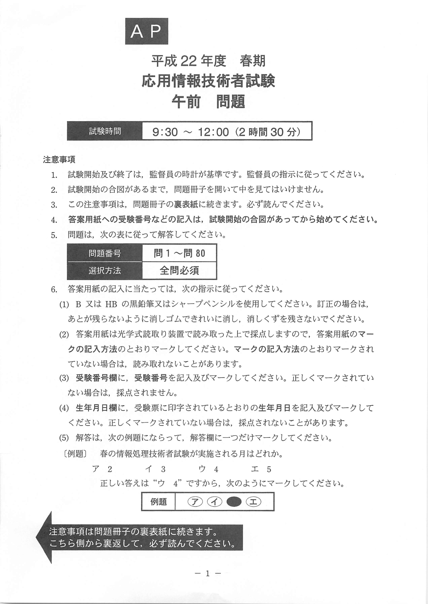

テキスト (OCR)

平成22年度 春期
応用情報技術者試験
午前 問題

 9:30 ~ 12:00 (2時間30 分)

注意事項

1. 試験開始及び終了は, 監督貞の時計が基準です。監督具の指示に従ってください。
2. 試験開始の合図があるまで, 問題周子を開いて中を見てはいけません。
3. この注意事項は, 問題冊子の裏表紙に続きます。必ず読んでください。
4
5

答案用紙への受験番号などの記入は, 試験開始の合図があってから始めてください。
問題は, 次の表に従って解答してください。

問題番号       fl 1 ^問 80
選択方法            全間必須

6. 答案用紙の記入に当たっては, 次の指示に従ってください。

(1) B 又は HB の黒鉛筆又はシャープペンシルを使用してください。訂正の場合は,
あとが残らないように消しゴムできれいに消し, 消しくずを残さないでください。
(2) 答案用紙は光学式読取り装置で読み取った上で採点しますので, 答案用紙のマー
クの記入方法のとおりマークしてください。マークの記入方法のとおりマークされ

ていない場合は, 読み取れないことがあります。
3) 受験番号欄に, 受験番号を記入及びマークしてください。正しくマークされてい
ない場合は, 採点されません。
(4) 生年月日欄に, 受験票に印字されているとおりの生年月日を記入及びマークして
ください。正しくマークされていない場合は, 採点されないことがあります。
(5) 解答は, 次の例題にならって, 解答欄に一つだけマークしてください。
〔例題) 春の情報処理技術者試験が実施される月はどれか。
アゲ ・.2    イ 3    ウ 4    エ 5
正しい答えは “ウ 4 ですから, 次のようにマークしてください。

例題 | DO@®

注意事項は問題冊子の裏表紙に続きます。
こちら側から裏返して, 必ず読んでください。

### ページ 2

### ページ 3

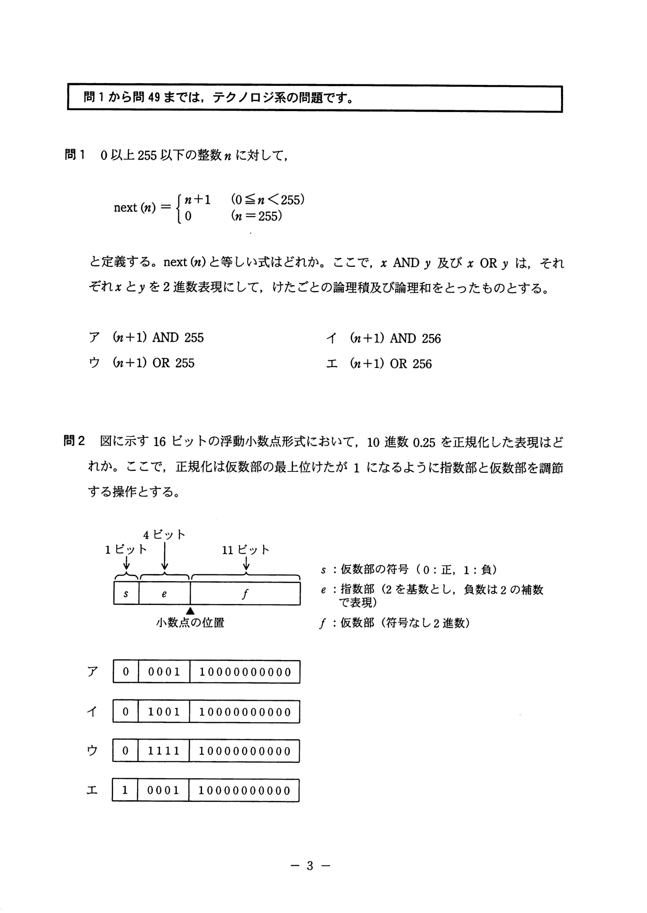

テキスト (OCR)

問 1 から問 49 までは, テクノロジ系の問題です。

問1 0以上255 以下の整数ヵ に対して,

Z十1 (0ミzぐ255)

next (#) = { 0         (a = 255)

と定義むする。next %) と等しい式はどれか。ここで, x ADy 及び* ORy は, それ
Chis とヵヶを2 進数表現にして, けたごとの論理積及び論理和をとったものとする。

ア (+1) AND 255                   4 (n+1) AND 256
7 (+1) OR 255                   エエ ⑫+1) OR 256

問2 図に示す 16 ビットの浮動小数点形式において, 10 進数 0.25 を正規化した表現はど
NM. TOT, 正規化は仮数部の最上位けたが 1] になるように指数部と仮数部を調節
する操作とする。

4 ピット
1ピット   |         11 ビット
Ba          7       。 : 仮数部の符号 (0 : 正, 1 : 負)
| 。        y        e : 指数部 (2 を基数とし, 負数は 2 の補数
1                  で表現)
小数点の位置            f 仮数部 (符号なし2 進数)

ア   0 1 0001 | 10000000000

イ   0 | 1001 | 10000000000

ウ   0 | 1111 | 10000000000

x   1 | 0001 | 10000000000

### ページ 4

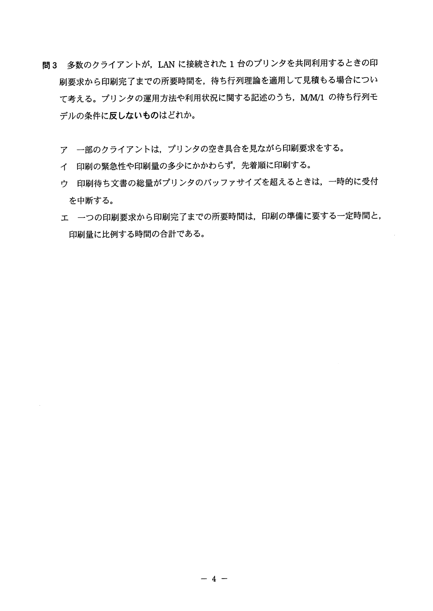

テキスト (OCR)

問3 多数のクライアントが, LAN に接続された 1 台のプリンタを共同利用するときの印
刷要求から印刷完了までの所要時間を, 待ち行列理論を適用して見積もる場合につい
て考える。プリンタの運用方法や利用状況に関する記述のうち, MM/1 の待ち行列モ
デルの条件に反しないものはどれか。

ア 一部のクライアントは, プリンタの空き具合を見ながら印刷要求をする。

イ 印刷の緊急性や印刷量の多少にかかわらず, 先着順に印刷する。

ウ 印刷待ち文書の総量がプリンタのバッファサイズを超えるときは, 一時的に受付
を中断する。

エ 一つの印刷要求から印刷完了までの所要時間は, 印刷の準備に要する一定時間と,
印刷量に比例する時間の合計である。

### ページ 5

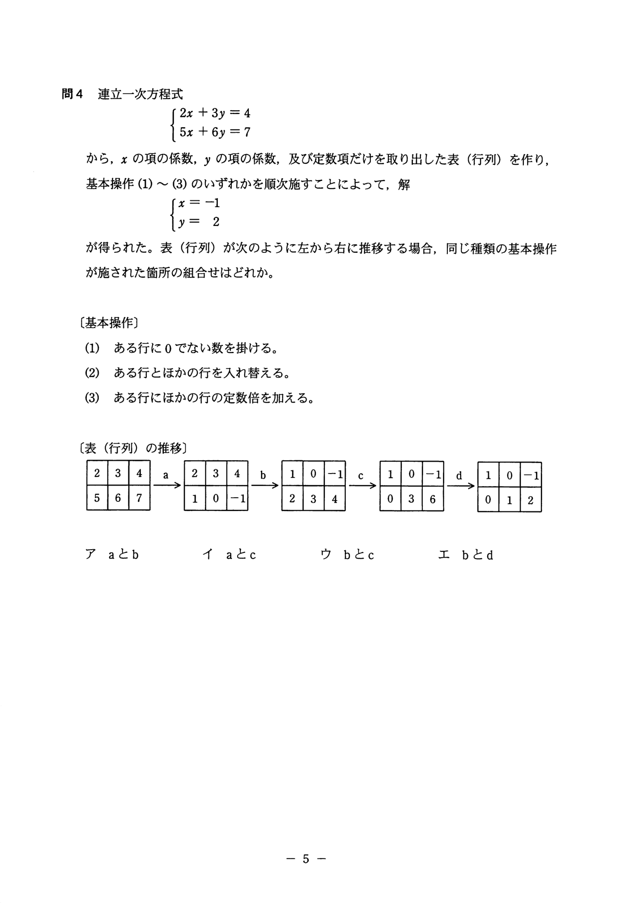

テキスト (OCR)

問4 連立一次方程式
Qe +3y=4
| 5x + 6y =7

から, x の項の係数, の項の係数, 及び定数項だけを取り出した表 (行列) を作り,
基本操作 (1) ~ (3) のいずれかを順次施すことによって, 解

x=-l
が得られた。表 (行列) が次のように左から右に推移する場合, 同じ種類の基本操作
が施された人箇所の組合せはどれか。

〔基本操作〕

(1) ある行に 0 でない数を掛ける。

(2) ある行とほかの行を入れ替える。

(3) ある行にほかの行の定数倍を加える。

(表 (行列) の推移

213141 a |121314| b |110|-11 c |110|1-11 a [1] 0 ]-1

51617 1 1 0 1-1 21314 01316 011|12

ア aとb     イ atc     ウ bとc     エ bとd

### ページ 6

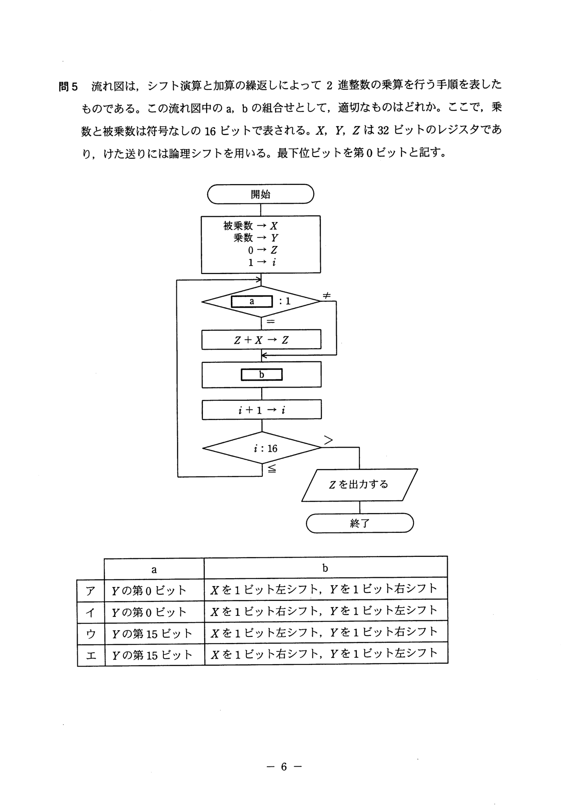

テキスト (OCR)

問5 流れ図は. シフト演算と加算の繰返しによって 2 進整数の乗算を行う手順を表した
ものである。この流れ図中の a, b の組合せとして, 適切なものはどれか。ここで, 乗
数と被乗数は符号なしの 16 ピットで表される。 X, Y, クは32 ビットのレジスタであ
り, けた送りには論理シフトを用いる。最下位ビットを第0 ビピットと記す。

被乗数 つえ
RRO Y
0-Zz
17 i

を出力する

終了

a                 b
了の第0 ビット  を1ビット左シフト, 了を1ビット右シフト
了の第0 ビット  えを1ビット右シフト, を1ビット左シフト
了の第 15 ビピット | えを1ピット左シフト, 了了を1ビット右シフト
了の第 15 ビット |えを1ビット右シフト, 了を1 ビット左シフト

Hls|+ゝIN

### ページ 7

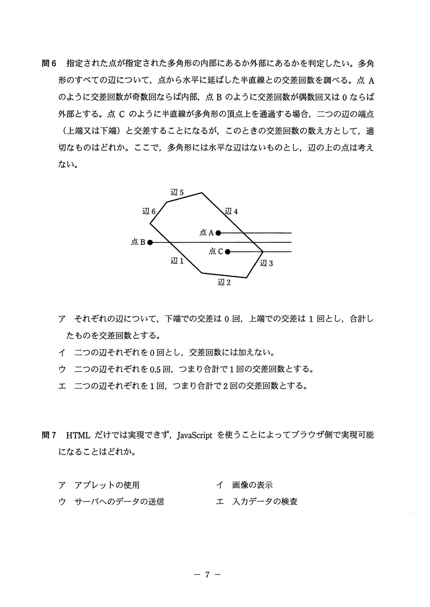

テキスト (OCR)

問6 指定された点が指定された多角形の内部にあるか外部にあるかを判定したい。多角
形のすべての辺について, 点から水平に延ばした半直線との交差回数を調べる。点 A
のように交差回数が奇数回ならば内部, 点 B のように交差回数が偶数回又は 0 ならば
外部とする。点 C のように半直線が多角形の頂点上を通過する場合,二つの辺の端点
(上端又は下端) と交差することになるが, このときの交差回数の数え方として, 適
切なものはどれか。ここで, 多角形には水平な辺はないものとし, 辺の上の点は考え
ない。

ア それぞれの辺について, 下端での交差は 0 回, 上端での交差は 1 回とし, 合計し
たものを交差回数とする。

イ 二つの辺それぞれを 0 回とし, 交差回数には加えない。

ウ 二つの辺それぞれを ISA, つまり合計で1 回の交差回数とする。

L 二つの辺それぞれを 1 回, つまり合計で2 回の交差回数とする。

間7 HTML だけでは実現できず, JavaScript を使うことによってブラウザ側で実現可能

になることはどれか。

ア アプレットの使用       イ 画像の表示
ウ サーバへのデータの送信      Lo 入力データの検査

### ページ 8

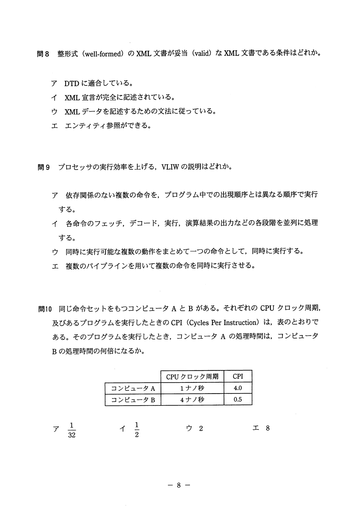

テキスト (OCR)

問8 整形式 (wel-formed) の XML 文書が妥当 (valid) な XML 文書である条件はどれか。

DTD に適合している。

XML 宣言が完全に記述されている。

XML データを記述するための文法に従っている。
エンティティ参照ができる。

H ささコ

9 プロセッサの実行効率を上げる, VLIW の説明はどれか。

ア 依存関係のない複数の命令を, プログラム中での出現順褒とは異なる順序で実行
する。

4 各命令のフェッチ, デコード, 実行, 演算結果の出力などの各段階を並列に処理
する。

ウ 同時に実行可能な複数の動作をまとめて一つの命令として, 同時に実行する。

エエ 複数のパイプラインを用いて複数の命令を同時に実行させる。

間10 同じ命令セットをもつコンピュータ A と B がある。それぞれの CPU クロック周期,
及びあるプログラムを実行したときのCPI (Cycles Per Instruction) は, 表のとおりで
ある。そのプログラムを実行したとき, コンピュータ A の処理時間は, コンピュータ
B の処理時間の何倍になるか。

CPU クロック周期 | CPI
コンピュータ A      1ナノ秒      4.0
コンピュータ B      4ナノ秒       0.5

### ページ 9

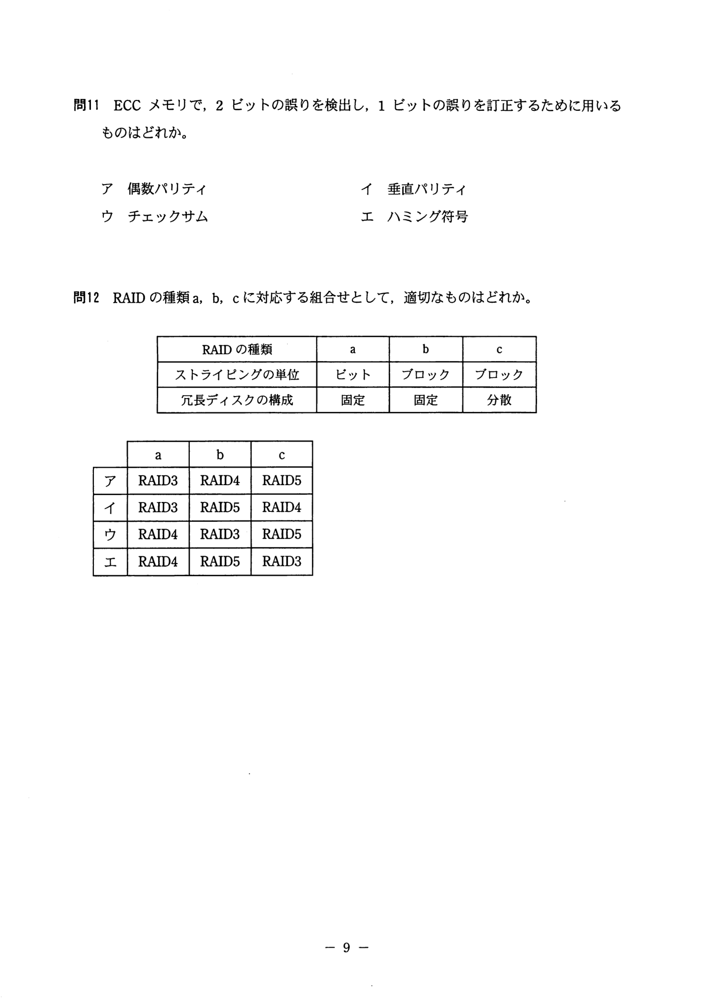

テキスト (OCR)

fll ECC メモリで, 2 ビットの誤りを検出し, 1 ビットの誤りを訂正するために用いる
ものはどれか。

ア 偶数パリティ          イ 垂直パリティ
ウ チェックサム          エエ ハミング符号

間12 RAID の種類a, b, cに対応する組合せとして, 適切なものはどれか。

RAID の種類        a       b       c
ストライピングの単位    ビピット    プブロック | ブロック
冗長ディスクの構成        固定        固定        分散
a       b       C

RATD3 | RAID4 | RAIDS
RAID3 | RAIDS | RAID4
RAID4 | RAID3 | RAIDS
RAID4 | RAIDS | RAID3

H}]G/AN\ IN

### ページ 10

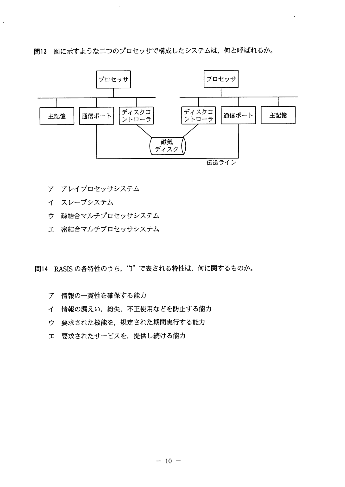

テキスト (OCR)

問13 図に示すような二つのプロセッサで構成したシステムは, 何と呼ばれるか。
プロセッサ                     プロセッサ
|                                  |
|            |            |                    |
    we pst   ディスクコ      ディスクコ| | wise
主記憶   通信ボート  ントローラ      ントローラ  通信ポート   主記憶
磁気
ディスク
伝送ライン
ア アレイプロセッサシステム
イ スレープシステム
ウ 疎結合マルチプロセッサシステム
エ 容結合マルチプロセッサシステム

問14 RASIS の各特性のうち, “I” で表される特性は, 何に関するものか。

HOGAN

情報の一貫性を確保する能力

情報の漏えい, 紛失, 不正使用などを防止する能力
要求された機能を, 規定された期間実行する能力
要求されたサービスを, 提供し続ける能カ

ー 10 一

### ページ 11

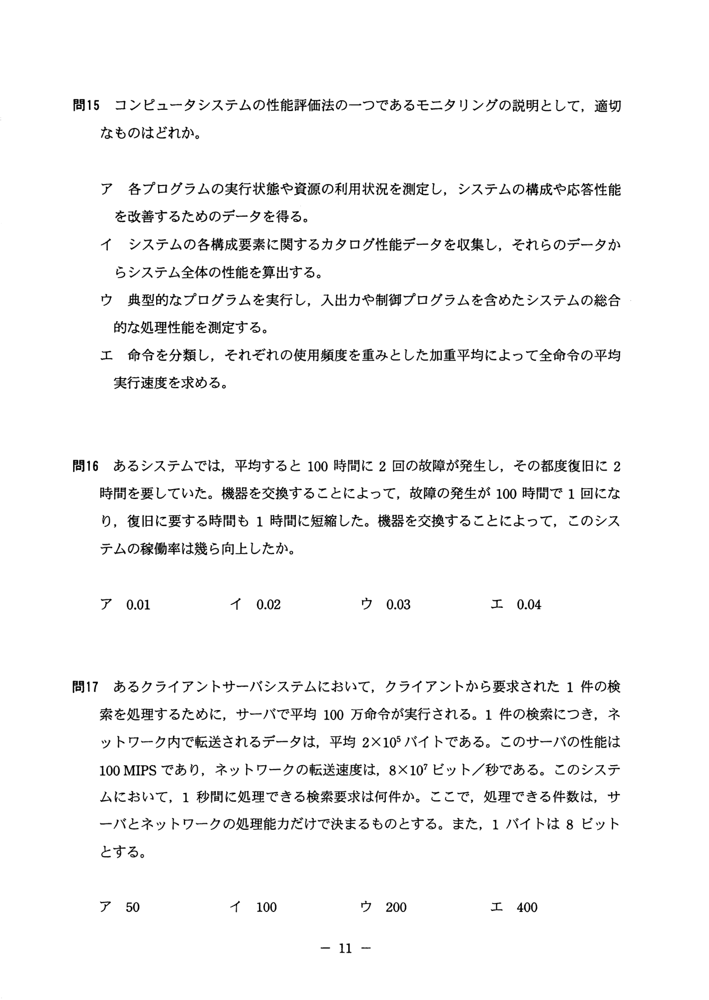

テキスト (OCR)

間15 コンピュータシステムの人性能評価法の一つであるモニタリングの説明として, 適切
なものはどれか。

ア 各プログラムの実行状態や資源の利用状況を測定し, システムの構成や応答性能
を改善するためのデータを得る。

イ システムの各構成要素に関するカタログ性能データを収集し, それらのデータか
らシステム全体の性能を算出する。

ウ 典型的なプログラムを実行し, 入出力や制御プログラムを含めたシステムの総合
的な処理性能を測定する。

エエ 命令を分類し, それぞれの使用頻度を重みとした加重平均によって全命令の平均
実行速度を求める。

問16 あるシステムでは, 平均すると 100 時間に 2 回の故障が発生し, その都度復旧に 2
時間を要していた。機器を交換することによって, 故障の発生が 100 時間で 1 回にな
り, 復旧に要する時間も 1 時間に短縮した。機器を交換することによって, このシス
テムの稼働率は幾ら向上したか。

ア 0.01     イ 0.02     ウ 0.03     x= 0.04

間17 あるクライアントサーバシステムにおいて, クライアントから要求された 1 件の検
索を処理するために, サーバで平均 100 万命令が実行される。1 件の検索につき, ネ
ットワーク内で転送されるデータは, 平均 2X10? バイトである。このサーバの性能は
100 MIPS CHO, ネットワークの転送速度は, 8X10’ ビットノ秒である。このシステ
ムにおいて, 1 秒間に処理できる検索要求は何件か。ここで, 処理できる件数は, サ
ーバとネットワークの処理能力だけで決まるものとする。また, 1 バイトは 8 ビット
とする。

ア 50      イ 100      ウ 200     x 400

ー 11 一

### ページ 12

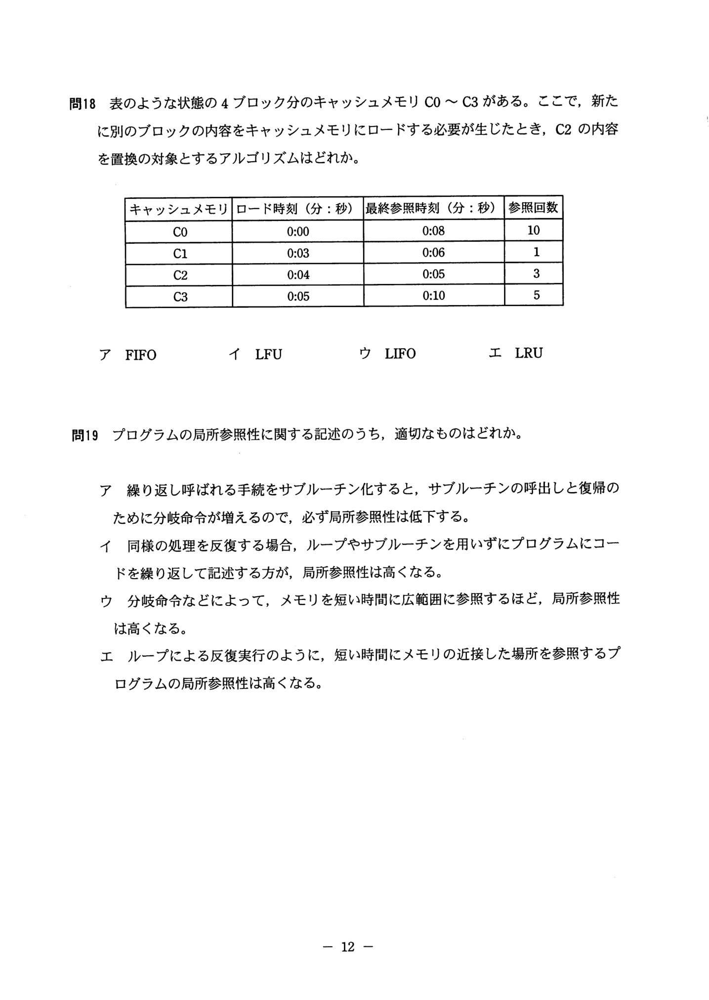

テキスト (OCR)

FAIS 表のような状態の 4 ブロック分のキャッシュメモリ CO て C3 MHS. TOT, 新た
に別のブロックの内容をキャッシュメモリにロードする必要が生じたとき, C2 の内容
を置換の対象とするアルゴリズムはどれか。

キャッシュメモリ|ロード時刻 (分 : 秒) |最終参照時刻 (分 : 秒) | 参照回数
CO                  0:00                     0:08               10
C1                  0:03                     0:06
C2                  0:04                     0:05
C3                  0:05                     0:10
ア FIFO             イ LFU              ウ LIFO              x= LRU

問19 プログラムの局所参照性に関する記述のうち, 適切なものはどれか。

ア 繰り返し呼ばれる手続をサブルーチン化すると, サブルーチンの呼出しと復帰の
ために分岐命令が増えるので, 必ず局所参照性は低下する。

イ 同様の処理を反復する場合. ループやサブルーチンを用いずにプログラムにコー
ドを繰り返して記述する方が, 局所参照性は高くなる。

ウ 分岐命令などによって, メモリを短い時間に広範囲に参照するほど, 局所参照性
は高くなる。

エ ループによる反復実行のように, 短い時間にメモリの近接した場所を参照するプ
ログラムの局所参照性は高くなる。

ー 12 一

### ページ 13

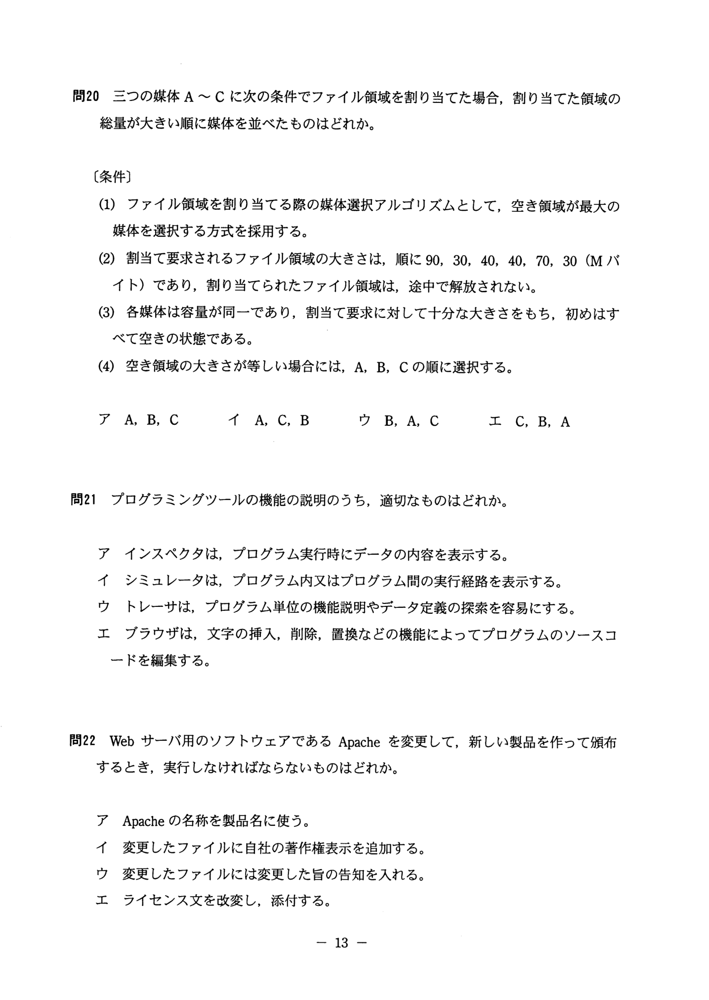

テキスト (OCR)

問20 三つの媒体 A こC に次の条件でファイル領域を割り当てた場合, 割り当てた領域の
総量が大きい順に媒体を並べたものはどれか。

〔条件

QQ) ファイル領域を割り当てる際の媒体選択アルゴリズムとして, 空き領域が最大の
媒体を選択する方式を採用する。

(2) 割当て要求されるファイル領域の大きさは, 順に 90, 30, 40, 40, 70, 30 (Mバ
Th) であり, 割り当てられたファイル領域は, 途中で解放されない。

(3) 各媒体は容量が同一であり, 割当て要求に対して十分な大きさをもち, 初めはす
べて空きの状態である。

(4) 空き領域の大きさが等しい場合には, A, B, Cの順に選択する。

ア A; B,C  イ A C, B  ウ B, A, C  エエ C, B, A

R21 プログラミングツールの機能の説明のうち, 適切なものはどれか。

インスペクタは, プログラム実行時にデータの内容を表示する。

シミュレータは, プログラム内又はプログラム間の実行経路を表示する。

トレーサは, プログラム単位の機能説明やデータ定義の探索を容易にする。

ブラウザは, 文字の挿入, 削除, 置換などの機能こよってプログラムのソースコ
ードを編集する。

HUAN

間22 Web サーバ用のソフトウェアである Apache を変更して, 新しい製品を作って頒布
するとき, 実行しなければならないものはどれか。

Apache の名称を製品名に使う。

変更したファイルに自社の著作権表示を追加する。
変更したファイルには変更した旨の告知を入れる。
ライセンス文を改変し, 添付する。

HOGA NY

ー 13 一

### ページ 14

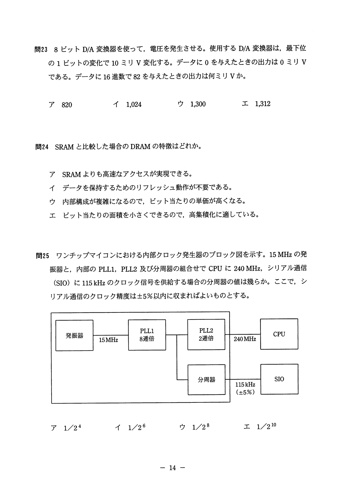

テキスト (OCR)

間23 8 ピット DAA 変換器を使って, 電圧を発生させる。使用する D/A 変換器は, 最下位
の 1 ビットの変化で 10 ミリ V 変化する。データに 0 を与えたときの出力は 0 ミリ V
である。データに 16 進数で 82 を与えたときの出力は何ミリ Vか。

ア 820     イ 1,024     ウ 1,300     x 1312

問24 SRAM と比較した場合の DRAM の特徴はどれか。

SRAM よりも高速なアクセスが実現できる。

データを保持するためのリフレッシュ動作が不要である。

内部構成が複雑こなるので, ビット当たりの単価が高くなる。
ビット当たりの面積を小さくできるので, 高集積化に適している。

H へ

AR ワンチップマイコンにおける内部クロック発生器のブロック図を示す。15 MHz の発
振器と, 内部の PLL1, PLL2 及び分周器の組合せで CPU に 240 MHz, シリアル通信
(SIO) に 115 kHz のクロック信号を供給する場合の分周器の値は幾らか。ここで, シ

リアル通信のクロック精度はよ5%以内に収まればよいものとする。

an               PLL1            PLL2
aati    15MHz      8通倍           2運倍     240MHz     CPU
周器                SIO
lad     115 kHz
(+5%)

ア 1424    イ 1/728    ウ 1/28    エ 1/2"

ー 14 一

### ページ 15

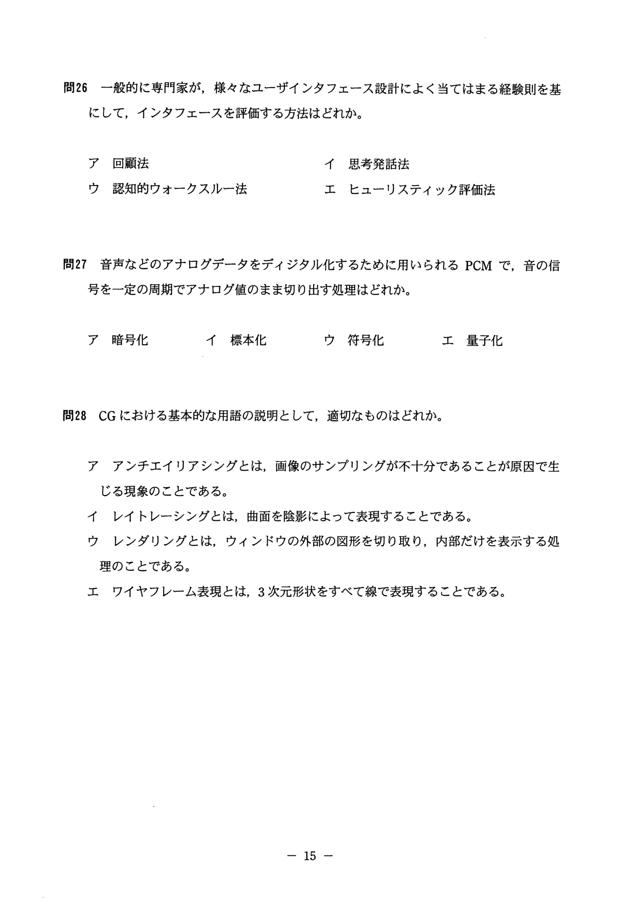

テキスト (OCR)

間26 一般的に専門家が, 様々なユーザインタフェース設計によく当てはまる経験則を基

にして, インタフェースを評価する方法はどれか。

ア 回顧法              イ
ウ 認知的ウォークスルー法

DZ ヒューリスティック評価法

問27 音声などのアナログデータをディジタル化するために用いられる PCM で, FOR
号を一定の周期でアナログ値のまま切り出す処理はどれか。

ア 暗号化    イ 標本化    ウ 符号化    = 量子化

問28 CG における基本的な用語の説明として, 適切なものはどれか。

ア アンチエイリアシングとは, 画像のサンプリングが不十分であることが原因で生
じる現象のことである。

イ レイトレーシングとは, 曲面を陰影によって表現することである。

ウ レンダリングとは, ウィンドウの外部の図形を切り取り, 内部だけを表示する処
理のことである。

エ ワイヤフレーム表現とは, 3 次元形状をすべて線で表現することである。

ー 15 一

### ページ 16

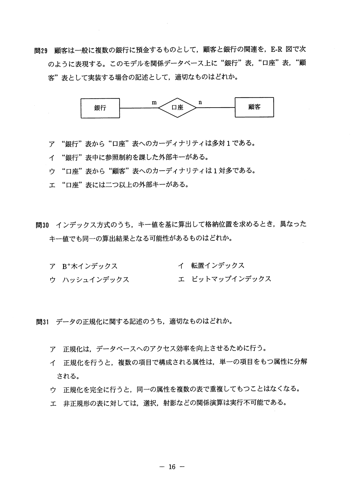

テキスト (OCR)

問29 顧客は一般に複数の銀行に預金するものとして, 顧客と銀行の関連を, E-R 図で次
のように表現する。このモデルを関係データベース上に “ST” 表, “OB” 表, “A
客” 表として実装する場合の記述として, 適切なものはどれか。

“銀行" 表から “OB” 表へのカーディナリティは多対 1 である。
“銀行" 表中に参照制約を課した外部キーがある。

“OB” RDS “顧客” 表へのカーディナリティは1 対多である。
“OB” 表には二つ以上の外部キーがある。

Hさふさ

問30 インデックス方式のうち, キー値を基に算出して格納位置を求めるとき, 異なった
キー値でも同一の算出結果となる可能性があるものはどれか。

ア B`木インデックス         イ 転置インデックス
ウ ハッシュインデックス       エエ ビットマップインデックス

問31 データの正規化に関する記述のうち, 適切なものはどれか。

ア 正規化は, データベースへのアクセス効率を向上させるために行う。

イ 正規化を行うと, 複数の項目で構成される属性は, 単一の項目をもつ属性に分解
される。

ウ 正規化を完全に行うと, 同一の属性を複数の表で重複しにもつことはなくなる。

エエ 非正規形の表に対しては, BAR, 射影などの関係演算は実行不可能である。

ー 16 一

### ページ 17

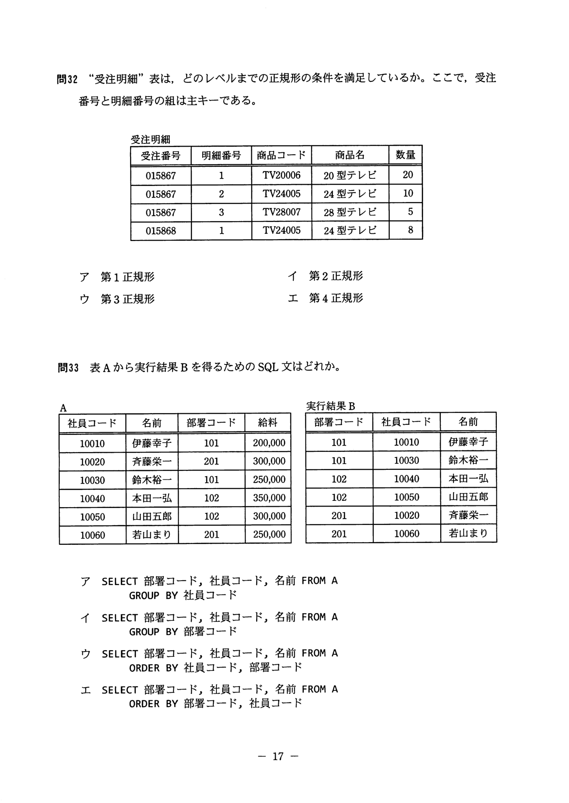

テキスト (OCR)

問32 “受注明細" 表は, どのレベルまでの正規形の条件を満足しているか。ここで, 受注
番号と明細番号の組は主キーである。

受注明細
受注番号 | 明細番号 | 商品コード    商品名    数量
015867             1            TV20006 | 20型テレビ | 20
015867             2            TV24005 | 24型テレビ        10
015867             3            TV28007 | 28型テレビ
015868              1             TV24005 | 24型テレビ          8
ア 第1正規形                                    イ 第2正規形
ウ 第3正規形                                      エエ 第4正規形

問33 表Aから実行結果 B を得るための SQL 文はどれか。

A                       実行結果 B
社員コード    名前   部署コード | 給料     部署コード | 社員コード    名前
10010            伊藤幸子              101               200,000                    101                    10010             伊藤幸子
10020    斉藤栄一    201     300,000      101       10030    鈴木裕一
10030          鈴木裕一            101            250,000                 102                 10040           本田一弘
10040    本田一弘     102     350,000      102       10050    山田五郎
10050          山田五朗            102            300,000                 201                 10020           斉藤栄一
10060           若山まり             201              250,000                  201                   10060            若山まり

ア SELECT 部署コード, 社員コード, 名前 FROM A
GROUP BY 社員コード

4 SELECT 部署コード, 社員コード, 名前 FROM A
GROUP BY 部暑コード

ウ SELECT 部署コード, 社員コード, 名前 FROM A
ORDER BY 社員コード, 部署コード

X. SELECT 部署コード, 社員コード, 名前 FROM A
ORDER BY 部署コード, 社員コード

ー 17 一

### ページ 18

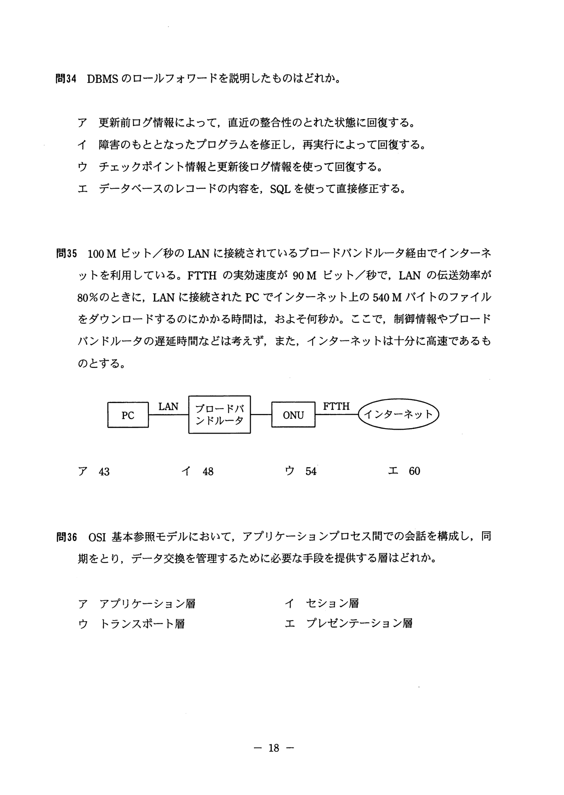

テキスト (OCR)

間34 DBMS のロールフォワードを説明したものはどれか。

H GAN

更新前ログ情報によって, 直近の整合性のとれた状態に回復する。
障害のもととなったプログラムを修正し, 再実行によって回復する。
チェックボイント情報と更新後ログ情報を使って回復する。

データベースのレコードの内容を, SQL を使って直接修正する。

35 100M ビットノ秒の LAN に接続されているブロードバンドルータ経由でインターネ
ットを利用している。FTTH の実効速度が 90M ビットノ秒で, LAN の伝送効率が
80%のときに, LAN に接続された PC でインターネット上の 540 M バイトのファイル
をダウンロードするのにかかる時間は, およそ何秒か。ここで, 制御情報やブロード
バンドルータの遅延時間などは考えず, また, インターネットは十分に高速であるも

のとする。

PC

LAN

ブロードバ
ンドルータ

48

FTTH
ONU      インターネット
ウ 54      x 60

問36 OSI 基本参照モデルにおいて, アプリケーションプロセス間での会話を構成し, 同
期をとり, データ交換を管理するために必要な手段を提供する層はどれか。

ア アプリケーション層
ウ トランスポート層

イ
x

ー 18 一

セション層
プレゼンテーション層

### ページ 19

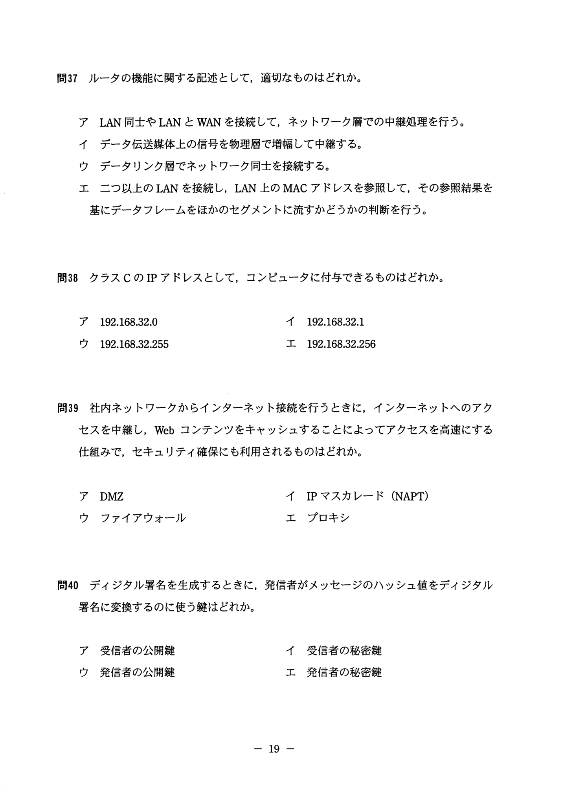

テキスト (OCR)

問37 ルータの機能に関する記述として, 適切なものはどれか。

LAN 同士やLAN とWAN を接続して, ネットワーク層での中継処理を行う。
データ伝送媒体上の信号を物理層で増幅して中継する。

データリンク層でネットワーク同士を接続する。

ニニつ以上の LAN を接続し, LAN 上の MAC アドレスを参照して, その参照結果を
基にデータフレームをほかのセグメントに流すかどうかの判断を行う。

H さい

間38 クラスCのIPアドレスとして, コンピュータに付与できるものはどれか。
ア 192.168.32.0                         イ 192.168.32.1

ウ 192.168.32.255                                           I 192.168.32.256

間39 社内ネットワークからインターネット接続を行うときに, インターネットへのアク
セスを中継し, Web コンテンツをキャッシュすることによってアクセスを高速にする
仕組みで, セキュリティ確保にも利用されるものはどれか。

ア DMZ                  イ IP マスカレード (NAPT)

ウ ファイアウォール         エエ プロキシ

問40 ディジタル暑名を生成するときに, 発信者がメッセージのハッシュ値をディジタル

署名に変換するのに使う鍵はどれか。

ア 受信者の公開鍵          イ 受信者の秘密鍵
ウ 発信者の公開鍵          エエ 発信者の秘密鍵

ー 19 一

### ページ 20

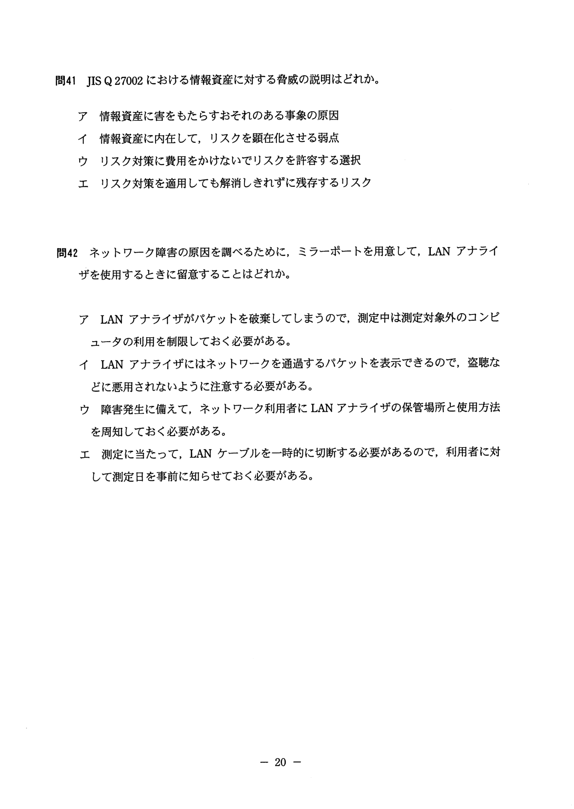

テキスト (OCR)

問41 JIS Q 27002 における情報資産に対する脅威の説明はどれか。

情報資産に害をもたらすおそれのある事象の原因
情報資産に内在して, VAY CEILS COB

リスク対策に費用をかけないでリスクを許容する選択
リスク対策を適用しても解消しきれずに残存するリスク

HAN

42 ネットワーク障害の原因を調べるために, ミラーボートを用意して, LAN アナライ
ザを使用するときに留意することはどれか。

ア LAN アナライザがパケットを破棄してしまうので, 渦定中は測定対象外のコンピ
ュータの利用を制限しておく必要がある。

4 LAN アナライザにはネットワークを通過するパケットを表示できるので, 盗聴な
どに悪用されないように注意する必要がある。

ウ 障害発生に備えて, ネットワーク利用者に LAN アナライザの保管場所と使用方法
を周知しておく必要がある。

エ 測定に当たって, LAN ケーブルを一時的に切断する必要があるので, 利用者に対
して測定日を事前に知らせておく必要がある。

### ページ 21

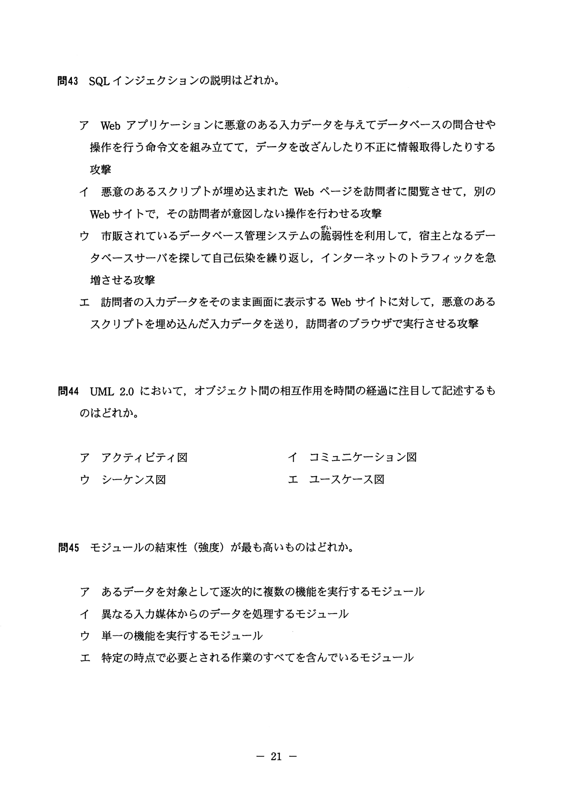

テキスト (OCR)

間43 SQLインジェクションの説明はどれか。

ア Web アプリケーションに悪意のある入力データを与えてデータベースの問合せや
操作を行う命令文を組み立てて, データを改ざんしたり不正に情報取得したりする
攻撃

イ 悪意のあるスクリプトが埋め込まれた Web ページを訪問者に関覧させて, BO
Web サイトで, その訪問者が意図しない操作を行わせる攻撃

ウ 市販されているデータベース管理システムの脆弱性を利用して, 宿主となるデー
タベースサーバを探して自己伝染を繰り返し, インターネットのトラフィックを急
増させる攻撃

エ 訪問者の入力データをそのまま画面に表示する Web サイトに対して, 悪意のある
スクリプトを埋め込んだ入力データを送り, 訪問者のブラウザで実行させる攻撃

問44 UML 2.0 において, オプジェクト間の相互作用を時間の経過に注目して記述するも
のはどれか。

ア アクティピティ図         イ コミュニケーション図
ウ シーケンス図           エエ ユースケース図

間45 モジュールの結束性 (強度) が最も高いものはどれか。

あるデータを対象として逐次的に複数の機能を実行するモジュール
異なる入力媒体からのデータを処理するモジュール

単一の機能を実行するモジュール

特定の時点で必要とされる作業のすべてを含んでいるモジュール

HUAN

ー 21 一

### ページ 22

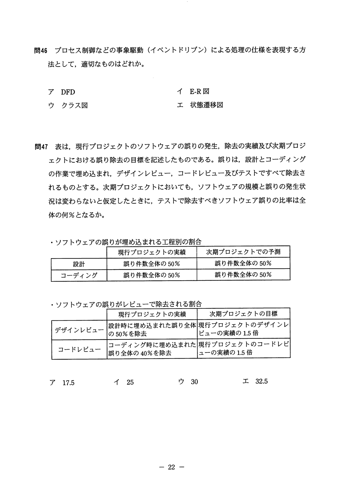

テキスト (OCR)

P46 プロセス制御などの事象駆動 (イベントドリプン) による処理の仕様を表現する方
法として, 適切なものはどれか。

ア DFD            イ ERX
ウ クラス図             エ 状態遷移図

問47 表は, 現行プロジェクトのソフトウェアの誤りの発生, 除去の実績及び次期プロジ
エクトにおける誤り除去の目標を記述したものである。誤りは, 設計とコーディング
の作業で埋め込まれ, デザインレビュー, コードレビュー及びテストですべて除去さ
れるものとする。次期プロジェクトにおいても, ソフトウェアの規模と誤りの発生状
況は変わらないと仮定したときに, テストで除去すべきソフトウェア誤りの比率は全
体の何% となるか。

・ソフトウェアの誤りが埋め込まれる工程別の割合

現行プロジェクトの実績   次期プロジェクトでの予測
設計         誤り件数全体の 50%        誤り件数全体の 50%

コーディング      誤り件数全体の 50%        誤り件数全体の 50%

・ソフトウェアの誤りがレビューで除去される割合

現行プロジェクトの実績    次期プロジェクトの目標
デザインレビュー  設計時に埋め込まれた誤り全体|現行プロジェクトのデザインレ
の 50%を除去              ビューの実績の 1.5 倍
コードレビュー   コーディング時に埋め込まれた|現行プロジェクトのコードレビ
誤り全体の 40%を除去       ューの実績の 1.5 倍

ア 17.5     イ 25      ウ 30      xm 32.5

ー 22 一

### ページ 23

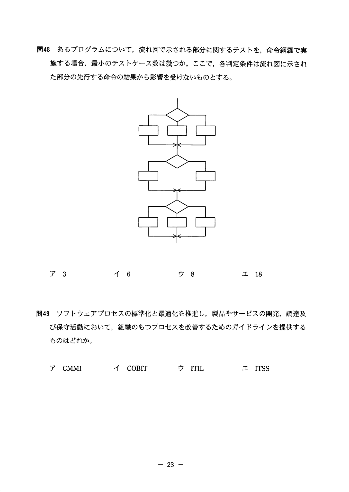

テキスト (OCR)

問48 あるプログラムについて, 流れ図で示される部分に関するテストを, 命令網羅で実
施する場合, 最小のテストケース数は幾つか。ここで, 各判定条件は流れ図に示され
た部分の先行する命令の結果から影響を受けないものとする。

ーー
でエー

=

| |
Lf J

問49 ソフトウェアプロセスの標準化と最適化を推進し, 製品やサービスの開発, 調達及
び保守活動において, 組織のもつプロセスを改善するためのガイドラインを提供する
ものはどれか。

ア CMMI    イ COBIT    ウ ITIL     < ITSS

### ページ 24

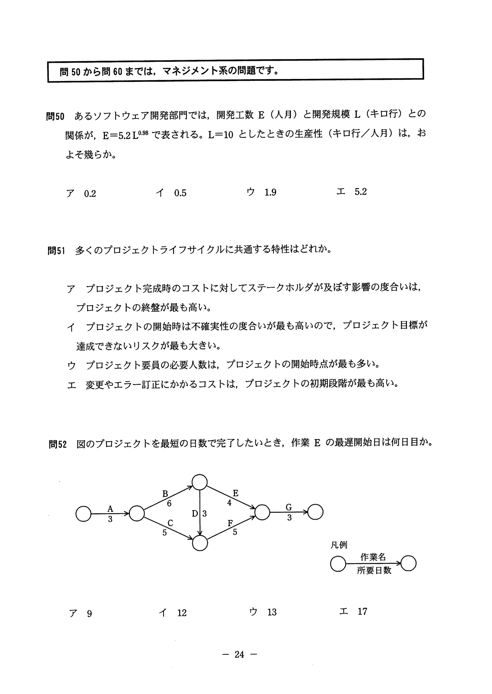

テキスト (OCR)

問 50 から問 60 までは, マネジメント系の問題です。

問50 あるソフトウェア開発部門では, 開発工数 E (AA) と開発規模 し (キロ行) との
関係が, E=5.2L°% で表される。 L=10 としたときの生産性 (キロ行/人月) は, お

よそ幾らか。

ア 0.2      イ 0.5      ウ 19      xm 5.2

問51 多くのプロジェクトライフサイクルに共通する特性はどれか。

ア プロジェクト完成時のコストに対してステークホルダが及ぼばす影響の度合いは,
プロジェクトの終盤が最も高い。

イ プロジェクトの開始時は不稚実性の度合いが最も高いので, プロジェクト目標が
達成できないリスクが最も大きい。

ウ プロジェクト要員の必要人数は, プロジェクトの開始時点が最も多い。

エ 変更やエラー訂正にかかるコストは, プロジェクトの初期段階が最も高い。

問52 図のプロジェクトを最短の日数で完了したいとき, 作業 E の最遅開始日は何日目か。

### ページ 25

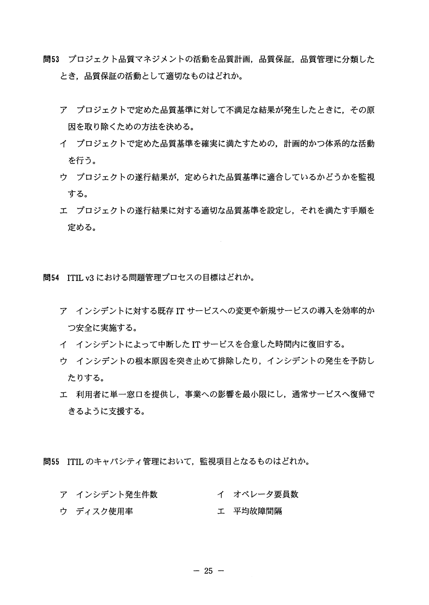

テキスト (OCR)

問53 プロジェクト品質マネジメントの活動を品質計画, 品質保証, 品質管理に分類した
とき, 品質保証の活動として適切なものはどれか。

ア プロジェクトで定めた品質基準に対して不満足な結果が発生したときに, COR
因を取り除くための方法を決める。

イ プロジェクトで定めた品質基準を確実に満たすための, 計画的かつ体系的な活動
を行う。

ウ プロジェクトの遂行結果が, 定められた品質基準に適合しているかどうかを監視
する。

L プロジェクトの遂行結果に対する適切な品質基準を設定し, それを満たす手順を
定める。

問54 ITIL v3 における問題管理プロセスの目標はどれか。

ア インシデントに対する既存 IT サービスへの変更や新規サービスの導入を効率的か
つ安全に実施する。

イ インシデントによって中断した IT サービスを合意した時間内に復旧する。

ウ インシデントの根本原因を突き止めて排除したり, インシデントの発生を予防し
たりする。

エエ 利用者に単一窓口を提供し, 事業への影響を最小限にし, 通常サービスへ復帰で
きるように支援する。

問55 ITIL のキャパシティ管理において, 監視項目となるものはどれか。

ア インシデント発生件数      イ オペレータ要員数
ウ ディスク使用率         エ 平均故障間隔

ー 25 一

### ページ 26

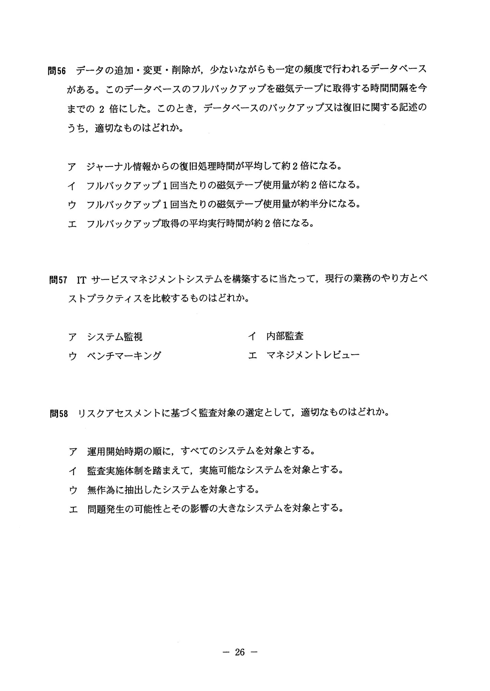

テキスト (OCR)

問56 データの追加・変更・削除が, 少ないながらも一定の頻度で行わむれるデータベース
がある。このデータベースのフルバックアップを磁気テープに取得する時間間隔を今
までの 2 倍にした。このとき, データベースのバックアップ文は復旧に関する記述の
うち, 適切なものはどれか。

ジャーナル情報からの復旧処理時間が平均して約 2 倍になる。
フルバックアップ1 回当たりの磁気テープ使用量が約 2 倍になる。
フルバックアップ1 回当たりの磁気テープ使用量が約半分になる。
フルバックアップ取得の平均実行時間が約 2 倍になる。

H GAS

問57 IT サービスマネジメントシステムを構築するに当たって, 現行の業務のやり方とベ
ストプラクティスを比較するものはどれか。

ア システム監視           イ 内部監査
ウ ベンチマーキング                エ マネジメントレビュー

FASB リスクアセスメントに基づく監査対象の選定として, 適切なものはどれか。

運用開始時期の順に, すべてのシステムを対象とする。

監査実施体制を踏まえて, 実施可能なシステムを対象とする。
無作為に抽出したシステムを対象とする。

問題発生の可能性とその影響の大きなシステムを対象とする。

H へ

ー 26 一

### ページ 27

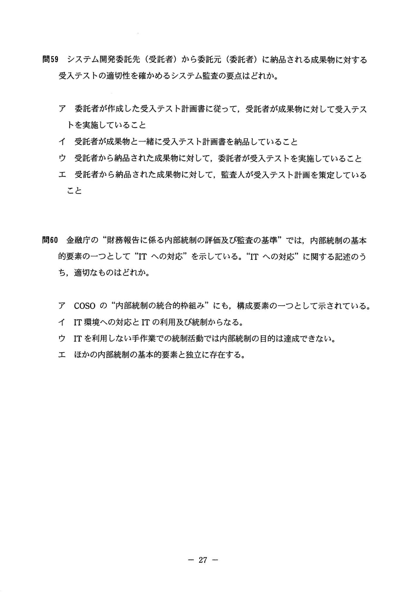

テキスト (OCR)

59 システム開発委託先 (受託者) から委託元 (委託者) に納品される成果物に対する
受入テストの適切性を確かめるシステム監査の要点はどれか。

ア 委託者が作成した受入テスト計画書に従って, 受託者が成果物に対して受入テス
トを実施していること

イ 受託者が成果物と一緒に受入テスト計画書を納品していること

ウ 受託者から納品された成果物に対して, 委託者が受入テストを実施していること

エエ 受託者から納品された成果物に対して, 監査人が受入テスト計画を策定している
こと

問60 金融庁の“財務報告に係る内部統制の評価及び監査の基準” では, 内部統制の基本
的要素の一つとして “IT への対応" を示している。 “IT への対応" に関する記述のう
ち, 適切なものはどれか。

COSO の“内部統制の統合的桁組み” にも, 構成要素の一つとして示されている。
IT 環境への対応とIT の利用及び統制からなる。

IT を利用しない手作業での統制活動では内部統制の目的は達成できない。

ほかの内部統制の基本的要素と独立に存在する。

H GAN

ー 27 一

### ページ 28

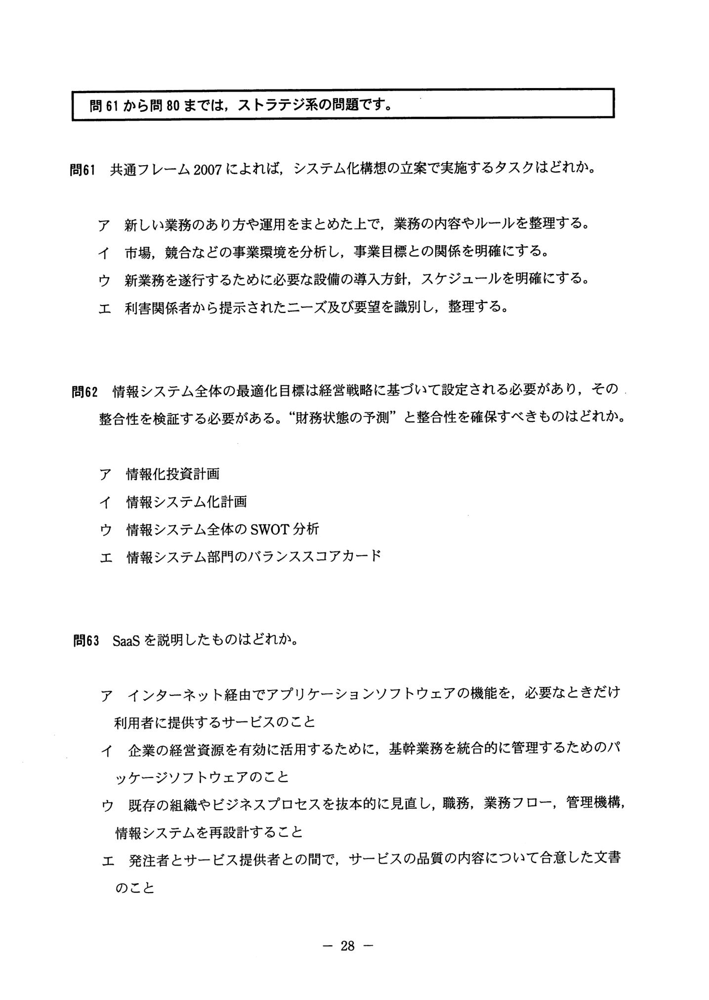

テキスト (OCR)

問 61 から問 80 までは, ストラテジ系の問題です。

間61 共通フレーム 2007 によれば, システム化構想の立案で実施するタスクはどれか。

ア 新しい業務のあり方や運用をまとめた上で, 業務の内容やルールを整理する。
イ 市場, 競合などの事業環境を分析し, 事業目標との関係を明確にする。

ウ 新業務を遂行するために必要な設備の導入方針, スケジュールを明確にする。
エ 利害関係者から提示されたニーズ及び要望を識別し, BETS.

問62 情報システム全体の最適化目標は経営戦略に基づいて設定される必要があり, その
整合性を検証する必要がある。"財務状態の予測"と整合性を確保すべきものはどれか。

ア 情報化投資計画

イ 情報システム化計画

ウ 情報システム全体の SWOT 分析

エ 情報システム部門のバランススコアカード

問63 SaaS を説明したものはどれか。

ア インターネット経由でアプリケーションソフトウェアの機能を, 必要なときだけ
利用者に提供するサービスのこと

イ 企業の経営資源を有効に活用するために, 基幹業務を統合的に管理するためのパ
ッケージソフトウェアのこと

ウ 既存の組織やビジネスプロセスを抜本的に見直し, 職務, 業務フロー, 管理機構
情報システムを再設計すること

エ 発注者とサービス提供者との間で, サービスの品質の内容について合意した文書
のこと

### ページ 29

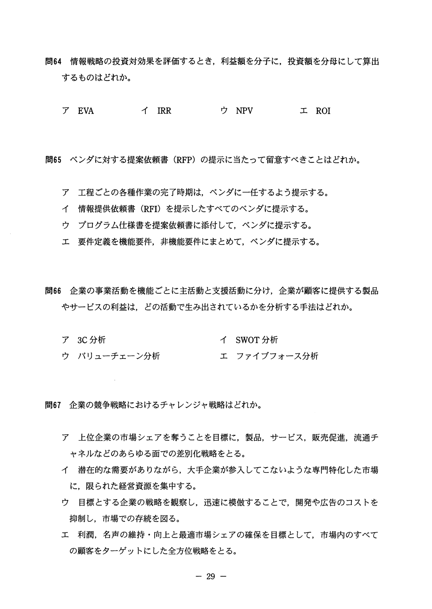

テキスト (OCR)

問64 情報戦略の投資対効果を評価するとき, 利益額を分子に, 投資額を分母にして算出
するものはどれか。

ア EVA     イ IRR     ウ NPV     <= ROI

FIGS ベンダに対する提案依頼書 (RFP) の提示に当たって留意すべきことはどれか。

工程ごとの各種作業の完了時期は。 ベンダに一任するよう提示する。
情報提供依頼書 (RFI) を提示したすべてのベンダに提示する。
プログラム仕様書を提案依頼書に添付して, ベンダに提示する。
要件定義を機能要件, 非機能要件にまとめて, ベンダに提示する。

Hさへさい

問66 企業の事業活動を機能ごとに主活動と支援活動に分け, 企業が顧客に提供する製品
やサービスの利益は, どの活動で生み出されているかを分析する手法はどれか。

ア 3C分析                    イ SWOT分析
ウ パリューチェーン分析       L ファイブフォース分析

問67 企業の競争戦略におけるチャレンジャ戦略はどれか。

ア 上位企業の市場シェアを奪うことを目標に, 製品,サービス, 販売促進, 流通チ
ャネルなどのあらゆる面での差別化戦略をとる。

イ 潜在的な電要がありながら, 大手企業が参入してこないような専門特化した市場
に, 限られた経営資源を集中する。

ウ 目標とする企業の戦略を観察し, 迅速に模條することで, 開発や広告のコストを
抑制し, 市場での存続を図る。

エエ 利潤, 名声の維持・向上と最適市場シェアの確保を目標として, 市場内のすべて
の顧客をターゲットにした全方位戦略をとる。

ー 29 一

### ページ 30

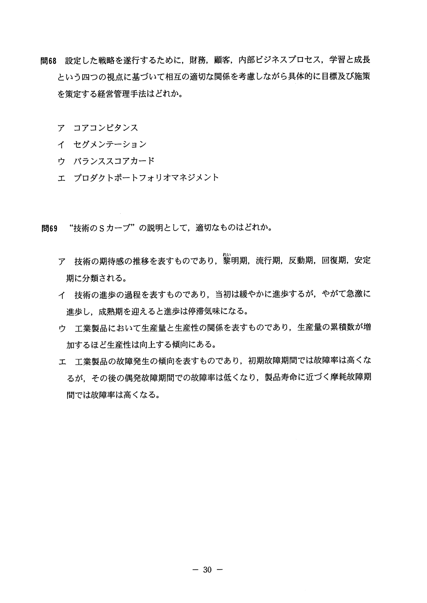

テキスト (OCR)

問68 設定した戦略を遂行するために, 財務, Be, 内部ビジネスプロセス, 学習と成長
という四つの視点に基づいて相互の適切な関係を考慮しながら具体的に目標及び施策
を策定する経営管理手法はどれか。

コアコンピタンス

セグメンテーション

バランススコアカード

プロダクトボートフォリオマネジメント

HUAN

問69 “技術のS カーブ" の説明として, 適切なものはどれか。

ア 技術の期待感の推移を表すものであり, BU, 流行期, 反動期, 回復期, 安定
期に分類される。

A 技術の進歩の過程を表すものであり, 当初は緩やかに進歩するが, やがて急激に
進歩し, 成府期を迎えると進歩は停消気味になる。

ウ 工業製品において生産量と生産性の関係を表すものであり, 生産量の累積数が増
加するほど生産性は向上する傾向にある。

エ 工業製品の故障発生の傾向を表すものであり, 初期政障期間では故障率は高くな
るが, その後の偶発才障期間での履障率は低くなり, 製品寿命に近づく摩耗故障期
間では故障率は高くなる。

ー 30 一

### ページ 31

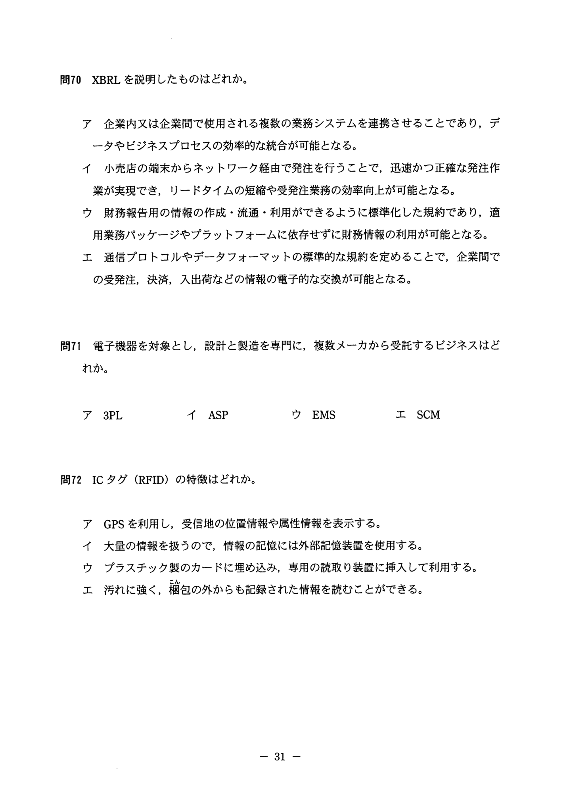

テキスト (OCR)

間70 XBRL を説明したものはどれか。

ア 企業内又は企業間で使用される複数の業務システムを連携させることであり, デ
ータやビジネスプロセスの効率的な統合が可能となる。

イ 小売店の端末からネットワーク経由で発注を行うことで, 迅速かつ正確な発注作
業が実現でき, リードタイムの短縮や受発注業務の効率向上が可能となる。

ウ 財務報告用の情報の作成・流通・利用ができるように標準化した規約であり, 適
用業務パッケージやプラットフォームに依存せずに財務情報の利用が可能となる。
L 通信プロトコルやデータフォーマットの標準的な規約を定めることで, PRET

の受発注, RA, 入出荷などの情報の電子的な交換が可能となる。

問71 電子機器を対象とし, 設計と製造を専門に, 複数メーカから受託するビジネスはど
れか。

ア 3PL     イ ASP     ウ EMS     = SCM

間72 IC タグ (RFID) の特徴はどれか。

GPS を利用し, 受信地の位置情報や属性情報を表示する。

大量の情報を扱うので, 情報の記憶には外部記憶装置を使用する。

プラスチック製のカードに埋め込み, 専用の読取り装置に挿入して利用する。
治れに強く, 和樹包の外からも記録された情報を読むことができる。

H へ

ー 31 一

### ページ 32

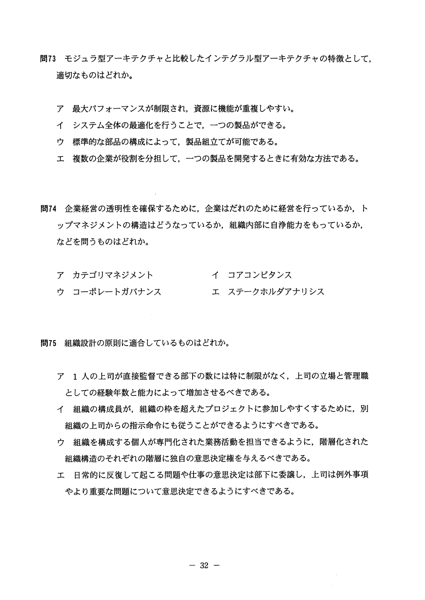

テキスト (OCR)

間73 モジュラ型アーキテクチャと比較したインテグラル型アーキテクチャの特徴として
適切なものはどれか。

最大パフォーマンスが制限され, 資源に機能が重複しやすい。

システム全体の最適化を行うことで, 一つの製品ができる。

標準的な部品の構成によって, 製品組立てが可能である。

複数の企業が役割を分担して, 一つの製品を開発するときに有効な方法である。

H へ

問74 企業経営の透明性を確保むるために, 企業はだれのために経営を行っているか, ト
ップマネジメントの構造はどうなっているか, 組織内部に自浄能力をもっているか
などを問うものはどれか。

ア カテゴリマネジメント       イ コアコンピタンス
ウ コーボレートガバナンス      エ ステークホルダアナリシス

問75 組織設計の原則に適合しているものはどれか。

ア 1 人の上司が直接監督できる部下の数には特に制限がなく, 上司の立場と管理職
としての経験年数と能力によって増加させるべきである。

イ 組織の構成員が, 組織の枠を超えたプロジェクトに参加しやすくするために, Fill
組織の上司からの指示命令にも従うことができるようにすべきである。

ウ 組織を構成する個人が専門化された業務活動を担当できるように, 階層化された
組織構造のそれぞれの階層に独自の意思決定権を与えるべきである。

エエ 日常的に反復して起こる問題や仕事の意思決定は部下に委譲し, 上司は例外事項
やより重要な問題について意思決定できるようにすべきである。

ー 32 一

### ページ 33

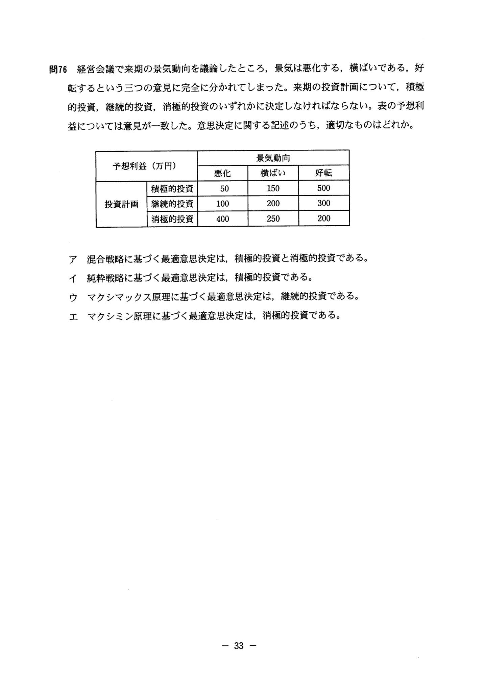

テキスト (OCR)

問76 経営会議で来期の景気動向を議論したところ, 景気は悪化する, 横ばいである, HF
転するという三つの意見に完全に分かれてしまった。来期の投資計画について, 積極
的投資, 継続的投資, 消極的投資のいずれかに決定しなければならない。表の予想利
益については意見が一致した。意思決定に関する記述のうち, 適切なものはどれか。

H さっさい

景気動向
MM          悪化       横ばい        好転
積極的投資         50             150             500
投資計画 | 継続的投資  100    200   300
消極的投資        400            250            200

混合戦略に基づく最適意思決定は, 積極的投資と消極的投資である。
純粋戦略に基づく最適意思決定は, 積極的投資である。

マクシマックス原理に基づく最適意思決定は, 継続的投資である。
マクシミン原理に基づく最適意思決定は, 消極的投資である。

ー 33 一

### ページ 34

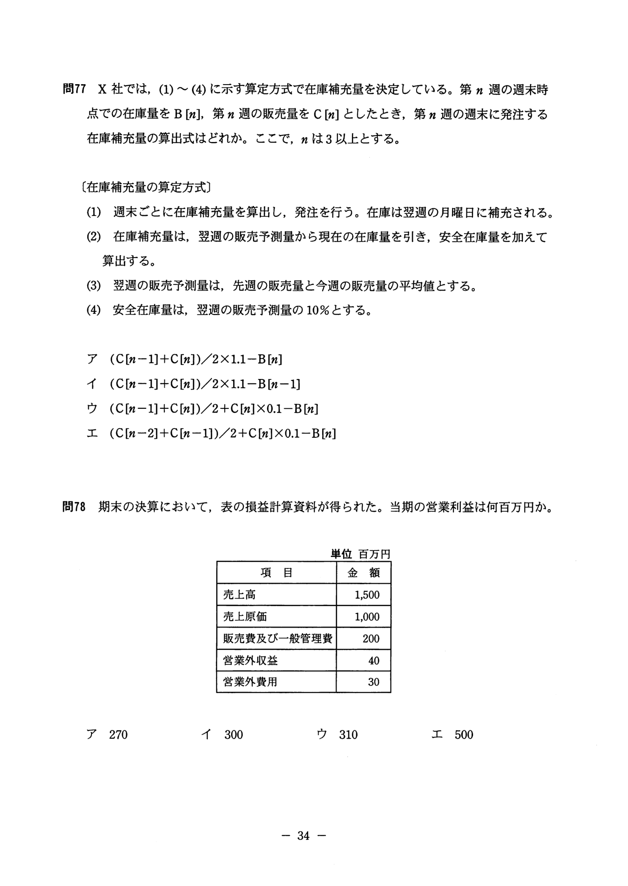

テキスト (OCR)

問77 X 社では, ①) ~@ に示す算定方式で在庫補充量を決定している。第 ヵ 週の週末時
点での在庫量を B [], Bn 週の販売量を Cin] としたとき, Bn 週の週末に発注する
在庫補充量の算出式はどれか。ここで, ぁヵ は3 以上とする。

(在庫補充量の算定方式

Q) 週末ごとに在庫補充量を算出し, 発注を行う。在庫は翌週の月曜日に補充される。

2) 在庫補充量は, 翌週の販売予測量から現在の在庫量を引き, 安全在庫量を加えて
算出する。

3) 翌週の販売予測量は, 先週の販売量と今週の販売量の平均値とする。

(4) 安全在庫量は, 翌週の販売予測量の 10%とする。

ア (C{m—-1)+C[n))/2X1.1—-B[n]

イ (Cln-1)+C[n))/2X1.1—-Bln—-1)

ウ (C[n—1]+C[n])/2+C [n] x0.1—B [x]

エエ (C{n—2]+C[n—1))/2+C[n]X0.1—-B[n]

R78 期末の決算において, 表の損益計算資料が得られた。当期の営業利益は何百万円か。

単位 百万円
項 目             金 額
売上高                         1,500
売上原価                       1,000
販売費及び一般管理費        200
営業外収益                          40
営業外費用                       30

ア 270      イ 300      ウ 310      <= 500

ー 34 一

### ページ 35

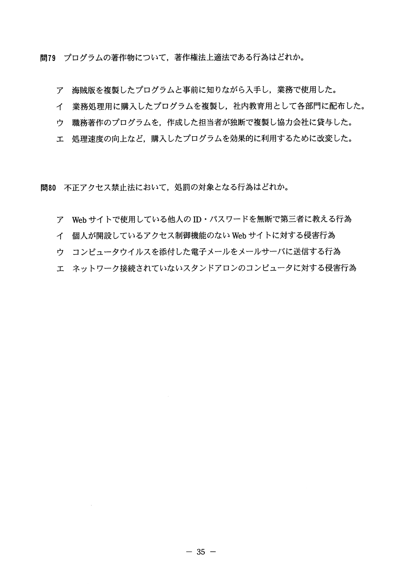

テキスト (OCR)

間79 プログラムの著作物について, 著作権法上適法である行為はどれか。

ア
イ
ウ
x

海賊版を複製したプログラムと事前に知りながら入手し, 業務で使用した。

業務処理用に購入したプログラムを複製し, 社内教育用として各部門に配布した。
職務著作のプログラムを, 作成した担当者が独断で複製し協力会社に貸与した。
処理速度の向上など, 購入したプログラムるを効果的に利用するために改変した。

問80 不正アクセス禁止法において, 処罰の対象となる行為はどれか。

HOGAN

Web サイトで使用している他人のID・パスワードを無断で第三者に教える行為
個人が開設しているアクセス制御機能のない Web サイトに対する侵害行為

コンピュータウイルスを添付した電子メールをメールサーバに送信する行為
ネットワーク接続されていないスタンドアロンのコンピュータに対する侵害行為

ー 35 一

### ページ 36

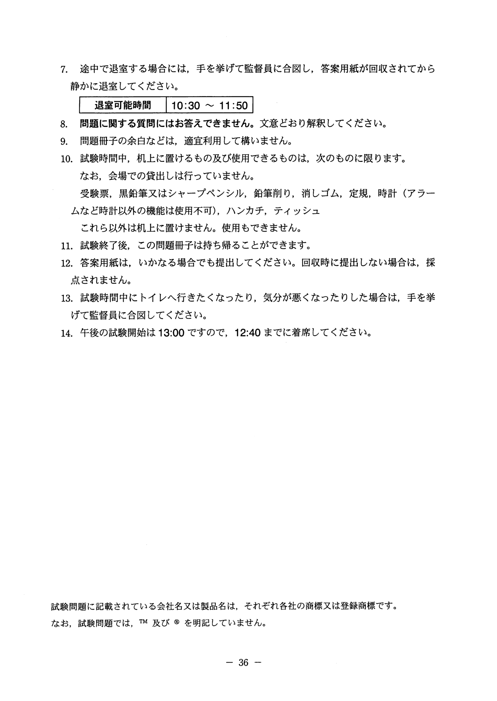

テキスト (OCR)

7. 途中で退室する場合には, 手を挙げて監督員に合図し, 答案用紙が回収されてから
静かに退室してください。
| 退室可能時間 | 10:30 ~ 11:50
. 間題に関する質問にはお答えできません。文意どおり解釈してください。
9. 問題冊子の余白などは, 適宜利用して構いません。
10. 試験時間中, 机上に置けるもの及び使用できるものは, 次のものに限ります。
なお, 会場での貸出しは行っていません。
受験票, 黒鉛筆又はシャープペンシル, 鉛筆削り, 消しゴム, 定規, 時計 (アラー
ムなど時計以外の機能は使用不可), ハンカチ, ティッシュ
これら以外は机上に置けません。使用もできません。
11. 試験終了後, この問題冊子は持ち帰ることができます。
12. SRAM, いかなる場合でも提出してください。回収時に提出しない場合は, 採
点されません。
13. 試験時間中にトイレへ行きたくなったり, 気分が悪くなったりした場合は, FER
げて監督員に合図してください。
14. 午後の試験開始は 13:00 ですので, 12:40 までに着席してください。

試験問題に記載されている会社名又は製品名は, それぞれ各社の商標又は登録商標です。
なお, 試験問題では, ™ 及び © を明記していません。

ー 36 一

---

## 午前解答

Copyright(c) Information-technology Promotion Agency, Japan. All rights reserved 2010 
平成22 年度 春期 応用情報技術者試験 解答例 
 
午前試験 
問番号 
正解 
問1 
ア 
問2 
ウ 
問3 
イ 
問4 
イ 
問5 
ア 
問6 
ア 
問7 
エ 
問8 
ア 
問9 
ウ 
問10 
ウ 
問11 
エ 
問12 
ア 
問13 
ウ 
問14 
ア 
問15 
ア 
問16 
ウ 
問17 
ア 
問18 
エ 
問19 
エ 
問20 
エ 
 
 
問番号 
正解 
問21 
ア 
問22 
ウ 
問23 
ウ 
問24 
エ 
問25 
エ 
問26 
エ 
問27 
イ 
問28 
エ 
問29 
エ 
問30 
ウ 
問31 
イ 
問32 
イ 
問33 
エ 
問34 
ウ 
問35 
ウ 
問36 
イ 
問37 
ア 
問38 
イ 
問39 
エ 
問40 
エ 
 
 
問番号
正解 
問41 
ア 
問42 
イ 
問43 
ア 
問44 
ウ 
問45 
ウ 
問46 
エ 
問47 
エ 
問48 
ア 
問49 
ア 
問50 
ア 
問51 
イ 
問52 
ウ 
問53 
イ 
問54 
ウ 
問55 
ウ 
問56 
ア 
問57 
ウ 
問58 
エ 
問59 
ウ 
問60 
イ 
 
 
問番号 
正解 
問61 
イ 
問62 
ア 
問63 
ア 
問64 
エ 
問65 
エ 
問66 
ウ 
問67 
ア 
問68 
ウ 
問69 
イ 
問70 
ウ 
問71 
ウ 
問72 
エ 
問73 
イ 
問74 
ウ 
問75 
エ 
問76 
エ 
問77 
ア 
問78 
イ 
問79 
エ 
問80 
ア

---

## 午後問題

### ページ 1

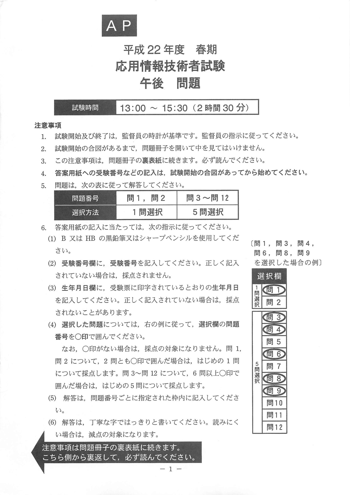

テキスト (OCR)

平成 22年度 春期
応用情報技術者試験
午後 問題

We 13:00 ~ 15:30 (2時間30分)

注意事項
試験開始及び終了は, 監督貞の時計が基準です。監督貞の指示に従ってください。

試験開始の合図があるまで, 問題冊子を開いて中を見てはいけません。
この注意事項は, 問題冊子の裏表紙に続きます。必ず読んでください。
答案用紙への受験番号などの記入は, 試験開始の合図があってから始めてください。

1.

2
3
4.
5

6.

注意事項は問題冊子の裏表紙に続きます。
こちら側から裏返して, 必ず読んでください。

問題は, 次の表に従って解答してください。

問題番号   il, 間2  問3 >問 12
選択方法          1 間選択         5 問選択

答案用紙の記入に当たっては, 次の指示に従ってください。

Q①) B 又は HB の黒鉛筆又はシャープペンシルを使用してくだ
さい。

(2) 受験番号欄に, 受験番号を記入してください。正しく記入
されていない場合は, 採点されません。

(3) 生年月日欄に, 受験票に印字されているとおりの生年月日
を記入してください。正しく記入されていない場合は, 採点
されないことがあります。

(4) 選択した問題については, 右の例に従って, 選択欄の問題
番号を〇印で囲んでください。

なお, 〇印がない場合は, 採点の対象になりません。問 1,

FAL 2 について, 2 問とも〇印で囲んだ場合ははじめの 1 問
について採点します。問 3て問 12 について, 6 問以上〇印で
囲んだ場合は, はじめの 5 問について採点します。

(5) 解答は, 問題番号ごとに指定された枠内に記入してくださ
い。

(6) 解答は, 丁寧な字ではっきりと書いてください。読みにく
い場合は, 減点の対象になります。

〔問
問

1, 問3, 4,
6, 問8, 問9

を選択した場合の例}

Shao

### ページ 2

### ページ 3

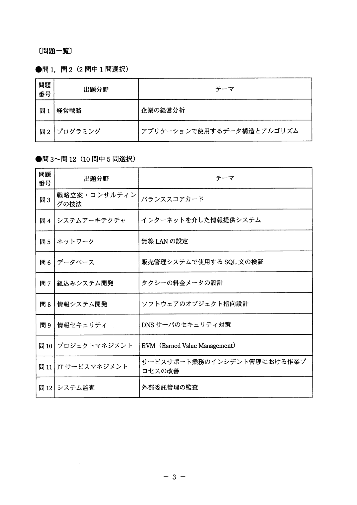

テキスト (OCR)

〔問題一覧〕

@問 1 問2 (2問中1 問選択)

       LL                      テーマ

問1 |経営戦略         企業の経営分析

問2 | プログラミング      アプリケーションで使用するデータ構造とアルゴリズム
@i 3一問 12 (10 問中 5 問選択)

       出題分野                      テーマ

問3

戦略立案・コンサルティン
グの技法

バランススコアカード

問4

システムアーキテクチャ

インターネットを介した情報提供システム

間5 |ネットワーク       無線 LAN の設定

問6 | データベース        販売管理システムで使用する SQL 文の検証
問 7 | 組込みシステム開発    タクシーの料金メータの設計

問 8 | 情報システム開発      ソフトウェアのオプジェクト指向設計
Flo | 情報セキュリティ      DNS サーバのセキュリティ対策

間10

プロジェクトマネジメント

EVM (Earned Value Management)

問11

ITサービスマネジメント

サービスサポート業務のインシデント管理における作業プ
ロセスの改善

問12

システム監査

外部委託管理の監査

### ページ 4

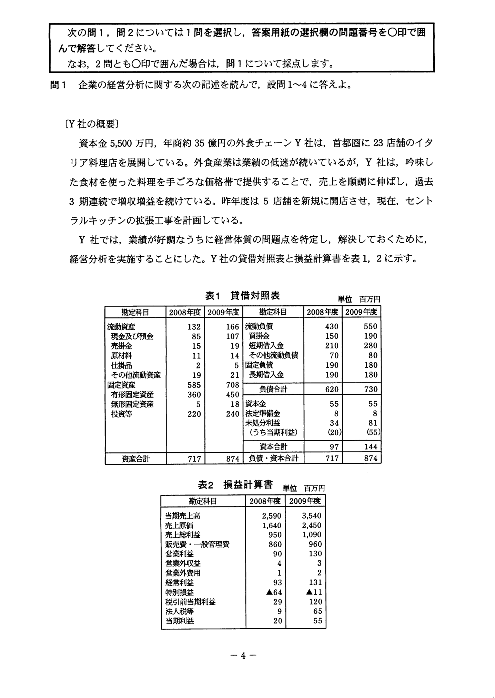

テキスト (OCR)

次の問 1 , 問2 については 1 問を選択し, 答案用紙の選択欄の問題番号を〇印で囲
んで解答してください。
なお, 2 問とも〇印で囲んだ場合は, 問 1 について採点します。

問1 企業の経営分析に関する次の記述を読んで, 設問 14 に答えよ。

〔Y 社の概要]

BAS 5,500 万円, 年商約 35 億円の外食チェーンY tld, 首都圏に 23 店舗のイタ
リア料理店を展開している。外食産業は業績の低迷が続いているが, Y 社は, 吟味し
た食材を使った料理を手ごろな価格帯で提供することで, 売上を順調に伸ばし, 過去
3 期連続で増収増益を続けている。昨年度は 5 店舗を新規に開店させ, 現在, セント
ラルキッチンの拡張工事を計画している。

Y 社では, 業績が好調なうちに経営体質の問題点を特定し, 解決しておくために,
経営分析を実施することにした。Y 社の貸借対照表と損益計算書を表 1, 2 に示す。

表1 貸借対照表      単位 BEF
勘定科目   2008年度 | 2009年度   勘定科目   2008年度 | 2009年度
流動資産         132    166 | 流動負債        430    550
現金及び預金    85   107 | B®     150   190
売掛金      15   19 | 短期借入金    210   280
原材料      11   14 | その他流動負債   70   80
仕掛品         2     5 |固定負債        190    180
その他流動資産   19   21 | 長期借入金    190   180
固定資産      585   708
有形固定資産    360   450 |_ Seat    620   730
無形固定資産       5     18 | 資本金          55     55
投資等         220    240 | 法定準備金         8      8
未処分利益      34    81
(うち当期利益)    (20)}   (65)
資本合計     97   144
資産合計    717   874 | 負債・資本合計   717   874

表2 損益計算書 単位 百万円

勘定科目              2008年度 | 2009年度
当期売上高                              2,590          3,540
売上原価                                  1.640          2,450
売上総利益                                 950           1.090
販売費・一般管理費                   860             960
営業利益                                       90              130
営業外収益                                     4                  3
営業外費用                                      1                  2
経常利益                                 93            131
特別損益                              A64          All
税引前当期利益          29     120
法人税等                                         9                65
当期利益                                 20             55

### ページ 5

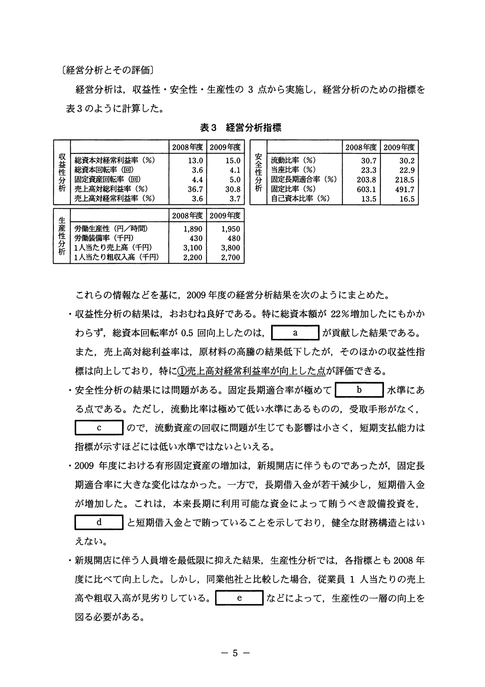

テキスト (OCR)

(

経営分析とその評価〕
経営分析は, 収益性・安全性・生産性の 3 点から実施し, 経営分析のための指標を
表3 のように計算した。
表3 経営分析指標

2008年度 | 2009年度               2008年度 | 2009年度
& | semanas (%)    13.0| 15.0] | & | 流動率 26)     307| so
fe | 総資本回転率 (回)        3.6    4.1 | | ee | 当座比率 (%)       23.3   22.9
分 | 固定資産回転率 (回)      4.4   5.0 | | 分 | 固定長期適合率 (%)  203.8  218.5
析 | 売上高対総利益率 (%)     36.7   30.8 | | 析 | 固定比率 (%)     603.1  491.7
売上高対経常利益率 (%)        3.6      3.7       自己資本比率 (%)       13.5     16.5
内               2008年度 | 2009年度
産 | 労働生産性 (円時間)     1,890   1,950
4 | 労働装備率 (千円)        430    480
| 1人当たり売上高 (F円)    3,100] saoo
1人当たり粗収入高 千円)     2.200| 2.700

これらの情報などを基に, 2009 年度の経営分析結果を次のようにまとめた。

・収益性分析の結果は, おおむね良好である。特に総資本額が 22%増加したにもかか
わらず, 総資本回転率が 0.5 回向上したのは, |  a | が貢献した結果である。
また, 売上高対総利益率は, 原材料の高騰の結果低下したが, そのほかの収益仁指
標は向上しており, 特に①売上高対経常利益率が向上した点が評価できる。

・安全性分析の結果には問題がある。 固定長期適合率が極めて|  b |水準にあ
る点である。ただし, 流動比率は極めて低い水準にあるものの, 受取手形がなく,
 DC, 流動資産の回収に問題生じても影響は小さく, 短期支払能力は
指標が示すほどには低い水準ではないといえる。

・2009 年度における有形固定資産の増加は, 新規開店に伴うものであったが, 固定長
期適合率に大きな変化はなかった。一方で, 長期借入金が若干減少し, 短期借入金
が増加した。これは, 本来長期に利用可能な資金によって賭うべき設備投資を,
[| 3 | と短期借入金とで賭っつていることを示しており, 健全な財務構造とはい
えない。

・新規開店に伴う人員増を最低限に抑えた結果 生産性分析では, 各指標とも 2008 年
度に比べて向上した。しかし, 同業他社と比較した場合 従業員 1 人当たりの売上
高や粗収入高が見劣りしている。 [|  e |] などによって, 生産性の一層の向上を
図る必要がある。

### ページ 6

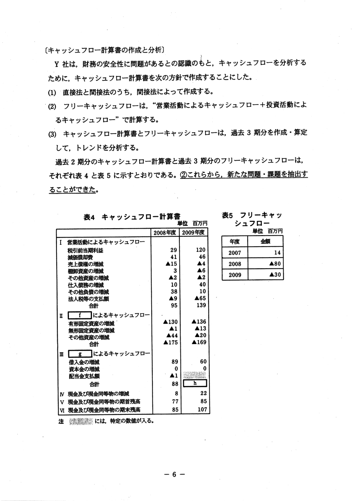

テキスト (OCR)

(キャッシュフロー計算書の作成と分析)
Y 社は, 財務の安全性に問題があるとの認識のもと, キャッシュフローを分析する
ために, キャッシュフロー計算書を次の方針で作成することにした。
(1) 直接法と間接法のうち, 間接法によって作成する。
Q) フリーキャッシュフローは, “営業活動によるキャッシュフロー+投資活動によ
るキャッシュフロー" で計算する。
(⑬) キャッシュフロー計算書とフリーキャッシュフローは, 過去 3 期分を作成・算定
して, トレンドを分析する。
過去 2 期分のキャッシュフロー計算書と過去 3 期分のフリーキャッシュフローは,
それぞれ表 4 と表 5 に示すとおりである。②これらから, 新たな問題・課題を抽出3
ることができた。

表4 キャッシュフロー計算書         表5 フリーキャッ
単位 BAA              シュフロー
2008年度 | 2009年度                         単位 百万円
I 営業活動にによるキャッシュフロー                                           年度           oA
税引前当期利益                                  2          120            2007                 14
売上債権の増減                                415          a4            2008              480
棚卸資産の増減                                    3           a6
EOP OM                               a2           a2            2009               430
仕入債務の増滅                                  10           40
その他人負債の増減                                38            10
法人税等の支払額                               a9         465
合計                                     95          139
u Cf ]によるキャッシュフロー| ・
有形固定資産の増江                        4^130| 4136
無形固定資産の増減                            al         ^13
その他資産の増減                             444         420
合計                                 A175| 4169
u Cg ]によるキャッシュフロー
借入金の増減                                     89            60
資本金の増減
配当金支払額
合計
IM 現金及び現金同等物の増減
V 現金及び現金同等物の期首残高
Vi 現金及び現金同等物の期末残高                85          107

注     OES には, 特定の数値が入る。

### ページ 7

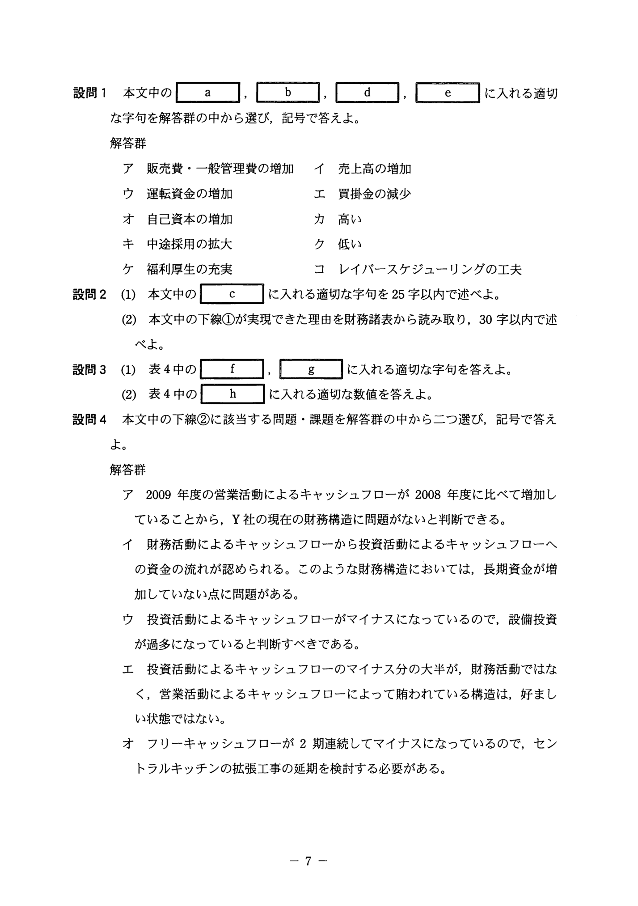

テキスト (OCR)

設問1 本文中の| ai |,| b |,| da |,| ec |に入れる適切
な字句を解答群の中から選び, 記号で答えよ。
解答群
ア 販売費・一般管理費の増加 イ 売上高の増加
ウ 運転資金の増加       エ 買掛金の減少
オ 自己資本の増加       A 高い
キ 中途採用の拡大       ク 低い
ケ 福利厚生の充実       コ レイバースケジューリングの工夫

設問2 ①) 本文中の に入れる適切な字句を 25 字以内で述べよ。
(②) 本文中の下線①が実現できた理由を財務諸表から読み取り, 30 字以内で述
べよ。
設問3 a) 表4中の|  f |, |  g |に入れる適切な字句を答えよ。
(2) 表4中の に入れる適切な数値を答えよ。
設問4 本文中の下線②に該当する問題・課題を解答群の中から二つ選び, 記号で答え
よ。
解答群
ア 2009 年度の営業活動によるキャッシュフローが 2008 年度に比べて増加し
ていることから, Y 社の現在の財務構造に問題がないと判断できる。
4 財務活動によるキャッシュフローから投資活動によるキャッシュフローへ
の資金の流れが認められる。このような財務構造においては, 長期資金が増
加していない点に問題がある。
ウ 投資活動によるキャッシュフローがマイナスになっているので, 設備投資
が過多になっていると判断すべきである。
エエ 投資活動によるキャッシュフローのマイナス分の大半が, 財務活動ではな
く, 営業活動によるキャッシュフローによって賭われている構造は, 好まし
い状態ではない。
A フリーキャッシュフローが 2 期連続してマてイナスになっているので, セン
トラルキッチンの拡張工事の延期を検討する必要がある。

### ページ 8

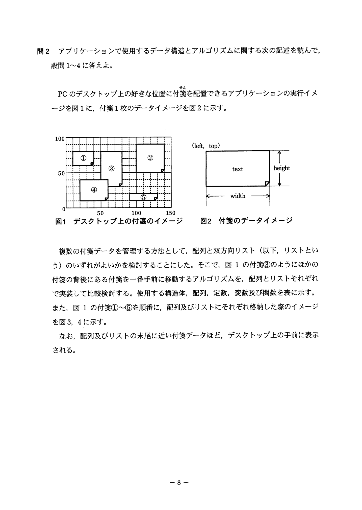

テキスト (OCR)

問2 アプリケーションで使用するデータ構造とアルゴリズムに関する次の記述を読んで
設問 1こ4 に答えよ。

PC のデスクトッ プ上の好きな位置に付箋を配置できるアプリ ケーションの実行イメ
ージを図 1 に, 付箋 1 枚のデータイメージを図 2 に示す。

100

50

0
図1

9
ーーロ      5

TT  Lit

50         100 iso
デスクトップ上の付箋のイメージ

(left, top)

text                 height

width

図2 f#BOF-9A-Y

複数の付箋データを管理する方法として, 配列と双方向リスト (以下, リストとい
う) のいずれがよいかを検討することにした。そこで, 図 1 の付箋②のようにほかの
付箋の背後にある付箋を一番手前に移動するアルゴリズムを, 配列とリストそれぞれ
で実装して比較検討する。使用する構造体, 配列, 定数, 変数及び関数を表に示す。

また, 図 1 の付箋①て⑤を順番に,

を図 3, 4 に示す。
BB, 配列及びリストの末尾に近い付箋データほど, デスクトップ上の手前に表示
される。

配列及びリストにそれぞれ格納した際のイメージ

### ページ 9

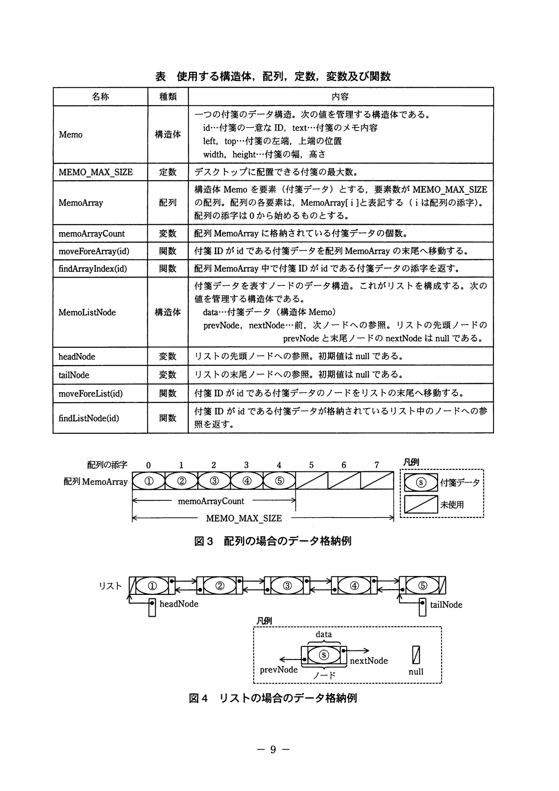

テキスト (OCR)

表 使用する構造体, 配列, 定数, 変数及び関数

名称              種類                                            内容
ーつの付箋のデータ構造。次の値を管理する構造体である。
、           id…付箋の一意な ID, text…付箋のメモ内容
Memo                   MEE Lett, top HOLS, LO KT
width, height…付箋の幅, 高さ

MEMO_MAX SIZE        定数 | デスクトップに配置できる付箋の最大数。

構造体 Memo を要素 (付箋データ) とする, 要素数が MEMO_MAX SIZE
MemoArray           配列 | の配列。配列の各要素は, MemoArray[ i ]と表記する (iは配列の添字)。

配列の添字は 0 から始めるものとする。
memoArrayCount          変数 | 配列MemoArray に格納されている付箋データの個数。
moveForeArray(id)         関数 | 付箋IDがidである付筑データを配列 MemoArray の末尾へ移動する。
findArrayIndex(id)          関数 | 配列 MemoArray 中で付箋 ID がid である付箋データの添字を返す。

付箋データを表すノードのデータ構造。これがリストを構成する。次の
値を管理する構造体である。

MemoListNode             構造体        data…付箋データ (構造体 Memo)
prevNode, nextNode…前, 次ノードへの参照。リストの先頭ノードの
prevNode と末尾ノードの nextNode は null である。

headNode                  変数 | リストの先頭ノードへの参照。初期値は nul CHS.
tailNode           変数 | リストの末尾ノードへの参照。初期値は null である。
moveForeList(id)            関数 | 付箋ID がid である付箋データのノードをリストの末尾へ移動する。

7          ュー      は第データカ                                 _
findListNode(d)      関数   付箋 ID が id である付箋データが格納されているリスト中のノードへの参

照を返す。

配列の添字

5    6    7 Ae

配列 MemoArray

0               1               2               3               4
DOOOO             one

memoArrayCounnt —————}                                              レン 未使用

MEMO_MAX SIZE

図3 配列の場合のデータ格納例

—F] headNode                                                   —FI tailNode

ABI
data
—_—_—
ーーテ
—.Co7   nextNode         M        H
prevNode      ノード                           nul}

図4 リストの場合のデータ格納例

### ページ 10

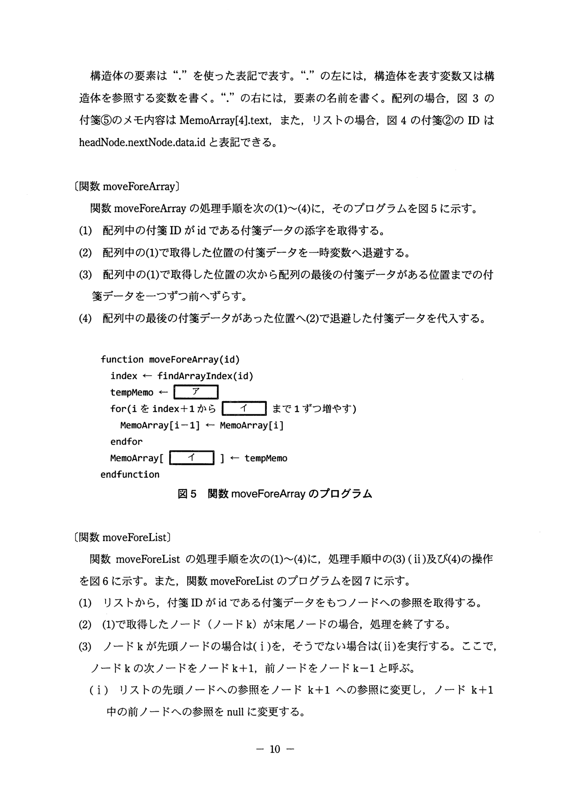

テキスト (OCR)

構造体の要素は “.”を使った表記で表す。“.”の左には, 構造体を表す変数又は構
造体を参照する変数を書く。“.”の右には, 要素の名前を書く。配列の場合, 図 3 の
付箋つのメモ内容は MemoArray[4].text, また, リストの場合, 図 4 の付箋②の ID は
headNode.nextNode.dataid と表記できる。

〔関数 moveForeArray〕
関数 moveForeArray の処理手順を次の(1)て(4)に, そのプログラムを図 5 に示す。
(1) 配列中の付箋 ID がid である付箋データの添字を取得する。
(2) 配列中のQ①)で取得した位置の付箋データを一時変数へ退避する。
3) 配列中の(1)で取得した位置の次から配列の最後の付箋データがある位置までの付
箋データを一つずつ前へずらす。
(4) 配列中の最後の付箋データがあった位置へ(②)で退避した付箋データを代入する。

function moveForeArray(1id)
index < findArrayIndex(id)

tempMemo <

for(i を index二1 から まで1 ずつ増やす)
MemoArray[i—1] MemoArray[i]

endfor

MemoArray[ ] て tempMemo

endfunction
 5 関数 moveForeArray のプログラム

関数 moveForeList)
関数 moveForeList の処理手順を次の(1)~て(④)に, 処理手順中の(3③) (ii)及び(④の操作
を図 6 に示す。また, 関数 moveForeLiss のプログラムを図 7 に示す。
GQ) リストから, 付箋 ID がid である付箋データをもつノードへの参照を取得する。
2) ①で取得したノード (ノードk) が末尾ノードの場合, 処理を終了する。
3) ノードkが先頭ノードの場合は( 1 )を, そうでない場合は(ii)を実行する。ここで,
ノードkの次ノードをノードk十1, 前ノードをノードkー1 と呼ぶ。
(i) リストの先頭ノードへの参照をノード k+1 への参照に変更し, ノード k+1
中の前ノードへの参照を null に変更する。

ー 10 一

### ページ 11

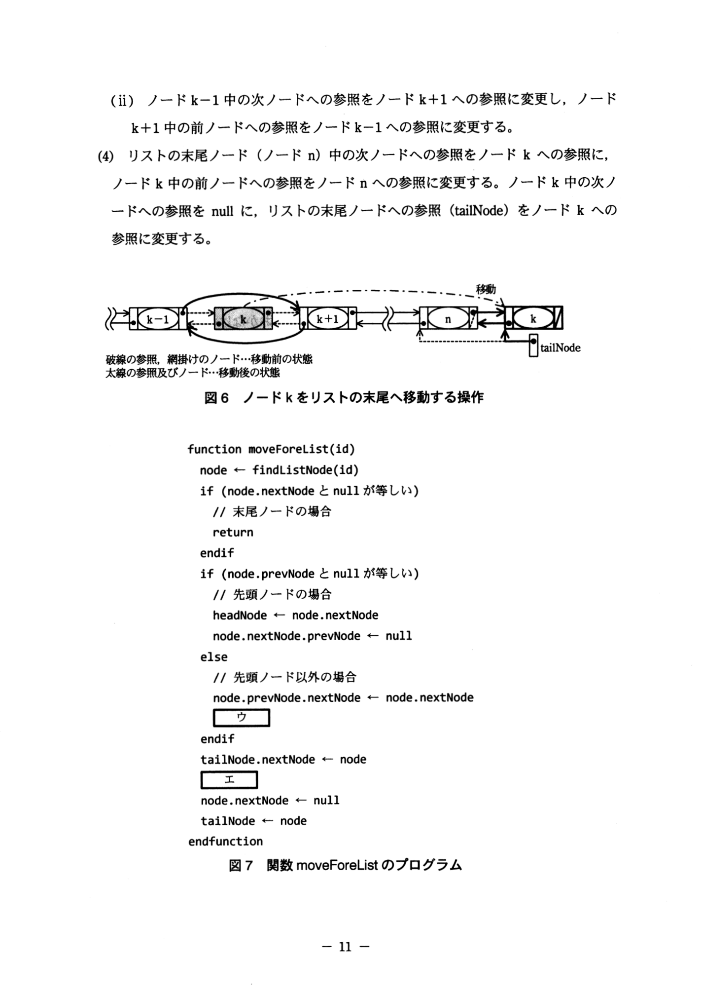

テキスト (OCR)

Gi) ノード k-1 中の次ノードへの参照をノード k十1 への参照に変更し, ノード
k十1 中の前ノードへの参照をノード k-1 への参照に変更する。

(④) リストの末尾ノード (ノード n) 中の次ノードへの参照をノード k への参照に,
ノード k 中の前ノードへの参照をノード n への参照に変更する。ノード k 中の次ノ
ードへの参照を null に, リストの末尾ノードへの参照 (tailNode) をノード k への
参照に変更する。

破線の参照, 網掛けのノード…移動前の状態
太線の参照及びノード…移動後の状態

 6 ノードkをリストの末尾へ移動する操作

function moveForeList(id)
node < findListNode(id)
if (node.nextNode と null が等しい)
// 末尾ノードの場合
return
endif
if (node.prevNode と null が等しい)
// 先頭ノードの場合
headNode ~ node.nextNode
node .nextNode .prevNode < null
else
// 先頭ノード以外の場合
node . prevNode .nextNode < node.nextNode
endif
tailNode.nextNode < node
node.nextNode < null
tai1Node < node
endfunction

 7 関数 moveForeList のプログラム

ー 11 一

### ページ 12

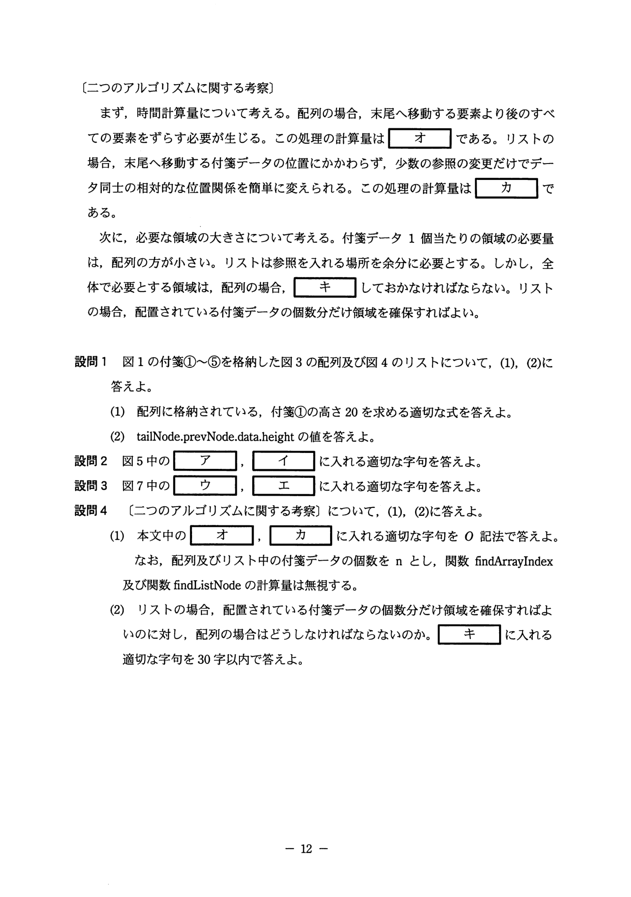

テキスト (OCR)

(二つのアルゴリズムに関する考察〕

まず, 時間計算量について考える。配列の場合 未尾へ移動する要素より後のすべ
ての要素をずらす必要が生じる。この処理の計算量は | オ | である。リストの
BE, 末尾へ移動する付箋データの位置にかかわらず, 少数の参照の変更だけでデー
タ同士の相対的な位置関係を簡単に変えられる。この処理の計算量は[| カ |で
ある。

次に, 必要な傾城の大きさについて考える。付箋データ 1 個当たりの領域の必要量
は, 配列の方が小さい。リストは参照を入れる場所を余分に必要とする。しかし, 全
体で必要とする領域は, 配列の場合, しておかなければならない。リスト
の場合 配置されている付箋データの個数分だけ領域を確保すればよい。

設問1 図1の付箋〇て⑤を格納した図 3 の配列及び図 4 のリストについて, ①⑪, ②に
答えよ。
(1) 配列に格納されている, 付箋〇の高さ 20 を求める適切な式を答えよ。
(2) tailNode.prevNode.data.height の値を答えよ。

設問2 図5中の| 7 |,| イ |に入れる適切な字句を答えよ。
設問3 図7中の| 9 |, | エ |に入れる適切な字句を答えよ。
設問4 〔二つのアルゴリズムに関する考察] について, ①⑪, ②)に答えよ。
Qa 本文中の| オ |,| カ |に入れる適切な字句を O 記法で答えよ。

なお, 配列及びリスト中の付箋データの個数を n とし, 関数 fndArrayIndex
及び関数 fndListNode の計算量は無視する。
(②) リストの場合, 配置されている付箋データの個数分だけ領域を確保すればよ
いのに対し, 配列の場合はどうしなければならないのか。 に入れる
適切な字句を 30 字以内で答えよ。

ー 12 一

### ページ 13

テキスト (OCR)

メモ用紙]

### ページ 14

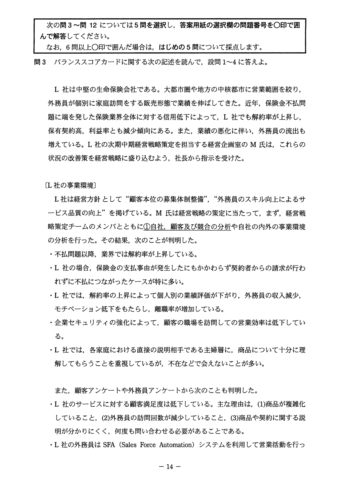

テキスト (OCR)

KOR 3 ー間 12 については5 問を選択し, 答案用紙の選択欄の問題番号を〇印で囲
んで解答してください。
なお, 6 問以上〇印で囲んだ場合は,。 はじめの5 問について採点します。

問3 バランススコアカードに関する次の記述を読んで, 設問14 に答えよ。

L 社は中堅の生命保険会社である。大都市圏や地方の中核都市に営業範囲を絞り,
外務員が個別に家庭訪問をする販売形態で業績を伸ばしてきた。近年保険金不払問
題に端を発した保険業界全体に対する信用低下によって, L 社でも解約率が上昇し
保有契約高, 利益率とも減少傾向にある。また, 業績の悪化に伴い, 外務員の流出も
増えている。 L 社の次期中期経営戦略策定を担当する経営企画室の M Kid, これらの
状況の改善策を経営戦略に盛り込むよう, 社長から指示を受けた。

(L 社の事業環境)

L 社は経営方針 として “顧客本位の募集体制整備", “外務員のスキル向上によるサ
ービス品質の向上” を掲げている。M 氏は経営戦略の策定に当たって, まず, 経営戦
略策定チームのメンバとともに①自社, 顧客及び競合の分析や自社の内外の事業環境
の分析を行った。その結果, 次のことが判明した。

・不払問題以降, 業界では解約率が上昇している。

・L 社の場合, 保険金の支払事由が発生したにもかかわらず契約者からの請求が行わ
れずに不払につながったケースが特に多い。

・L 社では, 解約率の上昇によって個人別の業績評価が下がり, 外務員の収入減少,
モチベーション低下をもたらし, 離職率が増加している。

・企業セキュリティの強化によって, 顧客の職場を訪問しての営業効率は低下してい

る。

・L 社では, 各家庭における直接の説明相手である主婦層に, 商品について十分に理

解してもらうことを重視しているが, 不在などで会えないことが多い。

また, 顧客アンケートや外務員アンケートから次のことも判明した。

・L 社のサービスに対する顧客満足度は低下している。主な理由は, (①商品が複雑化
していること, (②外務員の訪問回数が減少していること, ③)商品や契約に関する説
明が分かりにくく, 何度も問い合わせる必要があることである。

・L 社の外務員は SFA (Sales Force Automation) システムを利用して営業活動を行っ

ー 14 一

### ページ 15

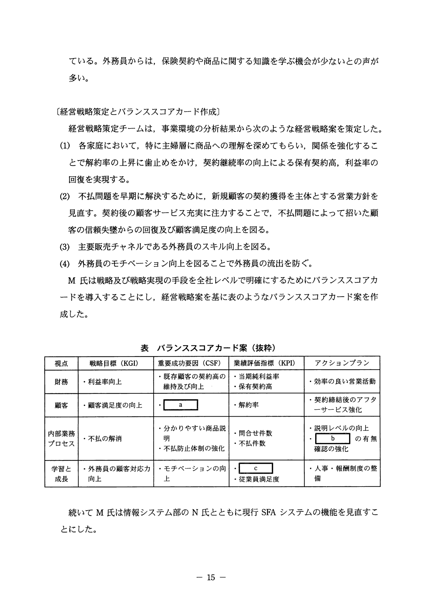

テキスト (OCR)

ている。外務員からは, 保険契約や商品に関する知識を学ぶ機会が少ないとの声が
多い。

〔経営戦略策定とバランススコアカード作成〕
経営戦略策定チームは, 事業環境の分析結果から次のような経営戦略案を策定した。

Q) 各家庭において, 特に主婦層に商品への理解を深めてもらい, 関係を強化するこ
とで解約率の上昇に歯止めをかけ, 契約継続率の向上による保有契約高, 利益率の
回復を実現する。

(2) 不払問題を早期に解決するために, 新規顧客の契約獲得を主体とする営業方針を
見直す。契約後の顧客サービス充実に注カすることで, 不払問題によって招いた顧
客の信頼失墜からの回復及び顧客満足度の向上を図る。

(3) 主要販売チャネルである外務員のスキル向上を図る。

(4) 外務員のモチベーション向上を図ることで外務員の流出を防ぐ。

M 氏は戦略及び戦略実現の手段を全社 レベルで明確にするためにバランススコアカ

ードを導入することにし, 経営戦略案を基に表のようなバランススコアカード案を作

成した。

表 バランススコアカード案 (抜粋)

視点 | 戦略目標 (KGI) | 重要成功要因 (CSF) | 業貫評価指標(KP]) | アクションプラン
・既存願客の契約高の | ・当期純利益率            。
財務 | ・利益率向上             eenome         pean             効率の良い営業活動
、                  «gee       ・契約締結後のアフタ
me |-memexoat |・[ sa |               解約率                     ーサービス際化
業務       "分かりやすい商品| 人      “BAL
プロャス | | PbO mi       明          «Rte       -       の有無
・不払防上体制の強化                              確認の強化
学習と | ・外務員の殿客対応 | ・モチベーションの向|・[ c ]      ・人事・報本制度の整
成長 | 向上                       上                        ・ EAB E             備

続いて M 氏は情報システム部の N 氏とともに現行 SPA システムの機能を見直すこ
とにした。

ー 15 一

### ページ 16

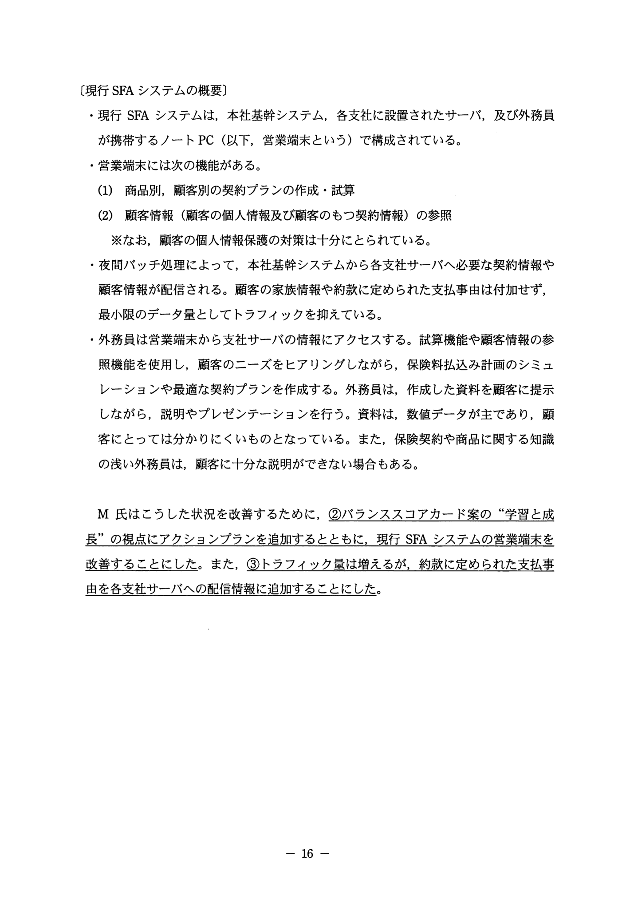

テキスト (OCR)

(BUT SFA システムの概要〕

“BUT SFA システムは, 本社基幹システム, 各支社に設置されたサーバ, 及び外務員
が携帯するノート PC (以下, 営業端末という) で構成されている。

・営業端末には次の機能がある。
①) 商品別, 顧客別の契約プランの作成・試算
2) 顧客情報 (顧客の個人情報及び顧客のもつ契約情報) の参照

※なお, 顧客の個人情報保護の対策は十分にとられている。

・夜間バッチ処理によって, 本社基埋システムから各支社サーバへ必要な契約情報や
顧客情報が配信される。顧客の家族情報や約款に定められた支払事由は付加せず,
最小限のデータ量としてトラフィックを抑えている。

・外務員は営業端末から支社サーバの情報にアクセスする。 試算機能や顧客情報の参
照機能を使用し, 顧客のニーズをヒアリングしながら, 保険料払込み計画のシミュ
レーションや最適な契約プランを作成する。外務員は, 作成した資料を顧客に提示
しながら, 説明やプレゼンテーションを行う。資料は, 数値データが主であり, 顧
客にとっては分かりにくいものとなっている。また, 保険契約や商品に関する知識
の浅い外務員は, 顧客に十分な説明ができない場合もある。

M 氏はこうした状況を改善するために, ②バランススコアカード案の "学習と成
長” の視点にアクションプランを追加するとともに, 現行 SPA システムの営業端末を
改善することにした。また, ③トラフィック量は増えるが, 約款に定められた支払事
貼を各支社サーバへの配信情報に追加することにした。

ー 16 一

### ページ 17

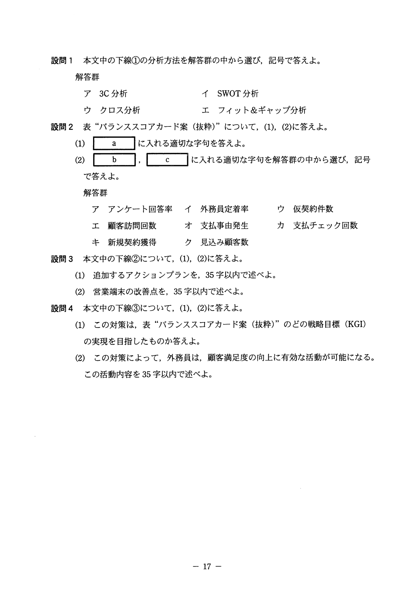

テキスト (OCR)

本文中の下線①の分析方法を解答群の中から選び,
解答群
ア 3C分析

ウ クロス分析
設問2 表 “バランススコアカード案 (抜粋)" について, ①⑪, ②)に答えよ

@ [la |] に入れる適切な字句を答えよ。

設問 1

イ SWOT 分析
エエ フィット避ギャップ分析

② [| 5 |,| < |に入れる適切な字句を解答群の中から選び, 記号
で答えよ。
ST
ア アンケート回答率 イ 外務員定着率   ウ 仮契約件数
エ 顧客訪問回数   オ 支払事由発生   カ 支払チェック回数
ク 見込み顧客数

キ 新規契約獲得

設問3 本文中の下線②について, ①⑪, (②)に答えよ。
Q①) 追加するアクションプランを, 35 字以内で述べよ。

(2) 営業端末の改善点を, 35 字以内で述べよ。

設問4 本文中の下線③について, (D, ②)に答えよ。
(1) この対策は, 表 “バランススコアカード案 (抜粋)" のどの戦略目標 (KGI)

の実現を目指したものか答えよ。
(2) この対策によって, 外務員は, 顧客満足度の向上に有効な活動が可能になる。

この活動内容を 35 字以内で述べよ。

ー 17 一

### ページ 18

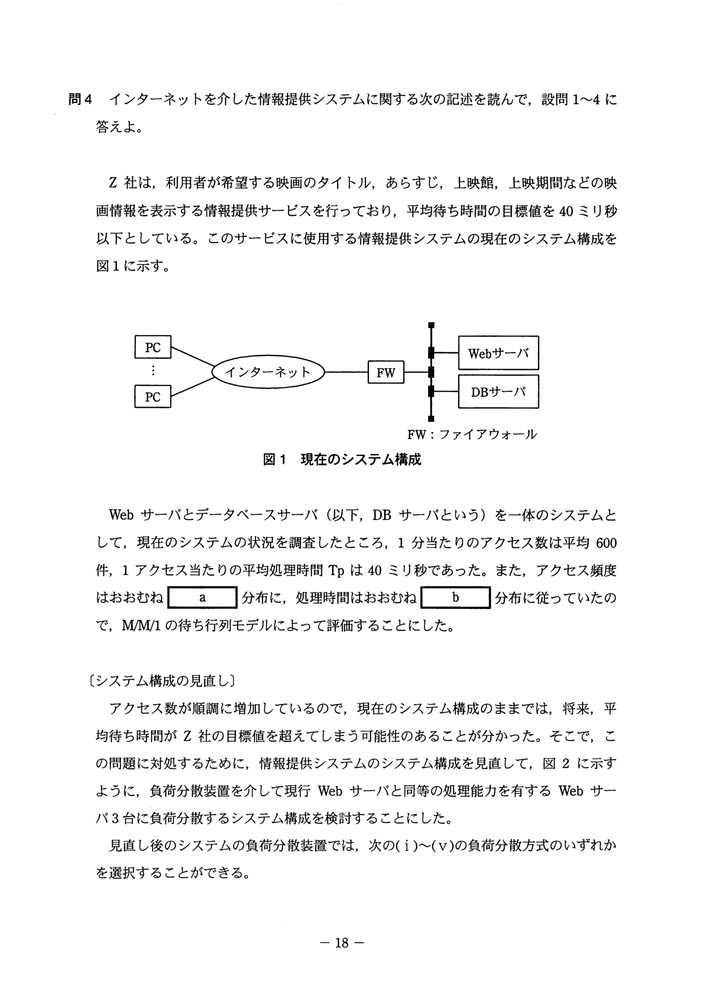

テキスト (OCR)

4 インターネットを介した情報提供システムに関する次の記述を読んで, 設問 1て4 に

答えよ。

Z 社は, 利用者が希望する映画のタイトル, あらすじ, 上映館, 上映期間などの映
画情報を表示する情報提供サービスを行っており, 平均待ち時間の目標値を 40 ミリ秒
以下としている。このサービスに使用する情報提供システムの現在のシステム構成を
図 1 に示す。

Webサーバ

DBサーバ

FW : ファイアウォール
図1 現在のシステム構成

Web サーバとデータベースサーバ (以下, DB サーバという) を一体のシステムと
UT, 現在のシステムの状況を調査したところ, 1 分当たりのアクセス数は平均 600
件, 1 アクセス当たりの平均処理時間 Tp は 40 ミリ秒であった。また, TIC ABBE
はおおむね| a  ] 分布に, 処理時間はおおむね|  b 分布に従っていたの
で, MM/L の待ち行列モデルによって評価することにした。

〔システム構成の見直し]〕

アクセス数が順調に増加しているので, 現在のシステム構成のままでは, 将来, 平
均待ち時間が Z 社の目標値を超えてしまう可能性のあることが分かった。そこで, こ
の問題に対処するために, 情報提供システムのシステム構成を見直して, 2 に示す
ように, 負荷分散装置を介して現行 Web サーバと同等の処理能力を有する Web サー
バ3 台に負荷分散するシステム構成を検討することにした。

見直し後のシステムの負荷分散装置では, 次の(1i)~て(v)の負荷分散方式のいずれか
を選択することができる。

ー 18 一

### ページ 19

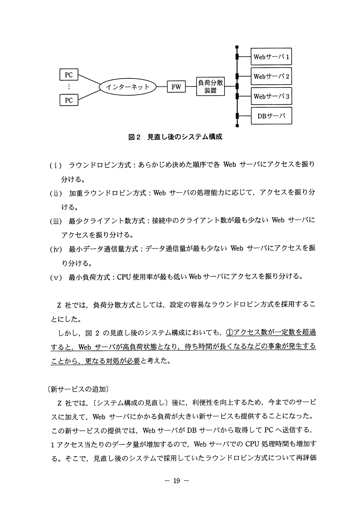

テキスト (OCR)

Webサーバ1

Webサーバ2
負荷分散
装置
Webサーバ3
DBサーバ

 2 見直し後のシステム構成

(i) ラウンドロビノン方式 : あらかじめ決めた順序で各 Web サーバにアクセスを振り
分ける。

Gi) 加重ラウンドロビノン方式 : Web サーバの処理能力に応じて, アクセスを振り分
ける。

Gil) 最少クライアント数方式 : 接続中のクライアント数が最も少ない Web サーバに
アクセスを振り分ける。

(iv) 最小データ通信量方式 : データ通信量が最も少ない Web サーバにアクセスを振
り分ける。

(Vv) 最小負荷方式 : CPU 使用率が最も低い Web サーバにアクセスを振り分ける。

Z 社では, 負荷分散方式としては, 設定の容易なラウンドロビフン方式を採用するこ
とにした。

LOL, 図 2 の見直し後のシステム構成においても, ①アクセス数が一定数を超過
すると, Web サーバが高負荷状態となり, 待ち時間が長くなるなどの事象が発生する
ことから, 更なる対処が必要と考えた。

(新サービスの追加)
Z 社では, 〔システム構成の見直し〕 後に, 利便性を向上するため, 今までのサービ
スに加えて, Web サーバにかかる負荷が大きい新サービスも提供することになった。
この新サービスの提供では, Web サーバが DB サーバから取得して PCへ送信する,
1 アクセス当たりのデータ量が増加するので, Web サーバでの CPU 処理時間も増加す
る。 そこで, 見直し後のシステムで採用していたラウンドロビン方式について再評価

ー 19 一

### ページ 20

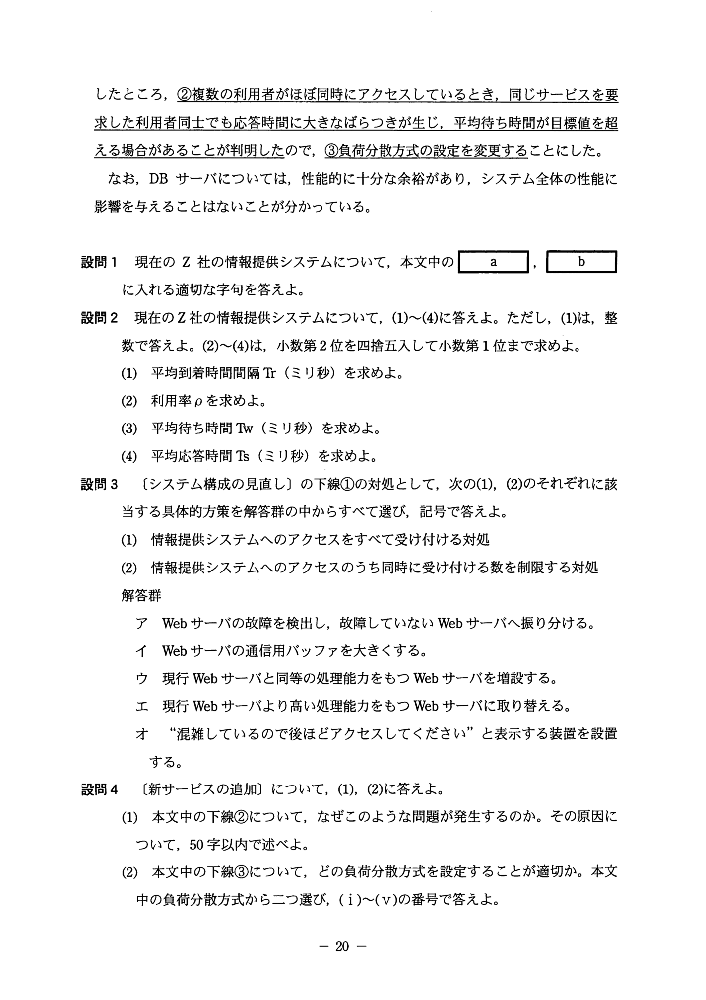

テキスト (OCR)

したところ, ②⑨複数の利用者がほぼば同時にアクセスしているとき, 同じサービスを要
求した利用者同士でも応答時間に大きなばらつきが生じ, 平均待ち時間が目標値を超
える場合があることが判明したので, ③負荷分散方式の設定を変更することにした。

なお, DB サーバについては, 性能的に十分な余裕があり, システム全体の性能に
影響を与えることはないことが分かっている。

設問1 現在の Z社の情報提供システムについて, 本文中の| a |,] 5 |
に入れる適切な字句を答えよ。

設問2 現在のZ社の情報提供システムについて, DORSAL KEL, (1)は, 整
数で答えよ。(②て(④は, 小数第 2 位を四捨五入して小数第 1 位まで求めよ。
GQ) 平均到着時間間隔 Tr (SU) を求めよ。
(2) 利用率。 を求めよ。
(3) 平均待ち時間 TW (SUM) を求めよ。
(4) 平均応答時間 和信 (SUM) を求めよ。

設問3 (システム構成の見直し〕 の下線①の対処として, 次の(1), (2②)0のそれぞれに該
当する具体的方策を解答群の中からすべて選び, 記号で答えよ。
GQ) 情報提供システムへのアクセスをすべて受け付ける対処
(2) 情報提供システムへのアクセスのうち同時に受け付ける数を制限する対処
PRESB

Web サーバの故障を検出し, 故障していない Web サーバへ振り分ける。
Web サーバの通信用バッファを大きくする。
現行 Web サーバと同等の処理能力をもつ Web サーバを増設する。
現行 Web サーバより高い処理能力をもつ Web サーバに取り替える。
“混雑しているので後ほどアクセスしてください"と表示する装置を設置
する。
設問4 〔新サービスの追加』について, ①), ②⑫②)に答えよ。
QQ) 本文中の下線@について, なぜこのような問題が発生するのか。その原因に
DWT, 50 字以内で述べよ。
(2) 本文中の下線③について, どの負荷分散方式を設定することが適切か。本文
中の負荷分散方式から二つ選び, (1)て(Y)の番号で答えよ。

きせ Hさふい

ー 20 一

### ページ 21

テキスト (OCR)

(メモ用 #4

ー 21 一

### ページ 22

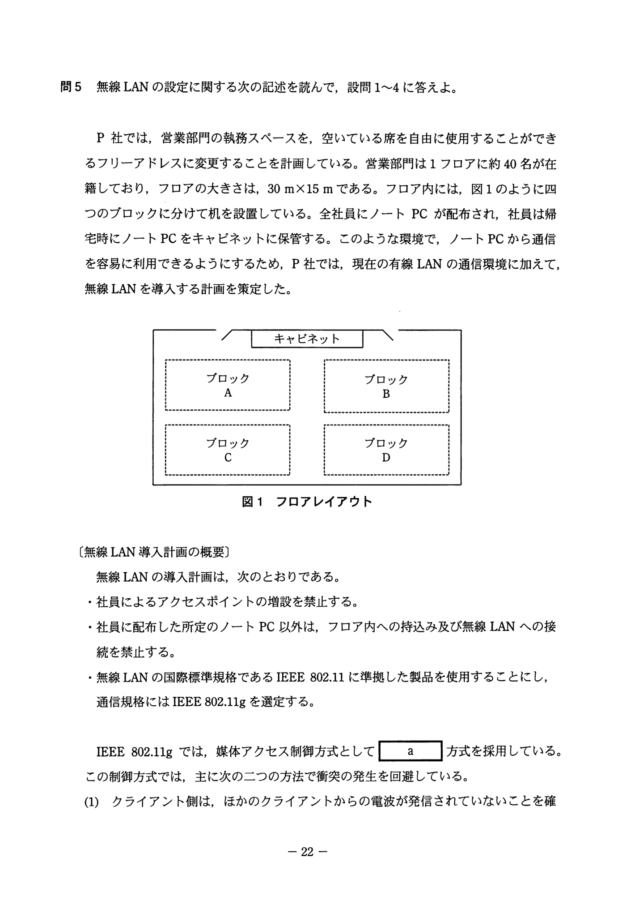

テキスト (OCR)

問5 無線LANの設定に関する次の記述を読んで, 設問 1こ4 に答えよ。

P 社では, 営業部門の執務スペースを, 空いている席を自由に使用することができ
るフリーアドレスに変更することを計画している。営業部門は 1 フロアに約 40 名が在
籍しており, フロアの大きさは, 30 mX15 m である。フロア内には, 図 1 のように四
つのブロックに分けて机を設置している。全社員にノート PC が配布され, 社員は帰
宅時にノート PC をキャビネットに保管する。このような環境で, ノート PCから通信
を容易に利用できるようにするため, P 社では, 現在の有線 LAN の通信環境に加えて,
無線 LAN を導入する計画を集定した。

キャピネット
プブロック          ブロック
A                        B
プブロック          ブロック
C                        D

図1 フロアレイアウト

(無線 LAN 導入計画の概要〕
無線 LAN の導入計画は, 次のとおりである。
・社員によるアクセスポイントの増設を禁止する。
・社員に配布した所定のノート PC 以外は, フロア内への持込み及び無線 LAN AOE
続を禁止する。
・無線 LAN の国際標準規格である IEEE 802.11 に準拠した製品を使用することにし,
通信規格には IEEE 802.11g を選定する。

IEEE 802.11g では, 媒体アクセス制御方式として|  a |方式を採用している。
この制御方式では, 主に次の二つの方法で衝突の発生を回避している。

(①) クライアント側は, ほかのクライアントからの電波が発信されていないことを確

ー22 一

### ページ 23

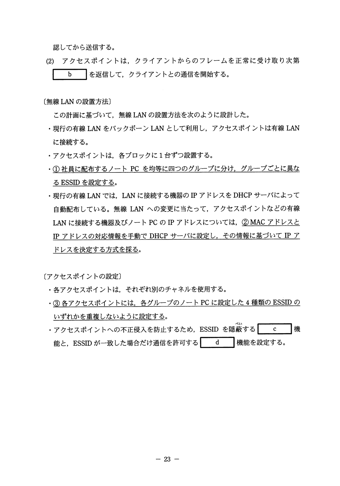

テキスト (OCR)

認してから送信する。
Q) アクセスポイントは, クライアントからのフレームを正常に受け取り次第
[| 5 | を返信して, クライアントとの通信を開始する。

(無線 LAN の設置方法〕
この計画に基づいて, 無線 LAN の設置方法を次のように設計した。

・現行の有線 LAN をパックボーン LAN として利用し, アクセスポイントは有線 LAN
に接続する。

・アクセスポイントは, 各ブロックに1 台ずつ設置する。

・① 社員に配布するノート PC を均等に四つのグループに分け, グループごとに異な
る ESSID を設定する。

・現行の有線 LAN では, LAN に接続する機器の IP アドレスを DHCP サーバによって
自動配布している。無線 LAN への変更に当たって, アクセスポイントなどの有線
LAN に接続する機器及びノート PC の IP アドレスについては, ②MAC アドレスと
IP アドレスの対応情報を手動で DHCP サーバに設定し, その情報に基づいて IP ア
ドレスを決定する方式を採る。

(アクセスポイントの設定)

・各アクセスポイントは, それぞれ別のチャネルを使用する。

・③ 各アクセスポイントには, 各グループのノート PC に設定した 4 種類の ESSID の
いずれかを重複しないように設定する。

・アクセスポイントへの不正侵入を防止するため, BSSID を隠蔽する| c |機
能と, BSSID が一致した場合だけ通信を許可する|  d |機能を設定する。

ー 23 一

### ページ 24

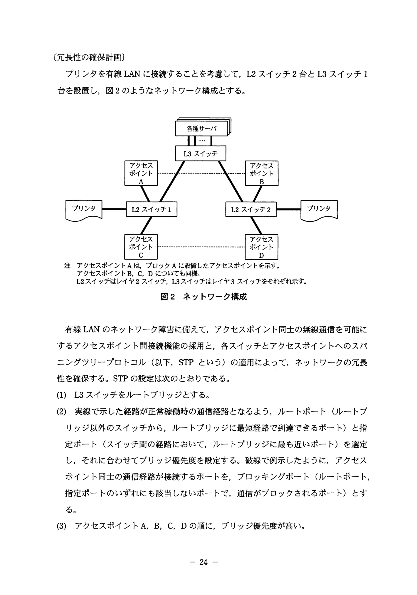

テキスト (OCR)

(冗長性の確保計画
プリンタを有線 LAN に接続することを考慮して, L2 スイッチ 2 台とL3 スイッチ1
台を設置し, 図2 のようなネットワーク構成とする。

各種サーバ
10… |

L3 スイッチ

プリンタ              L2 スイッチュ                       L2 スイッチ2              プリンタ

アクセス                                     アクセス
ポイント                                             ポイント
Cc                                            D

注 アクセスポイント A は, ブロック A に設置したアクセスポイントを示す。
アクセスポイント B, C, D についても同様。
L2 スイッチはレイヤ 2 スイッチ, L3スイッチはレイヤ 3 スイッチをそれぞれ示す。

図2 ネットワーク構成

有線 LAN のネットワーク障害に備えて, アクセスポイント同士の無線通信を可能に
するアクセスポイント間接続機能の採用と, 各スイッチとアクセスポイントへのスパ
ニングツリープロトコル (以下, STP という) の適用によって, ネットワークの冗長
性を確保する。STP の設定は次のとおりである。

Q) L3 スイッチをルートブリッジとする。

(②) 実線で示した経路が正常稼働時の通信経路となるよう, ルートボート (ルートブ
リッジ以外のスイッチから, ルートブリッジに最短経路で到達ですきるボート) と指
定ポート (スイッチ間の経路において, ルートブリッジに最も近いポート) を選定
し, それに合わせてブリッジ優先度を設定する。 破線で例示したように, アクセス
ポイント同士の通信経路が接続するポートを, ブロッキングボポート (ルートポボート,
重定ポートのいずれにも該当しないポートで, 通信がブロックされるポート) とす
る。

3) アクセスポイント A, B, C, D の順に, ブリッジ優先度が高い。

ー 24 一

### ページ 25

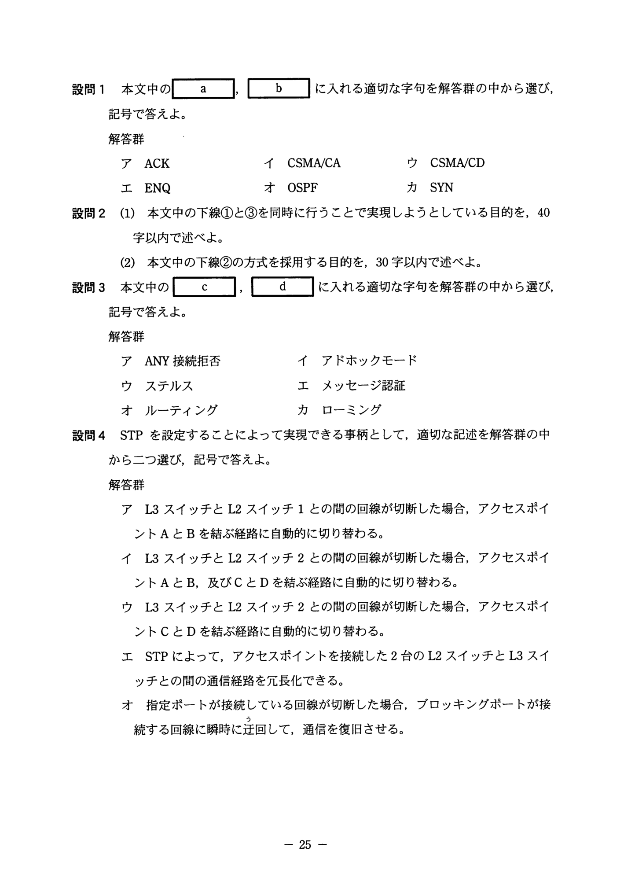

テキスト (OCR)

設問1 本文中の| 』 | | b | に入れる適切な字句を解答群の中から選び,

記号で答えよ。
解答群
ア ACK       イ CSMA/CA     ウ CSMA/CD
エ ENQ       オ OSPF       カ SYN
設問2 Q) 本文中の下線①と③を同時に行うことで実現しようとしている目的を, 40
字以内で述べよ。
2) 本文中の下線②の方式を採用する目的を, 30 字以内で述べよ。
設問3 本文中の| oc |,|  q | に入れる適切な字句を解答群の中から選び,
記号で答えよ。
解答群
ア ANY 接続拒否        イ アドホックモード
ウ ステルス       LZ メッセージ認証
オ ルーティング      A ローミング

設問4 SIP を設定することによって実現できる事柄として, 適切な記述を解答群の中
から二つ選び, 記号で答えよ。
解答
ア L3 スイッチと L2 スイッチ 1 との間の回線が切断した場合, アクセスポイ
ント AとB を結ぶ経路に自動的に切り替わる。
4 LS スイッチと L2 スイッチ 2 との間の回線が切断した場合. アクセスポイ
ントAとB, 及びCとD を結ぶ経路に自動的に切り替わる。
ウ L3 スイッチと L2 スイッチ 2 との問の回線が切断した場合,アクセスポイ
ントCとD を結ぶ経路に自動的に切り替わる。
エ STP によって, アクセスポイントを接続した 2 台の L2 スイッチとL3 スイ
ッチとの問の通信経路を冗長化できる。
オ 指定ポートが接続している回線が切断した場合,ブロッキングポートが接
続する回線に瞬時に正回して, 通信を復旧させる。

ー 25 一

### ページ 26

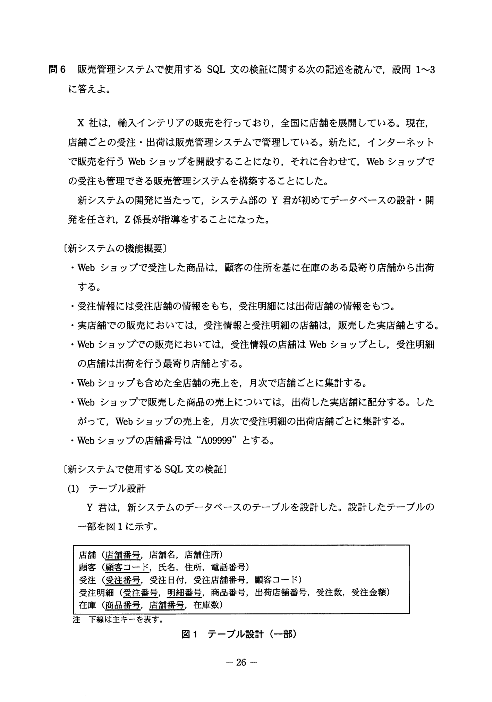

テキスト (OCR)

間6 販売管理システムで使用する SQL 文の検証に関する次の記述を読んで, 設問 1こ3
に答えよ。

X 社は, 輸入インテリアの販売を行っており, 全国に店舗を展開している。現在,
店舗ごとの受注・出荷は販売管理システムで管理している。新たに, インターネット
で販売を行う Web ショップを開設することになり, それに合わせて, Web ショップで
の受注も管理できる販売管理システムを構築することにした。

新システムの開発に当たって, システム部の Y 君が初めてデータベースの設計・開
発を任され, Z係長が指導をすることになった。

(新システムの機能概要)

・Web ショップで受注した商品は, 顧客の住所を基に在庫のある最寄り店舗から出荷
する。

・受注情報には受注店舗の情報をもち, 受注明細には出荷店舗の情報をもつ。

・実店舗での販売においては, 受注情報と受注明細の店舗は, 販売した実店舗とする。
・Web ショップでの販売においては, 受注情報の店舗は Web ショップとし, 受注明細
の店舗は出荷を行う最寄り店舗とする。

・Web ショップも含めた全店舗の売上を, 月次で店舗ごとに集計する。

・Web ショップで販売した商品の売上については, 出荷した実店舗に配分する。した
がって, Web ショップの売上を, 月次で受注明細の出荷店舗ごとに集計する。

・Web ショップの店舗番号は “A09999” とする。

〔新システムで使用する SQL 文の検証
①) テーブル設計
Y Bld, 新システムのデータベースのテーブルを設計した。設計したテーブルの
一部を図 1 に示す。

店舗 (店舗番号, 店舗名, 店舗住所)

顧客 (顧客コード, KA, 住所, 電話番号)

受注 (受注番号, 受注日付, 受注店舗番号, 顧客コード)

受注明細 (受注番号, 明細番号, 商品番号, 出荷店舗番号, 受注数, 受注金額)

在庫 (商品番号, 店舗番号, 在庫数)
= 下線は主キーを表す。

図1 テーブル設計 (一部)

### ページ 27

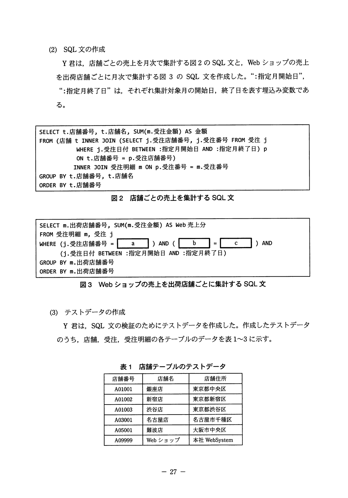

テキスト (OCR)

(2) SQL 文の作成
Y Ald, 店舗ごとの売上を月次で集計する図 2 の SQL 文と, Web ショップの売上
を出荷店舗ごとに月次で集計する図 3 の SQL 文を作成した。“:指定月開始日",
“指定月終了日"は, それぞれ集計対象月の開始日, 終了日を表す埋込み変数であ
る。

SELECT t.店舗番号,.店舗名, SUM(m.受注金額) AS 金額

FROM (店舗 INNER JOIN (SELECT ].受注店舗番号, }.受注番号 FROM 受注 j
WHERE ].受注日付 BETMEEN :指定月開始日 AND :指定月終了日) p
ON t.店舗番号 = p.受注店舗番号)
INNER JOIN 受注明細 m ON p.受注番号 = m.受注番号

GROUP BY t.店舗番号, て店舗名

ORDER BY t.店舗番号

図2 店舗ごとの売上を集計する SQL 文

SELECT m.出荷店舗番号, SUM(m.受注金額) AS Web 売上分

FROM 受注明細 m, 受注}

MHERE (}.受注店舗番号 =[ 。a |)Aap([ b |]-[| c ])aw
(}.受注上日付 BETWEEN :指定月開始日 AND :指定月終了日)

GROUP BY m.出荷店舗番号

ORDER BY m.出荷店舗番号

図3 Web ショップの売上を出荷店舗ごとに集計する SQL 文
3) テストデータの作成
Y Bld, SQL 文の検証のためにテストデータを作成した。作成したテストデータ

のうち, 店舗, 受注, 受注明細の各テーブルのデータを表 1て3 に示す。

表1 店舗テーブルのテストデータ

店舗番号              店舗名                  店舗住所
A01001        銀座店                  東京都中央区
A01003        渋谷店                  東京都渋谷区
A03001         名古屋店               名古屋市千種区
A05001      難波店           大阪市中央区
A09999       Web ショップ       本社 WebSystem

ー 27 一

### ページ 28

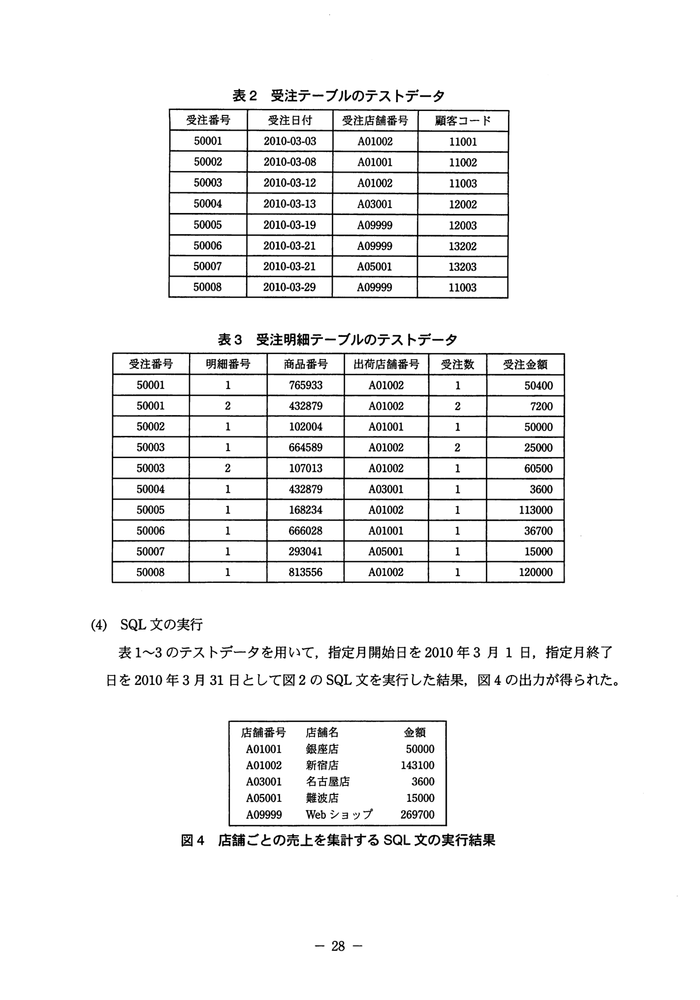

テキスト (OCR)

表2 受注テーブルのテストデータ

受注番号      受注日付    受注店舗番号 | 顧客コード
50001                      2010-03-03                     A01002                             11001
50002                     2010-03-08                     A01001                             11002
50003                 2010-03-12                 A01002                       11003
50004                 2010-03-13                 A03001                       12002
50005                 2010-03-19                 09999                       12003
50006                     2010-03-21                     09999                             13202
50007                     2010-03-21                     A05001                             13203
50008                     2010-03-29                     A09999                             11003

RI 受注明細テーブルのテストデータ

受注番号          明細番号          商品番号 | 出荷店舗番号 | 受注数         受注金額
50001                         1                        765933                   A01002                     1                          50400
50001                               2                              432879                       A01002                          2                                    7200
50002                         1                        102004                   A01001                     1                          50000
50003                         1                        664589                   A01002                     2                          25000
50003                         2                        107013                   A01002                     1                          60500
50004                         1                        432879                   A03001                     1                            3600
50005                               1                              168234                       A01002                           1                              113000
50006                         1                        666028                   A01001                     1                          36700
50007                         1                        293041                   A05001                     1                          15000
50008                         1                        813556                   A01002                     1                        120000

(4) SQL 文の実行

表 1て3 のテストデータを用いて, 指定月開始日を 2010 年 3 月 1 日, 指定月終了
日を 2010 年 3 月 31 日として図 2 の SQL 文を実行した結果, 図4 の出力が得られた。

店舗番号 店舗名                   金額
A01001 銀座店                    50000
A01002 新宿店                  143100
A03001 名古屋店                  3600
A05001 難波店                    15000
A09999 。 Webショップ       269700

ー 28 一

図4 店舗ごとの売上を集計する SQL 文の実行結果

### ページ 29

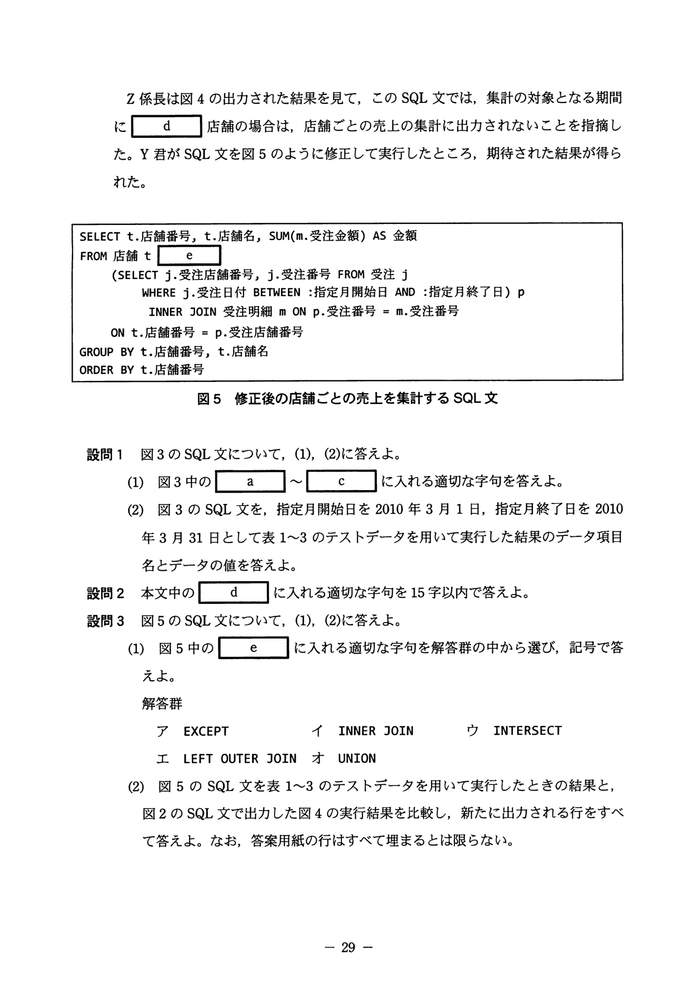

テキスト (OCR)

Z 係長は図 4 の出力された結果を見て, この SQL 文では, 集計の対象となる期間
に|  d | 店舗の場合は, 店舗ごとの売上の集計に出力されないことを指摘し
た。Y BAS SQL 文を図 5 のように修正して実行したところ, 期待された結果が得ら
れた。

SELECT t.店舗番号, t.店舗名, SUM(m.受注金額) AS 金額
FROM 店舗 t
(SELECT j.受注店舗番号, ].受注番号 FROM 受注 j
WHERE ].受注日付 BETWEEN :指定月開始日 AND :指定月終了日) p
INNER JOIN 受注明細 m ON p.受注番号 = m.受注番号
ON t.店舗番号 = p.受注店舗番号
GROUP BY t.店舗番号, て.店舗名
ORDER BY {-店舗番号

図5 修正後の店舗ごとの売上を集計する SQL文

設問1 図3のSQL文について, ①⑪, ②)に答えよ。
①) 図3中の| ai |て|  c |に入れる適切な字句を答えよ。
(2) 図 3 のSQL MX, 指定月開始日を 2010 年 3 月 1 日, 指定月終了日を 2010
年 3 月 31 日として表 1て3 のテストデータを用いて実行した結果のデータ項目
名とデータの値を答えよ。
設問2 本文中の[ d | に入れる適切な字旬を15字以内で答えよ。
設問3 図5のSQL文について, Q①⑪, ②)に答えよ。
Q) 図5中の[| e | に入れる適切な字句を解答群の中から選び, ECE
えよ。
HE
ア EXCEPT           イ INNER JOIN       ウ INTERSECT

工 LEFT OUTER JOIN オ UNION
(2) 図5 のSQL 文を表 1て3 のテストデータを用いて実行したときの結果と,
図 2 のSQL 文で出力した図 4 の実行結果を比較し, 新たに出力される行をすべ
て答えよ。なお, 答案用紙の行はすべて埋まるとは限らない。

### ページ 30

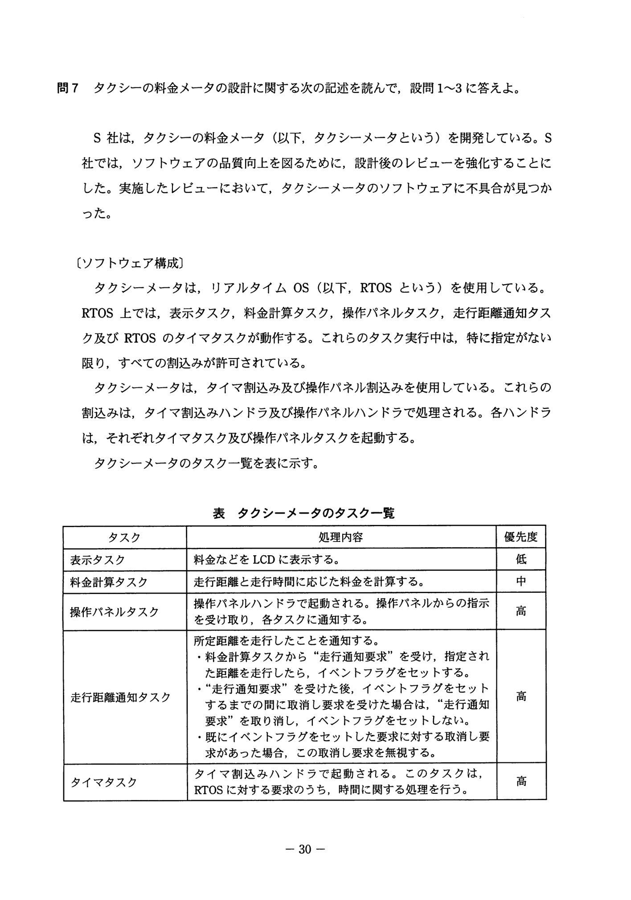

テキスト (OCR)

間7 タクシーの料金メータの設計に関する次の記述を読んで, 設問13 に答えよ。

S 社は, タクシーの料金メータ (以下 、タクシーメータという) を開発している。S
社では, ソフトウェアの品質向上を図るために, 設計後のレビューを強化することに
した。実施したレビューにおいて, タクシーメータのソフトウェアに不具合が見つか

った。

(〔ソフトウェア構成〕

タクシーメータは, リアルタイム OS (以下, RTOS という) を使用している。
RTOS 上では, 表示タスク, 料金計算タスク, 操作パネルタスク, 走行距離通知タス
ク及び RTOS のタイマタスクが動作する。これらのタスク実行中は, 特に指定がない
BO, すべての割込みが許可されている。

タクシーメータは, タイマ割込み及び操作パネル割込みを使用している。これらの
割込みは, タイマ割込みハンドラ及び操作パネルハンドラで処理される。各ハンドラ
は, それぞれタイマタスク及び操作パネルタスクを起動する。

タクシーメータのタスク一覧を表に示す。

表 タクシーメータのタスク一覧

タスク               処理内容            優先度
表示タスク          料金などを LCD に表示する。

料金計算タスク    走行距離と走行時間に応じた料金を計算する。

操作パネルハンドラで起動される。 操作パネルからの指示
を受け取り, 各タスクに通知する。

所定距離を走行したことを通知する。

・料金計算タスクから “走行通知要求" を受け, 指定され
た距離を走行したら, イベントフラグをセットする。

・“走行通知要求" を受けた後, イベントフラグをセット
するまでの間に取消し要求を受けた場合は, "走行通知
要求" を取り消し, イベントフラグをセットしない。

・既にイベントフラグをセットした要求に対する取消し要
求があった場合, この取消し要求を無視する。

タイマ割込みハンドラで起動される。このタスクは,

RTOS に対する要求のうち, 時間に関する処理を行う。

束

4

操作パネルタスク

走行距離通知タスク

タイマタスク

ー 30 一

### ページ 31

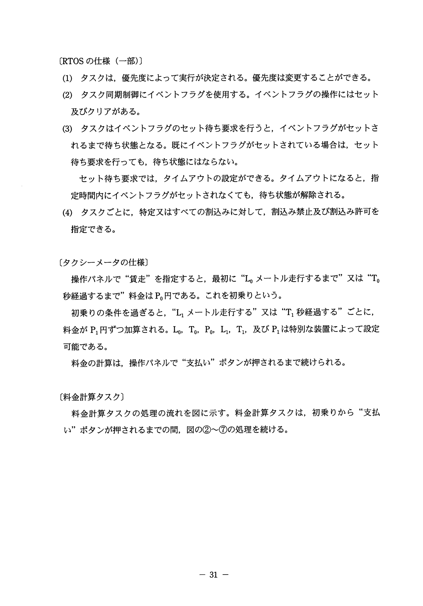

テキスト (OCR)

(RTOS の仕様 (一部)〕

Q) タスクは, 優先度によって実行が決定される。優先度は変更することができる。

2) タスク同期制御にイベントフラグを使用する。イベントフラグの操作にはセット
及びクリアがある。

(3③) タスクはイベントフラグのセット待ち要求を行うと. イベントフラグがセットさ
れるまで待ち状態となる。既にイベントフラグがセットされている場合は, セット
待ち要求を行っても, 待ち状態にはならない。

セット待ち要求では, タイムアウトの設定ができる。タイムアウトになると, 指
定時間内にイベントフラグがセットされなくても, 待ち状態が解除される。

4) タスクごとに, 特定又はすべての割込みに対して, 割込み禁止及び割込み許可を
指定できる。

〔タクシーメータの仕様〕

操作パネルで “RE” を指定すると, BMI “Ly メートル走行するまで" 又は“T。
秒経過するまで" 料金はP。円である。これを初乗りという。

初乗りの条件を過ぎると, “Ly メートル走行する” 又は “Ti 秒経包する” CLK,
料金が P」円ずつ加算される。 Ly, Ty, Po Ly Ty 及び P」は特別な装置によって設定
可能である。

料金の計算は, 操作パネルで “支払い" ボタンが押されるまで続けられる。

(料金計算タスク〕

料金計算タスクの処理の流れを図に示す。料金計算タスクは, 初乗りから『支払
Vw” ボタンが押されるまでの間, 図の②~⑦の処理を続ける。

ー 31 一

### ページ 32

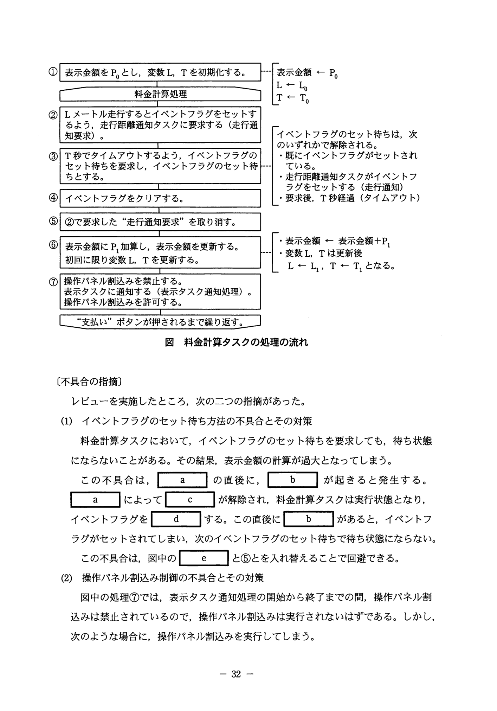

テキスト (OCR)

Ol 表示金額を P。とし, 変数L。T を初期化する。 | 表示金額 P。
I                     Le
a         料金計算処理         。 ] Ir ータ
I                 L
②| L メートル走行するとイベントフラグをセットす
るよう, 走行距離通知タスクに要求する (走行通|
知要求) 。                         イベントフラグのセット待ちは, 次
I              のいずれかで解除される。
③| T 秒でタイムアウトするよう, イベントフラグの| | ・既にイベントフラグがセットされ
セット待ちを要求し イベントフラグのセット待ト-| ている。

ちとする。                   ・走行距離通知タスクがイベントフ
I              ラグをセットする (走行通知)
@| イベントフラグをクリアする。          ・要求後, T秒経過(タイムアウト)

I

⑧ OCERLE “ERBAER” を取り消す。

1                       ト   ーー          ーー

 | aaaaic P、加算し。表示金額を更新する。 | | BERN Raeaty,
初回に限り変数【。T を更新する。               ee en ene,

I
O|[ RENAIVAAASRIETS.
表示タスクに通知する (表示タスク通知処理) 。
操作パネル割込みを許可する。
I
Lo "支払い" ボタンが押されるまで繰り返す。 |

図 料金計算タスクの処理の流れ

(不具合の指摘)
レビューを実施したところ, 次の二つの指摘があった。
(① イベントフラグのセット待ち方法の不具合とその対策
料金計算タスクにおいて, イベントフラグのセット待ちを要求しても, 待ち状態
にならないことがある。その結果, 表示金額の計算が過大となってしまう。
この不具合は, [a lower, (> | が起きると発生する。
| a |によって|  c |が解除され, 料金計算タスクに実行状態となり,
イベントフラグを|  d |] する。この直後に| b | がぁると, イベントフ
ラグがセットされてしまい, 次のイベントフラグのセット待ちで待ち状態にならない。
この不具合は, 図中の| e | と⑤とを入れ替えることで回避できる。
(2) 操作パネル割込み制御の不具合とその対策
図中の処理のでは, 表示タスク通知処理の開始から終了までの間, 操作パネル割
込みは禁止されているので, 操作パネル割込みは実行されないはずである。しかし,
次のような場合に, 操作パネル割込みを実行してしまう。

ー 32 一

### ページ 33

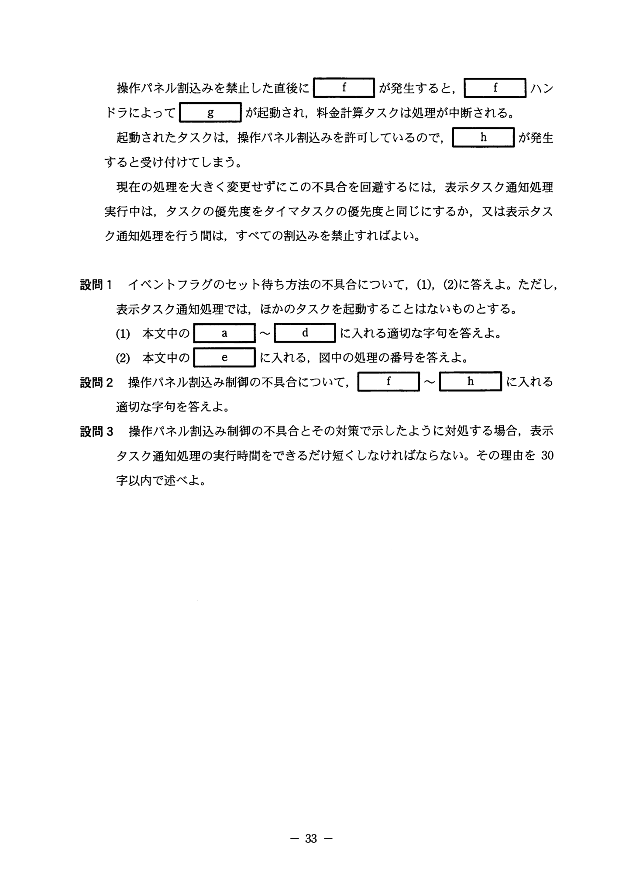

テキスト (OCR)

操作パネル割込みを禁止した直後に が発生すると, ハン
ドラによって が起動され, 料金計算タスクは処理が中断される。
起動されたタスクは, 操作パネル割込みを許可しているので, | h  ] が発生
すると受け付けてしまう。

現在の処理を大きく変更せずにこの不具合を回避するには, 表示タスク通知処理
実行中は, タスクの優先度をタイマタスクの優先度と同じにするか, 又は表示タス
ク通知処理を行う間は, すべての割込みを禁止すればよい。

設問1 イベントフラグのセット待ち方法の不具合について, (①, (②に答えよ。ただし,
表示タスク通知処理では, ほかのタスクを起動することはないものとする。
a 本文中の| oa |て| od |に入れる適切な字句を答えよ。
⑫ 本文中の| e | に入れる, 図中の処理の番号を答えよ。

設問2 操作パネル割込み制御の不具合について, | ff |て| 1 |に入れる
適切な字句を答えよ。

設問3 操作パネル割込み制御の不具合とその対策で示したように対処する場合, 表示
タスク通知処理の実行時間をできるだけ短くしなければならない。その理由を 30
字以内で述べよ。

ー 33 一

### ページ 34

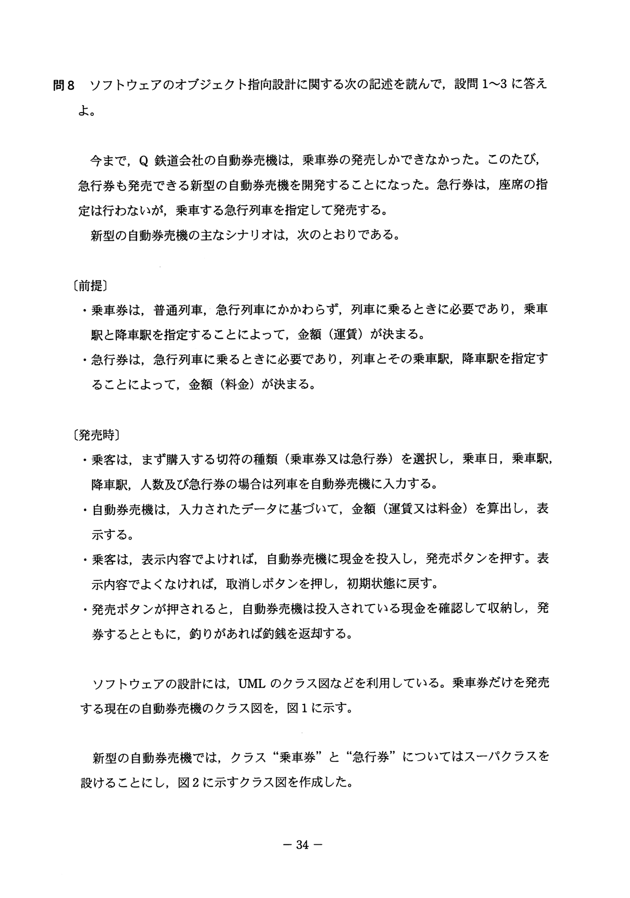

テキスト (OCR)

問8

ソフトウェアのオブジェクト指向設計に関する次の記述を読んで, 設問 1ご3 に答え
よ。

SET, Q 鉄道会社の自動券売機は, 乗車券の発売しかできなかった。このたび,
急行券も発売できる新型の自動券売機を開発することになった。急行券は, 座席の指
定は行わないが, 乗車する急行列車を指定して発売する。

新型の自動券売機の主なシナリオは, 次のとおりである。

〔前提]

・乗車券は, 普通列車, 急行列車にかかわらず, 列車に乗るときに必要であり, RH
駅と降車駅を指定することによって, 金額 (運賃) が決まる。

・急行券は, 急行列車に乗るときに必要であり, 列車とその乗車駅, 降車駅を指定す
ることによって, 金額 (料金) が決まる。

(発売時]

・乗客は, まず購入する切符の種類 (乗車券又は急行券) を選択し, RHA, 乗車駅,
降車駅, 人数及び急行券の場合は列車を自動券売機に入力する。

・自動券売機は, 入力されたデータに基づいて, 金額 (運賃又は料金) を算出し, 表
示する。

‘RE, 表示内容でよければ, 自動券売機に現金を投入し, 発売ポボタンを押す。表
示内容でよくなければ, 取消しボタンを押し, 初期状態に戻す。

・発売ボタンが押されると, 自動券売機は投入されている現金を確認して収納し, 発
券するとともに, 釣りがあれば釣銭を返却する。

ソフトウェアの設計には, UML のクラス図などを利用している。乗車券だけを発売
する現在の自動券売機のクラス図を, 図 1 に示す。

新型の自動券売機では, クラス “乗車券" と “急行券” についてはスーパクラスを
設けることにし, 図2 に示すクラス図を作成した。

ー 34 一

### ページ 35

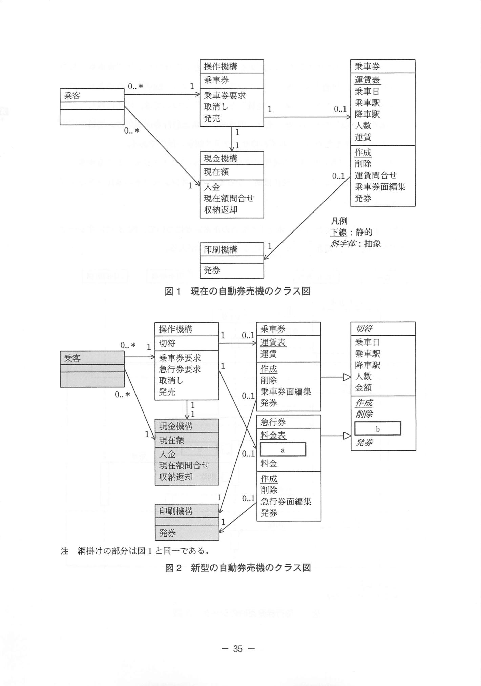

テキスト (OCR)

操作機構              Ray
RH                   運賃表
..玉       1
RE               RAE             eae
取消し     1       or
vi             LT 降車駅
.. *              1                 人数
              運賃
作成
Raw              saa
現在客          0.1 運賃問合せ
1入金                FRAME
現在額問合せ            発券
収納返元
凡例
下線 : 静的
aa   1       PEFR 抽象
HE
図1 現在の自動券売機のクラス図
操作機構   toa eee        OF
«| UF        “S| 運賃表        REA
RE         乗車券要求       運賃         乗車駅
急行上要求       作成         降車駅
取消し         削除     ーー 人数
発売          乗車券面編集     金額
1          発券            SE
5       急行券        >
RSH        急          [| ュ 」
ee         料金表   eo
ie        | 男証還
現在額問合せ      料金
収納返到          作成
削除
急行券面編集
印刷機構        発券
発券

= 網掛けの部分は図 1 と同一である。
図2 新型の自動券売機のクラス図

ー 35 一

### ページ 36

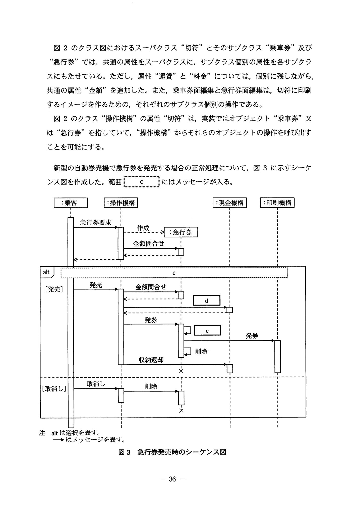

テキスト (OCR)

図 2 のクラス図におけるスーパクラス "切符" とそのサブクラス “REF” 及び
“RTH” Cd, 共通の属性をスーパクラスに, サブクラス個別の属性を各サプクラ
スにもたせている。ただし, 属性 "運賃" と “料金"については, 個別に残しながら,
共通の属性 “金額" を追加した。また, 乗車券面編集と急行券面編集は, 切符に印刷
するイメージを作るための, それぞれのサブクラス個別の操作である。

図 2 のクラス “操作機構" の属性“切符” は, 実装ではオブジェクト "乗車券" 又
は “為行券” を指していて, “操作機構" からそれらのオプジェクトの操作を呼び出す
ことを可能にする。

新型の自動券売機で急行券を発売する場合の正常処理について, 図 3 に示すシーケ
ンス図を作成した。 範囲      <はメッセージが入る。

| :乗客 | 上|操作機構]       | 現金機構| | :印刷機構|

1    1
1    1
1    1
1    1
1    1
『    1
1    1
1    1
1    1

[発売] Be,

[取消し] BMY

注 atは選択を表す。
ーテヶ はメッセージを表す。

図3 急行券発売時のシーケンス図

### ページ 37

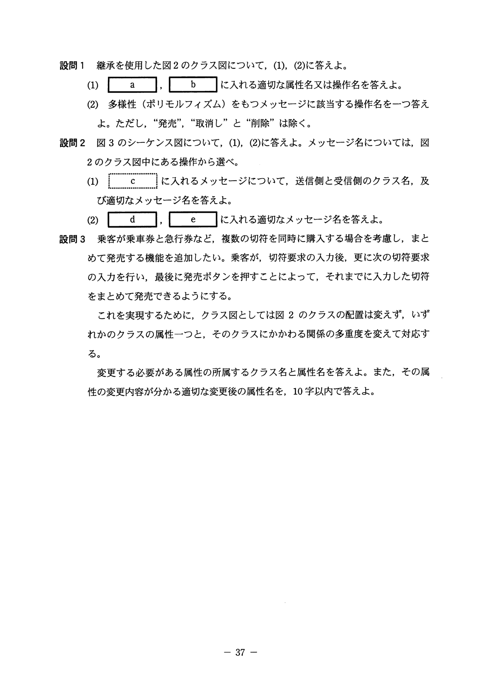

テキスト (OCR)

設問1 継承を使用した図 2 のクラス図について, ①⑪, ②⑫②に答えよ。
a [oa |, |  b |に入れる適切な属性名又は操作名を答えよ。
(2) 多様性 (ポリモルフィズム) をもつメッセージに該当する操作名を一つ答え
よ。ただし, “発売", “取消し” と "削除" は除く。
設問2 図3 のシーケンス図について, ①, (②に答えよ。メッセージ名については, 図
2 のクラス図中にある操作から選べ。
ト    に入れるメッセージについて, 送信側と受信側のクラス名, &
び適切なメッセージ名を答えよ。
ag |  d |, | ie |に入れる適切なメッセージ名を答えよ。
設問3 乗客が乗車券と急行券など, 複数の切符を同時に購入する場合を考慮し, まと
めて発売する機能を追加したい。乗客が, 切符要求の入力後, 更に次の切符要求
の入力を行い, 最後に発売ボタンを押すことによって, それまでに入力した切符
をまとめて発売できるようにする。
これを実現するために, クラス図としては図 2 のクラスの配置は変えず, いず
れかのクラスの属性一つと, そのクラスにかかわる関係の多重度を変えて対応す
る。
変更する必要がある属性の所属するクラス名と属性名を答えよ。また, その属
性の変更内容が分かる適切な変更後の属性名を, 10 字以内で答えよ。

ー 37 一

### ページ 38

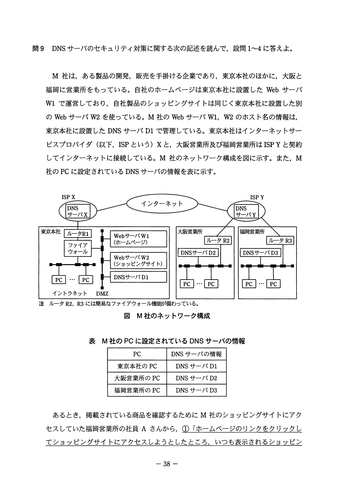

テキスト (OCR)

問9 DNS サーバのセキュリティ対策に関する次の記述を読んで, 設問 1て4 に答えよ。

M 社は, ある製品の開発, 販売を手掛ける企業であり, 東京本社のほかに, AME
福岡に営業所をもっている。自社のホームページは東京本社に設置した Web サーバ
Wl で運営しており, 自社製品のショッピングサイトは同じく東京本社に設置した別
の Web サーバ W2 を使っている。M 社の Web サーバ W1, W2 のホスト名の情報は,
東京本社に設置した DNS サーバ D1 で管理している。東京本社はインターネットサー
ビスプロバイダ (以下, ISP という) XL, 大阪営業所及び福岡営業所は ISP Y と契約
してインターネットに接続している。M 社のネットワーク構成を図に示す。また, M
社のPC に設定されている DNS サーバの情報を表に示す。

ISPX

ISPY
DNS                          インターネット
サーバX                                                                    BONY
se   wayrwu | Pe    人
ファイア               (ホームページ)                               |ルータ Re]                   |ルータ Ra |
ウォール                     -                | DNSサーバp2 |         | DNSサーバps |
WebサーバW2
TT      (ショッピングサイト)
            [Re]・[E] || ee) [ee]
イントラネット DMZ

注 ルータ R2,R3 には簡易なファイアウォール機能が備わっている。
   M 社のネットワーク構成

表 M社のPC に設定されている DNS サーバの情報

PC             DNS サーバの情報
東京本社の PC        DNS サーバ D1

大阪営業所の PC        DNS サーバ D2

福岡営業所の PC        DNS サーバD3

あるとき, 掲載されている商品を確認するために M 社のショッピングサイトにアク
セスしていた福岡営業所の社員 A SAMS, ①「ホームページのリンクをクリックし
てショッピングサイトにアクセスしようとしたところ, いつも表示されるショッピン

ー 38 一

### ページ 39

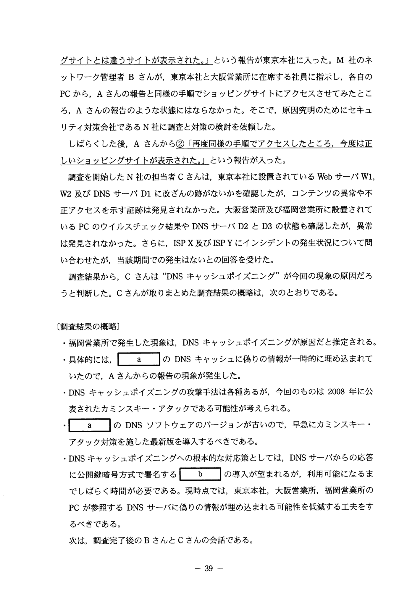

テキスト (OCR)

グサイトとは違うサイトが表示された。」という報告が東京本社に入った。M 社のネ
ットワーク管理者 SAM, 東京本社と大阪営業所に在席する社員に指示し, 各自の
PC から, A さんの報告と同様の手順でショッピングサイトにアクセスさせてみたとこ
ろ, A さんの報告のような状態にはならなかった。そこで, 原因究明のためにセキュ
リティ対策会社である N 社に調査と対策の検討を依頼した。

しばらくした後, A さんから②「再度同様の手順でアクセスしたところ, 今度は正
しいショッピングサイトが表示された。」という報告が入った。

調査を開始した N 社の担当者C さんは, 東京本社に設置されている Web サーバ W1,
W2 及び DNS サーバ D1 に改ざんの跡がないかを確認したが, コンテンツの異常や不
正アクセスを示す証跡は発見されなかった。大阪営業所及び福岡営業所に設置されて
いる PC のウイルスチェック結果や DNS サーバ D2 と D3 の状態も確認したが, 異常
は発見されなかった。さらに, ISP X 及びISP Y にインシデントの発生状況について問
い合わせたが, 当該期間での発生はないとの回答を受けた。

調査結果から, C さんは “DNS キャッシュポイズニング" が今回の現象の原因だろ
うと判断した。C さんが取りまとめた調査結果の概略は, 次のとおりである。

(調査結果の概略)

・福岡営業所で発生した現象は。 DNS キャッシュボポイズニングが原因だと推定される。
・具体的には, |  』 | の DNS キャッシュに側りの情報が一時的に埋め込まれて
いたので, A さんからの報告の現象が発生した。

・DNS キャッシュポイズニングの攻撃手法は各種あるが, 今回のものは 2008 年に公
表されたカミンスキー・アタックである可能性が考えられる。

・[|  』 ] の DNS ソフトウェアのパージョンが古いので, 早急にカミンスキー・
アタック対策を施した最新版を導入するべきである。

・DNS キャッシュポイズニングへの根本的な対応策としては, DNS サーバからの応答
に公開鍵暗号方式で署名する| b | の導入が望まれるが, 利用可能になるま
でしばらく時間が必要である。現時点では, 東京本社。 大阪営業所, 福岡営業所の
PC が参照する DNS サーバに備りの情報が埋め込まれる可能性を低減する工夫をす
るべきである。

Kit, 調査完了後のB さんとCさんの会話である。

ー 39 一

### ページ 40

テキスト (OCR)

(調査完了後の会話)

C

: 今回の福岡営業所で発生した現象は, DNS キャッシュポイズニングが原因だった

と思われます。DNS キャッシュポイズニングについては御存じですか。

B : 名前は聞いたことがありますが, 実際に発生したのを見たのは初めてです。
C : 今後の対応策ですが, まずは今回の現象の内容について, M 社全体に知らせた方

がよいでしょう。

B : どのような内容を知らせたらよいでしょうか。
C : 第一報として, 起こった事実を正確に伝えることが大切ですね。 と,

|  』 ] の 2 ald, 必ず含めるようにしてください。DNS キャッシュポイズ
ニングについては, 別途時間を設けて, 社員へのセキュリティ教育の一環で解説
するのがよいと思います。

: 分かりました。文案を考えて, 社内のボータルサイトなどで知らせるように手配

します。ところで, 福岡営業所の PC の DNS 設定はどうしたらよいでしょうか。
ISP Y のDNS サーバ Y に変更すればよいですか。

: それよりも, 大阪営業所と福岡営業所の PC に設定する DNS サーバを, 東京本社

に設置されている DNS サーバD1 に変更したらどうでしょう。

: 全社の PC が同じ DNS サーバを利用することで, 管理対象の DNS サーバを一元

化するわけですね。そうすると, ネットワーク全体の運用管理も単純化できます。

: イントラネット間は, 現在使っているインターネット接続を使って結ぶのが経済

的ですね。東京本社と大阪営業所, 福岡営業所の間を, |  e | で結ぶわけで
す。

: そうするには, 東京本社と大阪営業所, 福岡営業所が一つのネットワークになる

ので, PC に割り当てる に重複がないか調査する必要がありますね。
早速調べてみることにします。

: DNS サーバ D1 は, 現在 DNS コンテンツサーバの機能 (Web サーバなどの情報を

インターネットに提供する機能) と DNS キャッシュサーバの機能 (社内の PC な
どからの問合せを中継する機能) を提供しています。DNS キャッシュサーバへの
|  g |]からのアクセスを制限するために, DNS コンテンツサーバと DNS +
ャッシュサーバの機能を分離した方がよいですね。

: その場合, DNS キャッシュサーバはネットワークのどこに配置すべきでしょうか。

ー 40 一

### ページ 41

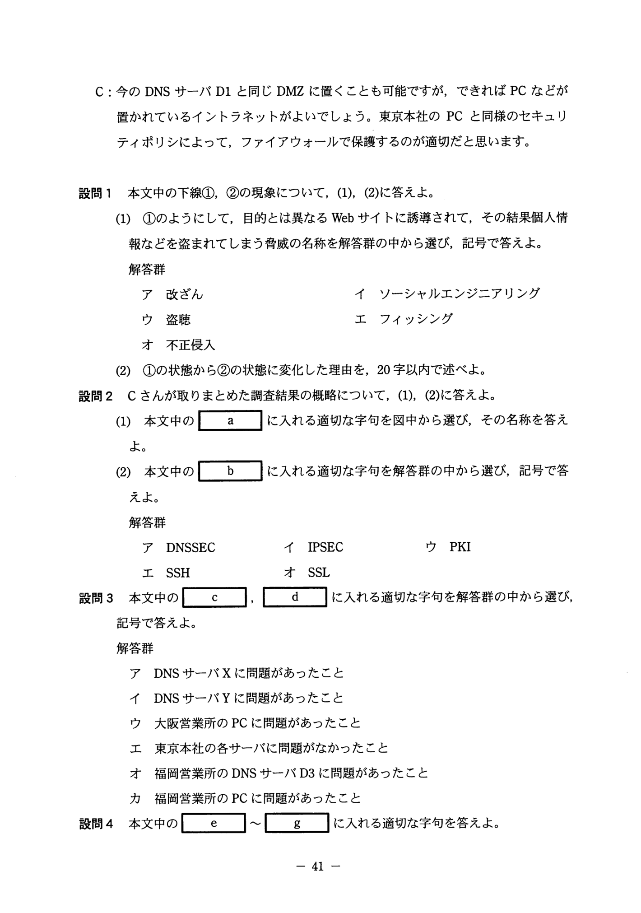

テキスト (OCR)

C : 今の DNS サーバ D1 と同じ DMZ に置くことも可能ですが, できれば PC などが
置かれているイントラネットがよいでしょう。東京本社の PC と同様のセキュリ
ティポリシによって, ファイアウォールで保護するのが適切だと思います。

設問1 本文中の下線①, ②の現象について, (1), ②に答えよ。
Q ①のようにして, 目的とは異なる Web サイトに誘導されて, その結果個人情
報などを盗まれてしまう和脅威の名称を解答群の中から選び, 記号で答えよ。

解答群

ア 改ざん          イ ソーシャルエンジニアリング
ウ 盗聴           エ フィッシング

オ 不正侵入

(2) ①の状態から②の状態に変化した理由を, 20 字以内で述べよ。
設問2 Cさんが取りまとめた調査結果の概略について, (D, ②)に答えよ。
a 本文中の|  a | に入れる適切な字句を図中から選び, その名称を答え
よ。

@ 本文中の| b | に入れる適切な字句を解答群の中から選び, ECE

‘ult

ア DNSSEC     イ IPSEC      ウ PRKI

エ SSH       4 SSL
設問3 本文中の| c |,|  d | に入れる適切な字句を解答群の中から選び,
号で答えよ。
答群

But

R

DNS サーバX に問題があったこと
DNS サーバY に問題があったこと
大阪営業所の PC に問題があったこと
東京本社の各サーバに問題がなかったこと
福岡営業所の DNS サーバ D3 に問題があったこと
力 福岡営業所の PC に問題があったこと
設問4 本文中の|  e |~|  g |に入れる適切な字句を答えよ。

YH GAN

ー 41 一

### ページ 42

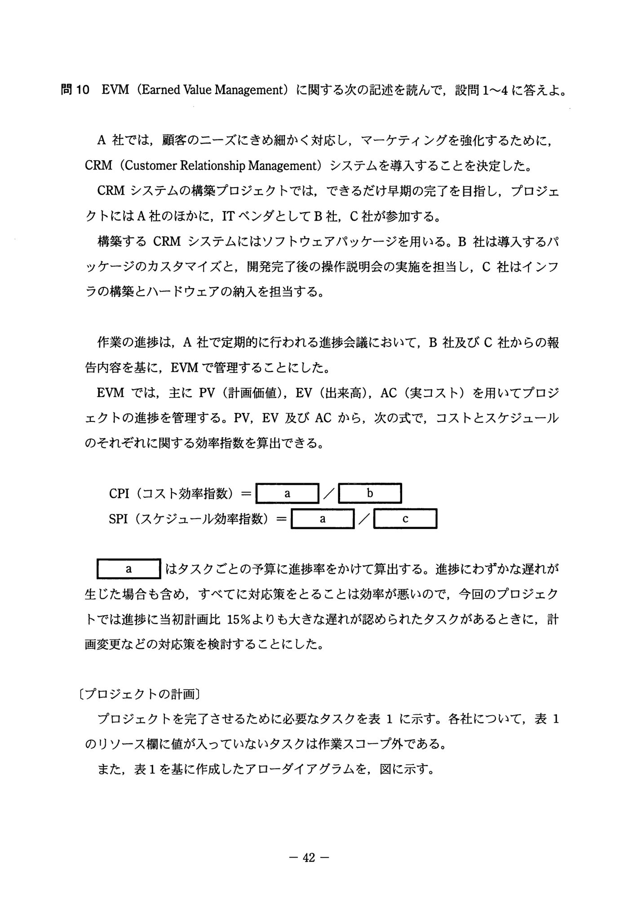

テキスト (OCR)

fa] 10 EVM (Earned Value Management) に関する次の記述を読んで, 設問 1こ4 に答えよ。

A 社では, 顧客のニーズにきめ細かく対応し, マーケティングを強化するために,
CRM (Customer Relationship Management) システムを導入することを決定した。

CRM システムの構築プロジェクトでは, できるだけ早期の完了を目指し, プロジェ
クトには 4A 社のほかに, IT ベンダとしてB 社, C社が参加する。

MATS CRM システムにはソフトウェアパッケージを用いる。B 社は導入するパ
ッケージのカスタマイズと, 開発完了後の操作説明会の実施を担当し, C 社はインフ
ラの構築とハードウェアの納入を担当する。

作業の進捗は, A 社で定期的に行われる進捗会議において, B 社及び C 社からの報
告内容を基に, EVM で管理することにした。

EVM では, 主に PV (計画価値), EV (km), AC (実コスト) を用いてプロジ
ェクトの進捗を管理する。PV, EV 及び AC から, 次の式で, コストとスケジュール
のそれぞれに関する効率指数を算出できる。

CPI (コスト効率指数) =ニ| a |ノ| b |
SPI (スケジュール効率指数) =| a |ノン| <c |

[a |] はタスクごとの予算に進捗率をかけて算出する。進捗にわずかな遅れが
生じた場合も含め,、 すべてに対応策をとることは効率が悪いので, 今回のプロジェク
トでは進捗に当初計画比 156%よりも大きな遅れが認められたタスクがあるときに, 計
画変更などの対応策を検討することにした。

〔プロジェクトの計画〕

プロジェクトを完了させるために必要なタスクを表 1 に示す。各社について, 表 1
のリソース欄に値が入っていないタスクは作業スコープ外である。

また, 表 1を基に作成したアローダイアグラムを, 図に示す。

ー 42 一

### ページ 43

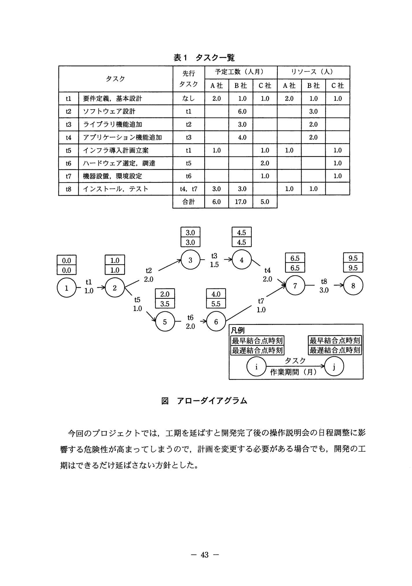

テキスト (OCR)

表1 タスク一覧

t1
1.0

Xx,

1.0

2.0                         4.0
3.5     55    t7
1.0
Oy §- OL
2.0                     凡例
最早結合点時刻     最早結合点時刻
最遅結合点時刻     最遅結合点時刻
タスク          G)
作業期間 (月)

図 アローダイアグラム

t4

ラスク        先行   予定工数 (人月)   リソース (人)
タスク | att | B社|C社|A社|B社| CH
tl | 要件定義, 基本設計                    なし         2.0         10 | 10        2.0        1.0        1.0
2 | ソフトウェア設計           tl          6.0             3.0
t3 | ライブラリ機能追加                     t2                      3.0                             2.0
t4 | アプリケーション機能追加     3          4.0              2.0
t5 | インフラ導入計画立案        tl     1.0         1.0   1.0         1.0
t6 | \N-KkUx7RE, 調達       tS                2.0               1.0
t7 | 機器設置, 環境設定                      16                                   1.0                                1.0
t8 | インストール, テスト           t4, t7 | 3.0      3.0              1.0      1.0
合計         6.0 | 17.0 | 5.0
3.0                     4.5
3.0                     45
0.0     1.0     AGY 8 Oh    6.5       9.5
0.0                    1.0             t2                               "                                     6.5                         9.5
2.0

8
3.0

今回のプロジェクトでは, 工期を延ばすと開発完了後の操作説明会の日程調整に影
響する危険性が高まってしまうので, 計画を変更する必要がある場合でも, 開発の工
期はできるだけ延ばさない方針とした。

### ページ 44

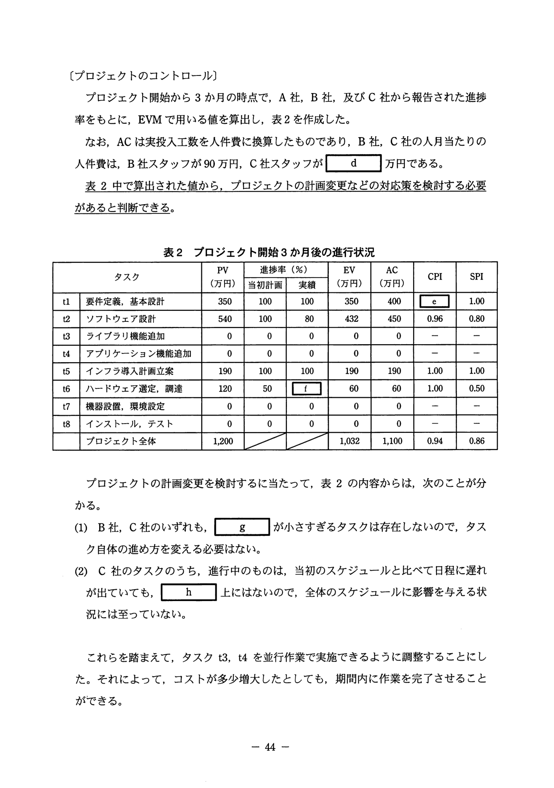

テキスト (OCR)

〔プロジェクトのコントロール〕

プロジェクト開始から 3 か月の時点で, AH, BH, RUC 社から報告された進捗
率をもとに, EVM で用いる値を算出し, 表2 を作成した。

なお, AC は実投入工数を人件費に換算したものであり, BH, C 社の人月当たりの
人件費は, B 社スタッフが 90万円, C社スタッフが|  d |万円である。

表 2 中で算出された値から, プロジェクトの計画変更などの対応策を検討する必要
があると判断できる。

表2 プロジェクト開始 3 か月後の進行状況

P              i            %
74?         om)  saa aa   cam | gm | | mm
i | 要件定義, 基本設計                    350          100           100           350           400 |[。] | 1
 | ソフトウェア設計                      540 | 100            80           432          450 | 096 | 080
13 | ライブラリ機能追加                         0              0               0                0               0            ー              ー
| アプリケーション機能追加      0     0      0      0      0     ー     ー
t5 | インフラ導入計画立案                 190 | 100           100            190           190 | 100 | 1.00
t6 | ハードウェア選定, 調達              120            s |[ri ]           60             60 | 100 | 050
t7 | 機器設置, 環境設定                       0             0              0               0              0           ー             ー
t8 | インストール, テスト        0     0      0      0      0     ー     ー
プロジェクト全体                         1200                                              1032 | 1100 | 094 | 0.86

プロジェクトの計画変更を検討するに当たって, 表 2 の内容からは, 次のことが分

かる。

Q) B社, C社のいずれも, |  g |] が小さすぎるタスクは存在しないので, タス
ク自体の進め方を変える必要はない。

⑫) C 社のタスクのうち, 進行中のものは, 当初のスケジュールと比べて日程に遅れ
が出ていても, | h |] 上にはないので, 全体のスケジュールに影響を与える状
況には至っていない。

これらを踏まえて, タスク 13, t4 を並行作業で実施できるように調整することにし
た。それによって, コストが多少増大したとしても, 期間内に作業を完了させること
ができる。

### ページ 45

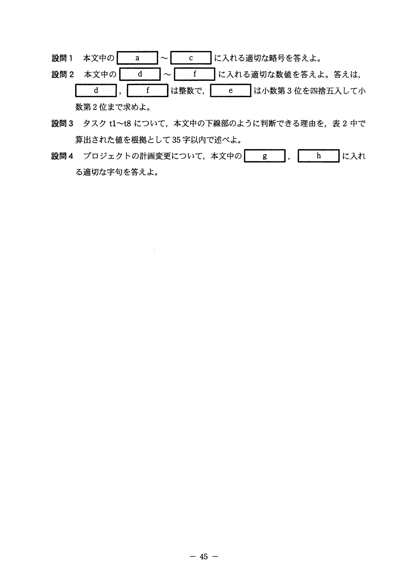

テキスト (OCR)

設問1 本文中の| a |~|  c |に入れる適切な略号を答えよ。

設問2 本文中の| d |て|  f | に入れる適切な数値を答えよ。答えは,
(a |. f  ] は束致で.| es | は小数第3 位を四捨五入して小
数第 2 位まで求めよ。

設問3 タスク 1へ8 について, 本文中の下線部のように判断できる理由を, 表 2 中で
算出された値を根拠として 35 字以内で述べよ。

設問4 プロジェクトの計画変更について, 本文中の|  g |, | h |に入れ
る適切な字句を答えよ。

ー 45 一

### ページ 46

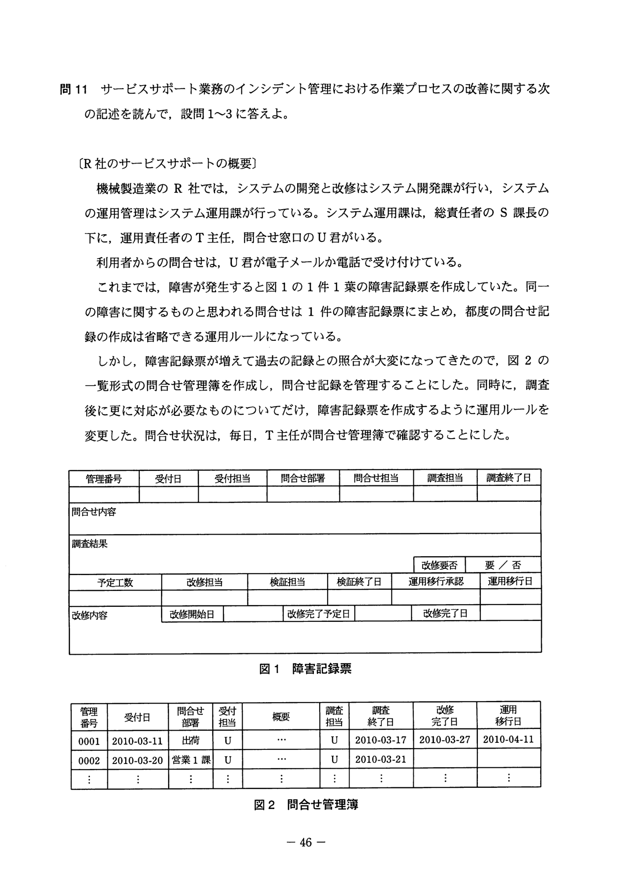

テキスト (OCR)

問11 サービスサポート業務のインシデント管理における作業プロセスの改善に関する次
の記述を読んで, 設問 1て3 に答えよ。

(R 社のサービスサポートの概要〕

機械製造業の R 社では, システムの開発と改修はシステム開発課が行い システム
の運用管理はシステム運用課が行っている。システム運用課は, 総責任者の S 課長の
Fit, 運用責任者のT 主任, 問合せ窓口のU 君がいる。

利用者からの問合せは, U君が電子メールか電話で受け付けている。

これまでは, 障害が発生すると図 1 の1件 1 葉の障害記録票を作成していた。同一
の障害に関するものと思われる問合せは 1 件の障害記録票にまとめ, 都度の問合せ記
録の作成は省略できる運用ルールになっている。

LOL, 障害記録球が増えて過去の記録との照合が大変になってきたので, 図 2 の
一覧形式の問合せ管理徳を作成し, 問合せ記録を管理することにした。 同時に, 調査
後に更に対応が必要なものについてだけ, 障害記録票を作成するように運用ルールを
変更した。問合せ状況は, BA, T 主任が問合せ管理乱で確認することにした。

管理番号   受付日   受付担当   問合せ部署 | 問合せ担当 | 主査担当 | 調査終了日
問合せ内容
調査結果

“ees | B/S

予定工数     履修担当    検証担当   検証終了日 | 運用移行承認 | 運用移行日

改修内容      改修開始日 |      [meer ree |     | 改修完了日
図1 障害記録票

管理      問合せ | 受付      調査| 調査   Bee   運用
as | 208 | oe [es | les | wre | 完了    移生日
0001 | 2010-03-11  出荷  U         2010-03-17 | 2010-03-27 | 2010-04-11
0002 | 2010-03-20 |営業1課| U   で   U 2010-03-21

図2 問合せ管理簿

ー 46 一

### ページ 47

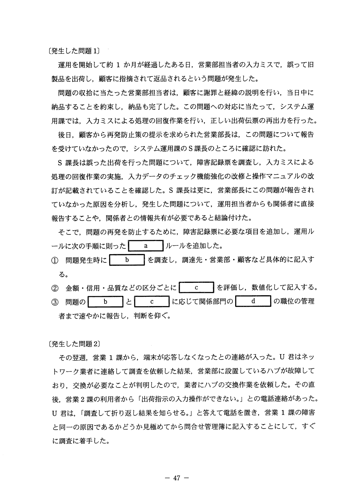

テキスト (OCR)

(発生した問題1)

運用を開始して約 1 か月が経過したある日, 営業部担当者の入力ミスで, 誤って旧
製品を出荷し, 顧客に指摘されて返品されるという問題が発生した。

問題の収拾当たった営業部担当者は, 顧客に謝罪と経緯の説明を行い, 当日中に
納品することを約束し, 納品も完了した。この問題への対応に当たって, システム運
用課では, 入力ミスによる処理の回復作業を行い 正しい出荷伝票の再出力を行った。

後日, 顧客から再発防止策の提示を求められた営業部長は, この問題について報告
を受けていなかったので, システム運用課の S 課長のところに確認に訪れた。

S 課長は誤った出荷を行った問題について, 障害記録票を調査し, 入力ミスによる
処理の回復作業の実施, 入力データのチェック機能強化の改修と操作マニュアルの改
計が記載されていることを確認した。S 課長は更に, 営業部長にこの問題が報告され
ていなかった原因を分析し, 発生した問題について, 運用担当者からも関係者に直接
報告することや, 関係者との情報共有が必要であると結論付けた。

そこで, 問題の再発を防止するために, 障害記録票に必要な項目を追加し, 運用ル
ールに次の手順に則った|  a | ルールを追加した。
© 問題発生時に| b | を調査し, 調達先・営業部・顧客など具体的に記入す

る。
© 金額・信用・品質などの区分どとに| c | を評価し, 数値化して記入する。
@ 問題の| b |と[| < | に応じて関係部門の[| d | の職位の管理

者まで速やかに報告し, 判断を仰ぐ。

(発生した問題 2)

その翌週, 営業 1 課から, 端末が応答しなくなったとの連絡が入った。U 君はネッ
トワーク業者に連絡して調査を依頼した結果, 営業部に設置しているハブが故障して
おり, 交換が必要なことが判明したので, 業者にハブの交換作業を依頼した。その直
後, 営業 2 課の利用者から「出荷指示の入力操作ができない。」との電話連絡があった。
U 君は, 「調査して折り返し結果を知らせる。」と答えて電話を置き, 営業 1 課の障害
と同一の原因であるかどうか見極めてから問合せ管理簿に記入することにして, すぐ
に調査に着手した。

ー 47 一

### ページ 48

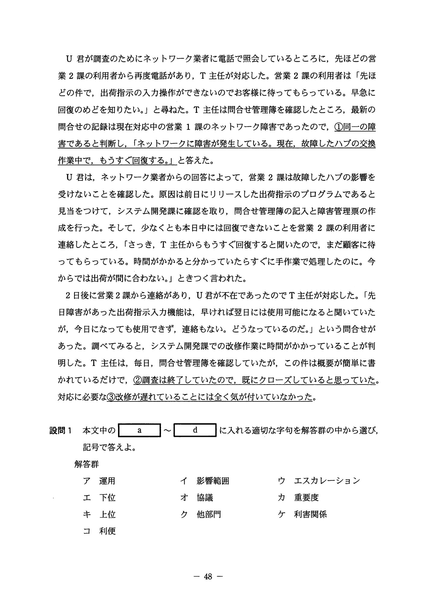

テキスト (OCR)

U 君が調査のためにネットワーク業者に電話で照会しているところに, 先ほどの営
業 2 課の利用者から再度電話があり, T 主任が対応した。営業 2 課の利用者は「先ほ
どの件で, 出荷指示の入力操作ができないのでお客様に待ってもらっている。早急に
回復のめどを知りたい。」と尋ねた。T 主任は問合せ管理短を確認したところ, 最新の
問合せの記録は現在対応中の営業 1 課のネットワーク障害であったので, ①同一の障
害であると判断し, 「ネットワークに障害が発生している。現在, 故障したハブの交換
作業中で, もうすぐ回復する。」と答えた。

U Bld, ネットワーク業者からの回答によって, 営業 2 課は故障したハブの影響を
受けないことを確認した。原因は前日にリリースした出荷指示のプログラムであると
見当をつけて, システム開発課に確認を取り, 問合せ管理短の記入と障害管理票の作
成を行った。そして, 少なくとも本日中には回復できないことを営業 2 課の利用者に
連絡したところ, 「さっき, T 主任からもうすぐ回復すると開いたので, まだ顧客に待
ってもらっている。 時間がかかると分かっていたらすぐに手作業で処理したのに。今
からでは出荷が間に合わない。」ときつく言われた。

2 日後に営業 2 課から連絡があり, U君が不在であったのでT 主任が対応した。「先
日障害があった出荷指示入力機能は, 早ければ翌日には使用可能になると聞いていた
が, 今日になっても使用できず, 連絡もない。どうなっているのだ。」という問合せが
あった。調べてみると, システム開発課での改修作業に時間がかかっていることが判
明した。T 主任は, 毎日, 問合せ管理短を確認していたが, この件は概要が簡単に書
かれているだけで, ②調査は終了していたので, 既にクローズしていると思っていた。
対応に必要な③⑨改修が遅れていることには全く気が付いていなかった。

設問1 本文中の| a |て|  d |に入れる適切な字句を解答群の中から選び

記号で答えよ。
ER
ア 運用        イ 影響範囲      ウ エスカレーション
エ 下位        オ 協議        A 重要度
キ 上位        ク 他部門       ケ 利害関係
コ 利便

### ページ 49

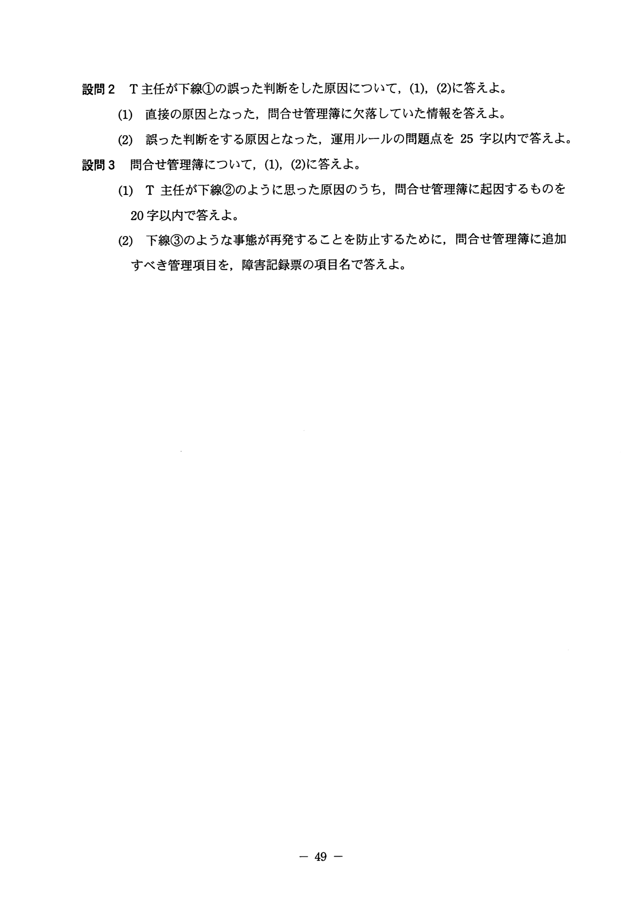

テキスト (OCR)

設問2 T 主任が下線①の誤った判断をした原因について, ①⑪, ②)に答えよ。
(1) 直接の原因となった, 問合せ管理簿に欠落していた情報を答えよ。
2) 誤った判断をする原因となった, 運用ルールの問題点を 25 字以内で答えよ。
設問3 問合せ管理短について, ①⑪, ②)に答えよ。
(1) T 主任が下線②つのように思った原因のうち, 問合せ管理律に起因するものを
20 字以内で答えよ。
2) 下線③のような事態が再発することを防止するために, 問合せ管理簿に追加
すべき管理項目を, 障害記録票の項目名で答えよ。

ー 49 一

### ページ 50

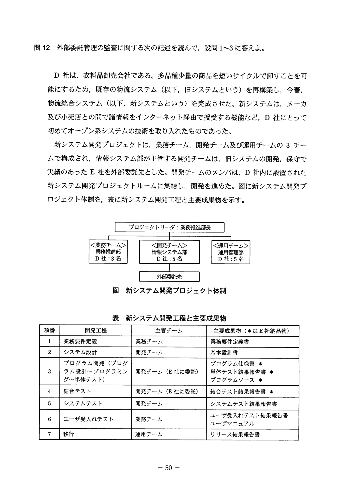

テキスト (OCR)

問12 外部委託管理の監査に関する次の記述を読んで, 設問1て3 に答えよ。

D 社は, 衣料品卸売会社である。多品種少量の商品を短いサイクルで仰すことを可
能にするため, 既存の物流システム (以下, 旧システムという) を再構築し, 今春,
物流統合システム (以下, 新シレステムという) を完成させた。新システムは, メーカ
及び小売店との間で諸情報をインターネット経由で授受する機能など, D 社にとって
初めてオープン系システムの技術を取り入れたものであった。

新システム開発プロジェクトは, 業務チーム, 開発チーム及び運用チームの 3 チー
ムで構成され, 情報システム部が主管する開発チームは, 旧システムの開発, 保守で
実績のあった 社を外部委託先とした。開発チナームのメンバは, D 社内に設置された
新システム開発プロジェクトルームに集結し, 開発を進めた。図に新システム開発プ
ロジェクト体制を, 表に新システム開発工程と主要成果物を示す。

|フロジェクトリーダ : 聞推進部長 。 |
it

[                            1                             1

ぐ業務チーム            ぐ開発チーム>            ぐ運用チーム
業務推進部              情報システム部              運用管理部
D社:3名       D社:5名       D社:5名

図 新システム開発プロジェクト体制

表 新システム開発工程と主要成果物

項番               開発工程                         主管チーム                主要成果物 (*はE社納品物)
1     業務要件定義                業務チーム                    業務要件定義書
2      システム設計                開発チーム                    基本設計書
プログラム開発 (プログ              プログラム仕様書 *
3    ラム設計ンプログラミン | 開発チーム (E 社に委託)    単体テスト結果報告書 *
グ~単体テスト)                  プログラムソース *
4 | 結合テスト        開発チーム (Ethic Bat)   合テスト結果報告書 *
5 | システムテスト      開発チーム         システムテスト結果報告書
6 | ユーザ愛入れテスト    業務チーム         Sen REED
7 | BG           運用チーム         リリース結果報告書

ー 50 一

### ページ 51

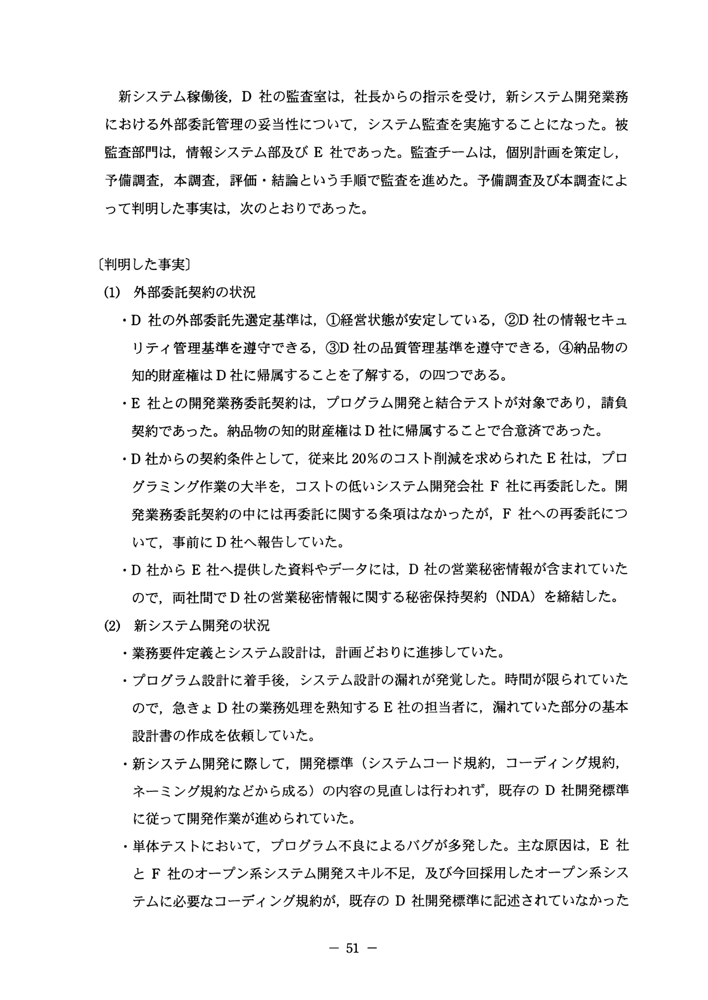

テキスト (OCR)

新システム稼働後, D 社の監査室は, 社長からの指示を受け, 新システム開発業務
における外部委託管理の妥当性について, システム監査を実施することになった。被
監査部門は, 情報システム部及び E 社であった。監査チテームは, 個別計画を策定し,
予備調査, 本調査, 評価・結論という手順で監査を進めた。予備調査及び本調査によ
って判明した事実は, 次のとおりであった。

(判明した事実〕

①)

(2)

外部委託契約の状況

・D 社の外部委託先選定基準は, ①経営状態が安定している, OD 社の情報セキュ

リティ管理基準を遵守できる, OD 社の品質管理基準を遵守できる, ④⑬納品物の
知的財産権は D 社に帰属することを了解する, の四つである。

・E 社との開発業務委託契約は, プログラム開発と結合テストが対象であり, 請負

契約であった。納品物の知的財産権は D 社に帰属することで合意済であった。

・D 社からの契約条件として, 従来比 20%のコスト削減を求められた 社は, プロ

グラミング作業の大半を, コストの低いシステム開発会社 F 社に再委託した。開
発業務委託契約の中には再委託に関する条項はなかったが, F 社への再委託につ
いて, 事前にD 社へ報告していた。

・D 社から E 社へ提供した資料やデータには, D 社の営業秘密情報が含まれていた

OC, 両社間でD 社の営業秘密情報に関する秘密保持契約 (NDA) を締結した。
新システム開発の状況

・業務要件定義とシステム設計は, 計画どおりに進捗していた。
・プログラム設計に着手後, システム設計の漏れが発覚した。時間が限られていた

OC, 急きょ D 社の業務処理を熟知する E 社の担当者に, 漏れていた部分の基本
設計書の作成を依頼していた。

・新システム開発に際して, 開発標準 (セステムコード規約, コーディング規約,

ネーミング規約などから成る) の内容の見直しは行われず, 既存の D 社開発標準
に従って開発作業が進められていた。

・単体ケストにおいて, プログラム不良によるバグが多発した。主な原因は, E tt

と F 社のオープン系システム開発スキル不足, 及び今回採用したオープン系シス
テムに必要なコーディング規約が, 既存の D 社開発標準に記述されていなかった

ー 51 一

### ページ 52

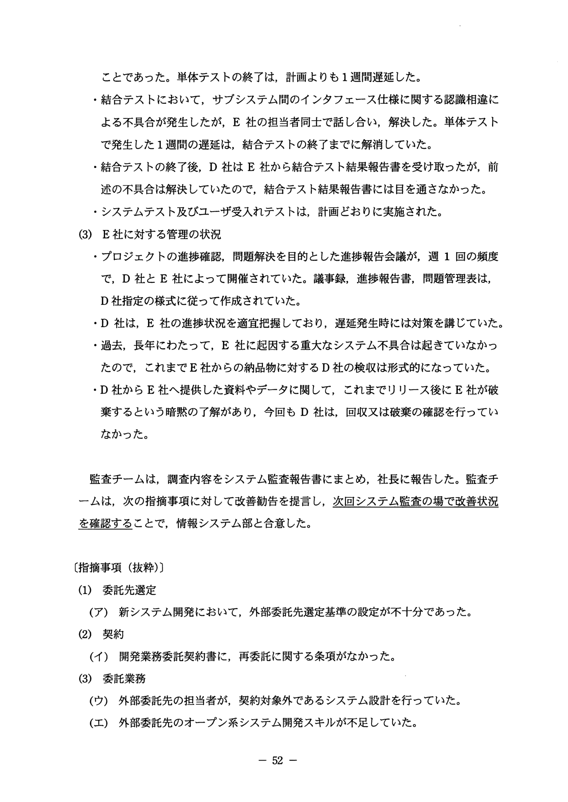

テキスト (OCR)

ことであった。 単体テストの終了は, 計画よりも1 週間遅延した。

合テストにおいて, サプシステム間のインタフェース仕様に関する認識相違に
よる不具合が発生したが, E 社の担当者同士で話し合い, 解決した。 単体テスト
で発生した 1 週間の遅延は, 結合テストの終了までに解消していた。

・結合テストの終了後, D tid E 社から結合テスト結果報告書を受け取ったが, 前
述の不具合は解決していたので, 結合テスト結果報告書には目を通さなかった。

・システムテスト及びユーザ受入れテストは, 計画どおりに実施された。

3) E 社に対する管理の状況

・プロジェクトの進捗確認, 問題解決を目的とした進捗報告会議が, 週 1 回の頻度
で, D 社と E 社によって開催されていた。議事録, 進捗報告書, 問題管理表は,
D 社指定の様式に従って作成されていた。

・D 社は, E 社の進捗状況を適宜把握しており, 遅延発生時には対策を講じていた。

・過去, 長年にわたって, 社に起因する重大なシステム不具合は起きていなかっ
たので, これまで 社からの納品物に対する D 社の検収は形式的になっていた。

・D 社から 社へ提供した資料やデータに関して, これまでリリース後に 社が破
棄するという暗黙の了解があり, 今回も D tid, 回収駐は破棄の確認を行ってい
なかった。

監査チテームは, 調査内容をシステム監査報告書にまとめ, 社長に報告した。監査チ
ームは, 次の指摘事項に対して改善勧告を提言し, 次回システム監査の場で改善状況
を確認することで, 情報システム部と合意した。

(指摘事項 (抜粋)〕
Q①) 委託先選定
(ア) 新システム開発において, 外部委託先選定基塗の設定が不十分であった。
⑫) 契約
(イ) 開発業務委託契約書に, 再委託に関する条項がなかった。
(3) 委託業務
(7) 外部委託先の担当者が, 契約対象外であるシステム設計を行っていた。
(XL) 外部委託先のオープン系システム開発スキルが不足していた。

ー 52 一

### ページ 53

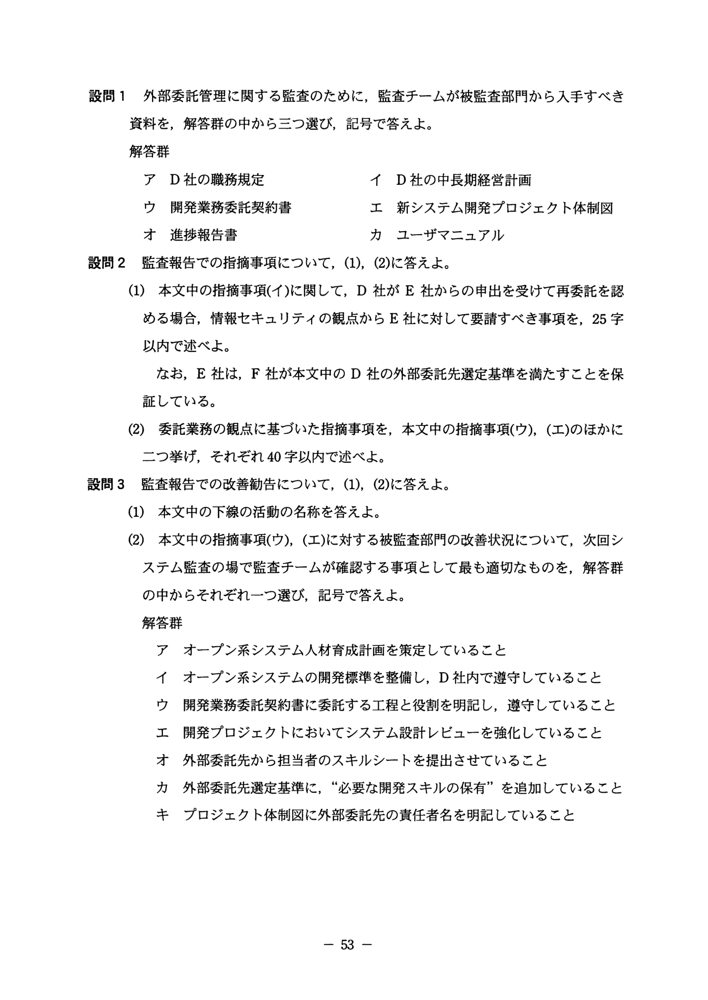

テキスト (OCR)

設問1 外部委託管理に関する監査のために, 監査チームが被監査部門から入手すべき
資料を, 解答群の中から三つ選び, 記号で答えよ。

ER
ア D社の職務規定        イ D社の中長期経営計画
ウ 開発業務委託契約書      Lo 新システム開発プロジェクト体制図
A 進捗報告書          A ユーザマニュアル

設問2 監査報告での指摘事項について, (1), ②)に答えよ。
GQ) 本文中の指摘事項(イ)に関して, D 社が E 社からの申出を受けて再委託を認
める場合, 情報セキュリティの観点からE 社に対して要請すべき事項を, 25 字
以内で述べよ。
なお, E tld, F 社が本文中の D 社の外部委託先選定基準を満たすことを保
証している。
2) 委託業務の観点に基づいた指摘事項を, 本文中の指摘事項(ウ), (エエ)のほかに
=O, それぞれ 40 字以内で述べよ。
設問3 監査報告での改善勧告について, (D, (⑫②)に答えよ。
Q①) 本文中の下線の活動の名称を答えよ。
2) 本文中の指摘事項(ウ), (工)に対する被監査部門の改善状況について, KAY
ステム監査の場で監査チームが確認する事項として最も適切なものを, MER
の中からそれぞれ一つ選び, 記号で答えよ。
ER
オープン系システム人材育成計画を策定していること
オープン系システムの開発標準を整備し, D 社内で遵守していること
開発業務委託契約書に委託する工程と役割を明記し, 遵守していること
開発プロジェクトにおいてシステム設計レビューを強化していること
外部委託先から担当者のスキルシートを提出させていること
外部委託先選定基準に, “必要な開発スキルの保有" を追加していること
プロジェクト体制図に外部委託先の責任者名を明記していること

キャ きせ HEA

### ページ 54

テキスト (OCR)

メモ用紙 〕

### ページ 55

テキスト (OCR)

トメタモ-用-紙 〕

ー 55 一

### ページ 56

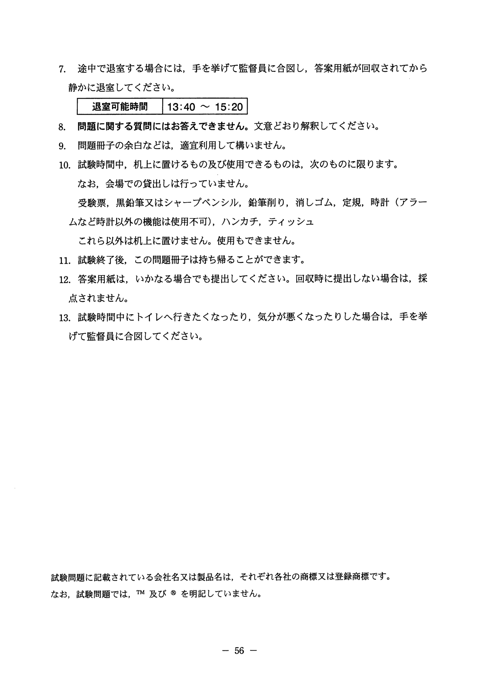

テキスト (OCR)

7. 途中で退室する場合には, 手を挙げて監督員に合図し, 答案用紙が回収されてから
静かに退室してください。
| 退室可能時間 | 13:40 ~ 15:20
8. 問題に関する質問にはお答えできません。文意どおり解釈してください。
9 問題冊子の余白などは, 適宜利用して構いません。
10. 試験時間中, 机上に置けるもの及び使用できるものは, 次のものに限ります。
なお, 会場での貸出しは行っていません。
SBM, 黒鉛筆又はシャープペンシル, 鉛筆削り, 消しゴム, 定規, 時計 (アラー
ムなど時計以外の機能は使用不可), ハンカチ, ティッシュ
これら以外は机上に置けません。使用もできません。
11. 試験終了後, この問題冊子は持ち帰ることができます。
12, 答案用紙は, いかなる場合でも提出してください。回収時に提出しな場合は, 採
点されません。
13 試験時間中にトイレへ行きたくなったり, 気分が悪くなったりした場合は, FER
げて監督員に合図してください。

試験問題に記載されている会社名又は製品名は, それぞれ各社の商標又は登録商標です。
なお, 試験問題では, ™ 及び © を明記していません。

ー 56 一

---

## 午後解答

1/6 
Copyright(c) Information-technology Promotion Agency, Japan. All rights reserved 2010 
平成22 年度 春期 応用情報技術者試験 解答例 
 
午後試験 
問１ 
出題趣旨 
 企業経営においては，経営が順調な場合でも経営状況を常に分析し，問題点を抽出する活動を続けることが
重要である。また，問題点が発見された際には，直ちに解決に向けた方策を立案し，実行に移していくことが
欠かせない。経営上の問題点を抽出するためには，経営分析の手法を理解し，それを応用できる能力が必要と
なる。 
 本問では，外食チェーンにおける経営分析を題材に，収益性・安全性・生産性，及びキャッシュフローの分
析に関する基礎的な知識と応用力を問う。 
 
設問 
解答例・解答の要点 
備考 
設問１ 
 
a イ 
 
 
 
b カ 
 
 
 
d オ 
 
 
 
e コ 
 
設問２ (1) c 
・流動資産に占める現金及び預金の割合が高い 
・相対的に当座比率が高い水準にある 
・原材料や仕掛品の金額が少ない 
 
 
(2) 販売費・一般管理費の上昇を抑制できたから 
 
設問３ (1) f 
投資活動 
 
 
 
g 
財務活動 
 
 
(2) h 52 
 
設問４ 
イ，オ 
 
 
問２ 
出題趣旨 
 配列やリストなどのデータ構造を用いたアルゴリズムの実装能力と，その計算量に関する理解は，応用情報
技術者にとって，押さえておくべき基礎技術の一つである。 
 本問では，付箋をデスクトップに配置するアプリケーションを題材に，配列及びリストを用いたアルゴリズ
ムを実装する能力を問う。さらに，アルゴリズムを評価する際の指標である計算量に関する理解について問う。
 
設問 
解答例・解答の要点 
備考 
設問１ (1) MemoArray[0].height 
 
 
(2) 30 
 
設問２ 
ア MemoArray[index] 
 
 
イ memoArrayCount－1 
 
設問３ 
ウ node.nextNode.prevNode ← node.prevNode 
 
 
エ node.prevNode ← tailNode 
 
設問４ (1) オ O(n) 
 
 
 
カ O(1) 
 
 
(2) キ デスクトップに配置できる付箋の最大数分の領域を確保

2/6 
Copyright(c) Information-technology Promotion Agency, Japan. All rights reserved 2010 
問３ 
出題趣旨 
 企業経営においては，様々な視点から事業環境を評価し，バランスの取れた戦略を策定することが重要であ
る。バランススコアカードは，財務，顧客，内部業務プロセス，学習と成長の四つの視点に基づいた企業戦略
の策定，及び具体的なアクションプラン作成による企業ビジョンの実現を支援するフレームワークである。 
 本問では，保険会社の戦略策定を題材に，バランススコアカードの活用と事業戦略立案に関する基本的な理
解を問う。 
 
設問 
解答例・解答の要点 
備考 
設問１ 
ア 
 
設問２ (1) a 顧客からの信頼回復 
 
 
(2) b オ 
 
 
 
c イ 
 
設問３ (1) 外務員に対する，保険契約や商品に関する知識の教育研修制度の整備 
 
 
(2) シミュレーション結果や契約プランを顧客に分かりやすく図解する。 
 
設問４ (1) 不払の解消 
 
 
(2) 営業端末で支払事由を調査し，顧客に発生の有無を確認できる。 
 
 
問４ 
出題趣旨 
 近年のWeb を用いたB to C ビジネスモデルにおいては，トラフィック予測とサーバでの処理を効率良く実施
することが求められている。 
 本問では，Web での情報提供システムを題材として，待ち行列モデルによるシステム評価，及び，負荷分散
方法に関する知識と理解度を問う。 
 
設問 
解答例・解答の要点 
備考 
設問１ 
a ポアソン 
 
 
b 指数 
 
設問２ (1) 100 
 
 
(2) 0.4 
 
 
(3) 26.7 
 
 
(4) 66.7 
 
設問３ (1) ウ，エ 
 
 
(2) オ 
 
設問４ (1) 特定のWeb サーバに新サービスの処理が集中した場合に，待ち時間が長くなる
ことがある。 
 
 
(2) (ⅳ)，(ⅴ)

3/6 
Copyright(c) Information-technology Promotion Agency, Japan. All rights reserved 2010 
問５ 
出題趣旨 
 昨今無線LAN は，広く利用されるようになってきた。無線LAN を使ったネットワークを構築する場合，有
線LAN とは異なる設計上の配慮も必要になる。 
 本問では，フリーアドレス化に伴う無線LAN の導入計画を題材に，無線LAN の設計に関する基礎的な知識
と，ネットワークの冗長性を確保するための応用力を問う。 
 
設問 
解答例・解答の要点 
備考 
設問１ 
a イ 
 
 
b ア 
 
設問２ (1) 通信が特定のアクセスポイントへ集中することを避けること 
 
 
(2) 所定外の機器をネットワークに接続させないため 
 
設問３ 
c ウ 
 
 
d ア 
 
設問４ 
ア，エ 
 
 
問６ 
出題趣旨 
 データベースを用いたシステムの設計においては，SQL の副問合せによる効率的なアプリケーション開発が
望まれ，その正確な検証も求められる。 
 本問では，販売管理システムを題材に，データベースシステムのデータ操作において，SELECT 文の結果を，
提示されたデータに基づいて検証すること，また，SELECT 文の副問合せにおける表の結合の結果をデータに
基づいて検証することを問う。 
 
設問 
解答例・解答の要点 
備考 
設問１ (1) a 'A09999' 
 
 
 
b j.受注番号 
 
 
c m.受注番号 
順不同 
 
(2) 
データ項目名
データの値
出荷店舗番号
A01001
A01002
Web 売上分
36700
233000
 
 
設問２ 
d ・受注情報が存在しない 
・売上がない 
 
設問３ (1) e エ 
 
 
(2) 
店舗番号
渋谷店
A01003
店舗名
金額
null

4/6 
Copyright(c) Information-technology Promotion Agency, Japan. All rights reserved 2010 
問７ 
出題趣旨 
 組込みシステムでは，タスクと割込みハンドラの関係や，その動作のタイミングを正しく理解しておかない
と，不具合を作りこむ原因になってしまうことがある。 
 本問では，タクシーメータの設計を題材として，タスクと割込みハンドラの関係の理解と，不具合発生のメ
カニズム及びこれらの対策方法に対する理解度を問う。 
 
設問 
解答例・解答の要点 
備考 
設問１ (1) a タイムアウト 
 
 
 
b 走行通知 
 
 
 
c イベントフラグのセット待ち 又は 待ち状態 
 
 
 
d クリア 
 
 
(2) e ④ 
 
設問２ 
f タイマ割込み 
 
 
g タイマタスク 
 
 
h 操作パネル割込み 
 
設問３ 
タイマタスクの実行が遅れないようにするため 
 
 
問８ 
出題趣旨 
 ソフトウェアの開発において，UML のクラス図などを利用したオブジェクト指向設計が行われるようになっ
た。 
 本問では，自動券売機を題材にして，オブジェクト指向の特徴である継承や多様性を活用するソフトウェア
設計の知識と応用力を問う。 
 
設問 
解答例・解答の要点 
備考 
設問１ (1) a 列車 
 
 
 
b 金額問合せ 
 
 
(2) 発券 
 
設問２ (1) 送信側クラス名
乗客 
 
 
 
受信側クラス名
現金機構 
 
 
 
メッセージ名 
入金 
 
 
(2) d 現在額問合せ 
 
 
 
e 急行券面編集 
 
設問３ 
 
クラス名 
操作機構 
 
 
 
属性名 
切符 
 
 
 
変更後の属性名
切符の集合

5/6 
Copyright(c) Information-technology Promotion Agency, Japan. All rights reserved 2010 
問９ 
出題趣旨 
 インターネットの基盤技術であるDNS は，各種のキャッシュポイズニング手法の出現によって，セキュリテ
ィ対策が急務となっている。 
 本問では，カミンスキー・アタックを題材にして，DNS の仕組みとその脆弱性に関する理解度を問う。 
 
設問 
解答例・解答の要点 
備考 
設問１ (1) エ 
 
 
(2) キャッシュの有効期限が切れたから 
 
設問２ (1) a DNS サーバD3 
 
 
(2) b ア 
 
設問３ 
c エ 
 
d オ 
順不同 
設問４ 
e インターネットVPN 又は VPN 
 
 
f IP アドレス体系 又は IP アドレス 又は ネットワークアドレス 
 
 
g 社外 又は 外部 
 
 
問10 
出題趣旨 
 PMBOK に基づいたプロジェクトマネジメント手法や，工事進行基準を適用する必要性から，EVM を用いて
プロジェクト管理を行う事例が増えている。 
 本問では，CRM システムの構築プロジェクトを題材に，EVM を用いたプロジェクトのモニタリングによっ
て，プロジェクトの進行状況を適切に把握する能力を問う。 
 
設問 
解答例・解答の要点 
備考 
設問１ 
a 
EV 
 
 
b AC 
 
 
c PV 
 
設問２ 
d 
120 
 
 
e 0.88 
 
 
f 25 
 
設問３ 
・タスクt2 とタスクt6 のSPI が0.85 を下回っているから 
・現在進行中のタスクのSPI が0.85 未満だから 
 
設問４ 
g CPI 
 
 
h クリティカルパス

6/6 
Copyright(c) Information-technology Promotion Agency, Japan. All rights reserved 2010 
問11 
出題趣旨 
 システムの運用段階において，可用性を高めるためには，発生した障害に的確に対応することが重要である。
サービスサポート業務では発生した障害を把握し，記録し，回復させ，恒久対策を行う一連の管理プロセスの
確立が要求される。 
 本問では，サービスサポート業務のインシデント管理を題材に，問合せ窓口における，問合せの記録や管理
方法の問題点を挙げ，管理簿の運用と管理項目の改善を図る能力を問う。 
 
設問 
解答例・解答の要点 
備考 
設問１ 
a ウ 
 
 
b イ 
 
 
c カ 
 
 
d キ 
 
設問２ (1) ・営業2 課の問合せに対する調査中の情報 
・営業2 課の問合せの状態 
 
 
(2) 同一と思われる問合せは記録を省略できる。 
 
設問３ (1) 改修の要否を記録する欄がないから 
 
 
(2) 改修完了予定日 
 
 
問12 
出題趣旨 
 社内のシステム開発要員不足や技術スキル不足から，システム開発作業を外部の専門業者に委託することが
一般的になっている。 
 本問では，外部委託管理の妥当性の監査を題材に，経済産業省“システム管理基準（平成16 年10 月8 日策
定）”の委託・受託に関する基準を理解し，基準から逸脱している事項の有無を確認し，指摘や改善提案ができ
る能力を問う。 
 
設問 
解答例・解答の要点 
備考 
設問１ 
ウ，エ，オ 
 
設問２ (1) E 社とF 社の間で秘密保持契約を締結する。 
 
 
(2) ① 
② 
・E 社からの結合テスト結果報告書に目を通さなかった。 
・E 社へ提供した資料やデータに関して，回収又は破棄の確認を行ってい
なかった。 
 
設問３ (1) 改善指導 又は フォローアップ 
 
 
(2) (ウ) ウ 
 
 
 
(エ) カ

---

## 午後採点講評

1/3 
Copyright(c) Information-technology Promotion Agency, Japan. All rights reserved 2010 
平成22 年度 春期 応用情報技術者試験 採点講評 
 
午後試験 
問１ 
 問1 では，外食チェーンにおける経営分析を題材に，経営分析指標の評価方法やキャッシュフロー計算書の
構造とそれを使った分析について出題した。全体として，正答率は低かった。 
 設問1 は，正答率が高かった。収益性分析と安全性分析の基本的な事項について，おおむね理解されている
ようであった。 
 設問2(1)は，正答率が低かった。自己資本比率や固定比率など，流動資産と関係しない指標について記述し
た解答が散見された。安全性分析が，企業の支払能力を測る指標であることをしっかり認識してもらいたい。
 設問3(2)は，正答率が低かった。キャッシュフロー計算書の構造が理解できていれば，正答を導けるはずで
ある。同計算書についての知識を深める契機としてもらいたい。 
 
問２ 
 問2 では，付箋をデスクトップに配置するアプリケーションを題材に，配列及びリストを用いたアルゴリズ
ムについて出題した。全体として，正答率は高かった。 
 設問2 のイは，正答率が低かった。関数moveForeArray の処理手順(3)に示されている，“配列の最後の付箋
データがある位置”をどのように求めるのか，表に示されている変数の定義とあわせて，よく考えて正答を導
いてもらいたい。 
 設問4(1)は，正答率が低かった。計算量の基本的な考え方やO 記法による記述方法をよく理解してもらいた
い。 
 
問３ 
 問3 では，保険会社の戦略策定を題材に，バランススコアカードを用いた事業戦略立案と，それに伴うシス
テム改善について出題した。全体として，正答率は低かった。 
 設問1 は，正答率が低かった。市場環境分析における基本的な用語なので，是非理解しておいてもらいた
い。 
 設問2 は，正答率が高かった。バランススコアカードの基本的な構造については，おおむね理解されている
ようであった。 
 設問3(2)は，営業端末とは関係ない改善点を記述している解答が散見された。解答に当たっては，設問をよ
く読み，落ち着いて解答してもらいたい。 
 
問４ 
 問4 では，インターネットを介した情報提供システムを題材として，M/M/1 の待ち行列モデルによるシステ
ム評価や負荷分散方式について出題した。 
 設問1 のb，設問2(3)，(4)は，正答率が低かった。M/M/1 の待ち行列モデルにおける処理時間の分布，平均
待ち時間と平均応答時間の算出方法は，基本的な知識であるので，是非身に付けておいてもらいたい。 
 設問4 は，正答率が高かった。負荷分散方式の特徴については，おおむね理解されているようであった。 
 
問５ 
 問5 では，無線LAN の導入計画を題材に，無線LAN の設定やセキュリティ，及びネットワーク全体の冗長
化について出題した。際立って正答率の低い設問はなかったが，全体として正答率は低かった。 
 設問1 のa は，正答率が低かった。媒体アクセス制御方式はネットワーク構築における基本的知識であるの
で，しっかり学習しておいてもらいたい。 
 設問2(1)は，正答率が低かった。クライアントをアクセスポイント間で分散させて通信帯域幅を確保するこ
とが，ネットワーク設計における重要要件であることを理解していれば，正答を導けるはずである。 
 設問3 は，d の正答率が低かった。無線LAN では，有線LAN 以上にセキュリティの確保に留意する必要が
あり，セキュリティに関する基本的知識を習得しておいてもらいたい。

2/3 
Copyright(c) Information-technology Promotion Agency, Japan. All rights reserved 2010 
問６ 
 問6 では，販売管理システムを題材に，SQL 文の実行結果の検証について出題した。全体として，正答率は
高かった。 
 設問1 は，正答率は高かったが，a の店舗番号の指定において，コーテーションがないもの，ダブルコーテ
ーションとしたものが見られた。SQL 文の文法に則った正確な記述が要求される。 
 設問2 は，正答率が高かったが“出荷がない”という解答が見られた。図4 では渋谷店が出力されておら
ず，INNER JOIN の働きを理解していれば正答が導けるはずである。 
 設問3 は，正答率が高かった。LEFT OUTER JOIN については，おおむね理解されているようであった。 
 
問７ 
 問7 では，タクシーの料金メータの設計を題材として，イベントフラグの制御と割込みを禁止したときの不
具合について出題した。 
 設問1 は，b にタスク名を解答した受験者が多かった。これは，イベントフラグの仕組みと，タスクの関係
の理解が十分でない受験者が多かった結果と思われる。 
 設問2 は，正答率が高かった。割込みハンドラとタスクの関係はおおむね理解されているようであった。 
 設問3 は，正答率が低かった。割込みを禁止してしまうことでタイマタスクに遅延が生じることがあり，そ
の結果，システムに不具合が発生するメカニズムを理解しておいてもらいたい。 
 
問８ 
 問8 では，自動券売機を題材に，ソフトウェアのオブジェクト指向設計について出題した。 
 設問1(1)のa は正答率が高く，継承などの基本概念はおおむね理解されているようであった。しかし，その
応用問題であるb は誤った解答が多かった。問題文をよく読み，新旧のクラス図を見比べて考えれば，正答を
導けるはずである。 
 設問2 については，問題文をよく読み，シーケンス図だけではなく，クラス図とシーケンス図を合わせて考
えれば，正答を導けるはずである。 
 設問3 は，正答率が低かった。クラス図及びシーケンス図について，オブジェクトの生成，生存の状態に注
意しながら考えれば，正答を導けるはずである。 
 
問９ 
 問9 では，カミンスキー・アタックを題材に，DNS の仕組みとその脆弱性について出題した。全体として，
正答率は高かった。 
 設問1(1)は，正答率が高かった。DNS キャッシュポイズニングによって引き起こされる脅威の内容について
はおおむね理解されているようであった。 
 設問2(2)は，正答率が低かった。DNS などのインターネット基盤技術が抱える脆弱性への対策は重要なの
で，十分に理解してほしい。 
 設問4 のe は，正答率が低かった。問題文中の“インターネット接続を使って”を読み取れば正答が導ける
はずである。 
 
問10 
 問10 では，CRM システムの構築プロジェクトを題材に，EVM（Earned Value Management）を用いたプロ
ジェクト管理について出題した。 
 設問1 は，正答率が高かった。EVM に用いる効率指数の基本的な計算方法については，おおむね理解され
ているようであった。 
 設問2 のf は，50 と誤って解答した受験者が多かった。進捗を評価したタイミングについて考慮されていな
い結果と思われる。予算，PV 及び進捗率の関係については，十分に理解しておいてもらいたい。 
 設問3 は，正答率が低かった。プロジェクトの運営において，定量的な基準を根拠にして状況を把握するこ
とは，非常に重要である。SPI やCPI を用いてプロジェクトの状況を把握する方法について，是非理解してお
いてもらいたい。

3/3 
Copyright(c) Information-technology Promotion Agency, Japan. All rights reserved 2010 
問11 
 問11 では，サービスサポート業務のインシデント管理を題材に，作業プロセスの改善について出題した。 
 設問1 は，正答率が高かった。関係者への報告までの基本的手順については，おおむね理解されているよう
であった。 
 設問2(2)は，問合せ管理簿の運用ルールについての問題であるが，運用ルール以外についての解答が散見さ
れた。特に，問合せ管理簿と障害記録表を混同して解答しているものが目立った。 
 設問3 は，現状の問合せ管理簿の問題点について問うたが，運用ルールについての解答が散見された。 
 
問12 
 問12 では，外部委託管理の妥当性の監査について出題した。全体として正答率は高かったが，設問によっ
てばらつきが見られた。 
 設問2(2)は，委託業務の観点に基づいた指摘事項を問うたが，品質管理や進捗管理の不備を指摘した誤った
解答が散見された。 
 設問3(1)は，システム監査手順にはない誤った解答が散見された。一方，(2)では，フォローアップの活動が
正しく理解されているようであった。フォローアップは，一連のシステム監査手順の中で重要な活動であるの
で，計画，調査，評価・結論，報告とともに，理解してほしい。

