# 平成23年度秋期 応用情報技術者試験

---

## 午前問題

### ページ 1

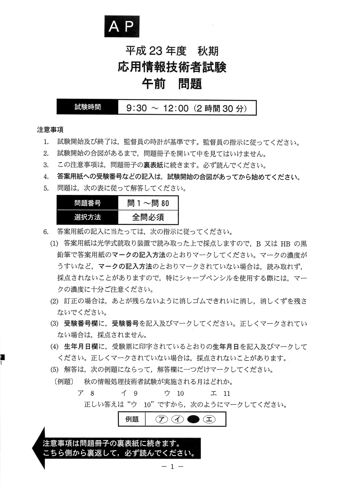

テキスト (OCR)

注

ae ee a

6.

注

平成 23年度 秋期
応用情報技術者試験
午前 問題

  9:30 ~ 12:00 (2時間30 分)

事項

試験開始及び終了は, 監督員の時計が基準です。監督員の指示に従ってください。
試験開始の合図があるまで, 問題冊子を開いて中を見てはいけません。
この注意事項は, 問題冊子の裏表紙に続きます。必ず読んでください。
答案用紙への受験番号などの記入は, 試験開始の合図があってから始めてください。
問題は, 次の表に従って解答してください。
問題番号   問1て間 80
選択方法    全問必須
答案用紙の記入に当たっては, 次の指示に従ってください。

Q) 答案用紙は光学式読取り装置で読み取った上で採点しますので, B 又は HBOS
鉛筆で答案用紙のマークの記入方法のとおりマークしてください。マークの濃度が
うすいなど, マークの記入方法のとおりマークされていない場合は, 読み取れず,
採点されないことがありますので, 特にシャープペンシルを使用する際には, マー
クの濃度に十分ご注意ください。

(2) 訂正の場合は, あとが残らないように消しゴムできれいに消し, 消しくずを残さ
ないでください。

(3) 受験番号欄に, 受験番号を記入及びマークしてください。正しくマークされてい
ない場合は, 採点されません。

(4) 生年月日欄に, 受験票に印字されているとおりの生年月日を記入及びマークして
ください。正しくマークされていない場合は, 採点されないことがあります。

(6) 解答は, 次の例題にならって, 解答欄に一つだけマークしてください。

〔例題】 秋の情報処理技術者試験が実施される月はどれか。

ア 8    イ 9    ウ 10    エ 11
正しい答えは“ウ 10” ですから, 次のようにマークしてください。

例題 | DDO®

意事項は問題冊子の裏表紙に続きます。

こちら側から裏返して, 必ず読んでください。

ee

### ページ 2

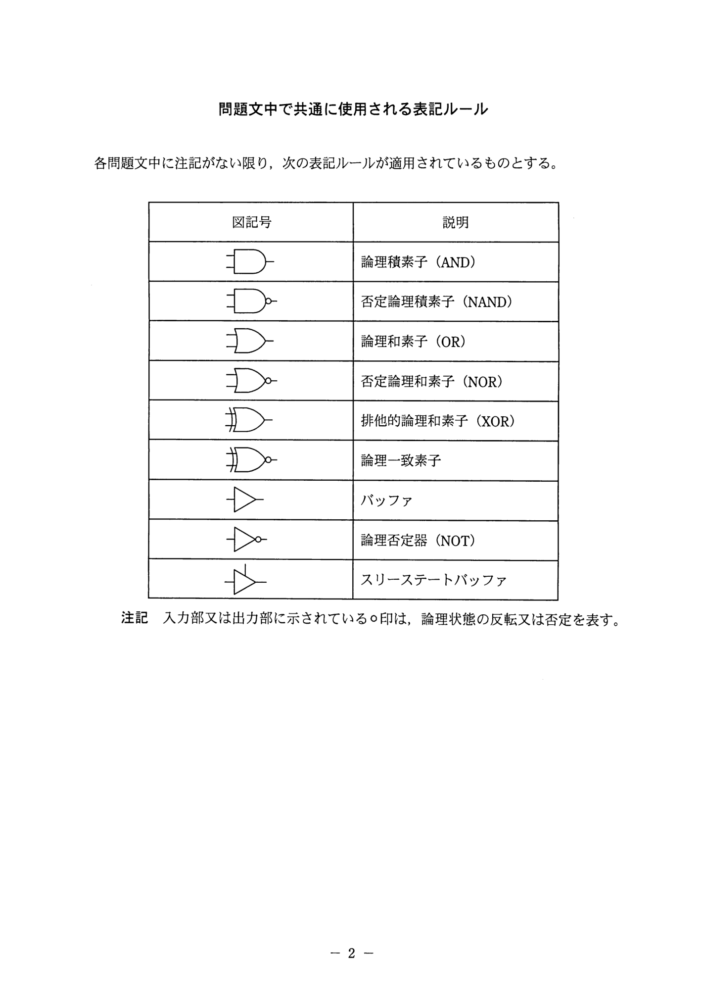

テキスト (OCR)

問題文中で共通に使用される表記ルール

各問題文中に注記がない限り, 次の表記ルールが適用されているものとする。

e
cu
dh

説明

1

論理積素子 (AND)

a

VIO

否定論理積素子 (NAND)

論理和素子 (OR)

否定論理和素子 (NOR)

排他的論理和素子 (XOR)

論理一致素子

バッファ

論理否定器 (NOT)

スリーステートバパッファ

YIYMYMMMV

注記 入力部又は出力部に示されているo印は, 論理状態の反転又は否定を表す。

### ページ 3

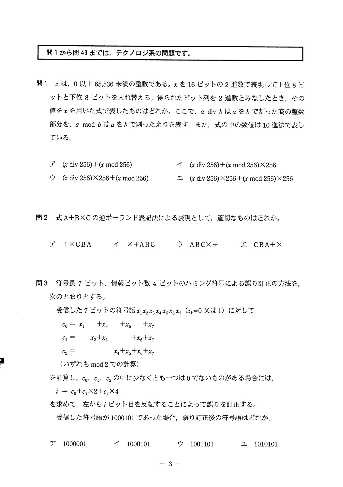

テキスト (OCR)

間 1 から問 49 までは, テクノロジ系の問題です。

問1 Id, 0 以上 65,536 未満の整数である。 * を 16 ビットの 2 進数で表現して上位 8 ビ
ットと下位 8 ビットを入れ替える。得られたビット列を 2 進数とみなしたとき, その
値をx を用いた式で表したものはどれか。ここで, a div blda をヵ で割った商の整数

部分を, a mod あは。 をヵで割った余りを表す。また, 式の中の数値は 10 進法で表し
ている。

ア div 256)+(« mod 256)                       イ (x div 256)+( mod 256) X 256
ウ (x div 256) X 256+ (x mod 256)              I (x div 256) X 256 +(x mod 256) X 256

問2 式A+BXC の逆ポーランド表記法による表現として, 適切なものはどれか。

ア +XCBA   イ X+ABC   ウ ABCX+   <= CBA+X

問3 符号長 7 ビット, 情報ビット数 4 ビットのハミング符号による誤り訂正の方法を,
次のとおりとする。
受信した 7 ビットの符号語』*。 *。*4*s 6 7 (=0 又は1) に対して

C= %, tx, +X, +x,

一     KotH,        txgt%,
=             Xytxs tre tx,
(いずれも mod 2 での計算)

を計算し, Cor Cy Co の中に少なくとも一つは 0 でないものがある場合には,
7 = co十c」X2十c。X4

を求めて, 左から? ビット目を反転することによって誤りを訂正する。
受信した符号語が 1000101 であった場合, 誤り訂正後の符号語はどれか。

ア 1000001    イ 1000101    ウ 1001101    工 1010101

ー 3 一

### ページ 4

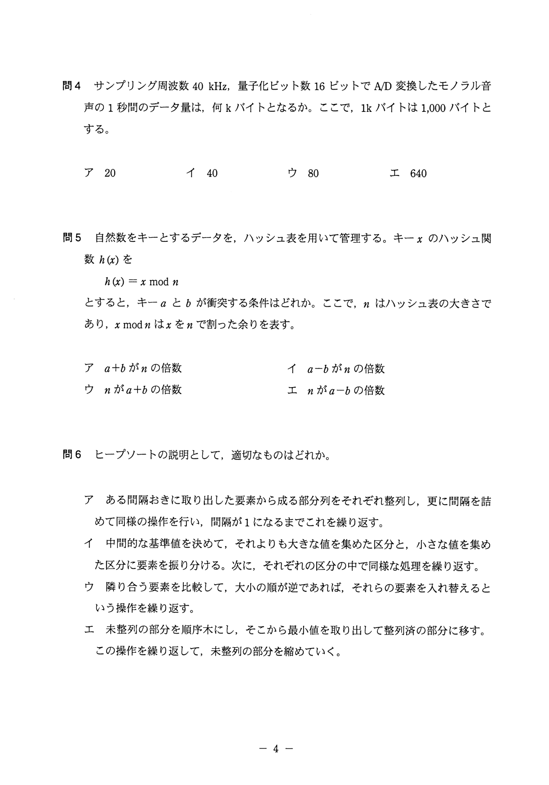

テキスト (OCR)

問4 サンプリング周波数 40 kHz, 量子化ビット数 16 ビットで AD 変換したモノラル音
声の 1 秒間のデータ量は, 何 k バイトとなるか。ここで, 1k バイトは 1.000 バイトと
する。

ア 20      イ 40      ウ 80      <= 640

問5 自然数をキーとするデータを, ハッシュ表を用いて管理する。キーァ のハッシュ関
数 ヵ@) を
h(x) ディmod
とすると, キーg とヵが衝突する条件はどれか。ここで, n はハッシュ表の大きさで
あり, xmodz は* をヵで割った余りを表す。

ア g+ヵがヶ の倍数        イ gpがヶヵ の倍数
ウ zが2+〉 の倍数         XL nab の倍数

問6 ヒープソートの説明として, 適切なものはどれか。

ア ある間隔おきに取り出した要素から成る部分列をそれぞれ整列し, 更に間隔を詰
めて同様の操作を行い, 間隔が 1 になるまでこれを繰り返す。

イ 中間的な基準値を決めて, それよりも大きな値を集めた区分と, 小さな値を集め
た区分に要素を振り分ける。次に, それぞれの区分の中で同様な処理を繰り返す。
ウ 隣り合う要素を比較して, 大小の順が逆であれば, それらの要素を入れ替えると

いう操作を繰り返す。
エエ 未整列の部分を順序木にし, そこから最小値を取り出して整列済の部分に移す。
この操作を繰り返して, 未整列の部分を縮めていく。

### ページ 5

テキスト (OCR)

間7 n {OE ORR x, xp, ... 4, が並んだ線形リストを [a,x … 1 CHL, 空リストは
[] で表す。次のように再帰的に定義される関数 func (7) を, L=[1, 3, 2] を実引数と

して呼び出したとき, print 文によって表示される数字はどれか。ここで, プログラム
中のは等号,:=は代入を表す。

(BROTH)
(1) first (Lay, x2, ...,4,]) は*」 を返す。

(2) butfirst ([x,, x2, ...,%,]) は Lx, …, *。] SEF. butfirst (Lx) は [] を返す。
(3) max(z,y) は, x2y であれば* を返し, TSCM y SET.

func (L)

begin
if L =[] then return 0;
A:= first (L);
B := func (butfirst (L));

C:= max (A, B);
print C;
return C;
end
ア 123      イ 133      ウ 223      xX 233

### ページ 6

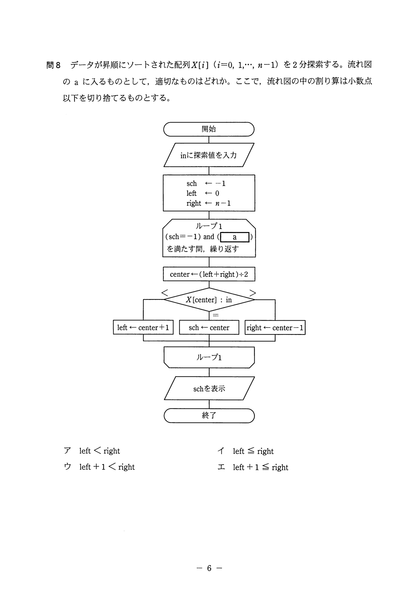

テキスト (OCR)

8 データが上昇順にソートされた配列[7] (?三0, 1…, ヵ一1) を2分探索する。流れ図
の a に入るものとして, 適切なものはどれか。ここで, 流れ図の中の割り算は小数点
以下を切り捨てるものとする。

后に探索値を入力

sch ーー1
left で0
right ーー1
ーー 1
ループ1
(sch=ー1) and([ a

を満たす間, 繰り返す

center — (left+right )+2   |

left — center十1         sch — center        right — center—1
[                                                               }

ア left < right                            イ left S right
ウ left +1 < right                        XZ left +1 S right

### ページ 7

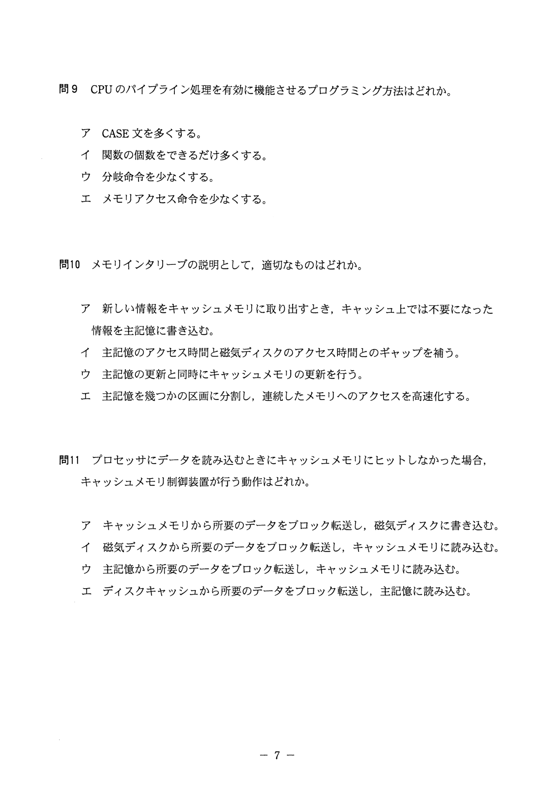

テキスト (OCR)

問9 CPUのパイプライン処理を有効に機能させるプログラミング方法はどれか。

CASE 文を多くする。

関数の個数をできるだけ多くする。
分岐命令を少なくする。

メモリアクセス命令を少なくする。

H GAN

問10 メモリインタリープブの説明として, 適切なものはどれか。

ア 新しい情報をキャッシュメモリに取り出すとき, キャッシュ上では不要になった
情報を主記憶に書き込む。

イ 主記憶のアクセス時間と磁気ディスクのアクセス時間とのギャップを補う。

ウ 主記憶の更新と同時にキャッシュメモリの更新を行う。

エ 主記憶を幾つかの区画に分割し, 連続したメモリへのアクセスを高速化する。

All プロセッサにデータを読み込むときにキャッシュメモリにヒットしなかった場合
キャッシュメモリ制御装置が行う動作はどれか。

キャッシュメモリから所要のデータをブロック転送し, BAT AVICBSIAD.
磁気ディスクから所要のデータをブロック転送し, キャッシュメモリに読み込む。
主記憶から所要のデータをブロック転送し, キャッシュメモリに読み込む。

ディスクキャッシュから所要のデータをブロック転送し, 主記憶に読み込む。

H ささ

### ページ 8

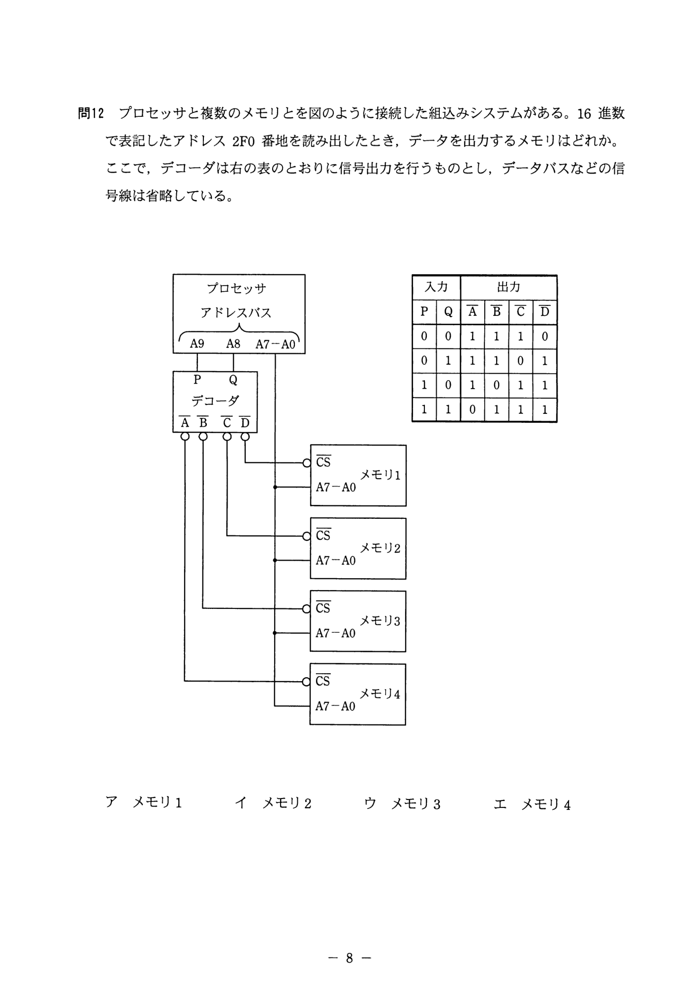

テキスト (OCR)

問12 プロセッサと複数のメモリとを図のように接続した組込みシステムがある。16 進数
で表記したアドレス 2FO 番地を読み出したとき, データを出力するメモリはどれか。
ここで, デコーダは右の表のとおりに信号出力を行うものとし, データバスなどの信
号線は省略している。

プロセッサ        KA   HA
アドレスバス            PIQIAIBICID
7 A9  A8 47-40    ie a a a
|  |         0|1l1liloli
P =         1y}o}ijo}jija
_デコーダー         1lilolilili
AB CD
[)   1
ーー CS
メモリ1
A7—A0
トー-d CS
メモリ2
A7—A0
cs
メモリ3
A7—A0
d CS
メモリ4
A740
ア メモリ1   イ メモリ2   ウ メモリ3   Dr メモリ4

### ページ 9

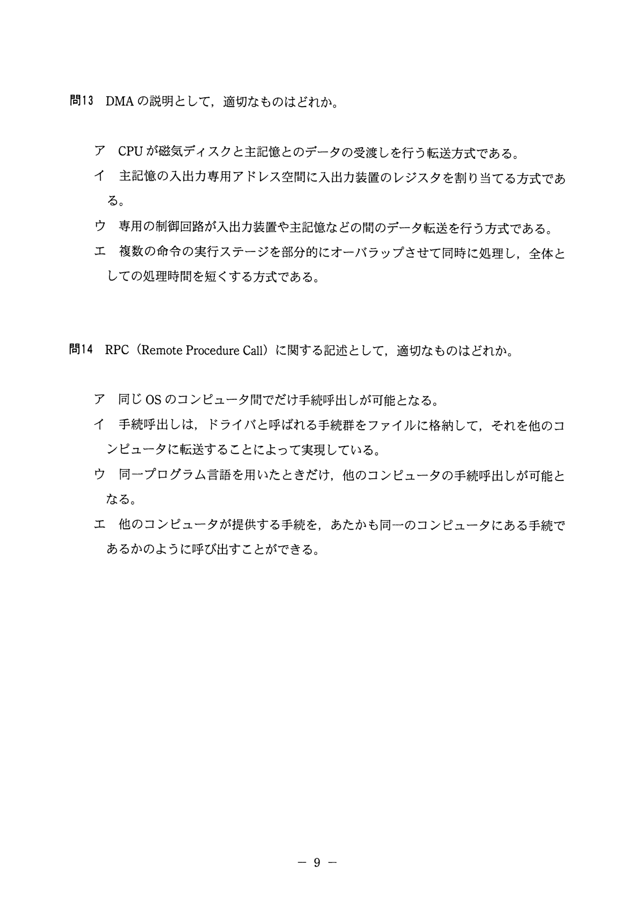

テキスト (OCR)

問13 DMA の説明として, 適切なものはどれか。

ア CPUが磁気ディスクと主記憶とのデータの受渡しを行う転送方式である。

イ 主記憶の入出力専用アドレス空間に入出力装置のレジスタを割り当てる方式であ
る。

ウ 専用の制御回路が入出力装置や主記憶などの間のデータ転送を行う方式である。

エエ 複数の命令の実行ステージを部分的にオーバラップさせて同時に処理し, 全体と
しての処理時間を短くする方式である。

問14 RPC (Remote Procedure Call) に関する記述として, 適切なものはどれか。

ア 同じ0S のコンピュータ間でだけ手続呼出しが可能となる。

イ 手続呼出しは, ドライバと呼ばれる手続群をファイルに格納して, それを他のコ
ンピュータに転送することによって実現している。

ウ 同一プログラム言語を用いたときだけ, 他のコンピュータの手続呼出しが可能と
なる。

エエ 他のコンピュータが提供する手続を, あたかも同一のコンピュータにある手続で
あるかのように呼び出すことができる。

### ページ 10

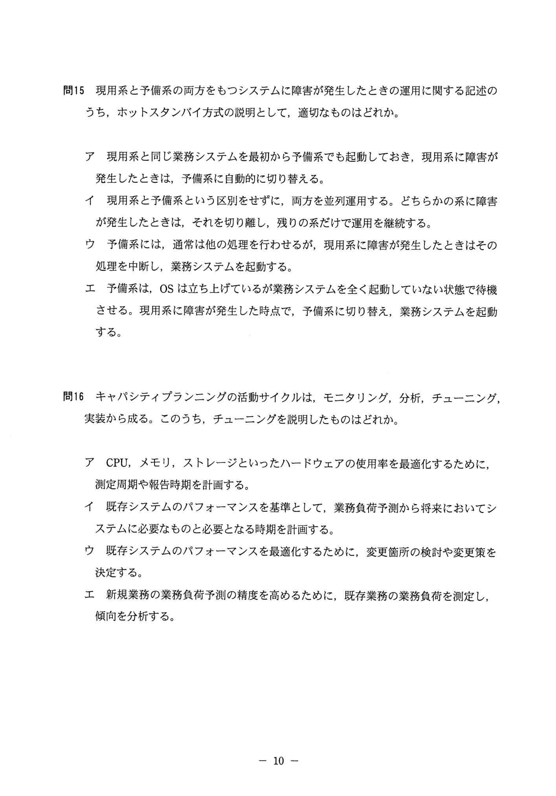

テキスト (OCR)

間15 現用系と予備系の両方をもつシステムに障害が発生したときの運用に関する記述の
うち, ホットスタンバイ方式の説明として, 適切なものはどれか。

ア 現用系と同じ業務システムを最初から予備系でも起動しておき, 現用系に障害が
発生したときは, 予備系に自動的に切り替える。
イ 現用系と予備系という区別をせずに, 両方を並列運用する。どちらかの系に障害
が発生したときは, それを切り離し, 残りの系だけで運用を継続する。
ウ 予備系には, 通常は他の処理を行わせるが, 現用系に障害が発生したときはその
処理を中断し, 業務システムを起動する。
エ 予備系は, OS は立ち上げているが業務システムを全く起動していない状態で待機
させる。現用系に障害が発生した時点で, 予備系に切り替え, 業務システムを起動
する。

RG キャパシティプランニングの活動サイクルは, モニタリング, BH, チューニング,
実装から成る。このうち, チューニングを説明したものはどれか。

ア CPU, メモリ, ストレージといったハードウェアの使用率を最適化するために,

測定周期や報告時期を計画する。

イ 既存システムのパフォーマンスを基準として, 業務負荷予測から将来においてシ
ステムに必要なものと必要となる時期を計画する。

ウ 既存システムのパフォーマンスを最適化するために, 変更箇所の検討や変更策を
決定する。

L 新規業務の業務負荷予測の精度を高めるために, 既存業務の業務負荷を測定し

傾向を分析する。

ー 10 一

### ページ 11

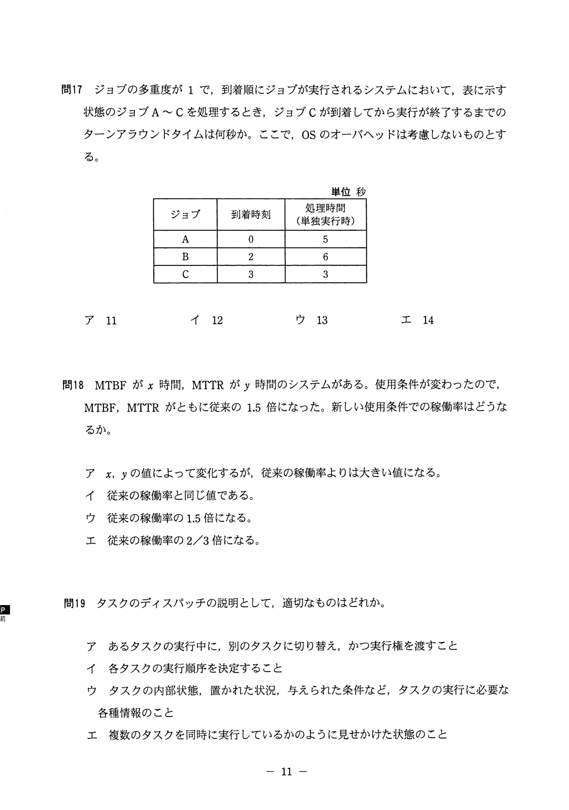

テキスト (OCR)

問17 ジョブの多重度が 1 で, 到着順にジョブが実行されるシステムにおいて, 表に示す
状態のジョブA てCを処理するとき, ジョブCが到着してから実行が終了するまでの
ターンアラウンドタイムは何秒か。ここで, OS のオーバヘッドは考慮しないものとす
る。

単位 秒
、>                       処理時間
ジョブ        到着時刻       (単独実行時)
A           0             5
B                        6
C           3             3
ア 11             イ 12             ウ 13             xm 14

問18 MTBF 2° x 時間, MTTR がヵ時間のシステムがある。使用条件が変わったので,
MTBF, MTTR がともに従来の 1.5 倍になった。新しい使用条件での稼働率はどうな
るか。

ア x, ヵヶの値によって変化するが, 従来の稼働率よたりは大きい値になる。
イ 従来の稼働率と同じ値である。

ウ 従来の稼働率の 1.5 倍になる。

エ 従来の稼働率の 2プ3 倍になる。

IS タスクのディスパッチの説明として, 適切なものはどれか。

ア あるタスクの実行中に, 別のタスクに切り替え, かつ実行権を渡すこと

イ 各タスクの実行順庫を決定すること

ウ タスクの内部状態, 置かれた状況。 与えられた条件など, タスクの実行に必要な
各種情報のこと

エエ 複数のタスクを同時に実行しているかのように見せかけた状態のこと

ー 11 一

### ページ 12

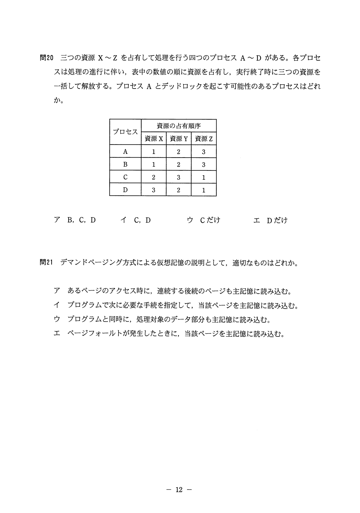

テキスト (OCR)

問20 三つの資源XXてZ を占有して処理を行う皿つのプロセス A~D がある。各プロセ
スは処理の進行に伴い, 表中の数値の順に資源を占有し, 実行終了時に三つの資源を
一括して解放する。プロセス A とデッドロックを起こす可能性のあるプロセスはどれ
か。

資源の占有順序
資源X | 資源Y | 資源Z
1    2    3

プロセス

1の1 |

1    2
2    3    1
3    2

ア B,C, D   イ CD     ウ Cだけ     エ Dだけ

間21 デマンドページング方式による仮想記憶の説明として, 適切なものはどれか。

あるページのアクセス時に, 連続する後続のページも主記憶に読み込む。
プログラムで次に必要な手続を指定して, 当該ページを主記憶に読み込む。
プログラムと同時に, 処理対象のデータ部分も主記憶に読み込む。

ページフォールトが発生したときに, 当該ページを主記憶に読み込む。

HOGAN

ー 12 一

### ページ 13

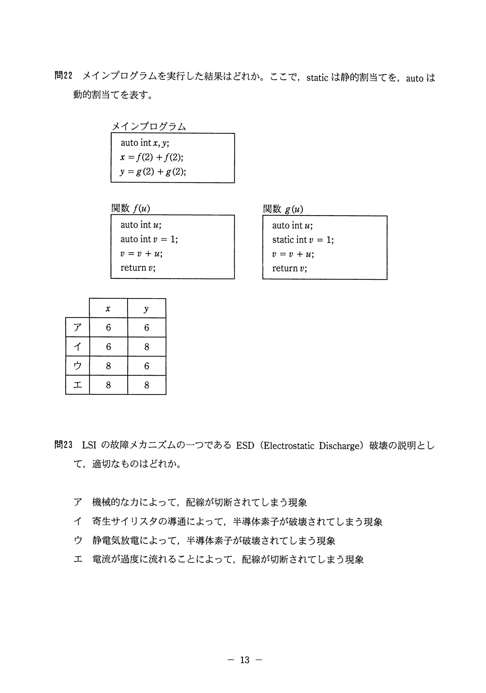

テキスト (OCR)

間22 メインプログラムを実行した結果はどれか。ここで, static は静的割当てを, auto は
動的割当てを表す。

メインプログラム
auto int x, y;
x =f(2) +f);
y =g(2) + 8(2);

関数 fu)                                関数 g(め
auto int u;                                 auto int 4;
auto int v = 1;                       static int v = 1;
veut+u;                           りーの十75
return の:                                  return v;
x         了
ア       6         6
イ       6         8
ウ  8   6
x       8         8

間23 LSI の故障メカニズムの一つである ESD (Electrostatic Discharge) 破壊の説明とし

て,

HUAN

適切なものはどれか。

機械的なによって, 配線が切断されてしまう現象

寄生サイリスタの導通によって, 半導体素子が破壊されてしまう現象
静電気放電によって, 半導体素子が破壊されてしまう現象

電流が過度に流れることによって, 配線が切断されてしまう現象

ー 13 一

### ページ 14

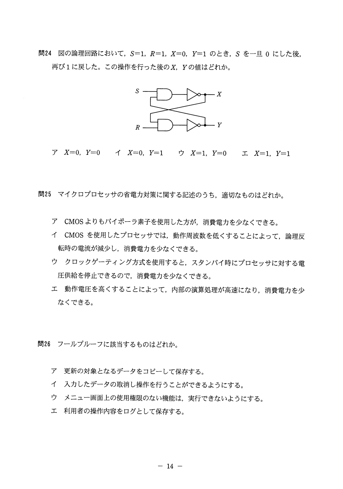

テキスト (OCR)

間24 図の論理回路において, S=1, R=1, X=0, Y=1 のとき, S を一旦 0 にした後,
再び1 に戻した。この操作を行った後のX, 了の値はどれか。

ア ダテ0, Y=0   イ ダー0, Y=1   ウ メー1, Y=0   = ダー1, Y=1

間25 マイクロプロセッサの省電力対策に関する記述のうち, 適切なものはどれか。

ア CMOS よりもバイボーラ素子を使用した方が, 消費電力を少なくできる。

イ CMOS を使用したプロセッサでは, 動作周波数を低くすることによって, 論理反
転時の電流が減少し, 消費電力を少なくできる。

ウ クロックゲーティング方式を使用すると, スタンバイ時にプロセッサに対する電
圧供給を停止できるので, 消費電力を少なくできる。

エエ 動作電圧を高くすることによって, 内部の演算処理が高速になり, 消費電力を少
なくできる。

間26 フールプルーフに該当するものはどれか。

更新の対象となるデータをコピーして保存する。

入力したデータの取消し操作を行うことができるようにする。

メニュー画面上の使用権限のない機能は, 実行できないようにする。
利用者の操作内容をログとして保存する。

HOGAN

ー 14 一

### ページ 15

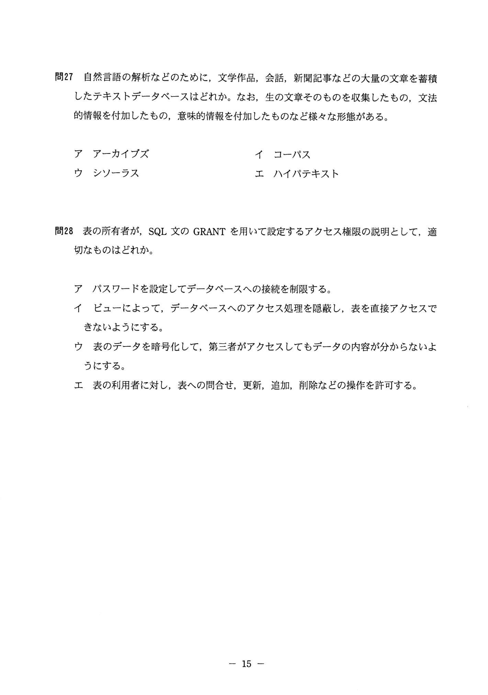

テキスト (OCR)

問27 自然言語の解析などのために, 文学作品, 会話, 新聞記事などの大量の文章を鞭策
したテキストデータベースはどれか。なお, 生の文章そのものを収集したもの, 文法
的情報を付加したもの, 意味的情報を付加したものなど様々な形態がある。

ア アーカイプズ           イ コーパス

ウ シソーラス            エエ ハイパテキスト

問28 表の所有者が, SQL MO GRANT を用いて設定するアクセス権限の説明として, if

切なものはどれか。

ア パスワードを設定してデータベースへの接続を制限する。
イ ビューによって, データベースへのアクセス処理を隠蔽し, 表を直接アクセスで

きないようにする。
ウ 表のデータを暗号化して, 第三者がアクセスしてもデータの内容が分からないよ
うにする。

エエ 表の利用者に対し, 表への問合せ, 更新, 追加, 削除などの操作を許可する。

ー 15 一

### ページ 16

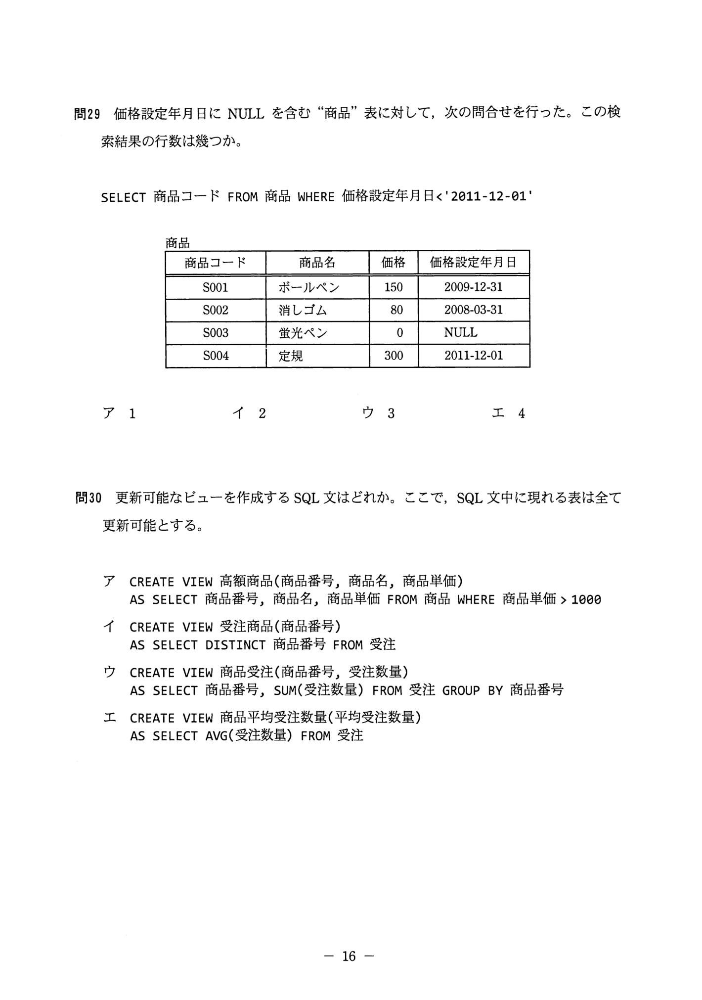

テキスト (OCR)

間29 価格設定年月日に NULL を含む "商品" 表に対して, 次の問合せを行った。この検

索結果の行数は幾つか。

SELECT 商品コード FROM 商品 NHERE 価格設定年月日<'2911-12-91'

商品
商品コード      商品名     価格 | 価格設定年月日
S001               ボールペン             150            2009-12-31
$002                消しゴム                    80             2008-03-31
S003               蛍光ペン                    0            NULL
S004              定規                        300            2011-12-01
ア 1                            イ 2                                   3                            xr 4

間30 更新可能なビューを作成する SQL 文はどれか。

更新可能とする。

ここで, SQL 文中に現れる表は全て

ア CREATE VIEW 高額商品(商品番号, 商品名, 商品単価)
AS SELECT 商品番号,商品名, 商品単価 FROM 商品 WHERE 商品単価 > 1000

イ CREATE VIEW 受注商品(商品番号)

AS SELECT DISTINCT 商品番号 FROM 受注

ウ CREATE VIEW 商品受注(商品番号, 受注数量)
AS SELECT 商品番号, SUM(受注数量) FROM 受注 GROUP BY 商品番号

工 CREATE VIEW 商品平均受注数量(平均受注数量)

AS SELECT AVG(受注数量) FROM 受注

ー 16 一

### ページ 17

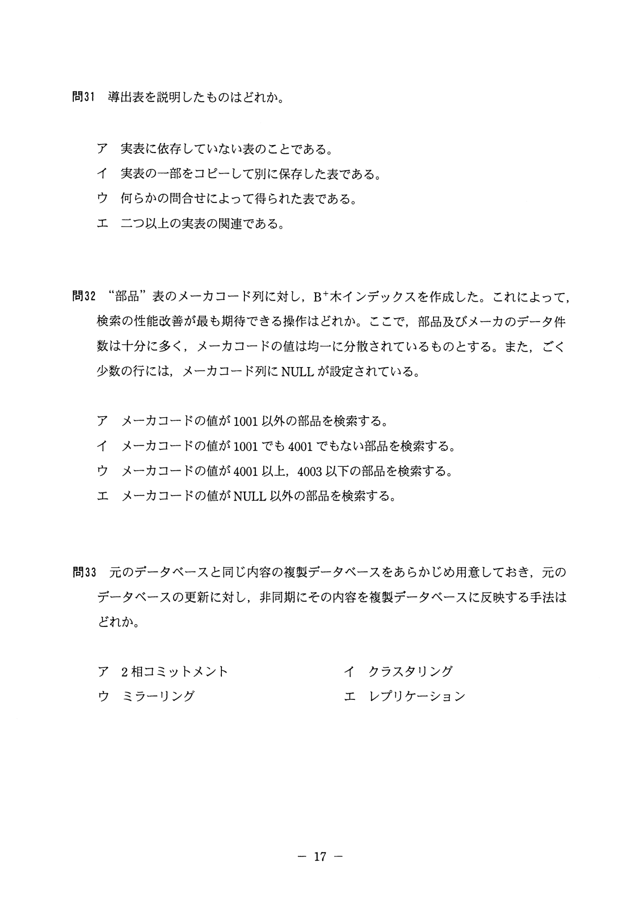

テキスト (OCR)

問31 導出表を説明したものはどれか。

実表に依存していない表のことである。

実表の一部をコピーして別に保存した表である。
何らかの問合せによって得られた表である。

ニフつ以上の実表の関連である。

H へ

問32 "部品" 表のメーカコード列に対し, B+木インデックスを作成した。これによって,
検索の性能改善が最も期待できる操作はどれか。ここで, 部品及びメーカのデータ件
数は十分に多く, メーカコードの値は均一に分散されているものとする。また, TS
少数の行には, メーカコード列に NULL が設定されている。

メーカコードの値が1001 以外の部品を検索する。
メーカコードの値が 1001 でも 4001 でもない部品を検索する。
メーカコードの値が 4001 以上, 4003 以下の部品を検索する。
メーカコードの値がNULL 以外の部品を検索する。

HUA NS

問33 元のデータベースと同じ内容の複製データベースをあらかじめ用意しておき, 元の
データベースの更新に対し, 非同期にその内容を複製データベースに反映する手法は
どれか。

ア 2相コミットメント         イ クラスタリング
ウ ミラーリング            エ レプリケーション

ー 17 一

### ページ 18

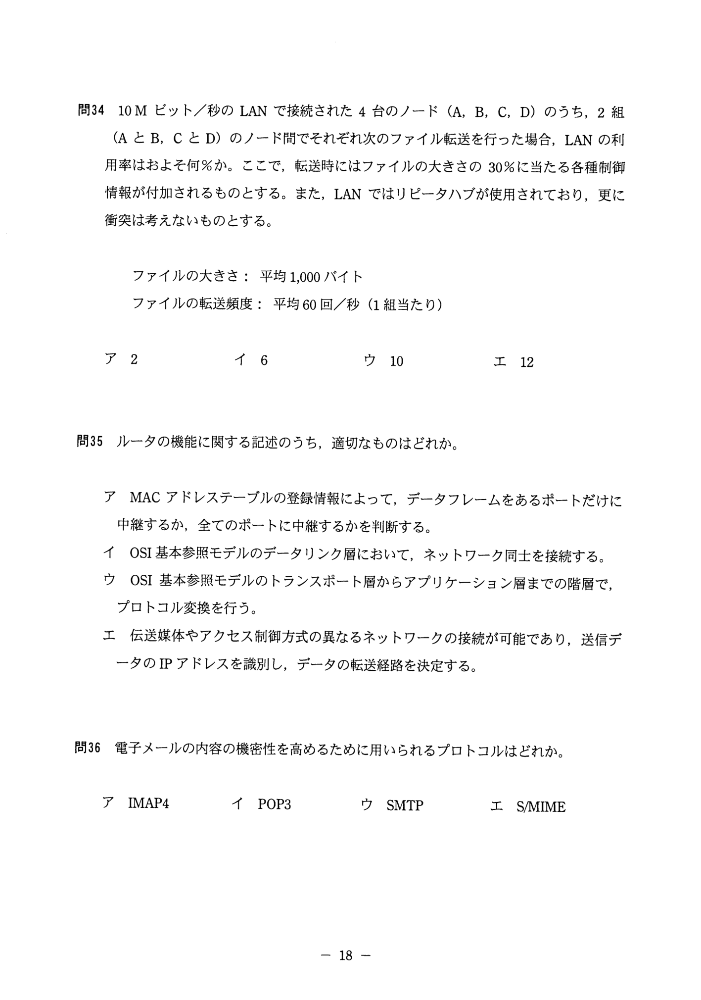

テキスト (OCR)

問34 10M ビットノ秒の LAN で接続された 4 台のノード (A, B, C, D) のうち, 2 組
(A&B, CED) のノード間でそれぞれ次のファイル転送を行った場合, LAN の利
用率はおよそ何%か。ここで, 転送時にはファイルの大きさの 30%に当たる各種制御
情報が付加されるものとする。また, LAN ではリピータハブが使用されており, 更に
衝突は考えないものとする。

ファイルの大きさ : 平均1.000 バイト
ファイルの転送頻度 : 平均60 回/秒 1 組当たり)

ア 2   イ 6   ウ 10   xr 12

問35 ルータの機能に関する記述のうち, 適切なものはどれか。

ア MAC アドレステーブルの登録情報によって, データフレームをあるボートだけに
中継するか, 全てのポートに中継するかを判断する。

イ OSI基本参照モデルのデータリンク層において, ネットワーク同士を接続する。

ウツ OSI 基本参照モデルのトランスポート層からアプリケーション層までの階層で,
プロトコル変換を行う。

Lo 伝送媒体やアクセス制御方式の異なるネットワークの接続が可能であり, 送信デ
ータの IP アドレスを識別し, データの転送経路を決定する。

問36 電子メールの内容の機密性を高めるために用いられるプロトコルはどれか。

ア IMAP4    イ POP3     ウ SMTP    エエ S/MIME

ー 18 一

### ページ 19

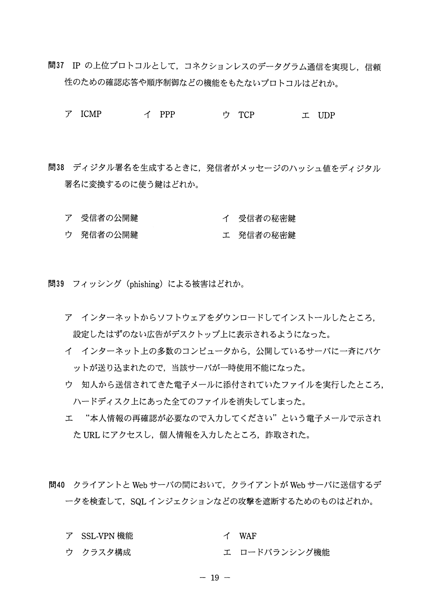

テキスト (OCR)

問37 IP の上位プロトコルとして, コネクションレスのデータグラム通信を実現し, 信頼
性のための確認応答や順序制御などの機能をもたないプロトコルはどれか。

ア ICMP     イ PPP     ウ TCP     <= UDP

38 ディジタル署名を生成するときに, 発信者がメッセージのハッシュ値をディジタル
署名に変換するのに使う鍵はどれか。

ア 受信者の公開鍵        イ 受信者の秘密鍵
ウ 発信者の公開鍵         L 発信者の秘密鍵

間39 フィッシング (phishing) による被害はどれか。

ア インターネットからソフトウェアをダウンロードしてインストールしたところ,
設定したはずのない広告がデスクトップ上に表示されるようになった。

イ インターネット上の多数のコンピュータから, 公開しているサーバに一斉にパケ
ットが送り込まれたので, 当該サーバが一時使用不能になった。

ウ 知人から送信されてきた電子メールに添付されていたファイルを実行したところ,
ハードディスク上にあった全てのファイルを消失してしまった。

エエ 本人情報の再確認が必要なので入力してください"という電子メールで示され
た URL にアクセスし, 個人情報を入力したところ, 詐取された。

間40 クライアントと Web サーバの間において, クライアントが Web サーバに送信するデ
ータを検査して, SQL インジェクションなどの攻撃を遮断するためのものはどれか。

ア SSL-VPN 機能         イ WAF
ウ クラスタ構成         エエ ロードバランシング機能

ー 19 一

### ページ 20

テキスト (OCR)

BAL パケットフィルタリング型ファイアウォールのフィルタリングルールを用いて, 本
来必要なサービスに影響を及ぼすことなく防げるものはどれか。

外部に公開していないサービスへのアクセス

サーバで動作するソフトウェアのセキュリティの脆弱性を突く攻撃
電子メールに添付されたファイルに含まれるマクロウイルスの侵入
電子メール爆弾などの DoS 攻撃

H GAN

問44 ブルートフォース攻撃に該当するものはどれか。

ア 可能性のある文字のあらゆる組合せのパスワードでログインを試みる。

イ コンピュータへのキー入力を全て記録して外部に送信する。

ウ 盗聴者が正当な利用者のログインシーケンスをそのまま記録してサーバに送信す
る。

エエ 認証が終了してセッションを開始している, ブラウザと Web サーバの間の通信で,
Cookie などのセッション情報を盗む。

間43 UML のユースケース図で, システムと相互作用する外部システムはどれか。

ア アクタ                   イ インスタンス

ウ トリガ                 xm リンク

問44 内部設計書のデザインレビューを実施する目的として, 最も適切なものはどれか。

外部設計書との一貫性の検証と要件定義の内容を満たしていることの確認

設計記述規約の遵守性の評価と設計記述に関する標準化の見直し

要件定義の内容に関する妥当性の評価と外部設計指針の見直し
論理データ設計で洗い出されたデータ項目の確認と物理データ構造の決定

HUAN

ー 20 一

### ページ 21

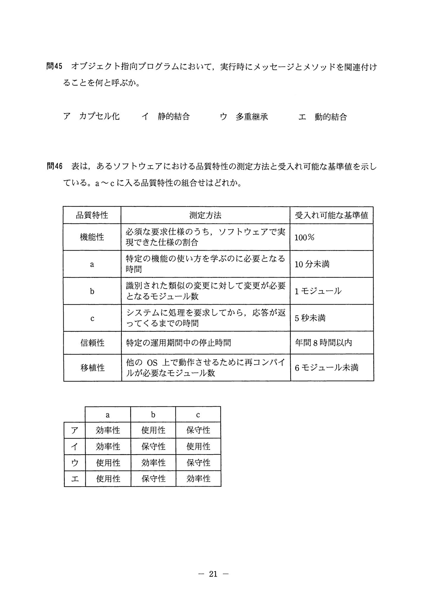

テキスト (OCR)

問45 オブジェクト指向プログラムにおいて, 実行時にメッセージとメソッドを関連付け
ることを何と呼ぶか。

ア カプセル化  イ 静的結合   ウ 多重継承   エエ 動的結合

問46 表は, あるソフトウェアにおける品質特性の測定方法と受入れ可能な基準値を示し
ている。a てc に入る品質特性の組合せはどれか。

品質特性          測定方法         受入れ可能な基準値
a | 必須な要求仕様のうち.ソフトウェアで実 | 。
AEE | 現できた仕様の割合            100%
E      学ぶのに必
-   人定の機能の任い方を学ぶのに必要となる | pea
議別された類似の変更に対して変更が必要|. 、。
5    となるモジュール数            1モジュール
システムに処理を要求してから, 応答が返 | . 。.
*    ってくるまでの時間            5 ARIE
信頼性 | 特定の運用期間中の停止時間        年間 8 時間以内
他の OS 上で動作させるために再ユコンパイ    マラーーキッ
本性 | ルが必要なモジュール数          6モジュール本
a      b      C

効率性    使用性    保守性
効率性         保守性         使用性
使用性         効率性         保守性
使用性            保守性            効率性

HIさ|ユ|

ー 21 一

### ページ 22

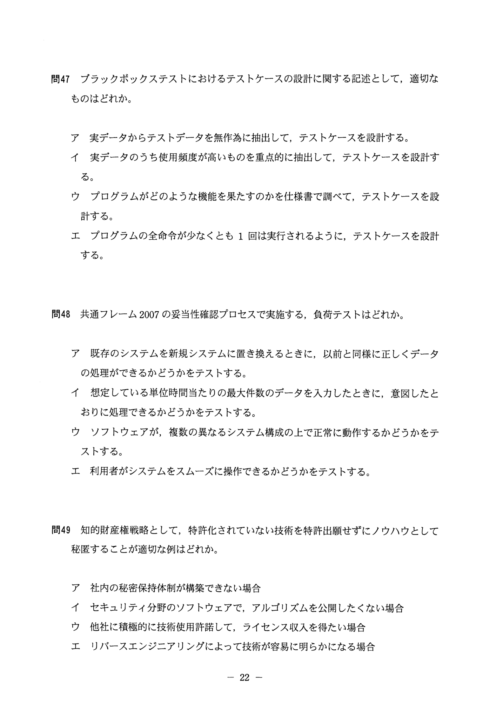

テキスト (OCR)

問7 プラックボックステストにおけるテストケースの設計に関する記述として, 適切な
ものはどれか。

ア 実データからテストデータを無作為に抽出して, テストケースを設計する。
イ 実データのうち使用頻度が高いものを重点的に抽出して, テストケースを設計す

る。

ウ プログラムがどのようなか機能を果たすのかを仕様書で調べて, テストケースを設
計する。

エエ プログラムの全命令が少なくとも 1 回は実行されるように, テストケースを設計
する。

問48 共通フレーム 2007 の妥当性和認プロセスで実施する, 負荷テストはどれか。

ア 既存のシステムを新規システムに置き換えるときに, 以前と同様に正しくデータ
の処理ができるかどうかをテストする。

イ 想定している単位時間当たりの最大件数のデータを入力したときに, 意図したと
おりに処理できるかどうかをテストする。

ウ ソフトウェアが, 複数の異なるシステム構成の上で正常に動作するかどうかをテ
ストする。

XL 利用者がシステムをスムーズに操作できるかどうかをテストする。

問49 知的財産権戦略として, 特許化されていない技術を特許出願せずにノウハウとして
秘匿することが適切な例はどれか。

ア 社内の秘密保持体制が構築できない場合

イ セキュリティ分野のソフトウェアで, アルゴリズムを公開したくない場合
ウ 他社に積極的に技術使用許諾して, ライセンス収入を得たい場合

エエ リバースエンジニアリングによって技術が容易に明らかになる場合

ー 22 一

### ページ 23

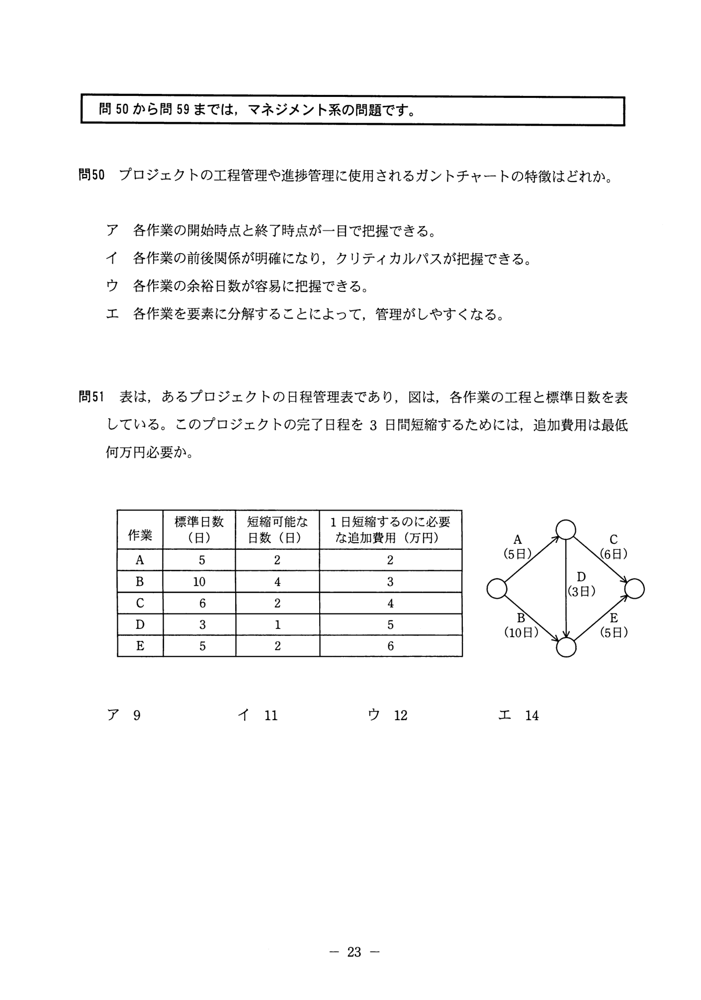

テキスト (OCR)

問 50 から問 59 までは, マネジメント系の問題です。

B50 プロジェクトの工程管理や進捗管理に使用されるガントチャートの特徴はどれか。

HHささい

各作業の開始時点と終了時点が一目で把握できる。
各作業の前後関係が明確になり, クリティカルパスが把握できる。
各作業の余裕日数が容易に把握できる。
各作業を要素に分解することによって, 管理がしやすくなる。

間51 表は, あるプロジェクトの日程管理表であり, Mid, 各作業の工程と標準日数を表
している。このプロジェクトの完了日程を 3 日間短縮するためには, 追加費用は最低

何万円必要か。
標準日数 | 短縮可能な | 1日短縮するのに必要
作業    (日)    日数 (A)    な追加費用 (万円)
A    5      2         2
B    10      4         3
C           2         4
D           1         5
E           2         6
ア 9      イ 11      ウ 12

ー 23 一

### ページ 24

テキスト (OCR)

問52 アプリケーションにおける外部入力, 外部出力, 内部論理ファイル, 外部イ

ンタフ

ェースファイル, 外部照会の五つの要素の個数を求め, それぞれを重み付けして集計
する。集計した値がソフトウェア開発の規模に相関するという考え方に基づいて, 開

発規模の見積りに利用されるものはどれか。

ァ cocoMo                                   イ Doty モデル
ウ Putnam モデル                    エエ ファンクションポイント法

問53 必要とされる技術力をもっていない要員が複数いて, プロジェクトの遂行に支障を

来すおそれがあるときの教育方針として, 最も適切なものはどれか。

ア 技術力の低い要員のレベルに合わせた集合研修を全員に受講させる。

イ 個々の技術力に応じて, 受講させる集合研修や OJT の内容を変えて教育する。
ウ 集合研修は開催日時が決まっているので, 各要員の時間的余裕の度合いを判断基

準にして誰を受講させるかを決める。
エエ プロジェクトの遂行を優先させ, プロジェクト完了後にスキルを再評価し
教育する。

問54 SLA を集定する際の方針のうち, 適切なものはどれか。

ア 考えられる全ての項目に対し, サービスレベルを設定する。

イ 顧客の要望とコストとの兼ね合いで, サービスレベルを設定する。

ウ サービスレベルを設定する全ての項目に対し, ペナルティとしての補償を
る。

工 将来にわたって変更が不要なサービスレベルを設定する。

ー 24 一

た上で

設定す

### ページ 25

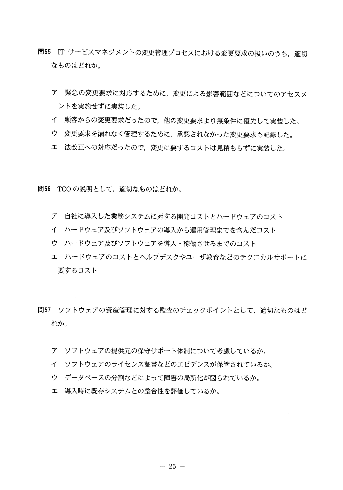

テキスト (OCR)

問55 IT サービスマネジメントの変更管理プロセスにおける変更要求の扱いのうち, 適切
なものはどれか。

ア 緊急の変更要求に対応するために, 変更による影響範囲をどについてのアセスメ
ントを実施せずに実装した。

イ 顧客からの変更要求だったので, 他の変更要求より無条件に優先して実装した。

ウ 変更要求を漏れなく管理するために, 承認されなかった変更要求も記録した。

工法改正への対応だったので, 変更に要するコストは見積もらずに実装した。

間56 TCO の説明として, 適切なものはどれか。

自社に導入した業務システムに対する開発コストとハードウェアのコスト

ハードウェア及びソフトウェアの導入から運用管理までを含んだコスト

ハードウェア及びソフトウェアを導入・稼働させるまでのコスト

ハードウェアのコストとヘルプデスクやユーザ教育などのテクニカルサポートに
要するコスト

HOGA NS

間57 ソフトウェアの資産管理に対する監査のチェックポイントとして, 適切なものはど
れか。

ソフトウェアの提供元の保守サポート体制について考慮しているか。
ソフトウェアのライセンス証書などのエビデンスが保管されているか。
データベースの分割などによって障害の局所化が図られているか。
導入時に既存システムとの整合性を評価しているか。

HOGAN

ー 25 一

### ページ 26

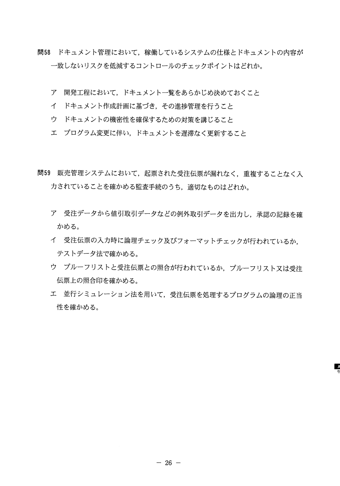

テキスト (OCR)

間58 ドキュメント管理において, 稼働しているシステムの仕様とドキュメントの内容が
一致しないリスクを低減するコントロールのチェックボイントはどれか。

開発工程において, ドキュメント一覧をあらかじめ決めておくこと
ドキュメント作成計画に基づき, その進捗管理を行うこと

ドキュメントの機密性を確保するための対策を講じること

プログラム変更に伴い, ドキュメントを遅浅なく更新すること

H ささ

問59 販売管理システムにおいて, 起票された受注伝票が漏れなく, 重複することなく入
カカされていることを確かめる監査手続のうち, 適切なものはどれか。

ア 受注データから値引取引データなどの例外取引データを出力し, 承認の記録を確
かめる。

イ 受注伝票の入力時に論理チェック及びフォーマットチェックが行われているか,
テストデータ法で確かめる。

ウ プルーフリストと受注伝票との照合が行われているか, プルーフリスト双は受注
伝票上の照合印を確かめる。

DL 並行シミュレーション法を用いて, 受注伝票を処理するプログラムの論理の正当
性を確かめる。

ー 26 一

### ページ 27

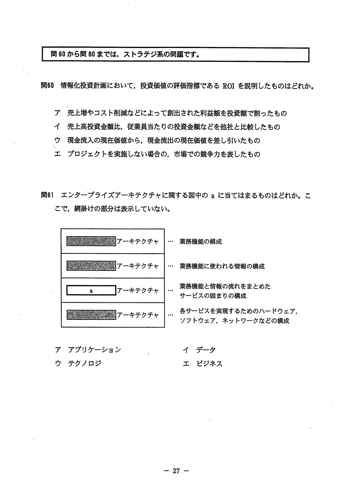

テキスト (OCR)

問 60 から問 80 までは, ストラテジ系の問題です。

問60 情報化投資計画において, 投資価値の評価指標である RO] を説明したものはどれか。

ア 売上増やコスト削減などによって創出された利益額を投資額で割ったもの
イ 売上高投資金額比, 従業員当たりの投資金額などを他社と比較したもの
ウ 現金流入の現在価値から, 現金流出の現在価値を差し引いたもの
エ プロジェクトを実施しない場合の, 市場での競争力を表したもの

間61 エンタープライズアーキテクチャに関する図中の a に当てはまるものはどれか。こ
TC, 網掛けの部分は表示していない。

ーキテクチャ | … 業務機能の構成

7-477 F + | … 業務機能に使われる情報の構成

_                 業務機能と情報の流れをまとめた
L_ ょ』 |アーキテクチテャ    サービスの固まりの構成

. 各サービスを実現するためのハードウェア,
ソフトウェア, ネットワークなどの構成

ア アプリケーション    イ データ
ウ テクノロジ            エ ビジネス

### ページ 28

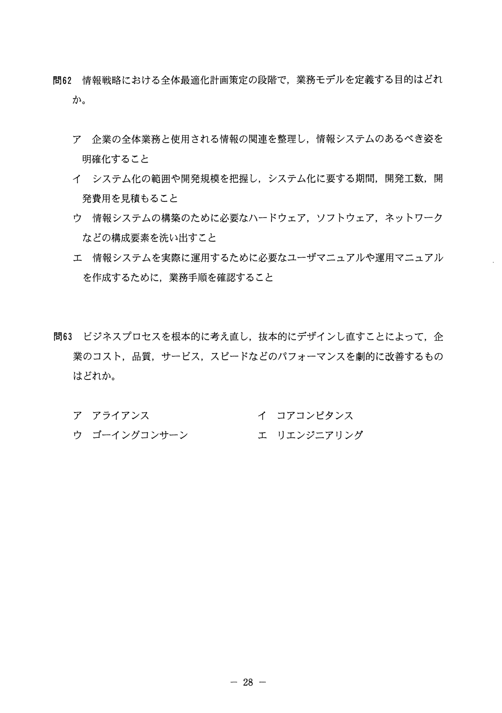

テキスト (OCR)

問62 情報戦略における全体最適化計画策定の段階で, 業務モデルを定義する目的はどれ
か。

ア 企業の全体業務と使用される情報の関連を整理し, 情報システムのあるべき姿を
明確化すること

イ システム化の箇囲や開発規模を把握し, システム化に要する期間, 開発工数, 開
発費用を見積もること

ウ 情報システムの構築のために必要なハードウェア, ソフトウェア, ネットワーク
などの構成要素を洗い出すこと

エ 情報システムを実際に運用するために必要なユーザマニュアルや運用マニュアル
を作成するために, 業務手順を確認すること

問63 ビジネスプロセスを根本的に考え直し, 抜本的にデザインし直すことによって, 企
業のコスト, 品質, サービス, スピードなどのパフォーマンスを劇的に改善するもの
はどれか。

ア アライアンス           イ コアコンピタンス
ウ ゴーイングコンサーン       エ リエンジニアリング

ー 28 一

### ページ 29

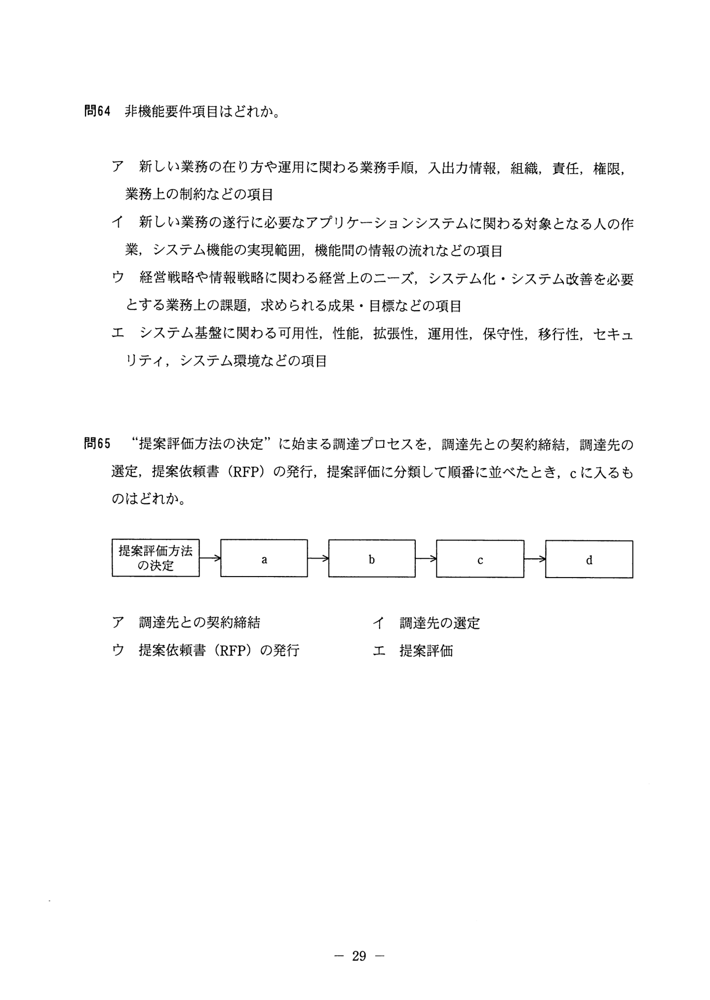

テキスト (OCR)

問64 非機能要件項目はどれか。

ア 新しい業務の在り方や運用に関わる業務手順, 入出力情報, 組織, 責任, 権限,
業務上の制約などの項目

イ 新しい業務の遂行に必要なアプリケーションシステムに関わる対象となる人の作
業, システム機能の実現範囲, 機能問の情報の流れなどの項目

ウ 経営戦略や情報戦略に関わる経営上のニーズ, システム化・システム改善を必要
とする業務上の課題, 求められる成果・目標などの項目

エエ システム基盤に関わる可用性, VERE, 拡張性, 運用性, 保守性, MOTE, Ua
リティ, システム環境などの項目

問65 “提案評価方法の決定" に始まる調達プロセスを, 調達先との契約締結, 調達先の
選定, 提案依頼書 (RFP) の発行提案評価に分類して順番に並べたとき, c に入るも
のはどれか。

stead oe 。 。 トコニーャ ートコー。 しSa
ア 調達先との契約締結       イ 調達先の選定
ウ 提案依頼書 (RFP) の発行      エ 提案評価

ー 29 一

### ページ 30

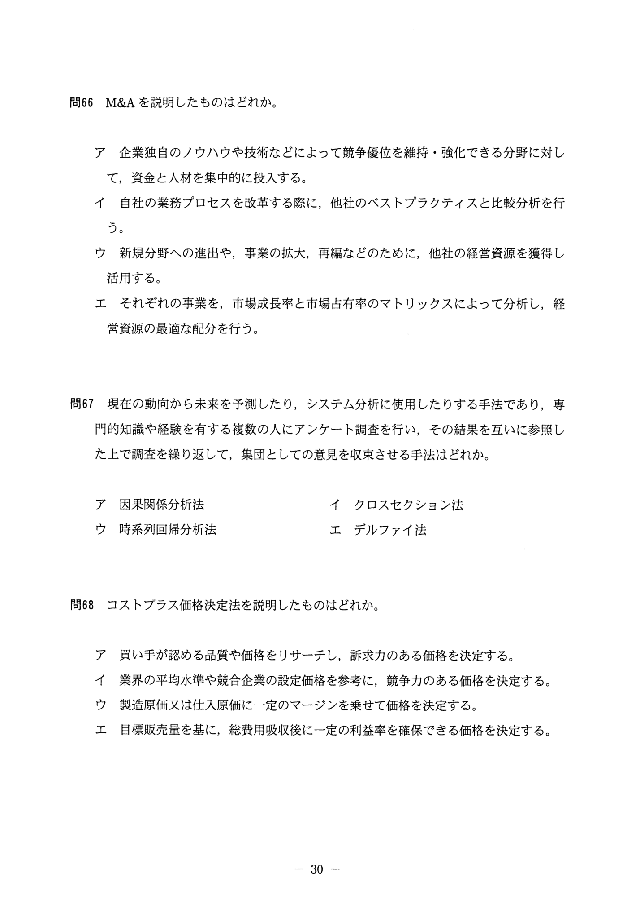

テキスト (OCR)

問66 M&Aを説明したものはどれか。

ア 企業独自のノウハウや技術などによって競争優位を維持・強化できる分野に対し
て, 資金と人材を集中的に投入する。

イ 自社の業務プロセスを改革する際に, 他社のベストプラクティスと比較分析を行
う。

ウ 新規分野への進出や, 事業の拡大, 再編などのために, 他社の経営資源を獲得し
活用する。

L それぞれの事業を, 市場成長率と市場占有率のマトリックスによって分析し, 経
営資源の最適な配分を行う。

問67 現在の動向から未来を予測したり, システム分析に使用したりする手法であり, 専
門的知識や経験を有する複数の人にアンケート調査を行い, その結果を互いに参照し
た上で調査を繰り返して, 集団としての意見を収束させる手法はどれか。

ア 因果関係分析法          イ クロスセクション法
ウ 時系列回帰分析法         エ デルファイ法

問68 コストプラス価格決定法を説明したものはどれか。

買い手が認める品質や価格をりリサーチレし, 訴求力のある価格を決定する。
業界の平均水準や競合企業の設定価格を参考に, 競争力のある価格を決定する。
製造原価又は仕入原価に一定のマージンを乗せて価格を決定する。

目標販売量を基に, 総費用吸収後に一定の利益率を確保できる価格を決定する。

H すさへ

ー 30 一

### ページ 31

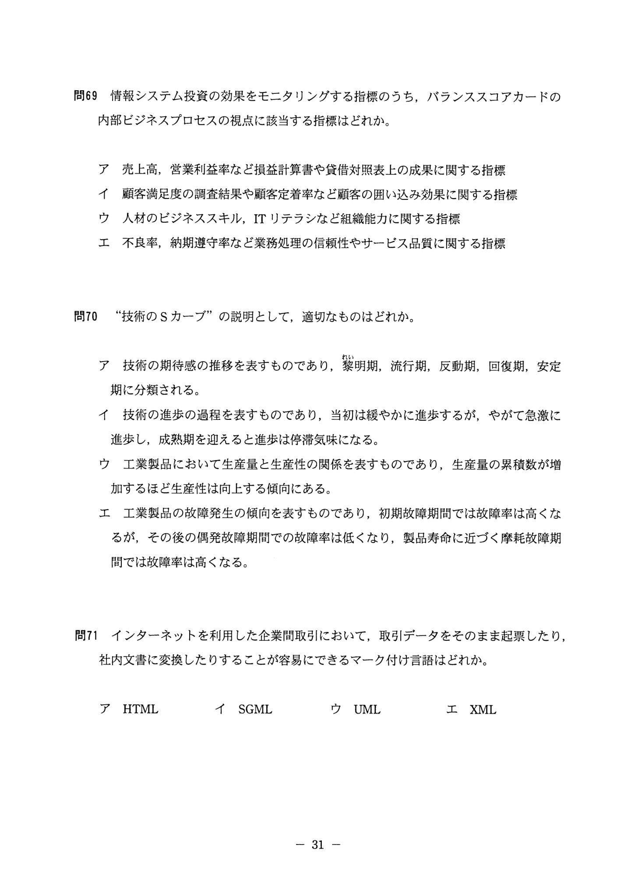

テキスト (OCR)

問69 情報システム投資の効果をモニタリングする指標のうち, バランススコアカードの
内部ビジネスプロセスの視点に該当する指標はどれか。

売上高, 営業利益率など損益計算書や貸借対照表上の成果に関する指標
顧客満足度の調査結果や顧客定着率など顧客の囲い込み効果に関する指標
人材のビジネススキル, IT リテラシなど組織能力に関する指標

不良率, 納期遵守率など業務処理の信頼性やサービス品質に関する指標

H ささ

問70 “技術のS カーブ" の説明として, 適切なものはどれか。

ア 技術の期待感の推移を表すものであり, ROU, MAM, 反動期, 回復期, 安定
期に分類される。

イ 技術の進歩の過程を表すものであり, 当初は緩やかに進歩するが, やがて急激に
進歩し, 成熟期を迎えると進歩は停滞気味になる。

ウ 工業製品において生産量と生産性の関係を表すものであり, 生産量の累積数が増
加するほど生産性は向上する傾向にある。

エ 工業製品の故障発生の傾向を表すものであり, 初期改障期間では故障率は高くな
OM, その後の偶発故障期間での故障率は低くなり, 製品寿命に近づく摩耗牙障其
間では故障率は高くなる。

間71 インターネットを利用した企業問取引において, 取引データをそのまま起票したり
社内文書に変換したりすることが容易にできるマーク付け言語はどれか。

ア HTML    イ SGML    ウ UML     <= XML

ー 31 一

### ページ 32

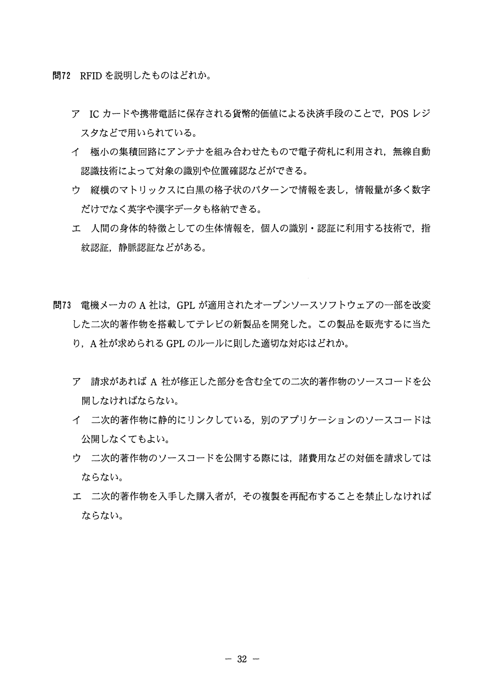

テキスト (OCR)

間72 RFID を説明したものはどれか。

ア IC カードや携帯電話に保存される貨幣的価値による決済手段のことで, POS レジ
スタなどで用いられている。

イ 極小の集積回路にアンテナを組み合わせたもので電子荷札に利用され, 無線自動
BBM IC KD THRO RA PALE HERS CMTE S.

ウ 縦横のマトリックスに白黒の格子状のパターンで情報を表し, 情報量が多く数字
だけでなく英字や漢字データも格納できる。

L 人間の身体的特徴としての生体情報を, 個人の識別・認証に利用する技術で, HF
紋認証, 静脈認証などがある。

問73 電機メーカの A thd, GPL が適用されたオープンソースソフトウェアの一部を改変
した二次的著作物を搭載してテレビの新製品を開発した。この製品を販売するに当た
り, A社が求められる GPL のルールに則した適切な対応はどれか。

ア 請求があれば A 社が修正した部分を含む全ての二次的著作物のソースコードを公
開しなければならない。

イ 二次的著作物に静的にリンクしている, 別のアプリケーションのソースコードは
公開しなくてもよい。

ウ 二次的著作物のソースコードを公開する際には, 諸費用などの対価を請求しては
ならない。

エエ 二次的著作物を入手した購入者が, その複製を再配布することを禁止しなければ
ならない。

ー 32 一

### ページ 33

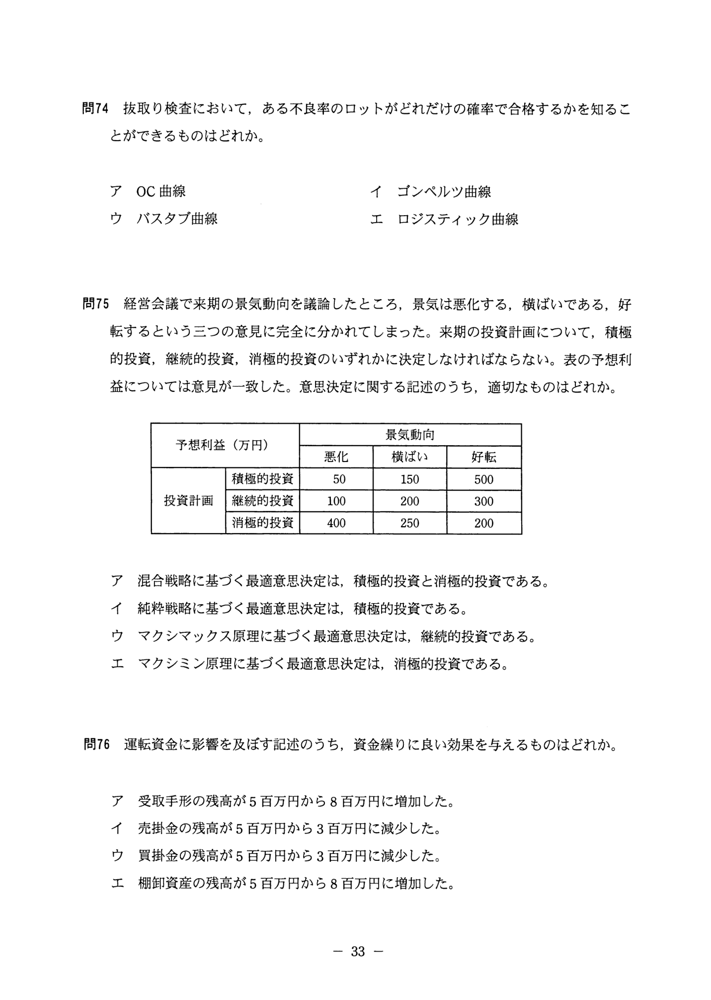

テキスト (OCR)

74 抜取り検査において, ある不良率のロットがどれだけの確率で合格するかを知るこ
とができるものはどれか。

ア 0C曲線              イ ゴンペルツ曲線
ウ バスタブ曲線          エエ ロジスティック曲線

問75 経営会議で来期の景気動向を議論したところ, 景気は悪化する, 横ばいである, 好
転するという三つの意見に完全に分かれてしまった。来期の投資計画について, 積極
的投資, 継続的投資, 消極的投資のいずれかに決定しなければならない。表の予想利
益については意見が一致した。意思決定に関する記述のうち, 適切なものはどれか。

予想利益 (万円)         RAS
悪化             横ばい             好転
積極的投資         50             150             500
投資計画 | 継続的投資        100             200             300
消極的投資        400             250             200

混合戦略に基づく最適意思決定は, 積極的投資と消極的投資である。
純粋戦略に基づく最適意思決定は, 積極的投資である。

マクシマックス原理に基づく最適意思決定は, 継続的投資である。
マクシミン原理に基づく最適意思決定は, 消極的投資である。

H へ

問76 運転資金に影響を及ぼす記述のうち, 資金繰りに良い効果を与えるものはどれか。

受取手形の残高が5 百万円から 8 百万円に増加した。
売掛金の残高が5 百万円から 3 百万円に減少した。
買掛金の残高が5 百万円から 3 百万円に減少した。
棚卸資産の残高が5 百万円から 8 百万円に増加した。

HUAN

ー 33 一

### ページ 34

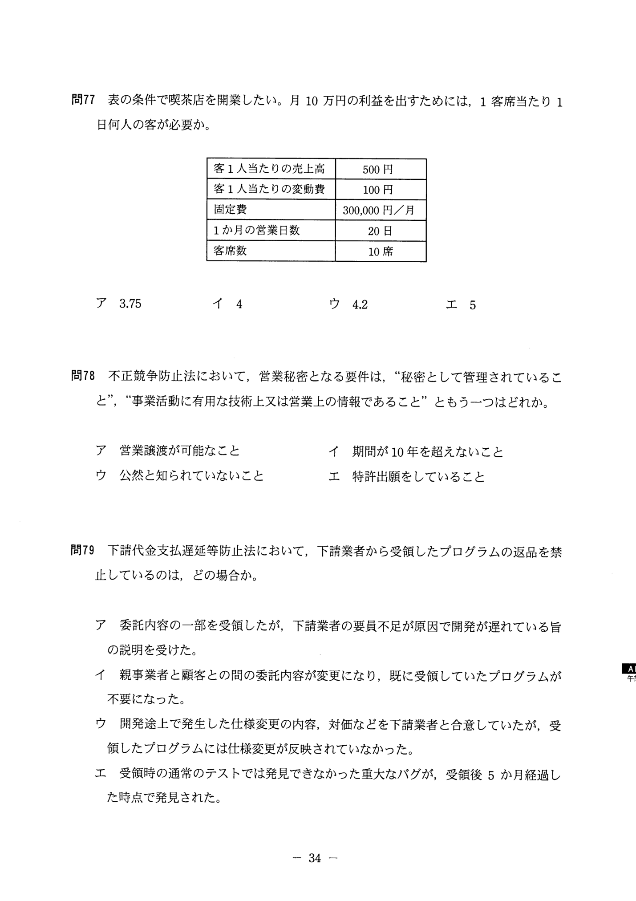

テキスト (OCR)

RT? 表の条件で喫茶店を開業したい。月 10 万円の利益を出すためには, 1 客席当たり 1
日何人の客が必要か。

客 1 人当たりの売上高   500 円
客 1 人当たりの変動費   100 円

固定費         300,000 円月
1か月の営業日数      20 日
客席数                            10 席
ア 3.75      イ 4       ウ 4.2      エ 5

間78 不正競争防止法において, 営業秘密となる要件は, “秘密として管理されているこ
と", “事業活動に有用な技術上又は営業上の情報でちること" ともう一つはどれか。

ア 営業譲渡が可能なこと      イ 期間が10 年を超えないこと
ウ 公然と知られていないこと     エエ 特許出願をしていること

問79 下請代金支払遅延等防止法において, 下請業者から受領したプログラムの返品を禁
止しているのは, どの場合か。

ア 委託内容の一部を受領したが, 下請業者の要員不足が原因で開発が遅れている旨
の説明を受けた。
イ 親事業者と顧客との間の委託内容が変更になり, 既に受領していたプログラムが    mn
不要になった。
ウ 開発途上で発生した仕様変更の内容, 対価などを下請業者と合意していたが, 受
領したプログラムには仕様変更が反映されていなかった。
Lo 受領時の通常のテストでは発見できなかった重大なバグが, 受領後 5 か月経過し
た時点で発見された。

ー 34 一

### ページ 35

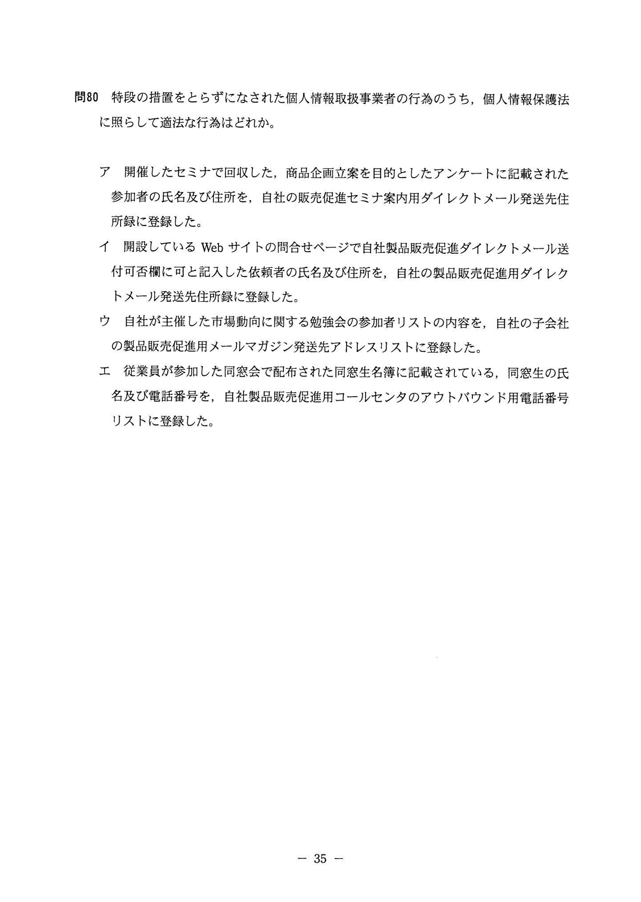

テキスト (OCR)

間80 特段の措置をとらずになされた個人情報取扱事業者の行為のうち, 個人情報保護法
に照らして適法な行為はどれか。

ア 開催したセミナで回収した, 商品企画立案を目的としたアンケートに記載された
参加者の氏名及び住所を, 自社の販売促進セミナ案内用ダイレクトメール発送先住
所録に登録した。

イ 開設している Web サイトの問合せページで自社製品販売促進ダイレクトメール送
付可否欄に可と記入した依頼者の氏名及び住所を, 自社の製品販売促進用ダイレク
トメール発送先住所録に登録した。

ウ 自社が主催した市場動向に関する勉強会の参加者リストの内容を, 自社の子会社
の製品販売促進用メールマガジン発送先アドレスリストに登録した。

エ 従業員が参加した同窓会で配布された同窓生名憩に記載されている, 同窓生の氏
名及び電話番号を, 自社製品販売促進用コールセンタのアウトバウンド用電話番号
リストに登録した。

ー 35 一

### ページ 36

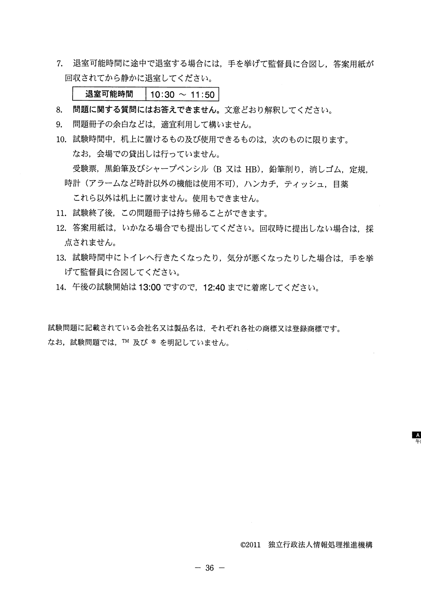

テキスト (OCR)

7. 退室可能時間に途中で退室する場合には, 手を挙げて監督員に合図し, 答案用紙が
回収されてから静かに退室してください。
| 退室可能時間 | 10:30 ~ 11:50 |
8. 問題に関する質問にはお答えできません。文意どおり解釈してください。
9. 問題冊子の余白などは, 適宜利用して構いません。
10. 試験時間中, 机上に置けるもの及び使用できるものは, 次のものに限ります。
なお, 会場での貸出しは行っていません。
受験票, 黒鉛筆及びシャープペンシル (B 又は HB), 鉛筆削り, 消しゴム, 定規,
時計 (アラームなど時計以外の機能は使用不可), ハンカチ, ティッシュ, 目薬
これら以外は机上に置けません。使用もできません。
ll. 試験終了後, この問題冊子は持ち帰ることができます。
12, 答案用紙は。 いかなる場合でも提出してください。回収時に提出しない場合は, 採
点されません。
13, 試験時間中にトイレへ行きたくなったり, 気分が悪くなったりした場合は, FEM
げて監督員に合図してください。
14, 午後の試験開始は 13.00 ですので, 12:40 までに着席してください。

試験問題に記載されている会社名又は製品名は, それぞれ各社の商標又は登録商標です。
なお, 試験問題では, ™ 及び @ を明記していません。

@2011 独立行政法人情報処理推進機構

ー 36 一

---

## 午前解答

©2011 独立行政法人情報処理推進機構 
平成23 年度 秋期 応用情報技術者試験 解答例 
 
午前試験 
問番号 
正解 
問1 
イ 
問2 
ウ 
問3 
エ 
問4 
ウ 
問5 
イ 
問6 
エ 
問7 
エ 
問8 
イ 
問9 
ウ 
問10 
エ 
問11 
ウ 
問12 
ウ 
問13 
ウ 
問14 
エ 
問15 
ア 
問16 
ウ 
問17 
ア 
問18 
イ 
問19 
ア 
問20 
イ 
 
 
問番号 
正解 
問21 
エ 
問22 
イ 
問23 
ウ 
問24 
ウ 
問25 
イ 
問26 
ウ 
問27 
イ 
問28 
エ 
問29 
イ 
問30 
ア 
問31 
ウ 
問32 
ウ 
問33 
エ 
問34 
エ 
問35 
エ 
問36 
エ 
問37 
エ 
問38 
エ 
問39 
エ 
問40 
イ 
 
 
問番号
正解 
問41 
ア 
問42 
ア 
問43 
ア 
問44 
ア 
問45 
エ 
問46 
エ 
問47 
ウ 
問48 
イ 
問49 
イ 
問50 
ア 
問51 
イ 
問52 
エ 
問53 
イ 
問54 
イ 
問55 
ウ 
問56 
イ 
問57 
イ 
問58 
エ 
問59 
ウ 
問60 
ア 
 
 
問番号 
正解 
問61 
ア 
問62 
ア 
問63 
エ 
問64 
エ 
問65 
イ 
問66 
ウ 
問67 
エ 
問68 
ウ 
問69 
エ 
問70 
イ 
問71 
エ 
問72 
イ 
問73 
ア 
問74 
ア 
問75 
エ 
問76 
イ 
問77 
エ 
問78 
ウ 
問79 
イ 
問80 
イ

---

## 午後問題

### ページ 1

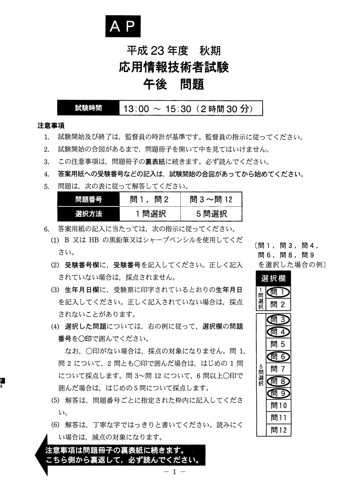

テキスト (OCR)

平成23年度 秋期
応用情報技術者試験
午後 問題

Me 13:00 ~ 15:30 (2時間30 分)

注意事項

1. 試験開始及び終了は, 監督員の時計が基準です。監督員の指示に従ってください。
2. 試験開始の合図があるまで, 問題冊子を開いて中を見てはいけません。
3. この注意事項は, 問題冊子の裏表紙に続きます。必ず読んでください。
4
5

答案用紙への受験番号などの記入は, 試験開始の合図があってから始めてください。
問題は, 次の表に従って解答してください。

問題番号    間1, 問2 | 問3ー間12 |
選択方法        1 問選択       5 問選択

6. 管案用紙の記入に当たっては, 次の指示に従ってください。
Q) B 又は HB の黒鉛筆又はシャープペンシルを使用してくだ

〔問1, 問3, 問4,

きい<                        問6, 問8, 問9
(2) 受験番号欄に, 受験番号を記入してください。正しく記入   を選択した場合の例]
されていない場合は, 採点されません。               ER

@) 生年月日構に。 RWKICMFENTSESVOLRAB |
を記入してください。正しく記入されていない場合は, 採点 3
されないことがあります。

(④ 選択した問題については, 右の例に従って, 選択拉の問題
番号を〇印で囲んでください。

なお, 〇印がない場合は, 採点の対象になりません。問 1.
問 2 について, 2 問とも〇印で囲んだ場合は, はじめの1問 |,
について採点します。問 3ご問 12 について, 6 問以上O印で |G
囲んだ場合は, はじめの 5 問について採点します。

(5) 解答は, 問題番号どとに指定された梓内に記入してくださ
い。

©) 解答は, 丁寧な字ではっきりと書いてください。読みにく
い場合は, 減点の対象になります。

注意事項は問題冊子の裏表紙に続きます。
こちら側から裏返して, 必ず読んでください。

選
aR

### ページ 2

### ページ 3

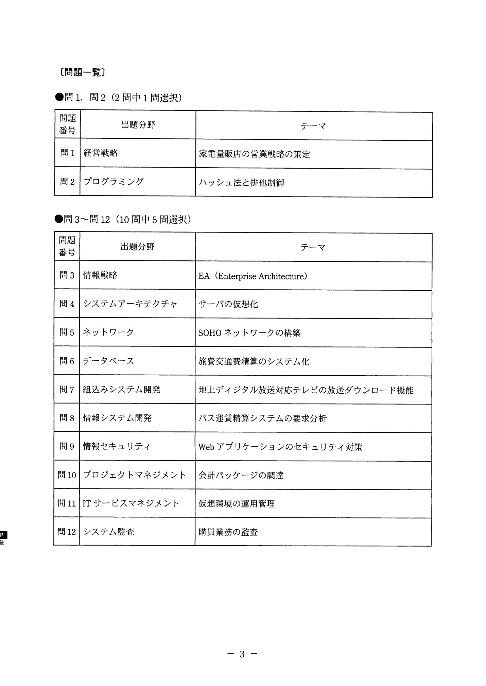

テキスト (OCR)

〔問題一覧]

@iei1, 問2 (2 問中1 問選択)

           LH BF                                    テーマ

問 1 |経営戦略          家電量販店の営業戦略の策定

間2 | プログラミング         ハッシュ法と排他制御

@ i 3一問 12 (10 問中 5 問選択)

     出題分野                テーマ

問 3 | 情報戦略              EA (Enterprise Architecture)

問4 | システムアーキテクチャ  サーバの仮想化

間5 | ネットワーク            SOHO ネットワークの構築

問6 | データベース           旅費交通費精算のシステム化

問 7 | 組込みシステム開発           地上ディジタル放送対応テレビの放送ダウンロード機能
問 8 | 情報システム開発        バス運賃精算システムの要求分析

問 9 | 情報セキュリティ         Web アプリケーションのセキュリティ対策
間 10 | プロジェクトマネジメント | 会計パッケージの調達

問 11 | IT サービスマネジメント |仮想環境の運用管理

問 12 | システム監査            購買業務の監査

### ページ 4

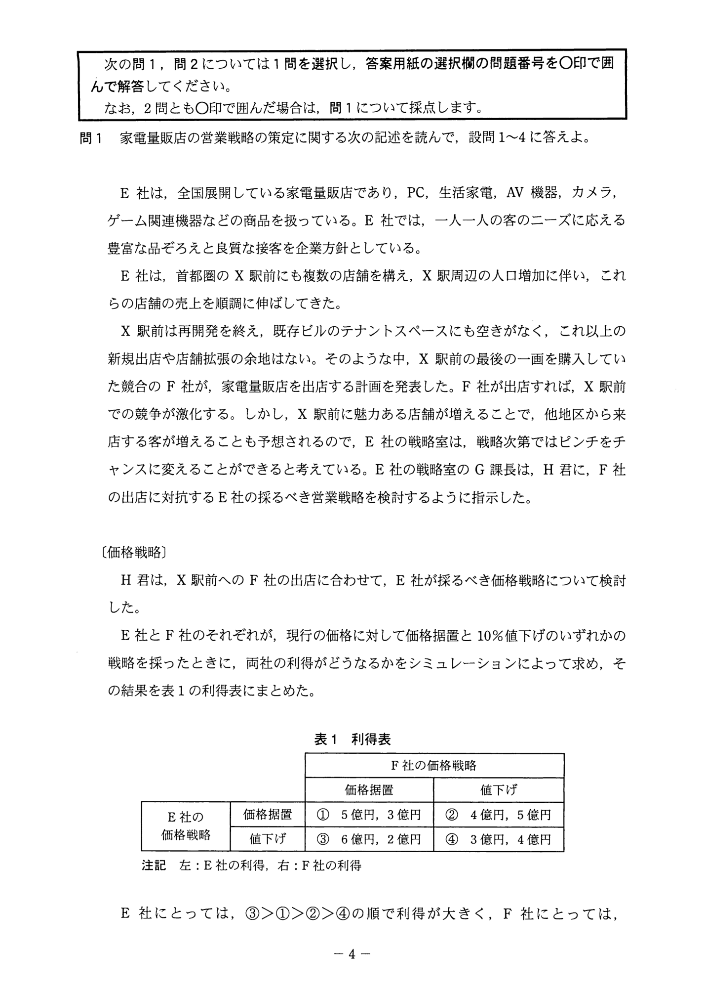

テキスト (OCR)

次の間 1 , 問2 については 1 問を選択し, 答案用紙の選択欄の問題番号を〇印で囲
んで解答してください。
なお, 2 問とも〇印で囲んだ場合は, 問 1 について採点します。

Al 家電量販店の営業戦略の策定に関する次の記述を読んで, 設問 1ー4 に答えよ。

E 社は, 全国展開している家電量販店であり, PC, 生活家電, AV Hee, カメラ,
ゲーム関連機器などの商品を扱っている。E 社では, 一人一人の客のニーズに応える
豊富な品ぞろえと良質な接客を企業方針としている。

E 社は, 首都圏の X 駅前にも複数の店舗を構え, X 駅周辺の人口増加に伴い, これ
らの店舗の売上を順調に伸ばしてきた。

X 駅前は再開発を終え, 既存ビルのテナントスペースにも空きがなく, これ以上の
新規出店や店舗拡張の余地はない。そのような中, X 駅前の最後の一画を購入してい
た競合の F 社が, 家電量販店を出店する計画を発表した。 F 社が出店すれば, X 駅前
での競争が激化する。しかし, X 駅前に魅力ある店舗が増えることで, 他地区から来
店する客が増えることも予想されるので, E 社の戦略室は, 戦略次第ではピンチをチ
ャンスに変えることができると考えている。 社の戦略室の G 課長は, H Bic, FH
の出店に対抗する 社の採るべき営業戦略を検討するように指示した。

〔価格戦略
H 君は, X 駅前へのF 社の出店に合わせて, E 社が採るべき価格戦略について検討
した。
E 社とF 社のそれぞれが, 現行の価格に対して価格据置と 10%値下ばのいずれかの
戦略を採ったときに, 両社の利得がどうなるかをシミュレーションによって求め, そ
の結果を表 1 の利得表にまとめた。

表1 利得表
F 社の価格戦略
価格据置       値下げ
EHO   価格据置 | ① 5億円, 3億円 | © 4億円,5億円
価格戦略   値下げ | © 6億円, 2億円 | ④ 3億円, 4億円
注記 左 :E社の利得,右 :F社の利得

E 社ににとっては, ③>①>②>④の順で利得が大きく, F 社にとっては,

ー4一

### ページ 5

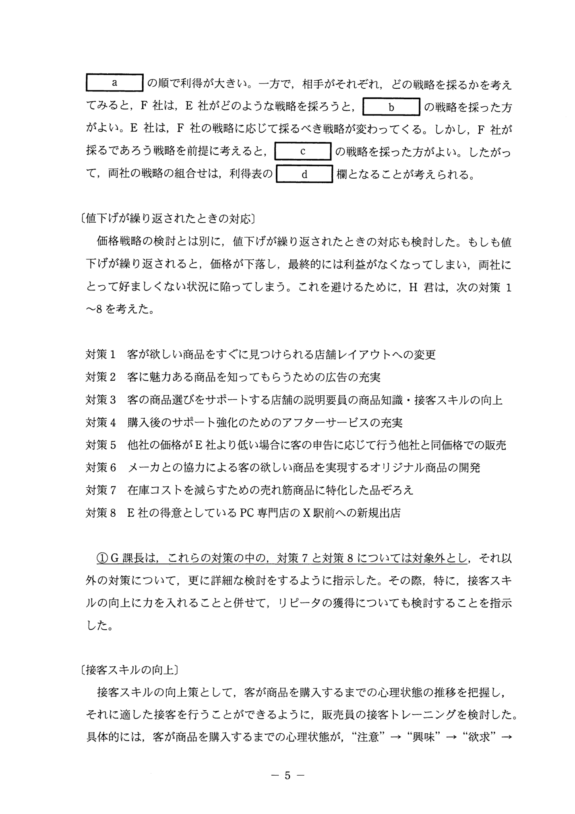

テキスト (OCR)

| 3』 | の順で利得が大きい。一方で, 相手がそれぞれ, どの戦略を採るかを考え
てみると, Feld, E 社がどのような戦略を採ろううと, | b | の戦略を採った方
がよい。 E Fld, F 社の戦略に応じて採るべき戦略が変わのてくる。しかし, F 社が
採るであろう戦略を前提に考えると, | c | の戦略を採った方がよい。したがっ
て, 両社の戦略の組合せは, 利得表の|  d | 欄となることが考えられる。

〔値下げが繰り返されたときの対応

価格戦略の検討とは別に, 値下げが繰り返されたときの対応も検討した。もしも値
下げが繰り返されると, 価格が下落し, 最終的には利益がなくなってしまい, 両社に
とって好ましくない状況に陥ってしまう。これを避けるために, H Ald, 次の対策 1
て8 を考えた。

対策1 客が欲しい商品をすぐに見つけられる店舗レイアウトへの変更

対策2 客に魅力ある商品を知ってもらうための広告の充実

対策3 客の商品選びをサポートする店舗の説明要員の商品知識・接客スキルの向上
対策4 購入後のサポート強化のためのアフターサービスの充実

対策5 他社の価格がE社より低い場合に客の申告に応じて行う他社と同価格での販売
対策6 メーカとの協力による客の欲しい商品を実現するオリジナル商品の開発
対策7 在庫コストを減らすための売れ筋商品に特化した品ぞろえ

対策8 E社の得意としている PC 専門店の X 駅前への新規出店

①G 課長は, これらの対策の中の, 対策 7 と対策 8 については対象外とし, それ以
外の対策について, 更に詳細な検討すするように指示した。その際, 特に, 接客スキ
ルの向上にカを入れることと併せて, リピータの獲得についても検討することを指示
した。

〔接客スキルの向上]〕

接客スキルの向上策として, 客が商品を購入するまでの心理状態の推移を把握し,
それに適した接客を行うことができるように, 販売員の接客トレーニングを検討した。
具体的には, 客が商品を購入するまでの心理状態が “EER” > “BUR” > “BOR” >

ー5一

### ページ 6

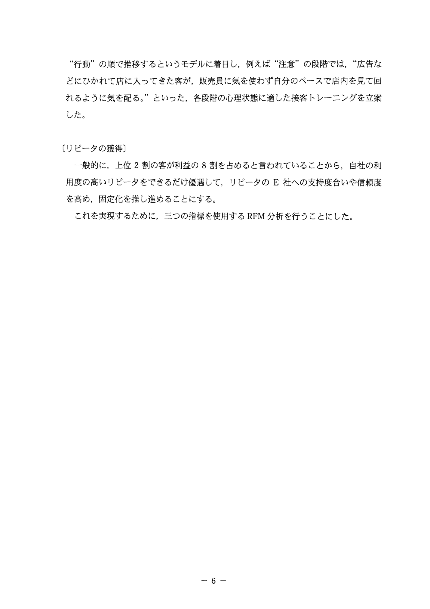

テキスト (OCR)

"行動" の順で推移するというモデルに着目し, 例えば "注意" の段階では, “広告な
どにひかれて店に入ってきた客が, 販売員に気を使わず自分のペースで店内を見て回
れるように気を配る。" といった, 各段階の心理状態に適した接客トレーニングを立案
した。

CU ピータの獲得]

一般的に, 上位 2 割の客が利益の 8 割を占めると言われていることから, 自社の利
用度の高いリピータをできるだけ優遇して, リピータの E 社への支持度合いや信頼度
を高め, 固定化を推し進めることにする。

これを実現するために, 三つの指標を使用する RFM 分析を行うことにした。

### ページ 7

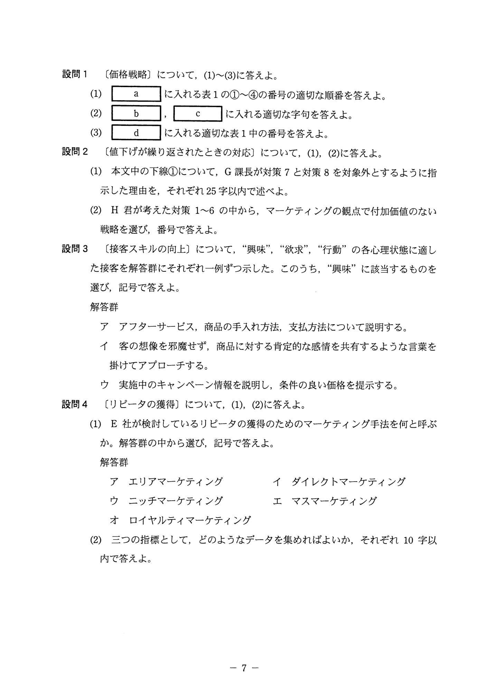

テキスト (OCR)

設問1 〔価格戦略j]について, Q①)て(3③)に答えよ。
(① | 』 | に入れる表1の①②④の番号の適切な順番を答えよ。
@ |  b |,| < | に入れる適切な字句を答えよ。
⑬ [| 3 ] に入れる適切な表 1 中の番号を答えよ。
設問2 (値下げが繰り返されたときの対応】について, ①, ②に答えよ。
①) 本文中の下線①について, G 課長が対策 7 と対策 8 を対象外とするように指
示した理由を, それぞれ25 字以内で述べよ。
2) H 君が考えた対策 +こ6 OFS, マーケティングの観点で付加価値のない
戦略を選び, 番号で答えよ。
設問3 接客スキルの向上]】 について, "興味", “欲求"行動" の各心理状態に適し
た接客を解答群にそれぞれ一例ずつ示した。このうち, "興味" に該当するものを
選び, 記号で答えよ。
ARE BE
ア アフターサービス, 商品の手入れ方法, 支払方法について説明する。
A 客の想像を邪魔せず, 商品に対する第定的な感情を共有するようか言葉を
掛けてアプローチする。
ウ 実施中のキャンペーン情報を説明し, 条件の良い価格を提示する。
設問4 〔リピータの獲得)】について, ①⑪), (②に答えよ。
①) EB 社が検討しているリピータの獲得のためのマーケティング手法を何と呼ぶ
か。 解答群の中から選び, 記号で答えよ。

ARE
ア エリアマーケティング     イ ダイレクトマーケティング
ウ ニッチマーケティング     エエ マスマーケティング
A ロイヤルティマーケティング

(2) 三つの指標として, どのようなデータを集めればよいか, それぞれ 10 字以
内で答えよ。

### ページ 8

テキスト (OCR)

問2 ハッシュ法と排他制御に関する次の記述を読んで, 設問 1ご3 に答えよ。

T 社は, ソフトウェア開発を行う会社である。現在, LAN 環境で利用するクライア
ントサーバシステム (以下, 本システムという) を開発中である。

本システムは, クライアント PC 上で画面にデータを表示する画面プログラムと,
画面プログラムが使用するデータをサーバ上で管理するデータ管理プログラムから構
成される。

〔データ構造】
Ay array td, クライアント PC で使用するデータ info を格納する配列であり, 配列
の添え字は 1てN CHS. info のデータ型は構造体 INFO である。表 1 に構造体 INFO
のメンバを示す。 構造体メンバの初期値は, 全て 0 (未使用を意味する) を設定する。

表1 構造体INFO のメンバ
メンバ                                             説明
key      本システムで配列 array 中の info を一意に識別する 1て999999999 の整数

data     本システムで処理するデータ
注記 メンバの参照は, info.key のように構造体名の後にビリオドとメンバ名を記述する。

ハッシュ関数 Hash(key)は, key を基にデータの格納位置を算出して, 戻り値として
戻す。格納位置は 1てN の整数となる。関数 Hash(key)が, 異なる key から同じ格納位
置を算出することを, シノニムの発生という。この影響で, 格納位置の配列要素が既
に使用されていて, データを格納できないことがある。この場合は, 配列 array HH
納位置の次から順次検索し, 最初に見つかった未使用の配列要素にデータを格納する。
配列 array の最後に到達しても未使用の配列要素がない場合には, 配列 array の先頭に
RO, 未使用の配列要素の検索を続ける。

〔データ管理プログラム〕

 1 のデータ格納関数 Set(), 図 2 のデータ取得関数 Get(), 図 3 のデータ削除関数
Delete()をデータ管理プログラムと呼ぶ。

関数 Get( )は, データ取得に成功すると, 取得したデータを引数 info に格納する。
関数 Set()と関数 Get( )は戻り値として格納位置を戻す。処理結果が正しくない場合は,

ー8 一

### ページ 9

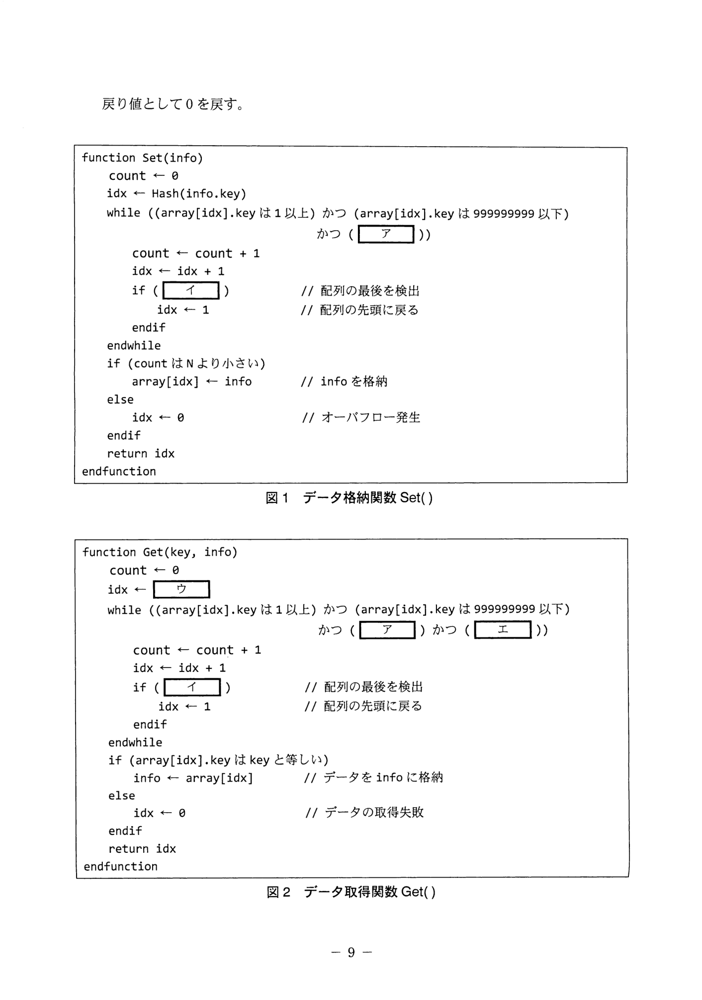

テキスト (OCR)

戻り値として 0 を戻す。

function Set(info)

count < @
idx < Hash(info.key)

while ((array[idx].key は 1 以上) かつ (array[idx].key は 999999999 以下)

かっ(しテコゴ])
count て- count + 1
idx < idx +1
if([ ィ ])         // 配列の最後を検出
idx で 1           // 配列の先頭に戻る
endif
endwhile
if (count はNより小さい)
array[idx] info      // info を格納
else
idx - @               // オーバフロー発生
endif
return idx
endfunction

 1 データ格納関数 Set( )

function Get(key, info)

count ~ @
while ((array[idx].key は 1 以上) かつ (array[idx] .key は 999999999 以下 )
かつっ(| ア |)かっ(| エ ))

count て count +1
idx で idx +1

if(| ィ |)         // 配列の最後を検出
idx で 1            // 配列の先頭に戻る
endif
endwhile
if (array[idx].key は key と等しい)
info <— array[idx]        // データを info に格納
else
idx — @                // データの取得失敗
endif
return idx
endfunction

 2 データ取得関数 Get( )

### ページ 10

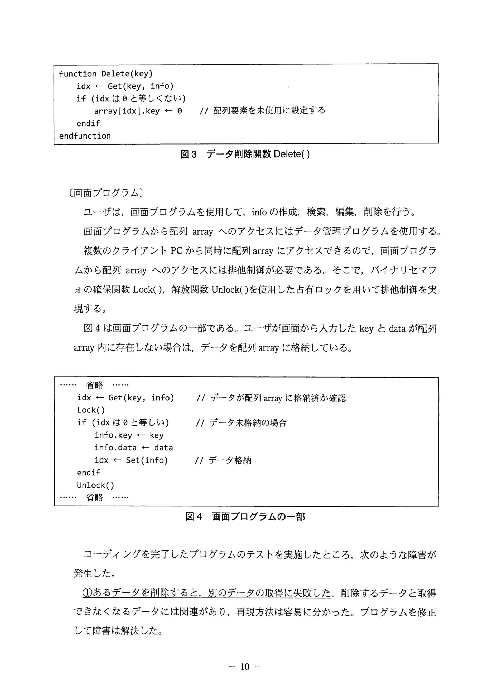

テキスト (OCR)

function Delete(key)
idx < Get(key, info)
if (idx は9と等しくない)
array[idx].key - 9  // 配列要素を未使用に設定する
endif
endfunction

 3 データ削除関数 Delete( )

[画面プログラム〕
ユーザは, 画面プログラムを使用して, info の作成, RR, 編集, 削除を行う。
画面プログラムから配列 array へのアクセスにはデータ管理プログラムを使用する。
複数のクライアント PC から同時に配列 array にアクセスできるので, 画面プログラ
ムから配列 array へのアクセスには排他制御が必要である。そこで, バイナリセマフ
オォの確保関数 Lock(), 解放関数 Unlock( )を使用した占有ロックを用いて排他制御を実
現する。
図 4 は画面プログラムの一部である。ユーザが画面から入力した key と data が配列
array 内に存在しない場合は, データを配列 array に格納している。

ーー 省略 ……
idx Get(key, info)    // データが配列 array に格納済か確認
Lock( )
if (idxは9と等しい)     // データ未格納の場合
info.key ~ key
info.data <— data
idx で Set(info)     // データ格納
endif
Unlock()
PCTD  省略 ……

 4 画面プログラムの一部

コーディングを完了レしたプログラムのテストを実施したところ, 次のような障害が
発生した。

①あるデータを削除すると, 別のデータの取得に失敗した。削除するデータと取得
できなくなるデータには関連があり, 再現方法は容易に分かった。プログラムを修正
して障害は解決した。

ー 10 一

### ページ 11

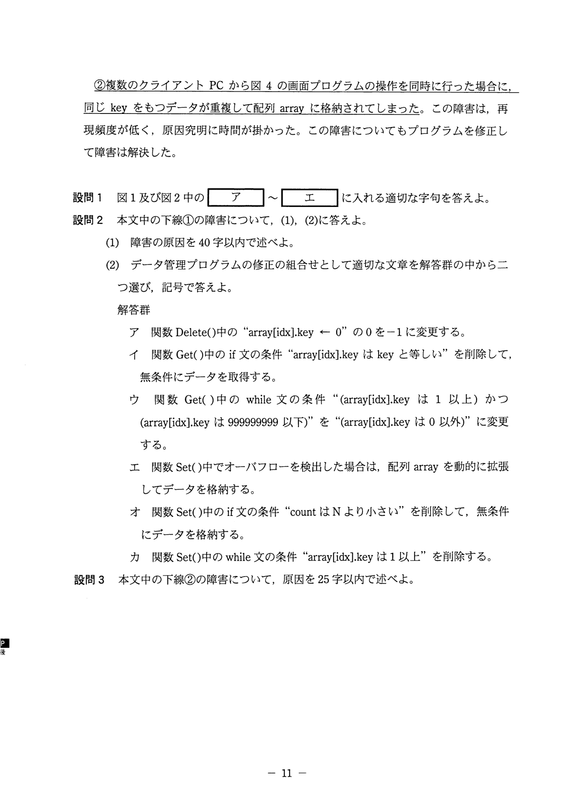

テキスト (OCR)

@複数のクライアント PC POM 4 の画面プログラムの操作を同時に行った場合に,

同じ key をもつデータが重複して配列 array に格納されてしまった。この障害は, 再
現頻度が低く, 原因究明に時間が掛かった。この障害についてもプログラムを修正し
て障害は解決した。

設問 1 1 及び図2 中の| ア |て| エ |に入れる適切な字句を答えよ。
設問2 本文中の下線①の障害について, ①⑪, ②に答えよ。
1) 障害の原因を 40 字以内で述べよ。
(2②) データ管理プログラムの修正の組合せとして適切な文章を解答群の中から二
つ選び, 記号で答えよ。
解答群

ア 関数 Delete()中の “array[idx].key — 0” の0をー-1 に変更する。

4 関数 Get()中の if CORE “arraylidx].key は key と等しい” を削除して,
無条件にデータを取得する。

ウ 関数 Get()中の while 文の条件 “(array[idx].key は 1 以上) DOD
(array[idx].key は 999999999 LAF)” % “(array[idx].key は 0 以外)”に変更
する。

エ 関数 Set( 中でオーバフローを検出した場合は, 配列 array を動的に拡張
してデータを格納する。

A 関数 Set()中の文の条件 “count は N より小さい" を削除して, RAE
にデータを格納する。

nH 関数 Set()中の while 文の条件 “array[idx].key は 1 以上”を削除する。

設問3 本文中の下線②の障害について, 原因を 25 字以内で述べよ。

ー 11 一

### ページ 12

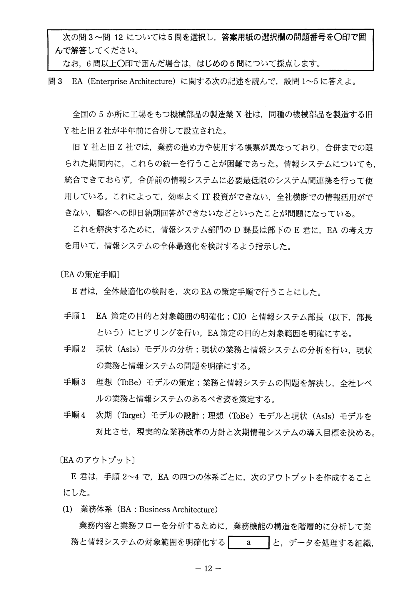

テキスト (OCR)

次の問 3 >問 12 については5間を選択し, 答案用紙の選択棚の問題番号を〇印で囲
んで解答してください。
なお, 6 問以上〇印で囲んだ場合は, はじめの5 問について採点します。

問3 EA (Enterprise Architecture) に関する次の記述を読んで, 設問 1て5 に答えよ。

全国の 5 か所に工場をもづつ機械部品の製造業 X 社は, 同種の機械部品を製造する旧
Y 社と旧Z 社が半年前に合併して設立された。

旧 Y 社と旧 Z 社では, 業務の進め方や使用する帳票が異なっており, 合併までの限
られた期間内に, これらの統一を行うことが困難であった。情報システムについても,
統合できておらず, 合併前の情報システムに必要最低限のシステム間連携を行って使
用している。これによって, 効率よく IT 投資ができない, 全社横断での情報活用がで
きない, 顧客への即日納期回答ができないなどといったことが問題になっている。

これを解決するために, 情報システム部門の D 課長は部下の E 君に, EA の考え方
を用いて, 情報システムの全体最適化を検討するよう指示した。

(EA ORE FID
E 君は, 全体最適化の検討を. KO EA の策定手順で行うことにした。

手順1 EA 策定の目的と対象範囲の明確化 : CIO と情報システム部長 (以下, BE
EWS) にヒアリングを行い, EA 策定の目的と対象範囲を明確にする。

手順2 BLK (Asis) モデルの分析 : 現状の業務と情報システムの分析を行い, 現状
の業務と情報システムの問題を明確にする。

手順3 理想 (CBe) モデルの策定 : 業務と情報システムの問題を解決し, 全社レベ
ルの業務と情報システムのあるべき姿を策定する。

手順4 次期 (Target) モデルの設計 : 理想 (ToBe) モデルと現状 (Asls) モデルを
対比させ, 現実的な業務改革の方針と次期情報システムの導入目標を決める。

(EA のアウトプット〕
E Ald, 手順 2て4 で, EA の四つの体系ごとに, 次のアウトプットを作成すること
にした。
(1) 業務体系 (BA : Business Architecture)
業務内容と業務フローを分析するために, 業務機能の構造を階層的に分析して業
務と情報システムの対象範囲を明確化する | a | と, データを処理する組織

ー 12 一

### ページ 13

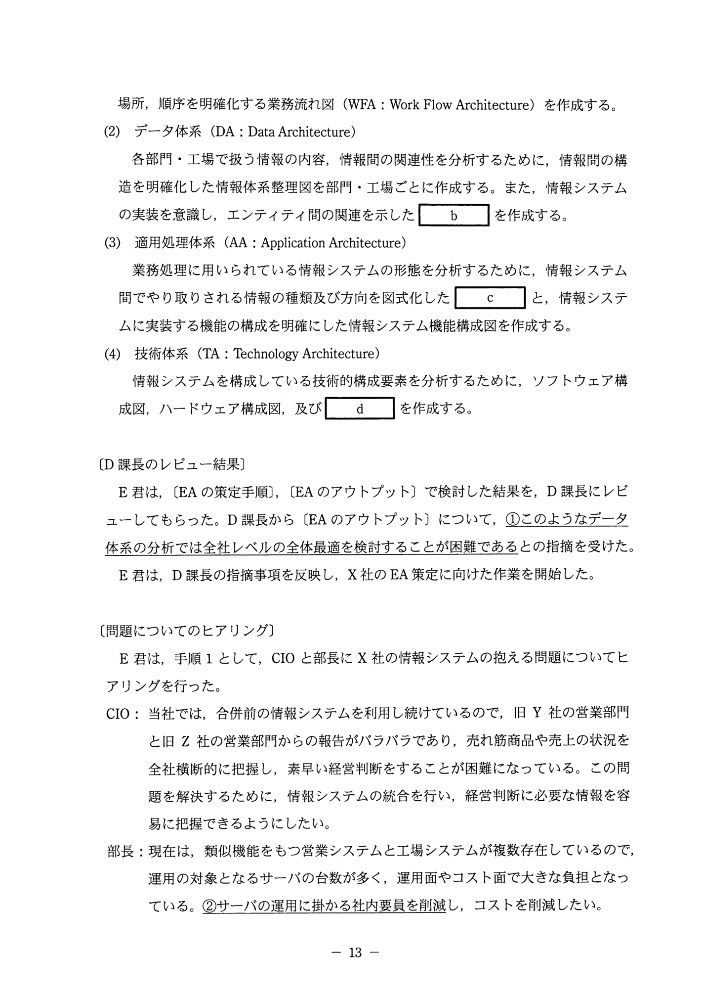

テキスト (OCR)

場所, 順序を明確化する業務流れ図 (WFA : Work Flow Architecture) を作成する。
(2) データ体系 (DA : Data Architecture)
各部門・工場で扱う情報の内容, 情報問の関連性を分析するために, ARMOR
造を明確化した情報体系整理図を部門・工場ごとに作成する。また, 情報システム
の実装を意識し, エンティティ間の関連を示した|  b | を作成する。
(3) 適用処理体系 (AA : Application Architecture)
業務処理に用いられている情報システムの形態を分析するために, 情報システム
間でやり取りされる情報の種類及び方向を図式化した と, 情報システ
ムに実装する機能の構成を明確にした情報システム機能構成図を作成する。
(4) 技術体系 (TA : Technology Architecture)
情報システムを構成している技術的構成要素を分析するために, ソフトウェア構
成図、ハードウェア構成図、及び| a | を作成する。

〔D 課長のレビュー結果]

E 君は, 〔EA の寅定手順〕, 〔(EA のアウトプット〕 で検討した結果を, D 課長にレビ
ューしてもらった。D 課長から〔EA のアウトプット〕について, ①このようなデータ
体系の分析では全社レベルの全体最適を検討することが困難であるとの指摘を受けた。

E 君は, D 課長の指摘事項を反映し, X 社のEA策定に向けた作業を開始した。

問題についてのヒアリング〕
E 君は, 手順 1 として, CIO と部長に X 社の情報システムの抱える問題についてヒ

アリングを行った。

CIO: 当社では, 合併前の情報システムを利用し続けているので, 旧 Y 社の営業部門
と旧 Z 社の営業部門からの報告がバラバラであり, 売れ筋商品や売上の状況を
全社横断的に把握し, 素早い経営判断をすることが困難になっている。この問
題を解決するために, 情報システムの統合を行い, 経営判断に必要な情報を容
易に把握できるようにしたい。

部長 : 現在は, 類似機能をもつ営業システムと工場システムが複数存在しているので,
運用の対象となるサーバの台数が多く, 運用面やコスト面で大きな負担となっ
ている。②サーバの運用に掛かる社内要員を削減し, コストを削減したい。

ー 13 一

### ページ 14

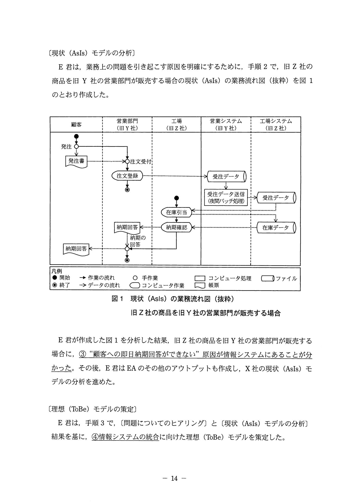

テキスト (OCR)

〔現状 (Asls) モデルの分析】〕

E 君は, 業務上の問題を引き起こす原因を明確にするために, 手順 2 で, IZ tO
商品を旧 Y 社の営業部門が販売する場合の現状 (Asls) の業務流れ図 (抜粋) を図 1
のとおり作成した。

=        ! 営業部門 !       工場          営業システム ! 工場システム
| (上Y社) ! (HzZ神)      (Y社) ! (HzZ神)
発注書 ーーキー OR
H                  H                    受注データ送信 | ! 、       ニー
!        ?           ext \ Fos |!  (し 27—» (
                  | (在庫引当 JS         :
ae Gam |    “ear
         HMO |
1         Dray at    1                                    1
凡例
@ Hits = > 作業の流れ    O 手作業       ヒコ コンピュータ処理 (0ファイル
ORT >データの流れ こつ)コンピュータ作業 Cl) HR

図1 現状 (Asls) の業務流れ図 (抜粋)
旧Z社の商品を旧 Y 社の営業部門が販売する場合

E 君が作成した図 1 を分析した結果, 旧Z 社の商品を旧 Y 社の営業部門が販売する
Wel, ③ "顧客への即日納期回答ができない"原因が情報システムにあることが分
Dok. その後, E 君はEA のその他のアウトプットも作成し, X社の現状 (AsIls) モ
デルの分析を進めた。

[理想 (ToBe) ES) ORE)
E 君は, 手順 3 で, 〔問題についてのヒアリング〕 と 〔現状 (AsIs) モデルの分析〕
結果を基に, ④情報システムの統合に向けた理想 (ToBe) モデルを策定した。

ー 14 一

### ページ 15

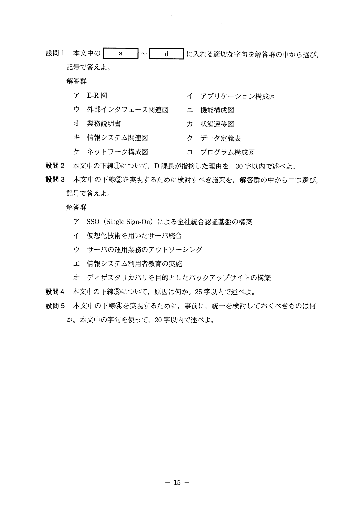

テキスト (OCR)

設問1 本文中の| a |~|  q |に入れる適切な字句を解答群の中から選び,

記号で答えよ。
解答群
ア ERB            イ アプリケーション構成図
ウ 外部インタフェース関連図      エ 機能構成図
オ 業務説明書                      A 状態遷移図
キ 情報システム関連図             ク データ定義表
ケ ネットワーク構成図          コ プログラム構成図

設問2 本文中の下線のについて, D 課長が指摘した理由を, 30 字以内で述べよ。
設問3 本文中の下線②を実現するために検討すべき施策を, 解答群の中から二つ選び,
記号で答えよ。
AE BE
ア SSO (Single Sign-On) による全社統合認証基盤の構築
イ 仮想化技術を用いたサーバ統合
ウ サーバの運用業務のアウトソーシング
エ 情報システム利用者教育の実施
A ディザスタリカバリを目的としたバックアップサイトの構築
設問4 本文中の下線③について, 原因は何か。25 字以内で述べよ。
設問5 本文中の下線④を実現するために, 事前に, 統一を検討しておくべきものは何
か。本文中の字旬を使って, 20 字以内で述べよ。

ー 15 一

### ページ 16

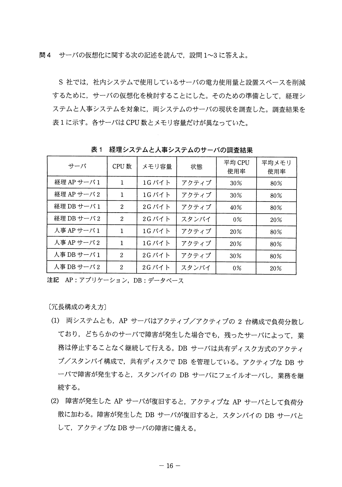

テキスト (OCR)

問4 サーバの仮想化に関する次の記述を読んで, 設問1て3 に答えよ。

S 社では, 社内システムで使用しているサーバの電力使用量と設置スペースを削減
するために, サーバの仮想化を検討することにした。そのための準備として, 経理シ
ステムと人事システムを対象に, 両システムのサーバの現状を調査した。調査結果を
表 1 に示す。各サーバは CPU 数とメモリ容量だけが異なっていた。

表1 経理システムと人事システムのサーバの調査結果

サーバ    CPU数 | メモリ容量| 状態   “ene  eas
経理 AP サーバ1      1     1Gバイト | アクティブ     30%        80%
経理 AP サーバ2   1   1Gバイト | アクティブ   30%     80%
経理 DB サーバ1     2     2Gバイト | アクティブ     40%        80%
経理 DB サーバ2     2     2Gバイト | スタンバイ      0%        20%
人事 AP サーバ1      1     1Gバイト | アクティブ     20%        80%
人事 AP サーバ2      1     1G バイト | アクティブ     20%        80%
人事 DB サーバ1ュ   2   2Gバイト | アクティブ   30%     80%
人事 DB サーバ2     2     2Gバイト | スタンバイ      0%        20%

注記 AP: アプリケーション, DB: データベース

(冗長構成の考え方

1) 両システムとも, AP サーバはアクティブンノアクティブの 2 台構成で負荷分散し
ており, どちらかのサーバで障害が発生した場合でも, 残ったサーバによって, 業
務は停止することなく継続して行える。DB サーバは共有ディスク方式のアクティ
ブノスタンバイ構成で, 共有ディスクで DB を管理している。アクティブな DB サ
ーバで障害が発生すると, スタンバイの DB サーバにフェイルオーバレし, 業務を継
続する。

(2) 障害が発生した AP サーバが復旧すると, アクティブな AP サーバとして負荷分
散に加わる。障害が発生した DB サーバが復旧すると, スタンバイの DB サーバと
して, アクティブな DB サーバの障害に備える。

ー 16 一

### ページ 17

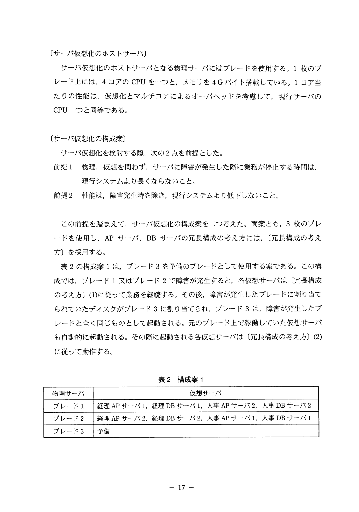

テキスト (OCR)

〔サーバ仮想化のホストサーバ)〕

サーバ仮想化のホストサーバとなる物理サーバにはブレードを使用する。1 枚のブ
レード上には, 4 コアの CPU を一つと, メモリを 4Gバイト搭載している。1 コア当
たりの性能は, 仮想化とマルチコアによるオーバヘッドを考慮して, 現行サーバの
CPU 一つと同等である。

(サーバ仮想化の構成案]
サーバ仮想化を検討する際, 次の2 点を前提とした。
前提1 WH, 仮想を問わず, サーバに障害が発生した際に業務が停止する時間は,
現行システムより長くならないこと。
前提2 性能は, 障害発生時を除き, 現行システムより低下しないこと。

この前提を踏まえて, サーバ仮想化の構成案を二つ考えた。両案とも, 3 枚のブレ
ードを使用し, AP サーバ, DB サーバの冗長構成の考え方には, 【冗長構成の考え
Fi) を採用する。

表 2 の構成案 1 は, ブレード 3 を予備のブレードとして使用する案である。この構
成では, ブレード 1 又はプレード 2 で障害が発生すると, 各仮想サーバは 〔冗長構成
の考え方〕 (1)に従って業務を継続する。その後, 障害が発生したブレードに割り当て
られていたディスクがブレード 3 に割り当てられ, ブレード 3 は, 障害が発生したブ
レードと全く同じものとして起動される。元のブレード上で稼働していた仮想サーバ
も自動的に起動される。その際に起動される各仮想サーバは【冗長構成の考え方〕 ⑫②
に従って動作する。

表2 構成案1

物理サーバ                                              仮想サーバ

ブレード1      経理 AP サーバ1, 経理DB サーバ1, 人事 AP サーバ2, 人事 DB サーバ2

ブレード2 | 経理AP サーバ2, 経理DB サーバ2, 人事 APサーバ1, 人事 DB サーバ1ュ

ブレード3 | 予備

ー 17 一

### ページ 18

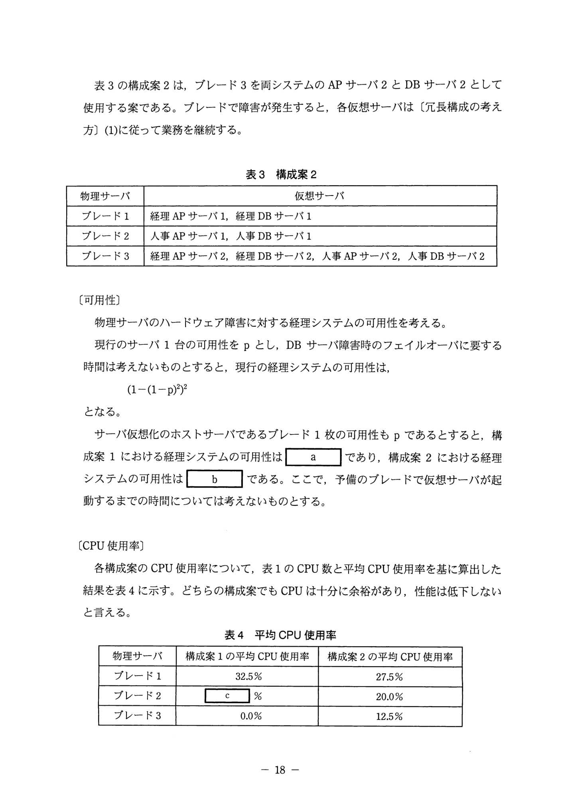

テキスト (OCR)

表 3 の構成案 2 は, ブレード 3 を両システムの AP サーバ2 と DB サーバ 2 として
使用する案である。ブレードで障害が発生すると, 各仮想サーバは【〔冗長構成の考え
Fi) 1①に従って業務を継続する。

表3 構成案2

物理サーバ                                              仮想サーバ

プレード1ュ    経理 AP サーバ1, 経理DB サーバュ

ブレード2    人事 APサーバ1, 人事 DB サーバ1

プレード 3   経理 AP サーバ2, 経理DB サーバ2, 人事 AP サーバ2, 人事 DB サーバ2

(可用性)

物理サーバのハードウェア障害に対する経理システムの可用性を考える。

現行のサーバ 1 台の可用性を p とし, DB サーバ障害時のフェイルオーバに要する
時間は考えないものとすると, 現行の経理システムの可用性は,

G-Q-p

となる。

サーバ仮想化のホストサーバであるブレード 1 枚の可用性も p であるとすると, Hit
成案 1 における経理システムの可用性は| a | であり, 構成案 2 における経理
システムの可用性は| bp | CHS. TOC, 予備のブレードで仮想サーバが起
動するまでの時間については考えないものとする。

(CPU 使用率〕
各構成案の CPU 使用率について, 表 1 の CPU数と平均 CPU 使用率を基に算出した
結果を表 4 に示す。どちらの構成案でも CPU は十分に余裕があり, 性能は低下しない
と言える。

Tt

表4 平均CPU使用率
物理サーバ | 構成案 1 の平均 CPU 使用率 | 構成案2 の平均 CPU 使用率

ブレードュ                32.5%                         27.5%
ブレード 2 %                           20.0%

ブレード3                0.0%                       12.5%

ー 18 一

### ページ 19

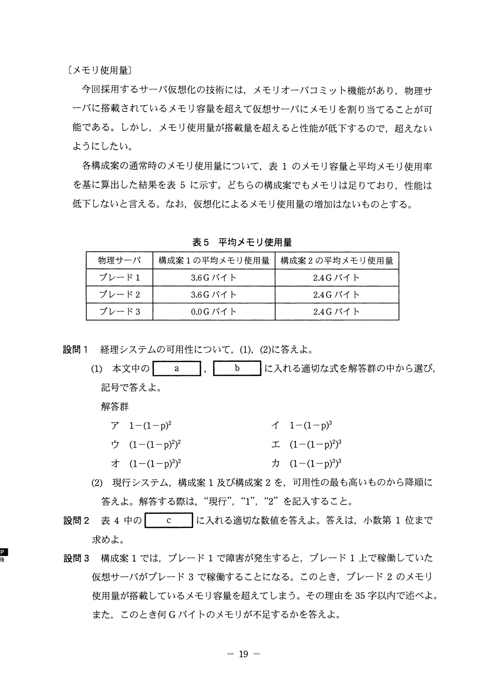

テキスト (OCR)

(メモリ使用量

今回採用するサーバ仮想化の技術には, メモリオーバコミット機能があり, 物理サ
ーバに搭載されているメモリ容量を超えて仮想サーバにメモリを割り当てることが可
Eである。 しかし, メモリ使用量が搭載量を超えると性能が低下するので, 超えない
ようにしたい。

各構成案の通常時のメモリ使用量について, 表 1 のメモリ容量と平均メモリ使用率
を基に算出した結果を表 5 に示す。どちらの構成案でもメモリは足りており, 性能は
低下しないと言える。なお, 仮想化によるメモリ使用量の増加はないものとする。

表5 平均メモリ使用量

物理サーバ | 構成案 1 の平均メモリ使用量 | 構成案2 の平均メモリ使用量
プレード1         3.6G バイト             2.4Gバイト
プレード2             3.6G バイト                    2.4G バイト
ブレード3             0.0Gバイト                    2.4Gバイト

設問1 経理システムの可用性について, (①⑪, ②に答えよ。

ag 本文中の|  a |,|  b |に入れる適切な式を解答群の中から選び,
記号で答えよ。

解答群

ア 1-1ーpX         イ ュー1ーp

ウ (1-(—p)’?        エ Q①-qQ-p)*

4 (1-(-p)'?        カ (1-(.—py'

(2) 現行システム, 構成案 1 及び構成案 2 を, 可用性の最も高いものから降順に
答えよ。解答する際は, BUG", "1", “2” を記入すること。
設問2 表4 中の| c | に入れる適切な数値を答えよ。答えは, 小数第 1 位まで
求めよ。
            設問3 構成案 1では, ブレード 1 で障害が発生すると, ブレード 1 上で稼働していた

仮想サーバがブレード 3 で稼働することになる。このとき, ブレード 2 のメモリ
使用量が搭載しているメモリ容量を超えてしまう。その理由を 35 字以内で述べよ。
また, このとき何G バイトのメモリが不足するかを答えよ。

ー 19 一

### ページ 20

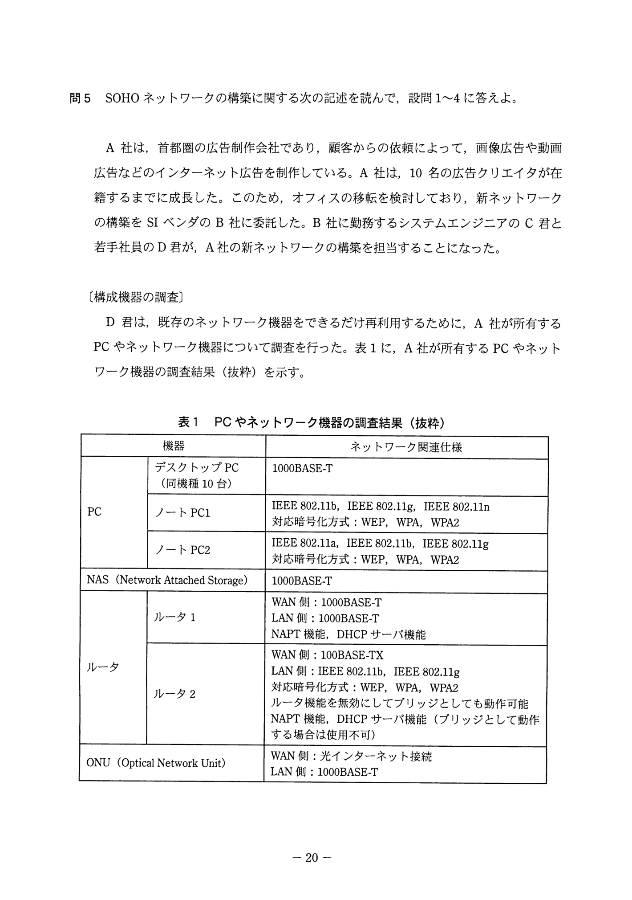

テキスト (OCR)

間5 SOHO ネットワークの構築に関する次の記述を読んで, 設問 1て4 に答えよ。

A 社は, 首都圏の広告制作会社であり, 顧客からの依頼によって, 画像広告や動画
広告などのインターネット広告を制作している。A 社は, 10 名の広告クリエイタが人在
籍するまでに成長した。このため, オフィスの移転を検討しており, 新ネットワーク
の構築を SI ベンダの B 社に委託した。B 社に勤務するシステムエンジニアの C Bet
若手社員の D EM, A 社の新ネットワークの構築を担当することになった。

[構成機器の調査〕

D Ald, 既存のネットワーク機器をできるだけ再利用するために, A 社が所有する
PC やネットワーク機器について調査を行った。表 1 に, A 社が所有する PC やネット
ワーク機器の調査結果 GEE) ERT.

表1 PCやネットワーク機器の調査結果 (抜粋)

機器                   ネットワーク関連仕様
デスクトップPC         1000BASE-T
(同機種 10 台)
IEEE 802.11b, IEEE 802.11g, IEEE 802.11n
PC               ート PC1
ゲト                      対応暗号化方式 : WEP, WPA, WPA2
ノート Eee             IEEE 802.11a, IEEE 802.11b, IEEE 802.11g

対応暗号化方式 : WEP, WPA, WPA2
NAS (Network Attached Storage)       1000BASE-T

WAN 側 : 1000BASE-T
ルータ 1                    LAN 側 : LOOOBASE-T
NAPT 機能, DHCP サーバ機能

WAN側 : 100BASE-TX
ルータ                                            LAN 側 : IEEE 802.11b, IEEE 802.11g
ルータ 2                   対応暗号化方式 : WEP, WPA, WPA2
ルータ機能を無効にしてプリッジとしても動作可能
NAPT 機能。 DHCP サーバ機能 (ブリッジとして動作
する場合は使用不可)
WAN Bil : 光インターネット接続
LAN fil] : 1000BASE-T

ONU (Optical Network Unit)

ー 20 一

### ページ 21

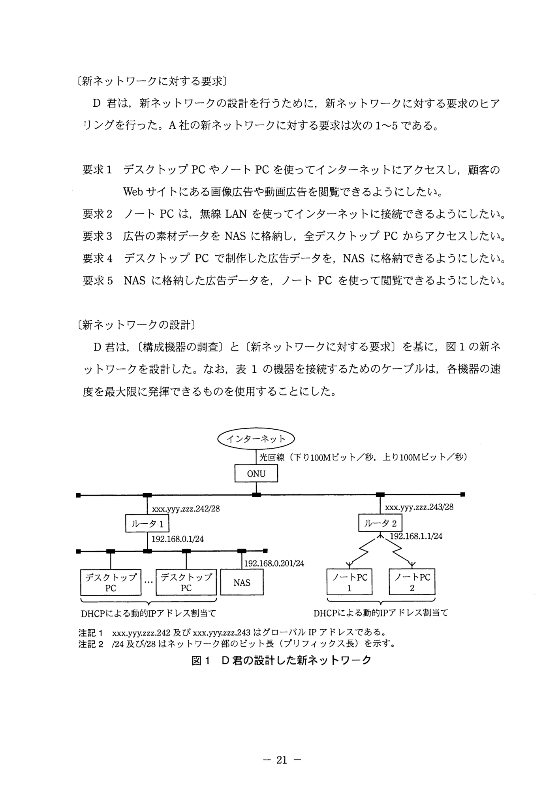

テキスト (OCR)

〔新ネットワークに対する要求〕
D 君は, 新ネットワークの設計を行うために, 新ネットワークに対する要求のヒア
リングを行った。A 社の新ネットワークに対する要求は次の 1て5 CHS,

要求1 デスクトップ PC やノート PC を使ってインターネットにアクセスし, 顧客の
Web サイトにある画像広告や動画広告を閲覧できるようにしたい。

要求2 ノート PC は, 無線 LAN を使ってインターネットに接続できるようにしたい。

要求3 広告の素材データを NAS に格納し, 全デスクトップ PC からアクセスしたい。

要求4 デスクトップ PC で制作した広告データを, NAS に格納できるようにしたい。

要求5 NAS に格納した広告データを, ノート PC を使って閲覧できるようにしたい。

〔(新ネットワークの設計〕

D 君は, [構成機器の調査〕 と 〔新ネットワークに対する要求】 を基に, 図 1 の新ネ
ットワークを設計した。なお, 表 1 の機器を接続するためのケーブルは, 各機器の束
度を最大限に発揮できるものを使用することにした。

光回線 (下り100Mビットノ秒, 上り100Mビットンノ秒)
ONU

bal                                                                                                                                                                =
XXX.YYY.222.242/28                                                                      XXX. Yyy.222.243/28
192.168.0.124                                                           192.168.1.1/24
             Tass       AX
T                     T                 192.168.0.201/24
NAS

デスクトップ | ……| デスクトップ                   ノートPC    ノートPC

PC                  PC                                            1
ド                  -                  の                               x                             ン
DHCPによる動的IPアドレス割当て                            DHCPによる動的IPアドレス割当て

注記1 xxx.yyyzzz.242 及び xxx.yyyzzz.243 はグローバル IP アドレスである。
注記 2 /24 及び/28 はネットワーク部のピット長 (プリフィックス長) EMT.

 1 D君の設計した新ネットワーク

ー 21 一

### ページ 22

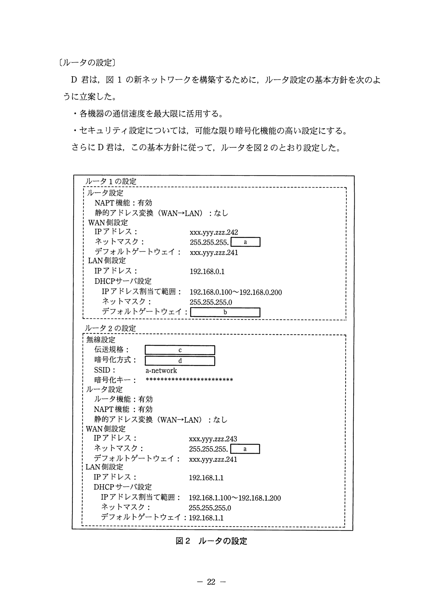

テキスト (OCR)

(ルータの設定〕
D 君は, 図 1 の新ネットワークを構築するために, ルータ設定の基本方針を次のよ
うに立案した。
・各機器の通信速度を最大限に活用する。
・セキュリティ設定については, 可能な限り暗号化機能の高い設定にする。
さらにD ld, この基本方針に従って, ルータを図 2 のとおり設定した。

QUO
! ルータ設定

NAPFT機能 : 有効

静的アドレス変換 (WANっLAN) : なし

WAN側設定

IPアドレス :                     xxx.yyy.222.242

ネットマスク :                      255.255.255.[ a』 ]
LAN側設定

IPアドレス :                     192.168.0.1

DHCPサーバ設定
IPアドレス割当て範囲 : 192.168.0.100て192.168.0.200
ネットマスク :              255.255.255.0

デフォルトゲートウェイ Pb Yd

  デフォルトゲートウェイ : xcx.yyy.zzz.241

ee | 3 |

SSID :         a-network
暗号化キー :  ***玉玉※※※※玉玉玉玉玉玉玉玉
ルータ設定

ルータ機能 : 有効
NAPT機能 : 有効
静的アドレス変換 (WANっLAN) : なし

WAN側設定
IPアドレス :                    xxx.yyy.22Z.243
ネットマスク :                      255.255.255.[ a ]
デフォルトゲートウェイ : xxxyyy.z2z.241
LAN側設定
IPアドレス :                   192.168.1.1

DHCP サーバ設定
IPアドレス割当て範囲 : 192.168.1.100て192.168.1.200
ネットマスク :              255.255.255.0
デフォルトゲートウェイ : 192.168.1.1

 2 ルータの設定

ー 22 一

### ページ 23

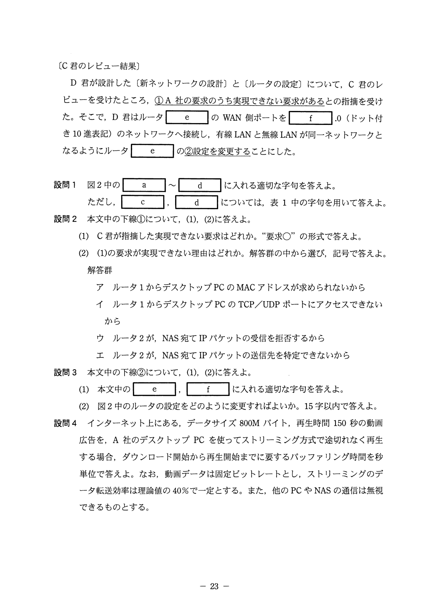

テキスト (OCR)

〔C 君のレビュー結果]〕
D 君が設計した【〔新ネットワークの設計) と (ルータの設定}] について, C HOV
ビューを受けたところ, OA 社の要求のうち実現できない要求があるとの指摘を受け

た。そこで, D 君はルータ|  e | の WAN側ポートを[| fi |.0 (ドット付

き 10 進表記) のネットワークへ接続し, 有線 LAN と無線 LAN が同一ネットワークと
なるようにルータ|  c  ] の②設定を変更することにした。

設問1 図2中の| ai |て| da |に入れる適切な字句を答えよ。
ただし, |  c |, [a |については, 表 1 中の字句を用いて答えよ。
設問2 本文中の下線①について, ①⑪, ②)に答えよ。
(①) C君が指摘した実現できない要求はどれか。"要求び" の形式で答えよ。
2) Q①⑪の要求が実現できない理由はどれか。 解答群の中から選び, 記号で答えよ。
ARETE
ア ルータ 1 からデスクトップ PC の MAC アドレスが求められないから
イ ルータ 1 からデスクトップ PC の TCP/UDP ポートにアクセスできない
から
ウ ルータ 2 が, NAS 宛てIP パケットの受信を拒否するから
エ ルータ 2 が, NAS 宛て IP パケットの送信先を特定できないから
設問3 本文中の下線②について, ①, (②に答えよ。
ag 本文中の| oe |, |  f |に入れる適切な字句を答えよ。
2) 図2 中のルータの設定をどのように変更すればよいか。15 字以内で答えよ。
設問4 インターネット上にある, データサイズ 800M バイト, 再生時間 150 秒の動画
KEE, A 社のデスクトップ PC を使ってストリーミング方式で途切れなく再生
する場合, ダウンロード開始から再生開始までに要するバッファリング時間を秒
単位で答えよ。なお, 動画データは固定ビットレートとし, ストリーミングのデ
ータ転送効率は理論値の 40%で一定とする。また, 他の PC や NAS の通信は無視
できるものとする。

ー 23 一

### ページ 24

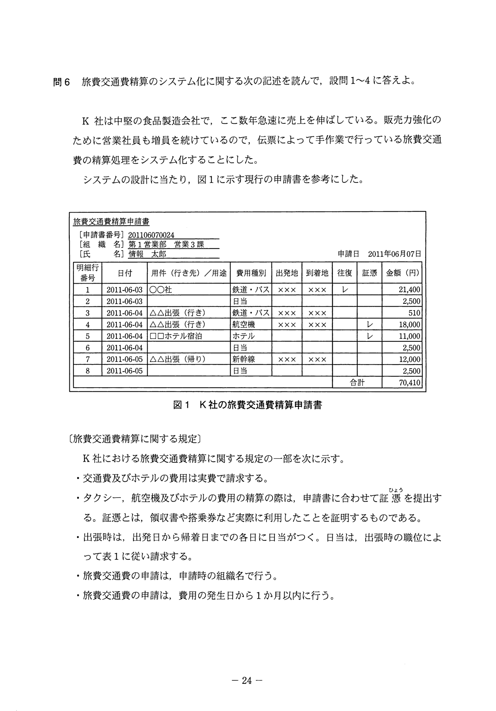

テキスト (OCR)

間6 旅費交通費精算のシステム化に関する次の記述を読んで, 設問 14 に答えよ。

K 社は中堅の食品製造会社で, ここ数年急速に売上を伸ばしている。販売力強化の
に営業社員も増員を続けているので, 伝票によって手作業で行っている旅費交通
費の精算処理をシステム化することにした。
システムの設計に当たり, 図1 に示す現行の申請書を参考にした。

旅費交通費精算申請書
[申請書番号] 201106070024__
[組 織 名] 第1営業部 営業3課

(Ee        名] 情報 太朗                                                             申請日 2011年06月07晶
       日付       用件 (行き先) 用途 | 費用種別 | 出発地 | 到着地 | 往復| AR | 金額(円)
1 | 2011-06-03 |OO#                         鉄道・バス| xxx | xxx | レ                     21,400
2 | 2011-06-03                                     日当                                                                2.500
3    2011-06-04 |へム出張 (行き)       鉄道・バス| xxx | xxx                    510
4 | 2011-06-04 |へムへ出張 (行き)            航空機          xxx | Xxx                 レ           18.000
5 | 2011-06-04 |ロロホテル宿泊           ホテル                                        レ          11,000
6 | 2011-06-04                                 日当                                                        2,500
7    2011-06-05 |へム出張 (帰り)      新幹線     xxx | xxx                12,000
8 | 2011-06-05                                     日当                                                                2.500
合計            70,410

 1 K社の旅費交通費精算申請書

〔旅費交通費精算に関する規定〕

K 社における旅費交通費精算に関する規定の一部を次に示す。

・交通費及びホテルの費用は実費で請求する。

・タクシー, 航空機及びホテルの費用の精算の際は, 申請書に合わせて証 -昌を提出す
S. mRcld, 領収書や搭乗券など実際に利用したことを証明するものである。

・出張時は, 出発日から帰着日までの各日に日当がつく。日当は, 出張時の職位によ
って表 1 に従い請求する。

・旅費交通費の申請は, 申請時の組織名で行う。

・旅費交通費の申請は, 費用の発生日から 1か月以内に行う

ー 24 一

### ページ 25

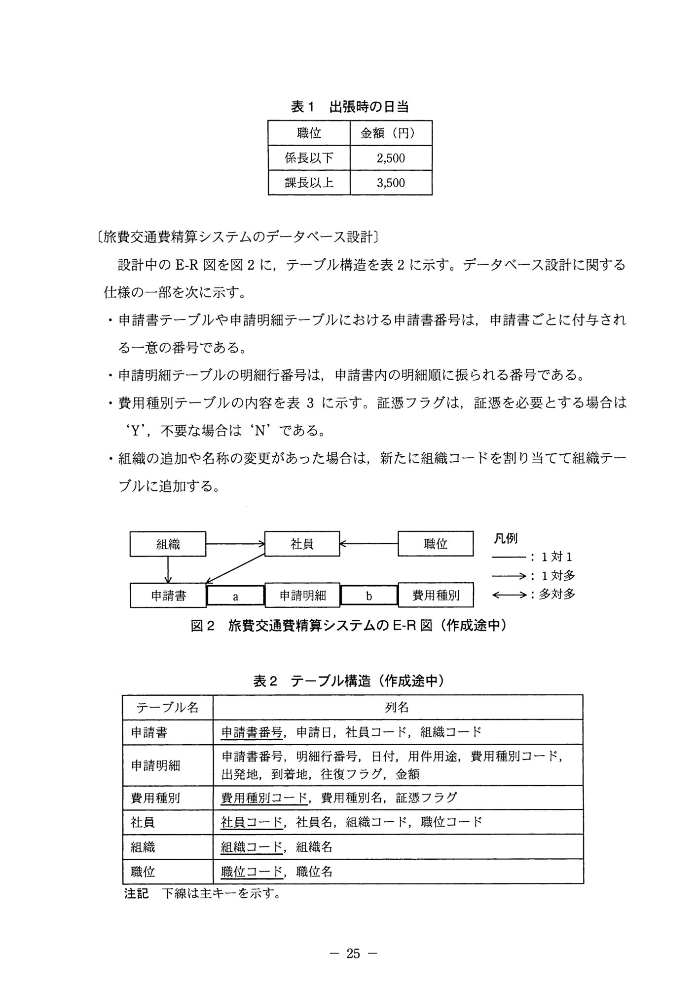

テキスト (OCR)

表1 出張時の日当
職位        金額 (円)

係長以下          2.500

課長以上          3,500

〔旅費交通費精算システムのデータベース設計〕
設計中の E-R 図を図 2 に, テーブル構造を表 2 に示す。データベース設計に関する

仕様の一部を次に示す。

・申請書テーブルや申請明細テーブルにおける申請書番号は, 申請書ごとに付与され
る一意の番号である。

・申請明細テーブルの明細行番号は, 申請書内の明細順に振られる番号である。

・費用種別テーブルの内容を表 3 に示す。証送フラグは, MBREVBCTSRAalL
‘Y’, 不要な場合は TN'_ CHS.

・組織の追加や名称の変更があった場合は, 新たに組織コードを割り当てて組織テー
ブルに追加する。

組織             社員             職位     凡例
: 1対1
ーー : 1対多
申請書     a     申請明組     b     誤用種別 | <一> :多対多

図2 旅費交通費精算システムの E-R 図 (作成途中)

表2 テーブル構造 (作成途中)

テーブル名                  列名

申請書    申請書番号, 申請日, 社員コード, 組織コード

中請明細   申請書番号, 明組行番号, 日付, 用人用途, 費用種別コード
出発地, 到着地, 往復フラグ, 金額

費用種別    費用種別コード, 費用種別名 MTD

社員      社員コード, 社員名, 組織コード, 職位コード

組織     組織コード, 組織名

職位      職位コード, 職位名

注記 下線は主キーを示す。

ー 25 一

### ページ 26

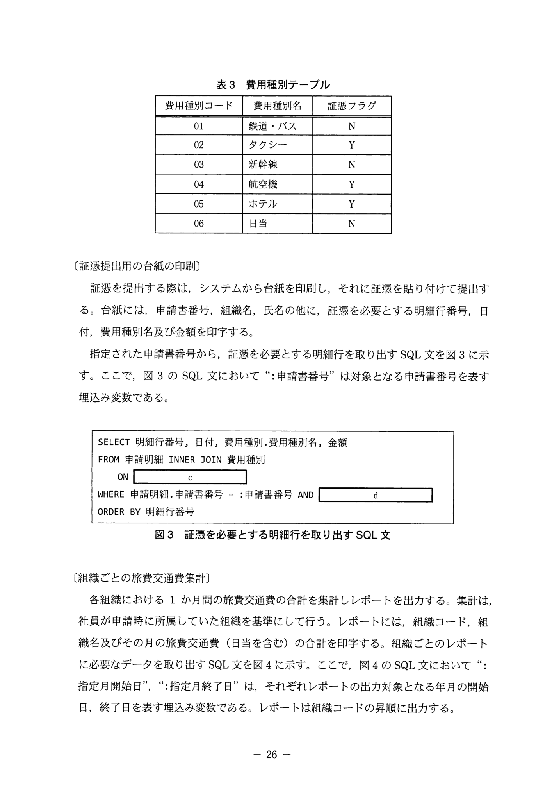

テキスト (OCR)

表3 費用種別テーブル

費用種別コード    費用種別名    EET D7
01             鉄道・バス               N
02     タクシー       Y
03             新幹線                    N
04    航空機      Y
05             ホテル                    Y
06    日当       N

(証明提出用の台紙の印刷〕
ALE te ST Sl, システムから台紙を印刷し, それに証選を貼り付けて提出す
台紙には, 申請書番号, 組織名, 氏名の他に, CMEDBCTSRMATES, 日
付, 費用種別名及び金額を印字する。
指定された申請書番号から, 証退を必要とする明細行を取り出す SQL 文を図 3 に示
す。ここで, 図 3 の SQL 文において “:申請書番号"は対象となる申請書番号を表す
埋込み変数である。

SELECT 明細行番号, AN, 費用種別.費用種別名, 金額
FROM 申請明細 INNER JOIN 費用種別

oN
WHERE 申請明細.申請書番号 = :申請書番号 AND[ a |

ORDER BY 明細行番号

 3 証源を必要とする明細行を取り出す SQL 文

(組織ごとの旅費交通費集計]

各組織における 1 か月間の旅費交通費の合計を集計しレレポートを出力する。集計は,
社員が申請時に所属していた組織を基準にして行う。レボートには, 組織コード, 組
織名及びその月の旅費交通費 (日当を含む) の合計を印字する。組織ごとのレポート
に必要なデータを取り出す SQL 文を図 4 に示す。ここで, 図4 のSQL 文において“
指定月開始日", “:指定月終了日" は, それぞれレポートの出力対象となる年月の開始
A, 終了日を表す埋込み変数である。レポートは組織コードの昇順に出力する。

ー 26 一

### ページ 27

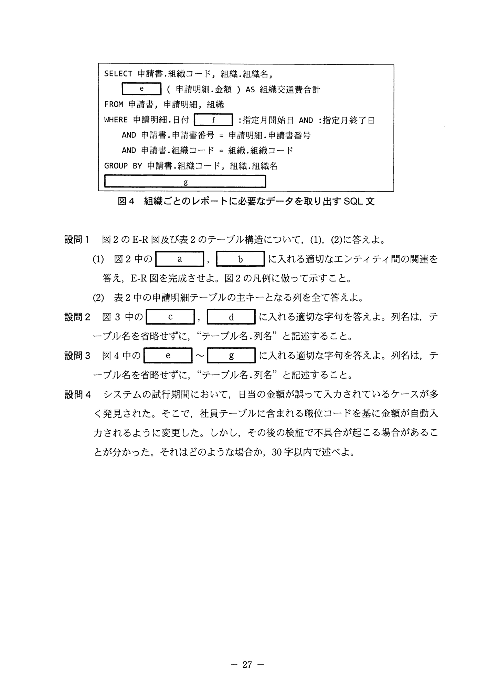

テキスト (OCR)

SELECT 申請書.組織コード, 組織.組織名」
[< ] (申請明細.金額 ) AS 組織交通費合計

FROM 申請書, 申請明細, 組織

WHERE 申請明細.日付 :指定月開始日 AND :指定月終了日
AND 申請書.申請書番号 = 申請明細.申請書番号
AND 申請書.組織コード = 組織.組織コード

GROUP BY 申請書.組織コード, 組織.組織名

|             g            ]

 4 組織ごとのレポートに必要なデータを取り出す SQL 文

設問 1 2のE-R 図及び表 2 のテーブル構造について, ①, ②)に答えよ。
Q) 図2 中の| a |,|  b |に入れる適切なエンティティ問の関連を
答え, E-R 図を完成させよ。図 2 の凡例に僚って示すこと。
(②) 表2 中の申請明細テープルの主キーとなる列を全て答えよ。

設問2 図3 中の|  c ||, | da |に入れる適切な字句を答えよ。列名は, テ
ーブル名を省略せずに, “テーブル名.列名” と記述すること。

設問3 図4中の| e |~| g |に入れる適切な字句を答えよ。列名は,テ
ーブル名を省略せずに, “テーブル名.列名"と記述すること。

設問4 システムの試行期間において, 日当の金額が誤って入力されているケースが多
く発見された。そこで, 社員テーブルに含まれる職位コードを基に金額が自動入
カカされるように変更した。しかし, その後の検証で不具合が起こる場合があるこ
とが分かった。それはどのようか場合か, 30 字以内で述べよ。

ー 27 一

### ページ 28

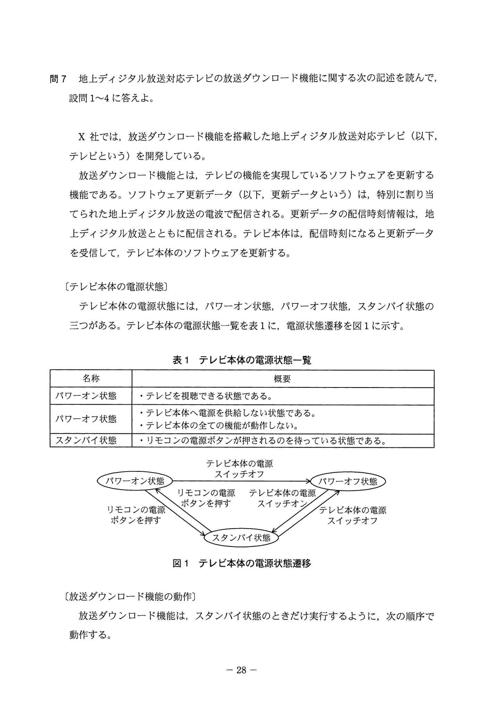

テキスト (OCR)

間7 地上ディジタル放送対応テレビの放送ダウンロード機能に関する次の記述を読んで

設問 1て4 に答えよ。

X 社では, 放送ダウンロード機能を搭載した地上ディジタル放送対応テレビ (以下,
テレビという) を開発している。

放送ダウンロード機能とは, テレビの機能を実現しているソフトウェアを更新する
機能である。ソフトウェア更新データ (以下, 更新データという) は, 特別に割り当
てられた地上ディジタル放送の電波で配信される。更新データの配信時刻情報は, Hh
上ディジタル放送とともに配信される。テレビ本体は, 配信時刻になると更新データ
を受信して, テレビ本体のソフトウェアを更新する。

〔テレビ本体の電源状態〕
テレビ本体の電源状態には. パワーオン状態,.パワーオン状態, スタンバイ状態の
三つがある。テレビ本体の電源状態一覧を表 1 に, 電源状態遷移を図 1 に示す。

表1 テレビ本体の電源状態一覧
名称                    概要
パワーオン状態  ・テレビを視聴できる状態である。

・テレビ本体へ電源を供給しない状態である。
・テレビ本体の全ての機能が動作しない。

スタンバイ状態  ・リモコンの電源ポタンが押されるのを待っている状態である。

パワーオフ状態

テレビ本体の電源
スイッチオフ

リモコンの電源 テレビ本体の電源
ボタンを押す   スイッチオン

スタンバイ状態

 1 テレビ本体の電源状態遷移

パワーオンフ状態

リモコンの電源
ボタンを押す

テレビ本体の電源
スイッチオフ

〔放送ダウンロード機能の動作〕
放送ダウンロード機能は, スタンバイ状態のときだけ実行するように, 次の順序で
動作する。

ー 28 一

### ページ 29

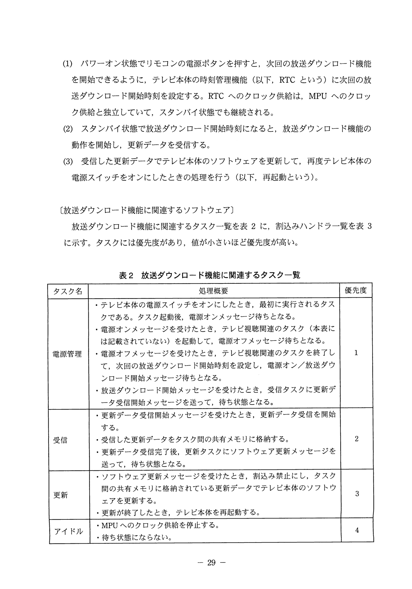

テキスト (OCR)

(1) パワーオン状態でりモコンの電源ボタンを押すと, 次回の放送ダウンロード機能
を開始できるように, テレビ本体の時刻管理機能 CAF, RTC という) に次回の放
送ダウンロード開始時刻を設定する。RTC へのクロック供給は, MPU へのクロッ
ク供給と独立していて, スタンバイ状態でも継続される。

(2) スタンバイ状態で放送ダウンロード開始時刻になると, 放送ダウンロード機能の
動作を開始し, 更新データを受信する。

(3)

電源スイッチをオンにしたときの処理を行う (以下, 再起動という)。

[放送ダウンロード機能に関連するソフトウェア〕
放送ダウンロード機能に関連するタスク一覧を表 2 に, 割込みハンドラー覧を表 3
に示す。タスクには優先度があり, 値が小さいほど優先度が高い。

表2 放送ダウンロード機能に関連するタスク一覧

受信した更新データでテレビ本体のソフトウェアを更新して, 再度テレビ本体の

タスク名

処理概要

電源管理

・テレビ本体の電源スイッチをオンにしたとき, 最初に実行されるタス

クである。タスク起動後, 電源オンメッセージ待ちとなる。

・電源オンメッセージを受けたとき, テレビ視聴関連のタスク (ARI

は記載されていない) を起動して, 電源オフメッセージ待ちとなる。

・電源オフメッセージを受けたとき, テレビ視聴関連のタスクを終了し

て, 次回の放送ダウンロード開始時刻を設定し, 電源オン放送ダウ
ンロード開始メッセージ待ちとなる。

・放送ダウンロード開始メッセージを受けたとき, 受信タスクに更新デ

ータ受信開始メッセージを送って, 待ち状態となる。

i
Duh

・更新データ受信開始メッセージを受けたとき, 更新データ受信を開始

する。

・受信した更新データをタスク間の共有メモリに格納する。
・更新データ受信完了後, 更新タスクにソフトウェア更新メッセージを

送って, 待ち状態となる。

更新

・ソフトウェア更新メッセージを受けたとき, 割込み禁止にし, タスク

間の共有メモリに格納されている更新データでテレビ本体のソフトウ
エアを更新する。

・更新が終了したとき, テレビ本体を再起動する。

アイドル

・MPU へのクロック供給を停止する。
・待ち状態にならない。

ー 29 一

### ページ 30

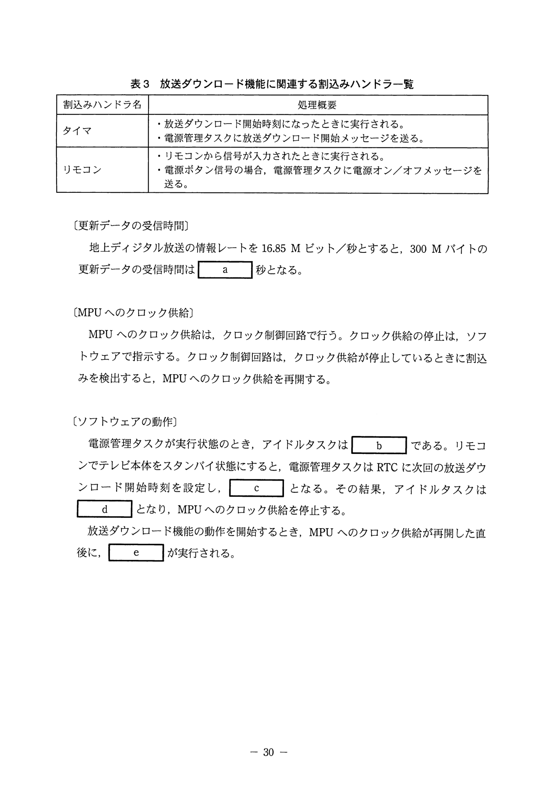

テキスト (OCR)

表3 放送ダウンロード機能に関連する割込みハンドラー覧

割込みハンドラ名                処理概要

・放送ダウンロード開始時刻になったときに実行される。

タイマ           ・ 電源管理タスクに放送ダウンロード開始スッセージを送る。
・ リモコンから信号が入力されたときに実行される。
リモコン             ・電源ボタン信号の場合, 電源管理タスクに電源オンンオフメッセージを

(更新データの受信時間〕
地上ディジタル放送の情報レートを 16.85 M ビットノ秒とすると, 300 M バイトの
更新データの受信時間は|  a |秒となる。

(MPU へのクロック供給〕

MPU へのクロック供給は, クロック制御回路で行う。クロック供給の停止は,。 ソフ
トウェアで指示する。クロック制御回路は, クロック供給が停止しているときに割込
みを検出すると, MPU へのクロック供給を再開する。

(ソフトウェアの動作)
電源管理タスクが実行状態のとき, アイドルタスクは|  b | でぁる。リモコ
ンでテレビ本体をスタンバイ状態にすると, 電源管理タスクは RTC に次回の放送ダウ
ンロード開始時刻を設定し, となる。 その結果, アイドルタスクは
[| 3』 |] となり, MPU へのクロック供給を停止する。
放送ダウンロード機能の動作を開始するとき, MPU へのクロック供給が再開した直

後に, | c  ] が実行される。

ー 30 一

### ページ 31

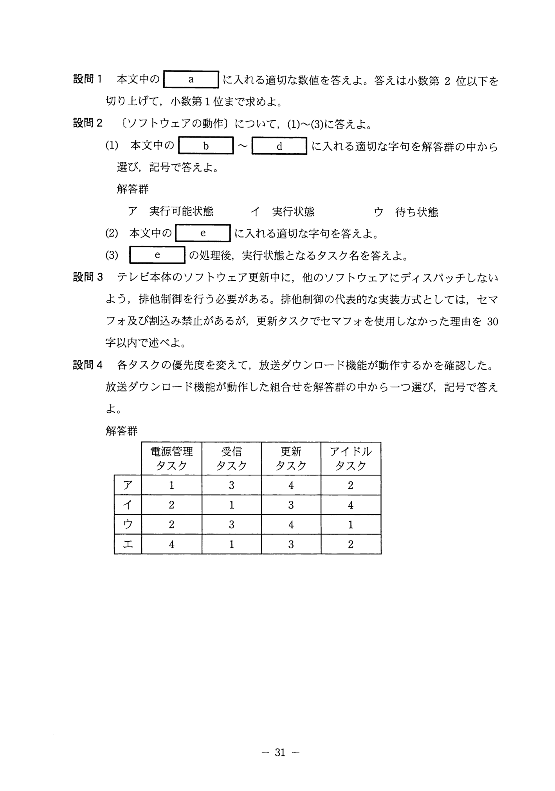

テキスト (OCR)

設問1 本文中の| a |] に入れる適切な数値を答えよ。答えは小数第 2 位以下を
切り上げて, 小数第 1 位まで求めよ。

設問2 〔ソフトウェアの動作) について, (①~て(3)に答えよ。
Q①) 本文中の| b |~[  』 |に入れる適切な字句を解答群の中から
選び, 記号で答えよ。
解答攻
ア 実行可能状態   イ 実行状態     ウ 待ち状態

⑫ 本文中の[| < |] に入れる適切な字句を答えよ。
@) [| ce | の処理後, 実行状態となるタスク名を答えよ。

設問3 テレビ本体のソフトウェア更新中に, 他のソフトウェアにディスパッチしない
ED, 排他制御を行う必要がある。 排他制御の代表的な実装方式としては, セマ
フォ及び割込み禁止があるが, 更新タスクでセマフォを使用しなかった理由を 30
字以内で述べよ。

設問4 各タスクの優先度を変えて, 放送ダウンロード機能が動作するかを確認した。
放送ダウンロード機能が動作した組合せを解答群の中から一つ選び, 記号で答え

解答群
電源管理      受信        更新      アイドル
タスク   タスク   タスク   タスク
1           3           4           2

H] SIAN

Ce oe
mロ|の|ピロ
wl] Pr] wo
to el od

ー 31 一

### ページ 32

テキスト (OCR)

問8 バス運賃精算システムの要求分析に関する次の記述を読んで, 設問13 に答えよ。

H 社では, IC カードを利用したバス運賃精算システム (以下, システムという) の
試験導入を行うことになり, そのためのプロトタイゾプ開発に着手した。IC カードには,
IC チップが埋め込まれている。IC チップに保存されている情報は, IC チップ専用の
リーダライタに IC カードをかざすだけで, 読取りと書込みができる。

UIC バスカード〕
IC バスカードとは, IC カードを利用したプリペイドカードである。 乗客は, バス停
や営業所にあるチャージ装置を使用してあらかじめ一定の金額をチャージする。

(IC 整理券〕
IC 整理券とは, IC チップを利用した整理券である。IC バスカードを持っていない
乗客の乗車区間を確定するために利用する。

CER OME)

乗客がバスに乗車する際, IC バスカードを持っていれば, IC バスカードを乗車口の
整理券箱にかざす。チャージ金額が初乗り金額未満の場合は, 警告するが乗車は可能
CHS. IC バスカードを持っていなければぱ, 整理券箱が発券する IC 整理券を取り出
す。この時点で, 乗客の乗車バス停が確定する。

乗客がバスから降車する際, IC バスカードを利用していれば, IC バスカードを運転
席横の運賃箱にかざすと運賃が確定する。IC 整理券を利用していれば, IC 整理券を運
賃箱に投入すると運賃が確定する。運賃が確定すると, それを “運賃の残金" の初期
値として後述の【〔精算処理〕 が実行される。

(精算処理〕

精算とは, 乗客が現金か IC バスカードいずれか片方, 又は両方の併用によって, 運
賃を支払うことである。システムは, 運賃の残金があればその金額を表示する。現金
での精算に釣銭を返すこととはできない。 運賃の残金を超えた現金を投入した場合は,
投入した現金を返却する。釣銭が必要な乗客は, 運賃箱の両替機能で両替してから運
賃を支払う。両替金の補充は, 管理部門が運行時間外に行う。

ー 32 一

### ページ 33

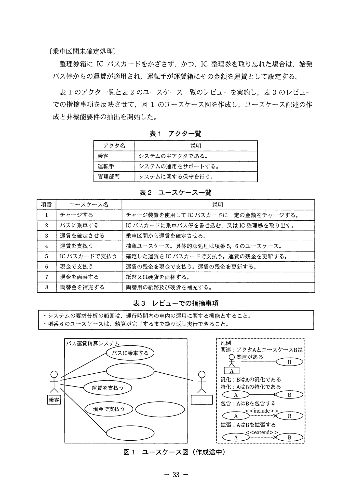

テキスト (OCR)

(乗車区間末確定処理〕

SAIC IC バスカードをかざさず, かつ, IC 整理券を取り忘れた場合は, 始発
バス停からの運賃が適用され, 運転手が運賃箱にその金額を運賃として設定する。

表 1 のアクター覧と表 2 のユースケース一覧のレビューを実施し, 表 3 のレビュー
での指摘事項を反映させて, M1 1 のユースケース図を作成し. ユースケース記述の作
成と非機能要件の抽出を開始した。

表1 アクター覧
アクタ名                     説明
RE          システムの主アクタである。
運転手        システムの運用をサポートする。
管理部門    システムに関する保守を行う。

表2 ユースケース一覧

項番   ユースケース名                  説明
1    チャージする          チャージ装置を使用して IC バスカードに一定の金額をチャージする。
2    バスに乗車する        IC バスカードに乗車バス停を書き込む, 又はIC 整理券を取り出す。
3 | 運賃を確定させる        乗車区間から運賃を確定させる。
4 | 運賃を支払う        抽象ユースケース。具体的な処理は項番 5, 6 のユースケース。
5 | ICバスカードで支払う | 確定した運賃を ICバスカードで支払う。運賃の残金を更新する。
6 | 現金で支払う        運賃の残金を現金で支払う。運賃の残金を更新する。
7 | Reems         紙整又は硬貨を両替する。
8 | 両替金を補充する        両替用の紙幣及び硬貨を補充する。

R3 レビューでの指摘事項

・システムの要求分析の範囲は, 運行時間内の車内の運用に関する機能とすること。
・項番6 のユースケースは, 精算が完了するまで繰り返し実行できること。

バス運賃精算システム                                AGI

5 。 この
ンー<。 うー Lo G
に           汎化 : BはAの汎化である
運賃を支払う                                        特化 : AはBの特化である

C_]
包含 : AはBを包含する

拡張 : AはBを拡張する

<<extend>>

CA
 1 ユースケース図 (作成途中)

>-+O
LAN

ー 33 一

### ページ 34

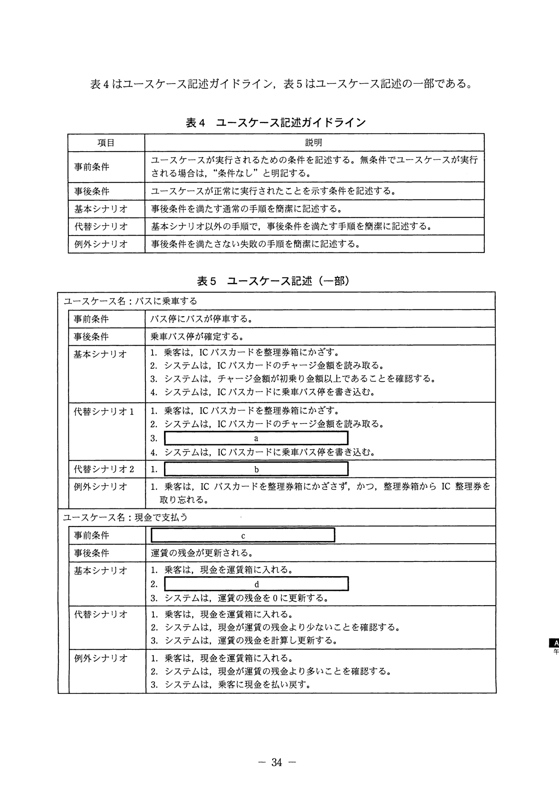

テキスト (OCR)

表4 はユースケース記述ガイドライン, 表5 はユースケース記述の一部である。

表4 ユースケース記述ガイドライン

項目                           説明
事前条件      ユースケースが実行されるための条件を記述する。 無条件でユースケースが実行
される場合は, “条件なし"と明記する。
事後条件      ユースケースが正常に実行されたことを示す条件を記述する。
基本シナリオ   事後条件を満たす通常の手順を簡潔に記述する。
代奉シナリオ    基本シナリオ以外の手順で, 事後条件を満たす手順を簡潔に記述する。
例外シナリオ   事後条件を満たさない失敗の手順を簡潔に記述する。

表5 ユースケース記述 (一部)

ユースケース名 : バスに乗車する

事前条件      バス停にバスが停車する。
事後条件      乗車パス停が確定する。
基本シナリオ   1. 乗客は, IC バスカードを整理券箱にかざす。
2. システムは, IC バスカードのチャージ金額を読み取る。
3. システムは, チャージ金額が初乗り金額以上であることを確認する。
4. システムは, IC パスカードに乗車バス停を書き込む。
代替シナリオ1 | 1. 乗客は, IC パスカードを整理券第にかざす。
2. システムは, IC バスカードのチャージ金額を読み取る。
3. [            a            |
4, システムは, IC バスカードに乗車バス停を書き込む。
代替シナリオ2 |1.|             b            |
例外シナリオ   1. 乗客は, IC バスカードを整理券箱にかざさず, DO, 整理券条から IC 整理券を

取り忘れる。

ユースケース名 : 現金で支払う

- システムは, 現金が運賃の残金より多いことを確認する。
.・ システムは, 乗客に現金を払い戻す。

事前条件      |             c            ]
事後条件      運賃の残金が更新される。
基本シナリオ | 1. 乗客は, 現金を運賃第に入れる。
2. |             d             |
3. システムは, 運賃の残金を 0 に更新する。
代替シナリオ | 1. 乗客は, 現金を運賃特に入れる。
2. システムは, 現金が運賃の残金より少ないことを確認する。
3. システムは, 運賃の残金を計算し更新する。
例外シナリオ   1. 乗客は, 現金を運賃箱に入れる。
2
3

ー 34 一

### ページ 35

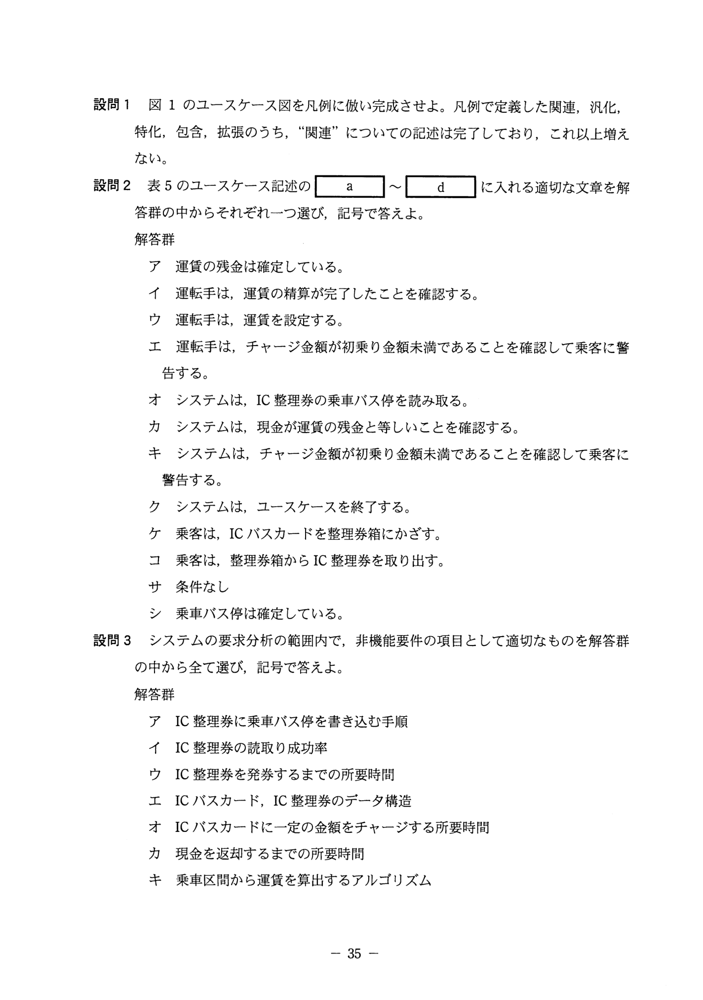

テキスト (OCR)

設問1 図 1 のユースケース図を凡例に僚い完成させよ。凡例で定義した関連, IE,
特化, 包含, 拡張のうち, “関連” についての記述は完了レしており, これ以上増え
ない。
設問2 表5のユースケース記述の| a |~[  』 |に入れる適切な文章を解
答群の中からそれぞれ一つ選び, 記号で答えよ。
解答群
ア 運賃の残金は確定している。
イ 運転手は, 運賃の精算が完了レしたことを確認する。
ウ
x

運転手は, 運賃を設定する。

運転手は, チャージ金額が初乗り金額未満でおることを確認して乗客に警
告する。
A システムは, IC 整理券の乗車バス停を読み取る。
A システムは, 現金が運賃の残金と等しいことを確認する。
キ システムは, チャージ金額が初乗り金額未満でおることを確認して乗客に
警告する。
ク システムは, ユースケースを終了する。
ケ REI, IC バスカードを整理券箱にかざす。
コ 乗客は, 整理券箱から IC 整理券を取り出す。
サ 条件なし
シ 乗車バス停は確定している。
設問3 システムの要求分析の範囲内で, 非機能要件の項目として適切なものを解答群

の中から全て選び, 記号で答えよ。
解答群

IC 整理券に乗車バス停を書き込む手順
IC 整理券の読取り成功率
IC 整理券を発券するまでの所要時間
IC バスカード, IC 整理券のデータ構造
IC バスカードに一定の金額をチャージする所要時間
現金を返却するまでの所要時間
乗車区間から運賃を算出するアルゴリズム

キきキキHHふい

### ページ 36

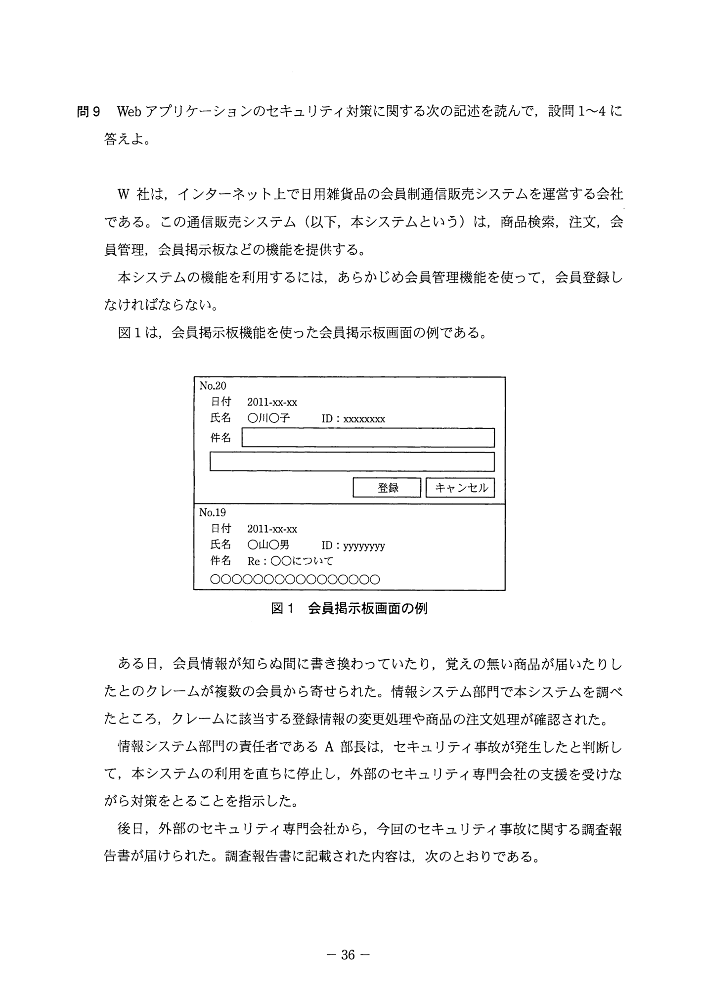

テキスト (OCR)

問9 Web アプリケーションのセキュリティ対策に関する次の記述を読んで, 設問 14 に

答えよ。

W 社は. インターネット上で日用雑貨品の会員制通信販売システムを運営する会社
である。この通信販売システム QE, 本システムという) は, 商品検索, 注文, 会
員管理, 会員掲示板などの機能を提供する。

本システムの機能を利用するには, あらかじめ会員管理機能を使って, 会員意録し
なければならない。

図 1 は, 会員掲示板機能を使った会員掲示板画面の例である。

No.20
日付 2011-xx-xx
氏名 OMOF       ID : oooooow
件名 |

|

No.19
Aft 2011-xx-xx
氏名 Olmos             ID : yyyyyyyy
件名 Re: 〇〇について
OOOOOOOOOOOOOOOO

図1 会員掲示板画面の例

ある日, 会員情報が知らぬ問に書き換わっていたり, 覚えの無い商品が届いたりし
たとのクレームが複数の会員から寄せられた。情報システム部門で本システムを調べ
たところ, クレームに該当する登録情報の変更処理や商品の注文処理が確認された。

情報システム部門の責任者である A 部長は, セキュリティ事故が発生したと判断し
て, 本システムの利用を直ちに停止し, 外部のセキュリティ専門会社の支援を受けな
がら対策をとることを指示した。

BA, 外部のセキュリティ専門会社から, 今回のセキュリティ事故に関する調査報
告書が届けられた。調査報告書に記載された内容は, 次のとおりである。

ー 36 一

### ページ 37

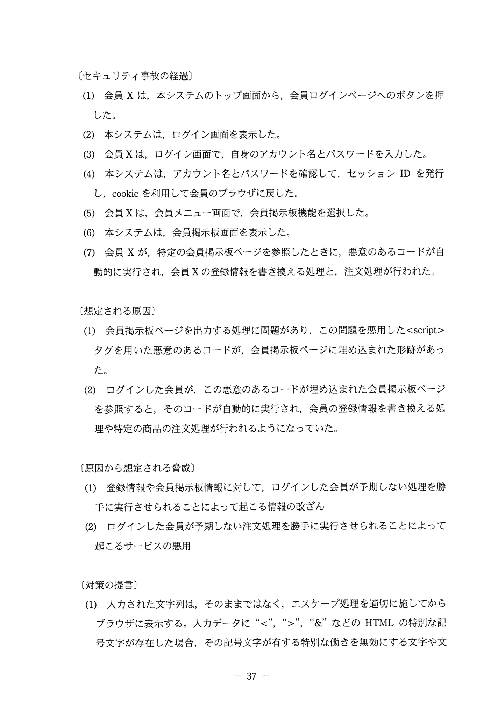

テキスト (OCR)

〔セキュリティ事故の経過]

GQ) 会員X は, 本システムのトップ画面から, 会員ログインページへのボタンを押
した。

Q) 本システムは, ログイン画面を表示した。

(3) 会員X は, ログイン画面で, 自身のアカウント名とパスワードを入力した。

(4) 本システムは, アカウント名とパスワードを確認して, セッション ID を発行
し, cookie を利用して会員のブラウザに戻した。

6) 会員Xは, 会員メニュー画面で, 会員掲示板機能を選択した。

(6) 本システムは, 会員掲示板画面を表示した。

(⑦ 会員X が, 特定の会員掲示板ページを参照したときに, 悪意のあるコードが自
動的に実行され, 会員Xの登録情報を書き換える処理と, 注文処理が行われた。

CE SNS RA

Q) 会員掲示板ページを出力する処理に問題があり, この問題を悪用した<script>
タグを用いた悪意のあるコードが, 会員掲示板ページに埋め込まれた形跡があっ
た。

(2②) ログインした会員が, この悪意のあるコードが埋め込まれた会員掲示板ページ
を参照すると, そのコードが自動的に実行され, 会員の登録情報を書き換える処
理や特定の商品の注文処理が行わむれるようになっていた。

CR AD 5 BE ANS BBO

①) 登録情報や会員掲示板情報に対して, ログインした会員が予期しない処理を勝
手に実行させられることによって起こる情報の改ざん

(②) ログインした会員が予期しない注文処理を勝手に実行させられることによって
起こるサービスの悪用

(対策の提言

GQ) 入力された文字列は, そのままではなく, エスケープ処理を適切に施してから
ブラウザに表示する。入力データに"<", “>”,を” などの HTML の特別な記
号文字が存在した場合, その記号文字が有する特別な働きを無効にする文字や文

ー 37 一

### ページ 38

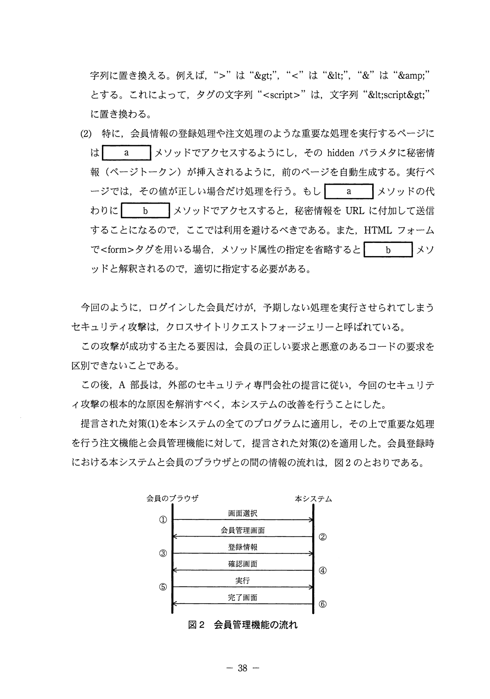

テキスト (OCR)

字列に置き換える。例えば, “>” は“&gb', “<” 1d “Gly”, “&" は “&ampr
とする。これによって, タグの文字列 “<script>” は, 文字列 “&lt;script&gt;”
に置き換わる。

2) 特に, 会員情報の登録処理や注文処理のような重要な処理を実行するページに
は|  。 | メソッドでアクセスするようにし, その hidden パラメタに秘密情
報 (ページトークン) が挿入されるように, 前のページを自動生成する。実行ペ
ージでは, その値が正しい場合だけ処理を行う。もし|  a | メソッドの代
わりに| pb  ] メソノッドでアクセスすると, 秘密情報を URL に付加して送信
することになるので, ここでは利用を避けるべきである。また, HTML フォーム
で<form>タグを用いる場合, メソッド属性の指定を省略すると| b |メソ
ッドと解釈されるので, 適切に指定する必要がある。

今回のように, ログインした会員だけが, 予期しない処理を実行ささせられてしまう
セキュリティ攻撃は。 クロスサイトリクエストフォージェリーと呼ばれている。

この攻撃が成功する主たる要因は, 会員の正しい要求と悪意のあるコードの要求を
区別できないことである。

COR, A 部長は, 外部のセキュリティ専門会社の提言に従い, 今回のセキュリテ
イィ攻撃の根本的な原因を解消すべく, 本システムの改善を行うことにした。

提言された対策(1)を本システムの全てのプログラムに適用し, その上で重要な処理
を行う注文機能と会員管理機能に対して, 提言された対策(2②)を適用した。 会員登録時
における本システムと会員のブラウザとの間の情報の流れは, 図2 のとおりである。

会員のプラウザ             本システム

の        画面選択
会員管理画面       ©

®         登録情報
確認画面        @

©         実行
完了画面        ©

### ページ 39

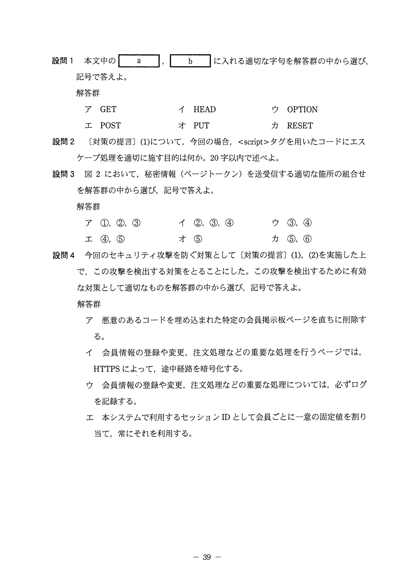

テキスト (OCR)

設問1 本文中の| ai |,|  b |に入れる適切な字句を解答群の中から選び,

記号で答えよ。

解答群
ア GET       イ HEAD      ウ OPTION
x= POST       オ PUT       7A RESET

設問2 [対策の提言〕 1)について, 今回の場合, <script>タグを用いたコードにエス
ケープ処理を適切に施す目的は何か。20 字以内で述べよ。

設問3 図 2 において, 秘密情報 (ページトークン) を送受信する適切な箇所の組合せ
を解答群の中から選び, 記号で答えよ。

解答群
ァ ① @ ③     1 ②③ ©     7 ③ @
xr @©®       4 ©         ヵ ©, ©

設問4 今回のセキュリティ攻撃を防ぐ対策として 〔対策の提言〕) (1), (②)を実施した上
で, この攻撃を検出する対策をとることにした。この攻撃を検出するために有効
な対策として適切なものを解答群の中から選び, 記号で答えよ。
解答群

ア 悪意のあるコードを埋め込まれた特定の会員掲示板ページを直ちに削除す
る。
会員情報の登録や変更, 注文処理などの重要な処理を行うページでは,
HTTPS によって, 途中経路を暗号化する。
会員情報の登録や変更, 注文処理などの重要な処理については, 必ずログ
を記録する。
エエ 本システムで利用するセッション ID として会員ごとに一意の固定値を割り
当て, 常にそれを利用する。

ー 39 一

### ページ 40

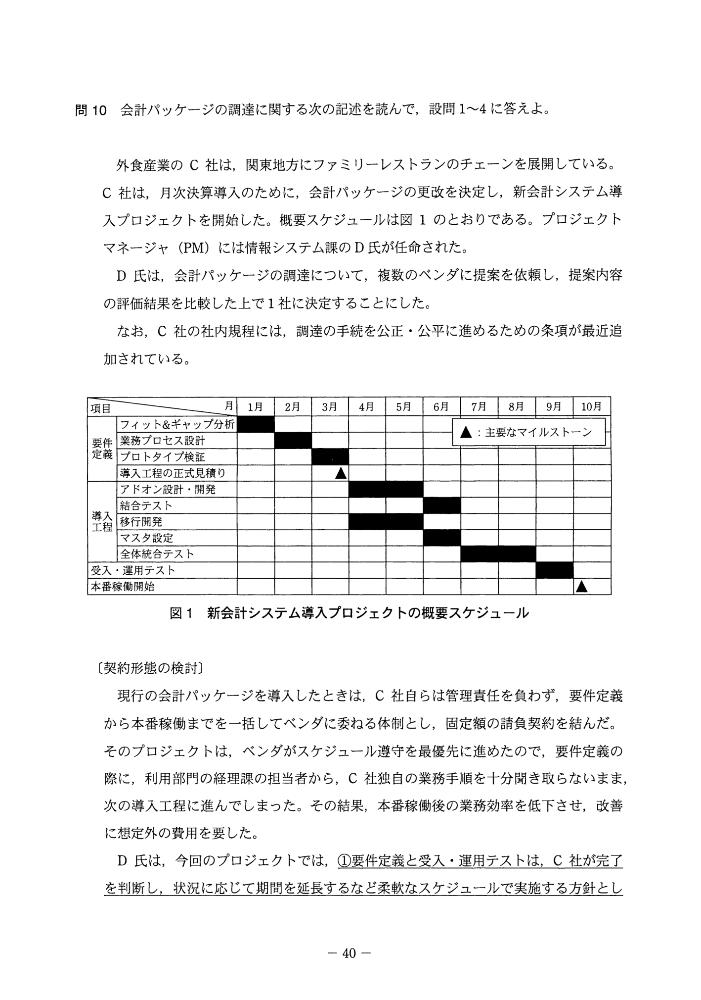

テキスト (OCR)

問10 会対パッケージの調達に関する次の記述を読んで, 設問14 に答えよ。

外食産業の C 社は, 関東地方にファミリーレストランのチェーンを展開している。
C 社は, 月次決算導入のために, 会対パッケージの更改を決定し, 新会計システム導
入プロジェクトを開始した。概要スケジュールは図 1 のとおりである。プロジェクト
マネージャ (PM) には情報システム課の D 氏が任命された。

D 氏は, 会対パッケージの調達について, 複数のベンダに提案を依頼し, 提案内容
の評価結果を比較した上で1 社に決定することにした。

なお, C 社の社内規程には, 調達の手続を公正・公平に進めるための条項が最近追
加されている。

項目                Alia | 2a | 3A | 4a | 5a | 6a [ 7A | 8A | 9A | 108
DAY heey TO
要件 |業務プロセス設計

定義 |]プロトタイプ検証
導入工程の正式見積り          A
7 RADE + BR
結合テスト

BA 移行開発

マスタ設定

全体統合テスト
受入・運用テスト

本番稼働開始                                     A

 1 新会計システム導入プロジェクトの概要スケジュール

T

A: 主要なマイルストーン

(契約形態の検討

現行の会計パッケージを導入したときは, C 社自らは管理責任を負わず, 要件定義
から本番稼働までを一括してベンダに委ねる体制とし, 固定額の請負契約を結んだ。
そのプロジェクトは, ベンダがスケジュール遵守を最優先に進めたので, 要件定義の
際に, 利用部門の経理課の担当者から, C 社独自の業務手順を十分聞き取らないまま,
次の導入工程に進んでしまった。その結果, 本番稼働後の業務効率を低下させ, 改善
に想定外の費用を要した。

D 氏は, 今回のプロジェクトでは, ①要件定義と受入・運用テストは, C 社が完了
を判断し, 状況に応じて期間を延長するなど和柔軟なスケジュールで実施する方針とし

ー 40 一

### ページ 41

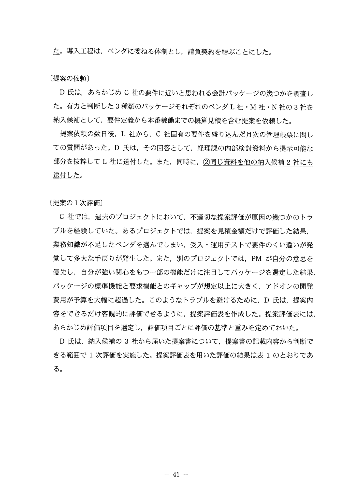

テキスト (OCR)

た。導入工程は。 ベンダに委ねる体制とし, 請負契約を結ぶことにした。

〔提案の依頼〕

D 氏は, あらかじめ C 社の要件に近いと思われる会対パッケージの幾つかを調査し
た。有力と判断した 3 種類のパッケージそれぞれのベンダL 社・M 社・N 社の3 社を
納入候補として, 要件定義から本番稼働までの概算見積を含む提案を依頼した。

提案依頼の数日後, L ths, C 社固有の要件を盛り込んだ月次の管理帳票に関し
ての質問があった。D Kid, その回答として, 経理課の内部検討資料から提示可能な
部分を抜粋して OL 社に送付した。また, 同時に, ②同じ資料を他の納入候補 2 社にも
送付した。

〔提案の 1 次評価

C 社では, 過去のプロジェクトにおいて, 不適切な提案評価が原因の幾つかのトラ
ブルを経験していた。あるプロジェクトでは, 提案を見積金額だけで評価した結果,
業務知識が不足したベンダを選んでしまい, 受入・運用テストで要件のくい違いが発
覚して多大な手戻りが発生した。また, 別のプロジェクトでは, PM が自分の意思を
優先し, 自分が強い関心をもつ一部の機能だけに注目してパッケージを選定した結果,
パッケージの標準機能と要求機能このギャップが想定以上に大きく, アドオンの開発
費用が予算を大幅に超過した。このようなトラブルを避けるために, D Kit, 提案内
容をできるだけ客観的に評価できるように, 提案評価表を作成した。提案評価表には,
あらかじめ評価項目を選定し, 評価項目ごとに評価の基準と重みを定めておいた。

D 氏は, 納入候補の 3 社から届いた提案書について, 提案書の記載内容から判断で
きる範囲で 1 次評価を実施した。提案評価表を用いた評価の結果は表 1 のとおりであ
る。

ー 41 一

### ページ 42

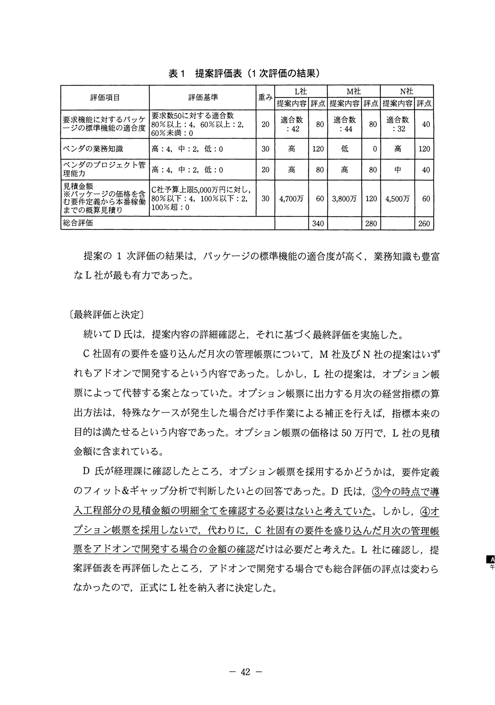

テキスト (OCR)

表1 提案評価表 (1 次評価の結果)

ュ              。               Ltt      M社      N社
PEPE               Pee         54 gna BENS A|RRAS| A
N  要求数50に対する適合数      、      、      vie
要求機能に対するパッケ     4             適合数       適合数       適合数
要求機能       ?      80%以上:4 60%以上:2。 | 20| 昔      so | #      so | 史      40
ジの標準機能の適合度 60%未満: 0            : 42     : 44     : 32
ベンダの業務知識    高:4 中:2。低:0     30| 高 |izo| 低    o| 高 |
gwen ne 高:4 中:2, 低:0     20| 高 | 80) 高 | so| 中 | 40
見積金額     C社予算上限5,000万円に対し,
ROR e ne meee 1s0%以下 : 4, 100%以下: 2,” | 30 | 4700万| 60| 3.8007 | 120| 4500万| 60
までの概算見積   100%超 : 0
総合評価 340 280260

提案の 1 次評価の結果は, パッケージの標準機能の適合度が高く, 業務知識も豊富
なL 社が最も有力であった。

〔最終評価と決定〕

続いてD 氏は, 提案内容の詳細確認と. それに基づく最終評価を実施した。

C 社固有の要件を盛り込んだ月次の管理帳票について, M 社及びN 社の提案はいず
れもアドオンで開発するという内容であった。しかし, L 社の提案は, オプション帳
票によって代替する案となっていた。オプション帳票に出力する月次の経営指標の算
出方法は, 特殊なケースが発生した場合だけ手作業による補正を行えば, 指標本来の
目的は満たせるという内容であった。オプション帳票の価格は 50 万円で, L 社の見積
金額に含まれている。

D 氏が経理課に確認したところ, オプション帳票を採用するかどうかは, 要件定義
のフィット&ギャップ分析で判断したいとの回答であった。D Kid, ③今の時点で導
入工程部分の見積金額の明細全てを確認する必要はないと考えていた。しかし, ④オ
プション帳票を採用しないで, 代わりに, C 社固有の要件を盛り込んだ月次の管理帳
票をアドオンで開発する場合の金額の確認だけは必要だと考えた。 L 社に確認し, 提
案評価表を再評価したところ, アドオンで開発する場合でも総合評価の評点は変わら
なかったので, 正式にL 社を納入者に決定した。

ー 42 一

s癌

### ページ 43

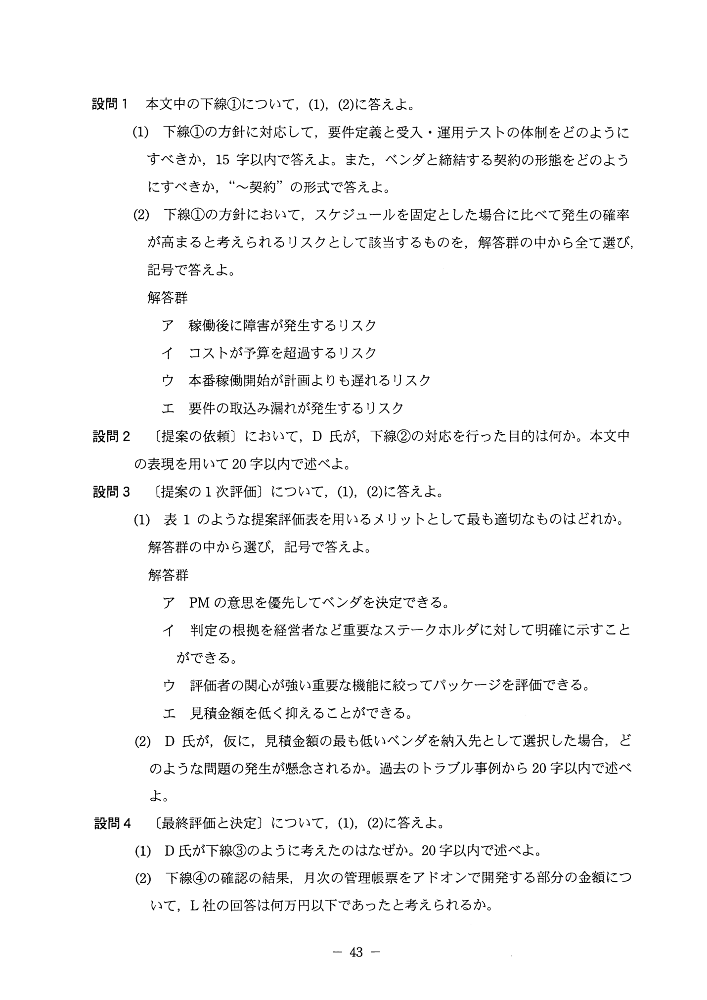

テキスト (OCR)

設問1 本文中の下線のについて, (①⑪, (②)に答えよ。
(1) 下線①の方針に対応して, 要件定義と受入・運用テストの体制をどのように
すべきか, 15 FUNCHAL. KK, ベンダと締結する契約の形態をどのよう
にすべきか, “~ RK" の形式で答えよ。
(2) 下線①の方針において, スケジュールを固定とした場合に比べて発生の確率
が高まると考えられるリスクとして該当するものを, 解答群の中から全て選び,
記号で答えよ。
解答群
ア 稼働後に障害が発生するリスク
イ コストが予算を超過するリスク
ウ 本番稼働開始が計画よりも遅れるリスク
L 要件の取込み漏れが発生するリスク
設問2 [提案の依頼】 において, D 氏が, 下線②の対応を行った目的は何か。本文中
の表現を用いて 20 字以内で述べよ。
設問3 〔提案の 1次評価] について, (1), (2②)に答えよ。
GQ) 表 1 のような提案評価表を用いるメリットとして最も適切なものはどれか。
解答群の中から選び, 記号で答えよ。
ARE EE
ア PM の意思を優先してベンダを決定できる。
イ 判定の根拠を経営者など重要なステークホルダに対して明確に示すこと
ができる。
ウ 評価者の関心が強い重要な機能に絞ってパッケージを評価できる。
LL 見積金額を低く抑えることができる。
(2) D 氏が, 仮に, 見積金額の最も低いベンダを納入先として選択した場合,ど
のような問題の発生が懸念されるか。過去のトラブル事例から 20 字以内で述べ
よ。
設問4 〔最終評価と決定】 について, ①, (⑫)に答えよ。
GQ) D 氏が下線つのように考えたのはなぜか。20 字以内で述べよ。
(2) 下線④の確認の結果 月次の管理帳票をアドオンで開発する部分の金額につ
WT, L社の回答は何万円以下であったと考えられるか。

ー 43 一

### ページ 44

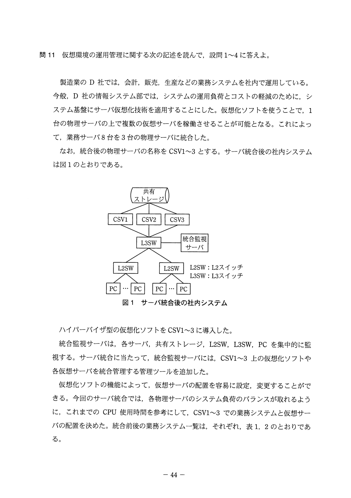

テキスト (OCR)

問11 仮想環境の運用管理に関する次の記述を読んで, 設問1て4 に答えよ。

製造業の D 社では, Bat, 販売, 生産などの業務システムを社内で運用している。
Sik, D 社の情報システム部では, システムの運用負荷とコストの軽減のために, シ
ステム基盤にサーバ仮想化技術を適用することにした。仮想化ソフトを使うことで, 1
台の物理サーバの上で複数の仮想サーバを稼働させることが可能となる。これによっ
て, 業務サーバ8 台を 3 台の物理サーバに統合した。

なお, 統合後の物理サーバの名称を CSV1て3 とする。サーバ統合後の社内システム
は図 1 のとおりである。

| csw || csv || csvs |

統合監視
サーバ

L2SW : L2スイッチ
L3SW : L3スイッチ

図1 サーバ統合後の社内システム

ハイパーバイザ型の仮想化ツソフトを CSV1~3 に導入した。

統合監視サーバは, 各サーバ, 共有ストレージ, L2SW, L3SW, PC を集中的に監
視する。サーバ統合に当たって, 統合監視サーバには, CSVI~3 上の仮想化ソフトや
各仮想サーバを統合管理する管理ツールを追加した。

仮想化ソフトの機能によって, 仮想サーバの配置を容易に設定, 変更することがで
きる。 今回のサーバ統合では, 各物理サーバのシステム負荷のバランスが取れるよう
に, これまでの CPU 使用時間を参考にして, CSV1へ3 での業務システムと仮想サー
バの配置を決めた。 統合前後の業務システム一覧は, それぞれ, H1, 2 のとおりであ
る。

ー 44 一

### ページ 45

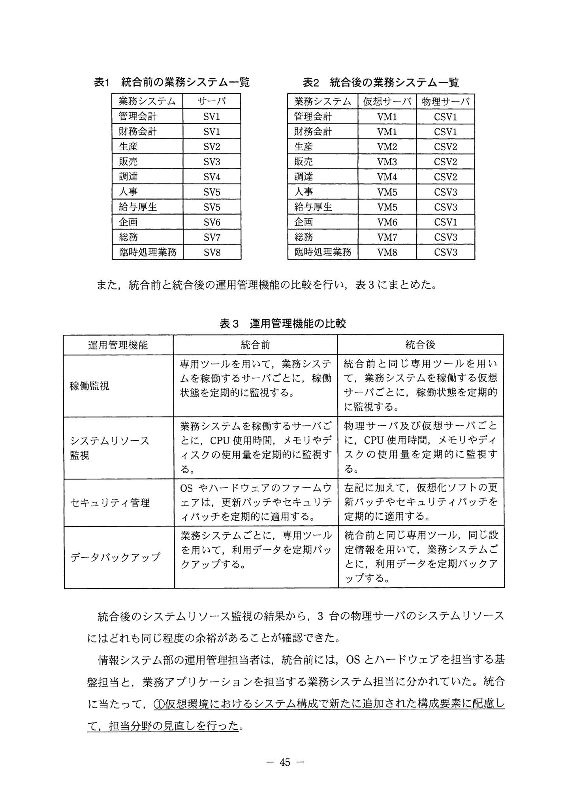

テキスト (OCR)

表1

統合前の業務システム一覧

表2 統合後の業務システム一覧

業務システム   サーバ          業務システム | 仮想サーバ | 物理サーバ
管理会計       SV1          管理会計      VM1     CSV1
財務会計      SV1          財務会計      VM1     CSV1
生産         SV2          生産         VM2     CSV2
販売         SV3          販売         VM3     CSV2
調達                            SV4                               調達                           VM4                CSV2
人事         SV5          人事         VM5     CSV3
給与厚生                 SV5                           給与厚生                VM5             CSV3
企画         SVe          企画         VMe     CSV1
総務         SV7          総務         VM7     CSV3
臨時処理業務   SV8       臨時処理業務  VM8   CSV3

また, 統合前と統合後の運用管理機能の比較を行い, 表3 にまとめた。

表3 運用管理機能の比較

運用管理機能               FC Bt                      統合後
専用ツールを用いて, 業務システ | 統合前と同じ専用ツールを用い
稼働監視        ムを稼働するサーバごとに, 稼働 | て, 業務システムを稼働する仮想

状態を定期的に監視する。

DONTE, 稼働状態を定期的
に監視する。

システムリソース

業務システムを稼働するサーバご
とに, CPU ARH, メモリやデ

物理サーバ及び仮想サーバごと
に, CPU 使用時間. メモリやディ

監視               ィスクの使用量を定期的に監視す | スクの使用量を定期的に監視す
る。                     る。
OS やハードウェアのファームツウ | 左記に加えて, 仮想化ソフトの更
セキュリティ管理     ェアは, 更新パッチやセキュリテ | 新パッチやセキュリティパッチを

ィパッチを定期的に適用する。

定期的に適用する。

データバックアップ

業務システムごとに, 専用ツール
を用いて, 利用データを定期バッ
クアップする。

統合前と同じ専用ツール, 同じ設
定情報を用いて, 業務システムご
とに, 利用データを定期バックア
ップする。

統合後のシステムリソース監視の結果から, 3 台の物理サーバのシステムリソース

にはどれも同じ程度の余裕があることが確認できた。

情報システム部の運用管理担当者は, 統合前には, OS とハードウェアを担当する基
盤担当と, 業務アプリケーションを担当する業務システム担当に分かれていた。統合
に当たって, ①仮想環境におけるシステム構成で新たに追加された構成要素に配慮し

て, 担当分野の見直しを行った。

ー 45 一

### ページ 46

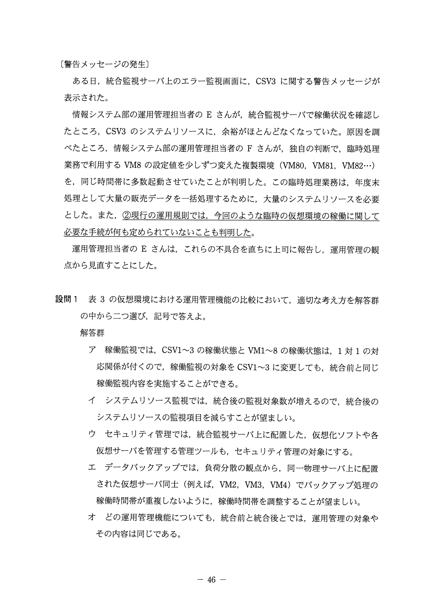

テキスト (OCR)

(警告メッセージの発生〕

ある日, 統合監視サーバ上のエラー監視画面に, CSV3 に関する警告メッセージが
表示された。

情報システム部の運用管理担当者のEE さんが, 統合監視サーバで稼働状況を確認し
たところ, CSV3 のシステムリソースに, 余裕がほとんどなくなっていた。原因を調
べたところ, 情報システム部の運用管理担当者の F SAM, 独自の判断で, 臨時処理
業務で利用する VM8 の設定値を少しずつ変えた複製杜境 (VM80, VM81, VM82…)
を, 同じ時間帯に多数起動させていたことが判明した。この臨時処理業務は, ERK
処理として大量の販売データを一括処理するために, 大量のシステムリソースを必要
ELK. KK, ②⑫現行の運用規則では, 今回のような臨時の仮想環境の稼働に関して
必要な手続が何も定められていないことも判明した。

管理担当者の E さんは, これらの不具合を直ちに上司に報告し, 運用管理の観

上京から見直すことにした。

設問1 表 3 の仮想環境における運用管理機能の比較において, 適切な考え方を解答群
の中から二つ選び, 記号で答えよ。
解答群

ア 稼働監視では, CSV1て3 の稼働状態と VM1て8 の稼働状態は, 1 対 1 OF
応関係が付くので, 稼働監視の対象を CSV1へ3 に変更しても, 統合前と同じ
稼働監視内容を実施することができる。

イ システムリソース監視では, 統合後の監視対象数が増えるので, 統合後の
システムリソースの監視項目を減らすことが望ましい。

ウ セキュリティ管理では, 統合監視サーバ上に配置した, 仮想化ソフトや各
仮想サーバを管理する管理ツールも, セキュリティ管理の対象にする。

エ データバックアップでは, 負荷分散の観点から, 同一物理サーバ上に配置
された仮想サーバ同士 (例えば, VM2, VM3, VM4) でバックアップ処理の
稼働時間帯が重複しないように, 稼働時間帯を調整することが望ましい。

A どの運用管理機能こついても, 統合前と統合後とでは, 運用管理の対象や
その内容は同じである。

ー 46 一

### ページ 47

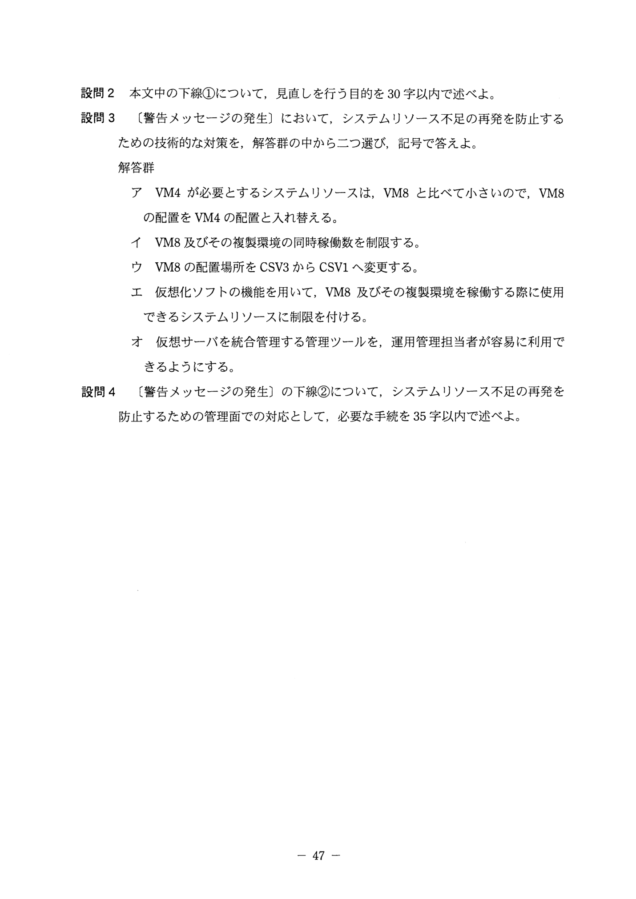

テキスト (OCR)

設問2 本文中の下線わについて, 見直しを行う目的を 30 字以内で述べよ。
設問3 (警告メッセージの発生において, システムリソース不足の再発を防止する
ための技術的な対策を, 解答群の中から二つ選び, 記号で答えよ。
解答群
ア VM4 が必要とするシステムリソースは, VM8 と比べて小さいので, VM8
の配置を VM4 の配置と入れ替える。
イ VM8 及びその複製環境の同時稼働数を制限する。
ウ VM8の配置場所を CSV3 から CSV1 へ変更する。
エエ 仮想化ソフトの機能を用いて, VM8 及びその複製環境を稼働する際に使用
できるシステムリソースに制限を付ける。
オ 仮想サーバきを統合管理する管理ツールを, 運用管理担当者が容易に利用で
きるようにする。
設問4 [警告メッセージの発生〕) の下線②@について, システムリソース不足の再発を
防止するための管理面での対応として, 必要な手続を 35 字以内で述べよ。

ー 47 一

### ページ 48

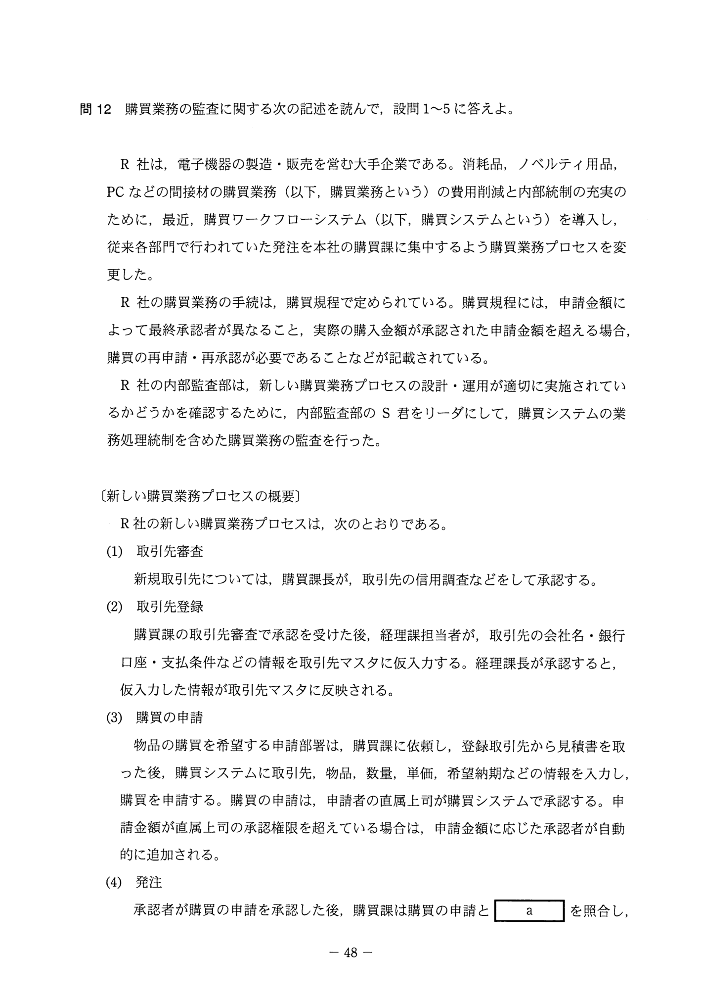

テキスト (OCR)

問12 購買業務の監査に関する次の記述を読んで, 設問15 に答えよ。

R 社は, 電子機器の製造・販売を営む大手企業である。消耗品,。ノベルティ用品,
PC などの間接材の購買業務 (以下, 購買業務という) の費用削減と内部統制の充実の
ために, 最近, 購買ワークフローシステム (以下, 購買システムという) を導入し,
従来各部門で行われていた発注を本社の購買課に集中するよう購買業務プロセスを変
BU.

R 社の購買業務の手続は, 購買規程で定められている。 購買規程には, 申請金額に
よって最終承認者が異なること, 実際の購入金額が承認された申請金額を超える場合
購買の再申請・再承認が必要であることなどが記載されている。

R 社の内部監査部は, 新しい購買業務プロセスの設計・運用が適切に実施されてい
るかどうかを確認するために, 内部監査部の S 君をリーダにして, 購買システムの業
務処理統制を含めた購買業務の監査を行った。

(新しい購買業務プロセスの概要)
R 社の新しい購買業務プロセスは, 次のとおりである。
Q) 取引先審査
新規取引先については, 購買課長が, 取引先の信用調査などをして承認する。
(2) 取引先介録
購買課の取引先審査で承認を受けた後。 経理課担当者が, 取引先の会社名・銀行
口座・支払条件などの情報を取引先マスタに仮入力する。経理課長が承認すると,
仮入力した情報が取引先マスタに反映される。
⑬ 購買の申請
物品の購買を希望する申請部署は, 購買課に依頼し, 登録取引先から見積書を取
った後, 購買システムに取引先, 物品, 数量, 単価, 希望納期などの情報を入力し,
購買を申請する。購買の申請は, 申請者の直属上司が購買システムで承認する。申
請金額が直属上司の承認権限を超えている場合は, 申請金額に応じた承認者が自動
的に追加される。
(4) 発注
承認者が購買の申請を承認した後。購買課は購買の申請と| a | を照合し.

ー 48 一

### ページ 49

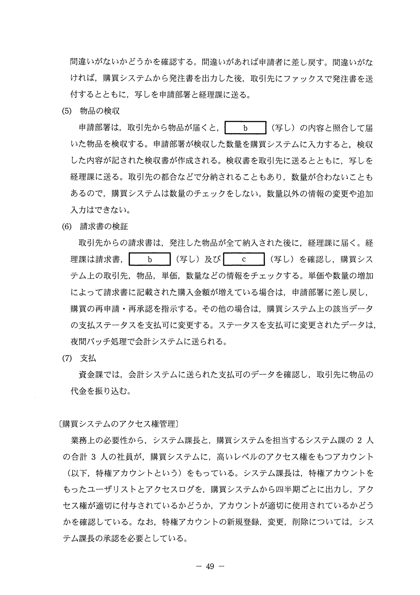

テキスト (OCR)

間違いがないかどうかを確認する。問違いがあれば申請者に差し戻す。間違いがな
ければ, 購買システムから発注書を出力した後, 取引先にファックスで発注書を送
付するとともに, 写しを申請部署と経理課に送る。
(6) 物品の検収
申請部署は, 取引先から物品が届くと, | b | (写し) の内容と照合して届
いた物品を検収する。申請部署が検収した数量を購買システムに入力すると, 検収
した内容が記された検収書が作成される。検収書を取引先に送るとともに, 写しを
経理課に送る。取引先の都合などで分納されることもあり, 数量が合わないことも
あるので, 購買システムは数量のチェックをしない。 数量以外の情報の変更や追加
入力はできない。
(©) 請求書の検証
取引先からの請求書は, 発注した物品が全て納入された後に, 経理課に届く。経
は請求書, | b | (写し) 及び| <c  ] (写し) を確認し,購買シス
テム上の取引先, 物品単価,数量などの情報をチェックする。単価や数量の増加
によって請求書に記載された購入金額が増えている場合は, 申請部署に差し戻し,
購買の再申請・再泊認を指示する。その他の場合は, 購買システム上の該当データ
の支払ステータスを支払可に変更する。ステータスを支払可に変更されたデータは
夜間バッチ処理で会計システムに送られる。
⑦ 支払
BOM, 会計システムに送られた支払可のデータを確認し, 取引先に物品の
代金を振り込む。

(購買システムのアクセス枚管理〕

業務上の必要性から. システム課長と, 購買システムを担当するシステム課の 2 人
の合計 3 人の社員が, 購買システムに, 高いレベルのアクセス権をもつアカウント
(以下, 特権アカウントという) をもっている。システム課長は, 特権アカウントを
もったユーザリストとアクセスログを, 購買システムから四半期ごとに出力し, アク
セス権が適切に付与されているかどうか, アカウントが適切に使用されているかどう
かを確認している。なお, 特権アカウントの新規登録, 変更, 削除については, シス
テム課長の承認を必要としている。

ー 49 一

### ページ 50

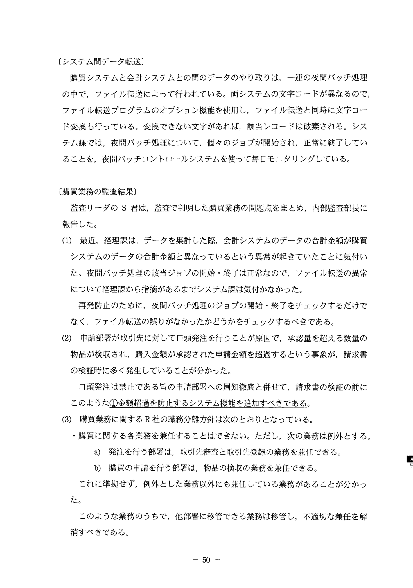

テキスト (OCR)

〔システム間データ転送〕

購買システムと会計システムとの間のデータのやり取りは, 一連の夜間バッチ処理
の中で, ファイル転送によって行われている。両システムの文字コードが異なるので,
ファイル転送プログラムのオプション機能を使用し, ファイル転送と同時に文字コー
ド変換も行っている。変換できない文字があれば, 該当レコードは破棄される。シス
テム課では, 夜間バッチ処理について, 個々のジョブが開始され, 正常に終了してい
ることを, 夜間バッチコントロールシステムを使って毎日モニタリングしている。

(購買業務の監査結果〕
監査リーダの S 君は, 監査で判明した購買業務の問題点をまとめ, 内部監査部長に
報告した。

(1) 最近, PRI, データを集計した際, 会計システムのデータの合計金額が購買
システムのデータの合計金額と異なっているという異常が起きていたことに気付い
た。夜間バッチ処理の該当ジョブの開始・終了は正常なので, ファイル転送の異常
について経理課から指摘があるまでシステム課は気付かなかった。

再発防止のために, 夜間バッチ処理のジョブの開始・終了をチェックするだけで
なく, ファイル転送の誤りがなかったかどうかをチェックするべきである。

(2) 申請部署が取引先に対して口頭発注を行うことが原因で, 承認量を超える数量の
物品が検収され, 購入金額が承認された申請金額を超過するという事象が, 請求書
の検証時に多く発生にしていることが分かった。

口頭発注は禁止である旨の申請部署への周知徹底と併せて, 請求書の検証の前に
このようなび①金額超過を防止するシステム機能を追加すべきである。

(3) 購買業務に関する R 社の職務分離方針は次のとおりとなっている。

・購買に関する各業務を兼任することはできない。ただし, 次の業務は例外とする。
a) 発注を行う部署は, 取引先審査と取引先意録の業務を兼任できる。
b) 購買の申請を行う部署は, 物品の検収の業務を兼任できる。
これに準拠せず, 例外とした業務以外にも兼任している業務があることが分かっ
た。
このような業務のうちで, 他部署に移管できる業務は移管し, 不適切な兼任を解
消すべきである。

ー 50 一

### ページ 51

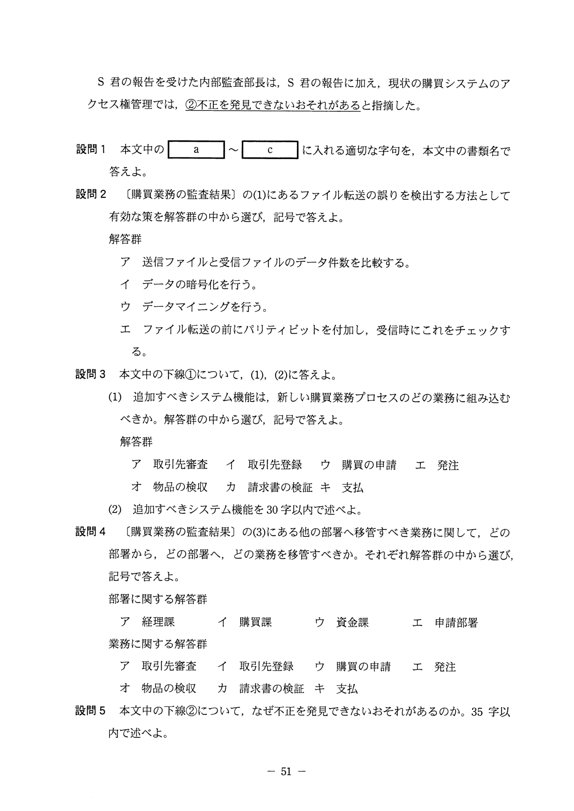

テキスト (OCR)

S 君の報告を受けた内部監査部長は, S 君の報告に加え, 現状の購買システムのア
クセス権管理では, ②不正を発見できないおそれがあると指摘した。

設問1 本文中の| a |て|  c |に入れる適切な字句を, 本文中の書類名で
答えよ。
設問2 〔購買業務の監査結果) の(1)にあるファイル転送の誤りを検出する方法として
有効な策を解答群の中から選び, 記号で答えよ。
解答群
ア 送信ファイルと受信ファイルのデータ件数を比較する。
イ データの暗号化を行う。
ウ データマイニングを行う。
工 ファイル転送の前にパリティビットを付加し, 受信時にこれをチェックす
る。
RAS 本文中の下線のについて, (1), ②に答えよ。
(1) 追加すべきシステム機能は, 新しい購買業務プロセスのどの業務に組み込む
べきか。 解答群の中から選び, 記号で答えよ。
解答群
ア 取引先審査 イ WSR ウ 購買の申請 エエ 発注
オ 物品の検収 A 請求書の検証キ 支払
(2) MT REY AT LBS 30 字以内で述べよ。
設問4 〔購買業務の監査結果) の(3③)にある他の部署へ移管すべき業務に関して, どの
部署から, COME, どの業務を移管すべきか。それぞわれ解答群の中から選び,
記号で答えよ。
部署に関する解答群
ア 経理課   イ 購買課   ウ 資金課   エエ HRs
業務に関する解答群
ア 取引先審査 イ 取引先登録 ウ 購買の申請 エエ 発注
オ 物品の検収 カカ 請求書の検証 キ 支払
設問5 本文中の下線②について, なぜ不正を発見できないおそれがあるのか。35 FL
内で述べよ。

ー 51 一

### ページ 52

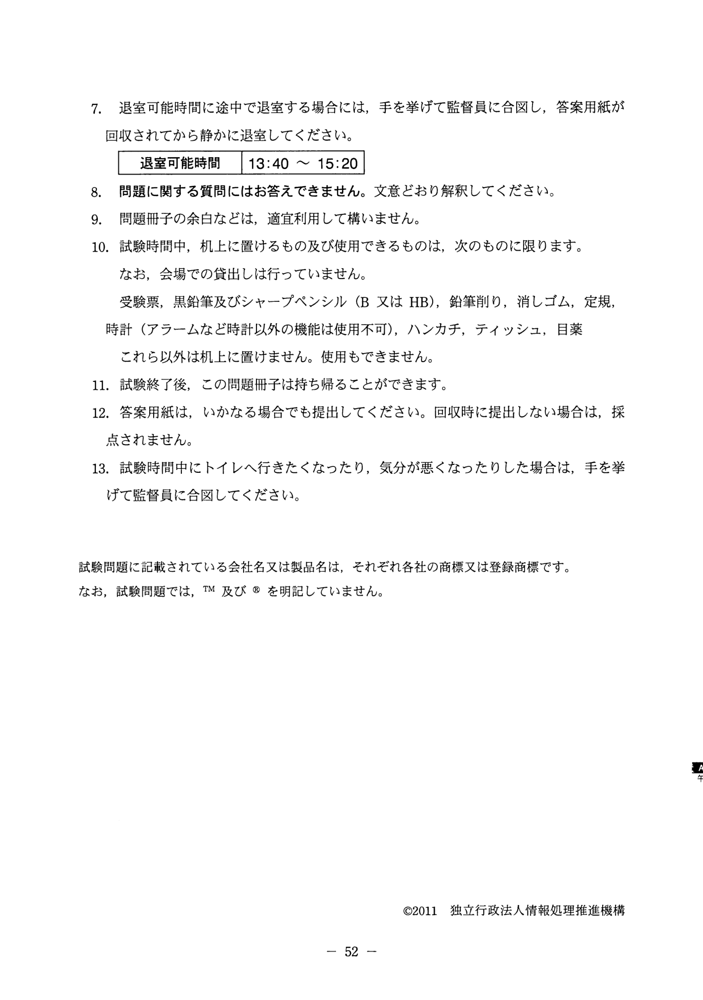

テキスト (OCR)

7. 退室可能時間に途中で退室する場合には, 手を挙げて監督員に合図し, 答案用紙が
回収されてから静かに退室してください。
| 退室可能時間 | 13:40 ~ 15:20 |
8. 問題に関する質問にはお答えできません。文意どおり解息してください。
9. 問題冊子の余白などは, 適宜利用して構いません。
10. 試験時間中, 机上に置けるもの及び使用できるものは, 次のものに限ります。
なお, 会場での貸出しは行っていません。
受験票, 黒鉛筆及びシャープベンシル (B 又は HB), 鉛筆削り, 消しゴム, 定規
時計 (アラームなど時計以外の機能は使用不可), ハンカチ, ティッシュ, 目薬
これら以外は机上に置けません。使用もできません。
11. 試験終了後, この問題民子は持ち帰ることができます。
12. 答案用紙は, いかなる場合でも提出してください。回収時に提出しない場合は, 採
点されません。
13. 試験時間中にトイレへ行きたくなったり, 気分が悪くなったりした場合は, FEM
げて監督員に合図してください。

試験問題に記載されている会社名又は製品名は, それぞれ各社の商標又は登録商標です。
なお, 試験問題では, ™ 及び @ を明記していません。

@2011 独立行政法人情報処理推進機構

ー 52 一

---

## 午後解答

1/6 
©2011 独立行政法人情報処理推進機構 
平成23 年度 秋期 応用情報技術者試験 解答例 
 
午後試験 
問１ 
出題趣旨 
 企業においては競合先を考慮した的確な意思決定が重要である。 
 本問では，家電量販店の営業戦略策定を題材に，意思決定に必要な知識・スキル，業務への応用力を問う。
併せて，ゲーム理論やロイヤルティマーケティングの考え方についての知識と理解を問う。 
 
設問 
解答例・解答の要点 
備考 
設問１ (1) a ②＞④＞①＞③ 
 
 
(2) b 値下げ 
 
 
 
c 価格据置 
 
 
(3) d ② 
 
設問２ (1) 対策7 企業方針である豊富な品ぞろえに反するから 
 
 
 
対策8 X 駅前には，これ以上の新規出店の余地はないから 
 
 
(2) 5 
 
設問３ 
イ 
 
設問４ (1) オ 
 
 
(2) ① 
② 
③ 
・最新購買日 
・購買頻度 
・累計購買金額 
 
 
問２ 
出題趣旨 
 プログラムを理解して，障害原因を導き出すことは，ソフトウェア開発に必要な技術である。 
 本問では，ハッシュ法に関連するアルゴリズムと，排他制御のプログラミングを題材に，正常処理以外に異
常処理も考慮したプログラムの作成技術と読解力を問う。 
 
設問 
解答例・解答の要点 
備考 
設問１ 
ア count はN より小さい 
 
 
イ idx はN より大きい 
 
 
ウ Hash(key) 
 
 
エ array[idx].key はkey と等しくない 
 
設問２ (1) シノニムの発生を考慮せずに配列要素を削除するから 
 
 
(2) ア，ウ 
 
設問３ 
データの取得後に排他制御を開始するから

2/6 
©2011 独立行政法人情報処理推進機構 
問３ 
出題趣旨 
 企業の情報システムは，業務の段階的情報化によって，部門ごとの個別最適となっている場合が多く，情報
システムの全体最適化へのニーズが高まっている。 
 本問では，合併を行った結果，部門・工場ごとに業務や情報システムが個別最適となっている企業を題材に，
EA の考え方に関する理解，及び問題解決能力について問う。 
 
設問 
解答例・解答の要点 
備考 
設問１ 
a エ 
 
 
b ア 
 
 
c キ 
 
 
d ケ 
 
設問２ 
情報体系整理図を部門・工場ごとに作成するから 
 
設問３ 
イ，ウ 
 
設問４ 
受注データ送信が夜間バッチ処理であるから 
 
設問５ 
業務の進め方や使用する帳票 
 
 
問４ 
出題趣旨 
 サーバ仮想化によるサーバ統合を進める企業が増えてきている。 
 本問では，サーバ仮想化時のサーバ構成を題材に，可用性やリソース配分，クラスタ構成やブレードサーバ
における障害時のシステムの振る舞いの理解について問う。 
 
設問 
解答例・解答の要点 
備考 
設問１ (1) a イ 
 
 
 
b ア 
 
 
(2) 1＞2＞現行 
 
設問２ 
c 27.5 
 
理由 
経理DB サーバ2 がスタンバイ状態からアクティブ状態になるから 
 
設問３ 
不足 
0.8

3/6 
©2011 独立行政法人情報処理推進機構 
問５ 
出題趣旨 
 SOHO などで利用される小規模ネットワークでもNAS を用いたPC 間データ共有が一般的となっている。 
 本問では，有線LAN と無線LAN の混合環境におけるNAS の利用を題材に，IP ネットワークの基本的な理解と
設計能力について問う。 
 
設問 
解答例・解答の要点 
備考 
設問１ 
a 240 
 
 
b 192.168.0.1 
 
 
c IEEE 802.11g 
 
 
d WPA2 
 
設問２ (1) 要求5 
 
 
(2) エ 
 
設問３ (1) e 2 
 
 
 
f 192.168.0 
 
 
(2) ブリッジとして設定する。 
 
設問４ 
10 
 
 
問６ 
出題趣旨 
 処理件数やルールの増加によってシステム化のニーズが起こり，データベースを活用した設計，開発が行わ
れることが多く発生する。 
 本問では，旅費交通費の申請処理を題材に，テーブル構造やSQL に関する理解について問う。 
 
設問 
解答例・解答の要点 
備考 
設問１ (1) a → 
 
 
 
b ← 
 
 
(2) 申請書番号，明細行番号 
 
設問２ 
c 申請明細.費用種別コード = 費用種別.費用種別コード 
 
 
 
d 費用種別.証憑フラグ = 'Y' 
 
設問３ 
e SUM 
 
 
 
f BETWEEN 
 
 
 
g ORDER BY 申請書.組織コード 
 
設問４ 
社員の出張時の職位と申請時の職位が異なる場合

4/6 
©2011 独立行政法人情報処理推進機構 
問７ 
出題趣旨 
 テレビ放送は，2011 年7 月24 日に地上ディジタル放送に完全移行した。多くの地上ディジタル放送対応テレ
ビに組込みシステムが搭載されている。 
 本問では，地上ディジタル放送対応テレビの放送ダウンロード機能を題材に，組込みシステムにおけるタス
クの状態，優先度，及び割込み禁止とセマフォの違いについての理解を問う。 
 
設問 
解答例・解答の要点 
備考 
設問１ 
a 142.5 
 
設問２ (1) b ア 
 
 
 
c ウ 
 
 
 
d イ 
 
 
(2) e タイマ割込みハンドラ 
 
 
(3) 電源管理 
 
設問３ 
割込みハンドラの動作を排他制御できないから 
 
設問４ 
イ 
 
 
問８ 
出題趣旨 
 要求分析の目的は，ユーザのシステム化ニーズを満たすために，実装しなければならない機能要件を明確に
することである。適切な要求分析は，上流工程での品質向上につながり，システム開発者にはそのための能力
が要求される。 
 本問では，UML のユースケースを使用して，システムの要求提案を理解し，分析する能力を問う。 
 
設問 
解答例・解答の要点 
備考 
設問１ 
バス運賃精算システム
運賃を支払う
運賃を確定させる
現金を両替する
ICバスカードで
支払う
現金で支払う
バスに乗車する
乗客
運転手
 
 
設問２ 
a キ 
 
 
b コ 
 
 
c ア 
 
 
d カ 
 
設問３ 
イ，ウ，カ

5/6 
©2011 独立行政法人情報処理推進機構 
問９ 
出題趣旨 
 今日，Web アプリケーションの構築時や運用時に対して，アプリケーションレベルで適切なセキュリティ対策
を施すことは，必須要件である。 
 本問では，IPA セキュリティセンタで公開されている，企業におけるWeb アプリケーションでのクロスサイト
リクエストフォージェリー対策の例を題材に，安全なWeb アプリケーションの構築とセキュリティ対策に対す
る基本的な理解について問う。 
 
設問 
解答例・解答の要点 
備考 
設問１ 
a エ 
 
 
b ア 
 
設問２ 
・script タグを無効にする。 
・悪意のあるコードを実行させない。 
 
設問３ 
エ 
 
設問４ 
ウ 
 
 
問10 
出題趣旨 
 ソフトウェア調達における提案の評価については，価格だけでなく，プロジェクトへ影響を与える様々な要
素に対する考慮が求められる。 
 本問では，パッケージの調達を題材にして，ベンダとの契約形態と責任範囲についての理解，及び，提案依
頼から提案評価，決定までの手続の理解について問う。 
 
設問 
解答例・解答の要点 
備考 
設問１ (1) 
体制 
C 社が管理責任を負う 
 
 
 
契約形態 
準委任 
 
 
(2) イ，ウ 
 
設問２ 
調達の手続を公正・公平に進めるため 
 
設問３ (1) イ 
 
 
(2) 要件のくい違いによる多大な手戻り 
 
設問４ (1) 要件定義の結果で正式見積りを行うため 
 
 
(2) 350

6/6 
©2011 独立行政法人情報処理推進機構 
問11 
出題趣旨 
 サーバ仮想化技術を利用する機会が増えており，仮想環境でのシステム運用管理の重要性がますます高まっ
ている。 
 本問では，企業における社内業務システムを題材に，サーバ仮想化技術を適用したシステム基盤環境での，
運用管理の改善についての理解を問う。 
 
設問 
解答例・解答の要点 
備考 
設問１ 
ウ，エ 
 
設問２ 
仮想サーバや仮想化ソフトの運用管理担当を明確にする。 
 
設問３ 
イ，エ 
 
設問４ 
臨時の仮想環境の稼働には運用管理担当者の上司の承認を必須とする。 
 
 
問12 
出題趣旨 
 昨今，業務に内部統制を組み込むためには，システム的な対応が不可欠である。 
 本問では，購買業務の監査を題材に，購買業務の内部統制，及びシステムを運用していく上で組み込むべき
業務処理統制についての知識と理解を問う。 
 
設問 
解答例・解答の要点 
備考 
設問１ 
a 見積書 
 
 
 
b 発注書 
 
 
 
c 検収書 
 
設問２ 
ア 
 
設問３ (1) オ 
 
 
(2) 承認額を超えた場合に購買の申請を差し戻す機能 
 
設問４ 
移管元の部署 ア 
 
 
移管先の部署 イ 
 
 
業務 
イ 
 
設問５ 
特権アカウントの管理と行使の権限が同一人に付与されているから

---

## 午後採点講評

1/3 
©2012 独立行政法人情報処理推進機構 
平成23 年度 秋期 応用情報技術者試験 採点講評 
 
午後試験 
問１ 
 問1 では，家電量販店の営業戦略の策定を題材に，ゲーム理論，意思決定，及びロイヤルティマーケティン
グについて出題した。全体として，正答率は高かった。 
 設問2(1)は，正答率は高かったものの，企業方針との整合性又は制約条件に気付いていない解答も少なから
ずあった。企業方針との整合性及び制約条件は，意思決定の際に考慮すべき項目であるので，是非理解してお
いてもらいたい。 
 設問4(2)は，正答率が低かった。RFM 分析は，リピータを獲得する重要な分析手法の一つである。ロイヤル
ティマーケティングやRFM 分析などの手法について，是非知っておいてもらいたい。 
 
問２ 
 問2 では，ハッシュ法と排他制御のプログラミングを題材に，プログラムの作成能力と障害分析について出
題した。 
 設問2(1)は，正答率が低かった。障害の原因について，配列要素を未使用にしていることだけを述べてい
て，シノニムの発生に言及していない解答が散見された。 
 設問3 は，正答率が低かった。同じKey をもったデータは配列array に存在してはいけないにもかかわら
ず，画面プログラムの排他制御の障害によって，同じKey をもつデータが格納されてしまった。このように根
本的な原因を考えることを，日常の習慣にしてほしい。 
 
問３ 
 問3 では，合併した企業の業務と情報システムの全体最適化の検討にEA の考え方を用いたケースを出題し
た。 
 設問2 は，正答率が低かった。業務と情報システムの全体最適を図るためには，データ体系は，部門・工場
ごとではなく全社レベルで検討する必要がある。本問を契機に，特定の情報システムに閉じた最適化検討だけ
ではなく，業務や関連システムも含めた全体最適を考える広い視野をもつように心掛けてもらいたい。 
 設問5 は，正答率が低かった。情報システムの最適化を行うためには，まず，業務の最適化を検討する必要
があることを忘れないでほしい。 
 
問４ 
 問4 では，サーバ仮想化時のサーバ構成を題材に，可用性やリソース配分，クラスタ構成やブレードサーバ
における障害時のシステムの振る舞いについて出題した。全体として，正答率は低かった。 
 設問1 は，正答率が低かった。システムの可用性については，何台中何台のブレードが稼働していればよい
かを考えれば正答を導けるはずである。 
 設問3 では，“ブレード2 に負荷が集中する”という解答が散見された。要求されていることは，ブレード2
のメモリ使用量が搭載されているメモリ容量を超える理由であり，それの直接的な原因となる事象について解
答してほしい。アクティブ／スタンバイ構成におけるフェイルオーバについて，よく理解しておいてほしい。
 
問５ 
 問5 では，有線LAN と無線LAN の混合環境を題材に，IP ネットワークの知識について出題した。 
 設問3(2)は，正答率が低かった。問題文の条件である“有線LAN と無線LAN が同一ネットワークとなる”に
合致しない解答が散見された。問題文に記載された条件を過不足なく読み取って解答してもらいたい。また，
ルータとブリッジの違いについても，よく理解しておいてほしい。 
 設問4 は，正答率が低かった。ネットワークの設計に当たって，機能要件だけではなく，利用者から見たデ
ータ伝送時間などの性能要件を考慮して設計を行えるようになってほしい。

2/3 
©2012 独立行政法人情報処理推進機構 
問６ 
 問6 では，旅費交通費の申請処理を題材に，テーブル構造やSQL について出題した。全体として，正答率は
高かった。 
 設問1(1)は，b の正答率が低かった。申請明細と費用種別の関係を１対１と誤って解答した受験者が多かっ
た。実際のデータを幾つか当てはめて落ち着いて考えれば，正答を導けるはずである。 
 設問2 は，正答率が高かった。表の結合条件と列の抽出条件の違いについて，おおむね理解されていたよう
であった。 
 設問4 は，不具合が起こるのはどのような場合かを問うているにもかかわらず，不具合の理由や不具合によ
る影響について記述している解答が散見された。解答する際は，求められている事柄をよく確認してもらいた
い。 
 
問７ 
 問7 では，地上ディジタル放送対応テレビの放送ダウンロード機能を題材に，組込みシステムにおけるタス
クの状態，優先度，及び割込み禁止とセマフォの違いについて出題した。 
 設問1 は，小数第2 位以下を切り上げずに四捨五入した解答が多く見受けられた。設問をよく読み，求めら
れていることを理解した上で解答してほしい。 
 設問3 は，タスクをセマフォによって排他制御しても，割込みが発生すると割込みハンドラが実行されるこ
とについての理解を問う問題だが，タスクと割込みを混同したと思われる誤った解答が散見された。タスクと
割込みは組込みシステムにおいて重要な概念であり，是非理解しておいてほしい。 
 
問８ 
 問8 では，バス運賃精算システムを題材に，UML のユースケース図とユースケース記述を用いた要求分析に
ついて出題した。全体として，正答率は高かった。 
 設問1 は，正答率が高かった。ユースケース図に関して，おおむね理解されていたようであった。しかし，
抽象ユースケースについて表記がない，又は誤った表記が目立った。抽象ユースケースは重要な概念であり，
是非理解しておいてほしい。 
 設問3 は，正答率が低かった。非機能要件を正しく把握することは，要求分析を行う上で非常に重要であ
る。問題文中に示された条件を過不足なく読み取り，正答を導き出してほしい。 
 
問９ 
 問9 では，IPA セキュリティセンターで公開されている，企業におけるWeb アプリケーションでのクロスサ
イトリクエストフォージェリー対策の例を題材に，安全なWeb アプリケーションの構築とセキュリティ対策に
ついて出題した。 
 設問2 は，正答率が高かった。script タグにエスケープ処理を適切に施す目的は，おおむね理解されている
ようであった。 
 設問3 は，正答率が低かった。Web アプリケーションの処理フロー中でのページトークンの適用は，重要な
セキュリティ対策の一つでもあるので，基本知識だけの理解に留まらず，具体的な適用方法についても十分に
理解してほしい。 
 
問10 
 問10 では，会計パッケージの調達を題材に，提案依頼から提案評価，ベンダ決定までの手続について出題
した。全体として，正答率は低かった。 
 設問1(1)は，正答率が低かった。ベンダとの契約形態は，プロジェクトを進める上での方針や体制と密接に
関係することをよく理解しておいてほしい。 
 設問4(1)は，正答率が低かった。プロジェクトの進め方の中で，今回の概算見積りの目的が何なのかを読み
取り，正答を導き出してほしい。

3/3 
©2012 独立行政法人情報処理推進機構 
問11 
 問11 では，企業における社内業務システムを題材に，サーバ仮想化技術を適用したシステム基盤における
運用管理の改善について出題した。 
 設問1 は，正答率が高かった。仮想環境の違いによる運用管理機能の比較は，おおむね理解されているよう
であった。 
 設問2 は，正答率が低かった。統合前の担当分野の分け方は，仮想サーバや仮想化ソフトを考慮していない
点に着目して，正答を導き出してほしい。 
 設問3 は，正答率が高かった。システムリソース不足の再発を防止するための対策については，おおむね理
解されているようであった。 
 設問4 は，正答率が低かった。問題文の記述から，臨時の仮想環境の稼働を適切に統制する手続について考
えれば，正答を導けるはずである。 
 
問12 
 問12 では，購買業務の監査を題材に，購買業務の内部統制，及びシステムを運用していく上で組み込むべ
き業務処理統制について出題した。全体として，正答率は低かった。 
 設問4 は，正答率が低かった。R 社の職務分離方針と現状の業務担当部署を比較して考えれば正答を導ける
はずである。 
 設問5 は，システム課長が不正を行えてしまうというだけの解答が目立った。なぜ不正を発見できないおそ
れがあるのか，アクセス権をもつシステム課長自身が管理も行っている点が問題であることに気付き，解答し
てほしかった。 
 職務分離は不正を防止するための内部統制の重要な考え方の一つなので，しっかりと理解してほしい。

