# 平成23年度特別 応用情報技術者試験

---

## 午前問題

### ページ 1

テキスト (OCR)

平成23年度 春期             特別試験

応用情報技術者試験
午前 問題

 9:30 ~ 12:00 (2時間30 分)

意

1. 試験開始及び終了は, 監督員の時計が基準です。監督員の指示に従ってください。
2. 試験開始の合図があるまで, 問題冊子を開いて中を見てはいけません。

3. この注意事項は, 問題冊子の裏表紙に続きます。必ず読んでください。

4. 答案用紙への受験番号などの記入は, 試験開始の合図があってから始めてください。
5. 問題は, 次の表に従って解答してください。

問題番号        問1 て間80
選択方法      全間必須
6. 答案用紙の記入に当たっては, 次の指示に従ってください。

(1) 答案用紙は光学式読取り装置で読み取った上で採点しますので, B 又は HB OZ
鉛筆で答案用紙のマークの記入方法のとおりマークしてください。マークの濃度が
うすいなど, マークの記入方法のとおりマークされていない場合は, 読み取れず,
採点されないことがありますので, 特にシャープペンシルを使用する際には, マー
クの濃度に十分ご注意ください。

2) 訂正の場合は, あとが残らないように消しゴムできれいに消し, 消しくずを残さ
ないでください。

3) 受験番号欄に, 受験番号を記入及びマークしてください。正しくマークされてい
ない場合は, 採点されません。

4) 生年月日欄に, 受験球に印字されているとおりの生年月日を記入及びマークして
ください。正しくマークされていないひ場合は, 採点されないことがあります。

6) 解答は, 次の例題にならって, 解答欄に一つだけマークしてください。

(例題) 秋の情報処理技術者試験が実施される月はどれか。

Fas   イ 9    ウ 10   EE
正しい答えは “ウ 10” ですから, 次のようにマークしてください。

例題 | (の(で  ⑤

注意事項は問題冊子の裏表紙に続きます。
こちら側から裏返して, 必ず読ん々でください。

### ページ 2

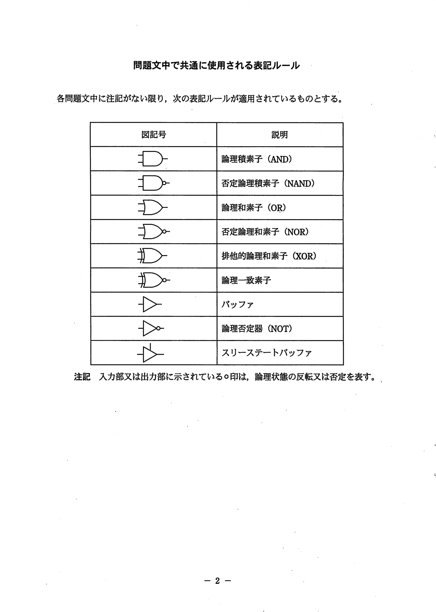

テキスト (OCR)

問題文中で共通に使用される表記ルール

各問題文中に注記がない限り, 次の表記ルールが適用されているものとする。

図記号                           説明
{>         論理積素子 (AND)

{ と          否定論理積素子 NAND)
ゴー          論理和素子 (OR)

ゴ >>         否定論理和素子 (NOR)
>         排他的論理和素子 (XOR)
] >             論理一致素子

>       パッファ

ヤー*-          WEBER (NOT)
th

スリーステートバッファ

注記 入力部又は出力部に示されているo印は, 論理状態の反転又は否定を表す。

### ページ 3

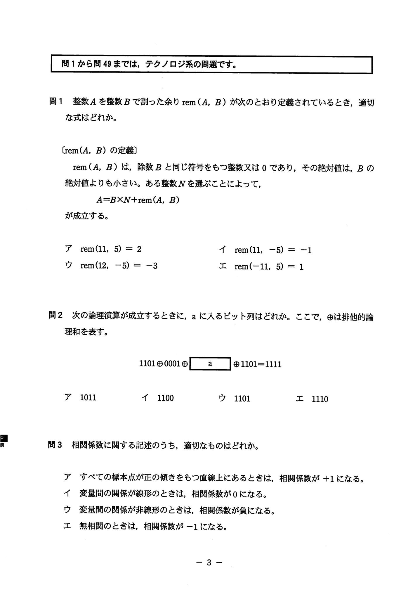

テキスト (OCR)

問 PSH 49 までは, テクノロジ系の問題です。

問1 整数4 を整数j で割った余り rem(4, B) が次のとおり定義されているとき, 適切
な式はどれか。

(rem(4, B) の定義〕
rem(4, B) は, BRB と同じ符号をもつ整数又は 0 であり, COMMA, BO
絶対値よりも小さい。ある整数 を選ぶことによって,
A=BXN+rem(A, B)

が成立する。
ア remQ1, 5) = 2             イ rem(Q1, 一5) = -1
ウ rem(12, —5) = —3          = rem(-11, 5) = 1

問2 次の論理演算が成立するときに, a に入るピット烈はどれか。ここで, @は排他的論
理和を表す。

1101@0001@| a __|@1101=1111

ア 1011     イ 1100     ウ 1101     x= 1110

ii     問3 相関係数に関する記述のうち, 適切なものはどれか。

すべての標本点が正の傾きをもつつ直線上にあるときは, 相関係数が +1 になる。
変量問の関係が線形のときは, 相関係数が 0 になる。

変量問の関係が非線形のときは, 相関係数が負になる。

無相関のときは, 相関係数が 一1 になる。

H へ

### ページ 4

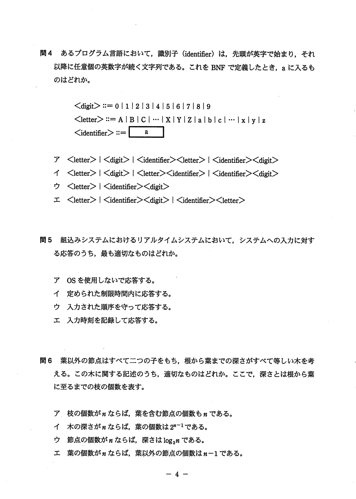

テキスト (OCR)

問4 あるプログラム言語において, MHF (identifier) は, 先頭が英字で始まり, それ
以降に任意個の英数字が続く文字列である。これを BNF で定義したとき, a に入るも
のはどれか。

<digit> = 011121314151617I1819
<lette>=AIBICIIXIYIZlalblel-Ixlylz

<identifier> = [ぉ』 |

ア <letter> | <digit> | <identifier><letter> | <identifier><digit>
4 <detter> | <digit> | <letter><identifier> | <identifier><digit>
ウ <letter> | <identifier><digit>

x <letter> | <identifier><digit> | <identifier><letter>

間5 組込みシステムにおけるリアルタイムシステムにおいて, システムへの入力に対す
る応答のうち, 最も適切なものはどれか。

ア 0Sを使用しないで応答する。

イ 定められた制限時間内に応答する。
ウ 入力された順序を守って応答する。
エ 入力時刻を記録して応答する。

間6 葉以外の節点はすべて二つの子をもち, 根から葉までの深さがすべて等しい木を考
える。この木に関する記述のうち, 適切なものはどれか。ここで, 深さとは根から葉
に至るまでの枝の個数を表す。

ア 枝の個数がヶならぱば, 葉を含む節点の個数もヵ である。

イ 木の深さがヵ ならば, 葉の個数は 2%-!1である。

ウ 節点の個数がぁヵならば, 深さはlog。% CHS.

エ 葉の個数がヵならぱ, 葉以外の節点の個数はゥヵー1 CHS.

ー 4 一

### ページ 5

テキスト (OCR)

fl7 PUSH 命令でスタックにデータを入れ, POP 命令でスタックからデータを取り出す。
動作中のプログラムにおいて, ある状態から次の順で 10 個の命令を実行したとき, ス
タックの中のデータは図のようになった。1 番目の PUSH 命令でスタックに入れたデ
ータはどれか。

PUSH 一ぁ PUSH 一> POP 一> PUSH 一> PUSH 7

し> PUSH —> PUSH —> POP 一> POP 一> PUSH

PUSH ————) CO POP

192
55
326
7
29

ア 29     イ 7      ウ 326     x 55

間8 キーが小文字のアルファベット 1 文字 (a b, ..., z のいずれか) であるデータを,
大きさが 10 のハッシュ表に格納する。ハッシュ関数として, アルファベットの ASCL
コードを 10 進表記法で表したときの 1 の位の数を用いることにする。 衝突が起こるキ
ーの組合せはどれか。ASCIT コードでは, 昇順に連続した 2 進数が, アルファベット
順にコードとして割り当てられている。

ア aとi     イ ber     ウ cと1     エエ dとx

### ページ 6

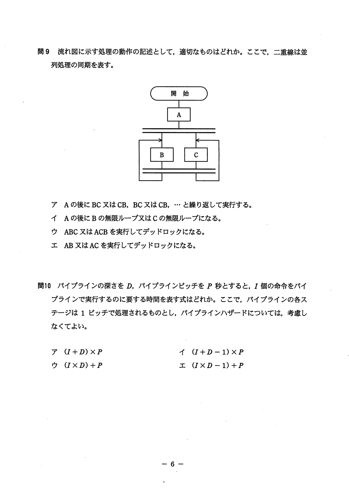

テキスト (OCR)

問9 流れ図に示す処理の動作の記述として, 適切なものはどれか。ここで, 二重線は並
列処理の同期を表す。

A の後に BC又はCB, BC又はCB, … と繰り返して実行する。
A の後に B の無限ループ又は C の無限ループになる。

ABC 又は ACB を実行してデッドロックになる。

AB 又は AC を実行してデッドロックになる。

H ささい

間10 パイプラインの深さを の, パイプラインピッチを ア 秒とすると, I 個の命令をパイ
プラインで実行するのに要する時間を表す式はどれか。ここで, パイプラインの各ス
テージは 1 ピッチで処理されるものとし, パイプラインハザードについては, 考慮し
なくてよい。

ア U+D)xP          4 (U+D-1)xXP
ウ (IXD)+P           エ UxD-1)+P

### ページ 7

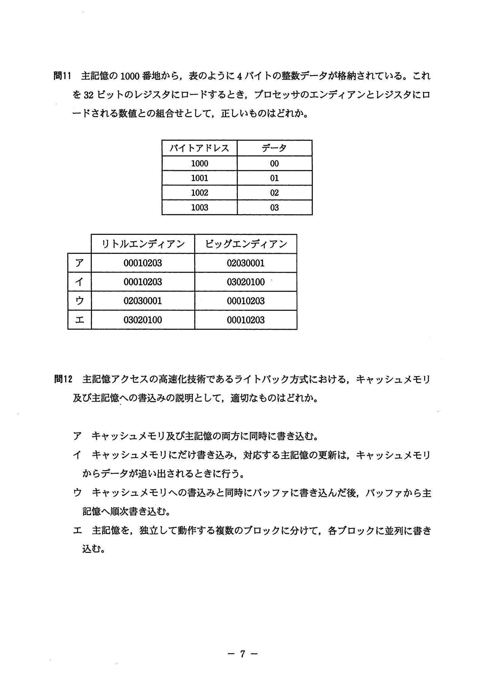

テキスト (OCR)

間11 主記憶の 1000 番地から, 表のように 4 バイトの整数データが格納されている。これ
を 32 ビットのレジスタにロードするとき, プロセッサのエンディアンとレジスタにロ
ードされる数値との組合せとして, 正しいものはどれか。

バイトアドレス    データ
1000              00
1001                               01
100202
100303
リトルエンディアン | ピッグエンディアン
ア   0001020302030001
イ         00010203               03020100 ©
ウ        02030001              00010203
エ        03020100              00010203

間12 主記憶アクセスの高速化技術であるライトバック方式における, キャッシュメモリ
及び主記憶への書込みの説明として, 適切なものはどれか。

ア キャッシュメモリ及び主記憶の両方に同時に書き込む。

イ キャッシュメモリにだけ書き込み, 対応する主記憶の更新は, キャッシュメモリ
からデータが追い出されるときに行う。

ウ キャッシュメモリへの書込みと同時にバッファに書き込んだ後, バッファから主

記憶へ順次書き込む。
エエ 主記憶を, 独立して動作する複数のブロックに分けて, 各プロックに並列に書き
込む。

### ページ 8

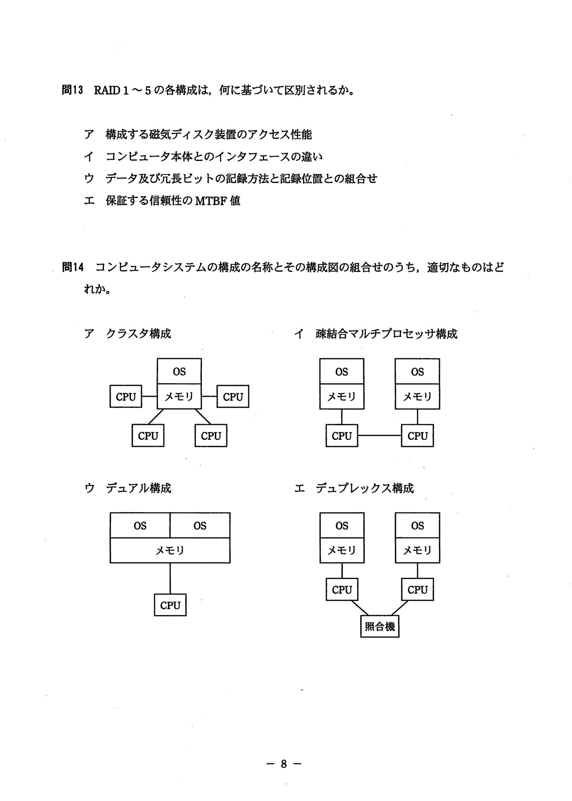

テキスト (OCR)

間13 RAD1て5の各構成は, 何に基づいて区別されるか。

構成する磁気ディスク装置のアクセス人性能

コンピュータ本体とのインタフェースの違い

データ及び冗長ビットの記録方法と記録位置との組合せ
保証する信頼性の MTBF 値

H へ

問14 コンピュータシステムの構成の名称とその構成図の組合せのうち, 適切なものはど
れか。

ア クラスタ構成           イ 疎結合マルチプロセッサ構成
os                                                               os                           OS
CPU トー メモリ トー CPU                メモリ         メモリ
|         |
CPU                  CPU                                               CPU                        CPU
ウ デュアル構成                     エエ デュプレックス構成
os                    os                                                       OS                           OS
メモリ                                                               メモリ                     メモリ
|         |
CPU                        CPU

CPU

### ページ 9

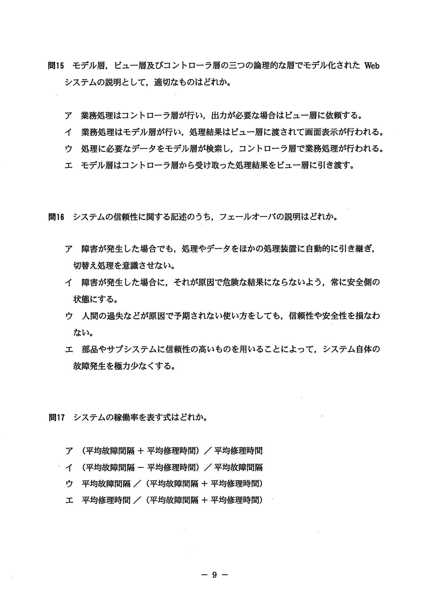

テキスト (OCR)

問15 モデル層, ピュー層及びコントローラ層の三つの論理的な層でモデル化された Web
システムの説明として, 適切なものはどれか。

業務処理はコントローラ層が行い, 出力が必要な場合はビュー層に依頼する。
業務処理はモデル層が行い, 処理結果はビュー層に渡されて画面表示が行われる。
処理に必要なデータをモデル層が検索し, コントローラ層で業務処理が行われる。
モデル層はコントローラ層から受け取った処理結果をピュー層に引き渡す。

HUAN

AIG システムの信頼性に関する記述のうち, フェールオーバの説明はどれか。

ア 障害が発生した場合でも, 処理やデータをほかの処理装置に自動的に引き継ぎ,
切替え処理を意識させない。

イ 障害が発生した場合に, それが原因で危険な結果にならないよう, 常に安全側の
状態にする。

ウ 人間の過失などが原因で予期されない使い方をしても, 信頼性や安全性を損なわ
ない。

エ 部品やサブシステムに信頼性の高いものを用いることによって, システム自体の
故障発生を極力少なくする。

間17 システムの稼働率を表す式はどれか。

ア (平均政障間隔 + 平均修理時間) 平均修理時間
イ (平均故障間隔 — 平均修理時間) 平均改障間隔
ウ 平均故障間隔 ノ (平均故障間隔 + 平均修理時間)
エ 平均修理時間 (平均故障間隔 平均修理時間)

### ページ 10

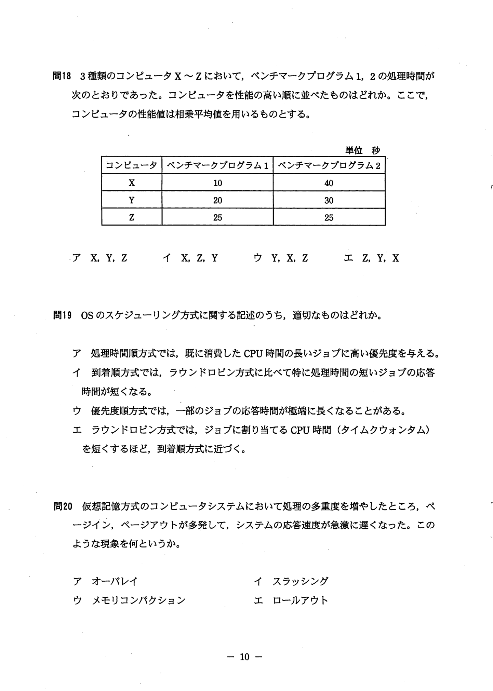

テキスト (OCR)

間18 3種類のコンピュータ X ーー Z において, ベンチマークプログラム 1, 2 の処理時間が
次のとおりであった。コンピュータを人性能の高い順に並べたものはどれか。ここで
コンピュータの性能値は相乗平均値を用いるものとする。

単位 秒
コンピュータ | ベンチマークプログラム 1 | ベンチマークプログラム 2
x        10           40
Y        20           30
Z        25           25
ア X, Y, Z  イ XZ Y  ウ Y, X,Z  エエ Z, Y, X

問19 0S のスケジューリング方式に関する記述のうち, 適切なものはどれか。

ア 処理時間順方式では, 既に消費した CPU 時間の長いジョブに高い優先度を与える。

イ 到着順方式では, ラウンドロビピノ方式に比べて特に処理時間の短いジョブの応答
時間が短くなる。

ウ 優先度順方式では, 一部のジョブの応答時間が極端に長くなることがある。

エ ラウンドロビピン方式では。 ジョブに割り当てる CPU 時間 (タイムクウォンタム)
を短くするほど, 到着順方式に近づく。

問20 仮想記憶方式のコンピュータシステムにおいて処理の多重度を増やしたところ, ペ
ージイン, ページアウトが多発して, システムの応答速度が急激に遅くなった。この
ような現象を何というか。

ア オーバレイ            イ スラッシング
ウ メモリコンパクション       xn ロールアウト

ー 10 一

### ページ 11

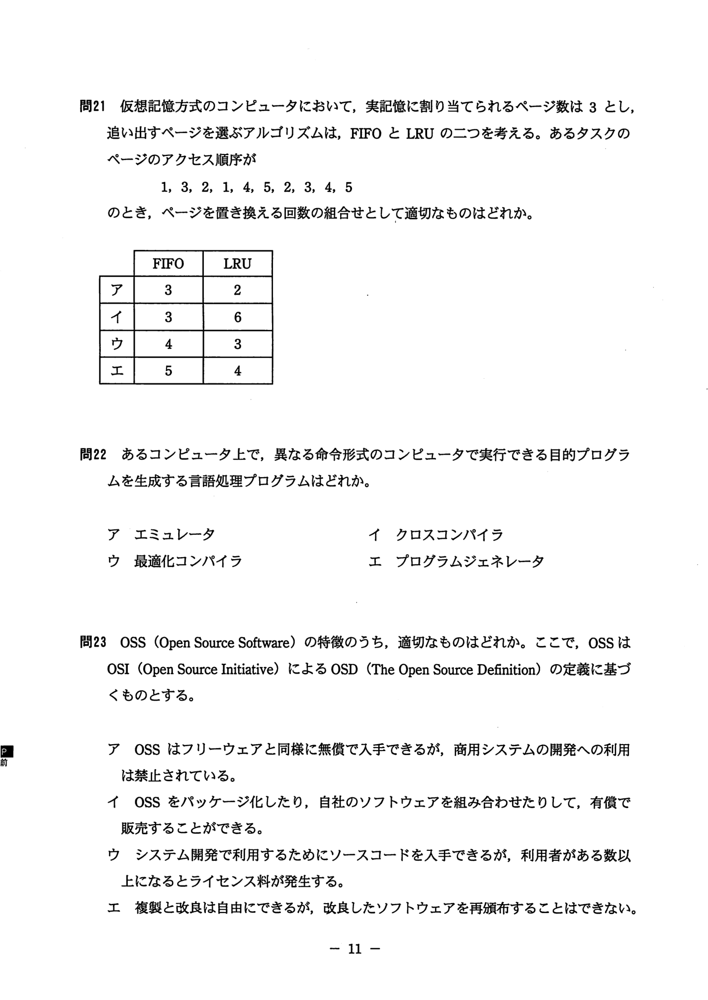

テキスト (OCR)

“Ml

問21 仮想記憶方式のコンピュータにおいて, 実記憶に割り当てられるページ数は 3 LL,
追い出すページを選ぶアルゴリズムは, FIFO と LRU の二つを考える。あるタスクの
ページのアクセス順序が

1, 3, 2, 1, 4, 5, 2, 3, 4, 5
のとき, ページを置き換える回数の組合せとして適切なものはどれか。

FIFO            LRU

HITIへIN

3    2
3    6
4    3
5    4

問22 あるコンピュータ上で, 異なる命令形式のコンピュータで実行できる目的プログラ
ムを生成する言語処理プログラムはどれか。

ア エミュレータ                 イ クロスコンパイラ
ウ 最適化コンパイラ         エ プログラムジェネレータ

間23 OSS (Open Source Software) の特徴のうち, 適切なものはどれか。ここで, OSS は
OSI (Open Source Initiative) による OSD (The Open Source Definition) の定義に基づ
くものとする。

ア OSS はフリーウェアと同様に無償で入手できるが, 商用システムの開発への利用
は禁止されている。

イ OSS をパッケージ化したり, 自社のソフトウェアを組み合わせたりして, 有償で
販売することができる。

ウ システム開発で利用するためにソースコードを入手できるが, 利用者がある数以
上になるとライセンス料が発生する。

エエ 複製と改良は自由にできるが, 改良したソフトウェアを再頒布することはできない。

ー 11 一

### ページ 12

テキスト (OCR)

間24 NAND 素子を用いた次の組合せ回路の出力 ク を表す式はどれか。ここで, 論理式中
の・は論理積, は論理和, はえの否定を表す。

+

しナー
ao

Dan

ア XY    t X+Y    7 X+Y    工 X+Y

間25 PLC (Power Line Communications) の特徴として, 適切なものはどれか。

データ線と電力線とを分離した 2 線通信技術

電力線に情報信号を乗せて通信する技術

電力線をアンテナとして使う無線通信技術

電話線を使い 上りと下りで非対称な速度でデータ通信を行う技術

H へ

26 Web ページの設計の例のうち, アクセシビリティを高める観点から適切なものはど
れか。

音声を利用者に確実に開かせるために, 表示時に自動的に再生する。
イ 体裁の良いレイアウトにするために, 表組みを用いる。
ウ 入力が必須な項目は, 色で強調するだけでなく, 項目名の隣に “(必須)” REE
明記する。
ZL ハイパリンク先の内容が予測できるように, ハイパリンク画像の alt 属性にリンク
先の URL を付記する。

### ページ 13

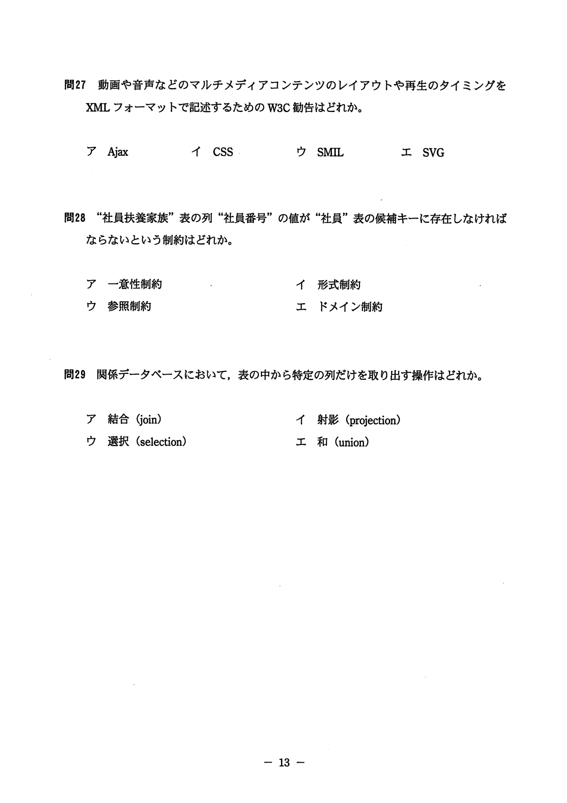

テキスト (OCR)

間27 動画や音声などのマルチメディアコンテンツのレイアウトや再生のタイミングを
XML フォーマットで記述するための W3C 勧告はどれか。

ア Ajax     イ CSS     ウ SML     エ SVG
問28 “社員扶養家族" ROD “社員番号"の値が “社員” 表の候補キーに存在しなければ
ならないという制約はどれか。
ア 一意性制約    ]      イ 形式制約
ウ 参照制約           DZ ドメイン制約
間29 関係データベースにおいて, 表の中から特定の列だけを取り出す操作はどれか。

ア 結合 Goin)              イ 射影 orojection)
ウ 選択 (selection)           xX 和 (union)

ー 13 一

### ページ 14

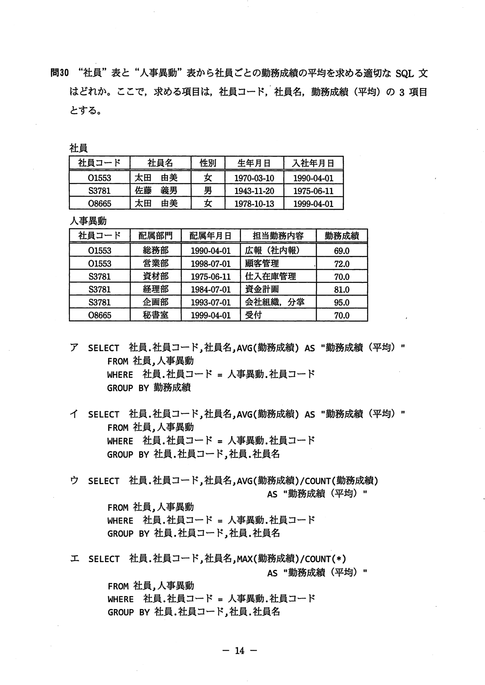

テキスト (OCR)

問30 "社員" 表と“人事異動" 表から社員どとの勤務成績の平均を求める適切な SQL 文
はどれか。ここで, 求める項目は, 社員コード, 社員名, 勤務成績 (平均) の 3 項目

とする。

社員

社員コード   社員名   性別  生年月日  入社年月日
01553   太田 由美   女   1970-03-10 | 1990-04-01
S3781   佐藤 義男   男   1943-11-20 | 1975-06-11
08665   太田 由美   女   1978-10-13 | 1999-04-01

ASR

社員コード | 配属部門 | 配属年月日  担当勤務内容  勤務成績
01553     総務部    1990-04-01 | 広報 (社内報)      69.0
01553   営業部  1998-07-01 | 願客管理      72.0
S3781    資材部  1975-06-11 | 仕入在庫管理    70.0
S3781    経理部   1984-07-01 | 資金計画      81.0
$3781     企画部   1993-07-01 | 会社組織, 分常    95.0
08665   RES   1999-04-01 | 受付        70.0

ア SELECT 社員.社員コード,社員名,AVG(勤務成績) as "勤務成績 (平均) "
FROM 社員,人事異動
WHERE 社員.社員コード = 人事異動.社員コード
GROUP BY 勤務成績

イ SELECT 社員.社員コード,社員名,AVG(勤務成績) as
FROM 社員,人事異動
WHERE 社員.社員コード = 人事異動.社員コード
GROUP BY 社員.社員コード,社員.社員名

"勤務成績 (平均) "

ウ SELECT 社員.社員コード,社員名,AVG(勤務成績)/CoUNT(勤務成績)
AS "勤務成績 (平均) "

FROM 社員,人事異動
WHERE 社員.社員コード = 人事異動.社員コード
GROUP BY 社員.社員コード,社員.社員名

SELECT 社員.社員コード,社員名,MAX(勤務成績)/COUNT(*)
AS "勤務成績 (平均) "

FROM 社員,人事異動
WHERE 社員.社員コード = 人事異動.社員コード
GROUP BY 社員.社員コード,社員.社員名

14 一

### ページ 15

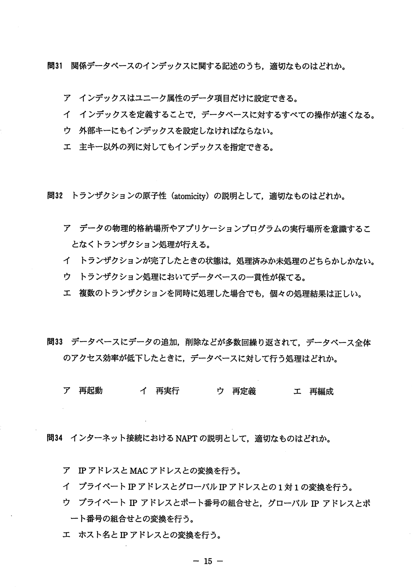

テキスト (OCR)

間31 関係データベースのインデックスに関する記述のうち, 適切なものはどれか。

インデックスはユニーク属性のデータ項目だけに設定できる。

インデックスを定義むすることで, データベースに対するすべての操作が速くなる。
外部キーにもインデックスを設定しなければならない。

主キー以外の列に対してもインデックスを指定できる。

HAN

間32 トランザクションの原子性 (atomicity) の説明として, 適切なものはどれか。

ア データの物理的格納場所やアプリケーションプログラムの実行場所を意識するこ
となくトランザクション処理が行える。

イ トランザクションが完了したときの状態は, 処理済みか未処理のどちらかしかない。

ウ トランザクション処理においてデータベースの一貫性が保てる。

エエ 複数のトランザクションを同時に処理した場合でも, 個々の処理結果は正しい。

間33 データベースにデータの追加, 削除などが多数回繰り返されて, データベース全体
のアクセス効率が低下したときに, データベースに対して行う処理はどれか。

ア 再起重    イ BRT    ウ 再定義    エ 再編成

問34 インターネット接続における NAPT の説明として, 適切なものはどれか。

ア TPアドレスとIMAC アドレスとの変換を行う。

イ プライベート IP アドレスとグローバル TP アドレスとの1 対 1 の変換を行う。

ウ プライベート IP アドレスとポート番号の組合せと,。 グローバル TP アドレスとポ
ート番号の組合せとの変換を行う。

XL ホスト名とTP アドレスとの変換を行う。

### ページ 16

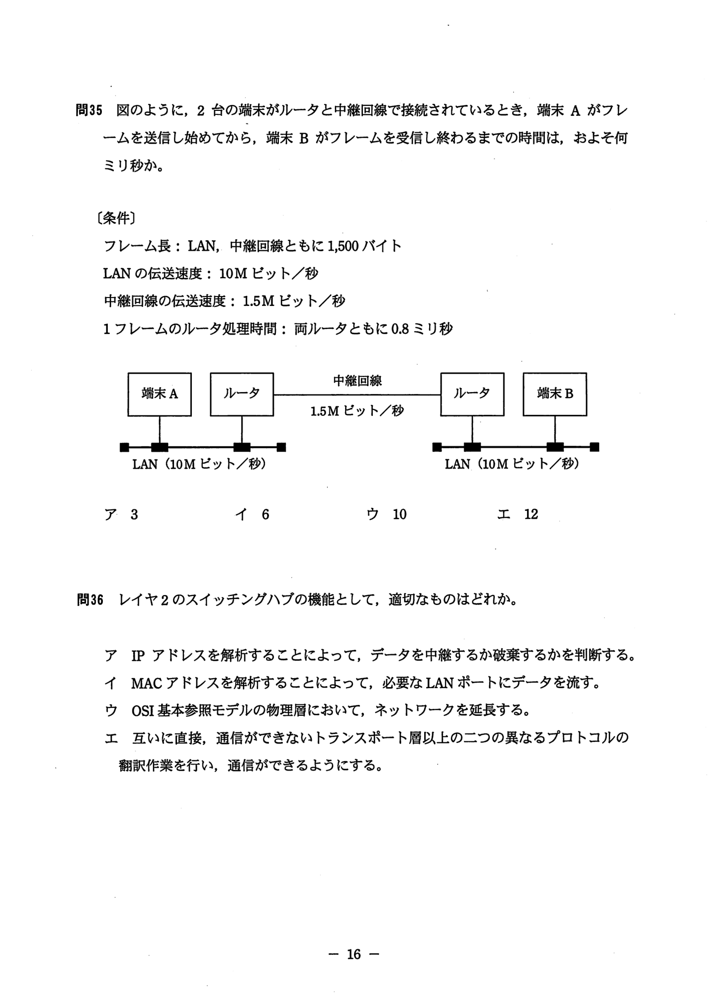

テキスト (OCR)

間35 図のように, 2 台の端末がルータと中継回線で接続されているとき, 端末 A がフレ
ームを送信し始めてから, 端末 B がフレームを受信し終わるまでの時間は, およそ何
ミリ秒か。

〔条件〕

フレーム長 : LAN, 中継回線ともに 1,500 バイト

LAN の伝送速度 10M ピットノ秒

中継回線の伝送速度 : 15M ビットンノ秒

1フレームのルータ処理時間 : 両ルータともに0.8 SUH

中継回線
端末 A       ルータ                            ルータ       端末 B
1.5M ビットノ秒
LAN (10M ピットンノ秒)                             LAN (10M ビットノ秒)
ア 3              イ 6              ウ 10             xm 12

間36 レイヤ2のスイッチングハブの機能として, 適切なものはどれか。

IP アドレスを解析することによって, データを中継するか破棄するかを判断する。
MAC アドレスを解析することによって, 必要なLAN ポボートにデータを流す。

OS 基本参照モデルの物理層において, ネットワークを延長する。

互いに直接, 通信ができないトランスポート層以上の二つの異なるプロトコルの
翻訳作業を行い, 通信ができるようにする。

H へ

### ページ 17

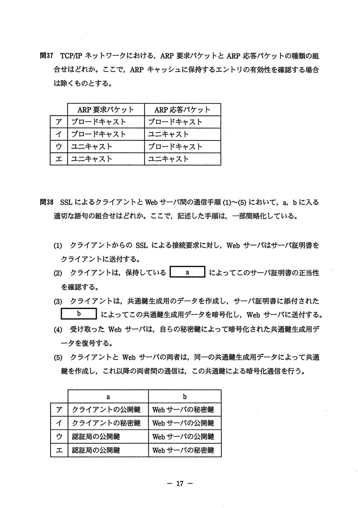

テキスト (OCR)

間37 TCPAP ネットワークにおける, ARP 要求パケットと ARP 応答パケットの種類の組
合せはどれか。ここで, ARP キャッシュに保持するエントリの有効性を確認する場合
は除くものとする。

ARP 要求パケット        ARP 応答パケット
ア | ブロードキャスト     プロードキャスト
イ | プロードキャスト     ユニキャスト
ウ | ユニキャスト        プロードキャスト
xm | ユニキャスト         ユニキャスト

間38 SSL によるクライアントと Web サーバ間の通信手順 (1)て(5⑤) において, a b に入る
適切な語句の組合せはどれか。ここで, 記述した手順は, 一部簡略化している。

Q) クライアントからの SSL による接続要求に対し, Web サーバはサーバ証明書を
クライアントに送付する。

@Q) クライアントは, 保持している L_a_] によってこのサーバ証明書の正当性
を確認する。

3) クライアントは, 共通鍵生成用のデータを作成し, サーバ証明書に添付された
[Lb] によってこの共通鍵生成用データを暗号化し, Web サーパに送付する。

(④ 受け取った Web サーバは, 自らの秘密閥によって障号化された共通鍵生成用デ
ータを復号する。

(5) クライアントと Web サーパの両者は, 同一の共通鍵生成用データによって共通
鍵を作成し, これ以降の両者問の通信は, この共通催による暗号化通信を行う。

a          b
クライアントの公開鍵 | Web サーバの秘密鍵
クライアントの秘密鍵 | Web サーバの公開鍵
認証局の公開鍵             Web サーバの公開鍵
認証局の公開鍵             Web サーバの秘密鍵

HITIへ1N

ー 17 一

### ページ 18

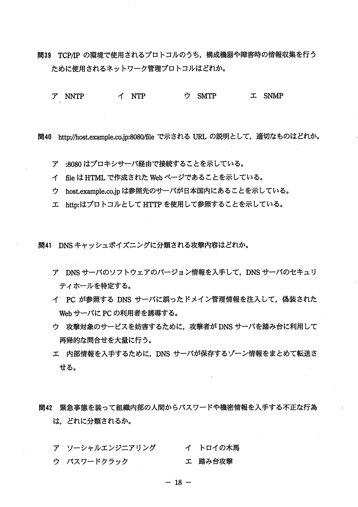

テキスト (OCR)

139 TCP/IP の環境で使用されるプロトコルのうち, 構成機器や障害時の情報収集を行う
ために使用されるネットワーク管理プロトコルはどれか。

ア NNTP    イ NTP     ウ SMTP    <= SNMP

間40 http://host.example.co.jp:8080/fle で示される URL の説明として, 適切なものはどれか。

FY :8080 はプロキシサーパ経貼で接続することを示している。

イ file はHTML で作成された Web ページであることを示している。

ウ tost.example.co.jp は参照先のサーバが日本国内にあることを示している。
XZ httpy:はプロトコルとして HTTP を使用して参照することを示している。

問41 DNS キャッシュポイズニングに分類される攻撃内容はどれか。

ア DNS サーバのソフトウェアのバージョン情報を入手して, DNS サーバのセキュリ
ティホールを特定する。

イ PC が参照する DNS サーバに誤ったドメイン管理情報を注入して, BRINE
Web サーバに PC の利用者を誘導する。

ウ 攻撃対象のサービスを妨害するために, 攻撃者が DNS サーバを踏み台に利用して
再帰的な問合せを大量に行う。

エエ 内部情報を入手するために, DNS サーバが保存するゾーン情報をまとめて転送さ
せる。

問42 緊急事態を装って組織内部の人間からパスワードや機密情報を入手する不正な行為
は, どれに分類されるか。

ア ソーシャルエンジニアリング   イ トロイの木馬
ウ パスワードクラック        エエ 踏み台攻撃

### ページ 19

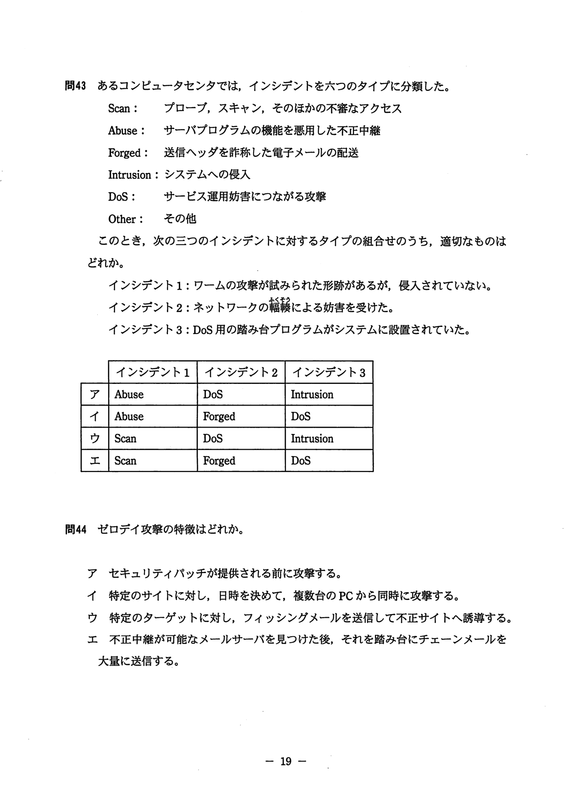

テキスト (OCR)

問43 あるコンピュータセンタでは, インシデントを六つのタイプに分類した。

このとき, 次の三つのインシデン

Scan :      プロープブ, スキャン, そのほかの不審なアクセス
Abuse: サーバプログラムの機能を悪用した不正中継
Forged: 送信ヘッダを詐称した電子メールの配送
Intrusion: システムへの侵入

DoS :  サービス運用妨害につながる攻撃

Other :     その他

どれか。

トに対するタイプの組合せのうち, 適切なものは

インシデント 1 : ワームの攻繋が試みられた形陣があるが, 侵入されていならい。
インシデント 2 : ネットワークの謀還による妨害を受けた。
インシデント 3 : DoS 用の踏み台プログラムがシステムに設置されていた。

インシデント 1 | インシデント 2 | インシデント3
ア | Abuse                      DoS                         Intrusion
イ | Abuse                      Forged                    DoS
ウ | Scan                        DoS                         Intrusion
= | Scan                        Forged                    DoS

問44 ゼロデイ攻撃の特徴はどれか。

H ざさへい

セキュリティパッチが提供される前に攻繋する。

特定のサイトに対し, 日時を決めて, 複数台のPCから同時に攻撃する。
特定のターゲットに対し, フィッシングメールを送信して不正サイトへ誘導する。
不正中継が可能なメールサーバを見つけた後, それを踏み台にチェーンメールを

大量に送信する。

### ページ 20

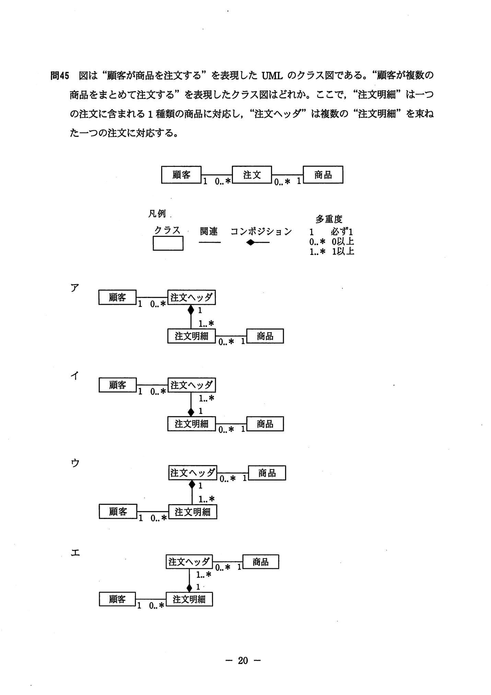

テキスト (OCR)

問45 図は “顧客が商品を注文する" を表現した UML のクラス図である。 “顧客が複数の
商品をまとめて注文する"を表現したクラス図はどれか。ここで, “注文明細” は一つ
の注文に含まれる 1 種類の商品に対応し, “注文ヘッダ” は複数の “注文明細" を束ね
た一つの注文に対応する。

we 1 0.* BEX 0.* 1 に
クラス . 関連 コンポジション 1 必ず1
| ーー  oo    0..* 0以上
1.* 1以上
ア
| Be rlヘッ|
Lama ba 商品 |
イ
| me ora EF]
1
LM aL 商品 |
ウ
BAY Fie 商品 |
| me で (acme |
x=

はヘッダ1 商品 |

1.
| BS トで1 注文明細 |

### ページ 21

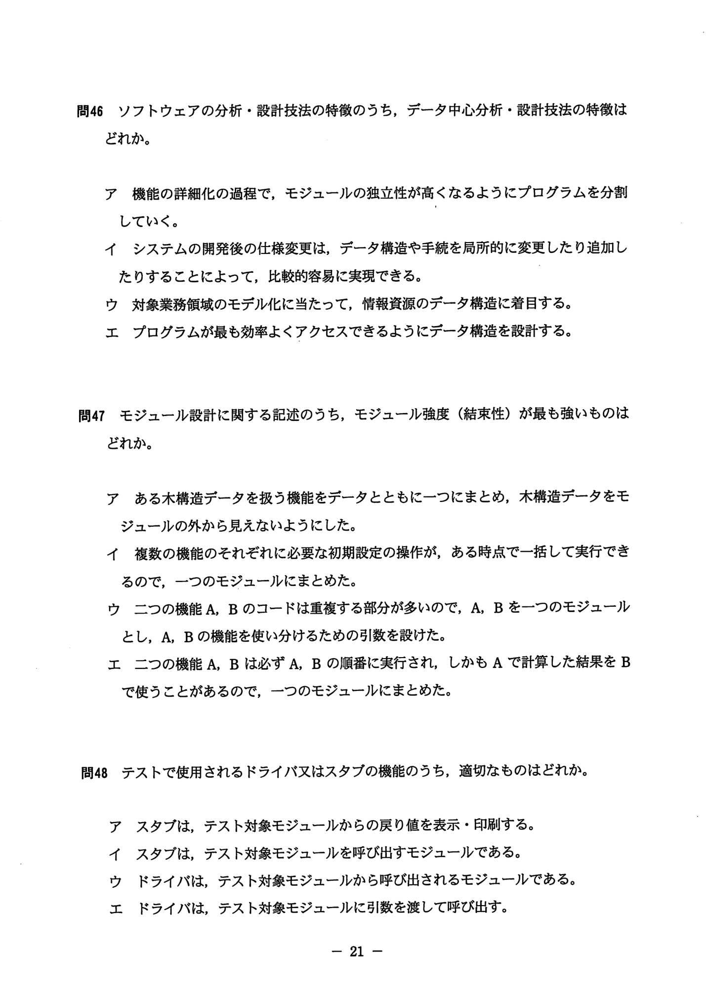

テキスト (OCR)

R46 ソフトウェアの分析・設計技法の特徴のうち, データ中心分析・設計技法の特徴は
どれか。

ア 機能の詳細化の過程で モジュールの独立性が高くなるようにプログラムを分割
していく。

イ システムの開発後の仕様変更は, データ構造や手続を局所的に変更したり追加し
たりすることによって, 比較的容易に実現できる。

ウ 対象業務領域のモデル化に当たって, 情報資源のデータ構造に着目する。

エエ プログラムが最も効率よくアクセスできるようにデータ構造を設計する。

問47 モジュール設計に関する記述のうち, モジュール強度 (結束性) が最も強いものは
どれか。

ア ある木構造データを扱う機能をデータとともに一つにまとめ, 木構造データをモ
ジュールの外から見えないようにした。

イ 複数の機能のそれぞれに必要な初期設定の操作が, ある時点で一括して実行でき
るので, 一つのモジュールにまとめた。

ウ 二つの機能 A, B のコードは重複する部分が多いので, A, B を一つのモジュール
LL, A, Bの機能を使い分けるための引数を設けた。

エ 二つの機能 A, B は必ず A, B の順番に実行され, しかも A で計算した結果を B
で使うことがあるので, 一つのモジュールにまとめた。

問48 テストで使用されるドライバ双はスタブの機能のうち, 適切なものはどれか。

スタブは, テスト対象モジュールからの戻り値を表示・印刷する。
AIT, テスト対象モジュールを呼び出すモジュールである。
ドライバは, テスト対象モジュールから呼び出されるモジュールである。
ドライバは, テスト対象モジュールに引数を渡して呼び出す。

H GAN

### ページ 22

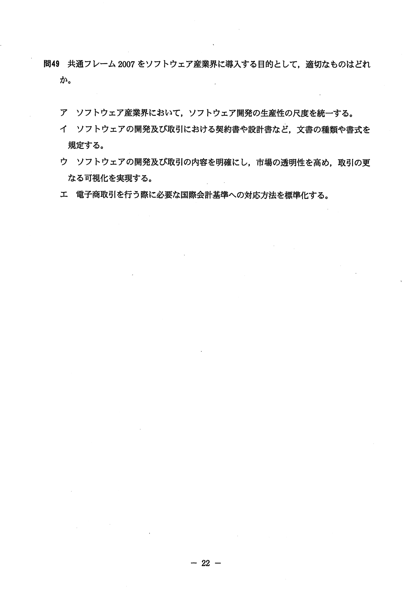

テキスト (OCR)

間49 共通フレーム 2007 をソフトウェア産業界に導入する目的として, 適切なものはどれ
か。

ア ソフトウェア産業界において, ソフトウェア開発の生産性の尺度を統一する。

イ ソフトウェアの開発及び取引における契約書や設計書など, 文書の種類や書式を
規定する。

ウ ソフトウェアの開発及び取引の内容を明確にし, 市場の透明性を高め, 取引の更
なる可視化を実現する。      ーー

エ 電子商取引を行う際に必要な国際会計基準への対応方法を標準化する。

### ページ 23

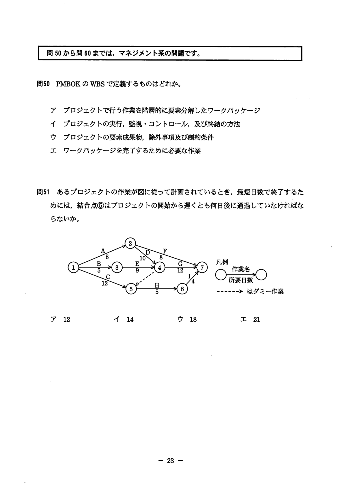

テキスト (OCR)

間 50 から問 60 までは, マネジメント系の問題です。

問50 PMBOK の WBS で定義むするものはどれか。

プロジェクトで行う作業を階層的に要素分解したワークパッケージ
プロジェクトの実行, 監視・コントロール, 及び終結の方法

プロジェクトの要素成果物, 除外事項及び制約条件

ワークパッケージを完了するために必要な作業

HAN

問51 あるプロジェクトの作業が図に従って計画されているとき, 最短日数で終了するた
めには, 結合点@はプロジェクトの開始から遅くとも何日後に通過していなければな
らないか。

凡例
〇  作業名  〇
所要日数

ーーーーー-> はダミー作業

ー 23 一

### ページ 24

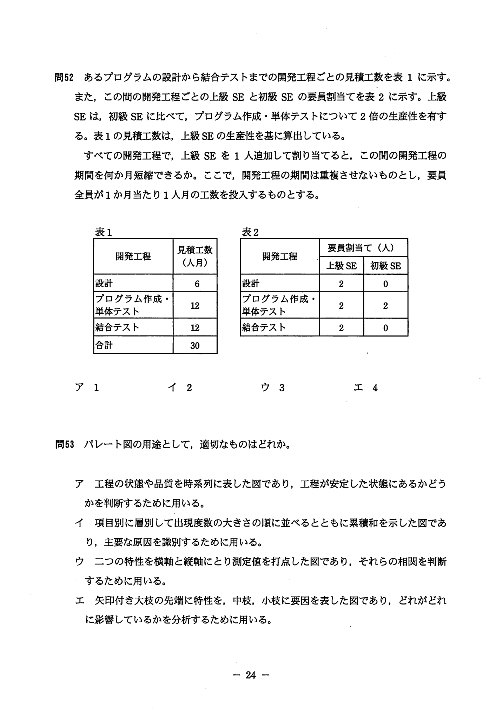

テキスト (OCR)

問52 あるプログラムの設計から結合テストまでの開発工程ごとの見積工数を表 1 に示す。
また, この問の開発工程ととの上級 SE と初級 SE の要員割当てを表 2 に示す。上級
SE は, 初級 SE に比べて, プログラム作成・単体テストについて 2 倍の生産性を有す
る。表1 の見積工数は。 LSE の生産性を基に算出している。

すべての開発工程で, LSE を 1 人追加して割り当てると, この間の開発工程の
期間を何か月短縮できるか。ここで, 開発工程の期間は重複させないものとし, BA
全員が1 か月当たり 1 人月の工数を投入するものとする。

表1                             表2
当て (人
開発工程    見積工数        mere     要員割    (人)
(人月)                          上級SE | 初級SE
設計                  6         設計                 2         0
プログラム作成・   2      プログラム作成・    2      2
単体テスト                       単体テスト
結合テスト           12         結合テスト            2         0
合計                 30
ア 1               イ 2               ウ 3               エエ 4

間53 パレート図の用途として, 適切なものはどれか。

ア 工程の状態や品質を時系列に表した図であり, 工程が安定した状態にあるかどう
かを判断するために用いる。

イ 項目別に層別して出現度数の大きさの順に並べるとともに累積和を示した図であ
り, 主要な原因を識別するために用いる。

ウ 二つの特性を横軸と縦軸にとり測定値を打点した図でやり, それらの相関を判断
するために用いる。

エエ 矢印付き大枝の先端に特性を, PR, 小枝に要因を表した図であり, どれがどれ
に影響しているかを分析するために用いる。

### ページ 25

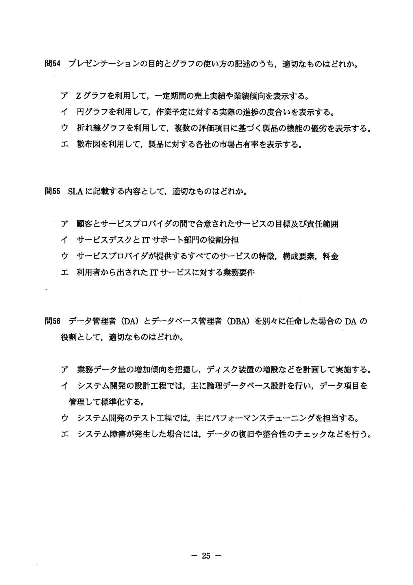

テキスト (OCR)

問54 プレゼンテーションの目的とグラフの使い方の記述のうち, 適切なものはどれか。

ア Zグラフを利用して, 一定期間の売上実績や業績傾向を表示する。

イ 円グラフを利用して, 作業予定に対する実際の進捗の度合いを表示する。

ウ 折れ線グラフを利用して, 複数の評価項目に基づく製品の機能の優劣を表示する。
エ 散布図を利用して, 製品に対する各社の市場占有率を表示する。

問55 SLAに記載する内容として, 適切なものはどれか。

ア 顧客とサービスプロバイダの間で合意されたサービスの目標及び責任範囲
イ サービスデスクと IT サポート部門の役割分担

ウ サービスプロバイダが提供するすべてのサービスの特徴, 構成要素, 料金
L 利用者から出された IT サービスに対する業務要件

問56 データ管理者 (DA) とデータベース管理者 (DBA) を別々に任命した場合の DA の
役割として, 適切なものはどれか。

ア 業務データ量の増加傾向を把握し, ディスク装置の増設などを計画して実施する。

イ システム開発の設計工程では, 主に論理データベース設計を行い データ項目を
管理して標準化する。

ウ システム開発のテスト工程では, 主にパフォーマンスチューニングを担当する。

エ システム障害が発生した場合には, データの復旧や整合性のチェックなどを行う。

### ページ 26

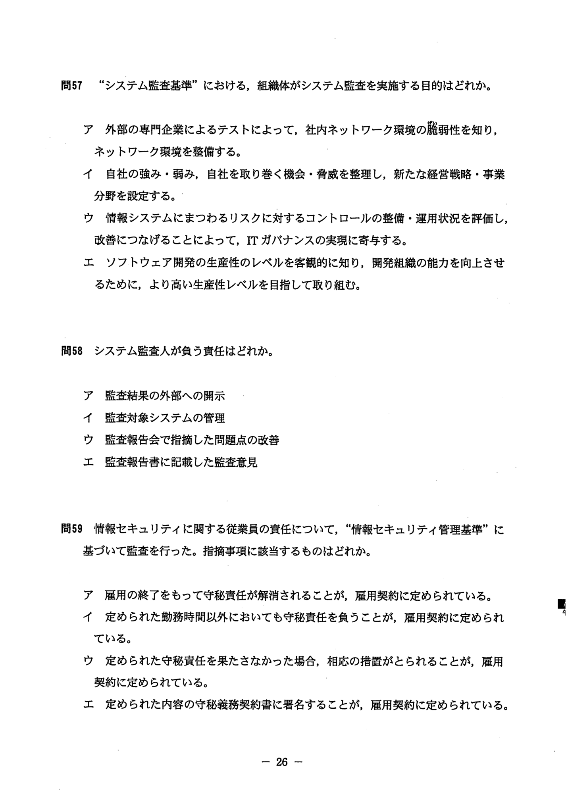

テキスト (OCR)

問57 “システム監査基準" における, 組織体がシステム監査を実施する目的はどれか。

ア 外部の専門企業によるテストによって, 社内ネットワーク環境の脆弱性を知り,
ネットワーク環境を整備する。

イ 自社の強み・翌み, 自社を取り巻く機会・箇戚を整理し, 新たな経営戦略事業
分野を設定する。

ウ 情報システムにまつわるリスクに対するコントロールの整備・運用状況を評価し,
改善につなげることによって, IT ガバナンスの実現に寄与する。

エ ソフトウェア開発の生産性のレベルを客観的に知り, 開発組織の能力を向上させ
るために, より高い生産性レベルを目指して取り組む。

問58 システム監査人が負う責任はどれか。

ア 監査結果の外部への開示

イ 監査対象システムの管理

ウ 監査報告会で指摘した問題点の改善
エエ 監査報告書に記載した監査意見

問59 情報セキュリティに関する従業員の責任について, “情報セキュリティ管理基準"” に
基づいて監査を行った。指摘事項に該当するものはどれか。

ア 雇用の終了をもって守秘次任が解消されることが, 雇用契約に定められている。

イ 定められた勤務時間以外においても守秘次任を負うことが, 雇用契約に定められ
ている。

ウ 定められた守秘責任を果たさなかった場合, 相応の措置がとられることが, BA
契約に定められている。

L 定められた内容の守秘義務契約書に署名することが, 尾用契約に定められている。

### ページ 27

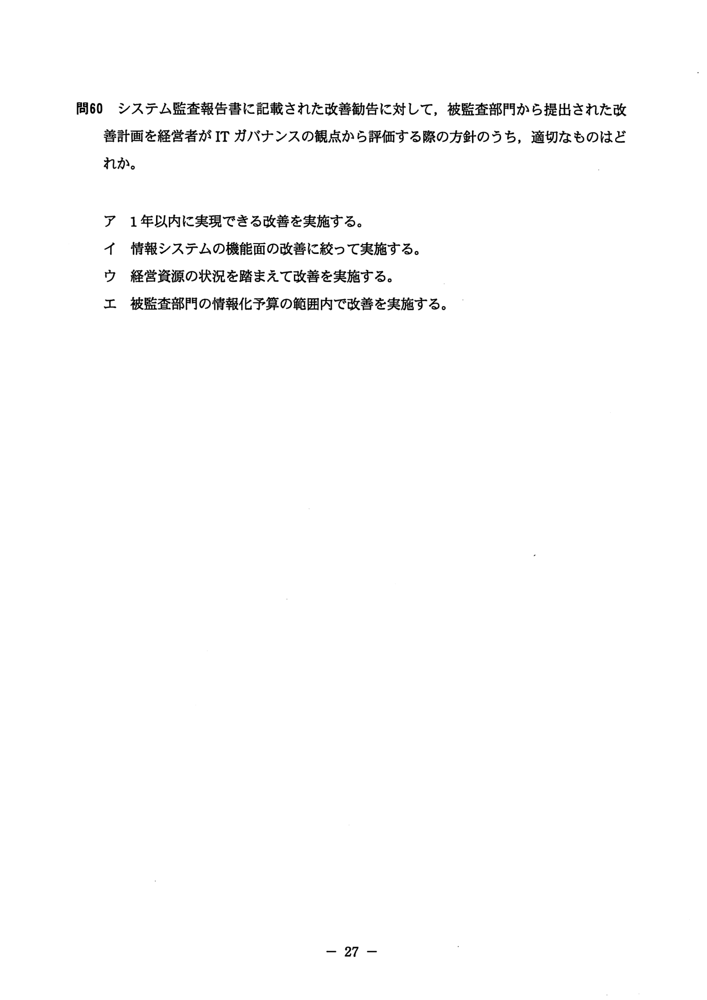

テキスト (OCR)

問60 システム監査報告書に記載された改善勧告に対して, 被監査部門から提出された改
療計画を経営者が IT ガバナンスの観点から評価する際の方針のうち, 適切なものはど
れか。

HOGAN

1 年以内に実現できる改善を実施する。

情報システムの機能面の改善に絞って実施する。
経営資源の状況を踏まえて改善を実施する。

被監査部門の情報化予算の範囲内で改善を実施する。

ー 27 一

### ページ 28

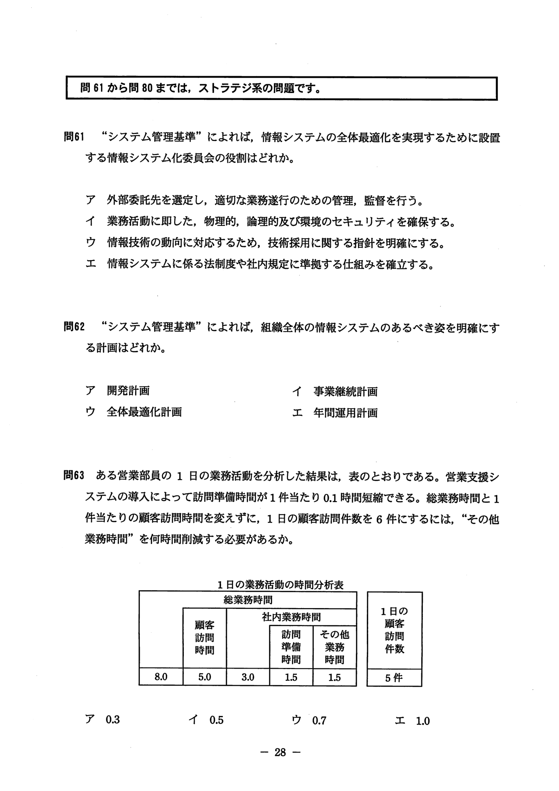

テキスト (OCR)

問 61 DSH 80 までは, ストラテジ系の問題です。

問61 “システム管理基準” によればぱ, 情報システムの全体最適化を実現するために設置
する情報システム化委員会の役割はどれか。

外部委託先を選定し, 適切な業務遂行のための管理, 監督を行う。

業務活動に胎した, 物理的, 論理的及び環境のセキュリティを確保する。
情報技術の動向に対応するため, 技術採用に関する指針を明確にする。
情報システムに係る法制度や社内規定に準拠する仕組みを確立する。

HUAN

問62 “システム管理基準" によれば, 組織全体の情報システムのあるべき姿を明確にす
る計画はどれか。

ア 開発計画          イ 事業継続計画
ウ 全体最適化計画          エエ 年間運用計画

問63 ある営業部員の 1 日の業務活動を分析した結果は, 表のとおりである。営業支援シ
ステムの導入によって訪問準備時間が 1 件当たり 0.1 時間短縮できる。総業務時間と 1
件当たりの顧客訪問時間を変えずに, 1 日の顧客訪問件数を 6 件にするには, “その他
業務時間" を何時間削減する必要があるか。

1 日の業務活動の時間分析表

総業務時間
1日の
me               社内業務時間                     ex
訪問                         訪問 | その他             訪問
時間                   準備       業務            件数
時間        時間
8.0          5.0          3.0          1.5          1.5               5件

ア 03      イ 05      ウ 0.7      x= 10

### ページ 29

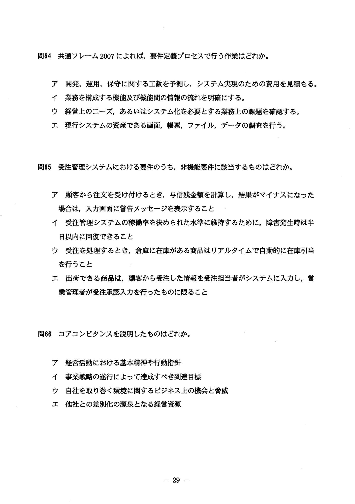

テキスト (OCR)

問64 共通フレーム 2007 によれば, 要件定義プロセスで行う作業はどれか。

ア 開発, 運用, 保守に関する工数を予測し, システム実現のための費用を見積もる。
イ 業務を構成する機能及び機能問の情報の流れを明確にする。

ウ 経営上のニーズ, あるいはシステム化を必要とする業務上の課題を確認する。

エエ 現行システムの資産である画面, 帳票, ファイル, データの調査を行う。

間65 受注管理システムにおける要件のうち, 非機能要件に該当するものはどれか。

ア 顧客から注文を受け付けるとき, 与信残金額を計算し, 結果がマイナスになった
場合は, 入力画面に替告メッセージを表示すること

イ 受注管理システムの稼働率を決められた水準に維持するために, 障害発生時は半
日以内に回復できること

ウ 受注を処理するとき, 倉庫に在庫がある商品はリアルタイムで自動的に在庫引当
を行うこと

エエ 出荷できる商品は, 顧客から受注した情報を受注担当者がシステムに入力し, 営
業管理者が受注承認入力を行ったものに限ること

間66 コアコンピタンスを説明したものはどれか。

ア 経営活動における基本精神や行動指針

イ 事業戦略の遂行によって達成すべき到達目標

ウ 自社を取り巻く環境に関するビジネス上の機会と箇威
エエ 他社との差別化の源泉となる経営資源

### ページ 30

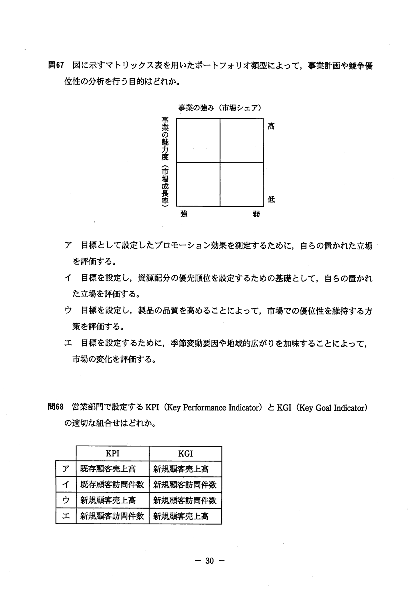

テキスト (OCR)

問67 図に示すマトリックス表を用いたポートフォリオ類型によって, 事業計画や競争優
位性の分析を行う目的はどれか。

事業の強み (市場シェア)

CAS wat) ROBES

強    弱

ア 目標として設定したプロモーション効果を測定するために, 自らの置かれた立場
を評価する。

イ 目標を設定し, 資源配分の優先順位を設定するための基礎として, 自らの思かれ
た立場を評価する。

ウ 目標を設定し, 製品の品質を高めることによって, 市場での優位性を維持する方
策を評価する。

L 目標を設定するために, 季節変動要因や地域的広がりを加味することによって,
市場の変化を評価する。

問68 営業部門で設定する KPI (Key Performance Indicator) & KGI (Key Goal Indicator)
の適切な組合せはどれか。

KPI                             KGI
既存顧客売上高 | 新規顧客売上高
既存顧客訪問件数 | 新規顧客訪問件数
新規顧客売上高 | 新規顧客訪問件数
新規顧客訪問件数 | 新規顧客売上高

HISIヽIN

### ページ 31

テキスト (OCR)

問69 技術は, 理想とする技術を目指す過程において, BAM, 成長期, 成熟期, 衰退期,
そして次の技術フェーズに移行するという進化の過程をたどる。この技術進化過程を
表すものとして, 適切なものはどれか。

ア 技術のSカープ          イ ER
ウ パスタブ曲線                   エエ ラーニングカープ

問70 デリバティブを説明したものはどれか。

ア 金利リスク, 為替リスクなどの, 将来の不確実性に伴うリスクを回避すること
イ 先物, スワップ, オプションなどの金融派生商品のこと
ウ 新株予約権が付いている社債の社債部分のこと

エエ 取引が貸借対照表と損益計算書のどちらにも記載されないこと

間71 セル生産方式の利点が生かせる対象はどれか。

生産性を上げるために, 大量生産が必要なもの
製品の仕様が長期間変わらないもの

多種類かつフレキシブルな生産が求められるもの
標準化, 単純化, 専門化による分業が必要なもの

HOGAN

問72 通信機能及びほかの機器の管理機能をもつ高機能型の電力メータであるスマートメ
ータを導入する目的として, 当てはまらないものはどれか。

ア 自動検針が可能になり, 検針作業の効率向上につながる。

イ 停電時に補助電源として一定時間電力を供給し続けることができる。
ウ BARRA RICO, ピーク電力を制御することができる。
エエ 電力消費の見える化によって, 電力逢要の平準化につながる。

### ページ 32

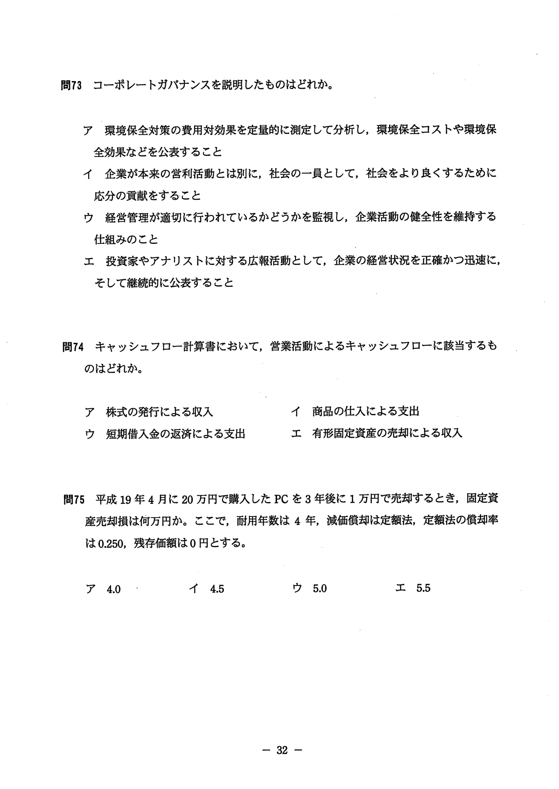

テキスト (OCR)

問73 コーポレートガバパナンスを説明したものはどれか。

ア 環境保全対策の費用対効果を定量的に測定して分析し, 環境保全コストや林境保
全効果などを公表すること

イ 企業が本来の営利活動とは別に。 社会の一員として, 社会をより良くするために
応分の貢献をすること

ウ 経営管理が適切に行われているかどうかを監視し, 企業活動の健全性を維持する
仕組みのこと

エ 投資家やアナリストに対する広幸活動として, RRORMRRE EMD ORI,
そして継続的に公表すること

間74 キャッシュフロー計算書において, 営業活動によるキャッシュフローに該当するも
のはどれか。
ア 株式の発行による収入                      イ 商品の仕入による支出
ウ 短期借入金の返済による支出    エエ 有形固定資産の売却による収入

間75 平成19年4月に 20 万円で購入した PC を 3 年後に 1 万円で売却するとき, 固定資
産売却損は何万円か。ここで, 耐用年数は 4 年, 減価償却は定額法, 定額法の償却率
は0.250, 残存価額は0 円とする。

ア 40 ©    イ 45      7 5.0      mr 55

### ページ 33

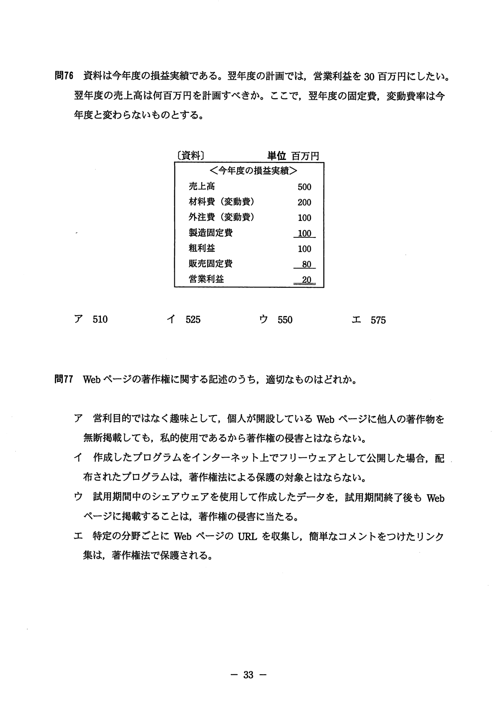

テキスト (OCR)

問76 資料は今年度の損益実績である。翌年度の計画では, 営業利益を 30 百万円にしたい。
翌年度の売上高は何百万円を計画すべきか。ここで, 翌年度の固定費, 変動費率は今
年度と変わらちないものとする。

CARD      単位 百万円
ぐ今年度の損益実績>
売上高        500
材料費 (AHR)       200
NER (AHR)       100
製造固定費      _100_
粗利益        100
販売固定費      ー80_
営業利益       _20
ア 510     イ 525     ウ 550     i 575

問77 Web ページの著作権に関する記述のうち, 適切なものはどれか。

ア 営利目的ではなく趣味として, 個人が開設している Web ページに他人の著作物を
無断掲載しても, 私的使用であるから著作権の侵害とはならない。

イ 作成したプログラムをインターネット上でフリーウェアとして公開した場合, 配 .
布されたプログラムは, 著作権法による保護の対象とはならない。

ウ 試用期間中のシェアウェアを使用して作成したデータを, 試用期間終了後も Web
ページに掲載することは, 著作権の侵害に当たる。

エ 特定の分野ごとに Web ページの URL を収集し, 簡単なコメントをつけたリンク
集は, 著作権法で保護される。

### ページ 34

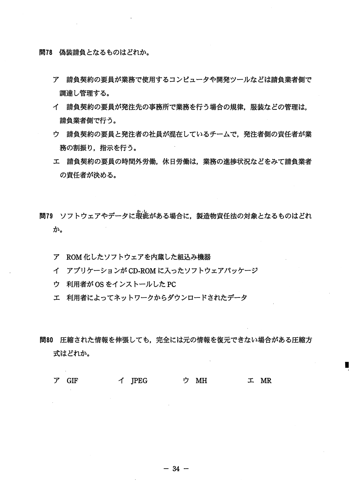

テキスト (OCR)

問78 偽装請負となるものはどれか。

ア 請負契約の要員が業務で使用するコンピュータや開発ツールなどは請負業者側で
調達し管理する。

イ 請負契約の要員が発注先の事務所で業務を行う場合の規律, 服装などの管理は,
請負業者側で行う。

ウ 請負契約の要員と発注者の社員が混在しているチームで, 発注者側の資任者が業
務の割振り, 指示を行う。

エエ 請負契約の要員の時間外労働, 休日労働は, 業務の進捗状況などをみて請負業者
の貢任者が決める。

問79 ソフトウェアやデータに隊狗がある場合に, 製造物資任法の対象となるものはどれ
か。

ROM 化したソフトウェアを内蔵した組込み機器

アプリケーションがCD-ROM に入ったソフトウェアパッケージ
利用者が OS をインストールした PC

利用者によってネットワークからダウンロードされたデータ

H へ

問80 圧縮された情報を伸張しても, 完全には元の情報を復元できない場合がある圧縮方
式はどれか。

ア GIF      イ JPEG     ウ MH      <= MR

### ページ 35

テキスト (OCR)

【 メモ用紙 〕

### ページ 36

テキスト (OCR)

7. 退室可能時間に途中で退室する場合には, 手を挙げて監督員に合図し, 答案用紙が
回収されてから静かに退室してください。
| 退室可能時間 | 10:30 ~ 11:50 |
8. 問題に関する質問にはお答えできません。文意どおり解釈してください。
. 問題冊子の余白などは, 適宜利用して構いません。
10. 試験時間中, 机上に置けるもの及び使用できるものは, 次のものに限ります。
なお, 会場での貸出しは行っていません。
受験票, 黒鉛筆及びシャープペンシル (B 又は HB), 鉛筆削り, 消しゴム, ER,
時計 (アラームなど時計以外の機能は使用不可), ハンカチ, ティッシュ
これら以外は机上に置けません。使用もできません。
11. 試験終了後, この問題冊子は持ち帰ることができます。
12. 答案用紙は, いかなる場合でも提出してください。回収時に提出しない場合は, 採
点されません。
13. 試験時間中にトイレへ行きたくなったり, 気分が悪くなったりした場合は, 手を挙
げて監督員に合図してください。
14. 午後の試験開始は 13:00 ですので, 12:40 までに着席してください。

試験問題に記載されている会社名又は製品名は, それぞれ各社の商標又は登録商標です。
なお, 試験問題では, ™ 及び © を明記していません。

お知らせ
1. システムの構築や試験会場の確保などの諸準備が整えば, 平成 23 年 11 月からIT パ
スポート試験において CBT※方式による試験を実施する予定です。
2. CBT 方式による試験の実施に伴い, 現行の筆記による試験は, 廃止する予定です。
3. 詳細が決定しましたら, ホームページなどでお知らせします。
※CBT (Computer Based Testing) : コンピュータを使用して実施する試験。

@2011 独立行政法人情報処理推進機構

---

## 午前解答

©2011 独立行政法人情報処理推進機構 
平成23 年度 特別 応用情報技術者試験 解答例 
 
午前試験 
問番号 
正解 
問1 
ウ 
問2 
エ 
問3 
ア 
問4 
エ 
問5 
イ 
問6 
エ 
問7 
イ 
問8 
エ 
問9 
ア 
問10 
イ 
問11 
エ 
問12 
イ 
問13 
ウ 
問14 
イ 
問15 
イ 
問16 
ア 
問17 
ウ 
問18 
ア 
問19 
ウ 
問20 
イ 
 
 
問番号 
正解 
問21 
イ 
問22 
イ 
問23 
イ 
問24 
イ 
問25 
イ 
問26 
ウ 
問27 
ウ 
問28 
ウ 
問29 
イ 
問30 
イ 
問31 
エ 
問32 
イ 
問33 
エ 
問34 
ウ 
問35 
エ 
問36 
イ 
問37 
イ 
問38 
ウ 
問39 
エ 
問40 
エ 
 
 
問番号
正解 
問41 
イ 
問42 
ア 
問43 
ウ 
問44 
ア 
問45 
ア 
問46 
ウ 
問47 
ア 
問48 
エ 
問49 
ウ 
問50 
ア 
問51 
エ 
問52 
エ 
問53 
イ 
問54 
ア 
問55 
ア 
問56 
イ 
問57 
ウ 
問58 
エ 
問59 
ア 
問60 
ウ 
 
 
問番号 
正解 
問61 
ウ 
問62 
ウ 
問63 
ウ 
問64 
イ 
問65 
イ 
問66 
エ 
問67 
イ 
問68 
エ 
問69 
ア 
問70 
イ 
問71 
ウ 
問72 
イ 
問73 
ウ 
問74 
イ 
問75 
ア 
問76 
イ 
問77 
エ 
問78 
ウ 
問79 
ア 
問80 
イ

---

## 午後問題

### ページ 1

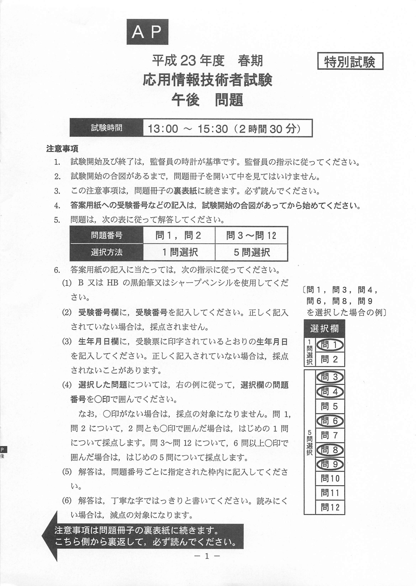

テキスト (OCR)

平成 23年度 春期
応用情報技術者試験
午後 問題

特別試験

試験時間    13:00 ~ 15:30 (2時間 30 分)

注意事項
試験開始及び終了は, 監督員の時計が基準です。監督員の指示に従ってください。
試験開始の合図があるまで, 問題冊子を開いて中を見てはいけません。
この注意事項は, 問題冊子の裏表紙に続きます。必ず読んでください。
答案用紙への受験番号などの記入は, 試験開始の合図があってから始めてください。

中

2
3.
4
5

注意事項は問題冊子の裏表紙に続きます。
こちら側から裏返して, 必ず読んでください。

問題は, 次の表に従って解答してください。

問題番号   問1, 問2  問3 >問 12
選択方法    1 問選択    5 問選択
答案用紙の記入に当たっては, 次の指示に従ってください。

(①) B 又は HB の黒鉛筆又はシャープペンシルを使用してくだ
さい。

(2) 受験番号欄に, 受験番号を記入してください。正しく記入
されていない場合は, 採点されません。

(3) 生年月日欄に, 受験票に印字されているとおりの生年月日
を記入してください。正しく記入されていない場合は, 採点
されないことがあります。

(4) 選択した問題については, 右の例に従って, RHONA
番号を〇印で囲んでください。

なお, 〇印がない場合は, 採点の対象になりません。問 1,

fl 2 について, 2 問とも〇印で囲んだ場合は はじめの 1 問
について採点します。問 3て問 12 について, 6 問以上〇印で
囲んだ場合は, はじめの 5 問について採点します。

(5) 解答は, 問題番号ごとに指定された枠内に記入してくださ
い。

(©) 解答は, 丁寧な字ではっきりと書いてください。読みにく
い場合は, 減点の対象になります。

(Hil, 間3, 問4,
問6, 問8, 問9
を選択した場合の例)

選択欄

問
aR

ih
iN)

と さ
Om
aN

it
on
o

合
fer)
〇)

a
ot
on
~

5
z

an
On
CO;

活
On
CO)

問10
間11
問12

### ページ 2

### ページ 3

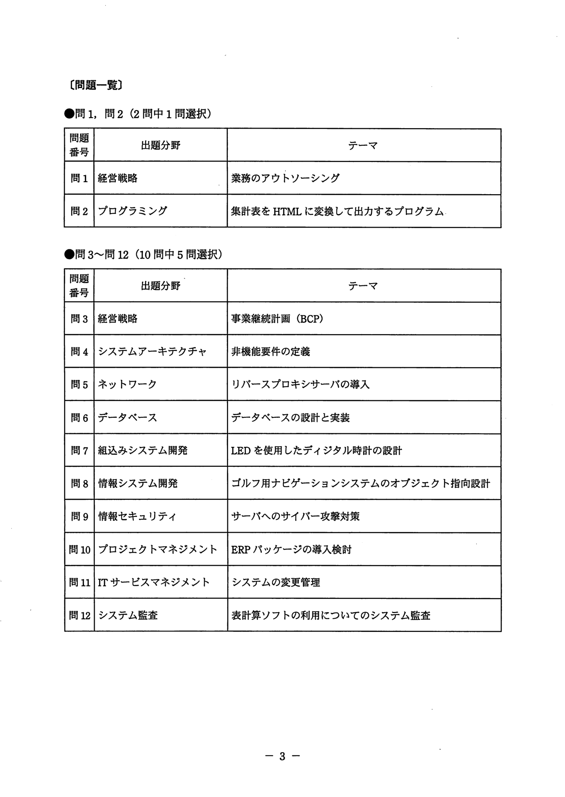

テキスト (OCR)

〔問題一覧〕

Ol, 問2 (2 問中1 問選択)

pa           出題分野                                    テーマ

間 1 |経営戦略            業務のアウトソーシング

問2 | プログラミング           集計表を HTML に変換して出力するプログラム
@ii 3~F 12 (10 問中 5 問選択)

           (ILS BF                                   テーマ

問3 | 経営戦略              事業継続計画 (BCP)

問 4 | システムアーキテクチャ     非機能要件の定義

問5 | ネットワーク                   リバパースプロキシサーパの導入

He | データベース           データベースの設計と実装

問 7 |組込みシステム開発           LED を使用したディジタル時計の設計

間 8 | 情報システム開発             ゴルフ用ナビゲーションシステムのオブジェクト指向設計
問9 | 情報セキュリティ               サーバへのサイバー攻撃対策

問 10 | プロジェクトマネジメント | ERP パッケージの導入検討

間 11 |TTサービスマネジメント | システムの変更管理

問 12 | システム監査                表計算ソフトの利用についてのシステム監査

### ページ 4

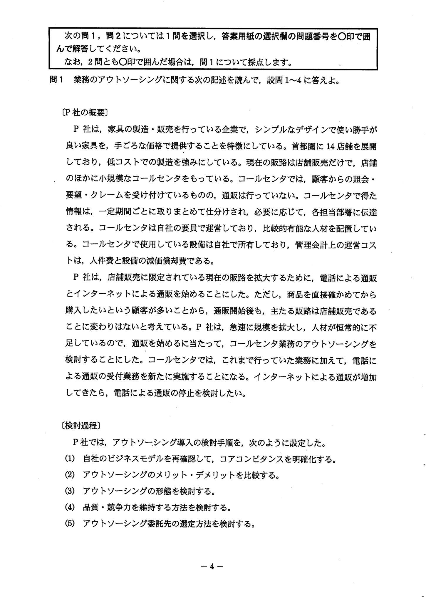

テキスト (OCR)

次の問 1 , 問2 については 1 問を選択し, 答案用紙の選択欄の問題番号を〇印で囲
んで解答してください。
なお, 2 問とも〇印で囲んだ場合は, 間 1 について採点します。

問1 業務のアウトソーシングに関する次の記述を読んで, 設問1ご4 に答えよ。

(P 社の概要】

P 社は家具の製造・販売を行っている企業で, シンプルなデザインで使い勝手が
良い家具を, 手ごろな価格で提供することを特徴にしている。首都圏に 14 店舗を展開
しており, 低コストでの製造を強みにしている。現在の販路は店舗販売だけで, TERR
のほかに小規模なコールセンタをもっている。コールセンタでは, BEDSORS-
要望・クレームを受け付けているものの, 通販は行っていない。コールセンタで得た
情報は, 一定期間ごとに取りまとめて仕分けされ, 必要に応じて, 各担当部署に伝達
される。コールセンタは自社の要員で運営しており, 比較的有能な人材を配置してい
る。コールセンタで使用している設備は自社で所有しており, 管理会計上の運営コス
トは, 人件費と設備の減価償却費である。

P 社は, 店舗販売に限定されている現在の販路を拡大するために, 電話による通販
とインターネットによる通販を始めることにした。ただし, 商品を直接確かめてから
購入したいという願客が多いことから, 通販開始後も, 主たる販路は店舗販売である
ことに変わりはないと考えている。P 社は急速規模を拡大し, 人材が恒常的に不
足しているので, 通販を始めるに当たって, コールセンタ業務のアウトソーシングを
検討することにした。コールセンタでは, これまで行っていた業務に加えて, 電話に
よる通販の受付業務を新たに実施することになる。インターネットによる通販が増加
してきたら, 電話による通販の停止を検討したい。

CRN)

P 社では, アウトソーシング導入の検討手順を, 次のように設定した。
1) 自社のビジネスモデルを再確認して, コアコンピタンスを明確化する。
Q アウトソーシングのメリット・デメリットを比較する。

QB) アウトソーシングの形態を検討する。
4) 品質・競争力を維持する方法を検討する。
6) アウトソーシング委託先の選定方法を検討する。

### ページ 5

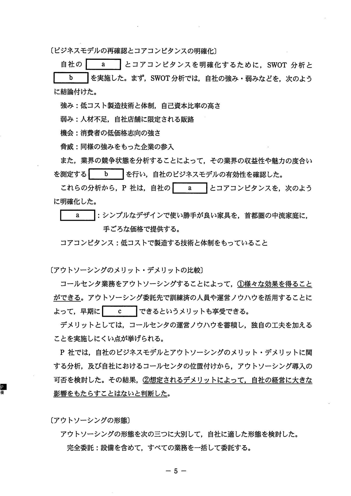

テキスト (OCR)

|

(ビジネスモデルの再確認とコアコンピタンスの明確化

自社の| a | とコアコンピタンスを明確化するために, SWOT 分析と
| 5 J を実施した。まず, SWOT 分析では, 自社の強み・弱みなどを, 次のよう
に結論付けた。

強み : 低コスト製造技術と体制, 自己資本比率の高さ

Ha: 人材不足, 自社店舗に限定される販路

機会 : 消費者の低価格志向の強さ

A: 同様の強みをもった企業の参入

また, 業界の競争状態を分析することによって, その業界の収益性や魅力の度合い
を測定する| b | を行い, 自社のビジネスモデルの有効性を確認した。

これらの分析から, P 社は, 自社の| a |] とコアコンピタンスを, 次のよう
に明確化した。

| 3 |: シンプルなデザインで使い勝手が良い家具を, BBO PRE,

手どろな価格で提供する。
コアコンピタンス : 低コストで製造する技術と体制をもっていること

〔アウトソーシングのメリット・デメリットの比較]

コールセンタ業務をアウトソーシングすることによって, ①様々な効果を得ること
ができる。アウトソーシング委託先で訓練済の人員や運営ノウハウを活用することに
kot, 早期に| c | できるというメリットも享受できる。

デメリットとしては, コールセンタの運営ノウハウを敬積し, 独自の工夫を加える
ことを実施しにくい点が挙げられる。

PHC, 自社のビジネスモデルとアウトソーシングのメリット・デメリットにじ関
する分析, 及び自社におけるコールセンタの位置付けから, アウトソーシング導入の
可否を検討した。その結果, ②想定されるデメリットによって, 自社の経営に大きな
影響をもたらすことはないと判断した。

〔アウトソーシングの形態〕
アウトソーシングの形態を次の三つに大別して, 自社に適した形態を検討した。
完全委託 : 設備を含めて, すべての業務を一括して委託する。

ー5一

### ページ 6

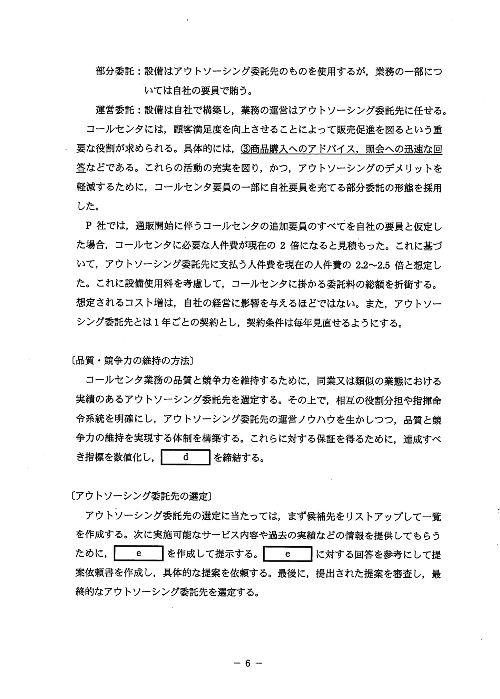

テキスト (OCR)

部分委託 : 設備はアウトソーシング委託先のものを使用するが, 業務の一部につ
いては自社の要員で周う。
運営委託 : 設備は自社で構築し, 業務の運営はアウウトソーシング委託先に任せる。

コールセンタには, 顧客満足度を向上させることによって販売促進を図るという重
要な役割が求められる。具体的には, ③商品購入へのアドバイス, 照会への迅速な回
答などである。これらの活動の充実を図り, かつ, アウトソーシングのデメリットを
軽減するために, コールセンタ要員の一部に自社要員を充てる部分委託の形態を採用
した。

P 社では, 通販開始に伴うコールセンタの追加要員のすべてを自社の要員と仮定し
た場合, コールセンタに必要な人件費が現在の 2 倍になると見積もった。これに基づ
WC, アウトソーシング和託先に支払う人件費を現在の人件費の 2.2こ2.5 倍と想定し
た。これに設備使用料を考慮して,。 コールセンタに掛かる委託料の総額を折笑する。
想定されるコスト増は, 自社の経営に影響を与えるほどではない。また, アウトソー
シング委託先とは 1 年ごとの契約とし, 契約条件は毎年見直せるようにする。

(品質・競争力の維持の方法]

コールセンタ業務の品質と競争力を維持するために, 同業又は類似の業態における
実績のあるアウトソーシング委託先を選定する。その上で, 相互の役割分担や指揮命
令系を明確にし, アウトソーシング委託先の運営/ウハウを生かしつつ, 品質と競
争力の維持を実現する体制を構築する。これらに対する保証を得るために, 達成すべ
き指標を数値化し, | d | を締結する。

(アウトソーシング委託先の選定】

アウトソーシング委託先の選定に当たっては, まず候補先をリストアップして一覧
を作成する。 次に実施可能なサービス内容や過去の実績などの情報を提供してもらう
ために, | e |] を作成して提示する。|  e | に対する回答を参考にして提
案依頼書を作成し, 具体的な提案を依頼する。最後に, 提出された提案を審査し, 最
終的なアウトソーシング委託先を選定する。

### ページ 7

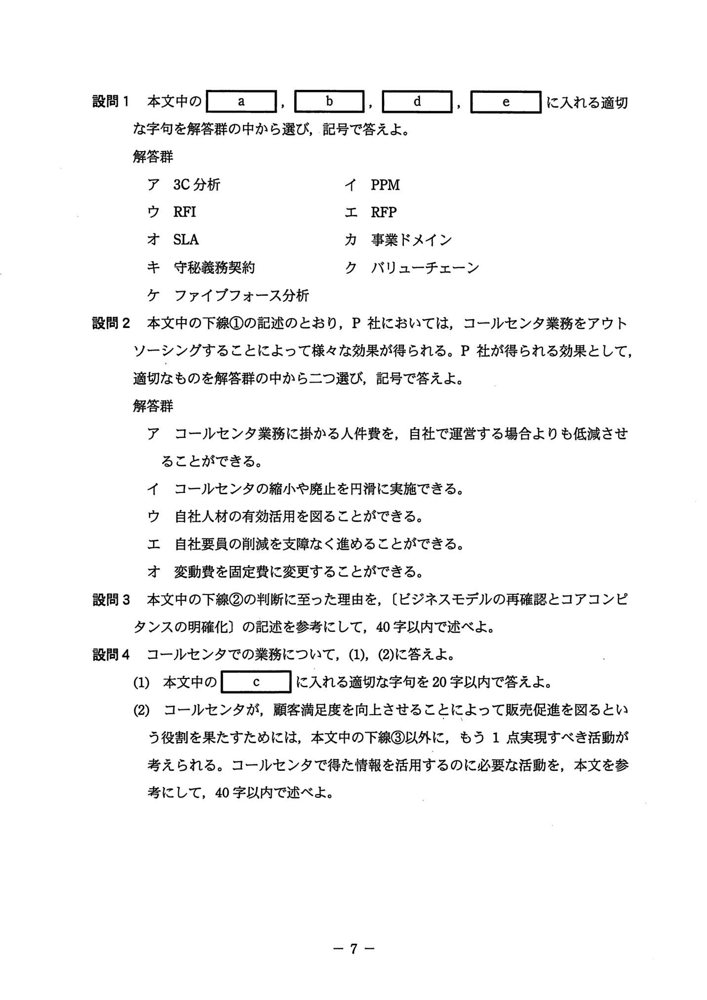

テキスト (OCR)

設問1 本文中の| ai || b |,[  d |,|  e |に入れる適切
な字句を解答群の中から選び, 記号で答えよ。

ER

ア 3C分析        イ PPM

ウ RFI          エ RFP

4 SLA          カ 事業ドメイン

キ 守秘義務契約      ク パリューチェーン

ケ ファイブフォース分析
設問2 本文中の下線①の記述のとおり, P 社においては, コールセンタ業務をアウト
ソーシングすることによって様々な効果が得られる。P 社が得られる効果として,
適切なものを解答惹の中からニつ選び, 記号で答えよ。
SB
ア コールセン2業務に掛かる人件費を, 自社で運営する場合よりも低減させ
ることができる。
イ コールセンタの縮小や廃止を円滑に実施できる。
ウ 自社人材の有効活用を図ることができる。
エ 自社要員の削減を支障なく進めることができる。
オ 変動費を固定費に変更することができる。
設問3 本文中の下線②の判断に至った理由を, 〔ビジネスモデルの再確認とコアコンピ
タンスの明確化】 の記述を参考にして, 40 字以内で述べよ。
設問4 コールセンタでの業務について, (1), ②)に答えよ。
Q) 本文中の に入れる適切な字旬を 20 字以内で答えよ。
Q) コールセンタが, 顧客満中度を向上させることによって販売促進を図るとい
う役割果たすためには, 本文中の下線③以外に, もう 1 点実現すべき活動が
考えられる。コールセンタで得た情報を活用するのに必要な活動を, ALES
考にして, 40 字以内で述べよ。

### ページ 8

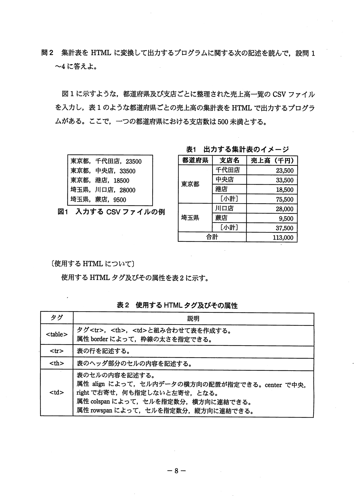

テキスト (OCR)

問2 集計表を HTML に変換して出力するプログラムに関する次の記述を読んで, 設問 1
て4 に答えよ。

図 1 に示すような, 者道府県及び支店ごとに整理された売上高一覧の CSV ファイル
を入力し, 表 1 のような都道府県ごとの売上高の集計表を HTML で出力するプログラ

ムがある。ここで, 一つの都道府県における支店数は 500 未満とする。

表1 出力する集計表のイメージ

東京都, 千代田店。23500        都道府県 | 支店名 | 売上高 (千円)
東京都, 中央店, 33500                千代田店       23,500
東京都, YEE, 18500           東京者   中央店         33,500
埼玉県, 川口店, 28000                 港店          18,500
埼玉県, BE, 9500                   [小計]        75,500
Oe         28,000

Bi 入力する CSV ファイルの例     埼玉県     mE                9500
[小計]        37,500

合計            113,000

〔使用する HTML について〕
使用する HTML タグ及びその属性を表 2 に示す。

表2 使用するHTML タグ及びその属性
タグ                                                   説明

タグ<tr>, <th>, <td>と組み合わせて表を作成する。
属性 border によって, 枠線の太さを指定できる。

<tr>      表の行を記述する。
<th> | 表のヘッダ部分のセルの内容を記述する。

表のセルの内容を記述する。

属性 aign によって, セル内データの横方向の配置が指定できる。center THR,
<td> | right で右寄せ, 何も指定しないと左寄せ, となる。

属性 colspan によって, セルを指定数分, 横方向に連結できる。

属性 rowspan によって, セルを指定数分, 縦方向に連結できる。

<table>

### ページ 9

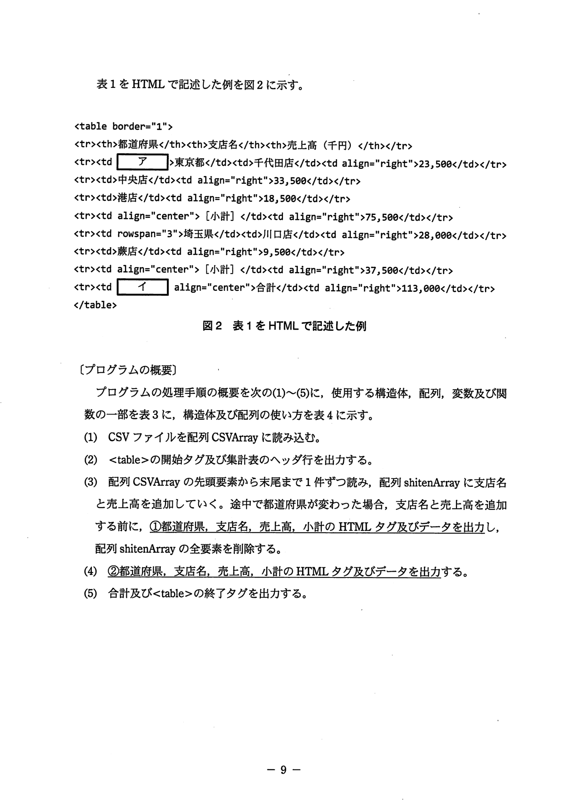

テキスト (OCR)

表1 をHTML で記述した例を図 2 に示す。

<table border="1">

<tr><th>都道府県</th><th>支店名</th><th>売上高 (FA) </tho</tr>

<tr><td [| ア 東京都</td><td>千代田店</td><td a11gn="right">23,599</td></tr>
<tr><td>中央店</td><td align="right">33,500</td></tr>

<tr><td>港店</td><td align="right">18,500</td></tr>

<tr><td align="center"> [小計] </td><td align="right">75,500</td></tr>

<tr><td rowspan="3">埼玉県</td><td>川口店</td><td align="right">28,000</td></tr>
<tr><td>藤店</td><td align="right">9,500</td></tr>

<tr><td align="center"> [小計] </td><td align="right">37,500</td></tr>

<tr><td a1ign="center">合計</td><td align="right">113,000</td></tr>
</table>

 2 表1をHTML で記述した例

〔プログラムの概要)〕
プログラムの処理手順の概要を次の(①)て(5)に, 使用する構造体, 配列, 変数及び関

数の一部を表 3 に, 構造体及び配列の使い方を表 4 に示す。

(①) CSV ファイルを配列 CSVArray に読み込む。

(2) <table>の開始タグ及び集計表のヘッダ行を出力する。

(3) 配列 CSVArray の先頭要素から未尾まで 1 件ずつ読み, 配列 shitenArray に支店名
と売上高を追加していく。途中で都道府県が変わった場合, 支店名と売上高を追加
する前に, ①都道府県, 支店名, 売上高, 小計の HTML タグ及びデータを出力し,
配列 shitenArray の全要素を削除する。

(4) @都道府県, 支店名, 売上高, 小計の HTML タグ及びデータを出力する。

6) 合計及び<table>の終了タグを出力する。

### ページ 10

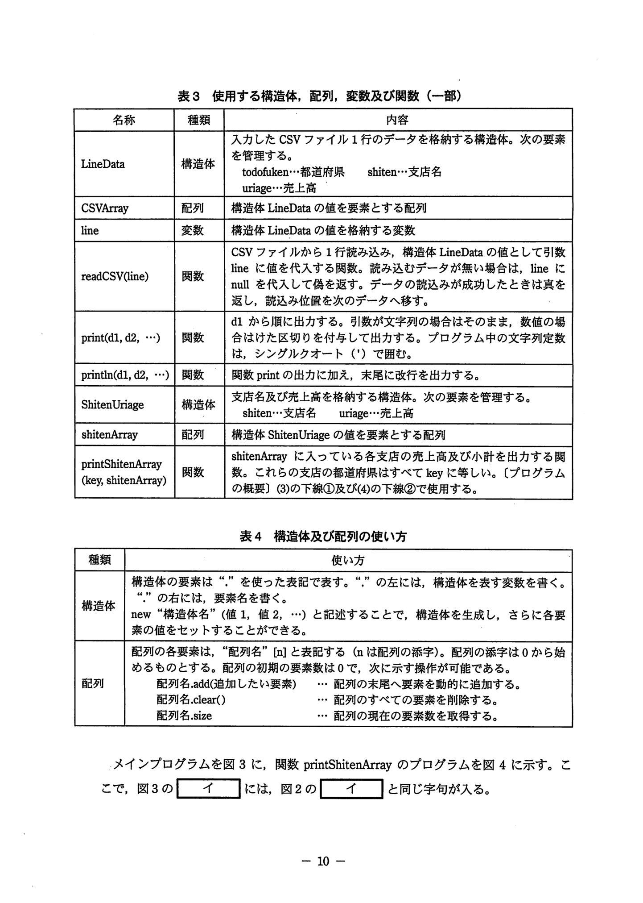

テキスト (OCR)

表3 使用する構造体, 配列, 変数及び関数 (一部)

名称            種類                                        内容
入力した CSV ファイル 1 行のデータを格納する構造体。次の要素
。                       、        を管理する。
LineData             Hae      todofuken…都道府県 shiten…支店名
uriage…売上高
CSVArray                配列        構造体 LineData の値を要素とする配列
line                   変数 | 構造体 LineData の値を格納する変数
CSV ファイルから 1 行読み込み, 構造体 LineData の値として引数
dCSVdine        関数      line に値を代入する関数。読み込むデータが無い場合は, ine に
readCSV(line                    null ERALTHEET. F—F OMAAMMRDLEL SAME
返し, 読込み位置を次のデータへ移す。
d1 から順に出力する。引数が文字列の場合はそのまま, 数値の場
print(d1, 2, …) | 関数    合はけた区切りを付与して出力する。プログラム中の文字列定数
は, シングルクオート (") で囲む。
printin(d1, d2, …) | 関数      関数 print の出力に加え, 末尾に改行を出力する。
。       。               、        支店名及び売上高を格納する構造体。次の要素を管理する。
ShitenUriage         fists      shiten…支店名 uriage…売上高
shitenArray            配列       構造体 ShitenUriage の値を要素とする配列
cintShite                       shitenArray に入っている各支店の売上高及び小計を出力する関
the  RA  関数 | 数。これらの支店の都道府県はすべて hey に等しい。〔プログラム
4                DBE) (3の下線①及び(④の下線②で使用する。
表4 構造体及び配列の使い方
種類                                                  使い方

構造体

構造体の要素は “.”を使った表記で表す。“.”の左には, 構造体を表す変数を書く。
“” Oth, 要素名を書く。

new “構造体名” (値 1, (22, …) と記述することで, 構造体を生成し. さらに各要
素の値をセットすることができる。

配列の各要素は, “MMA” In] と表記する Qは配列の添字)。配列の添字は 0 から始
めるものとする。配列の初期の要素数は 0 で, 次に示す操作が可能である。

配列名.add(追加したい要素) … 配列の末尾へ要素を動的に追加する。
配列名.clear()             … 配列のすべての要素を削除する。
配列名.size               … 配列の現在の要素数を取得する。

メインプログラムを図 3 に, 関数 printShitenArray のプログラムを図 4 に示す。こ

こで, 図3の[| イ | には, 図2の| イ | と同じ宇句が入る。

### ページ 11

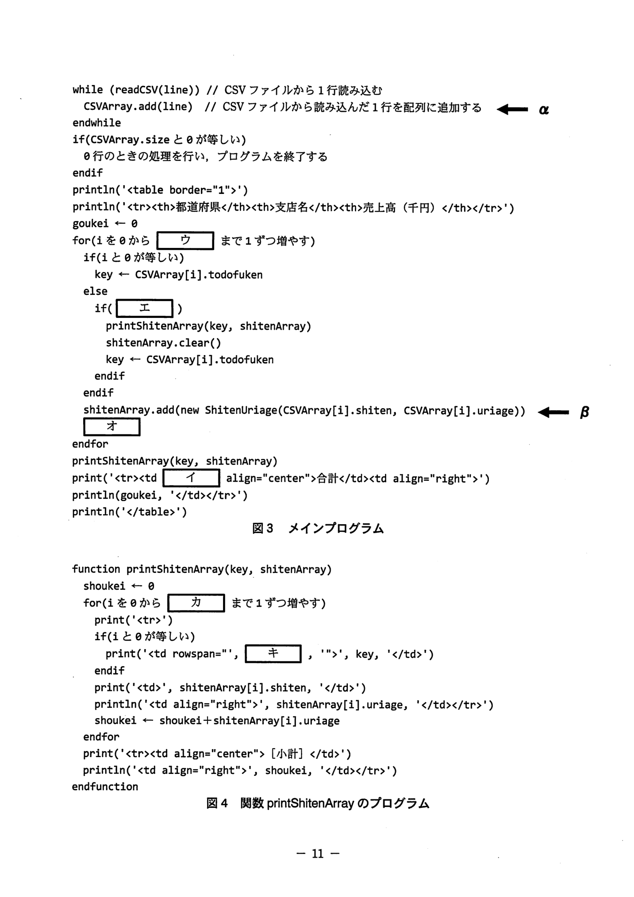

テキスト (OCR)

while (readCSV(1ine)) // CSV ファイルから 1行読み込む

CsvArray.add(line) // CSV ファイルから読み込んだ1 行を配列に追加する <q Q
endwhile

if(CsVArray.size と9が等しい)
@行のときの処理を行い プログラムを終了する
endif
println('<table border="1">')
print1n('<tr><th>都道府県</th><th>支店名</th><th>売上高 (FAI) </th></tr>')
goukei < @
for(i OMS  まで 1 ずつ増やす)
if(i と9が等しい)
key < CSVArray[i].todofuken
else
iL ェエ |)
printShitenArray(key, shitenArray )
shitenArray.clear()
key < CSVArray[i].todofuken
endif
endif
shitenArray・add(new ShitenUriage(CSVArray[i].shiten, CSVArray[i].uriage)) <a B
endfor
printShitenArray(key, shitenArray)
print('<tr><td a1ign="center">合計</td><td align="right">')
println(goukei, '</td></tr>')
println('</table>')
図3 メインプログラム

function printShitenArray(key, shitenArray )
shoukei < @
for(i を9から まで1 ずつ増やす)
print('<tr>')
if(i と9のが等しい)
print('<td rowspan="", » '">', key, '</td>')
endif
print('<td>', shitenArray[i].shiten, '</td>')
println('<td align="right">', shitenArray[i].uriage, '</td></tr>')
shoukei <- shoukei+shitenArray[i].uriage
endfor
Print( "<tr><td align="center"> [小計] </td>')
println('<td align="right">', shoukei, '</td></tr>')
endfunction

 4 関数 printShitenArray のプログラム

ー 11 一

### ページ 12

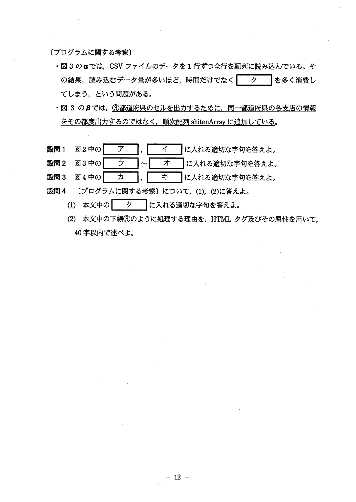

テキスト (OCR)

〔プログラムに関する考察〕

・図 Oats, CSV ファイルのデータを 1 行ずつ全行を配列に読み込んでいる。そ

DBR, 読み込むデータ量が多いほど, 時間だけでなく を多く消費し
てしまう, という問題がある。

・図 3 の8では, ③都道府県のセルを出力するために, 同一都道府県の各支店の情報
をその都度出力するのではなく, 順次配列 shitenArray に追加している。

設問1 図2中の| Fy |,| イ |に入れる適切な字句を答えよ。
設問2 図3中の| ウ |て| オ |に入れる適切な字句を答えよ。
設問3 図4中の| カ |,[ キ |に入れる適切な字句を答えよ。

設問4 〔プログラムに関する考察)] について, Q①), (②)に答えよ。

a 本文中の| ク | に入れる適切な字句を答えよ。

2) 本文中の下線②③のように処理する理由を, HTML タグ及びその属性を用いて,
40 字以内で述べよ。

### ページ 13

テキスト (OCR)

【 メモ用紙 〕

### ページ 14

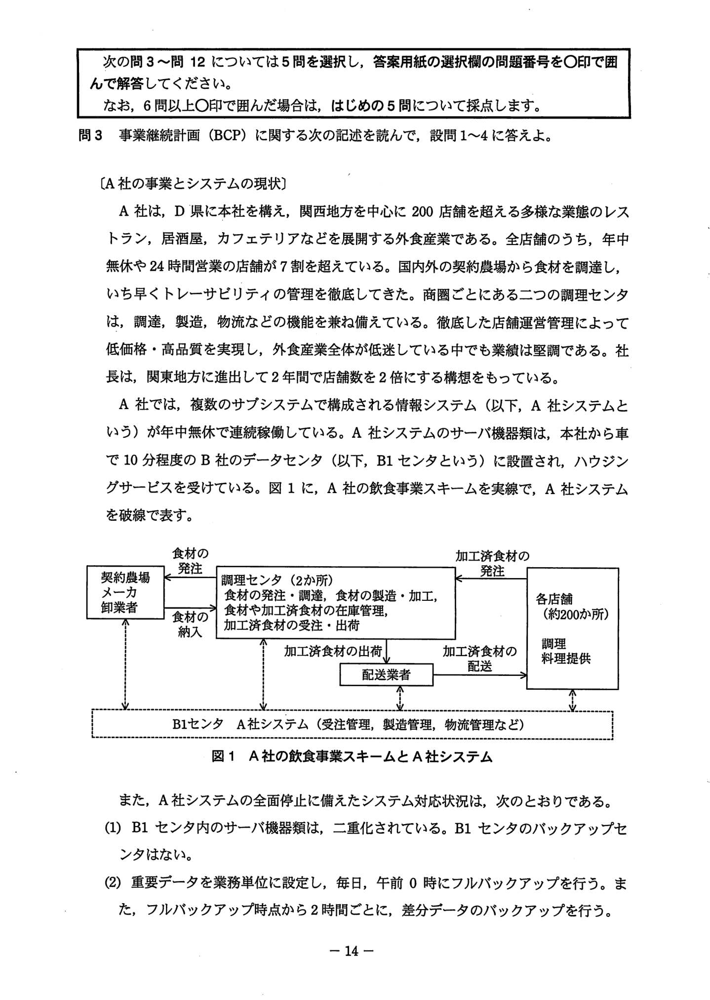

テキスト (OCR)

次の間3 ~f 12 については5問を選択し, 答案用紙の選択欄の問題番号を〇印で囲
んで解答してください。
なお, 6 問以上〇印で囲んだ場合は, はじめの 5 問について採点します。

問3 事業継続計画 (BCP) に関する次の記述を読んで, 設問 1ご4 に答えよ。

〔A 社の事業ととステムの現状

A 社は, D 県に本社を構え, 関西地方を中心に 200 店舗を超える多様な業態のレス
hoy, 居酒屋, カフェテリアなどを展開する外食産業である。全店舗のうち, 年中
無休や 24 時間営業の店舗が 7 割を超えている。国内外の契約農場から食材を調達し,
いち早くトレーサビリティの管理を徹底してきた。 商圏どとにある二つの調理センタ
は, 調達, 製造, 物流などの機能を兼ね備えている。徹底した店舗運営管理によって
低価格・高品質を実現し, 外食産業全体が低迷している中でも業績は堅調である。社
Rid, 関東地方に進出して 2 年間で店舗数を 2 倍にする構想をもっている。

A 社では, 複数のサプシステムで構成される情報システム (以下, A 社システムと
いう) が年中無休で連続稼働している。A 社システムのサーバ機器類は, 本社から車
で 10 分程度の B 社のデータセンタ (以下, B1 センタという) に設置され, ハウジン
グサービスを受けている。図 1 に, A 社の飲食事業スキームを実線で, A 社システム
を破線で表す。

RHO                                                        加工済食材の
契約農場      嗣理センタ (2か所)            RE
メーカ       食材の発注・調遅, 食材の製造・加工       各店舗
BRE トーの 食材や加工済全材の在庫管理            (約200か所)
納入 | 加工済食材の受注・出荷
加工済食材の出荷     加工済食材の | 電光
Ree    a
Ly
Wy.

B1センタ 4A社システム (受注管理, 製造管理, 物流管理など)
図1 A社の飲食事業スキームとA社システム

また, A社システムの全面停止に備えたシステム対応状況は, 次のとおりである。
Q) Bl センタ内のサーバ機器類は, 二重化されている。B1 センタのバックアップセ
ンタはない。
2) 重要データを業務単位に設定し, 毎日, 午前 0 時にフルバックアップを行う。ま
た, フルバックアップ時点から 2 時間ごとに, 差分データのバックアップを行う。

### ページ 15

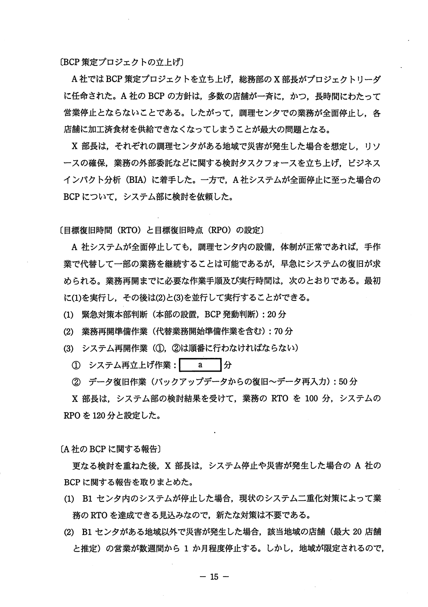

テキスト (OCR)

(BCP 策定プロジェクトの立上げ)
A 社では BCP 策定プロジェクトを立ち上げ, 総務部の X 部長がプロジェクトリーダ
に任命された。A 社の BCP の方針は, 多数の店舗が一斉に, かつ, 長時間にわたって
営業停止とならないことである。したがって, 調理センタでの業務が全面停止し, 各
店舗に加工済食材を供給できなくなってしまうことが最大の問題となる。
X BE, それぞれの調理センタがある地域で災害が発生した場合を想定し, UV
ースの確保, 業務の外部委託などに関する検討シスクフォースを立ち上げ, ビジネス
インパクト分析 (BIA) に着手した。一方で, A社システムが全面停止に至った場合の
BCP について, システム部に検討を依頼した。

【目標復旧時間 (RTO) と目標復旧時点 (RPO) ORE)

A 社システムが全面停止しても, 調理センタ内の設備, 体制が正常であればぱ, FE
業で代替して一部の業務を継続することは可能であるが, 早急にシステムの復旧が求
められる。業務再開までに必要な作業手順及び実行時間は, 次のとおりである。 最初
に1①)を実行し, その後は(2②)と(3③)を並行して実行することができる。

Q) 緊急対策本部判断 (本部の設置, BCP 発動判断) : 20 分
(2) 業務再開準備作業 (代其業務開始準備作業を含む) : 70 分
(3③) システム再開作業 ©, ②は順番に行わなければならない)

① システム再立上げ作業:| a ]分

@ データ復旧作業 (バックアップデータからの復旧データ再入力) : 50 分

X BE, システム部の検討結果を受けて, 業務の RTO を 100 分, システムの
RPO を120 分と設定した。

(A 社の BCP に関する報告]
更なる検討を重ねた後, X BR, システム停止や災害が発生した場合の A 社の

BCP に関する報告を取りまとめた。

(1①) Bl センタ内のシステムが停止した場合, 現状のシステム二重化対策によって業
務の RTO を達成できる見込みなので, 新たな対策は不要である。

2) B1 センタがある地域以外で災害が発生した場合, 該当地域の店舗 (最大 20 店舗
と推定) の営業が数週間から 1 か月程度停止する。しかし, 地域が限定されるので,

ー 15 一

### ページ 16

テキスト (OCR)

これまでどおりリスクを| b | する方針とし, 特別な対策をとらない。

(3③) B1 センタがある地域で災害が発生した場合,A 社システムが長時間にわたって全
面停止になると, A 社の事業を継続できなくなってしまう。炎害が発生した場合の
事業停止のリスクを|  c | する方針とし, システム対策を強化すべきである。

〔バックアップセンタの設立計画
経営会議での承認を受けた X 部長は, 重大な災害が発生しても A 社の事業を継続さ

せるために, B1 センタのバックアップセンタの設立計画作りに着手した。

Q①) 本社から約300 km 離れた 県にあるB社所有の別データセンタ (以下, B2 セン
タタという) のハウジングサービスを利用する。

(② B2 センタ内には, Bl センタと同等性能のサーパ機器類を設置する。すべてのソ
フトウェアのバージョン及び設定を B1 センタのものと同一に保つ。センタ間のデ
ータ整合性確保のために, B1 センタで取得したパバックアップデータを, B 社のネッ
トワークサービスを利用して, 速やかに B2 センタに伝送する。

8)  B2 センタ内のバックアップシステムはコールドスタンバイとし, BCP 発動後束
やかにシステム立上げ作業に着手する。

4)  B2 センタの運用オペレーションには, B2 センタから約 3 km 離れた B 社支社の
従業員を特別に手配する。B 社支社の従業員には, 事前に B2 センタで必要な運用
訓練を受けさせる。B 社支社の従業員は, 緊急連絡を受けて B 社支社や自宅などか
ら B2 センタへ移動し, システムを稼働させる。

さらに, A 社では皿急対策マニュアルを改訂し, B 社を含めた関係者による訓練を
半年に 1 回の頻度で実施することを決めた。

設問1 A社の企業活動と整合性を保つ観点から, A 社が, 将来, 今回策定した BCP を
見直す要因になる事項を, 本文中から 40 字以内で述べよ。
設問2 [目標復旧時間 (RTO) と目標復旧時点 (RPO) の設定〕] で, A HY AFAR
全面停止に至った場合の調理センタの BCP について, (1), (②)に答えよ。
(1) 業務の RIO を達成するために, システム再立上げ作業を何分以内で実行す
る必要があるか。|  a |] に入れる適切な数値を答えよ。

### ページ 17

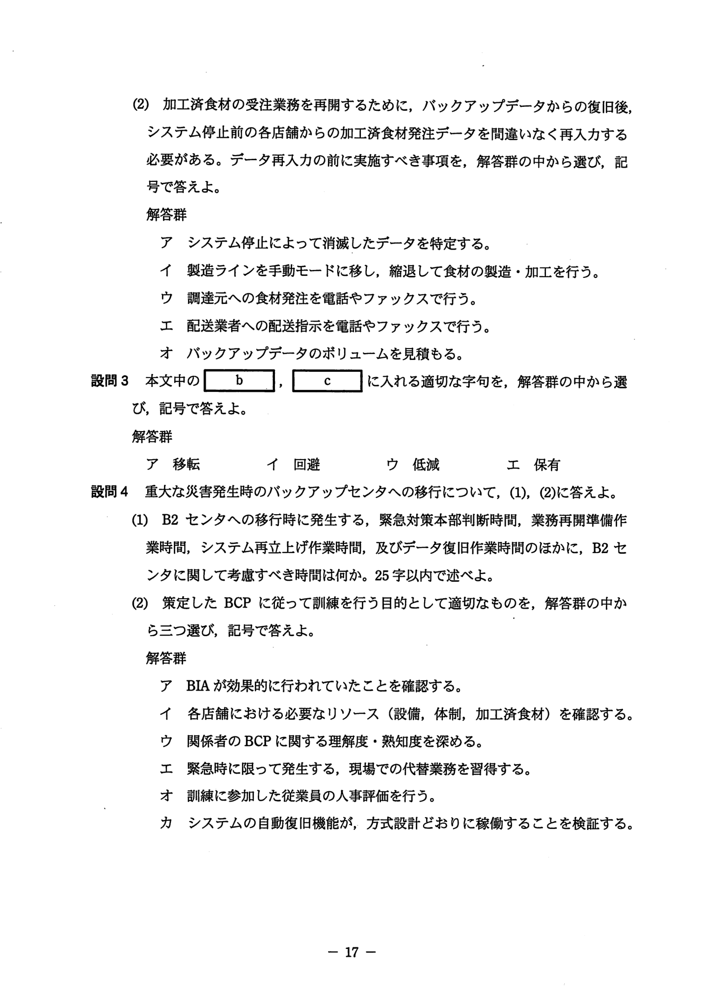

テキスト (OCR)

(②) 加工済食材の受注業務を再開するために, バックアップデータからの復旧後,
システム停止前の各店舗からの加工済食材発注データを間違いなく再入力する
必要がある。データ再入力の前に実施すべき事項を, 解答群の中から選び, 記
号で答えよ。
解答群

H へ

オ

システム停止によって消滅したデータを特定する。

製造ラインを手動モードに移し, 縮退して食材の製造・加工を行う。
調達元への食材発注を電話やファックスで行う。

配送業者への配送指示を電話やファックスで行う。

バックアップデータのボリュームを見積もる。

設問3 本文中の|  b |,|  c |に入れる適切な字句を, 解答群の中から選
OU, 記号で答えよ。

解答群

ア 移転     イ 回避     ウ 低減     xl 保有
設問4 重大な災害発生時のパックアップセンタへの移行について, (D, ②)に答えよ。

(①) B2 センタへの移行時に発生する, 緊急対策本部判断時間, 業務再開準備作
業時間, システム再立上げ作業時間, 及びデータ復旧作業時間のほかに, B2 セ
ンタに関して考慮すべき時間は何か。25 字以内で述べよ。

2) REL BCP に従って訓練を行う目的として適切なものを, 解答群の中か
ら三つ選び, 記号で答えよ。
解答群

+ YY 日マス

BIA が効果的に行われていたことを確認する。

各店舗における必要なりソース (設備, 体制, 加工済食材) を確認する。
関係者の BCP に関する理解度・熟知度を深める。

緊急時に限って発生する, 現場での代替業務を習得する。

訓練に参加した従業員の人事評価を行う。

システムの自動復旧機能が, 方式設計どおりに稼働することを検証する。

ー 17 一

### ページ 18

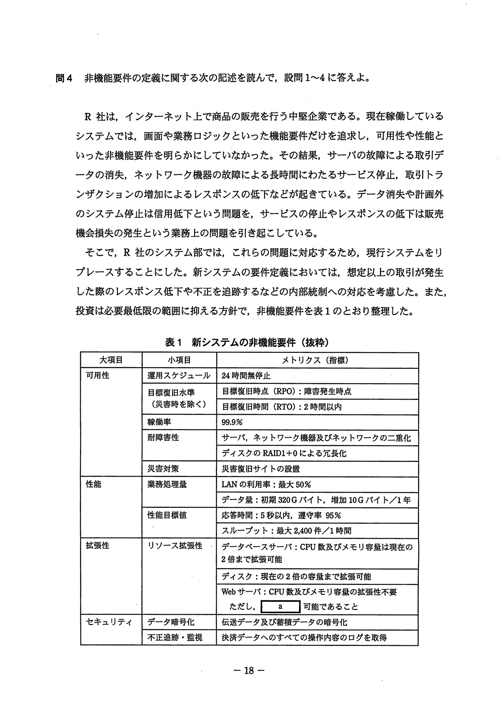

テキスト (OCR)

4 非機能要件の定義に関する次の記述を読んで, 設問 1て4 に答えよ。

R 社は,。 インターネット上で商品の販売を行う中堅企業である。 現在稼働している
システムでは, 画面や業務ロジックといった機能要件だけを追求し, 可用性や性能と
いった非機能要件を明らかにしていなかった。その結果, サーバの故障による取引デ
ータの消失, ネットワーク機器の故障による長時間にわたるサービス停止, 取引トラ
ンザクションの増加によるレスポンスの低下などが起きている。データ消失や計画外
のシステム停止は信用低下という問題を,。 サービスの停止やレスポンスの低下は販売
機会損失の発生という業務上の問題を引き起こしている。

そこで, R 社のシステム部では, これらの問題に対応するため, 現行システムをリ
プレースすることにした。新システムの要件定義においては, 想定以上の取引が発生
した際のレスポンス低下や不正を追跡するなどの内部統制への対応を考慮した。また
投資は必要最低限の範囲に抑える方針で, 非機能要件を表 1 のとおり整理した。

表1 新システムの非機能要件 (抜粋)
大項目      小項目            メトリクス GER)
可用性        運用スケジュール | 24 時間無停止
目標復旧水準    目標復旧時点 (RPO) : 障害発生時点
(災害時を除く) | 目標復旧時間 (RTO) : 2 時間以内

稼働率       99.9%
耐障害性        サーパ, ネットワーク機器及びネットワークの二重化
ディスクの RAID1二0 による冗長化
災害対策             災害復旧サイトの設置
性能             業務処理量          LAN の利用率 : 最大50%
データ量 : 初期320G バイト, 増加 10Gパイトノ1年
性能目標値       応答時間 : 5 秒以内, 遵守率 95%
-        スループット : 最大 2,400 件1 時間
拡張性                リソース拡張性 .| データベースサーバ : CPU 数及びメモリ容量は現在の
2 倍まで拡張可能

ディスク : 現在の 2 倍の容量まで拡張可能

Web サーバ : CPU数及びメモリ容量の拡張性不要
ただし, |  a |可能であること
セキュリティ | データ暗号化   伝送データ及び敬積データの障号化

不正追跡・監視 | 決済データへのすべての操作内容のログを取得

### ページ 19

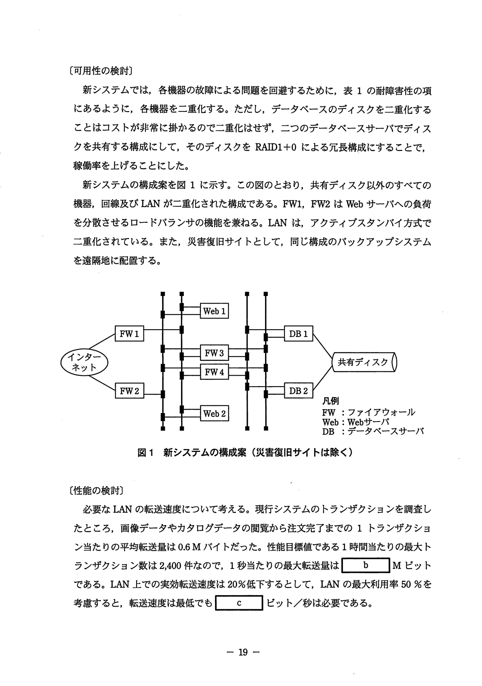

テキスト (OCR)

〔可用性の検討〕

新システムでは, 各機器の故障による問題を回避するために, 表 1 の耐障害性の項
にあるように, 各機器を二重化する。ただし, データベースのディスクを二重化する
ことはコストが非常に掛かるので二重化はせず, 二つのデータベースサーバでディス
クを共有する構成にして, そのディスクを RAID1二0 による冗長構成にすることで
稼働率を上げることにした。

新システムの構成案を図 1 に示す。この図のとおり, 共有ディスク以外のすべての
機器, 回線及び LAN が二重化された構成でちる。FW1, FW2 は Web サーバへの負荷
を分散させるロードバランサの機能を兼ねる。 LAN は, アクティプスタンバイ方式で
二重化されている。また, 火害復旧サイトとして, 同じ構成のバパックアップシステム
を遠隔地に配置する。

ABI

FW : ファイアウォール
Web : Webサーバ
DB : データベースサーバ

図1 新システムの構成案 (災害復旧サイトは除く)

(性能の検計
必要な LAN の転送速度について考える。 現行システムのトランザクションを調査し
たところ, 画像データやカタログデータの閲覧から注文完了までの 1 トランザクショ
ン当たりの平均転送量は 0.6 M パイトだった。 性能目標値である 1 時間当たりの最大ト
ランザクション数は 2.400 件なので, 1 秒当たりの最大転送量は| b |]Mビピット
CHS. LAN 上での実効転送速度は 20%低下するとして, LAN の最大利用率 50 %を
考慮すると, 転送速度は最低でも| c | ピットノ秒は必要である。

ー 19 一

### ページ 20

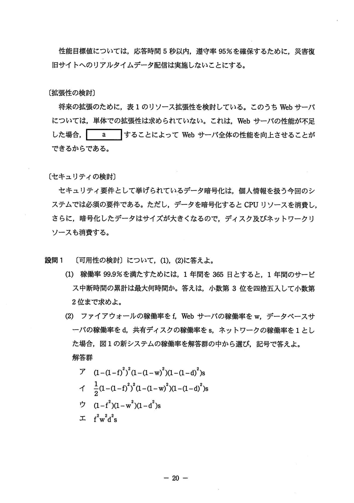

テキスト (OCR)

性能目標値については, 応答時間 5 BOA, 遵守率 95%を確保するために, RSH
旧サイトへのリアルタイムデータ配信は実施しないことにする。

(EOE)

将来の拡張のために, 表 1 のりソース拡張性を検討している。このうち Web サーバ
については, 単体での拡張性は求められていない。これは, Web サーバの性能が不足
した場合| a | することによって Web サーバ全体の性能を向上させることが
できるからである。

〔セキュリティの検討]
セキュリティ要件として挙げられているデータ暗号化は, 個人情報を扱う今回のシ
ステムでは必須の要件である。ただし, データを暗号化すると CPU リソースを消費し,
さらに, 暗号化したデータはサイズが大きくなるので, ディスク及びネットワークリ
ソースも消費する。

設問1 可用性の検討]】について, (①, ②)に答えよ。
(1) 稼働率 99.9%を満たすためには, 1 年間を 365 日とすると, 1 年間のサービ
ス中断時間の累計は最大何時間か。答えは, 小数第 3 位を四捨五入して小数第
2 位まで求めよ。
Q) ファイアウォールの稼働率を { Web サーバの乏働率を w, データベースサ
ーパの稼働率を d 共有ディスクの稼働率を s, ネットワークの乏働率を 1 とし
た場合, 図 1 の新システムの稼働率を解答群の中から選び, 記号で答えよ。
ER
Q-Q-D) Q-Q-w) )1-Q- )s
20-0-DYQ-G-w'Da-G-の
Q-f)a-w’)a-d’)s

2 2.2

fwds

HA SN

ー 20 一

### ページ 21

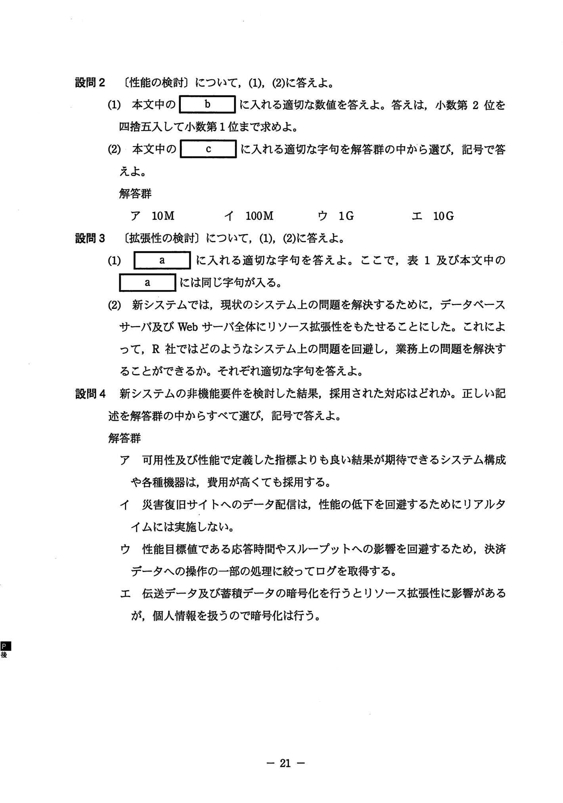

テキスト (OCR)

|

設問2 (性能の検討について, ①), ②)に答えよ。
Q①) 本文中の| b | に入れる適切な数値を答えよ。答えは, 小数第 2 位を

四捨五入して小数第 1 位まで求めよ。

@ 本文中の| c | に入れる適切な字名を解答群の中から選び, 記号で答
えよ。

解答群
ア 10M    イ 100M    ウ 1G     x= 10G

設問3 〔拡張性の検討について, (D, ②に答えよ。
Q①) [|  』 |] に入れる適切な字句を答えよ。ここで, 表 1 及び本文中の
[a | には同じ字句が入る。
Q) 新システムでは, 現状のシステム上の問題を解決するために, データベース
サーバ及び Web サーバ全体にリソース拡張性をもたせることにした。これによ
って, R 社ではどのようなシステム上の問題を回避し, 業務上の問題を解決す
ることができるか。それぞれ適切な字句を答えよ。
設問4 新システムの非機能要件を検討した結果, 採用された対応はどれか。正しい記
述を解答群の中からすべて選び, 記号で答えよ。
ARS BE
ア 可用性及び性能で定義した指標よりも良い結果が期待できるシステム構成
や各種機器は, 費用が高くても採用する。
イ 災害復旧サイトへのデータ配信は, 性能の低下を回避するためにリアルタ
イムにには実施しない。
ウ 人性能目標値である応答時間やスループットへの影響を回避するため, 決済
データへの操作の一部の処理に絞ってログを取得する。
L 伝送データ及び菩積データの暗号化を行うとリソース拡張性に影響がある
が, 個人情報を扱うので暗号化は行う。

### ページ 22

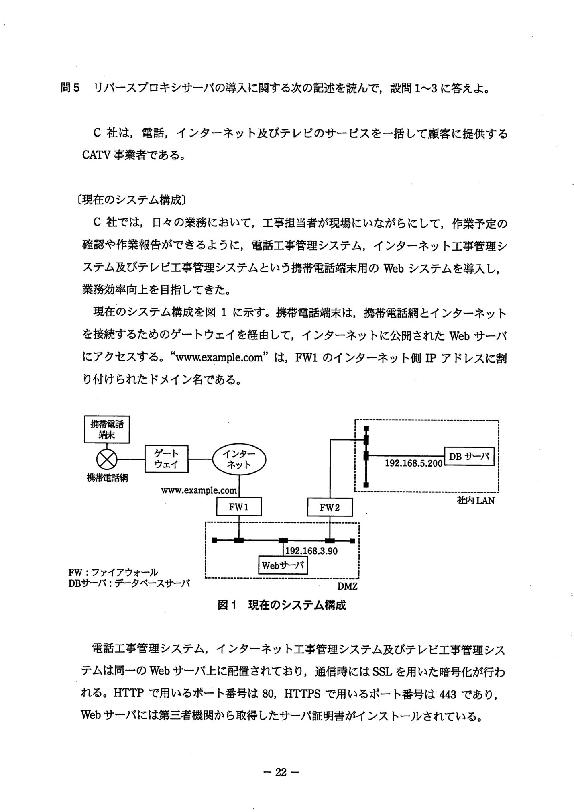

テキスト (OCR)

問5 リバパースプロキシサーパの導入に関する次の記述を読んで, 設問 1こ3 に答えよ。

C 社は, 電話, インターネット及びテレビのサービスを一括して顧客に提供する
CATV 事業者である。

〔現在のシステム構成〕

C 社では, 日々の業務において, 工事担当者が現場にいながらにして, 作業予定の
確認や作業報告ができるように, 電話工事管理システム, インターネット工事管理シ
ステム及びテレビ工事管理システムという携帯電話端末用の Web システムを導入し,
業務効率向上を目指してきた。

現在のシステム構成を図 1 に示す。携帯電話端末は, 携帯電話網とインターネット
を接続するためのゲートウェイを経由して, インターネットに公開された Web サーバ
にアクセスする。“wwwexample.com” は, FW1 のインターネット側 IP アドレスに割
り付けられたドメイン名である。

携帯電話
端末
ゲート                ンター                                                                    ‘
&)          ウェイ          SS ト                                        neziess200LPP サバ
携帯電話綱
www.example.com                                                                              PP
| Fwi |          | ewe |
192.168.3.90
Webサーバ
FW : ファイアウォール                           ー

DBサーバ : データベースサーバー         DMz
図1 現在のシステム構成

電話工事管理システム, インターネット工事管理システム及びテレビ工事管理シス
テムは同一の Web サーバ上に配置されており, 通信時には SSL を用いた暗号化が行わ
“1S, HTTP で用いるポート番号は 80, HTTPS で用いるポート番号は 443 THD,
Web サーバには第三者機関から取得したサーバ証明書がインストールされている。

### ページ 23

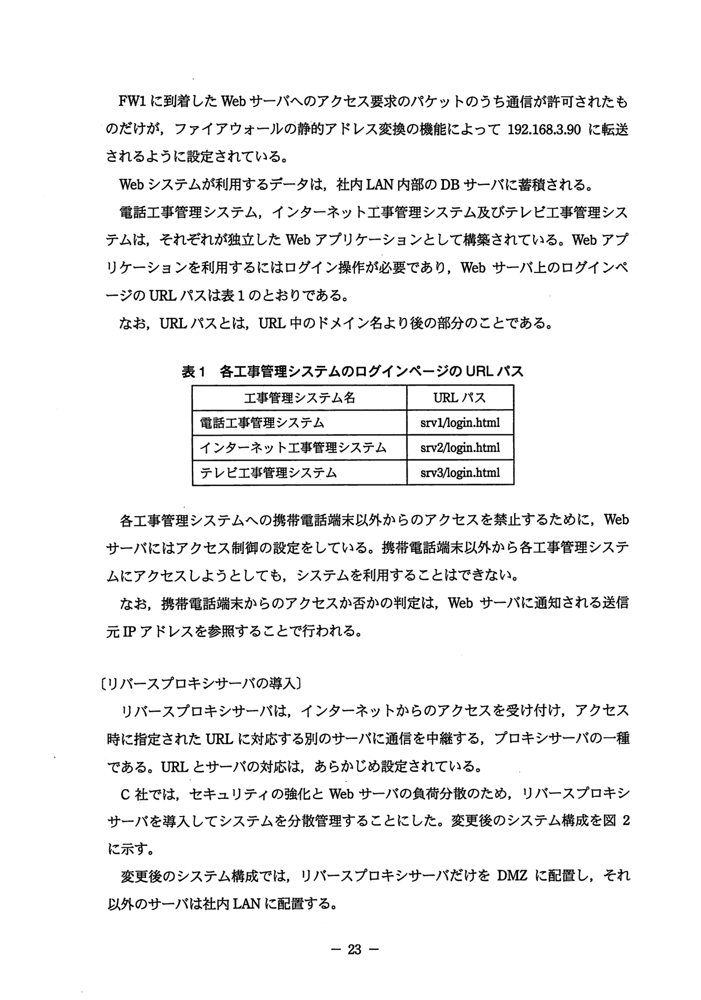

テキスト (OCR)

FW1 に到着した Web サーバへのアクセス要求のパケットのうち通信が許可されたも
のだけが, ファイアウォールの静的アドレス変換の機能によって 192.168.3.90 に転送
されるように設定されている。

Web システムが利用するデータは, 社内 LAN 内部の DB サーバに次積される。

電話工事管理システム, インターネット工事管理システム及びテレビ工事管理シス
テムは, それぞれが独立した Web アプリケーションとして構築されている。Web アプ
リケーションを利用するにはログイン操作が必要であり, Web サーバ上のログインペ
ージの URL パスは表 1 のとおりである。

なお, URL パスとは, URL 中のドメイン名より後の部分のことである。

表1 各工事管理システムのログインページの URL パス

工事管理システム名        URL パス
電話工事管理システム                                 srv1/login.html
インターネット工事管理システム     srv2/login.html
テレビエ事管理システム                             srv3/login.html

各工事管理システムへの携帯電話端末以外からのアクセスを禁止するために, Web
サーバにはアクセス制御の設定をしている。携帯電話端末以外から各工事管理システ
ムにアクセスしようとしても, システムを利用することはできない。

なお, 携帯電話端末からのアクセスか否かの判定は, Web サーバに通知される送信
元TP アドレスを参照することで行われる。

〔リバースプロキシサーバパの導入〕

リバースプロキシサーバは, インターネットからのアクセスを受け付け, アクセス
時に指定された URL に対応する別のサーバに通信を中継する, プロキシサーバの一種
である。URL とサーバの対応は, あらかじめ設定されている。

C 社では, セキュリティの強化と Web サーバの負荷分散のため, リバパースプロキシ
サーバを導入してシステムを分散管理することにした。 変更後のシステム構成を図 2
に示す。

変更後のシステム構成では, リバースプロキシサーバだけを DMZ に配置し. それ
以外のサーバは社内 LAN に配置する。

ー 23 一

### ページ 24

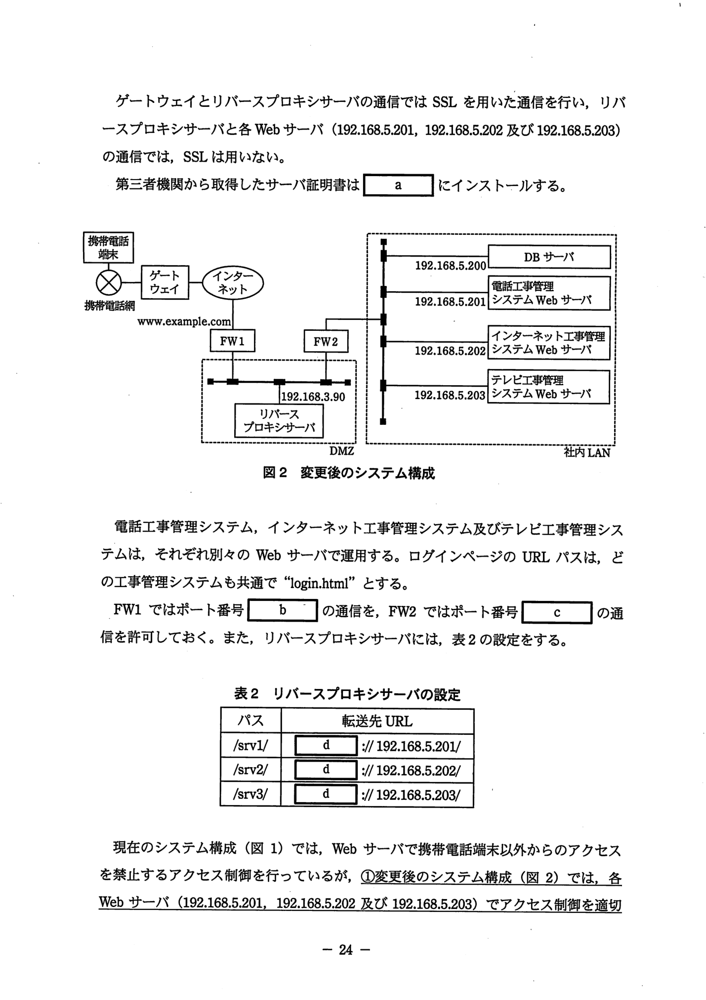

テキスト (OCR)

ゲートウェイとリバパースプロキシサーバの通信では SSL を用いた通信を行い, リバ
ースプロキシサーバと各 Web サーバ (192.168.5.201, 192.168.5.202 及び 192.168.5.203)
の通信では, SSL は用いない。

第三者機関から取得したサーバ証明書は| a |] にインストールする。

携帯電話
端末
@H bat    a)                                 電話工事管理
携帯電話綱                                                    192.168.5.201| システム Web サーバ
www.example.com

インターネット工事管理

ーー                   ni                     192.168.5.202| システム Web サーバ
テレビ工事管理
192.168.3.90                 192.168.5.203| システム Web サーバ
リバパース
プロキシサーバ
DMZ                                                             社内LAN

 2 変更後のシステム構成

電話工事管理システム, インターネット工事管理システム及びテレビ工事管理シス
テムは, それぞれ別々の Web サーバで運用する。ログインページの URL パスは, ど
の工事管理システムも共通で “ogin.html” とする。

FW1 ではポート番号| b | の通信を,FW2 ではポート番号| c low

信を許可しておく。また, リパースプロキシサーバには, 表 2 の設定をする。

R2 リバースプロキシサーバの設定
パス                       転送先 URL

rv1/ | | d ]:/192168.5.207/
rv2/ | [| 3 |:/192168.5.202/
rv3/ | [| d ]:/192168.5.2037

現在のシステム構成 (図 1) では, Web サーバで携帯電話端末以外からのアクセス
を禁止するアクセス制御を行っているが, ①変更後のシステム構成 (図 2) では, 各
Web サーバ (192.168.5.201, 192.168.5.202 及び 192.168.5.203) でアクセス制御を適切

ー24 一

### ページ 25

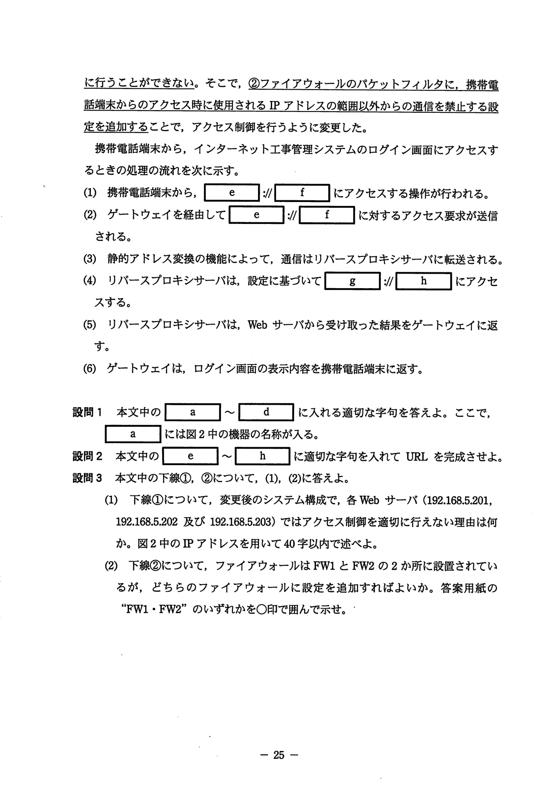

テキスト (OCR)

に行うことができない。そこで, ②③ファイアウォールのパケットフィルタに, 携帯電
語端末からのアクセス時に使用される IP アドレスの範囲以外からの通信を禁止する設
定を追加することで, アクセス制御を行うように変更した。
携帯電話端末から, インターネット工事管理レステムのログイン画面にアクセスす
るときの処理の流れを次に示す。
Q①) 携帯電話端末から, |  e [vl f |にアクセスする操作が行われる。
(②) ゲートウェイを経由して| e |: f |に対するアクセス要求が送信
される。
3) 静的アドレス変換の機能こよって, 通信はりリパースプロキシサーバに転送される。
4 リバースプロキシサーバは, 設定に基づいて|  g [wf oh |にアァクセ
スする。
(5) リバースプロキシサーバは, Web サーバから受け取った結果をゲートウェイに返
す。
©) ゲートウェイは, ログイン画面の表示内容を携帯電話端末に返す。

設問1 本文中の| a |て| od | に入れる適切な字句を答えよ。ここで,
| 』 | には図2中の機器の名称が入る。
設問2 本文中の| e |て| h |に適切な字句を入れて URL を完成させよ。
設問3 本文中の下線①, について, ①⑪, ②に答えよ。
(1①) 下線のについて, 変更後のシステム構成で, 各 Web サーバ (192.168.5.201,
192.168.5.202 及び 192.168.5.203) ではアクセス制御を適切に行えない理由は何
か。図2 中のTP アドレスを用いて 40 字以内で述べよ。
2) 下線②について, ファイアウォールは FW1 と FW2 の 2 か所に設置されてい
るが, どちらのファイアウォールに設定を追加すればよいか。 答案用紙の
“FW1・FW2”" のいずれかを〇印で囲んで示せ。 |

### ページ 26

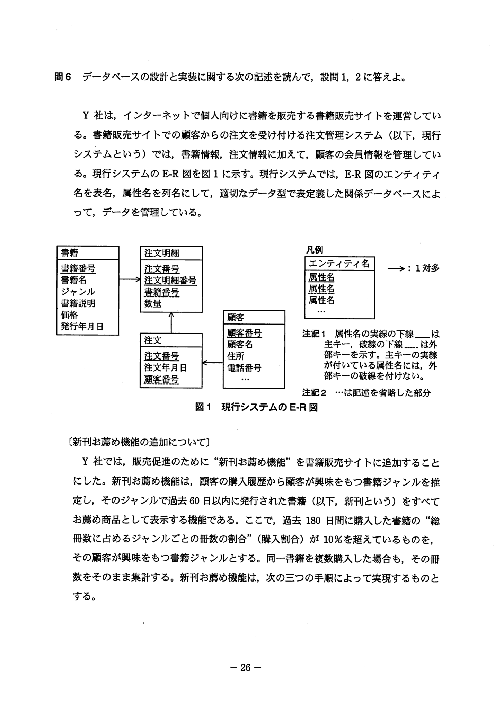

テキスト (OCR)

問6 データベースの設計と実装に関する次の記述を読んで, 設問 1, 2 に答えよ。

Y 社は。 インターネットで個人向けに書籍を販売する書籍販売サイトを運営してい
る。書籍販売サイトでの顧客からの注文を受け付ける注文管理システム (以下, 現行
システムという) では, 書籍情報, 注文情報に加えて, 顧客の会員情報を管理してい
る。現行システムの E-R 図を図 1 に示す。現行システムでは, E-R 図のエンティティ
名を表名, 属性名を列名にして, 適切なデータ型で表定義した関係データベースによ
って, データを管理している。

書籍               注文明細                            AA ーー

書籍番号           注文番号                              エンティティ名    —>: 1対多

書籍名             注文明細番号                         属性名

ジャンル                  書籍番号                                               属性名

書籍説明           数量                                 属性名

価格                                 mz                ne

FETA                              zBS         #1 属性名の実線の下線 は
HEX               BE,                主キー, 破線の下線は外

号           パ付いてい         こは,

meas         anes              部キーの破線を付けない。

注記2 …は記述を省略した部分
 1 現行システムの E-R

(新刊お薦め機能の追加について〕

Y 社では, 販売促進のために “新刊お薦め機能” を書籍販売サイトに追加すること
にした。 新刊お薦め機能は, 顧客の購入履歴から顧客が興味をもつ書籍ジャンルを推
定し, そのジャンルで過去 60 日以内に発行された書籍 (以下, 新刊という) をすべて
お薦め商品として表示する機能である。ここで, 過去 180 日間に購入した書籍の “総
志数に占めるジャンルごとの冊数の割合” (購入割合) が 10%を超えているものを,
その顧客が興味をもつ書籍ジャンルとする。同一書籍を複数購入した場合も, その冊
数をそのまま集計する。新刊お薦め機能は, 次の三つの手順によって実現するものと
する。

### ページ 27

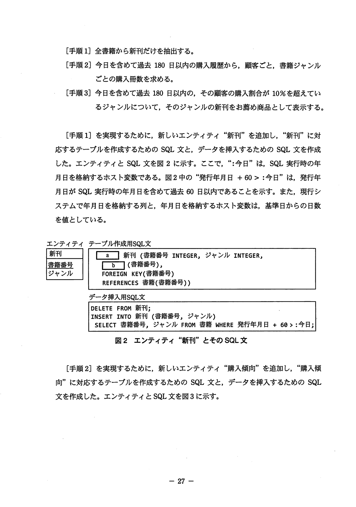

テキスト (OCR)

[手順 1] 全書籍から新刊だけを抽出する。

[手順 2] 今日を含めて過去 180 日以内の購入履歴から, 顧客ごと, 書籍ジャンル
ごとの購入冊数を求める。

[手順 3] 今日を含めて過去 180 日以内の, その顧客の購入割合が 10%を超えてい
るジャンルについて, そのジャンルの新刊をお薦め商品として表示する。

[手順 1] を実現するために, 新しいエンティティ “新刊" を追加し, “新刊" に対
応するテープルを作成するための SQL ME, データを挿入するための SQL MEER
した。エンティティと SQL 文を図 2 に示す。こことで, “:今日" は, SQL 実行時の年
月日を格納するホスト変数である。図 2 中の “発行年月日 + 60 > :今日" は, 発行年
月日が SQL 実行時の年月日を含めて過去 60 日以内であることを示す。また, 現行シ
ステムで年月日を格納する列と, 年月日を格納するホスト変数は, 基準日からの日数
を値としている。

エンティティ テーブル作成用SQL文

新刊       [| 』 | 新刊 (SBS INTEGER, ジャンル INTEGER,
anes       Lo] aes),
ジャンル      FOREIGN KEY(書籍番号)

REFERENCES 書籍(書籍番号) )

データ挿入用SQL文

DELETE FROM 新刊:
INSERT INTO 新刊 (書籍番号, ジャンル)                     |
SELECT 書籍番号, ジャンル FROM 書籍 MHERE 発行年月日 + 69>:今日:

図2 エンティティ “新刊" とその SQL文

[手順 2] を実現するために, 新しいエンティティ “購入傾向" を追加し, “購入傾
向” に対応するテープルを作成するための SQL ML, データを挿入するための SQL
文を作成した。エンティティと SQL 文を図 3 に示す。

### ページ 28

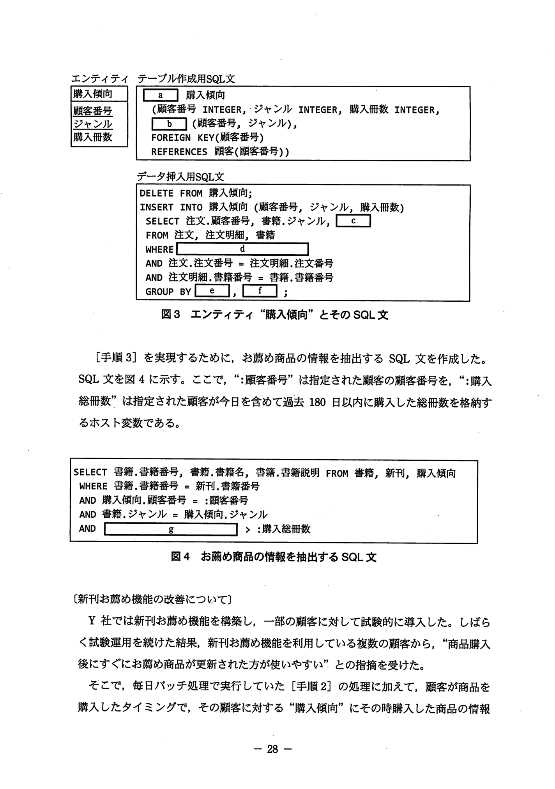

テキスト (OCR)

エンティティ テーブル作成用SQL文

購入傾向    [し ] 農入傾向

顧客番号      (顧客番号 INTEGER, ジャンル INTEGER, 購入冊数 INTEGER,
ジャンル    [し1 ] (BBS, Yr),

購入冊数     FOREIGN KEY(顧客番号)

REFERENCES 顧客(顧客番号) )

データ挿入用SQL文

DELETE FROM 購入傾向:

INSERT INTO 購入傾向 (顧客番号, ジャンル, 購入冊数)
SELECT 注文.顧客番号, 書籍ジャンル, | c ]

FROM 注文 注文明細, 書籍

WHERE [         d         ]

AND 注文.注文番号 = 注文明細.注文番号

AND 注文明細.書籍番号 = 書籍.書籍番号

croup gy|_e ], :

図3 エンティティ “購入傾向" とその SQL 文

[手順 3] を実現するために, お薦め商品の情報を抽出する SQL 文を作成した。
SQL 文を図 4 に示す。ことここで, “:顧客番号" は指定された顧客の顧客番号を, “:購入
総冊数" は指定された顧客が今日を含めて過去 180 日以内に購入した総冊数を格納す
るホスト変数である。

SELECT 書籍.書籍番号, 書籍.書籍名 書籍.書籍説明 FRoM 書籍, 新刊, 購入傾向
WHERE 書籍.書籍番号 = 新刊.書籍番号

AND 購入傾向.顧客番号 = :顧客番号
AND 書籍.ジャンル = 購入傾向.ジャンル
AND [       g       ] > :購入総冊数

 4 お薦め商品の情報を抽出する SQL 文

(新刊お薦め機能の改善について〕

Y 社では新刊お薦め機能を構築し, 一部の顧客に対して試験的に導入した。しばら
く試験運用を続けた結果, 新刊お薦め機能を利用している複数の顧客から, “商品購入
後にすぐにお薦め商品が更新された方が使いやすい"との指摘を受けた。

そこで, 毎日バッチ処理で実行していた[手順 2] の処理に加えて, 顧客が商品を
購入したタイミングで, その顧客に対する “購入傾向" にその時購入した商品の情報

### ページ 29

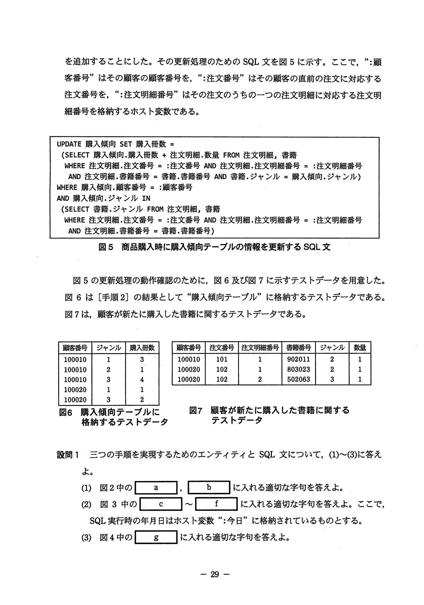

テキスト (OCR)

を追加することにした。その更新処理のための SQL 文を図 5 に示す。ここで, “A
客番号” はその顧客の顧客番号を, “:注文番号”はその顧客の直前の注文に対応する
注文番号を, “:注文明細番号" はその注文のうちの一つの注文明細に対応する注文明
細番号を格納するホスト変数である。

UPDATE 購入傾向 SET 購入冊数 =
(SELECT 購入傾向.購入冊数 + 注文明細.数量 FROM 注文明細, 書籍
MHERE 注文明細.注文番号 = :注文番号 AND 注文明細.注文明細番号 = :注文明細番号
AND 注文明細.書籍番号 = 書籍.書籍番号 AND 書籍・ジャンル = 購入傾向.ジャンル)
WHERE 購入傾向.顧客番号 = :顧客番号
AND 購入傾向.ジャンル IN
(SELECT 書籍.ジャンル FROM 注文明細, 書籍
WHERE 注文明細.注文番号 = :注文番号 AND 注文明細.注文明細番号 = :注文明細番号
AND 注文明細.書籍番号 = 書籍.書籍番号)

図5 商品購入時に購入傾向テーブルの情報を更新する SQL 文

図 5 の更新処理の動作確認のために, 図 6 及び図 7 に示すテストデータを用意した。
図6 は[手順2] の結果として “購入傾向テーブル"に格納するテストデータである。
 7 は, 顧客が新たに購入した書籍に関するテストデータである。

100010                        100010 | 101        1       902011     2
100010                        100020 | 102        1       803023 | 2
100010                        100020 | 102        2       502063 | 3
100020
100020

図6 購入傾向テーブルに     図7 顧客が新たに購入した書籍に関する

格納するテストデータ         テストデータ

願客番号 | ジャンル | 購入冊数  願客番号 | 注文番号 | 注文明細番号 | 書籍番号 | ジャンル | Bet
1
1
1

wrone
ららトロの

設問1 三つの手順を実現するためのエンティティと SQL 文について, ①ぐて⑬)に答え
よ。
①) 図2中の| ai |,|  b |に入れる適切な字句を答えよ。
②⑫) 図 3 中の| c |て| £ |に入れる適切な字句を答えよ。ここで,
SQL 実行時の年月日はホスト変数 “:今日” に格納されているものとする。
⑬ 図4中の に入れる適切な字句を答えよ。

### ページ 30

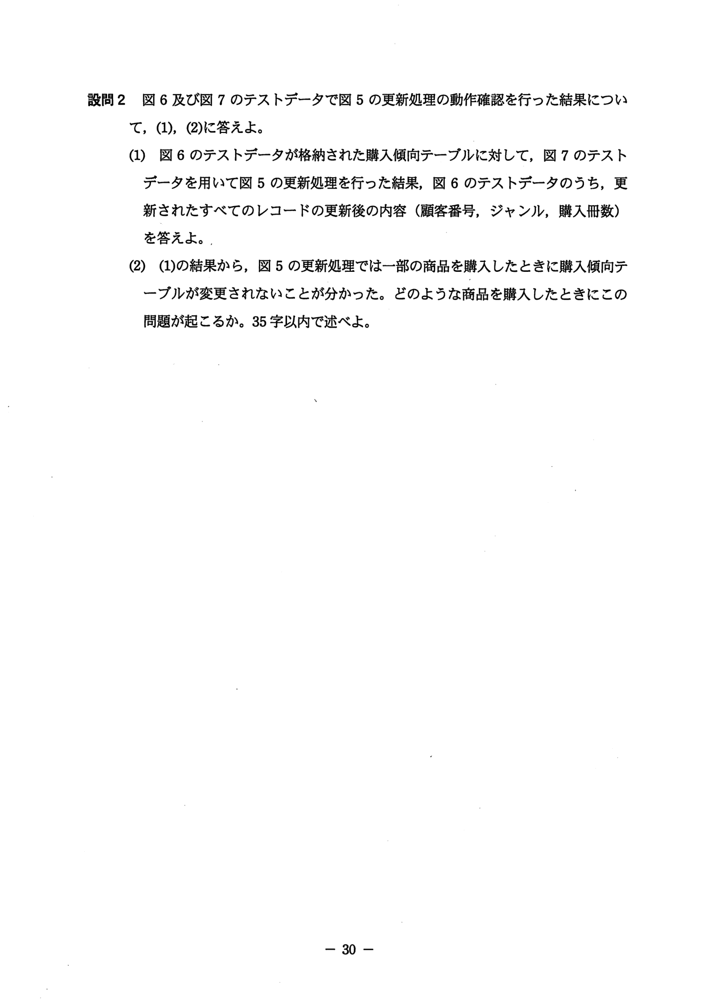

テキスト (OCR)

設問 2 6 及び図 7 のテストデータで図 5 の更新処理の動作確認を行った結果につい

て, Q, CHAK

(1) 図6 のテストデータが格納された購入傾向テーブルに対して, 図 7 のテスト
データを用いて図 5 の更新処理を行った結果 図 6 のテストデータのうち, 更
新されたすべてのレコードの更新後の内容 (顧客番号。 ジャンル, 購入冊数)
を答えよ。 |

2) の結果から, 図 5 の更新処理では一部の商品を購入したときに購入傾向テ
ーブルが変更されないことが分かった。どのような商品を購入したときにこの
問題が起こるか。35 字以内で述べよ。

### ページ 31

テキスト (OCR)

(メモ用紙)

### ページ 32

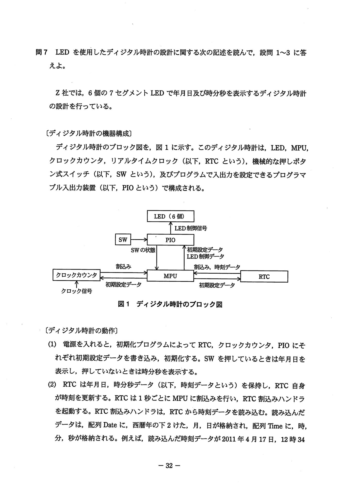

テキスト (OCR)

問7 LED を使用したディジタル時計の設計に関する次の記述を読んで, 設問 1ご3 に答
えよ。

Z 社では, 6 個の 7 セグメント LED で年月日及び時分秒を表示するディジタル時計
の設計を行っている。

(ディジタル時計の機器構成〕

ディジタル時計のプロック図を, 図 1 に示す。このディジタル時計は, LED, MPU,
クロックカウンタタ, リアルタイムクロック (AF, RIC という)), 機械的な押しボタ
ン式スイッチ (以下, SW という), 及びプログラムで入出力を設定できるプログラマ
ブル入出力装置 (以下, PIO という) で構成される。

LED (6 ff)

LED 制和信号
lswト| mo |

SWORE                   初期設定データ

LED 制御データ
HAS                             割込み時刻データ

クロックカウンタ                                       Mpp a DE |
初期股定データ                           初期設定データ
クロック信号
 1 ディジタル時計のプロック図
〔ディジタル時計の動作

①) 電源を入れると, 初期化プログラムによって RTC, クロックカウンタ, PIO にそ
れぞれ初期設定データを書き込み, 初期化する。SW を押しているときは年月日を
表示し, 押していないときは時分秒を表示する。

(②) RIC は年月日, 時分秒データ (以下, 時刻データという) を保持し, RTC 自身
が時刻を更新する。RTC は 1 秒ごとに MPU に割込みを行い, RTC 割込みハンドラ
を起動する。RTC 割込みハンドラは, RIC から時刻データを読み込む。読み込んだ
データは, 配列 Date に, 西暦年の下 2 けた, A, 日が格納され, 配列 Time iz, 時,
分, 秒が格納される。例えば, 読み込んだ時刻データが 2011 年 4 月 17 日, 12 時34

### ページ 33

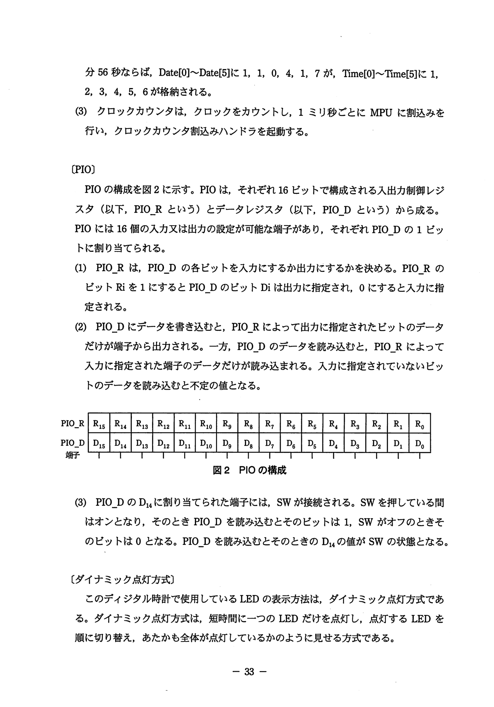

テキスト (OCR)

分 56 秒ならば, Date[0]てDate[5]に 1, 1, 0, 4, 1, 7 が, Time[0]~Time[5]I< 1,
2, 3, 4, 5, 6が格納される。

(3③) クロックカウンタは, クロックをカウントし, 1 ミリ秒ごとに MPU に割込みを
行い クロックカウンタ割込みハンドラを起動する。

(PIO)

PIO の構成を図 2 に示す。PIO は, それぞれ 16 ビットで構成される入出力制御レジ
スタ (以下, PIOR という) とデータレジスタ (YF, PIO_ D という) から成る。
PIO には 16 個の入力又は出力の設定が可能な端子があり, それぞれ PIO_D の 1 ピッ
トに割り当てられる。

(1) PIO_R は, PIO_D の各ビットを入力にするか出力にするかを決める。PIO_R の
ビピット Ri を 1 にすると PIO_D のビット Di は出力に指定され, 0 にすると入力に指
定される。

(②) PIO_D にデータを書き込むと, PIO_R によって出力に指定されたビットのデータ
だけが端子から出力される。 一方, PIOD のデータを読み込むと, PIO R によって
入力に指定された端子のデータだけが読み込まれる。入力に指定されでいないビッ
トのデータを読み込むと不定の値となる。

PIO_R     Ris      Ry      Rig      Ry      Ruy      Ryo      Ry       Ra       R,       R。       Rs        R,        R。        R,        R,        Ry

PIO_D | Dys | Dus | Das | Daz | Dis | Dio | Do | Ds | Dr | De | Ds | Ds | Ds | D2 | Di | Dy
端子         T          「          「          「          「          T          「          T          T          T          T          T          T          「          T          T
 2 PIOの構成

3) PIO_D のD,。に割り当てられた端子には, SW が接続される。SW を押している間
はオンとなり, そのとき PIO_D を読み込むとそのビットは 1, SW がオフのときそ
のピットは 0 となる。 TIO_D を読み込ひとそのときの D,, の値が SW の状態となる。

〔ダイナミック点灯方式)
とのディジタル時計で使用している LED の表示方法は, ダイナミック点灯方式であ
Bo TAF SVU MAAR, 短時間に一つの LED だけを点灯し, 点灯する LED を
順に切り替え, あたかも全体が点灯しているかのように見せる方式である。

ー 33 一

### ページ 34

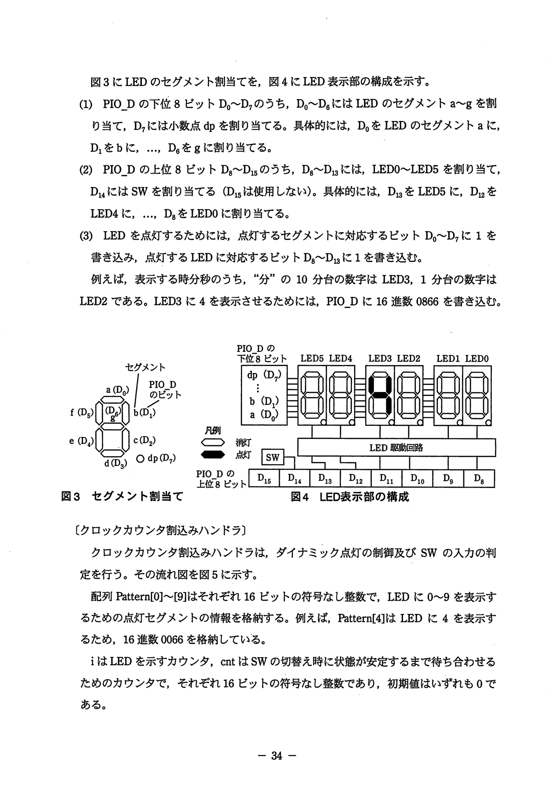

テキスト (OCR)

3 にLED のセグメント割当てを, 図4にLED 表示部の構成を示す。

(① PIO_D の下位 8 ピット D。~D,のうち, D。D。には LED のセグメント ang を割
OMT, D,には小数点 dp を割り当てる。具体的には, D。を LED のセグメントa に,
Debi, .., D。をg に割り当てる。

2) PIOD の上位 8 ビット Di~D,。のうち, D。~てDj。には, LEDO~LEDS を割り当て,
D,,には SW を割り当てる (D。は使用しない) 。具体的には, Dye LEDS に, D。を
LED4 に, ..., D。をLED0 に割り当てる。

(3) LED を点灯するためには, 点灯するセグメントに対応するビット D~D 1 を
書き込み, 点灯する LED に対応するビピット D。~Djaに 1 を書き込む。
例えば, 表示する時分秒のうち, “分"の 10 分台の数字は LED3, 1 分台の数字は

LED2 である。LED3 に 4 を表示させるためには, PIO_D に 16 進数 0866 を書き込む。

at ピット   LED5 LED4 LED3 LED2 LED1 LEDO
でグメント       dp (D,)  >, | <>  — | <>  —™, 1.5
の LY      |_|      LI
20 | mo.D       ,, HEME
ごの         b ①)) 日    =    =
 o»( O21) Doo            2) = (Miia) =   a=
—        Pua        | |   | |   | |
* Ye    7p    てて I    |       LED 駆動回中       |

TH) 080) a HE コーイエエー
ビット| Dis | Dy | Ds | Dy | Di | Dyo | Dy | Ds |
図3 セグメント割当て         図4 LED表示部の構成

〔クロックカウンタ割込みハンドラ〕

クロックカウンタ割込みハンドラは, ダイナミック点灯の制御及び SW の入力の判
定を行う。その流れ図を図 5 に示す。

配列 Pattern[0]て[9]はそれぞれ 16 ビットの符号なし整数で, LED に 0て9 を表示す
るための点灯セグゲメントの情報を格納する。例えば, Pattern[4]は LED に 4 を表示す
るため, 16 進数 0066 を格納している。

1iはLED を示すカウンタ, cot はSW の切替え時に状態が安定するまで待ち合わせる
ためのカウンタで, それぞれ 16 ビットの符号なし整数であり, 初期値はいずれも0で
ある。

### ページ 35

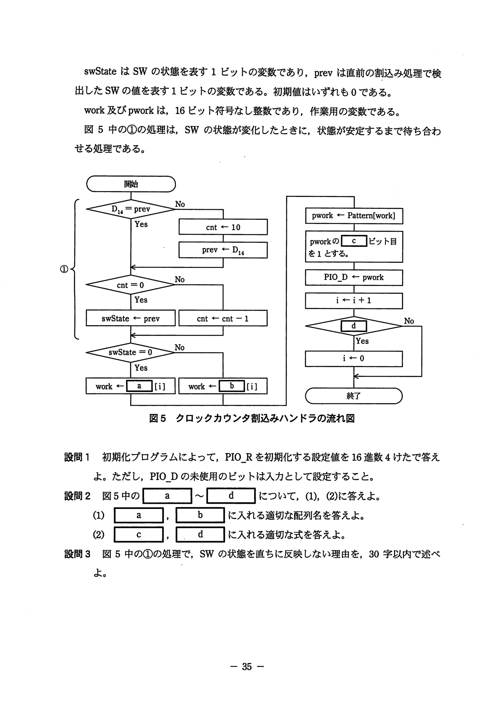

テキスト (OCR)

swState は SW の状態を表す 1 ビットの変数であり, prev は直前の割込み処理で検
出した SW の値を表す 1 ピットの変数である。初期値はいずれも 0 である。

work 及びpwork は, 16 ビット符号なし整数であり, 作業用の変数である。

 5 中の①の処理は, SW の状態が変化したときに, 状態が安定するまで待ち合わ
せる処理である。

pwork で Pattern[work]

pworkの[| c |ビッ ト目
を1 とする。

PIO_D + pwork

|    swState < prev    | |     ent «cnt —1     |
よこ                 L____ |
swState = 0        No

Yes

| work —[a_]tia |] work —( Jia |
|          |

図5 クロックカウンタ割込みハンドラの流れ図

設問1 初期化プログラムによって, PIO_R を初期化する設定値を 16 進数 4 けたで答え
よ。ただし, PIO_D の未使用のビピットは入力として設定すること。
設問2 図5中の| ai |て|  d |について, ①, ②⑫に答えよ。

Q①) |  a ||,|  b |に入れる適切な配列名を答えよ。
@ |  c j,[. d |に入れる適切な式を答えよ。

設問3 図 5 中の①の処理で, SW の状態を直ちに反映しない理由を, 30 字以内で述べ
よ。

### ページ 36

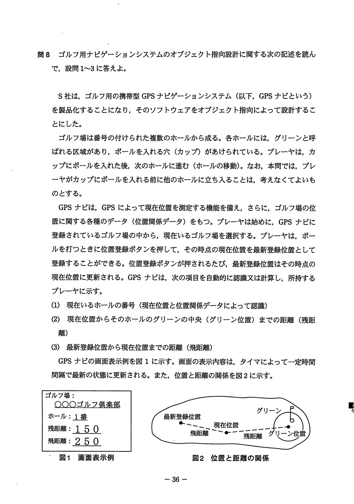

テキスト (OCR)

問8 ゴルフ用ナビゲーションシステムのオブジェクト指向設計に関する次の記述を読ん
で, 設問 1て3 に答えよ。

S 社は, ゴルフ用の携帯型 GPS ナビゲーションシステム (AF, GPS ナビという)
を製品化することとになり, そのソフトウェアをオブジェクト指向によって設計するこ
とにした。

ゴルフ場は番号の付けられた複数のホールから成る。各ホールには, グリーンと呼
ばれる区域があり, ボールを入れる穴 (カップ) があけられている。プレーヤは, カ
ップにボールを入れた後, 次のホールに進む (ホールの移動)。なお, 本問では, プレ
ーヤがカップにボールを入れる前に他のホールに立ち入ることは, 考えなくてよいも
のとする。

GPS ナビは, GPS によって現在位置を測定する機能を備え, さらに, ゴルフ場の位
置に関する各種のデータ (位置関係データ) をもつ。プレーヤは始めに, GPS ナビに
登録されているゴルフ場の中から, 現在いるゴルフ場を選択する。プレーヤは, ボー
ルを打つときに位置登録ボタンを押して, CORAOREME CREME LCUT
登録することができる。位置登録ボタンが押されるたび, 最新全録位置はその時点の
現在位置に更新される。GPS ナビは, 次の項目を自動的に認識又は計算し, 所持する
プレーヤに示す。

1) 現在いるホールの番号 (現在位置と位置関係データによって認識)
2) 現在位置からそのホールのグリーンの中央 (グリーン位置) までの距離 (残距

離)

3) 最新意録位置から現在位置までの距離 (飛距離)

GPS ナビの画面表示例を図 1 に示す。画面の表示内容は, タイマによって一定時間

間隔で最新の状態に更新される。また, 位置と距離の関係を図 2 に示す。

ゴルフ場 :
〇〇〇ゴルフ倶楽部
ホール : 1 番                 最新位置
.                          ~.__ 現在位置 [2
Biome: 15                    RENE ~~ — ae グリーン位置
飛距離: 250                                       ーーン

図1 画面表示例           図2 位置と距離の関係

### ページ 37

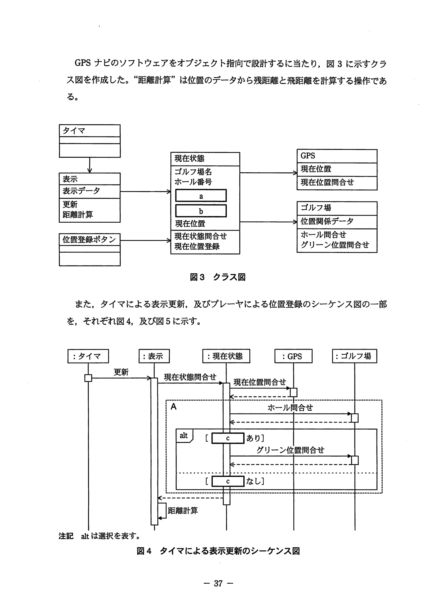

テキスト (OCR)

GPS ナビのソフトウェアをオプジェクト指向で設計するに当たり, 図 3 に示すクラ
ス図を作成した。“距離計算”" は位置のデータから残距離と飛距離を計算する操作であ
る。

タイマ
現在状態            GPS
=                                 ゴルフ場名                              現在位置
x 5         ホール番号           現在位置問合せ
示ホブプー                                       [a]
Ei                               ゴルフ場
距離計算           L >]
現在位置            位置関係データ
ボタ>        現在状態問合せ          ホール問合せ
前ウン        現在位置登録           グリーン位置問合せ
H3 9528

また, タイマによる表示更新。 及びプレーヤによる位置登録のシーケンス図の一部
を, それぞれ図 4, 及び図 5 に示す。

|タイマ |   | : 表示    | : 現在状態 | | :epPs | |:ゴルフ場
更新
ロリ         現任状態問合せ 、| 電在位置間合せ
ーー“1
A                              ホール問合せ
に1)
lat} (oe Jan)
グリーン位置問合せ
L.-J e本|
[| c |なし]
にーー
距離計算   |
a

HE attは選択を表す。
図4 タイマによる表示更新のシーケンス図

### ページ 38

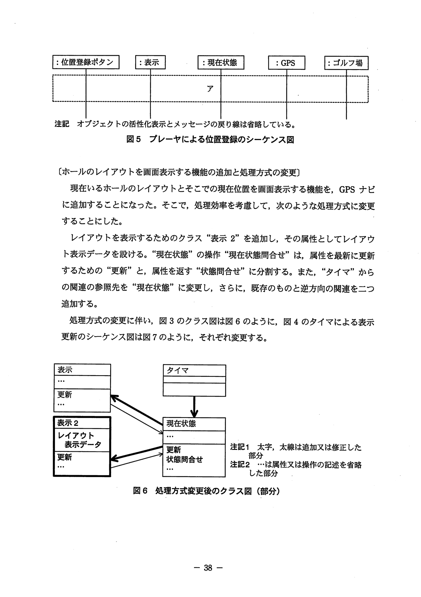

テキスト (OCR)

[: 位置登録ボタン | |:表示 |   |:現在状態| | :eps | |コルフラ坦|

ア

注記 オブジェクトの活性化表示とメッセージの戻り線は省略している。
図5 プレーヤによる位置登録のシーケンス図

〔ホールのレイアウトを画面表示する機能の追加と処理方式の変更

現在いるホールのレイアウトとそこでの現在位置を画面表示する機能を, GPS ナビ
に追加することになった。そこで, 処理効率を考慮して, 次のような処理方式に変更
することにした。

レイアウトを表示するためのクラス “表示 2” を追加し, その属性としてレイアウ
ト表示データを設ける。“現在状態” の操作“現在状態問合せ” は, 属性を最新に更新
するための “BR” と, 属性を返す “状態問合せ"に分割する。また, “タイマ” DS
の関連の参照先を “現在状態" に変更し, さらに, 既存のものと逆方向の関連を二つ
追加する。

処理方式の変更に伴い, 図 3 のクラス図は図 6 のように, 図 4 のタイマによる表示
更新のシーケンス図は図 7 のように, それぞれ変更する。

表示            タイマ

更新

)

現在状態

表示 2
レイアウト

表示データ               注記1 太字, 太線は追加又は修正した
更新
部分
更新     レトーー ma   注記2 …は属性駐は操作の記述を省略
"         した部分
図6 処理方式変更後のクラス図 (部分)

### ページ 39

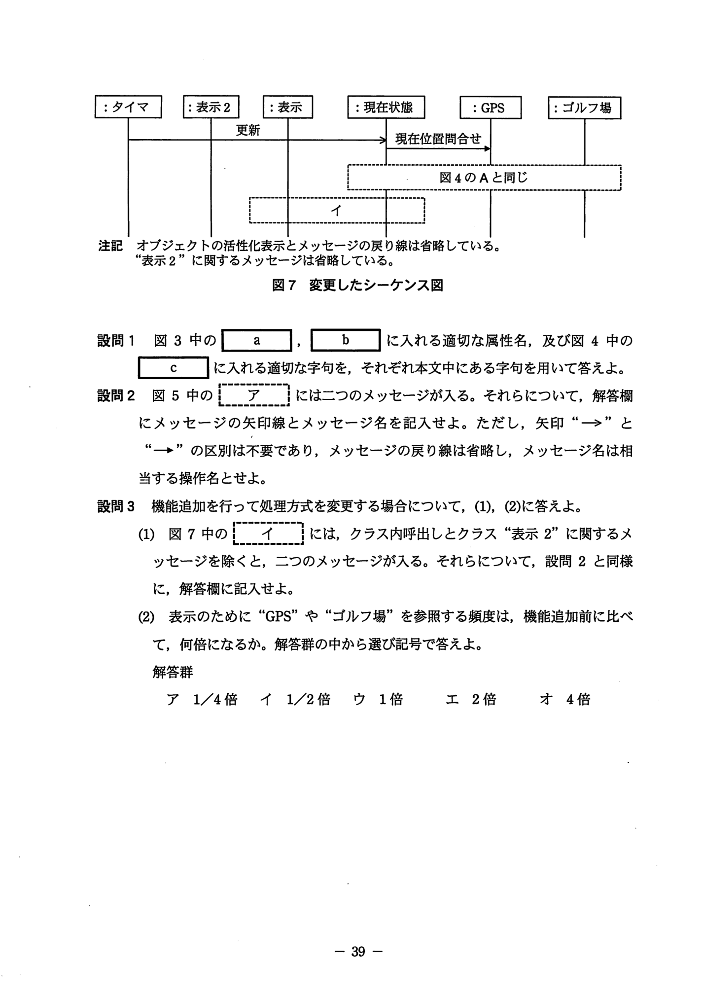

テキスト (OCR)

: タイマ | |:表示2| |:表示
更新

| : 現在状態 | | :eps | |:コルフ得
現在位置問合せ

図4のAと同じ

イ

注記 オプジェクトの活性化表示とメッセージの戻り線は省略している。
“表示 2 ” に関するメッセージは省略している。

図7 変更したシーケンス図

設問1 図3 中の| ai |,|  b |に入れる適切な属性名, 及び図 4 中の
 に入れる適切な字句を, それぞれ本文中にある字句を用いて答えよ。

設問2 図 5 中の! ア  !には二つのメッセージが入る。それらについて, MSM
にメッセージの矢印線とメッセージ名を記入せよ。ただし, 矢印“>”と
“+” の区別は不要であり, メッセージの戻り線は省略し, メッセージ名は相
当する操作名とせよ。

設問3 機能追加を行って処理方式を変更する場合について, ①⑪, ②⑫)に答えよ。

Q①) 図 7 中の| イ field, クラス内呼出しとクラス “表示 2” に関するメ
ッセージを除くと, 二つのメッセージが入る。それらについて, 設問 2 と同様
に, 解答欄に記入せよ。

Q) 表示のために “GPS” や “ゴルフ場” を参照する頻度は, 機能追加前に比べ
て, 何倍になるか。 解答群の中から選び記号で答えよ。
解答群

ア 1ン4倍 イ 1ン2倍 ウ 1倍 © 2倍 。 オ 4倍

### ページ 40

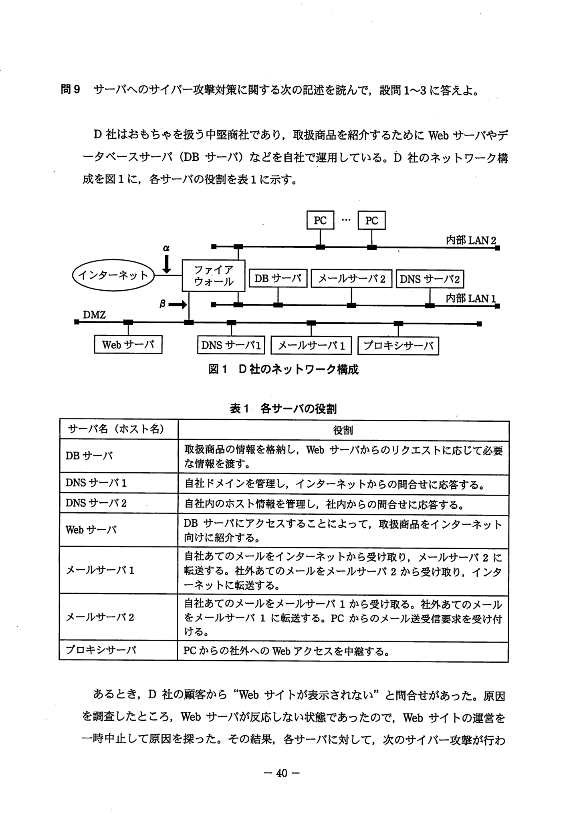

テキスト (OCR)

間9 サーバへのサイバー攻撃対策に関する次の記述を読んで, 設問 13 に答えよ。

D 社はおもちゃを扱う中堅商社であり, 取扱商品を紹介するために Web サーバやデ
ータベースサーバ (DB サーバ) などを自社で運用している。D 社のネットワーク構
成を図 1 に, 各サーバの役割を表 1 に示す。

aa          ra.
a         a                             で                   ー「

  チール [DBサーバ || メールーバ | [pus サーが |

[| ー~  1 』」    」 PLAN

DMZ                                                                       .
| Web サーバ | [DNSサーバ1| | メールサーバュ | | プロキシサーバ |
Bi D社のネットワーク構成
表1 各サーバの役割
D-NY (ホスト名)                           役割
DB サーバ             取扱商品の情報を格納し, Web サーバからのリクエストに応じて必要
な情報を渡す。
DNS サーバ1             自社ドメインを管理し, インターネットからの問合せに応答する。
DNS サーバ 2          自社内のホスト情報を管理し, 社内からの問合せに応答する。
Web サーバ             DB サーバにアクセスすることによって, 取扱商品をインターネット
向けに紹介する。
自社あてのメールをインターネットから受け取り, メールサーバ 2 に
メールサーパ1           転送する。社外あてのメールをメールサーバ 2 から受け取り, インタ
ーネットに転送する。
自社あてのメールをメールサーバ 1 から受け取る。 社外あてのメール
メールサーバ2        をメールサーバ 1 に転送する。PC からのメール送受信要求を受け付
ける。
プロキシサーバ      PC からの社外への Web アクセスを中継する。

あるとき, D 社の顧客から “Web サイトが表示されない"” と問合せがあった。原因
を調査したところ, Web サーバが反応しない状態であったので, Web サイトの運営を
一時中止して原因を探った。その結果, 各サーバに対して, 次のサイバー攻撃が行わ

### ページ 41

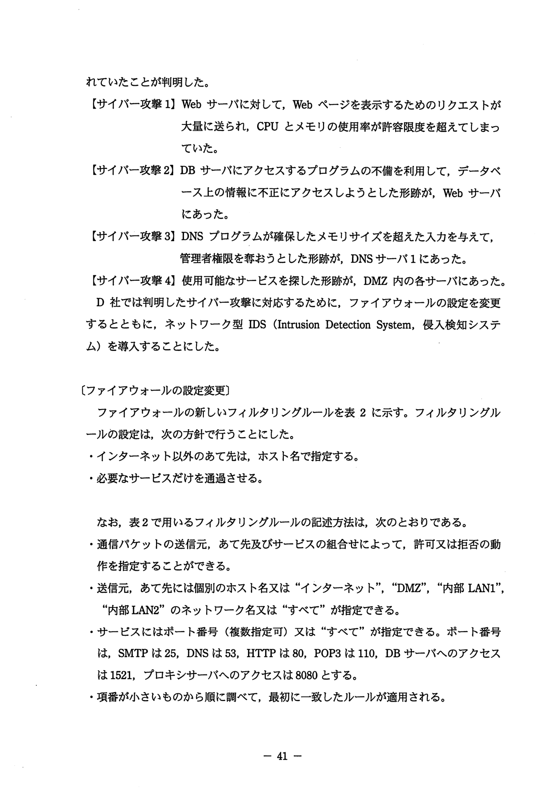

テキスト (OCR)

れていたことが判明した。
【サイバー攻撃 1】 Web サーバに対して, Web ページを表示するためのリクエストが
大基に送られ, CPU とメモリの使用率が許容限度を超えてしまっ
ていた。
【サイバー攻撃 2】 DB サーバにアクセスするプログラムの不備を利用して, データベ
ース上の情報に不正にアクセスしようとした形跡が, Web サーバ
にあった。
【サイバパー攻撃 3】 DNS プログラムが確保したメモリサイズを超えた入力を与えて,
管理者権限を奪おうとした形跡が, DNS サーバ 1 にあった。
【サイバパー攻撃 4】 使用可能なサービスを探した形跡が, DMZ 内の各サーバにあった。
D 社では判明したサイバー攻撃に対応するために, ファイアウォールの設定を変更
するとともに, ネットワーク型 TDS (Intrusion Detection System, 侵入検知システ
ム) を導入することにした。

〔【ファイアウォールの設定変更
ファイアウォールの新しいフィルタリングルールを表 2 に示す。フィルタリングル
ールの設定は, 次の方針で行うことにした。
・インターネット以外のあて先は, ホスト名で指定する。
・必要なサービスだけを通過させる。

なお, 表2 で用いるフィルタリングルールの記述方法は, 次のとおりである。

・通信パケットの送信元, あて先及びサービスの組合せによって, 許可又は拒否の重
作を指定することができる。

・送信元, あて先には個別のホスト名又は“インターネット”, “DMZ”, “内部 LAN”,

“内部 LAN2”" のネットワーク名又は“すべて” が指定できる。

・サービスにはポート番号 (複数指定可) 又は “すべて"が指定できる。ポボート番号
は, SMTP は 25, DNS は 53, HTTP は 80, POP3 は 110, DB サーバへのアクセス
は 1521,」 プロキシサーバへのアクセスは 8080 とする。

・項番が小さいものから順に調べて, 最初に一致したルールが適用される。

### ページ 42

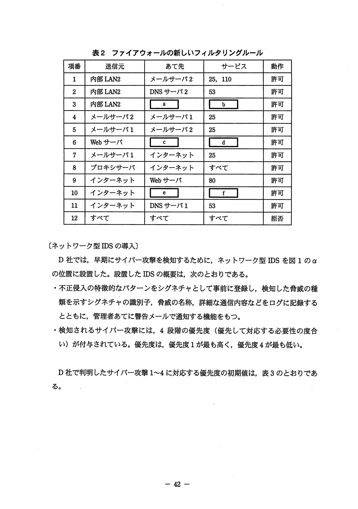

テキスト (OCR)

R2 ファイアウォールの新しいフィルタリングルール

項番          送信元                 あて先               サービス          動作
1 | 内部LAN2               メールサーバ2         25, 110                     許可
2 | 内部LAN2               DNS サーバ 2           53                             許可
3 | 内部LAN2    L_ 3    L_ 5 |     許可
4 | メールサーバ2       メールサーバ1       25                      許可
5 | メールサーバ1       メールサーバ 2       25                      許可
6 | Webサーバ            し s          | BERT
7 | メールサーパ1  インターネット  25        許可
8 | プロキシサーバ      インターネット       すべて                  許可
9    インターネット    Web サーバ       80               許可
10 | インターネット | [し se ]     Ci]     cal
11 | インターネット  DNS サーバ1ュ   53         許可
12 | すべて      すべて      すべて      拒否

〔ネットワーク型 TDS OHA)
D 社では, 早期にサイバー攻撃を検竹するために, ネットワーク型 TDS を図1のgw

の位置に設置した。設置した IDS の概要は, 次のとおりである。

・不正侵入の特徴的なパターンをシグネチャとして事前に登録し, 検知した人脅威の竹
GERTIIRF + OBNF, BROLH, 詳細な通信内容などをログに記録する
とともに, 管理者あてに警告メールで通知する機能をもつ。

・検知されるサイバー攻撃には, 4 段階の優先度 (優先して対応する必要性の度合
い) が付与されている。優先度は, 優先度 1 が最も高く, 優先度4 が最も低い。

D 社で判明したサイバー攻撃 1ご4 に対応する優先度の初期値は。 表3 のとおりであ
る。

### ページ 43

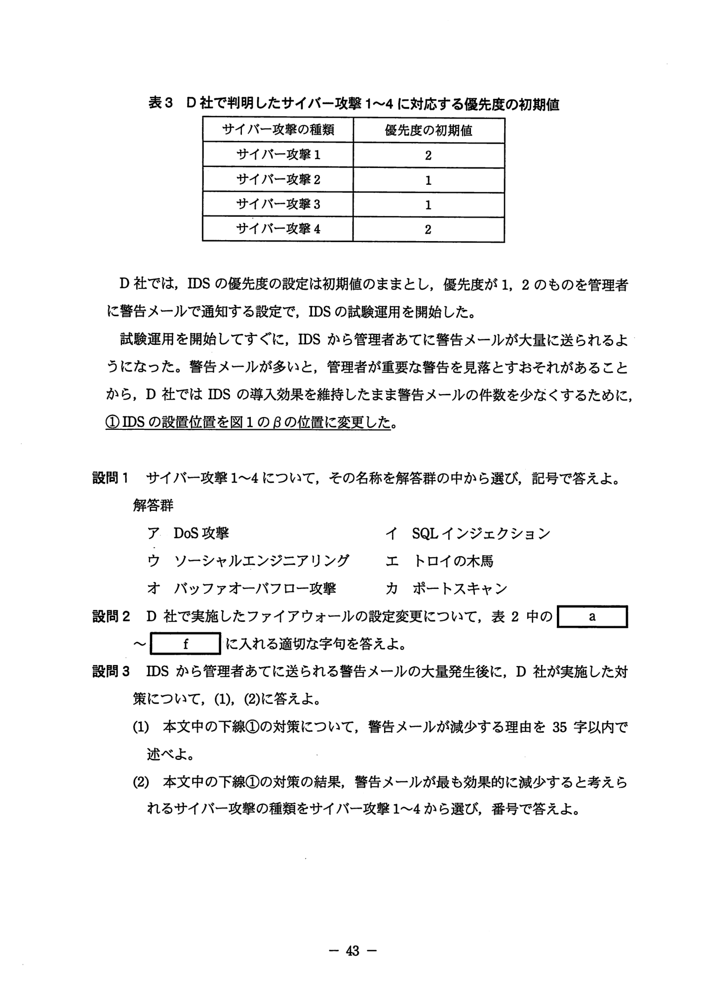

テキスト (OCR)

RS D社で判明したサイバー攻撃 1て4 に対応する優先度の初期値

サイバー攻撃の種類          優先度の初期値
サイパー攻撃 1        2
サイパー攻撃 2        1
サイバパー攻撃 3        1
サイパー攻撃 4        2

D 社では, DS の優先度の設定は初期値のままとし, 優先度が 1, 2 のものを管理者
に警告メールで通知する設定で, IDS の試験運用を開始した。

試験運用を開始してすぐに, IDS から管理者あてに称告メールが大量に送られるよ
うになった。警告メールが多いと, 管理者が重要な警告を見落とすおそれがあること
から, D 社では IDS の導入効果を維持したまま克告メールの件数を少なくするために,
ODS の設置位置を図 1の8の位置に変更した。

設問1 サイバー攻撃 1こ4 について, その名称を解答群の中から選び, 記号で答えよ。

EB
ア DoS攻撃           イ SQLインジェクション
ウ ソーシャルエンジニアリング エエ トロイの木馬
オ バッファオーバフロー攻撃      A ボートスキャン
設問2 D 社で実施したファイアウォールの設定変更について, 表 2 中の| a |
~ に入れる適切な字句を答えよ。

設問3 IDS から管理者あてに送られる警告メールの大量発生後に, D 社が実施した対
人策について, (1), (②)に答えよ。
Q) 本文中の下線①の対策について, 警告メールが減少する理由を 35 字以内で
述べよ。
(⑫) 本文中の下線①の対策の結果, 警告メールが最も効果的に減少すると考えら
れるサイバー攻撃の種類をサイバー攻撃 1こ4 から選び, 番号で答えよ。

### ページ 44

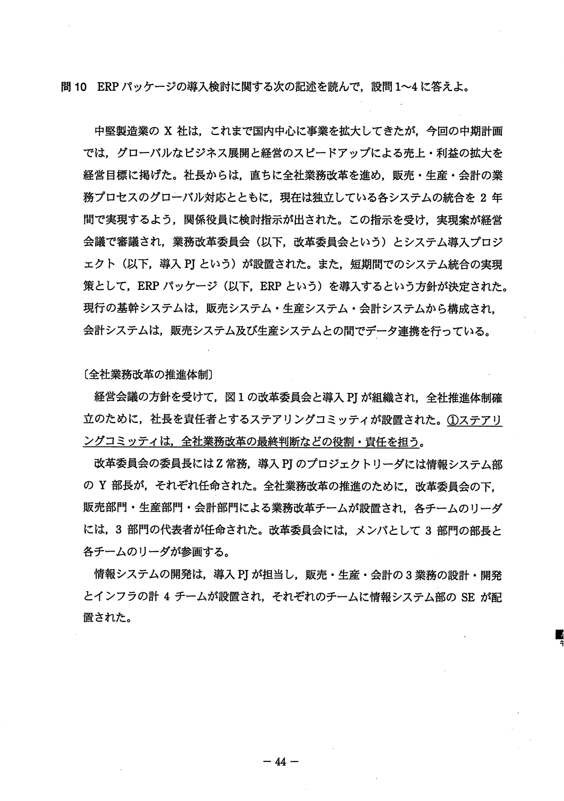

テキスト (OCR)

問 10 ERP パッケージの導入検討に関する次の記述を読んで, 設問 1て4 に答えよ。

中堅製造業の X ld, これまで国内中心に事業を拡大してきたが, 今回の中期計画
では, グローバルなビジネス展開と経営のスピードアップによる売上・利益の拡大を
経営目標に掲げた。社長からは, 直ちに全社業務改革を進め, 販売・生産・会計の業
務プロセスのグローバル対応とともに, 現在は独立している各システムの統合を 2 年
間で実現するよう, 関係役員に検討指示が出された。この指示を受け, 実現案が経営
会議で審議され, 業務改革委員会 UT, 改革委員会という) とシステム導入プロジ
ェクト (以下, BAP という) が設置された。また., 短期間でのシステム統合の実現
人策として, ERP パッケージ (以下, ERP という) を導入するという方針が決定された。
現行の基幹システムは, 販売システム・生産システム・会計システムから構成され,
会計システムは, 販売システム及び生産システムとの間でデータ連携を行っている。

〔全社業務改革の推進体制〕

経営会議の方針を受けて, 図 1 の改革委員会と導入 PJ が組織され, 全社推進体制確
立のために, 社長を貴任者とするステアリングコミッティが設置された。①ステアリ
ングコミッティは, 全社業務改革の最終判断などの役割・足任を担う。

改革委員会の委員長にはZ常務, 導入 本 のプロジェクトリーダには情報システム部
の Y 部長が, それぞれ任命された。全社業務改革の推進のために, 改革委員会の下,
販売部門・生産部門・会計部門による業務改革チームが設置され, 各チームのリーダ
には, 3 部門の代表者が任命された。改革委員会には, メンバとして 3 部門の部長と
各チームのリーダが参画する。

情報システムの開発は, 導入 PJ が担当し, 販売・生産・会計の 3 業務の設計・開発
とインフラの計 4 チームが設置され, それぞれのチームに情報システム部の SE が配
置された。

### ページ 45

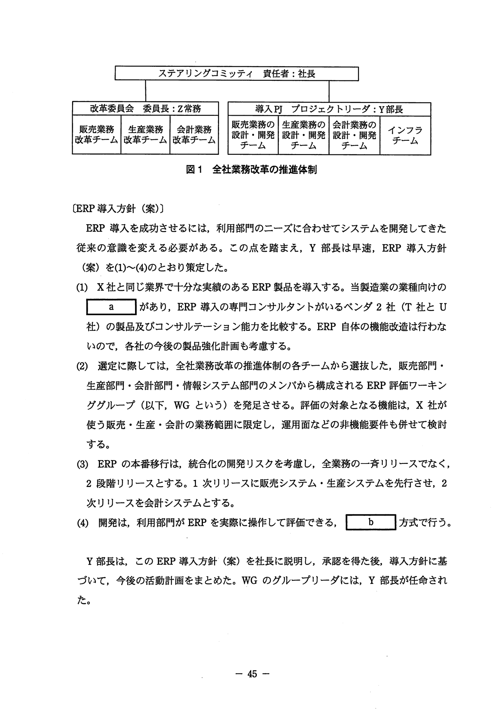

テキスト (OCR)

|    ステアリングコミッティ 責任者社長    |

改革委員会 委員長 :Z常務      BAP) プロジェクトリーダ : Y部長
販売業務 | 生産業務 | 会計業務 | |取売業務の|生産業務の | 会計業務の ィ

ー     ー     Ri? | | 設計・開発| 設計・開発 | 設計・開発
改革チーム|改革チーム|改革チーム| |テーム | テーム | テーム | チ

図1 全社業務改革の推進体制

IN
>

(ERP 導入方針 (案〕

ERP 導入を成功させるには, 利用部門のニーズに合わせてシステムを開発してきた
従来の意識を変える必要がある。この点を踏まえ, Y 部長は早速 ERP 導入方針
(案) を(①~(④のとおり集定した。
①) X社と同じ業界で十分な実績のある ERP 製品を導入する。当製造業の業種向けの

|  』 | があり, ERP 導入の専門コンサルタントがいるベンダ 2 社 (T HEU

社) の製品及びコンサルテーション能力を比較する。ERP 自体の機能改造は行わな

いので, 各社の今後の製品強化計画も考慮する。

(2) 選定に際しては, 全社業務改革の推進体制の各チームから選抜した, 販売部門・
生産部門・会計部門・情報システム部門のメンバから構成される ERP 評価ワーキン
ググループ (AF, WG EWS) を発足させる。評価の対象となる機能は, X 社が
使う販売・生産・会計の業務範囲に限定し, 運用面などの非機能要件も併せて検討
する。

(3) ERP の本番移行は, 統合化の開発リスクを考慮し, 全業務の一斉リリースでなく,
2 段階リリースとする。1 次リリースに販売システム・生産システムを先行させ, 2
次リリースを会計システムとする。

(4) 開発は, 利用部門が ERP を実際に操作して評価できる, | b |方式で行う。

Y 部長は, この ERP 導入方針 (案) を社長に説明し, 承認を得た後, 導入方針に基

づいて, 今後の活動計画をまとめた。WG のグループリーダには, Y 部長が任命され
た。

### ページ 46

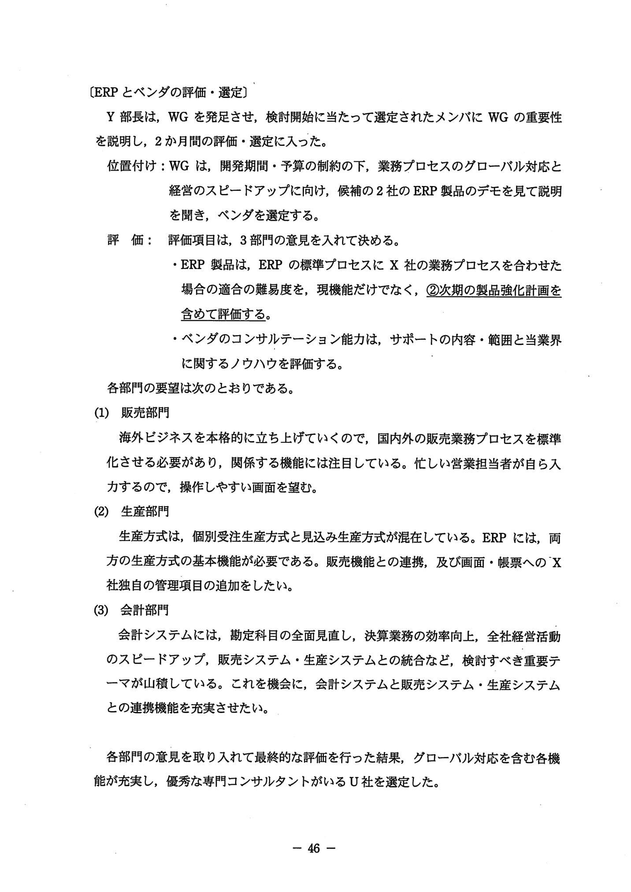

テキスト (OCR)

(ERP とベンダの評価・選定〕
Y 部長は, WG を発足させ, 検討開始に当たって選定されたメンバに WG の重要性
を説明し, 2 か月間の評価・選定に入った。
位置付け : WG は, 開発期間・予算の制約の下, 業務プロセスのグローバ人ル対応と
経営のスピードアップに向け, 候補の 2 社のERP 製品のデモを見て説明
を聞き, ベンダを選定する。
評 価: 評価項目は, 3部門の意見を入れて決める。
・ERP 製品は, ERP の標準プロセスに X 社の業務プロセスを合わせた
場合の適合の難易度を, 現機能だけでなく, ②次期の製品強化計画を
含めて評価する。
・ベンダのコンサルテーション能力は, サポートの内容・範囲と当業界
に関するノウハウを評価する。
各部門の要望は次のとおりである。
(1) 販売部門
海外ビジネスを本格的に立ち上げていくので, 国内外の販売業務プロセスを標準
化させる必要があり, 関係する機能には注目している。人忙しい営業担当者が自ら入
ASSOC, 操作しやすい画面を望む。
(2) 生産部門
生産方式は, 個別受注生産方式と見込み生産方式が混在している。ERP には, 両
方の生産方式の基本機能が必要である。販売機能との連携, 及び画面・帳票への X
社独自の管理項目の追加をしたい。
(3) 会計部門
会計システムには, 勘定科目の全面見直し, 決算業務の効率向上, 全社経営活動
のスピードアップ, 販売システム・生産システムとの統合など, 検討すべき重要テ
ーマが山積している。これを機会に, 会計システムと販売システム・生産システム
との連携機能を充実させたい。

各部門の意見を取り入れて最終的な評価を行った結果, グローバル対応を含む各機
能が充実し, 優秀な専門コンサルタントがいるU社を選定した。

### ページ 47

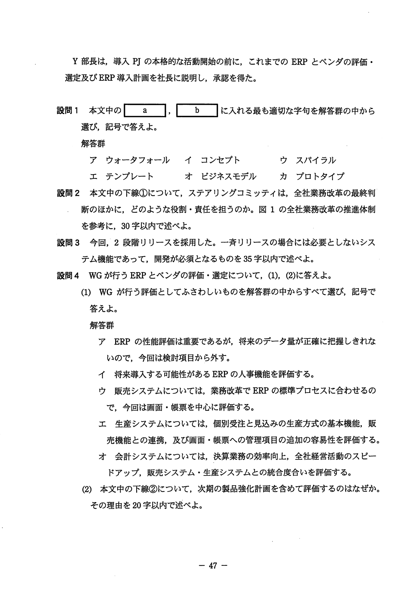

テキスト (OCR)

Y 部長は, 導入 Pl の本格的な活動開始の前に, これまでの ERP とベンダの評価・
選定及びERP 導入計画を社長に説明し, 承認を得た。

設問1 本文中の| 3a |,|  b |に入れる最も適切な字句を解答群の中から
選び, 記号で答えよ。
ER
ア ウォータフォール イ コンセプト    ウ スパイラル
エ テンプレート   オ ビジネスモデル  カ プロトタイプ

設問2 本文中の下線わについて, ステアリングコミッティは, 全社業務改革の最終判
断のほかに, どのような役割・責任を担うのか。図 1 の全社業務改革の推進体制
を参考に, 30 字以内で述べよ。
設問3 今回, 2 段階リリースを採用した。一斉リリースの場合には必要としないシス
テム機能であって, 開発が必須となるものを 35 字以内で述べよ。
設問4 WGが行うERP とベンダの評価・選定について, ①, ②⑫)に答えよ。
(1) WG が行う評価としてふさわしいものを解答群の中からすべて選び, 記号で
答えよ。
解答群
ア ERP の性能評価は重要であるが, 将来のデータ量が正確に把握しきれな
いので, 今回は検討項目から外す。
イ 将来導入する可能性があるERP の人事機能を評価する。
ウ 販売システムについては, 業務改革で ERP の標準プロセスに合わせるの
で, 今回は画面・帳票を中心に評価する。
エエ 生産システムについては, 個別受注と見込みの生産方式の基本機能, 販
売機能との連携, 及び画面・帳票への管理項目の追加の容易性を評価する。
A 会計システムについては, 決算業務の効率向上, 全社経営活動のスピー
ドアップ, 販売システム・生産システムとの統合度合いを評価する。
(2) 本文中の下線②について, 次期の製品強化計画を含めて評価するのはなぜか。
その理由を 20 字以内で述べよ。

### ページ 48

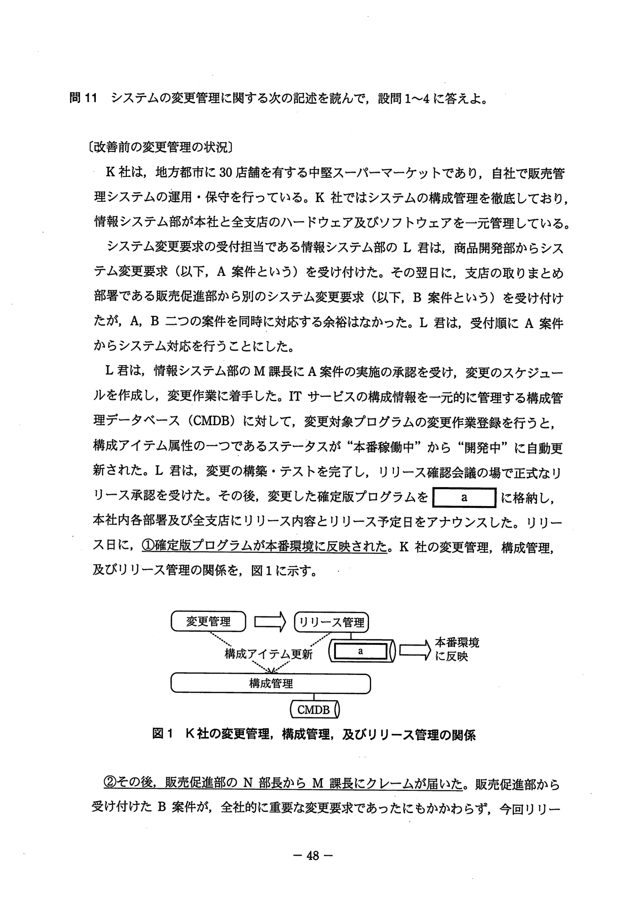

テキスト (OCR)

問11 システムの変更管理に関する次の記述を読んで, 設問 1ご4 に答えよ。

〔改善前の変更管理の状況

K 社は, 地方都市に 30 店舗を有する中堅スーパーマーケットであり, 自社で販売管
理システムの運用・保守を行っている。K 社ではシステムの構成管理を徹底しており
情報システム部が本社と全支店のハードウェア及びソフトウェアを一元管理している。

システム変更要求の受付担当である情報システム部の L Bld, 商品開発部からシス
テム変更要求 (以下, A 案件という) を受け付けた。その翌日に, 支店の取りまとめ
部暑である販売促進部から別のシステム変更要求 (以下, B 案件という) を受け付け
たが, A, B 二つの案件を同時に対応する余裕はなかった。L Bld, 受付順に A 案件
からシステム対応を行うことにした。

L 君は, 情報システム部の M 課長に A 案件の実施の承認を受け, 変更のスケジュー
ルを作成し, 変更作業に着手した。IT サービスの構成情報を一元的に管理する構成管
理データベース (CMDB) に対して, 変更対象プログラムの変更作業登録を行うと,
構成アイテム属性の一つであるステータスが “本番稼働中” から “開発中"に自動更
新された。L Aid, 変更の構築・テストを完了し, リリース確認会議の場で正式なり
リース承認を受けた。その後, 変更した確定版プログラムを| sa | に格納し,
本社内各部署及び全支店にリリース内容とリリース予定日をアナウンスした。リリー
ス日に, ①確定版プログラムが本番環境に反映された。K 社の変更管理, 構成管理
及びリリース管理の関係を, 図 1 に示す。

し管理 ] —) (リリース管理

SS          ARM
jieer+ nee (C=) chek

や、 Se
(に     構成管理     i)

CMDB ()
図1 K社の変更管理, 構成管理, 及びリリース管理の関係

②その後, 販売促進部の N BEDS M 課長にクレームが届いた。販売促進部から
受け付けた B 案件が, 全社的に重要な変更要求でやったにもかかわらず, 今回りリリー

### ページ 49

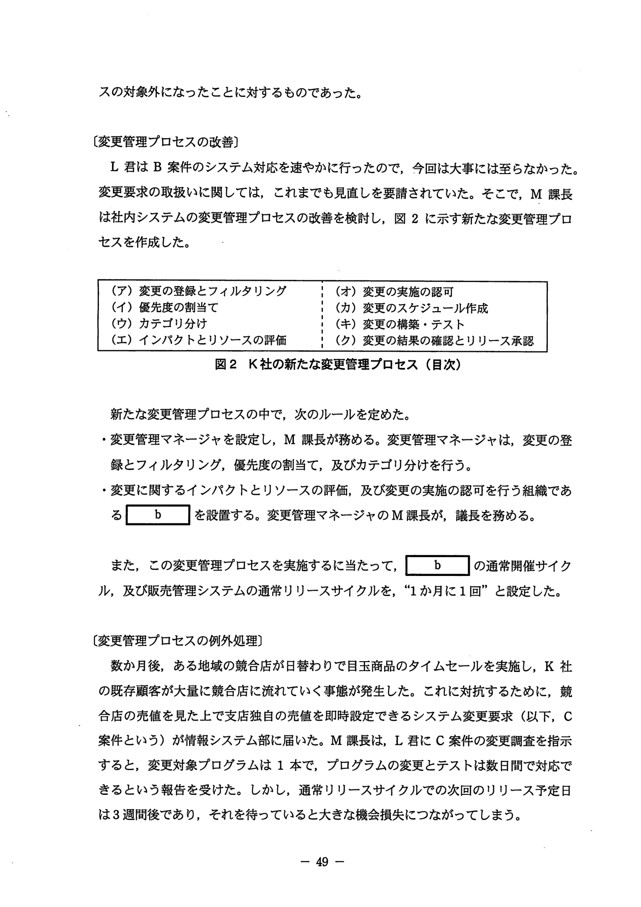

テキスト (OCR)

スの対象外になったことに対するものであった。

(変更管理プロセスの改善〕

L Bld B 案件のシステム対応を速やかに行ったので, 今回は大事には至らなかった。
変更要求の取扱いに関しては, これまでも見直しを要請されていた。そこで, M 課長
は社内システムの変更管理プロセスの改善を検討し, 図 2 に示す新たな変更管理プロ
セスを作成した。

(7) 変更の登録とフィルタリング
(イ) 優先度の割当て

(オ) 変更の実施の認可

(A) 変更のスケジュール作成

(ウ) カテゴリ分け                       (キ) 変更の構築・テスト

(エ) インパクトとリソースの評価        (ク) 変更の結果の確認とリリース承認

図2 K社の新たな変更管理プロセス (目次)

新たな変更管理プロセスの中で, 次のルールを定めた。

・変更管理マネージャを設定し, M 課長が務める。変更管理マネージャは, 変更の登
録とフィルタリング, 優先度の割当て, 及びカテゴリ分けを行う。

・変更に関するインパクトとリソースの評価, 及び変更の実施の認可を行う組織であ
る| b | を設置する。変更管理マネージャの M 課長が, 議長を務める。

また, この変更管理プロセスを実施するに当たって, |  b | の通常開催サイク
ル, 及び販売管理レステムの通常リリースサイクルを, “1 か月に 1 回" と設定した。

〔変更管理プロセスの例外処理〕

数か月後, ある地域の競合店が日堆わりで目玉商品のタイムセールを実施し, K 社
の既存顧客が大量に競合店に流れていく事態が発生した。これに対抗するために, 競
合店の売値を見た上で支店独自の売値を即時設定できるシステム変更要求 (以下, C
案件という) が情報システム部に届いた。M 課長は, LAK C 案件の変更調査を指示
すると, 変更対象プログラムは 1 本で, プログラムの変更とテストは数日間で対応で
きるという報告を受けた。しかし, 通常リリースサイクルでの次回のリリース予定日
は3 週間後であり, それを待っていると大きかな機会損失につながってしまう。

ー 49 一

### ページ 50

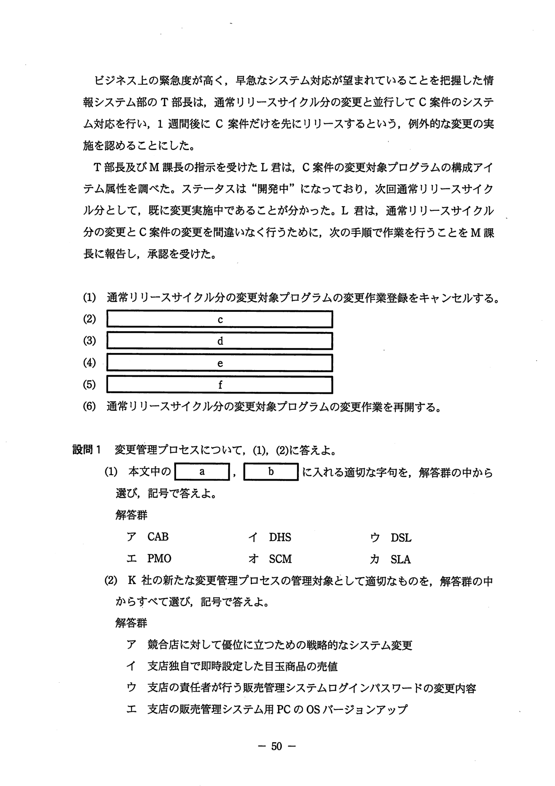

テキスト (OCR)

ビジネス上の緊急度が高く, 早急なシステム対応が望まれていることを把握した情
報システム部の T 部長は, 通常リリースサイクル分の変更と並行して C 案件のシステ
ム対応を行い, 1 週間後に C 案件だけを先にリリースするという, 例外的な変更の実
施を認めることにした。

T 部長及び M 課長の指示を受けた L Bld, C 案件の変更対象プログラムの構成アイ
テム属性を調べた。ステータスは “開発中"になっており, 次回通常リリースサイク
ル分として, 既に変更実施中であることが分かった。 L 君は, 通常リリースサイクル
分の変更とC 案件の変更を間違いなく行うために, 次の手順で作業を行うことを M課
長に報告し, 承認を受けた。

Q) 通常リリースサイクル分の変更対象プログラムの変更作業登録をキャンセルする。
@) |                c

|
3) |          d          ]
4) [         e          |
©) |          f         |

6) 通常リリースサイクル分の変更対象プログラムの変更作業を再開する。

設問1 変更管理プロセスについて, (1), (ISAK.

Q 本文中の| a |, |  b |に入れる適切な字句を, 解答群の中から
選び, 記号で答えよ。
BER

ア CAB       4 DHS       ウ DSL

エ PMO       オ SCM       カ SLA

(②) K 社の新たな変更管理プロセスの管理対象として適切なものを, 解答群の中
からすべて選び, 記号で答えよ。
解答群
ア 競合店に対して優位に立つための戦略的なシステム変更
イ 支店独自で即時設定した目玉商品の売値
ウ 支店の責任者が行う販売管理システムログインパスワードの変更内容
エエ 支店の販売管理システム用 PC の 0S バージョンアップ

ー 50 一

### ページ 51

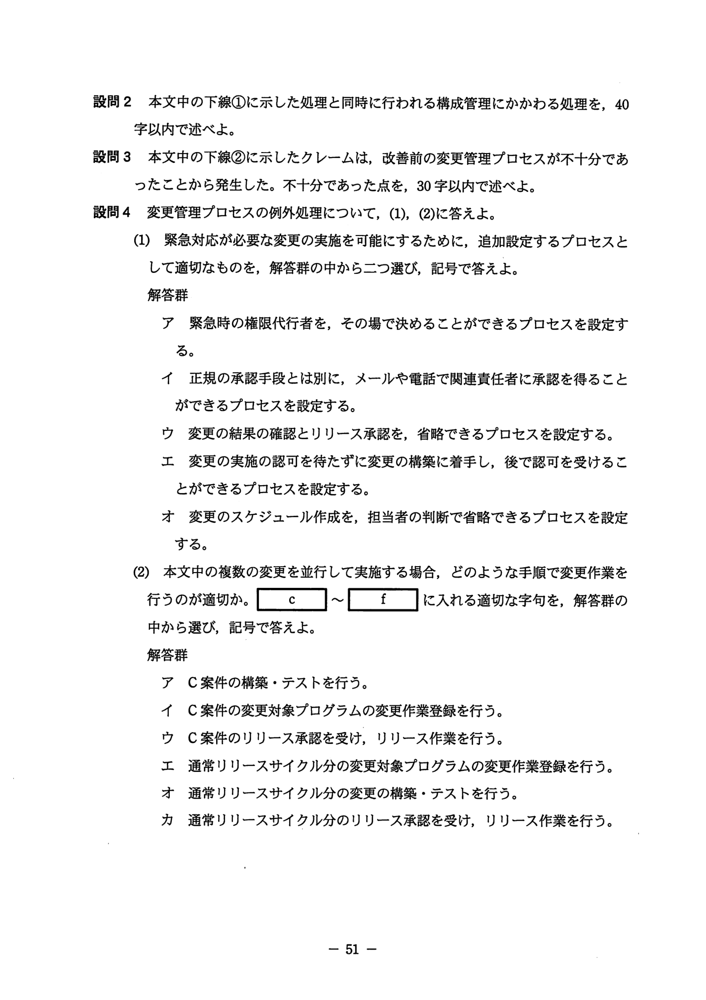

テキスト (OCR)

設問2 本文中の下線①に示した処理と同時に行われる構成管理にかかわる処理を, 40
字以内で述べよ。
設問3 本文中の下線②に示したクレームは, 改善前の変更管理プロセスが不十分であ
ったことから発生した。不十分であった点を, 30 字以内で述べよ。
設問4 変更管理プロセスの例外処理について, (1), (②)に答えよ。
①) 皿急対応が必要な変更の実施を可能にするために, 追加設定するプロセスと
して適切なものを, 解答群の中から二つ選び, 記号で答えよ。
ER
ア 緊急時の権限代行者を, その場で決めることができるプロセスを設定す
る。
イ 正規の承認手段とは別に, メールや電話で関連次任者に承認を得ること
ができるプロセスを設定する。
ウ 変更の結果の確認とリリース承認を, 省略できるプロセスを設定する。
エ 変更の実施の認可を待たずに変更の構築に着手し, 後で認可を受けるこ
とができるプロセスを設定する。
オ 変更のスケジュール作成を, 担当者の判断で省略できるプロセスを設定
する。
Q) 本文中の複数の変更を並行して実施する場合,どのよう手順で変更作業を
行うのが適切か。| c |て| ft | に入れる適切な字句を, 解答群の
中から選び, 記号で答えよ。
AEE

C 案件の構築・テストを行う。

C 案件の変更対象プログラムの変更作業意録を行う。

C 案件のリリース承認を受け, リリース作業を行う。

通常リリースサイクル分の変更対象プログラムの変更作業登録を行う。
通常リリースサイクル分の変更の構築・テストを行う。

通常リリースサイクル分のリリース承認を受け, リリース作業を行う。

+ A’ HG A YY

ー 51 一

### ページ 52

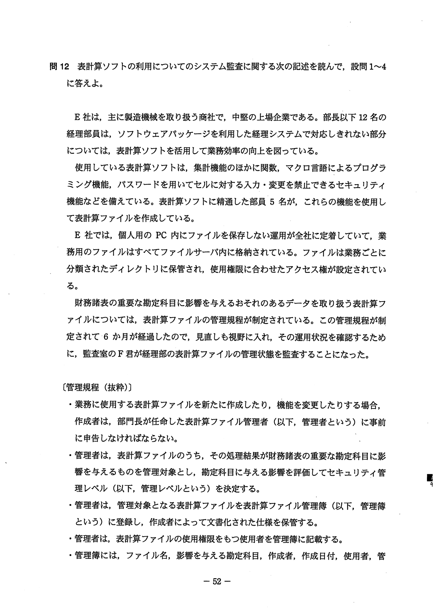

テキスト (OCR)

問12 表計算ソフトの利用についてのシステム監査に関する次の記述を読んで, 設問 1て4
に答えよ。

E 社は, 主に製造機械を取り扱う商社で, 中堅の上場企業である。 部長以下 12 名の
経理部員は, ソフトウェアパッケージを利用した経理システムで対応しきれない部分
については, 表計算ソフトを活用して業務効率の向上を図っている。

使用している表計算ソフトは, 集計機能のほかに関数、 マクロ言語によるプログラ
ミング機能. パスワードを用いてセルに対する入力・変更を禁止できるセキュリティ
機能などを備えている。表計算ソフトに精通した部員 5 名が, これらの機能を使用し
て表計算ファイルを作成している。

E 社では, 個人用の PC 内にファイルを保存しない運用が全社に定着していて, 業
務用のファイルはすべてファイルサーバ内に格納されている。ファイルは業務ごとに
分類されたディレクトリに保管され, 使用権限に合わせたアクセス権が設定されてい
る。

財務諸表の重要な勘定科目に影響を与えるおそれのあるデータを取り扱う表計算フ
ァイルについては, 表計算ファイルの管理規程が制定されている。この管理規程が制
定されて 6 か月が経過したので, 見直しも視野に入れ, その運用状況を確認するため
に, 監査室のF 君が経理部の表計算ファイルの管理状態を監査することになった。

(管理規程 (抜粋)〕

・業務に使用する表計算ファイルを新たに作成したり, 機能を変更したりする場合,
作成者は, 部門長が任命した表計算ファイル管理者 (以下, 管理者という) に事前
に申告しなければならない。                     、

・管理者は, 表計算ファイルのうち, その処理結果が財務諸表の重要な勘定科目に影
碧を与えるものを管理対象とし, 勘定科目に与える影響を評価してセキュリティ管
理レベル (以下, 管理レベルという) を決定する。

・管理者は, 管理対象となる表計算ファイルを表計算ファイル管理和仁 (以下, SES
という) に登録し, 作成者によって文書化された仕様を保管する。

・管理者は, 表計算ファイルの使用権限をもつ使用者を管理簿に記載する。

“PRB, ファイル名, 影響を与える勘定科目, 作成者, 作成日付, 使用者, 管

### ページ 53

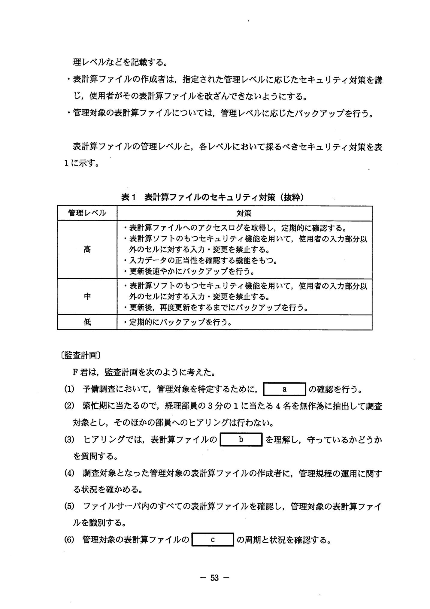

テキスト (OCR)

理レベルなどを記載する。

・表計算ファイルの作成者は, 指定された管理レベルに応じたセキュリティ対策を講

じ, 使用者がその表計算ファイルを改ざんできないようにする。
・管理対象の表計算ファイルについては, 管理レベルに応じたバックアップを行う。

表計算ファイルの管理レベルと, 各レベルにおいて採るべきセキュリティ対策を表

1 に示す。
表1 表計算ファイルのセキュリティ対策 (抜粋)
管理レベル                対策
・表計算ファイルへのアクセスログを取得し, 定期的に確認する。
・表計算ソフトのもつセキュリティ機能を用いて, 使用者の入力部分以
高     外のセルに対する入力・変更を禁止する。
・入力データの正当性を確認する機能をもつ。
・更新後束やかにパックアップを行う。
・表計算ソフトのもつセキュリティ機能を用いて, 使用者の入力部分以
中     外のセルに対する入力・変更を禁止する。
・更新後, 再度更新をするまでにパックアップを行う。
低    ・定期的にバパックアップを行う。
(監査計画

F 君は, 監査計画を次のように考えた。
Q) 予備調査において, 管理対象を特定するために, |  a | の確認を行う。

(2) 繁低期に当たるので, 経理部員の 3 分の 1 に当たる 4 名を無作為に抽出して調査

対象とし, そのほかの部員へのヒアリングは行わない。
(③ ヒアリングでは, 表計算ファイルの| b | を理解し, 守っているかどうか

を質問する。
4) 調査対象となった管理対象の表計算ファイルの作成者に, 管理規程の運用に関す

る状況を確かめる。

6) ファイルサーバ内のすべての表計算ファイルを確認し, 管理対象の表計算ファイ
ルを識別する。

©) 管理対象の表計算ファイルの の周期と状況を確認する。

### ページ 54

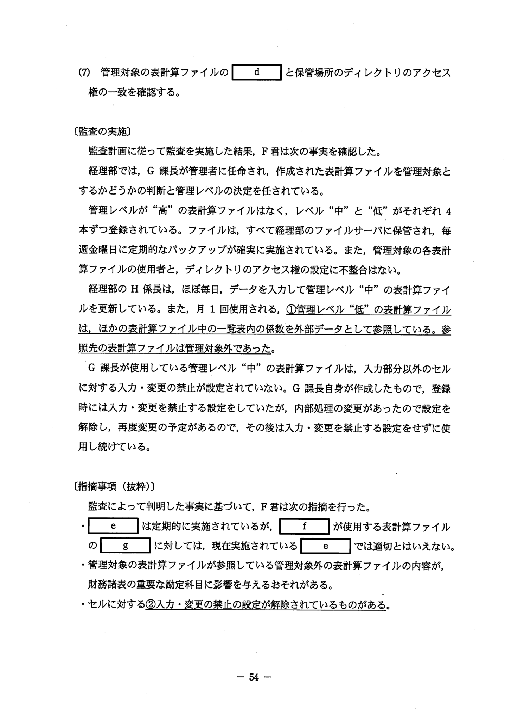

テキスト (OCR)

(⑦ 管理対象の表計算ファイルの|  d | と保管場所のディレクトリのアクセス
権の一致を確認する。

(監査の実施〕

監査計画に従って監査を実施した結果, F 君は次の事実を確認した。

経理部では, G 課長が管理者に任命され, 作成された表計算ファイルを管理対象と
するかどうかの判断と管理レベルの決定を任されている。

管理レベルが “高" の表計算ファイルはなく, レベル “中” と “低” がそれぞれ 4
本ずつ登録されている。ファイルは, すべて経理部のファイルサーバに保管され, 毎
週金曜日に定期的なパックアップが確実に実施されている。また, 管理対象の各表計
算ファイルの使用者と, ディレクトリのアクセス権の設定に不整合はない。

経理部の H 係長は。 ほぼ毎日,データを入力して管理レベル “中” の表計算ファイ
ルを更新している。また, 月 1 回使用される, ①管理レベル "低” の表計算ファイル
は, ほかの表計算ファイル中の一覧表内の係数を外部データとして参照している。参
照先の表計算ファイルは管理対象外であった。

G 課長が使用している管理レベル “中"の表計算ファイルは, 入力部分以外のセル
に対する入力・変更の禁止が設定されていない。G 課長自身が作成したもので, 登録
時には入力・変更を禁止する設定をしていたが, 内部処理の変更があったので設定を
解除し, 再度変更の予定があるので, その後は入力・変更を禁止する設定をせずに使
用し続けている。

(指摘事項 (抜粋))

監査によって判明した事実に基づいて, F 君は次の指摘を行った。

・[ < J は定期的に実施されているが, が使用する表計算ファイル
の に対しては, 現在実施されている|  e | では適切とはいえない。
・管理対象の表計算ファイルが参照している管理対象外の表計算ファイルの内容が,
財務諸表の重要な勘定科目に影響を与えるおそれがある。

・セルに対する②入力・変更の禁止の設定が解除されているものがある。

### ページ 55

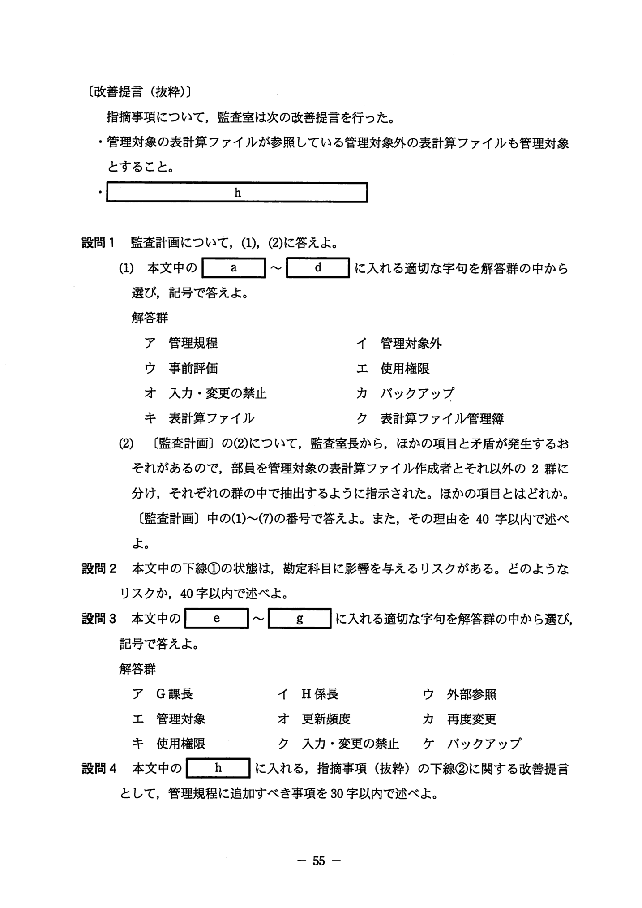

テキスト (OCR)

(政善提言 (抜粋)〕
指摘事項について, 監査室は次の改善提言を行った。
・管理対象の表計算ファイルが参照している管理対象外の表計算ファイルも管理対象
とすること。

‘|         h

設問1 監査計画について, ①⑪, ②に答えよ。
Q 本文中の| a |て|  d |に入れる適切な字句を解答群の中から

選び, 記号で答えよ。
ARB
ア 管理規程           イ 管理対象外
ウ 事前評価           エ 使用権限
オ 入力・変更の禁止       カ パックアップ
キ 表計算ファイル        ク 表計算ファイル管理筆

(②) (監査計画]の(②について, 監査室長から, ほかの項目と矛盾が発生するお
それがあるので, 部員を管理対象の表計算ファイル作成者とそれ以外の 2 Bic
分け, それぞれの群の中で抽出するように指示された。ほかの項目とはどれか。
(監査計画〕 中の(1)て⑦の番号で答えよ。また, その理由を 40 字以内で述べ
よ。
設問2 本文中の下線〇の状態は, 勘定科目に影響を与えるリスクがある。どのような
リスクか, 40 字以内で述べよ。
設問3 本文中の| e |~|  g |に入れる適切な字句を解答群の中から選び,

記号で答えよ。
RoR
ア GRE               イ HR               ウ 外部参照
エエ 管理対象             オ 更新頻度             カカ 再度変更
キ 使用権限             ク 入力・変更の禁止 FF バックアップ

設問4 本文中の| h |] に入れる, 指摘事項 (抜粋) の下線②に関する改善提言
として, 管理規程に追加すべき事項を 30 FLINT TRAE,

### ページ 56

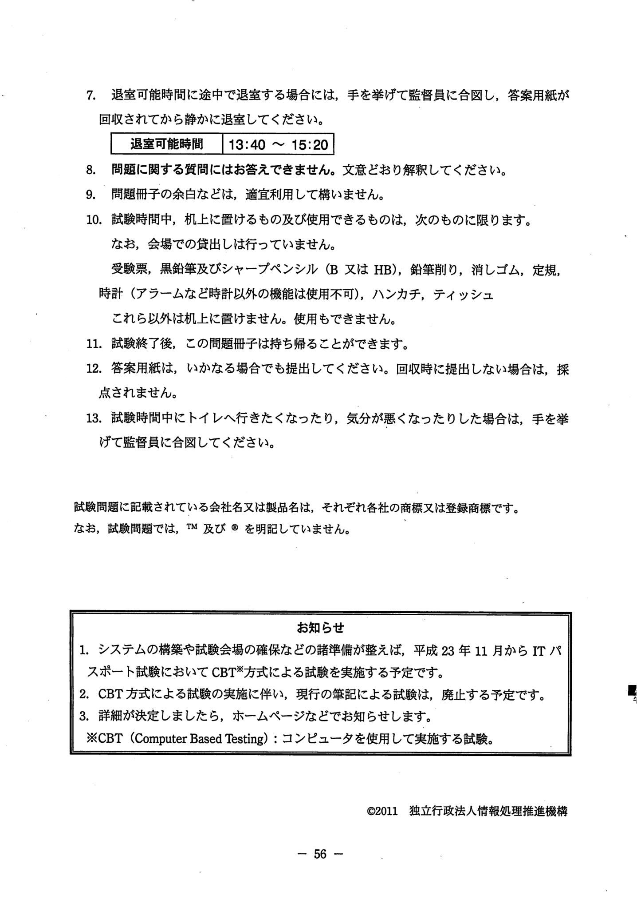

テキスト (OCR)

7. 退室可能時間に途中で退室する場合には, 手を挙げて監督員に合図し, 答案用紙が
回収されてから静かに退宣してください。
退室可能時間 | 13:40 ~ 15:20
8. 問題に関する質問にはお答えできません。文意どおり解釈してください。
9. 問題冊子の余白などは, 適宜利用して構いません。
10. 試験時間中, 机上に劉けるもの及び使用できるものは, 次のものに限ります。
なお, 会場での貸出しは行っていません。
ZAR, 黒鉛筆及びシャープペンシル (B 又は HB), 鉛筆削り, 消しゴム, 定規,
時計 (アラームなど時計以外の機能は使用不可), ハンカチ, ティッシュ
これら以外は机上に置けません。使用もできません。
11. 試験終了後, この問題民子は持ち帰ることができます。
12, 答案用紙は, いかなる場合でも提出してください。回収時に提出しない場合は, 採
点されません。
13. 試験時間中にトイレへ行きたくなったり, MAWES RORVLEMA, FER
げて監督員に合図してください。

試験問題に記載されている会社名又は製品名は, それぞれ各社の商標又は登録商標です。
なお, 試験問題では, ™ 及び © を明記していません。

お知らせ
1. システムの構築や試験会場の確保などの諸準備が整えば, 平成 23 年 11 月から ITパ
スポート試験において CBT※方式による試験を実施する予定です。
2. CBT 方式による試験の実施に伴い, 現行の筆記による試験は, 廃止する予定です。
3. 詳細が決定しましたら, ホームページなどでお知らせします。
※CBT (Computer Based Testing) : コンピュータを使用して実施する試験。

@2011 独立行政法人情報処理推進機構

---

## 午後解答

1/6 
©2011 独立行政法人情報処理推進機構 
平成23 年度 特別 応用情報技術者試験 解答例 
 
午後試験 
問１ 
出題趣旨 
 企業の経営環境が厳しさを増す中，限りある自社の経営資源を戦略分野に集中投下し，ほかの分野は，アウ
トソーシングや他社との提携など，外部の資源で賄う企業が増えている。このような背景から，アウトソーシ
ングの活用は重要度を増している。 
 本問では，家具の製造・販売を行う会社におけるコールセンタを題材に，アウトソーシング導入に関する基
礎的な知識と応用力を問う。 
 
設問 
解答例・解答の要点 
備考 
設問１ 
a カ 
 
 
 
b ケ 
 
 
 
d オ 
 
 
 
e ウ 
 
設問２ 
イ，ウ 
 
設問３ 
・アウトソーシングが，コアコンピタンスの喪失にはつながらないから 
・自社のコアコンピタンスは，低コスト製造技術と体制をもっていることであ
るから 
 
設問４ (1) c 電話による通販の受付業務を開始 
 
 
(2) 顧客からの照会・要望・クレームなどの情報の担当部署への速やかな伝達 
 
 
問２ 
出題趣旨 
 近年，Web アプリケーションの増加によって，オブジェクト指向プログラミングが主流になってきたが，基本
的なアルゴリズムの実装能力は欠かせない。 
 本問では，Web プログラミングを題材に，バッチ処理などで不可欠なアルゴリズムであるコントロールブレイ
ク処理やHTML を記述する能力を問う。さらに，アルゴリズムを評価する能力を問う。 
 
設問 
解答例・解答の要点 
備考 
設問１ 
ア rowspan="4" 
 
 
イ colspan="2" 
 
設問２ 
ウ CSVArray.size－1 
 
 
エ CSVArray[i].todofuken とkey が等しくない 
 
 
オ goukei ← goukei + CSVArray[i].uriage 
 
設問３ 
カ shitenArray.size－1 
 
 
キ shitenArray.size＋1 
 
設問４ (1) ク 記憶領域 又は メモリ 
 
 
(2) HTML タグ<td>のrowspan 属性の値を決める必要があるから

2/6 
©2011 独立行政法人情報処理推進機構 
問３ 
出題趣旨 
 昨今，企業活動では，顧客に対するサービスを継続的に提供することが求められており，いざという場合に
備えた適切な対応としての事業継続計画（BCP）の策定と維持が必要とされている。 
 本問では，外食産業におけるBCP 策定を題材に，ビジネスインパクト分析（BIA）から始まるBCP 策定の手順
と，目標復旧時間（RTO）達成に向けた施策の理解について問う。 
 
設問 
解答例・解答の要点 
備考 
設問１ 
社長は，関東地方に進出して2 年間で店舗数を2 倍にする構想をもっている。  
設問２ (1) a 30 
 
 
(2) ア 
 
設問３ 
b エ 
 
 
c ウ 
 
設問４ (1) B 社支社の従業員がB2 センタへ移動する時間 
 
 
(2) イ，ウ，エ 
 
 
問４ 
出題趣旨 
 近年，システム構成の複雑化に伴い，非機能要件の定義をおろそかにした結果，サービス停止やデータ損失
などの問題が発生することが少なくない。 
 本問では，インターネット販売システムを題材に，非機能要件定義で考慮すべきシステム構成やトレードオ
フの関係にある各要件同士の影響に関する知識と技能を問う。さらに，システム上の問題が業務に与える影響
を考慮する応用能力を問う。 
 
設問 
解答例・解答の要点 
備考 
設問１ (1) 8.76 
 
 
(2) ア 
 
設問２ (1) b 3.2 
 
 
(2) c ア 
 
設問３ (1) a 水平分散 又は スケールアウト 
 
 
(2) システム上の問題 
レスポンスの低下 
 
 
 業務上の問題 
販売機会損失の発生 
 
設問４ 
イ，エ

3/6 
©2011 独立行政法人情報処理推進機構 
問５ 
出題趣旨 
 業務規模の拡大に伴って，Web システムのセキュリティの強化や負荷の分散を，ロードバランサやリバースプ
ロキシサーバを用いて実現するケースが増えている。 
 本問では，リバースプロキシサーバを題材に，インターネットからWeb サーバにアクセスする際の通信の仕
組みについての基本的な理解と応用力を問う。 
 
設問 
解答例・解答の要点 
備考 
設問１ 
a リバースプロキシサーバ 
 
 
b 443 
 
 
c 80 
 
 
d http 
 
設問２ 
e https 
 
 
f www.example.com/srv2/login.html 
 
 
g http 
 
 
h 192.168.5.202/login.html 
 
設問３ (1) 送信元のIP アドレスが，すべて192.168.3.90 になるから 
 
 
(2)  FW1 ・ FW2 
 
 
問６ 
出題趣旨 
 インターネットにおけるEC サイトに求められる機能は年々高度化してきており，その機能の基盤となるデー
タベース設計の重要性は増している。 
 本問では，EC サイトの注文管理システム構築を題材に，データベース設計に関する基本的な理解，及び具体
的な要求に対する処理方式の設計と実装に必要な知識の理解について問う。 
 
設問 
解答例・解答の要点 
備考 
設問１ (1) a CREATE TABLE 
 
 
 
b PRIMARY KEY 
 
 
(2) c SUM(注文明細.数量) 
 
 
 
d 注文.注文年月日 + 180 > :今日 
 
 
 
e 注文.顧客番号 
 
 
f 書籍.ジャンル 
順不同 
 
(3) g 購入傾向.購入冊数 * 10 
 
設問２ (1) 
 
 
 
(2) ・過去180 日以内にその顧客が購入したことがないジャンルの商品 
・購入傾向テーブルにその顧客のデータがないジャンルの商品

4/6 
©2011 独立行政法人情報処理推進機構 
問７ 
出題趣旨 
 組込みシステムのソフトウェア開発において，デバイスの仕様を理解してソフトウェアを設計することが重
要である。 
 本問では，PIO の制御を題材に，ディジタル制御システムで使われるPIO を使用した回路の制御方法，及び
LED の代表的な点灯方式であるダイナミック点灯方式に関する理解を問う。 
 
設問 
解答例・解答の要点 
備考 
設問１ 
3FFF 
 
設問２ (1) a Time 
 
 
 
b Date 
 
 
(2) c 13－i 
 
 
 
d i＝6 又は i＞＝6 又は i＞5 
 
設問３ 
・スイッチオン・オフ時は不安定な状態になるので 
・SW の状態が不安定なので 
・チャタリングによって，状態が不安定なので 
 
 
問８ 
出題趣旨 
 昨今，ソフトウェア開発において，UML のクラス図などを使用したオブジェクト指向設計が行われるようにな
った。そこではMVC モデルやデザインパターンが利用されることも多い。 
 本問では，ゴルフ用のGPS ナビゲーションシステムを題材に，オブジェクト指向設計の基本的知識や，性能
を考慮して処理方式を改良する設計の応用力を問う。 
 
設問 
解答例・解答の要点 
備考 
設問１ 
a グリーン位置 
 
b 最新登録位置 
順不同 
 
c ホールの移動 
 
設問２ 
：位置登録ボタン
：表示
：現在状態
：GPS
：ゴルフ場
現在位置登録
現在位置問合せ
 
 
設問３ (1) 
 
 
 
(2) ウ

5/6 
©2011 独立行政法人情報処理推進機構 
問９ 
出題趣旨 
 サイバー攻撃は日々高度化してきており，個別のホストでの対策に加えて，ファイアウォールやIDS／IPS に
よるネットワーク単位での対策が必須となっている。 
 本問では，サイバー攻撃への対策実施を題材に，ファイアウォールやネットワーク型IDS に関する基本的な
理解及び具体的な対策の実施に必要な知識の理解について問う。 
 
設問 
解答例・解答の要点 
備考 
設問１ 
サイバー攻撃1
ア 
 
 
サイバー攻撃2
イ 
 
 
サイバー攻撃3
オ 
 
 
サイバー攻撃4
カ 
 
設問２ 
a プロキシサーバ 
 
 
b 8080 
 
 
c DB サーバ 
 
 
d 1521 
 
 
e メールサーバ1 
 
 
f 25 
 
設問３ (1) 監視対象がファイアウォールを通過したパケットに限定されるから 
 
 
(2) サイバー攻撃4 
 
 
問10 
出題趣旨 
 昨今，ERP 利用が普及・定着してきている。このERP 導入を成功させるには企画検討が重要になる。 
 本問では，ERP 導入の検討を題材に，ERP の導入計画策定や評価に関する基本的な理解及びERP 導入プロジェ
クト体制に関する理解について問う。 
 
設問 
解答例・解答の要点 
備考 
設問１ 
a エ 
 
 
b カ 
 
設問２ 
改革委員会と導入PJ にまたがる問題を調整する。 
 
設問３ 
販売システム及び生産システムと現行の会計システムとの連携 
 
設問４ (1) エ，オ 
 
 
(2) ERP 自体の機能改造は行わないから

6/6 
©2011 独立行政法人情報処理推進機構 
問11 
出題趣旨 
 昨今，ビジネスに悪影響を与えるシステムのインシデントは，変更に起因するものが最も多いと言われてい
る。確実かつ効率的に変更要求を処理できるようにするために，標準化された変更管理プロセスを確立するこ
とが重要になる。 
 本問では，小売業の変更管理プロセスの改善を題材に，変更管理プロセス策定に関する基本的な理解と，例
外処理へのその応用について問う。 
 
設問 
解答例・解答の要点 
備考 
設問１ (1) a ウ 
 
 
 
b ア 
 
 
(2) ア，エ 
 
設問２ 
構成アイテム属性のステータスが“本番稼働中”に更新される。 
 
設問３ 
変更要求に対する優先度の割当てが定義されていない。 
 
設問４ (1) イ，エ 
 
 
(2) c イ 
 
 
 
d ア 
 
 
 
e ウ 
 
 
 
f エ 
 
 
問12 
出題趣旨 
 ユーザ部門において作成されて業務に供されるスプレッドシート（本問中では，表計算ファイル）の中には
財務諸表に大きな影響を与えるものもあることから，平成19 年3 月に公開されたシステム管理基準追補版にお
いて，スプレッドシートの統制が新たに示された。 
 本問では，経理部門で使用されているスプレッドシートの管理状況の監査を題材に，システム管理基準追補
版に示されたスプレッドシートの統制の実施状況における指摘事項と改善策において，システム監査について
の理解を問う。 
 
設問 
解答例・解答の要点 
備考 
設問１ (1) a ク 
 
 
 
b ア 
 
 
 
c カ 
 
 
 
d エ 
 
 
(2) 項目 
(4) 
 
 
 
理由 
管理対象の表計算ファイルの作成者が抽出されないおそれがあるから  
設問２ 
外部データとして参照している係数が不正に変更されるおそれがある。 
 
設問３ 
e ケ 
 
 
f イ 
 
 
g オ 
 
設問４ 
h 入力・変更の禁止の設定・解除を使用者以外の者が行う。

---

## 午後採点講評

1/3 
©2011 独立行政法人情報処理推進機構 
平成23 年度 特別 応用情報技術者試験 採点講評 
 
午後試験 
問１ 
 問1 では，家具の製造・販売を行う会社におけるコールセンタを題材に，アウトソーシング導入に関する基
礎的な知識とその応用について出題した。全体として，正答率は低かった。 
 設問1 は，d とe の正答率は高かったが，a とb は低かった。IT 分野だけでなく，経営戦略立案に関する事
項についても，今回の受験を契機としてしっかり学習してほしい。 
 設問3 は，正答率が低かった。アウトソーシングの可否を判断する際の考慮点が，理解されていなかったよ
うである。 
 設問4(2)は，正答率が低かった。コールセンタの活動を問うているにもかかわらず，コールセンタでは実施
しない活動を述べた解答が散見された。解答する際は，求められている事柄をよく確認してもらいたい。 
 
問２ 
 問2 では，Web プログラミングを題材に，コントロールブレイク処理やHTML の記述について出題した。全体
として，正答率は高かった。 
 設問2 は，メインプログラムの処理を問うたが，正答率が低かった。プログラムの概要をよく理解した上
で，どのような処理かをプログラム1 行ずつ確認し，必要な条件や処理を解答してもらいたい。 
 設問3 のキは，rowspan 属性の値を出力する処理を問うたが，正答率が低かった。関数printShitenArray が
何を出力する関数か，出力されるべきHTML は何か，処理の流れをよく考えて正答を導いてもらいたい。 
 
問３ 
 問3 では，外食産業におけるBCP 策定を題材に，BCP 策定の手順と目標復旧時間（RTO）達成に向けた施策に
ついて出題した。 
 設問1 は，正答率が低かった。BCP を見直す要因となる大規模な事業所移転や拠点の新設，新製品開発や新
技術の導入など，事業に大きなインパクトを与える事象を問題文から読み取って解答してほしい。 
 設問4(1)は，BCP が発動されて稼働中のシステムをバックアップセンタに移行する際に，バックアップシス
テムの立上げ作業以外の考慮すべき時間を漏れなく理解しておいてほしい。 
 
問４ 
 問4 では，インターネット販売システムを題材に，非機能要件定義について出題した。全体として，正答率
は高かった。 
 設問3 の(1)は，正答率が低かった。拡張性の検討において，スケールアウトやスケールアップを前提とし
たシステム構成を設計することは非常に重要である。それぞれの特徴を是非理解しておいてほしい。 
 設問3 の(2)は，拡張性がシステム及び業務に与える影響を問うたが，正答率は低かった。非機能要件がビ
ジネスに与える影響があることを念頭に置き，問題文を注意深く読んでもらいたい。 
 
問５ 
 問5 では，リバースプロキシサーバの導入を題材に，インターネットからWeb サーバにアクセスする際の通
信の仕組みについて出題した。全体として，正答率は低かった。 
 設問1 は，正答率が高かった。Web システムの構成についての基礎的な事項はおおむね理解されているよう
であった。 
 設問2 は，正答率が低かった。記述された設定のとおりの条件で，システムが内部的にどのような挙動をす
るかを正しく把握することは，ネットワークを設計する上で非常に重要である。問題文中に示された条件を過
不足なく読み取り，正答を導き出してほしい。 
 設問3(1)は，正答率が低かった。リバースプロキシサーバが通信を中継する仕組みを考えれば，正答を導き
出せるはずである。通信の経路上で，どのような状態のパケットが送受信されているか，よく理解してもらい
たい。

2/3 
©2011 独立行政法人情報処理推進機構 
問６ 
 問6 では，EC サイトの注文管理システム構築を題材に，データベース設計に関する基本的な理解，及び具体
的な処理方式の設計と実装について出題した。 
 設問1(1)は，正答率が高かった。テーブル作成に関するSQL 文については，おおむね理解されているようで
あった。 
 設問1(3)は，正答率が低かった。与えられた検索条件から具体的なSQL 文を作成する能力は非常に重要であ
る。特に数値演算によって条件を指定する方法について，十分に理解しておいてもらいたい。 
 設問2(2)は，正答率が低かった。実際の業務では，テスト結果から実装方式の不具合を発見する能力が要求
される。是非身に付けておいてもらいたい。 
 
問７ 
 問7 では，LED を使用したディジタル時計の設計を題材に，LED の点灯を制御するプログラムの設計につい
て出題した。全体として，正答率は低かった。 
 設問1 は，正答率が低かった。PIO の下位8 ビットを入力に設定している誤った解答が多かった。これは，
LED の表示制御についての理解が不十分であったためと思われる。 
 設問2 は，正答率が高かった。流れ図を正しく理解できているようであった。 
 設問3 は，正答率が低かった。SW の切替えで入力信号が不安定となることの理解が不十分であったためと思
われる。ハードウェアの特性や制御方法を理解しておくことは，組込みシステムを設計する上で特に必要とさ
れることであり，是非理解しておいてもらいたい。 
 
問８ 
 問8 では，ゴルフ用ナビゲーションシステムを題材に，オブジェクト指向設計について出題した。全体とし
て，正答率は低かった。 
 設問1 は，正答率が低かった。a，b は，正答の位置のデータのところを距離のデータとした誤った解答が多
かったが，クラス図とシーケンス図をよく見て，位置のデータから距離を計算する処理をどこで行うかに注意
すれば，正答を導けるはずである。c は，グリーン位置問合せをどのような場合に行う必要があるかを考えれ
ば，正答を導けるはずである。 
 設問2 は，クラス図との整合が取れない誤った解答が散見された。クラス図及びシーケンス図の意味と，操
作とメッセージの対応について，よく理解しておいてもらいたい。 
 設問3 は，クラス図の変更内容に注意しながら，表示クラスの種類が増えても現在状態の更新処理の負荷を
増やさないですますことに着目し，変更後のクラス図，シーケンス図を見れば，正答を導けるはずである。 
 
問９ 
 問9 では，サイバー攻撃への対策実施を題材に，ファイアウォールやネットワーク型IDS に関する基本的な
理解及び具体的な対策の実施について出題した。 
 設問1 は，正答率が高かった。各種サイバー攻撃の特徴についてはおおむね理解されているようであった。
 設問2 は，a，b，f，の正答率が低かった。各サーバの役割を正確に理解できれば，正答を導けるはずであ
る。実際の業務では，サーバの役割からファイアウォールの具体的な設定を導く能力が要求されるので，是非
身に付けておいてもらいたい。 
 設問3 は，正答率が低かった。IDS は，運用方法を工夫することによって，効率的にサイバー攻撃を発見で
きるようになる。設置位置による違いについて，十分に理解してほしい。 
 
問10 
 問10 では，ERP を題材に，ERP の導入計画策定や評価に関する基本的な理解及びERP 導入プロジェクト体制
について出題した。全体として，正答率は低かった。 
 設問1 は，特にa の正答率が低かった。ERP を導入しやすくするテンプレートの重要性を理解しておいてほ
しい。 
 設問2 は，設問で断っているにも関わらず“最終判断”を挙げている解答が散見された。ERP の利用部門と
導入PJ を連携させる体制の必要性を理解しておいてほしい。 
 設問3 は，正答率が低かった。一部業務のERP 機能を遅れて導入する際には，既存業務システムと連携させ
る必要のあることを理解しておいてほしい。

3/3 
©2011 独立行政法人情報処理推進機構 
問11 
 問11 では，小売業のシステムの変更管理を題材に，変更管理プロセスの改善について出題した。 
 設問1(2)は，正答率が低かった。イ及びウは，通常のオペレーションで繰り返し行われる変更であり，変更
管理の対象外であることを理解してほしい。 
 設問2 は，構成管理では変更管理対象物の構成アイテムのステータスが管理されているが，リリース管理に
関する処理を挙げている解答が散見された。構成管理の管理対象をよく理解してもらいたい。 
 
問12 
 問12 では，ユーザ部門において作成されて業務に供される表計算ソフトを題材に，表計算ソフトの管理状
況の監査について出題した。 
 設問1(2)は，正答率が高かった。被監査部門の業務上の制約と，監査目的の整合性をとるための方法につい
ておおむね理解されているようであった。 
 設問2 は，意図しない変更，改ざんのリスクの存在についておおむね認識されているようであった。 
 設問4 は，正答率が低かった。管理者・作成者・使用者が同一であるという問題文の状況では，管理者が入
力部分以外の変更を禁止するセキュリティ設定を行っても問題の解決にはならない。管理者に期待する誤った
解答が多く見られたが，使用者に改ざんをさせないという目的を考えれば，正答を導けるはずである。

