# 平成24年度秋期 応用情報技術者試験

---

## 午前問題

### ページ 1

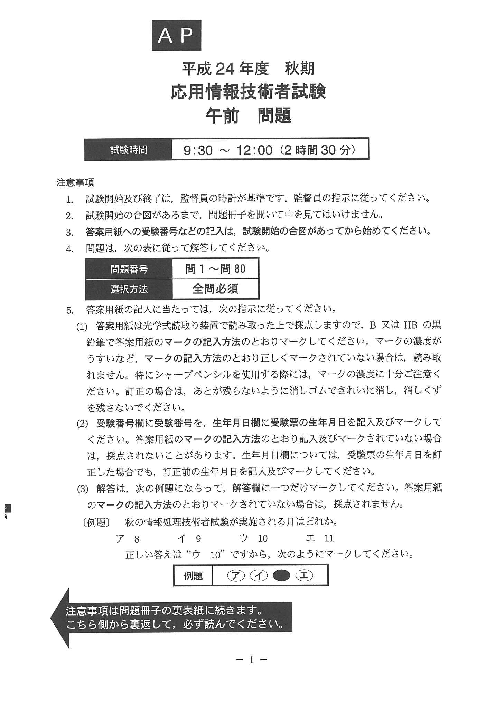

テキスト (OCR)

平成 24 年度 秋期
応用情報技術者試験
午前 問題

 9:30 ~ 12:00 ②時間30 分)

注意事項

1. 試験開始及び終了は, 監督員の時計が基準です。監督員の指示に従ってください。
2. 試験開始の合図があるまで, 問題冊子を開いて中を見てはいけません。
3. 答案用紙への受験番号などの記入は, 試験開始の合図があってから始めてください。
4. 問題は, 次の表に従って解答してください。
問題番号       問1 <間80
選択方法          全間必須
5. 管案用紙の記入に当たっては, 次の指示に従ってください。

(1) 答案用紙は光学式読取り装置で読み取った上で採点しますので, B 又は HB OR
鉛筆で答案用紙のマークの記入方法のとおりマークしてください。マークの濃度が
うすいなど, マークの記入方法のとおり正しくマークされていない場合は, 読み取
れません。特にシャープペンシルを使用する際には, マークの濃度に十分ご注意く
ださい。 訂正の場合は, あとが残らないように消しゴムできれいに消し, 消しくず
を残さないでください。

Q) 受験番号欄に受験番号を, 生年月日欄に受験票の生年月日を記入及びマークして
ください。管案用紙のマークの記入方法のとおり記入及びマークされていない場合
は, 採点されないことがあります。生年月日欄については, 受験票の生年月日を訂
正した場合でも, 訂正前の生年月日を記入及びマークしてください。

(3) 解答は, 次の例題にならって, 解答欄に一つだけマークしてください。答案用紙
のマークの記入方法のとおりマークされていない場合は, 採点されません。

〔例題】 秋の情報処理技術者試験が実施される月はどれか。
ア 8    イ 9    ウ 10    エ 11
正しい答えは “ウ 10” ですから, 次のようにマークしてください。

例題 | 〈⑦の〈⑦  ⑤

注意 意 UI Sas ます。

### ページ 2

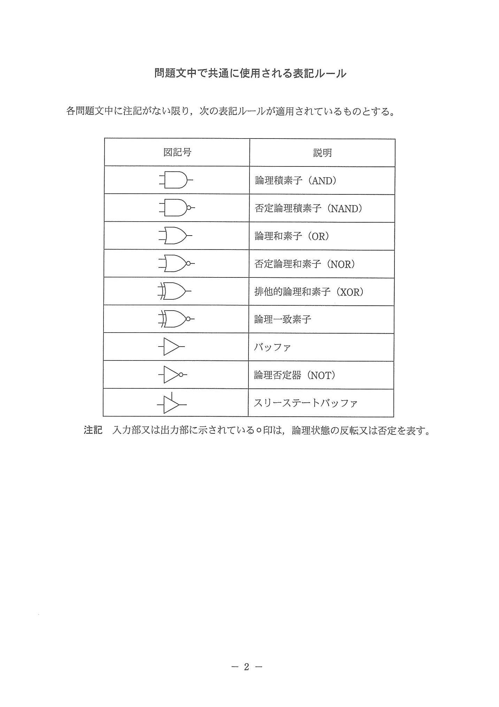

テキスト (OCR)

問題文中で共通に使用される表記ルール

各問題文中に注記がない限り, 次の表記ルールが適用されているものとする。

ir
Dub
cu
aa

説明

論理積素子 (AND)

否定論理積素子 (NAND)

論理和素子 (OR)

否定論理和素子 (NOR)

排他的論理和素子 CXOR)

論理一致素子

パッファ

論理否定器 (NOT)

YYIYMMVMIMO

スリーステートバッファ

注記 入力部又は出力部に示されているo印は,

論理状態の反転又は否定を表す。

### ページ 3

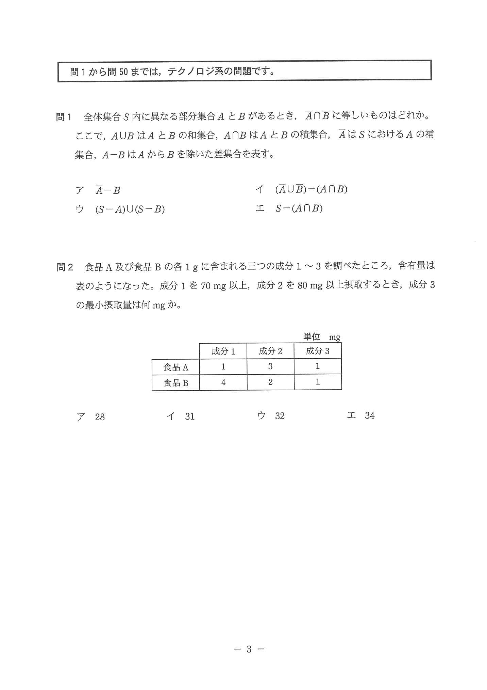

テキスト (OCR)

間 1 から問 50 までは, テクノロジ系の問題です。

問1 全体集合 $ 内に異なる部分集合4 と#があるとき, 4に等しいものはどれか。
ここで, 4Uj は4 とぢの和和集合, ANBILALBORREA, 4は$ における4 OFF
集合, 4ーg は4 からぢを除いた差集合を表す。

ア A-B          イ (AUB)-(ANB)
ウ (S—A)U(S—B)        エ S-(ANB)

問2 食品A及び食品 B の各 1 g に含まれる三つの成分 1 ~ 3 を調べたところ, 含有量は
表のようになった。成分 1 を 70 mg 以上, 成分 2 を 80 mg 以上摂取するとき, 成分 3
の最小摂取量は何 mg か。

単位 mg
成分 1        成分 2        成分3
食品A        1          3          1
食品B        4          2          1

### ページ 4

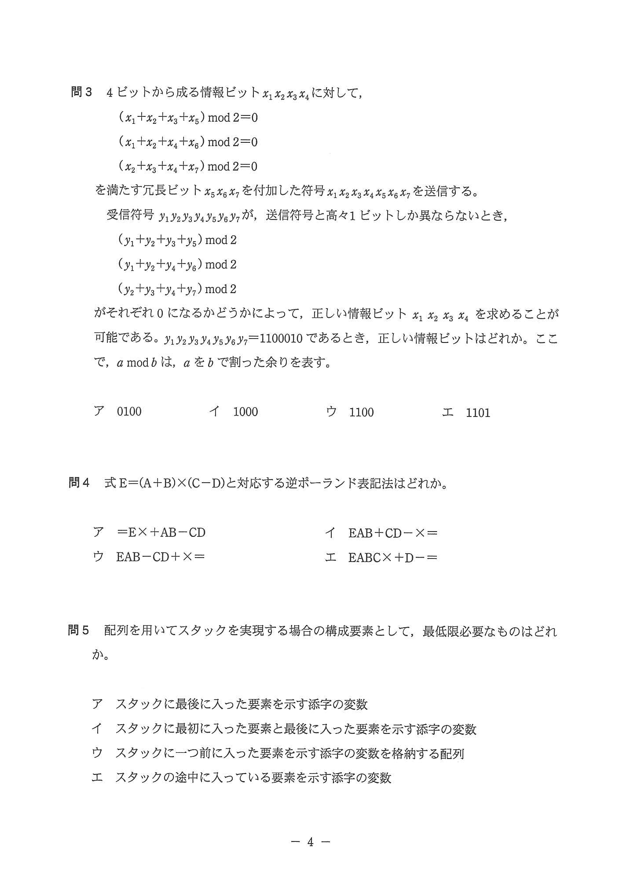

テキスト (OCR)

FS 4ビットから成る情報ビットぇxs に対して,
(x, +4, +x, +25) mod 2=0
(x, +", +x,+4%,) mod 2=0
(4, +43 +4,+2,) mod 2=0
Swe TTRE y b xs xgx, SAMLEGE my pq 4X5 gh, を送信する。
受信符号 ViVi, 送信符号と高々1 ビットしか異ならないとき,
(yy +y2+y5+y5) mod 2
(Cy +y2+y4+y5) mod 2
(yp bys ty,+y,) mod 2
がそれぞれ 0 になるかどうかによって, 正しい情報ビット x, x *。 *。を求めることが
可能である。 Yi Vo N34 I5 Ie V7 =1100010 であるとき, 正しい情報ビットはどれか。ここ
で, gmodのは, 。をヵで割った余りを表す。

ア 0100     イ 1000     ウ 1100     x= 1101

問4 式E王(A十B)X(CD)と対応する逆ポーランド表記法はどれか。

ア =EX+AB-—CD        イ EAB十CD一メニ
7 EAB-CD+X=         <= EABCX+D-=

BS 配列を用いてスタックを実現する場合の構成要素として, 最低限必要なものはどれ
か。

スタックに最後に入った要素を示す添字の変数

スタックに最初に入った要素と最後に入った要素を示す添字の変数
スタックにーーつ前に入った要素を示す添字の変数を格納する配列
スタックの途中に入っている要素を示す添字の変数

HHざささい

### ページ 5

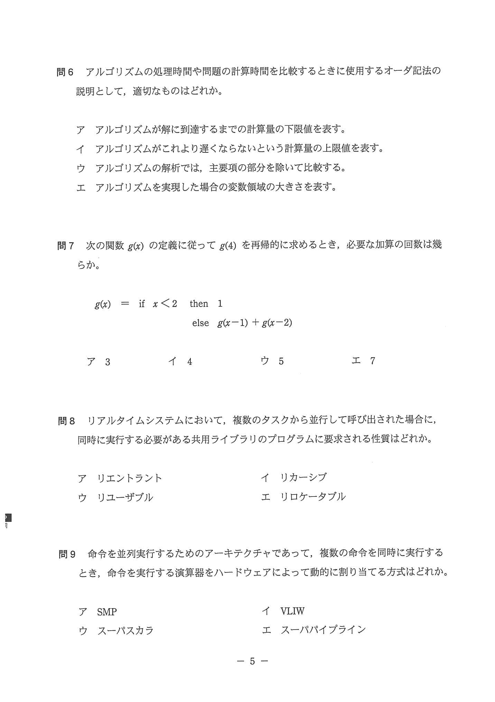

テキスト (OCR)

6 アルゴリズムの処理時間や問題の計算時間を比較するときに使用するオータダ記法の
説明として, 適切なものはどれか。

アルゴリズムが解に到達するまでの計算量の下限値を表す。

アルゴリズムがこれより遅くならないという計算量の上限値を表す。
アルゴリズムの解析では, 主要項の部分を除いて比較する。

アルゴリズムを実現した場合の変数領域の大きさを表す。

H ANN

問7 次の関数 gw) の定義に従って g(4④) を再帰的に求めるとき, 必要な加算の回数は幾

らか。

gx) = if xく2 then 1
else g(x—1) + gw一2)

ア 3     イ 4      ウ 5      エ 7

問8 リアルタイムシステムにおいて, 複数のタスクから並行して呼び出された場合に,

同時に実行する必要がある共用ライブラリのプログラムに要求される性質はどれか。

ア リエントラント               イ リカーシブ

ウ リユーザブル         エエ リロケータブル

問9 命令を並列実行するためのアーキテクチャであって, 複数の命令を同時に実行する

とき, 命令を実行する演算器をハードウェアによって動的に割り当てる方式はどれか。

ア SMP            イ VLIW
ウ スーパスカラ           エエ スーパパイプライン

ー 5一

### ページ 6

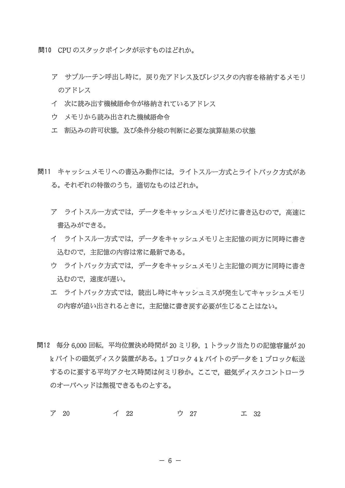

テキスト (OCR)

間10 CPUのスタックポインタが示すものはどれか。

ア サブルーチン呼出し時に, 戻り先アドレス及びレジスタの内容を格納するメモリ
のアドレス

イ 次に読み出す機械語命令が格納されているアドレス

ウ メモリから読み出された機械語命令

エ 割込みの許可状態, 及び条件分岐の判断に必要な演算結果の状態

間11 キャッシュメモリへの書込み動作には, ライトスルー方式とヒライトバック方式があ
る。それぞれの特徴のうち, 適切なものはどれか。

ア ライトスルー方式では,. データをキャッシュメモリだけに書き込む9ので, 高速に
書込みができる。

イ ライトスルー方式では, データをキャッシュメモリと主記憶の両方に同時に書き
込むので, 主記憶の内容は常に最新である。

ウ ライトバック方式では, データをキャッシュメモリと主記憶の両方に同時に書き
込むので, 速度が遅い。

エエ ライトバック方式では, 読出しレ時にキャッシュミスが発生してキャッシュメモリ
の内容が追い出されるときに, 主記憶に書き戻す必要が生じることはない。

間12 毎分6.000 回転, 平均位置決め時間が 20 ミリ秒, 1 トラック当たりの記憶容量が 20
k バイトの磁気ディスク装置がある。1 ブロック 4 k バイトのデータを 1 ブロック転送
するのに要する平均アクセス時間は何ミリ秒か。ことこで, 磁気ディスクコントローラ
のオーバヘッドは無視できるものとする。

### ページ 7

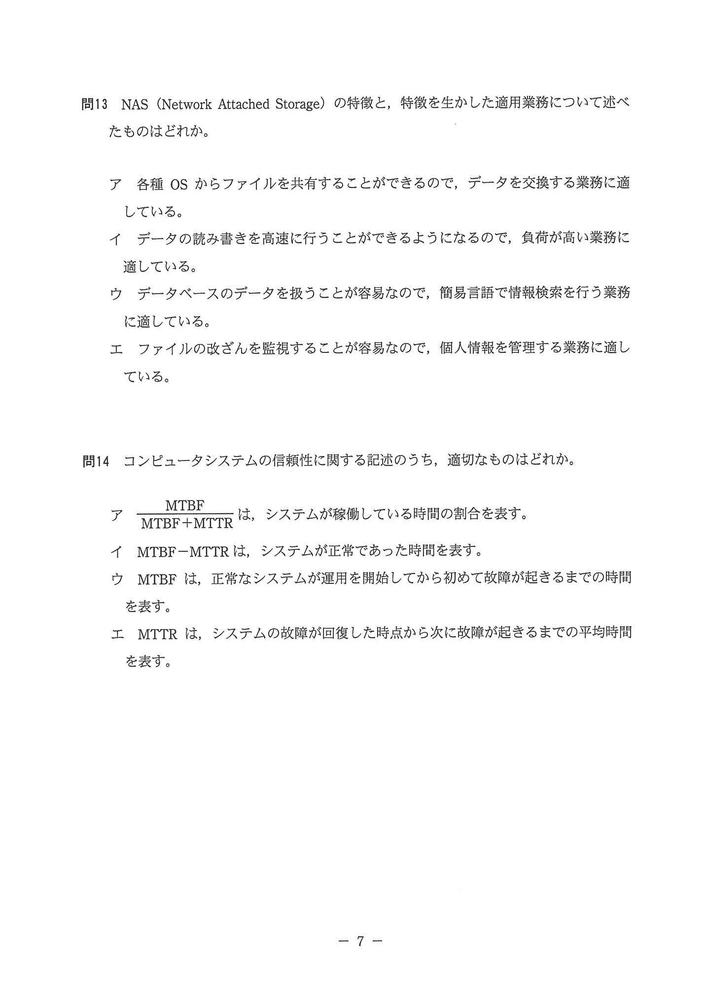

テキスト (OCR)

問13 NAS (Network Attached Storage) の特徴と, 特徴を生かした適用業務について述べ
たものはどれか。

ア Sf OS からファイルを共有することができるので, データを交換する業務に適
している。

イ データの読み書きを高速に行うことができるようになるので, 負荷が高い業務に
適している。

ウ データベースのデータを扱うことが容易なので, 簡易言語で情報検索を行う業務
に適している。

エエ ファイルの改ざんを監視することが容易なので, 個人情報を管理する業務に適し
ている。

問14 コンピュータシステムの信頼性に関する記述のうち, 適切なものはどれか。

MTBF
MTBF+MTTR

4 MTBF一MTTR は, システムが正常であった時間を表す。

ウ MTBF は, 正常なシステムが運用を開始してから初めて故障が起きるまでの時間
を表す。

エエ MTTR は, システムの故障が回復した時点から次に改障が起きるまでの平均時間
を表す。

ア               は, システムが稼働している時間の割合を表す。

### ページ 8

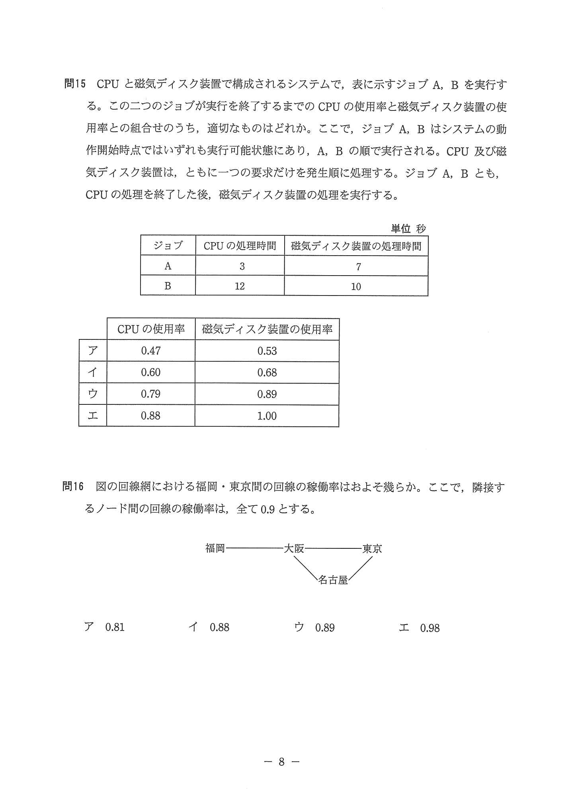

テキスト (OCR)

間15 CPU と磁気ディスク装置で構成されるシステムで, 表に示すジョブ A, B を実行す
る。この二つのジョブが実行を終了するまでの CPU の使用率と磁気ディスク装置の使
用率との組合せのうち, 適切なものはどれか。ここで, ジョブ A, B はシステムの動
作開始時点ではいずれも実行可能状態にあり, A, B の順で実行される。CPU 及び磁
気ディスク装置は。 ともに一つの要求だけを発生順に処理する。ジョブ A, BED,
CPU の処理を終了した後, 磁気ディスク装置の処理を実行する。

単位 秒
ジョブ | CPUの処理時間 | 磁気ディスク装置の処理時間
A                   3                               7
B                  12                              10
CPU の使用率 | 磁気ディスク装置の使用率
ア            0.47                           0.53
イ             0.60                           0.68
ウ            0.79                           0.89
x            0.88                           1.00

間16 図の回線綱における福岡・東京間の回線の稼働率はおよそ幾らか。ここで, 隣接す
るノード間の回線の稼働率は, 全て 0.9 とする。

福岡               大阪               東京

\ een”

ア 0.81     イ 0.88     7 0.89     = 0,98

### ページ 9

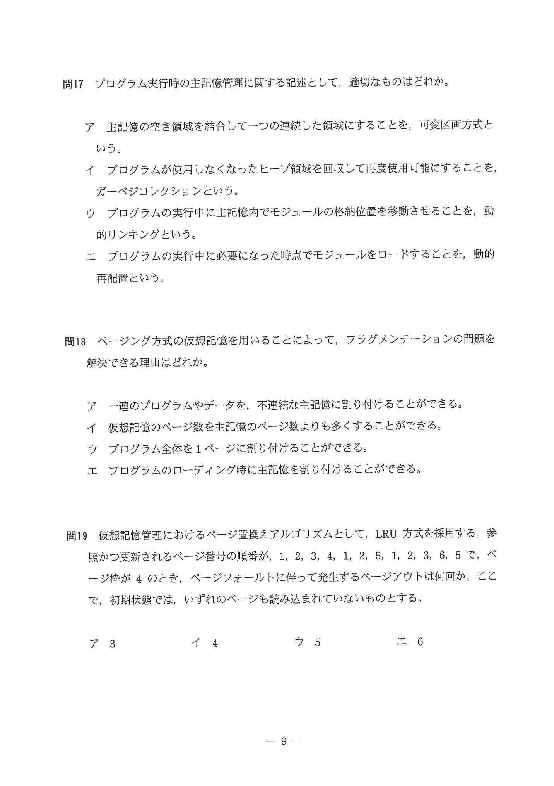

テキスト (OCR)

Bl? プログラム実行時の主記憶管理に関する記述として, 適切なものはどれか。

ア 主記億の空き領域を結合して一つの連続した領域にすることを, 可変区画方式と
いう。

イ プログラムが使用しなくなったヒープ領域を回収して再度使用可能にすることを,
ガーベジコレクションという。

ウ プログラムの実行中に主記憶内でモジュールの格納位置を移動させることを, 動
的リンキングという。

エエ プログラムの実行中に必要になった時点でモジュールをロードすることを, 動的
再配置という。

間18 ページング方式の仮想記憶を用いることによって, フラグメンテーションの問題を
解決できる理由はどれか。

一連のプログラムやデータを, 不連続な主記憶に割り付けることができる。
仮想記憶のページ数を主記憶のページ数よりも多くすることができる。
プログラム全体を 1 ページに割り付けることができる。

プログラムのローディング時に主記憶を割り付けることができる。

H へ

間19 仮想記憶管理におけるページ置換えアルゴリズムとして, LRU 方式を採用する。参
照かつ更新されるページ番号の順番が, 1, 2, 3, 4,1, 2, 5, 1 2 3, 6 5 で, ペ
ージ枠が 4 DEX, ページフォールトに伴って発生するページアウトは何回か。こと
で, 初期状態では, いずれのページも読み込まれていないものとする。

ア 3   イ 4   ウ 5   xr 6

### ページ 10

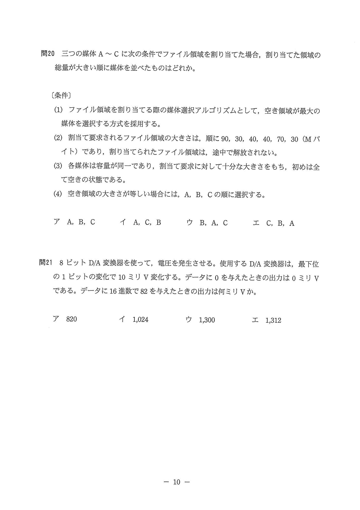

テキスト (OCR)

問20 三つの媒体A てC に次の条件でファイル領域を割り当てた場合, 割り当てた領域の
総量が大きい順に媒体を並べたものはどれか。

(BE)

Q) ファイル領域を割り当てる際の媒体選択アルゴリズムとして, 空き領域が最大の
媒体を選択する方式を採用する。

2) 割当て要求されるファイル領域の大きさは, 順に90, 30, 40, 40, 70, 30 (Mバ
イト) であり, 割り当てられたファイル領域は, 途中で解放されない。

(3) 各媒体は容量が同一であり, 割当て要求に対して十分な大きさをもち, 初めは全
て空きの状態である。

(④ 空き領域の大きさが等しい場合には, A, B, C の順に選択する。

ア <A, B, C  tT A, C, B  ウ B, A, C  rc, BA

問21 8 ビット D/A 変換器を使って, 電圧を発生させる。使用する D/A 変換器は, 最下位
の 1 ビットの変化で 10 ミリ 変化する。データに 0 を与えたときの出力は 0 SUV
である。データに 16 進数で 82 を与えたときの出力は何ミリ V か。

ア 820     イ 1,024     ウ 1300     xr 1312

### ページ 11

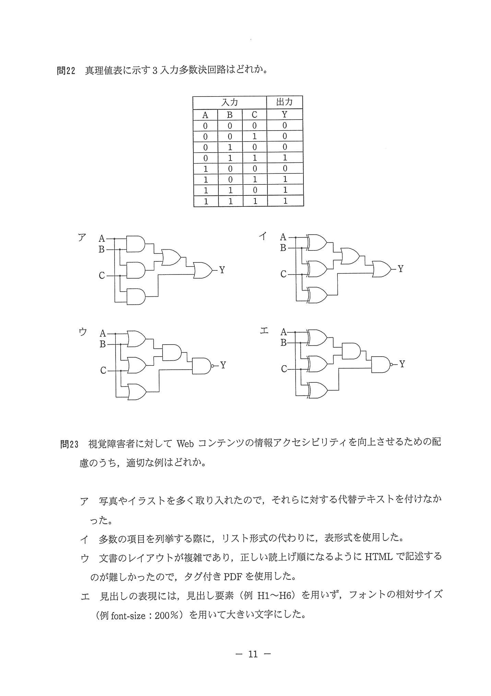

テキスト (OCR)

問22 真理値表に示す3 入力多数決回路はどれか。

AA        HA
A    B     C      当
0     0     0      0
0     0     1      0
0     x     0      0
0     MM     a       1
a     0     0      0
1     0     1       1
1     1     0       1
1     1     中       1
ア A                          イ As
B                                BA
C                     Y          cH                   \
7 As                          So Aes
BH                              BH
cH          ¥     om          Y

問23 視覚障害者に対して Web コンテンツの情報アクセシビリティを向上させるための配
慮のうち, 適切な例はどれか。

ア 写真やイラストを多く取り入れたので, それらに対する代替テキストを付けなか
Sits
4 多数の項目を列挙する際に, リスト形式の代わりに, 表形式を使用した。
ウ 文書のレイアウトが複雑であり, 正しい読上げ順になるように HTML で記述する
のが難しかったので, タグ付き PDF を使用した。
エエ 見出しの表現には, 見出し要素 (例 HI~H6) を用いず, フォントの相対サイズ
(例 font-size : 200%) を用いて大きい文字にした。

ー 11 一

### ページ 12

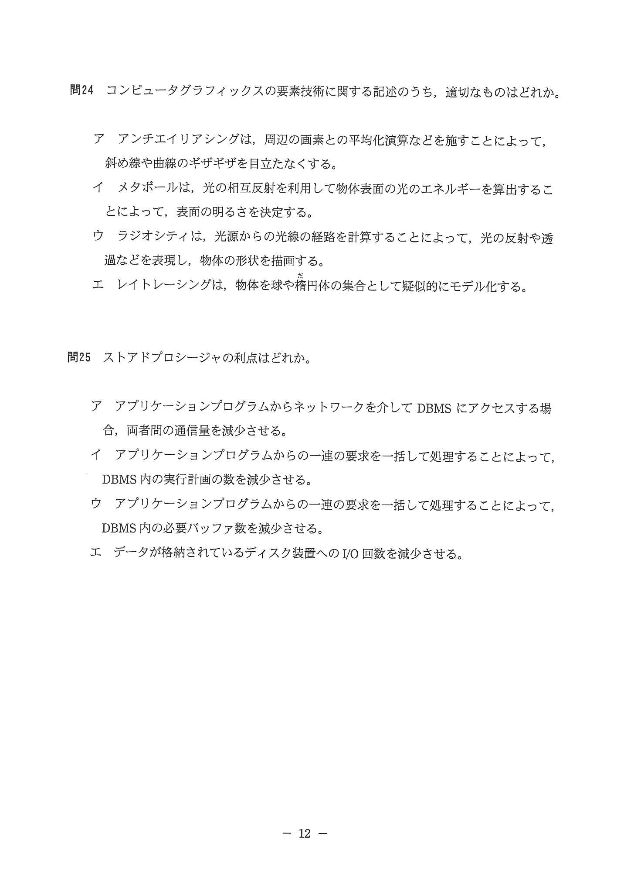

テキスト (OCR)

間244 コンピュータグラフィックスの要素技術に関する記述のうち, 適切なものはどれか。

ア アンチエイリアシングは, 周辺の画素との平均化演算などを施すことによって,
斜め線や曲線のギザギザを目立たなくする。

イ メタボールは, 光の相互反射を利用して物体表面の光のエネルギーを算出するこ
とによって, 表面の明るさを決定する。

ウ ラジオシティは, 光源からの光線の経路を計算することによって, 光の反射や透
過などを表現し, 物体の形状を描画する。

エエ レイトレーシングは, 物体を球や枯円体の集合として疑似的にモデル化する。

間25 ストアドプロシージャの利点はどれか。

ア アプリケーションプログラムからネットワークを介して DBMS にアクセスする場
合, 両者間の通信量を減少させる。

イ アプリケーションプログラムからの一連の要求を一括して処理することによって,
DBMS 内の実行計画の数を減少させる。

ウ アプリケーションプログラムからの一連の要求を一括して処理することによって,
DBMS 内の必要バッファ数を減少させる。

工 データが格納されているディスク装置への 1O 回数を減少させる。

ー 12 一

### ページ 13

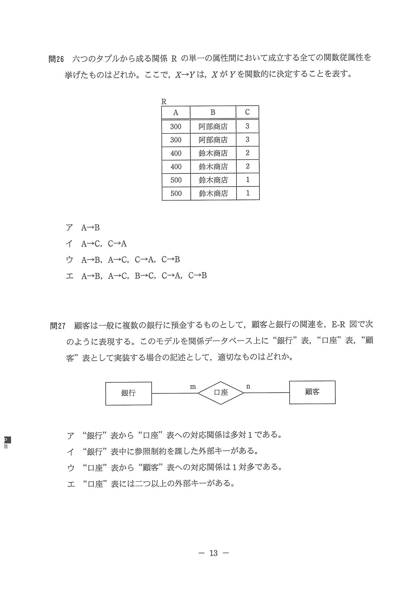

テキスト (OCR)

問26 六つのタプルから成る関係 R の単一の属性間において成立する全ての関数従属性を
挙げばたものはどれか。ここで, メーは, 双が也を関数的に決定することを表す。

R
A   B   C
300 | 阿部商店 | 3
300 | 阿部商店 | 3
400 | shaman | 2
400 | 鈴木商店 | 2
500 | 鈴木商店 | 1
500 | 鈴木商店 | 1
AB
A>C, COA

A>B, APC, C>A, COB

HHささ

A>B, A>C, BつC, CA, CTB

B27 顧客は一般に複数の銀行に預金するものとして, 顧客と銀行の関連を, ER 図で次
のように表現する。このモデルを関係データベース上に “銀行" 表, “OB” 表, “A
客”表として実装する場合の記述として, 適切なものはどれか。

銀行       ーー       me

“銀行" RPS “OB” 表への対応関係は多対 CHS.
"銀行" 表中に参照制約を課した外部キーがある。
“OR” RDS “FRR” 表への対応関係は 1 対多である。
“口座” 表には二つ以上の外部キーがある。

hy

HUAN

ー 18 一

### ページ 14

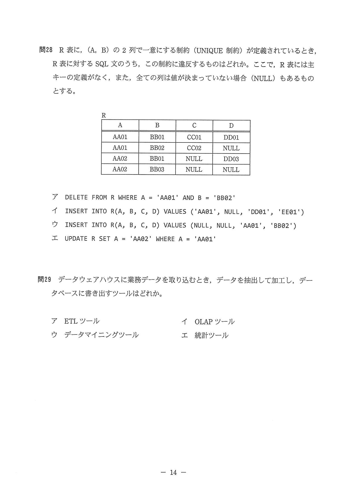

テキスト (OCR)

問28 R 表に, (A, B) の 2 列で一意にする制約 (UNIQUE 制約) が定義されているとき,
R 表に対する SQL 文のうち, この制約に違反するものはどれか。ここで, R 表には主
キーの定義がなく, また, 全ての列は値が決まっていない場合 (NULL) もあるもの
とする。

R
A         B         C         D
AA01      BB01      CC01      DD01
AA01      BB02      CC02      NULL
AA02                BBOL               NULL               DD03
AA02     BB03     NULL     NULL

DELETE FROM R WHERE A = "AA91' AND B = 'BB@2'
INSERT INTO R(A, B, C, D) VALUES ('AA@1', NULL, 'DD@1', "EE91')
INSERT INTO R(A, B, C, D) VALUES (NULL, NULL, 'AA91'。 'BB@2')

HOGAN

UPDATE R SET A = ‘AA@2" WHERE A = 'AAQ1'

29 データウェアハウスに業務データを取り込むとき, データを抽出して加工し, デー

タベースに書き出すツールはどれか。

ア ETL ツール           イ OLAP ツール
ウ データマイニングツール      エエ 統計ツール

### ページ 15

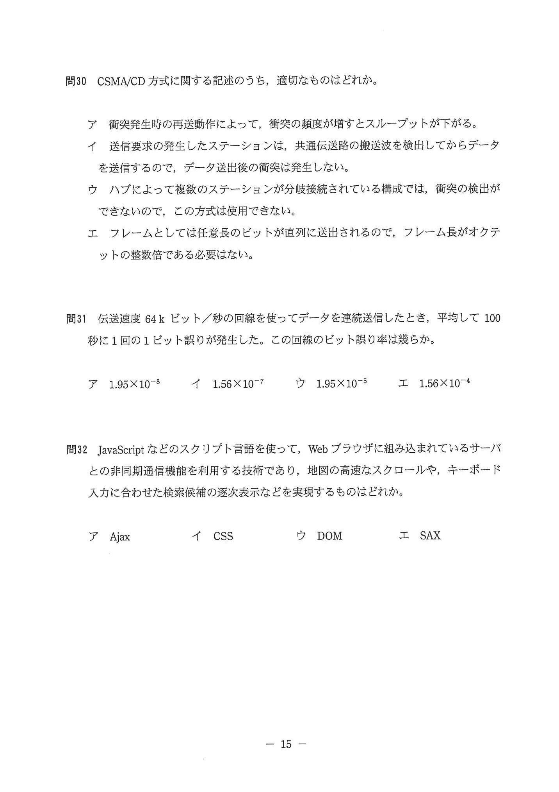

テキスト (OCR)

問30 CSMA/CD 方式に関する記述のうち, 適切なものはどれか。

ア 衝突発生時の再送動作によって, 衝突の頻度が増すとスループットが下がる。

イ 送信要求の発生したステーションは, 共通伝送路の撮送波を検出してからデータ
を送信するので, データ送出後の衝突は発生しない。

ウ ハブによって複数のステーションが分岐接続されている構成では, 衝突の検出が
できないので, この方式は使用できない。

エエ フレームとしては任意長のビットが直列に送出されるので, フレーム長がオクテ
ットの整数倍である必要はない。

間31 伝送速度 64k ビットノ秒の回線を使ってデータを連続送信したとき, 平均して 100
秒に 1 回の1ビット誤りが発生した。この回線のビット誤り率は幾らか。
ア 195X103      イ 1.56X10?      ウ 1.95X105      エ 156x107

間32 JavaScript などのスクリプト言語を使って, Web ブラウザに組み込まれているサーバ
との非同期通信機能を利用する技術であり, 地図の高速なスクロールや, キーボード

入力に合わせた検索候補の逐次表示などを実現するものはどれか。

ア Ajax     イ CSS     ウ DOM     = SAX

ー 15 一

### ページ 16

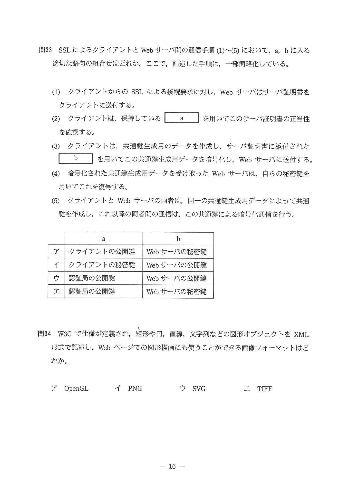

テキスト (OCR)

問33 SSL によるクライアントと Web サーバ問の通信手順 (])て5) において, a, b に入る
適切な語句の組合せはどれか。ここで, 記述した手順は, 一部簡略化している。

(① クライアントからの SSL による接続要求に対し, Web サーバはサーバ証明書を
クライアントに送付する。

@ クライアントは, 保持している |  』 | を用いてこのサーバ証明書の正当性
を確認する

⑬ クライアントは, 共通鍵生成用のデータを作成し, サーバ証明書に添付された
| 5 | を用いてこの共通鍵生成用データを暗号化し, Web サーバに送付する。

(④ 暗号化された共通難生成用データを受け取った Web サーバは, 自らの秘密鍵を
用いてこれを復号する。

6) クライアントと Web サーバの両者は, 同一の共通鍵生成用データによって共通
鍵を作成し, これ以降の両者間の通信は, この共通鍵による吐号化通信を行う

a                                 b
クライアントの公開鍵 | Web サーバの秘密鍵
Web サーバの公開鍵
認証局の公開鍵          Web サーバの公開鍵
認証局の公開鍵          Web サーバの秘密鍵

HIS|ュ|N
NN:
Mi
aN
MY
v
~
S
2
ER
a

問34 W3C で仕様が定義され, WOH, ER, 文字列などの図形オブジェクトを XML
形式で記述し, Web ページでの図形描画にも使うことができる画像フォーマットはど
れか。

ア OpenGL    イ PNG     ウ SVG     <= TIFF

ー 16 一

### ページ 17

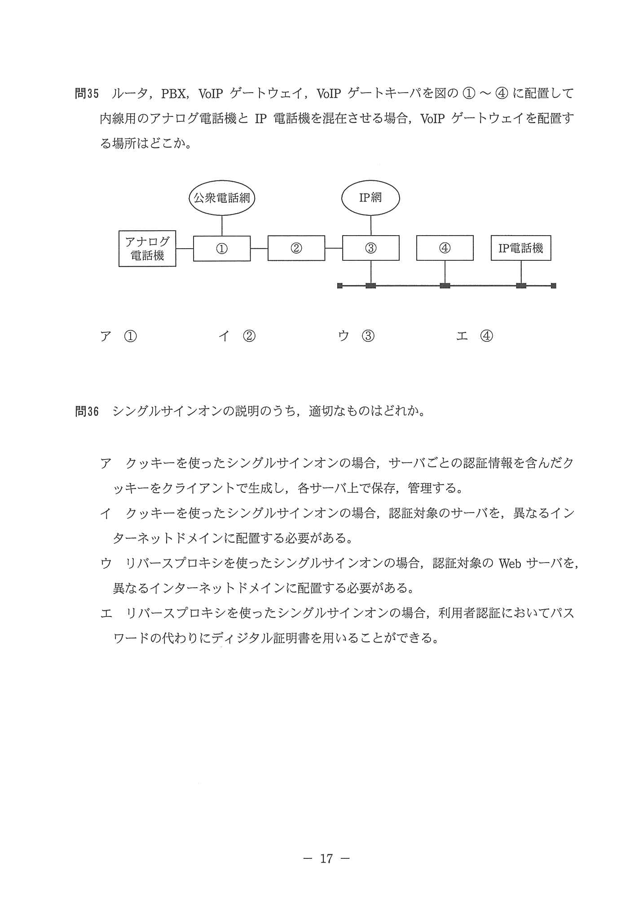

テキスト (OCR)

問35 ルータ, PBX, VoIP ゲートウェイ, VIP ゲートキーパを図の① て @ に配置して
内線用のアナログ電話機と TP 電話機を混在させる場合. VoIP ゲートウェイを配置す
る場所はどこか。

TP綱
アナログ                  |__|                    aye
His         @     ®     @    TP電話機
i | J,
ア ①      イ @      7 ③      エ ③④

問36 シングルサインオンの説明のうち, 適切なものはどれか。

ア クッキーを使ったシングルサインオンの場合 サーバごとの認証情報を含んだク
ッキーをクライアントで生成し, 各サーバ上で保存, 管理する。

イ クッキーを使ったシングルサインオンの場合, 認証対象のサーバを, 異なるイン
ターネットドメインに配置する必要がある。

ウ リバースプロキシを使ったシングルサインオンの場合 認証対象の Web サーバを,
異なるインターネットドメインに配置する必要がある。

エエ リバースプロキシを使ったシングルサインオンの場合 利用者認証においてパス
ワードの代わりにディジタル証明書を用いることができる。

ー 17 一

### ページ 18

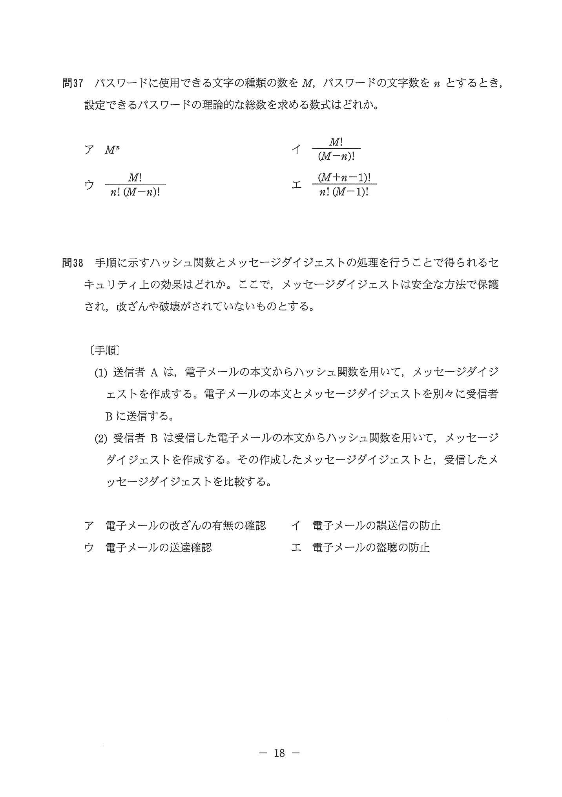

テキスト (OCR)

間37 パスワードに使用できる文字の種類の数を M, パスワードの文字数を ヵ とするとき,
設定できるパスワードの理論的な総数を求める数式はどれか。

M!

ア M                                             イ     ーーが!
mM!                                             (M+n-D!

ワ ーーが)                                  エエ 記Wー1)

問38 手順に示すハッシュ関数とメッセージダイジェストの処理を行うことで得られるセ
キュリティ上の効果はどれか。ここで, メッセージダイジェストは安全な方法で保護
され, 改ざんや破壊がされていないものとする。

(手順]

Q) 送信者 A は, 電子メールの本文からハッシュ関数を用いて, メッセージダイジ
ェストを作成する。電子メールの本文とメッセージダイジェストを別々に受信者
B に送信する。

(2) 受信者 B は受信した電子メールの本文からハッシュ関数を用いて, メッセージ
ダイジェストを作成する。その作成したメッセージダイジェストと, 受信したメ
ッセージダイジェストを比較する。

ア 電子メールの改ざんの有無の確認    イ 電子メールの誤送信の防止
ウ 電子メールの送達確認           エエ 電子メールの盗聴の防止

ー 18 一

### ページ 19

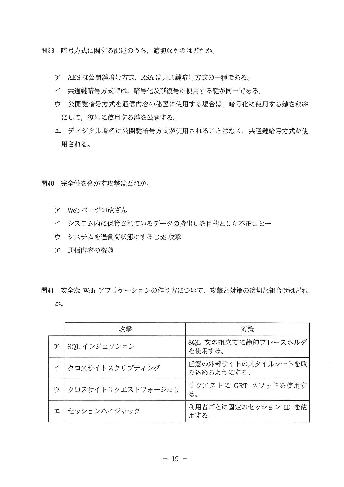

テキスト (OCR)

間39 暗号方式に関する記述のうち, 適切なものはどれか。

ア AES は公開鍵暗号方式, RSA は共通鍵暗号方式の一種である。

イ 共通鍵暗号方式では, 暗号化及び復号に使用する鍵が同一である。

ウ 公開鍵暗号方式を通信内容の秘匿に使用する場合は, 暗号化に使用する鍵を秘密
にして, 復号に使用する鍵を公開する。

エエ ディジタル署名に公開鍵暗号方式が使用されることはなく, 共通鍵暗号方式が使
用される。

間40 完全性を脅かす攻撃はどれか。

Web ページの改ざん

システム内に保管されているデータの持出しを目的とした不正コピー
システムを過負荷状態にする DoS 攻撃

通信内容の盗聴

HUAN

間41 安全な Web アプリケーションの作り方について, 攻撃と対策の適切な組合せはどれ
か。

攻撃                           対策
ッッSタ FB ua S              SQL 文の組立てに静的プレースホルダ
ア |SQL インジェクション              を使用する。
イ |クロスサイトスクリプティング       任意の外部サイトのスタイルシートを取

り込めるようにする。

ウ |クロスサイトリクエストフォージェリ  ュクエス トに GET メソッドを使用す

シュンハラジラット            利用者ごとに固定のセッション ID を使
エエ |セッションハイジャック           用する。

### ページ 20

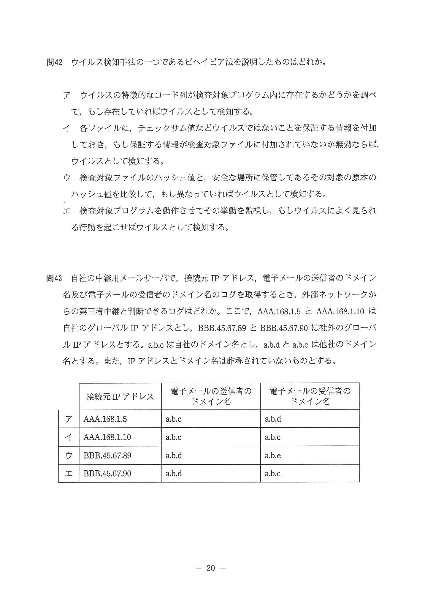

テキスト (OCR)

間42 ウイルス検知手法の一つであるビヘイビア法を説明したものはどれか。

ア ウイルスの特徴的なコード列が検査対象プログラム内に存在するかどうかを調べ
て, もし存在していればウイルスとして検知する。

イ 名ファイルに, チェックサム値などウイルスではないことを保証する情報を付加
LUBE, もし保証する情報が検査対象ファイルに付加されていないか無効ならば
ウイルスとして検知する。

ウ 検査対象ファイルのハッシュ値と, 安全な場所に保管してあるその対象の原本の
ハッシュ値を比較して, もし異なっていればウイルスとして検知する。

エ 検査対象プログラムを動作させてその挙動を監視し。もしウイルスによく見られ
る行動を起ことせばウイルスとして検知する。

間43 自社の中継用メールサーバで, 接続元 TP アドレス, 電子メールの送信者のドメイン
名及び電子メールの受信者のドメイン名のログを取得するときぎ, 外部ネットワークか
らの第三者中継と判断できるログはどれか。ここで, AAA.168.1.5 と AAA.168.1.10 は
自社のグローバル IP アドレスとし, BBB.45.67.89 と BBB.45.67.90 は社外のグローバ
ル IP アドレスとする。ajb.c は自社のドメイン名とし, abd と a.b.e は他社のドメイン
名とする。また, IP アドレスとドメイン名は詐称されていないものとする。

接続元 D アドレス      IMのSi       EAT OE?
ア | AAA.168.1.5               a.b.c                               a.b.d
イ | AAA.168.1.10             a.b.c                               a.b.c
ウ | BBB.45.67.89             a.b.d                               a.b.e
= | BBB.45.67.90             a.b.d                               a.b.c

— 20 一

### ページ 21

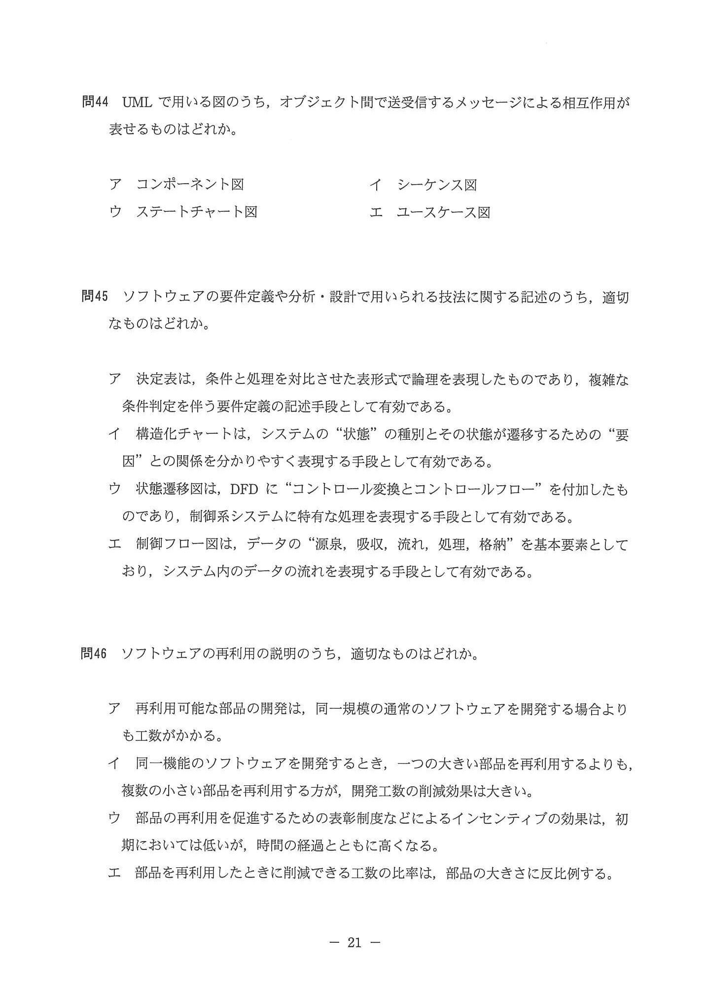

テキスト (OCR)

問44 UML で用いる図のうち, オブジェクト間で送受信するメッセージによる相互作用が
表せるものはどれか。

ア コンポーネント図       イ シーケンス図
ウ ステートチャート図       エエ ユースケース図

問45 ソフトウェアの要件定義や分析・設計で用いられる技法に関する記述のうち, 適切
なものはどれか。

ア 決定表は, 条件と処理を対比させた表形式で論理を表現したものであり, 複雑な
条件判定を伴う要件定義の記述手段として有効である。

イ 構造化チャートは, システムの "状態" の種別とその状態が有遷移するための「要
A” との関係を分かりやすく表現する手段として有効である。

ウ 状態遷移図は. DFD に“コントロール変換とコントロールフロー" を付加したも
のであり, 制御系システムに特有な処理を表現する手段として有効である。

エエ 制御フロー図は, データの “源泉, 吸収, 流れ, 処理, 格納"を基本要素として
おり, システム内のデータの流れを表現する手段として有効である。

間46 ソフトウェアの再利用の説明のうち, 適切なものはどれか。

ア 再利用可能な部品の開発は, 同一規模の通常のソフトウェアを開発する場合より
も工数がかかる。

イ 同一機能のソフトウェアを開発するとき, 一つの大きい部品を再利用するよりも,
複数の小さい部品を再利用する方が, 開発工数の削減効果は大きい。

ウ 部品の再利用を促進するための表彰制度などによるインセンティブの効果は, 初
期においては低いが, 時間の経過とともに高くなる。

エエ 部品を再利用したときに削減できる工数の比率は, 部品の大きさに反比例する。

ー 21 一

### ページ 22

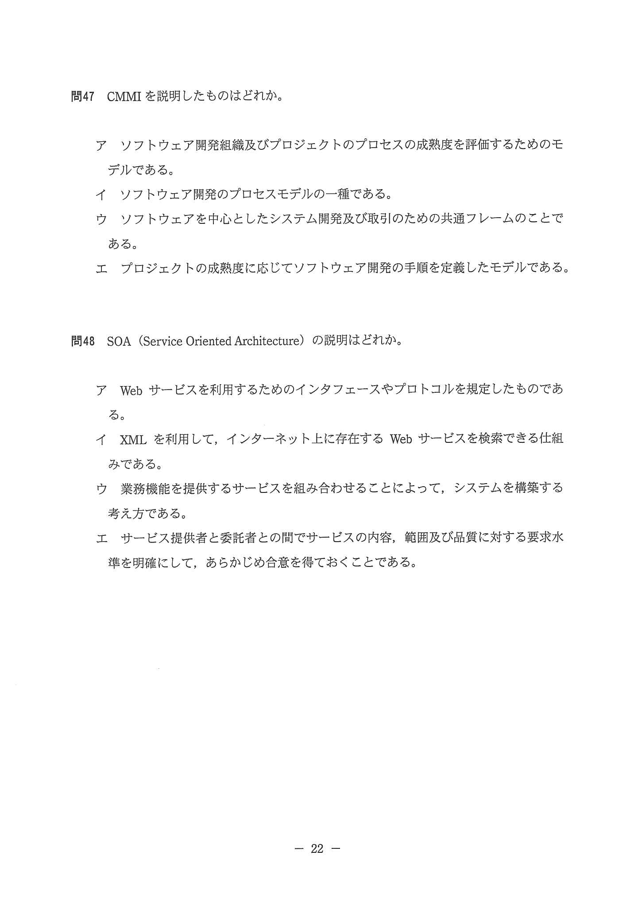

テキスト (OCR)

間47 CMMI を説明したものはどれか。

ア ソフトウェア開発組織及びプロジェクトのプロセスの成熟度を評価するためのモ
デルである。

イ ソフトウェア開発のプロセスモデルの一種である。

ウ ソフトウェアを中心としたシステム開発及び取引のための共通フレームのことで
ある。

エエ プロジェクトの成熟度に応じてソフトウェア開発の手順を定義したモデルである。

間48 SOA (Service Oriented Architecture) の説明はどれか。

ア Web サービスを利用するためのインタフェースやプロトコルを規定したものであ

る。

イ XML を利用して, インターネット上に存在する Web サービスを検索できる仕組
みである。

ウ 業務機能を提供するサービスを組み合わせるととによって, システムを構築する
考え方である。

エエ サービス提供者と委託者との間でサービスの内容, 範囲及び品質に対する要求水
準を明確にして, あらかじめ合意を得ておくことである。

### ページ 23

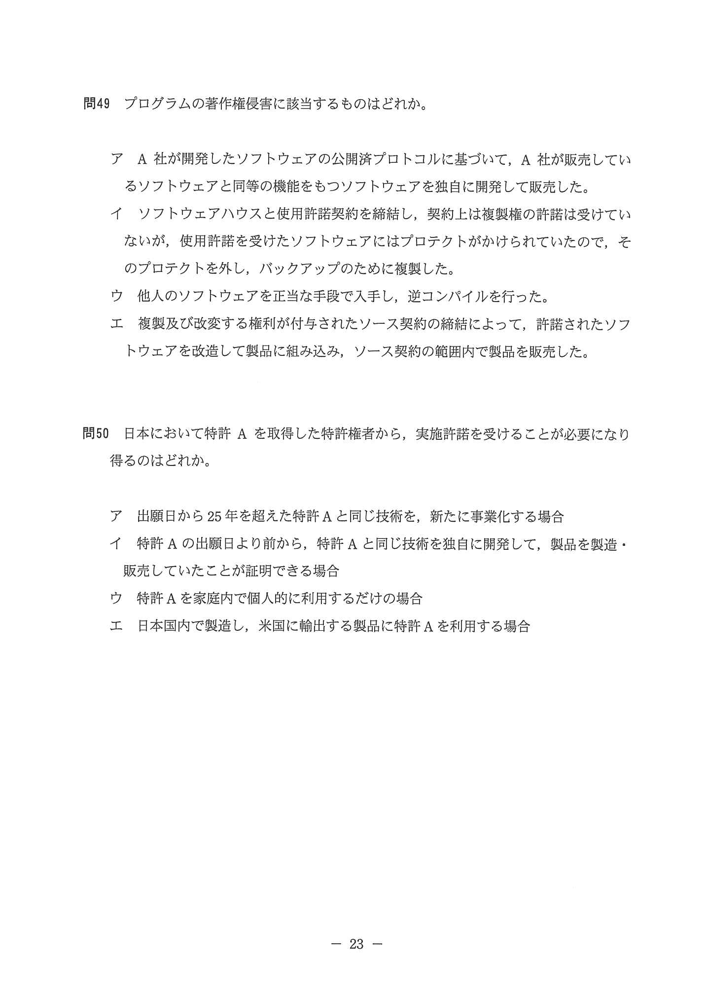

テキスト (OCR)

問49 プログラムの著作権侵害に該当するものはどれか。

ア A 社が開発したソフトウェアの公開済プロトコルに基づいて, A 社が販売してい
るソフトウェアと同等の機能をもつソフトウェアを独自に開発して販売した。

イ ソフトウェアハウスと使用許諾契約を締結し, 契約上は複製権の許諾は受けてい
ないが, 使用許諾を受けたソフトウェアにはプロテクトがかけられていたので, そ
のプロテクトを外し, バックアップのために複製した。

ウ 他人のソフトウェアを正当な手段で入手し, 逆コンパイルを行った。

エエ 複製及び政変する権利が付与されたソース契約の締結によって, 許諾されたソフ
トウェアを改造して製品に組み込み, ソース契約の範囲内で製品を販売した。

問50 日本において特許 A を取得した特許権者から, 実施許諾を受けることが必要になり
得るのはどれか。

ア 出願日から 25 年を超えた特許 A と同じ技術を, 新たに事業化する場合

イ 特許A の出願日より前から, 特許A と同じ技術を独自に開発して, 製品を製造・
販売していたことが証明できる場合

ウ 特許Aを家庭内で個人的に利用するだけの場合

エエ 日本国内で製造し, 米国に輸出する製品に特許 A を利用する場合

### ページ 24

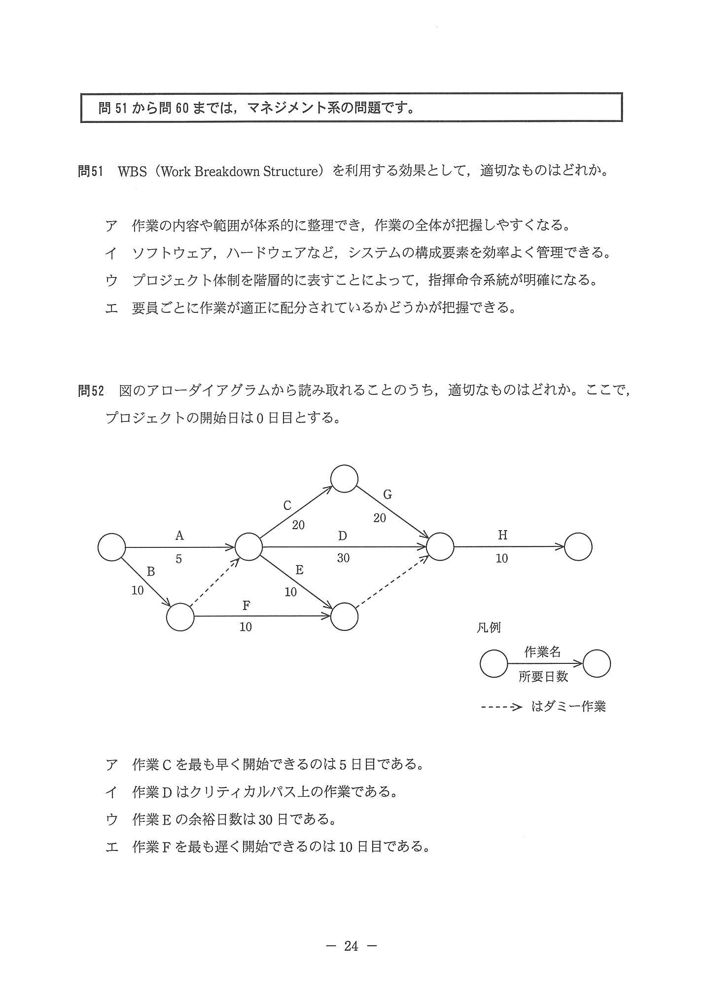

テキスト (OCR)

問 51 から問 60 までは, マネジメント系の問題です。

問51 WBS (Work Breakdown Structure) を利用する効果として, 適切なものはどれか。

作業の内容や範囲が体系的に整理でき, 作業の全体が把握しやすくなる。

ソフトウェア, ハードウェアなど, システムの構成要素を効率よく管理できる。
プロジェクト体制を階層的に表すことによって, 指揮命令系統が明確になる。
要員ごとに作業が適正に配分されているかどうかが把掘できる。

H へ

間52 図のアローダイアグラムから読み取れることのうち, 適切なものはどれか。ここで,
プロジェクトの開始日は0 日目とする。

作業 C を最も早く開始できるのは5 日目である。
作業 D はクリティカルパス上の作業である。
(ERE の余裕日数は 30 日である。

作業F を最も遅く開始できるのは10 日目である。

HUAN

— 24 一

### ページ 25

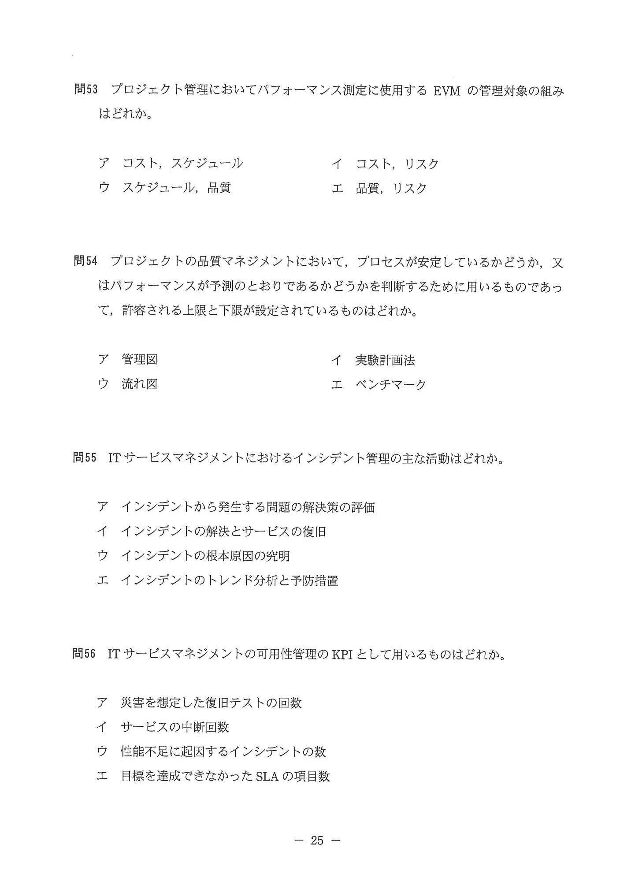

テキスト (OCR)

問53 プロジェクト管理においてパフォーマンス渦定に使用する EVM の管理対象の組み
はどれか。

ア コスト, スケジュール       イ コスト, リスク
ウ スケジュール, 品質        = mA, リスク

問54 プロジェクトの品質マネジメントにおいて, プロセスが安定しているかどうか, 又
はパフォーマンスが予測のとおりであるかどうかを判断するために用いるものであっ
て, 許容される上限と下限が設定されているものはどれか。

ア 管理図           イ 実験計画法
ウ 流れ図             工 ベンチマーク

55 ITサービスマネジメントにおけるインシデント管理の主な活動はどれか。

インシデントから発生する問題の解決策の評価
インシデントの解決とサービスの復旧
インシデントの根本原因の究明

インシデントのトレンド分析と予防措置

H

問56 ITサービスマネジメントの可用性管理の KPI として用いるものはどれか。

ア 炎害を想定した復旧テストの回数

イ サービスの中断回数

ウ 性能不足に起因するインシデントの数
TL 目標を達成できなかった SLA の項目数

ー 25 一

### ページ 26

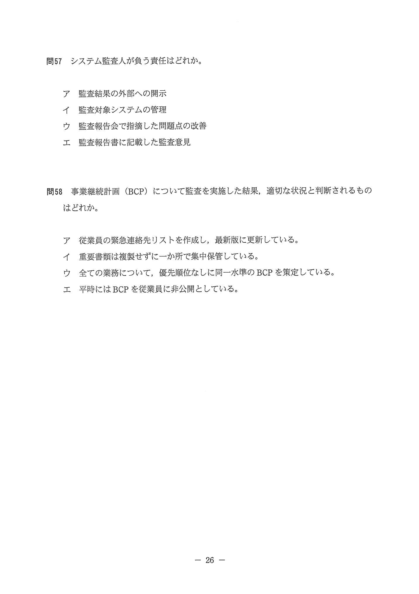

テキスト (OCR)

問57 システム監査人が負う責任はどれか。

監査結果の外部への開示

監査対象システムの管理

監査報告会で指摘した問題点の改善
監査報告書に記載した監査意見

H さい

問58 事業継続計画 (BCP) について監査を実施した結果, 適切な状況と判断されるもの
はどれか。

従業員の緊急連絡先リストを作成し, 最新版に更新している。

重要書類は複製せずに一か所で集中保管している。

全ての業務について, 優先順位なしに同一水準の BCP を策定している。
平時には BCP を従業員に非公開としている。

H へ NW

ー 26 一

### ページ 27

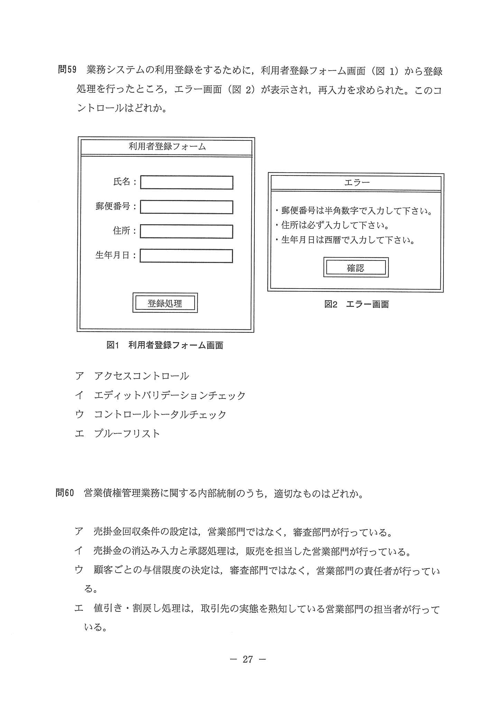

テキスト (OCR)

問59 業務システムの利用登録をするために, 利用者竜録フォーム画面 (図 1) から登録
処理を行ったところ, エラー画面 (図 2) が表示され, 再入力を求められた。このコ
ントロールはどれか。

利用者登録フォーム
氏名 : |                   |                        エラー
郵便番号:| |          ・郵便番号は半角数字で入力して下さい。
」                               ・生年月日は西暦で入力して下さい。
2
登録処理                                図2 エラー画面

図1 利用者登録フォーム画面

アクセスコントロール

エディットババリデーションチェック
コントロールトータルチェック
プルーフリスト

H へ

間60 営業債権管理業務に関する内部統制のうち, 適切なものはどれか。

ア 売損金回収条件の設定は, 営業部門ではなく, 審査部門が行っている。

イ 売掛金の消込み入力と承認処理は, 販売を担当した営業部門が行っている。

ウ 顧客ごとの与信限度の決定は, 審査部門ではなく, 営業部門の責任者が行ってい
る。

エエ 値引き・割戻し処理は, 取引先の実態を熟知している営業部門の担当者が行って
いる。

ー 27 一

### ページ 28

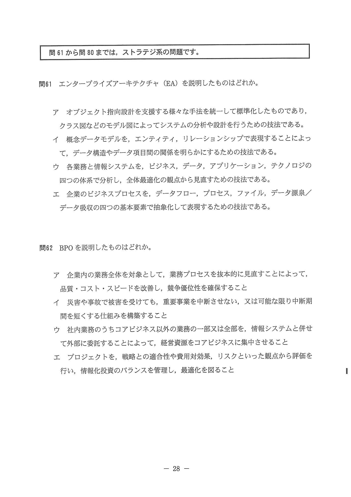

テキスト (OCR)

問 61 から問 80 までは, ストラテジ系の問題です。

間61 エンタープライズアーキテクチャ (EA) を説明したものはどれか。

ア オブジェクト指向設計を支援する様々な手法を統一して標準化したものであり,
クラス図などのモデル図によってシステムの分析や設計を行うための技法である。
イ 概念データモデルを, エンティティ, リレーションシップで表現することによっ
て, データ構造やデータ項目間の関係を明らかにするための技法である。

ウ 各業務と情報システムを, ビジネス, データ, アプリケーション, テクノロジの
四つの体系で分析し, 全体最適化の観点から見直すための技法である。

エ 企業のビジネスプロセスを, データフロー, プロセス, ファイル, データ源泉/
データ吸収の四つの基本要素で抽象化して表現するための技法である。

間62 BPOを説明したものはどれか。

ア 企業内の業務全体を対象として, 業務プロセスを抜本的に見直すことによって
品質・コスト・スピードを改善し, 競争優位性を確保すること
イ 災害や事故で被害を受けても, 重要事業を中断させない, 又は可能な限り中断期
間を短くする仕組みを構築すること
ウ 社内業務のうちコアビジネス以外の業務の一部又は全部を, 情報システムと併せ
て外部に委託することによって, 経営資源をコアビジネスに集中させること
エエ プロジェクトを, 戦略との適合性や費用対効果, リスクといった観点から評価を
行い, 情報化投資のバランスを管理し, 最適化を図ること

ー 28 一

### ページ 29

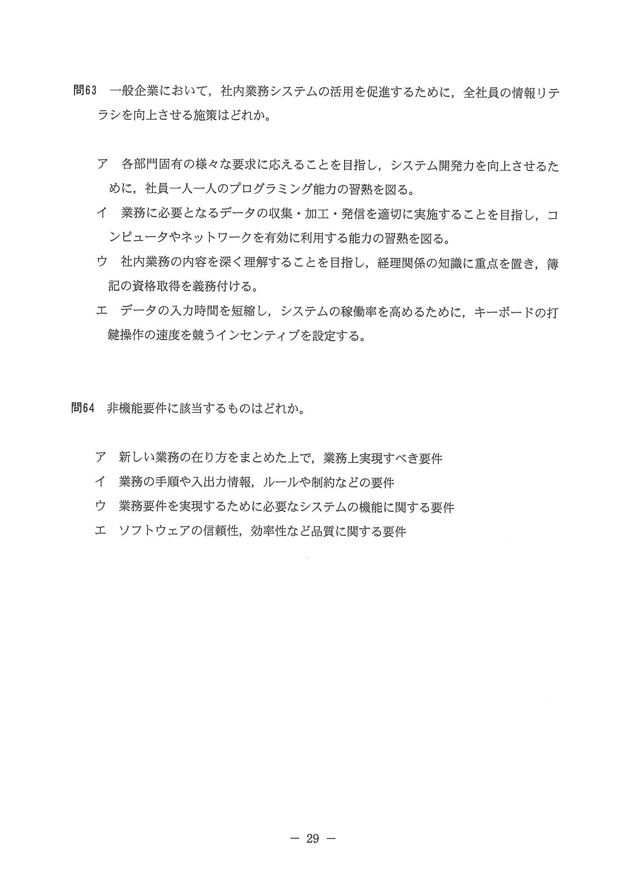

テキスト (OCR)

問63 一般企業において, 社内業務システムの活用を促進するために, 全社員の情報リテ
ラシを向上させる施策はどれか。

ア 各部門固有の様々な要求に応えることを目指し, システム開発力を向上させるた
OK, 社員一人一人のプログラミング能力の習熱を図る。

イ 業務に必要となるデータの収集・加工・発信を適切に実施することを目指し, コ
ンピュータやネットワークを有効に利用する能力の習熟を図る。

ウ 社内業務の内容を深く理解することを目指し, 経理関係の知識に重点を置き, 筐
記の資格取得を義務付ける。

エエ データの入力時間を短縮し, システムの稼働率を高めるために, キーボードの打
鍵操作の速度を競うインセンティブを設定する。

間64 非機能要件に該当するものはどれか。

新しい業務の在り方をまとめた上で, 業務上実現すべき要件
業務の手順や入出力情報, ルールや制約などの要件

業務要件を実現するために必要なシステムの機能に関する要件
ソフトウェアの信頼性, 効率性など品質に関する要件

HGAN

ー 29 一

### ページ 30

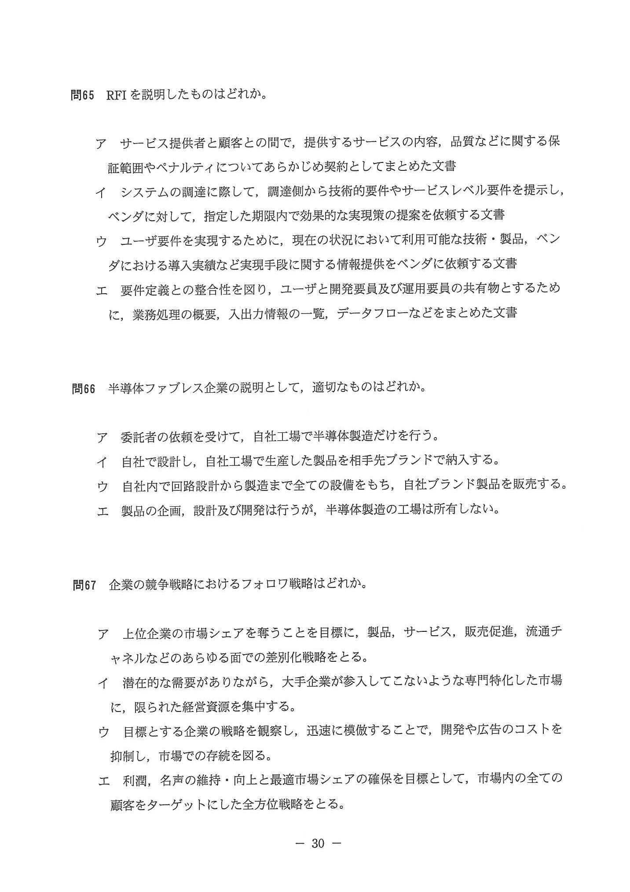

テキスト (OCR)

問65 RFIを説明したものはどれか。

ア サービス提供者と顧客との間で, 提供するサービスの内容, 品質などに関する保
証範やペナルティについてあらかじめ契約としてまとめた文書

A システムの調達に際して, 調達側から技術的要件やサービスレベル要件を提示し
ベンダに対して, 指定した期限内で効果的な実現策の提案を依頼する文書

ウ ユーザ要件を実現するために, 現在の状況において利用可能な技術・製品, ベン
ダにおける道入実績など実現手段に関する情報提供をベンダに依頼する文書

エエ 要件定義との整合性を図り, ユーザと開発要員及び運用要員の共有物とするため
に, 業務処理の概要, 入出力情報の一覧, データフローなどをまとめた文書

間66 半導体ファブレス企業の説明として, 適切なかものはどれか。

委託者の依頼を受けて, 自社工場で半導体製造だけを行う。

自社で設計し, 自社工場で生産した製品を相手先プランドで納入する。

自社内で回路設計から製造まで全ての設備をもち, 自社プランド製品を販売する。
製品の企画, 設計及び開発は行うが, 半導体製造の工場は所有しない。

H GAN

ie? 企業の競争戦略におけるフォロワ戦略はどれか。

ア 上位企業の市場シェアを奪うことを目標に, 製品, サービス, 販売促進, 流通チ
ャネルなどのあらゆる面での差別化戦略をとる。

イ 潜在的な需要がありながら, 大手企業が参入してことないような専門特化した市場
に, 限られた経営資源を集中する。

ウ 目擦とする企業の戦略を観察し, 迅速に模條することで, 開発や広告のコストを
抑制し, 市場での存続を図る。

エエ 利潤, 名声の維持・向上と最適市場シェアの確保を目標として, 市場内の全ての
顧客をターゲットにした全方位戦略をとる。

### ページ 31

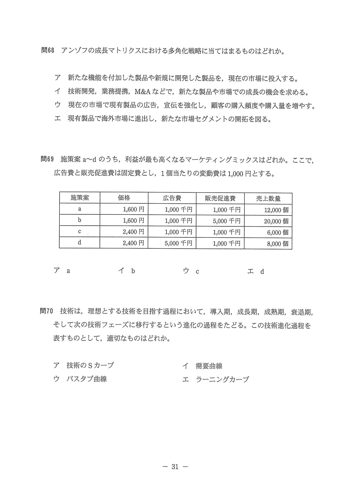

テキスト (OCR)

問68 アンゾフの成長マトリクスにおける多角化戦略に当てはまるものはどれか。

新たな機能を付加した製品や新規に開発した製品を, 現在の市場に投入する。
技術開発, 業務提携, M&A などで, 新たな製品や市場での成長の機会を求める。
現在の市場で現有製品の広告, 宣伝を強化し, 顧客の購入頻度や購入量を増やす。
現有製品で海外市場に進出し, 新たな市場セグメントの開拓を図る。

H へ

問69 施策案 a~d のうち, 利益が最も高くなるマーケティングミックスはどれか。ここで
広告費と販売促進費は固定費とし, 14D OBMPS 1.000 円とする。

施策案     価格     広告費    販売促進費   売上数量
a                   1,600 円          1.000 千円          1,000 FA           12,000 個
b                 1,600 円         1,000 FA         5,000 FFA          20,000 個
2,400 円          1,000 FA          1,000 FA            6,000 個
d                  2,400 円         5,000 FA         1,000 千円            8,000 個
ア a      ft b      ウ c      rd

問70 技術は, 理想とする技術を目指す過程において, 導入期, 成長期, 成熟期, 衰退期,
そして次の技術フェーズに移行するという進化の過程をたどる。この技術進化過程を
表すものとして, 適切なものはどれか。

ア 技術のS カーブ         イ WEAR
ウ バスタブ曲線          エエ ラーニングカーブ

ー 31 一

### ページ 32

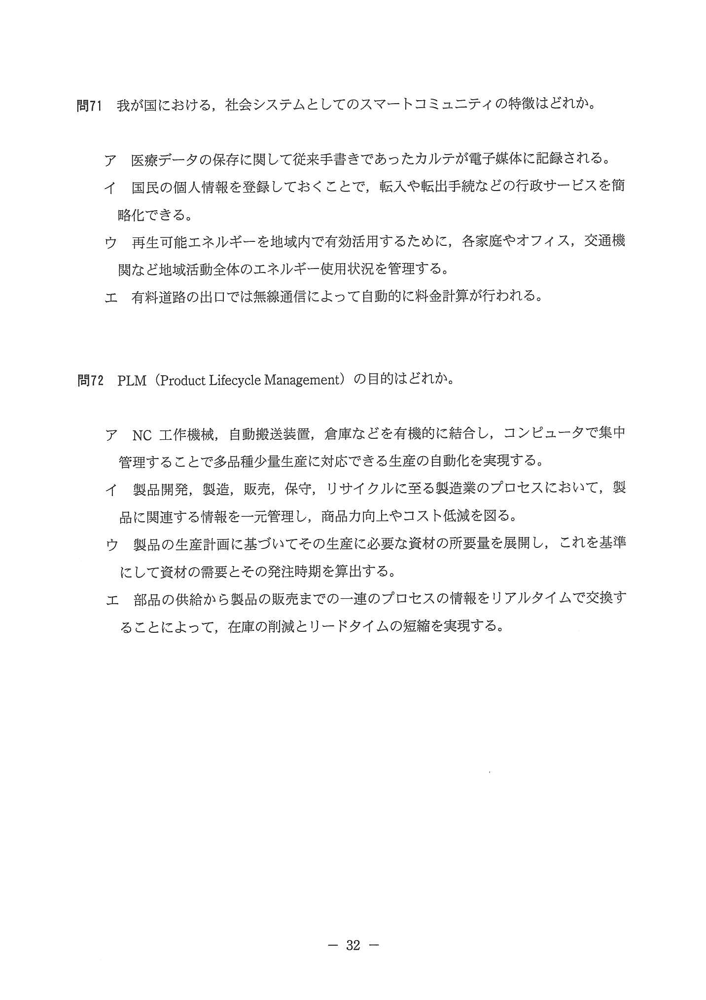

テキスト (OCR)

間71 我が国における, 社会システムとしてのスマートコミュニティの特徴はどれか。

ア 医療データの保存に関して従来手書きであったカルテが電子媒体に記録される。

イ 国民の個人情報を登録しておくことで, 転入や転出手続などの行政サービスを科
略化できる。

ウ 再生可能エネルギーを地域内で有効活用するために, 各家庭やすフィス, 交通機
関など地域活動全体のエネルギー使用状況を管理する。

エエ 有料道路の出口では無線通信によって自動的に料金計算が行われる。

間72 PLM (Product Lifecycle Management) の目的はどれか。

ア NC 工作機械, 自動搬送装置, 倉庫などを有機的に結合し コンピュータで集中
管理することで多品種少量生産に対応できる生産の自動化を実現する。

イ 製品開発, 製造, 販売, 保守, リサイクルに至る製造業のプロセスにおいて, 製
品に関連する情報を一元管理し, 商品力向上やコスト低減を図る。

ウ 製品の生産計画に基づいてその生産に必要な資材の所要量を展開し, これを基準
にして資材の需要とその発注時期を算出する。

エ 部品の供給から製品の販売までの一連のプロセスの情報をリアルタイムで交換す
ることによって, 在庫の削減とリードタイムの短縮を実現する。

ー 32 一

### ページ 33

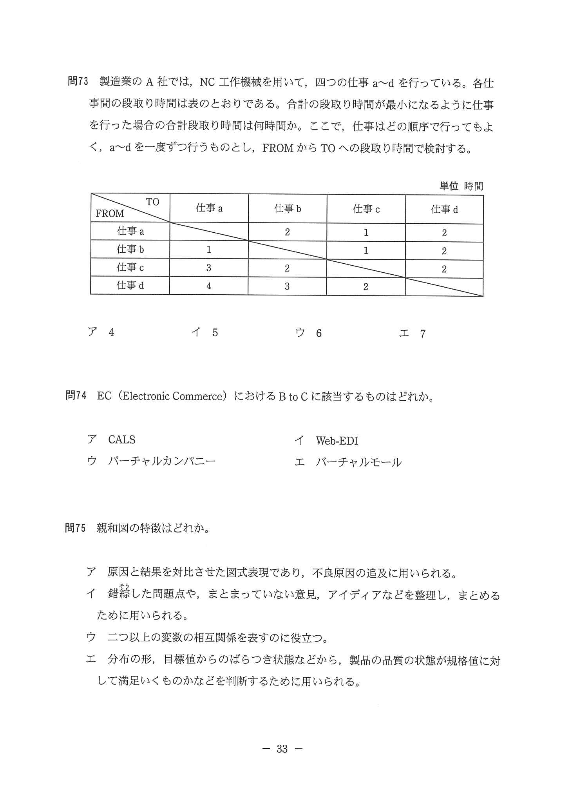

テキスト (OCR)

問73 製造業の A 社では, NC 工作機械を用いて, 四つの仕事 ad を行っている。各仕
事間の段取り時間は表のとおりである。 合計の段取り時間が最小になるように仕事
を行った場合の合計段取り時間は何時間か。ここで, 仕事はどの順序で行ってもよ
く, awd を一度ずつ行うものとし, FROM から TO への段取り時間で検討する。

単位 時間
TO
FROM                    仕事a               仕事b               仕事c               仕事d
仕事a                                             2                        1                        2
仕事b                    1                                                 1                        2
仕事c                    3                        2                                                 2
仕事d                    4                        3                        2
ア 4                      イ 5                      ウ 6                      エ 7

間74 EC (Electronic Commerce) におけるBtoCに該当するものはどれか。

ア CALS            イ Web-EDI
ウ バーチャルカンパニー      DL バーチャルモール

間75 親和図の特徴はどれか。

ア 原因と結果を対比させた図式表現であり, 不良原因の追及に用いられる。

4 錯総した問題点や, まとまっていない意見, アイディアなどを整理し, まとめる
ために用いられる。

ウ ニニフ以上の変数の相互関係を表すのに役立つ。

エ 分布の形, 目標値からのばらつき状態などから, 製品の品質の状態が規格値に対
して満足いくものかなどを判断するために用いられる。

ー 33 一

### ページ 34

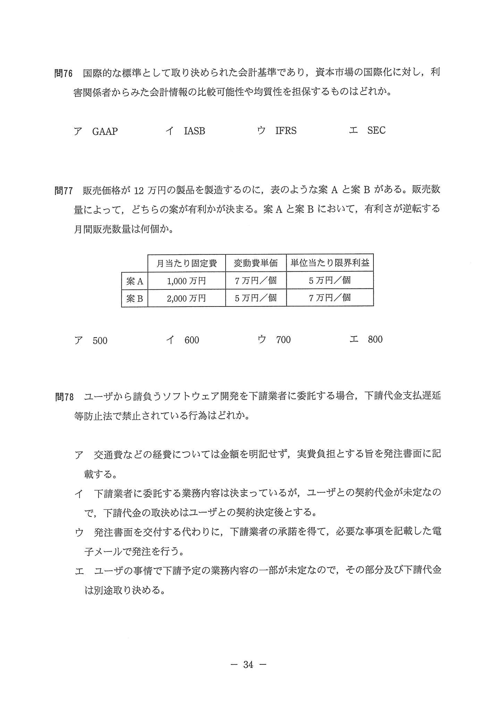

テキスト (OCR)

間76 国際的な標準として取り決められた会計基塗であり, 資本市場の国際化に対し, 利
害関係者からみた会計情報の比較可能性や均質性を担保おるものはどれか。

ア GAAP    イ IASB     ウ IFRS     = SEC

間77 販売価格が 12 万円の製品を製造するのに, 表のような案 A と案 B がある。販売数

量によって, どちらの案が有利かが決まる。案 A と案 B において, 有利さが逆転する
月間販売数量は何個か。

月当たり固定費 | 変動費単価 | 単位当たり限界利益

案A  1,000 万円   7 万円/個    5 万円/個
案B  2,000 万円   5 万円/個   7 万円/個
ア 500 イ 600 ウ 700 x= 800

間78 ユーザから請負うソフトウェア開発を下請業者に委託する場合, 下請代金支払遅延
等防止法で禁止されている行為はどれか。

ア 交通費などの経費については金額を明記せず, 実費負担とする旨を発注書面に記
MTS.

イ 下請業者に委託する業務内容は決まっているが, ユーザとの契約代金が未定なの
で, 下請代金の取決めはユーザとの契約決定後とする。

ウ 発注書面を交付する代わりに, 下請業者の承諾を得て, 必要な事項を記載した電
子メールで発注を行う。

L ユーザの事情で下請予定の業務内容の一部が未定なので, その部分及び下請代金
は別途取り決める。

### ページ 35

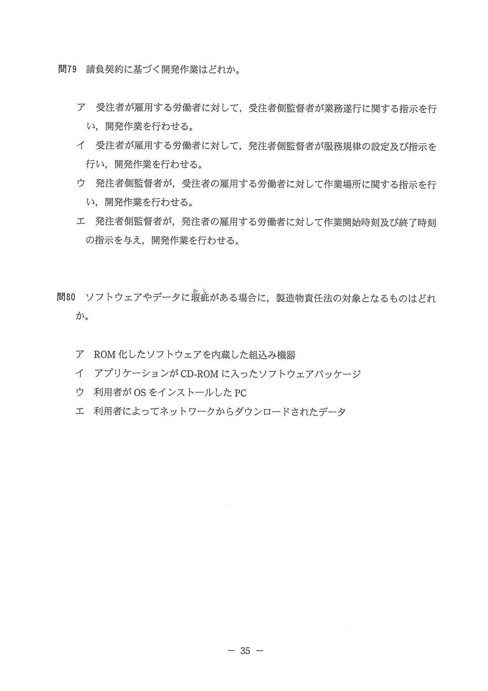

テキスト (OCR)

問79 請負契約に基づく開発作業はどれか。

ア 受注者が雇用する労働者に対して, 受注者側監督者が業務遂行に関する指示を行
い, 開発作業を行わせる。

イ 受注者が雇用する労働者に対して, 発注者側監督者が服務規律の設定及び指示を
行い, 開発作業を行わせる。

ウ 発注者側監督者が, 受注者の雇用する労働者に対して作業場所に関する指示を行
い, 開発作業を行わせる。

エ 発注者側監督者が, 発注者の雇用する労働者に対して作業開始時刻及び終了時刻
の指示を与え, 開発作業を行わせる。

問80 ソフトウェアやデータに隊交がある場合に, 製造物交任法の対象となるものはどれ
か。

ROM 化したソフトウェアを内蔵した組込み機器

アプリケーションがCD-ROM に入ったソフトウェアパッケージ
利用者が 0S をインストールしたEC

利用者によってネットワークからダウンロードされたデータ

H へ

ー 35 一

### ページ 36

テキスト (OCR)

[メモ 用紙 J

### ページ 37

テキスト (OCR)

【 メモ 用 紙 〕

### ページ 38

テキスト (OCR)

[ メモ 用 紙 〕

ー 38 一

### ページ 39

テキスト (OCR)

【 メモ 用 紙 J

ー 39 一

### ページ 40

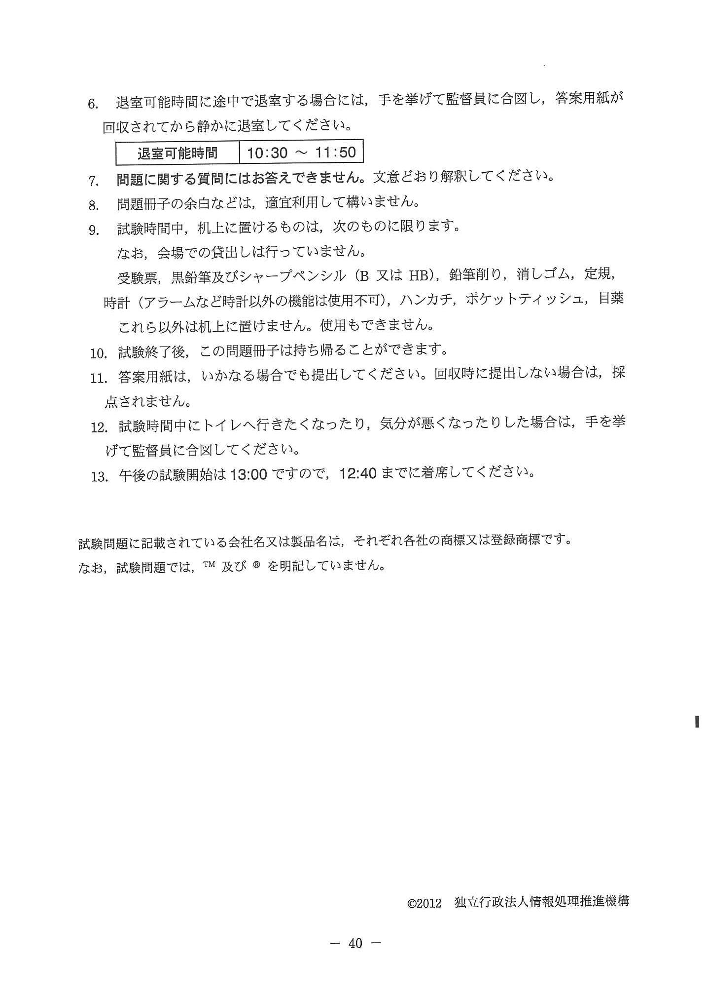

テキスト (OCR)

6. 退室可能時間に途中で退室する場合には, 手を挙げて監督員に合図し, 答案用紙が
回収されてから静かに退室してください。
| sezrraemm | 10:30 ~ 11:50|
7. 問題に関する質問にはお答えできません。文意どおり解選してください。
8. 問題民子の余白などは, 適宜利用して構いません。
9. 試験時間中机上に置けるものは, 次のものに限ります。
なお, 会場での貸出しは行っていません。
受験村,黒鉛筆及びシャープペンシル (B 又は HB), 鉛筆削り, 消しゴム, 定規
時計 (アラームなど時計以外の機能は使用不可),。 ハンカチ, ポケットティッシュ, 目薬
これら以外は机上に置けません。使用もできません。
10. 試験終了後, この問題冊子は持ち帰ることができます。
11. 答案用紙は, いかなる場合でも提出してください。回収時に提出しない場合は, 採
点されません。
12, 試験時間中にトイレへ行きたくなったり, 気分が悪くなったりした場合は, FEM
げて監督員に合図してください。
13, 午後の試験開始は 13.00 ですので, 12:40 までに着席してください。

試験問題に記載されている会社名又は製品名は, それぞれ各社の商標又は登録商標です。
なお, 試験問題では, ™ 及び @ を明記していません。

@2012 独立行政法人情報処理推進機構

---

## 午前解答

©2012 独立行政法人情報処理推進機構 
平成24 年度 秋期 応用情報技術者試験 解答例 
 
午前試験 
問番号
正解 
問1 
ア 
問2 
イ 
問3 
エ 
問4 
イ 
問5 
ア 
問6 
イ 
問7 
イ 
問8 
ア 
問9 
ウ 
問10 
ア 
問11 
イ 
問12 
ウ 
問13 
ア 
問14 
ア 
問15 
イ 
問16 
イ 
問17 
イ 
問18 
ア 
問19 
イ 
問20 
エ 
 
 
問番号
正解 
問21 
ウ 
問22 
ア 
問23 
ウ 
問24 
ア 
問25 
ア 
問26 
ウ 
問27 
エ 
問28 
エ 
問29 
ア 
問30 
ア 
問31 
イ 
問32 
ア 
問33 
ウ 
問34 
ウ 
問35 
イ 
問36 
エ 
問37 
ア 
問38 
ア 
問39 
イ 
問40 
ア 
 
 
問番号
正解 
問41 
ア 
問42 
エ 
問43 
ウ 
問44 
イ 
問45 
ア 
問46 
ア 
問47 
ア 
問48 
ウ 
問49 
イ 
問50 
エ 
問51 
ア 
問52 
ウ 
問53 
ア 
問54 
ア 
問55 
イ 
問56 
イ 
問57 
エ 
問58 
ア 
問59 
イ 
問60 
ア 
 
 
問番号
正解 
問61 
ウ 
問62 
ウ 
問63 
イ 
問64 
エ 
問65 
ウ 
問66 
エ 
問67 
ウ 
問68 
イ 
問69 
ウ 
問70 
ア 
問71 
ウ 
問72 
イ 
問73 
ア 
問74 
エ 
問75 
イ 
問76 
ウ 
問77 
ア 
問78 
イ 
問79 
ア 
問80 
ア

---

## 午後問題

### ページ 1

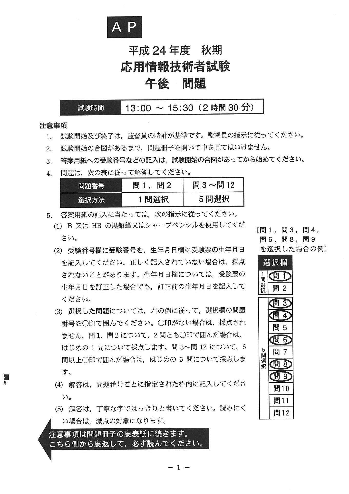

テキスト (OCR)

“i

平成 24 年度 秋期
応用情報技術者試験
午後 問題

 13:00 ~ 15:30 (2時間30 分)

注意事項
1. 試験開始及び終了は, 監督員の時計が基準です。監督員の指示に従ってください。
2. 試験開始の合図があるまで, 問題冊子を開いて中を見てはいけません。

3, 答案用紙への受験番号などの記入は, 試験開始の合図があってから始めてください。
4. 問題は, 次の表に従って解答してください。
問題番号        問1, 問2      fal 3 ~ fej 12
選択方法    1 間選択    5 問選択
5. 答案用紙の記入に当たっては, 次の指示に従ってください。

(①) B 又は HB の黒筆駐はシャープペンシルを使用してくだ ag agg
に                         Be, 問8,問9

(2) 受験番号欄に受験番号を, 生年月日欄に受験票の生年月日 を選択した場合の例〕
を記入してください。正しく記入されていない場合は, 採点 TR
されないことがあります。生年月日杉については, 受験票の
生年月日を訂正した場合でも, 訂正前の生年月日を記入して
ください。

3) 選択した問題については, 右の例に従って, BARONE
番号を〇印で囲んでください。〇印がない場合は。 採点され
EVA. ML 問2 について, 2 問とも〇印で囲んだ場合は,
はじめの 1 問について採点します。問 3て問 12 について, 6
問以上〇印で囲んだ場合は, はじめの 5 問について採点しま
す。

(4) 解答は, 問題番号ごとに指定された枠内に記入してくださ
い。

(6) 解答は, 丁寧な字ではっきりと書いてください。読みにく
い場合は, 減点の対象になります。

注意事項は問題冊子の裏表紙に続きます。
こちら側から裏返して, 必ず読んでください。

### ページ 2

### ページ 3

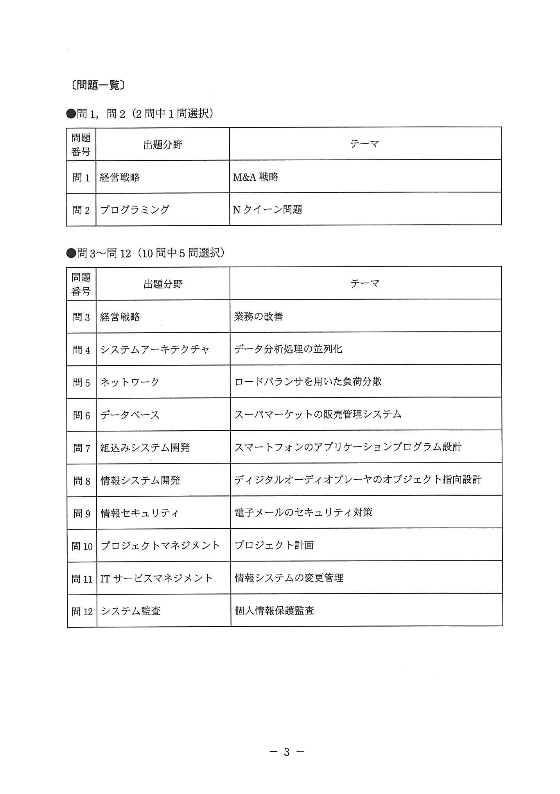

テキスト (OCR)

〔問題一覧〕
人@問1, 問2 ②⑫問中1 問選択)

           出題分時                                    a
問1 |経営戦略                     M&A 戦略
問 2 | プログラミング         N クイーン問題
@Fi3~F 12 (10 問中 5 問選択)
            出題分野                                    デー
問 3 | 経営戦略             業務の改善
間4 | システムアーキテクチャ | データ分析処理の並列化
問5 | ネットワーク           ロードバランサを用いた負荷分散
問6 | データベース              スーパマーケットの販売管理システム
問 7 | 組込みシステム開発      スマートフォンのアプリケーションプログラム設計
問 8 | 情報システム開発             ディジタルオーディオプレーヤのオブジェクト指向設計
問 9 | 情報セキュリティ         電子メールのセキュリティ対策
間 10 | プロジェクトマネジメント | プロジェクト計画
間 11 |TT サービスマネジメント |情報システムの変更管理
問 12 | システム監査            個人情報保護監査

### ページ 4

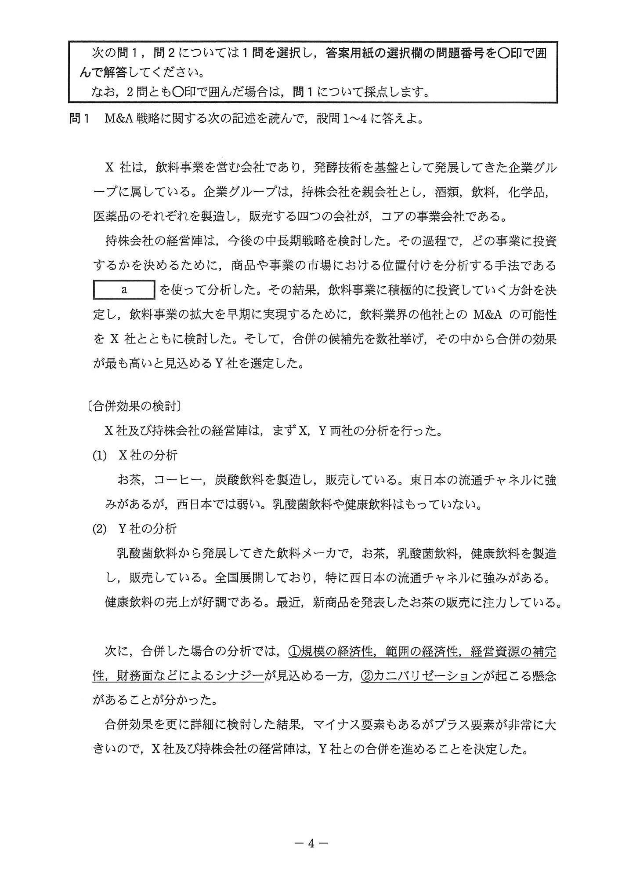

テキスト (OCR)

次の問1, 問2 については 1 間を選択し, 答案用紙の選択欄の問題番号を〇印で囲
んで解答してください。
なお, 2 問とも〇印で囲んだ場合は, 問 1 について採点します。

M&A 戦略に関する次の記述を読んで, 設問14 に答えよ。

X 社は, 飲料事業を営む会社であり, 発酵技術を基盤として発展してきた企業グル
ープに属している。企業グループは, 持株会社を親会社とし, 酒類, 飲料 化学品,
医薬品のそれぞれを製造し, 販売する四つの会社が, コアの事業会社である。

持株会社の経営陣は, 今後の中長期戦略を検討した。その過程で, どの事業に投次
するかを決めるために, 商品や事業の市場における位置付けを分析する手法である
| 3 | を使って分析した。その結果, 飲料事業に積極的に投資していく方針を決
EL, 飲料事業の拡大を早期に実現するために, 飲料業界の他社との M&A の可能性
を X 社とともに検討した。そして, 合併の候補先を数社挙げその中から合併の効果
が最も高いと見込める Y 社を選定した。

〔合併効果の検討]
X 社及び持株会社の経営陣は, まずX, Y両社の分析を行った。
Q①) %社の分析
BR, コーヒー, 炭酸飲料を製造し, 販売している。東日本の流通チャネルに強
みがあるが, 西日本では弱い。乳酸菌飲料や健康飲料はもっていない。
(2) Y 社の分析
乳酸菌飲料から発展してきた飲料メーカで, BH, 乳酸菌飲料, 健康飲料を製造
し, 販売している。全国展開しており, 特に西日本の流通チャネルに強みがある。
健康飲料の売上が好調である。最近, 新商品を発表したお茶の販売に注力している。

次に, 合併した場合の分析では, ①規模の経済性, 範囲の経済性, 経営資源の補完
性, 財務面などによるシナジーが見込める一方, ②カニバリゼーションが起こる懸念
があることが分かった。

合併効果を更に詳細に検討した結果., マイナス要素もあるがプラス要素が非常に大
きいので, XX 社及び持株会社の経営陣は, Y社との合併を進めることを決定した。

### ページ 5

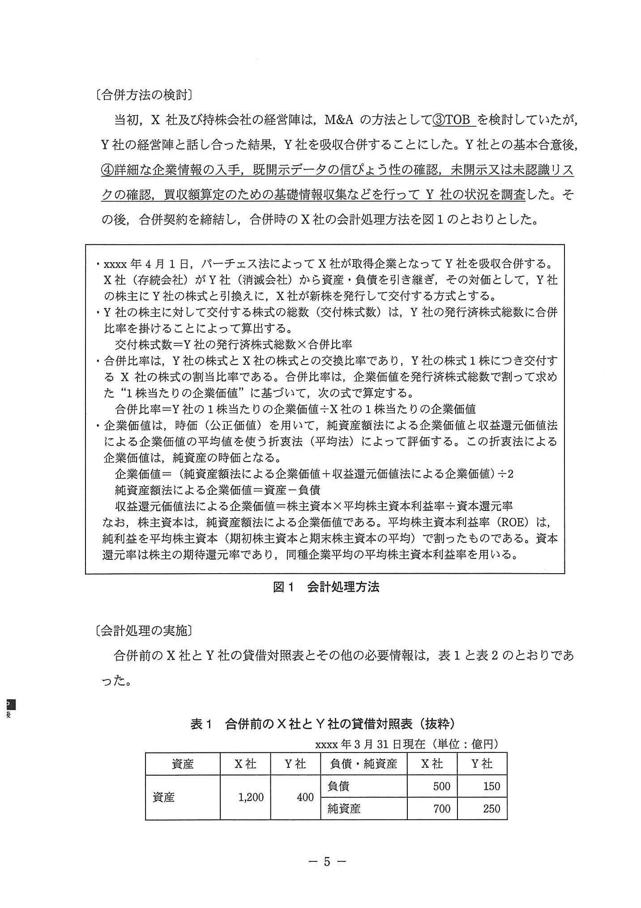

テキスト (OCR)

ua |

〔合併方法の検討〕
当初, X 社及び持株会社の経営陣は, M&A の方法として⑨TOB を検討していたが,
Y 社の経営陣と話し合った結果, Y 社を吸収合併することにした。Y 社との基本合意後,
④詳細な企業情報の入手, 既開示データの信ぴびょう性の確認, 未開示又は未認識リス
クの確認, 買収額算定のための基礎情報収集などを行って Y 社の状況を調査した。そ
の後, 合併契約を締結し, 合併時のX社の会計処理方法を図1 のとおりとした。

・xxxx 年 4 月 1 日, パーチェス法によって X 社が取得企業となって Y 社を吸収合併する。
ヌ社 (存続会社) がY社 (清滅会社) から資産・負債を引き継ぎ, その対価として, YF
の株主に Y 社の株式と引換えに, XX 社が新株を発行して交付する方式とする。

・Y 社の株主に対して交付する株式の総数 (交付株式数) は, Y 社の発行済株式総数に合併
比率を掛けることによって算出する。

交付株式数三Y 社の発行済株式総数メ合併比率

・合併比率は, Y 社の株式と X社の株式との交換比率であり, Y 社の株式 1 株につき交付す
る X 社の株式の割当比率である。合併比率は, 企業価値を発行済株式総数で割って求め
た “1 株当たりの企業価値" に基づいて, 次の式で算定する。

合併比率三Y 社の1 株当たりの企業価値X 社の 1 株当たりの企業価値

・企業価値は, 時価 (公正価値) を用いて, 純資産額法による企業価値と収益記元価値法
による企業価値の平均値を使う折青法 (平均法) によって評価する。この折衣法による
企業価値は, 純資産の時価となる。

企業価値 (純資産額法による企業価値十収益還元価値法による企業価値) 2

純資産額法による企業価値三資産一負償

収益還元価値法による企業価値王株主資本平均株主資本利益率資本還元率
なお, 株主資本は, 純資産額法による企業価値である。 平均株主資本利益率 (ROE) は,
純利益を平均株主資本 (期初株主資本と期末株主資本の平均) で割ったものである。 資本
HTC RIE OM RTE CHO, 同種企業平均の平均株主資本利益率を用いる。

図1 会計処理方法

〔会計処理の実施]
合併前のX社とY社の貸借対照表とその他の必要情報は, 表 1 と表2 のとおりであ

った。

表1 合併前のX社と Y 社の貸借対照表 (抜粋)
xxxx 年 3 月 31 日現在 (単位 : 億円)
資産     Xk   Yet | 負債・純資産 | Xt   Y社
負債                 500       150
純資産               700       250

資産                1,200        400

### ページ 6

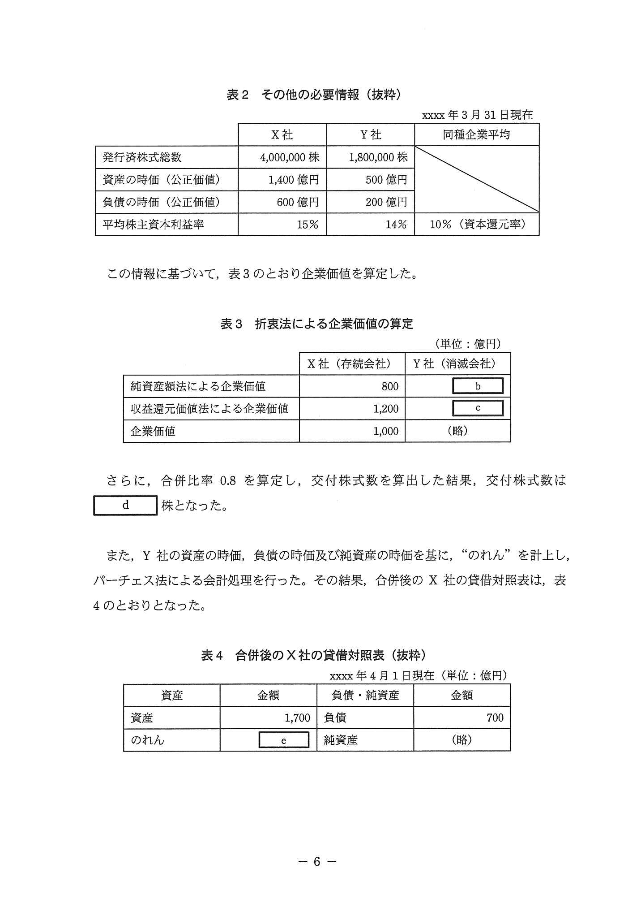

テキスト (OCR)

表2 その他の必要情報 (抜粋)
xxxx 年3 月 31 日現在

X 4                    Y 4                   同種企業平均
発行済株式総数                        4,000,000 株         1,800,000 株
資産の時価 (公正価値)            1,400 億円            500 億円
負債の時価 (公正価値)               600 億円            200 億円
平均株主資本利益率                       15%                 14% | 10% (資本還元率)

この情報に基づいて, 表3 のとおり企業価値を算定した。

表3 折喜法による企業価値の算定

(単位 : 億円)
X社 (存続会社) | Ye GRR th)
純資産額法による企業価値                                     800                 し5
収益還元価値法による企業価値         1,200
企業価値                                                                1000                (略)

さらに, 合併比率 0.8 を算定し, 交付株式数を算出した結果, 交付株式数は

| 3 |株となった。

また, Y 社の資産の時価, 負債の時価及び純資産の時価を基に, “のれん" を計上し,
パーチェス法による会計処理を行った。その結果, 合併後の X 社の貸借対照表は, 表

4 のとおりとなった。

表4 合併後のX社の貸借対照表 (抜粋)
xxxx 年4月1日現在 (単位 : 億円)

資産              金額          負債・純資産          金額
資産                                 1,700 | 負債                                   700
のれん                   [ec | | 純資産                   (略)

### ページ 7

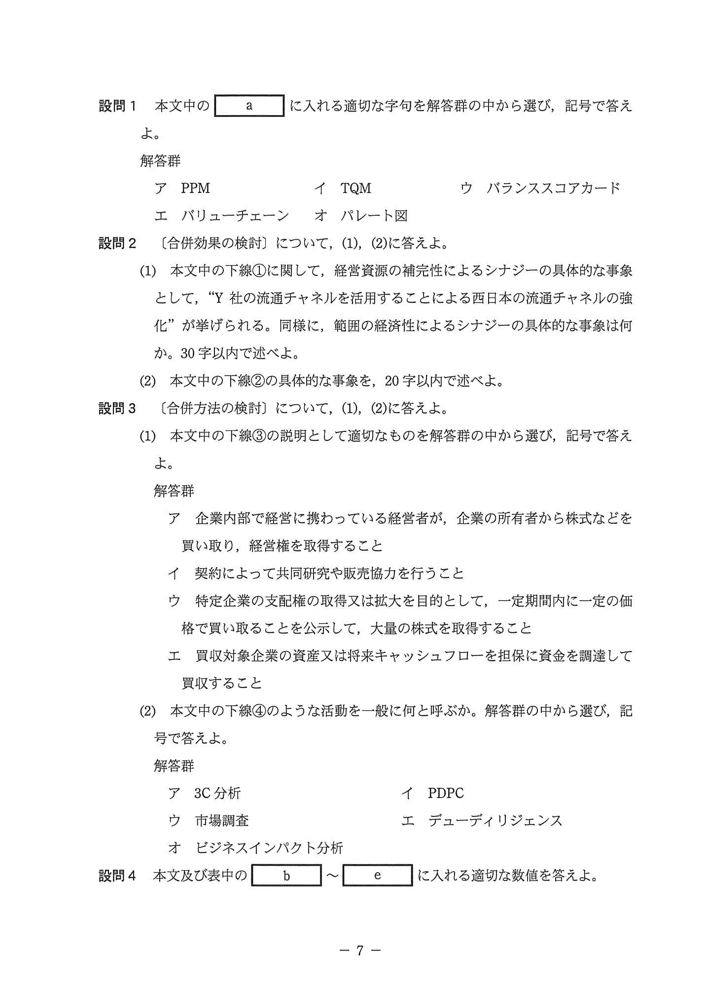

テキスト (OCR)

設問1 本文中の| a | に入れる適切な字句を解答群の中から選び, 記号で答え

ア PPM       イ TQM      ウ バランススコアカード
エエ パリューチェーン オ パレート図
設問2 (合併効果の検討】について, ①, ②⑫②)に答えよ。
GQ) 本文中の下線〇に関して, 経営資源の補完性によるシナジーの具体的な事象
として, “Y 社の流通チャネルを活用することによる西日本の流通チャネルの強
化” が挙げられる。同様に, 範囲の経済性によるシナジーの具体的な事象は何
か。30 字以内で述べよ。
2) 本文中の下線②の具体的な事象を, 20 字以内で述べよ。
設問3 [合併方法の検討について, ①②に答えよ。
Q) 本文中の下線③の説明として適切なものを解答群の中から選び, 記号で答え

ア 企業内部で経営に携わっている経営者が, 企業の所有者から株式などを
買い取り, 経営権を取得すること

イ 契約によって共同研究や販売協力を行うこと

ウ 特定企業の支配権の取得又は拡大を目的として, 一定期間内に一定の価
格で買い取ることを公示して, 大量の株式を取得すること

エエ 買収対象企業の資産又は将来キャッシュフローを担保に資金を調達して

買収すること
2) 本文中の下線④@のような活動を一般に何と呼ぶか。解答群の中から選び, 記
号で答えよ。
解答

ア 8C分析          イ PDPC

ウ 市場調査           エエ デューディリジェンス

オ ビジネスインパクト分析
設問4 本文及び表中の| b |~[  e |に入れる適切な数値を答えよ。

### ページ 8

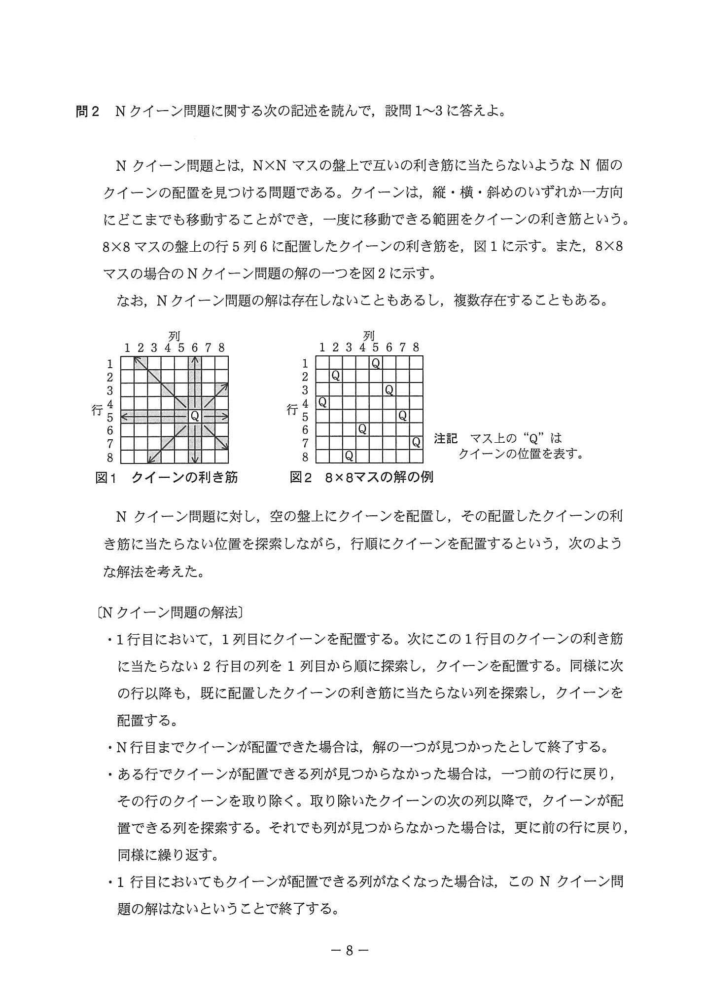

テキスト (OCR)

問2 Nクイーン問題に関する次の記述を読んで, 設問13 に答えよ。

N クイーン問題とは, NXN マスの盤上で互いの利き筋に当たらないような N (HO
クイーンの配置を見つける問題である。クイーンは, 縦・横・斜あめのいずれか一方向
にどこまでも移動することができ, 一度に移動できる範囲をクイーンの利き筋という。
8X8 マスの盤上の行 5列6 に配置したクイーンの利き筋を, 図 1 に示す。また, 8X8
マスの場合の N クイーン問題の解のーつを図 2 に示す。

なお, N クイーン問題の解は存在しないこともあるし, 複数存在することもある。

列             列
12345678       12345678
1             1    Q
2            21a
3              3    Q
4                           an 4
Ts            Q              Ws              qa
9    ロ    Q| 注記 マス上の"Q" は
8                              8      Q                 クイーンの位置を表す。
図1 クイーンの利き筋      図2 8x8マスの解の例

N クイーン問題に対し, ZORECYT-YEMBL, その配置したクイーンの利
き筋に当たらない位置を探索しながら, 行順にクイーンを配置するという, 次のよう
な解法を考えた。

(N クイーン問題の解法

・1 行目において, 1 列目にクイーンを配置する。次にこの 1 行目のクイーンの利き筋
に当たらない 2 行目の列を 1 列目から順に探索し, クイーンを配置する。同様に次
の行以降も, 既に配置したクイーンの利き筋に当たらない列を探索し, クイーンを
配置する。

・N 行目までクイーンが配置できた場合は, 解のーつが見つかったとして終了する。

・ある行でクイーンが配置できる列が見つからなかった場合は, 一つ前の行に戻り,
その行のクイーンを取り除く。 取り除いたクイーンの次の烈以降で, クイーンが配
置できる列を探索する。それでも列が見つからなかった場合は, 更に前の行に戻り,
同様に繰り返す。

・1 行目においてもクイーンが配置できる列がなくなった場合は, この N クイーン問
題の解はないということで終了する。

ー8一

### ページ 9

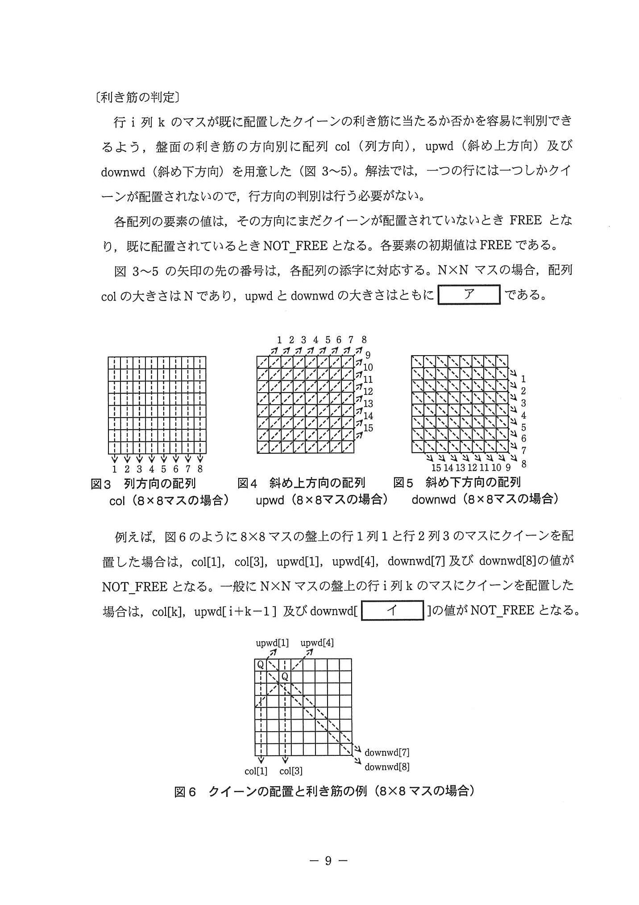

テキスト (OCR)

(利き筋の判定

fF i 列 k のマスが既に配置したクイーンの利き筋に当たるか否かを容易に判別でき
SED, 盤面の利き筋の方向別に配列 col (列方向), upwd (斜め上方向) 及び
downwd (斜め下方向) を用意した (図 3ご5)。解法では, 一つの行にはーつしかクイ
ーンが配置されないので, 行方向の判別は行う必要がない。

各配列の要素の値は, その方向にまだクイーンが配置されていないとき FREE とな
り, 既に配置されているとき NOT_FREE となる。各要素の初期値はFREE CHS.

図 3ご5 の矢印の先の番号は, 各配烈の添字に対応する。 NXN マスの場合, 配列
col の大きさは N THO, upwd と downwd の大きさはともに| ア | でぁる。

1234567 8

AAAAAAA A,
tea     レガ   トドドドドドドドMSN
VVVVVVVY                NNNNNN
12345678                 1514131211109 8
図3 列方向の配列   図4 斜め上方向の配列  図5 斜め下方向の配列

col (8x 8マスの場合)   upwd (8x8マスの場合) downwd (8x8マスの場合)

例えば, 図6のように8X8 マスの盤上の行 1 列 1 と行 2 列8 のマスにクイーンを配
置した場合は, col[1], col[3], upwd[1], upwd[4], downwd[7] 及び downwd[8]の値が
NOT FREE となる。一般に NXN マスの盤上の行i列k のマスにクイーンを配置した
場合は collk], upwdli+k-1] 及び downwd[| イ | 1の値がNOT FREEとなる。

upwd[1] upwd[4]
a             a

Qt
TQ
日に<ド
TLL INES
1     1 Ss.
1     1             に downwd[7]
Vv   Vv         に1
col[1] col3]         downwd[8]

 6 クイーンの配置と利き筋の例 (8X8 マスの場合)

### ページ 10

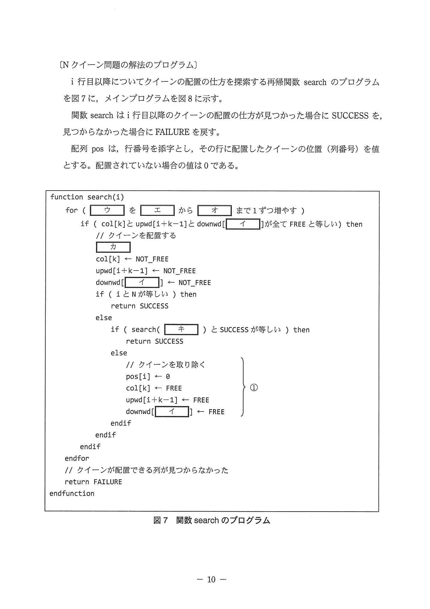

テキスト (OCR)

〔N クイーン問題の解法のプログラム〕
i 行目以降についてクイーンの配置の仕方を探索する再帰関数 search のプログラム
を図 7 に, メインプログラムを図 8 に示す。
関数 search td 行目以降のクイーンの配置の仕方が見つかった場合に SUCCESS を,
見つからなかった場合に FAILURE を戻す。
配列 pos は, 行番号を添字とし, その行に配置したクイーンの位置 (列番号) を値
とする。 配置されていない場合の値は 0 である。

function search(i)
for (| ウ |を| エ |から| + | まで1ずっつ増やす)
if ( co1[k]と upwd[itk—1]& downwd[| イ |]が全てFREEと等しい) then
// クイーンを配置する
co1[k] <- NOT_FREE
upwd[i+k—1] < NOT_FREE
downwd[| イ |] <— NOT_FREE
if ( 1とNが等しい ) then
return SUCCESS
else
if ( search( ) と sUccEsS が等しい ) then
return SUCCESS
else
// クイーンを取り除く
pos[i] で9@
col[k] < FREE             ①
upwd[i十k一1] < FREE
downwd[[ イ |] < FREE
endif
endif
endif

endfor
// クイーンが配置できる列が見つからなかった
return FAILURE

endfunction

 7 関数 search のプログラム

ー 10 一

### ページ 11

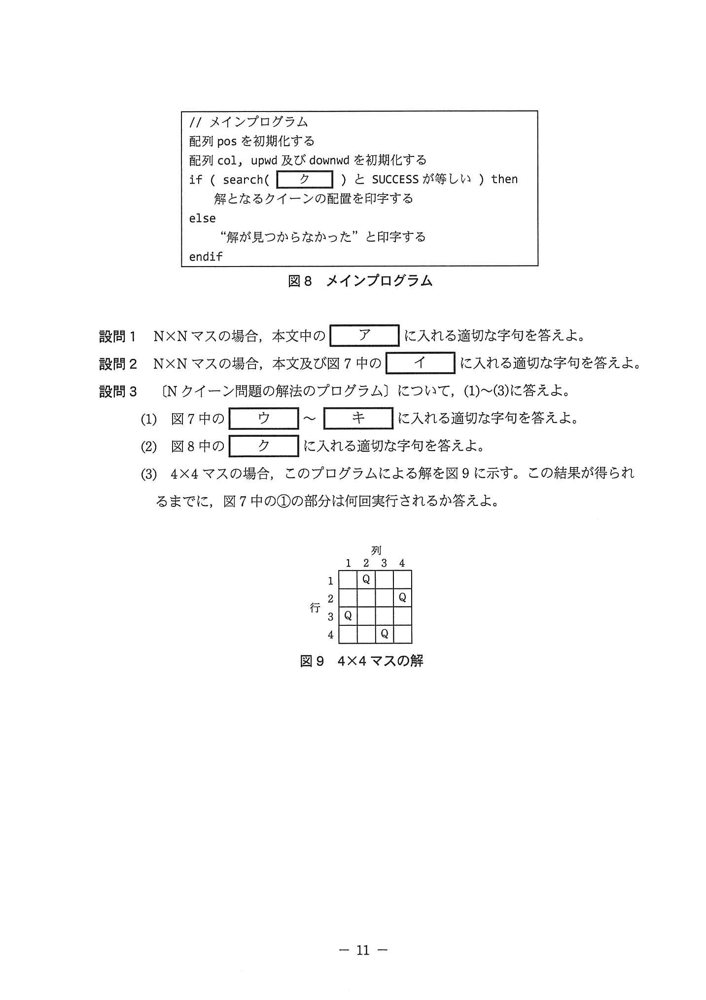

テキスト (OCR)

// メインプログラム

配列 pos を初期化する

配列 co1, upwd 及び downwd を初期化する

if ( search( ) と SUCCESS が等しい ) then
解となるクイーンの配置を印字する

else
“解が見つからなかった"と印字する

endif

Hs メインプログラム

設問1 NXN マスの場合,本文中の| ア | に入れる適切な字句を答えよ。
設問2 NXN マスの場合本文及び図 7 中の| イ | に入れる適切な字句を答えよ。
設問3 〔Nクイーン問題の解法のプログラム〕について, ①で(⑬に答えよ。
Q 図7中の| ウ |て| + |に入れる適切な字句を答えよ。
(2) 図8中の に入れる適切な字句を答えよ。
(3) 4X4 マスの場合、このプログラムによる解を図 9 に示す。この結果が得られ
るまでに, 図7 中の①の部分は何回実行されるか答えよ。

行

1
2
3|Q
4

 9 4X4 マスの解

ー 11 一

### ページ 12

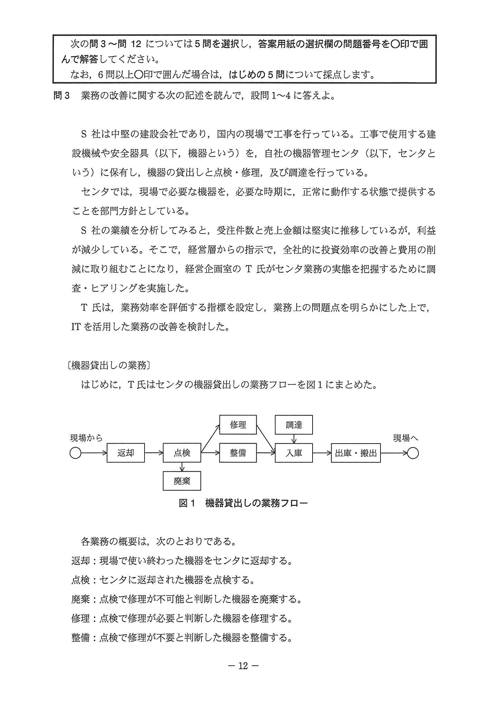

テキスト (OCR)

次の問3 >間 12 については5間を選択し, 答案用紙の選択欄の問題番号を〇印で囲
んで解答してください。
なお, 6 問以上〇印で囲んだ場合は, はじめの5 問について採点します。

間3 業務の改善に関する次の記述を読んで, 設問 1ー4 に答えよ。

S 社は中堅の建設会社であり, 国内の現場で工事を行っている。工事で使用する建
設機械や安全器具 (以下, 機器という) を, 自社の機器管理センタ (以下,センタと
いう) に保有し, 機器の貸出しと点検・修理, 及び調達を行っている。

センタでは, 現場で必要な機器を, 必要な時期に, 正常に動作する状態で提供する
ことを部門方針としている。

S 社の業績を分析してみると, 受注件数と売上金額は堅実に推移しているが, 利益
が減少している。そこで, 経営層からの指示で, 全社的に投資効率の改善と費用の削
減に取り組むひことになり, 経営企画室の T 氏がセンタ業務の実態を把握するために調
査・ヒアリングを実施した。

T 氏は, 業務効率を評価する指標を設定し, 業務上の問題点を明らかにした上で,
IT を活用した業務の改善を検討した。

[機器貸出しの業務
はじめに, T 氏はセンタタの機器貸出しの業務フローを図 1 にまとめた。

修理           調達
現場から                        MM            現場へ
CO        返却         点検         整備         入庫        出庫・搬出 ーー%〇
\
廃棄

 1 機器貸出しの業務フロー

各業務の概要は, 次のとおりである。
返却 : 現場で使い終わった機器をセンタに返却する。
点検 : センタに返却された機器を点検する。
廃棄 : 点検で修理が不可能と判断した機器を廃棄する。
修理 : 点検で修理が必要と判断した機器を修理する。
整備 : 点検で修理が不要と判断した機器を整備する。

ー 12 一

### ページ 13

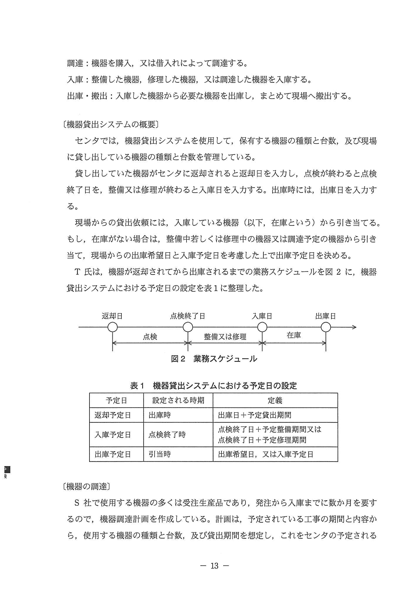

テキスト (OCR)

a |

調達 : 機器を購入又は借入れによって調達する。
入庫 : 整備した機器, 修理した機器, 又は調達した機器を入庫する。
出庫・抜出 : 入庫した機器から必要な機器を出庫し, まとめて現場へ搬出する。

〔機器貸出システムの概要〕

センタでは, 機器貸出システムを使用して, 保有する機器の種類と台数, 及び現場
に貸し出している機器の種類と台数を管理している。

貸し出していた機器がセンタに返却されると返却日を入力し, 点検が終わると点検
終了日を, 整備又は修理が終わると入庫日を入力する。出庫時には, 出庫日を入力す
る。

現場からの貸出依頼には, 入庫している機器 (以下, 在庫という) から引き当てる。
もし, 在庫がない場合は, 整備中若しくは修理中の機器又は調達予定の機器から引き
当て, 現場からの出庫希望日と入庫予定日を考慮した上で出庫予定日を決める。

T 氏は, 機器が返却されてから出庫されるまでの業務スケジュールを図 2 に, 機器
貸出システムにおける予定日の設定を表 1 に整理した。

返却日       点検終了日       入庫日      出庫日
7

7 +                                                  CY                   7
sr ec | 企間  ]
|                               |

|                            |
図2 業務スケジュール

表1 機器貸出システムにおける予定日の設定

予定日 | 設定される時期        定義
返却予定日 | He      出庫日予定貸出天間
点検終了日+ 予定整備期間又は
ATA | eT    点検終了日予定修理期間
meee | 引当時      出庫希望日又は入庫予定日
(機器の調達

S 社で使用する機器の多くは受注生産品であり, 発注から入庫までに数か月を要す
るので, 機器調達計画を作成している。 計画は, 予定されている工事の期間と内容か
ら, 使用する機器の種類と台数, 及び貸出期間を想定し, これをセンタの予定される

ー 13 一

### ページ 14

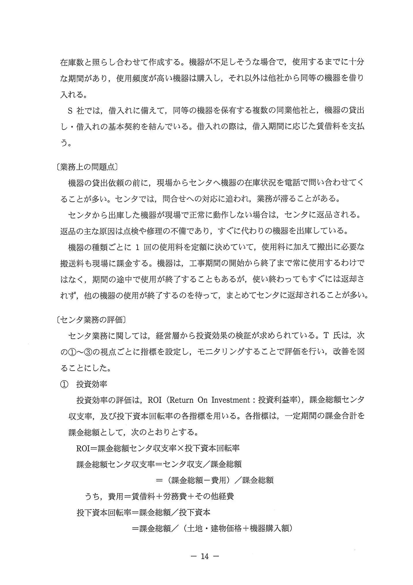

テキスト (OCR)

在庫数と照らし合わせて作成する。機器が不足しそうな場合で, 使用するまでに十分
な期間があり, 使用頻度が高い機器は購入し, それ以外は他社から同等の機器を借り
入れる。

S 社では, 借入れに備えて, 同等の機器を保有する複数の同業他社と, 機器の貸出
し・借入れの基本契約を結んでいる。借入れの際は, 借入期間に応じた賃借料を支払

De

〔業務上の問題点]

機器の貸出依頼の前に, 現場からセンタへ機器の在庫状況を電話で問い合わせてく
ることが多い。センタでは, 問合せへの対応に追われ, 業務が滞ることがある。

センタから出庫した機器が現場で正常に動作しない場合は, センタに返品される。
返品の主な原因は点検や修理の不備であり, すぐに代わりの機器を出庫している。

機器の種類ごとに 1 回の使用料を定額に決めていて, 使用料に加えて拓出に必要な
搬送料も現場に課金する。機器は, 工事期間の開始から終了まで常に使用するわけで
はなく, 期間の途中で使用が終了することもあるが, 使い終わってもすぐには返到さ
れず, 他の機器の使用が終了するのを待って, まとめてセンタに返却されることが多い。

(センタ業務の評価〕

センタ業務に関しては, 経営層から投資効果の検証が求められている。T Rid, 次
の①て③の視点ごとに指標を設定し, モニタリングすることで評価を行い, 改善を図
ることにした。
① 投資効率

投資効率の評価は, ROI (Return On Investment : 投資利益率), 課金総額センタ

WSR, 及び投下資本回転率の各指標を用いる。各指標は, 一定期間の課金合計を

課金総額として, 次のとおりとする。

ROI王課金総額センタ収支率投下資本回転率

課金総額センタ収支率デセンタ収支ノ課金総額

= (課金総額一費用) 課金総額
うち, RARE + HBR + COMER
投下資本回転率王課金総額投下資本
課金総額ノ (土地・建物価格機器購入額)

ー 14 一

### ページ 15

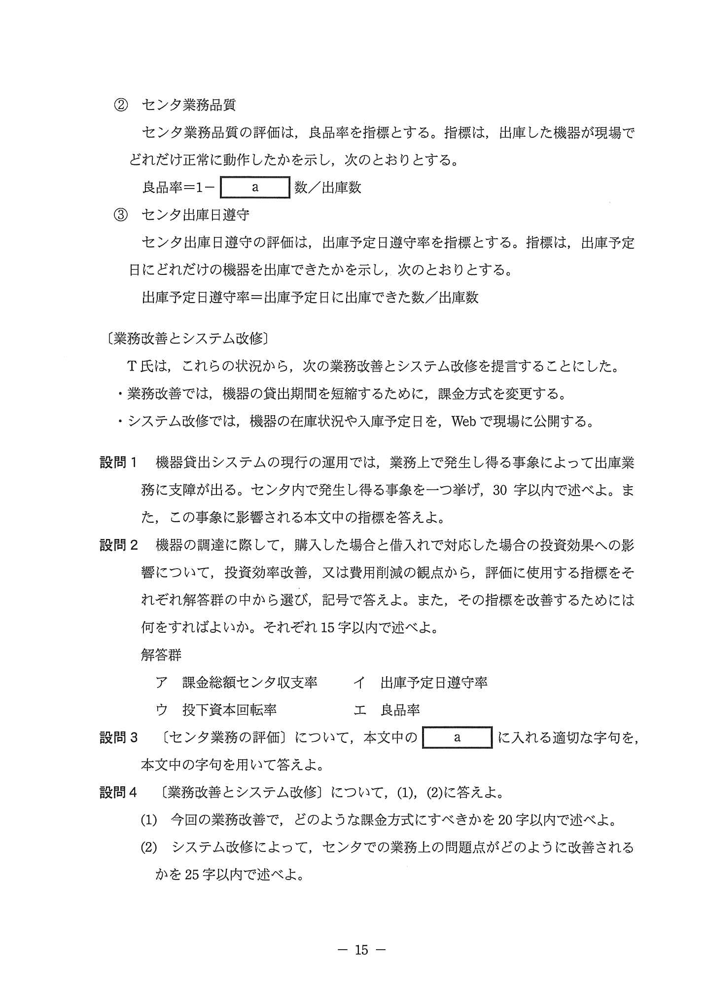

テキスト (OCR)

Q センタ業務品質
センタ業務品質の評価は, 良品率を指標とする。指標は, 出庫した機器が現場で
どれだけ正常に動作したかを示し, 次のとおりとする。
良品率ニ1ー|  a |数出庫数

@ センタ出庫日遵守
センタ出庫日遵守の評価は, 出庫予定日遵守率を指標とする。指標は, 出庫予定
日にどれだけの機器を出庫できたかを示し, 次のとおりとする。
出庫予定日遵守率一出庫予定日に出庫できた数出庫数

〔業務政善とシステム改修]
T 氏は, これらの状況から, 次の業務改善とシステム改修を提言することにした。
・業務改善では, 機器の貸出期間を短縮するために, 課金方式を変更する。
・システム改修では, 機器の在庫状況や入庫予定日を, Web で現場に公開する。

設問1 機器貸出システムの現行の運用では, 業務上で発生し得る事象によって出庫業
務に支障が出る。センタ内で発生し得る事象をーつ挙げ, 30 字以内で述べよ。ま
た, この事象に影響される本文中の指標を答えよ。

設問2 機器の調達に際して, 購入した場合と借入れで対応した場合の投資効果への影
BOW, 投資効率政善, 又は費用削減の観点から, 評価に使用する指標をそ
れぞれ解答群の中から選び, 記号で答えよ。また, その指標を改善するためには
何をすればよいか。それぞれ15 字以内で述べよ。

AEH
ア 課金総額センタ収支率 イ HHP ae ERS
ウ 投下資本回転率      エ 良品率
設問3 〔センタ業務の評価] について, 本文中の| a | に入れる適切な字句を,
本文中の字句を用いて答えよ。

設問4 [業務政善とシステム改修}」 について, (D, ②)に答えよ。
(1) 今回の業務政善で、 どのような課金方式にすべきかを 20 字以内で述べよ。
(② システム改修によって, センタでの業務上の問題点がどのように改善される
かを 25 字以内で述べよ。

— 15 —

### ページ 16

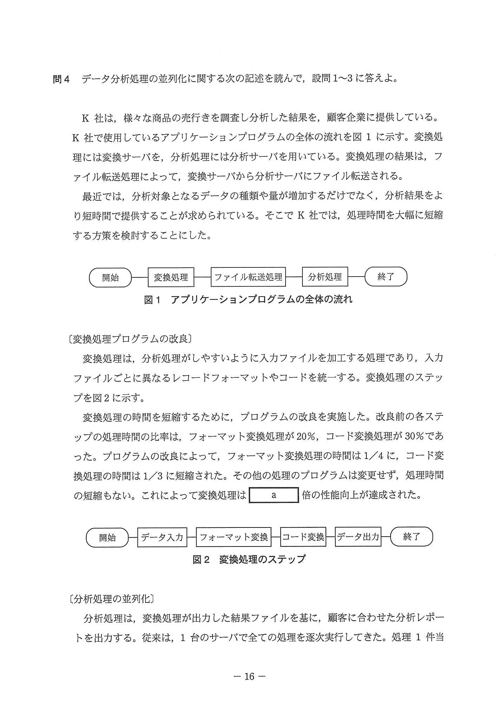

テキスト (OCR)

問4 データ分析処理の並贅化に関する次の記述を読んで, 設問 13 に答えよ。

K 社は, 様々な商品の売行きを調査し分析した結果を, 顧客企業に提供している。
K 社で使用しているアプリケーションプログラムの全体の流れを図 1 に示す。変換処
理には変換サーバを, 分析処理には分析サーバを用いている。変換処理の結果は, 7
ァイル転送処理によって, 変換サーバから分析サーバにファイル転送される。

最近では, 分析対象となるデータの種類や量が増加するだけでなく, 分析結果をよ
り短時間で提供することが求められている。そとで K HC, 処理時間を大幅に短縮
する方策を検討することにした。

(pee | aeseme |一| ファイル転送各理ト一 分処理   ( «7 )
 1 アプリケーションプログラムの全体の流れ

(変換処理プログラムの改良

変換処理は, 分析処理がしやすいように入力ファイルを加工する処理であり, AH
ファイルごとに異なるレコードフォーマットやコードを統一する。変換処理のステッ
プを図 2 に示す。

変換処理の時間を短縮するために, プログラムの改良を実施した。改良前の各ステ
ップの処理時間の比率は。 フォーマット変換処理が 20%, コード変換処理が 30%であ
った。プログラムの改良によって, フォーマット変換処理の時間は 1/4 に, コード変
挨処理の時間は 1/3 に短縮された。その他の処理のプログラムは変更せず, 処理時間
の短縮もない。これによって変換処理は| 。 |倍の性能向上が達成された.。

(me ) テータ和カトフォーマット変換上コード変換データ出カ|( #7)
図2 変換処理のステップ

(分析処理の並列化
分析処理は, 変換処理が出力した結果ファイルを基に, 顧客に合わせた分析レポー
トを出力する。 従来は, 1 台のサーバで全ての処理を逐次実行してきた。処理 1 件当

ー 16 一

### ページ 17

テキスト (OCR)

たりの処理時間は, 顧客からの処理要件や, データの種類や量によってその都度異な
るが, 最短で1時間, 最長で3 時間である。

分析処理の時間を短縮するために, 分析サーバを 3 台用意し, 処理を並行して実行
することにした。ただし, 各分析サーバに割り当てられた処理は逐次実行し, 1 件の
処理を複数のサーバに分散して実行することはない。複数の処理を 1 台のサーバで並
行実行することもない。

3 台の分析サーバに処理を割り当てる方法として, 方法A CHEB を考えた。
① 方法A

各分析サーバで実行する件数が均等になるように処理を割り振る (図3)。

分析サーバ1 | 処理1 。 | 処理4 | 処理7 |
分析サーバ2 一 処理2 | 処理5 | 処理
分析サーバ3 | 処理3 | 処理6 | 処理9 | 処理

時間

 3 分析処理の割当方法A

②⑫ 方法B
分析サーバ間の処理時間のばらつきが小さくなるように, | b | した分析サ
ーバに, 順次, 次の処理を割り当てる (HA).

分析サーバ1 一 処理1 | 処理6 | 処理8 |
分析サーバ2 | 処理2 | mes | 処理9
分析サーバ3 | 処理3 | 処理4 | 処理7 | 処理

時間

 4 分析処理の割当方法B

THE A の場合, ①分析サーバ間の処理時間のばらつきが大きくなり過ぎて, 予想し
ていた時間内に分析処理が完了しないことがある。 一方, 方法 B の場合, 割り当てら
れた全部の処理を完了する時間が最も長く掛かる分析サーバでも, 他の分析サーバよ

りも最大で 時間長く掛かるだけで済む。

ー 17 一

### ページ 18

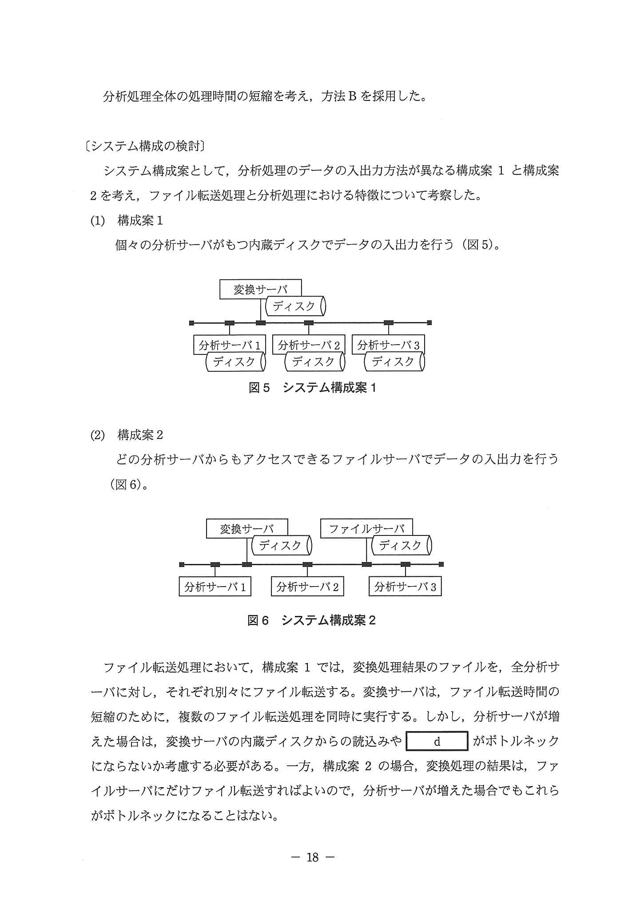

テキスト (OCR)

分析処理全体の処理時間の短縮を考え, 方法B を採用した。

〔システム構成の検討〕

システム構成案として, 分析処理のデータの入出力方法が異なる構成案 1 と構成案
2 を考え, ファイル転送処理と分析処理における特徴について考察した。
(1) 構成案1

個々の分析サーバがもつつ内蔵ディスクでデータの入出力を行う (図5)。

T             T
分析サーバ 1 | | 分析サーバ 2 | | 分析サーバ3
ディスク          ディスク          ディスク

図5 システム構成案 1

(2) 構成案2
どの分析サーバからもアクセスできるファイルサーバでデータの入出力を行う

(図6)。
変換サーバ     TTY バ
ディスク =        ( ディスク ()

peo] | aa al

図6 システム構成案 2

ファイル転送処理において, 構成案 1 では, 変換処理結果のファイルを, 全分析サ
ーバに対し, それぞれ別々にファイル転送する。変換サーバは, ファイル転送時間の
短縮のために, 複数のファイル転送処理を同時に実行する。しかし, 分析サーバが増
えた場合は, 変換サーバの内蔵ディスクからの読込みや| qd | がボトルネック
にならないか考慮する必要がある。一方, 構成案 2 の場合, 変換処理の結果は, ファ
イルサーバにだけファイル転送すればよいので, 分析サーバが増えた場合でやもこれら
がボトルネックになることはない。

ー 18 一

### ページ 19

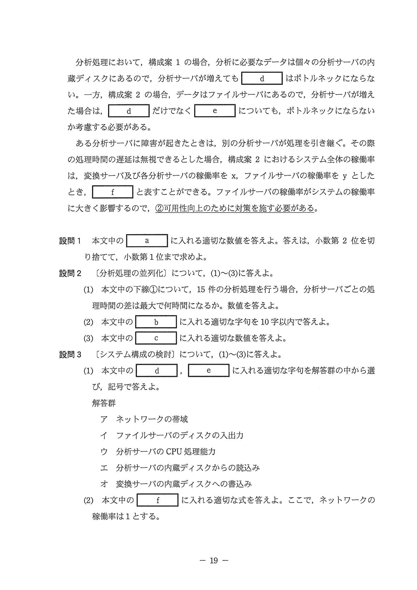

テキスト (OCR)

分析処理において, 構成案 1 の場合 分析に必要なデータは個々の分析サーバの内
蔵ディスクにあるので, 分析サーバが増えても|  q | はボトルネックにならな
い。一方, 構成案 2 の場合,、データはファイルサーバにあるので, 分析サーバが増え
た場合は, | q | だけでな<く|  e | についても, ボトルネックにならない
か考慮する必要がある。

ある分析サーバに障害が起きたときは, 別の分析サーバが処理を引き継ぐ。その際
の処理時間の遅延は無視できるとした場合, 構成案 2 におけるシステム全体の稼働率
は, 変換サーバ及び各分析サーバの稼働率を x。 ファイルサーパの稼働率を y とした
とき, と表すことができる。ファイルサーバの稼働率がシステムの稼働率
に大きく影響するので, ②可用性向上のために対策を施す必要がある。

設問1 本文中の| a | に入れる適切な数値を答えよ。答えは, 小数第2 位を切
り捨てて, 小数第 1 位まで求めよ。
設問2 (分析処理の並列化)について, ①で(⑬)に答えよ。
①) 本文中の下線①について, 15 件の分析処理を行う場合分析サーパごとの処
理時間の差は最大で何時間になるか。 数値を答えよ。
⑫) 本文中の| b | に入れる適切な字句を10字以内で答えよ。
@) 本文中の| c | に入れる適切な数値を答えよ。

設問3 〔システム構成の検討について, (①て(3⑬)に答えよ。

a 本文中の|  q |, | < | に入れる適切な字句を解答群の中から選
び, 記号で答えよ。
解答基

ア ネットワークの帯域
ファイルサーバのディスクの入出力
分析サーバの CPU 処理能力
分析サーバの内蔵ディスクからの読込み
オ 変換サーバの内蔵ディスクへの書込み
2) 本文中の に入れる適切な式を答えよ。ここで, ネットワークの
稼働率は 1 とする。

HOGA

### ページ 20

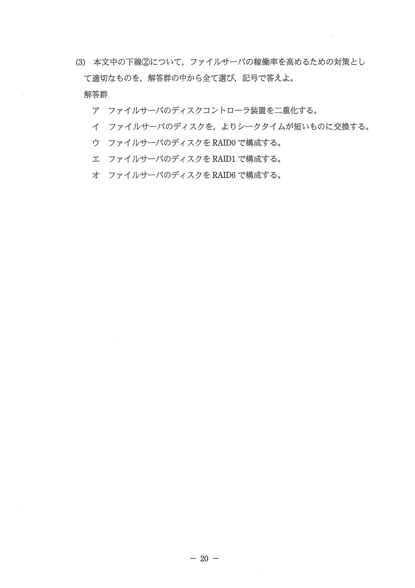

テキスト (OCR)

(3) 本文中の下線②について, ファイルサーバの稼働率を高めるための対策とし
て適切なものを, 解答群の中から全て選び, 記号で答えよ。

解答群

ア

MS HG A

ファイルサーバのディスクコントローラ装置を二重化する。

ファイルサーバのディスクを, よりシークタイムが短いものに交換する。
ファイルサーバのディスクを RAID で構成する。

ファイルサーバのディスクを RAID で構成する。

ファイルサーバのディスクを RATID6 で構成する。

ー 20 一

### ページ 21

テキスト (OCR)

a |

【 メ モ 用 紙 〕

ー 21 一

### ページ 22

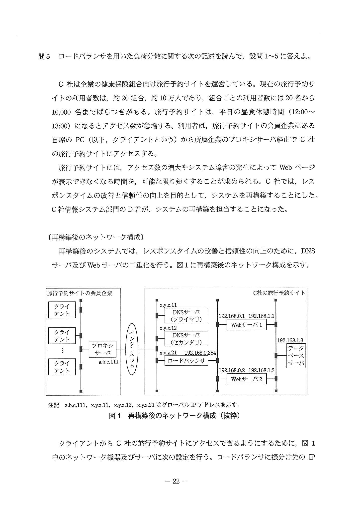

テキスト (OCR)

間5 ロードバランサを用いた負荷分散に関する次の記述を読んで, 設問 1て5 に答えよ。

C 社は企業の健康保険組合向け旅行予約サイトを運営している。現在の旅行予約サ
イトの利用者数は, 約 20 組合, 約 10 万人であり, 組合ごとの利用者数には 20 名から
10,000 名までばらつきがある。旅行予約サイトは, 平日の昼食休憩時間 (12:00~
13:00) になるとアクセス数が急増する。利用者は, 旅行予約サイトの会員企業にある
自席の PC (以下, クライアントという) から所属企業のプロキシサーバ経貼で C 社
の旅行予約サイトにアクセスする。

旅行予約サイトには, アクセス数の増大やシステム障害の発生によって Web ページ
が表示できなくなる時間を, 可能な限り短くすることが求められる。C 社では, レス
ポンスタイムの改善と信頼性の向上を目的として, システムを再構築することにした。
C 社情報システム部門の D 君が. システムの再構築を担当することになった。

〔再構築後のネットワーク構成]
再構築後のシステムでは, レスポンスタイムの改善と信頼性の向上のために, DNS
サーバ及び Web サーバの二重化を行う。図 1 に再構築後のネットワーク構成を示す。

旅行予約サイトの会員企業                                                 C社の旅行予約サイト
クライ                                            .y.2.11
アント                                                           DNSサーバ
(プライマリ)         _— saa
yz.12                         Weサーバ1 |    ー
クライ                                                                          て
DNSサーバ
アント                          (セカンダリ)                   192.168.13
                    プロキシ ||                                                                                                                      データ
サーバ                          ry2.21 192.168.0.254                                    ヘース
クライ          ab.c.111                 ロードバラウザ                            サーバ
アント                                                                       192.168.0.2 192.168.1.2

注記 ajb.c.111, x.yz.11, xyz.12, x.yz.21 はグローバル IP アドレスを示す。
 1 再構築後のネットワーク構成 (抜粋)

クライアントから C 社の旅行予約サイトにアクセスできるようにするために, 1

中のネットワーク機器及びサーバに次の設定を行う。ロードバランサに振分け先の IP

### ページ 23

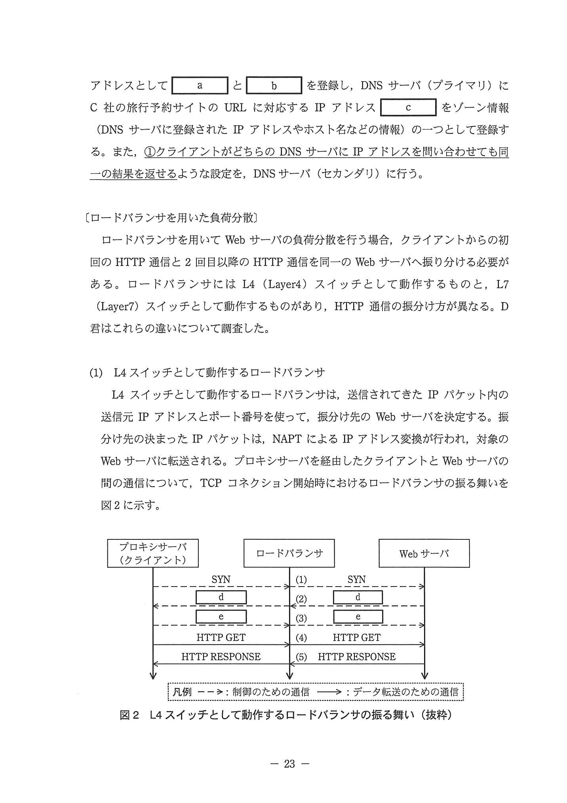

テキスト (OCR)

アドレスとして|  』 |と|  b |を登録し., DNS サーバ (プライマリ) に
C 社の旅行予約サイトの URL に対応する TP アドレス をゾーン情報
(DNS サーバに登録された IP アドレスやホスト名などの情報) のーつとして人次録す
る。また, ①クライアントがどちらの DNS サーバに IP アドレスを問い合わせても同
ーーの結果を返せるような設定を, DNS サーバ (セカンダリ) に行う。

[ロードバランサを用いた負荷分散)
ロードバランサを用いて Web サーバの負荷分散を行う場合 クライアントからの初
回の HTTP 通信と 2 回目以降の HTTP 通信を同一の Web サーバへ振り分ける必要が
ある。ロードバランサには L4 (Layer4) スイッチとして動作するものと, L7
(Layer?) スイッチとして動作するものがあり, HTTP 通信の振分け方が異なる。D
君はこれらの違いについて調査した。

GQ) L4 スイッチとして動作するロードバランサ
L4 スイッチとして動作するロードバランサは, 送信されてきた IP パケット内の
送信元 IP アドレスとポート番号を使って, 振分け先の Web サーバを決定する。振
分け先の決まった IP パケットは, NAPT による IP アドレス変換が行われ, 対象の
Web サーバに転送される。プロキシサーバを経由したクライアントと Web サーバの
間の通信について, TCP コネクション開始時におけるロードバランサの振る舞いを
図 2 に示す。

プロキシサーバ

(ウライアント)           ロードバランサ            Web サーバ

HTTP RESPONSE            (5) HTTP RESPONSE

LAB) ——>: 制御のための通信 —> : データ転送のための通信 |
 2 L4 スイッチとして動作するロードバランサの振る舞い (抜粋)

ー 23 一

### ページ 24

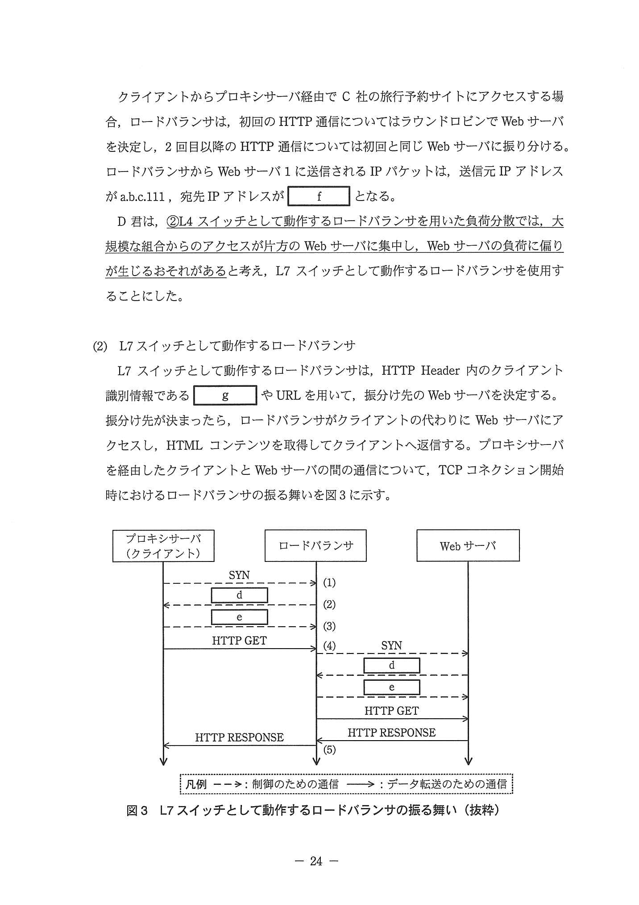

テキスト (OCR)

クライアントからプロキシサーバ経由で C 社の旅行予約サイトにアクセスする場
合, ロードバランサは, 初回の HTTP 通信についてはラウンドロビンで Web サーバ
を決定し, 2 回目以降の HTTP 通信については初回と同じ Web サーバに振り分ける。
ロードバランサから Web サーバ 1 に送信される IP パケットは, 送信元 IP アドレス
がabc11 , WIP RV AML f |となる。

D 君は, ②L4 スイッチとして動作するロードバランサを用いた負荷分散では, 大
規模な組合からのアクセスが片方の Web サーバに集中し, Web サーバの負荷に偏り
が生じるおそれがあると考え, L7 スイッチとして動作するロードバランサを使用す
るにとにした。

⑫) L7 スイッチとして動作するロードバランサ
L7 スイッチとして動作するロードバランサは, HTTP Header 内のクライアント
識別情報である や URL を用いて, 振分け先の Web サーバを決定する。
振分け先が決まったら, ロードバランサがクライアントの代わりに Web サーバにア
クセスし, HTML コンテンツを取得してクライアントへ返信する。プロキシサーバ
を経由したクライアントと Web サーバの間の通信について, TCP コネクション開始
時におけるロードバランサの振る舞いを図 3 に示す。

プロキシサーバ          teens               _
(クライアント)         ロードバパランザ          Web サーバ
| ----- SN.Je
ee ee |
| |LC コ 」
HTTP GET      @     syn
14) SYN 0J
on
| ___da Ee
HTTP GET
HTTP RESPONSE                      HTTP RESPONSE
(5)

1 凡例 ニーヶ: 制御のための通信 —> : データ転送のための通信 |
 3 L7 スイッチとして動作するロードバランサの振る舞い (抜粋)

ー 24 一

### ページ 25

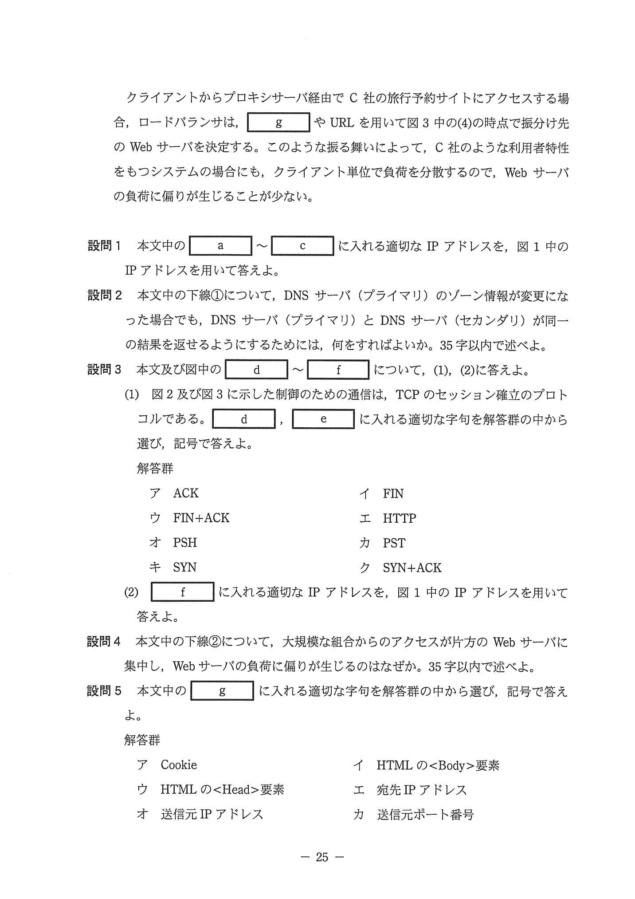

テキスト (OCR)

クライアントからプロキシサーパ経由で C 社の旅行予約サイトにアクセスする場
合, ロードバパランサは, や URL を用いて図 3 中の(④の時点で振分け先
の Web サーバを決定する。このような振る舞いによって, C 社のような利用者特性
をもつシステムの場合にも, クライアント単位で負荷を分散するので, Web サーバ
の負荷に偽りが生じることが少ない。

設問1 本文中の|  a |て|  c |に入れる適切な TP アドレスを, 図 1 中の
IP アドレスを用いて答えよ。

設問2 本文中の下線〇について, DNS サーバ (プライマリ) のゾーン情報が変更にな
った場合でも, DNS サーバ (プライマリ) と DNS サーバ (セカンダリ) が同一
の結果を返せるようにするためには, 何をすればよいか。35 字以内で述べよ。

設問3 本文及び図中の| d |て| fj |について, ©, ②に答えよ。
①) 図2 及び図 3 に示した制御のための通信は, TCP のセッション確立のプロト

コルである。|  d |,|  e |に入れる適切な字句を解答藻の中から
HU, 記号で答えよ。
ARE
ア ACK                 イ FIN
ウ FIN+ACK          <= HTTP
オ PSH            カ PST
キ SYN            ク SYN+ACK
2) に入れる適切な TP アドレスを, 図 1 中の TP アドレスを用いて
答えよ。

設問4 本文中の下線②について, 大規模な組合からのアクセスが片方の Web サーバに
集中し, Web サーバの負荷に偽りが生じるのはなぜか。35 字以内で述べよ。
設問5 本文中の| g | に入れる適切な宇名を解答知の中から選び, 記号で答え

よ。

解答群
ア Cookie                                   イ HTML の<Body>要素
ウ HTML の<Head>要素                 Lo 宛先IP アドレス
A 送信元IP アドレス                  A 送信元ポボート番号

ー 25 一

### ページ 26

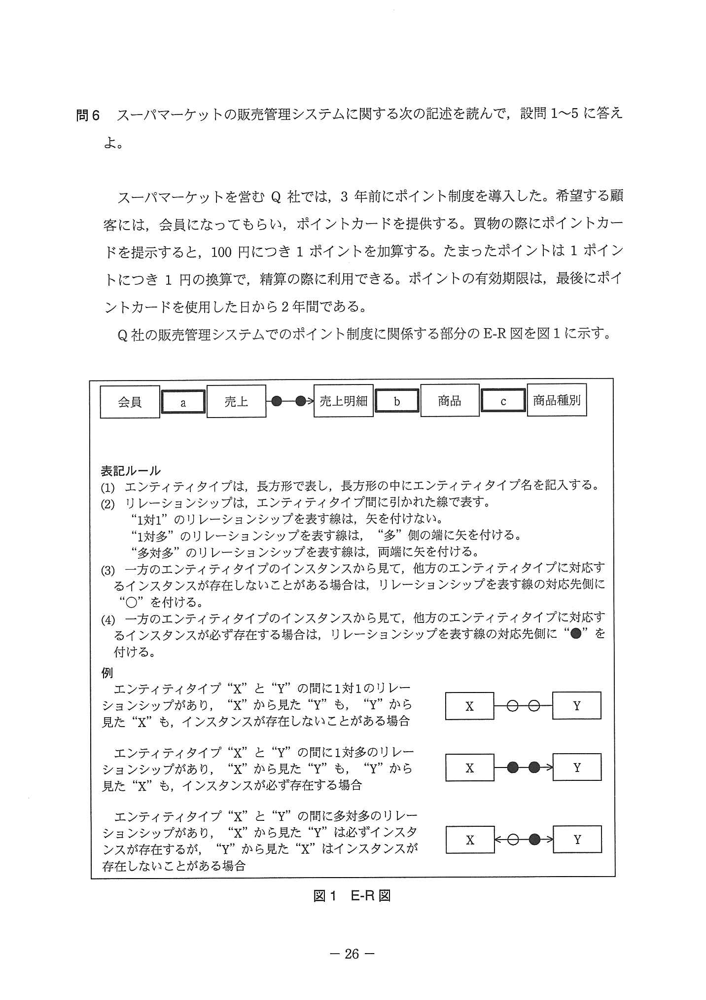

テキスト (OCR)

間6 スーパマーケットの販売管理システムに関する次の記述を読んで, 設問15
よ。

a
oF
aw

スーパマーケットを営む Q 社では, 3 年前にポイント制度を導入した。和希望する顧
客には, 会員になってもらい, ポイントカードを提供する。買物の際にポイントカー
ドを提示すると, 100 円につき 1 ポイントを加算する。たまったポイントは 1 ポイン
トにつき 1 円の換算で, 精算の際に利用できる。ポボイントの有効期限は, 最後にポイ
ントカードを使用した日から 2 年間である。

Q 社の販売管理システムでのボイント制度に関係する部分のE-R 図を図 1 に示す。

会員 | 。 | 売上 |@一@売上明細| b | 商

| 。 |商品種別

Fin

表記ルール
DM エンティティタイプは, 長方形で表し, 長方形の中にエンティティタイプ名を記入する。
Q リレーションシップは, エンティティタイプ間に引かれた線で表す。

“IH” のリレーションシップを表す線は, 矢を付けない。

“1対多"のリレーションシップを表す線は, “多" 側の端に矢を付ける。

“多対多'"のリレーションシップを表す線は, 両端に矢を付ける。

3) 一方のエンティティタイプのインスタンスから見て, 他方のエンティティタイプに対応す
るインスタンスが存在しないことがある場合は リレーションシップを表す線の対応先側に

“〇"を付ける。

(4) 一方のエンティティタイプのインスタンスから見て, 他方のエンティティタイプに対応す
るインスタンスが必ず存在する場合は, リレーションシップを表す線の対応先側に"借" を
付ける。

例
エンティティタイプ SX’ EY” の間に1対1のリレー

ションシップがあり, “KX” Woe “Yb, “VY DS       x            Y

見た YX" も, インスタンスが存在しないことがある場合

①

エンティティタイプ XR” と “Y” の間に1対多のリレー
ションシップがあり, “KX” から見た WY’ も, “VY DS      X | @@> Y
見た XK” も, インスタンスが必ず存在する場合

エンティティタイプ NRE NY” の間に多対多のリレー
ションシップがあり, “X” から見た CY” は必ずインスタ
ンスが存在するが, “Y DORE “X” はインスタンスが    x Fo @_’
存在しないことがある場合

Bi E-R図

ー 26 一

### ページ 27

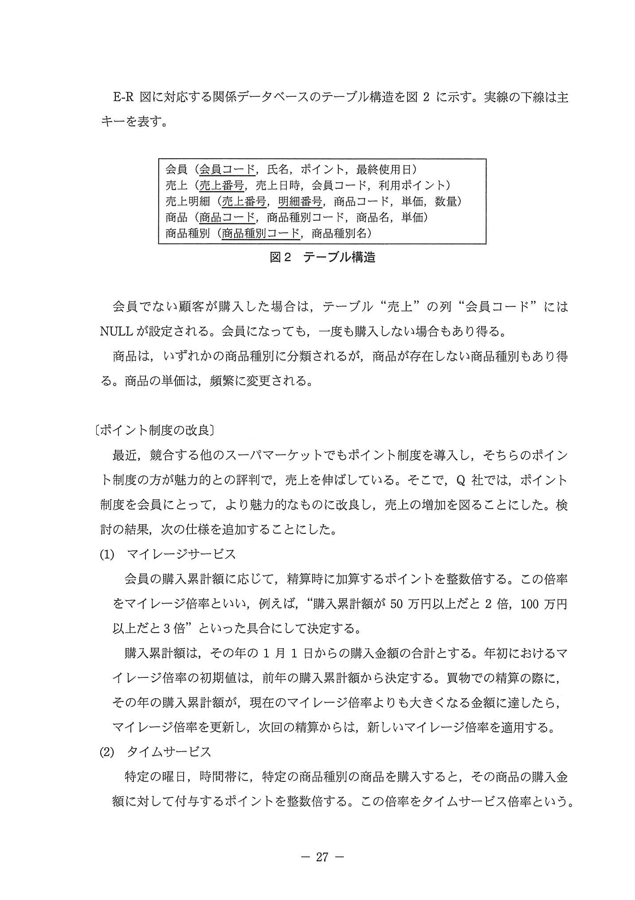

テキスト (OCR)

E-R 図に対応する関係データベースのテーブル構造を図 2 に示す。 実線の下線は主
キーを表す。

会員 (会員コード, 氏名, ポイント, 最終使用日)
売上 (売上番号, 売上日時, 会員コード, 利用ポイント)
売上明細 (売上番号, 明細番号, 商品コード, 単価, 数量)
商品 (商品コード, 商品種別コード, 商品名, 単価)

商品種別 (商品種別コード, 商品種別名
図2 テーブル構造

会員でない顧客が購入した場合は, テーブル “ek” の列 “会員コード” には
NULL が設定される。会員になっても, 一度も購入しない場合もあり得る。

商品は, いずれかの商品種別に分類されるが, 商品が存在しない商品種別もあり得
る。商品の単価は, 頻筐に変更される。

〔ポイント制度の改良
最近, 競合する他のスーパマーケットでもポイント制度を導入し, そちらのポイン
ト制度の方が魅力的との評判で, 売上を伸ばしている。そこで, Q HTS, ポイント
制度を会員にとって, より魅力的なものに改良し, 売上の増加を図ることにした。検
討の結果, 次の仕様を追加することにした。
QM マイレージサービス
会員の購入累計額に応じて, 精算時に加算するポイントを整数倍する。この倍率
をマイレージ倍率といい, 例えば, “購入累計額が 50 万円以上だと 2 倍, 100 万円
以上だと3 倍" といった具合にして決定する。
購入累計額は. その年の 1 月 1 日からの購入金額の合計とする。年初におけるマ
イレージ倍率の初期値は, 前年の購入累計額から決定する。買物での精算の際に,
その年の購入累計額が, 現在のマイレージ倍率よりも大きくなる金額に達したら,
マイレージ倍率を更新し, 次回の精算からは, 新しいマイレージ倍率を適用する。
@) タイムサービス
特定の曜日, 時間帯に, 特定の商品種別の商品を購入すると, その商品の購入金
額に対して付与するポイントを整数倍する。この倍率をタイムサービス倍率という。

ー 27 一

### ページ 28

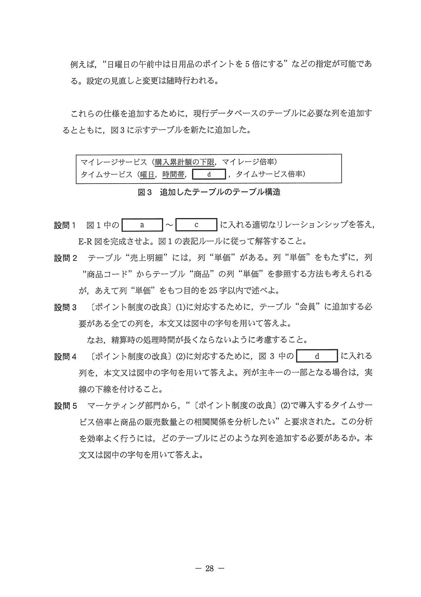

テキスト (OCR)

例えば, “日曜日の午前中は日用品のポイントを 5 倍にする” などの指定が可能であ
る。設定の見直しと変更は随時行われる。

これらの仕様を追加するために, 現行データベースのテーブルに必要な列を追加す
るとともに, 図3 に示すテーブルを新たに追加した。

マイレージサービス (睦入累計額の下限。 マイレージ倍率)
タイムサービス (曜日, eM, [a], タイムサービス倍率

 3 追加したテーブルのテーブル構造

設問1 図1中の| as |~[  c |に入れる適切なりリレーションシップを稚え,
E-R 図を完成させよ。図 1 の表記ルールに従って解答すること。

設問2 テーブル “売上明細" には, 列 “単価" がある。列 “BM” EGET I, 列
"商品コード” からテーブプル “商品” OF "単価" を参照する方法も考えられる
が, あえて列 “単価” をもつ目的を 25 字以内で述べよ。

設問3 〔ポイント制度の改良」 (1①)に対応するために, テーブル “BR” に追加する必
要がある全ての列を, 本文又は図中の字句を用いて答えよ。
なお, 精算時の処理時間が長くならないように考慮すること。

設問4 (ポイント制度の改良]⑫に対応するために, 図 3 中の| d | に入れる
We, 本文又は図中の字人名を用いて答えよ。列が主キーの一部となる場合は, 実
線の下線を付けること。

設問5 マーケティング部門から, “〔ポイント制度の改良} ⑫②で導入するタイムサー
ピス倍率と商品の販売数量との相関関係を分析したい"”と要求された。この分析
を効率よく行うには, どのテーブルにどのような列を追加する必要があるか。本
文又は図中の字句を用いて答えよ。

ー 28 一

### ページ 29

テキスト (OCR)

【 メモ 用 紙 〕

ー 29 一

### ページ 30

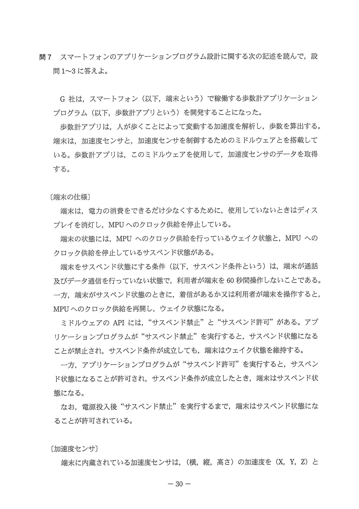

テキスト (OCR)

FIT スマートフォンのアプリケーションプログラム設計に関する次の記述を読んで,
問 1<3 に答えよ。

ae

G 社は, スマートフォン (以下, 端末という) で稼働する歩数計アプリケーション
プログラム (以下, 歩数計アプリという) を開発することになった。

歩数計アプリは, 人が歩くことによって変動する加速度を解析し, 歩数を算出する。
端末は, 加速度センサと, 加速度センサを制御するためのミドルウェアとを搭載して
いる。歩数計アプリは, このミドルウェアを使用して, 加速度センサのデータ を取得
する。

〔端末の仕様〕

端末は, 電力の消費をできるだけ少なくするために, 使用していないときはディス
プレイを消灯し, MPU へのクロック供給を停止している。

端末の状態には, MPU へのクロック供給を行っているウェイク状態と, MPU への
クロック供給を停止しているサスペンド状態がある。

端末をサスペンド状態にする条件 (以下.、サスペンド条件という) は, 端末が通話
及びデータ通信を行っていない状態で, 利用者が端末を 60 秒間操作しないことである。
一方, 端末がサスペンド状態のときに, 着信があるか又は利用者が端末を操作すると,
MPU へのクロック供給を再開し. ウェイク状態になる。

ミドルウェアの API には, “サスペンド禁止” と “サスペンド許可" がある。アプ
リケーションプログラムが“サスペンド禁止" を実行すると, サスペンド状態になる
ことが禁止され, サスペンド条件が成立しても, 端末はウェイク状態を維持する。

一方.アプリケーションプログラムが“サスペンド許可" を実行すると, サスペン
ド状態になることが許可され, サスペンド条件が成立したとき, 端末はサスペンド状
WRIC7ZS.

なお, 電源投入後 “サスペンド禁止” を実行するまで, 端末はサスペンド状態にな
ることが許可されている。

〔加速度センサ〕
端末に内蔵されている加速度センサは, (横, ME BS) の加速度を X, Y, Z) と

ー 30 一

### ページ 31

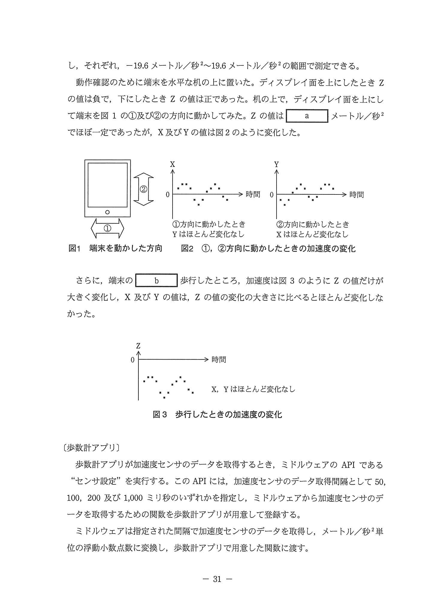

テキスト (OCR)

し, SHEN, 一19.6 メートルノ秒19.6 メートルノ秒?の範囲で測定できる。

動作確認のために端末を水平な机の上に置いた。ディスプレイ面を上にしたとき Z
の値は負で, 下にしたとき Z の値は正であった。机の上で, ディスプレイ面を上にし
て端末を図 1 の①及び②の方向に動かしてみた。 Z の値は| sa | メートルノ秒
でほぼ一定であったが, X 及びY の値は図 2 のように変化した。

x            Y
  J.  ーーーーーー > 時間  iL i
       |”         i
      ①方向に動かしたとき    ②方向に動かしたとき
Y はほとんど変化なレ            X はほとんごど変化なし

図1 端末を勤かした方向 図2 ①, 方向に動かしたときの加速度の変化
さらに, 端末の| b |歩行したところ, 加速度は図 3 のように2Z の値だけが

大きく変化し, X 及び Y の値は, Z の値の交化の大きさに比べるとほとんど変化しな

かった。

時間

X, Y はほとんど変化なし

 3 歩行したときの加速度の変化

(歩数計アプリ〕

歩数計アプリが加速度センサのデータを取得するとき, ミドルウェアの API である

“センサ設定” を実行する。この API には, 加速度センサのデータ取得間隔として 50,
100, 200 及び 1,000 ミリ秒のいずれかを指定し, ミドルウェアから加速度センサのデ
ータを取得するための関数を歩数計アプリが用意して登録する。

ミドルウェアは指定された間隔で加速度センサのデータを取得し, メートルノ秒?単
位の浮動小数点数に変換し, 歩数計アプリで用意した関数に渡す。

ー 31 一

### ページ 32

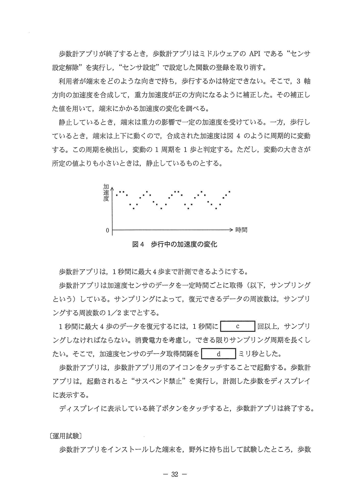

テキスト (OCR)

歩数計アプリが終了するとき, 歩数計アプリはミドルウェアの API である“センサ
設定解除" を実行し“センサ設定" で設定した関数の登録を取り消す。

利用者が端末をどのような向きで持ち, 歩行するかは特定できない。そこで, 3 軸
方向の加速度を合成して, 重力加速度が正の方向になるように補正した。その補正し
た値を用いて, 端末にかかる加速度の変化を調べる。

静止しているとき, 端末は重力の影響で一定の加速度を受けている。 一方, 歩行し
ているとき, 端末は上下に動くので, 合成された加速度は図 4 のように周期的に変動
する。この周期を検出し, 変動の 1 周期を 1 歩と判定する。ただし, 変動の大きさが
所定の値よりも小さいときは, 静止しているものとする。

加
sf.
度

of                                       時間
 4 歩行中の加速度の変化

歩数計アプリは, 1 秒間に最大 4 歩まで計測できるようにする。

歩数計アプリは加速度センサのデータを一定時間ごとに取得 (以下。 サンプリング
EWS) している。サンプリングによって, 復元できるデータの周波数は, サンプリ
ングする周波数の 1/2 までとする。

1 秒間に最大 4 歩のデータを復元するには, 1 秒間 回以上。 サンプリ
ングしなければならない。消費電力を考慮し,。 できる限りサンプリング周期を長くし
EW, SCC, 加速度センサのデータ取得間号を | a | ミリ秒とした.。

歩数計アプリは, 歩数計アプリ用のアイコンをタッチすることで起動する。歩数計
アプリは, 起動されると“サスペンド禁止” を実行し, 計測した歩数をディスプレイ
に表示する。

ディスプレイに表示している終了ポタンをタッチすると, 歩数計アプリは終了する。

(運用試験〕
歩数計アプリをインストールした端末を, 野外に持ち出して試験したところ, 歩数

ー 32 一

### ページ 33

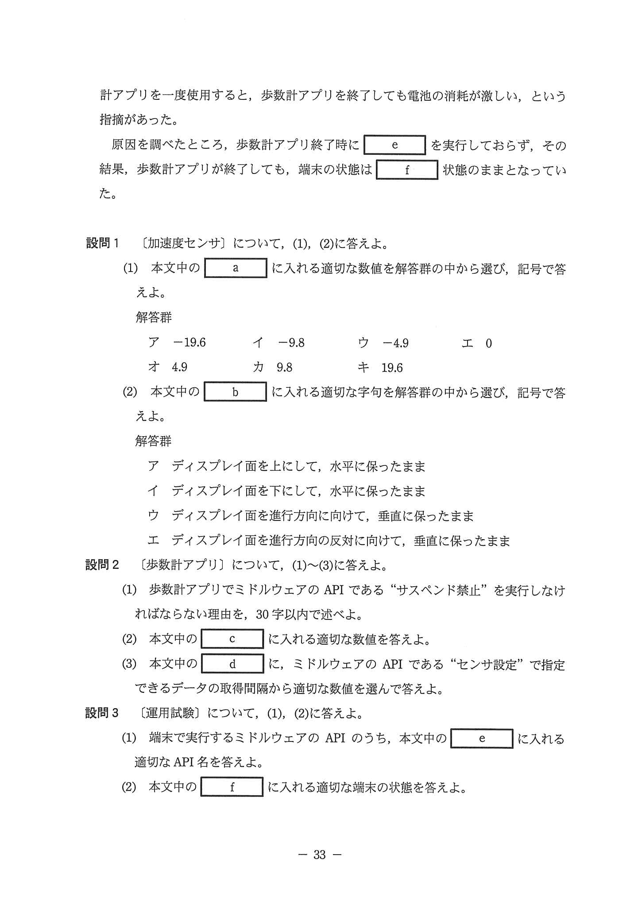

テキスト (OCR)

計アプリを一度使用すると, 歩数計アプリを終了しても電池の消耗が激しい, という
呈岳があった。

原因を調べたところ, 歩数計アプリ終了時に| ce | を実行しておらず, その
結果, 歩数計アプリが終了しても, 端末の状態は| { | 状態のままとなってい
た。

設問 1   〔加速度センサ〕 について, DM, ②)に答えよ。
①) 本文中の| a | に入れる適切な数値を解答惹の中から選び, 記号で答
Eds
ARE
ア 19.6     イ -9.8      ウ —49      エエ 0
オ 4.9     A 9.8     キ 19.6
@ 本文中の[| b |] に入れる適切な宇名を解答群の中から選び,
と
AE
ア ディスプレイ面を上にして, 水平に保ったまま
イ ディスプレイ面を下にして, 水平に保ったまま
ウ ディスプレイ面を進行方向に向けて, 垂直に保ったまま
エ ディスプレイ面を進行方向の反対に向けて, 垂直に保ったまま
設問2 [歩数計アプリ〕 について, ①⑪ぐて(3)に答えよ。
Q) 歩数計アプリでミドルウェアの API である “サスペンド禁止"を実行しなけ
ればならない理由を, 30 FUACRAL
⑫) 本文中の に入れる適切な数値を答えよ。
⑬ 本文中の[| 』 Jit, ミドルウェアの APL である“センサ設定"で指定
できるデータの取得間隔から適切な数値を選んで答えよ。
設問3 [運用試験】 について, ①⑪, ②に答えよ。
Q①) 端末で実行するミドルウェアの API のうち, 本文中の| se |に入れる
適切な API 名を答えよ。
⑫ 本文中の| f |] に入れる適切な端末の状態を答えよ。

cs Ce

oul

ー 33 一

### ページ 34

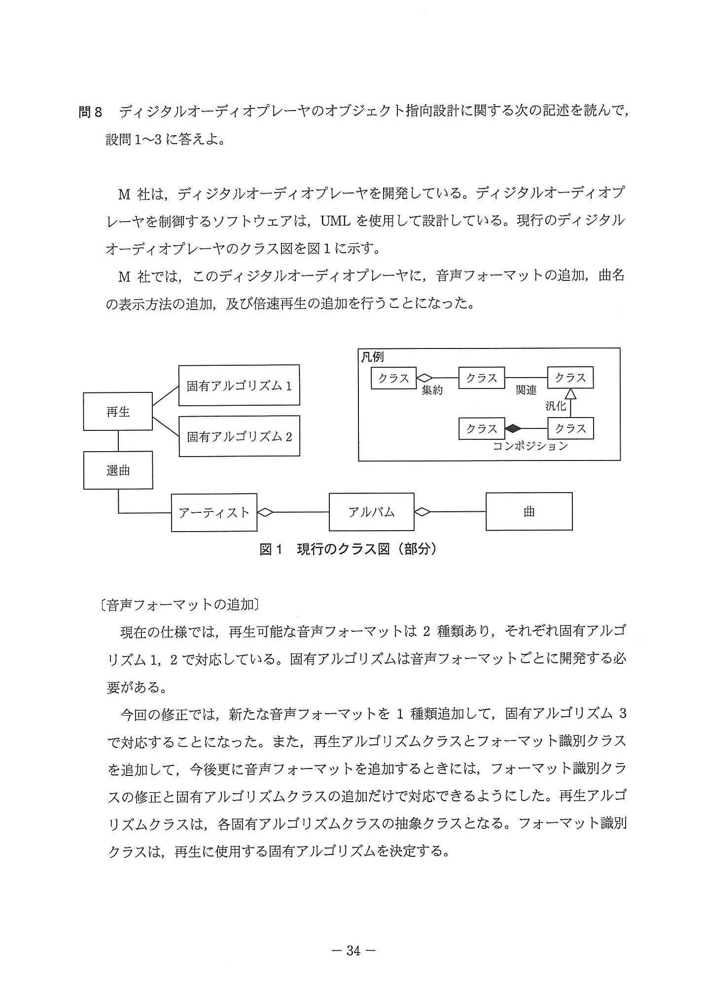

テキスト (OCR)

間8 ディジタルオーディオプレーヤのオブジェクト指向設計に関する次の記述を読んで
設問 1て3 に答えよ。

M 社は, ディジタルオーディオプレーヤを開発している。ディジタルオーディオプ
レーヤを制御するソフトウェアは, UML を使用して設計している。現行のディジタル
オーディオプレーヤのクラス図を図 1 に示す。

M 社では, このディジタルオーディオプレーヤに, 音声フォーマットの追加, 曲名
の表示方法の追加, 及び倍速再生の追加を行うことになった。

凡例
on ee         |2ラぇレー タラトー クラス |
固有アルゴリズム 1                    集約            関連     x
再生                 YE
固有アルゴリズム 2       クタ |e
コンボポジション
選曲
デーティスト ーーーー | FWA にーーーー   Hf

図1 現行のクラス図 (部分)

音声フォーマットの追加〕

現在の仕様では, 再生可能な音声フォーマットは 2 種類あり, それぞれ固有アルゴ
リズム 1, 2 で対応している。 固有アルゴリズムは音声フォーマットごとに開発する必
要がある。

今回の修正では, 新たな音声フォーマットを 1 種類追加して, 固有アルゴリズム 3
で対応することになった。また, 再生アルゴリズムクラスとフォーマット識別クラス
を追加して, 今後更に音声フォーマットを追加するときには, フォーマット識別クラ
スの修正と固有アルゴリズムクラスの追加だけで対応できるようにした。再生アルゴ
リズムクラスは, 各固有アルゴリズムクラスの抽象クラスとなる。フォーマット議別
クラスは, 再生に使用する固有アルゴリズムを決定する。

### ページ 35

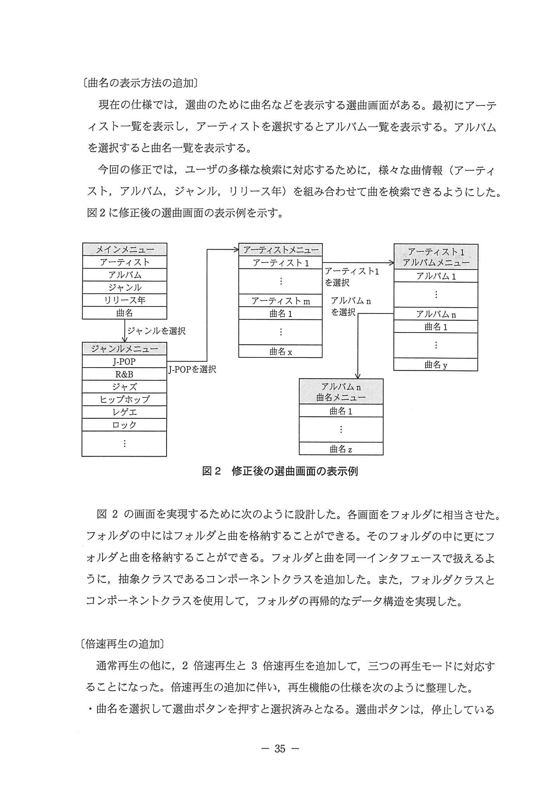

テキスト (OCR)

〔曲名の表示方法の追加〕

現在の仕様では, 選曲のために曲名などを表示する選曲画面がある。最初に
ィスト一覧を表示し, アーティストを選択するとアルバム一覧を表示する。アルバム
を選択すると曲名一覧を表示する。

今回の修正では, ユーザの多様な検索に対応するために, 様々な曲情報 (アーティ
Ak, アルバム, ジャンル, リリース年) を組み合わせて曲を検索できるようにした。
図 2 に修正後の選曲画面の表示例を示す。

レン                     FETA REASSS                     アーティスト1
アーティスト                 アーティスト 1   a    アルバムメニュー
アルバム                                                       wa                  アルバム1
ジャンル                                        ale
リリース年                      アーティストm    アルバムnm
曲名                           曲名1        を選択            アルバムmn
ジャンルを選択                                               曲名1
ジャンルメニュー                      曲名x                            ‘
J-POP             7                                            曲名y
RED        THPOPを選択
ジャズ                                        アルバムmn
ヒップホップ                                    曲名メニュー
レゲエ                                      曲名1
ロック                                         :
曲名2

図2 修正後の選曲画面の表示例

図 2 の画面を実現するために次のように設計した。各画面をフォルダに相当させた。
フォルダの中にはフォルダと曲を格納することができる。そのフォルダの中に
ォルダと曲を格納することができる。フォルダと曲を同一インタフェースで扱えるよ
うに, 抽象クラスであるコンポーネントクラスを追加した。また, フォルダクラスと
コンボーネントクラスを使用して, フォルダの再帰的なデータ構造を実現した。

〔簡速再生の追加
通常再生の他に, 2 倍速再生と 3 倍速再生を追加して, 三つの再生モードに対応す
ることになった。倍速再生の追加に伴い, 再生機能の仕様を次のように整理した。
・曲名を選択して選曲ボタンを押すと選択済みとなる。選曲ボタンは, 停止している

ー 35 一

### ページ 36

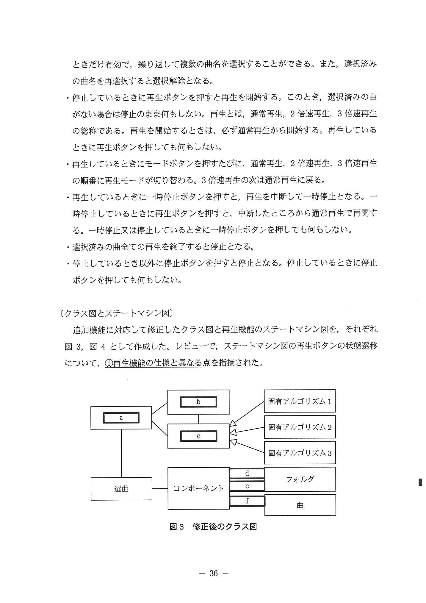

テキスト (OCR)

ときだけ有効で, 繰り返して複数の曲名を選択することができる。また, 選択済み
の曲名を再選択すると選択解除となる。

・停止しているときに再生ボタンを押すと再生を開始する。このとき, 選択済みの曲
がない場合は停止のまま何もしない。再生とは, 通常再生, 2 倍速再生, 3 倍速再生
の総称である。再生を開始するときは, 必ず通常再生から開始する。再生している
ときに再生ボタンを押しても何もしない。

・再生しているときにモードボタンを押すたびに, 通常再生, 2 倍速再生, 3 倍速再生
の順番に再生モードが切り替わる。3 倍速再生の次は通常再生に戻る。

・再生しているときに一時停止ボタンを押すと, 再生を中断して一時停止となる。一
時停止しているときに再生ボタンを押すと, 中断したところから通常再生で再開す
る。一時停止又は停止しているときに一時停止ボタンを押しても何もしない。

・選択済みの曲全ての再生を終了すると停止となる。

・停止しているとき以外に停止ボタンを押すと停止となる。停止しているときに停止
ボタンを押しても何もしない。

〔クラス図とステートマシン図]

追加機能に対応して修正したクラス図と再生機能のステートマシン図を, それぞれ
図 3 図 4 として作成した。レビューで, ステートマシン図の再生ボタンの状態想移
について, ①再生機能の仕様と異なる点を指摘された。

固有アルゴリズム 1

レーーーー] 固有アルゴリズム2
es | 固有アルゴリズム 3
d
e
f

5
|

フォルダ

選曲                 コンボーネント

曲

図3 修正後のクラス図

ー 36 一

### ページ 37

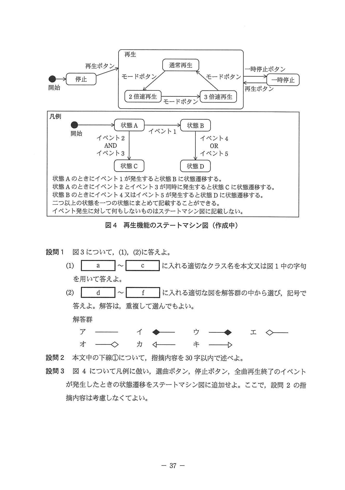

テキスト (OCR)

一時停止ボタン
再生ボタン

イベント 4
OR
イベント5

状態D

状態4のときにイベント 1 が発生すると状態 B に状態遷移する。

状態4のときにイベント 2 とイベント 3 が同時に発生すると状態 C に状態遷移する。
状態Bのときにイベント 4又はイベント 5 が発生すると状態 D に状態遷移する。

二つ以上の状態を一つの状態にまとめて記載することができる。

イベント発生に対して何ちしないものはステートマシン図に記載しない。

図4 再生機能のステートマシン図 (作成中)

設問1 図3について, ①⑪, ②)に答えよ。
@ | 3 |て| < | に入れる適切なクラス名を本文又は図 1 Hoey

を用いて答えよ。
@ | a |て| fj | に入れる適切な図を解答群の中から選び, 記号で
答えよ。解答は, 重複して選んでもよい。
BER
7 — 4 @— ウー@ xc o—

PFS ぁみ を

設問2 本文中の下線①について, 指摘内容を 30 字以内で述べよ。

設問3 図 COW TAMIR, 選曲ボタン, 停止ボタン, 全曲再生終了のイベント
が発生したときの状態析移をステートマシン図に追加せよ。ここで, 設問 2 OF
摘内容は考慮しなくてよい。

ー 37 一

### ページ 38

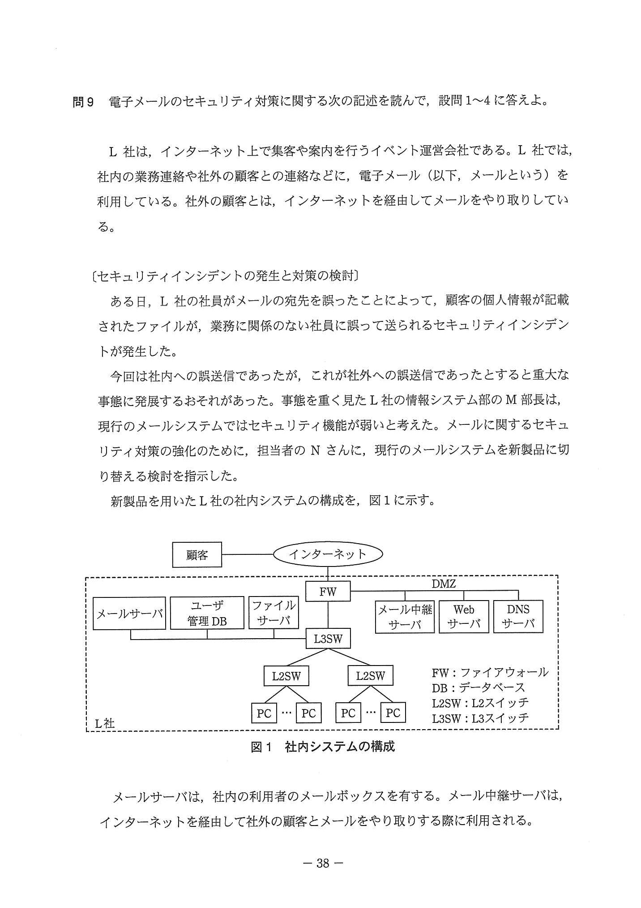

テキスト (OCR)

問9 電子メールのセキュリティ対策に関する次の記述を読んで, 設問 14 に答えよ。

L 社は, インターネット上で集客や案内を行うイベント運営会社である。L 社では,
社内の業務連絡や社外の顧客との連絡などに, 電子メール (以下, メールという) を
利用している。社外の顧客とは, インターネットを経由してメールをやり取りしてい
る。

〔セキュリティインシデントの発生と対策の検討]
ある日, L 社の社員がメールの宛先を誤ったことによって, 顧客の個人情報が記載
されたファイルが, 業務に関係のない社員に誤って送られるセキュリティインシデン
トが発生した。
今回は社内への誤送信であったが, これが社外への誤送信であったとすると重大な
事態に発展するおそれがあった。事態を重く見たL 社の情報システム部の M 部長は,
現行のメールシステムではセキュリティ機能が弱いと考えた。メールに関するセキュ
リティ対策の強化のために, 担当者の N さんに, 現行のメールシステムを新製品に切
OPA SRN SHALE.
新製品を用いたL 社の社内システムの構成を, 図1 に示す。

a reevesDMZ _ |
:                                             |              |             Lj

ューザ ||ファイル

メールサーバ                            、                    メール中継|| Web       DNS      !
             人                      gon | サーバ |サーバ| |

FW: ファイアウォール |

DB : データベース  !

L2SW : L2スイッチ |

Lit                                                                       L3SW : 3スイッチ |

メールサーバは, 社内の利用者のメールボックスを有する。メール中継サーバは,
インターネットを経由して社外の顧客とメールをやり取りする際に利用される。

ー 38 一

### ページ 39

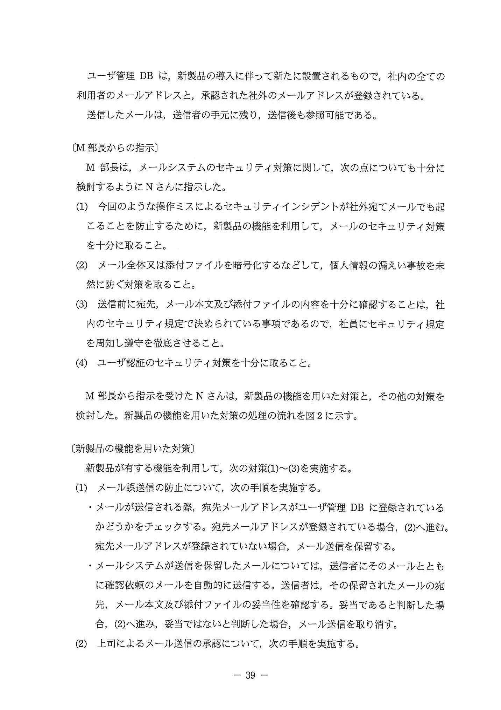

テキスト (OCR)

ユーザ管理 DB は, 新製品の導入に伴って新たに設置されるもので, 社内の全ての
利用者のメールアドレスと, 承認された社外のメールアドレスが登録されている。
送信したメールは, 送信者の手元に残り, 送信後も参照可能である。

(M BEDS OFA)

M 部長は, メールシステムのセキュリティ対策に関して, 次の点についても十分に
検討するように N さんに指示した。

① 今回のような操作ミスによるセキュリティインシデントが社外宛てメールでも起
こることを防止するために, 新製品の機能を利用して, メールのセキュリティ対策
を十分に取ること。

(2) メール全体又は添付ファイルを暗号化するなどして, 個人情報の漏えい事故を未
然に防ぐ対策を取ること。

(3) 送信前に宛先, メール本文及び添付ファイルの内容を十分に確認することは, 社
内のセキュリティ規定で決められている事項であるので, 社員にセキュリティ規定
を周知し遵守を徹底させること。

(④ ユーザ認証のセキュリティ対策を十分に取ること。

M 部長から指示を受けた N さんは, 新製品の機能を用いた対策と, その他の対策を
検討した。新製品の機能を用いた対策の処理の流れを図 2 に示す。

〔新製品の機能を用いた対策〕
新製品が有する機能を利用して, 次の対策(①て(3)を実施する。
GQ) メール誤送信の防止について, 次の手順を実施する。

・メールが送信される際, 宛先メールアドレスがユーザ管理 DB に登録されている
かどうかをチェックする。爺先メールアドレスが登録されている場合, (2)へ進む。
宛先メールアドレスが登録されていない場合, メール送信を保留する。

・メールシステムが送信を保留したメールについては, 送信者にそのメールととも
に確認依頼のメールを自動的に送信する。送信者は, その保留されたメールの宛
Fi, メール本文及び添付ファイルの妥当性を確認する。妥当であると判断した場
合, ②へ進み, 妥当ではないと判断した場合, メール送信を取り消す。

(2) 上司によるメール送信の承認について, 次の手順を実施する。

### ページ 40

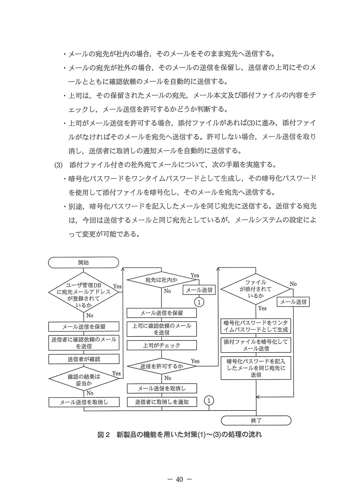

テキスト (OCR)

(3)

・メールの宛先が社内の場合 、そのメールをそのまま宛先へ送信する。
・メールの宛先が社外の場合、そのメールの送信を保留し, 送信者の上司にそのメ

ールとともに確認依頼のメールを自動的に送信する。

・上司は, その保留されたメールの宛先。 メール本文及び添付ファイルの内容をチ

エックし, メール送信を許可するかどうか判断する。

・上司がメール送信を許可する場合, 添付ファイルがあれば(3に進み, 添付ファイ

ルがなければそのメールを施先へ送信する。 許可しない場合, メール送信を取り
消し, 送信者に取消しの通知メールを自動的に送信する。
添付ファイル付きの社外宛てメールについて, 次の手順を実施する。

・暗号化パスワードをワンタイムパスワードとして生成し, その暗号化パスワード

を使用して添付ファイルを暗号化し, そのメールを克先へ送信する。

・別途, 暗号化パスワードを記入したメールを同じ宛先に送信する。送信する宛先

は, 今回は送信するメールと同じ宛先としているが, メールシステムの設定によ
って変更が可能である。

に宛先メールアドレス

ファイル
が添付されて
いるか

ユーザ管理DB へ、 Yes                                                                                     No

WERENT
いるか

No

メー人ル送信
Yes

メール送信を保留

ーー         —    ー       WEIENAV— REDD
| メール信を保訴 |  ie aeled      イムパスワードとして生成

i
ESSER A— Ih    | mwsyク2 |           振付ファイルを呈号化して
を送信                     上司がチェック                          メール送信
I
送信者が確認

暗号化パスワードを記入
したメールを同じ宛先に

Ye:
送信を許可するか

確認の結果は                             No                                    送信
妥当か            ae
IE EBL
No
| メール送信を取消し | | 送信者に取消しを通知 | @
【                               I
終了

図2 新製品の機能を用いた対策(1)て(3)の処理の流れ

### ページ 41

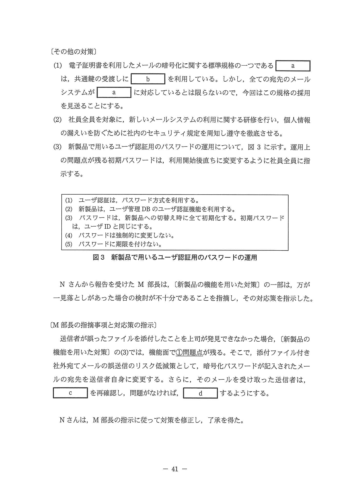

テキスト (OCR)

(その他の対策)

(①) 電子証明書を利用したメールの暗号化に関する標準規格の一つである|  a |
は, 共通負の受渡しに| b | を利用している。しかし, 全ての宛先のメール
システムが|  a | に対応しているとは限らないので, 今回はこの規格の採用
を見送ることにする。

@) 社員全員を対象に。 新しいメールシステムの利用に関する研修を行い, 個人情報
の漏えいを防ぐために社内のセキュリティ規定を周知し遵守を徹底させる。

3) 新製品で用いるユーザ認証用のパスワードの運用について, 図 3 に示す。運用上
の問題点が残る初期パスワードは, 利用開始後直ちに変更するように社員全員に指
示する。

(1) ユーザ認証は, パスワード方式を利用する。

(2) 新製品は, ユーザ管理 DB のユーザ認証機能を利用する。

3) パスワードは, 新製品への切替え時に全て初期化する。初期パスワード
は, ユーザ ID と同じにする。

4) パスワードはは纏制的に変更しない。

(5) パスワードに期限を付けない。

 3 新製品で用いるユーザ認証用のパスワードの運用

N さんから報告を受けた M 部長は, 〔新製品の機能を用いた対策〕 の一部は, 万が
一見落としがあった場合の検討が不十分であることとを指摘し, その対応策を指示した。

〔M 部長の指摘事項と対応策の指示〕

送信者が誤ったファイルを添付したことを上司が発見できなかった場合, 〔新製品の
機能を用いた対策] の(3では, 機能面で①問題点が残る。そこで, 添付ファイル付き
社外宛てメールの誤送信のリスク低減策として, 暗号化パスワードが記入されたメー
ルの爺先を送信者自身に変更する。さらに, そのメールを受け取った送信者は,

| < | を再稚認し, 問題がなければ, | q | するようにする。

N さんは, M 部長の指示に従って対策を修正し, 了承を得た。

ー 41 一

### ページ 42

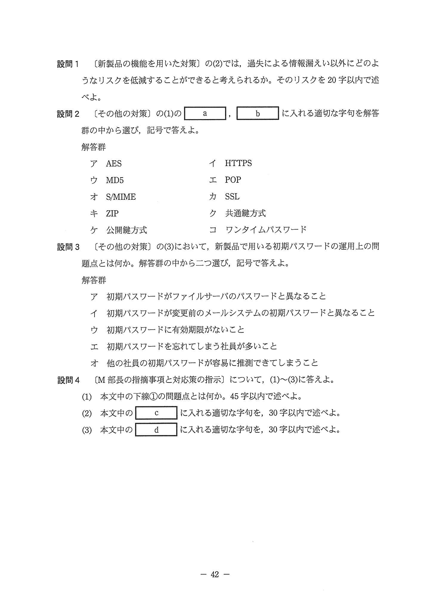

テキスト (OCR)

設問1 〔新製品の機能を用いた対策〕] の(2②)では, 過失による情報漏えい以外にどのよ
うなリスクを低減することができると考えられるか。そのリスクを 20 字以内で述

べよ。
設問2 〔その他の対策] の①の|  a |,|  b | に入れる適切な字句を解答
群の中から選び, 記号で答えよ。
解答群
ア AES          イ HTTPS
ウ MD5          x POP
オ S/MIME        wv SSL
ZIP           ク 共通鍵方式
ケ 公開鍵方式        コ ワンタイムパスワード

設問3 (その他の対策] の(3)において, 新製品で用いる初期パスワードの運用上の問
題点とは何か。解答群の中から二つ選び, 記号で答えよ。
解答攻
ア 初期パスワードがファイルサーバのパスワードと異なること
イ 初期パスワードが変更前のメールシステムの初期パスワードと異なること
ウ 初期パスワードに有効期限がないこと
エ 初期パスワードを忘れてしまう社員が多いこと
A 他の社員の初期パスワードが容易に推測できてしまうこと
設問4  〔M 部長の指摘事項と対応策の指示] について, ①~(⑬に答えよ。
Q) 本文中の下線①の問題点とは何か。45 字以内で述べよ。
@ 本文中の| c< | に入れる適切な字句を, 30字以内で述べよ。
⑬ 本文中の| d | に入れる適切な字句を, 30字以内で述べよ。

ー 42 一

### ページ 43

テキスト (OCR)

CA モ 用 紙 J

### ページ 44

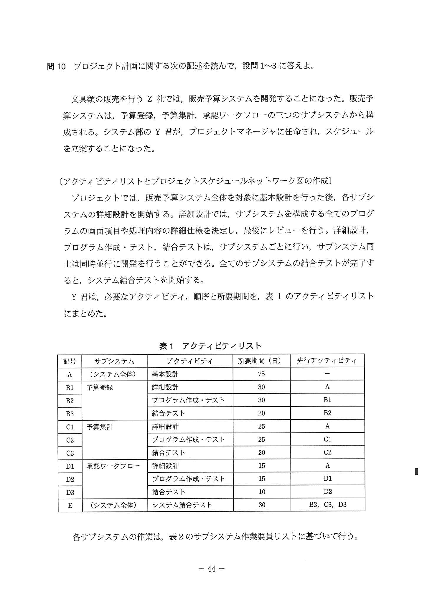

テキスト (OCR)

問10 プロジェクト計画に関する次の記述を読んで, 設問 13 に答えよ。

文具類の販売を行う Z 社では, 販売予算システムを開発することになった。販売予
算システムは, 予算登録, 予算集計, 承認ワークフローの三つのサブシステムから構
成される。システム部の Y BW, プロジェクトマネージャに任命され, スケジュール
を立案することになった。

[アクティビティリストとプロジェクトスケジュールネットワーク図の作成〕

プロジェクトでは, 販売予算システム全体を対象に基本設計を行った後, 各サブシ
ステムの詳細設計を開始する。詳細設計では, サブシステムを構成する全てのプログ
ラムの画面項目や処理内容の詳細仕様を決定し, 最後にレビューを行う。詳細設計,
プログラム作成・テスト, 結合テストは, サブシステムごとに行い、サブシステム同

士は同時並行に開発を行うことができる。全てのサブシステムの結合テストが完了す
ると, システム結合テストを開始する。

Y 君は, 必要なアクティビティ, 順序と所要期間を, 表 1 のアクティビティリスト
にまとめた。

表1 アクティビティリスト

記号    サブシステム       アクティビティ     所要期間 (日)    先行アクティビティ
A      (システム全体)      基本設計                            75                     ー

Bl | 予算登録             詳細設衣                            30                     A

B2                           プログラム作成・テスト            30                    B1

B3                        結合テスト                       20                  B2

C1 | 予算集計             EMRE                            25                     A

C2                          プログラム作成・テスト           25                   C1

C3                           結合テスト                         20                    C2

D1 | 承認ワークフロー | 詳細設計                           15                     A

D2                 プログラム作成・テスト       15             D1

D3                           結合テスト                         10                    D2

E       (システム全体)      システム結合テスト                30               B3, C3, D3

各サブシステムの作業は, 表2 のサブシステム作業要員リストに基づいて行う。

ー 44 一

### ページ 45

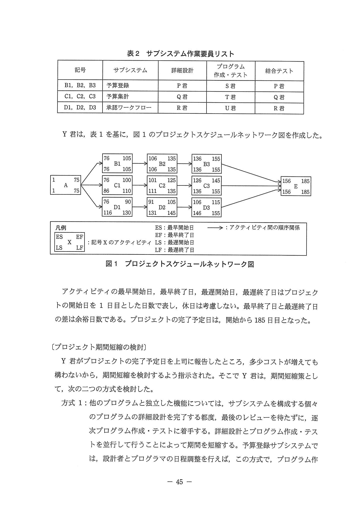

テキスト (OCR)

表2 サブプシステム作業要員リスト

ms     サブシステム    mame | フロクラム | werzh
Bl, B2, B3 | 予算登録           Pa         sa         Pa
Cl, C2, 3 | 5算集計        Qa      TS      Qe
D1, D2, D3 | 承認ワークフロー      Re         Us         RA

Y Ald, 表 1 を基に, 図 1 のプロジェクトスケジュールネットワーク図を作成した。

76 105          106 135          136 155
Bl                      B2                      B3
76 105          106 135          196 155
1           75              76 100          101 125          126 145                                    156 185
A                           C1                      C2                      C3                                                E
1           75              86 110          111 。 135          136 155                                    156 185
76         90          91 105          106 115
D1                      D2                      D3
116 130          1831 145          146 155
凡例                        ES : 最早開始日    ーーテテ : アクティビティ間の順序関係
ES EF                                         EF: 最早終了日
x    : 記号X のアクティビティ LS : 最遅開始日
is LF                                         LF : 最遅終了日

図1 プロジェクトスケジュールネットワーク図

アクティビティの最早開始日, 最早終了日, 最遅開始日, 最遅終了日はプロジェク
トの開始日を 1 日目とした日数で表し, 休日は考慮しない。最早終了日と最遅終了日
の差は余裕日数である。プロジェクトの完了予定日は, 開始から 185 日目となった。

〔プロジェクト期間短縮の検討
Y 君がプロジェクトの完了予定日を上司に報告したところ, 多少コストが増えても
構わないから, 期間短縮を検討するよう指示された。そこで Y Ald, 期間短縮策とし
て, 次の二つの方式を検討した。
方式 1 : 他のプログラムと独立した機能<ついては, サブシステムを構成する個々
のプログラムの詳細設計を完了する都度, 最後のレビューを待たずに, B
次プログラム作成・テストに着手する。詳細設計とプログラム作成・テス
トを並行して行うことによって期間を短縮する。予算意録サブシステムで
は, 設計者とプログラマの日程調整を行えば, この方式で, プログラム作

ー 45 一

### ページ 46

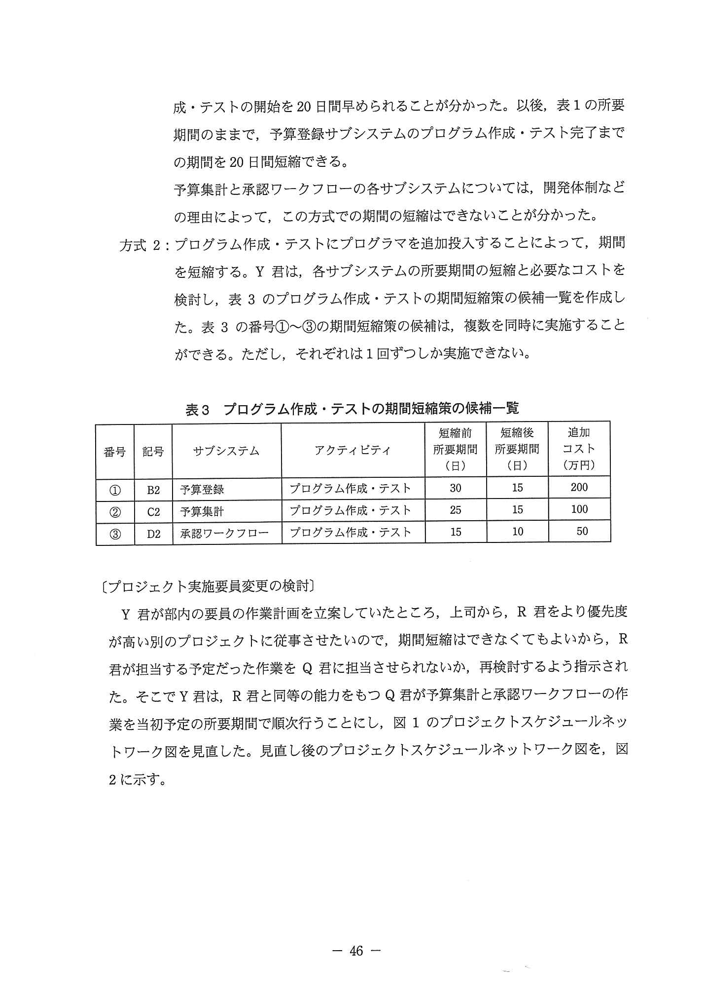

テキスト (OCR)

方式 2:

成・テストの開始を 20 日間早められることが分かった。以後, 表 1 OMB
期間のままで, 予算登録サブシステムのプログラム作成・テスト完了まで
の期間を 20 日間短縮できる。

予算集計と承認ワークフローの各サブシステムについては, 開発体制など
の理由によって, この方式での期間の短縮はできないことが分かった。
プログラム作成・テストにプログラマを追加投入することによって, 期間
を短縮する。Y Bld, 各サブシステムの所要期間の短縮と必要なコストを
BAL, 表 3 のプログラム作成・テストの期間短縮策の候補一覧を作成し
た。表 3 の番号①〇て⑨の期間短縮策の候補は, 複数を同時に実施すること
ができる。ただし, それぞれは 1 回ずつしか実施できない。

表3 プログラム作成・テストの期間短縮策の候補一覧

短縮前     短縮後      追加
番号 | 記号     サブプシステム         VOTRE       所要期間 | 所要期間    コスト
(日)       (日)      (万円)

① | B2 | 予算登録          プログラム作成・テスト      30        15        200
@    C2 | 予算集計          プログラム作成・テスト      25        15        100
⑧ | D2 | 承認ワークフロー | プログラム作成・テスト      15        10        50

[プロジェクト実施要員変更の検討]

Y 君が部内の要員の作業計画を立案していたところ, 上司から, R 君をより優先度
が高い別のプロジェクトに従事させたいので, 期間短縮はできなくてもよいから, R
君が担当する予定だった作業を Q 君に担当させられないか, 再検討するよう指示され
た。そこでY RU, R 君と同等の能力をもつ Q 君が予算集計と承認ワークフローの作
業を当初予定の所要期間で順次行うことにし, 図 1 のプロジェクトスケジュールネッ
トワーク図を見直した。見直し後のプロジェクトスケジュールネットワーク図を, 図
2 に示す。

ー 46 一

### ページ 47

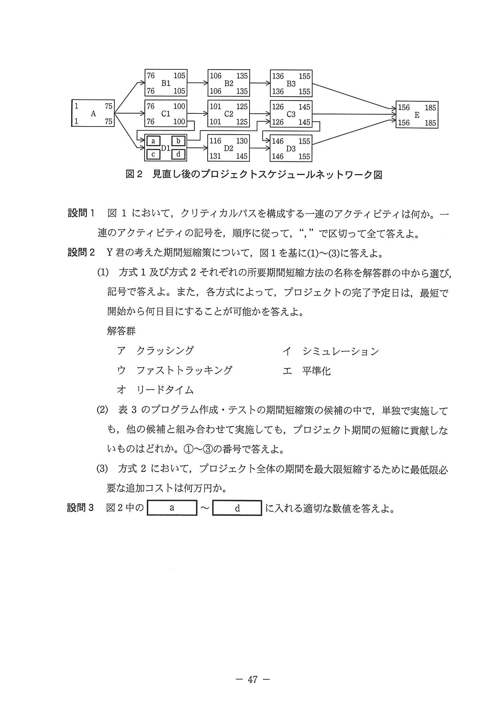

テキスト (OCR)

76        105          106 135          136 155

BL                      B2                      B3
76 105          106 185          136 155 リー
1           75              76 100          101 125          126 145                                    156 185
A                           C1                      C2                      C3                                                 E
1          75            76 100 LOL 12し26 145 ロレーーの 156 185
Ly ff] Bl I! fixe sl “fae ase

fla       1a1 1       46” 155
図2 見直し後のプロジェクトスケジュールネットワーク図

設問1 図 1 において, クリティカルパスを構成する一連のアクティビティは何か。一
連のアクティビティの記号を, 順序に従って, “,” で区切って全て答えよ。
設問2 Y君の考えた期間短縮策について, 図 1 を基に(1)て3)に答えよ。
Q 方式1 及び方式 2 それぞれの所要期間短縮方法の名称を解答群の中から選び,
記号で答えよ。また, 各方式によって, プロジェクトの完了予定日は, 最短で
開始から何日目こすることが可能かを答えよ。

解答群
ア クラッシング             イ シミュレーション
ウ ファストトラッキング        エ 平準化
オ リードタイム

(②) 表 3 のプログラム作成・テストの期間短縮策の候補の中で, 単独で実施して
も, 他の候補と組み合わせて実施しても, プロジェクト期間の短縮に貢献しな
いものはどれか。①て⑨③の番号で答えよ。
⑬) 方式 2 において, プロジェクト全体の期間を最大限短縮するために最低限必
要な追加コストは何万円か。
設問3 図2中の| ai |て|  d |に入れる適切な数値を答えよ。

ー 47 一

### ページ 48

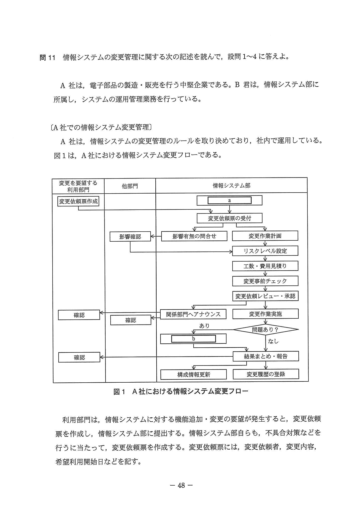

テキスト (OCR)

Ail 情報システムの変更管理に関する次の記述を読んで, 設問 14 に答えよ。

A 社は, 電子部品の製造・販売を行う中堅企業である。B Als, 情報システム部に
所属し, システムの運用管理業務を行っている。

〔A 社での情報システム変更管理
A 社は, 情報システムの変更管理のルールを取り決めており, 社内で運用している。
図 1 は, A社における情報システム変更フローである。

ae  他部門      情報システム部
| venue kト| 形響有無の問合せ | | 交更作業計画 |

リスクレベル設定

工数・費用見積り

変更事前チェック

変更依頼レビュー・承認

確認 ド | 関係郡門ヘアナウンス | | 変更作業実施 。 |
Bo        問題あり?
なし

結果まとめ・報告

| 構成情報更新 | | 変更展歴の登録

 1 A社における情報システム変更フロー

利用部門は, 情報システムに対する機能追加・変更の要望が発生すると, 変更依頼
京を作成し, 情報システム部に提出する。情報システム部自らも, 不具合対策などを
行うに当たって, 変更依頼票を作成する。変更依頼京には, 変更依頼者, 変更内容,
希望利用開始日などを記す。

### ページ 49

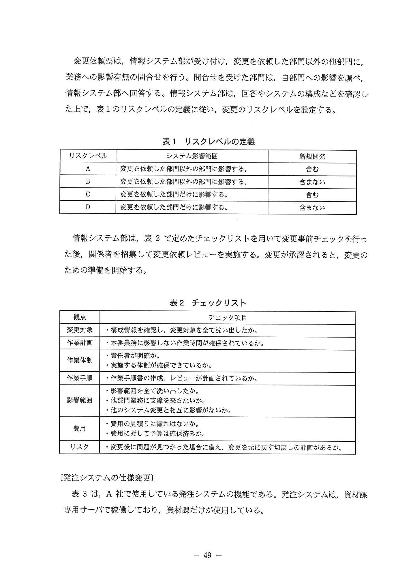

テキスト (OCR)

変更依頼票は, 情報システム部が受け付け, 変更を依頼した部門以外の他部門に,
業務への影響有無の問合せを行う。問合せを受けた部門は, 自部門への影響を調べ,
情報システム部へ回答する。情報システム部は, 回答やシステムの構成などを確認し
KET, 表1 のリスクレベルの定義に従い, 変更のりリスクレベルを設定する。

表1 リスクレベルの定義

リスクレベル                 VAT DPB                        新規開発
A           変更を依頼した部門以外の部門に影響する。                     含む
B           変更を依頼した部門以外の部門に影響する。                   含まない
C            変更を依頼した部門だけに影響する。                               含む
D        変更を依頼した部門だけに影響する。                   含まない

情報システム部は, 表 2 で定めたチェックリストを用いて変更事前チェックを行っ
た後, 関係者を招集して変更依頼レビューを実施する。変更が承認されると, 変更の
ための準備を開始する。

表2 チェックリスト

観点                                                             チェック項目
変更対象 | ・構成情報を確認し, 変更対象を全て洗い出したか。
作業計画 | ・本番業務に影響しない作業時間が稚保されているか。

・ 責任者が明確か。
・実施する体制が確保できているか。

作業体制

作業手順 | ・作業手順書の作成, レビューが計画されているか。

・影響範囲を全て洗い出したか。
影響範囲 | ・他部門業務に支障を来さないか。
・他のシステム変更と相互に影響がないか。

・費用の見積りに漏れはないか。
・ 費用に対して予算は確保済みか。

リスク      ・ 変更後に問題が見つかった場合に備え, 変更を元に戻す切戻しの計画があるか。

費用

〔発注システムの仕様変更]
表 3 は, A 社で使用している発注システムの機能である。発注システムは, AME
専用サーバで稼働しており, 資材斉だけが使用している。

ー 49 一

### ページ 50

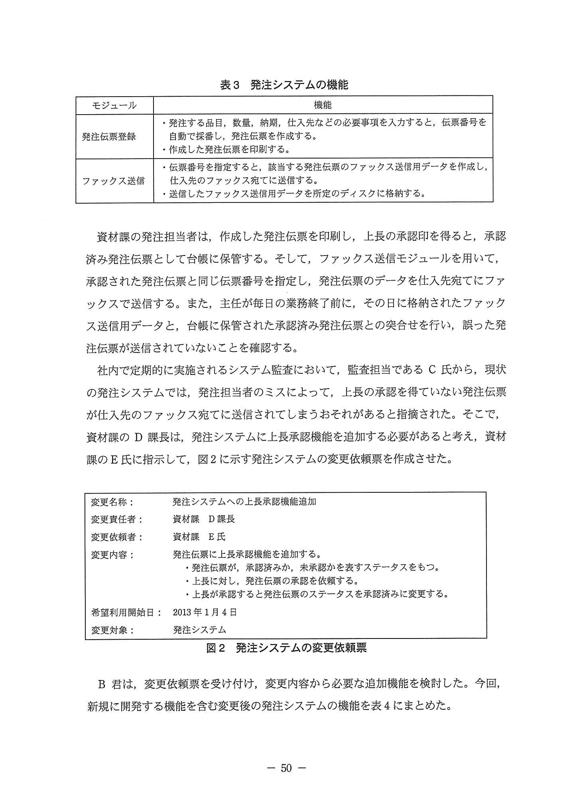

テキスト (OCR)

表3 発注システムの機能

モジュール                                             機能

・発注する品目, 数量, 納期,仕入先などの必要事項を入力すると, 伝票番号を
発注伝票登録     自動で採番し, 発注伝票を作成する。
・作成した発注伝票を印刷する。

・伝票番号を指定すると, 該当する発注伝票のファックス送信用データを作成し,
ファックス送信     仕入先のファックス宛てに送信する。
・送信したファックス送信用データを所定のディスクに格納する。

資材課の発注担当者は, 作成した発注伝票を印刷し, 上長の承認印を得ると, 承認
済み発注伝票として台帳に保管する。そして, ファックス送信モジュールを用いて
承認された発注伝票と同じ伝票番号を指定し, 発注伝票のデータを仕入先宛てにファ
ックスで送信する。また, 主任が毎日の業務終了前に, その日に格納されたファック
ス送信用データと, 台帳に保管された承認済み発注伝票との突合せを行い, 誤った発
注伝票が送信されていないことを確認する。

社内で定期的に実施されるシステム監査において, 監査担当である C 氏から, 現状
の発注システムでは, 発注担当者のミスによって, 上長の承認を得ていない発注伝票
が仕入先のファックス宛てに送信されてしまうおそれがあると指摘された。そこで,
資材課の D 課長は, 発注システムに上長承認機能を追加する必要があると考え, 資材
ROE 氏に指示して, 図2 に示す発注システムの変更依頼票を作成させた。

変更名称 :         発注システムへの上長承認機能追加
変更資任者 :       資材課 D課長

変更依頼者 :        BM ER

変更内容 :         発注伝団に上長承認機能を追加する。

・発注伝票が, 承認済みか, 未承認かを表すステータスをもつ。
・上長に対し, 発注伝票の承認を依頼する。
・上長が承認すると発注伝票のステータスを承認済みに変更する。

希望利用開始日: 2013年1月4日
変更対象 :        発注システム
図2 発注システムの変更依頼票

B Ald, 変更依頼票を受け付け, 変更内容から必要な追加機能を検討した。今回,
新規に開発する機能を含む変更後の発注システムの機能を表4 にまとめた。

ー 50 一

### ページ 51

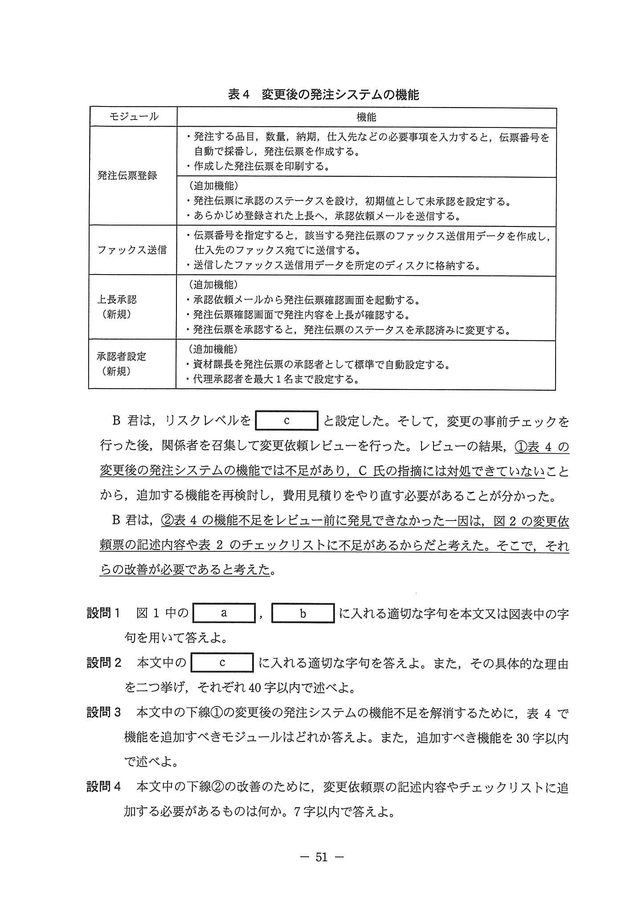

テキスト (OCR)

表4 変更後の発注システムの機能
ジュール                                             機能
・ 発注する品目, 数量, WH, 仕入先などの必要事項を入力すると, 伝票番号を
自動で採番し, 発注伝票を作成する。
・作成した発注伝票を印刷する。
(追加機能)
・ 発注伝票に承認のステータスを設け, 初期値として未承認を設定する。
・あらかじめ登録された上長へ, 承認依頼メールを送信する。
・伝票番号を指定すると, 該当する発注伝団のファックス送信用データを作成し
ファックス送信   仕入先のファックス宛てに送信する。
・送信したファックス送信用データを所定のディスクに格納する。

発注伝票登録

(追加失態
Ese    RRMA) SEM STS
(新規)    ・発注人確認画面で発注内容を上長が確認する。
・発注伝票を承認すると, 発注伝票のステータスを承認済みに変更する。
ーー            (追加機能
7   . SHEER RROREHL LURE CAMRETS.
・代理承認者を最大 1 名まで設定する。

Bat, リスクレベルを|  c  ] と設定した。そして, 変更の事前チェックを
行った後, 関係者を召集して変更依頼レビューを行った。レビューの結果, OF 4 の
変更後の発注システムの機能では不足があり, C 氏の指摘には対各できていないこと
DS, 追加する機能を再検討し, 費用見積りをやり直す必要があることが分かった。

B 君は, OX 4 の機能不足をレビュー前に発見できなかった一因は, 図 2 の変更依
頼票の記述内容や表 2 のチェックリストに不足があるからだと考えた。そこで, それ
らの改善が必要であると考えた。

設問1 図1中の| a |,|  b |に入れる適切な字句を本文又は図表中の字
旬を用いて答えよ。

設問2 本文中の| c | に入れる適切な字句を答えよ。また, その具体的な理由
を二つ挙げび, それぞれ40 字以内で述べよ。

設問3 本文中の下線①の変更後の発注システムの機能不足を解消するために, 表 4 で
機能を追加すべきモジュールはどれか答えよ。また, 追加すべき機能を 30 字以内
で述べよ。

設問4 本文中の下線②の改善のために, 変更依頼票の記述内容やチェックリストに追
加する必要があるものは何か。7 字以内で答えよ。

ー 51 一

### ページ 52

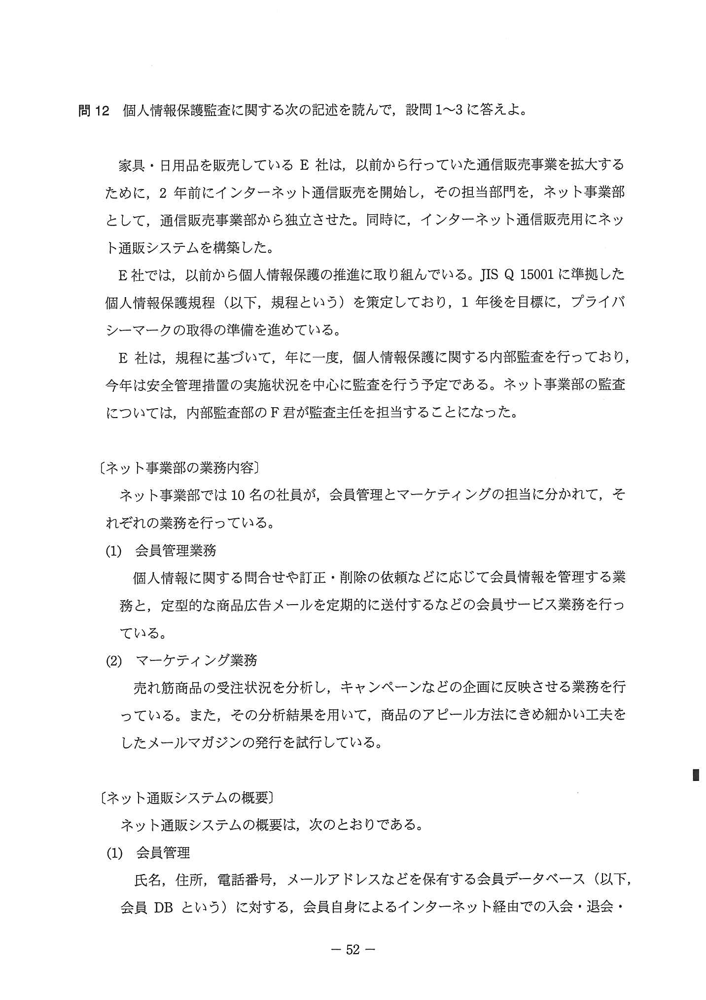

テキスト (OCR)

問12 個人情報保護監査に関する次の記述を読んで, 設問 1<3 に答えよ。

家具・日用品を販売している E 社は, 以前から行っていた通信販売事業を拡大する
ために, 2 年前たこインターネット通信販売を開始し, その担当部門を, ネット事業部
BUT                                                           ?

ト通販システムを構築した。
E 社では, 以前から個人情報保護の推進に取り組んでいる。TJIS Q 15001 に準拠した
, プライバ

個人情報保護規程 (以下規程という) を策定しており, 1 年後を目標に

シーマークの取得の準備を進めている。
E 社は, 規程に基づいて, 年に一度, 個人情報保護に関する内部監査を行っており

今年は安全管理措置の実施状況を中心に監査を行う予定である。ネット事業部の監査
については, 内部監査部のF 君が監査主任を担当することになった

, 通信販売事業部から独立させた。 同時に, インターネット通信販売用にネッ

〔ネット事業部の業務内容)
ネット事業部では 10 名の社員が, 会員管理とマーケティングの担当に分かれて, そ
れぞれの業務を行っている。

(1) 会員管理業務
個人情報に関する問合せや訂正・削除の依頼などに応じて会員情報を管理する業

務と, 定型的な商品広告メールを定期的に送付するなどの会員サービス業務を行っ

ている。

Q) マーケティング業務
売れ筋商品の受注状況を分析し, キャンペーンなどの企画に反映させる業務を行

っている。また, その分析結果を用いて, 商品のアピール方法にきめ細かい工夫を

したメールマガジンの発行を試行している。

(ネット通販システムの概要]
ネット通販システムの概要は, 次のとおりである。
(1) 会員管理
氏名, 住所, 電話番号,メールアドレスなどを保有する会員データベース (以下,

会員 DB という) に対する, 会員自身によるインターネット経由での入会・退会

### ページ 53

テキスト (OCR)

照会・更新の機能, 及び, 社社内の端末からの照会・更新・削除の機能をもつ。
E 社では, 会員の個人情報の利用目的を, 商品の送付と, 受注・送付の連絡に限
定する旨, 個人情報保護方針で公表している。商品広告メールの送付は, ①商品情
報を提供するメールの送付に同意した会員に限定している。
(2) 受注処理
会員が注文を入力すると, ショッピングカートの注文内容を受注管理データベー
A (以下, 受注管理 DB という) に格納するとともに, 会員 DB を参照し, 商品の
送付先, 支払方法などを確定する。受注データを後続の処理へ引き渡すとともに,
受注が確定した旨のメールを注文した会員宛てに送付する。
8) マーケティング用ファイル作成
受注管理 DB と会員 DB から, マーケティング業務で使用する受注分析ファイル
とメールマガジン送付用ファイルを作成する。
受注分析ファイルは, 注文ごとの商品情報と, 注文した会員が登録した年齢層,
性別, 家族構成などの会員属性をもつ。会員個人が特定されないように, 会員番号
などはもたせていない。 会員属性は商品の購買傾向との関連性の分析に使用される。
メールマガジン送付用ファイルは, 商品情報を提供するメールの送付に同意した
会員のデータだけを含むファイルで, 会員の氏名, メールアドレス, 及び会員属性
をもっている。また, メールマガジン送付用ファイルは個人情報の管理対象データ
に指定されており, マーケティング担当者全員のユーザ ID にアクセス権が付与され
ている。

(監査の実施]

F Ald, ネット事業部の安全管理措置の実施状況を確かめるために, 視察とヒアリ
ングを開始した。

F 君は, 視察の際, 別の部屋での会議に出席していたマーケティング担当の G さん
の PC が, 会員の氏名とメールアドレスの一覧が画面に表示されたままになっていて,
データの複写や印刷ができる状態になっていることを発見した。G さんにヒアリング
したところ, スクリーンセーバはネット事業部の情報セキュリティマニュアルどおり
5 分以内に起動する設定にしてあるので問題ないと思う, とのことであった。

規程では, PC で個人情報を取り扱っている途中で離席する場合は, 必ず, パスワー

ー 53 一

### ページ 54

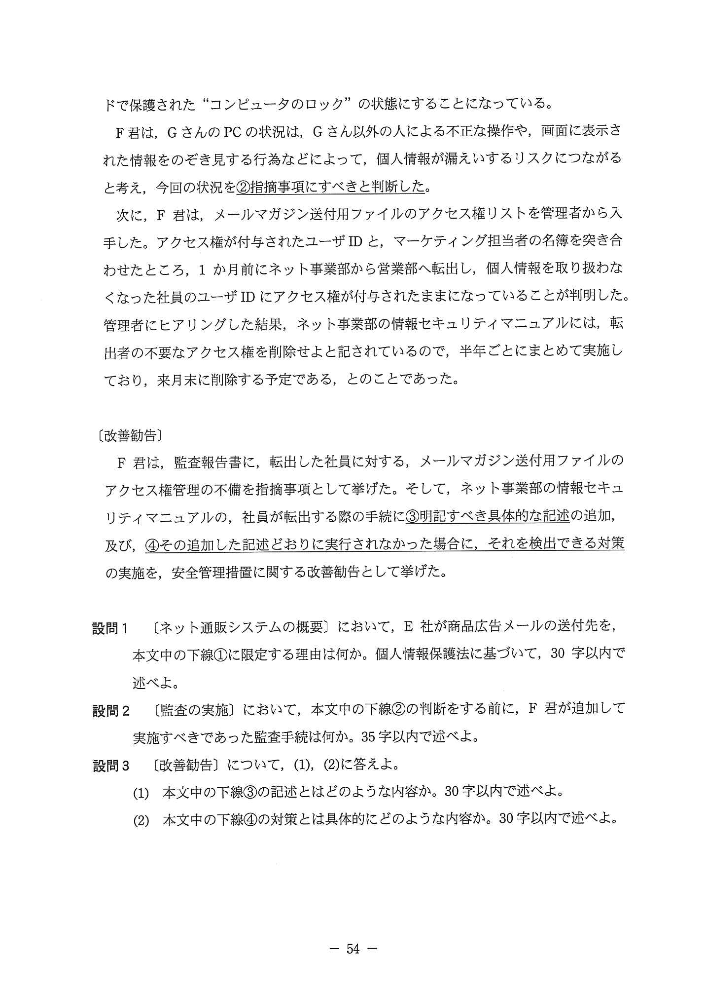

テキスト (OCR)

ドで保護された“コンピュータのロック” の状態にすることになっている。

F 君は。G さんの PC の状況は, Gさん以外の人による不正な操作や, 画面に表示さ
れた情報をのぞき見する行為などによって, 個人情報が漏えいするリスクにつながる
と考え, 今回の状況を②指摘事項にすべきと判断した。

次に, F 君は。 メールマガジン送付用ファイルのアクセス権りストを管理者から入
手した。アクセス権が付与されたユーザ ID と, マーケティング担当者の名稔を突き合
わせたところ, 1 か月前にネット事業部から営業部へ転出し, 個人情報を取り扱わな
くなった社員のユーザ ID にアクセス権が付与されたままになっていることが判明した。
管理者ににアリングした結果, ネット事業部の情報セキュリティマニュアルには, 転
出者の不要なアクセス権を削除せよと記されているので, 半年ごどとにまとめて実施し
ており, 来月末に削除する予定である, とのことであった。

(eos)

F 君は, 監査報告書に, 転出した社員に対する, メールマガジン送付用ファイルの
アクセス権管理の不備を指摘事項として挙げばた。そして, ネット事業部の情報セキュ
リティマニュアルの, 社員が転出する際の手続に③明記すべき具体的な記述の追加,
及び, ③④その追加した記述どおりに実行されなかった場合に. それを検出できる対策
の実施を, 安全管理措置に関する改善勧告として挙げた。

設問1 〔ネット通販システムの概要)〕 において, E 社が商品広告メールの送付先を,
本文中の下線①に限定する理由は何か。個人情報保護法に基づいて, 30 字以内で
述べよ。

設問2 監査の実施] において, 本文中の下線②の判断をする前に, F 君が追加して
実施すべきであった監査手続は何か。35 字以内で述べよ。

設問3 〔改善勧告) について, ①⑪, ②)に答えよ。

(1①) 本文中の下線③の記述とはどのような内容か。30 字以内で述べよ。
(2) 本文中の下線④の対策とは具体的にどのような内容か。30 字以内で述べよ。

ー 54 一

### ページ 55

テキスト (OCR)

【 メモ 用 紙 〕

ー 55 一

### ページ 56

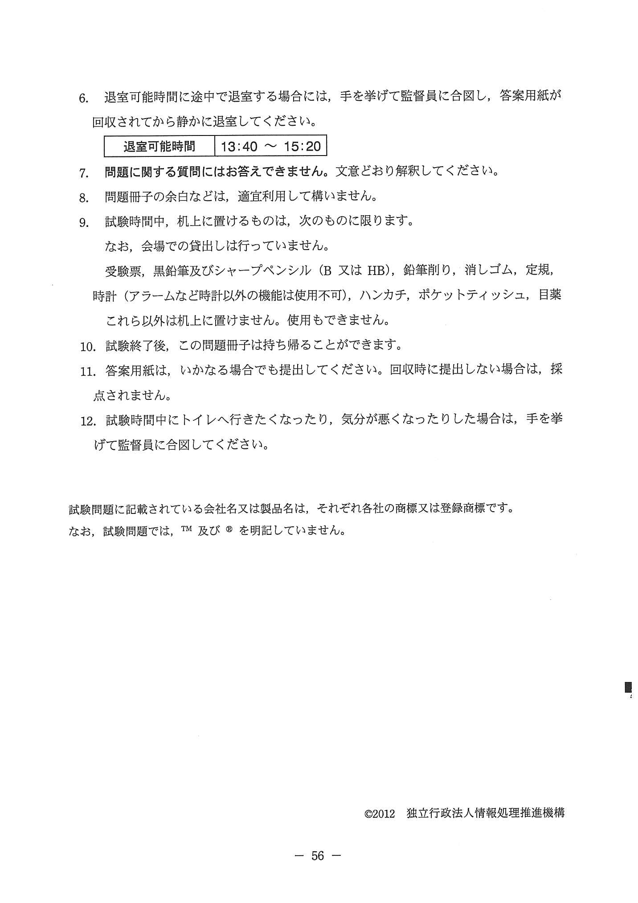

テキスト (OCR)

6. 退室可能時間に途中で退室する場合には, 手を挙げて監督員に合図し, 答案用紙が
回収されてから静かに退室してください。
| 退室可能時間 | 18:40 ~ 15:20|
7. 問題に関する質問にはお答えできません。文意どおり解釈してください。
8. 問題冊子の余白などは, 適宜利用して構いません。
9. 試験時間中机上に置けるものは, 次のものに限ります。
なお, 会場での貸出しは行っていません。
受験票, 黒鉛筆及びシャープペンシル (B 又は HB), 鉛筆削り, 消しゴム, 定規,
時計 (アラームなど時計以外の機能は使用不可)。 ハンカチ, ポケットティッシュ, 目薬
これら以外は机上に置けません。使用もできません。
10. 試験終了後, この問題周子は持ち帰ることができます。
11. 答案用紙は。 いかなる場合でも提出してください。回収時に提出しない場合は, 採
点されません。
12, 試験時間中にトイレへ行きたくなったり, 気分が悪くなったりした場合は, FER
げて監督員に合図してください。

試験問題に記載されている会社名又は製品名は, それぞれ各社の商標又は登録商標です。
なお, 試験問題では, ™ 及び © を明記していません。

@2012 独立行政法人情報処理推進機構

ー 56 一

---

## 午後解答

1/6 
©2012 独立行政法人情報処理推進機構 
平成24 年度 秋期 応用情報技術者試験 解答例 
 
午後試験 
問１ 
出題趣旨 
 企業は，経営目標を早期に実現する手段の一つとして，M&A を選択することがある。 
 本問では，飲料事業を営む会社のM&A を題材に，M&A 戦略，合併方法及びその会計処理方法についての基本的
な知識の理解を問う。 
 
設問 
解答例・解答の要点 
備考 
設問１ 
a ア 
 
設問２ (1) 乳酸菌飲料や健康飲料が加わることによる製品群の充実 
 
 
(2) お茶の販売が社内で競合する。 
 
設問３ (1) ウ 
 
 
(2) エ 
 
設問４ 
 
b 300 
 
 
 
c 420 
 
 
d 1,440,000 
 
 
e 60 
 
 
問２ 
出題趣旨 
 解を求める公式や明確なアルゴリズムがない場合には，可能な組合せを順番に検証することになる。その際，
無駄な探索をしないようバックトラックの考え方や，それを簡潔に記述するために再帰を活用することがある。
 本問では，N クイーン問題を題材に，再帰アルゴリズムによる探索の考え方の理解や事実から規則性を発見す
る能力について問う。 
 
設問 
解答例・解答の要点 
備考 
設問１ 
ア 2N－1 
 
設問２ 
イ i－k＋N 
 
設問３ (1) ウ k 
 
 
 
エ 1 
 
 
 
オ N 
 
 
 
カ pos[i] ← k 
 
 
 
キ i＋1 
 
 
(2) ク 1 
 
 
(3) 4

2/6 
©2012 独立行政法人情報処理推進機構 
問３ 
出題趣旨 
 現行業務と現行システムを理解し，かつ，評価して，問題点に対する解決策を立案することは重要である。
 本問では，建設業における機器貸出しの業務を題材に，現行業務で明らかな問題点に対して，評価指標を用
いた改善と問題解決に関する能力を問う。 
 
設問 
解答例・解答の要点 
備考 
設問１ 
事象 
機器の整備又は修理の期間が予定よりも長引く。 
 
 
指標 
出庫予定日遵守率 
 
設問２ 
購入 
指標 
ウ 
 
 
 
何を 
機器購入額を抑える。 
 
 
借入れ 
指標 
ア 
 
 
 
何を 
賃借料を抑える。 
 
設問３ 
 
a 返品 
 
設問４ (1) 貸出期間に応じた課金方式にする。 
 
 
(2) センタへの在庫状況の問合せが減少する。 
 
 
問４ 
出題趣旨 
 大量のデータや計算処理を高速に実行するために，並列処理の仕組みが利用される。 
 本問では，分析処理の並列化を題材に，並列化による可用性やパフォーマンスの見積りや設計の考え方につ
いて問う。 
 
設問 
解答例・解答の要点 
備考 
設問１ 
 
a 1.5 
 
設問２ (1) 10 
 
 
(2) b 分析処理が終了 
 
 
(3) c 3 
 
設問３ (1) d ア 
 
 
 
e イ 
 
 
(2) f x(1－(1－x)3 ) y 
 
 
(3) ア，エ，オ

3/6 
©2012 独立行政法人情報処理推進機構 
問５ 
出題趣旨 
 昨今，Web システムにおいて，ロードバランサを用いた負荷分散を行うことが一般的である。 
 本問では，ロードバランサを用いた旅行予約サイトを題材に，TCP／IP 及びOSI 階層モデルに関する基本的な
理解について問う。 
 
設問 
解答例・解答の要点 
備考 
設問１ 
 
a 192.168.0.1 
 
 
b 192.168.0.2 
順不同 
 
 
c x.y.z.21 
 
設問２ 
 
DNS サーバ（プライマリ）からゾーン情報を転送するように設定する。 
 
設問３ (1) d ク 
 
 
 
e ア 
 
 
(2) f 192.168.0.1 
 
設問４ 
 
プロキシサーバ経由の通信は送信元IP アドレスが同一となるから 
 
設問５ 
 
g ア 
 
 
問６ 
出題趣旨 
 システムの機能追加の際は，データベーススキーマの変更を伴う場合が多い。 
 本問では，スーパマーケットの販売管理システムへの機能追加を題材に，データベーススキーマの設計に関
する基本的な理解，及び適用能力について問う。 
 
設問 
解答例・解答の要点 
備考 
設問１ 
a 
 
 
 
b 
 
 
 
c 
 
 
設問２ 
売上が発生した時点の単価を記録するため 
 
設問３ 
購入累計額，マイレージ倍率 
 
設問４ 
d 商品種別コード 
 
設問５ 
テーブル 
売上明細 
 
 
列 
タイムサービス倍率

4/6 
©2012 独立行政法人情報処理推進機構 
問７ 
出題趣旨 
 スマートフォンのアプリケーションプログラムは，開発環境が安価に提供され，容易に作成できるようにな
ってきている。 
 本問では，スマートフォンのアプリケーションプログラムの設計を題材に，組込みシステムにおける消費電
力に配慮した設計，センサの制御方法に関する理解を問う。 
 
設問 
解答例・解答の要点 
備考 
設問１ (1) a イ 
 
 
(2) b ア 
 
設問２ (1) ・クロック供給が停止するとアプリケーションが稼働しないから 
・サスペンド状態では歩数計アプリが稼働しないから 
 
 
(2) c 8 
 
 
(3) d 100 
 
設問３ (1) e サスペンド許可 
 
 
(2) f ウェイク 
 
 
問８ 
出題趣旨 
 UML を用いたオブジェクト指向設計は，ソフトウェア開発の現場で一般的なスキルとなっている。 
 本問では，ディジタルオーディオプレーヤのソフトウェア開発を題材に，クラス図による静的解析に関する
応用力，及びステートマシン図による動的解析に関する基本的な理解について問う。 
 
設問 
解答例・解答の要点 
備考 
設問１ (1) a 再生 
 
 
 
b フォーマット識別 
 
 
 
c 再生アルゴリズム 
 
 
(2) d オ 
 
 
e カ 
順不同 
 
 
f カ 
 
設問２ 
再生を開始するときに，通常再生から開始となっていない。 
 
設問３ 
停止
2 倍速再生
3 倍速再生
モードボタン
通常再生
再生
モードボタン
モードボタン
再生ボタン
一時停止
一時停止ボタン
再生ボタン
開始
停止ボタン
選曲ボタン
停止ボタン
OR
全曲再生終了

5/6 
©2012 独立行政法人情報処理推進機構 
問９ 
出題趣旨 
 電子メールシステムにおけるセキュリティ対策の実施は，インターネットを利用する際には大変重要である。
 本問では，企業内における電子メールシステムの利用を題材に，電子メールシステムにおけるセキュリティ
対策に関する基本知識の理解を問う。 
 
設問 
解答例・解答の要点 
備考 
設問１ 
故意による情報漏えいのリスク 
 
設問２ 
a オ 
 
 
b ケ 
 
設問３ 
ウ，オ 
 
設問４ (1) ・送信したメールと同じ宛先にパスワードが届くので，容易にファイルを復号
できてしまう。 
・送信したメールと同じ宛先に，パスワードが書かれたメールが届いてしまう
こと。 
 
 
(2) c メールの宛先，メール本文及び添付ファイルの妥当性 
 
 
(3) d メールやそれ以外の手段で宛先に暗号化パスワードを連絡 
 
 
問10 
出題趣旨 
 情報システム開発プロジェクトを所定の期日までに完了させるためには，適切なタイムマネジメントの立案
及び実行が必要である。 
 本問では，情報システムの開発プロジェクトを題材に，プレシデンスダイアグラム法を用いたプロジェクト
スケジュールネットワーク図の作成，クリティカルパスの分析，期間短縮策の立案に関する能力を問う。 
 
設問 
解答例・解答の要点 
備考 
設問１ 
A，B1，B2，B3，E 
 
設問２ (1) 方式1 
名称 
ウ 
 
 
 
 
完了予定日 175 
 
 
 
方式2 
名称 
ア 
 
 
 
 
完了予定日 170 
 
 
(2) ③ 
 
 
(3) 300 
 
設問３ 
a 101 
 
 
b 115 
 
 
c 111 
 
 
d 125

6/6 
©2012 独立行政法人情報処理推進機構 
問11 
出題趣旨 
 システム障害の多くは，変更に伴うものといわれるほど，変更管理は情報システムサービスの安定稼働にと
って重要な要素である。 
 本問では，発注システムの機能変更を題材に，変更管理の基本プロセスと，リスク，合目的性などの事前評
価の重要性についての理解を問う。 
 
設問 
解答例・解答の要点 
備考 
設問１ 
a 変更依頼票作成 
 
 
b 切戻し 又は 変更を元に戻す 
 
設問２ 
c C 
 
 
理由 
① 
② 
 
 
・資材課専用サーバで稼働しており，資材課だけが使用している
から 
・上長承認モジュールと承認者設定モジュールを新規に開発する
から 
 
設問３ 
モジュール ファックス送信 
 
 
機能 
・ステータスが承認済みの発注伝票に限って処理する。 
・ステータスが未承認の発注伝票は処理しない。 
 
設問４ 
変更の理由 又は 変更の目的 又は 変更の効果 
 
 
問12 
出題趣旨 
 個人情報に関する事件や事故は，企業経営に対する大きなリスクとなっている。企業又は各組織において，
個人情報保護管理規程を作るだけでなく，それを適切に運用することが求められる。 
 本問では，インターネット通信販売を題材に，個人情報保護の考え方と，監査についての基本的な理解を問
う。 
 
設問 
解答例・解答の要点 
備考 
設問１ 
個人情報の目的外利用には，本人の同意が必要だから 
 
設問２ 
他のマーケティング担当者に，規程の遵守状況をヒアリングする。 
 
設問３ (1) 転出者のアクセス権を，不要になった時点で削除する。 
 
 
(2) アクセス権が付与されたユーザID の定期的な点検

---

## 午後採点講評

1/3 
©2013 独立行政法人情報処理推進機構 
平成24 年度 秋期 応用情報技術者試験 採点講評 
 
午後試験 
問１ 
 問1 では，飲料事業を営む会社のM&A を題材に，M&A 戦略，合併方法及びその会計処理方法に関する基本的
な知識の理解について出題した。 
 設問2(1)は，正答率が高かった。範囲の経済性によるシナジーについてはおおむね理解されているようであ
ったが，具体的な事象を答えていない解答が散見された。経営資源の補完性によるシナジーの例に倣って，具
体的な事象を問題文に即して答えてほしかった。 
 設問2(2)と設問3(2)は，正答率が低かった。合併時によく使われるカニバリゼーションやデューディリジ
ェンスのような基本的な用語について，是非理解しておいてほしい。 
 設問4 のe は，正答率が低かった。のれんを含めた合併時の会計処理方法や貸借対照表についての基本概念
を理解し，問題文中に書かれた会計処理方法をよく読んで，正答を導き出してほしい。 
 
問２ 
 問2 では，N クイーン問題を題材に，再帰アルゴリズムによる探索の考え方の理解について出題した。全体
として，正答率は高かった。 
 設問3(2)は，正答率が低かった。関数search がi 行目以降のクイーンの配置を探索する再帰関数であると
いう意味を正しく理解し，注意深く解答してほしい。 
 設問3(3)は，正答率が低かった。解法の処理手順とプログラムとの対応をよく考えて，処理手順を丁寧に追
って正答を導き出してほしい。  
 
問３ 
 問3 では，建設業における機器貸出しの業務を題材に，業務の改善について出題した。 
 設問1 は，正答率が低かった。業務上で発生し得る事象について，センタ内での事象を問うたにもかかわら
ず，現場で発生し得る事象についての解答が散見された。また，指標の解答では，問題文中の指標ではない解
答が目立った。いずれも問題文をよく読み，求められていることに留意して解答してほしい。 
 設問4 は，正答率が高かった。業務改善すべき具体的な方式やシステム改修によって改善される業務内容に
ついて，おおむね理解されているようであった。 
 
問４ 
 問4 では，分析処理の並列化を題材に，並列化による可用性やパフォーマンスの見積り，設計の考え方につ
いて出題した。 
 設問2(2)は，分析サーバの状態について解答を求めたにもかかわらず，負荷分散に関連するキーワードを記
述する解答が目立った。設問をよく読み，求められていることを理解した上で解答してほしい。 
 設問3(3)では，ウと誤って解答した受験者が多く見受けられた。RAID については，言葉の意味だけでな
く，そのメリット・デメリットについても基本的な知識としてよく理解しておいてほしい。 
 
問５ 
 問5 では，ロードバランサを用いた旅行予約サイトを題材に，TCP／IP 及びOSI 階層モデルに関する基本的
な理解について出題した。 
 設問3(1)は，正答率が低かった。Web システムで一般的に利用されているTCP／IP について，信頼性の高い
通信を行うための3 ウェイハンドシェイクをよく理解しておいてほしい。 
 設問4 は，組合ごとの利用者数にばらつきがある状況で，利用者が所属企業のプロキシサーバを経由して旅
行予約サイトにアクセスする点に言及してもらいたかったが，そこに触れていない解答が目立った。システム
設計時には，そのシステムを利用する利用者の特性を考慮した設計を心掛けてほしい。

2/3 
©2013 独立行政法人情報処理推進機構 
問６ 
 問6 では，スーパマーケットの販売管理システムへの機能追加を題材に，データベーススキーマの設計に関
する基本的な理解，及び適用能力について出題した。全体として，正答率は高かった。 
 設問1 は，正答率が高かった。リレーションシップについてはおおむね理解されているようであったが，カ
ーディナリティについても重要であるので是非理解しておいてほしい。 
 設問2 は，“目的”を問うたが，理由，背景，又は事実について記述している解答が散見された。問題文中
に記載された事実をベースに，設計の目的まで踏み込んで解答してほしい。 
 
問７ 
 問7 では，スマートフォンのアプリケーションプログラムの設計を題材に，組込みシステムにおける消費電
力に配慮した設計と，センサの制御方法について出題した。 
 設問1(1)，(2)は，正答率が低かった。組込み系の開発では，デバイスの特性をグラフで示すことがある。
グラフから使用するデバイスの特性を正しく読み取る能力を養うよう，日ごろから心掛けてもらいたい。 
 設問2(1)，(3)は，正答率が高かった。API の機能や，最適なサンプリング周期の決定方法はおおむね理解
されているようであった。 
 設問3 は正答率が高かった。端末の消費電力の低減方法と使用するAPI との関係は，おおむね理解されてい
るようであった。 
 
問８ 
 問8 では，ディジタルオーディオプレーヤのソフトウェア開発を題材に，クラス図による静的解析及びステ
ートマシン図による動的解析について出題した。 
 設問1(2)は，正答率が低かった。集約と汎化を正しく理解できていないと思われる解答が目立った。集約と
コンポジションでインスタンスのライフサイクルの違いと，汎化を使用して抽象クラスにインタフェースを定
義することの利点は，設計の重要な観点であるので是非理解しておいてほしい。 
 設問3 は，正答率が低かった。選曲ボタン，停止ボタン，全曲再生終了のイベントに関する状態遷移につい
ての解答を求めたが，選曲ボタンや停止ボタンを記述していない解答が目立った。問題文の指示を過不足なく
読み取り，正答を導き出してほしい。 
 
問９ 
 問9 では，企業内における電子メールシステムの利用を題材に，電子メールシステムにおけるセキュリティ
対策について出題した。 
 設問3 は，正答率が高かった。初期パスワードの運用に関する問題は実務面でも生じることが多いので，基
本知識として理解しておいてほしい。 
 設問4(1)は，正答率が低かった。問題文中の処理の流れをよく読み，設問で求められていることを理解した
上で解答してほしい。 
 設問4(3)は，正答率が高かった。暗号化パスワードの扱いに着目すれば，正答を導き出すことができるはず
である。 
 
問10 
 問10 では，情報システムの開発プロジェクトを題材に，プレシデンスダイアグラム法を用いたプロジェク
トスケジュールネットワーク図の作成，クリティカルパスの分析，及びプロジェクト期間短縮策の立案につい
て出題した。全体として，正答率は高かった。 
 設問1 は，正答率が高かった。プロジェクトスケジュールネットワーク図におけるクリティカルパスの判定
方法はおおむね理解されているようであった。 
 設問3 は，正答率が低かった。あるアクティビティの先行アクティビティや後続アクティビティが複数存在
する複雑なプロジェクトスケジュールネットワーク図を正しく作成できるよう，アクティビティの最早，最遅
での開始日，終了日を算出する方法を十分に理解してほしい。

3/3 
©2013 独立行政法人情報処理推進機構 
問11 
 問11 では，発注システムの機能変更を題材に，変更管理の基本プロセスと，変更の事前評価の重要性につ
いて出題した。全体として，正答率は高かった。 
 設問3 は，正答率が高かった。新たに追加された発注伝票のステータスの目的が，承認済みの発注伝票だけ
がファックス送信されるようにすることであるということは，よく理解されているようであった。 
 設問4 は，正答率が低かった。変更の計画や実施においては，変更の目的が何であるかを関係者が事前に正
しく把握しておくことが重要である。変更の目的に関する項目が，変更依頼票にもチェックリストにも抜けて
おり，改善が必要であることに気付いてほしい。 
 
問12 
 問12 では，インターネット通信販売を題材に，個人情報保護の考え方と，監査について出題した。全体と
して，正答率は低かった。 
 設問1 は，公表している利用目的以外の用途に個人情報を利用する場合は，個人情報の目的外利用となり，
必ず本人の同意が必要になることを理解しておいてもらいたい。 
 設問2 は，正答率が低かった。F 君は，個人情報保護に関する組織の状況について監査している。指摘事項
とする判断の前に，G さん個人だけでなく，組織としての問題点を明らかにするための監査手続を経る必要が
あることを理解してもらいたい。

