# 平成24年度春期 応用情報技術者試験

---

## 午前問題

### ページ 1

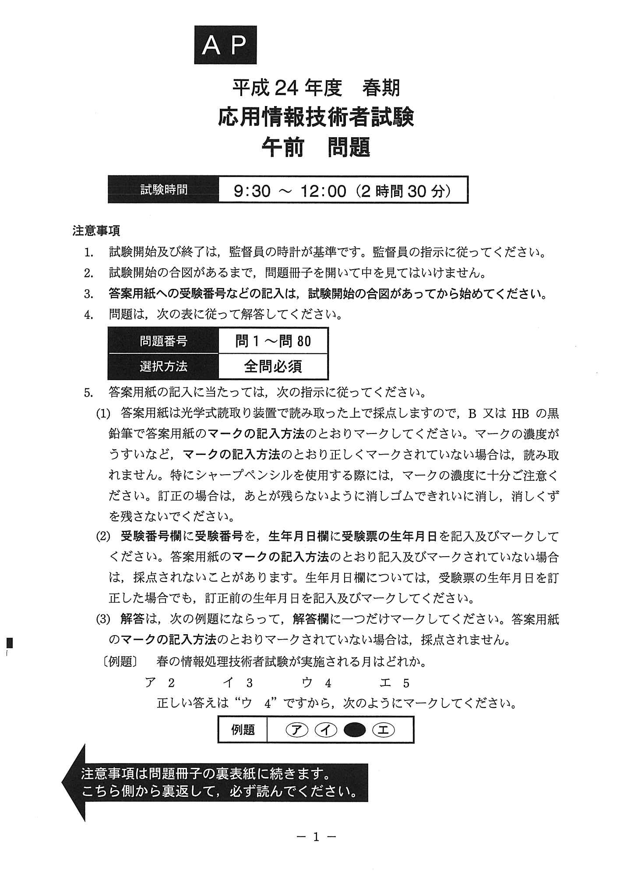

テキスト (OCR)

平成 24年度 春期
応用情報技術者試験
午前 問題

 9:30 ~ 12:00 (2時間30 4)

注意事項

1. 試験開始及び終了は, 監督員の時計が基準です。監督員の指示に従ってください。
2. 試験開始の合図があるまで, 問題冊子を開いて中を見てはいけません。

3. 答案用紙への受験番号などの記入は, 試験開始の合図があってから始めてください。
4. 問題は, 次の表に従って解答してください。

問題番号   問1 て問 80
選択方法      全問必須

5. 答案用紙の記入に当たっては, 次の指示に従ってください。

Q) 答案用紙は光学式読取り装置で読み取った上で採点しますので, B 又は HB の黒
鉛筆で答案用紙のマークの記入方法のとおりマークしてください。マークの濃度が
うすいなど, マークの記入方法のとおり正しくマークされていない場合は, HAW
れません。特にシャープペンシルを使用する際には, マークの濃度に十分ご注意く
ださい。訂正の場合は, あとが残らないように消しゴムできれいに消し, 消しくず
を残さないでください。

2) 受験番号欄に受験番号を, 生年月日欄に受験票の生年月日を記入及びマークして
ください。 答案用紙のマークの記入方法のとおり記入及びマークされていない場合
は, 採点されないことがあります。生年月日欄については, 受験票の生年月日を訂
正した場合でも, 訂正前の生年月日を記入及びマークしてください。

(3) 解答は, 次の例題にならって, 解答欄に一つだけマークしてください。管案用紙
のマークの記入方法のとおりマークされていない場合は, 採点されません。

〔例題】 春の情報処理技術者試験が実施される月はどれか。

ア 2    イ 3    ウ 4    エ 5
正しい答えは“ツウ 4 ですから, 次のようにマークしてください。

例題 | DOO@®

注意事項は問題冊子の裏表紙に続きます。

こちら側から裏返して, 必ず読んでください。

### ページ 2

### ページ 3

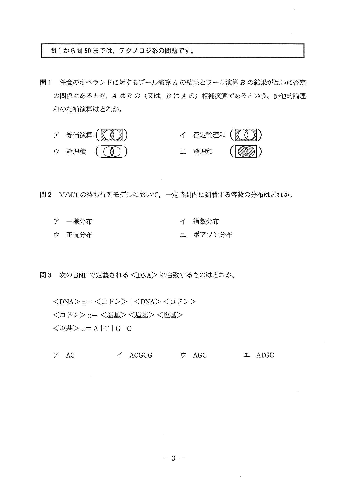

テキスト (OCR)

問 1 から問 50 までは, テクノロジ系の問題です。

fll 任意のすペランドに対するブール演算 4 の結果とブール演算 ぢ の結果が互いに否定
の関係にあるとき, 4 はぢの (又は, ぢは4の) 相補演算であるという。排他的論理

和の相補演算はどれか。

ア 等価演算 (   )       イ 否定論理和(
ウ wee (|(《 )|)       エ 論理和 (

ZO)

2 M/M/1 の待ち行列モデルにおいて, 一定時間内に到着する客数の分布はどれか。

ア 一様分布                                              イ 指数分布

ウ 正規分布            エエ ポアソン分布

間3 KO BNF で定義される ぐDNA> に合致するものはどれか。

<DNA> ::三 コドンテ | <DNA> コドン>

ぐコドン = く塩基> く塩基> く塩基>

く塩基>:三AITIGIC

ア AC      イ ACGCG    ウ AGC

<= ATGC

### ページ 4

テキスト (OCR)

間4 Unicode 文字列を UTF-8 でエンコードすると, 各文字のエンコード結果の先頭バイ
トは 2 進表示が 0 又は 11 で始まり, それ以降のバイトは 10 で始まる。16 進表示され
た次のデータは何文字の Unicode 文字列をエンコードしたものか。

CF 80 E3 81 AF E7 B4 84 33 2E 31 34 E3 81 A7 E3 81 99

問5 図のように 16 ビットのデータを 4X4 の正方形状に並べ, 行と列にパリティビット
を付加することによって何ビピットまでの誤りを訂正できるか。ここで, 図の網掛け部
分はパリティビットを表す。

### ページ 5

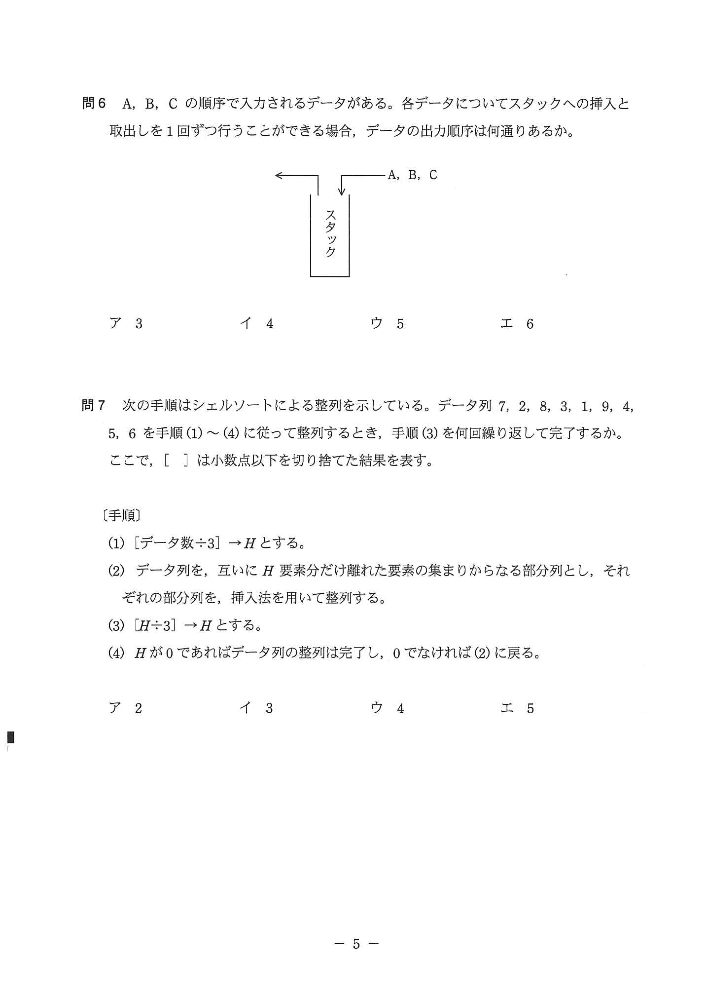

テキスト (OCR)

BIG A, B, C の順序で入力されるデータがある。各データについてスタックへの挿入と
取出しを 1 回ずつ行うことができる場合, データの出力順序は何通りあるか。

間7 次の手順はシェルソートによる整列示している。データ烈 7, 2, 8, 3, 1, 9, 4,
5, 6 を手順 Q) ~@ に従って整列するとき, 手順3) を何回繰り返して完了するか。
ここで, [ ] は小数点以下を切り捨てた結果を表す。

(手順

Q①) [データ数3] 一互 とする。

(2) データ列を, 互いに H 要素分だけ離れた要素の集まりからなる部分列とし, それ
ぞれの部分列を, 挿入法を用いて整列する。

(3) (#+3]) 一万とする。

(4) HAO であればデータ列の整列は完了し, 0 でなければ (2) に戻る。

ア 2   イ 3   ウ 4   エ 5

### ページ 6

テキスト (OCR)

FAS 関数 gcd(が, n) が次のように定義されている。娘135, n=35 DLS, ged(m, n) は
何回呼ばれるか。ここで, 最初の gcd(135, 35) の呼出しも, 1 回に数えるものとする。
また, mn (m > n = 0) は整数とし, mmodnlim En で割った余りを返すもの

とする。
【関数の定義〕
m         (z三0のとき)
gced(m,n) =
gcd(n, m mod n)   (0のとき)
ア 2      イ 3      ウ 4      = 6

間9 相異なるヵ個のデータが昇順に整列された表がある。この表を 個のデータごとの
プブロックに分割し, 各ブロックの最後尾のデータだけを線形探索することによって,
目的のデータの存在するブロックを探し出す。次に, 当該ブロック内を線形探索して
目的のデータを探し出す。このときぎの平均比較回数を表す式はどれか。ここで, m は
十分に大きく, n thm の倍数とし, 目的のデータは必ず表の中に存在するものとする。

n       m  n      n         n
アー mt,   イ  +   go        の

### ページ 7

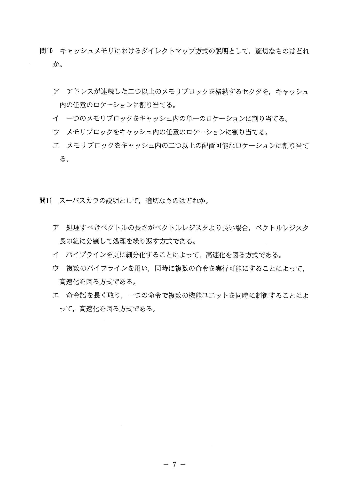

テキスト (OCR)

間10 キャッシュメモリにおけるダイレクトマップ方式の説明として, 適切なものはどれ
か。

ア アドレスが連続した二つ以上のメモリブロックを格納するセクタタを, キャッシュ
内の任意のロケーションに割り当てる。

イ 一つのメモリプロックをキャッシュ内の単一のロケーションに割り当てる。

ウ メモリブロックをキャッシュ内の任意のロケーションに割り当てる。

工 メモリブロックをキャッシュ内の二つ以上の配置可能なロケーションに割り当て
る。

fll] スーパスカラの説明として, 適切なものはどれか。

ア 処理すべきベクトルの長さがベクトルレジスタより長い場合.ベクトルレジスタ
長の組に分割して処理を繰り返す方式である。

イ パイプラインを更に細分化することによって, 高速化を図る方式である。

ウ 複数のパイプラインを用い, 同時に複数の命令を実行可能にすることによって
高速化を図る方式である。

TL 命令語を長く取り, 一つの命令で複数の機能ユニットを同時に制御することによ
って, 高速化を図る方式である。

### ページ 8

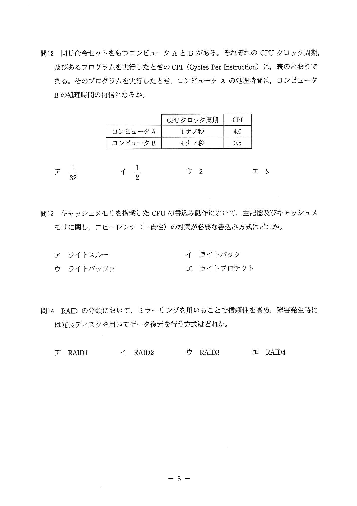

テキスト (OCR)

間12 同じ命令セットをもつコンピュータ A と B がある。それぞれの CPU クロック周期,
及びあるプログラムを実行したときのCPI (Cycles Per Instruction) は, 表のとおりで
ある。そのプログラムを実行したとき, コンピュータ A の処理時間は, コンピュータ
B の処理時間の何倍になるか。

CPU クロック周期     CPI

コンピュータ A      1ナノ秒       4.0
コンピュータ B      4ナノ秒       0.5
ァ ユエ      イィ エニ       ウ 2       エ 8
32        2

BS キャッシュメモリを搭載した CPU の書込み動作において, 主記憶及びキャッシュメ
モリに関し, コヒーレンシ (一貫性) の対策が必要な書込み方式はどれか。

ア ライトスルー                      ライトバック
ウ ライトバッファ               エエ ライトプロテクト

Ay,

Hil4 RAID の分類において, ミラーリングを用いることで信頼性を高め, 障害発生時に
は冗長ディスクを用いてデータ復元を行う方式はどれか。

ア RAID1    イ RAID2    ウ RAID3    エエ RAID4

### ページ 9

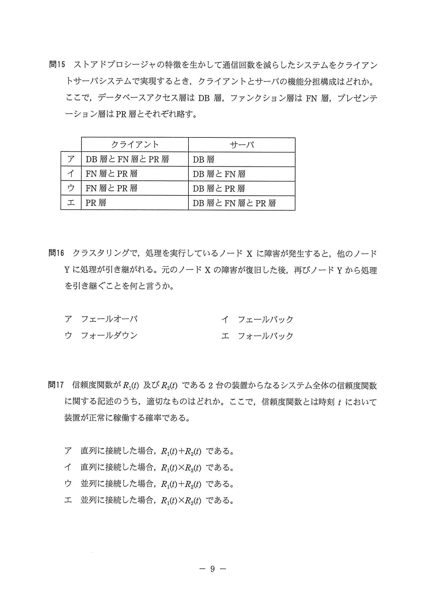

テキスト (OCR)

問15 ストアドプロシージャの特徴を生かして通信回数を減らしたシステムをクライアン
トサーバシステムで実現するとき, クライアントとサーバの機能分担構成はどれか。
COC, データベースアクセス層は DB 層, ファンクション層は PNB, プレゼンテ
ーション層は PR 層とそれぞれ略す。

クライアント             サーバ
ア | DB 層とFN層とPR層    DB 層
イ | FN層とPR層         DB 層とFN層
ウ | FN ic PRI          DB 層とPR 層
= | PRI                DB 層とFN 層とPR 層

間16 クラスタリングで, 処理を実行しているノード X に障害が発生すると, 他のノード
Y に処理が引き継がれる。元のノード X の障害が復旧した後, 再びノード Y から処理
を引き継ぐことを何と言うか。

ア フェールオーバ        イ フェールバック
ウ フォールダウン        工 フォールバック

間17 信頼度関数が兄⑦⑰ RURW) である 2 台の装置からなるシステム全体の信頼度関数
に関する記述のうち, 適切なものはどれか。ここで, 信頼度関数とは時刻 # において
装置が正常に稼働する確率である。

BIER LEBE, R.O+RA) CHS.
直列に接続した場合, ROXR) CHS.
並列に接続した場合, 0⑰十の CHS.
並列に接続した場合, のXの CHS.

Hマさい

### ページ 10

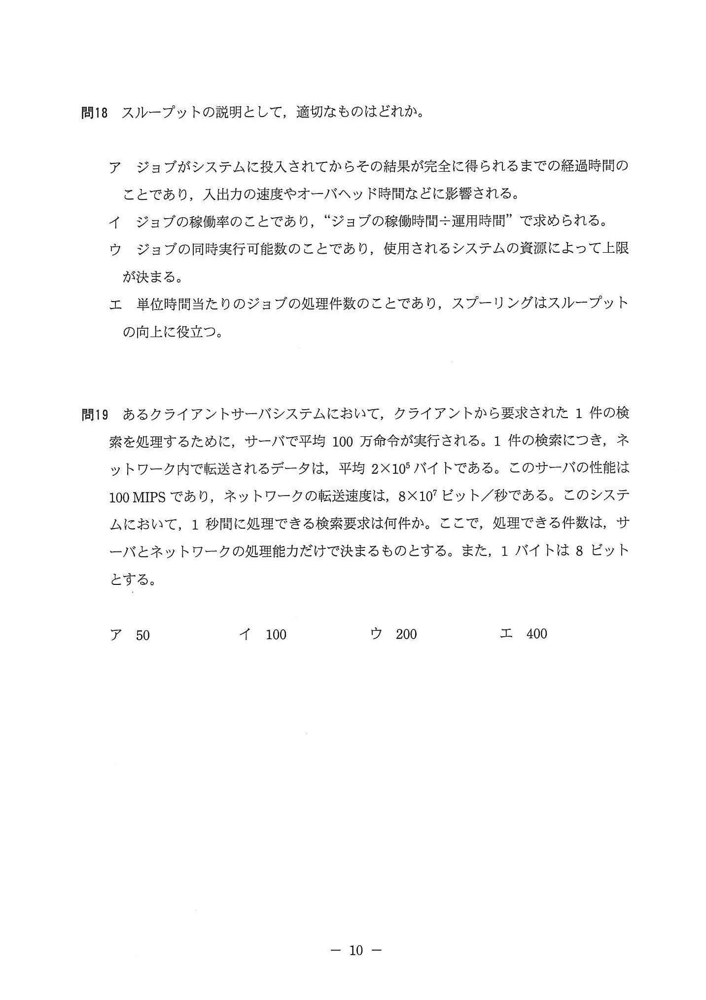

テキスト (OCR)

問18 スループットの説明として, 適切なものはどれか。

ア ジョブがシステムに投入されてからその結果が完全に得られるまでの経過時間の
ととであり, 入出力の速度やオーバヘッド時間などに影響される。

イ ジョブの稼働率のことであり, “ジョブの稼働時間一運用時間" で求められる。

ウ ジョブの同時実行可能数のことであり, 使用されるシステムの資源によって上限
が決まる。

エエ 単位時間当たりのジョブの処理件数のことであり, スプーリングはスループット
の向上に役立つ。

間19 あるクライアントサーバシステムにおいて, クライアントから要求された 1 件の検
索を処理するために, サーバで平均 100 万命令が実行される。1 件の検索につき, ネ
ットワーク内で転送されるデータは, 平均 2X10? バイトである。このサーバの性能は
100 MIPS であり, ネットワークの転送速度は, 8X107 ビットノ秒である。このシステ
ムにおいて, 1 秒間に処理できる検索要求は何件か。ここで, 処理できる件数は, サ
ーバとネットワークの処理能力だけで決まるものとする。また, 1 バイトは 8 ビット
とする。

ア 50      イ 100      ウ 200     x= 400

ー 10 一

### ページ 11

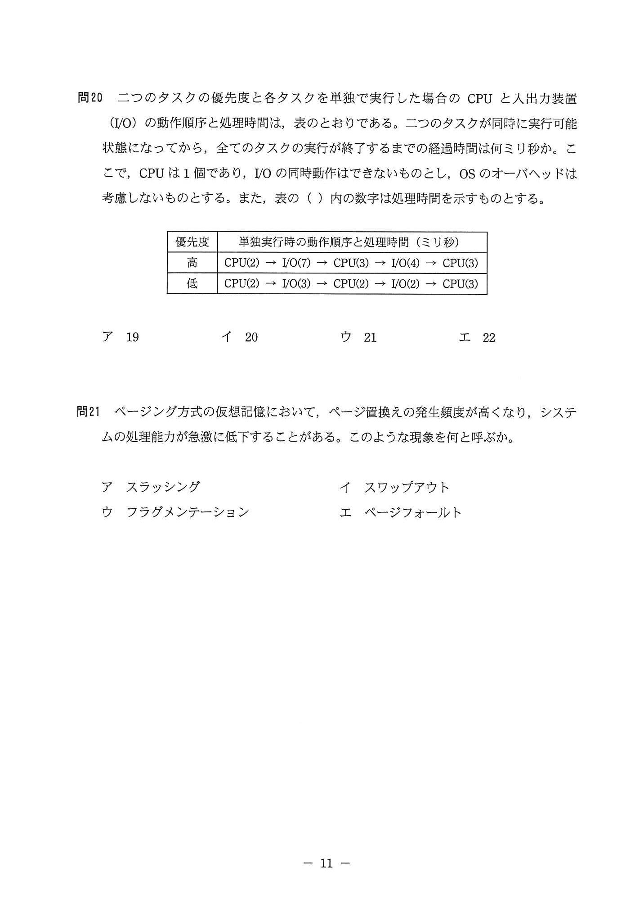

テキスト (OCR)

問20 二つのタスクの優先度と各タスクを単独で実行した場合の CPU と入出力装置
(YO) の動作順序と処理時間は, 表のとおりである。二つのタスクが同時に実行可能
状態になってから, 全てのタスクの実行が終了するまでの経過時間は何ミリ秒か。こ
CT, CPU は 1 個であり, IO の同時動作はできないものとし, OS のオーバヘッドは
考慮しないものとする。また, RO ( ) 内の数字は処理時間を示すものとする。

優先度    単独実行時の動作順序と処理時間 (ミリ秒)
高    CPU②) > YO⑦) > CPU(3) > O⑭ > CPUG③)
4& | CPU(2) > Y/0(8) > CPU(2) > YO(2) > CPU③)

ア 19     イ 20     ウ 21     22

間21 ページング方式の仮想記憶において, ページ置換えの発生顔度が高くなり, VAT
ムの処理能力が急激に低下することがある。このような現象を何と呼ぶか。

ア スラッシング        イ ワップアウト
ウ フラグメンテーション      エエ ページフォールト

ー 11 一

### ページ 12

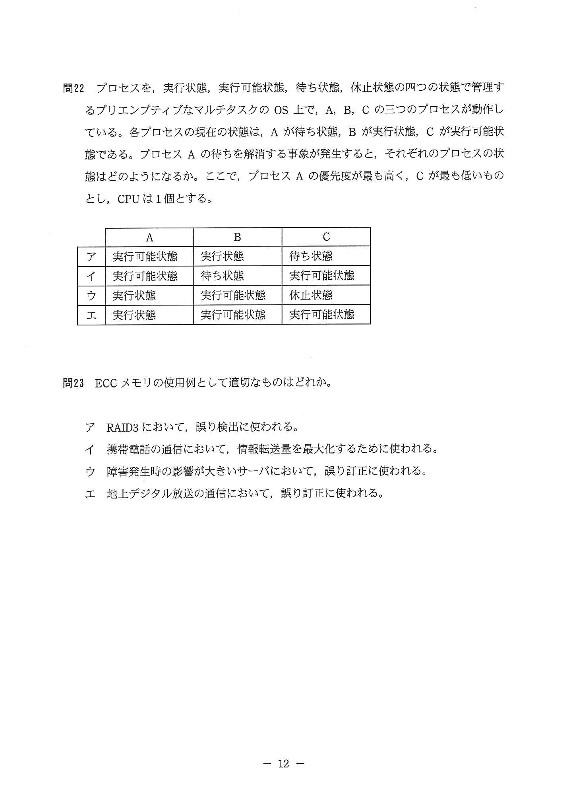

テキスト (OCR)

Aa プロセスを, 実行状態, 実行可能状態, 待ち状態, 休止状態の四つの状態で管理す
るプリエンプティブなマルチタスクの OS ET, A, B, C の三つのプロセスが動作し
ている。各プロセスの現在の状態は, A が待ち状態, B が実行状態,C が実行可能状
HECTHS. FOUA A の待ちを解消する事象が発生すると, それぞれのプロセスの状
和態はどのようになるか。ここで, プロセス A の優先度が最も高く, C が最も低いもの
とし, CPU は1 個とする。

A                             B                              C
ア | 実行可能状態 | 実行状態    待ち状態
イ | 実行可能状態 | 待ち状態                 実行可能状態
ウ | 実行状態    実行可能状態 | 休止状態
エ | 実行状態              実行可能状態 | 実行可能状態

間23 ECC メモリの使用例として適切なものはどれか。

RAID3 において, 誤り検出に使われる。

携帯電話の通信において, 情報転送量を最大化するために使われる。
障害発生時の影響が大きいサーバにおいて, 誤り訂正に使われる。
地上デジタル放送の通信において, 誤り訂正に使われる。

Hさささ

ー 12 一

### ページ 13

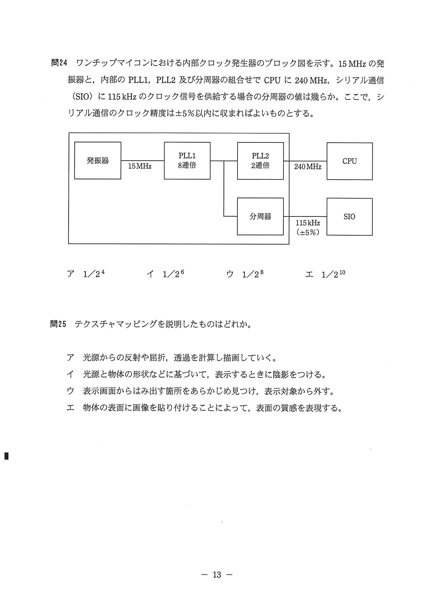

テキスト (OCR)

問4 ワンチップマイコンにおける内部クロック発生器のブロック図を示す。15 MHz OF
振器と, 内部の PLL1, PLL2 及び分周器の組合せで CPU に 240 MHz, シリアル通信
(SIO) に 115 kHz のクロック信号を供給する場合の分周器の値は幾らか。ここで, シ

リアル通信のクロック精度は土5%以内に収まればよいものとする。

enn       PLL1      PLL2
Fete  15MHz   8通倍      2通倍   240MHz  CD
分周器        SIO
115kHz
(ょ5%%)
ア 1/24    4 1/28    ウ 1728    a 172"

間25 テクスチャマッピングを説明したものはどれか。

光源からの反射や屈折, 透過を計算し描画していく。

光源と物体の形状などに基づいて, 表示するときに陰影をつける。
表示画面からはみ出す箇所をあらかじめ見つけ, 表示対象から外す。
物体の表面に画像を貼り付けることによって, 表面の質感を表現する。

HUAN

### ページ 14

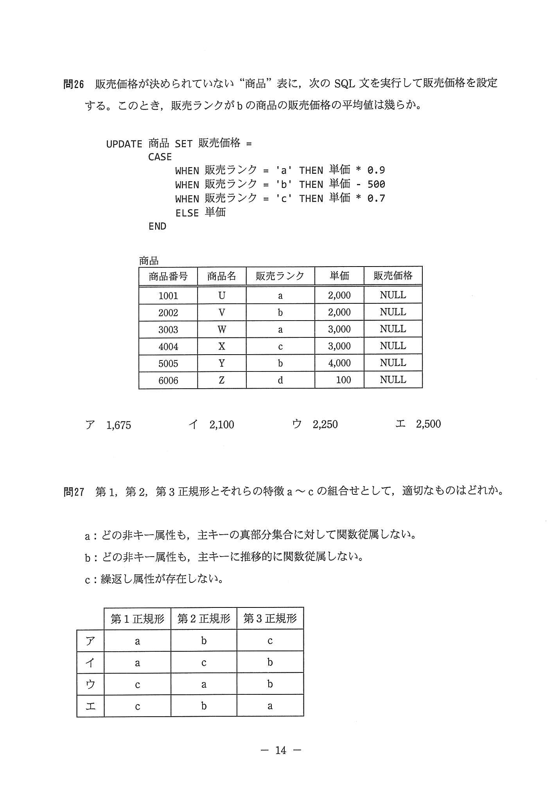

テキスト (OCR)

間26 販売価格が決められていない “商品” 表に, 次の SQL 文を実行して販売価格を設定
する。このとき, 販売ランクがb の商品の販売価格の平均値は幾らか。

UPDATE 商品 SET 販売価格 =

CASE
WHEN 販売ランク = 'a' THEN 単価 * 9.9
WHEN 販売ランク = 'b' THEN 単価 - 599
WHEN 販売ランク = 'c' THEN 単価* 9.7
ELSE 単価
END
商品
商品番号 | 商品名 | 販売ランク  単価  販売価格
1001     U       a      2,000    NULL
2002     Vv       b      2,000    NULL
3003     W       a      3.000    NULL
4004     x              3,000    NULL
5005      Y              4000    NULL
6006      Z               100    NULL
ア 1,675        イ 2,100        ウ 2,250        エ 2,500

問27 第1, 第2, 第3 正規形とそれらの特徴 a てc の組合せとして, 適切なものはどれか。

a: どの非キー属性も, 主キーの真部分集合に対して関数従属しない。
b : どの非キー必性も, 主キーに推移的に関数従属しない。
c : 繰返し属性が存在しない。

第 1 正規形 | 第2 正規形 | 第3 正規形
x       a          b          (9
イ       a           c          b
ウ       C           a          b
=       C          b          a

ー 14 一

### ページ 15

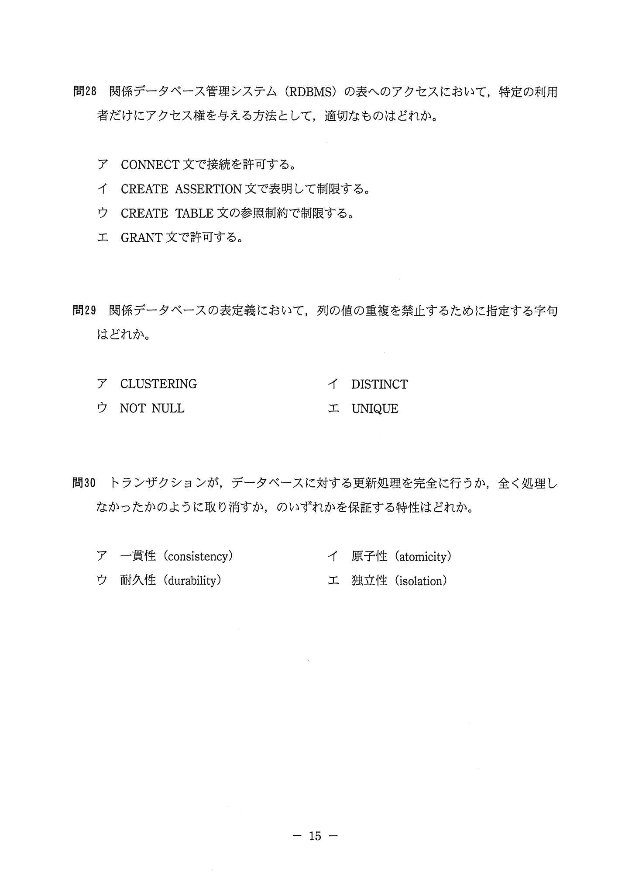

テキスト (OCR)

間28 関係データベース管理システム (RDBMS) の表へのアクセスにおいて, 特定の利用
者だけにアクセス権を与える方法として, 適切なものはどれか。

CONNECT 文で接続を許可する。

CREATE ASSERTION 文で表明して制限する。
CREATE TABLE 文の参照制約で制限する。
GRANT 文で許可する。

HOGAN

間29 関係データベースの表定義において, 列の値の重複を禁止するために指定する字句
はどれか。

ア CLUSTERING                                           イ DISTINCT

ウ NOT NULL           = UNIQUE

間30 トランザクションが, データベースに対する更新処理を完全に行うか, 全く処理し

なかったかのように取り消すか, のいずれかを保証する特性はどれか。

ア —Htt (consistency)        イ 原子性 (atomicity)
ウ 耐久性 (durability)          エエ 独立性 (isolation)

ー 15 一

### ページ 16

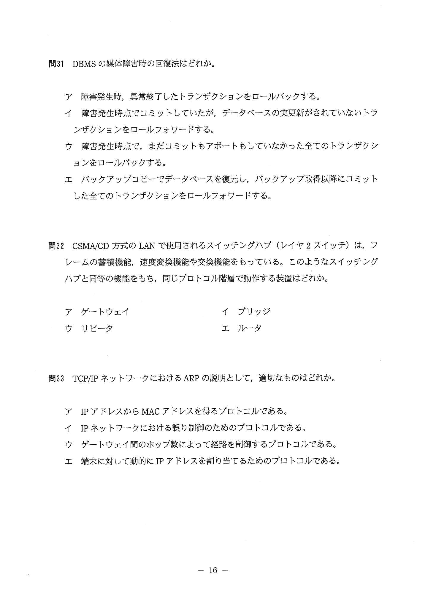

テキスト (OCR)

問31 DBMS の媒体障害時の回復法はどれか。

ア 障害発生時, 異常終了したトランザクションをロールバックする。

イ 障害発生時点でコミットしていたが, データベースの実更新がされていないトラ
ンザクションをロールフォワードする。

ウ 障害発生時点で, まだコミットもアボートもしていなかった全てのトランザクシ
ョンをロールバックする。

エ バックアップコピーでデータベースを復元し, バックアップ取得以降にコミット
した全てのトランザクションをロールフォワードする。

間32 CSMA/CD 方式の LAN で使用されるスイッチングハブ (レイヤ 2 スイッチ) は, フ
レームの菩積機能, 速度変換機能や交換機能をちっている。このようなスイッチング
ハブと同等の機能をもち, 同じプロトコル階層で動作する装置はどれか。

ア ゲートウェイ           イ ブリッジ
ウ リピータ             エ ルータ

問33 TCPAP ネットワークにおける ARP の説明として, 適切なものはどれか。

IP アドレスから MAC アドレスを得るプロトコルである。

IP ネットワークにおける誤り制御のためのプロトコルである。

ゲートウェイ間のホップ数によって経路を制御するプロトコルである。
端末に対して動的に TP アドレスを割り当てるためのプロトコルである。

Hさささ

ー 16 一

### ページ 17

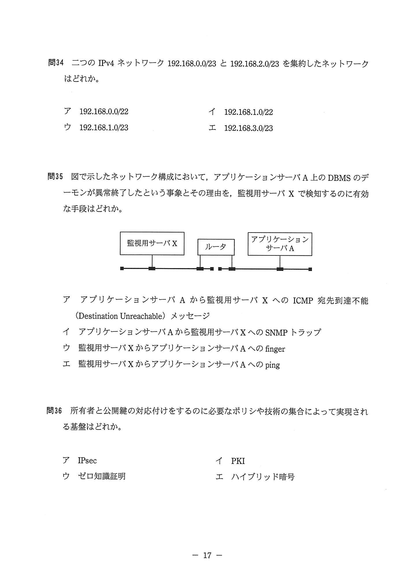

テキスト (OCR)

問34 二つの IPv4 ネットワーク 192.168.0.0/23 と 192.168.2.0/23 を集約したネットワーク
はどれか。

ア 192.168.0.0/22        イ 192.168.1.0722
ウ 192.168.1.0/23         工 192.168.3.0/23

間35 図で示したネットワーク構成において, アプリケーションサーバ A 上の DBMS のデ
ーモンが異常終了したという事象とその理由を, 監視用サーバ X で検知するのに有効
な手段はどれか。

mamv—nx | Coe] 3っ

—i l,j J.

ア アプリケーションサーバ A から監視用サーバ X への ICMP 宛先到達不能
(Destination Unreachable) メッセージ

イ アプリケーションサーバA から監視用サーバXへのSNMP トラップ

ウ 監視用サーバメからアプリケーションサーバAへの finger

工 監視用サーバXからアプリケーションサーバAへの ping

問36 所有者と公開鍵の対応付けをするのに必要なポリシや技術の集合によって実現され
る基盤はどれか。

ア IPsec                                                           イ PKI
ウ ゼロ知識証明           エエ ハイブリッド暗号

ー 17 一

### ページ 18

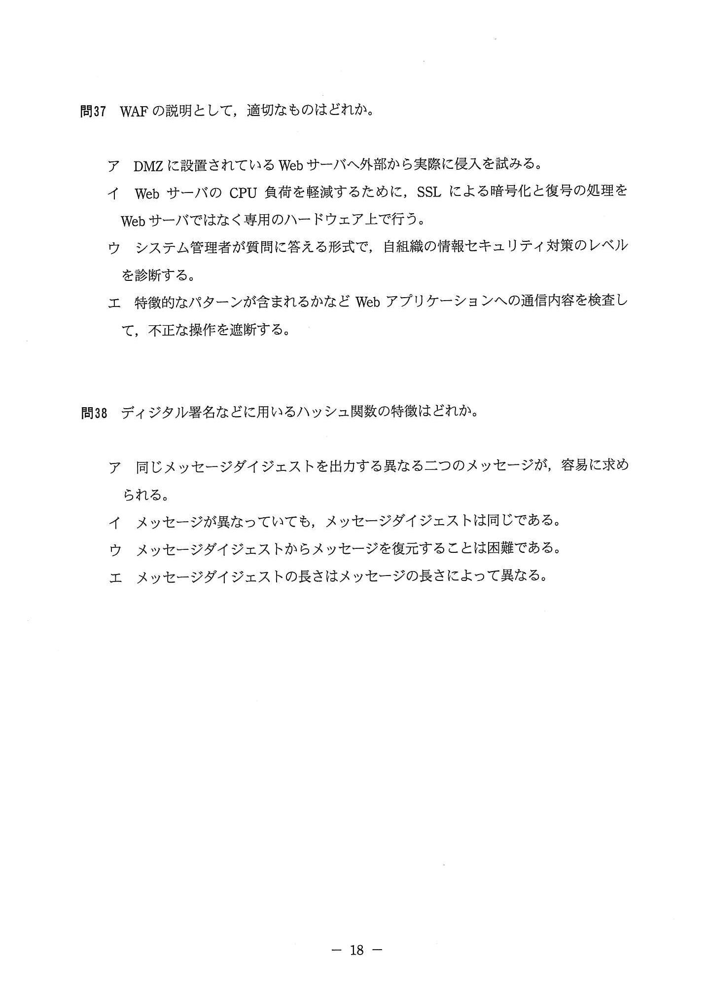

テキスト (OCR)

問37 WAFの説明として, 適切なものはどれか。

ア DMZに設置されている Web サーバへ外部から実際に侵入を試みる。

イ Web サーバの CPU 負荷を軽減するために, SSL による暗号化と復号の処理を
Web サーバではなく専用のハードウェア上で行う。

ウ システム管理者が質問に答える形式で, 自組織の情報セキュリティ対策のレベル
を診断する。

エ 特徴的なパターンが含まれるかなど Web アプリケーションへの通信内容を検査し
て, 不正な操作を遮断する。

間38 ディジタル署名などに用いるハッシュ関数の特徴はどれか。

ア 同じメッセージダイジェストを出力する異なる二つのメッセージが, 容易に求め
られる。

イ メッセージが異なっていても, メッセージダイジェストは同じである。

ウ メッセージダイジェストからメッセージを復元することは困難である。

エ メッセージダイジェストの長さはメッセージの長さによって異なる。

ー 18 一

### ページ 19

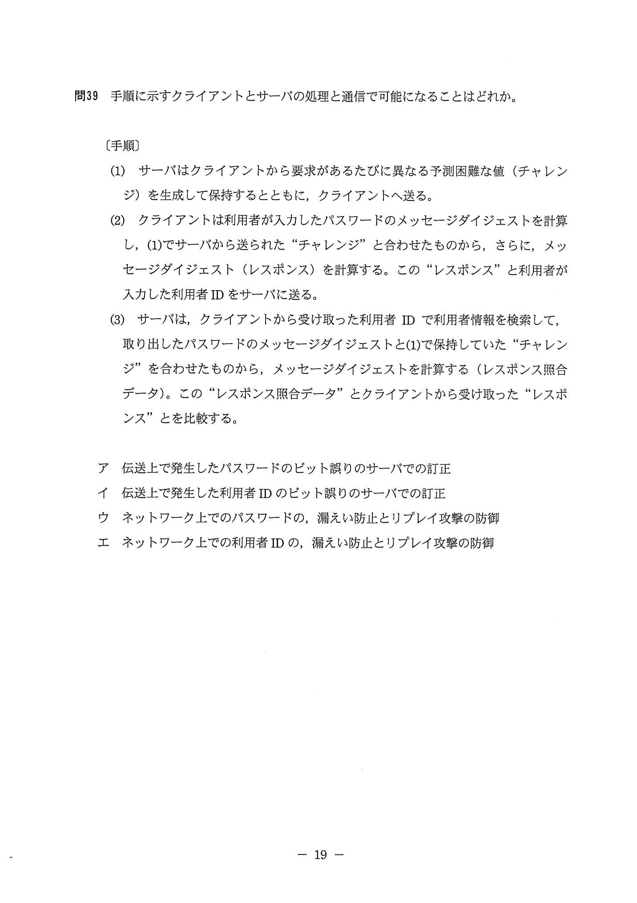

テキスト (OCR)

間39 手順に示すクライアントとサーバの処理と通信で可能になることはどれか。

(FIED

GQ) サーバはクライアントから要求があめるたびに異なる予測困難な値 (チャレン
ジ) を生成して保持するとともに, クライアントへ送る。

Q) クライアントは利用者が入力したパスワードのメッセージダイジェストを計算
し, ①)でサーバから送られた “チャレンジ" と合わせたものから, さらに, メッ
セージダイジェスト (レスポンス) を計算する。ことの“レスポンス" と利用者が
入力した利用者 ID をサーバに送る。

(3) サーバは, クライアントから受け取った利用者 ID で利用者情報を検索して,
取り出したパスワードのメッセージダイジェストとQ)で保持していた “チャレン
ジ” を合わせたものから, メッセージダイジェストを計算する (レスポンス照合
データ)。この“レスポンス照合データ”" とクライアントから受け取った“レスポ
ンス"とを比較する。

伝送上で発生したパスワードのビット誤りのサーバでの訂正
伝送上で発生した利用者 ID のビット誤りのサーバでの訂正

ネットワーク上でのパスワードの, 漏えい防止とリプレイ攻撃の防御
ネットワーク上での利用者 ID の, 漏えい防止とりプレイ攻撃の防御

HFA MN

ー 19 一

### ページ 20

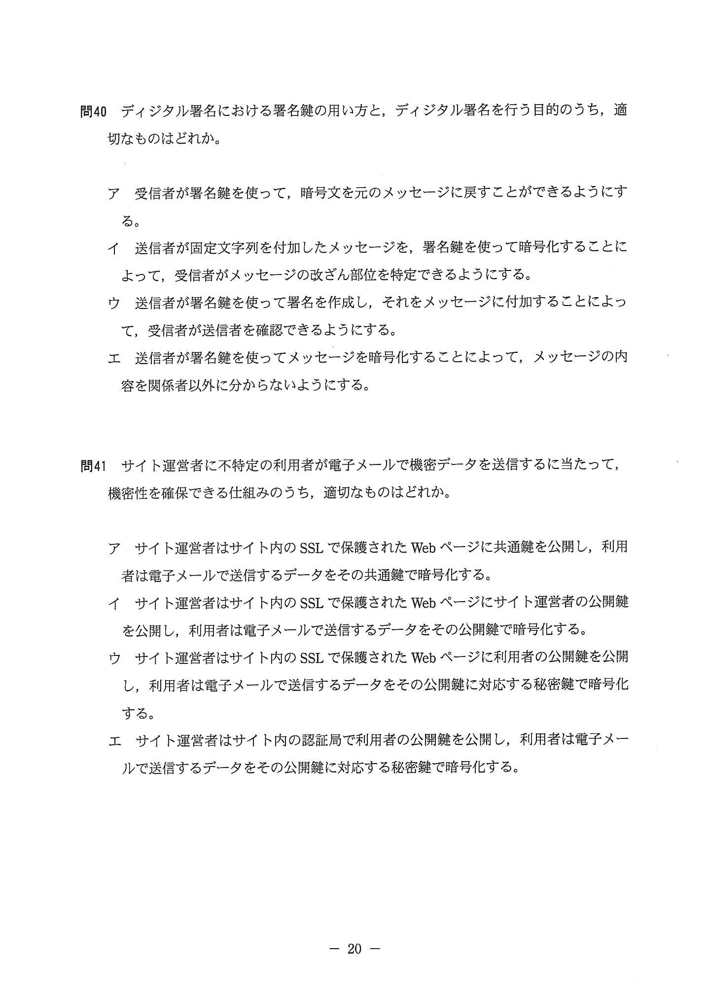

テキスト (OCR)

間40 ディジタル署名における箸名鍵の用い方と.。 ディジタル署名を行う目的のうち, 適
切なものはどれか。

ア 受信者が署名鍵を使って, 暗号文元のメッセージに戻すことができるようにす
る。

イ 送信者が固定文字列を付加したメッセージを, 署名鍵を使って暗号化することに
よって, 受信者がメッセージの改ざん部位を特定できるようにする。

ウ 送信者が署名鍵を使って署名を作成し. それをメッセージに付加することによっ
て, 受信者が送信者を確認できるようにする。

エエ 送信者が署名鍵を使ってメッセージを暗号化することによって, メッセージの内
容を関係者以外に分からないようにする。

間41 サイト運営者に不特定の利用者が電子メールで機密データを送信するに当たって,
機密性を確保できる仕組みのうち, 適切なものはどれか。

ア サイト運営者はサイト内の SSL で保護された Web ページに共通鍵を公開し, 利用
者は電子メールで送信するデータをその共通鍵で暗号化する。

イ サイト運営者はサイト内の SSL で保護された Web ページにサイト運営者の公開鍵
を公開し, 利用者は電子メールで送信するデータをその公開鍵で暗号化する。

ウ サイト運営者はサイト内の SSL で保護された Web ページに利用者の公開鍵を公開
し, 利用者は電子メールで送信するデータをその公開鍵に対応する秘密鍵で暗号化
する。

エ サイト運営者はサイト内の認証局で利用者の公開鍵を公開し, 利用者は電子メー
ルで送信するデータをその公開鍵に対応する秘密鍵で暗号化する。

ー 20 一

### ページ 21

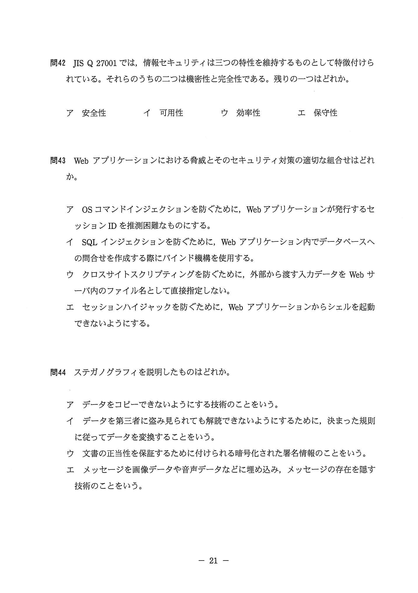

テキスト (OCR)

問42 JIS Q 27001 では, 情報セキュリティは三つの特性を維持するものとして特徴付けら
れている。それらのうちの二つは機密性と完全性である。残りの一つはどれか。

ア 安全性    イ 可用性    ウ 効率性    エエ 保守性

間43 Web アプリケーションにおける脅威とそのセキュリティ対策の適切な組合せはどれ
か。

ア 0S コマンドインジェクションを防ぐために, We アプリケーションが発行するセ
ッションTD を推測困難なものにする。

4 SQL インジェクションを防ぐために, Web アプリケーション内でデータベースへ
の問合せを作成する際にバインド機構を使用する。

ウ クロスサイトスクリプティングを防ぐために, 外部から渡す入力データを Web サ
ーバ内のファイル名として直接指定しない。

エ セッションハイジャックを防ぐために, Web アプリケーションからシェルを起動
できないようにする。

間44 ステガノグラフィを説明したものはどれか。

ア データをコピーできないようにする技術のことをいう。

イ データを第三者に盗み見られても解読できないようにするために, 決まった規則
に従ってデータを変換することをいう。

ウ 文書の正当性を保証するために付けられる暗号化された署名情報のことをいう。

エエ メッセージを画像データや音声データなどに埋め込み, メッセージの存在を隠す
技術のことをいう。

ー 21 一

### ページ 22

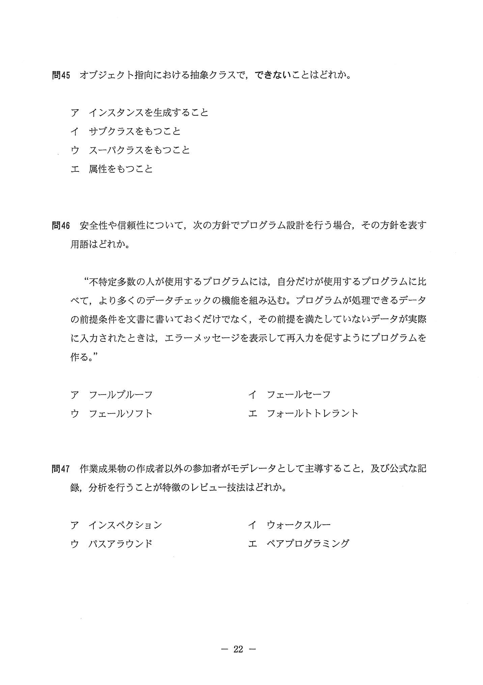

テキスト (OCR)

間45 オブジェクト指向における抽象クラスで, できないことはどれか。

インスタンスを生成すること
サブクラスをもつこと

スーパクラスをもつとこと
属性をもつこと

HHふさ

問46 安全性や信頼性について, 次の方針でプログラム設計を行う場合, その方針を表す
用語はどれか。

“不特定多数の人が使用するプログラムには, 自分だけが使用するプログラムに比
RT, より多くのデータチェックの機能を組み込むb。プログラムが処理できるデータ
の前提条件を文書に書いておくだけでなく, その前提を満たしていないデータが実際
に入力されたときは, エラーメッセージを表示して再入力を促すようにプログラムを
作る。"

ア フールプルーフ                             イ フェールセーフ

ウ フェールソフト          mr フォールトトレラント

問47 作業成果物の作成者以外の参加者がモデレータとして主導すること, 及び公式な記

録, 分析を行うことが特徴のレビュー技法はどれか。

ア インスペクション       イ ウォークスルー
ウ パスアラウンド         エエ ペアプログラミング

ー 22 一

### ページ 23

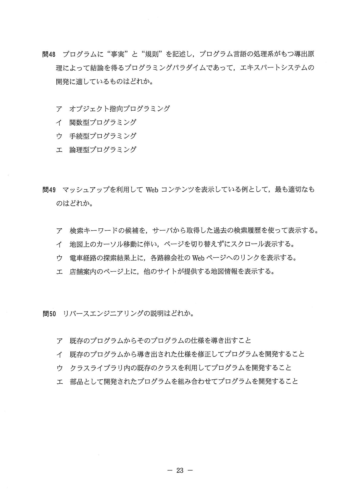

テキスト (OCR)

問48 プログラムに “事実" と"規則" を記述し, プログラム言語の処理系がもつ導出原
理によって結論を得るプログラミングパラダイムであって, エキスパートシステムの
開発に適しているものはどれか。

オブジェクト指向プログラミング
関数型プログラミング
手続型プログラミング
論理型プログラミング

H ささい

問49 マッシュアップを利用して Web コンテンツを表示している例として, 最も適切なも
のはどれか。

検索キーワードの候補を, サーバから取得した過去の検索履歴を使って表示する。
地図上のカーソル移動に伴い, ページを切り替えずにスクロール表示する。

電車経路の探索結果上に, 各路線会社の Web ページへのリンクを表示する。

店舗案内のページ上に, 他のサイトが提供する地図情報を表示する。

HUAN

間50 リバースエンジニアリングの説明はどれか。

既存のプログラムからそのプログラムの仕様を導き出すこと

既存のプログラムから導き出された仕様を修正してプログラムを開発すること
クラスライブラリ内の既存のクラスを利用してプログラムを開発すること
部品として開発されたプログラムを組み合わせてプログラムを開発すること

HH へ

ー 23 一

### ページ 24

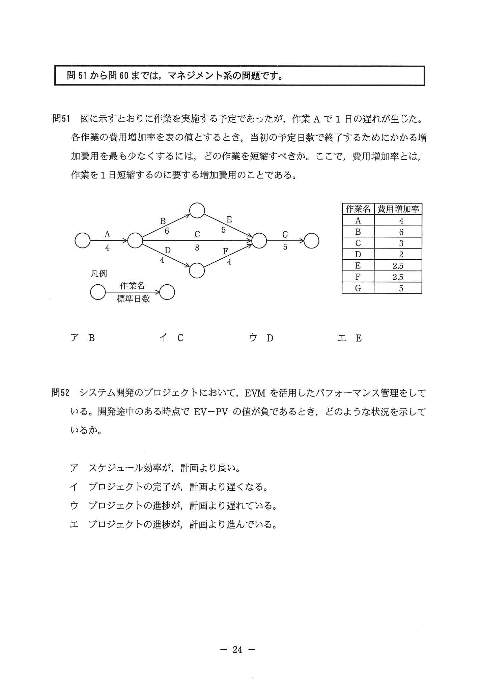

テキスト (OCR)

LSI から問 60 までは, マネジメント系の問題です。

間51 図に示すとおりに作業を実施する予定であったが, 作業 A で 1 日の遅れが生じた。
各作業の費用増加率を表の値とするとき, 当初の予定日数で終了するためにかかる増
加費用を最も少なくするには, どの作業を短縮すべきか。ここで, 費用増加率とは,
作業を1 日短縮するのに要する増加費用のことである。

作業名 | 費用増加率
B     E         A   4
A    6  oe >    G     B   6
D   2
4     4         E  25
凡例                  F  25
O 作業名 O            G  5
標準日数
ア B      イ C      ウ D      IE

間52 システム開発のプロジェクトにおいて, EVM を活用したパフォーマンス管理をして
WS. 開発途中のある時点で EV一PV の値が負であるとき, どのような状況を示して
いるか。

スケジュール効率が, 計画
プロジェクトの完了が, 計
プロジェクトの進捗が, 計
プロジェクトの進捗が, FF

よ

画より遅くなる。
画より有遅れている。
画より進んでいる。

H ざさへ

ー 24 一

### ページ 25

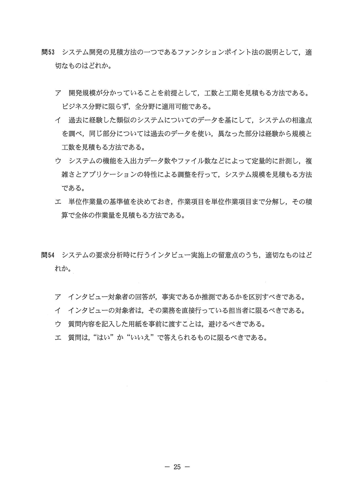

テキスト (OCR)

間53 システム開発の見積方法の一つであるファンクションポイント法の説明として, 適
切なものはどれか。

ア 開発規模が分かっていることを前提として, 工数と工期を見積もる方法である。
ビジネス分野に限らず, 全分野に適用可能である。

イ 過去に経験した類似のシステムについてのデータを基にして, システムの相違点
を調べ, 同じ部分については過去のデータを使い, 異なった部分は経験から規模と
工数を見積もる方法である。

ウ システムの機能を入出力データ数やファイル数などによって定量的に計測し, 複
雑さとアプリケーションの特性による調整を行って, システム規模を見積もる方法
である。

L 単位作業量の基準値を決めておき, 作業項目を単位作業項目まで分解し, TOR
算で全体の作業量を見積もる方法である。

間54 システムの要求分析時に行うインタビュー実施上の留意点のうち, 適切なものはど
れか。

インタビュー対象者の回答が, 事実であるか推測であるかを区別すべきである。
インタビューの対象者は, その業務を直接行っている担当者に限るべきである。
質問内容を記入した用紙を事前に渡すことは, 避けるべきである。
質問は, “はい” か “いいえ” で答えられるものに限るべきである。

HGAN

### ページ 26

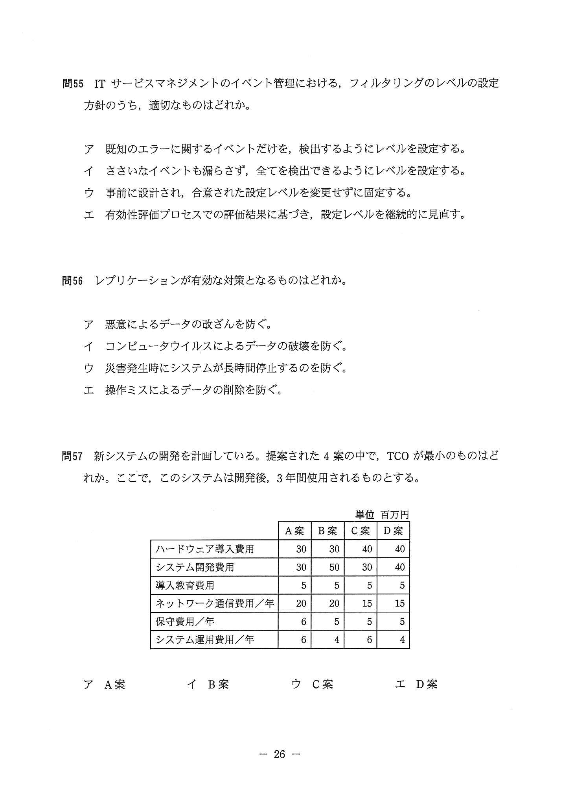

テキスト (OCR)

間55 IT サービスマネジメントのイベント管理における, フィルタリングのレベルの設定
方針のうち, 適切なものはどれか。

既知のエラーに関するイベントだけを, 検出するようにレベルを設定する。
ささいなイベントも漏らさず, 全てを検出できるようにレベルを設定する。
事前に設計され, 合意された設定レベルを変更せずに固定する。

有効性評価プロセスでの評価結果に基づき, 設定レベルを継続的に見直す。

H ささペコ

56 レプリケーションが有効な対策となるものはどれか。

悪意によるデータの改ざんを防ぐ。

コンピュータウイルスによるデータの破壊を防ぐ。
炎害発生時にシステムが長時間停止するのを防ぐ。
操作ミスによるデータの削除を防ぐ。

H へ

問57 新システムの開発を計画している。提案された 4 案の中で, TCO が最小のものはど
ND. TOC, このシステムは開発後, 3 年間使用されるものとする。

単位 AAA

A案|B案| C案|D案

ハードウェア導入費用            30| 30| 40| 40

システム開発費用                30      50      30      40

導入教育費用                         5        5        5        5

ネットワーク通信費用年| 20| 20   15   15

保守費用年                      6       5       5       5

システム運用費用年            6       4       6       4

ア AR                イ B案                 ウ CR                エ D案

### ページ 27

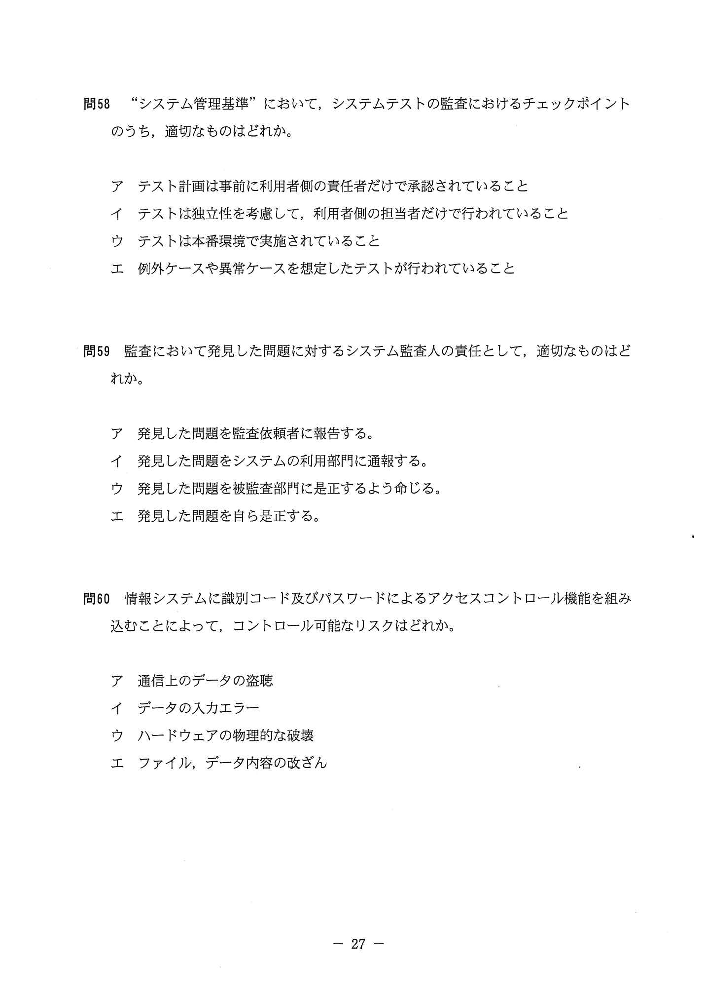

テキスト (OCR)

問58 “システム管理基準"” において, システムテストの監査におけるチェックボポイント
のうち, 適切なものはどれか。

テスト計画は事前に利用者側の責任者だけで承認されていること

テストは独立性を考慮して, 利用者側の担当者だけで行われていること
テストは本番環境で実施されていること

例外ケースや異常ケースを想定したテストが行われていること

H へ

間59 監査において発見した間題に対するシステム監査人の責任として, 適切なものはど
れか。

ア 発見した問題を監査依頼者に報告する。

イ 発見した問題をシステムの利用部門に通報する。
ウ 発見した問題を被監査部門に是正するよう命じる。
エ 発見した問題を自ら是正する。

問60 情報システムに識別コード及びパスワードによるアクセスコントロール機能を組み
込むひことによって, コントロール可能なリスクはどれか。

通信上のデータの盗聴
デーの入力エラー

ハードウェアの物理的な破壊
ファイル, データ内容の改ざん

H へ

ー 27 一

### ページ 28

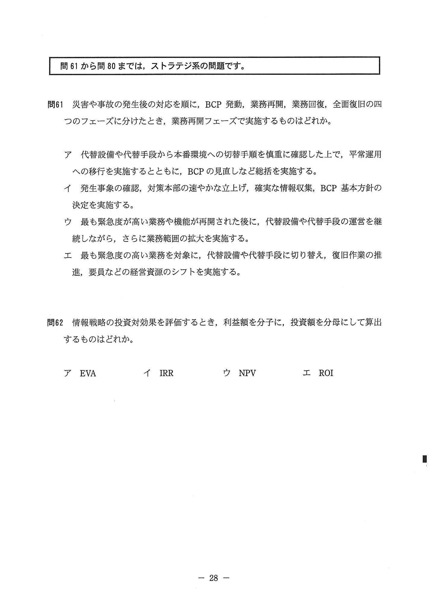

テキスト (OCR)

間 61 から問 80 までは, ストラテジ系の問題です。

間61 災害や事故の発生後の対応を順に, BCP 発動, 業務再開, 業務回復, 全面復旧の四
つのフェーズに分けたとき, 業務再開フェーズで実施するものはどれか。

ア 代状設備や代替手段から本番環境への切替手順を慎重に確認した上で, 平常運用
への移行を実施するとともに, BCP の見直しなど総括を実施する。

イ 発生事象の確認, 対策本部の速やかな立上げ, 確実な情報収集, BCP 基本方針の
決定を実施する。

ウ 最も緊急度が高い業務や機能が再開された後に, 代其設備や代替手段の運営を継
続しながら, さらに業務範囲の拡大を実施する。

エエ 最も緊急度の高い業務を対象に, 代奉設備や代替手段に切り大え, 復旧作業の推
進, 要員などの経営資源のシフトを実施する。

間62 情報戦略の投資対効果を評価するとき, 利益額を分子に, 投資額を分母にして算出

するものはどれか。

ア EVA     イ IRR     ウ NPV     <= ROI

ー 28 一

### ページ 29

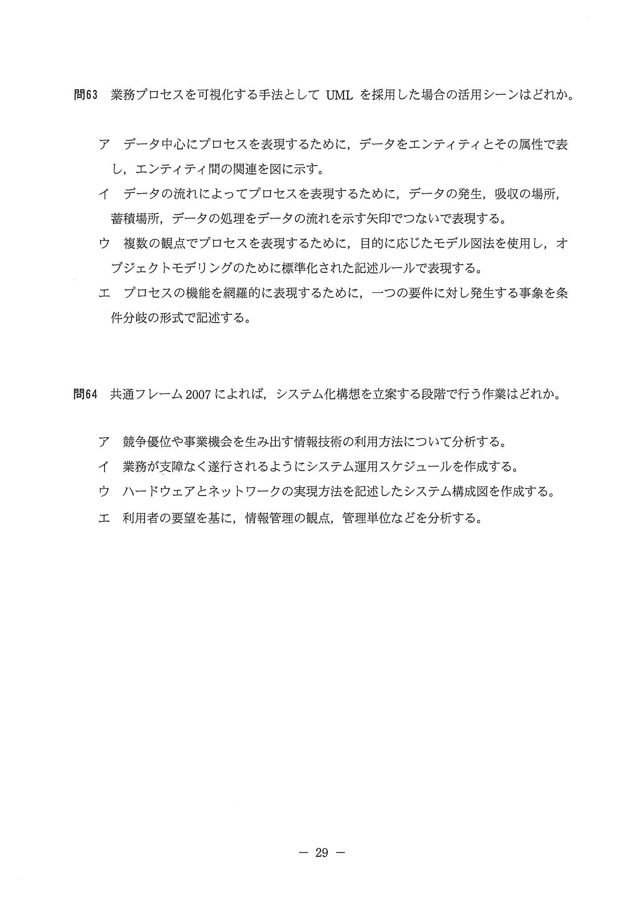

テキスト (OCR)

間63 業務プロセスを可視化する手法として UML を採用した場合の活用シーンはどれか。

ア データ中心にプロセスを表現するために, データをエンティティ とその属性で表
し, エンティティ間の関連を図に示す。

イ データの流れによってプロセスを表現するために, データの発生, 吸収の場所
BRM, データの処理をデータの流れを示す矢印でつないで表現する。

ウ 複数の観点でプロセスを表現するために, 目的に応じたモデル図法を使用し, +
プジェクトモデリングのために標準化された記述ルールで表現する。

エエ プロセスの機能を網弘的に表現するために, 一つの要件に対し発生する事象を条
件分岐の形式で記述する。

間64 共通フレーム 2007 によれば, システム化構想を立案する段階で行う作業はどれか。

競争優位や事業機会を生み出す情報技術の利用方法について分析する。

業務が支障なく遂行されるようにシステム運用スケジュールを作成する。

ハードウェアとネットワークの実現方法を記述したシステム構成図を作成する。
利用者の要望を基に, 情報管理の観点, 管理単位などを分析する。

H へ

ー 29 一

### ページ 30

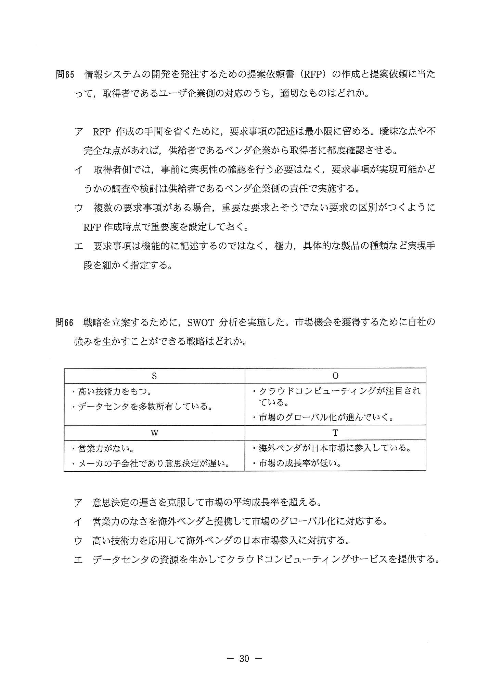

テキスト (OCR)

問65 情報システムの開発を発注するための提案依頼書 (RFP) の作成と提案依頼に当た
って, 取得者であるユーザ企業側の対応のうち, 適切なものはどれか。

ア REP 作成の手間を省くために, 要求事項の記述は最小限に留める。暖昧な点や不
完全な点があれば, 供給者であるベンダ企業から取得者に都度確認させる。

イ 取得者側では, 事前に実現性の確認を行う必要はなく, 要求事項が実現可能かど
うかの調査や検討は供給者であるベンダ企業側の責任で実施する。

ウ 複数の要求事項がある場合, 重要な要求とそうでない要求の区別がつくように
RFP 作成時点で重要度を設定しておく。

エエ 要求事項は機能的に記述するのではなく, 極力, 具体的な製品の種類など実現手
段を細かく指定する。

問66 戦略を立案するために, SWOT 分析を実施した。市場機会を獲得するために自社の
強みを生かすことができる戦略はどれか。

S                                           O
・高い技術力をもつ。               ・クラウドコンピューティングが注目され
・データセンタを多数所有している。           てNs
・市場のグローバル化が進んでいく。
WwW                                          T
・ 営業力がない。                              ・海外ベンダが日本市場に参入している。
・メーカの子会社であり意思決定が遅い。      ・市場の成長率が低い。

意恩決定の遅さを克服して市場の平均成長率を超える。

営業カのなさを海外ベンダと提携して市場のグローバル化に対応する。

高い技術力を応用して海外ベンダの日本市場参入に対抗する。

データセンタの資源を生かしてクラウドコンピューティングサービスを提供する。

HAN

### ページ 31

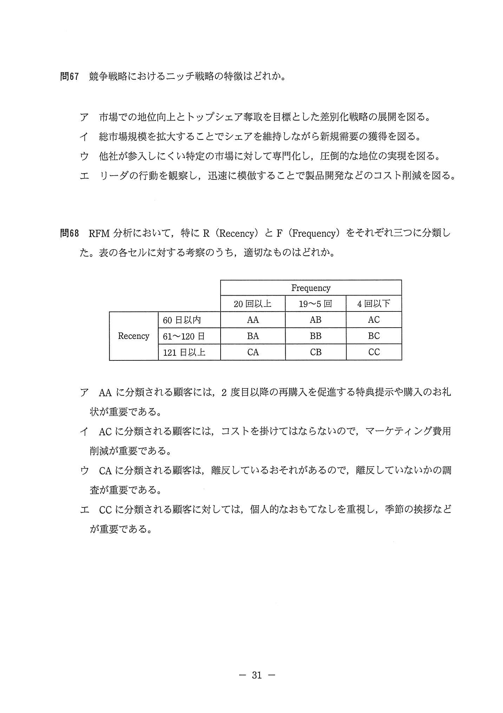

テキスト (OCR)

問67 競争戦略におけるニッチ戦略の特徴はどれか。

ア 市場での地位向上とトップシェア奪取を目標とした差別化戦略の展開を図る。

イ 総市場規模を拡大することでシェアを維持しながら新規需要の獲得を図る。

ウ 他社が参入しにくい特定の市場に対して専門化し, 圧倒的な地位の実現を図る。

L リーダの行動を観察し, 迅速に模條することで製品開発などのコスト削減を図る。

問68 RFM 分析において, 特に R (Recency) とF (Frequency) をそれぞれ三つに分類し
た。表の各セルに対する考察のうち, 適切なものはどれか。

Frequency
20 回以上        19~5 回        4回以下
60 日以内              AA               AB              AC
Recency | 61~120 日            BA               BB             BC
121 日以上             CA               CB              CC

ア AA に分類される顧客には, 2 度目以降の再購入を促進する特典提示や購入のお礼
状が重要である。

4 AC に分類される顧客には, コストを掛けてはならないので, マーケティング費用
削減が重要である。

ウ CAに分類される顧客は, 離反しているおそれがあるので, 離反していないかの調
査が重要である。

エ CCに分類される顧客に対しては, 個人的なおもてなしを重視し, 季節の挨拶など
が重要である。

ー 31 一

### ページ 32

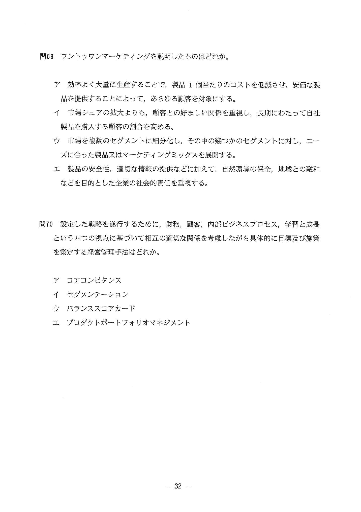

テキスト (OCR)

問69 ワントゥワンマーケティングを説明したものはどれか。

ア 効率よく大量に生産することで, 製品 1 個当たりのコストを低減させ, 安価な製
品を提供することによって, あらゆる顧客を対象にする。

イ 市場シェアの拡大よりも, 顧客との好ましい関係を重視し, 長期にわたって自社
製品を購入する顧客の割合を高める。

ウ 市場を複数のセグメントに細分化し, その中の幾つかのセグメントに対し, ニー
ズに合った製品又はマーケティングミックスを展開する。

エエ 製品の安全性, 適切な情報の提供などに加えて, 自然環境の保全, 地域との融和
などを目的とした企業の社会的責任を重視する。

間70 設定した戦略を遂行するために, 財務, BR, 内部ビジネスプロセス, 学習と成長
という四つの視点に基づいて相互の適切な関係を考慮しながら具体的に目標及び施策
を策定する経営管理手法はどれか。

コアコンピタンス

セグメンテーション

バランススコアカード

プロダクトポートフォリオマネジメント

H YAN

ー 32 一

### ページ 33

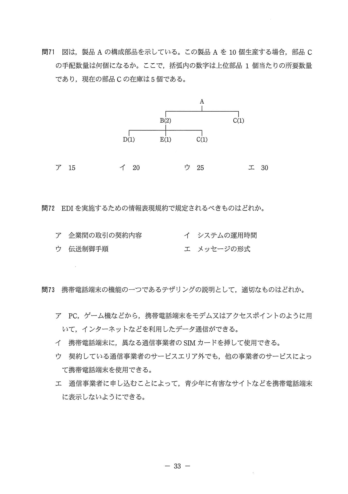

テキスト (OCR)

間71 図は, 製品 A の構成部品を示している。この製品 A を 10 個生産する場合, 部品 C
の手配数量は何個になるか。ここで, 括弧内の数字は上位部品 1 個当たりの所要数量
CHO, 現在の部品 C の在庫は 5 個である。

A
|     |
BQ)        ca)
     |     |
DQ)   E(1)   ca)
ア 15      イ 20      ウ 25      x= 30

問72 EDI を実施するための情報表現規約で規定されるべきものはどれか。

ア 企業間の取引の契約内容     イ システムの運用時間
ウ 伝送制御手順          工 メッセージの形式

間73 携帯電話端末の機能の一つであるテザリングの説明として, 適切なものはどれか。

ア PC, ゲーム機などから, 携帯電話端末をモデム又はアクセスポイントのように用
いて, インターネットなどを利用したデータ通信ができる。

イ 携帯電話端末に, 異なる通信事業者の SIM カードを挿して使用できる。

ウ 契約している通信事業者のサービスエリア外でも, 他の事業者のサービスによっ
て携帯電話端末を使用できる。

LC 通信事業者に申し込むひことによって, 青少年に有害なサイトなどを携帯電話端末
に表示しないようにできる。

### ページ 34

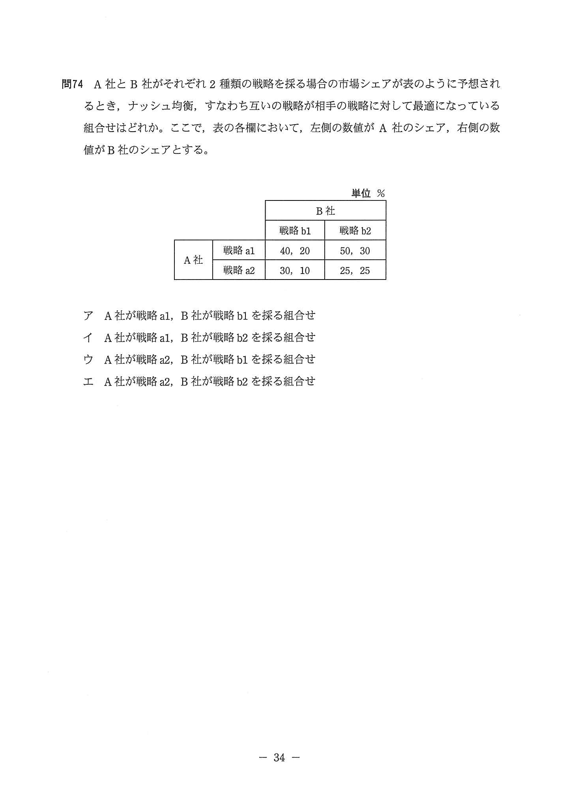

テキスト (OCR)

間74 A 社と B 社がそれぞれ 2 種類の戦略を採る場合の市場シェアが表のように予想され
るとき, ナッシュ均衡, すなわち互いの戦略が相手の戦略に対して最適になっている
組合せはどれか。ここで, 表の各欄において, 左側の数値が A 社のシェア, 右側の数
値がB 社のシェアとする。

単位 %
B社
戦略 b1       戦略b2
戦略 a1       40, 20         50, 30
A社
戦略 a2       30, 10         25, 25

A社が戦略a1, B 社が戦略b1 を採る組合せ
A社が戦略 a1, B 社が戦略b2 を採る組合せ
A社が戦略a2, B 社が戦略 b1 を採る組合せ
A社が戦略 a2, B 社が戦略 b2 を採る組合せ

H へ

### ページ 35

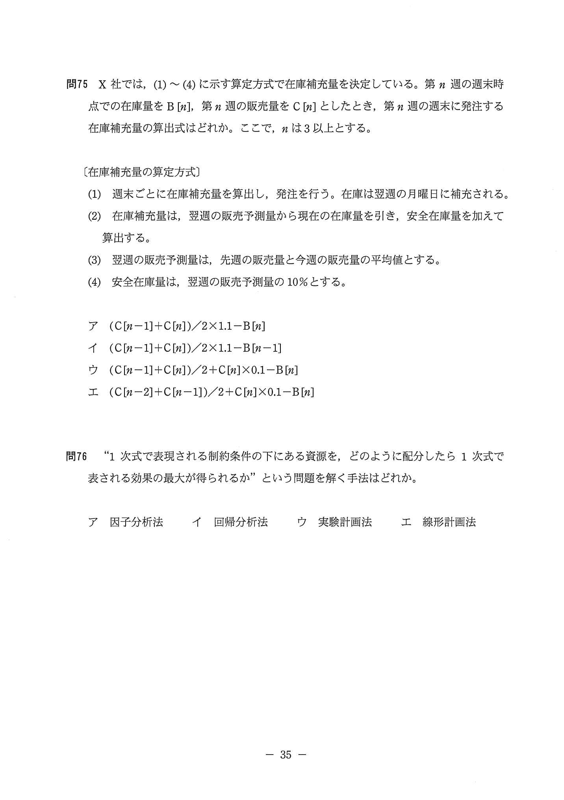

テキスト (OCR)

問75 X 社では, D~ (④ に示す算定方式で在庫補充量を決定している。第 ヵ 週の週末時
点での在庫量を B [z], Hn 週の販売量を C[z] としたとき, Hn 週の週末に発注する
在庫補充量の算出式はどれか。ここで, z は3 以上とする。

在庫補充量の算定方式]

(1) 週末ごとに在庫補充量を算出し, 発注を行う。在庫は翌週の月曜日に補売される。

2) 在庫補充量は, 翌週の販売予測量から現在の在庫量を引き, 安全在庫量を加えて
算出する。

(3) 翌週の販売予測量は, 先週の販売量と今週の販売量の平均値とする。

(4) 安全在庫量は, 翌週の販売予測量の 10%とする。

(Cl一1]二Cl])プ2X1.1一B[z]
(Clm—1]+C[n])/2X1.1-Bln-1]
(C[m—1]+C [n])/2+C[n] X0.1—B [n]
(C[m—2]+C[n—1])/2+C [n] X0.1—B [x]

H さい

間76 “1 次式で表現される制約条件の下にある資源を, どのように配分したら 1 次式で
表される効果の最大が得られるか"という問題を解く手法はどれか。

ア 因子分析法  イ 回帰分析法  ウ 実験計画法  工 線形計画法

ー 35 一

### ページ 36

テキスト (OCR)

間77 表はある会社の前年度と当年度の財務諸表上の数値を表したものである。両年度と
も売上高は 4.000 万円であった。前年度に比べ当年度に向上した財務指標はどれか。

単位 万円
前年度   当年度
流動資産  1,100    900
固定資産   500    800
流動負債   700    800
固定負債   500    300
純資産   400    600
ア 固定比率           イ 自己資本比率
ウ 総資本回転率          エエ 流動比率

間78 シュリンクラップ契約において, ソフトウェアの使用許諾契約が成立するのはどの
時点か。

購入したソフトウェアの代金を支払った時点

ソフトウェアの入った CD-ROM を受け取った時点
ソフトウェアの入った CD-ROM の包装を破った時点
ソフトウェアを PC にインストールした時点

HOGAN

### ページ 37

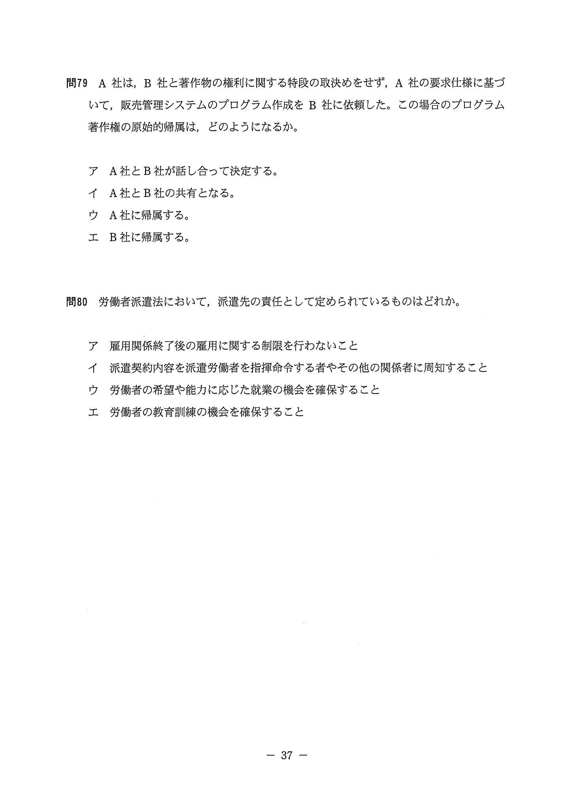

テキスト (OCR)

問79 A 社は, B 社と著作物の権利に関する特段の取決めをせず, A 社の要求仕様に基づ
いて, 販売管理システムのプログラム作成を B 社に依頼した。この場合のプログラム
著作権の原始的帰属は, どのようになるか。

A社とB社が話し合って決定する。
A社とB社の共有となる。

A社に帰属する。

B 社に帰属する。

HOGAN

間80 労働者派遣法において, 派遣先の責任として定められているものはどれか。

ア 雇用関係終了後の尾用に関する制限を行わないこと

イ 派遣契約内容を派遣労働者を指揮命令する者やその他の関係者に周知すること
ウ 労働者の希望や能力に応じた就業の機会を確保むること

エエ 労働者の教育訓練の機会を確保むすること

ー 37 一

### ページ 38

テキスト (OCR)

C A モ 用 紙 J

ー 38 一

### ページ 39

テキスト (OCR)

【 メモ 用 紙 〕

### ページ 40

テキスト (OCR)

6. 退室可能時間に途中で退室する場合には, 手を挙げて監督員に合図し, 答案用紙が
回収されてから静かに退室してください。
| 退室可能時間 | 10:30 ~ 11:50 |
7. 問題に関する質問にはお答えできません。文意どおり解釈してください。
8. 問題冊子の余白などは, 適宜利用して構いません。
9, 試験時間中 机上に置けるもの及び使用できるものは, 次のものに限ります。
なお, 会場での貸出しは行っていません。
受験票, 黒鉛筆及びシャープペンシル (B 又は HB), 鉛筆削り, 消しゴム, 定規
時計 (アラームなど時計以外の機能は使用不可), ハンカチ, ティッシュ, 目薬
これら以外は机上に置けません。使用もできません。
10. 試験終了後, この問題冊子は持ち帰ることができます。
ll. 答案用紙は, いかなる場合でも提出してください。回収時に提出しない場合は, 採
点されません。
12, 試験時間中にトイレへ行きたくなったり, 気分が悪くなったりした場合は, FEM
げて監督員に合図してください。
13. 午後の試験開始は 13:00 ですので, 12:40 までに着席してください。

試験問題に記載されている会社名又は製品名は, それぞれ各社の商標又は登録商標です。
なお, 試験問題では, ™ 及び © を明記していません。

@2012 独立行政法人情報処理推進機構

---

## 午前解答

©2012 独立行政法人情報処理推進機構 
平成24 年度 春期 応用情報技術者試験 解答例 
 
午前試験 
問番号 
正解 
問1 
ア 
問2 
エ 
問3 
ウ 
問4 
ア 
問5 
ア 
問6 
ウ 
問7 
ア 
問8 
ウ 
問9 
イ 
問10 
イ 
問11 
ウ 
問12 
ウ 
問13 
イ 
問14 
ア 
問15 
イ 
問16 
イ 
問17 
イ 
問18 
エ 
問19 
ア 
問20 
エ 
 
 
問番号 
正解 
問21 
ア 
問22 
エ 
問23 
ウ 
問24 
エ 
問25 
エ 
問26 
エ 
問27 
ウ 
問28 
エ 
問29 
エ 
問30 
イ 
問31 
エ 
問32 
イ 
問33 
ア 
問34 
ア 
問35 
イ 
問36 
イ 
問37 
エ 
問38 
ウ 
問39 
ウ 
問40 
ウ 
 
 
問番号
正解 
問41 
イ 
問42 
イ 
問43 
イ 
問44 
エ 
問45 
ア 
問46 
ア 
問47 
ア 
問48 
エ 
問49 
エ 
問50 
ア 
問51 
エ 
問52 
ウ 
問53 
ウ 
問54 
ア 
問55 
エ 
問56 
ウ 
問57 
ウ 
問58 
エ 
問59 
ア 
問60 
エ 
 
 
問番号 
正解 
問61 
エ 
問62 
エ 
問63 
ウ 
問64 
ア 
問65 
ウ 
問66 
エ 
問67 
ウ 
問68 
ウ 
問69 
イ 
問70 
ウ 
問71 
ウ 
問72 
エ 
問73 
ア 
問74 
イ 
問75 
ア 
問76 
エ 
問77 
イ 
問78 
ウ 
問79 
エ 
問80 
イ

---

## 午後問題

### ページ 1

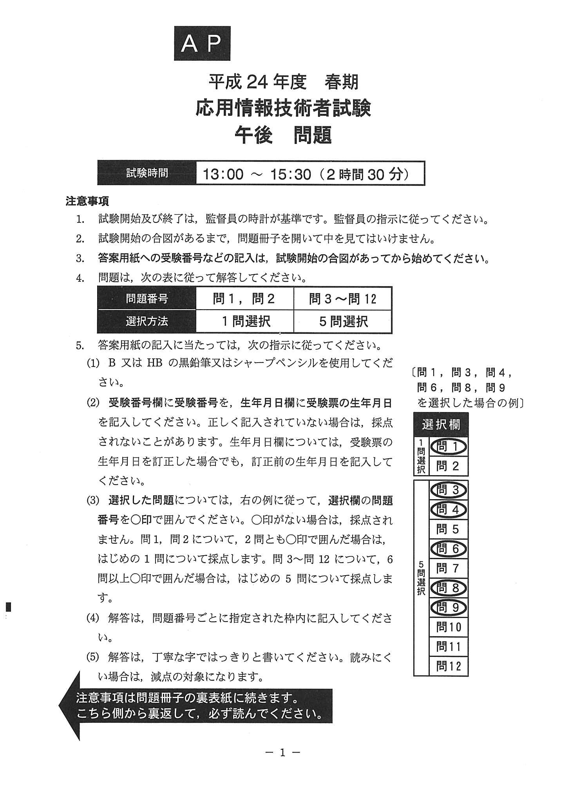

テキスト (OCR)

平成24年度 春期
応用情報技術者試験
午後 問題

 13:00 ~ 15:30 (2時間30 分)

注意事項
1. 試験開始及び終了は, 監督貞の時計が基準です。監督員の指示に従ってください。
2. 試験開始の合図があるまで, 問題冊子を開いて中を見てはいけません。
3. 答案用紙への受験番号などの記入は, 試験開始の合図があってから始めてください。
4. 問題は, 次の表に従って解答してください。

問題番号      ll, 問2     i 3 >問 12
BARAK         1 問選択        5 問選択

5. 答案用紙の記入に当たっては, 次の指示に従ってください。

1) B 又は HB の     又はシャープペンシルを    し    fel

①⑪        黒鉛筆又はシャープペンシルを使用してくだ  (問1, RIS. 問4.。
さい。                          間6, 問8, 問9

⑫) 受験番号欄に受験番号を, 生年月日欄に受験票の生年月 日  を選択した場合の例〕
を記入してください。正しく記入されていない場合は, 採点    選択欄
されないことがあります。生年月日欄については, 受験票の
生年月日を訂正した場合でも, 訂正前の生年月日を記入して

=
oo

択| 問 2
ください。
と
⑬) 選択した問題については, 右の例に従って, 選択欄の問題    o>
番号を〇印で囲んでください。〇印がない場合は, 採点され     aE
ません。問1 問2 について, 2 問とも〇印で囲んだ場合は,      iS
はじめの 1 問について採点します。問 3て問 12 について, 6  5|問7
問以上〇印で囲んだ場合は。 はじめの 5 問について採点しま |B
                                                             R
°                                         i 9
④ 解答は, 問題番号ごとに指定された竹内に記入してくださ     a
い。
]               問11
(6) 解答は, 丁寧な字ではっきりと書いてください。読みにく      aa

い場合は, 減点の対象になります。

注意事項は問題冊子の裏表紙に続きます。
こちら側から裏返して, 必ず読んでください。

### ページ 2

### ページ 3

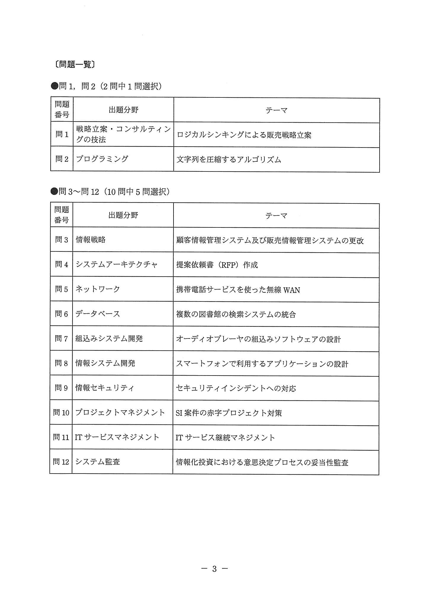

テキスト (OCR)

〔問題一覧〕

@ifi1, 問2 (2 問中1 問選択)
Ms           出題分野                                    テーマ
問1 クアのは 「 コンサルデイン |ロジカルシンキングによる販売戦略立案
問2 | プログラミング          文字列を圧縮するアルゴリズム
信問 3~ F112 (10 問中 5 問選択)
           出題分野                                    テーマ
問3 | 情報戦略             顧客情報管理システム及び販売情報管理システムの更政
問4 | システムアーキテクチャ |提案依頼書 (RFP) 作成
問5 | ネットワーク            携帯電話サービスを使った無線 WAN
間6 | データベース           複数の図書館の検索システムの統合
問7 | 組込みシステム開発       オーディオプレーヤの組込みソフトウェアの設計
問 8 | 情報システム開発       スマートフォンで利用するアプリケーションの設計
Ho | 情報セキュリティ         セキュリティインシデントへの対応
間 10 | プロジェクトマネジメント | SI 案件の赤字プロジェクト対策
問11 |TT サービスマネジメント |TTサービス継続マネジメント
問 12 | システム監査            情報化投資における意思決定プロセスの妥当性監査

### ページ 4

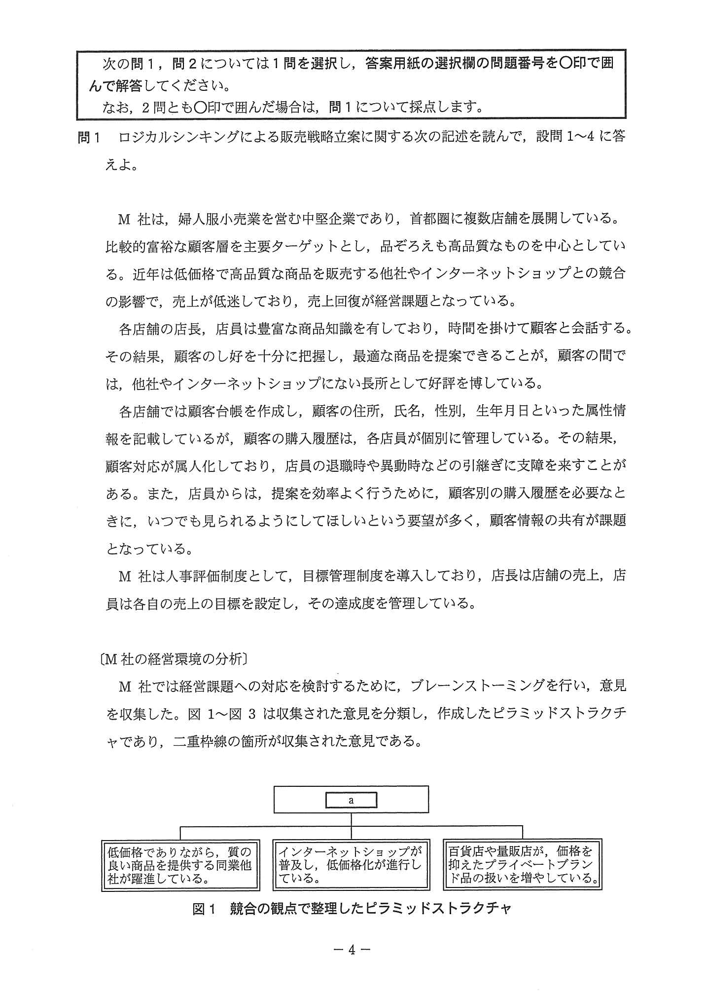

テキスト (OCR)

次の間 1 , 間2 については1 問を選択し, 答案用紙の選択拉の問題番号を〇印で囲
んで解答してください。
なお, 2 問とも〇印で囲んだ場合は, 問 1 について採点します。
問1 ロジカルシンキングによる販売戦略立案に関する次の記述を読んで, 設問 1ご4 (
えよ。

a)

M 社は, 婦人服小売業を営む中堅企業であり, 首都圏に複数店舗を展開している。
比較的富裕な顧客層を主要ターゲットとし, 品ぞろえゃ高品質なものを中心としてい
る。 近年は低価格で高品質な商品を販売する他社やインターネットショップとの競合
の影響で, 売上が低迷しており, 売上回復が経営課題となっている。

各店舗の店長, 店員は豊富な商品知識を有しており, 時間を掛けて顧客と会話する。
その結果, 顧客のし好を十分に把握し, 最適な商品を提案できることが, 顧客の間で
は, 他社やインターネットショップにない長所として好評を博している。

各店舗では顧客台帳を作成し, 顧客の住所, 氏名, 性別, 生年月日といった属性情
報を記載しているが, 顧客の購入履歴は, 各店員が個別に管理している。その結果,
顧客対応が属人化しており, 店員の退職時や異動時などの引継ぎに支障を来すことが
ある。また, 店員からは, 提案を効率よく行うために, 顧客別の購入履歴を必要なと
きに, いつでも見られるようにしてほしいという要望が多く, 顧客情報の共有が課題
となっている。

M 社は人事評価制度として, 目標管理制度を導入しており, 店長は店舗の売上 店
員は各自の売上の目標を設定し, その達成度を管理している。

(M 社の経営環境の分析]

M 社では経営課題への対応を検討するために, プレーンストーミングを行い, 意見
を収集した。図 1ご図 3 は収集された意見を分類し, 作成したピラミッドストラクチ
ャであり, 二重枠線の箇所が収集された意見である。

La]

低価格でありながら, 質の|| |インターネットショップが| 百貨店や量販店が, 価格を
良い商品を提供する同業他 | 普及し, 低価格化が進行し | |抑えたプライベートブラン
社が曜進している。            ている。                       ド品の扱いを増やしている。

 1 競合の観点で整理したピラミッドストラクチャ

ー4一

### ページ 5

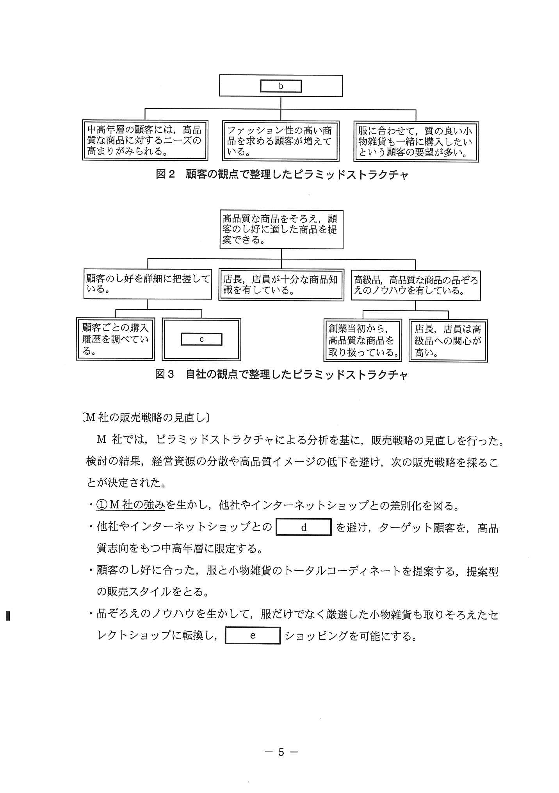

テキスト (OCR)

し5 1

中高年層の顧客には, 高品      ファッション性の高い商      服に合わせて, 質の良い小
質な商品に対するニーズの      品を求める顧客が増えて      物雑貨も一緒に購入したい
高まりがみられる。          いる。                   という顧客の要望が多い。

 2 顧客の観点で整理したピラミッドストラクチャ

高品質な商品をそろえ, TA
客のし好に適した商品を提
案できる。

|                                  |
顧客のし好を詳細に把握して| |店長, 店員が十分な商品知 | |高級品, 高品質な商品の品ぞろ

いる。                       識を有している。            えのノウハウを有している。
顧客ごとの購入                                    創業当初から,     店長, 店員は高
履歴を負べてい                     高品質な商品を || | 級品への関心が
る。                                 取り扱っている。| | 高い。

 3 自社の観点で整理したピラミッドストラクチャ

(M 社の販売戦略の見直し)
M 社では。 ピラミッドストラクチャによる分析を基に, 販売戦略の見直しを行った。

検討の結果, 経営資源の分散や高品質イメージの低下を避け, 次の販売戦略を採るこ
とが決定された。

・① M 社の強みを生かし, 他社やインターネットショップとの差別化を図る。

・ 他社やインターネットショップとの|  q | を避け, ターゲット願客を, 高品
質志向をもつ中高年層に限定する。

・願客のし好に合った, 服と小物雑貨のトータルコーディネートを提案する, 提案型
の販売スタイルをとる。

・ 品ぞろえのノウハウを生かして, 服だけでなく厳選した小物雑貨も取りそろえたセ
レクトショップに転換し。 | c  ] ショッピングを可能にする。

### ページ 6

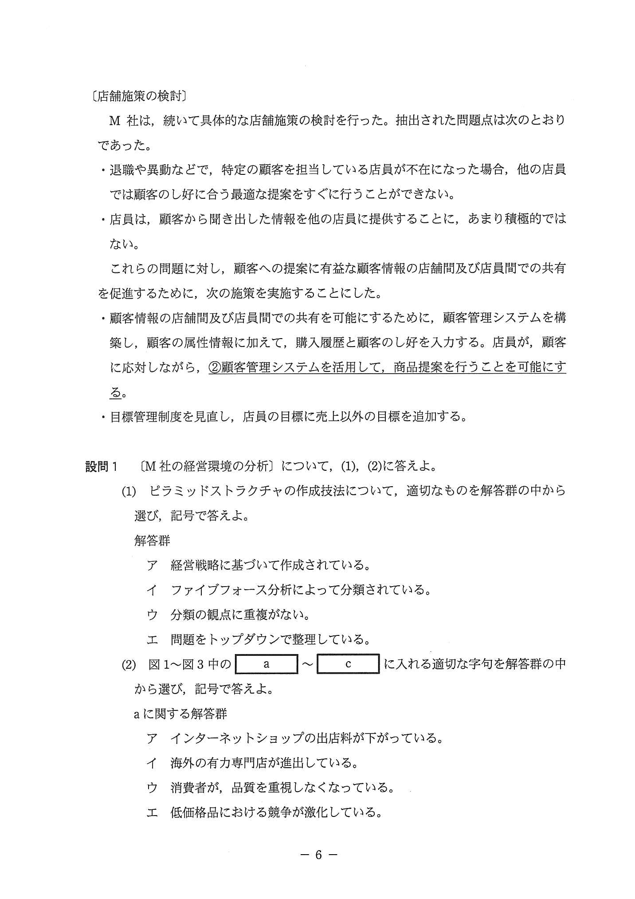

テキスト (OCR)

[店舗施策の検討]
M 社は, 続いて具体的な店舗施策の検討を行った。抽出された問題点は次のとおり

であった。

・退職や異動などで, 特定の顧客を担当している店員が不在になった場合, 他の店員
では顧客のし好に合う最適な提案をすぐに行うことができない。

・店員は, 顧客から開き出した情報を他の店員に提供することに, あまり積極的では
ない。
これらの問題に対し, 顧客への提案に有益な顧客情報の店舗問及び店員間での共有

を促進するために, 次の施策を実施することにした。

・顧客情報の店舗問及び店員間での共有を可能にするために, 顧客管理システムを構
築し, 顧客の属性情報に加えて, 購入履歴と顧客のし好を入力する。店員が, 顧客
に応対しながら, ②顧客管理システムを活用して, 商品提案を行うことを可能にす
る。

・目標管理制度を見直し, 店員の目標に売上以外の目標を追加する。

設問1  [M 社の経営環境の分析〕】について, ①⑪, ②⑫)に答えよ。
(1) ピラミッドストラクチャの作成技法について, 適切なものを解答群の中から
選び, 記号で答えよ。
解答群
ア 経営戦略に基づいて作成されている。
イ ファイブフォース分析によって分類されている。
ウ 分類の観点に重複がない。
エエ 問題をトップダウンで整理している。
⑫) 図1へ図3中の| a |~| < | に入れる適切な字名を解答群の中
から選び, 記号で答えよ。
a に関する解答群
ア インターネットショップの出店料が下がっている。
イ 海外の有力専門店が進出している。
ウ 消費者が, 品質を重視しなくなっている。
エエ 低価格品における競争が激化している。

ー6 一

### ページ 7

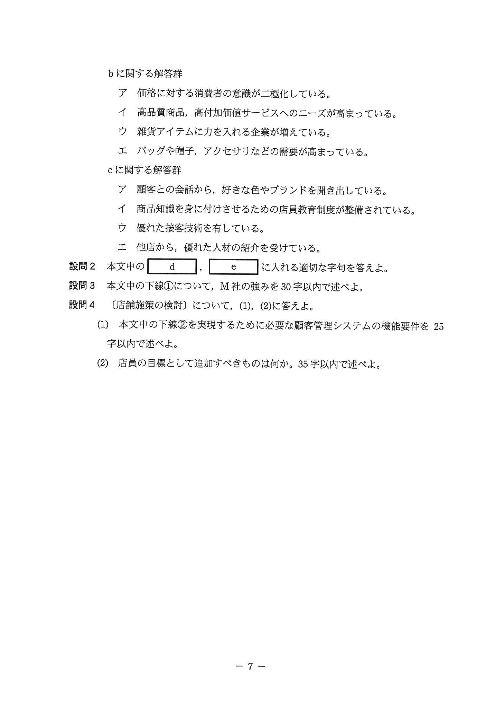

テキスト (OCR)

b に関する解答群
ア 価格に対する消費者の意識が二極化している。
イ 高品質商品, 高付加価値サービスへのニーズが高まっている。
ウ 雑貨アイテムに力を入れる企業が増えている。
エエ バッグや帽子,アクセサリなどの筆要が高まっている。
c に関する解答群
ア 顧客との会話から, 好きな色やブランドを聞き出している。
イ 商品知識を身に付けさせるための店員教育制度が整備されている。
ウ 優れた接客技術を有している。
エエ EDS, 優れた人材の紹介を受けている。
設問2 本文中の| da |,|  e |に入れる適切な字句を答えよ。
設問3 本文中の下線やについて, M社の強みを 30 字以内で述べよ。
設問4 [店舗施策の検討について, ①, ②)に管えよ。
Q①) 本文中の下線②を実現するために必要な顧客管理システムの機能要件を 25
2) 店員の目標として追加すべきものは何か。35 字以内で述べよ。

### ページ 8

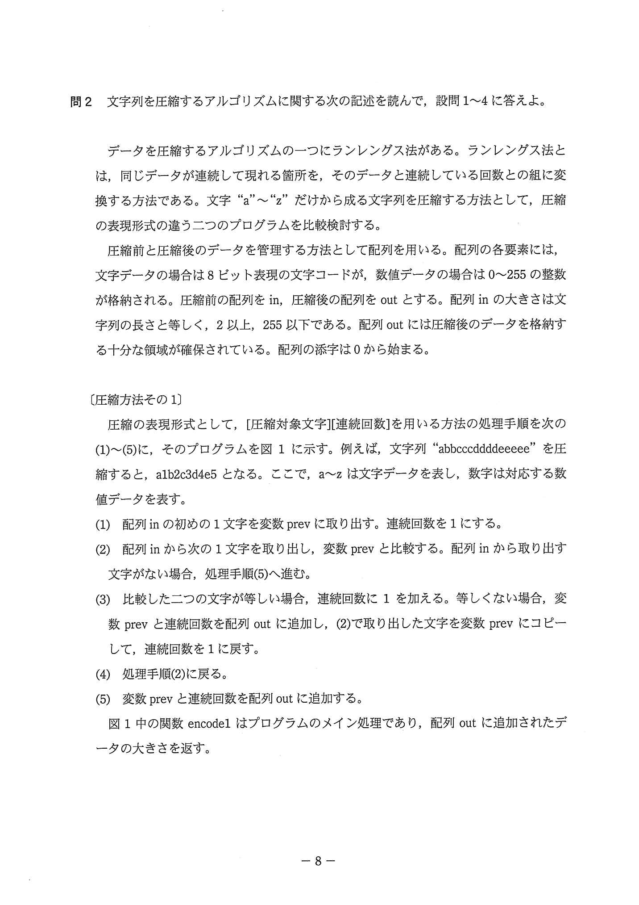

テキスト (OCR)

問2 文字列を圧縮するアルゴリズムに関する次の記述を読んで, 設問 1ご4 に答えよ。

データを圧縮するアルゴリズムの一つにランレングス法がある。ランレングス法と
は, 同じデータが連続して現れる箇所を, そのデータと連続している回数との組に変
換する方法である。 文字 “a"て"z” だけから成る文字列を圧縮する方法として, 圧縮
の表現形式の違う二つのプログラムを比較検討する。

圧縮前と圧縮後のデータを管理する方法として配列を用いる。配列の各要素には,
文字データの場合は 8 ビット表現の文字ユードが, 数値データの場合は 0て255 の整数
が格納される。圧縮前の配列を in, 圧縮後の配列を out とする。 配列 in の大きさは文
字列の長さと等しく, 2 以上, 255 以下である。 配列 out には圧縮後のデータを格納す
る十分な領域が確保されている。配列の添字は 0 から始まる。

〔圧縮方法その 1)
圧縮の表現形式として, [圧縮対象文字[連続回数1を用いる方法の処理手順を次の

(①⑪~て(5)に, そのプログラムを図 1 に示す。例えば, 文字列 “abbeccddddeeeee” を圧

縮すると, al1b2c3d4e5 となる。ここで, aぐz は文字データを表し, 数字は対応する数

値データを表す。

(1) 配列in の初めの 1 文字を変数 prev に取り出す。連続回数を 1 にする。

(2) 配列 mn から次の 1 文字を取り出し, BE prev と比較する。配列 in から取り出す
文字がない場合, 処理手順6)へ進む。

(3) 比較した二つの文字が等しい場合, 連続回数に 1 を加える。等しくない場合, 変
数 prev と連続回数を配列 out に追加し, (②で取り出した文字を変数 prewy にコピー
して, 連続回数を 1 に戻す。

(4) 処理手順(2②)に戻る。

(5) AK prev と連続回数を配列 ont に追加する。

 1 中の関数 encode1 はプログラムのメイン処理であり, 配列 out に追加されたデ

ータの大きさを返す。

### ページ 9

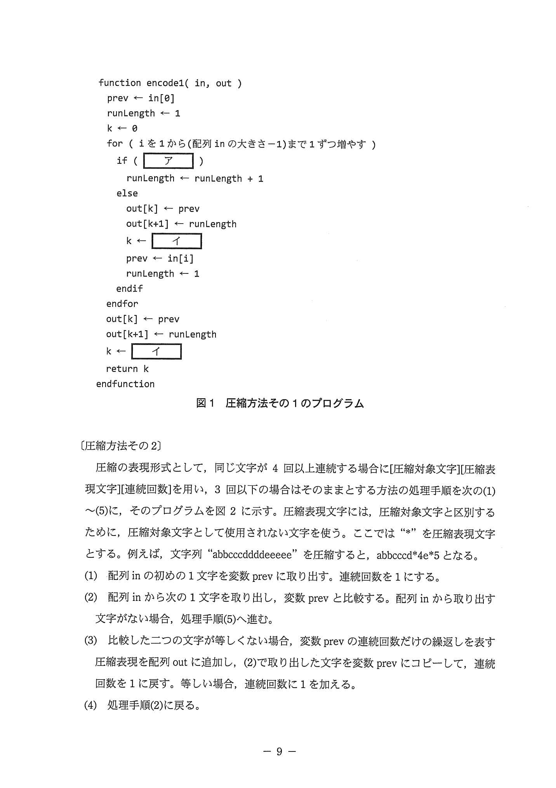

テキスト (OCR)

function encode1( in, out )
prev で in[@]
runLength < 1
kで9@
for ( iを1から(配列 in の大きさー1)まで 1 ずつ増やす )

ff(しテコ)

FunLength < runLength + 1
else

out[k] < prev

out[k+1] < runLength

ーーー

prev で in[i]
FunLength て 1
endif
endfor
out[k] て prev
out[k+1] < runLength

*ーレイコ

return k
endfunction

図1 圧縮方法その 1 のプログラム

(圧縮方法その 2)
圧縮の表現形式として, 同じ文字が 4 回以上連続する場合に[圧縮対象文字][圧縮表

現文字][連続回数]を用い, 3 回以下の場合はそのままとする方法の処理手順を次の①)

て⑤に, そのプログラムを図 2 に示す。圧縮表現文字には, 圧縮対象文字と区別する

ために, 圧縮対象文字として使用されない文字を使う。ここでは ““"”を圧縮表現文字

とする。例えば, 文字列 “abbcccddddeeeee”を圧縮すると, abbcccd*4e*5 となる。

(1) 配列in の初めの1 文字を変数 prey に取り出す。連続回数を 1 にする。

(②) 配列mmから次の1 文字を取り出し, 変数 prev と比較する。配列 in から取り出す
文字がない場合, 処理手順(5)へ進む。

(3) 比較した二つの文字が等しくない場合, BH prev の連続回数だけの繰返しを表す
圧縮表現を配列 out に追加し, (②で取り出した文字を変数 prcewy にコピーして, 連続
回数を 1 に戻す。等しい場合, 連続回数に 1 を加える。

(4) 処理手順2②に戻る。

### ページ 10

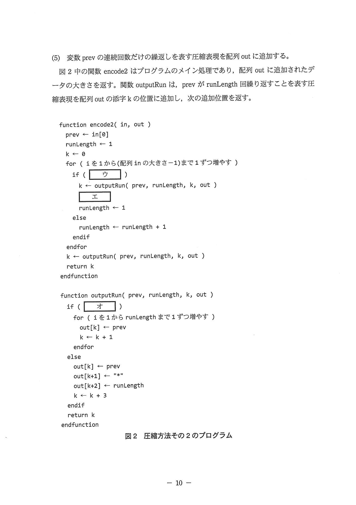

テキスト (OCR)

(5) 変数 prev の連続回数だけの繰返しを表す圧縮表現を配列 out に追加する。

図 2 中の関数 encode2 はプログラムのメイン処理であり, 配列 out に追加されたデ
ータの大きさを返す。関数 outputRun は, prev が runLength 回繰り返すことを表す圧
縮表現を配列 out の添字 k の位置に追加し, 次の追加位置を返す。

function encode2( in, out )
prev で in[@]
runLength で 1
k<-@
for ( iを1から(配列 in の大きさー1)まで 1 ずつ増やす )
iF ( )
k < outputRun( prev, runLength, k, out )
runLength <- 1
else
runLength < runLength + 1
endif
endfor
k < outputRun( prev, runLength, k, out )
return k
endfunction

function outputRun( prev, runLength, k, out )
iF ( )
for (i %12°5 runlength まで 1 ずつ増やす )
out[k] < prev
kk+1
endfor
else
out[k] < prev
out[k+1] て "*"
out[k+2] <- runLength
k<-—k+3
endif
return k
endfunction

 2 圧縮方法その 2 のプログラム

ー 10 一

### ページ 11

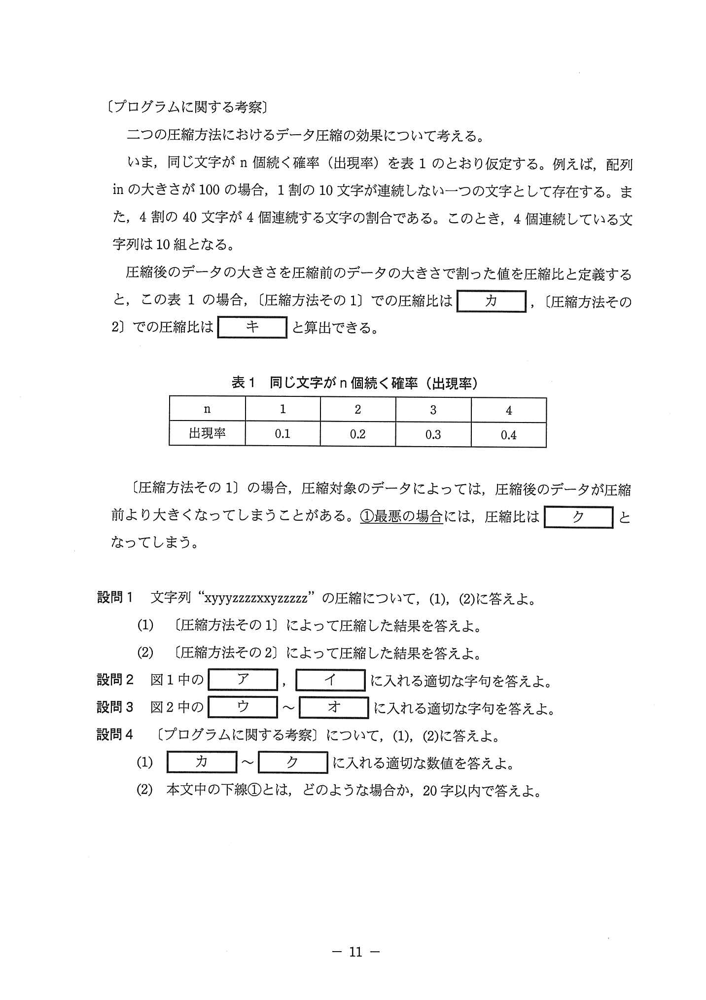

テキスト (OCR)

〔プログラムに関する考察〕

つの圧縮方法におけるデータ圧縮の効果について考える。

いま, 同じ文字が n 個続く確率 (出現率) を表 1 のとおり仮定する。例えば, 配列
in の大きさが 100 の場合, 1 HO 10 文字が連続しない一つの文字として存在する。ま
た, 4 割の 40 文字が 4 個連続する文字の割合である。このとき, 4 個連続している文
字列は 10 組となる。

圧縮後のデータの大きさを圧縮前のデータの大きさで割った値を圧縮比と定義する
と, この表 1 の場合, (圧縮方法その 1) での圧縮比は| カカ |, UEKREO

2) での圧縮比は| キ | と算出できる。

表1 同じ文字がn 個続く確率 (出現率)
n                1                2                3                4
出現率           0.1              0.2              0.3              0.4

〔圧縮方法その 1〕 の場合圧縮対象のデータによっては, 圧縮後のデータが圧縮

前より大きくなってしまうことがある。①最悪の場合には, 圧縮比は と
なってしまう。

設問1 文字列 “xyyyzzzzxxyzzzzz”の圧縮について, (1), (2②)に答えよ。
①)  (縮方法その 1) によって圧縮した結果を答えよ。
(2) 圧縮方法その 2)】 によって圧縮した結果を答えよ。
設問2 図1中の| ア |,| イ |に入れる適切な字句を答えよ。
設問3 図2中の| ウ |~| オ |に入れる適切な字旬を答えよ。
設問4 〔プログラムに関する考察] について, ①, (2②)に答えよ。
QM | カ |~| ク |に入れる適切な数値を答えよ。
(2) 本文中の下線のとは, どのような場合か, 20 字以内で答えよ。

### ページ 12

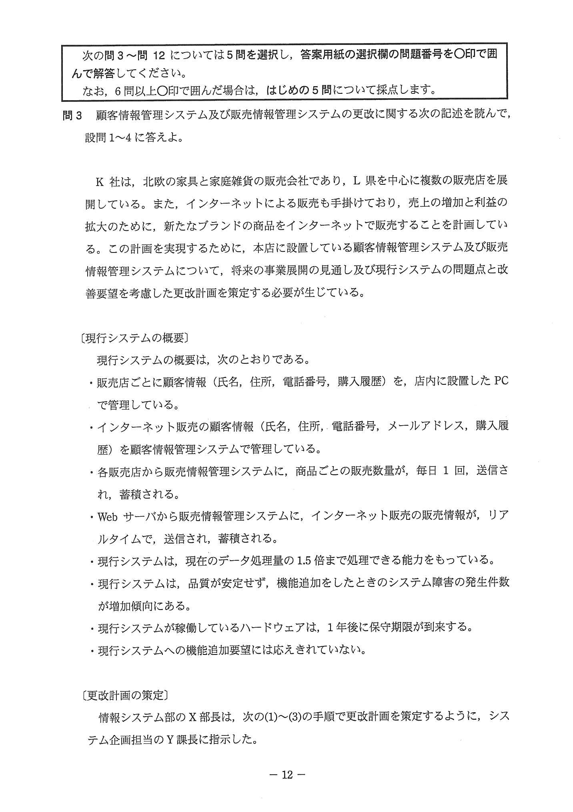

テキスト (OCR)

次の問3ン問 12 については5問を選択し, 答案用紙の選択欄の問題番号を〇印で囲
んで解答してください。
なお, 6 問以上〇印で囲んだ場合は はじめの5 間について採点します。

問3 顧客情報管理システム及び販売情報管理システムの更改に関する次の記述を読んで,
設問 1こ4 に答えよ。

K 社は, 北欧の家具と家庭雑貨の販売会社であり, L 県を中心に複数の販売店を展
開している。また, インターネットによる販売も手掛けており, 売上の増加と利益の
拡大のために, 新たなブランドの商品をインターネットで販売することを計画してい
る。この計画を実現するために, 本店に設置している顧客情報管理システム及び販売
情報管理システムについて, 将来の事業展開の見通し及び現行システムの問題点と改
善要望を考慮した更政計画を策定する必要が生じている。

[現行システムの概要)
現行システムの概要は, 次のとおりである。

・販売店ごとに顧客情報 (氏名, 住所, 電話番号, 購入履歴) を, 店内に設置した PC
で管理している。

・インターネット販売の顧客情報 (氏名, 住所,. 電話番号, メールアドレス, 購入履
歴) を顧客情報管理システムで管理している。

・各販売店から販売情報管理システムに, 商品ごとの販売数量が, 毎日 1 回, 送信さ
nN, BHENS,

・Web サーバから販売情報管理システムに, インターネット販売の販売情報が. リア
ルタイムで, 送信され, BMENS.

・現行システムは, 現在のデータ処理量の 1.5 倍まで処理できる能力をもっている。

・現行システムは, 品質が安定せず, 機能追加をしたときのシステム障害の発生件数
が増加傾向にある。

・現行システムが稼働しているハードウェアは, 1 年後に保守期限が到来する。

・現行システムへの機能追加要望には応えきれていない。

(Bikat HORE)
情報システム部の双部長は, 次の①~て(3③の手順で更改計画を策定するように, シス
企画担当の Y 課長に指示した。

ー 12 一

### ページ 13

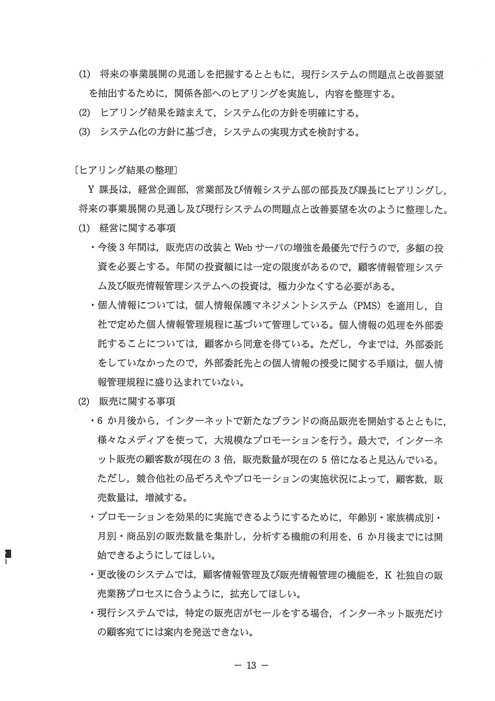

テキスト (OCR)

(① 将来の事業展開の見通しを把握するとともに, 現行システムの問題点と改善要望
を抽出するために, 関係各部へのヒアリングを実施し, 内容を整理する。

(2②) ヒアリング結果を踏まえて, システム化の方針を明確にする。

3) システム化の方針に基づき, システムの実現方式を検討する。

〔ヒアリング結果の整理

Y 課長は, 経営企画部, 営業部及び情報システム部の部長及び課長にヒアリングし,
将来の事業展開の見通し及び現行システムの問題点と改善要望を次のように整理した。
(1) 経営に関する事項

・今後 3 年間は, 販売店の改装と Web サーバの増強を最優先で行うので, 多額の投
資を必要とする。 年間の投資額には一定の限度があるので, 顧客情報管理システ
ム及び販売情報管理システムへの投資は, 極力少なくする必要がある。

・個人情報については, 個人情報保護マネジメントシステム (PMS) を適用し, 自
社で定めた個人情報管理規程に基づいて管理している。個人情報の処理を外部委
託することについては, 顧客から同意を得ている。ただし, 今までは, 外部委託
をしていなかったので, 外部委託先との個人情報の授受に関する手順は, 個人情
報管理規程に盛り込まれていない。

(2) 販売に関する事項

・6 DARDS, インターネットで新たなブランドの商品販売を開始するとともに,
様々なメディアを使って, 大規模なプロモーションを行う。最大で, インターネ
ット販売の顧客数が現在の 3 倍, 販売数量が現在の 5 倍になると見込んでいる。
ただし, 競合他社の品ぞろえやプロモーションの実施状況によって, 顧客数, 販
売数量は, 増減する。

・プロモーションを効果的に実施できるようにするために, 年齢別・家族構成別・
月別・商品別の販売数量を集計し, 分析する機能の利用を, 6 か月後までには開
始できるようにしてほしい。

・更改後のシステムでは, 顧客情報管理及び販売情報管理の機能を,K 社独自の販
売業務プロセスに合うように, 拡充してほしい。

・現行システムでは, 特定の販売店がセールをする場合,インターネット販売だけ
の顧客宛てには案内を発送できない。

ー 13 一

### ページ 14

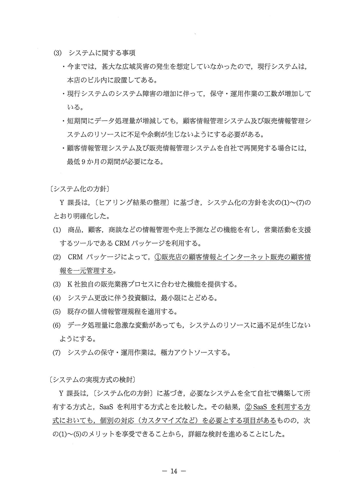

テキスト (OCR)

3) システムに関する事項

・今までは, 甚大な広域災害の発生を想定していなかったので, 現行システムは,

本店のビル内に設置してある。

・現行システムのシステム障害の増加に伴って, 保守・運用作業の工数が増加して

いる。

・短期間にデータ処理量が増減しても, 顧客情報管理システム及び販売情報管理シ

AF LOY I—-AIAEPRAME CBWE DICT SHEN S.

・顧客情報管理システム及び販売情報管理システムを自社で再開発する場合には,

最低9か月の期間が必要になる。

〔システム化の方針〕
Y 課長は, 〔[ヒアリング結果の整理に基づき, システム化の方針を次の(①て⑦の
とおり明確化した。

①

商品, 顧客 商談などの情報管理や売上予測などの機能を有し, 営業活動を支援

するツールである CRM パッケージを利用する。

(2)

CRM パッケージによって, ①販売店の顧客情報とインターネット販売の顧客情

報を一元管理する。

(3)
(4)
6)
©)

よ

⑦⑰⑦

K 社独自の販売業務プロセスに合わせた機能を提供する。

システム更政に伴う投資額は, 最小限にとどめる。

既存の個人情報管理規程を適用する。

データ処理量に急激な変動があっても, システムのリソースに過不足が生じない
うにする。

システムの保守・運用作業は, 極カアウトソースする。

[システムの実現方式の検討]

Y 課長は, 〔システム化の方針〕に基づき, 必要なシステムを全て自社で構築して所
有する方式と, SaaS を利用する方式とを比較した。その結果, ④SaaS を利用する方
式においても, 個別の対応 (カスタマイズなど) を必要とする項目があるものの, 次

の①て(5)のメリットを亭受できることから, 詳細な検討を進めることにした。

ー 14 一

### ページ 15

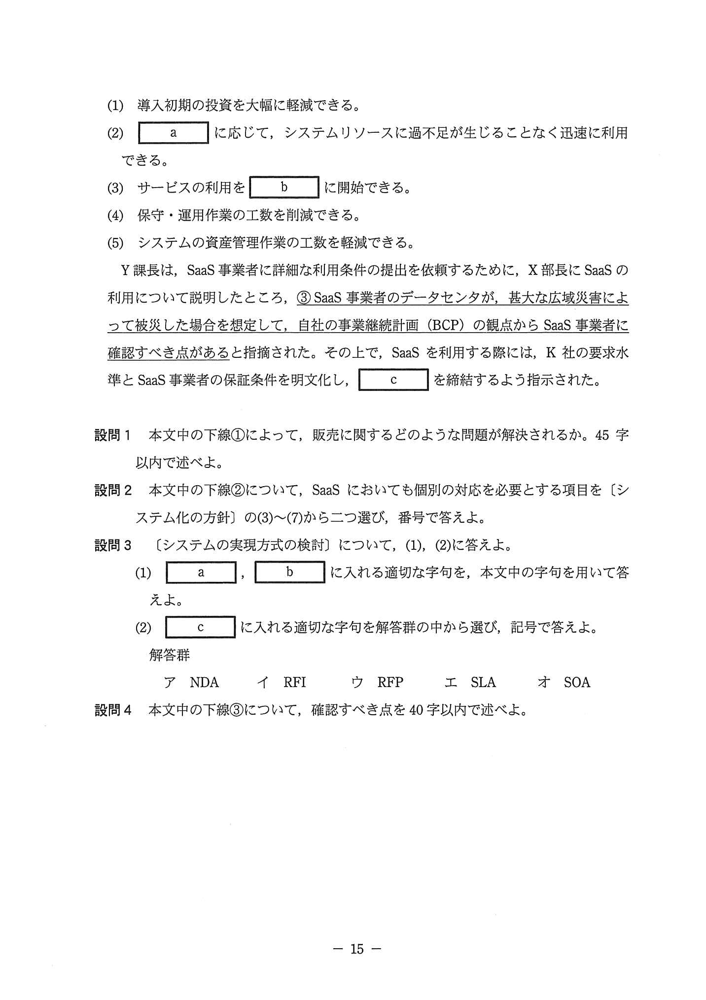

テキスト (OCR)

①) 導入初期の投資を大幅に軽減できる。
@ [a | に応じて, システムリソースに通不足が生じることなく迅速に利用

できる。

@) サービスの利用を| b | に開始できる。
⑭) 保守・運用作業の工数を削減できる。
(5) システムの資産管理作業の工数を軽減できる。

Y課長は。 SaaS 事業者に詳細な利用条件の提出を依頼するために, X 部長に SasS の
利用について説明したところ, ③ SaaS 事業者のデータセンタが, 基大な広域災害によ
って梓災した場合を想定して, 自社の事業継続計画 (BCP) の観点から SaaS 事業者に
確認すべき点があると指摘された。その上で, SaaS を利用する際には, K 社の要求水
準と SaaS 事業者の保証条件を明文化し, を締結するよう指示された。

設問1 本文中の下線やによって, 販売に関するどのような問題が解湊されるか。45 字

設問2 本文中の下線②について, SaaS においても個別の対応を必要とする項目を〔シ
ステム化の方針〕の(③~て(⑦から二つ選び, 番号で答えよ。

設問3 〔システムの実現方式の検討について, (①⑪, ②に答えよ。

a [oa |, | b |に入れる適切な字句を, 本文中の字句を用いて管
RE,
@ (¢_ |] に入れる適切な字句を解答群の中から選び, 記号で答えよ。
REE

ア NDA   イ RFI   ウ RFP   <= SLA   オ SOA

設問4 本文中の下線③について, 確認すべき点を 40 字以内で述べよ。

ー 15 一

### ページ 16

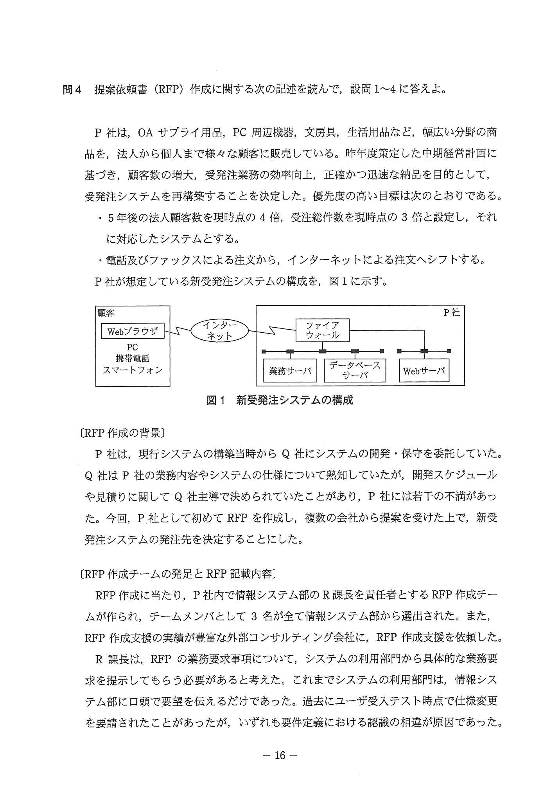

テキスト (OCR)

問4 提案依頼書 (RFP) 作成に関する次の記述を読んで, 設問 1ご4 に答えよ。

P 社は, OA サプライ用品, PC 周辺機器, 文房具, 生活用品など, 幅広い分野の商
品を, 法人から個人まで様々な顧客に販売している。昨年度策定した中期経営計画に
基づき, 顧客数の増大, 受発注業務の効率向上, 正確かつ迅速な納品を目的として,
受発注システムを再構築することを決定した。優先度の高い目標は次のとおりである。

+ 年後の法人顧客数を現時点の 4 倍, 受注総件数を現時点の 3 倍と設定し, それ
に対応したシステムとする。

・電話及びファックスによる注文から, インターネットによる注文へシフトする。

P 社が想定している新受発注システムの構成を, 図 1 に示す。

顧客                                                                                    P社
 Ce pS
携帯電話                                          データベー
スマートフォン                                  業務サーバ | | 7  an  Al |wepg-バ

 1 新受発注システムの構成

(RFP 作成の背景〕

P 社は, 現行システムの構築当時から Q 社にシステムの開発・保守を委託していた。
Q 社は P 社の業務内容やシステムの仕様について熟知していたが, 開発スケジュール
や見積りに関して Q 社主導で決められていたことがあり, P 社には若干の不満があっ
た。 SE, P 社として初めて RFP を作成し, 複数の会社から提案を受けた上で, 新受
発注システムの発注先を決定することにした。

(RFP 作成チームの発足と RFP 記載内容〕
RFP 作成に当たり, 了 社内で情報システム部の R 課長を責任者とする RFP 作成チー
ムが作られ, チームメンバとして 3 名が全て情報システム部から選出された。また,
RFP 作成支援の実績が豊富な外部コンサルティング会社に, RFP 作成支援を依頼した。
R 課長は, RFP の業務要求事項について, システムの利用部門から具体的な業務要
求を提示してもらう必要があると考えた。これまでシステムの利用部門は, 情報シス
テム部に口頭で要望を伝えるだけであった。過去にユーザ受入テスト時点で仕様変更
を要請されたことがあったが, いずれも要件定義における認識の相違が原因であった。

ー 16 一

### ページ 17

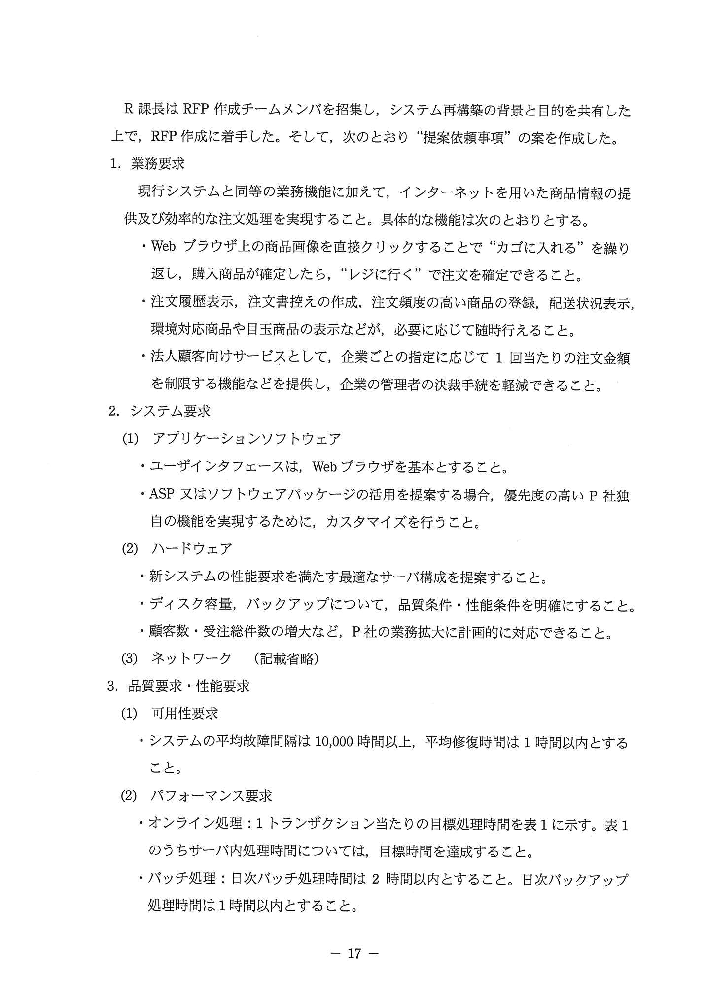

テキスト (OCR)

R 課長は RFP 作成チームメンバを招集し, システム再構築の背景と目的を共有した
上で, RFP 作成に着手した。そして, 次のとおり “提案依頼事項"の案を作成した。
1. 業務要求

現行システムと同等の業務機能に加えて, インターネットを用いた商品情報の提
供及び効率的な注文処理を実現すること。具体的な機能は次のとおりとする。
・Web ブラウザ上の商品画像を直接クリックすることで“カゴに入れる"を繰り
返し, 購入商品が確定したら, “レジに行く"で注文を確定できること。
・ 注文履歴表示, 注文書控えの作成, 注文顔度の高い商品の登録, 配送状況表示,
環境対応商品や目玉商品の表示などが, 必要に応じて随時行えること。
・法人顧客向けサービスとして, 企業ごとの指定に応じて 1 回当たりの注文金額
を制限する機能などを提供し, 企業の管理者の決裁手続を軽減できること。
2. システム要求

GQ) アプリケーションソフトウェア
・ユーザインタフェースは, Web ブラウザを基本とすること。
・ASP 又はソフトウェアパッケージの活用を提案する場合, 優先度の高い P 社独
自の機能を実現するために, カスタマイズを行うこと。

(2) ハードウェア
・新システムの性能要求を満たす最適なサーバ構成を提案すること。
・ディスク容量, パックアップについて, 品質条件・性能条件を明確にすること。
・ 顧客数・受注総件数の増大など, 社の業務拡大に計画的に対応できること。

(3③) ネットワーク  (記載省略)

3. 品質要求・性能要求

(①) 可用性要求
・システムの平均才障間隔は 10,000 時間以上, 平均修復時間は 1 時間以内とする
こと。

(2②) パフォーマンス要求

・オンライン処理 : 1 トランザクション当たりの目標処理時間を表 1 に示す。表 1
のうちサーバ内処理時間については, 目標時間を達成すること。

・バッチ処理 : 日次バッチ処理時間は 2 時間以内とすること。 日次バックアップ
処理時間は 1 時間以内とすること。

ー 17 一

### ページ 18

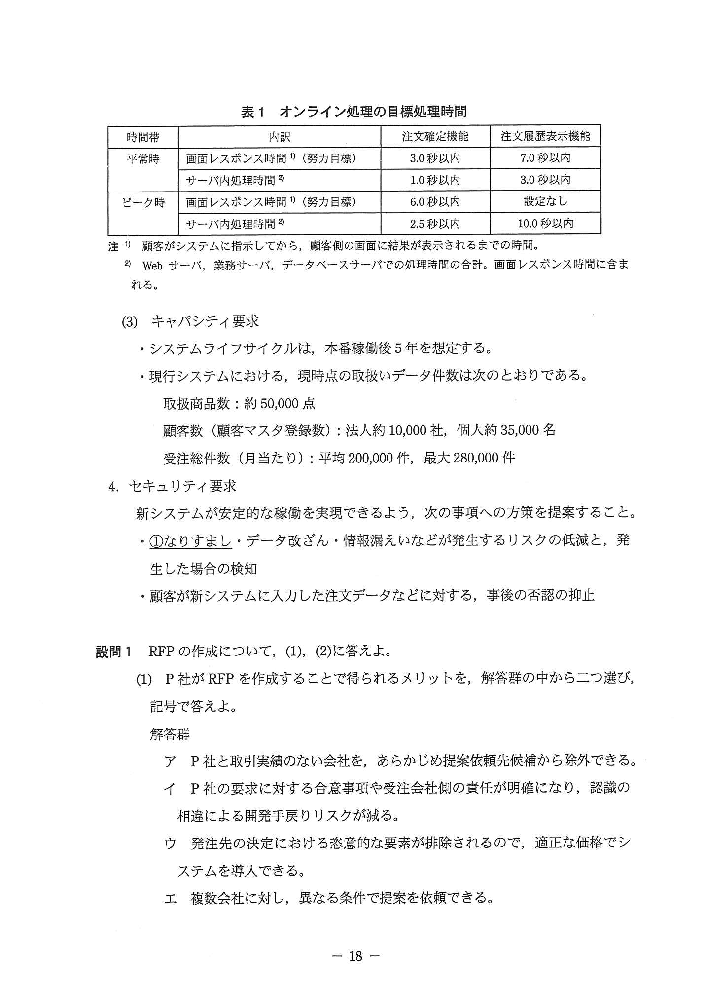

テキスト (OCR)

Ri オンライン処理の目標処理時間

時間帯                         Al                         注文確定機能       注文履歴表示機能
平常時    画面レスポンス時間 ? (努力目標)        3.0 秒以内         7.0 秒以内
サーバ内処理時間9                                 1.0 秒以内                3.0 秒以内
ピーク時 | 画面レスポンス時間 (努力目標)        6.0 秒以内          設定なし
サーバ内処理時間9                                 2.5 秒以内               10.0 秒以内

注 ! 顧客がシステムに指示してから, 顧客側の画面に結果が表示されるまでの時間。
2 Web サーバ, 業務サーバ, データベースサーバでの処理時間の合計。画面レスポンス時間に含ま
れる。
(3) キャパシティ要求
・システムライフサイクルは, 本番稼働後5 年を想定する。
・現行システムにおける, 現時点の取扱いデータ件数は次のとおりである。
取扱商品数 : 約 50.000 FR
顧客数 (顧客マスタ登録数) : 法人約 10,000 社, 個人約 35,000 名
受注総件数 (月当たり) : 平均 200,000 件, 最大 280,000 件
4. セキュリティ要求
新システムが安定的な稼働を実現できるよう, 次の事項への方策を提案すること。
・①なりすまし・データ改ざん・情報漏えいなどが発生するリスクの低減と, 発
生した場合の検知
・顧客が新システムに入力した注文データなどに対する, 事後の否認の抑止

設問1 REPの作成について, Q①, ②)に答えよ。
(1) PEAS REP を作成することで得られるメリットを, 解答群の中から二つ選び,
記号で答えよ。
解答群
ア 社と取引実績のない会社を, あらかじめ提案依頼先候補から除外できる。
イ PP 社の要求に対する合意事項や受注会社側の責任が明確になり, 認識の
相違による開発手戻りリスクが減る。
ウ 発注先の決定における座意的な要素が排除されるので, 適正な価格でシ
ステムを導入できる。
エ 複数会社に対し, 異なる条件で提案を依頼できる。

### ページ 19

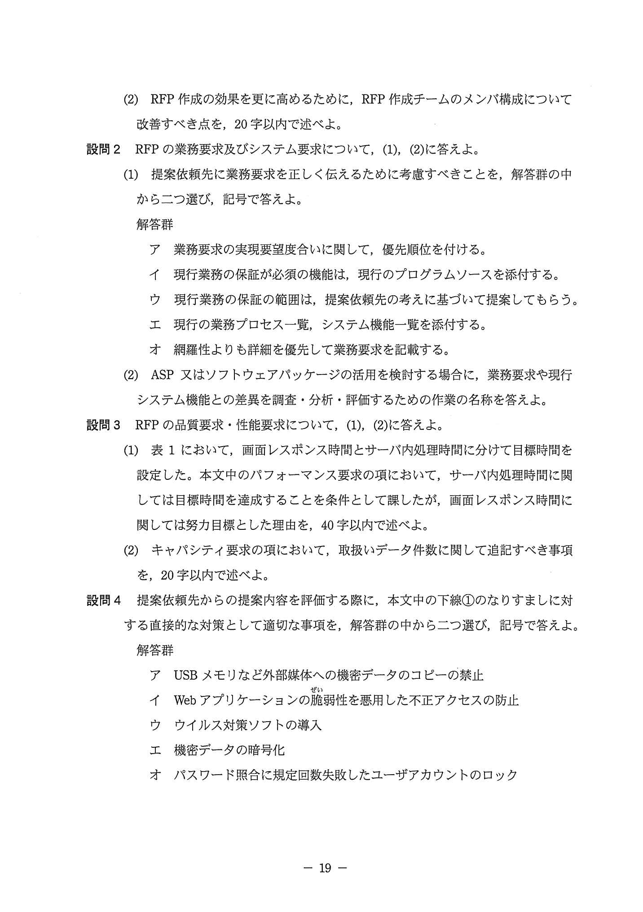

テキスト (OCR)

(2) RFP 作成の効果を更に高めるために, RFP 作成チームのメンババ構成について
改善すべき点を, 20 字以内で述べよ。
設問 2 RFP の業務要求及びシステム要求について, ①, ②)に答えよ。
(1) 提案依頼先に業務要求を正しく伝えるために考慮すべきことを, 解答群の中
から二つ選び, 記号で答えよ。
解答群
ア 業務要求の実現要望度合いに関して, 優先順位を付ける。
現行業務の保証が必須の機能は, 現行のプログラムソースを添付する。
現行業務の保証の範囲は, 提案依頼先の考えに基づいて提案してもらう。
現行の業務プロセス一覧, システム機能一覧を添付する。
A 網維性よりも詳細を優先して業務要求を記載する。
(2) ASP 又はソフトウェアパッケージの活用を検討する場合に, 業務要求や現行
システム機能との差異を調査・分析・評価するための作業の名称を答えよ。
設問3 RFP の品質要求・性能要求について, (1), ②)に答えよ。
(①) 表 1 において, 画面レスポンス時間とサーバ内処理時間に分けて目標時間を
設定した。本文中のパフォーマンス要求の項において, サーバ内処理時間に関
しては目標時間を達成することを条件として課したが, 画面レスポンス時間に
関しては努力目標とした理由を, 40 字以内で述べよ。
(2) キャパシティ要求の項において, 取扱いデータ件数に関して追記すべき事項
を, 20 字以内で述べよ。
設問4 提案依頼先からの提案内容を評価する際に, 本文中の下線ののなりすましに対
する直接的な対策として適切な事項を, 解答群の中から二つ選び, 記号で答えよ。
解答群
ア USB メモリなど外部媒体への機密データのコピーの禁止
Web アプリケーションの脆紅性を悪用した不正アクセスの防上
ウイルス対策ソフトの導入
機密データの暗号化
パスワード照合に規定回数失敗したユーザアカウントのロック

H A

M4 HG A

ー 19 一

### ページ 20

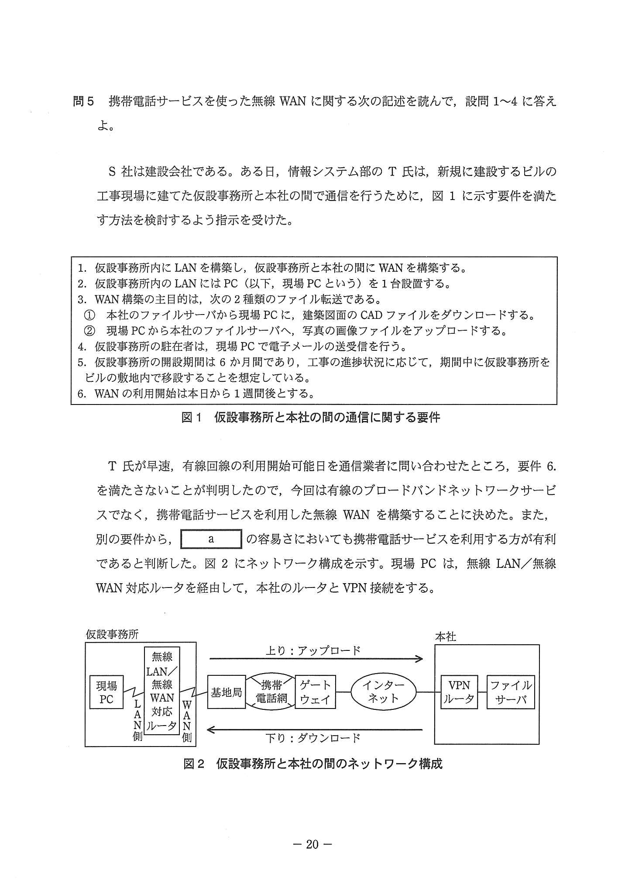

テキスト (OCR)

間5 携帯電話サービスを使った無線 WAN に関する次の記述を読んで, RE 1~4 に答え
よ。

S 社は建設会社である。ある日, 情報システム部の T 氏は, 新規に建設するビルの
工事現場に建てた仮設事務所と本社の間で通信を行うために, 図 1 に示す要件を満た
す方法を検討するよう指示を受けた。

設事務所内に LAN を構築し, 仮設事務所と本社の間に WAN を構築する。

2 人  婦事務所内の LAN にはPC (以下, 現場PC という) を1台設置する。

3. WAN 構築の主目的は, 次の 2 種類のファイル転送である。
① 本社のファイルサーバから現場 PC に, 建築図面の CAD ファイルをダウンロードする。
② 現場PCから本社のファイルサーバへ, 写真の画像ファイルをアップロードする。

4. 仮設事務所の駐在者は, 現場PCで電子メールの送受信を行う。

5. 仮設事務所の開設期間は 6 か月間であり, 工事の進捗状況に応じて, 期間中に仮設事務所を
ビルの敷地内で移設することを想定している。

6. WAN の利用開始は本日から 1 週間後とする。

  1 仮設事務所と本社の間の通信に関する要件

T 氏が早速。 有線回線の利用開始可能日を通信業者に問い合わせたところ, 要件 6.
を満たさないととが判明したので, 今回は有線のブロードパンドネットワークサービ
ATES, 携帯電話サービスを利用した無線 WAN を構築することに決めた。また,
別の要件から, | a | の容易さにおいても携帯電話サービスを利用する方が有利
であると判断した。図 2 にネットワーク構成を示す。 現場 PC は 無線 LAN/舞線
WAN 対応ルータを経由して, 本社のルータと VEN 接続をする。

仮設事務所                           本社
rr                 上り : アップロード
LAN/
現場 | 。 | se            or be の     ven | |ファィイル
レル]      カレ] 基地局                                     画
PC | | WAN             電話綱 | ウェイ      ネット        ルータ| | サーバ
Al対応1    Sa
NIルータ|N
側      側           FO: ダウンロード

 図2 仮設事務所と本社の間のネットワーク構成

### ページ 21

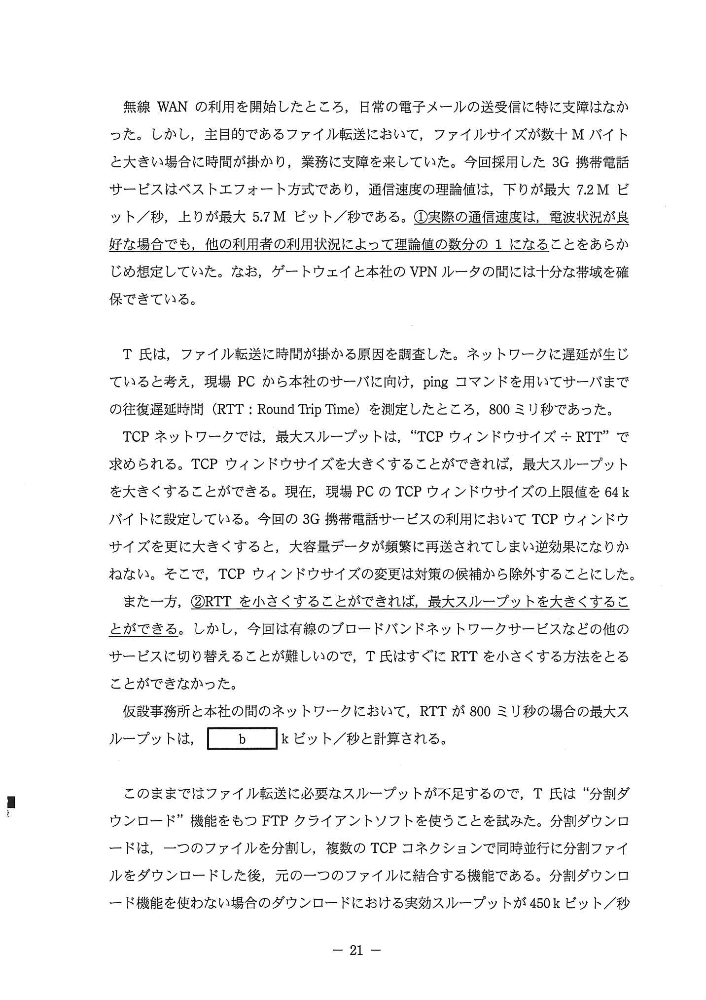

テキスト (OCR)

無線 WAN の利用を開始したところ, 日常の電子メールの送受信に特に支障はなか
った。しかし, 主目的であるファイル転送において, ファイルサイズが数十 M バイト
と大きい場合に時間が掛かり, 業務に支障を来していた。 今回採用した 3G 携帯電話
サービスはベストエフォート方式であり, 通信速度の理論値は。 下りが最大 7.2M ビ
ットノ秒, 上りが最大 5.7M ビットノ秒である。①実際の通信速度は, 電波状況が良
好な場合でも, 他の利用者の利用状況によって理論値の数分の 1 になることをあらか
じめ想定していた。なお, ゲートウェイと本社の VPN ルータの間には十分な帯城を確
保できている。

T Rid, ファイル転送に時間が掛かる原因を調査した。ネットワークに遅延が生じ
ていると考え, 現場 PC から本社のサーバに向け, ping コマンドを用いてサーバまで
の往復遅延時間 (RIT: Round Trip Time) を測定したところ, 800 ミリ秒であった。

TCP ネットワークでは, 最大スループットは, “TCP ウィンドウサイズ + RTT” で
求められる。TCP ウィンドウサイズを大きくすることができれぱ, 最大スループット
を大きくすることができる。 現在, 現場 PC の TCP ウィンドウサイズの上限値を 64k
バイトに設定している。今回の 3G 携帯電話サービスの利用において TCP ウィンドウ
サイズを更に大きくすると, 大容量データが頻繁に再送されてしまい逆効果になりか
ねない。 そこで, TCP ウィンドウサイズの変更は対策の候補から除外することにした。

また一方, ②RTT を小さくすることができればぱば, 最大スループットを大きくするこ
とができる。しかし, 今回は有線のブロードバンドネットワークサービスなどの他の
サービスに切り奉えることが難しいので, T 氏はすぐに RIT を小さくする方法をとる
ことができなかった。

仮設事務所と本社の間のネットワークにおいて, RIT が 800 ミリ秒の場合の最大ス
ループットは, [| b |kビピットノ秒と計算される。

このままではファイル転送に必要なスループットが不足するので, T 氏は“分割ダ
ウンロード" 機能をもつ FIP クライアントソフトを使うことを試みた。分割ダウンロ
ードは, 一つのファイルを分割し, 複数の TCP コネクションで同時並行に分割ファイ
ルをダウンロードした後,元の一つのファイルに結合する機能である。分割ダウンロ
ード機能を使わない場合のダウンロードにおける実効スループットが450k ビットンノ秒

ー 21 一

### ページ 22

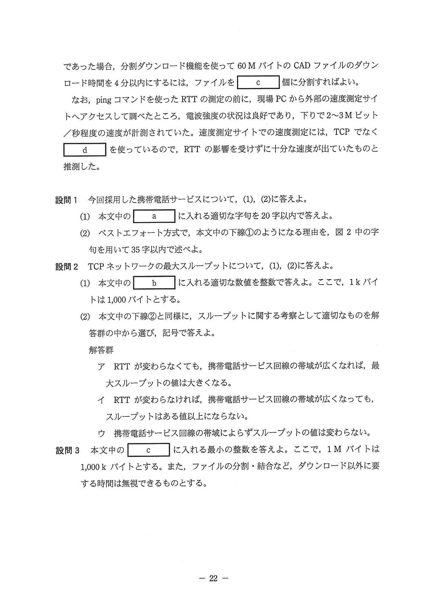

テキスト (OCR)

であった場合, 分割ダウンロード機能を使って 60 M バイトの CAD ファイルのダウン
ロード時間を 4 分以内にするには, ファイルを 個に分割すればよい。

なお, ping コマンドを使った RTT の測定の前に 現場 PC から外部の速度測定サイ
トヘアクセスして調べたところ, 電波強度の状況は良好であり, 下りで2て3M ビット
ノ秒程度の速度が計測されていた。速度測定サイトでの速度測定には, TCP でなく
| 3 | を使っているので, RIT の影響を受けずに十分な速度が出ていたものと
推測した。

設問1 今回採用した携帯電話サービスについて, ①), ②に答えよ。
Q①) 本文中の| a | に入れる適切な字句を20字以内で答えよ。
Q) ベストエフォート方式で, 本文中の下線①のようになる理由を, 図 2 中の字
名を用いて 35 宇以内で述べよ。
設問2 TCP ネットワークの最大スループットについて, ①⑪, ②⑫に答えよ。
a) 本文中の| b | に入れる適切な数値を整数で答えよ。ここで, 1kバイ
トは 1.000 バイトとする。
②) 本文中の下線②と同様に。 スループットに関する考察として適切なものを解
管群の中から選び, 記号で答えよ。
CET
ア RIT が変わらなくても, 携帯電話サービス回線の帯域が広くなれば, 最
大スループットの値は大きくなる。
4 RIT が変わらちなければ, 携帯電話サービス回線の薄域が広くなっても,
スループットはある値以上にならない。
ウ 携帯電語サービス回線の帯域によらずスループットの値は変わらない。
設問3 本文中の| c | に入れる最小の整数を答えよ。ここで, 1M パイトは
1000k バイトとする。また, ファイルの分割・結合など, ダウンロード以外に要
する時間は無視できるものとする。

ー 22 一

### ページ 23

テキスト (OCR)

設問4 本文中の| q | に入れる適切な字句を解答群の中から選び,
よ。
解答

aul

La CHA
ア DHCP                            イ HTTP                            ウ HTTPS
x SMTP                            オ SNMP                            カ UDP

ー 23 一

### ページ 24

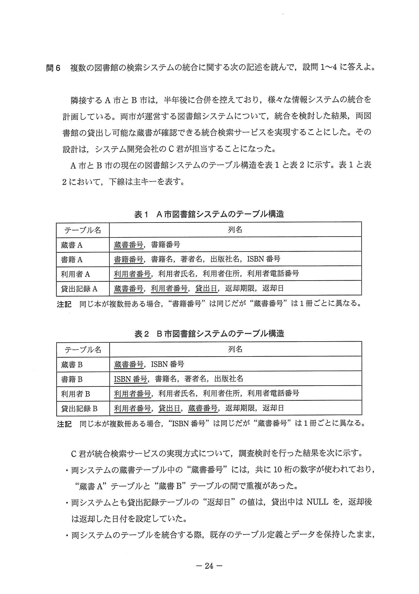

テキスト (OCR)

問6 複数の図書館の検索システムの統合に関する次の記述を読んで, RE 1~4 に答えよ。

隣接する A 市と B 市は, 半年後に合併を控えており, 様々な情報システムの統合を
計画している。両市が運営する図書館システムについて, 統合を検討した結果, HE
書館の貸出し可能な蔵書が確認できる統合検索サービスを実現することにした。その
設計は, システム開発会社の C 君が担当することになった。

A市とB 市の現在の図書館ンシステムのテーブル構造を表 1 と表 2 に示す。表 1 と表
2 において, 下線は主キーを表す。

表1 ム市図書館ンシステムのテーブル構造

テーブル名                     列名
蔵書A     蔵書番号, 書籍番号
書籍A     書籍番号, 書籍名, 著者名, 出版社名, ISBN 番号

利用者A    利用者番号, 利用者氏名, 利用者住所, 利用者電話番号
貸出記録A | 蔵書番号, 利用者番号, 貸出日, BAR, BAB
注記 同じ本が複数國ある場合, “書籍番号"は同じだが“蔵書番号"は1 冊ごとに異なる。

表2 B市図書館ンシステムのテーブル構造

テーブル名                               列名
蔵書 B             蔵書番号, ISBN 番号
書籍 B     ISBN 番号, 書籍名著者名 出版社名

利用者B    利用者番号, 利用者氏名, 利用者住所, 利用者電話番号
貸出記録B | 利用者番号, 貸出日, 蔵書番号, 返却期限, AIA
注記 同じ本が複数國ある場合, “JSBN 番号"は同じだが “蔵書番号"は1冊ごとに異なる。

C 君が統合検索サービスの実現方式について, 調査検討を行った結果を次に示す。
・両システムの蔵書テーブル中の “蔵書番号"には, 共に 10 桁の数字が使われており,
“蔵書A” テーブルと “蔵書B”" テーブルの間で重複があった。
・両システムとも貸出記録テープルの RAIA” Ofeld, 貸出中は NULL を, BAR
は返却した日付を設定していた。
・両システムのテーブルを統合する際, 既存のテーブル定義とデータを保持したまま,

### ページ 25

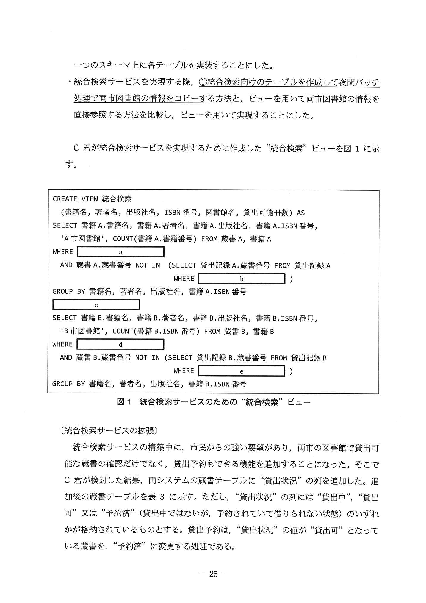

テキスト (OCR)

ーつのスキーマ上に各テーブルを実装することにした。

・ 統合検索サービスを実現する際, ①統合検索向けのテーブルを作成して夜間バッチ

処理で両市図書館の情報をコピーする方法と, ビューを用いて両市図書館の情報を

直接参照する方法を比較し, ビューを用いて実現することにした。

C 君が統合検索サービスを実現するために作成した “統合検索” ビューを図 1 に示

す。

CREATE VIEW 統合検索
(BHA, 著者名 出版社名, TSBN 番号, 図書館名, 貸出可能冊数) AS
SELECT 書籍 A.書籍名, 書籍 A.著者名, 書籍 A.出版社名, 書籍 .TSBN 番号,
‘A 市図書館", COUNT(書籍 A.書籍番号) FROM 蔵書 A, 書籍 A

AND 蔵書 A.蔵書番号 NOT IN (SELECT 貸出記録 A.蔵書番号 FROM 貸出記録A

GROUP BY 書籍名, 著者名, 出版社名, 書籍 A.TSBN 番号
SELECT 書籍 B.書籍名, 書籍 B.著者名, 書籍 B.出版社名, 書籍 B.TSBN 番号
"B 市図書館", COUNT(書籍 B.TSBN 番号) FROM 蔵書 B, 書籍 B

AND 蔵書 B.蔵書番号 NOT IN (SELECT 貸出記録 B.蔵書番号 FROM 貸出記録B

GROUP BY 書籍名, 著者名, 出版社名, 書籍 B.TSBN 番号

図1 統合検索サービスのための “統合検索” ビュー

〔統合検索サービスの拡張)

統合検索サービスの構築中に, 市民からの強い要望があり, 両市の図書館で貸出可
能な蔵書の確認だけでなく, 貸出予約もできる機能を追加することになった。そこで
C 君が検討した結果, 両システムの蔵書テーブルに “貸出状況” の列を追加した。追
加後の蔵書テーブルを表 3 に示す。ただし, “貸出状況” の列には “貸出中", “貸出
FH” 又は “予約済" (貸出中ではないが, 予約されていて借りられない状態) のいずれ
かが格納されているものとする。 貸出予約は, “貸出状況” の値が“貸出可" となって

いる蔵書を, “予約済" に変更する処理である。

ー 25 一

### ページ 26

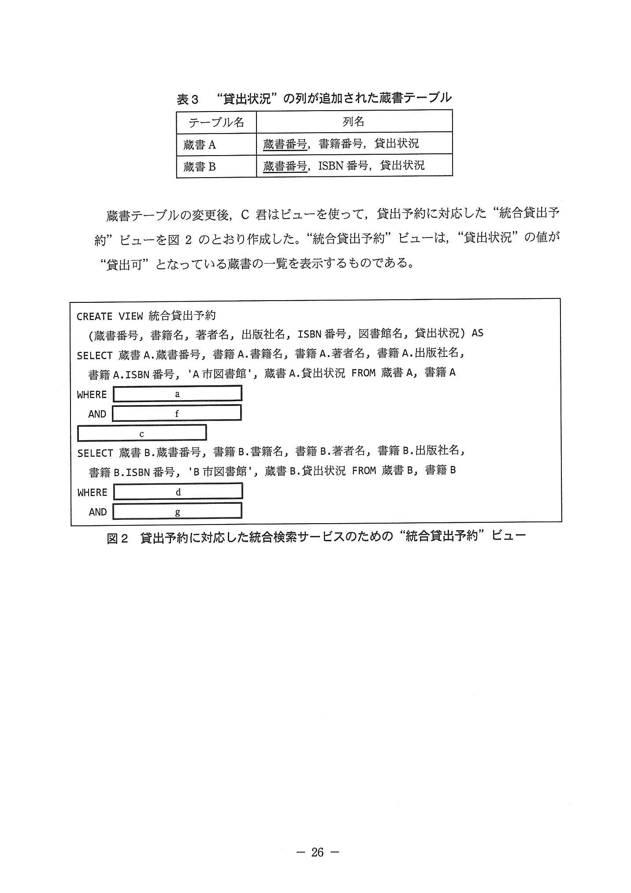

テキスト (OCR)

表3 "貸出状況"の列が追加された蔵書テーブル

テーブル名           列名
蔵書A     BEES, 書籍番号,食出状況
蔵書B     蔵書番号, ISBN 番号, 貸出状況

蔵書テーブルの変更後, C 君はビューを使って, 貸出予約に対応した “統合貸出巴
約” ビューを図 2 のとおり作成した。"統合貸出予約"ビューは, “貸出状況” の値が
“Bal” となっている蔵書の一覧を表示するものである。

CREATE VIEW 統合貸出予約
(蔵書番号, 書籍名, 著者名, 出版社名, TSBN 番号,図書館名, 貸出状況) AS
SELECT 蔵書 A.蔵書番号, 書籍 A.書籍名, 書籍 A.著者名, 書籍 A.出版社名
書籍 A.TSBN 番号, 'ム 市図書館" , 蔵書 A.貸出状況 FROM 蔵書A, 書籍A

SELECT 蔵書 B.蔵書番号, 書籍 B.書籍名, 書籍 B.著者名, 書籍 B.出版社名
書籍 B.TSBN 番号, 'B 市図書館", 蔵書 B.代出状況 FROM 蔵書 B, 書籍B
MHERE

図2 貸出予約に対応した統合検索サービスのための “統合貸出予約"ビュー

### ページ 27

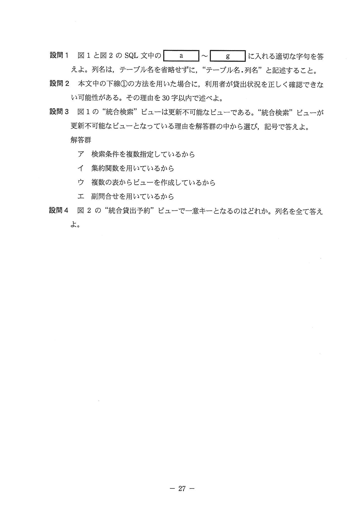

テキスト (OCR)

設問1 図1と図2のSQL 文中の| a |~[  g |に入れる適切な字旬を答
えよ。列名は, テーブル名を省略せずに, “テーブル名・.列名” と記述すること。
設問2 本文中の下線①の方法を用いた場合に, 利用者が貸出状況を正しく確認できな
い可能性がある。その理由を 30 字以内で述べよ。
設問3 図1の“統合検索"ビューは更新不可能なビューである。“統合検索” ビューが
更新不可能なビピューとなっている理由を解答群の中から選び, 記号で答えよ。
解答群
ア 検索条件を複数指定しているから
イ 集約関数を用いているから
ウ 複数の表からビューを作成しているから
エ 副問合せを用いているから
設問4 図 2 の“統合貸出予約" ビューで一意キーとなるのはどれか。列名を全て答え
#.

### ページ 28

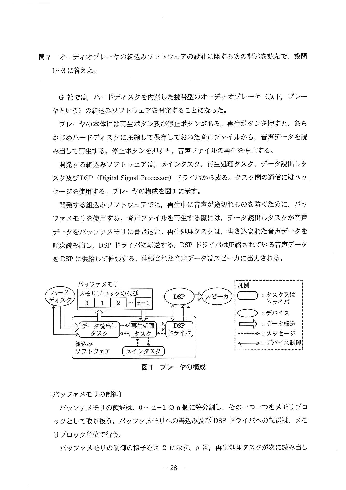

テキスト (OCR)

問7 オーディオプレーヤの組込みソフトウェアの設計に関する次の記述を読んで, 設問

1て3 に答えよ。

G 社では, ハードディスクを内蔵した携帯型のオーディオプレーヤ (以下, プレー
ヤという) の組込みソリソフトウェアを開発することになった。

プレーヤの本体には再生ボタン及び停止ボタンがある。再生ボタンを押すと, あら
かじめハードディスクに圧縮して保存しておいた音声ファイルから, 音声データを読
み出して再生する。停止ボタンを押すと, 音声ファイルの再生を停止する。

開発する組込みソフトウェアは, メインタスク, 再生処理タスク, データ読出しタ
スク及びDSP (Digital Signal Processor) ドライバから成る。タスク間の通信にはメッ
セージを使用する。プレーヤの構成を図 1 に示す。

開発する組込みソフトウェアでは, a a eee Oe
ファメモリを使用する。音声ファイルを再生する際には, データ読出しタスクが音
データをバッファメモリに書き込む。再生処理タスクは, 書き込まれた音声データを
順次読み出し, DSP ドライバに転送する。DSP ドライバは圧縮されている音声データ
を DSP に供給して伸張する。 伸張された音声データはスピーカに出力される。

バッファメモリ                              1 凡例

os) AE A ws       DSP  32e-めにつ : タスク双は
lolils tae 7      ドライバ
イト                           1こつ :デバイス

Lf    TINTA
Te DSP       a

タスク     タスク ド- Korn        oe> : メッセージ

i <一一> : デバイス制御

iokeraaaccochcoorasaavSkaancrouoaeovzoze

組込み
ソツアトウェエア     フイッタスク

 1 プレーヤの構成

〔【バッファメモリの制御]

Ny Tr REV ORS, 0 てュー1 のn 個に等分割し, その一つーつをメモリブロ
ックとして取り扱う。バッファメモリへの書込み及び DSP ドライバへの転送は, メモ
リブロック単位で行う。

バッファメモリの制御の様子を図 2 に示す。p は, 再生処理タスクが次に読み出し

ー 28 一

### ページ 29

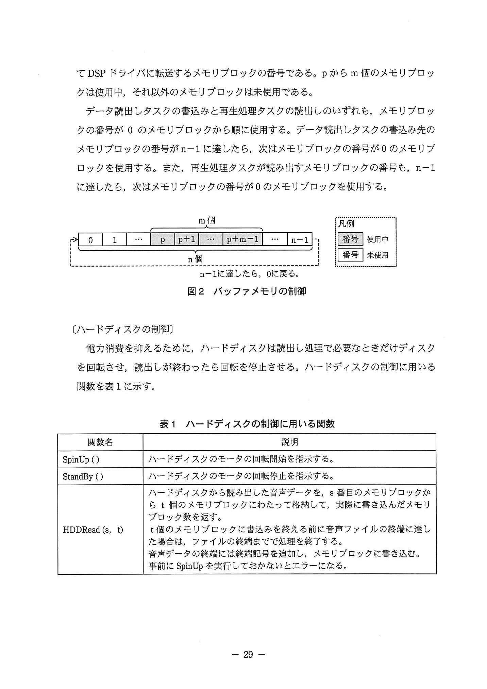

テキスト (OCR)

て DSP ドライバに転送するメモリブロックの番号である。p から m 個のメモリブロッ
クは使用中, それ以外のメモリブロックは未使用である。

データ読出しタスクの書込みと再生処理タスクの読出しのいずれも, メモリブロッ
クの番号が 0 のメモリブロックから順に使用する。データ読出しタスクの書込み先の
メモリブロックの番号がnー1 に達したら, 次はメモリプロックの番号が 0 のメモリブ
ロックを使用する。また, 再生処理タスクが読み出すメモリプロックの番号も, nー1
に達したら, 次はメモリブロックの番号が0 のメモリブロックを使用する。

m fal

nー1に達したら, 0に戻る。
図2 バッファメモリの制御

〔ハードディスクの制御]

電力消費を抑えるために, ハードディスクは読出し処理で必要なときだけディスク
を回転させ, 読出しが終わったら回転を停止させる。ハードディスクの制御に用いる
関数を表 1 に示す。

表1 ハードディスクの制御に用いる関数

関数名                   説明
SpinUp ()     ハードディスクのモータの回転開始を指示する。
StandBy ()     ハードディスクのモータの回転停止を指示する。

HDDRead (s, t)

ハードディスクから読み出した音声データを, s 番目のメモリブロックか
ら t 個のメモリブロックにわたって格納して, 実際に書き込んだメモリ
ブロック数を返す。

t 個のメモリブロックに書込みを終える前に音声ファイルの終端に達し
た場合は, ファイルの終端までで処理を終了する。

音声データの終端には終端記号を追加し, メモリブロックに書き込む。
事前に SpinUp を実行しておかないとエラーになる。

### ページ 30

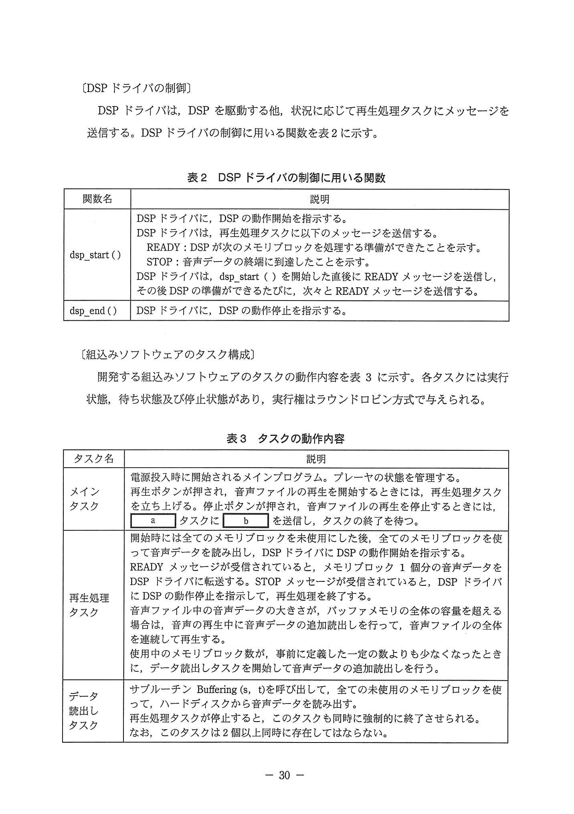

テキスト (OCR)

(DSP ドライバの制御]
DSP ドライバは, DSP を有動する他, 状況に応じて再生処理タスクにメッセージを
送信する。DSP ドライバの制御に用いる関数を表 2 に示す。

表2 DSP ドライバの制御に用いる関数

関数名                                 説明
DSP ドライバに, DSP の動作開始を指示する。
DSP ドライバは, 再生処理タスクに以下のメッセージを送信する。
dsp start() | FEADY:DSP が次のメモリブロックを処理する準備ができたことを示す。
Ps     STOP : 音声データの終端に到達したことを示す。
DSP ドライバは, dsp_start ( ) を開始した直後に READY メッセージを送信し
その後 DSP の準備ができるたびに, 次々と READY メッセージを送信する。
dsp_end() | DSP ドライバに, DSP の動作停止を指示する。
[組込みソフトウェアのタスク構成〕

開発する組込みソフトウェアのタスクの動作内容を表 3 に示す。各タスクには実行
状態。 待ち状態及び停止状態があり, 実行権はラウンドロビン方式で与えられる。

表3 タスクの動作内容

タスク名                       説明
電源投入時に開始されるメインプログラム。プレーヤの状態を管理する。

メイン    再生ボタンが押され, 音声ファイルの再生を開始するときには, 再生処理タスク

タスク   を立ち上げる。停止ボタンが押され, 音声ファイルの再生を停止するときには
[a |タスクに| b |を送信し, タスクの終了を待つ。
開始時には全てのメモリブロックを未使用にした後, 全てのメモリブロックを使
って音声データを読み出し, DSP ドライバに DSP の動作開始を指示する。
READY メッセージが受信されていると, メモリブロック 1 個分の音声データを
DSP ドライバに転送する。STOP メッセージが受信されていると, DSP ドライバ

再生処理 | にDSP の動作停止を指示して, 再生処理を終了する。

タスク    音声ファイル中の音声データの大きさが, パッファメモリの全体の容量を超える
場合は, 音声の再生中に音声データの追加読出しを行って, 音声ファイルの全体
を連続して再生する。
使用中のメモリブロック数が, 事前に定義した一定の数よりも少なくなったとき
に, データ読出しタスクを開始して音声データの追加読出しを行う。

データ    サブルーチン Buffering (s, を呼び出して, 全ての未使用のメモリブロックを使

ME    って, ハードディスクから音声データを読み出す。

BID     再生処理タスクが停止すると, このタスクも同時に強制的に終了させられる。

なお, このタスクは2 個以上同時に存在してはならない。

ー 30 一

### ページ 31

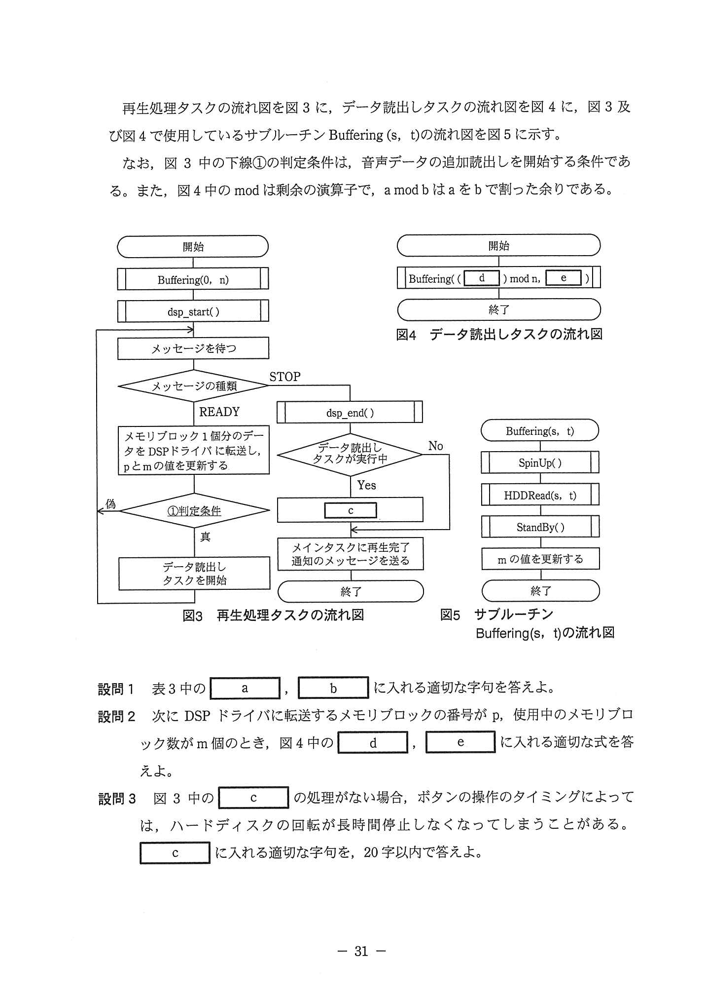

テキスト (OCR)

再生処理タスクの流れ図を図 ic, データ読出しタスクの流れ図を図 4 に, 図3及
び図 4 で使用しているサブルーチン Buffering (s, の流れ図を図 5 に示す。

なお, 図 3 中の下線①の判定条件は, 音声データの追加読出しを開始する条件であ
る。また, 図4中のmodは剰余の演算子で, amodbはaをbで割った余りである。

開始                              C             開始             )
|
| Butfering(o, n)   ‘Th                 [ [Buttering ([_@_]) moan, [_e_])] |
[
| |      dsp_start( )      | |                   C            終了            )
図4 データ読出しタスクの流れ図
| メッセージを待つ |
sm [aed]

Buffering(s, t)

メモリブロック 1 個分のデー
タタを DSPドライバ に転送し
pとmの値を更新する

[Lisssses 1|

にーーーーーーーーーー     StandBy( )
メインタスクに再生完了     (aioe |
データ読出し      通知のメッセージを送る        m の値を更新する
タスクを開始
終了              終了
Xs 再生処理タスクの流れ図     図5 サブルーチン
Buffering(s, の流れ図
設問1 表3中の| sa |,|  b | に入れる適切な字句を答えよ。
設問2 次に DSP ドライバに転送するメモリブロックの番号が p, 使用中のメモリプブロ
ック数が m 個のとき, 図4中の| ” d |,|  e | に入れる適切な式を答
えよ。

設問3 図 3 中の| c | の処理がなりい場合,ボタンの操作のタイミングによって
は, ハードディスクの回転が長時間停止しなくなってしまうことがある。

 に入れる適切な字句を, 20 字以内で答えよ。

ー 381 一

### ページ 32

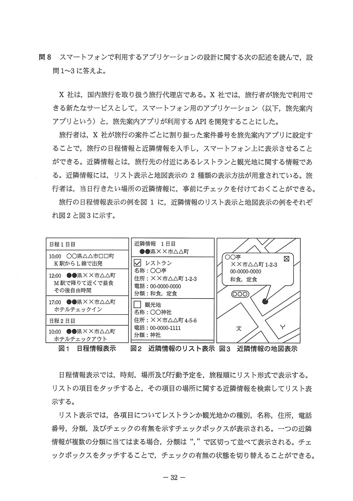

テキスト (OCR)

M&S スマートフォンで利用するアプリケーションの設計に関する次の記述を読んで, 設
間 1て3 に答えよ。

X 社は, 国内旅行を取り扱う旅行代理店である。X 社では, 旅行者が旅先で利用で
きる新たなサービスとして, スマートフォン用のアプリケーション (以下, 旅先案内
アプリという) と, 旅先案内アプリが利用する API を開発することにした。

旅行者は, X 社が旅行の案件ごとに割り振った案件番号を旅先案内アプリに設定す
ることで, 旅行の日程情報と近隣情報を入手し, スマートフォン上に表示させること
ができる。 近隣情報とは, 旅行先の付近にあるレストランと観光地に関する情報であ
る。 近隣情報には, リスト表示と地図表示の 2 種類の表示方法が用意されている。旅
行者は, 当日行きたい場所の近隣情報に, 事前にチェックを付けておくことができる。

旅行の日程情報表示の例を図 1 に, 近隣情報のリスト表示と地図表示の例をそれぞ
れ図 2 と図 3 に示す。

日程1 日目           近隣情報 1日目                 “a
XX

10:00 〇〇県人ム市ロロ町     ーー      (CO®        図 |

K 駅からL線で出発 レストラン              XX市AA町1.2.3
名称 : OOF                          00-0000-0000

pm   住所: XX市AA町 1.2.3      和食 定食

aE “a                   電語 : 00-0000-0000

間                  分類 : 和食 定食

17:00 人@@県メメ市AA町

ホテルチェックイン      本

日程 2 日目                           住所: メメ市へA町4-5-6

1000 @@上XX市AA町 || Hee | 000 tT         *      y

ホテルチェックアウト

図1 日程情報表示 図2 近隣情報のリスト表示 図3 近隣情報の地図表示

日程情報表示では, 時刻, 場所及び行動予定を, 旅程順にリスト形式で表示する。
リストの項目をタッチすると, その項目の場所に関する近隣情報を検索してリスト表
示する。

リスト表示では, 各項目についてレストランか観光地かの種別, 名称, 住所, 電話
番号, DE, 及びチェックの有無を示すチェックボックスが表示される。一つの近隣
情報が複数の分類に当てはまる場合, 分類は “,” で区切って並べて表示される。チェ
ックボックスをタッチすることで, チェックの有無の状態を切り替えることができる。

ー 32 一

### ページ 33

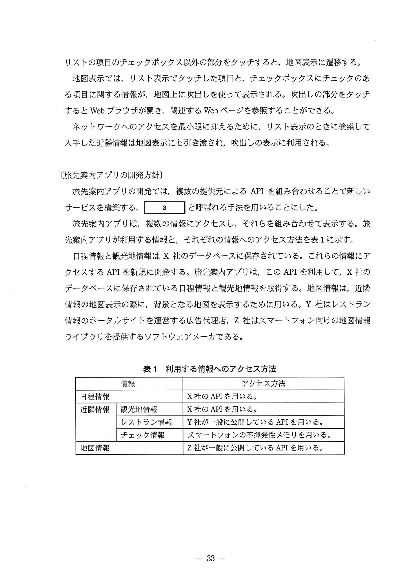

テキスト (OCR)

リストの項目のチェックボックス以外の部分をタッチすると, 地図表示に居移する。
地図表示では, リスト表示でタッチした項目と. チェックボックスにチェックのあ
る項目に関する情報が, 地図上に吹出しを使って表示される。吹出しの部分をタッチ
すると Web ブラウザが開き, 関連する Web ページを参照することができる。
ネットワークへのアクセスを最小限に抑えをるために, リスト表示のときに検索して
入手した近隣情報は地図表示にも引き渡され, 吹出しの表示に利用される。

(旅先案内アプリの開発方針)

旅先案内アプリの開発では, 複数の提供元による API を組み合わせることで新しい
サービスを構築する, |  。 | と呼ばれる手法を用いることにした。

旅先案内アプリは, 複数の情報にアクセスし, それらを組み合わせて表示する。旅
先案内アプリが利用する情報と。 それぞれの情報へのアクセス方法を表 1 に示す。

日程情報と観光地情報は X 社のデータベースに保存されている。これらの情報にア
クセスする APL を新規に開発する。旅先案内アプリは, この API を利用して, X 社の
データベースに保存されている日程情報と観光地情報を取得する。地図情報は, 近隣
情報の地図表示の際に, 背景となる地図を表示するために用いる。Y 社はレストラン
情報のボータルサイトを運営する広告代理店, 2 社はスマートフォン向けの地図情報
ライブラリを提供するソフトウェアメーカである。

表1 利用する情報へのアクセス方法

情報              アクセス方法
日程情報           X社の API を用いる。
近隣情報 | 観光地情報           X 社の API を用いる。

レストラン情報    Y 社が一般に公開している API を用いる。
チェック情報   スマートフォンの不揮発性メモリを用いる。
地図情報                   Z 社が一般に公開している API を用いる。

### ページ 34

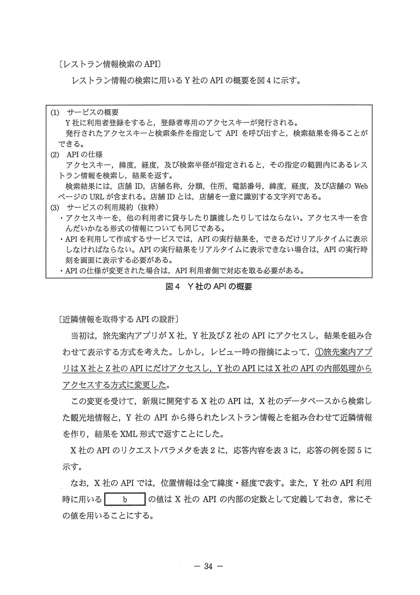

テキスト (OCR)

〔レストラン情報検索の AP
レストラン情報の検索に用いる Y 社の API の概要を図 4 に示す。

Q) サービスの概要
Y 社に利用者意録をすると, 登録者専用のアクセスキーが発行される。
発行されたアクセスキーと検索条件を指定して API を呼び出すと, 検索結果を得ることが

できる。

(2) APIの仕様
アクセスキー, GE, CE, 及び検索半径が指定されると, その指定の範囲内にあるレス
トラン情報を検索し, 結果を返す。
検索結果には, 店舗 ID, 店舗名称, 分類, 住所, 電話番号, 緯度, 経度, 及び店舗の Web

ページの URL が含まれる。 店舗ID とは, 店舗を一意に識別する文字列である。

(3③) サービスの利用規約 (抜粋)

・アクセスキーを, 他の利用者に貸与したり譲渡したりしてはならない。アクセスキーを含
んだいかなる形式の情報についても同じである。

・API を利用して作成するサービスでは, API の実行結果を, できるだけリアルタイムに表示
しなければならない。API の実行結果をリアルタイムに表示できない場合は, API の実行時
刻を画面に表示する必要がある。

・API の仕様が変更された場合は, API 利用者側で対応を取る必要がある。

 4 Y社のAPI の概要

(近隣情報を取得する API の設計〕

当初は, 旅先案内アプリがX 社, Y 社及びZ社の API にアクセスし, 結果を組み合
わせて表示する方式を考えた。しかし, レビュー時の指摘によって, ①旅先案内アプ
リはX社とZ社のAPI にだけアクセスし, VFO API には X 社の API の内部処理から
アクセスする方式に変更した。

この変更を受けて, 新規に開発する X 社の API は, X 社のデータベースから検索し
た観光地情報と, Y 社の API] から得られたレストラン情報とを組み合わせて近隣情報
を作り, 結果を XML 形式で返すことにした。

X 社の APT のリクエストパラメタを表 2 に, 応答内容を表 3 に, 応答の例を図5に
示す。

なお, X 社の API では, 位置情報は全て紳度・経度で表す。また, Y tO API 利用
時に用いる|  b | の値は X社の APIの内部の定数として定義しておき, 常にそ
の値を用いることにする。

ー 34 —

### ページ 35

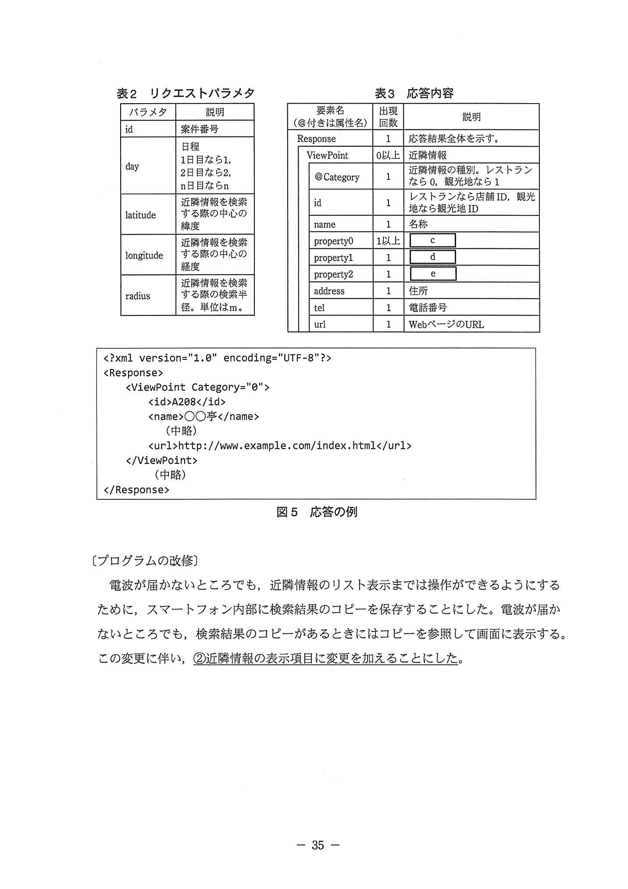

テキスト (OCR)

表2 リクエストパラメタ           表3 応答内容

パラメタ        説明                  要素名       出現            説明
id         案件番号              (@付きは属性名) | 回数               =
ae                   Response          1 | 応答結果全体を示す。
]日目なら1            ViewPoint    0以上| 近隣情報
day            ミー                =
2日目なら2,                                              近隣情報の種別。レストラン
n日目ならn         @Category | 1 | なら0。 観光地なら1
                         。                  レストランなら店舗ID, 観光
近隣情報を検索             id            1        ren
latitude          する際の中心の                                                              地なら観光地 ID
HE                      name          1 | 名称
EMER             propertyO |以上|| c |
longitude   ume             property1       1    [a]
近隊情報を検索             propery? | 4        co
radius                する際の検索半                                  address                      1 |住所
径。単位はm。           tel          1 | 電話番号
url            1 | WebページのURL
<?xml Version="1.9" encoding="UTF-8"?>
<Response>
<ViewPoint Category="0">
<id>A208</id>
<name>OO#</name>
(中略)
<ur1>http : //www.examp1e.com/1ndex.htm1</ur1>
</ViewPoint>
(中略)
</Response>
図5 応答の例
〔プログラムの改修

電波が届かないところでも, 近隣情報のリスト表示までは操作ができるようにする
ために, スマートフォン内部に検索結果のコピーを保存することにした。電波が届か
ないところでも, 検索結果のコピーがあるときにはコピーを参照して画面に表示する。

この変更に伴い, ②近隣情報の表示項目に変更を加えることにした。

### ページ 36

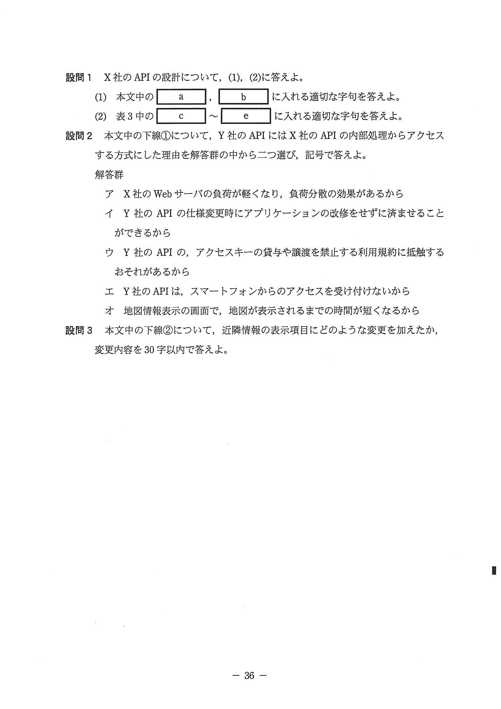

テキスト (OCR)

設問1 X社のAPIの設計について, ①⑪, ②)に答えよ。
Qa 本文中の| a |, |  b |に入れる適切な字句を答えよ。
@ 表3中の| c |~|  e |に入れる適切な字句を答えよ。
設問2 本文中の下線①について, Y 社の API には X 社の API の内部処理からアクセス
する方式にした理由を解答群の中から二つ選び, 記号で答えよ。
解答群
ア X社の Web サーバの負荷が軽くなり, 負荷分散の効果があるから
4 Y 社の API の仕様変更時にアプリケーションの改修をせずに済ませること
ができるから
ウ Y 社の API の, アクセスキーの貸与や譲渡を禁止する利用規約に抵触する
おそれがあるから
エ Y社の APIは, スマートフォンからのアクセスを受け付けないから
オ 地図情報表示の画面で, 地図が表示されるまでの時間が短くなるから
設問3 本文中の下線②について, 近隣情報の表示項目にどのような変更を加えたか,
変更内容を 30 字以内で答えよ。

ー 36 一

### ページ 37

テキスト (OCR)

【 メモ用紙 J

ー 37 一

### ページ 38

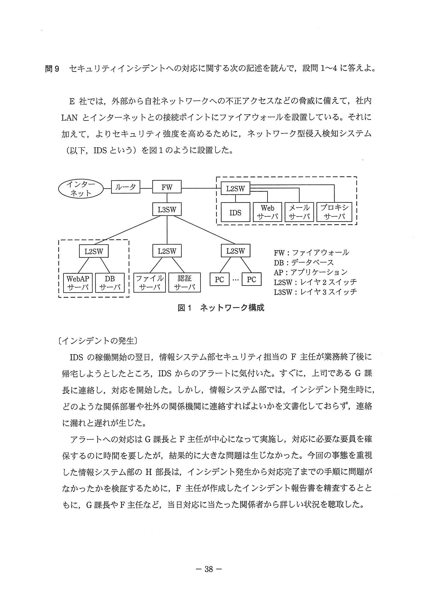

テキスト (OCR)

問9 セキュリティインシデントへの対応に関する次の記述を読んで, 設問 1て4 に答えよ。

E 社では, 外部から自社ネットワークへの不正アクセスなどの脅威に備えて, 社内
LAN とインターネットとの接続ポイントにファイアウォールを設置している。それに
MAT, よりセキュリティ強度を高めるために, ネットワーク型侵入検和システム
(以下, IDS という) を図 1 のように設置した。

ワー

FW : ファイアウォール

DB : データベース

>:                  AP : アプリケーション

Are ll eee Lec|~[Pc] 12Sw :レイヤャ2スイッチ
L3SW : レイヤ3 スイッチ

図1 ネットワーク構成

(インシデントの発生〕

IDS の稼働開始の翌日, 情報システム部セキュリティ担当のF 主任が業務終了後に
帰宅しようとしたところ, DS からのアラートに気付いた。すぐに, 上司である G 課
長に連絡し, 対応を開始した。しかし, 情報システム部では, インシデント発生時に,
どのような関係部署や社外の関係機関に連絡すればよいかを文書化しておらず, 連絡
に漏れと遅れが生じた。

アラートへの対応は G 課長とF 主任が中心になって実施し, 対応に必要な要員を確
保するのに時間を要したが, 結果的に大きな問題は生じなかった。 今回の事態を重視
した情報システム部の HBR, インシデント発生から対応完了までの手順に問題が
なかったかを検証するために, F 主任が作成したインシデント報告書を精査するとと
Bic, 課長やF 主任など, 当日対応に当たった関係者から詳しい状況を聴取した。

ー 38 一

### ページ 39

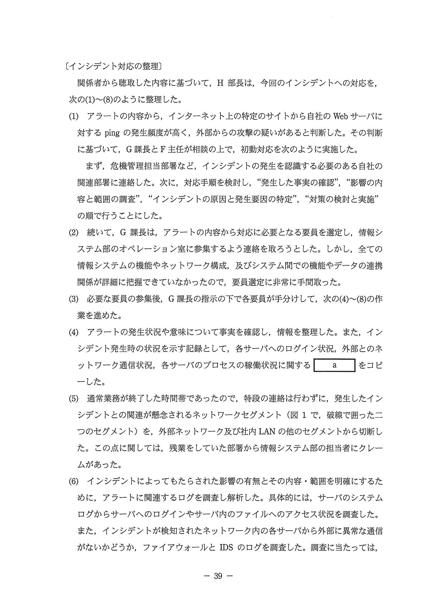

テキスト (OCR)

(インシデント対応の整理〕
関係者から聴取した内容に基づいて, HBR, 今回のインシデントへの対応を,

次の①)て⑧のように整理した。

(①) アラートの内容から, インターネット上の特定のサイトから自社の Web サーバに
対する ping の発生頻度が高く, 外部からの攻撃の疑いがあると判断した。その判断
に基づいて, G 課長とせ 主任が相談の上で, 初動対応を次のように実施した。

まず, 危機管理担当部暑など, インシデントの発生を認識する必要のある自社の
関連部署に連絡した。次に, 対応手順を検討し, "発生した事実の確認", "影響の内
容と範囲調査", “インシデントの原因と発生要因の特定”, “対策の検討と実施"
の順で行うことにした。

(2) 続いて, G 課長は, アラートの内容から対応に必要となる要員を選定し, 情報シ
ステム部のオペレーション室に参集するよう連絡を取ろうとした。しかし, 全ての
情報システムの機能やネットワーク構成, 及びシステム間での機能やデータの連携
関係が詳細に把握できていなかったので, 要員選定に非常に手間取った。

3) 必要な要員の参集後, G 課長の指示の下で各要員が手分けして, 次の④~⑧の作
業を進めた。

(④ アラートの発生状況や意味について事実を確認し情報を整理した。また, イン
シデント発生時の状況を示す記録として, 各サーバへのログイン状況。外部とのネ
ットワーク通信状況。 各サーバのプロセスの移働状況に関する| a | をコピ
ーした。

(©) 通常業務が終了した時間帯であったので, 特段の連絡は行わずに, 発生したイン
シデントとの関連が懸念されるネットワークセグメント (図 1 で, 破線で囲った二
つのセグメント) を, 外部ネットワーク及び社内 LAN の他のセグメントから切断し
た。この点に関しては, 残業をしていた部暑から情報システム部の担当者にクレー
ムがあった。

© インシデントによってもたらされた影響の有無とその内容・範囲を明稚にするた
DWI, アラートに関連するログを調査し解析した。具体的には,。 サーバパのシステム
ログからサーバへのログインやサーバ内のファイルへのアクセス状況を調査した。
また, インシデントが検知されたネットワーク内の各サーバから外部に異常な通信
がないかどうか, ファイアウォールと DS のログを調査した。調査に当たっては,

### ページ 40

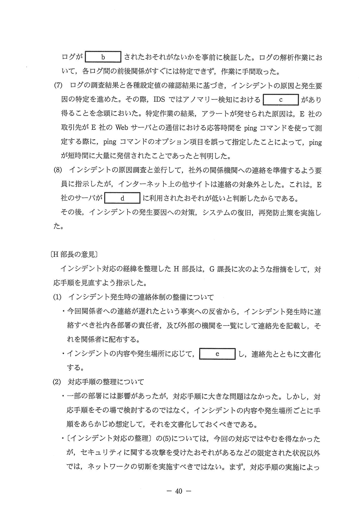

テキスト (OCR)

ログが| b | されたおそれがないかを事前に検証した。ログの解析作業にお
いて, 各ログ間の前後関係がすぐには特定できず, 作業に手間取った。

(1) ログの調査結果と各種設定値の確認結果に基づき, インシデントの原因と発生要
因の特定を進めた。その際, DS ではアノマリー検知における| c | がぁり
得ることを念頭においた。特定作業の結果,。 アラートが発せられた原因は, E 社の
取引先が E ALO Web サーバとの通信における応答時間を ping コマンドを使って測
定する際に, ping コマンドのオプション項目を誤って指定したことによって, ping
が短時間に大量に発信されたととであったと判明した。

@ インシデントの原因調査と並行して, 社外の関係機関への連絡を準備するよう要
貞に指示したが, インターネット上の他サイトは連絡の対象外とした。これは, E
社のサーバが|  d | に利用されたおそれが低いと判断したからである。
その後, インシデントの発生要因への対策, システムの復旧, 再発防止策を実施し

た。

[部長の意見)
インシデント対応の経緯を整理した 昌 部長は, G 課長に次のような指摘をして, 対

応手順を見直すよう指示した。

(① インシデント発生時の連絡体制の整備について
・今回関係者への連絡が遅れたという事実への反省から.。 インシデント発生時に之
絡すべき社内各部曇の責任者, 及び外部の機関を一覧にして連絡先を記載し, そ
れを関係者に配布する。
・インシデントの内容や発生場所に応じて, | ec | し, 連絡先とともに文書化
する。

2) 対応手順の整理について
・一郎の部署には影響があったが, 対応手順に大きな問題はなかった。しかし, 対
応手順をその場で検討するのではなく, インシデントの内容や発生場所ごとに手
順をあらかじめ想定して, それを文書化しておくべきである。
・〔インシデント対応の整理〕 の(⑤については, 今回の対応ではやむを得なかった
が, セキュリティに関する攻撃を受けたおそれがあるなどの限定された状況以外
では, ネットワークの切断を実施すべきではない。まず, 対応手順の実施によっ

### ページ 41

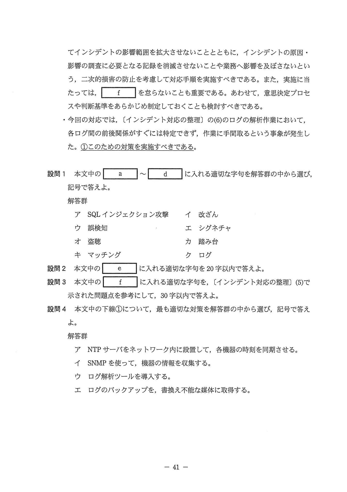

テキスト (OCR)

てインシデントの東響範囲を拡大させないこととともに, インシデントの原因・
影響の調査に必要となる記録を消滅させないことや業務へ影響を及ぼさないとい
う, 二次的損害の防止を考慮して対応手順を実施すべきである。また, 実施に当
たっては, | f | を怠らないことも重要である。あわせて, 意思決定プロセ
スや判断基準をあらかじめ制定しておくことも検討すべきである。

・今回の対応では。〔インシデント対応の整理〕 の(⑥のログの解析作業において,
各ログ間の前後関係がすぐには特定できず, 作業に手間取るという事象が発生し

た。①このための対策を実施すべきである。

設問1 本文中の|  a |~|  q |に入れる適切な字句を解答群の中から選び,
記号で答えよ。
解答群

ア
4
オ
キ

SQL インジェクション攻撃    a
誤検知      aS
盗聴                     カ
マッチング                 ク

we
シグネチャ
BAG
ログ

設問2 本文中の| e | に入れる適切な字句を20字以内で答えよ。
設問3 本文中の| f | に入れる適切な字句を, 〔インシデント対応の整理) 5で
示された問題点を参考にして, 30 字以内で答えよ。

設問4 本文中の下線やについて, 最も適切な対策を解答群の中から選び,

よ。

ARES HE

ア

イ
ウ
x

Ca CEA

oul

NTP サーバをネットワーク内に設置して, 各機器の時刻を同期させる。
SNMP を使って, 機器の情報を収集する。

ログ解析ツールを導入する。

ログのバックアップを, 書換え不能な媒体に取得する。

ー 41 一

### ページ 42

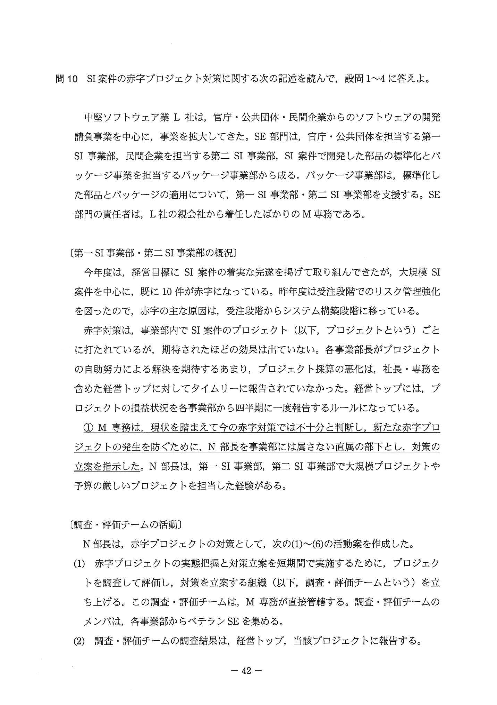

テキスト (OCR)

10 SI案件の赤字プロジェクト対策に関する次の記述を読んで, 設問 1ご4 に答えよ。

中堅ソフトウェア業 L tld, 官庁・公共団体・民間企業からのソフトウェアの開発
請負事業を中心に, 事業を拡大してきた。SE 部門は, 官庁・公共団体を担当する第一
SI 事業部, 民間企業を担当する第二 ST 事業部, SI 案件で開発した部品の標準化とパ
ッケージ事業を担当するパッケージ事業部から成る。パッケージ事業部は, 標準化し
た部品とパッケージの適用について, 第一 ST 事業部・第二 ST 事業部を支援する。SE
部門の責任者は, L 社の親会社から着任したばかりの M 専務である。

〔第一 SI 事業部・第二 ST 事業部の概況

今年度は, 経営目標に SI 案件の着実な完遂を掲げて取り組んできたが, 大規模 SI
案件を中心に, 既に 10 件が赤字になっている。昨年度は受注段階でのリスク管理強化
を図ったので, 赤字の主な原因は, 受注段階からシステム構築段階に移っている。

赤字対策は, 事業部内で ST 案件のプロジェクト (以下, プロジェクトという) ごと
に打たれているが, 期待されたほどの効果は出ていない。各事業部長がプロジェクト
の自助努力による解決を期待するあまり, プロジェクト採算の悪化は, 社長・専務を
含めた経営トップに対してタイムリーに報告されていなかった。 経営トップには, 7
ロジェクトの損益状況を各事業部から四半期に一度報告するルールになっている。

OM 専務は, 現状を踏まえて今の赤字対策では不十分と判断し. 新たな赤字プロ
ジェクトの発生を防ぐために, N 部長を事業部には属さない直属の部下とし, 対策の
立案を指示した。N 部長は, 第一 SI 事業部, 第二 SI 事業部で大規模プロジェクトや
予算の厳しいプロジェクトを担当した経験がある。

〔調査・評価チームの活動
N 部長は, 赤字プロジェクトの対策として, 次の(①て(⑥)の活動案を作成した。

(1) 赤字プロジェクトの実態把揚と対策立案を短期間で実施するために, プロジェク
トを調査して評価し, 対策を立案する組織 (以下, 調査・評価チームという) を立
ち上げる。 この調査・評価チームは, M 専務が直接管轄する。調査・評価チテームの
メンバは, 各事業部からベテラン SE を集める。

2) 調査・評価チームの調査結果は, 経営トップ, 当該プロジェクトに報告する。

ー 4一

### ページ 43

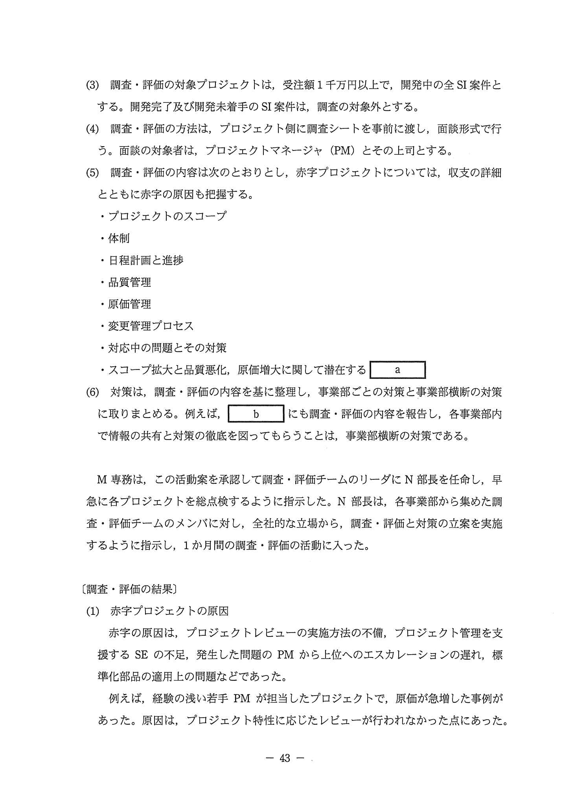

テキスト (OCR)

⑬ 調査・評価の対象プロジェクトは, 受注額1 千万円以上で, 開発中の全 SL案件と
する。 開発完了及び開発未着手の ST 案件は。 調査の対象外とする。
(④ 調査・評価の方法は。 プロジェクト側に調査シートを事前に渡し, 面談形式で行
う。 面談の対象者は,。 プロジェクトマネージャ (PM) とその上司とする。
(5) 調査・評価の内容は次のとおりとし, 赤字プロジェクトについては, 収支の詳細
とともに赤字の原因も把握する。
・プロジェクトのスコープ
+ Pst
- BAT Cie
・品質管理
・原価管理
・変更管理プロセス
・対応中の問題とその対策
・スコーブプ拡大と品質悪化,原価増大に関して潜在する| sa |
(©) 対策は, 調査・評価の内容を基に整理し, 事業部ごとの対策と事業部横断の対策
に取りまとめる。例えば, | b | にも調査・評価の内容を報告し,各事業部内
で情報の共有と対策の徹底を図ってもらうことは, 事業部横断の対策である。

M 専務は, この活動案を承認して調査・評価チームのリーダに N 部長を任命し, 早
急に各プロジェクトを総点検するように指示した。N 部長は, 各事業部から集めた調
査・評価チームのメンバに対し, 全社的な立場から, 調査・評価と対策の立案を実施
するように指示し, 1 か月間の調査・評価の活動に入った。

(調査・評価の結果]
Q①) 赤字プロジェクトの原因
赤字の原因は, プロジェクトレビューの実施方法の不備, プロジェクト管理を支
援する SE の不足, 発生した問題の PM から上位へのエスカレーションの遅れ, 標
準化部品の適用上の問題などであった。
例えば, 経験の浅い若手 PM が担当したプロジェクトで, 原価が急増した事例が
あった。原因は, プロジェクト特性に応じたレビューが行われなかった点にあった。

ー 43 一

### ページ 44

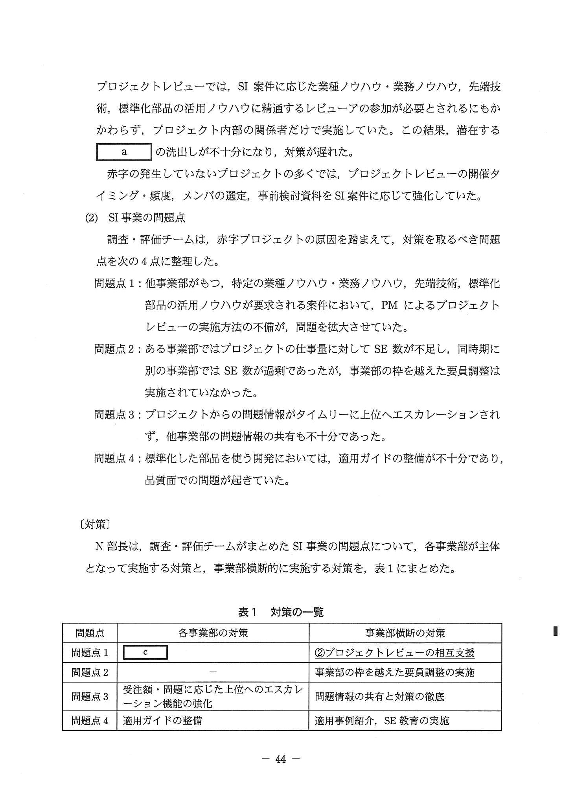

テキスト (OCR)

プロジェクトレビューでは, SI 案件に応じた業種ノウハウ・業務ノウハウ, 先端技
術, 標準化部品の活用ノウハウに精通するレビューアの参加が必要とされるにもか
かわらず, プロジェクト内部の関係者だけで実施していた。この結果, WETS
| 』  ] の洗出しが不十分になり, 対策が遅れた。
赤字の発生していないプロジェクトの多くでは, プロジェクトレビューの開催タ
イミング・頻度, メンバの選定。 事前検討資料を SI 案件に応じて強化していた。
(2) SI 事業の問題点
調査・評価チームは, 赤字プロジェクトの原因を踏まえて, 対策を取るべき問題
点を次の 4 点に整理した。
問題点 1 : 他事業部がもつ, 特定の業種ノウハウ・業務ノウハウ, 先端技術, 標準化
部品の活用ノウハウが要求される案件において, PM によるプロジェクト
レビューの実施方法の不備が, 問題を拡大させていた。
問題点 2 : ある事業部ではプロジェクトの仕事量に対して SE 数が不足し, 同時期に
別の事業部では SE 数が過剰であったが, 事業部の枠を越えた要員調整は
実施されていなかった。
問題点 3 : プロジェクトからの問題情報がタイムリーに上位へエスカレーションされ
ず, 他事業部の問題情報の共有も不十分であった。
問題点 4 : 標準化した部品を使う開発においては, 適用ガイドの整備が不十分であり,
品質面での問題が起きていた。

CHER)
N 部長は, 調査・評価チームがまとめた SI 事業の問題点について, 各事業部が主体

となって実施する対策と, 事業部横断的に実施する対策を, 表 1 にまとめた。

表1 対策の一覧

問題点                           各事業部の対策                                           事業部横断の対策

問題点 1                              プロジェクトレビューの相互支援

問題点 2                          =                         事業部の枠を越えた要員調整の実施

受  ・問題に応じた上f
ンー | RARE oD sem I> te

問題点4 | 適用ガイドの整備              適用事例紹介, SE 教育の実施

### ページ 45

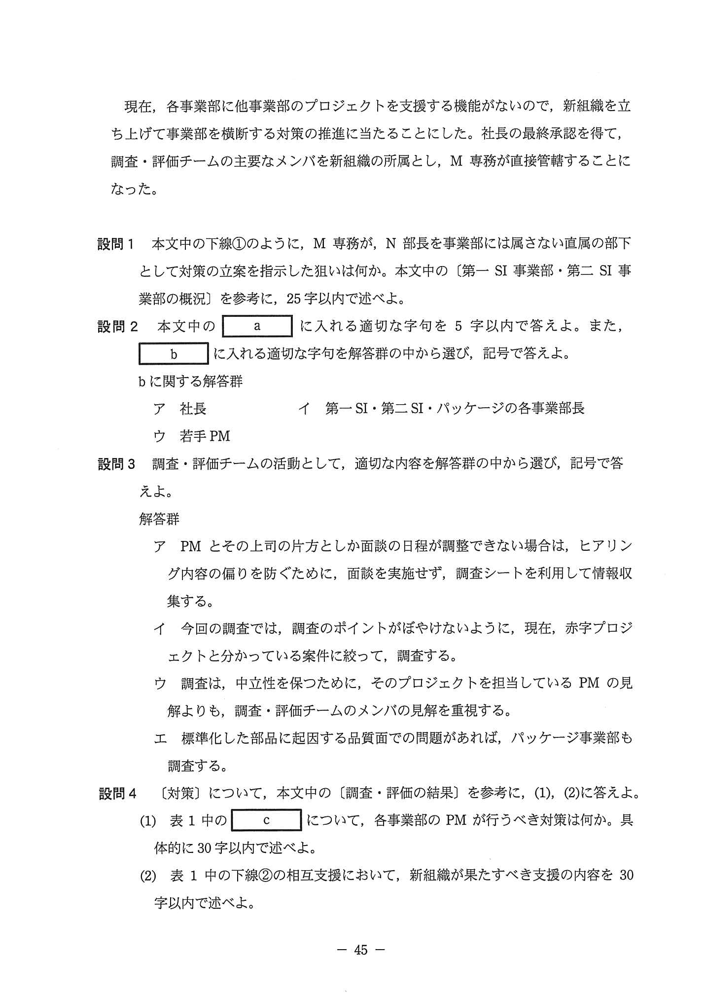

テキスト (OCR)

現在, 各事業部に他事業部のプロジェクトを支援する機能がないので, 新組織を立
ち上げて事業部を横断する対策の推進に当たることにした。社長の最終承認を得て,
調査・評価チームの主要なメンバを新組織の所属とし, M 専務が直接管轄することに
なった。

設問1 本文中の下線①のように, M 専務が, N 部長を事業部には属さない直属の部下
として対策の立案を指示した狙いは何か。本文中の(第一 SI 事業部・第二 SI 事
業部の概況〕を参考に, 25 字以内で述べよ。

設問2 本文中の| a | に入れる適切な字句を5 宇以内で答えよ。また,
Lb | に入れる適切な字名を解答群の中から選び, 記号で答えよ。

DICT SAAR
ア 社長         イ 第一SI・第二SIL・パッケージの生事業部長
ウ 若手PM

設問3 調査・評価チームの活動として, 適切な内容を解答群の中から選び, 記号で答

out

ア PM とその上司の片方としか面談の日程が調整できない場合は, ヒアリン
グ内容の偏りを防ぐために, 面談を実施せず, 調査シートを利用して情報収
集する。
イ 今回の調査では, 調査のポイントがぼやけないように, 現在,赤字プロジ
ェクトと分かっている案件に絞って, WETS.
ウ 調査は, 中立性を保つために, そのプロジェクトを担当している PM の見
解よりも, 調査・評価チームのメンバの見解を重視する。
エ 標準化した部品に起因する品質面での問題があれば, パッケージ事業部も
調査する。
設問4 [対策〕 について, 本文中の調査・評価の結果〕を参考に, (1), ②に答えよ。
Q①) 表1中の| c | について, 各事業部の PMが行うべき対策は何か。具
体的に 30 字以内で述べよ。
Q) 表 1 中の下線②の相互支援において, 新組織が果たすべき支援の内容を 30

ー 45 一

### ページ 46

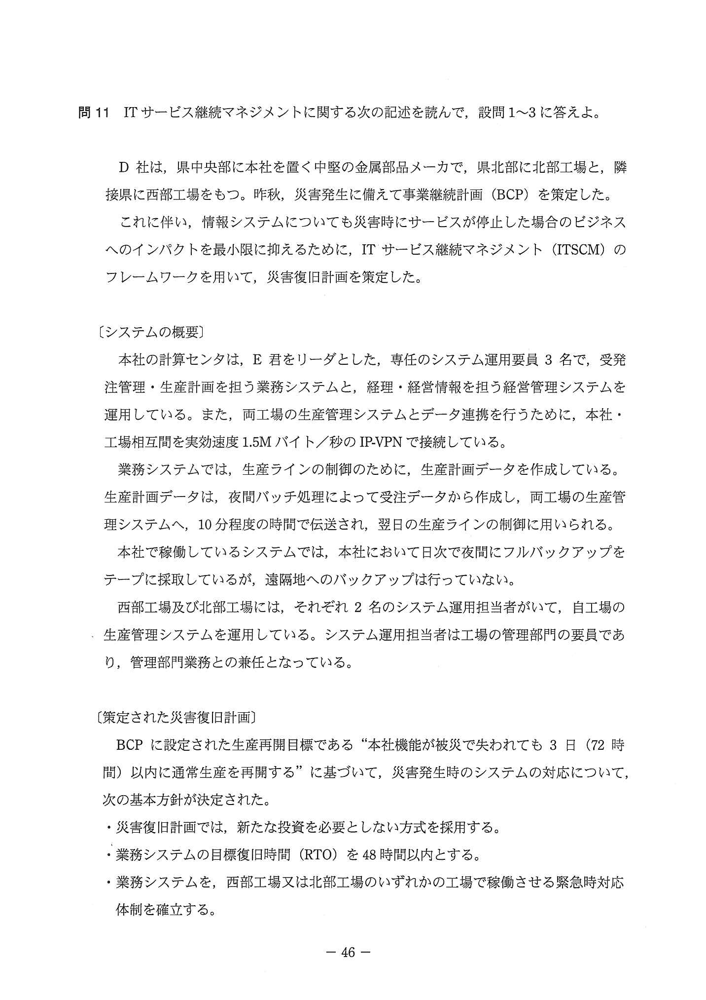

テキスト (OCR)

問 11 ITサービス継続マネジメントに関する次の記述を読んで, 設問 +ー3 に答えよ。

D 社は, 県中央部に本社を置く中堅の金属部品メーカで, 県北部に北部工場と, 隣
接県に西部工場をもつ。昨秋, 災害発生に備えて事業継続計画 (BCP) を策定した。
これに伴い, 情報システムについても災害時にサービスが停止した場合のビジネス
へのインパクトを最小限に抑えるために, IT サービス継続マネジメント TSCM) の
フレームワークを用いて, 炎害復旧計画を集定した。

〔システムの概要)

本社の計算センタは, E 君をリーダとした, 専任のシステム運用要員 3 名で, 受発
注管理・生産計画を担う業務システムと, 経理・経営情報を担う経営管理システムを
運用している。また, 両工場の生産管理システムとデータ連携を行うために, 本社・
工場相互問を実効速度 1.5M バイトノ秒の IP-VPN で接続している。

業務システムでは, 生産ラインの制御のために, 生産計画データを作成している。
生産計画データは, 夜間バッチ処理によって受注データから作成し, 両工場の生産管
理システムへ, 10 分程度の時間で伝送され, 翌日の生産ラインの制御に用いられる。

本社で稼働しているシステムでは, 本社において日次で夜間にフルバックアップを
テープに採取しているが, 遠隔地へのバックアップは行っていない。

西部工場及び北部工場には, それぞれ 2 名のシステム運用担当者がいて, 自工場の

- 生産管理システムを運用している。システム運用担当者は工場の管理部門の要員であ
り, 管理部門業務との兼任となっている。

(策定された炎害復旧計画)
BCP に設定された生産再開目標である “本社機能が被災で失われても 3 日 (72 時
間) 以内に通常生産を再開する"に基づいて, 災害発生時のシステムの対応について
次の基本方針が決定された。

・災害復旧計画では,。 新たな投資を必要としない方式を採用する。

・業務システムの目標復昌時間 (RTO) を 48 時間以内とする。

・業務システムを, 西部工場又は北部工場のいずれかの工場で稼働させる忠急時対応
体制を確立する。

ー 46 一

### ページ 47

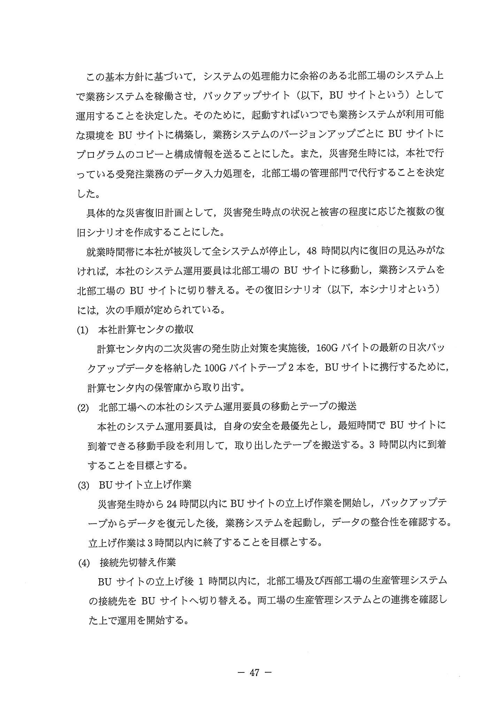

テキスト (OCR)

この基本方針に基づいて, システムの処理能力に余裕のある北部工場のシステム上
で業務システムを稼働させ, バックアップサイト (以下, BU サイトという) として
運用することを決定した。そのために, 起動すればいつでも業務システムが利用可能
な環境を BU サイトに構築し, 業務システムのバージョンアップごとに BU サイトに
プログラムのコピーと構成情報を送ることにした。また, 災害発生時には, 本社で行
っている受発注業務のデータ入力処理を, 北部工場の管理部門で代行することを決定
bs

具体的な災害復旧計画として, 災害発生時点の状況と被害の程度に応じた複数の復
旧シナリオを作成することにした。

就業時間帯に本社が被災して全システムが停止し, 48 時間以内に復旧の見込みがな
ければ, 本社のシステム運用要員は北部工場の BU サイトに移動し, 業務システムを
北部工場の BU サイトに切り堆える。その復旧シナリオ (以下, 本シナリオという)
には, 次の手順が定められている。

Q① 本社計算センタの撤収
計算センタ内の二次災害の発生防止対策を実施後, 160G バイトの最新の日次バッ
クアップデータを格納した 100G バイトテープ 2 本を, BU サイトに携行するために,
計算センタ内の保管庫から取り出す。
(2) 北部工場への本社のシステム運用要員の移動とテープの搬送
本社のシステム運用要員は, 自身の安全を最優先とし, 最短時間で BU サイトに
到着できる移動手段を利用して, 取り出したテープを搬送する。3 時間以内に到着
することを目標とする。
(3) BUサイト立上げ作業
災害発生時から 24 時間以内に BU サイトの立上げ作業を開始し, バックアップテ
ープからデータを復元した後, 業務システムを起動し. データの整合性を確認する。
立上げ作業は 3 時間以内に終了することを目標とする。
(4) 接続先切替え作業
BU サイトの立上げ後 1 時間以内に, 北部工場及び西部工場の生産管理システム
の接続先を BU サイトへ切り替える。両工場の生産管理システムとの連携を確認し
た上で運用を開始する。

ー 47 一

### ページ 48

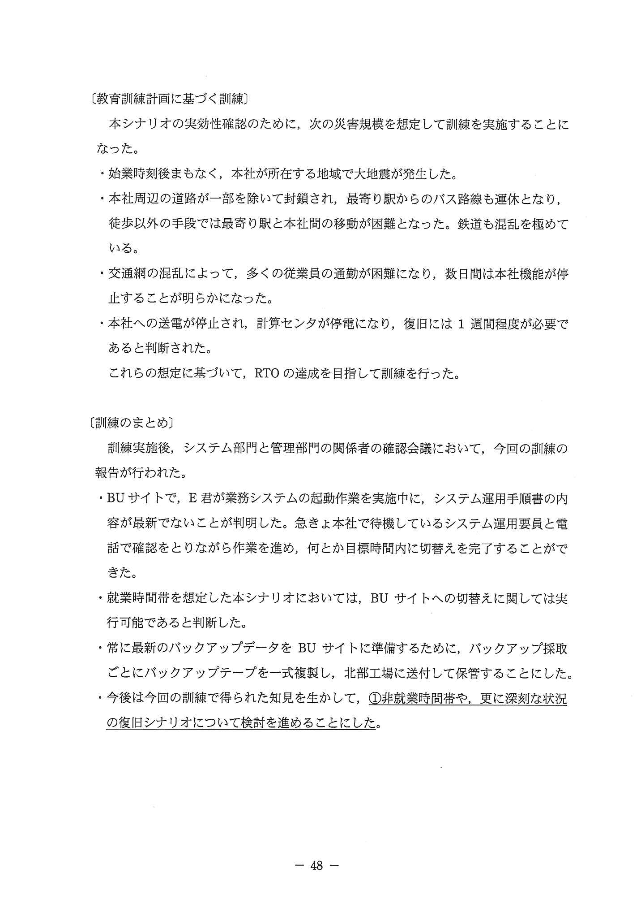

テキスト (OCR)

(教育訓練計画に基づく訓練

本シナリオの実効性確認のために, 次の人災害規模を想定して訓練を実施することに

なった。
・ 始業時刻後まもなく, 本社が所在する地域で大地震が発生した。
・本社周辺の道路が一部を除いて封鎖され, 最寄り駅からのバス路線も運休となり,

徒歩以外の手段では最寄り駅と本社間の移動が困難となった。鉄道も混乱を極めて
いる。

・交通網の混乱によって, 多くの従業員の通勤が困難になり, 数日間は本社機能が停

止することが明らかになった。

・本社への送電が停止され, 計算センタが停電になり, 復旧には 1 週間程度が必要で

Gall

報

あると判断された。
これらの想定に基づいて, RTO の達成を目指して訓練を行った。

MOE LD)
訓練実施後, システム部門と管理部門の関係者の確認会議において, 今回の訓練の
告が行われた。

・BU サイトで, E 君が業務システムの起動作業を実施中に, システム運用手順書の内

容が最新でないことが判明した。急きょ本社で待機しているシステム運用要員と電
話で確認をとりながら作業を進め, 何とか目標時間内に切堆えを完了することがで
きた。

・逐業時間帯を想定した本シナリオにおいては, BU サイトへの切替えに関しては実

行可能であると判断した。

・常に最新のバックアップデータを BU サイトに準備するために, バックアップ採取

ごとにバックアップテープを一式複製し, 北部工場に送付して保管することにした。

・今後は今回の訓練で得られた知見を生かして, ①非就業時間帯や, 更に深刻な状況

の復旧シナリオについて検討を進めることにした。

### ページ 49

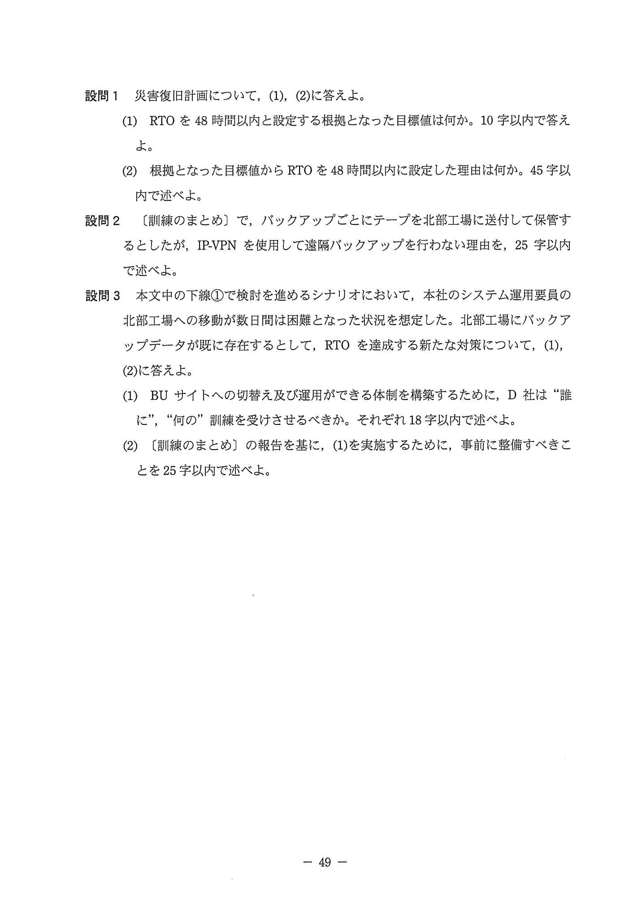

テキスト (OCR)

設問1 災害復旧計画について, (①, ②⑫②に答えよ。
Q①) RTO を 48 時間以内と設定する根拠となった目標値は何か。10 字以内で答え
よ。
QQ) 根拠となった目標値から RTO を 48 時間以内に設定した理由は何か。45 字以
設問2 訓練のまとめ〕 で, バックアップごとにテープを北部工場に送付して保管す
るとしたが, IP-VPN を使用して遠隔バックアップを行わない理由を, 25 字以内
設問3 本文中の下線①で検討を進めるシナリオにおいて, 本社のシステム運用要員の
北部工場への移動が数日間は困難となった状況を想定した。北部工場にバックア
ップデータが既に存在するとして, RIO を達成する新たな対策について, ①,
⑫②に答えよ。
(① BU サイトへの切替え及び運用ができる体制を構築するために, D 社は “GE
i", “IO” 訓練を受けさせるべきか。それぞれ18 字以内で述べよ。
(2) 【訓練のまとめ〕] の報告を基に, ①)を実施するために, 事前に整備すべきこ
とを 25 字以内で述べよ。

### ページ 50

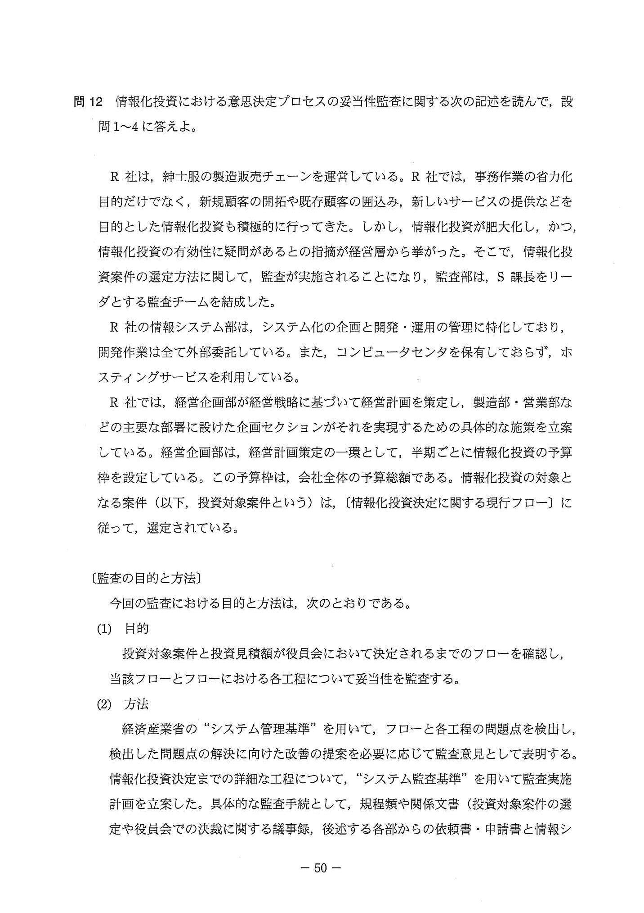

テキスト (OCR)

問12 情報化投資における意思決定プロセスの妥当性監査に関する次の記述を読んで, 設

fl 1~4 に答えよ。

R 社は, 紳士服の製造販売チェーンを運営している。R 社では, 事務作業の省力化
目的だけでなく, 新規顧客の開拓や既存顧客の囲込み, 新しいサービスの提供などを
目的とした情報化投資も積極的に行ってきた。しかし, 情報化投資が肥大化し, かつ,
情報化投資の有効性に疑問があるとの指摘が経営層から挙がった。そこで, 情報化投
資案件の選定方法に関して, 監査が実施されることになり, 監査部は, S 課長をリー
ダとする監査チームを結成した。

R 社の情報システム部は, システム化の企画と開発・運用の管理に特化しており
開発作業は全て外部委託している。また, コンピュータセンタタを保有しておらず, ホ
スティングサービスを利用している。

R 社では, 経営企画部が経営戦略に基づいて経営計画を策定し, 製造部・営業部な
どの主要な部署に設けた企画セクションがそれを実現するための具体的な施策を立案
している。 経営企画部は, 経営計画策定の一環として, 半期ごとに情報化投資の予算
杏を設定している。この予算桁は, 会社全体の予算総額である。 情報化投資の対象と
なる案件 (以下, 投資対象案件という) は, 〔情報化投資決定に関する現行フロー〕 に
従って, 選定されている。

(監査の目的と方法〕
今回の監査における目的と方法は, 次のとおりである。
① 目的
投資対象案件と投資見積額が役員会において決定されるまでのフローを確認し,
当該フローとフローにおける各工程について妥当性を監査する。
(2) 方法
経済産業者の“システム管理基準" を用いて, フローと各工程の問題点を検出し,
検出した問題点の解決に向けた改善の提案を必要に応じて監査意見として表明する。
情報化投資決定までの詳細な工程について, “システム監査基準” を用いて監査実施
計画を立案した。具体的な監査手続として, 規程天や関係文書 (投資対象案件の選
定や役員会での決裁に関する議事録, 後述する各部からの依頼書・申請書と情報シ

### ページ 51

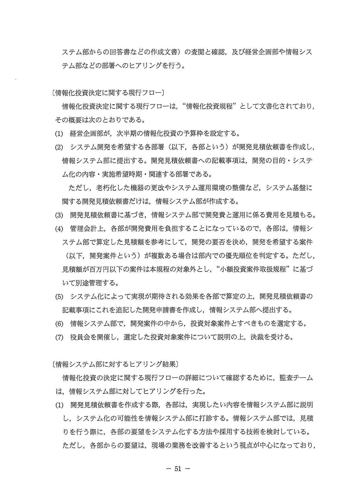

テキスト (OCR)

ステム部からの回答書などの作成文書) ORM CHR, 及び経営企画部や情報シス
テム部などの部署へのヒアリングを行う。

〔情報化投資決定に関する現行フロー〕
情報化投資決定に関する現行フローは, “情報化投資規程" として文書化されており,

その鬼要は次のとおりである。

⑪) 経営企画部が, 次半期の情報化投資の予算枠を設定する。

(2②) システム開発を希望する各部署 (以下, 各部という) が開発見積依頼書を作成し,
情報システム部に提出する。 開発見積依頼書への記載事項は, 開発の目的・システ
ム化の内容・実施希望時期・関連する部署である。

ただし, 老朽化した機器の更改やシステム運用環境の整備など, システム基盤に
関する開発見積依頼書だけは, 情報システム部が作成する。

(3) 開発見積依頼書に基づき, 情報システム部で開発費と運用に係る費用を見積もる。

(4) 管理会計上, 各部が開発費用を負担することになっているので, 各部は, 情報シ
ステム部で算定した見積額を参考にして, 開発の要否を決め, 開発を希望する案件
(以下, 開発案件という) が複数ある場合は部内での優先順位を判定する。ただし,
見積額が百万円以下の案件は本規程の対象外とし, “小額投資案件取扱規程" に基づ
いて別途管理する。

6) システム化によって実現が期待される効果を各部で算定の上, 開発見積依頼書の
記載事項にこれを追記した開発申請書を作成し, 情報システム部へ提出する。

(⑥) 情報システム部で, 開発案件の中から, 投資対象案件とすべきものを選定する。

(⑦ 役員会を開催し, 選定した投資対象案件について説明の上, 決裁を受ける。

(情報システム部に対するヒアリング結果〕
情報化投資の決定に関する現行フローの詳細について確認するために, 監査チーム

は, 情報システム部に対してヒアリングを行った。

①) 開発見積依頼書を作成する際, 各部は, 実現したい内容を情報システム部に説明
し, システム化の可能性を情報システム部に打診する。情報システム部では, 見積
りを行う際に, 各部の要望をシステム化する方法や採用する技術を検討している。
ただし, 各部からの要望は, 現場の業務を改善するという視点が中心になっており,

ー 51 一

### ページ 52

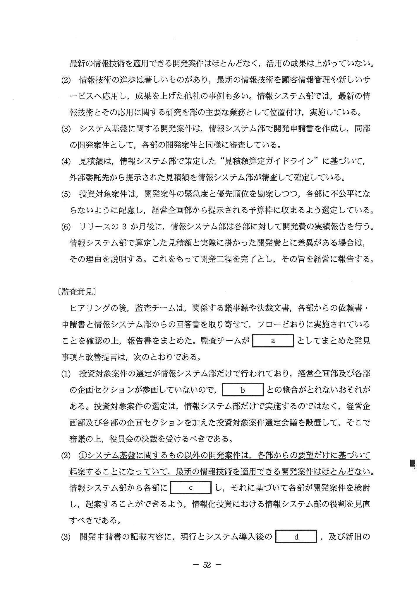

テキスト (OCR)

最新の情報技術を適用できる開発案件はほとんどなく, 活用の成果は上がっていない。
2) 情報技術の進歩は著しいものがあり, 最新の情報技術を顧客情報管理や新しいサ
ービスへ応用し, 成果を上げた他社の事例も多い。情報システム部では, 最新の情
報技術とその応用に関する研究を部の主要な業務として位置付け, 実施している。
3) システム基盤に関する開発案件は, 情報システム部で開発申請書を作成し, 同部
の開発案件として, 各部の開発案件と同様に審査している。
(4) 見積額は, 情報システム部で策定した “見積額算定ガイドライン" に基づいて
外部委託先から提示された見積額を情報システム部が精査して確定している。

6) 投資対象案件は, 開発案件の緊急度と優先順位を勘案しつつ, 各部に不公平にな
らないように配慮し, 営企画部から提示される予算枠に収まるよう選定している。
6) リリースの 3 か月後に, 情報システム部は各部に対して開発費の実績報告を行う。
情報システム部で算定した見積額と実際に掛かった開発費とに差異がある場合は,
その理由を説明する。これをもって開発工程を完了とし, その旨を経営に報告する。

(監査意見

ヒアリングの後,監査チームは, 関係する議事録や決裁文書, 各部からの依頼書・
申請書と情報システム部からの回答書を取り寄せて, フローどおりに実施されている
ことを確認の上, 報告書をまとめた。監査チームが| a | としてまとめた発見
事項と改善提言は。 次のとおりである。

) 投資対象案件の選定が情報システム部だけで行われており, 経営企画部及び各部
の企画セクションが参画していないので, | b | との整合がとれないおそれが
ある。投資対象案件の選定は, 情報システム部だけで実施するのではなく, BEE
画部及び各部の企画セクションを加えた投資対象案件選定会議を設置して, そこで
審議の上 役員会の決裁を受けるべきである。

2) ①システム基盤に関するもの以外の開発案件は, 各部からの要望だけに基づいて
起案することになっていて, 最新の情報技術を適用できる開発案件はほとんどない。
情報システム部から各部に し, それに基づいて各部が開発案件を検討
し, 起案することができるよう, 情報化投資における情報システム部の役割を見直
すべきである。

⑬) 開発申請書の記載内容に, 現行とシステム導入後の|  q | , 及び新旧の

ー 52 一

### ページ 53

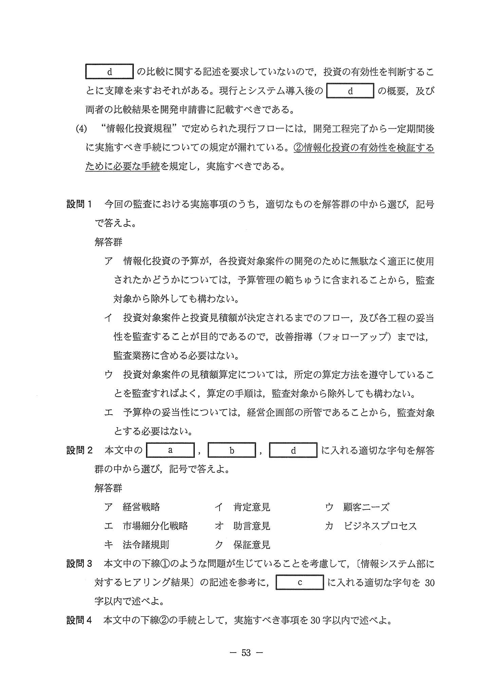

テキスト (OCR)

|  d | の比較に関する記述を要求していないので, 投資の有効性を判断するこ
とに支障を来すおそれがある。現行とシステム導入後の| q | の概要,及び
両者の比較結果を開発中請書に記載すべきである。

(④ "情報化投資規程" で定められた現行フローには, 開発工程完了から一定期間後
に実施すべき手続についての規定が漏れている。②情報化投資の有効性を検証する
ために必要な手続を規定し, 実施すべきである。

設問1 今回の監査における実施事項のうち, 適切なものを解答群の中から選び
で答えよ。
解答群

ア 情報化投資の予算が, 各投資対象案件の開発のために無駄なく適正に使用
されたかどうかについては, 予算管理の範ちゅうに含まれることから, 監査
対象から除外しても構わない。

イ 投資対象案件と投資見積額が決定されるまでのフロー, 及び各工程の妥当
性を監査することが目的であるので, 改善指導 (フォローアップ) までは,
監査業務に含める必要はない。

ウ 投資対象案件の見積額算定については, 所定の算定方法を避守しているこ
とを監査すればよく, 算定の手順は, 監査対象から除外しても構わない。

エエ 予算桁の妥当性については, 経営企画部の所管であることから, 監査対象

ad

aul

とする必要はない。
設問2 本文中の| ai |,|  b |,| 4 |に入れる適切な字句を解答
群の中から選び, 記号で答えよ。
解答群
ア 経営戦略      イ AER      ウ 顧客ニーズ
エエ 市場細分化戦略   オ 助言意見      A ビジネスプロセス
キ 法令諸規則     ク 保証意見

設問3 本文中の下線①のような問題が生じていることを考慮して, 情報システム部に
対するヒアリング結果) の記述を参考に, | c | に入れる適切な宇名を30
字以内で述べよ。

設問4 本文中の下線②の手続として, 実施すべき事項を 30 宇以内で述べよ。

ー 53 一

### ページ 54

テキスト (OCR)

(A モ 用 RJ)

### ページ 55

テキスト (OCR)

CA モ 用 紙 〕

ー 55 一

### ページ 56

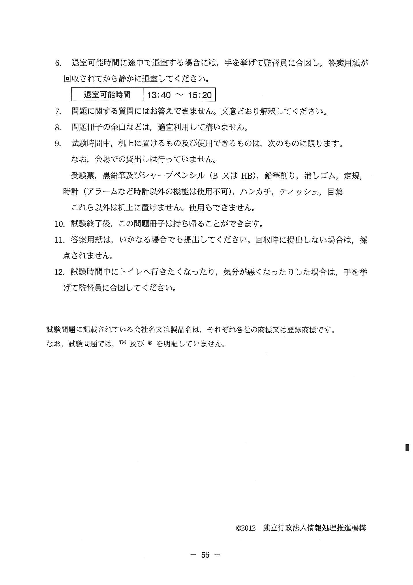

テキスト (OCR)

6. 退室可能時間に途中で退室する場合には, 手を挙げて監督員に合図し, 答案用紙が
回収されてから静かに退宣してください。
| 退室可能時間 | 13:40 ~ 15:20 |
7. 問題に関する質問にはお答えできません。文意どおり解釈してください。
8. 問題冊子の余白などは, 適宜利用して構いません。
9. 試験時間中, 机上に置けるもの及び使用できるものは, 次のものに限ります。
なお, 会場での貸出しは行っていません。
受験票, 黒鉛筆及びシャープペンシル (G 又は HB), 鉛筆削り, 消しゴム, 定規,
時計 (アラームなど時計以外の機能は使用不可), ハンカチ, ティッシュ, 目薬
これら以外は机上に置けません。使用もできません。
10. 試験終了後, この問題冊子は持ち帰ることができます。
11. SRAM, いかなる場合でも提出してください。回収時に提出しない場合は, 採
点されません。
12, 試験時間中にトイレへ行きたくなったり, 気分が悪くなったりした場合は, FER
げて臨連員に合図してください。

試験問題に記載されている会社名又は製品名は, それぞれ各社の商標又は登録商標です。
なお, 試験問題では, ™ 及び © を明記していません。

@2012 独立行政法人情報処理推進機構

ー 56 一

---

## 午後解答

1/6 
©2012 独立行政法人情報処理推進機構 
平成24 年度 春期 応用情報技術者試験 解答例 
 
午後試験 
問１ 
出題趣旨 
 企業の経営環境を整理し，適切な経営戦略を導き出す上で，ロジカルシンキングは有効な手法である。 
 本問では，小売業の販売戦略立案を題材に，この手法の基本的理解と活用力を問う。 
 
設問 
解答例・解答の要点 
備考 
設問１ (1) ウ 
 
 
(2) a エ 
 
 
 
b イ 
 
 
 
c ア 
 
設問２ 
d 価格競争 
 
 
e ワンストップ 
 
設問３ 
顧客のし好を十分に把握し，最適な商品を提案できる。 
 
設問４ (1) 顧客別の購入履歴を即時に参照できる機能 
 
 
(2) 顧客への提案に有益な情報を顧客管理システムに入力した件数 
 
 
問２ 
出題趣旨 
 データ圧縮処理はネットワーク上の伝送効率や，ストレージへの保存効率を向上させるために欠かせない。
 本問では，可逆圧縮アルゴリズムの一つランレングス法を題材に，圧縮の表現形式の異なる二つのアルゴリ
ズムを実装する能力を問う。さらに，圧縮処理の効果を評価する能力を問う。 
 
設問 
解答例・解答の要点 
備考 
設問１ (1) x1y3z4x2y1z5 
 
 
(2) xyyyz*4xxyz*5 
 
設問２ 
ア in[i]とprev が等しい 
 
 
イ k＋2 
 
設問３ 
ウ in[i]とprev が等しくない 
 
 
エ prev ← in[i] 
 
 
オ runLength が3 以下 
 
設問４ (1) カ 0.8 
 
 
 
キ 0.9 
 
 
 
ク 2 
 
 
(2) 同じ文字が連続することがない場合

2/6 
©2012 独立行政法人情報処理推進機構 
問３ 
出題趣旨 
 ネットワークの高帯域化やWeb アプリケーションの構築技術の進展に伴い，インターネット経由でアプリケ
ーションサービスを利用できるSaaS が，発展を遂げている。 
 本問では，SaaS 事業者が提供するサービスの利用を題材に，システム化計画の知識・理解度を問う。 
 
設問 
解答例・解答の要点 
備考 
設問１ 
インターネット販売だけの顧客宛てには，特定の販売店のセールの案内を送れ
ない。 
 
設問２ 
(3)，(5) 
 
設問３ (1) a データ処理量 
 
 
 
b 6 か月後まで 
 
 
(2) c エ 
 
設問４ 
遠隔地のバックアップセンタを利用して，K 社の業務を継続できること 
 
 
問４ 
出題趣旨 
 口約束や曖昧な発注内容が原因で，納期の遅れやシステム障害が発生することが少なくない。これに対し，
事前にRFP を作成し，調達条件や契約内容を明らかにしておくことが重要である。 
 本問では，システム更改を予定している企業のRFP 作成を題材に，提案の依頼内容，及び受け取った提案書
の評価に関する基本的な理解について問う。 
 
設問 
解答例・解答の要点 
備考 
設問１ (1) イ，ウ 
 
 
(2) 利用部門からもメンバを選出する。 
 
設問２ (1) ア，エ 
 
 
(2) フィット＆ギャップ分析 又は フィットギャップ分析 
 
設問３ (1) 画面レスポンス時間は，利用者環境やネットワーク環境に依存するから 
 
 
(2) 5 年後の取扱いデータ件数 
 
設問４ 
イ，オ

3/6 
©2012 独立行政法人情報処理推進機構 
問５ 
出題趣旨 
 オフィス以外の場所でのネットワーク利用のニーズが増えてきており，手軽に構築できるWAN として携帯電
話サービスを使う事例が増えている。 
 本問では，携帯電話サービスを回線として構築した無線WAN におけるネットワークの遅延問題を題材に，携
帯電話サービスの特徴，ネットワーク遅延とファイル転送のスループットの関連，また，スループット改善の
方法について，その理解を問う。 
 
設問 
解答例・解答の要点 
備考 
設問１ (1) a 仮設事務所の移設に伴うLAN の移動 
 
 
(2) 理論値は1 端末が基地局を占有した場合の最大速度であるから 
 
設問２ (1) b 640 
 
 
(2) イ 
 
設問３ 
c 5 
 
設問４ 
d カ 
 
 
問６ 
出題趣旨 
 組織の統合などによって，既存サービスを統合する機会は多く，その際のデータベース再設計の重要性が増
している。 
 本問では，公共図書館サービスの統合を題材に，データベース設計に関する基本的な理解，及びテーブルを
統合するビューの設計に必要な知識の理解について問う。 
 
設問 
解答例・解答の要点 
備考 
設問１ 
a 蔵書A.書籍番号 = 書籍A.書籍番号 
 
 
b 貸出記録A.返却日 IS NULL 
 
 
c UNION 又は UNION ALL 
 
 
d 蔵書B.ISBN 番号 = 書籍B.ISBN 番号 
 
 
e 貸出記録B.返却日 IS NULL 
 
 
f 蔵書A.貸出状況 = '貸出可' 
 
 
g 蔵書B.貸出状況 = '貸出可' 
 
設問２ 
夜間バッチ処理後に貸出状況が変わることがあるから 
 
設問３ 
イ 
 
設問４ 
蔵書番号，図書館名

4/6 
©2012 独立行政法人情報処理推進機構 
問７ 
出題趣旨 
 組込みシステムの開発においては，マルチタスクのシステムの設計を行うことが多い。マルチタスクのシス
テムの設計においては，個々のタスクの状態を適切に把握し，効率的に連動して動作させる必要がある。 
 本問では，携帯型オーディオプレーヤの組込みソフトウェアの設計を題材に，マルチタスクのシステムの設
計に関する基本的な理解と応用力を問う。 
 
設問 
解答例・解答の要点 
備考 
設問１ 
a 再生処理 
 
 
b STOP メッセージ 
 
設問２ 
d p＋m 
 
 
e n－m 
 
設問３ 
c データ読出しタスクの終了を待つ 
 
 
問８ 
出題趣旨 
 品質の高いシステムを短い開発期間で仕上げるために，マッシュアップの手法は有効である。 
 本問では，スマートフォンで利用するアプリケーションの設計を題材に，XML 形式で情報の交換を行うAPI
を用いたシステム設計の基本的な理解と応用力を問う。 
 
設問 
解答例・解答の要点 
備考 
設問１ (1) a マッシュアップ 
 
 
 
b アクセスキー 
 
 
(2) c 分類 
 
 
 
d 緯度 
 
 
e 経度 
順不同 
設問２ 
イ，ウ 
 
設問３ 
表示項目としてY 社のAPI の実行時刻を追加する。

5/6 
©2012 独立行政法人情報処理推進機構 
問９ 
出題趣旨 
 情報システムのセキュリティを脅かす攻撃は，ますます複雑化・多様化しており，攻撃への防御手段とセキ
ュリティインシデントが発生した際の対応を整備することが重要になってきている。 
 本問では，IDS からアラートが発せられた際の対応を題材に，セキュリティインシデントが発生した際の対応
に関する基本的な理解，及びインシデント発生に備えた態勢の整備について問う。 
 
設問 
解答例・解答の要点 
備考 
設問１ 
a ク 
 
 
b イ 
 
 
c ウ 
 
 
d カ 
 
設問２ 
e 招集すべき要員をあらかじめ選定 
 
設問３ 
f 影響を受けるおそれのある部署への事前連絡 
 
設問４ 
ア 
 
 
問10 
出題趣旨 
 ソフトウェアの開発プロジェクトでは，品質・費用・納期の面で問題が発生することがある。 
 本問では，ソフトウェアの請負開発における赤字プロジェクトを題材に，赤字プロジェクトに対する全社的
な立場からの原因調査，対策を通してプロジェクトマネジメントの理解について問う。 
 
設問 
解答例・解答の要点 
備考 
設問１ 
事業部の枠を越えた対策の立案を期待したいから 
 
設問２ 
a リスク 
 
 
b イ 
 
設問３ 
エ 
 
設問４ (1) c 案件に応じたプロジェクトレビューの実施方法の強化 
 
 
(2) 必要なノウハウに精通するレビューアの人選

6/6 
©2012 独立行政法人情報処理推進機構 
問11 
出題趣旨 
 業務システムの復旧が事業継続において大きなウェイトを占めるようになっている。 
 本問では，事業継続計画（BCP）に基づいて策定されるIT サービス継続マネジメント（ITSCM）において，シ
ステム機能の復旧対策の策定や評価に関する基本的な理解，及びより高いレベルの復旧対策の要件についての
理解を問う。 
 
設問 
解答例・解答の要点 
備考 
設問１ (1) ・生産再開目標値 
・72 時間以内 
・3 日以内 
 
 
(2) 生産計画データが日次で伝送されるので最大で24 時間の余裕が必要であるから  
設問２ 
データの伝送に時間が掛かりすぎるから 
 
設問３ (1) 誰に 
北部工場のシステム運用担当者 
 
 
 
何の 
業務システムの起動及び運用 
 
 
(2) システム運用手順書を最新の状態に保つ。 
 
 
問12 
出題趣旨 
 情報化の投資においては，有効な投資が行われ，かつ，投資対象案件の選定が妥当であることを確認するこ
とが重要である。 
 本問では，投資対象案件と投資見積額の決定に関するシステム監査を題材に，システム監査業務に関する基
本的な理解，及びシステム監査における着眼点について問う。 
 
設問 
解答例・解答の要点 
備考 
設問１ 
ア 
 
設問２ 
a オ 
 
 
b ア 
 
 
d カ 
 
設問３ 
c 最新の情報技術の活用や応用に関する研究成果を提示 
 
設問４ 
各部が算定した効果の達成度を評価すること

---

## 午後採点講評

1/3 
©2012 独立行政法人情報処理推進機構 
平成24 年度 春期 応用情報技術者試験 採点講評 
 
午後試験 
問１ 
 問1 では，小売業の販売戦略立案を題材に，ピラミッドストラクチャによる分析と，それを基にした顧客管
理システムを使った店舗施策の実現について出題した。 
 設問1(2)は，正答率が高かった。ピラミッドストラクチャの基本的な構造について，おおむね理解されてい
るようであった。 
 設問4 は，正答率が低かった。(2)では，売上以外の目標についての解答を求めたにもかかわらず，店舗の
売上などを述べた解答が散見された。問題文をよく読み，求められていることを理解した上で解答してほし
い。 
 
問２ 
 問2 では，可逆圧縮アルゴリズムの一つランレングス法を題材に，圧縮の表現形式の異なる二つのアルゴリ
ズムの実装について出題した。全体として，正答率は高かった。 
 設問2 のイは，処理結果を配列out のどの位置に出力するか，変数k の使い方についてプログラムから読み
取ってほしかったが，単純にカウントアップするものだと勘違いしたと思われる解答が散見された。アルゴリ
ズムの処理手順とプログラムをよく見比べて，正答を導き出してほしい。 
 設問3 のオは，アルゴリズムの処理手順から分岐条件を求めてほしかったが，境界値を誤った解答が目立っ
た。問題文中に例示した文字列などを使って，プログラムがその文字列を正しく処理できることを確認した上
で解答してほしい。 
 
問３ 
 問3 では，SaaS 事業者が提供するサービスの利用を題材に，システム化計画について出題した。 
 設問2 及び設問3(1)は，正答率が高かった。SaaS の利用に関する基礎的な事項及びメリットについて，お
おむね理解されているようであった。 
 設問4 は，正答率が低かった。SaaS 事業者のデータセンタが設置されている地域で，甚大な広域災害が発生
した場合に起こりうる事態を念頭において，自社の事業を継続するために必要な事項を理解しておいてほし
い。 
 
問４ 
 問4 では，システム更改を予定している企業のRFP 作成を題材に，提案の依頼内容，及び受け取った提案書
の評価に関する基本的な理解について出題した。 
 設問1(2)は，正答率が高かったが，“Q 社の要員をRFP 作成チームメンバに加えるべき”という誤った解答
が散見された。公平性の観点から，RFP 作成時に特定の提案依頼先候補を参画させることはないことを理解し
ておいてほしい。 
 設問3(2)は，正答率が低かった。キャパシティ要求について問うたにもかかわらず，パフォーマンス要求や
セキュリティ要求，データ移行についての解答が目立った。キャパシティ要求として，現時点だけではなく，
将来の取扱いデータ件数についても明示する必要があることに気付いてほしい。

2/3 
©2012 独立行政法人情報処理推進機構 
問５ 
 問5 では，携帯電話サービスを回線として構築した無線WAN におけるネットワークの遅延問題を題材に，携
帯電話サービスの特徴や有線サービスとの違い，ネットワーク遅延とファイル転送のスループットの関連など
について出題した。 
 設問1(1)は，正答率が高かったが，要件には記述されていない“PC の持出し利用”などに言及した解答が
散見された。問題文中の“別の要件から”という字句を読み取ってほしい。 
 設問1(2)は，正答率が低かった。内容はおおむね合っているものの，問題文で指定されている“図2 中の字
句”を用いていない解答も見受けられた。 
 設問2(1)及び設問3 では，桁数や位を間違えている解答が多く見受けられた。 
 設問2(2)は，正答率が低かった。問題文中の最大スループットの求め方をしっかり理解してほしい。 
 
問６ 
 問6 では，図書館の検索システムの統合を題材に，データベース設計に関する基本的な理解，及び具体的な
処理方式の設計と実装について出題した。全体として，正答率は低かった。 
 設問1 では，b，e の正答率が他と比べて低かった。列の値がNULL かどうかによる検索条件の指定につい
て，十分に理解してほしい。 
 設問4 は，正答率が低かった。一意キーとなる列を把握する能力は非常に重要である。是非身に付けておい
てほしい。 
 
問７ 
 問7 では，携帯型オーディオプレーヤの組込みソフトウェアの設計を題材に，マルチタスクシステムの設計
について出題した。全体として，正答率は低かった。 
 設問1 は，正答率が高かった。メッセージを使用したタスク間通信の仕組みについて，おおむね理解されて
いるようであった。 
 設問3 は，正答率が低かった。マルチタスクシステムの設計において，個々のタスクの状態を適切に把握す
ることは，システム全体を効率的に連動して動作させる上で非常に重要である。タスクの流れとは非同期に発
生するメッセージの処理が，システム全体に対してどのような影響を与えるか，十分に関連付けて理解してほ
しい。 
 
問８ 
 問8 では，スマートフォンで利用するアプリケーションの設計を題材に，XML 形式で情報の交換を行うAPI
を用いたシステムの設計について出題した。全体として，正答率は高かった。 
 設問1(2)は，正答率が高かった。アプリケーションを構築する上で必要な情報と，XML の仕様が満たすべき
要件との関係について，おおむね理解されているようであった。 
 設問3 は，問題文中に記載がない変更内容を挙げている解答が散見され，正答率が低かった。公開されてい
るAPI を利用する場合は，利用する際の条件や制限について，サービスの利用規約を正しく理解し，遵守する
ことが非常に重要である。問題文中に示された条件を過不足なく読み取り，正答を導き出してほしい。 
 
問９ 
 問9 では，IDS からアラートが発せられた際の対応を題材に，セキュリティインシデントが発生した際の対
応及びインシデント発生に備えた態勢の整備について出題した。 
 設問1 は，正答率が高かった。外部からの攻撃手法について，おおむね理解されているようであった。 
 設問2 と設問4 は，正答率が低かった。実務で経験する機会は少ないかも知れないが，万一のセキュリティ
インシデント発生に備え，事前準備の内容とその重要性について，理解しておいてほしい。

3/3 
©2012 独立行政法人情報処理推進機構 
問10 
 問10 では，ソフトウェアの請負開発における赤字プロジェクトを題材に，赤字プロジェクトに対する全社
的な立場からの原因調査，対策を通してプロジェクトマネジメントの理解について出題した。全体として，正
答率は低かった。 
 設問1 は，正答率が低かった。N 部長個人のプロジェクトマネジメント力を解答した受験者が見受けられた
が，全社的な枠組みで対策を行う重要性を理解しておいてほしい。 
 設問2 のb は，正答率が高かった。各事業部長が，赤字プロジェクトの対策を事業部内に徹底する責任をも
つことについては，理解されているようであった。 
 設問4 は，正答率が低かった。プロジェクトを遂行する部門とプロジェクトを支援する部門とでは，プロジ
ェクトに対する責任や権限に違いがあることを理解して解答してほしい。 
 
問11 
 問11 では，事業継続計画（BCP）に基づいて策定されるIT サービス継続マネジメント（ITSCM）を題材に，
システム機能の復旧対策の策定や評価について出題した。 
 設問2 は，正答率が低かった。回線容量から，バックアップのデータ量が平時の日次処理でも伝送不可能な
サイズであることを理解してほしい。 
 設問3(2)は，正答率が低かった。“訓練のまとめ”に記述された事実に基づき，整備すべき事項は“システ
ム運用手順書を最新にする”ことに気付いてほしい。 
 
問12 
 問12 では，投資対象案件と投資見積額の決定に関するシステム監査を題材に，システム監査に関する基本
的な知識と情報化投資の有効性を監査する際の着眼点について出題した。 
 設問3 は，正答率が高かった。情報システム部が果たすべき役割について，おおむね理解されているようで
あった。 
 設問4 は，正答率が低かった。情報化投資の有効性を事後に確認することの重要性と，その有効性は期待効
果の達成度で判断すべきであることを是非理解しておいてほしい。

