# 平成25年度秋期 応用情報技術者試験

---

## 午前問題

### ページ 1

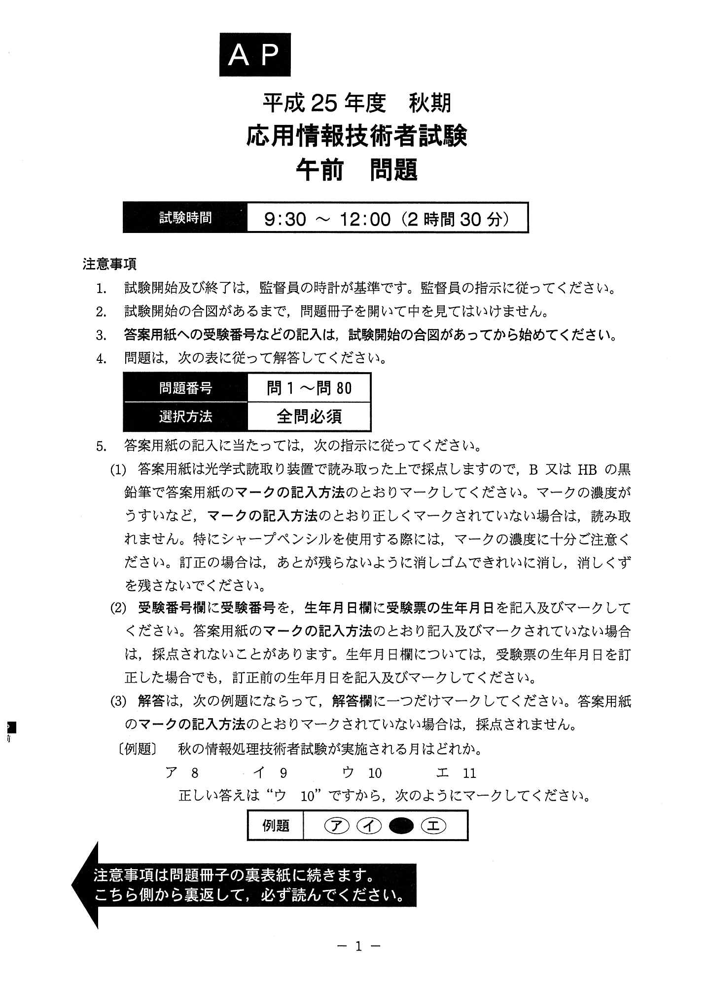

テキスト (OCR)

平成 25 年度 秋期
応用情報技術者試験
午前 問題

  9:30 ~ 12:00 (2時間30 分)

注意事項

1. 試験開始及び終了は, 監督員の時計が基準です。監督貞の指示に従ってください。
2. 試験開始の合図があるまで, 問題冊子を開いて中を見てはいけません。

3. 答案用紙への受験番号などの記入は, 試験開始の合図があってから始めてください。
4. 問題は, 次の表に従って解答してください。

問題番号        問1 て問80
選択方法           全問必須

5. 答案用紙の記入に当たっては, 次の指示に従ってください。

(1) 答案用紙は光学式読取り装置で読み取った上で採点しますので, B 又は HB の黒
鉛筆で答案用紙のマークの記入方法のとおりマークしてください。マークの濃度が
うすいなど, マークの記入方法のとおり正しくマークされていない場合は, 読み取
れません。特にシャープペンシルを使用する際には, マークの濃度に十分ご注意く
ださい。訂正の場合は, あとが残らないように消しゴムできれいに消し, 消しくず
を残さないでください。

(2) 受験番号欄に受験番号を, 生年月日欄に受験票の生年月日を記入及びマークして
ください。答案用紙のマークの記入方法のとおり記入及びマークされていない場合
は, 採点されないことがあります。生年月日欄については, 受験票の生年月日を訂
正した場合でも, 訂正前の生年月日を記入及びマークしてください。

(3) 解答は, 次の例題にならって, 解答欄に一つだけマークしてください。答案用紙
のマークの記入方法のとおりマークされていないめい場合は, 採点されません。

(例題) 秋の情報処理技術者試験が実施される月はどれか。

ア 8    イ 9    ウ 10    エ 11
正しい答えは “ウ 10” ですから, 次のようにマークしてください。

例題 | 〈の(① や)

注意事項は問題冊子の裏表紙に続きます。

こちら側から裏返して, 必ず読んでください。

### ページ 2

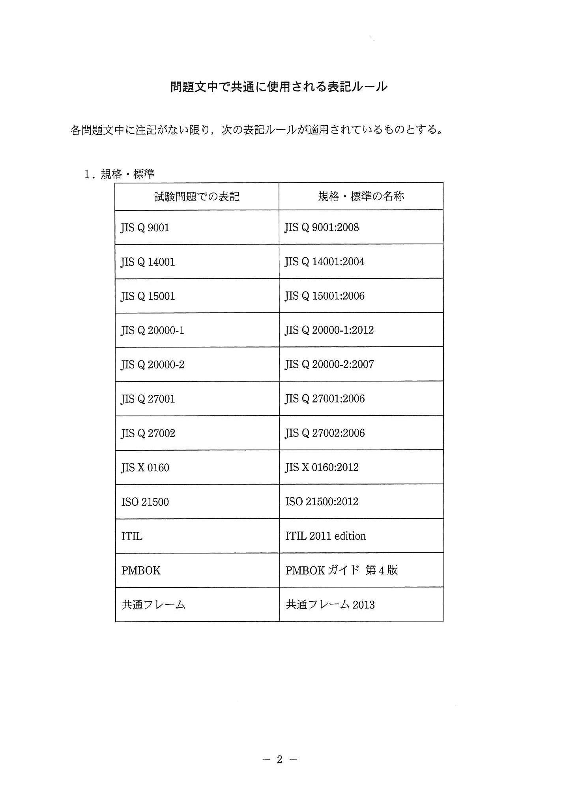

テキスト (OCR)

問題文中で共通に使用される表記ルール

各問題文中に注記がない限り, 次の表記ルールが適用されているものとする。

試験問題での表記                      規格・標準の名称
JIS Q 9001                               JIS Q 9001:2008
JIS Q 14001                             JIS Q 14001:2004
JIS Q 15001                             JIS Q 15001:2006

JIS Q 20000-1

JIS Q 20000-1:2012

JIS Q 20000-2                            JIS Q 20000-2:2007

JIS Q 27001                               JIS Q 27001:2006

JIS Q 27002                              JIS Q 27002:2006

JIS X 0160                                     JIS X 0160:2012

ISO 21500                                   ISO 21500:2012

ITIL                                             ITIL 2011 edition
PMBOK                                 PMBOK ガイド 第4版
共通フレーム                  共通フレーム 2013

### ページ 3

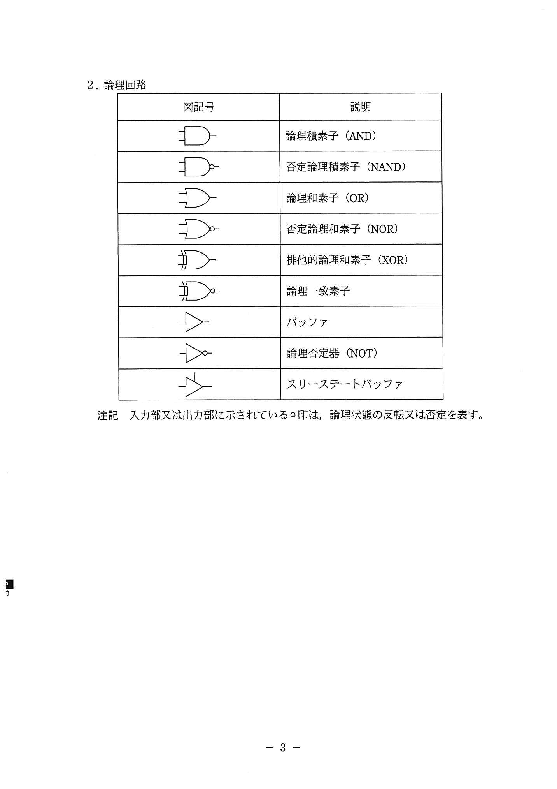

テキスト (OCR)

‘i

2. 論理回路

層
cu
a

論理積素子 (AND)

否定論理積素子 (NAND)

論理和素子 (OR)

否定論理和素子 (NOR)

排他的論理和素子 (XOR)

論理一致素子

Be?

論理否定器 (NOT)

スリーステートバッファ

YYIYMMVMMD

注記 入力部又は出力部に示されているo印は, 論理状態の反転又は否定を表す。

### ページ 4

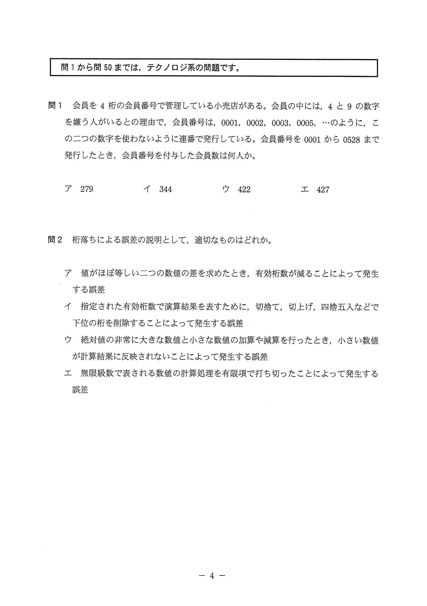

テキスト (OCR)

問 1 から問 50 までは, テクノロジ系の問題です。

間1 会員を4 桁の会員番号で管理している小売店がある。 会員の中には, 4 と 9 の数字
を嫌う人がいるとの理由で, 会員番号は, 0001, 0002, 0003, 0005, …のように, =
の二つの数字を使わないように連番で発行している。 会員番号を 0001 から 0528 まで

発行したとき, 会員番号を付与した会員数は何人か。

ア 279     イ 344     ウ 422     427

問2 桁落ちによる誤差の説明として, 適切なものはどれか。

ア 値がほぼ等しい二つの数値の差を求めたとき, 有効桁数が減ることによっでて発生
する誤差

イ 指定された有効桁数で演算結果を表すために, 切捨て, 切上げ, 四捨五入などで
下位の桁を削除することによって発生する誤差

ウ 絶対値の非常に大きな数値と小さな数値の加算や減算を行ったとき, 小さぃい数値
が計算結果に反映されないことによって発生する誤差

CL 無限級数で表される数値の計算処理を有限項で打ち切ったことによって発生する
誤差

### ページ 5

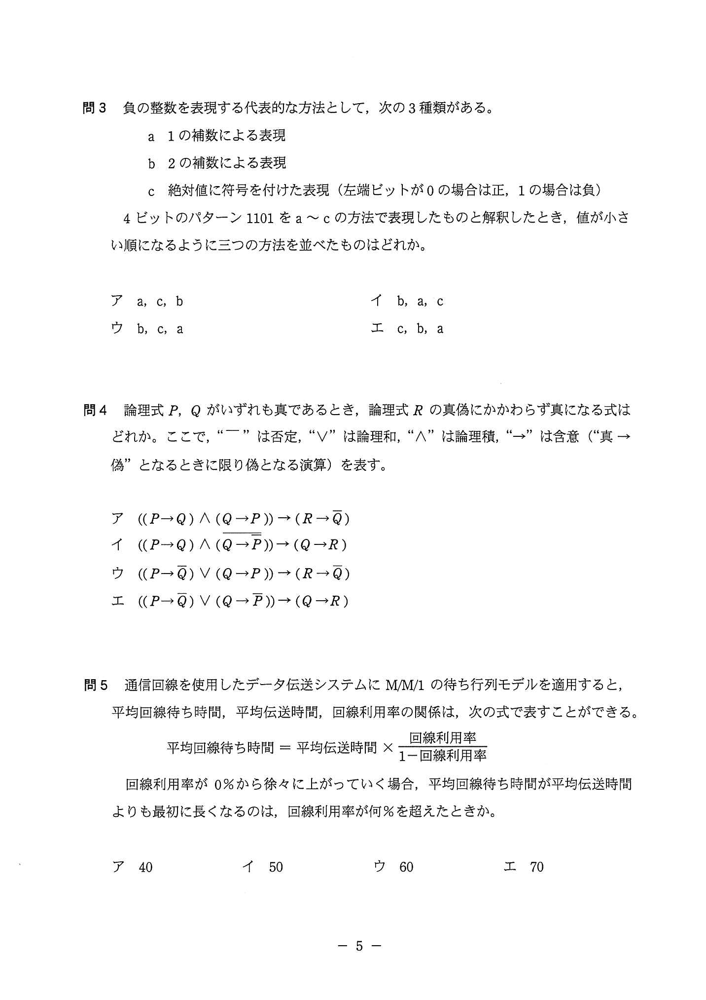

テキスト (OCR)

問3 負の整数を表現する代表的な方法として, 次の3 種類がある。
a 1の補数による表現
b 2の補数による表現
c 絶対値に符号を付けた表現 (左端ビットが0 の場合は正, 1 の場合は負)
4 ビットのパターン 1101 をacの方法で表現したものと解釈したとき, 値が小さ
い順になるように三つの方法を並べたものはどれか。

ア ac, b        イ bac
7 dG a        正, i@. ‘by 8

問4 論理式 , のO がいずれも真であるとき, 論理式 Z の真備にかかわらず真になる式は
どれか。ことこで,“ ” は否定,“V” は論理和, “A” EAL “>” は含意 (真一
偽"” となるときに限り偽となる演算) ERT.

ア ((Pっ9) 人(9つり)つ(Eつ6)
4 (Pっの) 人(9つう)一(0つ)
ウ (P30) V(Q>P)) > (R98)
エ (P>Q) V(Q@>P)> (QR)

問5 通信回線を使用したデータ伝送システムに MM/ の待ち行列モデルを適用すると,
平均回線待ち時間, 平均伝送時間, 回線利用率の関係は, 次の式で表すことができる。

平均加線1     = 平均伝送     - 目線利用率
平均回線待ち時間 = 平均伝送時間 X egy ae

回線利用率が 0%から徐々に上がっていく場合, 平均回線待ち時間が平均伝送時間
よりも最初に長くなるのは, 回線利用率が何%を超えたときか。

### ページ 6

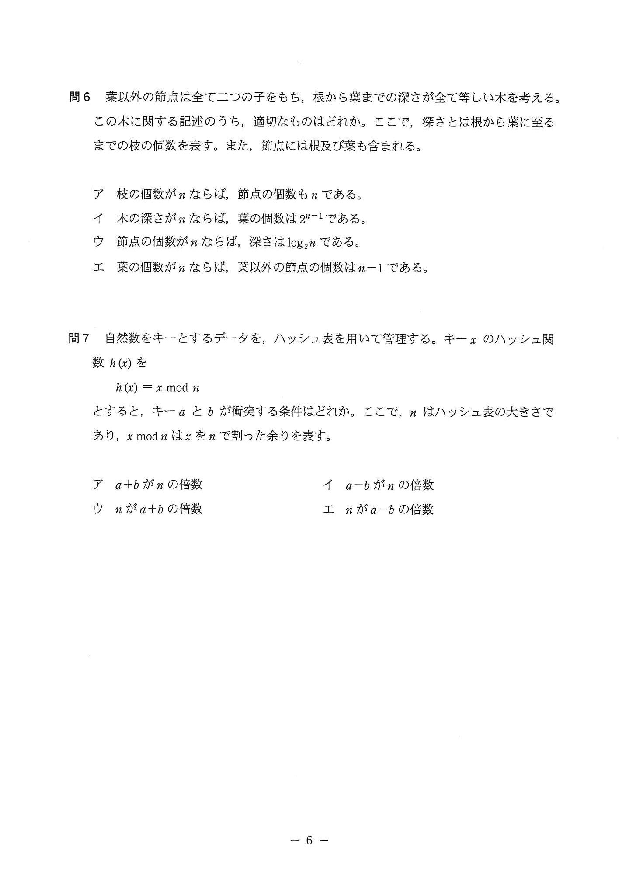

テキスト (OCR)

間6 葉以外の節点は全て二つの子をもち, 根から葉までの深さが全て等しい木を考える。
この木に関する記述のうち, 適切なものはどれか。ここで, 深さとは根から葉に至る
までの枝の個数を表す。また, 節点には根及び葉も含まれる。

枝の個数がヵならば, 節点の個数もヵ である。
木の深さがヵならば, 葉の個数は 2?-1である。
節点の個数がヵ ならば, 深さはlog。z CHS.

葉の個数がヶヵならば, 葉以外の節点の個数はヵー1 である。

H WGA SW

間7 自然数をキーとするデータを, ハッシュ表を用いて管理する。キーァ のハッシュ関
BAG) を
h(x) =x mod n
とすると, Fa とヵ が衝突する条件はどれか。ここで, n はハッシュ表の大きさで
あり, zmodz は* をヵ で割った余りを表す。

ア g+ヵがヶ の倍数        イ 2-ヵがヵ の倍数
ウ ぁ%がg+ヵ の倍数          エエ が2一》 の倍数

### ページ 7

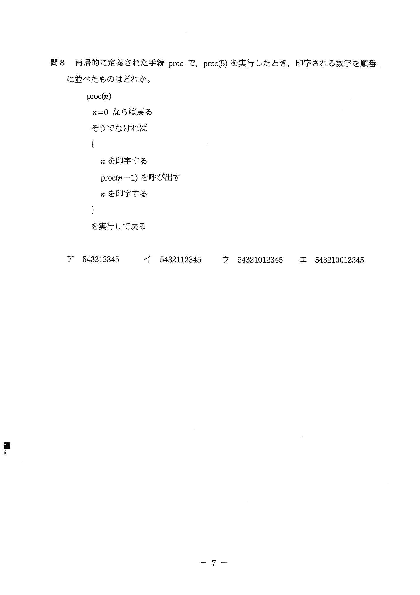

テキスト (OCR)

問8 再帰的に定義された手続 proc で, proc(5) を実行したとき, 印字される数字を順番
に並べたものはどれか。
proc(n)

n=0 ならば戻る

そうでなければ

{
z を印字する
procg一1) を呼び出す
ヶ を印字する

}

を実行して戻る

ア 543212345   イ 5432112345  ウ 54321012345  543210012345

### ページ 8

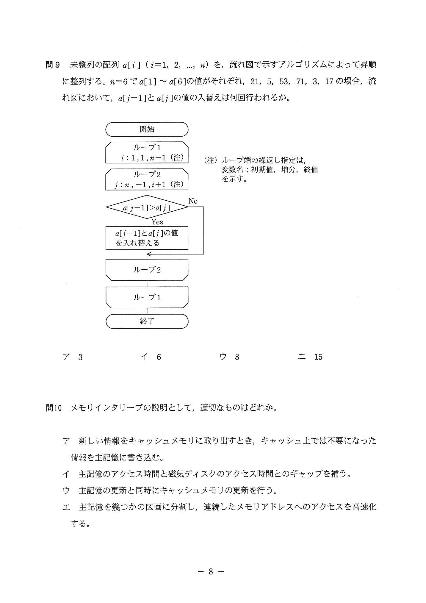

テキスト (OCR)

問9 未整列の配列 afi] (i=1, 2, .…, mn) を, 流れ図で示すアルゴリズムによって昇順
に整列する。 n=6 Call] ~ [6]の値がそれぞれ, 21, 5, 53, 71, 3, 17 の場合, 流
れ図において, g[7ー1]と g[7]の値の入替えは何回行われるか。

ループ1

1,1,メー1 (注) | Gt) ループ端の繰返し指定は,

ーーーエーーー     変数名 : 初期値 増分,終値
ーーアデ        Be  ・   >   っ WS
weve       を示す。

jin,—1,it1 (注)

で>
Yes

g[7一1]とg[7]の値
を入れ替える

にーーーーーーーー」
ループ2
ーーーーーーーー一
ループュ

終了

間10 メモリインタリーブの説明として, 適切なものはどれか。

ア 新しい情報をキャッシュメモリに取り出すとき, キャッシュ上では不要になった
情報を主記憶に書き込む。

イ 主記憶のアクセス時間と磁気ディスクのアクセス時間とのギャップを補う。

ウ 主記憶の更新と同時にキャッシュメモリの更新を行う。

エエ 主記憶を幾つかの区画に分割し, 連続したメモリアドレスへのアクセスを高速化
する。

### ページ 9

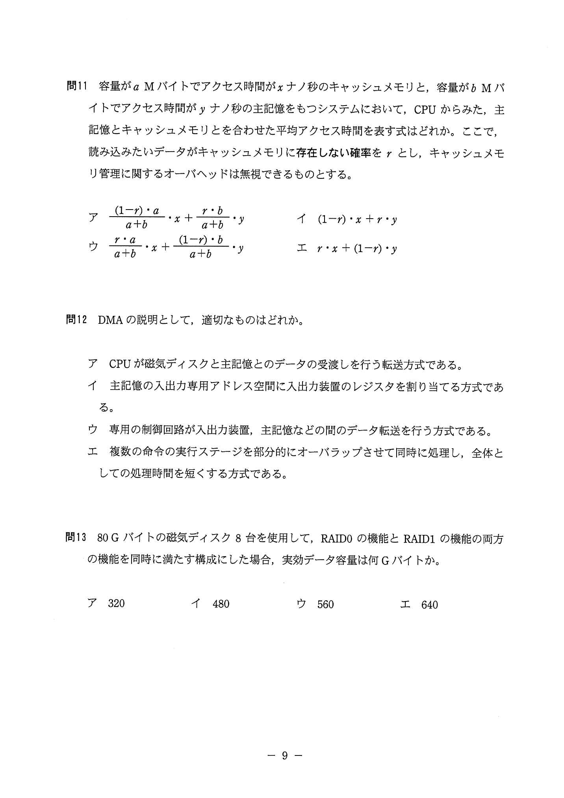

テキスト (OCR)

fll 容量が2 M バイトでアクセス時間がヶ ナノ秒のキャッシュメモリと, 容量が5 Mバ
イトでアクセス時間がッナノ秒の主記憶をもつシステムにおいて, CPU からみた, 主
記憶とキャッシュメモリとを合わせた平均アクセス時間を表す式はどれか。ここで,
読み込みたいデータがキャッシュメモリに存在しない確率を ヶ とし, キャッシュメモ
リ管理に関するオーバヘッドは無視できるものとする。

1A)" @     rb
ores  sa + ath     4 (=) iz bey
o et oot a       エ ケルキーのメタ

問12 DMAの説明として, 適切なものはどれか。

ア CPUが磁気ディスクと主記憶とのデータの受渡しを行う転送方式である。

イ 主記憶の入出力専用アドレス空間に入出力装置のレジスタを割り当てる方式であ
る。

ウ 専用の制御回路が入出力装置, 主記憶などの間のデータ転送を行う方式である。

エエ 複数の命令の実行ステージを部分的にオーバラップさせて同時に処理し, 全体と
しての処理時間を短くする方式である。

間13 80G バイトの磁気ディスク 8 台を使用して, RAIDO の機能と RAID] の機能の両方
の機能を同時に満たす構成にした場合, 実効データ容量は何 C バイトか。

ア 320      イ 480      ウ 560     =r 640

### ページ 10

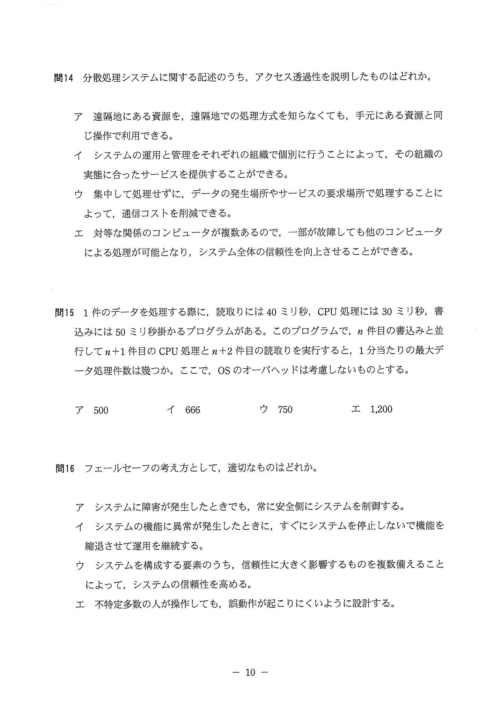

テキスト (OCR)

問14 分散処理システムに関する記述のうち, アクセス透過性を説明したものはどれか。

ア 遠隔地にある資源を, 遠隔地での処理方式を知らなくても, 手元にある資源と同
じ操作で利用できる。

イ システムの運用と管理をてそれぞれの組織で個別に行うことによって, その組織の
実態に合ったサービスを提供することができる。

ウ 集中して処理せずに, データの発生場所やサービスの要求場所で処理することに
kot, 通信コストを削減できる。

エ 対等な関係のコンピュータが複数あるので, 一部が故障しても他のコンピュータ
による処理が可能となり, システム全体の信頼性を向上させることができる。

P15 1件のデータを処理する際に, 読取りには 40 SUM, CPU 処理には 30 ミリ秒, 書
込みには 50 ミリ秒掛かるプログラムがある。このプログラムで, n 件目の書込みと普
行してぁヵ十1 AO CPU 処理とぁ十2 件目の読取りを実行すると, 1 分当たりの最大デ
ータ処理件数は幾つか。ここで, OS のオーバヘッドは考慮しないものとする。

ア 500     イ 666     ウ 750     x 1200

間16 フェールセーフの考え方として, 適切なものはどれか。

ア システムに障害が発生したときでも, 常に安全側にシステムを制御する。

イ システムの機能に異常が発生したときに, すぐにシステムを停止しないで機能を
縮退させて運用を継続する。

ウ システムを構成する要素のうち, 信頼性に大きく影響するものを複数備えること
によって, システムの信頼性を高める。

エ 不特定多数の人が操作しても, 誤動作が起ことりにくいように設計する。

ー 10 一

### ページ 11

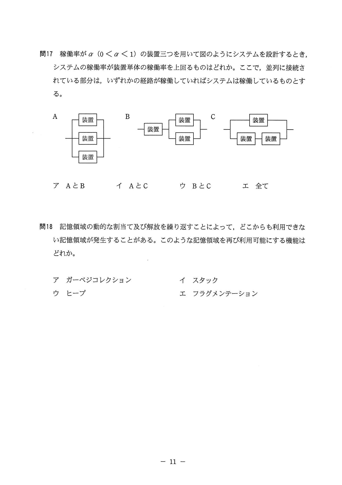

テキスト (OCR)

問17 稼働率がみ (0ぐみぐ1) の装置三つを用いて図のようにシステムを設計するとき,
システムの稼働率が装置単体の稼働率を上回るものはどれか。ここで, 並列に接続さ
れている部分は,。 いずれかの経路が稼働していればシステムは稼働しているものとす
る。

A               be

=
装置

ア A&B    イ AEC    ウ BとC    x= 全て

5
| |
|
te
ie

問18 記憶領域の動的な割当て及び解放を繰り返すことによって, どこからも利用できな
い記人憶領域が発生することがある。このような記憶領域を再び利用可能にする機能は
どれか。

ア ガーベジコレクション            イ スタック

ウ ヒープ                     エエ フラグメンテーション

ー 11 一

### ページ 12

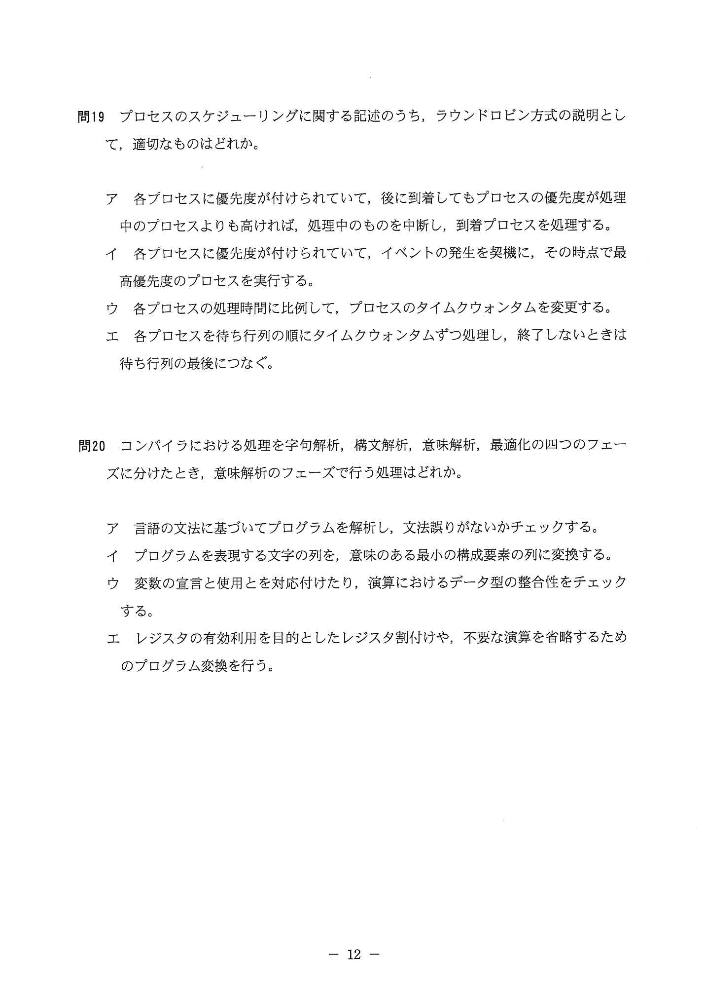

テキスト (OCR)

間19 プロセスのスケジューリングに関する記述のうち, ラウンドロビアフ方式の説明とし
て, 適切なものはどれか。

ア 各プロセスに優先度が付けられていて, 後に到着してもプロセスの優先度が処理
中のプロセスよりも高ければ, 処理中のものを中断し, 到着プロセスを処理する。
イ 各プロセスに優先度が付けられていて, イベントの発生を契機に.。 その時点で最

高優先度のプロセスを実行する。

ウ 各プロセスの処理時間に比例して, プロセスのタイムクウォンタムを変更する。
L 各プロセスを待ち行列の順にタイムクウォンタムずつ処理し, 終了しないときは
待ち行列の最後につなぐ。

問20 コンパイラにおける処理を字句解析 構文解析, 意味解析, 最適化の四つのフェー
ズに分けたとき, 意味解析のフェーズで行う処理はどれか。

we
4
ウ

語の文法に基づいてプログラムを解析し, 文法誤りがないかチェックする。
ログラムを表現する文字の列を, 意味のある最小の構成要素の列に変換する。
数の宣言と使用とを対応付けたり, 演算におけるデータ型の整合性をチェック
する。

エエ レジスタの有効利用を目的としたレジスタ割付けや, 不要な演算を省略するため
のプログラム変換を行う。

ul

NL

hel

ー 12 一

### ページ 13

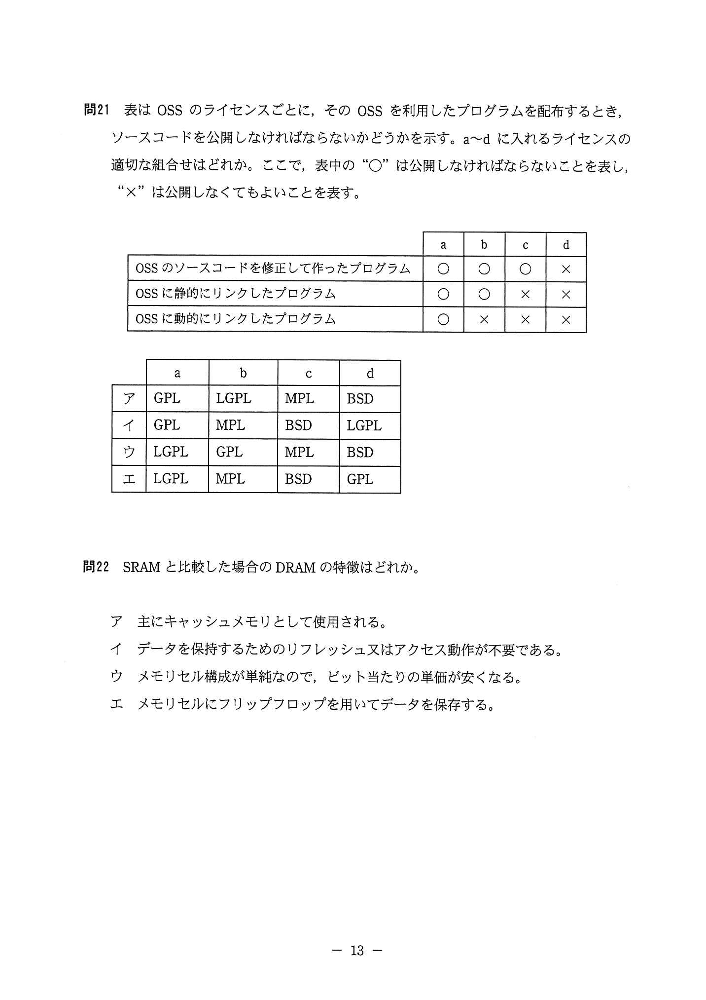

テキスト (OCR)

間21 表は OSS のライセンスごとに, その OSS を利用したプログラムを配布するとき,
ソースコードを公開しなければならないかどうかを示す。a<d に入れるライセンスの
適切な組合せはどれか。ここで, 表中の“〇"は公開しなければならないことを表し,
“xX” は公開しなくてもよいことを表す。

OSS のソースコードを修正して作ったプログラム
OSS に静的にリンクしたプログラム
0SS に動的にリンクしたプログラム

OIOIOlg
x|〇1〇|
x|xIOles
xlxlxla

GPL           LGPL          MPL          BSD
GPL           MPL            BSD          LGPL
LGPL | GPL            MPL          BSD
LGPL | MPL            BSD          GPL

H}|4JAIN

問22 SRAM と比較した場合のDRAM の特徴はどれか。

主にキャッシュメモリとして使用される。

データを保持するためのリフレッシュ又はアクセス動作が不要である。
メモリセル構成が単純なので, ビット当たりの単価が安くなる。
メモリセルにフリップフロップを用いてデータを保存する。

H さささい

ー 13 一

### ページ 14

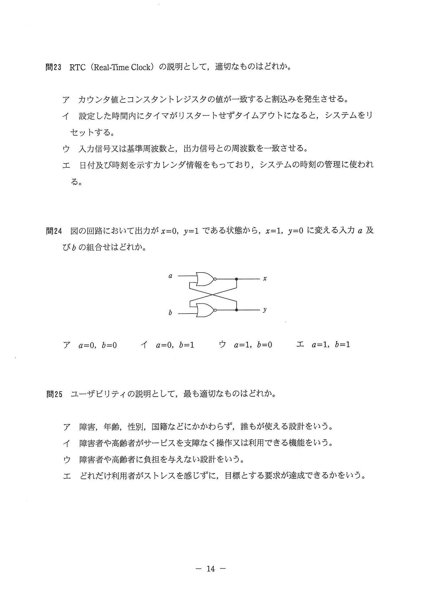

テキスト (OCR)

間23 RTC (Real-Time Clock) の説明として, 適切なものはどれか。

ア カウンタ値とコンスタントレジスタの値が一致すると割込みを発生させる。

イ 設定した時間内にタイマがリスタートせずタイムアウトになると, システムをリ
セットする。

ウ 入力信号又は基準周波数と, 出力信号との周波数を一致させる。

エエ 日付及び時刻を示すカレンダ情報をもちっており, システムの時刻の管理に使われ
る。

間24 図の回路において出力が *=0, ッ=1 である状態から, *=1, y=0 に変える入力4 及
び5ヵの組合せはどれか。

ア az=0, b=0   イ a=0, b=1    7 a=1, b=0   工 a=1, b=1

B25 ユーザビリティの説明として, 最も適切なものはどれか。

ア 障害, 年齢, 性別, 国籍などにかかわらず, 誰もが使える設計をいう。
4 障害者や高齢者がサービスを支障なく操作又は利用できる機能をいう。
ウ 障害者で高齢者に負担を与えない設計をいう。

エエ どれだけ利用者がストレスを感じずに, 目標とする要求が達成できるかをいう。

ー 14 一

### ページ 15

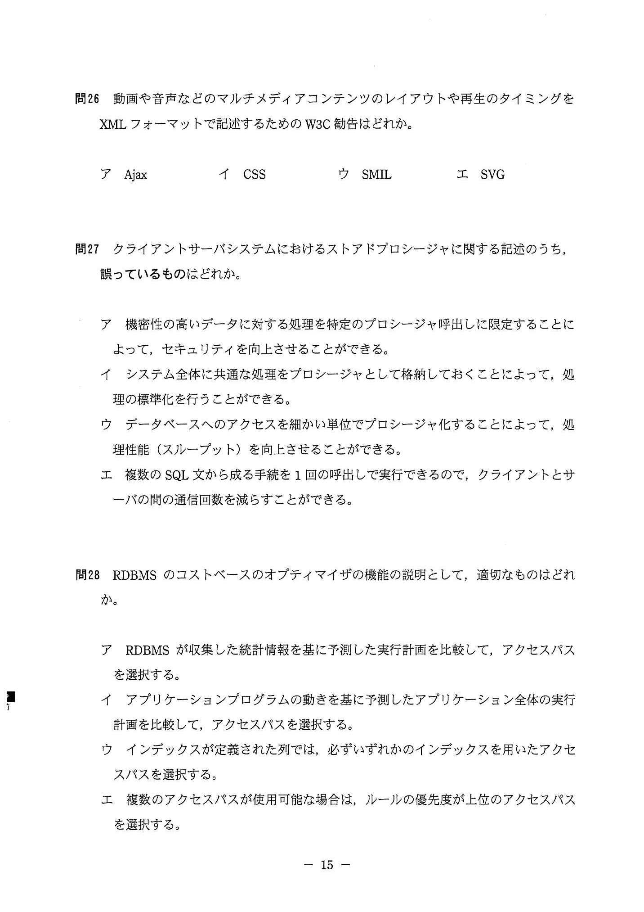

テキスト (OCR)

問26 動画や音声などのマルチメディアコンテンツのレイアウトや再生のタイミングを
XML フォーマットで記述するための W3C 勧告はどれか。

ア Ajax     イ CSS     ウ SMIL     = SVG

間27 クライアントサーバシステムにおけるストアドプロシージャに関する記述のうち,
誤っているものはどれか。

ア 機密性の高いデータに対する処理を特定のプロシージャ呼出しに限定することに
kot, セキュリティを向上させることができる。

イ システム全体に共通な処理をプロシージャとして格納しておくことによって, 処
理の標準化を行うことができる。

ウ データベースへのアクセスを細かい単位でプロシージャ化することによって, 処
理性能 (スループット) を向上させることができる。

エエ 複数の SQL 文から成る手続を 1 回の呼出しで実行できるので, クライアントとサ
ーバの間の通信回数を減らすことができる。

間28 RDBMS のコストベースのオプティマイザの機能の説明として, 適切なものはどれ
か。

Y RDBMS が収集した統計情報を基に予測した実行計画を比較して, アクセスパス
を選択する。

イ アプリケーションプログラムの動きを基に予測したアプリケーション全体の実行
計画を比較して, アクセスパスを選択する。

ウ インデックスが定義された列では, 必ずいずれかのインデックスを用いたアクセ
スパスを選択する。

L 複数のアクセスパスが使用可能な場合は, ルールの優先度が上位のアクセスパス
を選択する。

ー 15 一

### ページ 16

テキスト (OCR)

間29 関係を第2 正規形から第3 正規形に変換する手順はどれか。

ア 候補キー以外の属性から, 候補キーの一部の属性に対して関数従属性がある場合

その関係を分解する。

イ 候補キー以外の属性間に関数従属性がある場合.その関係を分解する。

ウ 候補キーの一部の属性から, 候補キー以外の属性への関数従属性がある場合, そ
の関係を分解する。

TL 一つの属性に複数の値が入っている場合, 単一の値になるように分解する。

間30 BERR と関係Sに対して, 関係X を求める関係演算はどれか。

R
ID                     B              ID         A          B              ID         A          B
0001                  100           0001        a         100           0001        a         100
0002                  200           0002        a         200           0002        a         200
0003                  300                                                   0002        b         200
0003        d         300
ア Dで結合          イ                           ウ BR                       和

ー 16 一

### ページ 17

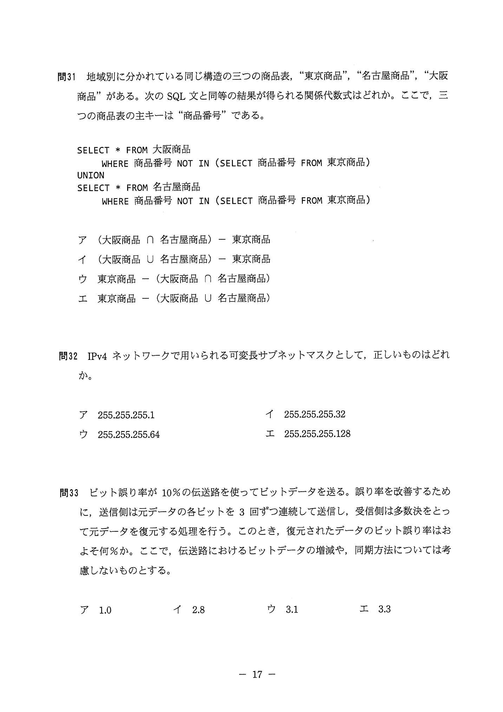

テキスト (OCR)

問31 地域別に分かれている同じ構造の三つの商品表, “東京商品", “名古屋商品", 大阪
商品” がある。次の SQL 文と同等の結果が得られる関係代数式はどれか。ここで, =
つの商品表の主キーは “HBS” CHS.

SELECT * FROM 大阪商品

WHERE 商品番号 NOT IN (SELECT 商品番号 FROM 東京商品)
UNION
SELECT * FROM 名古屋商品

WHERE 商品番号 NOT IN (SELECT 商品番号 FROM 東京商品)

(大阪商品 1 名古屋商品) 一 東京商品
(大阪商品 U 名古屋商品) 一 東京商品
東京商品 一 (大阪商品 「] 名古屋商品)
東京商品 一 (大阪商品 U 名古屋商品)

Ht AN

問32 IPY4 ネットワークで用いられる可変長サブネットマスクとして, 正しいものはどれ
か。

ア 255.255.255.1         イ 255.255.255.32
ウ 255.255.255.64          255.255.255.128

間33 ビット誤り率が 10%の伝送路を使ってビットデータを送る。誤り率を改善するため
に, 送信側は元データの各ビットを 3 回ずつ連続して送信し, 受信側は多数決をとっ
て元データを復元する処理を行う。このとき, 復元されたデータのビット誤り率はお
よそ何%か。ここで, 伝送路におけるビットデータの増減や, 同期方法については考
慮しないものとする。

ー 17 一

### ページ 18

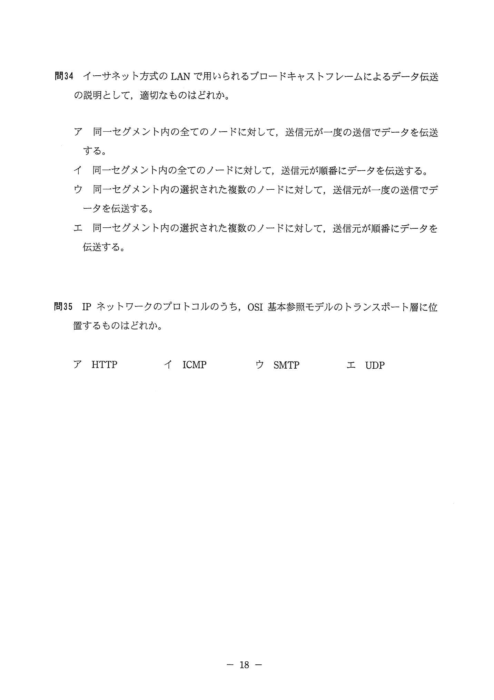

テキスト (OCR)

間34 イーサネット方式の LAN で用いられるブロードキャストフレームによるデータ伝送
の説明として, 適切なものはどれか。

ア 同一セグメント内の全てのノードに対して, 送信元が一度の送信でデータを伝送
する。

イ 同一セグメント内の全てのノードに対して, 送信元が順番にデータを伝送する。

ウ 同一セグメント内の選択された複数のノードに対して, 送信元が一度の送信でデ
ータを伝送する。

LZ 同一セグメント内の選択された複数のノードに対して, 送信元が順番にデータを
伝送する。

問35 IP ネットワークのプロトコルのうち, OS 基本参照モデルのトランスポート層に位

置するものはどれか。

ア HTTP    イ ICMP     ウ SMTP    <= UDP

ー 18 一

### ページ 19

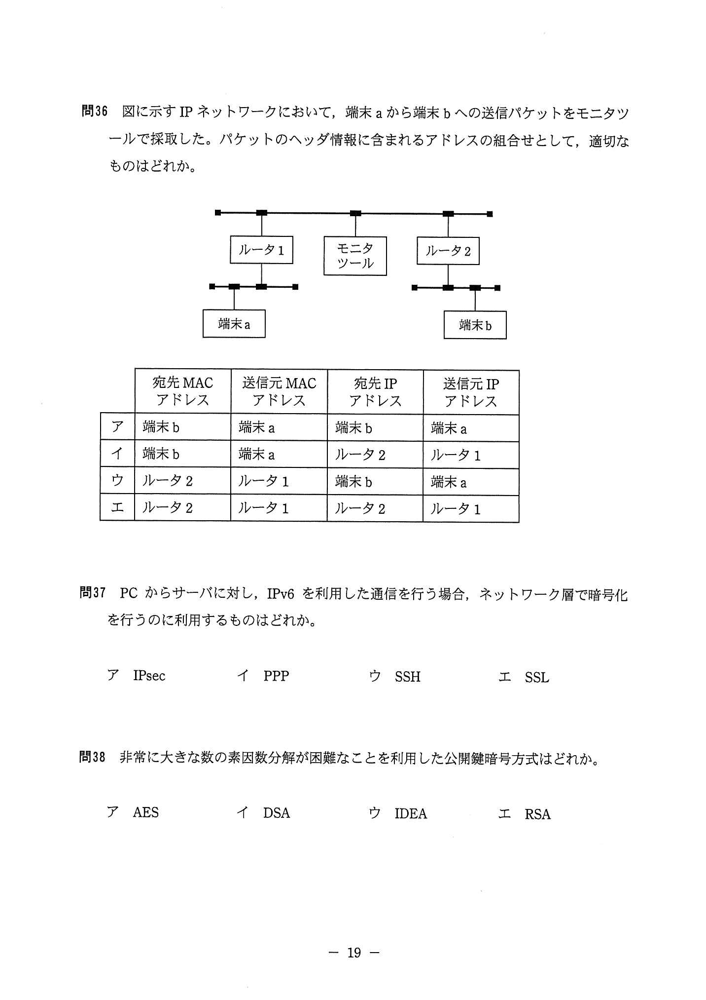

テキスト (OCR)

問36 図に示す IP ネットワークにおいて, 端末 a から端末 b への送信いパケットをモニタツ
ールで採取した。パケットのヘッダ情報に含まれるアドレスの組合せとして, 適切な
ものはどれか。

ーー T I T

ルータ 1        £27        ルータ 2
ツール
端末a                                   端末b
宛先MAC | 送信元MAC      宛先TP       送信元 P
アドレス    アドレス    アドレス    アドレス
ア | 端末b              端末 a              端末b             端末 a
イ | 端末b       端末 a        ルータ 2      ルータ 1
ウ | ルータ 2       ルータ 1       端末b         端末 a
和正 | ルータ 9      ルータ 1       MF 2      ルータ 1

間37 PC からサーバに対し, IPv6 を利用した通信を行う場合,ネットワーク層で暗号化
を行うのに利用するものはどれか。

ア IPsec     イ PPP     ウ SSH     <= SSL

問38 非常に大きな数の素因数分解が困難なことを利用した公開鍵暗号方式はどれか。

ア AES     イ DSA     ウ IDEA     <= RSA

ー 19 一

### ページ 20

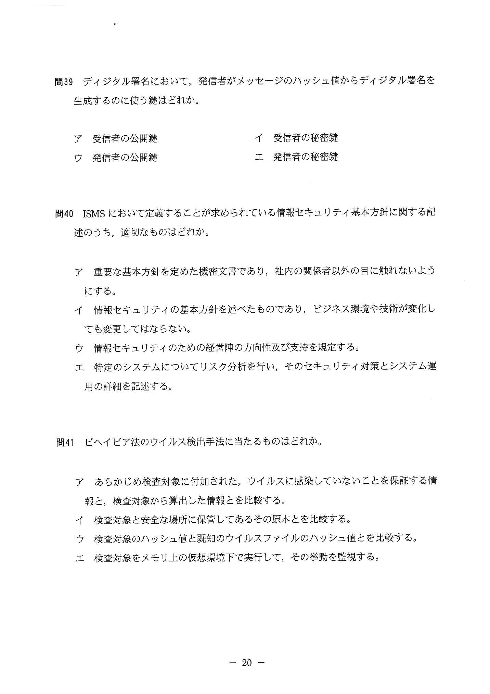

テキスト (OCR)

問39 ディジタル署名において, 発信者がメッセージのハッシュ値からディジタル著名を
生成するのに使う鍵はどれか。

ア 受信者の公開鍵          イ 受信者の秘密鍵
ウ 発信者の公開鍵          エエ 発信者の秘密鍵

問40 ISMS において定義むすることが求められている情報セキュリティ基本方針に関する記
述のうち, 適切なものはどれか。

ア 重要な基本方針を定めた機密文書であり, 社内の関係者以外の目に触れないよう
にする。

イ 情報セキュリティの基本方針を述べたものであり, ビジネス環境や技術が変化し
ても変更してはならない。

ウ 情報セキュリティのための経営陣の方向性及び支持を規定する。

エエ 特定のシステムについてリスクグ分析を行い そのセキュリティ対策とシステム運
用の詳細を記述する。

間41 ビヘイビア法のウイルス検出手法に当たるものはどれか。

ア あらかじめ検査対象に付加された, ウイルスに感染していないことを保証する情
報と, 検査対象から算出した情報とを比較する。

イ 検査対象と安全な場所に保管してあるその原本とを比較する。

ウ 検査対象のハッシュ値と既知のウイルスファイルのハッシュ値とを比較する。

エ 検査対象をメモリ上の仮想環境下で実行して, その挙動を監視する。

### ページ 21

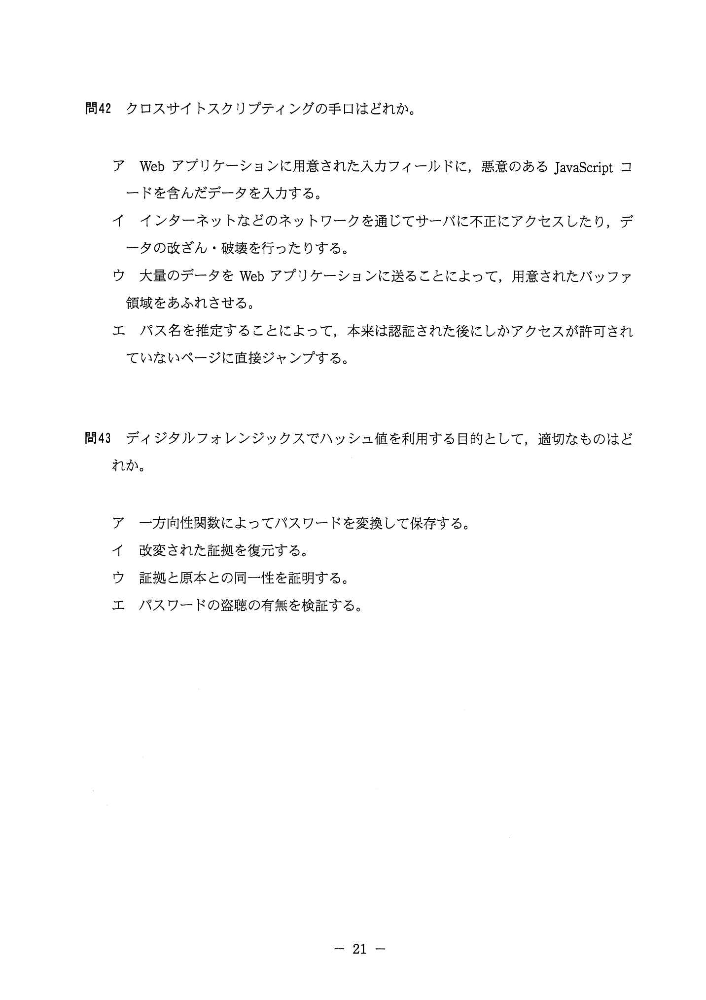

テキスト (OCR)

問42 クロスサイトスクリプティングの手口はどれか。

ア Web アプリケーションに用意された入力フィールドに, 悪意のある JavaScript コ
ードを含んだデータを入力する。

イ インターネットなどのネットワークを通じてサーバに不正にアクセスしたり, デ
ータの改ざん・破壊を行ったりする。

ウ 大量のデータを Web アプリケーションに送ることによって, 用意されたバッファ
領域をあふれさせる。

L パス名を推定することによって, 本来は認証された後にしかアクセスが許可され
ていないページに直接ジャンプする。

問43 ディジタルフォレンジックスでハッシュ値を利用する目的として, 適切なものはど
れか。

一方向性関数によってパスワードを変換して保存する。
改変された証拠を復元する。

証拠と原本との同一性を証明する。

パスワードの盗聴の有無を検証する。

H さい

ー 21 一

### ページ 22

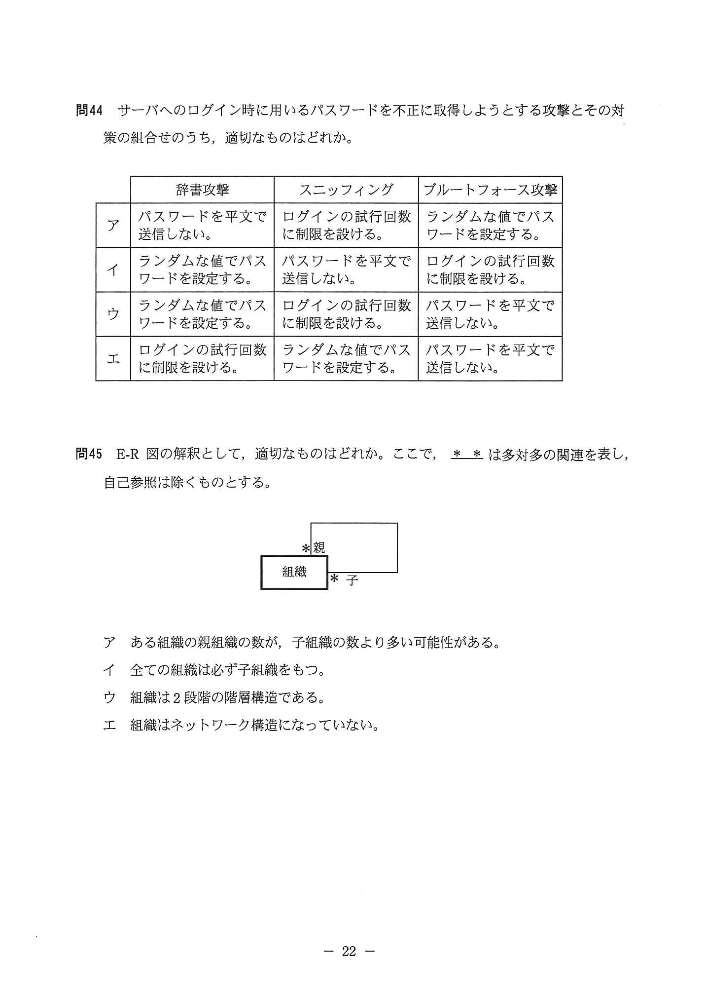

テキスト (OCR)

i444 サーバへのログイン時に用いるパスワードを不正に取得しようとする攻撃とその対

集の組合せのうち, 適切なものはどれか。

辞書攻撃     スニッフィング |ブルートフォース攻撃
ア パスワードを平文で| ログインの試行回数 | ランダムな値でパス
送信しない。         に制限を設ける。      ワードを設定する。
af ランダムな値でパス | パスワードを平文で | ログインの試行回数
ワードを設定する。  送信しない。     に制限を設ける。
ウ ランダムな値でパス | ログインの試行回数 | パスワードを平文で
ワードを設定する。  に制限を設ける。   送信しない。
ェ | ログインの試行回数 ランダムな値でパス | パスワードを平文で
に制限を設ける。   ワードを設定する。  送信しない。

問45 ER MOMRELT, 適切なものはどれか。ここで,
自己参照は除くものとする。

H GA NM

a

ある組織の親組織の数が, 子組織の数より多い可能性がある。
全ての組織は必ず子組織をもつ。
組織は 2 段階の階層構造である。
組織はネットワーク構造になっていない。

ー 22 一

キ _* は多対多の関連を表し

### ページ 23

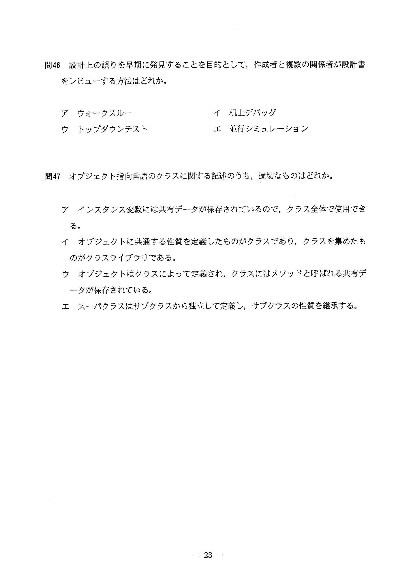

テキスト (OCR)

間46 設計上の誤りを早期に発見することを目的として, 作成者と複数の関係者が設計書
をレビューする方法はどれか。

ア ウォークスルー          イ 机上デバッグ
ウ トップダウンテスト        エエ 並行シミュレーション

B47 オブジェクト指向言語のクラスに関する記述のうち, 適切なものはどれか。

ア インスタンス変数には共有データが保存されているので, クラス全体で使用でき
る。

イ オブジェクトに共通する人性質を定義したものがクラスであり, クラスを集めたも
のがクラスライブラリである。

ウ オブジェクトはクラスによって定義され, クラスにはメソッドと呼ばれる共有デ
ータが保存されている。

エエ スーパクラスはサブクラスから独立して定義し, サブクラスの性質を継承する。

ー 23 一

### ページ 24

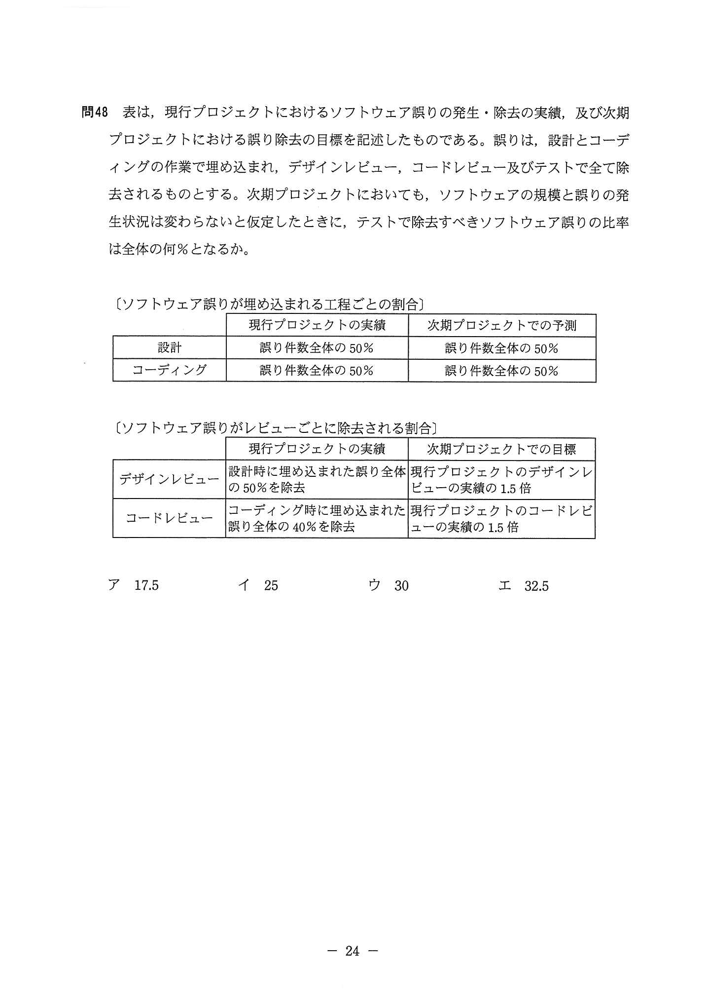

テキスト (OCR)

間48 表は, 現行プロジェクトにおけるソフトウェア誤りの発生・除去の実績, 及び次期
プロジェクトにおける誤り除去の目標を記述したものである。誤りは, 設計とコーデ
ィングの作業で埋め込まれ, デザインレビュー, コードレビュー及びテストで全て除
去されるものとする。 次期プロジェクトにおいても, ソフトウェアの規模と誤りの発
生状況は変わらないと仮定したときに, テストで除去すべきソフトウェア誤りの比率
は全体の何史となるか。

〔ソフトウェア誤りが埋め込まれる工程ごとの割合
現行プロジェクトの実績     次期プロジェクトでの予測

設計                誤り件数全体の 50%              誤り件数全体の 50%
コージディ/グ       誤り件数全体の 50%          誤り件数全体の 50%

〔ソフトウェア誤りがレビューごとに除去される割合]
現行プロジェクトの実績     次期プロジェクトでの目標

デザインレビュー 設計時に埋め込まれた誤り全体|現行プロジェクトのデザインレ
の 50%を除去         ビューの実績の 1.5 倍
コードレビュー |コーディング時に埋め込まれた|現行プロジェクトのコードレビ
誤り全体の 40%を除去     ューの実績の 1.5 倍
ア 17.5     “f 25      7 30      x 32.5

ー 24 一

### ページ 25

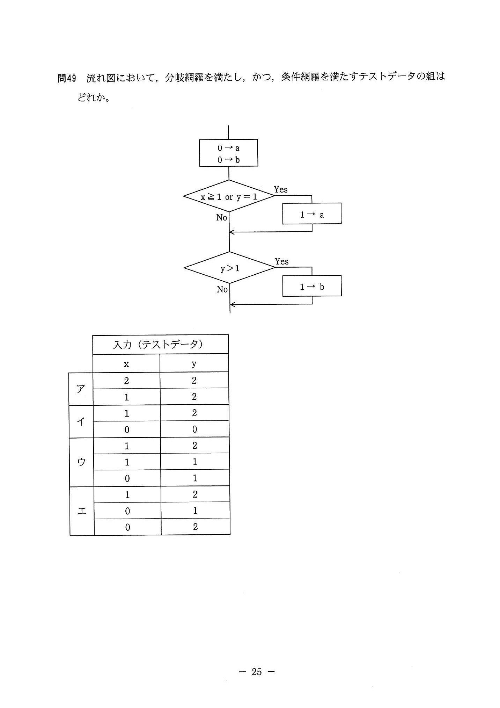

テキスト (OCR)

間49 流れ図において, 分岐網羅を満たし, DO, 条件網弘を満たすテストデータの組は
どれか。

0一a
0っb

入力 (テストデータ)

で

らら|らつら |ロロ|Oら|コピロロ|の|ピロ|ロビ11
wlelrwolelelrwlolm}|rw IS

ー 25 一

### ページ 26

テキスト (OCR)

問50 マッシュアップを利用して Web コンテンツを表示している例として, 最も適切なも
のはどれか。

H UGA SN

Web プラウザにプラグインを組み込み, 動画やアニメーションを表示する。
地図上のカーソル移動に伴い, ページを切り替えずにスクロール表示する。
電車経路の探索結果上に, 各路線会社の Web ページへのリンクを表示する。
店舗案内のページ上に, 他のサイトが提供する地図情報を表示する。

ー 26 一

### ページ 27

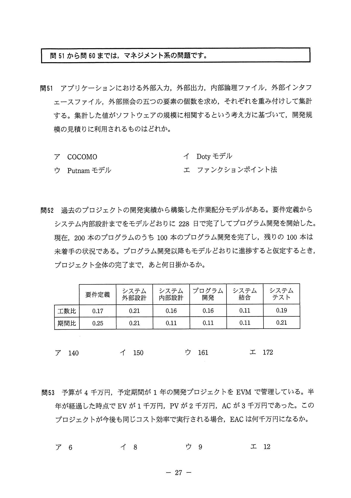

テキスト (OCR)

問 51 から問 60 までは, マネジメント系の問題です。

Al アプリケーションにおける外部入力, 外部出力, 内部論理ファイル, 外部インタフ
ェースファイル, 外部照会の五つの要素の個数を求め, それぞれを重み付けして集計
する。集計した値がソリフトウェアの規模に相関するという考え方に基づいて, 開発規
模の見積りに利用されるものはどれか。

ア COCOMO
ウ Putnam モデル

イ Doty モデル

エエ ファンクションポイント法

問52 過去のプロジェクトの開発実績から構築した作業配分モデルがある。要件定義から
システム内部設計までをモデルどおりに 228 日で完了してプログラム開発を開始した。
現在, 200 本のプログラムのうち 100 本のプログラム開発を完了し, 残りの 100 本は
未着手の状況である。プログラム開発以降もモデルどおりに進捗すると仮定するとき,
プロジェクト全体の完了まで, あと何日掛かるか。

要件定義 | システム | システム  プログラム | システム | システム

外部設計 | 内部設計       開発         結合        テスト
工数比      0.17          0.21          0.16          0.16          0.11          0.19
期間比      0.25          0.21          0.11          0.11          0.11          0.21
ア 140               イ 150                ウ 161               —: 172

間53 予算が4千万円, 予定期間が 1 年の開発プロジェクトを EVM で管理している。半
年が経過した時点で EV が1千万円, PV が 2 千万円, AC が8 千万円であった。この
プロジェクトが今後も同じコスト効率で実行される場合, EAC は何千万円になるか。

= 27

### ページ 28

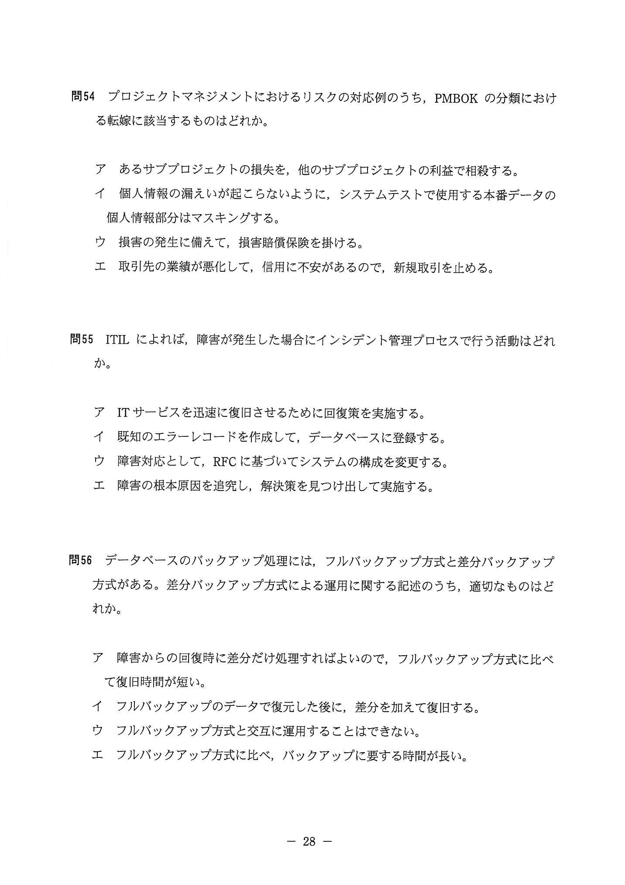

テキスト (OCR)

問54 プロジェクトマネジメントにおけるリスクの対応例のうち, PMBOK の分類におけ
る転嫁に該当するものはどれか。

ア あるサブプロジェクトの損失を, 他のサブプロジェクトの利益で相殺する。

イ 個人情報の漏えいが起こらちないように, システムテストで使用する本番データの
個人情報部分はマスキングする。

ウ 損害の発生に備えて, 損害賠償保険を掛ける。

= 取引先の業績が悪化して, 信用に不安があるので, 新規取引を止める。

問55 ITIL によれば, 障害が発生した場合にインシデント管理プロセスで行う活動はどれ
か。

IT サービスを迅速に復旧させるために回復人策を実施する。
既知のエラーレコードを作成して, データベースに登録する。
障害対応として, RFC に基づいてシステムの構成を変更する。
障害の根本原因を追究し, 解決策を見つけ出して実施する。

HOGAN

間56 データベースのバックアップ処理には, フルバックアップ方式と差分バックアップ
方式がある。差分バックアップ方式による運用に関する記述のうち, 適切なものはど
れか。

ア 障害からの回復時に差分だけ処理すればよいので, フルバックアップ方式に比べ
て復旧時間が短い。

イ フルバックアップのデータで復元した後に, 差分を加えて復旧する。

ウ フルバックアップ方式と交互に運用することはできない。

L フルバックアップ方式に比べ, バックアップに要する時間が長い。

ー 28 一

### ページ 29

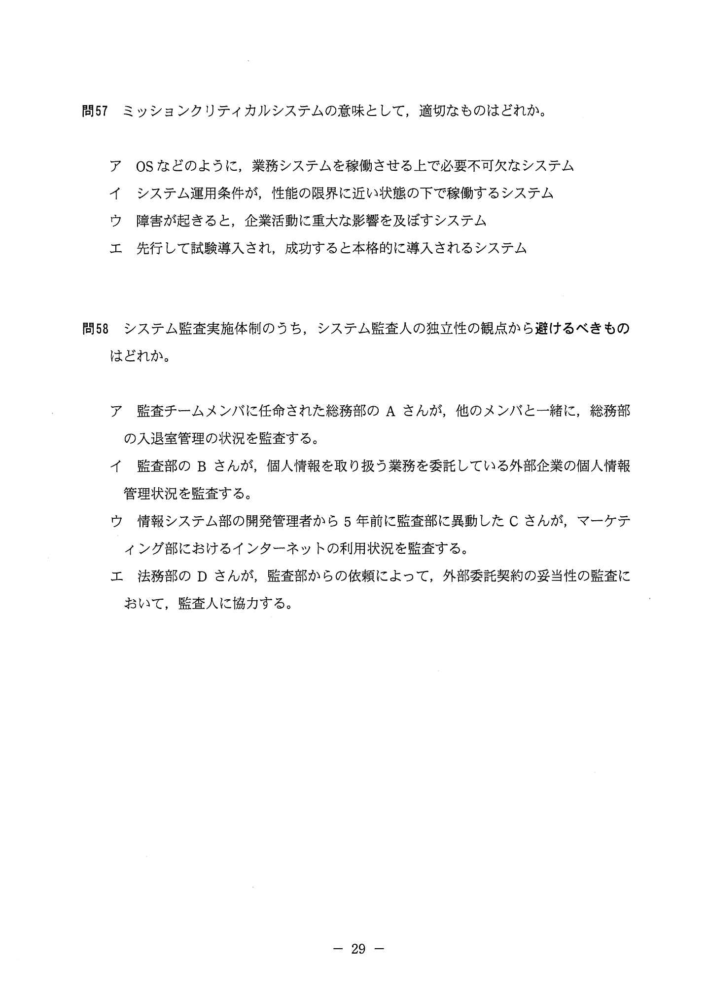

テキスト (OCR)

間57 ミッションクリティカルシステムの意味として, 適切なものはどれか。

OS などのように, 業務システムを稼働させる上で必要不可欠なシステム
システム運用条件が, 性能の限界に近い状態の下で稼働するシステム
障害が起きると, 企業活動に重大な影響を及ぼすシステム

先行して試験導入され, 成功すると本格的に導入されるシステム

H さっ

間58 システム監査実施体制のうち, システム監査人の独立性の観点から避けるべきもの
はどれか。

ア 監査チームメンバに任命された総務部の A SAM, 他のメンバと一緒に, 総務部
の入退室管理の状況を監査する。

イ 監査部の B SAM, 個人情報を取り扱う業務を委託している外部企業の個人情報
管理状況を監査する。

ウ 情報システム部の開発管理者から 5 年前に監査部に異動した C さんが, マーケテ
ィング部におけるインターネットの利用状況を監査する。

エエ 法務部の D さんが, 監査部からの依頼によって, 外部委託契約の妥当性の監査に
おいて, 監査人に協力する。

ー 29 一

### ページ 30

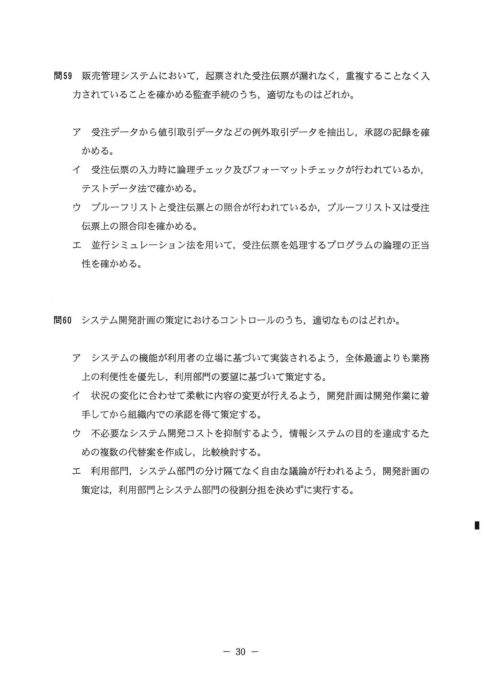

テキスト (OCR)

間59 販売管理システムにおいて, 起票された受注伝票が漏れなく, 重複することなく入
カカされていることを確かめる監査手続のうち, 適切なものはどれか。

ア 受注データから値引取引データなどの例外取引データを抽出し, 承認の記録を確
かめる。

イ 受注伝票の入力時に論理チェック及びフォーマットチェックが行われているか,
テストデータ法で確かめる。

ウ プルーフリストと受注伝票との照合が行わむれているか, プルーフリスト又は受注

伝票上の照合印を確かめる。
DL 並行シミュレーション法を用いて, 受注伝票を処理するプログラムの論理の正当
性を確かめる。

間60 システム開発計画の策定におけるコントロールのうち, 適切なものはどれか。

ア システムの機能が利用者の立場に基づいて実装されるよう, 全体最適よりも業務
上の利便性を優先し, 利用部門の要望に基づいて集定する。

イ 状況の変化に合わせて柔軟に内容の変更が行えるよう, 開発計画は開発作業に着
手してから組織内での承認を得て策定する。

ウ 不必要なシステム開発コストを抑制するよう, 情報システムの目的を達成するた
めの複数の代奉案を作成し, 比較検討する。

エエ 利用部門, システム部門の分け隔てなく自由な議論が行われるよう, 開発計画の
RE, 利用部門とシステム部門の役割分担を決めずに実行する。

### ページ 31

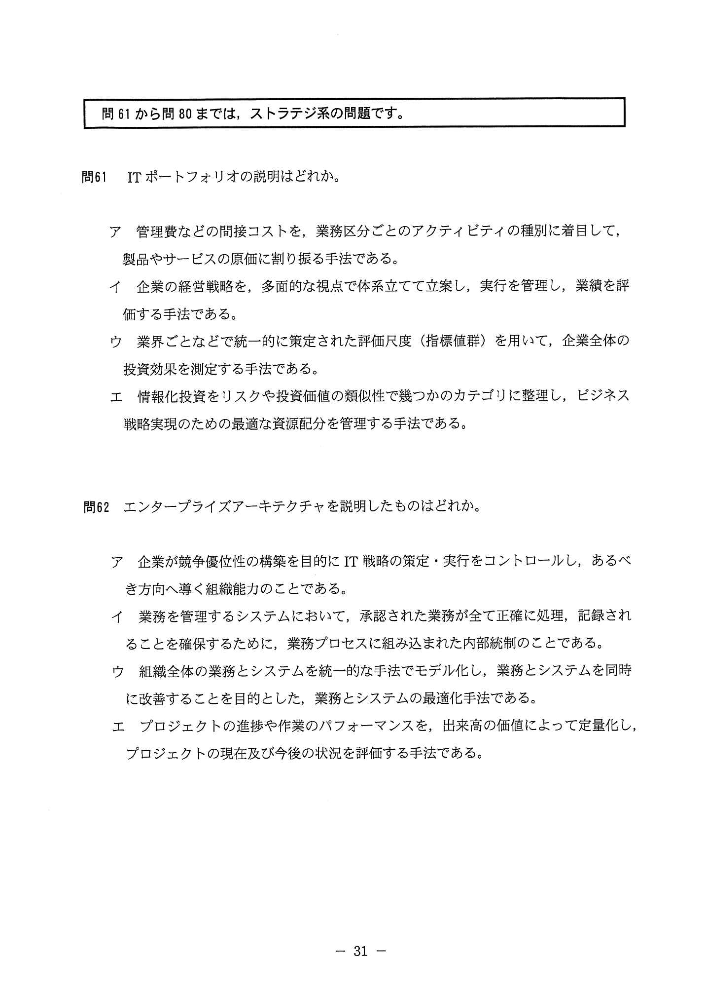

テキスト (OCR)

間 61 から問 80 までは, ストラテジ系の問題です。

間61 ITポートフォリオの説明はどれか。

ア 管理費などの間接コストを, 業務区分ごどとのアクティビティの種別に着目して,
製品やサービスの原価に割り振る手法である。

イ 企業の経営戦略を, 多面的な視点で体系立てて立案し, 実行を管理し, 業績を評
価する手法である。

ウ 業界ごとなどで統一的に策定された評価尺度 (指標値群) を用いて, 企業全体の
投資効果を測定する手法である。

エ 情報化投資をリスクや投資価値の類似性で幾つかのカテゴリに整理し, ビジネス
戦略実現のための最適な資源配分を管理する手法である。

問62 エンタープライズアーキテクチャを説明したものはどれか。

ア 企業が競争優位性の構築を目的に IT 戦略の策定・実行をコントロールし, HON
き方向へ導く組織能力のことである。

イ 業務を管理するシステムにおいて, 承認された業務が全て正確に処理, 記録され
ることを確保するために, 業務プロセスに組み込まれた内部統制のことである。

ウ 組織全体の業務とシステムを統一的な手法でモデル化し, 業務とシステムを同時
に改善することを目的とした, 業務とシステムの最適化手法である。

L プロジェクトの進捗や作業のパフォーマンスを, 出来高の価値によって定量化し,
プロジェクトの現在及び今後の状況を評価する手法である。

### ページ 32

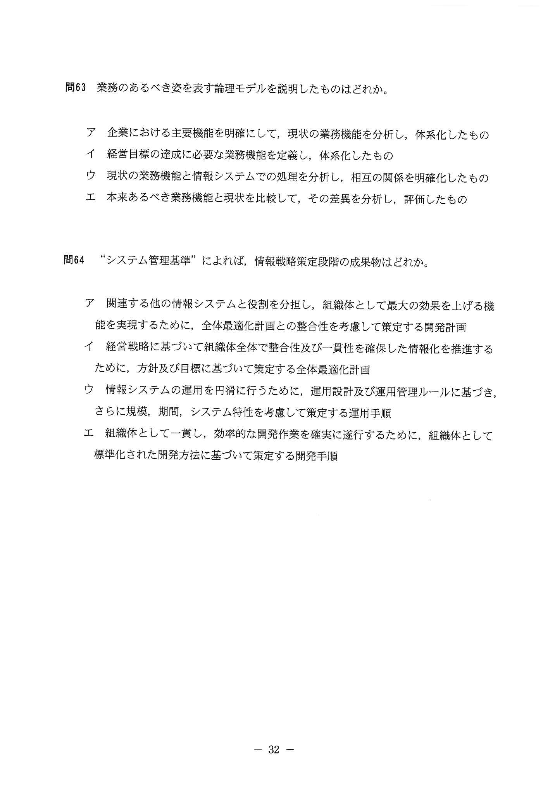

テキスト (OCR)

63 業務のあるべき姿を表す論理モデルを説明したものはどれか。

企業における主要機能を明確にして, 現状の業務機能を分析し, 体系化したもの
経営目標の達成に必要な業務機能を定義し, 体系化したもの

現状の業務機能と情報システムでの処理を分析し, 相互の関係を明確化したもの
本来あるべき業務機能と現状を比較して, その差異を分析し, 評価したもの

H GAN

問64 “システム管理基準” によれば, 情報戦略策定段階の成果物はどれか。

ア 関連する他の情報システムと役割を分担し, 組織体として最大の効果を上げる機
能を実現するために, 全体最適化計画との整合性を考慮して策定する開発計画

イ 共営戦略に基づいて組織体全体で整合性及び一貫性を確保した情報化を推進する
ために, 方針及び目標に基づいて策定する全体最適化計画

ウ 情報システムの運用を円滑に行うために, 運用設計及び運用管理ルールに基づき,
さらに規模, 期間, システム特性を考慮して策定する運用手順

エ 組織体として一貫し, 効率的な開発作業を確実に遂行するために, 組織体として
標準化された開発方法に基づいて策定する開発手順

ー 32 一

### ページ 33

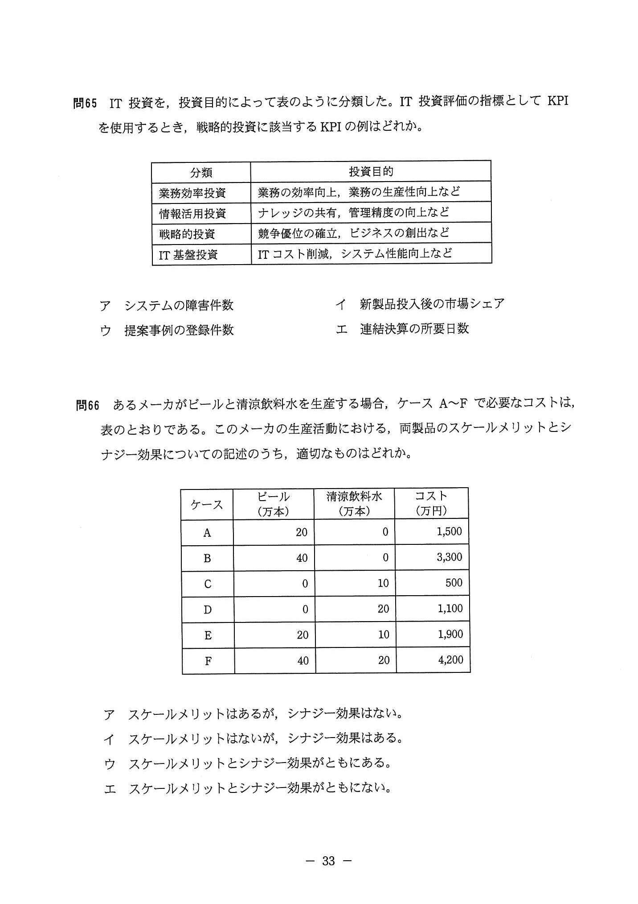

テキスト (OCR)

問65 IT 投資を, 投資目的によって表のように分類した。IT 投資評価の指標として KPI
を使用するとき, 戦略的投資に該当する KPI の例はどれか。

分類                               投資目的
業務効率投資     業務の効率向上, 業務の生産性向上など
情報活用投資     ナレッジの共有, 管理精度の向上など

戦略的投資      競争優位の確立, ビジネスの創出など

IT 基盤投資    IT コスト削減。システム人性能向上など
ア システムの障害件数                   イ 新製品投入後の市場シェア
ウ 提案事例の登録件数                   エエ 連結決算の所要日数

間66 あるメーカがビールと清流飲料水を生産する場合, ケース A~F で必要なコストは,
表のとおりである。このメーカの生産活動における, 両製品のスケールメリットとシ
ナジー効果についての記述のうち, 適切なものはどれか。

yon) ピール | ae aa
本)     本)     の円)

A                           20                        0                1,500

B                            40                        0                3,300

C                             0                       10                  500

D                             0                       20                1,100

E                           20                       10                1,900

F                            40                       20                4,200

スケールメリットはあるが, シナジー効果はない。
スケールメリットはないが, シナジー効果はある。
スケールメリットとシナジー効果がともにある。
スケールメリットとシナジー効果がともにない。

H さい

### ページ 34

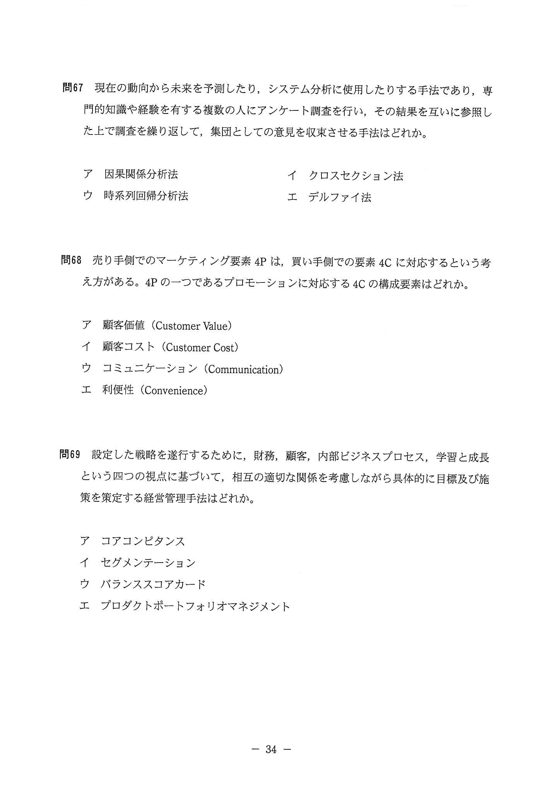

テキスト (OCR)

問67 現在の動向から未来を予測したり, システム分析に使用したりする手法であり, 専
門的知識や経験を有する複数の人にアンケート調査を行い, その結果を互いに参照し
た上で調査を繰り返して, 集団としての意見を収束させる手法はどれか。

ア 因果関係分析法                             イ クロスセクション法
ウ 時系列回帰分析法                     エエ デルファイ法

間68 売り手側でのマーケティング要素 4P は, 買い手側での要素 4C に対応するという考
え方がある。4P の一つであるプロモーションに対応する AC の構成要素はどれか。

顧客価値 (Customer Value)
顧客コスト (Customer Cost)
コミュニケーション (Communication)

利便性 (Convenience)

H へ

間69 設定した戦略を遂行するために, 財務, 顧客, 内部ビジネスプロセス, 学習と成長
という四つの視点に基づいて, 相互の適切な関係を考慮しながら具体的に目標及び施
策を策定する経営管理手法はどれか。

コアコンピタンス

セグメンテーション

バランススコアカード

プロダクトボポートフォリオマネジメント

H GAY

### ページ 35

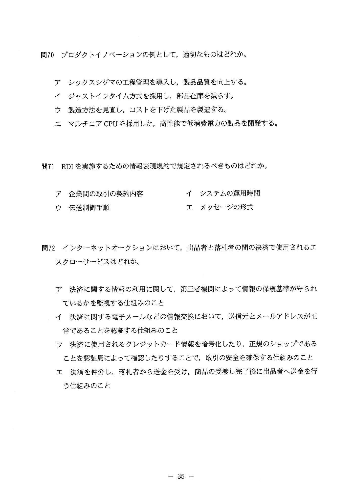

テキスト (OCR)

間70 プロダクトイノベーションの例として, 適切なものはどれか。

シックスシグマの工程管理を導入し, 製品品質を向上する。

ジャストインタイム方式を採用し, 部品在庫を減らす。
製造方法を見直し, コストを下げた製品を製造する。

マルチコア CPU を採用した, 高性能で低消費電力の製品を開発する。

H GA

RIT] EDIを実施するための情報表現規約で規定されるべきものはどれか。

ア 企業間の取引の契約内容     イ システムの運用時間
ウ 伝送制御手順          DL メッセージの形式

間72 インターネットオークションにおいて, 出品者と落札者の間の決済で使用されるエ
スクローサービスはどれか。

ア 決済に関する情報の利用に関して, 第三者機関によって情報の保護基準が守られ
ているかを監視する仕組みのこと

イ 決済に関する電子メールなどの情報交換において, 送信元とメールアドレスが正
常であることを認証する仕組みのこと

ウ 決済に使用されるクレジットカード情報を暗号化したり, 正規のショップである
ことを認証局によって確認したりすることで, 取引の安全を確保する仕組みのこと

エエ 決済を仲介し, 落札者から送金を受け, 商品の受渡し完了後に出品者へ送金を行
う仕組みのこと

ー 35 一

### ページ 36

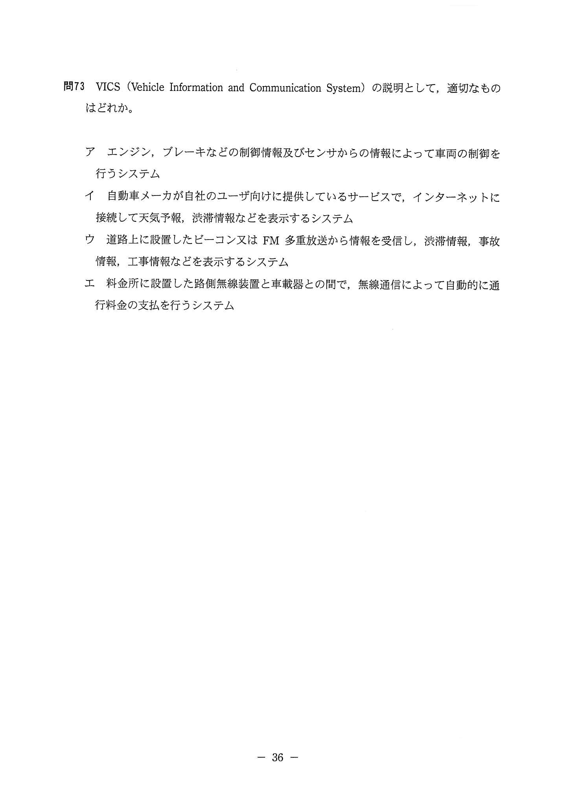

テキスト (OCR)

間73 VICS (Vehicle Information and Communication System) の説明として, 適切なもの
はどれか。

ア エンジン, プレーキなどの制御情報及びセンサからの情報によって車両の制御を
行うシステム

イ 自動車メーカが自社のユーザ向けに提供しているサービスで, インターネットに
接続して天気予報, 浅滞情報などを表示するシステム

ウ 道路上に設置したビーコン又は FM 多重放送から情報を受信し, 渋滞情報, 事故
情報, 工事情報などを表示するシステム

TL 料金所に設置した路側無線装置と車載器との間で, 無線通信によって自動的に通
行料金の支払を行うシステム

ー 36 一

### ページ 37

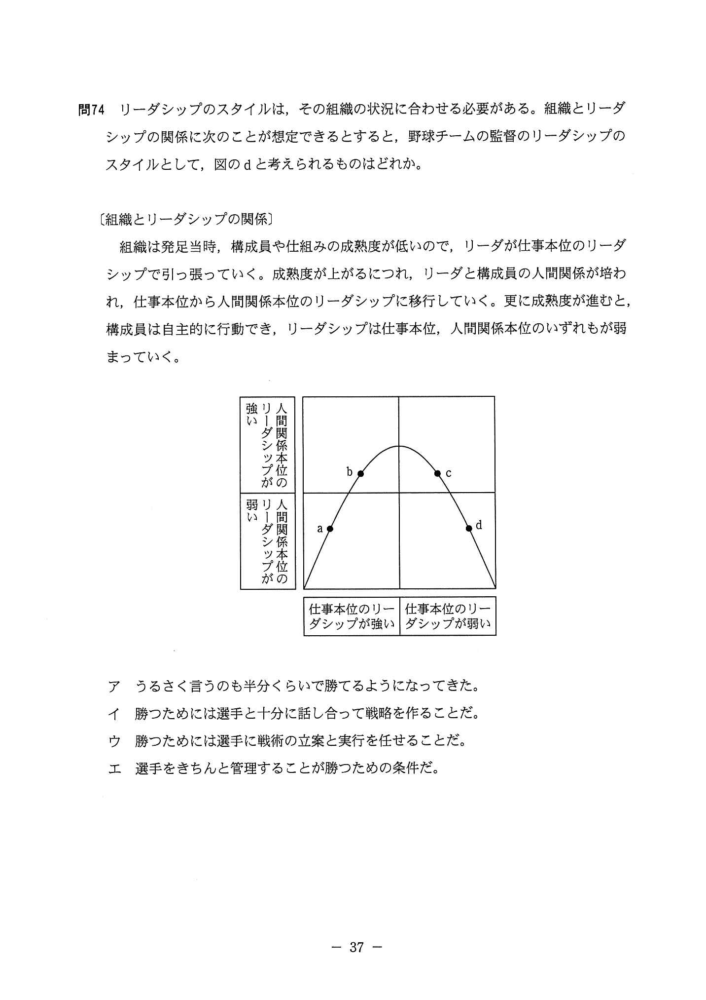

テキスト (OCR)

間74 リーダシップのスタイルは, その組織の状況に合わせる必要がある。組織とリーダ
シップの関係に次のことが想定できるとすると, 野球チームの監督のリーダシップの
スタイルとして, 図のd と考えられるものはどれか。

[組織とリーダシップの関係〕

組織は発足当時, 構成員や仕組みの成熱度が低いので, リーダが仕事本位のリーダ
シップで引っ張っていく。成熟度が上がるにつれ, リーダと構成員の人間関係が培わ
れ, 仕事本位から人間関係本位のリーダシップに移行していく。更に成詩度が進むと,
構成員は自主的に行動でき, リーダシップは仕事本位, 人間関係本位のいずれもが弱
まっていく。

is
Bet Qe

SHR REE> | SHHRAa>

an

TH
IGS US

aS
re

仕事本位のリー | 仕事本位のリー
ダシップが強い | ダシップが弱い

うるさく言うのも半分くらいで勝てるようになってきた。
勝つためには選手と十分に話し合って戦略を作ることだ。
勝つためには選手に戦術の立案と実行を任せることだ。
選手をきちんと管理することが勝つための条件だ。

H へ

ー 37 一

### ページ 38

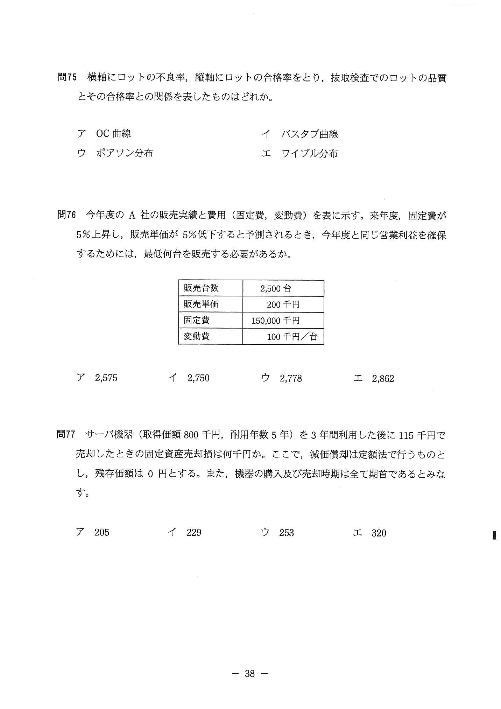

テキスト (OCR)

間75 横軸にロットの不良率, 縦軸こロットの合格率をとり, 抜取検査でのロットの品質
とその合格率との関係を表したものはどれか。

ア OC Ghee          イ バスタブ曲線
ウ ポアソン分布          エエ ワイブル分布

間76 今年度の A 社の販売実績と費用 (HER, 変動費) を表に示す。来年度, 固定費が
5%上昇し, 販売単価が 5%低下すると予測されるとき, 今年度と同じ営業利益を確保
するためには, 最低何人を販売する必要があるか。

販売台数       2,500 台
販売単価        200 FA
固定費       150,000 FFI
変動費         100 千円台
ア 2,575        イ 2,750        ウ 2,778        I 2,862

問77 —/ Nites (取得価額 800 千円, 耐用年数 5 年) を 3 年間利用した後に 115 FAT
売却したときの固定資産売却損は何千円か。ここで, 減価償剤は定額法で行うものと
し, 残存価額は 0 円とする。また, 機器の購入及び売却時期は全て期間であるとみな
す。

ア 205     イ 229     ウ 253     = 320

ー 38 一

### ページ 39

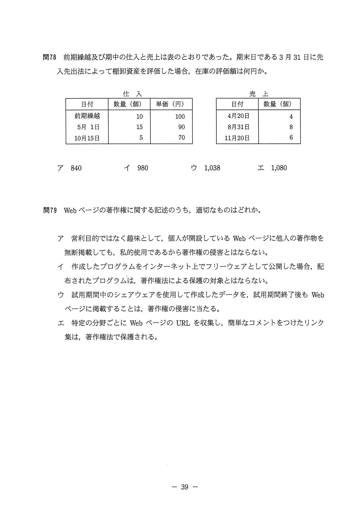

テキスト (OCR)

間78 前期繰越及び期中の仕入と売上は表のとおりであった。期末日である 3 月 31 日に先
入先出法によって棚卸資産を評価した場合, 在庫の評価額は何円か。

仕 入               売 上
日付    数量 (個) | 単価 (円)          日付    数量 (fel)
ae       10      100        4月20日        4
5月 1日       15       90        8月31日        8
10月15日        5       70        11月20日        6
ア 840        イ 980        ウ 1,038       xX 1,080

問79 Web ページの著作権に関する記述のうち, 適切なものはどれか。

ア 営利目的ではなく趣味として, 個人が開設している Web ページに他人の著作物を
無断掲載しても, 私的使用であるから著作権の侵害とはならない。

イ 作成したプログラムをインターネット上でフリーウェアとして公開した場合 配
布されたプログラムは, 著作権法による保護の対象とはならない。

ウ 試用期間中のシェアウェアを使用して作成したデータを, 試用期間終了後も Web
ページに掲載することは, 著作権の侵害に当たる。

エエ 特定の分野ごとに Web ページの URL を収集し, 簡単なコメントをつけたリンク
集は, 著作権法で保護される。

ー 39 一

### ページ 40

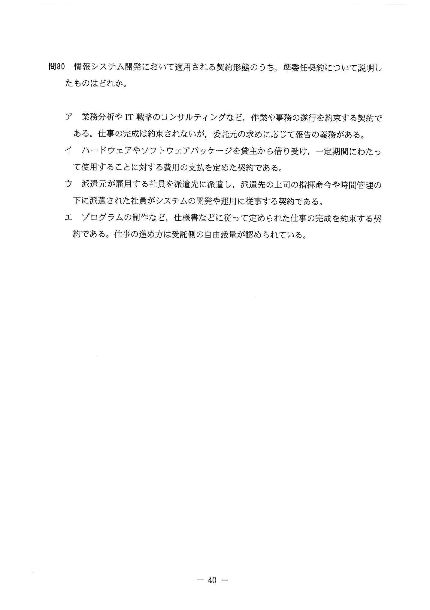

テキスト (OCR)

問80 情報システム開発において適用される契約形態のうち, 準委任契約について説明し
たものはどれか。

ア 業務分析や IT 戦略のコンサルティングなど, 作業や事務の遂行を約束する契約で
HS. 仕事の完成は約束されないが, 委託元の求めに応じて報告の義務がある。

イ ハードウェアやソフトウェアパッケージを貸主から借り受け, 一定期間にわたっ
て使用することに対する費用の支払を定めた契約である。

ウ 派遣元が雇用する社員を派遣先に派遣し, 派遣先の上司の指揮命令や時間管理の
下に派遣された社員がシステムの開発や運用に従事する契約である。

EL プログラムの制作など, 仕様書などに従って定められた仕事の完成を約束する契
約である。 仕事の進め方は受託側の自由裁量が認められている。

### ページ 41

テキスト (OCR)

し メモ 用 紙 〕

ー 41 一

### ページ 42

テキスト (OCR)

【 メモ 用 紙 〕

ー 42 一

### ページ 43

テキスト (OCR)

【 メモ 用紙 〕

### ページ 44

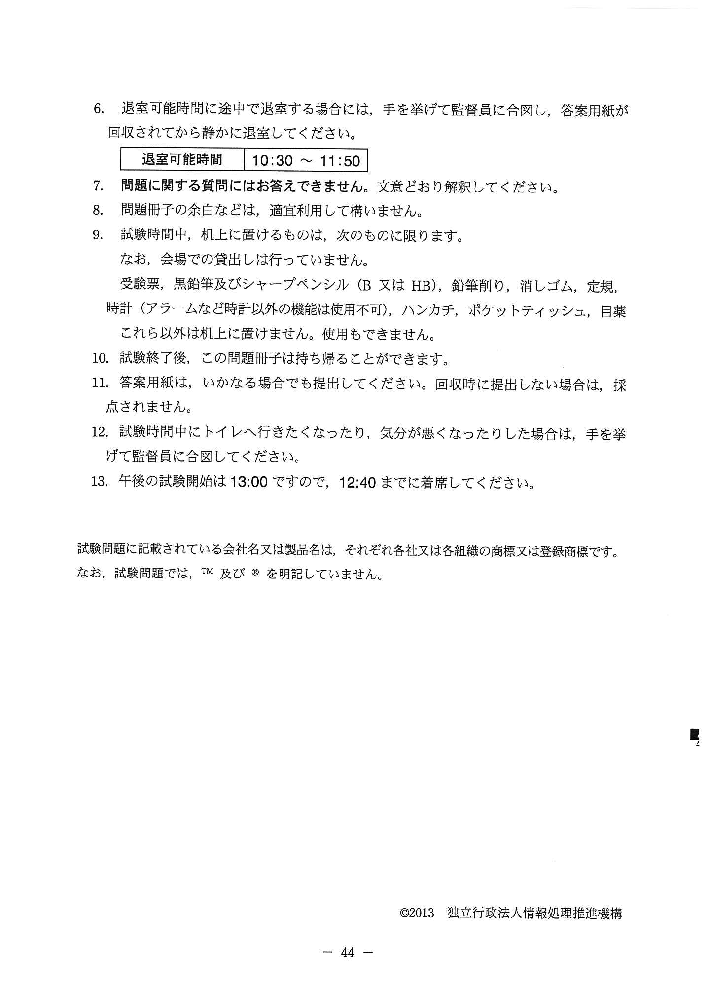

テキスト (OCR)

6. 退室可能時間に途中で退室する場合には, 手を挙げて監督員に合図し, 答案用紙が
回収されてから静かに退室してください。
| 退室可能時間 | 10:30 ~ 11:50 |
7. 問題に関する質問にはお答えできません。文意どおり解釈してください。
8. 問題冊子の余白などは, 適宜利用して構いません。
9. 試験時間中。 机上に置けるものは, 次のものに限ります。
なお, 会場での貸出しは行っていません。
受験票, 黒鉛筆及びシャープペンシル (B 又は HB), 鉛筆削り, 消しゴム, 定規,
時計 (アラームなど時計以外の機能は使用不可)、 ハンカチ, ポケットティッシュ, 目薬
これら以外は机上に置けません。使用もできません。
10, 試験終了後。 この問題冊子は持ち帰ることができます。
11. SRAM, いかなる場合でも提出してください。回収時に提出しない場合は, 採
点されません。
12, 試験時間中にトイレへ行きたくなったり, 気分が悪くなったりした場合は, FER
げて監督貞に合図してください。
13, 午後の試験開始は 13:00 ですので, 12:40 までに着席してください。

試験問題に記載されている会社名又は製品名は, それぞれ各社又は各組織の商標又は登録商標です。
なお, 試験問題では, ™ 及び © を明記していません。

@2013 独立行政法人情報処理推進機構

ー 44 一

---

## 午前解答

©2013 独立行政法人情報処理推進機構 
平成25 年度 秋期 応用情報技術者試験 解答例 
 
午前試験 
問番号 
正解 
問1 
ア 
問2 
ア 
問3 
エ 
問4 
エ 
問5 
イ 
問6 
エ 
問7 
イ 
問8 
イ 
問9 
ウ 
問10 
エ 
問11 
イ 
問12 
ウ 
問13 
ア 
問14 
ア 
問15 
エ 
問16 
ア 
問17 
イ 
問18 
ア 
問19 
エ 
問20 
ウ 
 
 
問番号 
正解 
問21 
ア 
問22 
ウ 
問23 
エ 
問24 
イ 
問25 
エ 
問26 
ウ 
問27 
ウ 
問28 
ア 
問29 
イ 
問30 
エ 
問31 
イ 
問32 
エ 
問33 
イ 
問34 
ア 
問35 
エ 
問36 
ウ 
問37 
ア 
問38 
エ 
問39 
エ 
問40 
ウ 
 
 
問番号
正解 
問41 
エ 
問42 
ア 
問43 
ウ 
問44 
イ 
問45 
ア 
問46 
ア 
問47 
イ 
問48 
エ 
問49 
エ 
問50 
エ 
問51 
エ 
問52 
イ 
問53 
エ 
問54 
ウ 
問55 
ア 
問56 
イ 
問57 
ウ 
問58 
ア 
問59 
ウ 
問60 
ウ 
 
 
問番号 
正解 
問61 
エ 
問62 
ウ 
問63 
イ 
問64 
イ 
問65 
イ 
問66 
イ 
問67 
エ 
問68 
ウ 
問69 
ウ 
問70 
エ 
問71 
エ 
問72 
エ 
問73 
ウ 
問74 
ウ 
問75 
ア 
問76 
エ 
問77 
ア 
問78 
イ 
問79 
エ 
問80 
ア

---

## 午後問題

### ページ 1

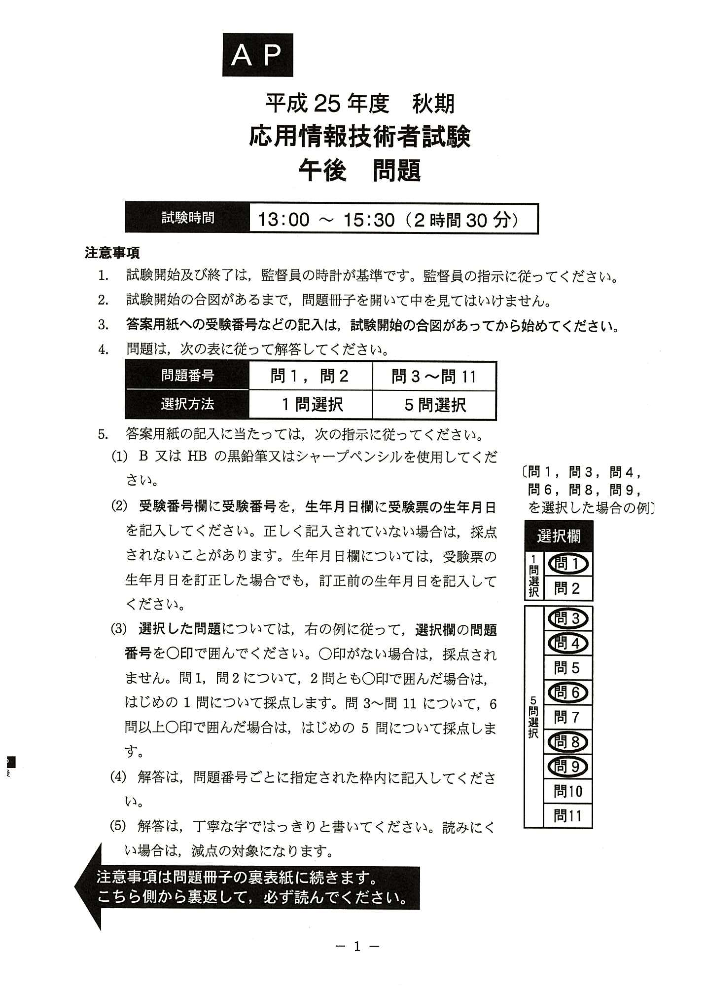

テキスト (OCR)

平成25年度 秋期
応用情報技術者試験
午後 問題

 13:00 ~ 15:30 (2時間30 分)

注意事項
1. 試験開始及び終了は, 監督員の時計が基準です。監督員の指示に従ってください。
2. 試験開始の合図があるまで, 問題冊子を開いて中を見てはいけません。
3. 答案用紙への受験番号などの記入は, 試験開始の合図があってから始めてください。
4. 問題は, 次の表に従って解答してください。

問題番号        fll, 2      fe] 3 ~F 11
選択方法         1 間選択        5 問選択

5. 答案用紙の記入に当たっては, 次の指示に従ってください。
(1) B 又は HB の黒鉛筆又はシャープペンシルを使用してくだ
Jews,                                【問1, 問3, 問4,
問6, 問8, 問9,
2) 受験番号欄に受験番号を, 生年月日欄に受験票の生年月日  を選択した場合の例〕
を記入してください。正しく記入されていない場合は, 採点 [BR
されないことがあります。生年月日欄については, 受験票の   1
生年月日を訂正した場合でも, 訂正前の生年月日を記入して  選 問2
ください。
“a
3) 選択した問題については, 右の例に従って, BRON
番号を〇印で囲んでください。〇印がない場合は, 採点され
ません。問1, 問2 について, 2 問とも〇印で囲んだ場合は,
はじめの 1 問について採点します。間 3>問 11 について, 6 1B

[=] 7

問以上〇印で囲んだ場合は, はじめの 5 問について採点しま |F =
す。                                   =

(④ 解答は, 問題番号ごとに指定された枠内に記入してくださ     mt
い。                                   ー

間11

(5) 解答は, 丁寧な字ではっきりと書いてください。読みにく
WHA, 減点の対象になります。

注意事項は問題冊子の裏表紙に続きます。
こちら側から裏返して, 必ず読んでください。

### ページ 2

### ページ 3

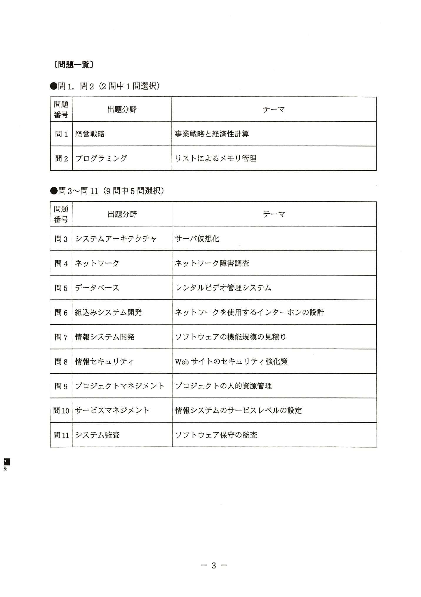

テキスト (OCR)

aa |

〔問題一覧〕

@H1, 問2 (2 問中1 問選択)

     出題分野                 oe
問1 | 経営戦略          事業戦略と経済性計算

問2 | プログラミング      リストによるメモリ管理

人@問 3…問 11 (9 問中 5 問選択)

     出題分野                テーマ
F383 | システムアーキテクチャ  サーバ仮想化

問4 | ネットワーク        ネットワーク障害調査

問5 | データベース        レンタルビデオ管理システム
問6 | 組込みシステム開発    ネットワークを使用するインターホンの設計
問 7 | 情報システム開発      ソフトウェアの機能規模の見積り
ls | 情報セキュリティ     Web サイトのセキュリティ強化策

間9

プロジェクトマネジメント

プロジェクトの人的資源管理

間10

サービスマネジメント

情報システムのサービスレベルの設定

間11

システム監査

ソフトウェア保守の監査

### ページ 4

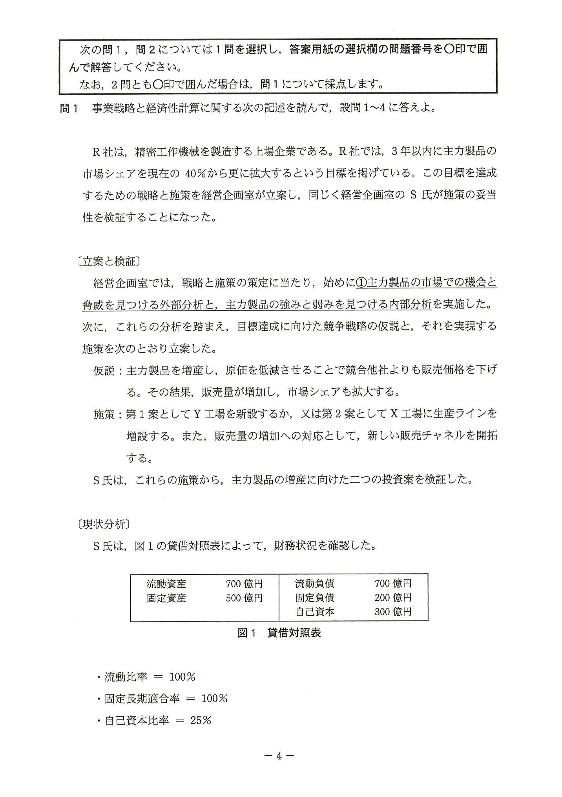

テキスト (OCR)

次の問1, 問2 については1 間を選択し, 答案用紙の選択欄の問題番号を〇FEで囲
んで解答してください。
なお, 2 問とも〇印で囲んだ場合は, 問 1 について採点します。

問1 事業戦略と経済性計算に関する次の記述を読んで, 設問 1ご4 に答えよ。

R 社は, 精密工作機械を製造する上場企業である。R 社では, 3 年以内に主力製品の
市場シェアを現在の 40%から更に拡大するという目標を掲げている。この目標を達成
するための戦略と施策を経営企画室が立案し, 同じく経営企画室の S 氏が施策の受当
性を検証することになった。

〔立案と検証]
経営企画室では, 戦略と施策の策定に当たり, 始めに①主力製品の市場での機会と
脅威を見つける外部分析と, 主力製品の強みと弱みを見つける内部分析を実施した。
次に, これらの分析を踏まえ, 目標達成に向けた競争戦略の仮説と, それを実現する
施策を次のとおり立案した。
仮説 : 主力製品を増産し, 原価を低減させることで競合他社よりも販売価格を下げ
る。その結果, 販売量が増加し, 市場シェアも拡大する。
施策 : 第1 案として Y 工場を新設するか, 又は第 2 案として XX工場に生産ラインを
増設する。また, 販売量の増加への対応として, 新しい販売チャネルを開拓
する。
S 氏は, これらの施策から, 主力製品の増産に向けた二つの投資案を検証した。

(HERAT
S 氏は, 図 1 の貸借対照表によって, 財務状況を確認した。

流動資産          700 億円        流動負債          700 億円
固定資産          500 億円         固定負債          200 億円
自己資本          300 億円

  1 貸借対照表

・流動比率 = 100%
・固定長期適合率 三 100%
・自己資本比率 ニ 25%

### ページ 5

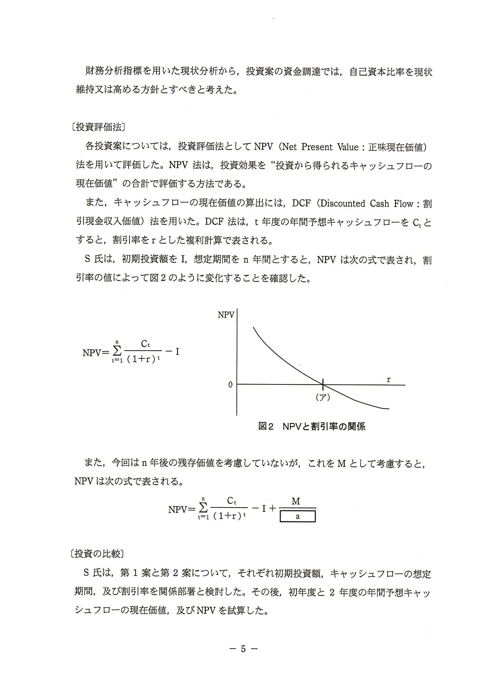

テキスト (OCR)

財務分析指標を用いた現状分析から, 投資案の資金調達では, 自己資本比率を現状
維持又は高める方針とすべきと考えた。

[投資評価法]

各投資案については, 投資評価法として NPV (Net Present Value : 正味現在価値)
法を用いて評価した。NPYV 法は, 投資効果を“投資から得られるキャッシュフローの
現在価値" の合計で評価する方法である。

RK, キャッシュフローの現在価値の算出には, DCF (Discounted Cash Flow : 割
引現金収入価値) 法を用いた。DCF 法は, t 年度の年間予想キャッシュフローを ce
すると, 割引率をr とした複利計算で表される。

S 氏は, 初期投資額を 1, 想定期間を n 年間とすると, NPV は次の式で表され, 割
引率の値によって図 2 のように変化することを確認した。

NPV

NPV= = (1+r)t

r

0
のて

図2 NPVと割引率の関係

また, 今回はn年後の残存価値を考慮していないが, これを M ELTHRETSE,
NPV は次の式で表される。
Ce              M

=>    a oe
wPV= 2 AS

〔投資の比較)

S 氏は, 第 1 案と第 2 案について, それぞれ初期投資額, キャッシュフローの想定
期間, 及び割引率を関係部署と検討した。その後, 初年度と 2 年度の年間予想キャッ
シュフローの現在価値, 及びNPV を試算した。

### ページ 6

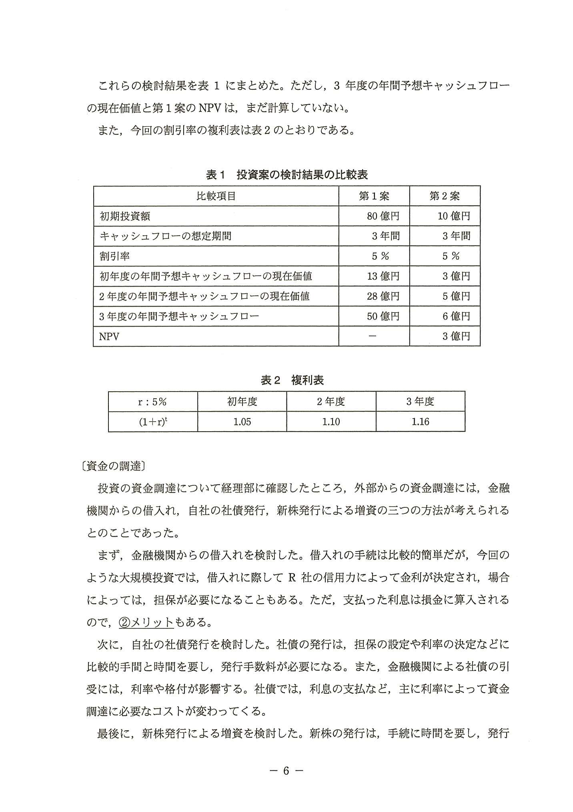

テキスト (OCR)

これらの検討結果を表 1 にまとめた。ただし, 3 年度の年間予想キャッシュフロー
の現在価値と第 1 案の NPV は, まだ計算していない。
また, 今回の割引率の複利表は表2 のとおりである。

表1 投資案の検討結果の比較表

比較項目                                   第1案           第2案
初期投資額                                          80 億円        10 億円
キャッシュフローの想定期間              3 年間    3 年間
割引率                                               5 %          5%
初年度の年間予想キャッシュフローの現在価値     13 億円    3 億円
2 年度の年間予想キャッシュフローの現在価値        28 億円      5 億円
3 年度の年間予想キャッシュフロー                50 億円      6 億円
NPV                                                    =              3 億円
表2 複利表
ri5%      初年度      2 年度      3 年度
atnt              1.05               1.10               1.16

(ASORB)

投資の資金調達について経理部に確認したところ, 外部からの資金調達には, 金融
機関からの借入れ, 自社の社債発行, 新株発行による増資の三つの方法が考えられる
とのことであった。

ED, 金融機関からの借入れを検討した。借入れの手続は比較的簡単だが, 今回の
ような大規模投資では, 借入れに際して R 社の信用力によって金利が決定され, 場合
によっては, 担保が必要になることもある。ただ, 支払った利息は損金に算入される
DC, ②メリットもある。

Ric, 自社の社債発行を検討した。和社債の発行は, 担保の設定や利率の決定などに
比較的手間と時間を要し, 発行手数料が必要になる。また, 金融機関による社債の引
受には, 利率や格付が影響する。社償では, 利息の支払など, 主に利率によって資金
調達に必要なコストが変わってくる。

最後に, 新株発行による増資を検討した。新株の発行は, 手続に時間を要し, 発行

ー6 一

### ページ 7

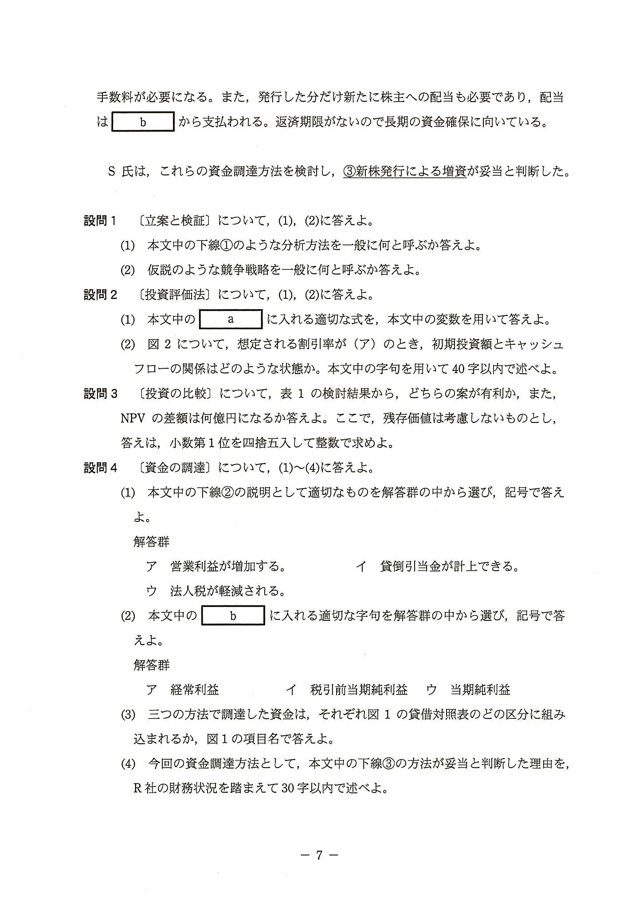

テキスト (OCR)

手数料が必要になる。また, 発行した分だけ新たに株主への配当も必要であり, 配当
は| b |] から支払われる。 返済期限がないので長期の資金確保に向いている。

S Kid, これらの資金調達方法を検討し ⑨新株発行による増資が妥当と判断した。
設問 1

(立案と検証) について, ①⑪, (②)に答えよ。

(1) 本文中の下線ののような分析方法を一般に何と呼ぶか答えよ。
2) 仮説のような競争戦略を一般に何と呼ぶか答えよ。
設問2 [投資評価法】について, ①⑪, ②)に答えよ。

Q①) 本文中の| a | に入れる適切な式を, 本文中の変数を用いて答えよ。
@) 図 2 について, 想定される割引率が (ア) OLE, 初期投資額とキャッシュ
フローの関係はどのような状態か。本文中の字句を用いて 40 字以内で述べよ。
設問3

〔投資の比較}】 について, 表 1 の検討結果から, どちらの案が有利か, また,
NPV の差額は何億円になるか答えよ。

テー
に

で, 残存価値は考慮しないものとし,
答えは, 小数第1 位を四捨五入して整数で求めよ。
設問4 [資金の調達] について, ①^て(④に答えよ。

(1) 本文中の下線②の説明として適切なものを解答群の中から選び,
よ。

ア 営業利益が増加する。     イ 貸倒引当金が計上できる。
ウ 法人税が軽減される。

⑫) 本文中の| b |] に入れる適切な字句を解答若の中から選び, 記号で答
えよ。
AER

ア 経常利益

イ 税引前当期純利益 ウ 当期純利益

(3) 三つの方法で調達した資金は それぞれ図 1 の貸借対照表のどの区分に組み
込まれるか, 図 1 の項目名で答えよ。
4 4

今回の資金調達方法として, SXEOTROOMEMRY CHB LCS,
R 社の財務状況を踏まえて 30 字以内で述べよ。

### ページ 8

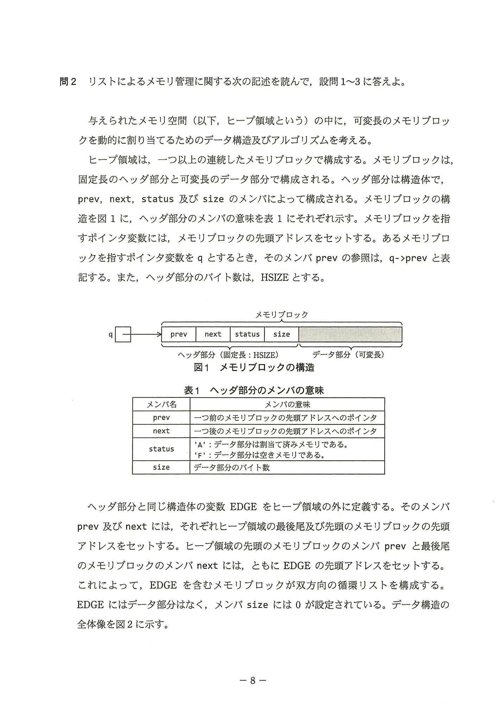

テキスト (OCR)

fal 2

リストによるメモリ管理に関する次の記述を読んで, 設問 1て3 に答えよ。

与えられたメモリ空間 (以下、ヒープ領域という) の中に, 可変長のメモリブロッ
クを動的に割り当てるためのデータ構造及びアルゴリズムを考える。

cS RRL, 一つ以上の連続したメモリブロックで構成する。メモリブロックは,
固定長のヘッダ部分と可変長のデータ部分で構成される。ヘッダ部分は構造体で,
prev, next, status 及び size のメンバによって構成される。メモリブロックの構
造を図 1 に, ヘッタダ部分のメンバの意味を表 1 にそれぞれ示す。メモリブロックを指
すポインタ変数には, メモリブロックの先頭アドレスをセットする。あるメモリプブロ
ックを指すポインタ変数を q』とするとき, そのメンバ prev の参照は, q->prev と表
記する。また, ヘッダ部分のバイト数は, HSIZE LTS,

メモリブロック
引 +— prev | next | status | size
て                        re                  ,
ペッダ部分 (固定長: HSIZB)      データ部分 BEE)

図1 メモリブロックの構造
表1 ヘッダ部分のメンバの意味

メンバ名                         メンバの意味
prev     ーつ前のメモリブロックの先頭アドレスへのポインタ
next    ーつ後のメモリブロックの先頭アドレスへのポインタ

‘A データ部分は割当て済みスモリである。
‘FL データ部分は空きメモリである。
size     データ部分のバイト数

status

ヘッダ部分と同じ構造体の変数 EDGE をヒーブプ領域の外に定義むする。そのメンバ
prev 及び next には, それぞれヒープ和領域の最後尾及び先頭のスモリブロックの先頭
アドレスをセットする。ヒープ領域の先頭のメモリブロックのメンバ prev と最後尾
のメモリブロックのメンバ next には, ともに EDGE の先頭アドレスをセットする。
これによって, EDGE を含せ9メモリブロックが双方向の循環りストを構成する。
EDGE にはデータ部分はなく, メンバ size には 0 が設定されている。データ構造の
全体像を図 2 に示す。

### ページ 9

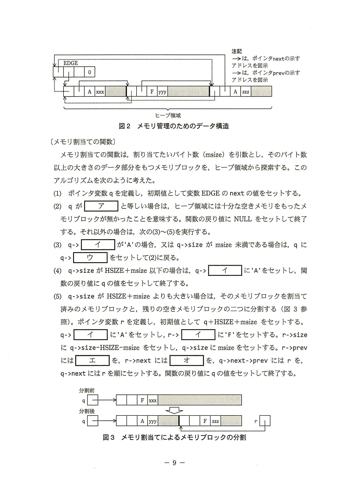

テキスト (OCR)

注記

ー> は, ボインタnextの示す
EDGE                         i   アドレスを図示
|       0                        i    ー>は, ポインタprevの示す
[          [             i   アドレスを図示
atL! 4 bead   L! |= bs]    画 [4 [ex] ]
Fc casssnstnsetnesnsnesetnenneee
」                 eT HR
図2 メモリ管理のためのデータ構造
〔メモリ割当ての関数〕

メモリ割当ての関数は, 割り当てたいバイト数 Gmsize) を引数とし, そのバイト数
以上の大きさのデータ部分をもつメモリブロックを, ヒープ領域から探索する。この
アルゴリズムを次のように考えた。

Q) ポインタ変数 q を定義し, 初期値として変数 EDGE の next の値をセットする。

② qが| ア | と等しい場合は, ヒープ傾域には十分な空きメモリをもったメ
モリブロックが無かったことを意味する。関数の戻り値に NULL をセットして終了
する。それ以外の場合は, 次の(3③-て(5)を実行する。

⑬ q->| イ |] が'A'の場合, 又は q->stze が msize 未満である場合は。q に
q-> | ウ | をセットして②に戻る。

(4) q->size が HSIZE+msize 以下の場合は, q->| イ |に'A'をセッ トし, 関
数の戻り値に q の値をセットして終了する。

(5) q->size が HSIZE十msize よりも大きい場合は, そのメモリブロックを割当て
済みのメモリブロックと, 残りの空きメモリブロックの二つに分割する (図 3 参
照)。ボポインタ変数 r を定義し, 初期値として q十HSIZE十msize をセットする。
q-> に'A'をセットし, P-> こく"F'をセットする。r->size
に q->size-HSIZE-msize をセットし, q->stze にmsize をセットする。『r->prev
kcは| エ | を, r->next には| オォ |を, q->next->prev Iclir を,

q->next にはr を順にセットする。関数の戻り値に qq の値をセットして終了する。

分割前

LLL Eb]        |

Ay         ユーテ
(HOLES EES ・

 3 メモリ割当てによるメモリブロックの分割

### ページ 10

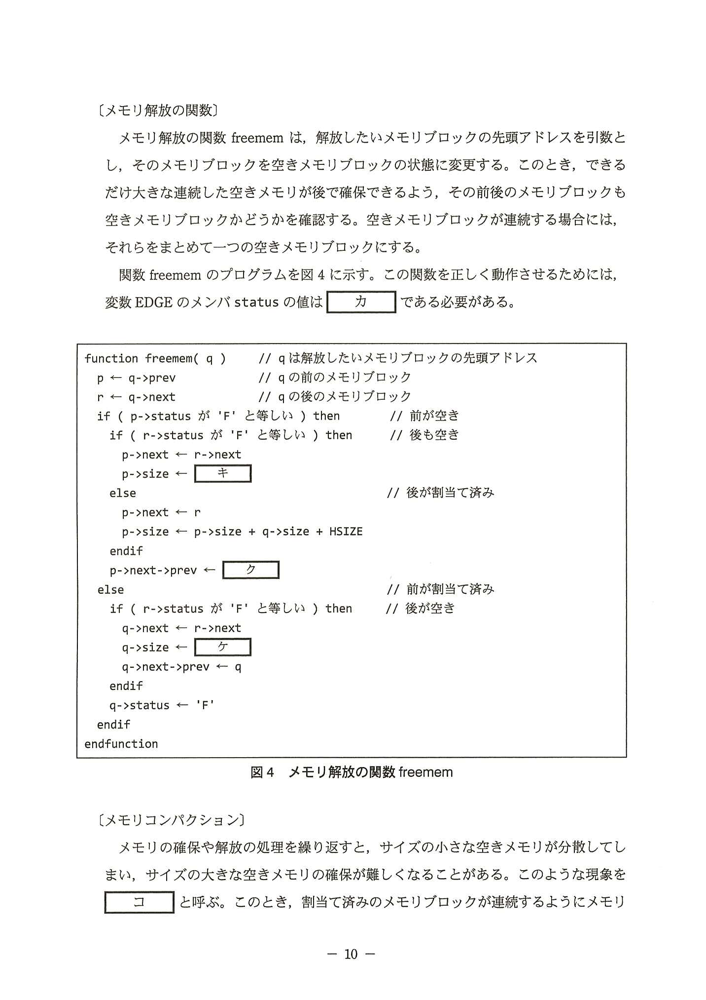

テキスト (OCR)

〔メモリ解放の関数

メモリ解放の関数 freemem は, 解放したいメモリブロックの先頭アドレスを引数と
し, そのメモリブロックを空きメモリブロックの状態に変更する。ことのとき, できる
だけ大きな連続した空きメモリが後で確保できるよう, その前後のメモリブロックも
空きメモリブロックかどうかを確認する。空きメモリブロックが連続する場合には,
それらをまとめて一つの空きメモリブロックにする。

関数 freemem のプログラムを図 4 に示す。この関数を正しく動作させるためには,

変数 FDGE のメンバ status の値は| カ | である必要がある。

function freemem( q )      // q は解放したいメモリブロックの先頭アドレス

p + q->prev           // q の前のメモリブロック
pr < q->next           // q の後のメモリブロック
if ( p->status が 'F' と等しい ) then      // 前が空き

if ( r->status が 'F' と等しい ) then    // 後も空き
p->next <- r->next
p->size <—

else                            // 後が割当て済み
p->next <— r
p->size < p->size + q->size + HSIZE

endif
p->next->prev <
else                            // 前が割当て済み

if ( r->status が 'F' と等しい ) then    // 後が空き
q->next <— r->next
q->size <—
q->next->prev <— q

endif

q->status < 'F'

endif
endfunction

 4 メモリ解放の関数 freemem

〔【メモリコンパクション〕

メモリの確保や解放の処理を繰り返すと。 サイズの小さな空きメモリが分散してし
まい, サイズの大きな空きメモリの確保が難しくなることがある。このような現象を
| コ | と呼ぶ。このとき, 割当て済みのメモリプロックが連続するようにメモリ

ー 10 一

### ページ 11

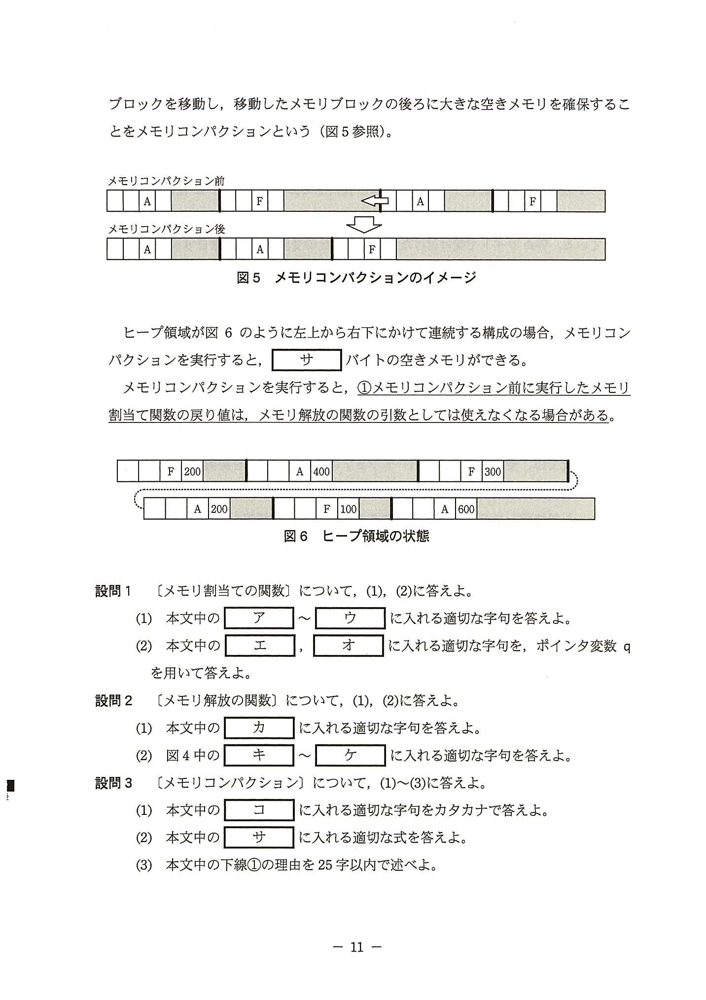

テキスト (OCR)

ブロックを移動し, 移動したメモリブロックの後ろに大きな空きメモリを確保するこ
とをメモリコンパクションという (図5参照)。

[Ll mee LPL     =n non |
メモリコンパクション後        さと
[Lkl Geel LECT      |

図5 メモリコンパクションのイメージ

ヒープ領域が図 6 のように左上から右下にかけて連続する構成の場合,メスモリコン
パクションを実行すると, | サ |バイトの空きメモリができる。

メモリコンパクションを実行すると, ①メモリコンパクション前に実行したメモリ
割当て関数の戻り値は, メモリ解放の関数の引数としては使えなくなる場合がある。

回軒回E 問題回四    L | | # [soo]   ト
CT eT eof TT 9      |

 6 ヒープ領域の状態

設問1 〔メモリ割当ての関数) について, ①⑪, ②に答えよ。
Q 本文中の| ア |~| ウ |に入れる適切な字句を答えよ。
②) 本文中の| エ |,| オ |に入れる適切な字句を, ボインタ変数 q

を用いて答えよ。
設問2 〔メモリ解放の関数) について, OM, ②)に答えよ。

a 本文中の| カ | に入れる適切な字句を答えよ。

@) 図4中の| キ |~[ ケ |に入れる適切な字句を答えよ。

設問3 〔メモリコンパクション〕 について, ①⑪ぐて(3③)に答えよ。
Q①) 本文中の | コ | に入れる適切な字句をカタカナで答えよ。
⑫) 本文中の| サ | に入れる適切な式を答えよ。

3) 本文中の下線〇の理由を 25 字以内で述べよ。

ー 11 一

### ページ 12

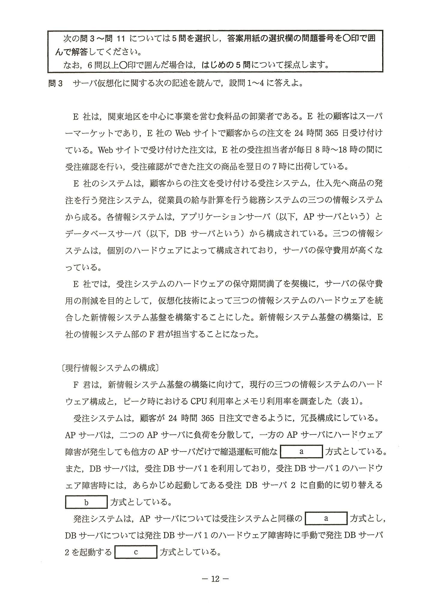

テキスト (OCR)

次の問 3 て問 11 については5 間を選択し, 答案用紙の選択欄の問題番号を〇印で囲
んで解答してください。
なお, 6 問以上〇印で囲んだ場合は, はじめの5 問について採点します。

問3 サーバ仮想化に関する次の記述を読んで, RE I~4 に答えよ。

E 社は, 関東地区を中心に事業を営む食料品の卸業者である。E 社の顧客はスーパ
ーマーケットであり, 社の Web サイトで顧客からの注文を 24 時間 365 日受け付け
ている。Web サイトで受け付けた注文は, E 社の受注担当者が毎日 8 時て18 時の間に
受注確認を行い, 受注確認ができた注文の商品を翌日の 7 時に出荷している。

E 社のシステムは, 顧客からの注文を受け付ける受注システム, 仕入先へ商品の発
注を行う発注システム, 従業員の給与計算を行う総務システムの三つの情報システム
から成る。各情報システムは, アプリケーションサーバ (以下, AP サーバという) と
データベースサーバ (以下, DB サーバという) から構成されている。三つの情報シ
AFA, 個別のハードウェアによって構成されており, サーバの保守費用が高くな
つている。

E 社では, 受注システムのハードウェアの保守期間満了を契機に。 サーバの保守費
用の削減を目的として, 仮想化技術によって三つの情報システムのハードウェアを統
合した新情報システム基盤を構築することにした。新情報システム基盤の構築は, E
社の情報システム部のF 君が担当することになった。

(現行情報システムの構成

F 君は, 新情報システム基盤の構築に向けて, 現行の三つの情報システムのハード
ウェア構成と,。 ピーク時における CPU 利用率とメモリ利用率を調査した GZ.

受注システムは, 顧客が 24 時間 365 日注文できるように, 冗長構成にしている。
AP サーバは, 二つの AP サーバに負荷を分散して, 一方の AP サーバにハードウェア
障害が発生しても他方の AP サーバだけで縮退運転可能な| sa 方式としている。
また, DB サーバは, 受注 DB サーバ 1 を利用しており, 受注DB サーバ1 のハードウ
ェア隊害時には, あらかじめ起動してある受注 DB サーバ 2 に自動的に切り苦える
[> | 方式としている。

発注システムは, AP サーパについては受注システムと同様の| sa |方式とし
DB サーバについては発注 DB サーバ 1 のハードウェア障害時に手動で発注 DB サーバ

2 を起動する| c 方式としている。

ー 12 一

### ページ 13

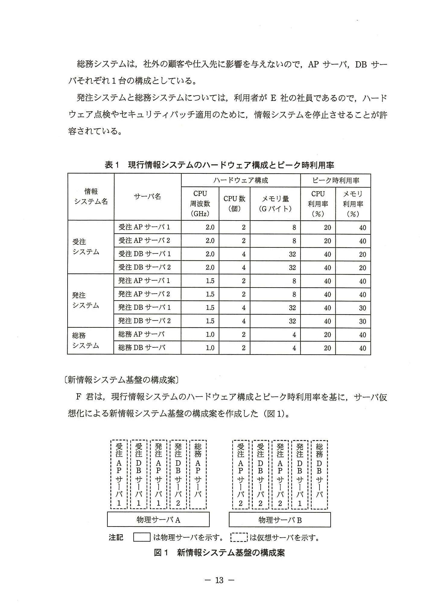

テキスト (OCR)

総務システムは, 社外の顧客や仕入先に影響を与えないので, AP サーバ, DB サー
バそれぞれ1 台の構成としている。

発注システムと総務システムについては, 利用者が E 社の社員であるので, ハード
ウェア点検やセキュリティパッチ適用のために, 情報システムを停止させることが許
容されている。

表1 現行情報システムのハードウェア構成とピーク時利用率

ハードウェア構成      ピーク時利用率
variate | 9% | ree form] em | ime | ne
(GHz)           (%)  (%)
受注AP サーバ1              2.0           2                   8           20           40
受注             受注APサーバ2               2.0           2                   8           20            40
システム   受注 DB サーバュ     2.0    4       32    40    20
受注DB サーバ2              2.0           4                  32            40           20
発注 APサーバ1                1.5            2                     8             40             40
発注               発注 AP サーバ2                15            2                     8             40             40
システム   発注 DB サーバュ     15    4      32    40    30
発注 DB サーバ2              15           4                  32            40           30
総務           総務AP サーバ              1.0         2                4         20          40
システム   総務 DB サーバ      1.0    2      4    20    40
〔新情報システム基盤の構成案)

F Bld, 現行情報システムのハードウェア構成とピーク時利用率を基に, サーバ仮
想化による新情報システム基盤の構成案を作成した (図1)。

Pe ita it ge it ge ite |   1受け受晶発晶発日総!
!注唱注唱注唱注出務1   PE EET PE PE we |
rANDHAT DI At  rAHDHANDHD!
rPHBEP HBP  IPHBUPH BEB!
PPS Se a   Pee es
1! パロパロバョババ1   1パ昌内昌昌日太1
物理サーバA                             物理サーバB
注記 [ ] は物理サーバを示す。『 は仮想サーバを示す。

 1 新情報システム基盤の構成案

ー 13 一

### ページ 14

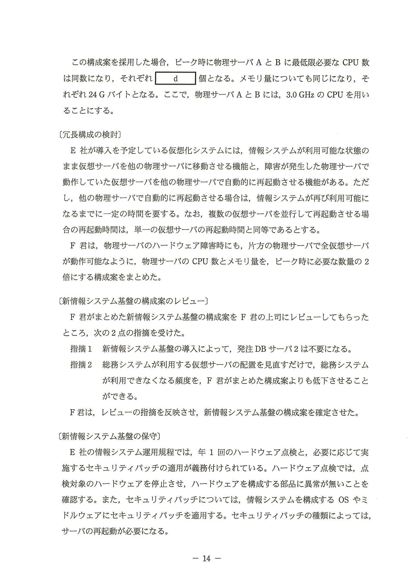

テキスト (OCR)

この構成案を採用した場合, ピーク時に物理サーバ A と B に最低限必要な CPU 数
は同数になり, それぞれ|  q | 個となる。メモリ量についても同じになり, そ
れぞれ 24 G バイトとなる。ここで, 物理サーバ A と B には, 3.0 GHz の CPU を用い
ることにする。

(冗長構成の検討]

E 社が導入を予定している仮想化システムには, 情報システムが利用可能な状態の
まま仮想サーバを他の物理サーバに移動させる機能と, 障害が発生した物理サーバで
動作していた仮想サーバを他の物理サーバで自動的に再起動させる機能がある。ただ
し, 他の物理サーバで自動的に再起動させる場合は, 情報システムが再び利用可能に
なるまでに一定の時間を要する。なお, 複数の仮想サーバを並行して再起動させる場
合の再起動時間は, 単一の仮想サーバの再起動時間と同等であるとする。

F Alt, 物理サーバのハードウェア障害時にも, 片方の物理サーバで全仮想サーバ
が動作可能なように, 物理サーバの CPU 数とメモリ量を, ピーク時に必要な数量の 2
倍にする構成案をまとめた。

〔新情報システム基盤の構成案のレビュー〕
F 君がまとめた新情報システム基盤の構成案を F 君の上司にレビューしてもらった
ところ, 次の2 点の指摘を受けた。
指摘1 新情報システム基盤の導入によって, 発注 DB サーバ2 は不要になる。
指摘2 総務システムが利用する仮想サーバの配置を見直すだけで, 総務システム
が利用できなくなる頻度を, F 君がまとめた構成案よりも低下させること
ができる。
F 君は。 レビューの指摘を反映させ, 新情報システム基盤の構成案を確定させた。

〔新情報システム基盤の保守〕

E 社の情報システム運用規程では, 年 1 回のハードウェア点検と, 必要に応じて実
施するセキュリティパッチの適用が義務付けられている。ハードウェア点検では, 点
検対象のハードウェアを停止させ, ハードウェアを構成する部品に異常が無いことを
確認する。また, セキュリティパッチについては, 情報システムを構成する OS PS
ドルウェアにセキュリティパッチを適用する。セキュリティパッチの種類によっては,
サーバの再起動が必要になる。

ー 14 一

### ページ 15

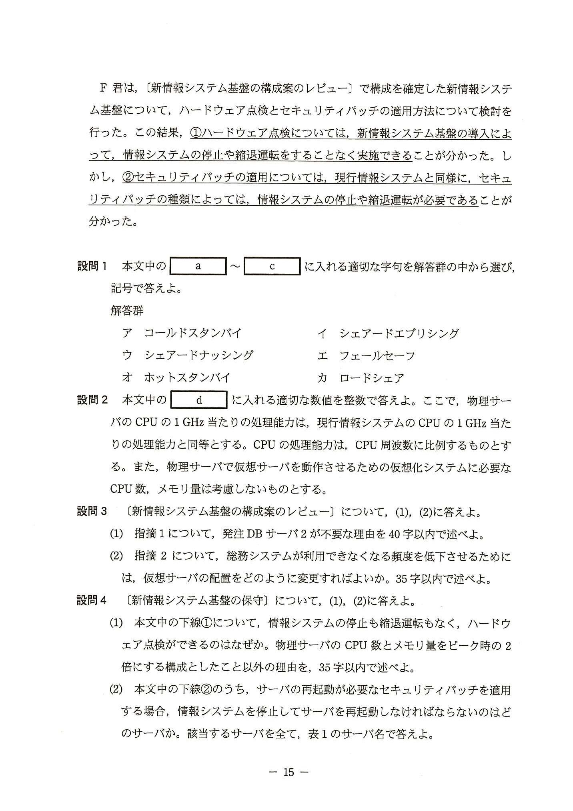

テキスト (OCR)

F 君は, 〔新情報システム基盤の構成案のレビュー〕 で構成を確定した新情報システ
ムラ基盤について, ハードウェア点検とセキュリティパッチの適用方法について検討を
行った。この結果, ①②ハードウェア点検については, 新情報システム基盤の導入によ
って, 情報システムの停止や縮退運転をすることなく実施できることが分かった。し
OL, ②セキュリティパッチの適用については, 現行情報システムと同様に.。 セキュ
リティパッチの種類によっては, 情報システムの停止や縮退運転が必要であることが
分かった。

設問1 本文中の|  a |て|  c |に入れる適切な字旬を解答群の中から選び

記号で答えよ。

解答群
ア コールドスタンバイ       イ シェアードエブリシング
ウ シェアードナッシング          エエ フェールセーフ
A ホットスタンバイ        A ロードシェア

設問2 本文中の| q | に入れる適切な数値を整教で答えよ。ことことで, 物理サー
バのCPUの1 GHz 当たりの処理能力は, 現行情報システムの CPU の 1 GHz 当た
りの処理能力と同等とする。CPU の処理能力は, CPU 周波数に比例するものとす
る。また, 物理サーバで仮想サーバを動作させるための仮想化システムに必要な
CPU 数, メモリ量は考慮しないものとする。
設問3  [〔新情報システム基盤の構成案のレビュー〕について, ①, (②)に答えよ。
Q①) 指摘1について, 発注DB サーバ2 が不要な理由を 40 宇以内で述べよ。
⑫ 指摘 2 について, 総務システムが利用できなくなる頻度を低下させるために
は, 仮想サーバの配置をどのように変更すればよいか。 35 字以内で述べよ。
設問4 〔新情報システム基盤の保守】 について, ①⑪, ⑫②に答えよ。
①) 本文中の下線①について, 情報システムの停止も縮退運転もなく, ハードウ
エア点検ができるのはなぜか。物理サーバの CPU 数とメモリ量をピーク時の 2
倍にする構成としたこと以外の理由を, 35 宇以内で述べよ。
⑫ 本文中の下線②のうち, サーバの再起動が必要なセキュリティパッチを適用
する場合 情報システムを停止してサーバを再起動しなければならないのはど
のサーバか。該当するサーバを全て, 表 1 のサーバ名で答えよ。

ー 15 一

### ページ 16

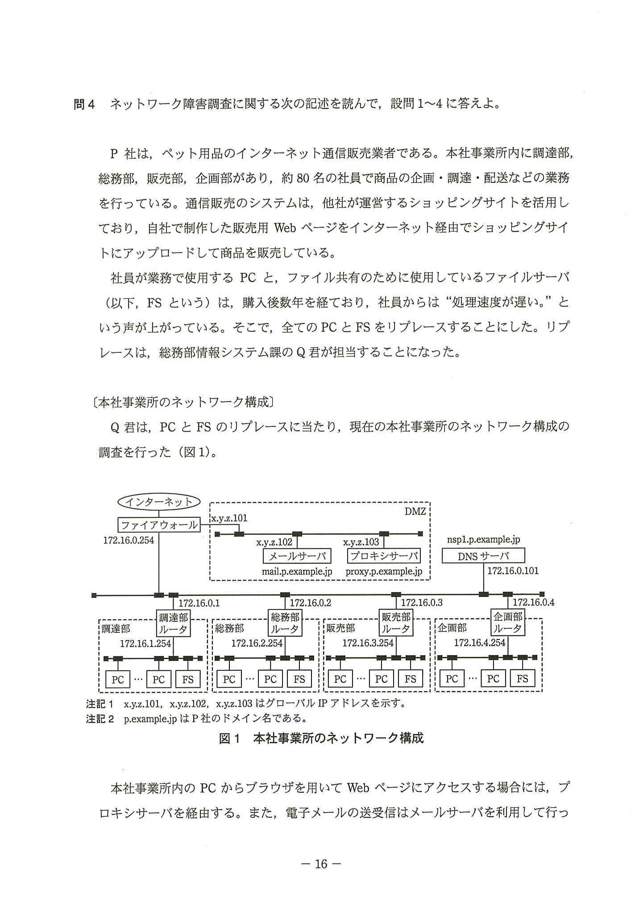

テキスト (OCR)

問4 ネットワーク障害調査に関する次の記述を読んで, 設問 1ー4 に答えよ。

P 社は, ペット用品のインターネット通信販売業者である。本社事業所内に調達部,
総務部, 販売部, 企画部があり, 約 80 名の社員で商品の企画・調達・配送などの業務
を行っている。通信販売のシステムは, 他社が運営するショッピングサイトを活用し
ており, 自社で制作した販売用 Web ページをインターネット経由でショッピングサイ
トにアップロードして商品を販売している。

社員が業務で使用する PC と, ファイル共有のために使用しているファイルサーバ

(以下, FS という) は, 購入後数年を経ており, 社員からは “処理速度が遅い。" と
いう声が上がっている。 そこで, 全ての PC と FS をりリプレースすることにした。リプ
レースは, 総務部情報システム課の Q 君が担当することになった。

〔本社事業所のネットワーク構成〕

Q 君は, PC とFS のりプレースに当たり, 現在の本社事業所のネットワーク構成の
調査を行った (図1)。

DMZ!
1
1
1
xyz102 1       xy2109| ! nsplpexamplejp
| メールサーバ| [プロキシサーバ| ! | DNSサーバ |
mail.p.example.jp proxy.D.exarnplejp 1        172.16.0.101
=                                                                       a
;                           Tiva1602                   17216. 0.3                       172.16.0.4
エーーーーーーーーーー 調達部上--」,----------| 総務部ト--- ,---------- 販売部ト--- ----------- 企画部|---
cite     ルータ     総務前     ルータ| 販売部    ルータ     企画部    ルータ| !
! 172.16.3.254                 172.16.4.254          H
'                                   H
'                                   '
1                                   1

i
H                                                             i
H                                                             H
! 172.16,1.254                 172.16.2.254          1
H                                                             H
H                                                             i

注記1 xyz.101,  et   x.yz.103 はグローバル P アドレスを示す。
注記 2 p.examplejp はP社のドメイン名である。

 1 本社事業所のネットワーク構成

本社事業所内の PC からブラウザを用いて Web ページにアクセスする場合には, プ
ロキシサーバを経由する。また, 電子メールの送受信はメールサーバを利用して行っ

ー 16 一

### ページ 17

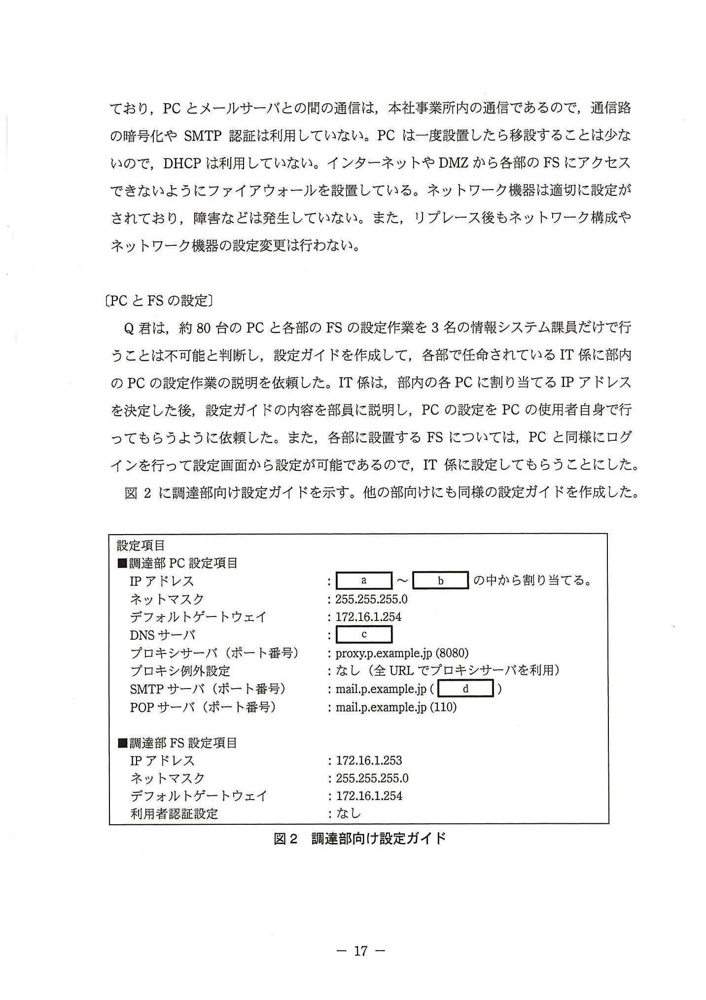

テキスト (OCR)

ており, PC とメールサーバとの間の通信は, 本社事業所内の通信であるので, 通信路
の暗号化や SMTP 認証は利用していない。PC は一度設置したら移設することは少な
WOT, DHCP は利用していない。インターネットや DMZ から各部の FS にアクセス
できないようにファイアウォールを設置している。ネットワーク機器は適切に設定が
されており, 障害などは発生にしていない。また, リプレース後もネットワーク構成や
ネットワーク機器の設定変更は行わない。

(PC E FS ORE)

Q 君は, 80 台の PC と各部の FS の設定作業を 3 名の情報システム課員だけで行
うことは不可能と判断し, 設定ガイドを作成して, 各部で任命されている IT 係に部内
の PC の設定作業の説明を依頼した。TT 係は, 部内の各 PC に割り当てる IP アドレス
を決定した後, 設定ガイドの内容を部員に説明し, PC の設定を PC の使用者自身で行
ってもらうように依頼した。また, 各部に設置する FS については, PC と同様にログ
インを行って設定画面から設定が可能であるので, IT 係に設定してもらうことにした。

図 2 に調達部向け設定ガイドを示す。他の部向けにも同様の設定ガイドを作成した。

設定項目
画調達部 PC 設定項目
TP アドレス            :| s |^て[| 5 | の中から割り当てる。
ネットマスク                                 : 255.255.255.0
デフォルトゲートウェイ       : 172.16.1.254
DNS サーバ                           :
プロキシサーバ (ポート番号)      : proxy.p.example.jp (8080)
プロキシ例外設定             : なし (全 URL でプロキシサーバを利用)
SMTP サーバ (ポート番号)          : mail.p.example.jp ( [La )
POP サーバ (ボート番号)            : mail.p.example.jp (110)
BE FS 設定項目
IP アドレス                             : 172.16.1.253
ネットマスク                                  : 255.255.255.0
デフォルトゲートウェイ       : 172.16.1.254
利用者認証設定                       1 なし

図2 調達部向け設定ガイド

ー 17 一

### ページ 18

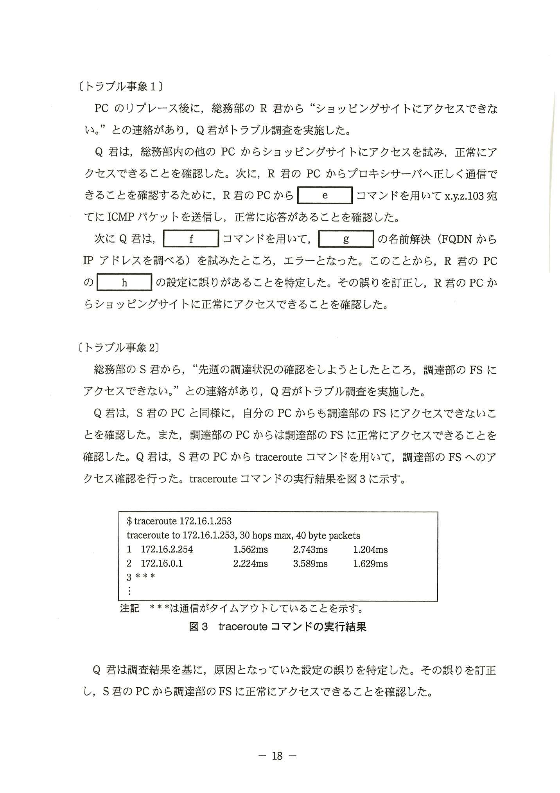

テキスト (OCR)

(トラブル事象1〕

PC のリプレース後に, 総務部の R 君から “ショッピングサイトにアクセスできな
い。" との連絡があり, Q 君がトラブル調査を実施した。

Q Bld, 総務部内の他の PC からショッピングサイトにアクセスを試み正常にア
クセスできることを確認した。次に, R 君の PC からプロキシサーバへ正しく通信で
きることを確認するために, R 君のPCから| ce | コマンドを用いてxyz.103宛
てに ICMP パケットを送信し, 正常に応答があることを確認した。

次に Q 君は, | f | コマンドを用いて,| g  ] の名前解決 (FQDNから
IP アドレスを調べる) を試みたところ, エラーとなった。このことから, R BO PC
の| h | の設定に良りがあることを特定した。その誤りを訂正し, R 君の PCか
らショッピングサイトに正常にアクセスできることを確認した。

〔トラブル事象 2
総務部の S 君から, "先週の調達状況の確認を6しようとしたところ, 調達部の FS に
アクセスできない。” との連絡があり, Q 君がトラブル調査を実施した。
Q 君は, S 君の PC と同様に, 自分の PC からも調達部の FS にアクセスできないこ
とを確認した。また, 調達部の PC からは調達部の FS に正常にアクセスできることを
確認した。Q 君は, S 君の PC WS traceroute コマンドを用いて, 調達部の FS へのア
クセス確認を行った。traceroute コマンドの実行結果を図 3 に示す。

$ traceroute 172.16.1.253
traceroute to 172.16.1.253, 30 hops max, 40 byte packets

1 172.16.2.254                  1.562ms           2.743ms           1.204ms
2 172.16.0.1                      2.224ms           3.589ms           1.629ms
3  oR

注記 ***は通信がタイムアウトしていることを示す。
 3 traceroute コマンドの実行結果

Q 君は調査結果を基に, 原因となっていた設定の誤りを特定した。その誤りを訂正
し, S 君のPC から調達部のFS に正常にアクセスできることを確認した。

= 18 一

### ページ 19

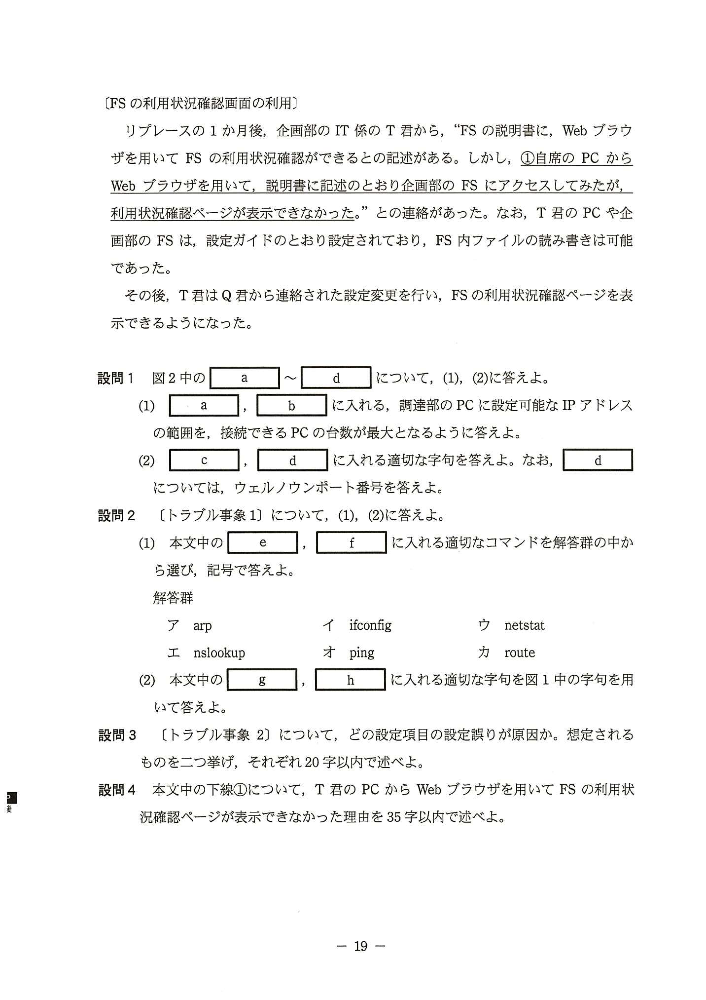

テキスト (OCR)

“i

(FS の利用状況確認画面の利用〕

リプレースの 1 か月後, 企画部の IT 係の T 君から, “FS の説明書に, Web ブラウ
ザを用いて FS の利用状況確認ができるとの記述がある。しかし, ①自席の PC WS
Web ブラウザを用いて, 説明書に記述のとおり企画部の FS にアクセスしてみたが,
利用状況確認ページが表示できなかった。′との連絡があった。なお, TBO PC PE
画部の FS は, 設定ガイドのとおり設定されており, FS 内ファイルの読み書きは可能
であった。

その後, T 君は Q 君から連絡された設定変更を行い FS の利用状況確認ページを表
示できるようになった。

設問1 図2中の|  a |て|  d |について, @, ②に答えよ。

a [a |,| 5 | に入れる, 調達部の PCに設定可能な TP アドレス
の範囲を, 接続できる PC の台数が最大となるように答えよ。
@ [| c |,[| a | に入れる適切な字句を答えよ。 なお, | dq |

については, ウェルノウンボポート番号を答えよ。
設問2 〔トラブル事象 1] について, (①, ②)に答えよ。

Q 本文中の|  e |,|  f |に入れる適切なコマンドを解答群の中か
ら選び, 記号で答えよ。

解答群
ア arp       イ ifconfig      ウ netstat
=. nslookup     オ ping       A route

@ 本文中の| ¢ |,| bh |に入れる適切な字句を図 1 中の字句を用
いて答えよ。

設問3 〔トラブル事象 2) について, どの設定項目の設定誤りが原因か。想定される
ものを二つ挙げ, それぞれ 20 字以内で述べよ。

設問4 本文中の下線わについて, TAO PC から Web ブラウザを用いて FS の利用状
況確認ページが表示できなかった理由を 35 字以内で述べよ。

### ページ 20

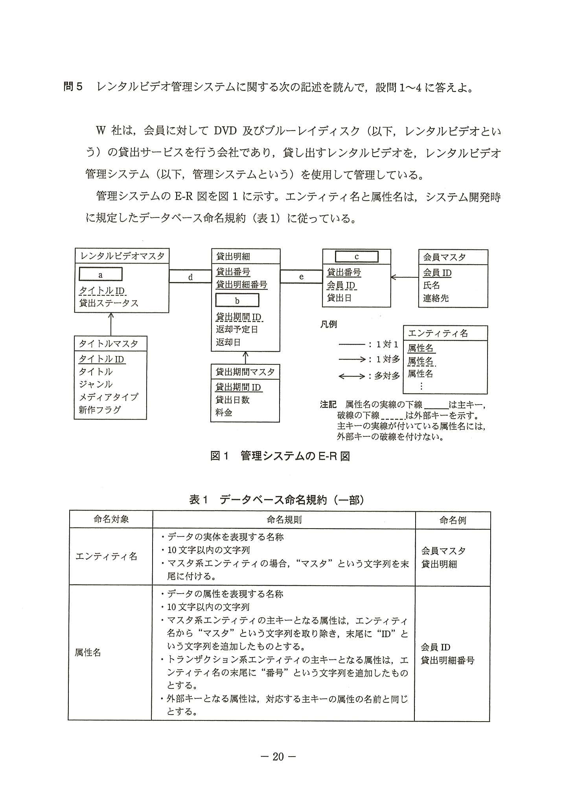

テキスト (OCR)

BS レンタルビデオ管理システムに関する次の記述を読んで, 設問 1て4 に答えよ。

W 社は, 会員に対して DVD 及びブルーレイディスク (以下, レンタルビデオとい
う) の貸出サービスを行う会社であり, 貸し出すレンタルビデオを, レンタルビデオ
管理システム (以下, 管理システムという) を使用して管理している。

管理システムの E-R 図を図 1 に示す。エンティティ名と属性名は, システム開発時
に規定したデータベース命名規約 (表1) に従っている。

ンティティ名の末尾に “番号" という文字列を追加したもの
とする。

・外部キーとなる属性は, 対応する主キーの属性の名前と同じ

とする。

レンタルビデオマスタ      貸出明細          Luc]     会員マスタ
[ 。           a    貸出番号        る    貸出番号           会員TD
貸出明細番号          会員TD            氏名
タイトルD。 。 | トー | Ieuan
lina > 2             a           aise            ait
食出期間TD.
BANTER       =        エンティティ名
タイトルマスタ         iH           ーー $181 | Ree
タイトルTD             1          ーー : 1対多| 属性名
タイトル                 貸出期間マスタ           <> : 多対多| 属性名
ジャンル             貸出期間ID                           :
メディアタイ          貸出日数                :
-                                    注記 属性名の実線の下線     は主キー,
lace           料金            破線の下線__ は外部キーを示す
主キーの実線が付いている属性名には
外部キーの破線を付けない。
図1 管理システムの E-R 図
表1 データベース命名規約 (一部)
命名対象                命名規則                命名例
・データの実体を表現する名称
エンデザディ名  ・10 文字以内の文字列                  会員マスタ
・マスタ系エンティティの場合,.“マスタ” という文字列を末 | 貸出明細
尾に付ける。
・データの属性を表現する名称
・10 文字以内の文字列
・マスタ系エンティティの主キーとなる属性は, エンティティ
名から “マスタ” という文字列を取り除き, 末尾に “I と
属任名           いう文字列を追加したものとする。                    2A ID
・トランザクション系エンティティの主キーとなる属性は, エ | 貸出明細番号

### ページ 21

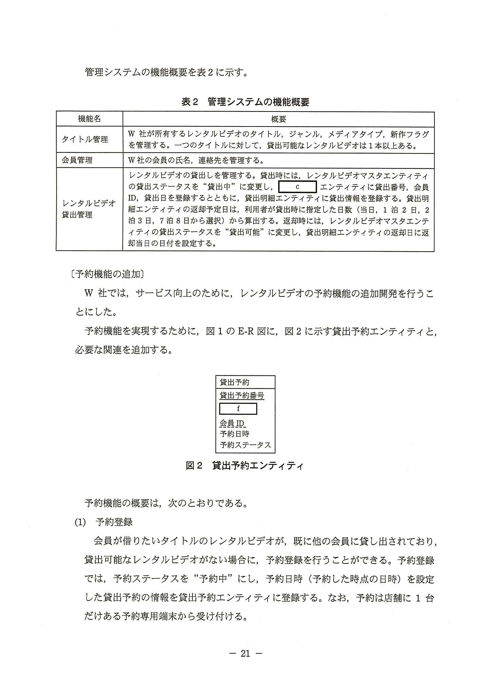

テキスト (OCR)

管理システムの機能概要を表 2 に示す。

表2 管理システムの機能概要

機能名                                                                        概要

W 社が所有するレンタルビデオのタイトル, ジャンル, メディアタイプ, 新作フラグ

SAREE | を乱理する。一つのタイトルに対して, 貸出可能なレンタルビデオは1 本以上ある。

会員管理        W 社の会員の氏名, 連絡先を管理する。

レンタルビデオの貸出しを管理する。貧出時には, レンタルビデオマスタエンティティ
の貸出ステータスを “貸出中” に変更し, | c | エンティティに貸出番号, AB
レンタルビデォ | D 貸出日を登録するとともに。 貸出明細エンティティに食出情報を登録する。貸出明
een      細エンティティの返却予定日は。 利用者が貸出時に指定した日数 (当日, 1 泊 2 8, 2
泊 3 日, 7 泊 8 日から選択) から算出する。返却時には, レンタルビデオマスタエンテ
イティの貸出ステータスを “貸出可能"に変更し, 貸出明細エンティティの返却日に返
却当日の日付を設定する。

[予約機能の追加
W 社では, サービス向上のために, レンタルビデオの予約機能の追加開発を行うこ
とにした。
予約機能を実現するために, 図1 のE-R 図に, 図2 に示す貸出予約エンティティと,
必要な関連を追加する。

貸出予約
食出予約番号

 2 貸出予約エンティティ

予約機能の概要は, 次のとおりである。
Q) 予約登録
会員が借りたいタイトルのレンタルビデオが, 既に他の会員に貸し出されており,
貸出可能なレンタルビデオがない場合に, 予約意録を行うことができる。 予約登録
では, 予約ステータスを “PRP” にし, 予約日時 (予約した時点の日時) を設定
した貸出予約の情報を貸出予約エンティティに登録する。なお, 予約は店舗に 1 台
だけある予約専用端末から受け付ける。

ー 21 一

### ページ 22

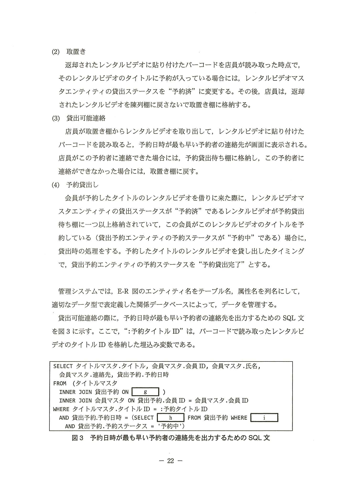

テキスト (OCR)

(2) 取置き
返却されたレンタルビデオに貼り付けたバーコードを店員が読み取った時点で,
そのレンタルビデオのタイトルに予約が入っている場合には, レンタルビデオマス
タエンティティの貸出ステータスを “予約済" に変更する。その後, 店員は, BA
されたレンタルビデオを陳列棚に戻さないで取置き棚に格納する。
(3) 貸出可能連絡
店員が取置き棚からレンタルビデオを取り出して, レンタルビデオに貼り付けた
バーコードを読み取ると, 予約日時が最も早い予約者の連絡先が画面に表示される。
店員がこの予約者に連絡できた場合には, 予約貸出待ち棚に格納し, この予約者に
連絡ができなかった場合には, 取置き棚に戻す。
(4) 予約貸出し
会員が予約したタイトルのレンタルビデオを借りに来た際に, レンタルビデオマ
スタエンティティの貸出ステータスが “予約済" であるレンタルビデオが予約食出
待ち棚に一つ以上格納されていて, この会員がこのレンタルビデオのタイトルを予
約している (貸出予約エンティティ の予約ステータスが “予約中” CHS) 場合に,
貸出時の処理をする。予約したタイトルのレンタルビデオを貸し出したタイミング
で, 貸出予約エンティティの予約ステータスを “予約貸出完了” ETS.

管理システムでは, ER 図のエンティティ名をテーブル名, 属性名を列名にして,
適切なデータ型で表定義した関係データベースによって, データを管理する。

貸出可能連絡の際に, 予約日時が最も早い予約者の連絡先を出力するための SGL 文
を図 3 に示す。ここで, “:予約タイトル ID” は, バーコードで読み取ったレンタルビ
デオのタイトルTD を格納した埋込み変数である。

SELECT タイトルマスタ.タイトル, 会員マスタ会員ID, 会員マスタ.氏名
会員マスタ .連絡先, 貸出予約.予約日時
FROM (タイトルマスタ
INNER JOIN 貸出予約 ON )
INNER JOIN 会員マスタ ON 貸出予約.会員ID = 会員マスタ.会員D
WHERE タイトルマスタ.タイトル 1D = :予約タイトルD
AND 貸出予約.予約日時 = (SELECT FROM 貸出予約 MHERE[ ij |
AND 貸出予約.予約ステータス = PR")

 3 予約日時が最も早い予約者の連絡先を出力するための SQL 文

### ページ 23

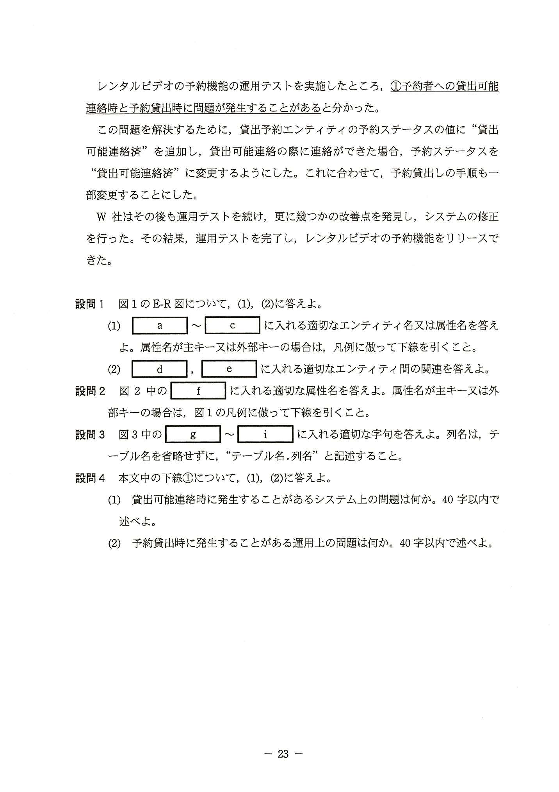

テキスト (OCR)

レンタルビデオの予約機能の運用テストを実施したところ, ①予約者への貸出可能
連絡時と予約貸出時に問題が発生することがあると分かった。

この問題を解決するために, 貸出予約エンティティの予約ステータスの値に“貸出
可能連絡済” を追加し, 貸出可能連絡の際に連絡ができた場合, 予約ステータスを
“貸出可能連絡済" に変更するようにした。これに合わせて, 予約貸出しの手順も一
部変更することにした。

W 社はその後も運用テストを続け, 更に幾つかの改善点を発見し, システムの修正
を行った。その結果, 運用テストを完了し, レンタルビデオの予約機能をリリースで
きた。

設問1 図1のE-R図について, ①, ②)に答えよ。

① [a |て|  c | に入れる適切なエンティティ名又は属性名を答え
よ。属性名が主キー双は外部キーの場合は, 凡例に條って下線を引くこと。
② |  d |, |  e |に入れる適切なエンティティ間の関連を答えよ。

設問2 図 2 中の| ft | に入れる適切な属性名を答えよ。必性名が主キー双は外
部キーの場合は 図 1 の凡例に僚って下線を引くこと。
設問3 図3中の| g |~| i |に入れる適切な字句を答えよ。列名は, テ
ーブル名を省略せずに, “テーブル名列名” と記述すること。
設問4 本文中の下線やについて, ①, ⑫②に答えよ。
Q) 貸出可能連絡時に発生することがあるシステム上の問題は何か。40 字以内で
述べよ。

2) 予約貸出時に発生することがある運用上の問題は何か。40 字以内で述べよ。

ー 23 一

### ページ 24

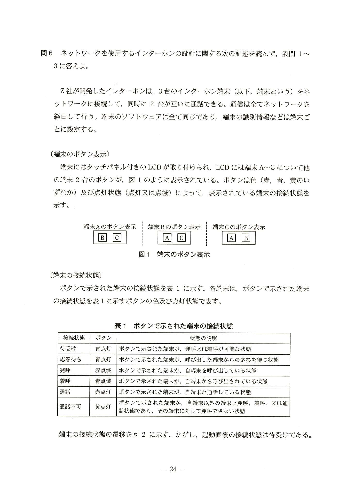

テキスト (OCR)

間6 ネットワークを使用するインターホンの設計に関する次の記述を読んで, 設問 1 ン
3 に答えよ。

Z 社が開発したイ ンターホンは, 3 台のインターホン端末 (以下, 端末という) をネ
ットワークに接続して, 同時に 2 台が互いに通話できる。 通信は全てネットワークを
経由して行う。端末のソフトウェアは全て同じであり, 端末の識別情報などは端末ご
とに設定する。

〔端末のボタン表示〕

端末にはタッチパネル付きの LCD が取り付けられ, LCD には端末 AてC について他
の端末 2 BOR V2, 1 のように表示されている。ボタンは色 (赤, 青, BOW
ずれか) 及び点灯状態 (点灯又は点滅) によって, 表示されている端末の接続状態を
示す。

端末B のボタン表示

fa] [c]

          | 端末Cのボタン表示
図1 端末のボタン表示

回時回

端末Aのボタン表示

国 回

(端末の接続状態〕
ボタンで示された端末の接続状態を表 1 に示す。各端末は, ボタンで示された端末
の接続状態を表 1 に示すボタンの人色及び点灯状態で表す。

表1 ボタンで示された端末の接続状態

weeuikie | ボタン              状態の説明

待受け | AT |ボタンで示された端末が,発叶又は着呼が可能な状態

応答待ち | HAUT | ボタンで示された端末が, 呼び出した端末からの応答を待つ状態
FER    RAR | ボタンで示された端末が,自端末を呼び出している状態

ad    BAM [RIS CRENKMAM, 自端末から呼び出されている状態

Ta    RAM | ボタンで示された端末が, BMREWBL TO SRE

            ボタンで示された   が,  y  以外の   と発呼.着呼, 又は
BG) | Bae at mes

TA OGRE O EB EE 2 2 に示す。ただし, 起動直後の接続状態は待受けである。

ー 24 一

### ページ 25

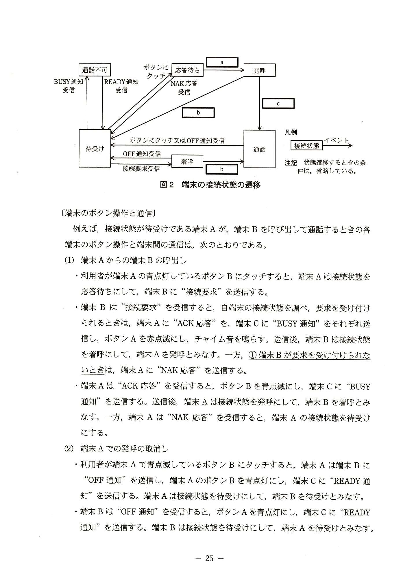

テキスト (OCR)

BUSY通知               READY通知
受信

NAK応答
受信

凡例
ボタンにタッチヌ(はOFF通和受信                イベント
待受け                         通話     Be

peas
ーー*                                          注記 状態移するときの条
要求受信       Cz]        °

件は, 省略している。
図2 端末の接続状態の遷移

〔端末のボタン操作と通信)
例えば, 接続状態が待受けである端末 A が, 端末 B を呼び出して通話するときの各
端末のボタン操作と端末問の通信は, 次のとおりである。

(1)

(2)

端末 A からの端末 B の呼出し

・利用者が端末 A の青点灯しているボタン B にタッチすると, 端末 A は接続状態を

応答待ちにして, 端末 B に “接続要求 を送信する。

・端末 B は “接続要求" を受信すると, 自端末の接続状態を調べ, 要求を受け付け

られるときは, 端末Aに “ACK 応答" を, 端末Cに“BUSY 通知"をそれぞれ送
信し, ボタン A を赤点減にし, チャイム音を鳴らす。送信後, 端末 B は接続状態
を着呼にして, 端末 A を発呼とみなす。一方, ① 端末 B が要求を受け付けられな
いときは, 端末Aに“NAK応答"を送信する。

・端末A は “ACK 応答” を受信すると, ボタンB を青点滅にし, 端末Cに“BUSY

通知"を送信する。送信後, 端末 A は接続状態を発呼にして, 端末 B を着呼とみ
なす。一方, 端末 A は "NAK JOA” を受信すると, 端末 A の接続状態を待受け
にする。

端末 A での発呼の取消し

・利用者が端末 A で青点滅しているボタン B にタッチすると, 端末 A は端末 B に

“OFF 通知” を送信し, 端末 A のボタン B を青点灯にし, 端末Cに“READY 通
Al” を送信する。端末 A は接続状態を待受けにして, 端末 B を待受けとみなす。

・端末 B は“OFF 通知" を受信すると, ボタンA を青点灯にし, 端末 Ic “READY

通知"を送信する。端末 B は接続状態を待受けにして, 端末 A を待受けとみなす。

ー 25 一

### ページ 26

テキスト (OCR)

(3) 端末 B での着呼の受付

・利用者が端末 B で赤点減しているボタン A にタッチすると, 端末 B は端末 A に
“ON 通知” を送信し, 端末 B のボタン A を赤点灯にする。送信後, 端末 B は接
続状態を通話にして, 端末 A を通話とみなす。

・端末 A は “ON 通知"を受信すると, 端末 A のボタン B を赤点灯にする。端末 A
は接続状態を通話にして, 端末 B を通話とみなす。

(4) 通話終了

・利用者が端末 A 又は端末 B の赤点条しているボタンにタッチすると, その端末
(以下, 切断要求端末という) は, 通話中の端末 (以下, 通話端末という) に
“OFF 通知"を送信し, 切断要求端末の通話端末を示すボタンを青点灯にし, 端
未 C に “READY 通知" を送る。切断要求端末は接続状態を待受けにして, 通話
端末を待受けとみなす。

・通話端末は, “OFF 通知"を受信すると, 通話端末の切断要求端末を示すボタン
を青点灯にし, 端末 C に “READY 通知" を送信する。通話端末の接続状態を待
受けにして, 切断要求端末を待受けとみなす。

(5) 端末 C のボタンの色表示

・端末 C は, “BUSY HEI” を受信すると, 自端末を通話不可にする。また, “BUSY
通知” を送信した端末を示すボタンを黄点灯にし, 接続状態を通話不可とみなす。

・端末 C は, “READY 通知" を受信すると, 自端末を待受けにする。また,
“READY WI” を送信した端末を示すボタンを青点灯にし, 接続状態を待受け
とみなす。

〔タスク構成〕
端末のプログラムは, 制御, 表示, 音声処理, 通信の四つのタスクから成る。各タタ
スクは専用のメールボックスをもち, 他のタスクからのメールを受信し, 処理する。
Q①) 制御タスク
接続状態, ボタンの色と京灯状態, 及び端末間の通信を管理する。
・表示タスクから, タッチされたボタンの情報を受信する。通信タスクから, 他の
端末が自端末に送った情報を受信する。
・受信した情報に従って処理を行い, 表示タスク, 音声処理タスク及び通信タスク

ー 26 一

### ページ 27

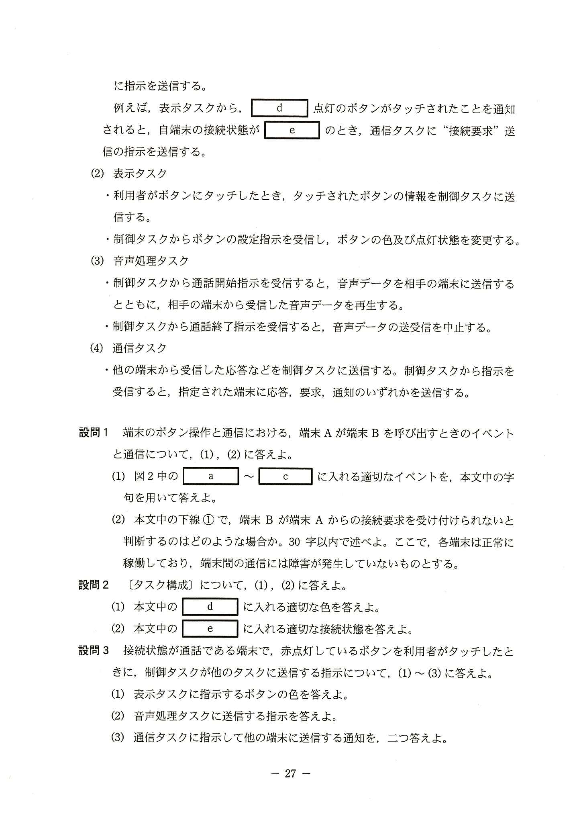

テキスト (OCR)

に指示を送信する。
例えば, 表示タスクから, |  q | 点灯のボタンがタッチされたことを通知
されると, 自端末の接続状態が | c | のとき, 通信タスクに“接続要求"送
信の指示を送信する。
⑫ 表示タスク
・利用者がボタンにタッチしたとき, タッチされたボタンの情報を制御タスクに送
信する。
・ 制御タスクからボタンの設定指示を受信し, ボタンの色及び点条状態を変更する。
@) 音声処理タスク
・制御タスクから通話開始指示を受信すると, 音声データを相手の端末に送信する
とともに, 相手の端末から受信した音声データを再生する。
・ 制御タスクから通話終了指示を受信すると, 音声データの送受信を中止する。
(④ 通信タスク
・他の端末から受信した応答などを制御タスクに送信する。制御タスクから指示を
受信すると, 指定された端末に応答要求, 通知のいずれかを送信する。

設問1 端末のボタン操作と通信における, 端末 A が端末 B を呼び出すときのイベント

と通信について, (1), ②⑫②) に答えよ。

Q) 図2中の| a |て| < | に入れる適切なイベントを, 本文中の字
名を用いて答えよ。

2) 本文中の下線 ① で, 端末 B が端末 A からの接続要求を受け付けられないと
判断するのはどのような場合か。30 字以内で述べよ。ここで, 各端末は正常に
稼働しており, 端末問の通信には障害が発生していないものとする。

設問2 (タスク構成】 について, Q①), ②⑫) に答えよ。
@ 本文中の| d |] に入れる適切な色を答えよ。
@) 本文中の| < |] に入れる適切な接続状態を答えよ。
設問3 接続状態が通話である端末で, 赤点灯しているボタンを利用者がタッチしたと

きに, 制御タスクが他のタスクに送信する指示について, ①) ~ (③) に答えよ。

(①) 表示タスクに指示するボタンの色を答えよ。

(2) 音声処理タスクに送信する指示を答えよ。

⑬ 通信タスクに指示して他の端末に送信する通知を, 二つ答えよ。

ー 27 一

### ページ 28

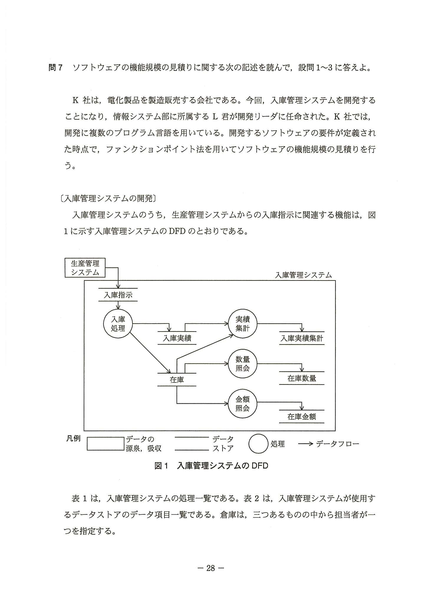

テキスト (OCR)

問7 ソフトウェアの機能規模の見積りに関する次の記述を読んで, 設問18 に答えよ。

K 社は, 電化製品を製造販売する会社である。今回, 入庫管理システムを開発する
ことになり, 情報システム部に所属する L 君が開発リーダに任命された。K 社では,
開発に複数のプログラム言語を用いている。開発するソフトウェアの要件が定義され
た時点で, ファンクションポイント法を用いてソフトウェアの機能規模の見積りを行

De

[入庫管理システムの開発〕
入庫管理システムのうち, 生産管理システムからの入庫指示に関連する機能は, 図
1 に示す入庫管理システムの DFID のとおりである。

生産管理 | _
システム                         入庫管理システム
入庫指示
入庫             [Kit
処理    _y |     集計    a
入庫実績            入庫実績集計
(st ヽ
Fas      \
在庫              在庫数量
金額
fae
在庫金額

凡例  デーゥの 。 ーー FS    リー
Lig. eae       ART  C) x8 ーッデータフロ

 1 入庫管理システムの DFD

表 1 は, 入庫管理システムの処理一覧である。表 2 は, 入庫管理システムが使用す
るデータストアのデータ項目一覧である。倉庫は, 三つあるものの中から担当者が一
つを指定する。

### ページ 29

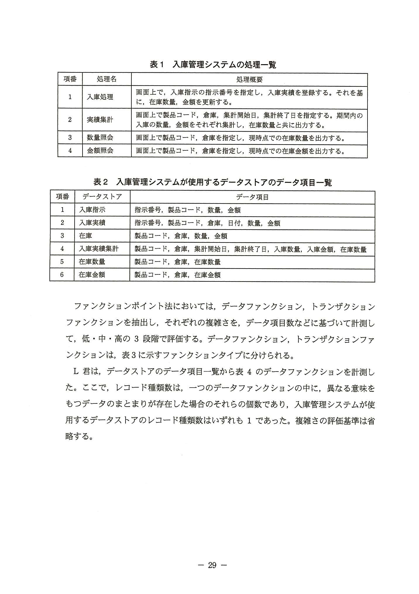

テキスト (OCR)

表1 入庫管理システムの処理一覧

項番   処理名                  処理概要
1 | 入庫処理   画面上で, 入庫指示の指示番号を指定し, 入庫実績を登録する。それを基
に, 在庫数量, 金額を更新する。
2 | semen   画面上で製品コード, 倉庫, 集計開始日, 集計終了日を指定する。期間内の
入庫の数量, 金額をそれぞれ集計し, 在庫数量と共に出力する。
3 | ERS   画面上で製品コード, 倉庫を指定し, 現時点での在庫数量を出力する。
4 | SRS   画面上で製品コード, 倉庫を指定し, 現時点での在庫金額を出力する。
表2 入庫管理システムが使用するデータストアのデータ項目一覧
項番 | データストア                 データ項目
1 | 入庫指示    指示番号, 製品コード, 数量, 金額
2 | 入庫実績    指示番号, 製品コード, 倉庫, 日付, 数量, 金額
3 | 在庫      製品コード, 倉庫, 数量, 金額
4 | 入庫実績集計 | 製品コード, 倉庫, 集計開始日, 集計終了日, 入庫数量, 入庫金額, 在庫数量
5 | 在庫数量    製品コード, 倉庫, 在庫数量
6 | 在庫金額    製品コード, 倉庫, 在庫金額

ファンクションボポイント法においては, データファンクション, トランザクション
ファンクションを抽出し, それぞれの複雑さを, データ項目数などに基づいて計測し

て, 低・中・高の 3 段階で評価する。データファンクション,

トランザクションファ

ンクションは, 表 3 に示すファンクションタイプに分けられる。
L Bld, データストアのデータ項目一覧から表 4 のデータファンクションを計測し

た。こことで, レコード種類数は, 一つのデータファンクションの中に, 異なる意味を
もつデータのまとまりが存在した場合のそれらの個数であり, 入庫管理システムが使
用するデータストアのレコード種類数はいずれも 1 であった。複雑さの評価基準は省

略する。

### ページ 30

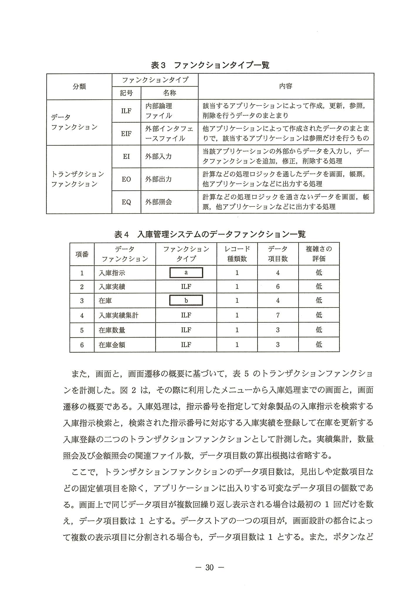

テキスト (OCR)

表38 ファンクションタイプ一覧

ファンクションタイプ

分類                                 内容
記号     名称
rrF | 内立論理      該当するアプリケーションによって作成, 更新, 参照,
データ             ファイル     削除を行うデータのまとまり
ファンクション    pi | 外部インタフェ | 他アプリケーションによって作成されたデータのまとま
ースファイル | りで, 該当するアプリケーションは参照だけを行うもの
当該アプリケーションの外部からデータを入力し, デー
EL | BHRAA      タファンクションを追加, 修正, 削除する処理
トランクショシン | |     計算などの処理ロジックを通したデータを画面 HOR,
ファンクション          に        他アプリケーションなどに出力する処理
no |     計算などの処理ロジックを通さないデータを画面, 帳

票, 他アプリケーションなどに出力する処理

表4 入庫管理レシレステムのデータファンクション一覧

hE    データ    ファンクション  レロヨード   データ   複雑さの
ファンクション    ge eT     種類数   項目数    評価

1 | 入庫指示               |           1             4            低

2        入庫実績                           ILF                      Bl                   6                  低

3 | 在庫       [L_ 5    1    4    低

4 | 入庫実績集計     ILF      i     T     低

5 | 在庫数量        ILF      1     3     低

6       在庫金額                           ILF                      1                  3                  低

また, 画面と, 画面遷移の概要に基づいて, 表 5 のトランザクションファンクショ
ンを計測した。図 2 は, その際に利用したメニューから入庫処理までの画面と, 画面
遷移の概要である。入庫処理は, 指示番号を指定して対象製品の入庫指示を検索する
入庫指示検索と, 検索された指示番号に対応する入庫実績を癌録して在庫を更新する
入庫交録の二つのトランザクションファンクションとして計測した。実績集計, 数量
照会及び金額照会の関連ファイル数, データ項目数の算出根拠は省略する。

COG, トランザクションファンクションのデータ項目数は, 見出しや定数項目な
どの固定値項目を除く,。 アプリケーションに出入りする可変なデータ項目の個数であ
る。画面上で同じデータ項目が複数回繰り返し表示される場合は最初の 1 回だけを数
え, データ項目数は 1 とする。データストアの一つの項目が, 画面設計の都合によっ
て複数の表示項目に分割される場合も, データ項目数は 1 とする。また, ボタンなど

ー 30 一

### ページ 31

テキスト (OCR)

の処理のトリガは, トランザクションファンクションごとにまとめて一つのデータ項
目とみなす。各種メッセージについても, 同様である。トランザクションファンクシ
ョンの関連ファイル数とは, アプリケーションが読み書きするデータストアの個数で
ある。

それぞれのトランザクションファンクションについて, 関連ファイル数, データ項
目数に基づいて複雑さを評価した。複雑さの評価基準は省略する。

RS 入庫管理システムのトランザクションファンクション一覧

項番  トランザクション  ファンクション   関連    データ   複雑さの
ファンクション     タイプ    ファイル数 | 項目数     評価

1 | 入庫指示検索                    BQ                  1                3               低
2 | 入庫登録                         EI                  2          中
3 | 実績集計                    [L_s             8                9                中
4 | SRS                         EQ                  2                5               低
5 | 金額会                         EQ                  2                5               低

入庫管理メニュー              入庫指示検索画面

Camm)                         指示番号 | zaasezso |
指示番号                                                                                      倉庫1

製品コード                                                                                                   入庫2

am [emi |]                                                  rile 3

|
em [190 —]

ast L203 ]* [2] af) a    fas

ーータテ 画面の須移

CC) 次和理実行タン

メッセージ, データ項目表示欄

[し | テータ項目力棚

[WV] フルタウンメニュー起動ボタン
(データ項目として数えない)

図3 メニューから入庫処理までの画面と, 画面遷移の概要

ー 31 一

### ページ 32

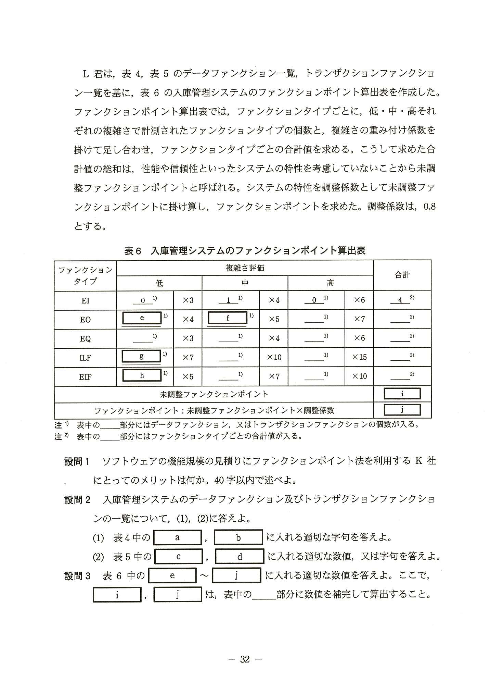

テキスト (OCR)

L 君は, 表 4, 表 5 のデータファンクション一覧, トランザクションファンクショ
ン一覧を基に, 表 6 の入庫管理システムのファンクションボイント算出表を作成した。
ファンクションボイント算出表では, ファンクションタイプごとに, 低・中・高それ
ぞれの複雑さで計測されたファンクションタイプの個数と, 複雑さの重み付け係数を
掛けて足し合わせ, ファンクションタイプごとの合計値を求める。こうして求めた合
計値の総和は, 性能や信頼性といったシステムの特性を考慮していないことから未調
整ファンクションボイントと呼ばれる。システムの特性を調整係数として未調整ファ
ンクションボポイントに掛け算し, ファンクションポイントを求めた。調整係数は, 0.8
とする。

表6 入庫管理システムのファンクションポイント算出表

ファンクション             複雑き評価               合計
タイプ      低        中        Bi

EI     _9 »   x3   1»   x4   _0 »   x6    4?

EQ                      >»              x3             a)              x4             _»              x6                       2

ILF    Cz)  X7   _ >   x10   oD   x15   ー 9

EIF DY) x5             _»              X7             ー             x10            _?

RMI eV IVa yb

ファンクションポイント : RUE 7 DD Ya aR Yh x aR

部分にはデータファンクション, 又はトランザクションファンクションの個数が入る。
部分にはファンクションタイプごとの合計値が入る。

=” RAO
注2 RHO

設問1 ソフトウェアの機能規模の見積りにファンクションボイント法を利用する K 社
にとってのメリットは何か。40 字以内で述べよ。

設問2 入庫管理システムのデータファンクション及びトランザクションファンクショ
ンの一覧について, ①⑪, ②)に答えよ。

①) 表4中の| ad, [  b |に入れる適切な字句を答えよ。

②⑫) 表5中の|  c |,| a |に入れる適切な数値, 又は字句を答えよ。
設問3 表6 中の|  e |~[  j |に入れる適切な数値を答えよ。こことで,

| ji | | j |は, 表中の_ 部分に数値を補完して算出すること。

ー 32 一

### ページ 33

テキスト (OCR)

CA モ 用 RJ

### ページ 34

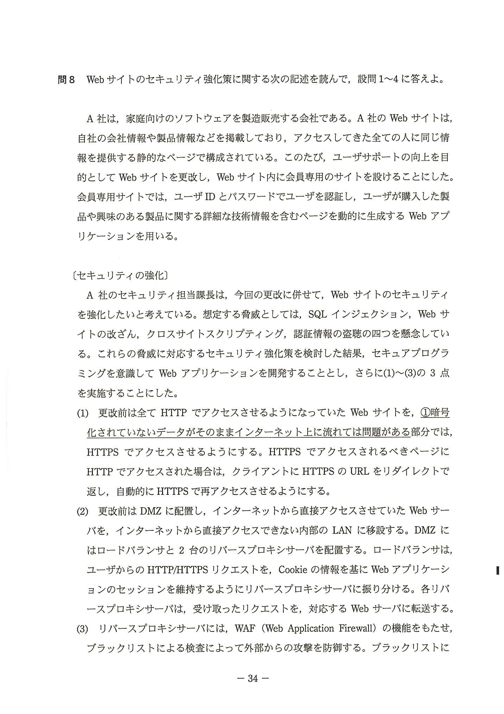

テキスト (OCR)

AS Webサイトのセキュリティ強化策に関する次の記述を読んで, 設問1ー4 に答えよ。

A 社は, 家庭向けのソフトウェアを製造販売する会社である。A 社の Web サイトは,
自社の会社情報や製品情報などを掲載しており, アクセスしてきた全ての人に同じ情
報を提供する静的なページで構成されている。このたび, ユーザサポートの向上を目
的として Web サイトを更改し, Web サイト内に会員専用のサイトを設けることにした。
会員専用サイトでは, ユーザ ID とパスワードでユーザを認証し, ユーザが購入した製
品や興味のある製品に関する詳細な技術情報を含ひページを動的に生成する Web アプ
リケーションを用いる。

〔セキュリティの強化
A 社のセキュリティ担当課長は, 今回の更改に併せて, Web サイトのセキュリティ

を強化したいと考えている。 想定する脅威としては, SQL インジェクション, Web +

イトの改ざん, クロスサイトスクリプティング, 認証情報の盗聴の四つを懸念してい

る。これらの和田威に対応するセキュリティ強化策を検討した結果. セキュアプログラ

ミングを意識して We アプリケーションを開発することとし, さらに①⑪ぐて⑬の 3 点

を実施することにした。

QQ) 更改前は全て HTTP でアクセスさせるようになっていた Web サイトを, OS
化されていないデータがそのままインターネット上に流れては問題がある部分では,
HTTPS でアクセスさせるようにする。HTTPS でアクセスされるべきページに
HTTP でアクセスされた場合は, クライアントK HTTPS の URL をりダイレクトで
返し, 自動的に HTTPS で再アクセスさせるようにする。

(2) 更改前は DMZ に配置し インターネットから直接アクセスさせていた Web サー
NE, インターネットから直接アクセスできない内部の LAN に移設する。DMZ に
はロードバランサと 2 台のリバースプロキシサーバを配置する。ロードバランサ6は,
ユーザからの HTTP/HTTPS リクエストを, Cookie の情報を基に Web アプリケーシ
ョンのセッションを維持するようにリバースプロキシサーバに振り分ける。各リバ
ースプロキシサーバは, 受け取ったリクエストを, 対応する Web サーバに転送する。

(3) リバースプロキシサーバには, WAF (Web Application Firewall) の機能をもたせ,
ブラックリストによる検査によって外部からの攻撃を防御する。ブラックリストに

### ページ 35

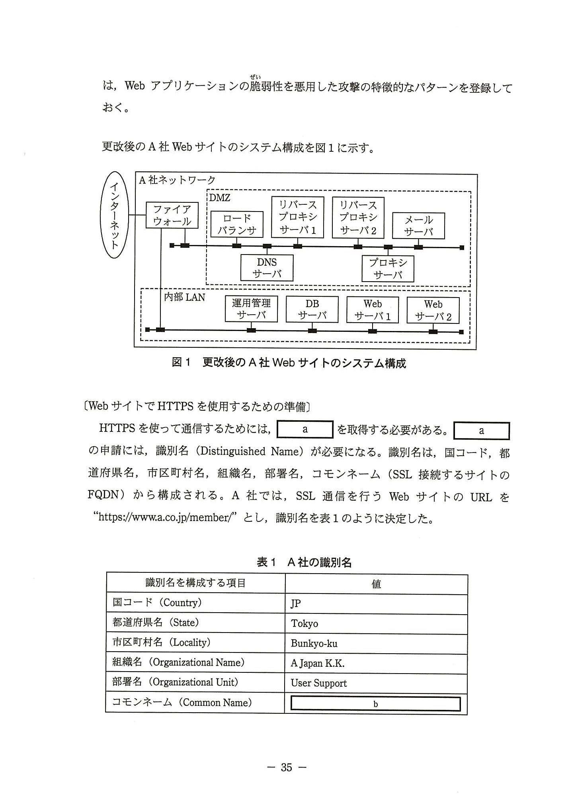

テキスト (OCR)

は, Web アプリケーションの脆弾性を悪用した攻撃の特徴的なパターンを登録して
おく。

BRO A th Web サイトのシステム構成を図 1 に示す。

A社ネットワーク
ファイアァ   {DMZ          リバパース | | リバース
| | ウォール|中 ロード     プロキシ | | プロキシ    メール      1
中 パランサ | | サーバュ1 | | サーバ2    サーバ
        DNS               プロキシ
1       サーバ               サーパ           1
内部LAN apa           DB              Web             Web

(Web サイトで HTTPS を使用するための準備
HTTPS を使って通信するためには, | 』 | を取得する必要がある。| as |
の申請には, 識別名 (Distnguished Name) が必要になる。識別名は, 国コード, 都
道府県名, 市区町村名, 組織名, MES, コモンネーム (SSL 接続するサイトの
FQDN) から構成される。A Cl, SSL 通信を行う Web サイトの URL を
“https://www.a.co.jp/member/” とし, 識別名を表 1 のように決定した。

表1 A社の識別名

識別名を構成する項目                                                     iE
国コード (Country)                          JP
都道府県名 (State)                                 Tokyo
市区町村名 (Locality)                                  Bunkyo-ku
組織名 (Organizational Name)                 AJapan K.K.
部署名 (Organizational Unit)                 User Support
コモンネーム (Common Name)               L                              b                             |

### ページ 36

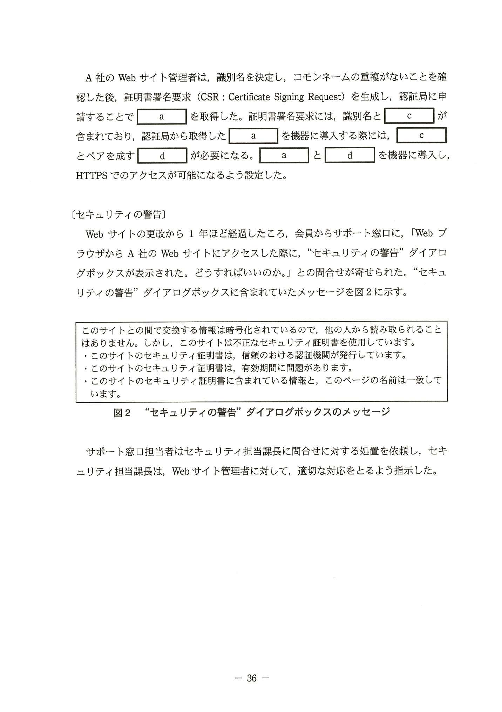

テキスト (OCR)

A 社の Web サイト管理者は, 識別名を決定し, コモンネームの重複がないことを確
認した後, 証明書署名要求 (CSR : Certificate Signing Request) を生成し, 認証局に申
請することで| a | を取得した。証明番署名要求には,識別名と が
含まれており, 認証局から取得した|  a | を機器に導入する際には,
とペアを成す|  d | が必要になる。| 。 |と| d | を機器に導入し,
HTTPS でのアクセスが可能になるよう設定した。

〔セキュリティの警告〕

Web サイトの更改から 1 年ほど経過したころ, 会員からサポート窓口に, 「Web ブ
ラウザから AO Web サイトにアクセスした際に, “セキュリティの和警告" ダイアロ
グボックスが表示された。どうすればいいのか。」との問合せが寄せられた。 “セキュ
リティの警告" ダイアログボックスに含まれていたメッセージを図 2 に示す。

このサイトとの間で交換する情報は暗号化されているので, 他の人から読み取られること

はありません。しかし, このサイトは不正なセキュリティ証明書を使用しています。

・このサイトのセキュリティ証明書は, 信頼のおける認証機関が発行しています。

・このサイトのセキュリティ証明書は, 有効期間に問題があります。

・このサイトのセキュリティ証明書に含まれている情報と, このページの名前は一致して
ぬます。

図2 “セキュリティの警告" ダイアログボックスのメッセージ

サポボート窓口担当者はセキュリティ担当課長に問合せに対する処置を依頼し, セキ
ュユリティ担当課長は, Web サイト管理者に対して, 適切な対応をとるよう指示した。

### ページ 37

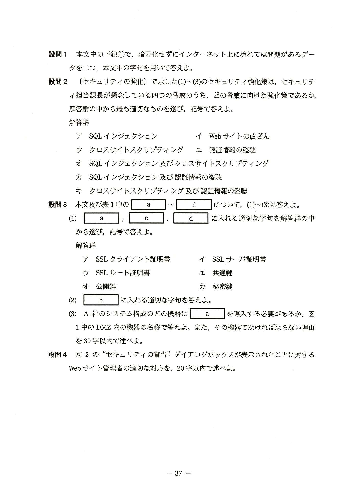

テキスト (OCR)

設問1 本文中の下線①で, 暗号化せきずにインターネット上に流れては問題があるデー
タを二つ, 本文中の字句を用いて答えよ。

設問2 (セキュリティの強化〕 で示した①ぐで(3)のセキュリティ強化策は, セキュリテ
ィ担当課長が懸念している四つの脅威のうち, COMRICMIEIUERTH SD.

解答群の中から最も適切なものを選び, 記号で答えよ。
BEE
ア SQLインジェクション            イ Webサイトの改ざん
ウ クロスサイトスクリプティング エエ 認証情報の盗聴
オ SQLインジェクション及び クロスサイトスクリプティング
A SQLインジェクション 及び 認証情報の盗聴
キ クロスサイトスクリプティング 及び認証情報の盗聴
設問3 本文及び表1中の|  a |~[  q |について, Q①て(⑬)に答えよ。
a [oa | | c |,| 4 | に入れる適切な字色を解答群の中
から選び, 記号で答えよ。
解答群
ア SSL クライアント証明書          イ SSL サー証明書
ウ SSLルート証明書          エエ 共通鍵

@ Lb | に入れる適切な字句を答えよ。
3) 4 社のシステム構成のどの機器に | a | を導入する必要があるか。
1 中の DMZ 内の機器の名称で答えよ。また, その機器でなければならない理由
を30 字以内で述べよ。
設問4 図 2 の“セキュリティの警告" ダイアログボックスが表示されたことに対する
Web サイト管理者の適切な対応を, 20 字以内で述べよ。

ー 37 一

### ページ 38

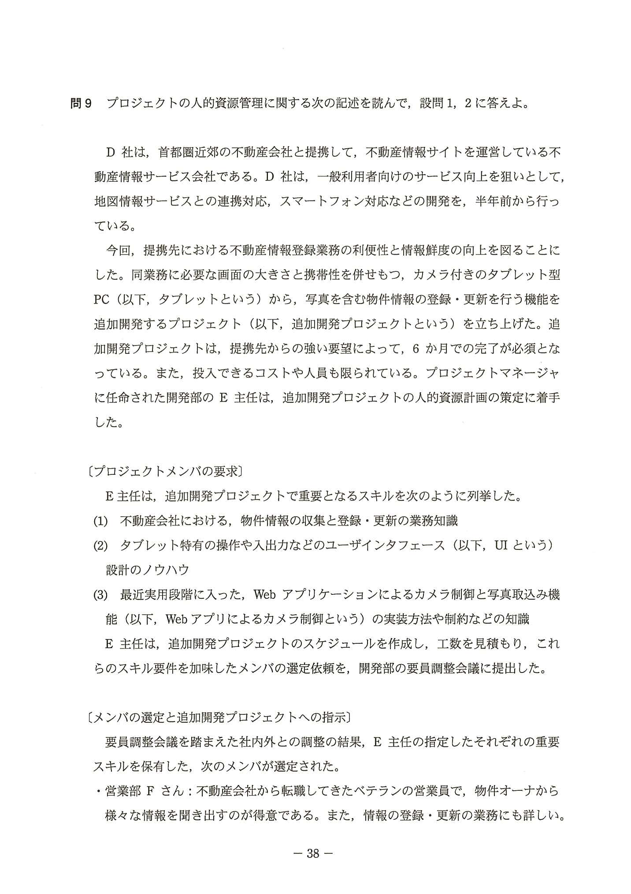

テキスト (OCR)

問9 プロジェクトの人的資源管理に関する次の記述を読んで, 設問 1, 2 に答えよ。

D 社は, 首都圏近郊の不動産会社と提携して, 不動産情報サイトを運営している不
動産情報サービス会社である。D 社は, 一般利用者向けのサービス向上を狙いとして,
地図情報サービスとの連携対応, スマートフォン対応などの開発を, 半年前から行っ
ている。

今回, 提携先における不動産情報韻録業務の利便性と情報鮮度の向上を図ることに
した。 同業務に必要な画面の大きさと携帯性を併せもつ, カメラ付きのタブレット型
PC (以下 タブレットという) から, 写真を含む物件情報の登録・更新を行う機能を
追加開発するプロジェクト (以下, 追加開発プロジェクトという) を立ち上げた。追
加開発プロジェクトは, 提携先からの強い要望によって, 6 か月での完了が必須とな
っている。また, 投入できるコストや人員も限ちられている。プロジェクトマネージャ
に任命された開発部の E 主任は, 追加開発プロジェクトの人的資源計画の策定に着手
した。

〔プロジェクトメンバの要求〕
E 主任は, 追加開発プロジェクトで重要となるスキルを次のように列挙した。
GQ) 不動産会社における, 物件情報の収集と登録・更新の業務知識
2) タブレット特有の操作や入出力などのユーザインタフェース (以下, UI という)
設計のノウハウ
(3) 最近実用段階に入った, Web アプリケーションによるカメラ制御と写真取込み機
能 (LAB, Web アプリによるカメラ制御という) の実装方法や制約などの知識
E 主任は, 追加開発プロジェクトのスケジュールを作成し, 工数を見積もり, これ
らのスキル有要件を加味したメンバの選定依頼を, 開発部の要員調整会議に提出した。

〔メンバの選定と追加開発プロジェクトへの指示〕
要員調整会議を踏まえた社内外との調整の結果, E 主任の指定したそれぞれの重要
スキルを保有した, 次のメンバが選定された。
・営業部 F さん : 不動産会社から転職してきたベテランの営業員で, 物件オーナから
様々な情報を聞き出すのが得意である。また, 情報の登録・更新の業務にも詳しい。

ー 38 一

### ページ 39

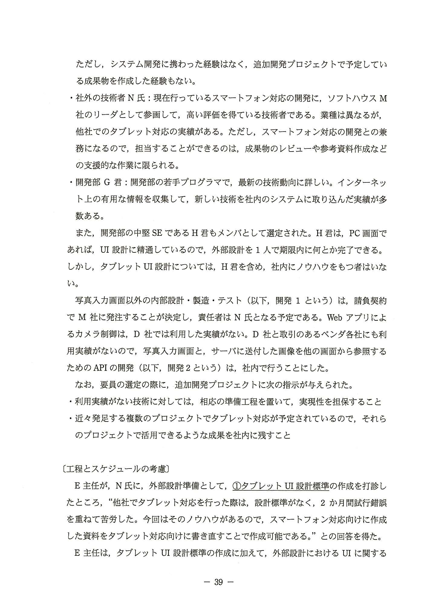

テキスト (OCR)

ただし, システム開発に携わった経験はなく, 追加開発プロジェクトで予定してい
る成果物を作成した経験もない。

・社外の技術者 N 氏 : 現在行っているスマートフォン対応の開発に.。 ソフトハウス M
社のリーダとして参画して, 高い評価を得ている技術者である。業種は異なるが,
他社でのタブレット対応の実績がある。ただし, スマートフォン対応の開発との兼
務になるので, 担当することができるのは, 成果物のレビューや参考資料作成など
の支援的な作業に限られる。

・開発部 G A: 開発部の若手プログラマで, 最新の技術動向に詳しい。インターネッ
ト上の有用な情報を収集して, 新しい技術を社内のシステムに取り込んだ実績が多
数ある。
また, 開発部の中堅 SE である是君もメンバとして選定された。H 君は, PC 画面で

あれば, Ul 設計に精通しているので, 外部設計を 1 人で期限内に何とか完了できる。

しかし, タブレット UI設計については, HH 君を含め, 社内にノウハウをもつ者はいな

い。
写真入力画面以外の内部設計・製造・テスト (以下, 開発 1 という) は, 請負契約

で MM 社に発注することが決定し, 責任者は N 氏となる予定である。Web アプリによ

るカメラ制御は, D 社では利用した実績がない。D 社と取引のあるベンダ各社にも利

用実績がないので, 写真入力画面と., サーバに送付した画像を他の画面から参照する

ための API の開発 (以下, 開発2 という) は, 社内で行うことにした。

なお, 要員の選定の際に, 追加開発プロジェクトに次の指示が与えられた。

・利用実績がない技術に対しては, 相応の準備工程を置いて, 実現性を担保むること

・近々発足する複数のプロジェクトでタブレット対応が予定されているので, それら
のプロジェクトで活用できるような成果を社内に残すこと

(工程とスケジュールの考慮〕

E 主任が, N 氏に, 外部設計準備として, ①タタブレット UI 設計標準の作成を打診し
たと     “他社でタブレット対応を行った際は, 設計標準がなく, 2 か月間試行錯誤
を重ねて苦労した。今回はそのノウハウがあるので, スマートフォン対応向けに作成
した資料をタブレット対応向けに書き直すことで作成可能である。"” との回答を得た。

E 主任は, タブレット UI 設計標準の作成に加えて, 外部設計における UI に関する

### ページ 40

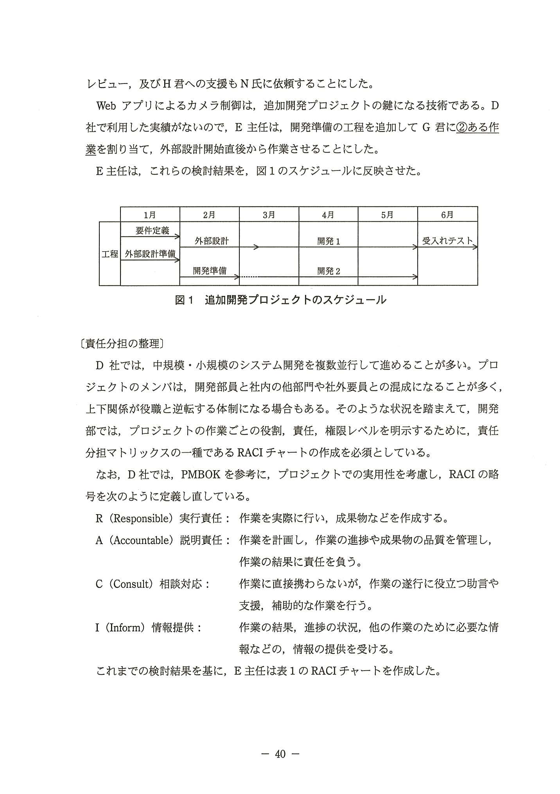

テキスト (OCR)

レビュー, 及びH 君への支援も N 氏に依頼することにした。

Web アプリによるカメラ制御は, 追加開発プロジェクトの鍵になる技術である。D
社で利用した実績がないので, E 主任は, 開発準備の工程を追加して G 君に②ある作
業を割り当て, 外部設計開始直後から作業させることにした。

E 主任は, これらの検討結果を, 図 1 のスケジュールに反映させた。

1月              2月              3月              4月              5月              6月
要件定義
外部設計                       開発1                     受入れテスト.
工程| 外部設計準備
開発準備                       開発 2

図1 追加開発プロジェクトのスケジュール

〔吹任分担の整理〕

D 社では, 中規模・小規模のシステム開発を複数並行して進めあることが多い。プロ
ジェクトのメンバは, 開発部員と社内の他部門や社外要員との混成になることが多く,
上下関係が役職と逆転する体制になる場合ある。そのような状況を踏まえて, 開発
部では, プロジェクトの作業ごとの役割, 責任, 権限レベルを明示するために, 責任
分担マてトリックスの一種である RACI チャートの作成を必須としている。

なお, D 社では, PMBOK を参考に, プロジェクトでの実用性を考慮し, RACI OMG
号を次のように定義し直している。

R (Responsible) 実行責任: 作業を実際に行い, 成果物などを作成する。

A (Accountable) 説明責任: 作業を計画し, 作業の進捗や成果物の品質を管理し,

作業の結果に責任を負う。

C (Consult) 相談対応 :    作業に直接携わらないが, 作業の遂行に役立つ助言や

支援, 補助的な作業を行う。

I (Inform) 情報提供     作業の結果, 進捗の状況, 他の作業のために必要な情

報などの, 情報の提供を受ける。
これまでの検討結果を基に, E 主任は表 1 の RACI チャートを作成した。

### ページ 41

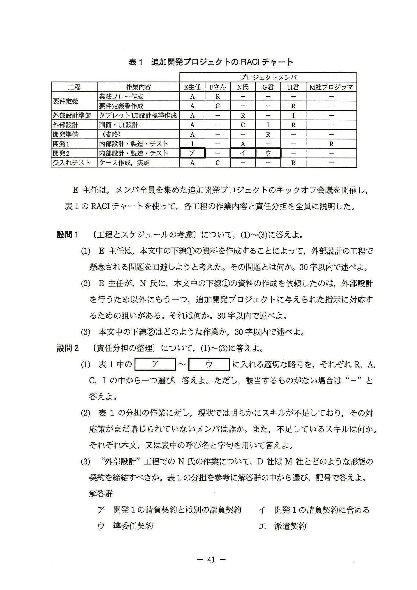

テキスト (OCR)

表1 追加開発プロジェクトの RACI チャート

プロジェクトメンバ
TH       作業内容     EEE [FEA] NE | GH | HE [MEVO7Sz

ey oem       a | Rm | - | - | -     ー
要件定款 lee am VER       aA foc [= |= TR     =
Ame [7 -y bun) a | - | R | - [1     =
外部設計 | mi - ULAR        a [= fe |i ms     =
開発準備   AR)          A | -|-|sml-     ー
開発    内部設計・製造.テスト | ! | - | A | - | -     R
開発2    内部設計・製造テスト |アァ| -1ィ|ぅ|-     ー
受入れテスト |ケース作成, 実施             A       C       =       =       R           =

E 主任は, メンバ全員を集めた追加開発プロジェクトのキックオフ会議を開催し,
表1のRACIチャートを使って, 各工程の作業内容と責任分担を全員に説明した。

設問1 (工程とスケジュールの考慮〕 について, MOIRA.
1) E 主任は, 本文中の下線①の資料を作成することによって, 外部設計の工程で
懸念される問題を回避しようと考えた。その問題とは何か。30 字以内で述べよ。
(2) E 主任が, N Ric, 本文中の下線①の資料の作成を依頼したのは, 外部設計
を行うため以外にもう一つ, 追加開発プロジェクトに与えられた指示に対応す
るための狙いがある。それは何か。30 字以内で述べよ。
(3) 本文中の下線@はどのような作業か, 30 字以内で述べよ。
設問2 〔貢任分担の整理] について, (①ぐでて(3)に答えよ。
Q 表1中の| ア |て| ウ |に入れる適切な略号を, それぞれR, A,
C, 1 の中から一つ選び, 答えよ。ただし, 該当するものがない場合は“ー" と
答えよ。
(2) 表 1 の分担の作業に対し, 現状では明らかにスキルが不足しており, その対
応策がまだ講じらちられていないメンバは誰か。また, 不足しているスキルは何か。
それぞれ本文, 又は表中の呼び名と字句を用いて答えよ。
(3) “外部設計” 工程での N 氏の作業について, D 社は M 社とどのような形態の
契約を締結すべきか。表 1 の分担を参考に解答群の中から選び, 記号で答えよ。

解答群
ア 開発1の請負契約とは別の請負契約 イ 開発1の請負契約に含める
ウ 準委任契約                                    エエ 派遣契約

ー 41 一

### ページ 42

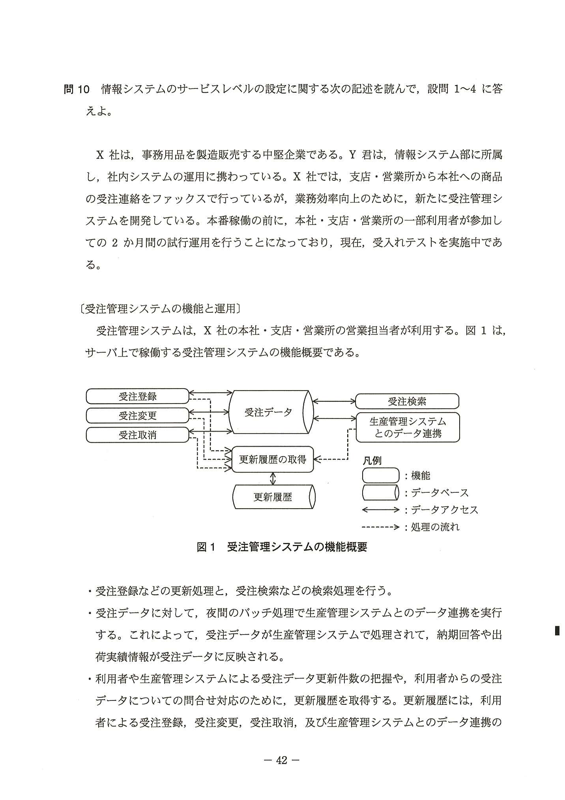

テキスト (OCR)

間10 情報システムのサービスレベルの設定に関する次の記述を読んで, RE 1~4 に答
Ake

X 社は, 事務用品を製造販売する中堅企業である。Y Bld, 情報システム部に所居
し, 社内システムの運用に携わっている。X 社では, 支店・営業所から本社への商品
の受注連絡をファックスで行っているが, 業務効率向上のために, 新たに受注管理シ
ステムを開発している。本番稼働の前に, 本社・支店・営業所の一部利用者が参加し
ての 2 か月間の試行運用を行うことになっており, HE, 受入れテストを実施中であ
る。

(受注管理システムの機能と運用〕
受注管理システムは, X 社の本社・支店・営業所の営業担当者が利用する。図 1 は,
サーバ上で稼働する受注管理システムの機能概要である。

生産管理システム
とのデータ連携

: 機能

(_ 0) :テメータベース

ーーテ : データアクセス
ーー> : 処理の流れ
Bi 受注管理システムの機能概要

・受注登録などの更新処理と, 受注検索などの検索処理を行う。

・受注データに対して, 夜間のバッチ処理で生産管理システムとのデータ連携を実行
する。これによって, 受注データが生産管理システムで処理されて, 納期回答や出
荷実績情報が受注データに反映される。

・利用者や生産管理システムによる受注データ更新件数の把握や, 利用者からの受注
データについての問合せ対応のために, 更新履歴を取得する。更新履歴には, 利用
者による受注意録, 受注変更, 受注取消, 及び生産管理システムとのデータ連携の

ー 42 一

### ページ 43

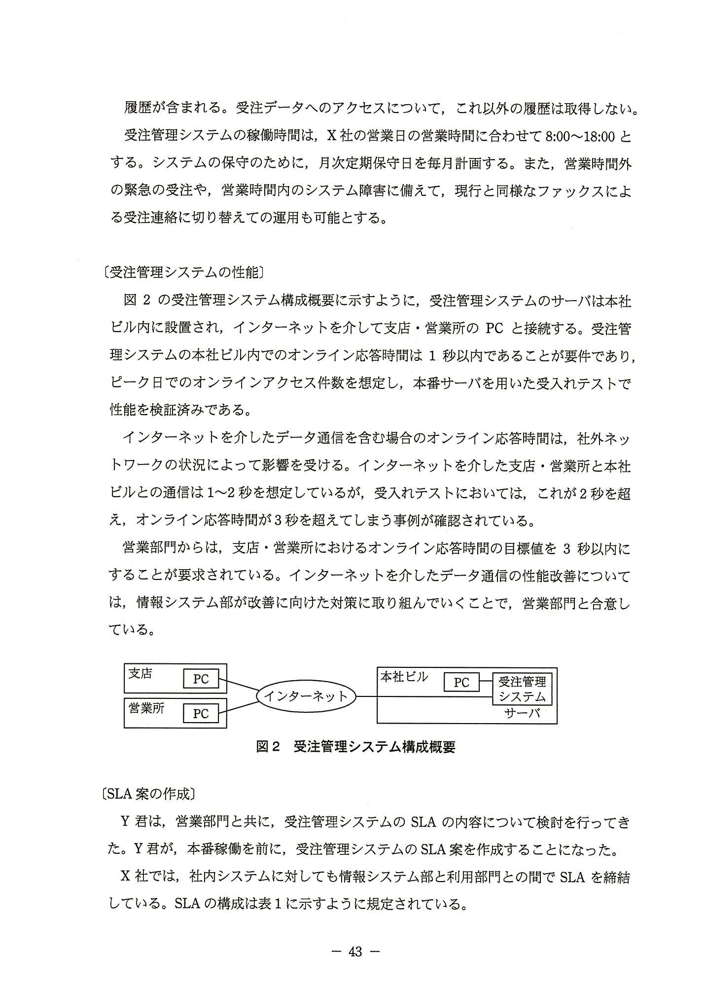

テキスト (OCR)

履歴が含まれる。受注データへのアクセスについて, これ以外の履歴は取得しない。
受注管理システムの稼働時間は, X 社の営業日の営業時間に合わせて 8:00~18:00 と
する。システムの保守のために, 月次定期保守日を毎月計画する。また, 営業時間外
の緊急の受注や, 営業時間内のシステム障害に備えて, 現行と同様なファックスによ
る受注連絡に切り替えての運用も可能とする。

受注管理システムの人性能〕

図 2 の受注管理システム構成概要に示すように, 受注管理システムのサーバは本社
ビル内に設置され, インターネットを介して支店・営業所の PC と接続する。受注管
理システムの本社ビル内でのオンライン応答時間は 1 秒以内であることが要件であり,
ピーク日でのオンラインアクセス件数を想定し, 本番サーバを用いた受入れテストで
性能を検証済みである。

インターネットを介したデータ通信を含む場合のオンライン応答時間は, 社外ネッ
トワークの状況によって影響を受ける。インターネットを介した支店・営業所と本社
ビルとの通信は 1へ2 秒を想定しているが, 受入れテストにおいては, これが 2 秒を超
A, オンライン応答時間が 3 秒を超えてしまう事例が確認されている。

営業部門からは, 支店・営業所におけるオンライン応答時間の目標値を 3 秒以内に
することが要求されている。インターネットを介したデータ通信の性能改善について
は, 情報システム部が改善に向けた対策に取り組んでいくことで, 営業部門と合意し
ている。

支店                                 本社ビル     PC      受注管理
| コイシター*ッド       La eee
営業所                                                         サーパバ

 2 受注管理システム構成概要

(SLA 案の作成〕
Y Alt, 営業部門と共に, 受注管理システムの SLA の内容について検討を行ってき
た。Y 君が, 本番稼働を前に, 受注管理システムの SLA 案を作成することになった。
X 社では, 社内システムに対しても情報システム部と利用部門との間で SLA を締結
している。SLA の構成は表 1 に示すように規定されている。

ー 43 一

### ページ 44

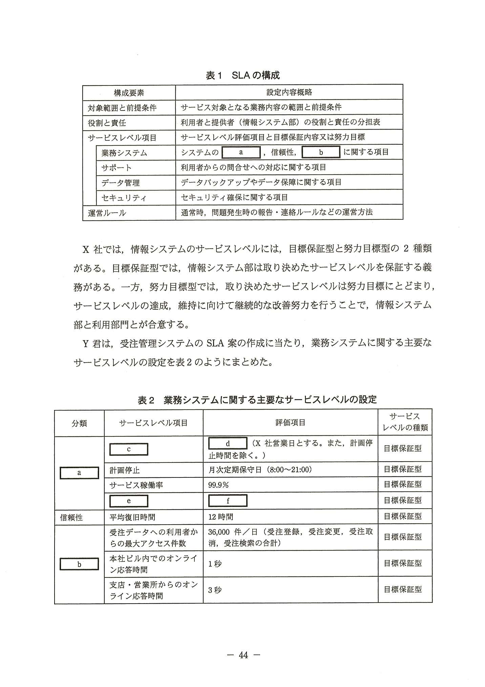

テキスト (OCR)

表1 SLAの構成
構成要素                設定内容概略
対象範囲と前提条件   サービス対象となる業務内容の範囲と前提条件
役割と責任       利用者と提供者 (情報システム部) の役割と責任の分担表
サービスレベル項目   サービスレベル評価項目と目標保証内容又は努力目標
業務システム    システムの| sa | , 信頼性,| b | に関する項目
サポート      利用者からの問合せへの対応に関する項目
データ管理     データバパバックアップやデータ保障に関する項目
セキュリティ    セキュリティ確保に関する項目
運営ルール       通常時, 問題発生時の報告・連絡ルールなどの運営方法

X 社では, 情報システムのサービスレベルには, 目標保証型と努力目標型の 2 種類
がある。目標保証型では, 情報システム部は取り決めたサービスレベルを保証する義
務がある。一方, 努力目標型では, 取り決めたサービスレベルは努力目標にとどまり,
サービスレベルの達成, 維持に向けて継続的な改善努力を行うことで, 情報システム
部と利用部門とが合意する。

Y Bld, 受注管理システムの SLA 案の作成に当たり, 業務システムに関する主要な
サービスレベルの設定を表 2 のようにまとめた。

表2 業務システムに関する主要なサービスレベルの設定

bate             。             サービス
分類     サービスレベル項目             評価項目            an
| 』 |] & #emaeTs. KK, 計画人
          TAMERS. )                     ia
| | ate          FOKEMREH (8:00~21:00)           目標保証弄
SERRE       99.9%                       目標保証弄
Ce]                    目標保証型
信頼性 | 平均復旧時間                    12 時間                                                        目標保証型
受店データへの利用者か | 36,000 件日 RRM, REE, SEM Oe
らの最大アクセス件数 | 消, 受注検索の合計)
本社ビル内でのオンライ|. 。
L_ 5 serene       1秒                    目標保証型
支店・営業所からのオン | 。 。
ライン広答時間      id                      Eine

### ページ 45

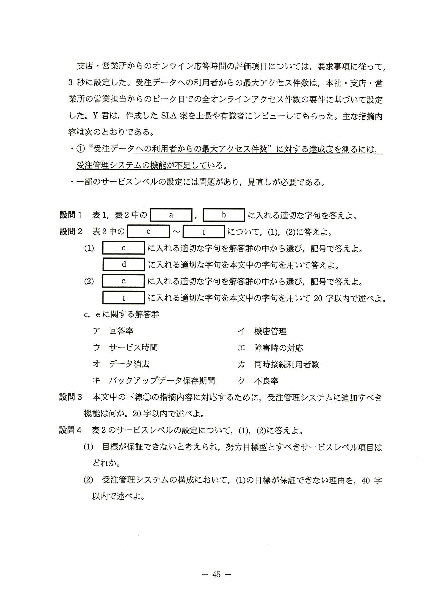

テキスト (OCR)

支店・営業所からのオンライン応答時間の評価項目については, 要求事項に従って,
3 秒に設定した。 受注データへの利用者からの最大アクセス件数は, 本社・支店・営
業所の営業担当からのピーク日での全オンラインアクセス件数の要件に基づいて設定
した。Y Bld, 作成した SLA 案を上長や有識者にレビューしてもらった。主な指摘内
容は次のとおりである。

・①「受注データへの利用者からの最大アクセス件数” に対する達成度を測るには,
受注管理システムの機能が不足している。
・一部のサービスレベルの設定には問題があり, 見直しが必要である。

設問1 表1, 表2中の| a |,|  b |に入れる適切な字句を答えよ。
設問2 表2中の| c |~| fj |について, ①, ②に答えよ。
@ [| < | に入れる適切な字句を解答知の中から選び, 記号で答えよ。
| 3 | に入れる適切な字句を本文中の宇名を用いて答えよ。
@ | < ] に入れる適切な字句を解答若の中から選び, 記号で答えよ。
 に入れる適切な字句を本文中の字句を用いて 20 字以内で述べよ。
ceに関する解答衝

ア 回答率                                                           イ 機密管理
ウ サービス時間                エエ 障害時の対応
オ データ消去                                           A 同時接続利用者数

キ バックアップデータ保存期間   ク ARB
設問3 本文中の下線①の指摘内容に対応するために, 受注管理システムに追加すべき
機能は何か。20 字以内で述べよ。
設問4 表2 のサービスレベルの設定について, (①, ②に答えよ。
Q①) 目標が保証できないと考えられ, 努力目標型とすべきサービスレベル項目は
どれか。
2) 受注管理システムの構成において, 1)の目標が保証できない理由を, 40 字
以内で述べよ。

### ページ 46

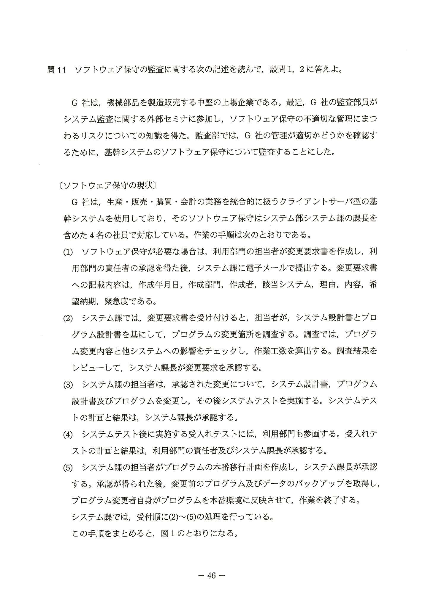

テキスト (OCR)

問11 ソフトウェア保守の監査に関する次の記述を読んで, 設問1, 2 に答えよ。

G 社は, 機械部品を製造販売する中堅の上場企業である。最近, G 社の監査部員が
システム監査に関する外部セミナに参加し, ソフトウェア保守の不適切な管理にまつ
わるリスクについての知識を得た。監査部では, G 社の管理が適切かどうかを確認す
るために, 基幹システムのソフトウェア保守について監査することにした。

〔ソフトウェア保守の現状
G 社は, 生産・販売・購買・会計の業務を統合的に扱うクライアントサーバ型の基

幹システムを使用しており, そのソフトウェア保守はシステム部システム課の課長を

含めた 4 名の社員で対応している。作業の手順は次のとおりである。

GQ) ソフトウェア保守が必要な場合は, 利用部門の担当者が変更要求書を作成し, Fl
用部門の責任者の承認を得た後, システム課に電子メールで提出する。変更要求書
への記載内容は, 作成年月日, 作成部門, 作成者, 該当システム, 理由, AA, 希

(②) システム課では, 変更要求書を受け付けると, 担当者が, システム設計書とプロ
グラム設計書を基にして, プログラムの変更箇所を調査する。調査では, プログラ
ム変更内容と他システムへの影響をチェックし, 作業工数を算出する。調査結果を
レビューして, システム課長が変更要求を承認する。

3) システム課の担当者は, 承認された変更について, システム設計書, プログラム
設計書及びプログラムを変更し, その後システムテストを実施する。システムテス
トの計画と結果は, システム課長が承認する。

4) システムテスト後に実施する受入れテストには, 利用部門も参画する。受入れテ
ストの計画と結果は, 利用部門の貢任者及びシステム課長が承認する。

(5) システム課の担当者がプログラムの本番移行計画を作成し。 システム課長が承認
する。承認が得られた後, 変更前のプログラム及びデータのバックアップを取得し,
プログラム変更者自身がプログラムを本番環境に反映させて, 作業を終了する。
システム課では, 受付順に②~て(⑤)の処理を行っている。
この手順をまとめると, 図1のとおりになる。

ー 46 一

### ページ 47

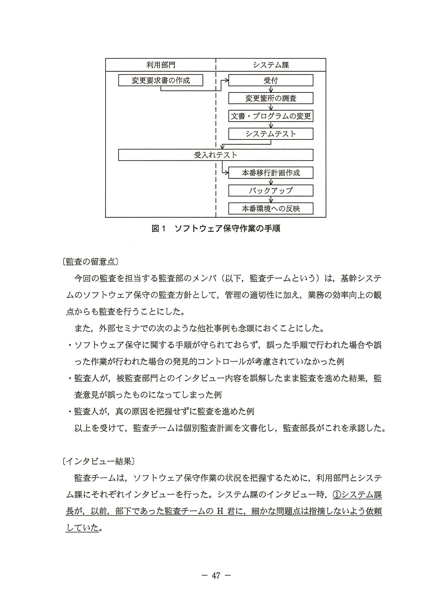

テキスト (OCR)

利用部門   |   システム課
| seEReOER | i   受付   |
受入れテスト      |

本番移行計画作成

|
|
|
          本番環境への反映
図1 ソフトウェア保守作業の手順

(監査の留意点〕
今回の監査を担当する監査部のメンバ (以下, 監査チームという) は, 基幹システ
ムのソフトウェア保守の監査方針として, 管理の適切性に加え, 業務の効率向上の観
点からも監査を行うことにした。
また, 外部セミナでの次のような他社事例も念頭におくことにした。
・ソフトウェア保守に関する手順が守らちられておらず, 誤った手順で行われた場合や誤
った作業が行われた場合の発見的コントロールが考慮されていなかった例
・監査人が, 被監査部門とのインタビュー内容を誤解したまま監査を進めた結果, 監
査意見が誤ったものになってしまった例
・監査人が, 真の原因を把握せずに監査を進めた例
以上を受けて, 監査チームは個別監査計画を文書化し, 監査部長がこれを承認した。

〔インタビュー結果]

監査チームは, ソフトウェア保守作業の状況を把握するために, 利用部門とシステ
ム課にそれぞれインタビューを行った。システム課のインタビュー時, ①システム課
EM, 以前, 部下であった監査チームの H Bic, 細かな問題点は指摘しないよう依頼
していた。

ー 47 一

### ページ 48

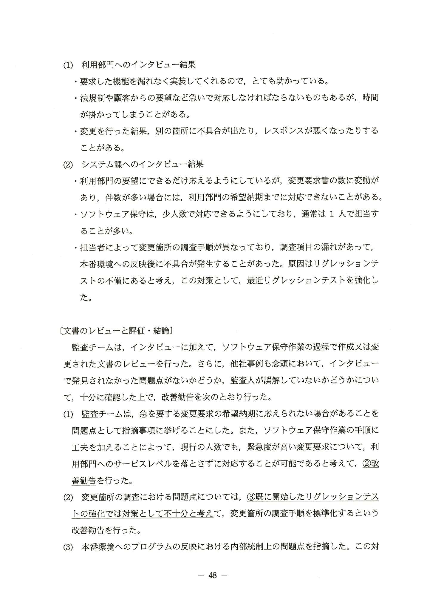

テキスト (OCR)

Q) 利用部門へのインタビュー結果
・要求した機能を漏れなく実装してくれるので, とても助かっている。
・法規制や顧客からの要望など急いで対応しなければならないものもあるが, 時間
が掛かってしまうことがある。
・変更を行った結果, 別の箇所に不具合が出たり, レスポンスが悪くなったりする
ことがある。

(2) システム課へのインタビュー結果
・利用部門の要望にできるだけ応えるようにしているが, 変更要求書の数に変動が
あり, 件数が多い場合には, 利用部門の希望納期までに対応できないことがある。
・ソフトウェア保守は, 少人数で対応できるようにしており, 通常は 1 人で担当す
ることが多い。
・担当者によって変更箇所の調査手順が異なっており, 調査項目の漏れがあって,
本番環境への反映後に不具合が発生することがあった。 原因はリグレッションテ
ストの不備にあると考え, この対策として, 最近リグレッションテストを強化し
た。

〔文書のレビューと評価・結論
監査チームは, インタビューに加えて, ソフトウェア保守作業の過程で作成又は変

更された文書のレビューを行った。さらに, 他社事例も念頭において, インタビュー

で発見されなかった問題点がないかどうか, 監査人が誤解していないかどうかについ

て, 十分に確認した上で, 改善勧告を次のとおり行った。

QQ 監査チームは, 急を要する変更要求の希望納期に応えられない場合があることを
問題点として指摘事項に挙げることにした。また, ソフトウェア保守作業の手順に
工夫を加えることによって, 現行の人数でも, 緊急度が高い変更要求について, 利
用部門へのサービスレベルを落とさずに対応することが可能であると考えて, Om
善勧告を行った。

⑫) 変更箇所の調査における問題点については, ⑧既に開始したりリグレッションテス
トの強化では対策として不十分と考えて, 変更箇所の調査手順を標準化するという
改善勧告を行った。

3) 本番環境へのプログラムの反映における内部統制上の問題点を指摘した。この対

ー 48 一

### ページ 49

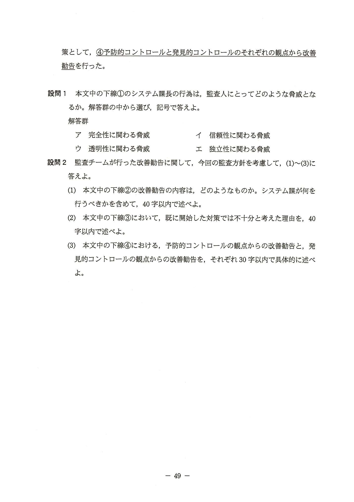

テキスト (OCR)

人策として, ③④予防的コントロールと発見的コントロールのそれぞれの観点から改善
勧告を行った。

設問1 本文中の下線ののシステム課長の行為は, 監査人こにとってどのような脅威とな
るか。解答群の中から選び, 記号で答えよ。

解答群
ア FEC RDSeRK       イ 信頼性に関わる脅威
ウ 大明性に関わる脅威       Marte RD Sem
設問2 監査チームが行った改善勧告に関して, 今回の監査方針を考慮して, M~@B)NZ
答えよ。

(1) 本文中の下線②の改善勧告の内容は, どのようなものか。システム課が何を
行うべきかを含めて, 40 字以内で述べよ。

2) 本文中の下線③において, 既に開始した対策では不十分と考えた理由を, 40
字以内で述べよ。

3) 本文中の下線④@における, 予防的コントロールの観点からの改善勧告と, 発
見的コントロールの観点からの改善勧告を。 それぞれ 30 字以内で具体的に述べ
dea

— 49 —

### ページ 50

テキスト (OCR)

【 メモ 用 紙 〕

### ページ 51

テキスト (OCR)

CA モ 用 紙 J

ー 51 一

### ページ 52

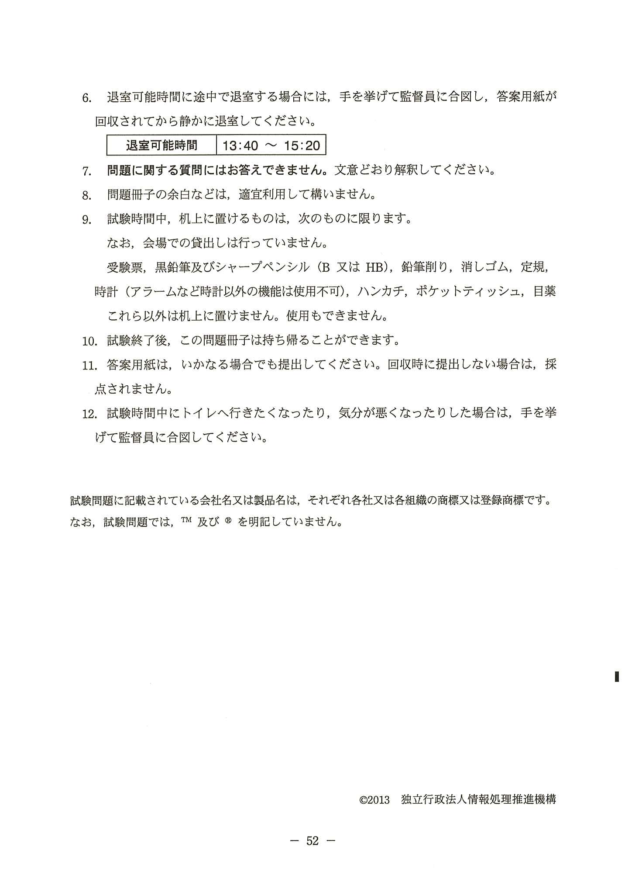

テキスト (OCR)

6. 退室可能時間に途中で退室する場合には, 手を挙げて監督員に合図し, 答案用紙が
回収されてから静かに退室してください。
| 退室可能時間 [13:40 ~ 15:20 |
7. 問題に関する質問にはお答えできません。文意どおり解収してください。
8. 問題冊子の余白などは, 適宜利用して構いません。
9. 試験時間中, 机上に置けるものは, 次のものに限ります。
なお, 会場での貸出しは行っていません。
ZR, 黒鉛筆及びシャープペンシル (B 又は HB), 鉛筆削り, 消しゴム, 定規,
時計 (アラームなど時計以外の機能は使用不可)。 ハンカチ, ポケットティッシュ, 目薬
これら以外は机上に置けません。使用もできません。
10. 試験終了後, この問題冊子は持ち帰ることができます。
ll. 答案用紙は。 いかなる場合でも提出してください。回収時に提出しない場合は, 採
点されません。
12, 試験時間中にトイレへ行きたくなったり, 気分が悪くなったりした場合は。手を挙
げて監督員に合図してください。

試験問題に記載されている会社名又は製品名は, それぞれ各社又は各組織の商標又は登録商標です。
なお, 試験問題では, ™ RUS を明記していません。

@2013 独立行政法人情報処理推進機構

---

## 午後解答

1/6 
©2013 独立行政法人情報処理推進機構 
平成25 年度 秋期 応用情報技術者試験 解答例 
 
午後試験 
問１ 
出題趣旨 
 近年，企業を取り巻く経営環境の厳しさから，新規事業などへの進出を検討することがある。その際の投資
については，これまで以上に効果が求められる。 
 本問では，企業における投資事例を題材に，企業の戦略と施策を立案する理論，これらを評価するための経
済性計算の手法と投資の資金調達方法についての理解を問う。 
 
設問 
解答例・解答の要点 
備考 
設問１ (1) SWOT 分析 
 
 
(2) コストリーダシップ戦略 
 
設問２ (1) a (1＋r)n 
 
 
(2) 投資から得られるキャッシュフローの現在価値の合計と初期投資額が等しい。  
設問３ 
案 
第 1 案 
 
 
差額 
1 億円 
 
設問４ (1) ウ 
 
 
(2) b ウ 
 
 
(3) 借入れ 固定負債 
 
 
 
社債 
固定負債 
 
 
 
新株 
自己資本 
 
 
(4) 唯一，自己資本比率を下げずに資金が調達できるから 
 
 
問２ 
出題趣旨 
 メモリ管理において，メモリ割当てサイズが可変である場合，メモリブロックを効率よく探索，挿入及び削
除ができるよう，ポインタやリスト構造を活用する。 
 本問では，与えられたヒープ領域におけるメモリ管理を題材に，双方向リストによるメモリ割当て及び解放
の考え方やポインタによるアルゴリズムの実装についての理解を問う。 
 
設問 
解答例・解答の要点 
備考 
設問１ (1) ア EDGE の先頭アドレス 
 
 
 
イ status 
 
 
 
ウ next 
 
 
(2) エ q 
 
 
 
オ q->next 
 
設問２ (1) カ 'A' 
 
 
(2) キ p->size + q->size + r->size + 2*HSIZE 
 
 
 
ク p 
 
 
 
ケ q->size + r->size + HSIZE 
 
設問３ (1) コ フラグメンテーション 
 
 
(2) サ 2×HSIZE＋600 
 
 
(3) メモリブロックの先頭アドレスが変わるから

2/6 
©2013 独立行政法人情報処理推進機構 
問３ 
出題趣旨 
 CPU 性能の向上と仮想化技術の普及によって，一つの物理サーバ上で複数の仮想サーバを動作させることが一
般的になりつつある。 
 本問では，食品卸売業における新情報システム基盤の構築を題材に，情報システムの冗長構成に関する基本
的な知識と，仮想化技術を用いたシステム構成能力を問う。 
 
設問 
解答例・解答の要点 
備考 
設問１ 
a カ 
 
 
b オ 
 
 
c ア 
 
設問２ 
d 3 
 
設問３ (1) 物理サーバB の障害発生時には，物理サーバA で発注DB サーバ1 が起動するか
ら 
 
 
(2) 総務AP サーバと総務DB サーバを同一物理サーバに配置する。 
 
設問４ (1) 仮想サーバを起動した状態で他の物理サーバに移動できるから 
 
 
(2) 発注DB サーバ1，総務AP サーバ，総務DB サーバ 
 
 
問４ 
出題趣旨 
 昨今，DHCP やPPP が一般的に利用されるようになり，利用者はネットワーク構成やPC のネットワーク設定を
意識せずにIP ネットワークが利用可能である。 
 本問では，通信販売業者の業務PC とファイルサーバのリプレースを題材に，IP ネットワークの基本知識と障
害発生時の対応能力について問う。 
 
設問 
解答例・解答の要点 
備考 
設問１ (1) a 172.16.1.1 
 
 
 
b 172.16.1.252 
 
 
(2) c 172.16.0.101 
 
 
 
d 25 
 
設問２ (1) e オ 
 
 
 
f エ 
 
 
(2) g プロキシサーバ 
 
 
 
h DNS サーバ 
 
設問３ 
① 
② 
・調達部FS のデフォルトゲートウェイ 
・調達部FS のネットマスク 
 
設問４ 
プロキシサーバ経由でFS にアクセスしようとしたから

3/6 
©2013 独立行政法人情報処理推進機構 
問５ 
出題趣旨 
 データベースを用いたシステムに対して機能追加を行う場合には，テーブル構造の変更だけでなく，格納す
るデータについても考慮した設計が必要である。 
 本問では，レンタルビデオ店のレンタルビデオ管理システムを題材に，E-R 図の理解，SQL 文の記述能力を問
う。また，運用テストで見つかった問題の考慮を通してデータベースの応用力を問う。 
 
設問 
解答例・解答の要点 
備考 
設問１ (1) a レンタルビデオID 
 
 
 
b レンタルビデオID 
 
 
 
c 貸出 
 
 
(2) d → 
 
 
 
e ← 
 
設問２ 
f タイトルID 
 
設問３ 
g タイトルマスタ.タイトルID = 貸出予約.タイトルID 
 
 
 
h MIN(貸出予約.予約日時) 
 
 
 
i 貸出予約.タイトルID = :予約タイトルID 
 
設問４ (1) 同じタイトルが返却される度に，連絡先として連絡済の会員が出力される。 
 
 
(2) 予約はしているが，連絡をもらっていない会員に対して貸出しをしてしまう。  
 
問６ 
出題趣旨 
 組込みシステムの設計では，状態遷移を理解することでより品質の高い設計が期待できる。 
 本問では，ネットワークを使用したインターホンの設計を題材に，利用者の操作と端末間の通信によって変
化する接続状態と，状態遷移の理解力を問う｡また，状態遷移に基づいた処理を実現するための，タスク間通信
とタスクの設計に関する理解力を問う。 
 
設問 
解答例・解答の要点 
備考 
設問１ (1) a ACK 応答受信 
 
 
 
b ボタンにタッチ 
 
 
 
c ON 通知受信 
 
 
(2) 端末B が他の端末と通話するため接続を試みているとき 
 
設問２ (1) d 青 
 
 
(2) e 待受け 
 
設問３ (1) 青 
 
 
(2) 通話終了指示 
 
 
(3) ① 
② 
・OFF 通知 
・READY 通知

4/6 
©2013 独立行政法人情報処理推進機構 
問７ 
出題趣旨 
 ソフトウェア開発においては，多様なプログラム言語や開発プロセスが普及している。その中で，開発プロ
ジェクトの計画や推進に当たっては，これらのプログラム言語や開発プロセスに依存しない客観的なソフトウ
ェアの規模見積りが重要である。 
 本問では，入庫管理システムを題材に，このような見積り方法として利用されるファンクションポイント法
の基本知識と，計算方法の理解を問う。 
 
設問 
解答例・解答の要点 
備考 
設問１ 
開発に用いるプログラム言語に依存しない見積りが行えること 
 
設問２ (1) a EIF 
 
 
 
b ILF 
 
 
(2) c 8 
 
 
 
d EO 
 
設問３ 
e 0 
 
 
 
f 1 
 
 
 
g 5 
 
 
 
h 1 
 
 
 
i 58 
 
 
 
j 46.4 
 
 
問８ 
出題趣旨 
 Web サイトに対するセキュリティの脅威は年々増しており，IT 技術者にとって，Web サイトのセキュリティ対
策は必須のスキルとなっている。 
 本問では，Web サイトのセキュリティ対策を題材に，HTTPS に関する基本的な理解，及びセキュアなWeb サイ
トの構築に関する理解について問う。 
 
設問 
解答例・解答の要点 
備考 
設問１ 
① 
② 
・ユーザID 
・パスワード 
 
設問２ (1) エ 
 
 
(2) イ 
 
 
(3) オ 
 
設問３ (1) a イ 
 
 
 
c オ 
 
 
 
d カ 
 
 
(2) b www.a.co.jp 
 
 
(3) 機器 
ロードバランサ 
 
 
 
理由 
Cookie の情報を参照する必要があるから 
 
設問４ 
SSL サーバ証明書を更新する。

5/6 
©2013 独立行政法人情報処理推進機構 
問９ 
出題趣旨 
 プロジェクトに必要なスキルを確保し，そのスキルをメンバに十分発揮させる責任分担の決定が，プロジェ
クトの成否を決めると言っても過言ではない。 
 本問では，不動産情報サイトの開発を題材に，人的資源計画についての理解，及び，責任分担マトリックス
についての理解を問う。 
 
設問 
解答例・解答の要点 
備考 
設問１ (1) タブレットUI 設計のノウハウ不足による遅延が発生する。 
 
 
(2) タブレットUI 設計のノウハウを，文書として残す。 
 
 
(3) Web アプリによるカメラ制御の実現性の調査 
 
設問２ (1) ア A 
 
 
 
イ I 
 
 
 
ウ R 
 
 
(2) メンバ F さん 
 
 
 
スキル 業務フロー作成 
 
 
(3) ウ 
 
 
問10 
出題趣旨 
 クラウドサービスが普及し，情報システムをサービスとして考えられる中で，外部のサービス提供者に限ら
ず，社内の情報システム部門でも利用部門との間で，サービスレベルの合意内容をSLA として明確にすること
が定着しつつある。 
 本問では，社内情報システムのSLA 締結を題材に，SLA の策定に関する基本的な理解，及びサービスレベル項
目の具体的な設定方法についての理解を問う。 
 
設問 
解答例・解答の要点 
備考 
設問１ 
a 可用性 
 
 
b 性能 
 
設問２ (1) c ウ 
 
 
 
d 8:00～18:00 
 
 
(2) e エ 
 
 
 
f ファックスによる受注連絡への切替え 
 
設問３ 
受注検索時の参照履歴の取得 
 
設問４ (1) 支店・営業所からのオンライン応答時間 
 
 
(2) オンライン応答時間は，社外ネットワークの状況によって影響を受けるから

6/6 
©2013 独立行政法人情報処理推進機構 
問11 
出題趣旨 
 システム監査人は，監査を客観的に行うために，その独立性を保ち，決められた監査手続に従って監査を行
い，準拠性だけでなく，効果・効率を向上する観点からも指摘事項を考慮し，その真の原因を突き止め，有効
な改善勧告を行う必要がある。 
 本問では，ソフトウェア保守の監査を題材に，システム監査基準及びシステム管理基準を理解し，問題点の
真の原因を理解して，業務の有効性・効率性の向上を考慮した有効な改善勧告ができる能力を問う。 
 
設問 
解答例・解答の要点 
備考 
設問１ 
エ 
 
設問２ (1) 受付順ではなく，変更要求の緊急度を考慮して処理順を決定する。 
 
 
(2) リグレッションテストの強化では，調査項目漏れの原因を排除できないから 
 
 
(3) 予防的 プログラム変更者以外の者が本番環境に反映させる。 
 
 
 
発見的 本番環境への反映の結果を第三者が確認する。

---

## 午後採点講評

1/3 
©2014 独立行政法人情報処理推進機構 
平成25 年度 秋期 応用情報技術者試験 採点講評 
 
午後試験 
問１ 
 問1 では，投資事例を題材に，企業の戦略と施策を立案する理論，これらを評価するための経済性計算の手
法と投資の資金調達方法について出題した。全体として，正答率は低かった。 
 設問1 の分析方法や設問4(1)の損金のメリット，同じく(3)の貸借対照表の科目分類についてはおおむね理
解されているようであった。 
 設問3 は，正答率が低かった。現在価値の算出について問題文中に定義されている条件に留意し，落ち着い
て計算した上で正答を導き出してほしい。 
 設問4(4)は，R 社の財務状況を踏まえた資金調達の方針について言及してもらいたかったが，単に新株発行
による資金調達の特徴を指摘するだけの解答が散見された。 
 
問２ 
 問2 では，メモリ管理を題材に，メモリ割当て及び解放のアルゴリズムや，ポインタによるアルゴリズムの
実装について出題した。全体として，正答率は高かった。 
 設問1(1)は，空きメモリを探索する繰返し処理の継続条件と終了条件を問う問題であった。継続条件に関す
るイやウの正答率は高く，継続条件についてはおおむね理解されているようであった。一方，終了条件である
アの正答率は低かった。本文の記述と図を対比し，ポインタの動きを丁寧に追って確認することが大切であ
る。 
 設問3(2)は，正答率が低かった。複数の空きメモリをまとめた場合には，二つ目以降のヘッダ部分も空きメ
モリに含まれることを見落とした解答が多かった。本文をよく読み，処理後の状態を図に描いて確認すること
が大切である。 
 
問３ 
 問3 では，仮想化技術を用いた新情報システム基盤の構築を題材に，情報システムの冗長構成に関する理解
について出題した。全体として，正答率は低かった。 
 設問1 のb とc は正答率が高かったが，a は正答率が低かった。サーバの負荷を分散するロードシェア方式
について，是非理解しておいてほしい。 
 設問4(2)は，正答率が低かった。仮想化技術によって，ハードウェアそのものに関する保守は，情報システ
ムの停止や縮退運転を行わなくても実施できるようになった。しかし，仮想サーバ上のOS やミドルウェアの
保守では，仮想サーバの冗長化方式によっては，従来どおり情報システムの停止や縮退運転が必要であること
を理解しておいてほしい。 
 
問４ 
 問4 では，PC とファイルサーバのリプレースを題材に，IP ネットワークの基本知識と障害発生時の対応に
ついて出題した。全体として，正答率は低かった。 
 設問1(2)のd は，正答率が低かった。SMTP やHTTP などの代表的なプロトコルが利用するウェルノウンポー
トのポート番号については，各プロトコルの仕組みを理解する上で，是非知っておいてほしい。 
 設問3 は，正答率が低かった。機器に設定するネットマスクやデフォルトゲートウェイなどの設定項目につ
いては，各項目がコンピュータの通信をどのように制御するのかを理解しておいてほしい。 
 
問５ 
 問5 では，レンタルビデオ店のレンタルビデオ管理システムを題材に，E-R 図とSQL 文，そして，運用テス
トで見つかった問題について出題した。全体として，正答率は低かった。 
 設問3 は，正答率が低かった。テーブル結合についてはおおむね理解されているようであったが，副問合せ
を使用したSQL 文について正答率が低かった。副問合せを使用したSQL 文では，副問合せのSELECT 文が処理
した結果を主問合せのWHERE 句が受けて，最終的な結果を出力することを理解しておいてほしい。 
 設問4 は，正答率が低かった。本文中の予約機能を分析し，運用テスト時に見つかった問題を解決するため
に実施した対応を参考に，発生した問題を推測する必要がある。

2/3 
©2014 独立行政法人情報処理推進機構 
問６ 
 問6 では，ネットワークを使用したインターフォンの設計を題材に，端末の状態変化とプログラムの実装の
基本的な考え方について出題した。 
 設問1(2)は，正答率が低かった。タイミングと特定の条件が重なったとき発生する特別な状態を，状態遷移
を理解し，見つけ出せるようにしておいてほしい。 
 設問2 は，(1)，(2)とも正答率が高く，ボタンの色と端末状態の関係を正しく理解できていたようである。
 設問3(1)は正答率が高く，端末状態を理解していたようであるが，“黄”や“赤”の解答も散見された。一
つの端末に自端末と他端末の二つの端末状態が存在しているが，問題文中の状態遷移をよく読み，端末状態の
遷移を理解できれば，正しく解答できるはずである。 
 
問７ 
 問7 では，入庫管理システムを題材に，ソフトウェアの見積り方法として利用されるファンクションポイン
ト法の基本知識と，計算方法の理解について出題した。 
 設問1 は，正答率が低かった。ファンクションポイント法を用いることによって，開発に用いるプログラム
言語を選定することができる，という解答が散見された。ファンクションポイント法はプログラム言語や開発
プロセスに依存せずに，ソフトウェアの機能規模を計測できる手法であることをよく理解してほしい。 
 設問2(1)a，b と(2)d は，正答率が高かった。ファンクションタイプの種類と，具体的な機能についてDFD
や処理一覧からファンクションタイプの判別を行う方法についてはおおむね理解されているようであった。 
 設問2(2)c は，正答率が低かった。データ項目数の算出法に関する問題文中の記述をよく理解し，注意深く
解答してほしい。 
 
問８ 
 問8 では，Web サイトのセキュリティ対策を題材に，HTTPS に関する基本的な理解，及びセキュアなWeb サ
イトの構築に関する理解について出題した。 
 設問1 は，正答率が高かった。暗号化が必要なデータについては，おおむね理解されているようであった。
 設問2 は，正答率が高かった。セキュリティの脅威とその対策については，おおむね理解されているようで
あった。 
 設問3(2)，(3)は，正答率が低かった。セキュアなWeb サイトを構築するためには，SSL サーバ証明書が必
須となるので，正しく理解しておいてほしい。 
 
問９ 
 問9 では，不動産情報サイトの開発を題材に，人的資源計画，及び責任分担マトリックスについて出題し
た。 
 設問1(1)では，プロジェクトに及ぼす影響が明確でない内容を“問題”として挙げている解答が散見され
た。プロジェクトにおける問題は，プロジェクトのQ・C・D に対してどのような影響があるかという視点でと
らえると，その性質が明確になり，的確な対策に結びつくことを理解しておいてもらいたい。 
 設問1(3)は，正答率が高かった。利用実績のない技術に対する取組みについて，おおむね理解されているよ
うであった。 
 
問10 
 問10 では，社内情報システムのSLA 締結を題材に，SLA の策定に関する基本的な理解，及びサービスレベル
項目の具体的な設定方法について出題した。 
 設問1 のb は，正答率が低かった。性能は，可用性や信頼性とともに，業務システムのサービスレベルを構
成する主要なものである。問題文の表2 中のサービスレベル項目に着目して正答を導いてほしい。 
 設問2 は，正答率が高かった。システムの可用性にかかわるサービスレベル項目についてどのような取決め
をしておくべきかについて，おおむね理解されているようであった。 
 設問4 は，正答率が高かった。サービスレベルの目標保証型と努力目標型の利用方法について，おおむね理
解されているようであった。

3/3 
©2014 独立行政法人情報処理推進機構 
問11 
 問11 では，ソフトウェア保守の監査を題材に，問題点の真の原因を理解し，業務の有効性・効率性の向上
を考慮した改善勧告について出題した。全体として，正答率は低かった。 
 設問2(1)は，受付順から緊急度を考慮した処理順に変更することで，現行人数のままで利用部門へのサービ
スレベルを維持した対応が可能であることに気付いてほしかった。 
 設問2(3)は，正答率が低かった。予防的コントロールと発見的コントロールの違いを理解していないと思わ
れる解答が多く見られた。予防的コントロールと発見的コントロールはいずれも重要な考え方なので，その違
いを含めて正しく理解しておいてほしい。

