# 平成25年度春期 応用情報技術者試験

---

## 午前問題

### ページ 1

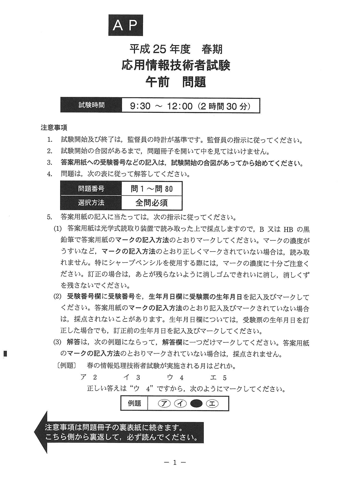

テキスト (OCR)

平成 25年度 春期
応用情報技術者試験
午前 問題

 9:30 ~ 12:00 (②⑫時間80人9)

注意事項

1. 試験開始及び終了は, 監督員の時計が基準です。監督員の指示に従ってください。
2. 試験開始の合図があるまで, 問題冊子を開いて中を見てはいけません。

3. 答案用紙への受験番号などの記入は, 試験開始の合図があってから始めてください。
4

問題は, 次の表に従って解答してください。

問題番号       問1て間 80
選択方法           全間必須

5. 答案用紙の記入に当たっては, 次の指示に従ってください。

Q) 答案用紙は光学式読取り装置で読み取った上で採点しますので, B 又は HBOS
鉛筆で答案用紙のマークの記入方法のとおりマークしてください。マークの濃度が
うすいなど, マークの記入方法のとおり正しくマークされていない場合は, 読み取
れません。特にシャープペンシルを使用する際には, マークの濃度に十分ご注意く
ださい。 訂正の場合は, あとが残らないように消しゴムできれいに消し, 消しくず
を残さないでください。

2) 受験番号欄に受験番号を, 生年月日欄に受験票の生年月日を記入及びマークして
ください。答案用紙のマークの記入方法のとおり記入及びマークされていない場合
は, 採点されないことがあります。生年月日欄については, 受験球の生年月日を訂
正した場合でも, 訂正前の生年月日を記入及びマークしてください。

(3) 解答は, 次の例題にならって, 解答欄に一つだけマークしてください。管案用紙
のマークの記入方法のとおりマークされていない場合は, 採点されません。

(例題) 春の情報処理技術者試験が実施される月はどれか。

ア 2    イ 3    ウ 4    エ 5
正しい答えは“ウ 4” ですから, 次のようにマークしてください。

例題 | 〈の(①

注意事項は問題周子の裏表紙に続きます。
こちら側から裏返して, 必ず読んでください。

### ページ 2

### ページ 3

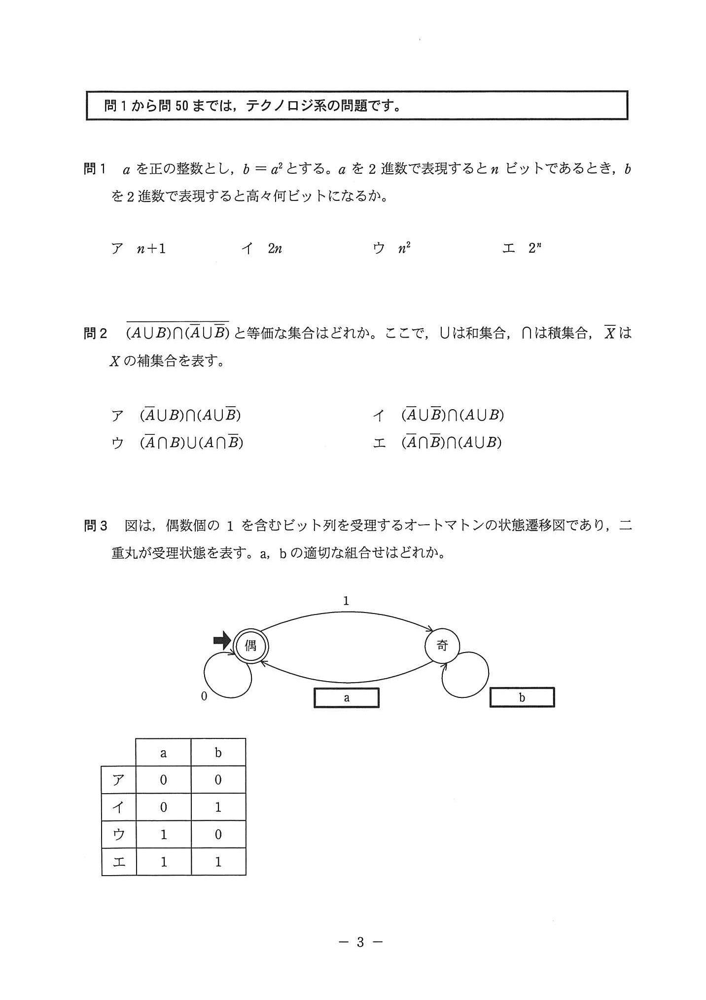

テキスト (OCR)

間 1 から問 50 までは, テクノロジ系の問題です。

ll を正の整数とし, ヵ三 g? とする。。Z を 2 進数で表現するとヵ ビットであるとき, 5
を 2 進数で表現すると高々何ビットになるか。

ア nti     qt 2      ウ on      a Qt

間2  (AUB)N(AUB) と等価な集合はどれか。ここで, Uは和和集合, NIALER, KIS
えの補集合を表す。
ア (AUB)N(AUB)       イ (AUB)N(AUB)

ウ (AN B)U(ANB)                 エ (ANB)N(AUB)

問3 図は, 偶数個の 1 を含むビット列を受理するオートマトンの状態遷移図であり, =
重丸が受理状態を表す。a, b の適切な組合せはどれか。

H IIへ1
ご |っ|ら

### ページ 4

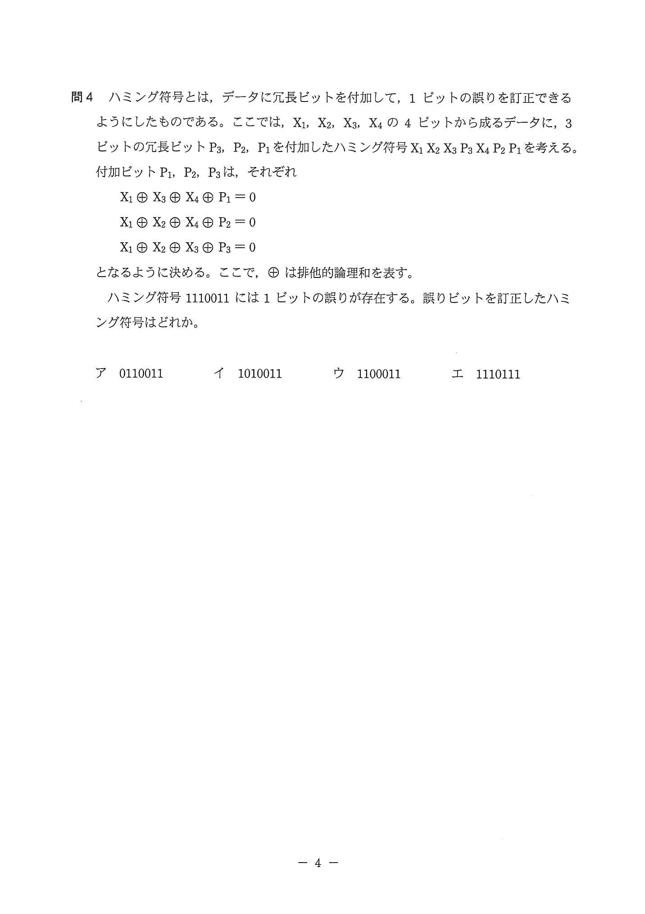

テキスト (OCR)

問4 ハミング符号とは, データに冗長ビットを付加して, 1 ビットの誤りを訂正できる
ようにしたものである。こことでは, Ki, Xo, Xz, X』 の 4 ビットから成るデータに, 3
ビットの冗長ビット Pa, Pa, Pi を付加したハミング符号 X」 Xo Xs Ps X。 P。 P を考える。
付加ビットPi, Pe, Psは, それぞれ

Xi ® Xsの X1 ® Pi = 0
X1 ® X2 @ Xi © P2 = 0
Xi © X2@ X3 © P3 = 0
ERBSKDICROS, TOC, O は排他的論理和を表す。
ハミング符号 1110011 には 1 ビットの誤りが存在する。誤りビットを訂正したハミ
ング符号はどれか。

ア 0110011    イ 1010011    ウ 1100011    工 1110111

### ページ 5

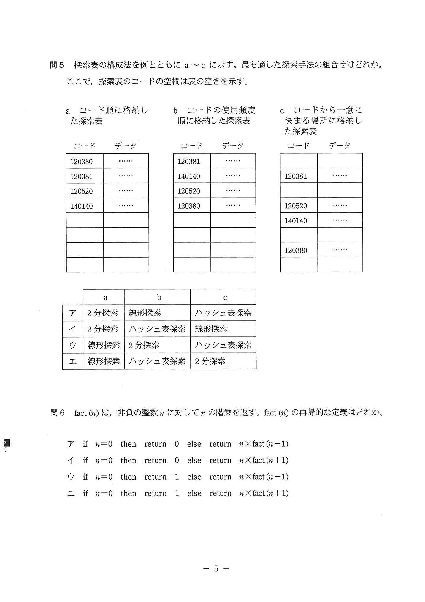

テキスト (OCR)

間5 探索表の構成法を例とともに ac に示す。最も適した探索手法の組合せはどれか。
ここで, 探索表のコードの空欄は表の空きを示す。

a コード順に格納し ”" b コードの使用頻度  c コードから一意に

た探索表                  順に格納した探索表        決まる場所に格納し
た探索表
コード    データ         コード    データ         コード    データダ
120380 | ……            120381 fo
120381 |  ……            140140 | ……           120381 |  ……
120520 J ……           120520 | ……
140140 | ……            120380 | ……           120520 | ……
140140 | の"の
120380
a              b                  ©
ア | 2分探索 | 線形探索        ハッシュ表探索
イ | 2分探索 | ハッシュ表探索 | 線形探索
ウ | 線形探索 | 2 分探索        ハッシュ表探索
| 線形探索 | ハッシュ表探索 | 2 分探索

FIG fact (x) は, 非負の整数ヵ々 に対してヵ の階乗を返す。fact n) の再帰的な定義はどれか。

if m=O then return   else return »X fact(n—1)

n=0 then return  else return mXfact(n+1)

re Oo Oo

if n=0 then return  else return mXfact(n—1)

HHさい

if m=O then return 1 else return %Xfact(⑫十1)

### ページ 6

テキスト (OCR)

間7 配列4 に対して次の手続を実行して, 25k S100 である素数を だけを全て出力し
たい。a, b, cに入るループの初期値, 終値, 増分として, 適切な組合せはどれか。

fork = 2to100 step 1:

A[k] = 1;
form = 2 to 10 step 1:
fork=| a    ltc| b  |step[ <  上
A[k] = 0;
fork = 2 to 100 step 1:
if A[k] # 0:
print Rk;
a      b      c
ア     2     m      1
イ    2m    100     m
ウ| m     m?     m
a2    m     100     MI

### ページ 7

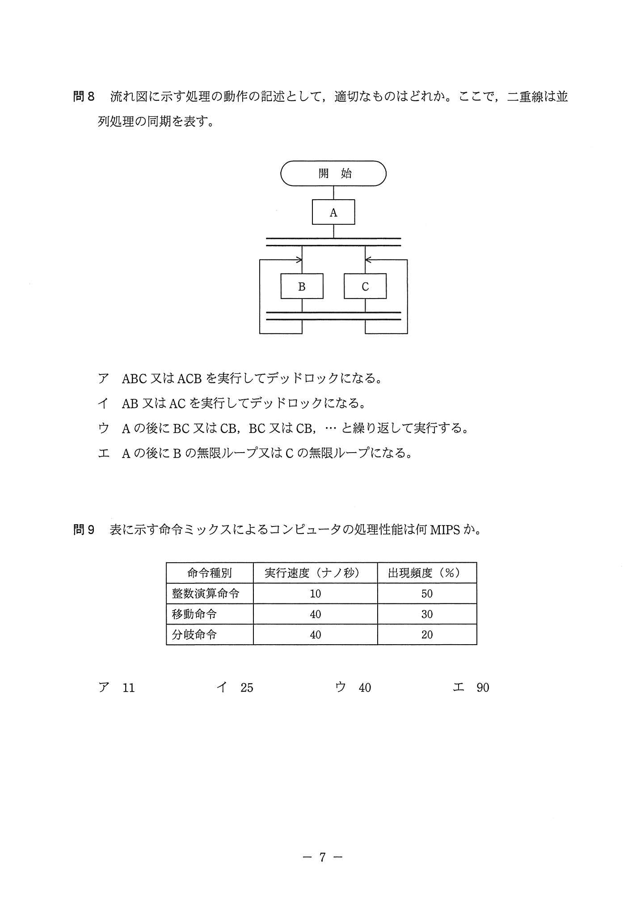

テキスト (OCR)

lS 流れ図に示す処理の動作の記述として, 適切なものはどれか。ここで, 二重線は並
列処理の同期を表す。

B              C
|
Ld               L_ |

ABC又は ACB を実行してデッドロックになる。

AB 又は AC を実行してデッドロックになる。

A の後に BC 又はCB, BC又はCB, … と繰り返して実行する。
A の後にB の無限ループ又はC の無限ループになる。

HUAN

問9 表に示す命令ミックスによるコンピュータの処理性能は何 MIPS か。

命令種別   実行速度 (ナノ秒)  出現頻度 (%)
整数演算命令                  10                         50
移動命令                       40                         30
分岐命令                       40                         20

### ページ 8

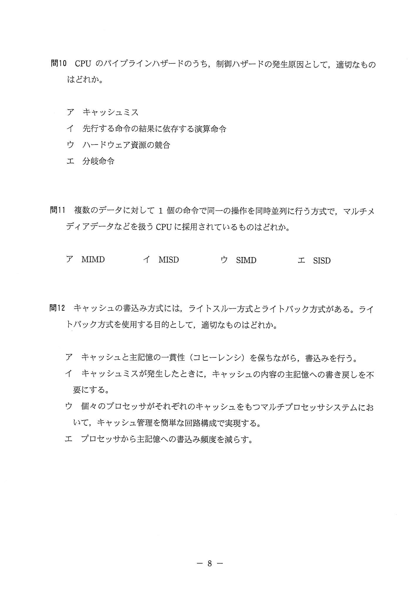

テキスト (OCR)

間10 CPU のパイプラインハザードのうち, 制御ハザードの発生原因として, 適切なもの
はどれか。

キキツ ジュミス

先行する命令の結果に依存する演算命令
ハードウェア資源の競合

分岐命令

H へ

問11 複数のデータに対して 1 個の命令で同一の操作を同時並列に行う方式で, マルチメ
ディアデータなどを扱う CPU に採用されているものはどれか。

ア MIMD    イ MISD     ウ SIMD     <= SISD

間12 キャッシュの書込み方式には, ライトスルー方式とライトバック方式がある。ライ
トバック方式を使用する目的として, 適切なものはどれか。

ア キャッシュと主記憶の一貫性 (コヒーレンシ) を保ちながら, 書込みを行う。

イ キャッシュミスが発生したときに, キャッシュの内容の主記憶への書き戻しを不
要にする。

ウ 個々のプロセッサがそれぞれのキャッシュをもつマルチプロセッサシステムにお
WC, キャッシュ管理を簡単な回路構成で実現する。

エエ プロセッサから主記憶への書込み頻度を減らす。

### ページ 9

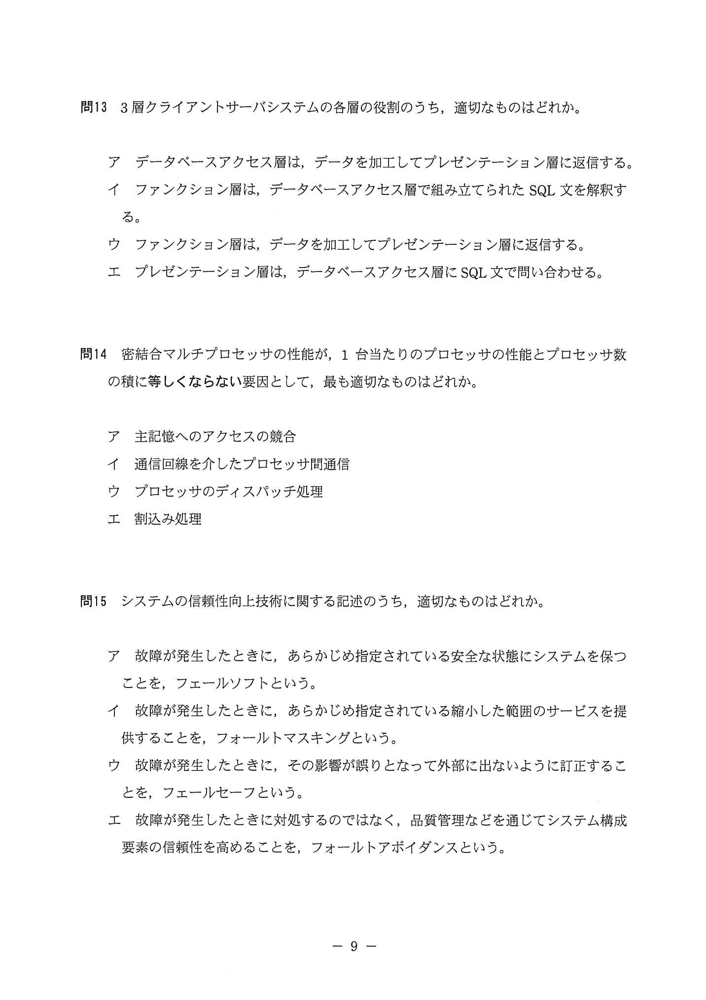

テキスト (OCR)

問13 3層クライアントサーバシステムの各層の役割のうち, 適切なものはどれか。

ア データベースアクセス層は, データを加工してプレゼンテーション層に返信する。

イ ファンクション層は, データベースアクセス層で組み立てられた SQL 文を解釈す
る。

ウ ファンクション層は, データを加工してプレゼンテーション層に返信する。

エエ プレゼンテーション層は, データベースアクセス層に SQL 文で問い合わせる。

問14 密結合マルチプロセッサの性能が, 1 台当たりのプロセッサの性能とプロセッサ数
の積に等しくならない要因として, 最も適切なものはどれか。

ア 主記憶へのアクセスの競合

イ 通信回線を介したプロセッサ間通信
ウ プロセッサのディスパッチ処理

エエ 割込み処理

間15 システムの信頼性向上技術に関する記述のうち, 適切なものはどれか。

ア 故障が発生したときに, あらかじめ指定されている安全な状態にシステムを保つ
ことを, フェールソフトという。

イ 敢障が発生したときに, あらかじめ指定されている縮小した範囲のサービスを提
供することを, フォールトマスキングという。

ウ 履障が発生したときに, その影響が誤りとなって外部に出ないように訂正するこ
ごを。 フェール形一プとぬう。

エ 夏障が発生したときに対処するのではなく, 品質管理などを通じてシステム構成
要素の信頼性を高めることを, フォールトアボイダンスという。

### ページ 10

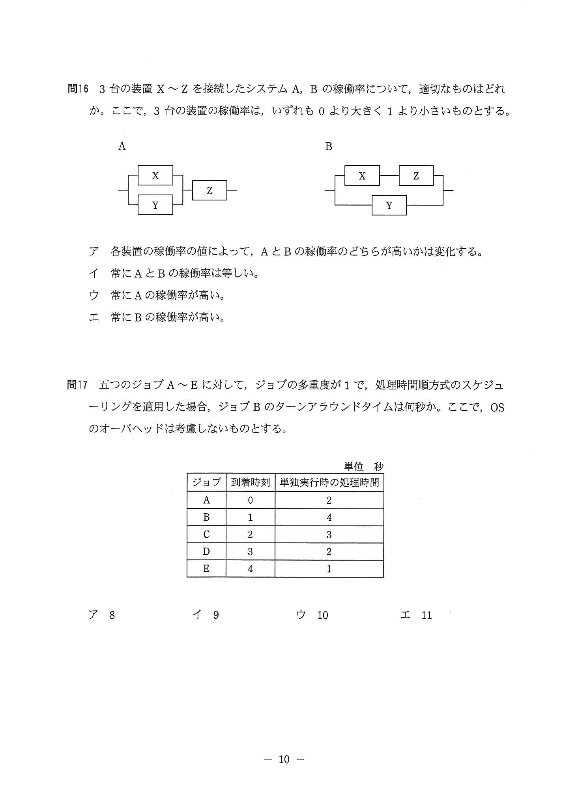

テキスト (OCR)

間16 3 台の装置メーZ を接続したシステム A, B の稼働率について, 適切なものはどれ
か。ここで, 3 人台の装置の稼働率は, いずれも 0 より大きく 1 より小さいものとする。

(ior ES}

各装置の稼働率の値によって, AとBの稼働率のどちらが高いかは変化する。
常にAとBの稼働率は等しい。

常にA の稼働率が高い。

常にB の稼働率が高い。

H.-A SN

間17 五つのジョブA てE に対して, ジョブの多重度が 1 で, 処理時間順方式のスケジュ
ーリングを適用した場合, ジョブ B のターンアラウンドタイムは何秒か。ここで, OS
のオーバヘッドは考慮しないものとする。

単位 秒
ジョブ | 到着時刻 | 単独実行時の処理時間
A   0       2
B   1       4
C   2      3
D   3      2
E   4       1
ア 8      イ 9      ウ 10      rl

ー 10 一

### ページ 11

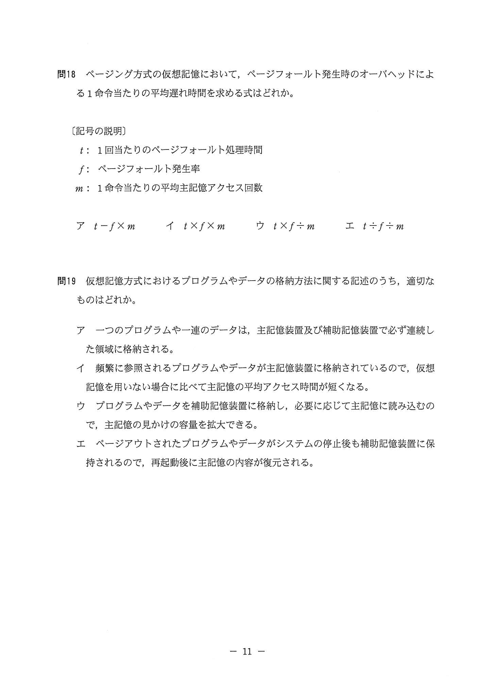

テキスト (OCR)

間18 ページング方式の仮想記憶において, ページフォールト発生時のオーバヘッドによ
る 1 命令当たりの平均遅れ時間を求める式はどれか。

[記号の説明〕

/: 1回当たりのページフォールト処理時間
fi ページフォールト発生率

m: 1命令当たりの平均主記憶アクセス回数

ア t-fxXm    イ txfxm    ウ tXfom    工。まてで

問19 仮想記憶方式におけるプログラムやデータの格納方法に関する記述のうち, 適切な
ものはどれか。

ア 一つのプログラムや一連のデータは, 主記憶装置及び補助記憶装置で必ず連続し
た領域に格納される。

イ 頻繁に参照されるプログラムやデータが主記憶装置に格納されているので, 仮想
記憶を用いない場合に比べて主記憶の平均アクセス時間が短くなる。

ウ プログラムやデータを補助記憶装置に格納し, 必要に応じて主記憶に読み込むの
で, 主記憶の見かけの容量を拡大できる。

エエ ページアウトされたプログラムやデータがシステムの停止後も補助記憶装置に保
持されるので, 再起動後に主記憶の内容が復元される。

ー 11 一

### ページ 12

テキスト (OCR)

間20 メインプログラムを実行した後, メインプログラムの変数 Y,。Y の値は幾つになる
か。ここで, 仮引数 そ は値呼出し (call by value), 仮引数 VY は参照呼出し (callby
reference) であるとする。

メインプログラム            手続2⑦,)
X=2;                           X=X+Y;
Y=2;                               Y=X+Y;
add(X,Y);                            return;

H |G) A]
mT RB |] mw ] ow | Me
alnfolaly,

fi21 GPL の下で公開されたソフトウェアを改変・頒布する場合に行わなければならない
ことはどれか。

ア 初期開発者名の表示      イ 同一ライセンスでの頒布
ウ プログラムの保証        エエ RI COR

間22 RFID のパッシブ方式 RF タグの説明として, 適切なものはどれか。

アンテナから電力が供給される。

可視光でデータ通信する。

静電容量の変化を捉えて位置を検出する。
赤外線でデータ通信する。

H すさペコ

ー 12 一

### ページ 13

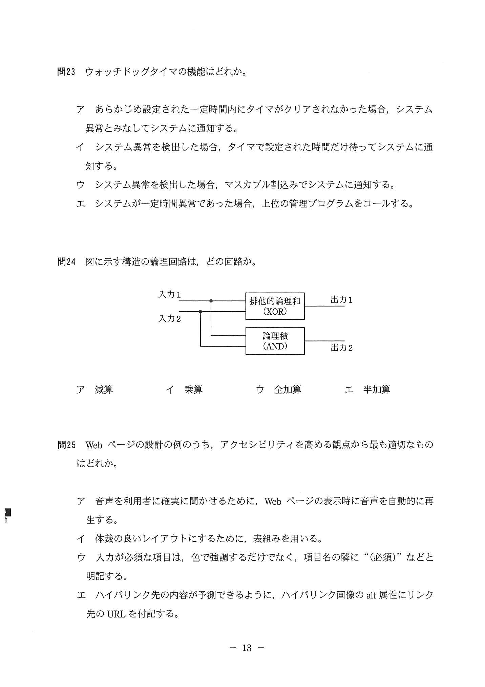

テキスト (OCR)

問23 ウォッチドッグタイマの機能はどれか。

ア あらかじめ設定された一定時間内にタイマがクリアされなかった場合., システム
異常とみなしてシステムに通知する。

イ システム異常を検出した場合 、 タイマで設定された時間だけ待ってシステムに通
知する。

ウ システム異常を検出した場合. マスカブル割込みでシステムに通知する。

エエ システムが一定時間異常であった場合, 上位の管理プログラムをコールする。

問24 図に示す構造の論理回路は, どの回路か。

aan        排他的論理和 | 出カ1
スカ2         (XOR)
論理和
ア 減算     イ 乗算     ウ 全加算    エ 半加算

間25 Web ページの設計の例のうち, アクセシビリティを高める観点から最も適切なもの
はどれか。

ア 音声を利用者に確実に聞かせるために, Web ページの表示時に音声を自動的に再
生する。

イ 体裁の良いレイアウトにするために, 表組みを用いる。

ウ 入力が必須な項目は, 色で強調するだけでなく, 項目名の隣に “(必須)” などと
明記する。

エエ ハイパリンクグ先の内容が予測できるように, ハイパリンク画像の alt 属性にリンク
先の URL を付記する。

ー 13 一

### ページ 14

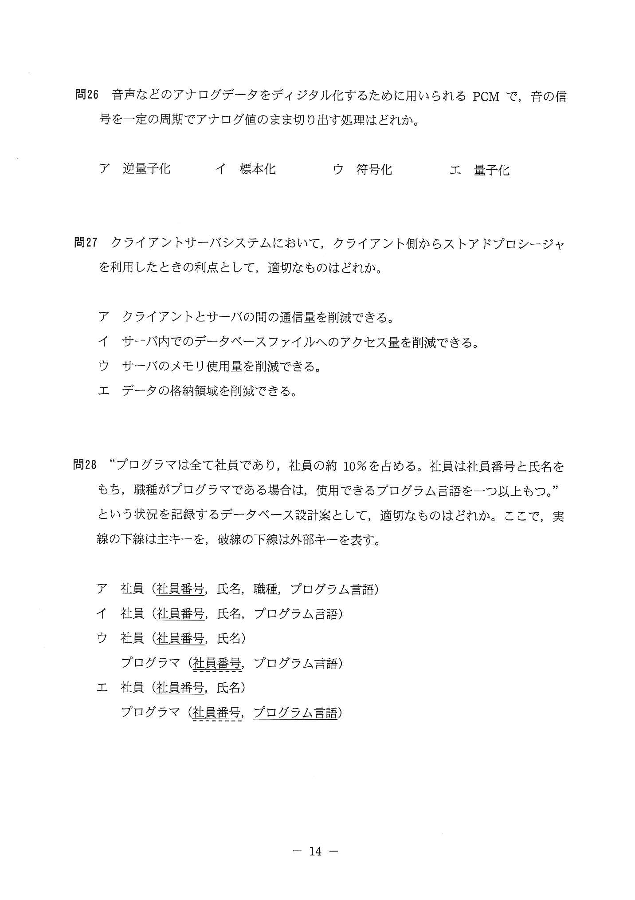

テキスト (OCR)

間26

音声などのアナログデータをディジタル化するために用いられる PCM で, FOR

号を一定の周期でアナログ値のまま切り出す処理はどれか。

ア

逆量子化   イ 標本化    ウ 符号化    = 量子化

BRT クライアントサーバシステムにおいて, クライアント側からストアドプロシージャ
を利用したときの利点として, 適切なものはどれか。

Hさヽふさ

間28

クライアントとサーバの間の通信量を削減できる。

サーバ内でのデータベースファイルへのアクセス量を削減できる。
サーバのメモリ使用量を削減できる。

データの格納領域を削減できる。

“プログラマは全て社員であり, 社員の約 10%を占める。社員は社員番号と氏名を

もち, 職種がプログラマである場合は, 使用できるプログラム言語を一つ以上もつ。”"
という状況を記録するデータベース設計案として, 適切なものはどれか。ここで, 実
線の下線は主キーを, 破線の下線は外部キーを表す。

の
イ

ー 14 一

### ページ 15

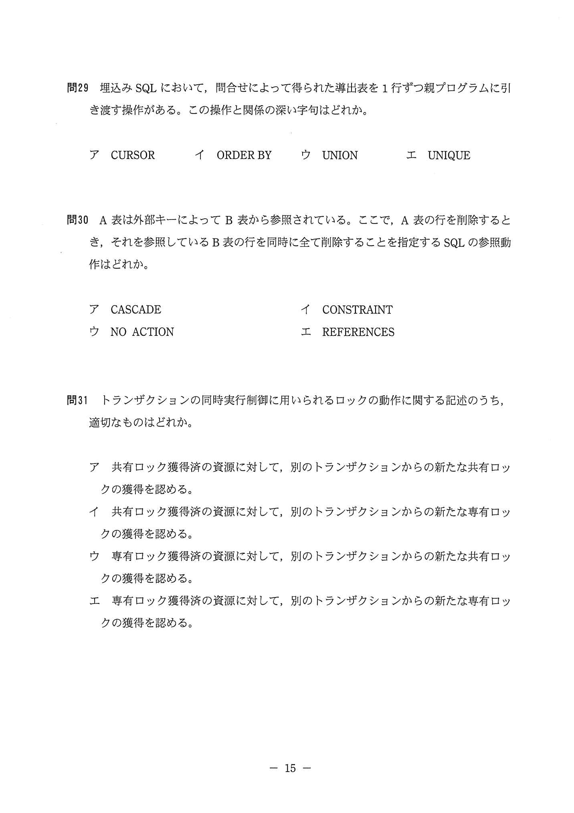

テキスト (OCR)

問29 埋込み SQL において, 問合せによって得られた導出表を 1 行ずつ親プログラムに引
き渡す操作がある。この操作と関係の深い字句はどれか。

ア CURSOR   イ ORDER BY  ウ UNION    エエ UNIQUE

30 A表は外部キーによって B 表から参照されている。ここで, A 表の行を削除すると
き, それを参照している B 表の行を同時に全て削除することを指定する SQL の参照動
作はどれか。

ア CASCADE          イ CONSTRAINT
ウ NO ACTION           工 REFERENCES

間31 トランザクションの同時実行制御に用いられるロックの動作に関する記述のうち,
適切なものはどれか。

ア 共有ロック獲得済の資源に対して, 別のトランザクションからの新たな共有ロッ
クの獲得を認める。

イ 共有ロック獲得済の資源に対して, 別のトランザクションからの新たな専有ロッ
クの獲得を認める。

ウ 専有ロック獲得済の資源に対して, 別のトランザクションからの新たな共有ロッ
クの獲得を認める。

工 専有ロック獲得済の資源に対して, 別のトランザクションからの新たな専有ロッ
クの獲得を認める。

ー 15 一

### ページ 16

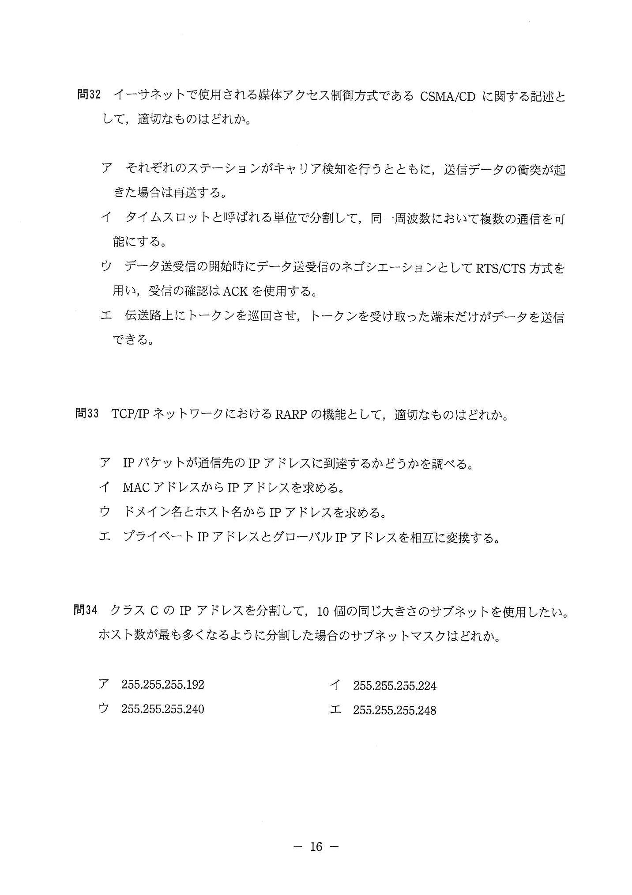

テキスト (OCR)

問32 イーサネットで使用される媒体アクセス制御方式である CSMA/CD に関する記述と
して, 適切なものはどれか。

ア それぞれのステーションがキャリア検知を行うとともに, 送信データの衝突が起
きた場合は再送する。

イ タイムスロットと呼ばれる単位で分割して, 同一周波数において複数の通信を可
能にする。

ウ データ送受信の開始時にデータ送受信のネゴシエーションとして RTS/CTS 方式を
用い, 受信の確認は ACK を使用する。

エエ 伝送路上にトークンを巡回させ, トークンを受け取った端末だけがデータを送信
できる。

間33 TCP/IP ネットワークにおける RARP の機能として, 適切なものはどれか。
ア IPパケットが通信先の IP アドレスに到達するかどうかを調べる。

イ MACアドレスから IP アドレスを求める。

ワウ

x

ドメイン名とホスト名から IP アドレスを求める。
プライベート TP アドレスとグローバル IP アドレスを相互に変換する。

問34 クラス C の IP アドレスを分割して, 10 個の同じ大きさのサブネットを使用したい。
ホスト数が最も多くなるように分割した場合のサブネットマスクはどれか。

ア 255.255.255.192        イ 255.255.255.224
ウ 255.255.255.240          TL 255.255.255.248

ー 16 一

### ページ 17

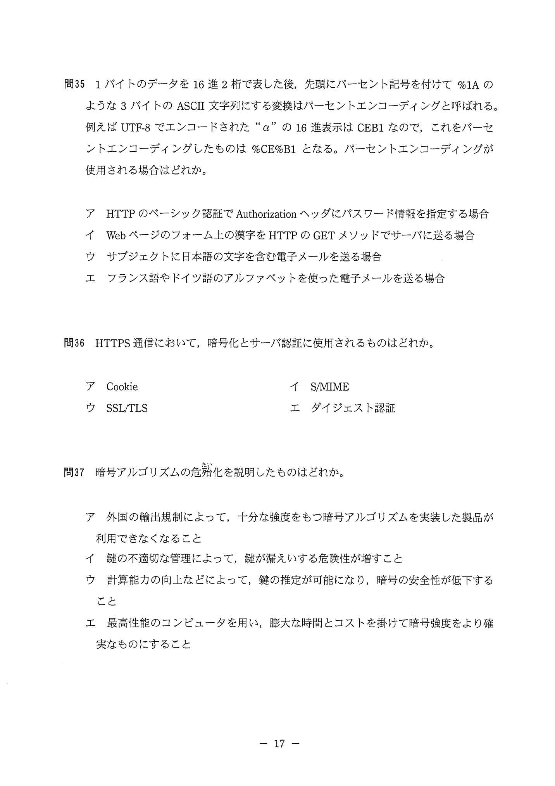

テキスト (OCR)

間35 1バイトのデータを 16 進 2 桁表した後, 先頭にパーセント記号を付けて %1A の
ような 3 バイトの ASCH 文字列にする変換はパーセントエンコーディングと呼ばれる。
例えば UTF-8 でエンコードされた “a” の16 進表示は CEB1 なので, これをパーセ
ントエンコーディングしたものは %CE%B1 となる。パーセントエンコーディングが
使用される場合はどれか。

HTTP のベーシック認証で Authorization ヘッダにパスワード情報を指定する場合
Web ページのフォーム上の漢字を HTTP の GET メソリッドでサーバに送る場合
サブジェクトに日本語の文字を含む電子メールを送る場合

フランス語やドイツ語のアルファベットを使った電子メールを送る場合

H へ

問36 HTTPS 通信において, 暗号化とサーバ認証に使用されるものはどれか。

ア Cookie                                 イ S/MIME
ウ SSL/TLS                         LFV cA be

M37 ET RAOSINEE BLES OWEND.

ア 外国の輸出規制によって, 十分な強度をもつ暗号アルゴリズムを実装した製品が
利用できなくなること

イ 鍵の不適切な管理によって, 鍵が漏えいする危険性が増すこと

ウ 計算能力の向上などによって, 鍵の推定が可能になり, 暗号の安全性が低下する
me

TL 最高性能のコンピュータを用い, 膨大な時間とコストを掛けて暗号強度をより確
実なものにすること

ー 17 一

### ページ 18

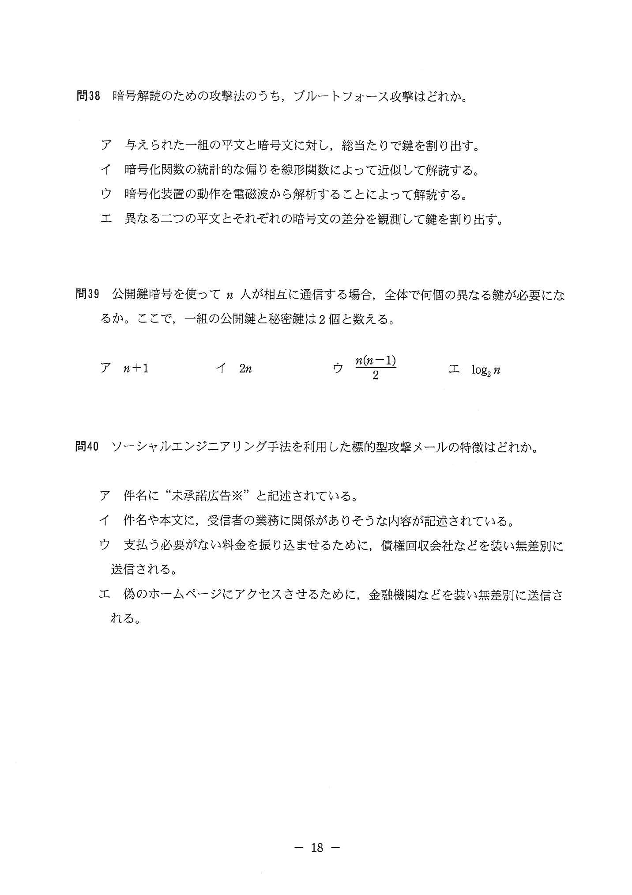

テキスト (OCR)

問38 暗号解読のための攻撃法のうち. ブルートフォース攻撃はどれか。

与えられた一組の平文と暗号文に対し, 総当たりで鍵を割り出す。
暗号化関数の統計的な偏りを線形関数によって近似して解読する。
暗号化装置の動作を電磁波から解析することによって解読する。
異なる二つの平文とそれぞれの暗号文の差分を観測して鍵を割り出す。

H GAS

問39 公開鍵暗号を使って ヵ 人が相互に通信する場合, 全体で何個の異なる鍵が必要にな
OM. TOC, 一組の公開鍵と秘密鍵は 2 個と数える。
(2一1)

ア n+l     イ 2      ウ  2     X log n

間40 ソーシャルエンジニアリング手法を利用した標的型攻撃メールの特徴はどれか。

ア 件名に 未承諾広告※” と記述されている。
イ 件名や本文に, 受信者の業務に関係がありそうな内容が記述されている。
ウ 支払う必要がない料金を振り込ませるために, 債権回収会社などを装い無差別に

送信される。
エエ 偽のホームページにアクセスさせるために, 金融機関などを装い無差別に送信さ
れる。

ー 18 一

### ページ 19

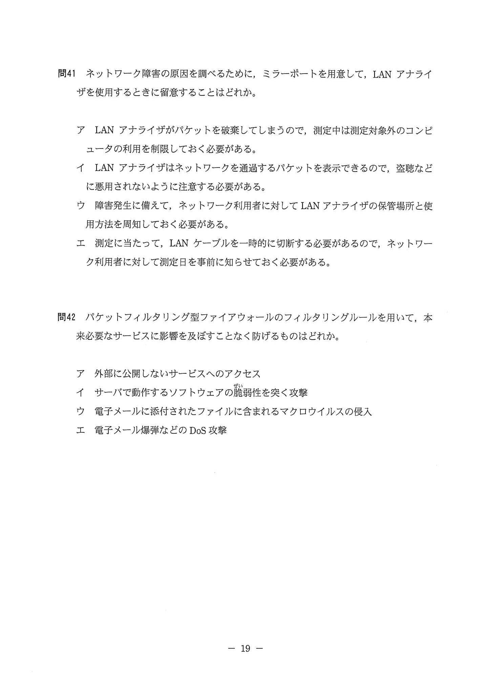

テキスト (OCR)

間41 ネットワーク障害の原因を調べるために, ミラーボートを用意して, LAN アナライ
ザを使用するときに留意することはどれか。

ア LAN アナライザがパケットを破棄してしまうので, 測定中は測定対象外のコンピ
ュータの利用を制限しておく必要がある。

イ LAN アナライザはネットワークを通過するパケットを表示できるので, 盗聴など
に悪用されないように注意する必要がある。

ウ 障害発生に備えて, ネットワーク利用者に対して LAN アナライザの保管場所と使
用方法を周知しておく必要がある。

ZT 測定に当たって, LAN ケーブルを一時的に切断する必要があるので, ネットワー
ク利用者に対して測定日を事前に知らせておく必要がある。

間42 パケットフィルタリング型ファイアウォールのフィルタリングルールを用いて, 本
来必要なサービスに影響を及ぼばすことなく防げるものはどれか。

外部に公開しないサービスへのアクセス

サーバで動作するソフトウェアの騰弱性を笑く攻撃

電子メールに添付されたファイルに含まれるマクロウイルスの侵入
電子メール爆弾などの Dos 攻撃

HUAN

ー 19 一

### ページ 20

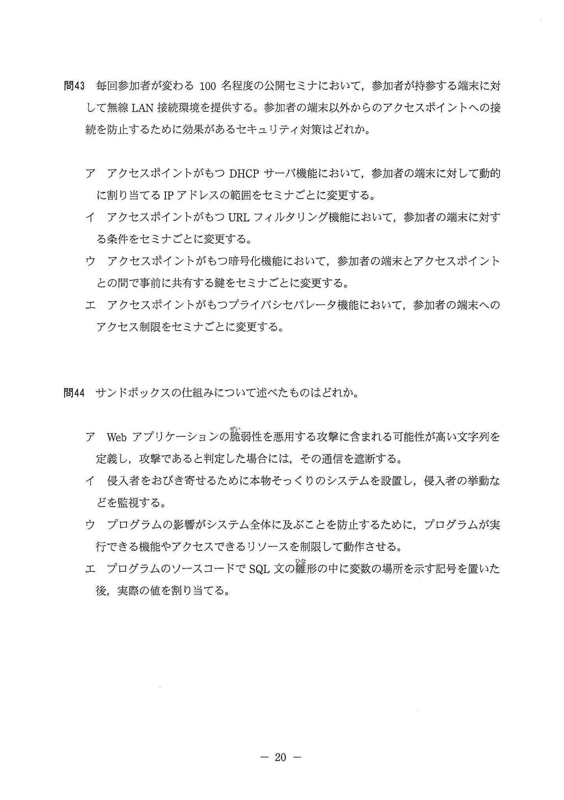

テキスト (OCR)

間43 毎回参加者が変わる 100 名程度の公開セミナにおいて, 参加者が持参する端末に対
して無線 LAN 接続環境を提供する。参加者の端末以外からのアクセスポイントへの接
続を防止するために効果があるセキュリティ対策はどれか。

ア アクセスポイントがもつ DHCP サーバ機能において, 参加者の端末に対して動的
に割り当てるIP アドレスの範囲をセミナごとに変更する。

イ アクセスポイントがもつ URL フィルタリング機能において, 参加者の端末に対す
る条件をセミナごとに変更する。

ウ アクセスポイントがもつ暗号化機能において, 参加者の端末たとアクセスボイント
との間で事前に共有する鍵をセミナごとに変更する。

エエ アクセスポイントがもつプライバシセパレータ機能において, 参加者の端末への
アクセス制限をセミナごとに変更する。

間44 サンドボックスの仕組みについて述べたものはどれか。

ア Web アプリケーショ ンの騰層性を悪用する攻撃に含まれる可能性が高い文字列を
定義し, 攻撃であると判定した場合には, その通信を遮断する。

イ 侵入者をおびき寄せるために本物そっくりのシステムを設置し, 侵入者の挙動な
ごどを監視する。

ウ プログラムの影響がシステム全体に及ぶととを防止するために, プログラムが実
行できる機能やアクセスできるリソースを制限して動作させる。

エ プログラムのソースコードで SQL 文の雛形の中に変数の場所を示す記号を置いた
後, 実際の値を割り当てる。

### ページ 21

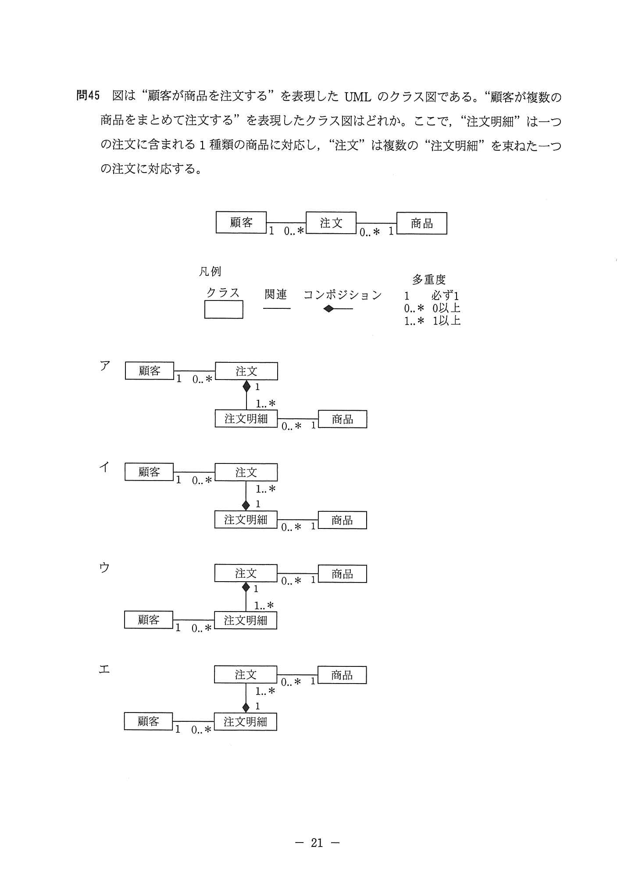

テキスト (OCR)

問45 図は“顧客が商品を注文する"を表現した UML のクラス図である。 "顧客が複数の
商品をまとめて注文する" を表現したクラス図はどれか。ここで, “注文明細" は一つ
の注文に含まれる 1 種類の商品に対応し, "注文" は複数の “注文明細"を束ねた一つ
の注文に対応する。

Be | 注文 bao Lee
All                多重度
クラス 関連 コンポジション 1 必ず1
ーー  あーー   0.* 0以上
1..* 1以上

7 (wie FB]
1

1..*
| 注文明細 | 商品 |

イ [we ae ae
1.*

1
LascHa ーー] 商品 |

a        Lx owl商品|

it
15%
|

| 顧客 FB

=        きま baa]

1
L_ wee | —— | 注文明細 |

ー 21 一

### ページ 22

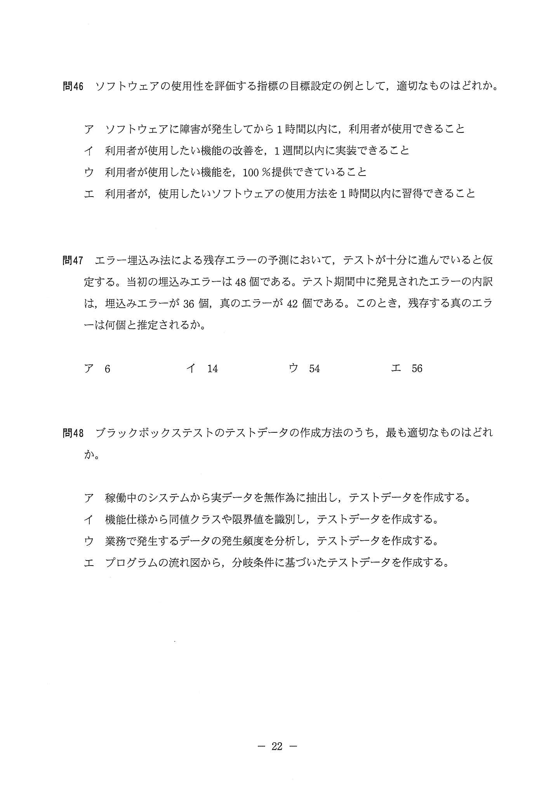

テキスト (OCR)

間46 ソフトウェアの使用性を評価する指標の目標設定の例として, 適切なものはどれか。

ソフトウェアに障害が発生してから 1時間以内に, 利用者が使用できること
利用者が使用したい機能の改善を, 1 週間以内に実装できること

利用者が使用したい機能を, 100 %提供できていること

利用者が, 使用したいソフトウェアの使用方法を 1 時間以内に習得できること

HH へ

問47 エラー埋込み法による残存エラーの予測において, テストが十分に進んでいると仮
定する。 当初の埋込みエラーは 48 個である。テスト期間中に発見されたエラーの内訳
は, 埋込みエラーが 36 個, 真のエラーが 42 個である。このとき, 残存する真のエラ
ーは何個と推定されるか。

ア 6      イ 14      ウ 54      = 56
間48 ブラックボックステストのテストデータの作成方法のうち, 最も適切なものはどれ

ア 稼働中のシステムから実データを無作為に抽出し, テストデータを作成する。
イ 機能仕様から同値クラスや限界値を識別し, テストデータを作成する。

ウ 業務で発生するデータの発生顔度を分析し, テストデータを作成する。

エエ プログラムの流れ図から, 分岐条件に基づいたテストデータを作成する。

ー 22 一

### ページ 23

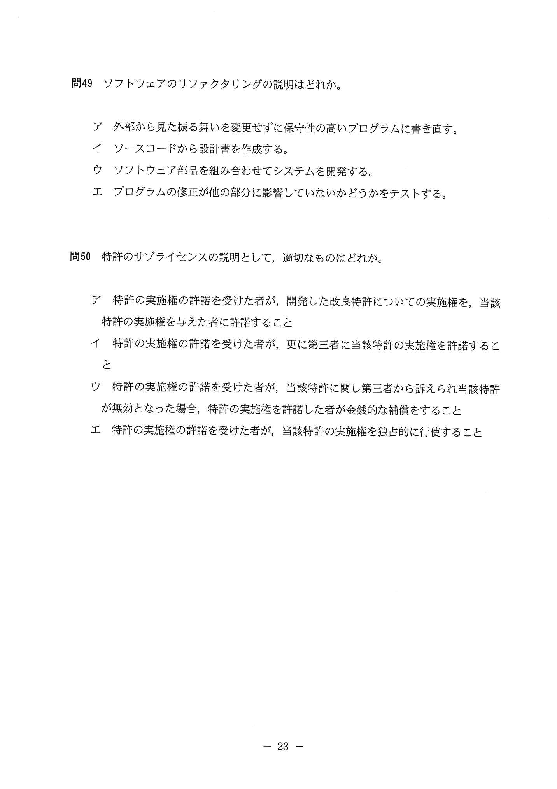

テキスト (OCR)

問49 ソフトウェアのリファクタリングの説明はどれか。

外部から見た振る舞いを変更せずに保守性の高いプログラムに書き直す。
ソースコードから設計書を作成する。

ソフトウェア部品を組み合わせてシステムを開発する。

プログラムの修正が他の部分に影響していないかどうかをテストする。

H GA MW

問50 特許のサブライセンスの説明として, 適切なものはどれか。

ア 特許の実施権の許諾を受けた者が, 開発した改良特許についての実施権を, 当該
特許の実施権を与えた者に許諾すること

イ 特許の実施権の許諾を受けた者が, 更に第三者に当該特許の実施権を許諾するこ
と

ウ 特許の実施権の許諾を受けた者が, 当該特許に関し第三者から訴えられ当該特許
が無効となった場合, 特許の実施権を許諾した者が金銭的な補償をすること

Lo 特許の実施権の許諾を受けた者が, 当該特許の実施権を独占的に行使すること

### ページ 24

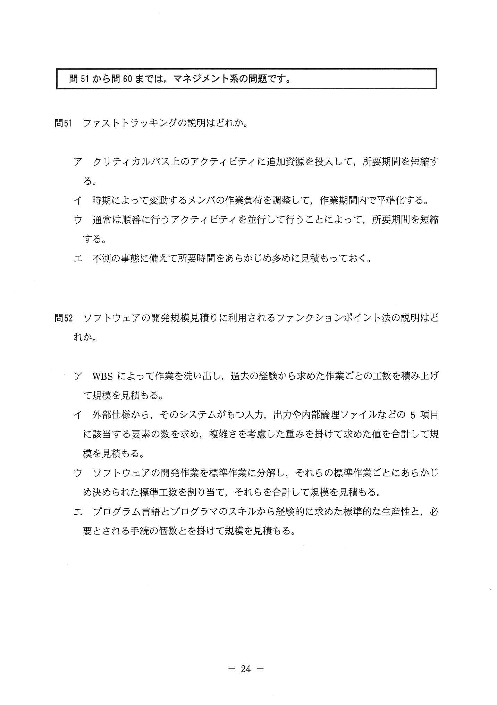

テキスト (OCR)

間 51 から間 60 までは, マネジメント系の問題です。

間51 ファストトラッキングの説明はどれか。

ア クリティカルパス上のアクティビティに追加資源を投入して, 所要期間を短縮す
る。

イ 時期によって変動するメンバの作業負荷を調整して, 作業期間内で平準化する。
ウ 通常は順番に行うアクティビティを並行して行うことによって, 所有要期間を短縮
する。

エエ 不測の事態に備えて所要時間をあらかじめ多めに見積もっておく。

M52 ソフトウェアの開発規模見積りに利用されるファンクションポイント法の説明はど
れか。

ア WBS によって作業を洗い出し, 過去の経験から求めた作業ごとの工数を積み上げ
て規模を見積もる。

イ 外部仕様から, そのシステムがもつ入力, 出力や内部論理ファイルなどの 5 項目
に該当する要素の数を求め, 複雑さを考慮した重みを掛けて求めた値を合計して規
模を見積もる。

ウ ソフトウェアの開発作業を標準作業に分解し, それらの標準作業ごとにあらかじ
め決められた標準工数を割り当て, それらを合計して規模を見積もる。

エエ プログラム言語とプログラマのスキルから験的に求めた標準的な生産性と, 必
要とされる手続の個数とを掛けて規模を見積もる。

ー 24 一

### ページ 25

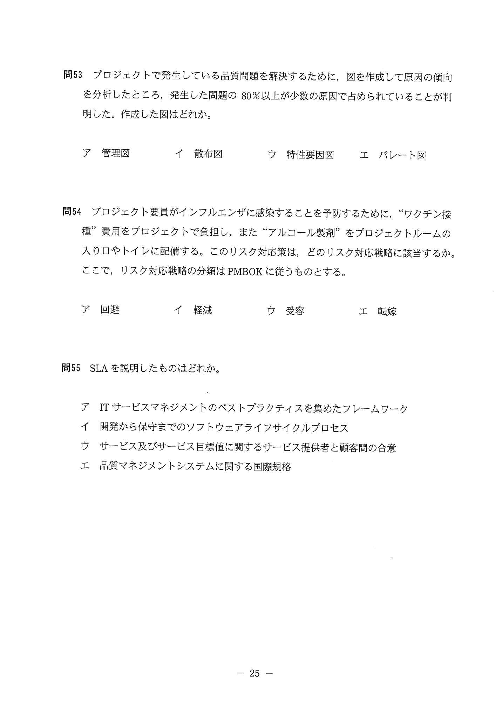

テキスト (OCR)

間53 プロジェクトで発生している品質問題を解決するために, 図を作成して原因の傾向
を分析したところ, 発生した間題の 80%以上が少数の原因で占められていることが判
明した。作成した図はどれか。

ア 管理図    イ 散布図    ウ 特性要因図  x= パレート図

問54 プロジェクト要員がインフルエンザに感染することを予防するために, “ワクチン接
種" 費用をプロジェクトで負担し。 また“アルコール製剤" をプロジェクトルームの
入り口やトイレに配備する。このリスク対応策は, どのリスク対応戦略に該当するか。
ここで, リスク対応戦略の分類は PMBOK に従うものとする。

ア 回避    イ 軽減    ウ 受容    エ 転嫁

間55 SLAを説明したものはどれか。

IT サービスマネジメントのベストプラクティスを集めたフレームワーク
開発から保守までのソフトウェアライフサイクルプロセス

サービス及びサービス目標値に関するサービス提供者と顧客問の合意
品質マネジメントシステムに関する国際規格

HUAN

ー 25 一

### ページ 26

テキスト (OCR)

問56 (①ン(《④はある障害の発生から本格的な対応までの一連の活動である。(①⑪<て(④の各

活動とそれに対応する ITILv3 の管理プロセスの組合せのうち, 適切なものはどれか。

1) 利用者からサービスデスクに “特定の入力操作が拒否される” という連絡があっ
たので, 別の入力操作による回避方法を利用者に伝えた。
②⑫) 原因を開発チームで追究した結果., アプリケーションプログラムに不具合がある

ことが分かった。

(3) 原因となったアプリケーションプログラムの不具合を改修する必要があるのかど
うか, 改修した場合に不具合箇所以外に影響が出る心配はないかどうかについて,
関係者を集めて確認し, 改修することを決定した。

(4) 改修したアプリケーションプログラムの稼働環境への適用については, 利用者へ
の周知, 適用手順及び失敗時の切戻し手順の確認など, 十分に事前準備を行った。

①                 (2)                 @)                 (4)
ァ   インシデント管理 |問題管理           変更管理            リリース管理及び
展開管理
4  インシデント管理 | 問題管理          リリース管理及び|変更管理
展開管理
   問題管理           インシデント管理 |変更管理            リリース管理及び
展開管理
エ  問題管理         インシデント管理 |リリース管理及び| 変更管理
展開管理

ー 26 一

### ページ 27

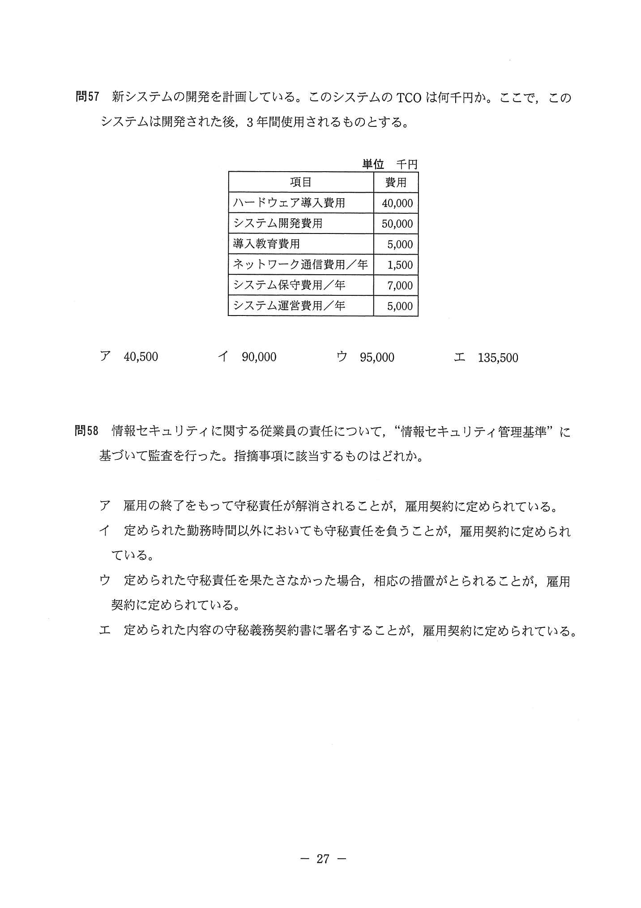

テキスト (OCR)

fs? 新システムの開発を計画している。このシステムの TCO は何千円か。ここで, この
システムは開発された後, 3 年間使用されるものとする。

単位 FA
項目                 費用
ハードウェア導入費用     40,000
システム開発費用           50,000
導入教育費用                 5,000
ネットワーク通信費用年 1,500
システム保守費用年        7,000
システム運営費用年        5,000
ア 40,500           イ 90,000           ウ 95,000           ZX 135,500

問58 情報セキュリティに関する従業員の責任について, “情報セキュリティ管理基準" に
基づいて監査を行った。指摘事項に該当するものはどれか。

ア 雇用の終了をもって守秘交任が解消されることが, 雇用契約に定められている。

イ 定められた勤務時間以外においても守秘下任を負うことが, 雇用契約に定められ
ている。

ウ 定められた守秘責任を果たさなかった場合, 相応の措置がとられることが, 雇用
契約に定められている。

L 定められた内容の守秘義務契約書に署名することが, 雇用契約に定められている。

ー 27 一

### ページ 28

テキスト (OCR)

問59 情報システム部が開発し, 経理部が運用している会計システムの運用状況を監査す
るシステム監査チームの体制についての記述のうち, 適切なものはどれか。

(i

ア 会計システムは企業会計に関する各種基準に準拠しているので, システム監査チ
ームには公認会計士を含めなければならない。

イ 会計システムは機密性の高い情報を扱うので, システム監査チームは経理部長直
属としなければならない。

ウ 経理部との癒着を防ぐために, システム監査チームのメンバは毎年入れ准えなけ
ればならない。

エエ 独立性を担保むるために, システム監査チームは情報システム部にも経理部にも
所属しない者で組織しなければならない。

間60 特権 ID (システムの設定やデータの追加, BE, 削除及びそれらの権限の設定が可
能な ID) の不正使用を発見するコントロールはどれか。

ア 特権ID の貸出し及び返却の管理徳と, 特権ITD のログを照合する。

イ 特権ID の使用を許可された者も, 通常の操作では一般利用者 ID を使用する。
ウ 特権TD の使用を必要とする者は, 使用の都度, HID の貸出しを受ける。
エエ 特権ID の設定内容や使用範囲を, 用途に応じて細分化する。

ー 28 一

### ページ 29

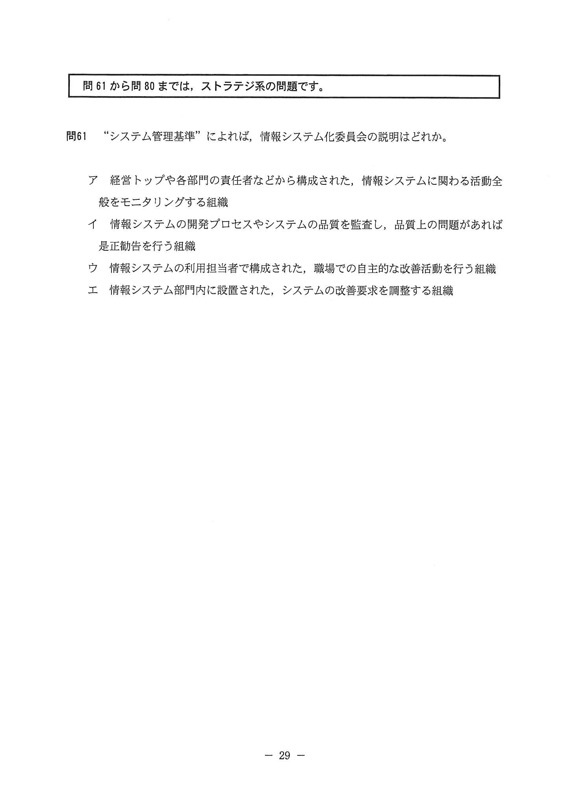

テキスト (OCR)

問 61 から問 80 までは, ストラテジ系の問題です。

問61 “システム管理基準"” によれば, 情報システム化委員会の説明はどれか。

ア 経営トップや各部門の責任者などから構成された, 情報システムに関わる活動全
般をモニタリングする組織

イ 情報システムの開発プロセスやシステムの品質を監査し, 品質上の問題があれば
赴正勧告を行う組織

ウ 情報システムの利用担当者で構成された, 職場での自主的な改善活動を行う組織
エ 情報システム部門内に設置された, システムの改善要求を調整する組織

ー 29 一

### ページ 30

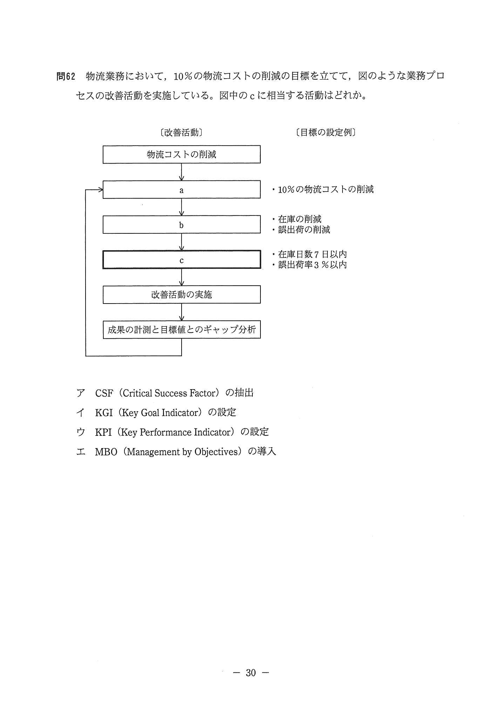

テキスト (OCR)

問62 物流業務において, 10%の物流コストの削減の目標を立てて, 図のような業務プロ
セスの改善活動を実施している。図中のc に相当する活動はどれか。

〔政善活動〕                           (目標の設定例]
物流コストの削減

a              ・10%の物流コストの削減

b                          ・在庫の削減
・誤出荷の削減
・在庫日数7 日以内

©                          ・誤出荷率3 %以内

改善活動の実施
成果の計測と目標値とのギャップ分析

CSF (Critical Success Factor) の抽出

KGI (Key Goal Indicator) の設定

KPI (Key Performance Indicator) の設
MBO (Management by Objectives) の導入

Hod A NM

### ページ 31

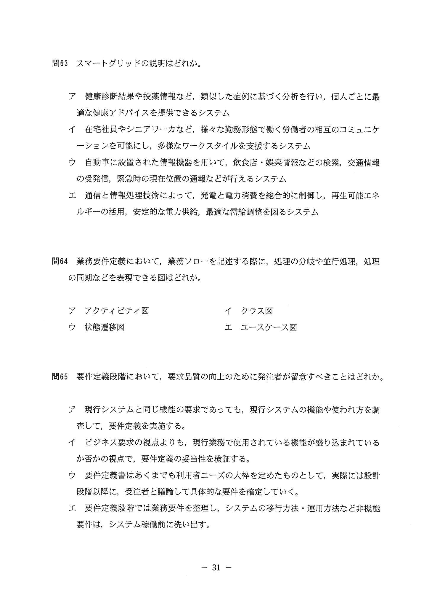

テキスト (OCR)

63 スマートグリッドの説明はどれか。

ア 健康診断結果や投薬情報など, 類似した症例に基づく分析を行い, 個人ごとに最
適な健康アドバイスを提供できるシステム

イ 在宅社員やシニアワーカなど, 様々な勤務形態で働く労働者の相互のコミュニケ
ーションを可能にし, 多様なワークスタイルを支援するシステム

ウ 自動車に設置された情報機器を用いて, 飲食店・娯楽情報などの検索, 交通情報
の受発信, 緊急時の現在位置の通報などごが行えるシステム

エエ 通信と情報処理技術によって, 発電と電力消費を総合的に制御し, 再生可能エネ
ルギーの活用, 安定的な電力供給, 最適な突給調整を図るシステム

問64 業務要件定義において, 業務フローを記述する際に, 処理の分岐や並行処理, 処理
の同期などを表現できる図はどれか。

ア アクティビティ図         イ クラス図
ウ 状態遷移図                 エエ ユースケース図

間65 要件定義段階において, 要求品質の向上のために発注者が留意すべきことはどれか。

ア 現行システムと同じ機能の要求であっても, 現行システムの機能や使われ方を調
査して, 要件定義を実施する。

イ ビジネス要求の視点よりも, 現行業務で使用されている機能が盛り込まれている
か否かの視点で, 要件定義の妥当性を検証する。

ウ 要件定義書はあくまでも利用者ニーズの大枠を定めたものとして, 実際には設計
段階以降に, 受注者と議論して具体的な要件を確定していく。

L 要件定義段階では業務要件を整理し, システムの移行方法・運用方法など非機能
要件は, システム稼働前に洗い出す。

### ページ 32

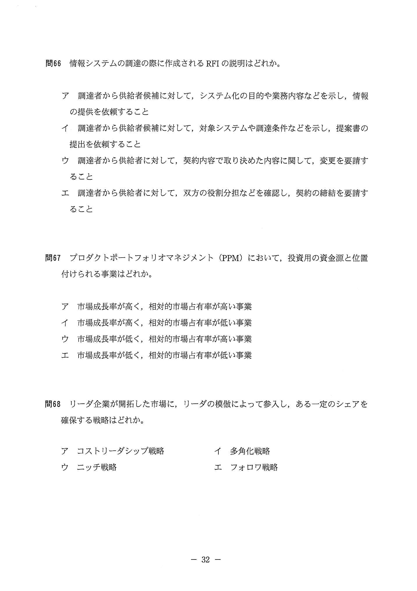

テキスト (OCR)

間66 情報システムの調達の際に作成される RFI の説明はどれか。

ア 調達者から供給者候補に対して, システム化の目的や業務内容などを示し, 情報
の提供を依頼すること

イ 調達者から供給者候補に対して, 対象システムや調達条件などを示し, 提案書の
提出を依頼すること

ウ 調達者から供給者に対して, 契約内容で取り決めた内容に関して, 変更を要請す
ること

L 調達者から供給者に対して, 双方の役割分担などを確認し, 契約の締結を要請
ること

67 プロダクトボポートフォリオマネジメント (PPM) において, 投資用の資金源と位置
付けられる事業はどれか。

ア 市場成長率が高く, 相対的市場占有率が高い事業
イ 市場成長率が高く, 相対的市場占有率が低い事業
ウ 市場成長率が低く, 相対的市場占有率が高い事業
エエ 市場成長率が低く, 相対的市場占有率が低い事業

間68 リーダ企業が開拓した市場に。 U-Y ORRICK CTBAL, ある一定のシェアを
確保する戦略はどれか。

ア コストリーダシップ戦略      イ 多角化戦略
ウ cy FRR                  LL フォロワ戦略

ー 32 一

### ページ 33

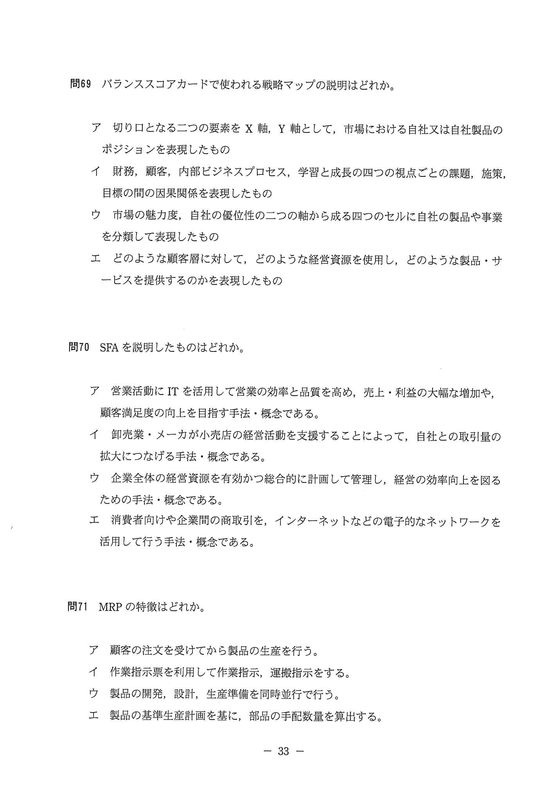

テキスト (OCR)

FIGS バランススコアカードで使われる戦略マップの説明はどれか。

ア 切り口となる二つの要素を X 軸, Y MELT, 市場における自社又は自社製品の
ポジションを表現したもの

イ 財務, BA, 内部ビジネスプロセス, 学習と成長の四つの視点ごとの課題, 施策,
目標の間の因果関係を表現したもの

ウ 市場の魅力度, 自社の優位性の二つの軸から成る四つのセルに自社の製品や事業
を分類して表現したもの

エエ どのような顧客層に対して, どのような経営資源を使用し, どのような製品・サ
ービスを提供するのかを表現したもの

間70 SFAを説明したものはどれか。

ア 営業活動に IT を活用して営業の効率と品質を高め, 売上・利益の大幅な増加や
顧客満足度の向上を目指す手法・概念である。

イ 卸売業・メーカが小売店の経営活動を支援することによって, 自社との取引量の
拡大につなげる手法・概念である。

ウ 企業全体の経営資源を有効かつ総合的に計画して管理し, 経営の効率向上を図る
ための手法・概念である。

エエ 消費者向けや企業間の商取引を, インターネットなどの電子的なネットワークを
活用して行う手法・概念である。

間71 MRP の特徴はどれか。

顧客の注文を受けてから製品の生産を行う。

作業指示票を利用して作業指示, 運搬指示をする。
製品の開発, 設計 生産準備を同時並行で行う。

製品の基準生産計画を基に, 部品の手配数量を算出する。

ロロ へ

### ページ 34

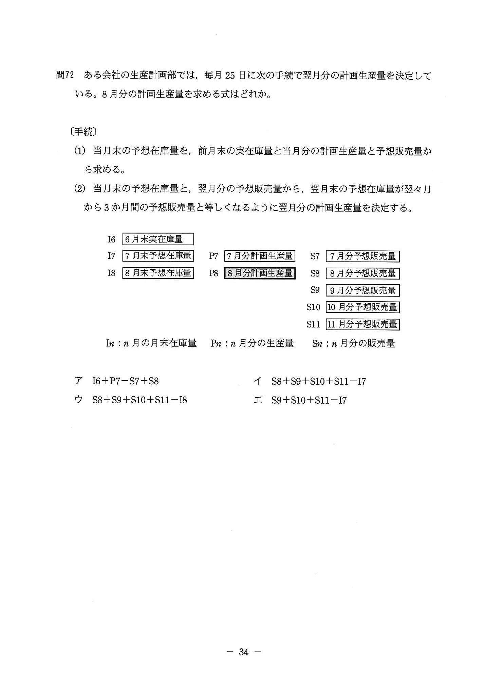

テキスト (OCR)

問72 ある会社の生産計画部では, 毎月 25 日に次の手続で翌月分の計画生産量を決定して
WS. 月分の計画生産量を求める式はどれか。

(Fist)

(1) 当月末の予想在庫量を, 前月末の実在庫量と当月分の計画生産量と予想販売量か
ら求める。

(2) 当月末の予想在庫量と, 翌月分の予想販売量から, 翌月末の予想在庫量が翌々月
から3 か月間の予想販売量と等しくなるように翌月分の計画生産量を決定する。

16

I7 |7 月末予想在庫量| P7 [7月分計画生産量| S7 | 7月分予想販売量|

8  Pa  S8
S9
Si0
S11

tz :z 月の月末在庫量 Pz:z月分の生産量 "Sz:z月分の販売量

ア 16十P7一87十S8        イ S8十S9十S10十S11 一I7
ウ §8+S9+S10+S11—I8       i S9十S10十S11 一17

### ページ 35

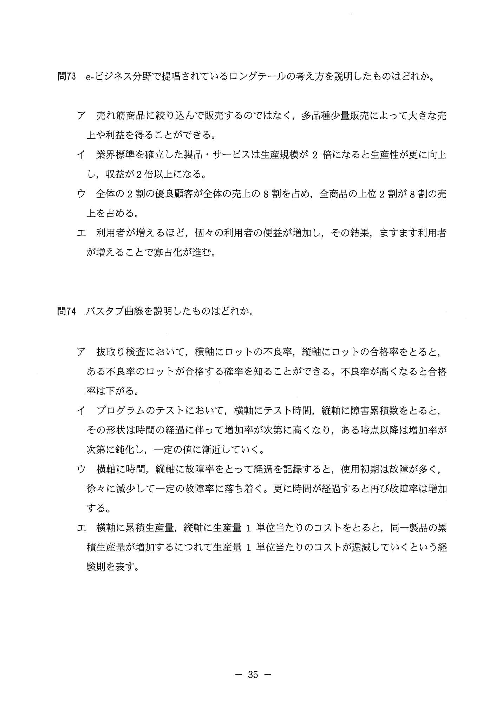

テキスト (OCR)

間73 e-ビジネス分野で提唱されているロングテールの考え方を説明したものはどれか。

ア 売れ筋商品に絞り込んで販売するのではなく, 多品種少量販売によって大きな売
上や利益を得ることができる。

イ 業界標準を確立した製品・サービスは生産規模が 2 倍になると生産性が更に向上
し, 収益が2 倍以上になる。

ウ 全体の 2 割の優良顧客が全体の売上の 8 割を占め, 全商品の上位 2 割が 割の売
上を占める。

エ 利用者が増えるほど, 個々の利用者の便益が増加し, その結果, ますます利用者
が増えることで話占化が進む。

問74 バスタブ曲線を説明したものはどれか。

ア 抜取り検査において, 横軸にロットの不良率, 縦軸にロットの合格率をとると,
ある不良率のロットが合格する確率を知ることができる。不良率が高くなると合格
率は下がる。

イ プログラムのテストにおいて, 横軸にテスト時間, 縦軸に障害累積数をとると,
その形状は時間の経過に伴って増加率が次第に高くなり, ある時点以降は増加率が
次第に鈍化し, 一定の値に河近していく。

ウ 横軸に時間, 縦軸に故障率をとって経過を記録すると, 使用初期は故障が多く,
徐々に減少して一定の故障率に落ち着く。更に時間が経過すると再び夏障率は増加
する。

エエ 横軸に累積生産量, 縦軸に生産量 1 単位当たりのコストをとると, 同一製品の累
積生産量が増加するにつれて生産量 1 単位当たりのコストが通減していくという経
BAERS.

ー 35 一

### ページ 36

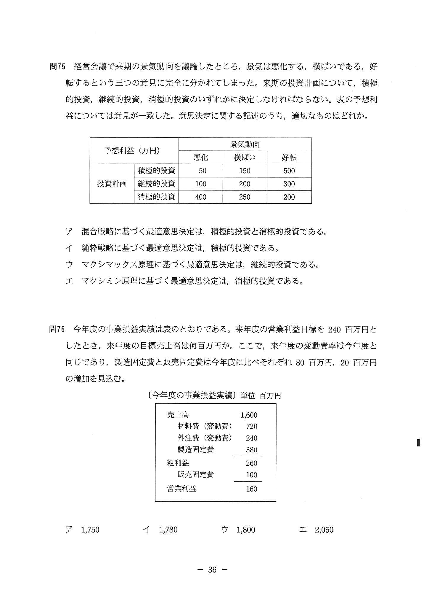

テキスト (OCR)

問75 経営会議で来期の景気動向を議論したところ, 景気は悪化する, 横ばいである, 好
転するという三つの意見に完全に分かれてしまった。来期の投資計画について, 積極
的投資, 継続的投資, 消極的投資のいずれかに決定しなければならない。表の予想利
益については意見が一致した。意思決定に関する記述のうち, 適切なものはどれか。

予想利益 (万円)                        RAGA
cal         横ばい         好転
積極的投資         50             150             500
投資計画 | 継続的投資       100           200           300
消極的投資        400            250             200

混合戦略に基づく最適意思決定は, 積極的投資と消極的投資である。
純粋戦略に基づく最適意思決定は, 積極的投資である。

マクシマックス原理に基づく最適意思決定は, 継続的投資である。
マクシミン原理に基づく最適意思決定は, 消極的投資である。

H GAN

問76 今年度の事業損益実績は表のとおりである。来年度の営業利益目標を 240 百万円と
したとき, 来年度の目標売上高は何百万円か。ここで, 来年度の変動費率は今年度と
同じであり, 製造固定費と販売固定費は今年度に比べそれぞれ 80 BAA, 20 百万円
の増加を見込む。

〔今年度の事業損益実績] 単位 GAA

売上高                    1,600
材料費 (変動費) 720
外注費 (変動費) 240

製造固定費    380
粗利益      260
販売固定費    100
営業利益      160
ア 1,750     イ 1780     ウ 1800     エ 2050

ー 36 一

### ページ 37

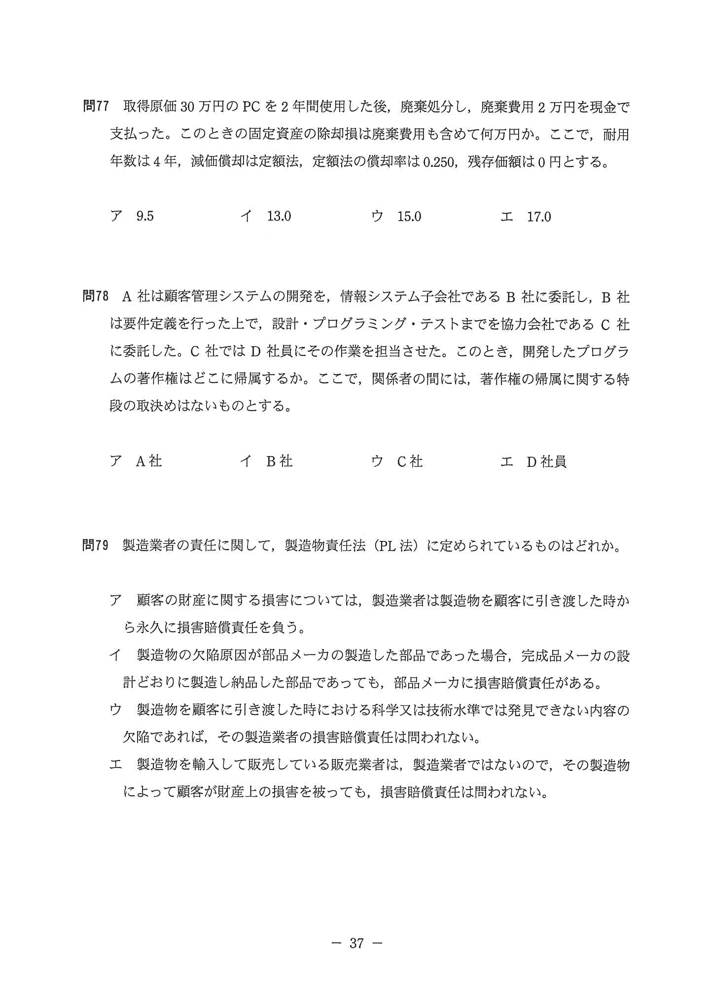

テキスト (OCR)

間77 取得原価 30 万円の PC を2 年間使用した後, 廃棄処分し, 廃棄費用 2 万円を現金で
支払った。このときの固定資産の除剤損は廃棄費用も含めて何万円か。ここで, 面用
年数は 4 年, 減価償却は定額法, 定額法の償却率は 0.250, 残存価額は0 円とする。

ア 95      イ 13.0     ウ 15.0     エエ 170

問78 A社は顧客管理システムの開発を, 情報システム子会社である B 社に委託し, B tt
は要件定義を行った上で, 設計・プログラミング・テストまでを協力会社である C 社
に委託した。C 社では D 社員にその作業を担当させた。このとき, 開発したプログラ
ムの著作権はどこに帰属するか。ここで, 関係者の間には, 著作権の帰属に関する特
段の取決めはないものとする。

ア At     qt B社     ウ C社     = D社員

問79 製造業者の貢任に関して, 製造物資任法 (PL 法) に定められているものはどれか。

ア 顧客の財産に関する損害については, 製造業者は製造物を顧客に引き渡した時か
ら永久に損害賠償責任を負う。

イ 製造物の欠陥原因が部品メーカの製造した部品であった場合, 完成品メーカの設
計どおりに製造し納品した部品であっても, 部品メーカに損害賠償責任がある。

ウ 製造物を顧客に引き渡した時における科学又は技術水準では発見できない内容の
欠陥であれば, その製造業者の損害賠償次任は問われない。

DL 製造物を輸入して販売している販売業者は, 製造業者ではないので, その製造物
によって顧客が財産上の損害を被っても, 損害賠償資任は問われない。

### ページ 38

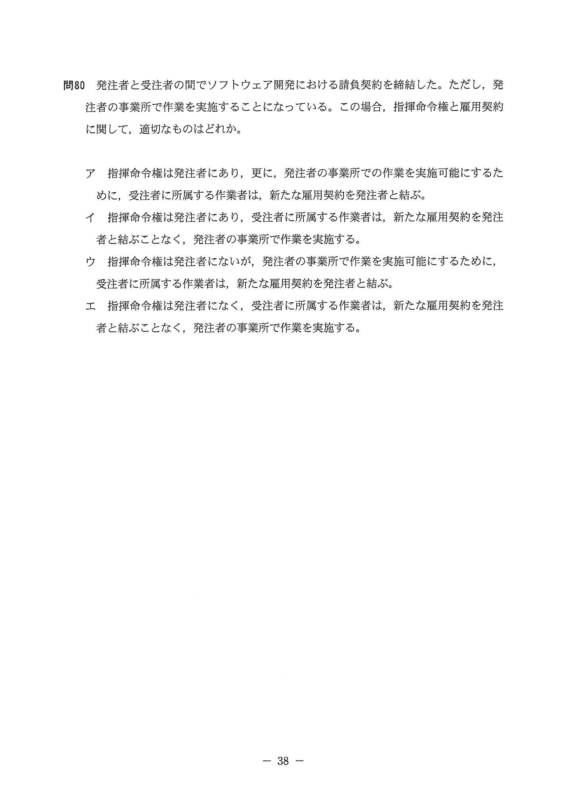

テキスト (OCR)

問80 発注者と受注者の間でソフトウェア開発における請負契約を締結した。ただし, 発
注者の事業所で作業を実施することになっている。この場合, 指揮命令権と雇用契約
に関して, 適切なものはどれか。

ア 指揮命令権は発注者にあり, 更に, 発注者の事業所での作業を実施可能にするた
Dit, 受注者に所属する作業者は, 新たな必用契約を発注者と結ぶ。

イ 指揮命令権は発注者にあり, 受注者に所属する作業者は, 新たな雇用契約を発注
者と結ぶことなく, 発注者の事業所で作業を実施する。

ウ 指揮命令権は発注者にないが, 発注者の事業所で作業を実施可能にするために,
受注者に所属する作業者は, 新たな雇用契約を発注者と結ぶ。

エエ 指揮命令権は発注者になく, 受注者に所属する作業者は, 新たな雇用契約を発注
者と結ぶことなく, 発注者の事業所で作業を実施する。

ー 38 一

### ページ 39

テキスト (OCR)

CA モ 用 紙 〕

ー 39 一

### ページ 40

テキスト (OCR)

6. 退室可能時間に途中で退室する場合には, 手を挙げて監督員に合図し, 答案用紙が
回収されてから静かに退室してください。
退室可能時間 | 10:30 ~ 11:50]
7. 問題に関する質問にはお答えできません。文意どおり解釈してください。
8. 問題冊子の余白などは, 適宜利用して構いません。
9. 試験時間中,机上に置けるものは, 次のものに限ります。
なお, 会場での貸出しは行っていません。
受験票,黒鉛筆及びシャープペンシル (B 又は HB), 鉛筆削り, 消しゴム, 定規
時計 (アラームなど時計以外の機能は使用不可), ハンカチ, ポケットティッシュ, 目薬
これら以外は机上に置けません。使用もできません。
10. 試験終了後。 この問題冊子は持ち帰ることができます。
ll, SRAM, いかなる場合でも提出してください。回収時に提出しない場合は, &
点されません。
12. 試験時間中にトイレへ行きたくなったり, 気分が悪くなったりした場合は, FEX
げて監督員に合図してください。
13, 午後の試験開始は 13:00 ですので, 12:40 までに着席してください。

試験問題に記載されている会社名又は製品名は, それぞれ各社の商標又は登録商標です。
なお, 試験問題では, ™ 及び @ を明記していません。

@2013 独立行政法人情報処理推進機構

ー 40 一

---

## 午前解答

©2013 独立行政法人情報処理推進機構 
平成25 年度 春期 応用情報技術者試験 解答例 
 
午前試験 
問番号 
正解 
問1 
イ 
問2 
ア 
問3 
ウ 
問4 
ア 
問5 
ア 
問6 
ウ 
問7 
イ 
問8 
ウ 
問9 
ウ 
問10 
エ 
問11 
ウ 
問12 
エ 
問13 
ウ 
問14 
ア 
問15 
エ 
問16 
エ 
問17 
エ 
問18 
イ 
問19 
ウ 
問20 
イ 
 
 
問番号 
正解 
問21 
イ 
問22 
ア 
問23 
ア 
問24 
エ 
問25 
ウ 
問26 
イ 
問27 
ア 
問28 
エ 
問29 
ア 
問30 
ア 
問31 
ア 
問32 
ア 
問33 
イ 
問34 
ウ 
問35 
イ 
問36 
ウ 
問37 
ウ 
問38 
ア 
問39 
イ 
問40 
イ 
 
 
問番号
正解 
問41 
イ 
問42 
ア 
問43 
ウ 
問44 
ウ 
問45 
ア 
問46 
エ 
問47 
イ 
問48 
イ 
問49 
ア 
問50 
イ 
問51 
ウ 
問52 
イ 
問53 
エ 
問54 
イ 
問55 
ウ 
問56 
ア 
問57 
エ 
問58 
ア 
問59 
エ 
問60 
ア 
 
 
問番号 
正解 
問61 
ア 
問62 
ウ 
問63 
エ 
問64 
ア 
問65 
ア 
問66 
ア 
問67 
ウ 
問68 
エ 
問69 
イ 
問70 
ア 
問71 
エ 
問72 
イ 
問73 
ア 
問74 
ウ 
問75 
エ 
問76 
エ 
問77 
エ 
問78 
ウ 
問79 
ウ 
問80 
エ

---

## 午後問題

### ページ 1

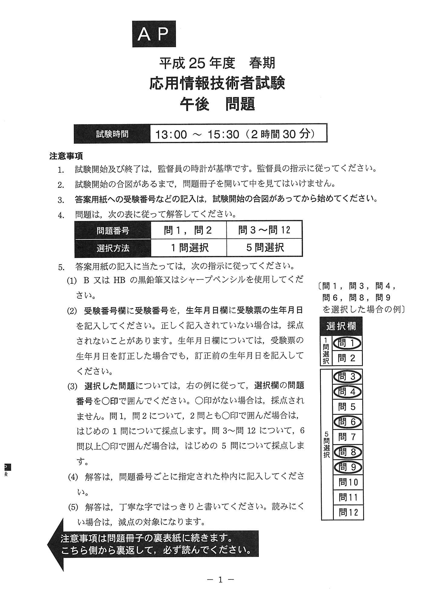

テキスト (OCR)

aa |

平成25年度 春期
応用情報技術者試験
午後 問題

adel 13:00 ~ 15:30 (2時間30 分)

注意事項
]. 試験開始及び終了は, 監督員の時計が基準です。葉叔員の指示に従ってください。
2, 試験開始の合図があるまで, 問題民子を開いて中を見てはいけません。

3. 管案用紙への受験番号などの記入は, 試験開始の合図があってから始めてください.。
4 問題は次の表に従って解答してください。

問題番号        間 1 』  問 2       問 3 て間 12
選択方法         1 間選択        5 間選択

5. 答案用紙の記入に当たっては, 次の指示従ってください。

() B 又は HB の時人和文はシャープペンシルを使用してくだmo ag.
さい。                         問6, 問8, 問9

(0) 受験番号欄に受験番号を, 生年月日材に受験団の生年月日 ” を選択した場合の例)
を記入してください。正しく記入されていない場合は。 採点
されないことがあります。生年月日欄については, BRO [IG
生年月日を訂正した場合でも, 訂正前の生年月日を記入して
ください。

(③) 選択した問題については, 右の例に従って, 選択欄の問題
番号を〇印で団んでください。〇印がない場合は, 採点され
ません。問1, 問2について, 2 問とも〇印で囲んだ場合は,
はじめの 1 問について採点します。問 3ご問 12 について, 6
問以上〇印で囲んだ場合は, はじめの 5 問について採点しま
す。

(4) 解答は, 問題番号どとに指定された要内に記入してくださ
い。

(6) MHI, 丁寧な字ではっきりと書いてください。読みにく
い場合は, 減点の対象になります。

注意事項は問題冊子の裏表紙に続きます。
こちら側から裏返して, 必ず読んでください。

### ページ 2

### ページ 3

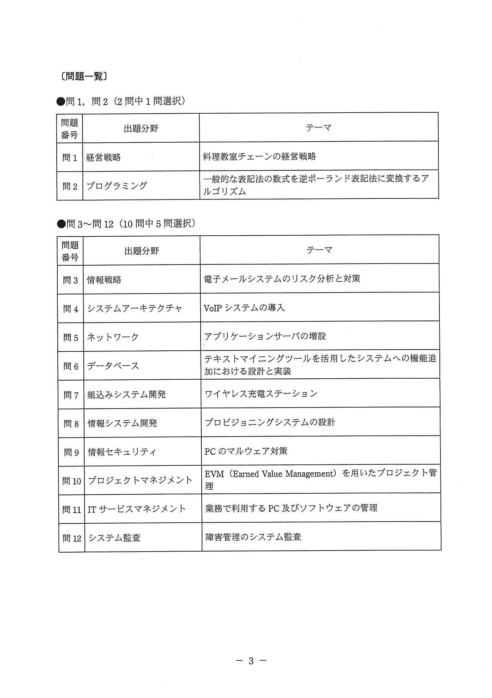

テキスト (OCR)

〔問題一覧]

@Fi1, 問2 (2問中1問選択)
上           出題分野                                    テーマ
番号
問 1 | 経営戦略                  料理教室チェーンの経営戦略
ーー             一般的な表記法の数式を送ポボーランド表記法に変換するア

間 2 | プログラミング         ルゴリズム
@ Fi 3~f 12 (10 問中 5 問選択)
ne           tH) BF                                    テーマ
番号
問 3 | 情報戦略                       電子メールシステムのリスクグ分析と対策
問 4 | システムアーキテクチャ | VoIP システムの導入
問5 | ネットワーク          アプリケーションサーバの増設

ーー           テキストマイニングツールを活用したシステムへの機能師
6 |データベース        加における設計と実装
問 7 | 組込みシステム開発      ワイヤレス充電ステーション
問 8 | 情報システム開発      プロビジョニングシステムの設計
問 9 | 情報セキュリティ         PC のマルウェア対策
問10 | プロジェクトマネジメント   っ (Earned Value Management) を用いたプロジェクト管
間 11 |TT サービスマネジメント |業務で利用する PC 及びソフトウェアの管理
間 12 VAP L Bea            障害管理のシステム監査

### ページ 4

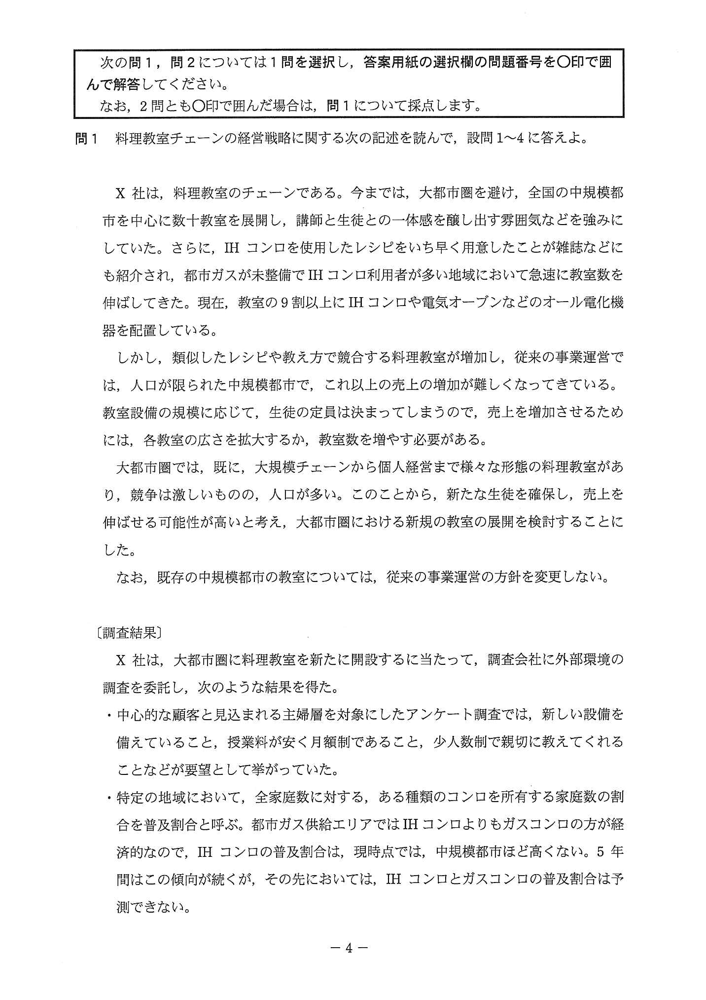

テキスト (OCR)

次の問1, 問2 については 1 問を選択し, 答案用紙の選択欄の問題番号を〇印で囲
んで解答してください。
なお, 2 問とも〇P印で囲んだ場合は, 問 1 について採点します。

All 料理教室チェーンの経営戦略に関する次の記述を読んで, 設問 1ー4 に答えよ。

X 社は, 料理教室のチェーンである。今までは, 大都市圏を避け, 全国の中規模都
市を中心に数十教室を展開し, 講師と生徒との一体感を醸し出す雰囲気などを強みに
していた。さらに, IW コンロを使用したレシピをいち早く用意したことが雑誌などに
も紹介され, 都市ガスが未整備で I コンロ利用者が多い地域において急速に教室数を
伸ばしてきた。 現在 教室の9 割以上に HH コンロや電気オーブンなどのオール電化機
器を配置している。

LAL, 類似したレシピや教え方で競合する料理教室が増加し, 従来の事業運営で
は, 人口が限られた中規模都市でこれ以上の売上の増加が難しくなってきている。
教室設備の規模に応じて, 生徒の定員は決まってしまうので, 売上を増加させるため
には, 各教室の広さを拡大するか, 教室数を増やす必要がある。

Ae Crd, 既に, 大規模チェーンから個人経営まで様々な形態の料理教室があ
り, 競争は激しいものの, 人口が多い。このことから, 新たな生徒を確保し, 売上を
伸ばせる可能性が高いと考え, 大都市園における新規の教室の展開を検討することに
した。

なお, 既存の中規模都市の教室については, 従来の事業運営の方針を変更しない。

調査結果]

X 社は, 大都市圏に料理教室を新たに開設するに当たって, 調査会社に外部環境の

調査を委託し, 次のような結果を得た。

・中心的な顧客と見込まれる主婦層を対象にしたアンケート調査では, 新しい設備を
備えていること, 授業料が安く月額側であること, 少人数制で親切に教えてくれる
ことなどが要望として挙がっていた。

・特定の地域において, 全家庭数に対する, ある種類のコンロを所有する家庭数の割
合を普及割合と呼ぶ。都市ガス供給エリアでは IH コンロよりもガスコンロの方が経
済的なので, IH コンロの普及割合は, 現時点では, 中規模都市ほど高くない。 5 年
間はこの傾向が続くが, その先においては, I コンロとガスコンロの普及割合は予
測できない。

### ページ 5

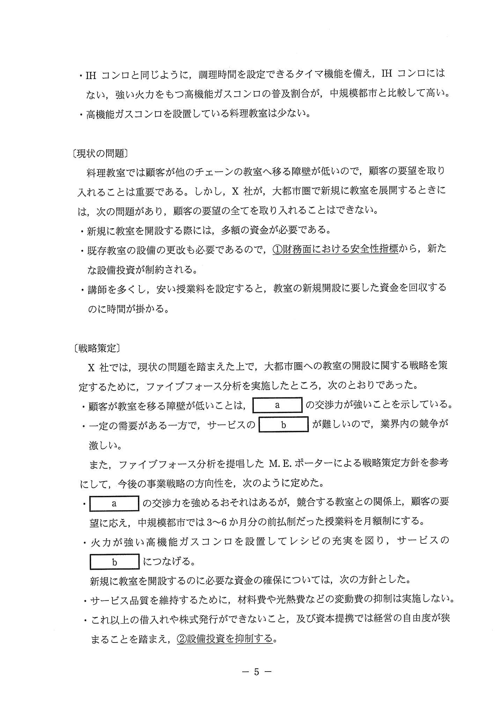

テキスト (OCR)

・IH コンロと同じように, 調理時間を設定できるタイマ機能を備え, IH コンロには
BW, 強い火力をもつ高機能ガスコンロの普及割合が, 中規模都市と比較して高い。
・高機能ガスコンロを設置している料理教室は少ない。

[現状の問題〕
料理教室では顧客が他のチェーンの教室へ移る障壁が低いので, 顧客の要望を取り
入れることは重要である。しかし, X 社が, 大都市圏で新規に教室を展開するときに
は, 次の問題があり, 顧客の要望の全てを取り入れることはできない。
・新規に教室を開設する際には, 多額の資金が必要である。
・既存教室の設備の更政も必要であるので, ①財務面における安全性指標から, 新た
な設備投資が制約される。
・講師を多くし, 安い授業料を設定すると, 教室の新規開設に要した資金を回収する
のに時間が掛かる。

(戦略策定]
X 社では, 現状の問題を踏まえた上で, 大都市圏への教室の開設に関する戦略を策
定するために, ファイブフォース分析を実施したところ, 次のとおりであった。
・ 顧客が教室を移る障壁が低いととは, |  a | の交渉力が強いことを示している。
・一定の需要がある一方で, サービスの|  b | が難しいので, 業界内の競争が
激しい。
また, ファイブフォース分析を提唱した ME. ポーターによる戦略策定方針を参考
にして, 今後の事業戦略の方向性を, 次のように定めた。
・| s J の交渉を強めるおそれはあるが, 競合する教室との関係上, BOR
望に応え, 中規模都市では3て6 か月分の前払制だった授業料を月額制にする。
・ 火力が強い高機能ガスコンロを設置してレシピの充実を図り, サービスの
| 5 |につなげる。
新規に教室を開設するのに必要な資金の確保については, 次の方針とした。
・サービス品質を維持するために, 材料費や光熱費などの変動費の抑制は実施しない。
・ これ以上の借入れや株式発行ができないこと, 及び資本提携では経営の自由度が外
まることを踏まえ, ②設備投資を換制する。

ー5一

### ページ 6

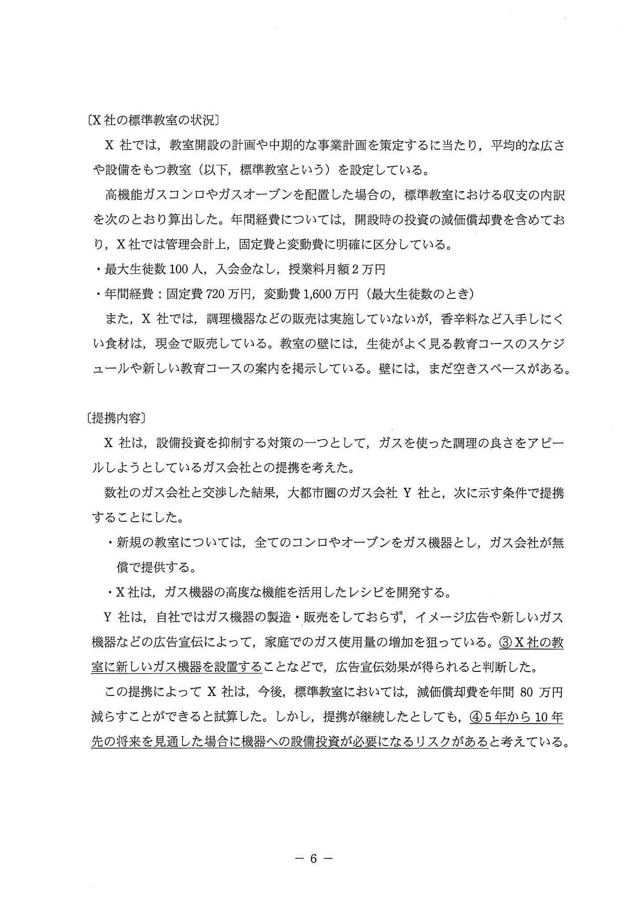

テキスト (OCR)

(X 社の標準教室の状況〕

X 社では, 教室開設の計画や中期的な事業計画を集定するに当たり, 平均的な広さ
や設備をもつ教室 (以下, 標準教室という) を設定している。

高機能ガスコンロやガスオーブンを配置した場合の, 標準教室における収支の内訳
を次のとおり算出した。年間経費については, 開設時の投資の減価償却費を含めてお
り, XX 社では管理会計上, 固定費と変動費に明確に区分している。

・最大生徒数 100 人, 入会金なし, 授業料月額2 万円
・ 年間経費 : 固定費 720 万円, 変動費 1.600 万円 (最大生徒数のとき)

また, X 社では, 調理機器などの販売は実施していないが, 香辛料など入手しにく
い食材は, 現金で販売している。教室の壁には, 生徒がよく見る教育コースのスケジ
ュールや新しい教育コースの案内を掲示している。壁には, まだ空きスペースがある。

提携内容)

X 社は, 設備投資を抑制する対策の一つとして, ガスを使った調理の良さをアピー
ルしようとしているガス会社との提携を考えた。

数社のガス会社と交渉した結果, 大都市圏のガス会社 Y HL, 次に示す条件で提携
することにした。

・新規の教室については, 全てのコンロやオーブンをガス機器とし, ガス会社が無

償で提供する。

・X 社は, ガス機器の高度な機能を活用したレシピを開発する。

Y 社は, 自社ではガス機器の製造・販売をしておらず, イメージ広告や新しいガス
機器などの広告宣伝によって, 家庭でのガス使用量の増加を狙っている。③X 社の教
室に新しいガス機器を設置することなどで, 広告宣伝効果が得られると判断した。

この提携によって X 社は, 今後, 標準教室においては, 減価償却費を年間 80 万円
減らすことができると試算した。しかし, 提携が継続したとしても, ④5 年から 10 年
先の将来を見通した場合に機器への設備投資が必要になるリスクがあると考えている。

### ページ 7

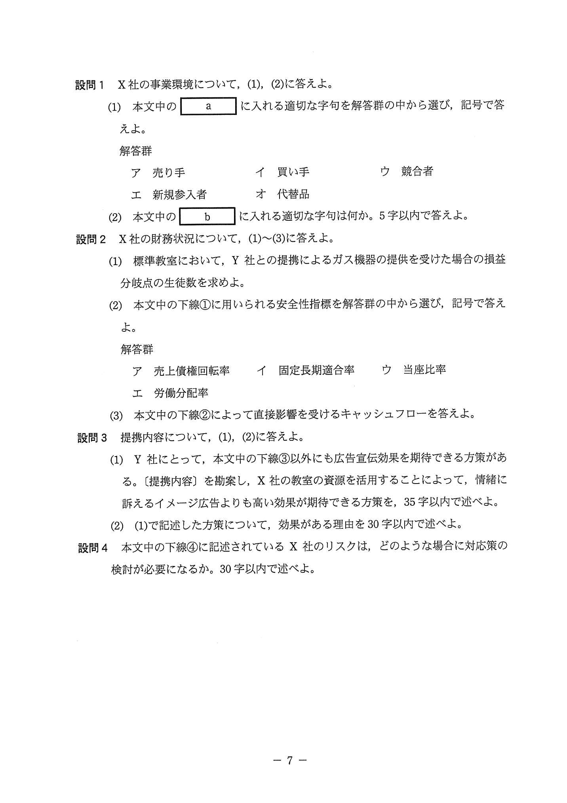

テキスト (OCR)

設問1 X社の事業環境について, ①⑪, (②に答えよ。

a 本文中の| a |] に入れる適切な字句を解答群の中から選び,

記号で答
えよ。
解答群
ア 売り手     イ 買い手     ウ 競合者
エエ 新規参入者    オ 代符品

@ 本文中の| b | に入れる適切な字句は何か。5宇以内で答えよ。
設問2 X社の財務状況について, ①⑪ぐ(3⑬)に答えよ。

(1) 標準教室において, Y 社との提携によるガス機器の提供を受けた場合の損益
分岐点の生徒数を求めよ。

(②) 本文中の下線〇に用いられる安全性指標を解答群の中から選び, 記号で答え
よ

ア 売上全権回転率

イ 固定長期適合率  ウ 当座比率
エエ 労働分配率

(3) 本文中の下線②によって直接影響を受けるキャッシュフローを答えよ。
設問3 提携内容について, (D, ②⑫)に答えよ。
1) Y 社にとって, 本文中の下線③以外にも広告宣伝効果を期待できる方策があ
る。 [提携内容〕】 を勘案し, X 社の教室の資源を活用することによって, 情緒に
訴えるイメージ広告よりも高い効果が期待できる方策を, 35 字以内で述べよ。
2) (①で記述した方人策について, 効果がある理由を 30 字以内で述べよ。

設問4 本文中の下線④に記述されている X 社のリスクは, どのような場合に対応策の
検討が必要になるか。30 字以内で述べよ。

### ページ 8

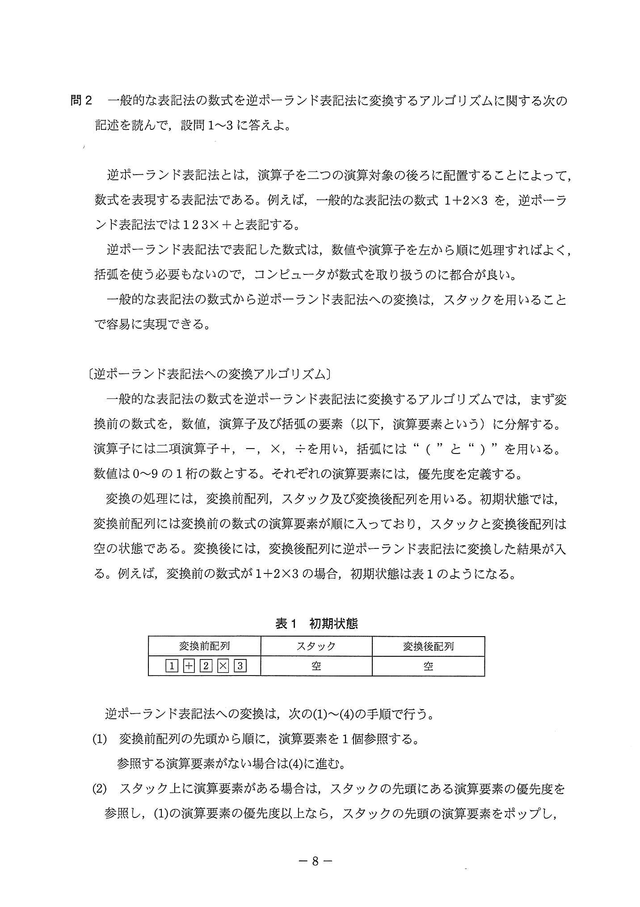

テキスト (OCR)

問2 一般的な表記法の数式を逆ポーランド表記法に変換するアルゴリズムに関する次の
記述を読んで, 設問 1て3 に答えよ。

逆ポボーランド表記法とは, 演算子を二つの演算対象の後ろに配置することによって,
数式を表現する表記法である。例えば, 一般的な表記法の数式 1]士2X3 を, 逆ポーラ
ンド表記法では 1 2 3X十と表記する。

逆ポーランド表記法で表記した数式は, 数値や演算子を左から順に処理すればよく,
括弧を使う必要もないので, コンピュータが数式を取り扱うのに都合が良い。

一般的な表記法の数式から逆ポーランド表記法への変換は, スタックを用いること
で容易に実現できる。

〔逆ポーランド表記法への変換アルゴリズム)〕

一般的な表記法の数式を逆ポボーランド表記法に変換するアルゴリズムでは, ETA
換前の数式を, 数値, 演算子及び括弧の要素 (以下, 演算要素という) に分解する。
演算子には二項演算子十, 一, X, eA, 括弧には“"(” と“ ) ” を用いる。
数値は 0て9 の 1 桁の数とする。それぞれの演算要素には, 優先度を定義する。

変換の処理には, 変換前配列, スタック及び変換後配列を用いる。初期状態では,
変換前配列には変換前の数式の演算要素が順に入っており, スタックと変換後配列は
空の状態である。変換後には, 変換後配列に逆ポーランド表記法に変換した結果が入
る。例えば, 変換前の数式が1]十2X3 の場合 初期状態は表 1 のようになる。

表1 初期状態
EMF               スタック               FERIEEEFI
             ES                    8

逆ポボーランド表記法への変換は, 次の1)て④の手順で行う。
①) 変換前配列の先頭から順に, 演算要素を 1 個参照する。
参照する演算要素がない場合は(④に進む。
(2②) スタック上に演算要素がある場合は, スタックの先頭にある演算要素の優先度を
BRL, 1)の演算要素の優先度以上なら, スタックの先頭の演算要素をポボップし,

ー8一

### ページ 9

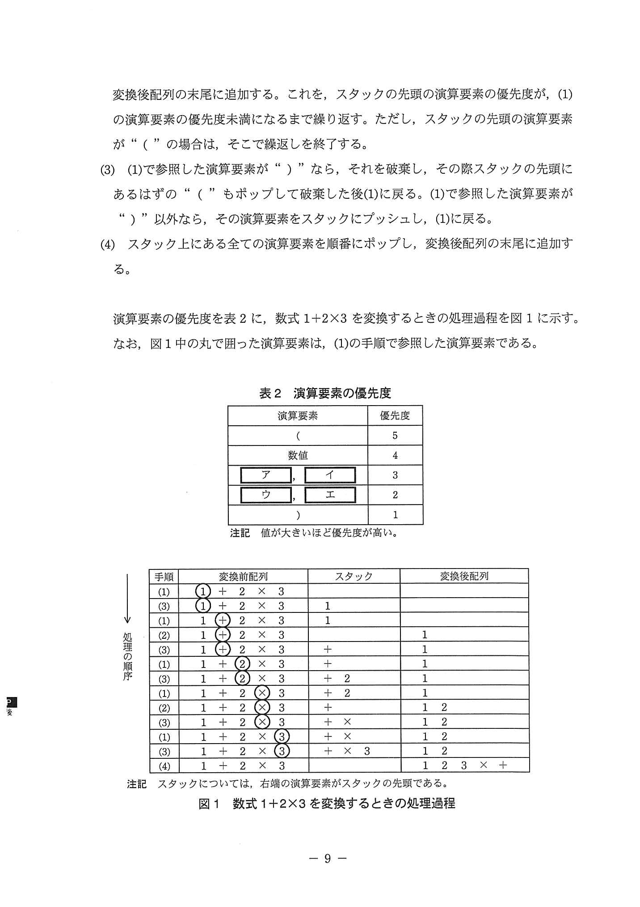

テキスト (OCR)

変換後配列の末尾に追加する。これを, スタックの先頭の演算要素の優先度が, Q)
の演算要素の優先度未満になるまで繰り返す。ただし, スタックの先頭の演算要素
BM“ (” の場合は, そこで繰返しを終了する。

3) Q①)で参照した演算要素が “ ) 5, それを破棄し. その際スタックの先頭に
あるはずの " ( " もボップして破棄した後(1)に戻る。)で参照した演算要素が
“) ” 以外なら, その演算要素をスタックにプッシュレし, ①に戻る。

4) スタック上にある全ての演算要素を順番にボップし, 変換後配列の未尾に追加す
る。

演算要素の優先度を表 2 に, 数式 1+2X3 を変換するときの処理過程を図 1 に示す。
なお, 図 1 中の丸で囲った演算要素は, (1)の手順で参照した演算要素である。

表2 演算要素の優先度

演算要素      優先度
(       5
数値      4
L アァアル| イィ |   3
a ]   2
)       1
注記 値が大きいほど優先度が高い。
手順               変換前配列                      スタック                      変換後配列
①| ①+ 2 x 3
3g | G+ 2 x 3   1
@   1G@)2 x 3    1
処 |_@)  1G) 2 x 3          1
前  @)  1G) 2 x 3   +       1
順  (1)   1+Q)x 3    +        1
だ | ⑧  1 +@ x 3   + 2      1
(1)   1+ 2®) 3   + 2      i
(2)  1 + 2 (%) 3   +       1 2
(3)  1 + 2 (%) 3   + x      1 2
①⑪  1 + 2 x @)   + x     1 2
)  1+ 2 x@)   + xX 3    1 2
4)  1+ 2 x 3          1 2 3 xX +

注記 スタックについては, 右端の演算要素がスタックの先頭である。
図1 数式1+2X3 を変換するときの処理過程

### ページ 10

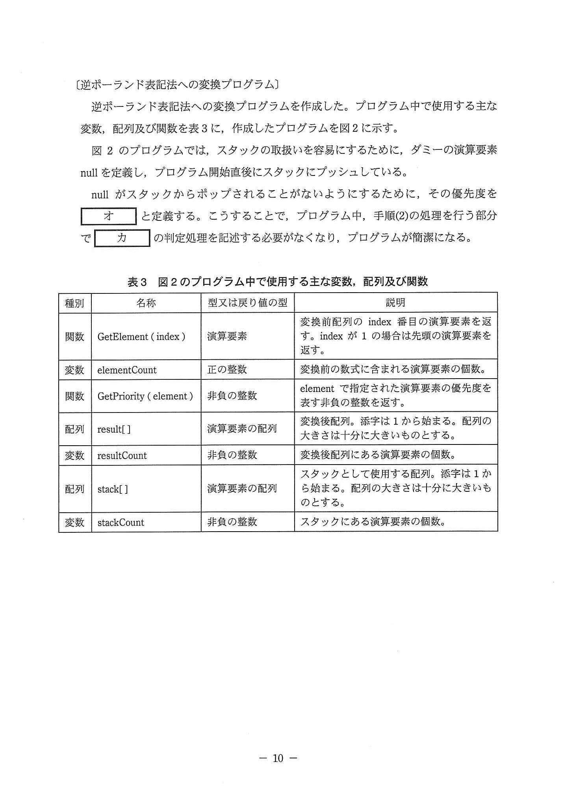

テキスト (OCR)

(逆ポボーランド表記法への変換プログラム〕

逆ボポーランド表記法への変換プログラムを作成した。プログラム中で使用する主な
変数配列及び関数を表 3 に, 作成したプログラムを図 2 に示す。

図 2 のプログラムでは, スタックの取扱いを容易にするために, ダミーの演算要素
null を定義し, プログラム開始直後にスタックにプッシュしている。

null がスタックからポップされるととがないようにするために, その優先度を
| オ | と定義する。こうすることで, プログラム中, 手順②の処理を行う部分
で の判定処理を記述する必要がなくなり, プログラムが簡潔になる。

表3 図2のプログラム中で使用する主な変数, 配列及び関数

種別       名称       型又は戻り値の型             説明
変換前配列の index 番目の演算要素を返

関数 | GetElement (index )    演算要素         す。index が 1 の場合は先頭の演算要素を
返す。

変数 | elementCount      正の整数      変換前の数式に含まれる演算要素の個数。
element で指定された演算要素の優先度を

関数 | GetPriority ( element ) | 非負の整数             表す非負の整数を返す。

変換後配列。添字は 1 から始まる。 MAO

配列 | result[ ]                 演算要素の配列     大きさは二分に大きいものとする。
変数 | resultCount                      非負の整数                変換後配列にある演算要素の個数。
スタックとして使用する配列。添字は 1 か
配列 | stack[]               演算要素の配列     ら始まる。配列の大きさは十分に大きいも
のとする。
変数 | stackCount      非負の整数    スタックにある演算要素の個数。

ー 10 一

### ページ 11

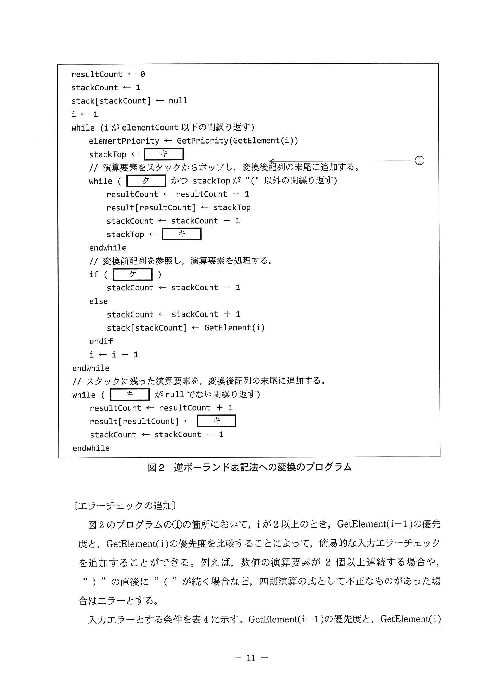

テキスト (OCR)

resultCount < @
stackCount て 1
stack[ stackCount] で null
i 7
while (i が elementCount 以下の間繰り返す)
elementPriority < GetPriority(GetElement(i))
stackTop <—
// 演算要素をスタックからポボップし, 変換後配列の末尾に追加する。
while ( かつ stackTop が "(" 以外の間繰り返す)
resu1tCount <- resu1tCount + 1
result[resultCount] て- stackTop
stackCount < stackCount 一 1
stackTop <—
endwhile
// 変換前配列を参照し, 演算要素を処理する。
if ( )
stackCount < stackCount 一 1
else
stackCount < stackCount + 1
stack[ stackCount] で GetElement(i)
endif
ューュ二 1
endwhile
// スタックに残った演算要素を, 変換後配列の未尾に追加する。
while ( が null でない間繰り返す)
resultCount <- resultCount + 1

result[resultCount] —

stackCount < stackCount 一 1

endwhile

 2 逆ポーランド表記法への変換のプログラム

〔【エラーチェックの追加〕

図 2 のプログラムの①の箇所において, iが2 以上のとき, GetElement(i一1 )の優先
度と, GetElement(1)の優先度を比較することによって, 簡易的な入力エラーチェック
を追加することができる。例えば, 数値の演算要素が 2 個以上連続する場合や,
“)” の直後に“ ("が続く場合など, 四則演算の式として不正なものがあった場
合はエラーとする。

入力エラーとする条件を表 4 に示す。GetElement(i一1 )の優先度と, GetElement(i)

ー 11 一

### ページ 12

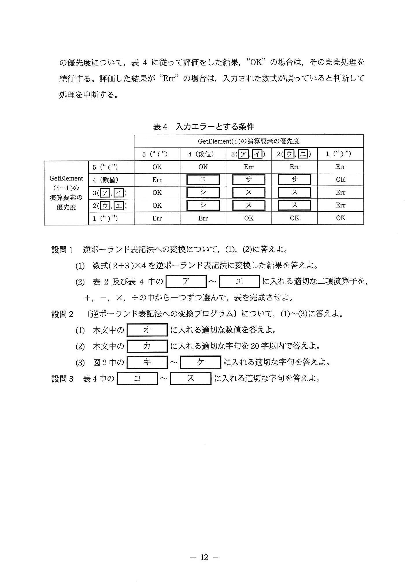

テキスト (OCR)

の優先度について, 表 4 に従って評価をした結果, “OK” OWA, そのまま処理を
続行する。評価した結果が “Err”の場合は, 入力された数式が誤っていると判断して
処理を中断する。

表4 入力エラーとする条件

GetElement(1)の演算要素の優先度
5で(う)    4 (数値) | 3アレ | 2 | 1の5
5で(9         OK          OK          Err          Err          Err
GetElement | 4 (ett)     Err     2 ||| 3 J} サ |   OK
gmo (ED [ok | Ee | |
sexe | 2(>) Ee)      OK     [シシ|]|[え[ミコ      Br
1 (“)”)            Err            Err            OK            OK            OK

設問1 逆ポーランド表記法への変換について, ①, (②)に答えよ。
Q) 数式(2十3 )X4 を逆ポボーランド表記法に変換した結果を答えよ。
Q 表 2 及び表 4 中の| ア |~| エ |に入れる適切な二項演算子を,
+, 一, X, の中から一つずつ選んで, 表を完成させよ。
設問2 〔逆ポーランド表記法への変換プログラム〕について, ①ぐて⑬)に答えよ。
Q①) 本文中の に入れる適切な数値を答えよ。
⑫ 本文中の に入れる適切な字旬を 20 字以内で答えよ。
3⑬ 図2中の| キ |x| ヶケ |に入れる適切な字句を答えよ。
設問3 表4中の| コ |て| ス |に入れる適切な字句を答えよ。

ー 12 一

### ページ 13

テキスト (OCR)

CA モ 用 紙 〕

ー 13 一

### ページ 14

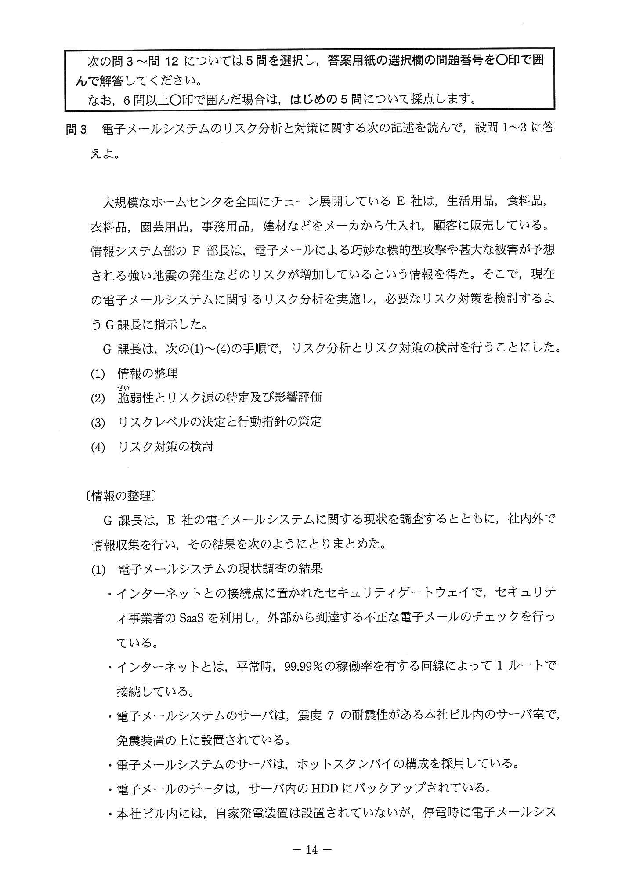

テキスト (OCR)

ROM 3 >問 12 については5問を選択し, 答案用紙の選択欄の問題番号を〇印で囲
んで解答してください。
なお, 6 問以上〇印で囲んだ場合は, はじめの 5 問について採点します。

問3 電子メールシステムのリスクグ分析と対策に関する次の記述を読んで, 設問 1<3 に答
えよ。

大規模なホームセンタを全国にチェーン展開している E 社は, 生活用品。 食料品
ALE, HEA, KBAR, 建材などをメーカカから仕入れ。腺客に販売している。
MMO ATAMO F 部長は, 電子メールによる巧妙な標的型攻撃や甚大な被害が予想
される強い地震の発生などのリスクが増加レしているという情報を得た。そこで, 現在
の電子メールシステムに関するリスク分析を実施し, 必要なリスク対策を検討するよ
う G 課長に指示した。

G 課長は。 次の(①(④の手順で, リスク分析とリスク対策の検討を行うことにした。
() 情報の整理
(2) 脆弱性とリスク源の特定及び影終価
8) リスクレベルの決定と行動指針の策定
(④ リスク対策の検討

情報の整理]
G 課長は, 社の電子メールシステムに関する現状を調査するとともに, 社内外で
情報収集を行い その結果を次のようにとりまとめた。
Q) 電子メールシステムの現状調査の結果
・インターネットとの接続点に置かれたセキュリティゲートウェイで, セキュリテ
イィ事業者の SaaS を利用し, 外部から到達する不正な電子メールのチェックを行っ

ている。
・インターネットとは, 平常時, 99.99%の稼働率を有する回線によって 1 ルートで
接続している。

・電子メールシステムのサーバは, 震度 7 の耐震性がある本社ビル内のサーバ室で,
免震装置の上に設置されている。

・電子メールシステムのサーバは, ホットスタンバイの構成を採用している。

・電子メールのデータは, サーバ内の HDD にバックアップされている。

・本社ビル内には, 自家発電装置は設置されていないが, 停電時に電子メールシス

ー 14 一

### ページ 15

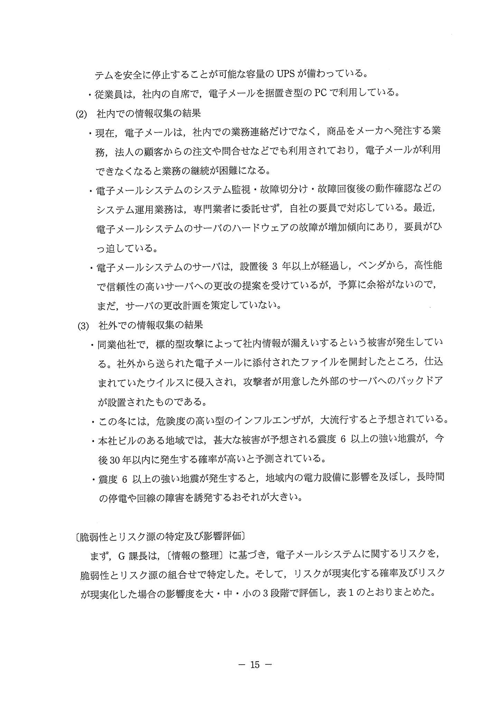

テキスト (OCR)

テムを安全に停止することが可能な容量の UPS が備わっている。
・従業員は, 社内の自席で, 電子メールを据置き型のPC で利用している。
2) 社内での情報収集の結果

・現在, 電子メールは, 社内での業務連絡だけでなく, 商品をメーカへ発注する業
務, 法人の顧客からの注文や問合せなどでも利用されており, 電子メールが利用
できなくなると業務の継続が困難になる。

・ 電子メールシステムのシステム監視・故障切分け・夏障回復後の動作確認などの
システム運用業務は, 専門業者に委託せず, 自社の要員で対応している。最近
電子メールシステムのサーバのハードウェアの故障が増加傾向にあり, 要員がひ
っ人迫している。

・電子メールシステムのサーバは, 設置後 3 年以上が経過し, ベンダから, 高性能
で信頼性の高いサーバへの更改の提案を受けているが, 予算に余裕がないので
ER, サーバの更改計画を策定していない。

(3) 社外での情報収集の結果

・同業他社で, 標的型攻撃によって社内情報が漏えいするという被害が発生してい
る。 社外から送られた電子メールに添付されたファイルを開封したところ, 仕込
まれていたウイルスに侵入され, 攻撃者が用意した外部のサーバへのバックドア
が設置されたものである。

・ この冬には, 危険度の高い型のインフルエンザが, 大流行すると予想されている。

・本社ビルのある地域では, 甚大な被害が予想される震度 6 以上の強い地震が, +
後 30 年以内に発生する確率が高いと予測されている。

BE 6 以上の強い地震が発生すると, 地域内の電力設備に影響を及ばし, 長時間
の停電や回線の障害を誘発するおそれが大きい。

[脆弱性とリスク源の特定及び影響評価)〕

まず, G 課長は, 〔情報の整理】 に基づき, 電子メールシステムに関するリスクを,
脆弱性とリスク源の組合せで特定した。そして, リスクが現実化する確率及びリスク
が現実化した場合の影響度を大・中・小の 3 段階で評価し, 表 1 のとおりまとめた。

ー 15 一

### ページ 16

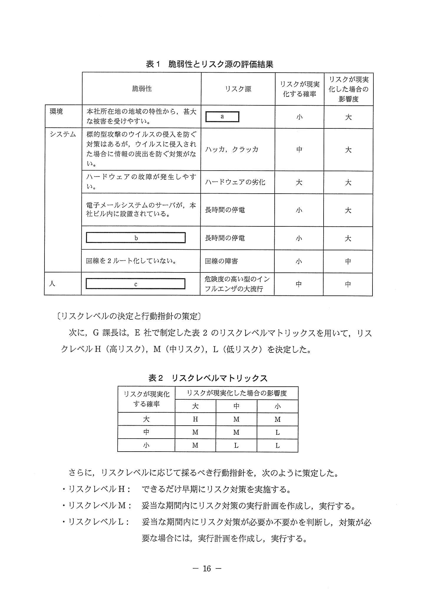

テキスト (OCR)

表1 脆弱性とリスク源の評価結果

waa: | DAP RHE
1      Sz
eat          リスタ源    home | 化した場合の
影響
AAEM O WROD 5, EK
BEBE ET,                   [La]                   al               -
システム | MAOMLORDT 4 VAOBAES
対策はあるが, ウイルスに侵入され      _-
た場合に情報の流出を防ぐ対策がな | 7 77777
い。
ハードウェアの者が先しやす | ッッの      内
電子メールシステムのサーバが, 本
社ビル内に設年されている。     BRM OME        *      es
|      b      | | semose       ih      大
回線を2ルート化していない。    aOR         が      中
危険度の高い型のイン
|       =      | | Syrvtonts     『      上

〔リスクレベルの決定と行動指針の策定〕

Ric, G 課長は, E 社で制定した表 2 のりリスクレベルマトリックスを用いて, リス
クレベル H (高リスク), M (中リスク), L (低リスク) を決定した。

表2 リスクレベルマトリックス

リスクが現実化     リスクが現実化した場合の影響度
する確率            大             中              小
大                 H              M             M
中                M             M              L
小                M              L

さらに, リスクレベルに応じて採るべき行動指針を, 次のように策定した。

・リスクレベル是: できるだけ早期にリスク対策を実施する。

・リスクレベルM : 妥当な期間内にリスク対策の実行計画を作成し, 実行する。

・リスクレベルL: 妥当な期間内にリスク対策が必要か不要かを判断し, 対策が必
要な場合には, 実行計画を作成し, 実行する。

ー 16 一

### ページ 17

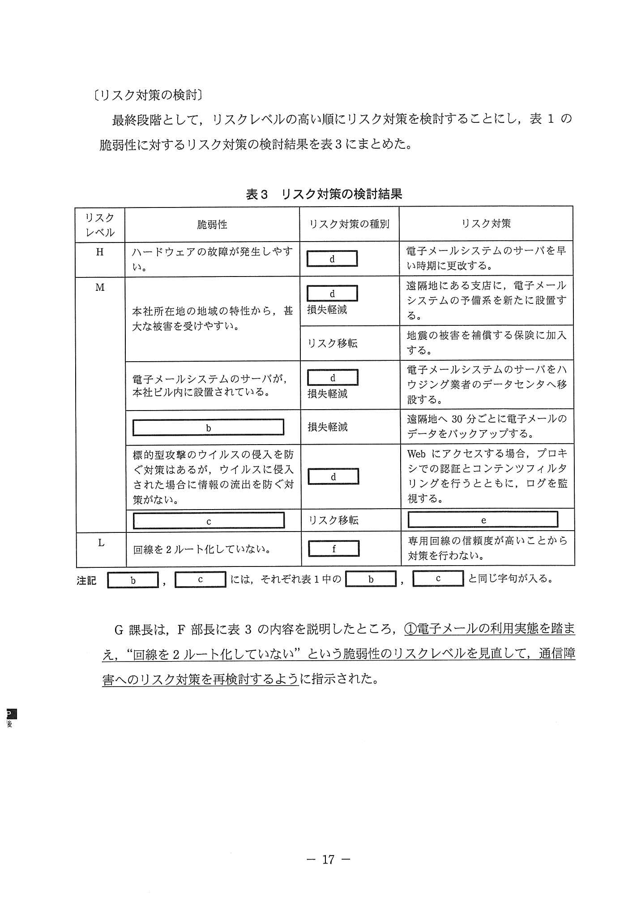

テキスト (OCR)

“a

〔リスク対策の検討]
最終段階ヒして, リスクレベルの高い順にリスク対策を検討することにし, 表 1 の
脆弱性に対するリスク対策の検討結果を表3 にまとめた。

表3 リスク対策の検討結果

リスク

レベル                       脆弱性                        リスク対策の種別                     リスク対策
H   ハードウェアの故障が発生しやす            電子メールシステムのサーバを早
い。                 La]     い時期に更改する。
M                        し ェ」      遠隔地にある支店に, 電子メール
VAF LO Pith ER 72 (CE
AMPLE OWROMD 5, I | HIER      oA 7 ROPER EEECEES
大な被害を受けやすい。
リスク移転     NN
電子メールシステムのサーバをハ
電子メールシステムのサーバが, | [ qa |      on     oer
本社ビル内に設置されている。   損失軽減    4 タセンタへ移
6              遠隔地へ 30 分ごとに電子メールの
|       | | stem      データをパックアップする。
標的型攻撃のウイルスの侵入を防               Web にアクセスする場合,プロキ
ぐ対策はあるが, ウイルスに侵入 Caz]     シでの認証とコンテンツフィルタ
された場合に情報の流出を防ぐ対            リングを行うとともに, ログを監
FINITE.                                           視する。
|        c        |   リスク移転     |        e        |
L         _                       専用回線の信頼度が高いことから
回線を2ルート化していない。   pr eareninaty

注記 | 5 |], [| c | には, それぞれ表1中の[| bp |],| c | と同じ字句が入る。

G 課長は, F BRICK 3 の内容を説明したところ, ①電子メールの利用実態を踏ま

As

"回線を 2 ルート化していない”という脆弱性のりスクレベルを見直して, 通信障

害へのリスク対策を再検討するように指示された。

ー 17 一

### ページ 18

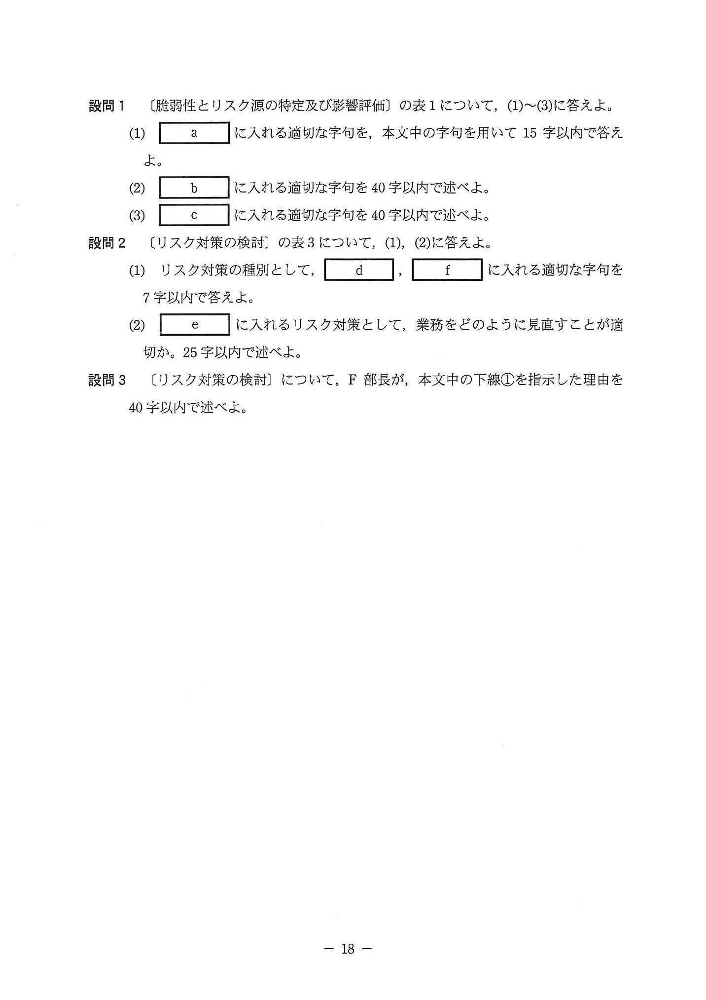

テキスト (OCR)

設問1 [脆弱性とリスク源の特定及び影響評価] の表 1 について, Q①)て⑬)に答えよ。
@ (a | に入れる適切な字句を, 本文中の字句を用いて 15 字以内で答え
AM
@ [| 5 __ ]icrnsiierae 40 UCR,
@) に入れる適切な字句を 40 字以内で述べよ。
設問2 (リスク対策の検討〕 の表 3 について, ①, ②に答えよ。
Q) リスク対策の種別として, | od |,|  f |に入れる適切な字句を
7 字以内で答えよ。
@ [ec | に入れるリスク対策として, 業務をどのように見直すととが敵
切か。25 字以内で述べよ。
設問3 〔リスク対策の検討]について, F BEM, 本文中の下線①を指示した理由を
40 字以内で述べよ。

ー 18 一

### ページ 19

テキスト (OCR)

【 メモ 用 紙 J

ー 19 一

### ページ 20

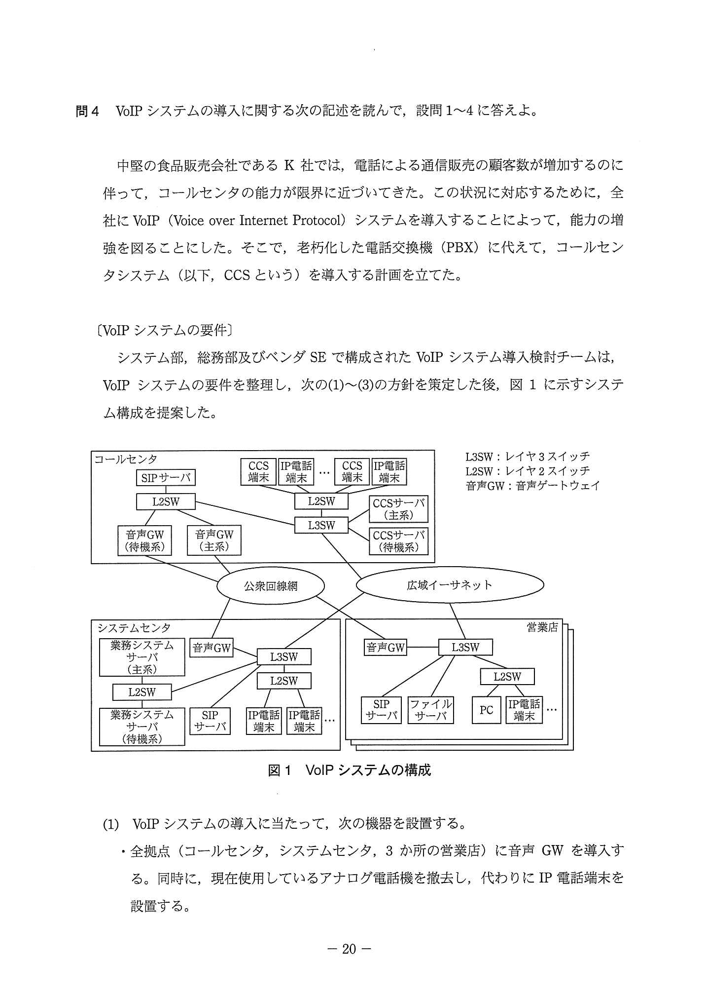

テキスト (OCR)

4 VoIP システムの導入に関する次の記述を読んで, 設問 1て4 に答えよ。

中堅の食品販売会社である K 社では, 電話による通信販売の顧客数が増加するのに
伴って, コールセンタの能力が限界に近づいてきた。この状況に対応するために, 全
社に VoIP (Voice over Internet Protocol) システムを導入することによって, 能力の増
強を図ることにした。そこで, 老朽化した電話交換機 (PBX) に代えて, コールセン
タシステム (以下, CCS という) を導入する計画を立てた。

(VoIP システムの要件]

システム部, 総務部及びベンダ SE で構成された VIP システム導入検討チテームは,
VoIP システムの要件を整理し, 次の(1)~(③)の方針を集定した後, 1 に示すシステ
ム構成を提案した。

ールセ>                       iy    ,
ーーー    GES [ESE ..| CS [PRE     12SWi レイヤッスイッチ
ーバ         we | y        i     ¥                 :
a          ae       a       HRGW: BRP b Dt
L2SW          L2SW   CCS$サーバ
音声GW | | 音声Gw           CCSサーバ
(待機系)   (ER)            (待機系)
システムセンタ   /                         営業店
業務システム                音声GW    L3SW
サーバ         L3SW |
ER)
             [usw |
SiP | ワァイル     PEt
業務システム || SE | [電話| (Pae)...|| |サーバ|| サーバ  PC 端末
サーバ |サーバ| | 端末 | [oak
(HER)               ヒ

 1 VolP システムの構成

GQ) VoIP システムの導入に当たって, 次の携器を設置する。
・全拠点 (コールセンタ, システムセンタ, 3 か所の営業店) に音声 GW を導入す
る。同時に, 現在使用しているアナログ電話機を撤去し, 代わりに TP 電話端末を
設置する。

ー 20 一

### ページ 21

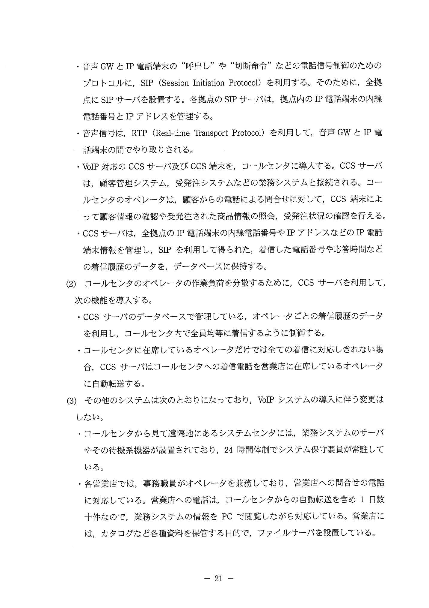

テキスト (OCR)

・音声 GW と IP 電話端末の“呼出し” や “切断命令" などの電話信号制御のための
プロトコルに, SIP (Session Initiation Protocol) を利用する。そのために, SH
点に SIP サーバを設置する。各拠点の SIP サーバは, 拠点内の TP 電話端末の内線
電話番号と IP アドレスを管理する。

・音声信号は, RTP (Real-time Transport Protocol) を利用して, 音声GWとTP電
話端末の間でやり取りされる。

+ VoIP 対応の CCS サーバ及び CCS 端末を, コールセンタに導入する。CCS サーバ
は, 顧客管理システム, 受発注システムなどの業務システムと接続される。コー
ルセンタのオペレータは, 顧客からの電話による問合せに対して, CCS 端末によ
って顧客情報の確認や受発注された商品情報の照会, 受発注状況の確認を行える。

・CCS サーバは, 全拠点の TP 電話端末の内線電話番号や IP アドレスなどの IP 電話
端末情報を管理し, SIP を利用して得られた, 着信した電話番号や応答時間など
の着信履歴のデータを, データベースに保持する。

Q) コールセンタのオペレータの作業負荷を分散するために, CCS サーバを利用して,

次の機能を導入する。

・CCS サーバのデータベースで管理している, オペレータごとの着信履歴のデータ
を利用し, コールセンタ内で全員均等に着信するように制御する。

・コールセンタに在席しているオペレータだけでは全ての着信に対応しきれない場
合, CCS サーバはコールセンタへの着信電話を営業店に在席しているオペレータ
に自動転送する。

8) その他のシステムは次のとおりになっており, VIP システムの導入に伴う変更は

しない。

・コールセンタから見て遠隔地にあるシステムセンタには, 業務システムのサーバ
やその待機系機器が設置されており, 24 時間体制でシステム保守要員が常駐して
いる。

・各営業店では, 事務職員がオペレータを兼務しており, 営業店への問合せの電話
に対応している。営業店への電話は, コールセンタからの自動転送を含め 1 日数
十件なので, 業務システムの情報を PC で閲覧しながら対応している。営業店に
は, カタログなど各種資料を保管する目的で, ファイルサーバを設置している。

ー 21 一

### ページ 22

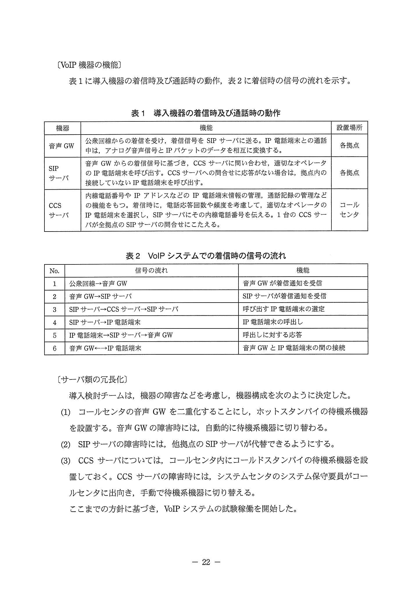

テキスト (OCR)

(VoIP 機器の機能
表 1 に導入機器の着信時及び通話時の動作, 表2 に着信時の信号の流れを示す。

表1 導入機器の着信時及び通話時の動作

機器                                             機能                                           設置場所
       公衆回線からの着信を受け, 着信信号を SIP サーバに送る。TP 電話端末との通話
音声 GW                   ip te jos                  —            -                              各拠点
中は, アナログ音声信号と TP パケットのデータを相互に変換する。
ep        音声 GW からの着信信号に基づき, CCS サーバに問い合わせ, 適切なオペレータ
サー      の IP 電話端末を呼び出す。CCS サーバへの問合せに応答がない場合は, 拠点内の| BHA
接続していない TP 電話端末を呼び出す。
内線電話番号や P アドレスなどの TP 電話端末情報の管理通話記録の管理など
CCS           OME SO. MAIC, 電話応答回数や頻度を考慮して, 適切なオペレータの       コール
TAIN      IP 電話端末を選択し, SIP サーバにその内線電話番号を伝える。1 台の CCS サー | センタ
バが全拠点の SIP サーバの問合せにこたえる。
表2 VolP システムでの着信時の信号の流れ
No.                          信号の流れ                                            機能
1 | 公衆回線つ音声 GW                                                  音声 GW が着信通知を受信
2 | 音声GWつSIP サーバ                                                   SIP サーバが着信通知を受信
3 | SIP サーバーCCS サーバーSIP サーバ                            呼び出す TP 電話端末の選定
4 | SIPサーバーー 電話端末                        IP 電話端末の呼出し
5 | 電話端末一SIP サーバー音声 GW                              呼出しに対する応答
6 | GW HP 電話端末                                       音声 GW と P 電話端末の間の接続

[サーバ類の冗長化〕
導入検討チームは, 機器の障害などを考慮し, 機器構成を次のように決定した。
Q) コールセンタの音声 GW を二重化することにし, ホットスタンバイの待機系機器

を設置する。音声 GW の障害時には, 自動的に待機系機器に切り共わる。
(2) SIP サーバの障害時には, 他拠点の SIP サーバが代准できるようにする。

(3) CCS サーバについては, コールセンタ内にコールドスタンバイの待機系機器を設
置しておく。CCS サーバの障害時には, システムセンタのシステム保守要員がコー
ルセンタに出向き, 手動で待機系機器に切り替える。
ここまでの方針に基づき, VoIP システムの試験稼働を開始した。

ー 22 一

### ページ 23

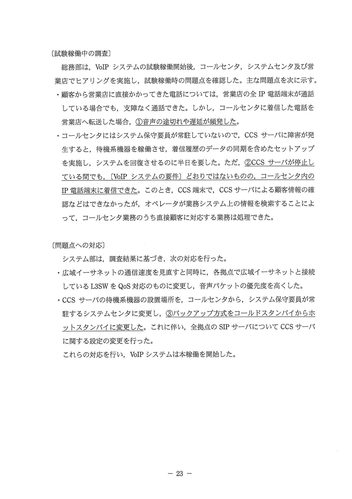

テキスト (OCR)

試験稼働中の調査〕

総務部は, VOIP システムの試験稼働開始後, コールセンタ, システムセンタ及び営

業店でヒアリングを実施し, 試験稼働時の問題点を確認した。主な問題点を次に示す。

・顧客から営業店に直接かかってきた電話については, 営業店の全 IP 電話端末が通話
している場合でも, 支障なく通話できた。しかし, コールセンタに着信した電話を
営業店へ転送した場合,①音声の途切れや遅延が頻発した。

・コールセンタにはシステム保守要員が常駐していないので, CCS サーバに障害が発
生すると, 待機系機器を稼働させ, 着信履歴のデータの同期を含めたセットアップ
を実施し, システムを回復させるのに半日を要した。ただ, ②CCS サーバが停止し
ている間でも, (VoIP システムの要件】 どおりではないものの, コールセンタ内の
IP 電話端末に着信できた。このとき, CCS 端末で, CCS サーバによる顧客情報の確
認などはできなかったが, オペレータが業務システム上の情報を検索することによ
って, コールセンタ業務のうち直接顧客に対応する業務は処理できた。

〔問題点への対応〕

システム部は, 調査結果に基づき, 次の対応を行った。

・広域イーサネットの通信速度を見直すと同時に, 各拠点で広域イーサネットと接続
しているL3SW を QoS 対応のものに変更し, 音声パケットの優先度を高くした。

・CCS サーバの待機系機器の設置場所を, コールセンタから, システム保守要員が常
駐するシステムセンタに変更し, バックアップ方式をコールドスタンバイからホホ
ットスタンバイに変更した。これに伴い, 全拠点の SIP サーバについて CCS サーバ
に関する設定の変更を行った。
これらの対応を行い, VIP システムは本稼働を開始した。

ー 23 一

### ページ 24

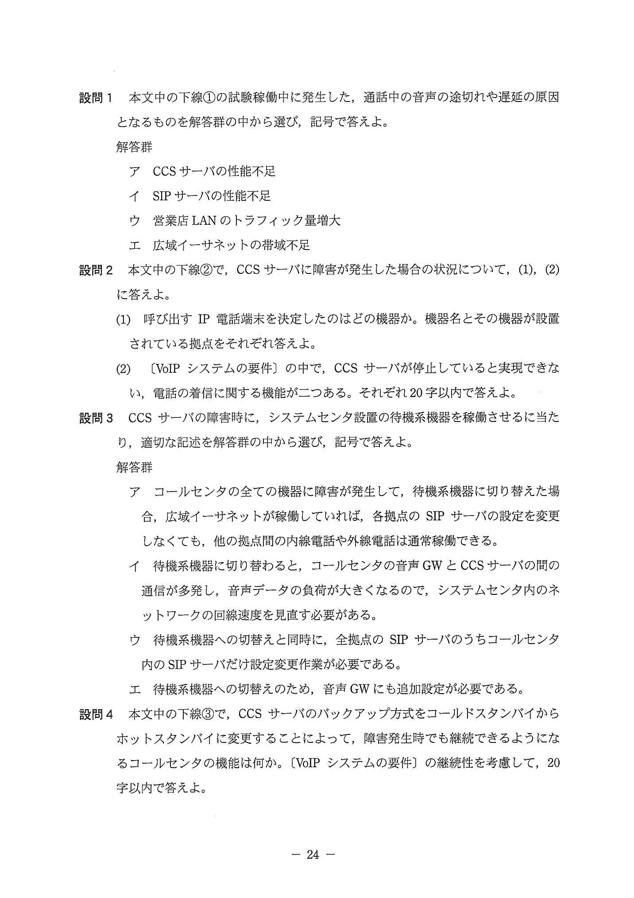

テキスト (OCR)

設問1 本文中の下線①の試験稼働中に発生した, 通話中の音声の途切れや遅延の原因
となるものを解答群の中から選び, 記号で答えよ。
解答群
ア CCS サーバの人性能不足
イ SIP サーバの性能不足
ウ 営業店 LAN のトラフィック量増大
エエ 広域イーサネットの帯域不足
設問2 本文中の下線②で, CCS サーバに障害が発生した場合の状況について, (D, ②⑫②

に答えよ。
Q) 呼び出す TP 電話端末を決定したのはどの機器か。機器名とその機器が設置
されている拠点をそれぞれ答えよ。

(2) (VoIP システムの要件〕 の中で, CCS サーバが停止していると実現できな
い, 電話の着信に関する機能がニニつある。それぞれ 20 字以内で答えよ。
設問3 CCS サーバの障害時に, システムセンタ設置の待機系機器を稼働させるに当た
り, 適切な記述を解答群の中から選び, 記号で答えよ。
ARE
ア コールセンタの全ての機器に障害が発生して, 待機系機器に切り替えた場
合, 広域イーサネットが稼働していれば, 各拠点の SIP サーバの設定を変更
しなくても, 他の拠点問の内線電話や外線電話は通常稼働できる。
イ 待機系機器に切り替わると, コールセンタの音声 GWW と CCS サーバの間の
通信が多発し, 音声データの負荷が大きくなるので, システムセンタ内のネ
ットワークの回線速度を見直す必要がある。
ウ 待機系機器への切替えと同時に, 全拠点の SIP サーバのうちコールセンタ
内の SIP サーバだけ設定変更作業が必要である。
エ 待機系機器への切替えのため, 音声 GW にも追加設定が必要である。
設問4 本文中の下線③で, CCS サーバのバックアップ方式をコールドスタンバイから
ホットスタンバイに変更することによって, 障害発生時でも継続できるようにな
るコールセンタの機能は何か。〔VoIP システムの要件〕 の継続性を考慮して, 20
字以内で答えよ。

ol

### ページ 25

テキスト (OCR)

CA モ 用 紙 〕

ー 25 一

### ページ 26

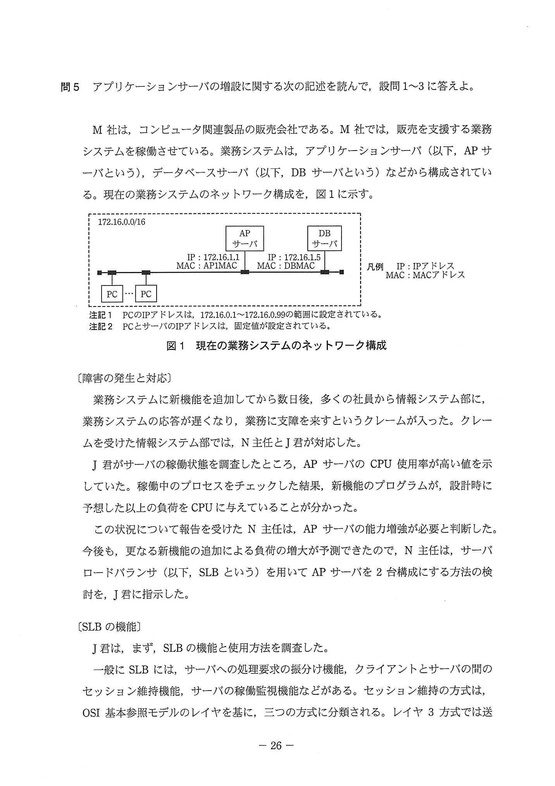

テキスト (OCR)

間5 アプリケーションサーバの増設に関する次の記述を読んで, 設問 13 に答えよ。

M 社は, コンピュータ関連製品の販売会社である。M 社では, 販売を支援する業務
システムを稼働させている。業務システムは, アプリケーションサーバ (以下, APサ
ーバという), データベースサーバ UF, DB サーバという) などから構成されてい
る。現在の業務システムのネットワーク構成を, 図 1 に示す。

エーーーーーーーーーーーーーーーーーーーーーーーーーーーーーーーーーーーーーーーーーーーーーーーーーーーーーーーーーーュ
! 172.16.0.016                                                              1

1                                           AP                    DB         !

:                                         サーバ                サーバ| !

'                                                                              1

!                       IP : 172.16.11       IP : 172.16.1.5         '

!                   MAC : APIMAC | MAC:DBMAC          ! 凡例 TP:IPアドレス

'                                                                                  1" MAC : MACY KVR
H                                                                              !

1                                                                              1

El:

注記1 PCのIPアドレスは, 172.16.0.1~172.16.0 9 OMA ICRESNTIS.
注記2 PCとサーバのIPアドレスは, 固定値が設定されている。

図1 現在の業務システムのネットワーク構成

〔障害の発生と対応〕

業務システムに新機能を追加してから数日後, 多くの社員から情報システム部に,
業務システムの応答が遅くなり, 業務に支障を来すというクレームが入った。クレー
ムを受けた情報システム部では, N 主任と」 君が対応した。

J] 君がサーバの稼働状態を調査したところ, AP サーバの CPU 使用率が高い値を示
していた。稼働中のプロセスをチェックした結果, 新機能のプログラムが, 設計時に
予想した以上の負荷を CPU に与えていることが分かった。

この状況について報告を受けた N 主任は, AP サーバの能力増強が必要と判断した。
今後も, 更なる新機能の追加による負荷の増大が予測できたので, N 主任は, サーバ
ロードバランサ (以下, SLB という) を用いて AP サーバを 2 台構成にする方法の検
討を, J 君に指示した。

(SLB の機能]

JB, まず, SLB の機能と使用方法を調査した。

一般に SLB には, サーバへの処理要求の振分け機能. クライアントとサーバの間の
セッション維持機能, サーバの稼働監視機能などがある。セッション維持の方式は,
OSI 基本参照モデルのレイヤを基に, 三つの方式に分類される。レイヤ 3 ANTE

ー 26 一

### ページ 27

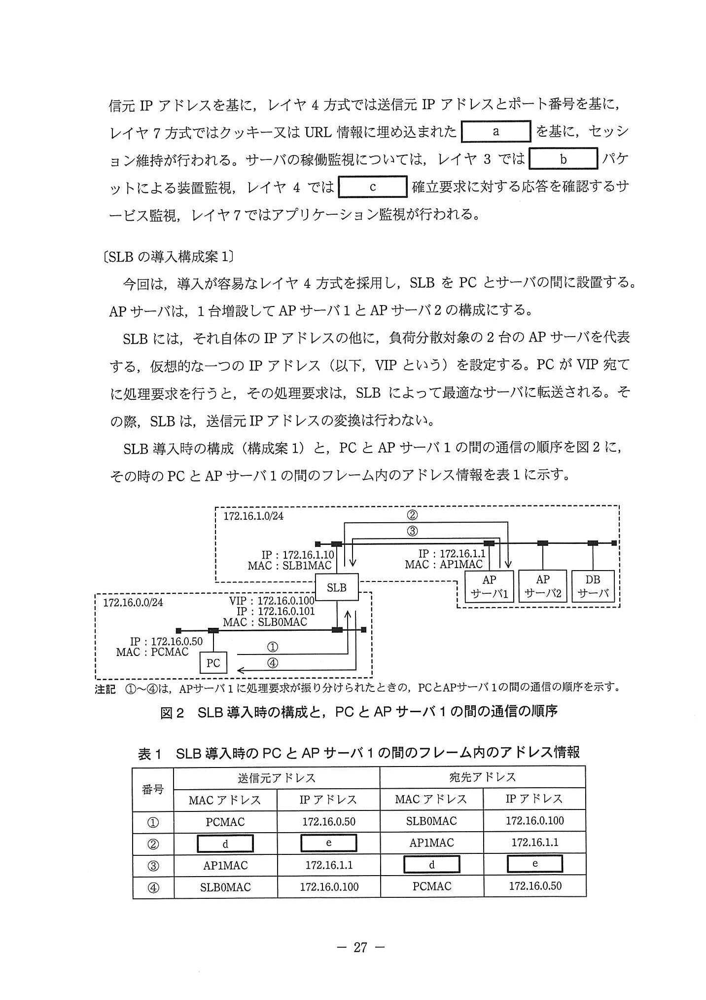

テキスト (OCR)

信元 TP アドレスを基に, レイヤ 4 方式では送信元 P アドレスとポート番号を基に,

レイヤ 7 方式ではクッキーは URL 情報に埋め込まれた| sa |を基!
ョン維持が行われる。サーバの稼働監視については,レイヤ 3 では| b |]パケ
る装置監視。レイヤ 4 では| c |確立要求に対する応答を確認するサ

ットによ

ービス監視, レイヤ 7 ではアプリケーション監視が行われる。

(SLB の導入構成案 1

今回は, 導入が容易なレイヤ 4 方式を採用し, SLB を PC とサーバの間に設置する。
1 台増設して AP サーバ1 と AP サーバ2 の構成にする。
負荷分散対象の 2 BO AP サーバを代表

AP サーバは,

SLB には, それ自体の TP アドレスの他に,
する, 仮想的なーつの IP アドレス (以下, VIP という) を設定する。PC が VIP 宛て
に処理要求を行うと, その処理要求は. SLB

その時の PC と AP サーバ1 の間のフレーム内のアドレス情報を表 1 に示す。

172.16.0.0/24

IP : 172.16.0.50
MAC : PCMAC

MAC : SLBIMAC

VIP : 172.16.0.100
IP : 172.16.0.101
MAC : SLBOMAC

172.16.1.0/24

ーッ

セッシ

によって最適なサーバに転送される。そ
OBS, SLB は, 送信元TP アドレスの変換は行わない。
SLB 導入時の構成 (構成案 1) と, PC と AP サーバ1 の間の通信の順序を図 2 に,

IP : 172.16.1.10

SLB

注記  O~@ld, APサーバ1 に処理要求が振り分けられたときの, PCとAPサーバ 1の間の通信の順庁を示す。

IP:  wae.)

MAC : AP1MAC

図2 SLB導入時の構成と, PC と AP サーバ 1 の間の通信の順序

表1 SLB導入時の PC と AP サーバ 1 の間のフレーム内のアドレス情報
_        送信元アドレス              RET RUA
ad   MAC アドレス    TP アドレス    MACY EVA    TP アドレス
®           PCMAC             172.16.0.50            SLBOMAC           172.16.0.100
@         [a]          [Le |            APIMAC             172.16.1.1
®          AP1MAC             172.16.1.1           | a |          [ie |
@         SLBOMAC           172.16.0.100            PCMAC             172.16.0.50

ー 27

### ページ 28

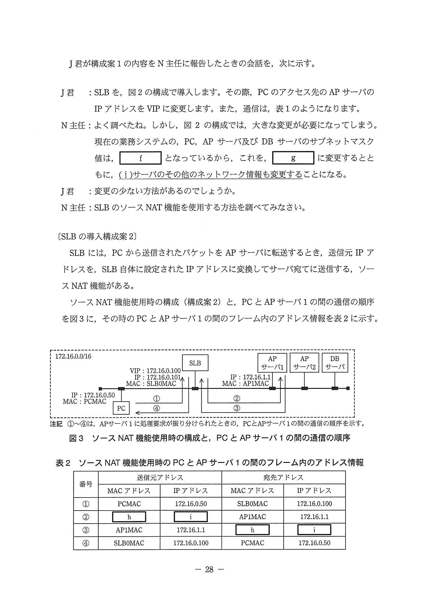

テキスト (OCR)

J 君が構成案 1 の内容を N 主任に報告したときの会話を, 次に示す。

J# :SLBを, 2 の構成で導入します。その際, PC のアクセス先の AP サーバの
TP アドレスを VIP に変更します。また, 通信は, 表 1 のようになります。

N 主任 : よく調べたね。しかし, 図 2 の構成では, 大きな変更が必要になってしまう。
現在の業務システムの, PC, AP サーバ及び DB サーバのサブネットマスク
値は, となっているから, THE, に変更するとと
もに, (1 )サーバのその他のネットワーク情報も変更することになる。

JA 。:変更の少ない方法があるのでしょうか。

N 主任 : SLB のソース NAT 機能を使用する方法を調べてみなさい。

(SLB の導入構成案 2]

SLB には, PC から送信されたパケットを AP サーバに転送するとき, 送信元 IP ア
ドレスを, SLB 自体に設定された IP アドレスに変換してサーバ宛てに送信する, ソー
ス NAT 機能がある。

ソース NAT 機能使用時の構成 (構成案 2) と, PC とAP サーバ1 の間の通信の順序
を図 3 に, その時の PC と AP サーバ1 の間のフレーム内のアドレス情報を表 2 に示す。

ェ
172.16.0.0716                                                                                     AP           AP           DB
サーパバ1 | | サーバ2 | | サーバ

IP: 172.16.11
MAC : APIMAC
|

IP : 172.16.0.101,

f
i

1

1

                           VIP : 17216.0100
!                                MAC : SLBOMAC       ]
                        =

|

|

1

IP : 172.16.0.50
MAC : PCMAC               @                        2)

処理要求が振り分けら      2D, PCとAPサーババ1の問の通信の順序を示す。
 3 ソース NAT 機能使用時の構成と. PC と AP サーバ 1 の間の通信の順序

表2 ソース NAT 機能使用時の PC と AP サーバ 1 の間のフレーム内のアドレス情報

=        送信元アドレス              宛先アドレス
=   MAC アドレス    TP アドレス    MACアドレス    TP アドレス
®           PCMAC             172.16.0.50            SLBOMAC           172.16.0.100
@         | si |          Li |            AP1MAC             172.16.1.1
®          AP1MAC             172.16.1.1           | hi |          1 i 有明
@         SLBOMAC           172.16.0.100            PCMAC             172.16.0.50

ー 28 一

### ページ 29

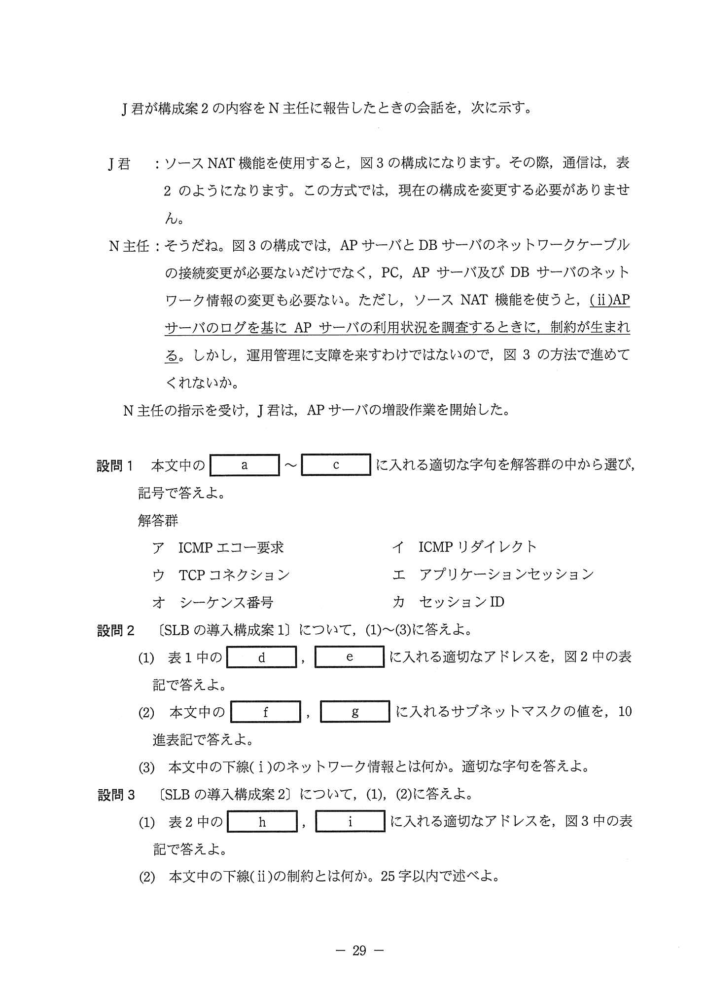

テキスト (OCR)

] 君が構成案 2 の内容を N 主任に報告したときの会話を, 次に示す。

JB :ソースNAT 機能を使用すると, 図3 の構成になります。その際, 通信は, 表
2 のようになります。この方式では, 現在の構成を変更する必要がありませ
ん。

N 主任 : そうだね。図 3 の構成では, AP サーバと DB サーバのネットワークケーブル
の接続変更が必要ないだけでなく, PC, AP サーバ及び DB サーバのネット
ワーク情報の変更も必要ない。ただし, ソース NAT 機能を使うと, (Gi)AP
サーバのログを基に AP サーバの利用状況を調査するときに, 制約が生まれ
る。しかし, 運用管理に支障を来すわけではないので, 3 の方法で進めて
くれないか。

N 主任の指示を受け, ] 君は.。 AP サーバの増設作業を開始した。

設問1 本文中の| 』a |て|  c |に入れる適切な字句を解答群の中から選び

記号で答えよ。

解答群
ア ICMP エコー要求        4 ICMP リダイレクト
ウ TCP コネクション       エエ アプリケーションセッション
オ シーケンス番号       A セッションD

設問2 (SLB の導入構成案 1] について, ①⑪て(3⑬)に答えよ。

a 表1中の| a |, | ec | に入れる適切なアドレスを, 図2 中の表
記で答えよ。

Qa 本文中の| of |, |  g |に入れるサブネットマスクの値を, 10
進表記で答えよ。

3) 本文中の下線(1)のネットワーク情報とは何か。適切な字句を答えよ。
設問3 【SLBの導入構成案2) について, @, ②)に答えよ。
a 表2中の| on |,| i |に入れる適切なアドレスを, 図 3 中の表
記で答えよ。
2) 本文中の下線(ii)の制約とは何か。25 字以内で述べよ。

### ページ 30

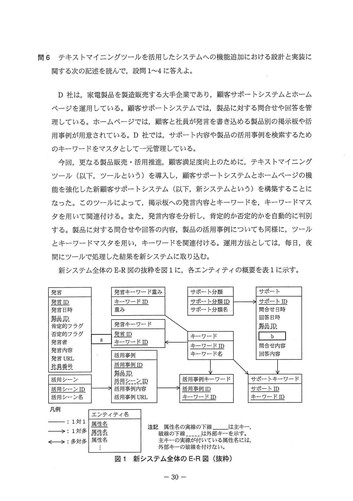

テキスト (OCR)

問85 テキストマイニングツールを活用したシステムへの機能追加における設計と実装に
関する次の記述を読んで, RE 1~4 に答えよ。

D 社は, 家電製品を製造販売する大手企業であり, 顧客サボポートシステムとホーム
ページを運用している。顧客サポートシステムでは, 製品に対する問合せや回答を管
理している。ホームページでは, 顧客と社員が発言を書き込める製品別の掲示板や活
用事例が用意されている。D 社では, サポート内容や製品の活用事例を検索するため
のキーワードをマスタとして一元管理している。

今回, 更なる製品販売・活用推進, 顧客満足度向上のために, テキストマイニング
ツール (以下, ツールという) を導入し, 顧客サポートシステムとホームページの機
能を強化した新顧客サポートシステム (以下, 新システムという) を構築することに
なった。このツールによって, 掲示板への発言内容とキーワードを, キーワードマス
夕を用いて関連付ける。また, 発言内容を分析し, 表定的か否定的かを自動的に判別
する。製品に対する問合せや回答の内容, 製品の活用事例についても同様に, ツール
とキーワードマスタを用い, キーワードを関連付ける。運用方法としては, 毎日,夜
間にツールで処理した結果を新システムに取り込む。

新システム全体の E-R 図の抜粋を図 1 に, 各エンティティの概要を表 1 に示す。

発言                 発言キーワード重み         サポート分類            サポート
発言D                     キーワード ID                    サポート分類ID              サポートTD
発言日時              重み                      サポート分類名          問合せ日時
Bim ID,                     ー                                                       回答日時
BENTO     発言キーワード                   製品TD
否定的フラグ      発言D            キーワー         a
=                a       ーーワードモド
none                 キージーF                 キーワード              問合せ内容
発言URL                活用事例                       キーワード名               回答内容
社員番号       活用事例TD
製品
活用シーン            活用シーンD            活用事例キーワード       サポートキーワード
活用シーン ID              活用事例内容                 活用事例D                   tuk RID
活用シーン名     活用事例 URL      キーワードD      キーワード ID
ALG
エンティティ名
ーーー : 1対1
属性名
.          ーー                  注記 必性名の実線の下線___は主キー,
ーー 1装多属性名                       破線の下線_____ は外部キーを示す。

主キーの実線が付いている属性名には,
外部キーの破線を付けない。

図1 新システム全体のE-R図 (抜粋)

ー 30 一

### ページ 31

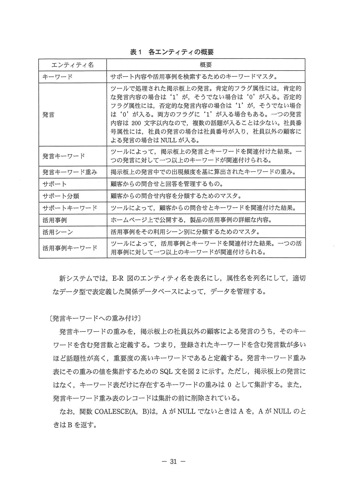

テキスト (OCR)

Ri 各エンティティの概要

概要

サポート内容や活用事例を検索するためのキーワードマスタ。

ツールで処理された掲示板上の発言。育定的フラグ必性には, AEM
な発言内容の場合は "1′ が, そうでない場合は "0' MAS. BEN
フラグ属性には, 否定的な発言内容の場合は "1 が, そうでない場合
は ‘0’ が入る。両方のフラグに 1′が入る場合わある。一つの発言
内容は 200 文字以内なので, 複数の話題がだ入ることは少ない。 社員番
号属性には, 社員の発言の場合は社員番号が入り, 社員以外の顧客に
よる発言の場合は NULL が入る。

ツールによって, 掲示板上の発言とキーワードを関連付けた結果。一
つの発言に対して一つ以上のキーワードが関連付けられる。

発言キーワード生み

掲示板上の発言中での出現頻度を基に算出されたキーワードの重み。

サポート

顧客からの問合せと回答を管理するもの。

サポート分類       願客からの問合せ内容を分類するためのマスタ。
サポートキーワード | ツールによって, 顧客からの問合せとキーワードを関連付けた結果。
活用事例         ホームページ上で公開する, 製品の活用事例の詳細な内容。
活用シーン         活用事例をその利用シーン別に分類するためのマスタ。
ッツールに              ts     けけた結果。一
活用事例キーワード  ツールによって, 活用事例とキーワードを関連付けた結果。一つの活

用事例に対して一つ以上のキーワードが関連付けられる。

新システムでは, ER 図のエンティティ名を表名にし, 属性名を列名にして, 適切
なデータ型で表定義した関係データベースによって, データを管理する。

(発言キーワードへの重み付け]〕

発言キーワードの重みを, 掲示板上の社員以外の顧客による発言のうち, そのキー
ワードを含むお発言数と定義むする。つまり, 登録されたキーワードを含む発言数が多い
ほど話題性が高く, 重要度の高いキーワードであると定義する。 発言キーワード重み
表にその重みの値を集計するための SQL 文を図 2 に示す。ただし, 掲示板上の発言に
はなく, キーワード表だけに存在するキーワードの重みは 0 として集計する。また,
発言キーワード重み表のレコードは集計の前に削除されている。

なお, 関数 COALESCE(A, B)は, A が NULL でないときはAを, AがNULL のと

SLB を返す。

ー 31 一

### ページ 32

テキスト (OCR)

INSERT INTO 発言キーワード重み (キーワード 1TD, 重み)
SELECT キーワード.キーワード ID, COALESCE(OMOMI.CNT,@)
FROM キーワード
|               c
( SELECT 発言キーワード.キーワード ID, COUNT(*) AS CNT
FROM 発言キーワード
INNER JOIN 発言 ON 発言.発言 ID = 発言キーワード.発言 ID
MHERE |               d               |
GROUP BY 発言キーワード.キーワード ID ) OMOMI
ON キーワード .キーワード ID = OMOMT.キーワード ID

 2 発言キーワード重みを集計するための SQL 文

[顧客サポートシステムの機能強化

顧客サポボートシステムでは, 電話やインターネットからの問合せや回答を管理して
いる。掲示板に書き込まれた否定的な発言を, 含まれるキーワードの重みの総和が大
きいものから順にリストアップする機能を追加する。そのリストの上位から順に, 各
発言に対する回答を記入する画面を開き, 回答履歴から類似した内容を照会して, 適

切な回答を担当者が掲示板に書き込むことで, 顧客満足度向上を目指す。

否定的な発言を, 含まれるキーワードの重みの総和が大きいものから順に出力する

ための SQL 文を図 3 に示す。

SELECT 発言.発言 ID, SUM(発言キーワード重み.重み) AS WEIGHT
FROM 発言
INNER JOIN 発言キーワード ON 発言.発言 ID = 発言キーワード.発言 +D
INNER JOIN 発言キーワード重み
ON 発言キーワード .キーワード ID = 発言キーワード重み.キーワード ID
MHERE |               e               |
GROUP BY 388.383 ID

|                     f                     |

 3 否定的な発言を重みの総和が大きいものから順に出力するための SQL文

ー 32 一

### ページ 33

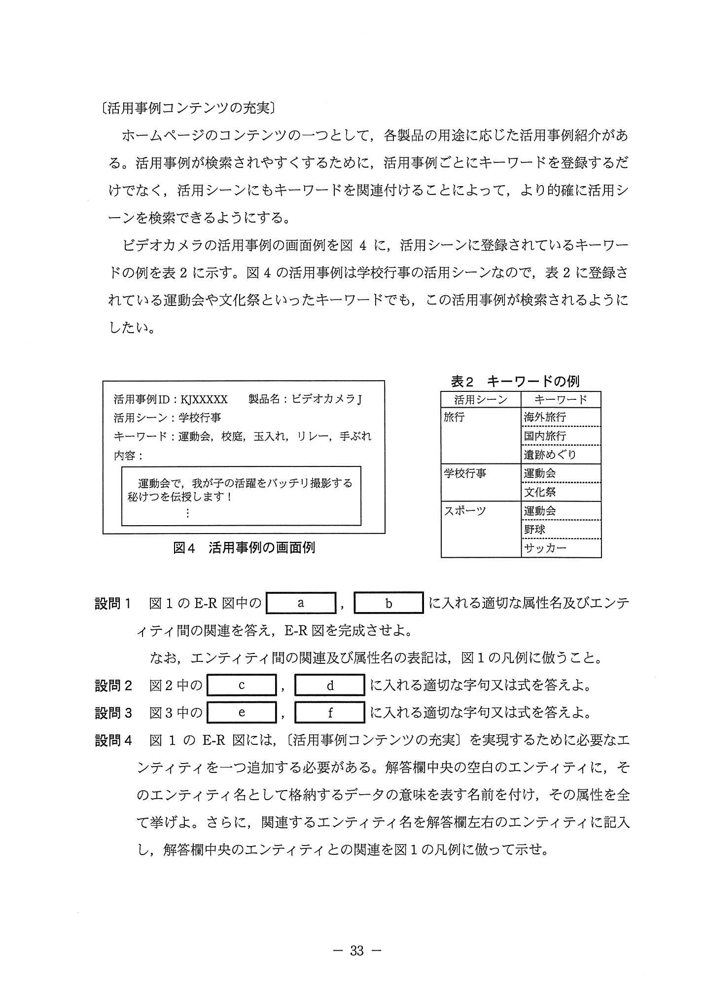

テキスト (OCR)

(活用事例コンテンツの充実〕

ホームページのコンテンツの一つとして, 各製品の用途に応じた活用事例紹介があ
る。活用事例が検索されやすくするために, 活用事例どとにキーワードを登録するだ
けでなく, 活用シーンにもキーワードを関連付けることによって, より的確に活用シ
ーンを検索できるようにする。

ビデオカメラの活用事例の画面例を図 4 に, 活用シーンに登録されているキーワー
ドの例を表 2 に示す。図 4 の活用事例は学校行事の活用シーンなので, 表 2 に登録さ
れている運動会や文化祭といったキーワードでも, この活用事例が検索されるように
したい。

表2 キーワードの例

活用事例ID : KIXXXXX 製品名 : ビデオカメラ]        活用シーン | キーワード
活用シーン : 学校行事                    旅行     海外旅行
キーワード EMS, BE, EAN, UO, 手ぶれ              国内旅行
内容 :                                 遺跡めぐり
CHSC, QUFORMENY FUMES S        a nS
秘けつを伝授します!                            文化祭
                      スポーッ   運動会
野球
図4 活用事例の画面例                 サッカー
設問1 図1のE-R図中の| a |,|  b |に入れる適切な属性名及びエンテ

ィティ間の関連を答え, E-R 図を完成させよ。
なお, エンティティ間の関連及び属性名の表記は, 図 1 OMICS

設問2 図2中の| c |,|  d |に入れる適切な字句又は式を答え
設問3 図3中の|  e |,|  £ |に入れる適切な字句又は式を答え

設問4 図 1 のE-R 図には, 〔活用事例コンテンツの充実〕 を実現するために必要なエ
ンティティを一つ追加する必要がある。解答欄中央の空白のエンティティに, そ
のエンティティ名として格納するデータの意味を表す名前を付け, その属性を全
て挙げよ。さらに, 関連するエンティティ名を解答欄左右のエンティティに記入
し, 解答欄中央のエンティティ との関連を図 1 の凡例に條って示せ。

### ページ 34

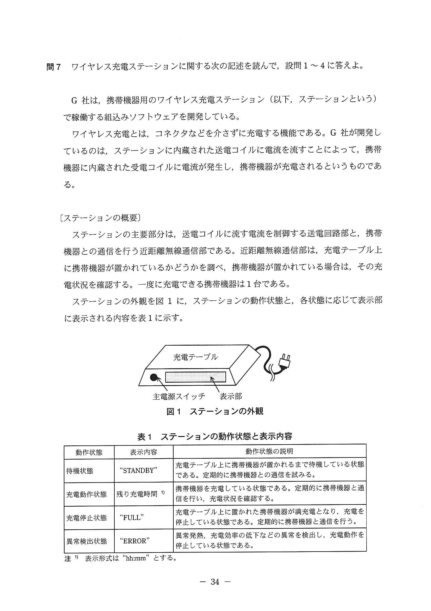

テキスト (OCR)

問7 ワイヤレス充電ステーションに関する次の記述を読んで, 設問1 4に答えよ。

G 社は, 携帯機器用のワイヤレス充電ステーション (以下, ステーションという)
で稼働する組込みソフトウェアを開発している。

ワイヤレス充電とは, コネクタなどを介さずに充電する機能である。G 社が開発し
ているのは, ステーションに内蔵された送電コイルに電流を流すことによって, 携帯
機器に内蔵された受電コイルに電流が発生し, 携帯機器が充電されるというものであ
る。

[ステーションの概要〕

ステーションの主要部分は, 送電コイルに流す電流を制御する送電回路部と, 携帯
機器との通信を行う近距離無線通信部である。近距離無線通信部は, 充電テーブル上
に携帯機器が置かれているかどうかを調べ, 携帯機器が置かれている場合は, その充
電状況を確認する。 一度に充電できる携帯機器は 1 台である。

ステーションの外観を図 1 に, ステーションの動作状態と, 各状態に応じて表示部
に表示される内容を表 1 に示す。

eo     N

\
主電源スイッチ 表示部
 1 ステーションの外観

>

表1 ステーションの動作状態と表示内容
動作状態    表示内容             動作状態の説明
充電テーブル上に携帯機器が置かれるまで待機している状態
である。定期的に携帯機器との通信を試みる
携帯機器を充電している状態である。定期的に携帯機器と通
信を行い, 充電状況を確認する。
充電テーブル上に置かれた携帯機器が満充電となり, 充電を
停止している状態である。定期的に携帯機器と通信を行う。

REHM, 充電効率の低下などの異常を検出し, 充電動作を
停止している状態である。

待機状態               “STANDBY”

充電動作状態 |残り充電時間 ?

充電停止状態 | “FULL”

異常検出状態 | “ERROR”

注 り 表示形式は "hh:mm'′ とする。

ー 34 一

### ページ 35

テキスト (OCR)

[携帯機器との通信〕

待機状態では, 充電テーブル上に携帯機器が置かれているかどうかを調べるために,
近距離無線通信部で携帯機器との通信を約 1 秒周期で試みる。通信に成功すると, 携
帯機器の情報を取得して, ステーション内の RAM に携帯機器情報として記録する。
携帯機器情報の構成項目を表 2 に示す。

表2 携帯機器情報の構成項目

構成項目名                                          説明
機器DD              携帯機器を一意に識別するこ とができる ID である。充電テーブル上の携帯
機器が認識できない場合は, ゼロが設定される。
ステータス         携帯機器が満充電か否かを示す。
電池残量割合       携帯機器の電池残量を, 満充電時を 100%とした場合の割合で示す。
受電電力        携帯機器が受電している電力をミリ W単位で示す。
(残り充電時間の表示〕

充電動作状態では, 携帯機器情報の電池残量割合の推移から, 満充電になるまでの
概算残り充電時間を表示部に表示する。残り充電時間は, 携帯機器の電池残量の増分
が充電時間に比例すると仮定して算出する。推移情報が不十分で残り充電時間を算出
できない場合は “--:一" を表示する。

〔ステーションの組込みソフトウェア】
開発する組込みソフトウェアのタスク一覧を, 表3 に示す。

表3 組込みソフトウェアのタスク一覧
タスク名                           処理概要                        優先度

メイン             ステーションの動作全体を制御する。

携帯機器との近距離無線通信を試みる。その結果を携帯機器情報と

通信             して RAM に記録し, 終了する。

500 ミリ秒ごとに起動し, 売電テーブルに取り付けた セ

た場合は, 異常検出状態タスクを起動する。

La] 関数を呼び出した後に, 表示部に “ERROR” を表示

3
安全監視       ンサの値を読み込む。その結果, 充電テーブルの異常発熱を検知し|| b |
1
し, 無限ループに入る。

暴常検出状態

ー 35 一

### ページ 36

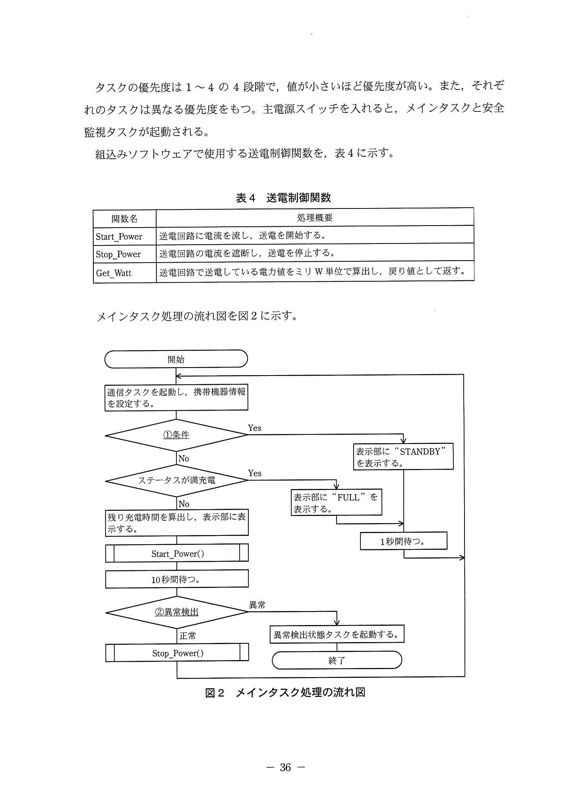

テキスト (OCR)

タスクの優先度は 1 ~ 4 の 4 段階で, 値が小さいほど優先度が高い。また, それぞ
れのタスクは異なる優先度をもつ。主電源スイッチを入れると, メインタスクと安全
監視タスクが起動される。

組込みソフトウェアで使用する送電制御関数を, 表4 に示す。

表4 送電制御関数
関数名                                             処理概要
Start Power |送電回路に電流を流し, 送電を開始する。
Stop Power |送電回路の電流を遮断し, 送電を停止する。
Get_Watt         送電回路で送電している電力値をミリ W 単位で算出し, 戻り値として返す。

メインタスク処理の流れ図を図 2 に示す。

C      開始      う

le

ド
通信タスクを起動し, 携帯機器情報
を設定する。

\
表示部に “STANDBY”

表示部に"FULL" を

残り充電時間を算出し, 表示部に表     sens
示する。                      トーーーー

                                                                                                                                      月人          0
|   |                Start_Power()            aa                                               [apie |

|     10秒間待つ。   |

|輸出状態タスクを起動する。
|    |                   ー | )                  |    |           て                   ーー                         )

 2 メインタスク処理の流れ図

ー 36 一

### ページ 37

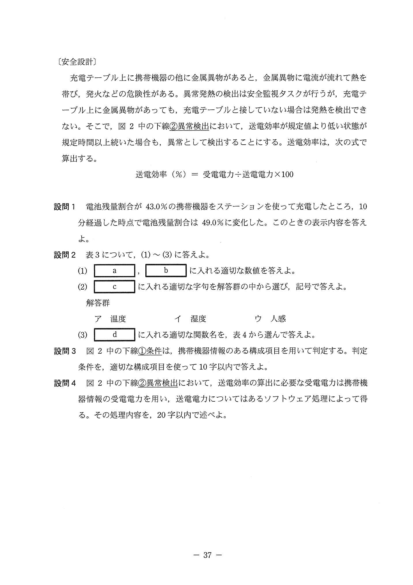

テキスト (OCR)

安全設計)

充電テーブル上に携帯機器の他に金属異物があると, 金属異物に電流が流れて熱を
WHO, 発火などの危険性がある。 異常発熱の検出は安全監視タスクが行うが, 充電テ
ーブル上に金属異物があっても, 充電テーブルと接していない場合は発熱を検出でき
ない。そこで, 図 2 中の下線②異常検出において, 送電効率が規定値より低い状態が
規定時間以上続いた場合も, 異常として検出することにする。送電効率は, 次の式で
算出する。

送電効率 (%) 受電電力ー送電電力メ100

設問1 電池残量割合が 43.0%の携帯機器をステーションを使って充電したところ, 10
分経過した時点で電池残量割合は 49.0%に変化した。このときの表示内容を答え
Hs

設問2 表3について, Q①) ~ ⑬) に答えよ。
① |  a |,|  b |に入れる適切な数値を答えよ。
@ [| c |] に入れる適切な字句を解答群の中から選び, 記号で答えよ。

ア 温度      イ BBE      ウ A
3 |  q ] に入れる適切な関数名を, 表4から選んで答えよ。

設問3 図 2 中の下線①条件は, 携帯機器情報のある構成項目た用いて判定する。判定
条件を, 適切な構成項目を使って 10 字以内で答えよ。

設問4 図 2 中の下線②異常検出において, 送電効率の算出に必要な受電電力は携帯機
器情報の受電電力を用い, 送電電力についてはあるソフトウェア処理によって得
る。その処理内容を, 20 字以内で述べよ。

ー 37 一

### ページ 38

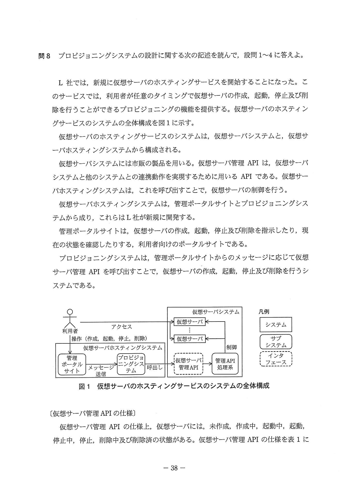

テキスト (OCR)

問8 プロビジョニングシステムの設計に関する次の記述を読んで, 設問 14 に答えよ。

L 社では, 新規に仮想サーバのホスティングサービスを開始することになった。こ
のサービスでは, 利用者が任意のタイミングで仮想サーバの作成, 起動, 停止及び削
除を行うことができるプロビジョニングの機能を提供する。仮想サーバのホスティン
グサービスのシステムの全体構成を図 1 に示す。

仮想サーバのホスティングサービスのシステムは, 仮想サーバシステムと, 仮想サ
ーバホスティングシステムから構成される。

仮想サーバシステムには市販の製品を用いる。仮想サーバ管理 API は, 仮想サーバ
システムと他のシステムとの連携動作を実現するために用いる API である。仮想サー
バホスティングシステムは, これを呼び出すことで, 仮想サーバの制御を行う。

仮想サーバホスティングシステムは, 管理ボータルサイトとプロビジョニングシス
テムから成り, これらはL 社が新規に開発する。

管理ポータルサイトは, 仮想サーバの作成, 起動, 停止及び削除を指示したり, 現
在の状態を確認したりする, 利用者向けのポータルサイトである。

プロビジョニングシステムは, 管理ポータルサイトからのメッセージに応じて仮想
サーバ管理 API を呼び出すことで, 仮想サーバの作成, 起動, 停止及び削除を行うシ
ステムである。

仮畑サーバシステム    凡例
+                     > BSN         ンチ
システム
An      FOR
操作 (作成。 起動,停止,削除)     仮想サーバ             BF
仮想サーパホスティングシステム            制御    ジスデム
管理        プロビジョ     1          『 インタ \
ギグ Pa |  vies    ーズテーズーフ
ョイト J スス    テム     | eee)    a

 1 仮想サーバのホスティングサービスのシステムの全体構成
〔仮想サーバ管理 AP1 の仕様]
仮想サーバ管理 API の仕様上, 仮想サーバには, 未作成, 作成中, 起動中, 起動,

停止中, 停止削除中及び削除済の状態がある。仮想サーバ管理 API の仕様を表 1 に

ー 38 一

### ページ 39

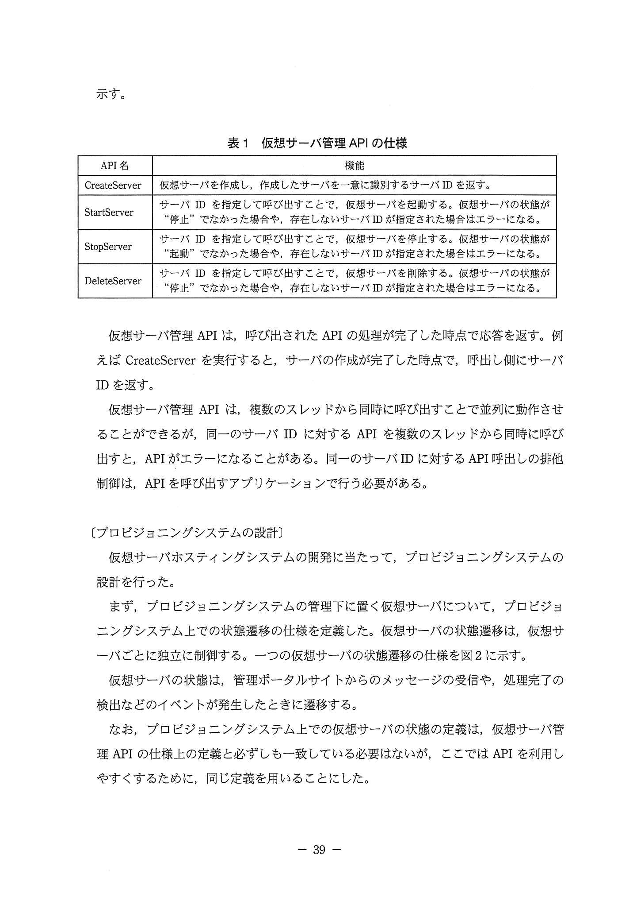

テキスト (OCR)

表1 仮想サーバ管理 API の仕様

API 名                                                             機能

CreateServer | 仮想サーバを作成し, 作成したサーバを一意に議別するサーバ ID を返す。

サーバ ID を指定して呼び出すことで, 仮想サーバを起動する。仮想サーバの状態が

StartServer | <修上上" でなかった場合や, 存在しないサーバ ID が指定された場合はエラーになる。

サーバ ID を指定して呼び出すことで, 仮想サーバを停止する。仮想サーバの状態が

StopServer | ・記動" でなかった場合や, 存在しないサーバ ID が指定された場合はエラーになる。

サーバ ID を指定して呼び出すことで, 仮想サーバを削除する。仮想サーバの状態が

DeleteServer | yim como kee, 存在しないサーバ ID が指定された場合はエラーになる。

仮想サーバ管理 API は, 呼び出された API の処理が完了した時点で応答を返す。例
えば CreateServer を実行すると, サーバの作成が完了した時点で, 呼出し側にサーバ
ID を返す。

仮想サーバ管理 API は, 複数のスレッドから同時に呼び出すことで並列に動作させ
ることができるが, 同一のサーバ ID に対する API を複数のスレッドから同時に呼び
出すと, API がエラーになることがある。同一のサーバ ID に対する API 呼出しの排他
制御は, API を呼び出すアプリケーションで行う必要がある。

[プロビジョニングシステムの設計〕

仮想サーバホスティングシステムの開発に当たって, プロビジョニングシステムの
設計を行った。

まず, プロビジョニングシステムの管理下に置く仮想サーバについて, プロビジョ
ニングシステム上での状態遷移の仕様を定義した。仮想サーバの状態遷移は, 仮想サ
ーバごとに独立に制御する。一つの仮想サーバの状態遷移の仕様を図 2 に示す。

仮想サーバの状態は, 管理ボータルサイトからのメッセージの受信や, 処理完了の
検出などのイベントが発生したときに遷移する。

なお, プロビジョニングシステム上での仮想サーバの状態の定義は, 仮想サーバ管
HB API の仕様上の定義と必ずしも一致している必要はないが, ここでは API を利用し
やすくするために, 同じ定義を用いることにした。

ー 39 一

### ページ 40

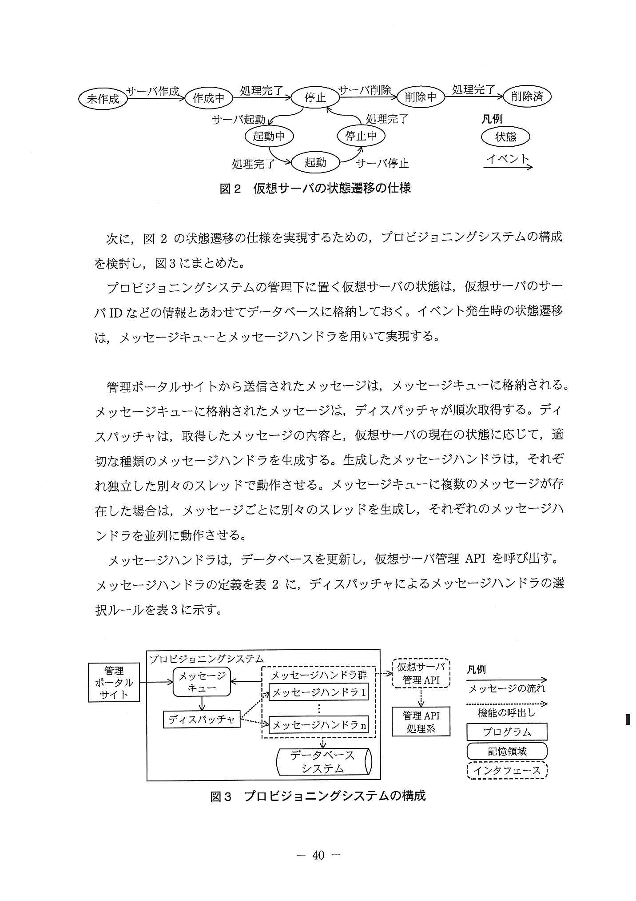

テキスト (OCR)

サーバ作成         処理完了 とでサーバ削除         処理完了、ン7
未作成                   >作成中)                       停止                          削除中                        削除済

図2 仮想サーバの状態遷移の仕様

次に, M2 の状態遷移の仕様を実現するための, プロビジョニングシステムの構成
を検討し, 図3 にまとめた。

プロビジョニングシステムの管理下に置く仮想サーバの状態は, 仮想サーバのサー
バ ID などの情報とあわせてデータベースに格納しておく。イベント発生時の状態遷移
は, メッセージキューとメッセージハンドラを用いて実現する。

管理ボータルサイトから送信されたメッセージは, メッセージキューに格納される。
メッセージキューに格納されたメッセージは, ディスパッチャが順次取得する。ディ
スパッチャは, 取得したメッセージの内容と, 仮想サーバの現在の状態に応じて, 適
切な種類のメッセージハンドラを生成する。生成したメッセージハンドラは, それぞ
れ独立した別々のスレッドで動作させる。メッセージキューに複数のメッセージが存
在した場合は。 メッセージごとに別々のスレッドを生成し, それぞれのメッセージハ
ンドラを並列に動作させる。

メッセージハンドラは, データベースを更新し, 仮想サーバ管理 APT を呼び出す。
メッセージハンドラの定義を表 2 に, ディスパッチャによるメッセージハンドラの選
択ルールを表 3 に示す。

プロピジョニングシステム                            デニーリーーーーン

管理             、     =                              |i 仮想サーバ! FB
ボータル                                                                       ょーーーーーーーーーーテ
ak                                                                             メッセージの流れ

>
機能の呼出し

図3 プロビジョニングシステムの構成

ー 40 一

### ページ 41

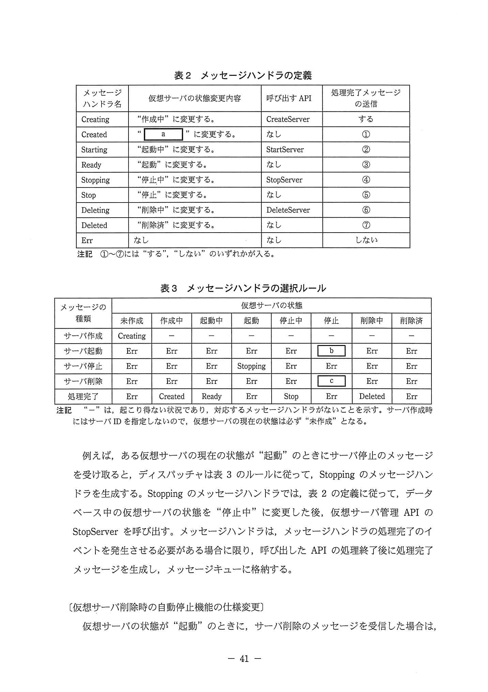

テキスト (OCR)

表2 メッセージハンドラの定義

スッドージ | 仮粗サーバの間際容 | 呼びWすAp | ozをシ
Creating                 “作成中” に変更する。                               CreateServer                             する

Created          . [a | " に変更する。          なし                         ®

Starting        “起動中” に変更する。             StartServer              @

Ready         “起動" に変更する。               なし                    ⑧
Stopping       “停止中” に変更する。             StopServer               ③④

Stop          “停止"に変更する。               なし                    ®
Deleting       “削除中” に変更する。             DeleteServer             ©

Deleted        “削除済" に変更する。             なし                    @®

Err                   なし                                                      なし                                  しない

注記 ①ての⑦には“する”, “しない” のいずれかが入る。

表3 メッセージハンドラの選択ルール

メッセージの                         仮想サーバの状態
種類       未作成 | 作成中 | 起動中     起動     停止中     停止     削除中 | 削除済

サーバが作成       Creating          =               =               =              =               ー               ー              ー
サーバ起動          Err            Err            Err            Err            Err         |         Err            Err
NPE IE          Err            Err            Err        Stopping         Err            Err            Err            Err
サーバ削除              Err                 Err                 Err                 Err                 Err            Err                 Err

処理完了            Err         Created | Ready          Err           Stop            Err         Deleted         Err

注記 “一" は, 起こり得ない状況であり, 対応するメッセージハンドラがないことを示す。サーバ作成時

にはサーバ ID を指定しないので, 仮想サーバの現在の状態は必ず “AER” ERS.

例えば, ある仮想サーバの現在の状態が"起動" のときにサーバ停止のメッセージ
を受け取ると, ディスパッチャは表 3 のルールに従って, Stopping のメッセージハン
ドラを生成する。Stopping のメッセージハンドラでは, 表 2 の定義に従って, データ
ベース中の仮想サーバの状態を “停止中" に変更した後, 仮想サーバ管理 API の
StopServer を呼び出す。メッセージハンドラは, メッセージハンドラの処理完了のイ
ベントを発生させる必要がある場合に限り, 呼び出した API の処理終了後に処理完了
メッセージを生成し. メッセージキューに格納する。

〔仮想サーバ削除時の自動停止機能の仕様変更]
仮想サーバの状態が“起動” のときに, サーバ削除のメッセージを受信した場合は,

ー 41 一

### ページ 42

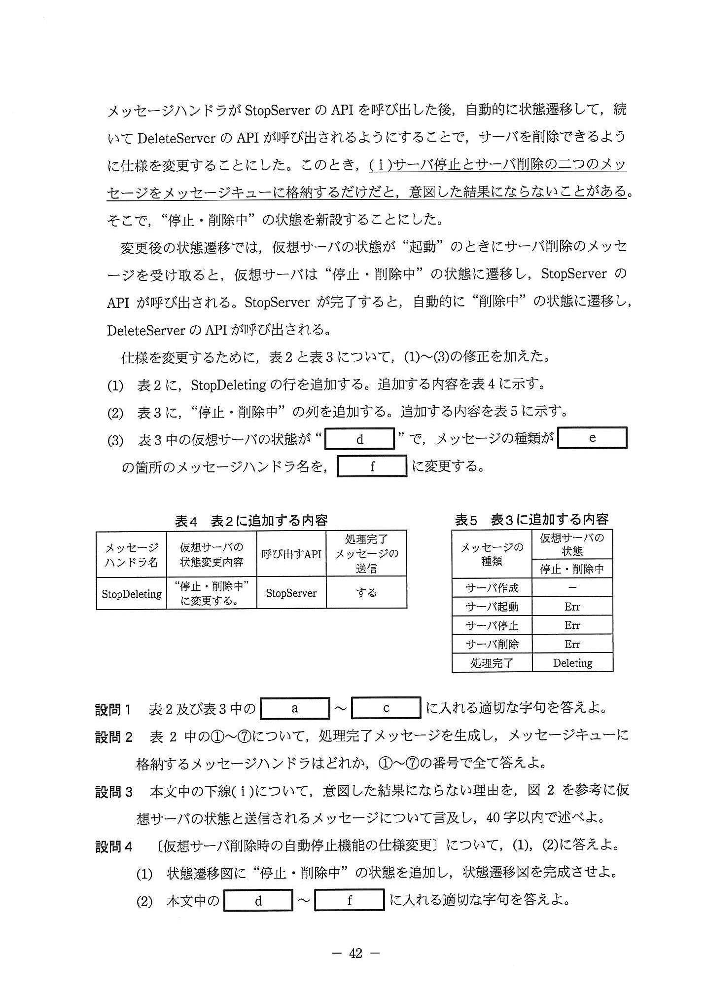

テキスト (OCR)

メッセージハンドラが StopServer の API を呼び出した後, 自動的に状態遷移して, 続
いて DeleteServer の API が呼び出されるようにすることで, サーバを削除できるよう
に仕様を変更することにした。このとき, (1)サーバ停止とサーバ削除の三つのメッ
セージをメッセージキューに格納するだけだと, 意図した結果にならないことがある。
そこで, “停止・削除中” の状態を新設することにした。
変更後の状態遷移では, 仮想サーバの状態が“起動” のときにサー削除のメッセ
ージを受け取ると, 仮想サーバは “停止・削除中" の状態に遷移し, StopServer の
API が呼び出される。StopServer が完了すると, 自動的に “削除中" の状態に遷移し,
DeleteServer の API が呼び出される。
仕様を変更するために, 表2 と表3 について, (①ぐて(3③)の修正を加えた。
(1) 表2に, StopDeleting の行を追加する。追加する内容を表 4 に示す。
⑫) 表3 に, "停止・削除中” の列を追加する。追加する内容を表 5 に示す。
⑬ 表3 中の仮想サーバの状態が “|  q |” で, メッセージの種類が[ e |
の箇所のメッセージハンドラ名を, | { | に変更する。

表4 表2に追加する内容               表5 表3に追加する内容
メッセージ | 仮想サーパの | rare     ETT      メッャージの | BREN
ハンドラ名 | 状態変更内容   呼び出すAPI  メッセージの              種類          状態

送信               停止・削除中
StopDeleting     に       StopServer           する                          サーバ作成               ー
ー               =                                                                              サーバ起重                Er
サーバが停止              Err
サーが削除                Err
処理完了            Deleting

設問1 表2及び表3中の| a |て|  c | に入れる章切な字句を答えよ。

設問2 表 2 中の①ての⑦について, 処理完了メッセージを生成し, メッセージキューに
格納するメッセージハンドラはどれか, ①て⑦の番号で全て答えよ。

設問3 本文中の下線(1i)について, 意図した結果にならない理由を, M2 を参考に仮
想サーバの状態と送信されるメッセージについて言及し, 40 字以内で述べよ。

設問4 仮想サーバ削除時の自動停止機能の仕様変更〕]について, ①⑪, ②)に答えよ。
Q) 状態遷移図に"停止・削除中” の状態を追加し, 状態遷移図を完成させよ。
②) 本文中の|  q |~[  f |に入れる適切な字句を答えよ。

ー 42 一

### ページ 43

テキスト (OCR)

【 メモ 用 紙 〕

### ページ 44

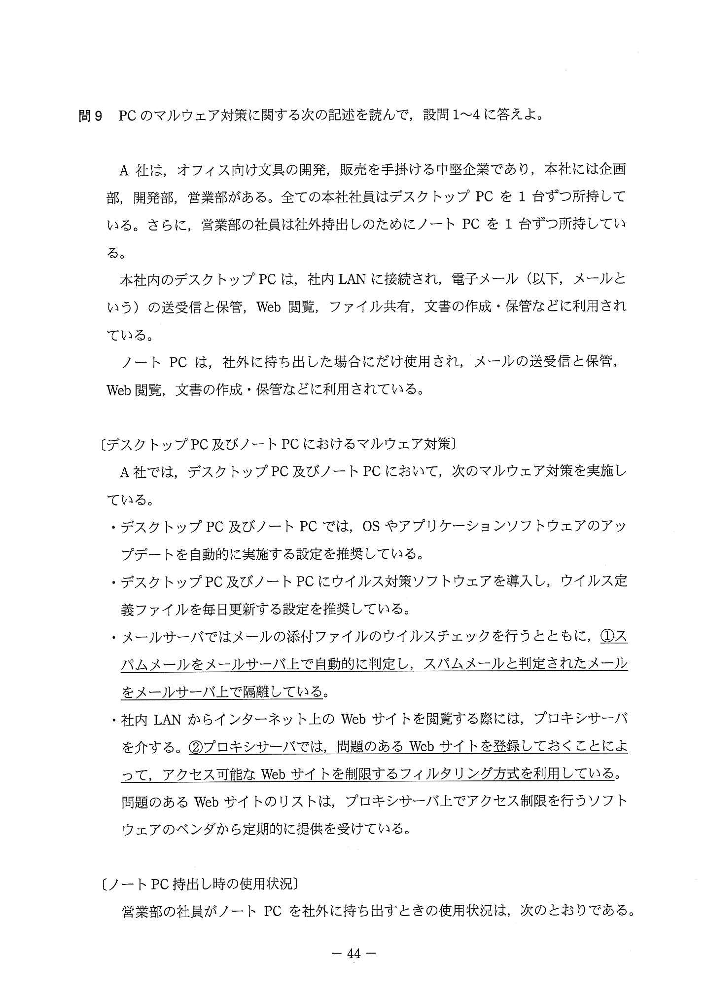

テキスト (OCR)

HO PCのマルウェア対策に関する次の記述を読んで, 設問 1て4 に答えよ。

A 社は, オフィス向け文具の開発, 販売を手掛ける中堅企業であり, 本社には企画
部, 開発部, 営業部がある。全ての本社社員はデスクトップ PC を 1 台ずつ所持して
いる。 さらに, 営業部の社員は社外持出しのためにノート PC を 1 台ずつ所持してい
る。

本社内のデスクトップ PC は, 社内 LAN に接続され, 電子メール (以下, メールと
いう) の送受信と保管, Web 閲覧, ファイル共有, 文書の作成・保管などに利用され
ている。

ノート PC は, 社外に持ち出した場合にだけ使用され, メールの送受信と保管,
Web 閲覧, 文書の作成・保管などに利用されている。

〔デスクトップ PC 及びノート PC におけるマルウェア対策〕
A 社では, デスクトップ PC 及びノート PC において, 次のマルウェア対策を実施し

ている。

・デスクトップ PC 及びノート PC では, OS やアプリケーションソフトウェアのアッ
プデートを自動的に実施する設定を推奨している。

・デスクトップ PC 及びノート PC にウイルス対策ソフトウェアを導入し, ウイルス定
義ファイルを毎日更新する設定を推奨している。

・メールサーバではメールの添付ファイルのウイルスチェックを行うとともに, ①ス
パムメールをメールサーバ上で自動的に判定し, スパムメールと判定されたメール
をメールサーバ上で隔離している。

・社内 LAN からインターネット上の Web サイトを閲覧する際には, プロキシサーバ
を介する。②プロキシサーバでは, 問題のある Web サイトを登録しておくことによ
って, アクセス可能な Web サイトを制限するフィルタリング方式を利用している。
問題のある Web サイトのリストは, プロキシサーバ上でアクセス制限を行うソフト
ウェアのベンダから定期的に提供を受けている。

〔ノート PC 持出し時の使用状況
営業部の社員がノート PC を社外に持ち出すときの使用状況は, 次のとおりである。

### ページ 45

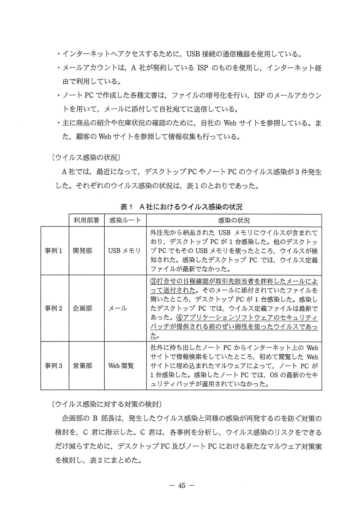

テキスト (OCR)

・インターネットヘアクセスするために, USB 接続の通信機器を使用している。

・メールアカウントは, A 社が契約している ISP のものを使用し,. インターネット経
由で利用している。

・ノート PC で作成した各種文書は, ファイルの暗号化を行い ISP のメールアカウン
トを用いて, メールに添付して自社宛てに送信している。

・主に商品の紹介や在庫状況の確認のために, 自社の Web サイトを参照している。ま
た, 顧客の Web サイトを参照して情報収集も行っている。

〔ウイルス感染の状況
A 社では, 最近になって, デスクトップ PC やノート PC のウイルス成染が3 件発生
した。それぞれのウイルス感染の状況は, 表 1 のとおりであった。

表1 A社におけるウイルス感染の状況
利用部署 | 感染ルート                            感染の状況

外注先から納品された USB メモリにウイルスが含まれて
BO, デスクトップ PC が 1 吾感染した。他のデスクトッ
事例1 | 開発部     USB メモリ | プPC でもその USB メモリを使ったところ, ウイルスが検
知された。感染したデスクトップ PC では, ウイルス定義
ファイルが最新でなかった。

③打合せの日程確認が取引先担当者を詐称したメールによ
って送付された。そのメールに添付されていたファイルを
開いたところ, デスクトップ PC が 1 台感染した。感染し
事例2 | 企画部    メール     たデスクトップ PC では, ウイルス定義ファイルは最新で
あった。④アプリケーションソフトウェアのセキュリティ
パッチが提供される前のぜい弱性を狙ったウイルスであっ
Es

社外に持ち出したノート PC からインターネット上の Web
サイトで情報検索をしていたところ, 初めて閲覧した Web
事例3 | 営業部    Web 閲覧    サイトに埋め込まれたマルウェアによって, ノート PC が
1 台感染した。感染したノート PC では, OS の最新のセキ
ュリティパッチが適用されていなかった。

〔ウイルス感染に対する対策の検討]
企画部の B 部長は, 発生したウイルス感染と同様の感染が再発するのを防ぐ対策の
検討を, C 君に指示した。C Ald, 各事例を分析し, ウイルス感染のリスクをできる
だけ減らすために, デスクトップ PC及びノート PC における新たなマルウェア対策案
を検討し, 表2 にまとめた。

ー 45 一

### ページ 46

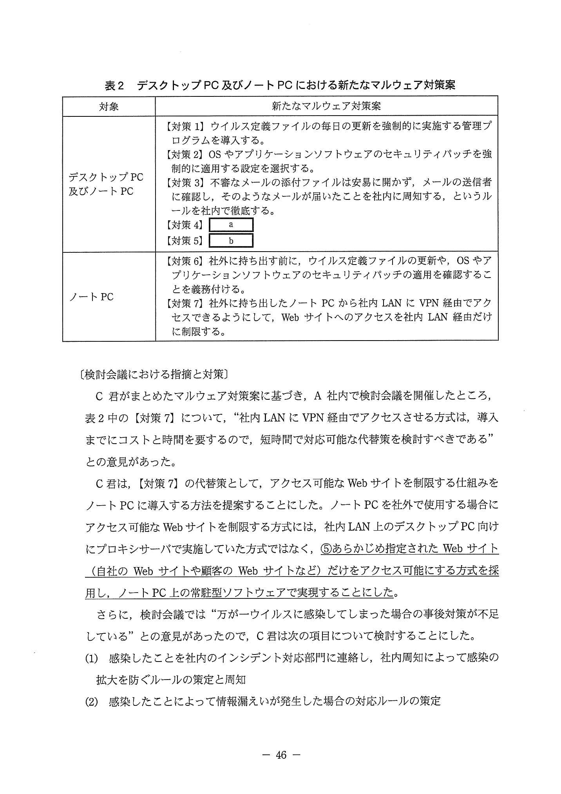

テキスト (OCR)

表2 デスクトップ PC 及びノート PC における新たなマルウェア対策案

対象                           新たなマルウェア対策案

Ot LD ウイルス定義ファイルの毎日の更新を強制的に実施する管理プ
ログラムを導入する。

【対策 2】 OS やアプリケーションソフトウェアのセキュリティパッチを強
_                    制的に適用する設定を選択する。

デスクトップPC | tyes 3) 不審なメールの添付ファイルは容易に開かず, メールの送信者
及びノートFC          に確認し, そのようなメールが届いたことを社内に周知する, というル
ールを社内で微底する。

[対策 [| s |

【対策5| 5 |

ノート PC

【対策 6】 社外に持ち出す前に, ウイルス定義ファイルの更新や, 0S やア
プリケーションソフトウェアのセキュリティパッチの適用を確認するこ
とを義務付ける。

OME 7】 社外に持ち出したノート PC から社内 LAN に VPN 経由でアク
セスできるようにして, Web サイトへのアクセスを社内 LAN 経由だけ
に制限する。

〔検討会議における指摘と対策]

C 君がまとめたマルウェア対策案に基づき, A 社内で検討会議を開催したところ,
表 2 中の【対策 7】 について, “社内 LAN に VPN 経由でアクセスさせる方式は, 導入
までにコストと時間を要するので, 短時間で対応可能な代夫策を検討すべきである”"
との意見があった。

C 君は,【対策 7】の代替策として, アクセス可能な Web サイトを制限する仕組みを
ノート PC に導入する方法を提案することにした。ノート PC を社外で使用する場合に
アクセス可能な Web サイトを制限する方式には, 社内LAN 上のデスクトップPC 向け
にプロキシサーバで実施していた方式ではなく, ⑤あらかじめ指定された Web サイト

(自社の Web サイトや顧客の Web サイトなど) だけをアクセス可能にする方式を採
FAL, ノート PC 上の常駐型ソフトウェアで実現することにした。

さらに, 検討会議では“万が一ウイルスに感染してしまった場合の事後対策が不足
している"” との意見があったので, C 君は次の項目について検討することにした。

1) 感染したことを社内のインシデント対応部門に連絡し, 社内周知によって感染の
拡大を防ぐルールの策定と周知
2) 感染したことによって情報漏えいが発生した場合の対応ルールの集定

ー 46 一

### ページ 47

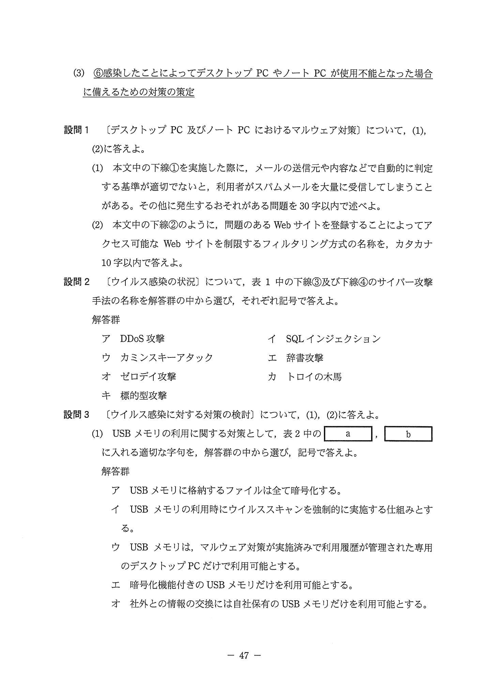

テキスト (OCR)

(3) ORBLETEKEDTFAY bh YT PC やノート PC が使用不能となった場合
に備えるための対策の策定

設問1 〔デスクトップ PC 及びノート PC におけるマルウェア対策〕] について, Q①),
②⑫②に答えよ。
GQ) 本文中の下線①を実施した際に, メールの送信元や内容などで自動的に判定
する基準が適切でないと, 利用者がスパムメールを大量に受信してしまうこと
がある。その他に発生するおそれがある問題を 30 字以内で述べよ。
2) 本文中の下線②のように, 問題のある Web サイトを登録することによってア
クセス可能な Web サイトを制限するフィルタリング方式の名称を, カタカナ
10 字以内で答えよ。
設問2 [ウイルス感染の状況] について, 表 1 中の下線③及び下線②④のサイバー攻撃
手法の名称を解答群の中から選び, それぞれ記号で答えよ。

解答群
ア DDoS 攻撃                   イ SQLインジェクション
ウ カミンスキーアタック          cL 辞書攻撃
A ゼロデイ攻撃                 A トロイの木馬

キ 標的型攻撃
設問3 〔ウイルス感染に対する対策の検討について, ①⑪, (②に答えよ。

①) USB メモリの利用に関する対策として, 表2中の| a j,[ b |
に入れる適切な字句を, 解答群の中から選び, 記号で答えよ。
解答群

ア USB メモリに格納するファイルは全て暗号化する。

イ USB メモリの利用時にウイルススキャンを強制的に実施する仕組みとす
る。

ウ USB メモリは, マルウェア対策が実施済みで利用履歴が管理された専用
のデスクトップ PC だけで利用可能とする。

エ 暗号化機能付きの USB メモリだけを利用可能とする。

オ 社外との情報の交換には自社保有の USB メモリだけを利用可能とする。

ー 47 一

### ページ 48

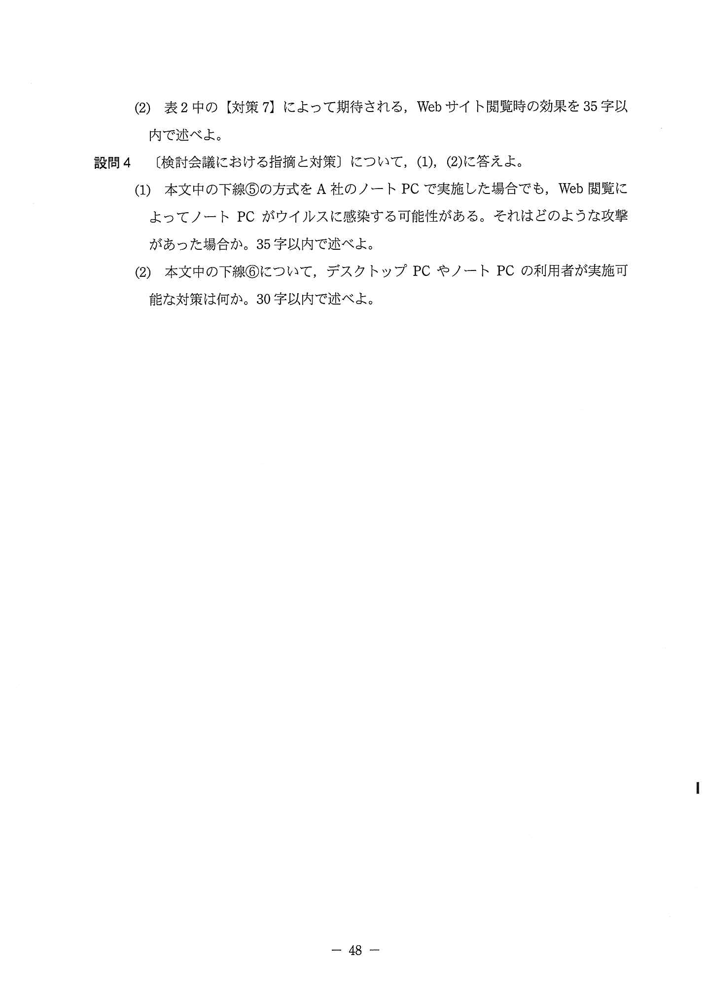

テキスト (OCR)

(2) 表2中の【対策 7】 によって期待される, Web サイト閲覧時の効果を 35 字以
設問4 [検討会議における指摘と対策] について, ①⑪, ②⑫②)に答えよ。
GQ) 本文中の下線⑤の方式を A 社のノート PC で実施した場合でも, Web 閲覧に
よってノート PC がウイルスに感染する可能性がある。それはどのような攻撃
があった場合か。35 字以内で述べよ。
⑫) 本文中の下線つ@について, デスクトップ PC やノート PC の利用者が実施可
能な対策は何か。30 字以内で述べよ。

ー 48 一

### ページ 49

テキスト (OCR)

【 メモ 用 紙 〕

ー 49 一

### ページ 50

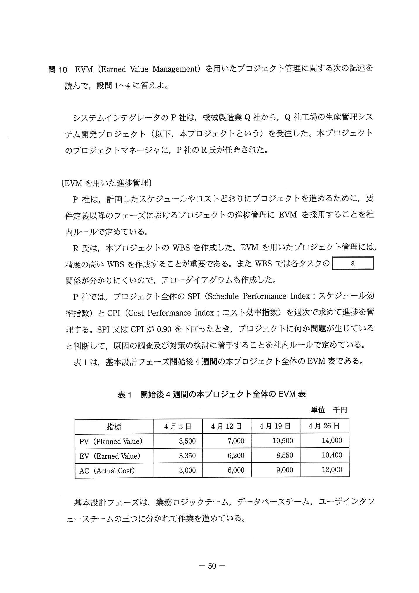

テキスト (OCR)

間 10 EVM (Earned Value Management) を用いたプロジェクト管理に関する次の記述を
読んで, 設問 1ー4 に答えよ。

システムインテグレータの 了 社は, 機械製造業 Q 社から, Q 社工場の生産管理シス
テム開発プロジェクト (以下, 本プロジェクトという) を受注した。本プロジェクト
のプロジェクトマネージャに, PHOR 氏が任命された。

(EVM を用いた進捗管理

P 社は, 計画したスケジュールやコストどおりにプロジェクトを進めるために, 要
件定義以降のフェーズにおけるプロジェクトの進捗管理に EVM を採用することを社
内ルールで定めている。

R 氏は, 本プロジェクトの WBS を作成した。 EVM を用いたプロジェクト管理には,
精度の高い WBS を作成することが重要である。また WBS では各タスクの| sa |
関係が分かりにくいので, アローダイアグラムも作成した。

P 社では, プロジェクト全体の SPI (Schedule Performance Index: スケジュール効
率指数) とCPI (Cost Performance Index : コスト効率指数) を週次で求めて進捗を管
理する。SPI 又は CPI が 0.90 を下回ったとき, プロジェクトに何か問題が生じている
と判断して, 原因の調査及び対策の検討に着手することを社内ルールで定めている。

表 1 は, 基本設計フェーズ開始後 4 週間の本プロジェクト全体の EVM 表である。

表1 開始後 4 週間の本プロジェクト全体の EVM 表

単位 FA
指標      4月5日   4 月12 日   4 月 19 日   4 月 26 日
PV (Planned Value)           3,500         7,000        10,500        14,000
EV (Earned Value)           3,350         6,200         8,550        10,400
AC (Actual Cost)         3,000      6,000      9,000      12,000

基本設計フェーズは, 業務ロジックチーム, データベースチーム, ユーザインタフ
ェースチームの三つに分かれて作業を進めている。

ー 50 一

### ページ 51

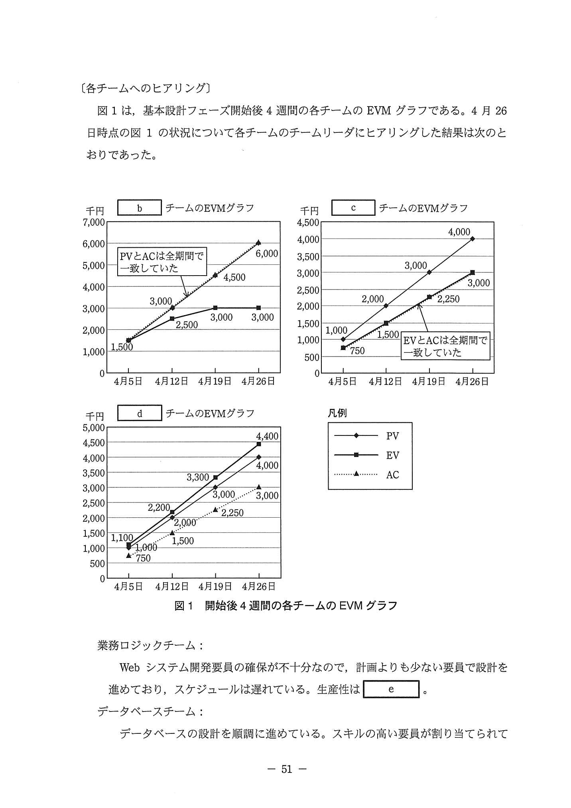

テキスト (OCR)

〔(各チームへのヒアリング〕
 1 は, 基本設計フェーズ開始後 4 週間の各チームの EVM グラフである。4 月 26
日時点の図 1 の状況について各チームのチームリーダにヒアリングした結果は次のと
おりであった。

TA
7,000

6,000
5,000
4,000
3,000
2,000

1,000

TA
5,000

4,500
4,000
3,500
3,000
2,500
2,000
1,500
1,000

500

| b |チームのEVMグラフ

 チームのEVMグラフ

千円
4500
4000                                              a
人
PVとACは人期間で| "6000| ssoo                                               ZL
|一致していた   IP         ae           3,000,
4,500                    0
\              ?                                                       Wa           3,000
2,500
31600                                                            2000 ノーレデ250
                                 ー | 2,000
3,000 3000                            ブンの
2,500                      150015 999, ブンイ         \
」 sf                                     1,000} pee 2 ACIS EMAC}
500           750              一致していた

1             1

1    1    1    1
° 4月5日 4A12H 4月19日 4月26日

[a |チームのEvwグラフ

4400
Fa

ンプ 4,000
3300アン

ンプ3.000.…"3.000

2200 ンー  AD 250

1    1    1    1
O GASH 4月12日 4月19日 44268
開始後 4 週間の各チームの EVM グラフ

図 1

業務ロジックチーム :

Web システム開発要員の確保が不十分なので,

0    1        I
4月5日 4月12日

4月19日 4月26日

凡例

計画よりも少ない要員で設計を

進めており, スケジュールは遅れている。生産性は| ce ]。
データベースチーム :
データベースの設計を順調に進めている。スキルの高い要員が割り当てられて

ー 51 一

### ページ 52

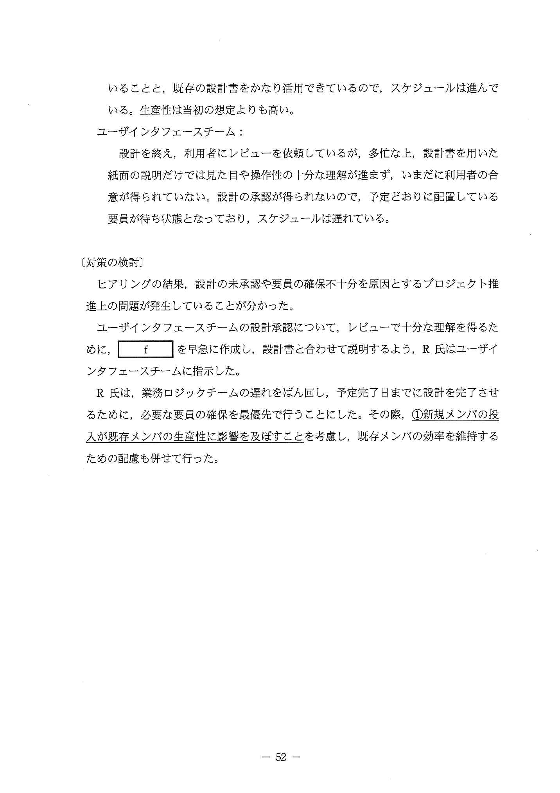

テキスト (OCR)

いることとと, 既存の設計書をかなり活用できているので, スケジュールは進んで
いる。生産性は当初の想定よりも高い。
ユーザインタフェースチーム :
設計を終え, 利用者にレビューを依頼しているが, 多忙な上, 設計書を用いた
紙面の説明だけでは見た目や操作性の十分な理解が進まず, いまだに利用者の合
意が得られていない。設計の承認が得られないので, 予定どおりに配置している
要員が待ち状態となっており, スケジュールは遅れている。

(対策の検討

ヒアリングの結果, 設計の未承認や要員の確保不十分を原因とするプロジェクト推
進上の問題が発生していることが分かった。

ユーザインタフェースチームの設計承認について, レビューで十分な理解を得るた
めに, を早急に作成し, 設計書と合わせて説明するよう, R 氏はユーザイ
ンタフェースチームに指示した。

R 氏は, 業務ロジックチームの有遅れをばん回し, 予定完了日までに設計を完了させ
るために, 必要な要員の確保を最優先で行うことにした。その際, ①新規メンバの投
入が既存メンバの生導性に影響を及ぼすことを考慮し, 既存メンバの効率を維持する
ための配慮も併せて行った。

ー 52 一

### ページ 53

テキスト (OCR)

設問1 本文中の| a | に入れる適切な字句を5字以内で答えよ。
設問2 表1について, ①)て(3⑬)に答えよ。
@ 4月 26 日時点の進捗状況について, スケジュールは, SH, 遅れ又は予定ど
おりのいずれであったかを〇印で囲み。 その大きさが何干円であったか答えよ。
なお, 予定どおりの場合, 大きさは0 干円と答えよ。
(2) 4月 26 日時点の進捗状況について, コストは, ie, 削減又は予定どおりの
いずれであったかをの〇印で囲み,。 その大きさが何千円であったか答えよ。
なお, 予定どおりの場合, 大きさは0 千円と答えよ。
(3③) R 氏が社内ルールに従い, 原因の調査及び対策の検討に着手した最初のボイ
ントは 4 月何日であわったと考えられるか答えよ。また, その根拠となる指数を
一つ〇印で囲み, その値を小数第 3 位を四捨五入して小数第 2 位まで求めよ。
設問3 〔各チームへのヒアリング〕 について, ①⑪, ②に答えよ。
Q 図1 中の| b |て| 4 |に入れる適切なチーム名を解答群の中
から選び, 記号で答えよ。
HET
ア 業務ロジック         イ データベース
ウ ユーザインタフェース
⑫ 本文中の| <  ] に入れる適切な宇名を解答群の中から選び, 記号で千
Ak, KK, そのように考えた理由を, 適切な指標を用いて 15 字以内で述べよ。
A
ア 当初の想定どおりである    4 当初の想定よりも高い
ウ 当初の想定よりも低い
設問4 [対策の検討1]について, ①⑪, ②に答えよ。
Q) 本文中の に入れる適切な字名を 10 宇以内で答えよ。
Q) 本文中の下線①が示す内容について, 35 字以内で述べよ。

cowie

Ry oy

ー 53 一

### ページ 54

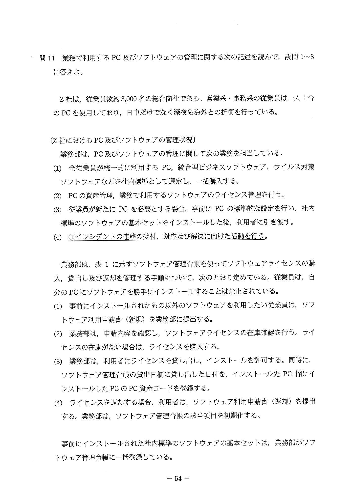

テキスト (OCR)

間 11 業務で利用する PC 及びソフトウェアの管理に関する次の記述を読んで, 設問 1こ3

に答えよ。

Z社は, 従業員数約 3.000 名の総合商社である。営業系・事務系の従業員は一人 1 台
の PC を使用しており, 日中だけでなく深夜も海外との折衝を行っている。

〔Z 社における PC 及びソフトウェアの管理状況
業務部は, PC 及びソフトウェアの管理に関して次の業務を担当している。

Q) 全従業員が統一的に利用する PC, 統合型ビジネスソフトウェア, ウイルス対策
ソフトウェアなどを社内標準として選定し, 一括購入する。

Q) PC の資産管理, 業務で利用するソフトウェアのライセンス管理を行う。

(3) 従業員が新たに PC を必要とする場合, 事前に PC の標準的な設定を行い 社内
標準のソフトウェアの基本セットをインストールした後, 利用者に引き渡す。

(4) ①インシデントの連絡の受付, 対応及び解決に向けた活動を行う。

業務部は, 表 1 に示すソフトウェア管理台帳を使ってソフトウェアライセンスの購
入, 貸出し及び返却を管理する手順について, 次のとおり定めている。 TERA, 自
分のPC にソフトウェアを勝手にインストールすることは禁止されている。

Q) 事前にたインストールされたもの以外のソフトウェアを利用したい従業員は, ソフ
トウェア利用申請書 (新規) を業務部に提出する。

(2) 業務部は, 申請内容を確認し, ソフトウェアライセンスの在庫確認を行う。ライ
センスの在庫がない場合は, ライセンスを購入する。

(3) 業務部は, 利用者にライセンスを貸し出し, インストールを許可する。 同時に,
ソフトウェア管理台帳の貸出日欄に貸し出した日付,, インストール先 PC 欄にイ
ンストールした PC の PC資産コードを登録する。

(④) ライセンスを返却する場合, 利用者は, ソフトウェア利用申請書 (返却) を提出
する。 業務部は, ソフトウェア管理台帳の該当項目を初期化する。

事前にインストールされた社内標準のソフトウェアの基本セットは, 業務部がソフ
トウェア管理台帳に一括登録している。

ー 54 一

### ページ 55

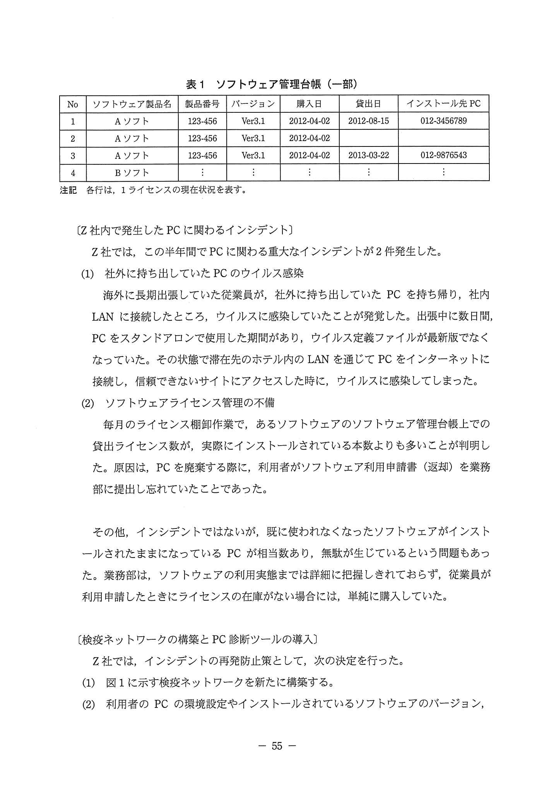

テキスト (OCR)

表1 ソフトウェア管理台帳 (一部)

No | ソフトウェア製品名 | 製品番号 | バージョン    購入日       貸出日     インストール先 PC
1           Aソフト           123-456       Ver3.1       2012-04-02     2012-08-15         012-3456789

2           Aソフト           123-456       Ver3.1       2012-04-02

3           Aソフト           123-456       Ver3.1       2012-04-02     2013-03-22         012-9876543

4          Bソフト             i            1              i

注記 各行は, 1ライセンスの現在状況を表す。

(Z 社内で発生した PC に関わるインシデント〕
Z社では, この半年間でPC に関わる重大なインシデントが2 件発生した。
Q①) 社外に持ち出していた PC のウイルス成染
海外に長期出張していた従業員が, 社外に持ち出していた PC を持ち帰り, 社内
LAN に接続したところ, ウイルスに感染していたことが発覚した。出張中に数日間,
PC をスタンドアロンで使用した期間があり, ウイルス定義ファイルが最新版でなく
なっていた。その状態で滞在先のホテル内の LAN を通じて PC をインターネットに
接続し, 信頼できないサイトにアクセスした時に, ウイルスに感染してしまった。
(2②) ソフトウェアライセンス管理の不備
毎月のライセンス棚卸作業で, あるソフトウェアのソフトウェア管理台帳上での
貸出ライセンス数が, 実際にインストールされている本数よりも多いことが判明し
た。原因は, PC を廃棄する際に, 利用者がソフトウェア利用申請書 (返却) を業務
部に提出し忘れていたことであった。

その他, インシデントではないが, 既に使われなくなったソフトウェアがインスト
ールされたままになっている PC が相当数あり, 無駄が生じているという問題もあっ
た。業務部は, ソフトウェアの利用実態までは詳細に把握しきれておらず, 従業員が
利用申請したときにライセンスの在庫がない場合には, 単純に購入していた。

(BIER hI —7 OBE PC 診断ツールの導入〕
Z社では, インシデントの再発防止策として, 次の決定を行った。
① 1 に示す検疫ネットワークを新たに構築する。
(2) 利用者の PC の環境設定やインストールされているソフトウェアのバージョン,

ー 55 一

### ページ 56

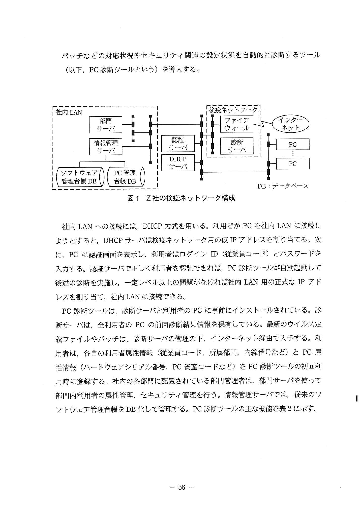

テキスト (OCR)

パッチなどの対応状況やセキュリティ関連の設定状態を自動的に診断するツール
(以下, PC診断ツールという) を導入する。

|                 oF
サーバ

情報管理
ーーエー

リフトウェア     ーー _
管理台帳 DB     台帳DB

 1 Z社の検疫ネットワーク構成

社内 LAN への接続には, DHCP 方式を用いる。利用者が PC を社内 LAN に接続し
ようとすると, DHCP サーバは検疫ネットワーク用の仮 TP アドレスを割り当てる。次
証画面を表示し, 利用者はログイン ID (従業員コード) とパスワードを
入力する。 認証サーバで正しく利用者を認証できれば, PC 診断ツールが自動起動して
後述の診断を実施し, 一定レベル以上の問題がなければ社内 LAN 用の正式な IP アド
レスを割り当て, 社内LANに接続できる。

C 診断ツールは, 診断サーバと利用者の PC に事前たインストールされている。診
断サーバは, 全利用者の PC の前回診断結果情報を保有している。最新のウイルス定
義ファイルやパッチは, 診断サーバの管理の下. インターネット経貼で入手する。利
用者は, 各自の利用者属性情報 (従業員コユード, 所属部門, 内線番号など) と PC 司
性情報 (ハードウェアシリアル番号, PC 資産コードなど) を PC 診断ツールの初回利
用時に登録する。社内の各部門に配置されている部門管理者は, 部門サーバを使って
部門内利用者の属性管理. セキュリティ管理を行う。情報管理サーバでは, 従来のソソ
フトウェア管理台帳をDB 化して管理する。PC 診断ツールの主な機能を表 2 に示す。

ー 56 一

### ページ 57

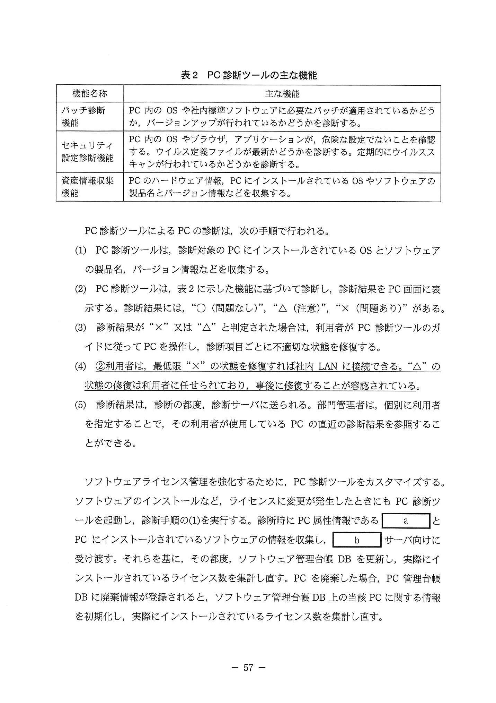

テキスト (OCR)

表2 PC診断ツールの主な機能

機能名称                             主な機能
パッチ診断    PC 内の OS や社内標準ソフトウェアに必要なパッチが適用されているかどう
機能         か, バージョンアップが行われているかどうかを診断する。
セキュリティ   PC 内の OS やブラウザ, アプリケーションが, 危険な設定でないことを
疫定診断機能  する。ウイルス定義ファイルが最新かどうかを診断する。定期的にウイルスス

ーー        キャンが行われているかどうかを診断する。

資産情報収集 | PC のハードウェア情報, PC にインストールされている OS やソフトウェアの
機能         製品名とバージョン情報などを収集する。

診断ツールによる PC の診断は, 次の手順で行われる。
①) PC診断ツールは, 診断対象の PC にインストールされている OS とソフトウェア
の製品名, バージョン情報などを収集する。
(2) PC診断ツールは, 表 2 に示した機能に基づいて診断し, 診断結果を PC 画面に表
示する。診断結果には, “〇 (問題なし)”, “A GER)”, “X (問題あり)” がある。
(3) 診断結果が “X” 又は “へ” と判定された場合は, 利用者が PC 診断ツールのガ
ドに従って PC を操作し, 診断項目ごとに不適切な状態を修復する。
4 ②利用者は, BAR “x” の状態を修復すれば社内 LAN に接続できる。"へ"の

状態の修復は利用者に任せられており, 事後に修復することが容認されている。

6) 診断結果は, CHORE, 診断サーバに送られる。 部門管理者は, 個別に利用者
を指定することで, その利用者が使用している PC の直近の診断結果を参照するこ
とができる。

ソフトウェアライセンス管理を強化するために, PC 診断ツールをカスタマイズする。
ソフトウェアのインストールなど, ライセンスに変更が発生したときにも PC 診断ツ
ールを起動し, 診断手順の①)を実行する。診断時に PC 属性情報である| sa |と
PC にインストールされているソフトウェアの情報を収集し, | bp | サーバハ向けに
受け渡す。それらを基に, その都度,ソフトウェア管理台帳 DB を更新し, 実際にイ
ンストールされているライセンス数を集計し直す。PC を廃棄した場合PC 管理台帳
B に廃棄情報が登録されると。ソフトウェア管理台帳 DB 上の当該 PC に関する情報
を初期化し, 実際にインストールされているライセンス数を集計し直す。

ー 57 一

### ページ 58

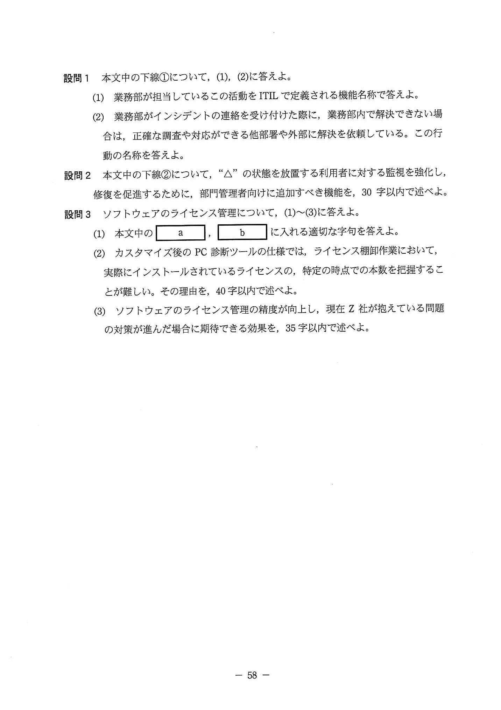

テキスト (OCR)

設問1 本文中の下線のについて, ①⑪, ②)に答えよ。
1) 業務部が担当しているこの活動を ITIL で定義される機能名称で答えよ。
2) 業務部がインシデントの連絡を受け付けた際に, 業務部内で解決できない場
合は, 正確な調査や対応ができる他部署や外部に解決を依頼している。この行
動の名称を答えよ。
設問2 本文中の下線②について, “へ"の状態を放置する利用者に対する監視を強化し,
修復を促進するために, 部門管理者向けに追加すべき機能を, 30 字以内で述べよ。
設問3 ソフトウェアのライセンス管理について, ①⑪ぐ(3)に答えよ。
a 本文中の| sa |,| b | に入れる適切な字句を答えよ。
Q) カスタマイズ後の PC 診断ツールの仕様では, FT RY AMEVERICSOT,
実際にインストールされているライセンスの, 特定の時点での本数を把握するこ
とが難しい。その理由を, 40 字以内で述べよ。
8) ソフトウェアのライセンフス管理の精度が向上し, 現在 Z 社が抱えている問題
の対策が進んだ場合に期待できる効果を, 35 字以内で述べよ。

ー 58 一

### ページ 59

テキスト (OCR)

【 メモ 用 紙 〕

ー 59 一

### ページ 60

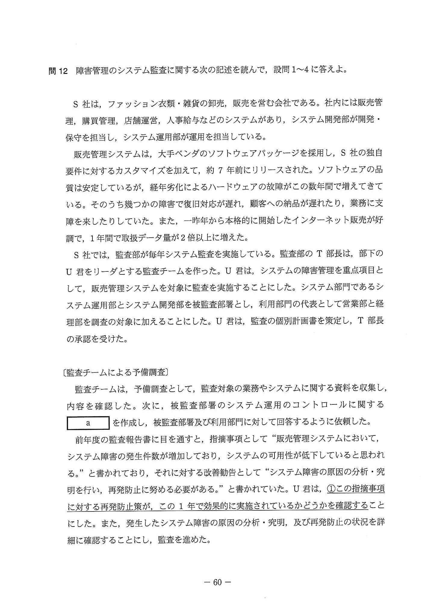

テキスト (OCR)

間12 障害管理のシステム監査に関する次の記述を読んで, 設問14 に答えよ。

S 社は, ファッション衣類・雑貨の卸売, 販売を営む会社である。社内には販売管
理, 購買管理, 店舗運営, 人事給与なごのシステムがあり, システム開発部が開発・
保守を担当し, システム運用部が運用を担当している。

販売管理システムは, 大手ベンダのソフトウェアパッケージを採用し, S 社の独自
要件に対するカスタマイズを加えて, 約 7 年前にリリースされた。ソフトウェアの品
質は安定しているが, 経年劣化によるハードウェアの故障がこの数年間で増えてきて
いる。そのうち幾つかの障害で復旧対応が遅れ, 顧客への納品が遅れたり, 業務に支
障を来したりしていた。また, 一昨年から本格的に開始したインターネット販売が好
調で, 1 年間で取扱データ量が2 倍以上に増えた。

S 社では, 監査部が毎年システム監査を実施している。監査部の T 部長は, 部下の
U 君をリーダとする監査チームを作った。U Bl, システムの障害管理を重点項目と
UT, 販売管理システムを対象に監査を実施することにした。システム部門であるシ
ステム運用部とシステム開発部を被監査部暑とし, 利用部門の代表として営業部と経
理部を調査の対象に加えることにした。U Al, 監査の個別計画書を策定し, T ME
の承認を受けた。

(監査チームによる予備調査

監査チームは, 予備調査として, 監査対象の業務やシステムに関する資料を収集し
内容を確認した。 Kit, 被監査部署のシステム運用のコントロールに関する
[a | を作成し。 被区部署及び利用部門に対して回答するように依頼した。

前年度の監査報告書に目を通すと, 指摘事項として "販売管理システムにおいて
システム障害の発生件数が増加しており, システムの可用性が低下していると思われ
る。”と書かれており, それに対する改善勧告として “システム障害の原因の分析・究
明を行い, 再発防止に努める必要がある。”と書かれていた。U Ald, ①この指摘事項
に対する再発防止策が. この 1 年で効果的に実施されているかどうかを確認すること
にした。また, 発生したシステム障害の原因の分析・究明, 及び再発防止の状況を詳
細に確認することにし, 監査を進めた。

ー 60 一

### ページ 61

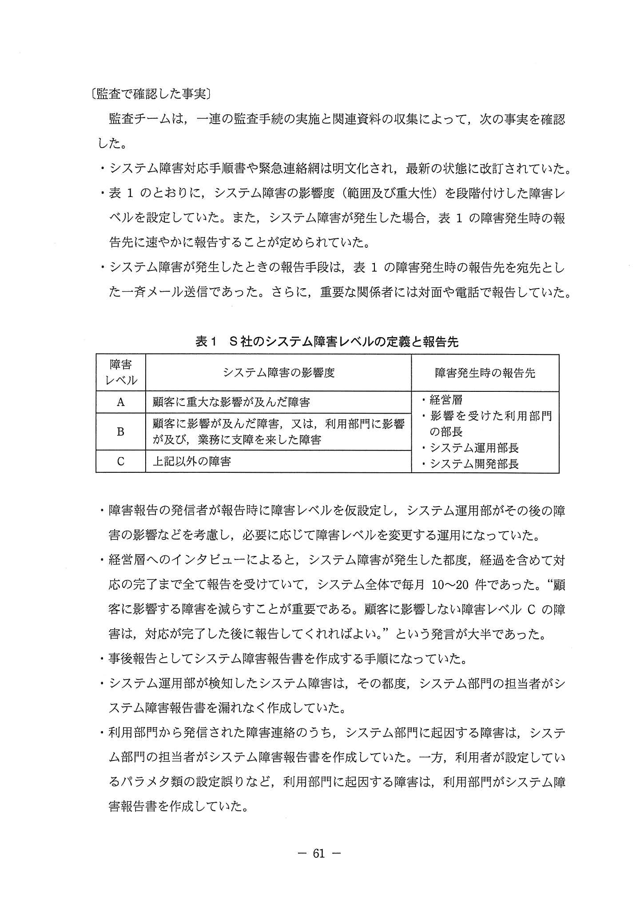

テキスト (OCR)

(監査で確認した事実]

監査チームは, 一連の監査手続の実施と関連資料の収集によって, 次の事実を確認
した。

・システム障害対応手順書や緊急連絡網は明文化され, 最新の状態に改訂されていた。
・表 1 のとおりに, システム障害の影響度 (範囲及び重大性) を段階付けした障害レ
ベルを設定していた。また, システム障害が発生した場合, 表 1 の障害発生時の報
告先に速やかに報告することが定められていた。

・システム障害が発生したときの報告手段は, 表 1 の障害発生時の報告先を宛先とし
と一斉メール送信であった。さらに, 重要な関係者には対面や電話で報告していた。

表1 S社のシステム障害レベルの定義と報告先

wat                  LAF Lite OM ABE                     SEARS Ot +E
A | 願客に重大な影響が及んだ障害                     etd
業務に             と                          ・ システム運用部長
C |上記以外の障害                               ・ システム開発部長

・障害報告の発信者が報告時に障害レベルを仮設定し, システム運用部がその後の障
害の影響などを考慮し, 必要に応じて障害レベルを変更する運用になっていた。

・経営層へのインタビューによると, システム障害が発生した都度, 経過を含めて対
応の完了まで全て報告を受けていて, システム全体で毎月 10て20 件であった。"顧
客に影響する障害を減らすことが重要である。顧客に影響しない障害レベル C Off
Bld, 対応が完了した後に報告してくれればよい。”という発言が大半であった。

・事後報告としてシステム障害報告書を作成する手順になっていた。

・システム運用部が検知したシステム障害は, COME, システム部門の担当者がシ
ステム障害報告書を漏れなく作成していた。

・利用部門から発信された障害連絡のうち, システム部門に起因する障害は, システ
ム部門の担当者がシステム障害報告書を作成していた。一方, 利用者が設定してい
るパラメタ類の設定誤りなど, 利用部門に起因する障害は, 利用部門がシステム障
害報告書を作成していた。

### ページ 62

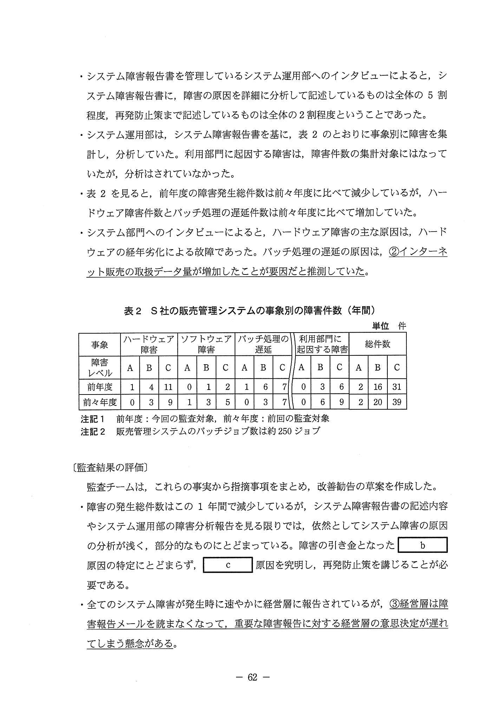

テキスト (OCR)

・システム障害報告書を管理しているシステム運用部へのインタビューによると, シ
ステム障害報告書に, 障害の原因を詳細に分析して記述しているものは全体の 5 Bl
BE, 再発防止策まで記述しているものは全体の 2 割程度ということであった。

・システム運用部は, システム障害報告書を基に, 表 2 のとおりに事象別に障害を集
atl, 分析していた。利用部門に起因する障害は, 障害件数の集計対象にはなって
いたが, 分析はされていなかった。

・表 2 を見ると, 前年度の障害発生総件数は前々年度に比べて減少しているが, ハー
ドウェア障害件数とバッチ処理の遅延件数は前々年度に比べて増加していた。

・システム部門へのインタビューによると, ハードウェア障害の主な原因は, ハード
ウェアの経年劣化による故障であった。バッチ処理の遅延の原因は, インターネ
ット販売の取扱データ量が増加したことが要因だと推測していた。

表2 S社の販売管理システムの事象別の障害件数 (年間)
単位 件
ハードウェア |ソフトウェア |バッチ処理の SS   ea hii

me   障害   障害   we |起因する際害
障害    c/A|BI]|C]A]BIC IB BIC/]A|B|C
レベル | A |B           |

前年度 | 1| 4|1| of 1] 2] 1] 6 7{ 0 3| 6| 2|116| 31
前々年度| 0| 3| 9| 1| 3| 5| 0| 3 7\\_0 6| 9] 2] 20] 39
注記1 前年度 : 今回の監査対象, 前々年度 : 前回の監査対象

注記2 販売管理システムのバッチジョブ数は約 250 ジョブ

(監査結果の評価)

HEFL, これらの事実から指摘事項をまとめ。 改善勧告の草案を作成した。

・障害の発生総件数はとの 1 年間で減少しているが, システム障害報告書の記送内容
やシステム運用部の障害分析報告を見る限りでは, 依然としてシステム障害の原因
の分析が浅く, 部分的なちのにとどまっている。障害の引き金となった| b |
原因の特定にとどまらず, 原因を究明し, 再発防止策を講じることが必
要である。

・全てのシステム障害が発生時に速やかに経営層に報告されているが, OSE MIM
害報告メールを読まなくなって, 重要な隊守報告に対する経営層の意思決定が遅れ
てしまう懸念がある。

ー 62 一

### ページ 63

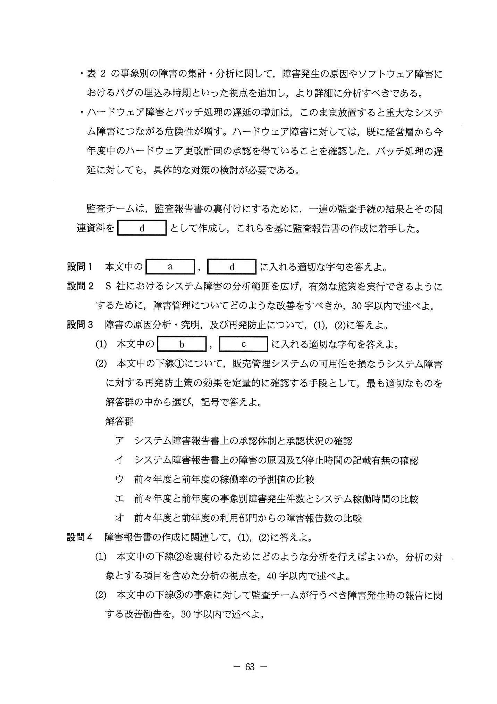

テキスト (OCR)

・表 2 の事象別の障害の集計・分析に関して, 障害発生の原因やソフトウェア障害に
おけるバグの埋込み時期といった視点を追加し, より詳細に分析すべきである。

・ハードウェア障害とバッチ処理の遅延の増加は, このまま放置すると重大なシステ
ム障害につながる危険性が増す。ハードウェア障害に対しては, 既に経営層から今
年度中のハードウェア更改計画の承認を得ていることを確認した。バッチ処理の遅
延に対しても, 具体的な対策の検討が必要である。

監査チームは, 典査報告書の裏付けにするために, 一連の監査手続の結果とその関
連資料を| q | として作成し, これらを基に監査報告午の作成に着手した。

設問1 本文中の|  a |,|  d』 |に入れる適切な字句を答えよ。
設問2 S 社におけるシステム障害の分析範囲を広げ, 有効な施策を実行できるように
するために, 障害管理についてどのような改善をすべきか, 30 字以内で述べよ。
設問3 障害の原因分析・発明, 及び再発防止について, ①, ②に答えよ。
Q①) 本文中の| b |,|  c |に入れる適切な字旬を答えよ。
2) 本文中の下線のについて, 販売管理システムの可用性を損なうシステム障害
に対する再発防止策の効果を定量的に確認する手段として, 最も適切なものを
解答群の中から選び, 記号で答えよ。
解答群
ア システム障害報告書上の承認体制と承認状況の確認
システム障害報告書上の障害の原因及び停止時間の記載有無の確認
前々年度と前年度の稼働率の予測値の比較
前々年度と前年度の事象別障害発生件数とシステム稼働時間の比較
A 前々年度と前年度の利用部門からの障害報告数の比較
設問4 障害報告書の作成に関連して, ①), (②)に答えよ。
(1) 本文中の下線②を裏付けるためにどのような分析を行えばよいか, 分析の対 .
象とする項目を含めた分析の視点を, 40 字以内で述べよ。
2) 本文中の下線③の事象に対して監査チームが行うべき障害発生時の報告に関
する改善勧告を, 30 字以内で述べよ。

HOGA

ー 63 一

### ページ 64

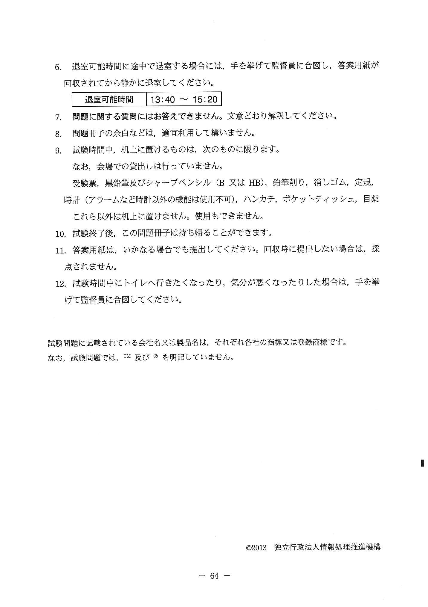

テキスト (OCR)

6. 退室可能時間に途中で退室する場合には, 手を挙げて監督貞に合図し, 答案用紙が
回収されてから静かに退室してください。
| 退密可能時間 [13:40 ~ 15:20 |
7. 問題に関する質問にはお答えできません。文意どおり解釈してください。
8. 問題冊子の余白などは, 適宜利用して構いません。
9, 試験時間中机上に置けるものは, 次のものに限ります。
なお, 会場での貸出しは行っていません。
受験村,黒鉛筆及びシャープペンシル (B 又は HB), 鉛筆削り, 消しゴム, 定規
時計 (アラームなど時計以外の機能は使用不可), ハンカチ, ボケットティッシュ, 目薬
これら以外は机上に置けません。使用もできません。
10. 試験終了後, この問題周子は持ち帰ることができます。
ll. SRAM, いかなる場合でも提出してください。回収時に提田しない場合は。 採
点されません。
12, 試験時間中にトイレへ行きたくなったり, 気分が悪くなったりした場合は, FEM
げて監督員に合図してください。

試験問題に記載されている会社名又は製品名は, それぞれ各社の商標又は登録商標です。
なお, 試験問題では, ™ 及び © を明記していません。

@2013 独立行政法人情報処理推進機構

ー 64 一

---

## 午後解答

1/6 
©2013 独立行政法人情報処理推進機構 
平成25 年度 春期 応用情報技術者試験 解答例 
 
午後試験 
問１ 
出題趣旨 
 事業環境変化が激しい今日においては，自社内の資源だけでなく，企業間の提携によって他社の資源も活用
しながら競争優位な事業戦略を実行する事例が増えている。提携は，双方の会社がメリットを認識できて成立
する。 
 本問では，料理教室チェーンを題材に，財務分析に関する知識，及び提携を伴う事業戦略の基本的な考え方
について問う。 
 
設問 
解答例・解答の要点 
備考 
設問１ (1) a イ 
 
 
(2) b 差別化 
 
設問２ (1) 80 
 
 
(2) イ 
 
 
(3) 投資活動による 
 
設問３ (1) 教室の空いている壁に新しいガス機器などのポスターを掲示する。 
 
 
(2) 広告内容が，ガス機器を使用する主婦層に直接届くから 
 
設問４ 
将来IH コンロの普及割合が高くなる場合 
 
 
問２ 
出題趣旨 
 配列やスタックなどのデータ構造を用いたアルゴリズムの実装能力は，応用情報技術者にとって，押さえて
おくべき基礎技術の一つである。 
 本問では，スタックの構造を用いて，一般的な数式を逆ポーランド表記法に変換するプログラムを題材に，
アルゴリズムを理解し，それをプログラムに変換する能力を問う。 
 
設問 
解答例・解答の要点 
備考 
設問１ (1) 23＋4× 
 
 
(2) ア × 
 
 
イ ÷ 
順不同 
 
 
ウ ＋ 
 
 
エ － 
順不同 
設問２ (1) オ 0 
 
 
(2) カ ・スタック上に演算要素があるか否か 
・スタックが空であるか否か 
 
 
(3) キ stack[stackCount] 
 
 
 
ク GetPriority(stackTop)がelementPriority 以上 
 
 
 
ケ GetElement(i)が“ ) ”である 
 
設問３ 
コ Err 
 
 
 
サ OK 
 
 
 
シ OK 
 
 
 
ス Err

2/6 
©2013 独立行政法人情報処理推進機構 
問３ 
出題趣旨 
 近年，企業を支える情報システムの重要性が益々高まっている状況下で，情報システムを取り巻く様々なリ
スクが増加しており，脆弱性とリスク源を的確に把握し，適切なリスク対策を施すことが，企業防衛の上で欠
かせなくなっている。 
 本問では，電子メールシステムを題材に，リスク分析と対策に関する知識と応用力を問う。 
 
設問 
解答例・解答の要点 
備考 
設問１ (1) a 震度6 以上の強い地震 
 
 
(2) b 電子メールのデータは，本社サーバ内のHDD にバックアップされている。  
 
(3) c 電子メールシステムのシステム運用業務を行う要員がひっ迫している。 
 
設問２ (1) d 損失予防 
 
 
 
f リスク保有 
 
 
(2) e システム運用業務を専門業者に委託する。 
 
設問３ 
電子メールが利用できなくなると業務の継続が困難になるから 
 
 
問４ 
出題趣旨 
 TCP/IP 技術の発達や高速なIP ネットワーク環境の整備に伴い，IP 電話は急速に拡大してきた。 
 本問では，VoIP システムの導入を題材に，システム構成機器の障害とその対策に対する知識と応用力を問う。
 
設問 
解答例・解答の要点 
備考 
設問１ 
エ 
 
設問２ (1) 
機器名 
SIP サーバ 
 
 
 
設置拠点 
コールセンタ 
 
 
(2) ① 
② 
・オペレータごとに均等に着信させる。 
・営業店オペレータに自動転送する。 
 
設問３ 
ア 
 
設問４ 
オペレータへの均等着信機能

3/6 
©2013 独立行政法人情報処理推進機構 
問５ 
出題趣旨 
 ネットワークを理解するためには，データリンク層の通信やTCP/IP 通信の理解が不可欠である。サーバロー
ドバランサは，これらの通信の特性に基づいて動作している。 
 本問では，サーバロードバランサを導入してAP サーバを複数台構成にすることで，業務システムを増強する
事例を題材に，TCP/IP 通信の基本技術の理解度を問う。 
 
設問 
解答例・解答の要点 
備考 
設問１ 
a カ 
 
 
 
b ア 
 
 
 
c ウ 
 
設問２ (1) d SLB1MAC 
 
 
 
e 172.16.0.50 
 
 
(2) f 255.255.0.0 
 
 
 
g 255.255.255.0 
 
 
(3) 経路表（ルーティングテーブル） 又は デフォルトゲートウェイ 
 
設問３ (1) h SLB0MAC 
 
 
 
i 172.16.0.101 
 
 
(2) AP サーバを使用したPC が特定できなくなる。 
 
 
問６ 
出題趣旨 
 近年，ソーシャルネットワークや各種ハードウェアに取り付けられたセンサなどからの，随時発信される情
報を活用することで，新しい情報価値を掘り起こし，事業に役立てる動きが増加しつつある。 
 本問では，テキストマイニングツールを活用したシステムへの機能追加を題材に，その業務要件から求めら
れる E-R 図やSQL 文，データモデリングに関する知識と技能を問う。 
 
設問 
解答例・解答の要点 
備考 
設問１ 
a → 
 
 
b サポート分類ID 
 
設問２ 
c LEFT OUTER JOIN 
 
 
d 発言.社員番号 IS NULL 
 
設問３ 
e 発言.否定的フラグ = '1' 
 
 
f ORDER BY WEIGHT DESC 
 
設問４ 
（省略）
活用シーン
活用シーンキーワード
活用シーン ID
キーワード ID
（省略）
キーワード

4/6 
©2013 独立行政法人情報処理推進機構 
問７ 
出題趣旨 
 携帯機器の充電方法の一つとしてワイヤレス充電が普及しつつある。ワイヤレス充電は，携帯機器と接点を
介さずに充電することができ利便性が高い。しかし，送電した電力が設計どおりに携帯機器に受電されていな
い場合には事故になる危険性があり，安全設計を行う必要がある。 
 本問では，ワイヤレス充電ステーションを題材に，リアルタイムOS を用いたマルチタスク設計に関する基本
的な理解を問う。また，安全設計に関する知識と，リアルタイムOS を用いた設計力を評価する。 
 
設問 
解答例・解答の要点 
備考 
設問１ 
01:25 
 
設問２ (1) a 4 
 
 
 
b 2 
 
 
(2) c ア 
 
 
(3) d Stop_Power 
 
設問３ 
機器ID がゼロ 
 
設問４ 
Get_Watt 関数を呼び出す 
 
 
問８ 
出題趣旨 
 システムの複雑化に伴い，プログラムの品質確保の難易度は高くなってきている。複雑な条件や状態遷移が
伴う際，設計の仕方によってはプログラムの実装がシンプルになり，高い品質を保ちやすくなる。 
 本問では，プロビジョニングシステムの設計を題材に，ステートマシンを用いたシステム設計に関する基本
的な理解及び設計能力を問う。 
 
設問 
解答例・解答の要点 
備考 
設問１ 
a 停止 
 
 
 
b Starting 
 
 
 
c Deleting 
 
設問２ 
②，④，⑥ 
 
設問３ 
仮想サーバの状態が“停止”になる前にサーバ削除のメッセージが送信される
から 
 
設問４ (1) 
停止
処理完了
作成中
未作成サーバ作成
削除中
サーバ削除
削除済
処理完了
起動中
停止中
起動
処理完了
サーバ起動
処理完了
サーバ停止
停止・削除中
処理完了
サーバ削除
 
 
 
(2) d 起動 
 
 
 
e サーバ削除 
 
 
 
f StopDeleting

5/6 
©2013 独立行政法人情報処理推進機構 
問９ 
出題趣旨 
 標的型攻撃に代表される新たなサイバー攻撃手法の出現によって，企業におけるマルウェア対策の重要性が
高まってきている。 
 本問では，企業におけるウイルス感染事例を題材に，マルウェアに関する基本的な理解及び具体的なマルウ
ェア対策の手法の理解について問う。 
 
設問 
解答例・解答の要点 
備考 
設問１ (1) 誤検知によって受信するべきメールが取り込めない。 
 
 
(2) ブラックリスト 
 
設問２ 
下線③ キ 
 
 
 
下線④ オ 
 
設問３ (1) a イ 
 
 
b ウ 
順不同 
 
(2) プロキシサーバでアクセス可能なWeb サイトを制限できる。 
 
設問４ (1) あらかじめ指定されたWeb サイトにマルウェアを埋め込まれた場合 
 
 
(2) データのバックアップを外部媒体に定期的にとる。 
 
 
問10 
出題趣旨 
 昨今，プロジェクトマネジメントにおいて，定量的なプロジェクト管理が必要とされている。 
 本問では，システム開発を題材に，WBS を用いたプロジェクトのスコープマネジメント，並びにEVM を用いた
プロジェクトのタイムマネジメント及びコストマネジメントに関する知識，理解及び能力を問う。 
 
設問 
解答例・解答の要点 
備考 
設問１ 
a 先行後続 
 
設問２ (1) スケジュール 
進み・遅れ・予定どおり 
大きさ 
3,600 千円 
 
 
(2) 
コスト 
超過・削減・予定どおり 
大きさ 
1,600 千円 
 
 
(3) 
4 月（ 12 ）日 
指数 
SPI・CPI 
値 
（ 0.89 ）  
設問３ (1) b ウ 
 
 
 
c ア 
 
 
 
d イ 
 
 
(2) e ア 
 
 
 
理由 
EV とAC が等しいから 
 
設問４ (1) f プロトタイプ 
 
 
(2) 既存メンバの工数が新規メンバの教育に割り振られる。

6/6 
©2013 独立行政法人情報処理推進機構 
問11 
出題趣旨 
 昨今，業務形態の変化や社内外のWeb 利用の増大によって，従業員に一人1 台のPC を与えて業務を行うこと
が当たり前になっている。しかし，PC やそれにインストールするソフトウェアの管理が膨大になり，かつ，管
理すべき内容が複雑になり，インシデントが発生する率が増えている。 
 本問では，業務で利用するPC 及びソフトウェアの導入と維持管理を題材に，PC 及びソフトウェアの管理に関
する基本的な理解について問う。 
 
設問 
解答例・解答の要点 
備考 
設問１ (1) サービスデスク 
 
 
(2) エスカレーション 
 
設問２ 
部門内利用者のPC の“△”の状態について警告する機能 
 
設問３ (1) a PC 資産コード 
 
 
 
b 情報管理 
 
 
(2) 診断の都度，実際にインストールされているライセンス数を集計し直すから 
 
 
(3) ソフトウェアライセンス数の適正化によるライセンス購入費用の抑制 
 
 
問12 
出題趣旨 
 システム障害発生時には，迅速かつ的確なエスカレーションと障害対策が重要であるが，それらに加え，事
後に障害原因の分析・究明，及び再発防止策を講じることも必要である。 
 本問では，本番稼働している社内システムのシステム監査を題材に，システム障害管理に関する監査の基本
的な理解について問う。 
 
設問 
解答例・解答の要点 
備考 
設問１ 
a チェックリスト 
 
 
d 監査調書 
 
設問２ 
利用部門に起因するシステム障害も分析対象にする。 
 
設問３ (1) b 直接 
 
 
 
c 根本 
 
 
(2) エ 
 
設問４ (1) インターネット販売の取扱データ量とバッチ処理に要する時間の相関 
 
 
(2) 経営層に報告する対象を障害レベルB 以上にする。

---

## 午後採点講評

1/3 
©2013 独立行政法人情報処理推進機構 
平成25 年度 春期 応用情報技術者試験 採点講評 
 
午後試験 
問１ 
 問1 では，料理教室チェーンを題材に，財務分析及び，提携を伴う事業戦略の基本的な考え方について出題
した。 
 設問2(1)は，正答率が低かった。事業戦略を策定するに当たり，損益分岐点を把握することは必須である。
損益分岐点の計算をできるようにしておいてほしい。 
 設問2(3)は，正答率が低かった。キャッシュフローは，企業の財務状態を把握する上で重要であり，キャッ
シュフロー計算書の基本的な考え方をよく理解しておいてほしい。 
 設問4 は，正答率が高かったが，問題文中で提携の継続を前提としているにもかかわらず，“提携を打ち切
られた場合”という解答も散見された。 
 
問２ 
 問2 では，数式の逆ポーランド表記法への変換を題材に，配列やスタックなどのデータ構造を用いたアルゴ
リズムについて出題した。全体として，正答率は高かった。 
 設問2(2)は，正答率が低かった。特定の条件のデータを配列の境界部分に埋め込んでおくことによってアル
ゴリズム上の何が実現できるのかを問う問題であった。行うべき処理とプログラム上の記述との対応関係を正
しく把握した上で解答するように心掛けてもらいたい。 
 設問2(3)のクは，正答率が低かった。アルゴリズムの処理手順から分岐条件を求める問題であったが，分岐
条件の境界を誤った解答が目立った。分岐条件の境界を求める際には，条件に具体的な値を代入して，想定ど
おりの結果が得られることを確認することが重要である。 
 
問３ 
 問3 では，電子メールシステムを題材に，地震や標的型攻撃などに伴うリスク分析と対策について出題し
た。 
 設問1(1)は，正答率が高かった。リスク源の特定については，おおむね理解されているようであった。 
 設問2(2)は，正答率が高かった。脆弱性に対するリスク対策については，おおむね理解されているようであ
った。 
 設問3 は，“リスクレベルを低く設定しているから”という解答が散見された。リスクレベルを見直す理由
として，“電子メールが利用できなくなると，業務の継続が困難になるから”と具体的に解答してほしい。 
 
問４ 
 問4 では，VoIP システムの導入を題材に，システム構成機器の障害時対応について出題した。 
 設問2 は，正答率が高かった。システム障害発生時の迂回路と発生する機能障害について，おおむね理解さ
れているようであった。(2)では，設問文で指定されている，“電話の着信に関する機能”ではない機能を記述
した解答が散見された。設問をよく読み，求められていることを理解した上で解答してほしい。 
 設問4 では，解答欄が空欄のものが散見された。CCS の機能は問題文に列挙されており，その中でホットス
タンバイに変更することによって維持できるようになるものは限定されている。問題文の該当箇所に着目して
正答を導き出してほしい。 
 
問５ 
 問5 では，サーバロードバランサ（以下，SLB という）を導入してアプリケーションサーバを複数台構成に
することで，業務システムを増強する事例を題材に，TCP/IP 通信の基本技術について出題した。 
 設問2(1)と設問3(1)では，データリンク層とネットワーク層の通信の違いを問うたが，e の正答率だけが低
かった。本文中にSLB の動作が記述されていたので，その記述内容を基に通信の方式を考えてほしかった。 
 設問2(3)は，“IP アドレス”という解答が多かったが，図を見ればIP アドレスは変更されないことに気付
くことができる。通信経路をSLB 経由とするのに必要なネットワーク情報について考えてほしかった。 
 設問3(2)では，SLB のソースNAT 機能が使用されることに着目せず，AP サーバが振り分けられるという視点
からの解答が散見された。設問の趣旨を正しく把握した上で解答するように心掛けてもらいたい。

2/3 
©2013 独立行政法人情報処理推進機構 
問６ 
 問6 では，テキストマイニングツールを活用したシステムへの機能追加を題材に，その業務要件から求めら
れるE-R 図やSQL 文，データモデリングについて出題した。全体として，正答率は低かった。 
 設問2 のc は，キーワード表と副問合せOMOMI との結合に関する句を求めたにもかかわらず，抽出条件など
の解答が目立った。FROM 句内である点や前後のSQL 文をよく読み，解答してほしい。 
 設問4 は，追加するエンティティの属性に主キーが設定されていないものや，エンティティ間の関連を誤っ
た解答が散見された。図4 の画面例や表2 のキーワード例に示されているデータ例を基に，エンティティ間の
関連をよく考えて，正答を導き出してほしい。 
 
問７ 
 問7 では，ワイヤレス充電ステーションの組込みソフトウェアの設計を題材に，マルチタスクシステムの設
計と，安全に配慮した設計について出題した。全体として，正答率は高かった。 
 設問1，2 は，正答率が高かった。タスクの優先度設定は，マルチタスクシステムの設計の基本であるが，
おおむね理解されているようであった。 
 設問3 は，正答率が高かった。組込みソフトウェアでは，周期的にハードウェアの状態を読み，処理する手
法をよく用いる。メインタスク処理の流れ図に記載された矢印のYes/No まで注意を払い，この周期的処理の
流れを読み取って，解答してほしい。 
 設問4 は，正答率が低かった。問題文中の処理の流れをよく読み，ソフトウェア処理であることに着目すれ
ば，正答を導き出すことができるはずである。 
 
問８ 
 問8 では，プロビジョニングシステムの設計を題材に，状態遷移に基づくシステム設計について出題した。
 設問2 は，正答率が高かった。仮想サーバの状態，メッセージ，及びメッセージハンドラの役割の関係につ
いて，おおむね理解されているようであった。 
 設問4(1)は，正答率が低かった。状態遷移図は，状態とイベントの組合せによってシステムの状態遷移を表
現する手法であるが，イベントの名称が示されていない解答が散見された。状態遷移図を図示する上で，図中
には何を記載することが重要であるかを理解した上で解答してほしい。 
 設問4(2)は，正答率が高かった。システムの状態遷移の定義上，既存の定義に矛盾しないように新たな動作
を付け加えるためには，どこをどのように書き換えればよいか，おおむね理解されているようであった。 
 
問９ 
 問9 では，企業におけるウイルス感染事例を題材に，マルウェア対策に関する基本的な考え方と具体的な対
策手法について出題した。 
 設問1(2)は，正答率が低かった。問題のあるWeb サイトのフィルタリング方式として，ブラックリスト方式
の仕組みは，最も基本的なセキュリティ対策と言える。是非正しく理解してもらいたい。 
 設問2 は，正答率が高かった。近年流行しているウイルス感染の状況や特徴については，おおむね理解され
ているようであった。 
 設問4(1)は，正答率が低かった。設問1(2)と同様に，ホワイトリスト方式の仕組みを理解し，それを利用
した場合に発生し得るリスクについても理解しておいてほしい。 
 
問10 
 問10 では，システム開発を題材に，EVM を用いたプロジェクトのタイムマネジメント及びコストマネジメン
トについて出題した。 
 設問1 は，アローダイアグラムの特徴が先行タスクと後続タスクの関係を矢印でつないで表現する図法であ
ることを理解し，WBS との相違点を踏まえて解答してほしい。 
 設問2 は，(1)の正答率が高かったが，(2)，(3)の正答率が低かった。スケジュールの遅れやコストの超過
は，EV を軸にして考えるということを十分に理解し，各指標や指数を使いこなして実戦でも役立ててほしい。
 設問3 は，(1)の正答率が高かったが，(2)の正答率が低かった。EVM で扱う基本的な指標を理解して，EVM
グラフから生産性と進捗の状況を読み取れるようになってほしい。 
 設問4(2)は，正答率が高かった。プロジェクトの進捗が芳しくない場合に人を投入する際の注意事項はおお
むね理解されているようであった。

3/3 
©2013 独立行政法人情報処理推進機構 
問11 
 問11 では，多数のPC を保有する企業を題材に，自動化ツールを用いたソフトウェアの更新管理及びライセ
ンス管理に関する理解について出題した。全体として，正答率は低かった。 
 設問2 は，“△（注意）”状態にあるPC の所有者をタイムリに把握するために，部門管理者に対して，“アラ
ートを出す機能”や“一覧表を作成する機能”を示してほしかった。修復を促進するための管理者向けの機能
であることに注意して解答してほしい。 
 設問3(3)は，ソフトウェアのライセンス管理の精度を上げることによって，ライセンス費用の削減が期待で
きることに言及してほしかった。“インシデントの発生数が削減される”など，漠然とした解答が散見され
た。 
 
問12 
 問12 では，本番稼働している社内システムのシステム監査を題材に，システム障害管理に関する監査の基
本的な理解について出題した。全体として，正答率は低かった。 
 設問4(1)は，バッチ処理の遅延の原因がインターネット販売の取扱データ量の増加であるという推測を立証
するために，両者の相関関係を分析すべきであることを問題文中の背景から読み取ってほしかった。 
 設問4(2)は，経営層への報告基準を，障害の影響度を反映させたものに改善する解答を求めたにもかかわら
ず，“障害報告はメールではなく，電話で行う”など，報告基準についての言及がない解答が目立った。

