# 平成26年度秋期 応用情報技術者試験

---

## 午前問題

### ページ 1

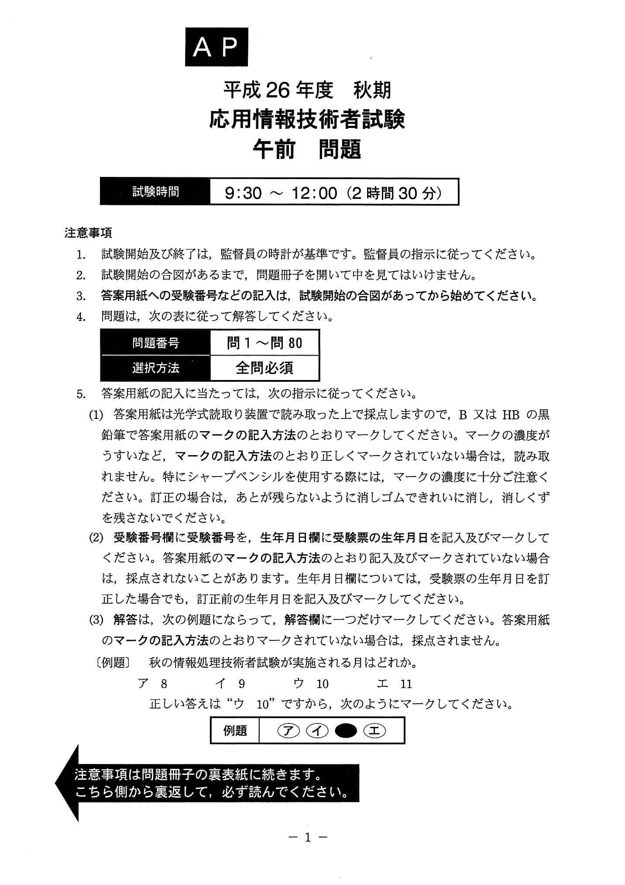

テキスト (OCR)

平成26 年度 秋期
応用情報技術者試験
午前 問題

  9:30 ~ 12:00 (②時間30 分)

注意事項
1. 試験開始及び終了は, 監督貞の時計が基準です。監督員の指示に従ってください。
2. 試験開始の合図があるまで, 問題冊子を開いて中を見てはいけません。
3. 答案用紙への受験番号などの記入は, 試験開始の合図があってから始めてください。
4. 問題は, 次の表に従って解答してください。

問題番号   fal 1 て間 80
選択方法                   全間必須

5. 答案用紙の記入に当たっては, 次の指示に従ってください。

Q) 答案用紙は光学式読取り装置で読み取った上で採点しますので, B 又は HB の黒
鉛筆で答案用紙のマークの記入方法のとおりマークしてください。マークの濃度が
うすいなど, マークの記入方法のとおり正しくマークされていない場合は, 読み取
れません。特にシャープペンシルを使用する際には, マークの濃度に十分ご注意く
ださい。訂正の場合は, あとが残らないように消しゴムできれいに消し, 消しくず
を残さないでください。

2) 受験番号欄に受験番号を, 生年月日欄に受験票の生年月日を記入及びマークして
ください。 答案用紙のマークの記入方法のとおり記入及びマークされていない場合
は, 採点されないことがあります。生年月日欄については, 受験票の生年月日を訂
正した場合でも, 訂正前の生年月日を記入及びマークしてください。

(3) 解答は, 次の例題にならって, 解答欄に一つだけマークしてください。 SRA
のマークの記入方法のとおりマークされていない場合は, 採点されません。

〔例題】 秋の情報処理技術者試験が実施される月はどれか。

ア 8    イ 9    ウ 10    エエ 11
正しい答えは“ウ 10” ですから, 次のようにマークしてください。

例題 | DDO

注意事項は問題冊子の裏表紙に続きます。
こちら側から裏返して, 必ず読んでください。

### ページ 2

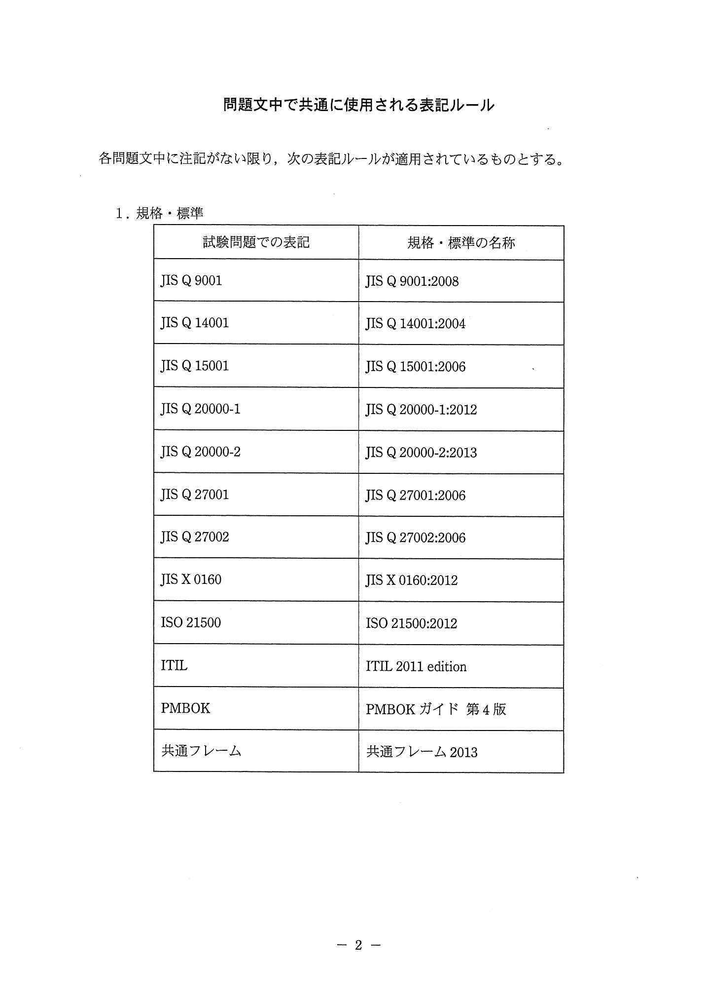

テキスト (OCR)

問題文中で共通に使用される表記ルール

各問題文中に注記がない限り, 次の表記ルールが適用されているものとする。

試験問題での表記                 規格・標準の名称
JIS Q 9001                               JIS Q 9001:2008
JIS Q 14001                            JIS Q 14001:2004
JIS Q 15001                            JIS Q 15001:2006

JIS Q 20000-1

JIS Q 20000-1:2012

JIS Q 20000-2

JIS Q 20000-2:2013

JIS Q 27001                             JIS Q 27001:2006

JIS Q 27002                               JIS Q 27002:2006

JIS X 0160                                   JIS X 0160:2012

ISO 21500                                 ISO 21500:2012

ITIL                                           ITIL 2011 edition
PMBOK                                PMBOK ガイド 第4版
共通フレーム                  共通フレーム 2013

### ページ 3

テキスト (OCR)

2. 論理回路

|
Em
cu
dh

論理積素子 (AND)

否定論理積素子 (NAND)

論理和素子 (OR)

否定論理和素子 (NOR)

排他的論理和素子 XOR)

論理一致素子

バッファ

論理否定器 (NOT)

スリーステートバパッファ

YIyIYMMVMMV

注記 入力部又は出力部に示されているo印は, 論理状態の反転又は否定を表す。

### ページ 4

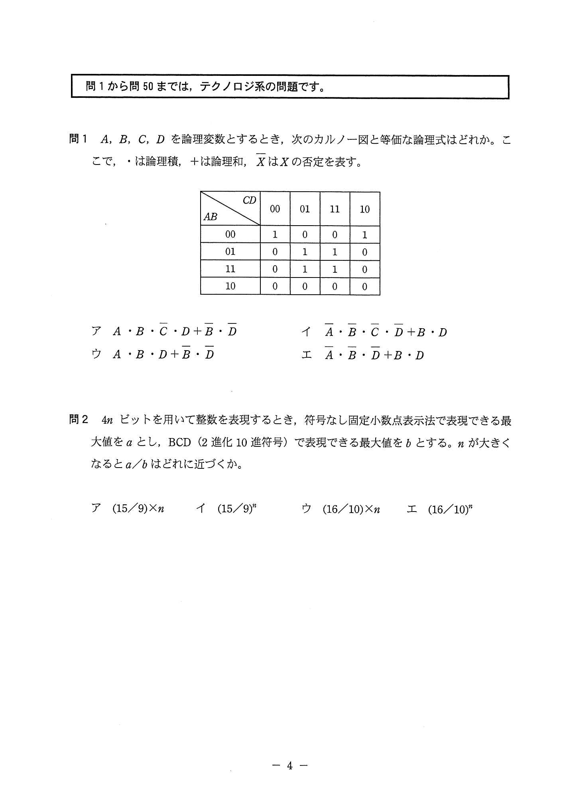

テキスト (OCR)

間 1 から問 50 までは, テクノロジ系の問題です。

All A, お C, を論理変数とするとき, 次のカルノー図と等価な論理式はどれか。こ
こで, ・は論理積, は論理和, XIEX OBHEKT.

CD
00 01 11 10
AB
00  1 0 0 1
01  0 1 1 0
11  0 1 1 0
10  0 0 0 0
ア 4・g・C・の+玉・の    4 A+B+C+D+B°:D
ウ A+B+D+B:D      エ A+B-D+B:D

問2 4n ビットを用いて整数を表現するとき, 符号なし固定小数点表示法で表現できる最
大値を a とし, BCD (2 進化 10 BAS) で表現できる最大値をり) とする。ヶz が大きく
なるとノム はどれに近づくか。

ア (15/9)Xn       イ (15/9)"          7 Q6プ10)Xz      x (16/10)"

### ページ 5

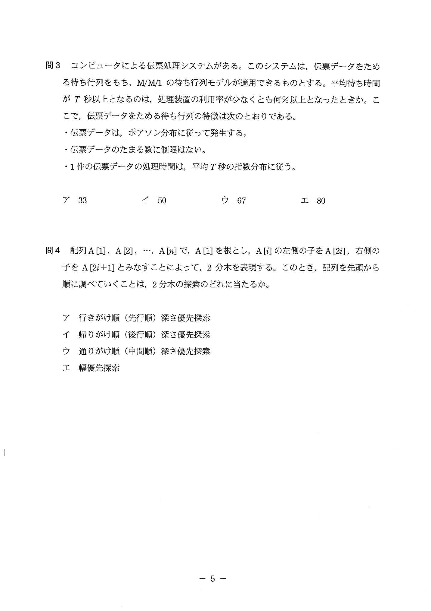

テキスト (OCR)

問3 コンピュータによる伝票処理システムがある。このシステムは, 伝票データをため
る待ち行列をもち, M/M/1 の待ち行列モデルが適用できるものとする。 平均待ち時間
が7 秒以上となるのは, 処理装置の利用率が少なくとも何%以上となったときか。こ
こで, 伝票データをためる待ち行列の特徴は次のとおりである。
・ 伝票データは, ポアソン分布に従って発生する。
・伝票データのたまる数に制限はない。
・1 件の伝票データの処理時間は, 平均7秒の指数分布に従う。

ア 33     イ 50     ウ 67     x= 80

間4 配列A[1], AZ], …, Al] で, AD] を根とし, AL] の左側の子を ALI, 右側の
Fe A[27十1] とみなすことによって, 2 分木を表現する。このとき, 配列を先頭から
順に調べていくことは, 2分木の探索のどれに当たるか。

行きがり順 (先行順) 深さ優先探索
帰りがけ順 (後行順) 深さ優先探索
通りがけ順 (中間順) 深さ優先探索
幅優先探索

HGAN

### ページ 6

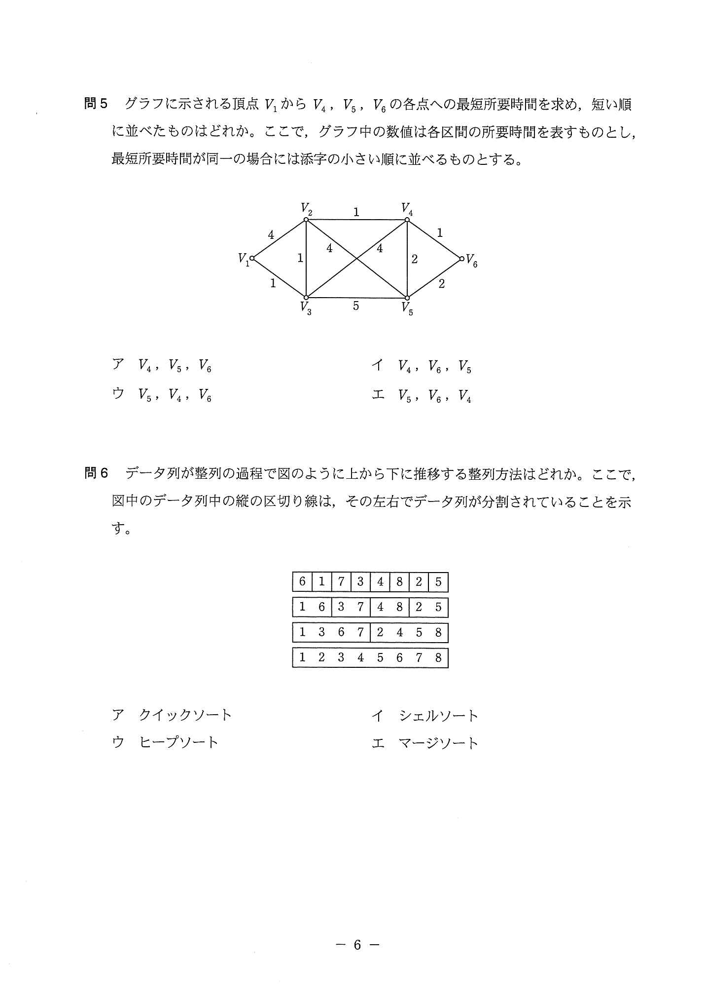

テキスト (OCR)

間5 グラフに示される頂点 切から区, V5, 尼の各点への最短所要時間を求め, 短い順
に並べたものはどれか。ここで, グラフ中の数値は各区間の所要時間を表すものとし,
最短所要時間が同一の場合には添字の小さい順に並べるものとする。

ア Vz, Ve. Ve
ウ Vs, Vis Vs

問6 データ列が整列の過程で図のように上から下に推移する整列方法はどれか。ここで,
図中のデータ烈中の縦の区切り線は, その左右でデータ烈が分割されていることを示
す。

[e[2[7|3[4[s[2]5]
[1 6[3 7|4 8]2 5]
[13 6 7/2 45 8
[1234567 8|

Y みイックソート        4 Yeh
ウ セープリデート           正、 マージツード

### ページ 7

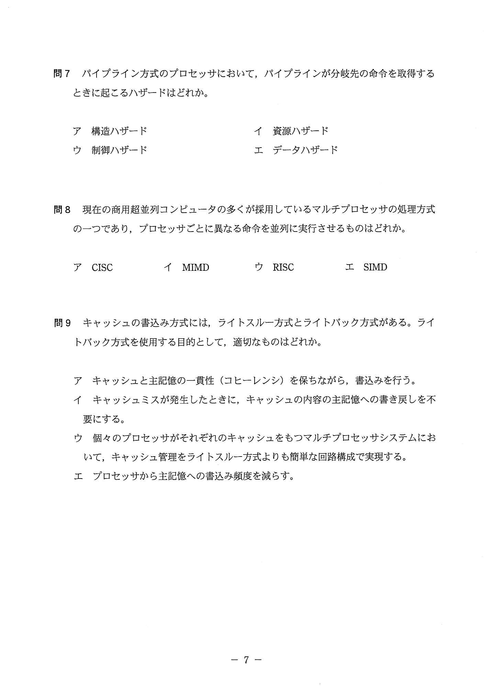

テキスト (OCR)

問7 パイプライン方式のプロセッサにおいて, パイプラインが分岐先の命令を取得する
ときに起こるハザードはどれか。

ア 構造ハザード             イ 資源ハザード
ウ 制御ハザード           エエ データハザード

問8 現在の商用超並列コンピュータの多くが採用しているマルチプロセッサの処理方式
の一つであり, プロセッサごとに異なる命令を並列に実行させるものはどれか。

ア CISC     イ MIMD    ウ RISC     <= SIMD

問9 キャッシュの書込み方式には, ライトスルー方式とライトバック方式がある。ライ
トバック方式を使用する目的として, 適切なものはどれか。

ア キャッシュと主記憶の一貫性 (コヒーレンシ) を保ちながら, 書込みを行う。

イ キャッシュミスが発生したときに, キャッシュの内容の主記憶への書き戻しを不
要にする。

ウ 個々のプロセッサがそれぞれのキャッシュをもつマルチプロセッサシステムにお
WC, キャッシュ管理をライトスルー方式よりも簡単な回路構成で実現する。

エエ プロセッサから主記憶への書込み頻度を減らす。

### ページ 8

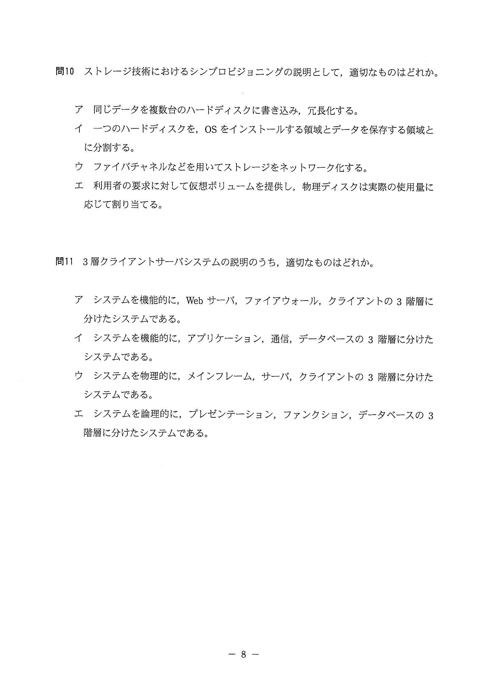

テキスト (OCR)

間10 ストレージ技術におけるシンプロビジョニングの説明として, 適切なものはどれか。

ア 同じデータを複数台のハードディスクに書き込み, 冗長化する。

イ 一つのハードディスクを, OS をインストールする領域とデータを保存する領域と
に分割する。

ウ ファイバチャネルなどを用いてストレージをネットワーク化する。

エエ 利用者の要求に対して仮想ボリュームを提供し, 物理ディスクは実際の使用量に
応じて割り当てる。

問11 3層クライアントサーバシステムの説明のうち, 適切なものはどれか。

ア システムを機能的に, Web サーバ, ファイアウォール, クライアントの 3 階層に
分けたシステムである。

イ システムを機能的に, アプリケーション, BE, データベースの 3 階層に分けた
システムである。

ウ システムを物理的に, メインフレーム, サーバ, クライアントの 3 階層に分けた
システムである。

工 システムを論理的に, プレゼンテーション, ファンクション, データベースの 3
階層に分けたシステムである。

### ページ 9

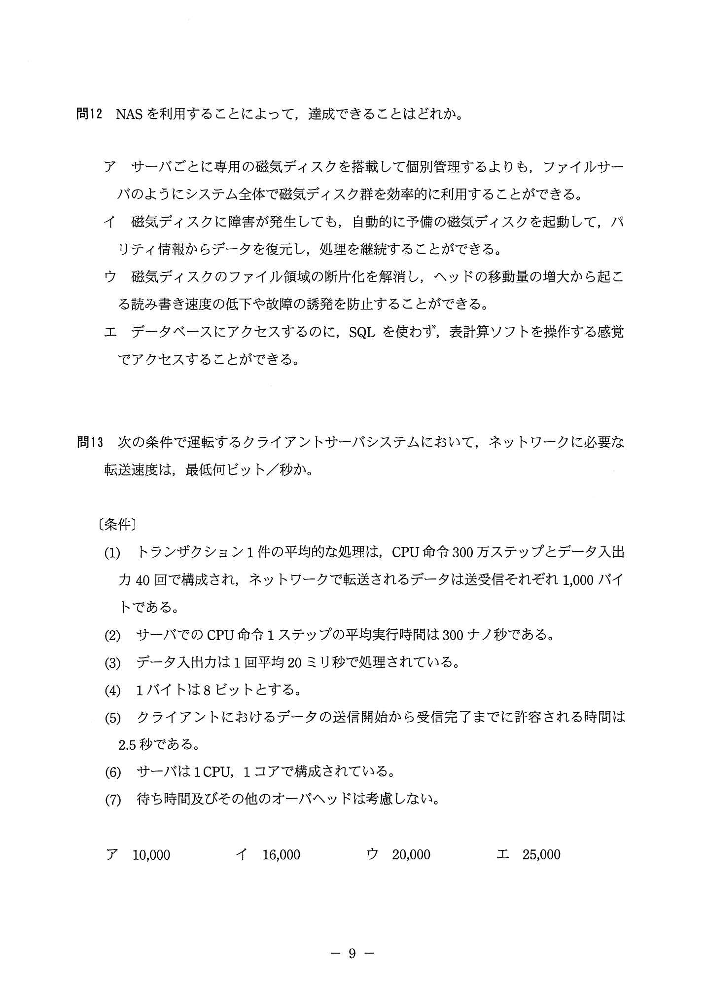

テキスト (OCR)

問12 NAS を利用することによって, 達成できることはどれか。

ア サーバごとに専用の磁気ディスクを搭載して個別管理するよりも, ファイルサー
バのようにシステム全体で磁気ディスク群を効率的に利用することができる。

イ 磁気ディスクに障害が発生しても, 自動的に予備の磁気ディスクを起動して, パ
リティ情報からデータを復元し, 処理を継続することができる。

ウ 磁気ディスクのファイル領域の断片化を解消し, ヘッドの移動量の増大から起こ
る読み書き速度の低下や故障の誘発を防止することができる。

エエ データベースにアクセスするのに, SQL を使わず, 表計算ソフトを操作する感覚
でアクセスすることができる。

問13 次の条件で運転するクライアントサーバシステムにおいて, ネットワークに必要な
転送速度は, 最低何ビットノ秒か。

〔条件]

GQ) トランザクション1 件の平均的な処理は, CPU 命令 300 万ステップとデータ入出
カカ 40 回で構成され, ネットワークで転送されるデータは送受信それぞれ 1,000 バイ
トである。

(2) サーバでの CPU 命令 1 ステップの平均実行時間は 300 ナノ秒である。

3) データ入出力は 1 回平均 20 ミリ秒で処理されている。

4 1バイトは8 ビットとする。

6) クライアントにおけるデータの送信開始から受信完了までに許容される時間は
2.5 秒である。

(6) サーバは1CPU, 1 コアで構成されている。

(⑦ 待ち時間及びその他のオーバヘッドは考慮しない。

ア 10,000    イ 16,000    ウ 20,000    = 25,000

### ページ 10

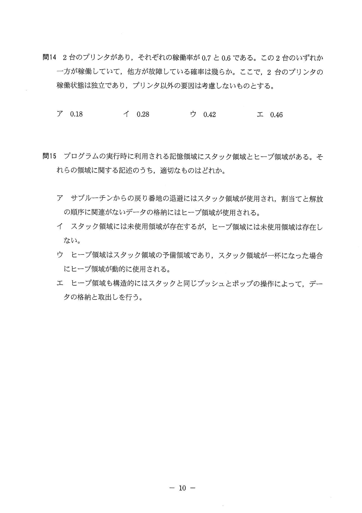

テキスト (OCR)

間14 2 台のプリンタがあり, それぞれの稼働率が 0.7 と 0.6 である。この 2 台のいずれか
一方が稼働していて, 他方が逆障している確率は幾らか。ここで, 2 台のプリンタの
稼働状態は独立であり, プリンタ以外の要因は考慮しないものとする。

ア 0.18     イ 0.28     ウ 0.42     x= 0.46

RIS プログラムの実行時に利用される記憶領域にスタック領域とヒープ領域がある。そ
れらの領域に関する記述のうち, 適切なものはどれか。

ア サブルーチンからの戻り番地の退避にはスタック領域が使用され, 割当てと解放
の順序に関連がないデータの格納にはヒープ傾域が使用される。

イ スタック領域には未使用領域が存在するが, ヒープ領域には未使用領域は存在し
ない。

ウ ヒープ領域はスタック領域の予備領域であり, スタック傾域が一杯になった場合
にヒープ領域が動的に使用される。

エエ ヒーブプ領域も構造的にはスタックと同じプッシュとポップの操作によって, デー
タの格納と取出しを行う。

ー 10 一

### ページ 11

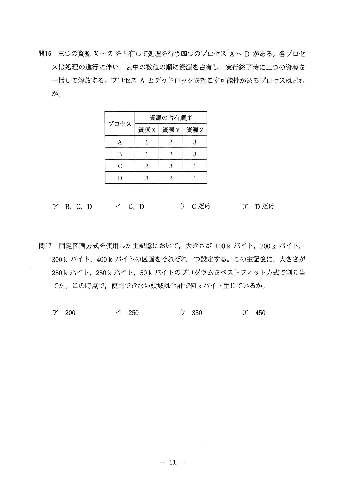

テキスト (OCR)

間16 三つの資源メーZ を占有して処理を行う四つのプロセス A ^ D がある。各プロセ
スは処理の進行に伴い, 表中の数値の順に資源を占有し, 実行終了時に三つの資源を
一括して解放する。プロセス A とデッドロックを起こす可能性があるプロセスはどれ
か。

プロセス

資源の占有順序
資源X | 資源Y | 資源2
1   2

3
3
1
1

Blo; a]>

1    2
2    3
3    2

ア B, C, D   イ C, D     ウ Cだけ    x Dだけ

ll? 固定区画方式を使用した主記憶において, 大きさが 100k バイト, 200k バイト,
300k バイト, 400k バイトの区画をそれぞれ一つ設定する。この主記憶に, 大きさが
250k バイト, 20k バイト, 50 k バイトのプログラムをベストフィット方式で割り当
てた。この時点で, 使用できない領域は合計で何kバイト生じているか。

ア 200     イ 250      ウ 350      < 450

ー 11 一

### ページ 12

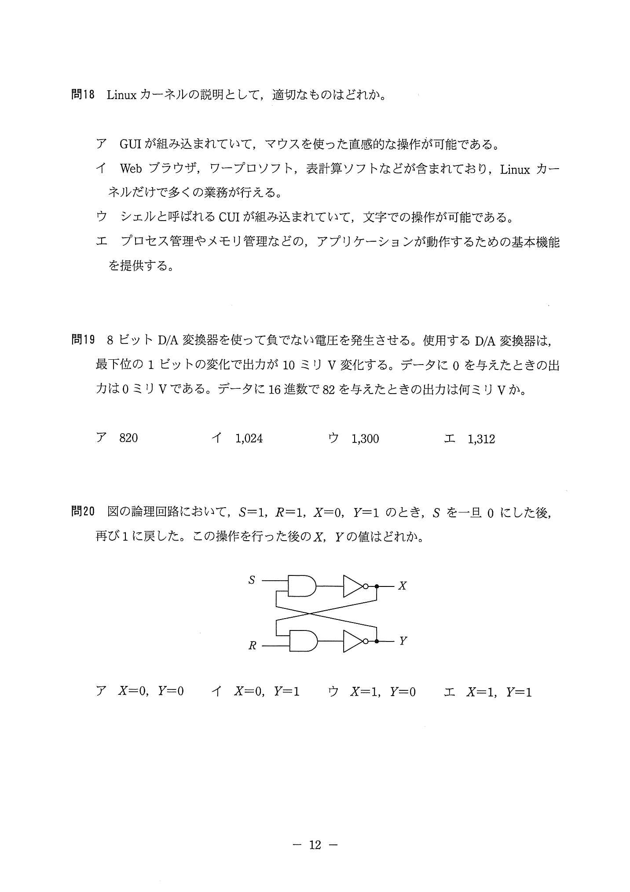

テキスト (OCR)

間18 Linux カーネルの説明として, 適切なものはどれか。

ア GUIが組み込まれていて, マウスを使った直感的な操作が可能である。

イ Web ブラウザ, ワープロソフト, 表計算ソフトなどが含まれており, Linux カー
ネルだけで多くの業務が行える。

ウ シェルと呼ばれる CUI が組み込まれていて, 文字での操作が可能である。

エエ プロセス管理やメモリ管理などの, アプリケーションが動作するための基本機能
を提供する。

19 8 ビット D/A 変換器を使って負でない電圧を発生させる。使用する D/A 変換器は,
最下位の 1 ビットの変化で出力が 10 ミリ V 変化する。データに 0 を与えたときの出
カカは0 ミリVである。データに 16 進数で 82 を与えたときの出力は何ミリ VAD.

ア 820     イ 1024     ウ 1,300     x 1312

問20 図の論理回路において, S=1, R=1, メー0, Y=1 のとき, S を一旦 0 にした後,
再び1 に戻した。この操作を行った後のX,了の値はどれか。

ア メー0, Y=0   イ メー0, Y=1   ウ X=1, Y=0   工 ダー1, Y=1

ー 12 一

### ページ 13

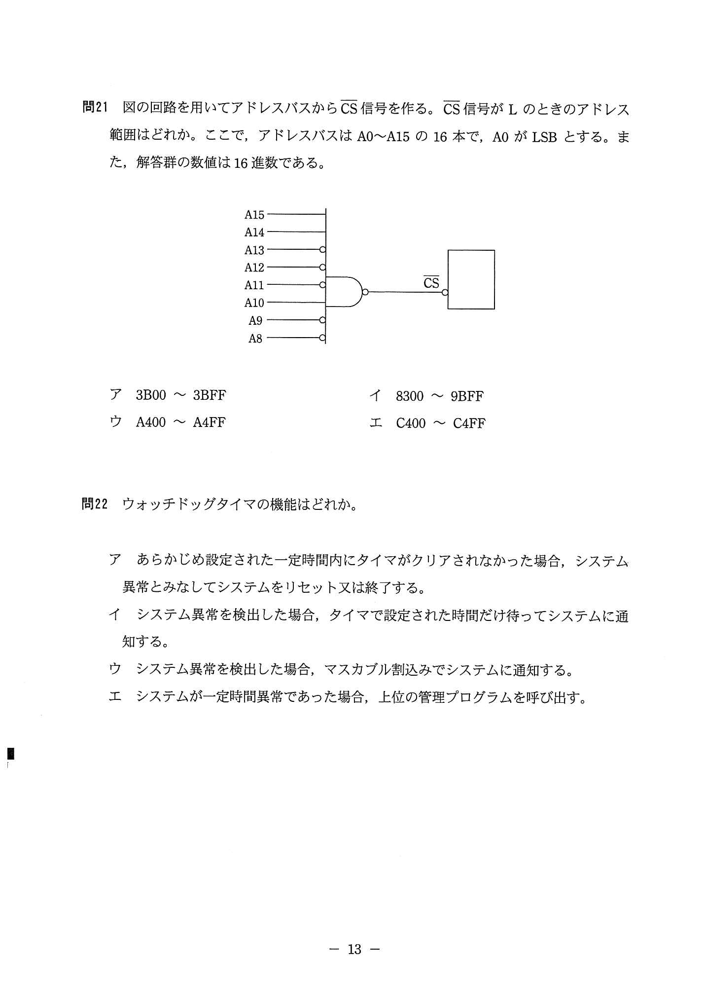

テキスト (OCR)

間21 図の回路を用いてアドレスバスからCS信号を作る。 CS 信号が L のときのアドレス
範囲はどれか。ここで, アドレスバスは AO~AIS の 16 AC, A0 が LSB とする。ま
た, 解答群の数値は 16 進数である。

A15
A14
A13 一一一d
A12 ———-d
A11 一一d  )    CS
Alo ————“

Ag 一一一d
A8 ———-d

ア 3B00 ~ 3BFF                 イ 8300 ~ 9BFF
ウ A400 ~ A4FF                 <= C400 ~ C4FF

fi22 ウォッチドッグタイマの機能はどれか。

ア あらかじめ設定された一定時間内にタイマがクリアされなかった場合, システム
異常とみなしてシステムをリセット又は終了する。

イ システム暴常を検出した場合., タイマで設定された時間だけ待ってシステムに通
知する。

ステム異常を検出した場合マスカブル割込みでシステムに通知する。

システムが一定時間異常であった場合, 上位の管理プログラムを呼び出す。

の

x

ー 13 一

### ページ 14

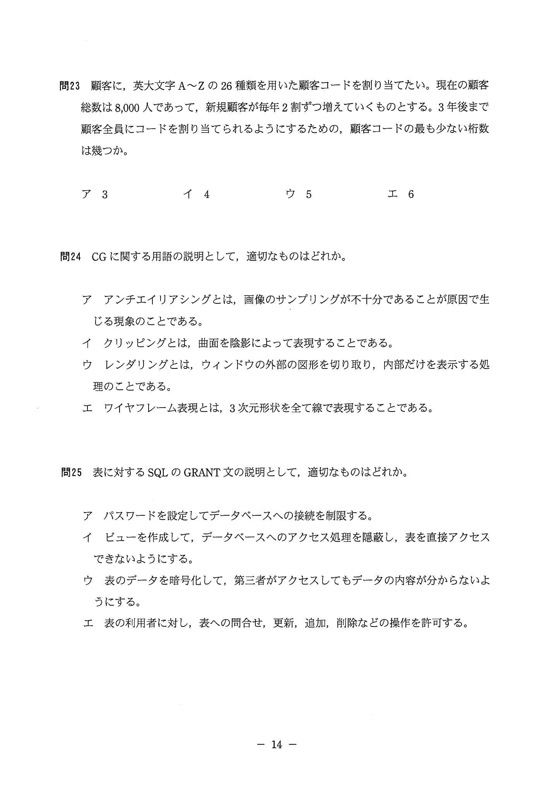

テキスト (OCR)

問23 顧客に, 英大文字 AてZ の 26 種類を用いた顧客コードを割り当てたい。 現在の顧客
総数は 8.000 人であって, 新規顧客が毎年 2 割ずつ増えていくものとする。3 年後まで
顧客全員にコードを割り当てられるようにするための, 顧客コードの最も少ない桁数
は幾つか。

i244 CG に関する用語の説明として, 適切なものはどれか。

ア アンチエイリアシングとは, 画像のサンプリングが不十分であることが原因で生
じる現象のことである。              |

イ クリッピングとは, WHR koCRBTSTCETCHS.

ウ レンダリングとは, ウィンドウの外部の図形を切り取り, 内部だけを表示する処
理のことである。

エエ ワイヤフレーム表現とは, 3 次元形状を全て線で表現することである。

問25 表に対する SQL © GRANT 文の説明として, 適切なものはどれか。

ア パスワードを設定してデータベースへの接続を制限する。

イ ビューを作成して, データベースへのアクセス処理を隠蔽し, 表を直接アクセス
できないようにする。

ウ 表のデータを暗号化して, 第三者がアクセスしてもデータの内容が分からないよ
うにする。

CL 表の利用者に対し, 表への問合せ, 更新, 追加, 削除などの操作を許可する。

ー 14 一

### ページ 15

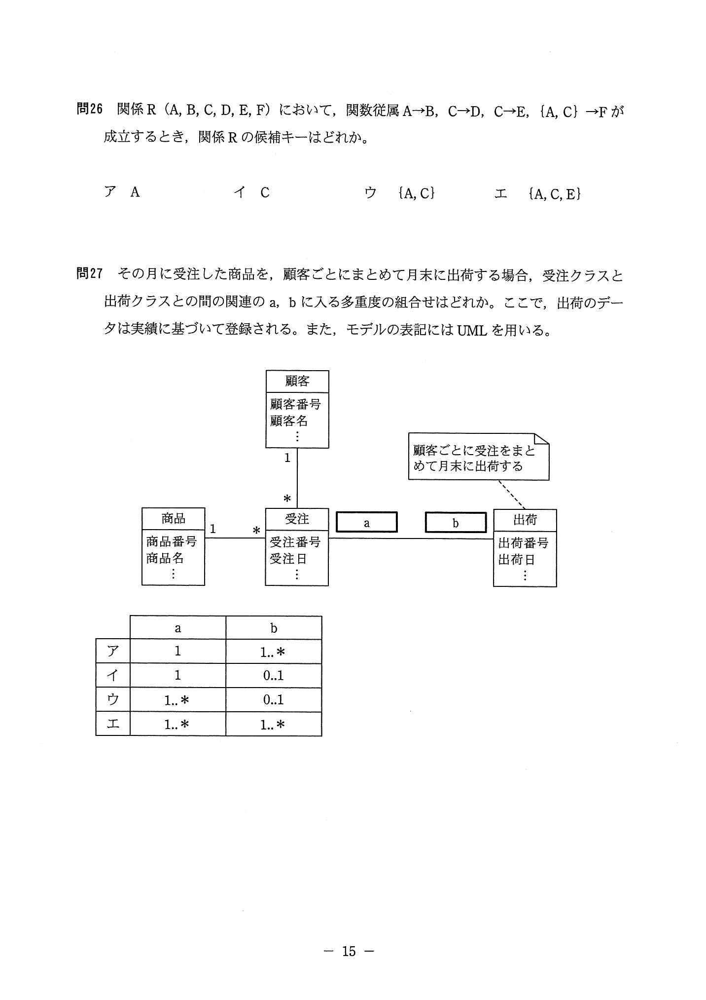

テキスト (OCR)

問26 関係R (A, B, C, D, EE F) において, 関数従属AB, CoD, CE, {A, C} Fが
成立するとき, BRR の候補キーはどれか。

ア A    イ C     ウ  {A,C}   エ {A,C,E}

問27 その月に受注した商品を, 顧客ごとにまとめて月末に出荷する場合, 受注クラスと

出荷クラスとの間の関連の a, b に入る多重度の組合せはどれか。ことこで, 出荷のデー
タは実績に基づいて登録される。また, モデルの表記には UML を用いる。

顧客
顧客番号
Wee
T                  顧客ごとに受注をまと
めて月末に出荷する
商品 | | |[ 。 ] Od
商品番号   受注番号       出荷番号
商品2       受注日               出荷日
a   b
ア  1   1..*
イ  1   0..1
ウ  1..*   0.1
aE.  1..※   1..*ま

ー 15 一

### ページ 16

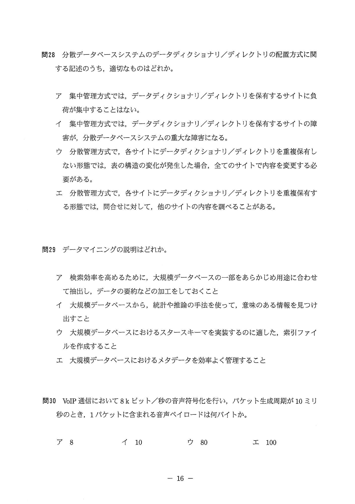

テキスト (OCR)

間28 分散データベースシステムのデータディクショナリンプディレクトリの配置方式に関
する記述のうち, 適切なものはどれか。

ア 集中管理方式では,. データディクショナリディレクトリを保有するサイトに負
荷が集中することはない。

イ 集中管理方式では, データディクショナリンプディレクトリを保有するサイトの障
EM, 分散データベースシステムの重大な障害になる。

ウ 分散管理方式で, 各サイトにデータディクショナリノンディレクトリを重複保有し
ない形態では, 表の構造の変化が発生した場合,全てのサイトで内容を変更する必
要がある。

エエ 分散管理方式で, 各サイトにデータディクショナリンプディレクトリを重複保有す
る形態では, 問合せに対して, 他のサイトの内容を調べることがある。

間29 データマイニングの説明はどれか。

ア 検索効率を高めるために, 大規模データベースの一部をあらかじめ用途に合わせ
て抽出し, データの要約などの加工をしておくこと

イ 大規模データベースから, 統計や推論の手法を使って, 意味のある情報を見つけ
出すこと

ウ 大規模データベースにおけるスタースキーマを実装するのに適した, 索引ファイ
ルを作成すること

エエ 大規模データベースにおけるメタデータる効率よく管理すること

間30 VoIP 通信において8k ビットンノ秒の音声符号化を行いパケット生成周期が 10 ミリ
秒のとき, 1 パケットに含まれる音声ペイロードは何バイトか。

ア 8     イ 10     ウ 80     = 100

ー 16 一

### ページ 17

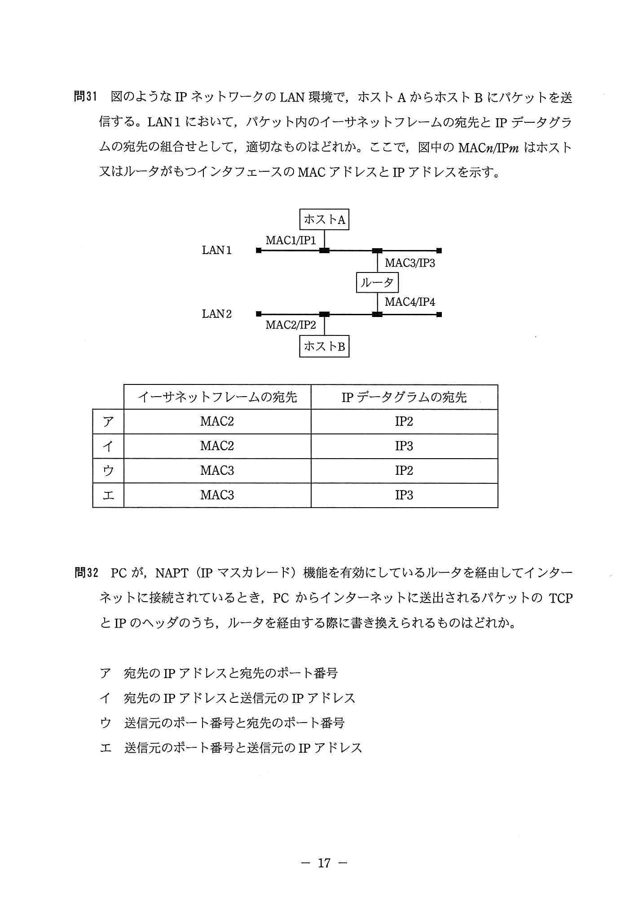

テキスト (OCR)

問31 図のようなIP ネットワークのLAN 環境で, ホスト A からホスト B にパケットを送
信する。LAN1 において, パケット内のイーサネットフレームの郊先と IP データグラ
ムの宛先の組合せとして, 適切なものはどれか。ここで, 図中の MACz/IP はホスト
又はルータがもつインタフェースの MAC アドレスと TP アドレスを示す。

MAC1/IP1
LAN1        .                                        a

MAC3/IP3
MAC4/IP4
LAN2         =                                                                 a
MAC2/IP2 T
ホストB
イーサネットフレームの宛先       IP データグラムの宛先
ア                        MAC2                                             TP2
イ                         MAC2                                             IP3
ウ                        MAC3                                             TP2
a                        MAC3                                             TP3

問32 PC が, NAPT (IP マスカレード) 機能を有効にしているルータを経由してインター
ネットに接続されているとき, PC からインターネットに送出されるパケットの TCP
と IP のヘッダのうち, ルータを経由する際に書き換えられるものはどれか。

宛先の TP アドレスと宛先のボート番号
宛先のTP アドレスと送信元の TP アドレス
送信元のボート番号と宛先のポート番号
送信元のポート番号と送信元のIP アドレス

H すさへ

ー 17 一

### ページ 18

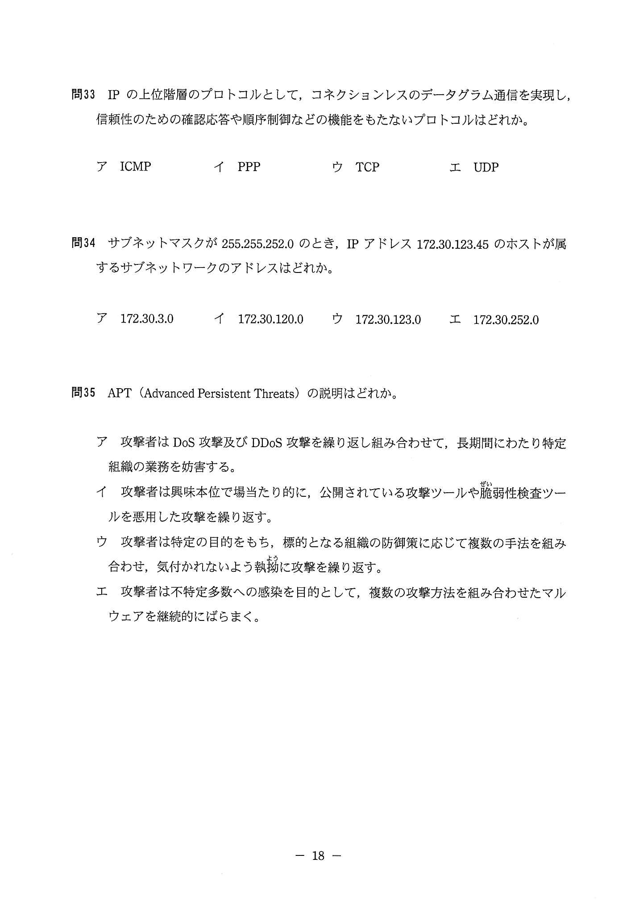

テキスト (OCR)

間33 TP の上位階層のプロトコルとして, コネクションレスのデータグラム通信を実現し,
信頼性のための確認応答や順序制御などの機能をもたないプロトコルはどれか。

ア ICMP     イ PPP     ウ TCP     = UDP

問34 サブネットマスクが 255.255.252.0 のとき, IP アドレス 172.30.123.45 のホストが属
するサブネットワークのアドレスはどれか。

ア 172.30.3.0   イ 172.30.120.0  ウ 172.30.123.0  ZL 172.30.252.0

問35 APT (Advanced Persistent Threats) の説明はどれか。

ア 攻撃者は DoS 攻撃及び DDoS 攻撃を繰り返し組み合わせて, 長期間にわたり特定
組織の業務を妨害する。

イ 攻撃者は興味本位で場当たり的に, 公開されている攻撃ツールや脆弱人検査ツー
ルを悪用した攻撃を繰り返す。

ウ 攻撃者は特定の目的をもち, 標的となる組織の防御集に応じて複数の手法を組み
合わせ, 気付かれれないよう執勘に攻撃を繰り返す。

エ 攻撃者は不特定多数への感染を目的として, 複数の攻撃方法を組み合わせたマル
ウェアを継続的にばらまく。

ー 18 一

### ページ 19

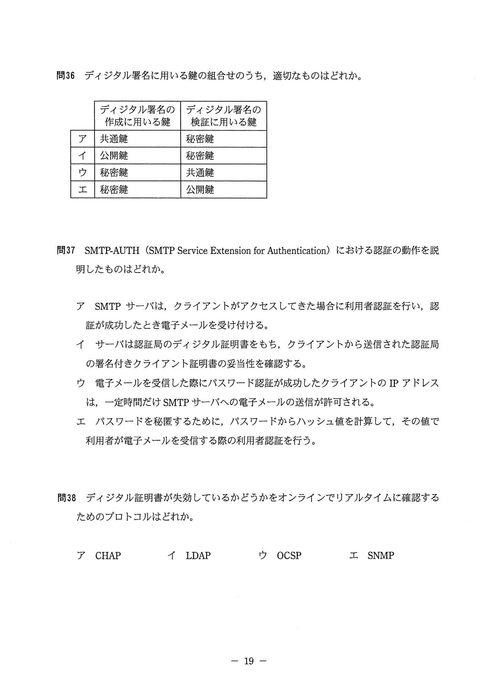

テキスト (OCR)

問36 ディジタル署名に用いる鍵の組合せのうち, 適切なものはどれか。

ディジタル署名の | ディジタル署名の
作成に用いる鍵 | 検証に用いる鍵

問37 SMTP-AUTH (SMTP Service Extension for Authentication) における認証の動作を説
明したものはどれか。

ア SMTP サーバは, クライアントがアクセスしてきた場合に利用者認証を行い, 認
証が成功したとき電子メールを受け付ける。

イ サーバは認証局のディジタル証明書をもち, クライアントから送信された認証局
の署名付きクライアント証明書の妥当性を確認する。

ウ 電子メールを受信した際にパスワード認証が成功したクライアントの IP アドレス
は, 一定時間だけ SMTP サーバへの電子メールの送信が許可される。

エエ パスワードを秘磨するために, パスワードからハッシュ値を計算して, その値で
利用者が電子メールを受信する際の利用者認証を行う。

間38 ディジタル証明書が失効しているかどうかをオンラインでリアルタイムに確認する

ためのプロトコルはどれか。

ア CHAP    イ LDAP    ウ OCSP    <= SNMP

ー 19 一

### ページ 20

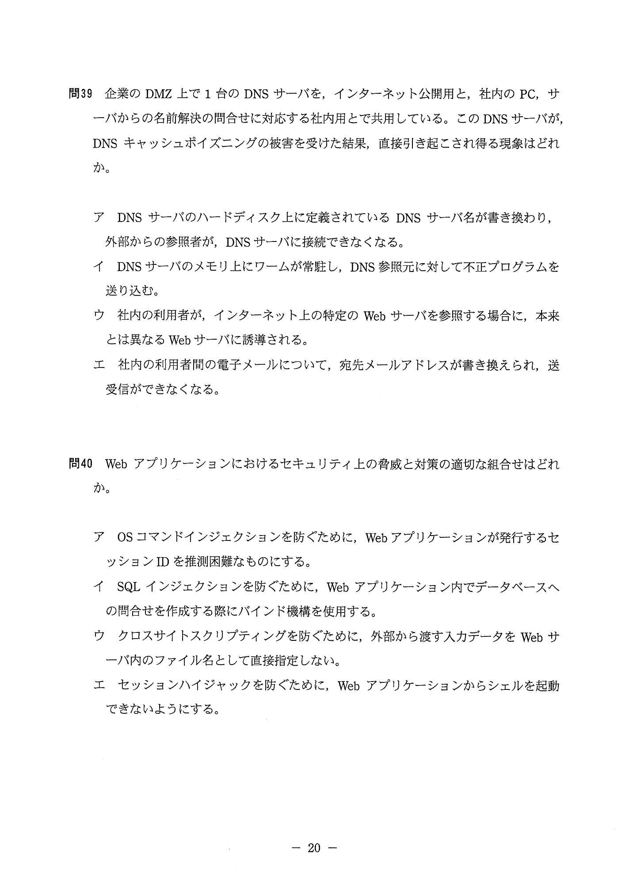

テキスト (OCR)

間39 企業の DMZ 上で 1 台の DNS サーバを, インターネット公開用と, HAO PC, サ
ーバからの名前解決の問合せに対応する社内用とで共用している。この DNS サーバが,
DNS キャッシュポイズニングの被害を受けた結果, 直接引き起こされ得る現象はどれ
か。

ア DNS サーバのハードディスク上に定義されている DNS サーバ名が書き換わり,
外部からの参照者が, DNS サーバに接続できなくなる。

イ DNS サーバのメモリ上にワームが常駐し, DNS 参照元に対して不正プログラムを
送り込む。

ウ 社内の利用者が. インターネット上の特定の Web サーバを参照する場合に, 本来
とは異なる Web サーバに誘導される。

エエ 社内の利用者間の電子メールについて, 宛先メールアドレスが書き換えられ, 送
受信ができなくなる。

問40 Web アプリケーションにおけるセキュリティ上の償威と対策の適切な組合せはどれ
か。

ア 08 コマンドインジェクションを防ぐために, Web アプリケーションが発行するセ
ッションTD を推測困難なものにする。

イ SQL インジェクションを防ぐために, Web アプリケーション内でデータベースへ
の問合せを作成する際にバインド機構を使用する。

ウ クロスサイトスクリプティングを防ぐために, 外部から渡す入力データを Web サ
ーバ内のファイル名として直接指定しない。

エエ セッションハイジャックを防ぐために, Web アプリケーションからシェルを起動
できないようにする。

ー 20 一

### ページ 21

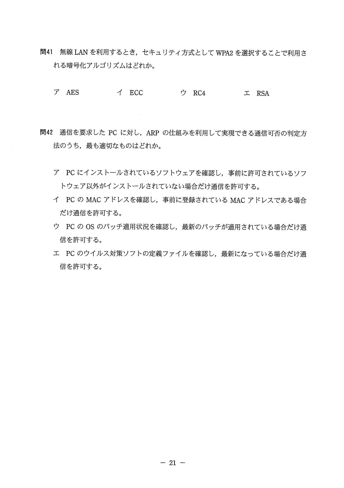

テキスト (OCR)

問41 無線LANを利用するとき, セキュリティ方式として WPA2 を選択することで利用さ
れる暗号化アルゴリズムはどれか。

ア AES     イ ECC     ウ RC4     <= RSA

問42 通信を要求した PC に対し, ARP の仕組みを利用して実現できる通信可否の判定方
法のうち, 最も適切なものはどれか。

ア PC にインストールされているソフトウェアを確認し, 事前に許可されているソフ
トウェア以外がインストールされていない場合だけ通信を許可する。

イ PCのIMAC アドレスを確認し, 事前に登録されている MAC アドレスである場合
だけ通信を許可する。

ウ PC の 0S のパッチ適用状況を確認し, 最新のパッチが適用されている場合だけ通
信を許可する。

LPC のウイルス対策ソフトの定義ファイルを確認し, 最新になっている場合だけ通
信を許可する。

ー 21 一

### ページ 22

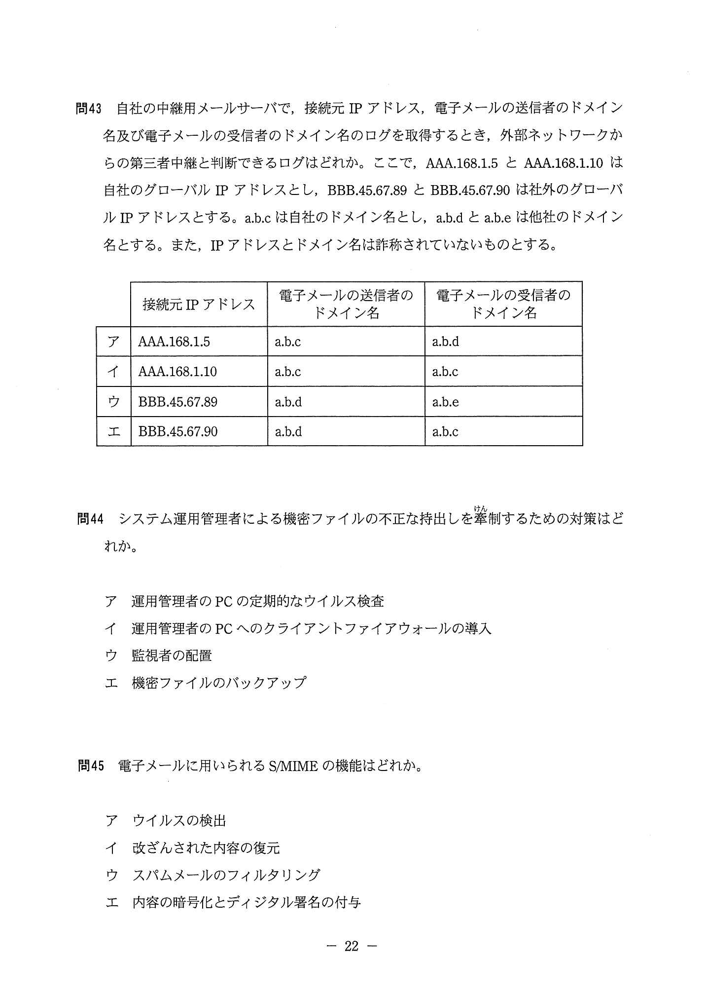

テキスト (OCR)

問43 自社の中継用メールサーバで, 接続元 IP アドレス, 電子メールの送信者のドメイン
名及び電子メールの受信者のドメイン名のログを取得するとき, 外部ネットワークか
らの第三者中継と判断できるログはどれか。ここで, AAA.168.1.5 と AAA.168.1.10 は
自社のグローバル IP アドレスとし, BBB.45.67.89 と BBB.45.67.90 は社外のグローバ
ル IP アドレスとする。alb.c は自社のドメイン名とし, abd と abe は他社のドメイン
名とする。また, IP アドレスとドメイン名は詐称されていないものとする。

接続元 P アドレス  aE ee  ae irs ae
ア | AAA.168.1.5                   a.b.c                                      a.b.d
イ | AAA.168.1.10                 a.b.c                                      a.b.c
ウ | BBB.45.67.89                 a.b.d                                      a.b.e
= | BBB.45.67.90                 a.b.d                                      a.b.c

間44 システム運用管理者による機密ファイルの不正な持出 しを窪制するための対策はど
れか。

運用管理者の PC の定期的なウイルス検査

運用管理者のPC へのクライアントファイアウォールの導入
監視者の配置

機密ファイルのバックアップ

H 二へ パ

間45 電子メールに用いられる S/MIME の機能はどれか。

ウイルスの検出
改ざんされた内容の復元

スパムメールのフィルタリング

内容の暗号化とディジタル賭名の付与

H へ

ー 22 一

### ページ 23

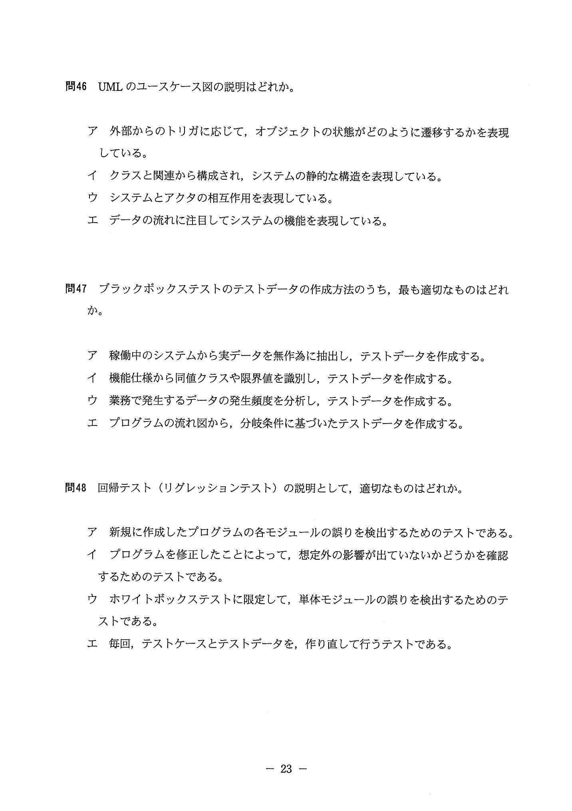

テキスト (OCR)

問46 UML のユースケース図の説明はどれか。

ア 外部からのトリガに応じて, オブジェクトの状態がどのように遷移するかを表現
している。

イ クラスと関連から構成され, システムの静的な構造を表現している。

ウ システムとアクタの相互作用を表現している。

L データの流れに注目してシステムの機能を表現している。

間47 プラックボックステストのテストデータの作成方法のうち, 最も適切なものはどれ
か。

稼働中のシステムから実データを無作為に抽出し, テストデータを作成する。
機能仕様から同値クラスや限界値を識別し, テストデータを作成する。

業務で発生するデータの発生顔度を分析し, テストデータを作成する。

プログラムの流れ図から, 分岐条件に基づいたテストデータを作成する。

HUA NY

問48 回帰テスト (リグレッションテスト) の説明として, 適切なものはどれか。

ア 新規に作成したプログラムの各モジュールの誤りを検出するためのテストである。

イ プログラムを修正したことによって, 想定外の影響が出ていないかどうかを確認
するためのテストである。

ウ ホワイトボックステストに限定して, 単体モジュールの誤りを検出するためのテ
ストである。

エエ 毎回 テストケースとテストデータを, 作り直して行うテストである。

### ページ 24

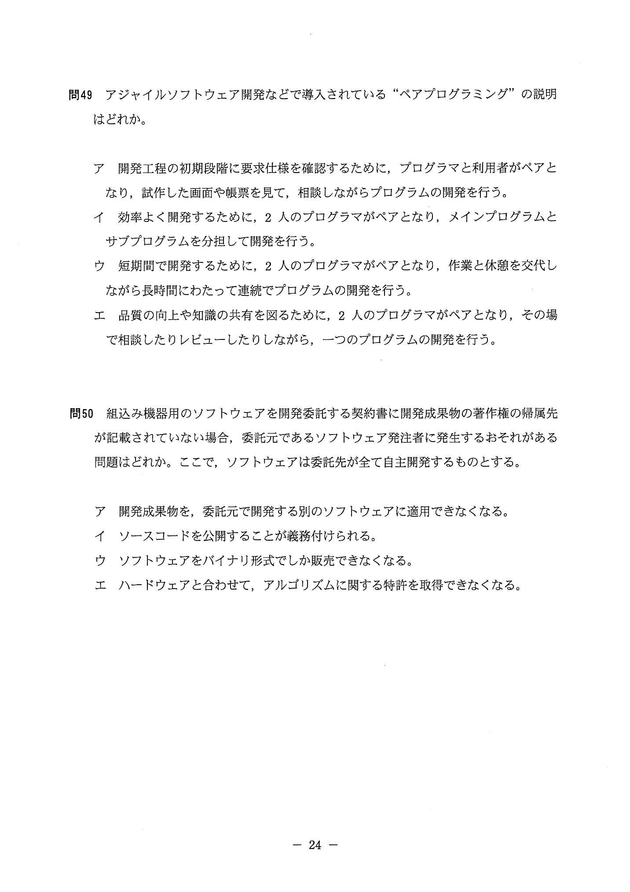

テキスト (OCR)

問49 アジャイルソフトウェア開発などで導入されている “ペアプログラミング" の説明
はどれか。

ア 開発工程の初期段階に要求仕様を確認するために, プログラマと利用者がペアと
なり, 試作した画面や帳票を見て, 相談しながらプログラムの開発を行う。

イ 効率よく開発するために, 2 人のプログラマがペアとなり, メインプログラムと
サブプログラムを分担して開発を行う。

ウ 短期間で開発するために, 2 人のプログラマがペアとなり, 作業と休憩を交代し
ながら長時間にわたって連続でプログラムの開発を行う。

エエ 品質の向上や知識の共有を図るために, 2 人のプログラマがペアとなり, COW
で相談したりレビューしたりしながら, 一つのプログラムの開発を行う。

問50 組込み機器用のソフトウェアを開発委託する契約書に開発成果物の著作権の帰属先
が記載されていない場合, 委託元であるソフトウェア発注者に発生するおそれがある
問題はいれか。ここで, ソフトウェアは委託先が全て自主開発するものとする。

開発成果物を, 委託元で開発する別のソフトウェアに適用できなくなる。
ソースコードを公開することが義務付けられる。

ソフトウェアをバイナリ形式でしか販売できなくなる。

ハードウェアと合わせて, アルゴリズムに関する特許を取得できなくなる。

H へ

ー 24 一

### ページ 25

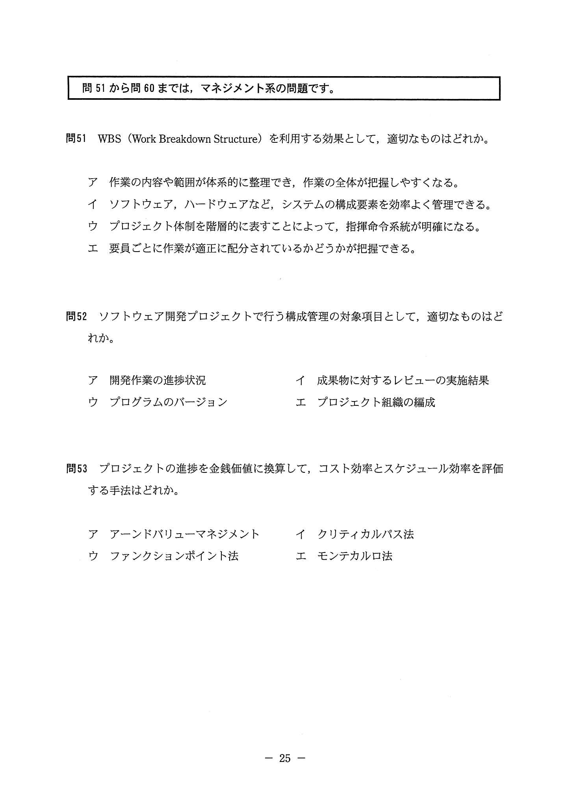

テキスト (OCR)

問 51 から問 60 までは, マネジメント系の問題です。

問51 WBS (Work Breakdown Structure) を利用する効果として, 適切なものはどれか。

作業の内容や範囲が体系的に整理でき, 作業の全体が把握しやすくなる。

ソフトウェア, ハードウェアなど, システムの構成要素を効率よく管理できる。
プロジェクト体制を階層的に表すことによって, 指揮命令系統が明確になる。
要員ごとに作業が適正に配分されているかどうかが把握できる。

HAN

問52 ソフトウェア開発プロジェクトで行う構成管理の対象項目として, 適切なものはど
れか。

ア 開発作業の進捗状況                              成果物に対するレビューの実施結果
ウ プログラムのバージョン      エエ プロジェクト組織の編成

て

間53 プロジェクトの進捗を金銭価値に換算して, コスト効率とスケジュール効率を評価
する手法はどれか。

ア アーンドバリューマネジメント   イ クリティカルパス法
ウ ファンクションボポイント法     エエ モンテカルロ法

ー 25 一

### ページ 26

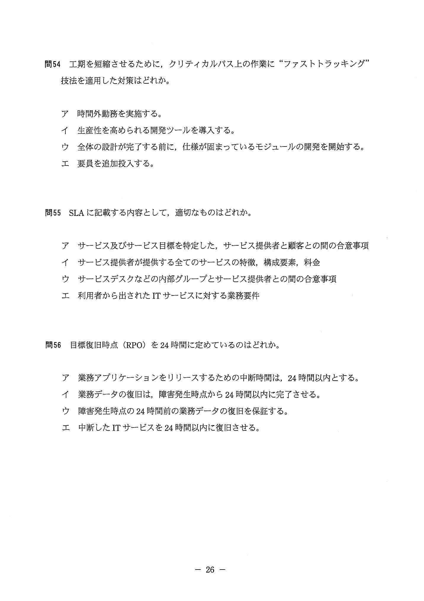

テキスト (OCR)

間54 工期を短縮させるために, クリティカルパス上の作業に "ファストトラッキング"
技法を適用した対策はどれか。

ア 時間外勤務を実施する。

イ 生産性を高められる開発ツールを導入する。

ウ 全体の設計が完了する前に, 仕様が固まっているモジュールの開発を開始する。
エエ 要員を追加投入する。

FASS SLAに記載する内容として, 適切なものはどれか。

サービス及びサービス目標を特定した, サービス提供者と顧客との間の合意事項
サービス提供者が提供する全てのサービスの特徴, 構成要素, 料金

サービスデスクなどの内部グループとサービス提供者との間の合意事項

利用者から出された IT サービスに対する業務要件

H GAN

間56 目標復旧時点 (RPO) を24 時間に定めているのはどれか。

ア 業務アプリケーションをリリースするための中断時間は, 24 時間以内とする。
イ 業務データの復旧は, 障害発生時点から 24 時間以内に完了させる。
ウ 障害発生時点の 24 時間前の業務データの復旧を保証する。

エエ 中断したIT サービスを 24 時間以内に復旧させる。

ー 26 一

### ページ 27

テキスト (OCR)

間57 ディスク障害時に, 交換したディスクにフルバックアップを取得したテープからデ
ータを復元した後, フルバックアップ取得時以降の更新後コピーをログから反映させ
てデータベースを回復する方法はどれか。

ア チェックポイントリスタート    イ リブート
ウ ロールバック           エエ ロールフォワード

問58 システム監査人による監査手法の適用方法として, 適切なものはどれか。

ア アンケート調査では, 被監査部門から要望が多かった項目を指摘事項にする。

イ 現場調査では, 監査人が見た実態と被監査部門からの説明を総合的に判断して,
監査証拠とする。

ウ チェックリストを用いた調査では, 被監査部門がチェックして記入した内容に限
定して, 監査意見を表明する。

エ 文書確認調査では, 未作成であった証 振 を, 調査が完了するまでに被監査部門に
作成させる。

間59 外部委託に関するシステム監査において, 経営破綻などによってソフトウェア資産
のメンテナンスが受けられなくなることを防ぐために確認すべき契約項目はどれか。

開発したソフトウェアの下狗担保責任条項

外部委託先のサービスを評価するための SLA 条項

資任の所在を明確にするためのソフトウェア開発の再委託禁止条項
ソフトウェアのソースコードなどを第三者へ預託するエスクロウ条項

HEA YN

ー 27 一

### ページ 28

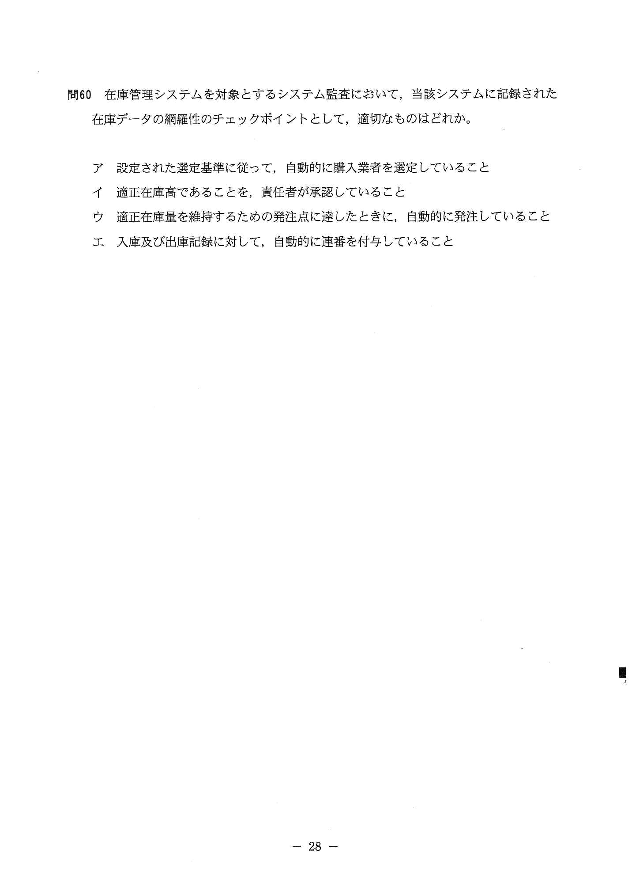

テキスト (OCR)

問60 在庫管理システムを対象とするシステム監査において, 当該システムに記録された
在庫データの網羅性のチェックボイントとして, 適切なものはどれか。

設定された選定基準に従って, 自動的に購入業者を選定していること

適正在庫高であることを, 責任者が承認していること

適正在庫量を維持するための発注点に達したときに, 自動的に発注していること
入庫及び出庫記録に対して, 自動的に連番を付与していること

H さささい

ー 28 一

### ページ 29

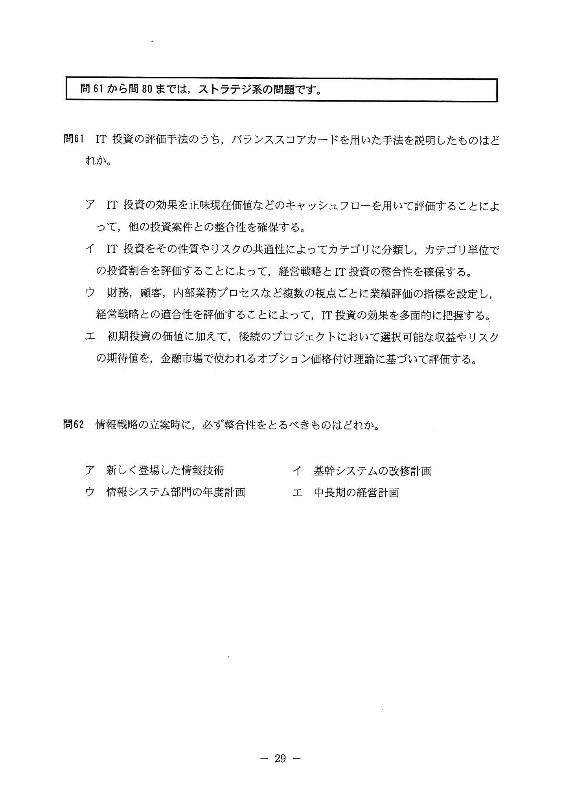

テキスト (OCR)

間 61 から問 80 までは, ストラテジ系の問題です。

問61 IT 投資の評価手法のうち, バランススコアカードを用いた手法を説明したものはど
れか。

ア IT 投資の効果を正味現在価値などのキャッシュフローを用いて評価することによ
って, 他の投資案件との整合性を確保する。

イ IT 投資をその性質やリスクの共通性によってカテゴリに分類し, カテゴリ単位で
の投資割合を評価することによって, 経営戦略とTT 投資の整合性を確保する。

ウ 財務, 顧客, 内部業務プロセスなど複数の視点ごとに業績評価の指標を設定し。
経営戦略との適合性を評価することによって, TT 投資の効果を多面的に把握する。
エエ 初期投資の価値に加えて, 後続のプロジェクトにおいて選択可能な収益やリスク

の期待値を, 金融市場で使われるオプション価格付け理論に基づいて評価する。

問62 情報戦略の立案時に, 必ず整合性をとるべきものはどれか。

ア 新しく登場した情報技術     イ 基幹システムの牙修計画
ウ 情報システム部門の年度計画    エ 中長期の経営計画

### ページ 30

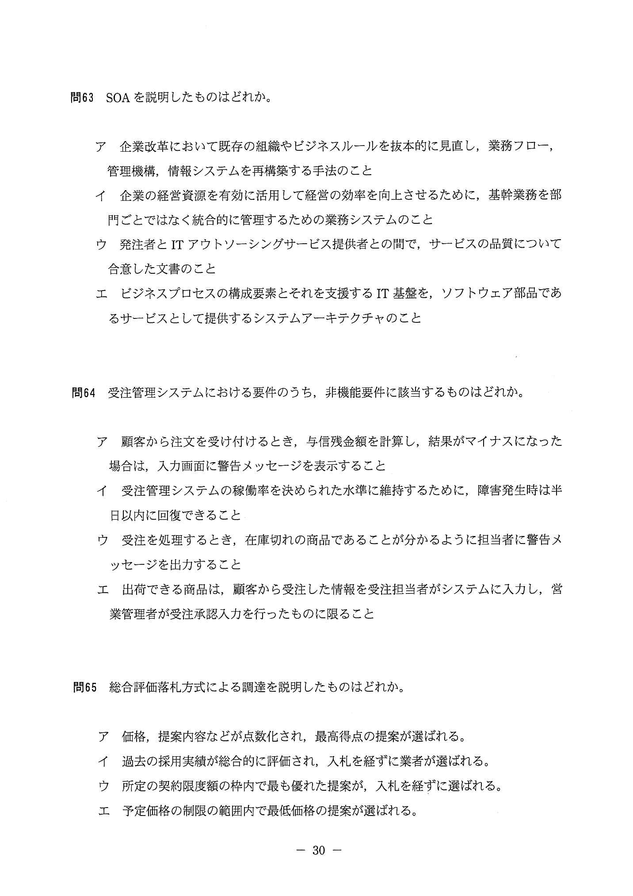

テキスト (OCR)

間63 SOA を説明したものはどれか。

ア 企業改革において既存の組織やビジネスルールを抜本的に見直し, 業務フロー,
管理機構, 情報システムを再構築する手法のこと

イ 企業の経営資源を有効に活用して経営の効率を向上させるために, 基幹業務を部
門ごとではなく統合的に管理するための業務システムのこと

ウ 発注者と IT アウトソーシングサービス提供者との間で, サービスの品質について
合意した文書のこと

エエ ビジネスプロセスの構成要素とそれを支援する IT 基盤を,ソフトウェア部品であ
るサービスとして提供するシステムアーキテクチャのこと

64 受注管理システムにおける要件のうち, 非機能要件に該当するものはどれか。

ア 顧客から注文を受け付けるとき, 与信残金額を計算し, 結果がマイナスになった
場合は 入力画面に警告メッセージを表示すること

イ 受注管理システムの稼働率を決められた水準に維持するために, 障害発生時は半
日以内に回復できること

ウ 受注を処理するとき, 在庫切れの商品であることが分かるように担当者に警告メ
ッセージを出力すること

L 出荷できる商品は, 顧客から受注した情報を受注担当者がシステムに入力し, 営
業管理者が受注承認入力を行ったものに限ること

間65 総合評価落札方式による調達を説明したものはどれか。

価格, 提案内容などが点数化され, 最高得点の提案が選ばれる。

過去の採用実績が総合的に評価され, 入札を経ずに業者が選ばれる。
所定の契約限度額の枠内で最も優れた提案が, 入札を経ずに選ばれる。
予定価格の制限の範囲内で最低価格の提案が選ばれる。

HH さくい

ー 30 一

### ページ 31

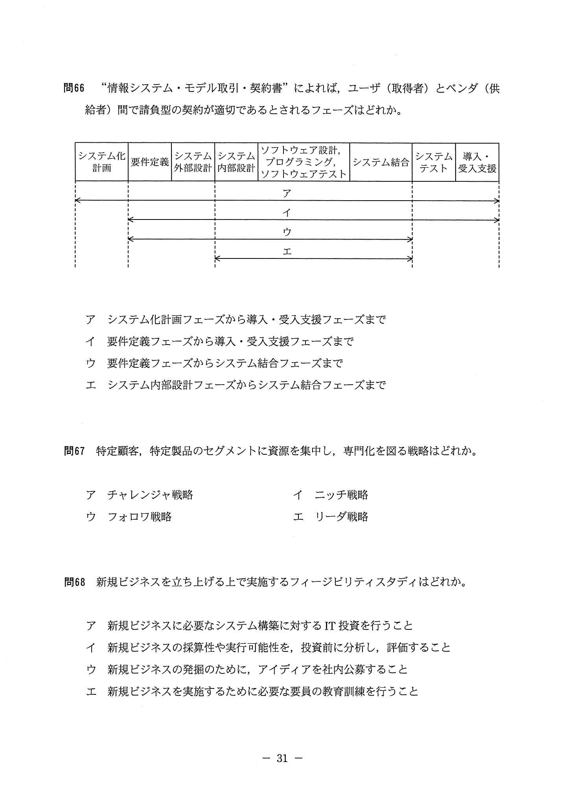

テキスト (OCR)

問66

"情報システム・モデル取引・契約書" によれば, ユーザ (取得者) とベンダ (供
給者) 間で請負型の契約が適切であるとされるフェーズはどれか。

システム化
計画

システム

要件定義ん癌設計

システム
内部設計

ソフトウェア設計
プログラミング,

ツアトウエアテスト

システム結

システム
FA

導入・
ZAM

ア

H へ NSN

4
ウ
xm

~op---fe--

システム化計画フェーズから導入・受入支援フェーズまで
要件定義フェーズから導入・受入支援フェーズまで
要件定義フェーズからシステム結合フェーズまで

システム内部設計フェーズからシステム結合フェーズまで

でい デキ

問67 特定顧客, 特定製品のセグメントに資源を集中し, 専門化を図る戦略はどれか。

ア
ウ

チャレンジャ戦略
フォロワ戦略

イ ニッチ戦略
エエ リーダ戦略

問68 新規ビジネスを立ち上げる上で実施するフィージビリティスタディはどれか。

ア
イ
Ly
ok.

新規ビジネスに必要なシステム構築に対する IT 投資を行うこと
新規ビジネスの採算性や実行可能性を, 投資前に分析し, 評価すること

新規ビジネスの発掘のために,

アイディアを社内公募すること
新規ビジネスを実施するために必要な要員の教育訓練を行うこと

+ 37 一

### ページ 32

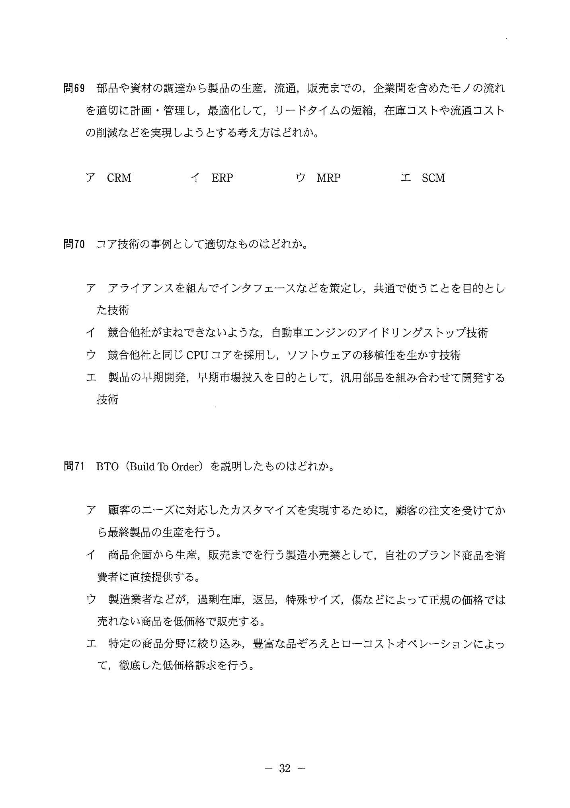

テキスト (OCR)

問69 部品や資材の調達から製品の生産, 流通, 販売までの, 企業間を含めたモノの流れ
を適切に計画・管理し, 最適化して, リードタイムの短縮, 在庫コストや流通コスト
の削減などを実現しようとする考え方はどれか。

ア CRM     イ ERP     ウ MRP     x= SCM

間70 コア技術の事例として適切なものはどれか。

ア アライアンスを組んでインタフェースなどを策定し, 共通で使うことを目的とし
た技術

イ 競合他社がまねできないような, 自動車エンジンのアイドリングストップ技術
ウ 競合他社と同じ CPU コアを採用し, ソフトウェアの移植性を生かす技術

IL 製品の早期開発, 早期市場授入を目的として, 汎用部品を組み合わせて開発する
技術

間71 BTO (Build To Order) を説明したものはどれか。

ア 顧客のニーズに対応したカスタマイズを実現するために, 顧客の注文を受けてか

ら最終製品の生産を行う。
イ 商品企画から生産, 販売までを行う製造小売業として, 自社のブランド商品を消
費者に直接提供する。

ウ 製造業者などが, 過剰在庫, 返品, 特殊サイズ, 傷などによって正規の価格では
売れない商品を低価格で販売する。

L 特定の商品分野に絞り込み, 豊富な品ぞろえとローコストオペレーションによっ
て, 徹底した低価格訴求を行う。

### ページ 33

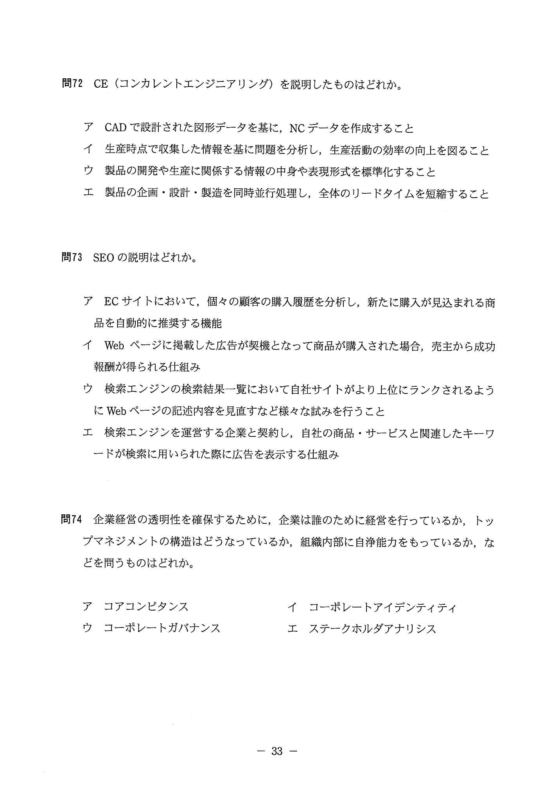

テキスト (OCR)

R72 CE (コンカレントエンジニアリング) を説明したものはどれか。

CAD で設計された図形データを基に, NC データを作成すること

生産時点で収集した情報を基に問題を分析し, 生産活動の効率の向上を図ること
製品の開発や生産に関係する情報の中身や表現形式を標準化すること
製品の企画・設計・製造を同時並行処理し, 全体のリードタイムを短縮すること

HAN

間73 SEO の説明はどれか。

ア EC サイトにおいて, 個々の顧客の購入履歴を分析し, 新たに購入が見込まれる商
品を自動的に推奨する機能

イ Web ページに掲載した広告が契機となって商品が購入された場合, 売主から成功
報酬が得られる仕組み

ウ 検索エンジンの検索結果一覧において自社サイトがより上位にランクされるよう
に Web ページの記述内容を見直すなど様々な試みを行うこと

エエ 検索エンジンを運営する企業と契約し, 自社の商品・サービスと関連したキーワ
ードが検索に用いられた際に広告を表示する仕組み

問74 企業経営の透明性を確保するために, 企業は誰のために経営を行っているか, トッ
プマネジメントの構造はどうなっているか, 組織内部に自光能力をもっているか, な
どを問うものはどれか。

ア コアコンピタンス       イ コーポレートアイデンティティ
ウ コーポレートガバナンス     エエ ステークホルダアナリシス

### ページ 34

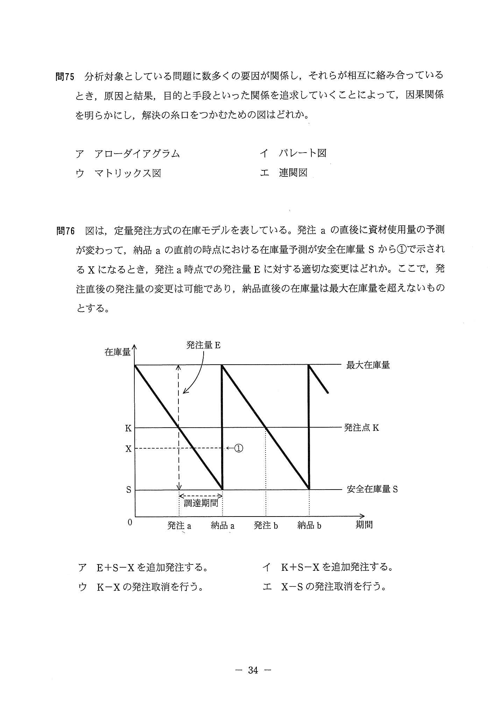

テキスト (OCR)

間75 分析対象としている問題に数多くの要因が関係し. それらが相互に絡み合っている
とき, 原因と結果, 目的と手段といった関係を追求していくことによって, 因果関係
を明らかにし, 解決の糸口をつかむための図はどれか。

ア アローダイアグラム      イ パレート図
ウ マトリックス図         エエ SRE

間76 図は, 定量発注方式の在庫モデルを表している。発注 a の直後に資材使用量の予測
が変わって, 納品 a の直前の時点における在庫量予測が安全在庫量 S からゆで示され
る X になるとぎ, 発注 a 時点での発注量 E に対する適切な変更はどれか。ここで, 発
注直後の発注量の変更は可能であり, 納品直後の在庫量は最大在庫量を超えないもの
とする。

_—      ame
K ノ              最大在庫量
|
1
|
1
K       発注点K
メトーートーNーーー] Oo |
1
s            安全在庫量 S
nnn
: 調達期間   1
9   発注s 納品a 発注b 納品   期間
ア E+S—X を追加発注する。     4 K+S—X を追加発注する。
ウ KーX の発注取消を行う。      エ XーSの発注取消を行う。

ー 34 一

### ページ 35

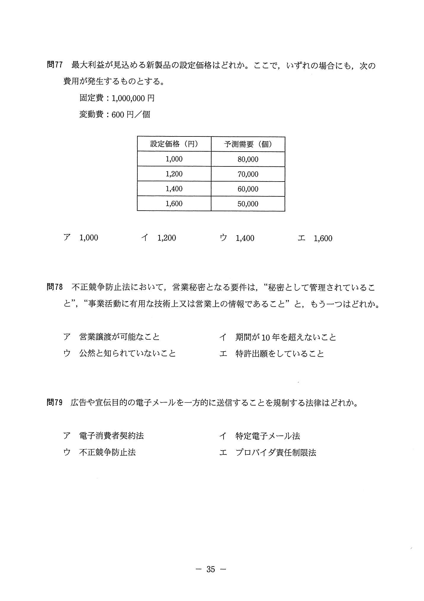

テキスト (OCR)

間77 最大利益が見込める新製品の設定価格はどれか。ここで, いずれの場合にも, 次の
費用が発生するものとする。
固定費 : 1,000,000 円
変動費 : 600 円個

設定価格 (円)   Fula (個)
1000      80.000
1,200      70,000
1,400      60,000
1,600      50,000
ア 1,000    4 1,200     ウ 1,400     エ 1,600

問78 不正競争防止法において, 営業秘密となる要件は, “秘密として管理されているこ
&”, “事業活動に有用な技術上又は営業上の情報であること” と, もう一つはどれか。

ア 営業譲渡が可能なこと          イ 期間が10 年を超えないこと

ウ 公然と知られていないこと        エ 特許出願をしていること

問79 広告や宮伝目的の電子メールを一方的に送信することを規制する法律はどれか。

ア 電子消費者契約法         イ 特定電子メール法
ウ 不正競争防止法          エ プロバイダ南任制限法

ー 35 一

### ページ 36

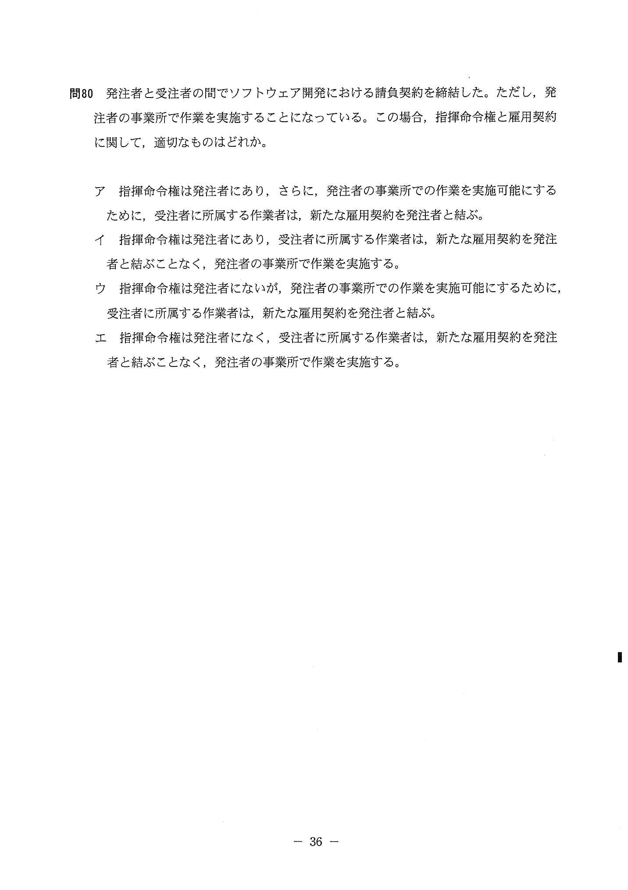

テキスト (OCR)

問80 発注者と受注者の間でソフトウェア開発における請負契約を締結した。ただし, 発
注者の事業所で作業を実施することになっている。この場合, 指揮命令権と雇用契約
に関して, 適切なものはどれか。

ア 指揮命令権は発注者にあり, さらに, 発注者の事業所での作業を実施可能にする
ために, 受注者に所属する作業者は, 新たな雇用契約を発注者と結ぶ。

イ 指揮命令権は発注者にあり, 受注者に所属する作業者は, 新たな雇用契約を発注
者と結ぶことなく, 発注者の事業所で作業を実施する。

ウ 指揮命令権は発注者にないが, 発注者の事業所での作業を実施可能にするために,
受注者に所属する作業者は, 新たな雇用契約を発注者と結ぶ。

エエ 指揮命令権は発注者になく, 受注者に所属する作業者は, 新たな雇用契約を発注
者と結ぶことなく, 発注者の事業所で作業を実施する。

ー 36 一

### ページ 37

テキスト (OCR)

【 メモ 用 紙 〕]

ー 37 一

### ページ 38

テキスト (OCR)

【 メモ 用 紙 〕

ー 38 一

### ページ 39

テキスト (OCR)

【 メモ 用 紙 〕

### ページ 40

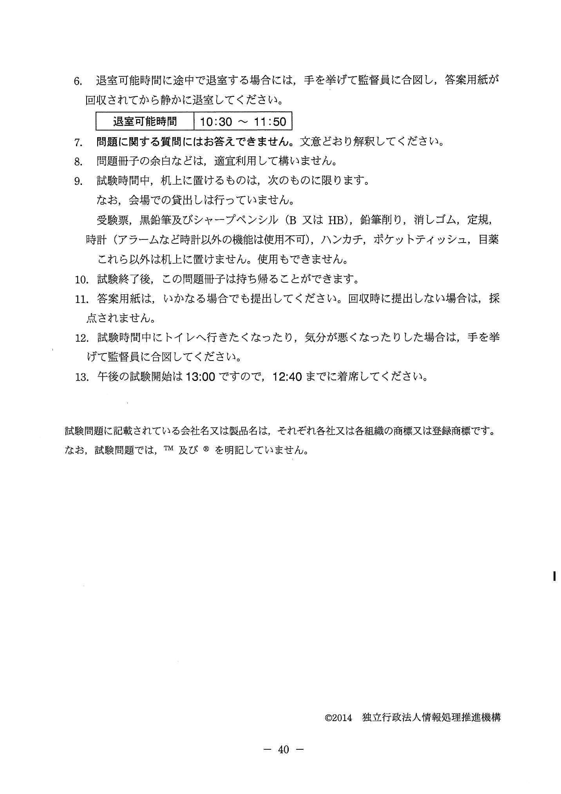

テキスト (OCR)

6. 退室可能時間に途中で退室する場合には, 手を挙げて監督員に合図し, 答案用紙が
回収されてから静かに退室してください。
| 退室可能時間 | 10:30 ~ 11:50 |
7. 問題に関する質問にはお答えできません。文意ごおり解釈してください。
8. 問題冊子の余白などは, 適宜利用して構いません。
9. 試験時間中, 机上に置けるものは, 次のものに限ります。
なお, 会場での貸出しは行っていません。
受験票, 黒鉛筆及びシャープペンシル (B 又は HB), 鉛筆削り, 消しゴム, A,
時計 (アラームなど時計以外の機能は使用不可),、 ハンカチ, ポケットティッシュ, 目薬
これら以外は机上に置けません。使用もできません。
10. 試験終了後, この問題冊子は持ち帰ることができます。
ll. 答案用紙は, いかなる場合でも提出してください。回収時に提出しない場合は, 採
点されません。
12. 試験時間中にトイレへ行きたくなったり, 気分が悪くなったりした場合は, 手を挙
げて監督員に合図してください。
13. 午後の試験開始は 13:00 ですので, 12:40 までに着席してください。

試験問題に記載されている会社名又は製品名は, それぞれ各社又は各組織の商標又は登録商標です。
なお, 試験問題では, ™ 及び © を明記していません。

@2014 独立行政法人情報処理推進機構

ー 40 一

---

## 午前解答

©2014 独立行政法人情報処理推進機構 
平成26 年度 秋期 応用情報技術者試験 解答例 
 
午前試験 
問番号 
正解 
問1 
エ 
問2 
エ 
問3 
イ 
問4 
エ 
問5 
イ 
問6 
エ 
問7 
ウ 
問8 
イ 
問9 
エ 
問10 
エ 
問11 
エ 
問12 
ア 
問13 
ウ 
問14 
エ 
問15 
ア 
問16 
イ 
問17 
イ 
問18 
エ 
問19 
ウ 
問20 
ウ 
 
 
問番号 
正解 
問21 
エ 
問22 
ア 
問23 
ア 
問24 
エ 
問25 
エ 
問26 
ウ 
問27 
ウ 
問28 
イ 
問29 
イ 
問30 
イ 
問31 
ウ 
問32 
エ 
問33 
エ 
問34 
イ 
問35 
ウ 
問36 
エ 
問37 
ア 
問38 
ウ 
問39 
ウ 
問40 
イ 
 
 
問番号 
正解 
問41 
ア 
問42 
イ 
問43 
ウ 
問44 
ウ 
問45 
エ 
問46 
ウ 
問47 
イ 
問48 
イ 
問49 
エ 
問50 
ア 
問51 
ア 
問52 
ウ 
問53 
ア 
問54 
ウ 
問55 
ア 
問56 
ウ 
問57 
エ 
問58 
イ 
問59 
エ 
問60 
エ 
 
 
問番号 
正解 
問61 
ウ 
問62 
エ 
問63 
エ 
問64 
イ 
問65 
ア 
問66 
エ 
問67 
イ 
問68 
イ 
問69 
エ 
問70 
イ 
問71 
ア 
問72 
エ 
問73 
ウ 
問74 
ウ 
問75 
エ 
問76 
エ 
問77 
エ 
問78 
ウ 
問79 
イ 
問80 
エ

---

## 午後問題

### ページ 1

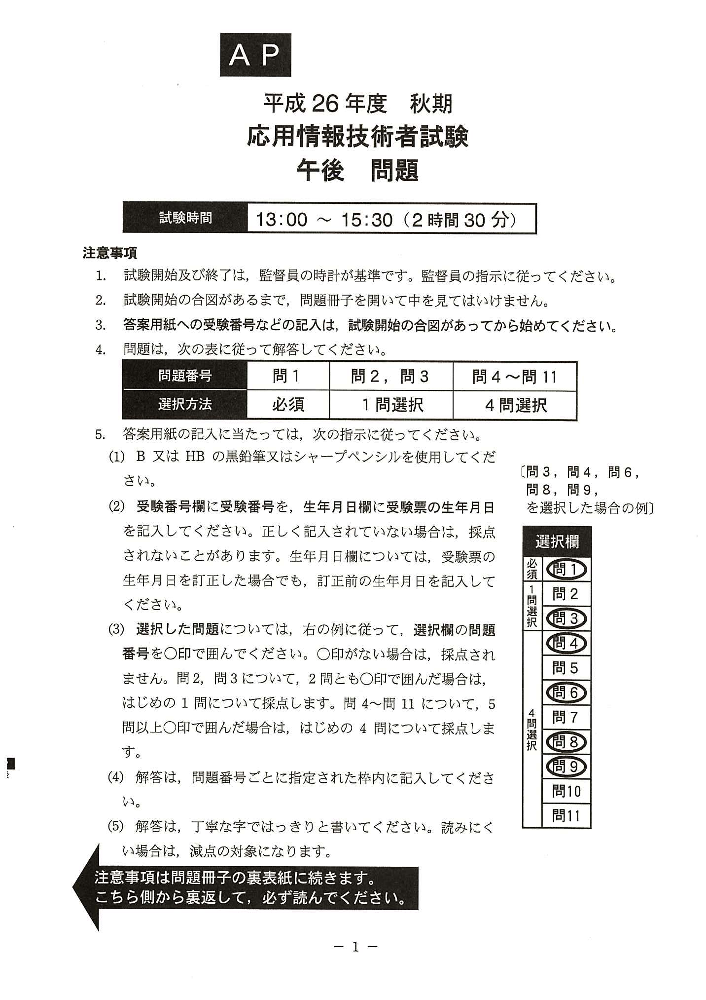

テキスト (OCR)

平成26 年度 秋期
午後 問題

Ee 13:00 ~ 15:30 (2時間30 分)

注意事項
1. 試験開始及び終了は, 監督員の時計が基塗です。監督員の指示に従ってください。
2. 試験開始の合図があるまで, 問題冊子を開いて中を見てはいけません。
3. 人案用紙への受験番号などの記入は, 試験開始の合図があってから始めてください。
4. 問題は, 次の表に従って解答してください。

問題番号    問 1   問2, 問3   問4 ~ Fy 11
選択方法    必須    1 問選択    4 問選択

5. 答案用紙の記入に当たっては, 次の指示に従ってください。
(1) B 又は HB の黒鉛筆又はシャープペンシルを使用してくだ
(3, 問4, is,

に                        Ais, 問9,
0) 受験番号欄に受験特号を, 生年月日欄に受験時の生年月日 "を選択した場合の例)

を記入してください。正しく記入されていない場合は, A Ie
されないことがあります。生年月日欄については, 受験球の 隊細較
生年月日を訂正した場合でも, 訂正前         a         a
fi    た場合   , 計正前の生年月日を記入して    1| 問2
ください。                                   ate
と
⑬) 選択した問題については, 右の例に従って, 選択欄の問題 LX
番号を〇印で囲んでください。〇印がない場合は, 採点され
ません。問 2, 問3 について, 2 問とも〇印で囲んだ場合は,   a
はじめの 1 問について採点します。問 4て問 11 について, 5 |,  =
問以上〇印で囲んだ場合は。 はじめの 4 問について採点しま = |BLS
す                           択|M 8
         .    、    G9
4) MA, 問題番号ごとに指定された梓内に記入してくださ    a
va,                                          ー
、  _       間11
6) 解答は, 丁寧な字ではっきりと書いてください。読みにく

い場合は, 減点の対象になります。

注意事項は問題冊子の裏表紙に続きます。
こちら側から裏返して, 必ず読んでください。

### ページ 2

### ページ 3

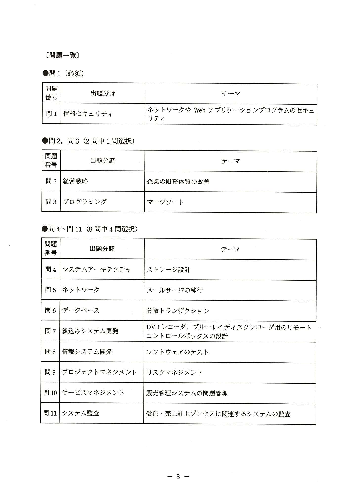

テキスト (OCR)

【問題一覧〕

@H1 (必須)

問題                        -
番号     出題分野                テーマ
問1 | 情報セキュリティ       バットワータポ Web アプリケーションプログラムのセキュ
@ii2, 問3 (2問中1 問選択)

問題                         a
番号     出題分野                テーマ
問2 |経営戦略          企業の財務体質の改善

問3 | プログラミング      マージソート

信癌 4…問 11 (8 問中 4 問選択)

問題                        =
BS     出題分野                テーマ
問4 | システムアーキテクチャ  ストレージ設計

His | ネットワーク        メールサーバの移行
問6 | データベース        分散トランザクション
Hay SLSL       DVD レコーダ, ブルーレイディスクレコーダ用のリモート
人ML     コントロールボックスの設計
問8 | 情報システム開発      ソフトウェアのテスト

間9

プロジェクトマネジメント

リスクマネジメント

問10

サービスマネジメント

販売管理システムの問題管理

問11

システム監査

受注・売上に計上プロセスに関連するシステムの監査

### ページ 4

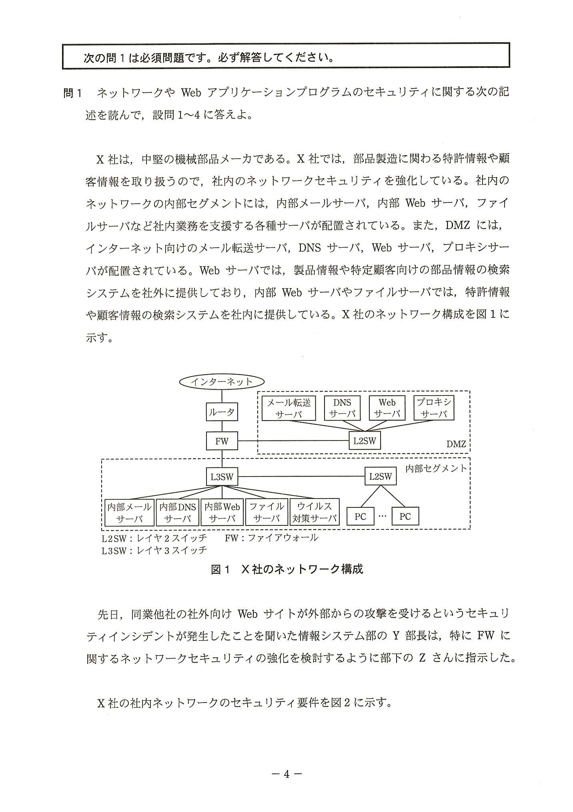

テキスト (OCR)

次の問 1 は必須問題です。必ず解答してください。

Al ネットワークや We アプリケーションプログラムのセキュリティに関する次の記
述を読んで, 設問 1て4 に答えよ。

X 社は, 中堅の機械部品メーカである。X 社では, 部品製造に関わる特許情報や顧
客情報を取り扱うので, 社内のネットワークセキュリティを強化している。社内の
ネットワークの内部セグメントには, 内部メールサーバ, 内部 Web サーバ, ファイ
ルサーバなど社内業務を支援する各種サーバが配置されている。また, DMZ には,
インターネット向けのメール転送サーバ, DNS サーバ, Web サーバ, プロキシサー
バが配置されている。Web サーバでは, 製品情報や特定顧客向けの部品情報の検索
システムを社外に提供しており, 内部 Web サーバやファイルサーバでは, 特許情報
や顧客情報の検索システムを社内に提供している。X 社のネットワーク構成を図 1 に

エーーーーーーーーーーーーーーーーーーーーーーーーーーーーーーーーーーーーーーーーーーー1
'| メール転送 | | DNS       Web | |プロキシ| }
ルータ    | サーバ    サーバ | | サーバ| | サーバ    H
!                                                     1

内部セグメント

内部メール|| 内部DNS |] 内部Web || ファイル || ウイルス
一  ime a サーバ | サーバ |fetsetr—yN} | PC |… | PC

L2sw: レイヤ2スイッチ  FW:ファイアウォール
L3SW : レイヤ3スイッチ

Hi X社のネットワーク構成

先日, 同業他社の社外向け Web サイトが外部からの攻撃を受けるというセキュリ
ティインシデントが発生したことを聞いた情報システム部の Y 部長は, 特に FW に
関するネットワークセキュリティの強化を検討するように部下の Z さんに指示した。

X 社の社内ネットワークのセキュリティ要件を図 2 に示す。

### ページ 5

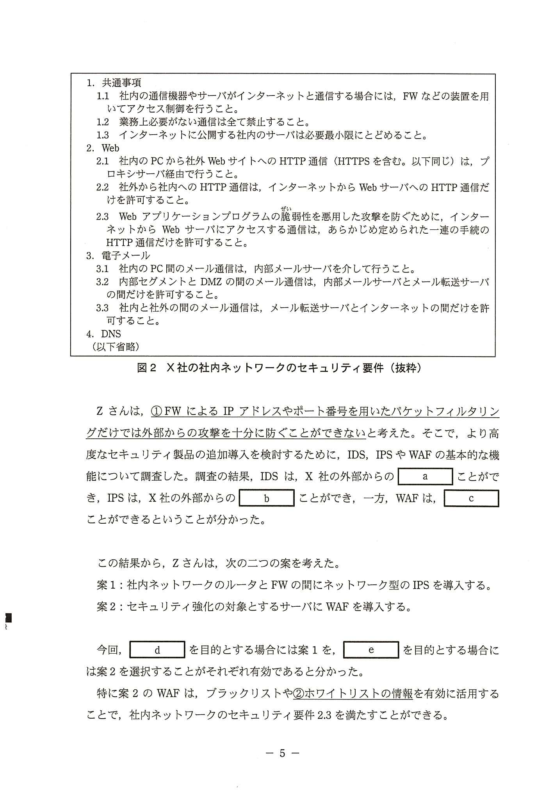

テキスト (OCR)

1. 共通事項

Ll 社内の通信機器やサーバがインターネットと通信する場合には, FW などの装置を用
いてアクセス制御を行うこと。

1.2 業務上必要がない通信は全て禁止すること。

1.3 インターネットに公開する社内のサーバは必要最小限にとどめること。

2. Web

2.1 社内のPCから社外 Web サイトへの HTTP 通信 (HTTPS を含む。以下同じ) は,プ
ロキシサーが経由で行うこと。

22 社外から社内への HTTP 通信は,。 インターネットから Web サーバへの HTTP 通信だ
けを許可すること。

2.3 Web アプリケーションプログラムの脆弱性を悪用した攻撃を防ぐために, インター
ネットから Web サーバにアクセスする通信は, あらかじめ定められた一連の手続の
HTTP 通信だけを許可すること。

3. 電子メール

3.1 社内のPC間のメール通信は, 内部メールサーバを介して行うこと。

32 内部セグメントと DMZ の間のメール通信は, 内部メールサーパとメール転送サーバ
の間だけを許可すること。

33 社内と社外の間のメール通信は, メール転送サーバとインターネットの間だけを許
可すること。

4. DNS

(以下省略

図2 X社の社内ネットワークのセキュリティ要件 (抜粋)

Z さんは, ①FW による IP アドレスやポート番号を用いたパケットフィルタリン
グだけでは外部からの攻撃を十分に防ぐことができないと考えた。そこで, より高
度なセキュリティ製品の追加導入を検討するために, IDS, IPS や WAF の基本的な機
能について調査した。調査の結果, IDS は, X 社の外部からの| a |ことがで

き, TPS は, X 社の外部からの| b | ことができ, 一方, WAFは,

ことができるということが分かった。

この結果から, Zさんは, 次の二つの案を考えた。
案 1 : 社内ネットワークのルータと FW の間にネットワーク型の IPS を導入する。
案2 : セキュリティ強化の対象とするサーバに WAF を導入する。

今回, | q | を目的とする場合には案 1 を, | e | を目的とする場合に

は案 2 を選択することがそれぞれ有効であると分かった。
特に案 2 の WAF は,。 ブラックリストや②ホワイトリストの情報を有効に活用する
ことで, 社内ネットワークのセキュリティ要件 2.3 を満たすことができる。

ー 5一

### ページ 6

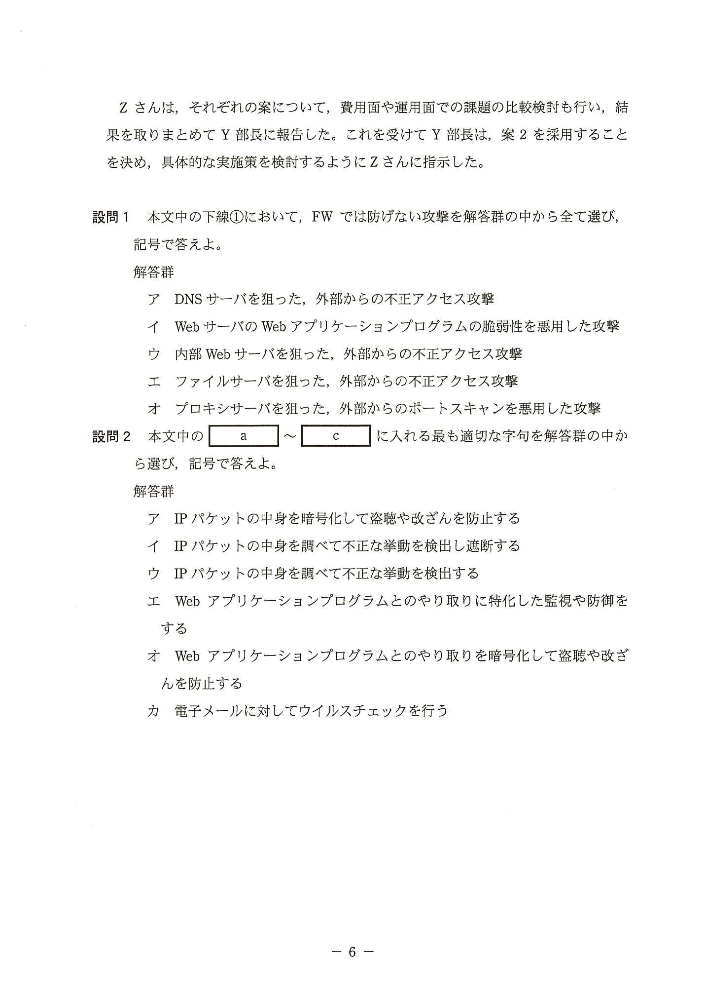

テキスト (OCR)

Z さんは, それぞれの案について, 費用面や運用面での課題の比較検討も行い, 結
果を取りまとめて Y 部長に報告した。これを受けて Y 部長は, 案 2 を採用すること
を決め, 具体的な実施策を検討するようにZさんに指示した。

設問1 本文中の下線①において, FW では防げない攻撃を解答群の中から全て選び,
記号で答えよ。
ARETE
ア DNS サーバを狙った, 外部からの不正アクセス攻撃
Web サーバの Web アプリケーションプログラムの脆弱性を悪用した攻撃
内部 Web サーバを狙った, 外部からの不正アクセス攻撃
ファイルサーバを狙った, 外部からの不正アクセス攻撃
オ プロキシサーバを狙った, 外部からのポートスキャンを悪用した攻撃
設問2 本文中の| a |て|  c |に入れる最も適切な字句を解答群の中か
ら選び, 記号で答えよ。
ARE
ア IP パケットの中身を暗号化して盗聴や改ざんを防止する
IP パケットの中身を調べて不正な挙動を検出し遮断する
IP パケットの中身を調べて不正な挙動を検出する
Web アプリケーションプログラムとのやり取りに特化した監視や防御を
する
オ Web アプリケーションプログラムとのやり取りを暗号化して盗聴や改ざ
んを防止する
HW 電子メールに対してウイルスチェックを行う

H ざ

H Ww AN

### ページ 7

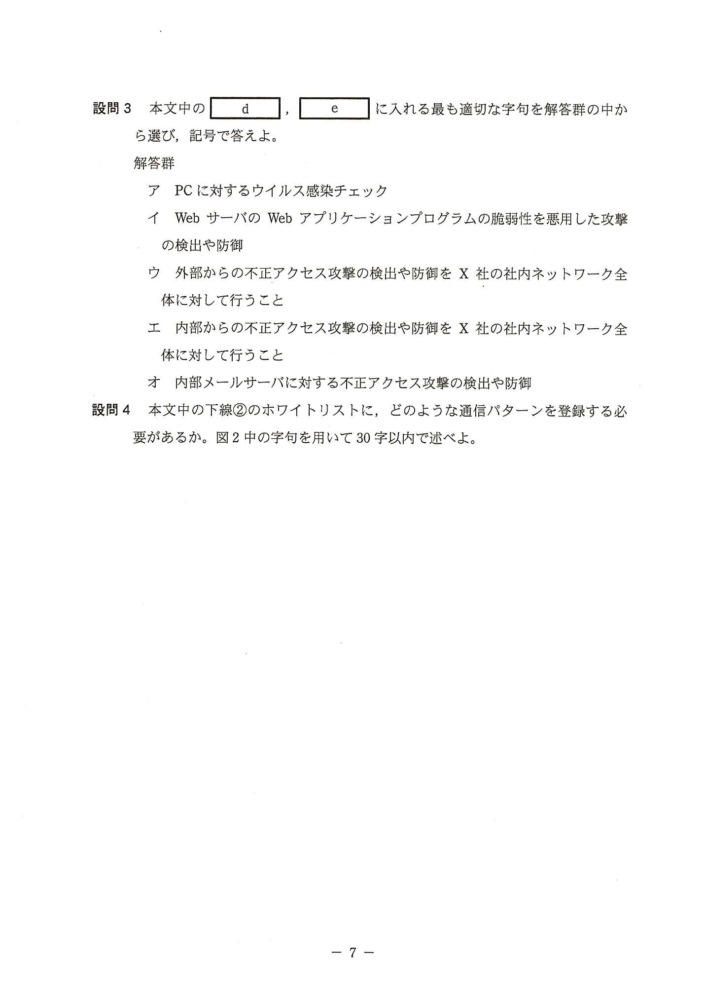

テキスト (OCR)

設問3 本文中の| a |,|  e | に入れる最も適切な字句を解答群の中か
ら選び, 記号で答えよ。
解答群
ア PCに対するウイルス感染チェック
イ Web サーバの Web アプリケーションプログラムの脆層性を悪用した攻撃
の検出や防御
ウ 外部からの不正アクセス攻撃の検出や防御を X 社の社内ネットワーク全
体に対して行うこと
エエ 内部からの不正アクセス攻撃の検出や防御を X 社の社内ネットワーク全
体に対して行うこと
オ 内部メールサーバに対する不正アクセス攻撃の検出や防御
設問4 本文中の下線②のホワイトリストに, どのような通信パターンを登録する必
要があるか。図 2 中の字句を用いて 30 字以内で述べよ。

### ページ 8

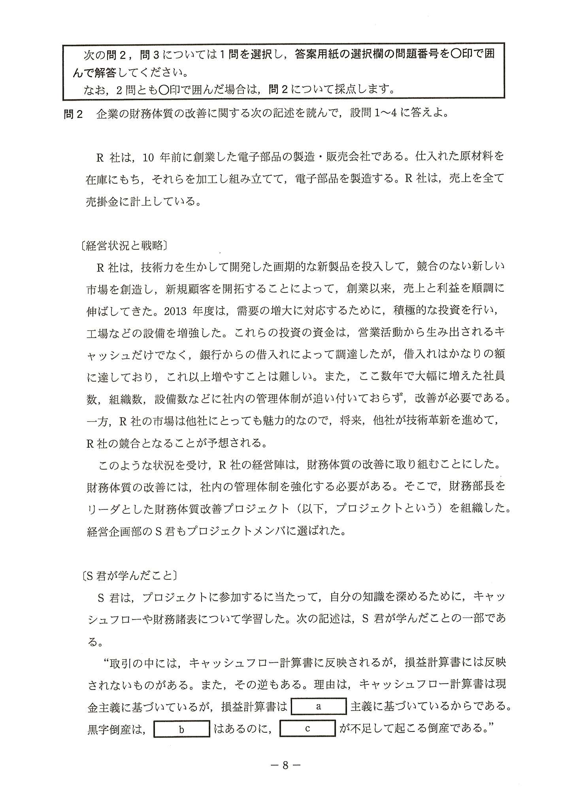

テキスト (OCR)

次の間 2 , 問3 については1 間を選択し, 答案用紙の選択欄の問題番号を〇印で囲
んで解答してください。
なお, 2 問とも〇印で囲んだ場合は, 問 2 について採点します。

問2 企業の財務体質の改善に関する次の記述を読んで, 設問14 に答えよ。

R 社は, 10 年前に創業した電子部品の製造・販売会社である。仕入れた原材料を
在庫にもち, それらを加工し組み立てて, 電子部品を製造する。R 社は, 売上を全て
売掛金に計上している。

〔経営状況と戦略           ;

R 社は, 技術力を生かして開発した画期的な新製品を投入して, 競合のない新しい
市場を創造し, 新規顧客を開拓することによって, 創業以来, 売上と利益を順調に
伸ばしてきた。2013 年度は, 需要の増大に対応するために, 積極的な投資を行い,
工場などの設備を増強した。これらの投資の資金は, 営業活動から生み出されるキ
ャッシュだけでなく, 銀行からの借入れによって調達したが, 借入れはかなりの額
に達しており, これ以上増やすことは難しい。また, ここ数年で大幅に増えた社員
数, 組織数, 設備数などに社内の管理体制が追い付いておらず, 改善が必要である。
一方, R 社の市場は他社にとっても魅力的なので, 将来, 他社が技術革新を進めて

R 社の競合となることが予想される。

このような状況を受け, R 社の経営陣は, 財務体質の改善に取り組むことにした。
財務体質の改善には, 社内の管理体制を強化する必要がある。そこで, 財務部長を
リーダとした財務体質改善プロジェクト (以下 、プロジェクトという) を組織した。
経営企画部の S 君もプロジェクトメンバに選ばれた。

(S 君が学んだこと〕

S 君は。 プロジェクトに参加するに当たって, 自分の知識を深めるために, キャッ
シュフローや財務諸表について学習した。次の記述は, S 君が学んだことの一部であ
る。

“取引の中には, キャッシュフロー計算書に反映されるが, 損益計算書には反映
されないものがある。また, その逆もある。理由は。 キャッシュフロー計算書は現
金主義に基づいているが, 損益計算書は| a |主義に基づいているからである。
黒字倒産は, | b | はあるのに,| c | が不足して起こる倒産である。"

ー8一

### ページ 9

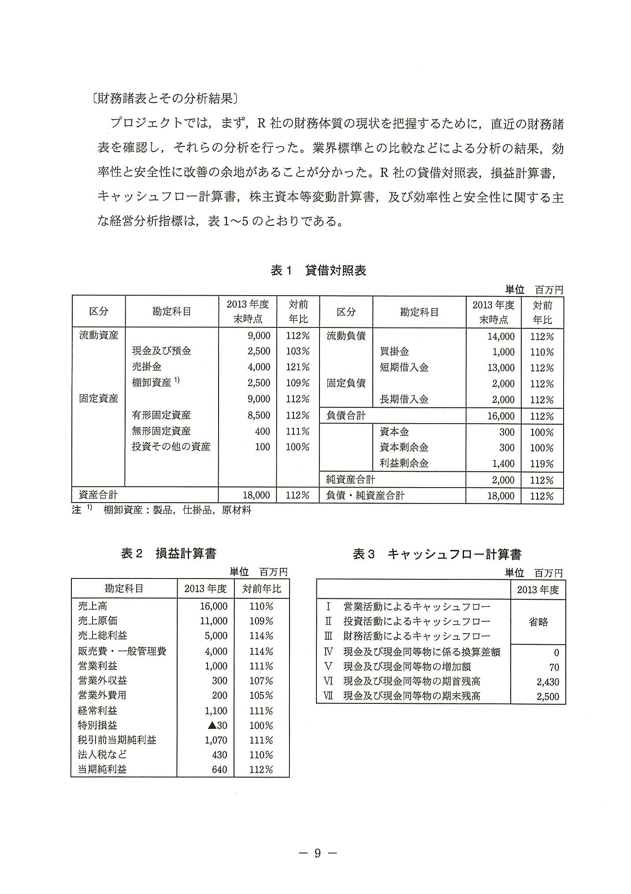

テキスト (OCR)

[財務諸表とその分析結果)

プロジェクトでは, EV, 社の財務体質の現状を把握するために, 直近の財務諸
表を確認し, それらの分析を行った。業界標準との比較などによる分析の結果, 効
率性と安全性に改善の余地があることが分かった。R 社の貸借対照表, 損益計算書,
キャッシュフロー計算書, 株主資本等変動計算書, 及び効率性と安全性に関する主
な経営分析指標は, 表 1て5 のとおりである。

表1 貸借対照表

単位 百万円
:               2013 年度 | 対前              2013年度 | 対前
にが           PO           xen | eee | “う           mere          未時点 | 年比
流動資産                                          9,000 | 112% | 流動負債                                        14,000 | 112%
現金及び預金                   2,500 | 10396                       tid                            1,000 | 110%
FS                            4,000 | 121%                       短期借入金                   13,000 | 112%
棚卸資産                      2,500 | 109% | 固定負偵                                         2000 | 112%
固定資産                                          9000 | 112%                       長期借入金                     2,000 | 112%
有形固定資産                   8,500 | 112% | 負債合計                                        16,000 | 112%
無形固定資産                     400 | 111%                       資本金                              300 | 100%
投資その他の資産               100 | 100%                       資本剰余金                       300 | 100%
利益剰余金                     1,400 | 119%
純資産合衣                                       2000 | 112%
資産合計                                         18,000 | 112% | 負債・純資産合計                           18,000 | 112%
注 ) 棚御資産 : 製品仕掛品, 原材料
表2 損益計算書               表3 キャッシュフロー計算書
単位 百万円                                                                                     単位 百万円
勘定科目             2013 年度 | 対前年比                                                                        2013 年度
売上高             16,000 | 110%        1 営業活動によるキャッシュフロー
売上原価            11,000 | 109%        II 投資活動によるキャッシュフロー      省略
売上総利益           5.000 | 114%       Il 財務活動ににるキャッシュフロー
販売費・一般管理費             4,000 | 114%                 IV 現金及び現金同等物に係る換算差額                  0
営業利益                             1000 | 111%                 V 現金及び現金同等物の増加額                          70
営業外収益                            300 | 107%                VI 現金及び現金同等物の期首残高                  2,430
営業外費用                            200        105%                VI 現金及び現金同等物の期末残高                  2,500
経常利益                             1,100        111%
特別損益                              A30        100%
税引前当期純利益       1,070   111%
法人税など                            430 | 110%
当期純利益                            640        112%

### ページ 10

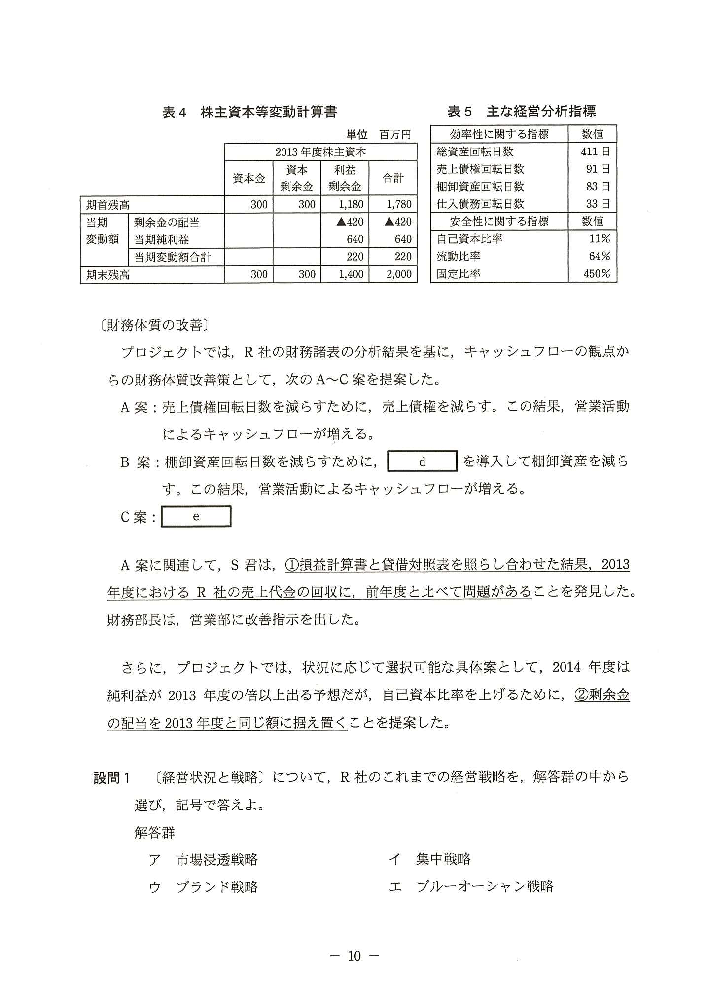

テキスト (OCR)

表4 株主資本等変動計算書           RS 主な経営分析指標

単位 AAA            効率性に関する指標          Be
2013 年度株主資本                     総資産回転日数                    411 日
eke   資本 | 利益   eet    売上債権回転日数        91 日
ARS | 剰余金           棚卸資産回転日数         83 日
期首残高               300    300] 1180| 1780| | 仕入債務回転日数        33 日
当期        剰余金の配当                                        4A420| 420           安全性に関する指標          数値
変動額 | 当期純利益                                              640         640        自己資本比率                         11%
当期変動額合計                                        220         220       流動比率                                64%
期末残高                                   300         300 | 1400| 2000| |固定比率                              450%

(財務体質の改善
プロジェクトでは, R 社の財務諾表の分析結果を基に。 キャッシュフローの失点か
らの財務体質政善人策として, 次の AてC案を提案した。
AK: 売上全権回転日数を減らすために, 売上債権を減らす。この結果, 営業活動
によるキャッシュフローが増える。
BR: 杉御資産回転日数を減らすために, |  q | を導入して棚卸資産を減ら
す。 この結果, 営業活動によるキャッシュフローが増える。

A 案に関連して, S Bld, ①損益計算書と貸借対照表を照らし合わせた結果, 2013
年度における R 社の売上代金の回収に, 前年度と比べて問題があることを発見した。
財務部長は, 営業部に改善指示を出した。

さらに, プロジェクトでは, 状況に応じて選択可能な具体案として, 2014 年度は
純利益が 2013 年度の倍以上出る予想だが, 自己資本比率を上げるために, ORE
の配当を 2013 年度と同じ額に据え置くことを提案した。

設問1 [経営状況と戦略] について, R 社のこれまでの経営戦略を, 解答群の中から
選び, 記号で答えよ。

解答群
ア 市場浸透戦略                           イ 集中戦略
ウ ブランド戦略                エエ ブルーオーシャン戦略

ー 10 一

### ページ 11

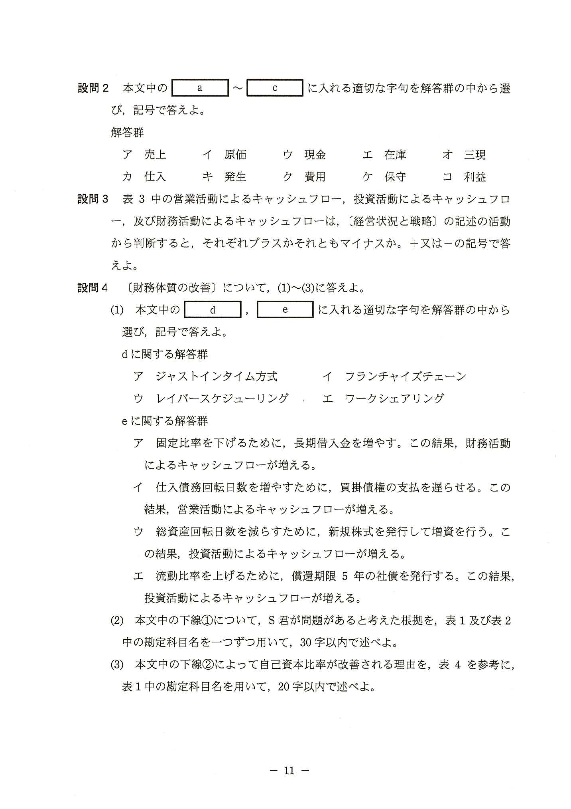

テキスト (OCR)

設問2 本文中の| a |~l  c |に入れる適切な字句を解答群の中から選
び, 記号で答えよ。
SREB
ア 売上   イ 原価   ウ 現金   エエ 在庫   オ =H
A 仕入   キ 発生   ク 費用   ケ 保守   コ 利益
設問3 表 3 中の営業活動によるキャッシュフロー, 投資活動によるキャッシュフロ
ー, 及び財務活動によるキャッシュフローは, 【〔経営状況と戦略〕」 の記述の活動
から判断すると, それぞれプラスかそれともマイナスか。十又は一の記号で答

えよ。
設問4 [財務体質の改善) について, ①ぐて(③⑬)に答えよ。
Q) 本文中の| a |,|  e |に入れる適切な字句を解答群の中から

選び, 記号で答えよ。
d に関する解答群
ア ジャストインタイム人方式    イ フランチャイズチェーン
ウ レイバースケジューリング   エエ, サーウジェアリング
e に関する解答群
ア 固定比率を下げるために, 長期借入金を増やす。この結果, 財務活動
によるキャッシュフローが増える。
4 仕入債務回転日数を増やすために, 買掛債権の支払を遅らせる。この
結果, 営業活動によるキャッシュフローが増える。
ウ 総資産回転日数を減らすために, 新規株式を発行して増資を行う。こ
の結果, 投資活動によるキャッシュフローが増える。
エエ 流動比率を上げるために, 償還期限 5 年の社債を発行する。この結果,
投資活動によるキャッシュフローが増える。
2) 本文中の下線のについて, S 君が問題があると考えた根拠を, 表 1 及び表 2
中の勘定科目名を一つずつ用いて, 30 字以内で述べよ。
3) 本文中の下線②によって自己資本比率が改善される理由を, 表 4 を参考に,
表 1 中の甚定科目名を用いて, 20 字以内で述べよ。

ae 呈

### ページ 12

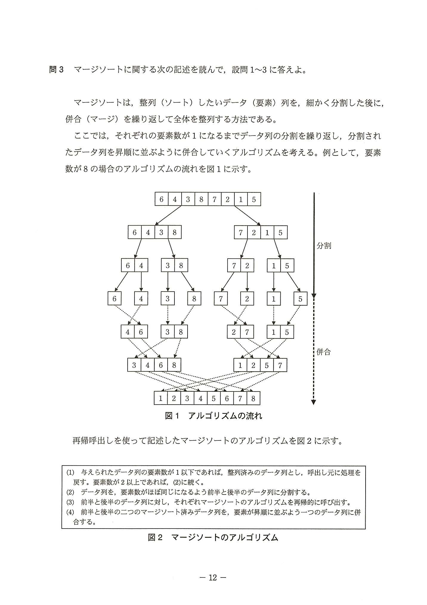

テキスト (OCR)

問3 マージソートに関する次の記述を読んで, 設問 1て3 に答えよ。

マージソートは, 整列 (ツソート) したいデータ (要素) WE, 細かく分割した後に,
併合 (マージ) を繰り返して全体を整列する方法である。

ここでは, それぞれの要素数が 1 になるまでデータ列の分割を繰り返し, 分割され
たデータ列を昇順に並ぶがように併合していくアルゴリズムを考える。例として, 要素
数が8 の場合のアルゴリズムの流れを図 1 に示す。

回回回EE回回

le |4|slsl     [7J2[ifs]
分割
Vv
併合

オーニーニーニーニーニーニニニニーーニーニーニニニニニュ

再帰呼出しを使って記述したマージソートのアルゴリズムを図 2 に示す。

(1) 与えられたデータ列の要素数が 1 以下であれば, 整列済みのデータ列とし, 呼出し元に処理を
戻す。要素数が 2 以上であれば, ②に続く。

2) データ烈を, 要素数がほぼ同じこなるよう前半と後半のデータ列に分割する。

3) 前半と後半のデータ列に対し, それぞれマージソートのアルゴリズムを再帰的に呼び出す。

(④ 前半と後半の二つのマージソート済みデータ烈を, 要素が昇順に並ぶよう一つのデータ列に併
合する。

 2 マージソートのアルゴリズム

ー12 一

### ページ 13

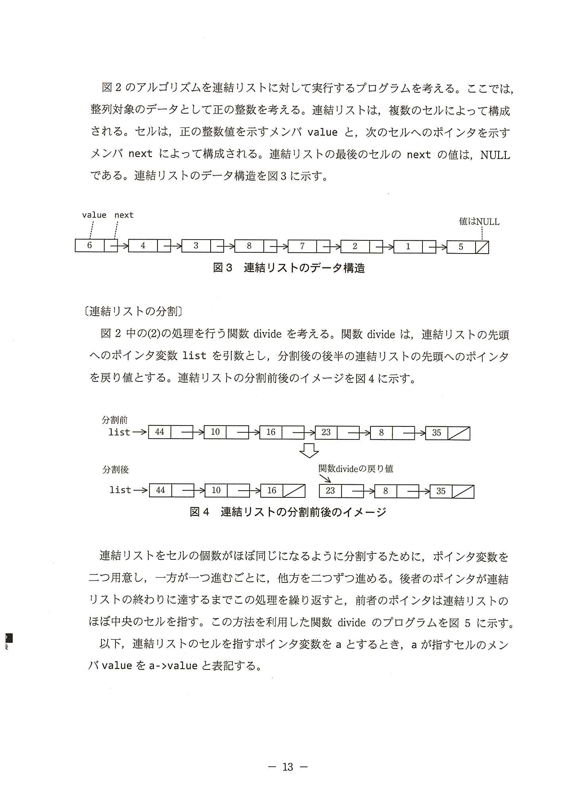

テキスト (OCR)

2 のアルゴリズムを連結リストに対して実行するプログラムを考える。ここでは,
整列対象のデータとして正の整数を考える。連結リストは, 複数のセルによって構成
される。セルは, 正の整数値を示すメンバ value と, 次のセルへのポインタを示す
メンバ next によって構成される。 連結リストの最後のセルの next の値は, NULL
CHS. 連結リストのデータ構造を図 3 に示す。

val ue   next                                                                                                                     値はNULL

まし テルキロエーオキテイエゴルーロエエエロオミア
図3 連結リストのデータ構造

CHU Ah ORE)

 2 中の(②)の処理を行う関数 divide を考える。関数 divide は, 連結リストの先頭
ADB VIB list を引数とし, 分割後の後半の連結リストの先頭へのポインタ
を戻り値とする。連結リストの分割前後のイメージを図 4 に示す。

分割前
Hst-e[g pT ps PT pT
分割後                                                                     関数divideの戻り値

てき
list [BT He) SE]
図4 連結リストの分割前後のイメージ

連結りストをセルの個数がほぼ同じこなるように分割するために, ポインタ変数を
SOREL, 一方がーつ進むごとに, 他方を二つずつ進める。後者のポインタが連結
リストの終わりに達するまでこの処理を繰り返すと, 前者のポインタは連結リストの
ほぼ中央のセルを指す。この方法を利用した関数 divide のプログラムを図 5 に示す。

以下, 連結リストのセルを指すポインタ変数を a とするとき, a が指すセルのメン
J\ value @ a->value と表記する。

ー 13 一

### ページ 14

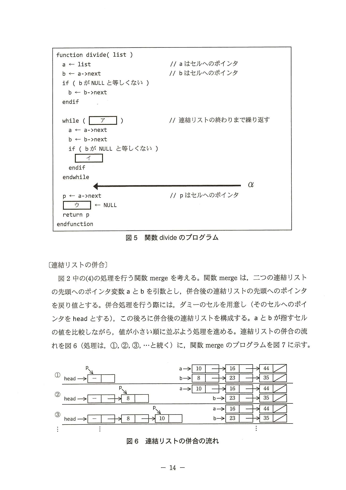

テキスト (OCR)

function divide( list )

a で list            // a はセルへのポインタ
b て a->next                  // b はセルへのポインタ

if ( bがNULL と等しくない )
b て b->next
endif

while ( )           // 連結リストの終わりまで繰り返す
a < a->next
b < b->next
if ( bが NULL と等しくない )
endif
endwhile
<                      a
p て a->next           // p はセルへのボインタ

return p

endfunction

 5 Ble divide のプログラム

(連結リストの併合]

図 2 中の(④の処理を行う関数 merge を考える。関数 merge は, 二つの連結リスト
の先頭へのポインタ変数 a と b を引数とし, 併合後の連結リスドの先頭へのポインタ
を戻り値とする。併合処理を行う際には, ダミーのセルを用意し (そのセルへのポイ
ンタを head とする), この後ろに併合後の連結リストを構成する。a と b が指すセル
の値を比較しながら, 値が小さい順に並ぶよう処理を進める。連結リストの併合の流
れを図 6 (処理は, ①, ©, ③, …と続く) に, 関数 merge のプログラムを図 7 に示す。

。 ON          >> poe ヨコォタルレン
head-ぁ|-| |                vf s | 一 1 5レン
iN             a>[10 | 一ie | 4

By         he コ
® eae >= | E38 Tp)    vs | 5レン|
図6 連結リストの併合の流れ

ー 14 一

### ページ 15

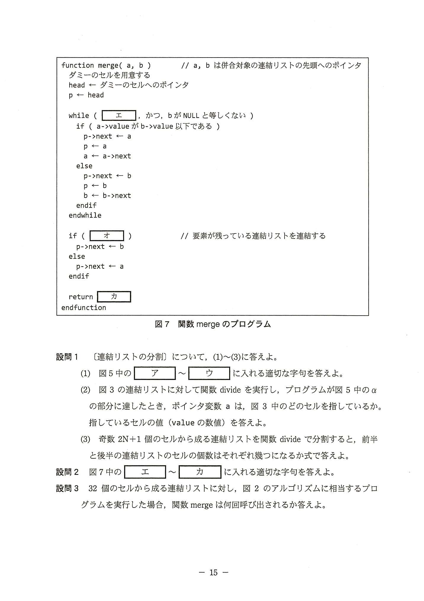

テキスト (OCR)

function merge( a, b )      // a, b は併合対象の連結リストの先頭へのポインタ
ダミーのセルを用意する
head ダミーのセルへのポインタ
p < head

while ( | エ |, かつ, bがNULLと等しくない )
if ( a->value がb->value 以下である )
p->next <- a
psa
a で a->next
else
p->next < b
pb
b て b->next
endif
endwhile

if ( )          // 要素が残っている連結リストを連結する
p->next <— b

else
p->next <- a

endif

return

endfunction

 7 関数 merge のプログラム

設問1 [連結リストの分割] について, Q①て(⑬)に答えよ。
Q①) 図5中の| ア |~| ウ |に入れる適切な字句を答えよ。
(2) 3 の連結リストに対して関数 divide を実行し プログラムが図 5 中のgw
の部分に達したとき, ボインタ変数 a は, 図 3 中のどのセルを指しているか。
指しているセルの値 (value の数値) を答えよ。
(3) 奇数 2N十1 個のセルから成る連結リストを関数 divide で分割すると, 前半
と後半の連結リストのセルの個数はそれぞれ幾つになるか式で答えよ。
設問2 図7中の| エ |~[ カヵカ |に入れる適切な字句を答えよ。
設問3 32 個のセルから成る連結りストに対し, 図 2 のアルゴリズムに相当するプロ
グラムを実行した場合, 関数 merge は何回呼び出されるか答えよ。

ー 15 一

### ページ 16

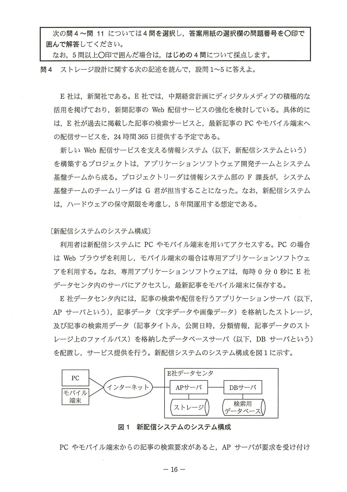

テキスト (OCR)

次の間4 て問 11 については4 問を選択し, 答案用紙の選択欄の問題番号を〇印で
囲んで解答してください。
なお, 5 問以上〇印で囲んだ場合は, はじめの 4 問について採点します。

間4 ストレージ設計に関する次の記述を読んで, 設問1<5 に答えよ。

E 社は, 新聞社である。E 社では, 中期経営計画にディジタルメディアの積極的な
活用を掲げており, 新聞記事の Web 配信サービスの強化を検討している。具体的に
は, E 社が過去に掲載した記事の検索サービスと, 最新記事の PC やモバイル端末へ
の配信サービスを, 24 時間 365 日提供する予定である。

新しい Web 配信サービスを支える情報システム (以下, 新配信システムという)
を構築するプロジェクトは, アプリケーションソフトウェア開発チームとシステム
基盤チームから成る。プロジェクトリーダは情報システム部のF MEM, システム
基盤チームのチームリーダは G 君が担当することになった。なお, 新配信システム
は, ハードウェアの保守期限を考慮し, 5 年間運用する想定である。

〔新配信システムのシステム構成〕

利用者は新配信システムに PC やモバイル端末を用いてアクセスする。PC の場合
は Web ブラウザを利用し, モバイル端末の場合は専有アプリケーションソフトウェ
アを利用する。なお, 専用アプリケーションソフトウェアは, 毎時0分0秒にE社
データセンタ内のサーバにアクセスし, 最新記事をモバイル端末に保存する。

E 社データセンタ内には, 記事の検索や配信を行うアプリケーションサーバ (以下
AP サーバという), 記事データ (文字データや画像データ) を格納したストレージ,
及び記事の検索用データ (記事タイトル, 公開日時, 分類情報, 記事データのスト
レージ上のファイルパス) を格納したデータベースサーバ (以下, DB サーバという)
を配置し, サービス提供を行う。新配信システムのシステム構成を図 1 に示す。

PC                          E社データセンタ
インターネット        APサーバ         DBサーバ
モバイル                                1                 |
端末                       5
_—         検索用
Ga) (a,

図1 新配信システムのシステム構成
PC やモバイル端末からの記事の検索要求があると, AP サーバが要求を受け付け

ー 16 一

### ページ 17

テキスト (OCR)

て, DB サーバを用いて記事を検索した後, 検索条件に合致する記事が存在する場合
には, ストレージ内に格納された記事データを PC やモバイル端末へ送信する。

〔データ量の調査]
G 君は, 新配信システム稼働開始時の記事データ量と, 稼働開始から想定運用期間
満了までの記事データ発生量を調査した。記事データ量調査の結果を図 2 に示す。

稼働開始時の記事データ量
・記事件数                    900,000 件
・平均データ量        100kバイトンノ件
稼働開始後の記事データ発生量
・稼働開始年度の件数        20,000 件
・2 年目以降の増加率     20%ノ年
・平均データ量         稼働開始時から変化なし

 2 記事データ量調査の結果

(性能指標とその目標値の定義)

E 社の情報システムガイドラインでは, Web システムは, 利用者が画面上のボタン
を押してから, 結果が全て画面に表示されるまでの| a | を性能指標とし, 目
標値を 2.0 秒と規定している。

しかし, 新配信システムの場合は, 利用者側のインターネット回線や PC, モバイ
ル端末の性能の影響を受けるので, | a | を性能指標とすることは困難である。
そこで G BS, AP サーバが検索要求を受け付けてから検索結果の最初のデータを送
信し始めるまでの| b | を性能指標とし, 目標値を 0.5秒とするととにした。

また, 単位時間当たりに処理できる件数を示す | c | については, 現在のE
往信システムへのアクセス件数を茎に。 ARABIC ES 7 72 AK
を考慮した最大アクセス件数を目標値とすることにした。

〔ストレージ設計〕
G 君は, 新配信システムの特性からストレージに対する要件を整理し, 複数のハー
ドディスク装置を組み合わせる①RAID 構成を用いたストレージの採用を検討した。
Q) ディスク容量
想定運用期間満了時に②全記事データを格納できるディスク容量が必要である。

ー 17 -

### ページ 18

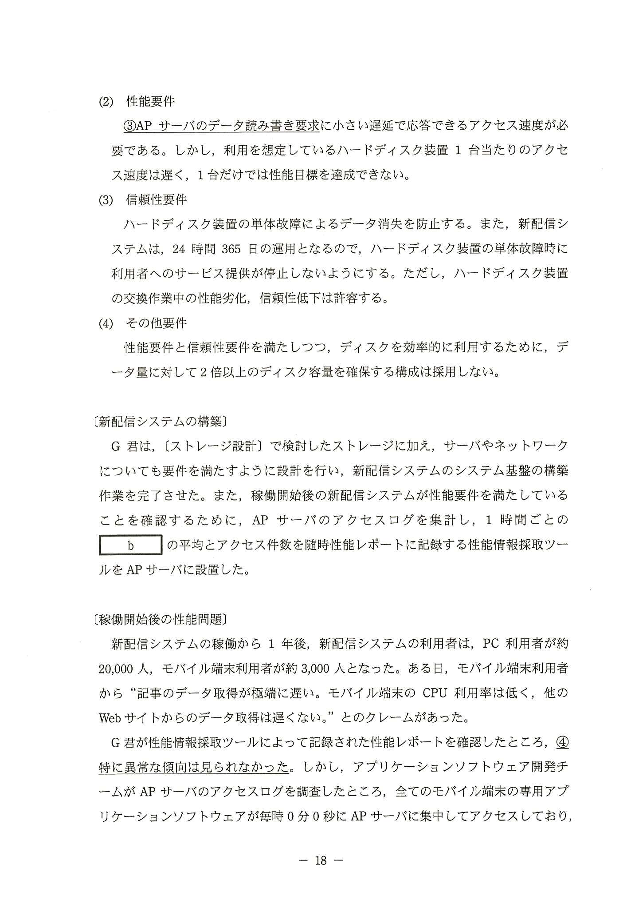

テキスト (OCR)

(2) 性能要件
@AP サーバのデータ読み書き要求に小さい遅延で応答できるアクセス速度が必
要である。しかし, 利用を想定しているハードディスク装置 1 台当たりのアクセ
ス速度は遅く, 1 台だけでは性能目標を達成できない。
(3) 信頼性要件
ハードディスク装置の単体履障によるデータ消失を防止する。また, 新配信シ
ステムは, 24 時間 365 日の運用となるので, ハードディスク装置の単体履障時に
利用者へのサービス提供が停止しないようにする。ただし, ハードディスク装置
の交換作業中の性能劣化, 信頼性低下は許容する。
(4) その他要件
性能要件と信頼性要件を満たしつつ, ディスクを効率的に利用するために, デ
ータ量に対して 2 倍以上のディスク容量を確保する構成は採用しない。

(新配信システムの構築

G Bld, (ストレージ設計) で検討したストレージに加え, サーバやネットワーク
についても要件を満たすように設計を行い, 新配信システムのシステム基盤の構築
作業を完了させた。また, 稼働開始後の新配信システムが性能要件を満たしている
ことを確認するために, AP サーバのアクセスログを集計し, 1 時間ごとの
| b | の平均とアクセス件数を随時性能レポートに記録する性能情報採取ツー
ルを AP サーバに設置した。

[稼働開始後の性能問題〕

新配信システムの稼働から 1 年後, 新配信システムの利用者は, PC 利用者が約
20,000 人, モバイル端末利用者が約 3.000 人となった。ある日, モバイル端末利用者
DS “記事のデータ取得が極端に遅い。モバイル端末の CPU 利用率は低く, 他の
Web サイトからのデータ取得は遅くない。" とのクレームがあった。

G 君が性能情報採取ツールによって記録された性能レポートを確認したところ, ©
特に異常な傾向は見られなかった。しかし, アプリケーションソフトウェア開発チ
ームが AP サーバのアクセスログを調査したところ, 全てのモバイル端末の専用アプ
リケーションソフトウェアが毎時 0 分 0 秒に AP サーバに集中してアクセスしており,

ー 18 一

### ページ 19

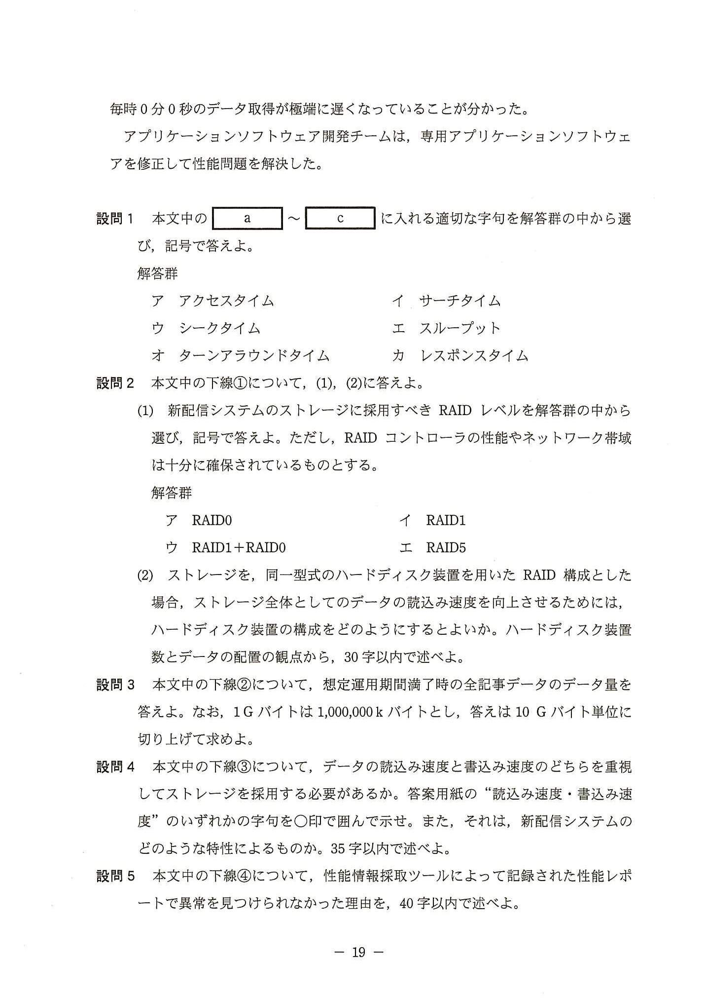

テキスト (OCR)

毎時 0 分 0 秒のデータ取得が極端に遅くなっていることが分かった。
アプリケーションソフトウェア開発チームは, 専用アプリケーションソフトウェ
アを修正して性能問題を解決した。

設問1 本文中の| a |~| c | に入れる適切な字句を解答格の中から選
び, 記号で答えよ。

解答群
ア アクセスタイム        of EPO
ウ シークタイム          エ スループット
A ターンアラウンドタイム    A レスポンスタイム

設問2 本文中の下線のについて, ①, ②⑫)に答えよ。
Q) 新配信システムのストレージに採用すべき RAID レベルを解答群の中から
選び, 記号で答えよ。ただし, RAID コントローラの性能やネットワーク葵域
は十分に確保されているものとする。

Dili

解答群
ア RAIDO                                                 イ RAID1
ウ RAID1+RAIDO                                 = RAIDS

(2) ストレージを, 同一型式のハードディスク装置を用いた RAID 構成とした
場合 ストレージ全体としてのデータの読込み速度を向上させるためには,
ハードディスク装置の構成をどのようにするとよいか。ハードディスク装置
数とデータの配置の観点から, 30 字以内で述べよ。

設問3 本文中の下線②について, 想定運用期間満了時の全記事データのデータ量を
答えよ。なお, 1G バイトは 1.000,000 k バイトとし, 答えは 10 G バイト単位に
切り上げて求めよ。

設問4 本文中の下線について, データの読込み速度と書込み速度のどちらを重視

してストレージを採用する必要があるか。答案用紙の “読込み速度・書込み束

度′ のいずれかの宇旬を〇印で囲んで示せ。また, それは, 新配信システムの

どのような特性によるものか。35 字以内で述べよ。

設問5 本文中の下線について, 性能情報採取ツールによって記録された性能レポ
ートで異常を見つけられなかった理由を, 40 字以内で述べよ。

ー 19 一

### ページ 20

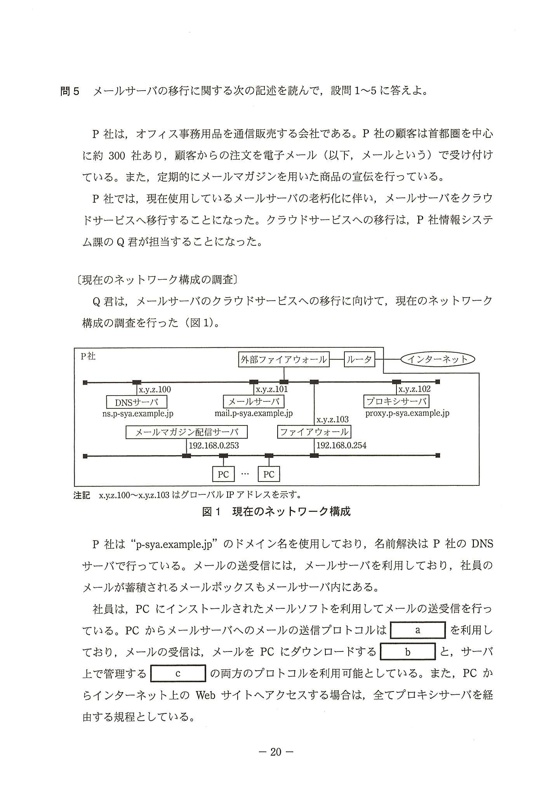

テキスト (OCR)

問5 メールサーバの移行に関する次の記述を読んで, 設問15 に答えよ。

P 社は,. オフィス事務用品を通信販売する会社である。 P 社の顧客は首都圏を中心
に約 300 社あり, 顧客からの注文を電子メール (UF, AW EWS) で受け付け
ている。また, 定期的にメールマガジンを用いた商品の宣伝を行っている。

P 社では, 現在使用しているメールサーバの老朽化に伴い, メールサーバをクラウ
ドサービスへムへ移行することになった。クラウドサービスへの移行は, P 社情報システ
ム課の Q 君が担当することになった。

〔現在のネットワーク構成の調査〕
Q Ald, メールサーバのクラウドサービスへの移行に向けて, 現在のネットワーク
構成の調査を行った (図1)。

Pat                     [ER ee  ルトルーターー<イシターネットウ>

|
x.y.Z.100                                x ro The +                                          x.y.Z.102
DNSサーバ          | メールサーバ |
x.y.z.103

ns.p-sya.example.jp              mail.p-sya.example.jp                        proxy.p-sya.example.jp

| メールマガジン配信サーバ |     |ファイアウォール|
IE 168.0.253                  921680254

         ce] ~ Fe

注記 x.yz.100てx.yz.103 はグローバル IP アドレスを示す。
 1 現在のネットワーク構成

P 社は “p-sya.example.jp のドメイン名を使用しており, 名前解決は P 祉の DNS
サーバで行っている。メールの送受信には, メールサーバを利用しており, 社員の
メールが著積されるメールボックスもメールサーバ内にある

社員は, PC にインストールされたメールソフトを利用してメールの送受信を行っ
ている。PC からメールサーバへのメールの送信プロトコルは|  a | を利用し
TBD, メールの受信は, メールを PC にダウンロードする|  b |と, サーバ
上で管理する の両方のプロトコルを利用可能としている。また, PC か
らインターネット上の Web サイトヘアクセスする場合は, 全てプロキシサーバを経
申する規程としている。

ー 20 一

### ページ 21

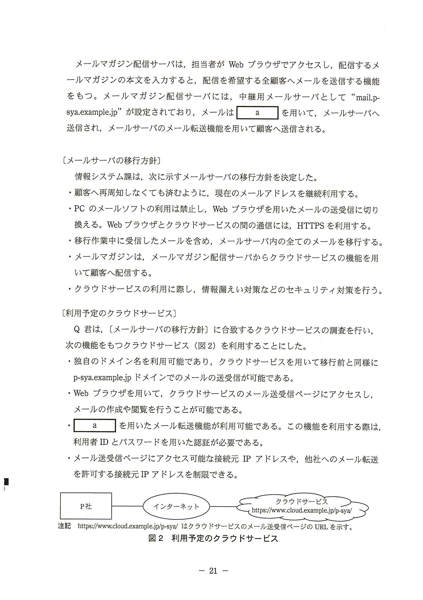

テキスト (OCR)

メールマガジン配信サーバは, 担当者が Web ブラウザでアクセスし, 配信するメ
ールマガジンの本文を入力すると, 配信を希望する全顧客へメールを送信する機能
をもつ。メールマガジン配信サーバには, 中継用メールサーバとして “mailp-
sya.example.jp "が設定されており, メールは| sa | を用いて, メールサーバへ
送信され, メールサーバのメール転送機能を用いて顧客へ送信される。

〔メールサーバの移行方針〕

情報システム課は, 次に示すメールサーバの移行方針を決定した。

・ 顧客へ再周知しなくても済むように, 現在のメールアドレスを継続利用する。

・PC のメールソフトの利用は禁止し, Web ブラウザを用いたメールの送受信に切り
換える。Web ブラウザとクラウドサービスの間の通信には, HTTPS を利用する。

・移行作業中に受信したメールを含め、 メールサーバ内の全てのメールを移行する。

・メールマガジンは, メールマガジン配信サーバからクラウドサービスの機能を用
いて顧客へ配信する。

・クラウドサービスの利用に際し, 情報漏えい対策などのセキュリティ対策を行う。

(利用予定のクラウドサービス)〕
Q 君は,〔メールサーバの移行方針〕 に合致するクラウドサービスの調査を行い,
次の機能をもつクラウドサービス (図 2) を利用することにした。
・独自のドメイン名を利用可能であり, クラウドサービスを用いて移行前と同様に
p-Sya.example.jp ドメインでのメールの送受信が可能である。
・Web ブラウザを用いて, クラウドサービスのメール送受信ページにアクセスし,
メールの作成や閲覧を行うことが可能である。
・ | 3』 | を用いたメール岐送機能が利用可能である。 この機能を利用する際は,
利用者 ID とパスワードを用いた認証が必要である。
・メール送受信ページにアクセス可能な接続元 TP アドレスや, 他社へのメール転送
を許可する接続元 P アドレスを制限できる。

タタジウドサービス
『社                                                                                           https://www.cloud.example.jp/p-sya/

注記 https://wwwcloud.example.jp/p-sya/ はクラウドサービスのメール送受信ページの URL を示す。
 2 利用予定のクラウドサービス

— 921 一

### ページ 22

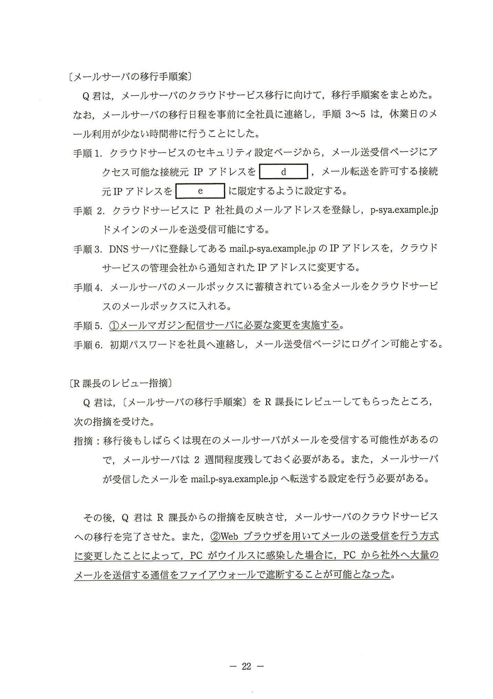

テキスト (OCR)

[メールサーバの移行手順案〕
Q 君は, メールサーバのクラウドサービス移行に向けて, 移行手順案をまとめた。
BB, メールサーバの移行日程を事前に全社員に連絡し, 手順 3~5 は, 休業日のメ
ール利用が少ない時間帯に行うことにした。
手順 1.、 クラウドサービスのセキュリティ設定ページから, メール送受信ページにア
クセス可能な接続元 P アドレスを|  q |, メール岐送を許可する接続
元P アドレスを| ce | に限定するように設定する。

手順 2. クラウドサービスに P 社社員のメールアドレスを登録し, p-sya.example.jp
ドメインのメールを送受信可能にする。

手順 3. DNS サーバに人冶録してある mailp-sya.example.jp のIP アドレスを, クラウド
サービスの管理会社から通知された IP アドレスに変更する。

手順4. メールサーバのメールボックスに蓄積されている全メールをクラウドサービ
スのメールボックスに入れる。

手順5. ①メールマガジン配信サーバに必要な変更を実施する。

手順 6. 初期パスワードを社員へ連絡し, メール送受信ページにログイン可能とする。

[R 課長のレビュー指摘
Q Blt, 【メールサーバの移行手順案〕 を R 課長にレビューしてもらったところ,
次の指摘を受けた。
指摘 : 移行後もしばらくは現在のメールサーバがメールを受信する可能性があるの
で, メールサーバは 2 週間程度残しておく必要がある。また, メールサーバ
が受信したメールを mailLp-sya.example.jp へ転送する設定を行う必要がある。

その後, Q 君は R 課長からの指摘を反映させ, メールサーバのクラウドサービス
への移行を完了させた。また, ②Web ブラウザを用いてメールの送受信を行う方式
に変更したことによって, PC がウイルスに感染した場合に, PC から社外へ大量の
メールを送信する通信をファイアウォールで遮断することが可能となった。

ー 22 一

### ページ 23

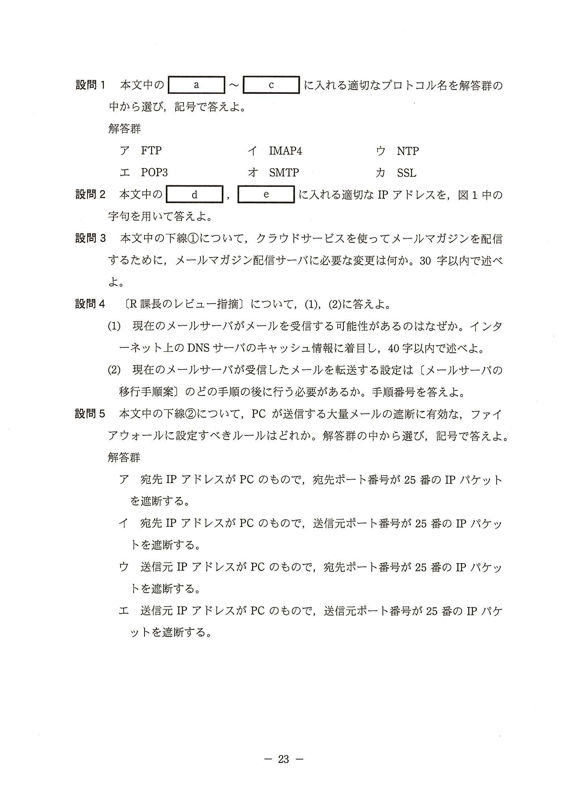

テキスト (OCR)

設問1 本文中の| a |~|  c |に入れる適切なプロトコル名を解答群の
中から選び, 記号で答えよ。

解答群
ア FTP       イ IMAP4      ウ NTP
エエ POP3       オ SMTP      A SSL
設問2 本文中の| a |, |  e |に入れる適切な P アドレスを, 図1中の
字句を用いて答えよ。

設問3 本文中の下線やについて, クラウドサービスを使ってメールマガジンを配信
するために, メールマガジン配信サーバに必要な変更は何か。30 字以内で述べ
Rs
設問4  R課長のレビュー指摘] について, (1), @ICHAK.
(1) 現在のメールサーバがメールを受信する可能性があるのはなぜか。インタ
ーネット上の DNS サーバのキャッシュ情報に着目し, 40 字以内で述べよ。
(2) 現在のメールサーバが受信したメールを転送する設定は 【メールサーバの
移行手順案〕」 のどの手順の後に行う必要があるか。手順番号を答えよ。
設問5 本文中の下線②について, PC が送信する大量メールの遮断に有効な, ファイ
アウォールに設定すべきルールはどれか。 解答群の中から選び, 記号で答えよ。

解答群

ア 爺先IP アドレスが PC のもので, 苑先ボート番号が 25 BO IP パケット
を遮断する。

イ 宛先IP アドレスが PC のもので, 送信元ボポート番号が 25 番の IP パケッ
トを遮断する。

ウ 送信元IP アドレスが PC ODOT, 宛先ポート番号が 25 BO IP パケッ
トを遮断する。

エエ 送信元 IP アドレスが PC のもので, 送信元ポート番号が 25 BO IP パケ
ットを遮断する。

### ページ 24

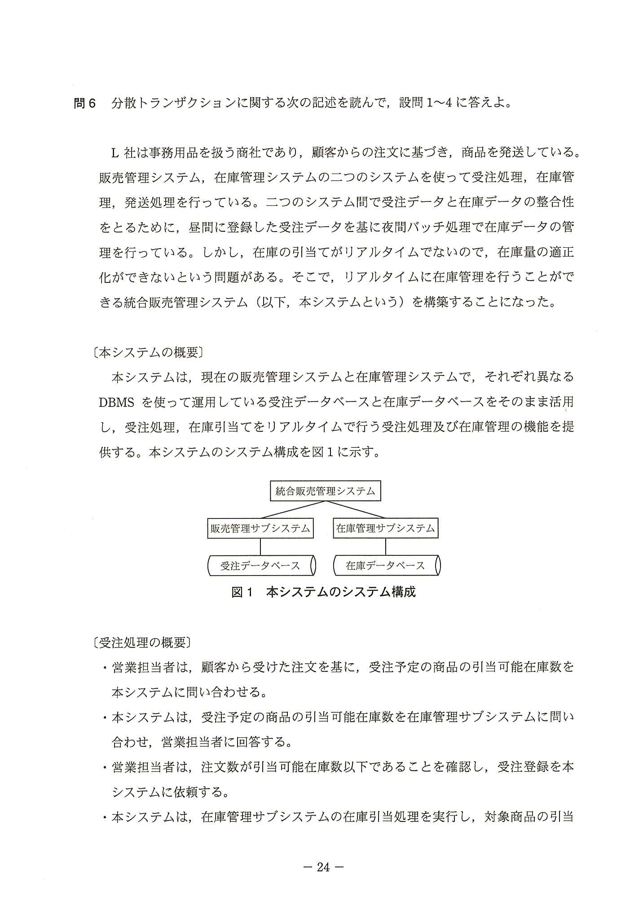

テキスト (OCR)

間6 分散トランザクションに関する次の記述を読んで, 設問 1て4 に答えよ。

L 社は事務用品を扱う商社であり, 顧客からの注文に基づき, 商品を発送している。
販売管理システム, 在庫管理システムの二つのシステムを使って受注処理, ERE
理, 発送処理を行っている。二つのシステム間で受注データと在庫データの整合性
をとるために, 昼間に登録した受注データを基に夜間バッチ処理で在庫データの管
理を行っている。しかし, 在庫の引当てがリアルタイムでないので, 在庫量の適正
化ができないという問題がある。そこで, リアルタイムに在庫管理を行うことがで
きる統合販売管理システム (以下, 本システムという) を構築することになった。

(KY AF LOWE)

本システムは, 現在の販売管理システムと在庫管理システムで, それぞれ異なる
DBMS を使って運用している受注データベースと在庫データベースをそのまま活用
し, 受注処理, 在庫引当てをリアルタイムで行う受注処理及び在庫管理の機能を提
供する。本システムのシステム構成を図 1 に示す。

統合販売管理システム

| 販売管理サブシステム| |在庫管理サブシステム

( 受注データベース [) ( 在障データベース ()
Bi 本システムのシステム構成

[受注処理の概要]

・営業担当者は, 顧客から受けた注文を基に, 受注予定の商品の引当可能在庫数を
本システムに問い合わせる。

・本システムは, 受注予定の商品の引当可能在庫数を在庫管理サブシステムに問い
合わせ, 営業担当者に回答する。

・営業担当者は, 注文数が引当可能在庫数以下であることを確認し, 受注登録を本
システムに依頼する。

・本システムは, 在庫管理サブシステムの在庫引当処理を実行し, 対象商品の引当

ー 24 一

### ページ 25

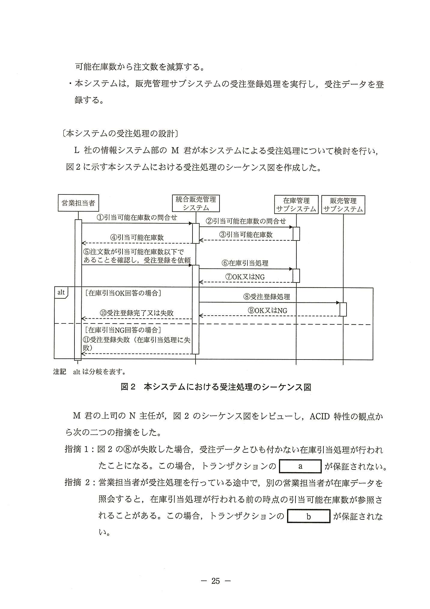

テキスト (OCR)

可能在庫数から注文数を減算する。
・本システムは, 販売管理サブシステムの受注登録処理を実行し, BETA eR
録する。

〔本システムの受注処理の設計〕
L 社の情報システム部の M 君が本システムによる受注処理について検討を行い,
 2 に示す本システムにおける受注処理のシーケンス図を作成した。

Gea         Has       在庫管理 || 販売管理

業担当者           システム        サプシステム| |サプシステム
上  ①引可能在庫数の問合せ | osu aeecmomee |
④引当可能在庫数    | ⑨引当可能在庫数。|

⑤注文数が引当可能在庫数以下で   |
あることを確認し, 受注意録を依頼         ⑥在庫引当処理

| okxswe | |

alt       [在庫引当OK回答の場合]                            @受注意録処理

⑩受注登録完了又は失敗         し QDOKKING |ia

[在庫引当NG回答の場合
受注登録失敗 (在庫引当処理に失

ーー|
注記 alt は分岐を表す。
図2 本システムにおける受注処理のシーケンス図

IM 君の上司の N 主任が, 図 2 のシーケンス図をレビューし, ACI 特性の観点か

ら次の二つの指摘をした。

指摘 1 : 図 2 の⑧が失敗した場合 受注データとひも付かない在庫引当処理が行われ
たことになる。 とこの場合, トランザクションの|  a | が保証されない。

指摘 2 : 営業担当者が受注処理を行っている途中で, 別の営業担当者が在庫データを
照会すると, TEMS MURA DN SMO AO TY WATE MMOS S
れることがある。 この場合, トランザクションの|  b | が保証されな
い。

ー 25 一

### ページ 26

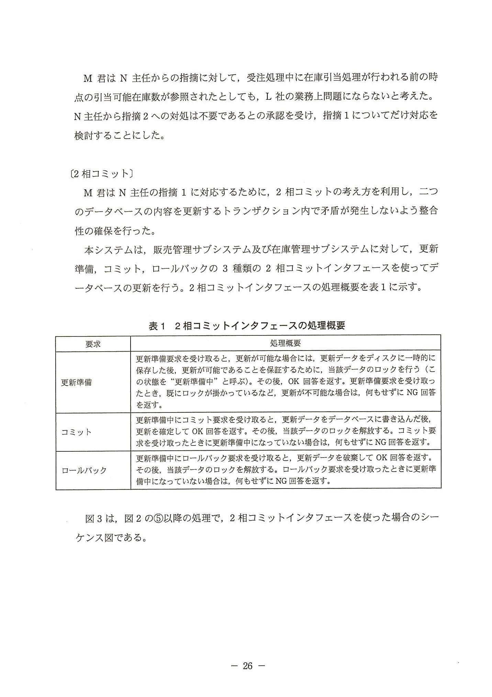

テキスト (OCR)

M 君は N 主任からの指摘に対して, 受注処理中に在庫引当処理が行われる前の時
点の引当可能在庫数が参照されたとしても, L 社の業務上問題にならないと考えた。
N 主任から指摘 2 への対処は不要であるとの承認を受け, 指摘1 についてだけ対応を
検討することにした。

〔2 相コミット〕

M Sli N 主任の指摘 1 に対応するために, 2 相コミットの考え方を利用し, =O
のデータベースの内容を更新するトランザクション内で矛盾が発生しないよう整合
性の確保を行った。

本システムは, 販売管理サブシステム及び在庫管理サブシステムに対して, 更新
準備, コミット, ロールバックの 3 種類の 2 相コミットインタフェースを使ってデ
ータベースの更新を行う。2 相コミットインタフェースの処理概要を表 1 に示す。

表1 2相コミットインタフェースの処理概要

要求

処理概要

更新準備

更新準備要求を受け取ると, 更新が可能な場合には, 更新データをディスクに一時的に
保存した後, 更新が可能であることを保証するために, 当該データのロックを行う (こ
の状態を "更新準備中" と呼ぶ)。 その後, OK 回答を返す。更新準備要求を受け取っ
たとき, 既にロックが掛かっているなど, 更新が不可能な場合は, 何もせずに NG 回答
を返す。

更新準備中にコミット要求を受け取ると, 更新データをデータベースに書き込んだ後,
更新を確定して OK 回答を返す。その後, 当該データのロックを解放する。コミット要
求を受け取ったときに更新準備中になっていない場合は, 何もせずに NG 回答を返す。

ロールバック

更新準備中にロールバック要求を受け取ると, 更新データを破棄して OK 回答を返す。
その後, 当該データのロックを解放する。ロールバック要求を受け取ったときに更新準
備中になっていない場合は, 何もせずに NG 回答を返す。

 3 は, 図 2 の⑤以降の処理で, 2 相コミットインタフェースを使った場合のシー
ケンス図である。

ー 26 一

### ページ 27

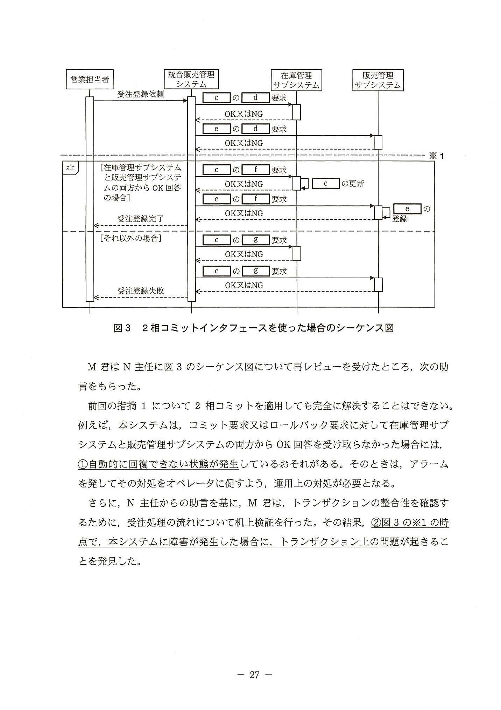

テキスト (OCR)

a  2        統合販売管理        在庫管理      販売管理
営業担当者        ウステハ        サブシステム    サプシステム
上   受注登録依頼   上 eto |
。OKXSNG
[しes ]の[3 JEx
OKXsNG |ia
ー-ー-上トー-ー-ー-一-一一一-上トー-ー-ー-ー-ー-ー~一-ートー-ー-ー-ー-ー-ー-]poses※1
alt   (emma TL AFA | | Ceo Cte
と販売管理サブシステ
ムの両方から OK回答 |し.     oxxiane | して]の更新
ome         Ce Jolt jee
6  の
ーー時7 | en
| | | Ehの場合 |しに]oLs]李| |
しokxsNe | |
Ce ]の[| 5 |e
ーーseman | ORG … ll
+           +

図3 2相コミットインタフェースを使った場合のシーケンス図

M 君は N 主任に図 3 のシーケンス図について再レビューを受けたところ, 次の助
言をもらった。

前回の指摘 1 について 2 相コミットを適用しても完全に解決することはできない。
例えば, 本システムは, コミット要求又はロールバック要求に対して在庫管理サブ
システムと販売管理サブプシステムの両方から OK 回答を受け取らなかった場合には,
①自動的に回復できない状態が発生しているおそれがある。そのときは, アラーム
を発してその対処をすペレータに促すよう, 運用上の対処が必要となる。

さらに, N 主任からの助言を基に, M Blk, トランザクションの整合性を確認す
るために, 受注処理の流れについて机上検証を行った。その結果, ②図 3 の※1 の時
AC, 本システムに障害が発生した場合に., トランザクション上の問題が起きるこ
とを発見した。

ー 27 一

### ページ 28

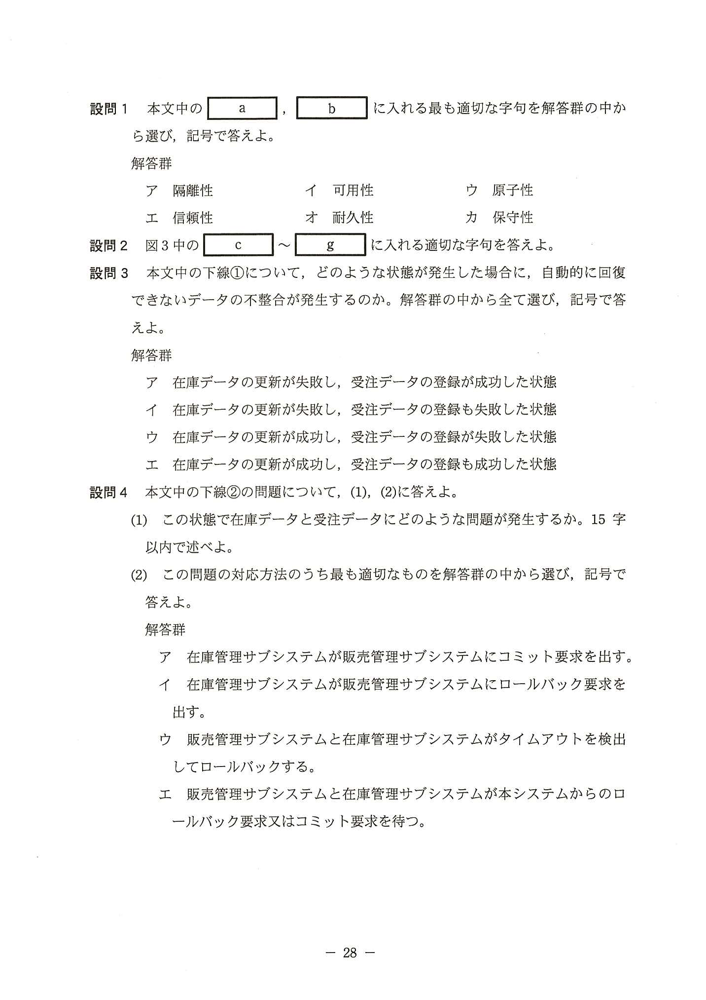

テキスト (OCR)

設問1 本文中の| a |,|  b | に入れる最も適切な字句を解答群の中か
ら選び, 記号で答えよ。
解答衝
ア Wee       イ 可用性       ウ 原子性
エ 信頼性       オ 耐久性       カ 保守性

設問2 図3中の| c |て|  g |に入れる適切な字句を答えよ。
設問3 本文中の下線①について, どのような状態が発生した場合に, 自動的に回復
できないデータの不整合が発生するのか。解答群の中から全て選び, 記号で答
よ。
it
ア 在庫データの更新が失敗し, 受注データの登録が成功した状態
イ 在庫データの更新が失敗し, 受注データの登録も失敗した状態
ウ 在庫データの更新が成功し, 受注データの登録が失敗した状態
エエ 在庫データの更新が成功し, 受注データの登録も成功した状態
設問4 本文中の下線②の問題について, (D, ②)に答えよ。
Q①) この状態で在庫データと受注データにどのような問題が発生するか。15 字

Sw

解

ne

以内で述べよ

(2) この問題の対応方法のうち最も適切なものを解答群の中から選び, 記号で

答えよ。

解答群
ア 在庫管理サブシステムが販売管理サブシステムにコミット要求を出す。
イ 在庫管理サブシステムが販売管理サブプシステムにロールバック要求を
出す。

ウ 販売管理サブシステムと在庫管理サブシステムがタイムアウトを検出
してロールバックする。

エエ 販売管理サブシステムと在庫管理サブシステムが本システムからのロ
ールバック要求又はコミット要求を待つ。

ー 28 一

### ページ 29

テキスト (OCR)

CA モ 用 紙 J

ー 29 一

### ページ 30

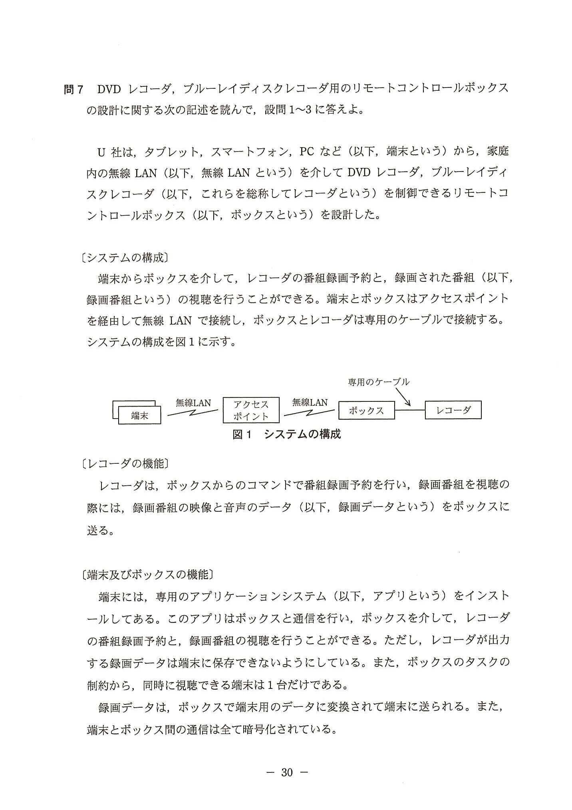

テキスト (OCR)

問7 DVD レコーダ, ブルーレイディスクレコーダ用のリモートコントロールボックス
の設計に関する次の記述を読んで, 設問13 に答えよ。

U 社は, タブレット, スマートフォン, PC RE (以下, 端末という) DS, RE
内の無線 LAN (以下, 無線 LAN という) を介して DVD レコーダ, プルーレイディ
スクレコーダ (以下, これらを総称してレコーダという) を制御できるリモートコ
ントロールボックス (以下, ボックスという) を設計した。

[システムの構成〕

端末からボックスを介して, レコーダの番組録画予約と, 録画された番組 (以下,
録画番組という) の視聴を行うことができる。端末とボックスはアクセスポイント
を経由して無線 LAN で接続し, ボックスとレコーダは専用のケーブルで接続する。
システムの構成を図 1 に示す。

専用のケーブル

図1 システムの構成

〔レコーダの機能]
レコーダは, ボックスからのコマンドで番組録画予約を行い, 録画番組を視聴の
際には, 録画番組の映像と音声のデータ (以下, 録画データという) をボックスに

〔端末及びボックスの機能]

端末には, 専用のアプリケーションシステム (以下,アプリという) をインスト
ールしてある。とのアプリはボックスと通信を行い。ボックスを介して, レコーダ
の番組録画予約と, 録画番組の視聴を行うことができる。ただし, レコーダが出力
する録画データは端末に保存できないようにしている。また, ボックスのタスクの
制約から, 同時に視聴できる端末は 1 BEIT TCHS.

録画データは, ボックスで端末用のデータに変換されて端末に送られる。また,
端末とボックス間の通信は全て暗号化されている。

### ページ 31

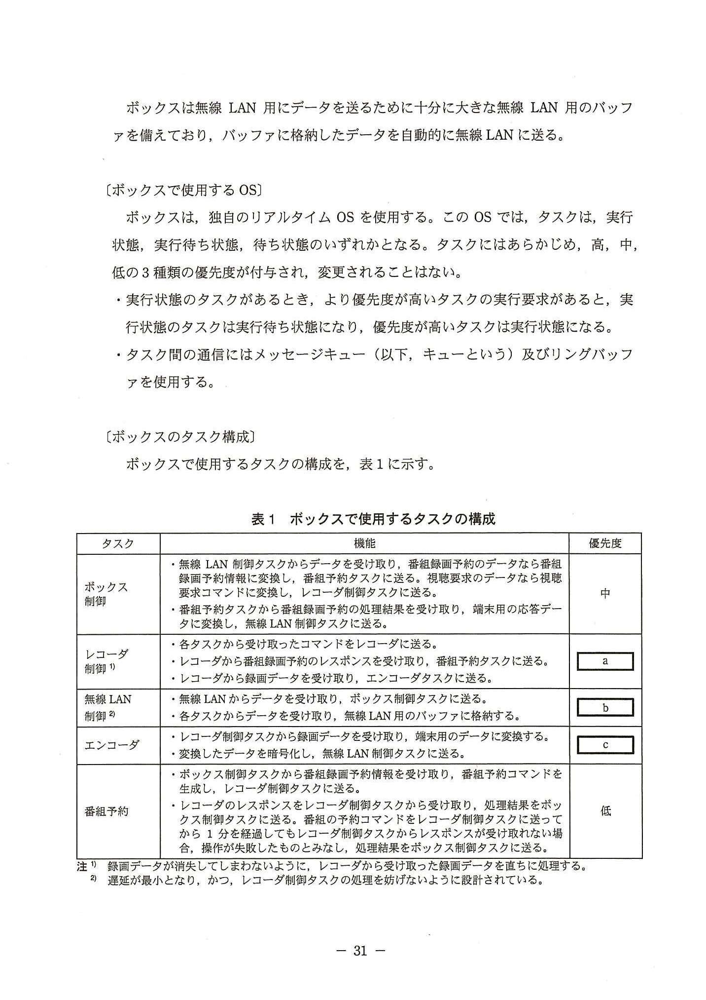

テキスト (OCR)

ボックスは無線 LAN 用にデータを送るために十分に大きな無線 LAN 用のバッフ
ァを備えており, バッファに格納したデータを自動的に無線 LAN に送る。

〔ボックスで使用する OS)
ボックスは, 独自のリアルタイム OS を使用する。この 0S では, タスクは, 実行
状態, 実行待ち状態, 待ち状態のいずれかとなる。タスクにはあらかじめ, 高, 中,
{KO 3 種類の優先度が付与され, 変更されることはない。
・実行状態のタスクがあるとき, より優先度が高いタスクの実行要求があると, 実
行状態のタスクは実行待ち状態になり, 優先度が高いタスクは実行状態になる。
・タスク間の通信にはメッセージキュー (以下,キューという) 及びリングバッフ
ァを使用する。

〔ボックスのタスク構成〕
ボックスで使用するタスクの構成を, 表 1 に示す。

表1 ボックスで使用するタスクの構成

タスク                                                                機能                                                              優先度

ALAN 制御タラスクからデータを受け取り, 番組録画予約のデータなら番組
“es      録画予約情報に変換し, BAPOI AICS, MEEROT IR SBE
ボックス    要求コマンドに変換し。 レコーダ制御タスクに送る。

;                                    中

nA     ・番組予約タスクから番組録画予約の処理結果を受け取り, 端末用の応答デー
タに変換し, 無線 LAN 制御タスクに送る。

x       ・各タスクから受け取ったコマンドをレコーダに送る。

ae     /LI-FPSRARHFNOLARYARLGMO, 番組予約タスクに送る。 | | sa |
・レコーダから録画データを受け取り, エンコーダタスクに送る。

無線LAN       ・無線 LAN からデータを受け取り, ボックス制御タスクに送る。               Lェ 」

制御    ・各タスクからデータを受け取り, 無線LAN 用のパッファに格納する。

エンコーダ      ・レコーダ制御タスクから録画データを受け取り, 端末用のデータに変換する。

・変換したデータを暗号化し, 無線 LAN 制御タスクに送る。

・ボックス制御タスクから番組録画予約情報を受け取り, 番組予約コマンドを
生成し,。 レコーダ制御タスクに送る。

番組予約      ・レコーダのレスポンスをレコーダ制御タスクから受け取り, 処理結果をボッ     低
クス制御タスクに送る。番組の予約コマンドをレコーダ制御タスクに送って
から 1 分を経過してもレコーダ制御タスクからレスポンスが受け取れない場
合, 操作が失敗したものとみなし, 処理結果をボックス制御タスクに送る。

ED 録画データが消失してしまわないように, レコーダから受け取った録画データを直ちに処理する。
9 補延が最小となり, PO, レコーダ制御タスクの処理を妨げないように設計されている。

ー 31 一

### ページ 32

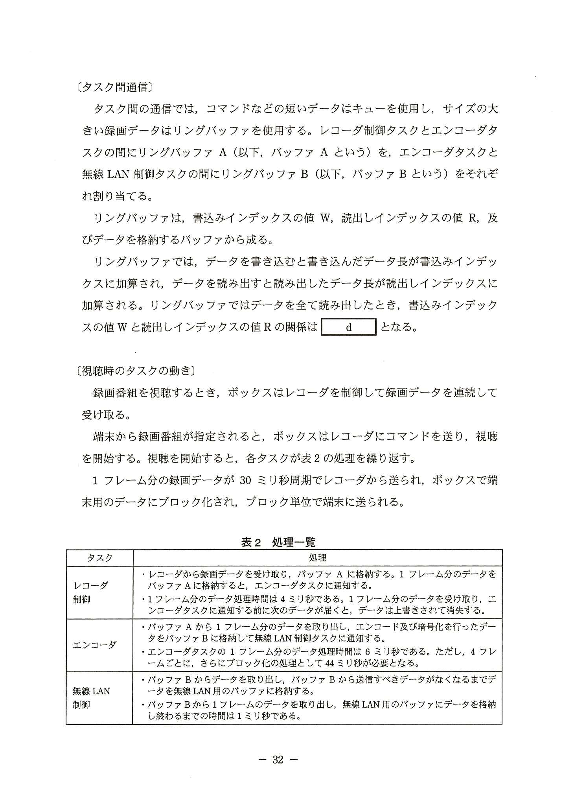

テキスト (OCR)

(タスク問通信)

タスク間の通信では, コマンドなどの短いデータはキューを使用し, サイズの大
きい録両データはリングパッファを使用する。レコーダ制御タスクとエンコーダタ
スクの間にリングパッファ 4 (以下,パッファ A という) を, エンコーダタスクと
無線 LAN 制御タスクの間にリングパッファ B (以下, バッファ B という) BENE
れ割り当てる。

リングバッファは, 書込みインデックスの値 W, 読出しインデックスの値 R。 及
びデータを格納するパッファから成る。

リングパッファでは, データを書き込むと書き込んだデータ長が書込みインデッ
クスに加算され, データを読み出すと読み出したデータ長が読軸しインデックスに
加算される。リングパッファではデータを全て読み出したとき, 書込みインデック
スの値 W と読出しインデックスの値 R の関係は| d |] となる。

〔視聴時のタスクの動き〕

録画番組を視聴するとき, ボックスはレコーダを制御して録画データを連続して
受け取る。

端末から録画番組が指定されると, ボックスはレコーダにコマンドを送り, 視聴
を開始する。視聴を開始すると, 各タスクが表 2 の処理を繰り返す。

1 フレーム分の録画データが 30 ミリ秒周期でレコーダから送られ, ボックスで端
末用のデータにブロック化され, ブロック単位で端末に送られる。

表2 処理一覧
タスク                               処理
・レコーダから録画データを受け取り, バッファ A に格納する。1 フレーム分のデータを
レコーダ    バッファ Aに格納すると, エンコーダタスクに通知する。
制御     ・1 フレーム分のデータ処理時間は 4 ミリ秒である。1 フレーム分のデータを受け取り, エ

ンコーダタスクに通知する前に次のデータが届くと, データは上書きされて消失する。

・バパッファ A から 1 フレーム分のデータを取り出し, エンコード及び暗号化を行ったデー
タをバッファ B に格納して無線 LAN 制御タスクに通知する。

エンコーダ | .エンコーダタスクの 1 フレーム分のデータ処理時間は 6 ミリ秒である。ただし, 4 フレ
ームごとに, さらにブロック化の処理として 44 ミリ秒が必要となる。
・パッファ B からデータを取り出し,。 パッファ B から送信すべきデータがなくなるまでデ
無線 LAN    ータを無線 LAN 用のバッファに格納する。
制御     ・パッファ Bから 1フレームのデータを取り出し, 無線 LAN 用のパッファにデータを格納

し終わるまでの時間は 1 ミリ秒である。

ー 32 一

### ページ 33

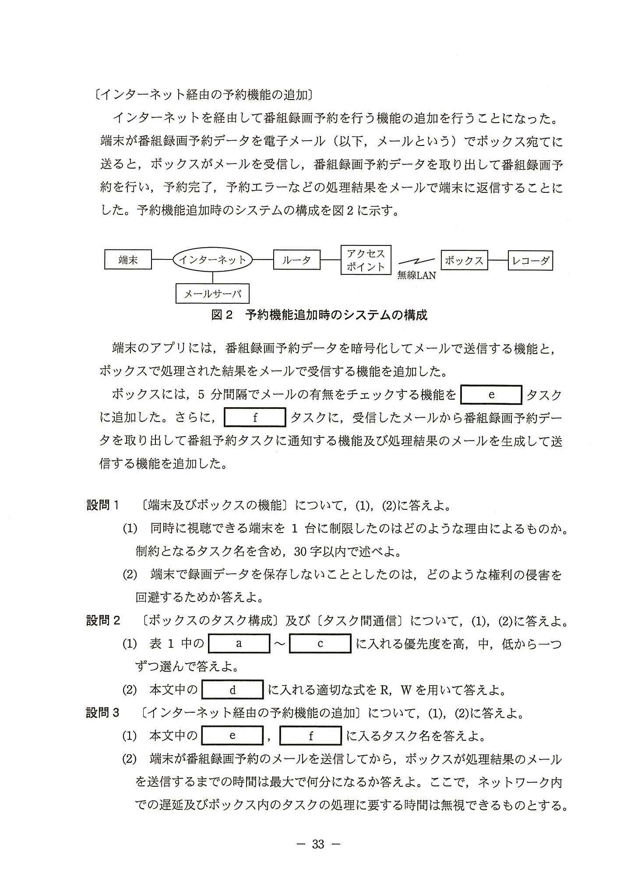

テキスト (OCR)

〔インターネット経由の予約機能の追加

インターネットを経由して番組録画予約を行う機能の追加を行うことになった。
端末が番組録画予約データを電子メール (以下, メールという) でボックス宛てに
送ると, ボックスがメールを受信し, 番組録画予約データを取り出して番組録画予
約を行い, 予約完了, 予約エラーなどの処理結果をメールで端末に返信することに
した。予約機能追加時のシステムの構成を図 2 に示す。

アクセス
ポィント | ニー    レコーダ
無線LAN

図2 予約機能追加時のシステムの構成

端末のアプリには, 番組録画予約データを喧号化してメールで送信する機能と,
ボックスで処理された結果をメールで受信する機能を追加した。

ボックスには, 5 分間硫でメールの有無をチェックする機能を| e | タスク
に人道加した。さらに, | fj | タスクに, 受信したメールから番組録画予約デー
タを取り出して番組予約タスクに通知する機能及び処理結果のメールを生成して送
信する機能を追加した。

設問1 [端末及びボックスの機能〕について, ①⑪, ⑫)に答えよ。
(1) 同時に視聴できる端末を 1 台に制限したのはどのような理由によるものか。
制約となるタスク名を含め, 30 字以内で述べよ。
Q) 端末で録画データを保存しないこととしたのは, どのような権利の侵害を
回避するためか答えよ。
設問2 〔ボックスのタスク構成〕 及び (YAMBA) OWT, (①, (②に答えよ。
Q 表1 中の|  a |x|  c |に入れる優先度を高, 中, 低から一つ
ずつ選んで答えよ。
② 本文中の| a | に入れる適切な式を R, W を用いて答えよ。
設問3 〔インターネット経由の予約機能の追加 について, @, ②に答えよ。
Q 本文中の| ie |,| £ |に入るタスク名を答えよ。
Q) 端末が番組録画予約のメールを送信してから, ボックスが処理結果のメール
を送信するまでの時間は最大で何分になるか答えよ。こことで, ネットワーク内
での遅延及びボックス内のタスクの処理に要する時間は無視できるものとする。

### ページ 34

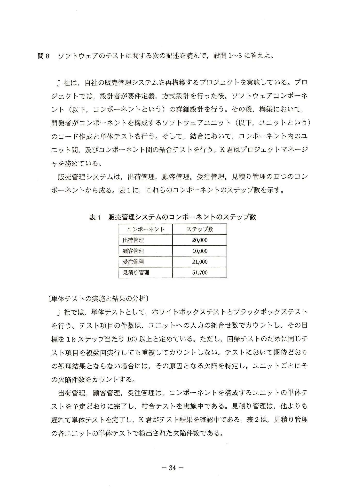

テキスト (OCR)

fal 8

ソフトウェアのテストに関する次の記述を読んで, RA1~3ICBAK.

J 社は, 自社の販売管理システムを再構築するプロジェクトを実施している。プロ
ジェクトでは, 設計者が要件定義, 方式設計を行った後, ソフトウェアコンポボーネ
ント (QR, コンポーネントという) の詳細設計を行う。 その後, 構築において,
開発者がコンポーネントを構成するソフトウェアユニット (以下, ユニットという)
のコード作成と単体テストを行う。そして, 結合において, コンポーネント内のユ
ニット間, 及びコンボーネント間の結合テストを行う。K 君はプロジェクトマネージ
ャを務めている。

販売管理システムは, 出荷管理, 顧客管理, 受注管理, 見積り管理の四つのコン
ポーネントから成る。表 1 に, これらのコンボーネントのステップ数を示す。

表1 販売管理システムのコンポーネントのステップ数

コンポーネント    ステップ数
出荷管理                             20,000
顧客管理                             10,000
受注管理                             21,000
見積り管理                             51,700

[単体テストの実施と結果の分析]

] 社では, 単体テストとして, ホワイトボックステストとブラックボックステスト
を行う。テスト項目の件数は, ユニットへの入力の組合せ数でカウントし, その目
標を1k ステップ当たり 100 以上と定めている。ただし, 回帰テストのために同じテ
スト項目を複数回実行しても重複してカウントしない。テストにおいて期待どおり
の処理結果とならない場合には, その原因となる欠陥を特定し, ユニットごとにそ
の欠陥件数をカウントする。

出荷管理, 顧客管理, 受注管理は. コンポーネントを構成するユニットの単体テ
ストを予定どおりに完了し, 結合テストを実施中である。見積り管理は, 他よりも
遅れて単体テストを完了し, K 君がテスト結果を確認中である。表 2 は, 見積り管理
の各ユニットの単体テストで検出された欠陥件数である。

ー 34 一

### ページ 35

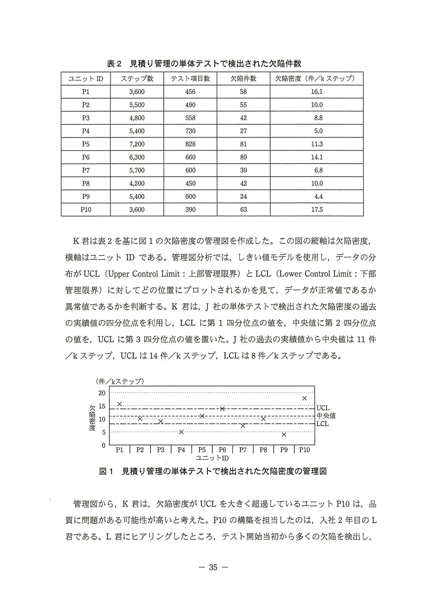

テキスト (OCR)

表2 見積り管理の単体テストで検出された欠陥件数

ユニット D    ステップ数    テスト項目数     欠陥件数    欠陥密度 (件プkステップ)
PL                       3,600                       456                          58                                     16.1
P2                       5,500                       490                          55                                     10.0
P3                       4,800                       558                          42                                       88
P4                       5,400                        730                          27                                       5.0
P5                       7,200                        828                          81                                     113
P6                       6,300                        660                          89                                     141
P7                       5,700                        600                          39                                       68
P8                       4,200                        450                          42                                     10.0
P9                       5,400                        600                          24                                       44
P10                      3,600                        390                          63                                     175
K 君は表 2 を基に図 1 の欠陥密度の管理図を作成した。この図の縦還は欠陥密度,

横軸はユニット ID である。管理図分析では, しきい値モデルを使用し, データの分
布が UCL (Upper Control Limit : 上部管理限界) とLCL (Lower Control Limit : 下部
管理限界) に対してどの位置にプロットされるかを見て, データが正常値であるか
異常値であるかを判断する。K Bld, 」社の単体テストで検出された欠陥密度の過去
の実績値の四分位点を利用し, LCL に第 1 四分位点の値を, 中央値に第 2 四分位点
の値を, UCL に第 3 四分位点の値を置いた。 J 社の過去の実績値から中央値は 11 件

ノk ステップ, UCL は 14 件k ステップ, LCL は8 件プk ステップである。

管理図から, K Ald, 欠陥密度が UCL を大きく超過しているユニット PF10 は, 品
質に問題がある可能性が高いと考えた。P10 の構築を担当したのは, 入社 2 年目のL
君である。L 君にヒアリングしたところ, テスト開始当初から多くの欠陥を検出し,

(件kステップ)

20 Jerre

a= y hID

 1 見積り管理の単体テストで検出された欠陥密度の管理図

ー 35 一

Pl | p2 | p3 | p4 | PS | Pe | P7 | Ps | Po | Pio

### ページ 36

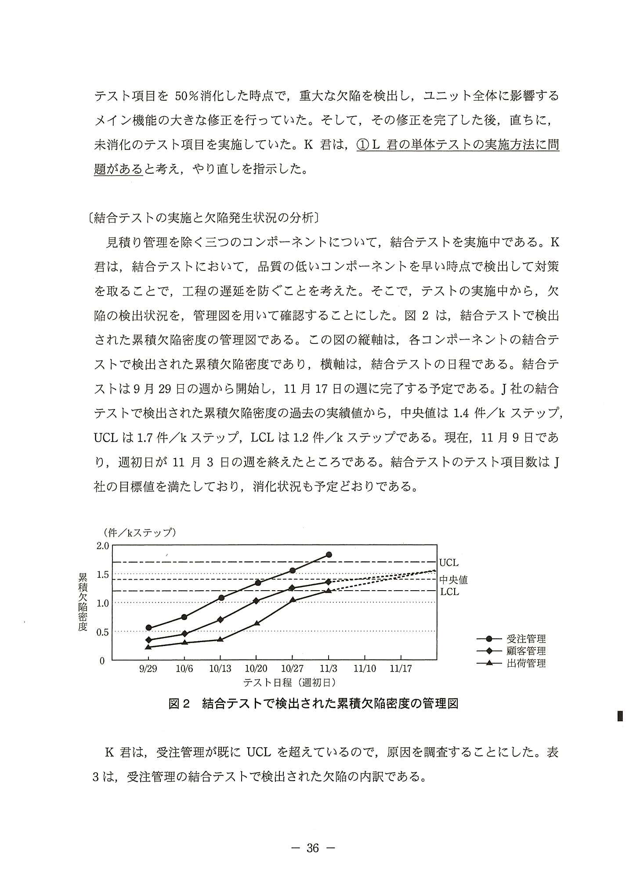

テキスト (OCR)

テスト項目を 50%消化した時点で, 重大な欠陥を検出し, ユニット全体に影響する
メイン機能の大きな修正を行っていた。そして, その修正を完了した後, 直ちに,
未消化のテスト項目を実施していた。K 君は, OL 君の単体テストの実施方法に問
題があると考え, やり直しを指示した。

(結合テストの実施と欠陥発生状況の分析]

見積り管理を除く三つのコンポーネントについて, 結合テストを実施中である。K
Bld, 結合テストにおいて, 品質の低いコンポーネントを早い時点で検出して対策
を取ることで, 工程の遅延を防ぐことを考えた。そこで, テストの実施中から, 欠
陥の検出状況を, 管理図を用いて確認することにした。 2 は, 結合テストで検出
された累積欠陥密度の管理図である。この図の縦軸は, 各コンポボーネントの結合テ
ストで検出された累積欠陥密度であり, 横軸は, 結合テストの日程である。結合テ
ストは9 月 29 日の週から開始し, 11 月 17 日の週に完了する予定である。 」 社の結合
テストで検出された団積欠陥密度の過去の実績値から, 中央値は 1.4 件プ/k ステップ,
UCL は 1.7 件プk ステップ, LCL は 1.2 件プk ステップである。 現在, 11 月 9 日であ
り, 週初日が 11 月 3 日の週を終えたところである。 結合テストのテスト項目数は J
社の目標値を満たしており, 消化状況も予定どおりである。

(件プkステップ)
2.0

@ 16
積
a 10
es
Bos
i                                  ーe- 受注管理
   」   」   」   i   i   」       本得しリーー
929 106 10/13 1020 1027 13 1110 117    ーー HE

テスト日程 GHA)
 2 結合テストで検出された累積欠陥密度の管理図

K 君は, 受注管理が既に UCL を超えているので, 原因を調査することにした。表
3 は, 受注管理の結合テストで検出された欠陥の内訳である。

ー 36 一

### ページ 37

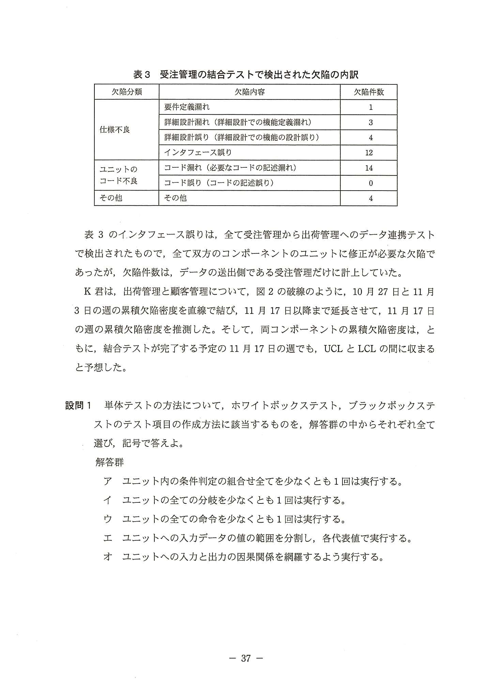

テキスト (OCR)

表3 受注管理の結合テストで検出された欠陥の内訳

欠陥分類            欠陥内容            欠陥件数
要件定義漏れ                    1
Bee     Pea (詳細衣計での機能定旬れ       3
詳細設計訓り (詳細設計での機能の設計庶り)      4
インタフェース誤り                                 12
ユニットの   コード漏れ (必要なコードの記述漏れ)        14
コード不良   コード誤り (コードの記述誤り)           0
その他     その他                      4

表 3 のインタフェース誤りは, 全て受注管理から出荷管理へのデータ連携テスト
で検出されたもので, 全て双方のコンポーネントのユニットに修正が必要な欠陥で
あったが, 欠陥件数は, データの送出側である受注管理だけに計上していた。

K 君は, 出荷管理と顧客管理について, 図 2 の破線のように, 10 月 27 日と 11 月
3 日の週の累積欠陥密度を直線で結び, 11 月 17 日以降まで延長させて, 11 月 17 日
の週の累積欠陥密度を推測した。そして, 両コンポボーネントの累積欠陥密度は, と
もに, 結合テストが完了する予定の 11 月 17 日の週でも, UCL と LCL の間に収まる
と予想した。

設問1 単体テストの方法について, ホワイトボックステスト, ブラックボックステ
ストのテスト項目の作成方法に該当するものを, 解答群の中からそれぞわれ全て
選び, 記号で答えよ。

AER
ア ユニット内の条件判定の組合せ全てを少なくとも 1 回は実行する。

ユニットの全ての分岐を少なくとも 1 回は実行する。

ユニットの全ての命令を少なくとも 1 回は実行する。

ユニットへの入力データの値の範囲を分割し, 各代表値で実行する。

ユニットへの入力と出力の因果関係を網羅するよう実行する。

4 HOG A

ー 37 一

### ページ 38

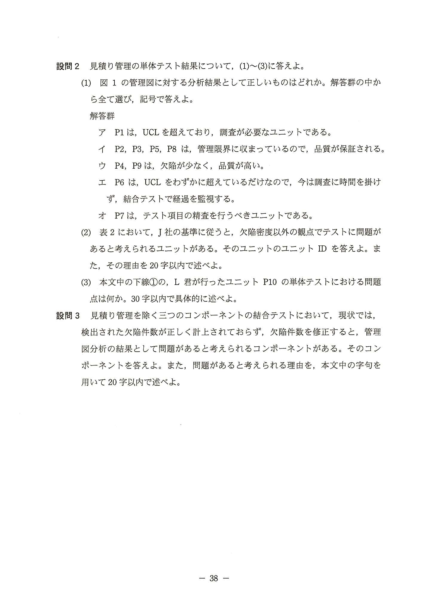

テキスト (OCR)

設問2 見積り管理の単体テスト結果について, ①て(3⑬③に答えよ。
Q) 図 1 の管理図に対する分析結果として正しいものはどれか。解答群の中か
ら全て選び, 記号で答えよ。
解答群
ア P1 は, UCL を超えており, 調査が必要なユニットである。
イ P2, P3, P5, P8 は, 管理限界に収まっているので, 品質が保証される。
ウ P4, P9 は, 欠陥が少なく, 品質が高い。
エ P6 は, UCL をわずかに超えているだけなので, 今は調査に時間を掛け
ず, 結合テストで経過を監視する。
4 P7 は, テスト項目の精査を行うべきユニットである。
(2) 表2 において, 」社の基準に従うと, 欠陥密度以外の観点でテストに問題が
あると考えられるユニットがある。そのユニットのユニット ID を答えよ。ま
た, その理由を 20 字以内で述べよ。
3) 本文中の下線①の, L 君が行ったユニット P10 の単体ケストにおける問題
点は何か。30 字以内で具体的に述べよ。
設問3 見積り管理を除く<三つのコンポーネントの結合テストにおいて, 現状では,
検出された欠陥件数が正しく計上されておらず, 欠陥件数を修正すると, 管理
図分析の結果として問題があると考えられるコンポーネントがある。そのコン
ポーネントを答えよ。また, 問題があると考えられる理由を, 本文中の字句を
用いて 20 字以内で述べよ。

ー 38 一

### ページ 39

テキスト (OCR)

CA © 用 紙 J

ー 39 一

### ページ 40

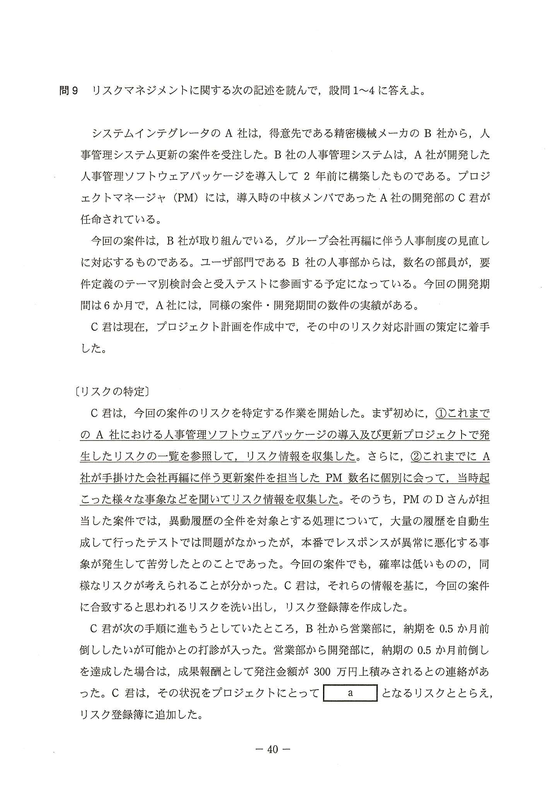

テキスト (OCR)

問9

リスクマネジメントに関する次の記述を読んで, 設問14 に答えよ。

システムインテグレータの A thd, 得意先である精密機械メーカの B 社から, 人
事管理システム更新の案件を受注した。B 社の人事管理システムは, A 社が開発した
人事管理ソフトウェアパッケージを導入して 2 年前に構築したものである。プロジ
エクトマネージャ (PM) には, 導入時の中核メンバであった 4 社の開発部の C BM
任命されている。

今回の案件は, B 社が取り組んでいる, グループ会社再編に伴う人事制度の見直し
に対応するものである。ユーザ部門である B 社の人事部からは, 数名の部員が, 要
件定義のテーマ別検討会と受入テストに参画する予定になっている。 今回の開発期
間は6 か月で, A社には, 同様の案件・開発期間の数件の実績がある。

C 君は現在, プロジェクト計画を作成中で, その中のリスク対応計画の策定に着手
した。

[リスクの特定〕

C 君は, 今回の案件のリスクを特定する作業を開始した。まず初めに。①これまで
の A 社における人事管理ソフトウェアパッケージの導入及び更新プロジェクトで発
生したリスクの一覧を参照して, リスク情報を収集した。さらに, ②これまでに A
社が手掛けた会社再編に伴う更新案件を担当した PM 数名に個別に会って, 当時起
こった様々な事象などを聞いてリスク情報を収集した。そのうち, PM の D さんが揚
当した案件では, 異動履歴の全件を対象とする処理について, 大量の履歴を自動生
成して行ったテストでは問題がなかったが, 本番でレスポンスが異常に悪化する事
象が発生して普光したとのととであった。 今回の案件でも, 確率は低いものの, 同
様なリスクが考えられることが分かった。C Hk, それらの情報を基に, 今回の案件
<合致すると思われるリスクを洗い出し, リスク登録等を作成した。

C 君が次の手順に進もうとしていたところ, BMS MIMIC, 納期を 0.5 か月前
倒ししたいが可能かとの打診が入った。営業部から開発部に, 納期の 0.5 か月前倒し
を達成した場合は, 成果報酬として発注金額が 300 万円上積みされるとの連絡があ
った。C Bld, その状況をプロジェクトにとって|  a』 | となるリスクととらえ,
リスク登録等に追加した。

### ページ 41

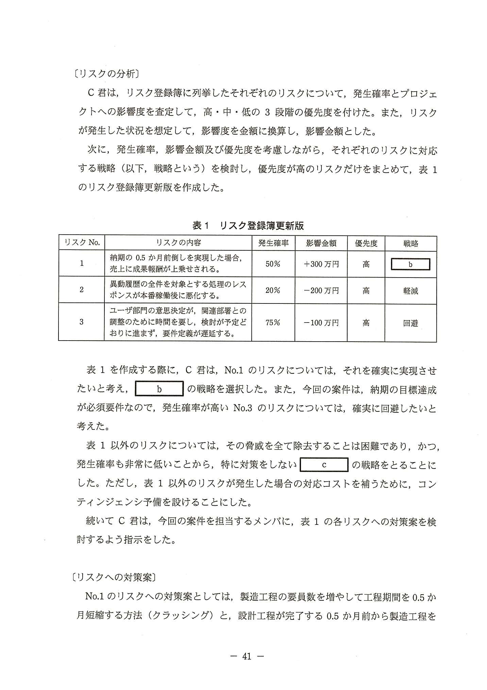

テキスト (OCR)

[リスクの分析〕

C Ald, リスク登録委に列挙したそれぞれのリスクについて, 発生確率とプロジェ
クトへの影響度を査定して, 高・中・低の 3 段階の優先度を付けた。また, VAD
が発生した状況を想定して, 影響度を金額に換算し, 影響金額とした。

次に, 発生確率, 影響金額及び優先度を考慮しながら, それぞれのリスクに対応
する戦略 (以下, 戦略という) を検討し, 優先度が高のリスクだけをまとめて, 表 1
のリスク登録徒更新版を作成した。

表1 リスク登録簿更新版

リスク No.              リスクの内容              発生確率 | 影響金額 | 優先庶 | 職中
納期の 05 か月前倒しを実現した場合,        ;
1 | 売上に成果報酬が上乗せされる。            5% | +300四| 高 しゃ 1]
典動履歴の全件を対象とする処理のレス

ポンスが本番稼働後に悪化する。              AR | RO | 韻          fen

ユーザ部門の意思決定が, REE O
3    調整のために時間を要し, 検討が予定ど   75%    ー100 万円    i      回避
おりに進まず, 要件定義が遅延する。

表 1 を作成する際に, C Ald, Nol のリスクについては, それを確実に実現させ
たいと考え, | b | の戦略を選択した。また, 今回の案件は, WHOA MER
が必須要件なので, 発生確率が高い No.3 のリスクについては, 確実に回避したいと
考えた。

表 1 以外のリスクについては, その箇威を全て除去することは困難であり, かつ,
発生確率も非常に低いことから, 特に対策をしない|  c | の戦略をとることに
した。ただし, 表 1 以外のリスクが発生した場合の対応コストを補うために, コン
ティンジェンシ予備を設けることとにした。

続いて C 君は, 今回の案件を担当するメンバに, 表 1 の各リスクへの対策案を栓
討するよう指示をした。

〔リスクへの対策案]
No.1 のリスクへの対策案としては, 製造工程の要員数を増やして工程期間を 0.5 か

月短縮する方法 (クラッシング) と, 設計工程が完了する 0.5 か月前から製造工程を

ー 41 一

### ページ 42

テキスト (OCR)

開始する方法 (ファストトラッキング) の 2 案が候補となった。
設計, 製造の工程に関する当初の計画の詳細, 及び検討の想定は次のとおりである。
・製造工程の当初の計画期間は 3 か月で, 工数は 30 人月の見積りである。 当初計画
したメンバ以外の要員を追加する場合, 追加要員の生産性は, 当初計画したメン
バの 23 になる。

・包去のプロジェクトの実績から,

設計工程と製造工程を 0.5 か月重ねた場合の手戻

りコストの平均は, 製造工程の全体コストの 3%%程度と見込まれる。

・要員の配置は 0.5 か月単位と決められており, 配置されていた期間分の工数によっ
て, プロジェクトのコストが算出される。

・製造工程の 1 人月当たりのコストは100 万円である。
これらを条件として, Nol DUATOREPEMS, その対応コストを引いた金

額を算出し, その値の大きい方を採用することにした。 算出値は クラッシングの

場合は|  d |万円,ファストトラッキングの場合は| es |万円であった。

No.2, 3 のリスクに対して, メンバの考えた対策案は表 2 のとおりであった。

表2 リスク対策案

リスク No.

対策案

対応コスト

案 1 : D さんが担当した案件での事象を詳細に調査し, 今回の案件の
場合のシミュレーションを実施してリスクの有無を明らかにす
る。その結果をアプリケーションプログラムの設計に反映させ
て, 発生を予防する。

調査及びシミュレ
ーション実施のコ
スト80万円

案2: システムテストで本番データを用いたテストを実施する。テス
トした結果., レスポンスの悪化が発生した場合だけ, D さんが
担当した案件での対応を参考に SQOL をチューニングする。

SQL チューニング
のコスト 100 万円

テーマ別検討会の中で挙がる, ユーザ部門の意思決定が必要な項目
については, それぞれに回答期限と推奨案を決定する。期限までに
回答が得られない場合は, この推奨案を意思決定の結果とする。

QNo.2 のリスクに対して, 案 1 はほぼ確実にリスクの発生を予防でき, 案 2 より

も対応コストは低いが, C 君は案 2 を選択した。

### ページ 43

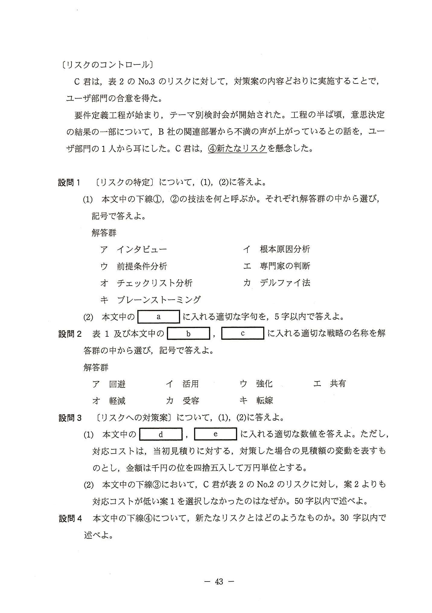

テキスト (OCR)

〔リスクのコントロール〕

C 君は, 表 2 の No.3 のリスクに対して, 対策案の内容どおりに実施することで,
ユーザ部門の合意を得た。

要件定義工程が始まり, テーマ別検討会が開始された。工程の半ば頃, 意思決定
の結果の一部について, B 社の関連部署から不満の声が上がっているとの話を, ユー
ザ部門の 1 人から耳にした。C 君は,④新たなりリスクを懸念した。

設問1 (UAV ORE) OWT, ①⑪, ⑫)に答えよ。
QL) 本文中の下線①, ②の技法を何と呼ぶか。それぞわれ解答群の中から選び,

記号で答えよ。

ARES
ア インタビュー         イ 根本原因分析
ウ 前提条件分析         エ 専門家の判断
オ チェックリスト分析      カ デルファイ法

キ ブレーンストーミング
@ 本文中の| a | に入れる適切な字句を5字以内で答えよ。

設問2 表 1 及び本文中の| b |,|  c |に入れる適切な戦略の名称を解
答群の中から選び, 記号で答えよ。
解答群
ア 回避    イ 活用    ウ 強化    nu 共有
オ 軽減    A 受容    キ 転嫁
設問3 〔リスクへの対策案〕 について, ①⑪, ②に答えよ。
a 本文中の|  d |,|  e& | に入れる適切な数値を答えよ。ただし,

対応コストは, 当初見積りに対する, 対策した場合の見積額の変動を表すも
のとし, 金額は千円の位を四捨五入して万円単位とする。
2) 本文中の下線つにおいて, C 君が表 2 の No.2 のリスクに対し, 案2 よりも
対応コストが低い案 1 を選択しなかったのはなぜか。50 字以内で述べよ。
設問4 本文中の下線②について, 新たなリスクとはどのようなものか。30 字以内で
述べよ。

### ページ 44

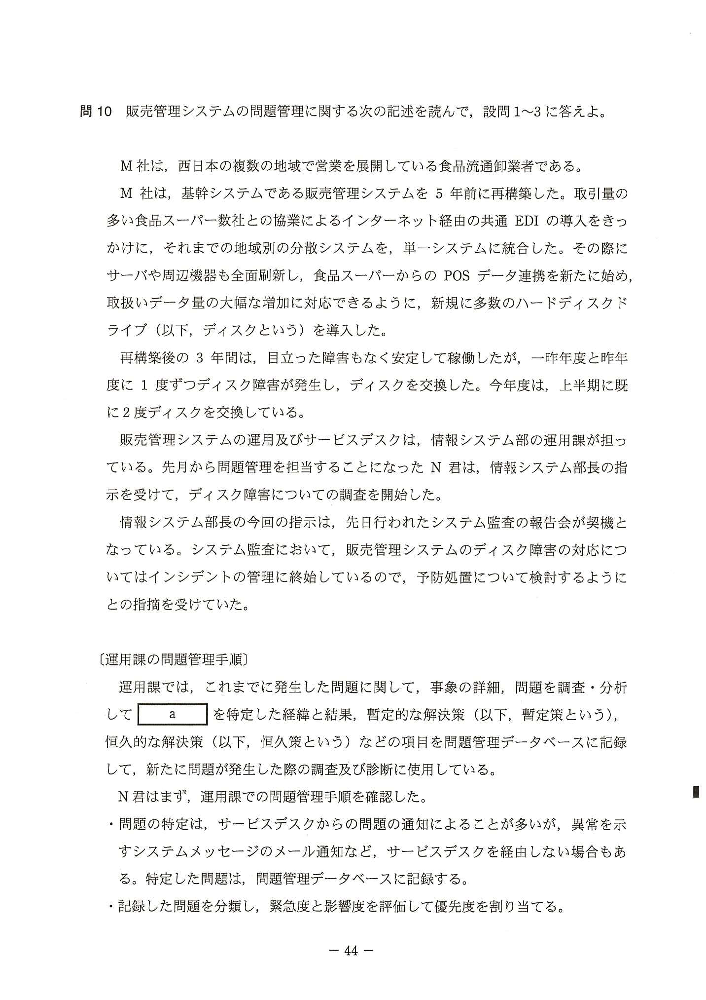

テキスト (OCR)

問10 販売管理システムの問題管理に関する次の記述を読んで, 設問 1ー3 に答えよ。

M 社は, 西日本の複数の地域で営業を展開している食品流通爺業者である。

M 社は, 基幹システムである販売管理システムを 5 年前に再構築した。取引量の
多い食品スーパー数社との協業によるインターネット経由の共通 ED] の導入をきっ
かけに, それまでの地域別の分散システムを, 単二システムに統合した。その際に
サーバや周辺機器も全面刷新し, 食品スーパーからの POS データ連携を新たに始め,
取扱いデータ量の大幅な増加に対応できるように, 新規に多数のハードディスクド
ライブ (以下, ディスクという) を導入した。

再構築後の 3 年間は, 目立った障害もなく安定して稼働したが, 一昨年度と昨年
度に 1 度ずつディスク障害が発生し, ディスクを交換した。今年度は, 上半期に既
に2 度ディスクを交換している。
販売管理システムの運用及びサービスデスクは, 情報システム部の運用課が担っ

WS. 先月から問題管理を担当することになった N Ald, 情報システム部長の指

を受けて, ディスク障害についての調査を開始した。
情報システム部長の今回の指示は, 先日行われたシステム監査の報告会が契機と
なっている。システム監査において, 販売管理システムのディスク障害の対応に
いてはインシデントの管理に終始しているので, 予防処置について検討するように
との指摘を受けていた。

RM

(運用課の問題管理手順
GARE, これまでに発生した問題に関して, 事象の詳細, 問題を調査・分析
て| 3 | を特定した経緯と結果, MeN (IT, BERL WS),

恒久的な解決策 (以下 恒久策という) などの項目を問題和理データベースに記録

LC, 新たに問題が発生した際の調査及び診断に使用している。

N 君はまず, 運用課での問題管理手順を確認した。

・問題の特定は。 サービスデスクからの問題の通知によることが多いが, 異常を示
すシステムメッセージのメール通知など, サービスデスクを経由しない場合もあ
る。特定した問題は, 問題管理データベースに記録する。

・記録した問題を分類し, 緊急度と影響度を評価して優先度を割り当てる。

### ページ 45

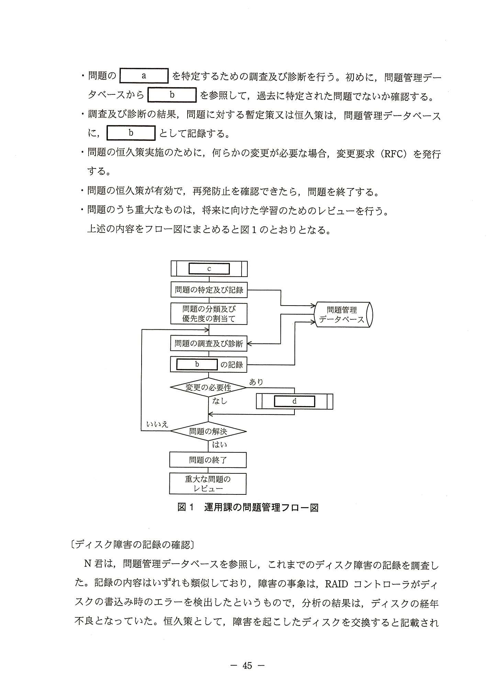

テキスト (OCR)

・ 問題の| a | を特定するための調査及び診断を行う。初めに, 問題管理デー
タベースから| b | を参照して, 過去に特定された問題でないか確認する。
・ 調査及び診断の結果, 問題に対する暫定策又は恒久策は, 問題管理データベース
に, | b | として記録する。

・ 問題の便久策実施のために, 何らかの変更が必要な場合変更要求 (RFC) を発行
する。

・問題の便久策が有効で, 再発防止を確認できたら, 問題を終了する。

・問題のうち重大なものは, 将来に向けた学習のためのレビューを行う。

上述の内容をフロー図にまとめると図 1 のとおりとなる。

問題の分類及び
優先度の割当て

問題の終了

重大な問題の
ves

 1 運用課の問題管理フロー図

〔ディスク障害の記録の確認

N 君は, 問題管理データベースを参照し. これまでのディスク障害の記録を調査し
た。 記録の内容はいずれも頻似しており, 障害の事象は, RAID コントローラがディ
スクの書込み時のエラーを検出したというもので, 分析の結果は, ディスクの経年
不良となっていた。 恒久策として, 障害を起こしたディスクを交換すると記載され

ー 45 一

### ページ 46

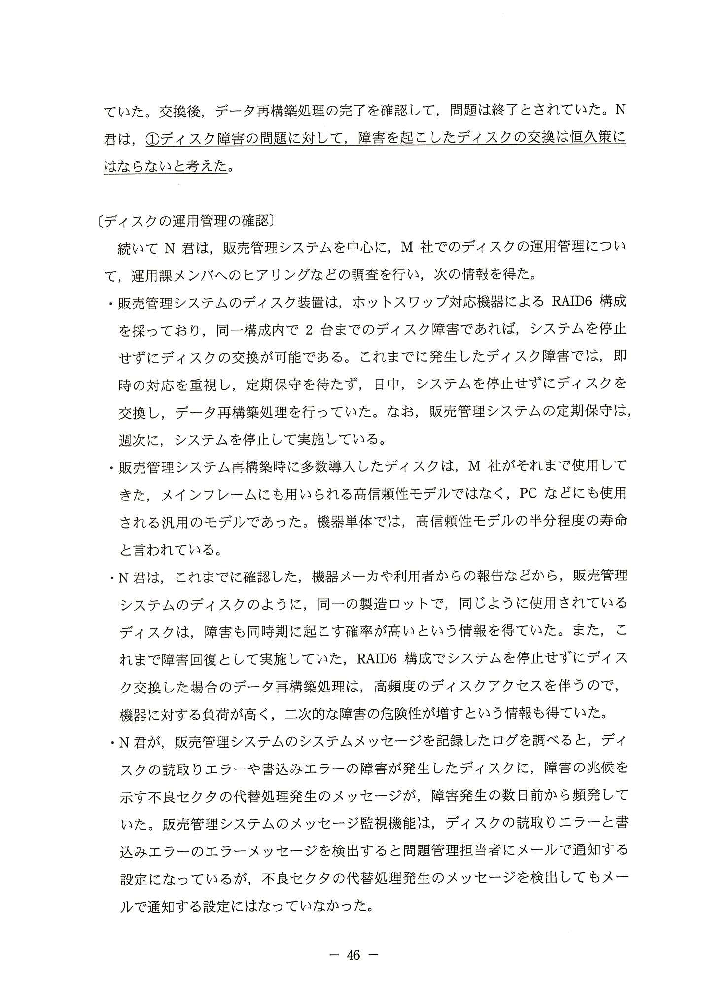

テキスト (OCR)

ていた。交換後, データ再構築処理の完了を確認して, 問題は終了とされていた。N
Bla, ①ディスク障害の問題に対して, 障害を起こしたディスクの交換は恒久策に
はならないと考えた。

〔ディスクの運用管理の確認
続いて N Bld, 販売管理システムを中心に, M 社でのディスクの運用管理につい
て, 運用課メンバへのヒアリングなどの調査を行い, 次の情報を得た。
・販売管理システムのディスク装置は.。 ホットスワップ対応機器による RAID6 構成
を採っており, 同一構成内で 2 台までのディスク障害であれば, システムを停止
せずにディスクの交換が可能である。これまでに発生したディスク障害では, 即
時の対応を重視し, 定期保守を待たず, 日中 システムを停止せずにディスクを
交換し, データ再構築処理を行っていた。なお, 販売管理システムの定期保守は,
週次に, システムを停止して実施している。
・販売管理システム再構築時に多数導入したディスクは, M 社がそれまで使用して
きた, メインフレームにも用いられる高信頼性モデルではなく, PC などにも使用
される汎用のモデルであった。機器単体では, 高信頼性モデルの半分程度の寿命
と言われている。
・N 君は,。 これまでに確認した, 機器メーカや利用者からの報告などから, 販売管理
システムのディスクのように, 同一の製造ロットで, 同じように使用されている
ディスクは, 障害も同時期に起こす確率が高いという情報を得ていた。また, こ
れまで障害回復として実施していた, RAID6 構成でシステムを停止せずにディス
ク交換した場合のデータ再構築処理は, 高頻度のディスクアクセスを伴うので,
機器に対する負荷が高く, 二次的な障害の危険性が増すという情報も得ていた。
・N 君が, 販売管理システムのシステムメッセージを記録したログを調べると, ディ
スクの読取りエラーや書込みエラーの障害が発生したディスクに, 障害の兆候を
示す不良セクタの代替処理発生のメッセージが, 障害発生の数日前から頻発して
いた。販売管理システムのメッセージ監視機能は, ディスクの読取りエラーと書
込みエラーのエラーメッセージを検出すると問題管理担当者にメールで通知する
設定になっているが, 不良セクタの代奉処理発生のメッセージを検出してもメー
ルで通知する設定にはなっていなかった。

ー 46 一

### ページ 47

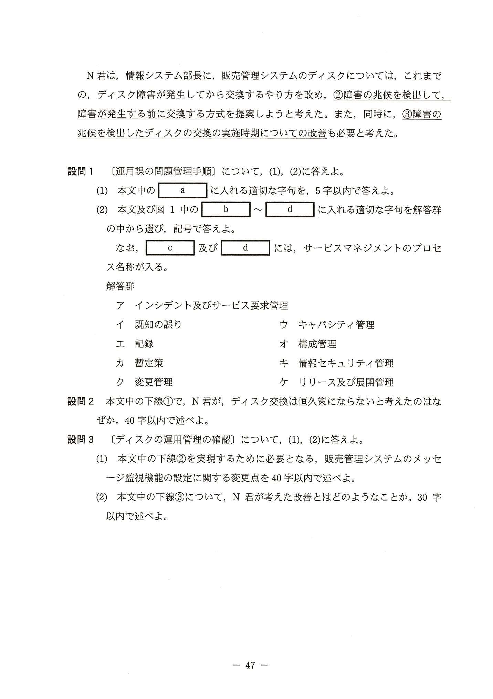

テキスト (OCR)

N 君は, 情報システム部長に, 販売管理システムのディスクについては, これまで
の, ディスク障害が発生してから交換するやり方を改め, ②障害の兆候を検出して

障害が発生する前に交換する方式を提案しようと考えた。また, 同時に, ③障害の
兆侯を検出したディスクの交換の実施時期についての改善も必要と考えた。

設問1 運用課の問題管理手順] について, ①, ②に答えよ。
a 本文中の| a | に入れる適切な字名を, 5字以内で答えよ。
(②) 本文及び図 1 中の| b |~[  d |に入れる適切な字句を解管若

の中から選び, 記号で答えよ。

なお, | c |及び|  d | には, サービスマネジメントのプロセ
ス名称が入る。
解答群

ア インシデント及びサービス要求管理

イ 既知の誤り          ウ キャパシティ管理

エ 記録             オ 構成管理

カ Wee            キ 情報セキュリティ管理

ク 変更管理           ケ リリース及び展開管理

設問2 本文中の下線〇で, N 君が, ディスク交換は恒久策にならないと考えたのはな
ぜか。40 字以内で述べよ。
設問3 (ディスクの運用管理の確認) について, ①, ⑫に答えよ。
(1) 本文中の下線②を実現するために必要となる, 販売管理システムのメッセ
ージ監視機能の設定に関する変更点を 40 字以内で述べよ。
(2) 本文中の下線③について, N 君が考えた改善とはどのようなことか。30 字
以内で述べよ。

ー 47 一

### ページ 48

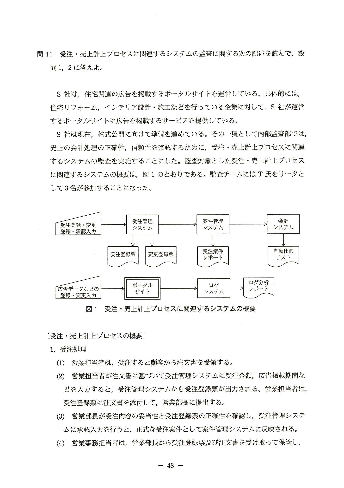

テキスト (OCR)

間 11 受注・売上計上プロセスに関連するシステムの監査に関する次の記述を読んで,
fll, 2 に答えよ。

S tld, 住宅関連の広告を掲載するポータルサイトを運営している。具体的には,
住宅リフォーム, インテリア設計・施工などを行っている企業に対して, S 社が運営
するボータルサイトに広告を掲載するサービスを提供している。

S 社は現在, 株式公開に向けて準備を進めている。その一環として内部監査部では,
売上の会計処理の正確性, 信頼性を確認するために, 受注・売上計上プロセスに関連
するシステムの監査を実施することにした。監査対象とした受注・売上に計上プロセス
に関連するシステムの概要は, 1 のとおりである。監査チームには T 氏をリーダと
して 3 名が参加することになった。

.                             受注管理                              案件管理                                 会計
co ee         システム             システム             システム
>                                                   受注案件                              自動仕訳
受注登録球      BEER             レポート                        リスト
にーーレン                        a
=            。                         ポータル                                    ログ                    ログ分析
                   サイト                             システム           ae |

 1 受注・売上計上プロセスに関連するシステムの概要

〔受注・売上計上プロセスの概要〕
1. 受注処理

Q①) 営業担当者は, 受注すると顧客から注文書を受領する。

(2) 営業担当者が注文書に基づいて受注管理システムに受注金額, 広告掲載期間な
どを入力すると, 受注管理システムから受注登録球が出力される。営業担当者は,
受注登録票に注文書を添付して, 営業部長に提出する。

(3) 営業部長が受注内容の妥当性と受注意録票の正確性を確認し, 受注管理システ
ムに承認入力を行うと, 正式な受注案件として案件管理システムに反映される。

(4) 営業事務担当者は, 営業部長から受注登録票及び注文書を受け取って保管し

### ページ 49

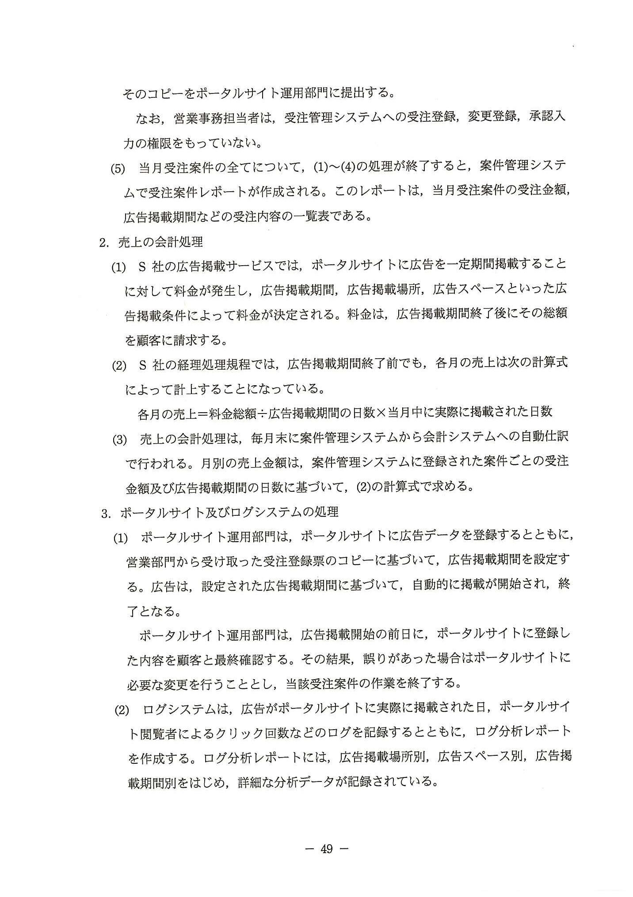

テキスト (OCR)

そのコピーをポータルサイト運用部門に提出する。
なお, 営業事務担当者は, 受注管理システムへの受注登録, 変更登録, 承認入
力の権限をもっていない。

(5) 当月受注案件の全てについて, ①ぐて(④の処理が終了すると, 案件管理システ
ムで受注案件レポートが作成される。このレポートは, 当月受注案件の受注金額
広告掲載期間などの受注内容の一覧表である。

2. 売上の会計処理

Q) S 社の広告掲載サービスでは, ポータルサイトに広告を一定期間掲載すること
に対して料金が発生し, 広告掲載期間, 広告掲載場所, 広告スペースといった広
告掲載条件によって料金が決定される。料金は, 広告掲載期間終了後にその総額
を顧客に請求する。

(②) S 社の経理処理規程では, 広告掲載期間終了前でも, 各月の売上は次の計算式
によって計上することになっている。

各月の売上=料金総額広告掲載期間の日数メ当月中に実際に掲載された日数

(3) 売上の会計処理は, 毎月末に案件管理システムから会計システムへの自動仕訳
で行われる。月別の売上金額は, 案件管理システムに登録された案件ごとの受注
金額及び広告掲載期間の日数に基づいて, ②の計算式で求める。

3. ポータルサイト及びログシステムの処理

Q) ポータルサイト運用部門は, ポータルサイトに広告データ を登録するとともに,
営業部門から受け取った受注登録票のコピーに基づいて, 広告掲載期間を設定す
る。広告は, 設定された広告掲載期間に基づいて, 自動的に掲載が開始され, 終
了となる。

ポータルサイト運用部門は, 広告掲載開始の前日に. ボータルサイトに登録し
た内容を顧客と最終確認する。その結果, 誤りがあった場合はボータルサイトに
必要な変更を行うこととし, 当該受注案件の作業を終了する。

Q) ログシステムは, 広告がボータルサイトに実際に掲載された日, ボータルサイ
ト関覧者によるクリック回数などのログを記録するとともに, ログ分析レポート
を作成する。ログ分析レポートには, 広告掲載場所別, 広告スペース別, 広告掲
載期間別をはじめ, 詳細な分析データが記録されている。

### ページ 50

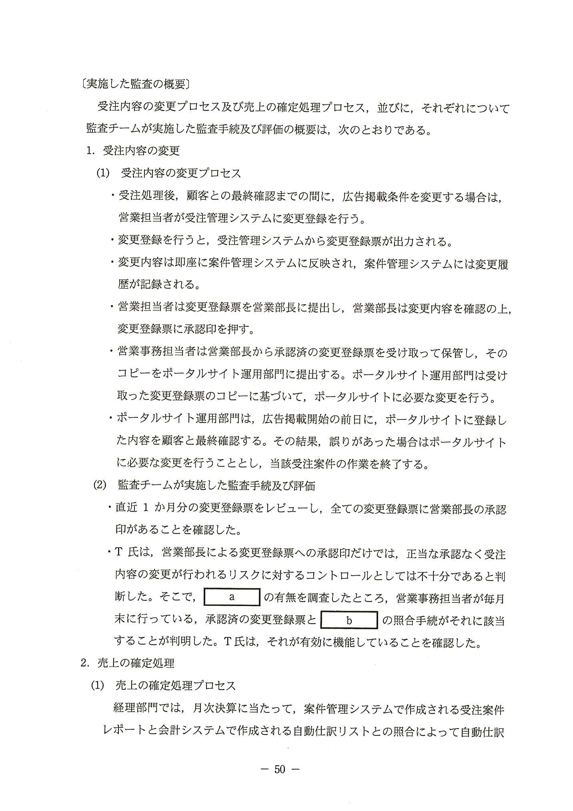

テキスト (OCR)

(Ahi LAB OBE)

受注内容の変更プロセス及び売上の確定処理プロセス, 並びに, それぞれについて
監査チームが実施した監査手続及び評価の概要は, 次のとおりである。

1. 受注内容の変更

@)

(2)

受注内容の変更プロセス

・受注処理後, 顧客との最終確認までの間に, 広告掲載条件を変更する場合は
営業担当者が受注管理システムに変更登録を行う。

・変更癌録を行うと, 受注管理システムから変更合録球が出力される。

・変更内容は即座に案件管理システムに反映され, 案件管理システムには変更履
歴が記録される。

・ 営業担当者は変更登録時を営業部長に提出し営業部長は変更内容を確認の上,
DEGLI RES

・ 営業事務担当者は営業部長から承認済の変更登録票を受け取って保管し その
コピーをポータルサイト運用部門に提出する。ポータルサイト運用部門は受け
取った変更登録時のコピーに基づいて, ポータルサイトに必要な変更を行う。

・ポボータルサイト運用部門は, 広告掲載開始の前日に。 ポータルサイトに登録し
た内容を顧客と最終確認する。その結果, 誤りがあった場合はポータルサイト
に必要な変更を行うこととし, 当該受注案件の作業を終了する。

了査チームが実施した駿査手続及び評価

・ 直近 1 か月分の変更癌録球をレビューし, 全ての変更全録票に営業部長の承認
印があることを確認した。

・T Kid, 堂業部長による変更登録球への承認印だけでは, 正当な承認なく受注
内容の変更が行われるりスクに対するコントロールとしては不十分であると判
断した。そこで, | a | の有無を調査したところ, 営業事務担当者が毎月
示に行っている, 承認済の変更癌録票と| b | の照合手続がそれに該当
することが判明した。TT氏は, それが有効に機能していることを確認した。

2. 売上の確定処理

①

売上の確定処理プロセス
経理部門では, 月次決算に当たって, 案件管理システムで作成される受注案件
レポートて会計システムで作成される自動仕訳リストとの照合によって自重仕訳

ー 50 一

### ページ 51

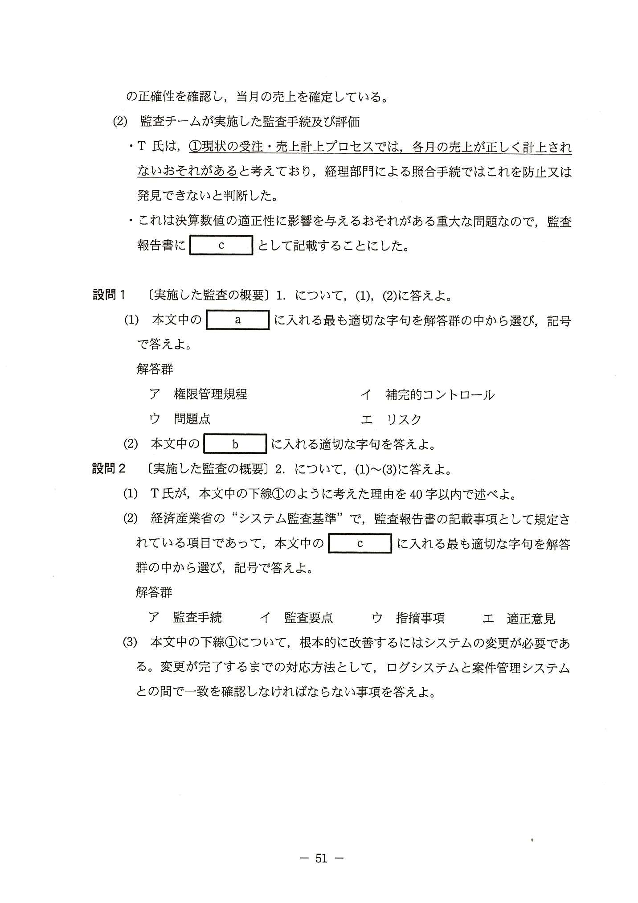

テキスト (OCR)

の正確性を確認し, 当月の売上を確定している。
(②) 監査チームが実施した監査手続及び評価
・T Kid, ①現状の受注・売上計上プロセスでは, 各月の売上が正しく計上され
ないおそれがあると考えており, 経理部門による賠合手続ではこれを防止又は
発見できないと判断した。
・これは決算数値の適正性に影響を与えるおそれがある重大な問題なので, 監査

報告書に として記載することにした。

設間1 [実施した監査の概要)〕 1. について, ①, (②)に答えよ。

Q①) 本文中の| 』 |] に入れる最も適切な字句を解答群の中から選び, 記号
で答えよ。

ARES
ア 権限管理規程        イ 補完的コントロール
ウ 問題点          エ リスク

@) 本文中の[| b | に入れる適切な字句を答えよ。
設問2 [実施した監査の概要) 2. について, ①て③⑬)に答えよ。

(①) TRA, 本文中の下線①のように考えた理由を 40 字以内で述べよ。

② REREAD “DAT DHEA” Cc, 監査報告書の記載事項として規定さ
れている項目であって, 本文中の| c | に入れる最も適切な字句を解答
税の中から選び, 記号で答えよ。
解答群

ア 監査手続 7 監査要点 9 指摘事項 "エエ 適正意見

⑬ 本文中の下線①について, 根本的に改善するにはシステムの変更が必要であ
る。変更が完了するまでの対応方法として, ログシステムと案件管理システム
との間で一致を確認しなければならない事項を答えよ。

ー 51 一

### ページ 52

テキスト (OCR)

(A モ 用 紙 〕

ー 52 一

### ページ 53

テキスト (OCR)

CA モ 用 HJ

ー 53 一

### ページ 54

テキスト (OCR)

CA モ 用 tH J

ー 54 一

### ページ 55

テキスト (OCR)

【 メモ 用 紙 〕

ー 55 一

### ページ 56

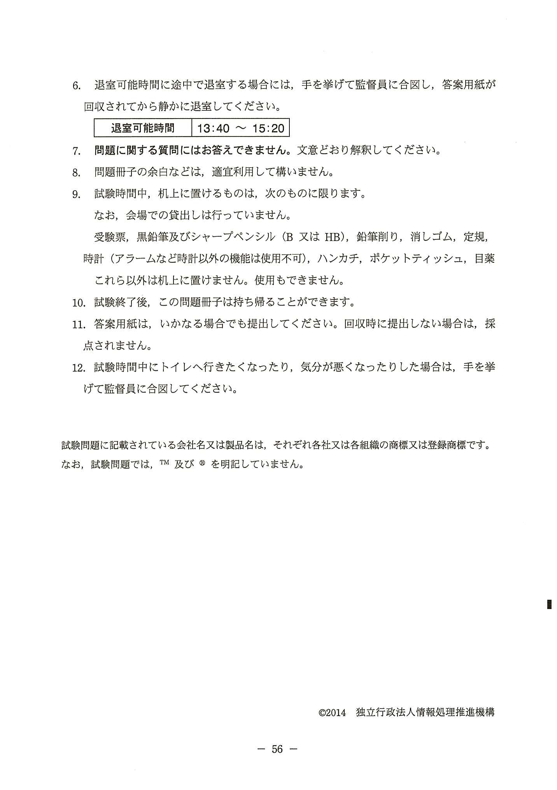

テキスト (OCR)

6. 退室可能時間に途中で退室する場合には, 手を挙げて監督員に合図し, 答案用紙が
回収されてから静かに退室してください。
| 退室可能時間 [13:40 ~ 15:20]
7. 問題に関する質問にはお答えできません。文意どおり解息してください。
8. 問題冊子の余白などは, 適宜利用して構いません。
9, 試験時間中 机上に置けるものは, 次のものに限ります。
なお, 会場での貸出しは行っていません。
受験票, 黒鉛筆及びシャープペンシル (B 又は HB), 鉛筆削り, 消しゴム, 定規,
時計 (アラームなど時計以外の機能は使用不可), ハンカチ, ボケットティッシュ, 目薬
これら以外は机上に置けません。使用もできません。
10. 試験終了後, この問題冊子は持ち帰ることができます。
ll. 答案用紙は, いかなる場合でも提出してください。回収時に提出しない場合は, 採
点されません。
12, 試験時間中にトイレへ行きたくなったり, 気分が悪くなったりした場合は, PEM
げて監督員に合図してください。

試験問題に記載されている会社名又は製品名は, それぞれ各社又は各組織の商標又は登録商標です。
なお, 試験問題では, ™ 及び @ を明記していません。

@2014 独立行政法人情報処理推進機構

ー 56 一

---

## 午後解答

1/5 
©2014 独立行政法人情報処理推進機構 
平成26 年度 秋期 応用情報技術者試験 解答例 
 
午後試験 
問１ 
出題趣旨 
 インターネットを利用する企業において，ネットワークセキュリティ対策の重要性は，近年ますます高まっ
ている。 
 本問では，企業のネットワークセキュリティ対策を題材に，IDS，IPS やWAF に関する基本事項や具体的な施
策についての理解を問う。 
 
設問 
解答例・解答の要点 
備考 
設問１ 
ア，イ 
 
設問２ 
a
ウ 
 
 
 
b
イ 
 
 
 
c
エ 
 
設問３ 
d
ウ 
 
 
 
e
イ 
 
設問４ 
あらかじめ定められた一連の手続のHTTP 通信 
 
 
問２ 
出題趣旨 
 昨今，経営状況が良いうちに財務体質を改善し，体力をつけておこうとする企業が多い。その際の改善状況
を見る上では，収益性だけでなく，効率性や安全性も重要な指標となる。また，一方で，利益だけでなく，黒
字倒産を起こさないよう，キャッシュフローを重視した経営も注目されている。 
 本問では，財務体質改善プロジェクトを題材に，キャッシュフロー計算書，損益計算書，貸借対照表，及び
経営指標の理解，並びに財務体質を改善する方策の理解について問う。 
 
設問 
解答例・解答の要点 
備考 
設問１ 
エ 
 
設問２ 
a
キ 
 
 
b
コ 
 
 
c
ウ 
 
設問３ 
営業活動によるキャッシュフロー 
＋ 
 
 
投資活動によるキャッシュフロー 
－ 
 
 
財務活動によるキャッシュフロー 
＋ 
 
設問４(1)
d
ア 
 
 
 
e
イ 
 
 
(2) 売上高の伸び以上に売掛金が増えているから 
 
 
(3) 利益剰余金が増えるから

2/5 
©2014 独立行政法人情報処理推進機構 
問３ 
出題趣旨 
 ソートのアルゴリズムには，幾つかの種類があるが，マージソートは要素数が多い場合やシーケンシャルな
データ構造に向いている。 
 本問では，連結リストのマージソートを題材に，マージソートのアルゴリズム，及び再帰アルゴリズムの理
解について問う。 
 
設問 
解答例・解答の要点 
備考 
設問１(1) ア
b がNULL と等しくない 
 
 
イ
b ← b->next 
 
 
ウ
a->next 
 
(2) 8 
 
(3)
前半 
N＋1 
 
 
後半 
N 
設問２ 
エ
a がNULL と等しくない 
 
オ
・a がNULL と等しい 
・b がNULL と等しくない 
 
カ
head->next 
設問３ 
31 
 
問４ 
出題趣旨 
 昨今，中規模なシステムでもストレージ装置を用いて，データアクセス速度を向上させたり耐障害性を高め
たりすることが一般的になりつつあり，多様な観点からシステム全体のアーキテクチャを設計できる人材が求
められている。 
 本問では，新聞社の記事検索・配信システムを題材に，ストレージ設計に必要なキャパシティプランニング
とRAID 技術に関する理解について問う。 
 
設問 
解答例・解答の要点 
備考 
設問１ 
a
オ 
 
 
b
カ 
 
 
c
エ 
 
設問２(1) エ 
 
 
(2) ハードディスク装置数を増やし，データを分散させる。 
 
設問３ 
110 
 
設問４ 
重視 
 読込み速度 ・ 書込み速度 
 
 
特性 
多数のPC やモバイル端末に対して記事を配信する特性 
 
設問５ 
1 時間単位の平均を集計しており，短い時間の特異点が分からないから

3/5 
©2014 独立行政法人情報処理推進機構 
問５ 
出題趣旨 
 昨今，クラウドサービスの普及が進み，メールなど汎用性の高いシステムに対してはクラウドサービスを利
用する企業が増加している。 
 本問では，事務用品の通信販売会社のメールサーバのクラウドサービスへの移行を題材に，メールに関する
プロトコルやDNS に関する理解について問う。 
 
設問 
解答例・解答の要点 
備考 
設問１ 
a
オ 
 
 
b
エ 
 
 
c
イ 
 
設問２ 
d
x.y.z.102 
 
 
e
x.y.z.103 
 
設問３ 
利用者ID とパスワードを用いた認証への対応 
 
設問４(1) DNS サーバのキャッシュ情報が書き換わるのに時間を要するから 
 
 
(2) 手順3 
 
設問５ 
ウ 
 
 
問６ 
出題趣旨 
 2 相コミットは多くのデータベース管理システム（DBMS）に実装されブラックボックス化されている。2 相コ
ミットにおける正しい運用設計がないと，障害発生時の手動によるリカバリ処理に時間を要したりリカバリに
必要なデータを失ったりする可能性がある。 
 本問では，複数のデータベースを更新するトランザクションが発生する販売管理システムを題材に，トラン
ザクション管理，分散データベースの理解について問う。 
 
設問 
解答例・解答の要点 
備考 
設問１ 
a
ウ 
 
 
b
ア 
 
設問２ 
c
在庫データ 
 
 
 
d
更新準備 
 
 
 
e
受注データ 
 
 
 
f
コミット 
 
 
 
g
ロールバック 
 
設問３ 
ア，ウ 
 
設問４(1) ロックされたままとなる。 
 
 
(2) ウ

4/5 
©2014 独立行政法人情報処理推進機構 
問７ 
出題趣旨 
 組込みシステムでは，無線LAN などのネットワークに接続して使用する装置が増えてきている。 
 本問では，無線LAN を介してDVD，ブルーレイディスクレコーダを制御するリモートコントロールボックスを
題材にする。具体的には組込みシステムを設計するときに配慮すべき事項についての知識と，タスク優先度の
決定，機能追加の実現方法に対する理解，及び関係する法規制についての知識を問う。 
 
設問 
解答例・解答の要点 
備考 
設問１(1) 複数台では，エンコーダタスクの処理が間に合わないから 
 
 
(2) 著作権 
 
設問２(1)
a
高 
 
 
 
b
中 
 
 
 
c
低 
 
 
(2)
d
R = W 
 
設問３(1)
e
無線LAN 制御 
 
 
 
f
ボックス制御 
 
 
(2) 6 
 
 
問８ 
出題趣旨 
 ソフトウェアの開発においては，品質データを測定し分析することによって，品質傾向を把握し，品質改善
のための対策を適切に行うことが重要である。 
 本問では，販売管理システムのソフトウェア開発における単体テスト，結合テストを題材に，テスト項目数，
欠陥密度の目標値設定や，管理図を用いたソフトウェアの品質管理に関する基本的な知識と，品質向上に向け
た対策について問う。 
 
設問 
解答例・解答の要点 
備考 
設問１ 
ホワイトボックステスト 
ア，イ，ウ 
 
 
ブラックボックステスト 
エ，オ 
 
設問２(1) ア，オ 
 
 
(2)
ユニットID 
P2 
 
 
 
理由 
テスト項目数が目標値よりも少ない。 
 
 
(3) メイン機能修正後に回帰テストを行っていない。 
 
設問３ 
コンポーネント
出荷管理 
 
 
理由 
累積欠陥密度がUCL を超えるから

5/5 
©2014 独立行政法人情報処理推進機構 
問９ 
出題趣旨 
 プロジェクトは，実に様々な不確実要因を抱えている。場合によっては，予想もしなかった要因が，プロジ
ェクトのQCD に対し甚大な影響を及ぼすことがある。リスクマネジメントは，不確実要因に対し，プロジェク
トをコントロールし，確実にQCD を達成するために欠かせないマネジメント技法である。 
 本問では，人事管理システムの更新案件を題材に，リスクマネジメントの基本的な概念，プラスのリスク，
リスク対応策の評価などの理解について問う。 
 
設問 
解答例・解答の要点 
備考 
設問１(1) 下線①
オ 
 
 
 
下線②
ア 
 
 
(2)
a
プラス 
 
設問２ 
b
イ 
 
 
c
カ 
 
設問３(1)
d
50 
 
 
 
e
210 
 
 
(2) 案1 はコストが必ず80 万円掛かるが，案2 はコストの期待値が20 万円で，案1
を下回るから 
 
設問４ 
関連部署の反対によって意思決定の結果が覆されるリスク 
 
 
問10 
出題趣旨 
 問題管理の最終目標は，インシデントの根本原因を特定し，恒久的な解決策を提案することである。そのた
めには，インシデント発生の都度，問題の対応策を講じる事後対策的活動だけでなく，事前予防的活動として，
インシデントの発生前に，予防的に原因を除去する活動が求められる。 
 本問では，販売管理システムのディスク障害の対応を題材に，問題管理に関する基本的な理解，問題の根本
原因の究明，予防的対応などの理解について問う。 
 
設問 
解答例・解答の要点 
備考 
設問１(1)
a
根本原因 
 
 
(2)
b
イ 
 
 
 
c
ア 
 
 
 
d
ク 
 
設問２ 
故障したディスクを交換しても，他のディスクが故障する可能性があるから 
 
設問３(1) 不良セクタの代替処理発生のメッセージの検出をメールで通知する。 
 
 
(2) ディスク交換を定期保守時のシステム停止中に実施する。 
 
 
問11 
出題趣旨 
 ポータルサイト運営事業では，物品販売ビジネスとは異なり，売上計上の裏付けとなる外部証拠が乏しい。
 本問では，このような特性を有するビジネスにおける売上計上に関するリスクの識別，コントロールの評価
及び問題点の指摘ができる能力を問う。 
 
設問 
解答例・解答の要点 
備考 
設問１(1)
a
イ 
 
 
(2)
b
案件管理システムの変更履歴 
 
設問２(1) 顧客との最終確認での変更内容が案件管理システムに反映されないから 
 
 
(2)
c
ウ 
 
 
(3) 広告掲載条件

---

## 午後採点講評

1/3 
©2015 独立行政法人情報処理推進機構 
平成26 年度 秋期 応用情報技術者試験 採点講評 
 
午後試験 
問１ 
 問1 では，企業のネットワークセキュリティ対策を題材に，IDS，IPS やWAF に関する基本事項や具体的な施
策について出題した。 
 設問1 は，ファイアウォールの基本知識を問うた。ファイアウォールはネットワークセキュリティの要であ
る。動作原理にとどまらず，何ができないかについても理解しておいてほしい。 
 設問4 は，セキュリティ要件の2.3 の内容を言及してもらいたかったが，この記述がない解答が散見され
た。解答の記述に当たって，WAF のホワイトリストの特徴は重要なポイントであり，是非理解しておいてほし
い。  
 
問２ 
 問2 では，財務体質改善プロジェクトを題材に，キャッシュフロー計算書，損益計算書，貸借対照表，及び
経営指標の理解，並びに財務体質を改善する方策の理解について出題した。全体として，正答率は低かった。
 設問3 は，それぞれのキャッシュフローの意味をよく理解していないと思われる解答が散見された。キャッ
シュフローは重要な概念なので，よく理解しておいてほしい。 
 設問4(2)は，表1 の貸借対照表及び表2 の損益計算書中の勘定科目名を一つずつ用いて解答するよう求めた
にもかかわらず，この条件を満たしていない解答が目立った。貸借対照表と損益計算書のそれぞれを構成する
勘定科目の意味を，他の勘定科目との関係も含めて正確に理解しておくとともに，設問をよく読み，条件に注
意して解答してほしい。 
 
問３ 
 問3 では，連結リストのマージソートを題材に，マージソートのアルゴリズム，及び再帰アルゴリズムにつ
いて出題した。全体として，正答率は高かった。 
 設問1(3)は，前半と後半の式が逆になっている解答が多かった。例えば，N＝1 などの小さな例についてア
ルゴリズムを確認するなどして解答してほしい。 
 設問2 のカは，正答率が低かった。関数merge の戻り値は，併合後の連結リストの先頭へのポインタである
ことは本文中から読み取ることができる。併合処理のために用意したダミーのセルに注意して，それが図中の
どこを示しているのか理解できれば正答を導けるはずである。 
 
問４ 
 問4 では，新聞社の記事検索・配信システムを題材に，ストレージ設計に必要なキャパシティプランニング
とRAID 技術に関する理解について出題した。全体として，正答率は低かった。 
 設問1 のa，b は，正答率が低かった。ターンアラウンドタイムとレスポンスタイムの用語の意味を逆に理
解している解答が目立った。情報システムの応答性能に関する基本的な用語について，是非正確に理解してお
いてほしい。 
 設問4 は，重視する速度については正答率が高かったが，特性については正答率が低かった。配信システム
の特性上，ストレージに対する読込み頻度が書込み頻度と比較して高い点を問題文から読み取ってほしかっ
た。構築しようとしている情報システムの特性を十分に理解した上でストレージを設計する能力を身に付けて
ほしい。 
 
問５ 
 問5 では，事務用品の通信販売会社のメールサーバのクラウドサービスへの移行を題材に，メールに関する
プロトコルやDNS に関する理解について出題した。 
 設問2 のe は，正答率が低かった。メールマガジン配信サーバからクラウドサービスへの通信は，ファイア
ウォールで送信元IP アドレスがNAT 変換されることに気付いてほしかった。本文中に示されたネットワーク
構成をよく理解した上で解答してほしい。 
 設問3 は，正答率が低かった。クラウドサービスの仕様から，メール送信時にユーザ認証を行うSMTP-AUTH
（SMTP Service Extension for Authentication）が必須な点に気付いてほしかった。SMTP-AUTH は，なりすま
しメールの防止など，メールのセキュリティを高める重要な技術であるので，是非理解しておいてほしい。

2/3 
©2015 独立行政法人情報処理推進機構 
問６ 
 問6 では，複数のデータベースを更新するトランザクションが発生する販売管理システムを題材に，トラン
ザクション管理，分散データベースの理解について出題した。 
 設問1 は，ACID 特性に関する理解を問う問題であったが，b の正答率が低かった。ACID 特性はトランザクシ
ョン制御において基本となる考え方なので，それぞれの特性についてよく理解しておいてほしい。 
 設問2 は，正答率が高かった。2 相コミットの手順については，おおむね理解されているようであった。 
 設問4(1)は，正答率が低かった。“デッドロック”と誤って解答した受験者が多かった。タイムアウト検出
によってロールバックさせる点はデッドロックと似ているが，ここではトランザクションが一つしかないの
で，デッドロックとは異なる状況であることを理解してほしい。 
 
問７ 
 問7 では，DVD レコーダなどをリモート制御する装置の設計を題材に，タスクの優先度，処理時間の計算な
どの基本的な考え方について出題した。 
 設問1(1)は，正答率が低かった。性能の制約の厳しい組込みシステムにおいては，タスクの優先度や処理時
間を設計時に考慮することの重要性を理解してほしい。 
 設問3(2)は，正答率が低かった。番組予約失敗時の検出時間を考慮しない解答が散見された。想定される応
答時間を漏れなく考慮することの重要性を理解してほしい。 
 
問８ 
 問8 では，販売管理システムのソフトウェア開発における単体テスト，結合テストを題材に，テスト項目
数，欠陥密度の目標値設定や，管理図を用いたソフトウェアの品質管理に関する基本的な知識と，品質向上に
向けた対策について出題した。 
 設問2(1)の管理図分析では，テストで検出された欠陥密度がLCL（下部管理限界）を下回るユニットは品質
が高いとする解答が散見された。欠陥密度は単純に低ければいいというものではなく，LCL を下回る場合はテ
スト項目自体の妥当性や網羅性を改めて検証する必要があることを理解してほしい。 
 設問2(2)は，正答率が高かった。ステップ数当たりのテスト項目数の目標値を，テスト工程ごとに基準値と
して定めることは，ソフトウェアの品質を確保するためによく用いられる手法である。この手法についてはお
おむね理解されているようであった。 
 
問９ 
 問9 では，人事管理システムの更新案件を題材に，リスクマネジメントの基本的な概念，プラスのリスク，
リスク対応策の評価などについて出題した。全体として正答率は低かったが，中でも，設問3 の正答率が低か
った。 
 設問3(1)は，リスク対策案にあたるプロジェクトの計画変更において，変更に付帯する条件が対応コストに
どのように影響するかを注意深く読み取って解答してほしい。 
 設問3(2)のリスク対策案の選択においては，対応コストだけでなく，その対応が必要となる確率も合わせて
考慮する必要があることを理解しておいてほしい。 
 
問10 
 問10 では，販売管理システムのディスク障害の対応を題材に，問題管理に関する基本的な理解，問題の根
本原因の究明，予防的対応などについて出題した。全体として，正答率は高かった。 
 設問2 では，恒久策とは何であるかを正しく理解していないと思われる解答が散見された。恒久策とは，同
じインシデントの発生を防ぐ対応策のことである。障害を起こしたディスクを交換しても，それ以外のディス
クの障害を防ぐ効果はなく，恒久策とはならないことに注意して解答してもらいたい。 
 設問3(2)では，不良セクタの代替処理が頻発するようになってから障害が発生するまでに数日間のタイムラ
グがあること，システムを停止せずにディスク交換を行うと二次的な障害の危険性が増すこと，そして，週に
一度システムを停止して定期保守が行われていることなど，本文中に示された状況を正しく理解した上で，解
答を導き出してもらいたい。

3/3 
©2015 独立行政法人情報処理推進機構 
問11 
 問11 では，ポータルサイト運営事業の受注・売上計上プロセスを題材に，売上処理の適正性を確保するた
めのコントロールの監査について出題した。 
 設問1(2)は，“受注登録票”や“ポータルサイトに登録された内容”などの，受注内容の変更に対する承認
とは関連のない解答が多かった。“承認”は，代表的なコントロールの一つであるが，それが漏れなく実施さ
れるにはどのようなプロセスが必要か，という点に着眼してほしい。 
 設問2(1)は，正答率が低かった。“広告掲載終了後に請求するが，掲載終了前に売上を計上しているから”
という解答が多かったが，この経理処理自体は適切なものである。また，“システムが連携していないから”
という解答が散見されたが，これは問題中に記載されている設定をそのまま記載したものである。もう一歩踏
み込んで，それを補完する業務プロセスも存在しない，という点に言及してほしい。

