# 平成26年度春期 応用情報技術者試験

---

## 午前問題

### ページ 1

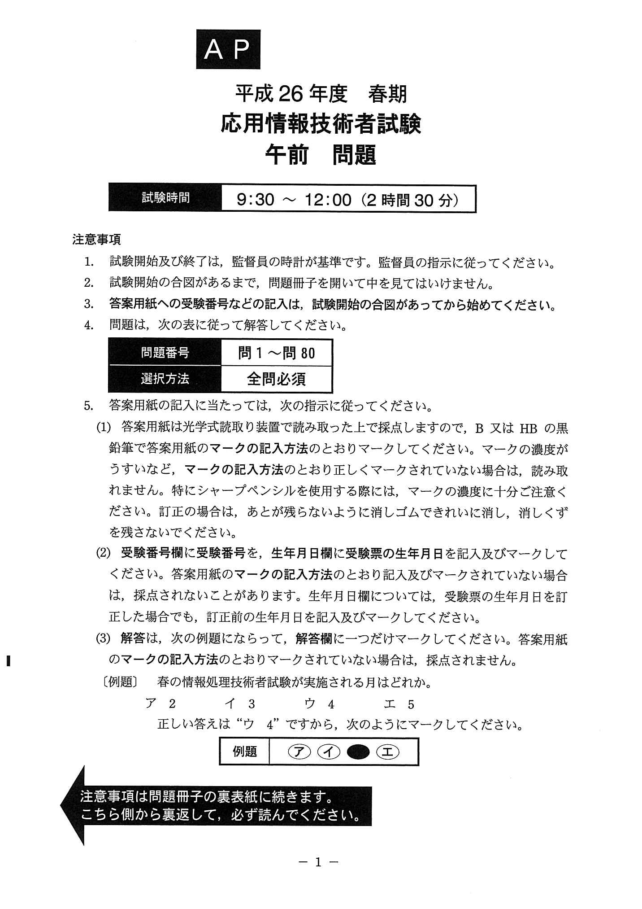

テキスト (OCR)

平成26年度 春期
応用情報技術者試験
午前 問題

«9:30 ~ 12:00 (2m 30 5)

注意事項

1. 試験開始及び終了は, 監督員の時計が基準です。監督員の指示に従ってください。

2. 試験開始の合図があるまで, 問題冊子を開いて中を見てはいけません。

3. 答案用紙への受験番号などの記入は, 試験開始の合図があってから始めてください。

4. 問題は, 次の表に従って解答してください。

問題番号        問1て問80
選択方法    全間必須
5. 答案用紙の記入に当たっては, 次の指示に従ってください。

Q) 答案用紙は光学式読取り装置で読み取った上で採点しますので, B 又は HB の黒
鉛筆で答案用紙のマークの記入方法のとおりマークしてください。マークの濃度が
うすいなど, マークの記入方法のとおり正しくマークされていない場合は, 読み取
れません。特にシャープペンシルを使用する際には, マークの濃度に十分ご注意く
ださい。訂正の場合は, あとが残らないように消しゴムできれいに消し, 消しくず
を残さないでください。

2) 受験番号欄に受験番号を, 生年月日欄に受験票の生年月日を記入及びマークして
ください。答案用紙のマークの記入方法のとおり記入及びマークされていない場合
は, 採点されないことがあります。生年月日欄については, 受験票の生年月日を訂
正した場合でも, 訂正前の生年月日を記入及びマークしてください。

(3) 解答は, 次の例題にならって, 解答欄に一つだけマークしてください。 SRAM
のマークの記入方法のとおりマークされていない場合は, 採点されません。

〔例題) 春の情報処理技術者試験が実施される月はどれか。

ア 2    イ 3    ウ 4    エ 5
正しい答えは “ウ 4”" ですから, 次のようにマークしてください。

例題 | (ア)(イ) や)

注意事項は問題冊子の裏表紙に続きます。
こちら側から裏返して, 必ず読んでください。

### ページ 2

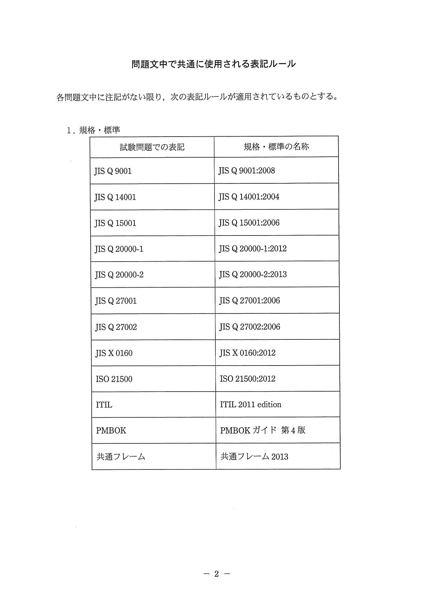

テキスト (OCR)

問題文中で共通に使用される表記ルール

各問題文中に注記がない限り, 次の表記ルールが適用されているものとする。

1. 規格・標準
試験問題での表記                 規格・標準の名称
JIS Q 9001                               JIS Q 9001:2008
JIS Q 14001                             JIS Q 14001:2004
JIS Q 15001                             JIS Q 15001:2006

JIS Q 20000-1

JIS Q 20000-1:2012

JIS Q 20000-2

JIS Q 20000-2:2013

JIS Q 27001                               JIS Q 27001:2006

JIS Q 27002                               JIS Q 27002:2006

JIS X 0160                                    JIS X 0160:2012

ISO 21500                                     ISO 21500:2012

ITIL                                             ITIL 2011 edition
PMBOK                                PMBOK ガイド 第4版
共通フレーム             共通フレーム 2013

### ページ 3

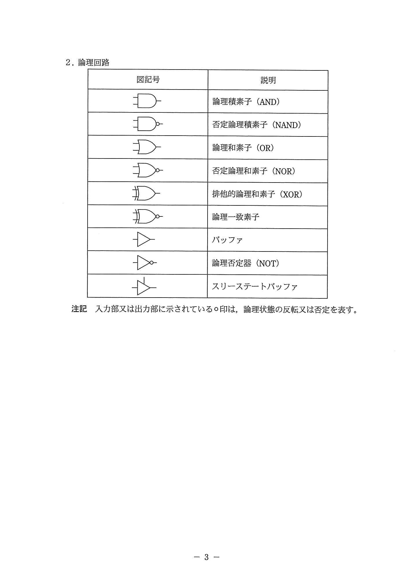

テキスト (OCR)

・ 論理回路

q
ET
cu
a

説明

論理積素子 (AND)

否定論理積素子 (NAND)

論理和素子 (OR)

否定論理和素子 (NOR)

排他的論理和素子 (XOR)

論理一致素子

バッファ

論理否定器 (NOT)

スリーステートバッファ

YYMMMVMMMU

注記 入力部又は出力部に示されているo印は, 論理状態の反転又は否定を表す。

### ページ 4

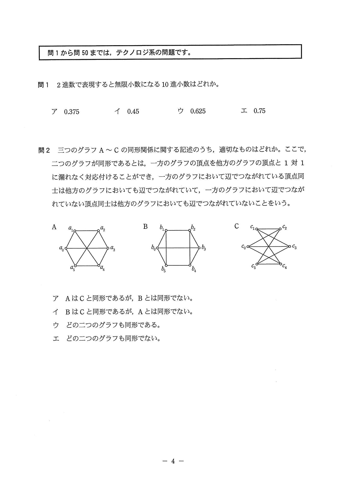

テキスト (OCR)

問 1 から問 50 までは, テクノロジ系の問題です。

問1 2進数で表現すると無限小数になる 10 進小数はどれか。

ア 0.375     イ 0.45     ウ 0.625     エ 0.75

間2 三つのグラフA<てC の同形関係に関する記述のうち, 適切なものはどれか。ここで,
二つのグラフが同形であるとは, 一方のグラフの頂点を他方のグラフの頂点と 1 対 1
に漏れなく対応付けることができ, 一方のグラフにおいて辺でつながれている頂点同
士は他方のグラフにおいても辺でつながれていて, 一方のグラフにおいて辺でつなが
れていない頂点同士は他方のグラフにおいても辺でつながれていないことをいう。

AはCと同形であるが, B とは同形でない。
BはCと同形であるが, A とは同形でない。
どの二つのグラフも同形である。
どの二つのグラフも同形でない。

HH 二 スパ

### ページ 5

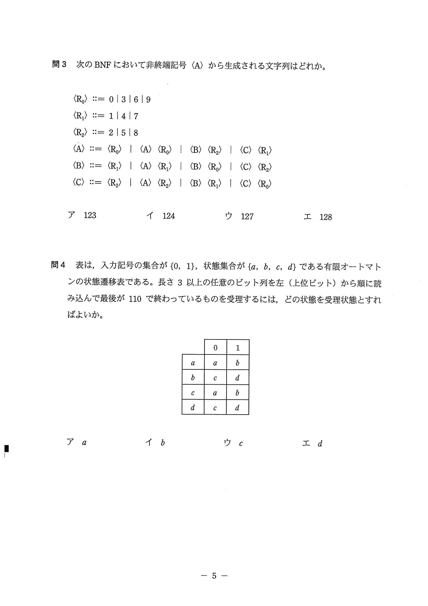

テキスト (OCR)

間3 次のBNF において非終端記号 (A) から生成される文字列はどれか。

RB, s= 0131619
Ry) = 11417
R,) == 21518
(A) == (R,) | (A) ) | @) Q) | (@) (RD
(B) z= (R) | (A) ®) | ® QR) | © ®)
(C) n= (R,) | (A) ) | BR) | ©) &R,)

ア 123     イ 124     ウ 127     <I 128

問4 表は, 入力記号の集合が {0, 1}, 状態集合が 2, 0, c, d} である有限オートマト
ンの状態遷移表である。長さ 3 以上の任意のビット列を左 (上位ビピット) から順に読
み込んで最後が 110 で終わっているものを受理するには, どの状態を受理状態とすれ
ばよいか。

0 | 1
2 | @ | ob
2 | ce | g
c | a] 6b
9 | c | g
ア a   tb   必 6   = 9

### ページ 6

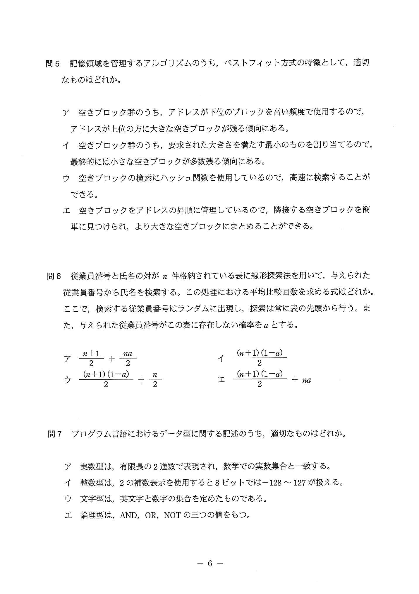

テキスト (OCR)

AS 記憶領域を管理するアルゴリズムのうち, ベストフィット方式の特徴として, 適切
なものはどれか。

ア 空きブロック群のうち, アドレスが下位のブロックを高い上顔度で使用するので,
アドレスが上位の方に大きな空きブロックが残る傾向にある。

イ 空きブロック群のうち, 要求された大きさを満たす最小のものを割り当てるので,
最終的には小さな空きブロックが多数残る傾向にある。

ウ 空きブロックの検索にハッシュ関数を使用しているので, 高速に検索することが
できる。

エエ 空きプロックをアドレスの昇順に管理しているので, 隣接する空きブロックを科
単に見つけられ, より大きな空きブロックにまとめることができる。

問6 従業員番号と氏名の対が n 件格納されている表に線形探索法を用いて, 与えられた
従業員番号から氏名を検索する。この処理における平均比較回数を求める式はどれか。
ここで, 検索する従業員番号はランダムに出現し, 探索は常に表の先頭から行う。ま

た, 与えられた従業員番号がこの表に存在しない確率を g とする。

Y

n+1 na      +l) A-a)
ar T 5     ィ  2

ウ   @寺1) 1一の                   ¥   (+1) d—a)

2                  2    + na

n
+ っ

A? プログラム言語におけるデータ型に関する記述のうち, 適切なものはどれか。

実数型は, 有限長の 2 進数で表現され, 数学での実数集合と一致する。
整数型は, 2 の補数表示を使用すると 8 ビットでは128 ~ 127 が扱える。
文字型は, 英文字と数字の集合を定めたものである。

論理型は, AND, OR, NOT の三つの値をもつ。

HUA NS

### ページ 7

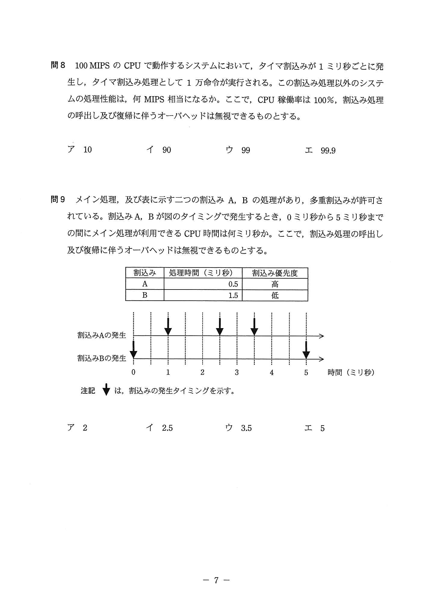

テキスト (OCR)

問8 100MIPS の CPU で動作するシステムにおいて, タイマ割込みが 1 ミリ秒ごとに発
AL, タイマ割込み処理として 1 万命令が実行される。この割込み処理以外のシステ
ムの処理性能は, 何 MTPS 相当になるか。ここで, CPU 稼働率は 100%, 割込み処理
の呼出し及び復帰に伴うオーバヘッドは無視できるものとする。

ア 10      イ 90      ウ 99      = 909

問9 メイン処理, 及び表に示す二つの割込み A, B の処理があり, 多重割込みが許可さ
れている。割込み A, B が図のタイミングで発生するとき, 0 ミリ秒から 5 ミリ秒まで
の間にメイン処理が利用できる CPU 時間は何ミリ秒か。ここで, 割込み処理の呼出し
及び復帰に伴うオーバヘッドは無視できるものとする。

割込み | 処理時間 (ミリ秒)   割込み優先度

A            0.5     高
B            1.5     低
割込みAの発生 |                4
割込みBの発生 『                        +
0      1      2      3      4      5    時間 (ミリ秒)

注記 事 は, 割込みの発生タイミングを示す。

### ページ 8

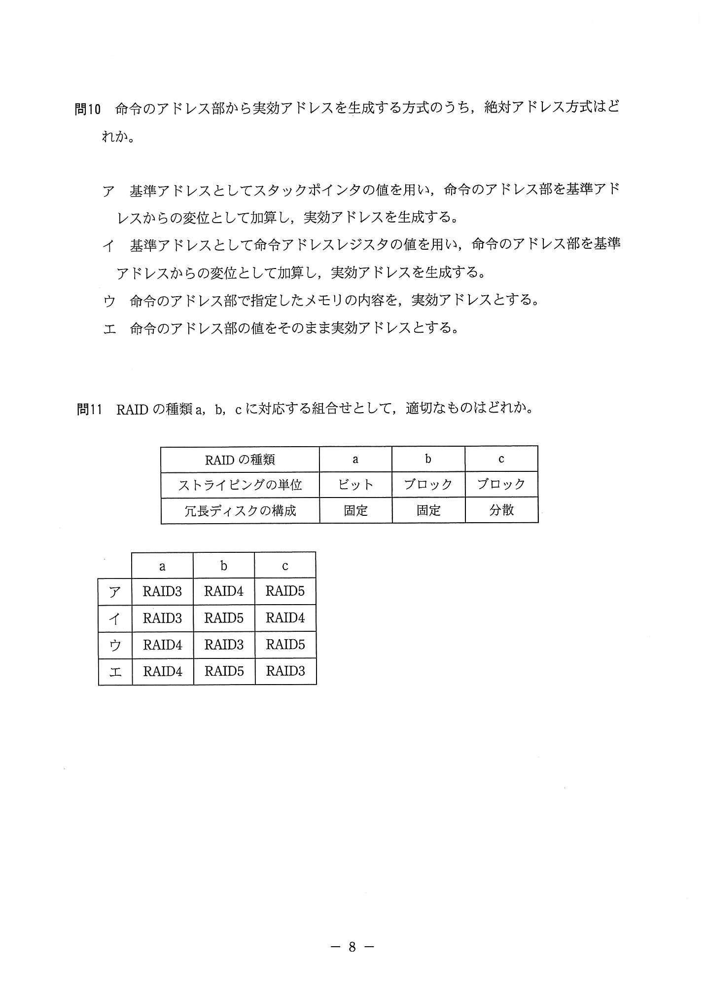

テキスト (OCR)

間10 命令のアドレス部から実効アドレスを生成する方式のうち, 絶対アドレス方式はど
れか。

ア 基準アドレスとしてスタックポインタの値を用い, 命令のアドレス部を基準アド
レスからの変位として加算し, 実効アドレスを生成する。

イ 基準アドレスとして命令アドレスレジスタの値を用い, 命令のアドレス部を基準
アドレスからの変位として加算し, 実効アドレスを生成する。

ウ 命令のアドレス部で指定したメモリの内容を, 実効アドレスとする。

エエ 命令のアドレス部の値をそのまま実効アドレスとする。

問11 RAID の種類a,b, cに対応する組合せとして, 適切なものはどれか。

RAID の種類        a       b       @
ストライピングの単位     ビット    プブロック | ブロック
冗長ディスクの構成    固定    固定    Di
a       b        C

RAID3 | RAID4 | RAIDS
RAID3 | RAIDS | RAID4
RAID4 | RAID3 | RAIDS
RAID4 | RAIDS | RAID3

H |へ1

### ページ 9

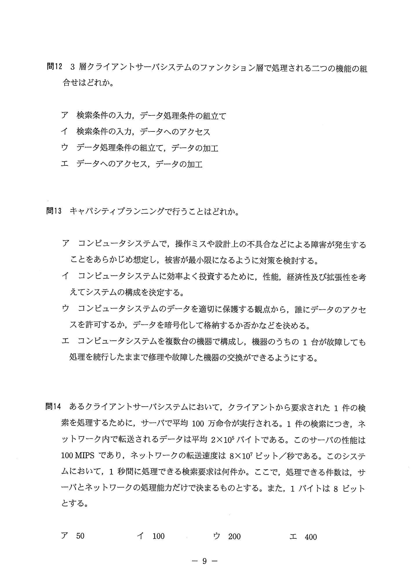

テキスト (OCR)

間12 3 層クライアントサーバシステムのファンクション層で処理される二つの機能の組
合せはどれか。

検索条件の入力。データ処理条件の組立て
検索条件の入力.データへのアクセス
データ処理条件の組立て, データの加工
データへのアクセス, データの加工

HH へ

間13 キャパシティプランニングで行うことはどれか。

ア コンピュータシステムで, 操作ミスや設計上の不具合などによる障害が発生する
ことをあらかじめ想定し, 被害が最小限になるように対策を検討する。

イ コンピュータシステムに効率よく投資するために, 性能, 経済性及び拡張性を考
えてシステムの構成を決定する。

ウ コンピュータシステムのデータを適切に保護する観点から, 誰にデータのアクセ
スを許可するか, データを暗号化して格納するか否かなどを決める。

TE コンピュータシステムを複数台の機器で構成し, 機器のうちの 1 台が故障しても
処理を続行したままで修理や故障した機器の交換ができるようにする。

間14 あるクライアントサーバシステムにおいて, クライアントから要求された 1 件の検
索を処理するために, サーバで平均 100 万命令が実行される。1 件の検索につき, ネ
ットワーク内で転送されるデータは平均 2X105 バイトである。このサーバの性能は
100 MIPS であり, ネットワークの転送速度は 8X107 ビットノ秒である。このシステ
ムにおいて, 1 秒間に処理できる検索要求は何件か。ここで, 処理できる件数は, サ
ーバとネットワークの処理能力だけで決まるものとする。また, 1 バイトは 8 ビット
とする。

ア 50      イ 100     ウ 200     x= 400

### ページ 10

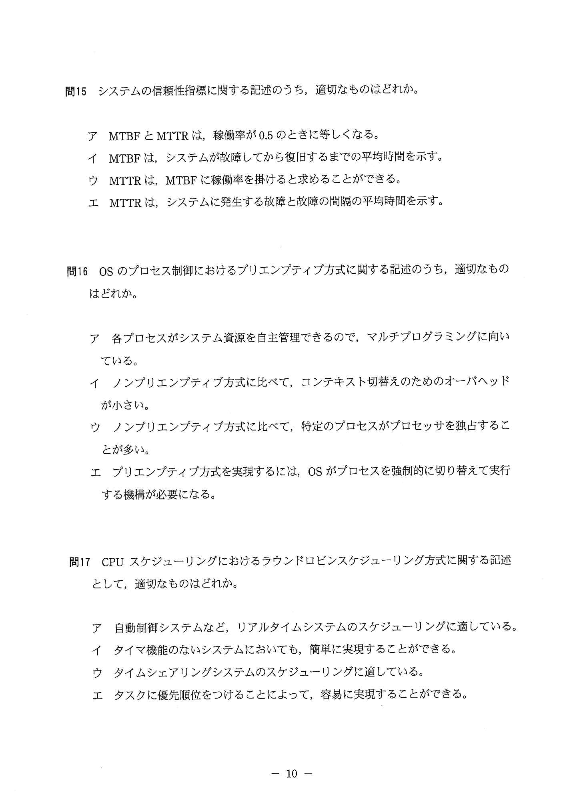

テキスト (OCR)

間15 システムの信頼性指標に関する記述のうち, 適切なものはどれか。

MTBF と MTTR は, 稼働率が0.5 のときに等しくなる。

MTBF ld, システムが故障してから復旧するまでの平均時間を示す。
MTTR は, MTBF に稼働率を掛けると求めることができる。

MTTR は, システムに発生する故障と政障の間隔の平均時間を示す。

H へ N

間16 OS のプロセス制御におけるプリエンプティブ方式に関する記述のうち, 適切なもの
はどれか。

ア 各プロセスがシステム資源を自主管理できるので, マルチプログラミングに向い
ている。

A ノンプリエンプティブ方式に比べて, コンテキスト切替えのためのオーバヘッド
が小さい。

ウ ノンプリエンプティブ方式に比べて, 特定のプロセスがプロセッサを独占するこ
とが多い。

エ プリエンプティブ方式を実現するには, 0S がプロセスを強制的に切り替えて実行
する機構が必要になる。

間17 CPU スケジューリングにおけるラウンドロビンスケジューリング方式に関する記述
として, 適切なものはどれか。

自動制御レステムなど, リアルタイムシステムのスケジューリングに適している。
タイマ機能のないシステムにおいても, 簡単に実現することができる。

タイムシェアリングシステムのスケジューリングに適している。

タスクに優先順位をつけることによって, 容易に実現することができる。

H ささい

ー 10 一

### ページ 11

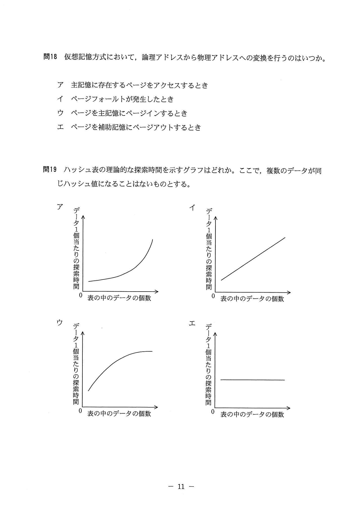

テキスト (OCR)

間18 仮想記憶方式において, 論理アドレスから物理アドレスへの変換を行うのはいつか。

主記憶に存在するページをアクセスするとき
ページフォールトが発生したとき

ページを主記憶にページインするとき

ページを補助記憶にページアウトするとき

H ささい

問19 ハッシュ表の理論的な探索時間を示すグラフはどれか。ここで, 複数のデータが同
じハッシュ値になることはないものとする。

タ                    タ
中     1
個                    個
当                    当
だ     Te
り                    り
の     の
探                    a
索                    EA
時                    時
i                    rf
0 表の中のデータの個数         0 表の中のデータの個数
> f   - 7
タ                    タ
1     1
個                    個
当     当
だ
り     り
の     の
Ea                    探
索                    EA
時                    時
al                    間

0 表の中のデータの個数         0 表の中のデータの個数

ー 11 一

### ページ 12

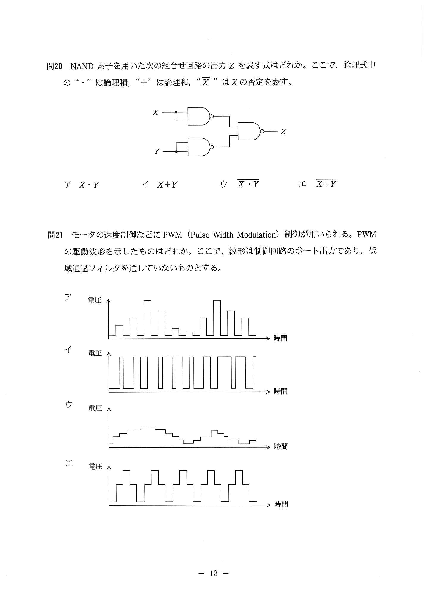

テキスト (OCR)

間20 NAND 素子を用いた次の組合せ回路の出力 Z を表す式はどれか。ここで, 論理式中
© “+” VER, “+” は論理和, “X "は々の否定を表す。

“うー
oe

pL

y XY    イ X+Y¥    7 X+¥    エギ寺子

間21 モータの速度制御などにPWM (Pulse Width Modulation) 制御が用いられる。 PWM
の駆動波形を示したものはどれか。ここで, 波形は制御回路のポート出力であり, 低
域通過フィルタを通していないものとする。

1 on of
JU

時間

時間

時間

Pout

時間

= Pe

### ページ 13

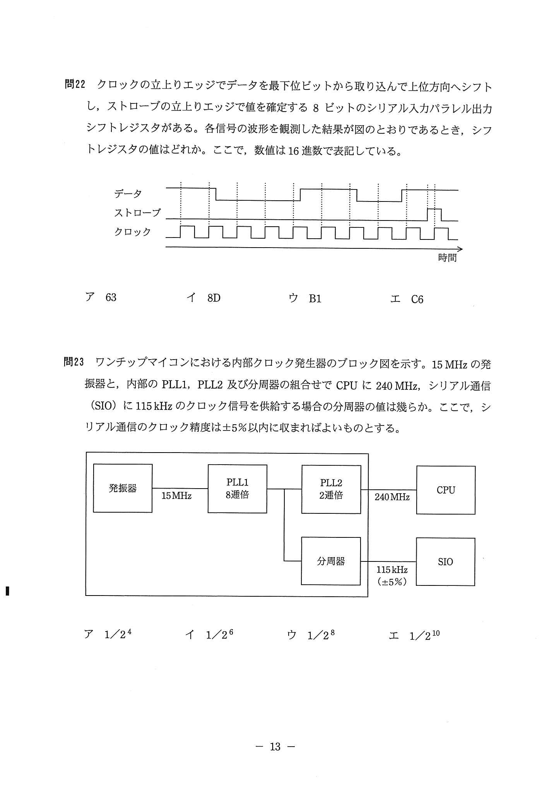

テキスト (OCR)

間22 クロックの立上りエッジでデータを最下位ビットから取り込んで上位方向ヘシフト
し, ストローブの立上りエッジで値を確定する 8 ビットのシリアル入力パラレル出力
シフトレジスタがある。各信号の波形を観測した結果が図のとおりであるとき, シフ
トレジスタの値はどれか。ここで, 数値は 16 進数で表記している。

間23 ワンチップマイコンにおける内部クロック発生器のブロック図を示す。15 MHz OF
振器と, 内部の PLL1, PLL2 及び分周器の組合せで CPU に 240 MHz. シリアル通信
(SIO) に 115 kHz のクロック信号を供給する場合の分周器の値は幾らか。ここで, シ

リアル通信のクロック精度は土5%以内に収まればよいものとする。

os        PLL1      PLL2
Re an           8運倍                       2通倍          ome | FU
aa            SIO
ia   115 kHz
(+5%)
ア 1/24    4 1728    7 1728    エ 1/2

ー 13 一

### ページ 14

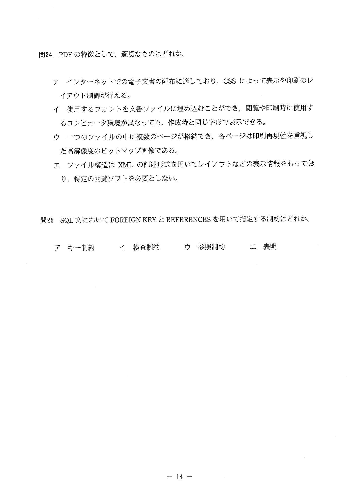

テキスト (OCR)

問24 PDF の特徴として, 適切なものはどれか。

ア インターネットでの電子文書の配布に適しており, CSS によって表示や印刷のレ
イアウト制御が行える。

A 使用するフォントを文書ファイルに埋め込むことができ, 閲覧や印刷時に使用す
るコンピュータ環境が異なっても, 作成時と同じ字形で表示できる。

ウ 一つのファイルの中に複数のページが格納でき, 各ページは印刷再現性を重視し
た高解像度のビットマップ画像である。

エエ ファイル構造は XML の記述形式を用いてレイアウトなどの表示情報をもってお
り, 特定の閲覧ソフトを必要としない。

間25 SQL 文においてFOREIGN KEY と REFERENCES を用いて指定する制約はどれか。

ア キー制約   イ 検査制約   ウ 参照制約   エエ 表明

ー 14 一

### ページ 15

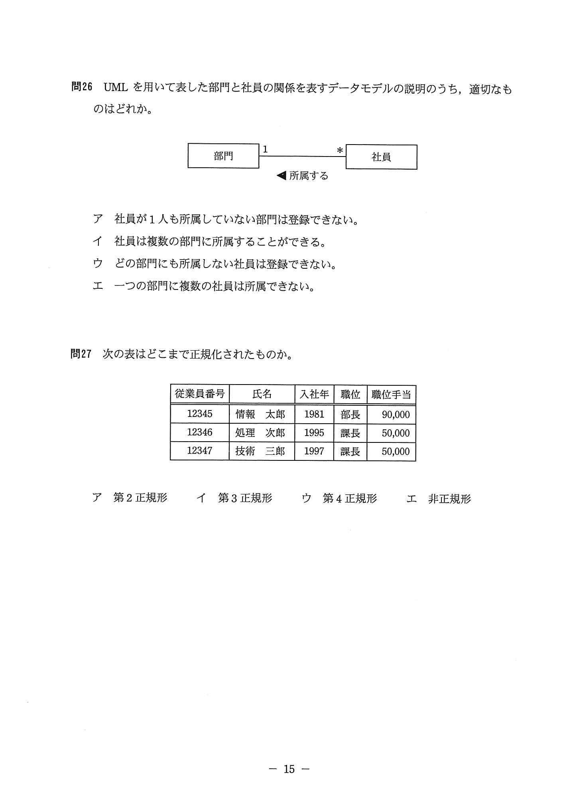

テキスト (OCR)

問26 UML を用いて表した部門と社員の関係を表すデータモデルの説明のうち, 適切なや

のはどれか。
部円      社員
る 所属する
ア 社員が1人も所属していない部門は登録できない。
イ 社員は複数の部門に所属することができる。
ウ どの部門にも所属しない社員は飼録できない。
L 一つの部門に複数の社員は所属できない。
問27 次の表はどこまで正規化されたものか。
従業員番号| 氏名 |入社年|職位|職位手当
12345  情報 太郎  1981  部長  90,000
12346  処理 次郎  1995 | 課長  50,000
12347  技術 三郎  1997 | 課長  50,000

ア 第2正規形    イ 第3正規形

ウ 第4正規形    工 非正規形

ー 15 一

### ページ 16

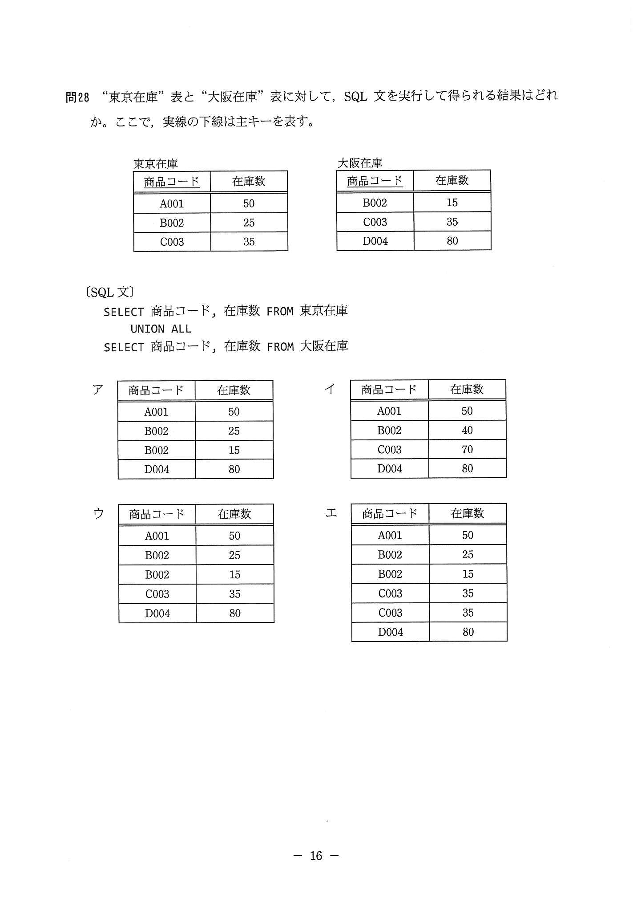

テキスト (OCR)

間28 "東京在庫"表と“大阪在庫" 表に対して, SQL 文を実行して得られる結果はどれ
か。ここで, 実線の下線は主キーを表す。

東京在庫                                        大阪在庫
商品コード     在庫数           商品コード     在庫数
A001               50                           B002               15
B002               25                           C003               35
C003               35                           D004               80
(SQL 文〕
SELECT 商品コード, 在庫数 FROM 東京在庫
UNION ALL

SELECT 商品コード, 在庫数 FROM 大阪在庫

アプ | 商品コード    在庫数         of,   商品コード    在庫数
A001              50                               A001              50
B002              25                               B002              40
B002              15                               C0038              70
D004              80                               D004              80
ウ | 商品コード | 在庫数       x= | 商品コード | 在庫数
A001              50                               A001              50
B002              25                               B002              25
B002              15                               B002              15
C003              35                               C003              35
D004              80                               C003              35
D004              80

ー 16 一

### ページ 17

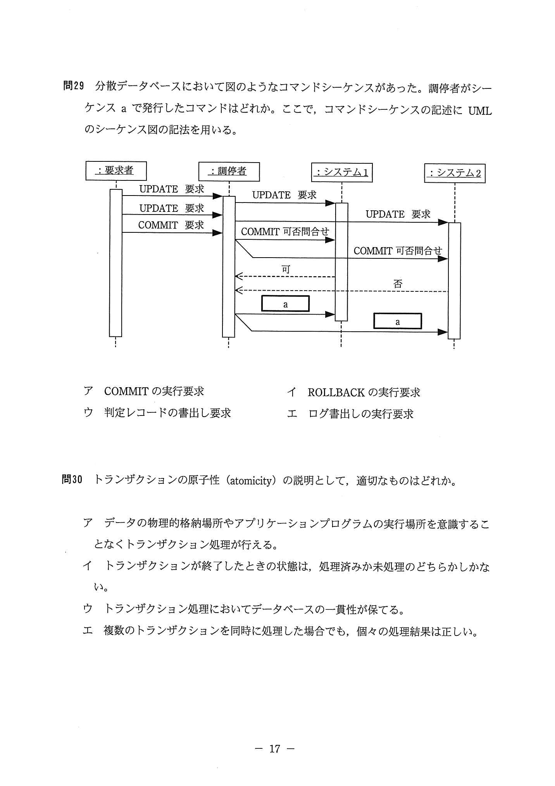

テキスト (OCR)

間29 分散データベースにおいて図のようなコマンドシーケンスがあった。 調停者がシー
ケンス a で発行したコマンドはどれか。ここで, コマンドシーケンスの記述に UML
のシーケンス図の記法を用いる。

=: 要求者          -: 調停者          : システム1         : システム2
「 UPDATE 要求 | ppArg杉求 !
i)                            1
| UPDATE 要求 |                                     UPDATE 要求
COMMIT 要求       COMMIT 可否問合せ
K ーーーーーーーーーーー基=|
COMMIT 可否問合せ
al
ee
——             a
.    」     ーー
ア COMMIT の実行要求                      4 ROLLBACK の実行要求
ウ 判定レコードの書出し要求          エエ ログ書出しの実行要求

B30 トランザクションの原子性 (atomicity) の説明として, 適切なものはどれか。

ア データの物理的格納場所やアプリケーションプログラムの実行場所を意識するこ
となくトランザクション処理が行える。

イ トランザクションが終了したときの状態は, 処理済みか未処理のどちらかしかな
い。

ウ トランザクション処理においてデータベースの一中性が保てる。

工 複数のトランザクションを同時に処理した場合でも, 個々の処理結果は正しい。

ー 17 一

### ページ 18

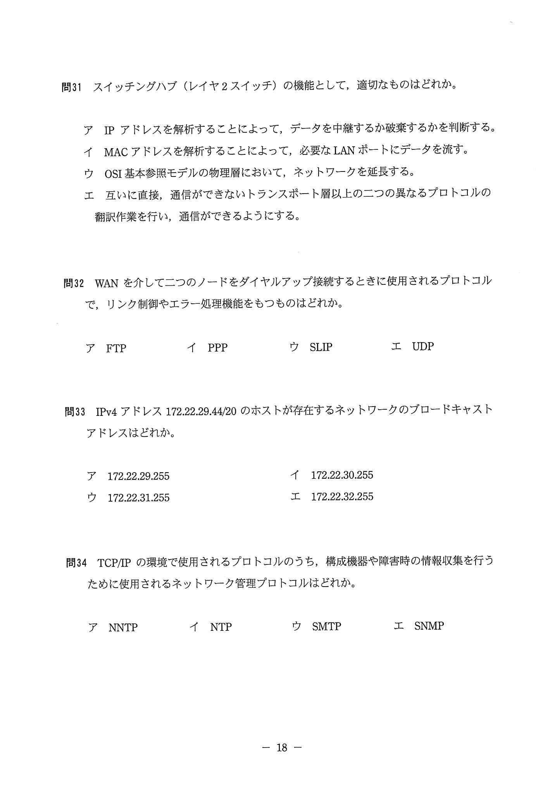

テキスト (OCR)

間31 スイッチングハブ (レイヤ 2 スイッチ) の機能として, 適切なものはどれか。

IP アドレスを解析することによって, データを中継するか破棄するかを判断する。

MACアドレスを解析することによって, 必要なLAN ポボートにデータを流す。

OSI 基本参照モデルの物理層において, ネットワークを延長する。

互いに直接, 通信ができないトランスポート層以上の二つの異なるプロトコルの
翻訳作業を行い, 通信ができるようにする。

H へ

問32 WAN を介して二つのノードをダイヤルアップ接続するときに使用されるプロトコル
で, リンク制御やエラー処理機能をもつものはどれか。

ア FTP     イ PPP     ウ SLIP     < UDP

問33 IPv4 アドレス 172.22.29.44/20 のホストが存在するネットワークのブロードキャスト
アドレスはどれか。

ア 172.22.29.255                      イ 172.22.30.255
ウ 172.22.31.255                      エ 172.22.32.255
問34 TCP/IP の環境で使用されるプロトコルのうち, 構成機器や障害時の情報収集を行う

ために使用されるネットワーク管理プロトコルはどれか。

ア NNTP    イ NTP     ウ SMTP    <= SNMP

### ページ 19

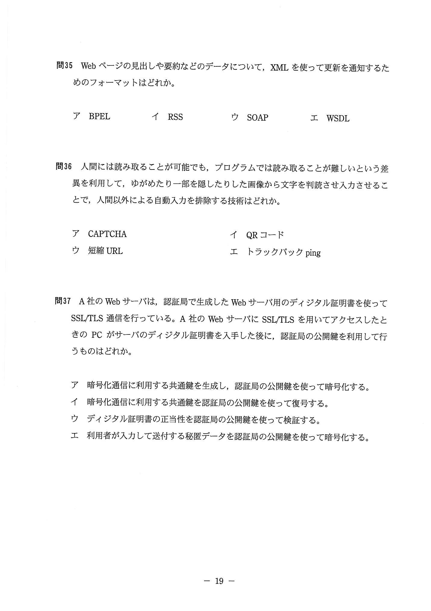

テキスト (OCR)

問35 Web ページの見出しや要約などのデータについて, XML を使って更新を通知するた
めのフォーマットはどれか。

ア BPEL    イ RSS     ウ SOAP     <= WSDL

問36 人間には読み取ることが可能でも, プログラムでは読み取ることが難しいという差
REMALT, ゆがめたり一部を隠したりした画像から文字を判読させ入力させるこ
とで, 人間以外による自動入力を排除する技術はどれか。

ア CAPTCHA          イ QRコード
ウ 短縮URL           エエ トラックバック ping

問37 A社の Web サーバは, 認証局で生成した Web サーバ用のディジタル証明書を使って
SSL/TLS 通信を行っている。A 社の Web サーバに SSL/TLS を用いてアクセスしたと
EO PC がサーバのディジタル証明書を入手した後に, 認証局の公開鍵を利用して行
うものはどれか。

暗号化通信に利用する共通鍵を生成し, 認証局の公開鍵を使って暗号化する。
暗号化通信に利用する共通鍵を認証局の公開鍵を使って復号する。

ディジタル証明書の正当性を認証局の公開鍵を使って検証する。
利用者が入力して送付する秘磨データを認証局の公開鍵を使って暗号化する。

H ざさへ

### ページ 20

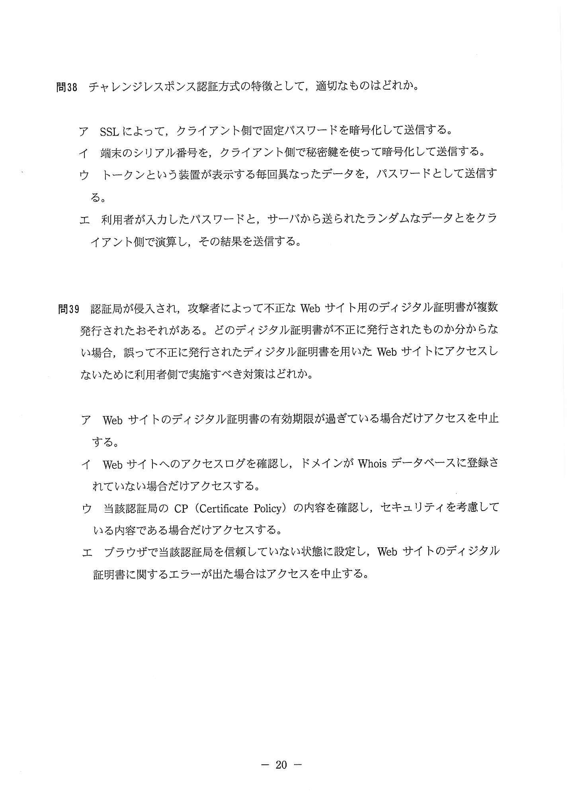

テキスト (OCR)

問38

間39

チャレンジレスポンス認証方式の特徴として, 適切なものはどれか。

ア SSL によって, クライアント側で固定パスワードを暗号化して送信する。

A 端末のシリアル番号を, クライアント側で秘密鍵を使って暗号化して送信する。

ウ トークンという装置が表示する毎回扶なったデータを, パスワードとして送信す
る。

エエ 利用者が入力したパスワードと, サーバから送られたランダムなデータとをクラ
イアント側で演算し, その結果を送信する。

認証局が侵入され, 攻撃者によって不正な Web サイト用のディジタル証明書が複数
発行されたおそれがある。どのディジタル証明書が不正に発行されたものか分からな
い場合, 誤って不正に発行されたディジタル証明書を用いた Web サイトにアクセスし
ないために利用者側で実施すべき対策はどれか。

ア Web サイトのディジタル証明書の有効期限が過ぎている場合だけアクセスを中止
する。

イ Web サイトへのアクセスログを確認し, ドメインが Whois データベースに登録さ
れていない場合だけアクセスする。

ウ 当該認証局の CP (Certificate Policy) の内容を確認し, セキュリティを考慮して
いる内容である場合だけアクセスする。

エエ ブラウザで当該認証局を信頼していない状態に設定し, Web サイトのディジタル
証明書に関するエラーが出た場合はアクセスを中止する。

ー 20 一

### ページ 21

テキスト (OCR)

間40 安全な Web アプリケーションの作り方について, 攻撃と対策の適切な組合せはどれ
か。

攻撃                対策
—  yee        SQL 文の組立てに静的プレースホルダ
ア ISQLインジェクション             を使用する。
イ |クロスサイトスクリプティング    任意の外部サイトのスタイルシートを取

り込めるようにする。

ウ | タロスサイトリクエストフォージェリ | "クエストに GET メソッドを使用す

利用者ごとに固定のセッション ID を使
用する。

エエ |セッションハイジャック

間41 ディジタルフォレンジックスの説明として, 適切なものはどれか。

ア あらかじめ設定した運用基準に従って., メールサーバを通過する送受信メールを
フィルタリングすること

イ サーバに対する外部からの攻撃や不正なアクセスを防御すること

ウ 磁気ディスクなどの書換え可能な記億媒体を単に初期化するだけではデータを復
元できる可能性があるので, 任意のデータ列で上書きすること

tL 不正アクセスなどコンピュータに関する犯罪の法的な証拠性を確保できるように,
原因究明に必要な情報の保全, 収集, 分析をすること

42 ペネトレーションテストの目的はどれか。

暗号化で使用している暗号方式と鍵長が, 設計仕様と一致することを確認する。
対象プログラムの入力に対する出力結果が, 出力仕様と一致することを確認する。
ファイアウォールが単位時間当たりに処理できるセッション数を確認する。

ファイアウォールや公開サーバに対して侵入できないことを確認する。

Hさささ

ー 21 一

### ページ 22

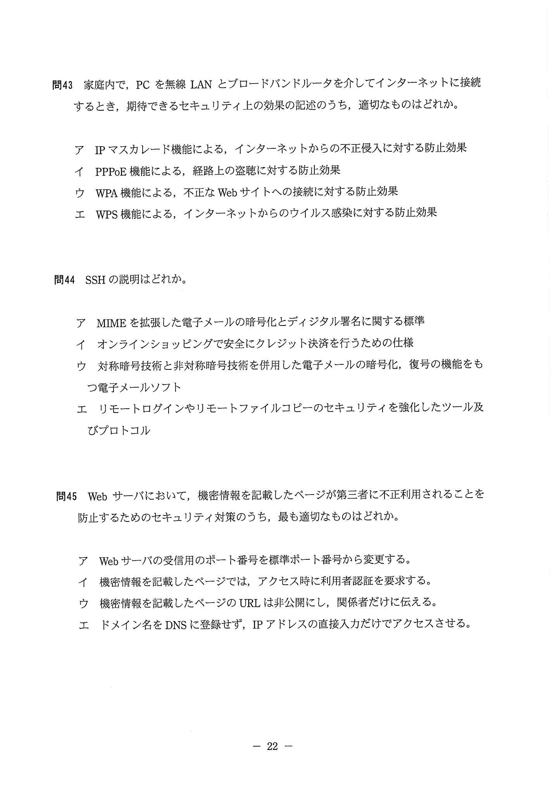

テキスト (OCR)

間43 家庭内で, PC を無線 LAN とプロードバンドルータを介してインターネットに接続
するとき, 期待できるセキュリティ上の効果の記述のうち, 適切なものはどれか。

IP マスカレード機能こよる, インターネットからの不正侵入に対する防止効果
PPPoE 機能による, 経路上の盗聴に対する防止効果

WPA 機能による, 不正な Web サイトへの接続に対する防止効果

WPS 機能による, インターネットからのウイルス感染に対する防止効果

H へ

問44 SSH の説明はどれか。

ア MIMEを拡張した電子メールの暗号化とディジタル署名に関する標準

A オンラインショッピングで安全にクレジット決済を行うための仕欄

ウ 対称暗号技術と非対称暗号技術を併用した電子メールの暗号化, 復号の機能をも
つ電子メールソフト

エエ リモートログインやリモートファイルコピーのセキュリティを強化したツール及
びプロトコル

問45 Web サーバにおいて, 機密情報を記載したページが第三者に不正利用されることを
防止するためのセキュリティ対策のうち, 最も適功なものはどれか。

Web サーバの受信用のボート番号を標準ボート番号から変更する。

機密情報を記載したページでは, アクセス時に利用者認証を要求する。

機密情報を記載したページの URL は非公開にし, 関係者だけに伝える。

ドメイン名を DNS に登録せず, IP アドレスの直接入力だけでアクセスさせる。

H へ NW

ー 22 一

### ページ 23

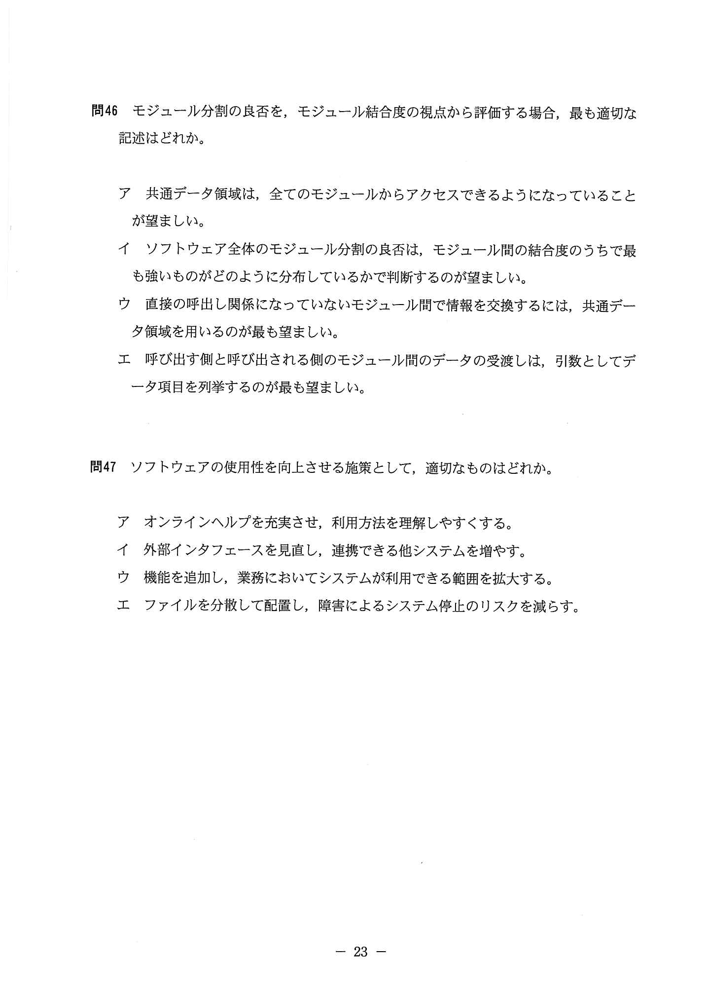

テキスト (OCR)

問46 モジュール分割の良否を, モジュール結合度の視点から評価する場合, 最も適切な
記述はどれか。

ア 共通データ領域は。 全てのモジュールからアクセスできるようになっていること
が望ましい。

イ ソフトウェア全体のモジュール分割の良否は, モジュール間の結合度のうちで最
も強いものがどのように分布しているかで判断するのが望ましい。

ウ 直接の呼出し関係になっていないモジュール間で情報を交換するには, 共通デー
タ領域を用いるのが最も望ましい。

XL 呼び出す側と呼び出される側のモジュール間のデータの受渡しは, 引数としてデ
ータ項目を列挙するのが最も望ましい。

問47 ソフトウェアの使用性を向上させる施策として, 適切なものはどれか。

オンラインヘルプを充実させ, 利用方法を理解しやすくする。

外部インタフェースを見直し, 連携できる他システムを増やす。
機能を追加し, 業務においてシステムが利用できる範囲を拡大する。
ファイルを分散して配置し, 障害によるシステム停止のリスクを減らす。

Hゞへ さい

ー 23 一

### ページ 24

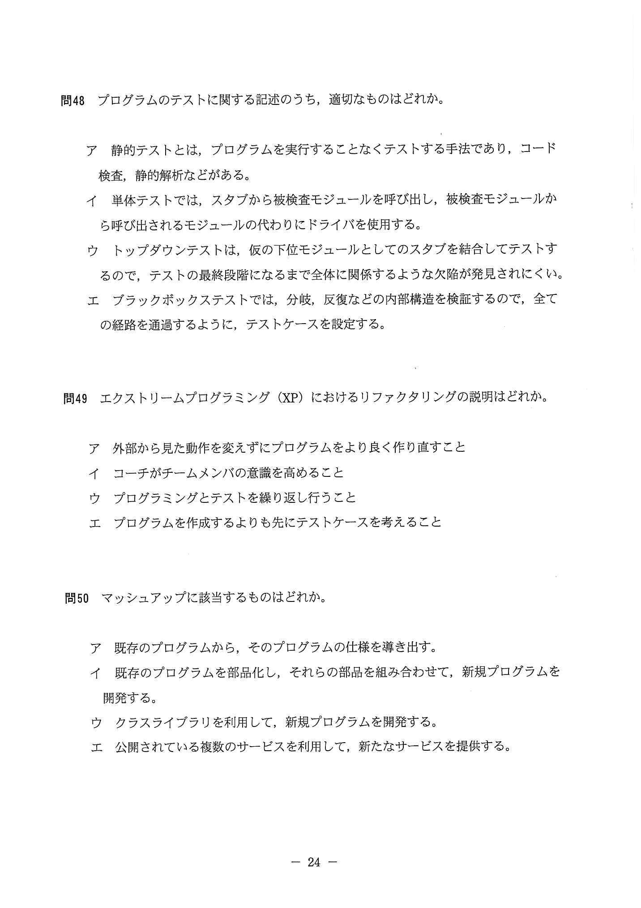

テキスト (OCR)

問48 プログラムのテストに関する記述のうち, 適切なものはどれか。

ア 静的テストとは, プログラムを実行することなくテストする手法であり, コード
検査, 静的解析などがある。

イ 単体テストでは, スタブから披検査モジュールを呼び出し, 被検査モジュールか
ら呼び出されるモジュールの代わりにドライバを使用する。

ウ トップダウンテストは, 仮の下位モジュールとしてのスタブを結合してテストす
るので, テストの最終段階になるまで全体に関係するような欠陥が発見されにくい。

EL ブラックボックステストでは, DIK, 反復などの内部構造を検証するので, 全て
の経路を通過するように, テストケースを設定する。

間49 エクストリームプログラミング (XP) におけるリファクタリングの説明はどれか。

外部から見た動作を変えたずにプログラムをより良く作り直すこと
コーチがチームメンバの意識を高めること

プログラミングとテストを繰り返し行うこと

プログラムを作成するよりも先にテストケースを考えること

H ささぺい

間50 マッシュアップに該当するものはどれか。

ア 既存のプログラムから, そのプログラムの仕様を導き出す。

4 既存のプログラムを部品化し, それらの部品を組み合わせて, 新規プログラムを
開発する。

ウ クラスライブラリを利用して, 新規プログラムを開発する。

エエ 公開されている複数のサービスを利用して, 新たなサービスを提供する。

ー 24 一

### ページ 25

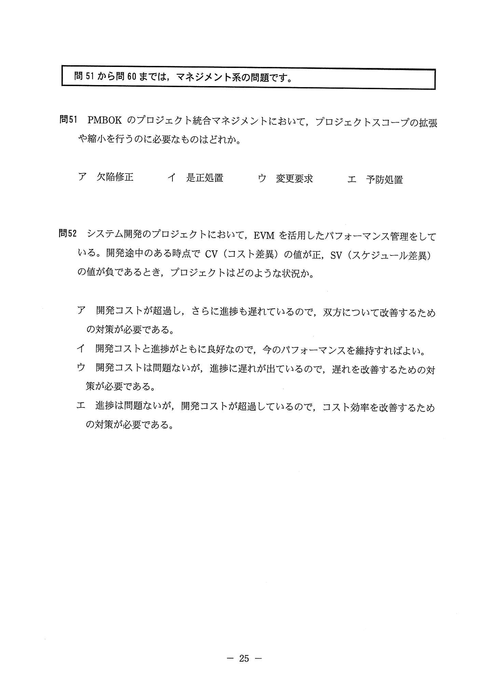

テキスト (OCR)

間 51 から問 60 までは, マネジメント系の問題です。

間51 PMBOK のプロジェクト統合マネジメントにおいて, プロジェクトスコープの拡張
や縮小を行うのに必要なものはどれか。

ア 欠陥修正   イ 直正処置   ウ 変更要求   エエ 予防処置

問52 システム開発のプロジェクトにおいて, EVM を活用したパフォーマンス管理をして
いる。 開発途中のある時点で CV (コスト差異) の値が正, SV (スケジュール差異)
の値が負であるとき, プロジェクトはどのような状況か。

ア 開発コストが超過し, さらに進捗も遅れているので, 双方について改善するため
の対策が必要である。

イ 開発コストと進捗がともに良好なので, 今のパフォーマンスを維持すればよい。

ウ 開発コストは問題ないが, 進捗に遅れが出ているので, 遅れを改善するための対
集が必要である。

エエ 進捗は問題ないが, 開発コストが超過しているので, コスト効率を改善するため
の対策が必要である。

ー 25 一

### ページ 26

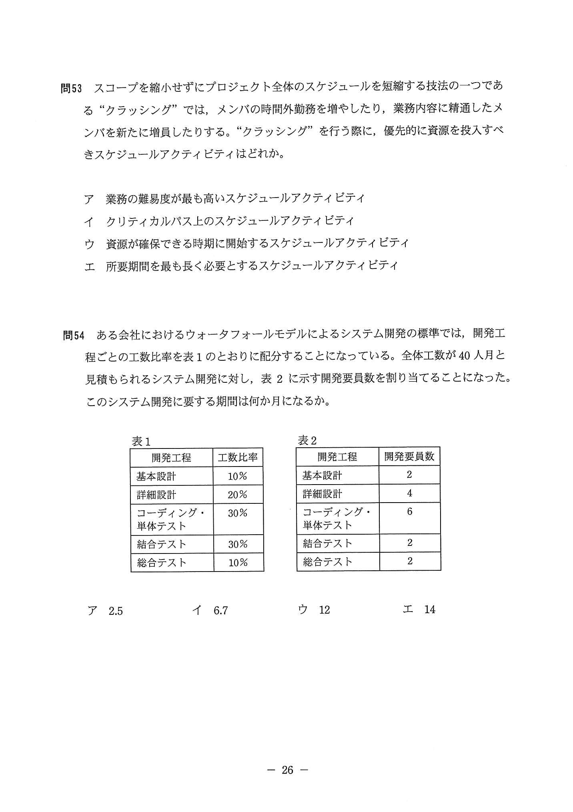

テキスト (OCR)

間53 スコープを縮小せずにプロジェクト全体のスケジュールを短縮する技法の一つであ
る “クラッシング"” では, メンバの時間外勤務を増やしたり, 業務内容に精通したメ
ンバを新たに増員したりする。"クラッシング” を行う際に, 優先的に資源を投入すべ
きスケジュールアクティビティはどれか。

ア 業務の難易度が最も高いスケジュールアクティビデティ

イ クリティカルパス上のスケジュールアクティビデティ

ウ 資源が確保できる時期に開始するスケジュールアクティビティ
エエ 所要期間を最も長く必要とするスケジュールアクティビティ

問54 ある会社におけるウォータフォールモデルによるシステム開発の標準では, 開発工
程ごとの工数比率を表 1 のとおりに配分することになっている。全体工数が 40 人月と
見積ちもられるシステム開発に対し, 表 2 に示す開発要員数を割り当てることになった。
このシステム開発に要する期間は何か月になるか。

表1                            表2
開発工程      工数比率             開発工程      開発要員数

基本設計           10%            基本設計              2
詳細設計           20%            詳細設計              4
コーディング・ | 30%       コーディング・     6
単体テスト                       単体テスト
結合テスト        30%           結合テスト           2
総合テスト        10%           総合テスト           2

ア 25               イ 6.7               ウ 12               エ 14

ー 26 一

### ページ 27

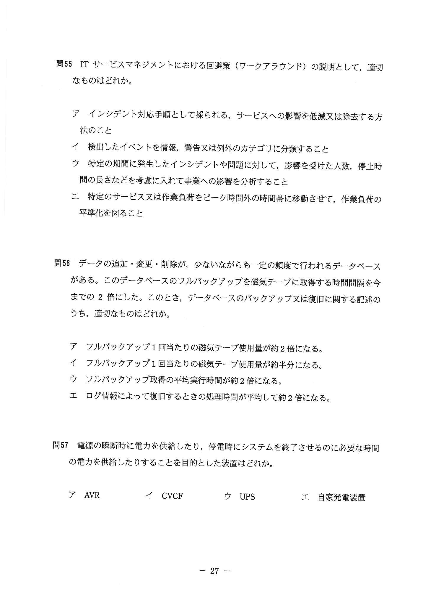

テキスト (OCR)

間55 IT サービスマネジメントにおける回避策 (リークアラウンド) の説明として, 適切
なものはどれか。

ア インシデント対応手順として採られる, サービスへの影響を低減又は除去する方
法のこと

イ 検出したイベントを情報警告又は例外のカテゴリに分類すること

ウ 特定の期間に発生したインシデントや問題に対して, 影響を受けた人数, 停止時
間の長さなどを考慮に入れて事業への影響を分析すること

TL 特定のサービス又は作業負荷をピーク時間外の時間帯に移動させて, 作業負荷の
平準化を図ること

間56 データの追加・変更・削除が, 少ないながらも一定の頻度で行われるデータベース
がある。このデータベースのフルバックアップを磁気テープに取得する時間間隔を今
までの 2 倍にした。このとき, データベースのバックアップ又は復旧に関する記述の
うち, 適切なものはどれか。

フルバックアップ 1 回当たりの磁気テープ使用量が約 2 倍になる。
フルバックアップ1 回当たりの磁気テープ使用量が約半分になる。
フルバックアップ取得の平均実行時間が約 2 倍になる。

ログ情報によって復上昌するときの処理時間が平均して約 2 倍になる。

Hさささ

問57 電源の瞬断時に電力を供給したり, 停電時にシステムを終了させるのに必要な時間
の電力を供給したりすることを目的とした装置はどれか。

ア AVR     イ CVCF    ウ UPS     L 自家発電装置

ー 27 一

### ページ 28

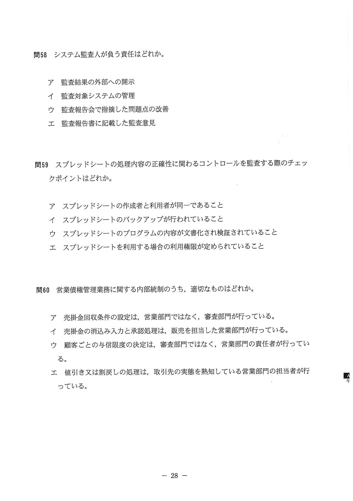

テキスト (OCR)

間58 システム監査人が負う責任はどれか。

監査結果の外部への開示

監査対象システムの管理

監査報告会で指摘した問題点の改善
監査報告書に記載した監査意見

H へ

間59 スプレッドシートの処理内容の正確性に関わるコントロールを監査する際のチェッ
クポイントはどれか。

スプレッドシートの作成者と利用者が同一であること

スプレッドシートのバックアップが行われていること

スプレッドシートのプログラムの内容が文書化され検証されていること
スプレッドシートを利用する場合の利用権限が定められていること

Hさふさ

間60 営業債権管理業務に関する内部統制のうち, 適切なものはどれか。

ア 売持金回収条件の設定は, 営業部門ではなく, 審査部門が行っている。

A 売掛金の消込み入力と承認処理は, 販売を担当した営業部門が行っている。

ウ 顧客ごとの与信限度の決定は, 審査部門ではなく, 営業部門の責任者が行ってい
る。

エエ 値引き又は割戻しの処理は, 取引先の実態を熱知している営業部門の担当者が行
っている。                                 -

+8

### ページ 29

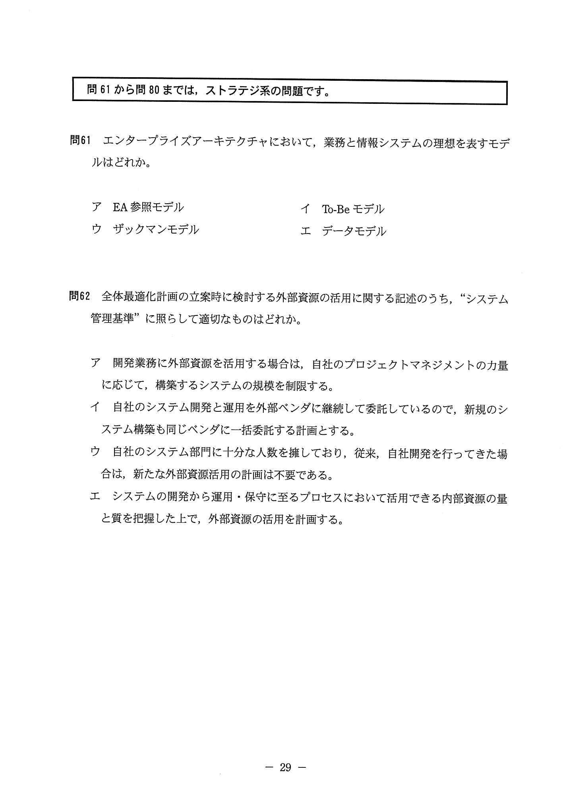

テキスト (OCR)

問 61 から問 80 までは, ストラテジ系の問題です。

問61 エンタープライズアーキテクチャにおいて, 業務と情報システムの理想を表すモデ
ルはどれか。

ア EA 参照モデル               イ ToBe モデル
ウ ザックマンモデル         エエ 記ータモデル

問62 全体最適化計画の立案時に検討する外部資源の活用に関する記述のうち, “システム
SHARE” (CRS UTHIRSOWEND,

ア 開発業務に外部資源を活用する場合は, 自社のプロジェクトマネジメントの力量
に応じて, 構築するシステムの規模を制限する。

イ 自社のシステム開発と運用を外部ベンダに継続して委託しているので, 新規のシ
ステム構築も同じベンダに一括委託する計画とする。

ウ 自社のシステム部門に十分な人数を擁しており, 従来, 自社開発を行ってきた場
合は, 新たな外部資源活用の計画は不要である。

工 システムの開発から運用・保守に至るプロセスにおいて活用できる内部資源の量
と質を把握した上で, 外部資源の活用を計画する。

ー 29 一

### ページ 30

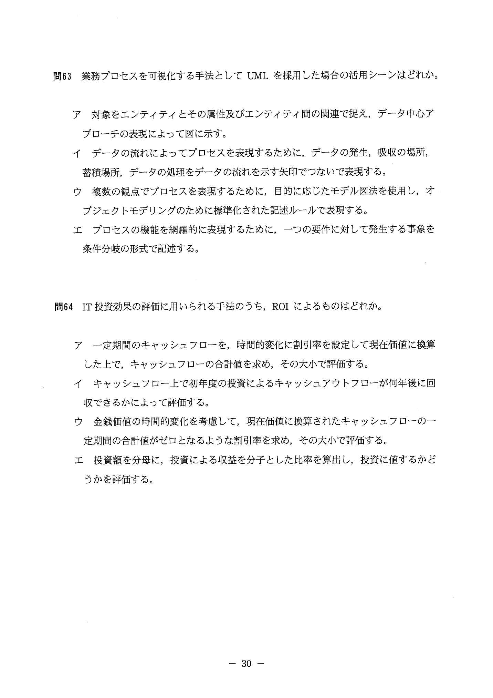

テキスト (OCR)

間63 業務プロセスを可視化する手法として UML を採用した場合の活用シーンはどれか。

ア 対象をエンティティとその属性及びエンティティ間の関連で捉え, データ中心ア
プローチの表現によって図に示す。

イ データの流れによってプロセスを表現するために, データの発生吸収の場所,
蓄積場所, データの処理をデータの流れを示す矢印でつないで表現する。

ウ 複数の観点でプロセスを表現するために, 目的に応じたモデル図法を使用し, オ
ブジェクトモデリングのために標準化された記述ルールで表現する。

エエ プロセスの機能を網維的に表現するために, 一つの要件に対して発生する事象を
条件分岐の形式で記述する。

問64 IT 投資効果の評価に用いられる手法のうち, ROI によるものはどれか。

ア 一定期間のキャッシュフローを, 時間的変化に割引率を設定して現在価値に換算
した上で, キャッシュフローの合計値を求め, その大小で評価する。

イ キャッシュフロー上で初年度の投資によるキャッシュアウトフローが何年後に回
収できるかによって評価する。

ウ 金銭価値の時間的変化を考慮して, 現在価値に換算されたキャッシュフローの一
定期間の合計値がゼロとなるような割引率を求め, その大小で評価する。

エエ 投資額を分母に, 投資による収益を分子とした比率を算出し, 投資に値するかど
うかを評価する。

### ページ 31

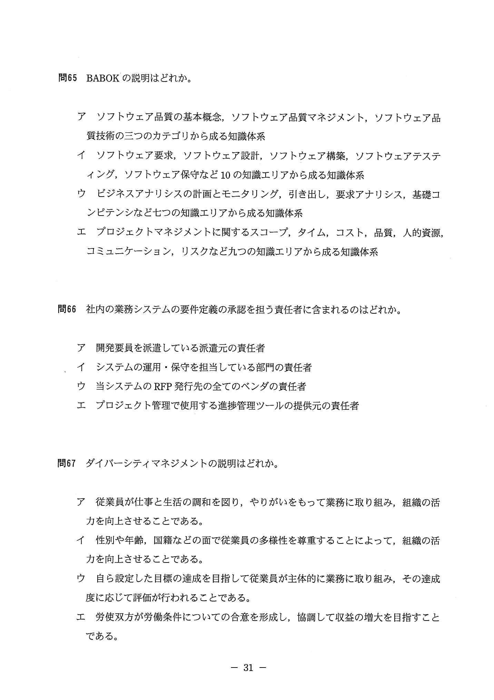

テキスト (OCR)

問65 BABOK の説明はどれか。

ア ソフトウェア品質の基本概念。ソフトウェア品質てマネジメント, ソフトウェア品
質技術の三つのカテゴリから成る知識体系

イ ソフトウェア要求, ソフトウェア設計. ソフトウェア構築, ソフトウェアテステ
ィング, ソフトウェア保守など 10 の知識エリアから成る知識体系

ウ ビジネスアナリシスの計画とモニタリング, 引き出し, 要求アナリシス, 基礎コ
ンピテンシなど七つの知識エリアから成る知識体系

DL プロジェクトマネジメントに関するスコープ, タイム, TA, BA, 人的資源
コミュニケーション, リスクなど九つの知識エリアから成る知識体系

間66 社内の業務システムの要件定義の承認を担う責任者に含まれるのはどれか。

開発要員を派遣している派遣元の責任者

システムの運用・保守を担当している部門の責任者

当システムの REP 発行先の全てのベンダの責任者

プロジェクト管理で使用する進捗管理ツールの提供元の責任者

HAN

間67 ダイバーシティマネジメントの説明はどれか。

ア 従業員が仕事と生活の調和を図りし, やりがいをもって業務に取り組み, 組織の活

力を向上させることである。
イ 性別や年齢, 国籍などの面で従業員の多様性を尊重することによって, 組織の活
力を向上させることである。

ウ 自ら設定した目標の達成を目指して従業員が主体的に業務に取り組み, その達成
度に応じて評価が行われることである。

エエ 労使双方が労働条件についての合意を形成し, 協調して収益の増大を目指すこと
である。

ー 31 一

### ページ 32

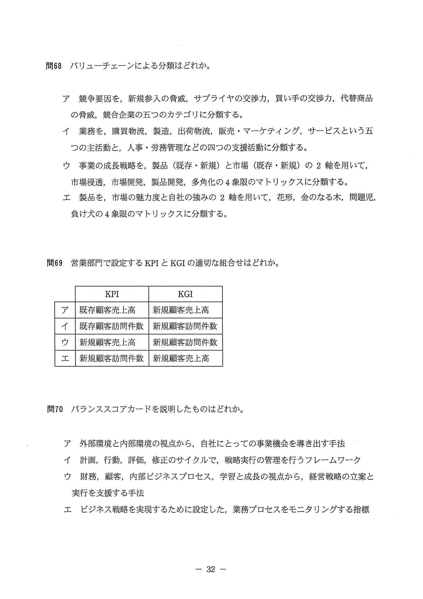

テキスト (OCR)

68 バリューチェーンによる分類はどれか。

ア 競争要因を, 新規参入の田威, サプライヤの交渉力, 買い手の交渉力, 代奉商品
OBR, 競合企業の五つのカテゴリに分類する。

イ 業務を, 購買物流, 製造,出荷物流, 販売・マーケティング, サービスという五
つの主活動と, 人事・労務管理などの四つの支援活動に分類する。

ウ 事業の成長戦略を, 製品 (既存・新規) と市場 (既存・新規) の 2 軸を用いて,
市場浸透, 市場開発, 製品開発, 多角化の 4 象限のマトリックスに分類する。

エエ 製品を, 市場の魅力度と自社の強みの 2 軸を用いて, 花形, 金のなる木, 問題児,
負け犬の 4 象限のマトリックスに分類する。

間69 営業部門で設定する KPI と KGI の適切な組合せはどれか。

KPI                             KGI
既存顧客売上高 | 新規顧客売上高
既存顧客訪問件数 | 新規顧客訪問件数
新規顧客売上高 | 新規顧客訪問件数
新規顧客訪問件数 | 新規顧客売上高

HI} GA]

間70 バランススコアカードを説明したものはどれか。

ア 外部環境と内部環境の視点から, 自社にとっての事業機会を導き出す手法

イ 計画, 行動, 評価, 修正のサイクルで, 戦略実行の管理を行うフレームワーク

ウ 財務, 顧客, 内部ビジネスプロセス, 学習と成長の視点から, 経営戦略の立案と
実行を支援する手法

工 ビジネス戦略を実現するために設定した, 業務プロセスをモニタリングする指標

ー 32 一

### ページ 33

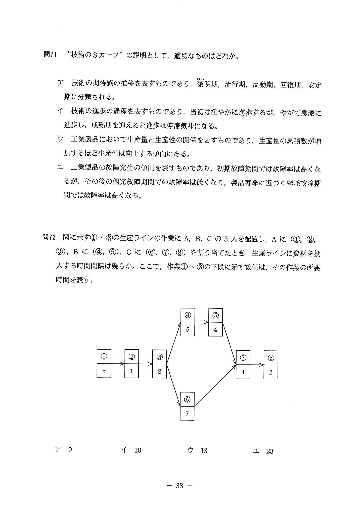

テキスト (OCR)

問71 “技術のS カーブ" の説明として, 適切なものはどれか。

ig 技術の期待感の推移を表すものであり, BAY, HOM, 反動期, MOM, 安定
期に分類される。
イ 技術の進歩の過程を表すものであり, 当初は緩やかに進歩するが, やがて急激に
進歩し, 成熟期を迎えると進歩は停滞気味になる。
ウ 工業製品において生産量と生産性の関係を表すものであり, 生産量の累積数が増
加するほど生産性は向上する傾向にある。
L 工業製品の故障発生の傾向を表すものであり, 初期政障期間では夏障率は高くな
OM, その後の偶発導障期間での故障率は低くなり, 製品寿命に近づく摩耗導障期
間では故障率は高くなる。

間72 図に示す①て⑧の生産ラインの作業に A, B, C の 3 人を配置し AI ©, ©,
@), B に @ ©, Ck ©, @, ©) を割り当てたとき, 生産ラインに資材を投
入する時間間隔は幾らか。こことで, 作業①て⑥の下段に示す数値は.。 その作業の所要
時間を表す。

@   1)
5    4
0)   @   ⑥)           @   ®
5    1    2              4    2
©

ア 9   イ 10   7 13   XL 23

### ページ 34

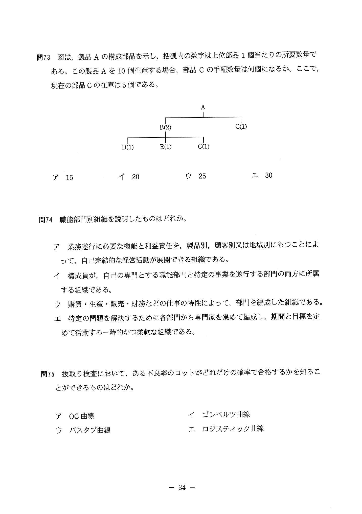

テキスト (OCR)

問73 EMS, 製品 A の構成部品を示し, 括弧内の数字は上位部品 1 個当たりの所要数量で
HS. COWRA を 10 個生産する場合, 部品 C の手配数量は何個になるか。ことこで
現在の部品 C の在庫は 5 個である。

A
|    |
5の         cq)
I     |    |
DG①    EQ)    cq)
ア 15      イ 20      ウ 25      <= 30

74 職能部門別組織を説明したものはどれか。

ア 業務遂行に必要な機能と利益資任を, 製品別, 顧客別又は地域別にもつことによ
って, 自己完結的な経営活動が展開できる組織である。

4 構成員が, 自己の専門とする職能部門と特定の事業を遂行する部門の両方に所属
する組織である。

ウ 購買・生産・販売・財務などの仕事の特性によって, 部門を編成した組織である。

エエ 特定の問題を解決するために各部門から専門家を集めて編成し, 期間と目標を定
めて活動する一時的かつ和柔軟な組織である。

問75 抜取り検査において, ある不良率のロットがどれだけの確率で合格するかを知るこ
とができるものはどれか。

ア 0C曲線              イ ゴンペルツ曲線
ウ バスタブ曲線           エエ ロジスティック曲線

ー 34 一

### ページ 35

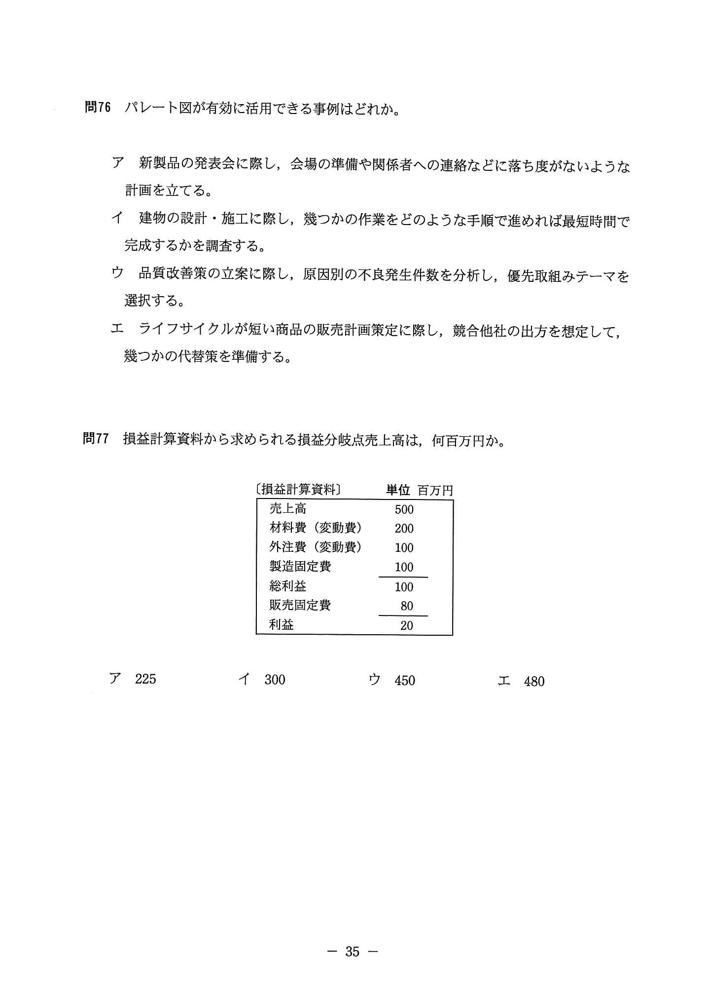

テキスト (OCR)

問76 パレート図が有効に活用できる事例はどれか。

ア 新製品の発表会に際し, 会場の準備や関係者への連絡などに落ち度がないような

計画を立てる。

イ 建物の設計・施工に際し, 幾つかの作業をどのような手順で進めれば最短時間で
完成するかを調査する。

ウ 品質改善策の立案に際し, 原因別の不良発生件数を分析し, 優先取組みテーマを
選択する。

工 ライフサイクルが短い商品の販売計画策定に際し, 競合他社の出方を想定して,
幾つかの代替策を準備する。

FAT? 損益計算資料から求められる損益分野点売上高は, 何百万円か。

〔損益計算資料      単位 AAA
売上高          500
ME BHR)    200
外注費 (変動費)    100

製造固定費    100
総利益      100
販売固定費     80
利益       20
ア 225     イ 300      ウ 450     x 480

ー 35 一

### ページ 36

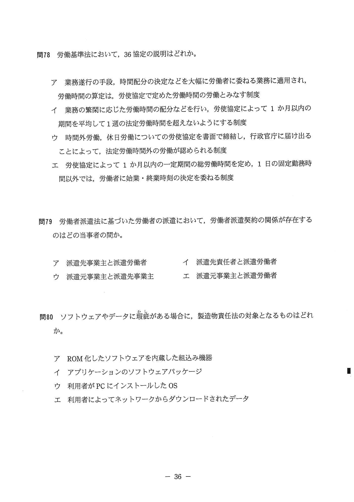

テキスト (OCR)

間78 労働基準法において, 36 協定の説明はどれか。

ア 業務遂行の手段時間配分の決定などを大幅に労働者に委ねる業務に適用され
労働時間の算定は, 労使協定で定めた労働時間の労働とみなす制度

イ 業務の繁閑に応じた労働時間の配分などを行い, 労使協定によって 1 か月以内の
期間を平均して 1 週の法定労働時間を超えないようにする制度

ウ 時間外労働, 休日労働についての労使協定を書面で締結し, 行政官庁に届け出る
ととによって, 法定労働時間外の労働が認められる制度

エエ 労使協定によって 1 か月以内の一定期間の総労働時間を定め, 1 日の固定勤務時
間以外では, 労働者に始業・終業時刻の決定を委ねる制度

HT 労働者派遣法に基づいた労働者の派遣において, 労働者派遣契約の関係が存在する
のはどの当事者の間か。

ア 派遣先事業主と派遣労働痢     イ 派遣先責任者と派中労働者
ウ 派遣元事業主と派遣先事業主    エ 派遣元事業主と派遣労働者

か

問80 VI KURT OTH ICES SHAIC, 製造物責任法の対象となるものはどれ
か。

ROM 化したソフトウェアを内蔵した組込み機器

アプリケーションのソフトウェアパッケージ

利用者がPC にインストールした OS

利用者によってネットワークからダウンロードされたデータ

H へ

### ページ 37

テキスト (OCR)

しメモ 用 KH)

### ページ 38

テキスト (OCR)

(メモ用紙 〕

### ページ 39

テキスト (OCR)

【 メモ 用 紙 〕

ー 39 一

### ページ 40

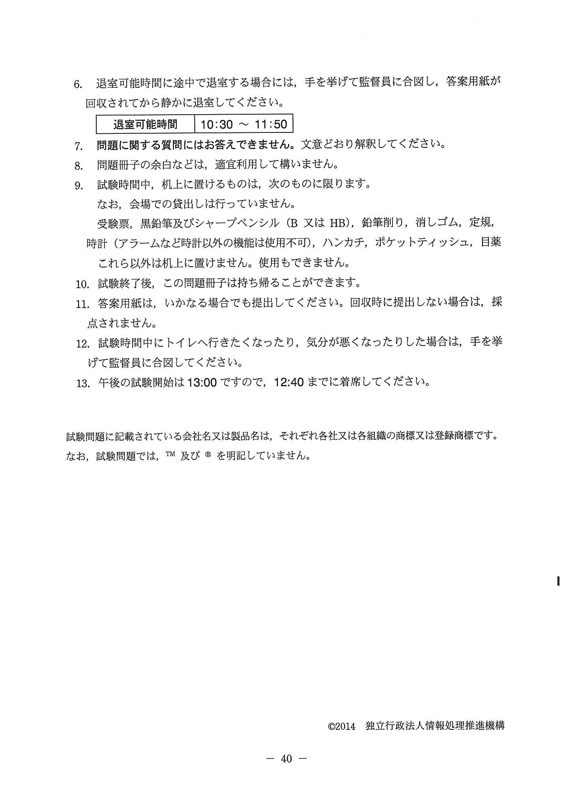

テキスト (OCR)

6. 退室可能時間に途中で退室する場合には, 手を挙げて監督具に合図し, 答案用紙が
回収されてから静かに退室してください。
| 退室可能時間 | 10:30 ~ 11:50 |
7, 問題に関する質問にはお答えできません。文意どおり解釈してください。
8. 問題冊子の余白などは, 適宜利用して構いません。
9. 試験時間中, 机上に置けるものは, 次のものに限ります。
なお, 会場での貸出しは行っていません。
受験票, 黒鉛筆及びシャープペンシル (B 又は HB), 鉛筆削り, 消しゴム, 定規,
時計 (アラームなど時計以外の機能は使用不可), ハンカチ, ポケットティッシュ, 目薬
これら以外は机上に置けません。使用もできません。
10. 試験終了後, この問題冊子は持ち帰ることができます。
ll. SRAM, いかなる場合でも提出してください。回収時に提出しない場合は, 採
点されません。
12. 試験時間中にトイレへ行きたくなったり, 気分が悪くなったりした場合は, 手を挙
げて監督員に合図してください。
13. 午後の試験開始は 13.00 ですので, 12:40 までに着席してください。

試験問題に記載されている会社名又は製品名は, それぞれ各社又は各組織の商標又は登録商標です。
なお, 試験問題では, ™ 及び © を明記していません。

@2014 独立行政法人情報処理推進機構

---

## 午前解答

©2014 独立行政法人情報処理推進機構
平成26 年度
春期
応用情報技術者試験
解答例
午前試験
問番号
正解
問1
イ
問2
ア
問3
ア
問4
ウ
問5
イ
問6
エ
問7
イ
問8
イ
問9
ア
問10
エ
問11
ア
問12
ウ
問13
イ
問14
ア
問15
ア
問16
エ
問17
ウ
問18
ア
問19
エ
問20
イ
問番号
正解
問21
イ
問22
イ
問23
エ
問24
イ
問25
ウ
問26
ウ
問27
ア
問28
エ
問29
イ
問30
イ
問31
イ
問32
イ
問33
ウ
問34
エ
問35
イ
問36
ア
問37
ウ
問38
エ
問39
エ
問40
ア
問番号
正解
問41
エ
問42
エ
問43
ア
問44
エ
問45
イ
問46
エ
問47
ア
問48
ア
問49
ア
問50
エ
問51
ウ
問52
ウ
問53
イ
問54
エ
問55
ア
問56
エ
問57
ウ
問58
エ
問59
ウ
問60
ア
問番号
正解
問61
イ
問62
エ
問63
ウ
問64
エ
問65
ウ
問66
イ
問67
イ
問68
イ
問69
エ
問70
ウ
問71
イ
問72
ウ
問73
ウ
問74
ウ
問75
ア
問76
ウ
問77
ウ
問78
ウ
問79
ウ
問80
ア

---

## 午後問題

### ページ 1

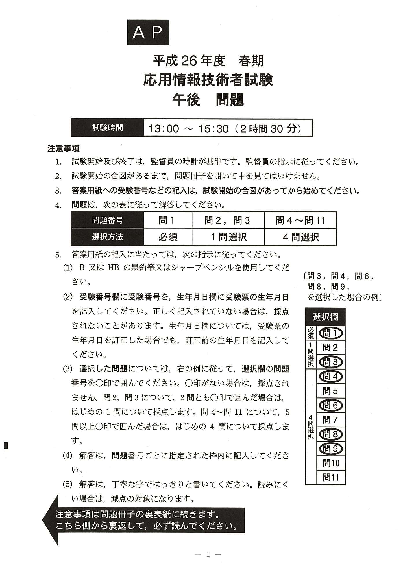

テキスト (OCR)

平成26 年度 春期
応用情報技術者試験
午後 問題

 13:00 15:30 (2時間30 分)

注意事項

1. 試験開始及び終了は, 監督員の時計が基準です。監督員の指示に従ってください。
2. 試験開始の合図があるまで, 問題冊子を開いて中を見てはいけません。

3. 答案用紙への受験番号などの記入は, 試験開始の合図があってから始めてください。
4. 問題は, 次の表に従って解答してください。

問題番号           問 1         問2, 問3        問4 >間 11
選択方法    必須    1 問選択    4 問選択

5. 箇案用紙の記入に当たっては, 次の指示に従ってください。
(①) B 又は HB の黒鯛筆駐はシャープペンシルを使用してくだ
さい                          (問3, 問4, Be,
5                           問8, Bo,
(② 受験番号欄に受験番号を, 生年月日欄に受験時の生年月日 を選択した場合の例)
を記入してください。正しく記入されていない場合は, 採点 上較間
されないととがあります。生年月日楓については, ZERO AA

A
bia

須上ME
生年月日を訂正した場合でも, 訂正前の生年月日を記入して
ください。                          a a
と
(3) 選択した問題については,右の例に従って, 選択棚の問題 区
番号を〇印で囲んでください。〇印がない場合は, 採点され    ーー
ません。問2, 問3 について, 2 問とも〇印で囲んだ場合は,
はじめの 1 問について採点します。問 4ご問 11 について, 5 |, =F
問以上〇印で囲んだ場合は。はじめの 4 問について採点しま [BLE
択|A 8
す。                           =
(4) 解答は, 問題番号ごとに指定された枠内に記入してくださ    a0
i:                             円
問11
6) 解答は, 丁寧な字ではっきりと書いてください。読みにく

い場合は, 減点の対象になります。
注意事項は問題冊子の裏表紙に続きます。

こちら側から裏返して, 必ず読んでください。

### ページ 2

### ページ 3

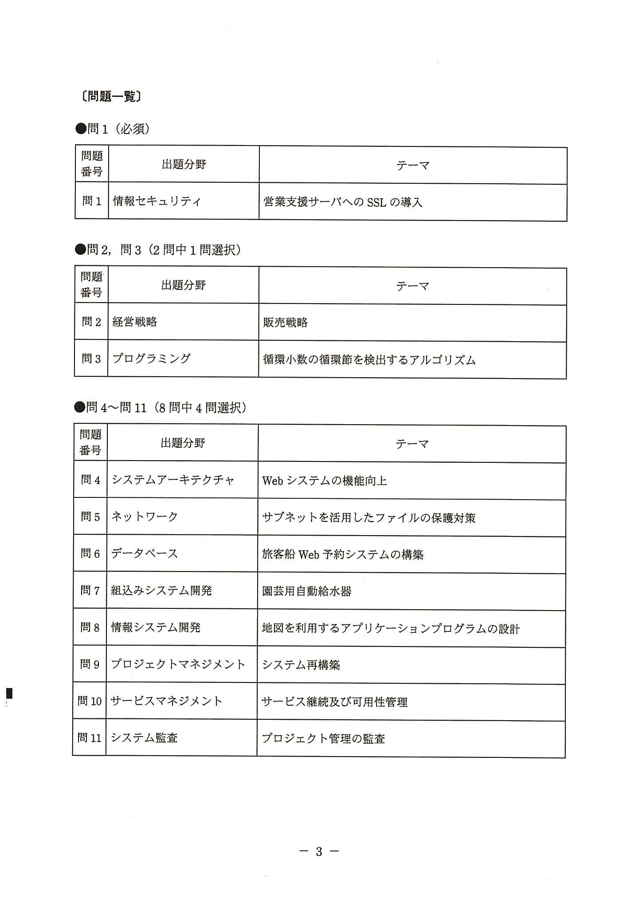

テキスト (OCR)

〔問題一覧〕

信問 1 (必須)

問題                         =
番号     出題分野                テーマ
fll | 情報セキュリティ     営業支援サーバへの SSL の導入
信問2, 問3 (2 問中 1 問選択)

問題                             テー
番号     出題分野                 テーマ
問 2 | 経営戦略          販売戦略

問3 | プログラミング      循環小数の循環侵を検出するアルゴリズム
信問 4て問 11 (8 問中 4 問選択)

問題                             テー
番号     出題分野                テーマ

Fal 4

システムアーキテクチャ

Web システムの機能向上

問5 |ネットワーク        サブネットを活用したファイルの保護対策

問6 | データベース       旅客船 Web 予約システムの構築

問 7 | 組込みシステム開発     園芸用自動給水器

問8 | 情報システム開発      地図を利用するアプリケーションプログラムの設計

問9

プロジェクトマネジメント

システム再構築

間10

サービスマネジメント

サービス継続及び可用性管理

fl 11

システム監査

プロジェクト管理の監査

### ページ 4

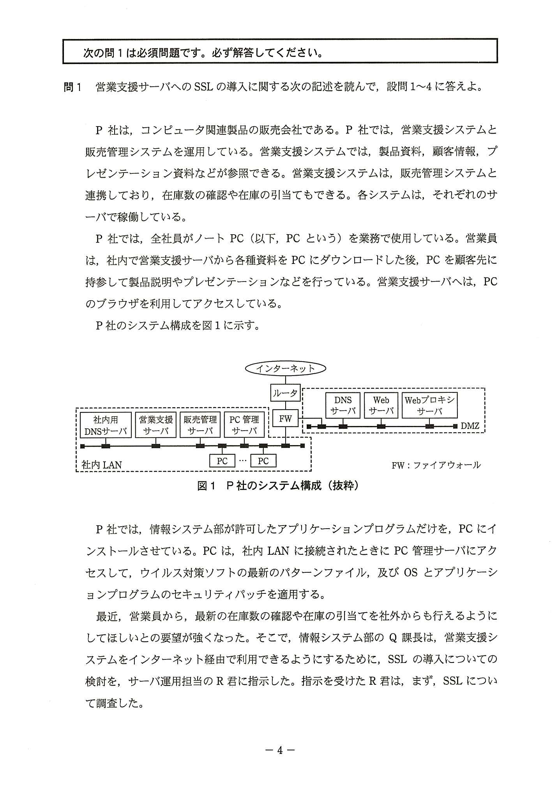

テキスト (OCR)

次の問 1 は必須問題です。必ず解答してください。

問 1

営業支援サーバへの SSL の導入に関する次の記述を読んで, 設問 1て4 に答えよ。

P 4tld, コンピュータ関連製品の販売会社である。P 社では, 営業支援システムと
販売管理システムを運用している。営業支援システムでは, 製品資料, 顧客情報,プ
レゼンテーション資料などが参照できる。営業支援システムは, 販売管理システムと
連携しており, 在庫数の確認や在庫の引当てもできる。各システムは, それぞれのサ
ーバで稼働している。

P 社では, 全社員がノート PC (以下, PC という) を業務で使用している。営業員
は, 社内で営業支援サーバから各種資料を PC にダウンロードした後, PC を顧客先に
持参して製品説明やプレゼンテーションなどを行っている。営業支援サーバへは, PC
のブラウザを利用してアクセスしている。

P 社のシステム構成を図 1 に示す。

FW : ファイアウォール

P 社では, 情報システム部が許可したアプリケーションプログラムだけを, PC にイ
ンストールさせている。PC は, 社内 LAN に接続されたときに PC 管理サーバにアク
セスして, ウイルス対策ソフトの最新のパターンファイル, 及び 0S とアプリケーシ
ョンプログラムのセキュリティパッチを適用する。

最近, 営業員から, 最新の在庫数の確認や在庫の引当てを社外からも行えるように
してほしいとの要望が強くなった。そこで, 情報システム部の Q 課長は, 営業支援シ
ステムをインターネット経由で利用できるようにするために, SSL の導入についての
検討を, サーバ運用担当の R 君に指示した。指示を受けた R AW, EV, SSL につい
て調査した。

### ページ 5

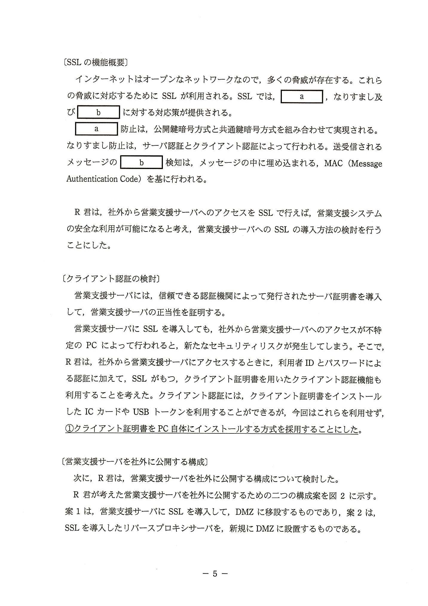

テキスト (OCR)

(SSL の機能概要)

インターネットはオープンなネットワークなので, SS OMMMBETS, THOS
の人脅威に対応するために SSL が利用される。SSL では, | 。 |], なりすまし及
び| b | に対する対応策が提供される。

[| 3 |防上は, 公開鍵号方式と共通鍵号方式を組み合わせて実現される。
なりすまし防止は。 サーバ認証とクライアント認証によって行われる。送受信される
メッセージの|  b |検知は, メッセージの中に埋め込まれる, MAC (Message
Authentication Code) を基に行われる。

R 君は, 社外から営業支援サーバへのアクセスを SSL で行えば, 営業支援システム
の安全な利用が可能になると考え, 営業支援サーバへの SSL の導入方法の検討を行う
ことにした。

〔クライアント認証の検討]
営業支援サーバには, 信頼できる認証機関によって発行されたサーバ証明書を導入
して, 営業支援サーバの正当性を証明する。
営業支援サーバに SSL を導入しても, 社外から営業支援サーバへのアクセスが不特
定の PC によって行われると, 新たなセキュリティリスクが発生してしまう。そこで,
R 君は, 社外から営業支援サーバにアクセスするときに, 利用者 ID とパスワードによ
る認証に加えて, SSL がもつ, クライアント証明書を用いたクライアント認証機能も
利用することを考えた。クライアント認証には, クライアント証明書をインストール
した IC カードや USB トークンを利用することができるが, 今回はこれらを利用せず,
①クライアント証明書を PC 自体にインストールする方式を採用することにした。

(営業支援サーバを社外に公開する構成

次に, RA, 営業支援サーバを社外に公開する構成について検討した。

R 君が考えた営業支援サーバを社外に公開するための二つの構成案を図 2 に示す。
案 1 は, 営業支援サーバに SSL を導入して, DMZ に移設するものであり, 案 2 は,
SSL を導入したりリバースプロキシサーバを, 新規に DMZ に設置するものである。

### ページ 6

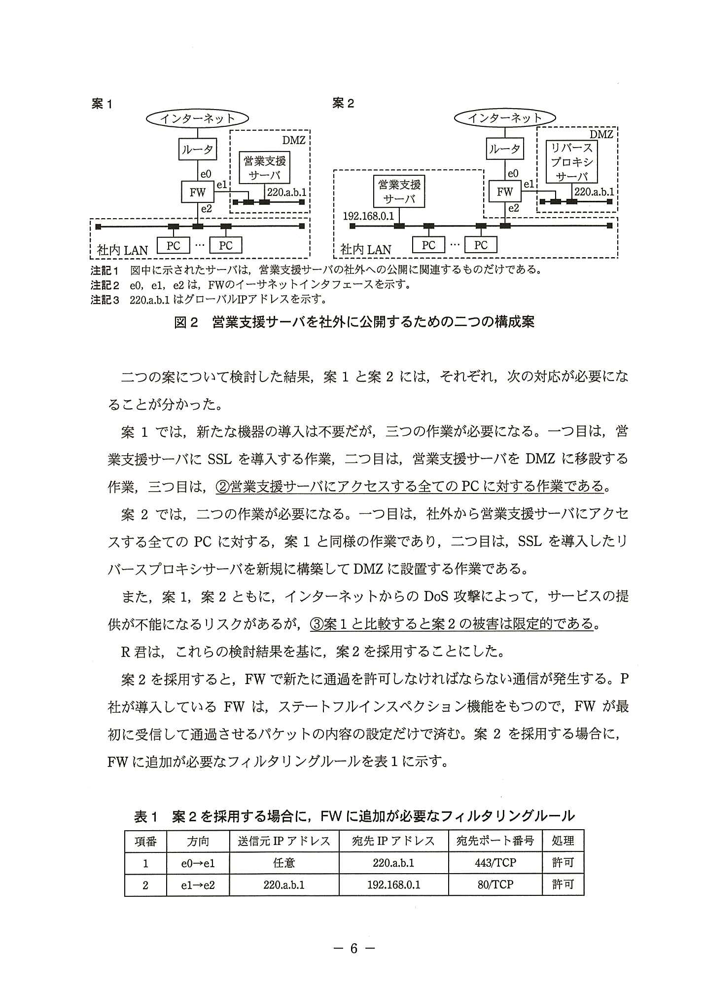

テキスト (OCR)

192.168.0.1
!    =
| 社内LAN ー

注記1 図中に示されたサーバは, 営業支援サーバの社外への公開に関連するものだけである。
注記2 e0, el, e2 は, FWのイーサネットインタフェースを示す。
注記3 220.a.b.1 はグローバルIPアドレスを示す。

 2 営業支援サーバを社外に公開するための二つの構成案

ニニつの案について検討した結果, 案 1 と案 2 には, それぞれ, 次の対応が必要にな
ることが分かった。

案 1 では, 新たな機器の導入は不要だが, 三つの作業が必要になる。一つ目は, 営
業支援サーバに SSL を導入する作業, 二つ目は, 営業支援サーバを DMZ に移設する
作業, 三つ目は, ②営業支援サーバにアクセスする全ての PC に対する作業である。

案 2 では, 二つの作業が必要になる。一つ目は, 社外から営業支援サーバにアクセ
スする全ての PC に対する, 案 1 と同様の作業であり, 二つ目は, SSL を導入したリ
バースプロキシサーバを新規に構築して DMZ に設置する作業である。

また, 案 1, 案 2 ともに, インターネットからの DoS 攻撃によって, サービスの提
供が不能になるリスクがあるが, OBL と比較すると案 2 の被害は限定的である。

R 君は, これらの検討結果を基に, 案2 を採用することにした。

案 2 を採用すると, FW で新たに通過を許可しなければならない通信が発生する。 P
社が導入している FW は, ステートフルインスペクション機能をもつので, FW が最
初に受信して通過させるパケットの内容の設定だけで済む。案 2 を採用する場合に,
FW に追加が必要なフィルタリングルールを表 1 に示す。

表1 案2を採用する場合に, FW に追加が必要なフィルタリングルール
項番       方向      送信元 TP アドレス | 宛先Pアドレス | 宛先ボート番号 | 処理
1        e0el             任意                  220.a.b.1              443/TCP        許可
2        ele2           220.a.b.1              192.168.0.1             80/TCP         許可

### ページ 7

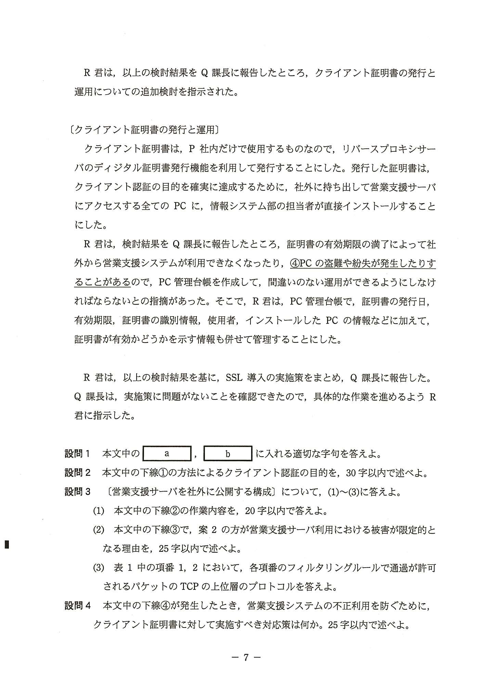

テキスト (OCR)

R Ald, 以上の検討結果を Q 課長に報告したところ, クライアント証明書の発行と
運用についての追加検討を指示された。

〔クライアント証明書の発行と運用〕

クライアント証明書は, P 社内だけで使用するものなので, リバースプロキシサー
バのディジタル証明書発行機能を利用して発行することにした。発行した証明書は,
クライアント認証の目的を確実に達成するために, 社外に持ち出して営業支援サーバ
にアクセスする全ての PC に, 情報システム部の担当者が直接インストールすること
にした。

R Ald, 検討結果を Q 課長に報告したところ, 証明書の有効期限の満了によって社
外から営業支援システムが利用できなくなったり, OPC の盗難や紛失が発生したりす
ることがあるので, PC 管理台帳を作成して, 間違いのない運用ができるようにしなけ
ればならないとの指摘があった。そこで, RA, PC 管理台帳で, 証明書の発行日,
有効期限, 証明書の識別情報, 使用者, インストールした PC の情報などに加えて,
証明書が有効かどうかを示す情報も併せて管理することにした。

R Ald, 以上の検討結果を基に, SSL 導入の実施策をまとめ, Q 課長に報告した。
Q 課長は, 実施策に問題がないことを確認できたので, 具体的な作業を進めるよう R
君に指示した。

設問1 本文中の| ai |,|  b |に入れる適切な字句を答えよ。
設問2 本文中の下線①の方法によるクライアント認証の目的を, 30 字以内で述べよ。
設問3 [営業支援サーバを社外に公開する構成】 について, (①ぐて(3)に答えよ。
Q①) 本文中の下線②の作業内容を, 20 字以内で答えよ。
2) 本文中の下線③で, 案 2 の方が営業支援サーバ利用における被害が限定的と
なる理由を, 25 字以内で述べよ。
3) 表 1 中の項番 1, 2 において, 各項番のフィルタリングルールで通過が許可
されるパケットの TCP の上位層のプロトコルを答えよ。
設問4 本文中の下線④が発生したとき, 営業支援システムの不正利用を防ぐために,
クライアント証明書に対して実施すべき対応策は何か。25 字以内で述べよ。

ー7ー

### ページ 8

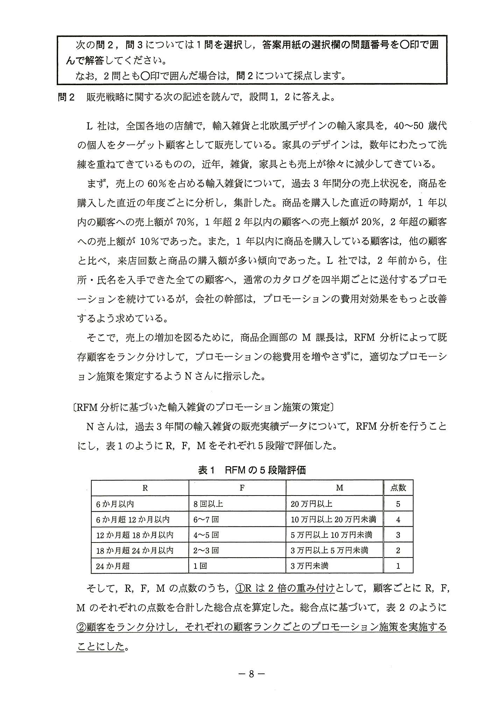

テキスト (OCR)

次の問2, 問3 については 1 間を選択し, 答案用紙の選択欄の問題番号を〇で囲
んで解答してください。
なお, 2 問とも〇印で囲んだ場合は, 間2 について採点します。

間2 販売戦略に関する次の記述を読んで, 設問1, 2 に答えよ。

L 社は, 全国各地の店舗で, 輸入雑貨と北欧風デザインの輸入家具を, 40~50 歳代
の個人をターゲット顧客として販売している。家具のデザインは, 数年にわたって洗
練を重ねてきているものの, 近年, 雑貨, 家具とも売上が徐々に減少してきている。

まず, 売上の 60%を占める輸入雑貨について, 過去 3 年間分の売上状況を, 商品を
購入した直近の年度ごとに分析し, 集計した。商品を購入した直近の時期が, 1 年以
内の顧客への売上額が 70%, 1 年超 2 年以内の顧客への売上額が 20%, 2 FROME
への売上額が 10%であった。また, 1 年以内に商品を購入している顧客は, 他の顧客
と比べ, 来店回数と商品の購入額が多い傾向であった。L 社では, 2 年前から, 住
所・氏名を入手できた全ての顧客へ, 通常のカタログを四半期ごとに送付するプロモ
ーションを続けているが, 会社の幹部は, プロモーションの費用対効果をもっと改善
するよう求めている。

そこで, 売上の増加を図るために, 商品企画部の M 課長は, RFM 分析によって既
存顧客をランク分けして, プロモーションの総費用を増やさずに, 適切なプロモーシ
ョン施策を策定するよう N さんに指示した。

[RFM 分析に基づいた輸入雑貨のプロモーション施策の策定
N さんは, 過去 3 年間の輸入雑貨の販売実績データについて, REM 分析を行うこと
ICL, 表 1 のように R, F, M をそれぞれ5 段階で評価した。

表1 RFMの5段階評価

R          F          M     点数
6 か月以内           8 回以上             20 万円以上            5
6 か月超 12 か月以内   6て7 回         10 万円以上 20 万円未満  4
12 か月超 18 か月以内  4へ5 回          5 万円以上 10 万円未満   3
18 か月超 24 か月以内  2~3 回         3 万円以上 5 万円未満   2
24 か月超        1回          3 万円未満        1

そして, R, Fy, M の点数のうち, ①R は 2 倍の重み付けとして, 顧客ごとに R, F,
M のそれぞれの点数を合計した総合点を算定した。総合点に基づいて, 表 2 のように
②願客をランク分けし, それぞれの顧客ランクごとのプロモーション施策を実施する
ととにした。

### ページ 9

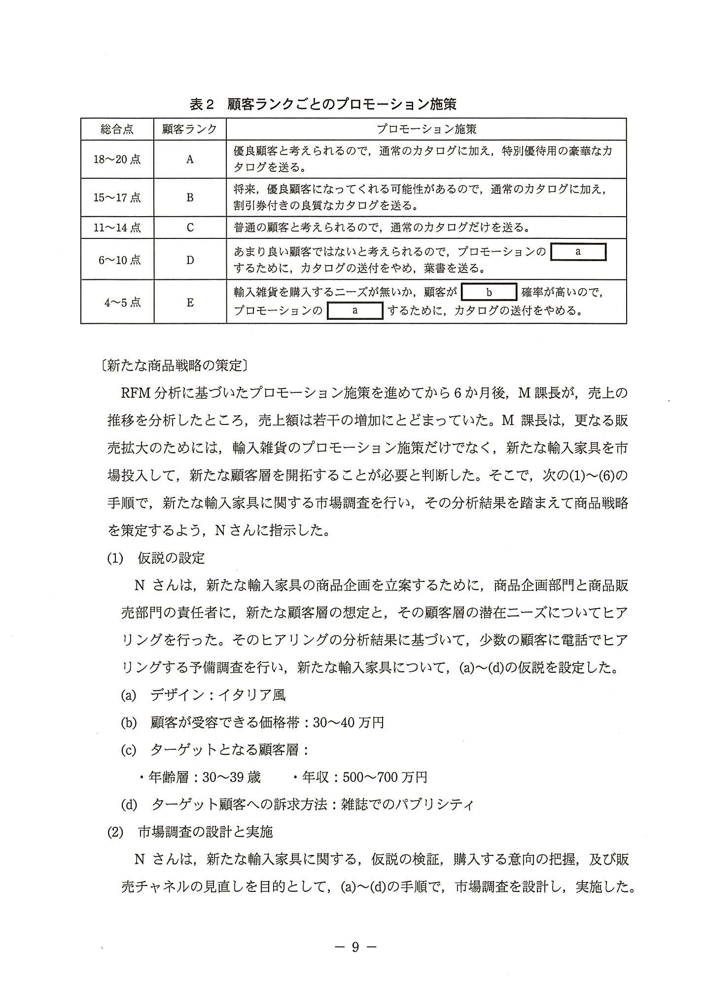

テキスト (OCR)

表2 顧客ランクごとのプロモーション施策

総合点     BRAID                         プロモーション施策

優良顧客と考えられるので, 通常のカタログに加え, 特別優待用の豪華なカ

920和0       は      タログを送る。

将来, 優良顧客になってくれる可能性があるので, 通常のカタログに加え,

1517点       B      割引券付きの良質なカタログを送る。

1て14 点      C     普通の顧客と考えられるので, 通常のカタログだけを送る。

あまり良い願客ではないと考えられるので, プロモーションの| sa |

10点     | するために, カタログの送付をやめ, MHS.
ニーズが|    ‘    x          バ    7
aaah     1     BAMICEMATS=—ZattRis, We [Ls] sist 高いので
プロモーションの |  』 | するために, カタログの送付をやめる。
〔新たな商品戦略の策定〕

REM 分析に基づいたプロモーション施策を進めてから 6 か月後, M 課長が, 売上の
推移を分析したところ, 売上額は若干の増加にとどまっていた。M 課長は, 更なる販
売拡大のためには, 輸入雑貨のプロモーション施策だけでなく, 新たな輸入家具を市
場授入して, 新たな願客層を開拓することが必要と判断した。そこで, 次の①ぐて(⑥)の
手順で, 新たな輸入家具に関する市場調査を行い, その分析結果を踏まえて商品戦略
を策定するよう, N さんに指示した。

CL) 仮説の設定
N さんは, 新たな輸入家具の商品企画を立案するために, 商品企画部門と商品販

売部門の資任者に, 新たな顧客層の想定と, その顧客層の潜在ニーズについてヒア

リングを行ったを。そのヒアリングの分析結果に基づいて, 少数の顧客に電話でヒア

リングする予備調査を行い, 新たな輸入家具について, ⑱^て(の仮説を設定した。

@ デザイン : イタリア風

(>) 顧客が受容できる価格帯 : 30て40 万円

©) ターゲットとなる顧客層 :

・年齢層 : 30~39 歳     ・年収 : 500て700 万円

(④ ターゲット顧客への訴求方法 : 雑誌でのパブリシティ

(2) 市場調査の設計と実施
N さんは, 新たな輸入家具に関する, 仮説の検証, 購入する意向の把握, 及び販
売チキャネルの見直しを目的として, @~OOFIRT, 市場調査を設計し, 実施した。

### ページ 10

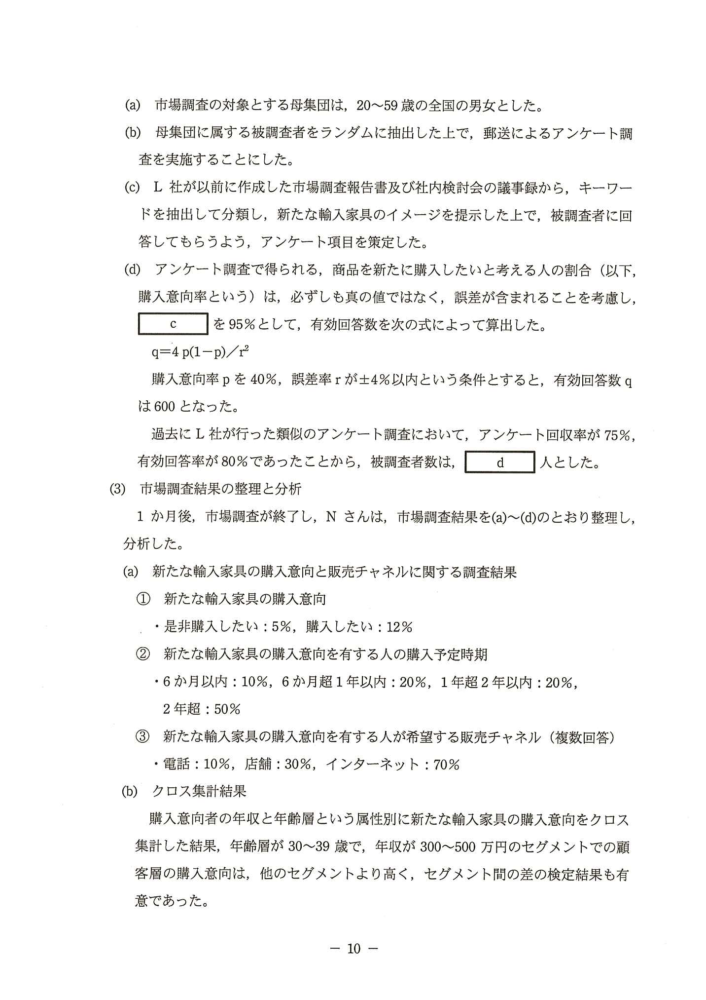

テキスト (OCR)

@) 市場調査の対象とする母集団は, 20~59 歳の全国の男女とした。

() 母集団に属する被調査者をランダムに抽出した上で, 郵送によるアンケート調
査を実施することにした。

(<) 社が以前に作成した市場調査報告書及び社内検討会の議事録から, キーワー
ドを抽出して分類し, 新たな輸入家具のイメージを提示した上で, 被調査者に回
答してもらうよう, アンケート項目を策定した。

@ アンケート調査で得られる, 商品を新たに購入したいと考える人の割合 (以下
購入意向率という) は, 必ずしも真の値ではなく, 誤差が含まれることを考慮し
 を 95%として, 有効回答数を次の式によって算出した。

q三4 p(1一p)/
購入意向率 p を 40%, 誤差率r+が4%以内という条件とすると, 有効回答数q
は 600 となった。
過去に 社が行った類似のアンケート調査において, アンケート回収率が 75%,
有交回答率が 80%であったことから, 被調査者数は, | q | 人とした。
⑬) 市場調査結果の整理と分析
1 か月後, 市場調査が終了し, N さんは, 市場調査結果を(④(④のとおり整理し

分析した。

@) 新たな輸入家具の購入意向と販売チャネルに関する調査結果
© 新たな輸入家具の購入意向

・是非購入したい : 5%, 購入したい : 12%
⑫④ 新たな輸入家具の購入意向を有する人の購入予定時期
・6 か月以内 : 10%, 6 か月超1 年以内 : 20%, 1年超2 年以内 : 20%,
2 年超 : 50%
④ 新たな輸入家具の購入意向を有する人が希望する販売チャネル (数回答)
・電話 : 10%, 店舗 : 30%, インターネット : 70%
() クロス集計結果
購入意向者の年収と年齢層という属性別に新たな輸入家具の購入意向をクロス
集計した結果, 年齢層が 30~39 歳で, 年収が 300て500 万円のセグメントでの顧
客層の購入意向は, 他のセグメントより高く, セグメント間の差の検定結果も有
意であった。

ー 10 一

### ページ 11

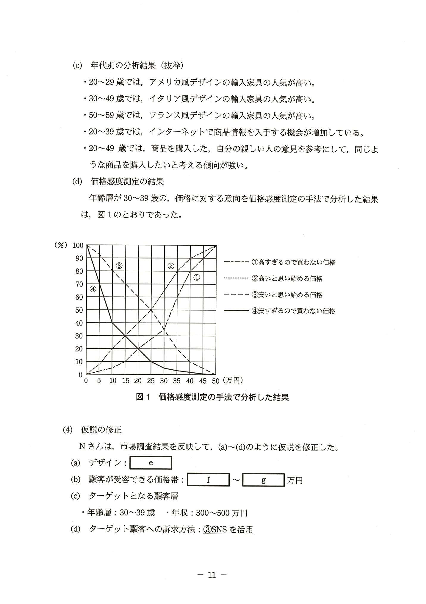

テキスト (OCR)

(c) 年代別の分析結果 (抜粋)
*20~29 歳では, アメリカ風デザインの輸入家具の人気が高い。
+ 30~49 歳では, イタリア風デザインの輸入家具の人気が高い。
・50て59 i Cl, フランス風デザインの輸入家具の人気が高い。
*20~39 TIS, インターネットで商品情報を入手する機会が増加している。
・20て49 歳では, 商品を購入した, 自分の親しい人の意見を参考にして, 同じよ
うな商品を購入したいと考える傾向が強い。
(@) 価格感度測定の結果
年齢層が 30~39 歳の, 価格に対する意向を価格感度測定の手法で分析した結果
は, 図1のとおりであった。

(%) 100              =

90
so WN Yo

70

60                      4
50  \    St

30            デプ に     ン1       ヽ
20      オ

e     7         ト、

10      a と     ーー                              に

0 ルー        トートー SN

0 5 10 15 20 25 30 35 40 45 50 (万円)

 1 価格感度測定の手法で分析した結果

—-—-- ①高すぎるので買わない価格
ーー ②高いと思い始める価格
ーーーー ⑨③安いと思い始める価格
④安すぎるので買わない価格

(④ 仮説の修正
N さんは, 市場調査結果を反映して, (④て(①のように仮説を修正した。
@ デザイン:| se ]
(⑪) 顧客が受容できる価格帯:| f |<| g |ヵロ
©) ターゲットとなる顧客層
・ 年齢層 : 30~39 iz ・年収 : 300て500 万円
(④ ターゲット顧客への訴求方法 : OSNS を活用

ー 1 一

### ページ 12

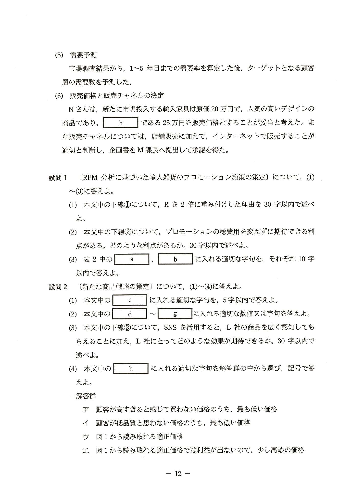

テキスト (OCR)

⑤) ETH
市場調査結果から, 1へ5 年目までの需要率を算定した後, ターゲットとなる販客
層の電要数を予測した。
©) 販売価格と販売チャネルの決定
N さんは, 新たに市場投入する輸入家具は原価 20 万円で, 人気の高いデザインの
商品であり, である 25 万円を販売価格とすることが妥当と考えた。ま
た販売チャネルについては, 店舗販売に加えて, インターネットで販売することが
適切と判断し, 企画書を M 課長へ提田して承認を得た。

設問1 (RFM 分析に基づいた輸入雑貨のプロモーション施策の策定】〕】 について, Q①)
て(3)に答えよ。
GQ) 本文中の下線のについて, R を 2 倍に重み付けした理由を 30 字以内で述べ
bs
(2) 本文中の下線②について, プロモーションの総費用を変えずに期待できる利
点がある。どのような利点があるか。30 字以内で述べよ。
⑬) 表2 中の| sa |,|  b | に入れる適切な字句を, それぞれ 10 字
以内で答えよ。
設問2 (新たな商品戦略の策定〕】 について, ①)て(④に答えよ。
a 本文中の[| c |] に入れる適切な字句を, 5字以内で答えよ。
Q) 本文中の| a |~[  g |に入れる適切な数値駐は字句を答えよ。
3) 本文中の下線②③について, SNS を活用すると, L 社の商品を広く認知しても
らえることに加え, L 社にとってどのような効果が期待できるか。30 字以内で
述べよ。
(④ 本文中の に入れる適切な字句を解答群の中から選び,
えよ。
解答群
ア 顧客が高すぎると感じて買わない価格のうち, 最も低い価格
イ 顧客が低品質と思わない価格のうち, 最も低い価格
ウ
x

geCE

mule

図 1から読み取れる適正価格
図 1 から読み取れる適正価格では利益が出ないので, 少し高めの価格

ー 12 一

### ページ 13

テキスト (OCR)

CA © 用 紙 〕

ー 18 一

### ページ 14

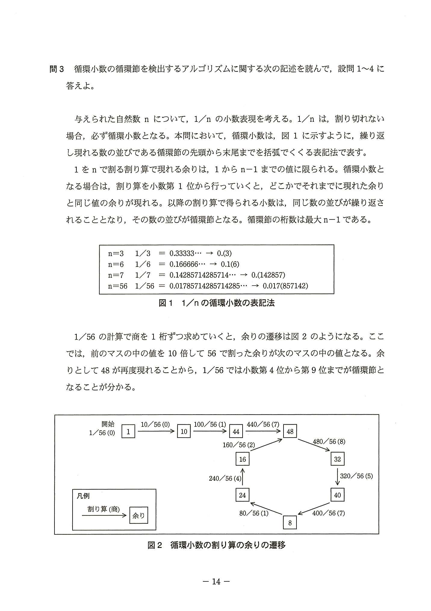

テキスト (OCR)

問3 循環小数の循環節を検出するアルゴリズムに関する次の記述を読んで, 設問 1~4 Iz

答えよ。

与えられた自然数 mn について, 1ノn の小数表現を考える。1/n は, 割り切れない
場合, 必ず循環小数となる。本問において, 循環小数は, 図 1 に示すように, MOK
し現れる数の並びである循環節の先頭から未尾までを括弧でくくる表記法で表す。

1 を n で割る割り算で現れる余りは, 1 から nー1 までの値に限られる。 循環小数と
なる場合は, 割り算を小数第 1 位から行っていくと, どこかでそれまでに現れた余り
と同じ値の余りが現れる。以降の割り算で得られる小数は, 同じ数の並びが繰り返さ
れることとなり, その数の並びが循環館となる。 循環人節の桁数は最大 mー1 である。

n=3 1/3 = 0.33333… > 0.3)

n=6 1/6 = 0.166666… > 0.1(6)

n=7 1/7 = 0.14285714285714… > 0.(142857)
n=56 1/56 = 0.01785714285714285… 一 0.017(857142)

図1 1プnの循環小数の表記法

1/56 の計算で商を 1 桁ずつ求めていくと, 余りの須移は図 2 のようになる。ここ
では, 前のマスの中の値を 10 BUT 56 で割った余りが次のマスの中の値となる。余
りとして 48 が再度現れることから, 1/56 では小数第 4 位から第 9 位までが循環節と
なることが分かる。

 10/56 (0) 100/56 (1) 440/56 (7)
160/56 (2). —"        “ites ⑧
240/56 af                                           | 2056 (5)
AB

SOR. Tn               eee

 2 HER NBOR UV RORY OBB

ー 14 一

### ページ 15

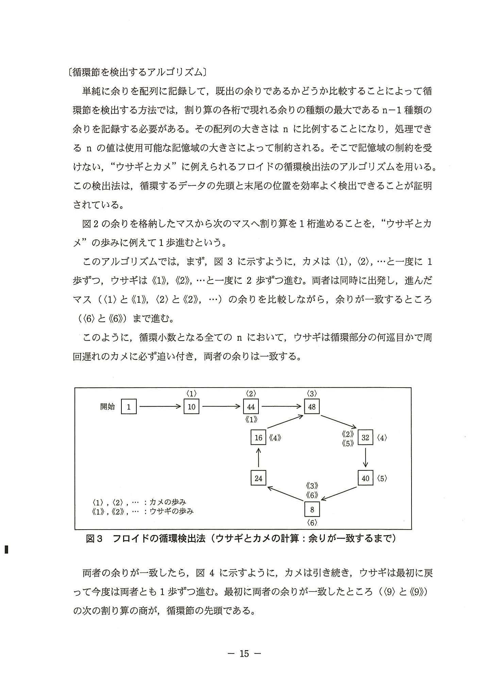

テキスト (OCR)

循環飾を検出するアルゴリズム]〕
単純に余りを配列に記録して, 既出の余りであるかどうか比較することによって循
環節を検出する方法では, 割り算の各桁で現れる余りの種類の最大である ュー1 種類の
余りを記録する必要がある。その配列の大きさは n に比例することになり, 処理でき
る n の値は使用可能な記憶域の大きさによって制約される。そこで記憶域の制約を受
けない, “ウサギとカメ” に例えられるフロイドの循環検出法のアルゴリズムを用いる。
この検出法は, 循環するデータの先頭と未尾の位置を効率よく検出できることが証明
されている。
図 2 の余りを格納したマスから次のマスへ割り算を 1 桁進めることを, “ウサギとカ
メ” の歩みに例えて1 歩進ひという。
このアルゴリズムでは, ET, 図 3 に示すように, カメは ①), ⑫), …と一度に 1
歩ずつ, ウサギは Q⑪》, 2), …と一度に 2 歩ずつ進む。両者は同時に出発し, 進んだ
マス (①) と CL), (2) と 《2》, …) の余りを比較しながら, 余りが一致するところ
((6) と (6)) まで進む。
このように, 循環小数となる全ての n において, ウサギは循環部分の何巡目かで周
回遅れのカメに必ず追い付き, 両者の余りは一致する。

(1)               (2)               (3)

we [F]—+[1o] —+[«] —> [a

a@                   eos
 (の             2 [a2]

《3》
《6》

G) , ⑫) , … : カメの歩み
(1》 , 《2》 , … : ウサギの歩み
©
図3 フロイドの循環検出法 (ウサギとカメの計算 : 余りが一致するまで)

 6)

両者の余りが一致したら, 図 4 に示すように, カメは引き続き, ウサギは最初に戻
って今度は両者とも 1 歩ずつ進む。最初に両者の余りが一致したところ (9) と《9》)
の次の割り算の商が, 循環節の先頭である。

ー 15 一

### ページ 16

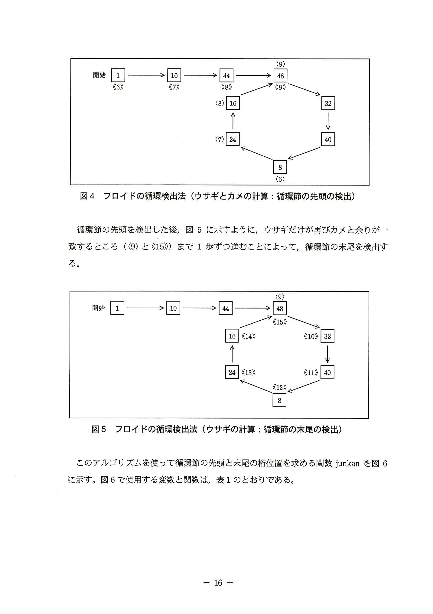

テキスト (OCR)

(9)
mi
«6)          «7)         《8》  _— «9) oe
(s)[ 16 |
⑦| 24]
oe ae
6

図4 フロイドの循環検出法 (ウサギとカメの計算 : 循環節の先頭の検出)

循環節の先頭を検出した後, 図 5 に示すように, ウサギだけが再びカメと余りが一
致するところ (9) と 《⑪5》) まで 1 歩ずつっ進むことによって, 循環節の未尾を検出す
る。

mee [a |
ンダ”

oy
 «aay              ao»

 3                 Q1》

SN aay,

 5 フロイドの循環検出法 (ウサギの計算 : 循環節の末尾の検出)

とのアルゴリズムを使って循環節の先頭と末尾の桁位置を求める関数 jnnkan を図 6
に示す。図 6 で使用する変数と関数は, 表1 のとおりである。

ー 16 一

### ページ 17

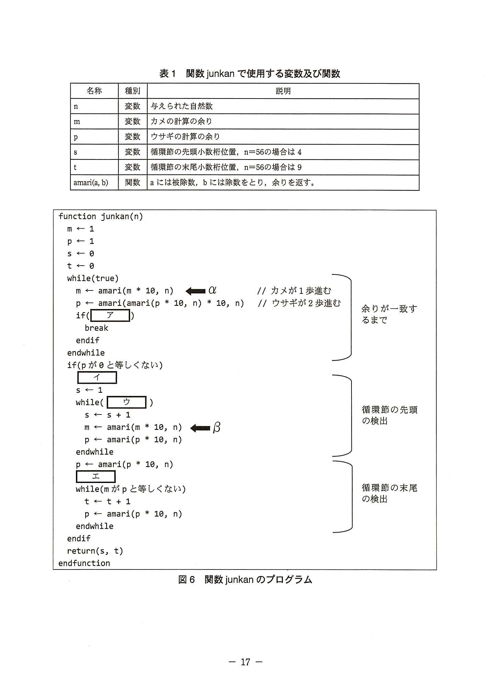

テキスト (OCR)

表1 関数junkan で使用する変数及び関数

名称        種別                                            説明
n                    変数 | 与えられた自然数
m                  変数 | カメの計算の余り
p              変数 | ウサギの計算の余り
8          変数 | 循環節の先頭小数桁位置, n王56の場合は 4
t           変数 | 循環節の未尾小数桁位置, n王56の場合は 9
amari(a,b) | 関数 | a には被除数, b には除数をとり, 余りを返す。

function junkan(n)

m を 1
pol
sと9@
もでと9@
while(true)
m<— amari(m * 10, n) <J—_ 2
p で amari(amari(p * 10, n) * 10, n)
if(| 7)
break
endif
endwhile
if(pが9と等しくない)
S: & A
while(| ウ |)
Ss + 1
m で amari(m * 10, n) = 8
p で amari(p * 10, n)
endwhile
p て amari(p * 10, n)
while(mがpと等しくない)
もとモモキ1
p で amari(p * 10, n)
endwhile
endif
return(s, t)

endfunction

ーー
// カメが1歩進む
// ウサギが 2 歩進む

ーー
=~

八

余りが一致す
るまで

循環人節の先頭
の検出

ERR HI ORE
の検出

図6 関数junkan のプログラム

ー 17 一

### ページ 18

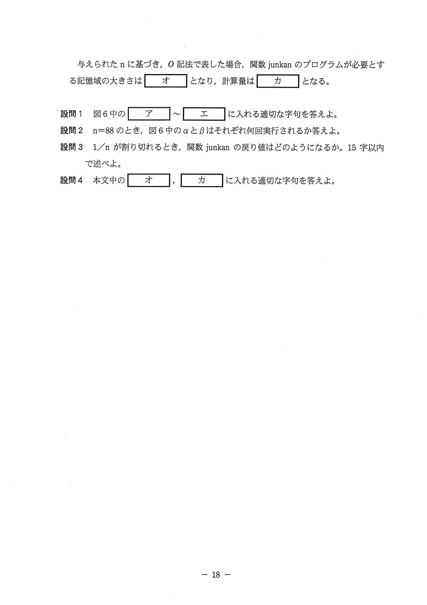

テキスト (OCR)

与えられた n に基づき, 0 記法で表した場合, 関数 junkan のプログラムが必要とす

る記億域の大きさは| オ | となり, 計算量は| カ | となる。

設問1 図6中の| ア |て| = |に入れる適切な字句を答えよ。

設問 2 n= OLS, 図6中のovとはそれぞれ何回実行されるか答えよ。

設問3 1ンn が割り切れるとき, 関数 junkan の戻り値はどのようになるか。15 字以内
で述べよ。

設問4 本文中の| オ |,| ヵ |に入れる適切な字句を答えよ。

ー 18 一

### ページ 19

テキスト (OCR)

【 メモ 用 紙 〕

### ページ 20

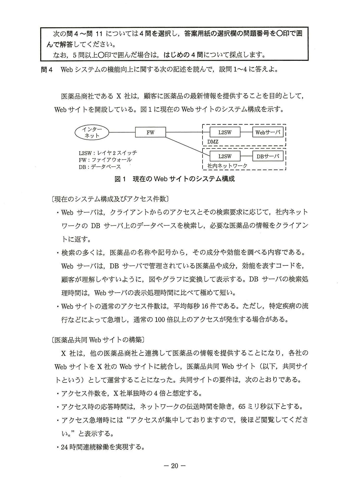

テキスト (OCR)

次の問 4 て問 11 については4 間を選択し, 答案用紙の選択欄の問題番号を〇EIで囲
んで解答してください。
なお, 5 問以上〇印で囲んだ場合は はじめの 4 問について採点します。

間4 Web システムの機能向上に関する次の記述を読んで, 設問14 に答えよ。

医薬品商社である X 社は, 顧客に医薬品の最新情報を提供することを目的として,
Web サイトを開設している。図 1 に現在の Web サイトのシステム構成を示す。

So             「
ee      FW     | rssw トーゴwewg-バ|
ネット            |
LDMZ uu
L2SW : レイヤ2スイッチ        2) Se L_l ae |
FW : ファイアウォール  Lasw トー| pp ni

DB: データベース                    | 社内ネットワーク         |

 1 現在のWeb サイトのシステム構成

[現在のシステム構成及びアクセス件数〕

・Web サーバは, クライアントからのアクセスとその検索要求に応じて, 社内ネット
ワークの DB サーバ上のデータベースを検索し, 必要な医薬品の情報をクライアン
トに返す。

・検索の多くは, 医薬品の名称や記号から, その成分や効能を調べる内容である。
Web サーバは, DB サーバで管理されている医薬品や成分, 効能を表すコードを,
顧客が理解しやすいように, 図やグラフに変換して表示する。 DB サーバの検索処
理時間は, Web サーバの表示処理時間に比べて極めて短い。

・Web サイトの通常のアクセス件数は, 平均毎秒 16 件である。ただし, 特定疾病の流
行などによって急増し, 通常の 100 倍以上のアクセスが発生する場合がある。

〔医薬品共同 Web サイトの構築]

X 社は, 他の医薬品商社と連携して医薬品の情報を提供することになり, 各社の
Web サイトを X 社の Web サイトに統合し, 医薬品共同 Web サイト (以下, 共同サイ
トという) として運営することになった。共同サイトの要件は, 次のとおりである。

・アクセス件数を, X 社単独時の4倍と想定する。
・アクセス時の応答時間は, ネットワークの伝送時間を除き, 65 ミリ秒以下とする。
・アクセス急増時には“アクセスが集中しておりますので, 後ほど閲覧してくださ

VW.” と表示する。

・24 時間連続稼働を実現する。

### ページ 21

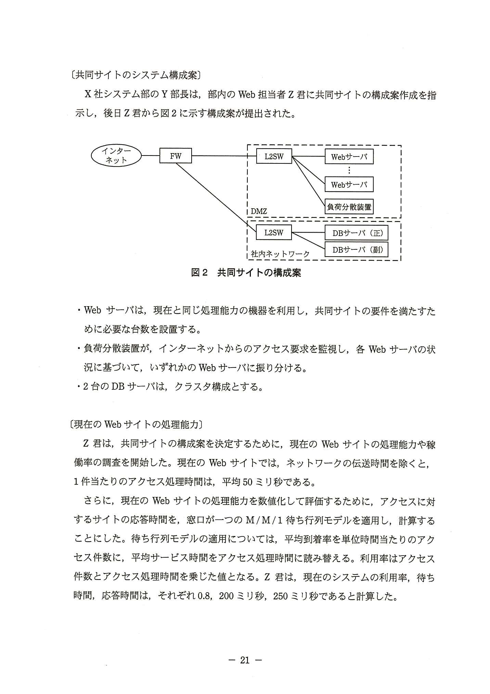

テキスト (OCR)

〔共同サイトのシステム構成案〕
X社システム部の Y 部長は, 部内の Web 担当者 Z 君に共同サイトの構成案作成を指
示し, 後日Z君から図2 に示す構成案が提出された。

1

PBサーバ CE) | |

1

1符内ネットワーク DBS GD |

 2 共同サイトの構成案

・Web サーバは, 現在と同じ処理能力の機器を利用し, 共同サイトの要件を満たすた
めに必要な台数を設置する。

・負荷分散装置が, インターネットからのアクセス要求を監視し, 各 Web サーバの状
況に基づいて, いずれかの Web サーバに振り分ける。

・2 台のDB サーバは, クラスタ構成とする。

〔現在の Web サイトの処理能力〕

ZA, 共同サイトの構成案を決定するために, 現在の Web サイトの処理能力や稼
働率の調査を開始した。現在の Web サイトでは, ネットワークの伝送時間を除くと,
1 件当たりのアクセス処理時間は, 平均50 ミリ秒である。

さらに, 現在の Web サイトの処理能力を数値化して評価するために, アクセスに対
するサイトの応答時間を, 窓口が一つの M/M/1 待ち行列モデルを適用し, 計算する
ことにした。待ち行列モデルの適用については, 平均到着率を単位時間当たりのアク
セス件数に, 平均サービス時間をアクセス処理時間に読み堆える。利用率はアクセス
件数とアクセス処理時間を乗じた値となる。Z Bld, 現在のシステムの利用率, 待ち
時間, 応答時間は, それぞれ0.8, 200 ミリ秒, 250 ミリ秒であると計算した。

### ページ 22

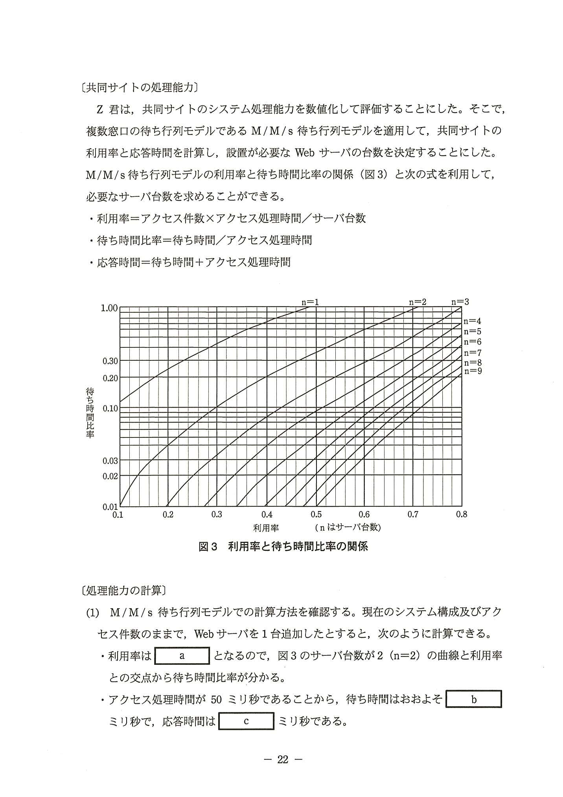

テキスト (OCR)

〔共同サイトの処理能力]

Z Bld, 共同サイトのシステム処理能力を数値化して評価することにした。そこで,
複数窓口の待ち行列モデルである M/M/s 待ち行列モデルを適用して, 共同サイトの
利用率と応答時間を計算し, 設置が必要な Web サーバの台数を決定することにした。
M/M/s 待ち行列モデルの利用率と待ち時間比率の関係 (図3) と次の式を利用して,
必要なサーバ台数を求めることができる。

・利用率三アクセス件数Xアクセス処理時間ノサーバ台数
・待ち時間比率王待ち時間ノアクセス処理時間
・応答時間三待ち時間+アクセス処理時間

n=1                                 n=2         n=3
1.00                          t                                             7
-                                                                                                                         n=4
n=5
|                                                                                                     n=6
|                         1                             n=7
0.30                                                                                                     FF                                           n=8
0.20                                                                                                ルイ| |しレ1                              n=9
待
ち                                                                                                       レイ
時 010
間
比
率                                        !                                                          !
|                                                                           |                    1
0.03
0.02
0.01
01                 0.2                03                 0.4                05                0.6                0.7                0.8
利用率             (n はサーバ台数)
図3 利用率と待ち時間比率の関係
(処理能力の計算〕

(①) M/M/s 待ち行列モデルでの計算方法を和認する。現在のシステム構成及びアク
セス件数のままで, Web サーバを 1 台追加したとすると。 次のように計算できる。
・利用率は| a | となるので, 図3 のサーバ人台数が2 (nー2) の曲線と利用率
との交点から待ち時間比率が分かる。
・アクセス処理時間が 50 ミリ秒であるととから, 待ち時間はおおよそ| b |

ミリ秒で, 応答時間は| c | ミリ秒である。

### ページ 23

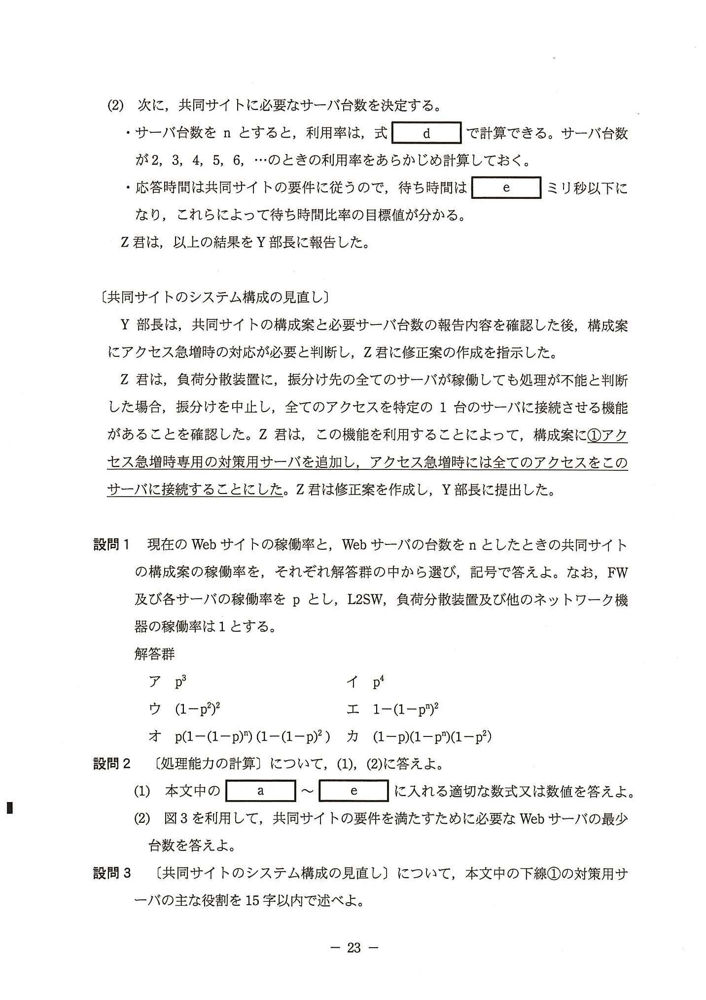

テキスト (OCR)

⑫) 次に, 共同サイトに必要なサーバ人台数を決定する。
・サーバ台数を n とすると, 利用率は, 式| q | で計算できる。サーバ台数
が2。 3, 4, 5, 6, …のときの利用率をあらかじめ計算しておく。
・応答時間は共同サイトの要件に従うので, 待ち時間は| e | ミリ秒以下に
なり, これらによって待ち時間比率の目標値が分かる。
Z君は, 以上の結果をY 部長に報告した。

〔共同サイトのシステム構成の見直し〕

Y 部長は, 共同サイトの構成案と必要サーバ台数の報告内容を確認した後, 構成案
にアクセス急増時の対応が必要と判断し, Z 君に修正案の作成を指示した。

Z Bld, 負荷分散装置に, 振分け先の全てのサーバが稼働しても処理が不能と判断
した場合, 振分けを中止し, 全てのアクセスを特定の 1 台のサーバに接続させる機能
があることを確認した。Z Ald, この機能を利用することによって, 構成案に①アク
セス急増時専用の対策用サーバを追加し, アクセス急増時には全てのアクセスをこの
サーバに接続することにした。Z 君は修正案を作成し, Y 部長に提出した。

設問1 現在の Web サイトの稼働率と, Web サーバの台数を n としたときの共同サイト
の構成案の稼働率を., それぞれ解答群の中から選び, 記号で答えよ。なお, FW
及び各サーバの稼働率を p とし, L2SW, 負荷分散装置及び他のネットワーク機
器の稼働率は 1 とする。

解答群
ア p         イ pt
ウ (py?        © i-d-py

オ p-1-p)9 1一1一p)”) カカ ①-p)1一pD1一p?)
設問2 処理能力の計算] について, ①, ②に答えよ。
①) 本文中の| ai |て| ie | に入れる適切な数式又は数値を答えよ。
(2) 図3 を利用して, 共同サイトの要件を満たすために必要な Web サーバの最少
台数を答えよ。
設問3 〔共同サイトのシステム構成の見直し〕について, 本文中の下線①の対策用サ
ーバの主な役割を 15 字以内で述べよ。

ー 23 一

### ページ 24

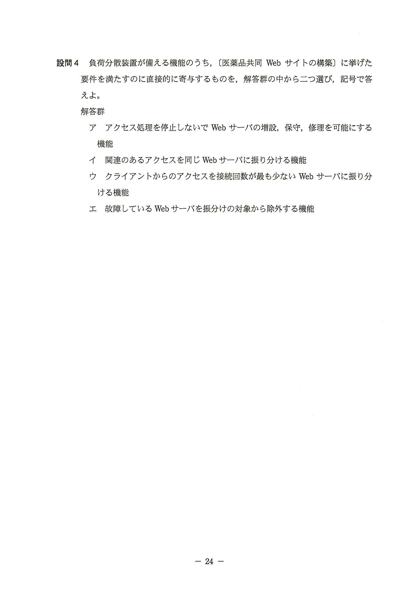

テキスト (OCR)

設問4 負荷分散装置が備える機能のうち, 〔医薬品共同 Web サイトの構築〕] に挙げた
要件を満たすのに直接的に寄与するものを, 解答群の中から二つ選び, MSCS
えよ。
解答群

ア アクセス処理を停止しないで Web サーバの増設, 保守, 修理を可能にする
機能

イ 関連のあるアクセスを同じ Web サーバに振り分ける機能

ウ クライアントからのアクセスを接続回数が最も少ない Web サーバに振り分
ける機能

エエ 故障している Web サーバを振分けの対象から除外する機能

ー 24 一

### ページ 25

テキスト (OCR)

CA モ 用 RJ

ー 25 一

### ページ 26

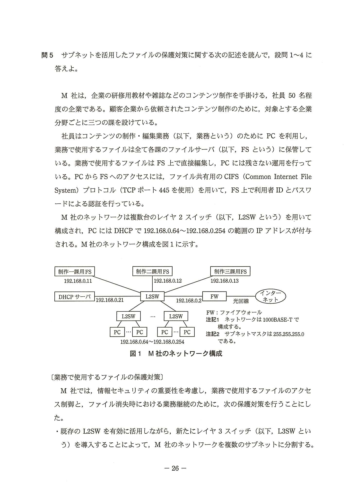

テキスト (OCR)

HS サブネットを活用したファイルの保護対策に関する次の記述を読んで, 設問 1こ4 に

答えよ。

M 社は, 企業の研修用教材や雑誌などのコンテンツ制作を手掛ける, 社員 50 名程
度の企業である。 顧客企業から依頼さきれたコンテンツ制作のために, 対象とする企業
分野ごとに三つの課を設けている。

社員はコンテンツの制作・編集業務 (以下, 業務という) のために PC を利用し,
業務で使用するファイルは全て各課のファイルサーバ CAF, FS という) に保管して
いる。業務で使用するファイルは FS 上で直接編集し. PC には残さない運用を行って
いる。 PC から FS へのアクセスには, ファイル共有用の CIFS (Common Internet File
System) プロトコル (TCP ポート 445 を使用) を用いて, FS 上で利用者 ID とパスワ
ードによる認証を行っている。

M 社のネットワークは複数台のレイヤ 2 スイッチ (以下, L2SW という) を用いて
構成され, PC には DHCP で 192.168.0.64~192.168.0.254 DMPO IP アドレスが付与
される。M 社のネットワーク構成を図 1 に示す。

制作一課用FS                          fF FS                           fF=RES
192.168.0.11                                192.168.0.12               192.168.0.13

—                                                                       ーーー                     インター
[plcp サーバ |    192.168.0.21             sv)          192168021 YI Setag    Ce”)
—      EW: ファイアウォール

注記1 ネットワークは1000BASE-T で

構成する。
Le LEe| [ec]~[ec]  sesee boxy pwr 7 ic 255.088.255.0
192.168.0.64~192.168.0.254         である。

Hi M社のネットワーク構成

〔業務で使用するファイルの保護対策]
M 社では, 情報セキュリティの重要性を考慮し, 業務で使用するファイルのアクセ
ス制御と, ファイル消失時における業務継続のために, 次の保護対策を行うことにし
た。
・既存の L2SW を有効に活用しながら, 新たにレイヤ 3 スイッチ (以下, L3SW chs
う) を導入することによって, M 社のネットワークを複数のサブネットに分割する。

ー 26 一

### ページ 27

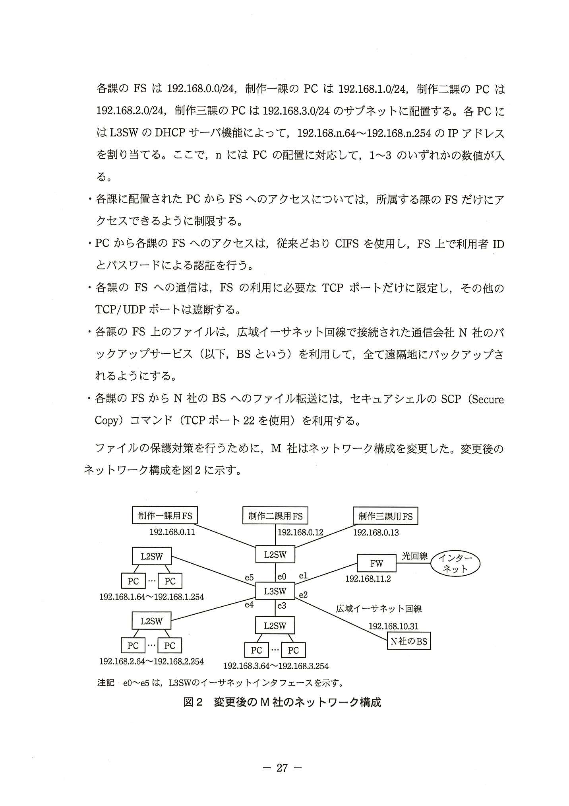

テキスト (OCR)

各課の FS は 192.168.0.0/24, 制作一謀の PC は 192.168.1.0/24, 制作二課の PC は
192.168.2.0/24, 制作三斉の PC は 192.168.3.0/24 のサブネットに配置する。各PC に
はL3SW の DHCP サーバ機能によって, 192.168.n.64て192.168.n.254 の IP アドレス
を割り当てる。ここで, n には PC の配置に対応して, 1て3 のいずれかの数値が入
る。

・各課に配置された PC から FS へのアクセスについては, 所属する課の FS だけにア
クセスできるように制限する。

・PC から各課の FS へのアクセスは, 従来どおり CIFS を使用し, FS 上で利用者 ID
とパスワードによる認証を行う。

・各課の FS への通信は, FS の利用に必要な TCP ポボートだけに限定し, その他の
TCP/UDP ポートは遮断する。

・各課の FS 上のファイルは, 広域イーサネット回線で接続された通信会社 N 社のバ
ックアップサービス (以下, BS という) を利用して, 全て遠隔地にバックアップさ
れるようにする。

・各課の FS から N 社の BS へのファイル転送には, セキュアシェルの SCP (Secure
Copy) コマンド (TCP ポート 22 を使用) を利用する。

ファイルの保護対策を行うために, M 社はネットワーク構成を変更した。変更後の
ネットワーク構成を図 2 に示す。

fil WFR FS                  | fae—aA Es |                  ee

192.168.0.11                              192.168.0.12           192.168.0.13
L2SW

192.168.2.64ご192.168.2254 99 168,3.64~192.168.3.254
注記 e0~てe5 は, L3SWのイーサネットインタフェースを示す。
図2 変更後のM社のネットワーク構成

ー 27 一

### ページ 28

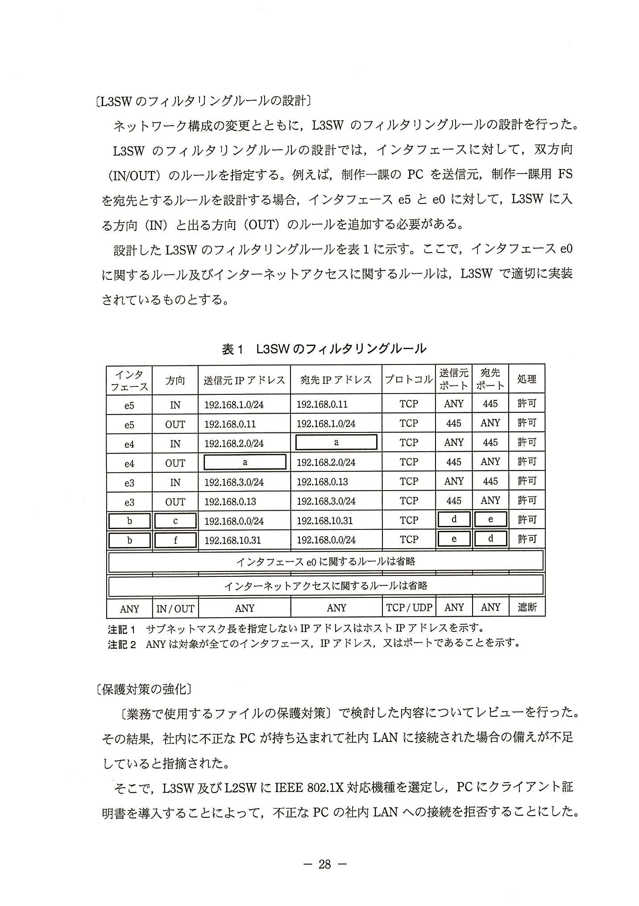

テキスト (OCR)

〔L3SW のフィルタリングルールの設計〕
ネットワーク構成の変更とともに, LISW のフィルタリングルールの設計を行った。
L3SW のフィルタリングルールの設計では, インタフェースに対して, 双方向

(IN/OUT) のルールを指定する。例えば, 制作一課の PC を送信元, 制作一課用 FS
を宛先とするルールを設計する場合,、インタフェース e5 と e0 に対して, L3SW に入
る方向 (IN) と出る方向 (OUT) のルールを追加する必要がある。

設計した L3SW のフィルタリングルールを表 1 に示す。ここで, インタフェース e0
に関するルール及びインターネットアクセスに関するルールは, L3SW で適切に実装

されているものとする。
表1 L3SW のフィルタリングルール

ゴンタ | mm | 送信元豆アドレス| wT KYA |プロトコル bat  38

e5          IN       192.168.1.0/24         192.168.0.11               TCP       ANY      445      許可

e5         OUT      192.168.0.11            192.168.1.0724             TCP        445      ANY | 許可

e4          IN | 192.168,2.0/24         [a || ree | any | 445 | 許可

e4         OUT                a              192.168.2.0/24             TCP        445      ANY | 許可

“3          IN | 192.168.3.0/24 _| 192.168.0.18               TCP | any | 445 | ae

es | our | 192.168.0.13            192.168.3,0/24            TCP | 445 | any | ea

b            c | 192.168.0.0/24          192.168.10.31             Tcp |[ 4 | | wa

| 5 Lt iznenoa          192.168.0.0/24            rcp |e JL¢_]| 町
|                                    インタフェース OTS VRE                                    |
|           インターネットアクセスに関するルールは独中             ]

ANY [IN/OUT           ANY                    ANY           TCP/UDP| ANY | ANY | stir

注記1 サブネットマスク長を指定しない IP アドレスはホスト IP アドレスを示す。
注記 2 ANYは対象が全てのインタフェース, IP アドレス, 又はポートであることを示す。

[保護対策の強化
[業務で使用するファイルの保護対策〕 で検討した内容についてレビューを行った。
その結果, 社内に不正な PC が持ち込まれて社内 LAN に接続された場合の備えが不足
していると指摘された。
そこで, L3SW 及びL2SW に IEEE 802.1X 対応機種を選定し, PC にクライアント証

明書を導入することによって, 不正な PC の社内 LAN への接続を揚否することにした。

### ページ 29

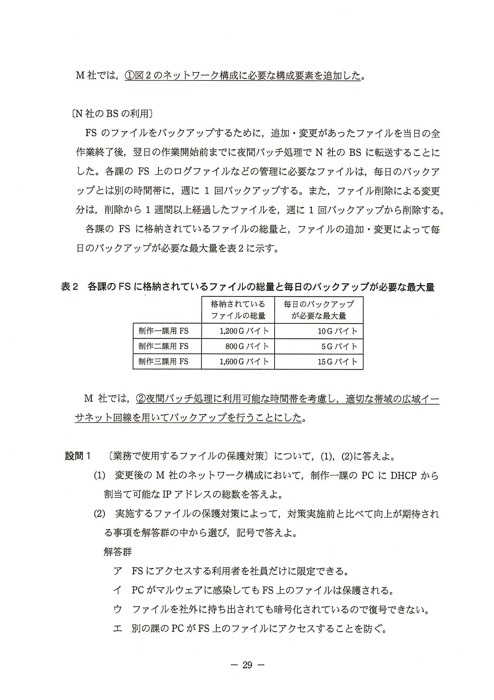

テキスト (OCR)

M 社では, ①図 2 のネットワーク構成に必要な構成要素を追加した。

(N 社の BS の利用〕

FS のファイルをバックアップするために, 追加・変更があったファイルを当日の全
作業終了後, 翌日の作業開始前までに夜間バッチ処理で N 社の BS に転送することに
した。各課の FS 上のログファイルなどの管理に必要なファイルは, 毎日のバックア
ップとは別の時間帯に, Hic 1 回バックアップする。また, ファイル削除による変更
分は, 削除から 1 週間以上経過したファイルを, 週に 1 回バックアップから削除する。

各課の FS に格納されているファイルの総量と, ファイルの追加・変更によって毎
日のバックアップが必要な最大量を表 2 に示す。

表2 各課のFS に格納されているファイルの総量と毎日のバックアップが必要な最大量

格納されている    毎日のバックアップ
ファイルの総量      が必要な最大量

制作一課用 FS        1200G バイト             10G バイト
制作二課用 FS         800G バイト             5Gバイト
制作三課用 FS        1600Gバイト            15Gバイト

M 社では, ②@夜間パバッチ処理に利用可能な時間帯を考慮し, 適切な和帯域の広域イー
サネット回線を用いてバックアップを行うことにした。

設問1 [業務で使用するファイルの保護対策] について, ①⑪, ②に答えよ。
Q) 変更後の M 社のネットワーク構成において, 制作一斎の PC に DHCP から
割当て可能な IP アドレスの総数を答えよ。
2) 実施するファイルの保護対策によって, 対策実施前と比べて向上が期待され
る事項を解答群の中から選び, 記号で答えよ。
解答群
ア FS にアクセスする利用者を社員だけに限定できる。
イ PCがマルウェアに感染しても FS 上のファイルは保護される。
ウ ファイルを社外に持ち出されても暗号化されているので復号できない。
LL 別の課のPCがFS 上のファイルにアクセスすることを防ぐ。

### ページ 30

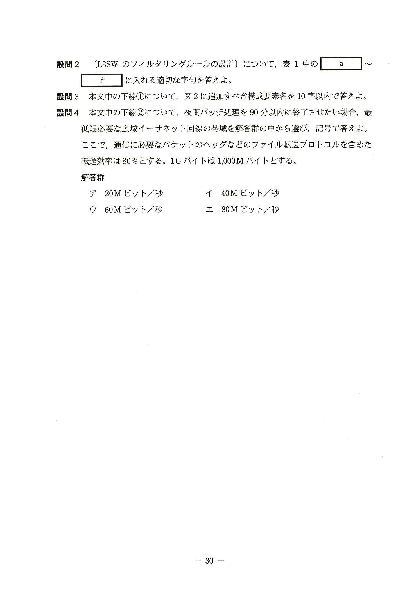

テキスト (OCR)

設問2 (LSWW のフィルタリングルールの設計) について, 表 1 中の| a |~
 に入れる適切な字句を答えよ。

設問3 本文中の下線やについて, 図2 に追加すべき構成要素名を 10 字以内で答えよ。

設問4 本文中の下線②について, 夜間バッチ処理を 90 分以内に終了させたい場合, 最
低限必要な広域イーサネット回線の帯域を解答群の中から選び, 記号で答えよ。
ここで, 通信に必要なパケットのヘッダなどのファイル転送プロトコルを含めた
転送効率は 80%とする。1G バイトは1.000M バイトとする。

解答群
ア 20Mビットノ秒     イ 40M ビットンノ秒
ウ 60Mビットン/秒     x= 80Mビットンノ秒

### ページ 31

テキスト (OCR)

CA モ 用 RJ

ー 31 一

### ページ 32

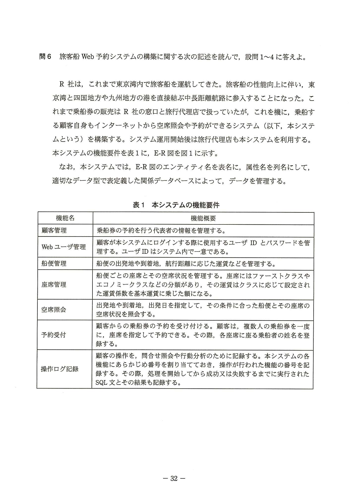

テキスト (OCR)

RIG 旅客船 Web 予約システムの構築に関する次の記述を読んで, 設問1て4 に答えよ。

R 社は, これまで東京湾内で旅客船を運航してきた。旅客船の性能向上に伴い, 東
京湾と四国地方や九州地方の港を直接結ぶ中長距離航路に参入することになった。こ
れまで乗船券の販売は R 社の窓口と旅行代理店で扱っていたが, これを機に, 乗船す
る顧客自身もインターネットから空席照会や予約ができるシステム (以下, 本システ
ムという) を構築する。システム運用開始後は旅行代理店も本システムを利用する。
本システムの機能要件を表 1 に, E-R 図を図 1 に示す。

なお, 本システムでは, E-R 図のエンティティ名を表名に, 属性名を列名にして,
適切なデータ型で表定義した関係データベースによって, データを管理する。

表1 本システムの機能要件

機能名                      機能概要
顧客管理     乗船券の予約を行う代表者の情報を管理する。
3      ば本システムにロ  >   a    ユーザ      ード
船便管理     船便の出発地やや到着地, 航行距離に応じた運任などを管理する。
船便ごどとの座席とその空席状況を管理する。座席にはファーストクラスや
座席管理     エコノミークラスなどの分類があり, その運任はクラスに応じて設定され

た運賃係数を基本運賃に乗じた額になる。
出発地や到着地, 出発日を指定して, その条件に合った船便とその座席の

a
anal     AERRERSTS,
BED 5 ORMBROFHEZUADS. MS, BRAORMBE—E
予約受付     に, 座席を指定して予約できる。その際, 各座席に座る乗朋者の姓名を全
録する。

顧客の操作を, 問合せ照会や行動分析のために記録する。本システムの各
操作ログ記録   機能にあらかじめ番号を割り当てておき, 操作が行われた機能の番号を記

録する。その際, 処理を開始してから成功又は失敗するまでに実行された
SQL 文とその結果も記録する。

### ページ 33

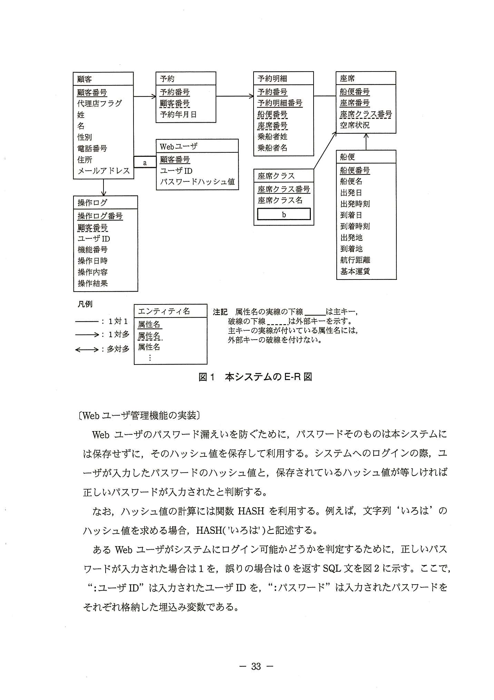

テキスト (OCR)

顧客         予約           予約明細       座席
顧客番号       予約番号         予約番号       船便番号
代理店フラグ     Bees         予約明細番号     座席番号
ie                      予約年月日                  船便番号               座席クラス番号
名                                                        座席番号                 空席状況
fea                      FABRE
電話番号       Webユーザ        RIEL
住所       。 | HERE                    An
メールアドレス         ユーザID                          =                船便番号
パスワードハッシュ値| E224        ME,
座席クラス番号         出発日
操作ログ                                            座席クラス名           出発時刻
拘作ログ矯号                                       L_ 5 ]         到着日
顧客番号                                                                           到着時刻
ユーザD                                                                           出発地
機能番号                             到着地
操作日時                             航行距離
操作内容                                基本運賃
操作結果
Ail

エンティティ名     注記 属性名の実線の下線__ は主キー,
: 11 ee         破線の下線 -____ 3外部キーを示す。

PP                   主キーの実線が付いている属性名には,
Et             外部キーの破線を付けない。

 1 本システムの E-R

(Web ユーザ管理機能の実装〕

Web ユーザのパスワード漏えいを防ぐために, パスワードそのものは本システムに
は保存せずに, そのハッシュ値を保存して利用する。システムへのログインの際, ユ
ーザが入力したパスワードのハッシュ値と, 保存されているハッシュ値が等しければ
正しいパスワードが入力されたと判断する。

なお, ハッシュ値の計算には関数 HASH を利用する。例えば, 文字列 "いろは'の
ハッシュ値を求める場合, HASH( いろは)と記述する。

ある Web ユーザがシステムにログイン可能かどうかを判定するために, 正しいパス
ワードが入力された場合は 1 を, 誤りの場合は 0 を返す SQL 文を図 2 に示す。ここで,
“sa FID’ は入力されたユーザ ID を, “:パスワード"” は入力されたパスワードを
それぞれ格納した埋込み変数である。

### ページ 34

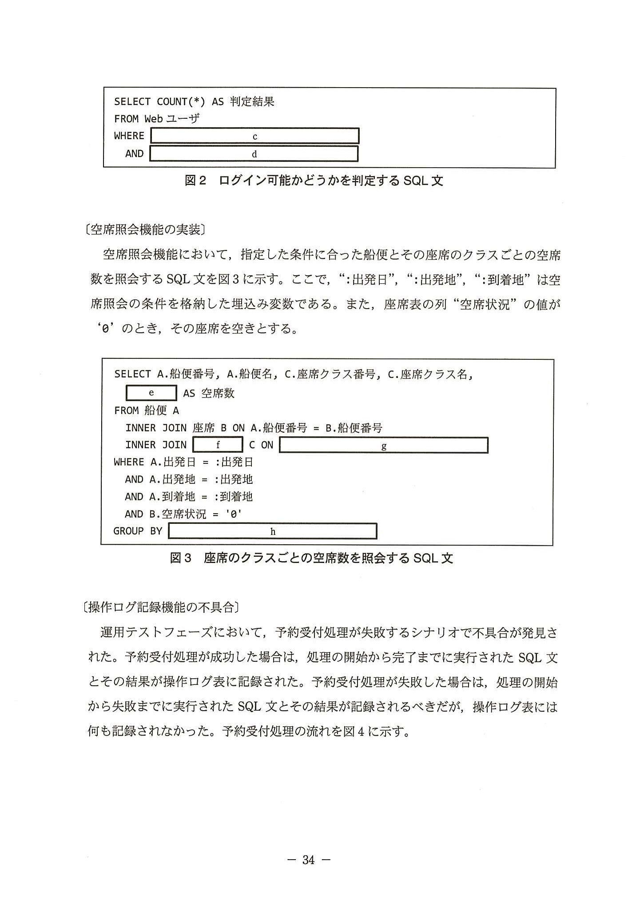

テキスト (OCR)

SELECT COUNT(*) AS 判定結果
FROM Meb ユーザ

MHERE  |                         c                         |
AND |                  d                 ]

 2 ログイン可能かどうかを判定する SQL 文

(空席照会機能の実装
空席照会機能において, 指定した条件に合った船便とその座席のクラスごとの空席

RERST S SQL 文を図 3 に示す。ここで, “SHEA”, “:出発地"。 “:到着地"は空
席照会の条件を格納した埋込み変数である。また, 座席表の列 “空席状況” の値が
"の DLS, その座席を空きとする。

SELECT A.船便番号, A.船便名, C.座席クラス番号, C.座席クラス名

[ < ] as 空席数
FROM 船便 A

INNER JOIN 座席 B ON A.船便番号 = B.船便番号

INNER JOてTN| fj  |c on|              g              |
WHERE A.出発日 = :出発日

AND A.出発地 = :出発地

AND A.到着地 = :到着地
AND B.空席状況 = '9'
Group By [_             h               |

 3 座席のクラスごとの空席数を照会する SQL 文

〔操作ログ記録機能の不具合
運用テストフェーズにおいて, 予約受付処理が失敗するシナリオで不具合が発見さ

NK. 予約受付処理が成功した場合は, 処理の開始から完了までに実行された SG 文
とその結果が操作ログ表に記録された。予約受付処理が失敗した場合は, 処理の開始
から和失敗までに実行された SQL 文とその結果が記録されるべきだが, 操作ログ表には
何も記録されなかった。予約受付処理の流れを図 4 に示す。

ー 34 一

### ページ 35

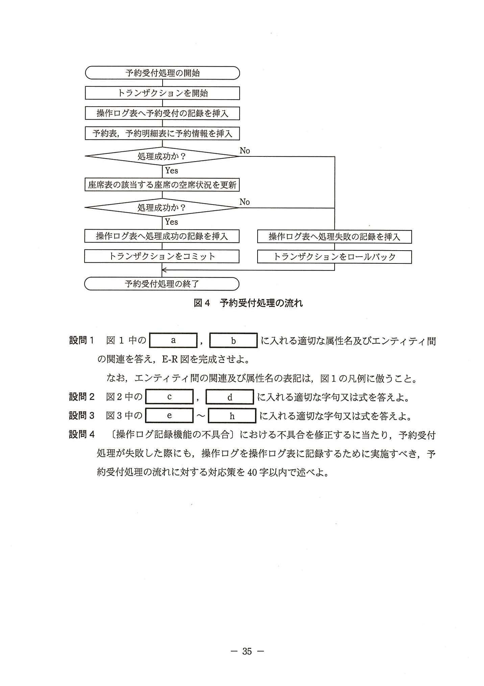

テキスト (OCR)

|
|   トランザクションを開始

(    予約受付処理の開始    )
|
|

I
| 操作ログ表へ予約受付の記録を挿入

I
| 予約表, 予約明細表に予約情報を挿入 |
No

処理成功か?
Yes

| 座席表の該当する座席の空席状況を更新 |
No

処理成功か?
Yes
| 操作ログ表へ処理成功の記録を挿入 | | 操作ログ表へ処理失敗の記録を挿入 |
I                                                                         |

| トランザクションをコミット | | トランザクションをロールバック |
し                                                                       ]

ド
C    予約受付処理の終了    )
図4 予約受付処理の流れ

設問1 図1中の| ai |,|  b |に入れる適切な属性名及びエンティティ間
の関連を答え, E-R 図を完成させよ。

なお, エンティティ間の関連及び属性名の表記は, 図 1 の凡例に人舌うこと。
設問2 図2中の| c |,| a |に入れる適切な字句又は式を答えよ。
設問3 図3中の| e |て|  h』 |に入れる適切な字句又は式を答えよ。
設問4 操作ログ記録機能の不具合)] における不具合を修正するに当たり, 予約受付

処理が失敗した際にも, 操作ログを操作ログ表に記録するために実施すべき, 予
約受付処理の流れに対する対応策を 40 字以内で述べよ。

ー 35 一

### ページ 36

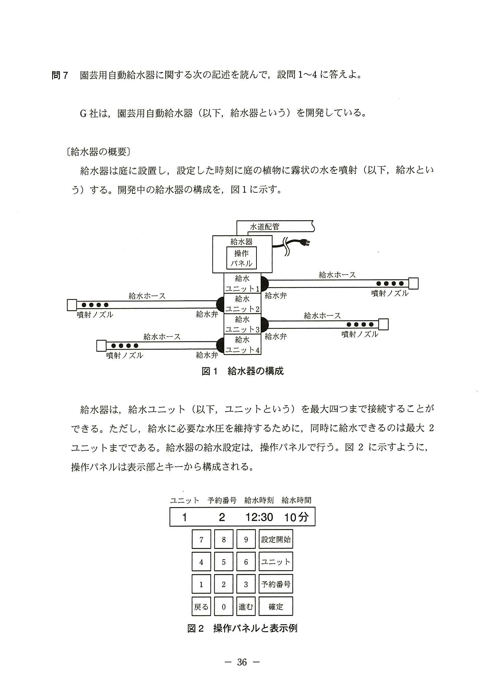

テキスト (OCR)

間7 園芸用自動給水器に関する次の記述を読んで, 設問14 に答えよ。
G 社は, 園芸用自動給水器 (以下, 給水器という) を開発している。

〔給水器の概要〕
給水器は庭に設置し, 設定した時刻に庭の植物に部状の水を噴射 (以下, 給水とい
う) する。開発中の給水器の構成を, 図 1 に示す。

水道配管                )
操作

パネル
給水                    給水ホース

Ly bi
給水ホース                     Pram

Lesss
BN                       am --            給水ホース

(xx) eT |
KE                     噴射ノズル

給水弁                噴射ノズル

ユニット3

給水ホース
Cl eee0e   :                       a eg
噴射ノズル                mom EE =

  1 給水器の構成

給水器は, 給水ユニット (以下,ユニットという) を最大四つまで接続することが
できる。ただし, 給水に必要な水圧を維持するために, 同時に給水できるのは最大 2
ユニットまでである。給水器の給水設定は, 操作パネルで行う。図 2 に示すように,
操作パネルは表示部とキーから構成される。

ユニット 予約番号 給未時刻 給水時間
1      2    12:30 105

7    8    9 |設定開始

4  5  6 | |ユニット

1      2      3 |予約番号

戻る| 0 |進む|| 確定

 2 操作パネルと表示例

ー 36 一

### ページ 37

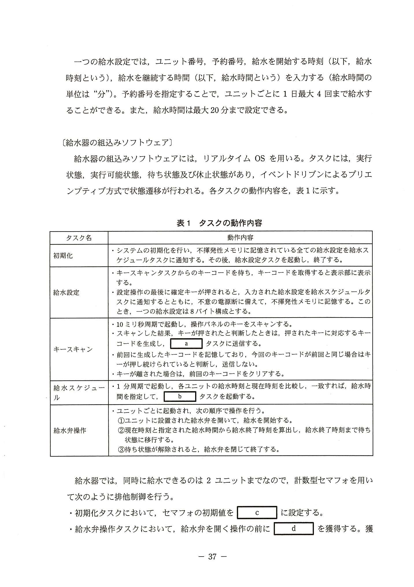

テキスト (OCR)

ーつの給水設定では, ユニット番号, 予約番号, 給水を開始する時刻 (以下, 給水
時刻という), 給水を継続する時間 (以下, 給水時間という) を入力する (給水時間の
単位は "分")。予約番号を指定することで, ユニットごとに 1 日最大 4 回まで給水す
ることができる。また, 給水時間は最大 20 分まで設定できる。

〔給水器の組込みソフトウェア〕

給水器の組込みソフトウェアには, リアルタイム OS を用いる。タスクには, 実行
状態, 実行可能状態。 待ち状態及び休止状態があり, イベントドリブンによるプリエ
ンプティブ方式で状態遷移が行われる。各タスクの動作内容を, 表 1 に示す。

表1 タスクの動作内容

タスク名                                                     動作内容

・システムの初期化を行い, 不揮発性メモリに記憶されている全ての給水設定を給水ス

aA      ケジュールタスクに通知する。その後。給水設定タスクを起動し, 終了する。
・ キースキャンタスクからのキーコードを待ちも。キーコードを取得すると表示部に表示
する。

給水設定     ・ 設定操作の最後に確定キーが押されると, 入力された給水設定を給水スケジュールタ
スクに通知するとともに, 不意の電源断に備えて, 不揮発性メモリに記憶する。この
とき, 一つの給水設定は8 バイト構成とする。
・ 10 ミリ秒周期で起動し。 操作パネルのキーをスキャンする。
・ スキャンした結果. キーが押されたと判断したときは。 押されたキーに対応するキー
コードを生成し,        タスクに送信する。

キースキャン            ししょ]     1

・前回に生成したキーコードを記憶しており, 今回のキーコードが前回と同じ場合はキ
ーが押し続けられていると判断し, 送信しない。
・キーが離された場合は, 前回のキーコードをクリアする。

給水スケジュー | ・1 分周期で起動し, 各ユニットの給水時刻と現在時刻を比較し, 一致すれば, 給水時
ル        間を指定して, | b | タスクを起動する。

・ユニットごとに起動され, 次の順序で操作を行う。
①ユニットに設置された給水弁を開いて, 給水を開始する。

給水弁操作             ②現在時刻と指定された給水時間から給水終了時刻を算出し, 給水終了時刻まで待ち
状態に移行する。

⑧待ち状態が解除されると, 給水弁を閉じて終了する。

給水器では, 同時に給水できるのは 2 ユニットまでなので, 計数型セマフォを用い
て次のように排他制御を行う。
・初期化タスクにおいて, セマフォの初期値を に設定する。
・給水者操作タスクにおいて, 給水弁を開く操作の前に| d  ] を獲得する。獲

— 87 一

### ページ 38

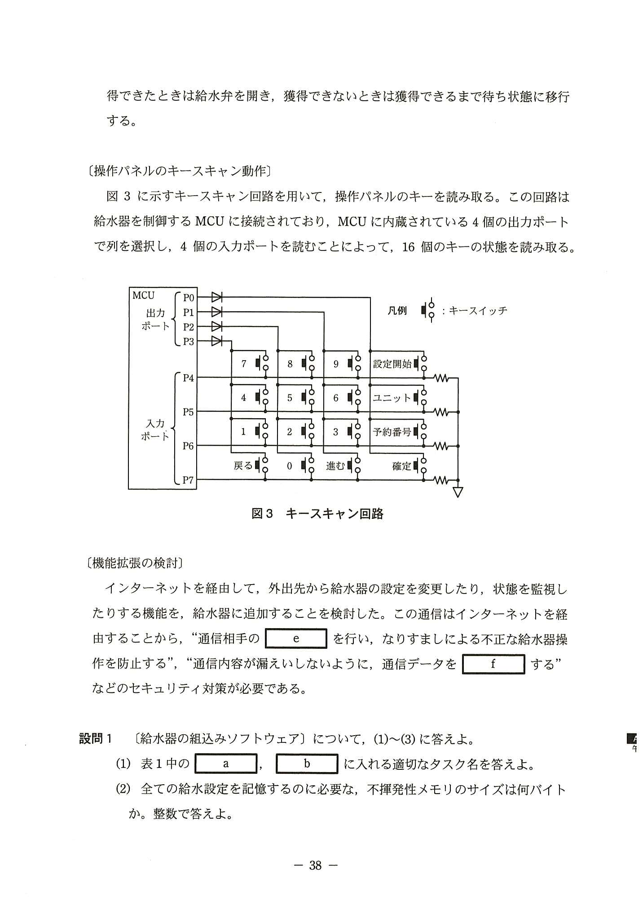

テキスト (OCR)

得できたときは給水弁を開き, 獲得できないときは獲得できるまで待ち状態に移行
する。

〔操作パネルのキースキャン動作]
 3 に示すキースキャン回路を用いて, 操作パネルのキーを読み取る。この回路は
給水器を制御する MCU に接続されており, MCU に内蔵されている 4 個の出力ポート

で列を選択し, 4 個の入力ボートを読むことによって, 16 個のキーの状態を読み取る。

MCU  「 Po-—- >}                      4
出力 」 PL}                  凡例  』o : キースイッチ
ボート | gz時

しPaー了|
_     7 A;  8 E  9 E TE
P4              ]
4 E  5 lo  6 a3 ユニッ Ti
PS
Pd 」     1 k  2 A;  3 a3 oe
age    fo}    }     FT)
mols 0 WS wed    tia |
Lp7       r    2    id      ?
図3 キースキャン回路
〔機能拡張の検討]

インターネットを経由して, 外出先から給水器の設定を変更したり, 状態を菩視し
たりする機能を給水器に追加することを検討した。この通信はインターネットを経
由することから, “通信相手の | c | を行い なりすましによる不正な給水器操
作を防止する", “通信内容が漏えいしないように, 通信データを oS”
などのセキュリティ対策が必要である。

設問1 〔給水器の組込みソフトウェア〕について, ①て(⑬) に答えよ。
Q 表1中の| ai |, |  b | に入れる適切なタスク名を答えよ。
(2) 全ての給水設定を記憶するのに必要な, 不揮発性メモリのサイズは何バイト
か。整数で答えよ。

### ページ 39

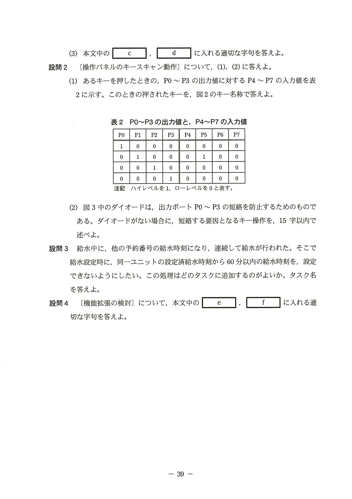

テキスト (OCR)

(3) 本文中の| cc |, |  d | に入れる適切な字旬を答えよ。
設問2 [操作パネルのキースキャン動作) について, (①, ②⑫) に答えよ。
(1) あるキーを押したときの, PO~P3 の出力値に対する P4 ^ P7 の入力値を表
2 に示す。このときの押されたキーを, 図 2 のキー名称で答えよ。

表2 P0~P3 の出力値と, P4てP7 の入力値

PO | Pl | P2 | P3 | P4 | P5 | P6 | P7
1           0           0           0            0           0           0           0
0            1            0           0            0            1           0           0
0           0            1           0            0           0           0           0
0           0           0            al            0           0           0           0

注記 ハイレベルを 1, ローレベルを 0 ERT.

(2) 3 中のダイオードは, 出力ポート PO ~ P3 の短絡を防止するためのもので
ある。ダイオードがない場合に, 短絡する要因となるキー操作を, 15 字以内で
述べよ。
設問3 給水中に, 他の予約番号の給水時刻になり, 連続して給水が行われた。そこで
給水設定時に, 同一ユニットの設定済給水時刻から 60 分以内の給水時刻を, 設定
できないようにしたい。この処理はどのタスクに追加するのがよいか。タスク名

を答えよ。
設問4 機能拡張の検討1]について, 本文中の|  e |,|  f | に入れる適
切な字句を答えよ。

ー 39 一

### ページ 40

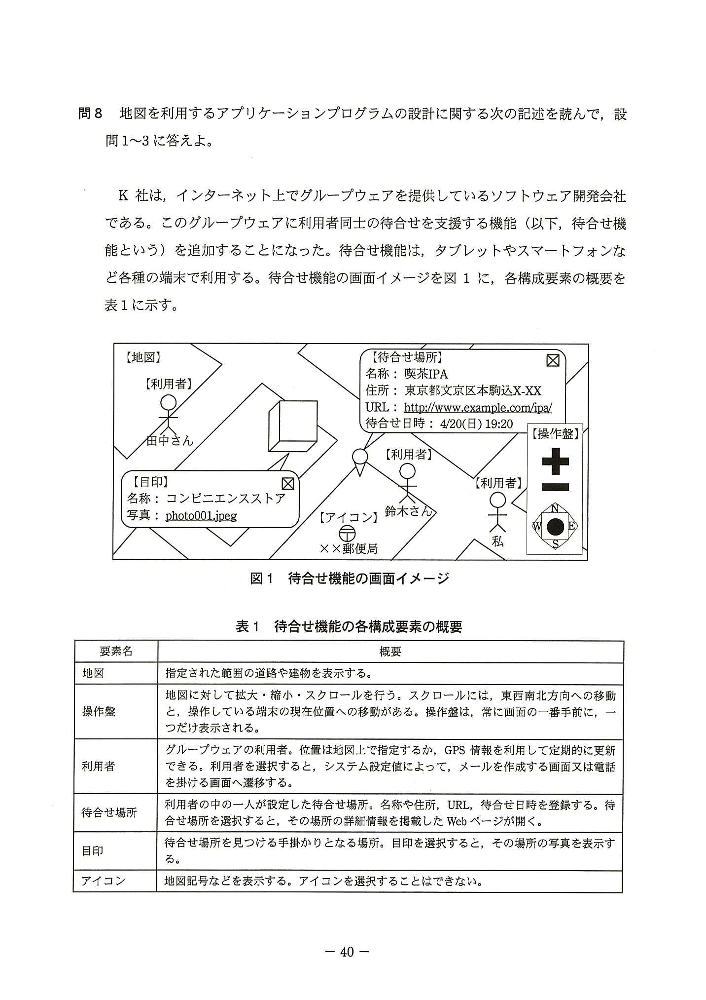

テキスト (OCR)

問8 地図を利用するアプリケーションプログラムの設計に関する次の記述を読んで
問1<3 に

By

答えよ。

K 社は, インターネット上でグループウェアを提供しているソフトウェア開発会社
である。このグループウェアに利用者同士の待合せを支援する機能 (以下, 待合せ機
能という) を追加することになった。待合せ機能は, タブレットやスマートフォンな
ど各種の端末で利用する。待合せ機能の画面イメージを図 1 に, 各構成要素の概要を
表 1 に示す。

【地図】                 【待合せ場所】        Bd)
名称 : 喫茶IPA
ree)                     住所 : 東京者文京区本駒込X.XX
URL : http:/www.example.  iy
待合せ日時 : 420(日) 19:20     |
;       a)       CREE)
2          【利用者】
[目印               &)                       (利用者】| 軒還
名称*。 コンピニエンスストア
写真 : photo001jpeg                                     《@:
xx                       る
図1 待合せ機能の画面イメージ
Ri 待合せ機能の各構成要素の概要
要素名                               概要
地図        指定された範囲の道路や建物を表示する。
地図に対して拡大・縮小・スクロールを行う。スクロールには, 東西南北方向への移動
操作般      と, 操作している端末の現在位置への移動がある。操作盤は, 常に画面の一番手前に, 一
つだけ表示される。
グループウェアの利用者。位置は地図上で指定するか, GPS 情報を利用して定期的に更新
利用者     できる。利用者を選択すると, システム設定値によって, メールを作成する画面又は電話
を掛ける画面へ有移する。
待合せ場所 | 和用者の中の一人が設定した待合せ場所。名称や住所, URL, 待合せ日時を鞭録する。待
.       合せ場所を選択すると, その場所の詳細情報を掲載した Web ページが開く。
      待合せ場所を見つける手掛かりとなる場所。目印を選択すると, その場所の写真を表示す
る。
アイコシ     地図記号などを表示する。アイコンを選択することはできない。

ー 40 一

### ページ 41

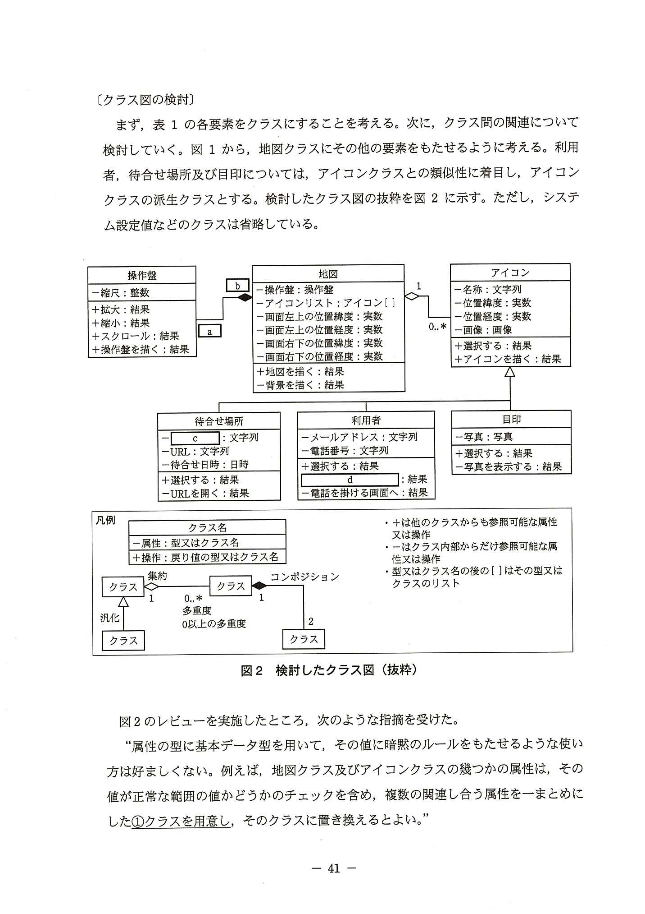

テキスト (OCR)

〔クラス図の検討]

まず, 表 1 の各要素をクラスにすることを考える。次に, クラス間の関連について
検討していく。図 1 から, 地図クラスにその他の要素をもたせるように考える。利用
者, 待合せ場所及び目印については, アイコンクラスとの類似性に着目し, アイコン
クラスの派生クラスとする。 検討したクラス図の抜粋を図 2 に示す。ただし, VAT
ム設定値などのクラスは省略している。

操作盤                            地図                          アイコン
TR tek        [oar areas         1 ga ee
丁拡大 eR               ーアイコンリスト : アイコン[        ー位置紳度 : 実数
十縮小 : 結果                      ー画面左上の位置緯度 : 実数               ー位置経度 : 実数
+スクロール:灯果 |]   HIE LOWER : 実数     Ou. 画像 : 画像
十操作盤を描く : 結果              ー画面右下の位昼線度 : 実数               選択する : 結果
ー画面右下の位置経度 : 実数               エアイコンを描く : 結果
十地図を描く : 結果                A
ー背景を描く aR
に                        I
待合せ場所                    利用者                       目印
ー[  c |:文字列    ーメールアドレス : 文字列    ー写真 写真
ーURL : 文字列              ー電話番号 : 文字列             選択する : 結果
ー待合せ日時 : 日時          十選択する : 結果              ー写真を表示する : 結果
選択する : 結果           [し 3 |:結果
ーURLを開く : 結果        一電話を掛ける画面へ : 結果
凡例               =                               ‘         ラスから      cI
フラス名                は他のクラスからも参照可能な属性
RIE 型又はクラス名               eye
    2   =             ・-はクラス内部からだけ参照可能な履
操作 : 戻り値の型又はクラス名                    性又は操作
ンポジション     ・型又はクラス名の後の[ ] はその型又は
クラス ーション       クラスのリスト
0..*           1
多重度
0以上の多重度      2
クラス

図2 検討したクラス図 (抜粋)

図2 のレビューを実施したところ, 次のような指摘を受けた。

“属性の型に基本データ型を用いて, その値に暗黙のルールをもたせるような使い
方は好ましくない。例えば, 地図クラス及びアイコンクラスの幾つかの属性は. その
値が正常な範囲の値かどうかのチェックを含め, 複数の関連し合う属性を一まとめに
した①クラスを用意し, そのクラスに置き換えるとよい。"

ー 41 一

### ページ 42

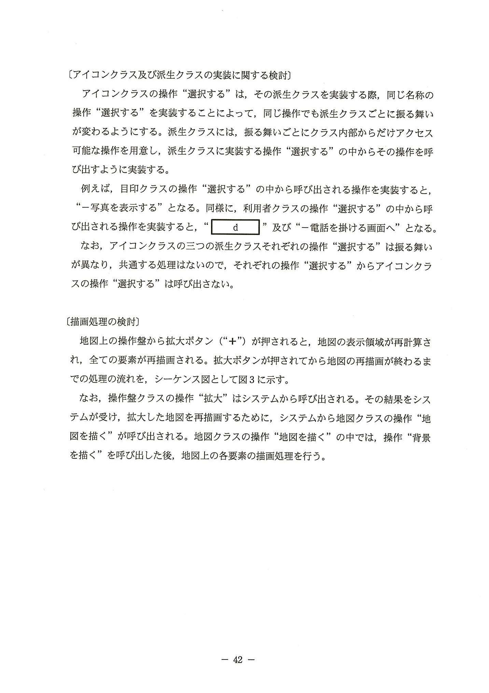

テキスト (OCR)

〔アイコンクラス及び派生クラスの実装に関する検討〕

アイコンクラスの操作 “選択する" は, その派生クラスを実装する際, 同じ名称の
操作 “選択する” を実装することによって, 同じ操作でも派生クラスごとに振る舞い
が変わるようにする。派生クラスには, 振る舞いごとにクラス内部からだけアクセス
可能な操作を用意し, 派生クラスに実装する操作 “選択する" の中からその操作を呼
び出すように実装する。

例えば, 目印クラスの操作 ERTS” の中から呼び出される操作を実装すると,
"一写真を表示する” となる。同様に, 利用者クラスの操作“選択する"の中から呼
び出される操作を実装すると, “     ” 及び“一電話を掛ける画面へ" となる。

なお, アイコンクラスの三つの派生クラスそれぞれの操作“選択する"は振る舞い
が異なり, 共通する処理はないので, それぞれの操作 “選択する" からアイコンクラ
スの操作 “BIRT S” は呼び出さない。

(描画処理の検討]

地図上の操作盤から拡大ボタン (“+”) が押されると, 地図の表示領域が再計算さ
れ, 全ての要素が再描画される。拡大ボタンが押されてから地図の再描画が終わるま
での処理の流れを, シーケンス図として図 3 に示す。

なお, 操作盤クラスの操作 “拡大"” はシステムから呼び出される。その結果をシス
テムが受け, 拡大した地図を再描画するために, システムから地図クラスの操作 “Hh
図を描く” が呼び出される。 地図クラスの操作 “地図を描く” の中では, 操作“背景
を描く” を呼び出した後, 地図上の各要素の描画処理を行う。

### ページ 43

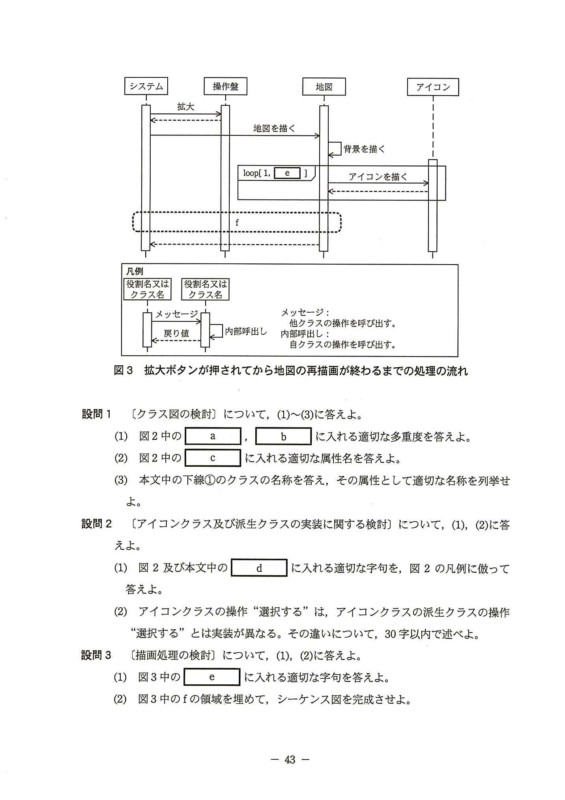

テキスト (OCR)

T          T
rT                       ry

地図を描く

| |背景を描く

ieprh[Ls        アイコンを描く
に

にニニニニニニ=ニニニュュニ=
T        aii

人例

役割名又は| |役割名又は

クラス名   クラス名

メッセージ :
他クラスの操作を呼び出す。
内部呼出し 肉部呼軸し:

自クラスの操作を呼び出す。

図3 拡大ボタンが押されてから地図の再描画が終わるまでの処理の流れ

設問1 〔クラス図の検討について, ①<て(3)に答えよ。
Q) Beto} a |,|  b |に入れる適切な多重度を答えよ。
(2) 図2中の に入れる適切な属性名を答えよ。

3) 本文中の下線ののクラスの名称を答え, その属性として適切な名称を列挙せ

de
設問2 〔アイコンクラス及び派生クラスの実装に関する検討について, ①), IF
えよ。
Q) 図 2 及び本文中の| a | に入れる適切な字句を, 図 2 の凡例に條って
答えよ。

2) アイコンクラスの操作“選択する"は, アイコンクラスの派生クラスの操作
“ERTS” とは実装が異なる。その違いについて, 30 宇以内で述べよ。
設問3 [描画処理の検討】について, ①⑪, ②に答えよ。
GQ) 図3中の| e | に入れる適切な字句を答えよ。
2) 図3 中のfの領域を埋めて, シーケンス図を完成させよ。

### ページ 44

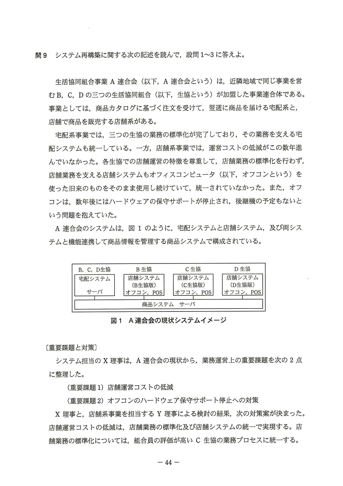

テキスト (OCR)

問9 システム再構築に関する次の記述を読んで, 設問1ご3 に答えよ。

生活協同組合事業 A 連合会 (以下, A 連合会という) は, 近隣地域で同じ事業を営
OB, C, D の三つの生活協同組合 (以下, 生協という) が加盟した事業連合体である。
事業としては, 商品カタログに基づく注文を受けて, 翌週に商品を届ける宅配系と,
店舗で商品を販売する店舗系がある。

宅配系事業では, 三つの生協の業務の標準化が完了レしており, その業務を支える宅
配システムも統一している。一方, 店舗系事業では, 運営コストの低減がこの数年進
んでいなかった。各生協での店舗運営の特徴を尊重して, 店舗業務の標準化を行わず
店舗業務を支える店舗システムもオフィスコンピュータ (以下、オフコンという) を
使った旧来のものをそのまま使用し続けていて, 統一されていなかった。また, オフ
コンは, 数年後にはハードウェアの保守サポートが停止され, 後継機の予定やないと
いう問題を抱えていた。

A 連合会のシステムは, 図 1 のように, 宅配システムと店舗システム, 及び両シス
テムと機能連携して商品情報を管理する商品システムで構成されている。

B, C, D生協           B 生協               C生協               D 生協
宅配システム   店舗システム   店舗システム   店舗システム
(B生協版)            (C生協版)            (DAE HAR)
me    47%, POS  オフコン.PGS  オフコン. POS
[           商品システム サーバ

図1 A連合会の現状システムイメージ

(重要課題と対策]〕
システム担当の X 理事は, A 連合会の現状から, 業務運営上の重要課題を次の 2 点
に整理した。
(重要課題 1) 店舗運営コストの低減
(重要課題 2 オフコンのハードウェア保守サポート停止への対策
X 理事と, 店舗系事業を担当する Y 理事による検討の結果, 次の対策案が決まった。
店舗運営コストの低減は, 店舗業務の標準化及び店舗システムの統一で実現する。店
舗業務の標準化については, 組合員の評価が高い C 生協の業務プロセスに統一する。

ー44 一

### ページ 45

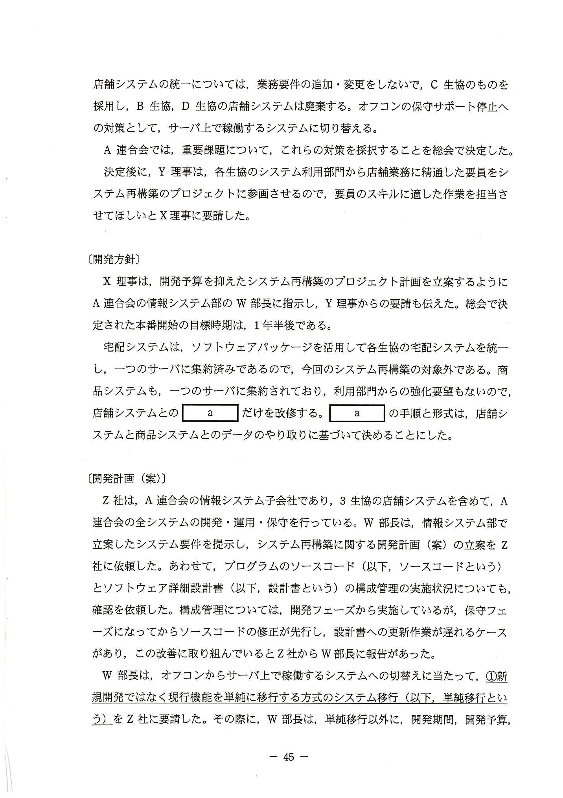

テキスト (OCR)

店舗システムの統一については, 業務要件の追加・変更きしないで, C 生協のものを
採用し, B 生協, D 生協の店舗システムは廃棄する。オフコンの保守サポート停止へ
の対策として, サーバ上で稼働するシステムに切り替える。

A 連合会では, 重要課題について, これらの対策を採択することを総会で決定した。
決定後に, Y 理事は, 各生協のシステム利用部門から店舗業務に精通した要員をシ
ステム再構築のプロジェクトに参画させるので, 要員のスキルに適した作業を担当さ
せてほしいとX 理事に要請した。

(開発方針)

X 理事は, 開発予算を抑えたシステム再構築のプロジェクト計画を立案するように
A 連合会の情報システム部の W 部長に指示し,Y 理事からの要請も伝えた。総会で決
定された本番開始の目標時期は1 年半後である。

宅配システムは, ソフトウェアパッケージを活用して各生協の宅配システムを統一
し, 一つのサーバに集約済みであるので, 今回のシステム再構築の対象外である。商
品システムも, 一つのサーバに集約されており, 利用部門からの強化要望もないので
店舗システムとの|  。 |] だけを改修する。| a | の手順と形式は, 店舗シ
ステムと商品システムとのデータのやり取りに基づいて決めることにした。

[開発計画 (案)〕

Z 社は, A 連合会の情報システム子会社であり, 3 生協の店舗システムを含めて, A
連合会の全システムの開発・運用・保守を行っている。W 部長は, 情報システム部で
立案したシステム要件を提示し, システム再構築に関する開発計画 (案) の立案を Z
社に依頼した。あわせて, プログラムのソースコード (以下, ソースコードという)
とソフトウェア詳細設計書 (以下, 設計書という) の構成管理の実施状況についても,
確認を依頼した。構成管理については, 開発フェーズから実施しているが, 保守フェ
ーズになってからソースコードの修正が先行し, 設計書への更新作業が遅れるケース
があり, この改善に取り組んでいるとZ社から W 部長に報告があった。

W 部長は, オフコンからサーバ上で稼働するシステムへの切准えに当たって, OF
規開発ではなく現行機能を単純に移行する方式のシステム移行 (以下, 単純移行とい
う) を Z 社に要請した。その際に, W 部長は, 単純移行以外に, 開発期間, 開発予算,

ー 45 一

### ページ 46

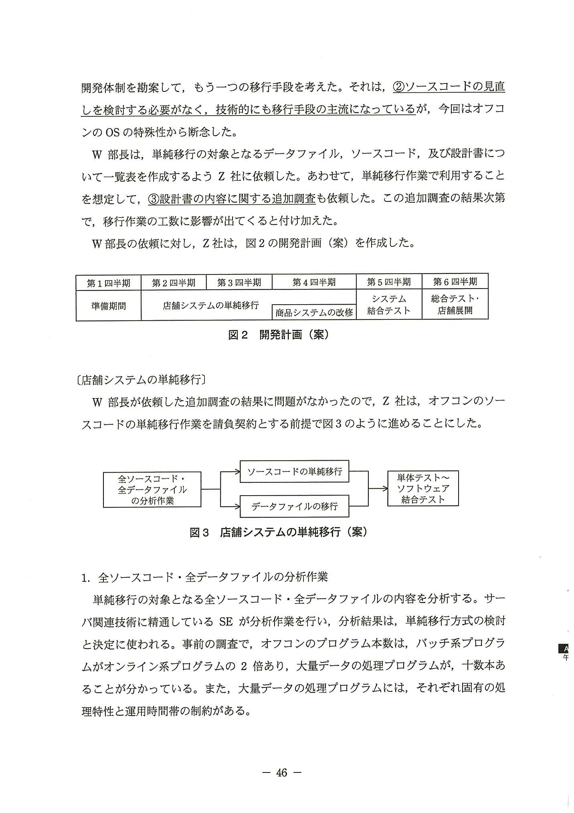

テキスト (OCR)

開発体制を勘案して, もう一つの移行手段を考えた。それは, ソースコードの見直
しを検討する必要がなく, 技術的にも移行手段の主流になっているが, 今回はオフコ
ンの 0S の特殊性から断念した。

W 部長は, 単純移行の対象となるデータファイル, ソースコード, 及び設計書につ
いて一覧表を作成するよう Z 社に依頼した。あわせて, 単純移行作業で利用すること
を想定して, ③設計書の内容に関する追加調査も依頼した。この追加調査の結果次第
で, 移行作業の工数に影響が出てくると付け加えた。

W 部長の依頼に対し, Z 社は, 図2 の開発計画 GR) を作成した。

第1 四半期 | 第2四半期 | 第3四半期 | 第4四半基    第5 四半期 | 第6四半期
——            _                             システム        S合テスト・
準備期間    BMY AT LOMMB weak | 店人

図2 開発計画 (案)

〔店舗システムの単純移行]
W 部長が依頼した追加調査の結果に問題がなかったので, Z 社は, オフコンのソー
スコードの単純移行作業を請負契約とする前提で図3 のように進めることにした。

ソースコードの単純移行

全ツースコード・                                    単体テストー

全データファイル                        ツウ ドウエデ
a                                     合テ

の分析作業                  データファイルの移行              結合テスト

図3 店舗システムの単純移行 GR)

1. 全ソースコード・全データファイルの分析作業

単純移行の対象となる全ソースコード・全データファイルの内容を分析する。サー
バ関連技術に精通している SE が分析作業を行い, 分析結果は, 単純移行方式の検討
と決定に使われる。事前の調査で. オフコンのプログラム本数は, バッチ系プログラ
ムがオンライン系プログラムの 2 倍あり, 大量データの処理プログラムが, 十数本あ
ることが分かっている。また, 大量データの処理プログラムには, それぞれ固有の処
理特性と運用時間帯の制約がある。

ー 46 一

|

### ページ 47

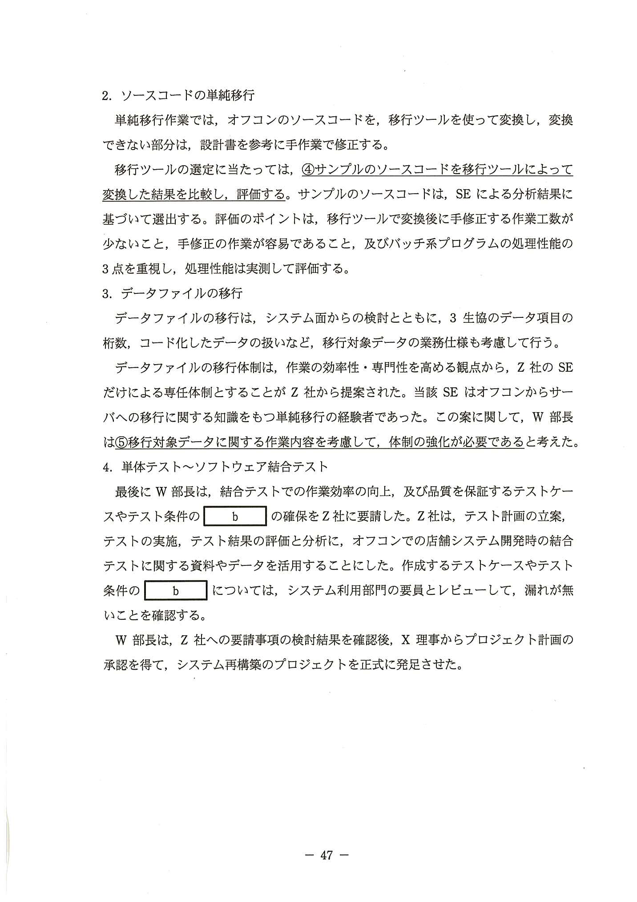

テキスト (OCR)

2. ソースコードの単純移行

単純移行作業では, オフコンのソースコードを, 移行ツールを使って変換し, 変換
できない部分は, 設計書を参考に手作業で修正する。

移行ツールの選定に当たっては, サンプルのソースコードを移行ツールによって
変換した結果を比較し。 評価する。サンプルのソースコードは, SE による分析結果に
基づいて選出する。評価のポイントは, 移行ツールで変換後に手修正する作業工数が
少ないこと, 手修正の作業が容易であること, 及びバッチ系プログラムの処理性能の
3 点を重視し, 処理性能は実測して評価する。
3. データファイルの移行

データファイルの移行は, システム面からの検討とともに, 3 生協のデータ項目の
桁数, コード化したデータの扱いなど, 移行対象データの業務仕様も考慮して行う。
データファイルの移行体制は 作業の効率性・専門性を高める観点から, Z 社の SE
だけによる専任体制とすることが Z 社から提案された。当該 SE はオフコンからサー
バへの移行に関する知識をもつ単純移行の経験者であった。この案に関して, W 部長
は⑤移行対象データに関する作業内容を考慮して, 体制の強化が必要であると考えた。
4, 単体テストマソフトウェア結合テスト

最後に W 部長は, 結合テストでの作業効率の向上。 及び品質を保証するテストケー
スやテスト条件の| bp | の確保をZ社に要請した。Z社は, テスト計画の立案
テストの実施, テスト結果の評価と分析に, オフコンでの店舗システム開発時の結合
テストに関する資料やデータを活用することにした。作成するテストケースやテスト
条件の| b | については, システム利用部門の要員とレビューして, 漏れが無
いことを確認する。

W 部長は。Z 社への要請事項の検討結果を確認後, X 理事からプロジェクト計画の
承認を得て, システム再構築のプロジェクトを正式に発足させた。

### ページ 48

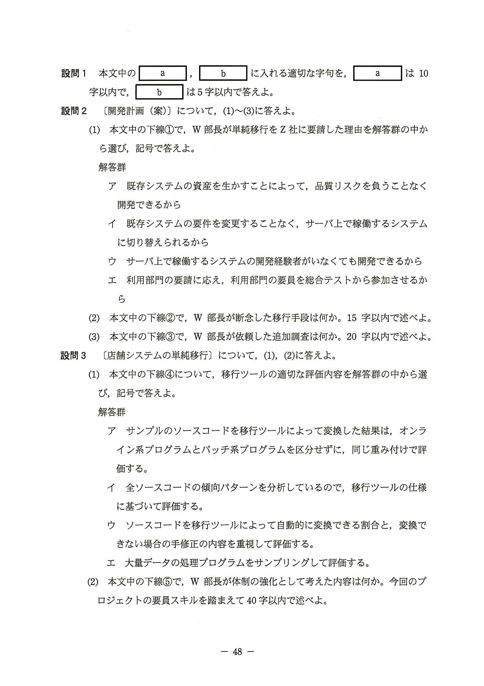

テキスト (OCR)

設問1 本文中の| a |,| b | に入れる適切な字句を,| a |は10
字以内で, | b |は5字以内で答えよ。
設問2 [開発計画 (案)) について, ①ぐて(3)に答えよ。
(①) 本文中の下線①で, W 部長が単純移行を 社に要請した理由を解答群の中か
ら選び, 記号で答えよ。

解答群

ア 既存システムの資産生かすことによって, 品質りリスクを負うことなく
開発できるから

イ 既存システムの要件を変更することなく, サーバ上で稼働するシステム
に切り替えられるから

ウ サーバ上で稼働するシステムの開発経験者がいなくても開発できるから
エエ 利用部門の要請に応え, 利用部門の要員を総合テストから参加させるか
ら
2) 本文中の下線②で, W 部長が断念した移行手段は何か。15 字以内で述べよ。
3) 本文中の下線③で, W 部長が依頼した追加調査は何か。20 字以内で述べよ。
設問3 店舗システムの単純移行} について, ①⑪, ②に答えよ。
①) 本文中の下線@について, 移行ツールの適切な評価内容を解答群の中から選
び, 記号で答えよ。
解答群
ア サンプルのソースコードを移行ツールによって変換した結果は, オンラ
イン系プログラムとバッチ系プログラムを区分せずに, 同じ重み付けで評

価する。
イ 全ソースコードの傾向パターンを分析しているので, 移行ツールの仕様
に基づいて評価する。

ウ ソースコードを移行ツールによって自動的に変換できる割合と, 変換で
きない場合の手修正の内容を重視して評価する。
LO 大量データの処理プログラムをサンプリングして評価する。
2) 本文中の下線⑥で, W 部長が体制の強化として考えた内容は何か。今回のプ
ロジェクトの要員スキルを踏まえて 40 字以内で述べよ。

### ページ 49

テキスト (OCR)

(メモ 用 紙 〕

### ページ 50

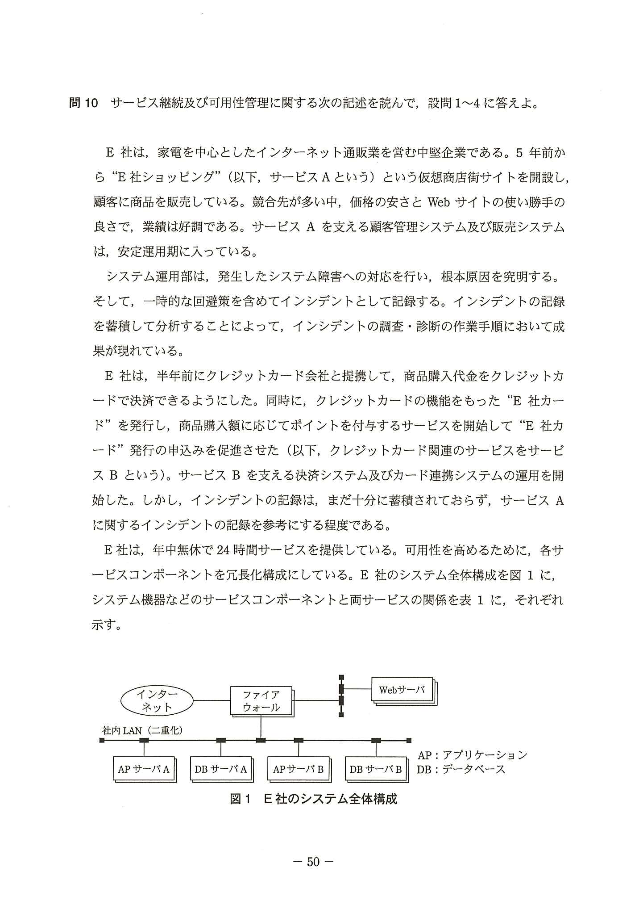

テキスト (OCR)

問 10 サービス継続及び可用性管理に関する次の記述を読んで, 設問 1ー4 に答えよ。

E 社は, 家電を中心としたインターネット通販業を営む中堅企業である。5 年前か
ら 社ショッピング" (以下, サービス A という) という仮想商店街サイトを開設し,
顧客に商品を販売している。競合先が多い中, 価格の安さと Web サイトの使い勝手の
良さで, 業績は好調である。サービス A を支える顧客管理システム及び販売システム
は, 安定運用期に入っている。

システム運用部は, 発生したシステム障害への対応を行い, 根本原因を究明する。
そして, 一時的な回避策を含めてインシデントとして記録する。インシデントの記録
を菩積して分析することによって, インシデントの調査・診断の作業手順において成
果が現れている。

E 社は, 半年前にクレジットカード会社と提携して, 商品購入代金をクレジットカ
ードで決済できるようにした。同時に, クレジットカードの機能をもった “E 社カー
ド” を発行し, 商品購入額に応じてポイントを付与するサービスを開始して “E 社カ
ード" 発行の申込みを促進させた (以下、クレジットカード関連のサービスをサービ
ス B という)。サービス B を支える決済システム及びカード連携システムの運用を開
始した。しかし, インシデントの記録は, まだ十分に鞭積されておらず, サービス A
に関するインシデントの記録を参考にする程度である。

E 社は, 年中無休で 24 時間サービスを提供している。可用性を高めるために, 各サ
ービスコンボーネントを冗長化構成にしている。E 社のシステム全体構成を図 1 に,
システム機器などのサービスコンボーネントと両サービスの関係を表 1 に, それぞれ

示す。

ファイア                             Webサーバ
ウォール

EN) (二重化)          A                    。
T          T          T          T      AP : アプリケーション

AP サーバA     DB サーバム     APサーバB     DB サーバB || DB: データベース

図1 E社のシステム全体構成

ー 50 一

### ページ 51

テキスト (OCR)

表1 サービスコンポーネントと両サービスの関係

No. | サービスコンポーネント     システム名称     可用性    サービスA | サービスB
1      ファイアウォール                       呈                 1.000            Oo               〇O
2 | Webサーバ                           ー               0.999           O              〇
3 | 社内LAN                             ー                1.000           O              〇O
4 | APサーバA                      顧客管理, 販売              0.999              O                  *
5 | APサーバB          決済,カード連携     0.999       x        O
6 | DBサーバA                    顧客管理, 販売             0.998             〇O                O
7 | DBサーバB                    決済, カード連携          0.999              x                 O

注記1 可用性: サービスコンポーネント (冗長化構成) の可用性
注記2 〇 : 当該サービスコンボーネントを使用する。 X : 当該サービスコンポーネントを使用しない。

両サービスは, 表 1 中で “〇" 印が付いたサービスコンポーネントで構成されてい
て, そのいずれかのサービスコンポーネントが政障した場合にサービスが中断する。
各サービスの可用性は。サービス Aが| a |, サービスBが0.995 である。ま
た, サービス B の MTBF を 1.990 時間とすると。 MTTR は|  b |時間である。

〔可用性を高めるための方策〕

システム運用部の F 君は, E 社システムの稼働状況を日々監視している。 管理指標
として “サービスの可用性" を設定し, 定期的に測定・分析・評価を行っている。そ
の結果を基に, 可用性を更に高めるための方策を検討した。

ROKK, サービスの中断時間を最小限に抑え&, ビジネスへの影響を極小化するため
に, サービスコンポーネントが故障した場合のサービスへの影響を, 表 1 から調べた。
①ファイアウォール, Web サーバ, 社内 LAN 及び DB サーバ A は, 影響度が高い。
また, クレジットカードの処理は, 提携クレジットカード会社との連携を行うので,
他の処理よりも重要度が高い。

サービスコンボーネントを増強すれば可用性も向上するが, システム構築費用も高
くなる。T Bld, 費用対効果の良いサービスを提供するために, 要求されるサービス
の品質とそれを実現するための費用を適切にバランスさせることか必要だと考えた。

〔サービス中断時間の短縮
次に, F Ald, サービス B に関してサービスコンポーネントが故障した場合の復旧

ー 51 一

### ページ 52

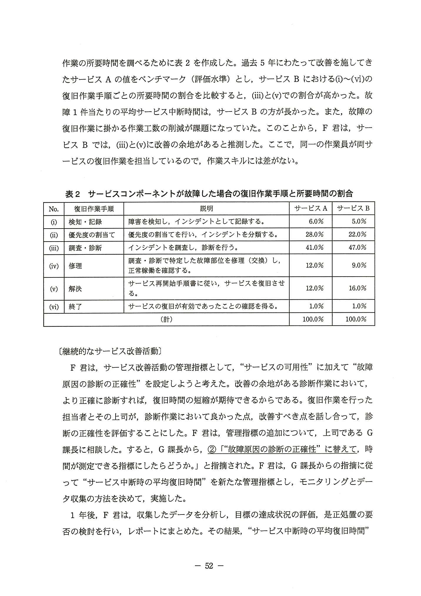

テキスト (OCR)

作業の所要時間を調べるために表 2 を作成した。過去 5 年にわたって改善を施してき
たサービス A の値をベンチマーク (評価水準) とし, サービス B における⑪~()の
復旧作業手順ごとの所要時間の割合を比較すると, Giと(ヾ)での割合が高かった。履
障 1 件当たりの平均サービス中断時間は, サービス B の方が長かった。また, WMO
復旧作業に掛かる作業工数の削減が課題になっていた。このことから, F 君は, サー
ビス B では, G⑪)と(に改善の余地があると推測した。ここで, 同一の作業員が両サ
ービスの復旧作業を担当しているので, 作業スキルには差がない。

表2 サービスコンポーネントが故障した場合の復旧作業手順と所要時間の割合

No. | 復旧作業手順                  説明                 サービス A | サービスB
(i) | BRA + BCs      障害を検知し, インシデントとして記録する。         6.0%      5.0%
Gi) | 優先度の割当て | 優先度の割当てを行い インシデントを分類する。           28.0%         22.0%
Gi) | 調査・診断      インシデントを調査し, 診断を行う。              41.0%     47.0%
                      調査・診断で特定した政障部位を修理 (交換) し,                        9
(iv) | 修理       正常稼働を確認する。                 12.0%    9.0%
の | see                  a CABMMFIRB ICH, サービスを復旧させ        12.0%          16.0%
vi) | 終了                  サービスの復旧が有効でやったことの確認を得る。             1.0%           1.0%
(計)                                                  100.0%         100.0%

[継続的なサービス改善活動〕

F 君は。 サービス改善活動の管理指標として, “サービスの可用性" に加えて “故障
原因の診断の正確性” を設定しようと考えた。改善の余地がある診断作業において,
より正確に診断すれば, 復旧時間の短縮が期待できるからである。 復旧作業を行った
担当者とその上司が, 診断作業において良かった点, 改善すべき点を話し合って, 診
断の正確性を評価することにした。F Alt, 管理指標の追加について, 上司である G
課長に相談した。すると, G 課長から, ②「"牙障原因の診断の正確性"に替えて, 時
間が測定できる指標こしたらどうか。」と指摘された。F Bld, G 課長からの指摘に従
って“サービス中断時の平均復旧時間” を新たな管理指標としし, モニタリングとデー
収集の方法を決めて, 実施した。

1 4%, F 君は, 収集したデータを分析し, 目標の達成状況の評価, 是正処置の要
否の検討を行い レポボートにまとめた。その結果, “サービス中断時の平均復旧時間"

ー 52 一

### ページ 53

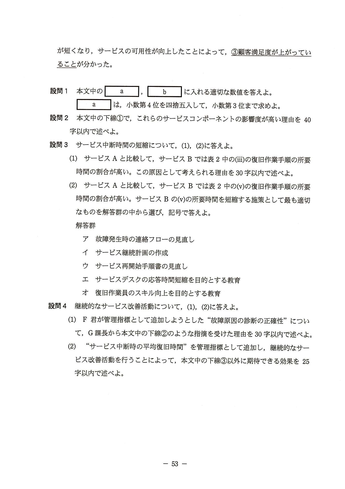

テキスト (OCR)

が短くなり, サービスの可用性が向上したことによって, ③願客満足度が上がってい
ることが分かった。

設問1 本文中の| ai |,|  b |に入れる適切な数値を答えよ。
| 8 | は, 小数第4位を四捨五入して, 小数第 3 位まで求めよ。
設問2 本文中の下線ので, これらのサービスコンポーネントの影響度が高い理由を 40
字以内で述べよ。
設問3 サービス中断時間の短縮について, ①⑪, (②に答えよ。
(① サービス 4 と比較して, サービス B では表 2 中のGiDの復旧作業手順の所要
時間の割合が高い。この原因として考えられる理由を 30 宇以内で述べよ。
(② サービス A と比較して, サービス B では表 2 中の(の復旧作業手順の所要
時間の割合が高い。サービス B の①⑰)の所要時間を短縮する施策として最も適切
なものを解答群の中から選び, 記号で答えよ。
ER
ア 故障発生時の連絡フローの見直し
サービス継続計画の作成
サービス再開始手順書の見直し
サービスデスクの応答時間短縮を目的とする教育
オ 復旧作業員のスキル向上を目的とする教育
設問4 継続的なサービス改善活動について, (D, ②)に答えよ。
Q) F 君が管理指標として追加しようとした “避障原因の診断の正確性” につい
て, G課長から本文中の下線②のような指摘を受けた理由を 30 字以内で述べよ。
2) “サービス中断時の平均復旧時間" を管理指標として追加し, 継続的なサー
ビス改善活動を行うことによって, 本文中の下線③以外に期待できる効果を 25
字以内で述べよ。

H GA

### ページ 54

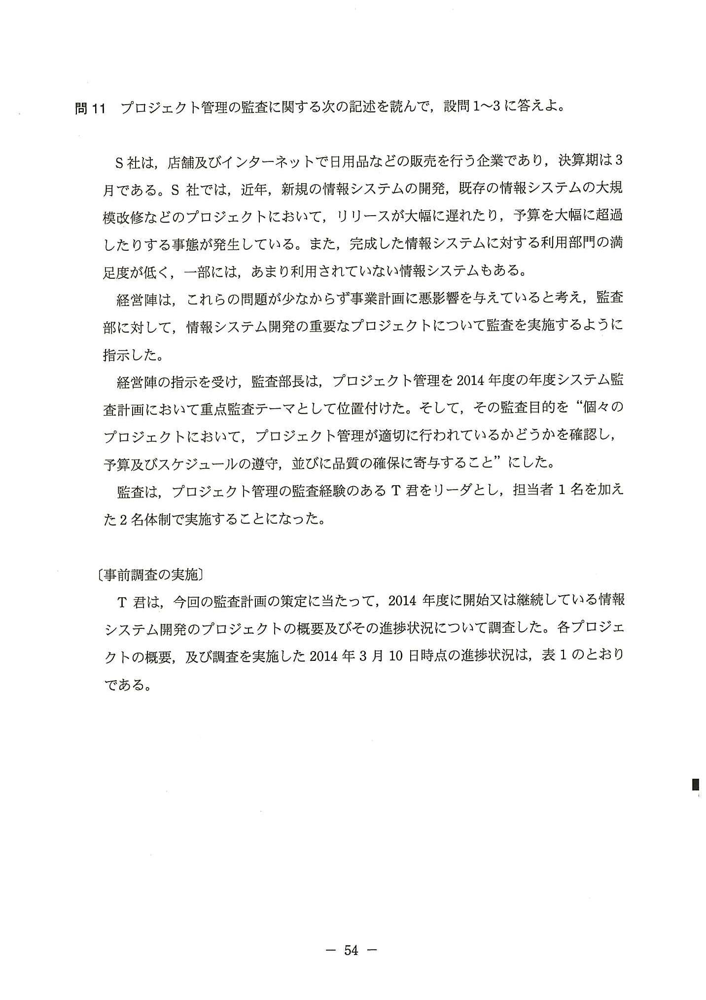

テキスト (OCR)

問11 プロジェクト管理の監査に関する次の記述を読んで, 設問 1ご3 に答えよ。

S 社は, 店舗及びインターネットで日用品などの販売を行う企業であり, 決算期は3
月である。S 社では, 近年, 新規の情報システムの開発, 既存の情報システムの大規
模履修などのプロジェクトにおいて, リリースが大幅に遅れたり, 予算を大幅に超過
したりする事態が発生している。また, 完成した情報システムに対する利用部門の満
足度が低く, 一部には, あまり利用されていない情報システムもある。

CEM, これらの問題が少なからず事業計画に悪影響を与えていると考え, 監査
部に対して, 情報システム開発の重要なプロジェクトについて監査を実施するように
指示した。

経営陣の指示を受け, 監査部長は, プロジェクト管理を 2014 年度の年度システム監
査計画において重点監査テーマとして位置付けた。そして, その監査目的を “個々の
プロジェクトにおいて, プロジェクト管理が適切に行われているかどうかを確認し,
予算及びスケジュールの遵守, 並びに品質の確保に寄与すること"にした。

監査は プロジェクト管理の監査経験のある T 君をリーダとし, 担当者 1 名を加え
た 2 名体制で実施することになった。

[事前調査の実施

T Ald, 今回の監査計画の策定に当たって, 2014 年度に開始又は継続している情報
システム開発のプロジェクトの概要及びその進捗状況について調査した。各プロジェ
クトの概要, 及び調査を実施した 2014 年 8 月 10 日時点の進捗状況は, 表 1 のとおり
である。

### ページ 55

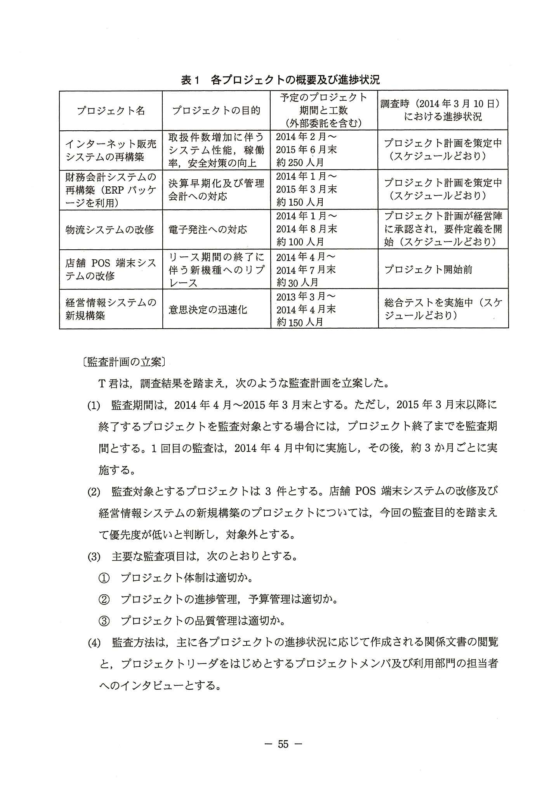

テキスト (OCR)

表1

各プロジェクトの概要及び進捗状況

予定のプロジェクト |
プロジェクト名 | プロジェクトの目的
(外部委託を含む)    ー-    -
teem pie | RRC 9 | 1204征月    ovr he REP
システムの再構穫 | AZ ATER. el | 2015 6 Ax     (スケジュールどおり)
AF      率, 安全対策の向上 | 約250人月        ンジ
財務会計システムの | 全曲期化及び管理 | 14年月    プロジェクト計画を集定中
再構築 てERP パッケ | へ>        2015 年 3 月末     スグジュール計り
ay    会計への対応    2 180 人月      スケジュー)
2014 年 1 月て     プロジェクト計画が経営陣
物流システムの履修 | 電子発注への対応 。 | 20148 AK   に承認され, 要件定義を開
約 100 人月        始 (スケジュールどおり)
Pron  リース期間の終了に | 2014 年4月て
人 eg | 笠う新機種へのリプ | 2014 FE 7    プロジェクト開始前
回     レース        約 30 人月
59h Be               2013 年 3 月て      ies
Poh | 意決定の迅速化 | ue A AK    ooo
#9 150 人月      ジュールどおり)
(監査計画の立案)

T 君は, 調査結果を踏まえ, 次のような監査計画を立案した。

Q) 監査期間は, 2014 年 4 月て2015 年 3 月末とする。ただし, 2015 年 3 月末以降に
終了するプロジェクトを監査対象とする場合には, プロジェクト終了までを監査期
間とする。1 回目の監査は, 2014 年 4 月中旬に実施し, TOR, 約 3 か月ごとに実
施する。

Q) 監査対象とするプロジェクトは 3 FETS. 店舗 POS 端末システムの改修及び
経営情報システムの新規構築のプロジェクトについては, 今回の監査目的を踏まえ
て優先度が低いと判断し, 対象外とする。

(3) 主要な監査項目は, 次のとおりとする。
① プロジェクト体制は適切か。

@ プロジェクトの進捗管理, 予算管理は適切か。
⑧ プロジェクトの品質管理は適切か。

(4) 監査方法は, 主に各プロジェクトの進捗状況に応じて作成される関係文書の閲覧
と, プロジェクトリーダをはじめとするプロジェクトメンバ及び利用部門の担当者
へのインタビューとする。

ー 55 一

### ページ 56

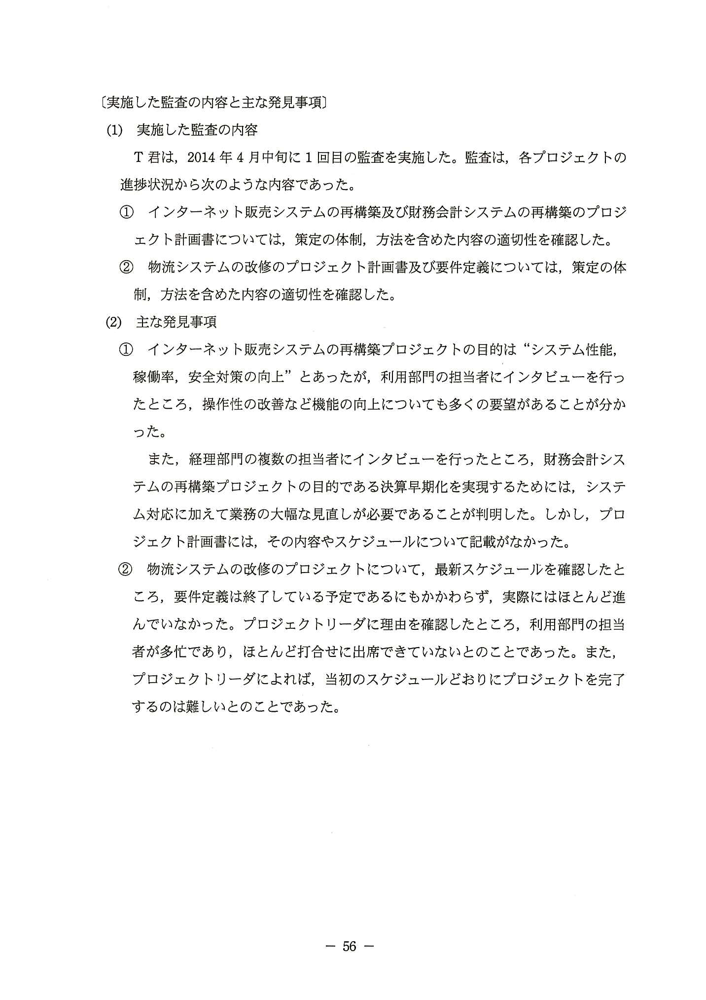

テキスト (OCR)

[実施した監査の内容と主な発見事項
() 実施した監査の内容
T 君は, 2014 年 4 月中旬に 1 回目の了監査を実施した。監査は 各プロジェクトの
進捗状況から次のような内容であった。
① インターネット販売システムの再構築及び財務会計システムの再構築のプロジ
ェクト計画書については, 集定の体制, 方法を含めた内容の適切性を確認した。
② 物流システムの改修のプロジェクト計画書及び要件定義については, 策定の体
fil, 方法を含めた内容の適切性を確認した。
(2) 主な発見事項
① インターネット販売システムの再構築プロジェクトの目的は “システム人性能,
BOR, 安全対策の向上" とあったが, 利用部門の担当者にインタビューを行っ
たところ, 操作性の改善など機能の向上についても多くの要望があることが分か
Byes
また, 経理部門の複数の担当者にインタビューを行ったところ, 財務会計シス
テムの再構築プロジェクトの目的である決算早期化を実現するためには, システ
ム対応に加えて業務の大幅な見直しが必要であることが判明した。しかし, プロ
ジェクト計画書には, その内容やスケジュールについて記載がなかった。
② 物流システムの改修のプロジェクトについて, 最新スケジュールを確認したと
TA, 要件定義は終了している予定であるにもかかわらず, 実際にはほとんど進
んでいなかった。プロジェクトリーダに理由を確認したところ, 利用部門の担当
者が多忙であり, ほとんど打合せに出席できていないとのことであった。また,
プロジェクトリーダによれば, 当初のスケジュールどおりにプロジェクトを完了
するのは難しいとのことであった。

ー 56 一

### ページ 57

テキスト (OCR)

設問] [監査計画の立案] の(2②)で, 二つのプロジェクトについて, 優先度が低いと判
断した理由をそれぞれ 25 字以内で述べよ。

設問2 主な発見事項の①の内容について, 〔監査計画の立案〕] の(3③に記述されている
監査項目①の観点から, T 君が指摘事項として監査報告書に記載すべき事項を 35
字以内で述べよ。

設問3 主な発見事項の②の内容について, 〔監査計画の立案〕) の(3)に記述されている
監査項目②の観点から, T 君が改善提案として監査報告書に記載すべき事項を 35
字以内で述べよ。

ー 57 一

### ページ 58

テキスト (OCR)

【 メモ用紙 〕

ー 58 一

### ページ 59

テキスト (OCR)

【 メモ 用 紙 J

ー 59 一

### ページ 60

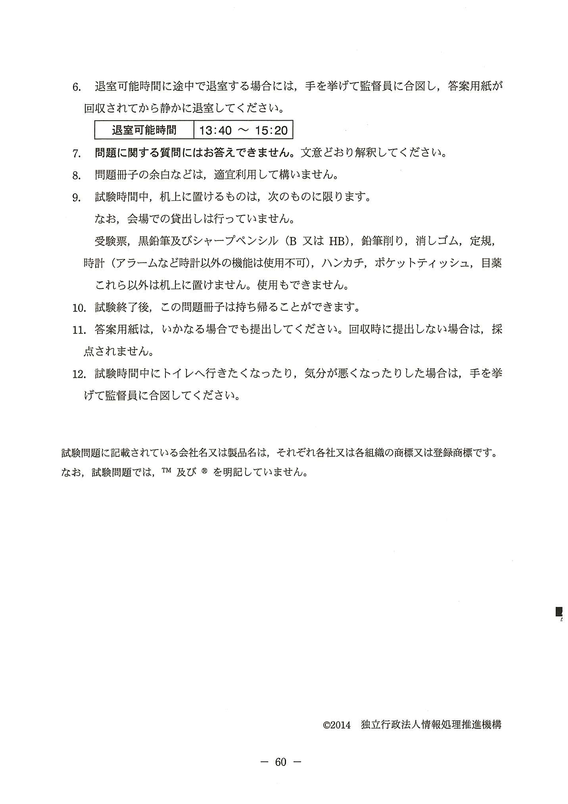

テキスト (OCR)

6. 退室可能時間に途中で退室する場合には, 手を挙げて監督員に合図し, 答案用紙が
回収されてから静かに退室してください。
| 退室可能時間 | 13:40 ~ 15:20]
7. 問題に関する質問にはお答えできません。文意どおり解釈してください。
8. 問題同子の余白などは, 適宜利用して構いません。
9. 試験時間中, 机上に置けるものは, 次のものに限ります。
なお, 会場での貸出しは行っていません。
受験票, 黒鉛筆及びシャープペンシル (B 又は HB), 鉛筆削り, 消しゴム, 定規,
時計 (アラームなど時計以外の機能は使用不可), ハンカチ, ポケットティッシュ, 目薬
これら以外は机上に置けません。使用もできません。
10. 試験終了後, この問題冊子は持ち帰ることができます。
ll. 答案用紙は, いかなる場合でも提出してください。 回収時に提出しない場合は, 採
点されません。
12. 試験時間中にトイレへ行きたくなったり, 気分が悪くなったりした場合は, 手を挙
げて監督員に合図してください。

試験問題に記載されている会社名又は製品名は, それぞれ各社又は各組織の商標又は登録商標です。
なお, 試験問題では, ™ 及び @ を明記していません。

@2014 独立行政法人情報処理推進機構

ー 60 一

---

## 午後解答

1/6 
©2014 独立行政法人情報処理推進機構 
平成26 年度 春期 応用情報技術者試験 解答例 
 
午後試験 
問１ 
出題趣旨 
 昨今，携帯端末の急速な発展によって，モビリティが情報活用に欠かせない課題になっている。しかし，イ
ンターネットには多くの脅威があるので，安全対策が不可欠である。 
 本問では，社内で利用していたシステムを，インターネットを介して社外からも利用できるようにする事例
を題材に，SSL の導入方法，クライアント認証の目的，クライアント証明書の運用などの理解について問う。
 
設問 
解答例・解答の要点 
備考 
設問１ 
a
盗聴 
 
 
b
改ざん 
 
設問２ 
営業支援システムを利用できるPC を限定するため 
 
設問３(1) クライアント証明書のインストール 
 
 
(2) 社内LAN からの利用には被害が及ばないから 
 
 
(3)
項番1
HTTPS 
 
 
 
項番2
HTTP 
 
設問４ 
当該PC のクライアント証明書を失効させる。 
 
 
問２ 
出題趣旨 
 企業を取り巻く環境変化のスピードが加速している現在，マーケティング情報を迅速に収集して分析し，消
費者のニーズに適合した商品をタイムリに提供することが，企業の成長にとって重要な鍵となる。 
 本問では，輸入雑貨と輸入家具を販売する企業を題材に，販売戦略に関する知識と応用力を問う。 
 
設問 
解答例・解答の要点 
備考 
設問１(1) 1 年以内に商品を購入した顧客は，購入額が多いから 
 
 
(2) 優良な顧客へ重点的にプロモーションを行える。 
 
 
(3)
a
費用を削減 
 
 
 
b
離反した 
 
設問２(1)
c
信頼度 
 
 
(2)
d
1000 
 
 
 
e
イタリア風 
 
 
 
f
15 
 
 
 
g
30 
 
 
(3) 口コミによって新しい商品の販売量が増加する。 
 
 
(4)
h
エ

2/6 
©2014 独立行政法人情報処理推進機構 
問３ 
出題趣旨 
 単純な処理であっても，そのアルゴリズムを工夫することによって，処理速度や必要となる作業領域の大き
さを改善できることがある。 
 本問では，循環小数の計算に，フロイドの循環検出法を適用する事例を題材に，理論の理解，理論を適用し
たアルゴリズムの内容についての理解を問う。 
 
設問 
解答例・解答の要点 
備考 
設問１ 
ア
m がp と等しい 
 
 
イ
p ← 1 
 
 
ウ
m がp と等しくない 
 
 
エ
t ← s 
 
設問２ 
α
4 
 
 
β
3 
 
設問３ 
s，t ともに0 である。 
 
設問４ 
オ
O(1) 
 
 
カ
O(n) 
 
 
問４ 
出題趣旨 
 昨今，多くの情報システムがWeb 化され，一般ユーザの情報検索に利用されている。 
 本問は，Web 医薬品検索システムを題材に，Web 系情報システム設計の根幹となる，稼働率と応答時間につい
て，稼働率の計算，M/M/1 待ち行列モデル，M/M/s 待ち行列モデルの知識と技能を問う。 
 
設問 
解答例・解答の要点 
備考 
設問１ 
現在のWeb サイト 
ア 
 
 
共同サイト 
オ 
 
設問２(1)
a
0.4 
 
 
 
b
10 
 
 
 
c
60 
 
 
 
d
3.2／n 
 
 
 
e
15 
 
 
(2) 5 
 
設問３ 
サーバの状況を案内する。 
 
設問４ 
ア，エ

3/6 
©2014 独立行政法人情報処理推進機構 
問５ 
出題趣旨 
 近年，サイバー攻撃の巧妙化や業務継続における情報システムの重要性から，社内ネットワークにおけるセ
キュリティ対策の向上が求められている。 
 本問では，サブネットを活用したファイルの保護対策を題材に，ネットワーク構成やアクセスコントロール
に関する知識と技能を問う。 
 
設問 
解答例・解答の要点 
備考 
設問１(1) 191 
 
 
(2) エ 
 
設問２ 
a
192.168.0.12 
 
 
b
e2 
 
 
c
OUT 
 
 
d
ANY 
 
 
e
22 
 
 
f
IN 
 
設問３ 
認証サーバ 
 
設問４ 
ウ 
 
 
問６ 
出題趣旨 
 昨今，様々な交通機関において，インターネットからチケットを購入することができるようになった。 
 本問では，旅客船の乗船券を販売するシステムを題材に，その業務要件から求められる E-R 図やSQL 文，ト
ランザクション処理に関する知識と技能を問う。 
 
設問 
解答例・解答の要点 
備考 
設問１ 
a
 
 
 
b
運賃係数 
 
設問２ 
c
ユーザID = :ユーザID 
順不同 
 
d
パスワードハッシュ値 = HASH(:パスワード) 
設問３ 
e
COUNT(*) 
 
 
f
座席クラス 
 
 
g
B.座席クラス番号 = C.座席クラス番号 
 
 
 
h
A.船便番号, A.船便名, C.座席クラス番号, C.座席クラス名 
 
設問４ 
操作ログ表への記録を予約受付処理とは別のトランザクションにする。

4/6 
©2014 独立行政法人情報処理推進機構 
問７ 
出題趣旨 
 組込み機器の開発には，ハードウェアからソフトウェアまでの幅広い知識が要求される。また，近年では組
込み機器がインターネットに接続されることが多くなり，セキュリティの知識も必要になってきている。 
 本問では，キーマトリックス回路を用いたキースキャン方法から，リアルタイムOS を用いたソフトウェア設
計，セキュリティ対策まで幅広く問うことによって，組込み機器開発能力を評価する。 
 
設問 
解答例・解答の要点 
備考 
設問１(1)
a
給水設定 
 
 
 
b
給水弁操作 
 
 
(2) 128 
 
 
(3)
c
2 
 
 
 
d
アクセス権 
 
設問２(1) 6 
 
 
(2) 複数のキーを同時に押す。 
 
設問３ 
給水設定 
 
設問４ 
e
機器認証 
 
 
f
暗号化 
 
 
問８ 
出題趣旨 
 昨今，ソフトウェア開発において，UML を使用したオブジェクト指向設計が定着しつつある。 
 本問では，地図を利用するアプリケーションプログラムの設計を題材に，クラス図及びシーケンス図の基本
的知識や，生産性・品質の向上を考慮して設計する応用力を問う。 
 
設問 
解答例・解答の要点 
備考 
設問１(1)
a
1 
 
 
 
b
1 
 
 
(2)
c
住所 
 
 
(3) クラス
位置 
 
 
 
属性 
位置緯度，位置経度 
 
設問２(1)
d
－メールを作成する画面へ 
 
 
(2) 操作の定義だけ行われ，実装は行われない。 
 
設問３(1)
e
アイコンリストの大きさ 
 
 
(2)
f
操作盤を描く

5/6 
©2014 独立行政法人情報処理推進機構 
問９ 
出題趣旨 
 ソフトウェアの開発プロジェクトでは，既存システムの資産やソフトウェアパッケージを活用するケースが
増えている。 
 本問では，システム再構築のプロジェクトに関するケースを題材に，既存システムのシステム移行方法，開
発体制，システム資産の活用，及び移行ツールの評価に関する理解を問う。 
 
設問 
解答例・解答の要点 
備考 
設問１ 
a
インタフェース 
 
 
b
網羅性 
 
設問２(1) イ 
 
 
(2) 仮想マシンへの移行 
 
 
(3) 設計書が最新内容になっていること 
 
設問３(1) ウ 
 
 
(2) 各生協のシステム利用部門から店舗業務に精通している人材の参画 
 
 
問10 
出題趣旨 
 昨今，インターネットによる販売などのIT サービスは，年中無休で24 時間サービスの提供が一般的であり，
可用性の向上が求められている。 
 本問では，企業の継続的なサービス改善活動を題材に，IT サービスの継続及び可用性管理に関する知識とそ
の理解を問う。 
 
設問 
解答例・解答の要点 
備考 
設問１ 
a
0.996 
 
 
b
10 
 
設問２ 
サービスコンポーネントが故障した場合，両サービスが中断するから 
 
設問３(1) インシデントの記録が十分に蓄積されていないから 
 
 
(2) ウ 
 
設問４(1) 診断の正確さの評価基準が客観的でないから 
 
 
(2) 故障の復旧作業に掛かる作業工数の削減

6/6 
©2014 独立行政法人情報処理推進機構 
問11 
出題趣旨 
 開発規模の拡大，利用する技術の高度化，開発期間の短縮化など，様々な要因によって情報システム開発の
プロジェクトの成功は，ますます難しくなってきている。 
 本問では，このような状況を背景に，システム監査人として，プロジェクトの成功を支援するために個々の
プロジェクトの管理が適切に行われているかどうかを確認する能力を問う。 
 
設問 
解答例・解答の要点 
備考 
設問１ 
店舗POS 端末 
システムの改修 
プロジェクト期間が短く，工数も少ないから 
 
 
経営情報システム 
の新規構築 
既にプロジェクトが終了しようとしているから 
 
設問２ 
プロジェクト計画の立案において利用部門の参画が十分でない。 
 
設問３ 
早急にスケジュールを見直して，経営陣の承認を得ること

---

## 午後採点講評

1/3 
©2014 独立行政法人情報処理推進機構 
平成26 年度 春期 応用情報技術者試験 採点講評 
 
午後試験 
問１ 
 問1 では，営業支援サーバへのSSL の導入を題材に，SSL の導入方法，クライアント認証の目的，クライア
ント証明書の運用などについて出題した。全体として，正答率は高かった。 
 設問1 の正答率は高く，SSL の機能については，おおむね理解されているようであった。しかし，設問3(3)
の正答率は低かった。HTTP，HTTPS は，Web サーバアクセスのための基本的なプロトコルであり，セキュリテ
ィ対策を行うときなどには，その知識が必要になるので，よく理解しておいてほしい。 
 設問4 では，PC の盗難や紛失が発生したときに実施すべき対応策を問うたが，発生前の対応策を解答した受
験者が散見された。設問の趣旨を正しく理解し，解答してもらいたい。 
 
問２ 
 問2 では，輸入雑貨と輸入家具を販売する企業を題材に，販売戦略について出題した。 
 設問2(3)は，正答率が低かった。市場調査の年代別の分析結果とSNS の特徴から，口コミによって新しい商
品の販売量が増加する効果が期待できることに気付いてほしかった。商品を認知してもらえるという解答が散
見されたが，問題文を注意深く読んで解答してほしい。 
 設問2(4)は，正答率が低かった。誤ってウと解答した受験者が見受けられた。価格感度測定の分析における
適正価格は，高すぎるので買わない価格と安すぎるので買わない価格のグラフの交点であることを理解してお
いてほしい。 
 
問３ 
 問3 では，循環小数の循環節の検出方法として，フロイドの循環検出法を題材に，理論の理解及び理論を適
用したアルゴリズムの内容について出題した。全体として正答率は高かった。 
 設問2 は，正答率が低かった。アルゴリズムを正確に理解した上で，その動きをきちんとトレースしていけ
ば正答を導けるはずである。プログラムを机上で確認できる能力につながるので，是非身に付けてほしい。 
 設問4 は，アルゴリズムの計算量とメモリ使用量をO 記法で評価する問題であったが，正答率が低かった。
評価方法やO 記法の表記方法を理解できていない解答が散見された。アルゴリズムの計算量やメモリ使用量の
評価は，アルゴリズムの設計において非常に重要である。その評価方法を是非理解しておいてほしい。 
 
問４ 
 問4 では，Web 検索システムを題材に，Web 系情報システムの稼働率と応答時間について出題した。 
 設問1 は，正答率が高かった。稼働率については，おおむね理解されているようであった。 
 設問2 は，正答率が低かった。M/M/s 待ち行列は，Web システム，ATM，コールセンタなどの設計で必要とな
る知識であり，基本的な考え方をよく理解しておいてほしい。 
 設問3 は，“パフォーマンスの改善”という解答が散見された。全てのアクセスを1 台のサーバで処理する
ことから，パフォーマンスの改善にはならないことが分かる。医薬品共同Web サイトの要件をよく理解し，注
意深く解答してほしい。  
 
問５ 
 問5 では，サブネットを活用したファイルの保護対策を題材に，ネットワーク構成やアクセスコントロール
の設計について出題した。全体として，正答率は高かった。 
 設問1(2)は，正答率が高かった。ファイルの保護対策で向上を期待する事項については，おおむね理解され
ているようであった。 
 設問2 は，レイヤ3 スイッチのフィルタリングルールの設計を問うたが，c 及びf の正答率が低かった。フ
ィルタリングルールを設計する際には，方向の設定にも十分注意してもらいたい。 
 設問3 は，正答率が低かった。企業LAN でよく使用されるIEEE802.1X の認証の仕組みを理解していれば，
正答を導けるはずである。

2/3 
©2014 独立行政法人情報処理推進機構 
問６ 
 問6 では，旅客船Web 予約システムを題材に，その業務要件から求められるE-R 図やSQL 文，トランザクシ
ョン処理について出題した。 
 設問3 は，複数の表を結合して集計するSQL 文を記述する際，結合条件が重要なポイントの一つになるが，
誤った表や列名を用いた解答が目立った。本文の記述とE-R 図をよく確認しながら，何が結合条件になるかを
読み取ってほしい。 
 設問4 は，操作ログ表への処理失敗の記録だけを意識した解答が多かった。トランザクション開始直後の操
作ログ表への記録をロールバックされないようにすることも考慮して，もう一歩踏み込んで考えてほしい。 
 
問７ 
 問7 では，園芸用自動給水器を題材に，キーマトリックス回路を読み取るハードウェアの理解力や，リアル
タイムOS を用いたソフトウェア設計能力，セキュリティ対策能力について出題した。全体として，正答率は
高かった。 
 設問1(3)は，正答率が低かった。解答未記入が散見されたが，ソフトウェア設計における排他制御は重要な
概念であり，是非理解してほしい。 
 設問2 は，正答率が低かった。組込み機器の開発では，ソフトウェアだけでなくハードウェアの知識も必要
となる。簡単な回路図は理解できるようになってほしい。 
 設問4 は，正答率が高かった。近年，セキュリティについての重要性が高まっているが，セキュリティ対策
に必要な要件については，おおむね理解されているようであった。 
 
問８ 
 問8 では，地図を利用するアプリケーションプログラムの設計を題材に，クラス図及びシーケンス図の基本
的知識や，生産性・品質の向上を考慮した設計について出題した。 
 設問2(1)d は，表1 から必要な操作を抽出するまではよく理解されているようだが，クラス内部からだけ参
照可能な操作か否かにまで踏み込んで考えてほしい。 
 設問3(2)f は，常に画面の一番手前に表示される操作盤を描画処理の最後に描く点とその操作が地図クラス
から呼び出される点に注目すべきであるが，操作の呼出し元と呼出し先を誤った解答が目立った。処理の順序
と各クラスの操作を注意深く読み取り，正答を導き出してほしい。 
 
問９ 
 問9 では，システム再構築のプロジェクトを題材に，既存システムのシステム移行方法，開発体制，システ
ム資産の活用，及び移行ツールの評価について出題した。全体として，正答率は低かった。 
 システム移行方法では，既存システムの要件の扱いが重要なポイントとなる。設問2(1)では，単純移行を想
定しており，要件は変更されないことを理解しておいてほしい。 
 設問3(1)は，正答率が高かった。移行ツールに関する理解が高いことがうかがわれた。 
 設問3(2)は，正答率が低かった。システム移行では，プログラムだけでなくデータも移行の対象となる。開
発体制ではSE 部門主体に考えがちだが，データの正誤に関して高い判断力をもつシステム利用部門も忘れて
はならない。移行の体制を考える上で，この点は是非理解しておいてほしい。  
 
問10 
 問10 では，企業の継続的なサービス改善活動を題材に，IT サービスの継続及び可用性管理について出題し
た。全体として，正答率は低かった。 
 設問3(1)では，ベンチマークとしたサービスA とのコンポーネント数の差を指摘した解答が散見された。サ
ービスB は半年前にサービスを開始したばかりなので，故障の調査・診断に関するインシデントの記録が十分
に蓄積されていないことに着目して解答してほしかった。 
 設問4(1)は，継続的なサービス改善活動の成果を把握する管理指標として，客観的に評価できる定量的なデ
ータを採用することが望ましいことを理解してほしかった。本文から単純に引用した“時間が測定できない指
標だから”という解答が散見された。もう一歩踏み込んで考えてほしい。

3/3 
©2014 独立行政法人情報処理推進機構 
問11 
 問11 では，プロジェクト管理の監査を題材に，監査対象の選定，調査結果に基づく指摘事項及び改善提案
について出題した。 
 設問1 は，店舗POS 端末システムの改修を監査対象として選定しない理由として“プロジェクトが開始され
ていないから”という解答が多かった。監査対象は，プロジェクトの規模，内容などによるリスク，及び監査
実施による効果などを考慮して選定されるべきであり，プロジェクトの開始前か開始後であるかは関係ないこ
とを認識してほしい。 
 設問2 は，正答率が低かった。監査における指摘事項としては，問題点及びリスクを記述すべきであるが，
改善提案を記述している答案が多かった。 
 設問3 は，解答としてさまざまな改善提案が挙げられていたが，システム監査人としては，承認された計画
から大幅に遅延しているスケジュールについて，見直しを行い経営陣に再度承認をとるといった監査的な提案
をまず挙げてほしい。

