# 平成27年度秋期 応用情報技術者試験

---

## 午前問題

### ページ 1

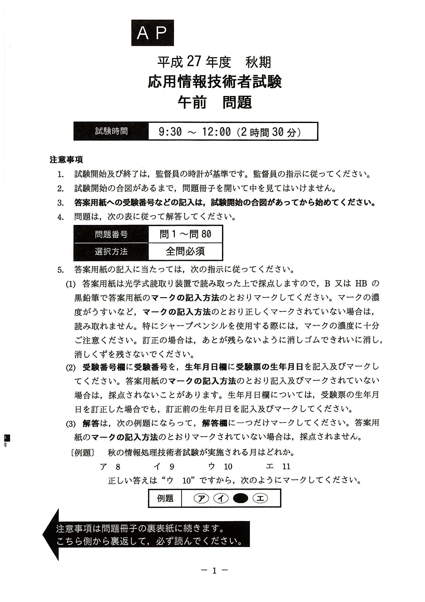

テキスト (OCR)

Sime

平成27年度 秋期
応用情報技術者試験

午前 問題
 9:30 ~ 12:00 (2時間30 分)

注意事項

1. 試験開始及び終了は, 監督貞の時計が基準です。監督員の指示に従ってください。
2. 試験開始の合図があるまで, 問題民子を開いて中を見てはいけません。

3. 答案用紙への受験番号などの記入は, 試験開始の合図があってから始めてください
4. 問題は, 次の表に従って解答してください。

問題番号         fal 1 ~ Fl 80
選択方法            全問必須

5. 答案用紙の記入に当たっては, 次の指示に従ってください。

⑪) 答案用紙は光学式読取り装置で読み取った上で採点しますので, B 又は HB の
黒鉛筆で答案用紙のマークの記入方法のとおりマークしてください。マークの濃
度がうすいなど, マークの記入方法のとおり正しくマークされていない場合は,
読み取れません。特にシャープペンシルを使用する際には, マークの濃度に十分
ご注意ください。訂正の場合は, あとが残らないように消しゴムできれいに消し
消しくずを残さないでください。

(QQ) 受験番号欄に受験番号を, 生年月日欄に受験票の生年月日を記入及びマークし
てください。答案用紙のマークの記入方法のとおり記入及びマークされていない
場合は, 採点されないことがあります。 生年月日欄については, 受験票の生年月
日を訂正した場合でも, 訂正前の生年月日を記入及びマークしてください。

(3) 解答は, 次の例題にならって, 解答欄に一つだけマークしてください。 答案用
紙のマークの記入方法のとおりマークされていない場合は, 採点されません。
(GI) 秋の情報処理技術者試験が実施される月はどれか。

ア 8    イ 9    ウ 10    = 11
正しい答えは“ウ 10” ですから, 次のようにマークしてください。

例題 | OO@®

注意事項は問題冊子の裏表紙に続きます。
こちら側から裏返して, 必ず読んでください。

### ページ 2

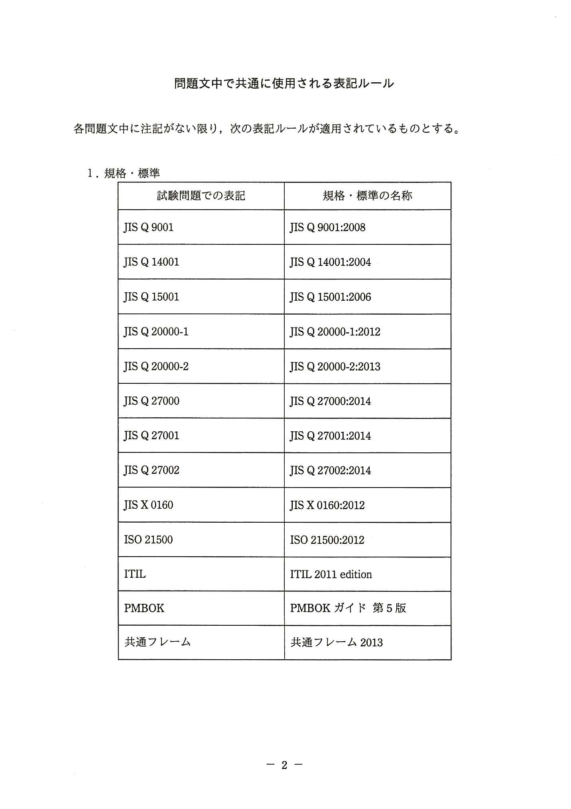

テキスト (OCR)

問題文中で共通に使用される表記ルール

各問題文中に注記がない限り, 次の表記ルールが適用されているものとする。

1. 規格・標準
試験問題での表記               規格・標準の名称
JIS Q 9001                                JIS Q 9001:2008
JIS Q 14001                             JIS Q 14001:2004
JIS Q 15001                             JIS Q 15001:2006

JIS Q 20000-1

JIS Q 20000-1:2012

JIS Q 20000-2

JIS Q 20000-2:2013

JIS Q 27000                               JIS Q 27000:2014

JIS Q 27001                               JIS Q 27001:2014

JIS Q 27002                               JIS Q 27002:2014

JIS X 0160                                     JIS X 0160:2012

TSO 21500                                   ISO 21500:2012

ITIL                                           ITIL 2011 edition
PMBOK                              PMBOK ガイド 第5版
共通フレーム                共通フレーム 2013

### ページ 3

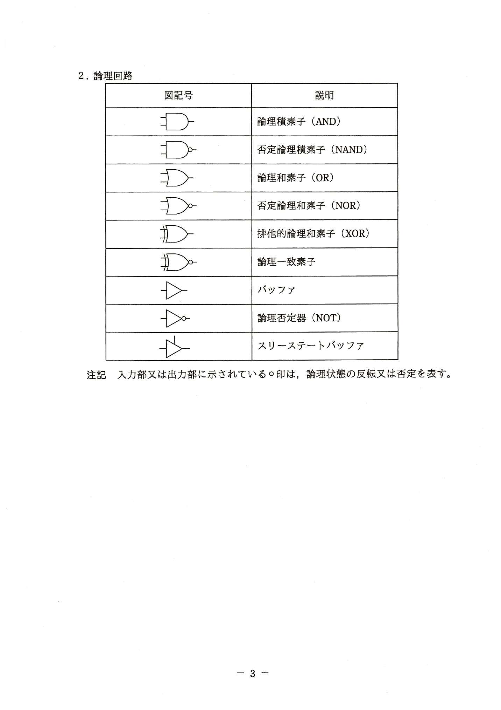

テキスト (OCR)

2. 論理回路

a
fu
dh

説明

論理積素子 (AND)

否定論理積素子 (NAND)

論理和素子 (OR)

否定論理和素子 (NOR)

排他的論理系子 (XOR)

論理一致素子

バッファ

論理否定器 (NOT)

スリーステートバッファ

YYYIYIVIY YQ

注記 入力部又は出力部に示されているo9印は, 論理状態の反転又は否定を表す。

### ページ 4

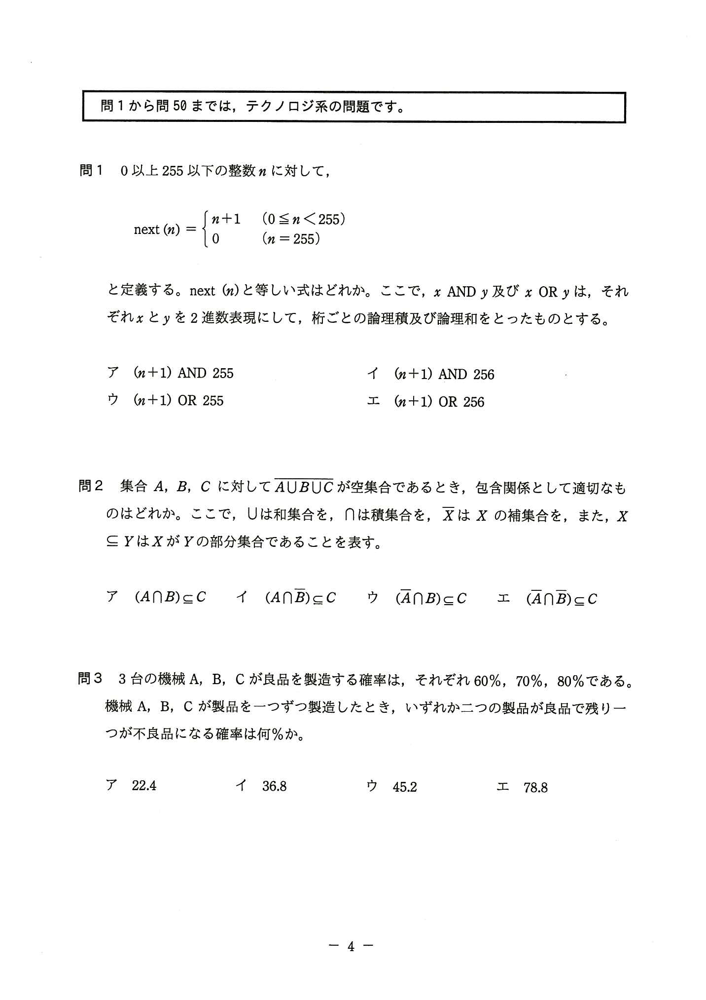

テキスト (OCR)

問 1 から問 59 までは, テクノロジ系の問題です。

間1 0以上255 以下の整数ヶ に対して,

タ十1 (0Sミzぐ255)

599 0 (w= 255)

と定義する。next ⑭) と等しい式はどれか。ここで, x ANDy RU x ORy lk, それ
ぞれヶとヶを2 進数表現にして, 桁ごとの論理積及び論理和をとったものとする。

ア (nt+1) AND 255            4 (+1) AND 256
ウ (n+1) OR 255             = (+1) OR 256

問2 集合 4, B, C に対して4UぢUC が空集合であるとき, 包含関係として適切なも
のはどれか。ここで, Uは和集合を, は積集合を, XIX の補集合を, また, X
ご 了はえが也の部分集合であることを表す。

ア (4の=C f (4めこcC ウ (4のおcC = (4nぢおcc

問3 3台の機械A, B, Cが良品を製造する確率は, それぞれ60%, 70%, 80%である。
機械 A, B, C が製品を一つずつ製造したとき, いずれか二つの製品が良品で残り一
つが不良品になる確率は何%か。

ア 22.4     イ 36.8     ウ 45.2     x= 78.8

### ページ 5

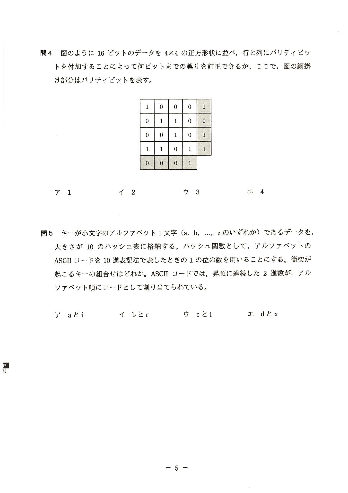

テキスト (OCR)

問4 図のように 16 ビットのデータを 4X4 の正方形状に並べ, 行と列にパリティビッ
トを付加することによって何ビットまでの誤りを訂正できるか。ここで, MOMH
け部分はパリティビットを表す。

間5 キーが小文字のアルファベット 1文字 (a, db, .……, z のいずれか) であるデータを,
大きさが 10 のハッシュ表に格納する。ハッシュ関数として, アルファベットの
ASCII コードを 10 進表記法で表したときの 1 の位の数を用いることにする。 衝突が
起こるキーの組合せはどれか。ASCIL コードでは, 昇順に連続した 2 進数が, アル
ファベット順にコードとして割り当てられている。

ア aki     4 ber    7 cと1     mS atx

al |

### ページ 6

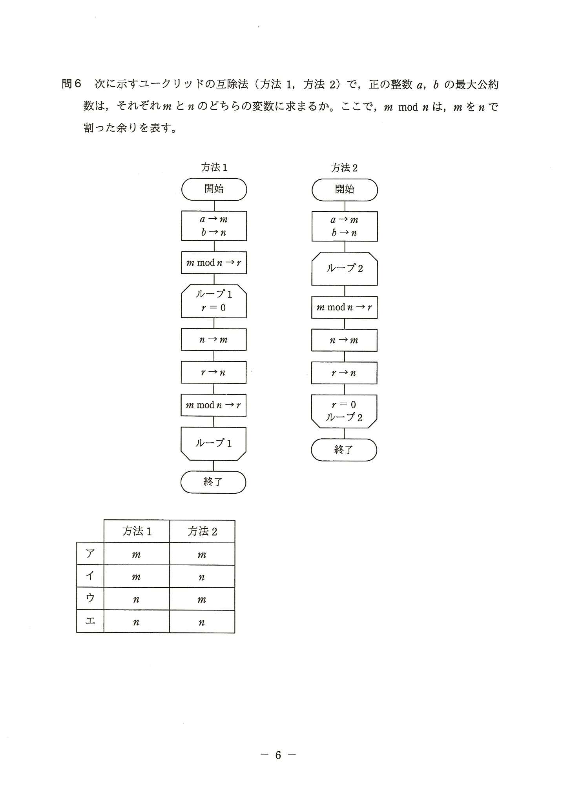

テキスト (OCR)

間6 次に示すユークリッドの互除法(方法 1, 方法 2) で, 正の整数 2, b の最大公約
数は, それぞれ娘 とヶ のどちらの変数に求まるか。ここで, m mod z は, mene
割った余りを表す。

方法1            方法2
a>m                a>m
bn                 bn
]               ーー 1
mmodn—r               ループ2
レー 1
ループ1
r=0               mmodn—>r
|                   ]
n>m            n>m
|                   ]
づる                 r>n
|                  |
mmodn—r               r=
|             ループ2
ループ1ュ            終了
終了
方法1    方法2
ア                m
イ
ウ      n         m
x=      n          n

### ページ 7

テキスト (OCR)

問7 JavaBeans を利用してソフトウェア開発を行うメリットとして, 適切かものはどれ
か。

HTML 文書が動的に生成できる。

コンポーネントが容易に再利用できる。

分散トランザクション処理ができる。

メッセージングによって非同期に通信できる。

H さささい

FAIS CPU のパイプライン処理を有効に機能させるプログラミング方法はどれか。ここ
で, CPU は命令の読込みとデータのアクセスを分離したアーキテクチャとする。

CASE 文を多くする。

関数の個数をできるだけ多くする。
分岐命令を少なくする。

メモリアクセス命令を少なくする。

Hマささ

間9 複数のデータに対して 1 個の命令で同一の操作を同時並列に行う方式で, マルチ
メディアデータなどを扱う CPUに採用されているものはどれか。

Y MIMD    4 MISD    ウ SIMD    エ SISD

問19 MMU (Memory Management Unit) の説明として, 適切なものはどれか。

CPU からのページフォールトを受けて, 物理ページのスワップを行う。
CPU が指定した仮想アドレスを物理アドレスに対応させる。

0S の一部分であり, キャッシュ制御機能及びバス調整機能を有する。
主記憶のデータの一部を保持し, CPU と主記憶の速度差を吸収する。

H ささ コ

ー7ー

### ページ 8

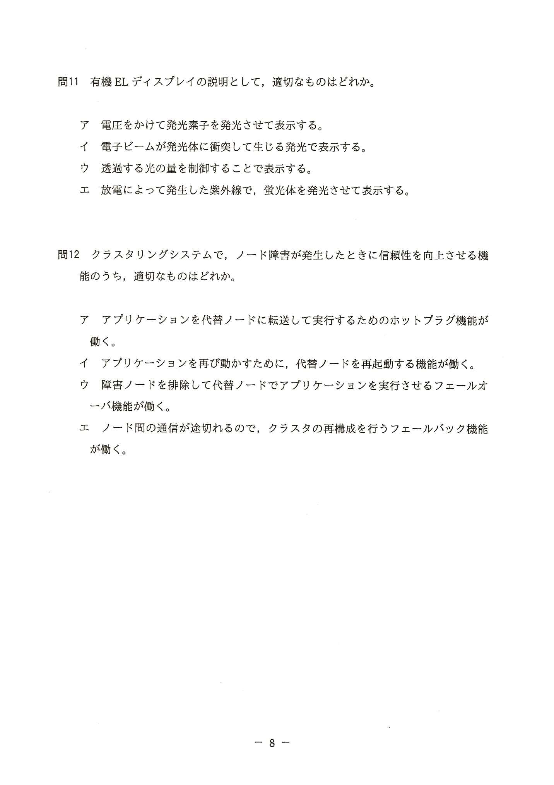

テキスト (OCR)

All 有機EL ディスプレイの説明として, 適切なものはどれか。

電圧をかけて発光素子を発光させて表示する。

電子ビームが発光体に衝突して生じる発光で表示する。

透過する光の量を制御することで表示する。

放電によって発生した紫外線で, 蛍光体を発光させて表示する。

H へ

間12 クラスタリングシステムで, ノード障害が発生したときに信頼性を向上させる和機
能のうち, 適切なものはどれか。

ア アプリケーションを代替ノードに転送して実行するためのホットプラグ機能が
働く。

イ アプリケーションを再び動かすために, 代替ノードを再起動する機能が働く。

ウ 障害ノードを排除して代替ノードでアプリケーションを実行させるフェールオ
ーバ機能が働く。

= ノード間の通信が途切れるので, クラスタの再構成を行うフェールバック機能
が働く。

### ページ 9

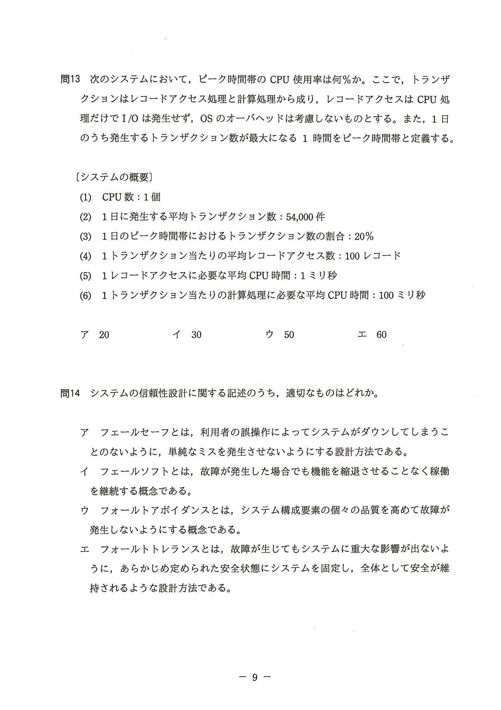

テキスト (OCR)

間13 次のシステムにおいて, ピーク時間帯の CPU 使用率は何%か。ここで, トランザ
クションはレコードアクセス処理と計算処理から成り, レコードアクセスは CPU 処
理だけで 1 /O は発生せず, 0S5 のオーバヘッドは考慮しまないものとする。 また, 1 日
のうち発生するトランザクション数が最大になる 1 時間をピーク時間帯と定義する。

〔システムの概要)

① CPU数:1個

⑫) 1日に発生する平均トランザクション数 : 54,000 件

(3③) 1日のピーク時間帯におけるトランザクション数の割合 : 20%

(④) 1トランザクション当たりの平均レコードアクセス数 : 100 レコード
(5) 1 レコードアクセスに必要な平均 CPU 時間 : 1 ミリ秒

6) 1トランザクション当たりの計算処理に必要な平均 CPU 時間 : 100 ミリ秒

間14 システムの信頼性設計に関する記述のうち, 適切かものはどれか。

ア フェールセーフとは, 利用者の誤操作によってシステムがダウンしてしまうこ
とのないように, 単純なミスを発生させないようにする設計方法である。

イ フェールソフトとは, 故障が発生した場合でも機能を縮退させることなく乏働
を継続する概念である。

ウ フォールトアボイダンスとは, システム構成要素の個々の品質を高めて故障が
発生しないようにする概念である。

エエ フォールトトレランスとは, 故障が生じてもシステムに重大な影響が出ないよ
うに, あらかじめ定められた安全状態にシステムを固定し, 全体として安全が維
持されるような設計方法である。

### ページ 10

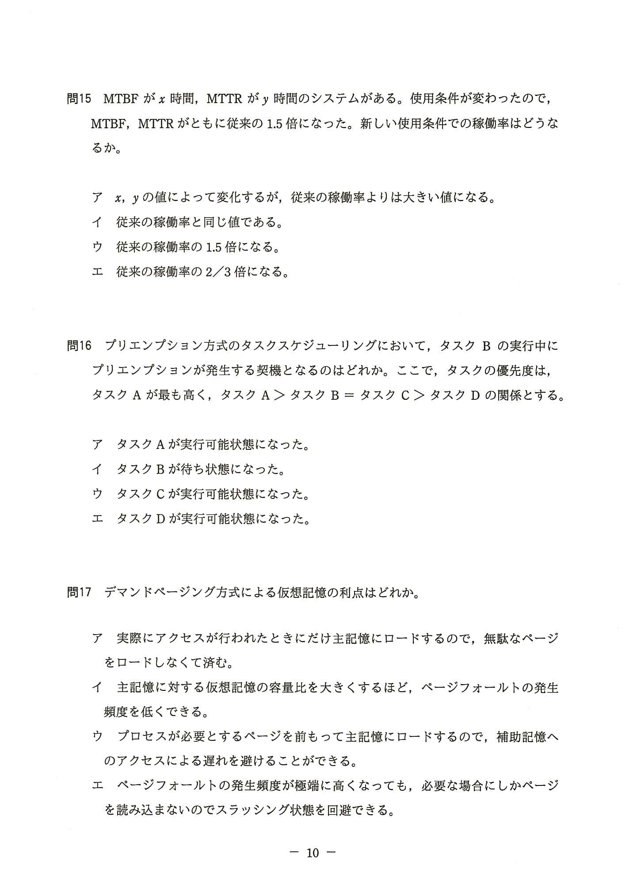

テキスト (OCR)

問15 MTBF が時間, MTTR がヵ時間のシステムがある。使用条件が変わったので,
MTBF, MTTR がともに従来の 1.5 倍になった。新しい使用条件での稼働率はどうな
るか。

x, の値によって変化するが, 従来の稼働率よたりは大きい値になる。
従来の稼働率と同じ値である。
従来の稼働率の 1.5 倍になる。
従来の稼働率の 2プ3 倍になる。

H ささ コ

間16 プリエンプション方式のタスクスケジューリングにおいて, タスク B の実行中に
プリエンプションが発生する契機となるのはどれか。ここで, タスクの優先度は,
タスク A が最も高く, タスクAシタスクBニテー タスクCン>タスク D の関係とする。

タスクAが実行可能状態になった。
タスク B が待ち状態になった。

タスクCが実行可能状態になった。
BAT Dが実行可能状態になった。

H ざさ

間17 デマンドページング方式による仮想記憶の利点はどれか。

ア 実際にアクセスが行われたときにだけ主記憶にロードするので, 無駄なページ
をロードしなくて済む。

イ 主記憶に対する仮想記憶の容量比を大きくするほど, ページフォールトの発生
頻度を低くできる。

ウ プロセスが必要とするページを前もって主記憶にロードするので, 補助記憶へ
のアクセスによる遅れを避けることができる。

エ ページフォールトの発生頻度が極端に高くなっても, 必要な場合にしかページ
を読み込まないのでスラッシング状態を回避できる。

ー 10 一

### ページ 11

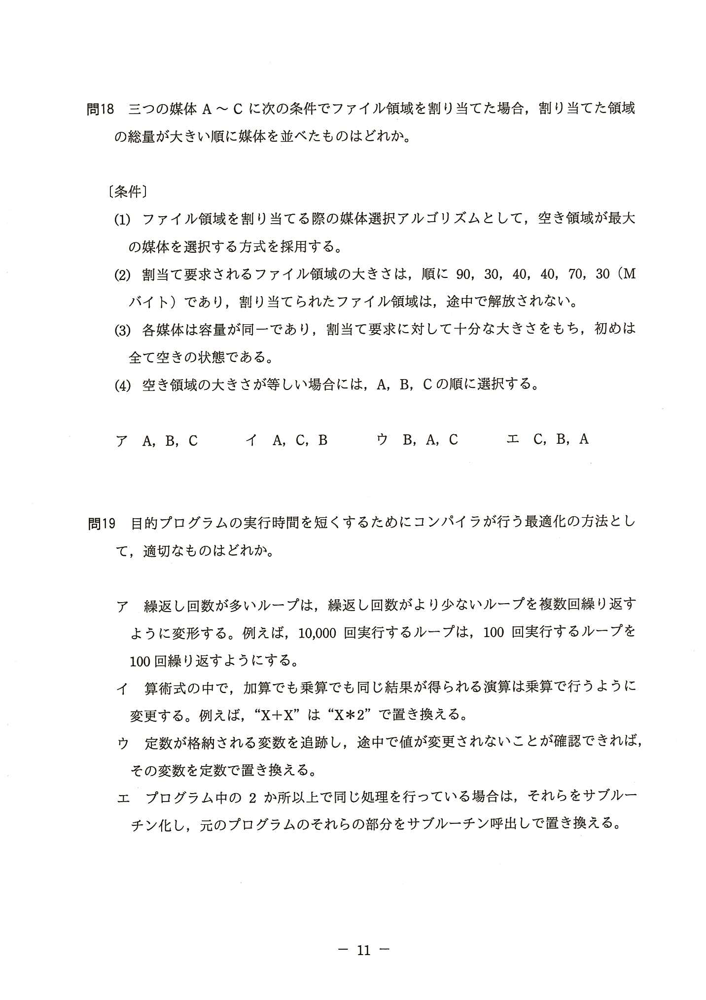

テキスト (OCR)

間18 三つの媒体 AてC に次の条件でファイル領域を割り当てた場合, 割り当てた領域
の総量が大きい順に媒体を並べたものはどれか。

(RE)

QQ) ファイル領域を割り当てる際の媒体選択アルゴリズムとして, 空き領域が最大
の媒体を選択する方式を採用する。

(2) 割当て要求されるファイル領域の大きさは, 順に 90, 30, 40, 40, 70, 30 (M
バイト) であり, 割り当てられたファイル領域は, 途中で解放されない。

(3) 各媒体は容量が同一であり, 割当て要求に対して十分な大きさをもち, 初めは
全て空きの状態である。

(4) 空き領域の大きさが等しい場合には, A, B, Cの順に選択する。

ア <A, B,C  イ AC, B  ウ &B, A, C  エ C, BA

間19 目的プログラムの実行時間を短くするためにコンパイラが行う最適化の方法とし
て, 適切なものはどれか。

ア 繰返し回数が多いループは, 繰返し回数がより少ないループを複数回繰り返す
ように変形する。例えば, 10,000 回実行するループは, 100 回実行するループを
100 回繰り返すようにする。

イ 算術式の中で, 加算でも乗算でも同じ結果が得られる演算は乗算で行うように
変更する。例えば, “K+K” は “X*2” で置き換える。

ウ 定数が格納される変数を追跡し, 途中で値が変更されないことが確認できれば,
その変数を定数で置き換える。

エ プログラム中の 2 か所以上で同じ処理を行っている場合は, それらをサブルー
チン化し, 元のプログラムのそれらの部分をサブルーチン呼出しで置き換える。

— Ti 一

### ページ 12

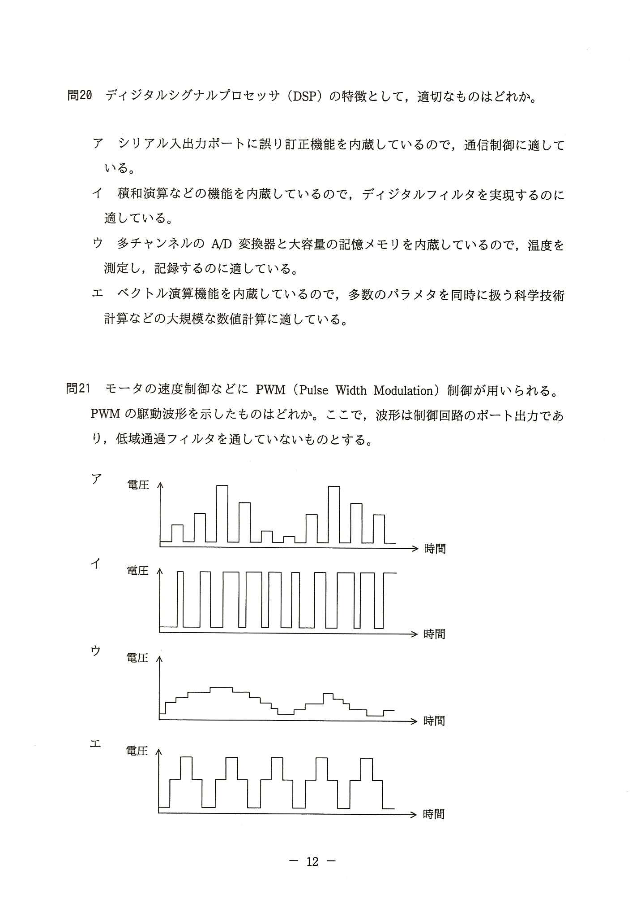

テキスト (OCR)

問29 ディジタルシグナルプロセッサ (DSP) の特徴として, 適切なものはどれか。

ア シリアル入出力ポートに誤り訂正機能を内蔵しているので, 通信制御に適して
いる。

イ 積和演算などの機能を内蔵しているので, ディジタルフィルタを実現するのに
適している。

ウ 多チャンネルの AD 変換器と大容量の記憶メモリを内蔵しているので, 温度を
測定し, 記録するのに適している。

エ ベクトル演算機能を内蔵しているので, 多数のパラメタを同時に扱う科学技術
計算などの大規模な数値計算に適している。

間21 モータの速度制御などに PWM (Pulse Width Modulation) 制御が用いられる。
PWM の駆動波形をた示したものはどれか。ここで, 波形は制御回路のポート出力であ
り, 低域通過フィルタを通していないものとする。

ア ie
時間

Tee
時間

Dwar
Po om

時間

ー 12 一

### ページ 13

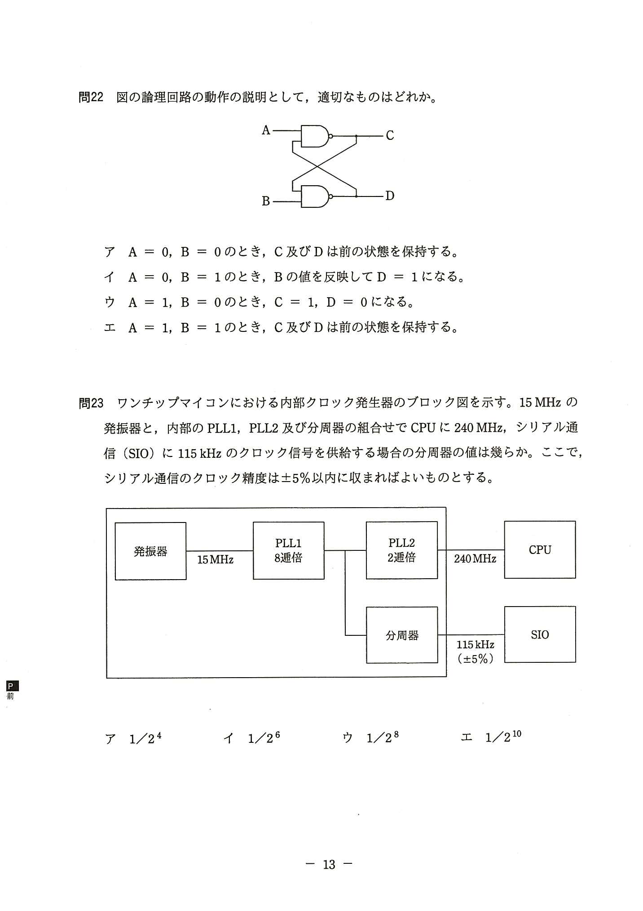

テキスト (OCR)

22 図の論理回路の動作の説明として, 適切なものはどれか。

A       c

= 0 のとき, C及びDは前の状態を保持する。
1 のとき, B の値を反映して D = 1になる。
0 のとき, C = 1, D = 0になる。

= 1のとき, C及びDは前の状態を保持する。

ll
Lal     a    の     =)
anw w
Il

H ささ
> と FP LP

問23 ワンチップマイコンにおける内部クロック発生器のブロック図をがボす。15 MHz の
発振器と, 内部の PLL1, PLL2 及び分周器の組合せで CPU に 240 MHz, シリアル通
信 (SIO) に 115 kHz のクロック信号を供給する場合の分周器の値は幾らか。ここで,
シリアル通信のクロック精度は5%以内に収まればよいものとする。

PLL1     PLL2
発振如 Mg   ail     awit [Taam | CPU
re       siO
115 kHz
(=5%)
国
ア 1/24    イ 1728    ウ 1728    エ 1/72

ー 13 一

### ページ 14

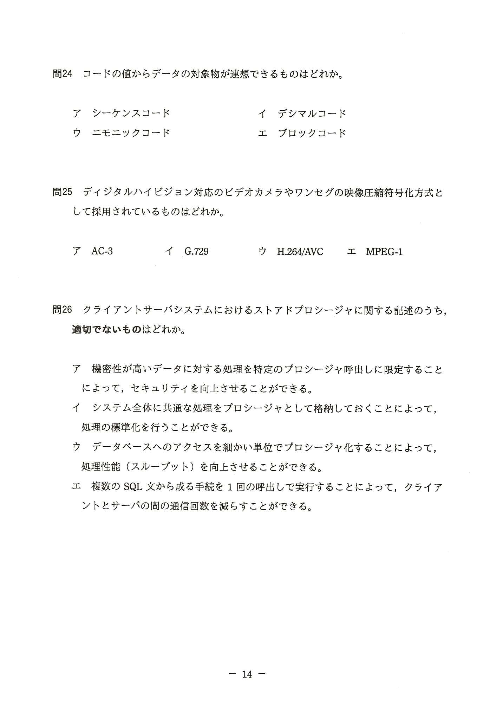

テキスト (OCR)

問24 コードの値からデータの対象物が連想できるものはどれか。

ア シーケンスコード         イ デシマルコード

ウ 三下タクコード         xm ブロックコード

25 ディジタルハイビジョン対応のビデオカメラやワンセグの映像圧縮符号化方式と
して採用されているものはどれか。

ア AC-3     イ G.729    ウ H.264/AVC  = MPEG-1

間26 クライアントサーバシステムにおけるストアドプロシージャに関する記述のうち,
適切でないものはどれか。

ア 機密性が高いデータに対する処理を特定のプロシージャ呼出しに限定すること
によって, セキュリティを向上させることができる。

イ システム全体に共通な処理をプロシージャとして格納しておくことによって,
処理の標準化を行うことができる。

ウ データベースへのアクセスを細かい単位でプロシージャ化することによって,
処理性能 (スループット) を向上させることができる。

エエ 複数の SQL 文から成る手続を 1 回の呼出しで実行することによって, クライア
ントとサーバの間の通信回数を減らすことができる。

ー 14 一

### ページ 15

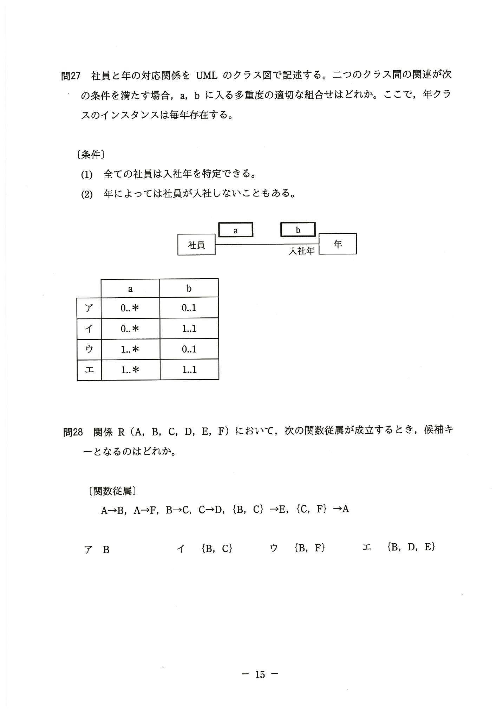

テキスト (OCR)

間27 社員と年の対応関係を UML のクラス図で記述する。二つのクラス間の関連が次
の条件を満たす場合, a, b に入る多重度の適切な組合せはどれか。ここで, 年クラ
スのインスタンスは毎年存在する。

〔条件
(1) 全ての社員は入社年を特定できる。
(2) 年によっては社員が入社しないこともある。

Le] Ce]

7A         nae L_*

a                      b
ア        0..ネ*            0..1
El        0..*             1.1
ウ        1..*            0..1
x        1..*             1.1

問28 関係 (A, B, C, D, E, F) において, 次の関数従属が成立するとき, 候補キ
ーとなるのはどれか。

関数従属]
AB, AOF, BっC, CD, {B, C} つE, {C, F} つA

ア B        イ 1B, C}     ウ  {B, F}     エ {B, D, E}

ー 1j5 一

### ページ 16

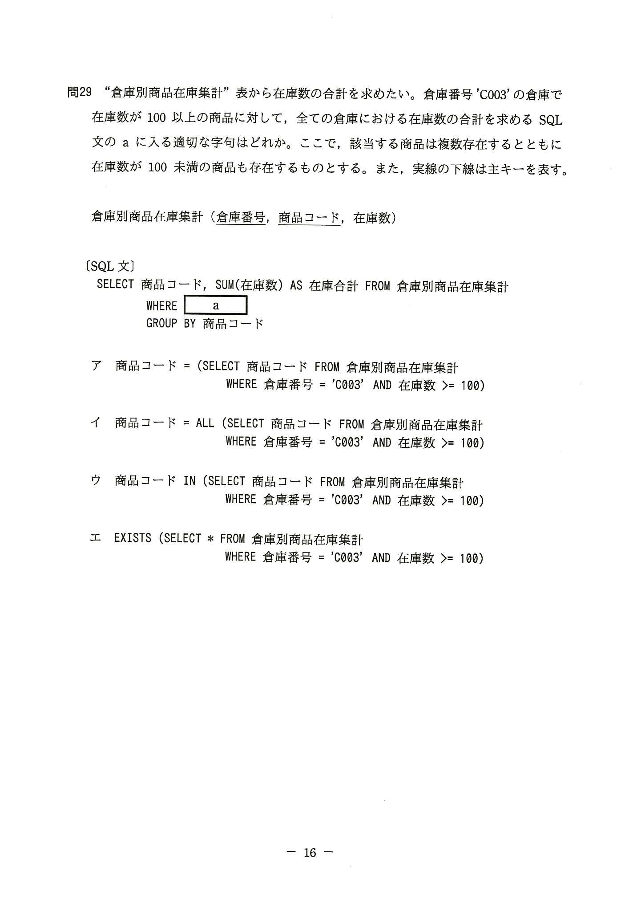

テキスト (OCR)

問29 “倉庫別商品在庫集計” 表から在庫数の合計を求めたい。倉庫番号 'C003' の倉庫で
在庫数が 100 以上の商品に対して, 全ての倉庫における在庫数の合計を求める SQL
MO a に入る適切な字句はどれか。ここで, 該当する商品は複数存在するとともに
在庫数が 100 未満の商品も存在するものとする。 また, 実線の下線はキキーを表す。

倉庫別商品在庫集計 (倉庫番号, 商品コード, 在庫数)

(SQL x]
SELECT 商品コード, SUM(在庫数) AS 在庫合計 FROM 倉庫別商品在庫集計

WHERE| a |

GROUP BY 商品コード

ア 商品コード = (SELECT 商品コード FROM 倉庫別商品在庫集計
WHERE 倉庫番号 = C993′ AND 在庫数 >= 100)
イ 商品コード = ALL (SELECT 商品コード FROM 倉庫別商品在庫集計

WHERE 倉庫番号 = C993'′ AND 在庫数 >= 100)

ツ 商品コード IN (SELECT 商品コード FROM 倉庫別商品在庫集計
WHERE 倉庫番号 'COO3’ AND 在庫数 >= 100)

エエ EXISTS (SELECT * FROM 倉庫別商品在庫集計
WHERE 倉庫番号 C003’ AND 在庫数 >= 100)

ー 16 一

### ページ 17

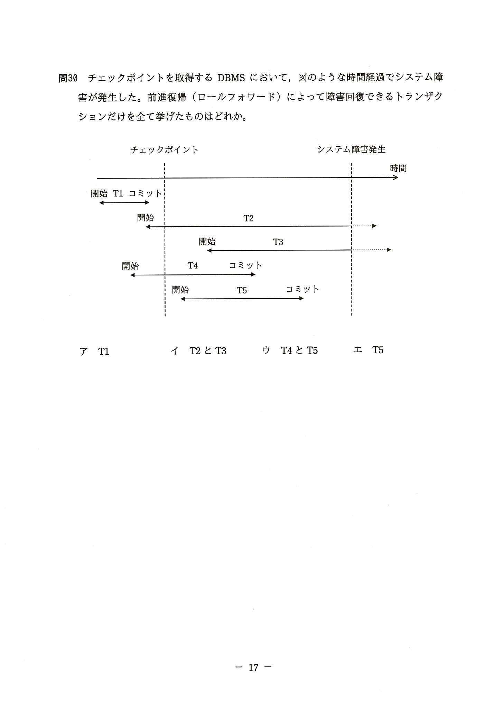

テキスト (OCR)

30 チェックポイントを取得する DBMS において, 図のような時間経過でシステム障
害が発生した。前進復帰 (ロールフォワード) によって障害回復できるトランザク
ションだけを全て挙げたものはどれか。

チェックポイント                      システム障害発生
1                                  1       時間
開始 T1 コミット!
開始 !              T2
      開始          T3
開始     | TA      コミット
1 開始            T5          コミット        :
ァ Tl      4 T2とT3    ウ T4とT5    エ T5

= 17 デー

### ページ 18

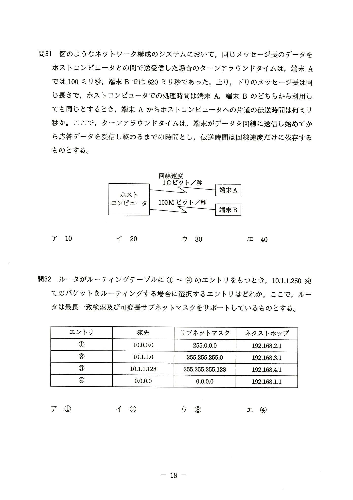

テキスト (OCR)

間31 図のようなネットワーク構成のシステムにおいて, 同じメッセージ長のデータを

ホストコンピュータとの間で送受信した場合のターンアラウンドタイムは, 端末 A
ミリ秒であった。 上り, 下りのメッセージ長は同
じ長さで, ホストコンピュータでの処理時間は端末 A, 端末 B のどちらから利用し
ても同じとするとき, 端末 A からホストコンピュータへの片道の伝送時間は何ミリ
秒か。ここで, ターンアラウンドタイムは, 端末がデータを回線に送信し始めてか
ら応答データを受信し終わるまでの時間とし, 伝送時間は回線速度だけに依存する

では 100 SVD, 端末 B では 820

ものとする。

ホスト

コジピュエー放
[$e |

回線速度
1Gビピットンノ秒

端末A

100M ビットノ秒

ウ 30

問32 ルータがルーティングテーブルに ① ~ ④ のエントリをもつとき, 10.1.1.250 FE
てのパケットをルーティングする場合に選択するエントリはどれか。ここで, ルー
タは最長一致検索及び可変長サプネットマスクをサポートしているものとする。

エントリ         宛先       サブネットマスク   ネクストホップ
®                            10.0.0.0                       255.0.0.0                     192.168.2.1
の②                            10.1.1.0                    255.255.255.0                 192.168.3.1
®                           10.1.1.128                255.255.255.128               192.168.4.1
@                             0.0.0.0                          0.0.0.0                       192.168.1.1
ア ®O                          イ @                          7 @                          エ @

ー 18 一

### ページ 19

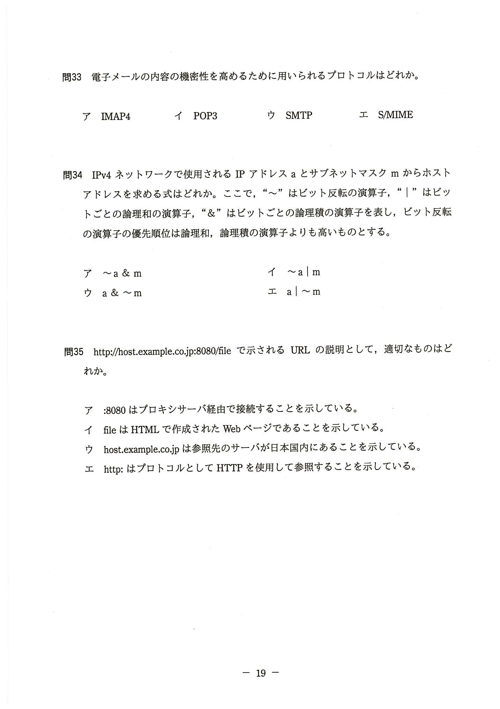

テキスト (OCR)

間33 電子メールの内容の機密性を高めるために用いられるプロトコルはどれか。

ア IMAP4    イ POP3    ウ SMTP    <= S/MIME

F534 IPY4 ネットワークで使用される IP アドレス a とサブネットマスク m からホスト
アドレスを求める式はどれか。ここで, “~” はビット反転の演算子,“ |” はビッ
トごとの論理和の演算子,“&” はビットごとの論理積の演算子を表し, ビット反転
の演算子の優先順位は論理和, 論理積の演算子よりも高いものとする。

ア ~a&m            イ ~alm

ウ a&~m           エ al~m

問35 http:/host.example.cojp:8080/5le で示される URL の説明として, 適切なものは
れか。

ア :8080 はプロキシサーバ経由で接続することを示している。

イ file は HTML で作成された Web ページであることを示している。

ウ host.example.cojp は参照先のサーバが日本国内にあることを示している。
エ http: はプロトコルとして HTTP を使用して参照することを示している。

ー 19 一

### ページ 20

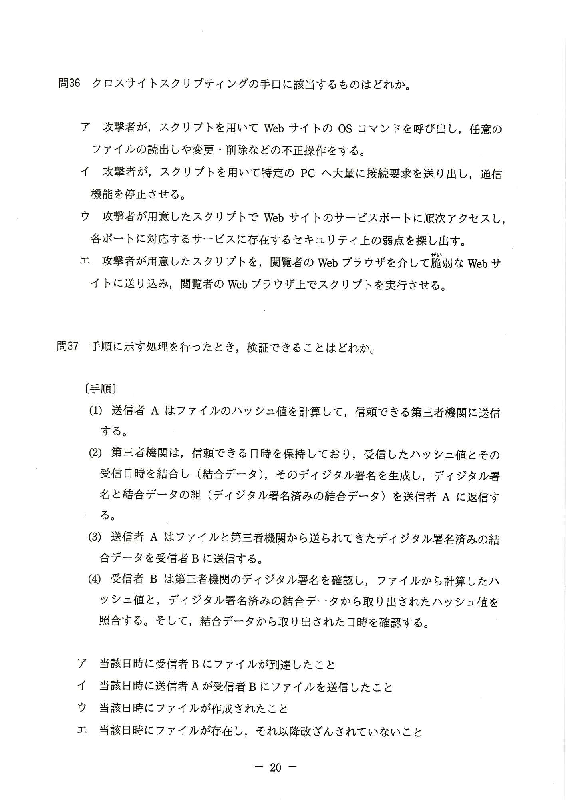

テキスト (OCR)

間36 クロスサイトスクリプティングの手口に該当するものはどれか。

ア 攻撃者が, スクリプトを用いて Web サイトの OS コマンドを呼び出し, 任意の
ファイルの読出しや変更・削除などの不正操作をする。

イ 攻撃者が, スクリプトを用いて特定の PC へ大量に接続要求を送り出し, 通信
機能を停止させる。

ウ 攻撃者が用意したスクリプトで Web サイトのサービスポートに順次アクセスし,。
各ポートに対応するサービスに存在するセキュリティ上の翌点を探し出す。

エ 攻撃者が用意したスクリプトを, 閲覧者の Web ブラウザを介して脆弱な Web サ
イトに送り込み, 閲覧者の Wed ブラウザ上でスクリプトを実行させる。

問37 手順に示す処理を行ったとき, 検証できることはどれか。

(手順

①) 送信者 A はファイルのハッシュ値を計算して, 信頼できる第三者機関に送信
する。

(② 第三者機関は, 信頼できる日時を保持しており, 受信したハッシュ値とその
受信日時を結合し (結合データ), そのディジタル署名を生成し, ディジタル署
名と結合データの組 (ディジタル署名済みの結合データ) を送信者 A に返信す
る。

(3) 送信者 4 はファイルと第三者機関から送られてきたディジタル署名済みの結
合データを受信者 B に送信する。

(4) 受信者 B は第三者機関のディジタル署名を確認し, ファイルから計算したハ
ッシュ値と, ディジタル署名済みの結合データから取り出されたハッシュ値を
照合する。そして, 結合データから取り出された日時を確認する。

当該日時に受信者 B にファイルが到達したこと

当該日時に送信者 A が受信者 B にファイルを送信したこと
当該日時にファイルが作成されたこと

当該日時にファイルが存在し, それ以降改ざんされていないこと

H ざさコ

ー 20 一

### ページ 21

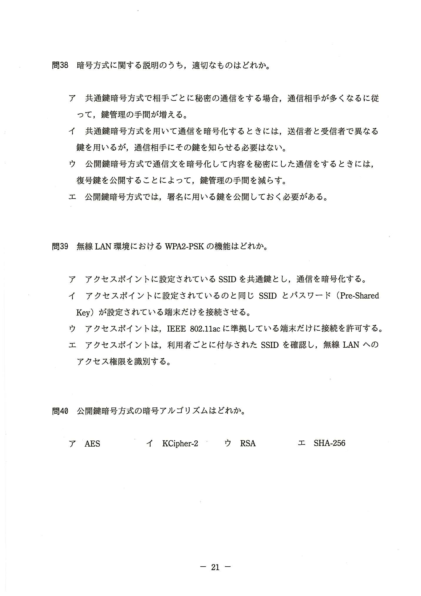

テキスト (OCR)

間38 暗号方素に関する説明のうち, 適切かものはどれか。

ア 共通鍵暗号方式で相手ごとに秘密の通信をする場合, 通信相手が多くなるに従
って, 鍵管理の手間が増える。

イ 共通鍵暗号方式を用いて通信を暗号化するときには, 送信者と受信者で異なる
鍵を用いるが, 通信相手にその鍵を知らせる必要はない。

ウ 公開鍵暗号方式で通信文を暗号化して内容を秘密にした通信をするときには,
復号鍵を公開することによって, 鍵管理の手間を減らす。

エ 公開鍵暗号方式では, 署名に用いる鍵を公開しておく必要がある。

問39 無線 LAN 環境における WPA2-PSK の機能よどれか。
ア アクセスポイントに設定されている SSID を共通鍵とし, 通信を暗号化する。
イ アクセスポイントに設定されているのと同じ SSID とパスワード (Pre-Shared
Key) が設定されている端末だけを接続させる。
ウ アクセスポイントは, IEEE 802.11ac に準拠している端末だけに接続を許可する。
エ アクセスポイントは, 利用者ごとに付与された SSID を確認し, 無線 LAN への
アクセス権限を識別する。

問49 公開鍵暗号方式の暗号アルゴリズムはどれか。

ア AES     イ KCipher-2   ウ RSA    エエ SHA-256

ー 21 一

### ページ 22

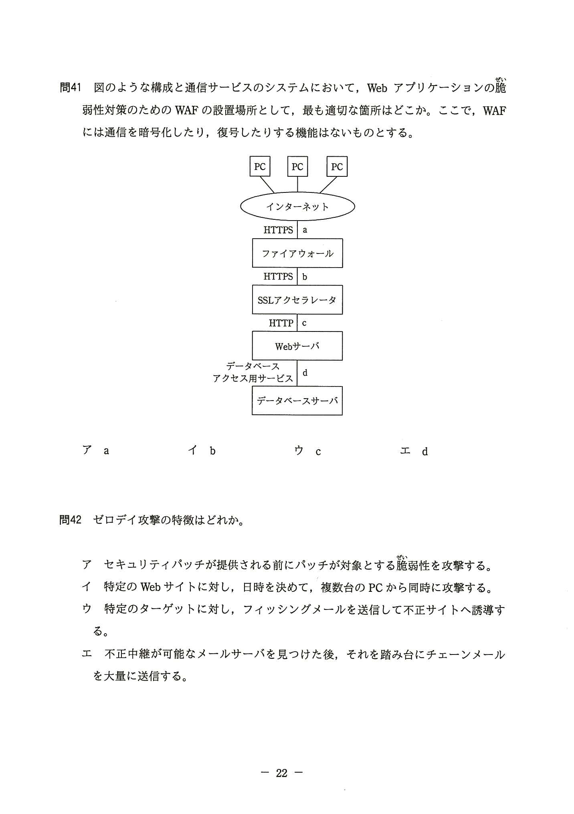

テキスト (OCR)

問41 図のような構成と通信サービスのシステムにおいて, Web TIVT—-Y a VOIR
弱性対策のための WAF の設置場所として, 最も適切な箇所はどこか。ここで, WAF
には通信を暗号化したり, 復号したりする機能はないものとする。

PC           PC            PC

HTTPS | a

ファイアウォール

HTTPS | b

SSLアクセラレータ

HTTP| <

Webサーバ

データベース

アクセス用サービス| 『

データベースサーバ

問42 ゼロデイ攻撃の特徴はどれか。

ア セキュリティパッチが提供される前にパッチが対象とする脆弱性を攻撃する。

イ 特定の Web サイトに対し, 日時を決めて, 複数台の PCから同時に攻撃する。

ウ 特定のターゲットに対し, フィッシングメールを送信して不正サイトへ誘導す
る。

エ 不正中継が可能なメールサーバを見つけた後, それを踏み台にチェーンメール
を大量に送信する。

ー 22 一

### ページ 23

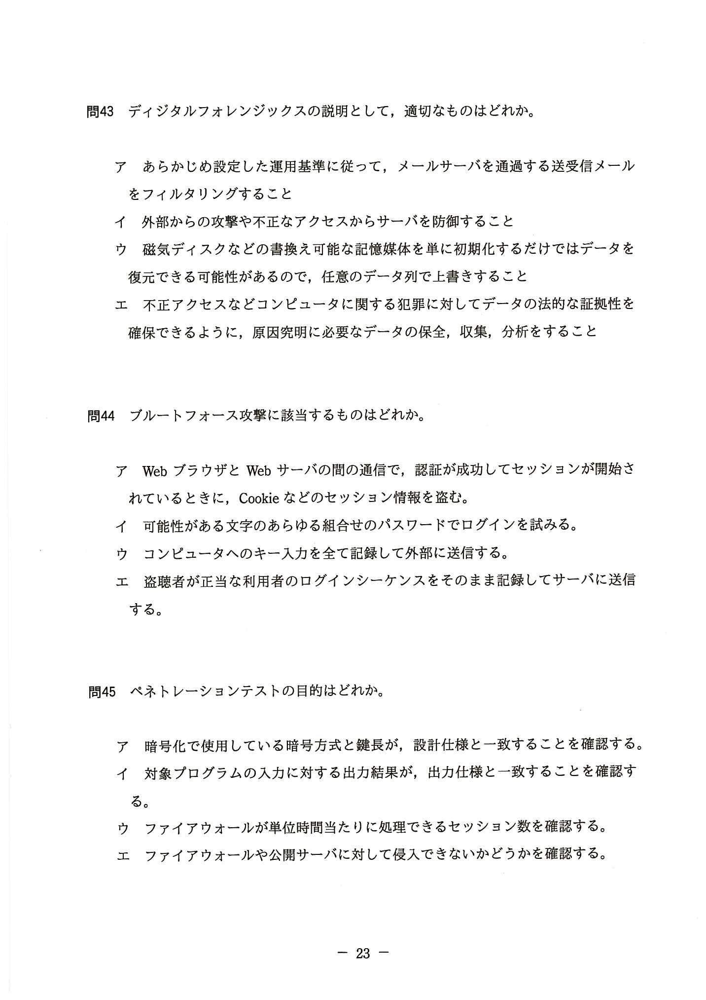

テキスト (OCR)

間43 ディジタルフォレンジックスの説明として, 適切かものはどれか。

ア あらかじめ設定した運用基準に従って, メールサーバを通過する送受信メール
をフィルタリングすること

イ 外部からの攻撃や不正なアクセスからサーバを防御すること

ウ 磁気ディスクなどの書換え可能な記憶媒体を単に初期化するだけではデータを
復元できる可能性があるので, 任意のデータ列で上書きすること

エ 不正アクセスなどコンピュータに関する犯罪に対してデータの法的な証拠性を
確保できるように, 原因究明に必要なデータの保全, WHR, 分析をすること

間44 ブルートフォース攻撃に該当するものはどれか。

ア Web ブラウザと Web サーバの間の通信で, 認証が成功してセッションが開始さ
れているときに, Cookie などのセッション情報を盗む。

イ 可能性がある文字のあらゆる組合せのパスワードでログインを試みる。

ウ コンピュータへのキー入力を全て記録して外部に送信する。

エ 盗聴者が正当な利用者のログインシーケンスをそのまま記録してサーバに送信
する。

間45 ペネトレーションテストの目的はどれか。

ア 噴号化で使用している暗号方式と鍵長が, 設計仕様と一致することを確認する。

イ 対象プログラムの入力に対する出力結果が, 出力仕様と一致することを確認す
る。

ウ ファイアウォールが単位時間当たりに処理できるセッション数を確認する。

エ ファイアウォールや公開サーバに対して侵入できないかどうかを確認する。

ー 23 一

### ページ 24

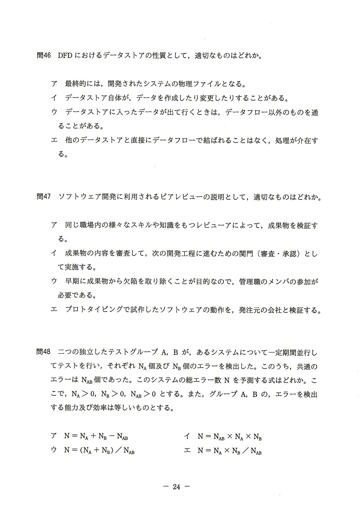

テキスト (OCR)

問46 DFD におけるデータストアの性質として, 適切なものはどれか。

ア 最終的には, 開発されたシステムの物理ファイルとなる。

イ データストア自体が, データを作成したり変更したりすることがある。

ウ データストアに入ったデータが出て行くときは, データフロー以外のものを通
ることがある。

エ 他のデータストアと直接にデータフローで結ばれることはなく, 処理が介在す
る。

問47 ソフトウェア開発に利用されるピアレビューの説明として, 適切なかものはどれか。

ア 同じ職場内の様々なスキルや知識をもつレビューアによって, 成果物を検証す

る。

イ 成果物の内容を審査して, 次の開発工程に進むための関門 (審査・承認) とし
て実施する。

ウ 早期に成果物から欠陥を取り除くことが目的なので, 管理職のメンバの参加が
必要である。

エ プロトタイピングで試作したソフトウェアの動作を, 発注元の会社と検証する。

問48 二つの独立したテストグループ A, BM, あるシステムについて一定期間並行し
てテストを行い, それぞれ N。個及び N。』 個のエラーを検出した。このうち, 共通の
エラーは Ny 個であった。このシステムの総エラー数 N を予測する式はどれか。こ
こで, N。> 0, Na 0, Ne >O とする。また, グループ A, BO, エラーを検出
する能力及び効率は等しいものとする。

ア N=N。+Na一Na       イ N=NgXN,X Np
ウ N=(N。+N。)ンNas      エ N=N、xNaンNs

ー 24 一

### ページ 25

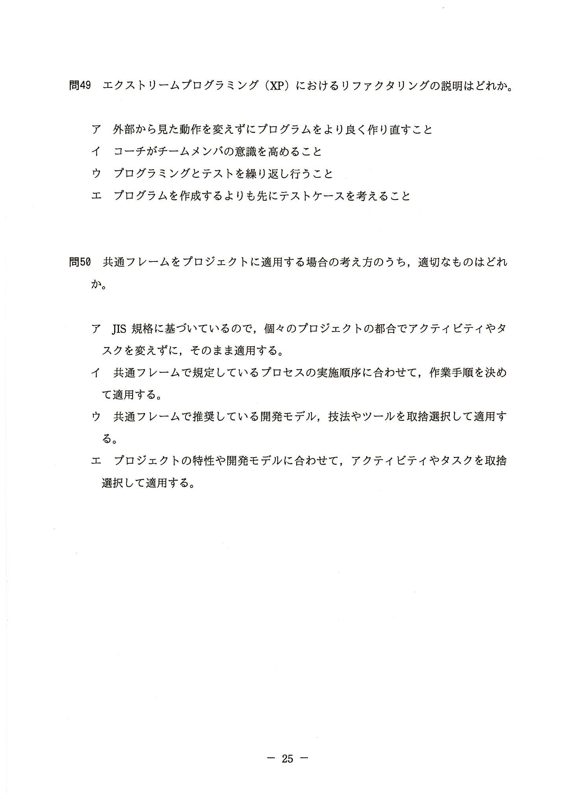

テキスト (OCR)

間49 エクストリームプログラミング (XP) におけるリファクタリングの説明はどれか。

外部から見た動作を変えずにプログラムをより良く作り直すこと
コーチがチームメンバの意識を高めること

プログラミングとテストを繰り返し行うこと

プログラムを作成するよりも先にテストケースを考えること

H へ

問59 共通フレームをプロジェクトに適用する場合の考え方のうち, 適切なものはどれ
DD.

ア JIS 規格に基づいているので, 個々のプロジェクトの都合でアクティビティやタ
スクを変えずに, そのまま適用する。
イ 共通フレームで規定しているプロセスの実施順序に合わせて, 作業手順を決め
て適用する。
ウ 共通フレームで推奨している開発モデル, 技法やツールを取捨選択して適用す
る。
エ プロジェクトの特性や開発モデルに合わせて, アクティビティやタスクを取捨
選択して適用する。

ー 25 一

### ページ 26

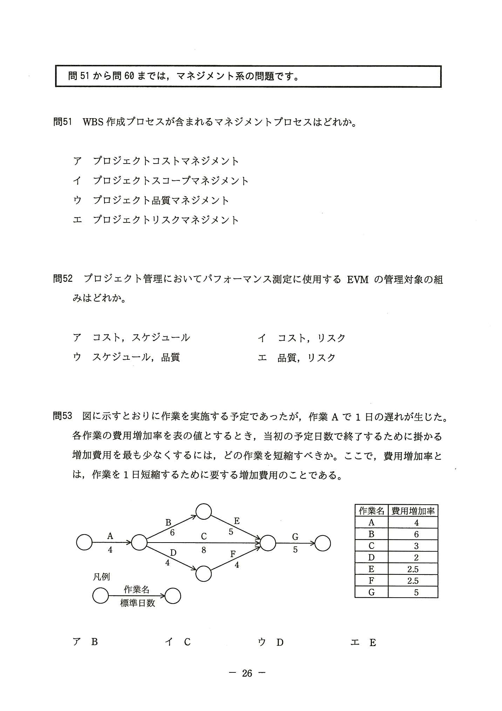

テキスト (OCR)

間 51 から問69 までは, マネジメント系の問題です。

問51 WBS 作成プロセスが含まれるマネジメントプロセスはどれか。

プロジェクトコストマネジメント
プロジェクトスコープマネジメント
プロジェクト品質マネジメント

プロジェクトリスクマネジメント

Hさへささ

間52 プロジェクト管理においてパフォーマンス測定に使用する EVM の管理対象の組
みはどれか。

ア コスト, スケジュール       イ コスト, リスク
ウ スケジュール, 品質        エエ 品質, リスク

間53 図に示すとおりに作業を実施する予定であったが, 作業 A で 1 日の遅れが生じた。
各作業の費用増加率を表の値とするとき, 当初の予定日数で終了するために掛かる
増加費用を最も少なくするには, どの作業を短縮すべきか。ここで, 費用増加率と
lk, 作業を1日短縮するために要する増加費用のことである。

作業名 | 費用増加率
A    4
B    6
C    3
D    2
E   2.5
F   2.5
G    5

7B      4 Cc      9 D      エ E

ー 26 一

### ページ 27

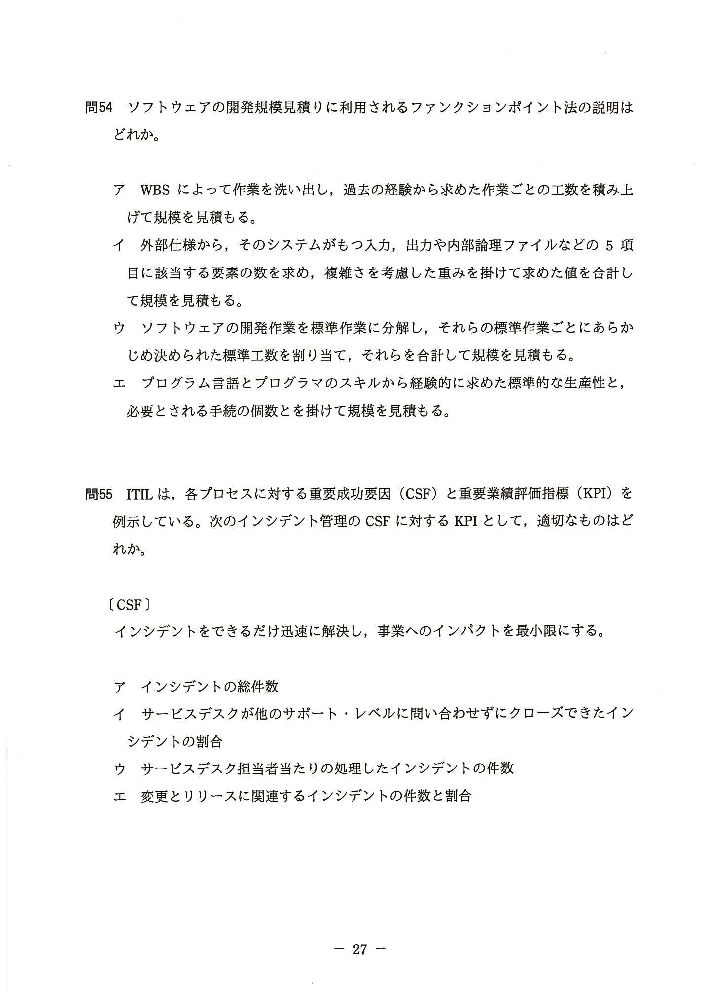

テキスト (OCR)

間54 ソフトウェアの開発規模見積りに利用されるファンクションポイント法の説明は
どれか。

ア WBS によって作業を洗い出し, 過去の経験から求めた作業ごとの工数を積み上
げて規模を見積もる。

イ 外部仕様から, そのシステムがもつつ入力, 出力や内部論理ファイルなどの 5 項
目に該当する要素の数を求め, 複雑さを考慮した重みを掛けて求めた値を合計し
て規模を見積もる。

ウ ソフトウェアの開発作業を標準作業に分解し, それらの標準作業ごとにあらか
じめ決められた標準工数を割り当て, それらを合計して規模を見積もる。

エエ プログラム言語とプログラマのスキルから経験的に求めた標準的な生産性と,
必要とされる手続の個数とを掛けて規模を見積もる。

問55 ITIL は, 各プロセスに対する重要成功要因 (CSF) と重要業績評価指標 (KPI) を
例示している。次のインシデント管理の CSF に対する KPIT として, 適切なものはど
れか。

C
インシデントをできるだけ迅速に解決し, 事業へのインパクトを最小限にする。

ア インシデントの総件数

イ サービスデスクが他のサポート・レベルに問い合わせずにクローズできたイン
シデントの割合

ウ サービスデスク担当者当たりの処理したインシデントの件数

エ 変更とリリースに関連するインシデントの件数と割合

ー 27 一

### ページ 28

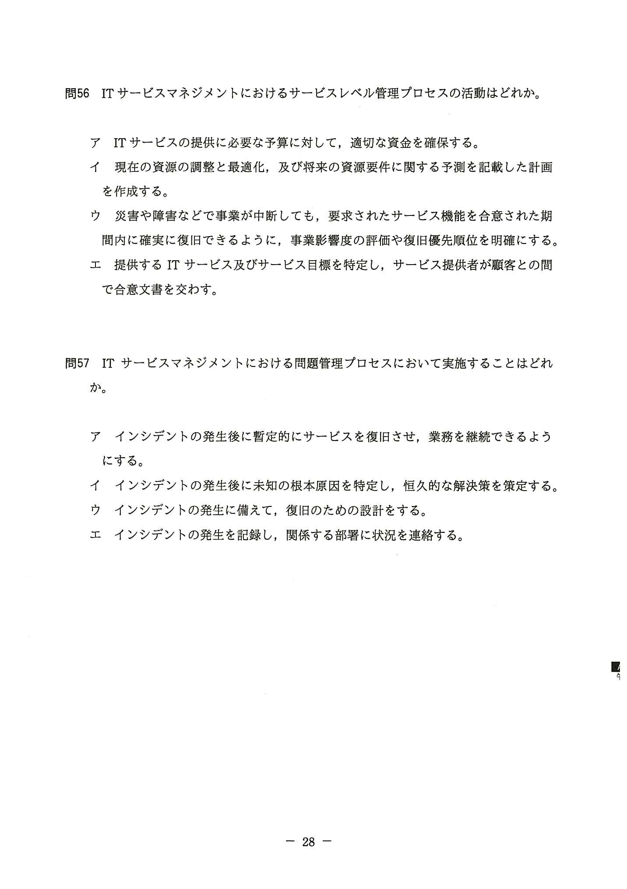

テキスト (OCR)

間56 ITサービスマネジメントにおけるサービスレベル管理プロセスの活動はどれか。

ア IT サービスの提供に必要な予算に対して, 適切な資金を確保する。

イ 現在の資源の調整と最適化, 及び将来の資源要件に関する予測を記載した計画
を作成する。

ウ 災害や障害などで事業が中断しても, 要求されたサービス機能を合意された期
間内に確実に復旧できるように, 事業影響度の評価や復旧優先順位を明確にする。

エ 提供する IT サービス及びサービス目標を特定し, サービス提供者が顧客との間
で合意文書を交わす。

問57 IT サービスマネジメントにおける問題管理プロセスにおいて実施することはどれ
か。

ア インシデントの発生後に暫定的にサービスを復旧させ, 業務を継続できるよう
にする。

イ インシデントの発生後に未知の根本原因を特定し, 恒久的な解決策を策定する。

ウ インシデントの発生に備えて, 復旧のための設計をする。

エエ インシデントの発生を記録し, 関係する部署に状況を連絡する。

ー 28 一

oe |

### ページ 29

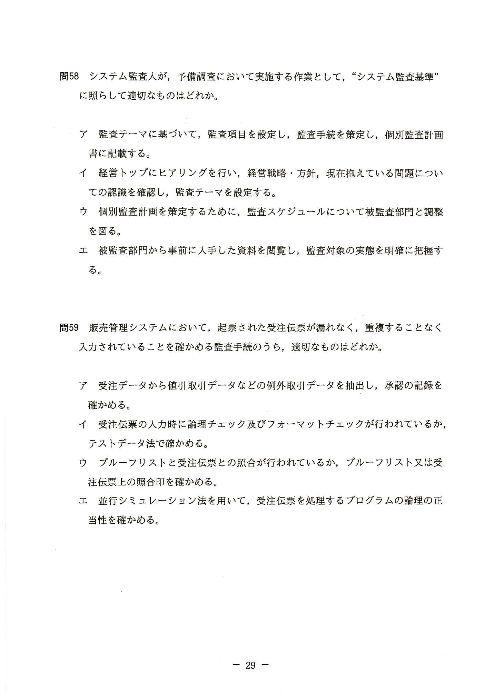

テキスト (OCR)

間58 システム監査人が, 予備調査において実施する作業として, “システム監査基準"
に照らして適切なものはどれか。

ア 監査テーマに基づいて, 監査項目を設定し, 監査手続を策定し, 個別監査計画
書に記載する。

イ 経営トップにヒアリングを行い, 経営戦略・方針, 現在抱えている問題につい
ての認識を確認し, 監査テーマを設定する。

ウ 個別監査計画を策定するために, 監査スケジュールについて被監査部門と調整
を図る。

エ 被監査部門から事前に入手した資料を閲覧し, 監査対象の実態を明確に把握す
る。

問59 販売管理システムにおいて, 起票された受注伝票が漏れなく, 重複することなく
入力されていることを確かめる監査手続のうち, 適切かものはどれか。

ア 受注データから値引取引データなどの例外取引データを抽出し, 承認の記録を
確かめる。

イ 受注伝票の入力時に論理チェック及びフォーマットチェックが行われているか,
テストデータ法で確かめる。

ウ プルーフリストと受注伝票との照合が行われているか, プルーフリスト又は受
注伝票上の照合印を確かめる。

DZ 並行シミュレーション法を用いて, 受注伝票を処理するプログラムの論理の正
当性を確かめる。

ー 29 一

### ページ 30

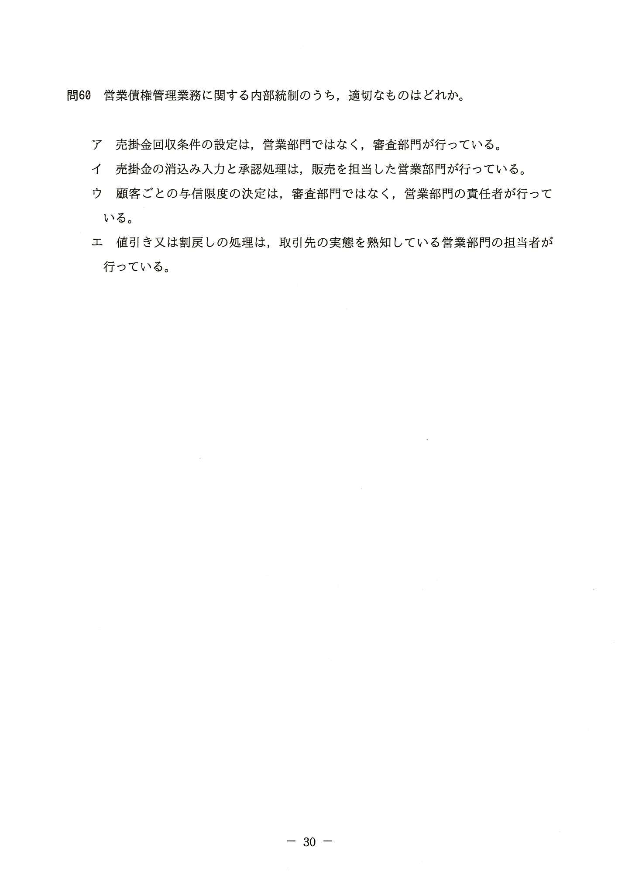

テキスト (OCR)

問69 営業債権管理業務に関する内部統制のうち, 適切なものはどれか。

ア 売掛金回収条件の設定は, 営業部門ではなく, 審査部門が行っている。
イ 売掛金の消込み入力と承認処理は, 販売を担当した営業部門が行っている。
ウ 願客ごとの与信限度の決定は, 審査部門ではなく, 営業部門の責任者が行って

いる。
エエ 値引き又は割戻しの処理は, 取引先の実態を熟知している営業部門の担当者が
行っている。

ー 30 一

### ページ 31

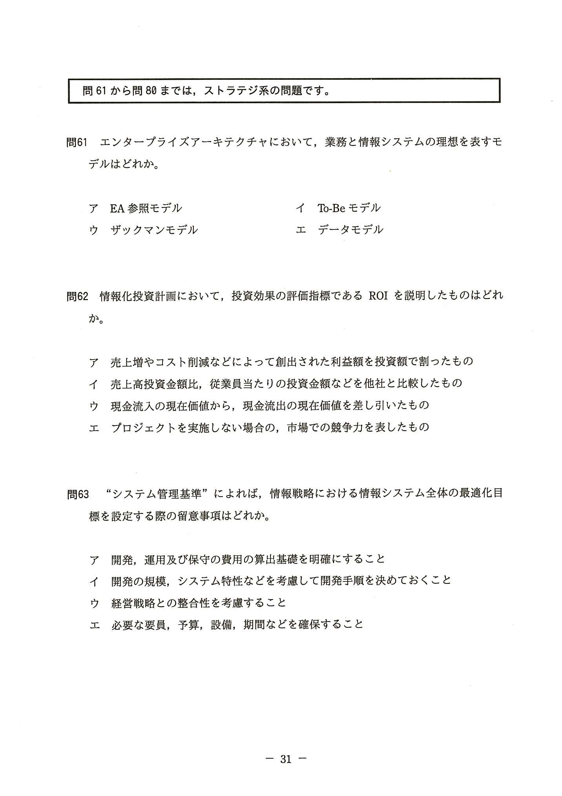

テキスト (OCR)

問 61 から問 89 までは, ストラテジ系の問題です。

fl エンタープライズアーキテクチャにおいて, 業務と情報システムの理想を表すモ
デルはどれか。

ア EA参照モデル        イ To6-Be モデル
ウ ザックマンモデル         エ データモデル

間62 情報化投資計画において, 投資効果の評価指標である ROI を説明したものはどれ
か。

売上増やコスト削減などによって創出された利益額を投資額で割ったもの
売上高投資金額比, 従業員当たりの投資金額などを他社と比較したもの
現金流入の現在価値から, 現金流出の現在価値を差し引いたもの
プロジェクトを実施しない場合の, 市場での競争力を表したもの

H ざさ

問63 “システム管理基準" によれば, 情報戦略における情報システム全体の最適化目
標を設定する際の留意事項はどれか。

開発, 運用及び保守の費用の算出基礎を明確にすること

開発の規模, システム特性などを考慮して開発手順を決めておくこと
経営戦略との整合性を考慮すること

必要な要員, 予算, 設備, 期間などを確保すること

Hさささ

ー 31 一

### ページ 32

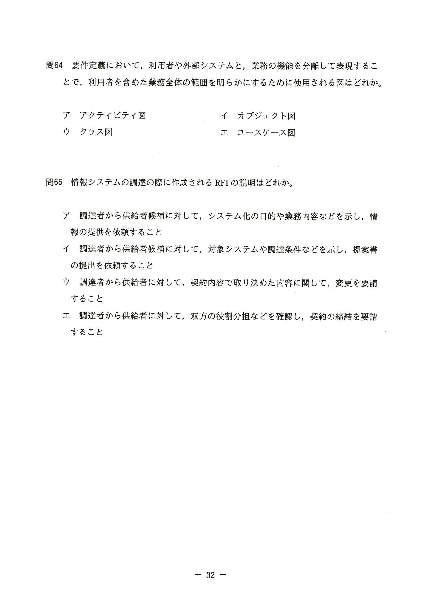

テキスト (OCR)

問64 要件定義において, 利用者や外部システムと, 業務の機能を分離して表現するこ
CC, 利用者を含めた業務全体の範囲を明らかにするために使用される図はどれか。

ア アクティビティ図         イ オブジェクト図
ウ クラス図             エ ユースケース図

問65 情報システムの調達の際に作成される RFI の説明はどれか。

ア 調達者から供給者候補に対して, システム化の目的や業務内容などを示し, 情
報の提供を依頼すること

イ 調達者から供給者候補に対して, 対象システムや調達条件などを示し, 提案書
の提出を依頼すること

ウ 調達者から供給者に対して, 契約内容で取り決めた内容に関して, 変更を要請
すること

エエ 調達者から供給者に対して, 双方の役割分担などを確認し, 契約の締結を要請
すること

ー 32 一

### ページ 33

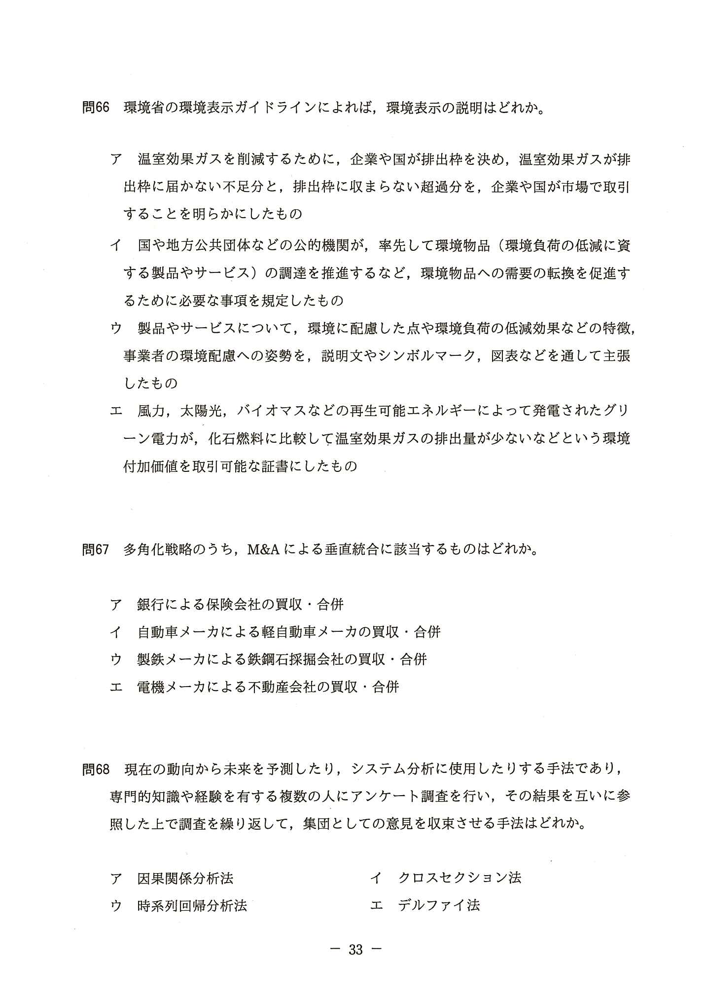

テキスト (OCR)

間66 環境省の環境表示ガイドラインによれば, 環境表示の説明はどれか。

ア 温室効果ガスを削減するために, 企業や国が排出梓を決め, 温室効果ガスが排
出枠に届かない不足分と, 排出枠に収まらない超過分を, 企業や国が市場で取引
することを明らかにしたもの

イ 国や地方公共団体などの公的機関が, 率先して環境物品 (環境負荷の低減に資
する製品やサービス) の調達を推進するなど, 環境物品への需要の転換を促進す
るために必要な事項を規定したもの

ウ 製品やサービスについて, 環境に配慮した点や環境負荷の低減効果などの特徴,
事業者の環境配慮への姿勢を, 説明文やシンボルマーク, 図表などを通して主張
したもの

x= 風力, ABH, バイオマスなどの再生可能エネルギーによって発電されたグリ
ーン電力が, 化石燃料に比較して温室効果ガスの排出量が少ないなどという環境
付加価値を取引可能な証書にしたもの

問67 多角化戦略のうち, M&A による垂直統合に該当するものはどれか。

銀行による保険会社の買収・合併

自動車メーカによる軽自動車メーカの買収・合併
製鉄メーカによる鉄鋼石採掘会社の買収・合併
電機メーカによる不動産会社の買収・合億

H ささ

問68 現在の動向から未来を予測したり, システム分析に使用したりする手法であり,
専門的知識や経験を有する複数の人にアンケート調査を行い, その結果を互いに参
照した上で調査を繰り返して, 集団としての意見を収束させる手法はどれか。

ア 因果関係分析法          イ クロスセクション法
ウ 時系列回帰分析法         エ デルファイ法

### ページ 34

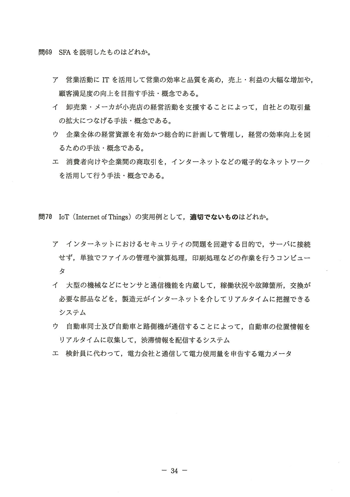

テキスト (OCR)

問69 SFAを説明したものはどれか。

ア 営業活動に IT を活用して営業の効率と品質を高め, 売上・利益の大幅な増加や,
顧客満足度の向上を目指す手法・概念である。

イ 卸売業・メーカが小売店の経営活動を支援することによって, 自社との取引量
の拡大につなげる手法・概念である。

ウ 企業全体の経営資源を有効かつ総合的に計画して管理し, 経営の効率向上を図
るための手法・概念である。

エ 消費者向けや企業間の商取引を, インターネットなどの電子的なネットワーク
を活用して行う手法・概念である。

問79 IoT (Internet of Things) の実用例として, 適切でないものはどれか。

ア インターネツットにおけるセキュリティの問題を回避する目的で, サーバに接続
せず, 単独でファイルの管理や演算処理, 印刷処理などの作業を行うコンピュー
み

イ 大型の機械などにセンサと通信機能を内蔵して, 稼働状況や故障箇所, 交換が
必要な部品などを, 製造元がインターネットを介してリアルタイムに把握できる
システム

ウ 自動車同士及び自動車と路側機が通信することによって, 自動車の位置情報を
リアルタイムに収集して, 渋滞情報を配信するシステム

エ 検針員に代わって, 電力会社と通信して電力使用量を申告する電力メータ

ー 34 一

### ページ 35

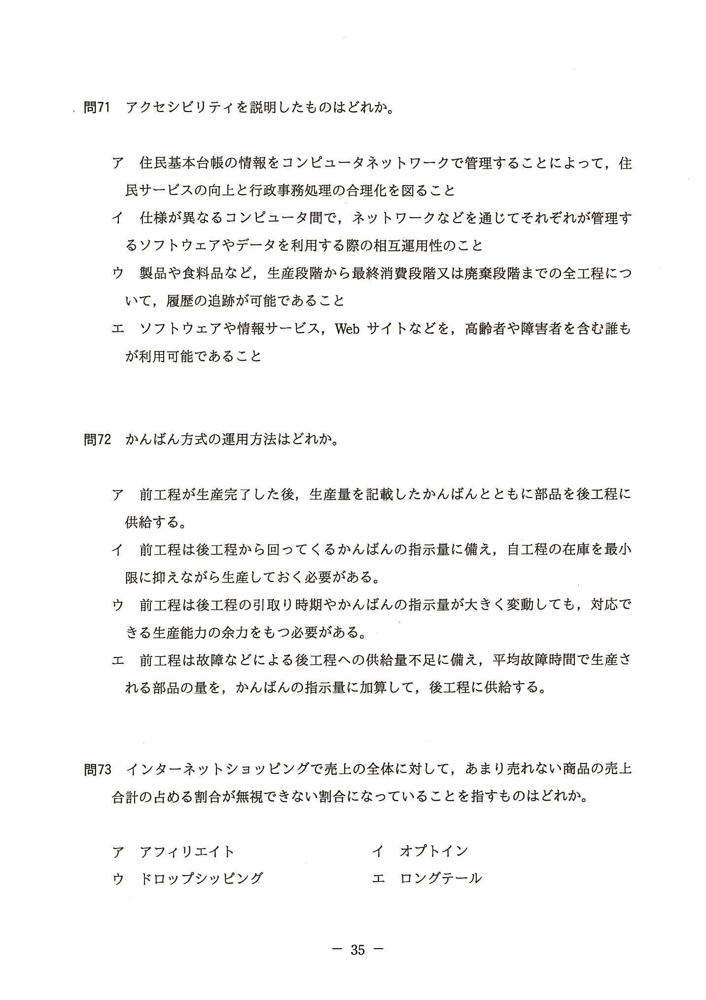

テキスト (OCR)

.間71 アクセシビリティを説明したものはどれか。

ア 住民基本台帳の情報をコンピュータネットワークで管理することによって, 住
民サービスの向上と行政事務処理の合理化を図ること

イ 仕様が異なるコンピュータ間で, ネットワークなどを通じてそれぞれが管理す
るソフトウェアやデータを利用する際の相互運用性のこと

ウ 製品や食料品など, 生産段階から最終消費段階又は廃棄段階までの全工程につ
いて, 履歴の追跡が可能であること

エエ ソフトウェアや情報サービス, Web サイトなどを, 高齢者や障害者を含む誰も
が利用可能であること

問72 かんばん方式の運用方法はどれか。

ア 前工程が生産完了した後, 生産量を記載したかんばんとともに部品を後工程に
供給する。

イ 前工程は後工程から5回ってくるかんばんの指示量に備え, 自工程の在庫を最小
限に抑えながら生産しておく必要がある。

ウ 前工程は後工程の引取り時期やかんばんの指示量が大きく変動しても, 対応で
きる生産能力の余力をもつつ必要がある。

エエ 前工程は故障などによる後工程への供給量不足に備え, 平均故障時間で生産さ
れる部品の量を, かんばんの指示量に加算して, 後工程に供給する。

間73 インターネットショッピングで売上の全体に対して, あまり売れない商品の売上
合計の占める割合が無視できない割合になっていることを指すものはどれか。

ア アフィリエイト            イ オプトイン
ウ ドロップシッピング        エエ ロングテール

ー 35 一

### ページ 36

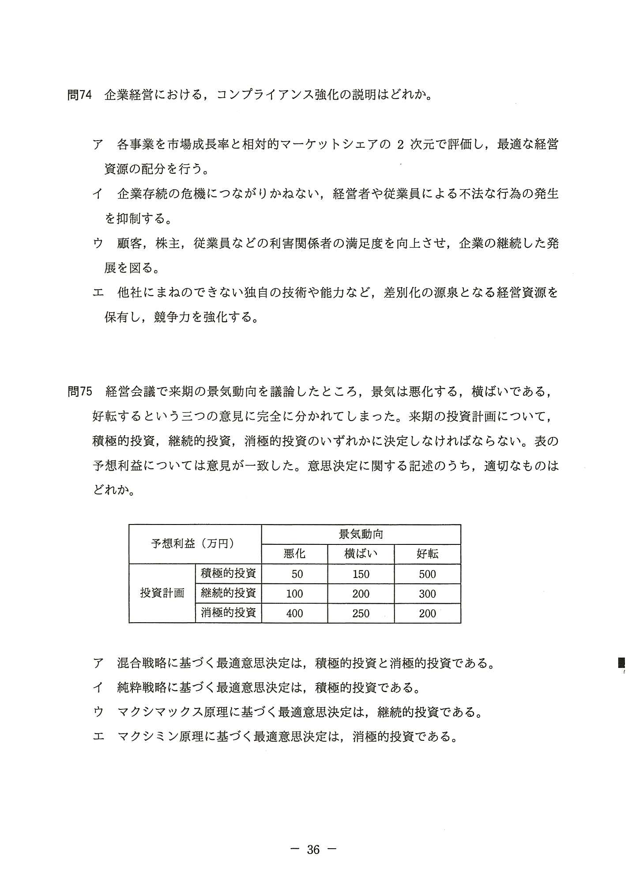

テキスト (OCR)

間74 企業経営における, コンプライアンス強化の説明はどれか。

ア 各事業を市場成長率と相対的マーケットシェアの 2 次元で評価し, 最適な経営
資源の配分を行う。              」

イ 企業存続の危機につながりかねない, 経営者や従業員による不法な行為の発生
を抑制する。

ウ 顧客, RE, 従業員などの利害関係者の満足度を向上させ, 企業の継続した発
展を図る。

エエ 他社にまねのできない独自の技術や能力など, 差別化の源泉となる経営資源を
保有し, 競争力を強化する。

問75 経営会議で来期の景気動向を議論したところ, 景気は悪化する, 横ばいである,
好転するという三つの意見に完全に分かれてしまった。 来期の投資計画について,
積極的投資, 継続的投資, 消極的投資のいずれかに決定しなければならない。表の
予想利益については意見が一致した。意思決定に関する記述のうち, 適切かものは
どれか。

景気動向
予想利益 (万円)            me         横ばい         FE
積極的投資         50             150             500
投資計画 | 継続的投資       100           200           300
消極的投資 400 250200

混合戦略に基づく最適意思決定は, 積極的投資と消極的投資である。
純粋戦略に基づく最適意思決定は, 積極的投資である。

マクシマックス原理に基づく最適意思決定は, 継続的投資である。
マクシミン原理に基づく最適意思決定は, 消極的投資である。

H へ

ー 36 一

### ページ 37

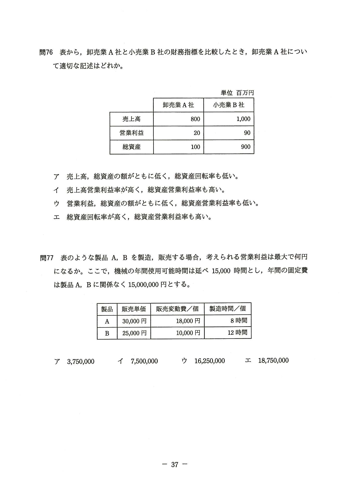

テキスト (OCR)

問76 表から, 卸売業A社と小売業 B 社の財務指標を比較したとき, 卸売業 A 社につい

単位 百万円

卸売業A 社

小売業B社

800

1.000

20

90

100

900

て適切な記述はどれか。
売上高
営業利益
BRE
ア
イ
ウ
に

売上高, 総資産の額がともに低く, 総資産回転率も低い。

売上高営業利益率が高く, 総資産営業利益率も高い。

営業利益, 総資産の額がともに低く, 総資産営業利益率も低い。
総資産回転率が高く, 総資産営業利益率も高い。

問77 表のような製品 A, B EME, 販売する場合, 考えられる営業利益は最大で何幅
になるか。ここで, 機械の年間使用可能時間は延べ 15,000 時間とし, 年間の固定費
は製品A, Bに関係なく 15,000,000 円とする。

製品 | 販売単価 | 販売変動費/個 | 製造時間個
A | 30,000 A            18,000 円            8 時間
B | 25,000            10,000 円           12 時間
ア 3,750,000          イ 7,500,000          ウ 16,250,000         エエ 18,750,000

### ページ 38

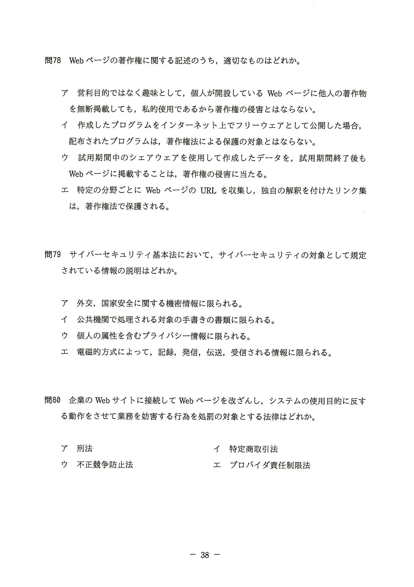

テキスト (OCR)

間78 Web ページの著作権に関する記述のうち, 適切なかものはどれか。

ア 営利目的ではなく趣味として, 個人が開設している Web ページに他人の著作物
を無断掲載しても, 私的使用であるから著作権の侵害とはならない。

イ 作成したプログラムをインターネット上でフリーウェアとして公開した場合,
配布されたプログラムは, 著作権法による保護の対象とはならない。

ウ 試用期間中のシェアウェアを使用して作成したデータを, 試用期間終了後も
Web ページに掲載することは, 著作権の侵害に当たる。

エ 特定の分野ごとに Web ページの URL を収集し, 独自の解釈を付けたリンク集
は, 著作権法で保護される。

間79 サイバーセキュリティ基本法において, サイバーセキュリティの対象として規定
されている情報の説明はどれか。

KS, 国家安全に関する機密情報に限られる。

公共機関で処理される対象の手書きの書類に限られる。

個人の属性を含むプライバシー情報に限られる。

電磁的方式によって, 記録, 発信, 伝送, 受信される情報に限られる。

HG AS

間86 企業の Web サイトに接続して Web ページを改ざんし, システムの使用目的に反す
る動作をさせて業務を妨害する行為を処罰の対象とする法律はどれか。

ア 刑法               イ 特定商取引法
ウ 不正競委防止法          エ プロバイダ南任制限法

ー 38 一

### ページ 39

テキスト (OCR)

【 メ = 用 紙 J

ー 39 一

### ページ 40

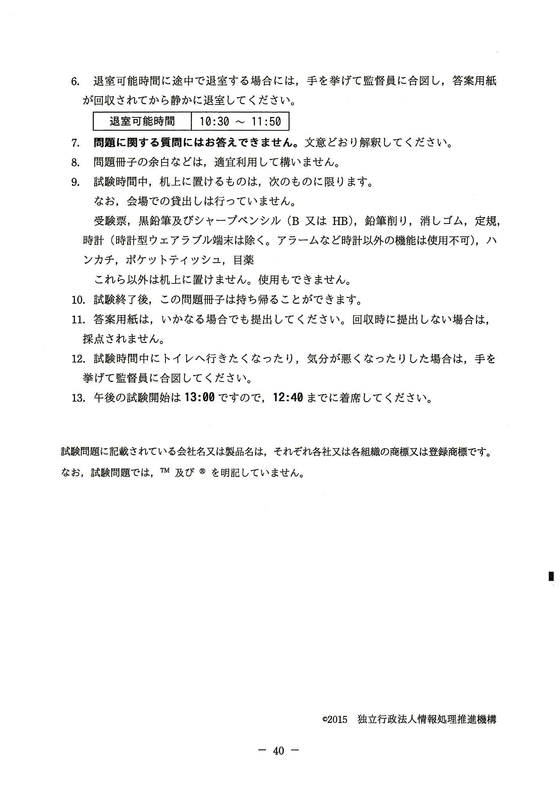

テキスト (OCR)

6. 退室可能時間に途中で退室する場合には, 手を挙げて監督員に合図し, 答案用紙
が回収されてから静かに退室してください。
| 退室可能時間 | 10:30 ~ 11:50 |
7. 問題に関する質問にはお答えできません。文意どおり解息してください。
8. 問題民子の余白などは, 適宜利用して構いません。
9. 試験時間中机上に置けるものは, 次のものに限ります。
なお, 会場での貸出しは行っていません。
受験票,黒鉛筆及びシャープペンシル (B 又は HB), 鉛筆削り, 消しゴム, 定規
時計 (時計型ウェアラブル端末は除く。アラームなど時計以外の機能は使用不可)。ハ
ンカチ, ポケットティッシュ, 目薬
これら以外は机上に置けません。使用もできません。
10, 試験終了後, この問題生子は持ち帰ることができます。
Ll, 答案用紙は, いかなる場合でも提出してください。回収時に提出しない場合は,
採点されません。
12, 試験時間中にトイレへ行きたくなったり, 気分が悪くなったりした場合は, BE
挙げて監督員に合図してください。
13, 午後の試験開始は 13:00 ですので, 12:40 までに着席してください。

試験問題に記載されている会社名又は製品名は, それぞれ各社又は各組織の商標又は登録商標です。
なお, 試験問題では, ™ 及び @ を明記していません。

e2015 独立行政法人情報処理推進機構

ー 40 一

---

## 午前解答

©2015 独立行政法人情報処理推進機構 
平成27 年度 秋期 応用情報技術者試験 解答例 
 
午前試験 
問番号
正解 
問1 
ア 
問2 
エ 
問3 
ウ 
問4 
ア 
問5 
エ 
問6 
ウ 
問7 
イ 
問8 
ウ 
問9 
ウ 
問10 
イ 
問11 
ア 
問12 
ウ 
問13 
エ 
問14 
ウ 
問15 
イ 
問16 
ア 
問17 
ア 
問18 
エ 
問19 
ウ 
問20 
イ 
 
 
問番号
正解 
問21 
イ 
問22 
エ 
問23 
エ 
問24 
ウ 
問25 
ウ 
問26 
ウ 
問27 
イ 
問28 
ウ 
問29 
ウ 
問30 
ウ 
問31 
エ 
問32 
ウ 
問33 
エ 
問34 
ウ 
問35 
エ 
問36 
エ 
問37 
エ 
問38 
ア 
問39 
イ 
問40 
ウ 
 
 
問番号
正解 
問41 
ウ 
問42 
ア 
問43 
エ 
問44 
イ 
問45 
エ 
問46 
エ 
問47 
ア 
問48 
エ 
問49 
ア 
問50 
エ 
問51 
イ 
問52 
ア 
問53 
エ 
問54 
イ 
問55 
イ 
問56 
エ 
問57 
イ 
問58 
エ 
問59 
ウ 
問60 
ア 
 
 
問番号
正解 
問61 
イ 
問62 
ア 
問63 
ウ 
問64 
エ 
問65 
ア 
問66 
ウ 
問67 
ウ 
問68 
エ 
問69 
ア 
問70 
ア 
問71 
エ 
問72 
イ 
問73 
エ 
問74 
イ 
問75 
エ 
問76 
エ 
問77 
イ 
問78 
エ 
問79 
エ 
問80 
ア

---

## 午後問題

### ページ 1

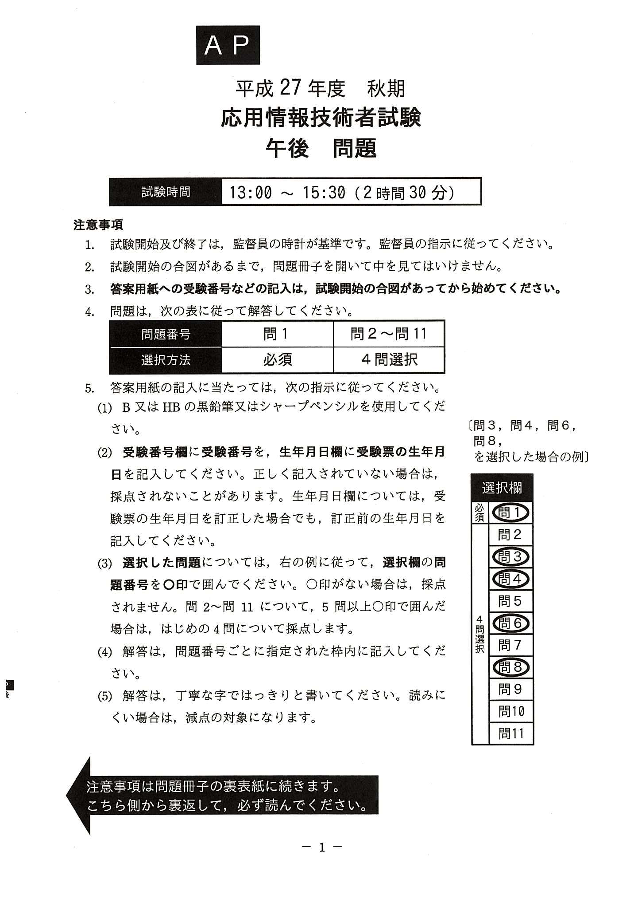

テキスト (OCR)

平成 27年度 秋期

応用情報技術者試験
午後 問題

試験時間    13:00 ~ 15:30 (2時間30 分)

注意事項
1. 試験開始及び終了は, 監督貞の時計が基準です。監督員の指示に従ってください。

2. 試験開始の合図があるまで, 問題冊子を開いて中を見てはいけません。
3. 答案用紙への受験番号などの記入は, 試験開始の合図があってから始めてください。
4. 問題は, 次の表に従って解答してください。

問題番号               問 1             間2 て間 11
選択方法               必須              4 問選択

5. 答案用紙の記入に当たっては, 次の指示に従ってください。
(1) B 又は HB の黒鉛筆又はシャープペンシルを使用してくだ

さい。                                       (問3, 間4, 問6,

司 8,

日を記入してください。 正しく記入されていない場合は,     5
採点されないことがあります。生年月日欄については, 受    HGR

験票の生年月日を訂正した場合でも, 訂正前の生年月日を [A
記入してください。                           間2
⑬) 選択した問題については, 右の例に従って, 選択欄間
題番号を〇印で囲んでください。の〇印がない場合は, 採点     Gi4
されません。間 2一問 11 について, 5 問以上〇印で囲んだ      間5
場合は, はじめの4 問について採点します。           上 6
④ 解答は, 問題番号ごとに指定された梓内に記入してくだ |択|問7
さい。                                  Gd
6) 解答は, 丁寧な字ではっきりと書いてください。読みに     問9
くい場合は。 減点の対象になります。                  faire

間11

注意事項は問題冊子の裏表紙に続きます。
こちら側から裏返して, 必ず読んでください。

### ページ 2

### ページ 3

テキスト (OCR)

【問題一覧〕

人@問 1 (必須)

a      HELD                     テーマ

問 1 | 情報セキュリティ       ソーシャルネットワーキングサービスのセキュリティ
@問 2~F 11 (10 問中 4 問選択)

      出題分野                     デーマ

問2 | 経営戦略          損益見込の分析

間3 | プログラミング     2 分探索木

問4 | システムアーキテクチャ   システム要件定義

問5 | ネットワーク           ネットワークの設計

間6 | データベース       人事情報のデータ構千

間 7 | 組込みシステム開発    通信機能を内蔵したディジタル電力量計の設き
PLS | 情報システム開発       ソフトウェアパッケージの利用

間 9 | プロジェクトマネジメント | ソフトウェア開発プロジェクトのスコープ管理
問 10 | サービスマネジメント    サーバ仮想環境における運用管理

問11| システム監査        コンピュータウイルス対策の監査

### ページ 4

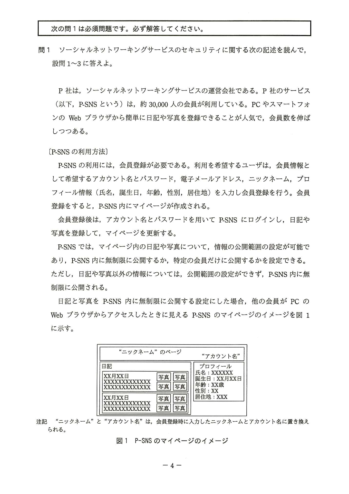

テキスト (OCR)

次の問 1 は必須問題です。必ず解答してください。

fll ソーシャルネットワーキングサービスのセキュリティに関する次の記述を読んで,

注記

設問 1ー3 に答えよ。

P 社は, ソーシャルネットワーキングサービスの運営会社である。P 社のサービス
(以下, PSNS という) は, 約 30.000 人の会員が利用している。PC やスマートフォ
ンの Web ブラウザから簡単に日記や写真を登録できることが人気で, 会員数を伸ば
しつつある。

(P-SNS の利用方法〕

P-SNS の利用には, 会員登録が必要である。利用を希望するユーザは, 会員情報と
して希望するアカウント名とパスワード, 電子メールアドレス, ニックネーム, プロ
フィール情報 (氏名, 誕生日, 年齢, 性別居住地) を入力し会員登録を行う。会員
登録をすると, P-SNS 内にマイページが作成される。

会員登録後は。 アカウント名とパスワードを用いて PSNS にログインし, 日記や
写真を登録して, マイページを更新する。

P_SNS では, マイページ内の日記や写真について, 情報の公開範囲の設定が可能で
HU, P-SNS 内に無制限に公開するか, 特定の会員だけに公開するかを設定できる。
ただし, 日記や写真以外の情報については, 公開範囲の設定ができず, PFSNS 内に無
制限に公開される。

日記と写真を PSNS 内に無制限に公開する設定にした場合, 他の会員が PC の
Web ブラウザからアクセスしたときに見える PSNS のマイページのイメージを図 1
に示す。

SILER” DRE   "アカウント名"
日記              ge ee
XXXXXX
XXAXXA           誕生日 : XX月XX日
XXXXXXXXXXXXX        年齢・ XX
MERI : XX
XX月XX日           居住地 : XXX
XXXXXXXXXXXXX
XXXXXXXXXXXXX

"ニックネーム"” と“アカウント名"” は, 会員登録時に入力したニックネームとアカウント名に置き換え
られる。

図1 P-SNS のマイページのイメージ

ー4一

### ページ 5

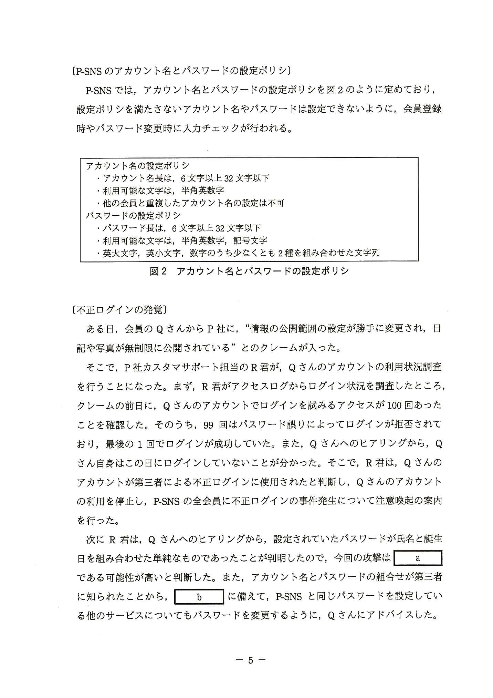

テキスト (OCR)

〔P-SNS のアカウント名とパスワードの設定ポリシ]

P-SNS では, アカウント名とパスワードの設定ポリシを図 2 のように定めており
設定ポリシを満たさないアカウント名やパスワードは設定できないように, 会員登録
時やパスワード変更時に入力チェックが行われる。

アカウント名の設定ポリシ
・アカウント名長は, 6文字以上 32 文字以下
・利用可能な文字は, 半角英数字
・他の会員と重複したアカウント名の設定は不可
パスワードの設定ポリシ
・パスワード長は, 6 文字以上 32 文字以下
・利用可能な文字は, 半角英数字, 記号文字
・英大文字, 英小文字, 数字のうち少なくとも 2 種を組み合わせた文字列

図2 アカウント名とパスワードの設定ポリシ

〔不正ログインの発覚

ある日, 会員の Q さんから了 社に, “情報の公開範囲の設定が勝手に変更され, 日
記や写真が無制限に公開されている” とのクレームが入った。

そこで, P 社カスタマサポート担当の R 君が, Q さんのアカウントの利用状況調査
を行うことになった。 まず, R 君がアクセスログからログイン状況を調査したところ,
クレームの前日に, Q さんのアカウントでログインを試みるアクセスが100 回あった
ことを確認した。そのうち, 99 回はパスワード誤りによってログインが拒否されて
BU, 最後の 1 回でログインが成功していた。また, Q さんへのヒアリングから, Q
さん自身はこの日にログインしていないことが分かった。そこで, R 君は, Q さんの
アカウントが第三者による不正ログインに使用されたと判断し, Q さんのアカウント
の利用を停止し, P-SNS の全会員に不正ログインの事件発生について注意喚起の案内
を行った。

次に R 君は, Q さんへのヒアリングから, 設定されていたパスワードが氏名と誕生
日を組み合わせた単純なものであったことが判明したので, 今回の攻撃は| sa |
である可能性が高いと判断した。また, アカウント名とパスワードの組合せが第三者
に知られたことから, |  b | に備えて, PSNS と同じパスワードを設定してい
る他のサービスについてもパスワードを変更するように, Q さんにアドバイスした。

### ページ 6

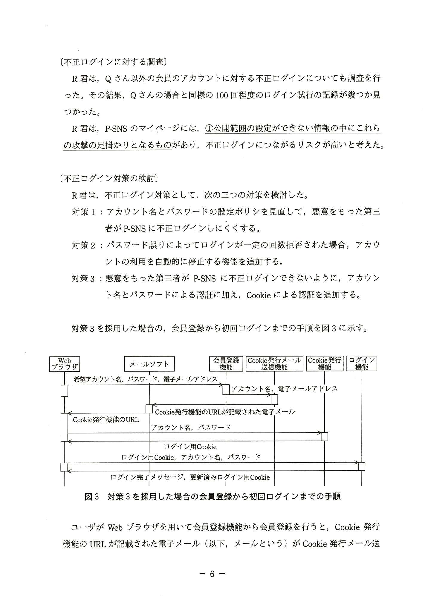

テキスト (OCR)

【不正ログインに対する調査

R 君は, Q さん以外の会員のアカウントに対する不正ログインについても調査を行
った。その結果, Q さんの場合と同様の 100 回程度のログイン試行の記録が幾つか見
つかった。

R 君は, PSNS のマイページには, ぐ①公開範囲の設定ができない情報の中にこれら
の攻撃の足掛かりとなるものがあり, 不正ログインにつながるリスクが高いと考えた。

(不正ログイン対策の検討

R 君は, 不正ログイン対策として, 次の三つの対策を検討した。

対策 1 : アカウント名とパスワードの設定ポリシを見直して, 悪意をもった第三
者が P.SNS に不正ログインしにくくする。

対策 2 : パスワード誤りによってログインが一定の回数揚否された場合, アカウ
ントの利用を自動的に停止する機能を追加する。

対策 3 : 悪意をもった第三者が P-SNS に不正ログインできないように, アカウン
ト名とパスワードによる誤証に加え, Cookie による認証を追加する。

対策 3 を採用した場合の, 会員登録から初回ログインまでの手順を図 3 に示す。

Web                     5                会員登録 | [Cookie発行メール| [Cookie発行|| ログイン
プラウザ                      メールソフト                   "BEE            Pata             機能          機能

| AMT HOY ME, パスワード, 電子メールアドレス、|

1                            °  paov nel meen J

ir Cookie i-DURL# EAR れた電子メール

Cookie発行機能のURL
アカウント名, パスワード

ログイン用Cookie
ログイン用Cookie,。 アカウント名, パスワード

LI              |             |                     TT]
ログイ ン先了メ ッセージ, 更新済みロダイ ン用Cookie

図3 対策3を採用した場合の会員登録から初回ログインまでの手順

ユーザが Web ブラウザを用いて会員登録機能から会員登録を行うと, Cookie 発行
機能の URL が記載された電子メール (以下, メールという) が Cookie 発行メール送

ー6 一

### ページ 7

テキスト (OCR)

信機能から送信される。ユーザは, メールソフトを用いてメールを受信し, メール内
に記載された URL から Cookie 発行機能に Web ブラウザを用いてアクセスする。コユ
ーザがアカウント名とパスワードを入力し認証が完了すると, ログイン用 Cookie が
発行される。Cookie 発行機能の URL は, 登録した会員一人一人にメールを送信する
都度, 異なるものが発行され, メールの送信から 1 時間だけ有効である。また, 発
行されたログイン用 Cookie の有効期間は半年間とし, ログインするたびに有効期間
がその日から半年間に更新される。

BBM PSNS にログインするときには, 会員が入力するアカウント名とパスワー
ドとともにログイン用 Cookie がログイン機能へ送信される。ログイン機能では, 送
信されたログイン用 Cookie がその会員に発行されたログイン用 Cookie と異なる場合
にはアクセスを拒否する。

会員が利用端末を変更したい場合や Cookie の有効期間が過ぎた場合には, Cookie
発行メール送信機能に対して, Cookie 発行機能の URL が記載されたメールの送信を
要求する。 その後, 会員登録時と同様にログイン用 Cookie を入手する。

なお, P-SNS の通信は暗号化し, 悪意をもった第三者が盗聴しても必要な情報を入
手できないようにする。

その後 R Blk, アカウントへの不正ログインの足掛かりとなった情報を全会員の
マイページから削除するとともに, Cookie による認証機能の導入を行った。

設問1 本文中の| a |,|  b | に入れる適切な字句を解答群の中から選
UO, 記号で答えよ。
a に関する解答群
ア DoS 攻撃            イ サイドチャネル攻撃
ウ 標的型攻撃          エ 類推攻撃
b に関する解答群
ア ゼロディイ攻撃         4 総当たり攻撃
ウ パスワードリスト攻撃     エエ フィッシング攻撃

設問2 本文中の下線のについて, 攻撃の足掛かりとなる情報とは何か。プロフィール
情報とニックネームを除く情報の中から, 10 字以内で答えよ。

### ページ 8

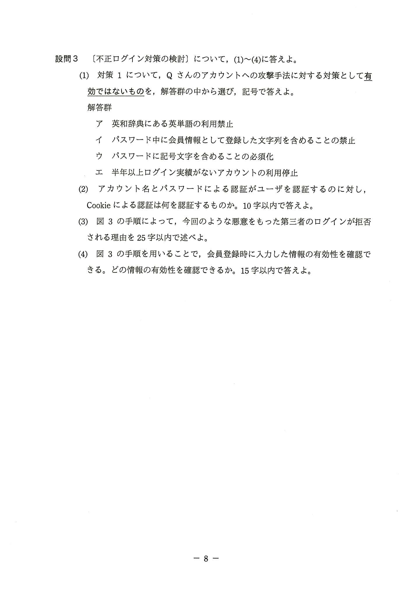

テキスト (OCR)

設問3 不正ログイン対策の検討について, (①~て(④)に答えよ。
①) 対策 1 について, Q さんのアカウントへの攻撃手法に対する対策として有
効ではないものを, 解答群の中から選び, 記号で答えよ。
解答群
ア 英和辞典にある英単語の利用禁止
イ パスワード中に会員情報として登録した文字列を含めることの禁止
ウ パスワードに記号文字を含めることの必須化
エエ 半年以上ログイン実績がないアカウントの利用停止
2) アカウント名とパスワードによる認証がユーザを認証するのに対し,
Cookie による認証は何を認証するものか。 10 字以内で答えよ。
3) 図 3 の手順によって, 今回のような悪意をもった第三者のログインが拒否
される理由を 25 字以内で述べよ。
(4) 図 3 の手順を用いることで, 会員登録時に入力した情報の有効性を確認で
きる。 どの情報の有効性を確認できるか。15 字以内で答えよ。

### ページ 9

テキスト (OCR)

a |

[ + モ 用 紙 J

### ページ 10

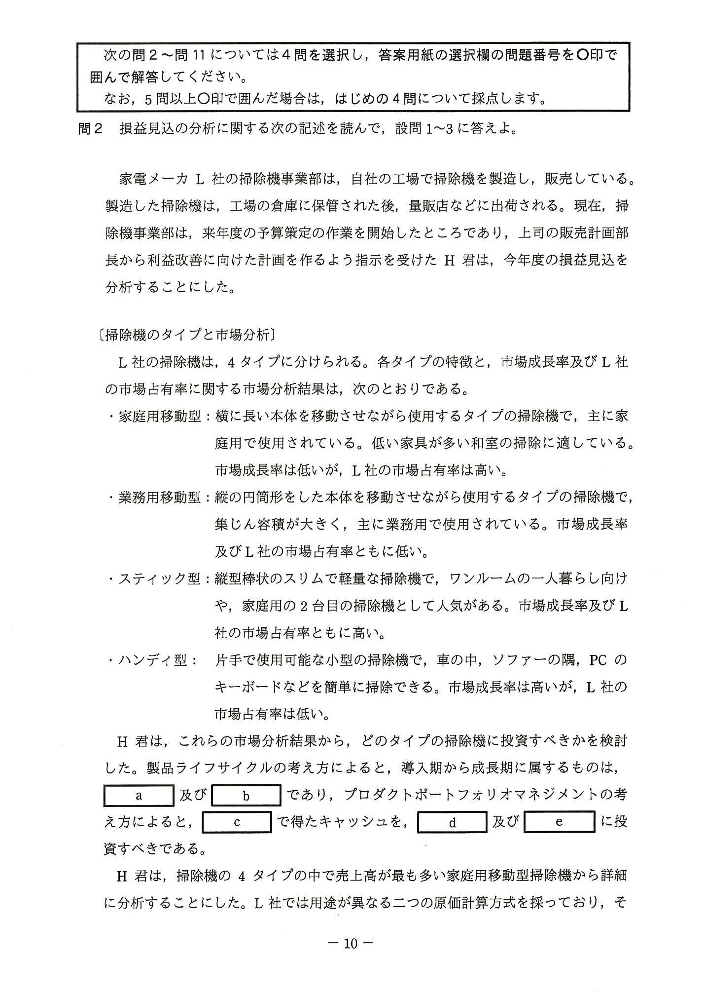

テキスト (OCR)

次の問2 て問 11 については4 問を選択し, 答案用紙の選択欄の問題番号を〇印で
囲んで解答してください。
なお, 5 問以上〇印で囲んだ場合は, はじめの 4 問について採点します。

問2 損益見込の分析に関する次の記述を読んで, 設問 1ごこ3 に答えよ。

家電メーカ L 社の掃除機事業部は, 自社の工場で掃除機を製造し, 販売している。
製造した掃除機は, 工場の倉庫に保管された後, 量販店などに出荷される。現在, 掃
除機事業部は, 来年度の予算策定の作業を開始したところであり, 上司の販売計画部
長から利益改善に向けた計画を作るよう指示を受けた H Ald, 今年度の損益見込を
分析することにした。

(掃除機のタイプと市場分析]
L 社の掃除機は, 4 タイプに分けられる。各タイプの特徴と, 市場成長率及びL tt
の市場占有率に関する市場分析結果は, 次のとおりである。
・家庭用移動型 : 横に長い本体を移動させながら使用するタイプの掃除機で, 主に家
庭用で使用されている。 低い家具が多い和室の掃除に適している。
市場成長率は低いが, L 社の市場占有率は高い。

・業務用移動型 : 縦の円筒形をした本体を移動させながら使用するタイプの掃除機で,
集じん容積が大きく, 主に業務用で使用されている。 市場成長率
BRO L 社の市場占有率ともに低い。

・スティック玲 : 縦型棒状のスリムで軽量な掃除機ぜ、 ワンルームの一人暮らし向け
や, 家庭用の 2 台目の掃除機として人気がある。 市場成長率及び葉
社の市場占有率ともに高い。

・ハンディ型: 片手で使用可能な小型の掃除機で, HOH, ソファーの隅, PC の
キーボードなどを簡単に掃除できる。市場成長率は高いが, L 社の
市場占有率は低い。

H 君は.。 これらの市場分析結果から, どのタイプの掃除機に投資すべきかを検討
した。 製品ライフサイクルの考え方によると, 導入期から成長期に属するものは,
|  』 |及び|  b | であり, プロダクトポートフォリオマネジメントの考
え方によると, |  c | で得たキャッシュを,| d |及び| e |e
資すべきである。

H 君は, 掃除機の 4 タイプの中で売上高が最も多い家庭用移動型掃除機から詳細
に分析することにした。L 社では用途が異なる二つの原価計算方式を採っており, そ

ー 10 一

### ページ 11

テキスト (OCR)

れぞれで損益分析を行うことにした。

【〔原価計算方式
AX 1 : 製品の製造に関する費用は全て製品原価に含め, それ以外の費用は発生し
た時点で費用として認識する方式であり, 財務諸表を作成する際に使用
している。
AAW : 製品の製造に関する費用の中で変動費だけを製品原価に含め, 固定費につ
いては他の費用と同様に発生した時点で費用として誰識する方式であり,
損益分析や投資判断を行う際に使用している。

HAL, GALLYK, 予算策定の際に次年度の標準的な製品原価単価を決定し,
1 年間その原価単価で原価を計算する。この標準原価単価を基に計算した原価と実際
に掛かった原価との差額は工場の損益となり, 事業部の損益にはならない。

〔家庭用移動型掃除機の損益見込とその分析]

L 社の家庭用移動型掃除機には, A~D の 4 種類のモデルがある。H 君は, 営業部
から上半期の販売実績と下半期の販売見込を入手し, 方式1によって家庭用移動型掃
除機の今年度のモデル別の損益見込を計算した。その結果は, 表 1 のとおりである。

Kl 家庭用移動型掃除機のモデル別損益見込

au: ORI
ERR          FEW          年間見込

CI | oe bi a ae aie 売上高 a 販管 ail He LG に amen be

A              25         10           7          8         25         10         11           4         50         20         18         12

B            8        6        1        1       12        9        1        2       20       15        2        3

C           15        9        3       3       25       15        5        5      40      24       8       8

D               15         12          4      Al         15         12          5      A2         30         24          9      A3

合計            63         37         15         11         ae         46         22          9       140         83         37         20

注記 販管費 : 販売費及び一般管理費

下半期に景気が回復してきたので, 上半期実績よりも下半期見込の方が売上高合計
は多いが, 営業利益の合計は逆に下がっている。 上半期と下半期の販売単価に変動は

ー 11 一

### ページ 12

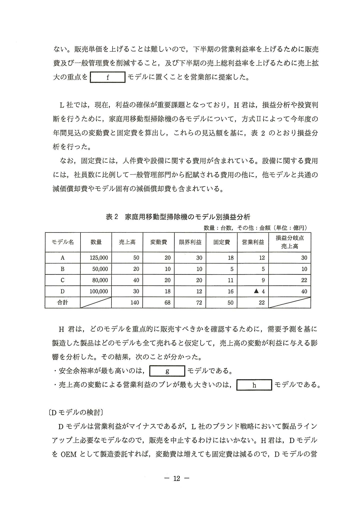

テキスト (OCR)

ない。 販売単価を上げることは上難しいので, 下半期の営業利益率を上げるために販売
費及び一般管理費を削減すること, 及び下半期の売上総利益率を上上げるために売上拡

大の重点を モデルに置くことを営業部に提案した。

L 社では, 現在, 利益の確保が重要課題となかっており, HA, 損益分析や投資判
断を行うために, 家庭用移動型掃除機の各モデルについて, 方式Hによって今年度の
年間見込の変動費と固定費を算出し, これらの見込額を基に, 表 2 のとおり損益分
析を行った。

なお, 固定費には, 人件費や設備に関する費用が含まれている。設備に関する費用
には, 社員数に比例して一般管理部門から配賊される費用の他に, 他モデルと共通の
減価償却費やモデル固有の減価償却費も含まれている。

表2 家庭用移動型掃除機のモデル別損益分析
数量 : 台数。 その他 : 金額(単位 : HD)

モデル名          数量          売上高         変動費 | 限界利益 | 固定費 | 営業利益       ーー
A                     125,000                     50                     20                     30                     18                     12                             30
B                       50,000                     20                     10                     10                       5                       5                              10
C                80,000               40               20               20               11                9                     22
D               100,000               30               18               12               16            A4                     40
合計                                    140               68               72               50               22

H Blk, どのモデルを重点的に販売すべきかを確認するために, REPS BI
製造した製品はどのモデルも全て売れると仮定して, 売上高の変動が利益に与える財
響を分析した。その結果, 次のことが分かった。

・ 安全余裕率が最も高いのは, | g | モデルである。

・売上高の変動による営業利益のブレが最も大きいのは, | h | モデルである。

〔D モデルの検討〕

D モデルは営業利益がマイナスであるが, L 社のブランド戦略において製品ライン
アップ上必要なモデルなので, 販売を中止するわけにはいかない。H 君は, D モデル
を OEM として製造委託すれば, 変動費は増えても固定費は減るので, D モデルの営

ー 12 一

### ページ 13

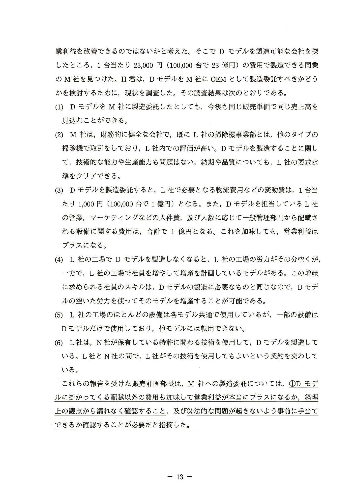

テキスト (OCR)

業利益を改善できるのではないかと考えた。そこで D モデルを製造可能な会社を探
したところ, 1 台当たり 23,000 A (100,000 AC 23 億円) の費用で製造できる同業
の M 社を見つけた。H 君は, D モデルを M 社に OEM として製造委託すべきかどう
かを検討するために, 現状を調査した。その調査結果は次のとおりである。

(1) D モデルを M 社に製造委託したとしても, 今後も同じ販売単価で同じ売上高を
見込むことができる。

(2) M 社は, 財務的に健全な会社で, 既に L 社の掃除機事業部とは, 他のタイプの
掃除機で取引をしており, L 社内での評価が高い。D モデルを製造することに関し
て, 技術的な能力や生産能力も問題はない。納期や品質についても, L 社の要求水
準をクリアできる。

3) D モデルを製造委託すると, L 社で必要となる物流費用などの変動費は, 1 台当
たり 1,000 円 (100,000 台で 1 億円) となる。また, D モデルを担当している{ 社
の営業, マーケティングなどの人件費, 及び人数に応じて一般管理部門から配賊さ
れる設備に関する費用は, 合計で 1 億円となる。これを加味しても, 営業利益は
プラスになる。

(4) L 社の工場で D モデルを製造しなくなると, L 社の工場の労力がその分空くが,
一方で, L 社の工場で社員を増やして増産を計画しているモデルがある。この増産
に求められる社員のスキルは, D モデルの製造に必要なものと同じなので, DEF
ルの空いた労力を使ってそのモデルを増産することが可能である。

(5) L 社の工場のほとんどの設備は各モデル共通で使用しているが, 一部の設備は
D モデルだけで使用しており, 他モデルには転用できない。

() L 社は, N 社が保有している特許に関わる技術を使用して, D モデルを製造して
いる。 LHENHOMT, L 社がその技術を使用してもよいという契約を交わして
いる。
これらの報告を受けた販売計画部長は, M 社への製造委託については, OD モデ

ルに掛かってくる配虹以外の費用も加味して営業利益が本当にプラスになるか, 経理

上の観点から漏れなく確認すること, 及び②法的な問題が起きないよう事前に手当て

できるか確認することが必要だと指摘した。

ー 13 一

### ページ 14

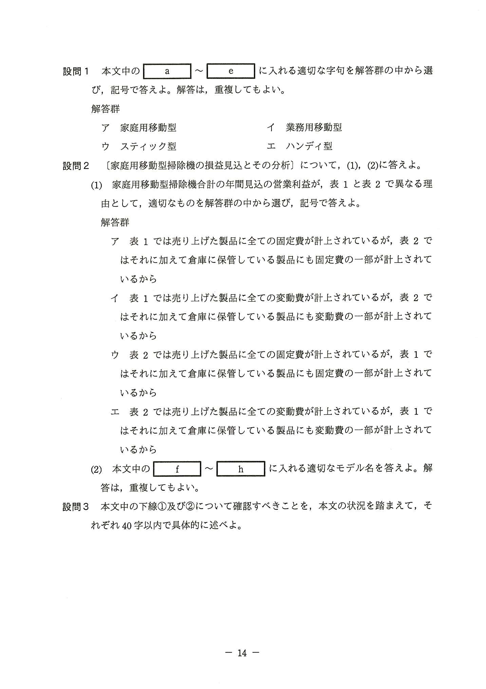

テキスト (OCR)

設問1 本文中の| a |~| ec |に入れる適切な字句を解答君の中から選
び, 記号で答えよ。解答は, 重複してもよい。

解答群
ア 家庭用移動型                      イ 業務用移動型
ウ スティック型               エエ ハンディ型

設問2 家庭用移動型掃除機の損益見込とその分析】について, (①⑪, ②に答えよ。
(1) 家庭用移動型掃除機合計の年間見込の営業利益が, 表 1 と表 2 で異なる理
由として, 適切なものを解答群の中から選び, 記号で答えよ。
解答群
ア Hl では売り上げた製品に全ての固定費が計上されているが, 表 2 で
はそれに加えて倉庫に保管している製品にも固定費の一部が計上されて
いるから
4 表 1 では売り上げた製品に全ての変動費が計上されているが, 表 2 で
はそれに加えて倉庫に保管している製品にも変動費の一部が計上されて
いるから
ウ 表 2 では売り上げた製品に全ての固定費が計上されているが, 表 1 で
はそれに加えて倉庫に保管している製品にも固定費の一部が計上されて
いるから
エ 表 2 では売り上げた製品に全ての変動費が計上されているが, 表 1 で
はそれに加えて倉庫に保管している製品にも変動費の一部が計上されて
いるから
Qa 本文中の| f |~|  h | に入れる適切なモデル名を答えよ。解
答は, 重複してもよい。
設問3 本文中の下線①及び②について確認すべきことを, 本文の状況を踏まえて, そ
れぞれ 40 字以内で具体的に述べよ。

ー 14 一

### ページ 15

テキスト (OCR)

〔

メ = 用 紙 )

ー [5+

### ページ 16

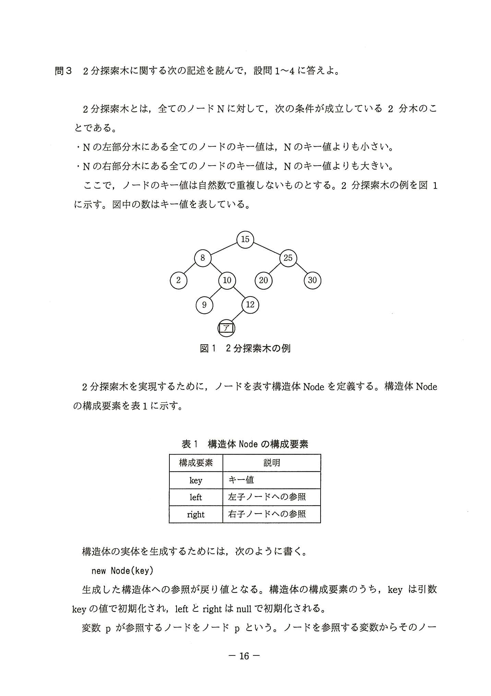

テキスト (OCR)

FAS 2分探索木に関する次の記述を読んで, 設問 1ー4 に答えよ。

2 分探索木とは, 全てのノード N に対して, 次の条件が成立している 2 分木のこ
とである。

・N の左部分木にある全てのノードのキー値は, N のキー値よりも小さい。

・N の右部分木にある全てのノードのキー値は, N のキー値よりも大きい。

ここで, ノードのキー値は自然数で重複しないものとする。2 分探索木の例を図 1
に示す。図中の数はキー値を表している。

図1 2分探索木の例

2 分探索木を実現するために, ノードを表す構造体 Node を定義する。 構造体 Node
の構成要素を表 1 に示す。

表1 構造体 Node の構成要素
構成要素                   説明
key        キー値
left   左子ノードへの参照
right     右子ノードへの参照

構造体の実体を生成するためには, 次のように書く。
new Node(key)
生成した構造体への参照が戻り値となる。 構造体の構成要素のうち, key は引数
key の値で初期化され, left と right は null で初期化される。
変数 p が参照するノードをノード p という。ノードを参照する変数からそのノー

ー 16 一

### ページ 17

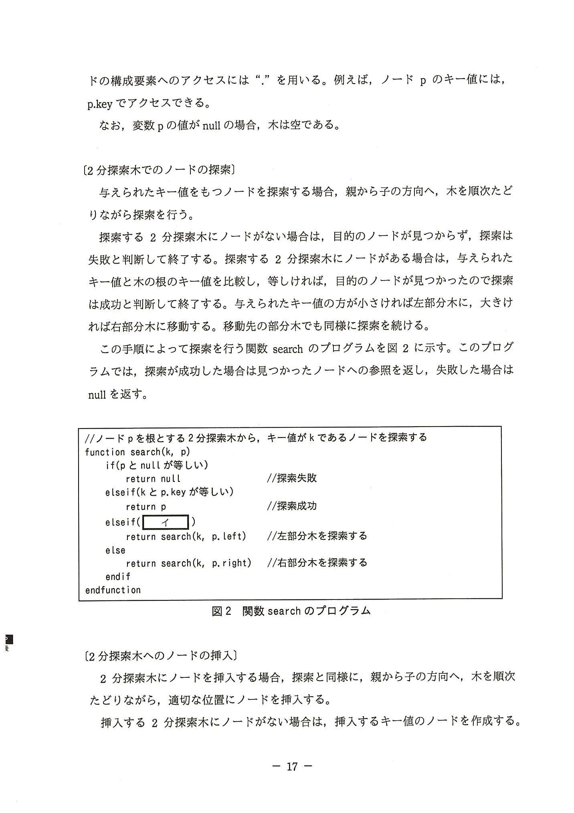

テキスト (OCR)

a |

ドの構成要素へのアクセスには “.”を用いる。例えば, ノード p のキー値には,
pkey でアクセスできる。
なお, 変数 p の値がnull の場合, 木は空である。

[2 分探索木でのノードの探索]

与えられたキー値をもつノードを探索する場合, 親から子の方向へ, 木を順次たど
りながら探索を行う。

探索する 2 分探索木にノードがない場合は, 目的のノードが見つからず, 探索は
失敗と判断して終了する。探索する 2 分探索本にノードがある場合は, 与えられた
キー値と木の根のキー値を比較し, 等しければ, 目的のノードが見つかったので探索
は成功と判断して終了する。与えられたキー値の方が小さければ左部分木に, 大きけ
れば右部分木に移動する。移動先の部分木でも同様に探索を続ける。

この手順によって探索を行う関数 search のプログラムを図 2 に示す。このプログ
ラムでは, 探索が成功した場合は見つかったノードへの参照を返し, 失敗した場合は
null を返す。

//ノード p を根とする 2 分探索木から, キー値がkであるノードを探索する
function search(k, p)
if(p とnullが等しい)

return null              //探索失敗
elseif(k と p.key が等しい)

return p                //探索成功
elseif([ ィ ])

return search(k, p. left)   //左部分木を探索する
else
return search(k, p.right)  //右部分木を探索する
endif
endfunction

図2 関数 search のプログラム

[2 分探索木へのノードの挿入〕

2 分探索木にノードを挿入する場合, 探索と同様に, 親から子の方向へ, 木を順次
たどりながら, 適切な位置にノードを挿入する。

挿入する 2 分探索木にノードがない場合は, 挿入するキー値のノードを作成する。

ー 17 一

### ページ 18

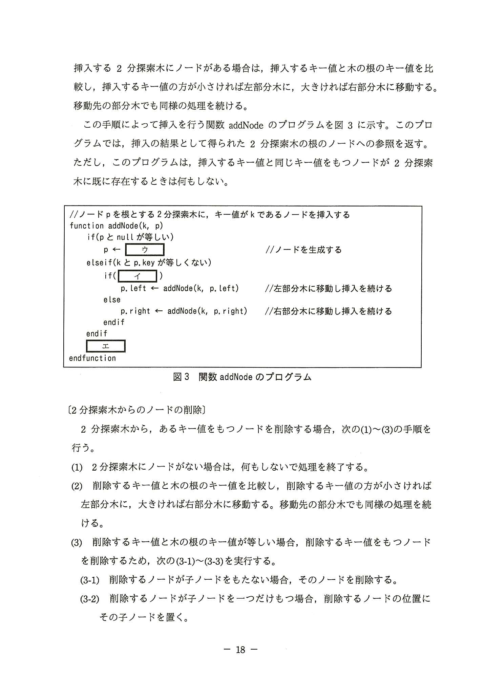

テキスト (OCR)

挿入する 2 分探索木にノードがある場合は, 挿入するキー値と木の根のキー値を比
較し, 挿入するキー値の方が小さければ左部分木に, 大きければ右部分木に移動する。
移動先の部分木でも同様の処理を続ける。

この手順によって挿入を行う関数 addNode のプログラムを図 3 に示す。このプロ
グラムでは, 挿入の結果として得られた 2 分探索木の根のノードへの参照を返す。
ただし, このプログラムは, 挿入するキー値と同じキー値をもつノードが 2 分探索
木に既に存在するときは何もしない。

//ノードpを根とする 2 分探索木に, キー値がk であるノードを挿入する
function addNode(k, p)
if(p & null が等しい)
pcと| ゥ |              //ノードを生成する
elseif(k と p.key が等しくない)
(して)
p. left < addNode(k, p, left)   //左部分木に移動し挿入を続ける
else
p.right < addNode(k, p.right)  //右部分木に移動し挿入を続ける
endif
endif

endfunction

図3 関数 addNode のプログラム

(2 分探索木からのノードの削除】

2 分探索木から, あるキー値をもつノードを削除する場合, 次の(1)て(3)の手順を
行う。

Q) 2 分探索林にノードがない場合は, 何もしないで処理を終了する。

(2) 削除するキー値と木の根のキー値を比較し, 削除するキー値の方が小さければ
左部分木に, 大きければ右部分木に移動する。移動先の部分木でも同様の処理を続
ける。

(3) 削除するキー値と木の根のキー値が等しい場合, 削除するキー値をもつノード
を削除するため, 次の(3-1)て(3-3) を実行する。

(3-1) 削除するノードが子ノードをもたない場合, そのノードを削除する。
(3-2) 削除するノードが子ノードを一つだけもつ場合, 削除するノードの位置に
その子ノードを置く。

ー 18 一

### ページ 19

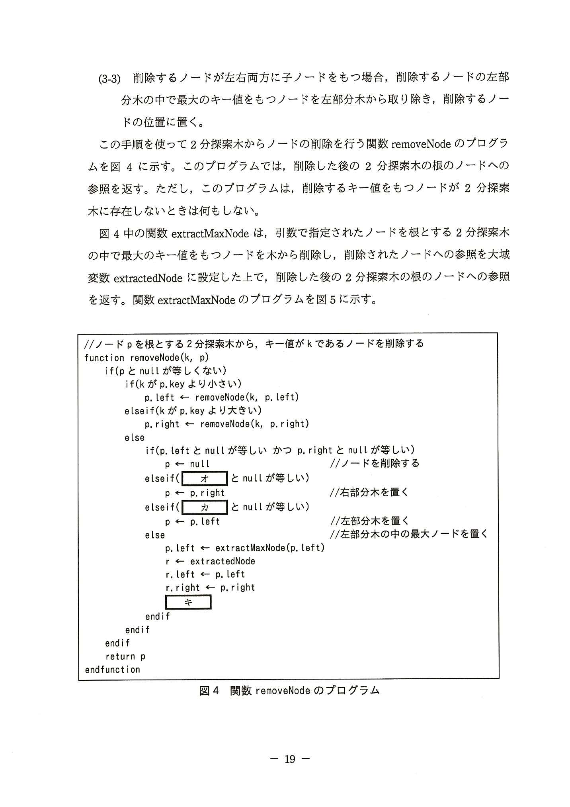

テキスト (OCR)

(3-3) 削除するノードが左右両方に子ノードをもつ場合, 削除するノードの左部
分木の中で最大のキー値をもつノードを左部分木から取り除き, 削除するノー
ドの位置に置く。

この手順を使って 2 分探索木からノードの削除を行う関数 removeNode のプログラ
ムを図 4 に示す。このプログラムでは, 削除した後の 2 分探索木の根のノードへの
参照を返す。ただし, このプログラムは, 削除するキー値をもつノードが 2 分探索
木に存在しないときは何もしない。

 4 中の関数 extractMaxNode は, 引数で指定されたノードを根とする 2 分探索木
の中で最大のキー値をもつノードを木から削除し, 削除されたノードへの参照を大域
変数 extractedNode に設定した上で, 削除した後の 2 分探索木の根のノードへの参照
を返す。関数 extractMaxNode のプログラムを図 5 に示す。

//ノード p を根とする 2 分探索木から, キー値がk であるノードを削除する
function removeNode(k, p)
if(p とnull が等しくない)
if(k がp.key より小さい)
p. left で removeNode(k, p. left)
elseif(k が p.key より大きい)
Pp.-right <— removeNode(k, p.right)
else
if(p. left & null が等しい AD p.right & null が等しい)
p で null                   //ノードを削除する
elseif([| オ | とnullが等しい)
p で p.right                  //右部分木を置く
elseif([ ヵ | と null が等しい)
p で p.left                  //左部分木を置く
else                                //左部分木の中の最大ノードを置く
p. left <- extractMaxNode(p. left)
r <— extractedNode
r, Left <— p. left
r,right を p. right
endif
endif
endif
return p
endfunction

図4 関数 removeNode のプログラム

ー 19 一

### ページ 20

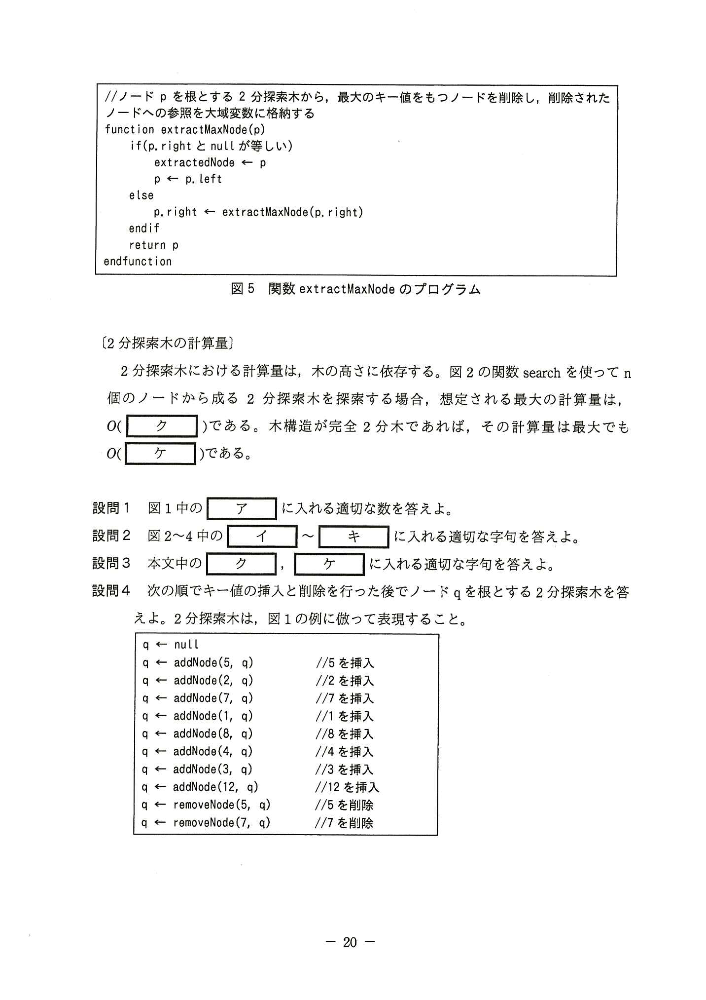

テキスト (OCR)

//ノード p を根とする 2 分探索木から, 最大のキー値をもつノードを削除し, 削除された
ノードへの参照を大域変数に格納する
function extractMaxNode(p)
if(p. right と null が等しい)
extractedNode を p
p< p. left
else
p. right < extractMaxNode(p, right)
endif
return p
endfunction

図5 関数extractMaxNode のプログラム

(2 分探索木の計算量)

2 分探索木における計算量は, 木の高さに依存する。図 2 の関数 search を使ってn
個のノードから成る 2 分探索木を探索する場合, 想定される最大の計算量は,
0(| ク | )である。木構造が完全 2 分木であれば, その計算量は最大でも

しテ yeas.
設問1 図+中の| ア |に入れる適切な数を答えよ。

設問2 図2て4中の| イ |~| キ |に入れる適切な字句を答えよ。

設問3 本文中の| ク |,| ヶケ |に入れる適切な字句を答えよ。

設問4 次の順でキー値の挿入と削除を行った後でノード qを根とする 2 分探索木を和
Ad, 分探索木は, 図 1 の例に條って表現すること。

qとnull

q ぐ addNode(5, q)        //5 を挿入
q < addNode(2, q)        //2 を挿入
q < addNode(7, q)        //7 を挿入
q ぐ addNode(1, q)        //1 を挿入
q ぐ addNode(8, q)        //8 を挿入
q ぐ addNode(4, q)        //4 を挿入
q < addNode(3, q)        //3 を挿入
q < addNode(12, q)       //12 を挿入
q と removeNode(5, q)     //5 を削除
q < removeNode(7, q)     //7 を削除

### ページ 21

テキスト (OCR)

C

メ モ 用 紙 )

ー 21 一

### ページ 22

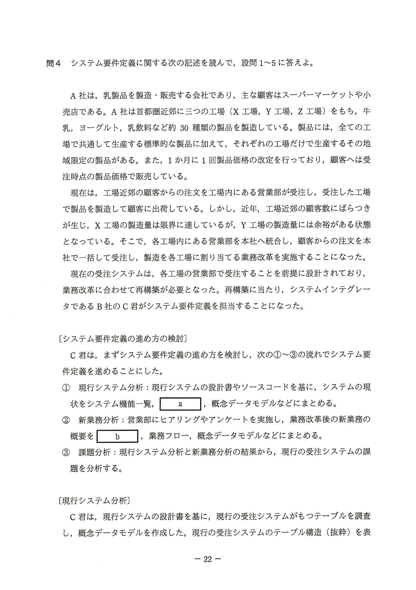

テキスト (OCR)

A4 システム要件定義に関する次の記述を読んで, 設問 1ー5 に答えよ。

A 社は, 乳製品を製造・販売する会社であり, 主な顧客はスーパーマーケットや小
売店である。A 社は首都圏近郊に三つの工場 (X LH, Y 工場,Z 工場) をもち, 和牛
乳, ヨーグルト, 乳飲料など約 30 種類の製品を製造している。製品には, 全ての工
場で共通して生産する標準的な製品に加えて, それぞれの工場だけで生産するその地
域限定の製品がある。 また, 1 か月に 1 回製品価格の改定を行っており, BRAS
注時点の製品価格で販売している。

現在は, 工場近郊の顧客からの注文を工場内にある営業部が受注し, 受注した工場
で製品を製造して顧客に出荷している。しかし, 近年, 工場近郊の顧客数にばらつき
が生じ, XX 工場の製造量は限界に達しているが, Y 工場の製造量には余裕がある状態
となっている。 そこで, 各工場内にある営業部を本社へ統合し, 顧客からの注文を本
社で一括して受注し, 製造を各工場に割り当てる業務改革を実施することになった。

現在の受注システムは, 各工場の営業部で受注することを前提に設計されており,
業務改革に合わせて再構築が必要となった。再構築に当たり, システムインテグレー
タである B 社のC 君がシステム有要件定義を担当することになった。

〔システム要件定義の進め方の検討
C 君は。 まずシステム要件定義の進め方を検討し, 次の①ー⑨の流れでシステム要

件定義を進めることにした。

① 現行システム分析 : 現行システムの設計書やソースコードを基に, システムの現
状をシステム機能一覧, | a | , 概念データモデルなどにまとめる。

OQ PDT : 営業部にヒアリングやアンケートを実施し, 業務改革後の新業務の
概要を| b | , 業務フロー, 概念データモデルなどにまとめる。

⑬ 課題分析 : 現行システム分析と新業務分析の結果から, 現行の受注システムの課
題を分析する。

(HIV AT ADH)
C 君は, 現行システムの設計書を基に, 現行の受注システムがもつテーブプルを調査
し, 概念データモデルを作成した。現行の受注システムのテーブル構造 (抜粋) を表

ー 22 一

### ページ 23

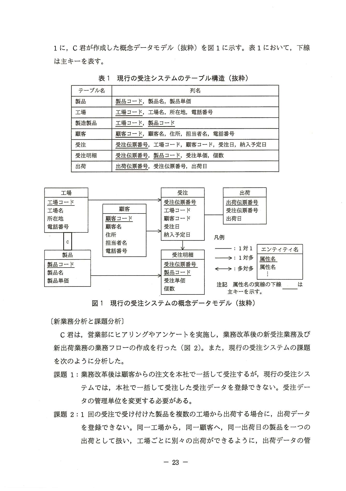

テキスト (OCR)

1 に, C 君が作成した概念データモデル (抜粋) を図 1 に示す。表 1 において, 下線
は主キーを表す。

表1 現行の受注システムのテーブル構造 (抜粋)

テーブル名                We
製品     製品コード, 製品名製品単価
Le     工場コード。 LHe, 所在地, 電話番呈
製造製品 | 工場コード,製品ユード
me     碑客コード, MES, 住所, BLES, MES
Be     22G0ES, LI, MSI—6, 228, WAPEE
Zine | 受注伝上番号製品ユード, 受注単価個数
出荷     HHGRES, SEGMSS, WE
ry                   Be         ait
工場コード                愛注人番号     LEME S
LBA          me      工場ユード      受注人番号
所在地        題客コード      琴客コード       出荷
電話番号       Wee        ma
住所        納入予定日
c       担当者名          i          1
電話番号         ー         Pla  エンティティ名
ーー                 yeaa       18S | mitts,
品コー                 受注人番号 |. gue | mS
wane                  製品ユード       eae
=
cilia                  a      注記 属性名の実線の下線 は
主キーを示す。
図1 現行の受注システムの概念データモデル GRE)
〔新業務分析と課題分析]

C 君は, 営業部にヒアリングやアンケートを実施し, 業務改革後の新受注業務及び
新出荷業務の業務フローの作成を行った (M2), また, 現行の受注システムの課題
を次のように分析した。
課題 1 : 業務改革後は顧客からの注文を本社で一括して受注するが, 現行の受注シス
テムでは, 本社で一括して受注した受注データを登録できない。受注デー
タの管理単位を変更する必要がある。

題 2 : 1 回の受注で受け付けた製品を複数の工場から出荷する場合に, 出荷データ
を登録できない。同一工場から, 同一顧客へ, 同一出荷日の製品を一つの
出荷として扱い, 工場ごとに別々の出荷ができるように, 出荷データの管

5

ー 23 一

### ページ 24

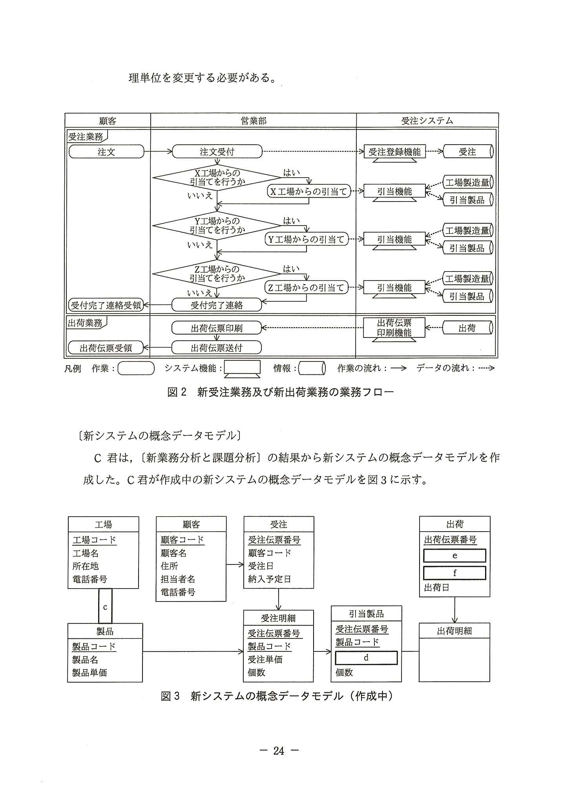

テキスト (OCR)

理単位を変更する必要がある。

We             営業              受注システム
受注業務
ES ED bee 持六朋付 フリーー受注登録機能(受注 (
X工場からの
ーー                 od(oganem)
wok      (工場からの引当て2 引当機能 民. cael
ロロ
Y工場からの
           ー (0
>      (Yエエ場からの引当て)-半 引当機能 民
いいえ                        引当製品 (
Z工場からの
ーー                。(工場製造量(
er;    Crm, oaHe)-p| 引当機能
(用付完了連絡受領ーー(、 受付完了連絡 が                        =
paises)     i NED        ante ド(時 0
(出荷伝票受領 ーー( 出荷伝票送付 )

nal 作業:( ) システム機能:| | 情報:(  () 作業の流れ:一> データの流れ:…>
図2 新受注業務及び新出荷業務の業務フロー

〔新システムの

概念データモデル〕

C Ald, 【新業務分析と課題分析〕 の結果から新システムの概念データモデルを作
成した。C 君が作成中の新システムの概念データモデルを図 3 に示す。

工場        Wee        aE
工場コード     We a—     HERES
LHe       WEL,       mea—k
所在地      住所     | 8
電話番号      担当者名      納入予定日

電話番号

-                 3      a SO

Si               ZERRES    aE ie
製品コード              製品コード     製品コード | |
製品名                 受注単価      [a
製品単価                個数        個数

出荷

出荷伝票番号

出荷明細

図3 新システムの概念データモデル (作成中)

### ページ 25

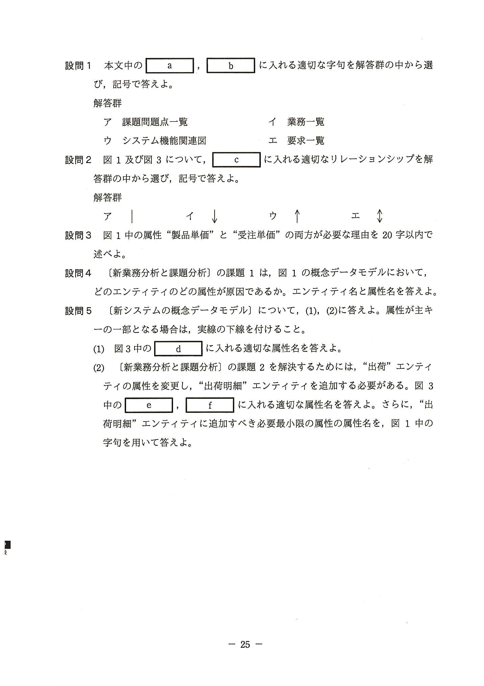

テキスト (OCR)

設問1 本文中の| a |,| b | に入れる適切な字句を解答群の中から選
び, 記号で答えよ。

解答群
ア 課題問題点一覧                              イ 業務一覧
ウ システム機能関連図           エエ 要求一覧

設問2 図 1 及び図 3 について, |  c | に入れる適切なりリレーションシップを解
答群の中から選び, 記号で答えよ。

解答
7 | ィ 4 ゥ 1 = ¢
設問3 図 1 中の履性 "製品単価" と “SEM” の両方が必要な理由を 20 FIAT
述べよ。

設問4 〔新業務分析と課題分析〕 の課題 1 は, 図 1 の概念データモデルにおいて,
どのエンティティのどの属性が原因であるか。エンティティ名と属性名を答えよ。
設問5 【〔新システムの概念データモデル〕] について, ①, ②⑫)に答えよ。必性が主キ
ーの一部となる場合は, 実線の下線を付けること。
@ 図3中の| a | に入れる適切な属性名を答えよ。
QQ) 【新業務分析と課題分析〕 の課題 2 を解決するためには, “出荷" エンティ
ティの属性を変更し, “出荷明細” エンティティを追加する必要がある。図 3

中の|  e |,|  f |に入れる適切な属性名を答えよ。さらに, “H
荷明細′ エンティティに追加すべき必要最小限の属性の属性名を, 図 1 中の
字句を用いて答えよ。

ー 25 一

### ページ 26

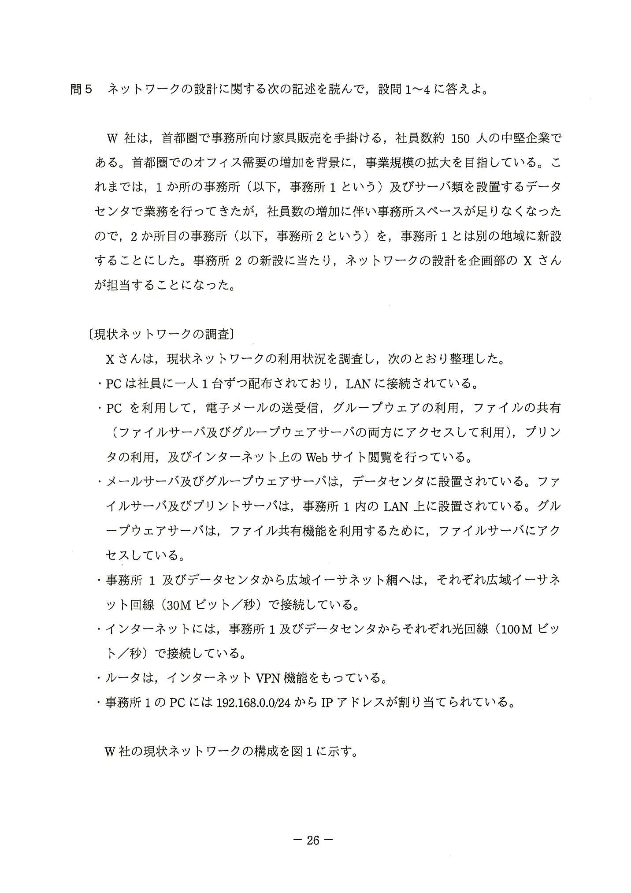

テキスト (OCR)

FAIS ネットワークの設計に関する次の記述を読んで, 設問 1ー4 に答えよ。

W 社は, 首都圏で事務所向け家具販売を手掛ける, 社員数約 150 人の中堅企業で
ある。 首都圏でのオフィス般要の増加を背景に, 事業規模の拡大を目指している。こ
れまでは, 1 か所の事務所 (以下, 事務所 1 という) 及びサーバ類を設置するデータ
センタで業務を行ってきたが, 社員数の増加に伴い事務所スペースが足りなくなった
OC, 2 か所目の事務所 (以下, 事務所 2 という) を, 事務所 1 とは別の地域に新設
することにした。事務所 2 の新設に当たり, ネットワークの設計を企画部の X さん
が担当することになった。

〔現状ネットワークの調査

Xさんは, 現状ネットワークの利用状況を調査し, 次のとおり整理した。

・PC は社員に一人 1 台ずつ配布されており, LAN に接続されている。

・PC を利用して, 電子メールの送受信, グループウェアの利用, ファイルの共有
(ファイルサーバ及びグループウェアサーバの両方にアクセスして利用), プリン
タの利用, 及びインターネット上の Web サイト閲覧を行っている。

・メールサーバ及びグループウェアサーバは, データセンタに設置されている。ファ
イルサーバ及びプリントサーバは, 事務所 1 内の LAN 上に設置されている。グル
ープウェアサーバは, ファイル共有機能を利用するために, ファイルサーバにアク
セスしている。

・事務所 1 及びデータセンタから広域イーサネット網へは, それぞれ広域イーサネ
ット回線 (30M ビットノ秒) で接続している。

・インターネットには, 事務所 1 及びデータセンタからそれぞれ光回線 (100M ビッ
トノ秒) で接続している。

・ルータは, インターネット VPN 機能をもっている。

・ 事務所 1 の PC には 192.168.0.0/24 から IP アドレスが割り当てられている。

W 社の現状ネットワークの構成を図 1 に示す。

ー 26 一

### ページ 27

テキスト (OCR)

事務所1
ファイルサーバ
192.168.1.11
]
プリンタ | Lesw                                                                       L2SW
192.168.1.13| | 192.168.1.2                                                                     192.168.2.2
|            I
プリントサーバ|| L2SW                                 メールサーバ||グループウェア
192.168.1.12 | 192.168.0.2                                                192.168.2.12 ia as A
pc |…| PC                                                                      ーー
192.168.0.0724                                            L2SW : レイヤ2スイッチ

注記1 ルータの1IP アドレスは省略している。
注記 2 L2SW には, 管理用に各ネットワークセグメントで xx.x.2 の IP アドレスを設定している。

図1 W社の現状ネットワークの構成

〔新たなネットワークの設計方針]
X SAIL, 新たなネットワークを次の方針で設計することにした。

・データセンタ及び事務所 1 に設置されている機器の設置場所と IP アドレスは, 現
状のまま変更しない。

・事務所 1 とデータセンタの広域イーサネット回線, 広域イーサネット綱及び光回
線は, 現状のまま変更しない。

・事務所 2 に設置するルータは, インターネット VPN 機能をもつものとする。

・事務所 2 からは, 30M ビットノ秒の広域イーサネット回線で, 現在も使用してい
る広域イーサネット網に接続し, 事務所 1 及びデータセンタと通信可能とする。

・事務所 2 からは, 光回線 (100M ビットノ秒) でインターネットに接続する。

・事務所 2 にプリンタ及びプリントサーバを設置し, 各事務所では自事務所内のプ
リンタを用いて印刷を行う。

・事務所 2 には最大で 300 人程度まで収容可能な執務スペースがあるので, PC を
300 台設置できるように, PC には 192.168.12.0/23 から IP アドレスを割り当てる。

・業務効率向上のために, 事務所 1 と事務所 2 の間でテレビ会議を利用する。テレ
ビ会議は, 両事務所の PC からグループウェアサーバに TP 接続しし グループウェ
アのテレビ会議機能を用いて行う。PC 間の直接通信は行わかい。テレビ会議を行
う場合, 遅延なく良好なレスポンスを確保する必要がある。また, 画像の乱れを発
生させないために, 1 台の PC 当たり 5M ビットノ秒の帯域が必要である。 同時利
用は両事務所で 1 台ずつを想定する。

ー 27 一

### ページ 28

テキスト (OCR)

これらの方針に基づく W 社の新たなネットワーク構成を図 2 に示す。

,
事務所2       L2SW | |プリントサーバ]|! [ルータA) (ルータC] !
     192.168.11.12 ||! ①1g2.168.0.1 @192.168.12.1 !

         1②192.168.1.1 ©192.168.11.1 }

199 gf 2c]       ee) シタ Ii⑨19216841 ⑩192.16843 |
®\ \®    168.11.13] | @p7 RY Aa OPT RVAY!

Lec |…LPc ]                          [ルータB)                !
192.168.12.0/23                                                   | ©192.168.2.1                            1

| ©192.168.4.2                        1

1のIPアドレス6

事務所1
ファイルサーバ
192.168.1.11
プリンタ        L2SW            ウ      ③                                                             L2SW
ン
192.168.1.13 | 192.168.1.2   のツータ4)                                                                          192.168.2.2
|                                                                              -          I
プリントサーバ| L2SW                    スールザがーバ| グループウエア
192.168.1.12 || 192.168.0.2                                           192.168.2.12        サーバ
192.168.2.11
PC |…| PC
192.168.0.0724
注記1 ①て⑪は, ルータの各インタフェースの IP アドレスを示す。

注記 2 IP アドレスgw, B, vid, ISP から割り振られたグローバル IP アドレスを表す。
注記3 インターネット接続におけるファイアウォール機能は, 各ルータに含まれるものとする。

図 2 W社の新たなネットワーク構成

図 2 のネットワーク構成において, データセンタに設置したルータ B のルーティ
ングテーブル (抜粋) を表 1 に示す。

表1 ルータ B のルーティングテーブル (抜粋)
宛先アドレス    サブネットマスク | ネクストホップ
192.168.0.0          255.255.255.0          192.168.4.1
Ca]          255.255.255.0          192.168.4.1
192.168.12.0          |_b |           | c
〔冗長化構成の検討]

図 2 のネットワーク構成をレビューした Y 部長は, 次の点を考慮の上, 考えられ
る冗長化の方式を検討するようにXさんに指示した。
・事務所の広域イーサネット回線が不通となった場合に備えて, 事務所とデータセン
タの間をインターネット VPN で接続して, 事務所からデータセンタにアクセス可

ー 28 一

### ページ 29

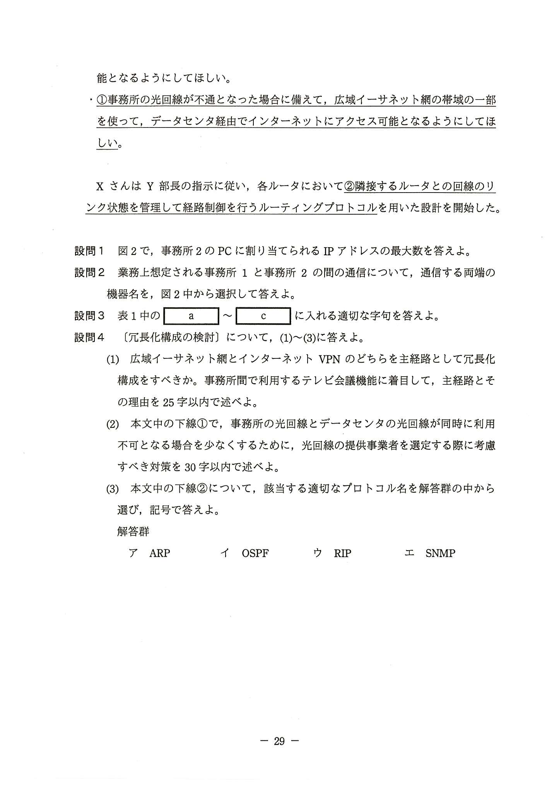

テキスト (OCR)

人能となるようにしてほしい。
・①事務所の光回線が不通となった場合に備えて, 広域イーサネット網の帯域の一部
を使って, データセンタ経由でインターネットにアクセス可能となるようにしてほ
しい。

X さんは Y 部長の指示に従い, 各ルータにおいて②③隣接するルータとの回線のリ
ンク状態を管理して経路制御を行うルーティングプロトコルを用いた設計を開始した。

設問1 図2で, 事務所 2 のPCに割り当てられる IP アドレスの最大数を答えよ。

設問2 業務上想定される事務所 1 と事務所 2 の間の通信について, 通信する両端の
機器名を, 図 2 中から選択して答えよ。

設問3 表1中の|  a |~[  c |に入れる適切な字句を答えよ。

設問4 [冗長化構成の検討 について, ①)て(3)に答えよ。

(1) 広域イーサネット網とインターネット VPN のどちらを主経路として冗長化
構成をすべきか。 事務所間で利用するテレビ会議機能に着目して, 主経路とそ
の理由を 25 字以内で述べよ。

2) 本文中の下線〇で, 事務所の光回線とデータセンタの光回線が同時に利用
不可となる場合を少なくするために, 光回線の提供事業者を選定する際に考慮
すべき対策を 30 字以内で述べよ。

3) 本文中の下線@について, 該当する適切ながプロトコル名を解答群の中から
選び, 記号で答えよ。
解答群

ア ARP    イ OSPF    ウ RIP    エ SNMP

### ページ 30

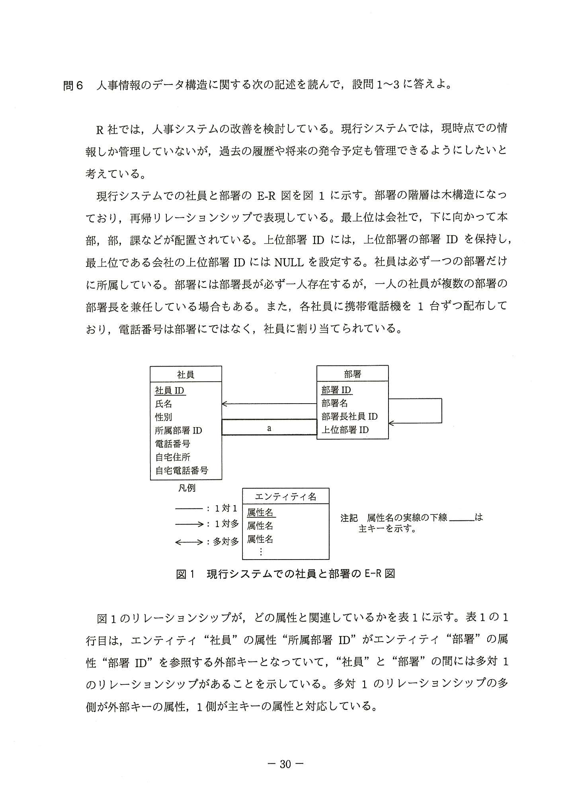

テキスト (OCR)

間6 人事情報のデータ構造に関する次の記述を読んで, 設問 1ー3 に答えよ。

R 社では, 人事システムの改善を検討している。 現行システムでは, 現時点での情
報しか管理していないが, 過去の履歴や将来の発令予定も管理できるようにしたいと
考えている。

現行システムでの社員と部署の ER 図を図 1 に示す。部署の階層は木構造になっ
ており, 再帰リレーションシップで表現している。最上位は会社で, 下に向かって本
部, 部, 課などが配置されている。上位部署 ID には, 上位部署の部署 ID を保持し,
最上位である会社の上位部署 ID には NULL を設定する。社員は必ず一つの部署だけ
に所属している。 部署には部署長が必ず一人存在するが, 一人の社員が複数の部署の
部署長を兼任している場合もある。また, 各社員に携帯電話機を 1 台ずつ配布して
おり, 電話番号は部署にではなく, 社員に割り当てられている。

社員                                                               BE
社員TD                                           部署TD
氏名                                                               部署名
性別                                               部署長社員TD
所属部署 D                     4                LACES ID
電話番号                                              ーー
自宅住所
自宅電話番号

凡例

エンティティ名
「 1詩1 | eee
ーータ : 1対多| 履性名
ーー : 多対多 属性名

注記 属性名の実線の下線___は
主キーを示す。

図1 現行システムでの社員と部署の ERA

図 1のリレーションシップが, どの属性と関連しているかを表 1 に示す。表1の1
行目は, エンティティ “HB” の属性 “所属部署 ID” がエンティティ “HE” の属
Me “HRB ID” を参照する外部キーとなっていて, “HB” と“部署"の間には多対 1
のリレーションシップがあることを示している。多対 1 のリレーションシップの多
側が外部キーの属性, 1 側が主キーの属性と対応している。

ー 30 一

### ページ 31

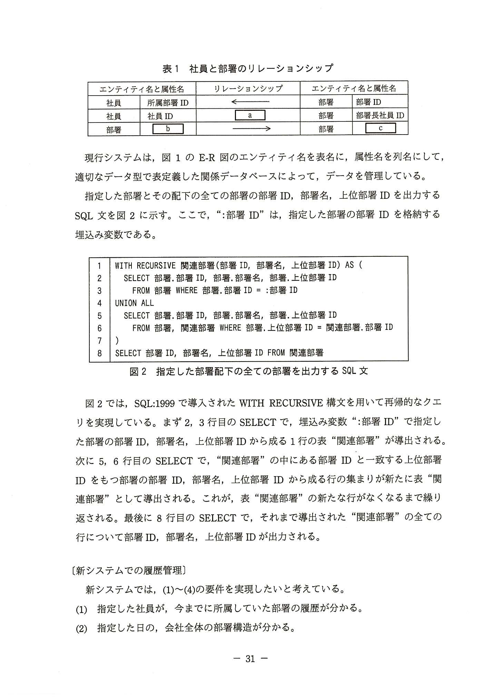

テキスト (OCR)

表1 社員と部署のリレーションシップ

エンティティ名と属性名      リレーションシップ     エンティティ名と属性名
社員   ARAB ID     ——      部署 | sD

社員   社員TD        し 』      we [SERA ID
Bra   L5 ]     ーーーテ>    ra   [< ]

現行システムは, 図 1 の E-R 図のエンティティ名を表名に, 属性名を列名にして,
適切なデータ型で表定義した関係データベースによって, データを管理している。

指定した部署とその配下の全ての部署の部署 ID, 部署名, 上位部署 ID を出力する
SQL 文を図 2 に示す。ここで, “:部署 ID” は, 指定した部署の部署 D を格納する

埋込み変数である。

WITH RECURSIVE 関連部署(部署 ID, BBA, 上位部署 1D) AS (
SELECT 部署. 部署 ID, 部署.部署名, 部署.上位部署 ID
FROM 部署 WHERE #838. 8833 ID = : #838 ID
UNION ALL
SELECT #833. #833 1D, 部署.部署名, 部署.上位部署 D
FROM 部署, 関連部署 WHERE 部署.上位部署ID = MBAS. BS ID
)
SELECT 部署 ID, 部署名, 上位部署 ID FROM 関連部署

図2 指定した部署配下の全ての部署を出力する SUX

o ココ の mm Ro一

図 2 では, SQL:1999 で導入された WITH RECURSIVE 構文を用いて再帰的なクエ
リを実現している。まず 2, 3 行目の SELECT で, 埋込み変数 “:部署 ID”" で指定し
た部署の部署 ID, BHR, 上位部署 ID から成る 1 行の表 “BMRB” が導出される。
次に 5, 6 行目の SELECT で, “関連部署′ の中にある部署 ID と一致する上位部署
ID をもっ部署の部署 ID, 部署名, 上位部署 ID から成る行の集まりが新たに表 “HB
連部署"” として導出される。これが, 表 “RMB” の新たな行がなくなるまで繰り
返される。最後に 8 行目の SELECT で, それまで導出された “BMRB” の全ての
行について部寺 ID, 部署名, 上位部署 ID が出力される。

〔新システムでの履歴管理]

新システムでは, (1)て(④の要件を実現したいと考えている。
GQ) 指定した社員が, 今までに所属していた部署の履歴が分かる。
(2) 指定した日の, 会社全体の部署構造が分かる。

ー 31 一

### ページ 32

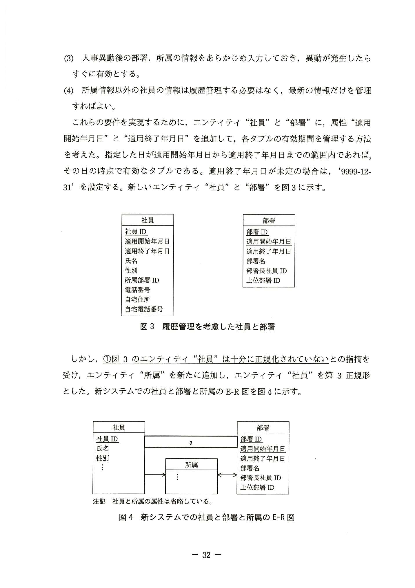

テキスト (OCR)

3) 人事異動後の部署, 所属の情報をあらかじめ入力しておき, 暴動が発生したら
すぐに有効とする。
(4) 所属情報以外の社員の情報は履歴管理する必要はなく, 最新の情報だけを管理
すればよい。
これらの要件を実現するために, エンティティ “HA” と“部署” に, 属性 “適用
開始年月日" と “適用終了年月日" を追加して, 各タプルの有効期間を管理する方法
を考えた。 指定した日が適用開始年月日から適用終了年月日までの範囲内であれば,
その日の時点で有効な々プルである。適用終了年月日が未定の場合は, “9999-12-
31′を設定する。新しいエンティティ “HB” と "部署" を図 3 に示す。

社員                                                               we
社員TD                                                          HB ID
適用開始年月日                                      適用開始年月日
適用終了年月日                    適用終了年月日
氏名                                                               部署名
性別                                               部署長社員TD
所属部署 D                                        LALA ID
電話番号
自宅住所
自宅電話番号

図3 履歴管理を考慮した社員と部署

Lal, ①図 3 のエンティティ "社員"は十分に正規化されていないとの指摘を
受け, エンティティ“所属” を新たに追加し, エンティティ “HB” を第 3 ERG
とした。新システムでの社員と部署と所属の E-R 図を図 4 に示す。

社員                                              Ee
社員TD                                                         #8 1D
氏名                                                         適用開始年月日
性別                                 ー                       適用終了年月日
:                             所属               部署名
:          ESE-RHLAL ID
EAS 1D

注記 社員と所属の属性は省略している。
図4 新システムでの社員と部署と所属の ERY

ー 32 一

### ページ 33

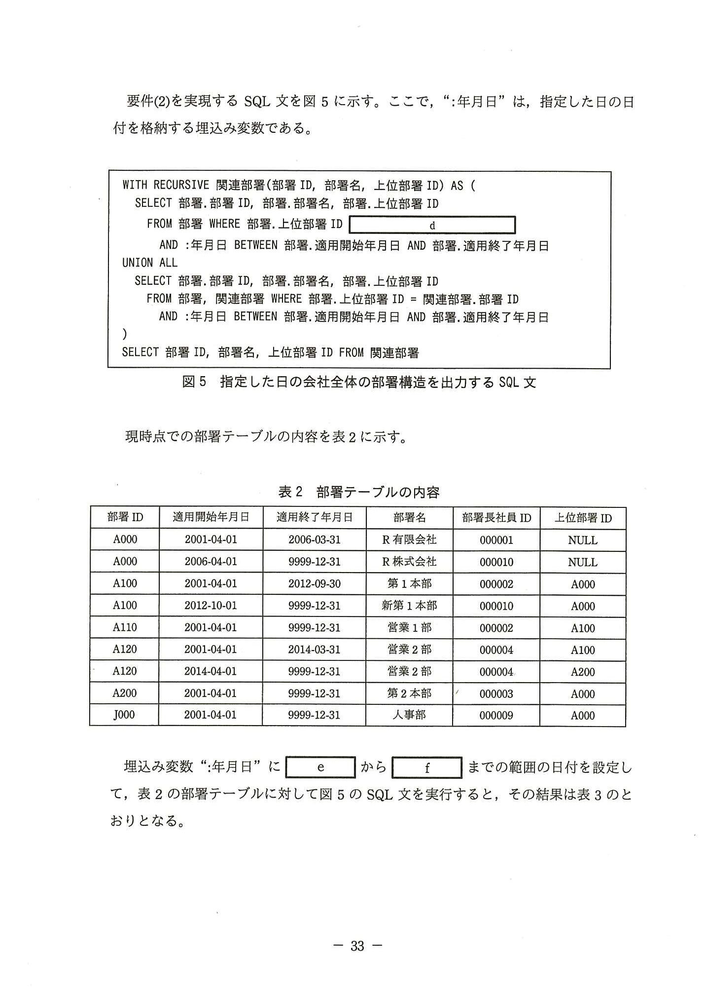

テキスト (OCR)

要件(2②を実現する SQL 文を図 5 に示す。ここで, “:年月日" は, 指定した日の日

付を格納する埋込み変数である。

WITH RECURSIVE 関連部署(部署 ID, 部署名, 上位部署 ID) AS (
SELECT #833. 部署 ID, 部署.部署名, 部署.上位部署 ID
FROM 部署 WHERE 部署.上位部署TD |           d           |
AND :年月日 BETWEEN 部署.適用開始年月日 AND BART EAB
UNION ALL
SELECT 部署.部署 ID, BE. MBA, 部署.上位部署 ID
FROM 部署, 関連部署 WHERE BRS. LEAVERS ID = 関連部署.部署 ID
AND :年月日 BETWEEN 部署.適用開始年月日 AND 部署.適用終了年月日

)
SELECT 部署 1D, 部署名, 上位部署 ID FROM PMS

図5 指定した日の会社全体の部署構造を出力する SQL 文

現時点での部署テーブルの内容を表 2 に示す。

表2 部署テーブルの内容

#8 ID         適用開始年月日        適用終了年月日            部署名           部署長社員TD | Aree ID
A000                2001-04-01                  2006-03-31              R 有限会社               000001                   NULL
A000              2006-04-01               9999-12-31            R 株式会社             000010                NULL
A100           2001-04-01            2012-09-30           第1 本部           000002             A000
A100            2012-10-01             9999-12-31           新第1本部           000010               A000
A110            2001-04-01            9999-12-31           営業1部            000002              A100
A120             2001-04-01              2014-03-31             営業2部             000004                A100
A120              2014-04-01               9999-12-31              営業2部              000004                 A200
A200             2001-04-01              9999-12-31             第2本部 | 000003                A000
J000              2001-04-01               9999-12-31               人事部                000009                 A000

埋込み変数 “年月日"に| e |から| f | までの範囲の日付を設定し
て, 表 2 の部署テーブルに対して図 5 の SQL 文を実行すると, その結果は表 3 のと

おりとなる。

### ページ 34

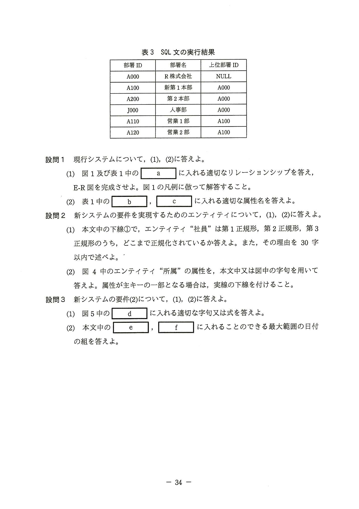

テキスト (OCR)

表3 SQL文の実行結果

#8 ID              部署名            上位部署 D
A000               R 株式会社              NULL
A100          新第 1本部          A000
A200               第2 本部               A000
J000                人事部                A000
A110             営業1部             A100
A120               営業2部               A100

設問1 現行システムについて, (①⑪, ②⑫②に答えよ。
Q) 図 1 及び表1中の| a | に入れる適切なリレーションシップを答え,
E-R 図を完成させよ。図 1 の凡例に父って解答すること。
②) 表1中の|  b ||,|  c |に入れる適切な属性名を答えよ。
設問2 新システムの要件を実現するためのエンティティについて, ①, ②に答えよ。
Q) 本文中の下線①で, エンティティ “HB” は第1 正規形, 第2 正規形, 第3
正規形のうち, どこまで正規化されているか答えよ。また, その理由を 30 字
以内で述べよ。 |
②) 図 4 中のエンティティ “HR” の属性を, 本文中又は図中の字旬を用いて
答えよ。 属性が主キーの一部となる場合は, 実線の下線を付けること。
設問3 新システムの要件(2②について, ①⑪, ⑫)に答えよ。
GQ) 図5中の|  q | に入れる適切な字句又は式を答えよ。
Qa) 本文中の|  e |,| £ | に入れることのできる最大範囲の日付
の組を答えよ。

ー 34 一

### ページ 35

テキスト (OCR)

C

メ モ 用 紙 〕

ー 35 一

### ページ 36

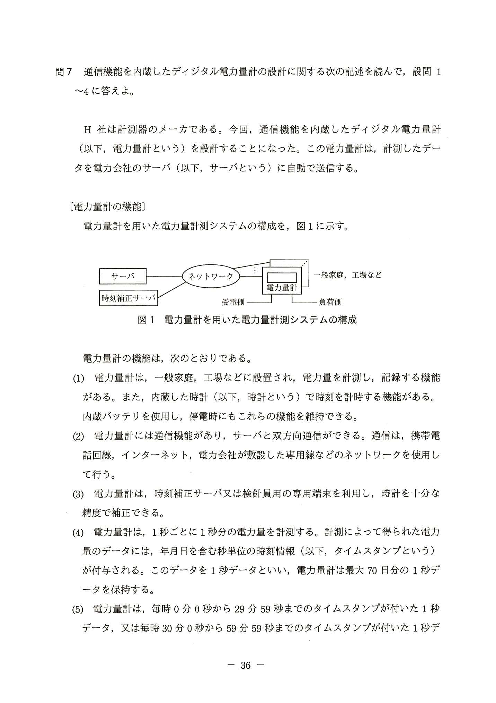

テキスト (OCR)

問7 通信機能を内蔵したディジタル電力量計の設計に関する次の記述を読んで, 設問 1
~4 に答えよ。

H 社は計測器のメーカである。今回, 通信機能を内蔵したディジタル電力量計
(以下, 電力量計という) を設計することになった。この電力量計は, 計測したデー
タを電力会社のサーバ (以下, サーバという) に自動で送信する。

〔電力量計の機能]
電力量計を用いた電力量計測システムの構成を, 図 1 に示す。

一般家庭, 工場など

電力量計
受電側一-| | erin

図1 電力量計を用いた電力量計測システムの構成

時刻補正サーバ

電力量計の機能は, 次のとおりである。

(QQ) 電力量計は, 一般家庭 工場などに設置され, 電力量を計測し, 記録する機能
がある。 また, 内蔵した時計 (以下, 時計という) で時刻を計時する機能がある。
内蔵バッテリを使用し, 停電時にもこれらの機能を維持できる。

(2) 電力量計には通信機能があり, サーバと双方向通信ができる。通信は, 携帯電
RAM, インターネット, 電力会社が敷設した専用線などのネットワークを使用し

ラー テ

て行う。

(3) 電力量計は, 時刻補正サーバ又は検針員用の専用端末を利用し, 時計を十分な
精度で補正できる。

4) 電力量計は, 1 秒ごとに1 秒分の電力量を計測する。 計測によって得られた電力
量のデータには, 年月日を含む秒単位の時刻情報 (AE, タイムスタンプという)
が付与される。このデータを 1 秒データといい, 電力量計は最大 70 日分の 1 秒デ
ータを保持する。

(5) 電力量計は, 毎時 0 分 0 秒から 29 分 59 秒までのタイムスタンプが付いた 1 秒
データ, 又は毎時 30 分 0 秒から 59 分 59 秒までのタイムスタンプが付いた LOT

ー 36 一

### ページ 37

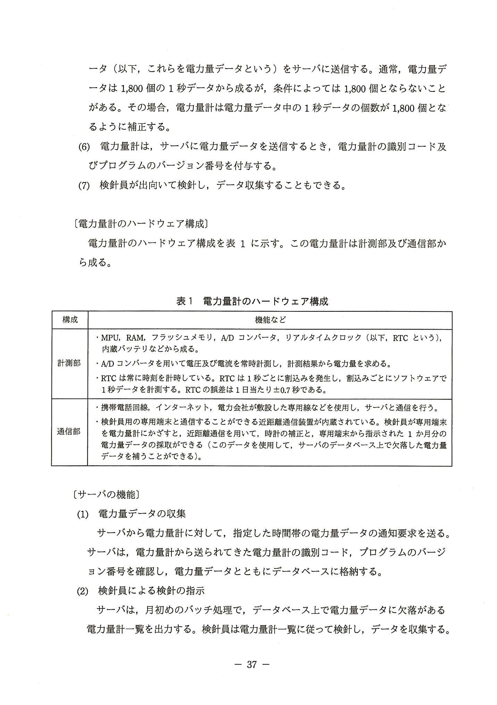

テキスト (OCR)

ータ (以下, これらを電力量データという) をサーバに送信する。通常, 電力量デ
ータは 1.800 個の 1 秒データから成るが, 条件によっては 1.800 個とならないこと
がある。 その場合, 電力量計は電力量データ中の 1 秒データの個数が 1.800 個とな
るように補正する。

(⑥) 電力量計は, サーバに電力量データを送信するとき, 電力量計の識別コード及

びプログラムのバージョン番号を付与する。

(⑦ 検針員が出向いて検針し, データ収集することもできる。

〔電力量計のハードウェア構成]

電力量計のハードウェア構成を表 1 に示す。 この電力量計は計測部及び通信部か

ら成る。

表1 電力量計のハードウェア構成

構成

機能など

計測部

・MPU, RAM, フラッシュメモリ, AD コンバータ, リアルタイムクロック (以下, RTC という),
内蔵バツテリなどから成る。
‘AD コンバータを用いて電圧及び電流を常時計測し, 計測結果から電力量を求める。

・RTC は常に時刻を計時している。RTC は 1 秒ごとに割込みを発生し, 割込みごどとにソフトウェアで
1 秒データを計測する。RTC の誤差は 1 日当たり土0.7 秒である。

通信部

・携帯電話回線, インターネット, 電力会社が敷設した専用線などを使用し, サーバと通信を行う。

・検針員用の専用端末と通信することができる近距離通信装置が内蔵されている。検針員が専用端末
を電力量計にかざすと, 近距離通信を用いて, 時計の補正と, 専用端末から指示された 1 か月分の
電力量データの採取ができる (このデータを使用して, サーバのデータベース上で欠落した電力量
データを補うことができる)。

〔サーバの機能】
Q) 電力量データの収集

サーバから電力量計に対して, 指定した時間帯の電力量データの通知要求を送る。
サーバは, 電力量計から送られてきた電力量計の識別コード, プログラムのバージ
ョン番号を確認し, 電力量データとともにデータベースに格納する。

(2) 検針員による検針の指示

サーバは, 月初めのバッチ処理で。 データベース上で電力量データに欠落がある
電力量計一覧を出力する。検針員は電力量計一覧に従って検針し, データを収集する。

### ページ 38

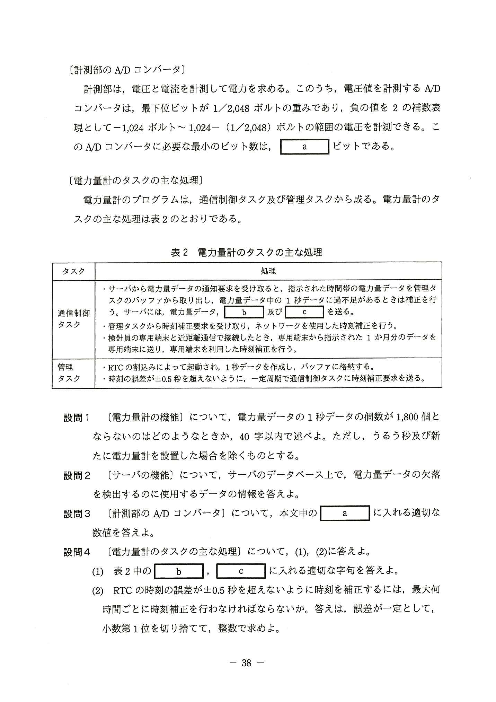

テキスト (OCR)

(計測部の AD コンバータ)

計測部は, 電圧と電流を計測して電力を求める。このうち, 電圧値を計測する AD
コンバータは, 最下位ビットが 172,048 ボルトの重みであり, 負の値を 2 DBR
現として一1.024 ボルトー1.024一 (12,048) ボルトの範囲の電圧を計測できる。こ
の AD コンバータに必要な最小のビット数は, [a |ビットである。

〔電力量計のタスクの主な処理]
電力量計のプログラムは, 通信制御タスク及び管理タスクから成る。電力量計のタ
スクの主な処理は表 2 のとおりである。

表2 電力量計のタスクの主な処理

タスク                           処理

・ サーバから生力量データの通知朋求を受け取ると, 指示された時間帯の電力量データを管理タ
スクのバッファから取り出し, 電力量データ中の 1 秒データに過不足があるときは補正を行
通信制御 | う。サーバには, 電力量データ,| b |及び| c | を送る。

BAD | ・管理タスクから時刻袖正要求を受け取り, ネットワークを使用した時刻補正を行う。

・検針員の専用瑞末と近嘘離通信で接続したとき, 専用端末から指示された 1 か月分のデータを
専用婚来に送り専用英末を利用した時刻袖正を行う。

管理     ・RTC の割込みによって起動され, 1 秒データを作成し, バッファに格納する。
タスク     ・時刻の誤差が土0.5 秒を超えないように, 一定周期で通信制御タスクに時刻補正要求を送る。

設問1 [電力量計の機能〕】について, 電力量データの 1 秒データの個数が 1.800 個と
ならないのはどのようなときか, 40 字以内で述べよ。ただし, うるう秒及び新
たに電力量計を設置した場合を除くものとする。

設問2 〔サーバの機能】 について, サーバのデータベース上で, 電力量データの欠落
を検出するのに使用するデータの情報を答えよ。

設問3 (計測部の AD コンバータ] について, 本文中の| a | に入れる適切な

数値を答えよ。
設問4 【電力量計のタスクの主な処理] について, ①), ②に答えよ。
①) 表2中の| vb |,|  c |に入れる適切な字句を答えよ。

(2) RIC の時刻の誤差が土0.5 秒を超えないように時刻を補正するには, 最大何
時間ごとに時刻補正を行わなければならないか。答えは, 誤差が一定として,
小数第 1 位を切り捨てて, 整数で求めよ。

ー 38 一

### ページ 39

テキスト (OCR)

C

メ モ 用 tf )

### ページ 40

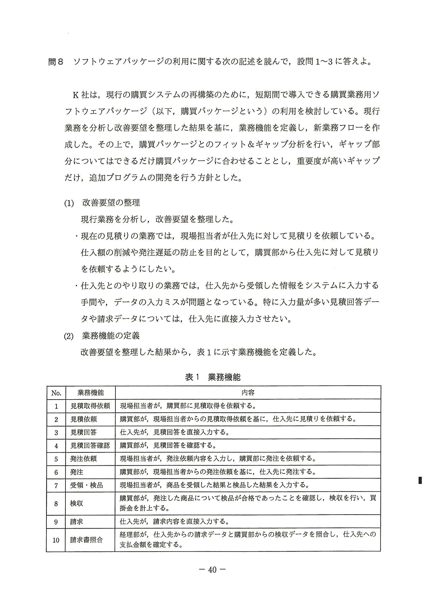

テキスト (OCR)

問8

ソフトウェアパッケージの利用に関する次の記述を読んで, 設問 1ー3 に答えよ。

K 社は, 現行の購買システムの再構築のために, 短期間で導入できる購買業務用ソ
フトウェアパッケージ (以下, 購買パッケージという) の利用を検討している。現行
業務を分析し改善要望を整理した結果を基に, 業務機能を定義し, 新業務フローを作
成した。その上で, 購買パッケージとのフィット&ギャップ分析を行い, ギャップ部
分についてはできるだけ購買パツッケージに合わせることとし, 重要度が高いギャップ
だけ, 追加プログラムの開発を行う方針とした。

Q①) 改善要望の整理
現行業務を分析し, 改善要望を整理した。
・ 現在の見積りの業務では, 現場担当者が仕入先に対して見積りを依頼している。
仕入額の削減や発注遅延の防止を目的として, 購買部から仕入先に対して見積り
を依頼するようにしたい。
・仕入先とのやり取りの業務では, 仕入先から受領した情報をシステムに入力する
手間や, データの入力ミスが問題となっている。特に入力量が多い見積回答デー
タや請求データについては, 仕入先に直接入力させたい。

(2) 業務機能の定義
改善要望を整理した結果から, 表 1 に示す業務機能を定義した。

表1 業務機能
No.   業務機能                          内容
1 | 見積取得依頼 | 現場担当者が, 購買部に見積取得を依頼する。
2 | 見積依頼    購買部が, 現場担当者からの見積取得依頼を基に, 仕入先に見積りを依頼する。
3 | 見積回答    仕入先が, 見積回答を直接入力する。
4 | 見積回答確認 | 購買部が, 見積回答を確認する。
5 | 発注依頼    現場担当者が, 発注依頼内容を入力し, 購買部に発注を依頼する。
6 | 発注       購買部が, 現場担当者からの発注依頼を基に, 仕入先に発注する。
7 | 受領・検品     現場担当者が, 商品を受領した結果と検品した結果を入力する。
8 | 検取       購買部が, 発注した商品について検品が合格であったことを確認し, 検収を行い, 買
掛金を計上する。
9 | 請求       仕入先が, 請求内容を直接入力する。
10 | mores    cope See aaa と購買部からの検収データを照合し, 仕入先への

### ページ 41

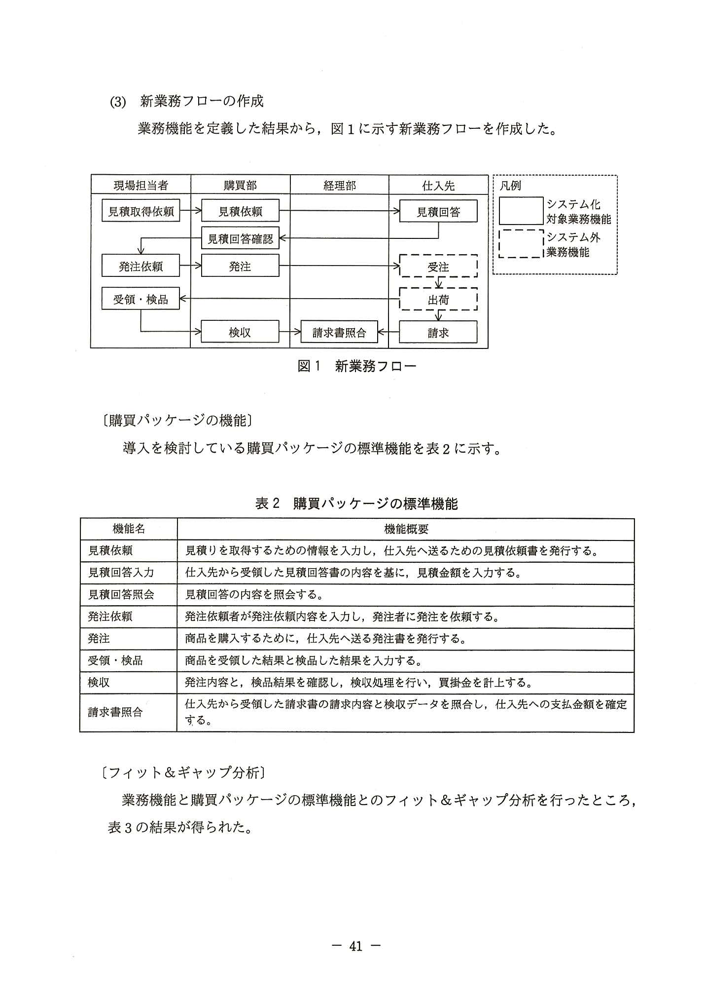

テキスト (OCR)

3) 新業務フローの作成
業務機能を定義した結果から, 図 1 に示す新業務フローを作成した。

現場担当者     REELS      経理部      ASE    凡例        |
| 見取介依頼 上 | mace |          {ames        ead |
| seatiavarntes fe                  ーーコシステム外 |
J            p------  しーー_ |業務機能 |
i ee,        ne ee | 0|
es ーー
SL - Beh                    1 |
=
ree Hf ateeaee kee |
図1 新業務フロー
〔購買パッケージの機能]
導入を検討している購買パッケージの標準機能を表 2 に示す。
表2 購買パッケージの標準機能
機能名                       機能概要
RRR     RA) EWOTSROOWME ADU, EARARS RDO AMAMBE RATS,
見積回答入力 | LARDORALARMESROAREBC, 見税金額を入力する。
見積回答照会 | 見生回答の内容を照会する。
発注依     発注依頼者が発注依頼内容を入力し 発視者発注を依頼する。
発注       商品を購入するために 仕入先へ送る発注書を発行する。
受領・検品 。 | 商品を受領した結果と検品した結果を入力する。
検収       発注内容と, 検品結果を確認し,検収処理を行い, 買掛金を計上する。
人 | せら用した生まの内とデークを原合い。仁克への放ち

[フィット&ギャップ分析〕
業務機能と購買パッケージの標準機能このフィット&ギャップ分析を行ったところ,
表 3 の結果が得られた。

### ページ 42

テキスト (OCR)

表3 業務機能とのフィット&ギャップ分析の結果 (ギャップのある業務機能だけ抜粋)

No.          業務機能             結果                                                   検討内容

-     、 | MME CE, 仕入先へ送るための見積人頼書を発行することが可
1 | SBIR | ギャツプ | 名 現場折当者が陳部に対して見策取得を依頼する機能はなし。

3    name | ギャップ | MMT, [| free
[し  b |する機能ほなし。
9   請求   ギャップ | | c |する機能はなし。
[追加プログラムの外部設計)
フィット&ギャップ分析によってギャップと判定された業務機能のうち, 見積回答
と, 請求については, 購買パッケージに合わせて, 仕入先から受領した情報を K th
の社員がシステムに入力する運用を継続することにした。見積取得依頼については,
現場担当者からの依頼に基づいて, 購買部が仕入先から見積りを取得するという改善
要望を優先することとし, 購買パッケージに対して, K 社独自の機能を追加プログラ
ムとして開発することにした。
追加プログラムとして開発が必要な, 現場担当者が入力する見積取得依頼の画面設
計の一部を図 2 に, 見積取得依頼のクラス図を図 3 に示す。追加プログラムは, 購
買パッケージが提供しているテーブル (パッケージテーブル) を直接参照せず, 購買
パッケージが提供しているプログラム (パッケージプログラム) を使用してパッケー
ジテーブルにアクセスする。追加プログラムが必要とするデータでパッケージテーブ
ルに存在しないデータは, K 社独自のテーブルとして新たに作成する。

SALSA    依頼番号 XXXXXX| |       |
担当者名 : XXXX                                #81 yyyy-mm-dd    error aie ト入力可能

5%, ; ease                                               、
明細                                  還季光司字前詳しポタン

un [ames | 品目名* [ote | 希記信和先名 [awa] | Co ro
ロ   1 | | Ee |J
ロ| s      ea

ロ   3      品目|           |

品目名と数量は必須入力              登録
ber iin    EASA ARS

品目名 :し検索] ||任和先名:[ 検索]

選択 [RSS| 品目名 | | | 選択|住入先居号|任入先名

fe)           O

O           [e)

H2 見積取得依頼の画面設計 (一部)

ー 42 一

### ページ 43

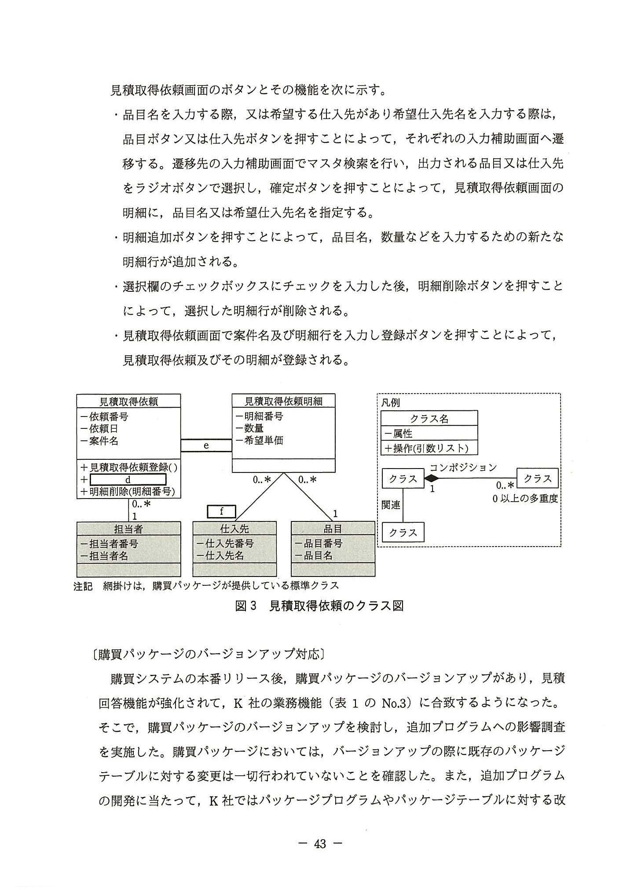

テキスト (OCR)

見積取得依頼画面のボタンとその機能を次に示す。
・品目名を入力する際, 又は希望する仕入先があり希望仕入先名を入力する際は,
品目ボタン又は仕入先ボタンを押すことによって, CHENOA ARRAN
移する。遷移先の入力補助画面でマスタ検索を行い, 出力される品目又は仕入先
をラジオボタンてで選択し, 確定ボタンを押すことによって, 見積取得依頼画面の

明細に, 品目名又は希望仕入先名を指定する。

・明細追加ボタンを押すことによって, 品目名, 数量などを入力するための新たな
明細行が追加される。
・選択欄のチェックボックスにチェックを入力した後, 明細削除ボタンを押すこと

によって, 選択した明細行が削除される。

・見積取得依頼画面で案件名及び明細行を入力し登録ボタンを押すことによって,

見積取得依頼及びその明細が登録される。

コンポジション
クス |        nm を |

0 以上の多重度

注記 網掛けは, 購買パツケージが提供している標準クラス
図3 見積取得依頼のクラス図

〔購買パッケージのバージョンアップ対応〕
購買システムの本番リリース後, 購買パツッケージのバージョンアップがあり, AR
回答機能が強化されて, K 社の業務機能 (表 1 の No.3) に合致するようになった。
そこで, 購買パッケージのバージョンアップを検討し, 追加プログラムへの影響調査
を実施した。購買パツケージにおいては, バージョンアップの際に既存のパッケージ
テーブルに対する変更は一切行われていないことを確認した。また, 追加プログラム
の開発に当たって, K 社ではパッケージプログラムやパッケージテーブルに対する改

ー 43 一

見策取得依束         見策取得依頼明細      凡例

ー依頼番号           ー明細番号              ラス
ー依頼日             数量             — 名
Riis        = | ea         操作(引数リスト)
見積取得依頼登録()
+                                      0..*      0..*
明細削除(明細番号)

0.*                    ;

1                      1

担当者        HAE        品目     PE

ー担当者番号      ー仕入先番号    品目番号 [SS
ー担当者名       ー仕入先名     ー品目名

### ページ 44

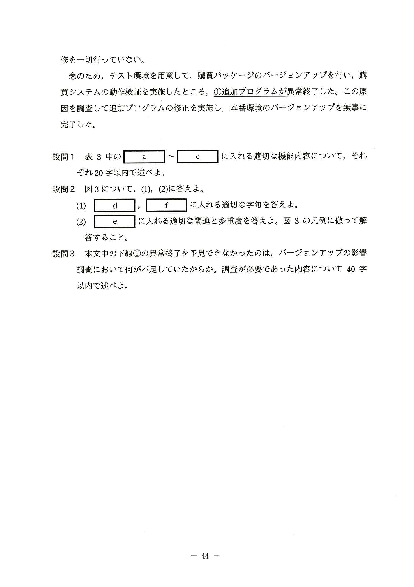

テキスト (OCR)

修を一切行っていない。

念のため, テスト環境を用意して, 購買パツケージのバージョンアップを行い, 購
買システムの動作検証を実施したところ, ①追加プログラムが異常終了した。この原
因を調査して追加プログラムの修正を実施し, 本番環境のバージョンアップを無事に
完了した。

設問1 表3 中の| a |~[  c |に入れる適切な機能内容について, それ
ぞれ20 字以内で述べよ。

設問2 図3について, ①, ②に答えよ。
a [a |,| f | に入れる適切な字旬を答えよ。
②) [ec | に入れる適切な関連と多重度を答えよ。図 3 の凡例に依って解

答すること。

設問3 本文中の下線①の異常終了を予貞できなかったのは, バージョンアップの彫響
調査において何が不足していたからか。調査が必要であった内容について 40 字
以内で述べよ。

### ページ 45

テキスト (OCR)

〔

メ = 用 紙 〕

ー 45 一

### ページ 46

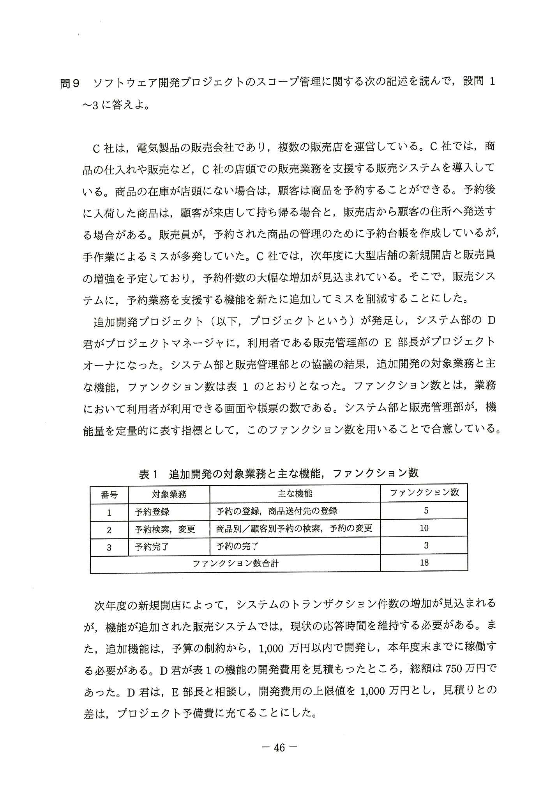

テキスト (OCR)

FRO ソフトウェア開発プロジェクトのスコープ管理に関する次の記述を読んで, 設問 1

て3 に答えよ。

C 社は, 電気製品の販売会社であり, 複数の販売店を運営している。C 社では, 商
品の仕入れや販売など, C 社の店頭での販売業務を支援する販売システムを導入して
いる。商品の在庫が店頭にない場合は, 顧客は商品を予約することができる。 予約後
に入荷した商品は, 顧客が来店して持ち帰る場合と, 販売店から顧客の住所へ発送す
る場合がある。 販売員が, 予約された商品の管理のために予約台帳を作成しているが
手作業によるミスが多発していた。C 社では, 次年度に大型店舗の新規開店と販売員
の増強を予定しており, 予約件数の大幅な増加が見込まれている。そこで, 販売シス
テムに, 予約業務を支援する機能を新たに追加してミスを削減することにした。

追加開発プロジェクト (以下, プロジェクトという) が発足し, システム部の D
君がプロジェクトマネージャに, 利用者である販売管理部の E 部長がプロジェクト
オーナになった。システム部と販売管理部との協議の結果, 追加開発の対象業務と主
な機能. ファンクション数は表 1 のとおりとなった。ファンクション数とは, 業務
において利用者が利用できる画面や岩票の数である。システム部と販売管理部が, 機
能量を定量的に表す指標として, このファンクション数を用いることで合意している。

表1 追加開発の対象業務と主な機能. ファンクション数

番号       対象業務                 主な機能               ファンクション数
1      予約登録            予約の登録, 商品送付先の登録                      5
2       予約検索, 変更      商品別ンプ顧客別予約の検索, 予約の変更              10
3       予約完了              予約の完了                                               8
ファンクション数合計                                            18

次年度の新規開店によって, システムのトランザクション件数の増加が見込まれる
DS, 機能が追加された販売システムでは, 現状の応答時間を維持する必要がある。ま
た, 追加機能は, 予算の制約から, 1.000 万円以内で開発し, 本年度未までに稼働す
る必要がある。D 君が表 1 の機能の開発費用を見積もったところ, 総額は 750 万円で
あった。D 君は, E 部長と相談し, 開発費用の上限値を 1.000 万円とし, 見積りとの
Blk, プロジェクト予備費に充てることにした。

### ページ 47

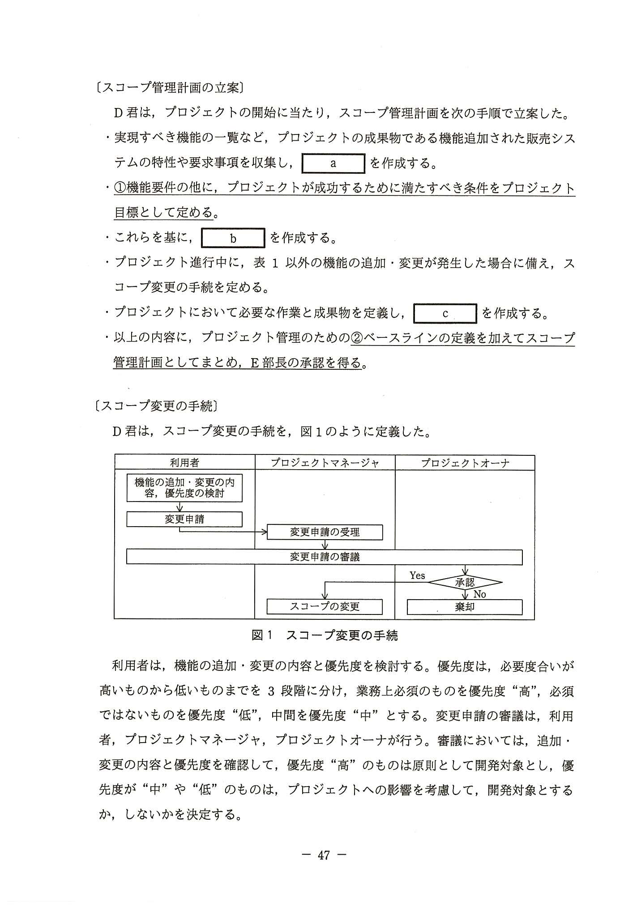

テキスト (OCR)

〔スコープ管理計画の立案

D 君は, プロジェクトの開始に当たり, スコープ管理計画を次の手順で立案した。

・実現すべき機能の一覧など。 プロジェクトの成果物である機能追加された販売シス
テムの特性や要求事項を収集し, | a | を作成する。

・ ①機能要件の他に, プロジェクトが成功するために満たすべき条件をプロジェクト

目標として定める。

・これらを基に, | pb | を作成する。

・プロジェクト進行中に, 表 1 以外の機能の追加・変更が発生した場合に備え, ス

コープ変更の手続を定める。

・ プロジェクトにおいて必要な作業と成果物を定義し, を作成する。
・以上の内容に, プロジェクト管理のための②ベースラインの定義を加えてスコープ

管理計画としてまとめ, 部長の承認を得る。

〔スコープ変更の手続〕

D 君は, スコープ変更の手続を, 図 1のように定義した。

利用者

プロジェクトマネージャ

プロジェクトオーナ

機能の追加・変更の内
A, 優先度の検討

[eee |

変更申請の受理

変更申請の審議

| An-7ORE |

利用者は, 機能の追加・変更の内容と優先度を検討する。優先度は, 必要度合いが
高いものから低いものまでを 3 段階に分け, 業務上必須のものを優先度“高", 必須
ではないものを優先度 UK", 中間を優先度 “中"” とする。変更申請の審議は, 利用
者, プロジェクトマネージャ, プロジェクトオーナが
変更の内容と優先度を確認して, 優先度“高" のものは原則として開発対象とし, 優
先度が “中” や “UR” のものは, プロジェクトへの影響を考慮して, 開発対象とする

か, しないかを決定する。

図 1

スコープ変更の手続

ー 47 一

ンー &

行う。

審議においては, 追加・

### ページ 48

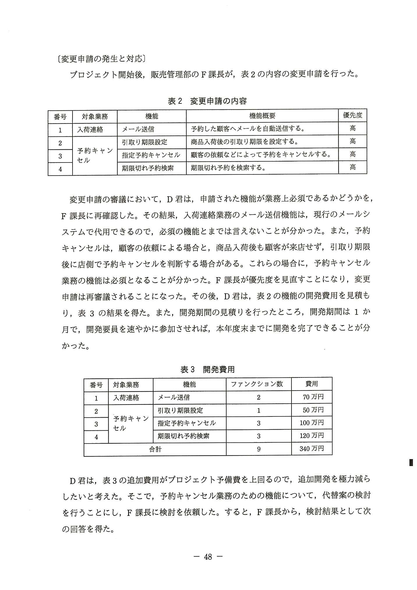

テキスト (OCR)

[変更申請の発生と対応
プロジェクト開始後, 販売管理部のF 課長が, 表2 の内容の変更申請を行った。

表2 変更申請の内容

番号 | 対象業務               機能                                   機能概要                          優先度
1       入荷連絡         メール送信                 予約した顧客へメールを自動送信する。                     高
2              引取り期限設定      商品入荷後の引取り期限を設定する。            高
3  pie ey 指定予約キャンセル | 顧客の依頼などによって予約をキャンセルする。  高
4                       期限切れ予約検索       期限切れ予約を検索する。                                 高

変更申請の審議において, D 君は, 申請された機能が業務上必須であるかどうかを,
F 課長に再確認した。その結果, 入荷連絡業務のメール送信機能は, 現行のメールシ
ステムで代用できるので, 必須の機能とまでは言えないことが分かった。また, 予約
キャンセルは, 顧客の依頼による場合と, 商品入荷後も顧客が来店せず, 引取り期限
後に店側で予約キャンセルを判断する場合がある。これらの場合に, 予約キャンセル
業務の機能は必須となることが分かった。F 課長が優先度を見直すことになり, 変更
申請は再審議されることになった。 TOK, D 君は, 表2の機能の開発費用を見積も
り, 表 3 の結果を得た。また, 開発期間の見積りを行ったところ, 開発期間は 1 か
AC, 開発要員を速やかに参加させれば, 本年度未までに開発を完了できることが分
かった。

表3 開発費用
番号 | 対象業務                  機能               ファンクション数         費用
1      入荷連絡       メール送信                       2               70 万円
2                     引取り期限設定                   1               50 万円
3   イン  指定予約キャンセル         3         100 万円
4         期限切れ予約検索       3      120 万円
合計             9     340 万円

D 君は, 表 3 の追加費用がプロジェクト予備費を上回るので, 追加開発を極力減ら
したいと考えた。そこで, 予約キャンセル業務のための機能について, 代替案の検討
を行うことにし, F 課長に検討を依頼した。すると, F 課長から, 検討結果として次
の回答を得た。

### ページ 49

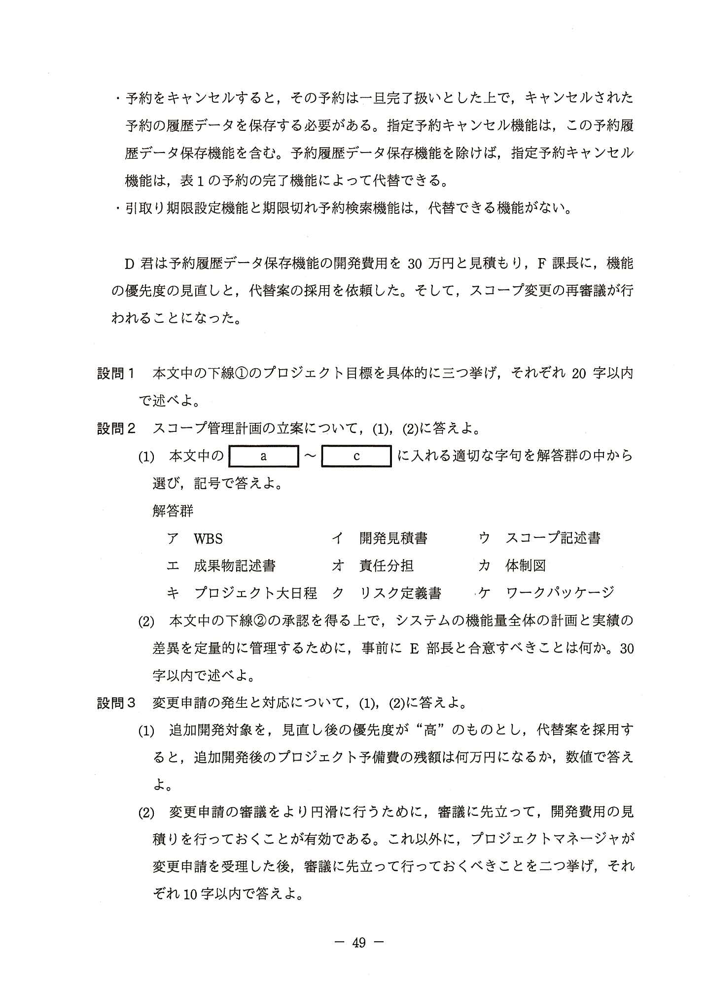

テキスト (OCR)

・予約をキャンセルすると, その予約は一旦完了扱いとした上で, キャンセルされた
予約の履歴データを保存する必要がある。 指定予約キャンセル機能は, この予約履
歴データ保存機能を含む。 予約履歴データ保存機能を除けば, 指定予約キャンセル
機能は, 表 1 の予約の完了機能によって代替できる。

・引取り期限設定機能と期限切れ予約検索機能は, 代替できる機能がない。

D 君は予約履歴データ保存機能の開発費用を 30 万円と見積もり, F 課長に, 機能
の優先度の見直しと, 代替案の採用を依頼した。そして, スコープ変更の再審議が行
われることになった。

設問1 本文中の下線①のプロジェクト目標を具体的に三つ拳げ,。 それぞれ 20 字以内
で述べよ。
設問2 スコープ管理計画の立案について, Q①), ②に答えよ。
Q) 本文中の| a |~| c | に入れる適切な字句を解答群の中から
選び, 記号で答えよ。

解答群
ア WBS                          イ 開発見積書             ウ スコープ記述書
= 成果物記述書             オ 責任分揚               A 体制図

キ プロジェクト大日程 ク リスク定義書   -ケ ワークパッケージ

2) 本文中の下線④の承認を得る上で, システムの機能量全体の計画と実績の
差異を定量的に管理するために, 事前に E 部長と合意すべきことは何か。30
字以内で述べよ。

設問3 変更申請の発生と対応について, (D, (②)に答えよ。

() 追加開発対象を, 見直し後の優先度が“高" のものとし, 代替案を採用す
ると, 追加開発後のプロジェクト予備費の残額は何万円になるか, 数値で答え
よ。

(②) 変更申請の審議をより円滑に行うために, 審議に先立って, 開発費用の見
積りを行っておくことが有効である。これ以外に, プロジェクトマネージャが
変更申請を受理した後, 審議に先立って行っておくべきことを二つ拳げ, それ
ぞれ10 字以内で答えよ。

ー 49 一

### ページ 50

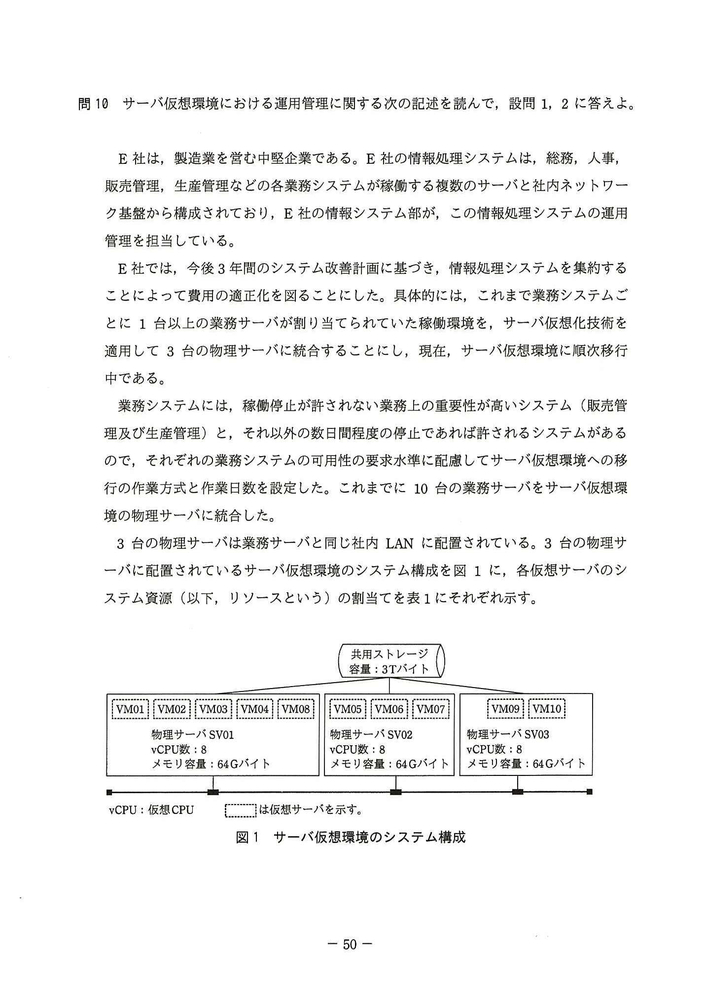

テキスト (OCR)

問19 サーバ仮想環境における運用管理に関する次の記述を読んで, 設問 1, 2 に答えよ。

E 社は, 製造業を営む中堅企業である。E 社の情報処理システムは, 総務, AS,
販売管理, 生産管理などの各業務システムが稼働する複数のサーバと社内ネットワー
ク基盤から構成されており, 社の情報システム部が, この情報処理システムの運用
管理を担当している。

ECS, 今後3 年間のシステム改善計画に基づき, 情報処理システムを集約する
ことによって費用の適正化を図ることにした。具体的には, これまで業務システムご
とに 1 台以上の業務サーバが割り当てられていた乏働環境を, サーバ仮想化技術を
適用して 3 台の物理サーバに統合することにし, 現在, サーバ仮想環境に順次移行
中である。

業務システムには, 稼働停止が許されない業務上の重要性が高いシステム (販売管
理及び生産管理) と, それ以外の数日間程度の停止であれば許されるシステムがある
DC, それぞれの業務システムの可用性の要求水準に配慮してサーバ仮想環境への移
行の作業方式と作業日数を設定した。これまでに 10 台の業務サーバをサーバ仮想環
境の物理サーバに統合した。

3 台の物理サーバは業務サーバと同じ社内 LAN に配置されている。3 台の物理サ
ーバに配置されているサーバ仮想環境のシステム構成を図 1 に, 各仮想サーバのシ
ステム資源 (以下,リソースという) の割当てを表 1 にそれぞれ示す。

共用ストレージ
容量 : 3Tバイト
{Mol j | VMo2 | { VMo3 ! | vMo4 | | vmos}  i VMOos { | VMO6 } ! VMO7    i VMo09 {i} VM10;
物理サーバ SVOL                         物理サーバSV02              物理サーバSV03
yCPU数 : 8                        YCPU数 : 8                YCPU数 : 8
メモリ容量 : 64Gバイト       メモリ容量 : 66Gバイト | | メモリ容量 : 66Gバイト

      に          i       ーー

YCPU : 仮想CPU    は仮想サーバを示す。

図1 サーバ仮想環境のシステム構成

ー 50 一

### ページ 51

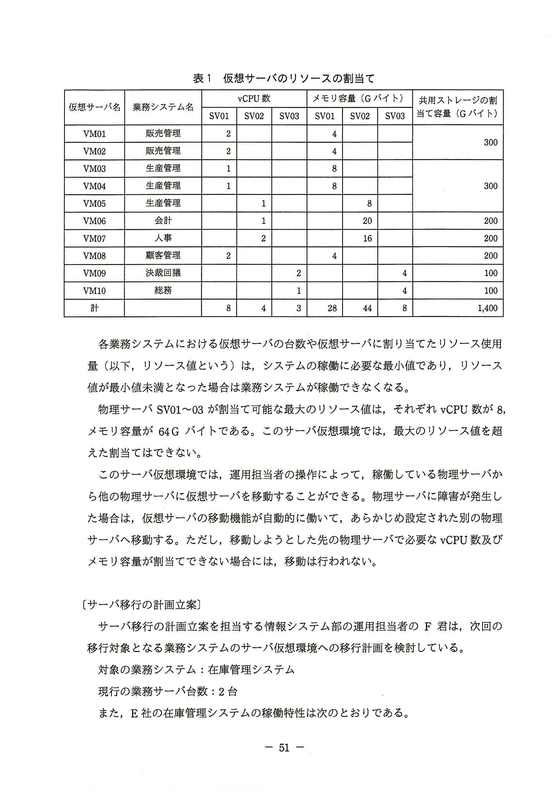

テキスト (OCR)

表1 仮想サーバのリソースの割当て

況ey人E」| 所     vCPU数     メモリ容基 (Gバイト) 共用ストレージの着
svo1 | svoz | svoz | svo1 | svoz | svo3 | 当て容量 (Gバイト)

VM01             販売管理               2                                 4
VM02           販売管理             2                             4                                          ta

VM03     生産管理     1            8
VMO4            生産管理             1                             8                                          300

VM05     生産管理         1            8

VMO6              会計                          1                            20                                200
VM07              人事                          2                            16                                200
VM08           We es             2                             4                                          200
VM09           決裁回議                                 2                             4                      100
VM10                総務                                        1                                 4                         100
計                                         8          4          3         28         44          8                       1,400

各業務システムにおける仮想サーバの台数や仮想サーバに割り当てたリソース使用
量 (以下, リソース値という) は, システムの稼働に必要な最小値であり, リソース
値が最小値未満となった場合は業務システムが稼働できなくなる。

物理サーバ SV01て03 が割当て可能な最大のリソース値は, それぞれ vCPU 数が 8,
メモリ容量が 64G バイトである。このサーバ仮想環境では, 最大のリソース値を超
えた割当てはできない。

このサーバ仮想環境では, 運用担当者の操作によって, 稼働している物理サーバか
ら他の物理サーバに仮想サーバを移動することができる。物理サーバに障害が発生し
た場合は, 仮想サーバの移動機能が自動的に働いて, あらかじめ設定された別の物理
サーバムへ移動する。ただし, 移動しようとした先の物理サーバで必要な vCPU 数及び
メモリ容量が割当てできない場合には, 移動は行われない。

〔サーバ移行の計画立案]
サーパ移行の計画立案を担当する情報システム部の運用担当者の F 君は, 次回の
移行対象となる業務システムのサーバ仮想環境への移行計画を検討している。
対象の業務システム : 在庫管理システム
現行の業務サーバ台数 : 2 台
また, 社の在庫管理システムの稼働特性は次のとおりである。

ー 51 一

### ページ 52

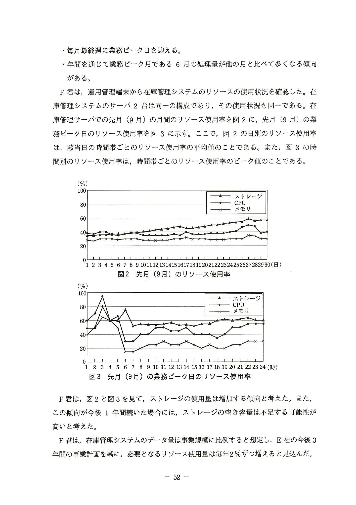

テキスト (OCR)

・毎月最終週に業務ピーク日を迎える。
・年間を通じて業務ピーク月である 6 月の処理量が他の月と比べて多くなる傾向
がある。

F 君は, 運用管理端末から在庫管理システムのリソースの使用状況を確認した。在
庫管理システムのサーバ 2 台は同一の構成であり, その使用状況も同一である。在
庫管理サーバでの先月 (9 月) の月間のリソース使用率を図 2 に, 先月 (9 月) の業
務ピーク日のリソース使用率を図 3 に示す。ここで, 図 2 の日別のリソース使用率
は, 該当日の時間帯ごとのリソース使用率の平均値のことである。また, 図 3 の時
間別のリソース使用率は, 時間帯ごとのリソース使用率のピーク値のことである。

(%)
100

ーーー ストレージ
a    _| —— cpu

ーーーー メモリ
60
ーーニーバーへ

20                    ==

pop

ドードードートー上
12345678 9101112131415161718192021222324252627282930(日)
図2 先月 (9月) のリソース使用率

0

(%)
100

ーーー ストレージ
80|一人A                   ーーー CPU

ーーテー メモリ
60%                        =      ;

40
リブ          “eo
ioe
0  1 1 1 1 L 1 1 1 1 1 1 1 1 1 1 L L 1 L 1 1 Il
1 2 3 4 5 6 7 8 9 10 11 121314 15 16 1718 19 20 21 22 23 24 (時)
図3 先月 (9月) の業務ピーク日のリソース使用率

F 君は, 図 2 と図 3 を見て, ストレージの使用量は増加する傾向と考えた。 また,
この傾向が今後 1 年間続いた場合には, ストレージの空き容量は不足する可能性が
高いと考えた。

FAs, 在庫管理システムのデータ量は事業規模に比例すると想定し, E 社の今後3
年間の事業計画を基に, 必要となるリソース使用量は毎年2%ずつ増えると見込んだ。

ー 52 一

### ページ 53

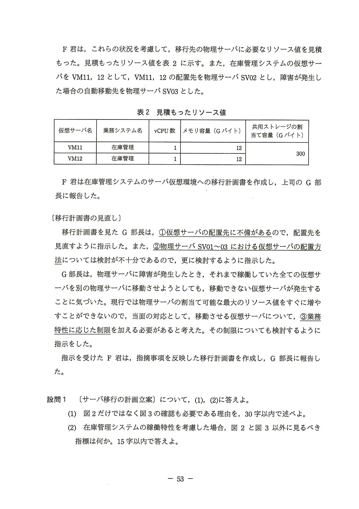

テキスト (OCR)

F Ald, これらの状況を考慮して, 移行先の物理サーバに必要なリソース値を見積
もった。 見積もったリソース値を表 2 に示す。また, 在庫管理システムの仮想サー
バを VM11, 12 として, VM11, 12 の配置先を物理サーバ SV02 とし, 障害が発生し
た場合の自動移動先を物理サーバSV03 とした。

表2 見積もったリソース値

共用ストレージの割

仮想サーバ名 | 業務システム名 | vCPU数 |メモリ容量 (Gバイト)   当て容量 (Gバイト)

VM11               在庫管理                    1                              12
VM12               在庫管理                    1                              12

300

F 君は在庫管理システムのサーバ仮想環境への移行計画書を作成し, 上司の G 部
に報告した。

〔移行計画書の見直し〕
行計画書を見た G 部長は, ①仮想サーバの配置先に不備があるので, 配置先を
見直すように指示した。また, ②⑳物理サーバ SV01一03 における仮想サーバの配置方
法については検討が不十分であるので, 更に検討するように指示した。
G 部長は, 物理サーバに障害が発生したとき, それまで稼働していた全ての仮想サ
ーバを別の物理サーバに移動させようとしても, 移動できない仮想サーバが発生する
に気づいた。現行では物理サーバの割当て可能な最大のリソース値をすぐに増
すことができないので, 当面の対応として, 移動させる仮想サーバについて, 業務
特性に応じた制限を加える必要があると考えた。その制限についても検討するように
指示をした。
指示を受けた F Ald, 指摘事項を反映した移行計画書を作成し, G 部長に報告し
he

設問1 〔サーバ移行の計画立案〕 について, (①⑪, (2②)に答えよ。
GQ) 図2だけではなく図 3 の確認も必要である理由を, 30 字以内で述べよ。
(2) 在庫管理システムの稼働特性を考慮した場合, 図 2 と図 3 以外に見るべき
指標は何か。15 字以内で答えよ。

### ページ 54

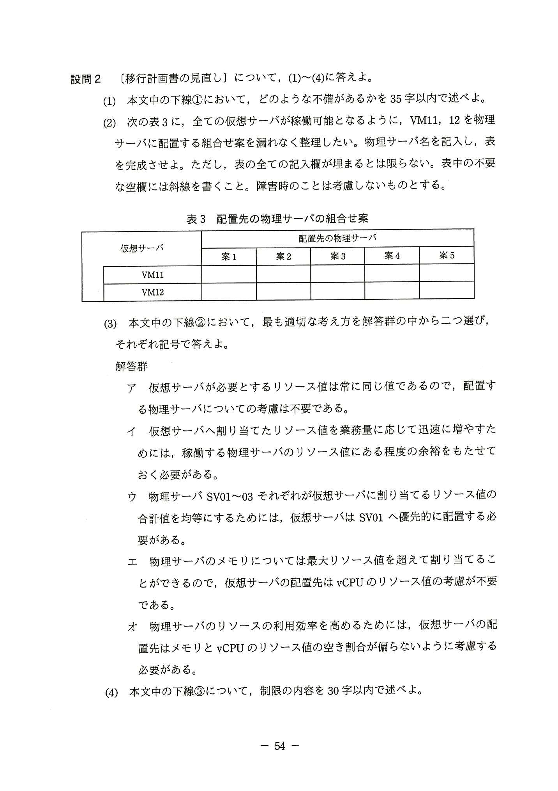

テキスト (OCR)

設問2 [移行計画書の見直し〕 について, (①~て④⑬④に答えよ。
(1) 本文中の下線やにおいて, どのような不備があるかを 35 字以内で述べよ。
2) 次の表 3 に, 全ての仮想サーバが稼働可能となるように, VM11, 12 を物理
サーバに配置する組合せ案を漏れなく整理したい。物理サーバ名を記入し, 表
を完成させよ。ただし, 表の全ての記入欄が埋まるとは限らない。表中の不要
な空欄には斜線を書くこと。 障害時のことは考慮しないものとする。

表3 配置先の物理サーバの組合せ案

READ MEY 7S
仮想サーバ
案1    案2    案3    案4    案5
VM11
VM12

3) 本文中の下線②において, 最も適切な考え方を解答群の中から二つ選び,
それぞれ記号で答えよ。
解答群

ア 仮想サーバが必要とするリソース値は常に同じ値であるので, 配置す
る物理サーバについての考慮は不要である。

イ 仮想サーバへ割り当てたリソース値を業務量に応じて迅速に増やすた
めには, 稼働する物理サーバのリソース値にある程度の余裕をもたせて
おく必要がある。

ウ 物理サーバ SVOL~03 それぞれが仮想サーバに禄り当てるリソース値の
合計値を均等にするためには, 仮想サーバは SVOL へ優先的に配置する必
要がある。

エ 物理サーバのメモリについては最大リソース値を超えて割り当てるこ
とができるので, 仮想サーバの配置先は vCPU のリソース値の考慮が不要
である。

オ 物理サーバのリソースの利用効率を高めるためには, 仮想サーバの配
置先はメモリと vCPU のリソース値の空き割合が侯らないように考慮する
必要がある。

(4) 本文中の下線③④について, 制限の内容を 30 字以内で述べよ。

### ページ 55

テキスト (OCR)

C

x モ 用 紙 〕

ー 55 一

### ページ 56

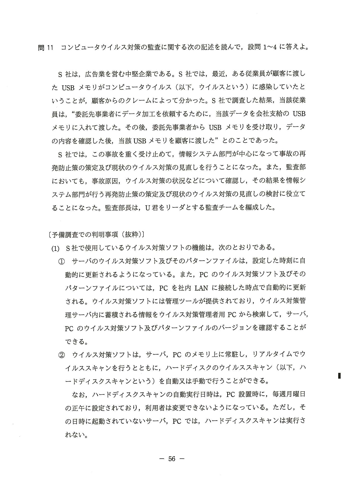

テキスト (OCR)

間11 コンピュータウイルス対策の監査に関する次の記述を読んで, 設問 1ー4 に答えよ。

S 社は, 広告業を営む中堅企業である。S 社では, 最近, ある従業員が顧客に渡し
た USB メモリがコンピュータウイルス (以下, ウイルスという) に感染していたと
いうことが, 顧客かちらのクレームによって分かった。S 社で調査した結果, 当該従業
員は, "委託先事業者にデータ加工を依頼するために, 当該データを会社支給の USB
メモリに入れて渡した。その後, 委託先事業者から USB メモリを受け取り, データ
の内容を確認した後, 当該USB メモリを顧客に渡した” とのことであった。

S 社では, この事故を重く受け止めて, 情報システム部門が中心になって事故の再
発防止策の策定及び現状のウイルス対策の見直しを行うことになった。また, 監査部
においても, 事故原因, ウイルス対策の状況かどについて確認し, その結果を情報シ
ステム部門が行う再発防止策の策定及び現状のウイルス対策の見直しの検討に役立て
ることになった。監査部長は, U導をリーダとする監査チームを編成した。

[予備調査での判明事項 (抜粋)]
Q) S社で使用しているウイルス対策ソフトの機能は, 次のとおりである。
① サーバのウイルス対策ソフト及びそのパターンファイルは, 設定した時刻に自
動的に更新されるようになっている。また, PC のウイルス対策ソフト及びその
パターンファイルについては, PC を社内 LAN に接続した時点で自動的に更新
される。ウイルス対策ソフトには管理ツールが提供されており, ウイルス対策管
理サーバ内に次積される情報をウイルス対策管理者用 PC から検索して, サーバ,
PC のウイルス対策ソフト及びパターンファイルのバージョンを確認することが
できる。
② ウイルス対策ソフトは, サーバ, PC のメモリ上に常駐し, リアルタイムでウ
イルススキャンを行うとともに, ハードディスクのウイルススキャン (以下, ハ
ードディスクスキャンという) を自動又は手動で行うことができる。
BB, ハードディスクスキャンの自動実行日時は, PC 設置時に, 毎週月曜日
の正午に設定されており, 利用者は変更できないようになっている。 ただし, そ
の日時に起動されていないサーバ, PC では, ハードディスクスキャンは実行さ

れない。

ー 56 一

### ページ 57

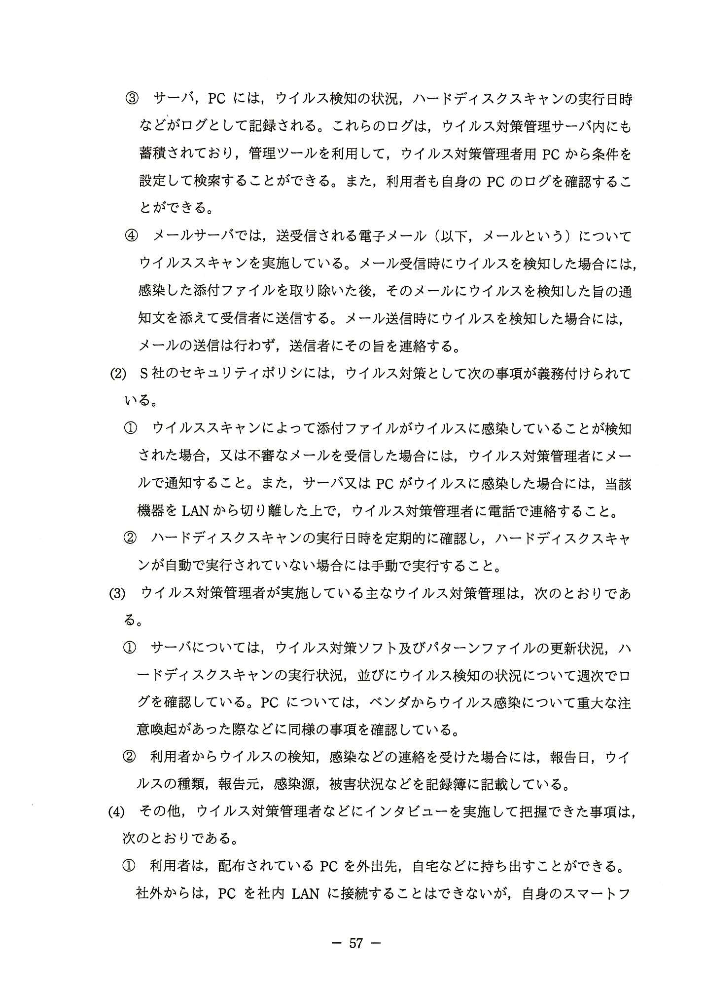

テキスト (OCR)

@ サーバ, PC には, ウイルス検知の状況, ハードディスクスキャンの実行日時
などがログとして記録される。これらのログは, ウイルス対策管理サーバ内にも
蓄積されており, 管理ツールを利用して, ウイルス対策管理者用 PC から条件を
設定して検索することができる。また, 利用者も自身の PC のログを確認するこ
とができる。

④ メールサーバでは, 送受信される電子メール (以下, メールという) について
ウイルススキャンを実施している。メール受信時にウイルスを検知した場合には,
感委した添付ファイルを取り除いた後, そのメールにウイルスを検知した旨の通
知文を添えて受信者に送信する。メール送信時にウイルスを検知した場合には,
メールの送信は行わず, 送信者にその旨を連絡する。

2) S社のセキュリティポリシには, ウイルス対策として次の事項が義務付けられて
いる。

① ウイルススキャンによって添付ファイルがウイルスに感染していることが検知
された場合, 又は不審なメールを受信した場合には, ウイルス対策管理者にメー
ルで通知すること。また, サーバ又は PC がウイルスに感染した場合には, 当該
機器を LAN から切り離した上で, ウイルス対策管理者に電話で連絡すること。

② ハードディスクスキャンの実行日時を定期的に確認し, ハードディスクスキャ
ンが自動で実行されていない場合には手動で実行すること。

3) ウイルス対策管理者が実施している主なウイルス対策管理は, 次のとおりであ

る。

① サーバについては, ウイルス対策ソフト及びパターンファイルの更新状況, ハ
ードディスクスキャンの実行状況, 並びにウイルス検知の状況について週次でロ
グを確認している。PC については, ベンダからウイルス感染について重大な注
意喚起があった際などに同様の事項を確認している。

② 利用者からウイルスの検知, 感染などの連絡を受けた場合には, REA, UT
ルスの種類, 報告元, 感染源, 被害状況などを記録短に記載している。

(4) その他, ウイルス対策管理者などにインタビューを実施して把握できた事項は,

次のとおりである。

① 利用者は, 配布されている PC を外出先, 自宅などに持ち出すことができる。
社外からは, PC を社内 LAN に接続することはできないが, 自身のスマートフ

### ページ 58

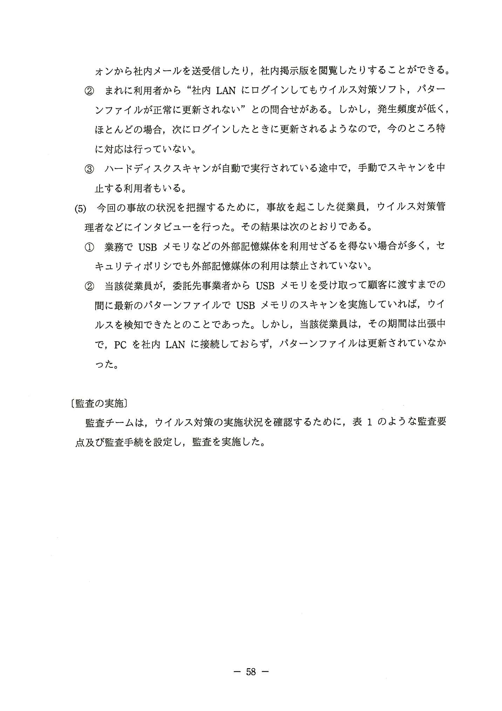

テキスト (OCR)

ォンから社内メールを送受信したり, 社内掲示版を閲覧したりすることができる。

② まれに利用者から “HA LAN にログインしてもウイルス対策ソフト, パター
ンファイルが正常に更新されない” との問合せがある。しかし, FESR MURS,
ほとんどの場合, 次にログインしたときに更新されるようなので, 今のところ特
に対応は行っていない。

③ ハードディスクスキャンが自動で実行されている途中で, 手動でスキャンを中
止する利用者もいる。

6) 今回の事故の状況を把握するために, 事故を起こした従業員, ウイルス対策管

理者などにインタビューを行った。その結果は次のとおりである。

① 業務で USB メモリなどの外部記憶媒体を利用せざるを得ない場合が多く, セ
キュリティポリシでも外部記憶媒体の利用は禁止されていない。

②⑨ 当該従業員が, 委託先事業者から USB メモリを受け取って顧客に渡すまでの
間に最新のパターンファイルで USB メモリのスキャンを実施していれば, ウイ
ルスを検知できたとのことであった。しかし, 当該従業員は, その期間は出張中
で, PC を社内 LAN に接続しておらず, パターンファイルは更新されていなか

うたた。
(EERO RM)

監査チームは, ウイルス対策の実施状況を確認するために, 表 1 のような監査要
点及び監査手続を設定し, 監査を実施した。

ー 58 一

### ページ 59

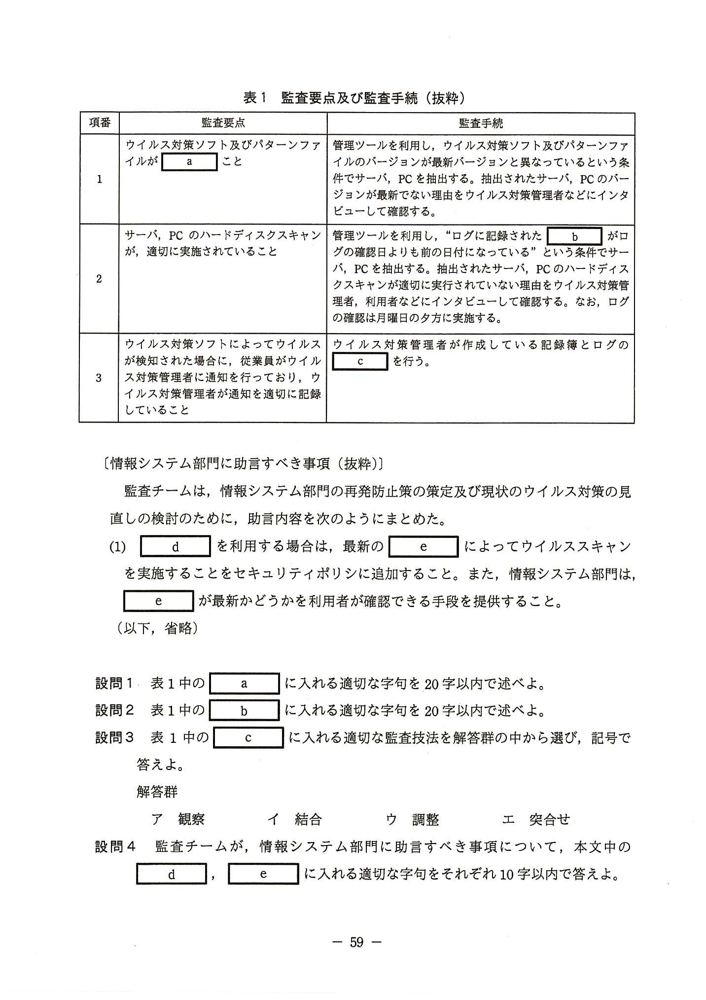

テキスト (OCR)

表1 監査要点及び監査手続 (抜粋)

RE               監査要点                                    監査手続

ウイルス対策ソフト及びパターンファ | 管理ツールを利用し, ウイルス対策ソフト及びパターンファ
イルが| a |こと          イルのバージョンが最新バージョンと異なっているという条
1                           件でサーバ, PC を抽出する。抽出されたサーバ, PC のバー
ジョンが最新でない理由をウイルス対策管理者などにインタ

ビューして確認する。
YON, PC のハードディスクスキャン | 管理ツールを利用し, “ログに記録された| b | がロ
が, 適切に実施されていること         グの確認日よりも前の日付になっている"という条件でサー

A, PC を抽出する。抽出されたサーバ, PC のハードディス
クスキャンが適切に実行されていない理由をウイルス対策管
理者, 利用者などにインタビューして確認する。なお, ログ
の確認は月曜日の夕方に実施する。

ウイルス対策ソフトによってウイルス | ウイルス対策管理者が作成している記録等とログの
が検知された場合に, 従業員がウイル | | c | を行う。

3 | ス対策管理者に通知を行っており, ウ
イルス対策管理者が通知を適切に記録
していること

(情報システム部門に助言すべき事項 (抜粋))
監査チームは, 情報システム部門の再発防止策の策定及び現状のウイルス対策の見

直しの検討のために, 助言内容を次のようにまとめた。

a [ 3 | を利用する場合は, 最新の| e | によってウイルススキャン
を実施することをセキュリティポリシに追加すること。また, 情報システム部門は,
[Le が最新かどうかを利用者が確認できる手段を提供すること。

(以下, 省略

設問1 表1中の| a | に入れる適切な字句を20字以内で述べよ。
設問2 表1中の| b | に入れる適切な字句を20字以内で述べよ。
設問3 表1中の|  c | に入れる適切な監査技法を解答群の中から選び, 記号で

答えよ。
解答群
ア 観察    イ 結合    ウ 調整    エ 突合せ
設問4 監査チームが, 情報システム部門に助言すべき事項について, 本文中の
| da |, |  e |に入れる適切な字句をそれぞれ 10 字以内で答えよ。

### ページ 60

テキスト (OCR)

[ メ モ 用 紙 J

ー 60 一

### ページ 61

テキスト (OCR)

C

メ モ 用 紙 J

= 一

### ページ 62

テキスト (OCR)

〔

x モ 用 紙 J

ー 62 一

### ページ 63

テキスト (OCR)

【

メ = 用 tf 〕

ー 63 一

### ページ 64

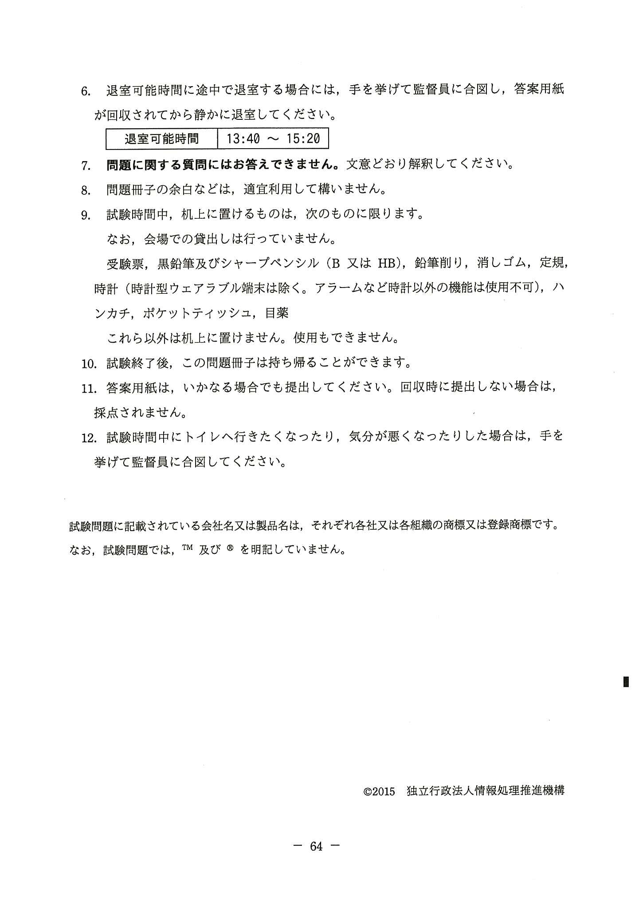

テキスト (OCR)

6. 退室可能時間に途中で退室する場合には, 手を挙げて監督員に合図し, 答案用紙
が回収されてから静かに退室してください。
| serves | 13:40 ~ 15:20 |
7. 問題に関する質問にはお答えできません。文意どおり解釈してください。
8. 問題冊子の余白などは, 適宜利用して構いません。
9. 試験時間中, 机上に置けるものは, 次のものに限ります。
なお, 会場での貸出しは行っていません。
受験票, 黒鉛筆及びシャープペンシル (B 又は HB), 鉛筆削り, 消しゴム, 定規,
時計 (時計型ウェアラブル端末は除く。アラームなど時計以外の機能は使用不可), ハ
ンカチ, ポケットティッシュ, 目薬
これら以外は机上に置けません。使用もできません。
10. 試験終了後, この問題冊子は持ち帰ることができます。
ll. 答案用紙は, いかなる場合でも提出してください。回収時に提出しない場合は,
採点されません。
12. 試験時間中にトイレへ行きたくなったり, 気分が悪くなったりした場合は, 手を
挙げて監督貞に合図してください。

試験問題に記載されている会社名又は製品名は, それぞれ各社又は各組織の商標又は登録商標です。
なお, 試験問題では, ™ 及び ® を明記していません。

@2015 独立行政法人情報処理推進機構

= 64 一

---

## 午後解答

1/6 
©2015 独立行政法人情報処理推進機構 
平成27 年度 秋期 応用情報技術者試験 解答例 
 
午後試験 
問１ 
出題趣旨 
 昨今，インターネット上のサービスに不正ログインされ，個人情報が流出したり，金銭的な被害に遭ったり
するトラブルが増大している。 
 本問では，SNS（ソーシャルネットワーキングサービス）への不正ログイン事象を題材に，パスワード認証
に関する基本的な理解やセキュリティ強化対策方法について問う。 
 
設問 
解答例・解答の要点 
備考 
設問１ 
a
エ 
 
 
b
ウ 
 
設問２ 
アカウント名 
設問３(1) エ 
 
(2) Web ブラウザ 
 
(3) ログイン用Cookie の値を知らないから 
 
(4) 電子メールアドレス 
 
問２ 
出題趣旨 
 販売計画を立てる際には，事業及び製品の内外環境や損益分析の結果を理解して，適切な内容とすることが
重要である。 
 本問では，メーカの個別の事業部における損益見込の分析を題材に，製品ライフサイクル，プロダクトポー
トフォリオマネジメント，損益分析及びOEM に関する考え方の理解について問う。 
 
設問 
解答例・解答の要点 
備考 
設問１ 
a
ウ 
順不同 
 
b
エ 
 
c
ア 
 
 
d
ウ 
順不同 
 
e
エ 
設問２(1) ウ 
 
 
(2)
f
A 
 
 
 
g
B 
 
 
 
h
A 
 
設問３ 
下線① 
D モデルだけで使用する設備の減価償却が終わっているかを確認す
る。 
 
 
 
下線② 
N 社の特許技術をM 社が使用してもよいかを確認する。

2/6 
©2015 独立行政法人情報処理推進機構 
問３ 
出題趣旨 
 2 分探索木は，最も基本的な木構造である。 
 本問では，2 分探索木を題材に，木構造の基本的理解と，再帰を用いた木構造のデータを扱うアルゴリズム，
また，探索を題材に，計算量に関する理解を問う。 
 
設問 
解答例・解答の要点 
備考 
設問１ 
ア
11
設問２ 
イ
k がp.key より小さい 
 
 
ウ
new Node(k) 
 
 
エ
return p 
 
 
オ
p.left 
 
 
カ
p.right 
 
 
キ
p ← r 
設問３ 
ク
n 
 
 
ケ
log n 
設問４ 
 
問４ 
出題趣旨 
 要件定義では，顧客の業務用語や業務内容を適切に理解し，抽象化する能力が必要である。 
 本問では，既存システムのリプレース案件を題材に，顧客の業務内容及び要件をヒアリングし，概念データ
モデルに抽象化する能力について問う。 
 
設問 
解答例・解答の要点 
備考 
設問１ 
a
ウ 
 
b
イ 
設問２ 
c
エ 
設問３ 
受注時点の製品価格で販売するから 
設問４ 
エンティティ名
受注 
 
属性名 
工場コード 
設問５(1)
d
工場コード 
 
(2)
e
顧客コード 
順不同 
 
 
f
工場コード 
 
 
属性名
出荷伝票番号，受注伝票番号，製品コード

3/6 
©2015 独立行政法人情報処理推進機構 
問５ 
出題趣旨 
 インターネット接続を含む企業LAN は，その企業の業態や規模に応じたネットワーク設計が必要である。 
 本問では，事業規模の拡大に伴う企業LAN の設計事例を題材に，ネットワーク設計に関する知識を問う。 
 
設問 
解答例・解答の要点 
備考 
設問１ 
508
設問２ 
事務所1
ファイルサーバ 
 
事務所2
PC 
設問３ 
a
192.168.1.0 
 
b
255.255.254.0 
 
c
192.168.4.3 
設問４(1)
主経路 
広域イーサネット網 
 
 
 
理由 
遅延が少なくテレビ会議機能に適しているから 
 
 
(2) 事務所とデータセンタでは異なる回線事業者と契約する。 
 
 
(3) イ 
 
 
問６ 
出題趣旨 
 データベースでデータを管理する際に，再帰的なデータ構造を扱う場合がある。また，現時点の情報だけで
なく，過去や未来の情報の管理も必要な場合がある。 
 本問では，人事システムを題材に，再帰的なデータ構造と履歴管理の考え方を問う。 
 
設問 
解答例・解答の要点 
備考 
設問１(1)
a
→ 
 
 
(2)
b
部署ID 
 
 
 
c
上位部署ID 
 
設問２(1) 第 1 正規形 
 
 
 
・主キーの一部に関数従属している属性があるから 
・主キーに部分関数従属している属性があるから 
・社員ID だけに従属している属性があるから 
 
 
(2) 社員ID，適用開始年月日，適用終了年月日，所属部署ID 
 
設問３(1)
d
IS NULL 
 
 
(2)
e
2012-10-01 
 
 
 
f
2014-03-31

4/6 
©2015 独立行政法人情報処理推進機構 
問７ 
出題趣旨 
 ディジタル電力量計は，A/D コンバータ，通信機能などを搭載した組込みシステムである。 
 本問では，電力量計として求められる機能を実現するための仕組み，求められる精度で計測するためのA/D
コンバータの使用方法，サーバからの指示に基づいた動作など，組込みシステムの設計に必要な技量を問う。
 
設問 
解答例・解答の要点 
備考 
設問１ 
時計の補正機能によって，時計の時刻が1 秒以上変化したとき 
設問２ 
タイムスタンプ 
設問３ 
a
22 
設問４(1)
b
電力量計の識別コード 
順不同 
 
 
c
プログラムのバージョン番号 
 
(2) 17（時間） 
 
問８ 
出題趣旨 
 昨今，基幹業務システムにおいては，個別に開発することは少なく，基幹パッケージを導入することが主流
である。 
 本問では，購買業務を題材に，業務パッケージの適用における，導入プロセスや，追加開発における基本的
な理解について問う。 
 
設問 
解答例・解答の要点 
備考 
設問１ 
a
見積金額をシステムに入力 
 
b
仕入先が見積回答を直接入力 
 
c
仕入先が請求内容を直接入力 
設問２(1)
d
明細追加( ) 
 
 
f
0..1 
 
(2)
e
1
1..＊
見積取得依頼
見積取得依頼明細
設問３ 
追加プログラムが使用するパッケージプログラムの変更内容

5/6 
©2015 独立行政法人情報処理推進機構 
問９ 
出題趣旨 
 スコープ管理は，プロジェクトを成功させるために最も重要な管理項目の一つである。 
 本問では，販売システムの機能追加開発を題材に，スコープの定義，スコープ変更管理を含めたスコープ管
理計画に関する基本的な知識と，スコープ変更への対処に関する基本の理解について問う。 
 
設問 
解答例・解答の要点 
備考 
設問１ 
①
②
③
・本年度末までの稼働 
・現状の応答時間の維持 
・1,000 万円以内の費用での開発 
設問２(1)
a
エ 
 
 
b
ウ 
 
 
c
ア 
 
(2) ファンクション数合計を機能量のベースラインにすること 
設問３(1) 50（万円） 
 
(2) ①
②
・開発期間の見積り 
・代替案の検討 
 
問10 
出題趣旨 
 企業の情報処理システムにおいてサーバ仮想環境の適用機会が広まっており，サーバ仮想環境におけるシス
テム運用業務の重要性はますます高まっている。 
 本問では，サーバ仮想環境におけるサーバ統合やサーバ移行を題材に，サーバ仮想環境におけるシステム運
用の基本知識の理解及び運用段階で実施するキャパシティ管理活動の実務能力を問う。 
 
設問 
解答例・解答の要点 
備考 
設問１(1) リソース使用率の最大値を把握する必要があるから 
 
(2) ・業務ピーク月のリソース使用率 
・6 月のリソース使用率 
設問２(1) SV02 上の仮想サーバに必要なメモリ容量の割当てができない。 
 
(2)
仮想サーバ 
配置先の物理サーバ 
案1 
案2 
案3 
案4 
案5 
 
VM11 
SV02 
SV03 
SV03 
 
 
 
VM12 
SV03 
SV02 
SV03 
 
 
 
(3) イ，オ 
 
(4) 業務上の重要性の高さによって移動を制限する。

6/6 
©2015 独立行政法人情報処理推進機構 
問11 
出題趣旨 
 コンピュータウイルスは，昨今，情報を盗み取ったり，コンピュータを乗っ取って他のコンピュータに不正
アクセスを行ったりするなどの犯罪の道具として利用されるようになってきた。 
 本問では，外部記憶媒体を介した感染をケースとして取り上げ，監査人として必要なコンピュータウイルス
対策に関する基本的な知識，及びコンピュータウイルス対策状況の監査を実施するための能力を問う。 
 
設問 
解答例・解答の要点 
備考 
設問１ 
a
最新のバージョンに更新されている 
設問２ 
b
最新のハードディスクスキャンの実行日時 
設問３ 
c
エ 
設問４ 
d
外部記憶媒体 
 
 
e
パターンファイル

---

## 午後採点講評

1/3 
©2016 独立行政法人情報処理推進機構 
平成27 年度 秋期 応用情報技術者試験 採点講評 
 
午後試験 
問１ 
 問1 では，SNS（ソーシャルネットワーキングサービス）への不正ログイン事象を題材に，パスワード認証
について出題した。全体として，正答率は高かった。 
 設問1，2 ともに正答率は高く，Web アプリケーションに対する基本的な攻撃手法については，おおむね理
解されているようであった。 
 設問3(3)は，Cookie による認証についての言及がない解答が目立った。Cookie もPC やIC カードと同様に，
正規の利用者しか持ち得ない物である。認証対象者の持ち物を利用した認証方式についてよく理解しておいて
ほしい。 
 
問２ 
 問2 では，メーカの個別の事業部における損益見込みの分析を題材に，製品ライフサイクル，プロダクトポ
ートフォリオマネジメント，損益分析，及びOEM に関する考え方の理解について出題した。 
 設問2(1)は，全部原価計算と直接原価計算の違いについて問うたが，正答率が低かった。これらの違いにつ
いて，問題文中に記述があるので，正しく理解し解答してほしかった。 
 設問3 の下線①は，正答率が低かった。D モデル製造に必要な設備の中にD モデルだけで使用している設備
があることに注目し，その減価償却について確認が必要であることに気付いてほしかった。経済面について考
えるときは，固定資産の減価償却に関する検討が不可欠であることに注意してほしい。 
 
問３ 
 問3 では，2 分探索木を題材に，木構造の基本的理解と，木構造を扱う再帰的なアルゴリズム及びその計算
量について出題した。全体として，正答率は高かった。 
 設問1 は，正答率が高かった。2 分探索木の条件については十分に理解できていることがうかがわれた。 
 設問2 は，正答率が高かった。2 分探索木のアルゴリズムの内容については，おおむね理解されているよう
であった。 
 設問3 は，正答率が低かった。2 分探索木のアルゴリズムの計算量は，木の高さに依存することに着目し，
木構造が最も深くなるとき，左右バランスよく完全2 分木になるときの木の高さを計算し，正答を導き出して
ほしい。 
 
問４ 
 問4 では，現行システムの再構築を題材に，顧客の業務内容を抽象化する概念データモデリングについて出
題した。 
 設問1，2，4 は，正答率が高かった。現行システムのテーブル構造から概念データモデルを作成し，現行シ
ステムの課題を抽出する方法については，おおむね理解されているようであった。 
 設問5(2)は，“出荷明細”エンティティに追加すべき属性の数が不足している解答が目立った。本文中の新出
荷業務の説明や概念データモデル中で“出荷明細”エンティティと関係付けられている二つのエンティティ
（“出荷”と“引当製品”）に着目して，解答を導き出してほしい。

2/3 
©2016 独立行政法人情報処理推進機構 
問５ 
 問5 では，事業規模の拡大に伴う企業LAN の設計事例を題材に，IP アドレスの割当てや拠点間のルーティ
ング，冗長化構成などを含むネットワーク設計について出題した。全体として，正答率は低かった。 
 設問1 は，正答率が低かった。サブネットマスクの違いによる割当て可能なIP アドレスの数は，ネットワー
ク設計において重要なポイントであり，よく理解してほしい。 
 設問3 は，正答率が高かった。ネットワーク設計におけるルーティングについては，おおむね理解されてい
るようであった。 
 設問4(3)は，正答率が低かった。代表的なルーティングプロトコルについて，その特徴を理解しておいてほ
しい。 
 
問６ 
 問6 では，人事システムを題材に，再帰的な構造と履歴とを合わせて管理するためのデータ設計について出
題した。全体として，正答率は低かった。 
 設問2 は，正答率が低かった。正規形を正しく理解することは，データベースの論理設計をする上で非常に
重要である。正規形の各段階と定義について，よく理解しておいてほしい。 
 設問3(1)は，正答率が低かった。WHERE 句でNULL であるものを選択する際は，“IS NULL”を使用するこ
とを理解しておいてほしい。 
 
問７ 
 問7 では，電力量計の設計を題材に，電力量計の機能を実現するための仕組み，A/D コンバータの精度，サ
ーバとの通信について出題した。全体として，正答率は高かった。 
 設問1 では，時刻補正に伴う問題を問うたが，ハードウェア故障，通信障害，割込み処理が原因などの解答
が散見された。問題中の条件を読み取って，正答を導き出してほしい。 
 設問2 は，データの欠落を見出すための情報について出題したが，与えられた条件以外で方法を論じた解答
が散見された。仕様の中で問題をいかに解決するか考えてほしい。 
 設問3 は，整数部と小数部からなる固定小数点表記を理解していれば解答できるはずであるが，正答率が低
かった。データのビット長はデータの精度に関わるので，正しく理解してほしい。 
 
問８ 
 問8 では，購買業務を題材に，業務パッケージの適用における，導入プロセスや，追加開発における基本的
な理解について出題した。 
 設問2 は，f の多重度の正答率が低かった。画面設計において希望仕入先名の入力は必須としていない点を見
逃している解答が多かった。画面設計の細部までよく読み取り，正答を導き出してほしい。 
 設問3 は，正答率が低かった。ソフトウェアパッケージ導入の際に追加開発を行う場合，ソフトウェアパッ
ケージ自身の機能追加やバグ改修があることを想定し，ソフトウェアパッケージ本体のプログラムやテーブル
をユーザ側で変更すべきではなく，またソフトウェアパッケージと追加プログラムの結合度は低くするべきで
ある。本問では，唯一，パッケージプログラムと追加プログラムが結合していることに着目し，購買パッケー
ジのバージョンアップによる影響を受ける可能性があることに気付いてほしい。 
 
問９ 
 問9 では，販売システムの機能追加開発プロジェクトを題材に，スコープの定義，スコープ変更管理を含め
たスコープ管理計画に関する基本的な知識について出題した。 
 設問1 は，正答率が高かった。スコープ管理計画において，応答時間や稼働時期など，プロジェクトで達成
すべき目標を明確にしておくことへの理解は高いようであった。 
 設問2(2)は，正答率が低かった。システムの機能量全体の計画と実績の差異を定量的に管理するために，機
能量を表す指標としてシステム部と販売管理部が合意しているファンクション数の合計をベースラインとする
ことがポイントであるが，ファンクション数の記述がない解答が目立った。設問をよく読み，機能量を表す指
標を何にするかを理解した上で解答してほしい。

3/3 
©2016 独立行政法人情報処理推進機構 
問10 
 問10 では，サーバ仮想環境におけるサーバ統合やサーバ移行を題材に，サーバ仮想環境におけるシステム運
用の基本知識の理解及び運用段階で実施するキャパシティ管理活動の理解について出題した。全体として，正
答率は高かった。 
 設問1(1)は，正答率が低かった。グラフで表されたリソース使用率の平均値やピーク値の意味を正しく理解
することは実務上でも必要であり，この能力をぜひ身に付けてほしい。 
 設問2 は，仮想サーバの配置の考え方やリソースの割当てについては，題意が理解されていたようで正答率
が高かったが，業務特性に応じた制限の内容を答える(4)は，正答率が低かった。問題文中の状況から今回の制
限のポイントとなる事項は何かを読み取ってほしい。 
 
問11 
 問11 では，コンピュータウイルス対策の監査を題材に，監査要点，監査手続，改善提案について出題した。
 設問1 は，“常に更新されている”，“自動的に更新されている”など，監査手続からは確認できない監査要点
を記述している答案が散見された。監査要点とは，監査手続によって立証される命題（監査人が監査証拠を入
手して正否，適否などを確かめるべき事項）であるということを理解してほしい。 
 設問2 は，ログには，複数のハードディスクスキャン実行日時が記録されているので，“最新のハードディス
クスキャンの実行日時”と比較する必要があることを理解してほしかった。 
 設問3 及び設問4 の正答率は高かった。

