# 平成27年度春期 応用情報技術者試験

---

## 午前問題

### ページ 1

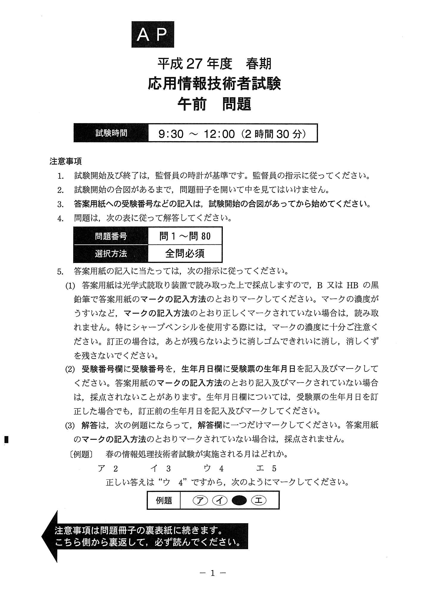

テキスト (OCR)

平成27 年度 春期

応用情報技術者試験
午前 問題

ie 9:30 ~ 12:00 (⑫時間30 人3

ol
1. 試験開始及び終了は, 監督員の時計が基準です。監督員の指示に従ってください。
2. 試験開始の合図があるまで, 問題冊子を開いて中を見てはいけません。
3. 答案用紙への受験番号などの記入は, 試験開始の合図があってから始めてください。
4. 間題は, 次の表に従って解答してください。
問題番号   問1 て問 80
選択方法    全問必須
5. 答案用紙の記入に当たっては, 次の指示に従ってください。

() 答案用紙は光学式読取り装置で読み取った上で採点しますので, B 又は HB OF
鉛筆で答案用紙のマークの記入方法のとおりマークしてください。マークの濃度が
うすいなど, マークの記入方法のとおり正しくマークされていない場合は, BAM
れません。特にシャープペンシルを使用する際には, マークの濃度に十分ご注意く
ださい。 訂正の場合は, あとが残らないように消しゴムできれいに消し, 消しくず
を残さないでください。

Q) 受験番号欄に受験番号を, 生年月日欄に受験票の生年月日を記入及びマークして
ください。管案用紙のマークの記入方法のとおり記入及びマークされていない場合
は, 採点されないことがあります。生年月日杉については, 受験票の生年月日を訂
正した場合でも, 訂正前の生年月日を記入及びマークしてください。

⑬) 解答は, 次の例題にならって, 解答欄に一つだけマークしてください。和案用紙
のマークの記入方法のとおりマークされていない場合は, 採点されません。

(例題) 春の情報処理技術者試験が実施される月はどれか。

ア 2    イ 3    ウ 4    エエ 5
正しい答えは “ウ 4” ですから, 次のようにマークしてください。

例題 | 〈⑦)(の や

注意事項は問題冊子の裏表紙に続きます。
こちら側から裏返して, 必ず読んでください。

### ページ 2

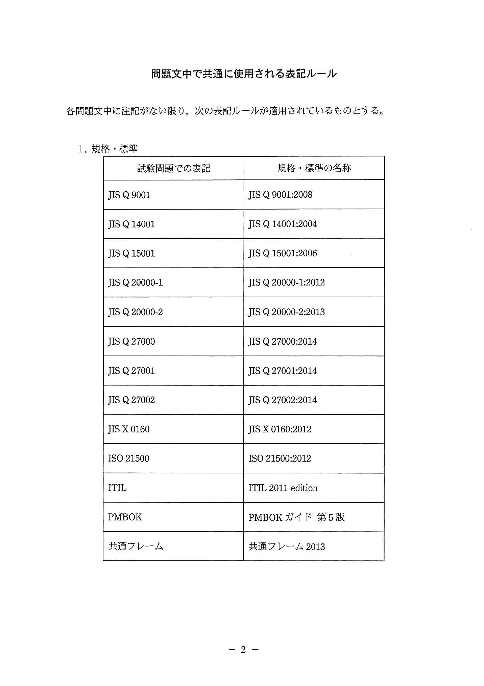

テキスト (OCR)

問題文中で共通に使用される表記ルール

各問題文中に注記がない限り, 次の表記ルールが適用されているものとする。

1. 規格・標準
試験問題での表記                 規格・標準の名称
JIS Q 9001                                JIS Q 9001:2008
JIS Q 14001                             JIS Q 14001:2004
JIS Q 15001                           JIS Q 15001:2006

JIS Q 20000-1

JIS Q 20000-1:2012

JIS Q 20000-2                            JIS Q 20000-2:2013

JIS Q 27000                               JIS Q 27000:2014

JIS Q 27001                               JIS Q 27001:2014

JIS Q 27002                               JIS Q 27002:2014

JIS X 0160                                   JIS X 0160:2012

ISO 21500                                     ISO 21500:2012

ITIL                                           ITIL 2011 edition
PMBOK                                 PMBOK ガイド 第5版
共通フレーム            共通フレーム 2013

### ページ 3

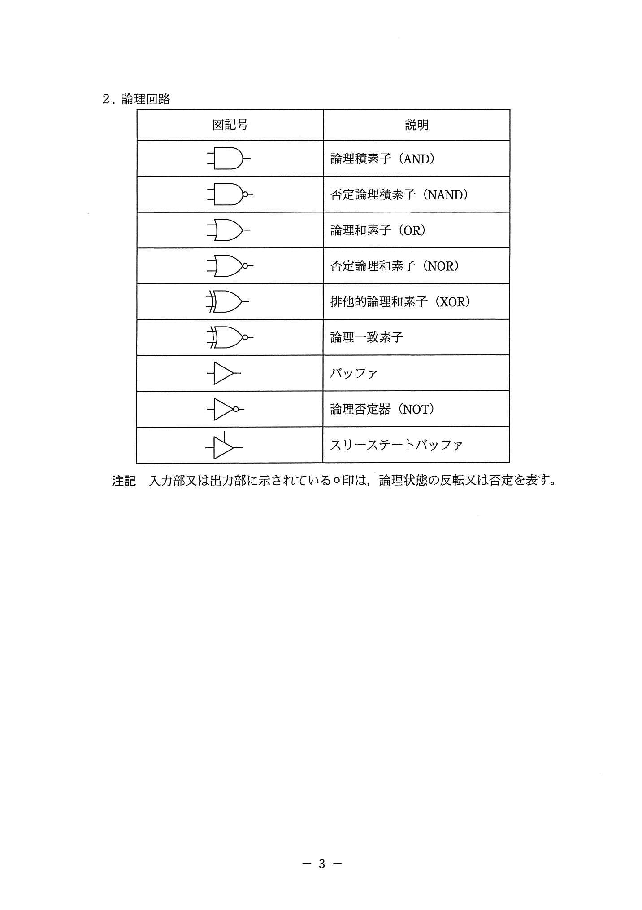

テキスト (OCR)

2. 論理回路

I
Tu
cu
a

論理積素子 (AND)

否定論理積素子 (NAND)

論理和素子 (OR)

否定論理和素子 (NOR)

排他的論理和素子 (KOR)

論理一致素子

バッファ

論理否定器 (NOT)

スリーステートバッファ

YYMIVMMVMM

注記 入力部又は出力部に示されているo印は, 論理状態の反転又は否定を表す。

### ページ 4

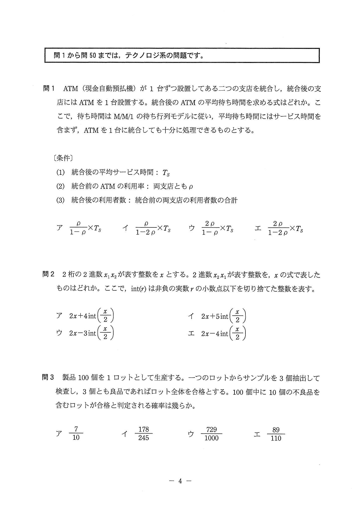

テキスト (OCR)

間 1 から問 50 までは, テクノロジ系の問題です。

fll ATM (現金自動預払機) が 1 台ずつ設置してある二つの支店を統合し, 統合後の支
店には ATM を 1 台設置する。 統合後の ATM の平均待ち時間を求める式はどれか。こ
こで, 待ち時間は MM/1 の待ち行列モデルに従い, 平均待ち時間にはサービス時間を

含まず, ATM を1 台に統合しても十分に処理できるものとする。

(RH)
①) 統合後の平均サービス時間 : Ts
(2) 統合前の ATM の利用率 : 両支店ともp
(3) 統合後の利用者数 : 統合前の両支店の利用者数の合計
0         0        20        20

vs T-p xfs   4 1-20 “is   7 l-p ss   Fa 1-20"!

問2 2桁の2進数。ぇが表す整数をx とする。2 EM x, 1 MRTBRE, x の式で表した
ものはどれか。ここで, int) は非負の実数ヶ の小数点以下を切り捨てた整数を表す。

)           4 2x+sint(+)

fay |
)                     x  みー4mt[ 2 )

ド

ア   2y+4imt

RN

|

ウ  zz-8mt[

to

間3 製品 100 個を 1 ロットとして生産する。一つのロットからサンプルを 3 個抽出して
BEL, 3 個とも良品であればロット全体を合格とする。100 個中に 10 個の不良品を
含むロットが合格と判定される確率は幾らか。

178               729               89
7 0          イー 35           7 “000               110

### ページ 5

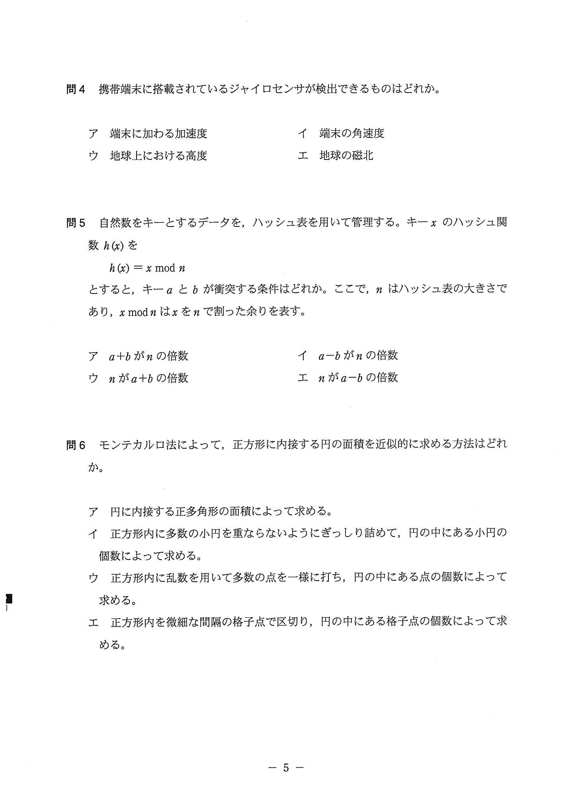

テキスト (OCR)

問4 携帯端末に搭載されているジャイロセンサが検出できるものはどれか。

ア 端末に加わる加速度       イ 端末の角速度
ウ 地球上における高度       エエ 地球の磁北

AS 自然数をキーとするデータを, ハッシュ表を用いて管理する。キーァ のハッシコョ関
数 @ を
h(x) =x mod n
とすると, F-a bb が衝突する条件はどれか。ここで, n はハッシュ表の大きさで
あり, xmodz は* をヵヶで割った余りを表す。

ア atb Wn の倍数        イ g--ヵがヶヵ の倍数
ウ ぁヵがz+ヵ の倍数          エエ が2-ヵの倍数

A6 モンテカルロ法によって, 正方形に内接する円の面積を近似的に求める方法はどれ
か。

ア 円に内接する正多角形の面積によって求める。
イ 正方形内に多数の小円を重ならないようにぎっしり詰めて, 円の中にある小円の

個数によって求める。
ウ 正方形内に乱数を用いて多数の点を一様に打ち, 円の中にある点の個数によって

求める。
エ 正方形内を微細な間隔の格子点で区切り, 円の中にある格子点の個数によって求

める。

### ページ 6

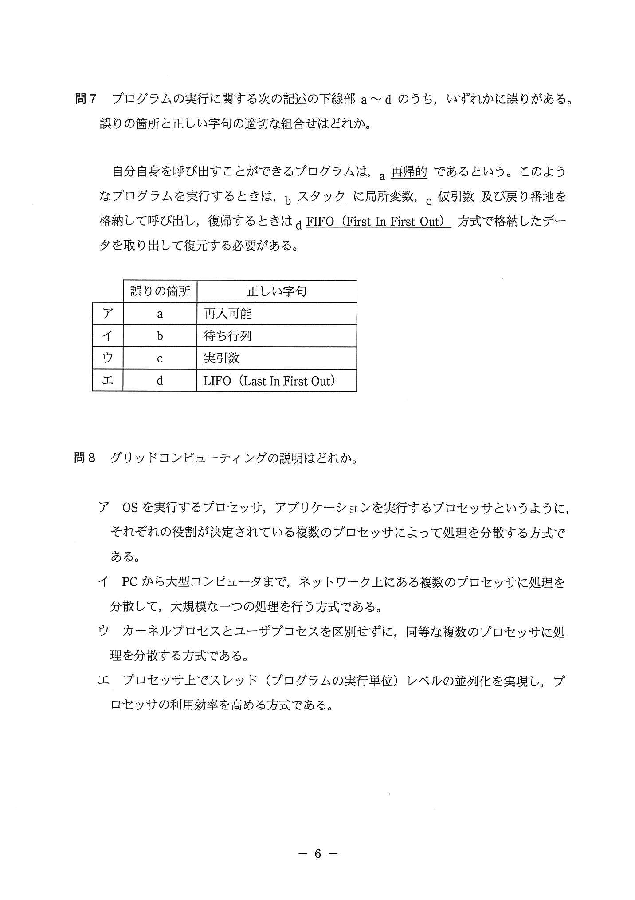

テキスト (OCR)

問7 プログラムの実行に関する次の記述の下線部 a~d のうち, いずれかに誤りがある。
誤りの箇所と正しい字旬の適切な組合せはどれか。

自分自身を呼び出すととができるプログラムは, 。 再帰的 であるという。このよう
なプログラムを実行するときは, スタック に局所変数, 。 仮引数 及び戻り番地を
格納して呼び出し, 復帰するときは 。 FIFO (First In First Out) 方式で格納したデー
タタを取り出して復元する必要がある。

誤りの人箇所                   正しい字句
ア             a            再入可能
イ    b   待ち行列
ウ   c   実引数
et           d          LIFO (Last In First Out)

間8 グリッドコンピューティングの説明はどれか。

ア OS を実行するプロセッサ, アプリケーションを実行するプロセッサというように,
それぞれの役割が決定されている複数のプロセッサによって処理を分散する方式で
ある。

イ PCから大型コンピュータまで, ネットワーク上にある複数のプロセッサに処理を
分散して, 大規模な一つの処理を行う方式である。

ウ カーネルプロセスとユーザプロセスを区別せずに, 同等な複数のプロセッサに処
理を分散する方式である。

エエ プロセッサ上でスレッド (プログラムの実行単位) レベルの並列化を実現し, プ
ロセッサの利用効率を高める方式である。

### ページ 7

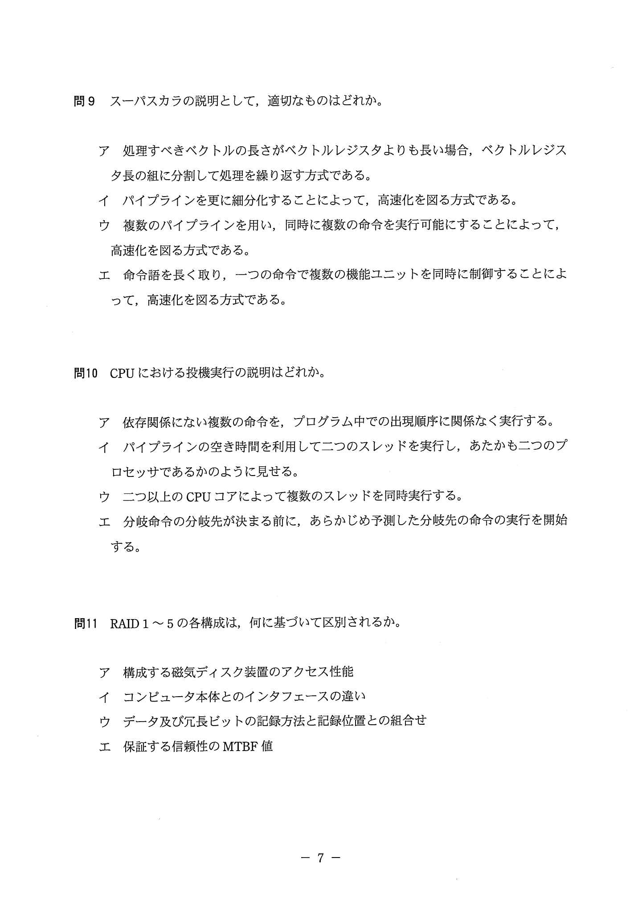

テキスト (OCR)

間9 スーパスカラの説明として, 適切なものはどれか。

ア 処理すべきベクトルの長さがベクトルレジスタよりも長い場合,.ベクトルレジス
夕長の組に分割して処理を繰り返す方式である。

イ パイプラインを更に細分化することによって, 高速化を図る方式である。

ウ 複数のパイプラインを用い, 同時に複数の命令を実行可能にすることによって,
高速化を図る方式である。

エエ 命令語を長く取り, 一つの命令で複数の機能ユニットを同時に制御することによ
って, 高速化を図る方式である。

問10 CPUにおける投機実行の説明はどれか。

ア 依存関係にない複数の命令,, プログラム中での出現順序に関係なく実行する。

イ パイプラインの空き時間を利用して二つのスレッドを実行し あたかも二つのプ
ロセッサであるかのように見せる。

ウ 二つ以上の CPU コアによって複数のスレッドを同時実行する。

エエ 分岐命令の分岐先が決まる前に, あらかじめ予測した分岐先の命令の実行を開始
する。

Rll RAID 1て5の各構成は,何に基づいて区別されるか。

構成する磁気ディスク装置のアクセス人性能

コンピュータ本体とのインタフェースの違い

データ及び冗長ビットの記録方法と記録位置との組合せ
保証する信頼性の MTBF 値

HGAN

### ページ 8

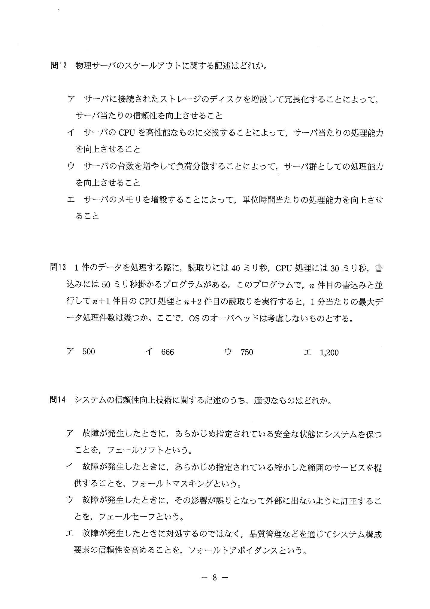

テキスト (OCR)

問12 物理サーバのスケールアウトに関する記述はどれか。

ア サーバに接続されたストレージのディスクを増設して冗長化することによって,
サーバ当たりの信頼性を向上させること

イ サーバの CPU を高性能なものに交換することによって, サーバ当たりの処理能力
を向上させること

ウ サーバの台数を増やして負荷分散することによって, サーバ群としての処理能カ
を向上させること

エエ サーバのメモリを増設することによって, 単位時間当たりの処理能力を向上させ
Oe

問13 1 件のデータを処理する際に, 読取りには 40 ミリ秒, CPU 処理には 30 ミリ秒, 書
込みには 50 ミリ秒掛かるプログラムがある。このプログラムで, n 件目の書込みと並
行してぁ十1 件目の CPU 処理とヵ十2 件目の読取りを実行すると, 1 分当たりの最大デ
ータ処理件数は幾つか。ここで, 0S のオーバヘッドは考慮しないものとする。

ア 500     イ 666     ウ 750     <= 1200

問14 システムの信頼性向上技術に関する記述のうち, 適切なものはどれか。

ア 政障が発生したときに, あらかじめ指定されている安全な状態にシステムを保つ
ことを, フェールソフトという。

イ 故障が発生したときに, あらかじめ指定されている縮小した範囲のサービスを提
供することを, フォールトマスキングという。

ウ 故障が発生したときに, その影響が誤りとなって外部に出ないように訂正するこ
とを, フェールセーフという。

エ 故障が発生したときに対処するのではなく, 品質管理などを通じてシステム構成
要素の信頼性を高めることを, フォールトアボイダンスという。

ー 8 一

### ページ 9

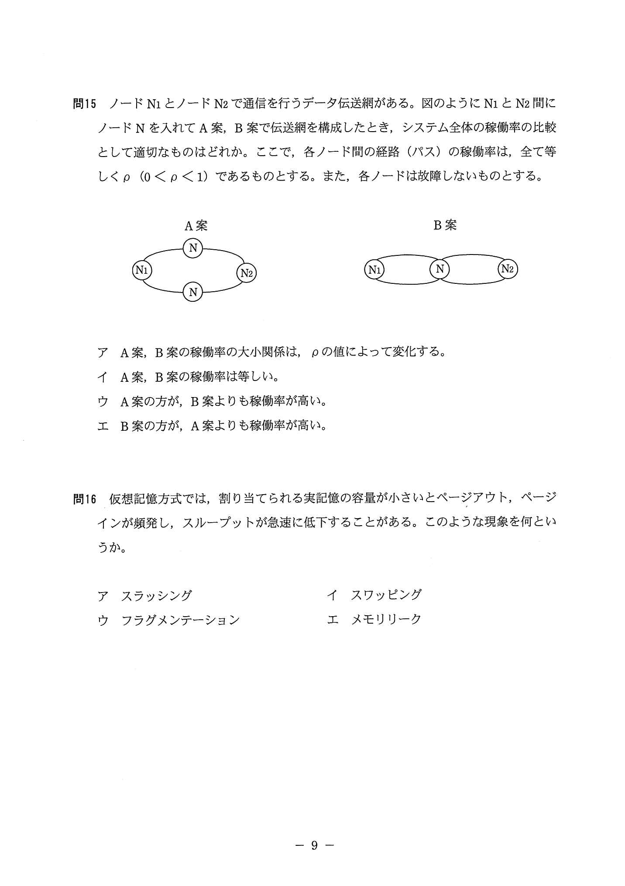

テキスト (OCR)

lS ノード Ni とノード No で通信を行うデータ伝送網がある。図のように Ni と No 問に
ノード N を入れて A 案, B 案で伝送網を構成したとき, システム全体の稼働率の比較
として適切なものはどれか。ここで, 各ノード間の経路 (パス) の稼働率は, 全て等
しくp (0ぐp ぐ1) であるものとする。また, 各ノードは故障しないものとする。

A案                     BE

®)
€ 5          q @⑳ ®

AR, B 案の稼働率の大小関係は. ゥの値によって変化する。
AR, B 案の稼働率は等しい。

A 案の方が, B 案よりも稼働率が高い。

B 案の方が, A 案よりも稼働率が高い。

HOGA NM

問16 仮想記憶方式では, 割り当てられる実記憶の容量が小さいとページアウト, ページ
インが頻発し, スループットが急速に低下することがある。このような現象を何とい

うか。
ア スラッシング                  イ スワッピング
ウ フラグメンテーション           エエ メモリリーク

### ページ 10

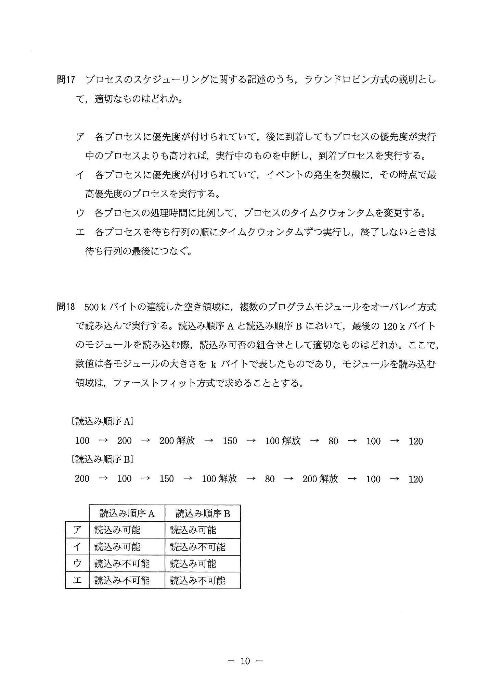

テキスト (OCR)

Bl? プロセスのスケジューリングに関する記述のうち, ラウンドロビフン方式の説明とし
て, 適切なものはどれか。

ア 各プロセスに優先度が付けられていて, 後に到着してもプロセスの優先度が実行
中のプロセスよりも高ければ, 実行中のものを中断し, 到着プロセスを実行する。
イ 各プロセスに優先度が付けられていて, イベントの発生を契機に, その時点で最

高優先度のプロセスを実行する。
ウ 各プロセスの処理時間に比例して, プロセスのタイムクウォンタムを変更する。
L 各プロセスを待ち行列の順にタイムクウォンタムずつ実行し, 終了しないときは
待ち行列の最後につなぐ。

間18 500k バイトの連続した空き領域に, 複数のプログラムモジュールをオーバレイ方式
で読み込んで実行する。読込み順序 A と読込み順序 B において, 最後の 120k バイト
のモジュールを読み込む際, 読込み可否の組合せとして適切なものはどれか。ここで,
数値各モジュールの大きさを k バイトで表したものであり, モジュールを読み込む
領域は ファーストフィット方式で求めることとする。

〔読込み順序 A)
100 > 200 一 200解放 > 150 > 100解放 —- 80 一 100 > 120
(読込み順序 B〕
200 > 100 > 150 一 100f#ik —- 80 一 200解放 一 100 一 120

読込み順序A | 読込み順序B
ア | 読込み可能           読込み可能
イ | 読込み可能           読込み不可能
ウ | 読込み不可能 | 読込み可能
XL | 読込み不可能 | 読込み不可能

ー 10 一

### ページ 11

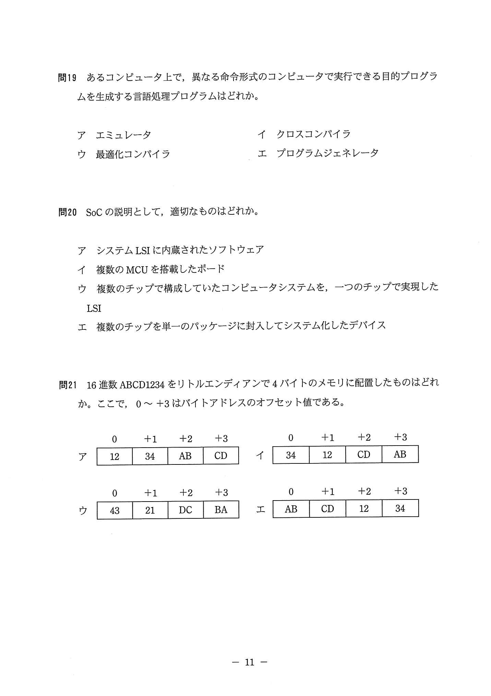

テキスト (OCR)

問19 あるコンピュータ上で, 異なる命令形式のコンピュータで実行できる目的プログラ
ムを生成する言語処理プログラムはどれか。

ア エミュレータ         イ クロスコンパイラ
ウ 最適化コンパイラ        エエ プログラムジェネレータ

間20 SoCの説明として, 適切なものはどれか。

ア システム LSI に内蔵されたソフトウェア

イ 複数のMCU を搭載したボード

ウ 複数のチップで構成していたコンピュータシステムを, 一つのチップで実現した
LSI

エエ 複数のチップを単一のパッケージに封入してシステム化したデバイス

間21 16進数 ABCD1234 をりトルエンディアンで 4 バイトのメモリに配置したものはどれ
か。ここで, OW +3 はパイトアドレスのオフセット値である。

0            +1          +2          +3                          0            4k          +2          +3
ア     12      34     AB     CD      イ     34      12     CD     AB
0            +1          +2          +3                          0            キュ1          +2          +3
ウ     43     21     DC     BA      x    AB     CD     12      34

ー 11 一

### ページ 12

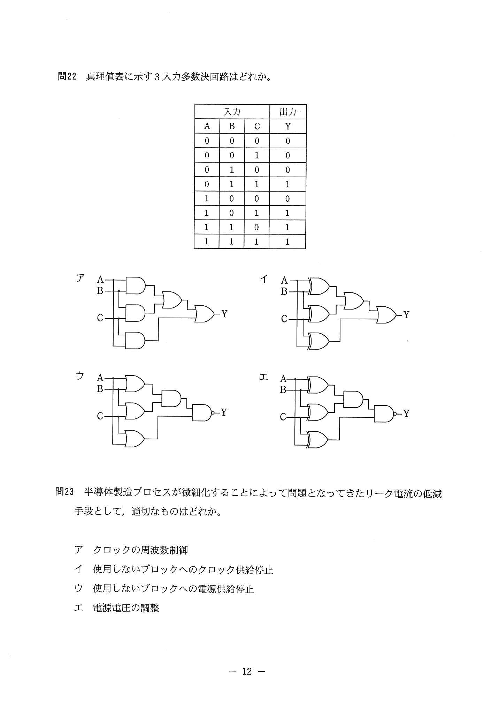

テキスト (OCR)

問22 真理値表に示す3入力多数決回路はどれか。

AA   出力
A lglc  Y
o | olo  0
of ofi  0
0  1  0  0
0  1  1  1
1  0  0  0
1  0  1  1
1  1  0  1
1  1  1  1
ア A            t Aa
B             B
 ae ioe
7 A          <= AS
B             B
C         x    ct    Y

問23 半導体製造プロセスが微細化することによって問題となってきたリーク電流の低減
手段として, 適切なものはどれか。

クロックの周波数制御

使用しないブロックへのクロック供給停止
使用しないブロックへの電源供給停止
電源電圧の調整

HAN

ー 12 一

### ページ 13

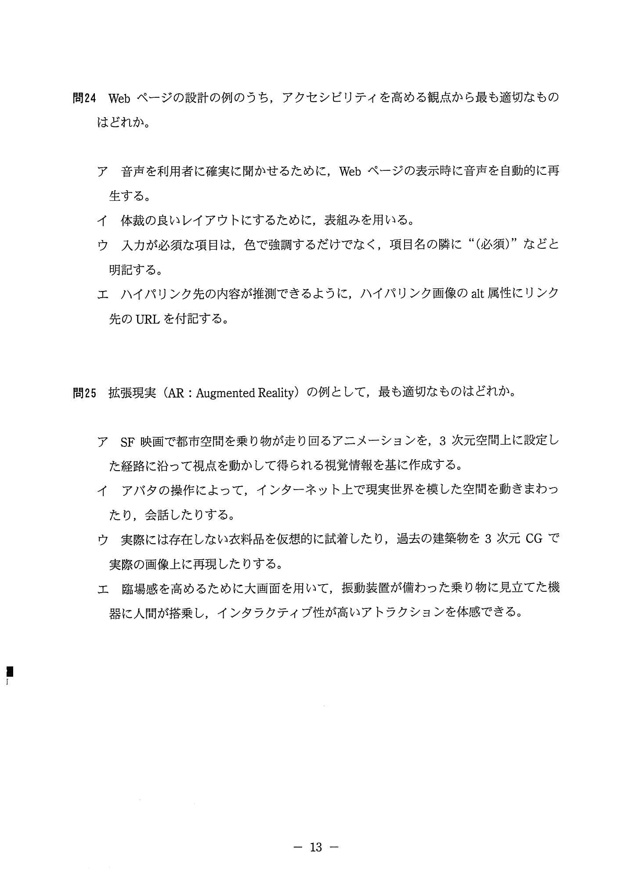

テキスト (OCR)

間24 Web ページの設計の例のうち, アクセシビリティを高める観点から最も適切なもの
はどれか。

ア 音声を利用者に確実に開かせるために, Web ページの表示時に音声を自動的に再
生する。

イ 体裁の良いヽ、レイアウトにするために, 表組みを用いる。

ウ 入力が必須な項目は, 色で強調するだけでなく, 項目名の隣に “(必須)” などと
明記する。

エエ ハイパリンク先の内容が推測できるように, ハイパリンク画像の alt 属性にリンク
先の URL を付記する。

問25 拡張現実 (AR : Augmented Reality) の例として, 最も適切なものはどれか。

ア SF 映画で都市空間を乗り物が走り回るアニメーションを, 3 次元空間上に設定し
た経路に沿って視点を動かして得られる視覚情報を基に作成する。

イ アバタの操作によって, インターネット上で現実世界を模した空間を動きまわっ
たり, 会話したりする。

ウ 実際には存在しない衣料品を仮想的に試着したり, 過去の建築物を 3 次元 CG で
実際の画像上に再現したりする。

エ 臨場感を高めるために大画面を用いて, 振動装置が備わった乗り物に見立てた機
器に人間が搭乗し インタラクティブ性が高いアトラクションを体感できる。

ー 13 一

### ページ 14

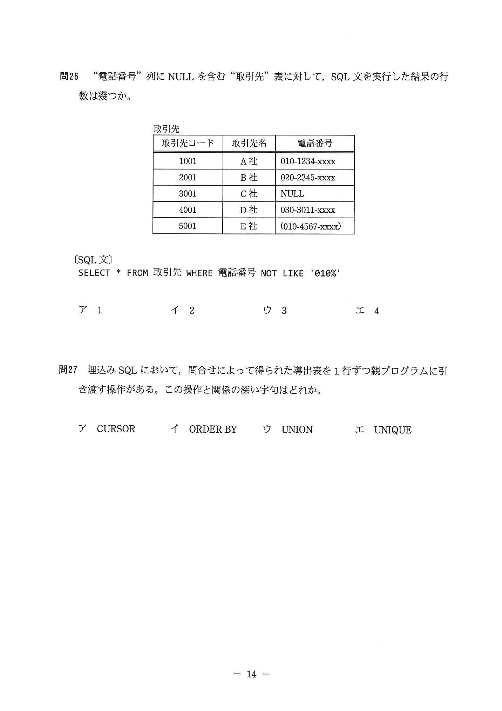

テキスト (OCR)

問26 "電話番号" 列に NULL を含む“取引先” 表に対して, SQL 文を実行した結果の行
数は幾つか。

取引先
取引先コード | 取引先名     電話番号
1001                At         010-1234-xxxx
2001                B社         020-2345-xxxx
3001                C社        NULL
4001              D社       030-3011-xxxx
5001              5社        (010-4567-xxxx)

(SQL 文
SELECT * FROM 取引先 WHERE 電話番号 NOT LIKE '016%'

ア 1   { 2   7 3   エ 4

問27 埋込み SQL において, 問合せによって得られた導出表を 1 行ずつ親プログラムに引

き渡す操作がある。この操作と関係の深い字句はどれか。

ア CURSOR   イ ORDER BY  ウ UNION    <= UNIQUE

ー 14 一

### ページ 15

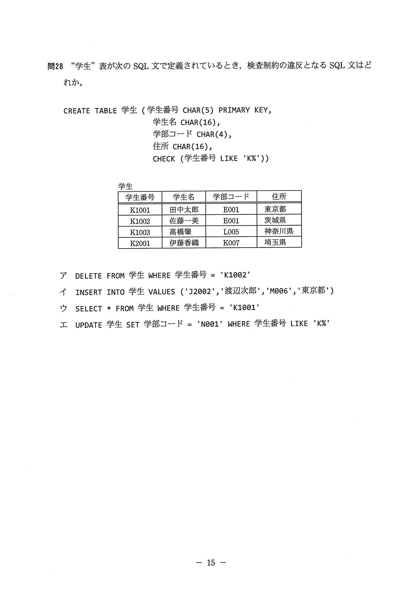

テキスト (OCR)

間28 学生” 表が次の SQL 文で定義されているとき, 検査制約の違反となる SQL 文はど
れか。

CREATE TABLE 学生 (学生番号 CHAR(5) PRIMARY KEY,
学生名 CHAR(16),
学部コード CHAR(4),
住所 CHAR(16),
CHECK (学生番号 LtKE 'K%'))

学生
学生番号          学生名          学部コード            住所
K1001          田中太郎            E001            東京都
K1002           佐藤一美              E001               茨城県
K1003    hig      L005     神奈川県
K2001           伊藤香織              K007              埼玉県

DELETE FROM 学生 WHERE 学生番号 = "K1992"

INSERT INTO 学生 VALUES (']2992', '渡辺次郎', "Me6','東京都")
SELECT * FROM 学生 WHERE 学生番号 = "K1691'

UPDATE 学生 SET 学部コード = "Ne91' WHERE 学生番号 LTKE 'K%'

H へ

ー 15 一

### ページ 16

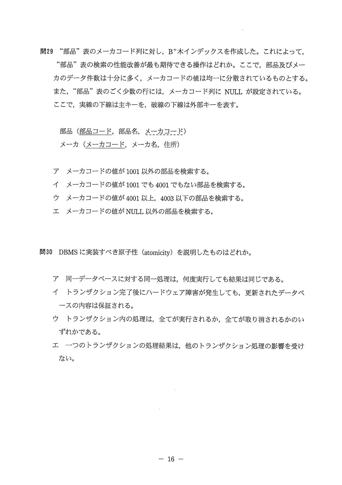

テキスト (OCR)

問29 部品” 表のメーカコード列に対し, B+木インデックスを作成した。これによって,
“部品” 表の検索の性能改善が最も期待できる操作はどれか。ここで, 部品及びメー
カカのデータ件数は十分に多く, メーカコードの値は均一に分散されているものとする。
また, “Abia” 表のごく少数の行には, メーカコード列に NULL が設定されている。
COC, 実線の下線は主キーを, 破線の下線は外部キーを表す。

部品 (部品コード, 部品名. メーカコード)

メーカ (メーカコード, メーカ名, 住所)

メーカコードの値が1001 以外の部品を検索する。

メーカコードの値が 1001 でも 4001 でもない部品を検索する。
メーカコードの値が 4001 LAE, 4003 以下の部品を検索する。
メーカコードの値がNULL 以外の部品を検索する。

H へ NW

問30 DBMS に実装すべき原子性 (atomicity) を説明したものはどれか。

ア 同一データベースに対する同一処理は, 何度実行しても結果は同じである。

イ トランザクション完了後にハードウェア障害が発生しても, 更新されたデータベ
ースの内容は保証される。

ウ トランザクション内の処理は, 全てが実行されるか, 全てが取り消されるかのい
ずれかである。

エエ 一つのトランザクションの処理結果は, 他のトランザクション処理の影響を受け
ない。

ー 16 一

### ページ 17

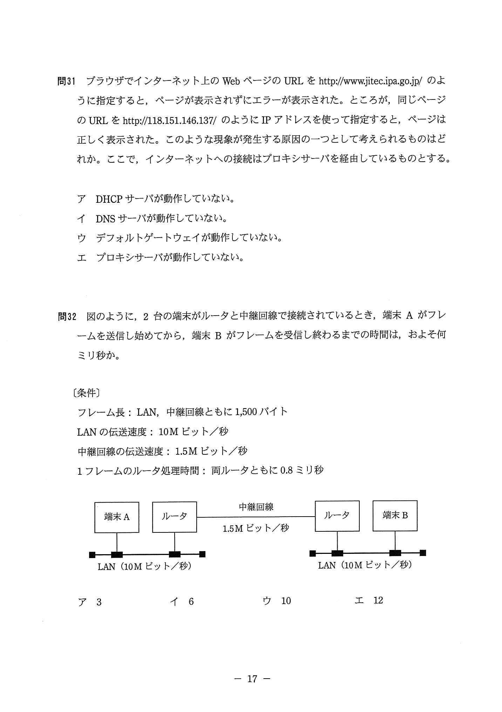

テキスト (OCR)

間31 ブラウザでインターネット上の Web ページの URL を http://wwwijitec.ipa.go.jp/ OK
うに指定すると, ページが表示されずにエラーが表示された。ところが, 同じページ
の URL を http:/118.151.146.137/ のように IP アドレスを使って指定すると, ページは
正しく表示された。このような現象が発生する原因の一つとして考えられるものはど
MD. TOC, インターネットへの接続はプロキシサーバを経由しているものとする。

DHCP サーバが動作していない。

DNS サーバが動作していない。

デフォルトゲートウェイが動作していない。
プロキシサーバが動作していない。

H tA N

32 図のように, 2 台の端末がルータと中継回線で接続されているとき, 端末 A がフレ
ームを送信し始めてから, 端末 B がフレームを受信し終わるまでの時間は, およそ何
ミリ秒か。

〔条件〕

フレーム長 : LAN, 中継回線ともに 1.500 バイト

LAN の伝送速度 : 10M ビットンノ秒

中継回線の伝送速度 : 1.5M ビットンノ秒

1フレームのルータ処理時間 : 両ルータともに 0.8 ミリ秒

中継回線
端末A       ルータ                              ルータ       端末 B
1.5M ビットンノ秒
LAN (10M ビットンノ秒)                             LAN (10M ビットンノ秒)
ア 3                イ 6                 ウ 10               xr 12

ー 17 一

### ページ 18

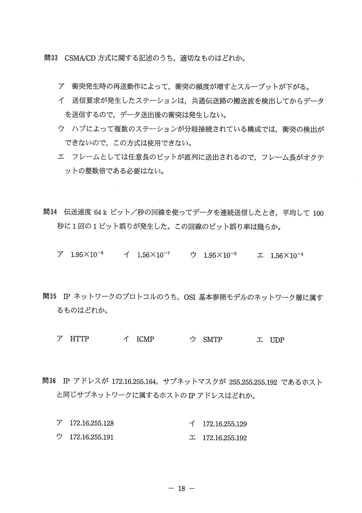

テキスト (OCR)

間33 CSMA/CD 方式に関する記述のうち, 適切なものはどれか。

ア 衝突発生時の再送動作によって, 衛突の頻度が増すとスループットが下がる。

イ 送信要求が発生したステーションは, 共通伝送路の搬送波を検出してからデータ
を送信するので, データ送出後の衝突は発生しない。

ウ ハブによって複数のステーションが分岐接続されている構成では, 衝突の検出が
できないので, この方式は使用できない。

LZ フレームとしては任意長のビットが直列に送出されるので, フレーム長がオクテ
ットの整数倍である必要はない。

問34 伝送速度 64k ビットンノ秒の回線を使ってデータを連続送信したとぎ, 平均して 100

秒に 1 回の 1 ビット誤りが発生した。この回線のビット誤り率は幾らか。

ア 1.95X10~?   イ 1.56X10~?   ウ 1.95X10~?   = 156X107

問35 IP ネットワークのプロトコルのうち, OS] 基本参照モデルのネットワーク層に属す

るものはどれか。

ア HTTP    イ ICMP     ウ SMTP    <= UDP

問36 IP アドレスが 172.16.255.164, サブネットマスクが 255.255.255.192 であるホスト

と同じサブネットワークに属するホストの IP アドレスはどれか。

ア 172.16.255.128        イ 172.16.255.129
ウ 172.16.255.191          ZL 172.16.255.192

ー 18 一

### ページ 19

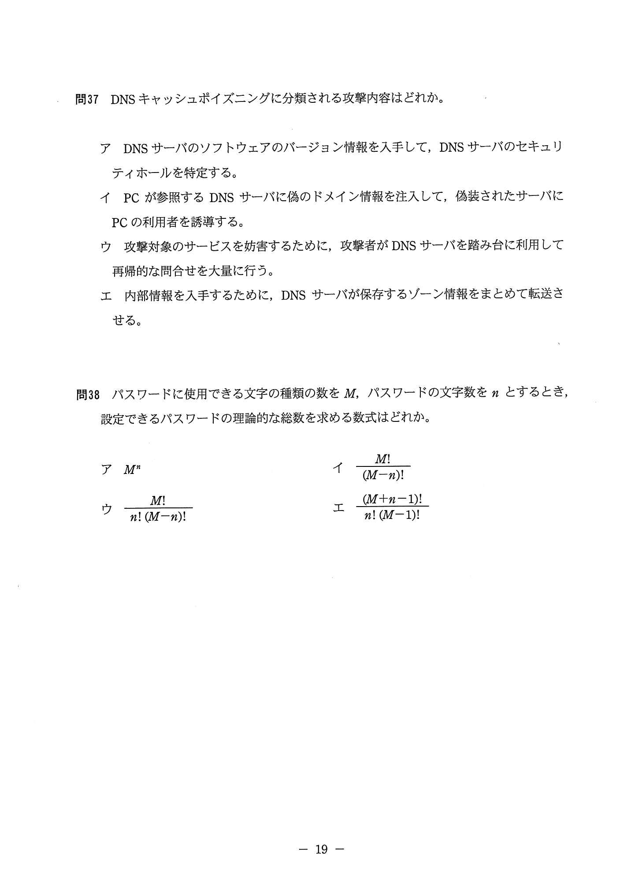

テキスト (OCR)

問37 DNS キャッシュポイズニングに分類される攻撃内容はどれか。

ア DNS サーバのソフトウェアのバージョン情報を入手して, DNS サーバのセキュリ
ティホールを特定する。
4 PC が参照する DNS サーバに償のドメイン情報を注入して, 億装されたサーバに

PC の利用者を誘導する。

ウ 攻撃対象のサービスを妨害するために, 攻撃者が DNS サーバを踏み台に利用して
再帰的な問合せを大量に行う。

エ 内部情報を入手するために, DNS サーバが保存するゾーン情報をまとめて転送さ
せる。

間38 パスワードに使用できる文字の種類の数を M, パスワードの文字数を n とするとき,
設定できるパスワードの理論的な総数を求める数式はどれか。

M!

ア M                                             イ     M—n!
M!                                             オター1!

7 Ma!                エ 名@ー1!

ー 19 一

### ページ 20

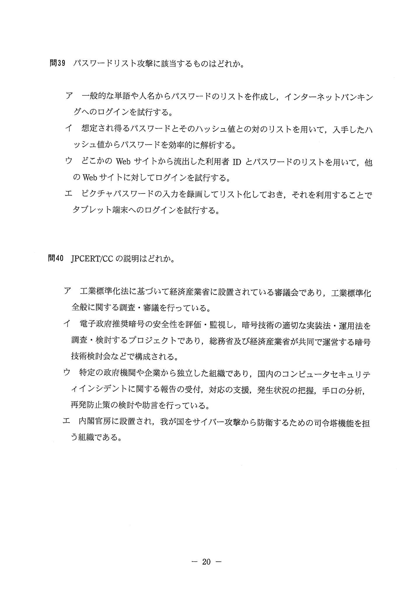

テキスト (OCR)

間39 パスワードリスト攻撃に該当するものはどれか。

ア 一般的な単語や人名からパスワードのリストを作成し, インターネットバンキン
グへのログインを試行する。

イ 想定され得るパスワードとそのハッシュ値との対のリストを用いて, 入手したハ
ッシュ値からパスワードを効率的に解析する。

ウ どこかの Web サイトから流出した利用者 ID とパスワードのリストを用いて, 他
の Web サイトに対してログインを試行する。

工 ピクチャパスワードの入力を録画してリスト化しておき, それを利用することで
タブレット端末へのログインを試行する。

間40 JPCERT/CC の説明はどれか。

ア 工業標準化法に基づいて経済産業省に設置されている審議会であり, 工業標準化
全般に関する調査・審議を行っている。

イ 電子政府推奨暗号の安全性を評価・監視し, 暗号技術の適切な実装法・運用法を
調査・検討するプロジェクトであり, 総務省及び経済産業省が共同で運営する暗号
技術検討会などで構成される。

ウ 特定の政府機関や企業から独立した組織であり, 国内のコンピュータセキュリテ
ィインシデントに関する報告の受付, 対応の支援, 発生状況の把握, 手口の分析,
再発防止策の検討や助言を行っている。

CL 内閣官房に設置され, 我が国をサイバー攻撃から防衛するための司令堪機能を担
う組織である。

ー 20 一

### ページ 21

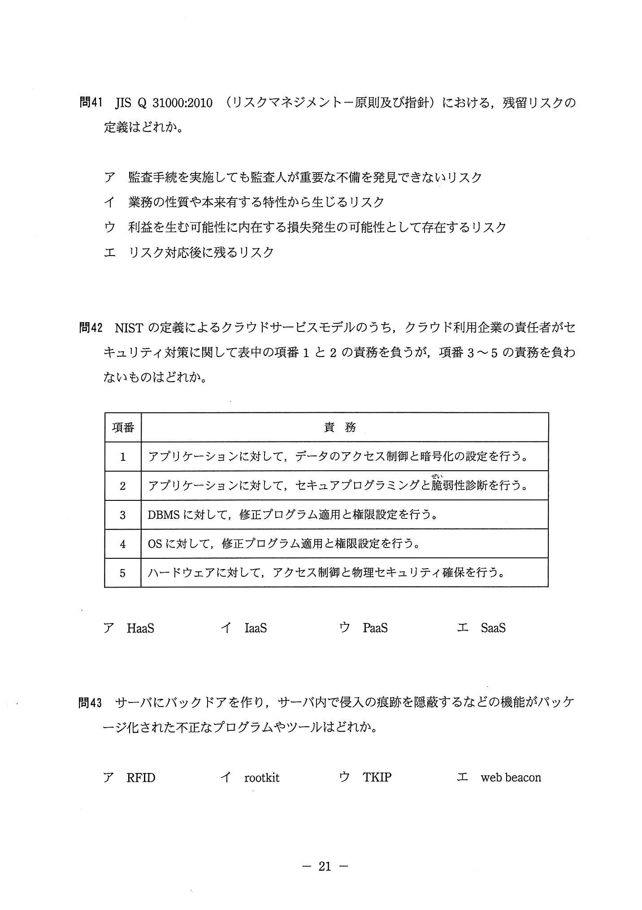

テキスト (OCR)

間41 JIS Q 31000:2010 (リスクマネジメントー原則及び指針) における, 残留リスクの
定義はどれか。

監査手続を実施しても監査人が重要な不備を発見できないリスク
業務の性質や本来有する特性から生じるリスク

利益を生む可能性に内在する損失発生の可能性として存在するリスク
リスク対応後に残るリスク

H GAN

間42 NIST の定義によるクラウドサービスモデルのうち, クラウド利用企業の責任者がセ
キュリティ対策に関して表中の項番 1 と 2 の責務を負うが, 項番 3て5の責務を負わ
ないものはどれか。

項番                           次 務
1 | アプリケーションに対して, データのアクセス制御と暗号化の設定を行う

2 | アプリケーションに対して, セキュアプログラミングと肛表人性診断を行う。

3 | DBMS に対して, 修正プログラム適用と権限設定を行う。

4 | 0S に対して, 修正プログラム適用と権限設定を行う。

5 | ハードウェアに対して, アクセス制御と物理セキュリティ確保を行う。

ア HaaS     イ 1laaS     ウ PaaS     I SaaS

43 サーバにバックドアを作り, サーバ内で侵入の痕跡を隠蔽するなどの機能がパッケ

ージ化された不正なプログラムやツールはどれか。

ア RFID     イ rootkit    ウ TKIP     web beacon

### ページ 22

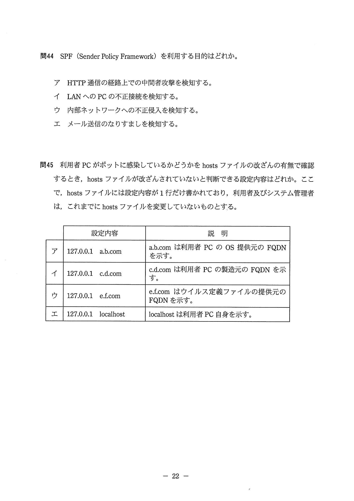

テキスト (OCR)

間44 SPF (Sender Policy Framework) を利用する目的はどれか。

HTTP 通信の経路上での中間者攻撃を検知する。
LAN への PC の不正接続を検知する。

内部ネットワークへの不正侵入を検知する。

メール送信のなりすましを検知する。

H へ

間45 利用者PC がボットに感染しているかどうかを hosts ファイルの改ざんの有無で確認
するとき, hosts ファイルが改ざんされていないと判断できる設定内容はどれか。ここ
で, hosts ファイルには設定内容が 1 行だけ書かれており, 利用者及びシステム管理者
は, これまでに hosts ファイルを変更していないものとする。

設定内容                              説 明
> | 1270.01 ab.com       a.b.com は利用者 PC の OS 提供元の FQDN
を示す。
4 | 1270.01 cdcom        CN は利用者 PC の製造元の FQDN を示
& | er shea          enon at ルス定義ファイルの提供元の
エエ | 127.0.0.1 localhost          localhost は利用者 PC 自身を示す。

ー 99 —

### ページ 23

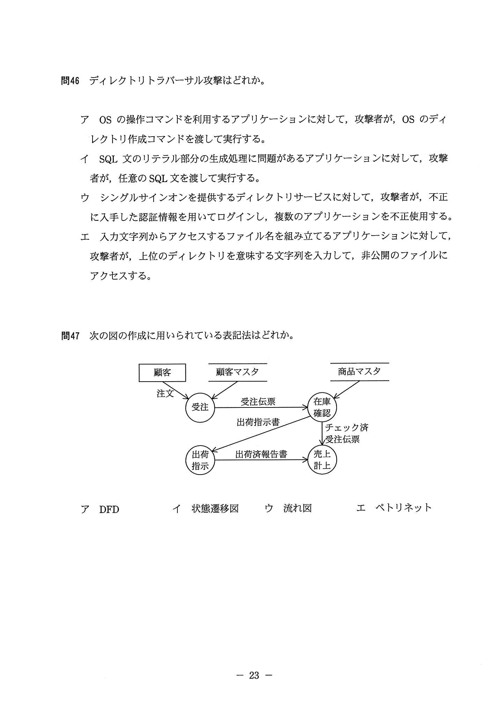

テキスト (OCR)

間46 ディレクトリトラバーサル攻撃はどれか。

ア OS の操作コマンドを利用するアプリケーションに対して, 攻撃者が, 0S のディ
レクトリ作成コマンドを渡して実行する。

イ SQL 文のりテラル部分の生成処理に問題があめるアプリケーションに対して, 攻撃
者が, 任意の SQL 文を渡して実行する。

ウ シングルサインオンを提供するディレクトリサービスに対して, 攻撃者が, 不正
に入手した認証情報を用いてログインし, 複数のアプリケーションを不正使用する。

エエ 入力文字列からアクセスするファイル名を組み立てるアプリケーションに対して,
攻撃者が, 上位のディレクトリを意味する文字列を入力して, 非公開のファイルに
アクセスする。

問47 次の図の作成に用いられている表記法はどれか。

顧客             顧客マスタ                       商品マスタ

ア DFD     イ 状態林移図  ウ 流れ図    エエ ペトリネット

### ページ 24

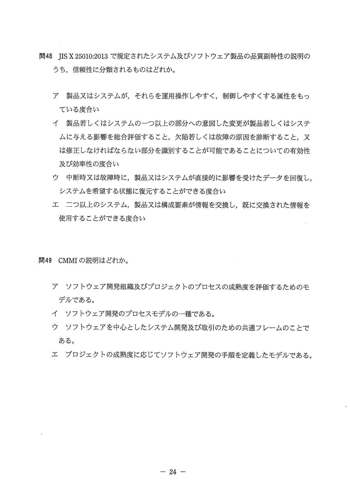

テキスト (OCR)

間48 JIS X25010:2013 で規定されたシステム及びソフトウェア製品の品質副特性の説明の
うち, 信頼性に分類されるものはどれか。

ア 製品文はシステムが, それらを運用操作しやすく, 制御しやすくする属性をもっ
ている度合い

イ 製品若しくはシステムの一つ以上の部分への意図した変更が製品若しくはシステ
ムに与える影響を総合評価すること, 欠陥若しくは故障の原因を診断すること, 又
は修正しなければならない部分を識別することが可能であることについての有効性
及び効率性の度合い

ウ 中断時又は故障時に, 製品又はシステムが直接的に影響を受けたデータを回復し,
システムを希望する状態に復元することができる度合い

エー二つ以上のシステム, 製品又は構成要素が情報を交換し, 既に交換された情報を
使用することができる度合い

問49 CMMI の説明はどれか。

ア ソフトウェア開発組織及びプロジェクトのプロセスの成熟度を評価するためのモ
デルである。

イ ソフトウェア開発のプロセスモデルの一種である。

ウ ソフトウェアを中心としたシステム開発及び取引のための共通フレームのこととで
ある。

KL プロジェクトの成熱度に応じてソフトウェア開発の手順を定義したモデルである。

ー 24 一

### ページ 25

テキスト (OCR)

間50 エクストリームプログラミング (XP) のプラクティスとして, 適切なものはどれか。

H ささペコ

1 週間の労働時間は, チームで相談して自由に決める。

ソースコードの再利用は, 作成者だけが行う。

単体テストを終えたプログラムは, すぐに結合して, 結合テストを行う。
プログラミングは1 人で行う。

### ページ 26

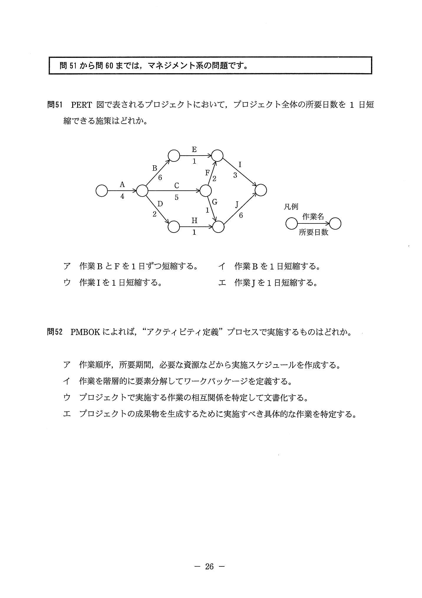

テキスト (OCR)

間 51 から問 60 までは, マネジメント系の問題です。

間51 PERT 図で表されるプロジェクトにおいて, プロジェクト全体の所要日数を 1 日短
縮できる施策はどれか。

凡例

作業名
OO

所要日数

ア 作業BとFを1日ずつ短縮する。     イ 作業Bを1日短縮する。
ウ 作業Iを1日短縮する。             エエ 作業]を1日短縮する。

問52 PMBOK によれば, “アクティビティ定義” プロセスで実施するものはどれか。

作業順序, 所要期間, 必要な資源などから実施スケジュールを作成する。
作業を階層的に要素分解してワークパッケージを定義する。

プロジェクトで実施する作業の相互関係を特定して文書化する。

プロジェクトの成果物を生成するために実施すべき具体的な作業を特定する。

H へ NSN

ー 26 一

### ページ 27

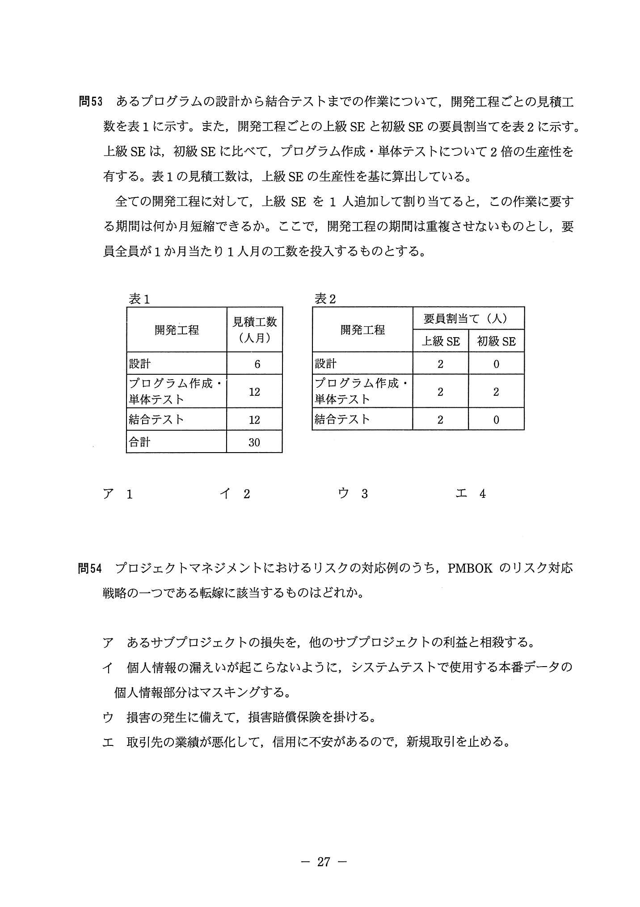

テキスト (OCR)

間53 あるプログラムの設計から結合テストまでの作業について, 開発工程ごとの見積工
数を表 1 に示す。また, 開発工程ごとの上級 SE と初級 SE の要員割当てを表 2 に示す。
上級 SE は, 初級SE に比べて, プログラム作成・単体ケストについて 2 倍の生産性を
有する。表 1 の見積工数は, 上級 SE の生産性を基に算出している。
全ての開発工程に対して, 上級 SE を 1 人追加して割り当てると, この作業に要す
る期間は何か月短縮できるか。ここで, 開発工程の期間は重複させないものとし, 要
員全員が1か月当たり 1 人月の工数を投入するものとする。

表1              表2
要員割当て (人)
開発工程 | UTR             開発工程

(人月)             上級SE | 初級SE
設計         6     設計         2    0
プログラム作成・  ]     プログラム作成・
単体テスト           単体テスト
結合テスト      12     結合テスト      2    0
合計        30

ア 1       イ 2       ウ 3       r 4

間54 プロジェクトマネジメントにおけるリスクの対応例のうち, PMBOK のリスク対応
戦略の一つである転嫁に該当するものはどれか。

ア あるサブプロジェクトの損失を, 他のサブプロジェクトの利益と相殺する。

イ 個人情報の漏えいが起こちらないように, システムテストで使用する本番データの
個人情報部分はマスキングする。

ウ 損害の発生に備えて, 損害賠償保険を掛ける。

エエ 取引先の業績が悪化して, 信用に不安があるので, 新規取引を止める。

### ページ 28

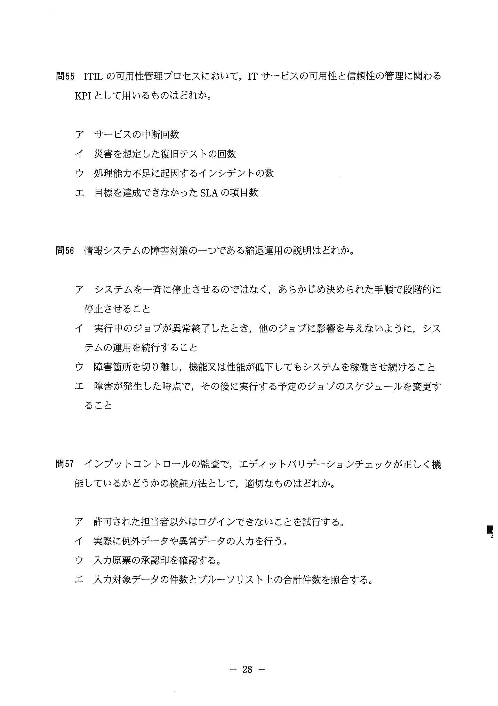

テキスト (OCR)

問55 ITIL の可用性管理プロセスにおいて, TT サービスの可用性と信頼性の管理に関わる
KPI として用いるものはどれか。

サービスの中断回数

災害を想定した復旧テストの回数

処理能力不足に起因するインシデントの数
目標を達成できなかった SLA の項目数

HOGAN

間56 情報システムの障害対策の一つである縮退運用の説明はどれか。

ア システムを一斉に停止させるのではなく, あらかじめ決められた手順で段階的に
停止させること

イ 実行中のジョブが暴常終了したとき, 他のジョブに影響を与えないように, シス
テムの運用を続行すること

ウ 障害箇所を切り離し, 機能又は性能が低下してもシステムを稼働させ続けること

エエ 障害が発生した時点で, その後に実行する予定のジョブのスケジュールを変更す
ること

間57 インプットコントロールの監査で エディットバリデーションチェックが正しく機
能しているかどうかの検証方法として, 適切なものはどれか。

許可された担当者以外はログインできないことを試行する。
実際に例外データや異常データの入力を行う。

入力原票の承認印を確認する。

入力対象データの件数とプルーフリスト上の合計件数を了合する。

H ささい

ー 28 一

### ページ 29

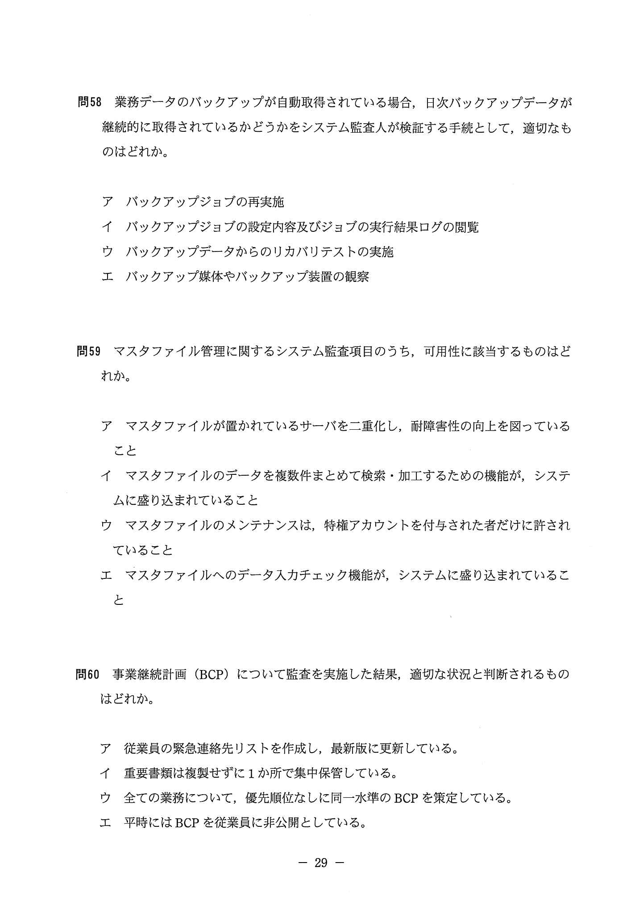

テキスト (OCR)

間58 業務データのバックアップが自動取得されている場合, 日次バックアップデータが
継続的に取得されているかどうかをシステム監査人が検証する手続として, 適切なも
のはどれか。

バックアップジョブの再実施

バックアップジョブの設定内容及びジョブの実行結果ログの閲覧
バックアップデータからのリカバリテストの実施

バックアップ媒体やバックアップ装置の観察

H へ

間59 マスタファイル管理に関するシステム監査項目のうち, 可用性に該当するものはど
れか。

ア マスタファイルが置かれているサーバを二重化し, 耐障害性の向上を図っている
こと

イ マスタファイルのデータを複数件まとめて検索・加工するための機能が, VAT
ムに盛り込まれていること

ウ マスタファイルのメンテナンスは, 特権アカウントを付与された者だけに許され
ていること

L マスタファイルへのデータ入力チェック機能が,. システムに盛り込まれているこ
と

問60 事業継続計画 (BCP) について監査を実施した結果, 適切な状況と判断されるもの
はどれか。

従業員の緊急連絡先リストを作成し, 最新版に更新している。

重要書類は複製せずに 1 か所で集中保管している。

全ての業務について, 優先順位なしに同一水準の BCP を策定している。
平時には BCP を従業員に非公開としている。

HAWN

ー 29 一

### ページ 30

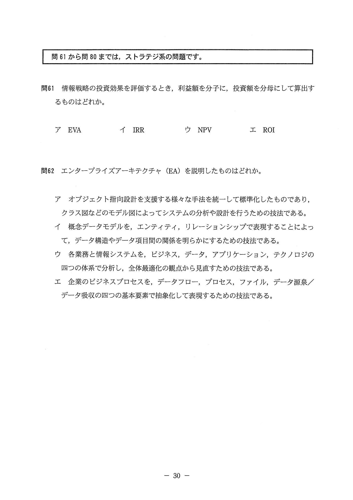

テキスト (OCR)

間 61 から問 80 までは, ストラテジ系の問題です。

問61 情報戦略の投資効果を評価するとき, 利益額を分子に, 投資額を分母にして算出す
るものはどれか。

ア EVA     イ IRR     ウ NPV     <= ROI

B62 エンタープライズアーキテクチャ (EA) を説明したものはどれか。

ア オブジェクト指向設計を支援する様々な手法を統一して標準化したものであり,
クラス図などのモデル図によってシステムの分析や設計を行うための技法である。
イ 概念データモデルを, エンティティ, リレーションシップで表現することによっ
て, データ構造やデータ項目間の関係を明らかにするための技法である。

ウ 各業務と情報システムを, EVRA, データ, アプリケーション, テクノロジの
四つの体系で分析し, 全体最適化の観点から見直すための技法である。

エエ 企業のビジネスプロセスを, データフロー, プロセス, Irth, データ源泉ノ
データ吸収の四つの基本要素で抽象化して表現するための技法である。

ー 30 一

### ページ 31

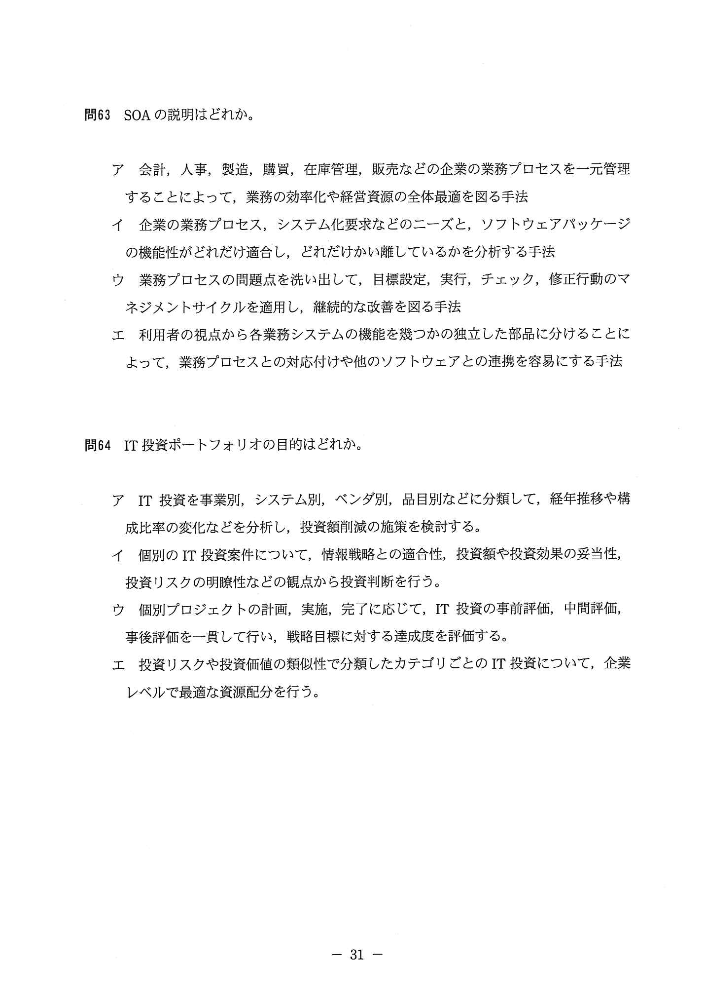

テキスト (OCR)

間63 SOA の説明はどれか。

ア 会計, AS, 製造, 購買, 在庫管理, 販売などの企業の業務プロセスを一元管理
することによって, 業務の効率化や経営資源の全体最適を図る手法
イ 企業の業務プロセス, システム化要求などのニーズと, ソフトウェアパッケージ
の機能性がどれだけ適合し, どれだけかい離しているかを分析する手法
ウ 業務プロセスの問題点を洗い出して, 目標設定, 実行, チェック, 修正行動のマ
ネジメントサイクルを適用し, 継続的な改善を図る手法
エエ 利用者の視点から各業務システムの機能を幾つかの独立した部品に分けることに
よって, 業務プロセスとの対応付けや他のソフトウェアとの連携を容易にする手法

問64 IT 投資ポートフォリオの目的はどれか。

ア TIT 投資を事業別, システム別. ベンダ別, 品目別などに分類して, 経年推移や構
成比率の変化などを分析し, 投資額削減の施策を検討する。

イ 個別の IT 投資案件について, 情報戦略との適合性, 投資額や投資効果の世当性,
投資リスクの明瞭性などの観点から投資判断を行う。

ウ 個別プロジェクトの計画, 実施, 完了に応じて, IT 投資の事前評価, 中間評価,
事後評価を一綱して行い, 戦略目標に対する達成度を評価する。

エ 投資リスクや投資価値の類似性で分類したカテゴリごとの TT 投資について, 企業
レベルで最適な資源配分を行う。

### ページ 32

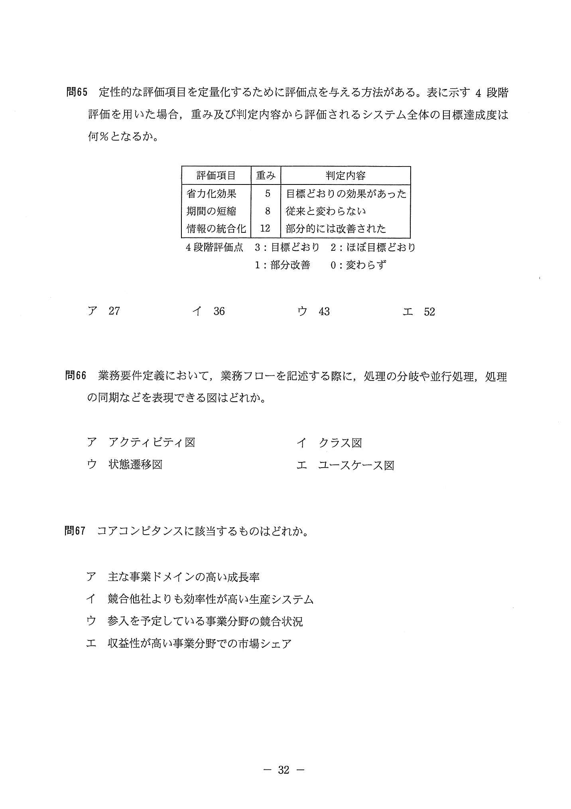

テキスト (OCR)

問65 定性的な評価項目を定量化するために評価点を与える方法がある。表に示す 4 段階
評価を用いた場合, 重み及び判定内容から評価されるシステム全体の目標達成度は
何%となるか。

評価項目 | 重み     判定内容

省力化効果   5 | 目標どおりの効果があった

期間の短縮   8 | 従来と変わらちない

情報の統合化 | 12 |部分的には改善された

4 段階評価点 3:目標どおり 2:ほばぼ目標どおり
1 : 部分改善 0:変わらず

問66 業務要件定義において, 業務フローを記述する際に, 処理の分岐や並行処理, 処理
の同期などを表現できる図はどれか。

ア アクティビティ図         イ クラス図
ウ 状態遷移図            エエ ユースケース図

間67 コアコンピタンスに該当するものはどれか。

主な事業ドメインの高い成長率

競合他社よりも効率性が高い生産システム
参入を予定している事業分野の競合状況
収益性が高い事業分野での市場シェア

HbA SN

ー 32 一

### ページ 33

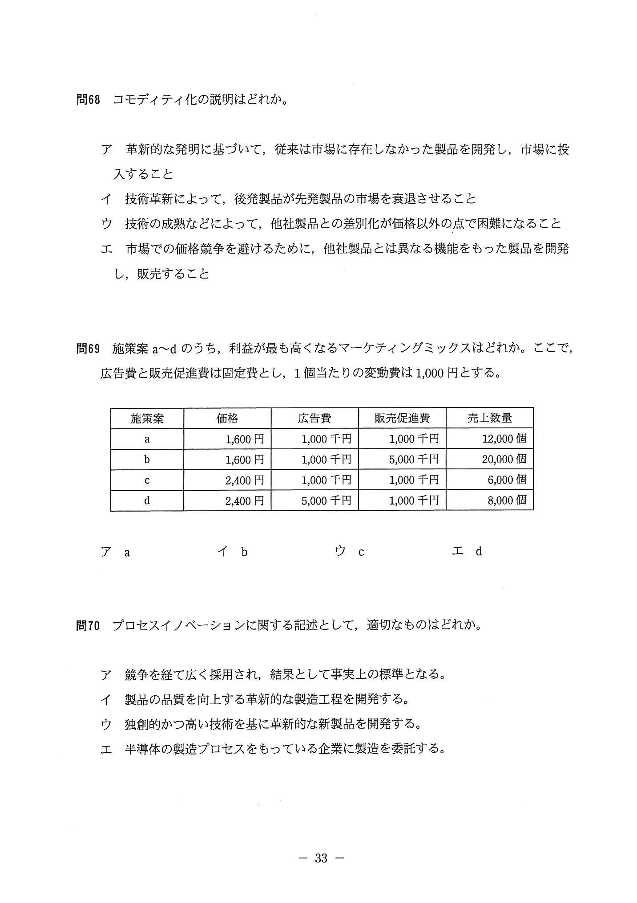

テキスト (OCR)

68 コモディティ化の説明はどれか。

ア 革新的な発明に基づいて, 従来は市場に存在しなかった製品を開発し, 市場に投
入すること

イ 技術革新によって, 後発製品が先発製品の市場を衰退させること

ウ 技術の成熱などによって, 他社製品との差別化が価格以外の点で困難になること

エエ 市場での価格競争を避けるために, 他社製品とは異なる機能をもった製品を開発
し, 販売すること

間69 施策案 ad のうち, 利益が最も高くなるマーケティングミックスはどれか。ここで,
広告費と販売促進費は固定費とし, 1 個当たりの変動費は 1.000 円とする。

施策案             価格               広告費           販売促進費          売上数量
a                   1,600 円          1,000 FA          1,000 千円           12,000 個
b                      1,600 円           1,000 FA           5,000 千円            20,000 個
2,400 円          1,000 FA          1,000 千円            6,000 個
d                     2,400 円           5,000 FA           1,000 千円              8,000 個
ア a                      イ b                      ウ c                      エ d

問70 プロセスイノベーションに関する記述として, 適切なものはどれか。

競争を経て広く採用され, 結果として事実上の標準となる。
製品の品質を向上する革新的な製造工程を開発する。
独創的かつ高い技術を基に革新的な新製品を開発する。
半導体の製造プロセスをもっている企業に製造を委託する。

H YAN

— 35 —

### ページ 34

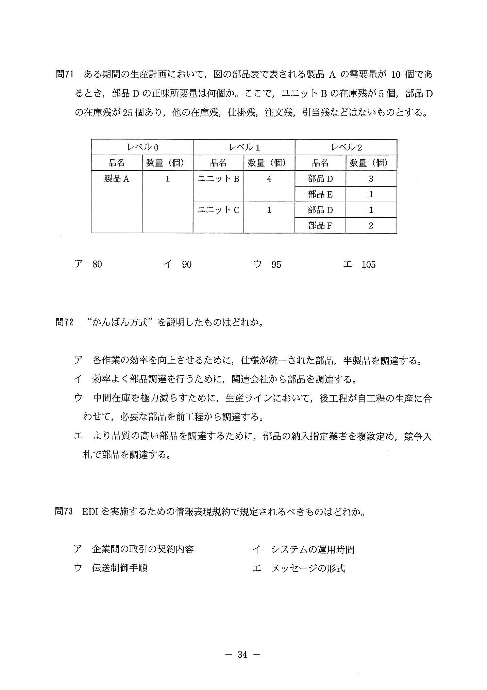

テキスト (OCR)

問71 ある期間の生産計画において, 図の部品表で表される製品 A の需要量が 10 個であ
Sc, 部品 D の正味所要量は何個か。ここで, ユニットB の在庫残が5 個, 部品D
の在庫残が 25 個あり, 他の在庫残, 仕掛残, 注文残, 引当残などはないものとする。

レベル0                レベル 1                レベル 2
i   数量 (個)  曲名  数量 (個)  品名  数量 (個)
製品A    1   ユニットB   4    部品D    3
部品E     1
ユニットC       1         部品D         1
部品F        2
ア 80              イ 90              ウ 95              <= 105

問72 “AAA” を説明したものはどれか。

ア 各作業の効率を向上させるために, 仕様が統一された部品, 半製品を調達する。

イ 効率よく部品調達を行うために, 関連会社から部品を調達する。

ウ 中間在庫を極力減らすために, 生産ラインにおいて, 後工程が自工程の生産に合
わせて, 必要な部品を前工程から調達する。

エエ より品質の高い部品を調達するために, 部品の納入指定業者を複数定め, 競争入
札で部品を調達する。

問73 EDI を実施するための情報表現規約で規定されるべきものはどれか。

ア 企業間の取引の契約内容      イ システムの運用時間
ウ 伝送制御手順           工 メッセージの形式

ー 34 一

### ページ 35

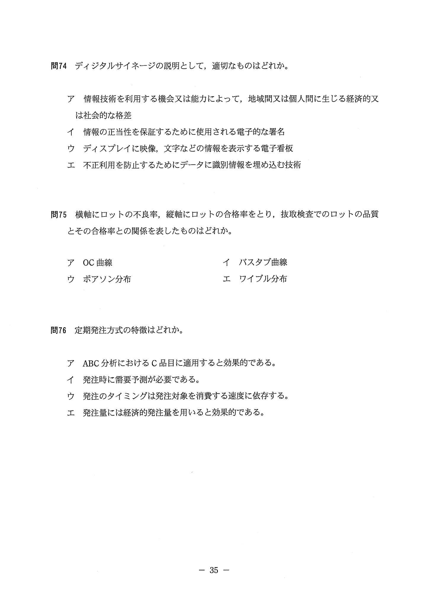

テキスト (OCR)

間74 ディジタルサイネージの説明として, 適切なものはどれか。

ア 情報技術を利用する機会叉は能力によって, 地域問又は個人間に生じる経済的双
は社会的な格差

イ 情報の正当性を保証するために使用される電子的な賭名

ウ ディスプレイに映像, 文字などの情報を表示する電子看板

エエ 不正利用を防止するためにデータに識別情報を埋め込む技術

問75 横軸にロットの不良率, 縦軸にロットの合格率をとり, 抜取検査でのロットの品質
とその合格率との関係を表したものはどれか。

ア OC曲線           イ パスタブ曲線
ウ ポアソン分布          エ ワイブル分布

問76 定期発注方式の特徴はどれか。

ABC 分析における C品目に適用すると効果的である。
発注時に需要予測が必要である。

発注のタイミングは発注対象を消費する速度に依存する。
発注量には経済的発注量を用いると効果的である。

H YAWN

ー 35 一

### ページ 36

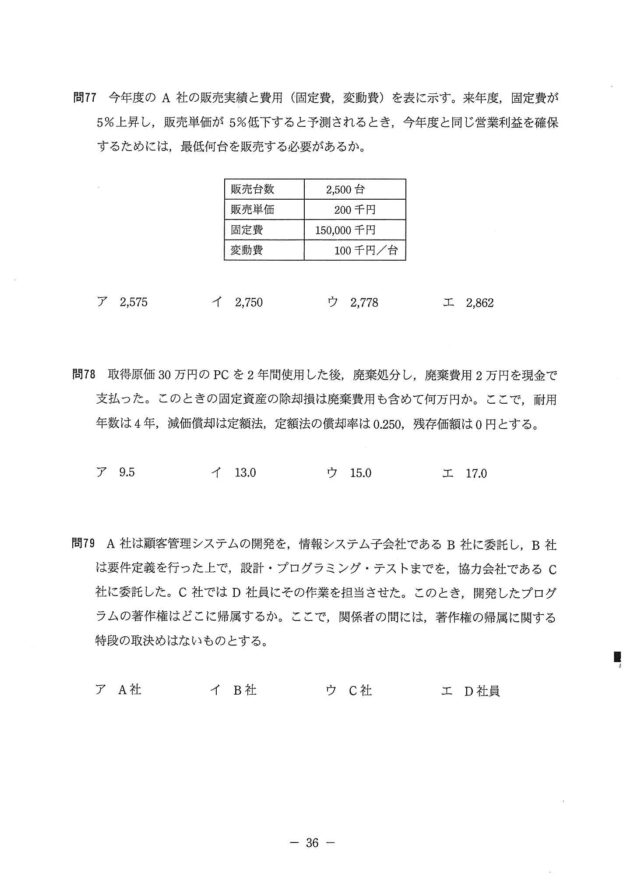

テキスト (OCR)

BIT? 今年度の A 社の販売実績と費用 (HEH, AHH) を表に示す。来年度, 固定費が
5%上昇し, 販売単価が 5%低下すると予測されるとき, 今年度と同じ営業利益を確保
するためには, 最低何台を販売する必要があるか。

販売台数       2,500 台
販売単価        200 千円
固定費       150,000 FF
変動費         100 千円台
ア 2575        イ 2,750        ウ 2778        XL 2862

問78 取得原価 30 万円の PC を2? 年間使用した後, 廃棄処分し, 廃棄費用 2 万円を現金で
支払った。このときの固定資産の除却損は廃棄費用も含めて何万円か。ここで, 耐用
年数は4 年, 減価償剤は定額法, 定額法の償序率は 0.250, 残存価額は 0 円とする。

ア 95         イ 13.0        ウ 15.0        x 17.0

問79 A 社は顧客管理システムの開発を, 情報システム子会社である B 社に委託し, B tt
は要件定義を行った上で, 設計・プログラミング・テストまでを, 協力会社である C
社に委託した。C 社では D 社員にその作業を担光させた。このとき, 開発したプログ
ラムの著作権はどこに帰属するか。ここで, 関係者の間には, 著作権の帰属に関する

特段の取決めはないものとする。

ア Att     qt B社     ウ C社     <= D社員

ー 36 一

### ページ 37

テキスト (OCR)

問80 電子署名法に関する記述のうち, 適切なものはどれか。

ア 電子署名技術は共通鍵暗号技術によるものと規定されている。

イ 電子署名には, 電磁的記録以外の, コンピュータ処理の対象とならないものも含
まれる。

ウ 電子署名には, 民事訴訟法における押印と同様の効力が認められている。

エエ 電子署名の認証業務を行うことができるのは, 政府が運営する認証局に限られる。

### ページ 38

テキスト (OCR)

【 メモ 用 紙 〕

ー 38 一

### ページ 39

テキスト (OCR)

【 メモ 用 HJ

ー 39 一

### ページ 40

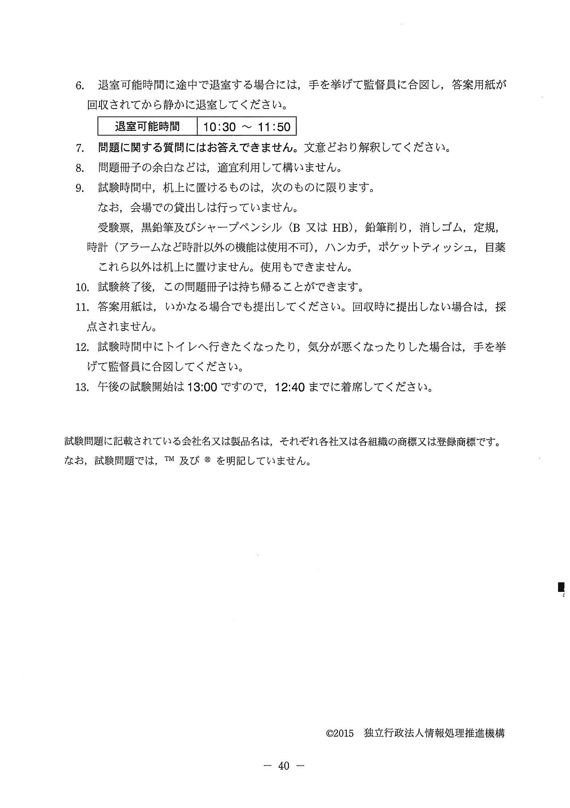

テキスト (OCR)

6. 退室可能時間に途中で退室する場合には, 手を挙げて監督員に合図し, 答案用紙が
回収されてから静かに退室してください。
| 退室可能時間 | 10:30 ~ 11:50|
7. 間題に関する質問にはお答えできません。文意どおり解釈してください。
8. 問題冊子の余白などは, 適宜利用して構いません。
9, 試験時間中, 机上に置けるものは, 次のものに限ります。
なお, 会場での貸出しは行っていません。
受験票, 黒鉛筆及びシャープペンシル (B 又は HB), 鉛筆削り, 消しゴム, 定規,
時計 (アラームなど時計以外の機能は使用不可)。 ハンカチ, ポケットティッシュ, 目薬
これら以外は机上に置けません。使用もできません。
10. 試験終了後, この問題冊子は持ち帰ることができます。
11. 答案用紙は。 いかなる場合でも提出してください。回収時に提出しない場合は, 採
点されません。
12, 試験時間中にトイレへ行きたくなったり, 気分が悪くなったりした場合は, FER
げて監督員に合図してください。
13. 午後の試験開始は 13:00 ですので, 12:40 までに着席してください。

試験問題に記載されている会社名又は製品名は, それぞれ各社又は各組織の商標又は登録商標です。
なお, 試験問題では, ™ 及び @ を明記していません。

@2015 独立行政法人情報処理推進機構

ー 40 一

---

## 午前解答

©2015 独立行政法人情報処理推進機構 
平成27 年度 春期 応用情報技術者試験 解答例 
 
午前試験 
問番号 
正解 
問1 
エ 
問2 
ウ 
問3 
イ 
問4 
イ 
問5 
イ 
問6 
ウ 
問7 
エ 
問8 
イ 
問9 
ウ 
問10 
エ 
問11 
ウ 
問12 
ウ 
問13 
エ 
問14 
エ 
問15 
エ 
問16 
ア 
問17 
エ 
問18 
イ 
問19 
イ 
問20 
ウ 
 
 
問番号 
正解 
問21 
イ 
問22 
ア 
問23 
ウ 
問24 
ウ 
問25 
ウ 
問26 
ウ 
問27 
ア 
問28 
イ 
問29 
ウ 
問30 
ウ 
問31 
イ 
問32 
エ 
問33 
ア 
問34 
イ 
問35 
イ 
問36 
イ 
問37 
イ 
問38 
ア 
問39 
ウ 
問40 
ウ 
 
 
問番号 
正解 
問41 
エ 
問42 
ウ 
問43 
イ 
問44 
エ 
問45 
エ 
問46 
エ 
問47 
ア 
問48 
ウ 
問49 
ア 
問50 
ウ 
問51 
エ 
問52 
エ 
問53 
エ 
問54 
ウ 
問55 
ア 
問56 
ウ 
問57 
イ 
問58 
イ 
問59 
ア 
問60 
ア 
 
 
問番号 
正解 
問61 
エ 
問62 
ウ 
問63 
エ 
問64 
エ 
問65 
イ 
問66 
ア 
問67 
イ 
問68 
ウ 
問69 
ウ 
問70 
イ 
問71 
イ 
問72 
ウ 
問73 
エ 
問74 
ウ 
問75 
ア 
問76 
イ 
問77 
エ 
問78 
エ 
問79 
ウ 
問80 
ウ

---

## 午後問題

### ページ 1

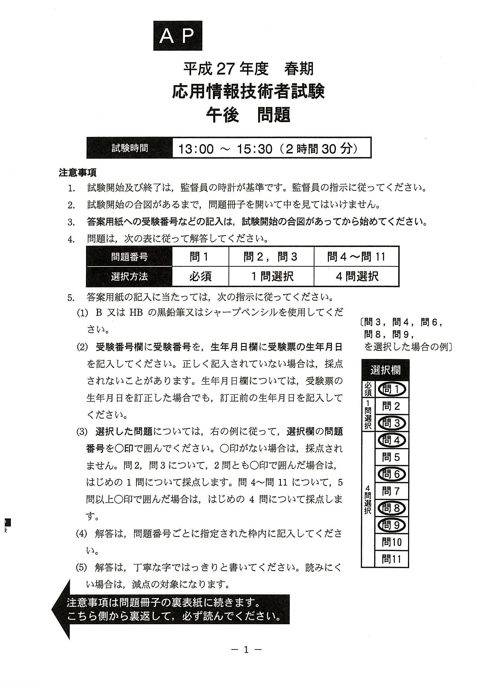

テキスト (OCR)

平成27 年度 春期
応用情報技術者試験
午後 問題

 13:00 ~ 15:30 (2時間30 分)

注意事項
1. 試験開始及び終了は, 監督員の時計が基準です。監督員の指示に従ってください。
2. 試験開始の合図があるまで, 問題冊子を開いて中を見てはいけません。
3. 答案用紙への受験番号などの記入は, 試験開始の合図があってから始めてください。
4. 問題は, 次の表に従って解答してください。

問題番号          fj 1         問2, 問3       問4 >問 11
選択方法        必須        1 問選択        4 問選択

5. 答案用紙の記入に当たっては, 次の指示に従ってください。
(1) B 又は HB の黒鉛筆又はシャープペンシルを使用してくだ
きい                                    (問3, 問4, 問6,
5                                                                      間8, HQ,
⑫) 受験番号欄に受験番号を, 生年月日欄に受験票の生年月日   を選択した場合の例〕
を記入してください。正しく記入されていない場合は, 採点

選択欄
されないととがあります。生年有日樹については BBIRD AS
生年月日を訂正した場合でも, 訂正前の生年月日を記入して 際 a

ください。                        gt
(8) 選択した問題については, 右の例に従って 選択欄の問題

3

番号を〇印で囲んでください。〇印がない場合は。 採点され    =
ません。問 2, 問 3 について, 2 問とも〇印で囲んだ場合は,   at
はじめの 1 問について採点します。問 4て問 11 について, 5    4前7
問以上〇印で囲んだ場合は。 はじめの 4 問について採点しま |G

す。                          |@D|
(4) 解答は, MBBS CLICHE ANREAICIALTS ES    =
es                                                        問11

⑤) 解答は, 丁寧な字ではっきりと書いてください。読みにく
い場合は, 減点の対象になります。

注意事項は問 SA

### ページ 2

### ページ 3

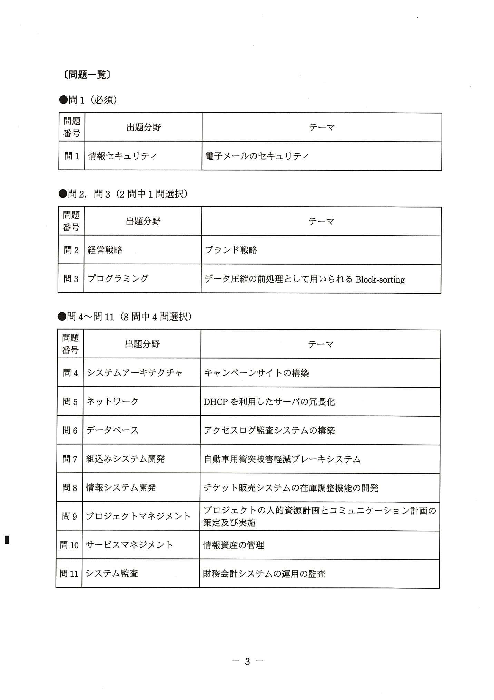

テキスト (OCR)

【問題一覧〕

@H1 (必須)

問題                         ー

BS     出題分野                テーマ

問 1 | 情報セキュリティ      電子メールのセキュリティ

信問 2, 問3 (2 間中1 問選択)

問題                         テー

番号     出題分野                テーマ

間 2 | 経営戦略          ブランド戦略

間3 | プログラミング      データ圧縮の前処理として用いられる Block-sorting
信問 4て問 11 (8 問中 4 問選択)

     出題分野                キーマ

番号

問4 | システムアーキテクチャ  キャンペーンサイトの構築

間5 | ネットワーク        DHCP を利用したサーバの冗長化

問6 |データベース        アクセスログ監査システムの構築

問 7 | 組込みシステム開発    自動車用衝突被害軽減プレーキシステム
問 8 | 情報システム開発     チケット販売システムの在庫調整機能の開発

問9

プロジェクトマネジメント

プロジェクトの人的資源計画とコミュニケーション計画の
REROR HE

Fl 10

サービスマネジメント

情報資産の管理

間11

システム監査

財務会計システムの運用の監査

### ページ 4

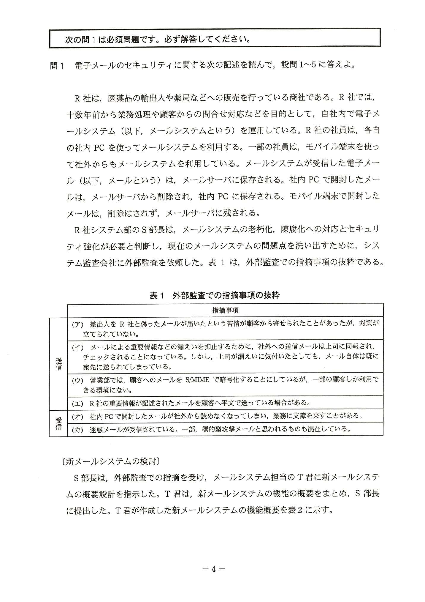

テキスト (OCR)

ROM 1 は必須間題です。必ず解答してください。

問 1

電子メールのセキュリティに関する次の記述を読んで, 設問 1ご5 に答えよ。

R 社は, 医薬品の輸出入や薬局などへの販売を行っている商社である。R 社では,
十数年前から業務処理や顧客からの問合せ対応などを目的として, 自社内で電子メ
ールシステム (以下, メールシステムという) を運用している。R 社の社員は, 各自
の社内 PC を使ってメールシステムを利用する。一部の社員は, モバイル端末を使っ
て社外からもメールシステムを利用している。メールシステムが受信した電子メー
ル (以下, メールという) は, メールサーバに保存される。社内 PC で開封したメー
ルは, メールサーバから削除され, 社内 PC に保存される。モバイル端末で開封した
メールは, 削除はされず, メールサーバに残される。

R 社システム部の S ME, メールシステムの老朽化, 陳腐化への対応とセキュリ
ティ強化が必要と判断し, 現在のメールシステムの問題点を洗い出すために, シス
テム監査会社に外部監査を依頼した。表 1 は, 外部監査での指摘事項の抜粋である。

表1 外部監査での指摘事項の抜粋
指摘事項

me

(7) 差出人を R 社と偽ったメールが届いたという苦情が顧客から寄せられたことがあったが, 対策が
立てられていない。

(イ) メールによる重要情報などの漏えいを抑止するために, 社外への送信メールは上司に同報され,
チェックされることになっている。しかし, 上司が漏えいに気付いたとしても, メール自体は既に
宛先に送られてしまっている。

(ウ) 営業部では, 顧客へのメールを S/MIME で暗号化することにしているが, 一部の顧客しか利用で
きる環境にない。

(L) R 社の重要情報が記述されたメールを顧客へ平文で送っている場合がある。

ana

(オ) 社内 PC で開封したメールが社外から読めなくなってしまい, 業務に支障を来すことがある。
(A) 迷惑メールが受信されている。一部, 標的型攻撃メールと思われるものも混在している。

〔新メールシステムの検討]

S 部長は, 外部監査での指摘を受け, メールシステム担当の T 君に新メールシステ
ムの概要設計を指示した。T Bld, 新メールシステムの機能の概要をまとめ, 5 部長
に提出した。T 君が作成した新メールシステムの機能概要を表 2 に示す。

### ページ 5

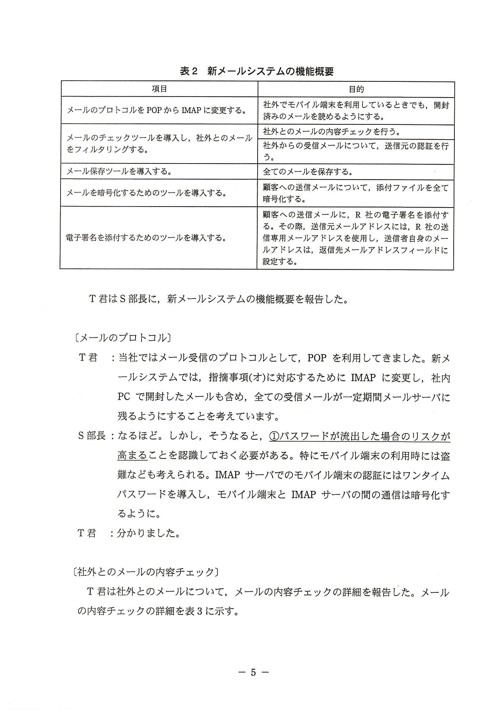

テキスト (OCR)

表2 新メールシステムの機能概要

項目                           目的

メールのプロトコルを POP から IMAP に変更する。

社外でモバイル端末を利用しているときでも, 開封
済みのメールを読めるようにする。

メールのチェックツールを導入し, 社外とのメール

社外とのメールの内容チェックを行う。

をフィルタリングする。              社外からの受信メールについて, 送信元の認証を行

う。

メール保存ツールを導入する。                    全てのメールを保存する。

メールを暗号化するためのツールを導入する。

顧客への送信メールについて, 添付ファイルを全て
賭号化する。

顧客への送信メールに, R 社の電子署名を添付す
る。その際, 送信元メールアドレスには, R 社の送

電子署名を添付するためのツールを導入する。            信専用メールアドレスを使用し, 送信者自身のメー

ルアドレスは, 返信先メールアドレスフィールドに
設定する。

T君はS 部長に, 新メールシステムの機能概要を報告した。

[メールのプロトコル〕

Ta

S部長 :

Ta

: 当社ではメール受信のプロトコルとして, POP を利用してきました。新メ

ールシステムでは, 指摘事項(オ)に対応するために IMAP に変更し, 社内
PC で開封したメールも含め, 全ての受信メールが一定期間メールサーバに
残るようにすることを考えています。

なるほど。しかし, そうなると, ①パスワードが流出した場合のリスクが
高まることを認識しておく必要がある。特にモバイル端末の利用時には盗
難なども考えられる。IMAP サーバでのモバイル端末の認証にはワンタイム
パスワードを導入し, モバイル端末と IMAP サーバの間の通信は暗号化す
るように。

: 分かりました。

(社外とのメールの内容チェック〕}
T 君は社外とのメールについて, メールの内容チェックの詳細を報告した。メール
の内容チェックの詳細を表 3 に示す。

### ページ 6

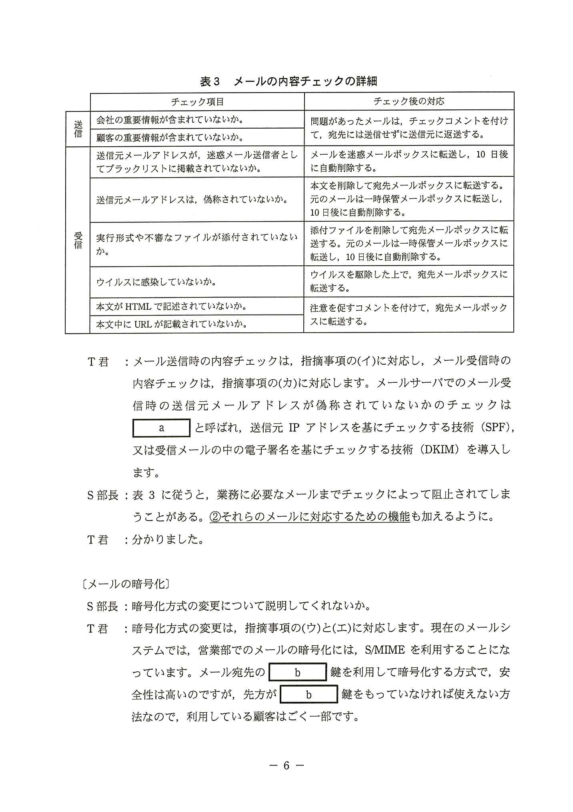

テキスト (OCR)

R3 メールの内容チェックの詳細

WI

=

チェック項目                 チェック後の対応
送 | 会社の重要情報が含まれていないか                      問題があったメールは, チェックコメントを付け
信 | 題客の重要情報が含まれていないか。      て, 宛先には送信せずに送信元に返送する。
送信元メールアドレスが, 迷感メール送信者とし | メールを迷惑メールボックスに転送し, 10 BK
てブラックリストに掲載されていないか。           に自動削除する。

本文を削除して宛先メールボックスに転送する。
送信元メールアドレスは, 位称されていないか。      元のメールは一時保管メールボックスに転送し,
10 日後に自動削除する。

pe                    ea                 添付ファイルを削除して宛先メールボックスに転
実行形式や不審なファイルが添付されていない   送する。元のメールは一時保管メールポックスに

a                     転送し, 10 日後に自動削除する。

_                  ウイルスを駆除した上で, 宛先メールボックスに
ウイルスに感染していないか。                転送する。
本文が HTML で記述されていないか。       注意を促すコメントを付けて, 宛先メールボック
本文中に URL が記載されていないか。      スに転送する。

TH : メール送信時の内容チェックは, 指摘事項の(イ)に対応し, メール受信時の
内容チェックは, 指摘事項の(の)に対応します。メールサーパでのメール受
信時の送信元メールアドレスが偽称されていないかのチェックは
| 3』 | と呼ばれ 送信元 P アドレスを基にチェックする技術 SPP),
又は受信メールの中の電子署名を基にチェックする技術 (DKIM) を導入し
ます。

SHE : 表 3 に従うと, 業務に必要なメールまでチェックによって阻止されてしま
うこととがある。②それらのメールに対応するための機能も加えるように。

TH :分かりました。

(メールの暗号化

S 部長 : 暗号化方式の変更について説明してくれないか。

TH :遼号化方式の変更は, 指摘事項の(ウ)と(エ)に対応します。現在のメールシ
ステムでは, 営業部でのメールの暗号化には, S/MIME を利用することにな
っています。メール宛先の| b | 鍵を利用して購号化する方式で,安
全性は高いのですが, 先方が[| b | 鍵をもっていなければ使えない方
法なので, 利用している顧客はどく一部です。

### ページ 7

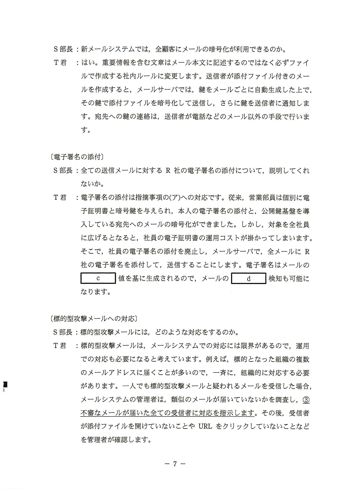

テキスト (OCR)

SME : 新メールシステムでは, SRE ANOS LOA TE SOM,

Ta

: はい。 重要情報を含む文章はメール本文に記述するのではなく必ずファイ

ルで作成する社内ルールに変更します。送信者が添付ファイル付きのメー
ルを作成すると, メールサーバでは, 鍵をメールごとに自動生成した上で,
その鍵で添付ファイルを暗号化して送信し, さらに鍵を送信者に通知しま
す。爺先への鍵の連絡は, 送信者が電話などのメール以外の手段で行いま
す。

〔電子署名の添付
S 部長 : 全ての送信メールに対する R 社の電子署名の添付について, 説明してくれ

Ta

ないか。

: 電子署名の添付は指摘事項の(ア)への対応です。 CR, 営業部員は個別に電

子証明書と暗号鍵を与えられ, 本人の電子署名の添付と, 公開鍵基盤を導
入している爺先へのメールの暗号化ができました。しかし, 対象を全社員
に広げるとなると, 社員の電子証明書の運用コストが掛かってしまいます。
そこで, 社員の電子署名の添付を廃止し。 メールサーバで, 全メールに R
社の電子署名を添付して, 送信することにします。電子署名はメールの

 値を基に生成されるので, メールの|  d |検知も可能に

なります。

〔標的型攻撃メールへの対応〕
S 部長 : 標的型攻撃メールには, どのような対応をするのか。

Ta

: 標的型攻撃メールは, メールシステムでの対応には限界があるので, 運用

での対応も必要になると考えています。例えば, 標的となった組織の複数
のメールアドレスに届くことが多いので, 一斉に, 組織的に対応する必要
があります。 一人でも標的型攻撃メールと疑われるメールを受信した場合
メールシステムの管理者は, 類似のメールが届いていないかを調査し, ©
不審なメールが届いた全ての受信者に対応を指示します。その後, 受信者
が添付ファイルを開けていないことや URL をクリックしていないことなど
を管理者が確認します。

### ページ 8

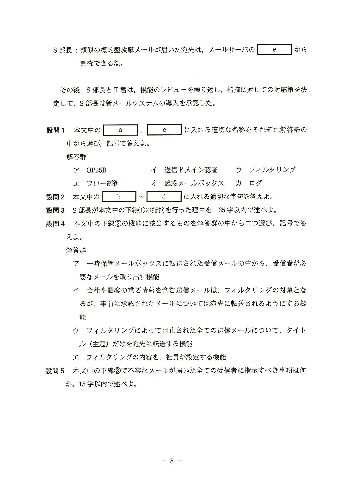

テキスト (OCR)

S 部長 : 類似の標的型攻撃メールが届いた宛先は, メールサーバの| es |から
調査できるな。

その後, S 部長とT君は, 機能のレビューを繰り返し, 指摘に対しての対応策を決
定して, S 部長は新メールシステムの導入を承認した。

設問1 本文中の| a |,|  e | に入れる適切な名称をそれぞれ解答群の
中から選び, 記号で答えよ。
解答群
ア OP25B       イ 送信ドメイン認証 " ウツ フィルタリング
エ フロー制御     オ 迷惑メールボックス カ ログ

設問2 本文中の| b |~| da |に入れる適切な字句を答えよ。
設問3 S部長が本文中の下線①の指摘を行った理由を, 35 字以内で述べよ。
設問4 本文中の下線②の機能に該当するものを解答群の中から二つ選び
Fake
ARE BE
ア 一時保管メールボックスに転送された受信メールの中から, 受信者が必
要なメールを取り出す機能
会社や顧客の重要情報を含む送信メールは, フィルタリングの対象とな
OM, 事前に承認されたメールについては宛先に転送されるようにする機
能
ウ フィルタリングによって阻止された全ての送信メールについて, タイト
ル (主題) だけを放先に転送する機能
エ フィルタリングの内容を, 社員が設定する機能
設問5 本文中の下線③で不審なメールが届いた全ての受信者に指示すべき事項は何
か。15 字以内で述べよ。

ua CE

oul

### ページ 9

テキスト (OCR)

【 メモ 用 紙 〕

### ページ 10

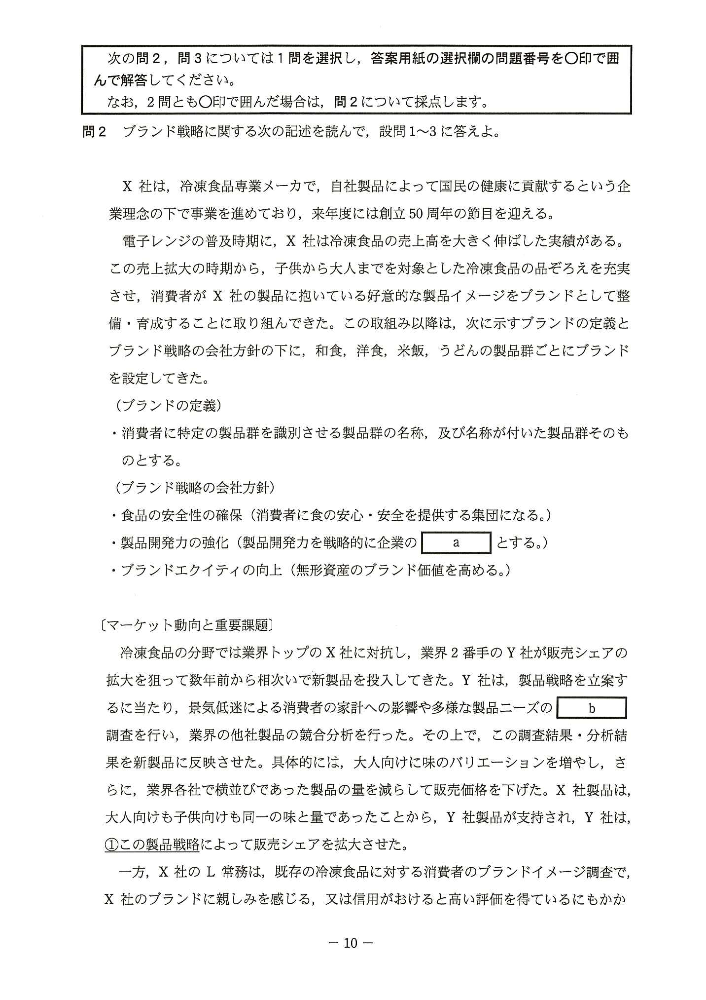

テキスト (OCR)

次の問2, 間3 については 1 問を選択し, 答案用紙の選択欄の問題番号を〇印で囲
んで解答してください。
なお, 2 問とも〇印で囲んだ場合は, 問2 について採点します。

間2 ブランド戦略に関する次の記述を読んで, 設問 13 に答えよ。

X 社は, 冷凍食品専業メーカで, 自社製品によって国民の健康に貢献するという企
業理念の下で事業を進めており, 来年度には創立 50 周年の節目を迎える。

電子レンジの普及時期に, X 社は冷凍食品の売上高を大きく伸ばした実績がある。
この売上拡大の時期から, 子供から大人までを対象とした冷凍食品の品ぞろえを充実
St, 消費者が X 社の製品に抱いている好意的な製品イメージをブランドとして整
備・育成することに取り組んできた。この取組み以降は, 次に示すブランドの定義と
ブランド戦略の会社方針の下に, 和食 洋食 米飯,うどんの製品群どとにブランド
を設定してきた。

(プランドの定義)

・消費者に特定の製品群を識別させる製品群の名称, 及び名称が付いた製品和群そのも

のとする。

(ブランド戦略の会社方針)

・食品の安全性の確保 (消費者に食の安心・安全を提供する集団になる。)
・製品開発力の強化 (製品開発力を戦略的に企業の| a |] とする。)

・ブプランドエクイティの向上 (無形資産のブランド価値をる高める。)

(マーケット動向と重要課題

冷凍食品の分野では業界トップの X 社に対抗し, 業界 2 番手の Y 社が販売シェアの
拡大を狙って数年前から相次いで新製品を投入してきた。Y 社は, 製品戦略を立案す
るに当たり, 景気低迷による消費者の家計への影響や多様な製品ニーズの|  b |
調査を行い業界の他社製品の競合分析を行った。その上で, この調査結果・分析結
果を新製品に反映させた。具体的には, 大人向けに味のパリエーションを増やし。さ
らに, 業界各社で横並びであった製品の量を減らして販売価格を下げた。 X 社製品は,
大人向けも子供向けも同一の味と量であったことから, Y 社製品が支持され, Y 社は,
①この製品戦略によって販売シェアを拡大させた。

一方, X 社のL 常務は, 既存の冷凍食品に対する消費者のブランドイメージ調査で,
X 社のブランドに親しみを感じる, 又は信用がおけると高い評価を得ているにもかか

ー 10 一

### ページ 11

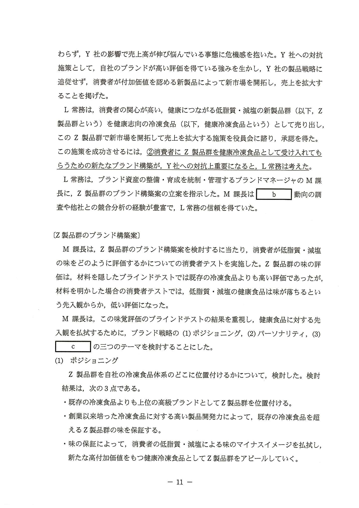

テキスト (OCR)

DST, Y 社の影響で売上高が伸び人悩んでいる事態に危機感を抱いた。Y AON
HORE LT, 自社のブランドが高い評価を得ている強みを生かし, Y 社の製品戦略に
追従せず, 消費者が付加価値を認める新製品によって新市場を開拓し, 売上を拡大す
ることを掲げた。

 常務は, 消費者の関心が高い, 健康につながる低脂質・減塩の新製品群 (以下, 2
WABCWS) を健康志向の冷凍食品 (以下, 健康冷凍食品という) として売り出し
この Z 製品群で新市場を開拓して売上を拡大する施策を役員会に議り, 承認を得た。
この施策を成功させるには, ②消費者に Z 製品群を健康冷凍食品として受け入れても
らうための新たなブランド構築が. Y 社への対抗上重要になると, 常務は考えた。
 常務は, プランド資産の整備・育成を統制・管理するブランドマネージャの MM 旬
長に, Z 製品群のブランド構筑案の立案を指示した。M 課長は| b |動向の調
査や他社との競合分析の経験が豊富で, L 常務の信頼を得ていた。

(Z 製品群のブランド構築案

M 課長は, Z 製品群のブランド構築案を検討するに当たり, 消費者が低脂質・減塩
の味をどのように評価するかについての消費者テストを実施した。Z 製品群の味の評
価は, 材料を隅したブラインドテストでは既存の冷凍食品よりも高い評価であったが,
材料を明かした場合の消費者テストでは, 低脂質・減者の健康食品は味が落ちるとい
DAB SD, 低い評価になった。

IM 課長は, この味覚評価のプラインドテストの結果を重視し, 健康食品に対する先
入観を払拭するために, ブランド戦略の (1) ポジショニング, ② パーソナリティ, @)
 の三つのテーマを検討するととにした。

(①) ポジショニング
Z 製品群を自社の冷凍食品体系のどこに位置付けるかについて, BALE. RH
結果は, 次の3 点である。

・ 既存の冷凍食品よりも上位の高級プランドとしてZ 製品群を位置付ける。

・創業以来堪った冷凍食品に対する高い製品開発力によって, 既存の冷凍食品を超

えるZ製品群の味を保証する。

・ 味の保証によって, 消費者の低脂質・減塩による味のマイナスイメージを払拭し,

新たな高付加価値をもつ健康冷凍食品としてZ製品群をアピールしていく。

ー 11 一

### ページ 12

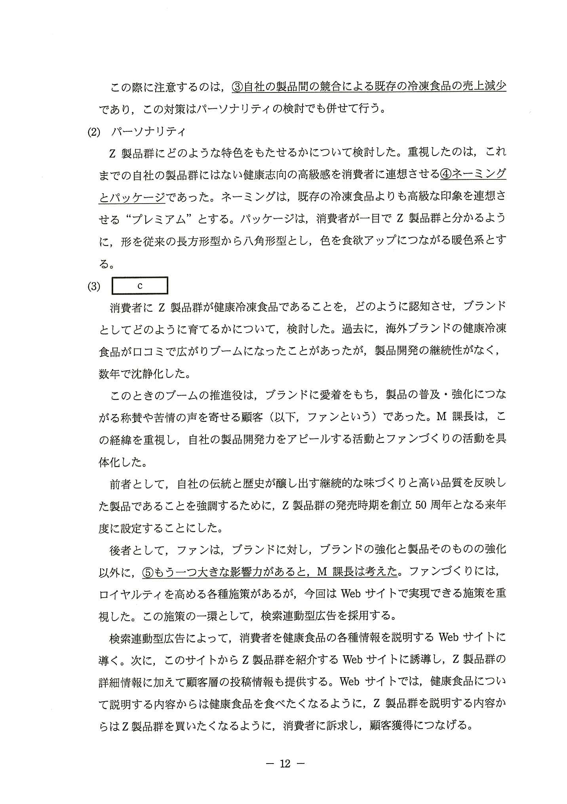

テキスト (OCR)

この際に注意するのは, ⑧自社の製品間の競合による既存の冷凍食品の売上減少

であり, この対策はパーソナリティの検討でも併せて行う。
(⑫⑰ パーソナリディ

Z 製品群にどのような特色をもたせるかについて検討した。重視したのは, これ
までの自社の製品群にはない健康志向の高級感を消費者に連想させる④ネーミング
とパッケージであった。ネーミングは, 既存の冷凍食品よりも高級な印象を連想さ
せる “プレミアム” とする。パッケージは, 消費者が一目で Z 製品群と分かるよう
に, 形を従来の長方形型から八角形型とし, 色を食欲アップにつながる暖色系とす

る。
@)

消費者に Z 製品群が健康冷凍食品であることを, どのように認知させ, ブランド
としてどのように育てるかについて, 検討した。過去に, 海外プランドの健康冷凍
食品がロコミで広がりブームになったことがあったが, 製品開発の継続性がなく,
数年で沈静化した。

このときのブームの推進役は, ブランドに愛着をもち, 製品の普及・強化につな
がる称装や苦情の声を寄せる顧客(以下,ファンという) であった。M 課長は, こ
の経緯を重視し, 自社の製品開発力をアピールする活動とファンづくりの活動を具
体化した。

前者として, 自社の伝統と歴史が醸し出す継続的な味づくりと高い品質を反映し
た製品であることを強調するために, Z 製品群の発売時期を創立 50 周年となる来年
度に設定することにした。

後者として, ファンは, ブランドに対し, ブランドの強化と製品そのものの強化
以外に, もう一つ大きな影響カがあると, M 課長は考えた。ファンづくりには,
ロイヤルティ を高める各種施策があるが, 今回は Web サイトで実現できる施策を重
視した。この施策の一環として, 検索連動型広告を採用する。

検索連動型広告によって, 消費者を健康食品の各種情報を説明する Web サイトに
導く。次に, このサイトから Z 製品群を紹介する Web サイトに誘導し, Z 製品群の
詳細情報に加えて顧客層の投稿情報も提供する。Web サイトでは, 健康食品につい
て説明する内容からは健康食品を食べたくなるように, Z 製品群を説明する内容か
らはZ 製品群を買いたくなるように, 消費者に訴求し, 顧客獲得につなげる。

ー 12 一

### ページ 13

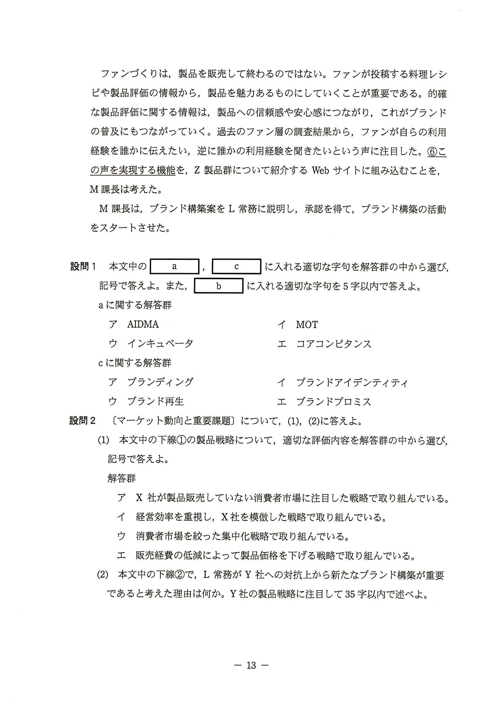

テキスト (OCR)

ファンづくりは, 製品を販売して終わるのではない。ファンが投稿する料理レシ
ビや製品評価の情報から, 製品を魅力あるものにしていくことが重要である。的確
な製品評価に関する情報は, 製品への信頼感や安心感につながり, これがブランド
の普及にもつながっていく。 過去のファン層の調査結果から, ファンが自らの利用
経験を誰かに伝えたい, 逆に誰かの利用経験を聞きたいという声に注目した。 ⑥こ
の声を実現する機能を, Z 製品群について紹介する Web サイトに組み込むことを,
M 課長は考えた。

MRI, ブランド構築案を L 常務に説明し, 承認を得て, ブランド構築の活動
をスタートさせた。

設問1 本文中の| sa |],| c |] に入れる適切な字句を解答群の中から選び,
記号で答えよ。また, | b | に入れる適切な字句を5字以内で答えよ。
a に関する解答群

ア ATDMA              イ MOT
ウ インキュベータ         エロアロンピロタシス
c に関する解答群
ア ブランディング         イ プランドアイデンティティ
ウ ブランド再生          = ブランドプロミス

設問2 (マーケット動向と重要課題】 について, (①, ②に答えよ。

Q 本文中の下線①の製品戦略について, 適切な評価内容を解答群の中から選び,
記号で答えよ。

解答群
ア X 社が製品販売していない消費者市場に注目した戦略で取り組んでいる。
イ 経営効率を重視し, X社を模條した戦略で取り組んでいる。
ウ 消費者市場を絞った集中化戦略で取り組んでいる。
エエ 販売経費の低減によって製品価格を下げる戦略で取り組んでいる。

(2) 本文中の下線②で, L 常務が Y 社への対抗上から新たなブランド構築が重要
であると考えた理由は何か。Y 社の製品戦略に注目して 35 字以内で述べよ。

— 18 一

### ページ 14

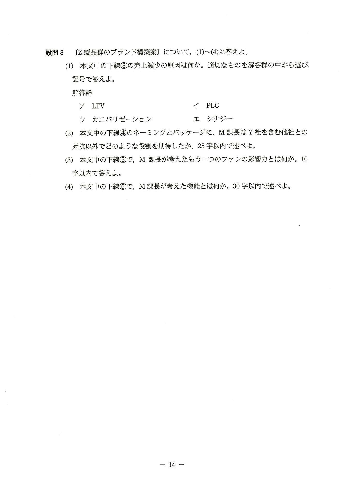

テキスト (OCR)

設問3 〔Z製品群のブランド構築案〕 について, ①ぐて(④に答えよ。
1) 本文中の下線③の売上減少の原因は何か。適切なものを解答群の中から選び,

記号で答えよ。

解答群

ア LTV            イ PLC

ウ カニバリゼーション     =. YRS

(2) 本文中の下線@のネーミングとパッケージに, M 課長は Y 社を含む他社との
対抗以外でどのような役割を期待したか。25 字以内で述べよ。

(3) 本文中の下線⑥で, M 課長が考えたもう一つのファンの影響カとは何か。10
字以内で答えよ。

(4) 本文中の下線⑥で, M 課長が考えた機能とは何か。30 字以内で述べよ。

ー 14 一

### ページ 15

テキスト (OCR)

(メモ 用 HI

ー 15 一

### ページ 16

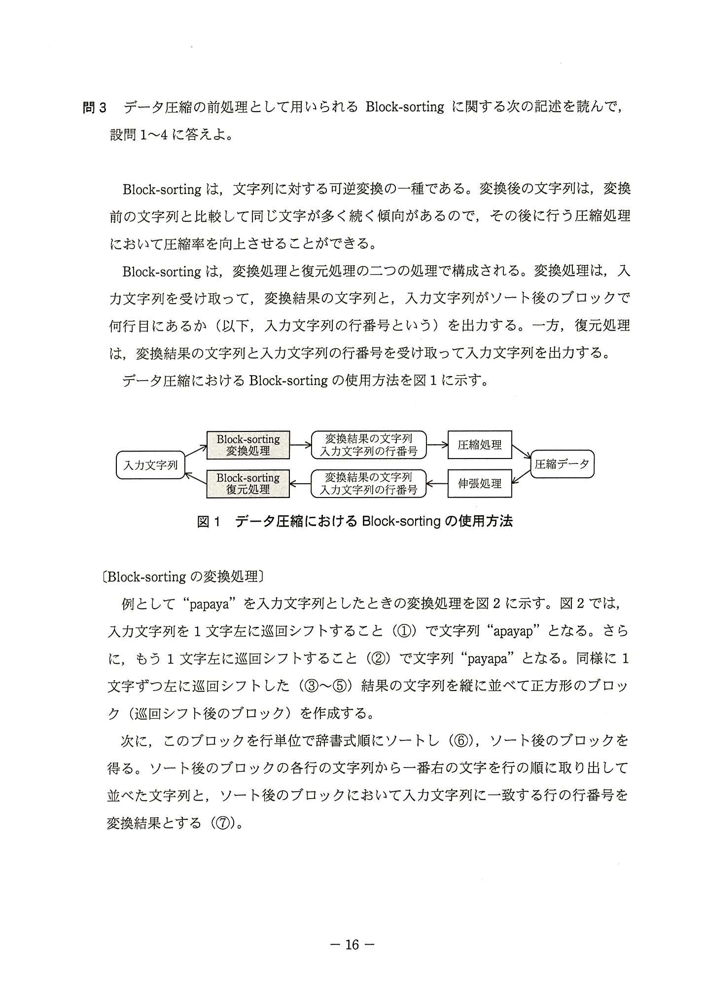

テキスト (OCR)

問3 データ圧縮の前処理として用いられる Block-sorting に関する次の記述を読んで,
設問 1ン4 に答えよ。

Block-sorting は, 文字列に対する可逆変換の一種である。変換後の文字列は, 変換
前の文字列と比較して同じ文字が多く続く傾向があるので, その後に行う圧縮処理
において圧縮率を向上させることができる。

Block-sorting は, 変換処理と復元処理の二つの処理で構成される。変換処理は, A
力文字列を受け取って, 変換結果の文字列と, 入力文字列がソート後のブロックで
何行目にあるか (以下, 入力文字列の行番号という) を出力する。一方, 復元処理
は, 変換結果の文字列と入力文字列の行番号を受け取って入力文字列を出力する。

データ圧縮における Block-sorting の使用方法を図 1 に示す。

Block-sorting   >    変換結果の文字列                圧縮処理

変換処理        入力文字列の行番号
Block-sorting                変換結果の文字列

復元処理     入力文字列の行番号    伸大如理

 1 データ圧縮における Block-sorting の使用方法

[Block-sorting の変換処理〕

例として “papaya” を入力文字列としたときの変換処理を図 2 に示す。図 2 では,
入力文字列を 1 文字左に巡回シフトすること (①) で文字列 “apayap” となる。さら
に, もう 1 文字左に巡回シフトすること ©) で文字列 “payapa" となる。 同様に 1
文字ずつ左に巡回シフトした (@~O©) 結果の文字列を縦に並べて正方形のプブロッ
ク (館回シフト後のブロック) を作成する。

次に, このブロックを行単位で辞書式順にソートし ©), ソート後のブロックを
得る。ソート後のブロックの各行の文字列から一番右の文字を行の順に取り出して
並べた文字列と, ソート後のブロックにおいて入力文字列に一致する行の行番号を
変換結果とする (⑦)。

### ページ 17

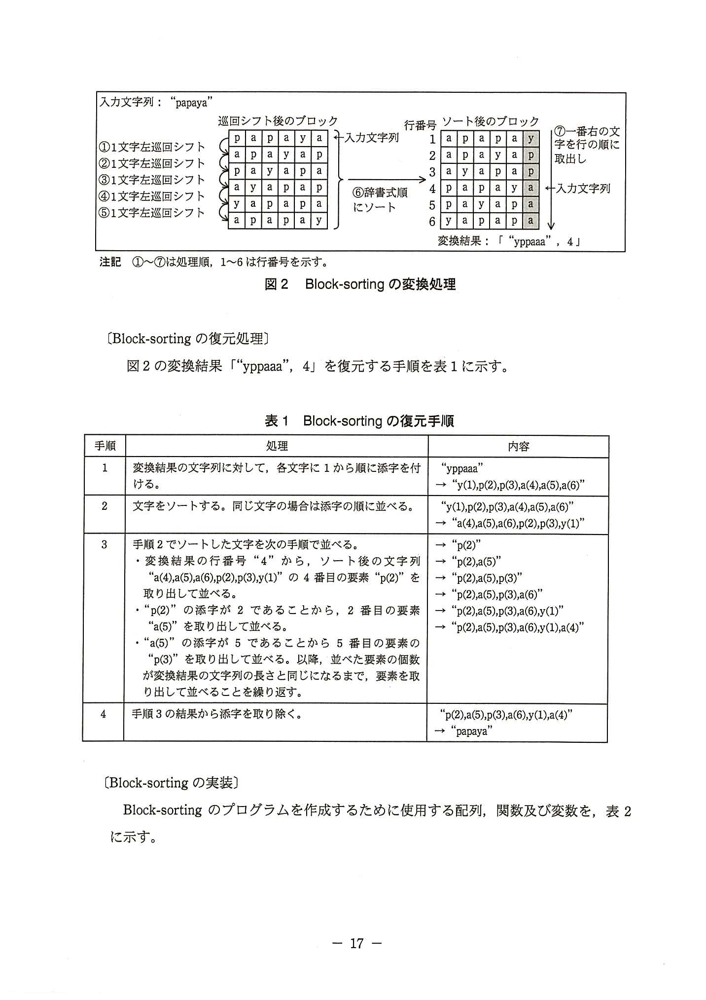

テキスト (OCR)

入力文字列: “papaya”

巡回シフト後のブロック       行番号 ソート後のブロック
⑦一番右の文
1文字な巡回シット Geetelaly ial yAvxert  1falplalPlalyy |字を行の順に
ud  alplalylalp    2|alplsly|aB| |取還し
@⑧1文字左巡回シフト    本         atalytalela le
1文字左錠回シフト Gee Ate             eee tral bashes
@1文字を巡回シフト GAP?) | Oxmtm 4b te tele            4
ロッット (PEE   にソート   5lplaly|alp|a
⑤1文字左巡   alplalplaly    6lylalplalpla
変換結果: 「 “yppaaa”, 4」
注記 ①~て⑦は処理順, 1ご6 は行番号を示す。
図2 Block-sorting の変換処理
(Block-sorting の復元処理〕
図 2 の変換結果「"yppaaa", 4」を復元する手順を表 1 に示す。
表1 Block-sorting の復元手順
手順                      処理                                内容
1 | 変換結果の文字列に対して, 各文字に 1 から順に添字を付 | “yppaaa"
ける。                                        > “yQ),p(2),p@),a(4),a(5),a(6)”
2 | 文字をソートする。同じ文字の場合は添字の順に並べる。 | “y(),p@),p@)a4),a6),a6)”
— “a(4),a(6),a(6),p(2),p@),y(1)”
3 | 手順2でソートした文字を次の手順で並べる。              ー “p(2)”
・変換結果の行番号“4” から, ソート後の文字列 | > "や@)a⑤)"
“a(4),a(5),a(6),p2),p(3),y(1)” の 4 番目の要素 “pe)” を | 一 "p②,a⑥⑤)jp③"
取り出して並べる。                                       ー “p(2),a(5),p(3),a(6)”
・“p(②" の添字が 2 であることから, 2 番目の要素 | > “"p②a⑤),p③,a(⑥)y(①"
"a(⑤)”を取り出して並べる。                                        — “p@),a),p@),a(6),y(1),a(4)”
+“a6)” OREM 5 であることから 5 番目の要素の
“p@)” を取り出して並べる。以降。 並べた要素の個数
が変換結果の文字列の長さと同じになるまで, 要素を取
り出して並べることを繰り返す。
4 | 手順3 の結果から添字を取り除く。                                      “p(2),a(5),p(3),a(6),y(1),a(4)"
> “papaya”

(Block-sorting の実装〕

Block-sorting のプログラムを作成するために使用する配列, 関数及び変数を, 表 2

に示す。

ー 17 一

### ページ 18

テキスト (OCR)

表2 使用する配列, 関数及び変数

名称     種類                      内容
巡回シフト後のブロックを格納する。ブロックの 1 行を文字列として, 配列の一
pncodeArraytn] | Baz] | つの要素に格納する。 配列の漂字は1から始まる。
例| “papaya” | “apayap” | "payapa | “ayapap” | "yapapa | “apapay” |
復元用の文字と添字の組を格納する。配列の添字は 1 から始まる。
DecodeArray[2]Im] | 配列| ll “y” | “p” | “p” | “a” | “a” | “a”
ifz{[3f4a[5le
sort1(Array[])         関数 | 1次元配列 Array[ ]の要素を辞書式順にソートする。
2 次元配列 Array[ ][ ]を, Array[1]の要素をキーにしてソートする。
sort2(Array[][])  関数| 例|y | “p” | “p” | “a” | “a” | “a” re “a” [ “a” | “a” | “p” | “p” | “y”
ils2 lsl4lsle     415slelz2lsli
rotation(String)    関数 | 文字列Stingを1文字左に巡回シフトした結果を返す。
InputString      8%  入力文字列。 LORERORS E “ImputString ORS” とする。他の文字列変数
についても, 長さを同様に表す。
BlockSortString   変数 | 変換結果の文字列。
Line        BR | ソート後のブロックでの入力文字列の行番号。
OutputString    変数 | 復元処理の出力文字列。

注記 nは入力文字列の長さを表す。

[変換処理関数 encode〕
変換処理を実装した関数 encode のプログラムを図 3 に示す。

function encode(InputString)
rString て InputString
for( 1を| ア |から[| イ | まで1ずつ増やす )
EncodeArray[i] で rString
rString < rotation(rString)
endfor
sort1(EncodeArray )
BlockSortString を空文字列に初期化する
for(kを| ア |から| イ | まで1ずつ増やす )
BlockSortString の未尾に EncodeArray [k]の未尾の 1 文字を追加する
1f( )
Line <— k
endif
endfor
endfunction

 3 関数 encode のプログラム

ー 18 一

### ページ 19

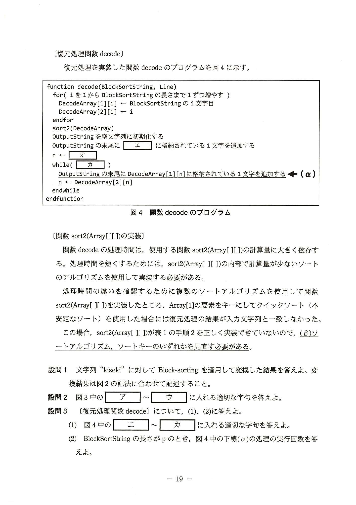

テキスト (OCR)

〔復元処理関数 decode]
復元処理を実装した関数 decode のプログラムを図 4 に示す。

function decode(BlockSortString, Line)

for( 1を1から BlockSortString の長さまで 1 ずつ増やす )
DecodeArray[1][i] - BlockSortString の1 文字目
DecodeArray[2][i] <— i

endfor

sort2(DecodeArray)

OutputString を空文字列に初期化する

OutputString の末尾に に格納されている 1 文字を追加する

ne

whi le( )
Outputstring の未尾に DecodeArray[1][n]に格納されている 1 文字を追加する <= ( cw )

n で DecodeArray[2][n]
endwhi1e
endfunction

 4 関数decode のプログラム

[関数 sort2(Array[ Il NO)

関数 decode の処理時間は, 使用する関数 sort2(Array[ ][ ])の計算量に大きく依存す
る。 処理時間を短くするためには, sort2(Array[ ][ ])の内部で計算量が少ないソート
のアルゴリズムを使用して実装する必要がある。

処理時間の違いを確認するために複数のソートアルゴリズムを使用して関数
sort2(Array[ ][ ])を実装したところ, Array[1]の要素をキーにしてクイックソート (A
安定なソート) を使用した場合には復元処理の結果が入力文字列と一致しなかった。

この場合, sort2(Array[ ][ ])が表 1 の手順 2 を正しく実装できていないので, (8)ソ
ートアルゴリズム, ソートキーのいずれかを見直す必要がある。

設問1 文字列 “kiseki” に対して Block-sorting を適用して変換した結果を答えよ。変
換結果は図 2 の記法に合わせて記述すること。

設問2 図3中の| ア |~| ウ |に入れる適切な字句を答えよ。

設問3 〔復元処理関数 decode]】 について, (1), ②に答えよ。
Q 図4中の| エエ |て| カ |に入れる適切な字句を答えよ。
(2) BlockSortString の長さが p のとき, 図 4 中の下線(v)の処理の実行回数を答

えよ。

ー 19 一

### ページ 20

テキスト (OCR)

設問4 本文中の下線(8)について, ソートアルゴリズムを見直す場合とソートキーを
見直す場合のそれぞれについて, どのように見直せばよいかを 30 字以内で述べ
Ke

— 20 一

### ページ 21

テキスト (OCR)

CA モ 用 紙 〕

### ページ 22

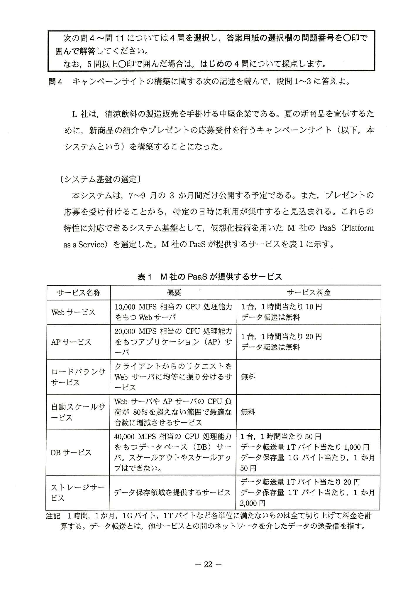

テキスト (OCR)

次の間 4 て問 11 については 4 間を選択し, 答案用紙の選択欄の問題番号を〇印で
囲んで解答してください。
なお, 5 問以上〇印で囲んだ場合は, はじめの 4 問について採点します。

問4 キャンペーンサイトの構築に関する次の記述を読んで, 設問 1一3 に答えよ。

L 社は, 清涼飲料の製造販売を手掛ける中堅企業である。夏の新商品を宣伝するた
めに, 新商品の紹介やプレゼントの応募受付を行うキャンペーンサイト (以下, 本
システムという) を構築することになった。

(VAT LER OBE)

本システムは, 7~9 月の 3か月間だけ公開する予定である。また, プレゼントの
応募を受け付けることから, 特定の日時に利用が集中すると見込まれる。これらの
特性に対応できるシステム基盤として, 仮想化技術を用いた M 社の PaaS (Platform
as aService) を選定した。M 社のPaaS が提供するサービスを表 1 に示す。

表1 M社のPaaS が提供するサービス

サービス名称                 概要                            サービス料金
Web サービス     10,000 MIPS 相当の CPU 処理能力 | 1台, 1時間当たり 10円
.                   をもつ Web サーバ                       データ転送は無料

20,000 MIPS 相当の CPU 処理能力
AP サービス     をもつアプリケーション (AP) サ
ーバ

18, 1時間当たり 20 円
データ転送は無料

クライアントからのリクエストを
Web サーバに均等に振り分けるサ | 無料
ービス

ロードバパランサ
ザービズ

Web サーバや AP サーバの CPU 負
荷が 80%を超えない鮎囲で最適な | 無料
台数に増減させるサービス

自動スケールサ
ーー内

40,000 MIPS 相当の CPU 処理能力 | 1 台, 1時間当たり50 円
をもつデータベース (DB) サー | データ転送量 1T バイト当たり 1000 円

lalla     パ。スケールアウトやスケールアッ | FFE 1G パイト当たり, 1 か月
プはできない。                     50 円

ストレージサー                        データ転送量 1T バイト当たり 20円

ピス           データ保存領域を提供するサービス | データ保存量 1T バイト当たり, 1 か月

2,000 円

注記 1時間, 1か月, 1Gバイト, 1T バイトなど各単位に満たないものは全て切り上げて料金を計
算する。データ転送とは, 他サービスとの間のネットワークを介したデータの送受信を指す。

### ページ 23

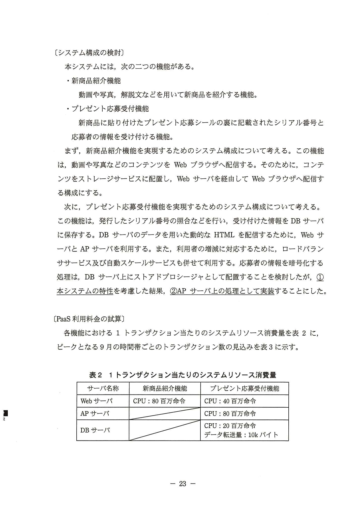

テキスト (OCR)

〔システム構成の検討]
本システムには, 次の二つの機能がある。
・新商品紹介機能
動画や写真, 解説文などを用いて新商品を紹介する機能。
・プレゼント応募受付機能
新商品に貼り付けたプレゼント応募シールの主に記載されたシリアル番号と
応募者の情報を受け付ける機能。

ED, 新商品紹介機能を実現するためのシステム構成について考える。この機能
は, 動画や写真などのコンテンツを Web プラウザへ配信する。そのために, コンテ
ンツをストレージサービスに配置し, Web サーバを経由して Web ブラウザへ配信す
る構成にする。

次に, プレゼント応募受付機能を実現するためのシステム構成について考える。
この機能は, 発行したシリアル番号の照合などを行い, 受け付けた情報を DB サーバ
に保存する。 DB サーバのデータを用いた動的な HTML を配信するために, Web +
ーバと AP サーバを利用する。また, 利用者の増減に対応するために, ロードバラン
ササービス及び自動スケールサービスも併せて利用する。応募者の情報を暗号化する
処理は, DB サーバ上にストアドプロシージャとして配置することを検討したが, ©
本システムの特性を考慮した結果., QAP サーバ上の処理として実装することにした。

(PaaS 利用料金の試算〕
各機能における 1 トランザクション当たりのシステムリソース消費量を表 2 に,
ピークとなる 9 月の時間帯ごとのトランザクション数の見込みを表 3 に示す。

表2 1トランザクション当たりのシステムリソース消費量

サーバ名称          新商品紹介機能          プレゼント応募受付機能
Web サーバ         CPU : 80 百万命令         CPU : 40 百万命令
AP サーバ                                      CPU : 80 百万命令
.                                      CPU : 20 百万命令

DBS                     データ転送量 : 10k バイト

### ページ 24

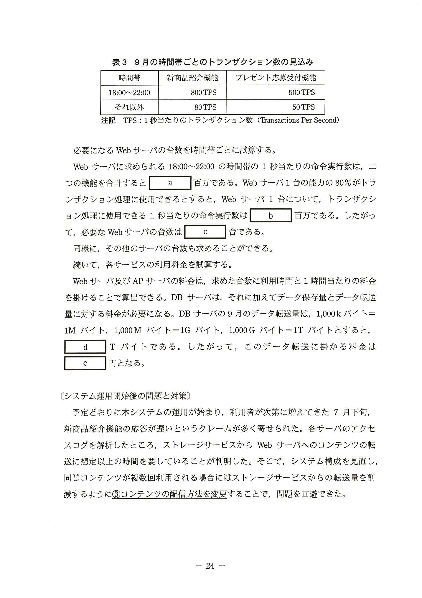

テキスト (OCR)

表3 9月の時間帯ごとのトランザクション数の見込み
aid   新商品紹介機能 | プレゼント応募受付機能
18:00~22:00                    800 TPS                                   500 TPS

それ以外                         80TPS                                     50TPS
注記 TPS : 1秒当たりのトランザクション数 (Transactions Per Second)

必要になる Web サーバの台数を時間帯ごとに試算する。

Web サーバに求められる 18:00~22:00 の時間帯の 1 秒当たりの命令実行数は, =
つの機能を合計すると|  』 | 百万である。Web サーバ1人台の能力の 80%がトラ
ンザクション処理に使用できるとすると, Web サーバ 1 台について, トランザクシ
ョン処理に使用できる 1 秒当たりの命令実行数は| b | 百万である。したがっ
て, 必要な Wed サーバの台数は| c | 台である。

同様に, その他のサーバの台数も求めることができる。

続いて, 各サービスの利用料金を試算する。

Web サーバ及び AP サーバの料金は 求めた台数に利用時間と 1 時間当たりの料金
を掛けることで算出できる。DB サーバは, それに加えてデータ保存量とデータ転送
量に対する料金が必要になる。DB サーバの 9 月のデータ転送量は, 1.000k バイト=
1M バイト, 1,000M バイト=テ1G バイト, 1.000G バイト=テ1T バイトとすると,
|  』 | T バイトである。したがって, このデータ転送に掛かる料金は

| e |円となる。

〔システム運用開始後の問題と対策〕

予定どおりに本システムの運用が始まり, 利用者が次第に増えてきた 7 APS,
新商品紹介機能の応答が遅いというクレームが多く寄せられた。各サーバのアクセ
スログを解析したところ, ストレージサービスから Web サーバへのコンテンツの転
送に想定以上の時間を要していることが判明した。そこで, システム構成を見直し,
同じコンテンツが複数回利用される場合にはストレージサービスからの転送量を削
減するように③コンテンツの配信方法を変更することで, 問題を回避できた。

ー 24 一

### ページ 25

テキスト (OCR)

設問 1   〔システム構成の検討 について, ①, (2②)に答えよ。
(1) 本文中の下線〇とはどのような特性か。25 宇以内で述べよ。
Q) 本文中の下線②⑨のように処理を実装することで, どのような効果が得られ
るか。25 字以内で述べよ。
設問2 本文中の| a |~[  e | に入れる適切な数値を求めよ。
設問3 本文中の下線⑨について, コンテンツの配信方法をどのように変更したのか。
30 字以内で述べよ。

### ページ 26

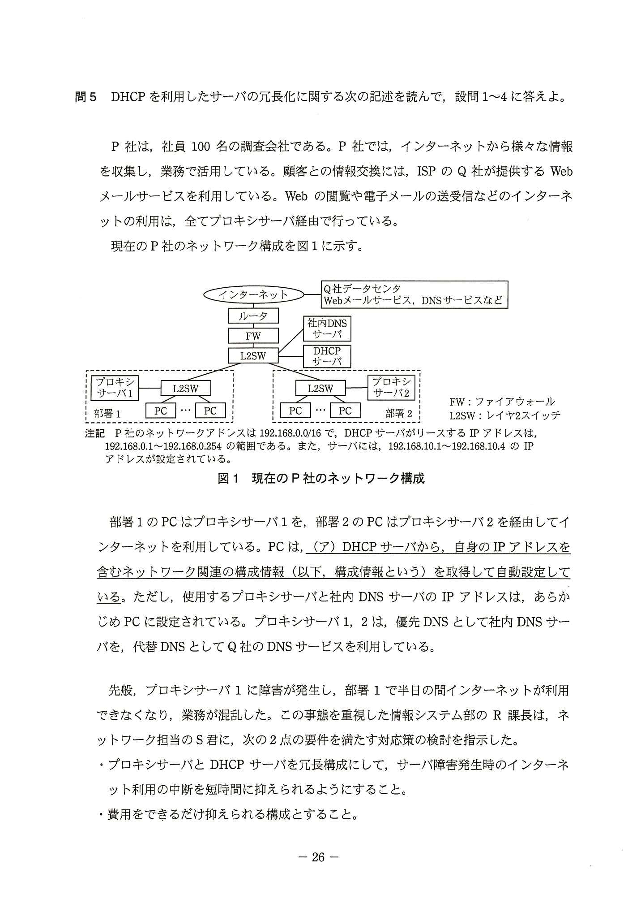

テキスト (OCR)

間5 DHCP を利用したサーバの冗長化に関する次の記述を読んで, 設問 1+ー4 に答えよ。

P 社は, 社員 100 名の調査会社である。P 社では, インターネットから様々な情報
を収集し, 業務で活用している。 顧客との情報交換には, ISP の Q 社が提供する Web
メールサービスを利用している。Web の閲覧や電子メールの送受信などのインターネ
ットの利用は, 全てプロキシサーバ経由で行っている。

現在のP 社のネットワーク構成を図 1 に示す。

ごインターネットつ       Q社データセンタ

ABR Oe kV ER,  DNSサービスなど

社内DNS
サーバ

DHCP

| プロキシ                          Ane

| サーバ                                ーバ2 |!

!  2   L                                        !    FW : ファイアウォール
! BB 1                                  部署2 |    L2SW : レイヤ2スイッチ

注記 P社のネットワークアドレスは 192.168.0.0/16 で, DHCP サーバがリースする IP アドレスは,
192.168,0.1~192.168.0.254 の範囲である。また, サーバには, 192.168.10.1~192.168.10.4 の IP
アドレスが設定されている。

 1 現在のP社のネットワーク構成

部署 1 のPC はプロキシサーバ1 を, 部署2 の PC はプロキシサーバ 2 を経由してイ
ンターネットを利用している。PC は,_(ア) DHCP サーバから, 自身のIP アドレスを
含むひネットワーク関連の構成情報 (以下, 構成情報という) を取得して自動設定して
いる。ただし, 使用するプロキシサーバと社内 DNS サーバの IP アドレスは, あらか
じめ PC に設定されている。プロキシサーバ 1, 2 は, 優先 DNS として社内 DNS サー
バを, 代准 DNS として Q 社の DNS サービスを利用している。

FH, プロキシサーバ 1 に障害が発生し, 部署 1 で半日の間インターネットが利用
できなくなり, 業務が混乱した。この事態を重視した情報システム部の R RRM, ネ
ットワーク担当の S EK, 次の2 点の要件を満たす対応策の検討を指示した。

・プロキシサーバと DHCP サーバを冗長構成にして, サーバ障害発生時のインターネ

ット利用の中断を短時間に抑えられるようにすること。

・費用をできるだけ抑えられる構成とすること。

ー 26 一

### ページ 27

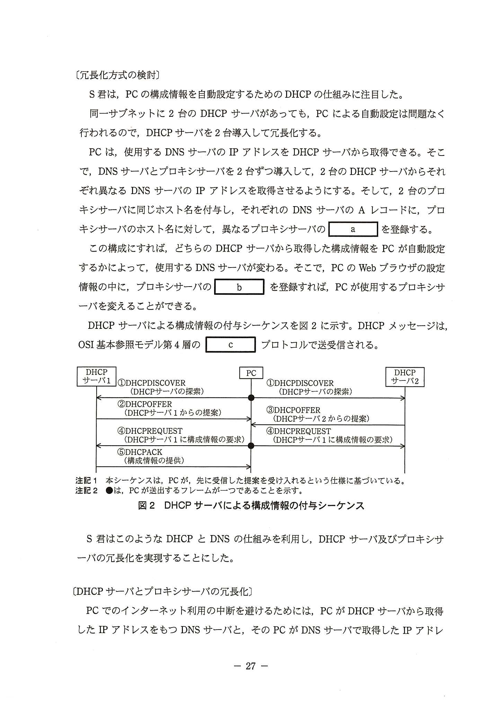

テキスト (OCR)

(冗長化方式の検討

S 君は PC の構成情報を自動設定するための DHCP の仕組みに注目した。

同一サブネットに 2 BO DHCP サーバがあっても, PC による自動設定は問題なく
行われるので, DHCP サーバを 2 台導入して冗長化する。

PC は, 使用する DNS サーバの IP アドレスを DHCP サーバから取得できる。そこ
で, DNS サーバとプロキシサーバを 2 台ずつ導入して, 2 台の DHCP サーバからそれ
ぞれ異なる DNS サーバの IP アドレスを取得させるようにする。そして, 2 台のプロ
キシサーバに同じホスト名を付与し それぞれの DNS サーバの A レコードに, プロ
キシサーバのホスト名に対して, 異なるプロキシサーバの|  a | を登録する。

この構成にすれば, どちらの DHCP サーバから取得した構成情報を PC が自重設定
するかによって, 使用する DNS サーバが変わる。そとで, PC の Web ブラウザの設定
情報の中に, プロキシサーバの|  b | を登録すれば, PCが使用するプロキシサ
ーバを変えるととができる。

DHCP サーバによる構成情報の付与シーケンスを図 2 に示す。DHCP メッセージは,
OSI 基本参照モデル第 4 層の プロトコルで送受信される。

DHCP                      DHCP
サーバ1 |@DHCPDISCOVER           @DHCPDISCOVER        サーバ2
(DHCPサーバの探索)             (DHCPサーバの探索)
@DHCPOFFER
NT Be             @DHCPOFFER
SS es      (DHCPサーバ2 からの提案
@DHCPREQUEST              @DHCPREQUEST
(DHCPサーバ1 に模成情報の要求)  (DHCPサーバ1に構成情報の要求
@DHCPACK
(構成情報の提供)

注記1 本シーケンスは, PC が, 先に受信した提案を受け入れるという仕様に基づいている。
注記2 @id, PCが送出するフレームが一つであることを示す。

 2 DHCP サーバによる構成情報の付与シーケンス

S 君はこのような DHCP と DNS の仕組みを利用し, DHCP サーバ及びプロキシサ
ーバの冗長化を実現することにした。

(DHCP サーバとプロキシサーバの冗長化〕
PC でのインターネット利用の中断を避けるためには, PC が DHCP サーバから取得
した IP アドレスをもつ DNS サーバと, その PC が DNS サーバで取得した IP アドレ

ー 27 一

### ページ 28

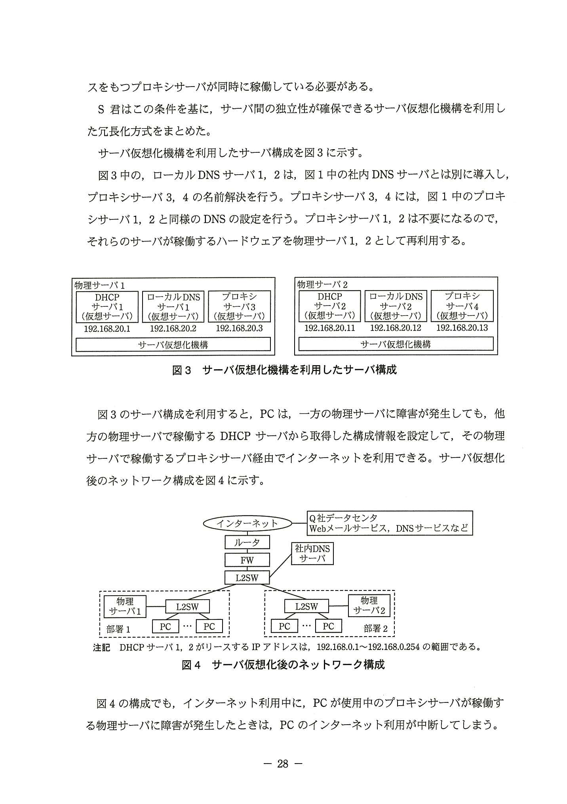

テキスト (OCR)

スをもつプロキシサーバが同時に稼働している必要がある。
S 君はこの条件を基に, サーバ間の独立性が確保できるサーバ仮想化機構を利用し

た冗長化方式をまとめた。

サーバ仮想化機構を利用したサーバ構成を図 3 に示す。
図 3 中の, ローカル DNS サーバ 1, 2 は, 図1 中の社内 DNS サーバとは別に導入し,

プロキシサーバ 3, 4 の名前解決を行う。プロキシサーバ 3, 4 に

は, 図 1 中のプロキ

シサーバ1, 2 と同様の DNS の設定を行うも。プロキシサーバ1, 2 は不要になるので,
それらのサーバが稼働するハードウェアを物理サーバ 1, 2 として再利用する。

物理サーバ1                           物理サーバ2
DHCP    ローカルDNS   プロキシ         a    ローカルDNS    プロキシ
サーバ1     サーバ1     サーバ3            ーパ2     サーバ9     サーパ4
(仮想サーパ) ] | (仮想サーバ) | [ (仮想サーバ)      wa パ) | | (仮想サーバ) | | (仮想サーバ)
192.168.20.1 192.168.20.2 192.168.20.3              192.168.20.11 192.168.20.12  192.168.20.13

サーバ仮想化機構

|

サーバ仮想化機構

 3 サーバ仮想化機構を利用したサーバ構成

図 3 のサーバ構成を利用すると, PC は, 一方の物理サーバに障害が発生しても, 他
方の物理サーバで稼働する DHCP サーバから取得した構成情報を設定して, その物理
サーバで稼働するプロキシサーバ経由でインターネットを利用できる。サーバ仮想化
後のネットワーク構成を図 4 に示す。

Q社データセンタ
Webメールサービス,

DNSサービスなど

物理

部署1

i
1
!  サーバ1
H

社内DNS
サーバ

物理

サーバ2 |!
|

部署2!

, 2 がリースする IP アドレスは, 192.168.0.1~192.168.0.254 DM CHS.
 4 サーバ仮想化後のネットワーク構成

図 4 の構成でも, インターネット利用中に, PC が使有中のプロキシサーバが稼働す
る物理サーバに障害が発生したときは, PC のインターネット利用が中断してしまう。

ー 28 一

### ページ 29

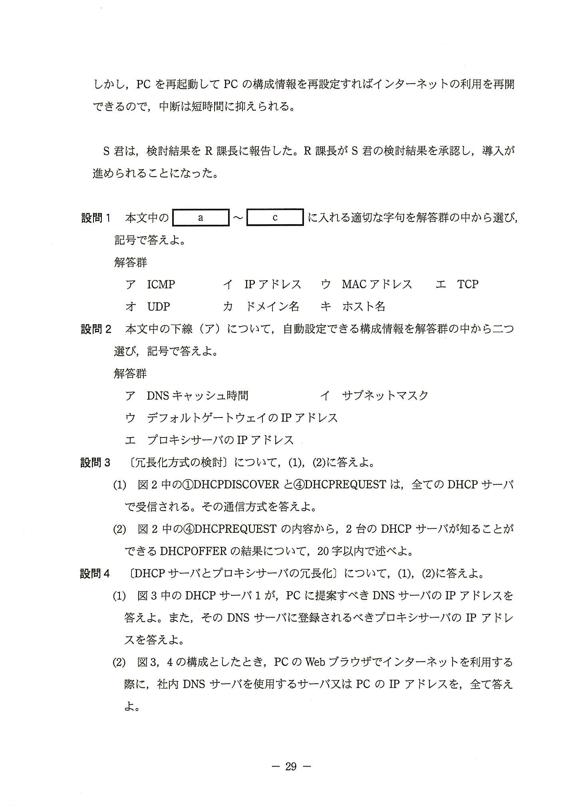

テキスト (OCR)

しかし, PC を再起動して PC の構成情報を再設定すればインターネットの利用を再開
できるので, 中断は短時間に抑えられる。

S 君は, 検討結果を R 課長に報告した。R 課長が S 君の検討結果を承認し, 導入が
進められることになった。

設問1 本文中の| ぉa |て| ic |に入れる適切な字句を解答群の中から選び,

記号で答えよ。

解答群
ア ICMP      イ IPアドレス DY MACアドレス   x TCP
オ UDP        A ドメイン名 キ HALA

設問2 本文中の下線 (ア) について, 自動設定できる構成情報を解答群の中から二つ
選び, 記号で答えよ。
解答群
ア DNS キャッシュ時間         イ サブネットマスク
ウ デフォルトゲートウェイのIP アドレス
エエ プロキシサーバの IP アドレス
設問3 冗長化方式の検討】について, ①⑪, (②)に答えよ。
(1) 図2 中の①DHCPDISCOVER と④DHCPREQUEST は, 全ての DHCP サーバ
で受信される。その通信方式を答えよ。
(2) 図 2 中の④DHCPREQUEST の内容から, 2 GO DHCP サーバが知ることが
できる DHCPOFFER の結果について, 20 字以内で述べよ。
設問4 〔DHCP サーバとプロキシサーバの冗長化〕] について, ①, ②)に答えよ。
(1) 図3 中の DHCP サーバ 1 が, PC に提案すべき DNS サーバの IP アドレスを
BAK. HE, その DNS サーバに登録されるべきプロキシサーバの TP アドレ
スを答えよ。
(2) 図3, 4の構成としたとき, PC の Web ブラウザでインターネットを利用する
際に, 社内 DNS サーバを使用するサーバ又は PC の IP アドレスを, 全て答え
dea

### ページ 30

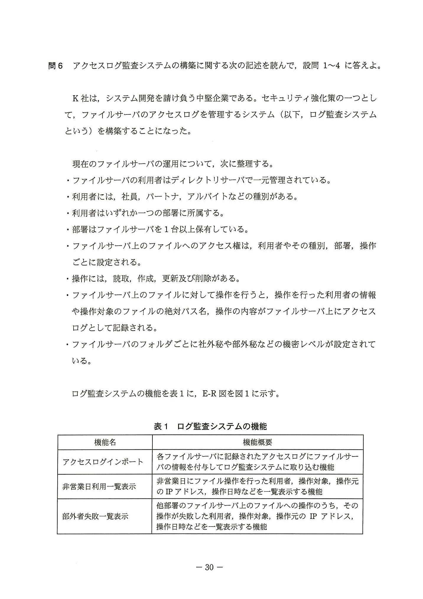

テキスト (OCR)

間6 アクセスログ監査システムの構築に関する次の記述を読んで, 設問 1~4 に答えよ。

K 社は, システム開発を請け負う中堅企業である。セキュリティ強化人策の一つとし
て, ファイルサーバのアクセスログを管理するシステム (以下, ログ監査システム
という) を構築することになった。

現在のファイルサーバの運用について, 次に整理する。

・ファイルサーバの利用者はディレクトリサーバで一元管理されている。

・利用者には, 社員, パートナ, アルバイトなどの種別がある。

・利用者はいずれかーーつの部署に所属する。

・部署はファイルサーバを 1 台以上保有している。

・ファイルサーバ上のファイルへのアクセス権は, 利用者やその種別, BB, 操作
ごとに設定される。

・操作には, 読取, 作成, 更新及び削除がある。

・ファイルサーバ上のファイルに対して操作を行うと, 操作を行った利用者の情報
や操作対象のファイルの絶対パス名, 操作の内容がファイルサーバ上にアクセス
ログとして記録される。

・ファイルサーバのフォルダごとに社外秘や部外秘などの機密レベルが設定されて
いる。

ログ監査システムの機能を表 1 に, E-R 図を図 1 に示す。

表1 ログ監査システムの機能
機能名                                                              機能概要

各ファイルサーバに記録されたアクセスログにファイルサー
バの情報を付与してログ監査システムに取り込む機能

非営業日にファイル操作を行った利用者, 操作対象, 操作元
の IP アドレス, 操作日時などを一覧表示する機能

他部署のファイルサーバ上のファイルへの操作のうち, その
部外者失敗一覧表示    操作が失敗した利用者, 操作対象, 操作元の IP アドレス,
操作日時などを一覧表示する機能

アクセスログインボポート

非営業日利用一覧表示

### ページ 31

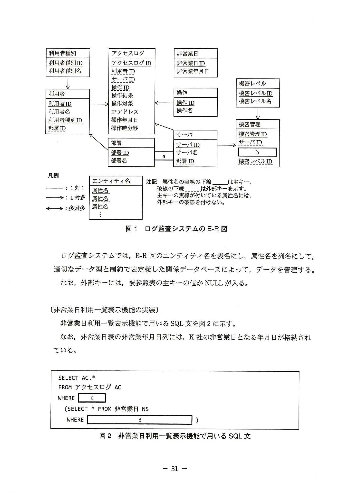

テキスト (OCR)

利用者種別           アクセスログ          非営業日
利用者種別TD         アクセスログ ID        非営業日D
利用者種別名          利用者ID             非営業年月日
BALAI
利用者                   操作結果                  操作                     機密レベルTD
利用者ID       操作対象        操作        機密レベル名
利用者名        IPアドレス       操作名
利用者種別D             操作年月日                                                   -
#820        操作時分秒                   Be
サーバ                                機密管理D
部署                                      サーバID
EG ID                                 サーバ名
部署名                             #2 ID
凡例
エンティティ名    注記 属性名の実線の下線    は主キー,
ーー : 1対1    REZ                       ead_----!は外部キーを示す。
“14    he               主キーの実線が付いている属性名には,
1 AS | Mies        外部キーの破線を付けない。

ログ監査システムでは, E-R 図のエンティティ名を表名にし, 属性名を列名にして,
適切なデータ型と制約で表定義した関係データベースによって, データを管理する。

図1 ログ監査システムの E-R

なお, 外部キーには, 被参照表の主キーの値か NULL が入る。

【非営業日利用一覧表示機能の実装
非営業日利用一覧表示機能で用いる SQL 文を図 2 に示す。
なお, 非営業日表の非営業年月日列には, K 社の非営業日となる年月日が格納され

ている。

SELECT AC.*
FROM アクセスログ AC

WHERE

(SELECT * FROM 非営業日 NS

WHERE |

d

| )

 2 非営業日利用一覧表示機能で用いる SQL 文

ー 31 一

### ページ 32

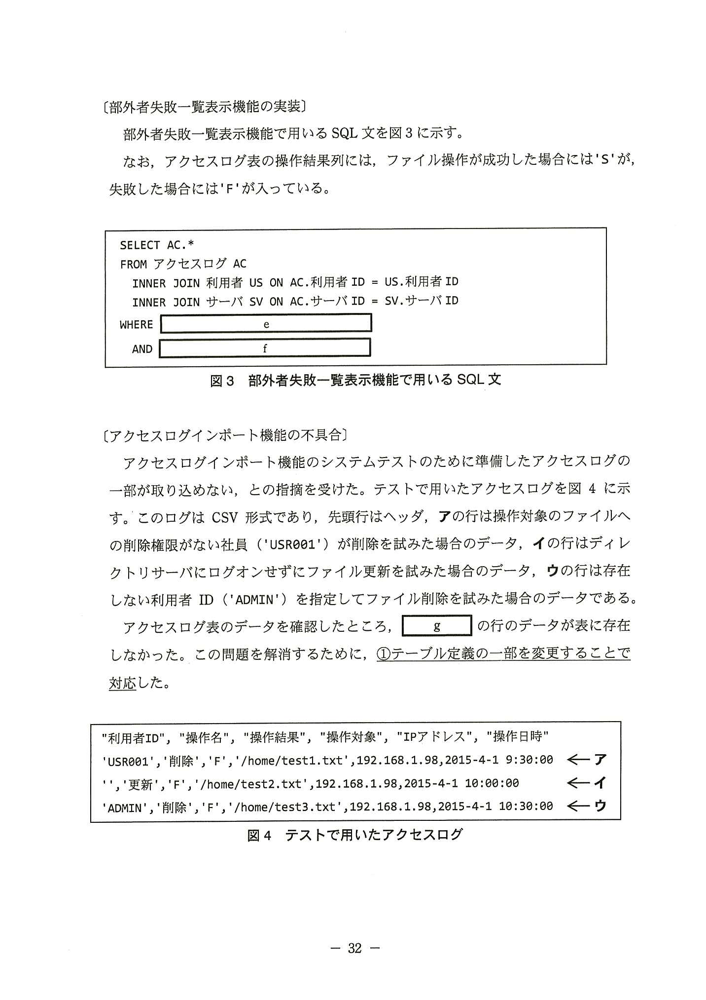

テキスト (OCR)

〔部外者失敗一覧表示機能の実装
部外者失敗一覧表示機能で用いる SQL 文を図 3 に示す。
BB, アクセスログ表の操作結果列には, ファイル操作が成功した場合には'S'が,
失敗した場合には'F'が入っている。

SELECT AC.*
FROM アクセスログ AC
INNER JOIN 利用者 US ON AC.利用者 ID
INNER JOIN サーバ SV ON AC.サーバ ID

MHERE |                e                |

US.利用者 ID
SV.サーバ ID

AND |                     f                     |

 3 部外者失敗一覧表示機能で用いる SQL文

〔アクセスログインポート機能の不具合〕

アクセスログインポート機能のシステムテストのために準備したアクセスログの
一部が取り込めない, との指摘を受けた。テストで用いたアクセスログを図 4 に示
す。このログは CSV 形式であり, 先頭行いヘッダ, アの行は操作対象のファイルへ
の削除権限がない社員 ("USR991') が削除を試みた場合のデータ, イの行はディレ
クトリサーバにログオンせずにファイル更新を試みた場合のデータ, ウの行は存在
しない利用者 ID ('ADMIN') を指定してファイル削除を試みた場合のデータである。

アクセスログ表のデータを確認したところ, |  g | の行のデータが表に存在
しなかった。この間題を解消するために, ①テーブル定義の一部を変更することで
対応した。

"利用者ID", "操作名", "操作結果", "操作対象", "IPP BLA", "操作日時"

‘USROO1', "HUE, 'F', '/home/test1.txt',192.168.1.98,2015-4-1 9:39:99 でーア
‘1 BME, Et, '/home/test2.txt',192.168.1.98,2015-4-1 10:20:00      ぐーイ
"ADMIN", ‘HUBR', 'F', '/home/test3.txt',192.168.1.98,2015-4-1 10:30:00 ぐーウ

 4 テストで用いたアクセスログ

### ページ 33

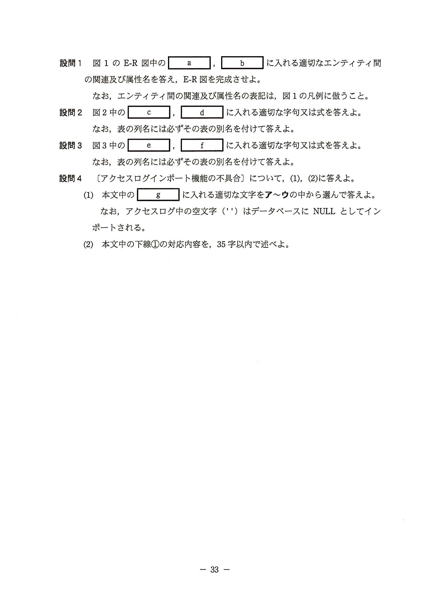

テキスト (OCR)

設問1 図1のE-R図中の| a |,|  b |に入れる適切なエンティティ間
の関連及び属性名を答え, E-R 図を完成させよ。
BB, エンティティ間の関連及び属性名の表記は, MIONMICHSTE,

設問2 図2中の| c |, | a |に入れる適切な字旬又は式を答えよ。
なお, 表の列名には必ずその表の別名を付けて答えよ。
設問3 図3中の| ec |,|  f |に入れる適切な字句又は式を答えよ。

なお, 表の列名には必ずその表の別名を付けて答えよ。
設問4 〔アクセスログインポート機能の不具合) について, ①⑪, ⑫)に答えよ。
@ 本文中の| g | に入れる適切な文字をアンウの中から選んで答えよ。
mB, アクセスログ中の空文字 ("') はデータベースに NULL としてイン
ポートされる。
2) 本文中の下線①の対応内容を, 35 字以内で述べよ。

### ページ 34

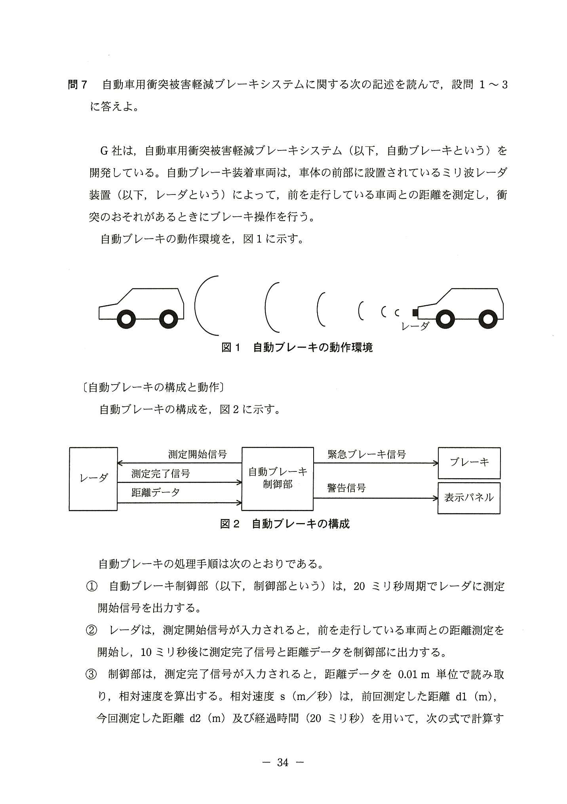

テキスト (OCR)

A? 自動車用衝突被害軽減プレーキシステムに関する次の記述を読んで, RA 1~3

に答えよ。

G 社は, 自動車用衝突被害軽減プレーキシステム (以下, 自動プレーキという) を
開発している。 自動ブレーキ装着車両は, 車体の前部に設置されているミリ波レーダ
装置(以下,レーダという) によって, 前を走行している車両との距離を測定し, &
突のおそれがあるときにブレーキ操作を行う。

自動プレーキの動作環境を, 図 1 に示す。

ool ( ( (cseで

 1 自動プレーキの動作環境

[自動ブレーキの構成と動作〕
自動ブレーキの構成を, 図 2 に示す。

       1b                           7) /SB
測定開始信号           緊急ブレーキ信号
レーダ | 測定完了信号            amet
距離データ               pliig        表示パネル

図2 自動プレーキの構成

自動ブプレーキの処理手順は次のとおりである。

① 自動プレーキ制御部 (以下, 制御部という) は, 20 ミリ秒周期でレーダに測定
開始信号を出力する。

@ レーダは, 渦定開始信号が入力されると, 前を走行している車両との距離測定を
開始し, 10 ミリ秒後に測定完了信号と距離データを制御部に出力する。

@ 制御部は, 測定完了信号が入力されると, 距離データを 0.01 m 単位で読み取
り, 相対速度を算出する。相対速度 s (mプ秒) は, 前回測定した距離 d1 (m),
今回測定した距離 d2 (m) 及び経過時間 (20 ミリ秒) を用いて, 次の式で計算す

ー 34 一

### ページ 35

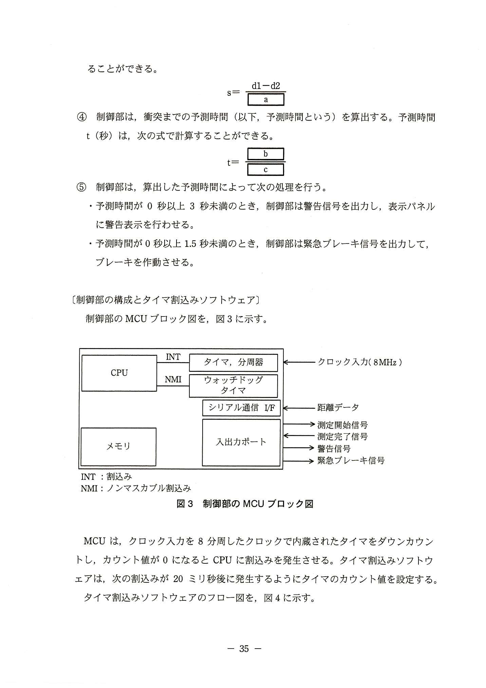

テキスト (OCR)

ることができる。
dl—d2

|

④ 制御部は, 衝突までの予測時間 (以下, 予測時間という) を算出する。予測時間
t (秒) は, 次の式で計算することができる。

『

t=

|

⑤ 制御部は, 算出した予測時間によって次の処理を行う。
・予測時間が 0 秒以上 3 秒未満のとき, 制御部は警告信号を出力し, 表示パネル
に警告表示を行わせる。
・予測時間が 0 秒以上 1.5 秒未満のとき, 制御部は緊急ブレーキ信号を出力して,
プブレーキを作動させる。

[制御部の構成とタイマ割込みソリソフトウェア)〕
制御部の MCU ブロック図を, 3 に示す。

INT | タイマ, 分周器 | =一一 クロック入力(8MHz )
CPU
NMI        ウォッチドッグ
タイマ
シリアル通信 VF |kー 距離データ
ーー > 測定開始信号
。        <ーー 測定完了信号
の           ドートトーー 條信号
|__ > 息急プレーキ信号
INT : 割込み

NMI: : ノンマスカブル割込み
 3 制御部の MCU ブロック

MCU は, クロック入力を 8 分周したクロックで内蔵されたタイマをダウンカウン
トし, カウント値が 0 になると CPU に割込みを発生させる。タイマ割込みソフトウ
ェアは, 次の割込みが 20 ミリ秒後に発生するようにタイマのカウント値を設定する。

タイマ割込みソリソフトウェアのフロー図を, 図 4 に示す。

ー 35 一

### ページ 36

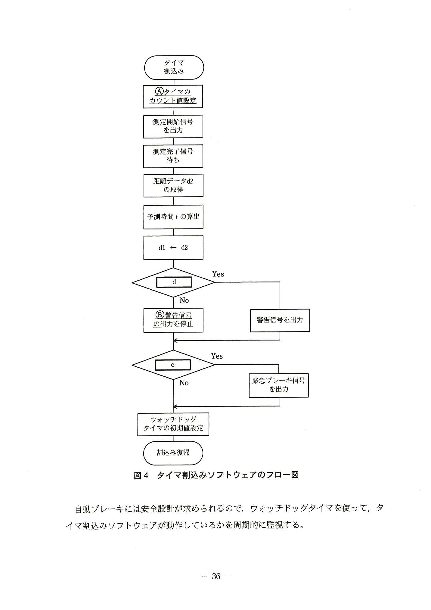

テキスト (OCR)

タイマ
割込み

(⑯タイマの
カウント値設定
l
測定開始信号
を出力
|
測定完了信号
待ち
I
距離データd2
の取得
I
予測時間t の算出
|

dl <— d2

権告信号を出力
J
<で       =
No                     緊急ブレーキ信号
を出力
ウォッチドッグ
タイマの初期値設定

図4 タイマ割込みソフトウェアのフロー図

自動ブプレーキには安全設計が求められるので, ウォッチドッグタイマを使って, F
イマ割込みソフトウェアが動作しているかを周期的に監視する。

### ページ 37

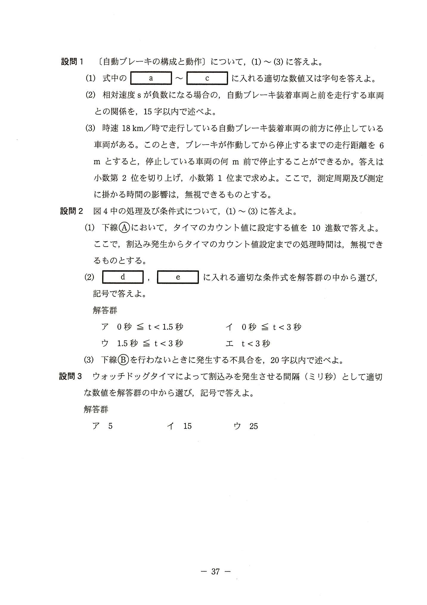

テキスト (OCR)

設問1 [自動プレーキの構成と動作】 について, Q①) ~ ③) に答えよ。
Q①) 式中の| a |て|  c | に入れる適切な数値又は字句を答えよ。
(2) 相対速度 s が負数になる場合の, 自動プブレーキ装着車両と前を走行する車両
との関係を, 15 字以内で述べよ。
(3) 時速 18 kmノ時で走行している自動ブレーキ装着車両の前方に停止している
車両がある。このとき, プレーキが作動してから停止するまでの走行距離を 6
m とすると, 停止している車両の何 m 前で停止することができるか。答えは
小数第 2 位を切り上げ, 小数第 1 位まで求めよ。ここで, 測定周期及び測定
に掛かる時間の影響は, 無視できるものとする。
設問2 図4中の処理及び条件式について, ① ~ (3) に答えよ。
Q①) 下線(において, タイマのカウント値に設定する値を 10 進数で答えよ。
ここで, 割込み発生からタイマのカウント値設定までの処理時間は, 無視でき

るものとする。
@ |  d |, |  e | に入れる適切な条件式を解答群の中から選び,
記号で答えよ。
解答群
ア 0秒ミt<1.5秒      イ 0M St<3p
ウ 15% St<3h      エ t<3秒

3) 下線(⑧)を行わないときに発生する不具合を, 20 字以内で述べよ。
設問3 ウォッチドッグタイマによって割込みを発生させる間隔 (ミリ秒) として適切
な数値を解答群の中から選び, 記号で答えよ。
ARB
ア 5      イ 15    ウ 25

ー 37 一

### ページ 38

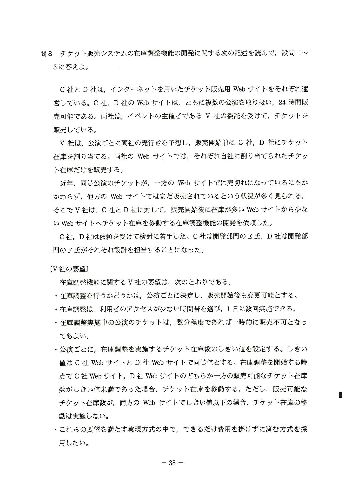

テキスト (OCR)

間8 チケット販売システムの在庫調整機能の開発に関する次の記述を読んで, 設問 1

3 に答えよ。

C 社と D 社は,。 インターネットを用いたチケット販売用 WWeb サイトをそれぞれ運
営している。C th, D 社の Web サイトは, ともに複数の公演を取り扱い 24 時間販
売可能である。両社は, イベントの主催者である V 社の委託を受けて, チケットを
販売している。

V 社は, 公演ごとに両社の売行きを予想し, 販売開始前に C 社, D 社にチケット
在庫を割り当てる。両社の Web サイトでは, それぞれ自社に割り当てられたチケッ
ト在庫だけを販売する。

近年, 同じ公演のチケットが, 一方の Web サイトでは売切れになっているにもか
かわらず, 他方の Web サイトではまだ販売されているという状況が多く見られる。
そこで V 社は, C社とD 社に対して, 販売開始後に在庫が多い Web サイトから少な
い Web サイトへヘチケット在庫を移動する在庫調整機能の開発を依頼した。

C 社, D 社は依頼を受けて検討に着手した。C 社は開発部門のFE 氏, D 社は開発部
門のF 氏がそれぞれ設計を担当することになった。

〔V HOES)
在庫調整機能に関する V 社の要望は, 次のとおりである。

・在庫調整を行うかどうかは, 公演ごどとに決定し, 販売開始後も変更可能とする。

・在庫調整は, 利用者のアクセスが少ない時間帯を選び, 1 日に数回実施できる。

・在庫調整実施中の公演のチケットは, 数分程度であれば一時的に販売不可となっ
THEW,

・公演ごとに, 在庫調整を実施するチケット在庫数のしきい値を設定する。しきい
値は C 社 Web サイトとD 社 Web サイトで同じ値とする。 在庫調整を開始する時
点でC社 Web サイト, D 社 Web サイトのどちらか一方の販売可能なチケット在庫
数がしきい値未満であった場合,チケット在庫を移動する。ただし, 販売可能な
チケット在庫数が, 両方の Web サイトでしきい値以下の場合,チケット在庫の移
動は実施しない。

・これらの要望を満たす実現方式の中で, できるだけ費用を掛けずに済む方式を採
用したい。

ー 38 一

### ページ 39

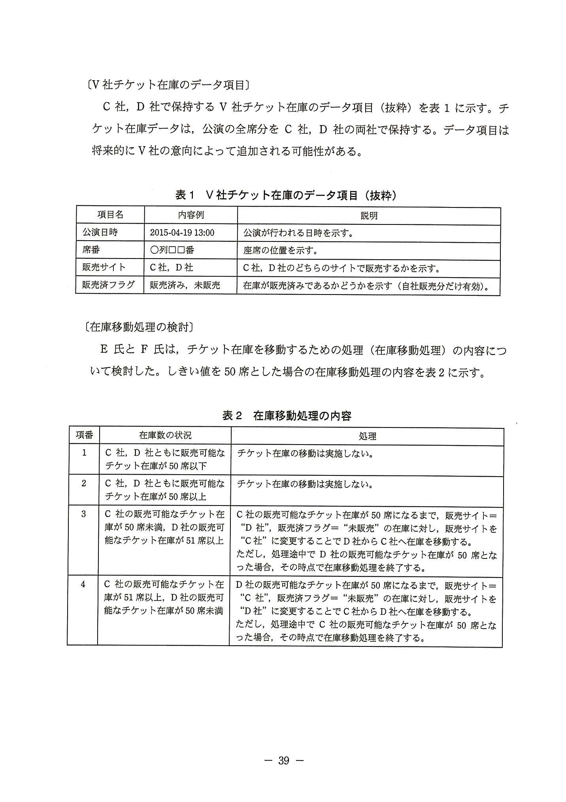

テキスト (OCR)

〔V 社チケット在庫のデータ項目〕

C 社, D 社で保持する V 祉チケット在庫のデータ項目 (抜粋) を表 1 に示す。チ
ケット在庫データは, 公演の全席分を C 社, D 社の両社で保持する。データ項目は
将来的に V 社の意向によって追加される可能性がある。

表1 V社チケット在庫のデータ項目 (抜粋)
項目名              内容例                                        説明
公演日時        2015-04-19 13:00        公演が行われる日時を示す。
席番              OFIDO#              座席の位置を示す。
販売サイト    C社, D社        C社, D社のどちらのサイトで販売するかを示す。
販売済フラグ | 販売済み, 未販売    在庫が販売済みであるかどうかを示す (自社販売分だけ有効)。
(在庫移動処理の検討]

E 氏とF Rid, チケット在庫を移動するための処理 (在庫移動処理) の内容につ
いて検討した。しきい値を 50 席とした場合の在庫移動処理の内容を表 2 に示す。

表2 在庫移動処理の内容

項番

在庫数の状況

処理

C 社, D 社ともに販売可能な
チケット在庫が 50 席以下

チケット在庫の移動は実施しない。

C 社, D 社ともに販売可能な
チケット在庫が50 席以上

チケット在庫の移動は実施しない。

C 社の販売可能なチケット在
庫が50 FEAR, D 社の販売可
能なチケット在庫が51 席以上

C 社の販売可能なチケット在庫が 50 席になるまで, 販売サイトニ
“D 社", 販売済フラグ= “RITE” の在庫に対し, 販売サイトを
"C社"に変更することでD 社からC社へ在庫を移動する。

ただし, 処理途中で D 社の販売可能なチケット在庫が 50 席とな

った場合, その時点で在庫移動処理を終了する。

C 社の販売可能なチケット在
庫が 51 席以上, D 社の販売可
能なチケット在庫が 50 HEART

D 社の販売可能なチケット在庫が 50 席になるまで, 販売サイトニ
“C 4", 販売済フラグニ “RAE” の在庫に対し, 販売サイトを
"D社"に変更することでC社からD 社へ在庫を移動する。

ただし, 処理途中で C 社の販売可能なチケット在庫が 50 席とな

った場合, その時点で在庫移動処理を終了する。

ー 39 一

### ページ 40

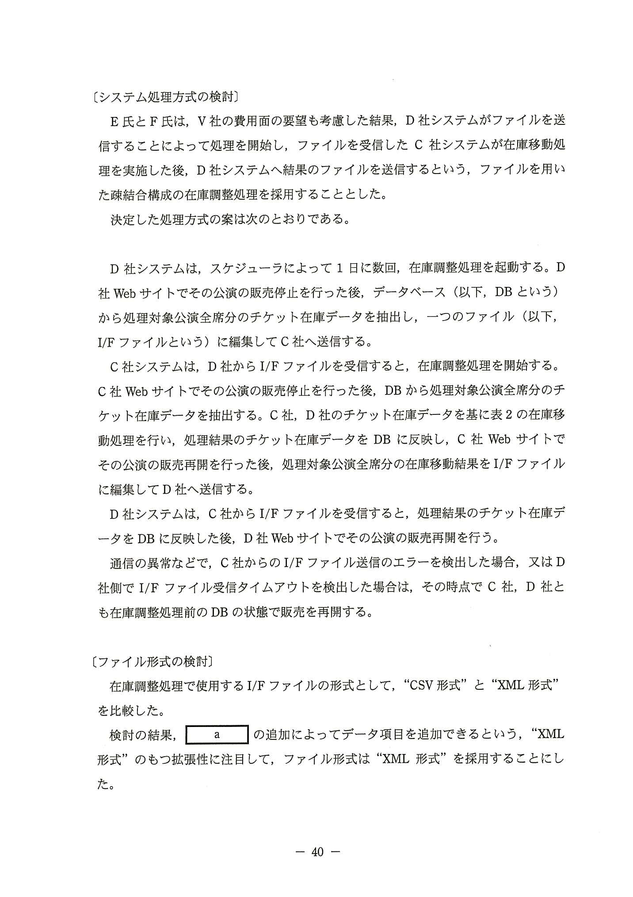

テキスト (OCR)

〔システム処理方式の検討〕

E 氏とF 氏は, V社の費用面の要望も考慮した結果, D 社システムがファイルを送
信することによって処理を開始し, ファイルを受信した C 社システムが在庫移動処
理を実施した後, D 社システムへ結果のファイルを送信するという, ファイルを用い
た疎結合構成の在庫調整処理を採用することとした。

決定した処理方式の案は次のとおりである。

D 社システムは, スケジューラによって 1 日に数回, 在庫調整処理を起動する。D
社 Web サイトでその公演の販売停止を行った後, データベース (以下, DB という)
から処理対象公演全席分のチケット在庫データを抽出し, 一つのファイル (以下,
I/F ファイルという) に編集してC 社へ送信する。

C 社システムは, D 社から 1/F ファイルを受信すると, 在庫調整処理を開始する。
C 社 Web サイトでその公演の販売停止を行った後, DB から処理対象公演全席分のチ
ケット在庫データを抽出する。C 社, D 社のチケット在庫データを基に表 2 の在庫移
動処理を行い, 処理結果のチケット在庫データを DB に反映し, C th Web サイトで
その公演の販売再開を行った後, 処理対象公演全席分の在庫移動結果をI/F ファイル
に編集して D 社へ送信する。

D 社システムは, C 社から I/F ファイルを受信すると, 処理結果のチケット在庫デ
ータを DB に反映した後, D 社 Web サイトでその公演の販売再開を行う。

通信の異常などで, C 社からの1/F ファイル送信のエラーを検出した場合, 又はD
社側で I/F ファイル受信タイムアウトを検出した場合は, その時点で C 社, D tHe
も在庫調整処理前の DB の状態で販売を再開する。

(77 t VBRORN)
在庫調整処理で使用する I/F ファイルの形式として, “CSV 形式"と “XML 形式"
を比較した。
検討の結果, |  a | の追加によってデータ項目を追加できるという, “XML
形式" のもつ拡張性に注目して, ファイル形式は “XML WR” を採用することにし
た。

### ページ 41

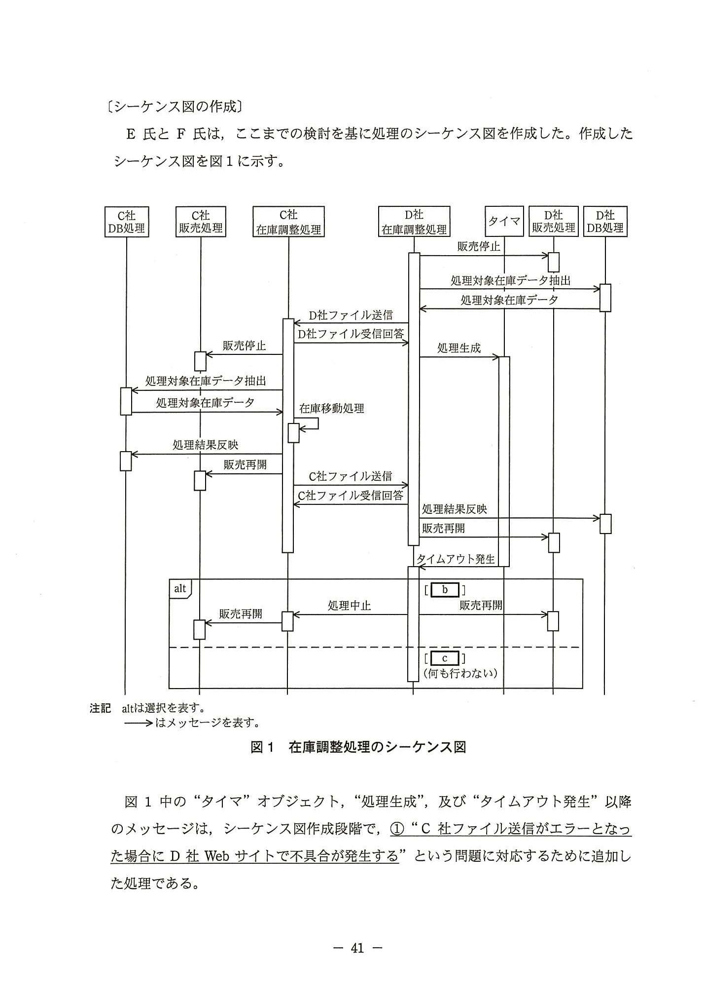

テキスト (OCR)

〔シーケンス図の作成〕
E 氏とF Kid, ここまでの検討を基に処理のシーケンス図を作成した。作成した
シーケンス図を図 1 に示す。

C社            C社              C社                      D社             タイマ     D社       D社
DB処理       販売処理       在庫調整処理             在庫調整処理                  販売処理| DB処理
|   販売停上
処理対象在庫データ抽出  、」
処理対象在庫データ    ]
D社ファイル送信                  ]
D社ファイル受信回答
販売停止               処理生成
処理対象在庫データ抽出
T
処理対象在庫データ    在庫移動処理
処理結果反映    Le
li        販売再開          ーー
C社ファイル送信
C社ファイル受信回答
処理結果反映          J
販売再開                 」          L]
邊                all
トレイムアウト発生
at                                                 (C2
8 ke        販売再開
販売再開 Pye                     >
iin)                                                 中
| | ee | ited 1; | 4 a
(何も行わない)
+

注記 altは選択を表す。
ーーテ> はメッセージを表す。

図1 在庫調整処理のシーケンス図

図 1 中の “タイマ” オブジェクト, “処理生成"。 及び “タイムアウト発生” 以降
のメッセージは, シーケンス図作成段階で ①"C 社ファイル送信がエラーとなっ
た場合に D 社 Web サイトで不具合が発生する” という問題に対応するために追加し
た処理である。

ー 41 一

### ページ 42

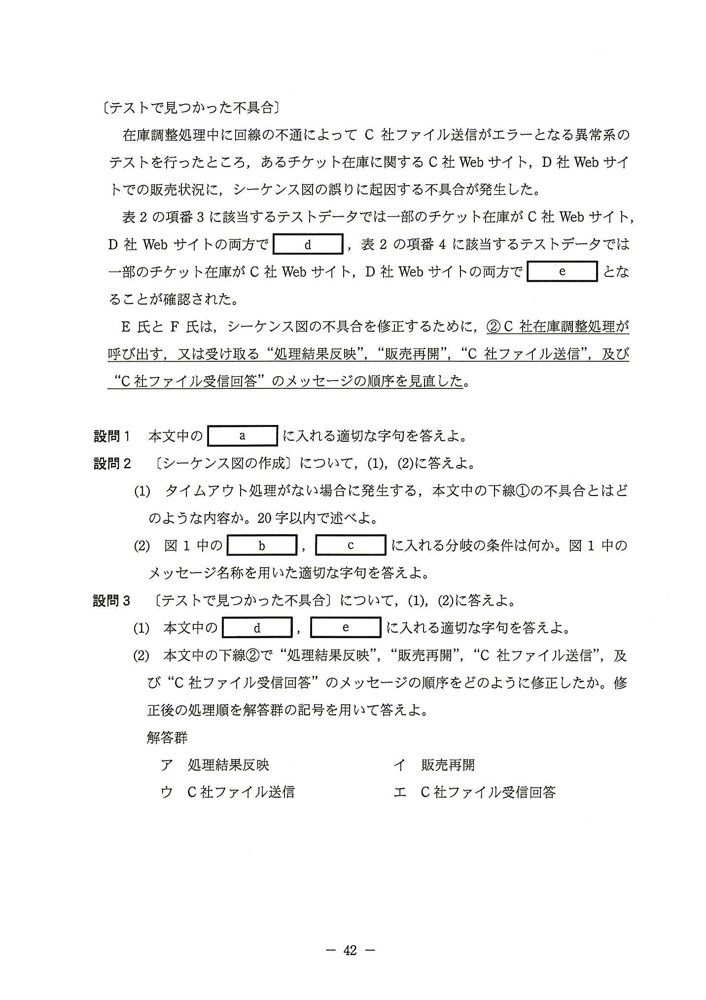

テキスト (OCR)

(テストで見つかった不具合

在庫調整処理中に回線の不通によって C 社ファイル送信がエラーとなる異常系の
テストを行ったところ, あるチケット在庫に関する C 社 Web サイト, D 社 Web サイ
トでの販売状況に。 シーケンス図の誤りに起因する不具合が発生した。

表 2 の項番 3 に該当するテストデータでは一部のチケット在庫がC 社 Web サイト,
D 社 Web サイトの両方で| q |,表2の項番4 に該当するテストデータでは
一部のチケット在庫が C 社 Web サイト, D 社 Web サイトの両方で| es |とな
ることが確認された。

ERE F Rid, シーケンス図の不具合を修正するために, OC 社在庫調整処理が
呼び出す。 又は受け取る "処理結果反映", "販売再開”, "C 社ファイル送信”。 及び

"C 社ファイル受信回答” のメッセージの順序を見直した。

設問1 本文中の[| 』 |に入れる適切な字句を答えよ。
設問2 (シーケンス図の作成〕】 について, ①, (②)に答えよ。
Q タイムアウト処理がない場合に発生する, 本文中の下線①の不具合とはど
のような内容か。20 字以内で述べよ。
②) 図1中の|  b |,|  c |に入れる分岐の条件は何か。図 1 中の
メッセージ名称を用いた適切な字句を答えよ。
設問3 〔テストで見つかった不具合] について, ①, ②に答えよ。
Q) 本文中の|   df, |   e   | に入れる適切な字句を答えよ。
(2) 本文中の下線②で “処理結果反映", “販売再開", “C 社ファイル送信", 及
O “C 社ファイル受信回答" のメッセージの順序をどのように修正したか。修
正後の処理順を解答群の記号を用いて答えよ。
ER
ア 処理結果反映         イ 販売再開
ウ C社ファイル送信       エエ C社ファイル受信回答

ー 42 一

### ページ 43

テキスト (OCR)

C A モ 用 紙 }

ー 43 一

### ページ 44

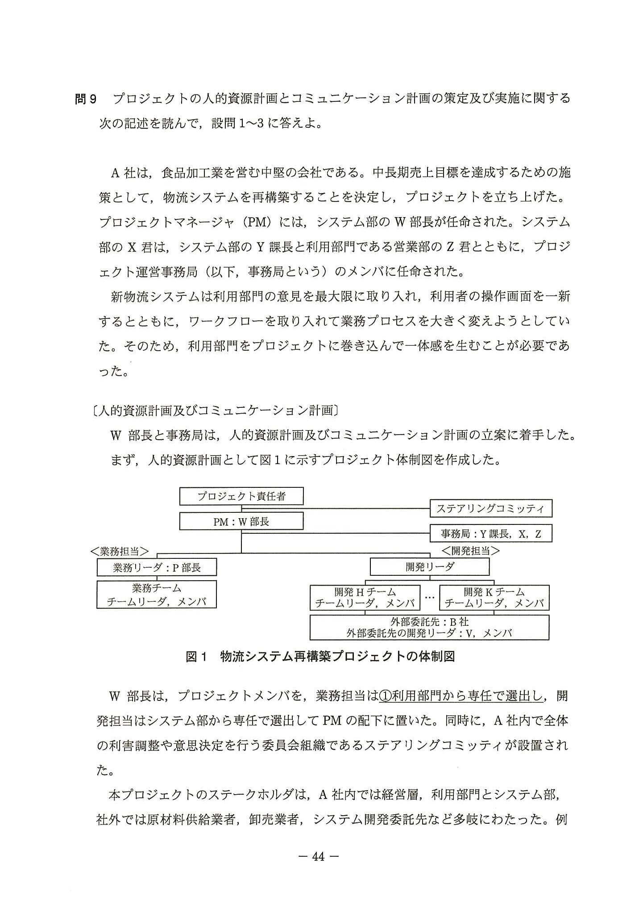

テキスト (OCR)

問9 プロジェクトの人的資源計画とコミュニケーション計画の策定及び実施に関する
次の記述を読んで, 設問 13 に答えよ。

A 社は, 食品加工業を営む中堅の会社である。中長期売上目標を達成するための施
策として, 物流システムを再構築することを決定し, プロジェクトを立ち上げた。
プロジェクトマネージャ (PM) には, システム部の W 部長が任命された。システム
部の X 君は, システム部の Y 課長と利用部門である営業部の Z 君とともに, プロジ
ェクト運営事務局 (以下, 事務局という) のメンバに任命された。

新物流システムは利用部門の意見を最大限に取り入れ, 利用者の操作画面を一新
するとともに, ワークフローを取り入れて業務プロセスを大きく変えようとしてい
た。そのため, 利用部門をプロジェクトに巻き込んで一体感を生むことが必要であ

Die.

〔人的資源計画及びコミュニケーション計画〕
W 部長と事務局は, 人的資源計画及びコミュニケーション計画の立案に着手した。
まず, 人的資源計画として図 1 に示すプロジェクト体制図を作成した。

プロジェクト次作者
ステアリングコミッティ
PM : W 部長
事務局 : Y 課長,X, Z
業務担当>                                   で開発担当>
業務リーダ : P 部長                        開発リーダ
me 2s                  開発チーム |.| 開発Kチーム
チームリーダ, メンバ            チームリーダ, RAN   チームリーダ, ADIN

外部委託先:B社
外部委託先の開発リーダ : V, メンバ

 1 物流システム再構築プロジェクトの体制図

W 部長は, プロジェクトメンバを, 業務担当は①利用部門から専任で選出し, 開
発担当はシステム部から専任で選出して PM の配下に置いた。同時に, A 社内で全体
の利害調整や意思決定を行う委員会組織であるステアリングコミッティが設置され
Tes

本プロジェクトのステークホルダは, 4A 社内では経営層, 利用部門とシステム部,
社外では原材料供給業者, 卸売業者, システム開発委託先など多岐にわたった。例

ー 44 一

### ページ 45

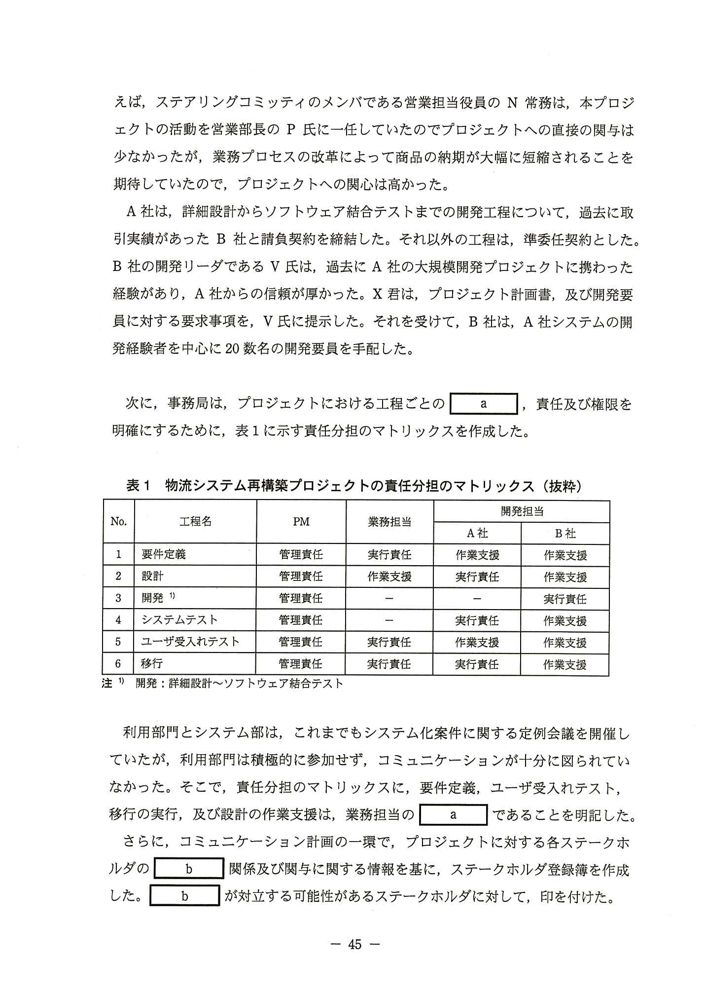

テキスト (OCR)

えば, ステアリングコミッティのメンバである営業担当役員の N 常務は, 本プロジ
ェクトの活動を営業部長の P 氏に一任していたのでプロジェクトへの直接の関与は
少なかったが, 業務プロセスの改革によって商品の納期が大幅に短縮されることを
期待していたので, プロジェクトへの関心は高かった。

A 社は, 詳細設計からソフトウェア結合テストまでの開発工程について, 過去に取
引実績があった B 社と請負契約を締結した。それ以外の工程は, 準委任契約とした。
B 社の開発リーダである V 氏は, 過去に A 社の大規模開発プロジェクトに携わった
経験があり, A 社からの信頼が厚かった。X Bld, プロジェクト計画書, 及び開発要
員に対する要求事項を, V 氏に提示した。それを受けて, B 社は, A 社システムの開
発経験者を中心に 20 数名の開発要員を手配した。

次に, 事務局は,。 プロジェクトにおける工程ごとの|  a | , RERUNS
明確にするために, 表 1 に示す責任分担のマトリックスを作成した。

表1 物流システム再構築プロジェクトの責任分担のマトリックス (抜粋)

No.    工程名       PM     業務担当
Att      Bat

1 | 要件定義         管理責任    実行責任    作業支援    作業支援
2 | 設計           管理次任    作業支援    実行責任    作業支援
3 |開発?         管理資任      ー      実行責任
4 | システムテスト      管理責任      ー      実行責任    作業支援
5 | ユーザ受入れテスト   管理責任    実行次任    作業支援    作業支援
6 | 移行           管理責任    実行責任    実行責任    作業支援

it) 開発:詳細設計ンソフトウェア結合テスト

利用部門とシステム部は, これまでもシステム化案件に関する定例会議を開催し
ていたが, 利用部門は積極的に参加せず, コミュニケーションが十分に図られてい
なかった。そとこで, 資任分担のマトリックスに, 要件定義, ユーザ受入れテスト,
移行の実行, 及び設計の作業支援は, 業務担当の| a | であることを明記した。

さらに, コミュニケーション計画の一環で, プロジェクトに対する各ステークホ
ルダの|  b  ] 関係及び関与に関する情報を基に, ステークホルダ登録待を作成
した。 | pb | が対立する可能性があるステークホルダに対して, 印を付けた。

ー45 一

### ページ 46

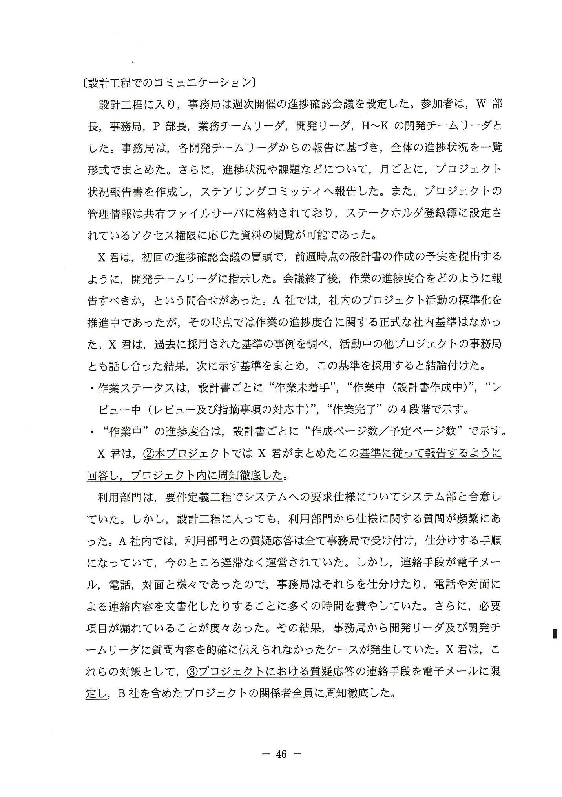

テキスト (OCR)

[設計工程でのコミュニケーション]〕

設計工程に入り, 事務局は週次開催の進捗確認会議を設定した。参加者は, W 部
長, SBR, P 部長, 業務チームリーダ, 開発リーダ, H~K の開発チームリーダと
した。事務局は, 各開発チームリーダからの報告に基づき, 全体の進捗状況を一覧
形式でまとめた。さらに, 進捗状況や課題などについて, 月ごとに, プロジェクト
状況報告書を作成し, ステアリングコミッティへ報告した。また, プロジェクトの
管理情報は共有ファイルサーバに格納されており, ステークホルダ登録筆に設定さ
れているアクセス権限に応じた資料の閲覧が可能であった。

X Bld, 初回の進捗確認会議の冒頭で, 前週時点の設計書の作成の予実を提出する
ように, 開発チームリーダに指示した。会議終了後, 作業の進捗度合をどのように報
告すべきか, という問合せがあった。4A 社では, 社内のプロジェクト活動の標準化を
推進中であったが, その時点では作業の進捗度合に関する正式な社内基準はなかっ
た。X Ald, 過去に採用された基準の事例を調べ, 活動中の他プロジェクトの事務局
とも話し合った結果, 次に示す基準をまとめ, この基準を採用すると結論付けた。

・作業ステータスは, 設計書ごとに “作業未着手", “作業中 (設計書作成中)”,
ビュー中 (レビュー及び指摘事項の対応中)", "作業完了"の4段階で示す。

・ “作業中” の進捗度合は, 設計書ごとに "作成ページ数予定ページ数" で示す。

X Bld, ②本プロジェクトでは X 君がまとめたこの基準に従って報告するように
回答し, プロジェクト内に周知徹底した。

利用部門は, 要件定義工程でシステムへの要求仕様についてシステム部と合意し
ていた。しかし, 設計工程に入っても, 利用部門から仕様に関する質問が頻繁にあ
った。4 社内では, 利用部門との質疑応答は全て事務局で受け付け, 仕分けする手順
になっていて, 今のところ遅滞なく運営されていた。 LAL, 連絡手段が電子メー
ル, 電話, 対面と様々であったので, 事務局はそれらを仕分けたり, 電話や対面に
よる連絡内容を文書化したりすることに多くの時間を費やしていた。さらに, 必要
項目が漏れていることが度々あった。その結果, 事務局から開発リーダ及び開発チ
ームリーダに質問内容を的確に伝えられなかったケースが発生していた。X ld, こ
れらの対策として, ③プロジェクトにおける質疑応答の連絡手段を電子メールに限
定し, B 社を含めたプロジェクトの関係者全員に周知徹底した。

hh

ー 46 一

### ページ 47

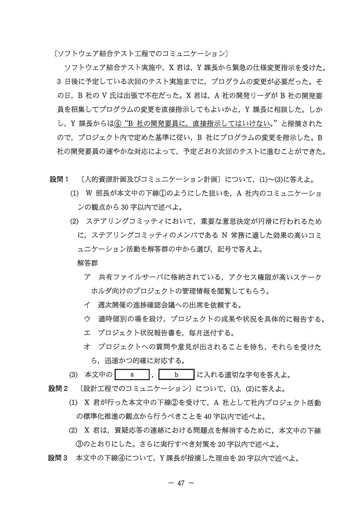

テキスト (OCR)

〔ソフトウェア結合テスト工程でのコミュニケーション]〕

ソフトウェア結合テスト実施中, X Ald, Y 課長から緊急の仕様変更指示を受けた。
3 日後に予定している次回のテスト実施までに, プログラムの変更が必要だった。そ
の日, B 社の V 氏は出張で不在だった。X Bld, A 社の開発リーダが B 社の開発要
員を招集してプログラムの変更を直接指示してもよいかと, Y 課長に相談した。しか
し, Y 課長からは④ "B 社の開発要員に, 直接指示してはいけない。”と指摘された
OC, プロジェクト内で定めた基準に従い, B 社にプログラムの変更を指示した。B
社の開発要員の速やかな対応によって, 予定どおり次回のテストに進むことができた。

設問1 〔人的資源計画及びコミュニケーション計画] について, ①ぐて(3③)に答えよ
1) W 部長が本文中の下線わのようにした狙いを, A 社内のコミュニケーショ
ンの観点から 30 字以内で述べよ。
Q) ステアリングコミッティにおいて, 重要な意思決定が円滑に行われるため
に, ステアリングコミッティのメンバである N 常務に適した効果の高いコミ
ュニケーション活動を解答群の中から選び, 記号で答えよ。
AER
ア 共有ファイルサーバに格納されている, アクセス権限が高いステーク
ホルダ向けのプロジェクトの管理情報を閲覧してもらう。
イ 週次開催の進捗確認会議への出席を依頼する。
ウ 適時個別の場を設け, プロジェクトの成果や状況を具体的に報告する。
エエ プロジェクト状況報告書を, 毎月送付する。
オ プロジェクトへの質問や意見が出されることを待ちも, それらを受けた
5, 迅速かつ的確に対応する。
⑬) 本文中の| sa |,|  b |に入れる適切な字句を答えよ。
設問2 【〔設計工租でのコミュニケーション〕 について, ①⑪, (②)に答えよ。
QM X 君が行った本文中の下線②を受けて, A 社として社内プロジェクト活動
の標準化推進の観点から行うべきことを 40 字以内で述べよ。
(⑫) X Bid, 質疑応答の連絡における問題点を解消するために, 本文中の下線
のとおりにした。さらに実行すべき対策を 20 字以内で述べよ。
設問3 本文中の下線②④について, Y 課長が指摘した理由を 20 字以内で述べよ。

### ページ 48

テキスト (OCR)

問10 情報資産の管理に関する次の記述を読んで, 設問 1<3 に答えよ。

E 社は, 中小企業に事務用の物品を販売している中堅の販売会社である。E 社が所
有する情報資産は, 願客情報,受発注情報, 取引業務情報などの文書化されていな
い業務処理用の情報資産と, 経営情報, 経理情報, 社員情報, 文書形式で出力され
た業務情報などの文書化された情報資産 (以下, 文書資産という) とに大別される。
業務処理用の情報資産は, 業務用システム内で利用者どとに| a | が定められ,
管理されている。一方, 文書資産は。 ペーパレス化の全社施策の推進によって, 最
終的に大部分が電子化された状態で社内のファイルサーバに保管されている。これ
らの資産には, 情報資産の機密性の分類として, “BURNED”, “社内限り", “公開"
のいずれかの機密性区分が付与されている。

最近, 同業他社で社員の不注意に起因する情報資産に関わる情報セキュリティイ
ンシデントが発生した。E 社の経営企画部のF 部長は, 文書資産資産管理と運用
管理に関する現状調査を行い。 問題点の抽出及び対応策の検討を行うよう G 課長に

指示した。

(文書資産資産管理に関する現状)
G 課長は, 社内調査を行い, 文書資産の資産管理の現状を次のとおり整理した。
(1) 文書資産の作成
・社員が, PC を使用して文書化された情報 (以下, 文書情報という) を作成し,
完成すると, 文書資産として, 社内の機密性区分を定めた情報セキュリティ規
程を参照して機密性区分を判断し, 文書資産管理者の承認を得ている。
・文書情報を作成した社員 (以下, 文書情報作成者という) は, 文書情報に機密
性区分を記載する。"関係者限り"の場合には, 文書資産管理者に許可された社
員だけが業務で利用できるよう, 文書情報を分類・整理して保管するファイル
サーバ上の場所 (以下、 フォルダという) に| sa | を設定し, そとに文書
資産として保管している。なお, フォルダは, 各部ごとに作成され, BBO
可された社員だけがアクセスできる。"社内限り" と“公開” の場合には, 全社
員がアクセスできるフォルダに文書資産として保管している。

### ページ 49

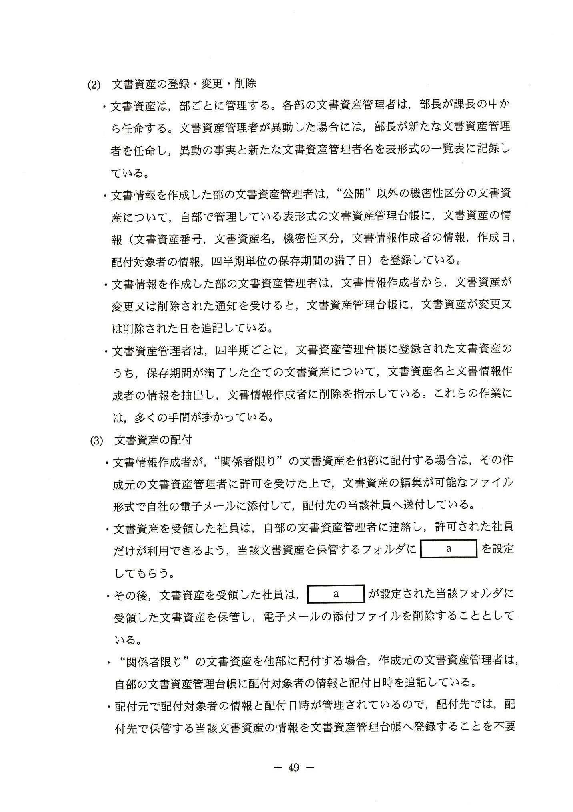

テキスト (OCR)

(2)

(3)

文書資産の登録・変更・削除

・文書資産は, 部ごとに管理する。各部の文書資産管理者は, 部長が課長の中か

ら任命する。文書資産管理者が異動した場合には, 部長が新たな文書資産管理
者を任命し, 異動の事実と新たな文書資産管理者名を表形式の一覧表に記録し
ている。

・文書情報を作成した部の文書資産管理者は, “公開” 以外の機密性区分の文書次

産について, 自部で管理している表形式の文書資産管理台帳に, 文書資産の情
報 (文書資産番号, 文書資産名, 機密性区分, 文書情報作成者の情報, 作成日,
配付対象者の情報, 四半期単位の保存期間の満了日) を登録している。

・文書情報を作成した部の文書資産管理者は, 文書情報作成者から, 文書資産が

変更又は削除された通知を受けると, 文書資産管理台帳に, 文書資産が変更叉
は削除された日を追記している。

・文書資産管理者は, 四半期ごとに, 文書資産管理台帳に登録された文書資産の

うち, 保存期間が満了した全ての文書資産について, 文書資産名と文書情報作
成者の情報を抽出し, 文書情報作成者に削除を指示している。これらの作業に
は, 多くの手間が掛かっている。

文書資産の配付

・文書情報作成者が, "関係者限り"の文書資産を他部に配付する場合は, その作

成元の文書資産管理者に許可を受けた上で, 文書資産の編集が可能なファイル
形式で自社の電子メールに添付して, 配付先の当該社員へ送付している。

・文書資産を受領した社員は, 自部の文書資産管理者に連絡し, 許可された社員

だけが利用できるよう, 当該文書資産を保管するフォルダに| sa | を設定
してもらう。

・ その後, 文書資産を受領した社員は, | a | が設定された当該フォルダに

受領した文書資産を保管し, 電子メールの添付ファイルを削除することとして
いる。

・ “関係者限り"の文書資産を他部に配付する場合, 作成元の文書資産管理者は,

自部の文書資産管理台帳に配付対象者の情報と配付日時を追記している。

・配付元で配付対象者の情報と配付日時が管理されているので, 配付先では, 配

付先で保管する当該文書資産の情報を文書資産管理台帳へ登録することを不要

### ページ 50

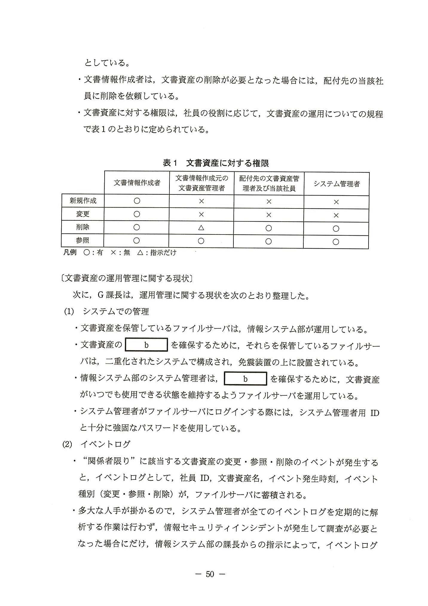

テキスト (OCR)

としている。

・ 文書情報作成者は, 文書資産の削除が必要となった場合には, 配付先の当該社
員に削除を依頼している。

・ 文書資産に対する権限は, 社員の役割に応じて, 文書資産の運用についての規程
で表 1 のとおりに定められている。

表1 文書資産に対する権限

文書情幸作成者  eo 上  システム管理者
新規作成                  (e)                            x                              x                              x
変更                     O〇O                            x                              x                              x
SIR     O       iN       Oo       Oo
oir     o       o       o       o

凡例 〇:有 ※:無 人:指示だけ

文書資産の運用管理に関する現状]〕
次に, G課長は, 運用管理に関する現状を次のとおり整理した。

qd)

(2)

システムでの管理

・文番資産を保管しているファイルサーバは, 情報システム部が運用している。

・文番資産の| b | を確保するために, それらを保管しているファイルサー
Nid, 二重化されたシステムで構成され, 免震装置の上に設置されている。

・情報システム部のシステム管理者は。 | b | を確保するために, 文書資産
がいつでも使用できる状態を維持するようファイルサーバを運用している。

・システム管理者がファイルサーバにログインする際には, システム管理者用 D
と十分に強固なパスワードを使用している。

イベントログ

・ "関係者限り"に該当する文書資産の変更・参照・削除のイベントが発生する
と, イベントログとして, 社員 ID, 文書資産名,イベント発生時刻, イベント
種別 (変更・参照・削除) が, ファイルサーバに敬積される。

・多大な人手が掛かるので, システム管理者が全てのイベントログを定期的に解
析する作業は行わず, 情報セキュリティインシデントが発生して調査が必要と
なった場合にだけ, 情報システム部の課長からの指示によって, イベントログ

### ページ 51

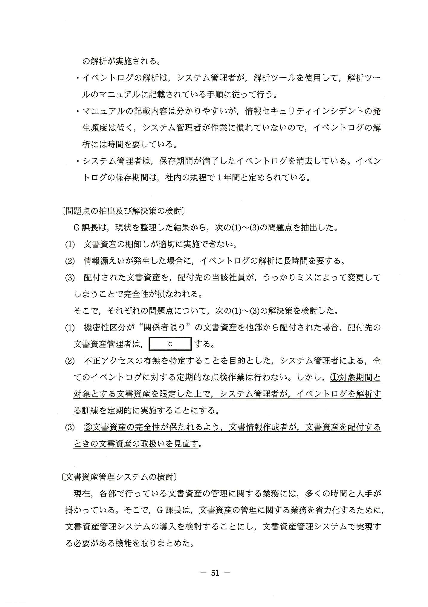

テキスト (OCR)

の解析が実施される。

・イベントログの解析は, システム管理者が, 解析ツールを使用して, 解析ツー
ルのマニュアルに記載されている手順に従って行う。

・マニュアルの記載内容は分かりやすいが, 情報シセキュリティインシデントの発
生顔度は低く, システム管理者が作業に慣れていないので, イベントログの解
析には時間を要している。

・システム管理者は, 保存期間が満了したイベントログを消去している。イベン
トログの保存期間は, 社内の規程で 1 年間と定められている。

(A OHM OM ORM)
GRE, 現状を整理した結果から, 次の①)て⑬の問題点を抽出した。

Q) 文書資産の棚外しが適切に実施できない。

Q) 情報漏えいが発生した場合に. イベントログの解析に長時間を要する。

⑬ 配付された文書資産を, 配付先の当該社員が, うっかりミスによって変更して
しまうことで完全性が損なわれる。
そこで, それぞれの問題点について, 次の①て(3③の解決策を検討した。

Q) 機密性区分が "関係者限り"の文書資産を他部から配付された場合 配付先の
文書資産管理者は, | c |する。

Q) 不正アクセスの有無を特定することを目的とした, システム管理者による, 全
てのイベントログに対する定期的な点検作業は行わない。しかし, ①対象期間と
対象とする文書資産を限定した上で, システム管理者が。イベントログを解析す
る訓練を定期的に実施することにする。

(3 ②文書資産の完全性が保たれるよう, 文書情報作成者が, 文書資産を配付する
ときの文書資産の取扱いを見直す。

〔文書資産管理システムの検討〕

現在, 各部で行っている文書資産の管理に関する業務には, 多くの時間と人手が
掛かっている。そことで, G 課長は, 文書資産の管理に関する業務を省力化するために,
文書資産管理システムの導入を検討することにし, 文書資産管理システムで実現す
る必要がある機能を取りまとめた。

ー 51 一

### ページ 52

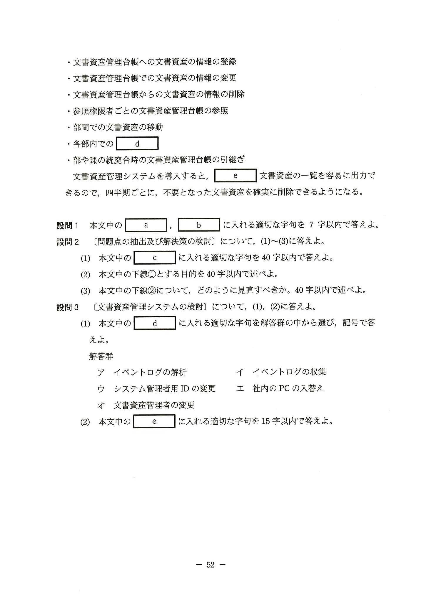

テキスト (OCR)

・文書次導管理台帳への文書資産の情報の登録
・ 文書資産管理台帳での文書資産の情報の変更

・ 文書次導管理台帳からの文書資産の情報の削除

・参照権限者ごとの文書次導管理台帳の参照

・部間での文書資産の移動

・各部内での| aq |

・部や課の統廃合時の文書資導管理台眼の引継ぎ

文書資産管理システムを導入すると, | se |文書資産の一覧を容易に出力で
きるので, 四半期ごとに, 不要となった文書資産を確実に削除できるようになる。

設問1 本文中の| a |,|  b |に入れる適切な字句を7 字以内で答えよ。
設問2 [問題点の抽出及び解決策の検討】について, ①(③)に答えよ。

Q) 本文中の に入れる適切な宇名を 40 字以内で答えよ。

Q) 本文中の下線①とする目的を 40 字以内で述べよ。

(3) 本文中の下線②について, どのように見直すべきか。40 字以内で述べよ。
設問3 【〔文書資産管理システムの検討]について, ①⑪, ②に答えよ。

①) 本文中の[| d |] に入れる適切な字名を解答格の中から選び, 記号で答
えよ。

ARH
ア イベントログの解析      イ イベントログの了収集

ウ システム管理者用 ID の変更 エエ 社内のPCの入替え
オ 文書資産管理者の変更
⑫ 本文中の| e | に入れる適切な字句を 15 字以内で答えよ。

ー 52 一

### ページ 53

テキスト (OCR)

【 メモ 用 tH 〕

ー 53 一

### ページ 54

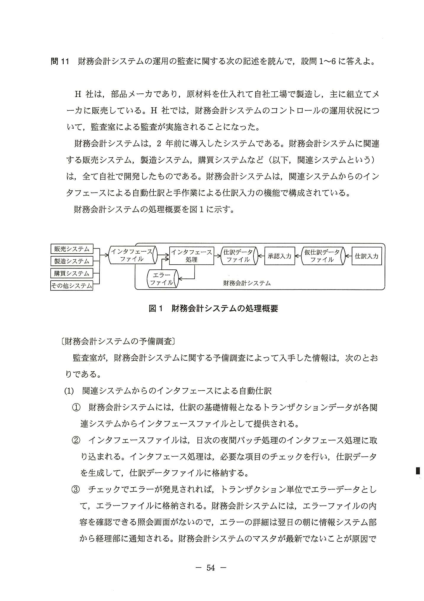

テキスト (OCR)

間11 財務会計システムの運用の監査に関する次の記述を読んで, 設問 1て6 に答えよ。

H 社は, 部品メーカであり, 原材料を仕入れて自社工場で製造し, 主に組立てメ
ーカに販売している。H 社では, 財務会計システムのコントロールの運用状況につ
いて, 監査室による監査が実施されることになった。

財務会計システムは, 2 年前に導入したシステムである。財務会計システムに関連
する販売システム, 製造システム, 購買システムなど (以下, 関連システムという)
は, 全て自社で開発したものである。財務会計システムは, 関連システムからのイン
タフェースによる自動仕訳と手作業による仕訳入力の機能で構成されている。

財務会計システムの処理概要を図 1 に示す。

|での他システム|

MM 。|インタフェース AU 7   仮仕訳データ/) |
ファイル      処理    ファィイル U | RRA ora (用ex
ェラー
ファイル

財務会計システム

図1 財務会計システムの処理概要

[財務会計システムの予備調査〕
監査室が, 財務会計システムに関する予備調査によって入手した情報は, 次のとお
りである。
Q①) 関連システムからのインタフェースによる自動仕訳
① 財務会計システムには, 仕訳の基礎情報となるトランザクションデータが各関
連システムからインタフェースファイルとして提供される。
 インタフェースファイルは, 日次の夜間バッチ処理のインタフェース処理に取
り込まれる。インタフェース処理は, 必要な項目のチェックを行い, 仕訳データ
を生成して, 仕訳データファイルに格納する。
@ チェックでエラーが発見されれば, トランザクション上単位でエラーデータとし
て, エラーファイルに格納される。財務会計システムには, エラーファイルの内
容を確認できる照会画面がないので, エラーの詳細は翌日の朝に情報システム部
から経理部に通知される。財務会計システムのマスタが最新でないことが原因で

ー 54 一

### ページ 55

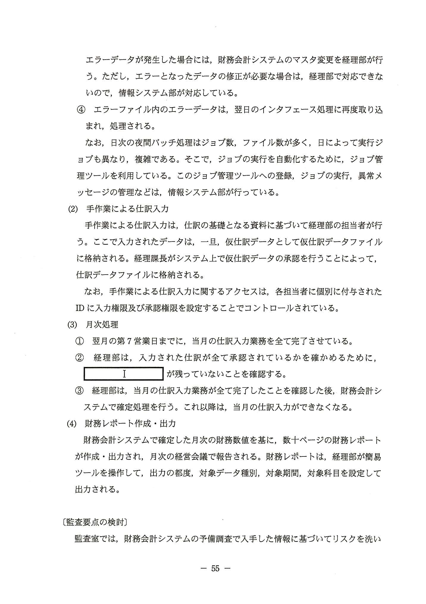

テキスト (OCR)

エラーデータが発生した場合には, 財務会計システムのマスタ変更を経理部が行
う。ただし, エラーとなったデータの修正が必要な場合は, 経理部で対応できな
いので, 情報システム部が対応している。
@ エラーファイル内のエラーデータは, 翌日のインタフェース処理に再度取り込
まれ, 処理される。
なお, 日次の夜間バッチ処理はジョブ数, ファイル数が多く, 日によって実行ジ
ョブも異なり, BHTHS. TIC, ジョブの実行を自動化するために, VATE
理ツールを利用している。このジョブ管理ツールへの登録, ジョブの実行, 異常メ
ッセージの管理などは, 情報システム部が行っている。
(2) 手作業による仕訳入力
手作業による仕訳入力は, 仕訳の基礎となる資料に基づいて経理部の担当者が行
う。ここで入力されたデータは, 一旦, 仮仕訳データとして仮仕訳データファイル
に格納される。 経理課長がシステム上で仮仕訳データの承認を行うことによって
仕訳データファイルに格納される。
なお, 手作業による仕訳入力に関するアクセスは, 各担当者に個別に付与された
ID に入力権限及び承認権限を設定することでコントロールされている。
(3) 月次処理
① 翌月の第 7 営業日までに, 当月の仕訳入力業務を全て完了させている。
@ 経理部は, 入力された仕訳が全て承認されているかを確かめるために,
[- II | が残っていないことを確認する。
@ 経理部は, 当月の仕訳入力業務が全て完了したことを確認した後, 財務会計シ
ステムで確定処理を行う。これ以降は, 当月の仕訳入力ができなくなる。
(4) 財務レポート作成・出力
財務会計システムで確定した月次の財務数値を基に, 数十ページの財務レポート
が作成・出力され, 月次の経営会議で報告される。財務レポートは, 経理部が簡易
ツールを操作して, 出力の都度, 対象データ種別, 対象期間, 対象科目を設定して
出力される。

(監査要点の検討]
監査室では, 財務会計システムの予備調査で入手した情報に基づいてリスクを洗い

ー 55 一

### ページ 56

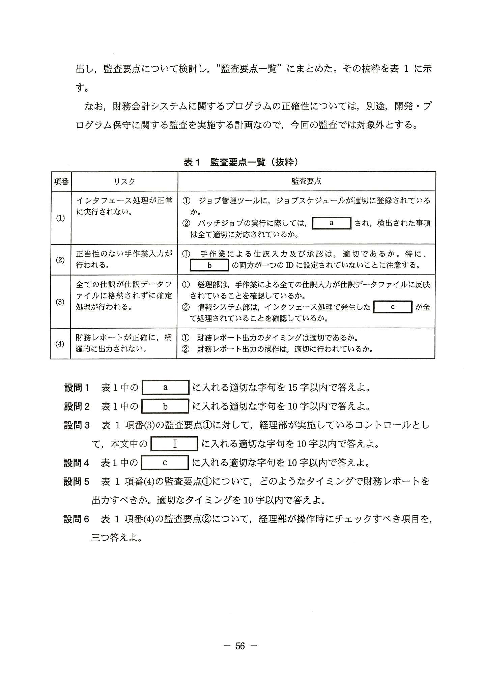

テキスト (OCR)

出し, 監査要点について検討し, “監査要点一覧' にまとめた。その抜粋を表 1 に示

す。
なお, 財務会計システムに関するプログラムの正確性については, 別途, 開発・プ
ログラム保守に関する監査を実施する計画なので, 今回の監査では対象外とする。

表1 監査要点一覧 (抜粋)

ha      リスク                     上

インタフェース処理が正常 | 〇 ジョブ管理ツールに, ジョブスケジュールが適切に登録されている
» | Reena.
o                   © バッチジョブの実行に際しては, [a | され, 検出された事項

は全て適切に対応されているか。

正当性のない手作業入力が |① 手作業による仕訳入力及び承認は, 適切であるか。特に,

® | 行われる。                           [| の両方がーつの ID に設定されていないことに注意する。

全ての仕訳が仕訳データフ | ① 経理部は 手作業による全ての仕訳入力が仕訳データファイルに反映
の | テイルに格鉛されずに確定 | されていることを確認しているか。

処理が行われる。                 QD 情報システム部は。インタフェース処理で発生した が全
て処理されていることを確認しているか。

@ 財務レポートが正確に, 網 | ① 財務レポート出力のタイミングは適切であるか。
雑的に出力されない。     @Q 財務レポート出力の操作は, 適切に行われているか。

設問1 表1中の| a | に入れる適切な字句を15字以内で答えよ。

設問2 表1中の| b | に入れる適切な字旬を10字以内で答えよ。

設問3 表 1 RRGORABAOCNLT, 経理部が実施しているコントロールとし
て, 本文中の に入れる適切な字句を 10 FUNCHAL.

設問4 表1中の に入れる適切な字旬を 10 字以内で答えよ。

設問5 表 1 項番(④の監査要点ぐ①について, どのようなタイミングで財務レポートを
出力すべきか。適切なタイミングを 10 字以内で答えよ。

設問6 £1 項番④の周査要点②について, 経理部が操作時にチェックすべき項目を,

三つ答えよ。

ー 56 一

### ページ 57

テキスト (OCR)

CA © 用 tf 〕

### ページ 58

テキスト (OCR)

【 メモ 用 RJ

### ページ 59

テキスト (OCR)

【 メモ 用 紙 〕

### ページ 60

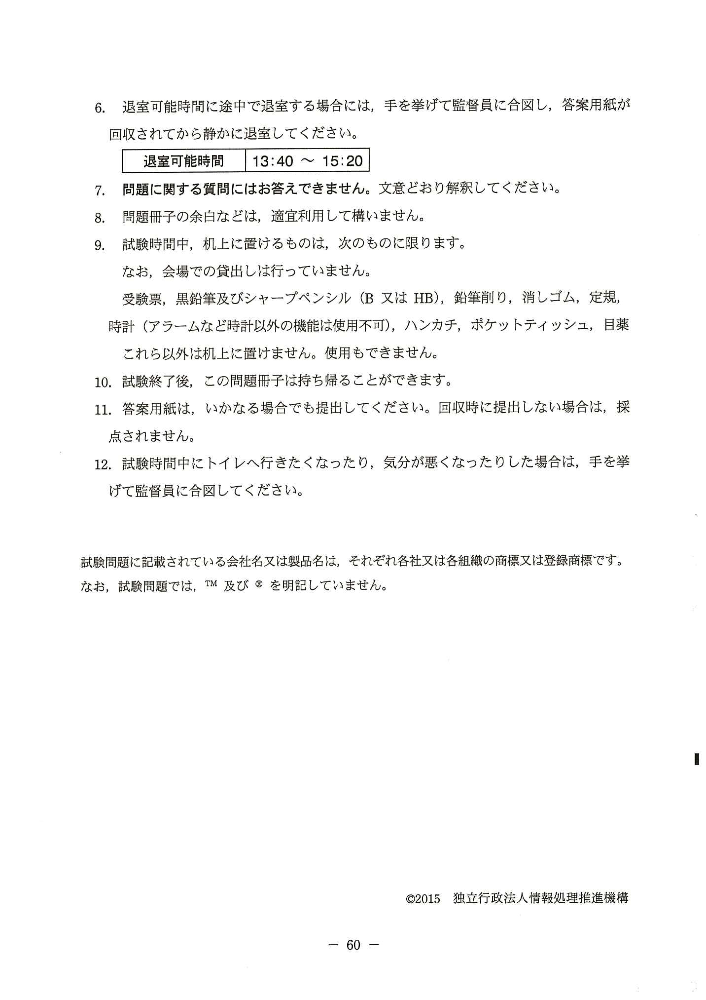

テキスト (OCR)

6. 退室可能時間に途中で退室する場合には, 手を挙げて監督員に合図し, 答案用紙が
回収されてから静かに退室してください。
| 退室可能時間 [13:40 ~ 15:20]
7. 間題に関する質問にはお答えできません。文意どおり解釈してください。
8. 問題冊子の余白などは, 適宜利用して構いません。
9. 試験時間中, 机上に置けるものは, 次のものに限ります。
なお, 会場での貸出しは行っていません。
受験票, 黒鉛筆及びシャープペンシル (B 又は HB), 鉛筆削り, 消しゴム, 定規,
時計 (アラームなど時計以外の機能は使用不可), ハンカチ, ポケットティッシュ, 目薬
これら以外は机上に置けません。使用もできません。
10. 試験終了後, この問題冊子は持ち帰ることができます。
ll. SRAM, いかなる場合でも提出してください。回収時に提出しない場合は, 採
点されません。
12. 試験時間中にトイレへ行きたくなったり, 気分が悪くなったりした場合は, 手を挙
げて監督員に合図してください。

試験問題に記載されている会社名又は製品名は, それぞれ各社又は各組織の商標又は登録商標です。
なお, 試験問題では, ™ ROO を明記していません。

@2015 独立行政法人情報処理推進機構

ー 60 一

---

## 午後解答

1/5 
©2015 独立行政法人情報処理推進機構 
平成27 年度 春期 応用情報技術者試験 解答例 
 
午後試験 
問１ 
出題趣旨 
 電子メールは，今では誰もが利用できる通信手段となった。しかしながら，様々な脆
ぜい
弱性も抱えている。 
 本問では，メールサーバの再構築を題材に，各種機能を利用したセキュリティ設定の内容について問う。 
 
設問 
解答例・解答の要点 
備考 
設問１ 
a
イ 
 
e
カ 
 
設問２ 
b
公開 
 
 
c
ハッシュ 
 
 
d
改ざん 
 
設問３ 
開封済メールを含め全てのメールを読まれるおそれがあるから 
 
設問４ 
ア，イ 
 
設問５ 
不審なメールの削除 
 
 
問２ 
出題趣旨 
 マーケティング分野でブランドの価値が重視され，製品の評価にとどまらず新製品の開発販売に際しても，
ブランドの戦略的利用が益々重要になってきている。 
 本問では，新製品のブランド戦略に関するケースを題材に，ブランドの活用・役割，ブランド要素のパーソ
ナリティの意味，ブランドの構築方法について問う。 
 
設問 
解答例・解答の要点 
備考 
設問１ 
a
エ 
 
 
c
ア 
 
 
b
市場 
 
設問２(1) ウ 
 
 
(2) Y 社とは異なる高付加価値の新製品を訴求し，市場を開拓したいから 
 
設問３(1) ウ 
 
 
(2) 自社の既存他製品との競合を回避する。 
 
 
(3) ブランドの普及 
 
 
(4) 顧客同士がZ 製品群に関する情報を交換できる機能

2/5 
©2015 独立行政法人情報処理推進機構 
問３ 
出題趣旨 
 様々なアルゴリズムを理解することは，応用情報技術者にとって重要な能力の一つである。 
 本問では，データ圧縮の前処理として用いられるBlock-sorting を題材に，アルゴリズムの理解力と，それ
をプログラムに実装する能力を問う。 
 
設問 
解答例・解答の要点 
備考 
設問１ 
“skkeii”，5 
 
設問２ 
ア
1 
 
 
イ
InputString の長さ 
 
 
ウ
EncodeArray[k]がInputString と同一 
 
設問３(1) エ
DecodeArray[1][Line] 
 
 
 
オ
DecodeArray[2][Line] 
 
 
 
カ
OutputString の長さがBlockSortString の長さより小さい 
 
 
(2) p－1 
 
設問４ 
ソート 
アルゴリズム
同じ文字の場合に元の順序を保持するソートを使用する。 
 
 
ソートキー 
2 番目のソートキーにArray[2]の要素を加える。 
 
 
問４ 
出題趣旨 
 昨今，システム構築において，早期サービスの提供や短期間に集中するアクセスを処理するため，仮想化技
術を利用することが定着しつつある。 
 本問では，PaaS 基盤を活用したキャンペーンサイト構築を題材に，方式設計及び機能分割，性能要件を満た
す適正なサーバリソース及び料金の見積り，仮想化技術に関する理解について問う。 
 
設問 
解答例・解答の要点 
備考 
設問１(1) 特定の日時に利用が集中すると見込まれる特性 
 
 
(2) 利用者の増加に対応できる。 
 
設問２ 
a
84,000 
 
 
b
8,000 
 
 
c
11 
 
 
d
3.24 
 
 
e
4,000 
 
設問３ 
コンテンツをWeb サーバでキャッシュして配信する。

3/5 
©2015 独立行政法人情報処理推進機構 
問５ 
出題趣旨 
 企業においてインターネットの活用は不可欠であり，安全なインターネットアクセスには，プロキシサーバ
の利用が欠かせない。 
 本問では，プロキシサーバの冗長化を題材に，DHCP とDNS の仕組みを基に，簡易にDHCP サーバとプロキシサ
ーバを冗長化する仕組みを説明し，基本的な通信プロトコルを組み合わせた応用力について問う。 
 
設問 
解答例・解答の要点 
備考 
設問１ 
a
イ 
 
 
b
キ 
 
 
c
オ 
 
設問２ 
イ，ウ 
 
設問３(1) ブロードキャスト 
 
 
(2) 自身の提案が受け入れられたかどうか 
 
設問４(1) DNS サーバのIP アドレス 
192.168.20.2 
 
 
 
プロキシサーバのIP アドレス
192.168.20.3 
 
 
(2) 192.168.20.3，192.168.20.13 
 
 
問６ 
出題趣旨 
 企業内PC のインターネット接続が日常となった昨今，情報漏えいのリスクを常に念頭に置かなければならな
い。 
 本問では，ファイルサーバのアクセスログ監査システムを題材に，その業務要件から求められるE-R 図やSQL
文に関する基本的な理解，不具合発生時の問題解決に関する知識と技能を問う。 
 
設問 
解答例・解答の要点 
備考 
設問１ 
a
→ 
 
 
b
フォルダパス名 
 
設問２ 
c
EXISTS 
 
 
 
d
AC.操作年月日 = NS.非営業年月日 
 
設問３ 
e
AC.操作結果 = 'F' 
順不同 
 
 
f
US.部署ID <> SV.部署ID 
設問４(1)
g
ウ 
 
 
(2) アクセスログ表の利用者ID 列に定義された参照制約を削除する。

4/5 
©2015 独立行政法人情報処理推進機構 
問７ 
出題趣旨 
 自動車の電子化が進み，より安全に自動車を制御する技術が普及してきている。これら自動車の制御は，リ
アルタイム性能と，安全に動作する設計が求められる。 
 本問では，近年普及が目覚ましい自動車用衝突被害軽減ブレーキシステムを題材に，タイマ割込みによるリ
アルタイム設計能力や，安全設計に関する知識を問う。 
 
設問 
解答例・解答の要点 
備考 
設問１(1)
a
0.02 
 
 
 
b
d2 
 
 
 
c
s 
 
 
(2) 車間距離が広がっている。 
 
 
(3) 1.5 
 
設問２(1) 20,000 
 
 
(2)
d
イ 
 
 
 
e
ア 
 
 
(3) 衝突を回避しても警告が止まらない。 
 
設問３ 
ウ 
 
 
問８ 
出題趣旨 
 システム間連携には要件に応じた様々な実現方法があるが，I / F ファイルを用いた疎結合構成も有効な方法
の一つである。 
 本問では，チケット販売システムの連携に関する設計を題材に，シーケンス図を用いたシステム設計の基本
的な理解と応用力を問う。 
 
設問 
解答例・解答の要点 
備考 
設問１ 
a
要素 
 
設問２(1) 対象公演が販売停止のままとなる。 
 
 
(2)
b
C 社ファイル受信回答未実施 
 
 
 
c
C 社ファイル受信回答済み 
 
設問３(1)
d
販売可能 
 
 
 
e
販売不可 
 
 
(2) （ウ）→（エ）→（ア）→（イ）

5/5 
©2015 独立行政法人情報処理推進機構 
問９ 
出題趣旨 
 昨今，システム構築プロジェクトの規模は拡大傾向であり，プロジェクト内外のステークホルダの人数が増
えている。 
 本問では，物流システムの再構築プロジェクトを題材に，プロジェクト活動を適切かつ確実に遂行するため
のコミュニケーションマネジメントに関する理解，能力を問う。 
 
設問 
解答例・解答の要点 
備考 
設問１(1) 利用部門をプロジェクトに巻き込んで一体感を生むため 
 
 
(2) ウ 
 
 
(3)
a
役割 
 
 
 
b
利害 
 
設問２(1) X 君がまとめた基準を正式な社内基準とすべきかを検討する。 
 
 
(2) 連絡が必要な項目を定める。 
 
設問３ 
開発工程は請負契約としたから 
 
 
問10 
出題趣旨 
 企業活動の多様化に伴って，企業内で扱う情報の種類と量は増加の一途をたどっている。この情報の中には，
企業活動の根幹を成す重要な情報が含まれることから，企業の資産として，厳重な管理が求められている。 
 本問では，中堅の事務用品の販売会社における文書資産管理を題材に，情報資産管理に関する知識と理解力
を問う。 
 
設問 
解答例・解答の要点 
備考 
設問１ 
a
アクセス権 
 
 
b
アクセス性 又は 可用性 
 
設問２(1)
c
“関係者限り”の文書資産の情報を自部の文書資産管理台帳に登録 
 
 
(2) システム管理者が，イベントログの解析を迅速に行えるようにするため 
 
 
(3) 文書資産の編集ができないファイル形式で配付するように改善する。 
 
設問３(1)
d
オ 
 
 
(2)
e
保存期間が満了した 
 
 
問11 
出題趣旨 
 アプリケーションシステムの機能は，主に入力・処理によるデータの生成，及びそのデータを利用した出力
から構成される。このため，アプリケーションシステムには，インプットコントロール，プロセスコントロー
ル及びアウトプットコントロールが適切に組み込まれ，運用されることが必要となる。 
 本問では，財務会計システムを題材に，このようなコントロールの整備及び運用に関する監査を効果的に実
施できる能力や理解力を問う。 
 
設問 
解答例・解答の要点 
備考 
設問１ 
a
異常メッセージが監視 
 
設問２ 
b
入力権限と承認権限 
 
設問３ 
Ⅰ
仮仕訳データ 
 
設問４ 
c
エラーデータ 
 
設問５ 
確定処理後 
 
設問６
①
・対象データ種別 
 
 
②
・対象期間 
 
 
③
・対象科目

---

## 午後採点講評

1/3 
©2015 独立行政法人情報処理推進機構 
平成27 年度 春期 応用情報技術者試験 採点講評 
 
午後試験 
問１ 
 問1 では，メールサーバの再構築を題材に，各種機能を利用したセキュリティ設定の内容について出題し
た。全体として，正答率は高かった。 
 設問1，2 ともに正答率は高く，基本的なセキュリティの機能については，おおむね理解されているようで
あった。 
 設問3 は，正答率が低かった。POP とIMAP の二つのプロトコルの機能の違いと，それによって発生するリス
クの違いをよく理解しておいてほしい。 
 
問２ 
 問2 では，新製品のブランド戦略を題材に，ブランドの活用・役割，ブランド要素の意味，ブランド構築方
法について出題した。全体として，正答率は低かった。 
 設問2(2)では，ブランドの活用が他社との差異を訴求し，市場の開拓につながることへの言及を期待してい
たが，その点に触れていない解答が目立った。 
 設問3(2)では，ブランド要素の一つであるパーソナリティが自社の既存他製品との競合回避の役割も併せも
つことへの言及を期待していたが，その点に触れていない解答が目立った。ブランドのパーソナリティは，自
社と他社との間だけでなく，自社内においての製品群の識別の役割も果たすことを理解しておいてほしい。 
 
問３ 
 問3 では，データ圧縮の前処理として用いられるBlock-sorting を題材に，アルゴリズムの理解と，プログ
ラムへの実装について出題した。全体として，正答率は高かった。 
 設問1，2 ともに正答率が高かった。アルゴリズムの内容や，アルゴリズムを実装したプログラムの動作に
ついては，おおむね理解されているようであった。 
 設問3(1)のカは，while 文の条件式として不適切な解答が散見された。使用する構文による条件式の記述方
法，処理内容の違いを理解してほしい。 
 設問4 は，正答率が低かった。ソートには特徴の異なる様々なアルゴリズムが存在し，安定性もソートの重
要な指標の一つである。実装しようとする処理に合わせ，適切なアルゴリズムを選択する能力を身に付けてほ
しい。 
 
問４ 
 問4 では，PaaS 基盤を活用したキャンペーンサイト構築を題材に，方式設計及び機能分割，適正なサーバリ
ソース及び料金の見積りについて出題した。全体として，正答率は低かった。 
 設問1 では，特定の日時に利用が集中するというサイトの特性に注目し，利用の集中による処理要求の増加
にはAP サーバのスケールアウトによる対応が可能であることに言及した解答を期待していたが，これらの点
に触れていない解答が目立った。処理要求の特性と利用可能なサービスの特性とがどのように対応するかを，
問題文中の記述から読み取って解答してもらいたい。 
 設問2 は，トランザクション量から必要なWeb サーバの台数を求める計算（a～c）は正答率が高く，CPU 処
理能力に関する理解が高いことがうかがわれたが，データ転送料金を求める計算（d，e）は正答率が低かっ
た。問題文中に定義されているPaaS が提供するサービスをよく読み，注意深く解答してほしい。 
 
問５ 
 問5 では，DHCP とDNS の機能を利用して，簡便な方法でDHCP サーバとプロキシサーバを冗長化する仕組み
について出題した。DHCP とDNS は，ネットワークを理解するのに欠かせない技術であるので，基本的な機能と
動作については理解しておいてほしい。 
 設問1 のc は，正答率が低かった。複数のノードに同時に送信するにはコネクションレス型の通信が必要な
ことから，UDP を導いてほしかった。 
 設問3(1)は，マルチキャストと記述した解答が散見された。マルチキャストは，マルチキャストグループ宛
てに送信する通信方式であり，全ノードに一斉に送信するブロードキャストとの違いを理解してほしい。

2/3 
©2015 独立行政法人情報処理推進機構 
問６ 
 問6 では，ファイルサーバのアクセスログ監査システムを題材に，その業務要件から求められるE-R 図や
SQL 文，不具合発生時の問題解決について出題した。 
 設問1 は，エンティティ間の関連については正答率が高く，問題文中のファイルサーバに関する記述は正し
く理解されていたようだが，機密管理表の属性名については不適切な属性名を挙げている解答が散見された。
問題文中の機密レベルの設定に関する記述をよく読み，注意深く解答してほしい。 
 設問3 は，部外者失敗一覧表示機能の機能概要からSQL 文の抽出条件を問うたが，逆の抽出条件や誤った列
名を使った解答が散見された。機能概要とE-R 図をよく読み取り，正答を導き出してほしい。 
 
問７ 
 問7 では，近年普及が進んでいる自動車用衝突被害軽減ブレーキシステムを題材に，タイマによる周期割込
みを用いたリアルタイム設計や，安全設計について出題した。 
 設問1 は，正答率が高かった。タイマ割込みによって周期的に衝突までの予測時間を算出し，リアルタイム
で制御する動作がよく理解されていた。 
 設問2(1)は，正答率が低かった。クロックの分周比を考慮して，正確に算出してほしい。 
 設問3 は，正答率が低かった。システムの異常を検出した時に割込みを発生させるウォッチドッグタイマに
ついて，よく理解してほしい。 
 
問８ 
 問8 では，チケット販売システムの連携に関する設計を題材に，シーケンス図を用いたシステム設計につい
て出題した。全体として，正答率は低かった。 
 設問1 は，正答率が高かった。XML 形式に関する理解が高いことがうかがわれた。 
 設問2(1)は，正答率が高かった。シーケンス図においてメッセージに単純なエラーが発生した場合の動作に
ついては，おおむね理解されているようであった。 
 設問3(1)のd，e は，正答率が低かった。複数のシステムを連携させる場合，エラー発生時に各システムの
処理対象データの状態を把握することが重要である。エラー発生までの処理をトレースし，データの状態を把
握する能力を身に付けてほしい。 
 
問９ 
 問9 では，物流システムの再構築プロジェクトを題材に，プロジェクト活動を適切かつ確実に遂行するため
のコミュニケーションマネジメントについて出題した。全体として，正答率は低かった。 
 設問1(1)では，利用部門から専任のプロジェクトメンバを選出することによって，開発部門のプロジェクト
メンバとのコミュニケーションを深めるという狙いについての解答を期待していた。しかし，“PM の権限を強
くする”や“リソースの衝突を少なくする”といった一般論を述べた解答が散見された。問いの状況設定と問
いのテーマ（コミュニケーション計画）を踏まえた上で解答してほしい。 
 設問2(1)では，“プロジェクト内に周知徹底されていることを確認する”といった，プロジェクト内に限定
した活動に関する解答が散見された。プロジェクト活動の標準化を推進中のA 社では，プロジェクトの成果を
全社に展開し社内基準にする活動が求められる。問中に示された状況を踏まえて解答することが求められる。
 
問10 
 問10 では，中堅の事務用品の販売会社における文書管理を題材に，情報資産管理について出題した。 
 設問2(1)は，正答率が低かった。文書資産の棚卸しを適切に行うには，“関係者限り”の文書資産の情報を
自部の文書資産管理台帳に登録しておく必要があることを理解しておいてほしい。 
 設問2(3)は，正答率が低かった。フォルダにアクセス権を設定するという誤った解答が散見された。配付さ
れた文書資産を，配付先の社員が変更してしまうことで完全性が損なわれるという問題点は，編集が可能なフ
ァイル形式で配付していることに原因があることに気付いてほしい。

3/3 
©2015 独立行政法人情報処理推進機構 
問11 
 問11 では，財務会計システムの運用を題材に，バッチジョブの管理，入力及び出力に関する運用を，リス
ク及び監査要点との関連で出題した。 
 設問1 は，エラーデータの対応，ジョブ管理ツールの設定などの解答が散見され，正答率が低かった。ジョ
ブ管理ツールを利用したバッチジョブの実行過程について何をすればよいか解答してほしかった。監視ツール
の設定に関する解答は，既に別の監査要点で記載されている。また，正常なエラーデータは，正常なバッチジ
ョブの結果であり，エラーデータの対応は別のリスクであることを認識してほしい。 
 設問5 は，“経営会議の前”などという解答が散見され，正答率が低かった。正式なレポート出力では，元
データの確定が重要である。どの時点で元データである仕訳データが，変更できないように確定されたのかを
理解してほしい。

