# 平成28年度秋期 応用情報技術者試験

---

## 午前問題

### ページ 1

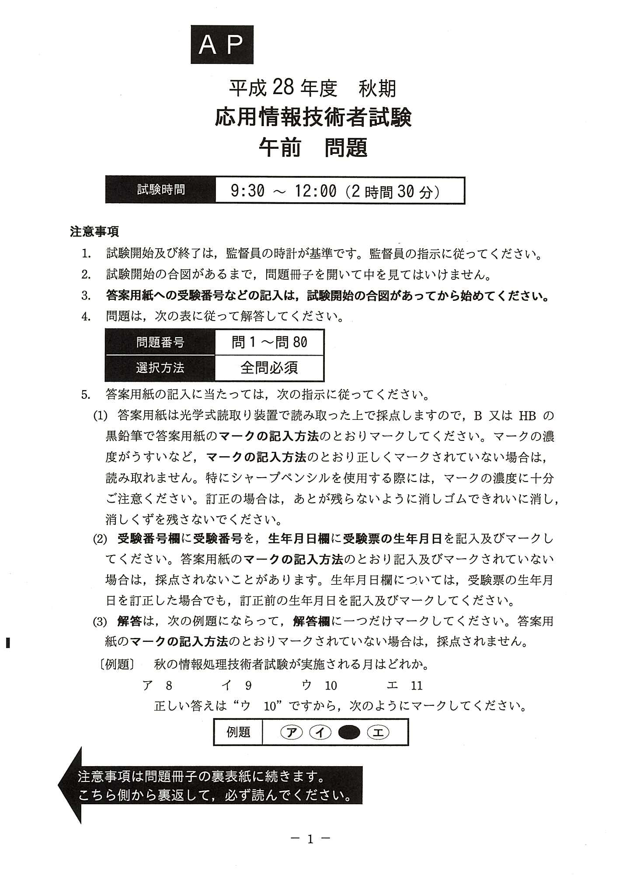

テキスト (OCR)

平成 28年度 秋期

応用情報技術者試験
午前 問題
 9:30 ~ 12:00 (2時間30 分)

注意事項

1. 試験開始及び終了は, 監督員の時計が基準です。監督員の指示に従っつてください。
2. 試験開始の合図があるまで, 問題冊子を開いて中を見てはいけません。

3. 答案用紙への受験番号などの記入は。 試験開始の合図があってから始めてください。
4. 問題は, 次の表に従って解答してください。

問題番号    問1 一問 80
選択方法    全間必須

5. 答案用紙の記入に当たっては, 次の指示に従ってください。

GQ) 答案用紙は光学式読取り装置で読 HEっOX Peerしませが B 又は HB の
黒鉛筆で答案用紙のマークの記入方法のとおりマークしてください。マークの濃
度がうすいなど, マークの記入方法のとおり正しくマークされていない場合は,
読み取れません。特にシャープペンシルを使用する際には, マークの濃度に十分
ご注意ください。 訂正の場合は, あとが残らないように消しゴムできれいに消し
消しくずを残さないでください。

2) 受験番号欄に受験番号を, 生年月日欄に受験票の生年月日を記入及びマークし
てください。答案用紙のマークの記入方法のとおり記入及びマークされていない
場合は, 採点されないことがあります。生年月日杉については, 受験票の生年月
日を訂正した場合でも, 訂正前の生年月日を記入及びマークしてください。

(3) 解答は, 次の例題にならって, 解答欄に一つだけマークしてください。答案用
紙のマークの記入方法のとおりマークされていない場合は, 採点されません。
[例題】 秋の情報処理技術者試験が実施される月はどれか。

ア 8    イ 9    ウ 10    エ 11
正しい答えは“ウ 10” ですから, 次のようにマークしてください。

例題 | (ア)(イ) (や)

注意事項は問題冊子の裏表紙に続き

こちら側から裏返して, 必ず読 SG

### ページ 2

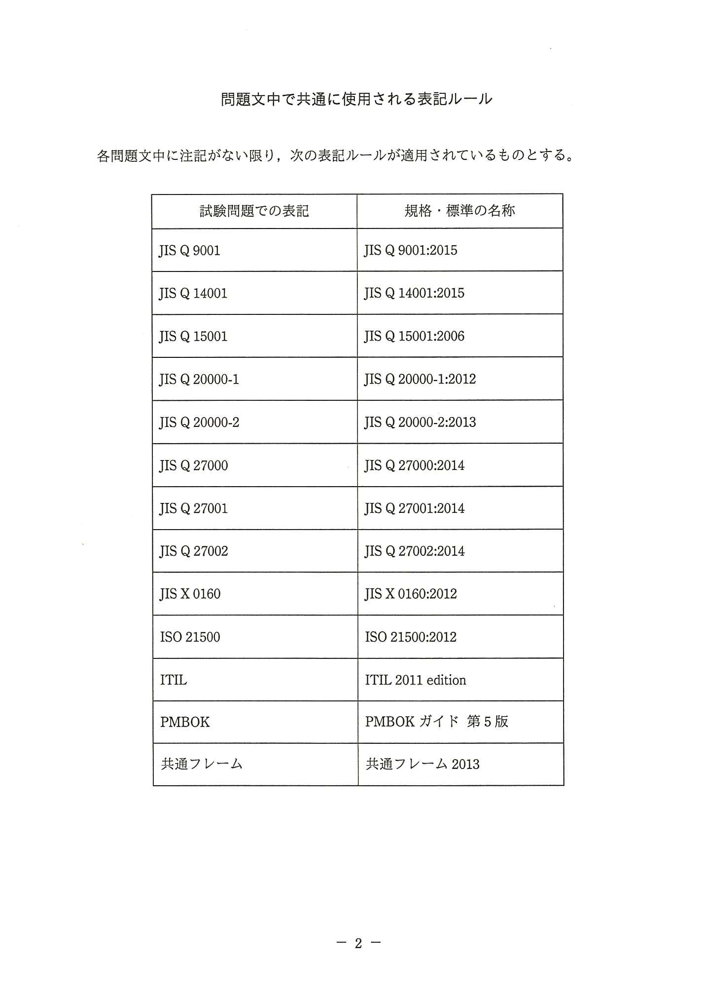

テキスト (OCR)

問題文中で共通に使用される表記ルール

各問題文中に注記がない限り, 次の表記ルールが適用されているものとする。

試験問題での表記                      規格・標準の名称
JIS Q 9001                                JIS Q 9001:2015
JIS Q 14001                            JIS Q 14001:2015
JIS Q 15001                            JIS Q 15001:2006

JIS Q 20000-1

JIS Q 20000-1:2012

JIS Q 20000-2                            JIS Q 20000-2:2013

JIS Q 27000                               JIS Q 27000:2014

JIS Q 27001                               JIS Q 27001:2014

JIS Q 27002                               JIS Q 27002:2014
JISX0160                                   JIS X 0160:2012

ISO 21500                                   ISO 21500:2012

ITIL                                             ITIL 2011 edition
PMBOK                             PMBOK ガイド 第5版
共通フレーム                  共通フレーム 2013

### ページ 3

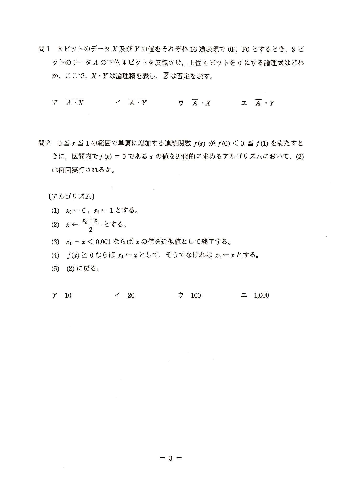

テキスト (OCR)

fll 8ビットのデータズ及び了了の値をそれぞれ 16 進表現で OF。FO とするとき, BE
ットのデータ 4 の下位 4 ビットを反転させ, 上位 4 ビットを 0 にする論理式はどれ
か。ここで, そ・Tは論理積を表し, 用は否定を表す。

|
x

y AX   4 A-Y   ウ A+X   年

問2 0ミァ仁1の範囲で単調に増加する連続関数 /@) が (0) く0 ミ げ(①) を満たすと
きに, 区間内で7@) =0 である x の値を近似的に求めるアルゴリズムにおいて, (2)
は何回実行されるか。

[アルゴリズム}
QM x2-0,m-1eF4,

② x oe とする。

(8) m—x<0.001 ならば ァの値を近似値として終了する。
4 fm 竹 0 ならば mn と*ィとして, そうでなければ *o。 と*とする。
(5) (2) に戻る。

ア 10     イ 20     ウ 100     =x 1,000

### ページ 4

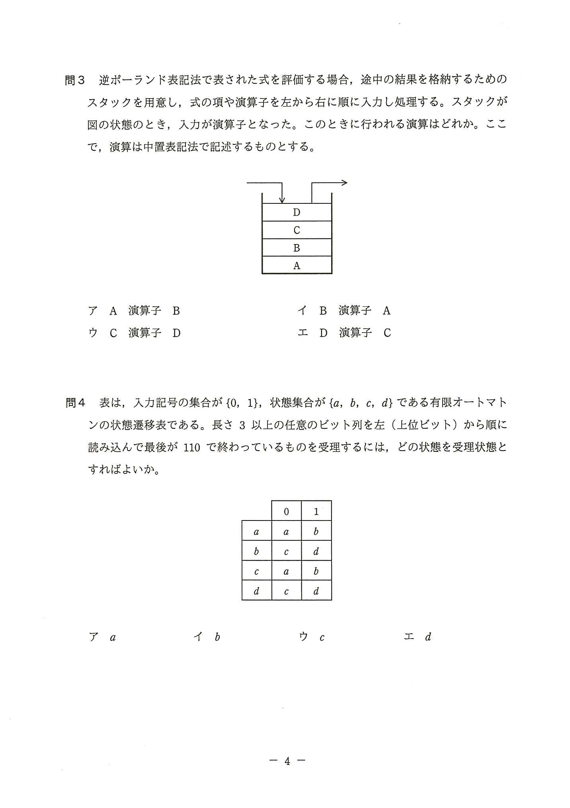

テキスト (OCR)

AAS 逆ポーランド表記法で表された式を評価する場合, 途中の結果を格納するための
スタックを用意し, 式の項や演算子を左から右に順に入力し処理する。スタックが
図の状態のとき, 入力が演算子となった。このときに行われる演算はどれか。ここ
で, 演算は中置表記法で記述するものとする。

D

C

B

A
7 A WHF B    4 BOWES A
ウ C 演算子 D    = D WORF Cc

問4 表は, 入力記号の集合が{0, 1}, 状態集合が (2, b, c, d} である有限オートマト
ンの状態遷移表である。長さ 3 以上の任意のビット列を左 (上位ビピット) から順に
読み込んで最後が 110 で終わっているものを受理するには, どの状態を受理状態と
すればよいか。

0 | 1
2 | @ | 5
2 | c | @
c | @ | 5
9 | c | @
ア a   イ 5   9 ge   xd

### ページ 5

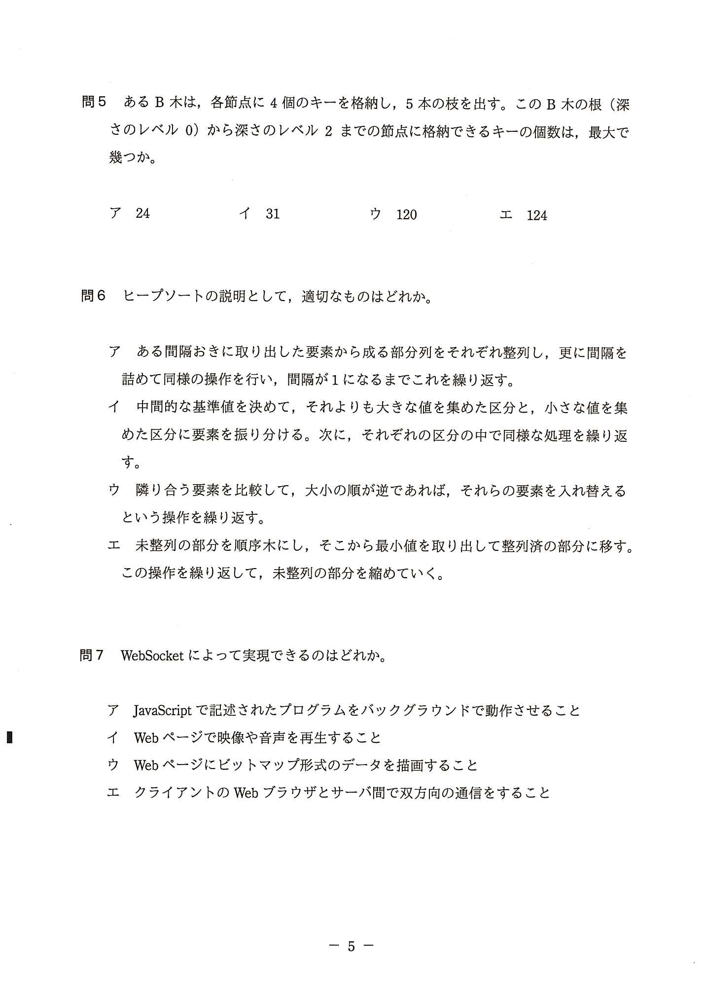

テキスト (OCR)

問5 ある BA, 各節点に 4 個のキーを格納し, 5 本の枝を出す。この B 木の根 (深

さのレベル 0) から深さのレベル 2 までの人節点に格納できるキーの個数は, 最大で
BOD,

ア 24     イ 31      ウ 120     x= 124

間6 ヒープソートの説明として, 適切なものはどれか。

ア ある間隔おきに取り出した要素から成る部分列をそれぞれ整列し, 更に間隔を
詰めて同様の操作を行い, 間隔が 1 になるまでこれを繰り返す。

イ 中間的な基準値を決めて, それよりも大きな値を集めた区分と, 小さな値を集
めた区分に要素を振り分ける。次に, それぞれの区分の中で同様な処理を繰り返
す。

ウ 隣り合う要素を比較して, 大小の順が逆であれば, それらの要素を入れ替える
という操作を繰り返す。

エ 未整列の部分を順序木にし, そこから最小値を取り出して整列済の部分に移す。
この操作を繰り返して, 未整列の部分を縮めていく。

問7 WebSocket によって実現できるのはどれか。

JavaScript で記述されたプログラムをバックグラウンドで動作させること
Web ページで映像や音声を再生すること

Web ページにビットマップ形式のデータを描画すること

クライアントの Web ブラウザとサーバ間で双方向の通信をすること

H ざさ

### ページ 6

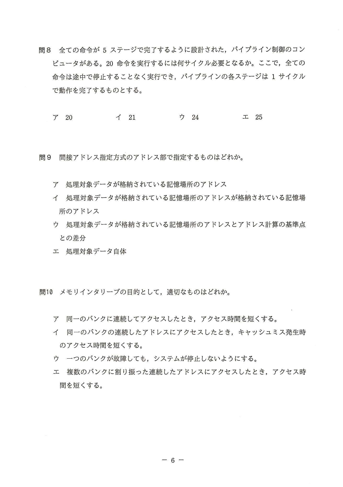

テキスト (OCR)

問8 全ての命令が 5 ステージで完了するように設計された, パイプライン制御のコン
ピュータがある。20 命令を実行するには何サイクル必要となるか。ここで, 全ての
命令は途中で停止することなく実行でき, パイプラインの各ステージは 1 サイクル
で動作を完了するものとする。

問9 間接アドレス指定方式のアドレス部で指定するものはどれか。

ア 処理対象データが格納されている記憶場所のアドレス

イ 処理対象データが格納されている記憶場所のアドレスが格納されている記憶場
所のアドレス

ウ 処理対象データが格納されている記憶場所のアドレスとアドレス計算の基準点
との差分

エ 処理対象データ自体

Fl メモリインタリープの目的として, 適切なものはどれか。

ア 同一のバンクに連続してアクセスしたとき, アクセス時間を短くする。

イ 同一のバンクの連続したアドレスにアクセスしたとき, キャッシュミス発生時
のアクセス時間を短くする。

ウ 一つのバンクが故障しても, システムが停止しないようにする。

エ 複数のバンクに割り振った連続したアドレスにアクセスしたとき, アクセス時
間を短くする。

### ページ 7

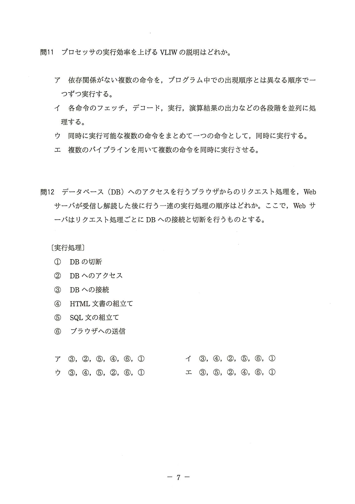

テキスト (OCR)

All プロセッサの実行効率を上げる VLIW の説明はどれか。

ア 依存関係がない複数の命令を, プログラム中での出現順序とは異なる順序で一
つずつ実行する。

イ 各命令のフェッチ, デコード, 実行, 演算結果の出力などの各段階を並列に処
理する。

ウ 同時に実行可能な複数の命令をまとめて一つの命令として, 同時に実行する。

エ 複数のパイプラインを用いて複数の命令を同時に実行させる。

問12 データベース (DB) へのアクセスを行うブラウザからのリクエスト処理を, Web
サーバが受信し解読した後に行う一連の実行処理の順序はどれか。ここで, Web サ
ーバはリクエスト処理ごとに DB への接続と切断を行うものとする。

[実行処理]

DB の切断

DB へのアクセス
DB への接続
HTML 文書の組立て
SQL 文の組立て
ブラウザへの送信

@@@@@ら6

ァ © @ ©, @ © O      イ ® © @ ©, © Oo
7 ©, ©, ©, @ ©, ①      ェ 6, 6, © O © ①

### ページ 8

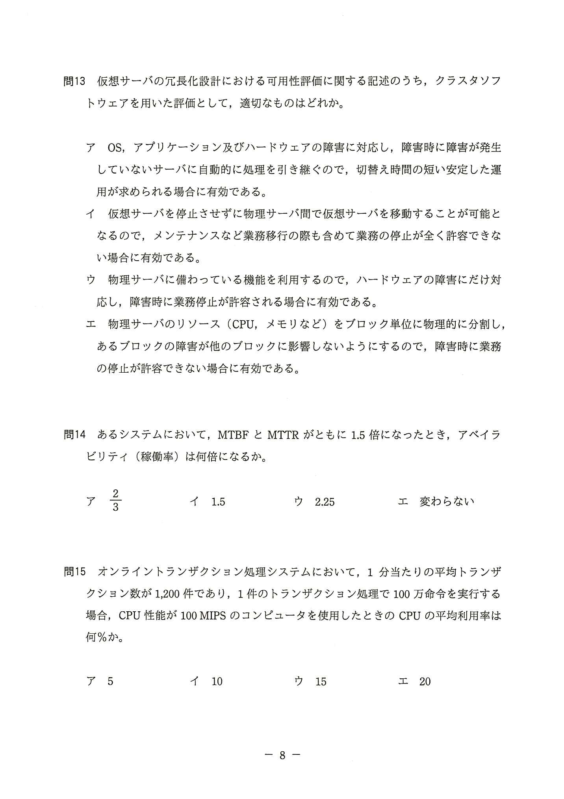

テキスト (OCR)

間13 仮想サーバの冗長化設計における可用性評価に関する記述のうち, クラスタソフ
トウェアを用いた評価として, 適切なものはどれか。

ア OS, アプリケーション及びハードウェアの障害に対応し, 障害時に障害が発生
していないサーバに自動的に処理を引き継ぐので, 切替え時間の短い安定した運
用が求められる場合に有効である。

イ 仮想サーバを停止させずに物理サーバ間で仮想サーバを移動することが可能と
なるので, メンテナンスなど業務移行の際も含めて業務の停止が全く許容できな
い場合に有効である。

ウ 物理サーバに備わっている機能を利用するので, ハードウェアの障害にだけ対
応し, 障害時に業務停止が許容される場合に有効である。

エ 物理サーバのリソース (CPU, メモリなど) をブロック単位に物理的に分割し
あるブロックの障害が他のブロックに影響しないようにするので, 障害時に業務
の停止が許容できない場合に有効である。

問14 あるシステムにおいて, MTBF と MTTR がともに 1.5 倍になったとき, アベイラ
ビリティ (稼働率) は何倍になるか。

°s     4 15     ウ 2.25     エ 変わらない

間15 オンライントランザクション処理システムにおいて, 1 分当たりの平均トランザ
クション数が 1.200 件であり, 1 件のトランザクション処理で 100 万命令を実行する
場合, CPU 性能が 100 MIPS のコンピュータを使用したときの CPU の平均利用率は
何%か。

### ページ 9

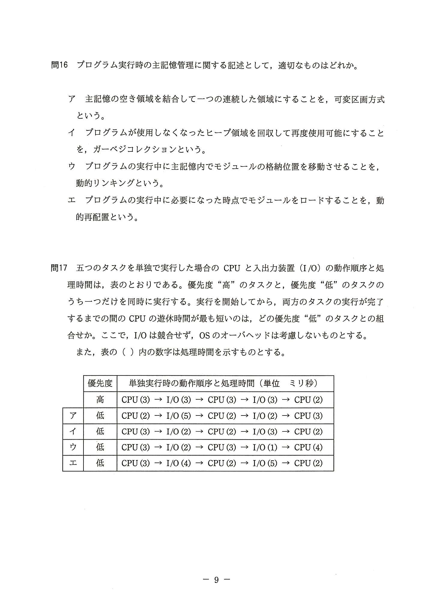

テキスト (OCR)

問16 プログラム実行時の主記憶管理に関する記述として, 適切なものはどれがか。

ア 主記憶の空き領域を結合して一つの連続した領域こすることを, 可変区画方式
という。

イ プログラムが使用しなくなったヒープ領域を回収して再度使用可能にすること
を, ガーベジコレクションという。

ウ プログラムの実行中に主記憶内でモジュールの格納位置を移動させることを,
動的リンキングという。

エ プログラムの実行中に必要になった時点でモジュールをロードすることを, 動
的再配置という。

FIT 五つのタスクを単独で実行した場合の CPU と入出力装置 (1/0) の動作順序と処
理時間は, 表のとおりである。 優先度 “高" のタスクと, 優先度 “MK” OF AIO
うちーつだけを同時に実行する。実行を開始してから, 両方のタスクの実行が完了
するまでの間の CPU の遊休時間が最も短いのは, YORE Uk” のタスクとの組
合せか。ここで, 1/O は競合せず, 0S のオーバヘッドは考慮しないものとする。

また, RO ( ) 内の数字は処理時間を示すものとする。

優先度| 単独実行時の動作順序と処理時間 (単位 ミリ秒)
高    CPU (3) = I/0 ⑬ っ CPU⑬) > I/0(8) > CPU (2)
低   CPU (2) > 170 ⑤) > CPU② > IL/0②⑫ っ CPU⑬)
低    CPU (3) > 1/0⑫ > CPU(@) > I/0@) > CPU②⑫)
低   CPU (3) > 1/0 (2) ~ CPU⑬ > 1/0Q① > CPU (4)
低   CPU (3) = I/0 (4) > CPU) > 1/0) > CPU (2)

H| +} A|N

### ページ 10

テキスト (OCR)

間18 プログラムで使用可能な実メモリ枠が 3 ページである仮想記憶システムにおいて,
大きさ 6 ページのプログラムが実行されたとき, ページフォールトは何回発生する
か。ここで, プログラム実行時のページ読込み順序は, 0, 1, 2, 3, 4, 0, 2, 4, 3,
1, 4, 5とする。ページング方式は, LRU (Least Recently Used) とし, 初期状態で
は, 実メモリにはいずれのページも読み込まれていないものとする。

ア 9   イ 10   ウ 11   x= 12

FAIS タイムクウォンタムが 2 秒のラウンドロビン方式で処理されるタイムシェアリン
グシステムにおいて, プロセス 1^3 が近次生成されるとき, プロセス 2 が終了する
のはプロセス 2 の生成時刻から何秒後かの。 ここで, 各プロセスは CPU 処理だけで構
成され, OS のオーバヘッドは考慮しないものとする。また, 新しいプロセスの生成
と中断されたプロセスの再開が同時に生じた場合には, 新しく生成されたプロセス
を優先するものとする。

プロセス | 生成時刻 | 単独で処理された場合の時間
1           0 秒後                     5 秒
2           3 秒後                     7 秒
3           6 秒後                     5秒
ア 12                  イ 14                  ウ 16                  エ 17

問20 RFID のパッシブ方式 RF タグの説明として, 適切なものはどれか。

アンテナから電力が供給される。

可視光でデータ通信する。

静電容量の変化を提えて位置を検出する。
赤外線でデータ通信する。

|

ー 一

### ページ 11

テキスト (OCR)

間21 フラッシュメモリに関する記述として, 適切なものはどれか。

高速に書換えができ, CPU のキャッシュメモリに用いられる。
紫外線で全内容の消去ができる。

周期的にデータの再書込みが必要である。

ブロック単位で電気的に内容の消去ができる。

HAN

間22 音声を標本化周波数 10 kHz, 量子化ビット数 16 ビットで 4 秒間サンプリングし
て音声データを取得した。この音声データを, 圧縮率 1/4 の ADPCM を用いて圧縮
した場合のデータ量は何 k バイトか。ここで, 1k バイトは1.000 バイトとする。

ア 10     イ 20     ウ 80     x= 160

23 次の条件を満足する論理回路はどれか。

(a)
階段の上下にあるスイッチ A 又は B で, 一つの照明を点灯・消灯する。すなわち,
一方のスイッチの状態にかかわらず, 他方のスイッチで照明を点灯・消灯できる。

ATIF A) op cps   出力 (照明)
メイッチps ー | 貞二      -
アァ AND     イ NAND    ウ NOR     x= XOR

ー 11 一

### ページ 12

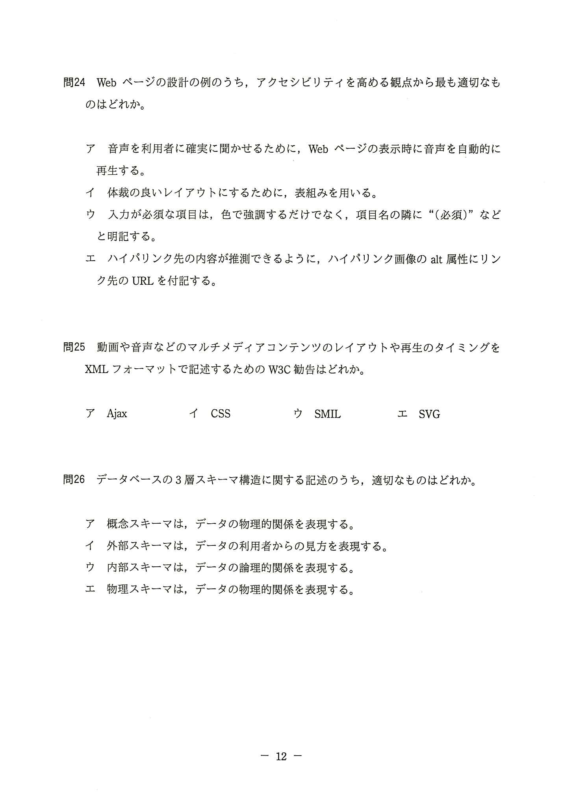

テキスト (OCR)

間24 Web ページの設計の例のうち, アクセシビリティを高める観点から最も適切なも
のはどれか。

ア 音声を利用者に確実に聞かせるために, Web ページの表示時に音声を自動的に
再生する。

イ 体裁の良いレイアウトにするために, 表組みを用いる。

ウ 入力が必須な項目は, 色で強調するだけでなく, 項目名の隣に “(必須)”など
と明記する。

エ ハイパリンク先の内容が推測できるように, ハイパリンク画像の alt 属性にリン
ク先の URL を付記する。

問25 動画や音声おどのマルチメディアコンテンツのレイアウトや再生のタイミングを

XML フォーマットで記述するための W3C 勧告はどれか。

ア Ajax     イ CSS     ウ SMIL    = SVG

問26 データベースの3 層スキーマ構造に関する記述のうち, 適切なものはどれか。

概念スキーマは, データの物理的関係を表現する。
外部スキーマは, データの利用者からの見方を表現する。
内部スキーマは, データの論理的関係を表現する。
物理スキーマは, データの物理的関係を表現する。

HG AN

ー 12 一

### ページ 13

テキスト (OCR)

問27 B+木インデックスが定義されている候補キーを利用して, 1 件のデータを検索す
BLE, データ総件数えに対する B+木インデックスを格納するノードへのアクセス
回数のオーダを表す式はどれか。

y Vx     イ logX     9 xX      x Ht

間28 関係データベースにおける実表と導出表に関する記述のうち, 適切なものはどれ
か。

実表に対する射影, 結合などによって導出表が得られる。
導出表は, データを参照する場合だけに用いる。

導出表は, 複数の実表から得られる表である。

導出表は, 元の実表の列だけから成る。

HS AN

ー 13 一

### ページ 14

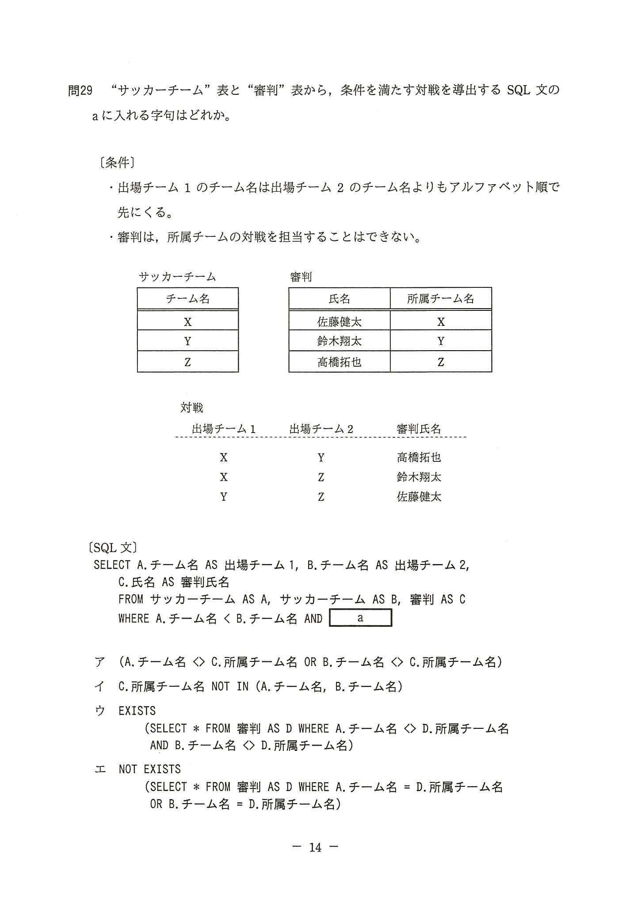

テキスト (OCR)

問29 “サッカーチーム" RE “審判" 表から, 条件を満たす対戦を導出する SQL XO
a に入れる字句はどれか。

〔条件]
・出場チーム 1 のチーム名は出場チーム 2 のチーム名よりもアルファベット順で
先にくる。
・審判は, 所属チームの対戦を担当することはできない。

サッカーチーム       審判
チーム名          氏名     所属チーム名
x          佐藤健太      x
Y          SOAK YHK      Y
Z          高橋拓也      2
対戦
- 出場チーム1 出場チームA2審判氏名
x       Y      高橋拓也
X       Z      鈴木翔太
Y       Z      佐藤健太
(SQL x)

SELECT A.チーム名 AS 出場チーム 1, B.チーム名 AS 出場チーム 2,
C.氏名 AS 審判氏名
FROM サッカーチーム ASA, サッカーチーム AS B, 審判 AS C

WHERE A.チーム名 くB.チーム名AND| a |

ア (A.チーム名 ぐ> C.所属チーム名 OR B.チーム名 O C.所属チーム名)
C.所属チーム名 NOT IN (A.チーム名, B.チーム名)

ウ EXISTS
(SELECT * FROM 審判 AS D WHERE A.チーム名 <> D.所属チーム名
AND B.チーム名 <> D.所属チーム名)

エ NOT EXISTS
(SELECT * FROM 審判 AS D WHERE A.チーム名 = D.所属チーム名
OR B.チーム名 = D.所属チーム名)

て

— 14 =

### ページ 15

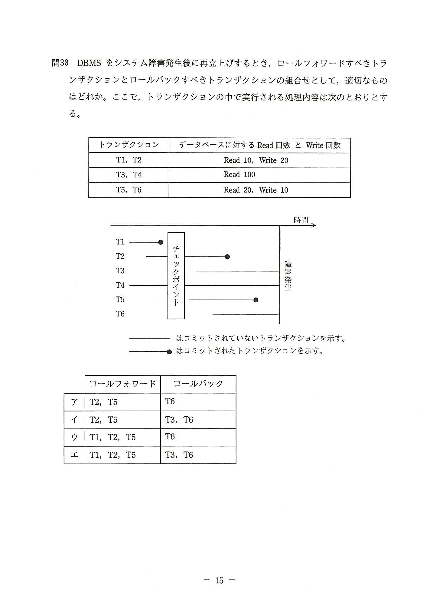

テキスト (OCR)

間30 DBMS をシステム障害発生後に再立F上げするとき, ロールフォワードすべきトラ
ンザクションとロールバックすべきトランザクションの組合せとして, 適切なもの

はどれか。ここで,

トランザクションの中で実行される処理内容は次のとおりとす

る。
トランザクション    データベースに対する Read 回数 と Write 回数
2                Read 10, Write 20
T3, T4                Read 100
T5, T6                 Read 20, Write 10
時間
Tl ———e
チ
T2         &        人@
ッ
T3      ク             ze
1        2                  #
TS     ———
T6
はコミットされていないトランザクションを示す。
ーーーー一@ はコミットされたトランザクションを示す。
ロールフォワード  ロールバック
ア | 12, Td        T6
イ | T2, T5       T3, T6
ウ | T1, T2, T5    T6
= | T1, T2, T5    T3, T6

= [5

### ページ 16

テキスト (OCR)

問31 ルータの機能に関する記述のうち, 適切なものはどれか。

ア MAC アドレステーブルの登録情報によって, データフレームをあるポートだけ
に中継するか, 全てのポートに中継するかを判断する。

4 OSI 基本参照モデルのデータリンク層において, ネットワーク同士を接続する。

ウ OSI] 基本参照モデルのトランスポート層からアプリケーション層までの階層で,
プロトコル変換を行う。

エ 伝送媒体やアクセス制御方式が異なるネットワークの接続が可能であり, 送信
データの IP アドレスを識別し, データの転送経路を決定する。

間32 TCP/IP ネットワークにおける ARP の説明として, 適切なものはどれか。

IP アドレスから MAC アドレスを得るプロトコルである。

IP ネットワークにおける誤り制御のためのプロトコルである。

ゲートウェイ間のホップ数によって経路を制御よるプロトコルである。
端末に対して動的に IP アドレスを割り当てるためのプロトコルである。

Hoe AN

間33 IP アドレス 208.77.188.166 lk, どのアドレスに該当するか。

ア グローバルアドレス        イ プライベートアドレス
ウ ブロードキャストアドレス     エエ マルチキャストアドレス

ー 16 一

### ページ 17

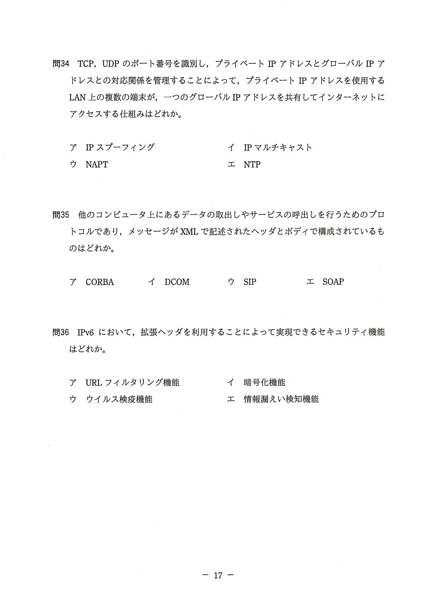

テキスト (OCR)

問34 TCP, UDP のポート番号を識別し, プライベート IP アドレスとグローバル TP ア
ドレスとの対応関係を管理することによって, プライベート IP アドレスを使用する
LAN 上の複数の端末が, 一つのグローバル IP アドレスを共有してインターネットに

アクセスする仕組みはどれか。
ア IPスプーフィング       イ TP マルチキャスト
ウ NAPT             エ NTP

間35 他のコンピュータ上にあるデータの取出しやサービスの呼出しを行うためのプロ
トコルであり, メッセージが XML で記述されたヘッダとボディで構成されているも
のはどれか。

ア CORBA   イ DCOM    ウ SIP     x= SOAP

間36 IPY6 において, 拡張ヘッダを利用することによって実現できるセキュリティ機能
はどれか。

ア URL フィルタリング機能     イ 暗号化機能
ウ ウイルス検疫機能           エ 情報漏えい検知機能

ー 17 一

### ページ 18

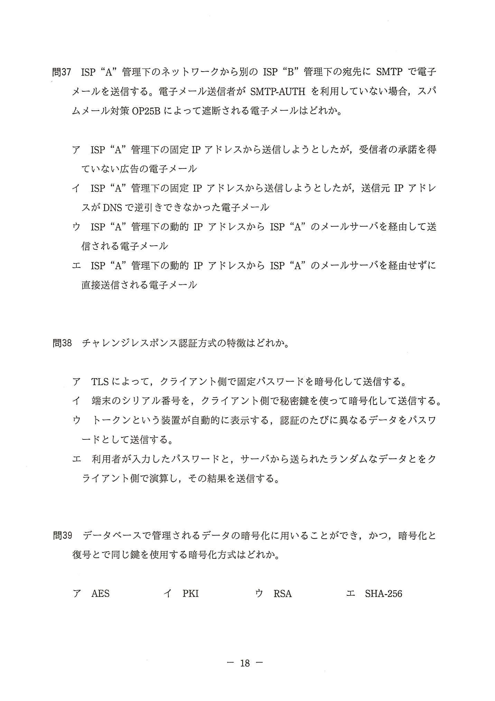

テキスト (OCR)

問37 ISP “A” 管理下のネットワークから別の ISP “B” 管理下の宛先に SMTP で電子
メールを送信する。 電子メール送信者が SMTP-AUTH を利用していない場合, スパ
ムメール対策 OP25B によって遮断される電子メールはどれか。

ア ISP “A” 管理下の固定 IP アドレスから送信しようとしたが, 受信者の承諾を得
ていない広告の電子メール

イ ISP “A” 管理下の固定 IP アドレスから送信しようとしたが, 送信元 IP アドレ
スが DNS で逆引きできなかった電子メール

ウ ISP “A” 管理下の動的 IP アドレスから ISP “A” のメールサーバを経由して送
信される電子メール

エエ ISP “A” 管理下の動的 DP アドレスから ISP “A” のメールサーバを経由せずに
直接送信される電子メール

F388 チャレンジレスポンス誰証方式の特徴はどれか。

ア TLS によって, クライアント側で固定パスワードを暗号化して送信する。

イ 端末のシリアル番号を, クライアント側で秘密鍵を使って暗号化して送信する。

ウ トークンという装置が自動的に表示する, 認証のたびに異なるデータをパスワ
ードとして送信する。

エエ 利用者が入力したパスワードと, サーバから送られたランダムなデータとをク
ライアント側で演算し, その結果を送信する。

問39 データベースで管理されるデータの暗号化に用いることができ, DO, 暗号化と

復号とで同じ鍵を使用する暗号化方式はどれか。

ア AES     イ PKI     ウ RSA     = SHA-256

ー 18 一

### ページ 19

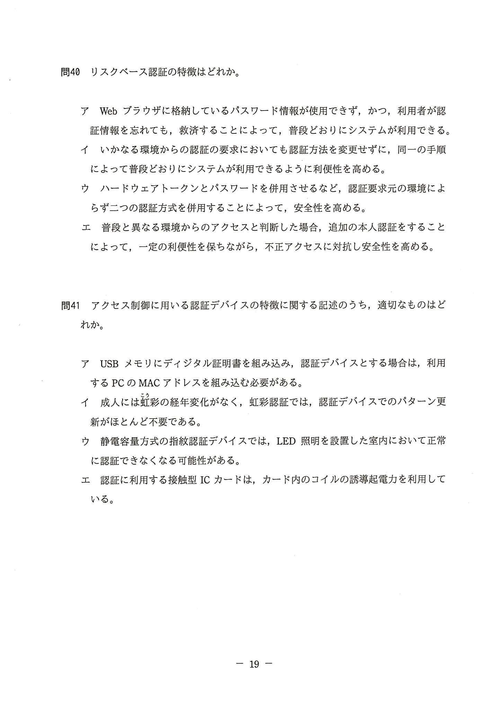

テキスト (OCR)

間49 リスクベース認証の特徴はどれか。

ア Web ブラウザに格納しているパスワード情報が使用できず, かつ, 利用者が認
証情報を忘れても, 救済することによって, 普段どおりにシステムが利用できる。

イ いかなる環境からの認証の要求においても認証方法を変更せずに, 同一の手順
によって普段どおりにシステムが利用できるように利便性を高める。

ウ ハードウェアトークンとパスワードを併用させるなど, 認証要求元の環境によ
らず二つの認証方式を併用することによって, 安全性を高める。

エエ 普段と異なる環境からのアクセスと判断した場合, 追加の本人認証をすること
によって, 一定の利便性を保ちながら, 不正アクセスに対抗し安全性を高める。

問41 アクセス制御に用いる認証デバイスの特徴に関する記述のうち, 適切かものはど
れか。

q

ア USB メモリにディジタル証明書を組み込み, 認証デバイスとする場合は, 利用
する PC の MAC アドレスを組み込む必要がある。

イ 成人には虹彩の経年変化がなく, 虹彩認証では, 認証デバイスでのパターン更
新がほとんど不要である。

ウ 静電容量方式の指紋認証デバイスでは, LED 照明を設置した室内において正常
に認証できなくなる可能性がある。

エ 認証に利用する接触型 IC カードは, カード内のコイルの誘導起電力を利用して
いる。

ー 19 一

### ページ 20

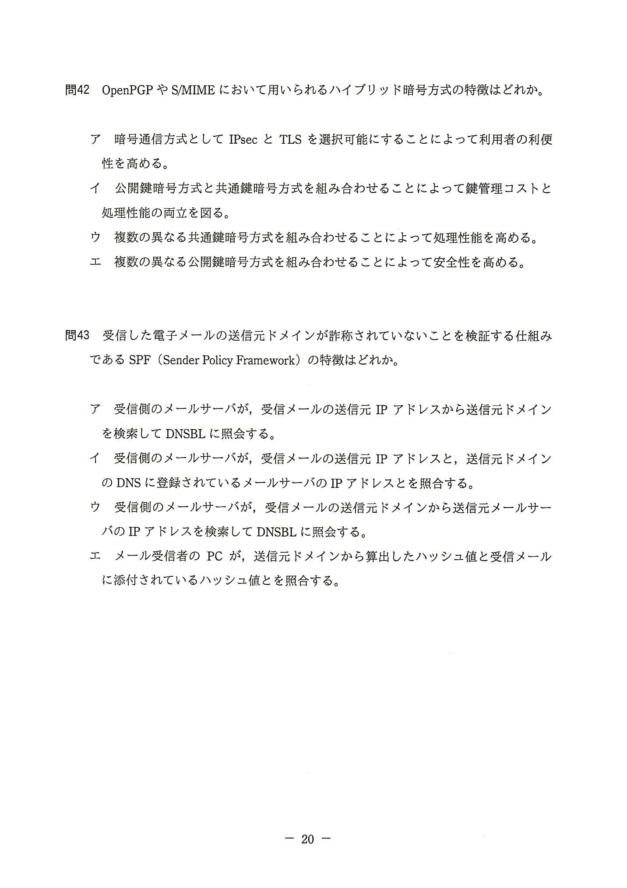

テキスト (OCR)

問42 OpenPGP や SMIME において用いられるハイブリッド暗号方式の特徴はどれか。

ア 暗号通信方式として IPsec と TLS を選択可能にすることによって利用者の利便
性を高める。

イ 公開鍵暗号方式と共通鍵暗号方式を組み合わせることによって鍵管理コストと
処理性能の両立を図る。

ウ 複数の異なる共通鍵暗号方式を組み合わせることによって処理性能を高める。

エ 複数の異なる公開鍵暗号方式を組み合わせることによって安全性を高める。

問43 受信した電子メールの送信元ドメインが詐称されていないことを検証する仕組み
である SPF (Sender Policy Framework) の特徴はどれか。

ア 受信側のメールサーバが, 受信メールの送信元 IP アドレスから送信元ドメイン
を検索して DNSBL に照会する。

イ 受信側のメールサーバが, 受信メールの送信元 TP アドレスと, 送信元ドメイン
の DNS に登録されているメールサーバの IP アドレスとを照合する。

ウ 受信側のメールサーバが, 受信メールの送信元ドメインから送信元メールサー
バの IP アドレスを検索して DNSBL に照会する。

エエ メール受信者の PC が, 送信元ドメインから算出したハッシュ値と受信メール
に添付されているハッシュ値とを照合する。

ー 20 一

### ページ 21

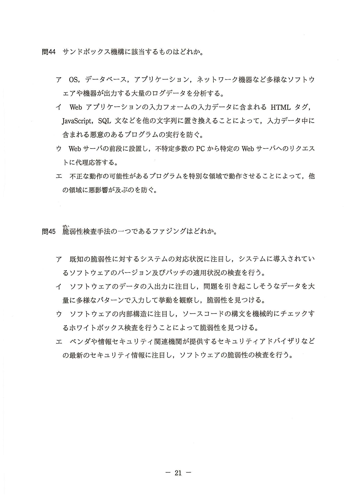

テキスト (OCR)

問44 サンドボックス機構に該当するものはどれか。

ア OS, データベース, アプリケーション, ネットワーク機器など多様なソフトウ
エアや機器が出力する大量のログデータを分析する。

イ Web アプリケーションの入力フォームの入力データに含まれる HTML タグ,
JavaScript, SQL 文などを他の文字列に置き換えることによって, 入力データ中に
含まれる悪意のあるプログラムの実行を防ぐ。

ウ Web サーバの前段に設置し, 不特定多数の PC から特定の Web サーバへのリクエス
トに代理応答する。

エエ 不正な動作の可能性があるプログラムを特別な領域で動作させることによって, fh
の領域に悪影響が及ぶのを防ぐ。

問45 脆弱性検査手法のーつであるファジングはどれか。

ア 既知の脆弱性に対するシステムの対応状況に注目し, システムに導入されてい
るソフトウェアのバージョン及びパッチの適用状況の検査を行う。

イ ソフトウェアのデータの入出力に注目し, 問題を引き起こしそうなデータを大
量に多様なパターンで入力して挙動を観察し, 脆弱性を見つける。

ウ ソフトウェアの内部構造に注目し, ソースコードの構文を機械的にチェックす
るホワイトボックス検査を行うことによって脆弱性を見つける。

エ ベンダや情報セキュリティ関連機関が提供するセキュリティアドバイザリなど
の最新のセキュリティ情報に注目し, ソフトウェアの脆弱性の検査を行う。

ー 21 一

### ページ 22

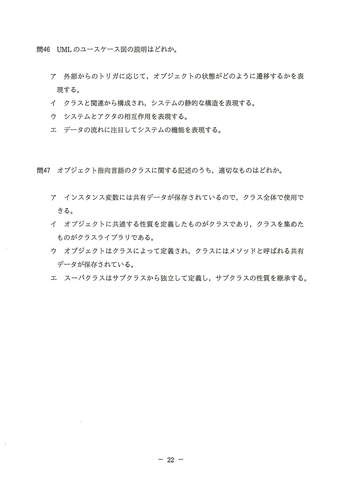

テキスト (OCR)

f46 UML のユースケース図の説明はどれか。

ア 外部からのトリガに応じて, オブジェクトの状態がどのように居移するかを表
現する。

イ クラスと関連から構成され, システムの静的な構造を表現する。

ウ システムとアクタの相互作用を表現する。

エエ データの流れに注目してシステムの機能を表現する。

間47 オブジェクト指向言語のクラスに関する記述のうち, 適切かものはどれか。

ア インスタンス変数には共有データが保存されているので, クラス全体で使用で
きる。

イ オブジェクトに共通する性質を定義したものがクラスであり, クラスを集めた
ものがクラスライブラリである。

ウ オブジェクトはクラスによって定義され, クラスにはメソッドと呼ばれる共有
データが保存されている。

エエ スーパクラスはサブクラスから独立して定義し, サブクラスの性質を継承する。

ー 22 一

### ページ 23

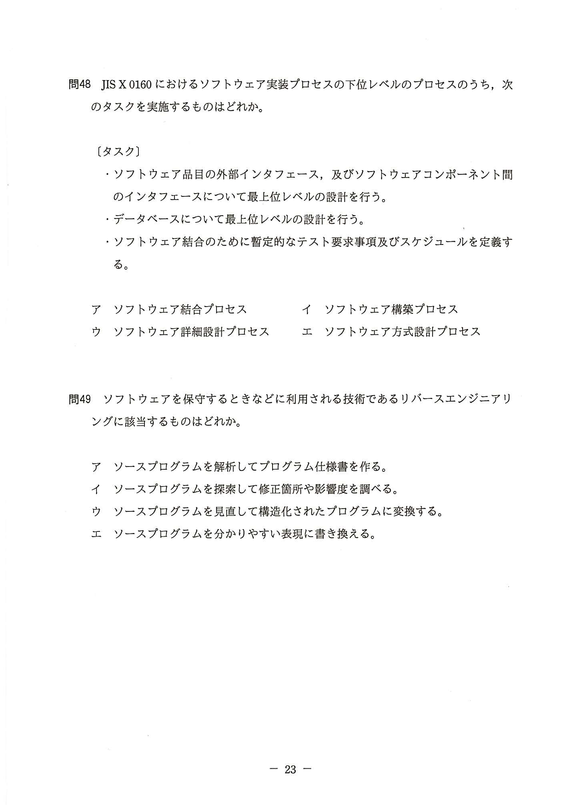

テキスト (OCR)

問48 JIS X0160 におけるソフトウェア実装プロセスの下位レベルのプロセスのうち, 次
のタスクを実施するものはどれか。

[タスク]〕

問49

・ソフトウェア品目の外部インタフェース, 及びソフトウェアコンポーネント間

のインタフェースについて最上位レベルの設計を行う。

・データベースについて最上位レベルの設計を行う。
・ソフトウェア知合のために暫定的なテスト要求事項及びスケジュールを定義す

る。

ソフトウェア結合プロセス     イ ソフトウェア構築プロセス
ソフトウェア詳細設計プロセス   DZ ソフトウェア方式設計プロセス

ソフトウェアを保守するときなどに利用される技術であるリバースエンジニアリ

ングに該当するものはどれか。

Hさささい

ソースプログラムを解析してプログラム仕様書を作る。

ソースプログラムを探索して修正箇所や影響度を調べる。

ソースプログラムを見直して構造化されたプログラムに変換する。
ソースプログラムを分かりやすい表現に書き換える。

ー 23 一

### ページ 24

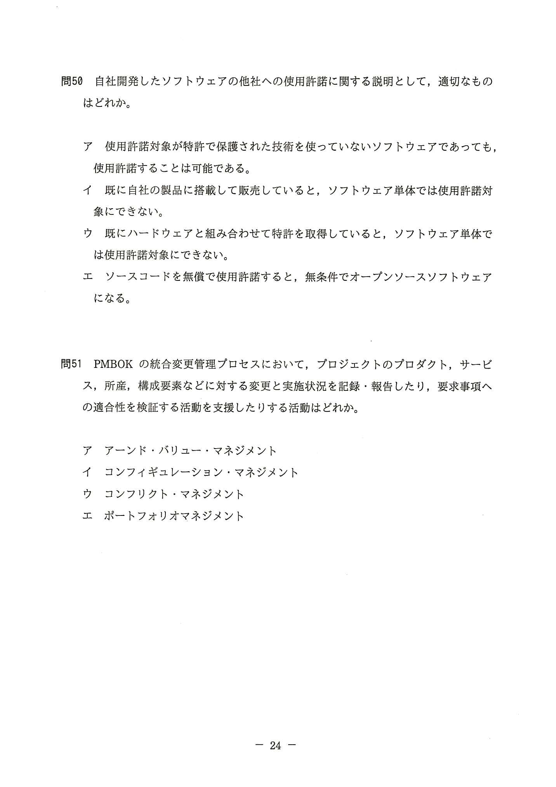

テキスト (OCR)

問59 自社開発したソフトウェアの他社への使用許諾に関する説明として, 適切なもの
はどれか。

ア 使用許諾対象が特許で保護された技術を使っていないソフトウェアであっても,
使用許諾することは可能である。

イ 既に自社の製品に搭載して販売していると, ソフトウェア単体では使用許諾対
象にできない。

ウ 既にハードウェアと組み合わせて特許を取得していると, ソフトウェア単体で
は使用許諾対象にできない。

エ ソースコードを無償で使用許諾すると, 無条件でオープンソースソフトウェア
になる。

問51 PMBOK の統合変更管理プロセスにおいて, プロジェクトのプロダクト, サービ
ス, 所産, 構成要素などに対する変更と実施状況を記録・報告したり, 要求事項へ
の適合性を検証する活動を支援したりする活動はどれか。

アーンド・バリュー・マネジメント

ア
イ コンフィギュレーション・マネジメント
ウ コンフリクト ・マネジメント

Pa BS

ポートフォリオマネジメント

ー 24 一

### ページ 25

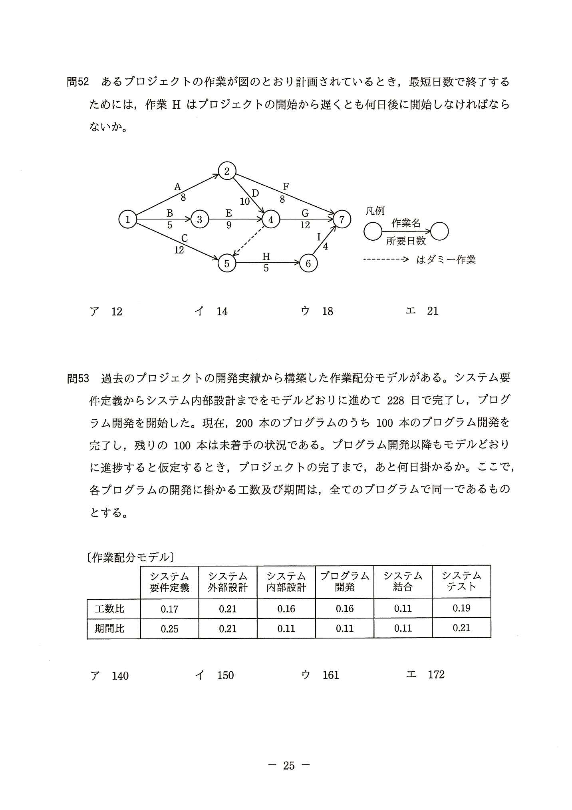

テキスト (OCR)

問52 あるプロジェクトの作業が図のとおり計画されているとき, 最短日数で終了する
ためには, 作業 H はプロジェクトの開始から遅くとも何日後に開始しなければなら

ないか。

凡例
OC  作業名  〇
所要日数

ーー> はダミー作業

問53 過去のプロジェクトの開発実績から構築した作業配分モデルがある。システム有要
件定義からシステム内部設計までをモデルどおりに進めて 228 日で完了し, プログ
ラム開発を開始した。現在, 200 本のプログラムのうち 100 本のプログラム開発を
完了し, 残りの 100 本は未着手の状況である。プログラム開発以降もモデルどおり
に進捗すると仮定するとき, プロジェクトの完了まで, あと何日掛かるか。ここで,
各プログラムの開発に掛かる工数及び期間は, 全てのプログラムで同一であるもの
とする。

〔作業配分モデル〕
システム | システム | システム | プログラム | システム | システム
要件定義 | 外部設計 | 内部設計       開発         結合        テスト
工数比          0.17           0.21           0.16            0.16           0.11           0.19
期間比          0.25           0.21           0.11            0.11           0.11           0.21
ア 140                 イ 150                 ウ 161                 エ 172

ー 25 一

### ページ 26

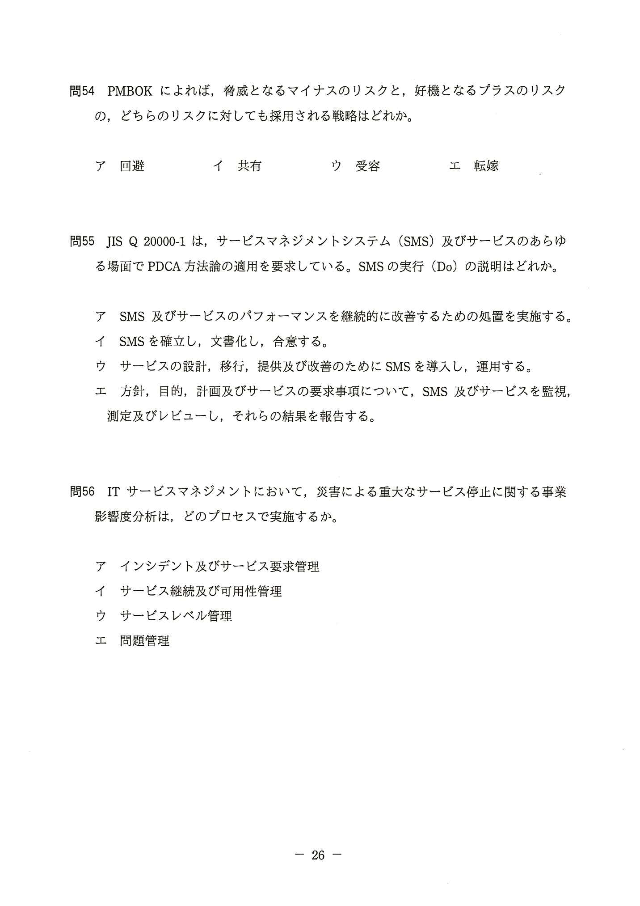

テキスト (OCR)

問54 PMBOK によれば, 脅威となるマイナスのリスクと, 好機となるプラスのリスク
の, どちらのリスクに対しても採用される戦略はどれか。

ア 回避     イ 共有     ウ 受容     エエ 転嫁

間55 JIS Q 20000-1 lk, サービスマネジメントシステム (SMS) 及びサービスのあらゆ
る場面で PDCA 方法論の適用を要求している。SMS の実行 (Do) の説明はどれか。

SMS 及びサービスのパフォーマンスを継続的に改善するための処置を実施する。

SMS を確立し, 文書化し, 合意する。

サービスの設計, 移行, 提供及び改善のために SMS を導入し, 運用する。

方針, 目的, 計画及びサービスの要求事項について, SMS 及びサービスを監視,
測定及びレビューし, それらの結果を報告する。

Hot AM

間56 IT サービスマネジメントにおいて, 和災害による重大なサービス停止に関する事業
影響度分析は, どのプロセスで実施するか。

インシデント及びサービス要求管理
サービス継続及び可用性管理

サービスレベル管理

問題管理

HSA NM

ー 26 一

### ページ 27

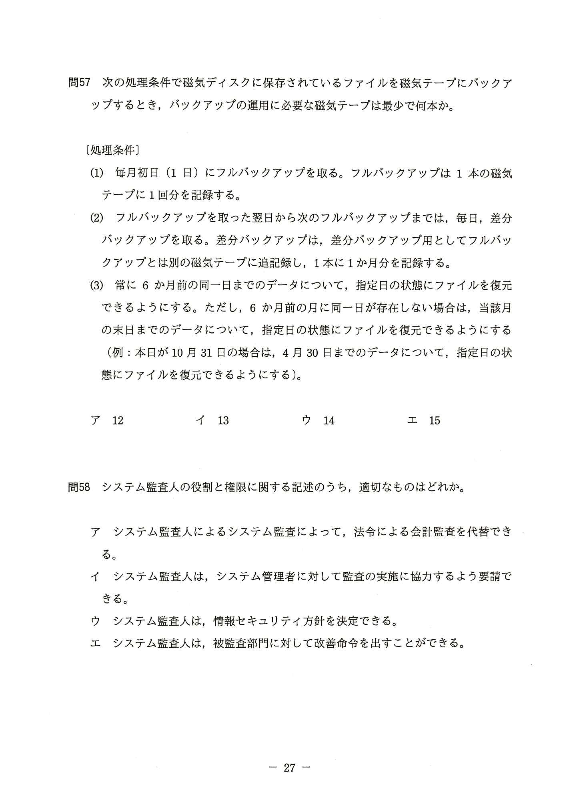

テキスト (OCR)

問57 次の処理条件で磁気ディスクに保存されているファイルを磁気テープにバックア
ップするとき, バックアップの運用に必要な磁気テープは最少で何本か。

処理条件]

GQ) 毎月初日 (1 日) にフルバックアップを取る。フルバックアップは 1 本の磁気
テープに 1 回分を記録する。

2) フルバックアップを取った翌日から次のフルバックアップまでは, BA, 差分
バックアップを取る。差分バックアップは, 差分バックアップ用としてフルバッ
クアップとは別の磁気テープに追記録し, 1 本に 1 か月分を記録する。

(3) 常に 6 か月前の同一日までのデータについて, 指定日の状態にファイルを復元
できるようにする。 ただし, 6 か月前の月に同一日が存在しない場合は, 当該月
の末日までのデータについて, 指定日の状態にファイルを復元できるようにする
(例 : 本日が 10 月 31 日の場合は, 4 月 30 日までのデータについて, 指定日の状
態にたファイルを復元できるようにする)。

問58 システム監査人の役割と権限に関する記述のうち, 適切なものはどれか。

ア システム監査人によるシステム監査によって, 法令による会計監査を代替でき

る。
イ システム監査人は, システム管理者に対して監査の実施に協力するよう要請で
きる。

ウ システム監査人は, 情報セキュリティ方針を決定できる。
エ システム監査人は, 被監査部門に対して改善命令を出すことができる。

ー 27 一

### ページ 28

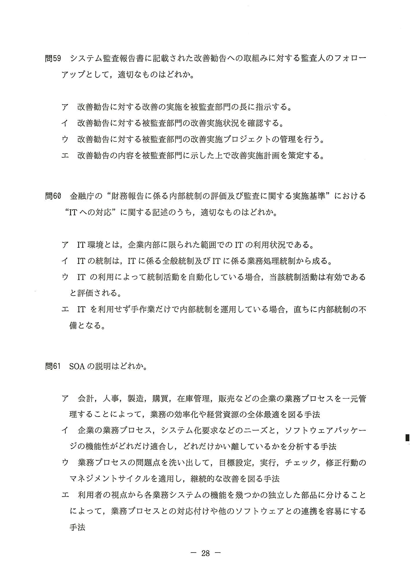

テキスト (OCR)

問59 システム監査報告書に記載された改善勧告への取組みに対する監査人のフォロー
アップとして, 適切なものはどれか。

改善勧告に対する改善の実施を被監査部門の長に指示する。
改善勧告に対する被監査部門の改善実施状況を確認する。
改善勧告に対する被監査部門の改善実施プロジェクトの管理を行う。
改善勧告の内容を被監査部門に示した上で改善実施計画を策定する。

Hoe A

60 金融庁の“財務報告に係る内部統制の評価及び監査に関する実施基準"” における
“IT への対応”" に関する記述のうち, 適切なかものはどれか。

ア TT環境とは, 企業内部に限られた範囲での IT の利用状況である。
イ ITの統制は, IT に係る全般統制及び IT に係る業務処理統制から成る。
ウ IT の利用によって統制活動を自動化している場合, 当該統制活動は有効である

と評価される。
エ IT を利用せず手作業だけで内部統制を運用している場合, 直ちに内部統制の不
備となる。

間61 SOA の説明はどれか。

ア 会計, 人事, 製造, 購買, 在庫管理, 販売などの企業の業務プロセスを一元管
理することによって, 業務の効率化や経営資源の全体最適を図る手法
イ 企業の業務プロセス, システム化要求などのニーズと, ソフトウェアパッケー
ジの機能性がどれだけ適合し, どれだけかい離しているかを分析する手法
ウ 業務プロセスの問題点を洗い出して, 目標設定, 実行, チェック, 修正行動の
マネジメントサイクルを適用し, 継続的な改善を図る手法
エエ 利用者の視点から各業務システムの機能を幾つかの独立した部品に分けること
によって, 業務プロセスとの対応付けや他のソフトウェアとの連携を容易にする
手法

ー 28 一

### ページ 29

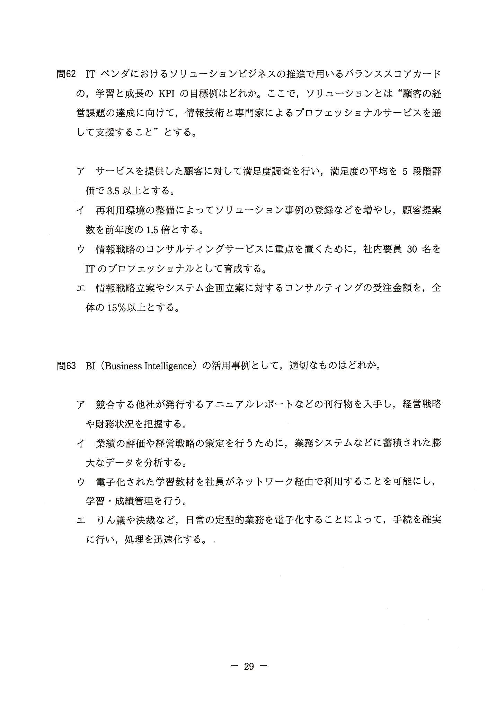

テキスト (OCR)

間62 IT ベンダにおけるソリューションビジネスの推進で用いるバランススコアカード
の, 学習と成長の KPI の目標例はどれか。ここで, ソリューションとは “顧客の経
営課題の達成に向けて, 情報技術と専門家によるプロフェッショナルサービスを通
して支援すること” とする。

ア サービスを提供した顧客に対して満足度調査を行い, 満足度の平均を 5 段階評
価で 3.5 以上とする。

4 再利用環境の整備しよってソリューション事例の登録などを増やし, 顧客提案
数を前年度の 1.5 倍とする。

ウ 情報戦略のコンサルティングサービスに重点を置くために, 社内要員 30 名を
IT のプロフェッショナルとして育成する。

エエ 情報戦略立案やシステム企画立案に対するコンサルティングの受注金額を, 全
体の 15%以上とする。

間63 BI (Business Intelligence) の活用事例として, 適切かものはどれか。

ア 競合する他社が発行するアニュアルレポートなどの刊行物を入手し, 経営戦略
や財務状況を把握する。

イ 業績の評価や経営戦略の策定を行うために, 業務システムなどに蓄積された膨
大なデータを分析する。

ウ 電子化された学習教材を社員がネットワーク経由で利用することを可能にし,
学習・成績管理を行う。

エ りん議や決裁など, 日常の定型的業務を電子化することによって, 手続を確実
にた行い, 処理を迅速化する。

ー 29 一

### ページ 30

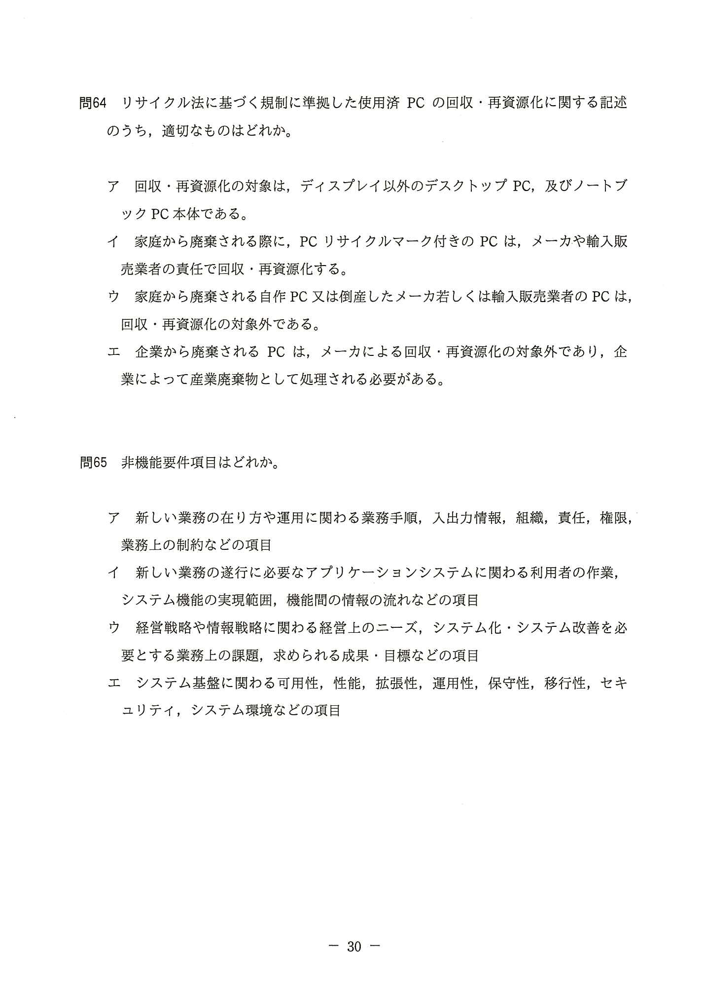

テキスト (OCR)

間64 リサイクル法に基づく規制に準拠した使用済 PC の回収・再資源化に関する記述
のうち, 適切がものはどれか。

ア 回収・再資源化の対象は。 ディスプレイ以外のデスクトップ PC, 及びノートブ
ック PC 本体である。

イ 家庭から廃棄される際に, PC リサイクルマーク付きの PC は, メーカや輸入販
売業者の責任で回収・再資源化する。

ウ 家庭から廃棄される自作 PC 又は倒産したメーカ若しくは輸入販売業者の PC は
回収・再資源化の対象外である。

エエ 企業から廃棄される PC は, メーカによる回収・再資源化の対象外であり, 企
業によって産業廃棄物として処理される必要がある。

問65 非機能要件項目はどれか。

ア 新しい業務の在り方や運用に関わる業務手順, 入出力情報, 組織, 責任, 権限,
業務上の制約などの項目

イ 新しい業務の遂行に必要かアプリケーションシステムに関わる利用者の作業,
システム機能の実現範囲, 機能間の情報の流れなどの項目

ウ 経営戦略や情報戦略に関わる経営上のニーズ, システム化・システム改善を必
要とする業務上の課題, 求められる成果・目標などの項目

エ システム基盤に関わる可用性, 性能, 拡張性, 運用性, 保守性, 移行性, セキ
ユリティ, システム環境などの項目

### ページ 31

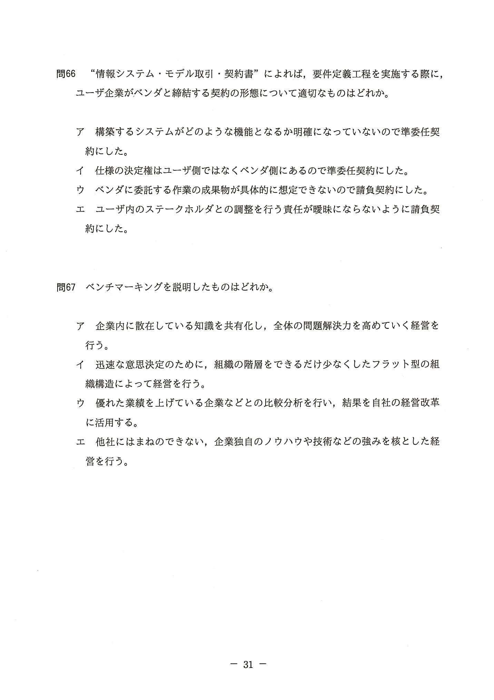

テキスト (OCR)

問66 “情報システム・モデル取引・契約書" によれば, 要件定義工程を実施する際に,
ユーザ企業がベンダと締結する契約の形態について適切なものはどれか。

ア 構築するシステムがどのような機能となるか明確になかっていないので準委任契
約にした。

イ 仕様の決定権はユーザ側ではなくベンダ側にあるので準委任契約にした。

ウ ベンダに委託する作業の成果物が具体的に想定できないので請負契約にした。

エ ユーザ内のステークホルダとの調整を行う責任が曖昧にならないように請負契
約にした。

FET ベンチマーキングを説明したものはどれか。

ア 企業内に散在している知識を共有化し, 全体の問題解決力を高めていく経営を

行う。

イ 迅速な意思決定のために, 組織の階層をできるだけ少なくしたフラット型の組
織構造によって経営を行う。

ウ 優れた業績を上げている企業などとの比較分析を行い, 結果を自社の経営改革
に活用する。

エ 他社にはまねのできない, 企業独自のノウハウや技術などの強みを核とした経
営を行う。

ー 31 一

### ページ 32

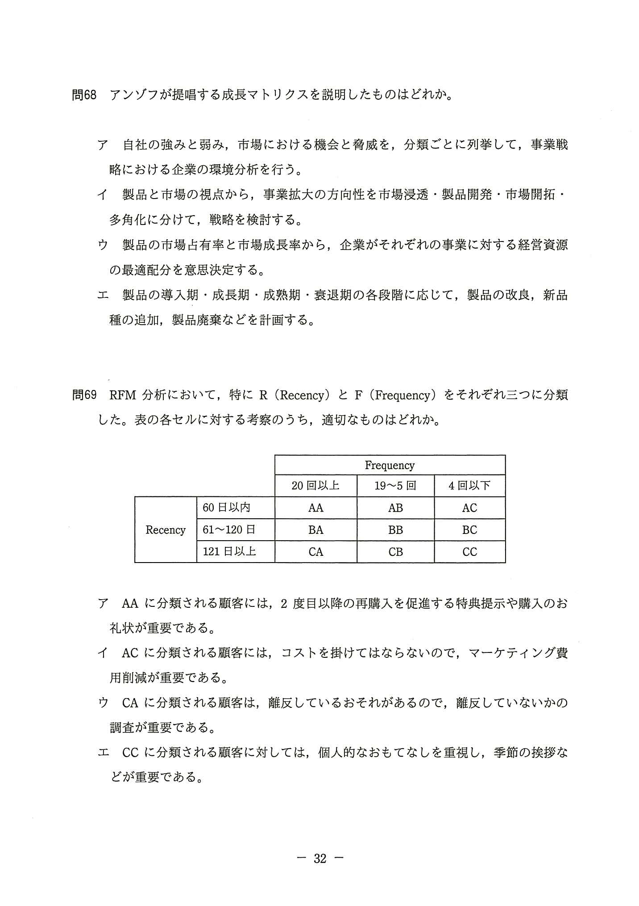

テキスト (OCR)

68 アンゾフが提唱する成長マトリクスを説明したものはどれか。

ア 自社の強みと弱み, 市場における機会と脅威を, 分類ごとに列拳して, 事業戦
略における企業の環境分析を行う。

イ 製品と市場の視点から, 事業拡大の方向性を市場浸透・製品開発・市場開拓・
多角化に分けて, 戦略を検討する。

ウ 製品の市場占有率と市場成長率から, 企業がそれぞれの事業に対する経営資源
の最適配分を意思決定する。

エ 製品の導入期・成長期・成熟期・衰退期の各段階に応じて, 製品の改良, 新品
種の追加, 製品廃棄などを計画する。

問69 RFM 分析において, 特に R (Recency) と F (Frequency) をそれぞれ三つに分類
した。表の各セルに対する考察のうち, 適切なものはどれか。

Frequency
20 回以上        19~5 回        4回以下
60 日以内               AA                AB               AC
Recency | 61~120 日            BA               BB             BC
121 日以上             CA                CB               CC

ア AA に分類される顧客には, 2 度目以降の再購入を促進する特典提示や購入のお
礼状が重要である。

イ AC に分類される顧客には, コストを掛けてはならないので, マーケティング費
用削減が重要である。

ウ CA に分類される顧客は, 離反しているおそれがあるので, 離反していないかの
調査が重要である。

エ CC に分類される顧客に対しては, 個人的なおもてなしを重視し, 季節の挨拶な
どが重要である。

### ページ 33

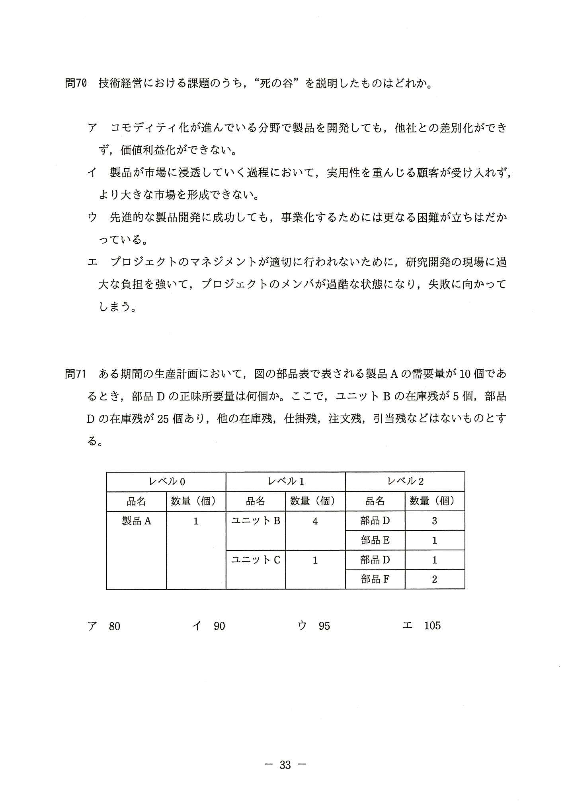

テキスト (OCR)

問76 技術経営における課題のうち, “MOR” を説明したものはどれか。

ア コモディティ化が進んでいる分野で製品を開発しても, 他社との差別化ができ
ず, 価値利益化ができない。

イ 製品が市場に浸透していく過程において, 実用性を重んじる顧客が受け入れず,
より大きなか市場を形成できない。

ウ 先進的な製品開発に成功しても, 事業化するためには更なる困難が立ちはだか
っている。

エエ プロジェクトのマネジメントが適切に行われないために, 研究開発の現場に過
大な負担を強いて, プロジェクトのメンバが過酷な状態になり, 失敗に向かって
しまう。

間71 ある期間の生産計画において, 図の部品表で表される製品 A の需要量が 10 個であ
るとき, 部品 D の正味所要量は何個か。ここで, ユニット B の在庫残が 5 個, 部品
D の在庫残が 25 個あり, 他の在庫残, 仕掛残, 注文残, 引当残などはないものとす
る。

レベル0                レベル 1                レベル 2
数量 (個)    品名    数量 (個)          数量 (個)
製品A        1      ユニットB      4

El
Bo
Y

1
Ba

eS
名

ユニットC    1

ag | at | ae
eat  no

gy) Uolm|o
wflelelo

ア 80      イ 90      ウ 95      = 105

### ページ 34

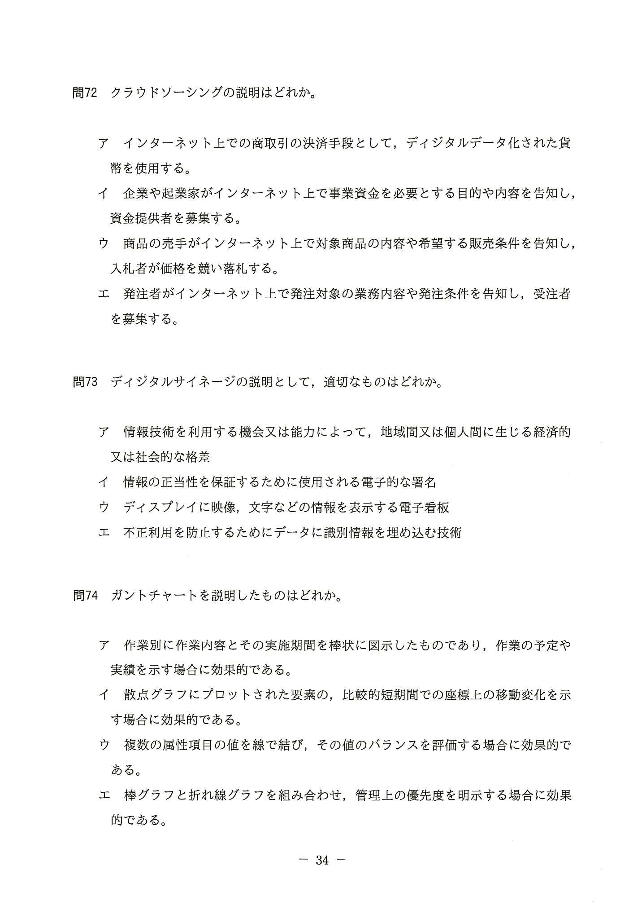

テキスト (OCR)

間72 クラウドソーシングの説明はどれか。

ア インターネット上での商取引の決済手段として, ディジタルデータ化された貨

幣を使用する。
イ 企業や起業家がインターネット上で事業資金を必要とする目的や内容を告知し
資金提供者を募集する。

ウ 商品の売手がインターネット上で対象商品の内容や希望する販売条件を告知し
入札者が価格を競い落札する。
エ 発注者がインターネット上で発注対象の業務内容や発注条件を告知し, 受注者
を募集する。

問73 ディジタルサイネージの説明として, 適切なものはどれか。

ア 情報技術を利用する機会又は能力によって, 地域間又は個人間に生じる経済的
又は社会的な格差

イ 情報の正当性を保証するために使用される電子的な署名

ウ ディスプレイに映像, 文字などの情報を表示する電子看板

エ 不正利用を防止するためにデータに識別情報を埋め込む技術

問74 ガントチャートを説明したものはどれか。

ア 作業別に作業内容とその実施期間を棒状に図示したものであり, 作業の予定や
実績を示す場合に効果的である。

イ 散点グラフにプロットされた要素の, 比較的短期間での座標上の移動変化を示
す場合に効果的である。

ウ 複数の属性項目の値を線で結び, その値のバランスを評価する場合に効果的で
ある。

エエ 棒グラフと折れ線グラフを組み合わせ, 管理上の優先度を明示する場合に効果
的である。

ー 34 一

### ページ 35

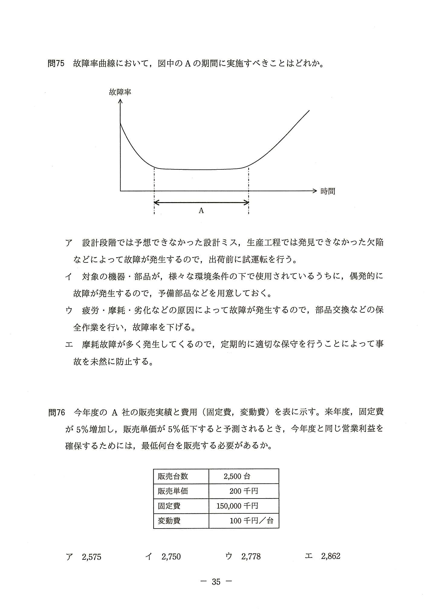

テキスト (OCR)

間75 故障率曲線において, 図中のAの期間に実施すべきことはどれか。

故障率

時間

ア 設計段階では予想できなかった設計ミス, 生産工程では発見できなかった欠陥
などによって故障が発生するので, 出荷前に試運転を行う。

イ 対象の機器・部品が, 様々な環境条件の下で使用されているうちに, 偶発的に
故障が発生するので, 予備部品などを用意しておく。

ウ 疲労・摩衝・劣化などの原因によって故障が発生するので, 部品交換などの保
全作業を行い, 故障率を下げる。

= 摩耗夏障が多く発生してくるので, 定期的に適切な保守を行うことによって事
故を未然に防止する。

間76 今年度の A 社の販売実績と費用 (AEH, 変動費) を表に示す。来年度, 固定費
が 5%増加し, 販売単価が 5%低下すると予測されるとき, 今年度と同じ営業利益を
確保するためには, 最低何台を販売する必要があるか。

販売台数      2.500 台
販売単価       200 千円
固定費      150,000 千円
変動費         100 千円ノ台
ア 2,575        イ 2,750        ウ 2,778        エエ 2,862

ー 35 一

### ページ 36

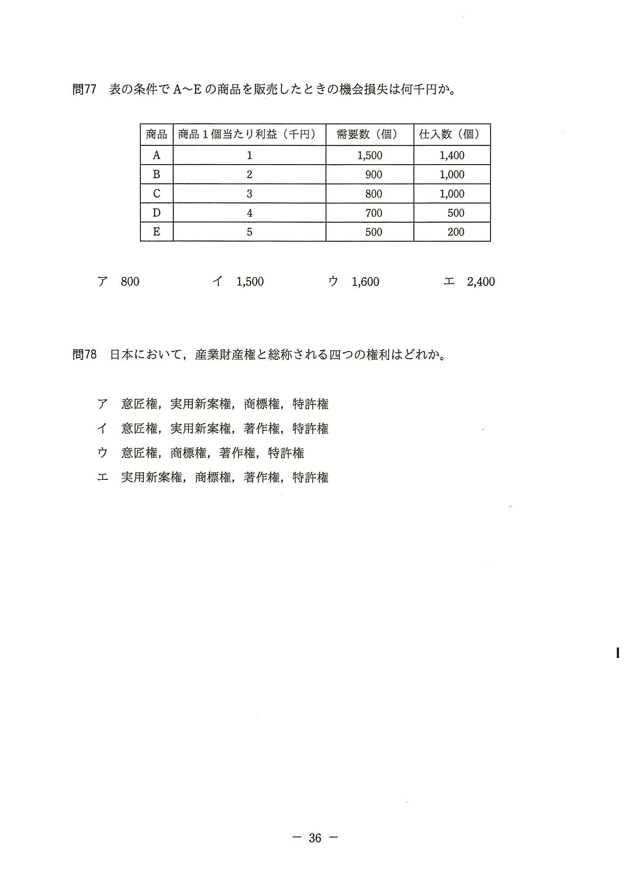

テキスト (OCR)

77 表の条件で ACE の商品を販売したときの機会損失は何千円か。

ア

商品 | 商品 1 個当たり利益 (千円) | 需要数 (個) | 仕入数 (個)

A             1               1,500       1,400

B           2               900       1,000

C           3               800       1000

D             4                 700     500

E 5 500200
800         イ 1,500        ウ 1,600        x= 2,400

問78 日本において, 産業財産権と総称される四つの権利はどれか。

H ささ

意匠権, 実用新案権, 商標権, 特許権
意匠権, 実用新案権, 著作権, 特許権
意匠権, 商標権, 著作権, 特許権

実用新案権, 商標権, 著作権, 特許権

ー 36 一

### ページ 37

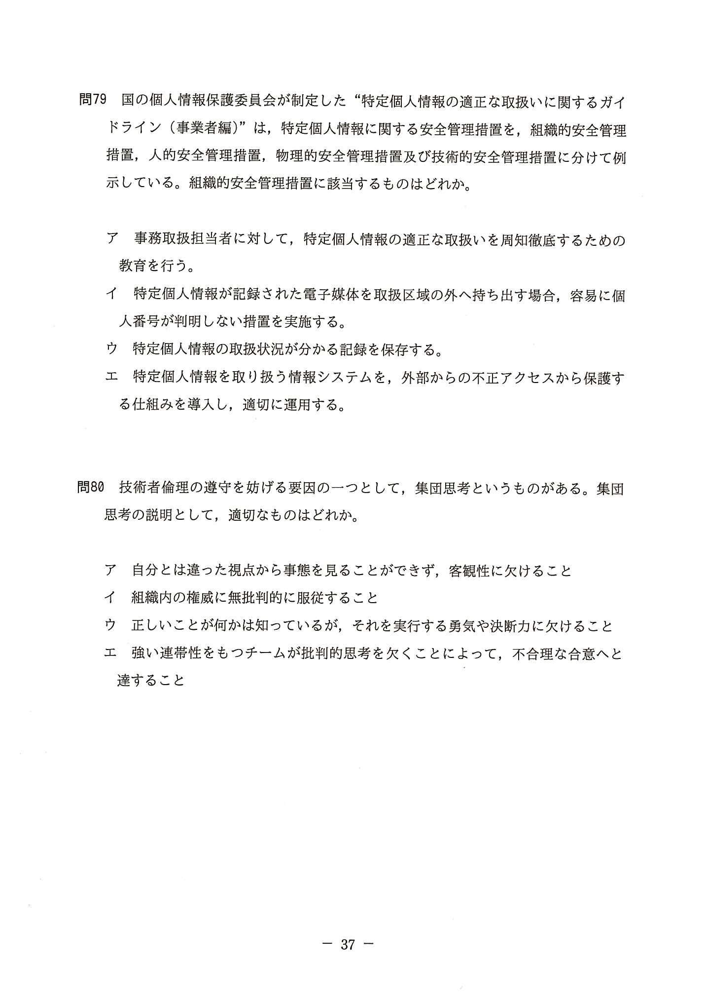

テキスト (OCR)

問79 国の個人情報保護委員会が制定した “特定個人情報の適正な取扱いに関するガイ
ドライン (事業者編)” は, 特定個人情報に関する安全管理措置を, 組織的安全管理
He, 人的安全管理措置, 物理的安全管理措置及び技術的安全管理措置に分けて例
示している。 組織的安全管理措置に該当するものはどれか。

ア 事務取扱担当者に対して, 特定個人情報の適正な取扱いを周知徹底するための
教育を行う。

イ 特定個人情報が記録された電子媒体を取扱区域の外へ持ち出す場合, 容易に個
人番号が判明しない措置を実施する。

ツウ 特定個人情報の取扱状況が分かる記録を保存する。

エエ 特定個人情報を取り扱う情報システムを, 外部からの不正アクセスから保護す
る仕組みを導入し, 適切に運用する。

間86 技術者倫理の遵守を妨げる要因の一つとして, 集団思考というものがある。集団
思考の説明として, 適切なものはどれか。

ア 自分とは違った視点から事態を見ることができず, 客観性に欠けること
イ 組織内の権威に無批判的に服従すること

ウ 正しいことが何かなは知っているが, それを実行する勇気や決断力に欠けること
エ 強い連帯性をもつチームが批判的思考を欠くことによって, 不合理な合意へと
達すること

ー 37 一

### ページ 38

テキスト (OCR)

〔

メ モ 用 紙 ]

ー 38 一

### ページ 39

テキスト (OCR)

〔

x モ 用 紙 〕

ー 39 一

### ページ 40

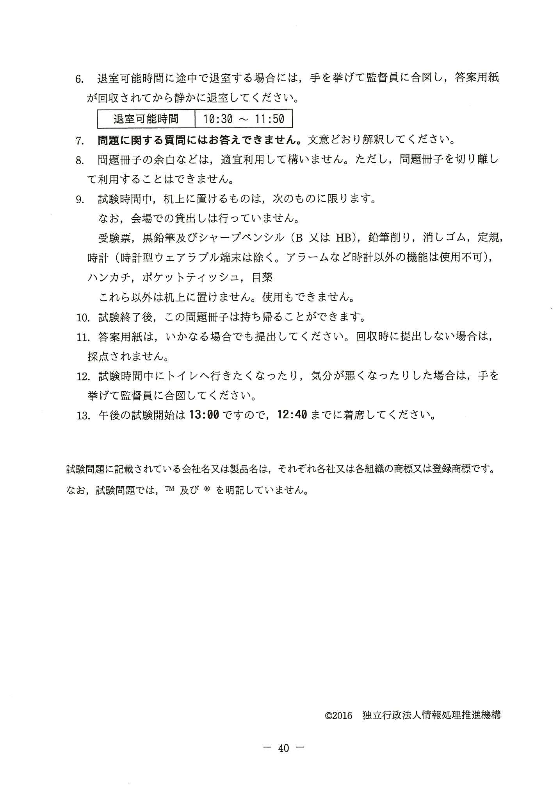

テキスト (OCR)

6. 退室可能時間に途中で退室する場合には, 手を挙げて監督員に合図し, 答案用紙
が回収されてから静かに退室してください。
| 骨室可能時間 | 10:30 ~ 11:50
7. 同題に関する質問にはお答えできません。文意どおり解釈してください。
8. 問題冊子の余白などは, 適宜利用して構いません。ただし, 問題冊子を切り離し
て利用することはできません。
9. 試験時間中, 机上に置けるものは, 次のものに限ります。
なお, 会場での貸出しは行っていません。
受験票, 黒鉛筆及びシャープペンシル (B 又は HB), 鉛筆削り, 消しゴム, 定規,
時計 (時計型ウェアラブル端末は除く。アラームなど時計以外の機能は使用不可),
ハンカチ, ポケットティッシュ, 目薬
これら以外は机上に置けません。 使用もできません。
10. 試験終了後, この問題冊子は持ち帰ることができます。
11. 答案用紙は, いかなる場合でも提出してください。 回収時に提出しない場合は,
採点されません。
12. 試験時間中にトイレへ行きたくなったり, 気分が悪くなったりした場合は, FE
挙げて監督員に合図してください。
13. 午後の試験開始は 13:99 ですので, 12:49 までに着席してください。

試験問題に記載されている会社名又は製品名は, それぞれ各社又は各組織の商標又は登録商標です。
なお, 試験問題では, ™ 及び @ を明記していません。

@2016 独立行政法人情報処理推進機構

ー 40 一

---

## 午前解答

©2016 独立行政法人情報処理推進機構 
平成28 年度 秋期 応用情報技術者試験 解答例 
 
午前試験 
問番号
正解
分野
問1 
ウ 
Ｔ 
問2 
ア 
Ｔ 
問3 
ウ 
Ｔ 
問4 
ウ 
Ｔ 
問5 
エ 
Ｔ 
問6 
エ 
Ｔ 
問7 
エ 
Ｔ 
問8 
ウ 
Ｔ 
問9 
イ 
Ｔ 
問10 
エ 
Ｔ 
問11 
ウ 
Ｔ 
問12 
エ 
Ｔ 
問13 
ア 
Ｔ 
問14 
エ 
Ｔ 
問15 
エ 
Ｔ 
問16 
イ 
Ｔ 
問17 
ウ 
Ｔ 
問18 
イ 
Ｔ 
問19 
イ 
Ｔ 
問20 
ア 
Ｔ 
 
 
問番号
正解
分野
問21 
エ 
Ｔ 
問22 
イ 
Ｔ 
問23 
エ 
Ｔ 
問24 
ウ 
Ｔ 
問25 
ウ 
Ｔ 
問26 
イ 
Ｔ 
問27 
イ 
Ｔ 
問28 
ア 
Ｔ 
問29 
イ 
Ｔ 
問30 
ア 
Ｔ 
問31 
エ 
Ｔ 
問32 
ア 
Ｔ 
問33 
ア 
Ｔ 
問34 
ウ 
Ｔ 
問35 
エ 
Ｔ 
問36 
イ 
Ｔ 
問37 
エ 
Ｔ 
問38 
エ 
Ｔ 
問39 
ア 
Ｔ 
問40 
エ 
Ｔ 
 
 
問番号
正解
分野
問41 
イ 
Ｔ 
問42 
イ 
Ｔ 
問43 
イ 
Ｔ 
問44 
エ 
Ｔ 
問45 
イ 
Ｔ 
問46 
ウ 
Ｔ 
問47 
イ 
Ｔ 
問48 
エ 
Ｔ 
問49 
ア 
Ｔ 
問50 
ア 
Ｔ 
問51 
イ 
Ｍ 
問52 
エ 
Ｍ 
問53 
イ 
Ｍ 
問54 
ウ 
Ｍ 
問55 
ウ 
Ｍ 
問56 
イ 
Ｍ 
問57 
ウ 
Ｍ 
問58 
イ 
Ｍ 
問59 
イ 
Ｍ 
問60 
イ 
Ｍ 
 
 
問番号
正解
分野
問61 
エ 
Ｓ 
問62 
ウ 
Ｓ 
問63 
イ 
Ｓ 
問64 
イ 
Ｓ 
問65 
エ 
Ｓ 
問66 
ア 
Ｓ 
問67 
ウ 
Ｓ 
問68 
イ 
Ｓ 
問69 
ウ 
Ｓ 
問70 
ウ 
Ｓ 
問71 
イ 
Ｓ 
問72 
エ 
Ｓ 
問73 
ウ 
Ｓ 
問74 
ア 
Ｓ 
問75 
イ 
Ｓ 
問76 
エ 
Ｓ 
問77 
エ 
Ｓ 
問78 
ア 
Ｓ 
問79 
ウ 
Ｓ 
問80 
エ 
Ｓ 
 
 
分野の「Ｔ」はテクノロジ系，「Ｍ」はマネジメント系，「Ｓ」はストラテジ系の問題です。

---

## 午後問題

### ページ 1

テキスト (OCR)

平成 28 年度 秋期

応用情報技術者試験
午後 問題
 13:00 ~ 15:30 (2時間30 分)

注意事項
1. 試験開始及び終了は, 監督員の時計が基準です。監督員の指示に従ってください。
2. 試験開始の合図があるまで, 問題冊子を開いて中を見てはいけません。
3. 答案用紙への受験番号などの記入は, 試験開始の合図があってから始めてください
4, FIL, 次の表に従って解答してください。

問題番号             問 1           間2 て間 11
選択方法              必須             4 問選択

5. 答案用紙の記入に当たっては, 次の指示に従ってください。
Q) B 又は HB の黒鉛筆又はシャープペンシルを使用してくだ

Fa,                                       (MIS, 問4,問6,

AS を:   た場合
(2) RRESMICRRESe, 生年月日楓に受験村の生年月 のmn NRULSS

日を記入してください。 正しく記入されていない場合は
採点されないことがあります。生年月日楓については, = RRA

必
験票の生年月日を訂正した場合でも, 訂正前の生年月日を |用
記入してください。                                  問2

(3) 選択した同題については, 右の例に従って, RAO
題番号を〇印で囲んでください。〇印がない場合は, 採点

SHEA. Hl 2て問 11 について, 5 問以上〇印で囲んだ      fal 5
場合は。 はじめの 4 問について採点します。           [Gis
④ 解答は, 問題番号ごとに指定された枠内に記入してくだ |表| 問7
さい。                                   Gig
⑤) 解答は, 丁寧な字ではっきりと書いてください。読みに     間9
くい場合は, 減点の対象になります。                  間19
問11

注意事項は問題冊子の裏表紙に続きます。
こちら側から裏返して, 必ず読んでください。

### ページ 2

### ページ 3

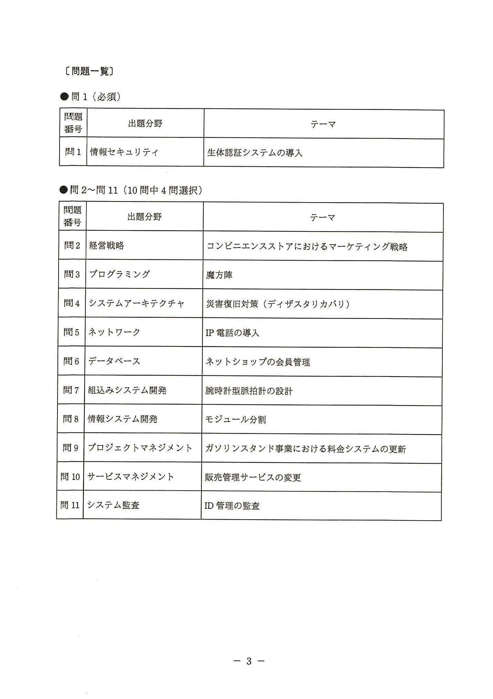

テキスト (OCR)

[問題一覧]

人@問1 (必須)

問題

=e     出題分野                テーマ

問1 | 情報セキュリティ      生体認証システムの導入

@ fl 2一問 11 (10 問中 4 問選択)

     出題分野                テーマ

問2 |経営戦略         コンビニエンスストアにおけるマーケティング戦略
問3 | プログラミング     BEA Re

問4 | システムアーキテクチャ   災害復旧対策 (ディザスタリカバリ)

問5 |ネットワーク       TP 電話の導入

問6 | データベース        ネットショップの会員管理

問 7 | 組込みシステム開発     腕時計型脈拍計の設計

問8 | 情報システム開発      モジュール分割

問 9 | プロジェクトマネジメント | ガソリンスタンド事業における料金システムの更新
問 10 | サービスマネジメント   販売管理サービスの変更

問 11 | システム監査        ID 管理の監査

### ページ 4

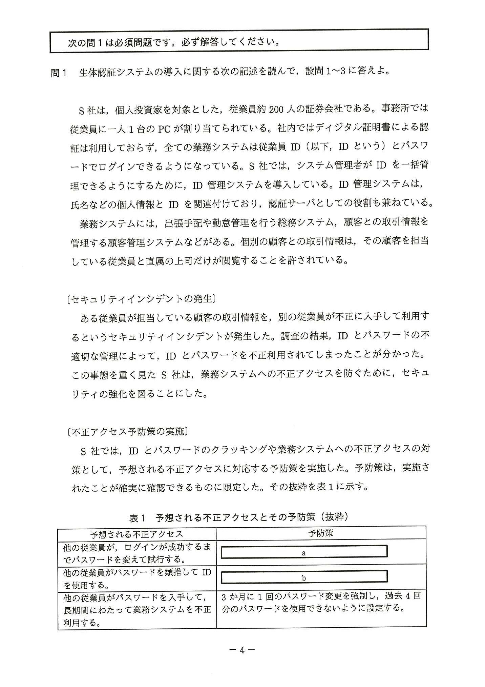

テキスト (OCR)

次の問 1 は必須問題です。必ず解答してください。

All 生体認証システムの導入に関する次の記述を読んで, 設問 1ー3 に答えよ。

S 社は, 個人投資家を対象とした, 従業員約 200 人の証券会社である。事務所では
従業員に一人 1 AO PC が割り当てられている。和社内ではディジタル証明書による褒
証は利用しておらず, 全ての業務システムは従業員 ID (以下, ID という) とパスワ
ードでログインできるようになっている。S HTS, システム管理者が ID を一括管
理できるようにするために, ID 管理システムを導入している。TD 管理システムは,
氏名などの個人情報と ID を関連付けており, 認証サーバとしての役割も兼ねている。

業務システムには, 出張手配や勤怠管理を行う総務システム, 顧客との取引情報を
管理する顧客管理システムなどがある。個別の顧客との取引情報は, その顧客を担当
している従業員と直属の上司だけが閲覧することを許されている。

[セキュリティインシデントの発生]

ある従業員が担当している顧客の取引情報を, 別の従業員が不正に入手して利用す
るというセキュリティインシデントが発生した。調査の結果, ID とパスワードの不
適切な管理によって, ID とパスワードを不正利用されてしまったことが分かった。
この事態を重く見た S 社は, 業務システムへの不正アクセスを防ぐために, セキュ
リティの強化を図ることにした。

〔不正アクセス予防策の実施]

S 社では, ID とパスワードのクラッキングや業務システムへの不正アクセスの対
策として, 予想される不正アクセスに対応する予防策を実施した。予防策は, 実施さ
れたことが確実に確認できるものに限定した。その抜粋を表 1 に示す。

表1 予想される不正アクセスとその予防策 (抜粋)

予想される不正アクセス                       予防策

他の従業員が, ログインが成功するま 画       =
でパスワードを変えて試行する。
他の従業員がパスワードを類推して ID |
を使用する。
他の従業員がパスワードを入手して, | 3 か月に 1 回のパスワード変更を強制し, 過去 4 回
長期間にわたって業務システムを不正 | 分のパスワードを使用できないように設定する。

利用する。

b        ]

### ページ 5

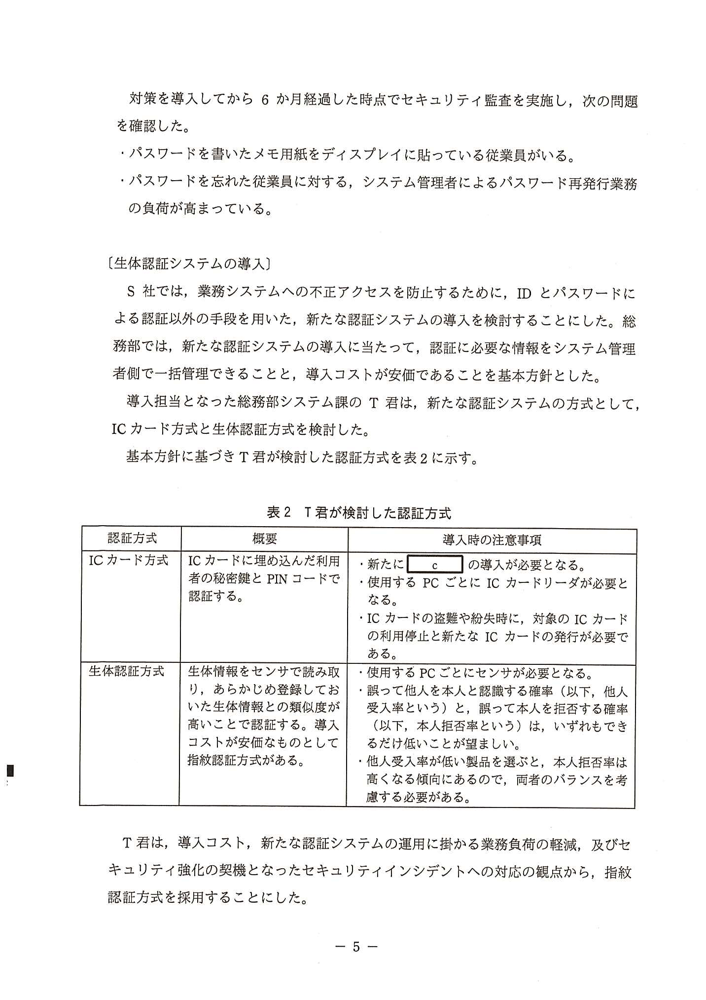

テキスト (OCR)

対策を導入してから 6 か月経過した時点でセキュリティ監査を実施し, 次の問題
を確認した。

・パスワードを書いたメモ用紙をディスプレイに貼っている従業員がいる。

・パスワードを忘れた従業員に対する, システム管理者によるパスワード再発行業務
の負荷が高まっている。

〔生体認証システムの導入〕

S 社では, 業務システムへの不正アクセスを防止するために, ID とパスワードに
よる論証以外の手段を用いた, 新たな認証システムの導入を検討することにした。総
務部では, 新たな認証システムの導入に当たって, 認証に必要な情報をシステム管理
者側で一括管理できることと, 導入コストが安価であることを基本方針とした。

導入担当となった総務部システム課の T 君は, 新たな認証システムの方式として,
IC カード方式と生体認証方式を検討した。

基本方針に基づきT 在が検討した認証方式を表 2 に示す。

表2 T君が検討した認証方式

認証方式        概要              導入時の注意事項

IC カード方式 | IC カードに埋め込んだ利用 | . 新たに[ < | の導入が必要となる。

者の秘密鍵と PIN コードで | ・使用する PC ごとに IC カードリーダが必要と
認証する。         なる。

‘IC カードの盗難や紛失時に, 対象の IC カード
の利用停止と新たな IC カードの発行が必要で
ある。

生体認証方式 | 生体情報をセンサで読み取 | ・使用する PCごとにセンサが必要となる。

D, あらかじめ登録してお | ・誤って他人を本人と認識する確率 (以下, 他人
いた生体情報との類似度が| 受入率という) と, 誤って本人を拒否する確率
高いことで認証する。導入  (以下, 本人拒否率という) は, いずれもでき
コストが安価なものとして  るだけ低いことが望ましい。

BEAL HANH S,   ・他人受入率が低い製品を選ぶと, 本人拒否率は
高くなる傾向にあるので, 両者のバランスを考
慮する必要がある。

T 君は, 導入コスト, 新たな認証システムの運用に掛かる業務負荷の軽減, 及びセ
キュリティ強化の契機となったセキュリティインシデントへの対応の観点から, 指紋
認証方式を採用することにした。

### ページ 6

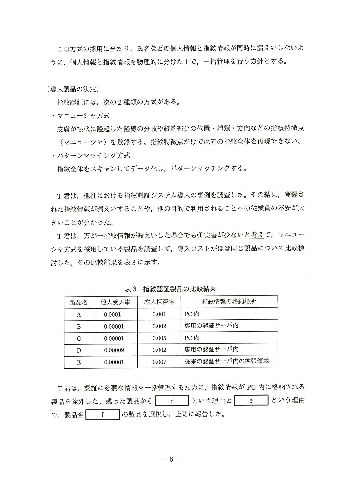

テキスト (OCR)

この方式の採用に当たり, 氏名などの個人情報と指紋情報が同時に漏えいしないよ
うに, 個人情報と指紋情報を物理的に分けた上で, 一括管理を行う方針とする。

〔導入製品の決定
指紋認証には, 次の 2 種類の方式がある。
・ マニューシャ方式
皮膚が線状に隆起した隆線の分岐や終端部分の位置・種類・方向などの指紋特徴点
(マニューシャ) を登録する。指紋特徴点だけでは元の指紋全体を再現できない。
・パターンマッチング方式
指紋全体をスキャンしてデータ化し, パターンマッチングする。

T Bld, 他社における指紋認証システム導入の事例を調査した。その結果, 登録さ
れた指紋情報が漏えいすることや, 他の目的で利用されることへの従業員の不安が大
きいことが分かった。

T Bld, 万が一指紋情報が漏えいした場合でも①実害が少ないと考えて, マニュー
シャ方式を採用している製品を調査して, 導入コストがほぼ同じ製品について比較検
討した。その比較結果を表 3 に示す。

表3 指紋認証製品の比較結果

製品名 | 他人受入率       本人拒否率                目紋情報の格納場所
A          0.0001             0.001        EC 内
B              0.00001                 0.002           専用の認証サーバ内
C          0.00001            0.005        PC 内
D              0.00009                 0.002           専用の認証サーバ内
E              0.00001                 0.007           従来の認証サーバ内の拡張領域

T 君は, 認証に必要な情報を一括管理するために, 指紋情報が PC 内に格納される

抽品を除外した。残った製品から|  q | という理由と| e | という理由
で, 製品名| { | の製品を選択し, 上司に報告した。

### ページ 7

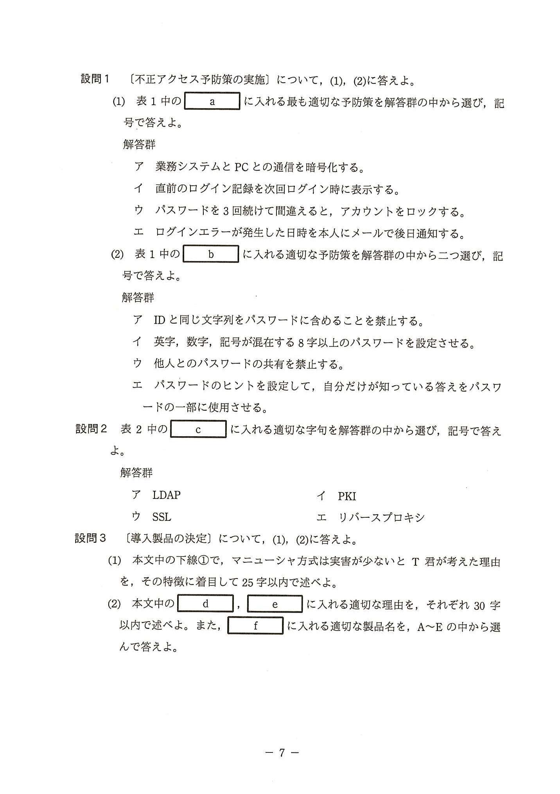

テキスト (OCR)

設問 1   (不正アクセス予防策の実施] について, ①, (②)に答えよ。
①) 表 1中の| a | に入れる最も適切な予防策を解管群の中から選び,
号で答えよ。
解答群
ア 業務システムと PC との通信を暗号化する。
イ 直前のログイン記録を次回ログイン時に表示する。
ウ パスワードを3 回続けて間違えると, アカウントをロックする。
エエ ログインエラーが発生した日時を本人にメールで後日通知する。
@ 表1中の| b |] に入れる適切な予防策を解答群の中から二つっ選び, 記
号で答えよ。
ARE
ア ID と同じ文字列をパスワードに含めることを禁止する。
イ RE, 数字, 記号が混在する 8 字以上のパスワードを設定させる。
ウ 他人とのパスワードの共有を禁止する。
エ パスワードのヒントを設定して, 自分だけが知っている答えをパスワ
ードの一部に使用させる。
設問2 表 2中の| c | に入れる適切な字句を解答群の中から選び, 記号で答え

out
cu

よ。
解答群
ア LDAP          イ PKI
ウ SSL           エ リバースプロキシ

設問3 [導入製品の決定〕】 について, 0), ②⑫)に答えよ。
Q) 本文中の下線ので, マニューシャ方式は実害が少ないと T 君が考えた理由
を, その特徴に着目して 25 字以内で述べよ。

②) 本文中の|  qd |,| = |に入れる適切な理由を, それぞれ 380 =
以内で述べよ。また, | f |] に入れる適切な製品名を, AEの中から選
んで答えよ。

### ページ 8

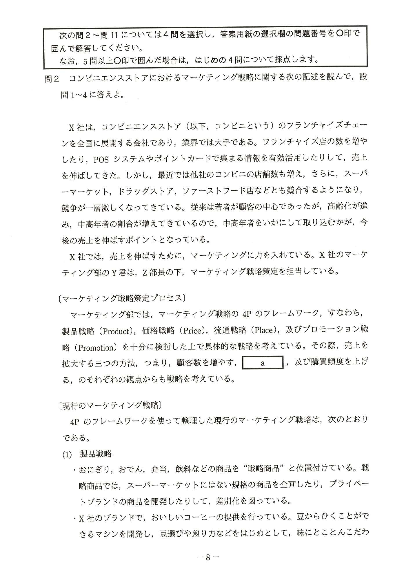

テキスト (OCR)

次の問2 ご問 11 については4問を選択し, 答案用紙の選択欄の問題番号を〇印で
囲んで解答してください。
なお, 5 問以上O印で囲んだ場合は, はじめの 4 問について採点します。

間2 コンビニエンスストアにおけるマーケティング戦略に関する次の記述を読んで, 設

間 1>4 に答えよ。

X 社は, コンビニエンスストア (以下, コンビニという) のフランチャイズチェー
ンを全国に展開する会社であり, 業界では大手である。フランチャイズ店の数を増や
したり, POS システムやポイントカードで集まる情報を有効活用したりして, 売
を伸ばしてきた。しかし, 最近では他社のコンビニの店舗数も増え, さらに, スーパ
ーマーケット, ドラッグストア, ファーストフード店などとも競合するようになり,
競争が一層激しくなってきている。 従来は若者が顧客の中心であったが, 高齢化が進
A, 中高年者の割合が増えてきているので, 中高年者をいかにして取り込むかが, 今
後の売上を伸ばすポイントとなっている。

X 社では, 売上を伸ばすために, マーケティングに力を入れている。X 社のマーケ
ティング部の Y El, Z 部長の下, マーケティング戦略策定を担当している。

[マーケティング戦略策定プロセス〕

マーケティング部では, マーケティング戦略の 4P のフレームワーク, すなわち,
製品戦略 (Product), 価格戦略 (Price), 流通戦略 (Place), 及びプロモーション戦
略 (Promotion) を十分に検討した上で具体的な戦略を考えている。その際, 売上を
拡大する三つの方法, つまり, MBPT, | 』 | , 及び購買頻度を上げ
る, のそれぞれの観点からも戦略を考えている。

[現行のマーケティング戦略]
4P のフレームワークを使って整理した現行のマーケティング戦略は, 次のとおり
である。
①) 製品戦略
・おにぎり, BCA, 弁当, 飲料などの商品を "戦略商品” と位置付けている。戦
略商品では, スーパーマーケットにはない規格の商品を企画したり, プライベニー
トブランドの商品を開発したりして, 差別化を図っている。
・X 社のブランドで, おいしいコーヒーの提供を行っている。豆からひくことがで
きるマシンを開発し, 豆選びや煎り方などをはじめとして, 味にとことんこだわ

ー8一

### ページ 9

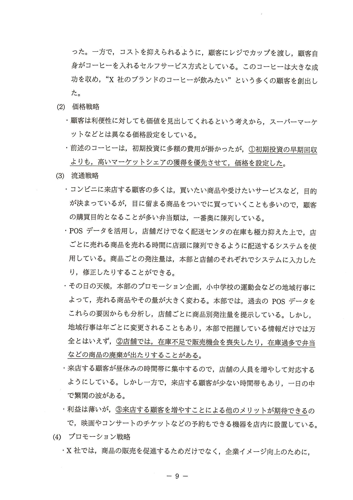

テキスト (OCR)

(2)

(3)

(4)

った。 一方で. コストを抑えられるように, 顧客にレジでカップを渡し, 顧客自
身がコーヒーを入れるセルフサービス方式としている。このコーヒーは大きな成
功を収め, “X 社のブランドのコーヒーが飲みたい"” という多くの顧客を創出し
た。

価格戦略

・ 願客は利便性に対しても価値を見出してくれるという考えから, スーパーマーケ

ットなどとは異なる価格設定をしている。

・ 前述のコーヒーは, 初期投資に多額の費用が掛かったが, ①初期投資の早期回収

よりも, 高いマーケットシェアの獲得を優先させて, 価格を設定した。

流通戦略

・コンビニに来店する顧客の多くは, 買いたい商品や受けたいサービスなど, 目的

が決まっているが, 目に留まる商品をついでに買っていくことも多いので, 顧客
の購買目的となることが多い弁当類は, 一番奥に陳列している。

‘POS データを活用し, 店舗だなけでなく配送センタの在庫も極力抑えた上で, 店

ごとに売れる商品を売れる時間に店頭に陳列できるように配送するシステムを使
用している。商品ごとの発注量は, 本部と店舗のそれぞれでシステムに入力した
り, 修正したりすることができる。

・ その日の天候, 本部のプロモーション企画, 小中学校の運動会ねどの地域行事に

よって, 売れる商品やその量が大きく変わる。本部では, 過去の POS データを
これらの要因からも分析し, 店舗ごとに商品別発注量を提示している。しかし

地域行事は年ごとに変更されることもあり, 本部で把握している情報だけでは万
全とはいえず, @店舗では, 在庫不足で販売機会を喪失したり, 在庫過多で弁当
などの商品の廃棄が出たりすることがある。

・ 来店する顧客が昼休みの時間帯に集中するので, 店舗の人員を増やして対応する

ようにしている。 しかし一方で, 来店する顧客が少ない時間帯もあり, 一日の中
で繁閑の波がある。

・ 利益は薄いが, ③来店する顧客を増やすことによる他のメリットが期待できるの

で, 映画やコンサートのチケットなどの予約もできる機器を店内に設置している。
プロモーション戦略

・X 社では, 商品の販売を促進するためだけでなく, 企業イメージ向上のために,

ー9 一

### ページ 10

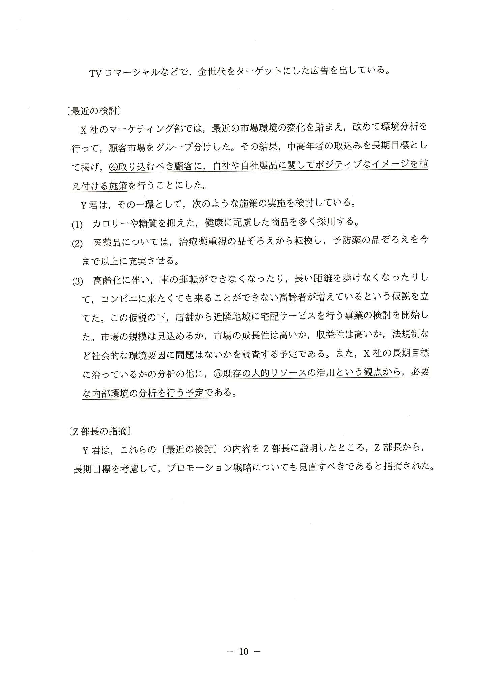

テキスト (OCR)

TV コマーシャルなどで, 全世代をターゲットにした広告を出している。

[最近の検討]

X 社のマーケティング部では, 最近の市場環境の変化を踏まえ, 改めて環境分析を
行って, 顧客市場をグループ分けした。 その結果, 中高年者の取込みを長期目標とし
て掲げ ④取り込むべき顧客に, 自社や自社製品に関してポジティブなイメージを植
え付ける施策を行うことにした。

Y 君は, その一環として, 次のような施策の実施を検討している。

(1) カロリーや糖質を抑えた, 健康に配慮した商品を多く採用する。

(2) 医薬品については, 治療薬重視の品ぞろえから転換し, 予防薬の品ぞろえを今
まで以上に充実させる。

(3) 高齢化に伴い, 車の運転ができなくなったり, 長い距離を歩けなくなったりし
て, コンビニに来たくても来ることができない高齢者が増えているという仮説を立
てた。この仮説の下, 店舗から近隣地域に宅配サービスを行う事業の検討を開始し
た。市場の規模は見込めるか, 市場の成長性は高いか, 収益性は高いか, 法規制な
ど社会的な環境要因に問題はないかを調査する予定である。また, X 社の長期目標
に沿っているかの分析の他に, ⑤既存の人的リソースの活用という観点から, 必要
な内部環境の分析を行う予定である。

(Z 部長の指摘〕
YAlk, これらの[最近の検討】の内容を Z 部長に説明したところ, Z 部長から,
長期目標を考慮して, プロモーション戦略についても見直すべきであると指摘された。

ー 10 一

### ページ 11

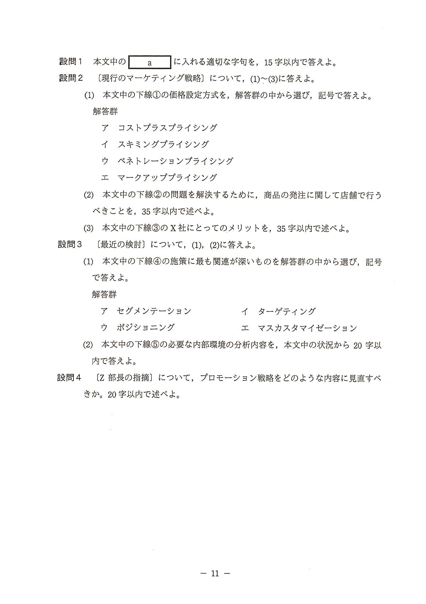

テキスト (OCR)

設問1 本文中の| a |に入れる適切な字句を, 15字以内で答えよ。
設問2 現行のマーケティング戦略】 について, ①~(3)に答えよ。
Q) 本文中の下線①の価格設定方式を, 解答群の中から選び, 記号で答えよ。
fea
ア コストプラスプライシング
イ スキミングプライシング
ウ ペネトレーションプライシング
エ マークアッププライシング
2) 本文中の下線②の問題を解決するために, 商品の発注に関して店舗で行う
べきことを, 35 字以内で述べよ。
3) 本文中の下線③の X社にとってのメリットを, 35 字以内で述べよ。
設問3 〔最近の検討について, ①, (⑫)に答えよ。

Q①) 本文中の下線④の施策に最も関連が深いものを解答群の中から選び, 記号
で答えよ。
解答群
ア セグメンテーション         イ ウーがディウツグ
ウ ポジショニング        エ マスカスタマイゼーション
(②) 本文中の下線⑥⑤の必要な内部環境の分析内容を, 本文中の状況から 20 FL
内で答えよ。

設問4 [2 部長の指摘})】について, プロモーション戦略をどのような内容に見直すべ
きか。 20 字以内で述べよ。

ー 11 一

### ページ 12

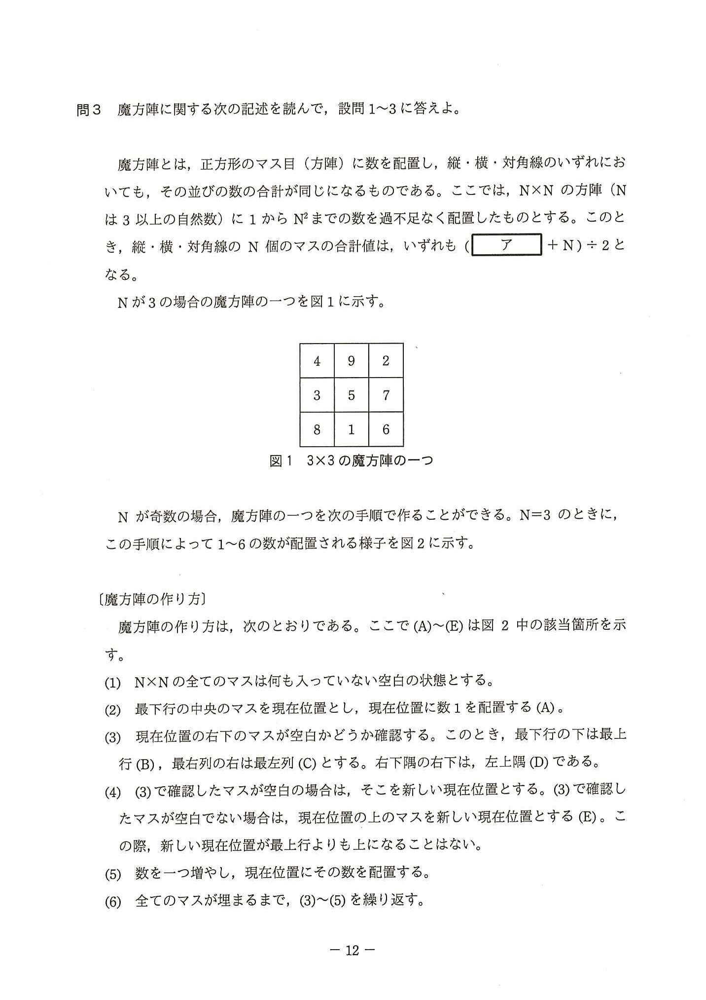

テキスト (OCR)

FAS 魔方陣に関する次の記述を読んで, 設問 1ー3 に答えよ。

REAWE LIL, 正方形のマス目 (方陣) に数を配置し, 縦・横・対角線のいずれにお
いても, その並びの数の合計が同じになるものである。ここでは, NXN OAM (N
は 3 以上の自然数) に 1 から N” までの数を過不足なく配置したものとする。このと
き, 縦・横・対角線の N 個のマスの合計値は。いずれも(| ア |]+N)+2と
なる。

N が3の場合の魔方陣の一つを図 1 に示す。

4  9  2
3   5   7
8   1   6

図1 3X3の魔方陣の一つ

N が奇数の場合, 魔方陣の一つを次の手順で作ることができる。N=3 のときに,
この手順によって 1~6 の数が配置される様子を図 2 に示す。

(BETH BED HEV Fi)
魔方陣の作り方は, MOLBYV CHS, COC(A~@ は図 2 中の該当箇所を示
す。
GQ) NXN の全てのマスは何も入っていない空白の状態とする。
Q) 最下行の中央のマスを現在位置とし, 現在位置に数 1 を配置する (A).

3) 現在位置の右下のマスが空白かどうか確認する。このとき, 最下行の下は最上
行 (B) , 最右列の右は最左列 (C) とする。右下隅の右下は, 左上隅 (D) である。
(4) (3)で確認したマスが空白の場合は, そこを新しい現在位置とする。(③) で確認し
たマスが空白でない場合は, 現在位置の上のマスを新しい現在位置とする E) 。こ
OB, 新しい現在位置が最上行よたりも上になることはない。

(5) 数を一つ増やし, 現在位置にその数を配置する。
(6) 全てのマスが埋まるまで, (3)て(5) を繰り返す。

ー 12 一

### ページ 13

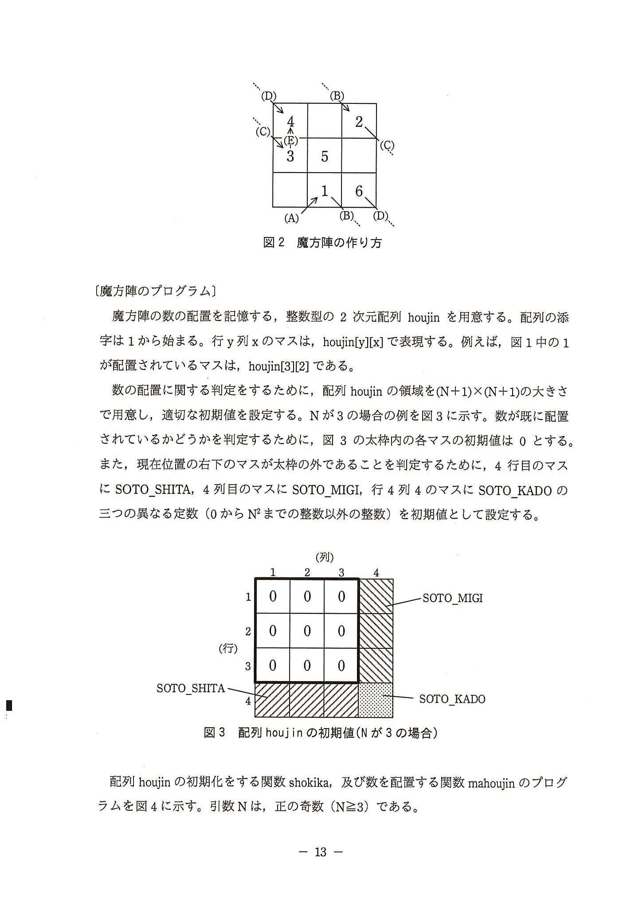

テキスト (OCR)

“@)          “®)

io

4
A
NO)                 ©
3 | 5             :

1      6
(A)         ⑧)、   ⑥)
図2 魔方陣の作り方

(BEA MOP ATS A)

魔方陣の数の配置を記憶する, 整数型の 2 次元配列 houjin を用意する。配列の添
FILL から始まる。 行列x のマスは, houjin[y]lx] で表現する。例えば, 図 1中の1
が配置されているマスは, houjin[3][2] である。

数の配置に関する判定をするために, 配列 houjin の領域を(N二1)X(N十1)の大きさ
で用意し, 適切な初期値を設定する。Nが3 の場合の例を図 3 に示す。数が既に配置
されているかどうかを判定するために, 図 3 の太枠内の各マスの初期値は 0 とする。
また, 現在位置の右下のマスが太枠の外であることを判定するために, 4 行目のマス
に SOTO_SHITA, 4 列目のマスに SOTO_MIGI, 行 4 列4 のマスに SOTO_KADO の
三つの異なる定数 (0 から N? までの整数以外の整数) を初期値として設定する。

Gil)
a 4
1| 0 | 0 | 0  リンーーSOTO_MIGI
21 0 | 0] 0 WN
(行)
3 1 0 | 0 | 0
SOTO_SHITA
ー  ーールル多      ーー SOTO KADO

図3 配列houjin の初期値(N が 3 の場合)

配列 houjin の初期化をする関数 shokika, 及び数を配置する関数 mahoujiin のプログ
ラムを図 4 に示す。引数 N は, 正の奇数 (N23) CHS,

ー 13 一

### ページ 14

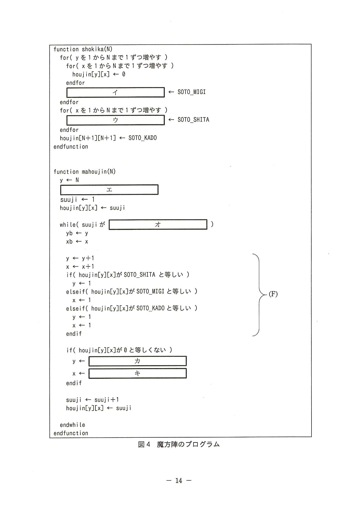

テキスト (OCR)

function shokika(N)
for( yを1からNまで1ずつ増やす )
for( xを1からNまで1 ずつ増やす )
houjin[y][x] <— 9

endfor

| 4 | <— SOTO_MIGI
endfor

for( xを1からNまで 1 ずつ増やす )

|             ウ             | - SOTO_SHITA
endfor

houjin[N+1][N+1] < SOTO_KADO
endfunction

function mahoujin(N)
yとN
|           エ
suuji <— 1
houjin[y][x] <— suuji

while( suuji が |           オ           | )
yb <— y
xb — x

ye ytl
x で x十1
if( houjin[y][x]が SOTO_SHITA と等しい )
yと1
elseif( houjin[y][x]が SOT0_MIGI と等しい )                 (F)
xe]
elseif( houjin[y][Lx]が SOTO _KADO と等しい )
yと1
x <— 1

endif

if( houjin[y][x]が 0 と等しくない )

yて|     カ     |
x= |     キ     |
endif

suuji で suuji十1
houjin[y][x] と suuji

endwhile
endfunction

図4 魔方陣のプログラム

ー 14 一

### ページ 15

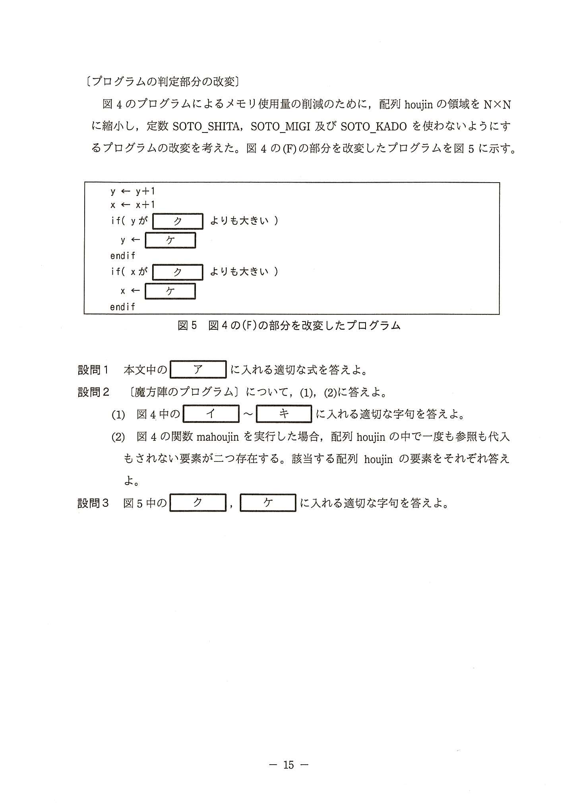

テキスト (OCR)

[プログラムの判定部分の改変〕

 4 のプログラムによるメモリ使用量の削減のために, 配列 houjin の領域を NxN
に縮小し, 定数 SOTO_SHITA, SOTO_MIGI 及び SOTO_KADO を使わないようにす
るプログラムの改変を考えた。図 4 OP の部分を改変したプログラムを図 5 に示す。

y と y†1
x で x十1

if(yが| ク | よりも大きい )
5てしヶ |

endif
if( xが| ク | よりも大きい )
ーしラコ

endif

図5 図4の(F)の部分を改変したプログラム

設問1 本文中の[| ア | に入れる適切な式を答えよ。
設問2 【〔魔方陣のプログラム〕 について, ①⑪, (②)に答えよ。
Q) 図4中の| イ |~| キ |に入れる適切な字句を答えよ。
(2) 図 4 の関数 mahoujin を実行した場合, 配列 houjin の中で一度も参照も代入
もされない要素がニつ存在する。該当する配列 houjin の要素をそれぞれ管え
よ。

設問3 図5中の| ク |,| + |に入れる適切な字旬を答えよ。

ー 15 一

### ページ 16

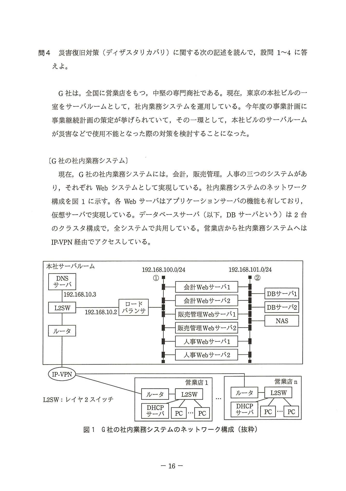

テキスト (OCR)

問4 災害復旧対策 (ディザスタリカバリ) に関する次の記述を読んで, 設問 1ご4 に答

えよ。

G 社は, 全国に営業店をもつ, 中堅の専門商社である。現在, 東京の本社ビピルの一
室をサーバルームとして, 社内業務システムを運用している。今年度の事業計画に
事業継続計画の策定が挙げられていて, その一環として, 本社ビルのサーバルーム
が災害などで使用不能となった際の対策を検討することになった。

〔G 社の社内業務システム〕

現在, G 社の社内業務システムには, Bit, 販売管理, 人事の三つのシステムがあ
り, それぞれ Web システムとして実現している。社内業務システムのネットワーク
構成を図 1 に示す。各 Web サーバはアプリケーションサーバの機能も有しており,
仮想サーバで実現している。データベースサーバ (以下, DB サーバという) は 2 台
のクラスタ構成で, 全システムで共用している。営業店から社内業務システムへは
IP-VPN 経由でアクセスしている。

本社サーバルーム                         192.168.100.0724                       192.168.101.0/24
DNS
サーバ
192.168.10.3                              :
= |              ロード                                        —
Lsw |  192.168.10.2| バランサ                            DBサーバ2

_ se

(P-VPN)
営業店 1                            営業店n
ルータ
L2SW : レイヤ 2 スイッチ
DHCP
サーバ

図1 G社の社内業務システムのネットワーク構成 (抜粋)

ー 16 一

### ページ 17

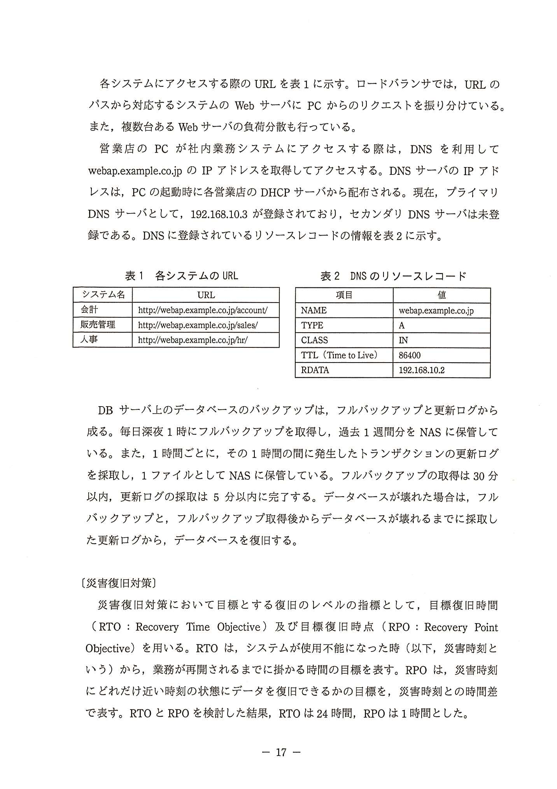

テキスト (OCR)

各システムにアクセスする際の URL を表 1 に示す。ロードバランサでは, URL の
パスから対応するシステムの Web サーバに PC からのリクエストを振り分けている。
Kk, 複数台ある Web サーバの負荷分散も行っている。

営業店の PC が社内業務システムにアクセスする際は, DNS を利用して
webap.example.co.jp の IP アドレスを取得してアクセスする。DNS サーバの IP アド
レスは, PC の起動時に各営業店の DHCP サーバから配布される。 現在, プライマリ
DNS サーバとして, 192.168.10.3 が登録されており, セカンダリ DNS サーバは未登
録である。DNS に登録されているリソースレコードの情報を表 2 に示す。

表1 各システムのURL           表2 DNS のリソースレコード
システム名           URL                  項目             fe
会計             http://webap.example.co.jp/account/           NAME                       webap.example.co.jp
販売管理        http://webap.example.co,jp/sales/              TYPE                        A
At             http://webap.example.co.jp/hr/                 CLASS                       IN
TTL (Time to Live)     86400
RDATA                       192.168.10.2

DB サーバ上のデータベースのバックアップは, フルバックアップと更新ログから
成る。毎日深夜 1 時にフルバックアップを取得し, 過去 1 週間分を NAS に保管して
いる。 また, 1 時間ごとに, その 1 時間の間に発生したトランザクションの更新ログ
を採取し, 1 ファイルとして NAS に保管している。フルバックアップの取得は 30 分
以内, 更新ログの採取は 5 分以内に完了する。データベースが壊れた場合は, フル
バックアップと, フルバックアップ取得後からデータベースが壊れるまでに採取し
た更新ログから, データベースを復旧する。

〔秋害復旧対策)
炎定復旧対策において目標とする復旧のレベルの指標として, 目標復旧時間
(RTO : Recovery Time Objective) 及び目標復旧時点 (RPO : Recovery Point
Objective) を用いる。RTO は, システムが使用不能になった時 (以下, 災害時刻と
いう) から, 業務が再開されるまでに掛かる時間の目標を表す。RPO ld, 災害時刻
にどれだけ近い時刻の状態にデータを復旧できるかの目標を, 災害時刻との時間差
CHI. RTO と RPO を検討した結果, RTO は 24 時間, RPO は1時間とした。

ー 17 一

### ページ 18

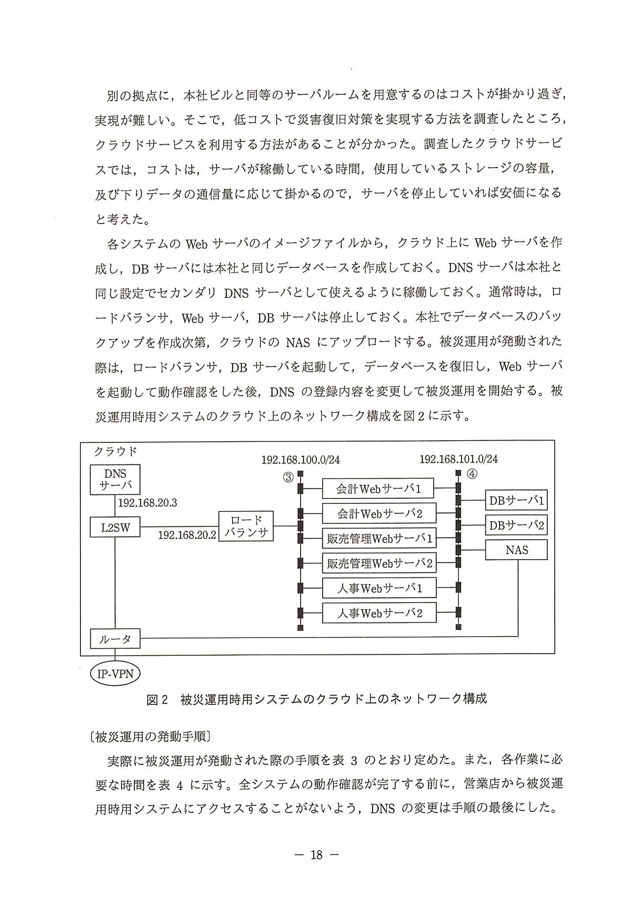

テキスト (OCR)

別の拠点に, 本社ビルと同等のサーバルームを用意するのはコストが掛かり過ぎ,
実現が難しい。そこで, 低コストで災害復旧対策を実現する方法を調査したところ,
クラウドサービスを利用する方法があることが分かった。調査したクラウドサービ
スでは, コストは, サーバが稼働している時間, 使用しているストレージの容量,
及び下りデータの通信量に応じて掛かるので, サーバを停止していれば安価になる
と考えた。

各システムの Web サーバのイメージファイルから, クラウド上に Web サーバを作
RL, DB サーバには本社と同じデータベースを作成しておく。DNS サーバは本社と
同じ設定でセカンダリ DNS サーバとして使えるように稼働しておく。通常時は, ロ
ードバランサ, Web サーバ, DB サーバは停止しておく。本社でデータベースのバッ
クアップを作成次第, クラウドの NAS にアップロードする。 被災運用が発動された
際は, ロードバランサ, DB サーバを起動して, データベースを復旧し, Web サーバ
を起動して動作確認をした後, DNS の登録内容を変更して被災運用を開始する。被
災運用時用システムのクラウド上のネットワーク構成を図 2 に示す。

クラウド
192.168.100.0/24                  192.168.101.0/24
DNS                                    ⑨③                                       る
Tsuen
ーー                     ロード                 会計Webサーバ2                          =
Lusw |    192.168.20.2| バランサ        |  も管理Webサー    =!
‘oom
| aan |
ルータ
図2 被災運用時用システムのクラウド上のネットワーク構成
【被災運用の発動手順]

実際に被災運用が発動された際の手順を表 3 のとおり定めた。また, 各作業に必
要な時間を表 4 に示す。全システムの動作確認が完了する前に, 営業店から被災運
用時用システムにアクセスすることがないよう, DNS の変更は手順の最後にした。

ー 18 一

### ページ 19

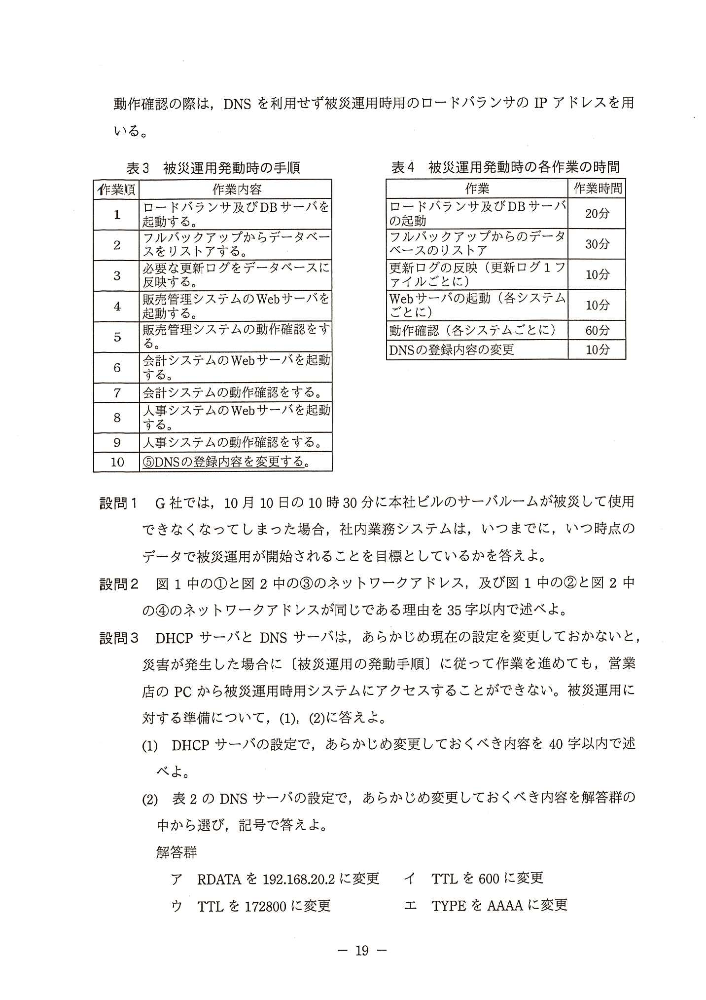

テキスト (OCR)

動作確認の際は, DNS を利用せず被災運用時用のロードバランサの IP アドレスを用
いる。

表3 被災運用発動時の手順

表4 被災運用発動時の各作業の時間

作業順             作業内容                                   作業              作業時間
1   ロードバランサ及びDB サーバを       ロードバランサ及びDB サーバ  20分
起動する。                                 の起動
2   フルバックアップからデータベー       フルバックアップからのデータ   30分
スをリストアする。           ベースのリストア
っ |必要な更新ログをデータベースに      更新ログの反映 (更新ログ1フ| yyy
反映する。                               ァイルごとに)
4   販売管理システムのWebサーバを          Web サーバの起動 (各システム   10分
起動する。                                 ごとに)
   PRR AT SORE EY         動作確認 (各システムごとに)     60分
°                                                Is gs
。 [RID AT AO WaT eRe          BEE dee            me
る。
7 |会計システムの動作確認をする。
人事システムのWebサーバを起動
Bree
9 |人事システムの動作確認をする。
10 |⑥DNSの登録内容を変更する。
設問1 G社では, 10 月 10 日の 10 時 30 分に本社ビルのサーバルームが被災して使用

できなくなってしまった場合, 社内業務システムは, いつまでに, いつ時点の
データで被鱗運用が開始されることを目標としているかを答えよ。
設問2 図 1 中の①と図 2 中の③のネットワークアドレス, 及び図 1 中の②と図 2 中
の④のネットワークアドレスが同じである理由を 35 字以内で述べよ。
設問3 DHCP サーバと DNS サーバは, あらかじめ現在の設定を変更しておかないと,
災害が発生した場合に【被災運用の発動手順〕 に従って作業を進めても, 営業
店の PC から被災運用時用システムにアクセスすることができない。 被災運用に

対する準備について, ①, ②に答えよ。

①) DHCP サーバの設定で, あらかじめ変更しておくべき内容を 40 字以内で述

raters

Q) R2ODNSY-NOKRETC, あらかじめ変更しておくべき内容を解答群の

中から選び, 記号で答えよ。
解答群

ア RDATA を 192.168.20.2 に変更 イ TTLを600に変更

ウ TTLを172800 に変更

TYPE を AAAA に変更

### ページ 20

テキスト (OCR)

設問4 [被災運用の発動手順] について, ①, ②に答えよ。
(1) 10 月 10 日の 10 時30 分に本社ビルのサーバルームが被災して使用できなく
なってしまい, 11 時に被災運用を発動した場合, 社内業務システムは, いつ
から被災運用が開始できるかを答えよ。
2) 表 3 中の下線⑥で変更する登録内容について, 表 2 の項目と変更後の値を

答えよ。

ー 20 一

### ページ 21

テキスト (OCR)

a |

〔

x = 用 紙 J

ー 21 一

### ページ 22

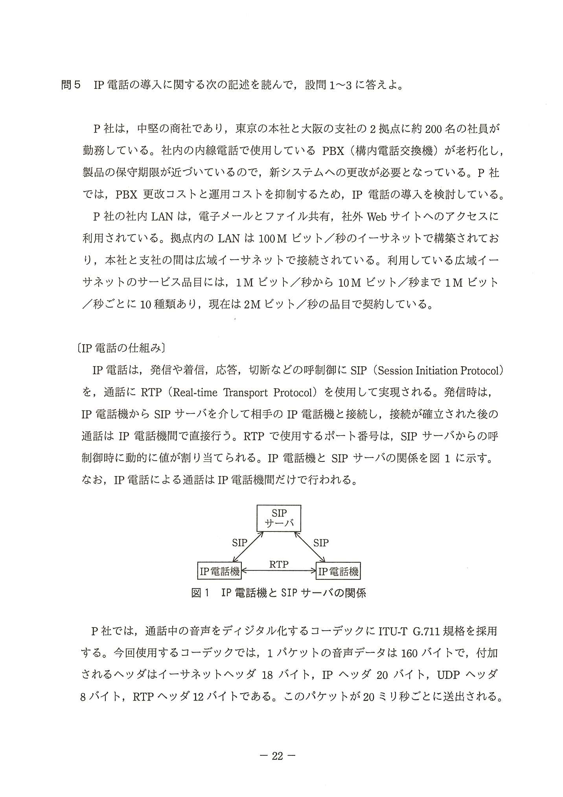

テキスト (OCR)

問5 P電話の導入に関する次の記述を読んで, 設問13 に答えよ。

P 社は, 中堅の商社であり, 東京の本社と大阪の支社の 2 拠点に約 200 名の社員が
勤務している。社内の内線電話で使用している PBX (構内電話交換機) が老朽化し,
製品の保守期限が近づいているので, 新システムへの更改が必要となっている。P 社
では, PBX 更改コストと運用コストを抑制するため, TP 電話の導入を検討している。

P 社の社内 LAN は, 電子メールとファイル共有, 社外 Web サイトへのアクセスに
利用されている。 拠点内の LAN は 100M ビットノ秒のイーサネットで構築されてお
り, 本社と支社の間は広域イーサネットで接続されている。利用している広域イー
サネットのサービス品目には, 1M ビットノ秒から 10M ビットノ秒まで 1M ビット
SPT EAC 10 種類あり, 現在は 2M ビットノ秒の品目で契約している。

(IP 電話の仕組み〕

TP 電話は, 発信や着信, 応答, 切断などの呼制御に SIP (Session Initiation Protocol)
を, 通話に RTP (Real-time Transport Protocol) を使用して実現される。 発信時は,
TP 電話機から SIP サーバを介して相手の IP 電話機と接続し, 接続が確立された後の
通話は IP 電話機問で直接行う。RTP で使用するポート番号は, SIP サーバからの呼
制御時に動的に値が割り当てられる。TP 電話機と SIP サーバの関係を図 1 に示す。
なお, IP 電話による通話は TP 電話機問だけで行われる。

SIP
ザーが

SIP,                            SIP

 EE

図1 IP 電話機と SIP サーバの関係

PHC, 通話中の音声をディジタル化するコーデックにITU-T G.711 規格を採用
する。今回使用するコーデックでは, 1 パケットの音声データは 160 バイトで, 付加
されるヘッダはイーサネットヘッダ 18 バイト, IP ヘッダ 20 バイト, UDP ヘッダ
8バイト, RTP ヘッダ 12 バイトである。このパケットが20 ミリ秒ごとに送出される。

ー 22 一

### ページ 23

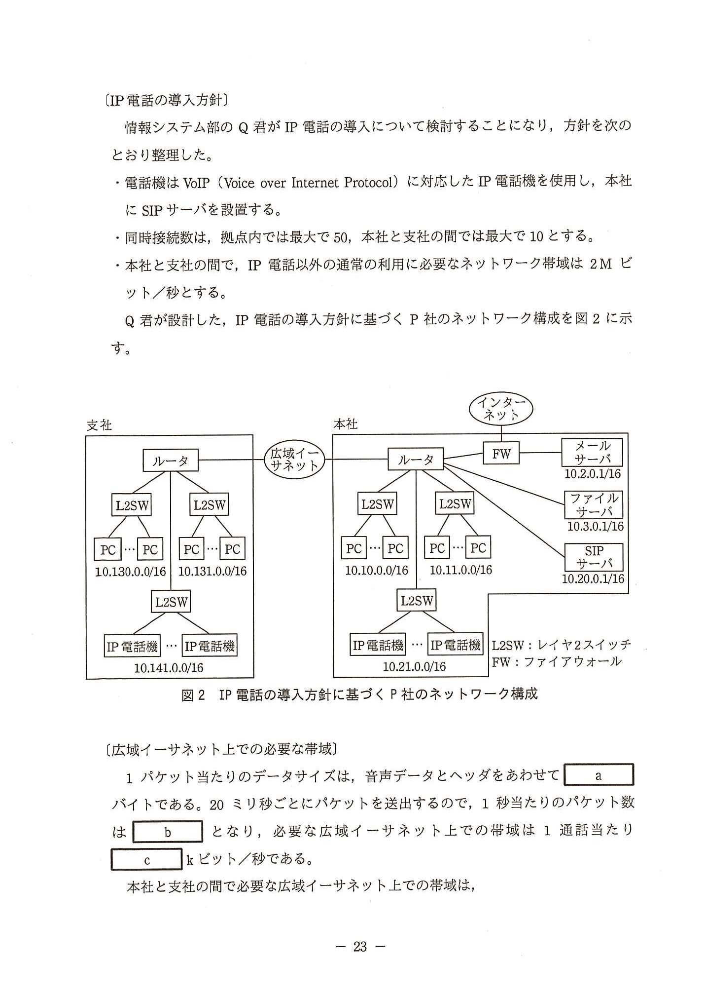

テキスト (OCR)

[IP 電話の導入方針〕
情報システム部の Q BM TP 電話の導入について検討することになり, 方針を次の
とおり整理した。
・ 電話機は VoIP (Voice over Internet Protocol) に対応した IP 電話機を使用し, 本社
に SIP サーバを設置する。
・同時接続数は, 拠点内では最大で 50, 本社と支社の間では最大で 10 とする。
・本社と支社の間で, IP 電話以外の通常の利用に必要なネットワーク帯域は 2M ビ
ットノ秒とする。
Q 君が設計した, TP 電話の導入方針に基づく P 社のネットワーク構成を図 2 に示
す。

支社                                         Ath

メール
サーバ
10.2.0.1/16

ファイル
サーバ

ルータ                      サネット                      ル
L2SW             L2SW                                       L2SW
10.3.0.1/16

[zo]~[re] | [pc] ~[Pc]            [pc}--[pc] | [pc] ~[pc]            SP

10,130.0.0/16 | 10.131.0.0/16                    10.10.0.0/16 | 10.11.0.0/16                 サザサーバ
/                と                 10.20.0.1/16

L2SW : レイヤ2スイッチ
10.141.0.0716                                       10.21.0.016          FW : ファイアウォール

図 2 IP電話の導入方針に基づく『P 社のネットワーク構成

[広域イーサネット上での必要な帯域]

1 パケット当たりのデータサイズは, 音声データとヘッダをあわせて|  。 |
バイトである。20 ミリ秒ごとにパケットを送出するので, 1 秒当たりのパケット数
は [| b |] となり, 必要な広域イーサネット上での帯域は 1 通話当たり

[| < |kピットノ秒である。

本社と支社の間で必要な広域イーサネット上での帯域は,

### ページ 24

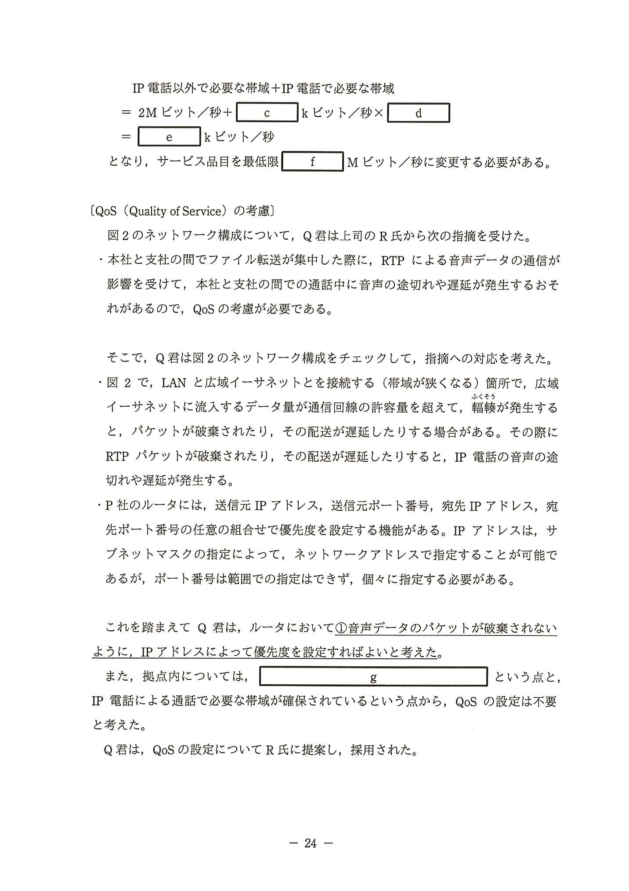

テキスト (OCR)

IP 電話以外で必要な半域TP SE CLE A
2M ピットノ秒+| c |kピットノ秒x[ da ]
=| e |]kピットノ移

となり, サービス品目を最低限| { | Mピビットノ秒に変更する必要がある。

ll

(QoS (Quality of Service) の考慮]
図 2のネットワーク構成について, Q 君は上司の R 氏から次の指摘を受けた。
・本社と支社の間でファイル転送が集中した際に, RTP による音声データの通信が
影響を受けて, 本社と支社の間での通話中に音声の途切れや遅延が発生するおそ
れがあるので, QoS の考慮が必要である。

そこで, Q 君は図2 のネットワーク構成をチェックして, 指拉への対応を考えた。
・図 2 で, LAN と広域イーサネットとを接続する CHAS RS) 箇所で, 広域
イーサネットに流入するデータ量が通信回線の許容量を超えて, METS
と, パケットが破棄されたり, その配送が遅延したりする場合がある。 その際に
RIP パケットが破棄されたり, その配送が遅延したりすると, TP 電話の音声の途
切れや運延が発生する。

・P 社のルータには, 送信元 IP アドレス, 送信元ポート番号, 宛先TP アドレス, 宛
先ポート番号の任意の組合せで優先度を設定する機能がある。IP アドレスは,サ
プネットマスクの指定によって, ネットワークアドレスで指定することが可能で
あるが, ポート番号は範囲での指定はできず, 個々に指定する必要がある。

これを踏まえて Q Blk, ルータにおいて①音声データのパケットが破棄されない
ように, IP アドレスによって優先度を設定すればよいと考えた。

また, 拠点内については, |        g        | という点と
TP 電話による通話で必要な帯域が確保されているという点から, QoS の設定は不要
と考えた。

Q 君は, QoS の設定について R 氏に提案し, 採用された。

ー24 一

### ページ 25

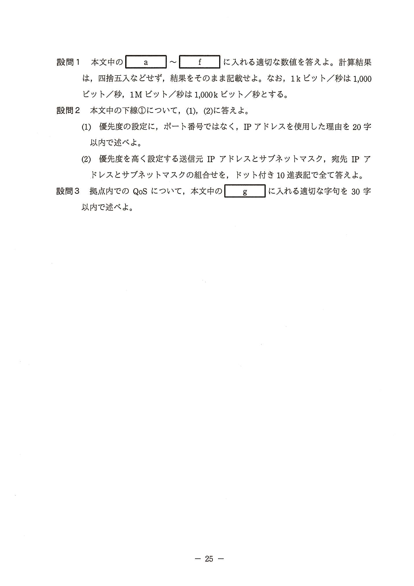

テキスト (OCR)

設問1 本文中の| a |~|  f |に入れる適切な数値を答えよ。計算結果
は, 四捨五入かどせず, 結果をそのまま記載せよ。なお, 1k ビットノ秒は 1.000
ビットノ秒, 1M ビットノ秒は 1.000k ビットノ秒とする。
設問2 本文中の下線やについて, ①⑪, ⑫)に答えよ。
1①) 優先度の設定に, ポート番号ではなく, IP アドレスを使用した理由を 20 字
以内で述べよ。
(2) 優先度を高く設定する送信元 P アドレスとサブネットマスク, 宛先 P ア
ドレスとサブネットマスクの組合せを, ドット付き 10 進表記で全て答えよ。
設問3 拠点内での QoS について, 本文中の| gz |] に入れる適切な字句を 30 =
以内で述べよ。

### ページ 26

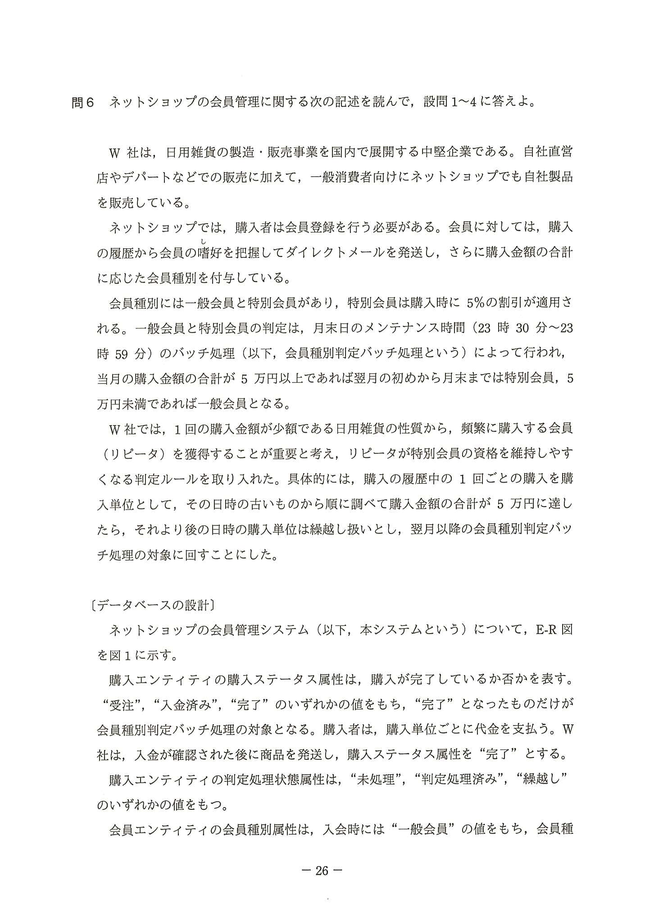

テキスト (OCR)

間6 ネットショップの会員管理に関する次の記述を読んで, 設問 1ユー4 に答えよ。

W 社は, 日用雑貨製造・販売事業を国内で展開する中堅企業である。自社直営
店やデパートなどでの販売に加えて, 一般消費者向けにネットショップでも自社製品
を販売している。

ネットショップでは, 購入者は会員登録を行う必要がある。会員に対しては, 購入
の履歴から会員の嗜好を把握してダイレクトメールを発送し, さらに購入金額の合計
に応じた会員種別を付与している。

会員種別には一般会員と特別会員があり, 特別会員は購入時に 5%の割引が適用さ
れる。 一般会員と特別会員の判定は, 月末日のメンテナンス時間 (23 時 30 分こ23
時 59 分) のバッチ処理 (以下, 会員種別判定バッチ処理という) によって行われ,
YG OMAGMO SED 5 万円以上であれば翌月の初めから月末までは特別会員, 5
万円未満であれば一般会員となる。

WHT, 1 回の購入金額が少額である日用雑貨の性質から, 頻繁に購入する会員
(リピータ) を獲得することが重要と考え, リピータが特別会員の資格を維持しやす
くなる判定ルールを取り入れた。具体的には。 購入の履歴中の 1 回ごとの購入を購
入単位として, その日時の古いものから大に調べて購入金額の合計が 5 万円に達し
たら, それより後の日時の購入単位は緑越し扱いとし, 翌月以降の会員種別判定バッ
チ処理の対象に回すことにした。

[データベースの設計〕

ネットショップの会員管理システム (以下, 本システムという) について, E-R 図
を図 1 に示す。

購入エンティティの購入ステータス属性は, 購入が完了しているか否かを表す。
受注”, “入金済み”, “ET” のいずれかの値をもち, “HT” となったものだけが
会員種別判定バッチ処理の対象となる。購入者は, 購入単位ごとに代金を支払う。W
社は, 入金が確認された後に商品を発送し, 購入ステータス属性を“完了” とする。
購入エンティティの判定処理状態属性は, “未処理", “判定処理済み”, “繰越し"
のいずれかの値をもつ。

会員エンティティの会員種別属性は, 入会時には “一般会員” の値をもち, 会員種

ー 26 一

### ページ 27

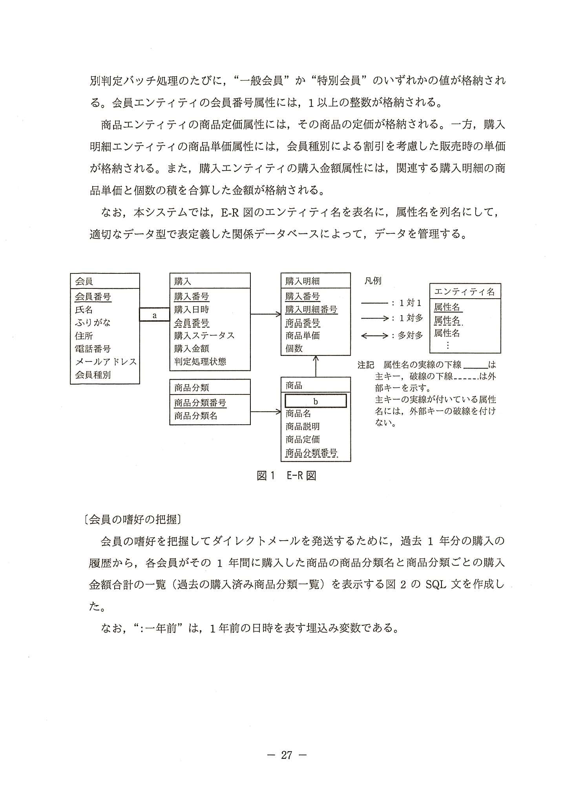

テキスト (OCR)

別判定バッチ処理のたびに, “一般会員” か“特別会員" のいずれかの値が格納され
る。 会員エンティティの会員番号属性には, 1 以上の整数が格納される。

品エンティティの商品定価属性には, その商品の定価が格納される。 一方, 購入
明細エンティティの商品単価属性には, 会員種別による割引を考慮した販売時の単価
が格納される。また, 購入エンティティの購入金額属性には, 関連する購入明細の商
品単価と個数の積を合算した金額が格納される。

BS, 本システムでは, E-R 図のエンティティ名を表名に, 属性名を列名にして,
適切なデータ型で表定義した関係データベースによって, データを管理する。

会員            購入              購入明細       凡例
会員番号          購入番号            WARS            _T  BORAT AB
氏名         ー | 購入日時            購入明細番号        -      属性名
さりがな       会員番号         商品番号     AS | tee
住所            購入ステータス        商品単価      <> : 多対多 | 居性名
電語番号          購入金額            個数                      :
メールアドレス     判定処理状態                   注記 属性名の実線の下線___ は
会員種別                                        主キー, 破線の下線-----.は外
商品分類            商品           部キーを示す。
a     3             b         主キーの実線が付いている展性
        Le    名には, 外部キーの破線を付け
商品説明        に
商品定価
商品分類番号
図1 E-R図

[会員の嗜好の把握]

会員の嗜好を把握してダイレクトメールを発送するために, 過去 1 年分の購入の
履歴から, 各会員がその 1 年間に購入した商品の商品分類名と商品分類ごとの購入
金額合計の一覧 (過去の購入済み商品分類一覧) を表示する図 2 の SQL 文を作成し
だな。

なお, “:一年前” は, 1 年前の日時を表す埋込み変数である。

### ページ 28

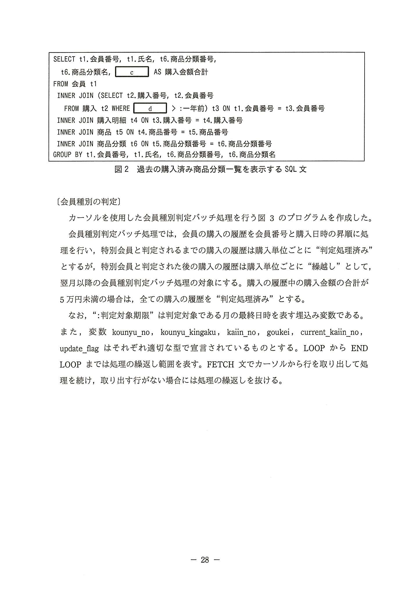

テキスト (OCR)

SELECT t1.会員番号, t1.氏名, t6.商品分類番号,
16.商品分類名 AS 購入金額合計
FROM 会員 t1
INNER JOIN (SELECT t2.購入番号, t2. 会員番号
FROM 購入 t2 WHERE | d | >:一年前) t3 ON t1.会員番号 = 13.会員番号
INNER JOIN 購入明細 t4 ON t3.購入番号 = t4.購入番号
INNER JOIN 商品 t5 ON 4.商品番号 = t5.商品番号

INNER JOIN 商品分類 t6 ON t5.商品分類番号 = t6.商品分類番号
GROUP BY t1.会員番号, t1.氏名, 6.商品分類番号, 6.商品分類名

図2 過去の購入済み商品分類一覧を表示する SQL文

〔会員種別の判定

カーソルを使用した会員種別判定バッチ処理を行う図 3 のプログラムを作成した。

会員種別判定バッチ処理では, 会員の購入の履歴を会員番号と購入日時の昇順に処
理を行い, 特別会員と判定されるまでの購入の履歴は購入単位ごとに 判定処理済み"
とするが, 特別会員と判定された後の購入の履歴は購入単位ごとに “繰越し" として,
翌月以降の会員種別判定バッチ処理の対象にする。購入の履歴中の購入金額の合計が
5 万円未満の場合は, 全ての購入の履歴を “判定処理済み” とする。

BS, “:判定対象期限” は判定対象である月の最終日時を表す埋込み変数である。
また, 変数 kounyu no, kounyu_kingaku, kaiin no, goukei, current kaiin no,
update fag はそれぞれ適切な型で宣言されているものとする。LOOP から END
LOOP までは処理の繰返し範囲を表す。FETCH 文でカーソルから行を取り出して処
理を続け, 取り出す行がない場合には処理の繰返しを抜ける。

— 28 一

### ページ 29

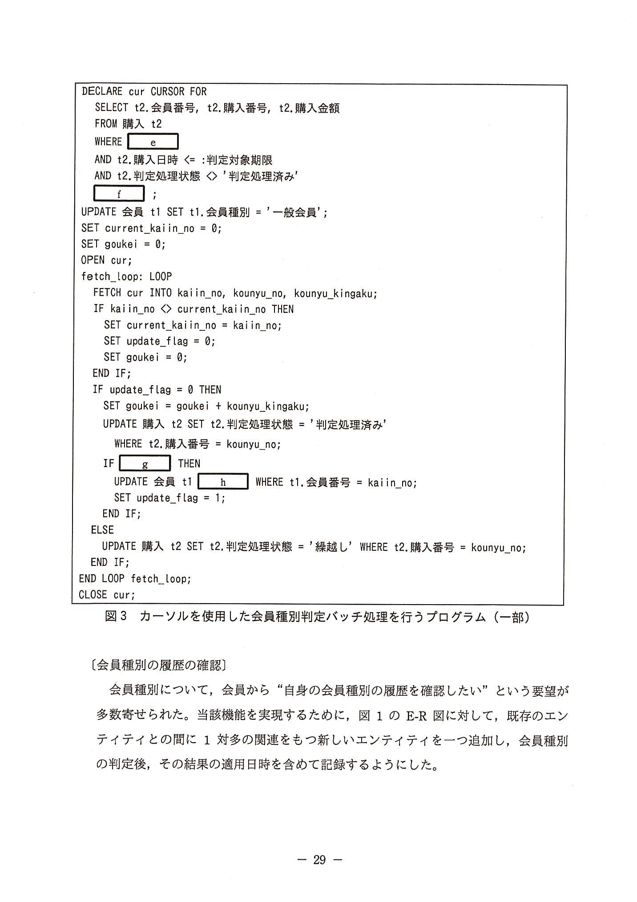

テキスト (OCR)

DECLARE cur CURSOR FOR
SELECT 12, SASS, t2.購入番号, t2.購入金額
FROM 購入 12
WHERE | 。 ]
AND 12.購入日時 <= :判定対象期限
AND 12.判定処理状態  '判定処理済み"

 !

UPDATE 会員 t1 SET t1.会員種別 = '一般会員':
SET current_kaiin no = 0;

SET goukei = 0;

OPEN cur;

fetch_loop: LOOP
FETCH cur INTO kaiin_no, kounyu_no, kounyu_kingaku;
IF kaiin_no <> current_kaiin_no THEN
SET current_kaiin_no = kaiin_no;
SET update_flag = 0;
SET goukei = 0;
END IF;
IF update_flag = 9 THEN
SET goukei = goukei + kounyu_kingaku;
UPDATE 購入 t2 SET t2.判定処理状態 = "判定処理済み"

WHERE t2.購入番号 = kounyu_no:

iF[ sz |rlEN
UPDATE 会員 t1 WHERE t1. 会員番号 = kaiin_noi
SET update_flag = 1:
END IF:
ELSE
UPDATE 購入 t2 SET t2.判定処理状態 = 繰越し′ WHERE t2.購入番号 = kounyu_no:
END IF;
END LOOP fetch_loop;
CLOSE cur;

図3 カーソルを使用した会員種別判定バッチ処理を行うプログラム (一部)

【会員種別の履歴の確認

会員種別について, BEDS “自身の会員種別の履歴を確認したい” という要望が
多数寄せられた。 当該機能を実現するために, 図 1 の E-R 図に対して, 既存のエン
ティティとの間に 1 対多の関連をもつ新しいエンティティを一つ追加し, 会員種別
の判定後, その結果の適用日時を含めて記録するようにした。

ー 29 一

### ページ 30

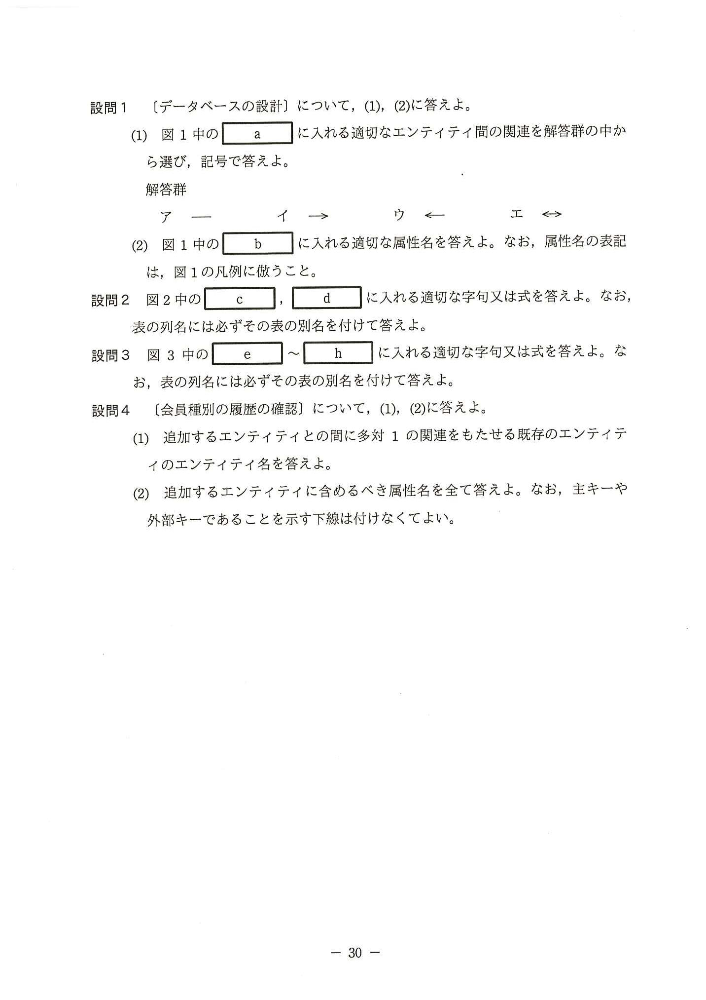

テキスト (OCR)

設問1 〔データベースの設計) について, (①⑪, ②⑫に答えよ。
Q) 図 中の| 』 | に入れる適切なエンティティ間の関連を解答群の中か
DRO, 記号で答えよ。
RSE
ァ 一    4 ーー    ウゥ ーー    ros
@) 図 中の[| b | に入れる適切な属性名を答えよ。なお, 履性名の表記
は, 図 1 の凡例に仙うこと。

設問2 図2中の| c |,| 4 |に入れる適切な字句又は式を答えよ。なお,
表の列名には必ずその表の別名を付けて答えよ。
設問3 図 3 中の| e |~[ bh |に入れる適切な字句又は式を答えよ。な

お, 表の列名には必ずその表の別名を付けて答えよ。
設問4 【会員種別の履歴の確認) について, (0), ②に答えよ。
Q) 追加するエンティティとの間に多対 1 の関連をもたせる既存のエンティテ
ィのエンティイィティ名を答えよ。
Q) 追加するエンティティに含めるべき属性名を全て答えよ。なお, 主キーや
外部キーであることを示す下線は付けなくてよい。

ー 30 一

### ページ 31

テキスト (OCR)

[ メ モ 用 紙 J

= 31 =

### ページ 32

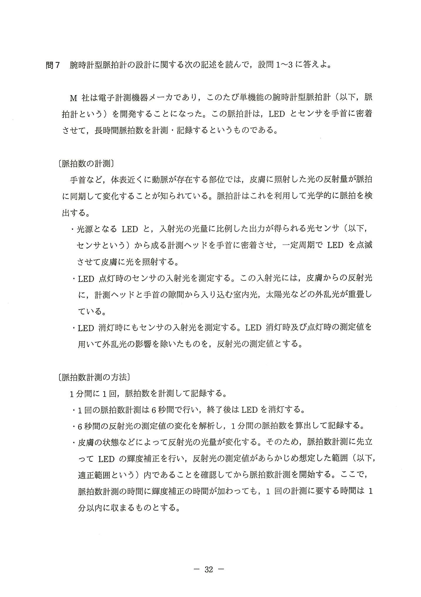

テキスト (OCR)

間7 腕時計型脈拍計の設計に関する次の記述を読んで, 設問 1ー3 に答えよ。

M 社は電子計測機器メーカであり, このたび単機能の腕時計型脈拍計 (以下, Ui
拍計という) を開発することになった。この脈拍計は, LED とセンサを手首に密着
させて, 長時間脈拍数を計測・記録するというものである。

〔脈拍数の計測〕
手首など, 体表近くに動脈が存在する部位では, 皮膚に照射した光の反射量が脈拍
に同期して変化することが知られている。脈拍計はこれを利用して光学的に脈拍を検
出する。
・光源となる LED と, 入射光の光量に比例した出力が得られる光センサ (以下
センサという) から成る計測ヘッドを手首に密着させ, 一定周期で LED を点滅
させて皮膚に光を照射する。
・LED 点灯時のセンサの入射光を測定する。この入射光には, 皮膚からの反射光
に, 計測ヘッドと手首の隙間から入り込む室内光, ABIES COMIEMEE LU
ている。
・LED 消灯時にもセンサの入射光を測定する。LED 消灯時及び点灯時の測定値を
用いて外乱光の影響を除いたものを, 反射光の測定値とする。

CAREER O 757K)

1分間に 1 回, 脈拍数を計測して記録する。

・1 回の脈拍数計測は 6 秒間で行い, 終了後はLED を消灯する。

・6 秒間の反射光の測定値の変化を解析し, 1 分間の脈拍数を算出して記録する。

・皮膚の状態などによって反射光の光量が変化する。そのため, PRB Fx
って LED の輝度補正を行い, 反射光の測定値があらかじめ想定した範囲 (以下
適正範囲という) 内であることを確認してから服拍数計測を開始する。ここで
脈拍数計測の時間に輝度補正の時間が加わっても, 1 回の計測に要する時間は 1
分以内に収まるものとする。

ー 32 一

### ページ 33

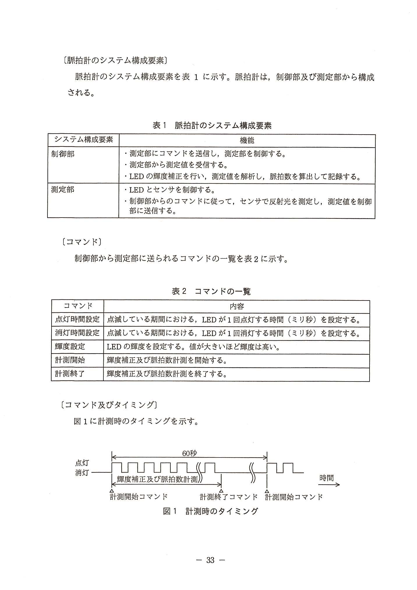

テキスト (OCR)

(脈拍計のシステム構成要素]
脈拍計のシステム構成要素を表 LIAS. MEETS, 制御部及び測定部から構成

される。
表1 脈拍計のシステム構成要素
システム構成要素                 機能
制御部       ・測定部にコマンドを送信し, 測定部を制御する。
・測定部から測定値を受信する。
・LED の輝度補正を行い, 測定値を解析し, 脈拍数を算出して記録する。
測定部             ・LED とセンサを制御する。
・制御部からのコマンドに従って, センサで反射光を測定し, 測定値を制御
部に送信する。
〔【コマンド]

制御部から測定部に送られるコマンドの一覧を表 2 に示す。

表2 コマンドの一覧

コマンド                                              内容
点灯時間設定 | 点滅している期間における, LED が1 回点灯する時間 (SUM) を設定する。
消灯時間設定 | 点滅している期間における, LED が1 回消灯する時間 (ミリ秒) を設定する。
輝度設定     LED の輝度を設定する。値が大きいほど輝度は高い。
計測開始        輝度補正及び脈拍数計測を開始する。
計測終了        輝度補正及び脈拍数計測を終了する。

[コマンド及びタイミング]
図 1 に計測時のタイミングを示す。

le                                 60秒                                  |
K                                                                 1

点灯
   | 輝度補正及び脈拍数計測)) |   )        時間
Es              ard

に           |
針測開始コマンド    計測終了コマンド 放測開始コマンド
図1 計測時のタイミング

ー 33 一

### ページ 34

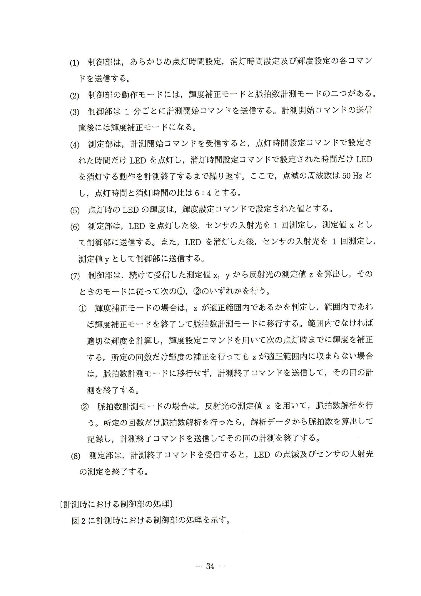

テキスト (OCR)

①) 制御部は, あらかじめ点灯時間設定, 消灯時間設定及び輝度設定の各コマン
ドを送信する。

(2) 制御部の動作モードには, PIES — b CARRE E— KOA OMHS,

(3) 制御部は 1 分ごとに計測開始コマンドを送信する。 計測開始コマンドの送信
直後には輝度補正モードになる。

(④ 測定部は, 計測開始コマンドを受信すると, 点灯時間設定コマンドで設定さ
れた時間だけ LED を点灯し, 消灯時間設定コマンドで設定された時間だけ LED
を消灯する動作を計測終了するまで繰り返す。ここで, 点滅の周波数は 50 Hz と
し, 点灯時間と消灯時間の比は 6 : 4 とする。

(5) 点灯時の LED の輝度は, 輝度設定コマンドで設定された値とする。

(6) 測定部は, LED を点灯した後, センサの入射光を 1 回測定し, 測定値 x とし
て制御部に送信する。また, LED を消灯した後, センサの入射光を 1 回測定し
測定値y として制御部に送信する。

⑦) 制御部は, 続けて受信した測定値 x, y から反射光の測定値 z を算出し, その
ときのモードに従って次の①, のいずれかを行う。
① 郊度補正モードの場合は, z が適正範囲内であるかを判定し, 範囲内であれ

ば輝度補正モードを終了して有拍数計測モードに移行する。 範囲内でなければ
RE ATL, 淫度設定コマンドを用いて次の点灯時までに交度を補正
する。所定の回数だけ輝度の補正を行っても z が適正範囲内に収まらない場合
は, 有拍数計測モードに移行せず, 計測終了コマンドを送信して, その回の計
測を終了する。

② 服拍数計測モードの場合は, 反射光の測定値 z を用いて, 脈拍数解析を行
う。所定の回数だけ脈拍数解析を行ったら, 解析データから服拍数を算出して
記録し, 計測終了コマンドを送信してその回の計測を終了する。

(8) 測定部は, 計測終了コマンドを受信すると, LED の点滅及びセンサの入射光
の測定を終了する。

〔計測時における制御部の処理

図 2 に計測時における制御部の処理を示す。

ー 34 一

### ページ 35

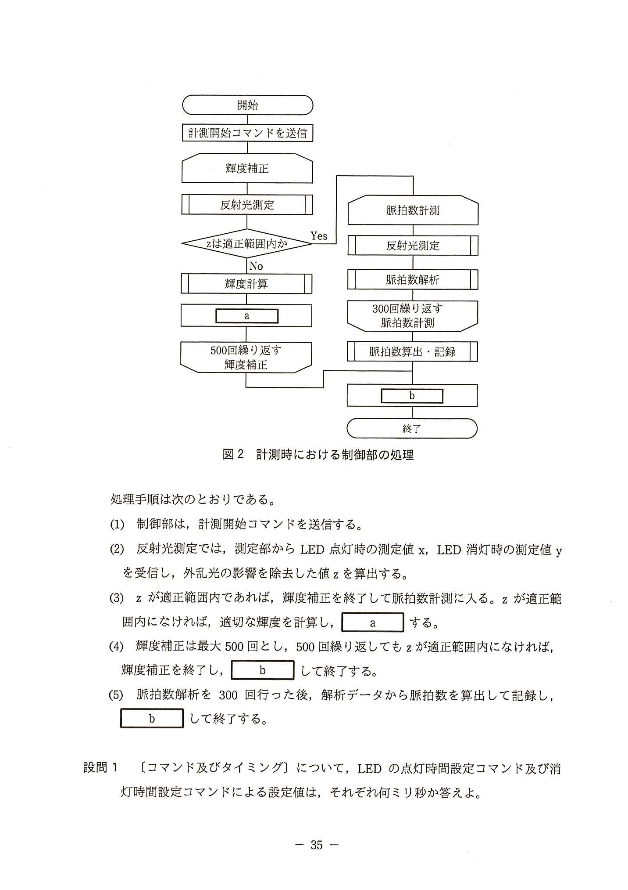

テキスト (OCR)

計測開始コマンドを送信

脈拍数計測
[iE
| | ndeesenear

300回繰り返す

へ、 服折数計測           ン

500回繰り返す

ーービーリー

脈拍数算出・記録

L_5 |

図2 計測時における制御部の処理

処理手順は次のとおりである。

Q①) 制御部は, 計測開始コマンドを送信する。

(2) 反射光測定では, 測定部から LED 点灯時の測定値 x。 LED 消灯時の測定値 y

を受信し, 外乱光の影響を除去した値 2 を算出する。

(3) z が適正範囲内であれば, 輝度補正を終了して上服拍数計測に入る。z が適正範

囲内になければ, 適切な度を計算し, | a』 |する。

(4) 輝度補正は最大 500 回とし, 500 回繰り返しても z が適正範囲内になければ,

煙度補正を終了し, | b | して終了する。

⑤) 脈拍数解析を 300 回行った後, 解析データから有拍数を算出して記録し,

[| 5 | して終了する。

設問1 【〔コマンド及びタイミング] について, LED の点灯時間設定コマンド及び消

灯時間設定コマンドによる設定値は。 それぞれ何ミリ秒か答えよ。

ー 35 一

### ページ 36

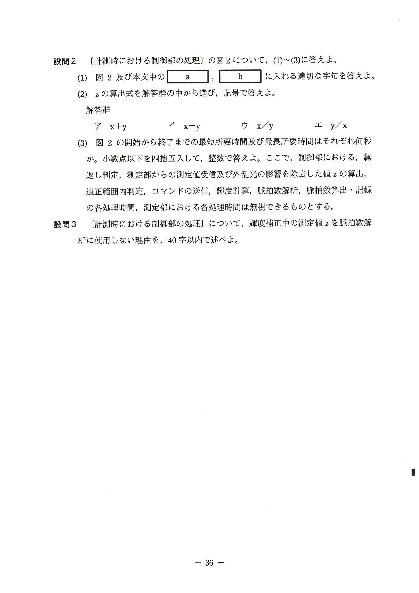

テキスト (OCR)

設問2 [計測時における制御部の処理〕 の図 2 について, ①ぐて(③に答えよ。

Q) 図 2 及び本文中の|  a |,|  b | に入れる遠切な字句を答えよ。
(②) z の算出式を解答群の中から選び, 記号で答えよ。
ARATE

ア xty     イ x-y    7 x/y    エ ーッノx

3) M2 の開始から終了までの最短所要時間及び最長所要時間はそれぞれ何秒
か。 小数点以下を四捨五入して, 整数で答えよ。ここで, 制御部における, 繰
返し判定, 測定部からの測定値受信及び外乱光の影響を除去した値 z の算出
適正範囲内判定, コマンドの送信, 輝度計算, 脈拍数解析, 脈拍数算出・記録
の各処理時間, 測定部における各処理時間は無視できるものとする。
設問3 計測時における制御部の処理] について, 輝度補正中の測定値 z を脈拍数解
析に使用しない理由を, 40 字以内で述べよ。

### ページ 37

テキスト (OCR)

[ メ モ 用 紙 J

ー 37 一

### ページ 38

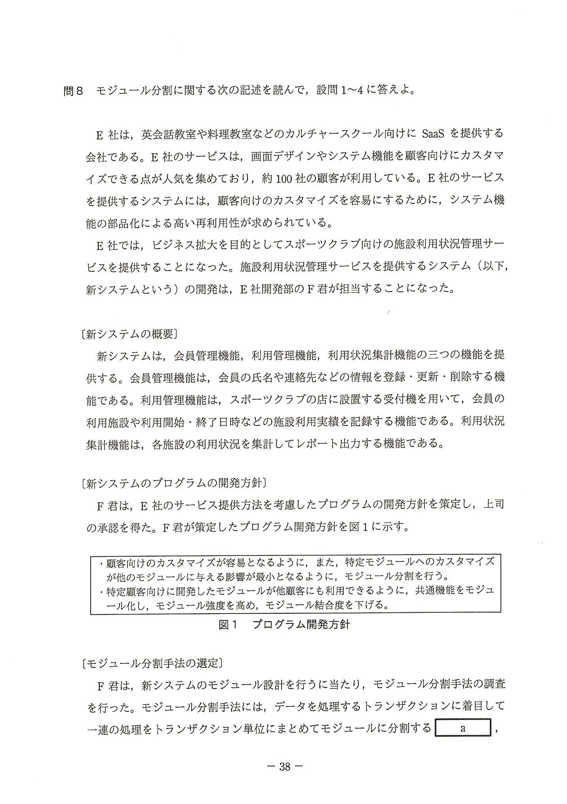

テキスト (OCR)

HS モジュール分視に関する次の記述を読んで, 設問 1ー4 に答えよ。

E 社は, 英会話教室や料理教室ながどのカルチャースクール向けに SaaS を提供する
会社である。E 社のサービスは, 画面デザインやシステム機能を顧客向けにカスタマ
イズできる点が人気を集めており, 約 100 社の顧客が利用している。E 社のサービス
を提供するシステムには, 顧客向けのカスタマイズを容易にするために, システム機
の部品化による高い再利用性が求められている。

E 社では, ビジネス拡大を目的としてスポーツクラブ向けの施設利用状況管理サー
ビスを提供することになった。施設利用状況管理サービスを提供するシステム (以下
新システムという) の開発は, 社開発部のF 君が担当することになった。

(HVAT LORE)

新システムは, 会員管理機能, 利用管理機能, 利用状況集計機能の三つの機能を提
供する。 会員管理機能は, 会員の氏名や連絡先などの情報を登録・更新・削除する機
能である。利用管理機能は, スポーツクラブの店に設置する受付機を用いて, BAO
利用施設や利用開始・終了日時などの施設利用実績を記録する機能である。利用状況
集計機能は, 各施設の利用状況を集計してレポート出力する機能である。

[新システムのプログラムの開発方針]
F 君は, E 社のサービス提供方法を考慮したプログラムの開発方針を策定し, 上司
の承認を得た。F 君が策定したプログラム開発方針を図 1 に示す。

・顧客向けのカスタマイズが容易となるように, また, 特定モジュールへのカスタマイズ
が他のモジュールに与える影響が最小となるように, モジュール分割を行う。

・特定顧客向けに開発したモジュールが他顧客にも利用できるように, 共通機能をモジュ
ール化し, モジュール強度を高め, モジュール結合度を下げる。

図1 プログラム開発方針

(モジュール分割手法の選定)

FH, 新システムのモジュール設計を行うに当たり, モジュール分割手法の調査
を行った。モジュール分割手法には。 データを処理するトランザクションにた着目して
ー連の処理をトランザクション単位にまとめてモジュールに分割する| 』 |,

ー 38 一

### ページ 39

テキスト (OCR)

データの流れに着目してデータの入力・変換・出力の観点からモジュールに分割する
| 5 |, データ構造に着目して入力データ構造と出力データ構造の対応関係か
らモジュールに分割する| c | などがあることが分かった。

FA, 新システムは, SAOMBM AMT —2EBML, THERE LER
をレポート出力するので, が最適な手法であることを調査報告書にまと
め, 上司の承認を得た。

〔利用状況集計機能の入出力データ分析〕

利用状況集計機能のプログラムは, 施設利用実績データを集計し, 店ごとに施設の
利用状況をレポート出力する。

プログラムへの入力は, 受付機で記録した施設利用実績データである。プログラム
からの出力は, 店ごとの施設の月間利用者数, 最多利用者情報などを記載した施設利
用レポートである。施設利用実績データの例を表 1 に, 施設利用レポートの例を図 2

表1 施設利用実績データの例 (抜粋)

利用店      施設名      会員番号      会員氏名       利用日     利用開始時刻 | 利用終了時刻
A             プール                    0010                       Z                  2016-09-05               14:10                    18:10
A           ジム                    0001                   W               2016-09-01             10:00                 12:00
A           ジム                    0001                   W               2016-09-03             10:30                 13:00
B              プール                    0002                       xX                  2016-09-15               17:30                    19:00
B            プール                 0010                    Z                2016-09-10             15:10                 16:10
C            プール                 0002                    xX               2016-09-19             18:10                 20:30
Cc           スタジオ              0003                    Y               2016-09-26             19:50                 21:10

施設利用レポート (月間)
ロロヘッダ情報
・店名 :A

- 対象月 : 2016 年 09 月
・ 月間利用者数 : 200名

ロブプールの利用状況               ロスタジオの利用状況       ロジムの利用状況

・ 最大同時利用者数 : 40名           ・ 平均利用者数 : 0名日 。 ・平均利用時間:2.0時間ノ人
・ 最多利用者情報 (上位5名)      ・最多利用者情報 (上位5名) ・最多利用者情報(上仁5名)
会員氏名 |利用回数 |総利用時間] ※当月のスタジオ利用者なし | 会員氏名 |利用回数|総利用時間
Z       20     40時間                            W       20     40時間

注記 当月の施設の利用者がいないときは, 最多利用者情報 (上位 5 名) の表の位置に “※当月のく施設名>
利用者なし" という利用者なし表示を出力する。ここで, く施設名>は, 施設名に置換される。

図2 施設利用レポートの例

### ページ 40

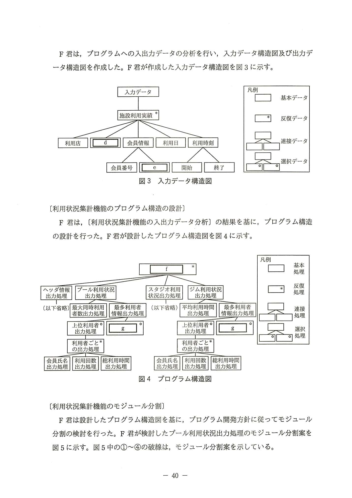

テキスト (OCR)

F 君は。 プログラムへの入出力データの分析を行い, 入力データ構造図及び出力デ
ータ構造図を作成した。F 君が作成した入力データ構造図を図 3 に示す。

入力データ                                       凡例
[| | 基本データ

施設利用実績 *         し wws-%
| ance |[ ane || snes |    ser
| _I

| 全員番呈|し ]][ mea |[ «r | {LIL 4
M3 入力データ構造図

〔利用状況集計機能のプログラム構造の設計】
F Ald, 【〔利用状況集計機能の入出力データ分析〕 の結果を基に, プログラム構千
の設計を行った。F 君が設計したプログラム構造図を図 4 に示す。

Rel
基本
 .           Co) he
ヘッダ情報 [PRR    スタジオ利用| |ジム利用状況
上処理 || 処理      天外| | 昌和
(Kars) 最大同時利用 || 最多利用者 | (以下省貼) |平均利用時間| | 最多利用者        ste
者数出力処理 || HP UR      出力処理 | |情報出力処理      a
上位利用者      3      EMILE °      oe
出力処理       出力処理       選択
I                          i                  °    で| 処理
利用者ごと*            利用者ごと*       L
の出力処理             の出力処理
I                it
会員氏名 || 利用同数 ||絶利用時間    会員氏名 | | 利用回数 | |
出力処理 | | 出力処理|| 出力処理    出力処理 | | 出力処理| 出力処理

図4 プログラム構造図

〔利用状況集計機能のモジュール分割]

F 君は設計したプログラム構造図を基に, プログラム開発方針に従ってモジュール
分割の検討を行った。F 君が検討したプール利用状況出力処理のモジュール分割案を
図 5 に示す。図 5 中の①て④の破線は, モジュール分割案を示している。

ー 40 一

### ページ 41

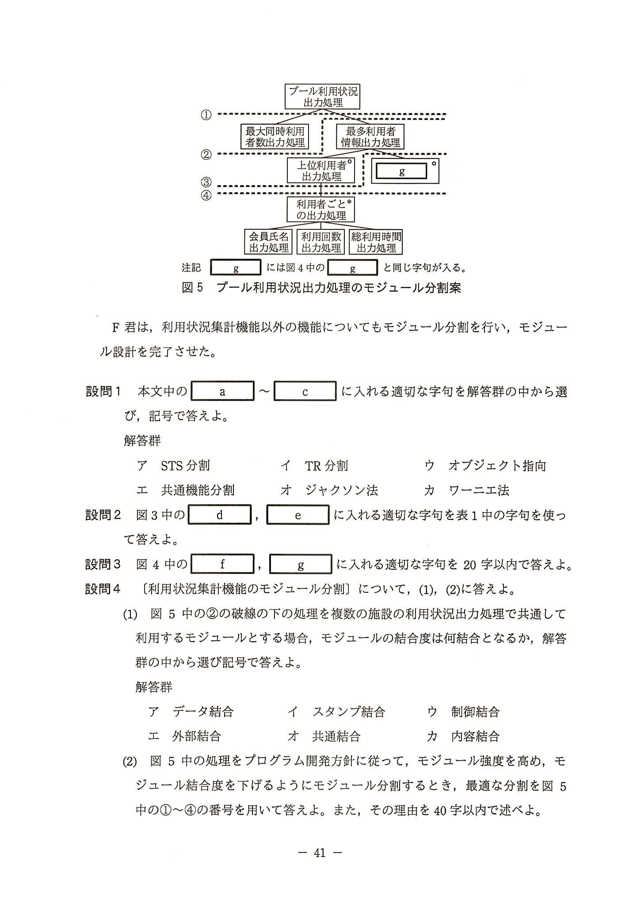

テキスト (OCR)

プブール利用状況

出力処理
最大同時利用| 最多利用者
©  者数出力処理| ! |情報出力処理
ーーニュ
上位利用者"| 1      9
ュー    ze

利用者ご
QE ANE

BARS | | 利用回数| |総利用時間|
出力処理] | 出力処理] | 出力処理

注記 [Tg | には図4中の| gz | と同じ字句が入る。
図5 プール利用状況出力処理のモジュール分割案

F Bld, 利用状況集計機能以外の機能こついてもモジュール分割を行い, モジュー
ル設計を完了させた。

設問1 本文中の| a |~[ < |に入れる適切な字句を解答君の中から選
OU, 記号で答えよ。

解答群
ア STS分害     4 TRIB     ウ オプジェクト指向
エ 共通機能分害   オ ジャクソン法   カ ワーニェ法

設問2 図3中の|  d |,|  e |に入れる適切な字句を表 1中の字旬を使っ
て答えよ。

設問3 図4中の| f |,| ¢ |に入れる適切な字旬を20 字以内で答えよ。

設問4 【利用状況集計機能のモジュール分割] について, ①⑪, ②に答えよ。
(1) 図 5 中の②の破線の下の処理を複数の施設の利用状況出力処理で共通して
利用するモジュールとする場合, モジュールの結合度は何結合となるか, 解答
群の中から選び記号で答えよ。

SRA
ア データ結合       イ スタンプ結合      ウ 制御結合
エ 外部結合                 オ 共通結合                 カ 内容結合

2) 図 5 中の処理をプログラム開発方針に従って, モジュール強度を高め, モ
ジュール結合度を下げるようにモジュール分割するとき, 最適な分割を図 5
中の①て④の番号を用いて答えよ。 また, その理由を 40 字以内で述べよ。

ー 41 一

### ページ 42

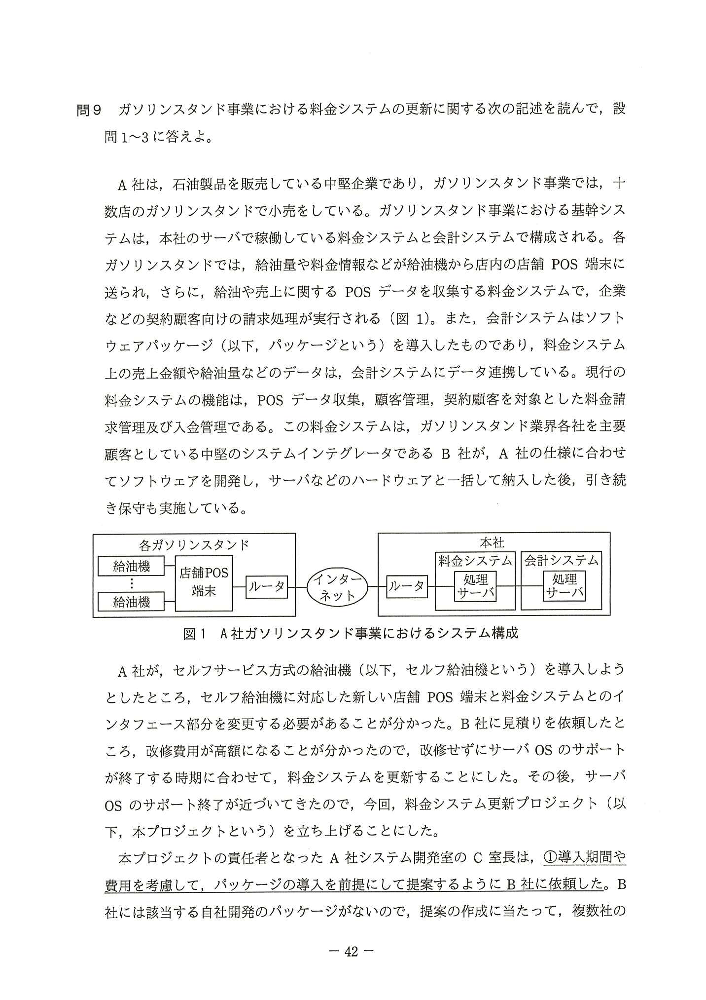

テキスト (OCR)

AQ ガソリンスタンド事業における料金システムの更新に関する次の記述を読んで,
問 1て3 に答えよ。

A 社は, 石油製品を販売している中堅企業であり, ガソリンスタンド事業では,

xg

+

数店のガソリンスタンドで小売をしている。ガソリンスタンド事業における基幹シス

テムは, 本社のサーバで稼働している料金システムと会計システムで構成される。

各

ガソリンスタンドでは, 給油量や料金情報などが給油機から店内の店舗 POS 端末に
送られ, さらに, 給油や売上に関する POS データを収集する料金システムで, 企業
などの契約顧客向けの請求処理が実行される (図 1)。 また, 会計システムはソフト
ウェアパッケージ (以下, パッケージという) を導入したものであり, 料金システム
上の売上金額や給油量などのデータは, 会計システムにデータ連携している。 現行の
料金システムの機能は, POS データ収集, 顧客管理, 契約顧客を対象とした料金請
求管理及び入金管理である。 この料金システムは, ガソリンスタンド業界各社を主要
顧客としている中堅のシステムインテグレータである B 社が, A 社の仕様に合わせ
てソフトウェアを開発し, サーバなどのハードウェアと一括して納入した後, 引き続

き保守も実施している。

各ガソリンスタンド                             本社

給油機 H reeepos                料金システム| |会計システム
:     sik   ルータ ルータ   ou    =

図1 A社ガソリンスタンド事業におけるシステム構成

A 社が, セルフサービス方式の給油機 (以下、セルフ給油機という) を導入しよう
としたところ, セルフ給油機に対応した新しい店舗 POS 端末と料金システムとのイ
ンタフェース部分を変更する必要があることが分かった。B 社に見積りを依頼したと

ころ, 改修費用が高額になることが分かったので, 改修せずにサーバ OS のサポー
が終了する時期に合わせて, 料金システムを更新することにした。 その後, サー

ト

バ

OS のサポート終了が近づいてきたので, SH, 料金システム更新プロジェクト VY

下, 本プロジェクトという) を立ち上げることにした。

本プロジェクトの商任者となった A 社システム開発室の C 室長は, ①導入期間や
費用を考慮して, パッケージの導入を前提にして提案するように B 社に依頼した。B

社には該当する自社開発のパッケージがないので, 提案の作成に当たって, 複数社の

### ページ 43

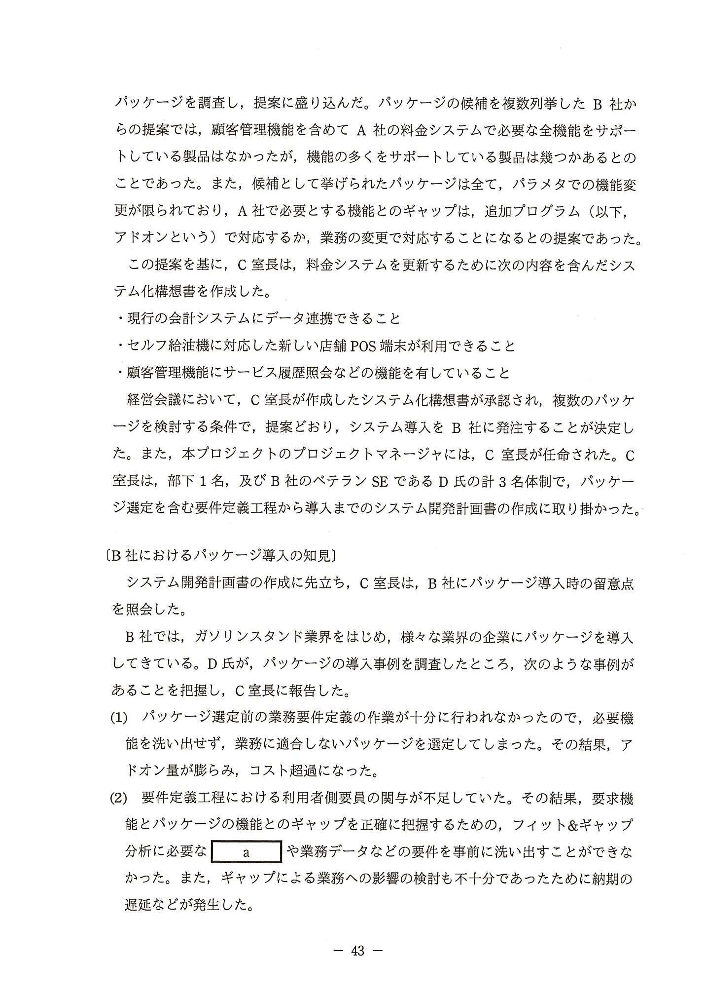

テキスト (OCR)

パッケージを調査し, 提案に盛り込んだ。パッケージの候補を複数列挙した B 社か
らの提案では, 顧客管理機能を含めて A 社の料金システムで必要な全機能をサポー
トしている製品はなかったが, 機能の多くをサポートしている製品は幾つかあるとの
ことであった。また, 候補として挙げられたパッケージは全て, パラメタでの機能変
更が限られており, A 社で必要とする機能とのギャップは, 追加プログラム (以下,
アドオンという) で対応するか, 業務の変更で対応することになるとの提案であった。
この提案を基に, C 室長は, 料金システムを更新するために次の内容を含んだシス
テム化構想書を作成した。
・現行の会計システムにデータ連携できること
・セルフ給油機に対応した新しい店舗 POS 端末が利用できること
・顧客管理機能にサービス履歴照会などの機能を有していること
経営会議において, C 室長が作成したシステム化構想書が承認され, 複数のパッケ
ージを検討する条件で, 提案どおり, システム導入を B 社に発注することが決定し
た。また, 本プロジェクトのプロジェクトマネージャには, C 室長が任命された。C
室長は, 部下 1 名, 及び B 社のベテラン SE である D KOH 3 名体制で, パッケー
ジ選定を含む要件定義工程から導入までのシステム開発計画書の作成に取り掛かった。

〔B 社におけるパッケージ導入の知見]
システム開発計画書の作成に先立ち, C 室長は, B 社にパッケージ導入時の留意点

を照会した。

B 社では, ガソリンスタンド業界をはじめ, 様々な業界の企業にパッケージを導入
してきている。D 氏が, パッケージの導入事例を調査したところ, 次のような事例が
あることを把握し, C 室長に報告した。

Q) パッケージ選定前の業務要件定義の作業が十分に行われなかったので, 必要機
能を洗い出せず, 業務に適合しないパッケージを選定してしまった。その結果, ア
ドオン量が膨らみ, コスト超過になった。

(2) 要件定義工程における利用者側要員の関与が不足していた。その結果, BRE
能とパッケージの機能とのギャップを正確に把握するための, フィット&ギャップ
分析に必要な|  a | や業務データなどの要件を事前に洗い出すことができな
Dok, また, ギャップによる業務への影響の検討も不十分であったために納期の
遅延などが発生した。

### ページ 44

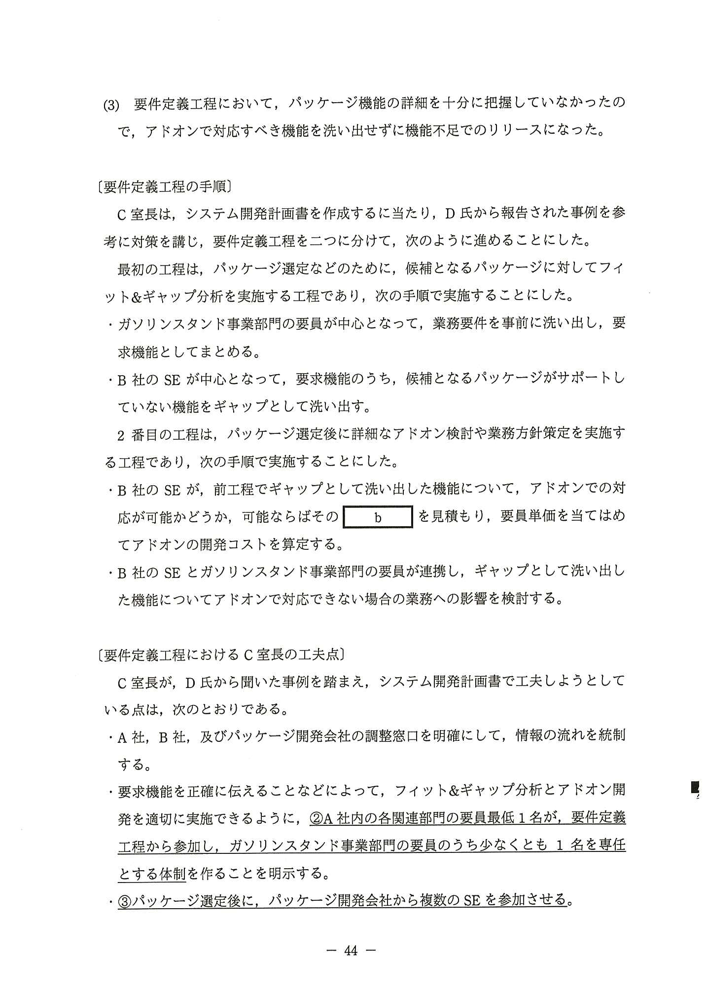

テキスト (OCR)

(3) 要件定義工程において, パッケージ機能の詳細を十分に把握していなかったの
で, アドオンで対応すべき機能を洗い出せずに機能不足でのリリースになった。

[要件定義工程の手順

C 室長は, システム開発計画書を作成するに当たり, D 氏から報告された事例を参
考に対策を講じ, 要件定義工程を二つに分けて, 次のように進めることにした。
最初の工程は パッケージ選定などのために, 候補となるパッケージに対してフィ
ット&ギャップ分析を実施する工程であり, 次の手順で実施することにした。

・ガソリンスタンド事業部門の要員が中心となって, 業務要件を事前に洗い出し, 要
求機能としてまとめる。

・B 社の SE が中心となって, 要求機能のうち, 候補となるパッケージがサポートし
ていない機能をギャップとして洗い出す。

2 番目の工程は。 パッケージ選定後に詳細なアドオン検討や業務方針策定を実施す
る工程であり, 次の手順で実施することにした。

・B 社の SEM, 前工程でギャップとして洗い出した機能たついて, アドオンでの対
応が可能かどうか, 可能ならばその| bp | を見積もり, 要員単価を当てはめ
てアドオンの開発コストを人算定する。

・B 社の SE とガソリンスタンド事業部門の要員が連携し, ギャップとして洗い出し
た機能こついてアドオンで対応できない場合の業務への影響を検討する。

〔要件定義工程におけるC 室長の工夫点〕
C 室長が, D 氏から聞いた事例を踏まえ, システム開発計画書で工夫しようとして
いる点は, 次のとおりである。

・A 社, Bt, 及びパッケージ開発会社の調整窓口を明確にして, 情報の流れを統制
する。

・要求機能を正確に伝えることなどによって, フィット&ギャップ分析とアドオン開
発を適切に実施できるように, ②A 社内の各関連部門の要員最低 1 名が, 要件定義
工程から参加し, ガソリンスタンド事業部門の要員のうち少なくとも 1 名を専任
とする体制を作ることを明示する。

・⑧パッケージ選定後に. パッケージ開発会社から複数の SE を参加させる。

ー 44 一

### ページ 45

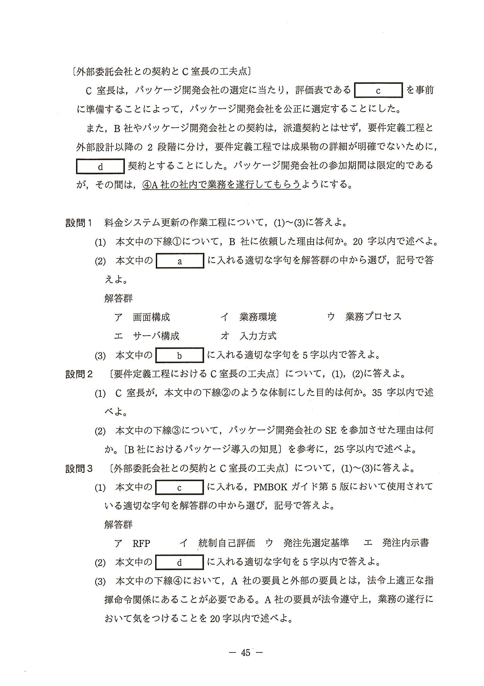

テキスト (OCR)

(外部委託会社との契約と C 室長の工夫点】
C 室長は。 パッケージ開発会社の選定に当たり, 評価表である を事前
に準備することによって, パッケージ開発会社を公正に選定することにした。
また, B 社やパッケージ開発会社との契約は, MORNE ES, 要件定義工程と
外部設計以降の 2 段階に分け, 要件定義工程では成果物の詳細が明確でないために,
[a | 約とすることにした。パッケージ開発会社の参加期間は限定的である
が, その間は, @A 社の社内で業務を遂行してもらうようにする。

設問1 料金システム更新の作業工程について, ①⑪て⑬に答えよ。
Q①) 本文中の下線①について, B 社に依頼した理由は何か。20 字以内で述べよ。
⑫ 本文中の| 』 | に入れる適切な字句を解答群の中から選び, 記号で答

えよ。

解答群

ア 画面構成    イ 業務環境    ウ 業務プロセス
エ サーバパ構成    オ 入力方式

⑬ 本文中の| b | に入れる適切な字句を5字以内で答えよ。
設問2 [要件定義工程におけるC室長の工夫点】 について, ①, (②に答えよ。
Q) C 室長が, 本文中の下線②のような体制にした目的は何か。35 字以内で述
べよ。
⑫) 本文中の下線について, パッケージ開発会社の SE を参加させた理由は何
か。【〔B 社におけるパッケージ導入の知見〕 を参考に, 25 字以内で述べよ。
設問3 外部委託会社との契約とC 室長の工夫点】 について, ①~て(3③)に答えよ。
Q) 本文中の| c | に入れる, PMBOKガイド第5 版において使用されて
いる適切な字句を解答群の中から選び, 記号で答えよ。
解答群
ア RFP    4 統制自己評価 9 発注先選定基準 エ 発注内示書
⑫ 本文中の[|  q | に入れる適切な字句を5字人以内で答えよ。
(3) 本文中の下線@において, A 社の要員と外部の要員とは, 法令上適正な指
揮命令関係にあることが必要である。A 社の要員が法令遵守上, 業務の遂行に
おいて気をつけることを 20 字以内で述べよ。

ー 45 一

### ページ 46

テキスト (OCR)

問19 販売管理サービスの変更に関する次の記述を読んで, 設問 1ー3 に答えよ。

K 社は, 中堅の食品卸売業者であり, 飲食店に食品の材料を販売している。K 社の
システム部は, K 社販売部向けに販売管理サービスを提供している。 販売部員は販売
部の PC から販売管理システムに, 販売データをオンラインで入力している。 販売肖
の PC では, 販売管理システムに接続するためのソフトウェア (以下, 接続ソフトウ
エアという) が稼働している。販売管理システムで使用するアプリケーションは, 自
社で開発したものである。

システム部と販売部で合意している販売管理サービスの SLA (以下, 社内 SLA と
いう) の一部を表 1 に示す。

表1 社内SLA (抜粋)

種別      サービスレベル項目              ARMA
as         毎日6 時から 24 時まで
可用性      THR        (保守のための計画停止時間を除く)
サービス乏働率               99.9%
|       ランay      5 秒以内 (ピーク時間帯)
     Mk    3 秒以内 (それ以外)
信頼性    インシデントの解決時間 | 4時間

現在稼働している販売管理システムのサーバは社内に設置しているが, 運用費用が
増大し, 管理業務も類雑になっていた。そこで, システム部では, クラウド事業者の
L 社が提供する PaaS に移行することを決めた。当該PaaS は L 社の運用センタで稼働
するサービスであり, L 社と K 社とは専用線で接続する。システム部の M 君は, 販
売管理サービスの変更及びL 社との調整を担当している。

(K 社とL社の間の SLA)

今回, L 社が提供するサービスの範囲と品質を明確にするために, K 社とL社との
IC SLA を含んだ契約を締結することにした。 そこで, M Bld, K 社の要求事項と
して表 1 と同一の内容を SLA 案として 社に提示し, 打診した。すると, L 社から,
“①オンライン応答時間については, サービスレベル項目とすることはできない。そ
の他のサービスレベル項目は, 目標値を含めて SLA の内容とすることは可能であ

### ページ 47

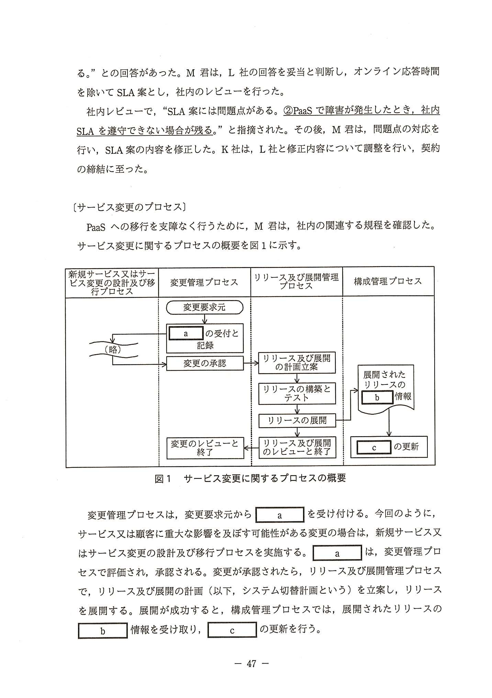

テキスト (OCR)

る。” との回答があった。M Bld, L 社の回答を妥当と判断し, オンライン応人答時間
を除いて SLA 案とし, 社内のレビューを行った。

社内レビューで, “SLA 案には問題点がある。②PaaS で障害が発生したとき, 社内
SLA を遵守できない場合が残る。” と指摘された。 その後, M 君は, 問題点の対応を
行い, SLA 案の内容を修正した。K 社は, L 社と修正内容について調整を行い, 契約
の締結に至った。

〔サービス変更のプロセス]〕
PaaS への移行を支障なく行うために, M Bld, 社内の関連する規程を確認した。
サービス変更に関するプロセスの概要を図 1 に示す。

新規サービス又はサー             ーー一
ピス変更の設計及び移| 変更管理プロセス | リリース及び展開管理」 wee roe

行プロセス
変更要求元

=        [a |の受付と

に      =    リリ  び展開
変更の承二| の計画立案

I     BM Su

リリースの構築と     ソリリーの

テスト     [ b |情報

リリースの展開

変更のレビューと   リリース及び展開
BRO eae kH のレビューと終了| 1し< の更新

図1 サービス変更に関するプロセスの概要

変更管理プロセスは, 変更要求元から|  』 | を受け付ける。今回のように,
サービス又は大客に重大な影響を及ぼす可能性がある変更の場合は, 新規サービス又
はサービス変更の設計及び移行プロセスを実施する。|  。 |は, 変更管理プロ
セスで評価され, 承認される。変更が承雪されたら, リリース及び展開管理プロセス
で, リリース及び展開の計画 (以下システム切替計画という) を立案し, リリース
を展開する。展開が成功すると, 構成管理プロセスでは, 展開されたリリースの

[> |情報を受け取り, | c | の更新を行う。

ー 47 一

### ページ 48

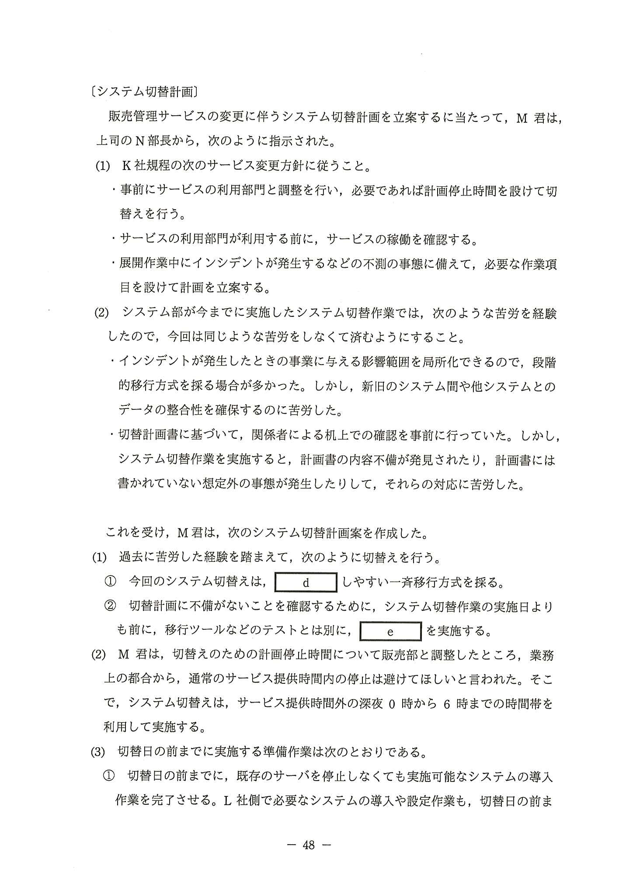

テキスト (OCR)

〔システム切賛計画)
販売管理サービスの変更に伴うシステム切替計画を立案するに当たって, M Bie,
上司の N 部長から, 次のように指示された。
Ql) K 社規程の次のサービス変更方針に従うこと。
・事前にサービスの利用部門と調整を行い, 必要であれば計画停止時間を設けて切
替えを行う。
・サービスの利用部門が利用する前に, サービスの稼働を確認する。
・展開作業中にインシデントが発生するなどの不測の事態に備えて, 必要な作業項
目を設けて計画を立案する。
Q) システム部が今までに実施したシステム切替作業では, 次のような苦労を経験
したので, 今回は同じような苦労をしなくて済むようにすること。
・インシデントが発生したときの事業に与える影響範囲を局所化できるので, 段階
的移行方式を採る場合が多かった。 しかし, 新旧のシステム間や他システムとの
データの整合性を確保するのに苦労した。
・切替計画書に基づいて, 関係者による机上での確認を事前に行っていた。 しかし,
システム切替作業を実施すると, 計画書の内容不備が発見されたり, 計画書には
書かれていない想定外の事態が発生したりして, それらの対応に苦労した。

これを受け, MB, 次のシステム切替計画案を作成した。

①) 過去に普労した経験を踏まえて, 次のように切替えを行う。
① 今回のシステム切替えは, |  q | しやすい一斉移行方式を採る。

Q 切替計画に不備がないことを確認するために, システム切替作業の実施日より
も前に, 移行ツールなどのテストとは別に, | e | を実施する。

(②) M Ak, 切替えのための計画停下時間について販売部と調整したところ, 業務
上の都合から, 通常のサービス提供時間内の停止は避けてほしいと言われた。そこ
で, システム切替えは, サービス提供時間外の深夜 0 時から 6 時までの時間帯を
利用して実施する。

3) 切替日の前までに実施する準備作業は次のとおりである。
① 切替日の前までに, 既存のサーバを停止しなくても実施可能なシステムの導入

作業を完了させる。L 社側で必要なシステムの導入や設定作業も, 切替日の前ま

### ページ 49

テキスト (OCR)

に完了させる。

@ 切替日以降は販売部の PC DS L 社に接続できるように, 販売部の PC の接続
ソフトウェアを更新する。 更新は, 切替日の前日に販売部員がそれぞれの PC を
使い終わった後で, システム部員が順次行い, 24 時までに完了する。

(4) 切替日に必要な作業は, データの移行作業及び稼働確認作業である。 データの
移行作業は 5 時間, 稼働確認作業は 1 時間が必要である。切替日は 6 時にサー
スが開始できるように, 切替日の作業は, 前日のサービス処理終了後の深夜 0 時
から開始する。

N 部長は, システム切替計画案をレビューした。N 部長は, M 君に “③システム
切替計画で考慮しておくべき作業が漏れている。サービス変更方針に沿って計画を修
正すること。” と指摘した。

設問1 【〔K社とL社の間の SLA) について, ①, (②)に答えよ

GQ) 本文中の下線①の理由を, 35 字以内で具体的に述べ

(2) 本文中の下線②の “社内 SLA を人遵守できない場合"とはどのような場合か,
40 字以内で具体的に述べよ

設問2 図 1 及び本文中の|  』 |~| c |に入れる適切な字句を解答群の
中から選び, 記号で答えよ。
ARTE
ア CAB      イ Cl       ウ CMDB
x= OODB      オ PIR       カカ RDBMS
キ RFC      ク RFI      ケ RFP

設問3 〔システム切替計画] について, Q①て⑬)に答えよ。

a 本文中の| a |に入れる適切な字句を15字以内で答えよ。
⑫ 本文中の| ec |に入れる適切な字句を10字以内で答えよ。
(3) 本文中の下線について, 考慮すべき作業を 35 字以内で答えよ。

### ページ 50

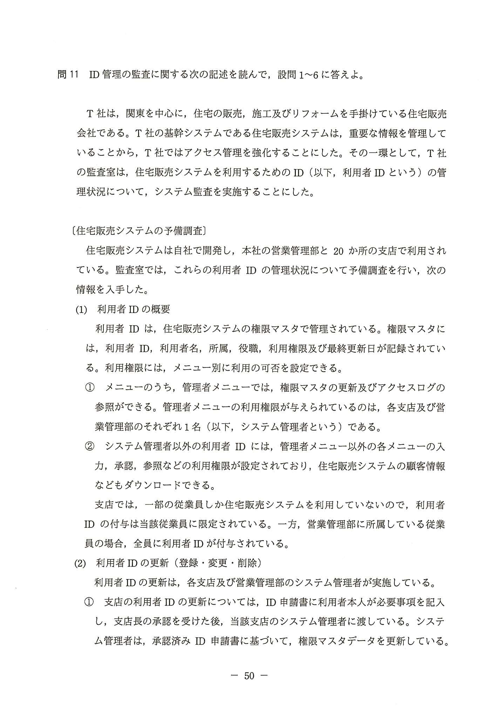

テキスト (OCR)

間11 管理の監査に関する次の記述を読んで, 設問 1ー6 に答えよ。

T 社は, 関東を中心に, 住宅の販売, 施工及びリフォームを手掛けている住宅販売
会社である。T 社の基幹システムである住宅販売システムは, 重要な情報を管理して
いることから, T 社ではアクセス管理を強化することにした。その一環として, TH
の監査室は, 住宅販売システムを利用するための ID (以下, 利用者 ID という) OF
理状況について, システム監査を実施することにした。

[住宅販売システムの予備調査]
住宅販売システムは自社で開発し, 本社の営業管理部と 20 か所の支店で利用され
ている。 監査室では, これらの利用者 ID の管理状況について予備調査を行い, 次の
情報を入手した。
①) 利用者ID の概要
利用者 ID は, 住宅販売システムの権限マスタで管理されている。 権限マスタに
は, 利用者 ID, 利用者名, 所属, 役職, 利用権限及び最終更新日が記録されてい
る。利用権限には, メニュー別に利用の可否を設定できる。
① メニューのうち, 管理者メニューでは, 権限マスタの更新及びアクセスログの
参照ができる。 管理者メニューの利用権限が与えられているのは, 各支店及び営
業管理部のそれぞれ1名 (QE, システム管理者という) CHS,
② システム管理者以外の利用者 ID には, 管理者メニュー以外の各メニューの入
力, RA, 参照などの利用権限が設定されており, 住宅販売システムの顧客情報
などもダウンロードできる。
支店では, 一部の従業員しか住宅販売システムを利用していないので, 利用者
ID の付与は当該従業員に限定されている。一方, 営業管理部に所属している従業
員の場合, 全員に利用者 ID が付与されている。
(2) 利用者 ID の更新 (登録・変更・削除)
利用者 ID の更新は, 各支店及び営業管理部のシステム管理者が実施している。
① 支店の利用者 ID の更新については, ID 申請書に利用者本人が必要事項を記入
し, 支店長の承認を受けた後, 当該支店のシステム管理者に渡している。システ
ム管理者は, 承認済み ID 申請書に基づいて, 権限マスタデータを更新している。

ー 50 一

### ページ 51

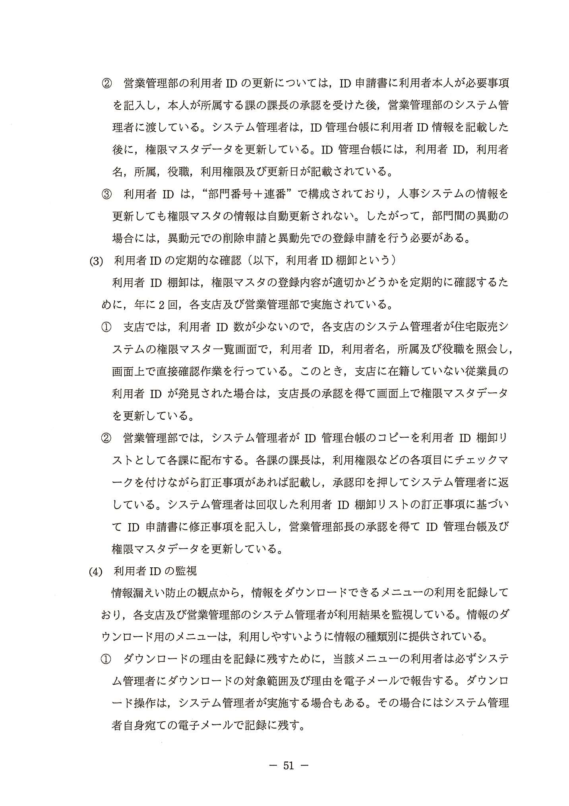

テキスト (OCR)

② 営業管理部の利用者 ID の更新については, ID 申請書に利用者本人が必要事項
を記入し, 本人が所属する課の課長の承認を受けた後, 営業管理部のシステム管
理者に渡している。システム管理者は, ID 管理台帳に利用者 ID 情報を記載した
後に, 権限マスタデータを更新している。TD 管理台帳には, 利用者 ID, 利用者
名, 所属, 役職, 利用権限及び更新日が記載されている

© 利用者 ID は, “部門番号十連番” で構成されており, 人事システムの情報を
更新しても権限マスタの情報は自動更新されない。したがって, 部門間の異動の
場合には, 異動元での削除申請と異動先での登録申請を行う必要がある。

(3) 利用者 ID の定期的な確認 (以下, 利用者 TD 棚錠という)

利用者 ID 棚卸は, 権限マスタの登録内容が適切かどうかを定期的に確認するた

Ok, 年に2回, 各支店及び営業管理部で実施されている。

① 支店では, 利用者 ID 数が少ないので, 各支店のシステム管理者が住宅販売シ
ステムの権限マスター覧画面で, MA ID, 利用者名, 所属及び役職を照会し,
画面上で直接確認作業を行っている。このとき, 支店に在籍していない人従業員の
利用者 ID が発見された場合は, 支店長の承認を得て画面上で権限マスタデータ
を更新している。

②⑨ 営業管理部では, システム管理者が ID 管理台帳のコピーを利用者 ID 棚卸リ
ストとして各課に配布する。各課の課長は, 利用権限などの各項目にチェックマ
ークを付けながら訂正事項があれば記載し, 承認印を押してシステム管理者に
している。システム管理者は回収した利用者 ID 棚外リストの訂正事項に基づい
て ID 申請書に修正事項を記入し, 営業管理部長の承認を得て ID 管理台帳及び
権限マスタデータを更新している。

(4) 利用者 ID の監視

情報漏えい防止の観点から, 情報をダウンロードできるメニューの利用を記録して

おり, 各支店及び営業管理部のシステム管理者が利用結果を監視している。情報のダ

ウンロード用のメニューは, 利用しやすいように情報の種類別に提供されている。

① ダウンロードの理由を記録に残すために, 当該メニューの利用者は必ずシステ
ム管理者にダウンロードの対象範囲及び理由を電子メールで報告する。ダウンロ
ード操作は, システム管理者が実施する場合もある。その場合にはシステム管理
者自身宛ての電子メールで記録に残す。

ー 51 一

### ページ 52

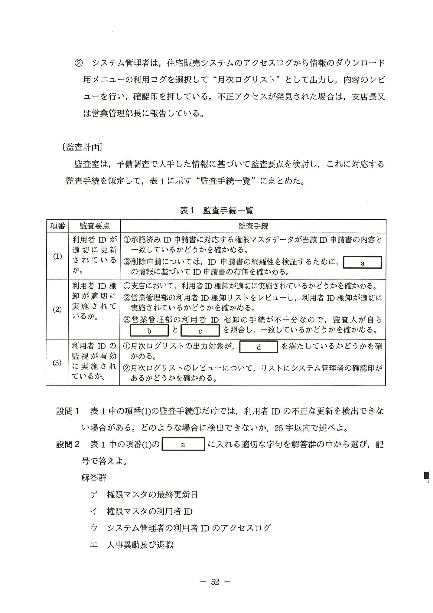

テキスト (OCR)

⑨② システム管理者は, 住宅販売システムのアクセスログから情報のダウンロード
用メニューの利用ログを選択して “月次ログリスト"” として出力し, 内容のレビ

を行い,

確認印を押している。不正アクセスが発見された場合は, 支店長又

は営業管理部長に報告している。

監査計画
監査室は, 予備調査で入手した情報に基づいて監査要点を検討し, これに対応する
監査手続を策定して, 表 1 に示す “監査手続一覧"にまとめた。

表1 監査手続一覧

項番

監査要点

監査手続

①

利用者 ID が
適切に更新
されている
か。

①承認済み ID 申請書に対応する権限マスタデータが当該 ID 申請書の内容と
一致しているかどうかを確かめる。

②削除申請については, ID 申請書の網羅性を検証するために, |   a   ]
の情報に基づいて ID 申請書の有無を確かめる。

(2)

利用者 ID 棚
外が適切に
実施されて
WED,

①支店において, 利用者 D MBAS HES TS PLD DEEDS,
@演業管理部の利用者 TD 棚卸リストをレビューし, 利用者 ID 杉卸が適切に
実施されているかどうかを確かめる。
⑥党業管理部の利用者 D 棚卸の手続が不十分なので, 監査人が自ら
と| 。 | を照合し, 一政しているかどうかを確かめる。

(3)

利用者 ID の
監視が有効
に実施され
ているか。

①月次ログリストの出力対象が, | q | を滴たしているかどうかを確
かめる。

づ月次ログリストのレビューについて, リストにシステム管理者の確認印が
あるかどうかを確かめる。

設問1

表 1 中の項番(1)の監査手続のだけでは, 利用者 ID の不正な更新を検出できな

い場合がある。 どのような場合に検出できないか, 25 字以内で述べよ。
設問2 表 1中の項番(1の|  。』 | に入れる適切な字句を解答群の中から選び, 記
号で答えよ。

解答群

権限マスタの最終更新日

システム管理者の利用者 ID のアクセスログ

ye
イ MERRY AX ORAS ID
ウ
Sf

人事異動及び退職

ー 52 一

### ページ 53

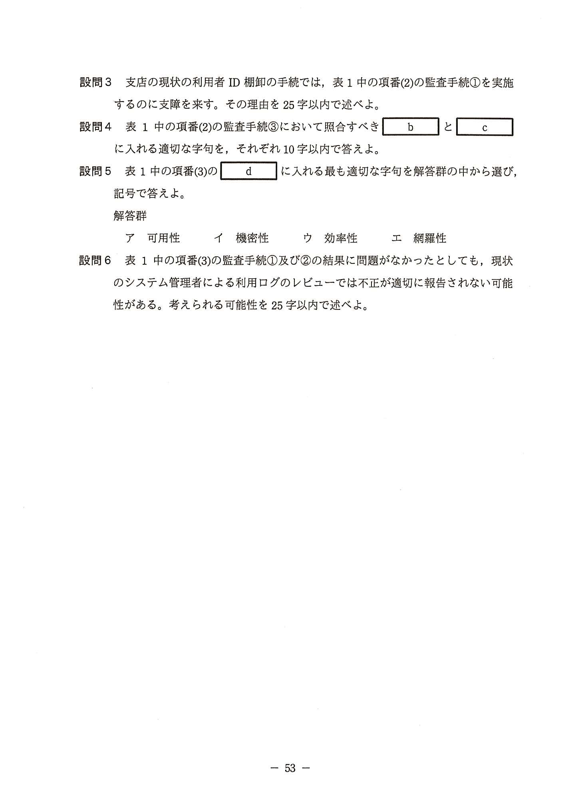

テキスト (OCR)

設問3 支店の現状の利用者 ID 棚卸の手続では, 表 1 中の項番(2)の監査手続を実施
するのに支障を来す。その理由を 25 字以内で述べよ。

設問4 表 1 中の項番(②)の監査手続きにおいて照合すべき| pb |と| 。 |
に入れる適切な字句を, それぞれ10 字以内で答えよ。

設問5 表 1 中の項番⑮の|  d | に入れる最も適切な字句を解答群の中から選び,
記号で答えよ。
解答群

ア 可用性     イ 機密性     ウ 効率性      RIRENE

設問6 表 1 中の項番(3)の監査手続の及び②の結果に問題がおかかったとしても, 現状
のシステム管理者による利用ログのレビューでは不正が適切に報告されない可能
性がある。考えられる可能性を 25 字以内で述べよ。

### ページ 54

テキスト (OCR)

C メ モ 用 紙 J

= Bs

### ページ 55

テキスト (OCR)

〔

メ = 用 紙 )

ー 5 一

### ページ 56

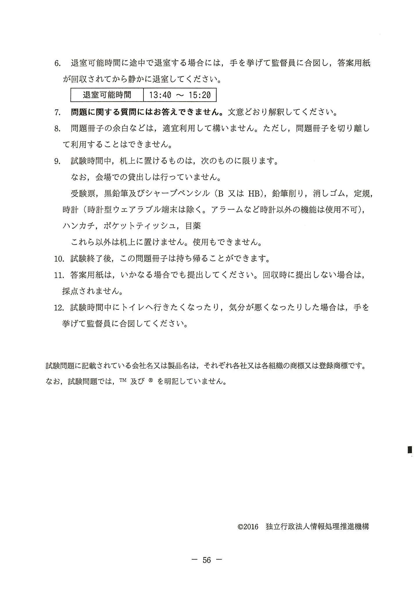

テキスト (OCR)

6. 退室可能時間に途中で退室する場合には, 手を挙げて監督員に合図し, 答案用紙
が回収されてから静かに退室してください。

| 退室可能時間 | 13:49 ~ 15:20 |
7. 問題に関する質問にはお答えできません。文意どおり解釈してください。
8. 問題冊子の余白などは, 適宜利用して構いません。ただし, 問題冊子を切り離し
て利用することはできません。
9, 試験時間中, 机上に置けるものは, 次のものに限ります。

なお, 会場での貸出しは行っていません。

受験票, 黒鉛筆及びシャープペンシル (B 又は HB), 鉛筆削り, 消しゴム, 定規
時計 (時計型ウェアラブル端末は除く。アラームなど時計以外の機能は使用不可),
ハンカチ, ポケットティツッシュ, 目薬

これら以外は机上に置けません。使用もできません。
10. 試験終了後, この問題冊子は持ち帰ることができます。
ll, SRAM, いかなる場合でも提出してください。回収時に提出しない場合は,
採点されません。
12, 試験時間中にトイレへ行きたくなったり, 気分が悪くなったりした場合は, FE
挙げて監督員に合図してください。

試験問題に記載されている会社名又は製品名は, それぞれ各社又は各組織の商標又は登録商標です。
なお, 試験問題では, ™ 及び ® を明記していません。

@2016 独立行政法人情報処理推進機構

ー 56 一

---

## 午後解答

1/6 
©2016 独立行政法人情報処理推進機構 
平成28 年度 秋期 応用情報技術者試験 解答例 
 
午後試験 
問１ 
出題趣旨 
 金融機関のATM やスマートフォンに生体認証が導入されるなど，生体認証が身近になっている。 
 本問では，安全性と利便性のバランスを考えずに情報セキュリティ対策を実施することで発生する一般的な
問題を題材に，生体認証導入に関する基本的な理解について問う。 
 
設問 
解答例・解答の要点 
備考 
設問１(1)
a
ウ 
 
(2)
b
ア，イ 
 
設問２ 
c
イ 
 
設問３(1) 漏えいしても元の指紋全体を再現できないから 
 
(2)
d
個人情報と指紋情報を物理的に分けて管理できる 
順不同 
 
 
e
誤って他人を本人と認識する確率が低い 
 
 
f
B
 
問２ 
出題趣旨 
 企業において，効果的なマーケティング戦略を実施することはとても重要である。 
 本問では，コンビニエンスストアにおけるマーケティング戦略を題材に，マーケティング戦略策定のプロセ
スを通して，マーケティングの基本的知識とその内容の理解を問う。 
 
設問 
解答例・解答の要点 
備考 
設問１ 
a
顧客単価を上げる 
 
設問２(1) ウ 
 
 
(2) 地域行事の情報を入手し，商品ごとの発注量を修正する。 
 
 
(3) 目に留まる商品をついでに買っていくことによる売上の向上 
 
設問３(1) ウ 
 
 
(2) 店舗の既存の人員で宅配が可能か。 
 
設問４ 
中高年者に向けた広告を行う。

2/6 
©2016 独立行政法人情報処理推進機構 
問３ 
出題趣旨 
 同じアルゴリズムをプログラムにする際に，前提となるデータ構造が異なれば，処理の記述も異なる。 
 本問では，魔方陣のアルゴリズムを題材に，基本的なプログラミングの能力と，データ構造が異なる場合の
処理の記述の違いについて理解を問う。 
 
設問 
解答例・解答の要点 
備考 
設問１ 
ア
N 3
設問２(1) イ
houjin[y][N＋1] 
 
 
ウ
houjin[N＋1][x] 
 
 
エ
x ← (N＋1)／2 
 
 
オ
N2 未満 
 
 
カ
yb－1 
 
 
キ
xb 
 
(2) ①
②
houjin[1][N＋1] 
houjin[N＋1][1] 
設問３ 
ク
N 
 
ケ
1 
 
問４ 
出題趣旨 
 大規模な災害が相次いでいることから，金融機関や大手企業以外においても，BCP 及び情報システムの災害
復旧対策の策定が定着しつつある。 
 本問では，中堅企業の災害復旧対策の策定を題材に，クラウドサービスを利用した災害復旧対策に関する基
本的な理解について問う。 
 
設問 
解答例・解答の要点 
備考 
設問１ 
いつまでに
10 月11 日10 時30 分 
 
いつ時点の
10 月10 日  9 時30 分 
設問２ 
Web サーバのイメージファイルをそのまま使用するから 
設問３(1) セカンダリDNS サーバとして，192.168.20.3 を登録する。 
 
(2) イ 
設問４(1) 10 月10 日17 時00 分 
 
(2)
項目 
RDATA
 
 
変更後の値
192.168.20.2

3/6 
©2016 独立行政法人情報処理推進機構 
問５ 
出題趣旨 
 昨今，IP 電話，テレビ会議，映像のストリーミングなど，リアルタイムでのマルチメディア通信が定着しつ
つある。 
 本問では，IP 電話の導入を題材に，マルチメディア通信で必要となるQoS に関する基本的な理解について問
う。 
 
設問 
解答例・解答の要点 
備考 
設問１ 
a
218 
 
b
50 
 
c
87.2 
 
d
10 
 
e
2,872 
 
f
3 
設問２(1) ポート番号は動的に決定されるから 
 
 
(2) 送信元IP アドレス
サブネットマスク
宛先IP アドレス
サブネットマスク
 
10.21.0.0
255.255.0.0
10.141.0.0
255.255.0.0
10.141.0.0
255.255.0.0
10.21.0.0
255.255.0.0
設問３ 
g
IP 電話機間の通信は他の通信の影響を受けない 
 
 
問６ 
出題趣旨 
 昨今，利用が急増しているネットショップでは，ほとんどのシステムにおいて関係データベースが用いられ，
購買管理や会員管理が行われている。 
 本問では，ネットショップの会員管理に用いる関係データベースの設計を題材に，データベースの概念設計
に関する基本的な理解，及びカーソル操作を含むデータベース言語利用の能力について問う。 
 
設問 
解答例・解答の要点 
備考 
設問１(1)
a
イ 
 
 
(2)
b
商品番号 
 
設問２ 
c
SUM(t4.商品単価 * t4.個数) 
 
 
 
d
t2.購入日時 
 
設問３ 
e
t2.購入ステータス = '完了' 
 
 
 
f
ORDER BY t2.会員番号, t2.購入日時 
 
 
 
g
goukei >= 50000 
 
 
 
h
SET t1.会員種別 = '特別会員' 
 
設問４(1) 会員 
 
 
(2) 会員番号，会員種別，適用日時

4/6 
©2016 独立行政法人情報処理推進機構 
問７ 
出題趣旨 
 ウェアラブル端末は，脈拍計，活動量計，眼鏡型の情報端末などの製品が開発されており，小型，軽量であ
り，各種のセンサを搭載し端末でデータを採取している。 
 本問では，ウェアラブル端末である腕時計型の脈拍計の設計を題材にして，センサを使用する際の外部光（ノ
イズ）の除去方法，フィードバックを利用したLED の輝度補正についての理解など基本的な技術力を問う。 
 
設問 
解答例・解答の要点 
備考 
設問１ 
点灯時間設定コマンド 
12 
 
 
消灯時間設定コマンド 
8 
設問２(1)
a
輝度設定コマンドを送信 
 
 
b
計測終了コマンドを送信 
 
(2) イ 
 
(3)
最短所要時間 
6 
 
 
最長所要時間 
16 
設問３ 
輝度補正終了前までのz は適正範囲を外れており，脈拍数算出には不適切だか
ら 
 
問８ 
出題趣旨 
 昨今，アプリケーションフレームワークの普及によってプログラミング担当者が自由にプログラム構造を設
計する機会が減っている。しかし，プログラムを適切な単位でモジュール分割するとカスタマイズ性や保守性
は向上するのでプログラム構造設計は重要である。 
 本問では，スポーツクラブ向けのSaaS を題材に，ジャクソン法を用いてプログラム構造を設計し最適な単位
でモジュール分割する設計能力について問う。 
 
設問 
解答例・解答の要点 
備考 
設問１ 
a
イ 
 
b
ア 
 
c
オ 
設問２ 
d
施設名 
 
e
会員氏名 
設問３ 
f
店ごとの施設利用レポート出力処理 
 
g
利用者なし表示出力処理 
設問４(1) ウ 
 
(2)
分割 
④ 
 
 
理由 
データ結合のモジュールに分割でき，再利用やカスタマイズが容易と
なるから

5/6 
©2016 独立行政法人情報処理推進機構 
問９ 
出題趣旨 
 プロジェクトマネジメントでは，リスクを認識し，そのリスク対応ができる体制とタスクをプロジェクト計
画に盛り込むことが重要である。 
 本問では，ソフトウェアパッケージによるシステム開発を題材に，システム開発計画書作成におけるプロジ
ェクトマネジメントの基本的な知識と適用に関する知見について問う。 
 
設問 
解答例・解答の要点 
備考 
設問１(1) A 社の業務に精通しているから 
 
(2)
a
ウ 
 
(3)
b
工数 又は 開発規模 
設問２(1) ギャップを業務変更で対応したときの影響を正確に把握するため 
 
(2) アドオンで対応可能かを正確に判断したいから 
設問３(1)
c
ウ 
 
(2)
d
準委任 
 
(3) 作業者に直接業務指示をしない。 
 
問10 
出題趣旨 
 サービス又は顧客に重大な影響を及ぼす可能性があるサービスの変更では，関係する幾つかのサービスマネ
ジメントプロセスを実施していく必要がある。また，供給者を使う場合，サービス提供者は，顧客との間のSLA
を維持し，整合を図るために，サービスレベルについて供給者と合意しなければならない。 
 本問では，供給者のクラウドサービスを使って顧客にサービスを提供するサービスの変更を題材に，サービ
スマネジメントの理解と実務能力を評価する。 
 
設問 
解答例・解答の要点 
備考 
設問１(1) アプリケーションはL 社が提供するPaaS の範囲外であるから 
 
(2) 障害復旧後にK 社が行うアプリケーションの稼働確認の時間が確保できない場
合 
設問２ 
a
キ 
 
 
b
イ 
 
 
c
ウ 
設問３(1)
d
データの整合性を確保 
 
(2)
e
・試行 
・移行リハーサル 
 
(3) 展開作業中に発生するインシデントに備えた切り戻し作業

6/6 
©2016 独立行政法人情報処理推進機構 
問11 
出題趣旨 
 情報システムの利用部門のアクセスにおいて，不正や情報漏えい対策として，利用者ID を適切に管理するこ
とは非常に重要である。利用者ID の管理手続は，企業の環境，ID の性質，ID の登録件数・更新頻度などを考
慮して，効果的かつ効率の良い手続を検討し，実施することが求められる。 
 本問では，住宅販売システムを題材に，利用者ID の管理に関する監査項目や監査手続を検討できるかについ
て問う。 
 
設問 
解答例・解答の要点 
備考 
設問１ 
承認済みID 申請書がなく更新される場合 
設問２ 
a
エ 
設問３ 
利用者ID 棚卸を実施した証跡が残らないから 
設問４ 
b
権限マスタ 
順不同 
 
c
ID 管理台帳 
設問５ 
d
エ 
設問６ 
システム管理者の不正なアクセスが報告されない。

---

## 午後採点講評

1/3 
©2017 独立行政法人情報処理推進機構 
平成28 年度 秋期 応用情報技術者試験 採点講評 
 
午後試験 
問１ 
 問1 では，ID とパスワードの不適切な管理によって発生したセキュリティインシデントを題材に，生体認証
システムの導入について出題した。全体として，正答率は高かった。 
 設問1 は，正答率が高かった。ID とパスワードのクラッキングの予防策について，基本的な事柄はおおむね
理解されているようであった。 
 設問2 は，正答率が低かった。PKI は重要な要素技術であるので，仕組みや用途も含めて是非理解しておい
てほしい。 
 設問3 は，正答率が高かった。生体認証の他人受入率，本人拒否率に関する理解が高いことがうかがわれ
た。指紋情報の格納場所については，管理の方針を背景記述から正しく読み取り，正答を導き出してほしい。
 
問２ 
 問2 では，コンビニエンスストアにおけるマーケティング戦略を題材に，マーケティング戦略策定のプロセ
スを通して，マーケティングの基本的知識とその内容の理解について出題した。全体として，正答率は高かっ
た。 
 設問2(2)は，地域行事の情報を入手することだけにしか触れておらず，商品ごとの発注量を修正することに
ついての記述がない解答が目立った。また，店舗ではなく，本部で行うべきことを記述している解答も散見さ
れた。問題文と設問をよく読み，求められていることを理解した上で解答してほしい。 
 設問3(1)は，正答率が低く，セグメンテーション，ターゲティング，ポジショニングを混同している解答が
多く見られた。これらを含むマーケティング戦略策定プロセスは重要な概念なので，各ステップの内容をよく
理解しておいてほしい。 
 
問３ 
 問3 では，魔方陣のアルゴリズムを題材に，基本的なプログラミングの能力と，データ構造が異なる場合の
処理の記述の違いについて出題した。全体として，正答率は高かった。 
 設問2(1)エは，正答率が高かった。しかし，代入文になっていなかったり，変数名が誤っていたりした解答
が散見された。穴埋め問題の解答に当たっては，前後の部分もよく見て解答してほしい。 
 設問2(1)オは，正答率が低かった。while 文に関する問いであり，for 文による繰返し条件の記述とは異なる
ことに十分注意して解答してほしい。 
 
問４ 
 問4 では，中堅企業の災害復旧対策の策定を題材に，クラウドサービスを利用した災害復旧対策について出
題した。 
 設問1 は，正答率が高かった。RTO，RPO に関する理解が高いことがうかがわれた。 
 設問2 は，正答率が低かった。DNS サーバの設定が本社とクラウドで同じであることを理由としている誤っ
た解答が散見された。DNS サーバにはロードバランサの情報が登録されており，図中の①～④のネットワーク
アドレスとは無関係であることに留意してほしい。 
 設問4(1)は，正答率が低かった。データベースの更新ログを反映するファイル数に留意して正答を導き出し
てほしい。

2/3 
©2017 独立行政法人情報処理推進機構 
問５ 
 問5 では，IP 電話の導入を題材に，マルチメディア通信で必要となるQoS について出題した。 
 設問1 は，正答率が高かった。通信に必要な帯域の計算については，おおむね理解されているようであっ
た。 
 設問2(2)は，正答率が高かった。RTP におけるネットワークアドレスでのQoS 設定に関する理解が高いこと
がうかがわれた。 
 設問3 は，正答率が低かった。拠点内ではRTP パケットは1 台のL2SW 内の通信であり，他の通信の影響を
受けない。通信に必要な帯域を確保していても，他の通信で使用される場合はQoS の設定が必要だが，他の通
信で使用されない場合は，QoS の設定は不要なことを理解してほしい。 
 
問６ 
 問6 では，ネットショップの会員管理に用いる関係データベースの設計を題材に，データベースの概念設計
に関する基本的な理解，及びカーソル操作を含むデータベース言語利用の能力について出題した。全体とし
て，正答率は高かった。 
 設問2 のc は，正答率が低かった。購入金額の合計値をデータベース言語で計算することは，実務でもよく
あることなので，その方法を是非身につけておいてほしい。 
 設問3 は，正答率が高かった。月次処理などで使用されるカーソル操作を含むバッチ処理プログラムについ
ては，おおむね理解されているようであった。 
 設問4 は，正答率が高かった。機能追加に伴うデータベースの再設計については，おおむね理解されている
ようであった。 
 
問７ 
 問7 では，腕時計型の脈拍計の設計を題材に，LED を用いた脈拍計の計測方法，脈拍計のソフトウェアの設
計について出題した。全体として，正答率は高かった。 
 設問2(3)では，最長所要時間の正答率が低かった。組込みシステム開発のリアルタイム処理では，最長所要
時間が特に重要であり，与えられた条件から正しい処理時間を計算できるようにしてほしい。 
 設問3 は，問題文の条件をコピーしただけの誤った解答が散見され，正答率も低かった。特定の条件のデー
タを使用しないのは，何らかの制約があるからである。問題をよく読み，制約条件を理解して正答を導き出し
てほしい。 
 
問８ 
 問8 では，スポーツクラブ向けのSaaS を題材に，ジャクソン法を用いたモジュール分割について出題した。
全体として，正答率は低かった。 
 設問1 のc は，正答率が低かった。ジャクソン法とワーニエ法を逆に理解している解答が目立った。代表的
なモジュール分割手法については，それぞれの名称と特徴を正しく理解しておいてほしい。 
 設問3 のg は，正答率が高かった。問題文に記載のプログラムの処理内容や出力結果から，プログラム構造
を整理してプログラム構造図を作成することは，十分にできていることがうかがわれた。 
 設問4(1)(2)は，正答率が低かった。モジュール結合度の特徴を理解できていない解答が目立った。モジュー
ル結合度の名称や順序を暗記するだけではなく，その特徴を十分に理解しておいてほしい。

3/3 
©2017 独立行政法人情報処理推進機構 
問９ 
 問9 では，ソフトウェアパッケージによるシステム開発を題材に，システム開発計画書作成におけるプロジ
ェクトマネジメントの基本的な知識と適用に関する知見について出題した。 
 設問2(1)は，業務への影響についての言及がない解答が散見された。ソフトウェアパッケージを使用したシ
ステム開発においては，システム機能で実現できない業務処理について，業務にどのような影響があるかを検
討する必要があることを理解しておいてほしい。 
 設問3(2)では，外部委託会社との契約は，委託する業務の内容と性格に応じて適切な形態を選択する必要が
あることを理解しておいてほしい。 
 設問3(3)は，正答率が高かった。外部委託会社の社員には，直接の業務指示ができないことへの理解が高い
ことがうかがわれた。 
 
問10 
 問10 では，供給者のクラウドサービスを使って顧客にサービスを提供するサービスの変更を題材に，サービ
スマネジメントの理解と実務能力について出題した。全体として，正答率は低かった。 
 設問1(2)は，正答率が低かった。L 社のPaaS の障害復旧後に，K 社がアプリケーション側の確認などの作業
を行ってからでないとサービスを復旧できない場合を答えてほしかったが，これに言及していない解答が多か
った。クラウドサービスの委託元の企業と委託先のクラウド事業者のそれぞれの責任範囲について，クラウド
サービスの種類ごとによく理解しておいてほしい。 
 設問3(3)は，正答率が低かった。本文中のサービス変更方針を基に，リリース及び展開の計画立案において
は，展開作業中にインシデントが発生するなどの不測の事態に備えて，切り戻し作業を考慮した計画を立てる
必要があることに気付いてほしかった。 
 
問11 
 問11 では，利用者ID の管理に関する監査を題材に，監査項目，監査手続などについて出題した。 
 設問1 は，承認済みのID 申請書がないにもかかわらず登録が行われるリスクがあることを読み取ることがで
きれば，現状の監査手続では不十分であることを導き出せる。問題文にある状況設定をよく読んで解答してほ
しい。 
 設問3 では，利用者ID の棚卸が適切かどうかを確かめるためには，証跡が必要となることを前提に，監査手
続の選択・適用に際しての前提条件を十分に理解し解答してほしい。 
 設問6 は，実施した監査手続をもってしても発見できない不正を推定させる問題であり，問題文の状況設定
と実施した監査手続を慎重に突き合わせることで正答を導き出してほしかった。

