# 平成28年度春期 応用情報技術者試験

---

## 午前問題

### ページ 1

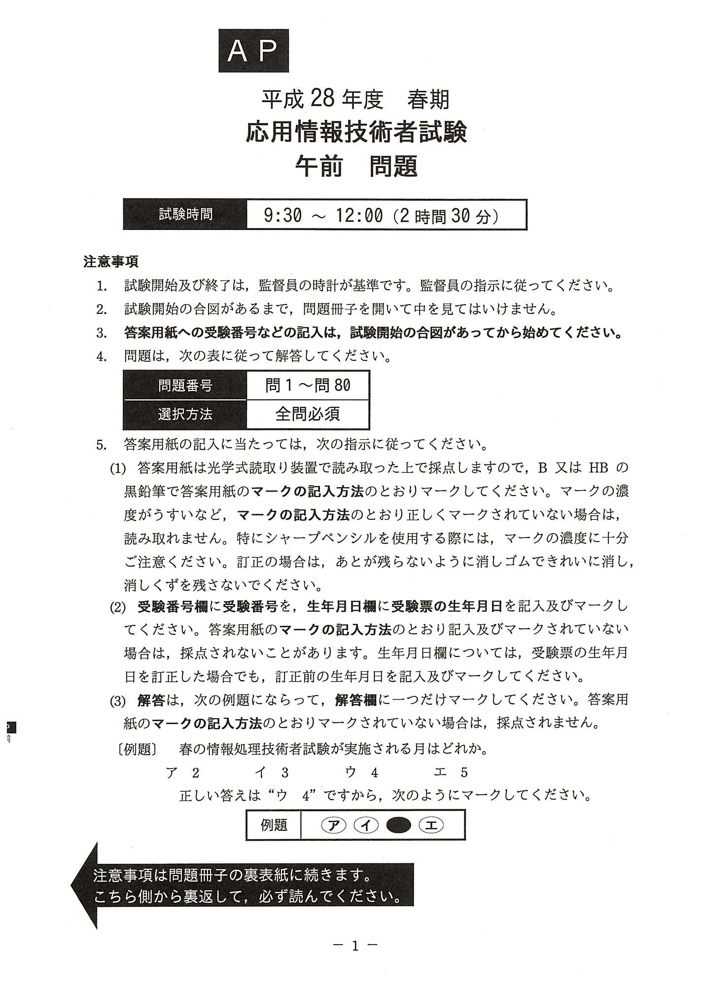

テキスト (OCR)

平成2年度 春期
応用情報技術者試験

午前 問題
 9:30 ~ 12:00 (2時間30 分)

注意事項

1. 試験開始及び終了は, 監督員の時計が基準です。監督員の指示に従ってください。
2. 試験開始の合図があるまで, 問題冊子を開いて中を見てはいけません。

3. 答案用紙への受験番号などの記入は, 試験開始の合図があってから始めてください。
4. 問題は, 次の表に従って解答してください。

問題番号       問1 て問 80
選択方法            全問必須

5. 答案用紙の記入に当たっては, 次の指示に従ってください。

(1) 答案用紙は光学式読取り装置で読み取った上で採点しますので, B 又は HB の
黒鉛筆で答案用紙のマークの記入方法のとおりマークしてください。マークの濃
度がうすいなど, マークの記入方法のとおり正しくマークされていない場合は,
読み取れません。特にシャープペンシルを使用する際には, マークの濃度に十分
ご注意ください。 訂正の場合は, あとが残らないように消しゴムできれいに消し,
消しくずを残さないでください。

⑫) 受験番号欄に受験番号を, 生年月日欄に受験票の生年月日を記入及びマークし
てください。 答案用紙のマークの記入方法のとおり記入及びマークされていない
場合は, 採点されないことがあります。 生年月日材については, 受験票の生年月
日を訂正した場合でも, 訂正前の生年月日を記入及びマークしてください。

(3) 解答は, 次の例題にならって, 解答欄に一つだけマークしてください。答案用
紙のマークの記入方法のとおりマークされていない場合は, 採点されません。
[例題】 春の情報処理技術者試験が実施される月はどれか。

ゲ @    イ 3    ウ 4    エ 5
正しい答えは“ウ 4”" ですから, 次のようにマークしてください。

例題 | DOD@®

注意事項は問題冊子の裏表紙に続きます。
こちら側から裏返して, 必ず読んでください。

### ページ 2

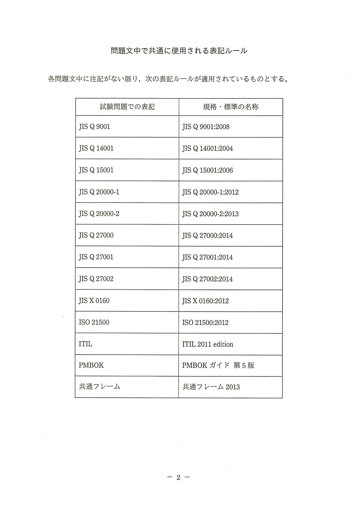

テキスト (OCR)

問題文中で共通に使用される表記ルール

各間題文中に注記がない限り, 次の表記ルールが適用されているものとする。

試験問題での表記                      規格・標準の名称
JIS Q 9001                                JIS Q 9001:2008
JIS Q 14001                             JIS Q 14001:2004
JIS Q 15001                            JIS Q 15001:2006

JIS Q 20000-1

JIS Q 20000-1:2012

JIS Q 20000-2                            JIS Q 20000-2:2013

JIS Q 27000                               JIS Q 27000:2014

JIS Q 27001                               JIS Q 27001:2014

JIS Q 27002                               JIS Q 27002:2014

JIS X 0160                                     JIS X 0160:2012

TSO 21500                                 TSO 21500:2012

ITIL                                             ITIL 2011 edition
PMBOK                                PMBOK ガイド 第5版
共通フレーム                  共通フレーム 2013

### ページ 3

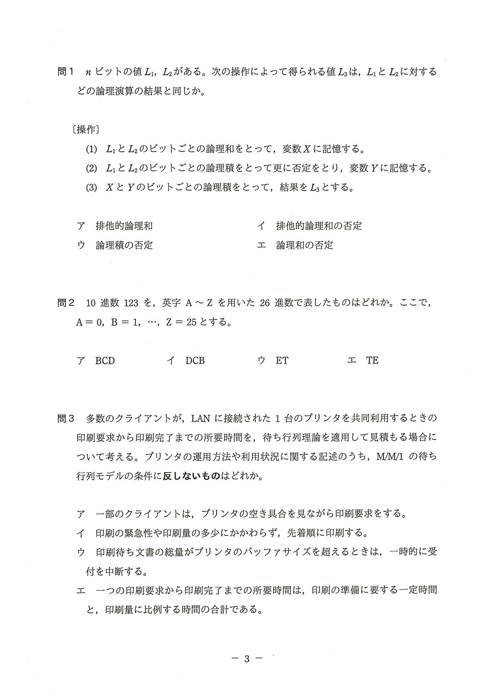

テキスト (OCR)

問1 ヵビットの値, 7。がある。 次の操作によって得られる値。は, Le LATS
どの論理演算の結果と同じか。

(BRIE)
GQ) 万とちのビットごとの論理和をとって, BRX CHET S.
2) と7。のビットごとの論理積をとって更に否定をとり, 変数に記憶する。
3) えとのビットごとの論理積をとって, 結果を了。とする。

ア 排他的論理和        イ 排他的論理和の否定
ウ 論理積の否定         エ 論理和の否定

問2 10 進数 123 を, 英字 AZ を用いた 26 進数で表したものはどれか。ここで,
A=0, Bー1, …, Z三25とする。

ア BCD     イ DCB     ウ ET     = TE

HS 多数のクライアントが, LAN に接続された 1 台のプリンタを共同利用するときの
印刷要求から印刷完了までの所要時間を, 待ち行列理論を適用して見積もる場合に
ついて考える。プリンタの運用方法や利用状況に関する記述のうち, M/M/1 の待ち
行列モデルの条件に反しないものはどれか。

ア 一部のクライアントは, プリンタの空き具合を見ながら印刷要求をする。

イ 印刷の緊急性や印刷量の多少にかかわらず, 先着順に印刷する。

ウ 印刷待ち文書の総量がプリンタのバッファサイズを超えるときは, 一時的に受
付を中断する。

エ 一つの印刷要求から印刷完了までの所要時間は, 印刷の準備に要する一定時間
と, 印刷量に比例する時間の合計である。

### ページ 4

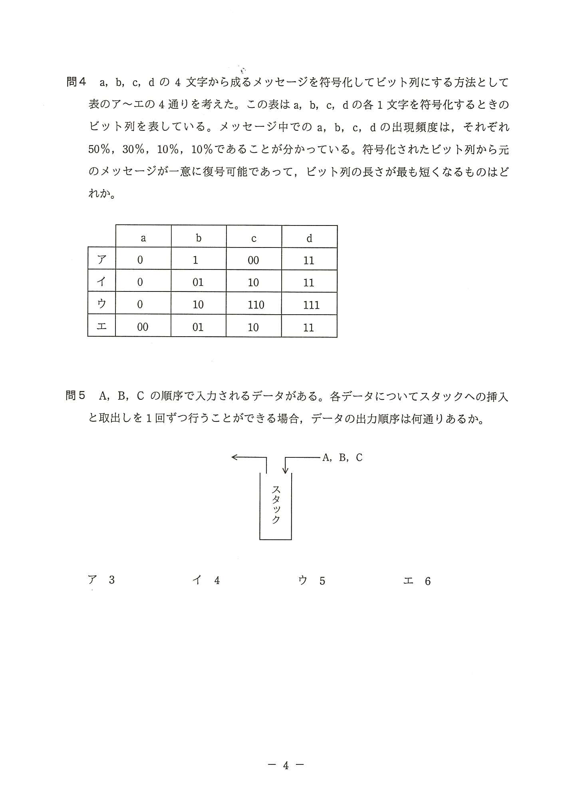

テキスト (OCR)

問4 a,b, cdの4文字から成るメッセージを符号化してビット列にする方法として
表のアーエの 4 通りを考えた。この表はa, b, c, dの各 1 文字を符号化するときの
ビット列を表している。メッセージ中での a, b, c, d の出現頻度は, それぞれ
50%, 30%, 10%, 10%であることが分かっている。 符号化されたビット列から元
のメッセージが一意に復号可能であって, ビット列の長さが最も短くなるものはど
れか。

a     b     c     d
ア   0     1     00     11
イ         0              01             10             11
ウ      0         10        110       111
=     00        01        10        11

間5 A, B, C の順序で入力されるデータがある。各データについてスタックへの挿入
と取出しを 1 回ずつ行うことができる場合, データの出力順序は何通りあるか。

て

YEN

### ページ 5

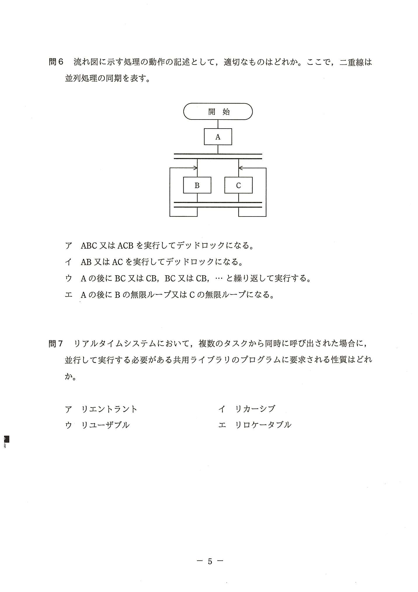

テキスト (OCR)

間6 流れ図に示す処理の動作の記述として, 適切なかものはどれか。ここで, 二重線は
並列処理の同期を表す。

ABC 又は ACB を実行してデッドロックになる。

AB 又は AC を実行してデッドロックになる。

A の後に BC又はCB, BC又はCB, … と繰り返して実行する。
A の後にBの無限ループ又はC の無限ループになる。

Hot AN

fAl7 リアルタイムシステムにおいて, 複数のタスクから同時に呼び出された場合に
並行して実行する必要がある共用ライブラリのプログラムに要求される性質はどれ
か。

ア リエントラント            イ リカーシブ
ウ リユーザブル           エエ リロケータブル

### ページ 6

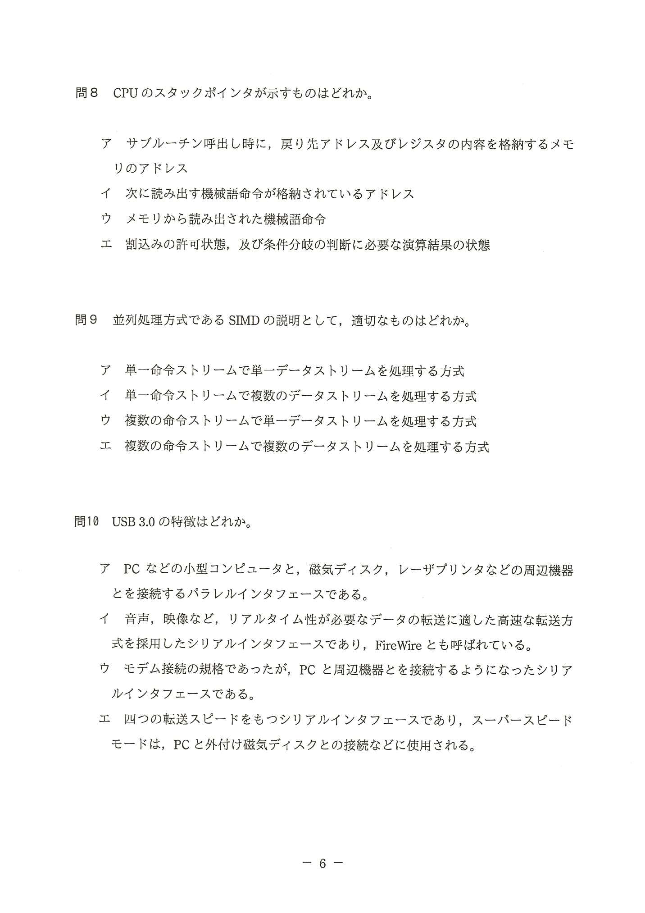

テキスト (OCR)

間8 CPUのスタックポインタが示すものはどれか。

ア サブルーチン呼出し時に, 戻り先アドレス及びレジスタの内容を格納するメモ
リのアドレス

イ 次に読み出す機械語命令が格納されているアドレス

ウ メモリから読み出された機械語命令

エエ 割込みの許可状態, 及び条件分岐の判断に必要な演算結果の状態

問9 並列処理方式である SIMD の説明として, 適切なものはどれか。

ア 単一命令ストリームで単一データストリームを処理する方式

イ 単一命令ストリームで複数のデータストリームを処理する方式
ウ 複数の命令ストリームで単一データストリームを処理する方式
エ 複数の命令ストリームで複数のデータストリームを処理する方式

fal10 USB 3.0 の特徴はどれか。

ア PC などの小型コンビピュータと, 磁気ディスク, レーザプリンタなどの周辺機器
とを接続するパラレルインタフェースである。

イ 音声, 映像など, リアルタイム性が必要なデータの転送に適した高速な転送方
式を採用したシリアルインタフェースであり, FireWire とも呼ばれている。

ウ モデム接続の規格であったが, PC と周辺機器とを接続するようになったシリア
ルインタフェースである。

TL 四つの転送スピードをもつシリアルインタフェースであり, スーパースピード
モードは, PC と外付け磁気デイィスクとの接続などに使用される。

### ページ 7

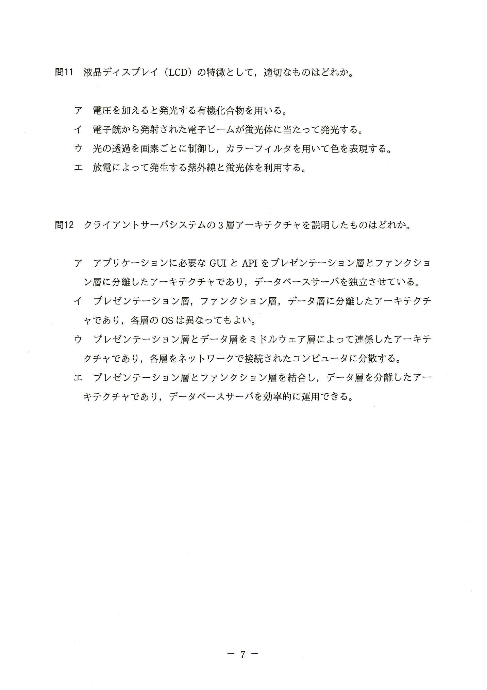

テキスト (OCR)

問11 液晶ディスプレイ (LCD) の特徴として, 適切かものはどれか。

電圧を加えると発光する有機化合物を用いる。

電子銃から発射された電子ビームが蛍光体に当たって発光する。

光の透過を画素ごとに制御し, カラーフィルタを用いて色を表現する。
放電によって発生する紫外線と蛍光体を利用する。

Hot AN

間12 クライアントサーバシステムの 3 層アーキテクチャを説明したものはどれか。

ア アプリケーションに必要な GU と APT をプレゼンテーション層とファンクショ
ン層に分離したアーキテクチャであり, データベースサーバを独立させている。
イ プレゼンテーション層, ファンクション層, データ層に分離したアーキテクチ
ャであり, 各層の 0S は異なってもよい。

ウ プレゼンテーション層とデータ層をミドルウェア層によって連係したアーキテ
クチャであり, 各層をネットワークで接続されたコンピュータに分散する。

エ プレゼンテーション層とファンクション層を結合し, データ層を分離したアー
キテクチャであり, データベースサーバを効率的に運用できる。

### ページ 8

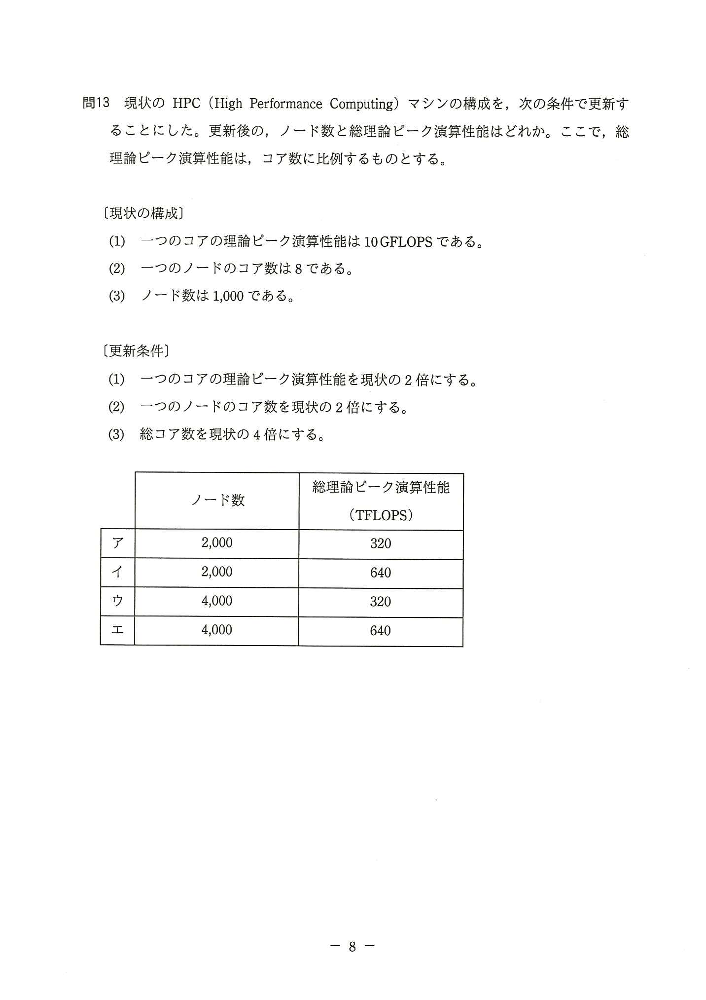

テキスト (OCR)

問13 現状の HPC (High Performance Computing) マシンの構成を, 次の条件で更新す
ることにした。 更新後の, ノード数と総理論ピーク演算性能はどれか。ここで, 総
理論ピーク演算性能は, コア数に比例するものとする。

[現状の構成]

(1) 一つのコアの理論ピーク演人算性能は 10GFLOPS である。
2) 一つのノードのコア数は 8 CHS,

(3) ノード数は 1000 CHS,

(MAE)

GQ) 一つのコアの理論ピーク演算性能を現状の 2 倍にする。
(2) 一つのノードのコア数を現状の 2 倍にする。

3) 総コア数を現状の 4 倍にする。

総理論ピーク演算性能
ノード数
(TFLOPS)
ア        2.000              320
イ        2.000              640
ウ        4000              320
エ        4000              640

### ページ 9

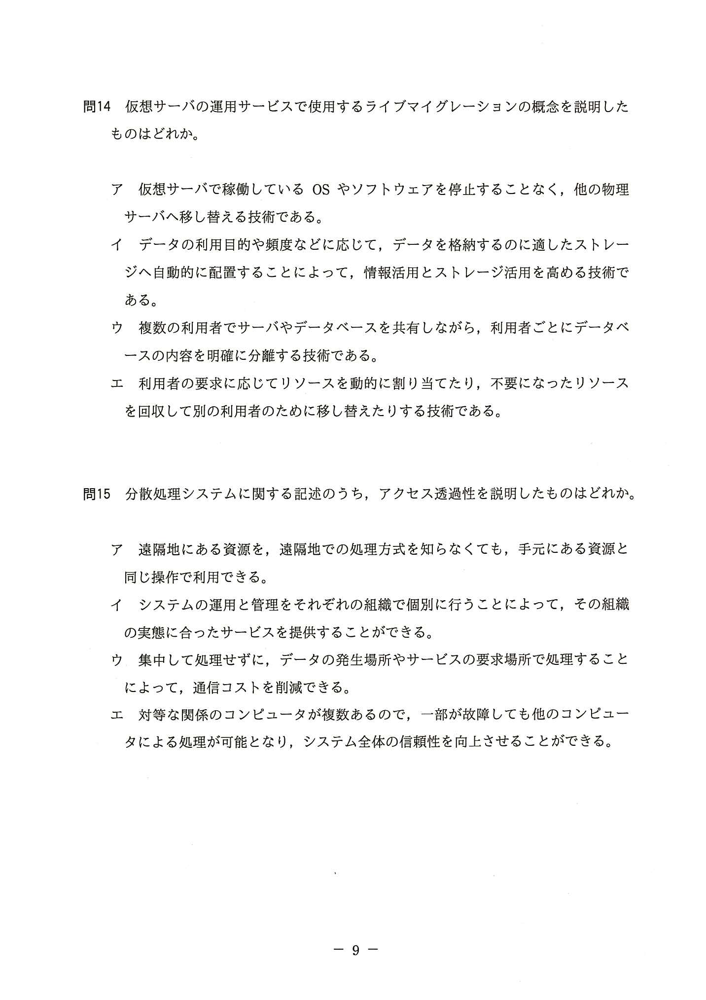

テキスト (OCR)

間14 仮想サーバの運用サービスで使用するライブマイグレーションの概念を説明した
ものはどれか。

ア 仮想サーバで稼働している OS やソフトウェアを停止することなく, 他の物理
サーバハへ移し替える技術である。

イ データの利用目的や頻度などに応じて, データを格納するのに適したストレー
ジへ自動的に配置することによって, 情報活用とストレージ活用を高める技術で
ある。

ウ 複数の利用者でサーバやデータベースを共有しながら, 利用者ごとにデータベ
ースの内容を明確に分離する技術である。

エエ 利用者の要求に応じてリソースを動的に割り当てたり, 不要になったリソース
を回収して別の利用者のために移し替えたりする技術である。

FS 分散処理システムに関する記述のうち, アクセス遂過性を説明したものはどれか。

ア 遠隔地にある資源を, 遠隔地での処理方式を知らなくても, 手元にある資源と
同じ操作で利用できる。

イ システムの運用と管理をそれぞれの組織で個別に行うことによって, その組織
の実態に合ったサービスを提供することができる。

ウ 集中して処理せずに, データの発生場所やサービスの要求場所で処理すること
によって, 通信コストを削減できる。

エエ 対等な関係のコンピュータが複数あるので, 一部が故障しても他のコンピュー
タによる処理が可能となり, システム全体の信頼性を向上させることができる。

### ページ 10

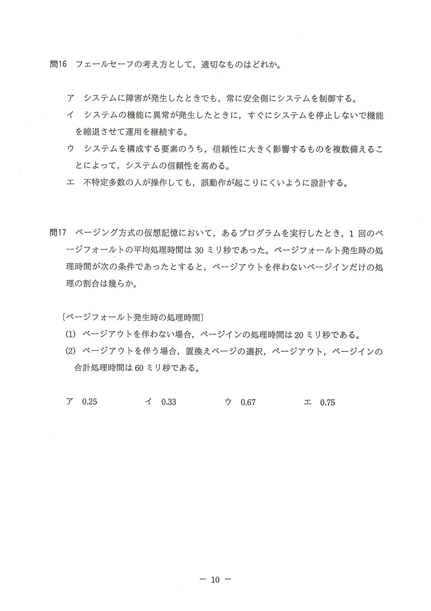

テキスト (OCR)

間16 フェールセーフの考え方として, 適切なかものはどれか。

ア システムに障害が発生したときでも, 常に安全側にシステムを制御する。

イ システムの機能に異常が発生したときに, すぐにシステムを停止しないで機能
を縮退させて運用を継続する。

ウ システムを構成する要素のうち, 信頼性に大きく影響するものを複数備えるこ
とによって, システムの信頼性を高める。

エ 不特定多数の人が操作しても, 誤動作が起こりにくいように設計する。

BIT ページング方式の仮想記憶において, あるプログラムを実行したとき, 1 回のペ
ージフォールトの平均処理時間は 30 ミリ秒であった。ページフォールト発生時の処
理時間が次の条件であったとすると, ページアウトを伴わないページインだけの処
理の割合は幾らか。

【ページフォールト発生時の処理時間]
Ql) ページアウトを伴わない場合, ページインの処理時間は 20 ミリ秒である。
QQ) ページアウトを伴う場合, 置換えページの選択, ページアウト, ページインの

合計処理時間は 60 ミリ秒である。

ア 0.25     イ 0.33     ウ 0.67     =r 0.75

ー 10 一

### ページ 11

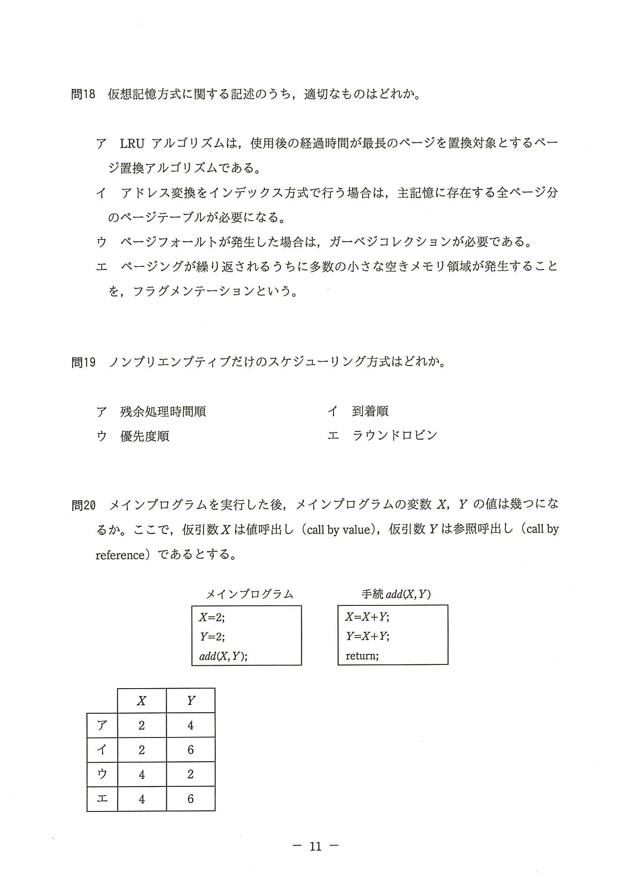

テキスト (OCR)

間18 仮想記憶方式に関する記述のうち, 適切かものはどれか。

ア LRU アルゴリズムは, 使用後の経過時間が最長のページを置換対象とするペー
ジ置換アルゴリズムである。

イ アドレス変換をインデックス方式で行う場合は, 主記憶に存在する全ページ分
のページテーブルが必要になる。

ウ ページフォールトが発生した場合は, ガーベジコレクションが必要である。

エエ ページングが繰り返されるうちに多数の小さな空きメモリ領域が発生すること

を, フラグメンテーションという。

AIO ノンプリエンプティブだけのスケジューリング方式はどれか。

ア 残余処理時間順          イ 到着順
ウ 優先度順             =. ZUYROEY

間29 メインプログラムを実行した後, メインプログラムの変数 , Y の値は幾つにな
るか。ここで, 仮引数は値呼出し (call by value), 仮引数は参照呼出し (callby
reference) であるとする。

メインプログラム          Fit add(X, Y)
X=2;                               X=X+Y;
Y=2;                               Y=X+Y;
add(X, Y);                       return;

Hf tA}
1] aw ] mw ] w | de
alwnloa};rinx

ー 11 一

### ページ 12

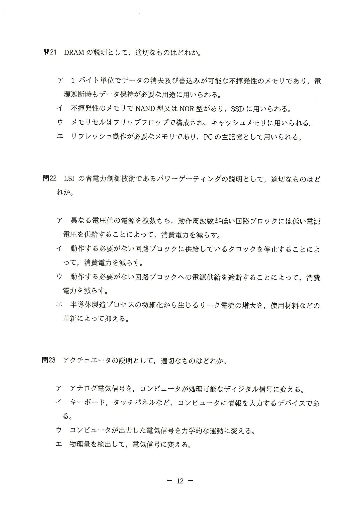

テキスト (OCR)

間21 DRAM の説明として, 適切なものはどれなか。

ア 1 バイト単位でデータの消去及び書込みが可能な不揮発性のメモリであり, 電
源遮断時もデータ保持が必要な用途に用いられる。

イ 不揮発性のメモリで NAND 型又は NOR 型があり, SSD に用いられる。

ウ メモリセルはフリップフロップで構成され, キャッシュメモリに用いられる。

エ リフレッシュ動作が必要なメモリであり, PC の主記憶として用いられる。

問22 LSI の省電力制御技術であるパワーゲーティングの説明として, 適切なかものはど
れか。

ア 異なる電圧値の電源を複数もち, 動作周波数が低い回路ブロックには低い電源
電圧を供給することによって, 消費電力を減らす。
イ 動作する必要がない回路プロックに供給しているクロックを停止することによ
って, 消費電力を減らす。
ウ 動作する必要がない回路プブロックへの電源供給を遮断することによって, 消費
電力を減らす。
エ 半導体製造プロセスの微細化から生じるリーク電流の増大を, 使用材料などの
革新によって抑える。

間23 アクチュエータの説明として, 適切なものはどれか。

ア アナログ電気信号を, コンピュータが処理可能なディジタル信号に変える。

イ キーボード, タッチパネルなど, コンピュータに情報を入力するデバイスであ
る。

ウ コンビュータが出力した電気信号を力学的な運動に変える。

エエ 物理量を検出して, 電気信号に変える。

ー 12 一

### ページ 13

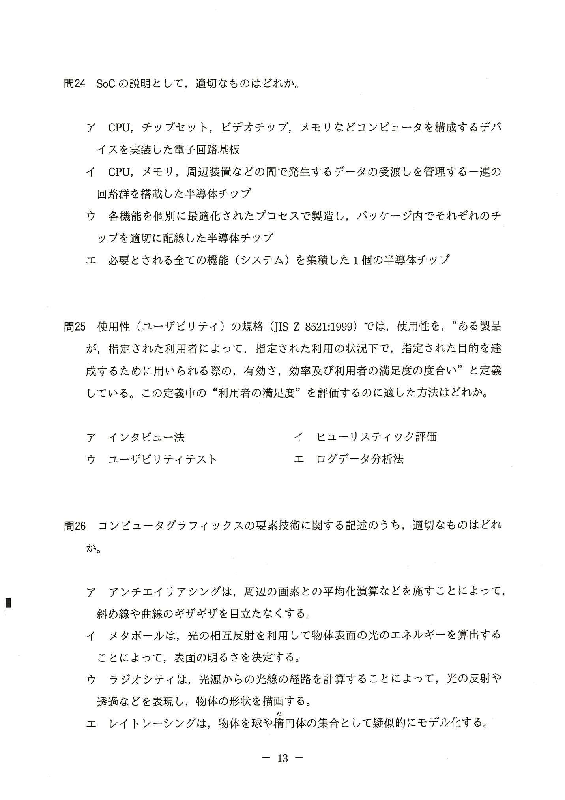

テキスト (OCR)

間24 SoC の説明として, 適切がものはどれか。

ア CPU, チップセット, ビデオチップ, メモリなどコンピュータを構成するデバ
イスを実装した電子回路基板

イ CPU, メモリ, 周辺装置などの間で発生するデータの受渡しを管理する一連の
回路群を搭載した半導体チップ

ウ 各機能を個別に最適化されたプロセスで製造し, パッケージ内でそれぞれのチ
ップを適切に配線した半導体チップ

エエ 必要とされる全ての機能 (システム) を集積した1 個の半導体チップ

問25 使用性 (ユーザビリティ) の規格 (JIS Z 8521:1999) では, 使用性を, “ある製品
が, 指定された利用者によって, 指定された利用の状況下で, 指定された目的を達
成するために用いられる際の, BMS, 効率及び利用者の満足度の度合い” と定義
している。この定義中の “利用者の満足度” を評価するのに適した方法はどれか。

ア インタビュー法          イ ヒューリスティック評価
ウ ユーザビリティテスト       エエ ログデータ分析法

A26 コンピュータグラフィックスの要素技術に関する記述のうち, 適切がかものはどれ
か。

ア アンチエイリアシングは, 周辺の画素との平均化演算などを施すことによって
斜め線や曲線のギザギザを目立たをなくする。

イ メタボールは, 光の相互反射を利用して物体表面の光のエネルギーを算出する
ことによって, 表面の明るさを決定する。

ウ ラジオシティは, 光源からの光線の経路を計算することによって, 光の反射や
透包などを表現し, 物体の形状を描画する。

エ レイトレーシングは, 物体を球や椿円体の集合として疑似的にモデル化する。

ー 13 一

### ページ 14

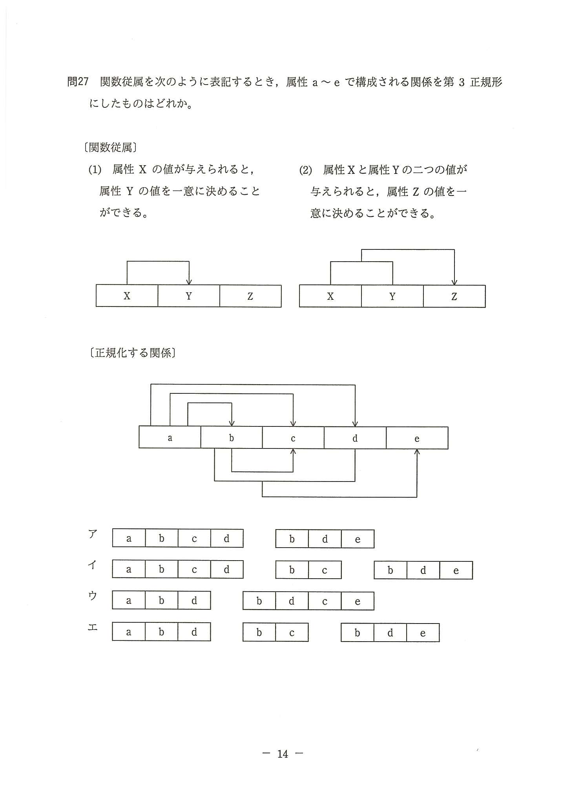

テキスト (OCR)

問27 関数従属を次のように表記するとき, 属性 ae で構成される関係を第 3 正規形
にしたものはどれか。

関数従属]

Q) 属性 X の値が与えられると,    (2) 属性Xと属性Y の二つの値が
属性 Y の値を一意に決めること    与えられると, 属性 Z の値を一
ができる。            意に決めることができる。

に
    ¥    Z      xX    ¥    Z
〔正規化する関係〕
a    b    C    d    e
|
’ ERT) Gr
‘Reh PR] BET

<r
ロロロロ
日日日

|

ia

fa

4

fal

ご
a
ご
oy

ご
fay
oO

ー 14 一

### ページ 15

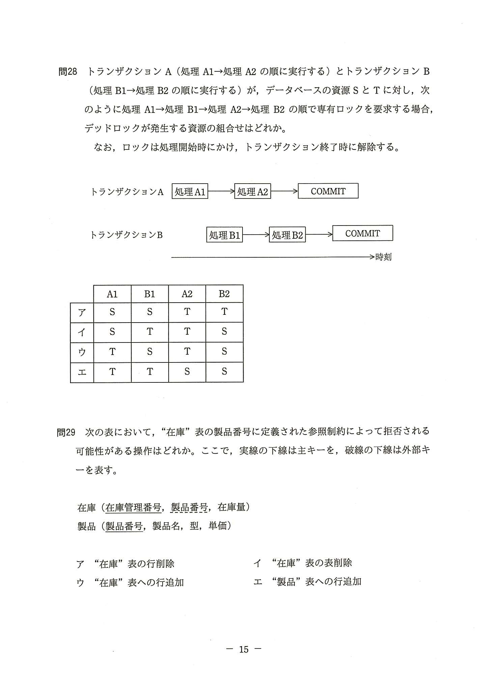

テキスト (OCR)

間28 トランザクション A (処理 A1一処理 A2 の順に実行する) とトランザクション B
(処理 B1つ処理 B2 の順に実行する) が, データベースの資源S とT に対し, 次
のように処理 A1つ処理 B1つ処理 A2っ処理 B2 の順で専有ロックを要求する場合
デッドロックが発生する資源の組合せはどれか。
なお, ロックは処理開始時にかけ, トランザクション終了時に解除する。

トランザクションA |処理Alト一処理A2ト一| coMMT |

トランザクションB

時刻
A1           B1           A2           B2
ア          S              S              T             町
イ           S              T             T             S
ウ          T             S              T             S
Ba          T             T             S              S

問29 次の表において, “EM” 表の製品番号に定義された参照制約によって拒否される
可能性がある操作はどれか。ここで, 実線の下線は主キーを, 破線の下線は外部キ
ーを表す。

製品 (製品番号, 製品名, 型, 単価)

ア “FER” 表の行削除         イ “在庫” 表の表削除
ウ “在庫” 表への行追加         エ “製品” 表への行追加

ー 4B =

### ページ 16

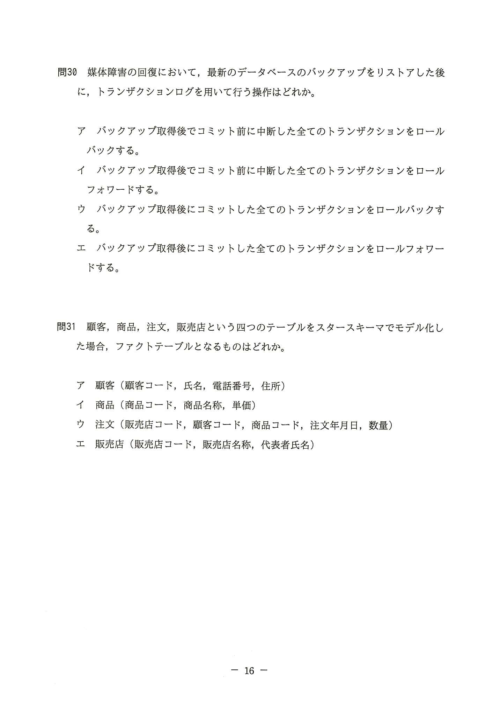

テキスト (OCR)

問39 媒体障害の回復において, 最新のデータベースのバックアップをリストアした後
に, トランザクションログを用いて行う操作はどれか。

ア バックアップ取得後でコミット前に中断した全てのトランザクションをロール
バックする。

イ バックアップ取得後でコミット前に中断した全てのトランザクションをロール
フォワードする。

ウ バックアップ取得後にコミットした全てのトランザクションをロールバックす
る。

エ バックアップ取得後にコミットした全てのトランザクションをロールフォワー
ドする。

の

間31 RAS, 商品, 注文, 販売店という四つのテーブルをスタースキーマでモデル化し
た場合,、 ファクトテーブルとなるものはどれか。

ア 顧客 (顧客コード, 氏名, 電話番号, 住所)

イ 商品 (商品コード, 商品名称, 単価)

ウ 注文(販売店コード, 顧客コード, 商品コード, 注文年月日, 数量)
= 販売店 (販売店コード, 販売店名称, 代表者氏名)

ー 16 一

### ページ 17

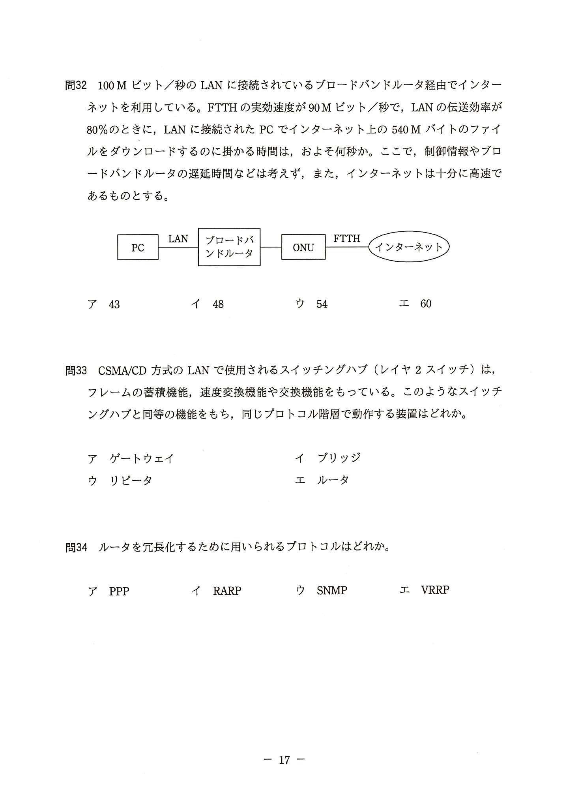

テキスト (OCR)

間32 100M ビットノ秒の LAN に接続されているブロードバンドルータ経由でインター
ネットを利用している。FTTH の実効速度が 90M ビットノ秒で, LAN の伝送効率が
80%のときに, LAN に接続された PC でインターネット上の 540M バイトのファイ
ルをダウンロードするのに掛かる時間は, およそ何秒か。ここで, 制御情報やブロ
ードバンドルータの遅延時間などは考えず, また, インターネットは十分に高速で
あるものとする。

LAN | ブロードバ          FTTH て
PC        ンドルータ     ONU        インターネット

間33 CSMA/CD 方式の LAN で使用されるスイッチングハブ (レイヤ 2 スイッチ) は,

フレームの薔積機能, 速度変換機能や交換機能をもっている。このようなスイツチ

ングハブと同等の機能をもち, 同じプロトコル階層で動作する装置はどれか。

ア ゲートウェイ             イ ブリッジ

ウ リピータ                    エ ルータ

間34 ルータを冗長化するために用いられるプロトコルはどれか。

ア PPP     イ RARP    ウ SNMP    <= VRRP

ー 17 一

### ページ 18

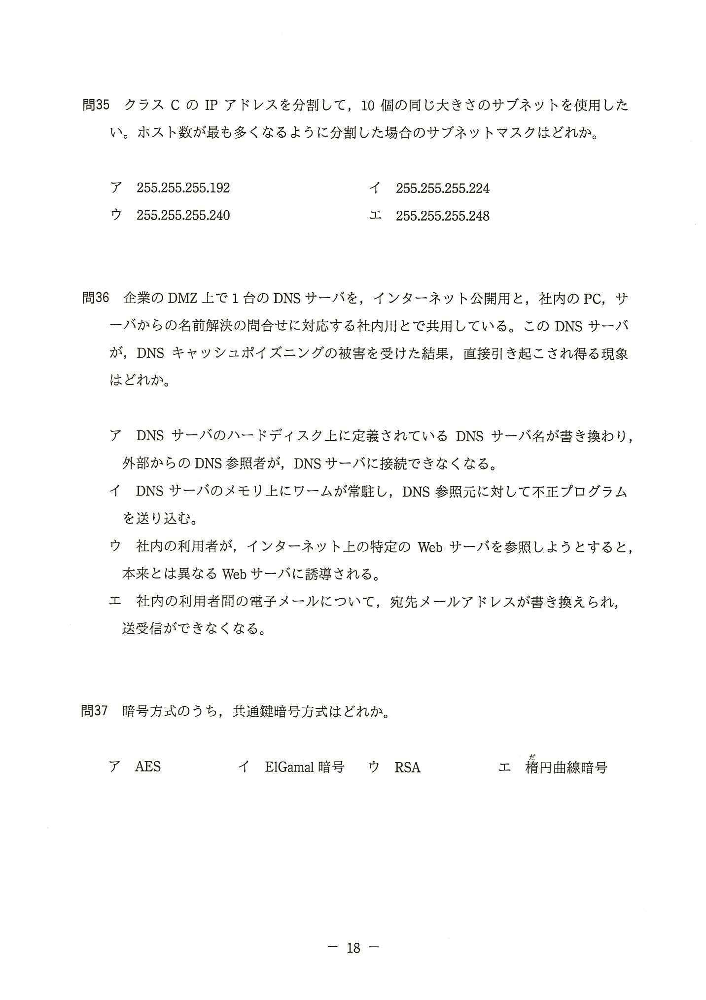

テキスト (OCR)

間35 クラス C の IP アドレスを分割して, 10 個の同じ大きさのサブネットを使用した
い。ホスト数が最も多くなるように分割した場合のサブネットマスクはどれか。

ア 255.255.255.192        イ 255.255.255.224
ウ 255.255.255.240         DL 255.255.255.248

問36 企業の DMZ 上で1 台のDNS サーバを, インターネット公開用と, 社内のPC, サ
ーバからの名前解決の問合せに対応する社内用とで共用している。この DNS サーバ
が, DNS キャッシュボポイズニングの被害を受けた結果, 直接引き起こされ得る現象
はどれか。

ア DNS サーバのハードディスク上に定義されている DNS サーバ名が書き換わり,
外部からの DNS 参照者が, DNS サーバに接続できなくなる。

イ DNS サーバのメモリ上にワームが常駐し, DNS 参照元に対して不正プログラム
を送り込む。

ウ 社内の利用者が, インターネット上の特定の Web サーバを参照しようとすると,
本来とは異なる Web サーバに誘導される。

エエ 社内の利用者間の電子メールについて, 宛先メールアドレスが書き換えられ,
送受信ができなくなる。

間37 暗号方式のうち, 共通鍵暗号方式はどれか。

ア AES     イ ElGamal暗号 ウ RSA     エエ 椿円曲線暗号

ー 13 +

### ページ 19

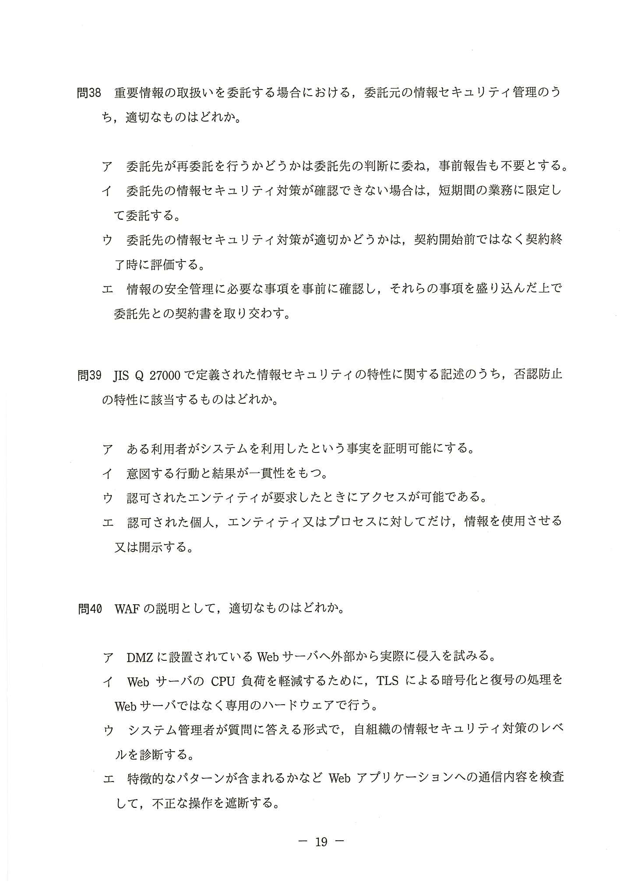

テキスト (OCR)

問38 重要情報の取扱いを委託する場合における, 委託元の情報セキュリティ管理のう
ち, 適切なものはどれか。

ア 委託先が再委託を行うかどうかは委託先の判断に委ね, 事前報告も不要とする。
イ 委託先の情報セキュリティ対策が確認できない場合は, 短期間の業務に限定し

て委託する。

ウ 委託先の情報セキュリティ対策が適切かどうかは, 契約開始前ではなく契約終
了時に評価する。
エ 情報の安全管理に必要な事項を事前に確認し, それらの事項を盛り込んだ上で
委託先との契約書を取り交わす。

間39 JIS Q 27000 で定義された情報セキュリティの特性に関する記述のうち, 否認防止
の特性に該当するものはどれか。

ある利用者がシステムを利用したという事実を証明可能にする。

意図する行動と結果が一貫性をもつ。

認可されたエンティティが要求したときにアクセスが可能である。

認可された個人, エンティティ又はプロセスに対してだけ, 情報を使用させる
又は開示する。

HG AN

間40 WAFの説明として, 適切かものはどれか。

ア DMZに設置されている Web サーバへ外部から実際に侵入を試みる。

4 Web サーバの CPU 負荷を軽減するために, TLS による暗号化と復号の処理を
Web サーバではなく専用のハードウェアで行う。

ウ システム管理者が質問に答える形式で, 自組織の情報セキュリテイ対策のレベ
ルを診断する。

エ 特徴的なパターンが含まれるかなど Web アプリケーションへの通信内容を検査
して, 不正な操作を遮断する。

ー 39 一

### ページ 20

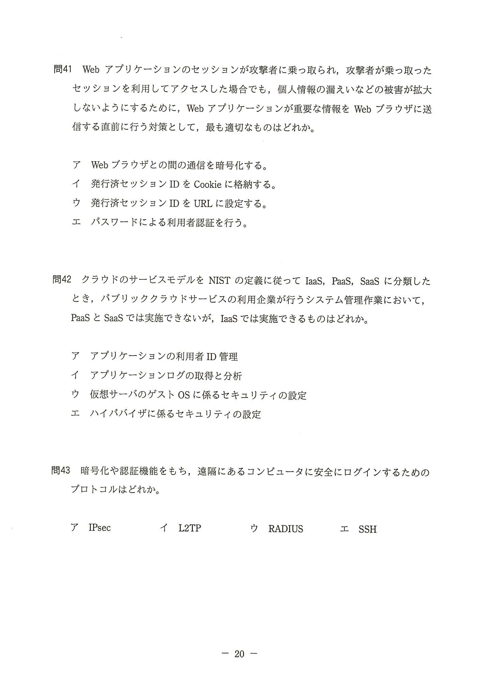

テキスト (OCR)

間41 Web アプリケーションのセッションが攻撃者に乗っ取られ, 攻撃者が乗っ取った
セッションを利用してアクセスした場合でも, 個人情報の漏えいなどの被害が拡大
しないようにするために, Web アプリケーションが重要な情報を Web ブラウザに送
信する直前に行う対策として, 最も適切かものはどれか。

Web ブラウザとの間の通信を暗号化する。
発行済セウッション ID を Cookie に格納する。
発行済セッション TD を URL に設定する。
パスワードによる利用者認証を行う。

H ざい

問42 クラウドのサービスモデルを NIST の定義に従って ]aaS, PaaS, SaaS に分類した
とき, パブリッククラウドサービスの利用企業が行うシステム管理作業において,
PaaS と SaaS では実施できないが, ]aaS では実施できるものはどれか。

アプリケーションの利用者 TD 管理

アプリケーションログの取得と分析

仮想サーバのゲスト OS に係るセキュリティの設定
ハイパバイザに係るセキュリティの設定

H へ WN

間43 暗号化や認証機能をもち, 遠隔にあるコンピュータに安全にログインするための
プロトコルはどれか。

ア TIPsec    イ T2TE    ウ RADIUS   = SSH

ー 20 一

### ページ 21

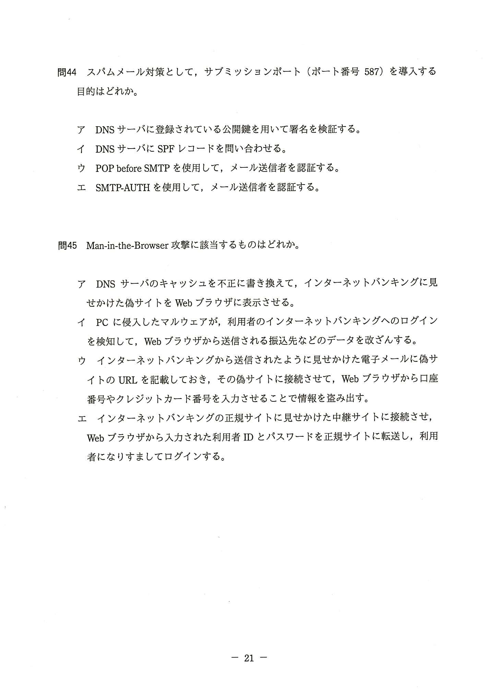

テキスト (OCR)

間44 スパムメール対策として, サブミッションポート (ポート番号 587) を導入する
目的はどれか。

DNS サーバに登録されている公開鍵を用いて署名を検証する。
DNS サーバに SPF レコードを問い合わせる。

POP before SMTP を使用して, メール送信者を認証する。
SMTP-AUTH を使用して, メール送信者を認証する。

H tA Ww

問45 Man-in-the-Browser 攻撃に該当するものはどれか。

ア DNS サーバのキャッシュを不正に書き換えて, インターネットバンキングに見
せかけた偽サイトを Web ブラウザに表示させる。

イ PC に侵入したマルウェアが, 利用者のインターネットバンキングへのログイン
を検知して, Web ブラウザから送信される振込先などのデータを改ざんする。

ウ インターネットバンキングから送信されたように見せかけた電子メールに億サ
イトの URL を記載しておき, その他サイトに接続させて, Web ブラウザから口座
番号やクレジットカード番号を入力させることで情報を盗み出す。

エ インターネットバンキングの正規サイトに見せかけた中継サイトに接続させ,
Web ブラウザから入力された利用者 ID とパスワードを正規サイトに転送し, 利用
者になりすましてログインする。

ー 21 一

### ページ 22

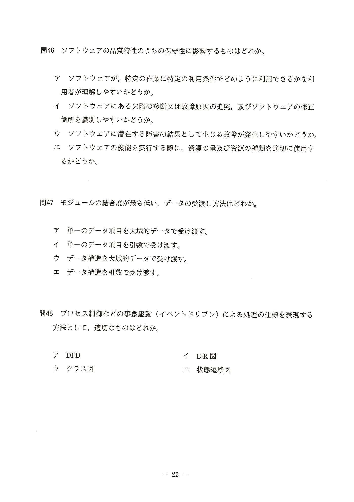

テキスト (OCR)

問46 ソフトウェアの品質特性のうちの保守性に影響するものはどれか。

ア ソフトウェアが, 特定の作業に特定の利用条件でどのように利用できるかを利
用者が理解しやすいかどうか。

イ ソフトウェアにある欠陥の診断又は故障原因の追究。 及びソフトウェアの修正
箇所を識別しやすいかどうか。

ウ ソフトウェアに潜在する障害の結果として生じる夏障が発生しやすいかどうか。

CL ソフトウェアの機能を実行する際に, 資源の量及び資源の種類を適切に使用す
るかどうか。

間47 モジュールの結合度が最も低い, データの受渡し方法はどれか。

単一のデータ項目を大域的データで受け渡す。
単一のデータ項目を引数で受け渡す。

データ構造を大域的データで受け渡す。

データ構造を引数で受け渡す。

H さささい

問48 プロセス制御などの事象駆動 (イベントドリブン) による処理の仕様を表現する
方法として, 適切なかものはどれか。

ア DFD            イ ERX
ウ クラス図           エ 状態遷移図

ー 22 一

### ページ 23

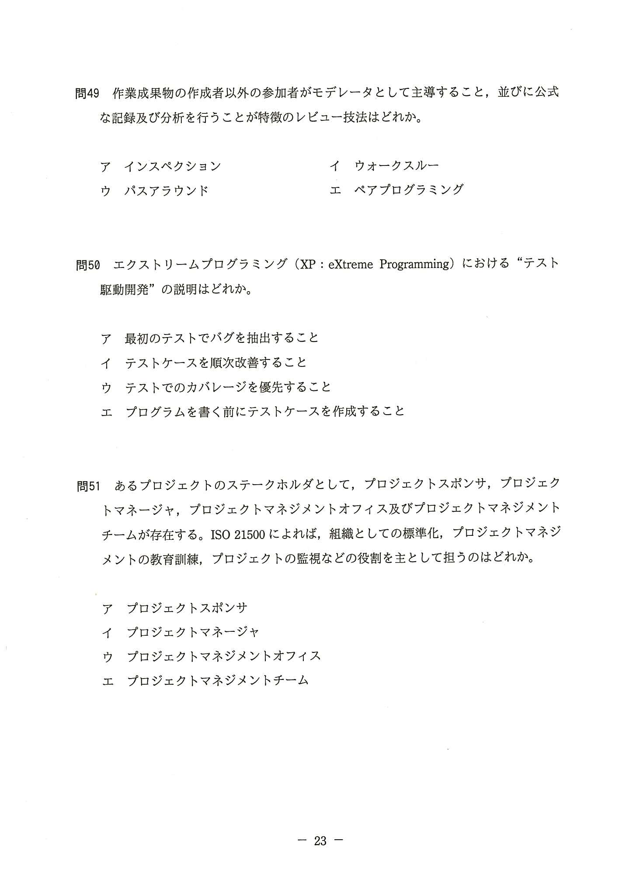

テキスト (OCR)

間49 作業成果物の作成者以外の参加者がモデレータとして主導すること, 並びに公式
な記録及び分析を行うことが特徴のレビュー技法はどれか。

ア インスペクション         イ ウォークスルー
ウ パスアラウンド             エエ ペアプログラミング

問590 エクストリームプログラミング (XP: eXtreme Programming) における “TFA
駆動開発” の説明はどれか。

最初のテストでバグを抽出すること

テストケースを順次改善すること

テストでのカバレージを優先すること

プログラムを書く前にテストケースを作成すること

H へ ON

FS) あるプロジェクトのステークホルダとして, プロジェクトスポンサ, プロジェク
トマネージャ, プロジェクトマネジメントオフィス及びプロジェクトマネジメント
チームが存在する。ISO 21500 によれば, 組織としての標準化・プロジェクトマネジ
メントの教育訓練, プロジェクトの監視などの役割を主として担うのはどれか。

プロジェクトスポンサ
プロジェクトマネージャ
プロジェクトマネジメントオフィス
プロジェクトマネジメントチーム

H さささ

ー 23 一

### ページ 24

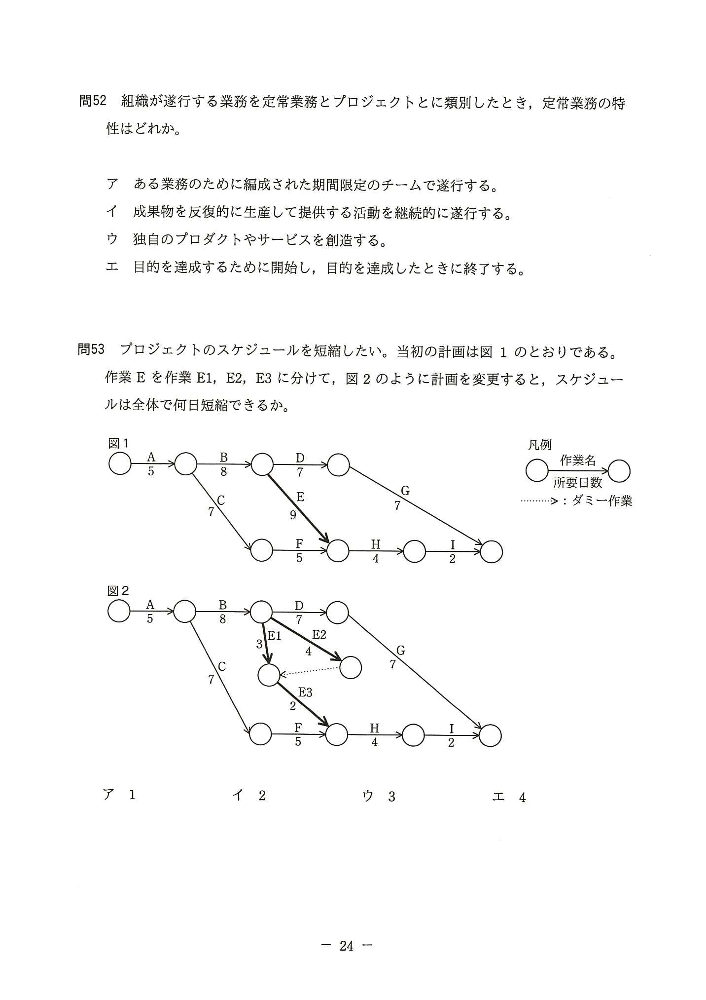

テキスト (OCR)

問52 組織が遂行する業務を定常業務とプロジェクトとに類別したとき, 定常業務の特
性はどれか。

ある業務のために編成された期間限定のチームで遂行する。
成果物を反復的に生産して提供する活動を継続的に遂行する。
独自のプロダクトやサービスを創造する。

目的を達成するために開始し, 目的を達成したときに終了する。

HAN

問538 プロジェクトのスケジュールを短縮したい。 当初の計画は図 1 のとおりである。
作業E を作業 E1, E2, E3 に分けて, 図 2 のように計画を変更すると, スケジュー
ルは全体で何日短縮できるか。

ー 24 一

### ページ 25

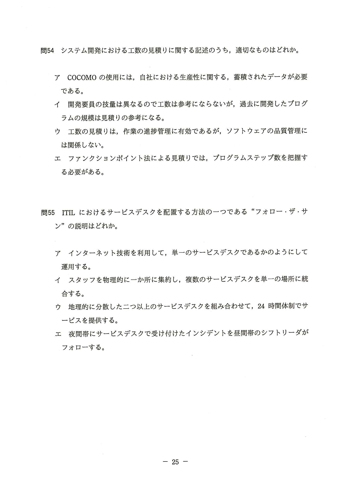

テキスト (OCR)

問54 システム開発における工数の見積りに関する記述のうち, 適切なかものはどれか。

ア COCOMO の使用には, 自社における生産性に関する, 蓄積されたデータが必要
である。

イ 開発要員の技量は異なるので工数は参考にならないが, 過去に開発したプログ
ラムの規模は見積りの参考になる。

ウ 工数の見積りは, 作業の進捗管理に有効でもやるが, ソフトウェアの品質管理に
は関係しない。

エ ファンクションポイント法による見積りでは, プログラムステップ数を把握す
る必要がある。

M55 ITIL におけるサービスデスクを配置する方法の一つである “フォロー・ザ・サ
ン” の説明はどれか。

ア インターネット技術を利用して, 単二のサービスデスクであるかのようにして

運用する。

イ スタッフを物理的に一か所に集約し, 複数のサービスデスクを上単一の場所に統
合する。

ウ 地理的に分散した二つ以上のサービスデスクを組み合わせて, 24 時間体制でサ
ービスを提供する。

エ 夜間帯にサービスデスクで受け付けたインシデントを昼間帯のシフトリーダが
フォローする。

ー 25 一

### ページ 26

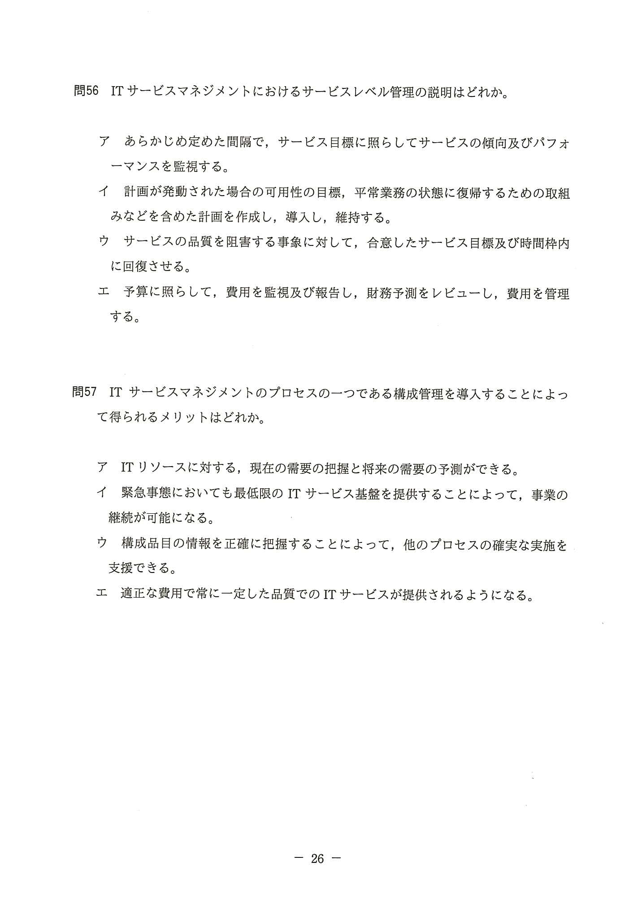

テキスト (OCR)

間56 ITサービスマネジメントにおけるサービスレベル管理の説明はどれか。

ア あらかじめ定めた間隔で,。 サービス目標に照らしてサービスの傾向及びパフォ
ーマンスを監視する。

イ 計画が発動された場合の可用性の目標, 平常業務の状態に復帰するための取組
みなどを含めた計画を作成し, 導入し, 維持する。

ウ サービスの品質を阻害する事象に対して, 合意したサービス目標及び時間枠内

に回復させる。
エ 予算に照らして, 費用を監視及び報告し, 財務予測をレビューし, 費用を管理
する。

問57 IT サービスマネジメントのプロセスの一つである構成管理を導入することによっ
て得られるメリットはどれか。

ア ITリソースに対する, 現在の需要の把握と将来の需要の予測ができる。

イ 緊急事態においても最低限の IT サービス基盤を提供することによって, 事業の
継続が可能になる。

ウ 構成品目の情報を正確に把握することによって, 他のプロセスの確実な実施を
支援できる。

= 適正な費用で常に一定した品質での IT サービスが提供されるようになる。

ー 26 一

### ページ 27

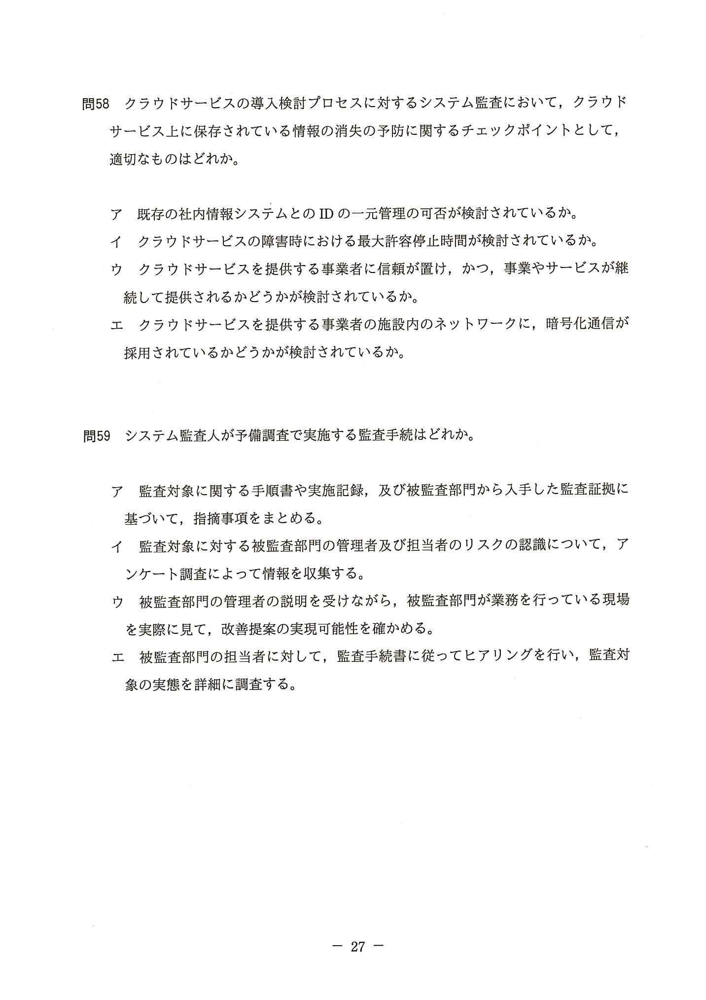

テキスト (OCR)

間58 クラウドサービスの導入検討プロセスに対するシステム監査において, クラウド
サービス上に保存されている情報の消失の予防に関するチェックボポイントとして,
適切ながものはどれか。

ア 既存の社内情報システムとの ID の一元管理の可否が検討されているか。

イ クラウドサービスの障害時における最大許容停止時間が検討されているか。

ウ クラウドサービスを提供する事業者に信頼が置け, DO, 事業やサービスが継
続して提供されるかどうかが検討されているか。

エ クラウドサービスを提供する事業者の施設内のネットワークに, 暗号化通信が
採用されているかどうかが検討されているか。

間59 システム監査人が予備調査で実施する監査手続はどれか。

ア 監査対象に関する手順書や実施記録, 及び被監査部門から入手した監査証拠に
基づいて, 指摘事項をまとめる。

イ 監査対象に対する被監査部門の管理者及び担当者のリスクの認識について, ア
ンケート調査によって情報を収集する。

ウ 被監査部門の管理者の説明を受けながら, 被監査部門が業務を行っている現場
を実際に見て, 改善提案の実現可能性を確かめる。

エ 被監査部門の担当者に対して, 監査手続書に従ってヒアリングを行い, 監査対
象の実態を詳細に調査する。

ー 27 一

### ページ 28

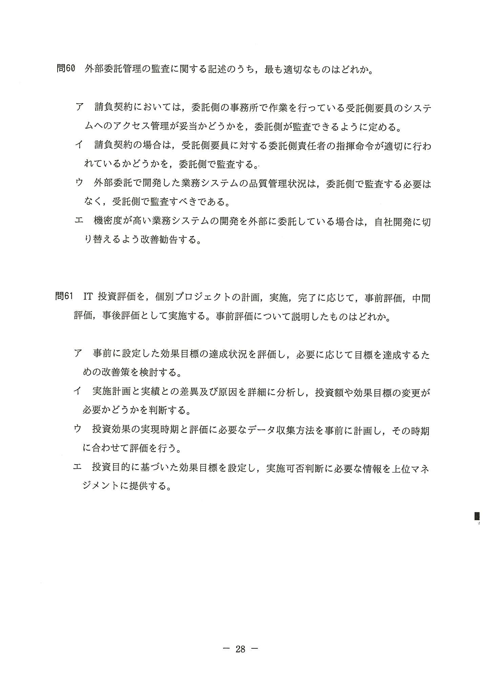

テキスト (OCR)

問69 外部委託管理の監査に関する記述のうち, 最も適切なものはどれか。

負契約においては, 委託側の事務所で作業を行っている受託側要員のシステ
ムへのアクセス管理が妥当かどうかを, 委託側が監査できるように定める。
イ 請負契約の場合は, 受託側要員に対する委託側責任者の指揮命令が適切に行わ
れているかどうかを, 委託側で監査する。.
ウ 外部委託で開発した業務システムの品質管理状況は, 委託側で監査する必要は
なく, 受託側で監査すべきである。
エ 機密度が高い業務システムの開発を外部に委託している場合は, 自社開発に切
り替えるよう改善勧告する。

ア

問61 IT 投資評価を, 個別プロジェクトの計画, 実施, 完了に応じて, 事前評価, 中間
評価, 事後評価として実施する。事前評価について説明したものはどれか。

ア 事前に設定した効果目標の達成状況を評価し, 必要に応じて目標を達成するた

めの改善策を検討する。

イ 実施計画と実績との差異及び原因を詳細に分析し, 投資額や効果目標の変更が
必要かどうかを判断する。

ウ 投資効果の実現時期と評価に必要なデータ収集方法を事前に計画し, その時期
に合わせて評価を行う。

= 投資目的に基づいた効果目標を設定し, 実施可否判断に必要な情報を上位マネ
ジメントに提供する。

ー 28 一

### ページ 29

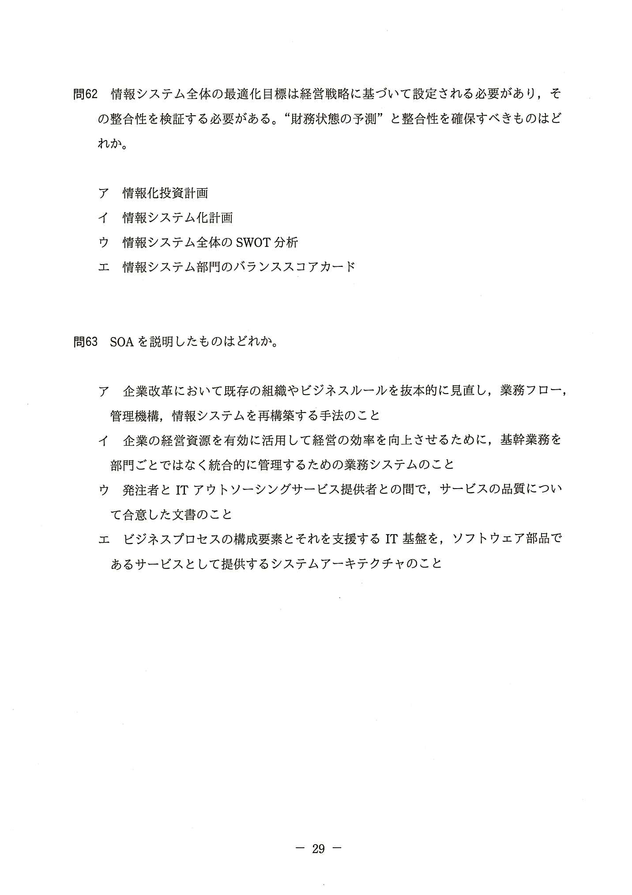

テキスト (OCR)

問62 情報システム全体の最適化目標は経営戦略に基づいて設定される必要があり, そ
の整合性を検証する必要がある。 “財務状態の予測” と整合性を確保すべきものはど
れか。

情報化投資計画

情報システム化計画

情報システム全体の SWOT 分析

情報システム部門のバランススコアカード

Hot AM

間63 SOAを説明したものはどれか。

ア 企業改革において既存の組織やビジネスルールを抜本的に見直し, 業務フロー,
管理機構, 情報システムを再構築する手法のこと

イ 企業の経営資源を有効に活用して経営の効率を向上させるために, 基幹業務を
部門ごとではなく統合的に管理するための業務システムのこと

ウ 発注者と IT アウトソーシングサービス提供者との間で, サービスの品質につい
て合意した文書のこと

エエ ビジネスプロセスの構成要素とそれを支援する IT 基盤を, ソフトウェア部品で
あるサービスとして提供するシステムアーキテクチャのこと

ー 29 一

### ページ 30

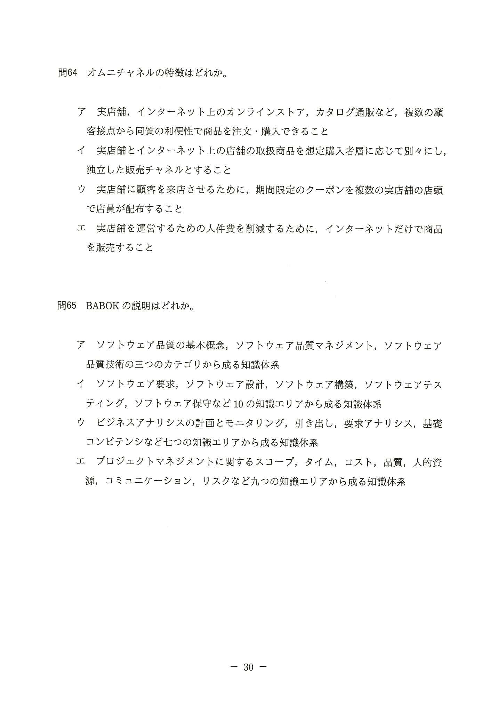

テキスト (OCR)

問64 オムニチャネルの特徴はどれか。

ア 実店舗,インターネット上のオンラインストア, カタログ通販など, 複数の顧
客接点から同質の利便性で商品を注文・購入できること

イ 実店舗とインターネット上の店舗の取扱商品を想定購入者層に応じて別々にし,
独立した販売チャネルとすること

ウ 実店舗に顧客を来店させるために, 期間限定のクーポンを複数の実店舗の店頭
で店員が配布すること

エ 実店舗を運営するための人件費を削減するために, インターネットだけで商品
を販売すること

問65 BABOK の説明はどれか。

ア ソフトウェア品質の基本概念, ソフトウェア品質マネジメント, ソフトウェア
品質技術の三つのカテゴリから成る知識体系
イ ソフトウェア要求.ソフトウェア設計 ソフトウェア構築, ソフトウェアテス
ティング, ソフトウェア保守など 10 の知識エリアから成る知識体系
ウ ビジネスアナリシスの計画とモニタリング, 引き出し, 要求チナリシス, 基礎
コンピテンシなど七つの知識エリアから成る知識体系
エエ プロジェクトマネジメントに関するスコープ, タイム, JA, 品質, 人的資
源, コミュニケーション, リスクなど九つの知識エリアから成る知識体系

ー 30 一

### ページ 31

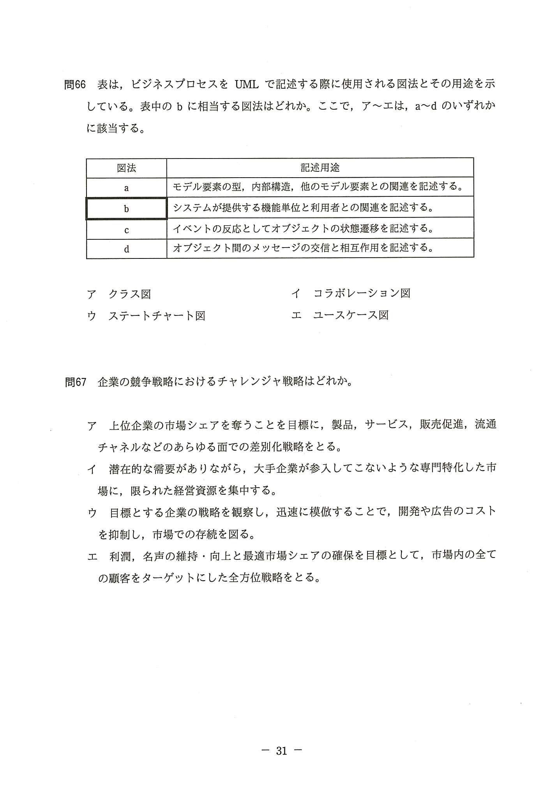

テキスト (OCR)

間66 表は, ビジネスプロセスを UML で記述する際に使用される図法とその用途を示
している。表中の b に相当する図法はどれか。ここで, アーエは, ard のいずれか
こ該当する。

図法                 記述用作
a    モデル要素の型, 内部構造 他のモデル要素との関連を記述する。
b    システムが提供する機能単位と利用者との関連を記述する。
    イベントの反応としてオブジェクトの状態須移を記述する。
d    オプジェクト間のメッセージの交信と相互作用を記述する。

ア VIAL                 イ コラボレーション図

ウ ステートチャート図        エ ユースケース図

間67 企業の競争戦略におけるチャレンジャ戦略はどれか。

ア 上位企業の市場シェアを奪うことを目標に, 製品,サービス, 販売促進, 流通
チャネルなどのあらゆる面での差別化戦略をとる。

イ 潜在的な需要がありながら, 大手企業が参入してこないような専門特化した市
場に, 限られた経営資源を集中する。

ウ 目標とする企業の戦略を観察し, 迅速に模條することで, 開発や広告のコスト
を抑制し, 市場での存続を図る。

x= 利潤, 名声の維持・向上と最適市場シェアの確保を目標として, 市場内の全て
の顧客をターゲットにした全方位戦略をとる。

ー 31 一

### ページ 32

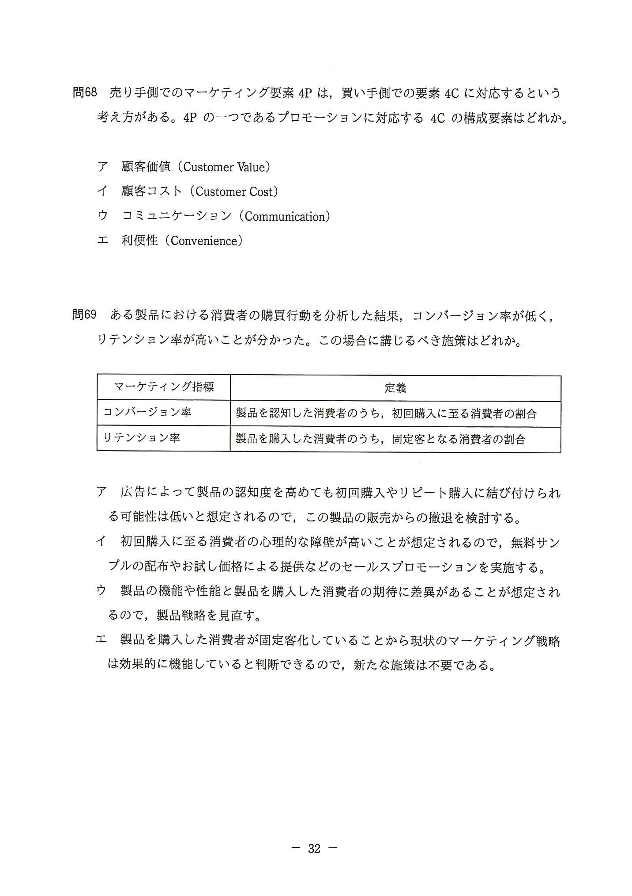

テキスト (OCR)

間68 売り手側でのマーケティング要素 4P は, 買い手側での要素 4C に対応するという
考え方がある。4P の一つであるプロモーションに対応する AC の構成要素はどれか。

ア 顧客価値 (Customer Value)

イ 顧客コスト (Customer Cost)

ウ コミュニケーション (Communication)
x

利便性 (Convenience)

間69 ある製品における消費者の購買行動を分析した結果,. コンバージョン率が低く,
リテンション率が高いことが分かった。この場合に講じるべき施策はどれか。

マーケティング指標                          定義
コンバージョン率         製品を認知した消費者のうち, 初回購入に至る消費者の割合
リテンション率         製品を購入した消費者のうち, 固定客となる消費者の割合

ア 広告によって製品の認知度を高めても初回購入やリピート購入に結び付けられ
る可能性は低いと想定されるので, この製品の販売からの撤退を検討する。

イ 初回購入に至る消費者の心理的な障壁が高いことが想定されるので, 無料サン
プルの配布やお試し価格による提供などのセールスプロモーションを実施する。
ウ 製品の機能や性能と製品を購入した消費者の期待に差異があることが想定され

るので, 製品戦略を見直す。
エ 製品を購入した消費者が固定客化していることから現状のマーケティング戦略
は効果的に機能していると判断できるので, 新たな施策は不要である。

ー 32 一

### ページ 33

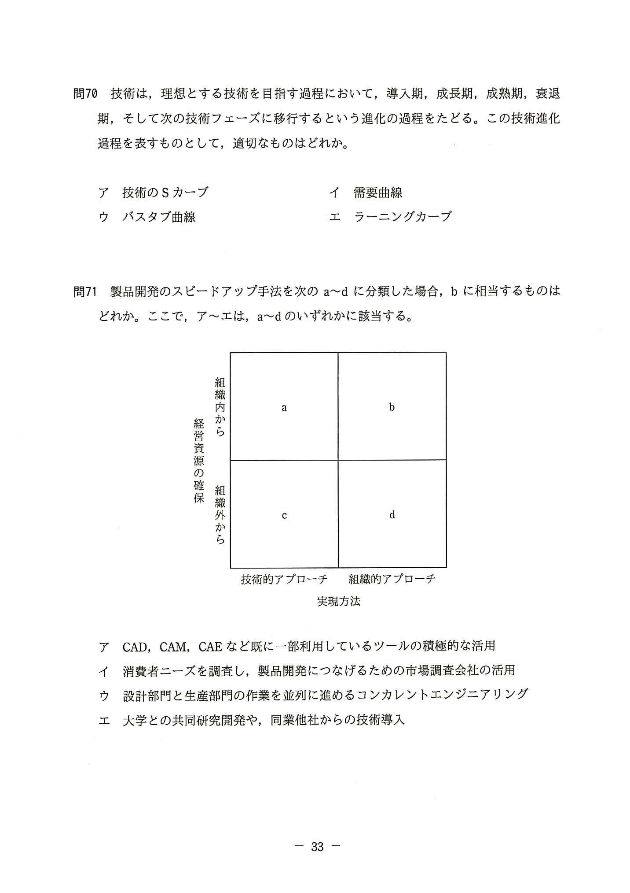

テキスト (OCR)

間70 技術は, 理想とする技術を目指す過程において, 導入期, 成長期, 成熟期, 衰退
期, そして次の技術フェーズに移行するという進化の過程をたどる。この技術進化
過程を表すものとして, 適切なものはどれか。

ア 技術のS カーブ        イ FEAR
ウ バスタブ曲線 デーデングカープ

間71 製品開発のスピードアップ手法を次の awd に分類した場合, b に相当するものは
どれか。ここで, アーンエは, ad のいずれかに該当する。

組
織
内    a        b
経 か
党 ら
次
源
tt
a @
外    c        d
か
ら

技術的アプローチ 組織的アプローチ
実現方法

CAD, CAM, CAE など既に一部利用しているツールの積極的な活用
消費者ニーズを調査し, 製品開発につなげるための市場調査会社の活用
設計部門と生産部門の作業を並列に進めるコンカレントエンジニアリング
大学との共同研究開発や, 同業他社からの技術導入

Hot AN

ー 33 一

### ページ 34

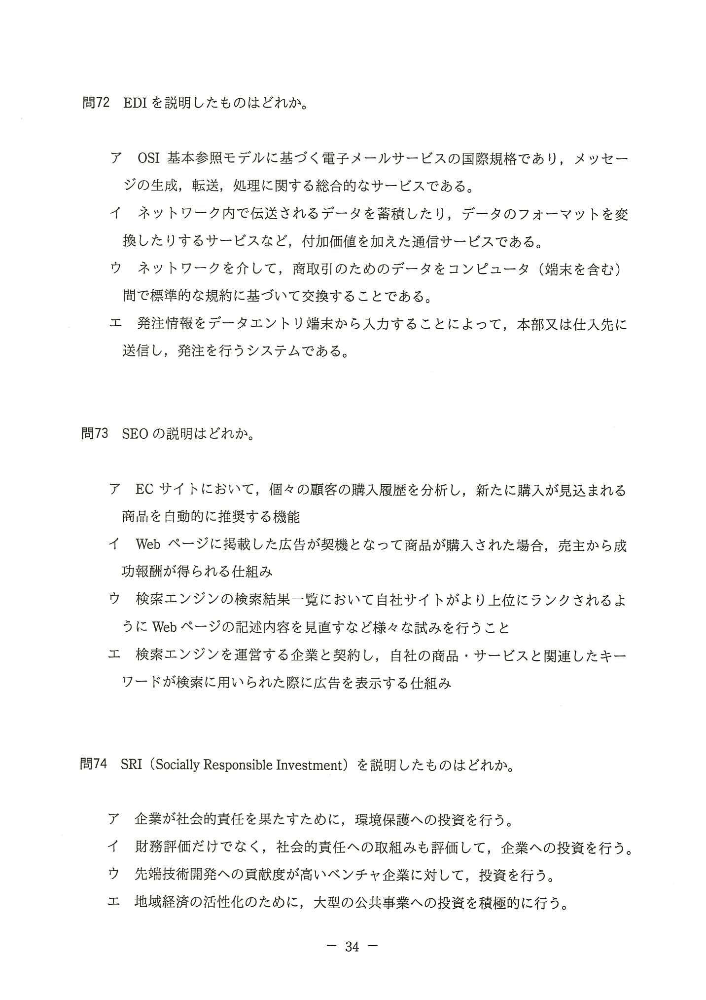

テキスト (OCR)

間72 EDIを説明したものはどれか。

ア OS 基本参照モデルに基づく電子メールサービスの国際規格であり, メッセー
ジの生成, 転送, 処理に関する総合的なサービスである。

イ ネットワーク内で伝送されるデータを蓄積したり, データのフォーマットを変
換したりするサービスなど, 付加価値を加えた通信サービスである。

ウ ネットワークを介して, 商取引のためのデータをコンピュータ (端末を含む)
間で標準的な規約に基づいて交換することである。

エ 発注情報をデータエントリ端末から入力することによって, 本部又は仕入先に
送信し, 発注を行うシステムである。

問73 SEO の説明はどれか。

ア EC サイトにおいて, 個々の顧客の購入履歴を分析し, 新たに購入が見込まれる
商品を自動的に推奨する機能

イ Web ページに掲載した広告が契機となって商品が購入された場合, 売主から成
功報酬が得られる仕組み

ウ 検索エンジンの検索結果一覧において自社サイトがより上位にランクされるよ
うに Web ページの記述内容を見直すなど様々な試みを行うこと

エ 検索エンジンを運営する企業と契約し, 自社の商品・サービスと関連したキー
ワードが検索に用いられた際に広告を表示する仕組み

間74 SRI (Socially Responsible Investment) を説明したものはどれか。

企業が社会的次任を果たすために, 環境保護への投資を行う。

財務評価だけでなく, 社会的次任への取組みも評価して, 企業への投資を行う。
先端技術開発への貢献度が高いベンチャ企業に対して, 投資を行う。

地域経済の活性化のために, 大型の公共事業への投資を積極的に行う。

Hot AN

ー 34 一

### ページ 35

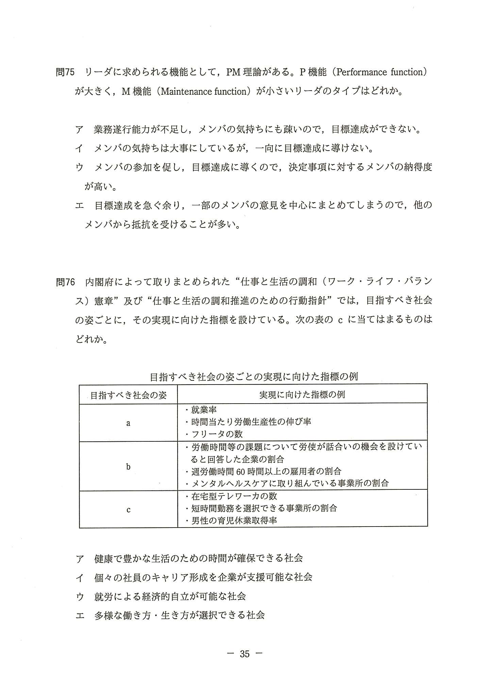

テキスト (OCR)

間75 リーダに求められる機能として, PM 理論がある。 機能 (Performance function)
が大きく, M 機能 (Maintenance function) が小さいリーダのタイプはどれか。

He

務遂行人能力が不足し, メンバの気持ちにも疎いので, 目標達成ができない。
メンバの気持ちは大事にしているが, 一向に目標達成に導けない。

メンバの参加を促し, 目標達成に導くので, 決定事項に対するメンバの納得度
バ高い。

x
4
ウ
a

エエ 目標達成を急ぐ余り, 一部のメンバの意見を中心にまとめてしまうので, 他の
メンバから抵抗を受けることが多い。

問76 内閣府によって取りまとめられた “仕事と生活の調和 (ワーク・ライフ・バラン
A) 憲章” 及び“仕事と生活の調和推進のための行動指針” では, 目指すべき社会
の姿ごとに, その実現に向けた指標を設けている。次の表の c に当てはまるものは
どれか。

目指すべき社会の姿ごとの実現に向けた指標の例

目指すべき社会の姿           実現に向けた指標の例
・就業率
a      ・時間当たり労働生産性の伸び率
・フリータの数

・労働時間等の課題について労使が話合いの機会を設けてい
ると回答した企業の割合

5      ・ 週労作時間 60 時間以上の雇用者の久合
・メンタルヘルスケアに取り組んでいる事業所の割合
・ 在宅型テレワーカの数

3      ・短時間勤務を選択できる事業所の割合

・男性の育児休業取得率

健康で豊かな生活のための時間が確保できる社会
個々の社員のキャリア形成を企業が支援可能な社会
就労による経済的自立が可能な社会

多様な働き方・生き方が選択できる社会

Hoe AM

— 35 一

### ページ 36

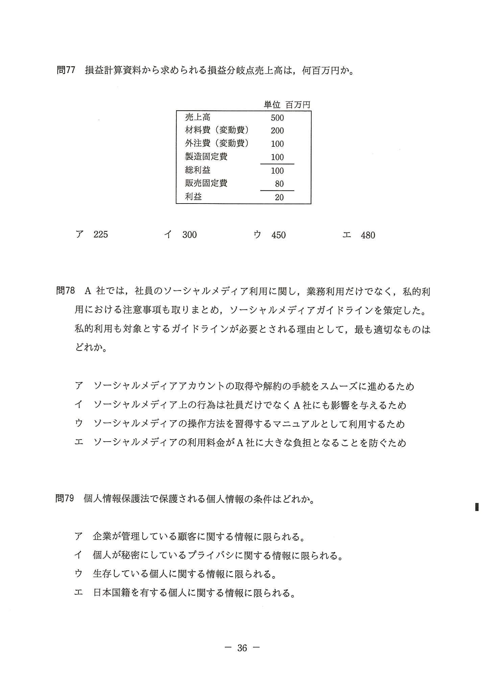

テキスト (OCR)

問77 撮益計算資料から求められる損益分岐点売上高は, 何百万円か。

単位 百万円
売上高           500
材料費 (変動費)    200
外注費 (変動費)    100

製造固定費    100
総利益      100
販売固定費    80
利益20
ア 225     イ 300     ウ 450     エエ 480

間78 A 社では, 社員のソーシャルメディア利用に関し, 業務利用だけでなく, 私的利
用における注意事項も取りまとめ, ソーシャルメディアガイドラインを策定した。
私的利用も対象とするガイドラインが必要とされる理由として, 最も適切なものは
どれか。

ソーシャルメディアアカウントの取得や解約の手続をスムーズに進めるため
ソーシャルメディア上の行為は社員だけでなく A 社にも影響を与えるため
ソーシャルメディアの操作方法を習得するマニュアルとして利用するため
ソーシャルメディアの利用料金が A 社に大きな負担とおかることを防ぐため

HAM

問79 個人情報保護法で保護される個人情報の条件はどれか。

ア 企業が管理している顧客に関する情報に限られる。

イ 個人が秘密にしているプライバシに関する情報に限られる。
ウ 生存している個人に関する情報に限られる。

エエ 日本国籍を有する個人に関する情報に限られる。

ー 36 一

### ページ 37

テキスト (OCR)

間89 ソフトウェアやデータに隊交がある場合に, 製造物資任法の対象となるものはど
れか。

ROM 化したソフトウェアを内蔵した組込み機器

アプリケーションのソフトウェアパッケージ

利用者がPC にインストールした OS

利用者によってネットワークからダウンロードされたデータ

Hさささ

ー 37 一

### ページ 38

テキスト (OCR)

x モ 用 紙 〕

ー 38 一

### ページ 39

テキスト (OCR)

C

x モ 用 紙 )

ー 39 一

### ページ 40

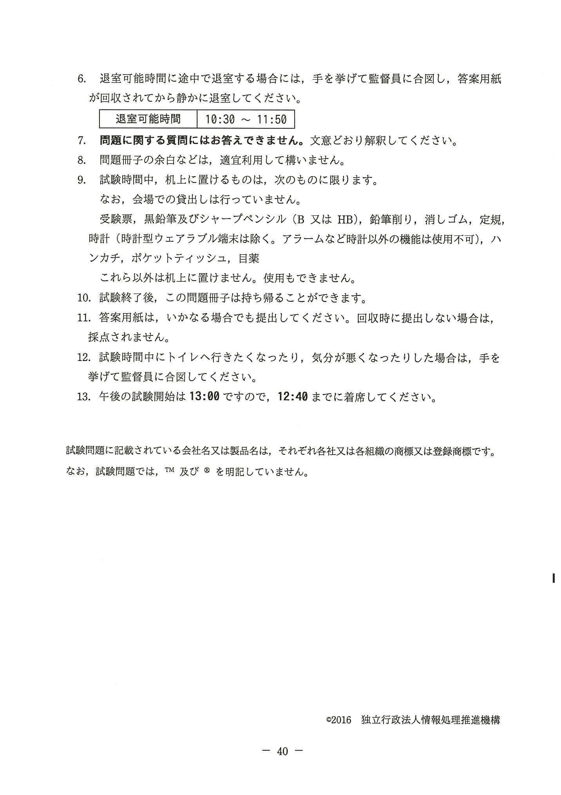

テキスト (OCR)

6. 退室可能時間に途中で退室する場合には, 手を挙げて監督具に合図し, 答案用紙
が回収されてから静かに退室してください。
| 退室可能時間 | 10:30 ~ 11:50 |
. 同題に関する質癌にはお答えできません。文意どおり解釈してください。
8. 問題冊子の余白などは, 適宜利用して構いません。
9. 試験時間中, 机上に置けるものは, 次のものに限ります。
なお, 会場での貸出しは行っていません。
受験票, 黒鉛筆及びシャープペンシル (B 又は HB), 鉛筆削り, 消しゴム, 定規,
時計 (時計型ウェアラブル端末は除く。アラームなど時計以外の機能は使用不可), ハ
ンカチ, ポケットティッシュ, 目薬
これら以外は机上に置けません。 使用もできません。
10. 試験終了後, この問題冊子は持ち帰ることができます。
ll. 答案用紙は, いかなる場合でも提出してください。 回収時に提出しない場合は,
採点されません。
12. 試験時間中にトイレへ行きたくなったり, 気分が悪くなったりした場合は, 手を
挙げて監督具に合図してください。
13. 午後の試験開始は 13:00 ですので, 12:40 までに着席してください。

試験問題に記載されている会社名又は製品名は, それぞれ各社又は各組織の商標又は登録商標です。
なお, 試験問題では, ™ 及び @ を明記していません。

e2016 独立行政法人情報処理推進機構

ー 40 一

---

## 午前解答

©2016 独立行政法人情報処理推進機構 
平成28 年度 春期 応用情報技術者試験 解答例 
 
午前試験 
問番号
正解
分野
問1 
ア 
Ｔ 
問2 
ウ 
Ｔ 
問3 
イ 
Ｔ 
問4 
ウ 
Ｔ 
問5 
ウ 
Ｔ 
問6 
ウ 
Ｔ 
問7 
ア 
Ｔ 
問8 
ア 
Ｔ 
問9 
イ 
Ｔ 
問10 
エ 
Ｔ 
問11 
ウ 
Ｔ 
問12 
イ 
Ｔ 
問13 
イ 
Ｔ 
問14 
ア 
Ｔ 
問15 
ア 
Ｔ 
問16 
ア 
Ｔ 
問17 
エ 
Ｔ 
問18 
ア 
Ｔ 
問19 
イ 
Ｔ 
問20 
イ 
Ｔ 
 
 
問番号
正解
分野
問21 
エ 
Ｔ 
問22 
ウ 
Ｔ 
問23 
ウ 
Ｔ 
問24 
エ 
Ｔ 
問25 
ア 
Ｔ 
問26 
ア 
Ｔ 
問27 
エ 
Ｔ 
問28 
イ 
Ｔ 
問29 
ウ 
Ｔ 
問30 
エ 
Ｔ 
問31 
ウ 
Ｔ 
問32 
ウ 
Ｔ 
問33 
イ 
Ｔ 
問34 
エ 
Ｔ 
問35 
ウ 
Ｔ 
問36 
ウ 
Ｔ 
問37 
ア 
Ｔ 
問38 
エ 
Ｔ 
問39 
ア 
Ｔ 
問40 
エ 
Ｔ 
 
 
問番号
正解
分野
問41 
エ 
Ｔ 
問42 
ウ 
Ｔ 
問43 
エ 
Ｔ 
問44 
エ 
Ｔ 
問45 
イ 
Ｔ 
問46 
イ 
Ｔ 
問47 
イ 
Ｔ 
問48 
エ 
Ｔ 
問49 
ア 
Ｔ 
問50 
エ 
Ｔ 
問51 
ウ 
Ｍ 
問52 
イ 
Ｍ 
問53 
ア 
Ｍ 
問54 
ア 
Ｍ 
問55 
ウ 
Ｍ 
問56 
ア 
Ｍ 
問57 
ウ 
Ｍ 
問58 
ウ 
Ｍ 
問59 
イ 
Ｍ 
問60 
ア 
Ｍ 
 
 
問番号
正解
分野
問61 
エ 
Ｓ 
問62 
ア 
Ｓ 
問63 
エ 
Ｓ 
問64 
ア 
Ｓ 
問65 
ウ 
Ｓ 
問66 
エ 
Ｓ 
問67 
ア 
Ｓ 
問68 
ウ 
Ｓ 
問69 
イ 
Ｓ 
問70 
ア 
Ｓ 
問71 
ウ 
Ｓ 
問72 
ウ 
Ｓ 
問73 
ウ 
Ｓ 
問74 
イ 
Ｓ 
問75 
エ 
Ｓ 
問76 
エ 
Ｓ 
問77 
ウ 
Ｓ 
問78 
イ 
Ｓ 
問79 
ウ 
Ｓ 
問80 
ア 
Ｓ 
 
 
分野の「Ｔ」はテクノロジ系，「Ｍ」はマネジメント系，「Ｓ」はストラテジ系の問題です。

---

## 午後問題

### ページ 1

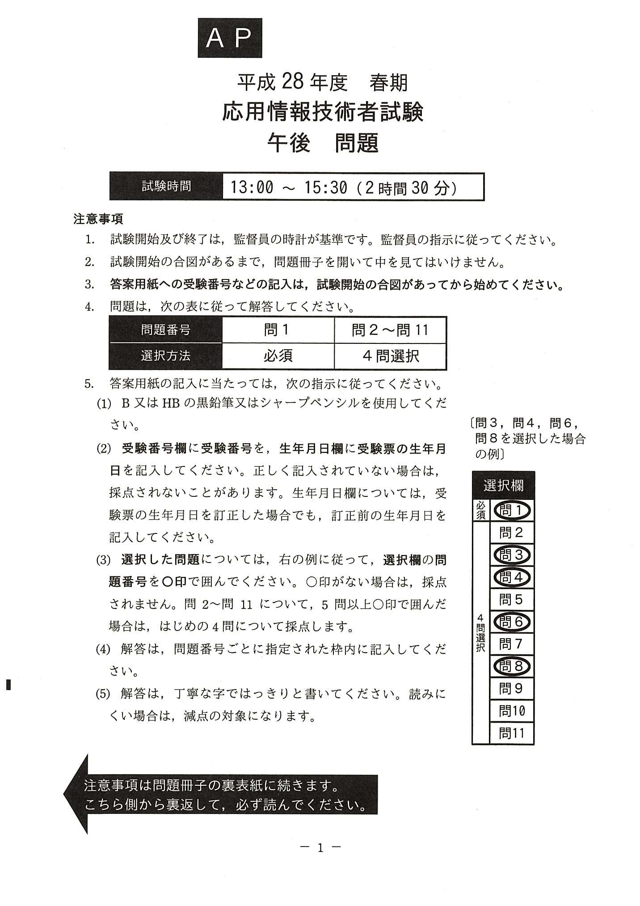

テキスト (OCR)

平成26年度 春期

午後 問題
 13:00 ~ 15:30 (2時間30 43)
注意事項
1.

試験開始及び終了は, 監督貞の時計が基準です。監督員の指示に従ってください。
2. 試験開始の合図があるまで, 問題冊子を開いて中を見てはいけません。
3.

4

答案用紙への受験番号などの記入は, 試験開始の合図があってから始めてください。
問題は, 次の表に従って解答してください。

問題番号          間 1         問2~問 11
選択方法

必須    4 問選択
5. 答案用紙の記入に当たっては, 次の指示に従ってください。

Q) B 又は HB の黒鉛筆又はシャープペンシルを使用してくだ

さい。

(問3, 4, 問6,

Q) 受験番号欄に受験番号を, 生生月日柚に受験本生年月 DEE NRU LEA
日を記入してください。正しく記入されていない場合は

採点されないことがあります。生年月日杉については

=       選択欄
he
験票の生年月日を訂正した場合でも, 訂正前の生年月日を    lk
記入してください。

a|@D
問2
(3) 選択した問題については, 右の例に従って, 選択欄の問   GD
題番号を〇印で囲んでください。〇印がない場合は, 採点   Gi4
されません。問 2一問 11 について, 5 問以上〇印で囲んだ    fal 5
場合は, はじめの 4 問について採点します。

(4) 解答は, 問題番号ごとに指定された枠内に記入してくだ
さい。

(5) 解答は, 丁寧な字ではっきりと書いてください。読みに
くい場合は, 減点の対象になります。

注意事項は問題冊子の裏表紙に続きます。
こちら側から裏返して, 必ず読んでください。

### ページ 2

### ページ 3

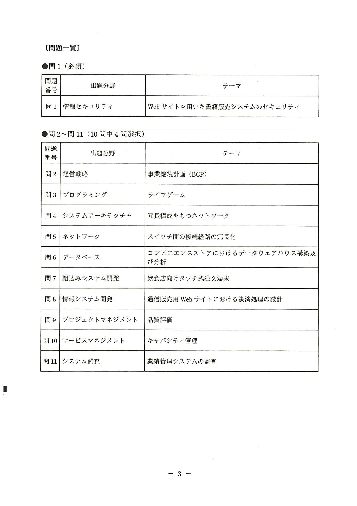

テキスト (OCR)

〔問題一覧

人@問 1 (必須)

問題          "                               ェー
番号         出題分野                           テーマ
fal 1 |情報セキュリティ           Web サイトを用いた書籍販売システムのセキュリティ

人@問 2一問 11 (10 問中 4 問選択)

a      LAN                   ae
番号
間 2 | 経営戦略           事業継続計画 (BCP)
問3 | プログラミング     ライフゲーム
間4 | システムアーキテクチャ |冗長構成をもつネットワーク
問5 | ネットワーク         スイッチ間の接続経路の冗長化
ニーヘー          コンビニエンスストアにおけるデータウェアハウス構築及
問6 | データベース      分析
問 7 |組込みシステム開発    飲食店向けタッチ式注文端末
間 8 | 情報システム開発       通信販売用 Web サイトにおける決済処理の設計
問9 | プロジェクトマネジメント |品質評価
問10| サービスマネジメント    キャパシティ管理
問 11 | システム監査        業績管理システムの監査

### ページ 4

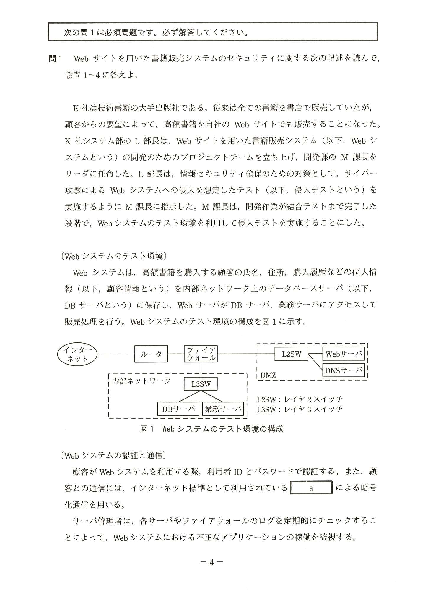

テキスト (OCR)

ROM 1 は必須問題です。必ず解筐してください。

問1 Web サイトを用いた書籍販売システムのセキュリティに関する次の記述を読んで,

設問 1ー4 に答えよ。

K 社は技術書籍の大手出版社である。 従来は全ての書籍を書店で販売していたが,
顧客からの要望によって, 高額書籍を自社の Web サイトでも販売することになった。
K 社システム部の L 部長は, Web サイトを用いた書籍販売システム (以下, Web シ
ステムという) の開発のためのプロジェクトチームを立ち上げ, 開発課の M 課長を
リーダに任命した。L 部長は, 情報セキュリティ確保のための対策として, サイバー
攻撃による Web システムへの侵入を想定したテスト (以下, 侵入テストという) を
実施するように M 課長に指示した。M 課長は, 開発作業が結合テストまで完了した
段階で, Web システムのテスト環境を利用して侵入テストを実施することにした。

(Web システムのテスト環境〕

Web システムは, 高額書籍を購入する顧客の氏名, 住所, 購入履歴などの個人情
報 (以下, 顧客情報という) を内部ネットワーク上のデータベースサーバ (以下,
DB サーバという) に保存し, Web サーバが DB サーバ, 業務サーバにアクセスして
販売処理を行う。Web システムのテスト環境の構成を図 1 に示す。

2                     PSS SS1
イア一                            1     1 に
CD                    ーー L2SW   | Webサ |
1          NpNsサー| <]

1 | DMZ            DNSサーバ

|
| L2SW : レイヤ 2スイッチ
| L3SW : レイヤ 3スイッチ

図1 Web システムのテスト環境の構成

(Web システムの認証と通信)

顧客が Web システムを利用する際, 利用者 ID とパスワードで認証する。また, Ml
客との通信には, インターネット標準として利用されている|  』 JK kon
化通信を用いる。

サーバ管理者は, 各サーバやファイアウォールのログを定期的にチェックするこ
とによって, Web システムにおける不正なアプリケーションの稼働を監視する。

ー4一

### ページ 5

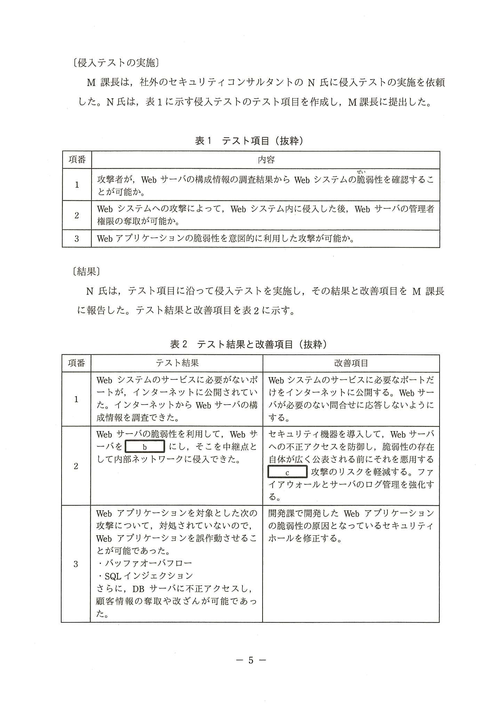

テキスト (OCR)

(侵入テストの実施〕

M 課長は, 社外のセキュリティコンサルタントの N 氏に侵入テストの実施を依頼

した。N 氏は, 表 1 に示す侵入テストのテスト項目を作成し, M 課長に提出した。

表1 テスト項目 (抜粋)

項番

内容

攻撃者が, Web サーバの構成情報の調査結果から Web システムの脆弱性を確認するこ

とが可能か。

ぜい

Web システムへの攻撃によって, Web システム内に侵入した後, Web サーバの管理者

権限の奪取が可能か。

Web アプリケーションの脆弱性を意図的に利用した攻撃が可能か。

〔結果]

N 氏は, テスト項目に沿って侵入テストを実施し, その結果と改善項目を M 課長

に報告した。テスト結果と改善項目を表 2 に示す。

表2 テスト結果と改善項目 (抜粋)

項番

テスト結果

改善項目

Web システムのサービスに必要がないポ
ートが, インターネットに公開されてい
た。インターネットから Web サーバの構
成情報を調査できた。

Web システムのサービスに必要なポートだ
けをインターネットに公開する。Web サー
バが必要のない問合せに応答しないように
する。

Web サーバの騰科性を利用して, Web サ
ーバを[| pb | にし, そこを中継点と
して内部ネットワークに侵入できた。

セキュリティ機器を導入して, Web サーバ
への不正アクセスを防御し, 脆弱性の存在
自体が広く公表される前にそれを悪用する
[し 。 | 区役のリスクを軽減する。ファ
イアウォールとサーバのログ管理を強化す
る。

Web アプリケーションを対象とした次の
攻撃について, 対処されていないので,
Web アプリケーションを誤作動させるこ
とが可能であった。

・バパッファオーバラロー
・SQL インジェクション

さらに, DB サーバに不正アクセスし,
顧客情報の奪取や改ざんが可能であっ
Tee

開発課で開発した Web アプリケーション
の脆弱性の原因となっているセキュリティ
ホールを修正する。

### ページ 6

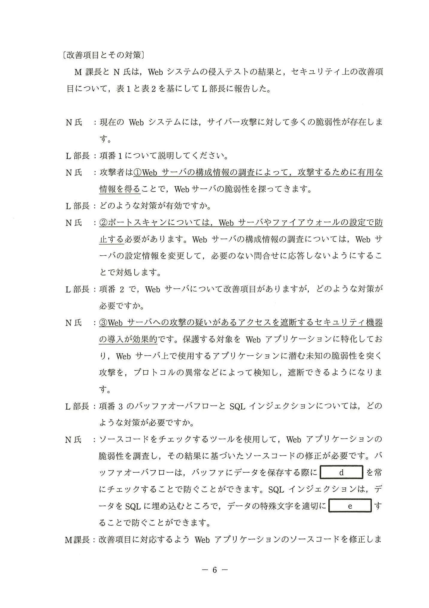

テキスト (OCR)

[改善項目とその対策
M 課長と N 氏は, Web システムの侵入テストの結果と, セキュリティ上の改善項
目について, 表 1と表 2 を基にしてしL部長に報告した。

N氏

L部長 :
N 氏

部長 :
N氏

L部長 :

NK

L部長 :

N氏

: 現在の Web システムには, サイバー攻撃に対して多くの脆弱性が存在しま

す。
項番1 について説明してください。

: 攻撃者はWeb サーバの構成情報の調査によって, 攻撃するために有用な

情報を得ることで, Web サーバの脆弱性を探ってきます。
どのような対策が有効ですか。

: ②ポートスキャンについては, Web サーバやファイアウォールの設定で防

止する必要があります。Web サーバの構成情報の調査については, Web サ
ーバの設定情報を変更して, 必要のない問合せに応答しないようにするこ
とで対処します。

項番 2 で, Web サーバについて改善項目がありますが, どのような対策が
必要ですか。

: QWeb サーバへの攻撃の疑いがあるアクセスを遮断するセキュリティ機器

の導入が効果的です。保護する対象を WWeb アプリケーションに特化してお
り, Web サーバ上で使用するアプリケーションに潜む未知の脆弱性を突く
攻撃を, プロトコルの異常などによって検知し, 遮断できるようになりま
す。

項番 3 のバッファオーバフローと SQL インジェクションについては, どの
ような対策が必要ですか。

: ソースコードをチェックするツールを使用して, Web アプリケーションの

Mee WAL, その結果に基づいたソースコードの修正が必要です。バ
ッファオーバフローは, パッファにデータを保存する際に| q ee
にチェックすることで防ぐことができます。SQL インジェクションは, デ
ータを SQL に埋め込むところで, データの特殊文字を適切に|  e |]す
ることで防ぐことができます。

政善項目に対応するよう Web アプリケーションのソースコードを修正しま

ー6一

### ページ 7

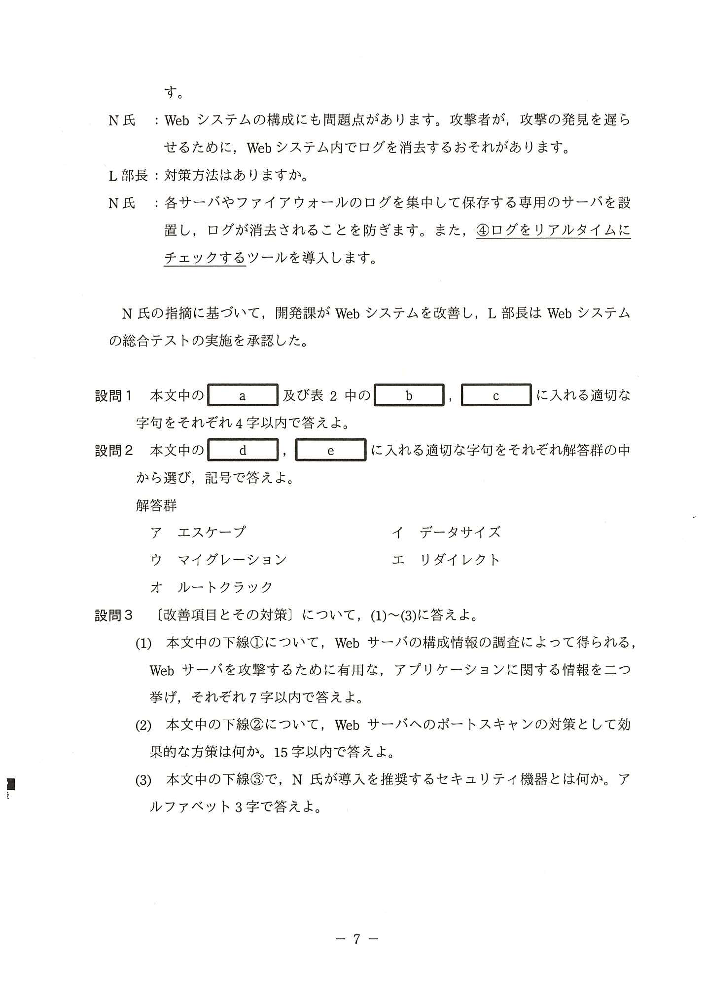

テキスト (OCR)

す。

N氏 :Web システムの構成にも問題点があります。攻撃者が, 攻撃の発見を遅ら
せるために, Web システム内でログを消去するおそれがあります。

L 部長 : 対策方法はありますか。

N氏 : 各サーバやファイアウォールのログを集中して保存する専用のサーバを設
置し, ログが消去されることを防ぎます。また, ③④ログをリアルタイムに
チェックするツールを導入します。

N 氏の指摘に基づいて, 開発課が Web システムを改善し, L 部長は Web システム
AS
口

の総合テストの実施を承認した。

設問1 本文中の| a | 及び表 2 中の[| b |,| c |に入れる適切な
字句をそれぞれ4 字以内で答えよ。

設問2 本文中の| dd |,|  e |に入れる適切な字句をそれぞれ解答群の中
から選び, 記号で答えよ。
解答
ア エスケーデプ          イ ザータサイズ
ウ マイグレーション      エ リダイレクト

オ ルートクラック
設問3 [改善項目とその対策〕】 について, ①~て(3⑬)に答えよ。

Q) 本文中の下線について, Web サーバの構成情報の調査によって得られる,
Web サーバを攻撃するために有用な, アプリケーションに関する情報を二つ
BT, それぞれ 7 FUNCHAL,

(2) 本文中の下線@について, Web サーバへのポートスキャンの対策として効
果的な方策は何か。15 字以内で答えよ。

(3) 本文中の下線③で, N 氏が導入を推奨するセキュリティ機器とは何か。ア
ルファベット 3 字で答えよ。

### ページ 8

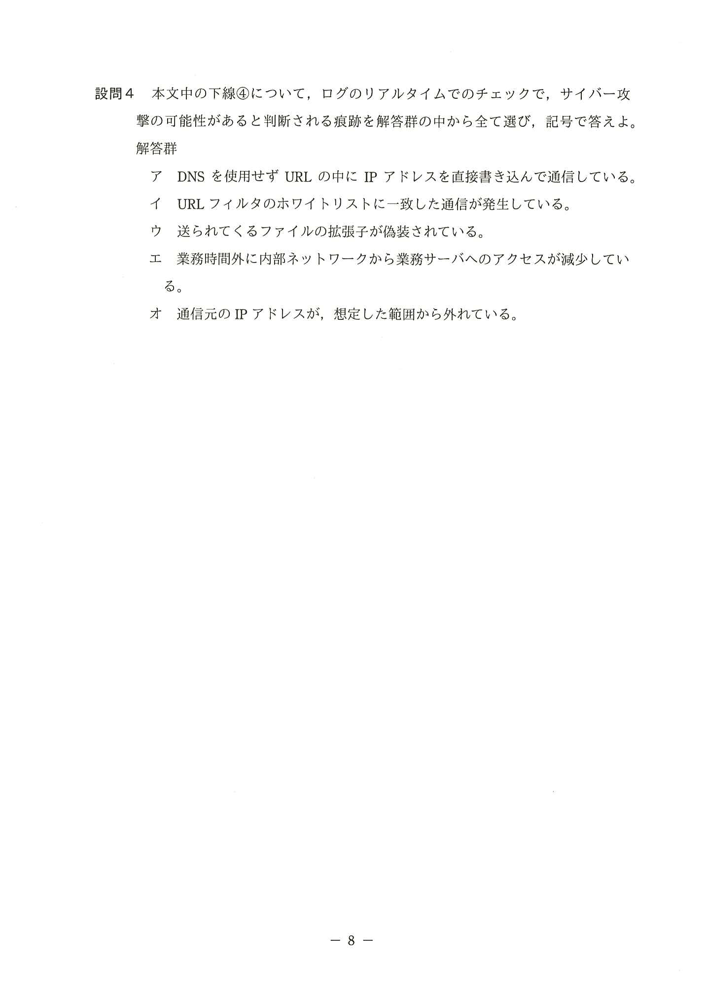

テキスト (OCR)

設問4 本文中の下線について, ログのリアルタイムでのチェックで, サイバー攻
撃の可能性があると判断される痕跡を解答群の中から全て選び, 記号で答えよ。
解答群

ア DNS を使用せず URL の中に IP アドレスを直接書き込んで通信している。

イ URL フィルタのホワイトリストに一致した通信が発生している。

ウ 送られてくるファイルの拡張子が偽装されている。

エ 業務時間外に内部ネットワークから業務サーバへのアクセスが減少してい
る。

オ 通信元の IP アドレスが, 想定した範囲から外れている。

### ページ 9

テキスト (OCR)

【

メ = 用 紙 〕

### ページ 10

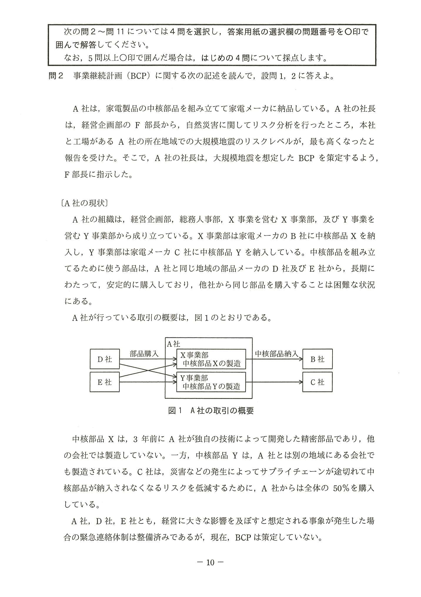

テキスト (OCR)

次の問2 一間 11 については4 問を選択し, 答案用紙の選択欄の問題番号を〇印で

囲んで解答してください。
なお, 5問以上〇印で囲んだ場合は, はじめの 4 問について採点します。

問2 事業継続計画 (BCP) に関する次の記述を読んで, 設問 1, 2 に答えよ。

A 社は, 家電製品の中核部品を組み立てて家電メーカに納品している。A 社の社長
は, 経営企画部のF 部長から, 自然人災害に関してリスク分析を行ったところ, 本社
と工場がある A 社の所在地域での大規模地震のリスクレベルが, 最も高くなったと
報告を受けた。そこで, A 社の社長は, 大規模地震を想定した BCP を策定するよう,

F 部長に指示した。

(A 社の現状]

A 社の組織は, 経営企画部, 総務人事部, X 事業を営む X 事業部, 及び Y 事業を
営む Y 事業部から成り立つている。X 事業部は家電メーカの B 社に中核部品X を納
AL, Y 事業部は家電メーカ C 社に中核部品 Y を納入している。中核部品を組み立
てるために使う部品は, A 社と同じ地域の部品メーカの D 社及び E 社から, 長期に
わたって, 安定的に購入しており, 他社から同じ部品を購入することは困難な状況
にある。

A 社が行っている取引の概要は, 図1のとおりである。

A社
部品購入 | CIBER       中核部品納入
D社  ーー  中核部品双の製造                      Bit
Da yas
Bit          中核部品Yの製造          Cit

図1 A社の取引の概要

中核部品 X は, 3 年前に A 社が独自の技術によって開発した精密部品であり, 他
の会社では製造していない。一方, 中核部品 Y は, A 社とは別の地域にある会社で
も製造されている。C 社は, 災害などの発生によってサプライチェーンが途切れて中
核部品が納入されなくなるリスクを低減するために, A 社からは全体の 50%を購入
している。

Ath, D 社, E 社とも, 経営に大きな影響を及ぼすと想定される事象が発生した場
合の緊急連絡体制は整備済みであるが, 現在, BCP は策定していない。

ー 10 一

### ページ 11

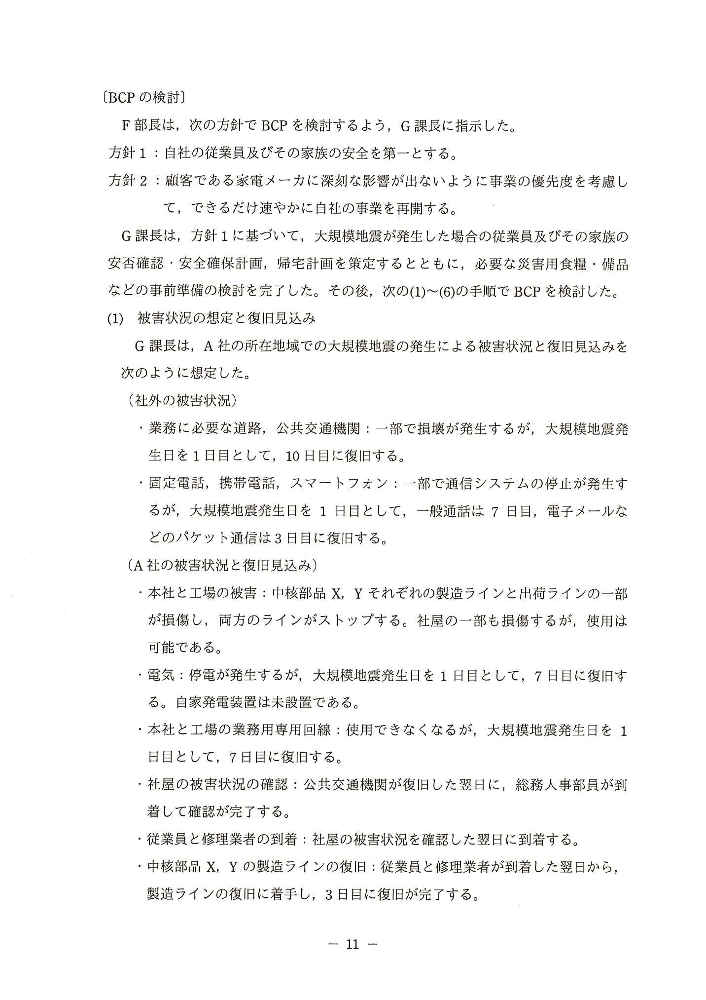

テキスト (OCR)

(BCP の検討]
F 部長は, 次の方針で BCP を検討するよう, G 課長に指示した。
方針 1 : 自社の従業員及びその家族の安全を第一とする。
方針 2 : 顧客である家電メーカに深刻な影響が出ないように事業の優先度を考慮し
CT, できるだけ速やかに自社の事業を再開する。

G 課長は, 方針 1 に基づいて, 大規模地震が発生した場合の従業員及びその家族の
安否確認・安全確保計画, 帰宅計画を策定するとともに, 必要な災害用食糧・備品
などの事前準備の検討を完了した。 COR, 次の(1)~(6⑥)の手順で BCP を検討した。
Q) 被害状況の想定と復旧見込み

G 課長は, A 社の所在地域での大規模地震の発生による被害状況と復旧見込みを

次のように想定した。

(社外の被害状況)

・業務に必要な道路, 公共交通機関 : 一部で損壊が発生するが, 大規模地震発
生日を1 日目として, 10 日目に復旧する。

・固定電話, 携帯電話, スマートフォン : 一部で通信システムの停止が発生す
るが, 大規模地震発生日を 1 日目として, 一般通話は 7 日目, 電子メールな
どのパケット通信は 3 日目に復旧する。

(A 社の被害状況と復旧見込み)

・本社と工場の被害 : 中核部品 X, Y それぞれの製造ラインと出荷ラインの一部
が損傷し, 両方のラインがストップする。社屋の一部も損傷するが, 使用は
可能である。

(BA: 停電が発生するが, 大規模地震発生日を 1 日目として, 7 日目に復旧す
る。自家発電装置は未設置である。

・本社と工場の業務用専用回線 : 使用できなくなるが, 大規模地震発生日を 1
日目として, 7 日目に復旧する。

・社屋の被害状況の確認 : 公共交通機関が復旧した翌日に, 総務人事部員が到
着して確認が完了する。

・従業員と修理業者の到着 : 社屋の被害状況を確認した翌日に到着する。

・中核部品 X, Y の製造ラインの復旧 : 従業員と修理業者が到着した翌日から,
製造ラインの復旧に着手し, 3 日目に復旧が完了する。

ー 11 一

### ページ 12

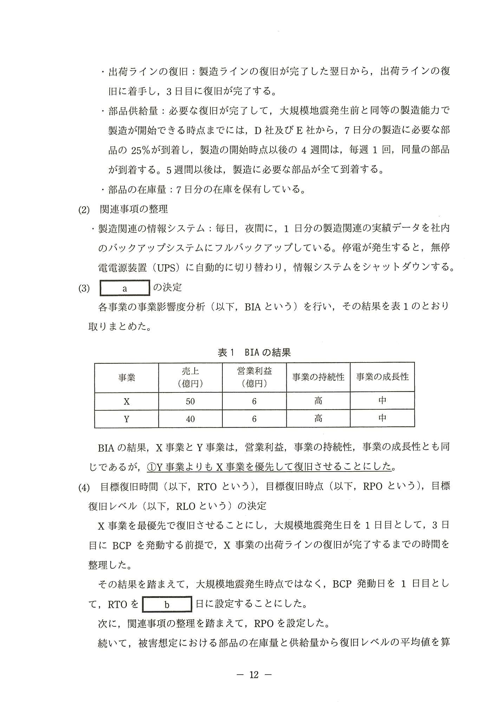

テキスト (OCR)

・出荷ラインの復旧 : 製造ラインの復旧が完了した翌日から, 出荷ラインの復
に着手し, 3 日目に復旧が完了する。
・部品供給量 : 必要な復旧が完了して, 大規模地震発生前と同等の製造能力で
製造が開始できる時点までには, D 社及びE 社から, 7 日分の製造に必要な部
品の 25%が到着し, 製造の開始時点以後の 4 週間は, 毎週 1 回, 同量の部品
が到着する。5 週間以後は, 製造に必要な部品が全て到着する。
・部品の在庫量 : 7 日分の在庫を保有している。
(2) 関連事項の整理
・製造関連の情報システム : 毎日, 夜間に, 1 日分の製造関連の実績データを社内
のバックアップシステムにフルバックアップしている。 停電が発生すると, 無停
電電源装置 (UPS) に自動的に切り替わり, 情報システムをシャットダウンする。
@ [la _Jowse
各事業の事業影響度分析 (以下, BIA という) を行い, その結果を表 1 のとおり
取りまとめた。

表1 BIAの結果
ak      売上     営業利益   aye | ewe    」
事業      (積円)      (RF)    事業の持続性 | 事業の成長性
50        6        高        中
bd        40        6        高        中

BIA の結果, X 事業と Y 事業は, 営業利益, 事業の持続性, 事業の成長性とも同
じであるが, OY 事業よりも双事業を優先して復旧させることにした。
(4) 目標復旧時間 (以下, RTO という), 目標復旧時点 (以下, RPO という), 目標
復旧レベル (以下, RLO という) の決定
X 事業を最優先で復旧させることにし, 大規模地震発生日を 1 日目として, 3 日
目に BCP を発動する前提で, X 事業の出荷ラインの復旧が完了するまでの時間を

整理した。
その結果を踏まえて, 大規模地震発生時点ではなく, BCP 発動日を 1 日目とし

ct, RTOを| b 日に設定することにした。

次に, 関連事項の整理を踏まえて, RPO を設定した。
続いて, 被害想定における部品の在庫量と供給量から復旧レベルの平均値を算

ーー

### ページ 13

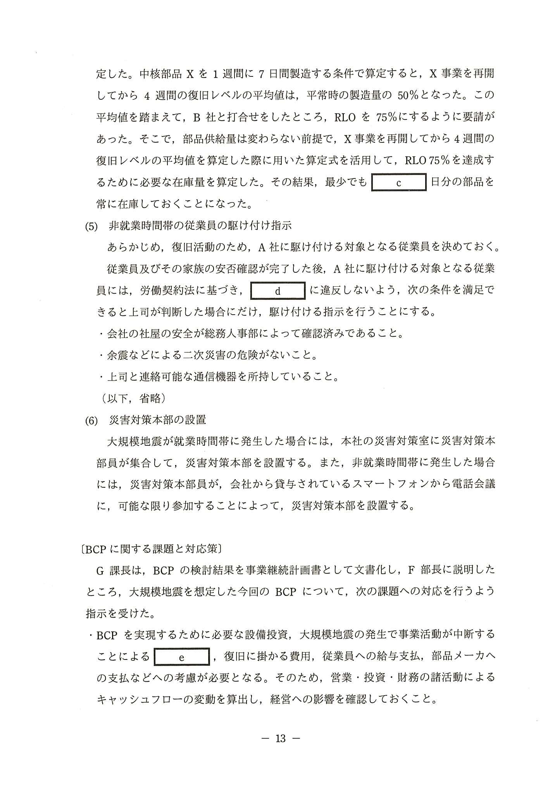

テキスト (OCR)

定した。中核部品 X を 1 週間に 7 日間製造する条件で算定すると, X 事業を再開
してから 4 週間の復旧レベルの平均値は, 平常時の製造量の 50%となった。この
平均値を踏まえて, B 社と打合せをしたところ, RLO を 75%にするように要請が
あった。そこで, 部品供給量は変わらない前提で, X 事業を再開してから 4 週間の
復旧レベルの平均値を算定した際に用いた算定式を活用して, RLO 75% を達成す
るために必要な在庫量を算定した。その結果, 最少でも 日分の部品を
常に在庫しておくことになった。
(65) 非就業時間帯の従業員の駆け付け指示
あらかじめ, 復旧活動のため, A 社に駆け付ける対象となる従業員を決めておく。
従業員及びその家族の安否確認が完了した後, A 社に駆け付ける対象となる従業
員には, 錠働契約法に基づき, |  q | に違反しないよう, 次の条件を満足で
きると上司が判断した場合にだけ, 駆け付ける指示を行うことにする。
・ 会社の社屋の安全が総務人事部によって確認済みであること。
・ 余震などによる二次災害の危険がないこと。
・上司と連絡可能な通信機器を所持していること。
(以下, 省略)
(6) 災害対策本部の設置
大規模地震が就業時間帯に発生した場合には, 本社の災害対策室に災害対策本
部員が集合して, 災害対策本部を設置する。また, 非就業時間帯に発生した場合
には, 災害対策本部員が, 会社から貸与されているスマートフォンから電話会議
に, 可能な限り参加することによって, 災害対策本部を設置する。

(BCP に関する課題と対応策)

G 課長は, BCP の検討結果を事業継続計画書として文書化し, F 部長に説明した
ところ, 大規模地震を想定した今回の BCP について, 次の課題への対応を行うよう
指示を受けた。

・BCP を実現するために必要な設備投資, 大規模地居の発生で事業活動が中断する

ことによる|  e |, 復旧に掛かる費用, 従業員への給与支払, 部品メーカへ

の支払などへの考慮が必要となる。そのため, 営業・投資・財務の諸活動による

キャッシュフローの変動を算出し, 経営への影響を確認しておくこと。

ー 13 一

### ページ 14

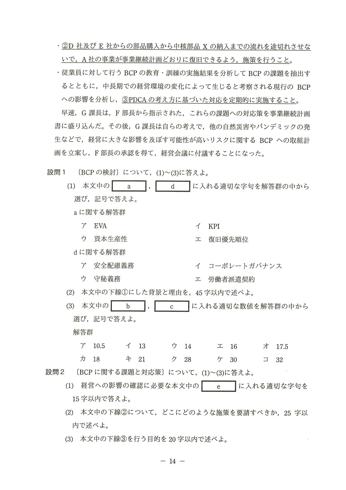

テキスト (OCR)

‘OD 社及び E 社からの部品購入から中核部品 X の納入までの流れを途切れさせな
WC, A社の事業が事業継続計画どおりに復旧できるよう, 施策を行うこと。

・ 従業員に対して行う BCP の教育・訓練の実施結果を分析して BCP の課題を抽出す
るとともに, 中長期での経営環境の変化によって生じると考察される現行の BCP
への影響を分析し, ③PDCA の考え方に基づいた対応を定期的に実施すること。
早速, G 課長は, F 部長から指示された, これらの課題への対応策を事業継続計画

書に盛り込んだ。 その後, G 課長は自らの考えで, 他の自然災害やパンデミックの発

生などで, 経営に大きな影響を及ぼす可能性が高いリスクに関する BCP への取組計

画を立案し, F 部長の承認を得て, 経営会議に付議することになった。

設問1 [BCPの検討)について, ①~て(3)に答えよ。
Q①) 本文中の| a |,|  q |に入れる適切な字句を解答群の中から
選び, 記号で答えよ。

a に関する解答群

ア EVA           イ KPI
ウ 資本生産性        エ 復旧優先順位
d に関する解答群
ア 安全配慮義務         イ コーポレートガバナンス
ウ 守秘義務         エ 労働者派遣契約
(2) 本文中の下線にした背景と理由を, 45 字以内で述べよ。
3) 本文中の| b |,|  。 |に入れる適切な数値を解答群の中から
選び, 記号で答えよ。
解答群
ア 10.5   イ 13   ウ 14   x= 16   オ 17.5
カ 18   キ 21   ク 28   ケ 30   コ 32

設問2 (BCPに関する課題と対応策〕 について, ①て(3③)に答えよ。
(①) 経営への影響の確認に必要な本文中の| e | に入れる適切な字句を
15 字以内で答えよ。
2) 本文中の下線@について, どこにどのような施策を要請すべきか, 25 字以
内で述べよ。
⑬ 本文中の下線を行う目的を 20 字以内で述べよ。

ー 14 一

### ページ 15

テキスト (OCR)

C

x モ 用 紙 }

ー 15 一

### ページ 16

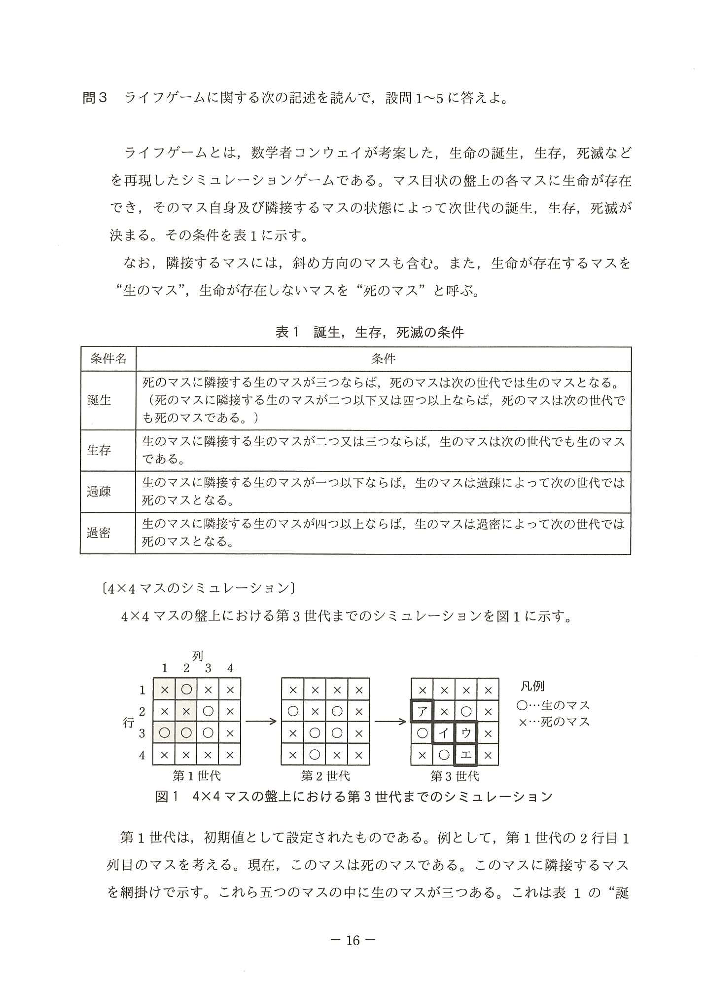

テキスト (OCR)

Mt
St

問3 ライフゲームに関する次の記述を読んで, 設問 1ユー5 に答えよ。

ライフゲームとは, 数学者コンウェイが考案した, 生命の誕生, 生存, 死滅など
を再現したシミュレーションゲームである。マス目状の盤上の各マスに生命が存在
でき, そのマス自身及び隣接するマスの状態によって次世代の誕生, 生存, 死滅が
RES, その条件を表 1 に示す。

なお, 隣接するマスには, 斜め方向のマスも含む。また, 生命が存在するマスを
“生のマス”", 生命が存在しないマスを 『死のマス” と呼ぶ。

表1 誕生, 生存, 死滅の条件

条件名                   条件
死のマスに隣接する生のマスが三つならば, 死のマスは次の世代では生のマスとなる。
誕生       (死のマスに隣接する生のマスが二つつ以下又は四つ以上ならば, 死のマスは次の世代で
も死のマスである。)
生のマスに隣接する生のマスが二つ又は三つならば, 生のマスは次の世代でも生のマス
生存
である。
anh  生のマスに隣接する生のマスが一つ以下ならば, 生のマスは過疎によって次の世代では
死のマスとなる。
過密  生のマスに隣接する生のマスが四つ以上ならば, 生のマスは過密によって次の世代では
死のマスとなる。

[4X4 マスのシミュレーション〕
4X4 マスの盤上における第 3 世代までのシミュレーションを図 1 に示す。

列

1 2 3 4
1 lxIOl xx    xlxlxlx    xlxlx|x| 凡例
21xlxlOlx    O|x1O| x    ァlx| ol | の生のマス

行                            x…死のマス

31OIOIOlx    x1OIO| x    O1イゴウ1 x
4|x|]x]x]x    x | O) «| x     x} Of =r] x

第1 世代      第2 世代      第 3 世代

図1 4X4 マスの盤上における第 3 世代までのシミュレーション

第 1 世代は, 初期値として設定されたものである。例として, 第1 世代の 2 行目 1
列目のマスを考える。 現在, このマスは死のマスである。このマスに隣接するマス
を網掛けで示す。これら五つのマスの中に生のマスが三つある。これは表 1 の “itt

ー 16 一

### ページ 17

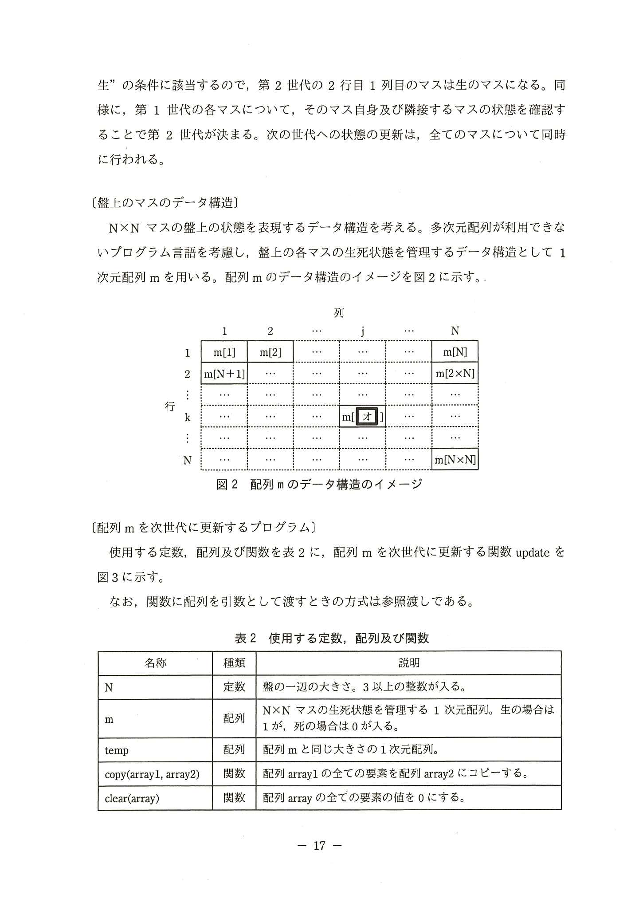

テキスト (OCR)

生"の条件に該当するので, 第 2 世代の 2 行目 1 列目のマスは生のマスになる。同
様に, 第 1 世代の各マヤスについて, そのマス自身及び隣接するマスの状態を確認す
ることで第 2 世代が決まる。次の世代への状態の更新は, 全てのマスについて同時
に行われる。

〔盤上のマスのデータ構造〕

NXN マスの盤上の状態を表現するデータ構造を考える。多次元配列が利用できな
いプログラム言語を考慮し, 盤上の各マスの生死状態を管理するデータ構造として 1
次元配列 m を用いる。配列 m のデータ構造のイメージを図 2 に示す。 .

列
N
                                                                                  m[N]
2                                                        m[2xN]
行 a a a a a
k
Ni:                               H                     m[NxN]

 2 配列m のデータ構造のイメージ

〔配列 m を次世代に更新するプログラム)〕

使用する定数, 配列及び関数を表 2 に, 配列 m を次世代に更新する関数 update を
図 3 に示す。

なお, 関数に配列を引数として渡すときの方式は参照渡しである。

表2 使用する定数, 配列及び関数

名称             種類                                   説明
N                      定数 | 盤の一辺の大きさ。3 以上の整数が入る。
mn                 配列   NXN マスの生死状態を 管理する 1 次元配列。生の場合は
1 が, 死の場合は 0 が入る。
temp                       配列 | 配列m と同じ大きさの1 次元配列。
copy(arrayl, array2)      関数 | 配列 array1 の全ての要素を配列 array2 にコピーする。
clear(array)               関数 | 配列 array の全ての要素の値を 0 にする。

ー 17 一

### ページ 18

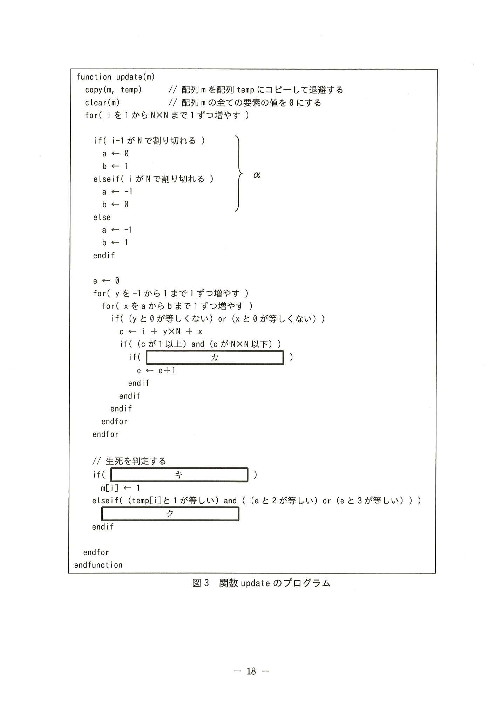

テキスト (OCR)

function update(m)
copy(m, temp)    // 配列m を配列 temp にコピーして退避する
clear(m)         // 配列m の全ての要素の値を 0 にする
for( 1を1からNXN まで 1 ずつ増やす )

if( i-T がNで割り切れる )
aぐ 9
bel
elseit( iがNで割り切れる )     my
a<-l
bc6
else
a で -1
bel
endif

eぐ9
for( y を -1 から 1 まで 1 ずつ増やす )
for( xをaからbまで 1 ずつ増やす )
if( (yと0が等しくない) or (x と9 が等しくない) )
ce it yXN+x
if( (c が1以上) and (c がNXN 以下) )
if( |        カ        | )
@ で etl
endif
endif
endif
endfor
endfor

// 生死を判定する

if( |          キ          | )
mi] で1

etseif( (temp[i]と 1 が等しい) and ( (e と2が等しい) or (e と3が等しい) ) )
|          ク          |

endif

endfor
endfunction

図3 関数update のプログラム

ー 18 一

### ページ 19

テキスト (OCR)

〔テストプログラム)〕

 3 のプログラムをテストするために, 配列 m に第 1 世代が与えられたときの第
p 世代が, 机上で作成した正しい結果である配列 r と等しいことを確認するプログラ
ムを作成した。 作成した関数 shouldBe を図 4 に示す。ここで, p には 2 以上の整数
が入る。

1: function shouldBe( m p, r )

2: for(iを1からpまで1ずつ増やす )
3     update(m)

4   endfor

5   for( jiを1からNXN まで 1 ずつ増やす )
6:    if( m[i] と r[i] が等しくない )
7:      return false // テスト失敗
8     endif

9   endfor

10: return true       // FAK RW
11: endfunction

図4 関数 shouldBe のプログラム

 3 のプログラムが正しく動作する状態で図 4 のプログラムを実行したところ,
テストが失敗した。原因を調査した結果, 図 4 の[| ケ  ]行目に問題があること
が判明したので, ①プログラムを修正してテストを成功させることができた。

設問1 1 中の| ア |~-| エ |に入れる適切な生死状態を, 図 1 の凡例
CHUA AE.

設問2 図2 中の[| オ |に入れる適切な字句を答えよ。

設問3 図3中の| カ |~| ク |に入れる適切な字句を答えよ。

設問4 図 3 中の@の二つの条件のいずれかを満たすのはどのような場合か。単語
“He” RO! “マス"を用いて 30 字以内で述べよ。

設問5  [テストプログラム〕 について, (①⑪, ②)に答えよ。
a) 本文中の| ケ | に入れる適切な数値を答えよ。
② 本文中の下線①の修正後の| ケ |行目のプログラムを答えよ。

ー 19 一

### ページ 20

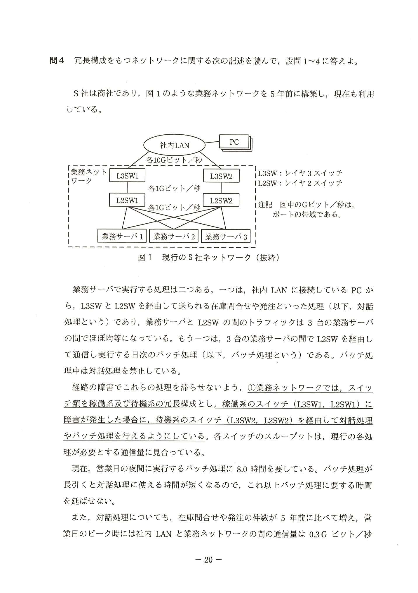

テキスト (OCR)

4 冗長構成をもつネットワークに関する次の記述を読んで, 設問 1ユー4 に答えよ。

S 社は商社であり, 図 1のような業務ネットワークを 5 年前に構築し, 現在も利用
している。

IL3SW : レイヤ 3 スイッチ
IL2SW : レイヤ2 スイッチ

|

|

!注記 図中のGビピットノ秒は,
ポートの帯域である。

各1Gビットンノ秒

SIGE Y b ZF
Ss テン !

| 業務サーバ 1 | | 業務サーバ 2 | pes]!

図1 現行のS社ネットワーク (抜粋)

業務サーバで実行する処理は二つある。一つは, 社内 LAN に接続している PC か
5, L3SW と L2SW を経由して送られる在庫問合せや発注といった処理 (以下, 対話
処理という) であり, 業務サーバと L2SW の間のトラフィックは 3 台の業務サーバ
の間でほぼ均等になっている。もう一つは, 3 台の業務サーバの間で L2SW を経由し
て通信し実行する日次のバッチ処理 (以下, バッチ処理という) である。バッチ処
理中は対話処理を禁止している。

経路の障害でこれらの処理を滞らせないよう, ①業務ネットワークでは, スイッ
チ類を稼働系及び待機系の冗長構成とし, 稼働系のスイッチ (L3SW1, L2SW1) に
障害が発生した場合に, 待機系のスイッチ (L3SW2, L2SW2) を経由して対話処理
やバッチ処理を行えるようにしている。各スイッチのスループットは, 現行の各処
理が必要とする通信量に見合っている。

現在, 営業日の夜間に実行するバッチ処理に 8.0 時間を要している。バッチ処理が
長引くと対話処理に使える時間が短くなるので, これ以上バッチ処理に要する時間
を延ばせない。

また, 対話処理についても, 在庫問合せや発注の件数が 5 年前に比べて増え, 営
業日のピーク時には社内 LAN と業務ネットワークの間の通信量は 03GC ビットンノ秒

ー 20 一

### ページ 21

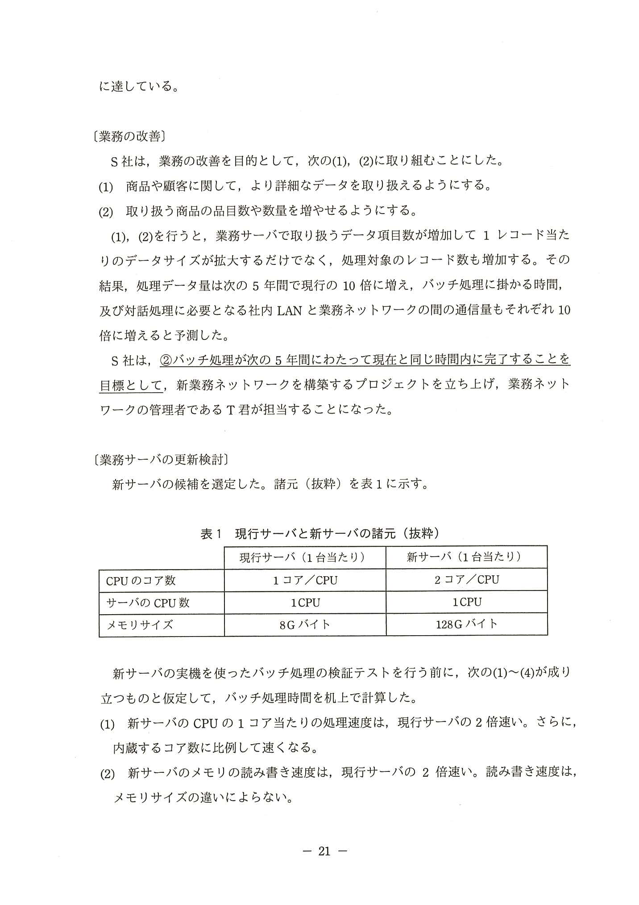

テキスト (OCR)

に達している。
〔業務の改善〕

S 社は, 業務の改善を目的として, 次の(1), ⑫②に取り組むことにした。
QQ) 商品や顧客に関して, より詳細なデータを取り扱えるようにする。
2) 取り扱う商品の品目数や数量を増やせるようにする。

①, ②)を行うと, 業務サーバで取り扱うデータ項目数が増加して 1 レコード当た
りのデータサイズが拡大するだけでなく, 処理対象のレコード数も増加する。その
結果, 処理データ量は次の 5 年間で現行の 10 倍に増え, バッチ処理に掛かる時間,
及び対話処理に必要となる社内 LAN と業務ネットワークの間の通信量もそれぞれ 10
倍に増えると予測した。

完了することを
目標として, 新業務ネットワークを構築するプロジェクトを立ち上げ, 業務ネット

S 社は, バッチ処理が次の 5 年間にわたって現在と同じ時間内に
ワークの管理者である T 君が担当することになった。

〔業務サーバの更新検討]

新サーバの候補を選定した。諸元 (抜粋) を表 1 に示す。

表1 現行サーバと新サーバの諸元 (抜粋)
現行サーバ (1 台当たり)       新サーバ (1 台当たり)
CPU のコア数              1 コアCPU              2 コアンCPU
サーバの CPU 数              1CPU                   1CPU
メモリサイズ                 8Gバイト                 128G バイト

新サーバの実機を使ったバッチ処理の検証テストを行う前に, 次の①)て(④が成り
立つものと仮定して, バッチ処理時間を机上で計算した。

内蔵するコア数に比例して速くなる。

1) 新サーバの CPU の 1 コア当たりの処理速度は, 現行サーバの 2 倍速い。さらに,

Q) 新サーバのメモリの読み書き速度は, 現行サーバの 2 倍速い。

メモリサイズの違いによらない。

ー 21 一

### ページ 22

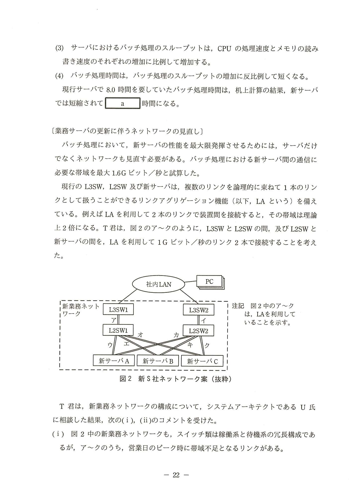

テキスト (OCR)

8) サーバにおけるバッチ処理のスループットは, CPU の処理速度とメモリの読み
書き速度のそれぞれの増加に比例して増加する。

(4) バッチ処理時間は, バッチ処理のスループットの増加に反比例して短くなる。
現行サーバで 8.0 時間を要していたバッチ処理時間は, 机上計算の結果, 新サーバ

では短縮されて|  』 時間になる。

[業務サーバの更新に伴うネットワークの見直し]

バッチ処理において, 新サーバの性能を最大限発揮させるためには, サーバだけ
でなくネットワークも見直す必要がある。 バッチ処理における新サーバ間の通信に
必要な帯域を最大 1.6G ビットノ秒と試算した。

現行の L3SW, L2SW 及び新サーバは, 複数のリンクを論理的に束ねて 1 本のリン
クとして扱うことができるリンクアグリゲーション機能 (以下, LA という) を備え
ている。 例えばLA を利用して 2 本のリンクで装置間を接続すると, その帯域は理論
上 2 倍になる。T 君は, 図2 のアークのように, L3SW と L2SW の間, 及びL2SW と
新サーバの間を, LA を利用して 1G ビットノ秒のリンク 2 本で接続することを考え

So

注記 図2中のアーク
は, LAを利用して
いることを示す。

図2 新S社ネットワーク案 (抜粋)

T Ald, 新業務ネットワークの構成について, システムアーキテクトである UR
に相談した結果, 次の(1i), (ii)のコメントを受けた。
(i) 2 中の新業務ネットワークも, スイッチ類は稼働系と待機系の冗長構成であ
OM, アークのうち, 営業日のピーク時に帯域不足となるリンクがある。

### ページ 23

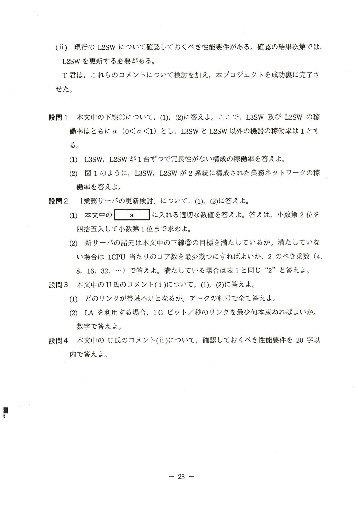

テキスト (OCR)

(ii) 現行の L2SW について確認しておくべき性能要件がある。確認の結果次第では,
L2SW を更新する必要がある。
T 君は。 これらのコメントについて検討を加え, 本プロジェクトを成功裏に完了さ
せた。

設問1 本文中の下線のについて, ①⑪, ②に答えよ。ここで, L3SW 及び L2SW OR
働率はともにe (0くeぐ1) LL, L3SW と L2SW 以外の機器の稼働率は 1 とす
る。
() L3SW, L2SW が1 台ずつで冗長性がない構成の稼働率を答えよ。
2) 図 1 のように, L3SW, L2SW が 2 系統に構成された業務ネットワークの稼
働率を答えよ。
設問2 【業務サーバの更新検討について, ①, (②)に答えよ。
a) 本文中の|  。』 | に入れる適切な数値を答えよ。答えは, 小数第 2 位を
四捨五入して小数第 1 位まで求めよ。
(2) 新サーバの諸元は本文中の下線②の目標を満たしているか。 満たしていな
い場合は 1CPU 当たりのコア数を最少幾つにすればよいか, 2 のべき乗数 (4,
8, 16, 32, …) で答えよ。 満たしている場合は表 1 と同じ “2”と答えよ。
設問3 本文中のU氏のコメント(1i)について, (①, ②)に答えよ。
(1) どのリンクが帯域不足となるか。アークの記号で全て答えよ。
2) LA を利用する場合, 1G ビットノ秒のリンクを最少何本束ねればよいか。
数字で答えよ。
設問4 本文中の U氏のコメント(ii)について, 確認しておくべき性能要件を 20 字以
内で答えよ。

ー 23 一

### ページ 24

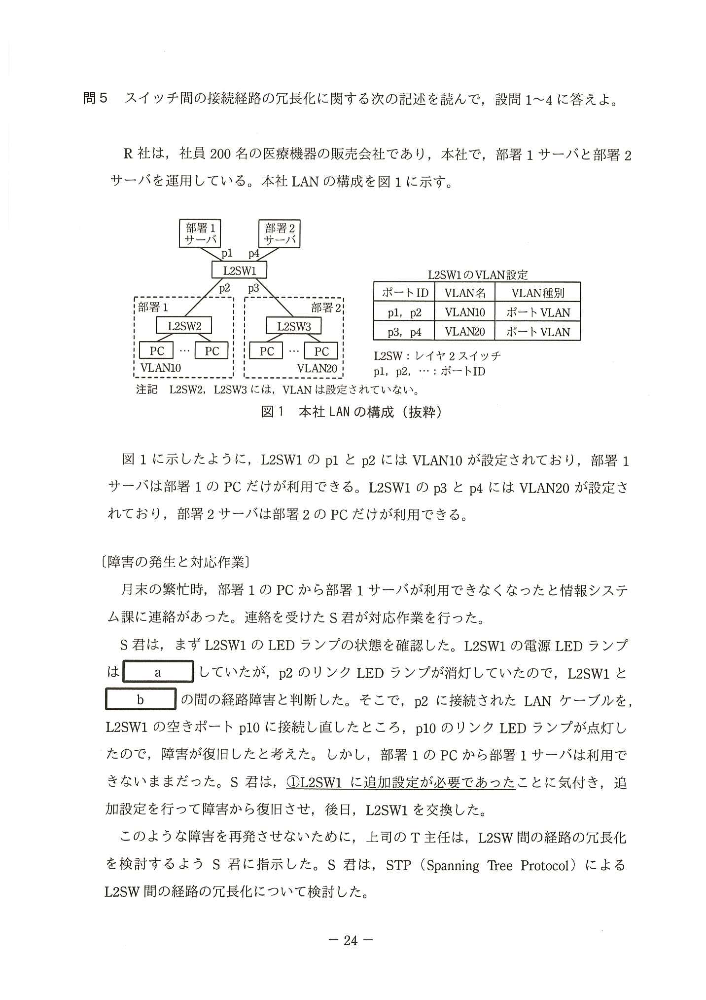

テキスト (OCR)

問5 スイッチ間の接続経路の冗長化に関する次の記述を読んで, 設問 1ー4 に答えよ。

Bu

R 社は, 社員 200 名の医療機器の販売会社であり, 本社で, 部署 YN ee 2
サーバを運用している。 本社 LAN の構成を図 1 に示す。

部署1        部署2
サーバ        サーバ

L2SW1のVLAN設定
ポートID | VLAN名    VLAN種別
pl, p2      VLAN10 | ポートVLAN
p3, p4 | VLAN20 | ポートVLAN

{Lec | [rc |   L2SW : レイヤ 2 スイッチ
1     VLAN20 !   pl, p2, …:ポートID

注記 L2SW2, L2SW3 には, VLAN は設定されていない。
図1 本社LANの構成 (抜粋)

 1 に示したように, L2SW1 の pl と p2 には VLAN10 が設定されており, 部署 1
サーバは部署 1 の PC だけが利用できる。L2SW1 の p3 と p4 には VLAN20 が設定さ
れており, 部暫 2 サーバは部署 2 の PC だけが利用できる。

(障害の発生と対応作業]

月末の繁忙時, 部署 1 のPC から部署 1 サーバが利用できなくなったと情報システ
ム課に連絡があった。連絡を受けた S 君が対応作業を行った。

S 君は, まずL2SW1 の LED ランプの状態を確認した。L2SW1 の電源 LED ランプ
は[|  』 ] していたが, p2 のリンク LED ランプが消灯していたので, L2SW1 と
|  b J の間の経路障害と判断した。そこで, p2 に接続された LAN ケーブルを,
L2SW1 の空きポート p10 に接続し直したところ, p10 のリンク LED ランプが点灯し
たので, 障害が復旧したと考えた。 しかし, 部署 1 の PC から部署 1 サーバは利用で
きないままだった。S 君は, ①L2SW1 に追加設定が必要であったことに気付き, 追
加設定を行って障害から復旧させ, 後日, L2SW1 を交換した。

このような障害を再発させないために, 上司の主任は, L2SW 間の経路の冗長化
を検討するよう S 君に指示した。S Blk, STP (Spanning Tree Protocol) による
L2SW 間の経路の冗長化について検討した。

ー 24 一

### ページ 25

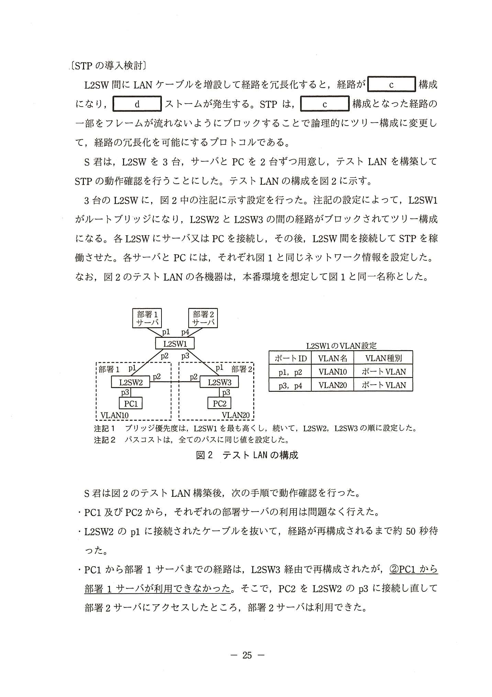

テキスト (OCR)

(STP の導入検討]

L2SW 間に LAN ケーブルを増設して経路を冗長化すると, 経路が[| c |構成
になり, | 』 | ストームが発生する。STP は, | c |構成となった経路の
一部をフレームが流れないようにブロックすることで論理的にツリー構成に変更し
て, 経路の冗長化を可能にするプロトコルである。

S 君は, L2SW を 3 台, サーバと PC を 2 台ずつ用意し, テスト LAN を構築して
STP の動作確認を行うことにした。テスト LAN の構成を図 2 に示す。

3 台の L2SW に, 図 2 中の注記に示す設定を行った。 注記の設定によって, L2SW1
がルートブリッジになり, L2SW2 と L2SW3 の間の経路がブロックされてツリー構成
になる。各TL2SW にサーバ又は PC を接続し, その後, L2SW 間を接続して STP を稼
働させた。各サーバと PC には, それぞれ図 1 と同じネットワーク情報を設定した。
なお, 図 2 のテスト LAN の各機器は, 本番環境を想定して図 1 と同一名称とした。

L2SW1のVLAN設
ポートID | VLAN名        VLAN種別
pl, p2      VLAN10 | ポートVLAN
p3, p4 | VLAN20 | ポートVLAN

注記1 ブリッジ優先度は, L2SW1 を最も高くし, 続いて, L2SW2, L2SW3 の順に設定した。
注記2 パスコストは, 全てのパスに同じ値を設定した。

図2 テストLANの構成

S 君は図 2 のテスト LAN 構築後, 次の手順で動作確認を行った。

・PC1 及び PC2 から, それぞれの部署サーバの利用は問題なく行えた。

・L2SW2 の pl に接続されたケーブルを抜いて, 経路が再構成されるまで約 50 秒待
Diy

・PC1 から部署 1 サーバまでの経路は, L2SW3 経由で再構成されたが, ②PC1 から
部署 1 サーバが利用できなかった。 そこで, PC2 を L2SW2 の p3 に接続し直して
部署 2 サーバにアクセスしたところ, 部署 2 サーバは利用できた。

ー 25 一

### ページ 26

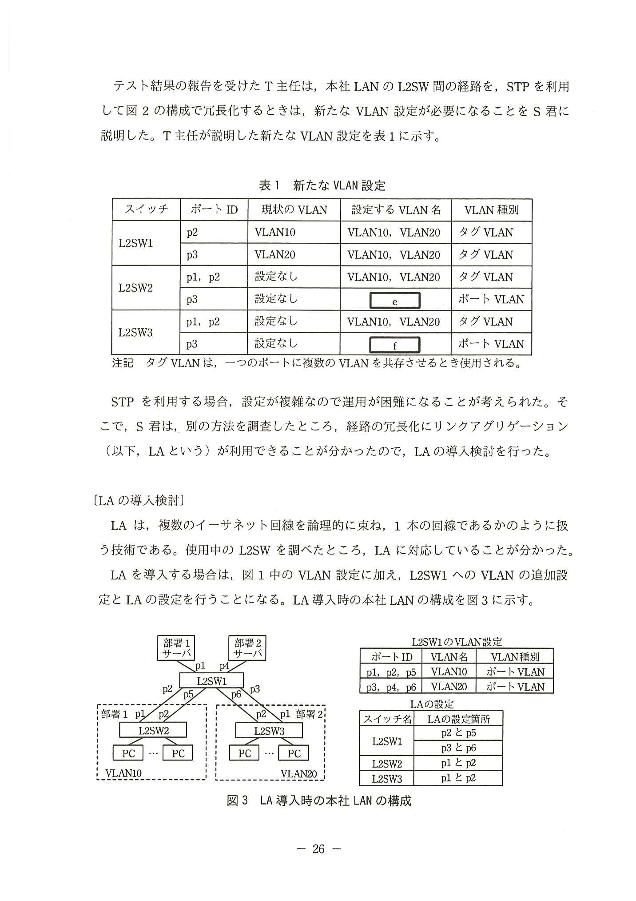

テキスト (OCR)

テスト結果の報告を受けた 主任は, 本社 LAN のL2SW 間の経路を, STP を利用
して図 2 の構成で冗長化するときは, 新たな VLAN 設定が必要になることを S Alc
説明した。革主任が説明した新たな VLAN 設定を表 1 に示す。

表1 新たなVLAN設定

スイッチ | ポートID | 現状のVLAN | 設定するVLAN名 | VLAN種別
p2         VLAN10        VLAN10, VLAN20 | タグVLAN
L2SW1                                                                         -
p3          VLAN20         VLAN10, VLAN20 | #7 VLAN
Loswe       pl, p2        設定なし           VLAN10, VLAN20 | タグVLAN
p3           設定なし              | 。 |            ポート VLAN
_     pl, p2      設定なし        VLAN10, VLAN20 | タグVLAN
p3            設定なし                |     fr |        ポート VLAN

注記 タグVLAN は, 一つのポートに複数の VLAN を共存させるとき使用される。

STP を利用する場合, 設定が複雑なので運用が困難になることが考えられた。そ
こで, S 君は, 別の方法を調査したところ, 経路の冗長化にリンクアグリゲーション
CAE, LA という) が利用できることが分かったので, LA の導入検討を行った。

(LA の導入検討
LA は, 複数のイーサネット回線を論理的に束ね, 1 本の回線であるかのように扱
う技術である。 使用中の L2SW を調べたところ, LA に対応していることが分かった。
LA を導入する場合は, 図 1 中の VLAN 設定に加え, L2SW1 への VLAN の追加設
定とLA の設定を行うことになる。LA 導入時の本社 LAN の構成を図 3 に示す。

部署1               部署2                                                   L2SW1のVLAN設
oo          サーパ                         ポートID | VLAN名 | VLAN種別
pl, p2, p5 | VLAN10    ポート VLAN
p3, p4, p6 | VLAN20 | ポート VLAN
LAの設定
スイッチ名| LAの設定箇所
p2とp5
L2SW1        Ste
L2SW2         plとp2
L2SW3        pl & p2

 3 LA導入時の本社 LAN の構成

ー 26 一

### ページ 27

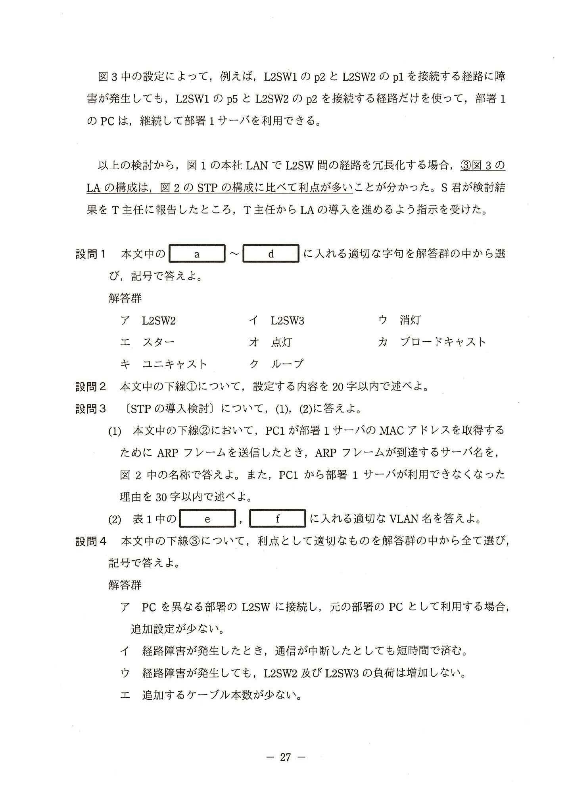

テキスト (OCR)

図 3 中の設定によって, 例えば, L2SW1 の p2 とL2SW2 の pl を接続する経路に障
害が発生しても, L2SW1 の pd と L2SW2 の p2 を接続する経路だけを使って, 部署 1
の PC は, 継続して部署 1 サーバを利用できる。

以上の検討から, 図 1 の本社 LAN でL2SW 間の経路を冗長化する場合, ③図 3 の
LA の構成は, 図 2 の STP の構成に比べて利点が多いことが分かった。S 君が検討結
果を主任に報告したところ, 主任から LA の導入を進めるよう指示を受けた。

設問1 本文中の| 。 |~|  』 |に入れる適切な字句を解答群の中から選
U, 記号で答えよ。
SASH
ア L2sw2     イ L2sw3     ウ 消灯
x= ズター     オ 点灯      nA ブロードキャスト
キ ユニキャスト   ク ループ

設問2 本文中の下線①について, 設定する内容を 20 字以内で述べよ。
設問3 = (STP OW AMA) OWT, ①, ②)に答えよ。
(1) 本文中の下線の@において, PC1 が部署 1 サーバの MAC アドレスを取得する
ために ARP フレームを送信したとき, ARP フレームが到達するサーバ名を,
 2 中の名称で答えよ。また, PCL から部署 1 サーバが利用できなくなった
理由を 30 字以内で述べよ。
②⑫) 表1中の|  e |,[  f |に入れる適切な VLAN 名を答えよ。
設問4 本文中の下線②③について, 利点として適切なものを解答群の中から全て選び,
記号で答えよ。
解答竹
ア PC を異なる部署の L2SW に接続し, 元の部署の PC として利用する場合,
追加設定が少ない。
イ 経路障害が発生したとき, 通信が中断したとしても短時間で済む。
ウ 経路障害が発生しても, L2SW2 及び L2SW3 の負荷は増加しない。
エ 追加するケーブル本数が少ない。

ー 27 一

### ページ 28

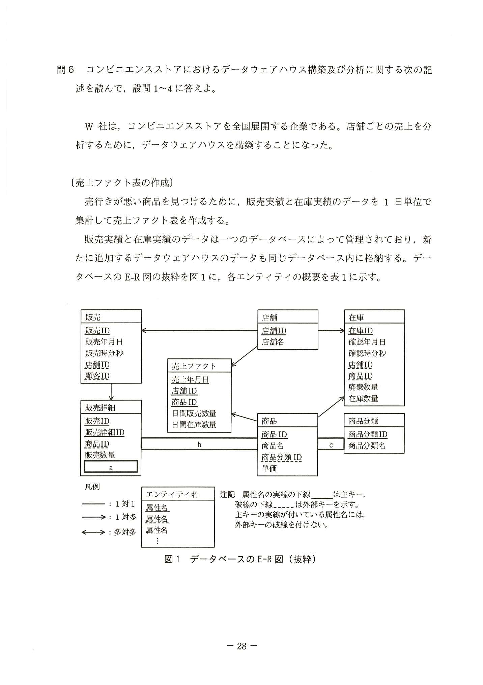

テキスト (OCR)

間6 コンビニエンスストアにおけるデータウェアハウス構築及び分析に関する次の記
述を読んで, 設問 1ンー4 に答えよ。

W 社は, コンビニエンスストアを全国展開する企業である。店舗ごとの売上を分
析するために, データウェアハウスを構築することになった。

st

CET TT hROERMI
行きが悪い商品を見つけるために, 販売実績と在庫実績のデータを 1 日単位で
集計して売上ファクト表を作成する。

販売実績と在庫実績のデータは一つのデータベースによって管理されており, 新
たに追加するデータウェアハウスのデータも同じデータベース内に格納する。 デー
タベースの E-R 図の抜粋を図 1 に, 各エンティティの概要を表 1 に示す。

Gi

at

rf

販売                                  ee               在庫
販売ID                                店舗TD             在庫ID
販売年月日                                          店舗名                   確認年月日
販売分秒                       ie                   確認時分秒
店舗TD                   売上ファクト                                       店舗D
He                   売上年月日                                         om
店舗TD

販売詳細            aD                          vA a

-              EMER kk、、 ーー              ーー
JED              日間在庫数量          商品               商品分類
—o                             商品ID             商品分類ID
商品ID                   b             商品           Cc |商品分類名
Jen                               商品分類DD

単価
RL AGI
Ne       。     エンティティ名       注記 属性名の実線の下線___は主キー,
ーー : 181 Jo             破線の下線-___- は外部キーを示す。
ーー : 1対多 Fs           主キーの実線が付いている属性名には,
ピー             外部キーの破線を付けない。

<—> : 多対多 | 属性名

図1 データベースのE-R図 (抜粋)

ー 28 一

### ページ 29

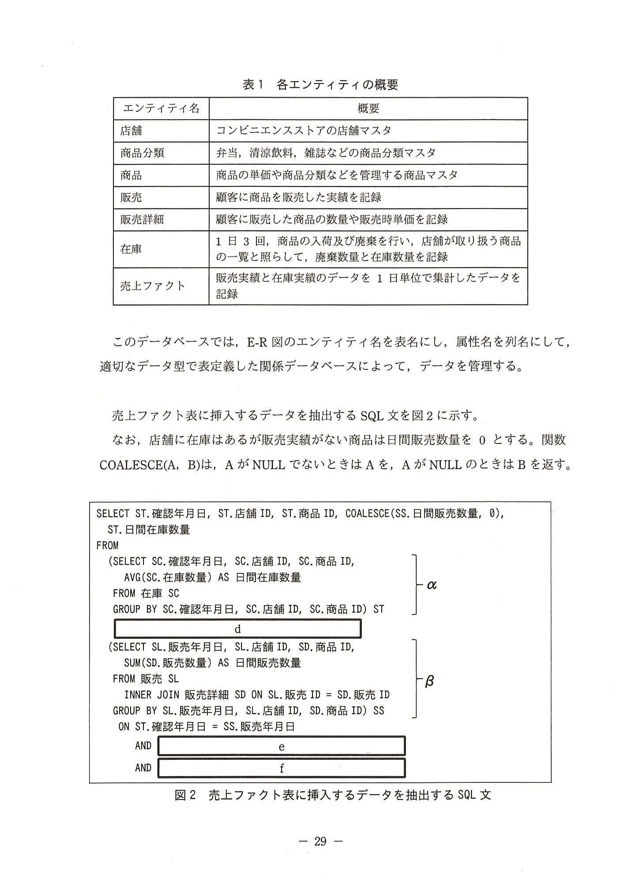

テキスト (OCR)

表1 各エンティティの概要

エンティティ名                            概要

店舗          コンビニエンスストアの店舗マスタ

商品分類          弁当, 清涼飲料 雑誌などの商品分類マスタ
商品             商品の単価や商品分類などを管理する商品マスタ
販売              顧客に商品を販売した実績を記録

販売詳細         顧客に販売した商品の数量や販売時単価を記録

1 日3 回, 商品の入荷及び廃棄を行い, 店舗が取り扱う商品
の一覧と照らして, 廃棄数量と在庫数量を記録

販売実績と在庫実績のデータを 1 日単位で集計したデータを
記録

このデータベースでは, E-R 図のエンティティ名を表名にし, 属性名を列名にして,
適切なかデータ型で表定義した関係データベースによって, データを管理する。

売上ファクト表に挿入するデータを抽出する SQL 文を図 2 に示す。
なお, 店舗に在庫はあるが販売実績がない商品は日間販売数量を 0 とする。関数
COALESCE(A, B)は, A がNULL でないときはAを, AがNULL のときは B を返す。

SELECT ST.確認年月日, ST.店舗 ID, ST.商品 ID, COALESCE(SS. 日間販売数量, 0),
ST. 日間在庫数量
FROM
(SELECT SC.確認年月日, SC.店舗 1, SC.商品 ID,
AVG(SC. 在庫数量) AS 日間在庫数量
FROM 在庫 SC
GROUP BY SC.確認年月日, SC.店舗 ID, SC.商品 ID) ST
|                  d                  |
(SELECT SL.販売年月日, SL.店舗 D, SD.商品 ID,
SUM(SD.販売数量) AS 日間販売数量
FROM 販売 SL                                     FTg
INNER JOIN 販売詳細 SD ON SL.販売 ID = SD.販売TD
GROUP BY SL.販売年月日, SL. 店舗 ID, SD.商品 ID) SS
ON ST.確認年月日 = SS.販売年月日

AND |                              e                              |
AND |                     f                     |

図2 売上ファクト表に挿入するデータを抽出する SOL 文

ー 29 一

### ページ 30

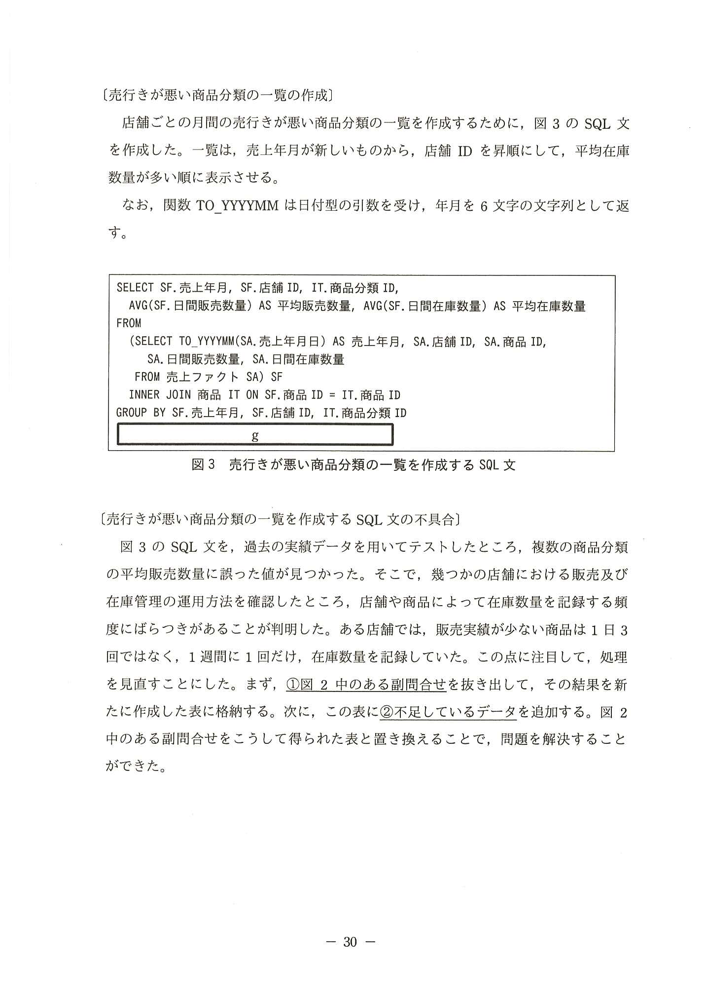

テキスト (OCR)

〔売行きが悪い商品分類の一覧の作成〕

店舗ごとの月間の売行きが悪い商品分類の一覧を作成するために, 3のSGL 文
を作成した。 一覧は, 売上年月が新しいものから, Aa ID を昇順にして, 平均在庫
数量が多い順に表示させる。

なお, 関数 TO YYYYMM は日付型の引数を受け, 年月を 6 文字の文字列として返
す。

SELECT SF.売上年月。 SF.店舗 ID, IT.商品分類 ID,

AVG(SF. 日間販売数量) AS 平均販売数量, AVG(SF. 日間在庫数量) AS 平均在庫数量
FROM

(SELECT TO_YYYYMM(SA.売上年月日) AS 売上年月, SA.店舗 ID, SA.商品 ID,

SA. 日間販売数量, SA. 日間在庫数量

FROM 売上ファクト SA) SF

INNER JOIN 商品 IT ON SF.商品 ID = IT.商品 ID
GROUP BY SF.売上年月, SF.店舗 ID, IT.商品分類 ID

|        g        |

図3 売行きが悪い商品分類の一覧を作成する SQL 文

【売行きが悪い商品分類の一覧を作成する SQL 文の不具合〕

 3 の SQL 文を, 過去の実績データを用いてテストしたところ, 複数の商品分類
の平均販売数量に誤った値が見つかった。 そこで, 北つかの店舗における販売及び
在庫管理の運用方法を確認したところ, 店舗や商品によって在庫数量を記録する頻
度にばらつきがあることが判明した。ある店舗では, 販売実績が少ない商品は 1 日 3
回ではなく, 1 週間に 1 回だけ, 在庫数量を記録していた。この点に注目して, 処理
を見直すことにした。まず, ①図 2 中のある副問合せを抜き出して, その結果を新
たに作成した表に格納する。次に, この表に②不足しているデータを追加する。図 2
中のある副問合せをこうして得られた表と置き換えることで, 問題を解決すること
ができた。

ー 30 一

### ページ 31

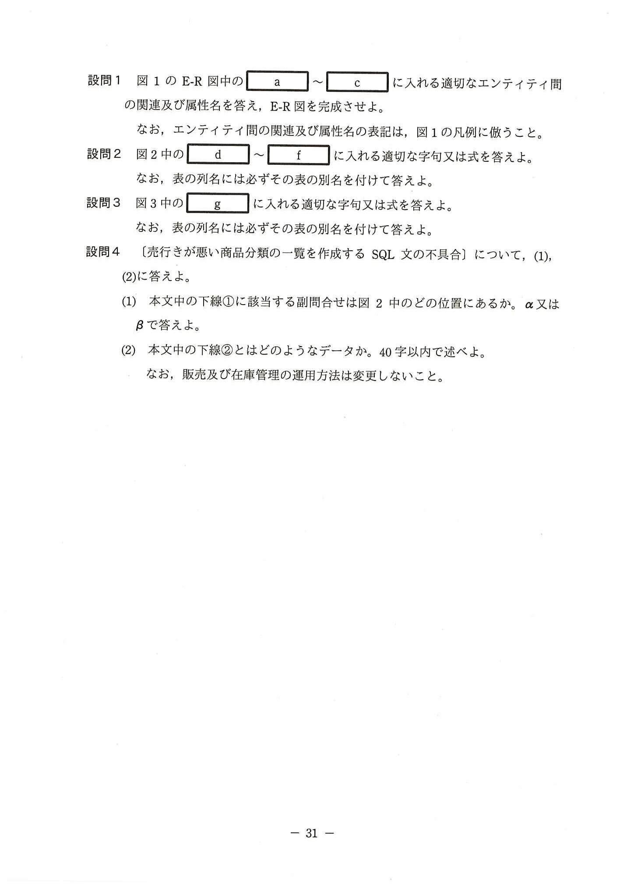

テキスト (OCR)

設問 1 1 の E-R 図中の| a |~f  。 |に入れる適切なエンティティ間
の関連及び属性名を答え, E-R 図を完成させよ。
BB, エンティティ間の関連及び属性名の表記は, 図 1 の凡例に父うこと。
設問2 図2中の| da |~f fj |に入れる適切な字句又は式を答えよ。
なお, 表の列名には必ずその表の別名を付けて答えよ。
設問3 図3中の| g | に入れる適切な字句又は式を答えよ。
なお, 表の列名には必ずその表の別名を付けて答えよ。
設問4 【売行きが悪い商品分類の一覧を作成する SQL 文の不具合] について, 0),

②に答えよ。
DQ 本文中の下線①に該当する副問合せは図 2 中のどの位置にあるか。 a Mit

8で答えよ。
(2) 本文中の下線②とはどのようなデータか。40 字以内で述べよ。
なお, 販売及び在庫管理の運用方法は変更しないこと。

ー 31 一

### ページ 32

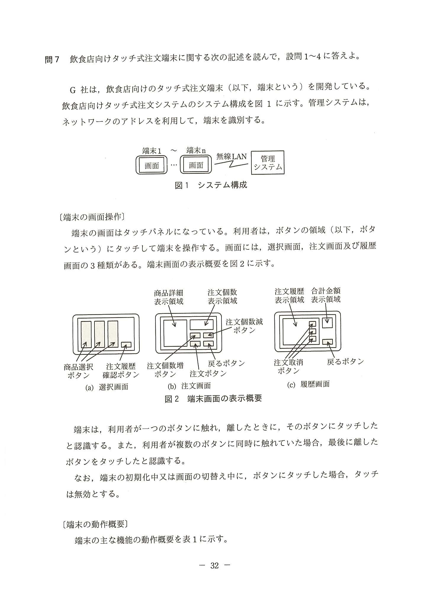

テキスト (OCR)

間7 飲食店向けタッチ式注文端末に関する次の記述を読んで, 設問1ユー4 に答えよ。

G 社は, 飲食店向けのタッチ式注文端末 (以下, 端末という) を開発している。
飲食店向けタッチ式注文システムのシステム構成を図 1 に示す。管理システムは
ネットワークのアドレスを利用して, 端末を識別する。

端末1 ~ 端末n
無線LAN | 管理
画面 ||…|| 画面|| 一 一|システム

図1 システム構成

〔端末の画面操作】

端末の画面はタッチパネルになっている。利用者は, ボタンの領域(以下,ボタ
ンという) にタッチして端末を操作する。画面には, 選択画面, 注文画面及び族歴
画面の 3 種類がある。端末画面の表示概要を図 2 に示す。

商品詳細   注文個数     注文履歴 合計金額
Hen GOR   iia     表示領域 表示領域
Y | | | 注文個数     \    ha
リーボタン          a
fe)
2            eee                   oF
7       7               Nos        」    f     aver
商品選択 注文履歴 注文個数増  \  戻るボタン     注文取消 。 戻るポボタン
ポタン 確認ボタン ボタン 注文ボタン         ボタン
(a) 選択画面       (b) 注文画面             <) 履歴画面

図2 端末画面の表示概要

端末は, 利用者が一つのボタンに触れ, 離したときに, そのボタンにタッチした
と認識する。また, 利用者が複数のボタンに同時に触れていた場合  , 最後に離した

ボタンをタッチしたと認識する。
なお, 端末の初期化中又は画面の切替え中に, ボタンに にタッチした場合, タッチ

は無効とする。

[端末の動作概要]
端末の主な機能の動作概要を表 1 に示す。

ー 32 一

### ページ 33

テキスト (OCR)

表1 端末の主な機能の動作概要

機能

動作概要

注文

・ 選択画面で利用者が商品選択ボタンにタッチすると, ERMC BTS,
・注文画面で, 利用者は, 注文個数増ボタン又は注文個数減ボタンにタッチして, 注文個

・利用者が商品を注文すると, 注文情報として注文 D, 商品名及び注文個数を注文履歴に

・ 注文画面で, 利用者が戻るボタンにタッチすると, 選択画面に戻る。

数を指定した後, 注文ボタンにタッチして, 商品を注文する。「

保存する。 注文 D は, 端末ごとに, 1 から始まる連番として生成される。

注文履歴確認

・ 選択画面で, 利用者が注文履歴確認ボタンにタッチすると, 履歴画面に人怖移する。履礎

・ 履歴画面で, 利用者が戻るボタンにタッチすると, 選択画面に戻る。

画面では, 注文履歴を閲覧することができる。

・ 履歴画面で, 利用者が注文取消ボタンにタッチすると, 注文履歴から当該の注文情報を

削除し, 画面表示を更新する。

[端末一管理システム間の通信]

注文ボタンへのタッチを認識すると, 端末は, 管理システムに注文メッセージを
送信する。 管理システムは, 注文メッセージを受信すると, 一定時間後に, 端末に
注文確定メッセージを送信する。

端末は, 注文確定メッセージを受信すると, 注文履歴の中から対応する注文を確
定し, 管理システムに注文確定完了メッセージを送信する。ただし, 対応する注文
が注文履歴の中に存在しなかった場合, 端末は注文確定メッセージを破棄する。

管理システムは, 注文確定メッセージを送信後, 一定時間内に端末から注文確定
完了メッセージを受信できなかった場合, 注文が取り消されたものとして扱う。

注文取消ボタンへのタッチを認識すると, 当該の注文が確定していない場合に限
り, 端末は, 管理システムに注文取消メッセージを送信する。

(端末一管理システム間のメッセージの構成〕

注文メッセージは, メッセージの種別を示すデータ, FEC ID 及び注文情報から構
成される。 それ以外のメッセージは, メッセージの種別を示すデータ及び注文 D か
ら構成される。

(端末のソフトウェア]
端末は, イベントドリブンプリエンプション方式のリアルタイム OS を使用する。

— 8 一

### ページ 34

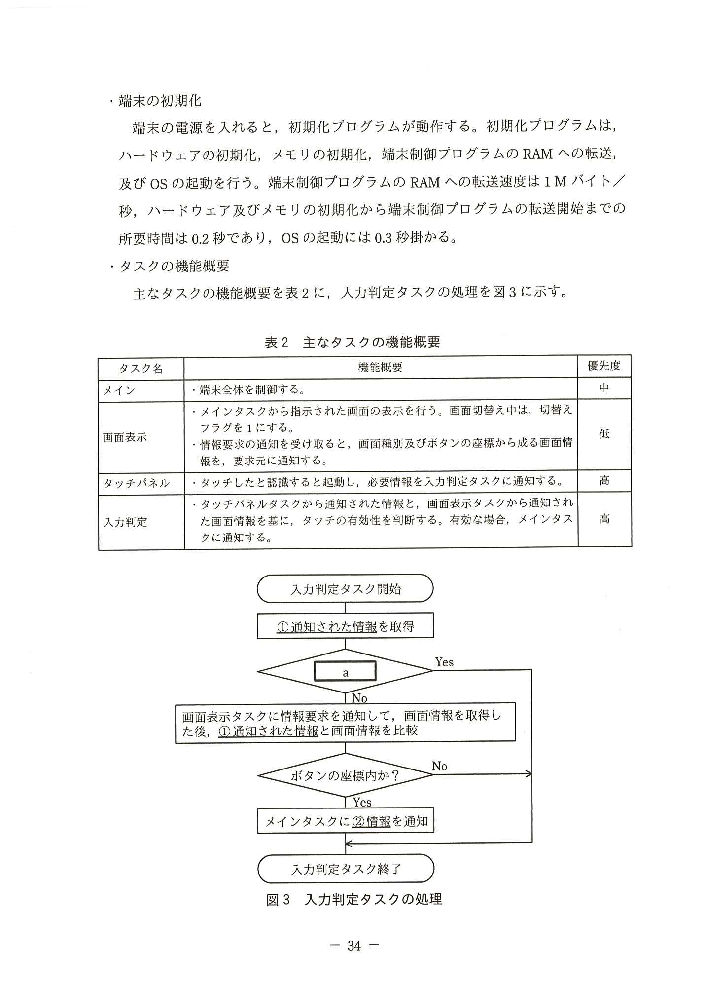

テキスト (OCR)

・端末の初期化
端末の電源を入れると, 初期化プログラムが動作する。初期化プログラムは,
ハードウェアの初期化, メモリの初期化, 端末制御プログラムの RAM への転送
及び 0S の起動を行う。端末制御プログラムの RAM への転送速度は1M バイトブ
秒, ハードウェア及びメモリの初期化から端末制御プログラムの転送開始までの
所要時間は 0.2 CHV, OS の起動には 0.3 MHDS.
・タスクの機能概要
主なタスクの機能概要を表 2 に, 入力判定タスクの処理を図 3 に示す。

表2 主なタスクの機能概要

タスク名                     機能概要                    優先度

メイン            ・端末全体を制御する。                                                            中

・メインタスクから指示された画面の表示を行う。画面切替え中は, 切替え
=       フラグを 1 にする。

imix     ・情報要求の通知を受け取ると, 画面種別及びボタンの座標から成る画面情   i
Re, 要求元に通知する。

タッチパネル | ・タッチしたと認識すると起動し, 必要情報を入力判定タスクに通知する。     高
・ タッチパネルタスクから通知された情報と, 画面表示タスクから通知され

入力判定     た画面情報を基に, タッチの有効性を判断する。有効な場合,メインタス   高

クに通知する。

(、 入力判定タスク開始 。 )
I
①通知された情報を取得

ゴー

No

画面表示タスクに情報要求を通知して, 画面情報を取得し
た後, ① 通知された情報と画面情報を比較

Yes
メインタスクに⑫情報を通知

し
c
(、 入間定タスク殺了 _)

図3 入力判定タスクの処理

ー 34 一

### ページ 35

テキスト (OCR)

設問1 端末の動作について, Q①)  ⑬ に答えよ。
①) 200k バイトの端末制御プログラムの場合, 初期化プログラムの動作開始か
ら OS の起動完了まで何秒掛かるか。答えは小数第 2 位を四捨五入して, 小
数第 1 位まで求めよ。ここで, 1M バイト=1.000 k バイト, 1k バイト=
1,000 バイトとし, 初期化プログラムの各処理の移行に必要な時間は無視でき
るものとする。
(2) 注文ID だけでは実現できないことを解答群の中から選び,
解答群
ア 注文を確定するときに, 確定すべき注文を選択する。
イ 注文を取り消すときに, 注文履歴内の取り消すべき注文を選択する。
ウ 注文を取り消すときに, 当該の注文を取り消してよいかを判断する。
エエ 利用者が注文した順に, 履歴画面に注文情報を並べる。
(3) 管理システムが端末に注文確定メッセージを送信してから, 端末が受信す
るまでの間に, 端末が, 当該の注文の注文取消メッセージを送信した場合の,
端末の動作として適切なものを解答群の中から選び, 記号で答えよ。
解答群
ア 管理システムと端末の情報に矛盾が生じ, 異常な処理が実行される。
イ そのときの端末の状態によって異なる。
ウ 注文確定メッセージが優先され, 注文を取り消すことはできない。
エエ 当該の注文の注文情報を削除する。
設問2 図3中の下線① について, Q) , ②) に答えよ。
Q①) 通知してきたタスク名を答えよ。
(2) 通知された情報を答えよ。
設問3 図3中の| a | に入れる適切な内容を, 15 字以内で答えよ。
設問4 図3 中の下線② の情報は二つあり, 一つは画面種別である。もう一つの情報

を答えよ。

Las CAA L,

Bu

= 35 =

### ページ 36

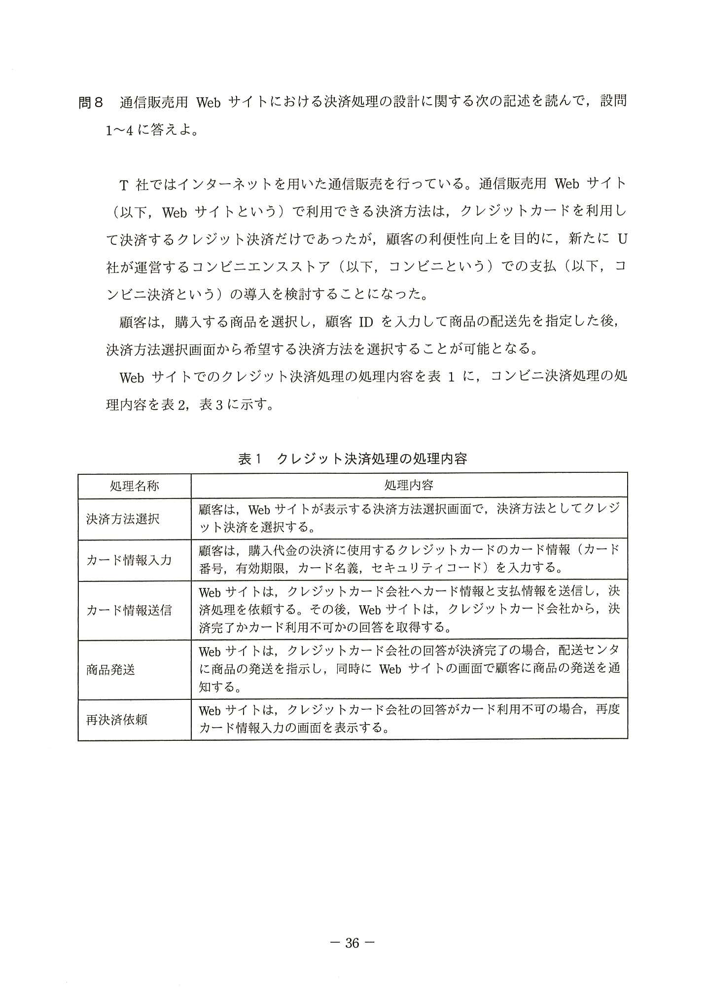

テキスト (OCR)

AIS 通信販売用 Web サイトにおける決済処理の設計に関する次の記述を読んで, 設問

1て4 に答えよ。

T 社ではインターネットを用いた通信販売を行っている。 通信販売用 Web サイト
(以下, Web サイトという) で利用できる決済方法は, クレジットカードを利用し
て決済するクレジット決済だけであったが, 願客の利便性向上を目的に, 新たに U
社が運営するコンビニエンスストア (以下, コンビニという) での支払(以下, コ
ンビニ決済という) の導入を検討することになった。

顧客は, 購入する商品を選択し, 顧客 ID を入力して商品の配送先を指定した後
決済方法選択画面から希望する決済方法を選択することが可能となる。

Web サイトでのクレジット決済処理の処理内容を表 1 に, コンビニ決済処理の処
理内容を表 2, 表3 に示す。

表1 クレジット決済処理の処理内容

処理名称                  処理内容
SeもNR     顧客は, Web サイトが表示する決済方法選択画面で, 決済方法としてクレジ
決済方法選択 | 決済を選択する。
カード情報入力  顧客は, 購入代金の決済に使用するクレジットカードのカード情報 (カード
番号, 有効期限, カード名義。 セキュリティコード) を入力する。
Web サイトは, クレジットカード会社ヘへカード情報と支払情報を送信し, 決
カード情報送信  済処理を依頼する。 その後, Web サイトは, クレジットカード会社から, 決
済完了かカード利用不可かの回答を取得する。
Web サイトは, クレジットカード会社の回答が決済完了の場合, 配送センタ
商品発送     に商品の発送を指示し, 同時に Web サイトの画面で顧客に商品の発送を通
知する。
Vu   — KA    AEDS IZ—    ej   aA    e
ais Hela    Web サイトは, クレジットカード会社の回答がカード利用不可の場合 再度

カード情報入力の画面を表示する。

ー 36 一

### ページ 37

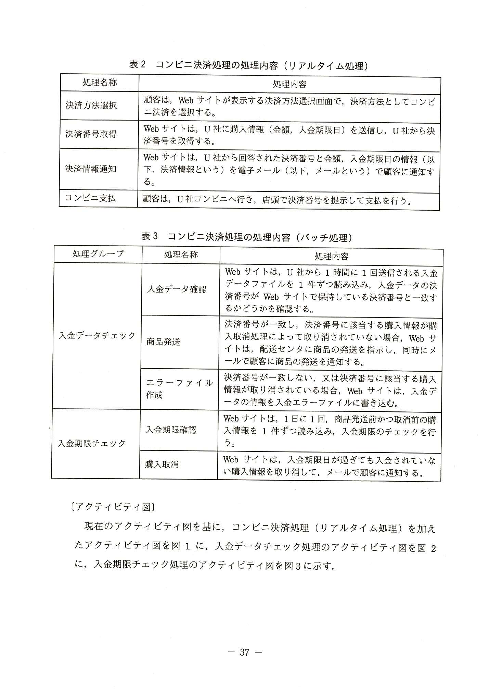

テキスト (OCR)

表2 コンビニ決済処理の処理内容 (リアルタイム処理)

処理名称                   処理内容
spo jos    WEIS, Web サイトが表示する決済方法選択画面で。 決済方決としてコンピ
RRA | ye minds,
小雪 | Veb サイトは。U社に購入情報(金額入金期限日) を送信し, U社から決
RAGS | 半番号を取得する。
Web サイトは, 1 社から回答された決済番と金額,入金期限日の情報(以
決済情報通知    下, 決済情報という) を電子メール (以下, メールという) で顧客に通知す
る。
コンビー支払 | 願客は。U社コンビニムへ行き,店頭で決済秋号を提示して支払を行う。
RI コンビニ決済処理の処理内容 (バッチ処理)
処理グループ    処理名称             処理内容

入金データチェック

Web サイトは, U 社から 1 時間に 1 回送信される入金
データファイルを 1 件ずつ読み込み, 入金データの決

AGT FM | eae te Wab サイトで保持している決済番号と一致
るかどうかを確認する。
決済番号が一致し, 決済番号に該当する購入情報が障
商品発送     入取消処理によって取り消されていない場合, Web +

イトは, 配送センタに商品の発送を指示し, 同時にメ
ールで願客に商品の発送を通知する。

決済番号が一致しない, 又は決済番号に該当する購入
情報が取り消されている場合, Web サイトは, 入金デ
ータの情報を入金エラーファイルに書き込む。

エラーファイル
作成

入金期限チェック

Web サイトは, 1 日に1回, 商品発送前かつ取消前の購
入金期限確認   入情報を 1 件ずつ読み込み, 入金期限のチェックを行
う。

Web サイトは, 入金期限日が過ぎても入金されていな

購入取消     い購入情報を取り消して, メールで顧客に通知する。

【アクティビティ図]

現在のアクティビティ図を基に, コンビニ決済処理 (りアルタイム処理) を加え
たアクティビティ図を図 1 に, 入金データチェック処理のアクティビティ図を図 2
に, 入金期限チェック処理のアクティビティ図を図 3 に示す。

ー 37 一

### ページ 38

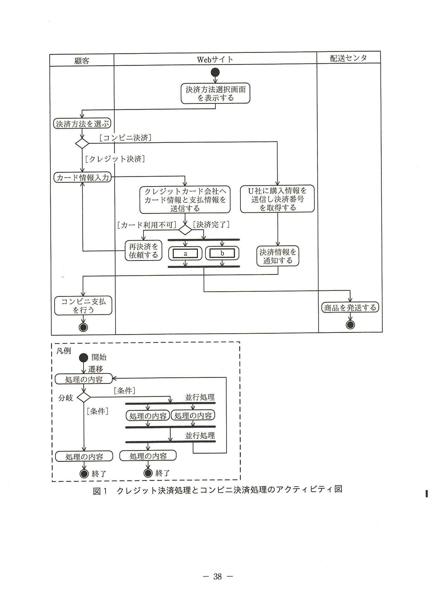

テキスト (OCR)

顧客                                    Webサイト

配送センタ

決済方法選択画面
を表示する

[クレジット決済]

(カード情報入力有

U社に購入情報を

クレジットカード会社へ
カード情報と支払情報を         送信し決済番号
送信する                             を取得する

J

[カード利用不可] [決済完了]

| 再決済を

eee (5) (==)   (xn)
NO         RU

通知する

_]

商品を発送する
@

|

1

|                  普生処理
     [条件]

!                  THLE
1処理の内容 ) ( aay ーー
|     終了       終了

図1 クレジット決済処理とコンビニ決済処理のアクティビティ

ー 38 一

### ページ 39

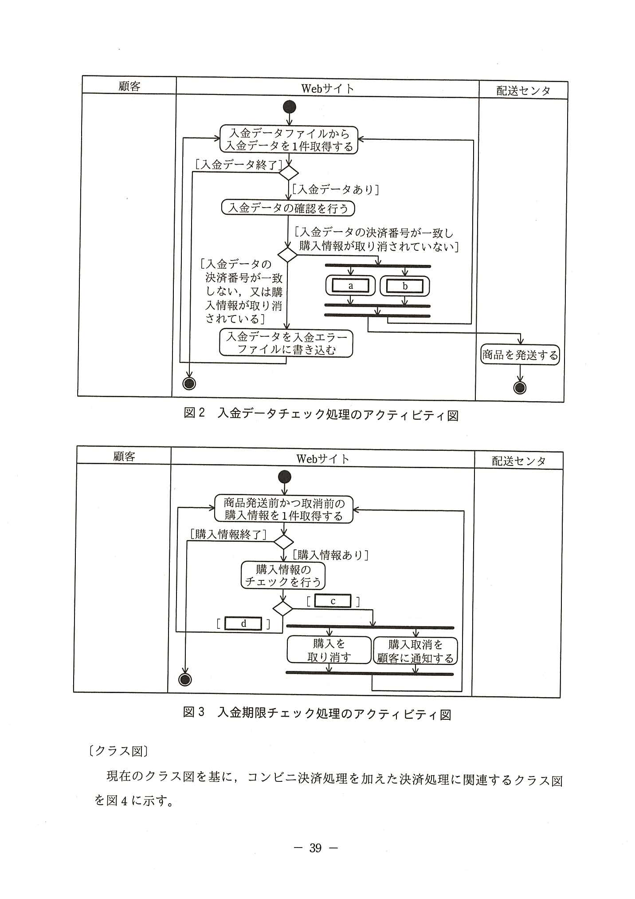

テキスト (OCR)

顧客

Webサイト

配送センタ

入金データファイルから
入金データを1件取得する

[入金データ終了

[入金データあり]
入金データの確認を行う

[入金データの決済番号が一致し
購入情報が取り消されていない]
[入金データの

決済番号が一致
しない, 又は購
入情報が取り消
されている]

入金データを入金エラー
ファイルに書き込む

@                              @
図2 入金データチェック処理のアクティビテイィ図
顧客               Webサイト             配送センタ
商品発送前かつ取消前の
騰情報を1件了得する が
[購入情報終了]
[購入情報あり]
購入情報の
チェックを行う
(bei
[    :    ]           \               RU
購入を    購入取消を
り消   顧客に通知する
図3 入金期限チェック処理のアクティビティ図
(VIA)

現在のクラス図を基に, コンビニ決済処理を加えた決済処理に関連するクラス図

を図 4 に示す。

ー 39 一

### ページ 40

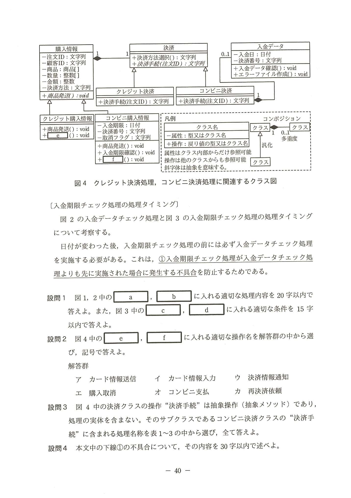

テキスト (OCR)

maa,     ,      Te               入金データ
Sp: x | _ FRO 、     0.1| -入日: Aft
ee         en     Stieeec
“Hist BE)                              入金データ確認() : void
age                               72 TERO) : void
和信 8  ,             i                               エラーファイル作成() : void
=   法 : 文字列        Sy hee            VP aR
TR) : void        DVYy bi             コンビニ決済       1

(EE3D7S20WPfiG5OTEP20
クレジット購入情報| コンビニ講和情報 Rta |
商品人 «void || AU:         クラス名      zeー 222|
+e JO) : void || 取消フラグ : 文字列 | 居性:型又はクラス名      人
ie

入金期限確認() : void

民性はクラス内部からだけ参昭可能
+L £_J0 = void

操作は他のクラスからも参照可能
斜字体は抽象を意味する。

TARO : voHd —_|t LEBEE 戻り値の型又はクラス名

図4 クレジット決済処理, コンビニ決済処理に関連するクラス図

[入金期限チェック処理の処理タイミング]

 2 の入金データチェック処理と図 3 の入金期限チェック処理の処理タイ ミング
について考察する。

日付が変わった後, 入金期限チェッ ク処理の前には必ず入金データチェック処理
を実施する必要がある。これは, ①入金期限チェッ ク処理が入金データチェック処
理よりも先に実施された場合に発生する不具合を防止するためである。

設問1 図1 2中の| a |,|  b |に入れる道切な処理内容を20字以内で
wak, xe, 図 3 中の| <c |,| 4 |に入れる適切な条件を15 字
以内で答えよ。

設問2 図4中の| ce |,| fj |に入れる適切な操作名を解答群の中から居

UO, 記号で答えよ。

解答竹
ア カード情報送信        イ カード情報入力         ウ 決済情報通知
エ 購入取消                オ コンビニ支払           A 再決済依頼

設問3 4 中の決済クラスの操作 “決済手続" は抽象操作 (抽象メソッド) CH),
処理の実体を含まない。そのサブクラスであるコンビニ決済クラスの “決済手
続" に含まれる処理名称を表 1ご3 の中から選び, STAAL,

設問4 本文中の下線①の不具合について, その内容を 30 字以内で述べよ。

ー 40 一

### ページ 41

テキスト (OCR)

〔

x モ 用 紙 J

ー 41 一

### ページ 42

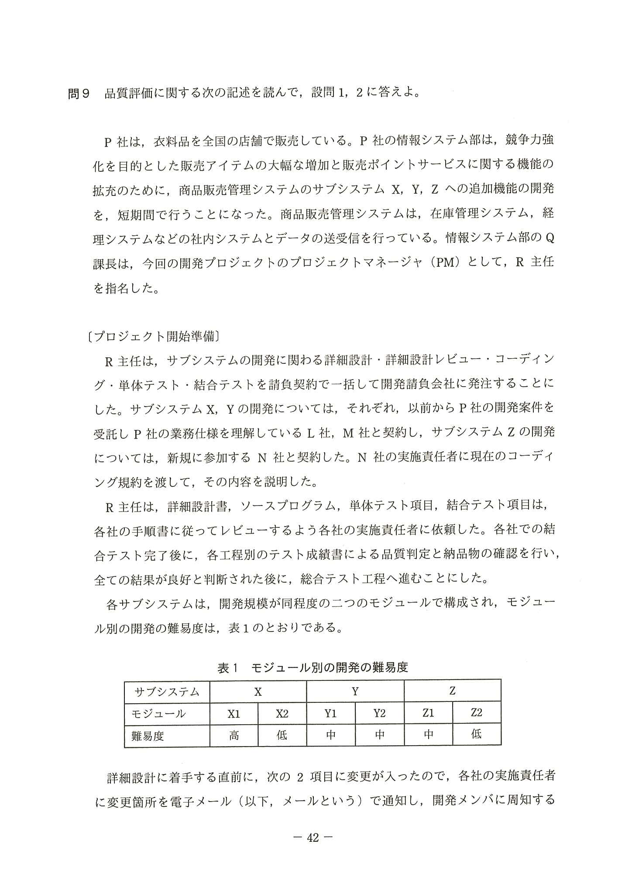

テキスト (OCR)

AO 品質評価に関する次の記述を読んで, 設問1, 2 に答えよ。

P 社は, 衣料品を全国の店舗で販売している。P 社の情報システム部は, 競争力強
化を目的とした販売アイテムの大幅な増加と販売ポイントサービスに関する機能の
拡雄のために, 商品販売管理システムのサブシステム X, Y, Z への追加機能の開発
を, 短期間で行うことになった。商品販売管理システムは, 在庫管理システム, 経
理システムなどの社内システムとデータの送受信を行っている。情報システム部の Q
課長は, 今回の開発プロジェクトのプロジェクトマネージャ (PM) として, R 主任
を指名した。

[プロジェクト開始準備

R 主任は, サブシステムの開発に関わる詳細設計・詳細設計レビュー・コーディン
グ・単体テスト・結合テストを請負契約で一括して開発請負会社に発注することに
した。サブシステム XX, Y の開発については, それぞれ, 以前からP 社の開発案件を
受託し P 社の業務仕様を理解している Ltt, M 社と契約し, サブシステム Z の開発
については, 新規に参加する N 社と契約した。N 社の実施責任者に現在のコーディ
ング規約を渡して, その内容を説明した。

R 主任は, 詳細設計書, ソースプログラム, 単体テスト項目, 結合テスト項目は
各社の手順書に従ってレビューするよう各社の実施責任者に依頼した。各社での結
合テスト完了後に, 各工程別のテスト成績書による品質判定と納品物の確認を行い,
全ての結果が良好と判断された後に, 総合テスト工程へ進むことにした。

各サブシステムは, 開発規模が同程度の二つのモジュールで構成され, モジュー
ル別の開発の難易度は, 表1 のとおりである。

Rl モジュール別の開発の難易度

サブシステム              xX                       Y                       Z
モジュール       XI      X2      Y1       Z1       Z2
難易度         高     低     中     中     中     低

詳細設計に着手する直前に, 次の 2 項目に変更が入ったので, 各社の実施責任者
に変更箇所を電子メール (以下, メールという) で通知し, 開発メンバに周知する

ー 42 一

### ページ 43

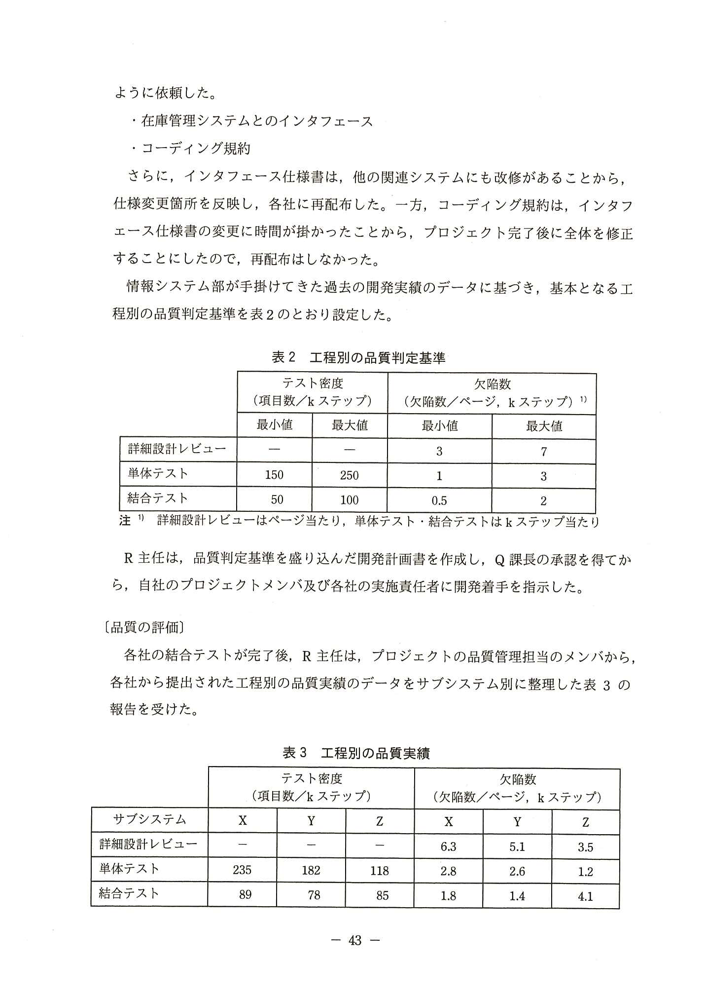

テキスト (OCR)

ように依頼した。

・在庫管理システムとのインタフェース

・コーディング規約

さらに, インタフェース仕様書は, 他の関連システムにも改修があることから,
仕様変更箇所を反映し, 各祉に再配布した。 一方, コーディング規約は, インタフ
ェース仕様書の変更に時間が掛かったことから, プロジェクト完了後に全体を修正
することにしたので, 再配布はしなかった。

情報システム部が手掛けてきた過去の開発実績のデータに基づき, 基本となる工
程別の品質判定基準を表2 のとおり設定した。

表2 工程別の品質判定基準

FARE                           欠陥数
(項目数/k ステップ)    (欠陥数ンプページ, k ステップ) !
最小値         最大値            最小値                最大値
詳細設計レビュー            ー                 ー                      3                           7
単体テスト               150           250               1                  3
結合テスト              50          100            0.5                2

注 ) 詳細設計レビューはページ当たり, 単体テスト・結合テストはkステップ当たり

R 主任は, 品質判定基準を盛り込んだ開発計画書を作成し, Q 課長の承認を得てか
ら, 自社のプロジェクトメンバ及び各社の実施責任者に開発着手を指示した。

(品質の評価]

各社の結合テストが完了後, R 主任は, プロジェクトの品質管理担当のメンバから,
各社から提出された工程別の品質実績のデータをサブシステム別に整理した表 3 の
報告を受けた。

表3 工程別の品質実績

テスト密度                                欠陥数
(項目数Zk ステップ)       (欠陥数プページ, k ステップ)
サブシステム           x            Y             Z             x            Y             の
詳細設計レビュー     ー       ー       ー      6.3      5.1      3.5
単体テスト             235         182         118         2.8         2.6         1.2
結合テスト               89           78          85          1.8          1.4          41

### ページ 44

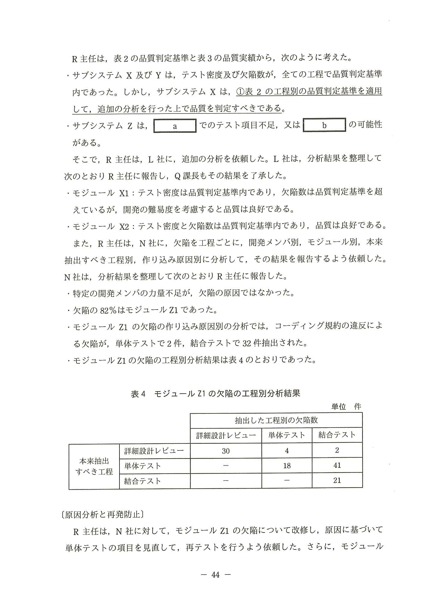

テキスト (OCR)

R 主任は, 表 2の品質判定基準と表 3 の品質実績から, 次のように考えた。

・サブシステム X ROY は, テスト和密度及び欠陥数が, 全ての工程で品質判定基準
内であった。しかし, サブシステム X lk, OR 2 の工程別の品質判定基準を適用
して, 追加の分析を行った上で品質を判定すべきである。

・サプシステム Z は, [|  』 | でのテスト項目不足 又は[ bp |の可能性
がある。
そこで, R 主任は, L 社に, 追加の分析を依頼した。L 社は, 分析結果を整理して

次のとおり R 主任に報告し, Q 課長もその結果を了承した。

・モジュール X1 : テスト密度は品質判定基準内であり, 欠陥数は品質判定基準を超
えているが, 開発の難易度を考慮すると品質は良好である。

・モジュール X2 : テスト密度と欠陥数は品質判定基準内であり, 品質は良好である。
また, R 主任は, N 社に, 欠陥を工程ごとに, 開発メンバ別, モジュール別, AK

抽出すべき工程別, 作り込み原因別に分析して, その結果を報告するよう依頼した。
N 社は, 分析結果を整理して次のとおり R 主任に報告した。

・ 特定の開発メンバの力量不足が, 欠陥の原因ではなかった。

・欠陥の 82%はモジュール Z1 であった。

・モジュール Z1 の欠陥の作り込み原因別の分析では, コーディング規約の違反によ
る欠陥が, 単体テストで2件, 結合テストで 32 件抽出された。

・モジュール Z1 の欠陥の工程別分析結果は表 4 のとおりであった。

表4 モジュール 1 の欠陥の工程別分析結果

抽出した工程別の欠陥数
詳細設計レビュー | 単体テスト | 結合テスト
2

詳細設計レビュー     30       4
本来抽出    7
すべき了程 単体テスト       =       18     41
結合テスト        =       ー      21
[原因分析と再発防止]

R 主任は, N 社に対して, モジュール Z1 の欠陥について改修し, 原因に基づいて
単体テストの項目を見直して, 再テストを行うよう依頼した。さらに, モジュール

ー 44 一

### ページ 45

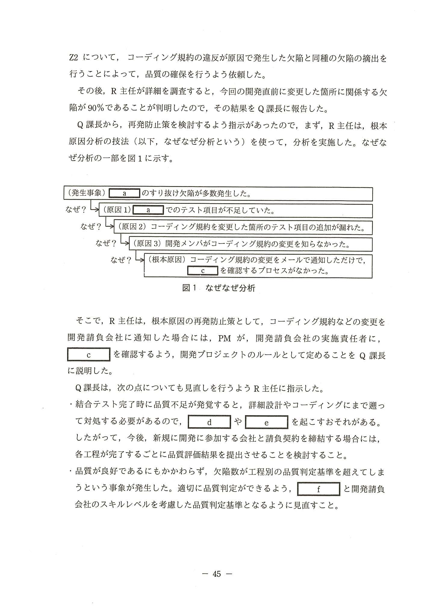

テキスト (OCR)

Z2 について, コーディング規約の違反が原因で発生した欠陥と同種の欠陥の摘出を
行うことによって, 品質の確保を行うよう依頼した。

COR, R 主任が詳細を調査すると, 今回の開発直前に変更した箇所に関係する欠
陥が 90%であることが判明したので, その結果を Q 課長に報告した。

Q 課長から, 再発防止策を検討するよう指示があったので, まず, R 主任は, 根本
原因分析の技法 (以下、なぜなぜ分析という) を使って, 分析を実施した。なぜな
せ分析の一部を図 1 に示す。

| (発生事象) し 』 |のすり抜け欠陥が多数発生した。                            |
なぜ? LJ (原因 1) (a ]でのテスト項目が不足していた。                     |
ate? L[ (原因) コーディング規約を交更した箇所のテスト項目の追加が記れた。 ]

なぜ? Ly (原因 3) 開発メンバがコーディング規約の変更を知らなかった。 |

なぜ? Ly (根本原因) コーディング規約の変更をメールで通知しただけで,
[ここ を確認するプロセスがなかった。

図1 なぜなぜ分析

そこで, R 主任は, 根本原因の再発防止策として,。 コーディング規約などの変更を

開発請負会社に通知した場合には, PM が, 開発請負会社の実施責任者に,

[| < | を確認するよう, 開発プロジェクトのルールとして定めることを Q 課長

に説明した。

Q 課長は, 次の点についても見直しを行うよう R 主任に指示した。

・ 結合テスト完了時に品質不足が発覚すると, 詳細設計やコーディングにまで遡っ
て対処する必要があるので, | q |や| < | を起こすおそれがある。
したがって, 今後, 新規に開発に参加する会社と請負契約を締結する場合には,
各工程が完了するごとに品質評価結果を提出させることを検討すること。

・ 品質が良好であるにもかかわらず, 欠陥数が工程別の品質判定基準を超えてしま
うという事象が発生した。 適切に品質判定ができるよう, と開発請
会社のスキルレベルを考慮した品質判定基準となるように見直すこと。

ー 45 一

### ページ 46

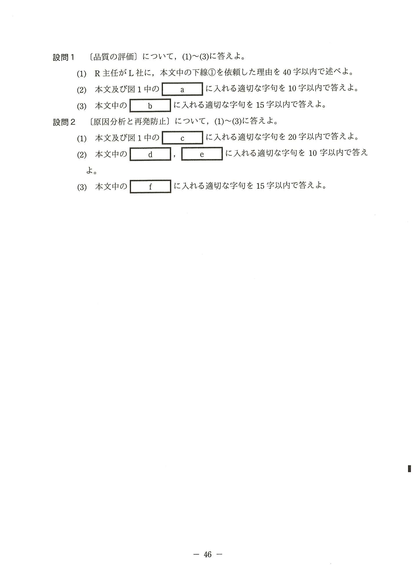

テキスト (OCR)

設問1 [品質の評価] について, ①て⑬に答えよ。
(1) R 主任がL 社に, 本文中の下線①を依頼した理由を 40 字以内で述べよ。
⑫ 本文及び図 1 中の| a | に入れる適切な字句を10字以内で答えよ。
⑬) 本文中の| b | に入れる適切な字句を15字和以内で答えよ。

設問2 原因分析と再発防止) について, ①~⑬に答えよ。
Q) 本文及び図 1 中の| c | に入れる適切な字句を20字以内で答えよ。
a 本文中の|  q |, | ce |に入れる適切な字句を 10 字以内で答え

be

⑬ 本文中の| f | に入れる適切な字句を15 FUNCHAL

ー 46 一

### ページ 47

テキスト (OCR)

〔

メ モ 用 紙 J

ー 47 一

### ページ 48

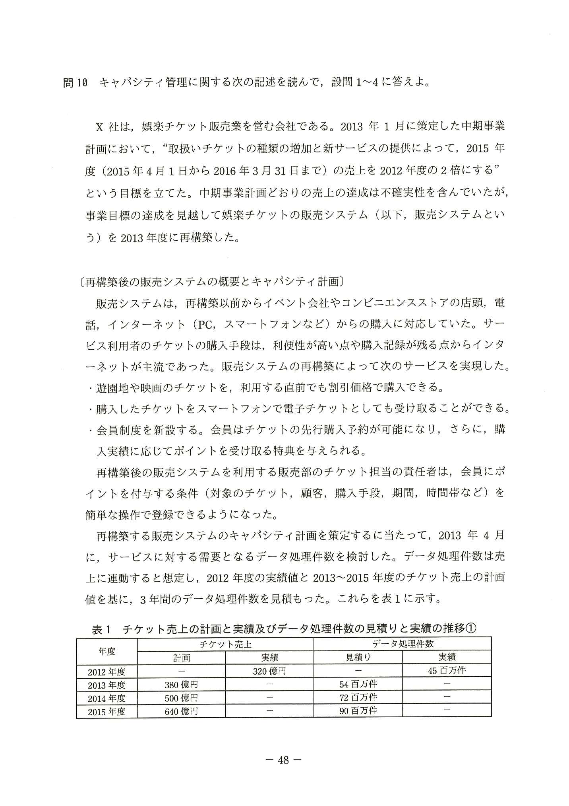

テキスト (OCR)

間19 キャパシティ管理に関する次の記述を読んで, 設問 1ー4 に答えよ。

X 社は, 娯楽チケット販売業を営む会社である。2013 年 1 月に策定した中期事業
計画において, “取扱いチケットの種類の増加と新サービスの提供によって, 2015 年
度 (2015 年 4 月 1 日から 2016 年 3 月 31 日まで) の売上を 2012 年度の 2 倍にする"
という目標を立てた。 中期事業計画どおりの売上の達成は不確実性を含んでいたが
事業目標の達成を見越して娯楽チケットの販売システム (以下, 販売システムとい
う) を 2013 年度に再構築した。

[再構築後の販売システムの概要とキャパシティ 計画

販売システムは, 再構築以前からイベント会社やコンビニエンスストアの店頭, 電
話, インターネット (PC, スマートフォンなど) からの購入に対応していた。サー
ビス利用者のチケットの購入手段は, 利便性が高い点や購入記録が残る点からインタ
ーネットが主流であった。 販売システムの再構築によって次のサービスを実現した。
・遊園地や映画のチケットを, 利用する直前でも割引価格で購入できる。

・購入したチケットをスマートフォンで電子チケットとしても受け取ることができる。
・会員制度を新設する。会員はチケットの先行購入予約が可能になり, さらに, 購

入実績に応じてポイントを受け取る特典を与えられる。

再構築後の販売システムを利用する販売部のチケット担当の資任者は, 会員にポ
イントを付与する条件 (対象のチケット, MS, 購入手段, 期間, 時間帯など) を
簡単な操作で登録できるようになった。

再構築する販売システムのキャパシティ計画を策定するに当たって, 2013 年 4 月
に, サービスに対する需要となるデータ処理件数を検討した。データ処理件数は売
上に連動すると想定し, 2012 年度の実績値と 2013一2015 年度のチケット売上の計画
値を基に, 3 年間のデータ処理件数を見積もった。これらを表 1 に示す。

表1 チケット売上の計画と実績及びデータ処理件数の見積りと実績の推移①
年度              チケット売上                    データ処理件数
計画                       実績                     見積り                      実績
2012 年度                 ー                      320 億円                      =                     45 百亡件
2013 年度             380 億円                       ー                      54 AE                      =
2014 年度             500 億円                       =                       72 Bite                      =
2015 年度             640 億円                      =                     90 百万件                     =

ー 48 一

### ページ 49

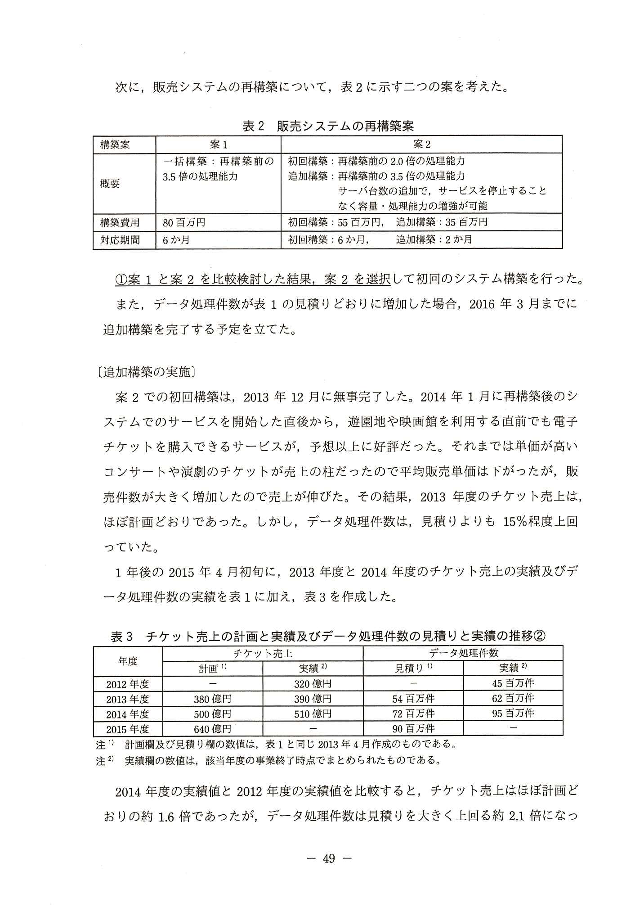

テキスト (OCR)

次に, 販売システムの再構築について, 表 2 に示す二つの案を考えた。

表2 販売システムの再構築案

構築案                  案1                                          案2
ー括構築 : 再構築前の | 初回構築 : 再構築前の 2.0 倍の処理能力
ees         3.5 倍の処理能力          追加構築 : 再構築前の 3.5 倍の処理能力

サーバ台数の追加で, サービスを停止すること
なく容量・処理能力の増強が可能

構築費用     80 AAA                  初回構築 : 55 百万円, 追加構築 : 35 百万円

対応期間     6 が月                      初回構築 : 6 か月,      追加構築 : 2 か月

①案 1 と案 2 を比較検討した結果, 案 2 を選択して初回のシステム構築を行った。
また, データ処理件数が表 1 の見積りどおりに増加した場合, 2016 年 3 月までに
追加構築を完了する予定を立てた。

〔追加構築の実施〕

案 2 での初回構築は, 2013 年 12 月に無事完了した。2014 年 1 月に再構築後のシ
ステムでのサービスを開始した直後から, 遊園地や映画館を利用する直前でも電子
チケットを購入できるサービスが, 予想以上に好評だった。それまでは単価が高い
コンサートや演劇のチケットが売上の柱だったので平均販売単価は下がったが, AK
売件数が大きく増加したので売上が伸びた。その結果, 2013 年度のチケット売上は,
ほぼ計画どおりであった。 しかし, データ処理件数は, 見積りよりも 15%程度上回
っていた。

1 年後の 2015 年 4 月初旬に, 2013 FHL 2014 年度のチケット売上の実績及びデ
ータ処理件数の実績を表 1 に加え, 表3 を作成した。

表3 チケット売上の計画と実績及びデータ処理件数の見積りと実績の推移②

este             チケット売上                  データ処理件数
計画 !             実績9            見積りリ            実績 2
2012 年度              ー                 320 億円                  回                 45 百万件
2013 年度             380 億円                   390 億円                  54 百万件                 62 百万件
2014 年度            500 億円                 510 億円                 72 Ate                95 百万件
2015 年度          640 億円                  =                 90 百万件                 ー

注! 計画欄及び見積り欄の数値は, 表 1 と同じ 2013 年4月作成のものである。
注? 実績欄の数値は, 該当年度の事業終了時点でまとめられたものである。

2014 年度の実績値と 2012 年度の実績値を比較すると, チケット売上はほぼ計画ど
おりの約 1.6 倍であったが, データ処理件数は見積りを大きく上回る約 2.1 倍になっ

ー 49 —

### ページ 50

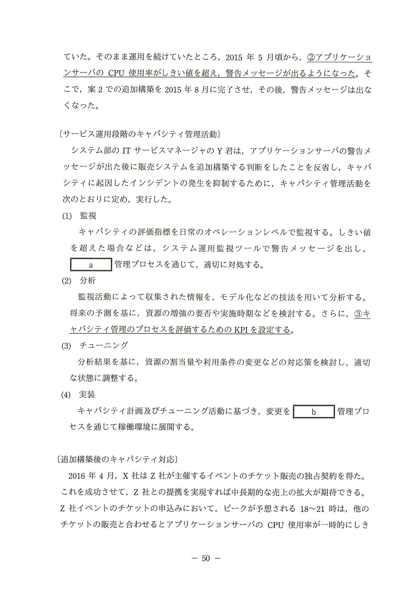

テキスト (OCR)

TWH, そのまま運用を続けていたところ, 2015 年 5 月頃から, アプリケーショ
ンサーバの CPU 使用率がしきい値を超え, 警告メッセージが出るようになった。そ
こで, 案 2 での追加構築を 2015 年 8 月に完了させ, その後, 警告メツセージは出な

くなっつた。

〔サービス運用段階のキャパシティ管理活動〕
システム部の IT サービスマネージャの Y Ald, アプリケーションサーバの警告メ
ッセージが出た後に販売システムを追加構築する判断をしたことを反省し, キャパ
シティに起因したインシデントの発生を抑制するために, キャパシティ管理活動を
次のとおりに定め, 実行した。
①) 監視
キャパシティの評価指標を日常のオペレーションレベルで監視する。しきい値
を超えた場合などは, システム運用監視ツールで和敬告メッセージを出し,
|  』 | 管理プロセスを通じて, 適切に対処する。
⑫) 分析
監視活動によって収集された情報を, モデル化などの技法を用いて分析する。
将来の予測を基に, 資源の増強の要否や実施時期などを検討する。さらに, OX
ャパシティ管理のプロセスを評価するための KPI を設定する。
3) チューニング
分析結果を基に, 資源の割当量や利用条件の変更などの対応策を検討し, 適切
な状態に調整する。
(4) 実装
キャパシティ計画及びチューニング活動に基づき, 変更を| b |管理ブロ
セスを通じて稼働環境に展開する。

〔追加構築後のキャパシテイ対応)

2016 年 4 月, X 社は Z 社が主催するイベントのチケット販売の独占契約を得た。
これを成功させて, Z 社との提携を実現すれば中長期的な売上の拡大が期待できる。
Z 社イベントのチケットの申込みにおいて, ピークが予想される 18~21 時は, (HO
チケットの販売と合わせるとアプリケーションサーバの CPU 使用率が一時的にしき

ー 50 一

### ページ 51

テキスト (OCR)

い値を超え, 応答時間が悪化することが懸念された。しかし, 資源の増強を伴う変
更作業は期間が必要なので, 当面の間はサービスの提供内容とサービス要求の需要
との釣合いを取って, インシデントの発生を防ぐことにした。そこで Y Ald, この
電要管理の方針に基づき, 対策を検討した。Z 社イベントのチケットの申込みは, イ
ンターネットの会員サイト内に専用 URL を設け, 3 日間限定で先着順に受け付ける。
再構築後の販売システムのサービス状況を調査すると, 応答時間の悪化が発生した
のは 18~21 時の時間帯の 2 回だけであった。Z 社イベントのチケット販売を優先す
るために, Z 社イベントのチケットの申込量がピークになる時間帯に:., インターネッ
トでの他のチケットの申込量を減らすことができれば, サービス全体に支障が出な
いと判断した。Y Blk, ④⑧このための具体的な対策を販売部と共同で立案し, ARTE
の部長の承認を得た。

さらに, 経営層から顧客データ活用によるマーケティング強化の指示があった。
これまで一定期間ごとに分散保存していた会員の購入記録を, 一括して蓄積できる
データウェアハウスを構築する。購入が見込める会員を迅速に選別して優先販売や
キャンペーンの案内をする販売促進機能の検討を開始した。⑤この販売促進機能に
よって, 将来見込まれる販売件数の増加をキャパシティ計画に反映し, 処理能力を
増強したり, ストレージの容量を増やしたりする必要がある。

設問1 本文中の下線のについて, 二つの構築案から案 2 を選択した理由としてふさ
わしいものを解答群の中から二つ選び, 記号で答えよ。
解答群
ア 事業計画どおりの売上の達成は不確実性を含んでいる。
イ システム再構築の全体作業工数が小さい。
ウ システム再構築の全体費用が小さい。
エ スケールアップでサービスを停止することなくシステムを増強できる。
オ 余剰資源を抑えることができる。
設問2 本文中の下線②は, 2013 年 12 月の初回構築後からキャパシティ管理の観点で
実施すべきであった事項ができていなかったので発生した。実施すべきであっ
た事項を, 30 字以内で述べよ。

ー 51 一

### ページ 52

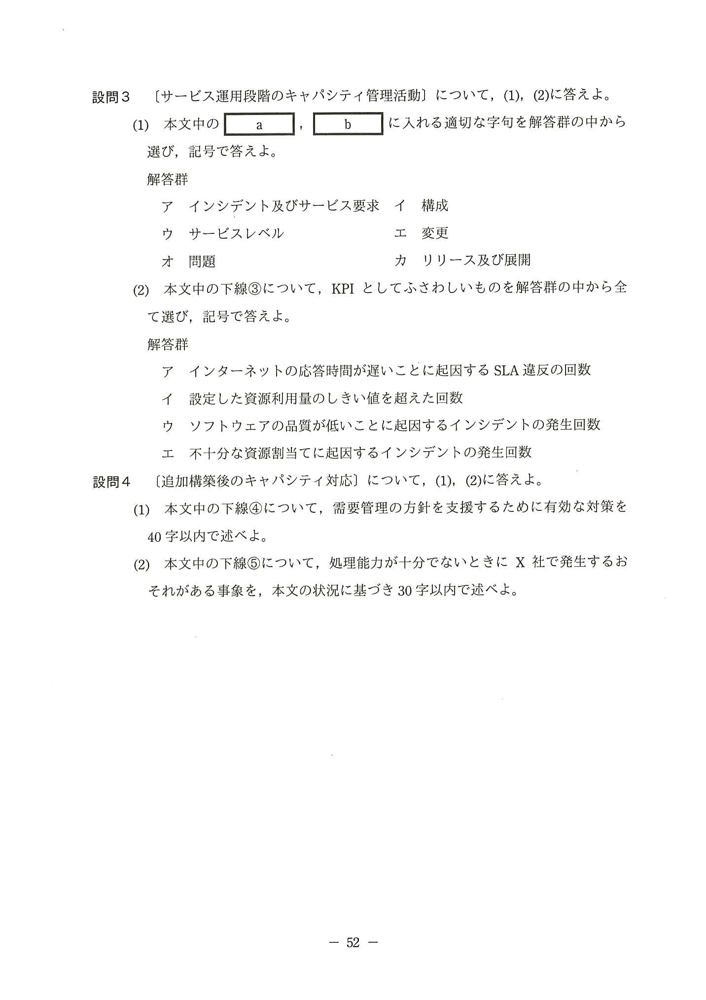

テキスト (OCR)

設問3 〔サービス運用段階のキャパシティ管理活動] について, ①, (⑫②)に答えよ。
a 本文中の| oa |,| b |に入れる適切な字句を解答竹の中から

選び, 記号で答えよ。
解答群
ア インシデント及びサービス要求 イ 構成
ウ サービスレベル              エエ 変更
オ 問題                       カ リリース及び展開

2) 本文中の下線について, KPI としてふさわしいものを解答群の中から全
て選び, 記号で答えよ。
解答群
ア インターネットの応答時間が遅いことに起因する SLA 違反の回数
イ 設定した資源利用量のしきい値を超えた回数
ウ ソフトウェアの品質が低いことに起因するインシデントの発生回数
エ 不十分な資源割当てに起因するインシデントの発生回数
設問4 [追加構築後のキャパシティ対応}] について, ①, ②)に答えよ。
(1) 本文中の下線@について, 需要管理の方針を支援するために有効な対策を
40 字以内で述べよ。
(2) 本文中の下線⑥について, 処理能力が十分でないときに X 社で発生するお
それがある事象を, 本文の状況に基づき 30 字以内で述べよ。

ー 52 一

### ページ 53

テキスト (OCR)

C

メ モ 用 紙 J

ー 53 一

### ページ 54

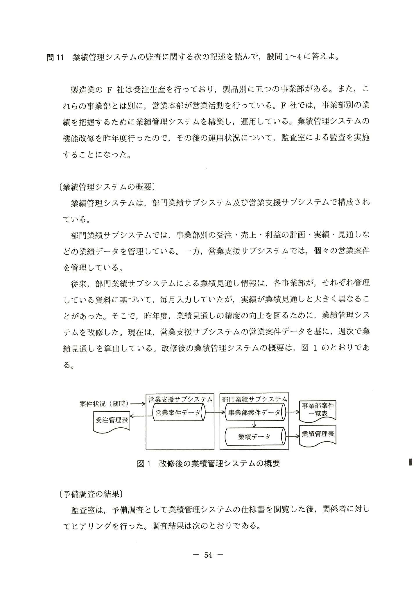

テキスト (OCR)

間11 業績管理システムの監査に関する次の記述を読んで, 設問 1ー4 に答えよ。

製造業の F 社は受注生産を行っており, 製品別に五つの事業部がある。また, こ
れらの事業部とは別に, 営業本部が営業活動を行っている。F 社では, 事業部別の業
績を把握するために業績管理システムを構築し, 運用している。業績管理システムの
機能改修を昨年度行ったので, その後の運用状況について, 監査室による監査を実施
することになった。

[業績管理システムの概要〕

業績管理システムは, 部門業績サブシステム及び営業支援サブシステムで構成され
ている。

部門業績サブシステムでは, 事業部別の受注・売上・利益の計画・実績・見通しな
どの業績データを管理している。一方, 営業支援サブシステムでは, 個々の営業案件
を管理している。

従来, 部門業績サブプシステムによる業績見通し情報は, 各事業部が, それぞれ管理
している資料に基づいて, 毎月入力していたが, 実績が業績見通しと大きく異なるこ
とがあった。 そこで, 昨年度, 業績見通しの精度の向上を図るために, 業績管理シス
テムを改修した。現在は, 営業支援サブシステムの営業案件データを基に, 週次で業
績見通しを算出している。改修後の業績管理システムの概要は, 図 1 のとおりであ
る。

Hy           営業支援サブシステム| |部門業績サブシステム
案件状況 (随時)    (    ー     7      = Ze   事業部案件
a           営業案件データ     (retデータ[)     一覧表
受注管理表     \                               LN

図1 改修後の業績管理システムの概要

(予備調査の結果)
監査室は, 予備調査として業績管理システムの仕様書を閲覧した後, 関係者に対し
てヒアリングを行った。 調査結果は次のとおりである。

ー 54 一

### ページ 55

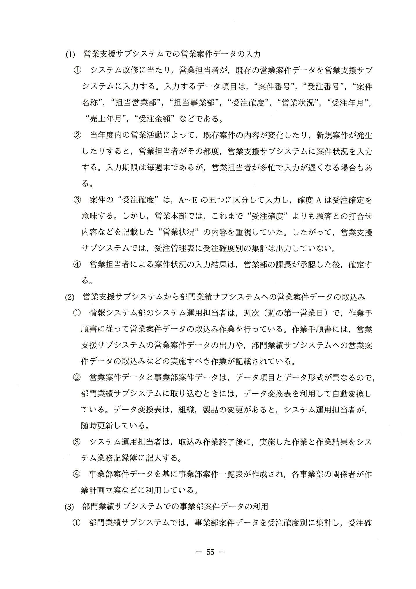

テキスト (OCR)

1) 営業支援サブシステムでの営業案件データの入力

① システム改修に当たり, 営業担当者が, 既存の営業案件データを営業支援サブ
システムに入力する。 入力するデータ項目は, “案件番号", “VERS”, “案件
Bp”, “担当営業部", “担当事業部", “受注確度”, “営業状況", “受注年月",
“売上年月", 受注金額"などである。

② 当年度内の営業活動によって, 既存案件の内容が変化したり, 新規案件が発生
したりすると, 営業担当者がその都度, 営業支援サブシステムに案件状況を入力
する。 入力期限は毎週末であるが, 営業担当者が多忙で入力が遅くなる場合もあ
る。

@ 案件の“受注確度” は, ACE の五つに区分して入力し, 確度 A は受注確定を
意味する。しかし, 営業本部では, これまで “受注確度” よりも顧客との打合せ
内容などを記載した “営業状況” の内容を重視していた。したがって, 営業支援
サブシステムでは, 受注管理表に受注確度別の集計は出力していない。

④ 営業担当者による案件状況の入力結果は, 営業部の課長が承認した後, 確定す
る。

(2) 営業支援サブシステムから部門業績サブシステムへの営業案件データの取込み

① 情報システム部のシステム運用担当者は, 週次 (周の第一営業日) で, 作業手
順書に従って営業案件データの取込み作業を行っている。作業手順書には, 営業
支援サブシステムの営業案件データの出力や, 部門業績サブシステムへの営業案
件データの取込みなどの実施すべき作業が記載されている。

② 営業案件データと事業部案件データは, データ項目とデータ形式が異なるので,
部門業績サブシステムに取り込むときには, データ変換表を利用して自動変換し
ている。データ変換表は, 組織, 製品の変更があると, システム運用担当者が,
随時更新している。

③ システム運用担当者は, 取込み作業終了後に, 実施した作業と作業結果をシス
テム業務記録等に記入する。

④ 事業部案件データを基に事業部案件一覧表が作成され, 各事業部の関係者が作
業計画立案などに利用している。

(3) 部門業績サブシステムでの事業部案件データの利用
① 部門業績サブシステムでは, 事業部案件データを受注確度別に集計し, 受注確

ー 55 一

### ページ 56

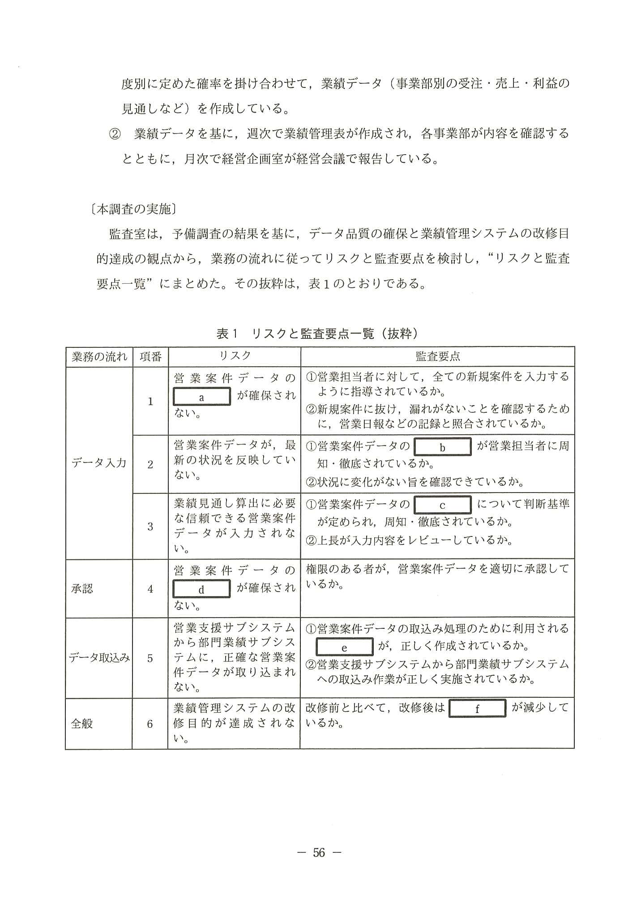

テキスト (OCR)

度別に定めた確率を掛け合わせて, 業績データ (事業部別の受注・

見通しなど) を作成している。
Q 業績データを基に, 週次で業績管理表が作成され, 各事業部が内容を確認する
Cesk, 月次で経営企画室が経営会議で報告している。

[本調査の実施〕

監査室は, 予備調査の結果を基に, データ品質の確保と業績管理システムの改修目
的達成の観点から, 業務の流れに従ってリスクと監査要点を検討し, “リスクと監査
要点一覧” にまとめた。その抜粋は, 表 1 のとおりである。

表 1

売上・利益の

リスクと監査要点一覧 (抜粋)

業務の流れ

項番

リスク

監査要点

データス入力

営業案件データの

[| 』 | が確保され

ない。

①営業担当者に対して, 全ての新規案件を入力する
ように指導されているか。

@新規案件に抜け, 漏れがないことを確認するため
に, 営業日報などの記録と照合されているか。

営業案件データが, 最
新の状況を反映してい

ない。

①営業案件データの              が営業担当者に周
Kl + (HUES SAV TSM
②状況に変化がない旨を確認できているかが。

な信頼できる営業案件
データが入力されな
い。

営業案件データの|  c  ] について判断基準
が定められ, 周知・徹底されているか。
②上長が入力内容をレビューしているか。

営業案件データの

[a | が確保され

ない。

権限のある者が, 営業案件データを適切に承認して
いるか。

データ取込み

営業支援サブシステム
から部門業績サブシス
テムに, 正確な営業案
件データが取り込まれ

ない。

④営業案件データの取込み処理のために利用される
が, 正しく作成されているか。

⑨営業支援サブシステムから剖門業績サブシステム
への取込み作業が正しく実施されているか。

全般

業績管理システムの改
修目的が達成されな
い。

改修前と比べて, 改修後は|   f   | が渋少して
いるか。

ー 56 一

### ページ 57

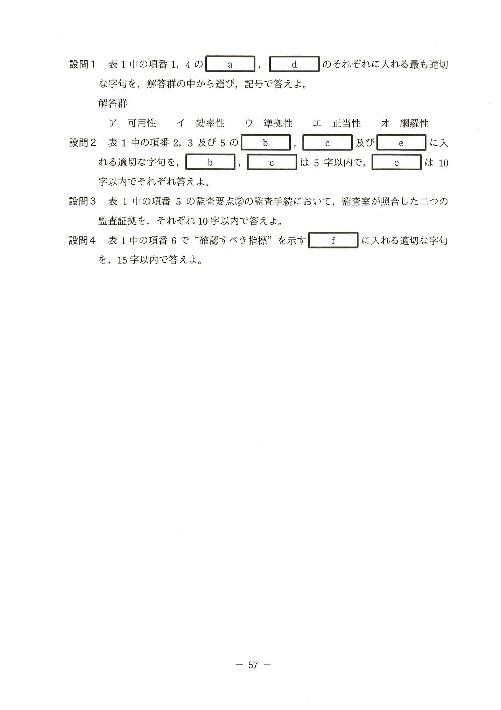

テキスト (OCR)

設問1 表1中の項番1, 4の|

a

J. |
な字句を, 解答群の中から選び,
ARAB

ul

Ls CRA

d |のそれぞれに入れる最も適切
よ。
ア 可用性

イ 効率性 ウ 準拠性 エ 正当性 オ 網羅性
設問2 表 1中の項番2.3及び5の| b |,] c |及び| es

れる適切な字句を,| b 中| <

字以内でそれぞれ答えよ。

| に入
| は 5 eum, | e |はno

設問3 表 1 中の項番 5 の監査要点②の監査手続において, 監査室が照合した二つの
監査証拠を, それぞれ10 FUNCHAL,

設問4 表 1中の項番 6で “確認すべき指標" を示す| f |] に入れる適切な字句
を, 15 字以内で答えよ。

ー 57 一

### ページ 58

テキスト (OCR)

C

メ = 用 紙 J

ー 58 一

### ページ 59

テキスト (OCR)

〔

x = 用 紙 J

ー 59 一

### ページ 60

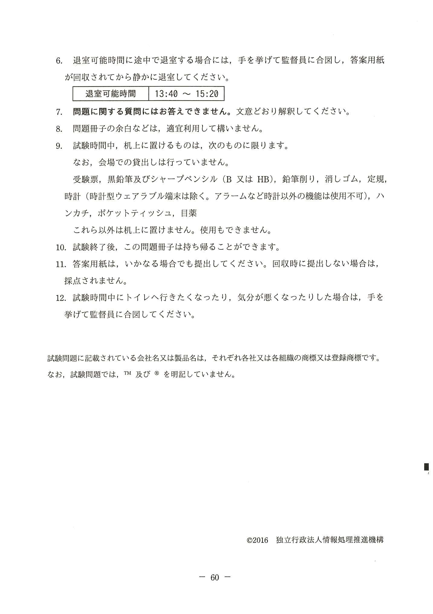

テキスト (OCR)

6. 退室可能時間に途中で退室する場合には, 手を挙げて監督員に合図し, 答案用紙
が回収されてから静かに退室してください。
退室可能時間 | 13:40 ~ 15:20 |
7. 問題に関する質問にはお答えできません。文意どおり解釈してください。
8. 問題周子の余白などは, 適宜利用して構いません。
9. 試験時間中, 机上に置けるものは, 次のものに限ります。
なお, 会場での貸出しは行っていません。
受験球。黒鉛筆及びシャープペンシル (B 又は HB), 鉛筆削り, 消しゴム, 定規
時計 (時計型ウェアラブル端末は除く。アラームなど時計以外の機能は使用不可)。ハ
ンカチ, ポケットティッシュ, 目薬
これら以外は机上に置けません。使用もできません。
10. 試験終了後, この問題民子は持ち帰ることができます。
11. 答案用紙は, いかなる場合でも提出してください。回収時に提出しない場合は,
採点されません。
12, 試験時間中にトイレへ行きたくなったり, 気分が悪くなったりした場合は, FE
挙げて監督員に合図してください。

試験問題に記載されている会社名又は製品名は, それぞれ各社又は各組織の商標又は登録商標です。
なお, 試験問題では, ™ 及び @ を明記していません。

@2016 独立行政法人情報処理推進機構

ー 60 一

---

## 午後解答

1/5 
©2016 独立行政法人情報処理推進機構 
平成28 年度 春期 応用情報技術者試験 解答例 
 
午後試験 
問１ 
出題趣旨 
 Web サイトへの攻撃方法は，日に日に高度化してきている。 
 本問では，Web サイトを用いた書籍販売システムを題材に，悪意のある第三者による，Web サーバの脆弱性
を確認する手順，攻撃の方法，及びその対策について問う。 
 
設問 
解答例・解答の要点 
備考 
設問１ 
a
TLS 
 
 
b
踏み台 
 
 
c
ゼロデイ 
 
設問２ 
d
イ 
 
 
e
ア 
 
設問３(1) ①
②
・種類 
・バージョン 
 
 
(2) 必要なポートだけ開ける。 
 
 
(3) WAF
 
設問４ 
ア，ウ，オ 
 
 
問２ 
出題趣旨 
 近年，全国で自然災害が発生する可能性が，高まっている。 
 本問では，大規模地震発生のケースを題材に，ますます重要度が高まってきている企業の事業継続計画（BCP）
の策定についての知識・理解力を問う。 
 
設問 
解答例・解答の要点 
備考 
設問１(1)
a
エ 
 
 
 
d
ア 
 
 
(2) A 社しか中核部品X の製造をしておらず，B 社の事業継続への影響が大きいか
ら 
 
 
 
(3)
b
エ 
 
 
 
c
ウ 
 
設問２(1)
e
売上及び営業利益の減少 
 
 
(2) D 社及びE 社にBCP の策定を要請する。 
 
 
(3) BCP の有効性を高めるため

2/5 
©2016 独立行政法人情報処理推進機構 
問３ 
出題趣旨 
 昨今，テスト駆動開発やリファクタリングのために，テストのためのプログラムを開発することが定着しつ
つある。 
 本問では，ライフゲームを題材に，与えられた要件を理解してプログラムとして実装する能力，プログラム
を読み解く応用力について問う。 
 
設問 
解答例・解答の要点 
備考 
設問１ 
ア
× 
 
イ
× 
 
ウ
○ 
 
エ
○ 
設問２ 
オ
(k－1)×N＋j 
設問３ 
カ
temp[c]と1 が等しい 
 
 
キ
( temp[i]と0 が等しい ) and ( e と3 が等しい ) 
 
 
ク
m[i] ← 1 
設問４ 
チェックするマスが盤の第1 列又は第N 列の場合 
設問５(1) ケ
2
 
(2) for( i を2 からp まで1 ずつ増やす ) 
 
問４ 
出題趣旨 
 業務システムにおいて，業務量拡大に伴う処理時間の改善は共通課題であり，サーバだけでなくネットワー
クの見直しも改善に貢献するものである。 
 本問では，冗長化された業務ネットワークの更新を題材に，業務量拡大に備えたサーバの更新及びリンクの
見直しの評価・見積りに関する知識（理解，能力）を問う。 
 
設問 
解答例・解答の要点 
備考 
設問１(1) α2 
 
 
(2) 1－(1－α2)2 
 
設問２(1)
a
1.0 
 
 
(2) 4
 
設問３(1) ア，イ 
 
 
(2) 3（本） 
 
設問４ 
スループットが通信量に見合うこと

3/5 
©2016 独立行政法人情報処理推進機構 
問５ 
出題趣旨 
 経路を冗長化する技術として，広くSTP（Spanning Tree Protocol）が使用されている。しかし，VLAN が設定
されたLAN の経路をSTP で冗長化する場合は，複雑な設定が必要になる場合が多い。 
 本問では，経路の冗長化を題材に，VLAN とSTP の基本動作の理解を問うとともに，本文の記述を基に，リ
ンクアグリゲーションの利点が導き出せるかどうかを問う。 
 
設問 
解答例・解答の要点 
備考 
設問１ 
a
オ 
 
b
ア 
 
c
ク 
 
d
カ 
設問２ 
p10 にVLAN10 を設定する。 
設問３(1) サーバ名
部署2 サーバ 
 
 
理由 
PC1 と部署1 サーバが所属するVLAN が異なるから 
 
(2)
e
VLAN10
 
 
f
VLAN20
設問４ 
イ，ウ 
 
問６ 
出題趣旨 
 昨今，ビッグデータを分析して，既存サービスの収益向上策を立案したり，新しいサービスを創出したりす
る事例が増えつつある。 
 本問では，コンビニエンスストアにおけるデータウェアハウス構築及び分析を題材に，E-R 図やSQL 文に関
する基本的な理解，集計処理に関する知識と能力を問う。 
 
設問 
解答例・解答の要点 
備考 
設問１ 
a
販売時単価 
 
 
b
← 
 
 
c
← 
 
設問２ 
d
LEFT OUTER JOIN 
 
 
e
ST.店舗ID = SS.店舗ID 
順不同 
 
f
ST.商品ID = SS.商品ID 
設問３ 
g
ORDER BY SF.売上年月 DESC, SF.店舗ID ASC, 平均在庫数量 DESC 
 
設問４(1) α 
 
 
(2) 在庫数量を記録していない日の商品の在庫数量を実績から導出したデータ

4/5 
©2016 独立行政法人情報処理推進機構 
問７ 
出題趣旨 
 近年，回転寿司などの飲食店や居酒屋などで，タッチ式注文端末を使用した注文システムの導入が増えてき
ている。 
 本問では，タッチ式注文端末を題材に，組込みシステムの仕様理解力，ソフトウェアの解析能力及びリアル
タイムOS で動作するタスクの理解力を問う。 
 
設問 
解答例・解答の要点 
備考 
設問１(1) 0.7（秒） 
 
 
(2) ウ 
 
(3) エ 
設問２(1) タッチパネルタスク 
 
(2) タッチされた座標情報 
設問３ 
a
画面切替え中か 
設問４ 
有効なボタンの座標情報 
 
問８ 
出題趣旨 
 ソフトウェア開発において，UML を使用したオブジェクト指向設計が広く普及している。 
 本問では，通信販売用Web サイトにおける決済処理UML を題材に，アクティビティ図及びクラス図を用い
た設計能力を問う。 
 
設問 
解答例・解答の要点 
備考 
設問１ 
a
配送センタへ商品の発送を指示する 
順不同 
 
b
顧客に商品の発送を通知する 
 
c
入金期限日を過ぎている 
 
d
入金期限日を過ぎていない 
設問２ 
e
カ 
 
f
エ 
設問３ 
決済番号取得，決済情報通知 
設問４ 
入金されている購入情報が取り消されてしまう。 
 
問９ 
出題趣旨 
 ソフトウェア開発のプロジェクトにおいては，各工程の品質確保が，QCD の順守に大きく影響を及ぼす。 
 本問では，アプリケーションシステムの開発を題材に，欠陥の分析と対応・再発防止策に関する知識と応用
力を問う。 
 
設問 
解答例・解答の要点 
備考 
設問１(1) モジュールごとに品質の偏りがないかどうかを確認する必要があるから 
 
(2)
a
単体テスト 
 
(3)
b
詳細設計での品質不足 
設問２(1)
c
開発メンバが正しく理解したこと 
 
(2)
d
開発コストの増大 
順不同 
 
 
e
納期の遅延 
 
(3)
f
モジュールの開発の難易度

5/5 
©2016 独立行政法人情報処理推進機構 
問10 
出題趣旨 
 現在から将来にわたるビジネス要件に合わせて，IT インフラのキャパシティを最大限に活用できるようにす
るために，キャパシティ管理は重要である。 
 本問では，娯楽チケット販売業会社のシステム再構築を題材に，キャパシティ管理に関する計画策定とサー
ビス運用段階のキャパシティ管理活動についての理解，能力を問う。 
 
設問 
解答例・解答の要点 
備考 
設問１ 
ア，オ 
設問２ 
計画を定期的に見直し，データ処理件数を予測する。 
設問３(1)
a
ア 
 
 
b
カ 
 
(2) イ，エ 
設問４(1) 他のチケットをピーク時間帯以外に申し込む場合は付与ポイントを増額する。
 
(2) 会員の購入記録を検索するときに応答時間が悪化する。 
 
問11 
出題趣旨 
 システムの利用者が情報を適切に活用するためにはデータがシステムに正確かつタイムリーに入力される必
要がある。また，データを入力するシステムと，情報を提供するシステムが異なる場合には，データの連携に
も十分な注意を要する。 
 本問では，営業活動に係る業績管理システムを題材に，データの入力と連携，及び情報活用にかかわるリス
クを認識し，それを踏まえて，監査が行える能力を問う。 
 
設問 
解答例・解答の要点 
備考 
設問１ 
a
オ 
 
d
エ 
設問２ 
b
入力期限 
 
c
受注確度 
 
e
データ変換表 
設問３ 
①
②
・作業手順書 
・システム業務記録簿 
設問４ 
f
業績の見通しと実績の差異

---

## 午後採点講評

1/3 
©2016 独立行政法人情報処理推進機構 
平成28 年度 春期 応用情報技術者試験 採点講評 
 
午後試験 
問１ 
 問1 では，書籍販売システムの構築を題材に，Web サイトのセキュリティについて出題した。全体として，
正答率は低かった。 
 設問1，2 ともに正答率は高く，Web サーバに関する基本的なセキュリティの機能や用語については，理解
されているようであった。 
 設問3(1)は，正答率が低かった。Web サーバでどのようなアプリケーションが使われているかは，攻撃者に
とって最も基本となる構成情報である。攻撃者の，Web サーバへの攻撃の手順について，是非理解しておいて
ほしい。 
 設問4 は，正答率が低かった。解答群の各項目の内容をよく理解した上で，正答を選び出してほしい。 
 
問２ 
 問2 では，大規模地震発生のケースを題材に，ますます重要度が高まってきている企業の事業継続計画
（BCP）の策定について出題した。全体として，正答率は低かった。 
 設問1(a)は，正答率が高かった。事業影響度分析の目的については，十分に理解できていることがうかがわ
れた。 
 設問2(2)は，正答率が低かった。BCP には，自社内での対策だけでなく，サプライチェーンに組み込まれて
いる他社との連携が必要であることを理解してほしい。 
 設問2(3)は，正答率が低かった。BCP の教育・訓練の実施結果や経営環境の変化に伴うBCP への影響などを
分析し，PDCA のサイクルを回し続けることが，BCP の有効性を高める上で重要であることを理解してほし
い。 
 
問３ 
 問3 では，ライフゲームを題材に，与えられた要件を理解してプログラムとして実装する能力，プログラム
を読み解く応用力について出題した。全体として，正答率は高かった。 
 設問3 は，各変数や配列の役割についての理解を問う問題であったが，不適切な変数や配列を用いた解答が
目立った。問題文や定数，配列及び関数の定義だけでなく，プログラムを読み解いて処理の流れを理解・把握
してほしい。 
 設問5 は，プログラムの不具合から問題箇所を特定することがポイントである。正答率は高く，題意が理解
されていたようだが，スペルミスや閉じ括弧を書き忘れた解答が散見された。解答に当たっては，表記の正確
さにも十分な配慮が必要である。 
 
問４ 
 問4 では，冗長化された業務ネットワークの更新を題材に，バッチ処理時間短縮を目的としたサーバの劣化
更新及びネットワークの見直しにおける評価・見積りについて出題した。 
 設問1 は，(2)の正答率が低かった。稼働率の解答に当たっては，個々の機器の稼働率αが0 又は1 の場合の
稼働率はそれぞれ0 又は1 であること，そしてαに0 から1 までのどのような値を入れても全体の稼働率は0
から1 までに収まることを，検算に使ってもらいたい。 
 設問4 は，正答率が低かった。“現行のL2SW について確認しておくべき性能要件”を問うたが，未記入の解
答と，題意の“L2SW の性能要件”と無関係の解答が目立った。問題文中の“各スイッチのスループット”と
いったL2SW の性能要件に注目し，解答を作成してほしい。

2/3 
©2016 独立行政法人情報処理推進機構 
問５ 
 問5 では，スイッチ間の接続経路の冗長化を題材に，STP（Spanning Tree Protocol）とリンクアグリゲーシ
ョンについて出題した。全体として，正答率は高かった。 
 設問2 では，同一VLAN 内でなければ通信できないことに気が付かなかった解答が散見された。VLAN は，
LAN の基本技術であり，セキュリティ確保の面からも重要な技術なので，理解しておいてほしい。 
 設問3(1)の到達するサーバについての正答率が高かったが，理由については説明が不十分な解答が多く見ら
れた。経路の再構成後にPC1 から部署1 サーバ宛てに送信されるフレームは，L2SW1 に到達した時点で部署1
サーバとは異なるVLAN に所属することになることを，適切に説明してほしかった。 
 
問６ 
 問6 では，コンビニエンスストアにおけるデータウェアハウス構築及び分析を題材に，E-R 図やSQL 文に関
する基本的な理解，集計処理について出題した。 
 設問2 は，店舗に在庫はあるが販売実績がない商品を考慮した処理であることから外部結合を導き出してほ
しかったが，このキーワードがない解答が目立った。SQL 文だけでなく処理内容の記述もよく読み，求められ
ていることを理解した上で解答してほしい。 
 設問3 は，問題文中に記述されている一覧の表示順序をSQL 文で実装してほしかったが，ORDER BY，
DESC，ASC などの用法を誤った解答が散見された。要件を読み取り，文法にも注意しながらSQL 文で実装で
きる能力を身に付けてほしい。 
 
問７ 
問7 では，飲食店や居酒屋などで普及してきているタッチ式注文端末を題材に，システム仕様の理解，タス
ク間の通信及びタスクの動作について出題した。 
設問2 の(1)は，正答率が高かったが，(2)は正答率が低かった。図表や本文の内容を総合して考え，各タスク
の役割やタスク間のメッセージを正しく理解できれば正解を導けるはずである。 
設問3 は，初期化に言及している解答が見られたが，本文に記載があるように，初期化中は，OS やタスクが
動作していないことを理解してほしい。 
設問4 は，正答率が低かった。“有効なボタンの座標情報”と答えるべきところを“有効なボタン”という曖
昧な解答が多かった。ボタンの位置なのか，ボタン名なのか，正確に記載してほしい。 
 
問８ 
 問8 では，通信販売用Web サイトの決済処理を題材に，アクティビティ図とクラス図を使用したシステムの
設計について出題した。 
 設問3 では，正答である“決済番号取得”，“決済情報通知”以外に，U 社側の処理である“コンビニ支払”
を挙げている解答が目立った。システム間連携を伴う業務においては，自社側のシステムで行う処理と，相手
側のシステムで行う処理を正しく理解することが重要なので，是非知っておいてもらいたい。 
 設問4 は，不具合の内容を問う問題であったが，不具合が発生する条件や，入金期限チェック処理の前に必
ず入金データチェック処理を実施することの目的を解答する受験者が散見された。設問をよく読み，注意深く
解答してほしい。 
 
問９ 
 問9 では，アプリケーションシステムの開発を題材に，欠陥の分析と対応・再発防止策について出題した。
全体として，正答率は低かった。 
 設問1(2)は正答率が高かったが，(3)は低かった。工程別の品質実績を品質判定基準の最小値・最大値と比較
し，テスト密度又は欠陥数が判定基準の範囲外の箇所に着目して解答してほしい。 
 設問2(2)は，正答率が高かった。品質・コスト・納期の関係性については，おおむね理解されているようで
あった。

3/3 
©2016 独立行政法人情報処理推進機構 
問10 
 問10 では，娯楽チケット販売業会社のシステム再構築を題材に，キャパシティ管理に関する計画策定とサー
ビス運用段階のキャパシティ管理活動について出題した。全体として，正答率は低かった。 
 設問2 は，キャパシティ管理を強化するといった一般論にとどまった解答が散見された。初回構築開始後か
ら定期的にデータ処理件数を計測し，予測からはずれた事象が発生した場合は，将来の見積り値を見直して処
理能力の増強時期を再検討する必要があることを理解してほしかった。 
 設問4(1)は，“需要管理”の考えに基づいた解答を求めたが，システム資源の変更などの観点に立った対策を
述べた解答が散見された。実務では，システムの変更による対応ではなく，運用方法の変更を選択する場合が
少なからずあることを，是非知っておいてもらいたい。 
 
問11 
 問11 では，業績管理システムの監査を題材に，リスク，監査要点，監査手続について出題した。 
 設問3 は，正答率が低かった。照合するためには，単に二つの監査証拠を示すのではなく，相互に関係づけ
ることで監査要点を確認できることを理解して解答してほしい。 
 設問4 は，正答率は高かったが，指標として確認するには具体性に欠ける表現の解答が散見された。情報シ
ステムの目的達成の有無を確認するためには，具体的な指標を特定する必要があることを理解してほしい。

