# 平成29年度秋期 応用情報技術者試験

---

## 午前問題

### ページ 1

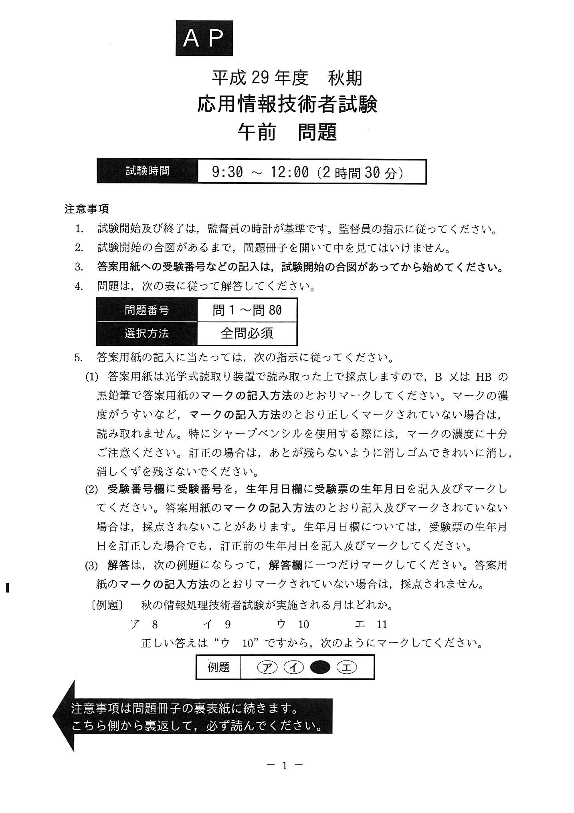

テキスト (OCR)

平成29年度 秋期
応用情報技術者試験
午前 問題

 9:30 ~ 12:00 (2時間36 分)

注意事項

1. 試験開始及び終了は, 監督貞の時計が基準です。監督員の指示に従ってください。
2

3

4

試験開始の合図があるまで, 問題冊子を開いて中を見てはいけません。

答案用紙への受験番号などの記入は, 試験開始の合図があってから始めてください。
問題は, 次の表に従って解答してください。

問題番号   fal 1 て問 80
選択方法      全間必須
5. 答案用紙の記入に当たっては, 次の指示に従ってください。

Q①) 答案用紙は光学式読取り装置で読み取った上で採点しますので, B 又は HB の
景鉛筆で答案用紙のマークの記入方法のとおりマークしてください。マークの濃
度がうすいなど, マークの記入方法のとおり正しくマークされていない場合は,
読み取れません。 特にシャープペンシルを使用する際には, マークの濃度に十分
ご注意ください。 訂正の場合は, あとが残らないように消しゴムできれいに消し,
消しくずを残さないでください。

(2) 受験番号欄に受験番号を, 生年月日欄に受験票の生年月日を記入及びマークし
てください。和答案用紙のマークの記入方法のとおり記入及びマークされていない
場合は, 採点されないことがあります。 生年月日欄については, 受験票の生年月
日を訂正した場合でも, 訂正前の生年月日を記入及びマークしてください。

(3) 解答は, 次の例題にならって, 解答欄に一つだけマークしてください。答案用
紙のマークの記入方法のとおりマークされていない場合は, 採点されません。

【例題〕 秋の情報処理技術者試験が実施される月はどれか。
ア 8   イ 9   ウ 10    エ 11
正しい答えは“ウ 10” ですから, 次のようにマークしてください。

例題 | ODO@®

注意事項は問題冊子の裏表紙に続きます。
こちら側から裏返して, 必ず読んでください。

### ページ 2

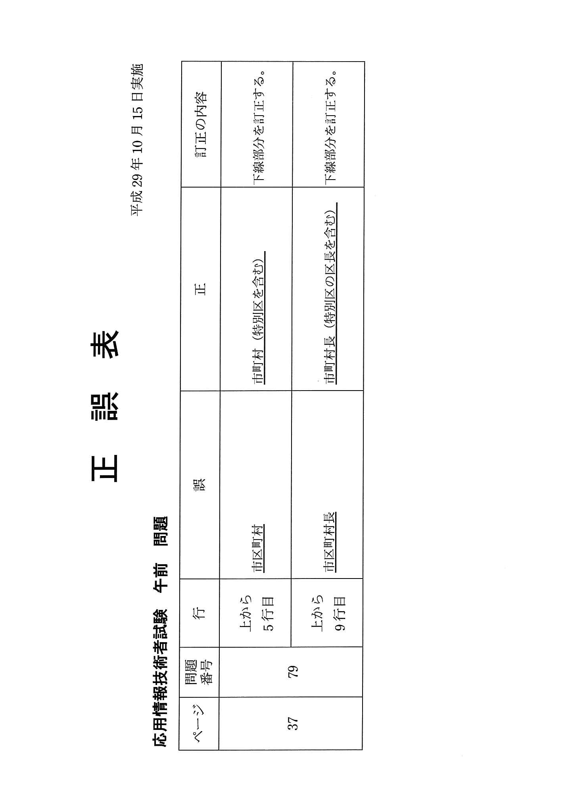

テキスト (OCR)

=    46
“SHAE RM | (RE BEX O XM) SES It               ey Ln   ae
づバいぼ-

6L     Lg
se 67      :                =                                 Bos

& BAT LE UE         CRE ek MAN) Ln                fey Ing
aey
s                    ae
wMor[e                                     se             if     et     -_

EE
MIZE H ST Ef OT ay 62 Yale

### ページ 3

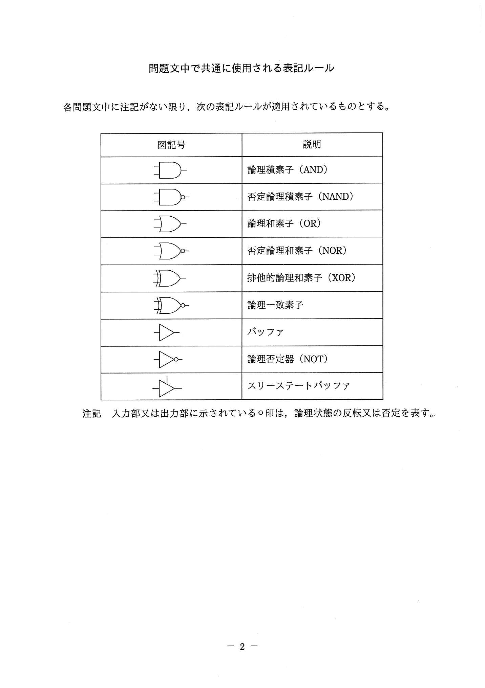

テキスト (OCR)

問題文中で共通に使用される表記ルール

各間題文中に注記がない限り, 次の表記ルールが適用されているものとする。

|
Buy
中

説明

論理積素子 (AND)

否定論理積素子 (NAND)

論理和素子 (OR)

否定論理和素子 (NOR)

排他的論理和素子 (XOR)

論理一致素子

バッファ

論理否定器 (NOT)

スリーステートバッファ

YYIYMMMVMU

注記 入力部又は出力部に示されている9印は, 論理状態の反転又は否定を表す。

### ページ 4

テキスト (OCR)

間 1

問2

相関係数に関する記述のうち, 適切なものはどれか。

全ての標本点が正の傾きをもつ直線上にあるときは, 相関係数が 十1 になる。
変量間の関係が線形のときは, 相関係数が0 になる。

変量間の関係が非線形のときは, 相関係数が負になる。

無相関のときは, 相関係数が 一1 になる。

H ささコ

次の BNF において非終端記号 (AD から生成される文字列はどれか。

Ro == 0131619

Rp = 1/4/17

<R2 == 215|8

<A> == <Ro> | <A> <Ro> | <B> <R | <C> <RD
<B> == «RD | <A> <RD | <B〉 (Ro | <C> <
<C〉 B= <R2> | <A> CR | <B> CRD | <C> <Ro>

ア 123     イ 124     ウ 127     = 128

### ページ 5

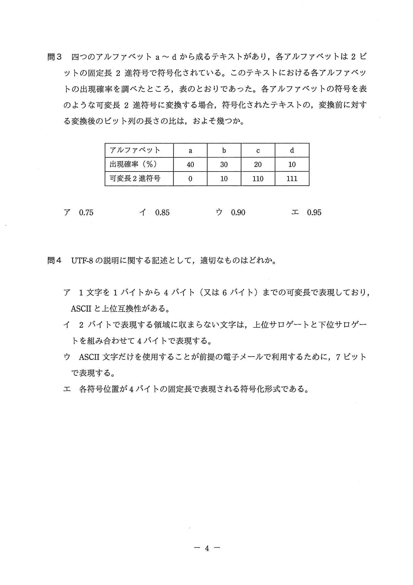

テキスト (OCR)

FAS 四つのアルファベット a~d から成るテキストがあり, 各アルファベットは2ビ
ットの固定長 2 進符号で符号化されている。このテキストにおける各アルファベッ
トの出現確率を調べたところ, 表のとおりであった。各アルファベットの符号を表
のような可変長 2 進符号に変換する場合, 符号化されたテキストの, 変換前に対す
る変換後のビット列の長さの比は, およそ幾つか。

アルファベット         a          b          c          d
出現確率 (%)      40     30     20     10
可変長 2 進符号          0          10         110        111

ア 0.75            イ 0.85             ウ 0.90            x= 0.95

間4 UTE-8 の説明に関する記述として, 適切なものはどれか。

ア 1 文字を 1 バイトから 4 バイト (又は 6 バイト) までの可変長で表現しており,
ASCII と上位互換性がある。

イ 2 バイトで表現する領域に収まらない文字は, 上位サロゲートと下位サロゲー
トを組み合わせて 4 バイトで表現する。

ウ ASCH 文字だけを使用することが前提の電子メールで利用するために, 7 ビット
で表現する。

エ 各符号位置が4バイトの固定長で表現される符号化形式である。

### ページ 6

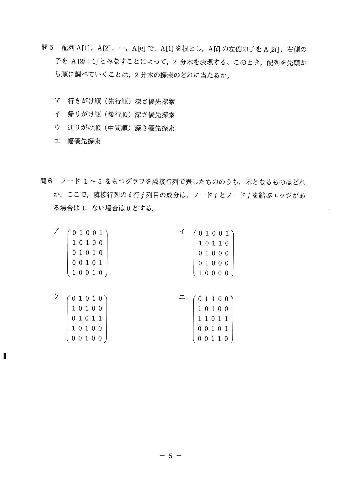

テキスト (OCR)

問5 配列A[1], A[2], …, Az] で, A[1] を根とし, A の左側の子を AZ], 右側の
Fe A[2十1] とみなすことによって, 2 分木を表現する。このとき, 配列を先頭か
ら順に調べていくことは, 2分木の探索のどれに当たるかが。

行きがけ順 (SEAT) 深さ優先探索
帰りがけ順 (後行順) 深さ優先探索
通りがけ順 (中間順) 深さ優先探索
幅優先探索

Hさふさ

間6 ノードュ1ー5 をもつグラフを職接行列で表したもののうち, 木となるものはどれ
か。ここで, 隣接行列の 行7列目の成分は, ノード 7 とノード7 を結ぶエッジがあ
る場合は1, ない場合は0 TS,

ア (01001           イ (01001
10100              10110
01010              01000
00101              01000
10010              10000

2 (01010            = (01100
10100              10100
01011              11011
10100              00101
00100              00110

### ページ 7

テキスト (OCR)

間7 fact @) は, 非負の整数ヵ に対してぁヵ の階乗を返す。fact (%) の再帰的な定義はどれ

か。

if
if
if

HG AN

if

then
then
then

then

return
return
return

return

else
else

else

FPF oO fo

else

return
return
return

return

nX fact (n—1)
n& fact (n+1)
n™ fact (n—1)

n®™ fact (a +1)

AS パイプライン制御を適切に表しているものはどれか。ここで, 図中の記号 D は解
読, E は実行, F は命令フェッチとする。

x

a 1
HI 2
AF 3

命令1
命令2
命令3

命令1
命令2
命令3

命令1
命令2
命令3

FID

E

Flplg

DIE

lp lg

回

le/
lo!

lo!

時間

時間

時間

時間

### ページ 8

テキスト (OCR)

間9 メモリインタリーブの説明はどれか。

ア CPU と磁気ディスク装置との間に半導体メモリによるデータバッファを設けて,
磁気ディスクアクセスの高速化を図る。

イ 主記憶のデータの一部をキャッシュメモリにコピーすることによって, CPU と
主記憶とのアクセス速度のギャップを埋め, メモリアクセスの高速化を図る。

ウ 主記憶へのアクセスを高速化するために, アクセス要求, データの読み書き及
び後処理が終わってから, 次のメモリアクセスの処理に移る。

エ 主記憶を複数の独立したグループに分けて, 各グループに交互にアクセスする
ことによって, 主記憶へのアクセスの高速化を図る。

問16 ToT での活用が検討されている LPWA (Low Power, Wide Area) の特徴として, 適
切なものはどれか。

ア 2 線だけで接続されるシリアル有線通信であり, 同じ基板上の回路及び LSI の
間の通信に適している。

イ 60GHz 帯を使う近距離無線通信であり, 4K, 8K の映像などの大容量のデータ
を高速伝送することに適している。

電力線を通信に使う通信技術であり, スマートメータの自動検針などに適して

いる。

エ バッテリ消費量が少なく, 一つの基地局で広範囲をカバーできる無線通信技術
であり, 複数のセンサが同時につながるネットワークに適している。

### ページ 9

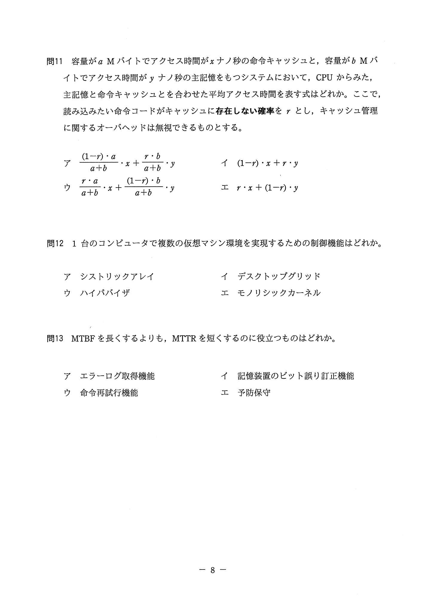

テキスト (OCR)

fll] 容量が2 M バイトでアクセス時間がァナノ秒の命令キャッシュと, 容量がの Mバ
イトでアクセス時間がヶナノ秒の主記憶をもつシステムにおいて, CPU POA,
主記憶と命令キャッシュとを合わせた平均アクセス時間を表す式はどれか。ここで,
読み込みたい命令コードがキャッシュに存在しない確率を > とし, キャッシュ管理
に関するオーバヘッドは無視できるものとする。

(1一の・@   r-b
ア  a+b  ィキーゴ y     f (-n-axtrey
rea   (l-r) +b
ウーイタ  ate!    Zrext+(-n-y

問12 1 台のコンピュータで複数の仮想マシン環境を実現するための制御機能よどれか。

ア シストリックアレイ      イ デスクトップグリッド
ウ ハイパバイザ         工 モノリシックカーネル

問13 MTBF を長くするよりも, MTTR を短くするのに役立つものはどれか。

ア エラーログ取得機能                   イ 記憶装置のビット誤り訂正機能
ウ 命令再試行機能                    エ 予防保守

### ページ 10

テキスト (OCR)

間14 次のシステムにおいて, ピーク時間帯の CPU 使用率は何%か。ここで, トランザ
クションはレコードアクセス処理と計算処理から成り。 レコードアクセスは CPU処
理だけで 1 /O は発生せず, OS のオーバヘッドは考慮しないものとする。また, 1日
のうち発生するトランザクション数が最大になる 1 時間をピーク時間帯と定義する。

〔システムの概要〕

Q①) CPU数:1個

2) 1日に発生する平均トランザクション数 : 54,000 件

3) 1日のピーク時間帯におけるトランザクション数の割合 : 20%

4) 1トランザクション当たりの平均レコードアクセス数 : 100 レコード

6) 1 レコードアクセスに必要な平均 CPU時間 : 1 ミリ秒

6) 1トランザクション当たりの計算処理に必要な平均 CPU 時間 : 100 ミリ秒

fll ジョブの多重度が 1 で, 到着順にジョブが実行されるシステムにおいて, 表に示
す状態のジョブAてCを処理するとき, ジョブC が到着してから実行が終了するま
でのターンアラウンドタイムは何秒か。ここで, OS のオーバヘッドは考慮しないも
のとする。

単位 秒
~         。            処理時間
ジョブ | 到着時刻 | sspears)
A          0            5
B                       6
C          3            3
ア 11            イ 12            ウ 13            x 14

### ページ 11

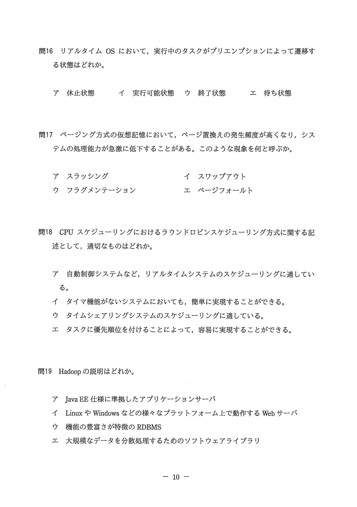

テキスト (OCR)

問16 リアルタイム OS において, 実行中のタスクがプリエンプションによって居移す
る状態はどれか。

ア 休止状態   イ 実行可能状態 ウ 終了状態   エ 待ち状態

間17 ページング方式の仮想記憶において, ページ置換えの発生頻度が高くなり, シス
テムの処理能力が急激に低下することがある。このような現象を何と呼ぶか。

ア スラッシング               イ スワップアウト
ウ フラグメンテーション       エエ ページフォールト

間18 CPU スケジューリングにおけるラウンドロビンスケジューリング方式に関する記
述として, 適切なものはどれか。

ア 自動制御システムなど, リアルタイムシステムのスケジューリングに適してい
る。

イ タイマ機能がないシステムにおいても, 簡単に実現することができる。

ウ タイムシェアリングシステムのスケジューリングに適している。

エエ タスクに優先順位を付けることによって, 容易に実現することができる。

問19 Hadoop の説明はどれか。

Java EE 仕様に準拠したアプリケーションサーバ

Linux や Windows などの様々なプラットフォーム上で動作する Web サーバ
機能の豊富さ が特徴の RDBMS

大規模なデータを分散処理するためのソフトウェアライブラリ

Hot A

ー 10 一

### ページ 12

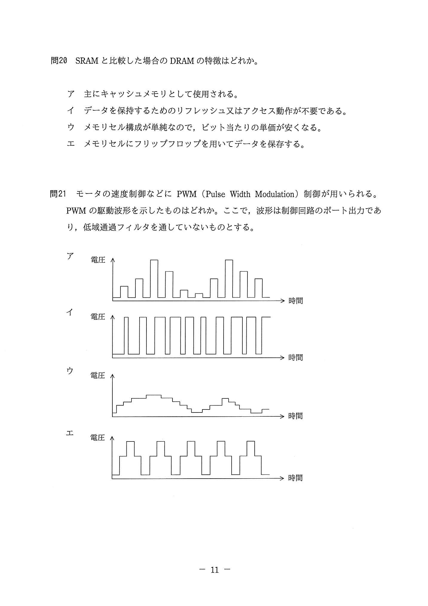

テキスト (OCR)

問29 SRAM と比較した場合の DRAM の特徴はどれか。

主にキャッシュメモリとして使用される。

データを保持するためのリフレッシュ又はアクセス動作が不要である。
メモリセル構成が単純なので, ビット当たりの単価が安くなる。

メモリセルにフリップフロップを用いてデータを保存する。

H へ OM

問21 モータの速度制御おどに PWM (Pulse Width Modulation) 制御が用いられる。
PWM の駆動波形を示したものはどれか。ここで, 波形は制御回路のポート出力であ
り, 低域通過フィルタを通していないものとする。

ア 電圧
時間
イ 電圧
時間
7 ge
 son
ー Poo
時間

=_q=

### ページ 13

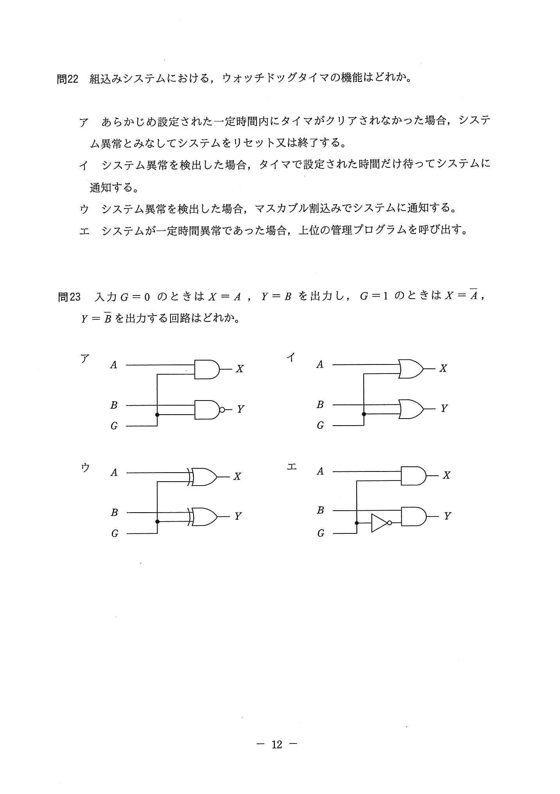

テキスト (OCR)

問22 組込みシステムにおける, ウォッチドッグタイマの機能はどれか。

ア あらかじめ設定された一定時間内にタイマがクリアされなかった場合, システ
ム異常とみなしてシステムをリセット又は終了する。

イ システム異常を検出した場合, タイマで設定された時間だけ待ってシステムに
通知する。

ウ システム異常を検出した場合, マスカブル割込みでシステムに通知する。

エエ システムが一定時間異常であった場合, 上位の管理プログラムを呼び出す。

間23 AHG=0 のときはアー4 , アーニp を出力し, G=ー1 のときはアテオ,
アーを出力する回路はどれか。

ア                of,

ォーーーゴ ex      4ニー一バータ

ー 12 一

### ページ 14

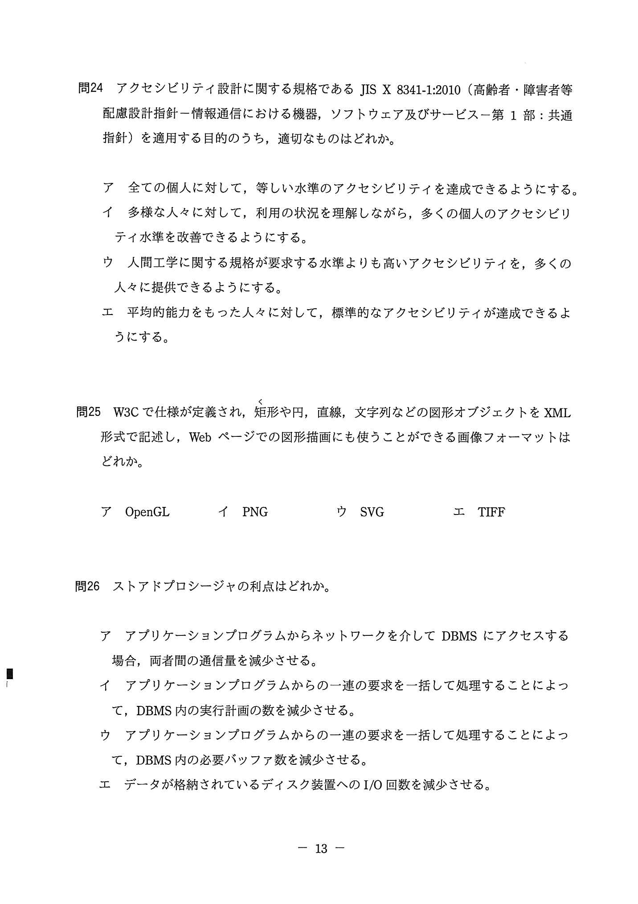

テキスト (OCR)

間24 アクセシビリティ設計に関する規格である JIS X 8341-1:2010 (高齢者・障害者等
配慮設計指針一情報通信における機器, ソフトウェア及びサービス一第 1 部 : 共通
指針) を適用する目的のうち, 適切かものはどれか。

ア 全ての個人に対して, 等しい水準のアクセシビリティを達成できるようにする。

イ 多様な人々に対して, 利用の状況を理解しながら, 多くの個人のアクセシビリ
ティ水準を改善できるようにする。

ウ 人間工学に関する規格が要求する水準よりも高いアクセシビリティを, 多くの
人々に提供できるようにする。

エエ 平均的能力をもった人々に対して, 標準的なアクセシビリティが達成できるよ
うにする。

問25 W3Cで仕様が定義され, MURS, HAR, 文字列などの図形オブジェクトを XML
形式で記述し, Web ページでの図形描画にも使うことができる画像フォーマットは
どれか。

ア OpenGL   イ PNG     ウ SVG     <= TIFF

FAI26 ストアドプロシージャの利点はどれか。

ア アプリケーションプログラムからネットワークを介して DBMS にアクセスする
2, 両者間の通信量を減少させる。

イ アプリケーションプログラムからの一連の要求を一括して処理することによっ
て, DBMS 内の実行計画の数を減少させる。

ウ アプリケーションプログラムからの一連の要求を一括して処理することによっ
て, DBMS 内の必要バッファ数を減少させる。

エエ データが格納されているディスク装置への 1/0 回数を減少させる。

ー 13 一

### ページ 15

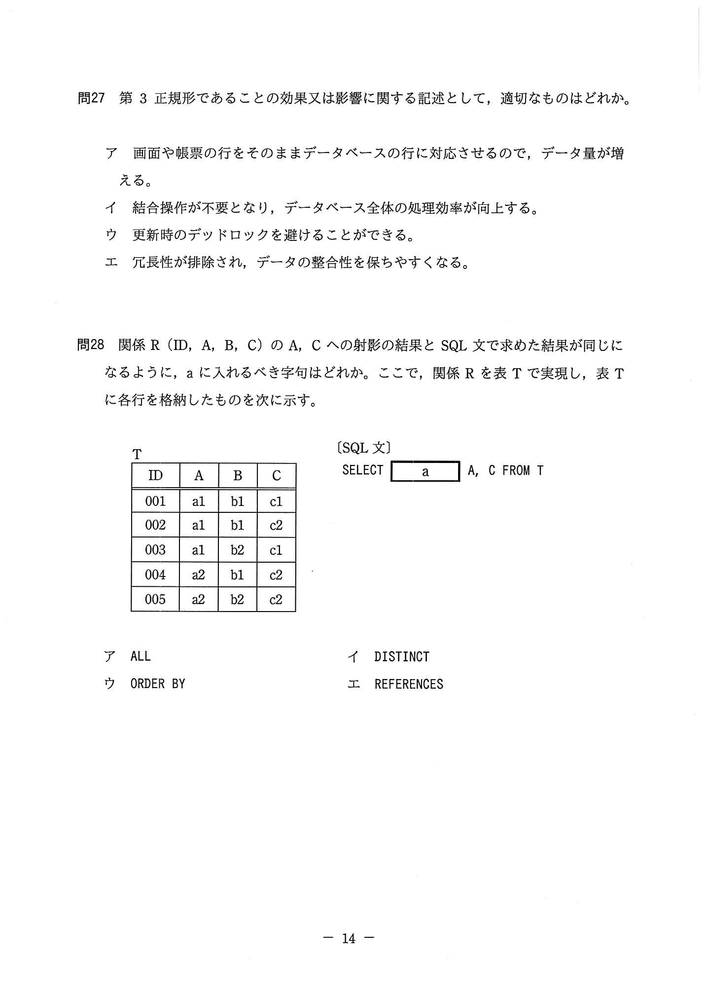

テキスト (OCR)

問27 第 3 正規形であることの効果又は影響に関する記述として, 適切なものはどれか。

ア 画面や帳票の行ををのままデータベースの行に対応させるので, データ量が増
える

°

イ 結合操作が不要となり, データベース全体の処理効率が向上する。
ウ 更新時のデッドロックを避けることができる。
エ 冗長性が排除され, データの整合性を保ちやすくなる。

fai28 関係R (ID, A, B, C) OA, C への射影の結果と SQL 文で求めた結果が同じに
なるように, a に入れるべき字句はどれか。ここで, 関係R を表T で実現し, RT

に各行を格納したものを次に示す。

T
ID  A  B  C
001  a1  bl  cl
002  al | bl | c2
003 | al | b2 | cl
004 | a2 | bl | c2
005 | a2 | b2 | c2
ア ALL
ウ ORDER BY

(SQL 文

SELECT [a | A, C FROM T

 DISTINCT
= REFERENCES

ー 14 一

### ページ 16

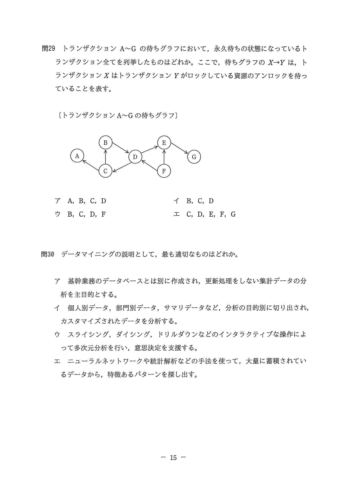

テキスト (OCR)

問29 トランザクション A~G の待ちグラフにおいて, 永久待ちの状態になっているト
ランザクション全てを列挙したものはどれか。ここで, 待ちもグラフの XY lk, ト
ランザクションタ はトランザクション 隊がロックしている資源のアンロックを待っ
ていることを表す。

〔【トランザクション A~G の待ちもグラフ]

a Pec te

ア A, B, C, D         イ B,C, D
ウ B, C, D, F         エ C, D, E, F, G

間39 データマイニングの説明として, 最も適切ながものはどれか。

ア 基幹業務のデータベースとは別に作成され, 更新処理をしない集計データの分
析を主目的とする。

イ 個人別データ, 部門別データ, サマリデータなど, 分析の目的別に切り出され
カスタマイズされたデータを分析する。

ウ スライシング, ダイシング, ドリルダウンなどのインタラクティブな操作によ
って多次元分析を行い, 意思決定を支援する。

エエ ニューラルネットワークや統計解析などの手法を使って, 大量に薔積されてい
るデータから, 特徴あるパターンを探し出す。

ー 15 一

### ページ 17

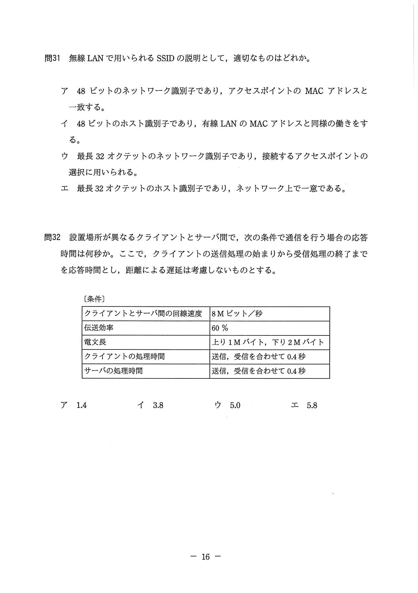

テキスト (OCR)

問31 無線 LAN で用いられる SSID の説明として, 適切がものはどれか。

ア 48 ビットのネットワーク識別子であり, アクセスポイントの MAC アドレスと
一致する。

イ 48 ビットのホスト識別子であり, 有線 LAN の MAC アドレスと同様の働きをす
る。

ウ 最長 32 オクテットのネットワーク識別子であり, 接続するアクセスポイントの
選択に用いられる。

エエ 最長32オクテットのホスト識別子であり, ネットワーク上で一意である。

問32 設置場所が異なるクライアントとサーバ間で, 次の条件で通信を行う場合の応答
時間は何秒か。 ここで, クライアントの送信処理の始まりから受信処理の終了まで
を応答時間とし, 距離による遅延は考慮しないものとする。

〔条件〕
クライアントとサーバ間の回線速度 |8M ビットノ秒
伝送効率           60 %
電文長              上り1M バイト, 下り2Mバイト
クライアントの処理時間        送信, 受信を合わせて 0.4 秒
サーバの処理時間          送信, 受信を合わせて 0.4 秒

ア 14     イ 3.8     ウ 5.0     エ 5.8

ー 6 一

### ページ 18

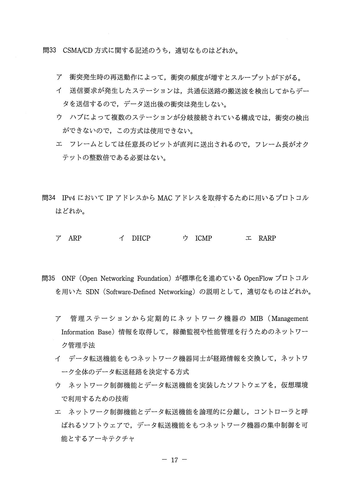

テキスト (OCR)

問33 CSMA/CD 方式に関する記述のうち, 適切なものはどれか。

ア 衝突発生時の再送動作によって, 衝突の頻度が増すとスループットが下がる。

イ 送信要求が発生したステーションは, 共通伝送路の搬送波を検出してからデー
タを送信するので, データ送出後の衝突は発生しない。

ウ ハブによって複数のステーションが分岐接続されている構成では, 衝突の検出
ができないので, この方式は使用できない。

エ フレームとしては任意長のビットが直列に送出されるので, フレーム長がオク
テットの整数倍である必要はない。

問34 IPv4 において IP アドレスから MAC アドレスを取得するために用いるプロトコル
はどれか。

ア ARP     イ DHCP    ウ ICMP    エ RARP

問35 ONF (Open Networking Foundation) が標準化を進めている OpenFlow プロトコル
を用いた SDN (Software-Defined Networking) の説明として, 適切がものはどれか。

ア 管理ステーションかとら定期的にネットワーク機器の MIB (Management
Information Base) 情報を取得して, 稼働監視や性能管理を行うためのネットワー
ク管理手法

イ データ転送機能をもつネットワーク機器同士が経路情報を交換して, ネットワ
ーク全体のデータ転送経路を決定する方式

ウ ネットワーク制御機能とデータ転送機能を実装したソフトウェアを, 仮想環境
で利用するための技術

エエ ネットワーク制御機能とデータ転送機能を論理的に分離し, コントローラと呼
ばれるソフトウェアで, データ転送機能をもつネットワーク機器の集中制御を可
能とするアーキテクチャ

三 7デビ

### ページ 19

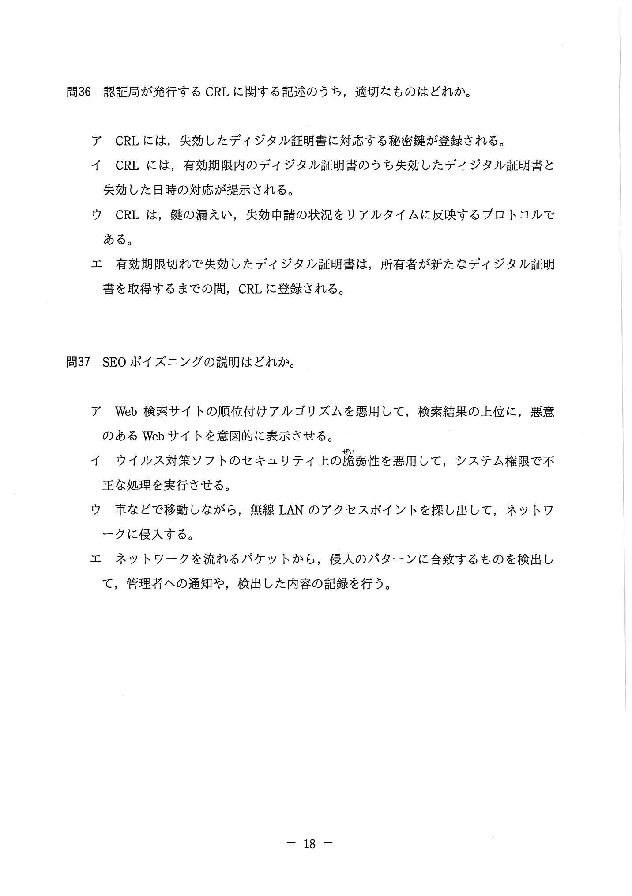

テキスト (OCR)

問36 認証局が発行する CRL に関する記述のうち, 適切なものはどれか。

ア CRL には, 失効したディジタル証明書に対応する秘密鍵が登録される。

イ CRL には, 有効期限内のディジタル証明書のうち失効したディジタル証明書と
失効した日時の対応が提示される。

ウ CRL は, 鍵の漏えい, 失効申請の状況そリアルタイムに反映するプロトコルで
ある。

エエ 有効期限切れで失効したディジタル証明書は, 所有者が新たなディジタル証明
書を取得するまでの間, CRL に登録される。

問37 SEO ポイズニングの説明はどれか。

ア Web 検索サイトの順位付けアルゴリズムを悪用して, 検索結果の上位に, 悪意
のある Web サイトを意図的に表示させる。

4 ウイルス対策ソフトのセキュリティ上の脆弱性を悪用して, システム権限で不
正な処理を実行させる。

ウ 車などで移動しながら, 無線 LAN のアクセスポイントを探し出して, ネットワ
ークに侵入する。

エ ネットワークを流れるパケットから, 侵入のパターンに合致するものを検出し
て, 管理者への通知や, 検出した内容の記録を行う。

ー 18 一

### ページ 20

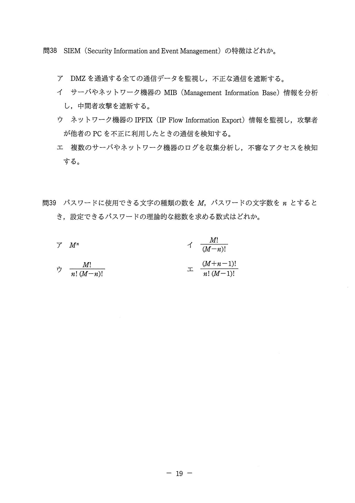

テキスト (OCR)

間38 SIEM (Security Information and Event Management) の特徴はどれか。

ア DMZ を通過する全ての通信データを監視し, 不正な通信を遮断する。

イ サーバやネットワーク機器の MIB (Management Information Base) 情報を分析
し, 中間者攻撃を遮断する。

ウ ネットワーク機器の IPFTX (IP Flow Information Export) 情報を監視し, 攻撃者
が他者の PC を不正に利用したときの通信を検知する。

エ 複数のサーバやネットワーク機器のログを収集分析し, 不審なアクセスを検知
する。

問399 パスワードに使用できる文字の種類の数を M, パスワードの文字数を n とすると
き, 設定できるパスワードの理論的な総数を求める数式はどれか。

M!

7 Mt"                                  イーーが!
ウ Gm                          エエ AT@—D!

ー 19 一

### ページ 21

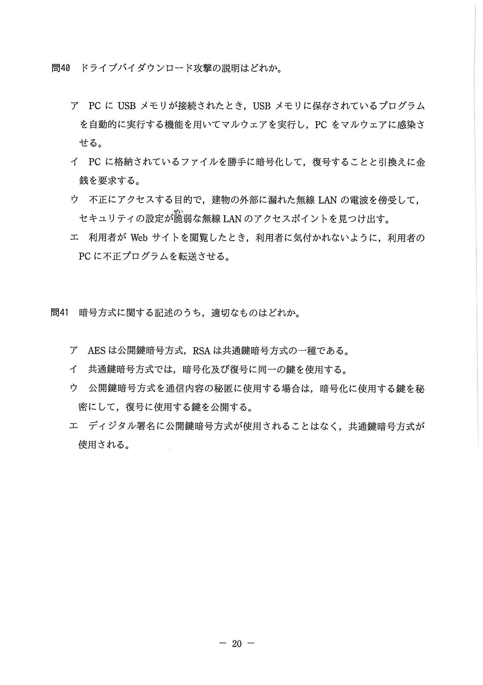

テキスト (OCR)

問49 ドライブバイダウンロード攻撃の説明はどれか。

ア PC に USB メモリが接続されたとき, USB メモリに保存されているプログラム
を自動的に実行する機能を用いてマルウェアを実行し, PC をマルウェアに感菜さ
せる。

イ PC に格納されているファイルを勝手に暗号化して, 復号することと引換えに金
銭を要求する。

ウ 不正にアクセスする目的で, 建物の外部に漏れた無線 LAN の電波を傍受して,
セキュリティの設定が脆弱な無線 LAN のアクセスポイントを見つけ出す。

エ 利用者が Web サイトを閲覧したとき

, 利用者に気付かれないように, 利用者の
PC に不正プログラムを転送させる。

問41 暗号方式に関する記述のうち, 適切なものはどれか。
ア
イ
y

AES は公開鍵暗号方式, RSA は共通鍵暗号方式の一種である。

共通鍵暗号方式では, 暗号化及び復号に同一の鍵を使用する。

公開鍵暗号方式を通信内容の秘匿に使用する場合は, 暗号化に使用する鍵を秘
密にして, 復号に使用する鍵を公開する。

エ ディジタル署名に公開鍵暗号方式が使用されることはなく, 共通鍵暗号方式が
使用される。

ー 20 一

### ページ 22

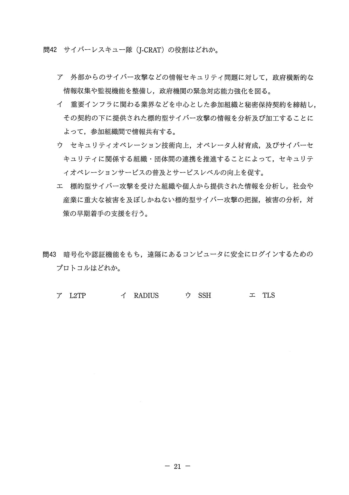

テキスト (OCR)

問42 サイバーレスキュー隊 (J-CRAT) の役割はどれかな。

ア 外部からのサイバー攻撃などの情報セキュリティ問題に対して, 政府横断的な
情報収集や監視機能を整備し, 政府機関の緊急対応能力強化を図る。

イ 重要インフラに関わる業界などを中心とした参加組織と秘密保持契約を締結し
その契約の下に提供された標的型サイバー攻撃の情報を分析及び加工することに
よって, 参加組織間で情報共有する。

ウ セキュリティオペレーション技術向上, オペレータ人材育成, 及びサイバーセ
キュリティに関係する組織・団体間の連携を推進することによって, セキュリテ
ィオペレーションサービスの普及とサービスレベルの向上を促す。

エエ 標的型サイバー攻撃を受けた組織や個人から提供された情報を分析し, 社会や
産業に重大な被害を及ぼしかねない標的型サイバー攻撃の把握, 被害の分析, 対
策の早期着手の支援を行う。

問43 暗号化や認証機能をもち, 遠隔にあるコンピュータに安全にログインするための

プロトコルはどれか。

ア L2TP    イ RADIUS   ウ SSH     x= TLS

ー 21 一

### ページ 23

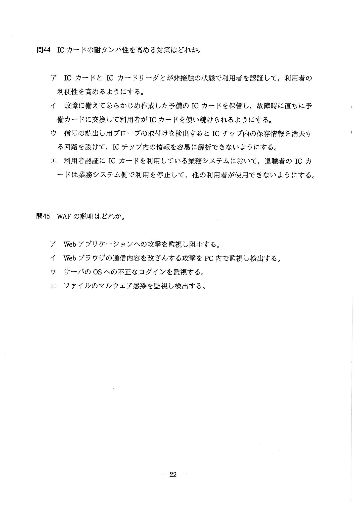

テキスト (OCR)

間44 IC カードの耐タンパ性を高める対策はどれか。

ア IC カードと IC カードリーダとが非接触の状態で利用者を認証して, 利用者の
利便性を高めるようにする。

イ 故障に備えてあらかじめ作成した予備の IC カードを保管し, 故障時に直ちに予
備カードに交換して利用者がIC カードを使い続けられるようにする。

ウ 信号の読出し用プローブの取付けを検出すると IC チップ内の保存情報を消去す
る回路を設けて, IC チップ内の情報を容易に解析できないようにする。

エエ 利用者認証に IC カードを利用している業務システムにおいて, 退職者の IC A
ードは業務システム側で利用を停止して, 他の利用者が使用できないようにする。

間45 WAF の説明はどれかな。

Web アプリケーションへの攻撃を監視し阻止する。

Web ブラウザの通信内容を改ざんする攻撃を PC 内で監視し検出する。
サーバの 0S への不正なログインを監視する。

ファイルのマルウェア感染を監視し検出する。

H へ NY

ー 22 一

### ページ 24

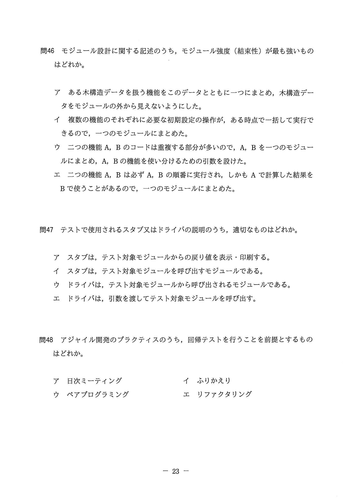

テキスト (OCR)

間46 モジュール設計に関する記述のひうち, モジュール強度 (結束性) が最も強いもの
はどれか。

ア ある木構造データを扱う機能をこのデータとともに一つにまとめ, 木構造デー
タをモジュールの外から見えないようにした。

イ 複数の機能のそれぞれに必要な初期設定の操作が, ある時点で一括して実行で
きるので, 一つのモジュールにまとめた。

ウ 二つの機能 A, B のコードは重複する部分が多いので, A, B を一つのモジュー
ルにまとめ, A, Bの機能を使い分けるための引数を設けた。

エ 二つの機能 4, B は必ず A, B の順番に実行され, しかも A で計算した結果を
B で使うことがあるので, 一つのモジュールにまとめた。

間47 テストで使用されるスタブ又はドライバの説明のうち, 適切なものはどれか。

スタブは, テスト対象モジュールからの戻り値を表示・印刷する。
ARTIS, テスト対象モジュールを呼び出すモジュールである。

ドライバは, テスト対象モジュールから呼び出されるモジュールである。
ドライバは, 引数を渡してテスト対象モジュールを呼び出す。

H ささコ

問48 アジャイル開発のプラクティスのうち, 回帰テストを行うことを前提とするもの
はどれか。

ア 日次ミーティング      イ ぶりかえり
ウ ペアプログラミング      x リファクタリング

ー 23 一

### ページ 25

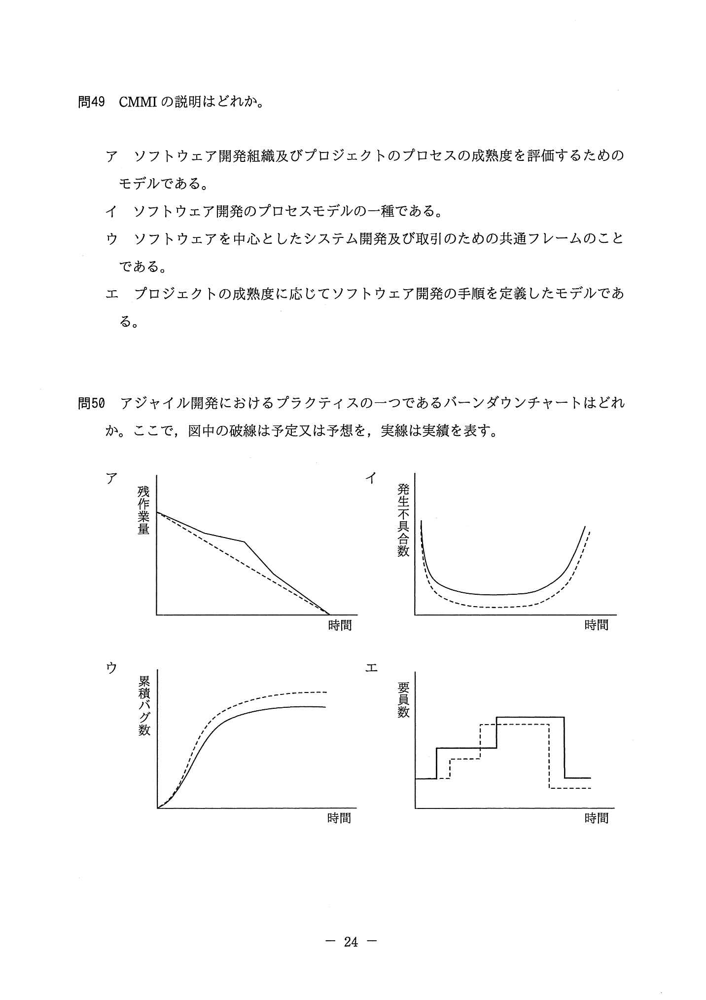

テキスト (OCR)

問49 CMMI の説明はどれか。

FY ソフトウェア開発組織及びプロジェクトのプロセスの成熟度を評価するための
モデルである。

イ ソフトウェア開発のプロセスモデルの一種である。

ウ ソフトウェアを中心としたシステム開発及び取引のための共通フレームのこと
である。

エエ プロジェクトの成熟度に応じてソフトウェア開発の手順を定義したモデルであ
る。

間59 アジャイル開発におけるプラクティスの一つであるバーンダウンチャートはどれ
か。ここで, 図中の破線は予定又は予想を, 実線は実績を表す。

ア                4

SE0> UH HER

時間                                                                    時間

a

be

SNS.

時間                                                                    時間

ー 24 一

### ページ 26

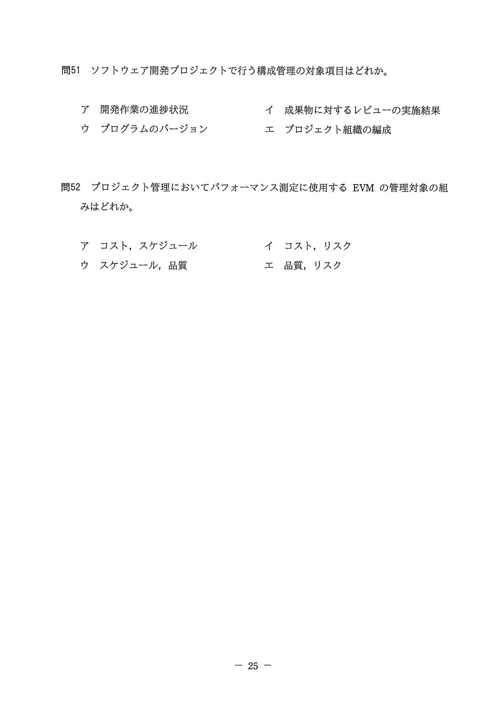

テキスト (OCR)

Sl ソフトウェア開発プロジェクトで行う構成管理の対象項目はどれか。

ア 開発作業の進捗状況        イ 成果物に対するレビューの実施結果

ウ プログラムのバージョン      エエ プロジェクト組織の編成

問52 プロジェクト管理においてパフォーマンス測定に使用する EVM の管理対象の組

みはどれか。

ア コスト, スケジュール       イ AA, VAD
ウ スケジュール, 品質        = WH, リスク

ー 25 一

### ページ 27

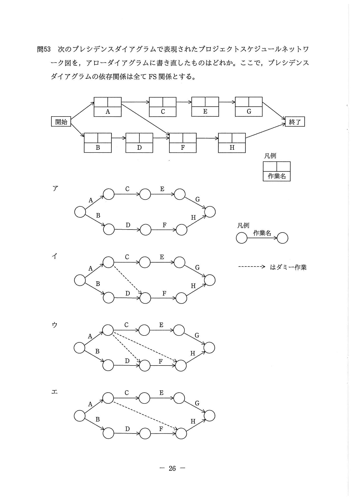

テキスト (OCR)

間53 次のプレシデンスダイアグラムで表現されたプロジェクトスケジュールネットワ
ーク図を, アローダイアグラムに書き直したものはどれか。ここで, プレシデンス
ダイアグラムの依存関係は全て FS 関係とする。

|                    |               |                |
A                                   C                          E                           G
pale                                                                                  終了
|               |                |                  |
B                               D                                F                                     H
凡人
|
作業名
ァ
イ
ウ

### ページ 28

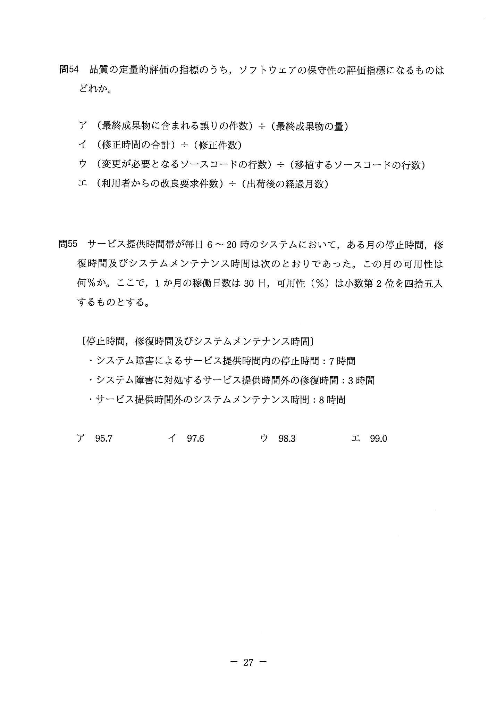

テキスト (OCR)

問54 品質の定量的評価の指標のうち, ソフトウェアの保守性の評価指標になるものは
どれか。

(最終成果物に含まれる誤りの件数) + (最終成果物の量)

(修正時間の合計) + (修正件数)

(変更が必要となるソースコードの行数) + (移植するソースコードの行数)
(利用者からの改良要求件数) + (出荷後の経過月数)

Hot AA

間55 サービス提供時間帯が毎日 6て20 時のシステムにおいて, ある月の停止時間, 修
復時間及びシステムメンテナンス時間は次のとおりであった。この月の可用性は
何%か。ここで, 1 か月の稼働日数は 30 日, 可用性 (%) は小数第 2 位を四捨五入
するものとする。

[停止時間, 修復時間及びシステムメンテナンス時間)

・システム障害によるサービス提供時間内の停止時間 : 7 時間

・システム障害に対処するサービス提供時間外の修復時間 : 3 時間
・サービス提供時間外のシステムメンテナンス時間 : 8 時間

ア 95.7     イ 97.6     ウ 98.3     = 99.0

ー 27 一

### ページ 29

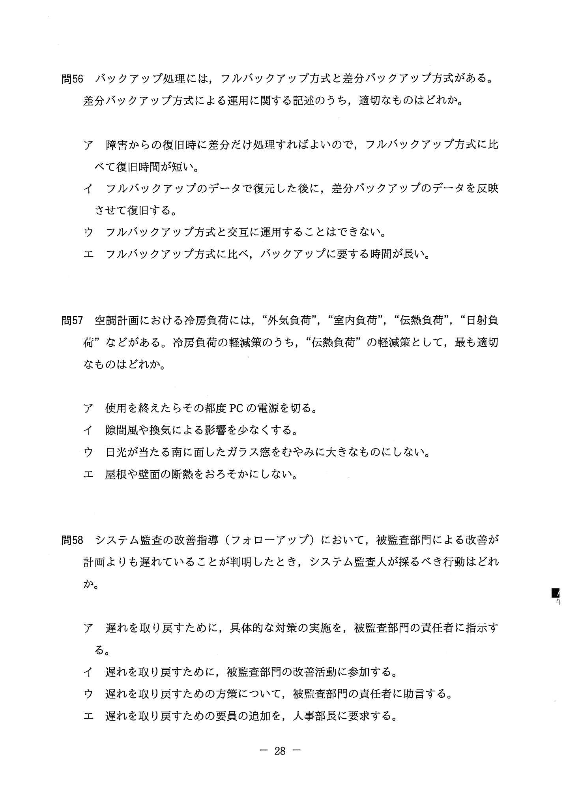

テキスト (OCR)

間56 バックアップ処理には, フルバックアップ方式と差分バックアップ方式がある。
差分バックアップ方式による運用に関する記述のうち, 適切かものはどれか。

ア 障害からの復旧時に差分だけ処理すればよいので, フルバックアップ方式に比
べて復旧時間が短い。

イ フルバックアップのデータで復元した後に, 差分バックアップのデータを反映
させて復旧する。

ウ フルバックアップ方式と交互に運用することはできない。

エエ フルバックアップ方式に比べ, バックアップに要する時間が長い。

間57 空調計画における冷房負荷には, “外気負荷", “室内負荷", “伝熱負荷", “AAS
荷" などがある。 冷房負荷の軽減策のうち, “伝熱負荷" の軽減策として, 最も適切
なものはどれか。

使用を終えたらその都度PC の電源を切る。

隙間風や換気による影響を少なくする。

日光が当たる南に面したガラス窓をおやみに大きなものにしない。
屋根や壁面の断熱をおろそかにしない。

H ささヽさ

問58 システム監査の改善指導(フォローアップ) において, 被監査部門による改善が
計画よりも遅れていることが判明したとき, システム監査人が採るべき行動はどれ
か。

ア 遅れを取り戻すために, 具体的な対策の実施を, 被監査部門の責任者に指示す
る。

イ 遅れを取り戻すために, 被監査部門の改善活動に参加する。

ウ 遅れを取り戻すための方策について, 被監査部門の責任者に助言する。

エ 遅れを取り戻すための要員の追加を, 人事部長に要求する。

ー 28 一

本|

### ページ 30

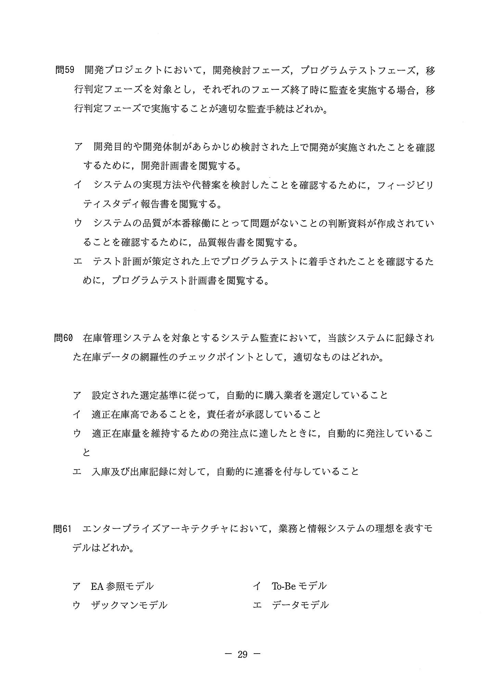

テキスト (OCR)

問59 開発プロジェクトにおいて, 開発検討フェーズ, プログラムテストフェーズ, 移
行判定フェーズを対象とし, それぞれのフェーズ終了時に監査を実施する場合, 移
行判定フェーズで実施することが適切な監査手続はどれか。

ア 開発目的や開発体制があらかじめ検討された上で開発が実施されたことを確認
するために, 開発計画書を閲覧する。

イ システムの実現方法や代替案を検討したことを確認するために, フィージビリ
ティスタディ報告書を閲覧する。

ウ システムの品質が本番稼働にとって問題がないことの判断資料が作成されてい
ることを確認するために, 品質報告書を閲覧する。

エエ テスト計画が策定された上でプログラムテストに着手されたことを確認するた
めに, プログラムテスト計画書を閲覧する。

問69 在庫管理システムを対象とするシステム監査において, 当該システムに記録され
た在庫データの網羅性のチェックポイントとして, 適切なものはどれか。

ア 設定された選定基準に従って, 自動的に購入業者を選定していること

適正在庫高であることを, 責任者が承認していること

ウ 適正在庫量を維持するための発注点に達したときに, 自動的に発注しているこ
と

エエ 入庫及び出庫記録に対して, 自動的に連番を付与していること

wy

間61 エンタープライズアーキテクチャにおいて, 業務と情報システムの理想を表すモ
デルはどれか。

ア EA参照モデル              イ To-Be モデル
ウ ザックマンモデル         エ データモデル

ー 29 一

### ページ 31

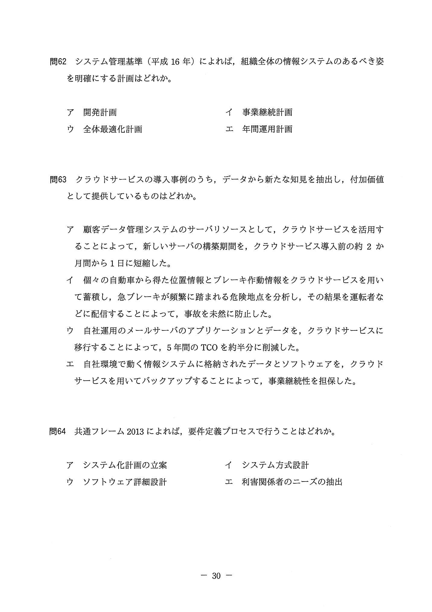

テキスト (OCR)

間62 システム管理基準 (平成 16 年) によれば, 組織全体の情報システムのあるべき姿
を明確にする計画はどれか。

ア 開発計画             イ 事業継続計画
ウ 全体最適化計画          エ 年間運用計画

問63 クラウドサービスの導入事例のうち, データから新たな知見を抽出し, 付加価値
として提供しているものはどれか。

ア 顧客データ管理システムのサーバリソースとして, クラウドサービスを活用す
ることによって, 新しいサーバの構築期間を, クラウドサービス導入前の約 2 か
月間から 1 日に短縮した。

イ 個々の自動車から得た位置情報とブレーキ作動情報をクラウドサービスを用い
て蓄積し, 急ブレーキが頻繁に踏まれる危険地点を分析し, その結果を運転者な
どに配信することによって, 事故を未然に防止した。

ウ 自社運用のメールサーバのアプリケーションとデータを, クラウドサービスに
移行することによって, 5年間の TCO を約半分に削減した。

エエ 自社環境で動く情報システムに格納されたデータとソフトウェアを, クラウド
サービスを用いてバックアップすることによって, 事業継続性を担保した。

間64 共通フレーム 2013 によれば, 要件定義プロセスで行うことはどれか。

ア システム化計画の立案       イ システム方式設計
ウ ソフトウェア詳細設計       エ 利害関係者のニーズの抽出

ー 30 一

### ページ 32

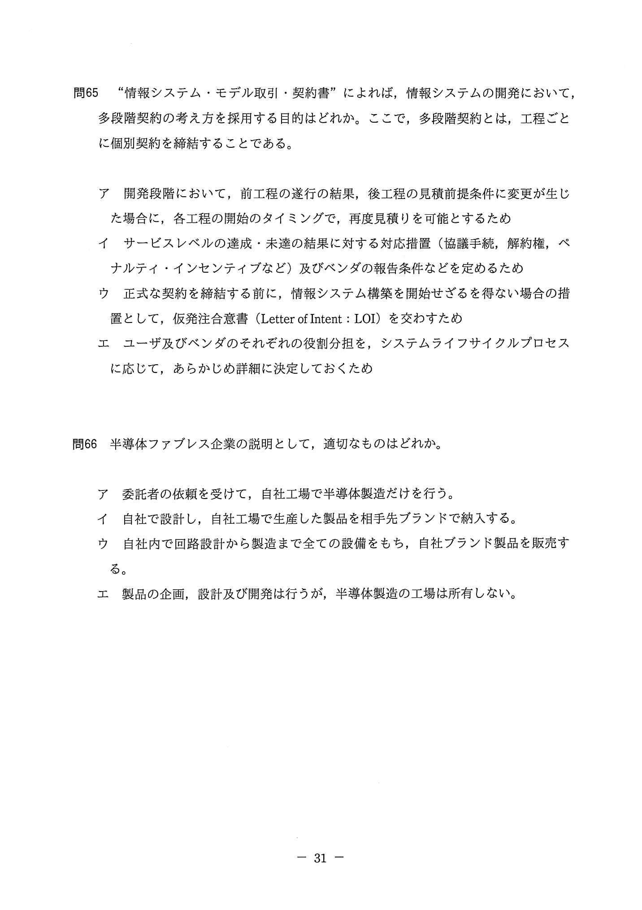

テキスト (OCR)

問65 “情報システム・モデル取引・契約書" によれば, 情報システムの開発において
多段階契約の考え方を採用する目的はどれか。ここで, 多段階契約とは, 工程ごと
に個別契約を締結することである。

ア 開発段階において, 前工程の遂行の結果, 後工程の見積前提人条件に変更が生じ
た場合に, 各工程の開始のタイミングで, 再度見積りを可能とするため

イ サービスレベルの達成・未達の結果に対する対応措置 (協議手続, 解約権, ペ
ナルティ・インセンティブなど) 及びベンダの報告条件などを定めるため

ウ 正式な契約を締結する前に, 情報システム構築を開始せざるを得ない場合の措
置として, 仮発注合意書 (Letter of Intent: LOD を交わすため

エエ ユーザ及びベンダのそれぞれの役割分担を, システムライフサイクルプロセス
に応じて, あらかじめ詳細に決定しておくため

問66 半導体ファブレス企業の説明として, 適切なものはどれか。

ア 委託者の依頼を受けて, 自社工場で半導体製造だけを行う。

イ 自社で設計し, 自社工場で生産した製品を相手先プブランドで納入する。

ウ 自社内で回路設計から製造まで全ての設備とをもち, 自社ブランド製品を販売す
る。

エ 製品の企画, 設計及び開発は行うが, 半導体製造の工場は所有しない。

ー 31 一

### ページ 33

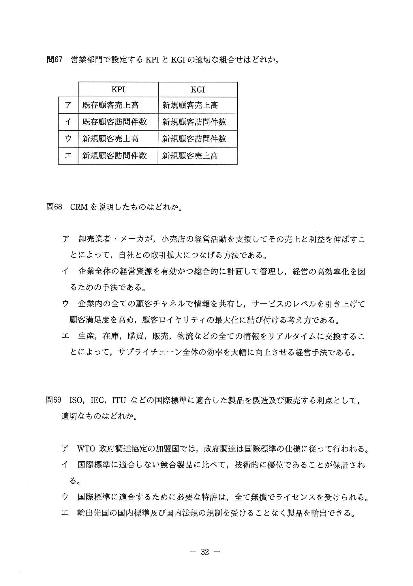

テキスト (OCR)

間67 営業部門で設定する KPI と KGI の適切な組合せはどれか。

KPI                                 KGI
既存顧客売上高   新規顧客売上高
既存顧客訪問件数 | 新規顧客訪問件数
新規顧客売上高   新規顧客訪問件数
新規顧客訪問件数 | 新規顧客売上高

HIさき|+ヽ|

間68 CRM を説明したものはどれか。

ア 卸売業者・メーカが, 小売店の経営活動を支援してその売上と利益を伸ばすこ
とによって, 自社との取引拡大につなげる方法である。

イ 企業全体の経営資源を有効かつ総合的に計画して管理し, 経営の高効率化を図
るための手法である。

ウ 企業内の全ての顧客チャネルで情報を共有し, サービスのレベルを引き上げて
顧客満足度を高め, 顧客ロイヤリティの最大化に結び付ける考え方である。

エエ 生産, 在庫, 購買, 販売, 物流などの全ての情報をリアルタイムに交換するこ
とによって, サプライチェーン全体の効率を大幅に向上させる経営手法である。

問69 ISO, JEC, ITU などの国際標準に適合した製品を製造及び販売する利点として
適切なものはどれか。

itty

ア WTO 政府調達協定の加盟国では, 政府調達は国際標準の仕様に従って行われる。

イ 国際標準に適合しない競合製品に比べて, 技術的に優位であることが保証され
る。

ウ 国際標準に適合するために必要な特許は, 全て無償でライセンスを受けられる。

エエ 輸出先国の国内標準及び国内法規の規制を受けることなく製品を輸出できる。

### ページ 34

テキスト (OCR)

問79 構成表の製品 A を 300 個出荷しようとするとき, 部品 b の正味所要量は何個か。
ここで, A, a, b, c の在庫量は在庫表のとおりとする。また, 他の仕掛残, 注文残,
引当残などはないものとする。

構成表                   単位 個        在庫表      単位 個
a        構成部品           品名 | 在庫量
品名
b            A   100
A   3   2           a   100
a       1   2       b   300
c   400
ア 200     イ 600     ウ 900     = 1500

問71 ドローン, マルチコプタなどの無人航空機に搭載されるセンサのうち, 機体を常
に水平に保つ姿勢制御のために使われるセンサはどれか。

ア 気圧センサ            4 ジャイロセンサ
ウ 地磁気センサ           エ 超音波センサ

間72 ToT の技術として注目されている, エッジコンピューティングの説明として, 適
切なものはどれか。

ア 演算処理のリソースを端末の近傍に置くことによって, アプリケーション処理
の低層延化や通信トラフィックの最適化を行う。

4 データの特徴を学習して, 事象の朗識や分類を行う。

ウ ネットワークを介して複数のコンピュータを結ぶことによって, SEU TH
理能力が高いコンピュータシステムを作る。

エ 周りの環境から微小なエネルギーを収穫して, 電力に変換する。

ー 33 一

### ページ 35

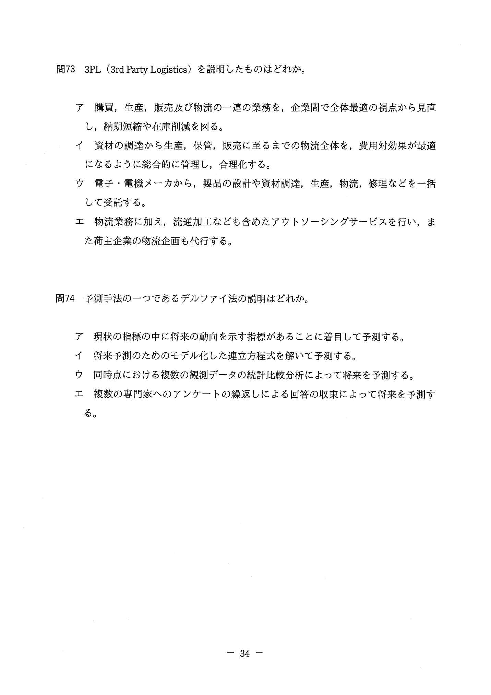

テキスト (OCR)

問73 3PL (3rd Party Logistics) を説明したものはどれか。

ア 購買, 生産, 販売及び物流の一連の業務を, 企業間で全体最適の視点から見直
し, 納期短縮や在庫削減を図る。

イ 資材の調達から生産 RE, 販売に至るまでの物流全体を, 費用対効果が最適
になるように総合的に管理し, 合理化する。

ウ 電子・電機メーカから, 製品の設計や資材調達, 生産, 物流, 修理などを一括
して受託する。

エ 物流業務に加え, 流通加工なども含めたアウトソーシングサービスを行い, ま
た荷主企業の物流企画も代行する。

間74 予測手法の一つであるデルファイ法の説明はどれか。

ア 現状の指標の中に将来の動向を示す指標があることに着目して予測する。

イ 将来予測のためのモデル化した連立方程式を解いて予測する。

ウ 同時点における複数の観測データの統計比較分析によって将来を予測する。

エ 複数の専門家へのアンケートの繰返しによる回答の収束によって将来を予測す
る。

ー 34 一

### ページ 36

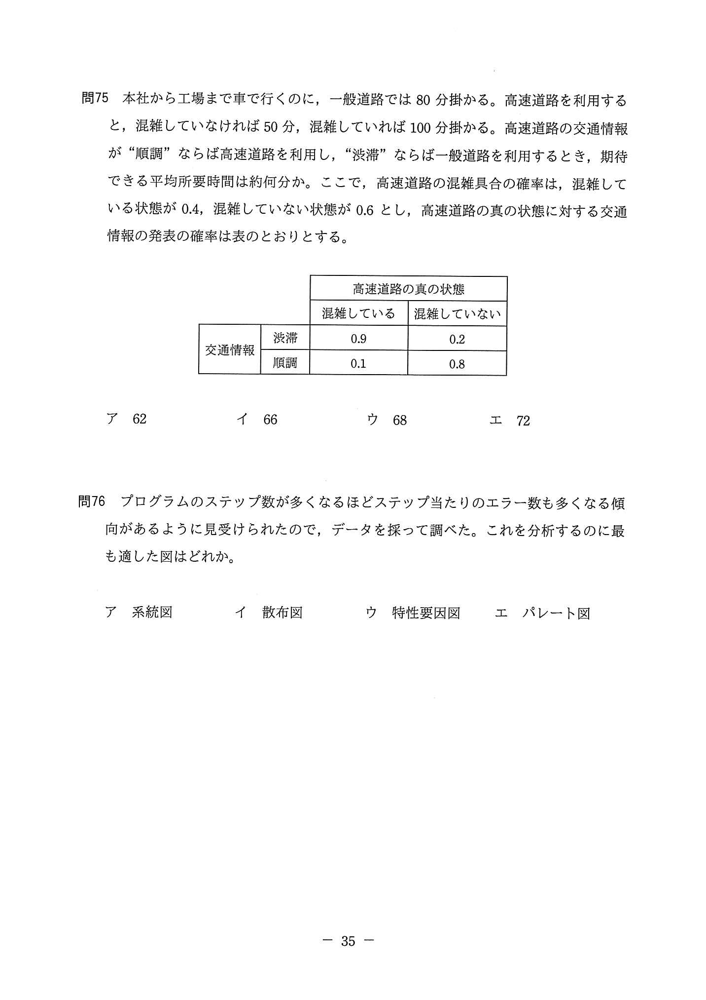

テキスト (OCR)

問75 本社から工場まで車で行くのに, 一般道路では 80 分掛かる。高速道路を利用する
と, BRUCWR NE 50 分, 混雑していれば 100 分掛かる。高速道路の交通情報
が順調" ならば高速道路を利用し, "涼滞” ならば一般道路を利用するとき, 期待
できる平均所要時間は約何分か。ここで, 高速道路の混雑具合の確率は, 混雑して
いる状態が 0.4, 混雑していない状態が 0.6 とし, 高速道路の真の状態に対する交通
情報の発表の確率は表のとおりとする。

高速道路の真の状態
混雑している |混雑していない
渋滞    0.9      0.2
交通情報  の
順調    0.1      0.8
ア 62      イ 66      ウ 68     =, 72

間76 プログラムのステップ数が多くなるほどステップ当たりのエラー数も多くなる傾
向があるように見受けられたので, データを採って調べた。これを分析するのに最
も適した図はどれか。

ア 系統図    イ Bore    ウ 特性要因図  エ パレート図

ー 35 一

### ページ 37

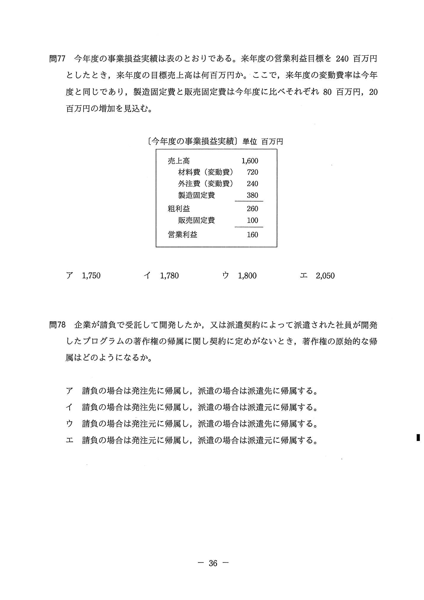

テキスト (OCR)

間77 今年度の事業損益実績は表のとおりである。来年度の営業利益目標を 240 百万円
としたとき, 来年度の目標売上高は何百万円か。ここで, 来年度の変動費率は今年
度と同じであり, 製造固定費と販売固定費は今年度に比べそれぞれ 80 百万円, 20
百万円の増加を見込む。

〔今年度の事業損益実績] 単位 GGA

売上高                    1,600
材料費 (変動費) 720
外注費 (変動費) 240

製造固定費   380
粗利益      260
販売固定費   100
営業利益     160
ア 1,750    イ 1780    ウ 1,800    = 2,050

問78 企業が請負で受託して開発したか, 又は派遣契約によって派遣された社員が開発
したプログラムの著作権の帰属に関し契約に定めがないとき, 著作権の原始的な帰
属はどのようになるか。

請負の場合は発注先に帰属し, 派遣の場合は派遣先に帰属する。
請負の場合は発注先に帰属し, 派遣の場合は派遣元に帰属する。
請負の場合は発注元に帰属し, 派遣の場合は派遣先に帰属する。
請負の場合は発注元に帰属し, 派遣の場合は派遣元に帰属する。

Ht AWN

ー 36 一

### ページ 38

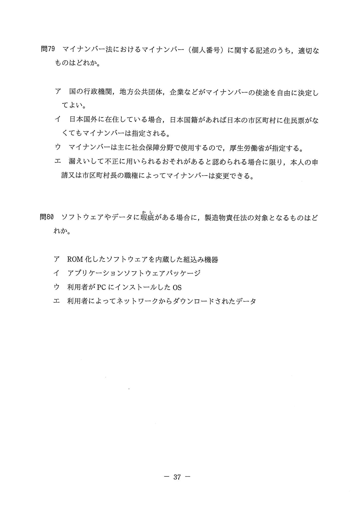

テキスト (OCR)

間79 マイナンバー法におけるマイナンバー (個人番号) に関する記述のうち, 適切な
ものはどれか。

ア 国の行政機関, 地方公共団体, 企業などがマイナンバーの使途を自由に決定し
てよい。

イ 日本国外に在住している場合, 日本国籍があれば日本の市区町村に住民票がな
くてもマイナンバーは指定される。

ウ マイナンバーは主に社会保障分野で使用するので, 厚生労働省が指定する。

エ 漏えいして不正に用いられるおそれがあると認められる場合に限り, 本人の申
請又は市区町村長の職権によってマイナンバーは変更できる。

問89 ソフトウェアやデータに層交がある場合に, 製造物資任法の対象となるものはど
れか。

ア ROM 化したソフトウェアを内蔵した組込み機器
イ アプリケーションソフトウェアパッケージ
ウ 利用者がPC にインストールした OS

= 利用者によってネットワークからダウンロードされたデータ

ー 37 一

### ページ 39

テキスト (OCR)

x = 用 紙 ]

ー 38 一

### ページ 40

テキスト (OCR)

[ メ モ 用 紙 〕

ー 39 一

### ページ 41

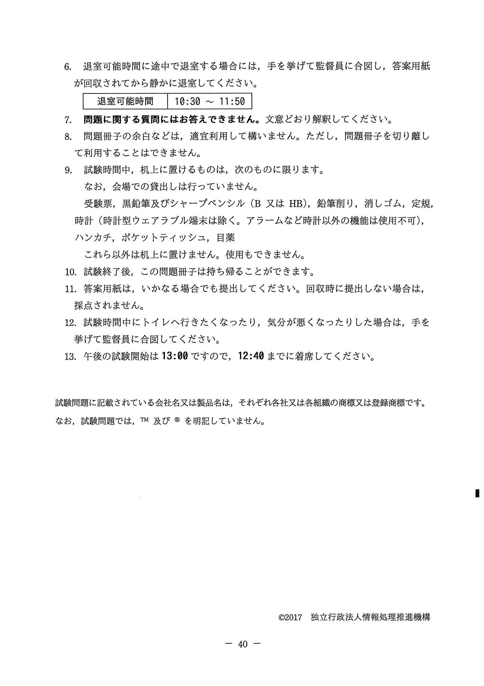

テキスト (OCR)

6. 退室可能時間に途中で退室する場合には, 手を挙げて監督員に合図し, 答案用紙
が回収されてから静かに退室してください。
| 退宣可能時間 | 10:30 ~ 11:50 |
7. 問題に関する質癌にはお答えできません。文意どおり解釈してください。
8. 問題冊子の余白などは, 適宜利用して構いません。 ただし, 問題冊子を切り離し
て利用することはできません。
9. 試験時間中, 机上に置けるものは, 次のものに限ります。
なお, 会場での貸出しは行っていません。
受験票, 黒鉛筆及びシャープペンシル (B 又は HB), 鉛筆削り, 消しゴム, 定規,
時計 (時計型ウェアラブル端末は除く。アラームなど時計以外の機能は使用不可),
ハンカチ, ポケットティッシュ, 目薬
これら以外は机上に置けません。使用もできません。
10. 試験終了後, この問題冊子は持ち帰ることができます。
11. 答案用紙は, いかなる場合でも提出してください。 回収時に提出しない場合は,
採点されません。
12. 試験時間中にトイレへ行きたくなったり, 気分が悪くなったりした場合は, FE
挙げて監督員に合図してください。
13. 午後の試験開始は 13:99 ですので, 12:40 までに着席してください。

試験問題に記載されている会社名又は製品名は, それぞれ各社又は各組織の商標又は登録商標です。
なお, 試験問題では, ™ 及び ® を明記していません。

@2017 独立行政法人情報処理推進機構

ー 40 一

---

## 午前解答

©2017 独立行政法人情報処理推進機構 
平成29 年度 秋期 応用情報技術者試験 解答例 
 
午前試験 
問番号 正解 分野 
問1 
ア 
Ｔ 
問2 
ア 
Ｔ 
問3 
エ 
Ｔ 
問4 
ア 
Ｔ 
問5 
エ 
Ｔ 
問6 
イ 
Ｔ 
問7 
ウ 
Ｔ 
問8 
ウ 
Ｔ 
問9 
エ 
Ｔ 
問10 
エ 
Ｔ 
問11 
イ 
Ｔ 
問12 
ウ 
Ｔ 
問13 
ア 
Ｔ 
問14 
エ 
Ｔ 
問15 
ア 
Ｔ 
問16 
イ 
Ｔ 
問17 
ア 
Ｔ 
問18 
ウ 
Ｔ 
問19 
エ 
Ｔ 
問20 
ウ 
Ｔ 
 
 
問番号 正解 分野 
問21 
イ 
Ｔ 
問22 
ア 
Ｔ 
問23 
ウ 
Ｔ 
問24 
イ 
Ｔ 
問25 
ウ 
Ｔ 
問26 
ア 
Ｔ 
問27 
エ 
Ｔ 
問28 
イ 
Ｔ 
問29 
ウ 
Ｔ 
問30 
エ 
Ｔ 
問31 
ウ 
Ｔ 
問32 
エ 
Ｔ 
問33 
ア 
Ｔ 
問34 
ア 
Ｔ 
問35 
エ 
Ｔ 
問36 
イ 
Ｔ 
問37 
ア 
Ｔ 
問38 
エ 
Ｔ 
問39 
ア 
Ｔ 
問40 
エ 
Ｔ 
 
 
問番号 正解 分野 
問41 
イ 
Ｔ 
問42 
エ 
Ｔ 
問43 
ウ 
Ｔ 
問44 
ウ 
Ｔ 
問45 
ア 
Ｔ 
問46 
ア 
Ｔ 
問47 
エ 
Ｔ 
問48 
エ 
Ｔ 
問49 
ア 
Ｔ 
問50 
ア 
Ｔ 
問51 
ウ 
Ｍ 
問52 
ア 
Ｍ 
問53 
イ 
Ｍ 
問54 
イ 
Ｍ 
問55 
ウ 
Ｍ 
問56 
イ 
Ｍ 
問57 
エ 
Ｍ 
問58 
ウ 
Ｍ 
問59 
ウ 
Ｍ 
問60 
エ 
Ｍ 
 
 
問番号 正解 分野 
問61 
イ 
Ｓ 
問62 
ウ 
Ｓ 
問63 
イ 
Ｓ 
問64 
エ 
Ｓ 
問65 
ア 
Ｓ 
問66 
エ 
Ｓ 
問67 
エ 
Ｓ 
問68 
ウ 
Ｓ 
問69 
ア 
Ｓ 
問70 
イ 
Ｓ 
問71 
イ 
Ｓ 
問72 
ア 
Ｓ 
問73 
エ 
Ｓ 
問74 
エ 
Ｓ 
問75 
イ 
Ｓ 
問76 
イ 
Ｓ 
問77 
エ 
Ｓ 
問78 
ア 
Ｓ 
問79 
エ 
Ｓ 
問80 
ア 
Ｓ 
 
 
分野の「Ｔ」はテクノロジ系，「Ｍ」はマネジメント系，「Ｓ」はストラテジ系の問題です。

---

## 午後問題

### ページ 1

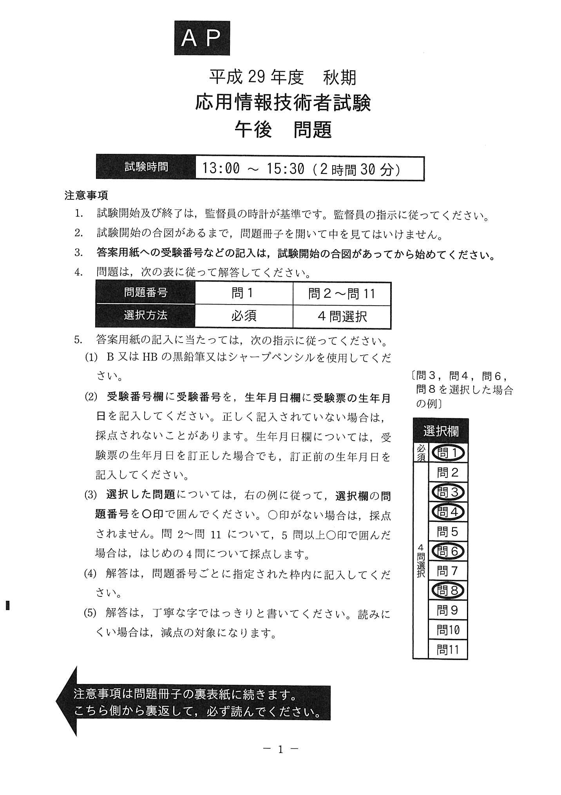

テキスト (OCR)

平成29年度 秋期
応用情報技術者試験
午後 問題
ie 13:00 ~ 15:30 (2時間39分)

注意事項

試験開始及び終了は, 監督員の時計が基準です。監督中の指示に従ってください。

1

2. 試験開始の合図があるまで, 問題冊子を開いて中を見てはいけません。
3. 答案用紙への受験番号などの

4

記入は, 試験開始の合図があってから始めてください。
問題は, 次の表に従って解答してください。
問題番号      問 1

必タ

問2て間 11
選択方法

4 問選択
答案用紙の記入に当たっては, 次の指示に従ってください。

ご

(1) B 又は HB の黒鉛筆又はシャープペンシルを使用してくだ
さい。

[問3, 問4, 問6,

肖8 を選択した場合

2) 受験番号欄に受験番号を, 生年月日欄に受験票の生年月   した間
日を記入してください。 正しく

Ol)
記入されていない場合は,
採点されないことがあります。生年月日材については, 受
験票の生年月日を訂正した場合でも, 訂正前の生年月日を |合因や|
記入してください。                           問2
(3) 選択した問題については, 右の例に従って, 選択棚の問     GD
題番号を〇印で囲んでください。〇印がない場合は, 採点     id
されません。問 2て問 11 について, 5 問以上〇印で囲んだ      fe]
場合は, はじめの4 問について採点します。           3 GE
(4) 解答は, ABS OLE SMAI UC < |択|問7
さい。                                 8
6) 解答は, 丁寧な字ではっきりと書いてください。読みに     問9
くい場合は, 減点の対象になります。                 問19
Fal

注意事項は問題冊子の裏表紙に続きます。
こちら側から裏返して, 必ず読んでください。

### ページ 2

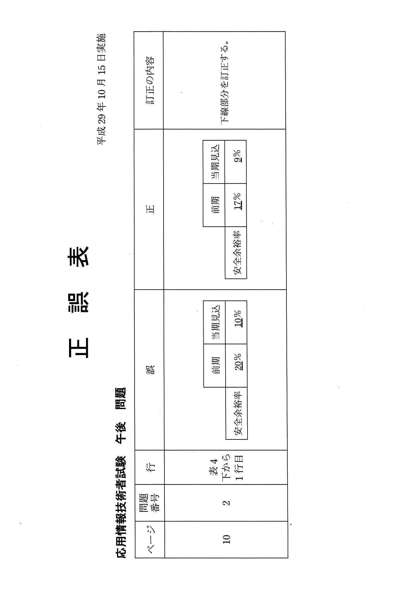

テキスト (OCR)

%6        %ZT | SRR         %0T       %0g «| eRe S| | HOT
°& BAER Ge                                                                                       aG1]} る        Or
YOu Hite | (ape                        Ywtiths | (eeu                      ye

MoT:                      EU                   y | SB ley
ー                                                                                                 ite

Bl 2+ BES eR SHY

mise A ST Ef OT Sy 60 A ak

¥ dl

### ページ 3

### ページ 4

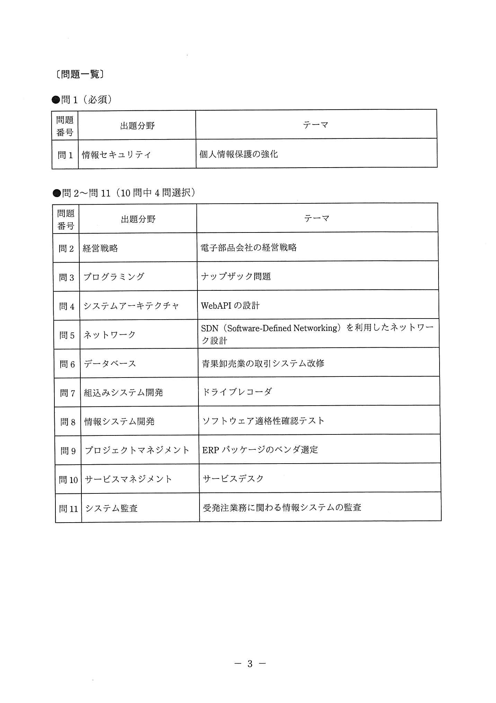

テキスト (OCR)

〔問題一覧]

信問 1 (必須)

問題

BS      出題分野                    テーマ

fll | 情報セキュリティ      個人情報保護の強化

@ fi 2一問 11 (10 問中 4 問選択)

sy      出題分野                    テーマ

番号

問2 | 経営戦略         電子部品会社の経営戦略

間 3 | プログラミング      ナップザック問題

問 4 | システムアーキテクチャ  WebAPI の設計

mis | ネットワーク         SDN ‘Coaftieare: Defined Networkite) を利用したネットワー
ク設計

問6 | データベース       青果卸売業の取引システム改修

問7 | 組込みシステム開発    ドライブレコーダ

間8 | 情報システム開発       ソフトウェア適格性確認テスト

問 9 | プロジェクトマネジメント | ERP パッケージのベンダ選定

問 10| サービスマネジメント    サービスデスク

fll | システム監査        受発注業務に関わる情報システムの監査

### ページ 5

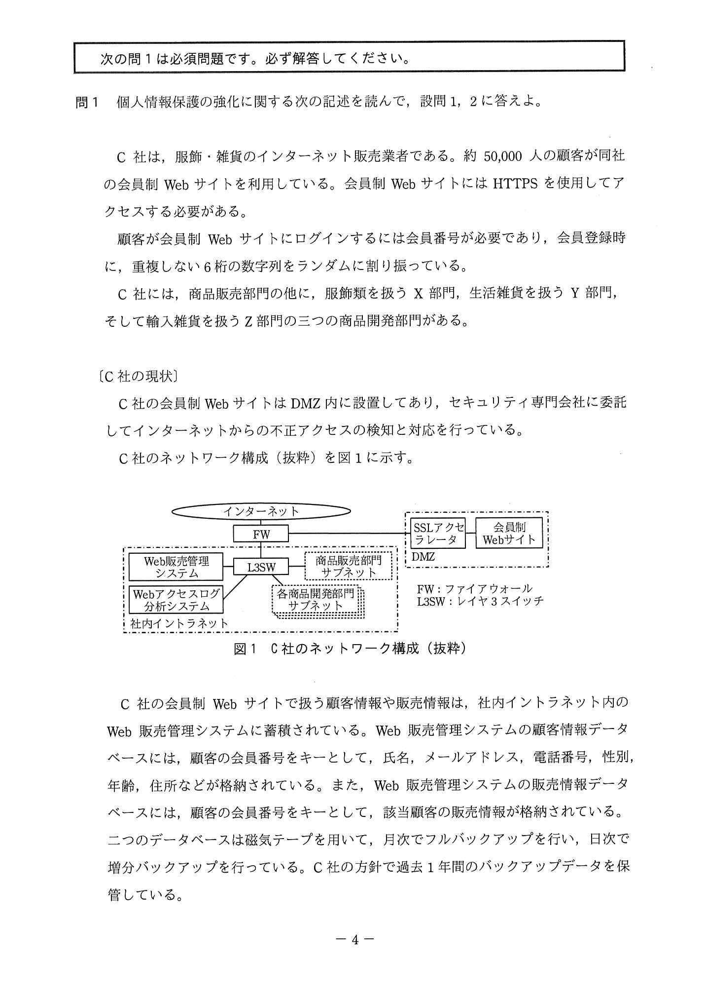

テキスト (OCR)

次の問 1 は必須問題です。必ず解答してください。

問1 個人情報保護の強化に関する次の記述を読んで, 設問1, 2 に答えよ。

C 社は, 服飾・雑貨のインターネット販売業者である。約 50,000 人の顧客が同社
の会員制 Web サイトを利用している。 SAB Web サイトには HTTPS を使用してア
クセスする必要がある。

顧客が会員制 Weib サイトにログインするには会員番号が必要であり, 会員登録時
に, 重複しない 6 桁の数字列をランダムに割り振っている。

C 社には, 商品販売部門の他に, 服飾類を扱う X 部門, 生活雑貨を扱う Y 部門,
そして輸入雑貨を扱う 部門の三つの商品開発部門がある。

(C 社の現状]

C 社の会員制 Web サイトは DMZ 内に設置してあり, セキュリティ専門会社に委託
してインターネットからの不正アクセスの検知と対応を行っている。

C 社のネットワーク構成 (抜粋) を図 1 に示す。

中ssLアクセ| | 会員制 |i
中ラレータ | | Webサイト日
i

| Web販売管理                           ーー
| システム

i       セスロ                           FW : ファイアウォール
ンステム                         138W : レイヤ 3 スイッチ

! 社内イントラネット ed

C 社の会員制 Web サイトで扱う顧客情報や販売情報は, 社内イントラネット内の
Web 販売管理システムに蓄積されている。Web 販売管理システムの顧客情報データ
ベースには, 顧客の会員番号をキーとして, KK, メールアドレス, 電話番号, 性別
年齢, 住所などが格納されている。また, Web 販売管理システムの販売情報データ
ベースには, 顧客の会員番号をキーとして, 該当顧客の販売情報が格納されている。
二つのデータベースは磁気テープを用いて, 月次でフルバックアップを行い, 日次で
増分バックアップを行っている。C 社の方針で過去 1 年間のバックアップデータを保
管している。

### ページ 6

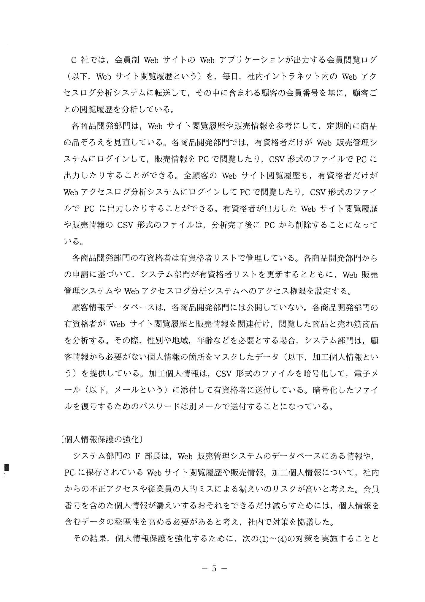

テキスト (OCR)

C 社では, BA Web サイトの Web アプリケーションが出力する会員閲覧ログ

(以下, Web サイト閲覧履歴という) を, HA, 社内イントラネット内の Web アク
セスログ分析システムに転送して, その中に含まれる顧客の会員番号を基に, 顧客ご
との閲覧履歴を分析している。

各商品開発部門は, Web サイト閲覧履歴や販売情報を参考にして, 定期的に商品
の品ぞろえを見直している。各商品開発部門では, 有資格者だけが Web 販売管理シ
ステムにログインして, 販売情報を PC で閲覧したり, CSV 形式のファイルで PC に
出力したりすることができる。全顧客の Web サイト閲覧履歴も, 有資格者だけが
Web アクセスログ分析システムにログインして PC で閲覧したり, CSV 形式のファイ
VE PC に出力したりすることができる。有資格者が出力した Web サイト閲覧履歴
や販売情報の CSV 形式のファイルは, 分析完了後に PC から削除することになって
いる。

各商品開発部門の有資格者は有資格者リストで管理している。各商品開発部門から
の申請に基づいて, システム部門が有資格者リストを更新するとともに, Web 販売
管理システムや Web アクセスログ分析システムへのアクセス枚限を設定する。

顧客情報データベースは, 各商品開発部門には公開していない。各商品開発部門の
有資格者が Web サイト閲覧履歴と販売情報を関連付け, 閲覧した商品と売れ筋商品
を分析する。その際, 性別や地域, 年齢などを必要とする場合, システム部門は, HA
客情報から必要がない個人情報の箇所をマスクしたデータ (以下, 加工個人情報とい
う) を提供している。加工個人情報は, CSV 形式のファイルを暗号化して, 電子メ
ール (以下, メールという) に添付して有資格者に送付している。 暗号化したファイ
ルを復号するためのパスワードは別メールで送付することになっている。

〔個人情報保護の強化

システム部門の F 部長は, Web 販売管理システムのデータベースにある情報や,

に保存されている Web サイト閲覧履歴や販売情報, 加工個人情報について, 社内
からの不正アクセスや従業員の人的ミスによる漏えいのリスクが高いと考えた。 会員
番号を含めた個人情報が漏えいするおそれをできるだけ減らすためには, 個人情報を
含むデータの秘匿性を高める必要があると考え, 社内で対策を協議した。

その結果, 個人情報保護を強化するために, 次の1)~(④の対策を実施することと

ー5 一

### ページ 7

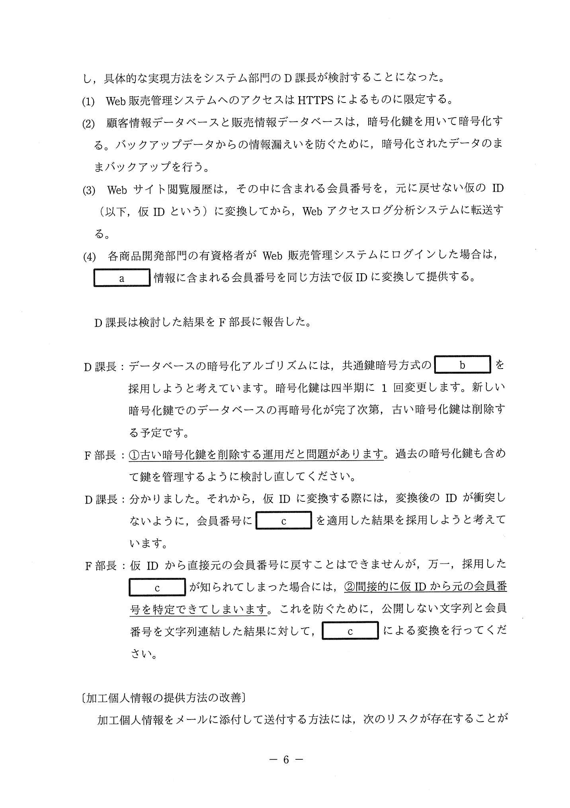

テキスト (OCR)

し, 具体的な実現方法をシステム部門の D 課長が検討することになった。

(1) Web 販売管理システムへのアクセスは HTTPS によるものに限定する。

2) 顧客情報データベースと販売情報データベースは, 暗号化鍵を用いて暗号化す
る。バパックアップデータからの情報漏えいを防ぐために, 暗号化されたデータのま
まバックアップを行う。

(3) Web サイト閲覧履歴は, その中に含まれる会員番号を, 元に戻せない仮の ID
(以下, (RID という) に変換してから, Web アクセスログ分析システムに転送す
る。

(4) 各商品開発部門の有資格者が Web 販売管理システムにログインした場合は,
| 。 | 情報に含まれる会員番号を同じ方法で仮 D に変換して提供する。

D 課長は検討した結果を 部長に報告した。

D 課長 : データベースの暗号化アルゴリズムには, 共通鍵暗号方式の| pb |を
採用しようと考えています。暗号化鍵は四半期に 1 回変更します。新しい
暗号化健でのデータベースの再暗号化が完了次第, 古い暗号化鍵は削除す
る予定です。

F 部長 : ①十い暗号化鍵を削除する運用だと問題があります。過去の暗号化鍵も含め
て鍵を管理するように検討し直してください。

D 課長 : 分かりました。それから, 仮 ID CMT SMRICIS, 変換後の TD が衝突し
ないように, 会員番号に| c | を適用した結果を採用しようと考えて
います。

F 部長 : 仮 D から直接元の会員番号に戻すことはできませんが, 万一, 採用した
[| < | が知られてしまった場合には, ⑳聞接的に仮 D から元の会員番
号を特定できてしまいます。これを防ぐために, 公開しない文字列と会員
番号を文字列連結した結果に対して, | c |] による変換を行ってくだ

さい。

〔加工個人情報の提供方法の改善〕
加工個人情報をメールに添付して送付する方法には, 次のリスクが存在することが

### ページ 8

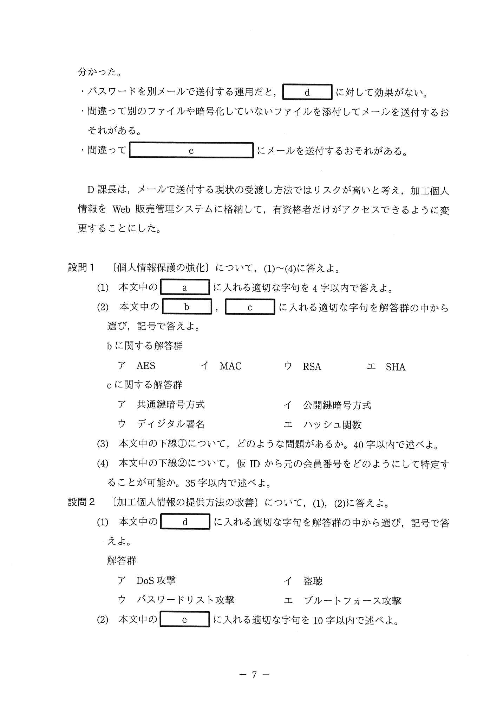

テキスト (OCR)

分かった。

・パスワードを別メールで送付する運用だと, [|  d | に対して効果がない。

・間信って別のファイルや暗号化していないファイルを添付してメールを送付するお
それがある。

・間違って|     e     | にメールを送付するおそれがある。

D 課長は, メールで送付する現状の受渡し方法ではリスクが高いと考え, 加工個人
情報を Web 販売管理システムに格納して, 有資格者だけがアクセスできるように変
更することにした。

設問1 個人情報保護の強化) について, )ー④に答えよ。
a) 本文中の| 』 |] に入れる適切な字句を4字以内で答えよ。

2) 本文中の| bd |,|  。 |に入れる適切な字句を解答群の中から
選び, 記号で答えよ。
b に関する解答群
ア AES    イ MAC    ウ RSA    エ SHA
cに関する解答群
ア 共通鍵暗号方式        イ 公開鍵暗号方式
ウ ディジタル署名        エ ハッシュョ関数

⑬) 本文中の下線①について, どのような問題があるか。40 字以内で述べよ。
(④ 本文中の下線@について, MID から元の会員番号をどのようにして特定す
ることが可能か。35 字以内で述べよ。
設問2 【加工個人情報の提供方法の改善) について, ①), (②)に答えよ。
a AxhO[ q |] に入れる適切な字名を解答群の中から選び, 記号で答

えよ。
解答群
ア DoS 攻撃           イ 盗聴
ウ パスワードリスト攻撃        エ ブルートフォース攻撃

@ 本文中の| < | に入れる適切な字句を 10字以内で述べよ。

### ページ 9

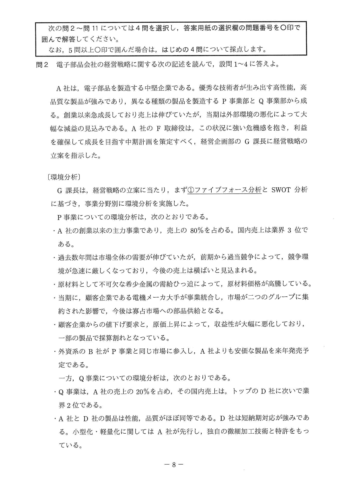

テキスト (OCR)

次の問2 一問 11 については4問を選択し, 答案用紙の選択欄の問題番号を〇印で
囲んで解答してください。
なお, 5 問以上〇印で囲んだ場合は, はじめの 4 問について採点します。

間2 電子部品会社の経営戦略に関する次の記述を読んで, 設問 1+ー4 に答えよ。

A 社は, 電子部品を製造する中堅企業である。優秀な技術者が生み出す高性能, 高
品質な製品が強みであり, 異なる種類の製品を製造する 事業部と Q 事業部から成
る。 創業以来急成長しており売上は伸びていたが, 当期は外部環境の悪化によって大
幅な減益の見込みである。A 社のTF 取締役は, この状況に強い危機感を抱き, 利益
を確保して成長を目指す中期計画を策定すべく, 経営企画部の G 課長に経営戦略の
立案を指志した。

[環境分析〕
G 課長は, 経営戦略の立案に当たり, まず①ファイブフォース分析と SWOT 分析

に基づき, 事業分野別に環境分析を実施した。
P 事業についての環境分析は, 次のとおりである。

・A 社の創業以来の主力事業であり, 売上の 80%を占める。国内売上は業界 3 位で
ある。

・過去数年間は市場全体の電要が伸びていたが, 前期から過当競争によって, 競争環
境が急速に厳しくなっており, 今後の売上は横ばいと見込まれる。

・原材料として不可欠な希少金属の需給ひっ迫によって, 原材料価格が高騰している。
・当期に, 顧客企業である電機メーカ大手が事業統合し, 市場がだ二つのグループに集
約された影響で, 今後は座占市場への部品供給となる。

・顧客企業からの値下げ要求と, 原価上昇によって, 収益性が大幅に悪化しており,
一部の製品で採算割れとなっている。

・外資系の B 社がP 事業と同じ市場に参入し, A 社よりも安価な製品を来年発売巴
定である。
一方, Q 事業についての環境分析は, 次のとおりである。

・Q 事業は, A 社の売上の 20%を占め, その国内売上は, トップの D 社に次いで業
界2 位である。

・A 社と D 社の製品は性能, 品質がほぼ同等である。D 社は短納期対応が強みであ
る。小型化・軽量化に関しては A 社が先行し, 独自の微細加工技術と特許をもっ
ている。

### ページ 10

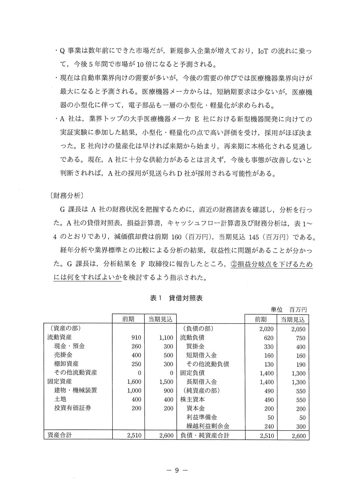

テキスト (OCR)

・Q 事業は数年前にできた市場だが, 新規参入企業が増えており, IoT の流れに乗っ
て, 今後5年間で市場が 10 倍になると予測される。

・現在は自動車業界向けの需要が多いが, 今後の需要の伸びでは医療機器業界向けが
最大になると予測される。 医療機器メーカからは, 短納期要求は少ないが, 医療機
器の小型化に伴って, 電子部品も一層の小型化・軽量化が求められる。

・A 社は, 業界トップの大手医療機器メーカ E 社における新型機器開発に向けての
実証実験に参加した結果, 小型化・軽量化の点で高い評価を受け, 採用がほぼ決ま
つた。E 社向けの量産化は早ければ来期から始まり, 再来期に本格化される見通し
である。 現在, A 社に十分な供給力があるとは言えず, 今後も事態が改善しないと
判断されれば, A 社の採用が見送られD 社が採用される可能性がある。

[財務分析〕

G 課長は A 社の財務状況を把握するために, 直近の財務諸表を確認し, 分析を行っ
ko 社の貸借対照表, 損益計算書, キャッシュフロー計算書及び財務分析は, 表 1
4 のとおりであり, 減価償却費は前期 160 (百万円), 当期見込 145 (百万円) である。

経年分析や業界標準との比較による分析の結果, 収益性に問題があることが分かっ
た。G 課長は, 分析結果を F 取締役に報告したところ, ②損益分岐点を下げるため
には何をすればよいかを検討するよう指示された。

表1 貸借対照表

単位 百万円

前其   当期見込                前其   当期見込

(資産の部)                    (負債の部)         2.020    2,050
流動資産        910   1,100 | 流動負債        620   750
現金・預金               260        300| 買掛金                    330        400
売掛金            400    500| 短期借入金         160     160
棚卸資産          250    300 | その他流動負債       130     190
その他流動資産        0      0 | 固定負債           1,400    1,300
固定資産           1.600    1.500 | 長期借入金         1.400    1,300
建物・機械装置          1,000       900 | (純資産の部)              490       550
土地         400   400 | 株主資本        490   550
投資有価証券        200    200| 資本金            200    200
利益準備金          50     50

繰越利益剰余金       240    300

資産合計           2,510   2,600 | 負債・純資産合計      2,510   2,600

### ページ 11

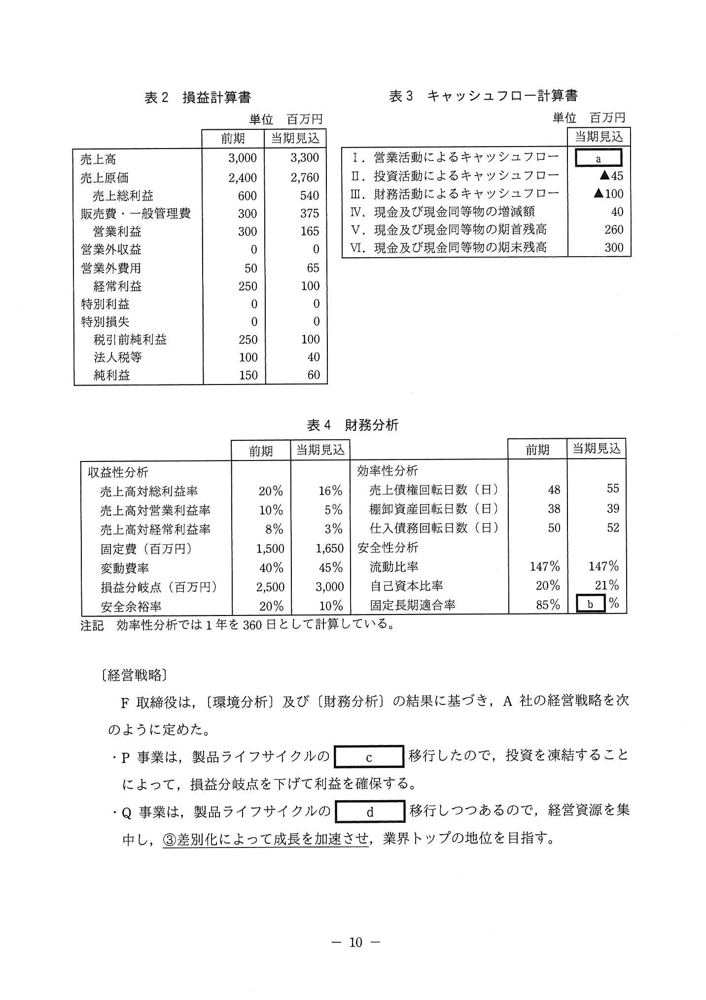

テキスト (OCR)

表2 損益計算書              表3 キャッシュフロー計算書

単位 百万円                                                            単位 百万円
前期 | 当期見込                                                          当期見込
売上高            3000 | 3,300] | 1. 営業活動によるキャッシュフロー | | 。 ]
売上原価           2,400    2,760    TI. 投資活動によるキャッシュフロー     A45
売上総利益          600     540    Wl. 財務活動によるキャッシュフロー    A100
販売費・一般管理費           300          375       TV. 現金及び現金同等物の増減額                 40
営業利益                    300         165       V. 現金及び現金同等物の期首残高            260
営業外収益                      0            0      Vi. 現金及び現金同等物の期末残高            300
営業外費用                        50           65
経常利益                      250          100
特別利益                            0             0
特別損失                            0             0
税引前純利益                250          100
法人税等                      100           40
純利益                         150           60
表4 財務分析
前期 | 当期見込                                     前期 | 当期見込
収益性分析                                               効率性分析
売上高対総利益率              20%        16% | 売上債権回転日数(日)            48           55
売上高対営業利益率     10%     5% | 棚卸資産回転日数 (A)      38     39
売上高対経常利益率             8%          3% | 仕入債務回転日数(日)            50           52
固定費 (百万円)               1,500       1,650 | 安全性分析
変動費率                       40%       45% | 流動比率                       147%      147%
損益分岐点 (百万円)       2,500     3,000     自己資本比率               20%      21%
安全余裕率                    20% | 10%| 固定長期適合率                 85% | [> ]%

注記 効率性分析では 1 年を 360 日として計算している。

(経営戦略
F 取締役は, 〔環境分析) 及び [財務分析) の結果に基づき, A 社の経営戦略を次

のように定めた。

・P 事業は, 製品ライフサイクルの|  c |移行したので, 投資を凍結すること
によって, 損益分岐点を下げて利益を確保する。

・Q 事業は, 製品ライフサイクルの|  q |移行しつつあるので, 経営資源を集
HL, 差別化によって成長を加速させ, 業界トップの地位を目指す。

ー 10 一

### ページ 12

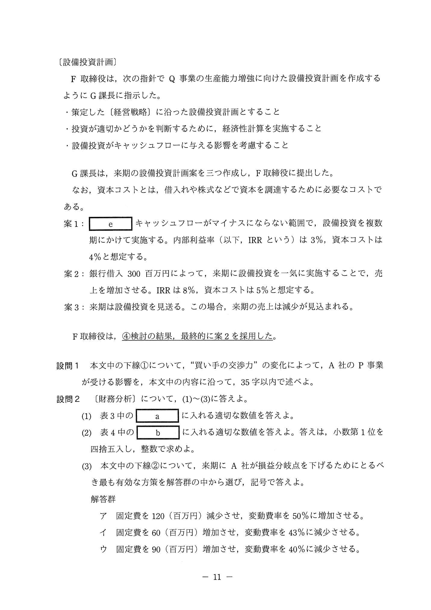

テキスト (OCR)

〔設備投資計画)
F 取締役は, 次の指針で Q 事業の生産能力増強に向けた設備投資計画を作成する
ようにG課長に指示した。
・策定した 【経営戦略〕 に沿った設備投資計画とすること
・投資が適切かどうかを判断するために, 経済性計算を実施すること
・ 設備投資がキャッシュフローに与える影響を考慮すること

G 課長は, 来期の設備投資計画案を三つ作成し, F 取締役に提出した。
なお, 資本コストとは, 借入れや株式などで資本を調達するために必要なコストで

ある。

案1: | 。 | キャッシュフローがマイナスにならない範囲で, 設備投資を複数
期にかけて実施する。内部利益率 (以下, ITRR という) は 3%, 資本コストは
4%と想定する。

案2 : 銀行借入 300 百万円によって, 来期に設備投資を一気に実施することで, FE
上を増加させる。IRR は 8%, 資本コストは5%と想定する。

案 3 : 来期設備投資を見送る。この場合 来期の売上は減少が見込まれる。

F 取締役は, ③④検討の結果, 最終的に案 2 を採用した。

設問1 本文中の下線やについて, “買い手の交渉力” の変化によって, A 社のP 事業
が受ける影響を, 本文中の内容に治って, 35 字以内で述べよ。
設問2 [財務分析] について, ①~(③に答えよ。
a) 表3中の[| 』 | に入れる適切な数値を答えよ。
@) 表4中の| b | に入れる適切な数値を答えよ。答えは, 小数第1位を
四捨五入し, 整数で求めよ。
@) 本文中の下線@について, 来期に A 社が損益分岐点を下げるためにとるベ
き最も有効な方策を解答群の中から選び, 記号で答えよ。
NSB
ア (HEME 120 (百万円) 減少させ, 変動費率を 50%に増加させる。
イ ERE 60 (百万円) 増加させ, 変動費率を 43%に減少させる。
ウ ERE 90 (百万円) 増加させ, 変動費率を 40%に減少させる。

ーー

### ページ 13

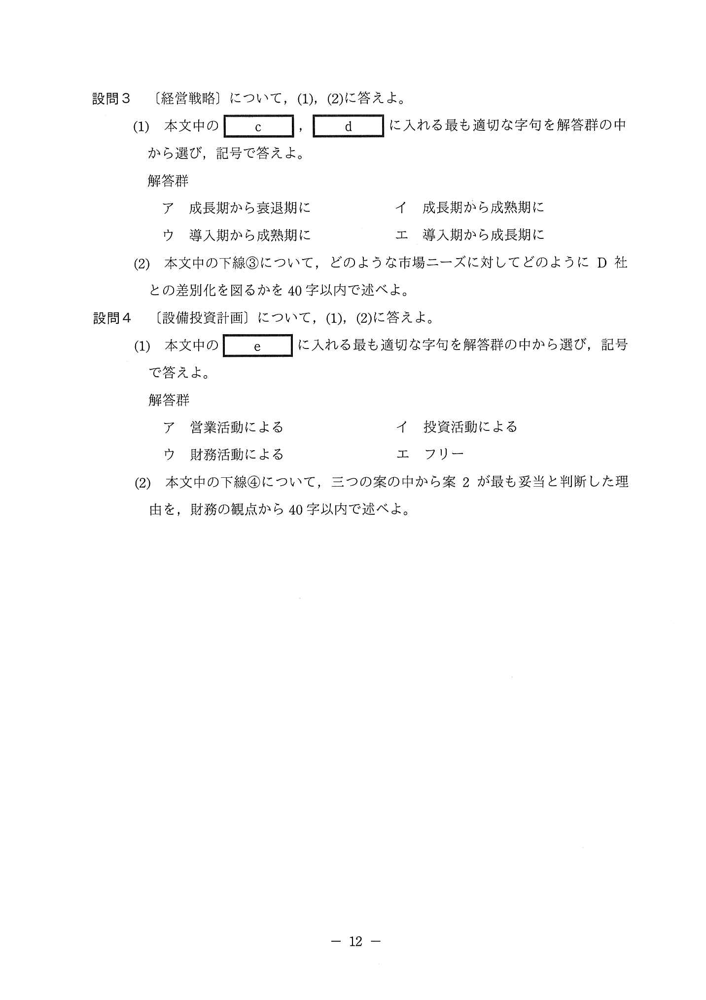

テキスト (OCR)

設問3 GREEEMRIG) (OWT, ①, ②に答えよ。
|  d |に入れる最も適切な字句を解答群の中

Q①) 本文中の| c 上
から選び, 記号で答えよ。
解答群
ア 成長期から衰退期に     イ 成長期から成熟期に
ウ 導入期から成熟期に     エエ 導入期から成長期に

2) 本文中の下線について, どのような市場ニーズに対してどのように D 社

との差別化を図るかを 40 字以内で述べよ。

設問4 [設備投資計画) について, @, MEARE.
Q①) 本文中の| es |] に入れる最も適切な字句を解答群の中から選び,

out
cu
dh

で答えよ。

Aes AE
ア 営業活動による      イ 投資活動による
ウ 財務活動による       エ フリー

2) 本文中の下線@について, 三つの案の中から案 2 が最も妥当と判断した理
He, 財務の観点から 40 字以内で述べよ。

ー 12 一

### ページ 14

テキスト (OCR)

[ メ モ 用 紙 〕

ー 13 一

### ページ 15

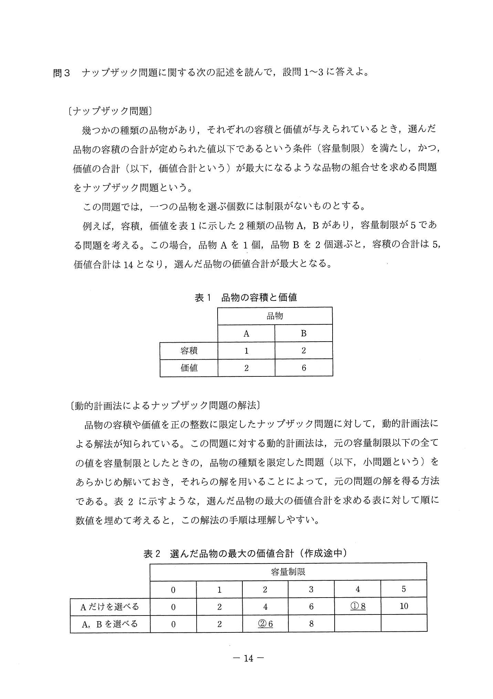

テキスト (OCR)

Ag

(Xt
3
NY
か

AS ナップザック問題に関する次の記述を読んで, 設問 1ー3

〔ナップザック問題]

BOPOCHO MIMD), それぞれの容積と価値与えられているとき, 選んだ
品物の容積の合計が定められた値以下であるという条件 (容量制限) を満たし, かつ,
価値の合計 (以下, 価値合計という) が最大になるような品物の組合せを求める問題
をナップザック問題という。

この間題では, 一つの品物を選ぶ個数には制限がないものとする。

例えば, 容積, 価値を表 1 に示した 2 種類の品物 A, B があり, 容量制限が5であ
る問題を考える。 この場合, 品物A を1個, 品物Bを2 個選ぶと, 容積の合計は5,
価値合計は 14 となり, 選んだ品物の価値合計が最大となる。

Rl 品物の容積と価値

品物
A                 B
容積                 1
価値               2                 6

[動的計画法によるナップザック問題の解法

品物の容積や価値を正の整数に限定したナップザック問題に対して, 動的計画法に
よる解法が知られている。この問題に対する動的計画法は, 元の容量制限以下の全て
の値を容量制限としたときの, 品物の種類を限定した問題 (以下, 小問題という) を
あらかじめ解いておき, それらの解を用いることによって, 元の問題の解を得る方法
である。表 2 に示すような, 選んだ品物の最大の価値合計を求める表に対して順に
数値を埋めて考えると, この解法の手順は理解しやすい。

表2 選んだ品物の最大の価値合計 (作成途中)

容量制限
0          1          2          3          4          5
A だけを選べる       0         2         4         6        @O8        10
A, B を選べる      0       2      @6      8

ー 14 一

### ページ 16

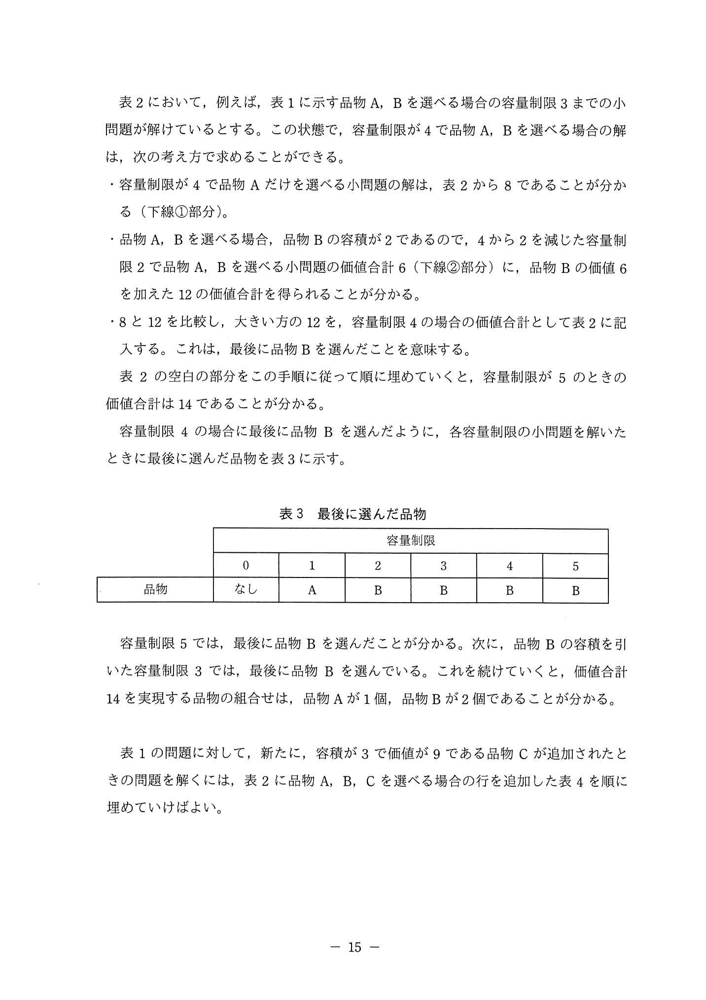

テキスト (OCR)

表 2 において, 例えば, 表 1に示す品物 A, B を選べる場合の容量制限 3 までの小
問題が解けているとする。この状態で, 容量制限が 4 で品物 A, B を選べる場合の解
は, 次の考え方で求めることができる。

・容量制限が 4 で品物 A だけを選べる小問題の解は, 表 2 から 8 であることが分か
る (下線①部分)。

・ 品物 A, B を選べる場合, 品物 B の容積が2 CHOOT, 4 から 2を減じた容量制
限 2 CHW A, B を選べる小問題の価値合計 6 (下線②部分) に, 品物B の価値6
を加えた 12 の価値合計を得られることが分かる。

・8 と 12 を比較し, 大きい方の 12%, 容量制限 4 の場合の価値合計として表 2 に語
入する。 これは, 最後に品物B を選んだことを意味する。

表 2 の空白の部分をこの手順に従って順に埋めていくと, 容量制限が 5 のときの
価値合計は 14 であることが分かる。

容量制限 4 の場合に最後に品物 B を選んだように, 各容量制限の小問題を解いた

きに最後に選んだ品物を表 3 に示す。

表3 最後に選んだ品物
容量制限
0              1              9              3              4

品物       なし     A      B      B      B      B

容量制限 5 では, 最後に品物 B を選んだことが分かる。次に, 品物 B の容積を引
いた容量制限 3 では, 最後に品物 B を選んでいる。これを続けていくと, 価値合計
14 を実現する品物の組合せは, 品物Aが1個, 品物Bが2個であることが分かる。

表 1 の問題に対して, 新たに, 容積が 3 で価値が 9 である品物 C が追加されたと

きの問題を解くには, 表 2 に品物 A, B, Cを選べる場合の行を追加した表 4 を順に
埋めていけばよい。

ー 15 一

### ページ 17

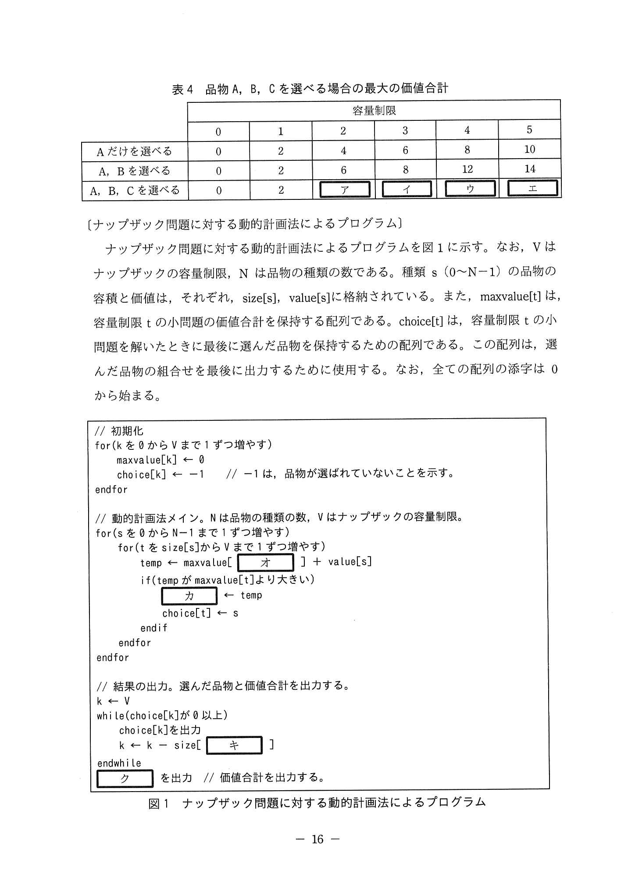

テキスト (OCR)

表4 GDA, B, Cを選べる場合の最大の価値合計

容量制限
0    1    2    3    4    5
A だけを選べる           0               2               4              6              8              10
A, B を選べる    0     2     6     8     12     14
A, B, Cを選べる   0     2   | ァ 中 ィ 人|し | |

[ナップザック問題に対する動的計画法によるプログラム]

ナップザック問題に対する動的計画法によるプログラムを図 1 に示す。なお, V は
ナップザックの容量制限, N は品物の種類の数である。 種類 s (0~N-1) の品物の
容積と価値は。 それぞれ, sizels], valuels]に格納されている。 また, maxvalue[t] は,
容量制限 t の小問題の価値合計を保持する配列である。choice[t] は, 容量制限t の小
問題を解いたときに最後に選んだ品物を保持するための配列である。 この配列は, 選
んだ品物の組合せを最後に出力するために使用する。なお, 全ての配列の添字は 0
から始まる。

// 初期化
for(k を9からVまで 1 ずつ増やす)

maxvalue[k] と 9

choice[k] — 一1  // 一1は, 品物が選ばれていないことを示す。
endfor

// 動的計画法メイン。N は品物の種類の数,Vはナップザックの容量制限。
for(s を 9 からN一1 まで 1 ずつ増やす)
for(tをsize[s]からVまで 1 ずつ増やす)
temp <— maxvalue[ ] + value[s]
if(temp が maxvalue[t]より大きい)
choice[t] と s
endif
endfor
endfor

// 結果の出力。選んだ品物と価値合計を出力する。
keV
while(choice[k]が 0 以上)
choice[k]を出力
endwhile

 を出力 // 価値合計を出力する。
図1 ナップザック問題に対する動的計画法によるプログラム

ー 16 一

### ページ 18

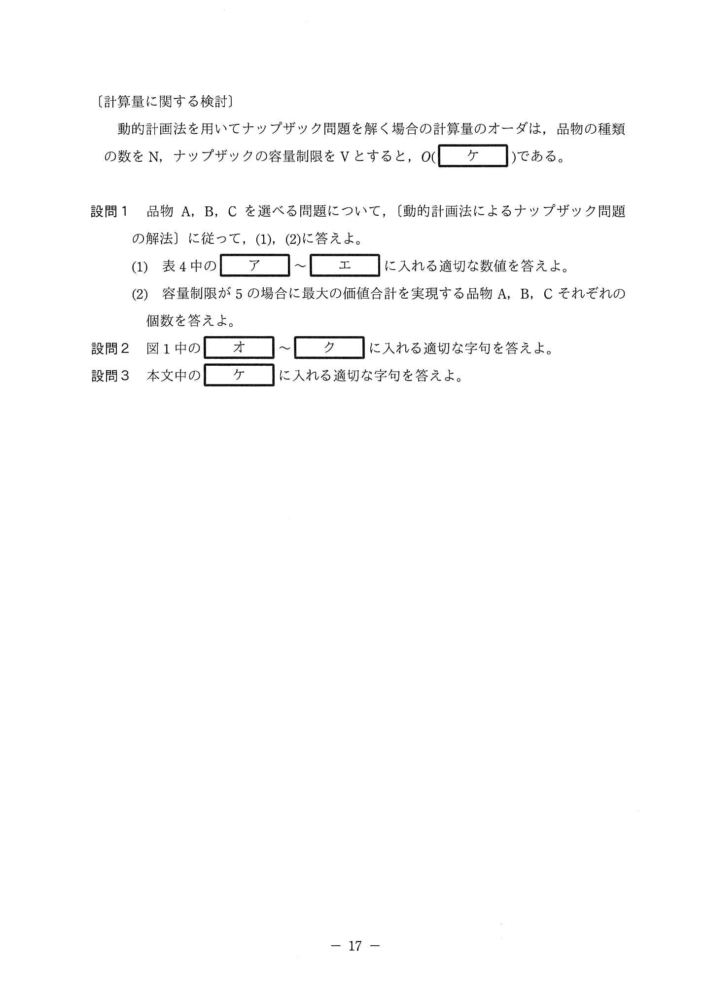

テキスト (OCR)

(計算量に関する検討
動的計画法を用いてナップザック問題を解く場合の計算量のオーダは, 品物の種類
の数を N, ナップザックの容量制限を Y とすると, O(| ヶ |)でぁ<。

設問1 品物 A, B, C を選べる問題について, 〔動的計画法によるナップザック問題
の解法〕】 に従って, ①, ②)に答えよ。

a 表4中の| ア |~L エ |に入れる適切な数値を答えよ。
(2) 容量制限が 5 の場合に最大の価値合計を実現する品物 A, B, C それぞれの
個数を答えよ。

設問2 図1中の| オ |~| ク |に入れる適切な字句を答えよ。

設問3 本文中の[| ケ | に入れる適切な字句を答えよ。

— 17 一

### ページ 19

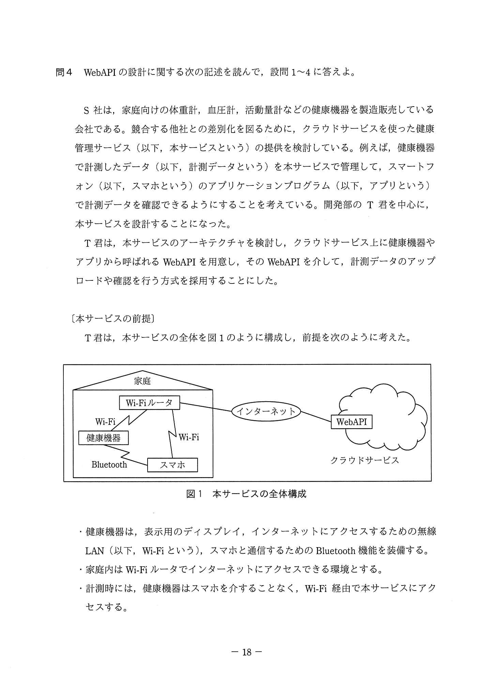

テキスト (OCR)

問4 WebAPI の設計に関する次の記述を読んで, 設問 1ー4 に答えよ。

S 社は, 家庭向けの体重計, 血圧計, 活動量計などの健康機器を製造販売している
会社である。 競合する他社との差別化を図るために, クラウドサービスを使った健康
管理サービス (以下, 本サービスという) の提供を検討している。例えば, 健康機器
で計測したデータ (以下, 計測データという) を本サービスで管理して, スマートフ
ォン (以下, スマホという) のアプリケーションプログラム (以下,アプリという)
で計測データを確認できるようにすることを考えている。 開発部の T 君を中心に,
本サービスを設計することになった。

TA, 本サービスのアーキテクチャを検討し, クラウドサービス上に健康機器や
アプリから呼ばれる WebAPI を用意し, その WebAPI を介して, 計測データのアップ
ロードや確認を行う方式を採用することにした。

〔本サービスの前提]
T 君は,. 本サービスの全体を図 1 のように構成し, 前提を次のように考えた。

aay

クラウドサービス

図1 本サービスの全体構成

・健康機器は, 表示用のディスプレイ, インターネットにアクセスするための無線
LAN (以下, Wi-Fi という), スマホと通信するための Bluetooth 機能を装備する。

・家庭内は Wi-Fi ルータでインターネットにアクセスできる環境とする。

・計測時には, 健康機器はスマホを介することなく, Wi-Fi 経由で本サービスにアク
セスする。

ー 18 一

### ページ 20

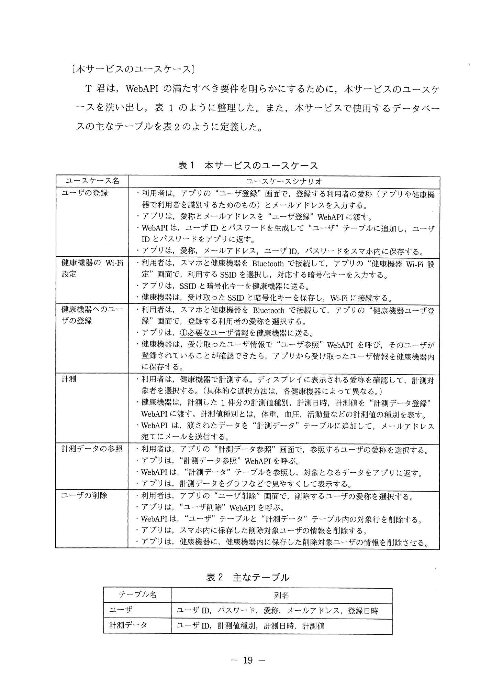

テキスト (OCR)

〔本サービスのユースケース]〕

T 君は, WebAPI の満たすべき要件を明らかにするために, 本サービスのユースケ
ースを洗い出し, 表 1 のように整理した。また, 本サービスで使用するデータベー
スの主なテーブルを表 2 のように定義した。

表1 本サービスのユースケース

ユースケース名

ユースケースシナリオ

ユーザの登録

・ 利用者は, アプリの “ユーザ登録" 画面で, 登録する利用者の愛称(アプリや健康機

器で利用者を識別するためのもの) とメールアドレスを入力する。

・アプリは, 愛称とメールアドレスを “ユーザ登録” WebAPI に渡す。
・WebAPI は, ユーザ ID とパスワードを生成して “ユーザ” テーブルに追加し, ユーザ

ID とパスワードをアプリに返す。

・アプリは, 愛称, メールアドレス, ユーザ ID, パスワードをスマホ内に保存する。

健康機器の Wi-Fi
設定

・ 利用者は, スマホと健康機器を Bluetooth で接続して, アプリの “健康機器 Wi-Fi 設

ve” 画面で, 利用する SSID を選択し, 対応する暗号化キーを入力する。

・アプリは, SSID と暗号化キーを健康機器に送る。
・ 健康機器は, 受け取った SSID と暗号化キーを保存し, Wi-Fi に接続する。

健康機器へのユー
ザの登録

・利用者は, スマホと健康機器を Bluetooth で接続して, アプリの "健康機器ユーザ登

Sk” 画面で, 登録する利用者の愛称を選択する。

・アプリは, ①必要なユーザ情報を健康機器に送る。
・ 健康機器は, 受け取ったユーザ情報で“ユーザ参照" WebAPI を呼び、そのユーザが

登録されていることが確認できたら, アプリから受け取ったユーザ情報を健康機器内
に保存する。

aH

・ 利用者は, 健康機器で計測する。ディスプレイに表示される愛称を確認して, 計測対

象者を選択する。(具体的な選択方法は, 各健康機器によって異なる。)

・ 健康機器は, 計測した 1 件分の計測値種別計測日時, 計測値を“計測データ登録"

WebAPI に渡す。計測値種別とは, 体重, 血圧, 活動量などの計測値の種別を表す。

・WebAPI は, 渡されたデータを “計測データ" テーブルに追加して, メールアドレス

宛てにメールを送信する。

計測データの参照

・ 利用者は, アプリの “計測データ参照" 画面で, 参照するユーザの愛称を選択する。
・アプリは, “計測データ参照" WebAPI を呼ぶ。

・WebAPIは, “
・アプリは, 計測データをグラフなどで見やすくして表示する。

計測データ”" テーブルを参照し, 対象となるデータをアプリに返す。

ユーザの削除

・ 利用者は, アプリの“ユーザ削除" 画面で, 削除するユーザの愛称を選択する。
・アプリは, “ユーザ削除" WebAPI を呼ぶ
・ WebAPI は, "ユーザ" テーブルと “計測データ" テーブル内の対象行を削除する。
・アプリは, スマホ内に保存した削除対象ユーザの情報を削除する。

・アプリは, 健康機器に, 健康機器内に保存した削除対象ユーザの情報を削除させる。

表2 主なテーブル

テーブル名                                                                     列名

ユーザ

ユーザ ID, パスワード, 愛称, メールアドレス, 登録日時

計測データ     ユーザ TD, 計測値種別, 計測日時, 計測値

ー 19 一

### ページ 21

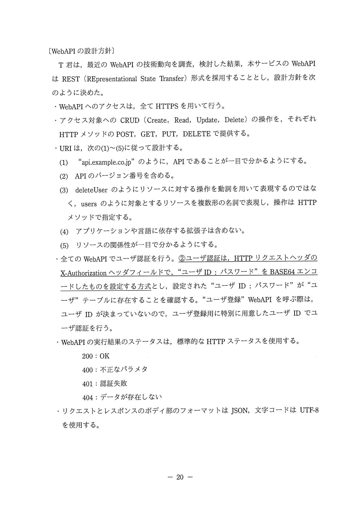

テキスト (OCR)

[WebAPI の設計方針]

T 君は, 最近の WebAPI の技術動向を調査, 検討した結果, 本サービスの WebAPI
は REST (REpresentational State Transfer) 形式を採用することとし, 設計方針を次
のように決めた。

・WebAPI へのアクセスは, 全て HTTPS を用いて行う。

- アクセス対象への CRUD (Create, Read, Update, Delete) の操作を, それぞれ
HTTP メソッドの POST, GET, PUT, DELETE で提供する。

・URI は, 次の(①て⑤)に従って設計する。

(1) “api.example.cojp のように, API であることが一目で分かるようにする。

(2②) API のバージョン番号を含める。

(3) deleteUser のようにリソースに対する操作を動詞を用いて表現するのではな
く, users のように対象とするリソースを複数形の名詞で表現し, 操作は HTTP
メソッドで指定する。

(4) アプリケーションや言語に依存する拡張子は含めない。

(5) リソースの関係性が一目で分かるようにする。

・全ての WebAPI でユーザ認証を行う。②ユーザ認証は, HTTP リクエストヘッダの
X-Authorization ヘッダフィールドで, “ユーザ ID : パスワード”" を BASE64 エンコ
ードしたものを設定する方式とし, 設定された“ユーザ ID: パスワード” W “a
ーザ” テーブルに存在することを確認する。“ユーザ登録” WebAPI を呼ぶ際は,
ユーザ ID が決まっていないので, ユーザ登録用に特別に用意したユーザ ID でユ
ーザ認証を行う。

・WebAPI の実行結果のステータスは, 標準的な HTTP ステータスを使用する。

200 : OK

400 : 不正なパラメタ

401 : 認証失敗

404 : データが存在しない

・リクエストとレスポンスのボディ部のフォーマットは JSON, 文字コードは UTF-8
を使用する。

ー 20 一

### ページ 22

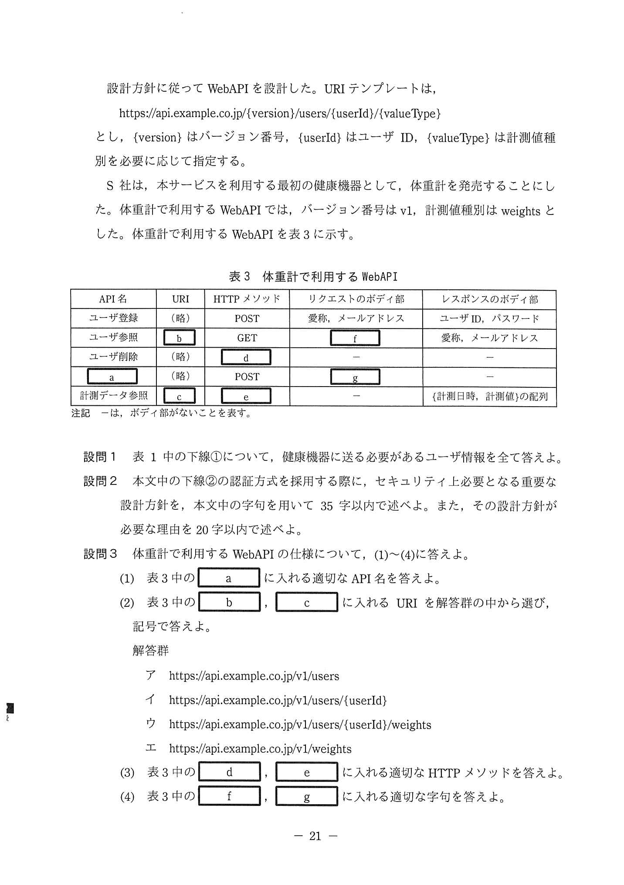

テキスト (OCR)

設計方針に従って WebAPI を設計した。URIテンプレートは,
https://api.example.co.jp/{version }/users/{userld}/{valueType}
とし, tversion) はバージョン番号, f{userld} はユーザ ID, {valueType} は計測値竹
別を必要に応じて指定する。
S 社は, 本サービスを利用する最初の健康機器として, 体重計を発売することにし
た。 体重計で利用する WebAPI では, バージョン番号は vi, 計測値種別は weights と
した。 体重計で利用する WebAPI を表 3 に示す。

表3 体重計で利用する WebAPI

API 名      URI | HTTP メソッド    リクエストのボディ部     レスポンスのボディ部
ユーザ登録        (略)          POST           愛称 メールアドレス        ユーザ ID, パスワード
ユーザ参照 || b |    GET        Lr |       愛称, メールアドレス
ユーザ削除     (#8)     L_a            =                   ー
L_a |     (Be)       POST           | gz |                ー

計測データ参照 | | c | | | = |         =        (計測日時, 計測値}の配列

注記 一は, ボディ部がないことを表す。

設問1 表 1 中の下線〇について, 健康機器に送る必要があるユーザ情報を全て答えよ。
設問2 本文中の下線②の認証方式を採用する際に, セキュリティ上必要となる重要な
設計方針を, 本文中の字句を用いて 35 字以内で述べよ。 また, その設計方針が
必要な理由を 20 字以内で述べよ。
設問3 体重計で利用する WebAPI の仕様について, ①~(④に答えよ。
Q) 表3中の[|  。 |] に入れる適切なAPI名を答えよ。
2) 表3中の|  b |,|  c |に入れる URI を解答群の中から選び,

ア https:/api.example.co.jp/v1/users

イ https:/api.example.co.jp/y1/users/{userId}

ウ https:/api.example.co.jp/y1/users/{userId}/weights

= https:/api.example.co.jp/v1/weights
⑬) 表3中の| da |,|  。 |に入れる適切な HTTP メソッドを答えよ。
4 表3中の| f | |  g |に入れる適切な字句を答えよ。

ー 21 一

### ページ 23

テキスト (OCR)

設問4 リクエストのボディ部が {mickname": 中 で“ユーザ登録" WebAPI が呼ばれ
た場合, どのような結果を返せばよいか。20 字以内で述べよ。

ー 22 一

### ページ 24

テキスト (OCR)

C

メ モ 用 紙

ー 23 一

J

### ページ 25

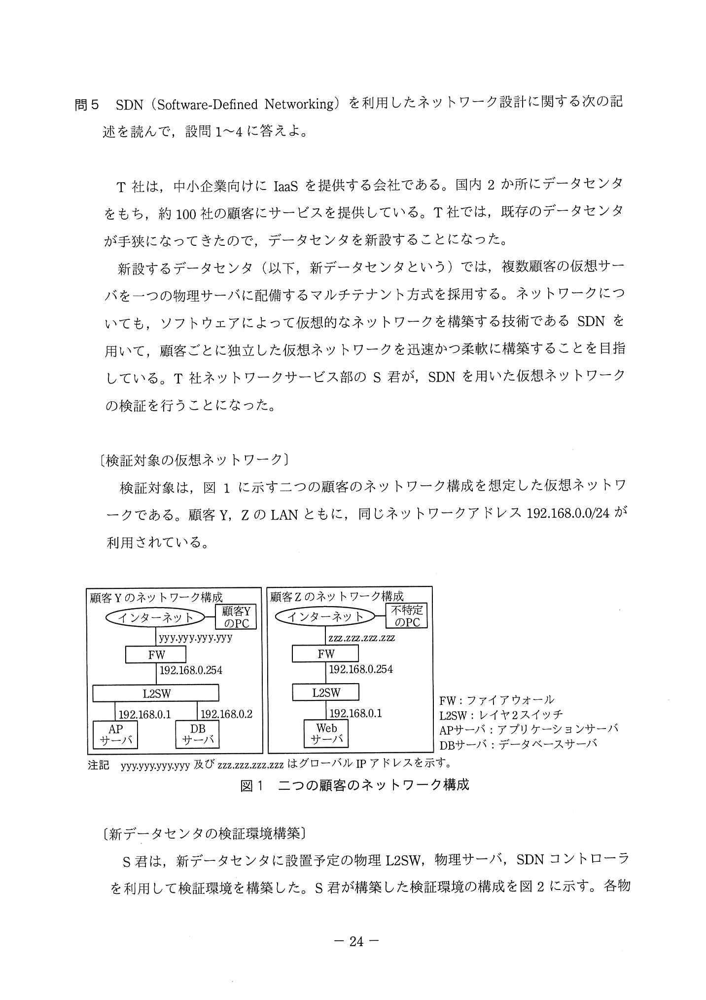

テキスト (OCR)

間5 SDN (Software-Defined Networking) を利用したネットワーク設計に関する次の記
述を読んで, 設問 ユー4 に答えよ。

T 社は, 中小企業向けに IaaS を提供する会社である。国内 2 か所にデータセンタ
をもち, 約 100 社の顧客にサービスを提供している。T 社では, 既存のデータセンタ
が手狭になってきたので, データセンタを新設することになった。

新設するデータセンタ (以下, 新データセンタという) では, 複数顧客の仮想サー
バを一つの物理サーバに配備するマルチテナント方式を採用する。ネットワークにつ
いても, ソフトウェアによって仮想的なネットワークを構築する技術である SDN を
用いて, 顧客ごとに独立した仮想ネットワークを迅速かつ柔軟に構築することを目指
している。T 社ネットワークサービス部の S BM, SDN を用いた仮想ネットワーク
の検証を行うことになった。

[検証対象の仮想ネッウットワーク]

検証対象は, 図 1 に示す二つの顧客のネットワーク構成を想定した仮想ネットワ
ークである。 BAY, 2Z のLAN ともに, 同じネットワークアドレス 192.168.0.0/24 が
利用されている。

顧客Yのネットワーク構成       顧客のネットワーク構成

YYY-YVV-YYY-YVY                            LLL LIL .LIL LIL
FW
192.168.0.254                               192.168.0.254
L2SW

FW : ファイアウォール
192.168.0.1        192.168.0.2                    192.168.0.1               L2SW : レイヤ2スイッチ

BE      DB           Web          APサーバ : アプリケーションサーバ
eum         8                 aed                 DBサーバ : データベースサーバ
注記 yyyyyyyyyyyy 及び zzz.2zz.zzz.22z はグローバル IP アドレスを示す。

図1 二つの顧客のネットワーク構成

〔新データセンタの検証環境構築]
S 君は, 新データセンタに設置予定の物理 L2SW, 物理サーバ, SDN コントローラ
を利用して検証環境を構築した。S 君が構築した検証環境の構成を図 2 に示す。各物

ー 24 一

### ページ 26

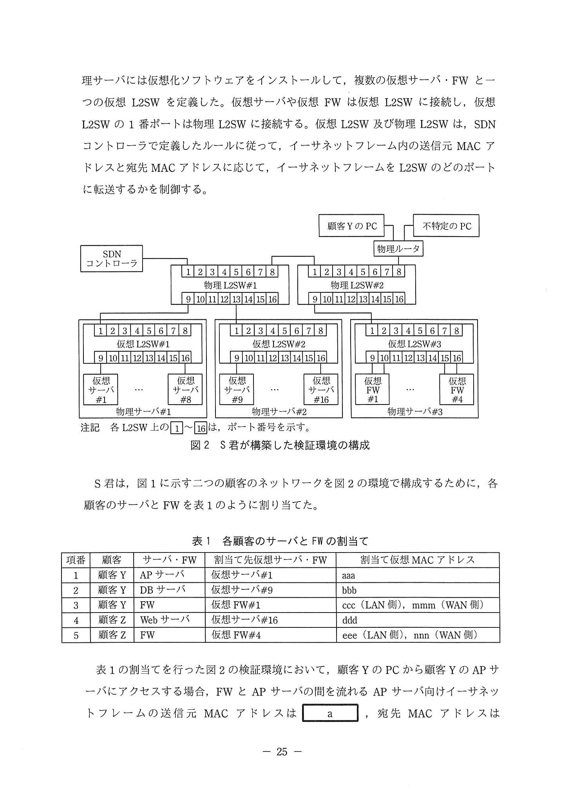

テキスト (OCR)

理サーバには仮想化ソフトウェアをインストールして, 複数の仮想サーバ・

FW と一

つの仮想 L2SW を定義した。仮想サーバや仮想 FW は仮想 L2SW に接続し, 仮想
L2SW の 1 番ポートは物理 L2SW に接続する。 仮想 L2SW 及び物理 L2SW は, SDN
コントローラで定義したルールに従って, イーサネットフレーム内の送信元 MAC ア
ドレスと宛先 MAC アドレスに応じて, イーサネットフレームを L2SW のどのポート
に転送するかを制御する。

コントロー

Nt

顧客YのPC

不特定の PC

Lil2[3[4]s[6[7[s]

Lilz[s]4[sl6[7]s]

物理L2SW#1

物理 L2SW#2

[9 [10] 11] 12] 13] 14] 15] 16]

[9 [xo] 13] 12]13]14[15] 16]

Llzlslalslelzls

Lil2[s[4]sle6[7[s]

Llglsllslelzlal

仮想L2SW#1

仮想 L2SW#2

仮想L2SW#3

| 1 [uo] 13] 12] 13[14] =

[9 hellzhslh4hslhel
|            |

|9 holulizhsh4lislhe|
LI            [I

仮想                   仮想          仮想                   仮想          仮想                   仮想
サーバ                 サーバ       サーバ                 サーバ         FW                    FW
#1                     #8            #9                    #16           #1                     #4
物理サーバ#1                       物理サーバ#2                       物理サーバ#3
注記 各L2SW 上の[|て[|は, ポート番号を示す。
図2 $君が構築した検証環境の構成

S 君は, 図 1 に示す二つの顧客のネットワークを図 2 の環境で構成するために, 各
顧客のサーバと FW を表 1 のように割り当てた。

表1 各顧客のサーバとFWの割当て
項番| 顧客     サーバ・FW | 割当て先仮想サーバ・FW       割当て仮想 MAC アドレス
1 | 顧客Y | AP サーバ     仮想サーバ#1              aaa
2 | 顧客Y | DB サーバ     仮想サーバ#9              bbb
3     顧客Y | Fw              仮想 FW#1                    ccc (LAN 側), mmm (WAN側)
4 | 顧客Z | Web サーバ    仮想サーバ#16             ddd
5 | 顧客Z|FW              仮想 FW#4                   eee (LAN 側), nnn (WAN 側)

表 1 の割当てを行った図 2 ORMERMICBWT, MEY O PC DSM YO AP +
ーバにアクセスする場合,FWW と AP サーバの間を流れる AP サーバ向けイーサネッ
トフレームの送信元 MAC アドレスは|  。 | , #4 MAC アドレスは

ー 25 一

### ページ 27

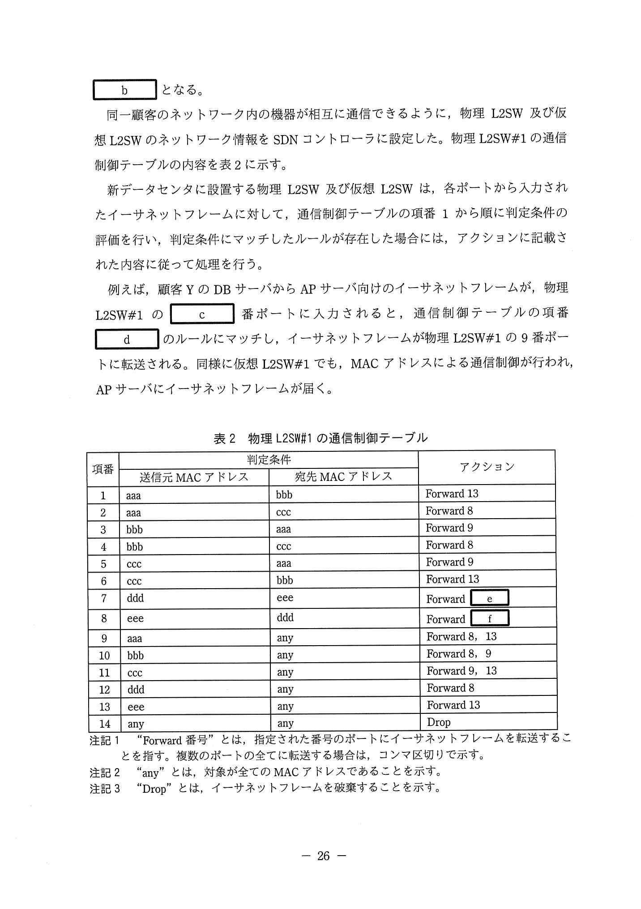

テキスト (OCR)

[| exe.

同一顧客のネットワーク内の機器が相互に通信できるように, WH L2SW ROK
想 L2SW のネットワーク情報を SDN コントローラに設定した。物理 L2SW#1 の通信
制御テーブルの内容を表 2 に示す。

新データセンタに設置する物理 L2SW 及び仮想 L2SW は, 各ポートから入力され
たイーサネットフレームに対して, 通信制御テーブルの項番 1 から順に判定条件の
評価を行い, 判定条件にマッチしたルールが存在した場合には, アクションに記載さ
れた内容に従って処理を行う。

例えば, 顧客 Y の DB サーバから AP サーバ向けのイーサネットフレームが, 物理
Lasw#1 の 番ポートに入力されると, 通信制御テーブルの項番
| 』 | のルールにマッチし, イーサネットフレームが物理 L2SW#1 の 9 番ポー
トに転送される。同様に仮想 L2SW#1 でも, MAC アドレスによる通信制御が行われ,
AP サーバにイーサネットフレームが届く。

表2 物理L2SW#1 の通信制御テーブル

判定条件                                                ショミ
"tt alga MAC 7 RUA     HMAC T RUA       Tere
1 | aaa                                      bbb                                     Forward 13
2 | aaa                                      ccc                                      Forward 8
3 | bbb                                           aaa                                           Forward 9
4 | bbb                                           ccc                                           Forward 8
5 | ccc                                      aaa                                      Forward 9
6 | ccc                                      bbb                                     Forward 13
7 | ddd                           eee                           Forward | 。 ]
8 | eee                                 ddd                                 Forward |    f    ]
9 | aaa                                  any                                 Forward 8, 13
10 | bbb                                 any                                 Forward 8, 9
11 | ccc                                  any                                 Forward 9, 13
12 | ddd                                     any                                     Forward 8
13 | eee                                     any                                     Forward 13
14 | any                                 any                                 Drop

注記1 “Forward 番号"とは, 指定された番号のポートにイーサネットフレームを転送するこ
とを指す。複数のポートの全てに転送する場合は, コンマ区切りで示す。

注記 2 “any” とは, 対象が全ての MAC アドレスであることを示す。

注記 3 “Drop” とは, イーサネットフレームを破棄することを示す。

ー 26 一

### ページ 28

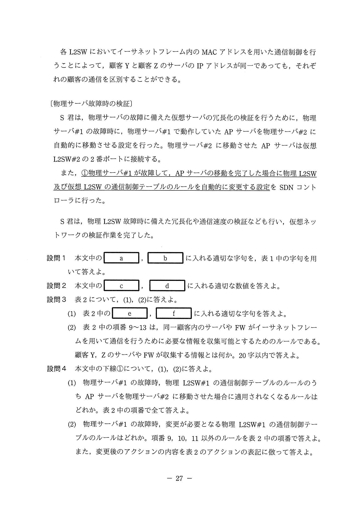

テキスト (OCR)

各 L2SW においてイーサネットフレーム内の MAC アドレスを用いた通信制御を行
ことによって, 顧客 Y と顧客 Z のサーバの IP アドレスが同一であっても, それぞ
れの顧客の通信を区別することができる。

〔物理サーバ故障時の検証

S Blk, 物理サーバの故障に備えた仮想サーバの冗長化の検証を行うために, 物理
サーバ#1 の故障時に, 物理サーバ#1 で動作していた AP サーバを物理サーバ参2 に
自動的に移動させる設定を行った。物理サーバ#2 に移動させた AP サーバは仮想
L2SW#2 の 2 番ポートに接続する。

また, ①物理サーバ#1 が故障して, AP サーバの移動を完了した場合に物理 L2SW
及び仮想 L2SW の通信制御テーブルのルールを自動的に変更する設定を SDN コント

ローラに符った。

S 君は, 物理 L2SW 故障時に備えた冗長化や通信速度の検証なども行い, 仮想ネッ
トワークの検証作業を完了した。

設問1 本文中の| a |,|  b |に入れる適切な字句を, 表 1中の字句を用
いて答えよ。

設問2 本文中の| c |, | dad |に入れる適切な数値を答えよ
設問3 表2 について, (1), (②)に答えよ。
ag 表2中の| ce |,[ £ |に入れる適切な字句を答えよ。
2) 表 2 中の項番 9こ13 は, 同一顧客内のサーバや FW がイーサネットフレー
ムを用いて通信を行うために必要な情報を収集可能とするためのルールである。
顧客 Y,、Z のサーバや FW が収集する情報とは何か。20 字以内で答えよ。
設問4 本文中の下線やについて, (1), ②)に答えよ。
GQ) 物理サーバ#1 の故障時, 物理 L2SW#1 の通信制御テーブルのルールのう
ち AP サーバを物理サーバ#2 に移動させた場合に適用されなくなるルールは
どれか。表 2 中の項番で全て答えよ。
(2) 物理サーバ#1 の故障時, 変更が必要となる物理 L2SW#1 の通信制御テー
ブルのルールはどれか。項番 9, 10, 11 以外のルールを表 2 中の項番で答えよ。
また, 変更後のアクションの内容を表 2 のアクションの表記に父って答えよ。

ー 27 一

### ページ 29

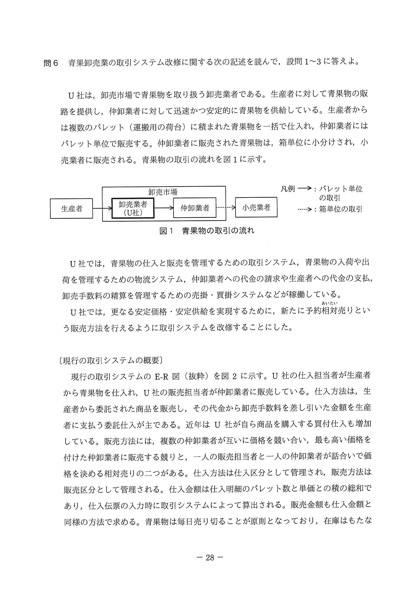

テキスト (OCR)

fal 6

青果卸売業の取引システム改修に関する次の記述を読んで, 設問 1一3 に答えよ。

U 社は, 卸売市場で青果物を取り扱う卸売業者である。生産者に対して青果物の販
路を提供し, 仲御業者に対して迅速かつ安定的に青果物を供給している。 生産者から
は複数のパレット (運搬用の荷台) に積まれた青果物を一括で仕入れ, 仲卸業者には
パレット単位で販売する。仲外業者に販売された青果物は, 箱単位に小分けされ, 小
売業者に販売される。青果物の取引の流れを図 1 に示す。

卸売市場                               凡例 —> : パレット単位

=                          の取引
生産者     ene    fees fp) 小売業者    > 1 GL OBE

図1 青果物の取引の流れ

U 社では, 青果物の仕入と販売を管理するための取引システム, 青果物の入荷や出
荷を管理するための物流システム, 仲卸業者への代金の請求や生産者への代金の支払,
卸売手数料の精算を管理するための売掛・買掛システムなどが稼働している。

あいたい

U 社では, 更なる安定価格・安定供給を実現するために, 新たに予約相対売りとい
う販売方法を行えるように取引システムを改修することにした。

〔現行の取引システムの概要)〕

現行の取引システムの E-R 図 (抜粋) を図 2 に示す。U 社の仕入担当者が生産者
から青果物を仕入れ, U 社の販売担当者が仲卸業者に販売している。仕入方法は, 生
産者から委託された商品を販売し, その代金から卸売手数料を差し引いた金額を生産
者に支払う委託仕入が主である。 近年は U 社が自ら商品を購入する買付仕入も増加
している。 販売方法には, 複数の仲邊業者が互いに価格を競い合い, 最も高い価格を
付けた仲卸業者に販売する競りと, 一人の販売担当者と一人の仲卸業者が話合いで価
格を決める相対売りの二つがある。仕入方法は仕入区分として管理され, 販売方法は
販売区分として管理される。仕入金額は仕入明細のパレット数と単価との積の総和で
あり, 仕入伝票の入力時に取引システムによって人算出される。販売金額も仕入金額と
同様の方法で求める。青果物は毎日売り切ることが原則となっており, 在庫はもたな

ー 28 一

### ページ 30

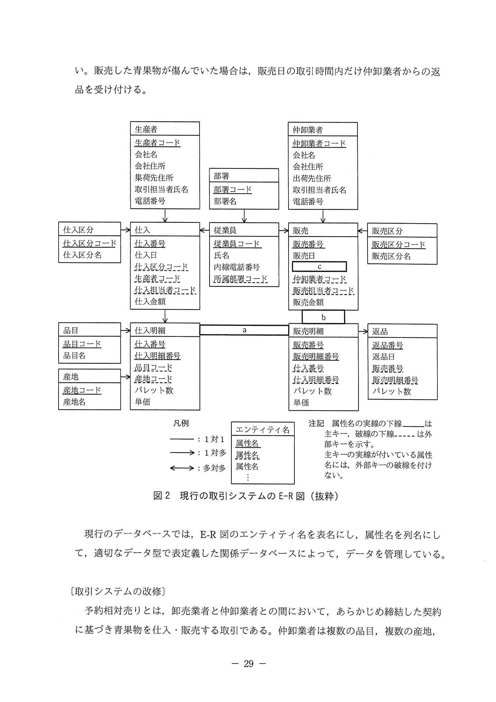

テキスト (OCR)

い。販売した青果物が傷んでいた場合は, 販売日の取引時間内だけ仲外業者からの返

品を受け付ける。
生産者                                 仲卸業者
生産者コード           仲外業者コード
会社名                 会社名
会社住所                会社住所
集荷先住所     部署        出荷先住所
取引担当者氏名   部署コード     取引担当者氏名
電話番号      部署名       電話番号
仕入区分     仕入      KH 従業中       販売      ke] 販売区分
仕入区分コード    tt 入番号         HEX   コード        Pee         販売区分コード
仕入区分名    仕入日       氏名                  販売区分名
仕入区分コード   内線電話番号
生産者コード    所属部署コード
仕入担当者コード
仕入金額                販売金額
!                                | » |
品目        トラ 仕入明細               a         販売明細       | 返品
品目コード    (LARS                eS      Ree
品目名      仕入明細番号              販売明細番号    返品日
唱且コード               HARES.      販売番号
産地          1 産地ユード                             仕入明細番号        取売明細番号
地コード       パレット数                       パレット数        パレット数
産地名      単価                  単価
凡例       Ee    注記 属性名の実線の下線-__ は
uy Pet 名        キキー, 破線の下線----- は外
PLAT | peg                部キーを示す。
ーータテ : 1対多 | 属性名              主キーの実線が付いている属性
< > 」多対多             名には, 外部キーの破線を付け

属性名

ない。

図2 現行の取引システムのE-R図 (抜粋)

現行のデータベースでは, E-R 図のエンティティ名を表名にし, 属性名を列名にし
て, 適切なデータ型で表定義した関係データベースによって, データを管理している。

[取引システムの改修
予約相対売りとは, 卸売業者と仲卸業者との間において, あらかじめ締結した契約
に基づき青果物を仕入・販売する取引である。 仲卸業者は複数の品目, 複数の産地

ー 29 一

### ページ 31

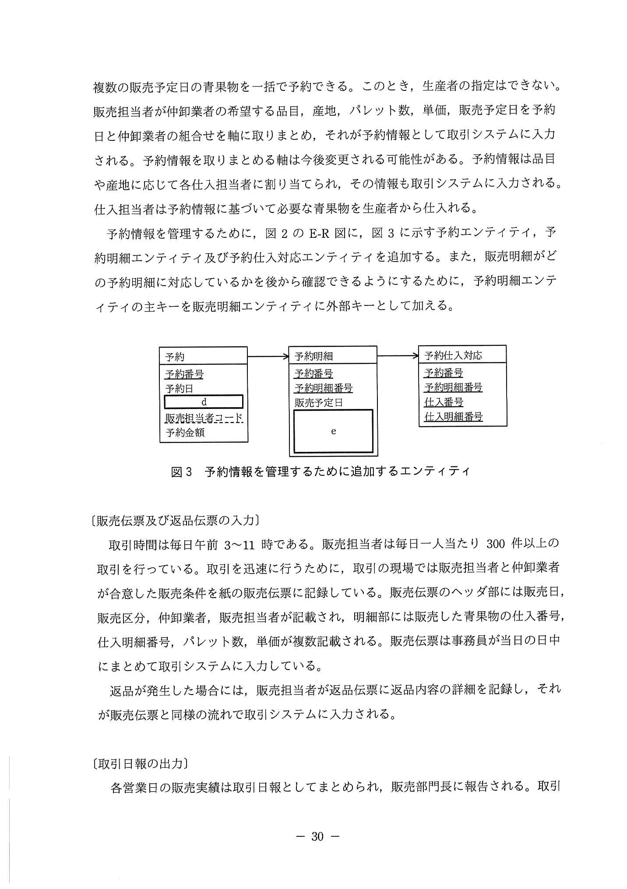

テキスト (OCR)

複数の販売予定日の青果物を一括で予約できる。このとき, 生産者の指定はできない。
販売担当者が仲卸業者の希望する品目, 産地, パレット数, 単価, 販売予定日を予約
日と仲卸業者の組合せを軸に取りまとめ, それが予約情報として取引システムに入力
される。予約情報を取りまとめる軸は今後変更される可能性がある。予約情報は品目
や産地に応じて各仕入担当者に割り当てられ, その情報も取引システムに入力される。
仕入担当者は予約情報に基づいて必要な青果物を生産者から仕入れる。

予約情報を管理するために, 図 2 の E-R 図に, 図 3 に示す予約エンテイティ, 予
約明細エンティティ及び予約仕入対応エンティティを追加する。 また, 販売明細がど
の予約明細に対応しているかを後から確認できるようにするために, 予約明細エンテ
イィティの主キーを販売明細エンティティに外部キーとして加える。

予約                         予約明細                     予約仕入対応
予約番号                予約番号                予約番号

[        d                    販売予定日                   仕入番号
販売担当者コード                                         仕入明細番号
予約金額                        e

図3 予約情報を管理するために追加するエンティティ

〔販売伝票及び返品伝票の入力〕

取引時間は毎日午前 3こ11 時である。販売担当者は毎日一人当たり 300 件以上の
取引を行っている。 取引を迅速に行うために, 取引の現場では販売担当者と仲卸業者

合意した販売条件を紙の販売伝票に記録している。 販売伝票のヘッダ部には販売日

販売区分, 仲卸業者, 販売担当者が記載され, 明細部には販売した青果物の仕入番号,
仕入明細番号, パレット数, 単価が複数記載される。販売伝票は事務員が当日の日中
にまとめて取引システムに入力している。

返品が発生した場合には, 販売担当者が返品伝票に返品内容の詳細を記録し, それ
が販売伝票と同様の流れで取引システムに入力される。

〔取引日報の出力〕
各営業日の販売実績は取引日報としてまとめられ, 販売部門長に報告される。 取引

ー 30 一

### ページ 32

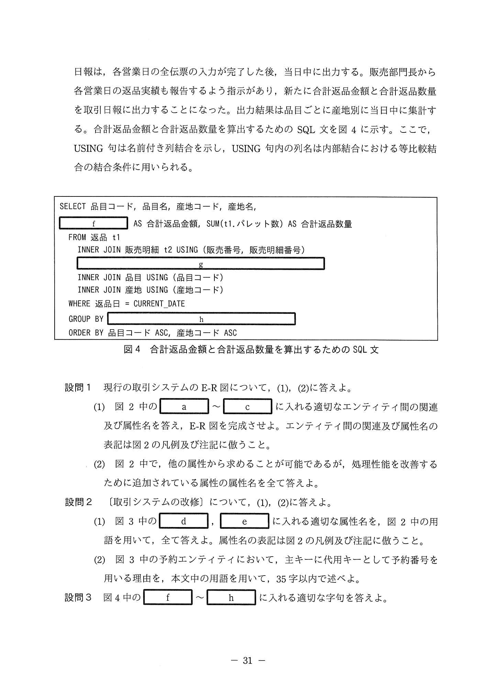

テキスト (OCR)

日報は, 各営業日の全伝票の入力が完了した後, 当日中に出力する。販売部門長から
各営業日の返品実績も報告するよう指示があり, 新たに合計返品金額と合計返品数量
を取引日報に出力することになった。出力結果は品目ごとに産地別に当日中に集計す

る。合計返品金額と合計返品数量を算出するための SQL 文を図 4 に示す。ここで,
USING 旬は名前付き列結合を示し, USING 旬内の列名は内部結合における等比較結
合の結合条件に用いられる。

SELECT 品目コード, 品目名, 産地コード, 産地名,
 AS 合計返品金額, SUM(t1.パレット数) AS 合計返品数量
FROM 返品 t1
INNER JOIN 販売明細 t2 USING (販売番号, 販売明細番号)
|           g           ]
INNER JOIN 品目 USING (品目コード)
INNER JOIN 産地 USING (産地コード)
WHERE 返品日 = CURRENT_DATE
GROUP BY [                 ]
ORDER BY 品目コード ASC, 産地コード ASC

図4 合計返品金額と合計返品数量を算出するための SLX

設問1 現行の取引システムの E-R 図について, (1), (2②)に答えよ。
Q①) 図 2 中の| ai |~| ic |に入れる適切なエンティティ間の関連
及び属性名を答え, E-R 図を完成させよ。 エンティティ間の関連及び属性名の
表記は図 2 の凡例及び注記に條うこと。
2) 図 2 中で, 他の属性から求めることが可能であるが, 処理性能を改善する
に追加されている属性の属性名を全て答えよ。
設問2 [取引システムの改修}】 について, (①⑪, ②に答えよ。
Qa 図3中の| da |,[  。 |に入れる適切な属性名を, 図 2 中の用
語を用いて, 全て答えよ。属性名の表記は図 2 の凡例及び注記に條うこと。
Q) 図 3 中の予約エンティティにおいて, 主キーに代用キーとして予約番号を
用いる理由を, 本文中の用語を用いて, 35 字以内で述べよ。
設問3 図4中の| f |~| on |に入れる適切な字句を答えよ。

ー 31 一

### ページ 33

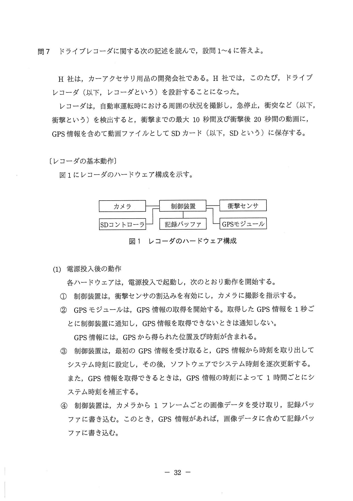

テキスト (OCR)

間7 ドライブレコーダに関する次の記述を読んで, 設問 1ー4 に答えよ。

H 社は, カーアクセサリ用品の開発会社である。H 社では, このたび, ドライブ
レコーダ (以下, レコーダという) を設計することになった。

レコーダは, 自動車運転時における周囲の状況を撮影し, 急停止, 衝突など (以下
衝撃という) を検出すると, 衝撃までの最大 10 秒間及び衝撃後 20 秒間の動画に
GPS 情報を含めて動画ファイルとして SD カード (以下SD という) に保存する。

[レコーダの基本動作〕
図 1にレコーダのハードウェア構成を示す。

| カメラ    制御装置   @eeyy |
|
Epコントローラト | 語録パッファ | HGPsEジュール|

図1 レコーダのハードウェア構成

①) 電源投入後の動作
各ハードウェアは, 電源投入で起動し, 次のとおり動作を開始する。
① 制御装置は, 衝撃センサの割込みを有効にし, カメラに撮影を指示する。
@ GPS モジュールは, GPS 情報の取得を開始する。取得した GPS 情報を 1 秒ご
に制御装置に通知し, GPS 情報を取得できないときは通知しない。
GPS 情報には, GPS から得られた位置及び時刻が含まれる。

@ 制御装置は, 最初の GPS 情報を受け取ると, GPS 情報から時刻を取り出して
システム時刻に設定し, その後, ソフトウェアでシステム時刻を乏次更新する。
また, GPS 情報を取得できるときは, GPS 情報の時刻によって 1 時間ごとにシ
ステム時刻を補正する。

④ 制御装置は. カメラから 1 フレームごとの画像データを受け取り, 記録バッ

に書き込む。このとき, GPS 情報があれば, 画像データに含めて記録バッ
に書き込む。

ー 32 一

### ページ 34

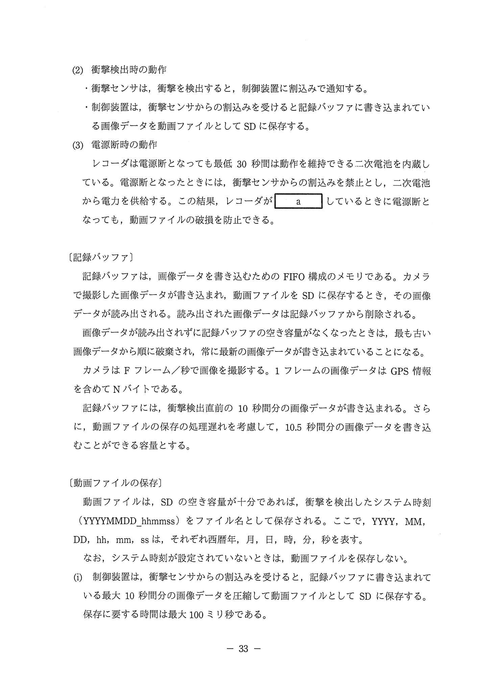

テキスト (OCR)

2) 衝撃検出時の動作
・ 衝撃センサは, 衝撃を検出すると, 制御装置に割込みで通知する。
・制御装置は, 衝撃センサからの割込みを受けると記録バツファに書き込まれてい
る画像データを動画ファイルとして SD に保存する。
(3) 電源断時の動作
レコーダは電源断となっても最低 30 秒間は動作を維持できる二次電池を内蔵し
ている。 電源断となったときには, 衝撃センサからの割込みを禁止とし, 二次電池
から電力を供給する。この結果。 レコーダが| sa | しているときに電源断と
なっても, 動画ファイルの破損を防止できる。

[記録バッファ]

記録バッファは, 画像データを書き込むための FTFO 構成のメモリである。カメラ
で撮影した画像データが書き込まれ, 動画ファイルを SD に保存するとき, その画像
データが読み出される。 読み出された画像データは記録バッファから削除される。

画像データが読み出されずに記録バッファの空き容量がなくなったときは, 最も古い
画像データから順に破棄され, 常に最新の画像データが書き込まれていることになる。

カメラは F フレームンプ秒で画像を撮影する。1 フレームの画像データは GPS 情報
を含めて N バイトである。

記録バッファには, PERKEHO 10 秒間分の画像データが書き込まれる。さら
に, 動画ファイルの保存の処理遅れを考慮して, 10.5 秒間分の画像データを書き込
むことができる容量とする。

(動画ファイルの保存〕
動画ファイルは, SD の空き容量が十分であれば, 衝撃を検出したシステム時刻
(YYYYMMDD hhmmss) をファイル名として保存される。ここで, YYYY, MM,
DD, hh, mm, ss は, それぞれ西暦年, A, 日, 時, 分, 秒を表す。
なお, システム時刻が設定されていないときは, 動画ファイルを保存しない。
G) 制御装置は, 衝撃センサからの割込みを受けると, 記録バッファに書き込まれて
いる最大 10 秒間分の画像データを圧縮して動画ファイルとして SD に保存する。
保存に要する時間は最大 100 ミリ秒である。

### ページ 35

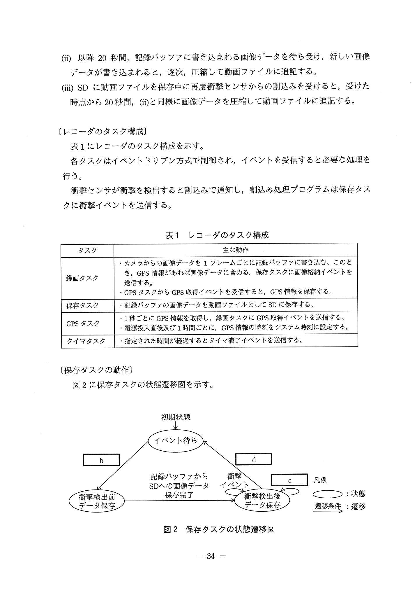

テキスト (OCR)

Gi) 以降 20 秒間, 記録バツファに書き込まれる画像データを待ち受け, 新しい画像
データが書き込まれると, BR, 圧縮して動画ファイルに追記する。

Gi) SD に動画ファイルを保存中に再度衝撃センサからの割込みを受けると, 受けた
時点から 20 秒間, と同様に画像データを圧縮して動画ファイルに追記する。

【レコーダのタスク構成

表1 にレコーダのタスク構成を示す。

各タスクはイベントドリブン方式で制御され, イベントを受信すると必要な処理を
行う。

衝撃センサが衝撃を検出すると割込みで通知し, 割込み処理プログラムは保存タス

クに衝撃イベントを送信する。

表1 レコーダのタスク構成
タスク                     主な動作

・カメラからの画像データを 1 フレームごとに記録バッファに書き込む。このと
き, GPS 情報があれば画像データに含める。保存タスクに画像格納イベントを

録画タスク

送信する。

・GPS タスクがから GPS 取得イベントを受信すると, GPS 情報を保存する。
保存タスク   ・記録バッファの画像データを動画ファイルとして SD に保存する。

.]秒ごとに    大   =   el re   送信する。
GPS タスク     1 秒ごとに GPS 情報を取得し, 録画タスクに GPS 取得イベントを送信する

・電源投入直後及び 1 時間ごとに, GPS 情報の時刻をシステム時刻に設定する。
タイマタスク    ・指定された時間が経務するとタイマ満プイベントを送信する。

〔保存タスクの動作〕
 2 に保存タスクの状態遷移図を示す。

初期状態

記録バッファから     衝撃

SDへの画像データニ イベント is
保存完了        てプア客加検軸後 マン ごこつ:状態
データ保存      bel: 軍移

図2 保存タスクの状態遷移図

ー 34 一

### ページ 36

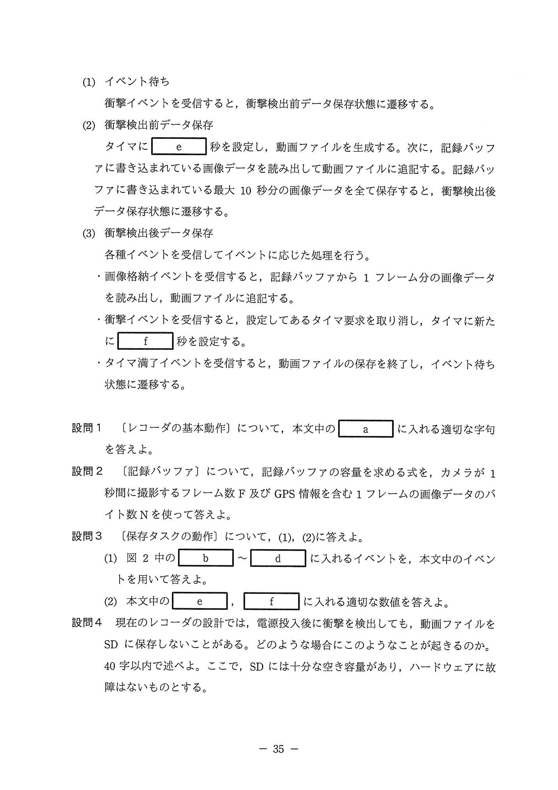

テキスト (OCR)

Q①) イベント待ち
和撃イベントを受信すると, 衝撃検出前データ保存状態に補移する。
(2) 衝撃検出前データ保存
タイマに|  e |秒を設定し, 動画ファイルを生成する。次に, 記録バッフ
ァに書き込まれている画像データを読み出して動画ファイルに追記する。記録バッ
ファに書き込まれている最大 10 秒分の画像データを全て保存すると, 和撃検出後
データ保存状態に須移する。
⑬ 衝撃検出後データ保存
各種イベントを受信してイベントに応じた処理を行う。
・ 画像格納イベントを受信すると, 記録バツファから 1 フレーム分の画像データ
を読み出し, 動画ファイルに追記する。
・ 衝撃イベントを受信すると, 設定してあるタイマ要求を取り消し, タイマに新た
に| f  ] 秒を設定する。
・タイマ満イイベントを受信すると, 動画ファイルの保存を終了し, イベント待ち
状態に須移する。

設問1 (レコーダの基本動作】について, 本文中の| a |] に入れる適切な字句
を答えよ。

設問2 【〔記録バッファ〕 について, 記録バッファの容量を求める式を, カメラが 1
秒間に撮彫するフレーム数F 及び GPS 情報を含む 1 フレームの画像データのバ
イト数N を使って答えよ。

設問3 [保存タスクの動作)】 について, (①, ②⑫)に答えよ。
Q 図 2 中の| pb |~|  q | に入れるイベントを, 本文中のイベン

トを用いて答えよ。

⑫) 本文中の|  e |, | f |に入れる適切な数値を答えよ。

設問4 現在のレコーダの設計では, 電源投入後に衝撃を検出しても, 動画ファイルを
SD に保存しないことがある。どのような場合にこのようなことが起きるのか。
40 字以内で述べよ。ここで, SD には十分な空き容量があり, ハードウェアに故
障はないものとする。

ー 35 一

### ページ 37

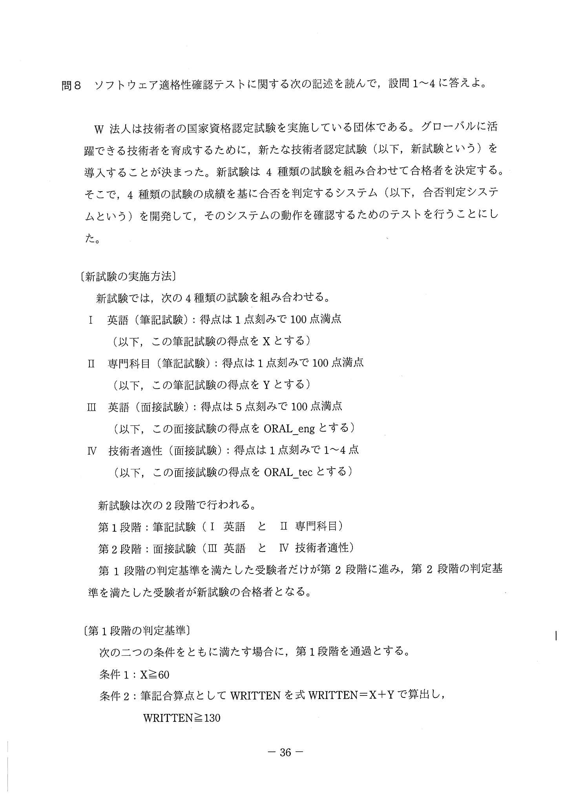

テキスト (OCR)

AIS ソフトウェア適格性確認テストに関する次の記述を読んで, 設問 1ユー4 に答えよ。

W 法人は技術者の国家資格認定試験を実施している団体である。グローバルに活
躍できる技術者を育成するために, 新たな技術者認定試験 (以下, 新試験という) を
導入することが決まった。新試験は 4 種類の試験を組み合わせて合格者を決定する。
そこで, 4 種類の試験の成績を基に合否を判定するシステム (以下, 合否判定システ
ムという) を開発して, そのシステムの動作を確認するためのテストを行うことにし
た。

〔新試験の実施方法]
新試験では, 次の 4 種類の試験を組み合わせる。

1 英語(筆記試験) : 得点は 1 点刻みで 100 点満点
(以下, この筆記試験の得点を XXとする)

H 専門科目 (筆記試験) : 得点は 1 点刻みで 100 点満点
(UE, この筆記試験の得点をY ETS)

I 英語 (面接試験) : 得点は 5 点刻みで 100 点満点
(以下, この面接試験の得点を ORAL eng とする)

IV 技術者適性 (面接試験) : 得点は 1 点刻みで 14 点
(以下, この面接試験の得点を ORAL tec とする)

新試験は次の 2 段階で行われる。

第 1 段階 : 筆記試験 (1 英語 と I 専門科目)

第2 段階 : 面接試験 (英語 と TV 技術者適性)

第 1 段階の判定基準を満たした受験者だけが第 2 段階に進み, 第 2 段階の判定基
準を満たした受験者が新試験の合格者となる。

(55 1 段階の判定基準〕
次の二つの条件をともに満たす場合に, 第1段階を通過とする。
条件 1 : X三60
条件 2 : 筆記合算点として WRITTEN を式 WRITTEN=X十Y で算出し,
WRITTEN2 130

ー 36 一

### ページ 38

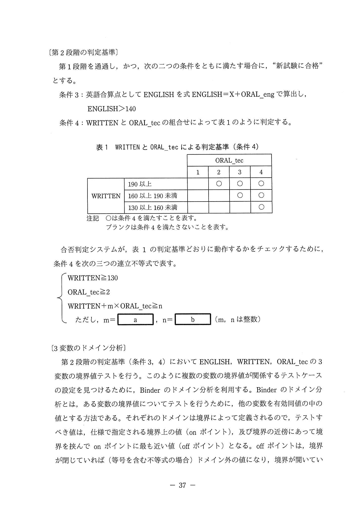

テキスト (OCR)

第 2 段階の判定基準〕
第 1段階を通過し, PO, 次の二つの条件をともに満たす場合に, “新試験に合格"
とする。
条件 3 : 英語合算点として ENGLISH を式 ENGLISH=X+ORAL_ eng で算出し,
ENGLISH>140
条件 4 : WRITTEN と ORAL tec の組合せによって表 1 のように判定する。

表1 WRITTEN と ORAL_tec による判定基準 (条件 4)

ORAL tec
1        2        3        4
190 以上                                O        O        O
WRITTEN | 160 以上 190 未満                        O      Oo
130 以上 160 未満                                 O

注記 〇は条件 4 を満たすことを表す。
プランクは条件 4 を満たさないことを表す。

合否判定システムが, 表 1 の判定基準どおりに動作するかをチェックするために,
条件 4 を次の三つの連立不等式で表す。
WRITTEN2130
ORAL_tec22
WRITTEN十mXORAL _tec2n
ただし, m=] a |, =| ob | (mnは整数)

(3 変数のドメイン分析]

第 2 段階の判定基準 (条件 3, 4) において ENGLISH, WRITTEN, ORAL tecの3
変数の境界値テストを行う。このように複数の変数の境界値が関係するテストケース
の設定を見つけるために, Binder のドメイン分析を利用する。Binder のドメイン分
析とは, ある変数の境界値についてテストを行うために, 他の変数を有効同値の中の
値とする方法である。それぞれのドメインは境界によって定義されるので, テストす
べき値は, 仕様で指定される境界上の値 (on ポイント), 及び境界の近傍にあって境
界を挟んで on ポイントに最も近い値 (off ポイント) ERS, off ポイントは, 境界
が閉じていれば (等号を含む不等式の場合) ドメイン外の値になり, 境界が開いてい

ー 37 一

### ページ 39

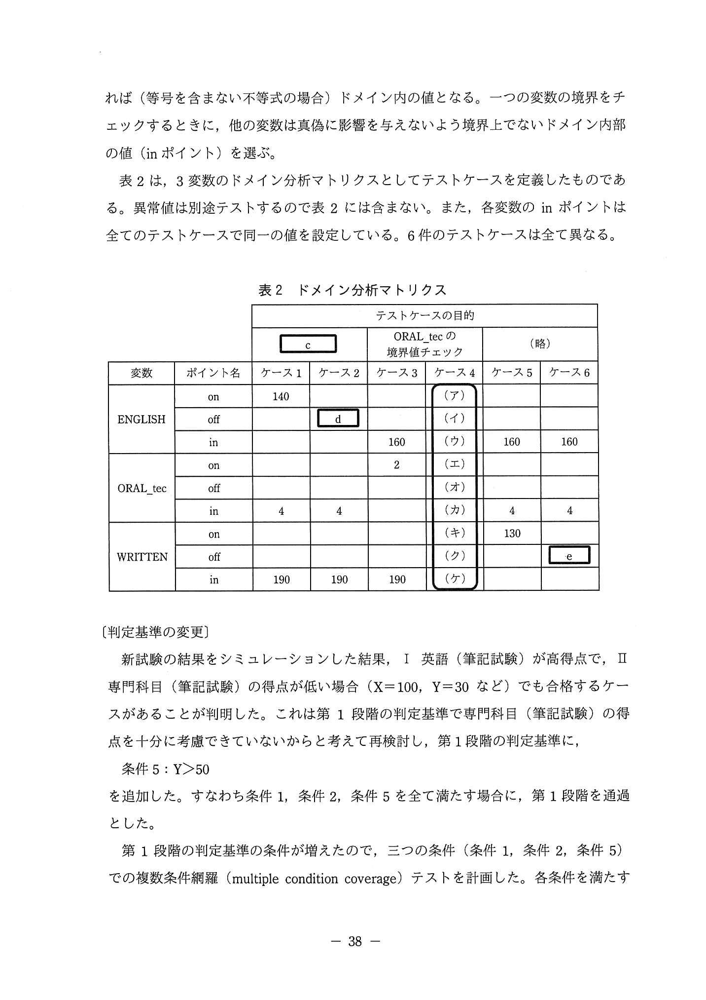

テキスト (OCR)

れば (等号を含まない不等式の場合) ドメイン内の値となる。一つの変数の境界をチ
ェックするときに, 他の変数は真偽に影響を与えないよう境界上でないドメイン内部
の値 Gn ポイント) を選ぶ。

表 2 は, 3 変数のドメイン分析マトリクスとしてテストケースを定義したものであ
る。 異常値は別途テストするので表 2 には含まない。 また, 各変数の in ポイントは
全てのテストケースで同一の値を設定している。6 件のテストケースは全て異なる。

表2 ドメイン分析マトリクス

テストケースの目的
      poreee         *
変数   ポイント名 | ケース 1 | ケース2 | ケース3 | ケース 4 | ケース5 | ケース6
on                140                                             (7)  ]
ENGLISH     of            La]          (4)
in  160 (9) 160160
on                                                   2             (x)
ORAL tec            off                                                                 (オ)
in    4   4      (カ)  4   4
on                                                                  (キ)            130
WRITTEN            of                                                                 (ク)                        Le_]
in 190 190 190 |{ (7) J
(判定基準の変更

新試験の結果をシミュレーションした結果, I 英語 (筆記試験) が高得点で, L
専門科目 (筆記試験) の得点が低い場合 (X=ニ100, Y=30 など) でも合格するケー
スがあることが判明した。これは第 1 段階の判定基準で専門科目 (筆記試験) の得
点を十分に考慮できていないからと考えて再検討し, 第 1 段階の判定基準に,

条件 5 : Y>50
を追加した。すなわち条件 1, 条件 2, 条件 5 を全て満たす場合に, 第 1 段階を通過
とした。

第 1 段階の判定基準の条件が増えたので, 三つの条件 (条件 1, 条件 2, 条件 5)
での複数条件網羅 (multiple condition coverage) テストを計画した。各条件を満たす

ー 38 一

### ページ 40

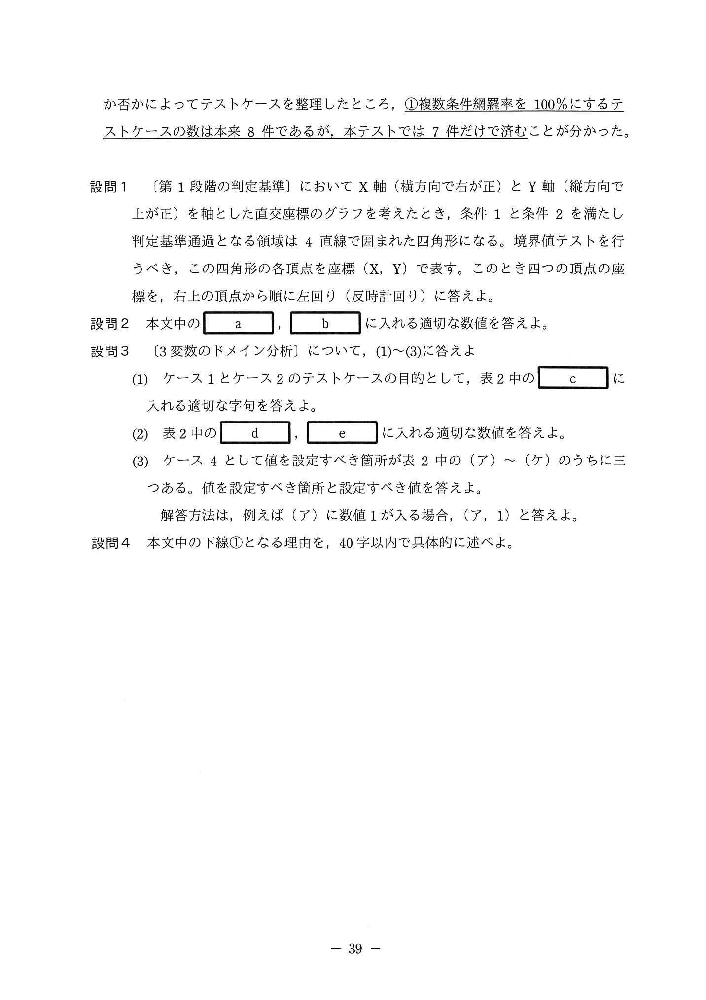

テキスト (OCR)

か否かによってテストケースを整理したところ, ①複数条件網羅率を 100%にするテ
ストケースの数は本来 8 件であるが, 本テストでは 7 件だけで済むことが分かった。

設問1 【第1段階の判定基準] において X Hh (横方向で右が正) とY軸 (縦方向で
EME) を軸とした直交座標のグラフを考えたとき, 条件 1 と条件 2 を満たし
判定基準通過となる領域は 4 直線で囲まれた四角形になる。境界値テストを行
うべき, この四角形の各頂点を座標 (X, Y) で表す。このとき四つの頂点の座
標を, 右上の頂点から順に左回り (反時計回り) に答えよ。
設問2 本文中の| a |,|  b |に入れる適切な数値を答えよ。
設問3 [3変数のドメイン分析〕】について, M-@KSAE
(① ケース 1 とケース 2 のテストケースの目的として, 表2中の| c |に
入れる適切な字句を答えよ。
2) Hato] da |,| e |に入れる適切な数値を答えよ。
3) ケース 4 として値を設定すべき人箇所が表 2 中の (ア) ~ (ケ) のうちに三
つある。値を設定すべき人箇所と設定すべき値を答えよ。
解答方法は, 例えば (ア) に数値 1 が入る場合,(ア, 1) と答えよ。
設問4 本文中の下線①となる理由を, 40 字以内で具体的に述べよ。

ー 39 一

### ページ 41

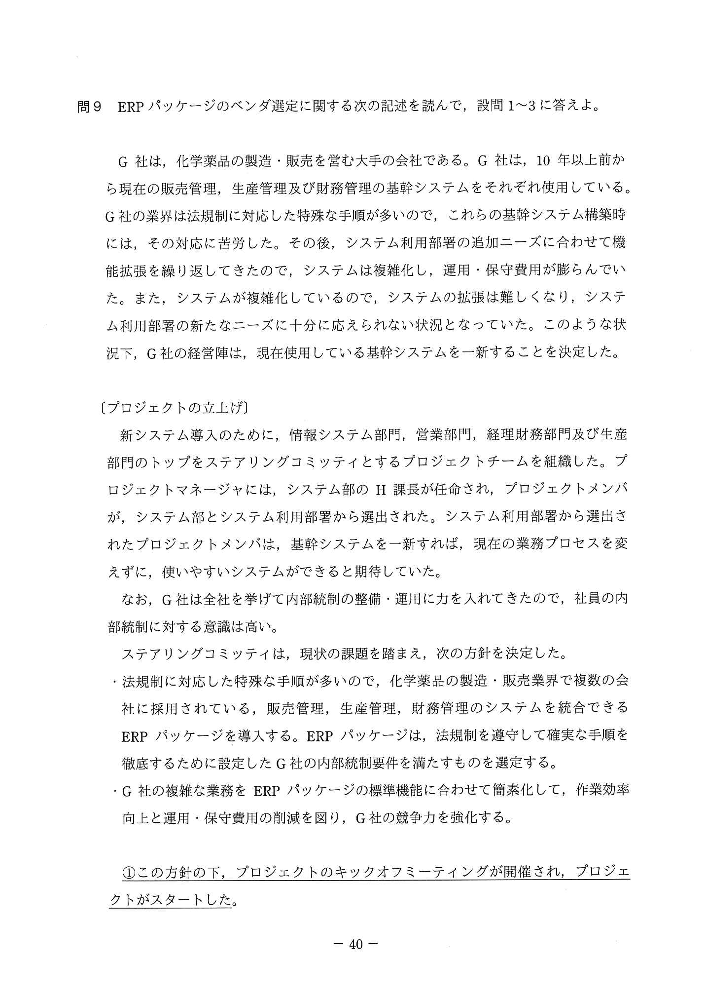

テキスト (OCR)

間9 ERP パッケージのベンタダ選定に関する次の記述を読んで, 設問 1ー3 に答えよ。

G 社は, 化学薬品の製造・販売を営む大手の会社である。G 社は, 10 年以上前か
ら現在の販売管理, 生産管理及び財務管理の基幹システムをそれぞれ使用している。
G 社の業界は法規制に対応した特殊な手順が多いので, これらの基幹システム構築時
には, その対応に苦労した。 その後, システム利用部署の追加ニーズに合わせて機
能拡張を繰り返してきたので, システムは複雑化し, 運用・保守費用が膨らんでい
た。また, システムが複雑化しているので, システムの拡張は難しくなり, VAT
ム利用部署の新たなニーズに十分に応えられない状況となっていた。このような状
WE, G 社の経営陣は, 現在使用している基幹システムを一新することを決定した。

【プロジェクトの立上げ〕

新システム導入のために, 情報システム部門, 営業部門, 経理財務部門及び生産
moトッフシスニアリングコミッッとするブロッュクトラームを提垢した
ロジェクトマネージャには, システム部の H 課長が任命され, プロジェクトメンバ
DB, システム部とシステム利用部署から選出された。システム利用部署から選出さ
れたプロジェクトメンバは, 基幹システムを一新すれば, 現在の業務プロセスを変
えずに, 使いやすいシステムができると期待していた。

なお, G 社は全社を挙げて内部統制の整備・運用に力を入れてきたので, 社員の内
部統制に対する意識は高い。

ステアリングコミッティは, 現状の課題を踏まえ, 次の方針を決定した。

・法規制に対応した特殊な手順が多いので, 化学薬品の製造・販売業界で複数の会

社に採用されている, 販売管理, 生産管理, 財務管理のシステムを統合できる

ERP パッケージを導入する。ERP パッケージは, 法規制を遵守して確実な手順を

徹底するために設定した G 社の内部統制要件を満たすものを選定する。

・G 社の複雑な業務を ERP パッケージの標準機能に合わせて簡素化して, 作業効率

向上と運用・保守費用の削減を図り, G社の競争力を強化する。

①この方針の下, プロジェクトのキックオフミーティングが開催され, プロジェ
クトがスタートした。

ー 40 一

### ページ 42

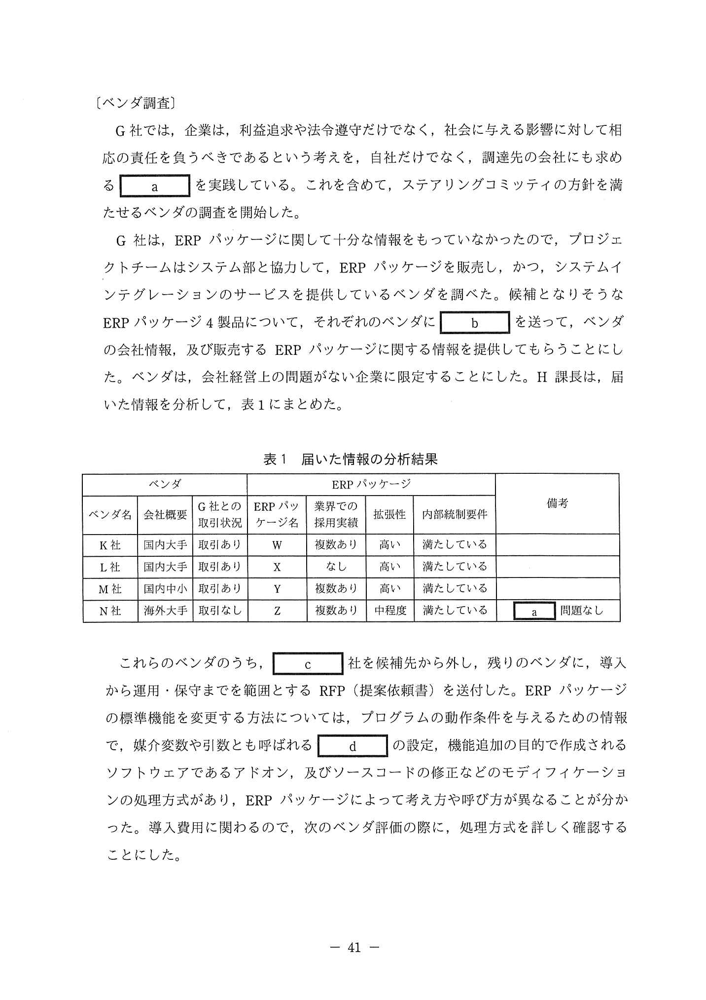

テキスト (OCR)

〔ベンダ調査

G 社では, 企業は, 利益追求や法令遵守だけでなく, 社会に与える影響に対して相
応の責任を負うべきであるという考えを, 自社だけでなく, 調達先の会社にも求め
る|  。』 |を実践している。これを含めて, ステアリングコミッティの方針を満
たせるベンダの調査を開始した。

G 社は, ERP パッケージに関して十分な情報をもっていなかったので, プロジェ
クトチームはシステム部と協力して, ERP パッケージを販売し, DO, システムイ
ンテグレーションのサービスを提供しているベンダを調べた。 候補となりそうな
ERP パッケージ 4 製品について, それぞれのベンダに|  b | を送って, ベンダ
の会社情報, 及び販売する ERP パッケージに関する情報を提供してもらうことにし
た。ベンダは, 会社経営上の問題がない企業に限定することにした。H 課長は, 届
いた情報を分析して, 表1にまとめた。

表1 届いた情報の分析結果

ベンダ                      ERP パッケージ

oo | ws    G 社との | ERP パッ | 業界での   時      備考
ベンダ名 | 会社概要 取引状況| ケージ名 | 採用実績 拡張性 | 内部統制要件

K社 | HAAS | 取引あり       複数あり | 高い | 満たしている

Ltt | 国内大手| 取引あり        なし   高い | 満たしている

M社 | 国内中小| 取引あり       複数あり | 高い | 満たしている

NIK] >| Ss

N社 | 海外大手| 取引なし      複数あり | 中程度 | 満たしている  [ ] 問題なし

これらのベンダのうち, |  c | 社を候補先から外し, 残りのペンダに, 導入
から運用・保守までを範囲とする RFP (HRM) を送付した。ERP パッケージ
の標準機能を変更する方法については, プログラムの動作条件を与えるための情報
で, 媒介変数や引数とも呼ばれる|  q  ] の設定, 機能追加の目的で作成される
ソフトウェアであるアドオン, 及びソースコードの修正などのモディフィケーショ
ンの処理方式があり, ERP パッケージによって考え方や呼び方が異なることが分か
った。 導入費用に関わるので, 次のベンダ評価の際に, 処理方式を詳しく確認する

にした。

= 導] 一

### ページ 43

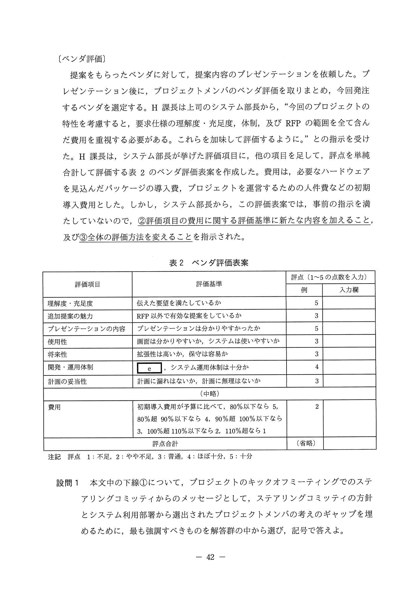

テキスト (OCR)

〔ベンタダ評価]

提案をもらったベンダに対して, 提案内容のプレゼンテーションを依頼した。プ
レゼンテーション後に, プロジェクトメンバのベンダ評価を取りまとめ, 今回発注
するベンダを選定する。H 課長は上司のシステム部長から, “今回のプロジェクトの
特性を考慮すると, 要求仕様の理解度・充足度, 体制及び RFP の範囲を全て含ん
だ費用を重視する必要がある。これらを加味して評価するように。” との指示を受け
た。H 課長は, システム部長が挙げた評価項目に, 他の項目を足して, 評点を単純
合計して評価する表 2 のベンタダ評価表案を作成した。費用は, 必要なハードウェア
を見込んだパッケージの導入費, プロジェクトを運営するための人件費などの初期
導入費用とした。しかし, システム部長から, この評価表案では, 事前の指示を満
たしていないので, ②評価項目の費用に関する評価基準に新たな内容を加えること,
及び③全体の評価方法を変えることを指示された。

表2 ベンダ評価表案

                _             評点 (1て5 の点数を入力)
評価項目                          評価基準
例         Av
理解度・充足度             伝えた要望を満たしているか                            5
追加提案の魅力       REP 以外で有効な提案をしているか           3
プレゼンテーションの内容 | プレゼンテーションは分かりやすかったか        5
使用性                       画面は分かりやすいか, システムは使いやすいか            3
将来性             拡張性は高いか, 保守は容易か                3
開発・運用体制       [し。 ] システム運用体制は十分か          4
計画の妥当性         計画に漏れはないか, 計画に無理はないか          3
(RR)
費用            初期導入費用が予算に比べて, 80%以下なら 5,     2
80%超 90%以下なら 4, 90%超 100%以下なら
3, 100%超 110%以下なら 2, 110%超なら1
評点合計                                (省略)

注記

設問 1

評点 1: 不足, 2 : やや不足, 3 : 普通, 4 : ほぼ十分, 5 : 十分

本文中の下線やについて, プロジェクトのキックオフミーティングでのステ

アリングコミッティからのメッセージとして, ステアリングコミッティの方針
とシステム利用部署から選出されたプロジェクトメンバの考えのギャップを埋

めるために, 最も強調すべきものを解答群の中から選び,

ー 42 一

記号で答えよ。

### ページ 44

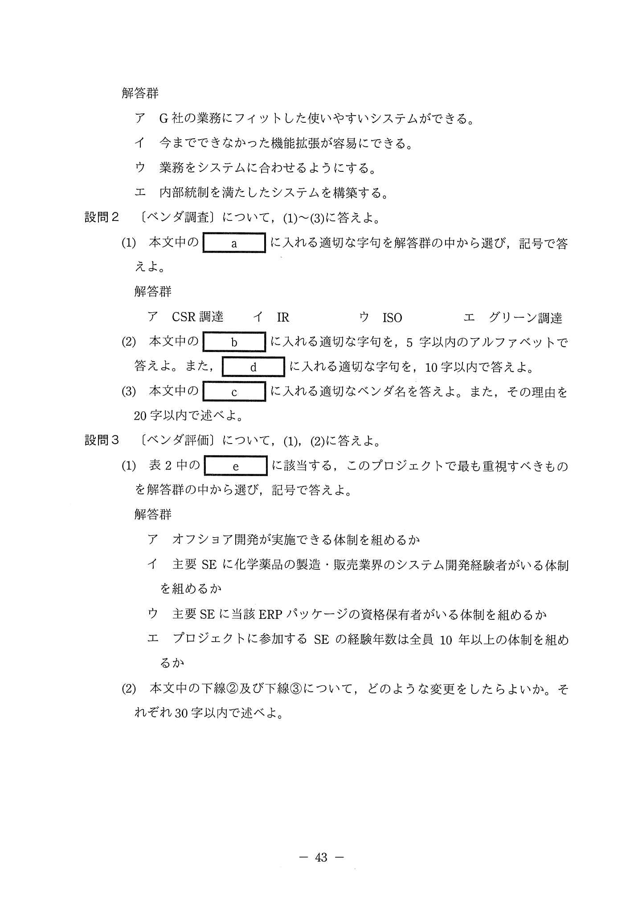

テキスト (OCR)

a
次
Ei

G 社の業務にフィットした使いやすいシステムができる。
今までできなかった機能拡張が容易にできる。
業務をシステムに合わせるようにする。
内部統制を満たしたシステムを構築する。
設問2 〔ベンダ調査] について, Q)て⑬)に答えよ。
(①) 本文中の| a | に入れる適切な字句を解答群の中から選び, ECR
えよ。
解答
ア CSR 調達   イ IR       ウ ISO      エ グリーン調達
@ 本文中の| b | に入れる適切な字句を, 5 宇以内のアルファベットで
答えよ。また, [a | に入れる適切な字句を, 10字以内で答えよ。
⑬ 本文中の| < | に入れる適切なペベンダ名を答えよ。また, その理由を
20 字以内で述べよ。
設問3 〔ベンダ評価] について, (), ②に答えよ。
Q①) 表2 中の| 。 | に該当する, このプロジェクトで最も重視すべきもの
を解答群の中から選び, 記号で答えよ。
eS HY
ア オフショア開発が実施できる体制を組めるか
イ 主要 SE に化学薬品の製造・販売業界のシステム開発経験者がいる体制
を組めるか
ウ 主要SEに当該ERP パッケージの資格保有者がいる体制を組めるか
エ プロジェクトに参加する SE の経験年数は全員 10 年以上の体制を組め
るか
2) 本文中の下線②及び下線@について, どのような変更をしたらよいか。そ
れぞれ30 字以内で述べよ。

Hoe AM

### ページ 45

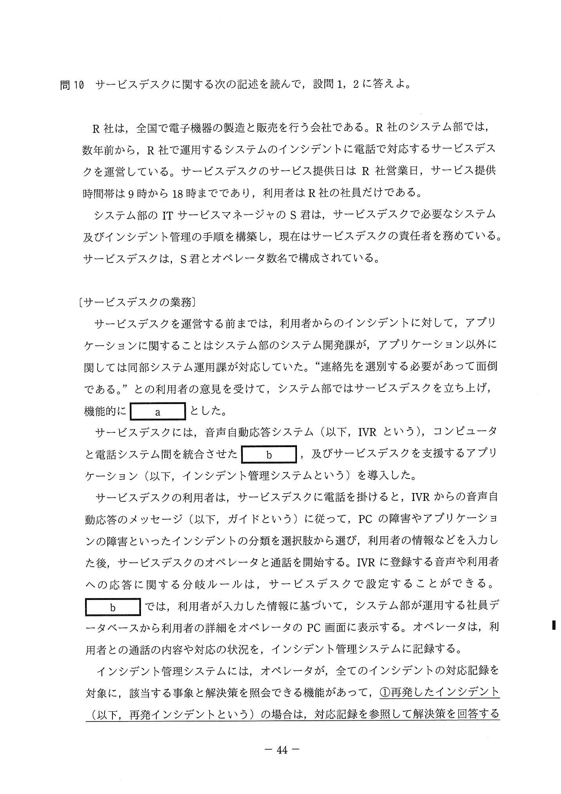

テキスト (OCR)

間 19 サービスデスクに関する次の記述を読んで, 設問 1, 2 に答えよ。

R 社は, 全国で電子機器の製造と販売を行う会社である。R 社のシステム部では
数年前から, R 社で運用するシステムのインシデントに電話で対応するサービスデス
クを運営している。サービスデスクのサービス提供日は R 社営業日, サービス提供
時間帯は 9 時から 18 時までであり, 利用者は R 社の社員だけである。

システム部の IT サービスマネージャの S Blk, サービスデスクで必要なシステム
及びインシデント管理の手順を構築し, 現在はサービスデスクの責任者を務めている。
サービスデスクは, S君とオペレータ数名で構成されている。

[サービスデスクの業務)

サービスデスクを運営する前までは, 利用者からのインシデントに対して, アプリ
ケーションに関することはシステム部のシステム開発課が, アプリケーション以外に
関しては同部システム運用課が対応していた。“軍絡先を選別する必要があって面倒
CHS." との利用者の意見を受けて, システム部ではサービスデスクを立ち上げ,
機能的に レート とした。

サービスデスクには, 音声自動応答システム (以下, IVR という), コンピュータ
シムWSSeトーー Apラーピステスクをますもアフ
ケーション (以下, インシデント管理システムという) を導入した。

サービスデスクの利用者は, サービスデスクに電話を掛けると, IVR からの音声自
動応答のメッセージ (以下,ガイドという) に従って, PC の障害やアプリケーショ
ンの障害といったインシデントの分類を選択肢から選び, 利用者の情報などを入力し
た後, サービスデスクのオペレータと通話を開始する。IVR に登録する音声や利用者
への応答に関する分岐ルールは, サービスデスクで設定することができる。
| b | では, 利用者が入力した情報に基づいて, システム部が運用する社員デ
ータベースからち利用者の詳細をオペレータの PC 画面に表示する。オペレータは。利
用者との通話の内容や対応の状況を, インシデント管理システムに記録する。

インシデント管理システムには, オペレータが, 全てのインシデントの対応記録を
iii, CATR EME, Mme
(以下, 再発インシデントという) の場合は, 対応記録を参照して解決策を回答する

ー 44 一

### ページ 46

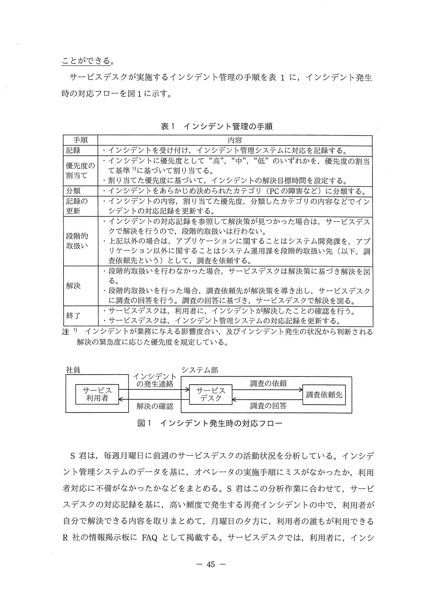

テキスト (OCR)

ととができる。
サービスデスクが実施するインシデント管理の手順を表 1 に, インシデント発生
時の対応フローを図 1 に示す。

表1 インシデント管理の手順
手順                   内容
記録   ・インシデントを受け付け, インシデント管理システムに対応を記録する。
優先度の ・インシデントに優先度として TR", “HR, “低" のいずれかを, 優先度の割当
促当て   CHEM )に差づいて吊り当てる。  ー   」     -
ー    ・割り当てた優先度に基づいて, インシデントの解決目標時間を設定する。
分類   ・インシデントをあらかじめ決められたカテゴリ (PC の障害など) に分類する。
記録の  ・インシデントの内容, 割り当てた優先度, 分類したカテゴリの内容などでイン
更新    シデントの対応記録を更新する。
・インシデントの対応記録を参照して解決策が見つかった場合は, サービスデス
クで解決を行うので, 段階的取扱いは行わない。

anne

ele  - 上記以外の場合は。 アプリケーションに関することはシステム開発課を. アプ
リケーション以外に関することはシステム較用課を役階的取扱い先 (以下, 調
村依頼先という) として, 調査を依頼する。
- 段階的取扱いを行わなかった場合, サービスデスクは解決策に基づき解決を図

、    Bs

解決 | .邊階的取扱いを行った場合 調査依頼先が解決策を導き出し, サービスデスク
に調査の回答を行う。調査の回答に基づき, サービスデスクで解決を図る。

ap | サービスメデスクは。利用者に。インシデントが解決したことの確認を行う。

・サービスデスクは, インシデント管理システムの対応記録を更新する。
注 リ インシデントが業務に与える影響度合い, 及びインシデント発生の状況から判断される
解決の緊急度に応じた優先度を規定している。

社員          _、  システム部
インシデント
サービス |ー| の発生連絡 | a_i
利用者            デスク           調査依頼先
解決の確認          調査の回答

図1 インシデント発生時の対応フロー

S Ald, 毎週月曜日に前週のサービスデスクの活動状況を分析している。インシデ
ント管理システムのデータを基に, オペレータの実施手順にミスがなかったか, 利用
者対応に不備がなかったかなどをまとめる。S 君はこの分析作業に合わせて, サービ
スデスクの対応記録を基に, 高い頻度で発生する再発インシデントの中で, 利用者が
自分で解決できる内容を取りまとめて, 月曜日の夕方に, 利用者の誰もが利用できる
R 社の情報掲示板に FAQ として掲載する。サービスデスクでは, 利用者に, インシ

— 45 一

### ページ 47

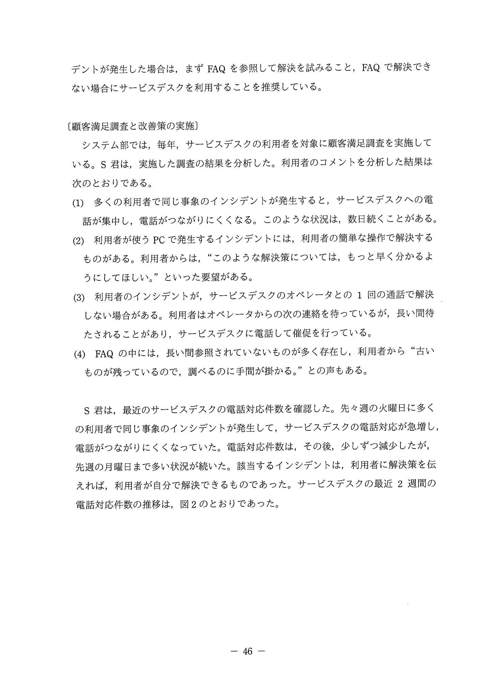

テキスト (OCR)

デントが発生した場合は, まず FAQ を参照して解決を試みること, FAQ で解決でき
ない場合にサービスデスクを利用することを推奨している。

[顧客満足調査と改善策の実施]
システム部では, 毎年, サービスデスクの利用者を対象に顧客満足調査を実施して

OS. 君は, 実施した調査の結果を分析した。 利用者のコメントを分析した結果は

次のとおりである。

(1) 多くの利用者で同じ事象のインシデントが発生すると, サービスデスクへの電
話が集中し, 電話がつながりにくくなる。このような状況は, 数日続くことがある。

(2) 利用者が使う PC で発生するインシデントには, 利用者の簡単な操作で解決する
ものがある。利用者からは, "このような解決策については, もっと早く分かるよ
うにしてほしい。” といった要望がある。

3) 利用者のインシデントが, サービスデスクのオペレータとの 1 回の通話で解決
しない場合がある。利用者はオペレータからの次の連絡を待っているが, RVG
たされることがあり, サービスデスクに電話して催促を行っている。

(4) FAQ の中には, 長い間参照されていないものが多く存在し, 利用者から “古い
ものが残っているので, 調べるのに手間が掛かる。” との声もある。

S Blk, 最近のサービスデスクの電話対応件数を確認した。先々週の火曜日に多く
の利用者で同じ事象のインシデントが発生して, サービスデスクの電話対応が急増し
電話がつながりにくくなっていた。電話対応件数は, その後, 少しずつ減少したが,
先週の月曜日まで多い状況が続いた。該当するインシデントは, 利用者に解決策を伝
えれば, 利用者が自分で解決できるものであった。サービスデスクの最近 2 週間の
電話対応件数の推移は, 図2 のとおりであった。

ー 46 一

### ページ 48

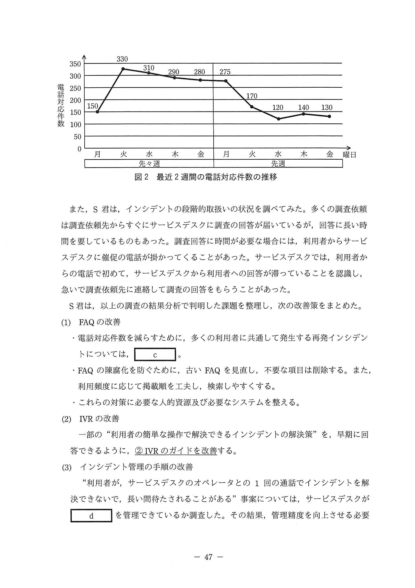

テキスト (OCR)

330
950              310 。
8 90 _ 280 | 275
電 250                  ‘
a 200  /         Xa
応  150/           NK 20 。 140 190
ie 150                       ーー ニーーー
数 100
50
) 月 kK kK kK 金| 月 火 水木 金 tee
|       先々週               先週       ]

図2 最近2週間の電話対応件数の推移

また, S 君は, インシデントの段階的取扱いの状況を調べてみた。多くの調査依頼
は調査依頼先からすぐにサービスデスクに調査の回答が届いているが, 回答に長い時
間を要しているものもあった。 調査回答に時間が必要な場合には, 利用者からサービ
スデスクに催促の電話が掛かってくることがあった。サービスデスクでは, 利用者か
らの電話で初めて, サービスデスクから利用者への回答が滞っていることを認識し
急いで調査依頼先に連絡して調査の回答をもらうことがあった。
S 君は, 以上の調査の結果分析で判明した課題を整理し, 次の改善策をまとめた。
(1) FAQ の改善
・電話対応件数を減らすために, 多くの利用者に共通して発生する再発インシデン
トについては, | <c |,
・FAQ の陳腐化を防ぐために, 古い FAQ を見直し, 不要な項目は削除する。 また,
利用頻度に応じて掲載順を工夫し, 検索しやすくする。
・これらの対策に必要な人的資源及び必要なシステムを整える。
(2) IVR の改善
一部の“利用者の簡単な操作で解決できるインシデントの解決策" を, 早期に回
答できるように, ②TIVR のガイドを改善する。
3) インシデント管理の手順の改善
“利用者が, サービスデスクのオペレータとの 1 回の通話でインシデントを解
決できないで, 長い間待たされることがある" 事案については, サービスデスクが
| 』 | を管理できているか調査した。その結果, 管理精度を向上させる必要

ー 47 一

### ページ 49

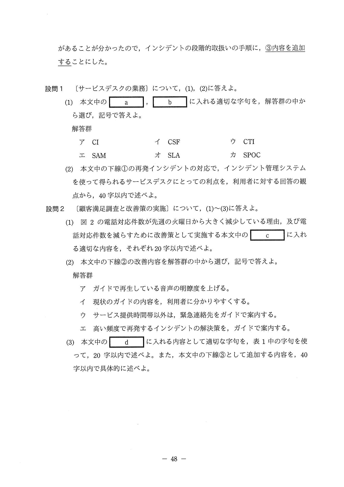

テキスト (OCR)

があることが分かったので, インシデントの段階的取扱いの手順に, ③内容を追加
することにした。

設問1 〔サービスデスクの業務〕 について, (1), KAA,

a 本文中の| a |, |  b |に入れる適切な字句を, 解答群の中か
ら選び, 記号で答えよ。

解答群
ア CI       イ CSF      ウ CTI
= SAM      オ SLA      A” SPOC

2) 本文中の下線①の再発インシデントの対応で. インシデント管理システム
を使って得られるサービスデスクにとっての利点を, 利用者に対する回答の観
点から, 40 字以内で述べよ。

設問2 [顧客満足調査と改善策の実施] について, ①て⑬に答えよ。

(1) 図 2 の電話対応件数が先週の火曜日から大きく減少している理由, 及び電
話対応件数を減らすために改善人策として実施する本文中の| < | に入れ
る適切な内容を, それぞれ 20 字以内で述べよ。

2) 本文中の下線@の改善内容を解答群の中から選び,
解答衝

ア ガイドで再生している音声の明瞭度を上げる。
イ 現状のガイドの内容を, 利用者に分かりやすくする。

ウ サービス提供時間帯以外は 緊急連絡先をガイドで案内する。

エエ 高い頻度で再発するインシデントの解決策を, ガイドで案内する。

⑬ 本文中の| a | に入れる内容として適切な字旬を, 表 1 中の字句を合
って, 20 字以内で述べよ。 また, 本文中の下線@として追加する内容を, 40
字以内で具体的に述べよ。

ul

US CBA.

— 48 一

### ページ 50

テキスト (OCR)

C

メ モ 用  )

ー 49 一

### ページ 51

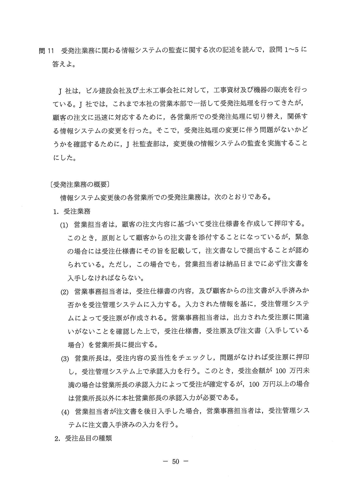

テキスト (OCR)

間11 受発注業務に関わる情報システムの監査に関する次の記述を読んで, 設問 1ー5 に

答えよ。

J tlt, ビル建設会社及び土木工事会社に対して, 工事資材及び機器の販売を行っ
ている。 J HC, これまで本社の営業本部で一括して受発注処理を行ってきたが
顧客の注文に迅速に対応するために, 各営業所での受発注処理に切り替え, 関係す
る情報システムの変更を行った。そこで, 受発注処理の変更に伴う問題がないかど
うかを確認するために, 社監査部は, 変更後の情報システムの監査を実施すること
にした。

[受発注業務の概要〕
情報システム変更後の各営業所での受発注業務は, ROLE) CHS,
1. 受注業務

Q) 営業担当者は, 顧客の注文内容に基づいて受注仕様書を作成して押印する。
このとき, 原則として顧客からの注文書を添付することになっているが, 緊急
の場合には受注仕様書にその旨を記載して, 注文書なしで提出することが認め
らちられている。ただし, この場合でも, 営業担当者は納品日までに必ず注文書を
入手しなければならない。

Q) 営業事務担当者は, 受注仕様書の内容, 及び顧客からの注文書が入手済みか
否かを受注管理システムに入力する。入力された情報を基に, 受注管理システ
ムによって受注束が作成される。 営業事務担当者は, 出力された受注票に間違
いがないことを確認した上で, 受注仕様書, 受注束及び注文書 (入手している
場合) を営業所長に提出する。

3) 営業所長は, 受注内容の妥当性をチェックし, 問題がなければ受注票に押印
し, 受注管理システム上で承認入力を行う。このとき, 受注金額が 100 万円未
満の場合は営業所長の承認入力によって受注が確定するが, 100 万円以上の場合
は営業所長以外に本社営業部長の承認入力が必要である。

(4) 営業担当者が注文書を後日入手した場合, 営業事務担当者は, 受注管理シス
テムに注文書入手済みの入力を行う。

2. 受注品目の種類

ー 50 一

### ページ 52

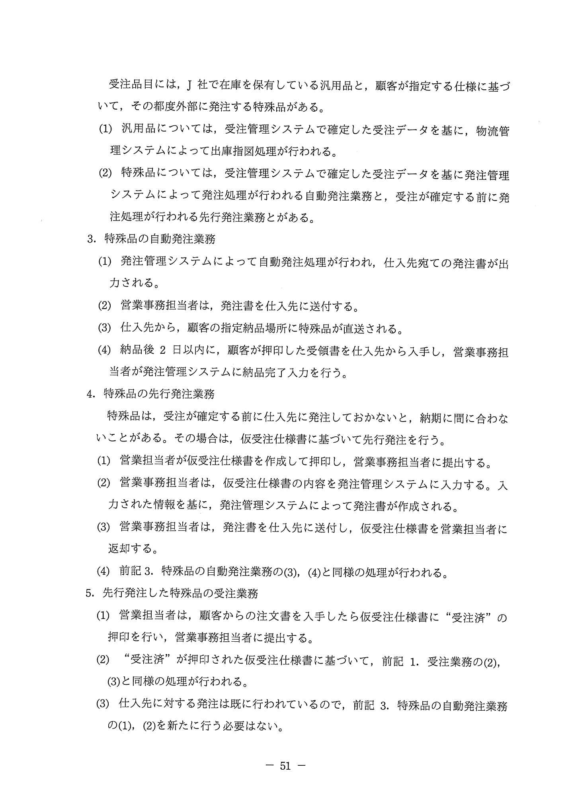

テキスト (OCR)

受注品目には, J] 社で在庫を保有している汎用品と, 顧客が指定する仕様に基づ
いて, その都度外部に発注する特殊品がある。

Q①) 汎用品については, 受注管理システムで確定した受注データを基に, WIRE
理システムによって出庫指図処理が行われる。

(2) 特殊品については, 受注管理システムで確定した受注データを基に発注管理
システムによって発注処理が行われる自動発注業務と, 受注が確定する前に発
注処理が行われる先行発注業務とがある。

3. 特殊品の自動発注業務

①) 発注管理システムによって自動発注処理が行われ, 仕入先宛ての発注書が出
力される。

(2) 営業事務担当者は, 発注書を仕入先に送付する。

(3) 仕入先から, 顧客の指定納品場所に特殊品が直送される。

(4) 納品後 2 日以内に, 顧客が押印した受領書を仕入先から入手し, 営業事務担
当者が発注管理システムに納品完了入力を行う。

4. 特殊品の先行発注業務
特殊品は, 受注が確定する前に仕入先に発注しておかないと, 納期に問に合わな
いことがある。 その場合は, 仮受注仕様書に基づいて先行発注を行う。

(1) 営業担当者が仮受注仕様書を作成して押印し, 営業事務担当者に提出する。

(② 営業事務担当者は, 仮受注仕様書の内容を発注管理システムに入力する。入
力された情報を基に, 発注管理システムによって発注書が作成される。

(3) 営業事務担当者は, 発注書を仕入先に送付し, 仮受注仕様書を営業担当者に
返却する。

(4) 前記 3. 特殊品の自動発注業務の(3), (④と同様の処理が行われる。

5. 先行発注した特殊品の受注業務

(1) 営業担当者は, 顧客からの注文書を入手したら仮受注仕様書に“受注済" の
押印を行い, 営業事務担当者に提出する。

(2) “受注済" が押印された仮受注仕様書に基づいて, 前記 1. 受注業務の(②),
③と同様の処理が行われる。

(8) 仕入先に対する発注は既に行われているので, 前記 3. 特殊品の自動発注業務
の①, ②⑫)を新たに行う必要はない。

ー 時

### ページ 53

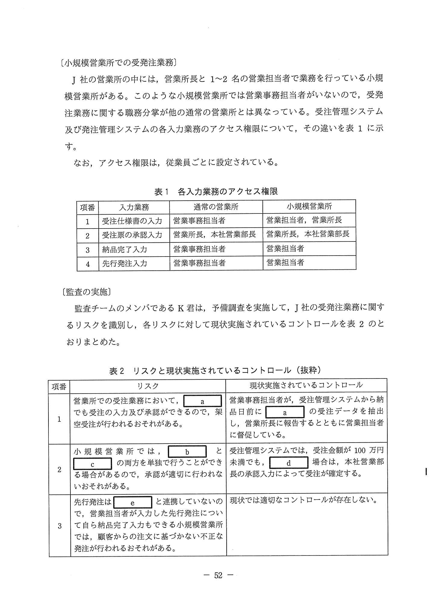

テキスト (OCR)

〔小規模営業所での受発注業務)

 社の営業所の中には, 営業所長と 1ご2 名の営業担当者で業務を行っている小規
模営業所がある。このような小規模営業所では営業事務担当者がいないので, BH
注業務に関する職務分堂が他の通常の営業所とは異なっている。受注管理システム
及び発注管理システムの各入力業務のアクセス権限について, その違いを表 1 に示
す。

なお, アクセス権限は, 従業員ごとに設定されている。

Rl 各入力業務のアクセス権限
項番   入力業務      通常の営業所      小規模営業所
1 | 受注仕様書の入力 | 営業事務担当者     営業担当者, 営業所長
2 | 受注票の承認入力 | 営業所長, 本社営業部長 | 営業所長, 本社営業部長
3 | 納品完了入力   営業事務担当者     営業担当者
4 | 先行発注入力   営業事務担当者     営業担当者
[監査の実施〕

監査チームのメンバである KAS, 予備調査を実施して, | 社の受発注業務に関す
るリスクを識別し, 各リスクに対して現状実施されているコントロールを表 2 のと
おりまとめた。

表2 リスクと現状実施されているコントロール (抜粋)

項番

リスク

現状実施されているコントロール

営業所での受注業務において
でも受注の入力及び承認ができるので, B
空受注が行われるおそれがある。

営業事務担当者が, 受注管理システムから納
品日前に     の受注データを抽出
し, 営業所長に報告するとともに営業担当者
ICPHEUTWS,

小規模営業所では, | b | と

 の両方を単独で行うことができ

る場合があるので, 承認が適切に行われな
いおそれがある。

受注管理システムでは, 受注金額が 100 万円
未満でも,     場合は, 本社営業部
長の承認入力によって受注が確定する。

先行発注は      と連携していないの
で, 営業担当者が入力した先行発注につい
て自ら納品完了入力もできる小規模営業所
では, 顧客からの注文に基づかない不正な
発注が行われるおそれがある。

現状では適切かコントロールが存在しない。

ー 52

### ページ 54

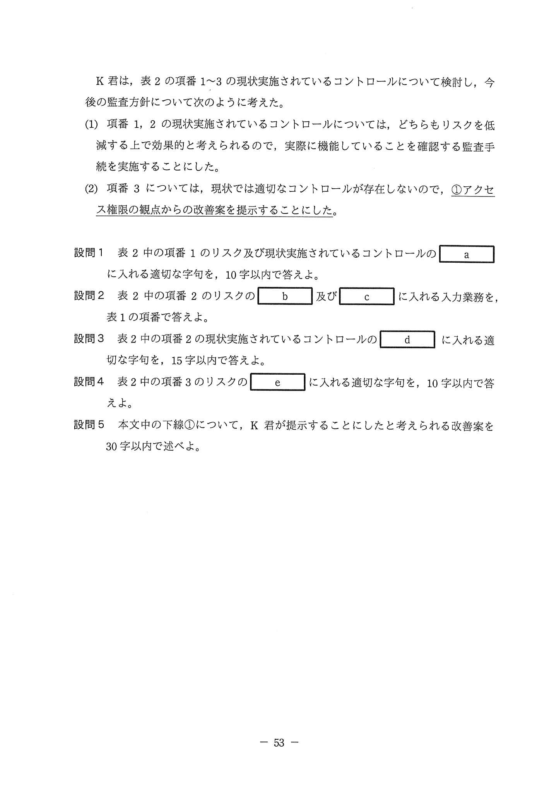

テキスト (OCR)

K 君は, 表 2 の項番 1ご3 の現状実施されているコントロールについて検討し, 今

後の監査方釘について次のように考えた。

GQ) 項番 1, 2 の現状実施されているコントロールについては, どちらもリスクを低
減する上で効果的と考えられるので, 実際に機能していることを確認する監査手
続を実施することにした。

(2) 項番 3 については, 現状では適切なコントロールが存在しないので, ①アクセ
ス権限の観点からの改善案を提示することにした。

設問1 表 2 中の項番 1 のリスク及び現状実施されているコントロールの| 』 |
に入れる適切な字句を, 10 字以内で答えよ。

設問2 表 2 中の項番 2 のリスクの| vb |及び| c |に入れる入力業務を,
表 1 の項番で答えよ。

設問3 表2中の項矯 2 の現状実施されているコントロールの|  d | に入れる適
切な字句を, 15 字以内で答えよ。

設問4 表2 中の項番3 のリスクの| ce | に入れる適切な字句を, 10字以内で答
えよ

設問5 本文中の下線〇について, K 君が提示することにしたと考えられる改善案を
30 字以内で述べよ。

ー 53 一

### ページ 55

テキスト (OCR)

【

x モ 用 紙 J

— 54 一

### ページ 56

テキスト (OCR)

【

x モ 用 紙 )

ー 55, —

### ページ 57

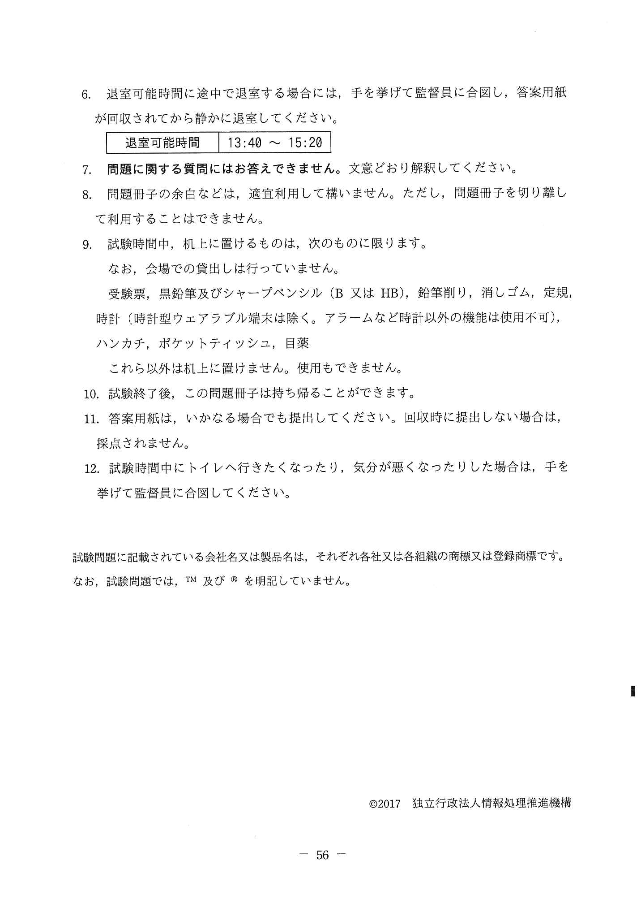

テキスト (OCR)

6. 退室可能時間に途中で退室する場合には, 手を挙げて監督貞に合図し, SRAM
が回収されてから静かに退室してください。
退室可能時間 | 13:40 ~ 15:20
7. 問題に関する質問にはお答えできません。文意どおり解釈してください。
8. 問題周子の余白などは, 適宜利用して構いません。ただし, 問題冊子を切り離し
て利用することはできません。
9. 試験時間中, 机上に置けるものは, 次のものに限ります。
なお, 会場での貸出しは行っていません。
受験票, 黒鯛筆及びシャープペンシル (B 又は HB), 鉛筆削り, 消しゴム, 定規,
時計 (時計型ウェアラブル端末は除く。アラームなど時計以外の機能は使用不可),
ハンカチ, ポケットティッシュ, 目薬
これら以外は机上に置けません。使用もできません。
10. 試験終了後, この問題民子は持ち帰ることができます。
ll. 答案用紙は, いかなる場合でも提出してください。 回収時に提出しない場合は,
採点されません。
12. 試験時間中にトイレへ行きたくなったり, 気分が悪くなったりした場合は, FE
挙げて監督具に合図してください。

試験問題に記載されている会社名又は製品名は, それぞれ各社又は各組織の商標又は登録商標です。
なお, 試験問題では, ™ RU ® を明記していません。

@2017 独立行政法人情報処理推進機構

ー 56 一

---

## 午後解答

1/6 
©2017 独立行政法人情報処理推進機構 
平成29 年度 秋期 応用情報技術者試験 解答例 
 
午後試験 
問１ 
出題趣旨 
 個人情報保護法の改正によって，個人情報及びプライバシを保護しつつ，匿名化されたパーソナルデータの
利活用を図ることが注目されている。 
 本問では，個人情報の取扱いを題材に，暗号やハッシュ関数に関する基本的な知識の応用について問う。 
 
設問 
解答例・解答の要点 
備考 
設問１(1)
a
販売 
 
(2)
b
ア 
 
 
 
c
エ 
 
 
(3) 削除された暗号化鍵で暗号化されたバックアップデータを復号できない。 
 
 
(4) 会員番号となり得る全数字列を同じハッシュ関数で変換して突き合わせる。 
 
設問２(1)
d
イ 
 
 
(2)
e
意図しない宛先 
 
 
問２ 
出題趣旨 
 昨今，競争環境が厳しくなっており，企業が生き残るためには，外部環境や内部環境を正確に把握した上で
の経営戦略策定が重要になっている。 
 本問では，電子部品製造業の経営戦略策定を題材に，財務諸表に基づく財務分析，利益を確保して成長を目
指すための経営戦略の立案，設備投資案の策定の理解について問う。 
 
設問 
解答例・解答の要点 
備考 
設問１ 
顧客企業の市場寡占化によって，値下げ要求が強まる。 
設問２(1)
a
185 
 
(2)
b
81 
 
 
(3) ウ 
 
設問３(1)
c
イ 
 
 
 
d
エ 
 
 
(2) 医療機器の小型化ニーズに対して，強みの微細加工技術で差別化する。 
 
設問４(1)
e
エ 
 
 
(2) 内部利益率が資本コストを上回るのは案2 だけだから

2/6 
©2017 独立行政法人情報処理推進機構 
問３ 
出題趣旨 
 ある種の組合せ最適化問題に対しては，動的計画法（Dynamic Programming）と呼ばれる手法を用いると，効
率よく最適解を見つけることができる。 
 本問では，ナップザック問題を題材に，動的計画法の基本的な考え方，実装方法，及びその計算量の考え方
について問う。 
 
設問 
解答例・解答の要点 
備考 
設問１(1) ア
6
 
 
イ
9
 
 
ウ
12
 
 
エ
15
 
(2) A（ 0 ），B（ 1 ），C（ 1 ） 
設問２ 
オ
t－size[s] 
 
 
カ
maxvalue[t] 
 
 
キ
choice[k] 
 
 
ク
maxvalue[V] 
設問３ 
ケ
NV 
 
問４ 
出題趣旨 
 昨今，インターネットで提供している様々なサービスを，WebAPI を介してコンピュータから利用できるよう
にすることが定着しつつある。また，スマートフォンのアプリケーションからクラウドサービスを利用する際
に，WebAPI を介して連携するケースも多い。 
 本問では，健康機器からのクラウドサービスの利用を題材に，WebAPI に関する基本的な理解について問う。
 
設問 
解答例・解答の要点 
備考 
設問１ 
愛称，ユーザID，パスワード 
設問２ 
設計方針
WebAPI へのアクセスは，全てHTTPS を用いて行う。 
 
 
理由 
HTTP だと盗聴される危険があるから 
設問３(1)
a
計測データ登録 
 
(2)
b
イ 
 
 
 
c
ウ 
 
 
(3)
d
DELETE 
 
 
 
e
GET 
 
 
(4)
f
－ 
 
 
 
g
計測日時，計測値 
 
設問４ 
HTTP ステータスを400 で返す。

3/6 
©2017 独立行政法人情報処理推進機構 
問５ 
出題趣旨 
 昨今，情報システムを迅速かつ柔軟に構築するために，サーバの仮想化技術とともに，ネットワーク機器や
配線を仮想化しソフトウェアで制御するSDN（Software-Defined Networking）が着目されている。 
 本問では，IaaS を提供するサービスプロバイダを題材に，SDN に対応したレイヤ2 スイッチでの通信制御の
仕組みに関する基本的な理解について問う。 
 
設問 
解答例・解答の要点 
備考 
設問１ 
a
ccc 
 
b
aaa 
設問２ 
c
13 
 
d
3 
設問３(1)
e
8 
 
 
f
13 
 
(2) サーバやFW のMAC アドレス 
設問４(1) 1，3 
 
(2)
項番 
5 
 
 
内容 
Forward 13 
 
問６ 
出題趣旨 
 昨今，事業環境の大きな変化の影響を受け，既存の業務が次々と変わったり，新たな業務が生まれたりして
いる。情報システムにおいては，既存の業務要件と新しい業務要件を的確に把握し，新しい業務で必要なデー
タを適切に管理できるよう迅速にシステムを改修することが求められている。 
 本問では，青果卸売業の取引システムの改修を題材に，データベースの概念設計，論理設計及びデータ操作
に必要な知識の基本的な理解並びにデータモデリングの能力について問う。 
 
設問 
解答例・解答の要点 
備考 
設問１(1)
a
→ 
 
 
 
b
↓ 
 
 
 
c
販売区分コード 
 
 
(2) 仕入金額，販売金額 
 
設問２(1)
d
仲卸業者コード 
 
 
 
e
品目コード，産地コード，パレット数，単価，仕入担当者コード 
 
 
(2) 予約情報を取りまとめる軸は今後変更される可能性があるから 
 
設問３ 
f
SUM(t2.単価 * t1.パレット数) 
 
 
 
g
INNER JOIN 仕入明細 USING (仕入番号, 仕入明細番号) 
 
 
 
h
品目コード, 品目名, 産地コード, 産地名 
又は 
品目コード, 産地コード

4/6 
©2017 独立行政法人情報処理推進機構 
問７ 
出題趣旨 
 自動車運転時の状況を撮影して保存できるドライブレコーダが普及しつつある。 
 本問では，GPS を内蔵し，衝撃検出前からの動画を動画ファイルに保存できるドライブレコーダを題材に，
タスク間の動作に関するイベントの理解及び不具合の原因を理解する能力など，組込みシステムの設計に必要
な基本的な理解力及び能力を問う。 
 
設問 
解答例・解答の要点 
備考 
設問１ 
a
動画ファイルを保存 
設問２ 
10.5FN
設問３(1)
b
衝撃イベント 
 
 
c
画像格納イベント 
 
 
d
タイマ満了イベント 
 
(2)
e
20
 
 
f
20
設問４ 
電源投入後，システム時刻の設定が完了するまでの間に衝撃を検出した場合 
 
問８ 
出題趣旨 
 ソフトウェアの適格性を確認するためのテストにおいて，テストケースの設定を適切に行うことは重要であ
る。 
 本問では，資格試験の合否判定システムを題材に，境界値分析テストやドメイン分析，複数条件網羅に関す
る基本的な理解，及びテストケースの作成能力について問う。 
 
設問 
解答例・解答の要点 
備考 
設問１ 
（100，100），（60，100），（60，70），（100，30） 
設問２ 
a
30 
 
 
b
250 
 
設問３(1)
c
ENGLISH の境界値チェック 
 
 
(2)
d
141 
 
 
 
e
129 
 
 
(3) （ウ，160），（オ，1），（ケ，190） 
 
設問４ 
条件1 が偽，条件2 が真，条件5 が偽となる場合が成立しないから

5/6 
©2017 独立行政法人情報処理推進機構 
問９ 
出題趣旨 
 昨今，情報システムの構築のプロジェクトでは，外部のリソースを活用することがますます多くなってきて
いる。その際，調達先を適切に選定することは，以前にも増して重要になってきている。 
 本問では，ERP パッケージのベンダ選定を題材に，ベンダ調査やベンダ評価に関する基本的な知識や手順の
理解について問う。 
 
設問 
解答例・解答の要点 
備考 
設問１ 
ウ 
設問２(1)
a
ア 
 
(2)
b
RFI 
 
 
d
パラメタ 
 
(3)
c
L 
 
 
理由 
業界での採用実績がないから 
設問３(1)
e
イ 
 
(2) 下線②
システム運用・保守の費用も評価基準に加える。 
 
 
下線③
評価項目ごとに重み付けをして点数を合計する。 
 
問10 
出題趣旨 
 サービスデスクの運用において，サービスデスクは利用者のインシデント対応や記録の分析，改善策の立案
を行う能力が必要とされる。 
 本問では，社内向けサービスデスクの改善を題材に，サービスデスクの電話対応に関する分析及び問題解決
策の立案能力，並びにインシデント管理の手順を分析し，改善する能力について問う。 
 
設問 
解答例・解答の要点 
備考 
設問１(1)
a
カ 
 
 
b
ウ 
 
(2) サービスデスクのオペレータだけで解決策を早期に回答できる。 
設問２(1)
理由 
月曜日の夕方にFAQ に追加したから 
 
 
c 
随時，FAQ に追加する。 
 
(2) エ 
 
(3)
d 
インシデントの解決目標時間 
 
 
下線③
サービスデスクは，調査依頼先に解決目標時間を遵守させるよう納期
を管理する。

6/6 
©2017 独立行政法人情報処理推進機構 
問11 
出題趣旨 
 業務処理の変更が行われると，変更前とは異なる新たなリスクが発生することがある。 
本問では，受発注処理の変更を題材に，主に小規模な事業拠点におけるリスクの再評価とコントロールにつ
いて，監査の視点からその考え方を問う。 
 
設問 
解答例・解答の要点 
備考 
設問１ 
a
注文書なし 
設問２ 
b
1
順不同 
 
c
2
設問３ 
d
営業所長が入力した 
 
設問４ 
e
受注管理システム 
設問５ 
先行発注と納品完了の権限を有する者を別にする。

---

## 午後採点講評

1/3 
©2018 独立行政法人情報処理推進機構 
平成29 年度 秋期 応用情報技術者試験 採点講評 
 
午後試験 
問１ 
 問1 では，個人情報の取扱いを題材に，暗号やハッシュ関数に関する基本的な知識の応用について出題し
た。 
 設問1(4)は，正答率が低く，仮ID から元の会員番号を逆算するという内容の解答が目立った。ハッシュ関数
は一方向性をもち逆算は困難であることに留意した上で，本問では会員番号となり得る数字列の範囲が限定さ
れていることに着目して解答してほしい。 
 設問2 は，いずれも正答率が高かった。メールによる情報漏えいのリスクについて，おおむね理解されてい
るようであった。 
 
問２ 
 問2 では，電子部品製造業の経営戦略策定を題材に，財務諸表に基づく財務分析，利益を確保して成長を目
指すための経営戦略の立案，設備投資案の策定について出題した。 
 設問2(1)は，キャッシュフロー計算書の中の三つの活動（営業活動，投資活動，財務活動）と，現金及び現
金同等物の増減額の関係を基に計算することがポイントであることに気付いてほしかったが，正答率が低かっ
た。キャッシュフローは重要な概念であり，その計算方法についても是非理解しておいてほしい。 
 設問3(2)は，正答率が高く，SWOT 分析に関しておおむね理解されているようであった。 
 設問4(2)は，財務の観点から投資案の妥当性についての解答を求めたにもかかわらず，競争戦略の観点から
投資の必要性やタイミングを述べた解答が目立った。設問で何が問われているかを正しく理解し，注意深く解
答してほしい。 
 
問３ 
 問3 では，ナップザック問題を題材に，動的計画法の基本的な考え方，実装方法，及びその計算量の考え方
について出題した。全体として，正答率は高かった。 
 設問1 は，正答率が高かった。動的計画法について基本的な考え方はよく理解されているようであった。 
 設問2 のオは，正答率が低く，“t”と解答した誤った解答が目立った。既に解かれた小問題の解を利用する
のが動的計画法のポイントなので，どの小問題の解を用いるかに注意して解答してほしい。 
 
問４ 
 問4 では，健康機器からのクラウドサービスの利用を題材に，WebAPI に関する基本的な理解について出題
した。 
 設問2は，WebAPIを利用する際のセキュリティについて問うたが，おおむね理解されているようであった。
WebAPI のセキュリティを確保するにはHTTPS は必須であるので，しっかりと理解しておいてほしい。 
 設問3(1)～(3)は，正答率が高かった。REST 形式のWebAPI におけるURI，メソッドに関する理解が高いこ
とがうかがわれた。 
 設問3(4)は，正答率が低かった。どのような場合に，リクエストのボディ部がないWebAPI とするかを理解
しておいてほしい。 
 設問4 は，WebAPI での結果の返し方を問うたが，HTTP ステータスコードについてはおおむね理解されて
いるようであった。

2/3 
©2018 独立行政法人情報処理推進機構 
問５ 
 問5 では，IaaS を提供するサービスプロバイダを題材に，SDN（Software-Defined Networking）に対応した
レイヤ2 スイッチでの通信制御の仕組みに関する基本的な理解について出題した。 
 設問1 は，正答率が高かった。イーサネットフレームによる通信については，おおむね理解されているよう
であった。 
 設問2 と設問3(1)は，正答率が高かった。レイヤ2 スイッチにおける，送信元及び宛先MAC アドレスによ
る通信制御については，おおむね理解されているようであった。 
 設問4(1)は，正答率が低かった。物理サーバ故障時におけるSDN コントローラによる通信制御テーブルの動
的変更について問う問題であったが，異なる項番を記載した解答が見受けられた。本文に記載のネットワーク
構成及びサーバ構成をよく理解することで，正答を導き出してほしかった。 
 
問６ 
 問6 では，青果卸売業の取引システムの改修を題材に，データベースの概念設計，論理設計及びデータ操作
に必要な知識の基本的な理解並びにデータモデリングについて出題した。全体として，正答率は低かった。 
 設問2(1)のe は，正答率が低かった。予約情報の各仕入担当者への割当てを管理するためには，予約明細エ
ンティティの属性に仕入担当者コードを含める必要があるが，これに言及していない解答が見受けられた。各
エンティティのインスタンスが発生するタイミングをよく考慮し，業務に必要な属性を設計してほしい。 
 設問2(2)は，正答率が低かった。自然キーの変更が予見されている場合においては，主キーに代用キーを用
いることはデータモデルの柔軟性向上やデータ間の依存性低減のために有効な手段である。論理設計時に必要
性を判断できるように，代用キーの適切な用途を理解しておいてほしい。 
 
問７ 
 問7 では，GPS を内蔵し，衝撃検出前からの動画を動画ファイルに保存できるドライブレコーダを題材に，
タスクの状態遷移，バッファの容量について出題した。全体として正答率は高かった。 
 設問1 のa は，正答率が低かった。不具合が発生する条件を理解していることを期待したが，稼働，撮影中
など問題文の状態だけをコピーした誤った解答が見受けられた。 
 設問3(1)は，正答率が高かった。状態遷移はおおむね理解されているようであった。 
 設問3(2)のe は，正答率が低かった。タイマなどの基本的機能素子の使い方，設定方法なども理解しておい
てほしい。 
 
問８ 
 問8 では，合否判定システムを例にとり，ドメイン分析，複数条件網羅など，ソフトウェア適格性確認テス
トについて出題した。全体として，正答率は低かった。 
 設問3(2)のd は，正答率が低かった。off ポイントを考える際に等号を含むか否かによって，ドメインの内か
外かが決まることを，問題文から正しく読み取ってほしい。 
 設問3(3)は，それぞれのテストケースが，三つの変数のどれをテスト対象としているかに着目して解答して
ほしい。 
 設問4 は，三つの条件を満足しないテストケースを見つけ出す問いである。本問では，不等号を含め厳密に
八つのケースを書き出すことで不要なテストケースを見つけることができる。複数条件網羅，判定条件網羅な
どの違いを理解する際には，労を惜しまず，具体的にテストケースを作ることも有効である。

3/3 
©2018 独立行政法人情報処理推進機構 
問９ 
 問9 では，ERP パッケージのベンダ選定を題材に，ベンダ調査やベンダ評価に関する基本的な知識と手順の
理解について出題した。全体として，正答率は高かった。 
 設問2(3)は，正答率が高かった。候補先から外すベンダ名とその理由について，よく理解されていた。 
 設問3(2)では，ベンダ評価表の改善について問うた。システム部長の事前の指示を満たすには，初期導入費
用だけでなく，システム運用・保守費用も考慮する必要があること，評点に重み付けをする必要があることを
それぞれ答えてほしかったが，これらの記述がない解答が目立った。 
 自身が担当するプロジェクトの方針や状況をしっかり理解した上で，ベンダを的確に調査・評価し，最適な
ベンダを選定できる知識やスキルを身に付けてほしい。 
 
問10 
 問10 では，社内向けサービスデスクの改善を題材に，サービスデスクの電話対応に関する分析及び問題解決
策の立案能力，並びにインシデント管理の手順を分析し，改善する能力について出題した。全体として，正答
率は低かった。 
 設問2(1)では，月曜日の夕方にFAQ を更新後，火曜日に電話対応件数が大きく減っていることから，FAQ の
更新を直ちに行うことによって，電話による問合せを減らすことができることに気付いてほしかったが，この
点に言及がない解答が目立った。電話対応件数が大きく減った理由を，問題文中からよく読み取ってほしい。
 設問2(3)では，下線③の追加する内容として，サービスデスクが実施するインシデント管理の手順に，追加
すべき内容を答えてほしかったが，サービスデスク以外が実施する内容，インシデント管理システムに追加す
る項目名，インシデント管理システムのシステム改善内容などを答えた誤った解答が目立った。設問で何が問
われているかを正しく理解し，注意深く解答してほしい。 
 
問11 
 問11 では，受発注処理の変更を題材に，主として小規模な事業拠点における職務の兼務と不十分なアクセ
ス・コントロールに起因するリスクの識別と改善策について出題した。全体として，正答率は高かった。 
 設問1 は，受注業務における例外処理に内在するリスクとコントロールが記述されているので，受注業務に
関する記述の中から，例外処理に該当する注文書なしでの受注処理を導けるはずである。 
 設問3 は，正答率が低かった。小規模営業所では，営業所長が受注の入力と承認の両方を実施できることが
示されているので，営業所長が入力した受注については自らが承認できないようにする必要があることに気付
いてほしかった。 
 設問5 は，小規模営業所では営業担当者が先行発注と納品完了の両方を実施できることが示されているの
で，不正入力に対するけん制が効かないことに気付けば，正解を導けるはずである。

