# 平成29年度春期 応用情報技術者試験

---

## 午前問題

### ページ 1

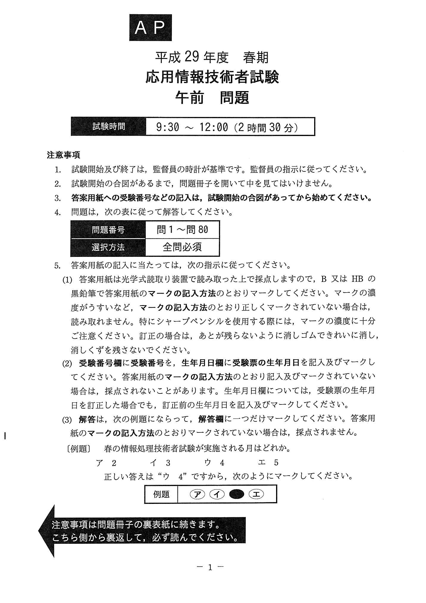

テキスト (OCR)

平成29年度 春期
応用情報技術者試験
午前 問題

 SSE EO ESO

注意事項
試験開始及び終了は, 監督貞の時計が基準です。監督貞の指示に従ってください。
試験開始の合図があるまで, 問題冊子を開いて中を見てはいけません。
答案用紙への受験番号などの記入は, 試験開始の合図があってから始めてください。
間題は, 次の表に従って解答してください。
問題番号    問1て問 80
選択方法    全間必須
5. 答案用紙の記入に当たっては, 次の指示に従っつてください。

GQ) 答案用紙は光学式読取り装置で読み取った上で採点しますので, B 又は HB の
黒鉛筆で答案用紙のマークの記入方法のとおりマークしてください。マークの濃
度がうすいなど, マークの記入方法のとおり正しくマークされていない場合は,
読み取れません。特にシャープペンシルを使用する際には, マークの濃度に十分
ご注意ください。 訂正の場合は, あとが残らないように消しゴムできれいに消し
消しくずを残さないでください。

Q) 受験番号欄に受験番号を, 生年月日欄に受験票の生年月日を記入及びマークし
てください。穫案用紙のマークの記入方法のとおり記入及びマークされていない
場合は, 採点されないことがあります。生年月日杉については, 受験票の生年月
日を訂正した場合でも, 訂正前の生年月日を記入及びマークしてください。

(3) 解答は, 次の例題にならって, 解答欄に一つだけマークしてください。答案用
紙のマークの記入方法のとおりマークされていない場合は, 採点されません。
[例題】 春の情報処理技術者試験が実施される月はどれか。

ア 2    イ 3    ウ 4    エ 5
正しい答えは“ウ 4” CHWS, 次のようにマークしてください。

例題 | DOD@®

Sf SY

注意事項は問題冊子の裏表紙に続きます。
こちら側から裏返して, 必ず読んでください。

### ページ 2

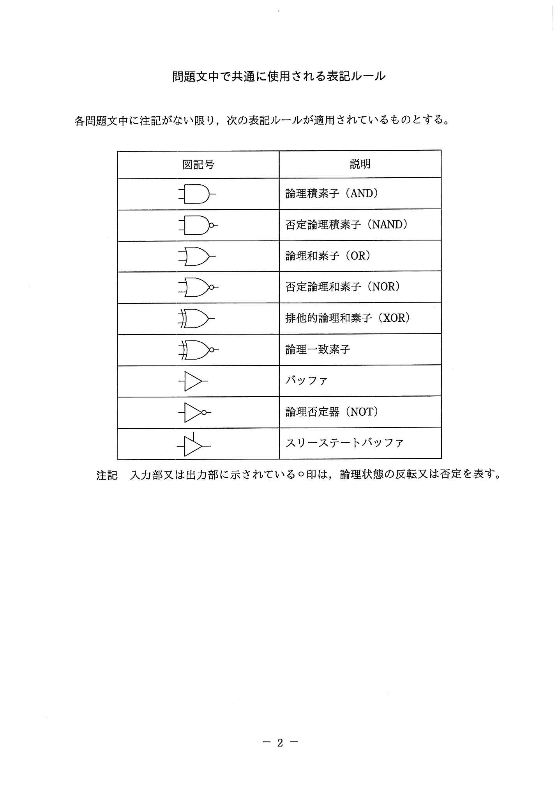

テキスト (OCR)

問題文中で共通に使用される表記ルール

各問題文中に注記がない限り, 次の表記ルールが適用されているものとする。

cu
a

説明

論理積素子 (CAND)

吾定論理積素子 (NAND)

論理和素子 (OR)

否定論理和素子 (NOR)

排他的論理和素子 (XOR)

論理一致素子

バッファ

論理否定器 (NOT)

YiYIyIVMMVMM

スリーステートバッファ

注記 入力部又は出力部に示されているo印は, 論理状態の反転又は否定を表す。

### ページ 3

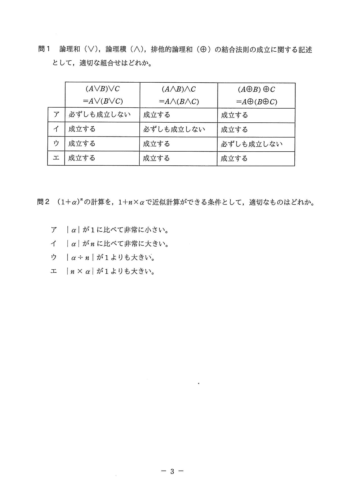

テキスト (OCR)

fal 1

論理和 (V), 論理積 (人), 排他的論理和 (O) の結合法則の成立に関する記述

として, 適切な組合せはどれか。

(AVB)VC             (AAB)AC             (A®B) ®C
=AV(BVC)           =A/\(BAC)            =A®(BO@C)
ア | 必ずしも成立しない |成立する             成立する
イ | 成立する            必ずしも成立しない    成立する
7 | 成立する            成立する             必ずしも成立しない
エエ | 成立する                      成立する                       成立する

問2 (1+a)"O

1z| が1に比べて非常に小さい。

| ゥヶそぁヶ| が1よりも大きい。

ア
イ |g| がヵ に比べて非常に大きい。
ウ
cE:

|Iz X glが1よりも大きい。

計算を, 1+]ぁXヶで近似計算ができる条件として, 適切なものはどれか。

### ページ 4

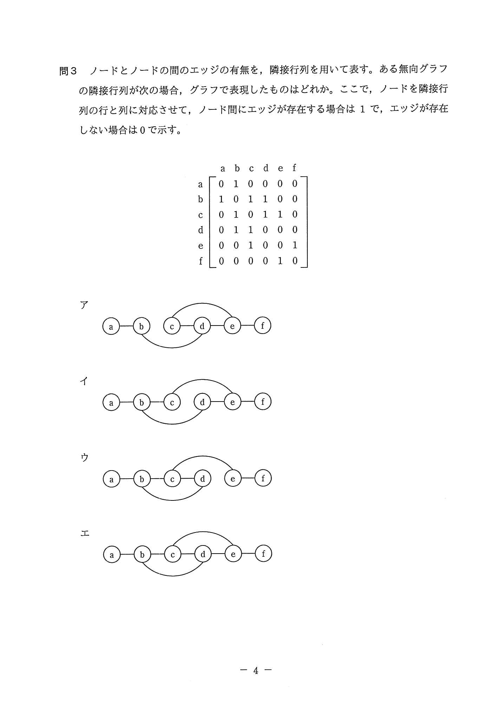

テキスト (OCR)

問3 ノードとノードの間のエッジの有無を, 隣接行列を用いて表す。ある無向グラフ
の隣接行列が次の場合, グラフで表現したものはどれか。ここで, ノードを職接行
列の行と列に対応させて, ノード間にエッジが存在する場合は 1 で, エッジが存在
しない場合は 0 CRT.

nn oO らo な@p
ららららピロはつらSe
のららロビららロビ どー
らどらロロららロoo
ららららロロ6らら
"ららららのoe
ららロロららららら は

### ページ 5

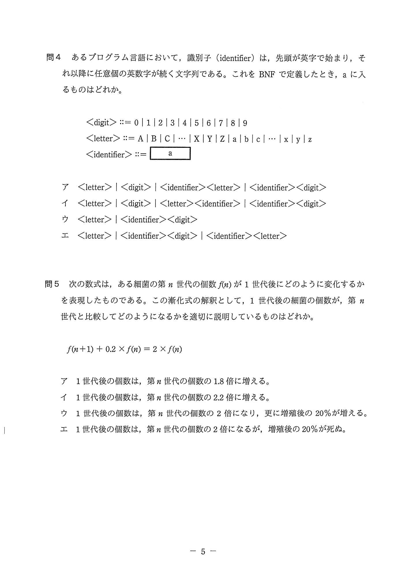

テキスト (OCR)

問4 あるプログラム言語において, 識別子 (identifer) は, 先頭が英字で始まり, そ
れ以降に任意個の英数字が続く文字列である。これを BNF で定義したとき, a に入
るものはどれかな。

<digit> ==0/1/213/4151/6171819
ぐletter>ーAIBICI…1XIYIZlalblcl…|xlylz

<identifier> ==  [a]

<letter> | <digit> | <identifier><letter> | <identifier><digit>
<letter> | <digit> | <letter><identifier> | <identifier><digit>
<letter> | <identifier><digit>

<letter> | <identifier><digit> | <identifier><letter>

HSA

間5 次の数式は, ある細菌の第 n 世代の個数 fn) が 1 世代後にどのように変化するか
を表現したものである。この河化式の解釈として, 1 世代後の細菌の個数が, 第 n
世代と比較してどのようになるかを適切に説明しているものはどれか。

7@填1) + 0.2 Xf) =2 Xf)

1 世代後の個数は, Bin 世代の個数の 1.8 倍に増える。

1 世代後の個数は, Fin 世代の個数の 2.2 倍に増える。

1 世代後の個数は, 第 ヵ 世代の個数の 2 倍になり, 更に増殖後の 20%が増える。
1 世代後の個数は, 第ヵ 世代の個数の 2 倍になるが, 増殖後の 20%が死ぬ。

H へ NM

### ページ 6

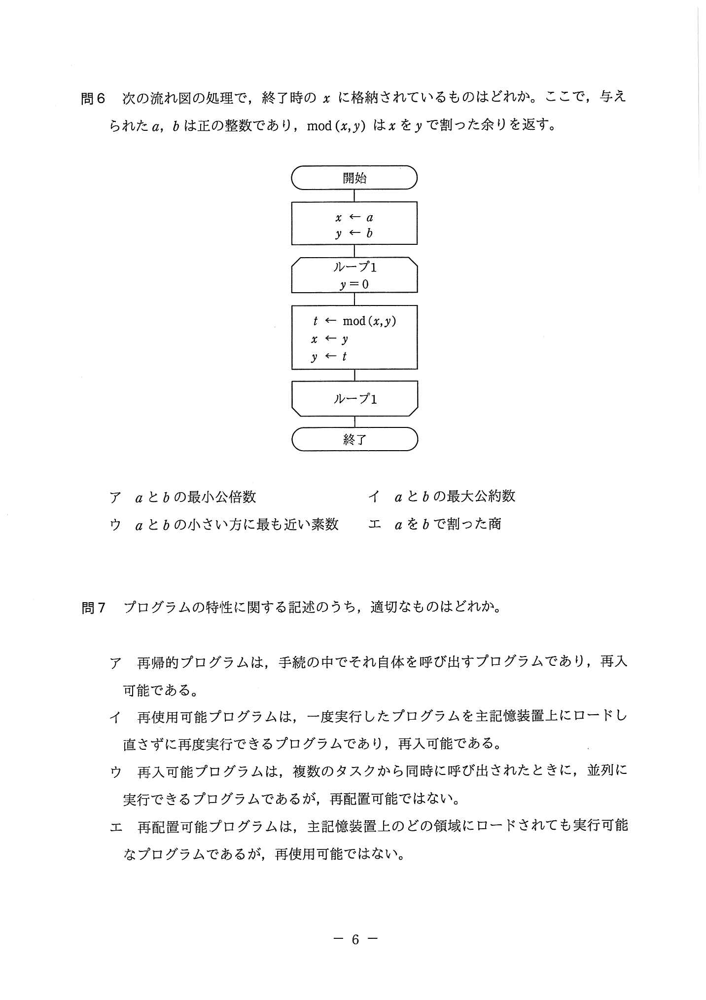

テキスト (OCR)

間6 次の流れ図の処理で, 終了時の x に格納されているものはどれか。ここで, 与え
られた2, ヵは正の整数であり, mod(*,7) は*をヶで割った余りを返す。

ヶ テムの
ヶうとの
a
ループ1
y=0
]
t — mod (x,y)
x<—y
pes
|
ループ1

ア gと6?の最小公倍数                  イ gとめヵの最大公約数
ウ gと6の小さい方に最も近い素数    エエ gを0めで割った商

問7 プログラムの特性に関する記述のうち, 適切がかものはどれか。

ア 再帰的プログラムは, 手続の中でそれ自体を呼び出すプログラムであり, BA
可能である。

4 再使用可能プログラムは, 一度実行したプログラムを主記憶装置上にロードし
直さずに再度実行できるプログラムであり, 再入可能である。

ウ 再入可能プログラムは, 複数のタスクから同時に呼び出されたときに, 並列に
実行できるプログラムであるが, 再配置可能ではない。

エ 再配置可能プログラムは, 主記憶装置上のどの領域にロードされても実行可能
なプログラムであるが, 再使用可能ではない。

### ページ 7

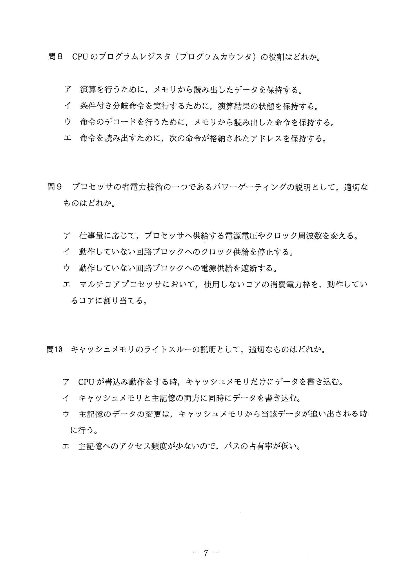

テキスト (OCR)

AIS CPUのプログラムレジスタ (プログラムカウンタ) の役割はどれか。

演算を行うために, メモリから読み出したデータを保持する。

条件付き分岐命令を実行するために, 演算結果の状態を保持する。
師令のデコードを行うために, メモリから読み出した命令を保持する。
命令を読み出すために, 次の命令が格納されたアドレスを保持する。

HG AY

問9 プロセッサの省電力技術の一つであるパワーゲーティングの説明として, 適切な
ものはどれか。

ア 仕事量に応じて, プロセッサへ供給する電源電圧やクロック周波数を変える。

イ 動作していない回路ブロックへのクロック供給を停止する。

ウ 動作していない回路ブロックへの電源供給を遮断する。

エ マルチコアプロセッサにおいて, 使用しないコアの消費電力枠を, 動作してい
るコアに割り当てる。

間19 キャッシュメモリのライトスルーの説明として, 適切なかものはどれか。

ア CPUが書込み動作をする時, キャッシュメモリだけにデータを書き込む。
イ キャッシュメモリと皇記憶の両方に同時にデータを書き込む。
ウ 主記憶のデータの変更は, キャッシュメモリから当該データが追い出される時

に行う。
エ 主記憶へのアクセス頻度が少ないので, バスの占有率が低い。

### ページ 8

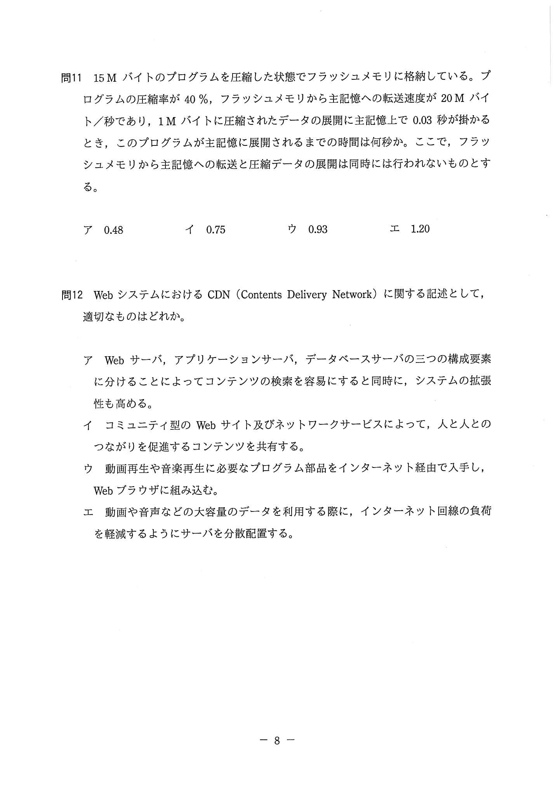

テキスト (OCR)

間11 15M バイトのプログラムを圧縮した状態でフラッシュメモリに格納している。プ
ログラムの圧縮率が 40%, フラッシュメモリから主記憶への転送速度が 20M バイ
トノ秒であり, 1 M バイトに圧縮されたデータの展開に主記憶上で 0.03 秒が掛かる
とき, このプログラムが主記憶に展開されるまでの時間は何秒か。 ここで, フラッ
シュメモリから主記憶への転送と圧縮データの展開は同時には行われないものとす
る。

ア 0.48     イ 0.75     ウ 0.93     x= 1.20

間12 Web システムにおける CDN (Contents Delivery Network) に関する記述として,
適切ながものはどれか。

ア Web サーバ, アプリケーションサーバ, データベースサーバの三つの構成要素
に分けることによってコンテンツの検索を容易にすると同時に, システムの拡張
性も高める。

イ コミュニティ型の Web サイト及びネットワークサービスによって, 人と人との
つながりを促進するコンテンツを共有する。

ウ 動画再生や音楽再生に必要なプログラム部品をインターネット経由で入手し,
Web ブラウザに組み込む。

エエ 動画や音声などの大容量のデータを利用する際に, インターネット回線の負荷
を軽減するようにサーバを分散配置する。

### ページ 9

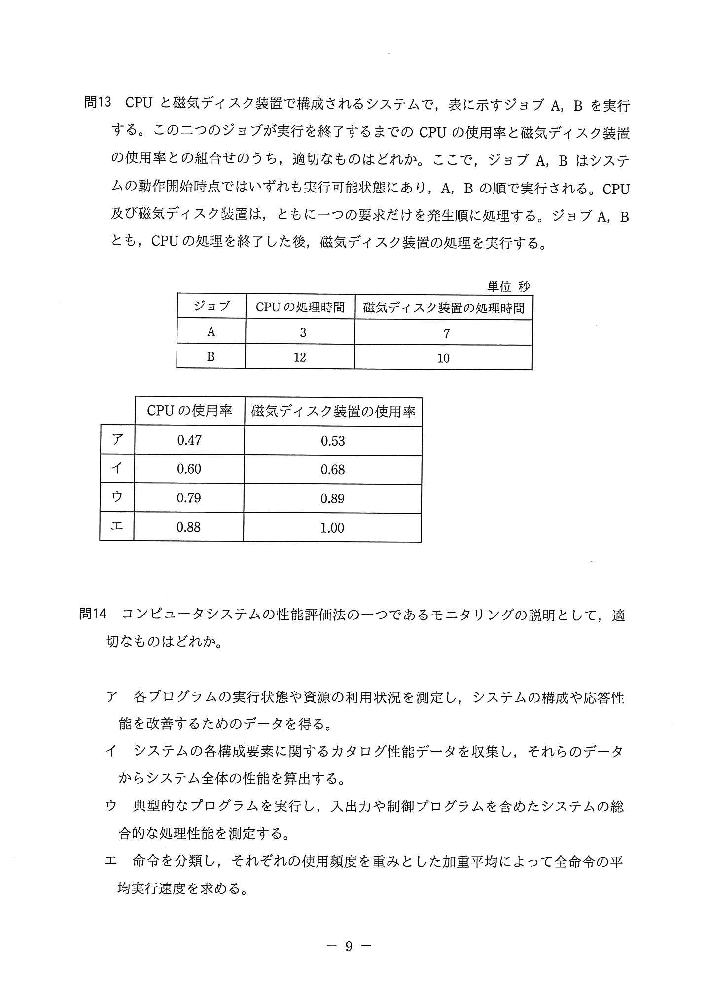

テキスト (OCR)

問13 CPU と磁気ディスク装置で構成されるシステムで, 表に示すジョブ A, B を実行
する。この二つのジョブが実行を終了するまでの CPU の使用率と磁気ディスク装置
の使用率との組合せのうち, 適切かものはどれか。ここで, ジョブ A, B はシステ
ムの動作開始時点ではいずれも実行可能状態にあり, A, B の順で実行される。CPU
及び磁気ディスク装置は, ともに一つの要求だけを発生順に処理する。ジョブ A, B
とも, CPUの処理を終了した後, 磁気ディスク装置の処理を実行する。

単位 秒
ジョブ | CPUの処理時間 | 磁気ディスク装置の処理時間
A     3        7
B     12         10
CPU の使用率 | 磁気ディスク装置の使用率
ア   0.47        0.53
イ    0.60         0.68
ウ   0.79        0.89
x=                0.88                                   1.00

間14 コンピュータシステムの性能評価法の一つであるモニタリングの説明として, 適
切なものはどれか。

ア 各プログラムの実行状態や資源の利用状況を測定し, システムの構成や応答性
能を改善するためのデータを得る。

イ システムの各構成要素に関するカタログ性能データを収集し, それらのデータ
からシステム全体の性能を算出する。

ウ 典型的なプログラムを実行し, 入出力や制御プログラムを含めたシステムの総
合的な処理性能を測定する。

エエ 命令を分類し, それぞれの使用頻度を重みとした加重平均によって全命令の平
均実行速度を求める。

### ページ 10

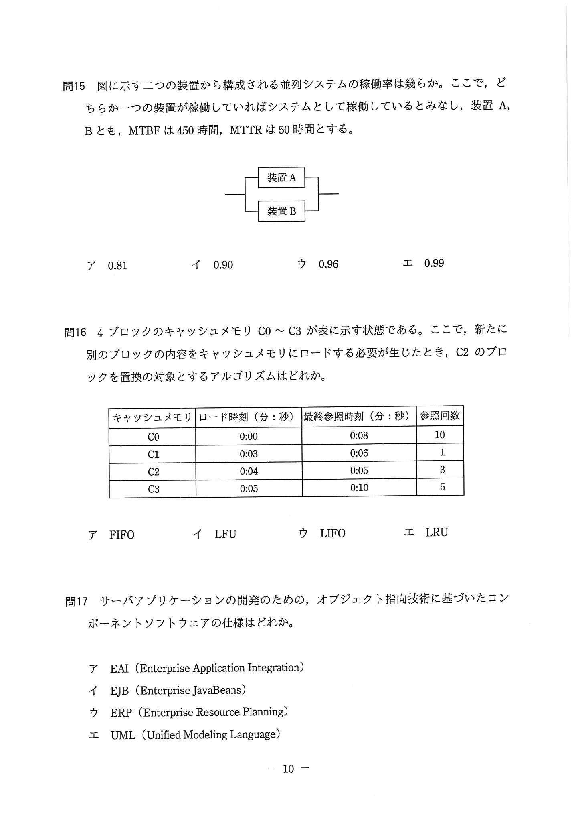

テキスト (OCR)

間15 図に示す二つの装置から構成される並列システムの稼働率は幾らか。ここで, ど
ちらかーつの装置が稼働していればシステムとして稼働しているとみなし, Rie A,
B とも, MTBF は 450 時間, MTTR は 50 時間とする。

ア 0.81     イ 0.90     ウ 0.96     x= 0.99

間16 4 ブロックのキャッシュメモリ CO~ C3 が表に示す状態である。ここで, 新たに
別のブロックの内容をキャッシュメモリにロードする必要が生じたとき, C2 のブロ
ックを置換の対象とするアルゴリズムはどれか。

キャッシュメモリ |ロード時刻 (分 : 秒) |最終参照時刻 (分 : 秒) |参照回数
CO                      0:00                          0:08                   10
C1                      0:03                          0:06
C2                      0:04                          0:05                    3
C3                       0:05                          0:10                    5,
ア FIFO                イ LFU                 ウ LIFO                = LRU

間17 サーバアプリケーションの開発のための, オブジェク ト指向技術に基づいたコン
ポーネントソフトウェアの仕様はどれか。

EAI (Enterprise Application Integration)
EJB (Enterprise JavaBeans)

ERP (Enterprise Resource Planning)
UML (Unified Modeling Language)

H ささい

ー 10 一

### ページ 11

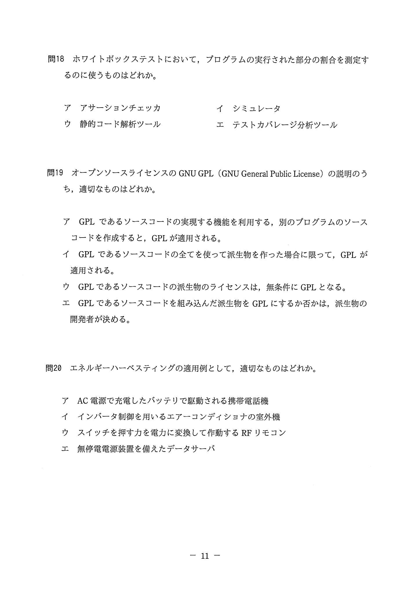

テキスト (OCR)

FAIS ホワイトボックステストにおいて, プログラムの実行された部分の割合を測定す
るのに使うものはどれか。

ア アサーションチェッカ       イ シミュレータ
ウ 静的コード解析ツール       エ テストカバレージ分析ツール

間19 オープンソースライセンスの GNU GPL (GNU General Public License) の説明のう
ち, 適切なかものはどれか。

Y GPL であるソースコードの実現する機能を利用する, 別のプログラムのソース
コードを作成すると, GPL が適用される。

4 GPL であるソースコードの全てを使って派生物を作った場合に限って, GPL が
適用される。

ウ GPL であるソースコードの派生物のライセンスは, 無条件に GPL となる。

エ GPLであるソースコードを組み込んだ派生物を GPL にするか否かは, 派生物の
開発者が決める。

間29 エネルギーハーベスティングの適用例として, 適切なものはどれか。

AC 電源で充電したバッテリで駆動される携帯電話機
インバータ制御を用いるエアーコンディショナの室外機
スイッチを押す力を電力に変換して作動する RF リモコン
無停電電源装置を備えたデータサーバ

H ざ へ

= fq =

### ページ 12

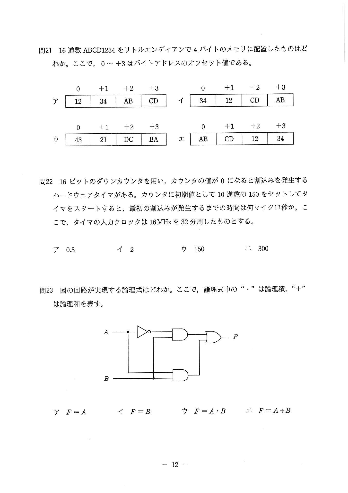

テキスト (OCR)

間21 16 進数 ABCD1234 をリトルエンディアンで 4 バイトのメモリで配置したものはど
れか。ここで, 0~ 二3 はバイトアドレスのオフセット値である。

0           +          +2          +3                         0            +1          +2          +3
ア     12      34     AB     CD      イ     34      12     CD     AB
0            $l         +2          +3                         0            mus          +2          +3
ウ     43      21     DC     BA      =    AB     CD     12      34

問22 16 ビットのダウンカウンタを用い, カウンタの値が 0 になると割込みを発生する
ハードウェアタイマがある。カウンタに初期値として 10 進数の 150 をセットしてタ
イマをスタートすると, 最初の割込みが発生するまでの時間は何マイクロ秒か。こ
こで, タイマの入力クロックは 16MHz を 32 分周したものとする。

ア 03     イ 2      ウ 150     x= 300

間23 図の回路が実現する論理式はどれか。ここで, 論理式中の“・" は論理積,“十"
は論理和を表す。

ォーィルド      。

ア F=A    イ F=B    ウ F=A:B   = F=A+B

ー 12 一

### ページ 13

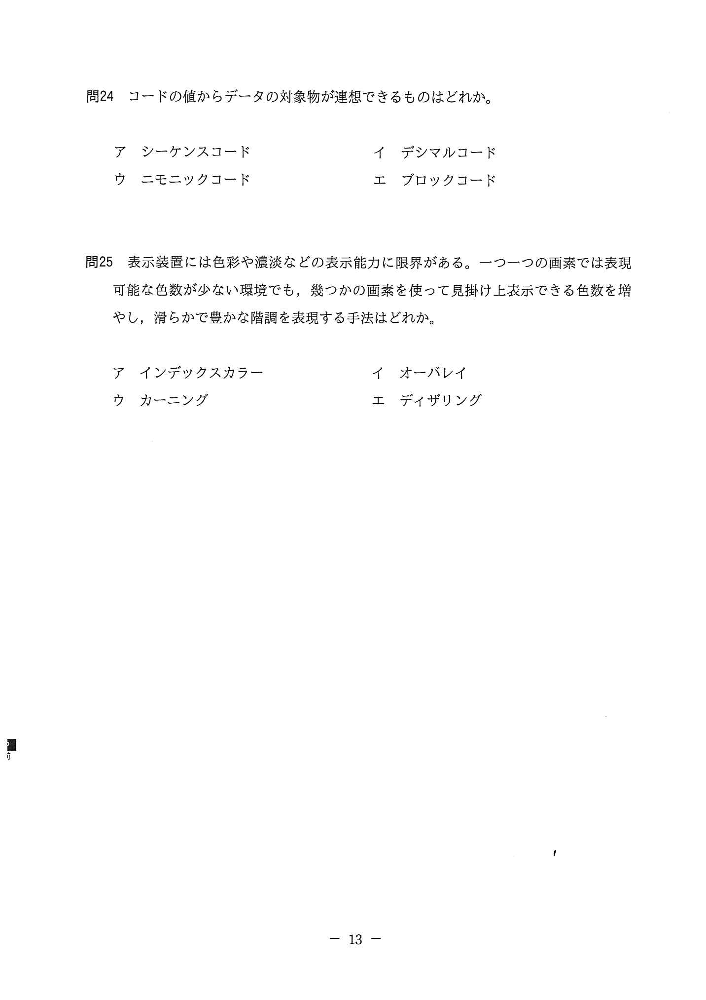

テキスト (OCR)

問24 コードの値からデータの対象物が連想できるものはどれか。
ア シーケンスコード         イ デシマルコード

ウ ニモニックコード         エエ ブロックコード

問25 表示装置には色彩や濃淡などの表示能力に限界がある。一つーつの画素では表現
可能な色数が少ない環境でも, BOMOMRE HoT MENT LRA CSS EME
やし, 滑らかで豊かな階調を表現する手法はどれか。

ア インデックスカラー      イ オーパレイ
ウ カーニング          エ ディザリング

ー 13 一

### ページ 14

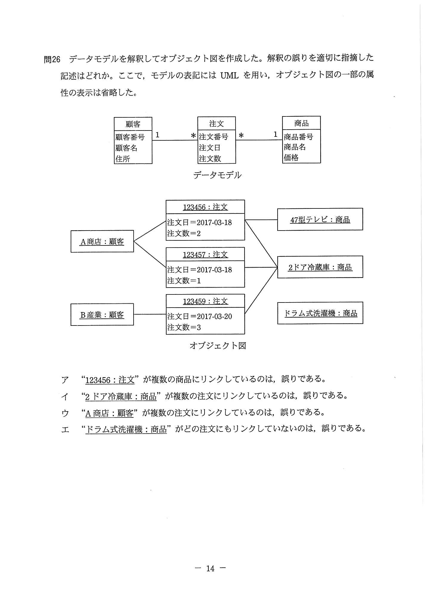

テキスト (OCR)

データモデルを解釈してオブジェクト図を作成した。解釈の誤りを適切に指摘した
記述はどれか。ここで, モデルの表記には UML を用い, オプジェクト図の一部の属
性の表示は省略した。

問26

顧客                     注文                      商品
顧客番号 |1          |注文番号 |*         1 |商品番号
顧客名                   注文日                    商品名
住所                     注文数                   価格
データモデル
123456 : 注文
注文日2017-03-18                    47型テレビ : 商品
注文数2
A商店 : 顧客
123457 : 注文
注文日三2017-03-18                       2ドア人冷蔵庫 : 商品
注文数=1
123459 : 注文
B産業 : 顧客                注文日ニ2017-03-20                   ドラム式洗濯機 : 商品
注文数=3
オブジェクト図

“123456 : 注文"が複数の商品にリンクしているのは, 誤りである。

"2 ドア冷蔵庫 : 商品” が複数の注文にリンクしているのは, 誤りである。

“A 商店 : 顧客” が複数の注文にリンクしているのは, 誤りである。

“ドラム式洗濯機 : 商品” がどの注文にもリンクしていないのは, 誤りである。

HAN

= Td 一

### ページ 15

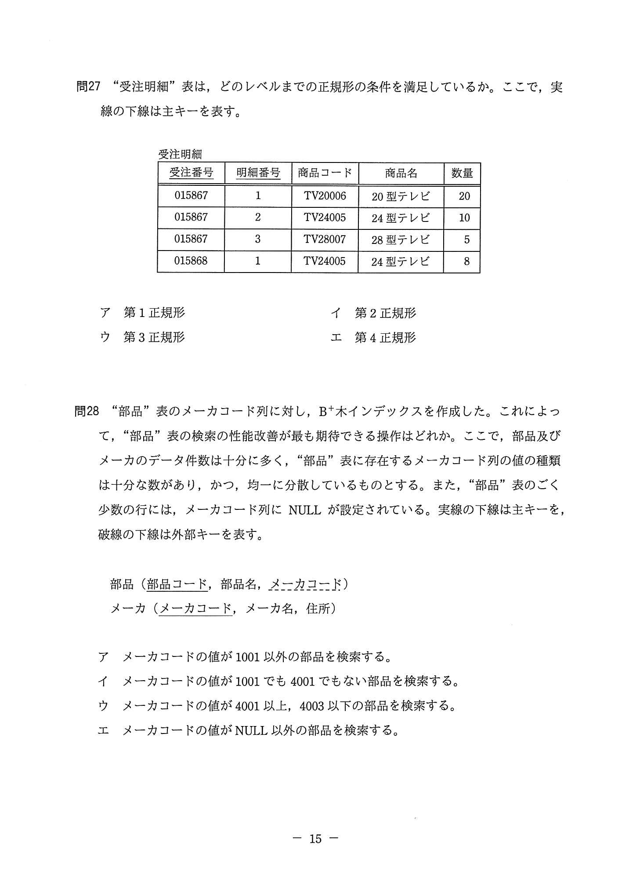

テキスト (OCR)

問27 “受注明細” 表は, どのレベルまでの正規形の条件を満足しているか。ここで, 実
線の下線は主キーを表す。

受注明細
ZESS | 明細番号 | 商品コード    商品名    数量
015867             1            TV20006 | 20型テレビ | 20
015867             2            TV24005 | 24型テレビ | 10
015867             3            TV28007 | 28型テレビ         5
015868              1             TV24005 | 24型テレビ          8
ア 第1正規形                               イ 第2正規形
ウ 第3正規形                  エ 第4正規形

間28 “部品" 表のメーカコード列に対し, B+木インデックスを作成した。これによっ
て, 部品” 表の検索の性能改善が最も期待できる操作はどれか。ここで, MARKO
メーカのデータ件数は十分に多く, “部品” 表に存在するメーカコード列の値の種類
は十分な数があり, WO, 均一に分散しているものとする。また, “Mh” 表のごく
少数の行には, メーカコード烈に NULL が設定されている。実線の下線は主キーを,
破線の下線は外部キーを表す。

部品 (部品コード, 部品名, メーカコード

(
メーカ (メーカコード, メーカ名, 住所)

メーカコードの値が1001 以外の部品を検索する。

メーカコードの値が 1001 でも 4001 でもない部品を検索する。
メーカコードの値が 4001 以上, 4003 以下の部品を検索する。
メーカコードの値が NULL 以外の部品を検索する。

H eA NY

= 45

### ページ 16

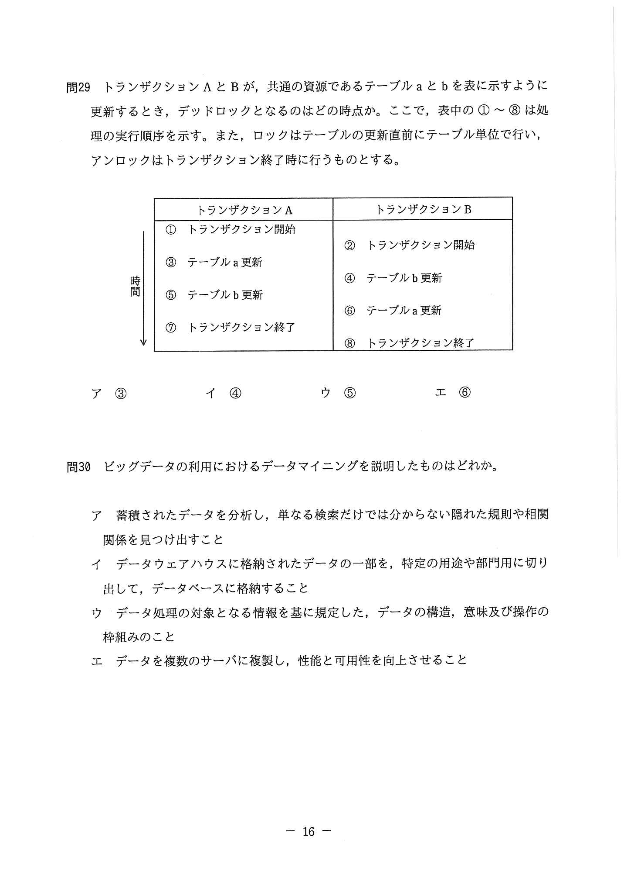

テキスト (OCR)

問29 トランザクションAと B が, 共通の資源であるテーブル a と b を表に示すように
更新するとき, デッドロックとなるのはどの時点か。ここで, 表中の①て⑧は身
理の実行順序を示す。また, ロックはテーブルの更新直前にテーブル単位で行い,
アンロックはトランザクション終了時に行うものとする。

トランザクションA       トランザクションB
① トランザクション開始
② トランザクション開始
③⑧ テーブルa 更新
時                   ④ テーブル1 更新
間| | © テーブル更新
© テーブルa 更新
@ トランザクション終了
⑧ トランザクション終了
ア ®       イ ©       7 ©       エ ©

間39 ビッグデータの利用におけるデータマイニングを説明したものはどれか。

ア 蓄積されたデータを分析し, 単なる検索だけでは分からない隙れた規則や相関

関係を見つけ出すこと
イ データウェアハウスに格納されたデータの一部を, 特定の用途や部門用に切り

出して, データベースに格納すること
ウ データ処理の対象となる情報を基に規定した, データの構造, 意味及び操作の

棒組みのこと
エ データを複数のサーバに複製し, 性能と可用性を向上させること

ー 16 一

### ページ 17

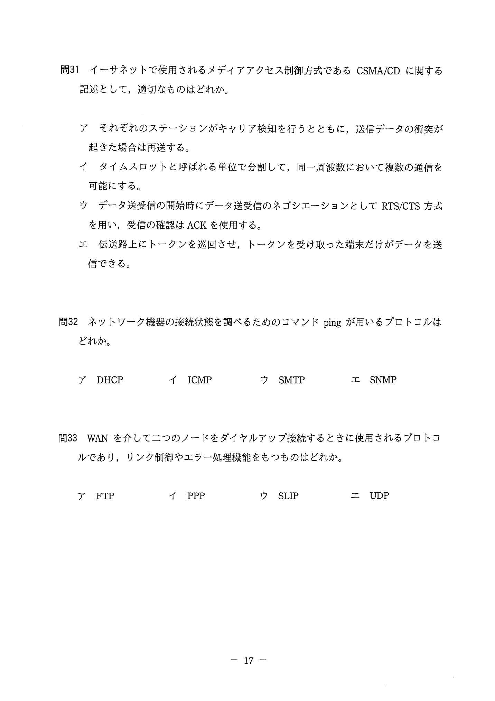

テキスト (OCR)

間31 イーサネットで使用されるメディアアクセス制御方式である CSMA/CD に関する
記述として, 適切ながものはどれか。

ア それぞれのステーションがキャリア検知を行うとともに, 送信データの衝突が
起きた場合は再送する。

イ タイムスロットと呼ばれる単位で分割して, 同一周波数において複数の通信を
可能にする。

ウ データ送受信の開始時にデータ送受信のネゴシエーションとして RTS/CTS 方式
を用い, 受信の確認は ACK を使用する。

= 伝送路上にトークンを巡回させ, トークンを受け取った端末だけがデータを送
信できる。

問32 ネットワーク機器の接続状態を調べるためのコマンド ping が用いるプロトコルは

どれか。

ア DHCP    イ ICMP    ウ SMTP    <= SNMP

間33 WAN を介して二つのノードをダイヤルアップ接続するときに使用されるプロトコ

ルであり, リンク制御やエラー処理機能をもつものはどれか。

ア TFTP     イ PPP     ウ SLIP     <= UDP

ー 17 一

### ページ 18

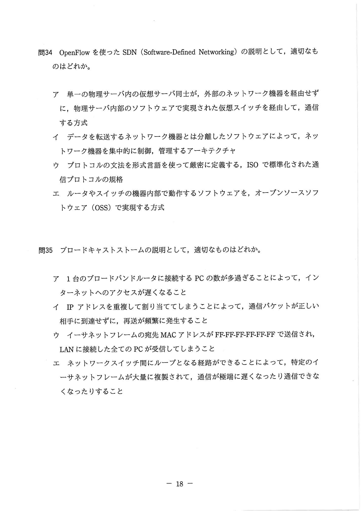

テキスト (OCR)

間34 OpenFlow を使った SDN (Software-Defined Networking) の説明として, 適切なも
のはどれか。

ア 単一の物理サーバ内の仮想サーバ同士が, 外部のネットワーク機器を経由せず
に, 物理サーバ内部のソフトウェアで実現された仮想スイッチを経由して, 通信
する方式

イ データを転送するネットワーク機器とは分離したソフトウェアによって, AY
トワーク機器を集中的に制御, 管理するアーキテクチャ

ウ プロトコルの文法を形式言語を使って厳密に定義する, ISO で標準化された通
信プロトコルの規格

エエ ルータやスイッチの機器内部で動作するソフトウェアを, オープンソースソフ
トウェア (OSS) で実現する方式

間35 プロードキャストストームの説明として, 適切ながものはどれか。

ア 1 台のブロードバンドルータに接続する PC の数が多過ぎることによって, イン
ターネットへのアクセスが遅くなること

イ TP アドレスを重複して割り当ててしまうことによって, 通信パケットが正しい
相手に到達せずに, 再送が頻繁に発生すること

ウ イーサネットフレームの郊先 MAC アドレスがFF-FF-FF-FF-FF-FF で送信され
LAN に接続した全ての PC が受信してしまうこと

エエ ネットワークスイッチ間にループとなる経路ができることによって, 特定のイ
ーサネットフレームが大量に複製されて, 通信が極端に遅くなったり通信できな
くなったりすること

ー 18 一

### ページ 19

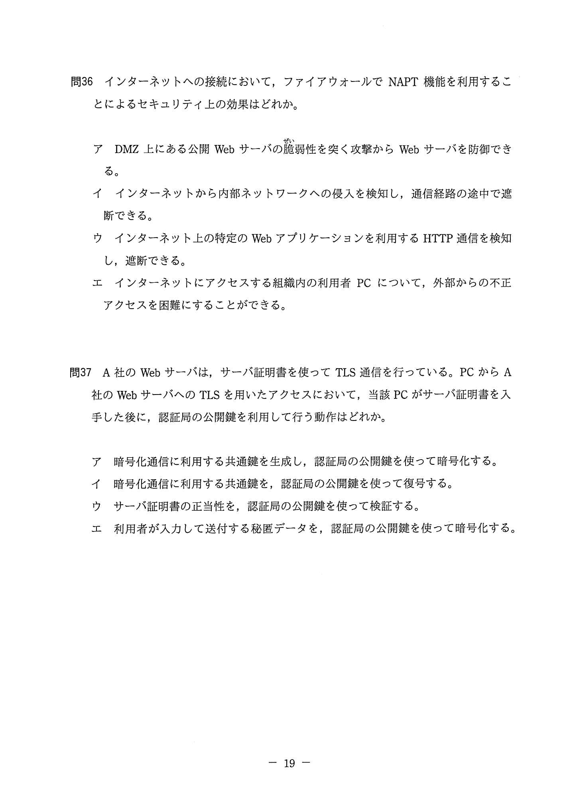

テキスト (OCR)

問36 インターネットへの接続において, ファイアウォールで NAPT 機能を利用するこ
とによるセキュリティ上の効果はどれか。

F DMZ 上にある公開 Web サーバの脆慌性を突く攻撃から Web サーバを防御でき
る。

イ インターネットから内部ネットワークへの侵入を検知し, 通信経路の途中で人
断できる。

ウ インターネット上の特定の Web アプリケーションを利用する HTTP 通信を検知
し, 遮断できる。

エ インターネットにアクセスする組織内の利用者 PC について, 外部からの不正
アクセスを困難にすることができる。

問37 A 社の Web サーバは, サーバボ証明書を使って TLS 通信を行っている。PC から A
社の Web サーバへの TLS を用いたアクセスにおいて, 当該 PC がサーバ証明書を入
手した後に, 認証局の公開鍵を利用して行う動作はどれか。

暗号化通信に利用する共通鍵を生成し, 認証局の公開鍵を使って暗号化する。
暗号化通信に利用する共通鍵を, 認証局の公開鍵を使って復号する。

サーバ証明書の正当性を, 認証局の公開鍵を使って検証する。

利用者が入力して送付する秘匿データ を, 認証局の公開鍵を使って暗号化する。

H ざさ

ー 19 一

### ページ 20

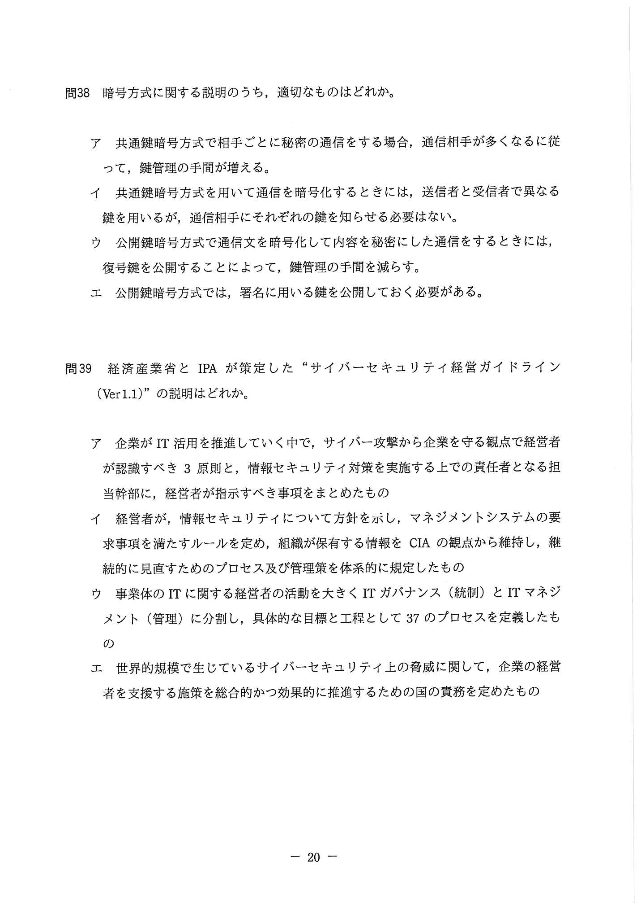

テキスト (OCR)

問38 暗号方式に関する説明のうち, 適切ながものはどれか。

ア 共通鍵暗号方式で相手ごとに秘密の通信をする場合, 通信相手が多くなるに従
って, 鍵管理の手間が増える。

イ 共通鍵暗号方式を用いて通信を暗号化するときには, 送信者と受信者で異なる
鍵を用いるが, 通信相手にそれぞれの鍵を知らせる必要はない。

ウ 公開鍵暗号方式で通信文を暗号化して内容を秘密にした通信をするときには,
復号鍵を公開することによって, 鍵管理の手間を減らす。

エ 公開鍵暗号方式では, 署名に用いる鍵を公開しておく必要がある。

問39 経済産業省と IPA が策定した“サイバーセキュリティ経営ガイドライン
(Ver1.1)” の説明はどれか。

ア 企業が IT 活用を推進していく中で, サイバー攻撃から企業を守る観点で経営者
が認識すべき 3 原則と, 情報セキュリティ対策を実施する上での責任者となる担
当幹部に, 経営者が指示すべき事項をまとめたもの

4 経営者が, 情報セキュリティについて方針を示し, マネジメントシステムの要
求事項を満たすルールを定め, 組織が保有する情報を CIA の観点から維持し, 継
続的に見直すためのプロセス及び管理策を体系的に規定したもの

ウ 事業体の IT に関する経営者の活動を大きく IT ガバナンス (統制) と IT マネジ
メント (管理) に分割し, 具体的な目標と工程として 37 のプロセスを定義したも
の

エエ 世界的規模で生じているサイバーセキュリティ上の導威に関して, 企業の経営
者を支援する施策を総合的かつ効果的に推進するための国の貢務を定めたもの

ー 20 一

### ページ 21

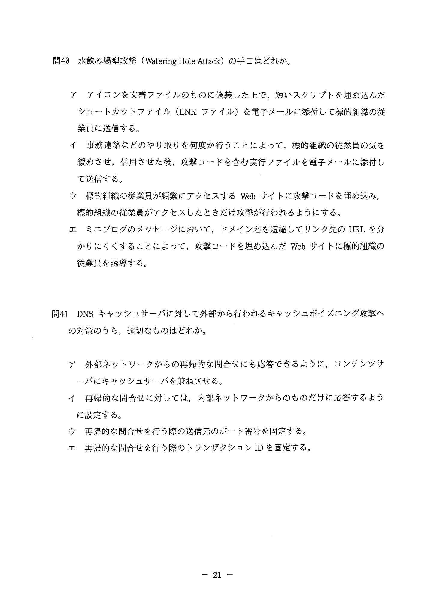

テキスト (OCR)

問49 水飲み場型攻撃 (Watering Hole Attack) の手口はどれか。

ア アイコンを文書ファイルのものに偽装した上で, 短いスクリプトを埋め込んだ
ショートカットファイル (LNK ファイル) を電子メールに添付して標的組織の従
業員に送信する。

イ 事務連絡などのやり取りを何度か行うことによって, 標的組織の従業員の気を
緩めさせ, 信用させた後, 攻撃コードを含む実行ファイルを電子メールに添付し
て送信する。

ウ 標的組織の従業員が頻繁にアクセスする Web サイトに攻撃コードを埋め込み,
標的組織の従業員がアクセスしたときだけ攻撃が行われるようにする。

エエ ミニブログのメッセージにおいて, ドメイン名を短縮してリンク先の URL を分
かりにくくすることによって, 攻撃コードを埋め込んだ Web サイトに標的組織の
従業員を誘導する。

問41 DNS キャッシュサーバに対して外部から行われるキャッシュポイズニング攻撃へ
の対策のうち, 適切なものはどれか。

ア 外部ネットワークからの再帰的な問合せにも応答できるように, コンテンツサ
ーバにキャッシュサーバを兼ねさせる。

イ 再帰的な問合せに対しては, 内部ネットワークからのものだけに応答するよう
こ設定する。

ウ 再帰的な問合せを行う際の送信元のポート番号を固定する。

エエ 再帰的な問合せを行う際のトランザクション ID を固定する。

ー 21 一

### ページ 22

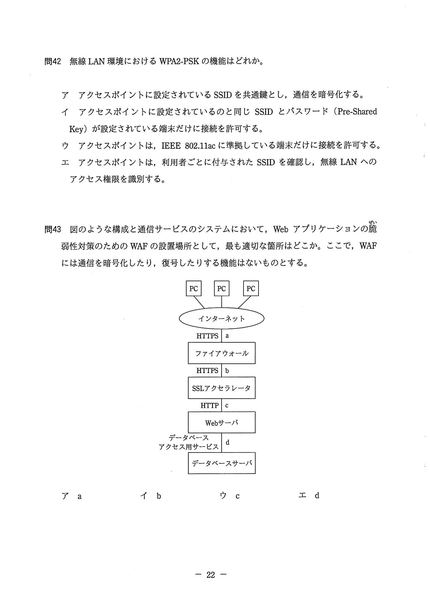

テキスト (OCR)

問42 無線 LAN 環境における WPA2-PSK の機能よどれか。

ア アクセスポイントに設定されている SSID を共通鍵とし, 通信を暗号化する。

イ アクセスポイントに設定されているのと同じ SSD とパスワード (Pre-Shared
Key) が設定されている端末だけに接続を許可する。

ウ アクセスポイントは, IEEE 802.11ac に準拠している端末だけに接続を許可する。

エエ アクセスポイントは, 利用者ごとに付与された SSID を確認し, 無線 LAN への
アクセス権限を識別する。

間43 図のような構成と通信サービスのシステムにおいて, Web アプリケーションの騰
弱性対策のための WAF の設置場所として, 最も適切な箇所はどこか。ここで, WAF
には通信を暗号化したり, 復号したりする機能はないものとする。

PC           PC            PC

インターネット

HTTPS | a

ファイアウォール

HTTPS | b

SSLアクセラレータ

HTTP | c

Webサーバ

データベース

アクセス用サービス| 4

データベースサーバ

ー 22 一

### ページ 23

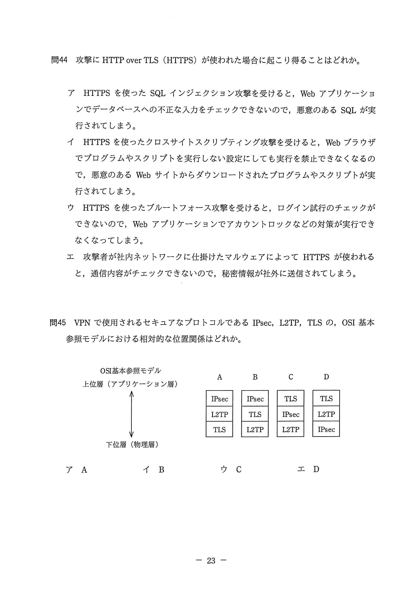

テキスト (OCR)

問44 攻撃に HTTP over TLS (HTTPS) が使われた場合に起こり得ることはどれか。

ア HTTPS を使った SQL インジェクション攻撃を受けると, Web アプリケーショ
ンでデータベースへの不正な入力をチェックできないので, 悪意のある SQL が実
行されてしまう。

イ HTTPS を使ったクロスサイトスクリプティング攻撃を受けると, Web ブラウザ
でプログラムやスクリプトを実行しない設定にしても実行を禁止できなくなるの
で, 悪意のある Web サイトからダウンロードされたプログラムやスクリプトが実
行されてしまう。

ウ HTTPS を使ったブルートフォース攻撃を受けると, ログイン試行のチェックが
できないので, Web アプリケーションでアカウントロックなどの対策が実行でき
なくなってしまう。

エ 攻撃者が社内ネットワークに仕掛けたマルウェアによって HTTPS が使われる
と, 通信内容がチェックできないので, 秘密情報が社外に送信されてしまう。

問45 VPN で使用されるセキュアなプロトコルである IPsec, L2TP, TLS の, OSI 基本
参照モデルにおける相対的な位置関係はどれか。

0SI基本参照モデル
上位層 (アプリケーション層)

IPsec                IPsec                  TLS                    TLS

L2TP      TLS      TPsec     L2TP

TLS            L2TP           L2TP           IPsec

下位層 (物理層)

ア A   イ B   ウ C   x= D

### ページ 24

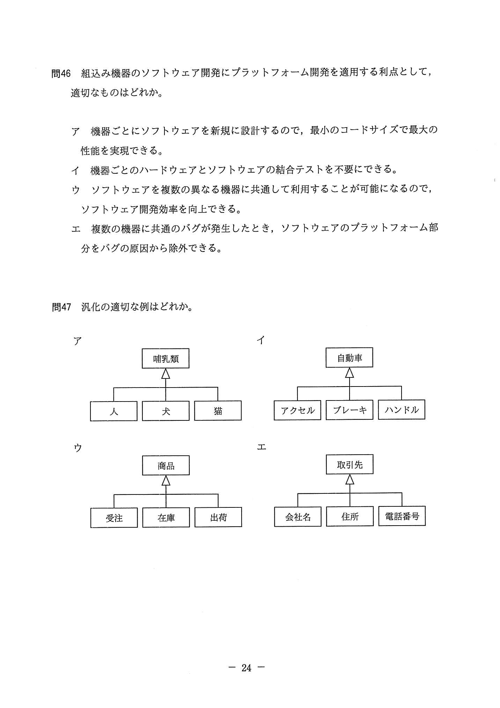

テキスト (OCR)

問46 組込み機器のソフトウェア開発にプラットフォーム開発を適用する利点として,
適切がものはどれか。

ア 機器ごとにソフトウェアを新規に設計するので, 最小のコードサイズで最大の
性能を実現できる。

イ 機器ごとのハードウェアとソフトウェアの結合テストを不要にできる。

ウ ソフトウェアを複数の異なる機器に共通して利用することが可能になるので,
ソフトウェア開発効率を向上できる。

エ 複数の機器に共通のバグが発生したとき, ソフトウェアのプラットフォーム部
分をバグの原因から除外できる。

間47 汎化の適切な例はどれか。

ア                                                        イ
路乳類                                                   自動車
A                                                        A
|                                |                         |                                 |
人          R          猫             アクセル    ブレーキ    ハンドル
ウ                                                        x
商品                                                    取引先
A                                                        A
                                 |                         |_                            |
受注           在庫            出荷                   会社名          住所         電話番号

ー 24 一

### ページ 25

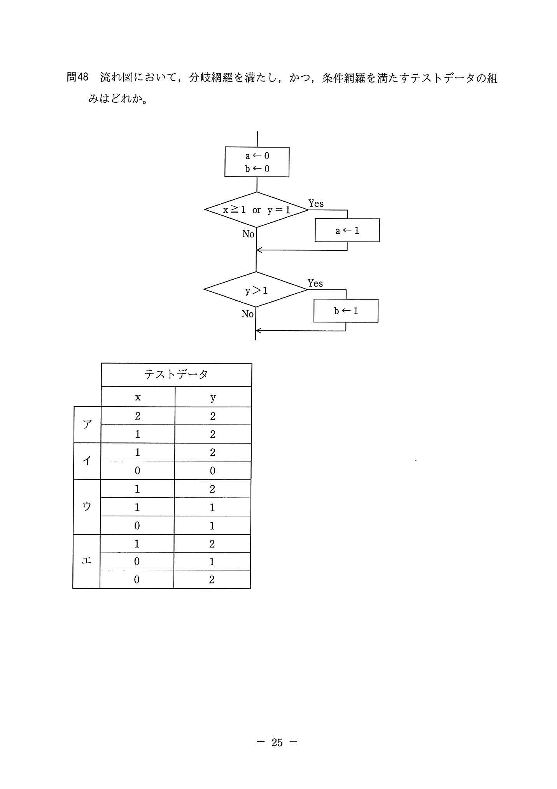

テキスト (OCR)

問48 流れ図において, 分岐網羅を満たし, DO, 条件網羅を満たすテストデータの組
みはどれか。

aで0
bで0

y
N
ae
MI
[
に

らら|つら|ロ|Oら|ロロ|Oら|ロレINSIg
NR 161ロビIIのOらII ICQIS

ー 25 一

### ページ 26

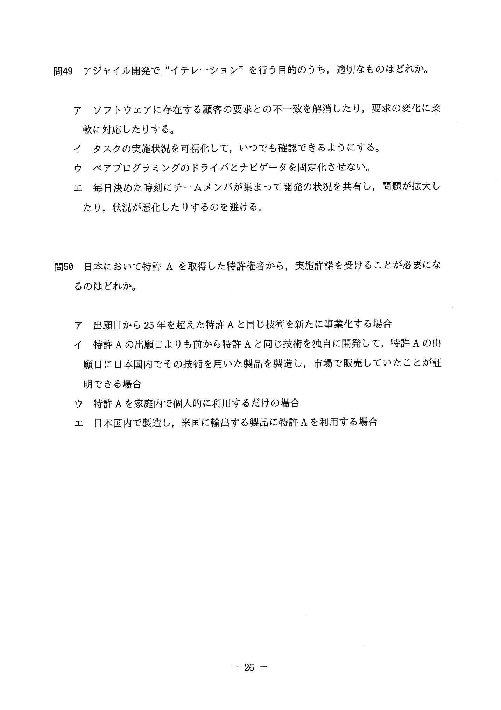

テキスト (OCR)

問49 アジャイル開発で“イテレーション" を行う目的のうち, 適切なものはどれか。

ア ソフトウェアに存在する顧客の要求との不一致を解消したり, 要求の変化に務
軟に対応したりする。

イ タスクの実施状況を可視化して, いつでも確認できるようにする。

ウ ペアプログラミングのドライバとナビゲータを固定化させない。

エ 毎日決めた時刻にチームメンバが集まって開発の状況を共有し, 問題が拡大し
たり, 状況が悪化したりするのを避ける。

B50 日本において特許 A を取得した特許権者から, 実施許諾を受けることが必要にな
るのはどれか。

ア 出願日から 25 年を超えた特許A と同じ技術を新たに事業化する場合

イ 特許A の出願日よりも前から特許A と同じ技術を独自に開発して, 特許Aの出
願日に日本国内でその技術を用いた製品を製造し, 市場で販売していたことが証
明できる場合

ウ 特許A を家庭内で個人的に利用するだけの場合

エ 日本国内で製造し, 米国に輸出する製品に特許A を利用する場合

ー 26 一

### ページ 27

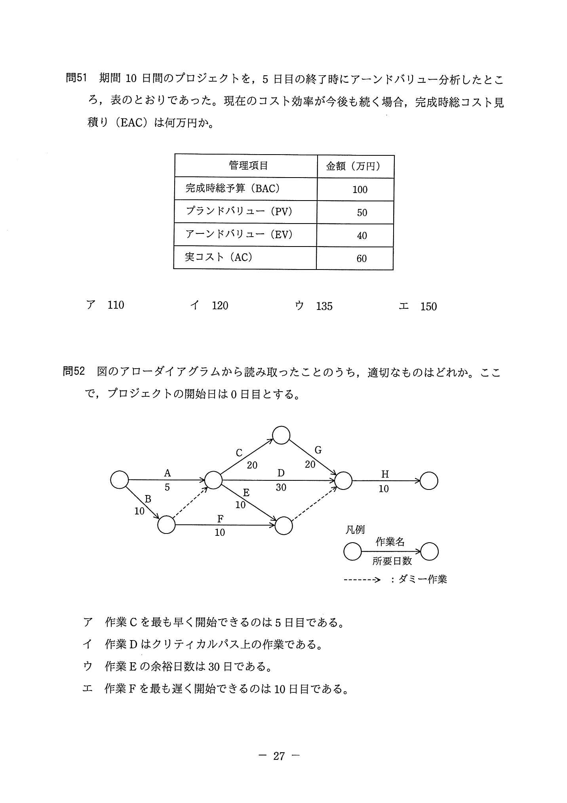

テキスト (OCR)

問51 期間 10 日間のプロジェクトを, 5 日目の終了時にアーンドバリュー分析したとこ
ろ, 表のとおりであった。現在のコスト効率が今後も続く場合, 完成時総コスト見
積り (EAC) は何万円か。

管理項目         金額 (万円)
完成時総予算 (BAC)           100
プランドバリュー (PV)       50
アーンドバリュー (EV)         40
実コスト (AC)                 60
ア 110          イ 120          ウ 135          エ 150

問52 図のアローダイアグラムから読み取ったことのうち, 適切なものはどれか。ここ
で, プロジェクトの開始日は0 日目とする。

作業Cを最も早く開始できるのは5日目である。
作業 D はクリティカルパス上の作業である。
作業E の余裕日数は 30 日である。

作業F を最も遅く開始できるのは10 日目である。

H ざくさい

ー 27 一

### ページ 28

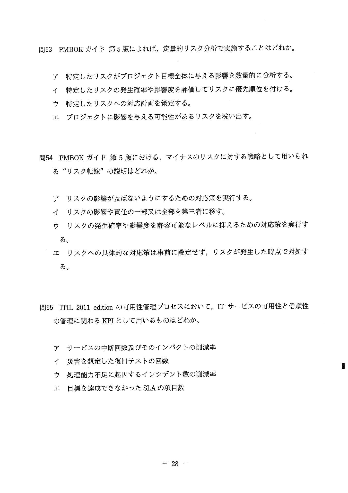

テキスト (OCR)

問53 PMBOK ガイド 第5版によれば, 定量的リスク分析で実施することはどれか。

特定したリスクがプロジェクト目標全体に与える影響を数量的に分析する。
特定したリスクの発生確率や影響度を評価してリスクに優先順位を付ける。
特定したリスクへの対応計画を策定する。

プロジェクトに影響を与える可能性があるリスクを洗い出す。

H へ

問54 PMBOK ガイド 第5版における, マイナスのリスクに対する戦略として用いられ
る “リスク転嫁” の説明はどれか。

ア リスクの影響が及ばないようにするための対応策を実行する。

イ リスクの影響や次任の一部又は全部を第三者に移す。

ウ リスクの発生確率や影響度を許容可能なレベルに抑えるための対応策を実行す
る。

エ リスクへの具体的な対応策は事前に設定せず, リスクが発生した時点で対処す
る。

間55 ITIL 2011 edition の可用性管理プロセスにおいて, IT サービスの可用性と信頼性
の管理に関わる KPI として用いるものはどれか。

サービスの中断回数及びそのインパクトの削減率
火害を想定した復旧テストの回数

処理能力不足に起因するインシデント数の削減率
目標を達成できなかった SLA の項目数

H へ

ー 28 一

### ページ 29

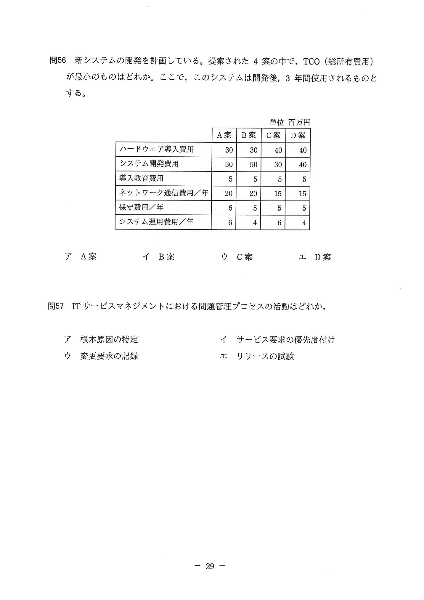

テキスト (OCR)

6 新システムの開発を計画している。提案された 4 案の中で, TCO (MMAR)
が最小のものはどれか。ここで, このシステムは開発後, 3 年間使用されるものと
する。

単位 百万円

A案|B案|C案| D案

ハードウェア導入費用    30  30  40  40
システム開発費用      30  50| 30  40
導入教育費用        5  5  5  5
ネットワーク通信費用年| 20  20  15  15
保守費用年        6  5  5  5
システム運用費用年    6  4  6  4

ア AR     イ BR     ウ C案     エ D案

問57 ITサービスマネジメントにおける問題管理プロセスの活動はどれか。

ア 根本原因の特定          イ サービス要求の優先度付け
ウ 変更要求の記録          エエ リリースの試験

ー 29 一

### ページ 30

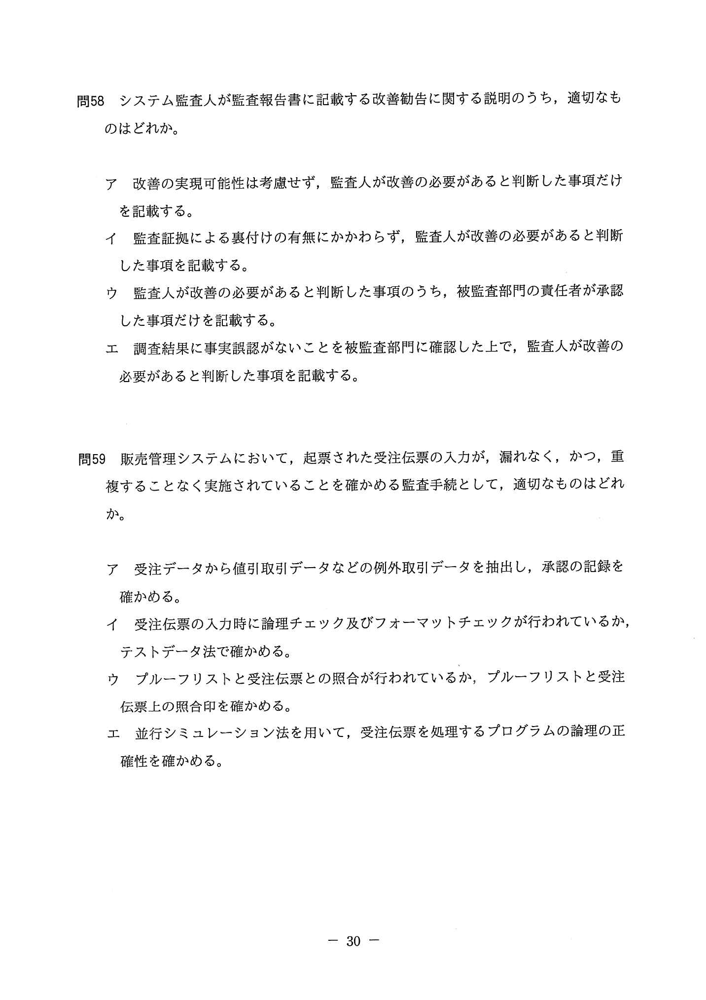

テキスト (OCR)

問58 システム監査人が監査報告書に記載する改善勧告に関する説明のうち, 適切なも
のはどれか。

ア 改善の実現可能性は考慮せず, 監査人が改善の必要があると判断した事項だけ
を記載する。

4 監査証拠による裏付けの有無にかかわらず, 監査人が改善の必要があると判断
した事項を記載する。

ウ 監査人が改善の必要があると判断した事項のうち, 被監査部門の貴任者が承認
した事項だけを記載する。

エ 調査結果に事実誤認がないことを被監査部門に確認した上で, 監査人が改善の
必要があると判断した事項を記載する。

間59 販売管理システムにおいて, 起票された受注伝票の入力が, 漏れなく, DO, 重
複することなく実施されていることを確かめる監査手続として, 適切なかがものはどれ
か。

ア 受注データから値引取引データなどの例外取引データを抽出し, 承認の記録を
確かめる。

イ 受注伝票の入力時に論理チェック及びフォーマットチェックが行われているか,
テストデータ法で確かめる。

ウ プルーフリストと受注伝票との照合が行われているか, プルーフリストと受注
伝票上の照合印を確かめる。

エエ 並行シショュレーション法を用いて, 受注伝票を処理するプログラムの論理の正
確性を確かめる。

ー 30 一

### ページ 31

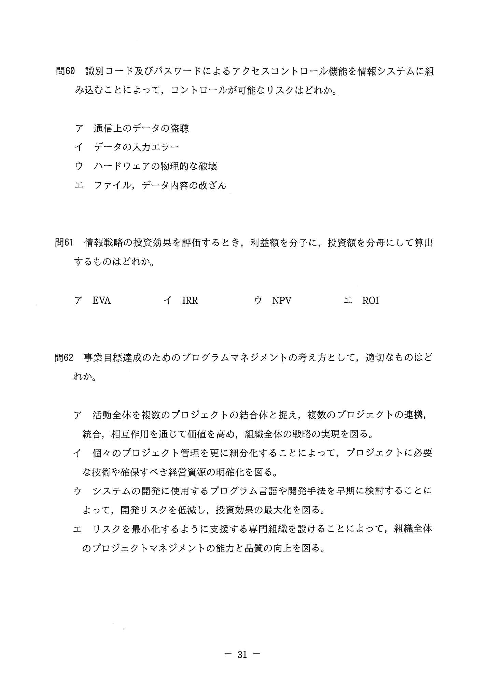

テキスト (OCR)

問69 識別コード及びパスワードによるアクセスコントロール機能を情報システムに組
み込むことによって, コントロールが可能なりリスクはどれか。

通信上のデータの盗聴

データの入力エラー

ハードウェアの物理的な破壊
ファイル, データ内容の改ざん

H へヽコ

問61 情報戦略の投資効果を評価するとき, 利益額を分子に, 投資額を分母にして算出
するものはどれか。

ア EVA     イ IRR     ウ NPV     <= ROI

問62 事業目標達成のためのプログラムマネジメントの考え方として, 適切なものはど
れか。

ア 活動全体を複数のプロジェクトの結合体と捉え, 複数のプロジェクトの連携,
統合, 相互作用を通じて価値を高め, 組織全体の戦略の実現を図る。

イ 個々のプロジェクト管理を更に細分化することによって, プロジェクトに必要
な技術や確保すべき経営資源の明確化を図る。

ウ システムの開発に使用するプログラム言語や開発手法を早期に検討することに
よって, 開発リスクを低減し, 投資効果の最大化を図る。

エエ リスクを最小化するように支援する専門組織を設けることによって, 組織全体
のプロジェクトマネジメントの能力と品質の向上を図る。

ー 31 一

### ページ 32

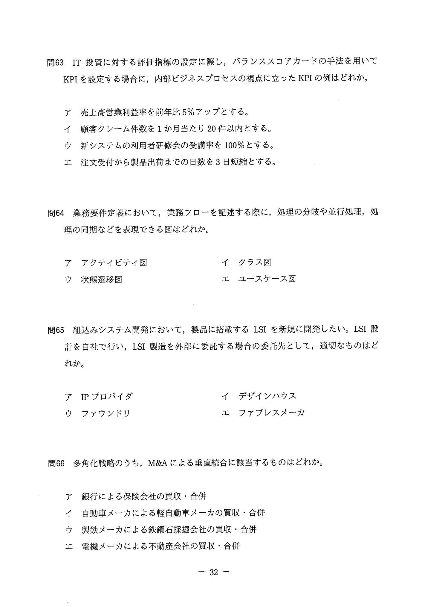

テキスト (OCR)

間63 IT 投資に対する評価指標の設定に際し, バランススコアカードの手法を用いて
KPI を設定する場合に, 内部ビジネスプロセスの視点に立った KPI の例はどれか。

売上高営業利益率を前年比56%アップとする。

顧客クレーム件数を 1 か月当たり 20 件以内とする。
新システムの利用者研修会の受講率を 100%とする。
注文受付から製品出荷までの日数を 3 日短縮とする。

H ささ コ

問64 業務要件定義において, 業務フローを記述する際に, 処理の分岐や並行処理, 処
理の同期などを表現できる図はどれか。

ア アクティビティイ図      イ クラス図
ウ 状態遷移図          エエ ユースケース図

問65 組込みシステム開発において, 製品に搭載する LSI を新規に開発したい。LSI 設
計を自社で行い, LS] 製造を外部に委託する場合の委託先として, 適切なものはど
れがか。

ア IP プロバイダ        イ デザインハウス
ウ ファウンドリ         エエ ファブレスメーカ

問66 多角化戦略のうち, M&A による垂直統合に該当するものはどれか。

銀行による保険会社の買収・合億

自動車メーカによる軽自動車メーカの買収合併
製鍼メーカによる鉄鋼石採掘会社の買収合併
電機メーカによる不動産会社の買収・合併

Hoe AM

ー 32 一

### ページ 33

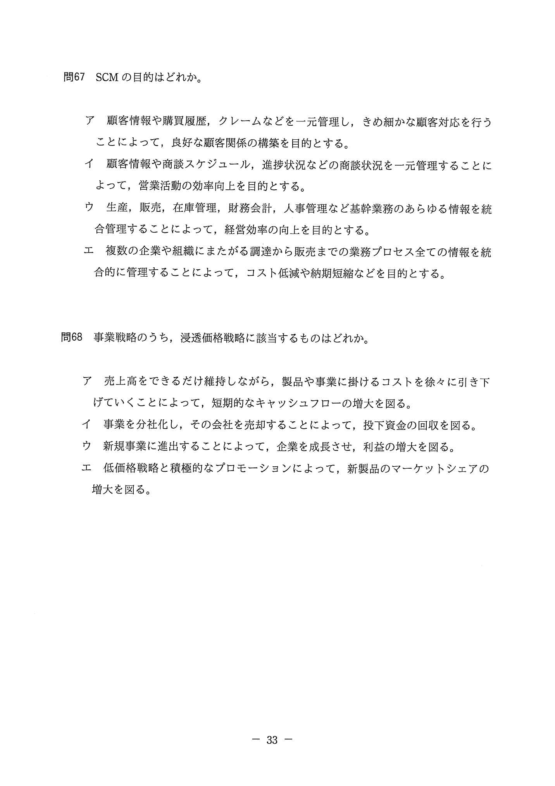

テキスト (OCR)

問67 SCM の目的はどれか。

ア 顧客情報や購買履歴, クレームなどを一元管理し, きめ細かな顧客対応を行う
ことによって, 良好な顧客関係の構築を目的とする。

イ 顧客情報や商談スケジュール, 進捗状況などの商談状況を一元管理することに
よって, 営業活動の効率向上を目的とする。

ウ 生産, 販売, 在庫管理, 財務会計, 人事管理など基幹業務のあらゆる情報を統
合管理することによって, 経営効率の向上を目的とする。

エ 複数の企業や組織にまたがる調達から販売までの業務プロセス全ての情報を統
合的に管理することによって, コスト低減や納期短縮などを目的とする。

問68 事業戦略のうち, 浸透価格戦略に該当するものはどれか。

ア 売上高をできるだけ維持しながら, 製品や事業に掛けるコストを徐々に引き下
げていくことによって, 短期的なキャッシュフローの増大を図る。

イ 事業を分社化し, その会社を売却することによって, 投下資金の回収を図る。
ツウ 新規事業に進出することによって, 企業を成長させ, 利益の増大を図る。

エエ 低価格戦略と積極的なプロモーションによって, 新製品のマーケットシェアの
増大を図る。

ー 33 一

### ページ 34

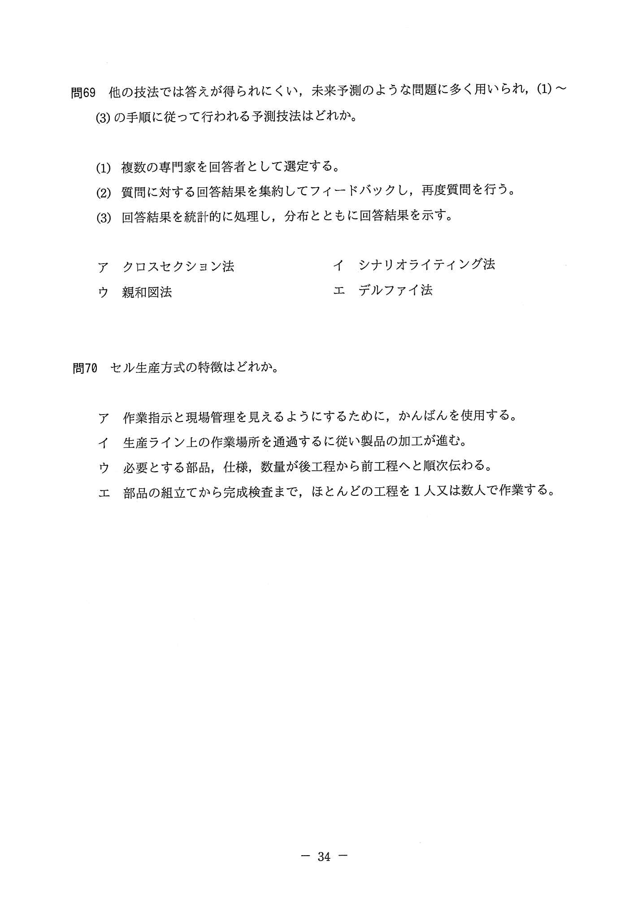

テキスト (OCR)

問69 他の技法では答えが得られにくい, 未来予測のような問題に多く用いられ, Q①) _
(3) の手順に従って行われる予測技法はどれか。

Q) 複数の専門家を回答者として選定する。
Q) 質問に対する回答結果を集約してフィードバックし, 再度質問を行う。
3) 回答結果を統計的に処理し, 分布とともに回答結果を示す。

ア クロスセクション法        イ シナリオライティング法

ウ 親和図法           エ デルファイ法
間79 セル生産方式の特徴はどれか。

ア 作業指示と現場管理を見えるようにするために, かんばんを使用する。
イ 生産ライン上の作業場所を通過するに従い製品の加工が進む。
ウ
時

必要とする部品, 仕様, 数量が後工程から前工程へと順次伝わる。
部品の組立てから完成検査まで, ほとんどの工程を 1 人又は数人で作業する。

ー 34 一

### ページ 35

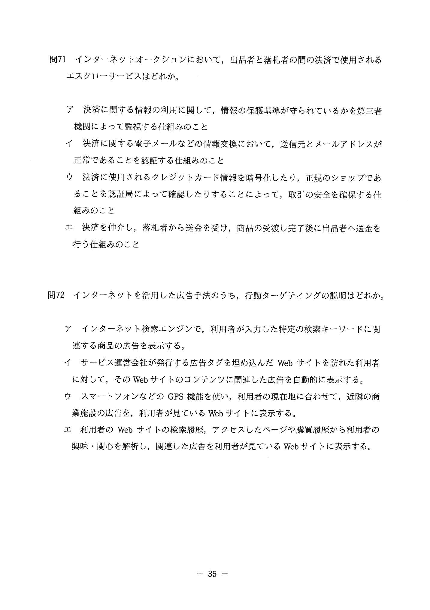

テキスト (OCR)

間71 インターネットオークションにおいて, 出品者と落札者の間の決済で使用される
エスクローサービスはどれか。

ア 決済に関する情報の利用に関して, 情報の保護基準が守ちれているかを第三者
機関によって監視する仕組みのこと
イ 決済に関する電子メールなどの情報交換において, 送信元とメールアドレスが
正常であることを認証する仕組みのこと
ウ 決済に使用されるクレジットカード情報を暗号化したり, 正規のショップであ
ることを語証局によって確認したりすることによって, 取引の安全を確保する仕
組みのこと
エエ 決済を仲介し, 落札者から送金を受け, 商品の受渡し完了後に出品者へ送金を
行う仕組みのこと

間72 インターネットを活用した広告手法のうち, 行動ターゲティングの説明はどれか。

ア インターネット検索エンジンで, 利用者が入力した特定の検索キーワードに関
連する商品の広告を表示する。
イ サービス運営会社が発行する広告タグを埋め込んだ Web サイトを訪れた利用者
に対して, その Web サイトのコンテンツに関連した広告を自動的に表示する。
ウ スマートフォンなどの GPS 機能を使い, 利用者の現在地に合わせて, 近隣の商
業施設の広告を, 利用者が見ている Web サイトに表示する。
エエ 利用者の Web サイトの検索履歴, アクセスしたページや購買履歴から利用者の
興味・関心を解析し, 関連した広告を利用者が見ている Web サイトに表示する。

ー 35 一

### ページ 36

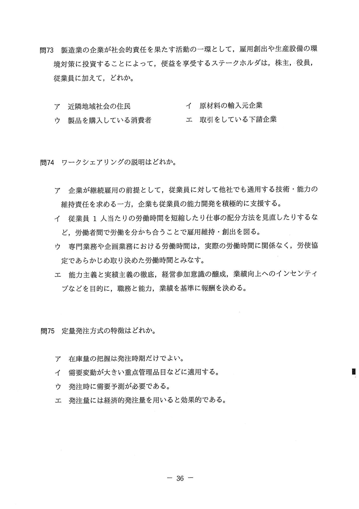

テキスト (OCR)

問73 製造業の企業が社会的責任を果たす活動の一環として, 雇用創出や生産設備の環
境対策に投資することによって, 便益を享受するステークホルダは, 株主, KA,
従業員に加えて, どれか。

ア 近隣地域社会の住民        イ 原材料の輸入元企業
ウ 製品を購入している消費者     エ 取引をしている下請企業

間74 ワークシェアリングの説明はどれか。

ア 企業が継続雇用の前提として, 従業員に対して他社でも通用する技術・能力の
維持貢任を求める一方, 企業も従業員の能力開発を積極的に支援する。

イ 従業員 1 人当たりの労働時間を短縮したり仕事の配分方法を見直したりするな
ど, 労働者間で労働を分かち合うことで雇用維持・創出を図る。

ウ 専門業務や企画業務における労働時間は, 実際の労働時間に関係なく, 労使協
定であらかじめ取り決めた労働時間とみなす。

エ 能力主義と実績主義の徹底, 経営参加意識の醸成, 業績向上へのインセンティ
プブなどを目的に, 職務と能力, 業績を基準に報酬を決める。

問75 定量発注方式の特徴はどれか。

在庫量の把握は発注時期だけでよい。

需要変動が大きい重点管理品目などに適用する。
発注時に需要予測が必要である。

発注量には経済的発注量を用いると効果的である。

Ht’ AN

ー 36

### ページ 37

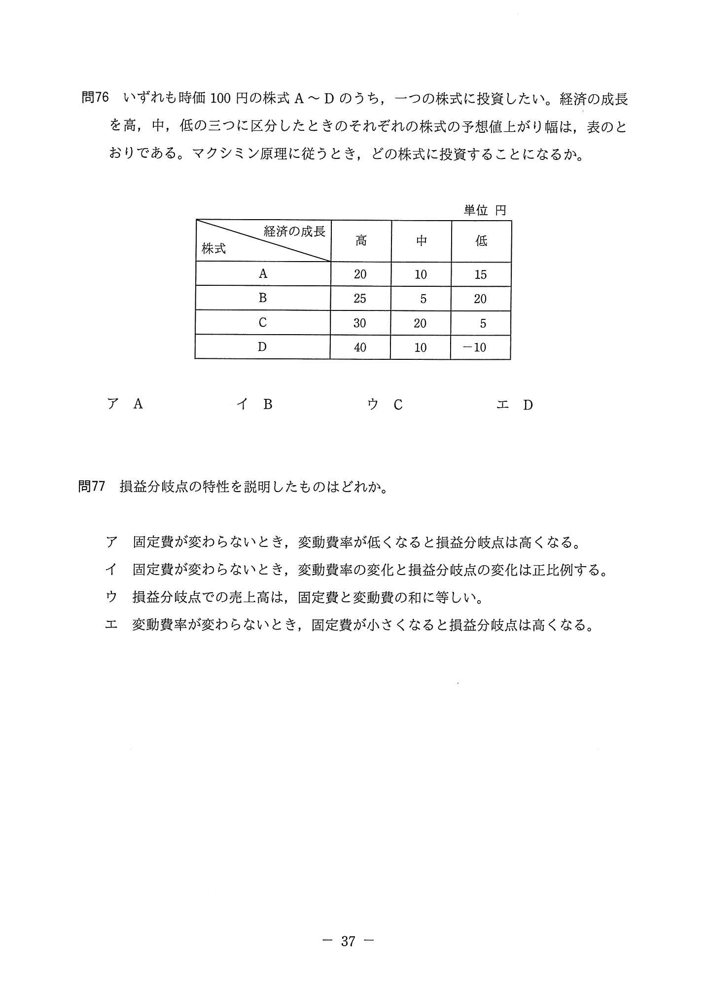

テキスト (OCR)

問76 いずれも時価 100 円の株式 AD のうち, 一つの株式に投資したい。経済の成長
を高, 中, 低の三つに区分したときのそれぞれの株式の予想値上がり幅は, BOL
おりである。マクシミン原理に従うとき, どの株式に投資することになるか。

単位 円

経済の成長

株式            高    中    低
A        20    10    15
B        25     5    20
0        30    20     5
D        40    10   ー10

ア A      イ B      ウ C      エ D

間77 損益分岐点の特性を説明したものはどれか。

固定費が変わらないとき, 変動費率が低くなると損益分岐点は高くなる。
固定費が変わらちないとき, 変動費率の変化と損益分岐点の変化は正比例する。
損益分岐点での売上高は, 固定費と変動費の和に等しい。

変動費率が変わらないとき, 固定費が小さくなると損益分岐点は高くなる。

Hot AN

ー 37 一

### ページ 38

テキスト (OCR)

問78 Web ページの著作権に関する記述のうち, 適切ながものはどれか。

ア 営利目的ではなく趣味として, 個人が開設している Web ページに他人の著作物
を無断掲載しても, 私的使用であるから著作権の侵害とはならない。

イ 作成したプログラムをインターネット上でフリーウェアとして公開した場合,
配布されたプログラムは, 著作権法による保護の対象とにならない。

ウ 試用期間中のシェアウェアを使用して作成したデータを, 試用期間終了後も
Web ページに掲載することは, 著作権の侵害に当たる。

エ 特定の分野ごとに Web ページの URL を収集し, 独自の解釈を付けたリンク集
は, 著作権法で保護され得る。

間79 コンピュータウイルスを作成する行為を処罰の対象とする法律はどれか。

ア 刑法               イ 不正アクセス禁止法
ウ 不正競争防止法          エ プロバイダ南任制限法

間86 発注者と受注者の間でソフトウェア開発における請負契約を締結した。ただし,
発注者の事業所で作業を実施することになっている。この場合, 指揮命令権と雇用
契約に関して, 適切なものはどれか。

ア 指揮命令権は発注者にあり, さらに, 発注者の事業所での作業を実施可能にす
るために, 受注者に所属する作業者は, 新たな雇用契約を発注者と結ぶ。

4 指揮命令権は発注者にあり, 受注者に所属する作業者は, 新たな必用契約を発
注者と結ぶことなく, 発注者の事業所で作業を実施する。

ウ 指揮命令権は発注者にないが, 発注者の事業所での作業を実施可能にするため
に, 受注者に所属する作業者は, 新たな雇用契約を発注者と結ぶ。

エ 指揮命令権は発注者になく, 受注者に所属する作業者は, 新たな雇用契約を発
注者と結ぶことなく, 発注者の事業所で作業を実施する。

ー 38 一

### ページ 39

テキスト (OCR)

C

メ モ 用 紙 〕

ー 39 一

### ページ 40

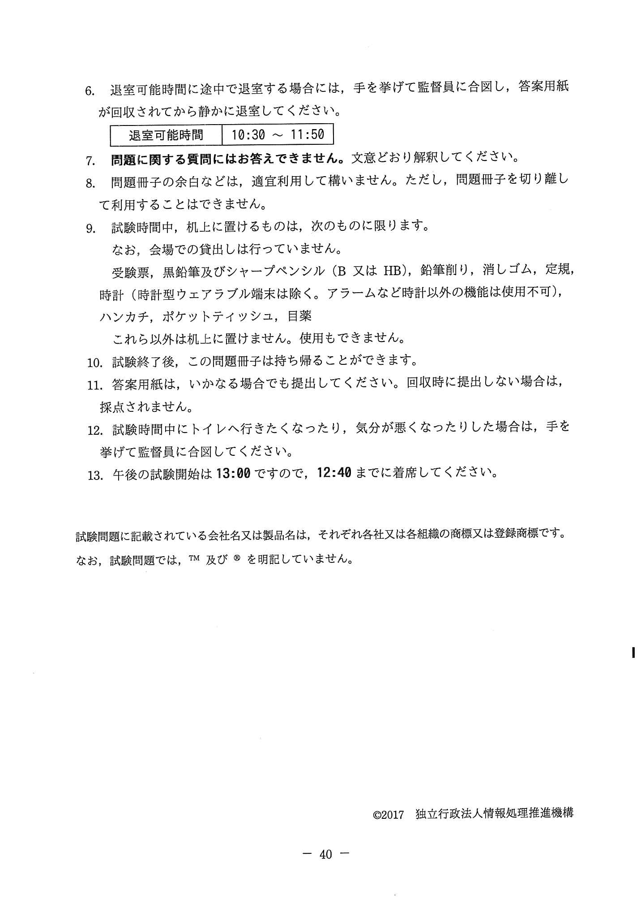

テキスト (OCR)

6. 退室可能時間に途中で退室する場合には, 手を挙げて監督員に合図し, 答案用紙
が回収されてから静かに退室してください。
| 退室可能時間 | 10:30 ~ 11:50
7. 問題に関する質問にはお答えできません。文意どおり解釈してください。
8. 間題冊子の余白などは, 適宜利用して構いません。ただし, 問題冊子を切り離し
て利用することはできません。
9. 試験時間中, 机上に置けるものは, 次のものに限ります。
なお, 会場での貸出しは行っていません。
愛験票, 黒鉛筆及びシャープペンシル (B 又は HB), 鉛筆削り, 消しゴム, 定規,
時計 (時計型ウェアラブル端末は除く。アラームなど時計以外の機能は使用不可),
ハンカチ, ポケットティッシュ, 目薬
これら以外は机上に置けません。 使用もできません。
10. 試験終了後, この問題冊子は持ち帰ることができます。
ll. SEAMS, いかなる場合でも提出してください。回収時に提出しない場合は,
採点されません。
12, 試験時間中にトイレへ行きたくなったり, 気分が悪くなったりした場合は, FE
挙げて監督貞に合図してください。
13. 午後の試験開始は 13:99 ですので, 12:40 までに着席してください。

試験問題に記載されている会社名又は製品名は, それぞれ各社又は各組織の商標又は登録商標です。
なお, 試験問題では, ™ 及び ® を明記していません。

@2017 独立行政法人情報処理推進機構

ー 40 一

---

## 午前解答

©2017 独立行政法人情報処理推進機構 
平成29 年度 春期 応用情報技術者試験 解答例 
 
午前試験 
問番号 正解 分野 
問1 
エ 
Ｔ 
問2 
ア 
Ｔ 
問3 
ウ 
Ｔ 
問4 
エ 
Ｔ 
問5 
ア 
Ｔ 
問6 
イ 
Ｔ 
問7 
ア 
Ｔ 
問8 
エ 
Ｔ 
問9 
ウ 
Ｔ 
問10 
イ 
Ｔ 
問11 
ア 
Ｔ 
問12 
エ 
Ｔ 
問13 
イ 
Ｔ 
問14 
ア 
Ｔ 
問15 
エ 
Ｔ 
問16 
エ 
Ｔ 
問17 
イ 
Ｔ 
問18 
エ 
Ｔ 
問19 
ウ 
Ｔ 
問20 
ウ 
Ｔ 
 
 
問番号 正解 分野 
問21 
イ 
Ｔ 
問22 
エ 
Ｔ 
問23 
イ 
Ｔ 
問24 
ウ 
Ｔ 
問25 
エ 
Ｔ 
問26 
ア 
Ｔ 
問27 
イ 
Ｔ 
問28 
ウ 
Ｔ 
問29 
エ 
Ｔ 
問30 
ア 
Ｔ 
問31 
ア 
Ｔ 
問32 
イ 
Ｔ 
問33 
イ 
Ｔ 
問34 
イ 
Ｔ 
問35 
エ 
Ｔ 
問36 
エ 
Ｔ 
問37 
ウ 
Ｔ 
問38 
ア 
Ｔ 
問39 
ア 
Ｔ 
問40 
ウ 
Ｔ 
 
 
問番号 正解 分野 
問41 
イ 
Ｔ 
問42 
イ 
Ｔ 
問43 
ウ 
Ｔ 
問44 
エ 
Ｔ 
問45 
ウ 
Ｔ 
問46 
ウ 
Ｔ 
問47 
ア 
Ｔ 
問48 
エ 
Ｔ 
問49 
ア 
Ｔ 
問50 
エ 
Ｔ 
問51 
エ 
Ｍ 
問52 
ウ 
Ｍ 
問53 
ア 
Ｍ 
問54 
イ 
Ｍ 
問55 
ア 
Ｍ 
問56 
ウ 
Ｍ 
問57 
ア 
Ｍ 
問58 
エ 
Ｍ 
問59 
ウ 
Ｍ 
問60 
エ 
Ｍ 
 
 
問番号 正解 分野 
問61 
エ 
Ｓ 
問62 
ア 
Ｓ 
問63 
エ 
Ｓ 
問64 
ア 
Ｓ 
問65 
ウ 
Ｓ 
問66 
ウ 
Ｓ 
問67 
エ 
Ｓ 
問68 
エ 
Ｓ 
問69 
エ 
Ｓ 
問70 
エ 
Ｓ 
問71 
エ 
Ｓ 
問72 
エ 
Ｓ 
問73 
ア 
Ｓ 
問74 
イ 
Ｓ 
問75 
エ 
Ｓ 
問76 
ア 
Ｓ 
問77 
ウ 
Ｓ 
問78 
エ 
Ｓ 
問79 
ア 
Ｓ 
問80 
エ 
Ｓ 
 
 
分野の「Ｔ」はテクノロジ系，「Ｍ」はマネジメント系，「Ｓ」はストラテジ系の問題です。

---

## 午後問題

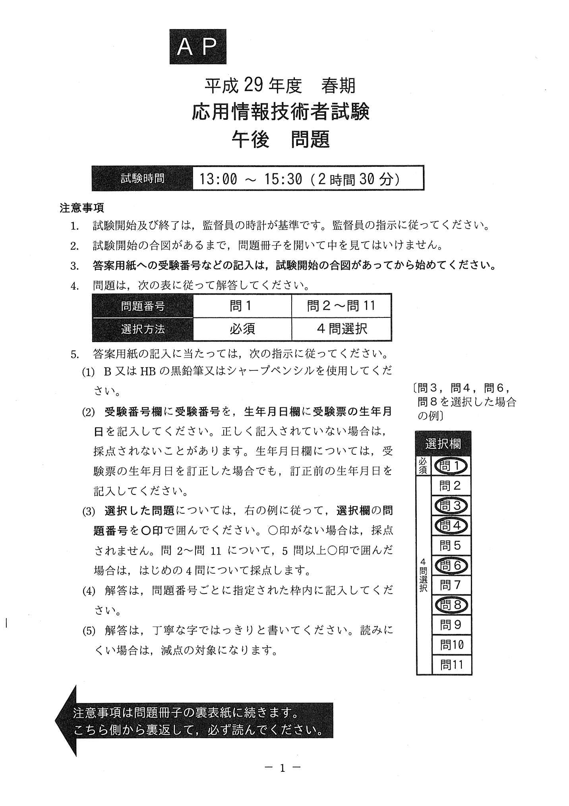

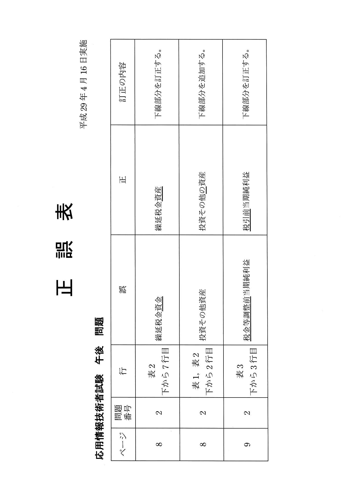

正 誤 表 
平成29 年4 月16 日実施 
応用情報技術者試験 午後 問題 
ページ
問題 
番号 
行 
誤 
正 
訂正の内容 
9 
2 
表4 
下から12 行目
総資本回転率（％） 
総資本回転率（回転） 
下線部分を訂正する。

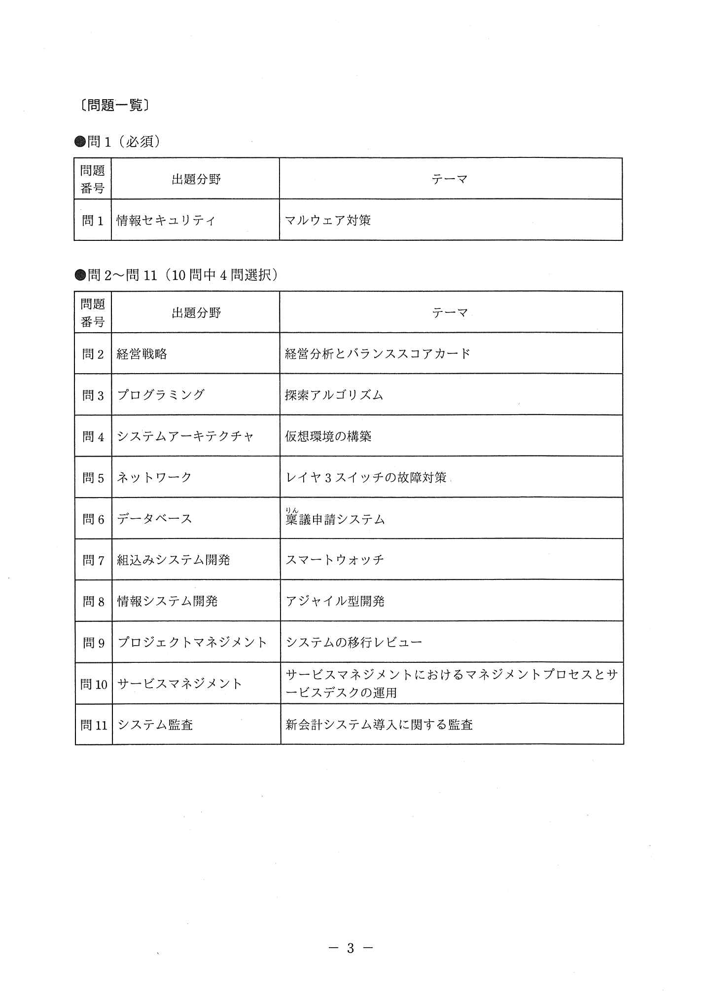

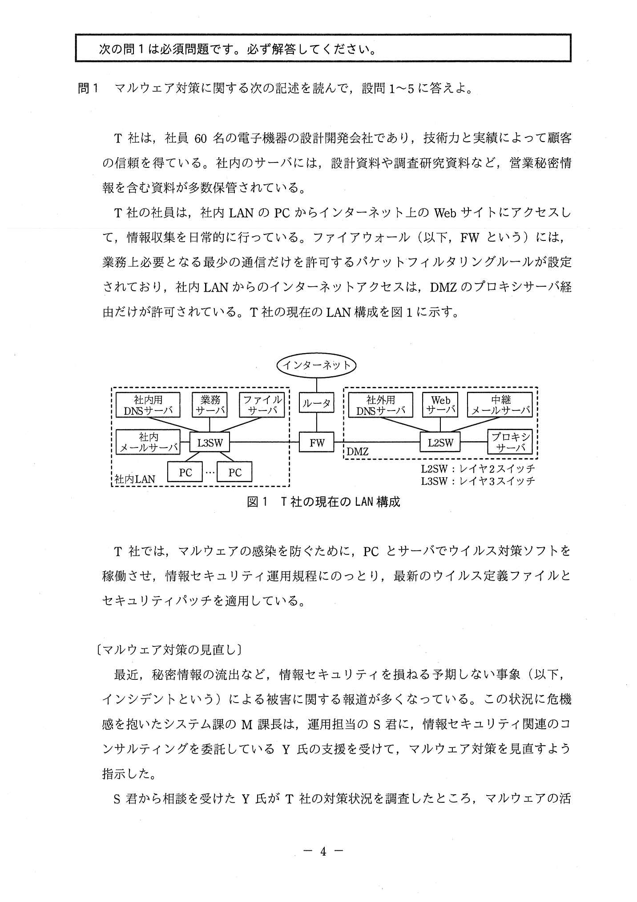

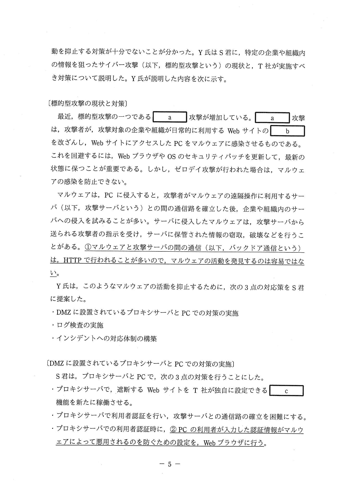

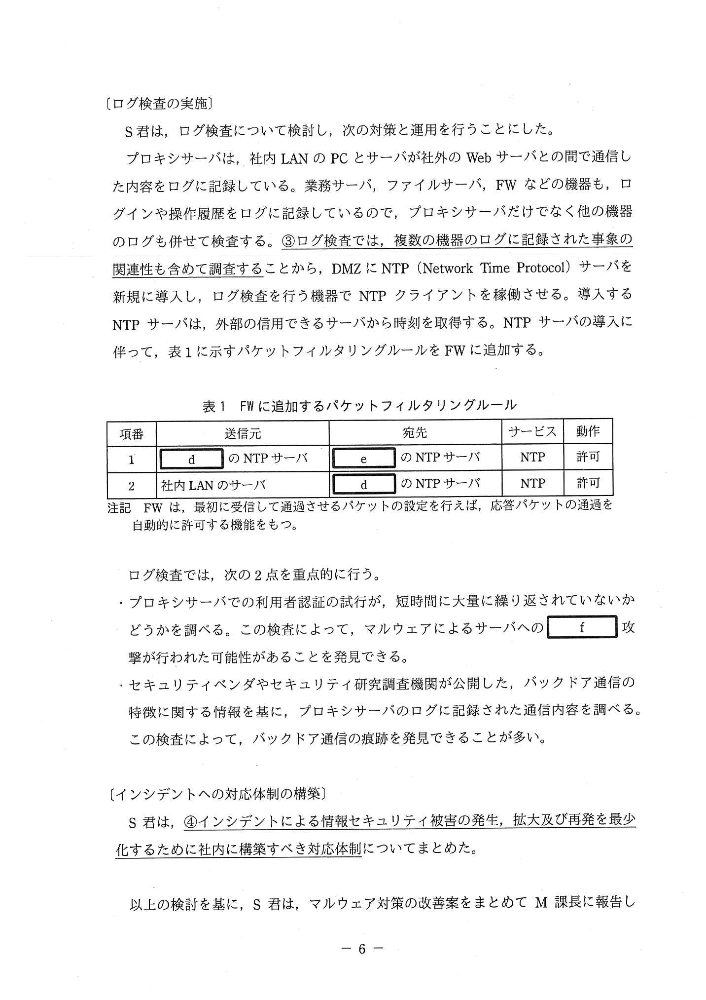

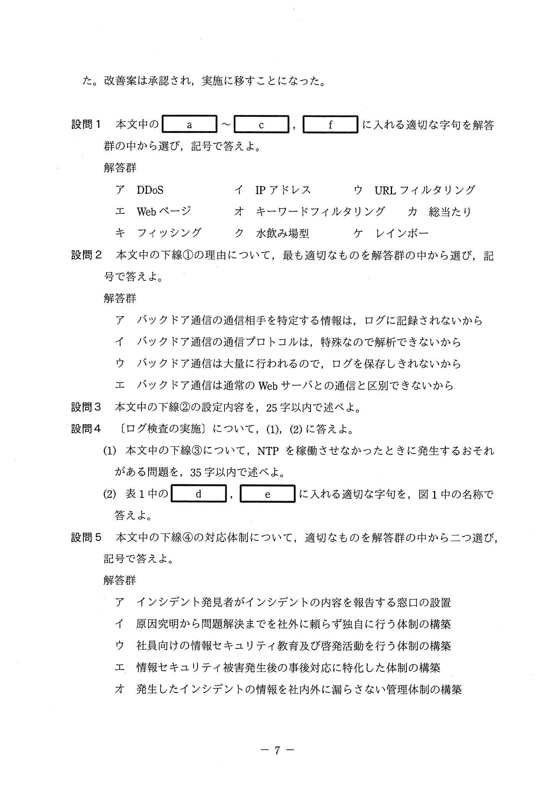

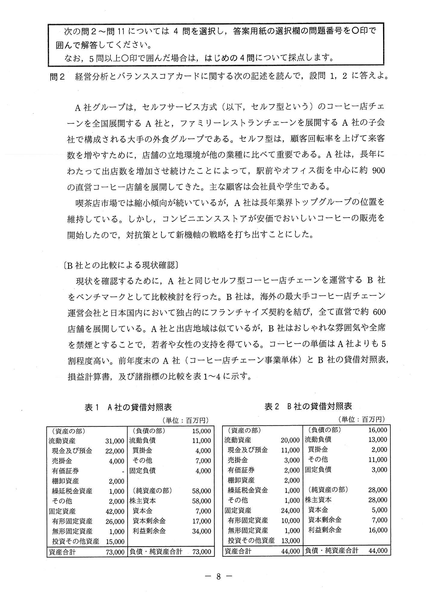

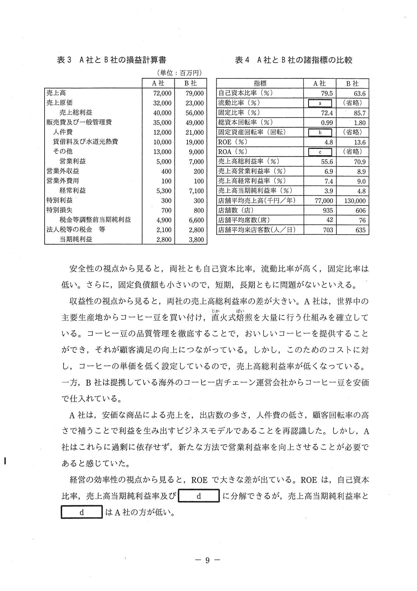

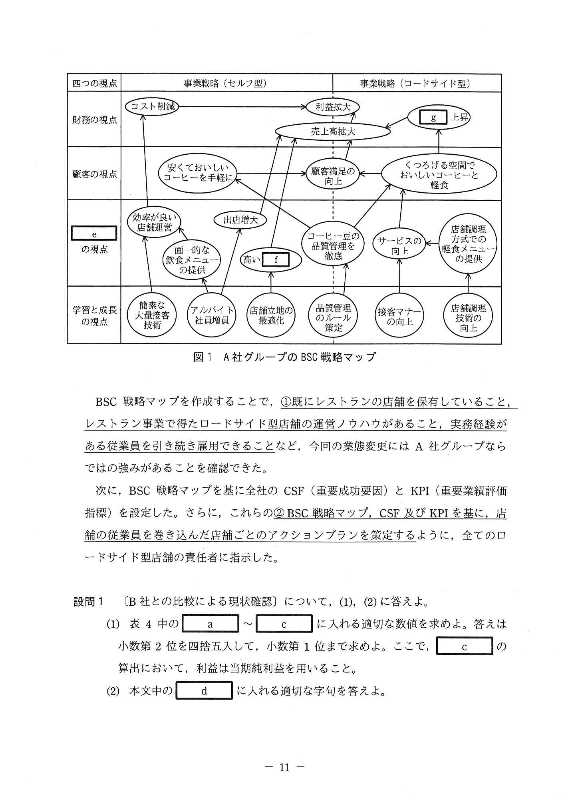

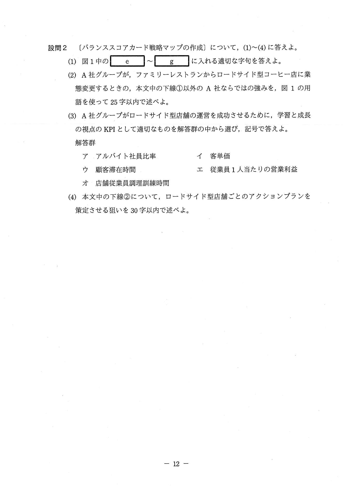

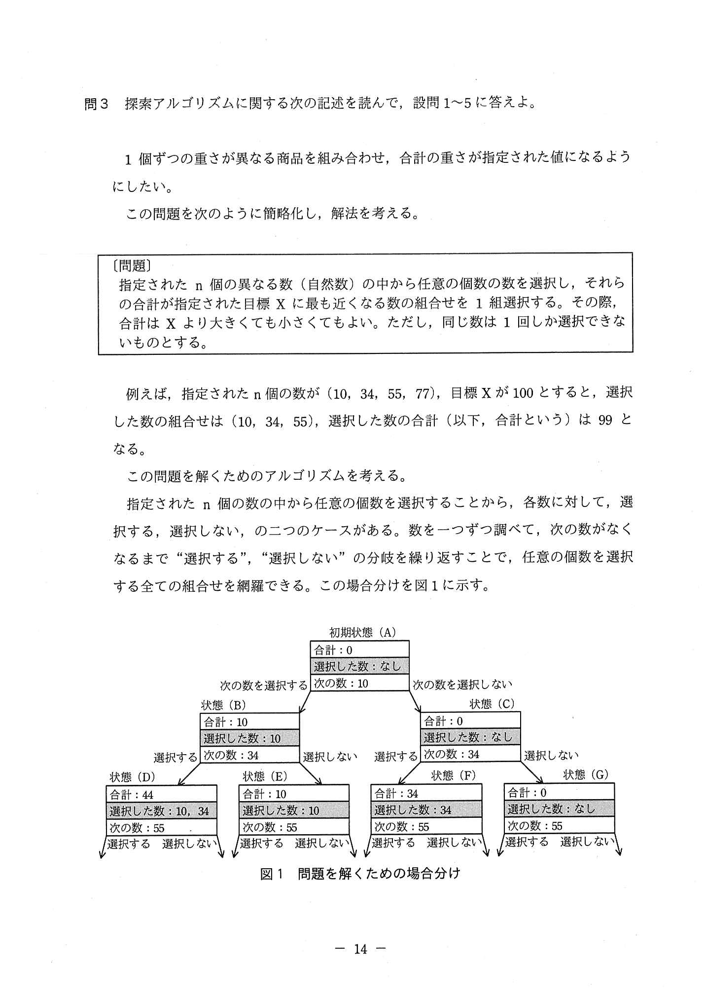


---

## 午後解答

1/6 
©2017 独立行政法人情報処理推進機構 
平成29 年度 春期 応用情報技術者試験 解答例 
 
午後試験 
問１ 
出題趣旨 
 最近，標的型攻撃が増加している。標的型攻撃の手法は巧妙なので，マルウェアの社内への侵入を完全に防
ぐのは困難である。そこで，マルウェアの侵入を前提にした対策も重要になっている。 
 本問では，マルウェア対策を題材に，社内に侵入したマルウェアの活動を抑止するための出口対策と，被害
を最小限に抑えるための社内体制についての理解を問う。 
 
設問 
解答例・解答の要点 
備考 
設問１ 
a ク 
 
 
b エ 
 
 
c ウ 
 
 
f カ 
 
設問２ 
エ 
 
設問３ 
オートコンプリート機能を無効にする。 
 
設問４ (1) 各機器のログに記録された事象の時系列の把握が困難になる。 
 
 
(2) d DMZ 
 
 
 
e インターネット 
 
設問５ 
ア，ウ 
 
 
問２ 
出題趣旨 
 バランススコアカードは，ビジョンと戦略を明確にすることによって，財務数値に表される業績だけでなく，
財務以外の経営状況や経営品質から経営を評価し，バランスがとれた業績の評価を行うための手法である。 
 本問では，大手の外食チェーンの業態変更検討を題材に，経営分析と，バランススコアカード戦略マップを
策定，評価する能力について問う。 
 
設問 
解答例・解答の要点 
備考 
設問１ (1) a 281.8 
 
 
 
b 1.7 
 
 
 
c 3.8 
 
 
(2) d 総資本回転率 
 
設問２ (1) e 業務プロセス 
 
 
 
f 顧客回転率 
 
 
 
g 客単価 
 
 
(2) コーヒー豆の品質管理を徹底していること 
 
 
(3) オ 
 
 
(4) 新たな事業戦略を店舗の従業員まで浸透させるため

2/6 
©2017 独立行政法人情報処理推進機構 
問３ 
出題趣旨 
 木構造の探索は情報処理の基本的アルゴリズムであり，現実の問題を木構造に置き換えることで，様々な問
題解決に適用可能である。 
 本問では，木構造の探索を使った組合せ問題の問題解決を題材に，アルゴリズムを理解し，実装する能力を
問う。さらに，プログラムの中で使用するデータ構造（キュー，スタック）による探索順序の違いや，アルゴ
リズムを評価する指標の一つであるメモリ使用量の理解を問う。 
 
設問 
解答例・解答の要点 
備考 
設問１ 
ア isEmpty( )が0 である 
 
 
イ ansStatus ← currentStatus 
 
 
ウ ansStatus ← currentStatus 
 
 
エ currentStatus.nextIndex が0 ではない 
 
設問２ 
オ “N” 
 
 
カ “Y” 
 
設問３ (1) （A）→（B）→（C）→（D）→（E）→（F）→（G） 
 
 
(2) （A）→（C）→（G）→（F）→（B）→（E）→（D） 
 
設問４ 
ア 
 
設問５ 
内容 数を降順にソートしておく。 
 
 
理由 早い段階で探索を打ち切ることができる。 
 
 
問４ 
出題趣旨 
 仮想システムは，TCP/IP 技術と同様に，システムエンジニアの必須知識となる基盤技術であるが，1way モ
デル機とは異なる，CPU，メモリなどの使い方を習得する必要がある。 
 本問では，会計事務所システムの仮想化を題材に，仮想システムのメリット，基本的な機能，既存システム
を仮想環境に移行する際の大まかな容量の計算について問うた。 
 
設問 
解答例・解答の要点 
備考 
設問１ (1) ライブマイグレーション 
 
 
(2) アクティブ／アクティブ方式 
 
 
(3) 自動再起動 
 
 
(4) シンプロビジョニング 
 
設問２ 
a 54 
 
 
b 44 
 
 
c 71 
 
設問３ 
イ，エ 
 
設問４ 
会計システムを構成する各サーバに割り当てるリソースの下限値を設定する。

3/6 
©2017 独立行政法人情報処理推進機構 
問５ 
出題趣旨 
 レイヤ3 スイッチ（以下，L3SW という）は複数のサブネットを構成するので，故障による影響は大きい。
L3SW の冗長化はレイヤ2 スイッチよりも複雑となるが，理解が欠かせない。 
 本問では，L3SW の冗長化を題材に，冗長化の方法についての本文中の説明を基に，TCP/IP の通信の仕組み，
動的経路による経路変更など，LAN における通信の基本動作の理解について問う。 
 
設問 
解答例・解答の要点 
備考 
設問１ 
a イ 
 
 
b コ 
 
 
c オ 
 
 
d カ 
 
 
e ク 
 
設問２ (1) 業務サーバへの経路に障害があるかどうかを確認するため 
 
 
(2) PC にDNS のキャッシュが残っているから 
 
設問３ 
ルーティングテーブルの項番 
1 
 
 
VLAN インタフェースの更新後の内容 172.16.2.250 
 
 
VLAN 名の更新後の内容 
VLAN20 
 
設問４ 
変更することになる情報 
デフォルトゲートウェイアドレス 
 
 
サーバにおける変更後の内容 172.16.1.200 
 
 
問６ 
出題趣旨 
 業務運用の中で，データベースが取り扱う情報が変わることが想定される場合は，あらかじめ関係データベ
ースのテーブルの使い方を工夫しておくことで拡張性をもたせることができる。 
 本問では，稟議申請のシステムの設計を題材に，E-R 図の理解とSQL の基本的な知識と応用力を問う。また，
データベース上への抽象的な情報のもたせ方についての応用力を問う。 
 
設問 
解答例・解答の要点 
備考 
設問１ 
a → 
 
 
b 書式ID 
 
設問２ 
c 承認者情報.承認申請ID = 承認申請.承認申請ID 
 
 
d 承認者情報.承認者ユーザID = :ユーザID 
 
設問３ 
e t1.項目値 
 
 
f t2.項目値 
 
 
g 申請書.申請書ID = t1.申請書ID 
 
 
h 申請書.申請書ID = t2.申請書ID 
 
設問４ 
エンティティ 申請書 
 
 
属性 
申請時部署名

4/6 
©2017 独立行政法人情報処理推進機構 
問７ 
出題趣旨 
 昨今，スマートフォンと連携して動作する様々な機器が販売されている。 
 本問では，腕時計型のスマートウォッチを題材に，システムの動作仕様に対する理解力，リアルタイムOS
で動作するタスクに関連した割込みハンドラ及びタスク優先度への理解力を問う。 
 
設問 
解答例・解答の要点 
備考 
設問１ 
エ 
 
設問２ 
16 
 
設問３ (1) a 画面入力 
 
 
 
b 画面表示 
 
 
 
c 音声入力 
 
 
 
d 画面作成 
 
 
(2) e メールの内容 
 
 
 
f 機能選択画面 
 
 
(3) g 優先度 
 
 
 
現象 複数画面が混在表示される。 
 
 
問８ 
出題趣旨 
 近年，企画からリリースまでを迅速に行い，かつ，高品質なソフトウェアを提供するために，ソフトウェア
開発モデルにアジャイル型開発を採用するプロジェクトが増えつつある。 
 本問では，コンビニエンスストアにおけるSNS 開発を題材に，アジャイル型開発のプラクティスに関する基
本的な理解，及び継続的インテグレーションを実装した際の理解について問う。 
 
設問 
解答例・解答の要点 
備考 
設問１ (1) a オ 
 
 
 
b ウ 
 
 
 
c カ 
 
 
(2) タスクボード 
 
設問２ (1) DB サーバの設定やテーブル定義などの構成を一元管理できる。 
 
 
(2) 自身のテストデータと他の開発者のテストデータとの見分けがつかない。 
 
設問３ 
d ビルドサーバ 
 
 
e チケット管理サーバ 
 
設問４ 
利用中のメジャーバージョンの中で最新のマイナーバージョンであること

5/6 
©2017 独立行政法人情報処理推進機構 
問９ 
出題趣旨 
 システムの移行に当たっては，障害の多くが稼働直後に発生するので，稼働開始前に十分にリスクを共有し，
事前の対策を検討すべきである。 
 本問では，家電量販店のコールセンタでの新システムへの移行の可否を判定する会議を題材に，稼働開始の
評価に必要十分な情報を収集し，整理，分析，評価する能力について問う。 
 
設問 
解答例・解答の要点 
備考 
設問１ (1) ア，エ 
 
 
(2) 新パッケージのコードの値を現行パッケージのコードの値に変換する。 
 
 
(3) a カ 
 
 
 
b オ 
 
設問２ (1) c 緊急時対応計画 
 
 
(2) d テスト環境の容量・能力が稼働環境と同等 
 
 
(3) 利用者による受入れテストで指摘されたプログラム改修 
 
 
(4) e 
現行システムの廃棄 
 
 
問10 
出題趣旨 
企業が情報システムサービスを提供する場合，問合せ業務を始めとしたサービスマネジメントをうまく執り
行い，利用者に情報システムサービスを支障なく活用してもらうための仕掛けの提供が同時に求められる。 
本問では，複数の支店をもつ流通業でのサービスマネジメントを題材に，インシデント及びサービス要求管
理プロセス，問題管理プロセスを実施する能力，並びにサービスデスクの運用に関わる能力を問う。 
 
設問 
解答例・解答の要点 
備考 
設問１ (1) ア 
 
 
(2) a カ 
 
 
 
b イ 
 
設問２ 
複数のメンバが同時にファイルを更新できない。 
 
設問３ (1) ウ 
 
 
(2) OS のアップデートを展開しても流通業務サービスに影響がないことを試験す
る。 
 
 
(3) c 傾向 
 
設問４ (1) d 段階的取扱い 
 
 
(2) ア，イ

6/6 
©2017 独立行政法人情報処理推進機構 
問11 
 
 
出題趣旨 
 新システムの導入においては，業務プロセスが変更されるが，コントロールが効果的に機能するかどうかは，
利用者の運用によるところが大きい。このため，システム監査では，新システム導入当初において，利用者の
運用状況を理解し，課題及びその原因の洗い出し，機能・運用手続の改善などの対応が早期に実施されること
が必要となる。 
 本問では，会計システムを題材として，新システム導入当初における運用状況の監査手続を検討する能力を
問う。 
 
設問 
解答例・解答の要点 
備考 
設問１ 
a 伝票入力業務説明会 
 
 
b 仮伝票データ 
 
 
c 入力日 
 
設問２ 
d 入力権限 
 
設問３ 
経理部員が承認を受けず伝票を入力する。 
 
設問４ 
e 夜間バッチ処理 
 
 
f 処理の正常完了 
 
設問５ 
g 会計連携データの任意項目

---

## 午後採点講評

1/3 
©2017 独立行政法人情報処理推進機構 
平成29 年度 春期 応用情報技術者試験 採点講評 
 
午後試験 
問１ 
 問1 では，標的型攻撃を題材に，マルウェア対策について出題した。全体として，正答率は高かった。 
 設問1，2 とも正答率は高く，標的型攻撃の一つである水飲み場型攻撃の手法，社内に侵入したマルウェアの
活動についての基本的な対応策は理解されていると判断できた。 
 設問3 は，Web ブラウザの設定について問うたが，認証情報をWeb ブラウザに保存させない設定について，
理解されていないようであった。セキュリティ面では有効な対策なので理解しておいてほしい。 
 設問4(1)では，NTP を稼働させる目的について問うた。マルウェアの侵入を発見するためには，複数の機器
のログを時系列に解析することが有効である。NTP による時刻同期は，時系列でのログ解析を速やかに行うた
めに欠かせない措置であることを理解しておいてほしい。 
 
問２ 
 問2 では，大手の外食チェーンの業態変更検討を題材に，経営分析と，バランススコアカード戦略マップを
策定・評価する能力について出題した。全体として，正答率は低かった。 
 設問2(3)は，バランススコアカード戦略マップの四つの視点（財務，顧客，業務プロセス，学習と成長）の
それぞれで取り組むべき課題は何かを理解してほしい。セントラルキッチン方式から店舗調理方式に切り替
え，一手間加えた軽食メニューの提供によって他社との差別化を図るため，学習と成長の視点では店舗従業員
の調理技術の向上が課題であることに気づき正答を導いてほしい。 
 設問2(4)は，バランススコアカード戦略マップを基にしたアクションプランの策定方法に関する理解が高い
ことがうかがわれた。本問では，店舗ごとにアクションプランを策定することによって，全社の新たな事業戦
略が店舗の従業員まで浸透し，経営の意向に沿った現場の活動が可能になる。 
 
問３ 
 問3 では，木構造の探索を使った組合せ問題の問題解決を題材に，アルゴリズムの理解と，プログラムへの
実装，探索回数の削減によるプログラムの改良について出題した。全体として，正答率は高かった。 
 設問3 では，データ構造としてキューを使用する場合とスタックを使用する場合の違いについて問うたが，
キューに関する設問と比較して，スタックに関する設問の正答率が低かった。いずれもよく用いられる基本的
なデータ構造であり，両方の使い方を理解してほしい。 
 設問5 では探索回数の削減を効率良く行うための入力データへの事前処理について問うたが，ソートの順序
についての言及がない解答が目立った。ソートの順序が異なると，設問で求めている内容と全く逆の結果にな
ってしまうので，本問ではソートの順序が重要である。もう一歩踏み込んで考え，正答を導き出してほしい。

2/3 
©2017 独立行政法人情報処理推進機構 
問４ 
 問4 では，会計事務所の業務システム基盤の再構築を題材に，仮想化システムの構築について出題した。全
体として，正答率は低かった。 
 設問1(1)及び(4)は，正答率が高かった。仮想化システムの主要な機能について，理解ができているようであ
った。 
 設問2 は，正答率が低かった。リソース使用率の計算に必要な使用量の合計は本文中に記載されており，問
題文をよく読み解答してほしい。 
 設問3 は，正答率が低かった。物理サーバのリソースの割当てや可用性の観点から，解答群の各項目の内容
を理解した上で正解を選び出してほしい。 
 設問4 は，正答率が低かった。仮想サーバに割り当てるリソース量に下限値を設定できるとの記載が本文中
にあり，適切に説明してほしかった。 
 
問５ 
 問5 では，レイヤ3 スイッチの冗長化を題材に，TCP/IP 通信の仕組み，動的経路制御による経路変更などに
ついて出題した。全体として，正答率は髙かった。 
 設問1 は，正答率が高かった。TCP/IP 通信の基本動作に関する理解が高いことがうかがわれた。 
 設問2(2)は，正答率が低かった。PC で稼働するスタブリゾルバは，名前解決において基本的で重要な働きを
するので，動作について理解しておいてほしい。 
 設問3 では，ルーティングテーブルの変更内容について問うたが，変更後のVLAN インタフェースの正答率
が低かった。経路制御は重要な技術なので，基本動作を理解しておいてほしい。 
 
問６ 
 問6 では，稟議申請システムを題材に，E-R 図の理解とSQL の基本的な知識と応用について出題した。 
 設問1 は，正答率が高かった。E-R 図に関する理解が高いことがうかがわれた。 
 設問4 は，正答率が低かった。データベースを設計する際に，マスタ情報が更新される場合の考慮を含めて
設計することは重要である。システムの機能要件について，現在の情報だけでなく，過去のデータや未来の情
報を見据えて設計できる能力を身に付けてほしい。 
 
問７ 
 問7 では，スマートフォンと連携して動作するスマートウォッチについて出題した。 
 設問3(2)は，用語を正しく用いていない解答が多かった。用語が問題文に定義してあるかどうかを，注意深
く読むようにしてほしい。 
 設問3(3)は，正答率が低かった。誤って，デッドロックに関する内容と判断した解答が，散見された。単一
のメモリに対する複数タスク間のアクセス処理の優先度に関する内容であることを読み取ってほしい。リアル
タイムOS の動作についての基本的な知識を是非身に付けてもらいたい。 
 
問８ 
 問8 では，コンビニエンスストアにおけるSNS 開発を題材に，アジャイル型開発について出題した。全体と
して，正答率は低かった。 
 設問1(2)は，問題文と関係のないプラクティス名を挙げている解答が散見された。日次ミーティングの際に
メンバ全員が作業状態を確認できるものは何かを考え，正答を導き出してほしい。 
 設問4 は，問題文中に示された，回帰テストで発生した問題に関する理解が高いことがうかがわれたが，オ
ープンソースライブラリの取得条件ではない解決策を挙げている解答が目立った。メジャーバージョンとマイ
ナーバージョンとの違いを読み取り，設問で何が問われているかを正しく理解し，注意深く解答してほしい。

3/3 
©2017 独立行政法人情報処理推進機構 
問９ 
 問9 では，家電量販店のコールセンタでの新システムへの移行の可否を判定する会議を題材に，稼働開始の
評価に必要十分な情報を収集し，整理，分析，評価する能力について出題した。全体として，正答率は低かっ
た。 
 設問2(2)は，システム適格性確認テストで性能要件を検証するために，商品在庫管理システムが使用したテ
スト環境が稼働環境と同等の容量・能力をもっていることが条件であることを理解してほしい。問題文からそ
のまま引用しただけの解答が散見された。 
 設問2(3)は，プロジェクトの完了時に申し送り事項がある場合，確実に適任者に引き継ぐことを理解してほ
しい。本問では，利用者による受入れテストで指摘されたプログラムを改修することが申し送り事項になって
おり，これをソフトウェア保守作業担当者に引き継ぐことが必要である。 
 
問10 
 問10 では，流通業でのサービスマネジメントを題材に，インシデント及びサービス要求管理プロセス，問題
管理プロセスと実施する能力，並びにサービスデスクの運用に関わる能力について出題した。 
 設問2 は，表計算ソフトのアクセス制御方式の制約による“サービスデスク業務に支障を来す事象”の内容
を問うたが，問題文からそのまま引用するだけで，具体的な説明になっていない解答が目立った。 
 設問3(2)は，“流通業務サービスの一部の機能が正常に利用できない事象”を回避すべきであるのに，PC そ
のものに関することや，サービスのテスト以外のことに言及している解答が散見された。 
 設問3(3)は，正答率が低かった。インシデントの“傾向（トレンド）分析”は，サービスマネジメント業務
において実施してほしい事項の一つである。 
 設問4(2)は，インシデント及びサービス要求管理プロセスで設定したCSF に対するKPI を問うた。各プロセ
スの目的・ねらい，すなわちCSF やKPI を十分理解した上で，サービスマネジメント業務を遂行してほしい。
 
問11 
 問11 では，新システムの導入によって業務プロセスに変更が生じた場合にコントロールも適切に見直されて
いることを確認するための監査について出題した。全体として，正答率は低かった。 
 設問1 のa では，承認者の伝票の正確性に関するチェック手続について，予備調査で判明している新システ
ムにおける現場での承認入力の導入，及び伝票内容の間違いが散見される状況を踏まえて，どのような対策が
必要か解答してほしかった。 
 設問4 では，経理担当が毎朝実行させる取込処理の前後で何を確認する必要があるかについて，予備調査で
判明しているトラブル状況や運用プロセスの流れを理解すれば，正解を導けるはずである。 
 設問5 では，仕入販売システムから取り込まれるデータ項目を理解し，予備調査で判明している利用者の不
満の原因を理解すれば，正解を導けるはずである。

