# 平成30年度秋期 応用情報技術者試験

---

## 午前問題

### ページ 1

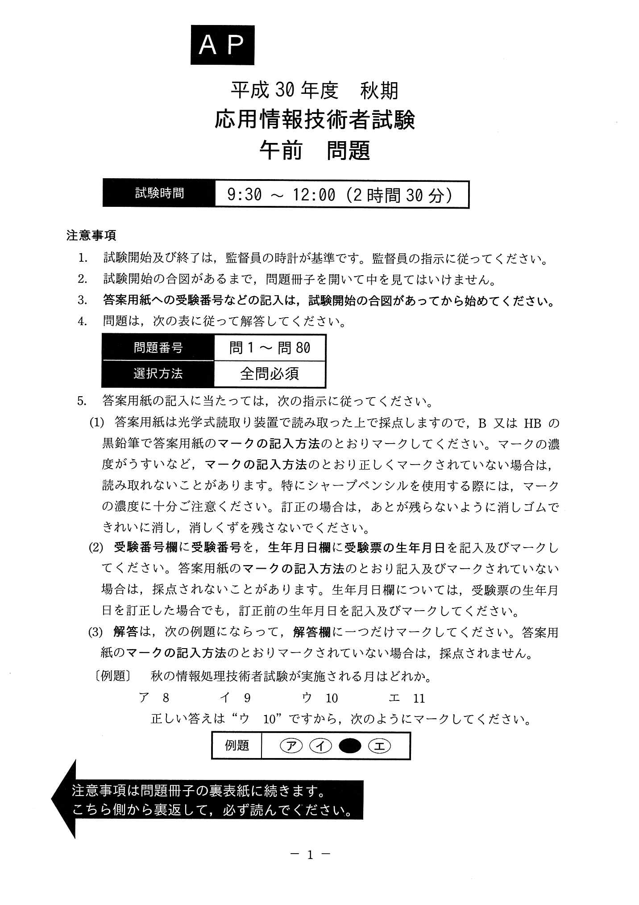

テキスト (OCR)

平成30 年度 秋期
応用情報技術者試験
午前 問題

ee 36 ~ 12:00 (2時間39分)

注意事項
1. 試験開始及び終了は, 監督員の時計が基準です。監督貞の指示に従ってください。
2. 試験開始の合図があるまで, 問題冊子を開いて中を見てはいけません。
3. 答案用紙への受験番号などの記入は, 試験開始の合図があってから始めてください。
4. 問題は, 次の表に従って解答してください。
問題番号       fal 1 ~ Fal 80
選択方法         全問必須
5. 答案用紙の記入に当たっては, 次の指示に従ってください。
①) 答案用紙は光学式読取り装置で読み取った上で採点しますので, B 又は HB の
黒鉛筆で答案用紙のマークの記入方法のとおりマークしてください。マークの濃
度がうすいなど, マークの記入方法のとおり正しくマークされていない場合は,
読み取れないことがあります。 特にシャープペンシルを使用する際には, マーク
の濃度に十分ご注意ください。 訂正の場合は, あとが残らないように消しゴムで
きれいに消し, 消しくずを残さないでください。
②⑫) 受験番号欄に受験番号を, 生年月日欄に受験票の生年月日を記入及びマークし
てください。答案用紙のマークの記入方法のとおり記入及びマークされていない
場合は, 採点されないことがあります。生年月日欄については, 受験票の生年月
日を訂正した場合でも, 訂正前の生年月日を記入及びマークしてください。
(3) 解答は, 次の例題にならって, 解答欄に一つだけマークしてください。答案用
紙のマークの記入方法のとおりマークされていない場合は, 採点されません。
〔例題) 秋の情報処理技術者試験が実施される月はどれか。
ア 8    イ 9    ウ 10    エ 11
正しい答えは“ウ 10” ですから, 次のようにマークしてください。

例題 | DODO

注意事項は問題冊子の裏表紙に続きます。
こちら側から裏返して, 必ず読んでください。

### ページ 2

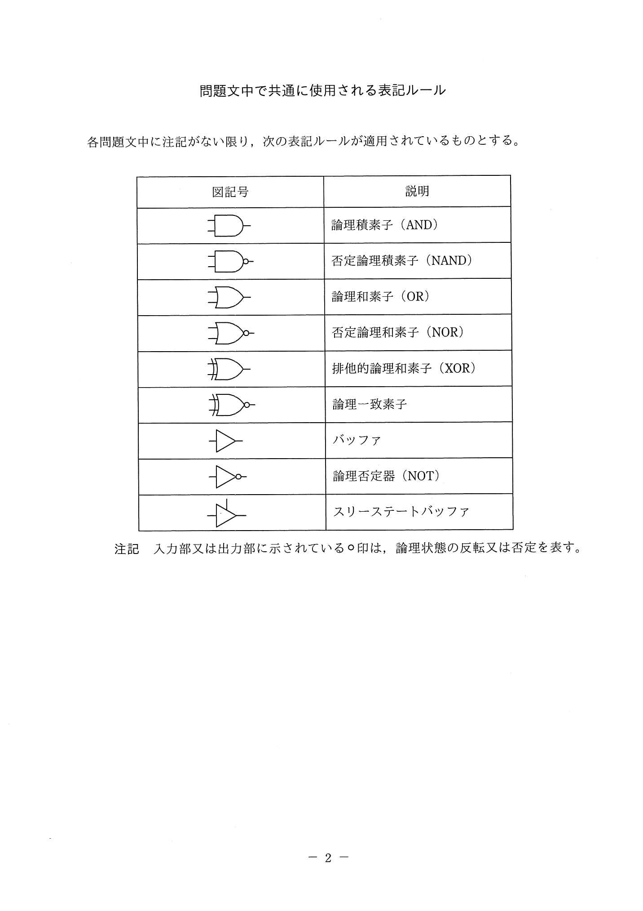

テキスト (OCR)

問題文中で共通に使用される表記ルール

各問題文中に注記がない限り, 次の表記ルールが適用されているものとする。

ce
El
ru
a

説明

論理積素子 (AND)

否定論理積素子 (NAND)

論理和素子 (OR)

Acie MAF (NOR)

排他的論理和素子 (XOR)

論理一致素子

バッファ

論理否定器 (NOT)

YiyMVMMVMM

スリーステートバッファ

注記 入力部又は出力部に示されているo印は, 論理状態の反転又は否定を表す。

### ページ 3

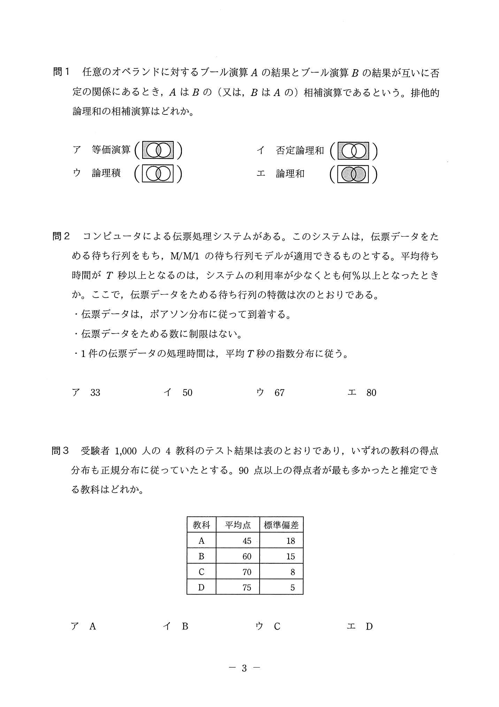

テキスト (OCR)

問1 任意のオペランドに対するブール演算 4 の結果とブール演算 ぢ の結果が互いに否
定の関係にあるとき, ABO (又は, BILAO) HMBBACHS EWS. HHH
論理和の相補演算はどれか。

ァ 等価注算 (|[(0 | )            イ semen (|[(0 J| )
ウ wan (|(0⑩ | )     x 論理和  ((@D))

問2 コンピュータによる伝票処理システムがある。このシステムは, 伝票データをた
める待ち行列をもち, M/M/1 の待ち行列モデルが適用できるものとする。 平均待ち
時間が 7 秒以上となるのは, システムの利用率が少なくとも何%以上となったとき
か。ここで, 伝票データをためる待ち行列の特徴は次のとおりである。

・伝票データは, ポアソン分布に従って到着する。
・伝票データをためる数に制限はない。
・1 件の伝票データの処理時間は, 平均7秒の指数分布に従う。

間3 受験者 1.000 人の 4 教科のテスト結果は表のとおりであり, いずれの教科の得点
分布も正規分布に従っていたとする。90 点以上の得点者が最も多かったと推定でき
る教科はどれか。

教科 | 平均点 | 標準偏差
A   45   18
B    60   15
C   70    8
D   75    5
ア A      イ B      ウ C      = D

### ページ 4

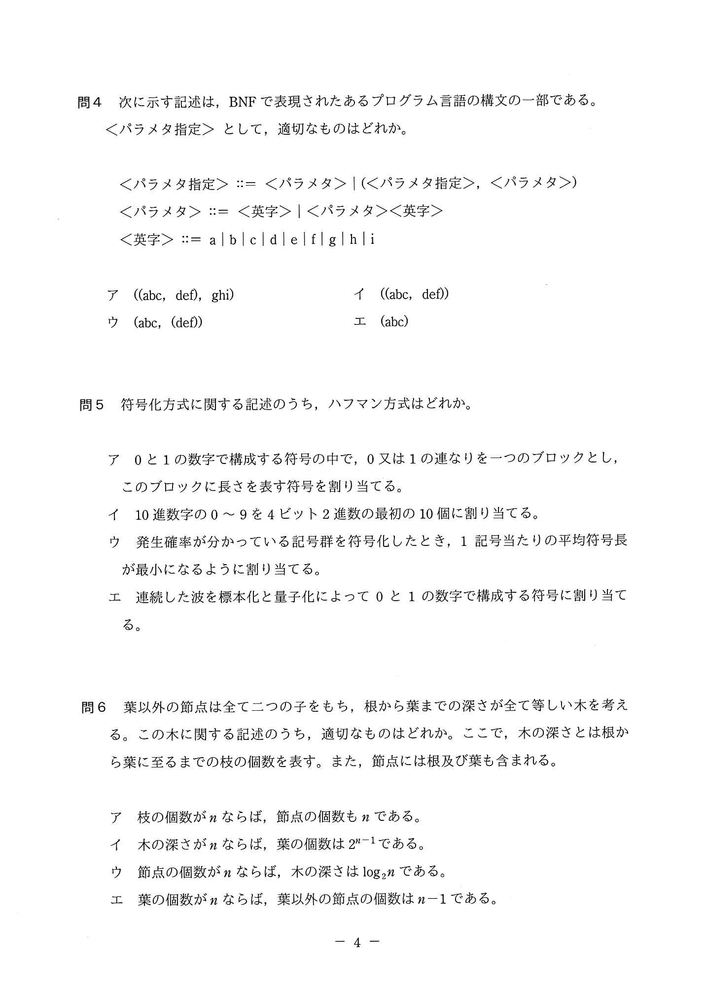

テキスト (OCR)

間4 次に示す記述は, BNF で表現されたあるプログラム言語の構文の一部である。
ぐパラメタ指定> として, 適切なものはどれか。

べくパラメタ指定> 一 くパラメタン | (くパラメタ指定>, SNF AAD)
べくパラメタツ = 英字> | くパラメタマ英字
く英字>:=alblcldlelflglhi

ア (bc, def), gh          イ ((abc, def)
ウ (abc, (def))          エ (abc)

問5 符号化方式に関する記述のかうち, ハフマン方式はどれか。

ア 0と1の数字で構成する符号の中で, 0 又は 1 の連なりを一つのブロックとし,
このブロックに長さを表す符号を割り当てる。

イ 10 進数字の0て9を4ビット 2 進数の最初の 10 個に割り当てる。

ウ 発生確率が分かっている記号群を符号化したとき, 1 記号当たりの平均特号長
が最小になるように割り当てる。

エエ 連続した波を標本化と量子化によって 0 と 1 の数字で構成する符号に割り当て
る。

間6 葉以外の節点は全て二つの子をもち, 根から葉までの深さが全て等しい木を考え
る。この木に関する記述のうち, 適切なものはどれか。ここで, 木の深さとは根か
ら葉に至るまでの枝の個数を表す。また, 節点には根及び葉も含まれる。

枝の個数がヵ ならば, 分点の個数もヵである。

木の深さがヵ ならば, BOMB 2" 1 CHS,
節点の個数がヵ ならば, 木の深さは logzz である。

葉の個数がぁヵならば, 葉以外の節点の個数はヵ一1 CHS,

H ささ

= 4

### ページ 5

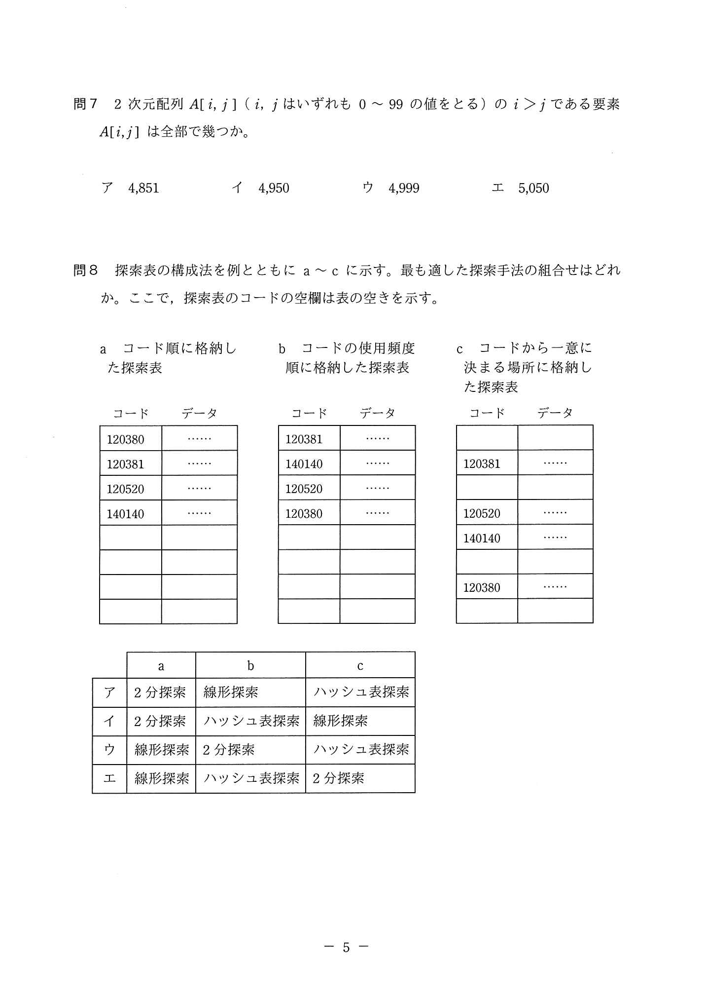

テキスト (OCR)

間7 2 次元配列 4L, 7] (a, 7 はいずれも 0 ~ 99 の値をとる) の > 7である要素
Ali,j] LEMCHOD,

ア 4,851    イ 4,950    ウ 4,999    = 5,050

間8 探索表の構成法を例とともに ac に示す。最も適した探索手法の組合せはどれ

か。ここで, 探索表のコードの空欄は表の空きを示す。

a コード順に格納し    b コードの使用頻度    c コードから一意に

た探索表                順に格納した探索表       決まる場所に格納し
た探索表
コード    データ        コード    データ        コード    データ
120380 | ……               120881 | ……
J20881 | 0               140140 | ……               120381 | ……
120520 | ove               120520 | ……
140140 | ……               120380 | ……               120520 | ……
140140 | ……
120380 | ……
a                 b                     Cc
ア | 2分探索 | 線形探索      ハッシュ表探索
イ | 2分探索 | ハッシュ表探索 | 線形探索
ウ | 線形探索| 2 分探索       ハッシュ表探索
エ | 線形探索 | ハッシュ表探索 | 2 分探索

### ページ 6

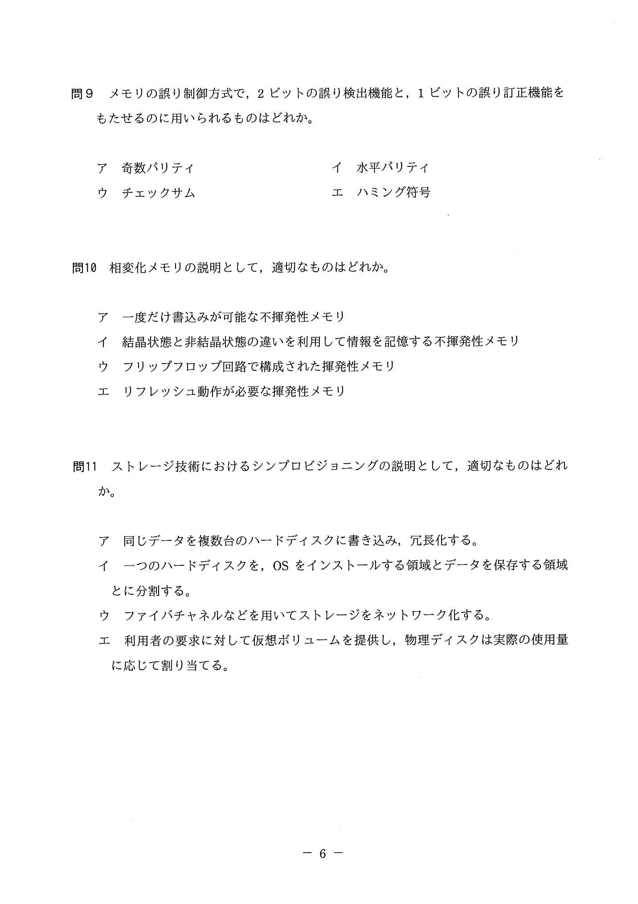

テキスト (OCR)

AO メモリの誤り制御方式で。 2 ビットの誤り検出機能と, 1 ビットの誤り訂正機能を
もたせるのに用いられるものはどれか。

ア 奇数パリティ                 イ 水平パリティ
ウ チェックサム           エエ ハミング符号

問19 相変化メモリの説明として, 適切なものはどれか。

一度だけ書込みが可能な不揮発性メモリ

結晶状態と非結晶状態の違いを利用して情報を記憶する不揮発性メモリ
フリップフロップ回路で構成された揮発性メモリ

リフレッシュ動作が必要な揮発性メモリ

H ざさ

lll ストレージ技術におけるシンプロビジョニングの説明として, 適切なものはどれ
か。

ア 同じデータを複数台のハードディスクに書き込み, 冗長化する。

4 一つのハードディスクを, OS をインストールする領域とデータを保存する領域
とに分割する。

ウ ファイバチャネルなどを用いてストレージをネットワーク化する。

エエ 利用者の要求に対して仮想ボリュームを提供し, 物理ディスクは実際の使用量
に応じて割り当てる。

### ページ 7

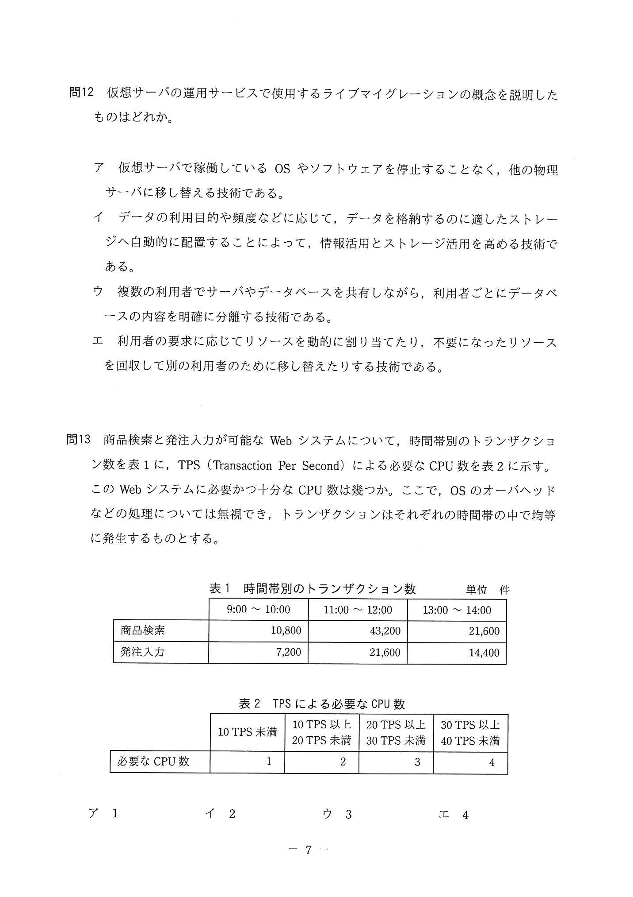

テキスト (OCR)

間12 仮想サーバの運用サービスで使用するライブマイグレーションの概念を説明した
ものはどれか。

ア 仮想サーバで稼働している OS やソフトウェアを停止することなく, 他の物理
サーバに移し替える技術である。

イ データの利用目的や頻度などに応じて, データを格納するのに適したストレー
ジヘへ自動的に配置することによって, 情報活用とストレージ活用を高める技術で
ある。

ウ 複数の利用者でサーバやデータベースを共有しながら, 利用者ごとにデータベ
ースの内容を明確に分離する技術である。

L 利用者の要求に応じてリソースを動的に割り当てたり, 不要になったリソース
を回収して別の利用者のために移し替えたりする技術である。

間13 商品検索と発注入力が可能な Web システムについて, 時間帯別のトランザクショ
ン数を表 1 に, TPS (Transaction Per Second) による必要な CPU 数を表 2 に示す。
この Web システムに必要かつ十分な CPU 数は幾つか。ここで, OS のオーバヘッド
などの処理については無視でき, トランザクションはそれぞれの時間帯の中で均等
に発生するものとする。

表1 時間帯別のトランザクション数    単位 件
9:00 ~ 10:00      11:00 ~ 12:00      13:00 ~ 14:00
商品検索                    10,800             43,200             21,600
発注入力                     7.200             21,600             14,400

表 2 TPS による必要なCPU数

、。 | 10 TPS 以上 | 20TPS 以上 | 30TPS 以上
10 TPS Ai | oo Tps i | 30 TPS 未満 | 40 TPS HH
必要な CPU                  1                2                3                4
71                      4 2                      ウ 3                      エ 4

### ページ 8

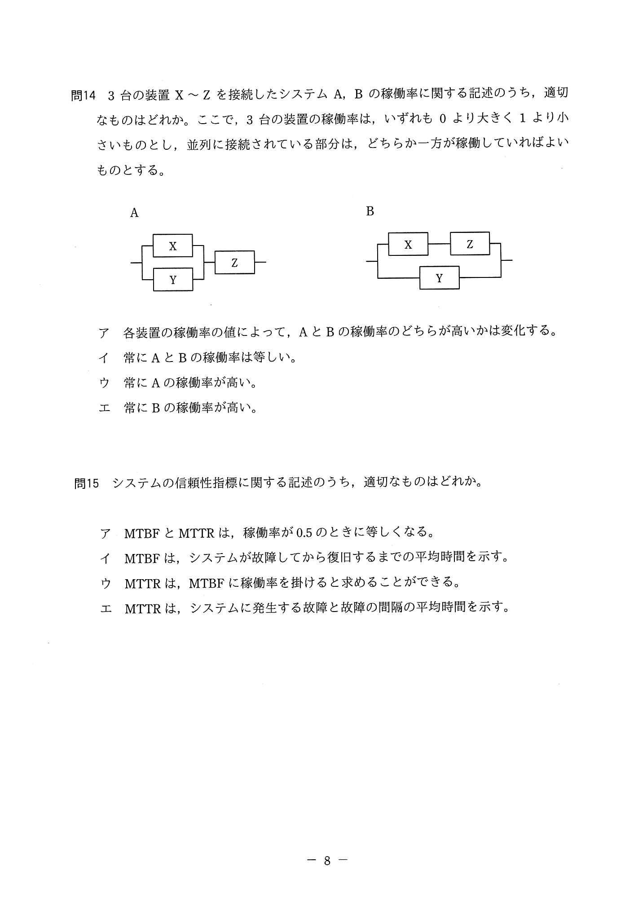

テキスト (OCR)

問14 3 台の装置メーZ を接続したシステム A, B の稼働率に関する記述のうち, 適切
なものはどれか。ここで, 3 台の装置の稼働率は, いずれも 0 より大きく 1 EVN
さいものとし, 並列に接続されている部分は, どちらか一方が稼働していればよい
ものとする。

A                 B
xX                 xX    Z
]    gs に
Y                   Y

各装置の稼働率の値によって, AとBの稼働率のどちらが高いかは変化する。
常にAとBの稼働率は等しい。

常にA の稼働率が高い。

常に B の稼働率が高い。

H さささい

MIS システムの信頼性指標に関する記述のうち, 適切かものはどれか。

MTBF と MTTR は, 稼働率が 0.5 のときに等しくなる。

MTBF は, システムが故障してから復旧するまでの平均時間を示す。
MTTR は, MTBF に稼働率を掛けると求めることができる。

MTTR lk, システムに発生する故障と故障の間隔の平均時間を示す。

HG AN

### ページ 9

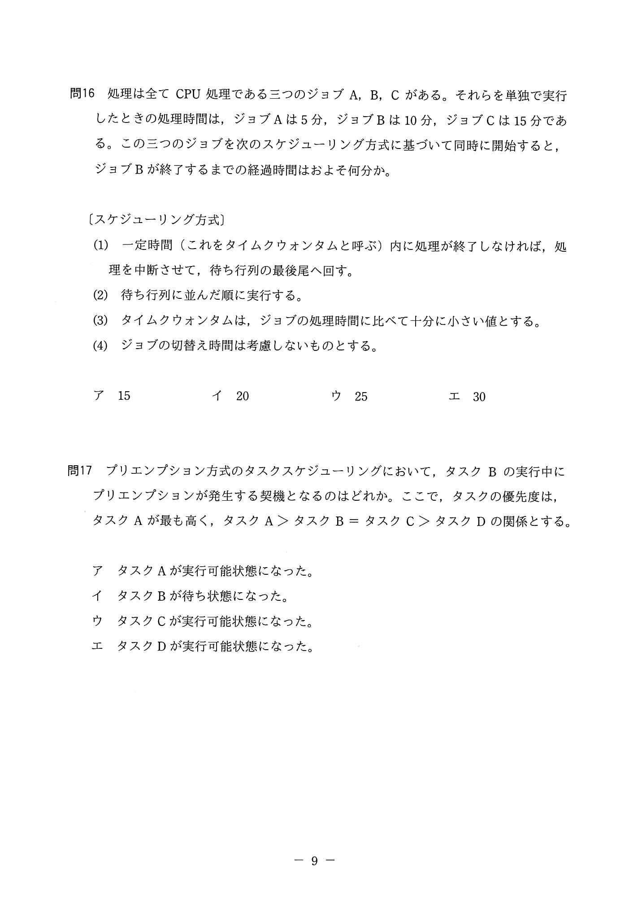

テキスト (OCR)

間16 処理は全て CPU 処理である三つのジョブ A, B, C MHS, それらを単独で実行
したときの処理時間は, ジョブAは5分, ジョブBは10分, ジョブCは15 分であ
る。 この三つのジョブを次のスケジューリング方式に基づいて同時に開始すると,
ジョブ B が終了するまでの経過時間はおよそ何分か。

【スケジューリング方式〕

GQ) 一定時間 (これをタイムクウォンタムと呼ぶ) 内に処理が終了しなければ, wW
理を中断させて, 待ち行列の最後尾へ回す。

(2) 待ち行列に並んだ順に実行する。

(3) タイムクウォンタムは, ジョブの処理時間に比べて十分に小さい値とする。

(4) ジョブの切替え時間は考慮しないものとする。

問17 プリエンプション方式のタスクスケジューリングにおいて, タスク B の実行中に
プリエンプションが発生する契機となるのはどれか。ここで, タスクの優先度は,
タスク A が最も高く, タスクA> タスクBニタスクCツ> タスク D の関係とする。

ア タスクAが実行可能状態になかった。
イ タスクBが待ち状態になった。

ウ タスクCが実行可能状態になった。
エ タスクDが実行可能状態になった。

### ページ 10

テキスト (OCR)

AIS ページング方式の仮想記憶において, あるプログラムを実行したとき, 1 回のペ
ージフォールトの平均処理時間は 30 ミリ秒であった。ページフォールト発生時の処
理時間が次の条件であったとすると, ページアウトを伴わないページインだけの処
理の割合は幾らか。

〔ページフォールト発生時の処理時間]
(1) ページアウトを伴わない場合, ページインの処理時間は 20 ミリ秒である。
Q) ページアウトを伴う場合, 置換えページの選択, ページアウト, ページインの
合計処理時間は60 ミリ秒である。
ア 0.25     イ 0.33     ウ 0.67     x= 0.75
F919 プログラムの性能を改善するに当たって, 関数, 文などの実行回数や実行時間を

計測して統計を取るために用いるツールはどれか。

すず TRS         イ デバッガ

ウ パーサ              xz プロファイラ

ー 10 一

### ページ 11

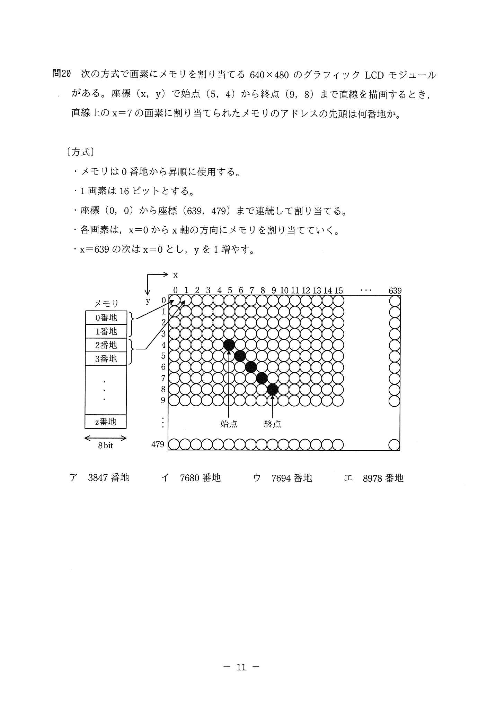

テキスト (OCR)

間26 次の方式で画素にメモリを割り当てる 640X480 のグラフィック LCD モジュール
がある。座標 (x, y) で始点 (5, 4) から終点 (9, 8) まで直線を描画するとき,
直線上の x=7 の画素に割り当てられたメモリのアドレスの先頭は何番地か。

(Bx)
・メモリは0番地から昇順に使用する。
・1 画素は 16 ビットとする。
・ 座標 (0, 0) から座標 (639, 479) まで連続して割り当てる。
・各画素は, x三0 からx軸の方向にメモリを割り当てていく。
・x三639 の次は x三0 LL, y を 1 増やす。

x
J    0 1 2  3_ 4 5 6 78 910 11 6666    aad    639

z番地

8bit

ア 3847 番地    イ 7680 番地     ウ 7694 番地    エエ 8978 番地

ー JfT ー

### ページ 12

テキスト (OCR)

間21 SoCの説明として, 適切かものはどれか。

ア システム LSI に内蔵されたソフトウェア

イ 複数の MCU を搭載したボード

ウ 複数のチップで構成していたコンピュータシステムを, 一つのチップで実現し
たLSI

エ 複数のチップを単一のパッケージに封入してシステム化したデバイス

間22 マイクロプロセッサの耐タンパ性を向上させる手法として, 適切かものはどれか。

ESD (Electrostatic Discharge) に対する耐性を強化する。

チップ検査終了後に検査有パッドを残しておく。

チップ内部を物理的に解析しようとすると, 内部回路が破壊されるようにする。
内部メモリの物理アドレスを整然と配置する。

Ht AN

間23 1桁の2進数 A, Bを加算し, Xに桁上がり, Yに桁上げなしの和 (和の1 桁目)
が得られる論理回路はどれか。

.-—2 ee
—D-         —

ユージー ョーージ-
>        —

xX

ー 12 一

### ページ 13

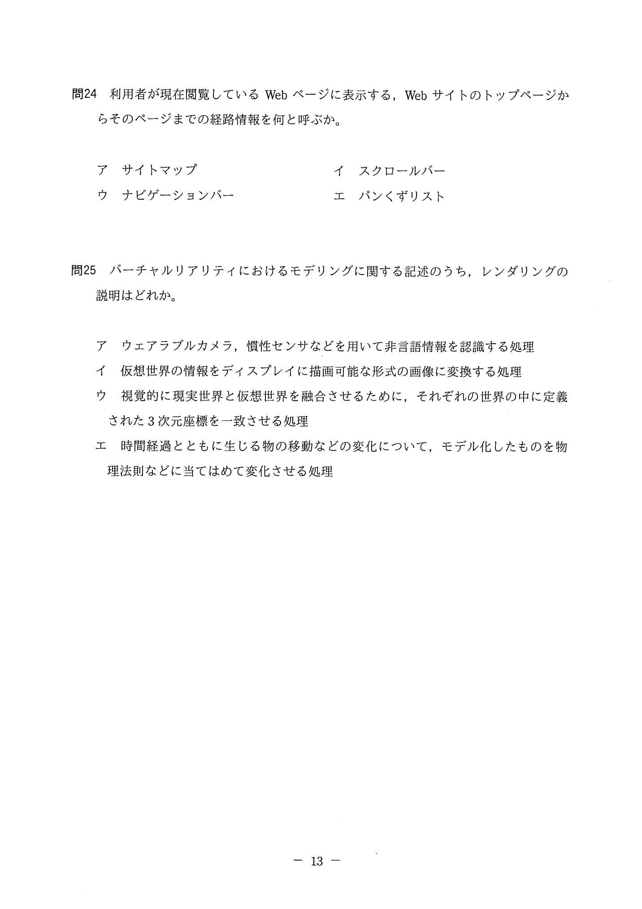

テキスト (OCR)

問24 利用者が現在閲覧している Web ページに表示する, Web サイトのトップページか
らそのページまでの経路情報を何と呼ぶか。

ア サイトマップ           イ スクロールバー
ウ ナビゲーションバー        エ パンくずリスト

問25 バーチャルリアリティにおけるモデリングに関する記述のうち, レンダリングの
説明はどれか。

ア ウェアラブルカメラ, 慣性センサなどを用いて非言語情報を認識する処理

イ 仮想世界の情報をディスプレイに描画可能な形式の画像に変換する処理

ウ 視覚的に現実世界と仮想世界を融合させるために, それぞれの世界の中に定義
された 3 次元座標を一致させる処理

エエ 時間経過とともに生じる物の移動などの変化について, モデル化したものを物
理法則などに当てはめて変化させる処理

ー 13 一

### ページ 14

テキスト (OCR)

間26 社員と年の対応関係を UML のクラス図で記述する。二つのクラス間の関連が次
の条件を満たす場合, a, b に入れる多重度の適切な組合せはどれか。ここで, “年"
クラスのインスタンスは毎年存在する。

(RF)
(1) 全ての社員は入社年を特定できる。
(2) 年によっては社員が入社しないこともある。

[Te] し

ian         nee L*
a         b
7     0.0%       0.1
イ    0..ネ       1
ウ     Lok        0.1
x     1..ネ        i

間27 自然数を除数とした剰余を返すハッシュ関数がある。値がそれぞれ 571, 1168,
1566 である三つのレコードのキー値を入力値としてこのハッシコ関数を施したとこ
ろ, 全てのハッシュ値が衝突した。このとき使用した除数は幾つか。

ア 193     イ 197     ウ 199     x= 211

= 44 =

### ページ 15

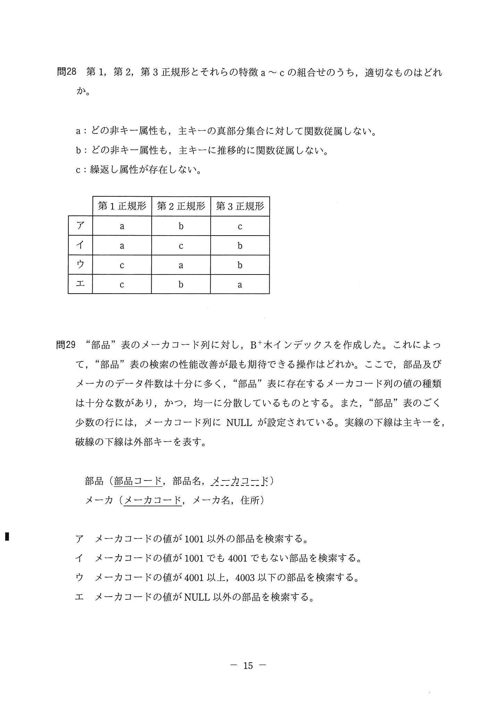

テキスト (OCR)

問28 第1, 第2, 第3正規形とそれらの特徴 ac の組合せのうち, 適切なものはどれ
が。

a: どの非キー属性も, 主キーの真部分集合に対して関数従属しない。
b : どの非キー属性も, 主キーに推移的に関数従属しない。
c : 繰返し属性が存在しない。

第 1 正規形 | 第2 正規形 | 第3 正規形
ア           a                b                €
イ           a                C                b
ウ   c     a     b
SF          C                b                a

間29 “部品" 表のメーカコード列に対し, B~木インデックスを作成した。これによっ
て, “部品” 表の検索の性能改善が最も期待できる操作はどれか。ここで, 部品及び
メーカのデータ件数は十分に多く, “部品” 表に存在するメーカコード列の値の種類
は十分な数があり, PO, 均一に分散しているものとする。また, “部品” ROIS
少数の行には, メーカコード列に NULL が設定されている。実線の下線は主キーを,
破線の下線は外部キーを表す。

メーカ (メーカコード, メーカ名, 住所)

メーカコードの値が 1001 以外の部品を検索する。

メーカコードの値が 1001 でも 4001 でもない部品を検索する。
メーカコードの値が 4001 以上, 4003 以下の部品を検索する。
メーカコードの値が NULL 以外の部品を検索する。

H tA パ

= 45 —

### ページ 16

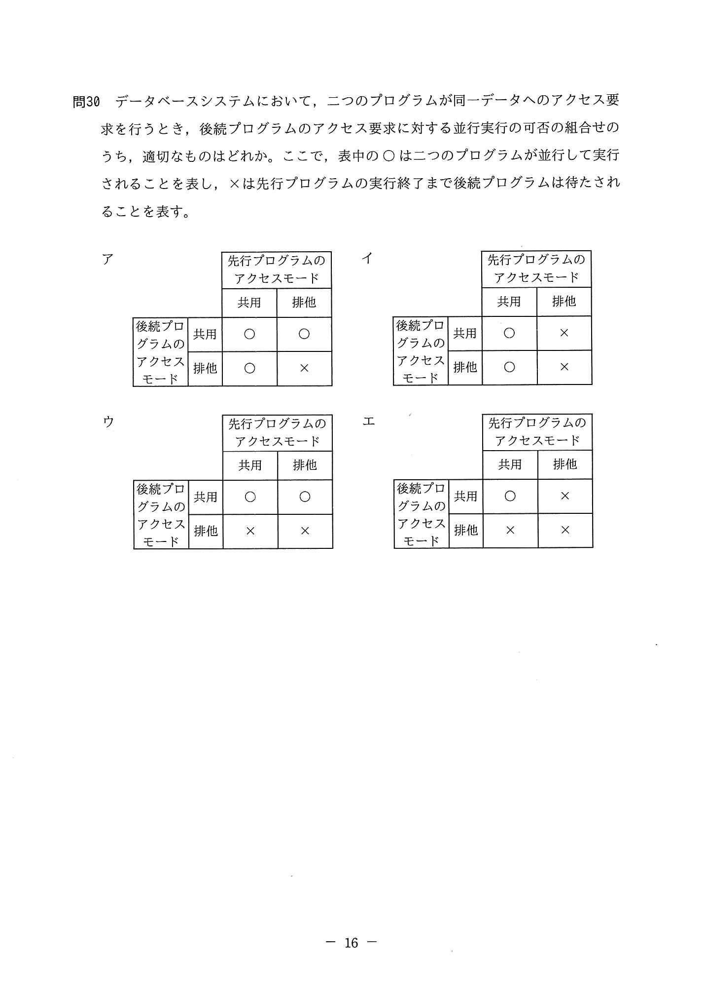

テキスト (OCR)

問39 データベースシステムにおいて, 二つのプログラムが同一データへのアクセス要
行うとき, 後続プログラムのアクセス要求に対する並行実行の可否の組合せの
, 適切なものはどれか。ここで, 表中の 〇 は二つのプログラムが並行して実行
ることを表し, Xは先行プログラムの実行終了まで後続プログラムは待たされ

ることを表す。

4

ad

デ
を行
ち
れ

ch oS

ア         先行プログラムの   イ         先行プログラムの
アクセスモード              アクセスモード
共用 | 排他             共用 | 排他

後続プロ                 後続プロ
グラムの|用| ©    ©        グぅムの|革用| ©    を
アクセス|半他| O     x         FILA) set) o     x
モード                  モード

ウ         先行プログラムの   エ         先行プログラムの
アクセスモード              アクセスモード
共用 | 排他             共用 | 排他

後続プロ|               後続プロ|

グラムの iid        グラムの 共用| 〇    *
TILA) gery] x     x         FILA) gery x     x
モード                  モード

ー 16 一

### ページ 17

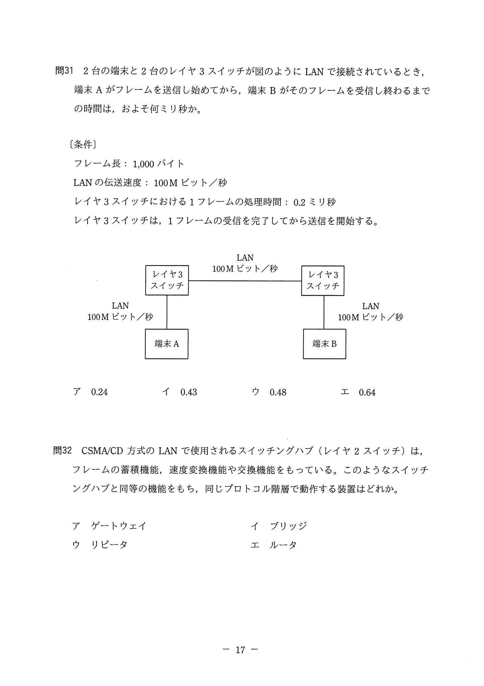

テキスト (OCR)

問31 2 台の端末と 2 台のレイヤ 3 スイッチが図のように LAN で接続されているとき,
端末 A がフレームを送信し始めてから, 端末 B がそのフレームを受信し終わるまで
の時間は, およそ何ミリ秒か。

〔条件]

フレーム長 : 1.000 バイト

LAN の伝送速度 : 100M ビットン秒

レイヤ 3 スイッチにおける 1 フレームの処理時間 : 0.2 ミリ秒

レイヤ 3 スイッチは, 1 フレームの受信を完了してから送信を開始する。

LAN
ears    100M ビットンノ秒    レイヤ3
スイッチ                       スイッチ
LAN                                              LAN
100M ビットンノ秒                               100M ビットンノ秒
端末 A               端末 B
ア 0.24          イ 0.43          ウ 0.48          エ 0.64

間32 CSMA/CD 方式の LAN で使用されるスイッチングハブ (レイヤ 2 スイッチ) は,
フレームの次積機能, 速度変換機能や交換機能をもっている。このようなスイッチ
ングハブと同等の機能をもち, 同じプロトコル階層で動作する装置はどれか。

ア ゲートウェイ        イ ブリッジ
ウ リピータ          エ ルータ

ー 17 一

### ページ 18

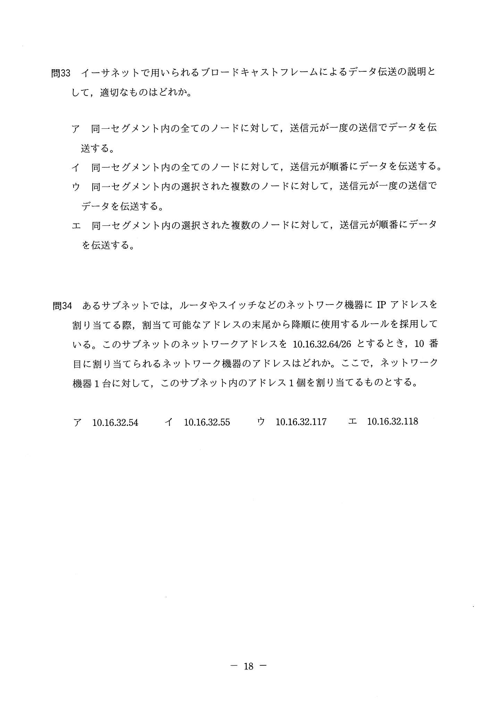

テキスト (OCR)

問33 イーサネットで用いられるブロードキャストフレームによるデータ伝送の説明と
して, 適切なかものはどれか。

ア 同一セグメント内の全てのノードに対して, 送信元が一度の送信でデータを伝
送する。

4 同一セグメント内の全てのノードに対して, 送信元が順番にデータを伝送する。
ウ 同一セグメント内の選択された複数のノードに対して, 送信元が一度の送信で
データを伝送する。

エエ 同一セグメント内の選択された複数のノードに対して, 送信元が順番にデータ
を伝送する。

問34 あるサブネットでは, ルータやスイッチなどのネットワーク機器に IP アドレスを
割り当てる際, 割当て可能なアドレスの末尾から降順に使用するルールを採用して
いる。このサブネットのネットワークアドレスを 10.16.32.64/26 とするとき, 108
目に割り当てらちられるネットワーク機器のアドレスはどれか。ここで, ネットワーク
機器 1 台に対して, このサブネット内のアドレス 1 個を割り当てるものとする。

ア 10.16.32.54  イ 10.16.32.55  ウ 10.16.32.117  XZ 10.16.32.118

ー 18 一

### ページ 19

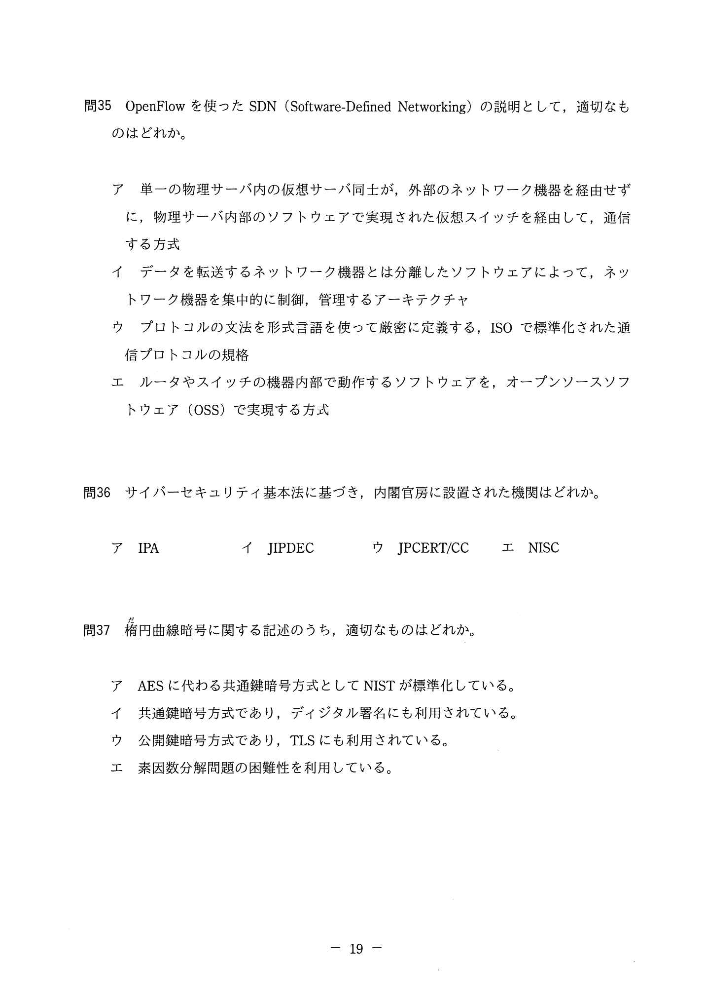

テキスト (OCR)

問35 OpenFlow を使った SDN (Software-Defined Networking) の説明として, 適切なも
のはどれか。

ア 単一の物理サーバ内の仮想サーバ同士が, 外部のネットワーク機器を経由せず
に, 物理サーバ内部のソフトウェアで実現された仮想スイッチを経由して, 通信
する方式

イ データを転送するネットワーク機器とは分離したソフトウェアによって, ネッ
トワーク機器を集中的に制御, 管理するアーキテクチャ

ウ プロトコルの文法を形式言語を使って厳密に定義する, ISO で標準化された通
信プロトコルの規格

エ ルータやスイッチの機器内部で動作するソフトウェアを, オープンソースソフ
トウェア (OSS) で実現する方式

問36 サイバーセキュリティ基本法に基づき, 内閣官房に設置された機関はどれか。

アァ IPA        イ JIPDEC      ウ JPCERT/CC <x NISC

問37 檜円曲線暗号に関する記述のうち, 適切なものはどれか。

AES に代わる共通鍵暗号方式として NIST が標準化している。
共通鍵暗号方式であり, ディジタル署名にも利用されている。
公開鍵暗号方式であり, TLS にも利用されている。

素因数分解問題の困難性を利用している。

HAN

ー 19 一

### ページ 20

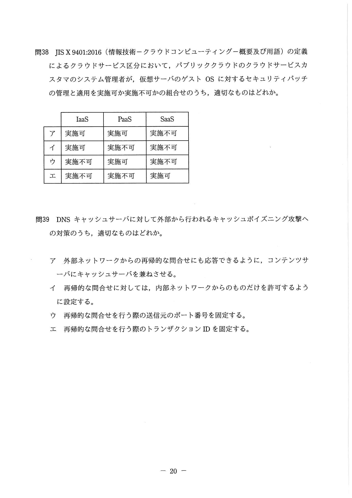

テキスト (OCR)

間38 JISX9401:2016 (情報技術-クラウドコンピューティング一概要及び用語) の定義
によるクラウドサービス区分において, パブリッククラウドのクラウドサービスカ
スタマのシステム管理者が, 仮想サーバのゲスト OS に対するセキュリティパッチ
の管理と適用を実施可か実施不可かの組合せのうち, 適切がものはどれか。

TaaS                 PaaS                 SaaS
実施可   実施可   実施不可
実施可         実施不可       実施不可
実施不可         実施可             実施不可
実施不可         実施不可         実施可

HI} PATS

問39 DNS キャッシュサーバに対して外部から行われるキャッシュポイズニング攻撃へ
の対策のうち, 適切なものはどれか。

ア 外部ネットワークからの再帰的な問合せにも応答できるように, コンテンツサ
ーバにキャッシュサーバを兼ねさせる。

イ 再帰的な問合せに対しては, 内部ネットワークからのものだけを許可するよう
に設定する。

ウ 再帰的な問合せを行う際の送信元のポート番号を固定する。

エエ 再帰的な問合せを行う際のトランザクション ID を固定する。

ー 20 一

### ページ 21

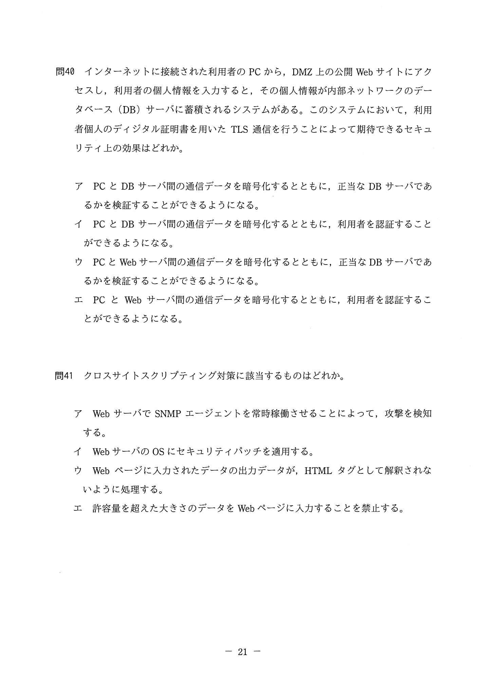

テキスト (OCR)

問49 インターネットに接続された利用者の PC から, DMZ 上の公開 Web サイトにアク
セスし, 利用者の個人情報を入力すると, その個人情報が内部ネットワークのデー
タベース (DB) サーバに次積されるシステムがある。このシステムにおいて, 利用
者個人のディジタル証明書を用いた TLS 通信を行うことによって期待できるセキュ
リティ上の効果はどれか。

ア PC と DB サーバ間の通信データを暗号化するとともに, 正当な DB サーバであ
るかを検証することができるようになる。

イ PC と DB サーバ間の通信データを暗号化するとともに, 利用者を認証すること
ができるようになる。

ウ PCと Web サーバ間の通信データを暗号化するとともに, 正当なDB サーバであ
るかを検証することができるようになる。

X= PC と Web サーバ間の通信データを暗号化するとともに, 利用者を認証するこ
とができるようになる。

間41 クロスサイトスクリプティング対策に該当するものはどれか。

ア Web サーバで SNMP エージェントを常時稼働させることによって, 攻撃を検知
する。

イ Web サーバの 0S にセキュリティパッチを適用する。

ウ Web ページに入力されたデータの出力データが, HTML タグとして解釈されな
いように処理する。

エエ 許容量を超えた大きさのデータを Web ページに入力することを禁止する。

ー 21 一

### ページ 22

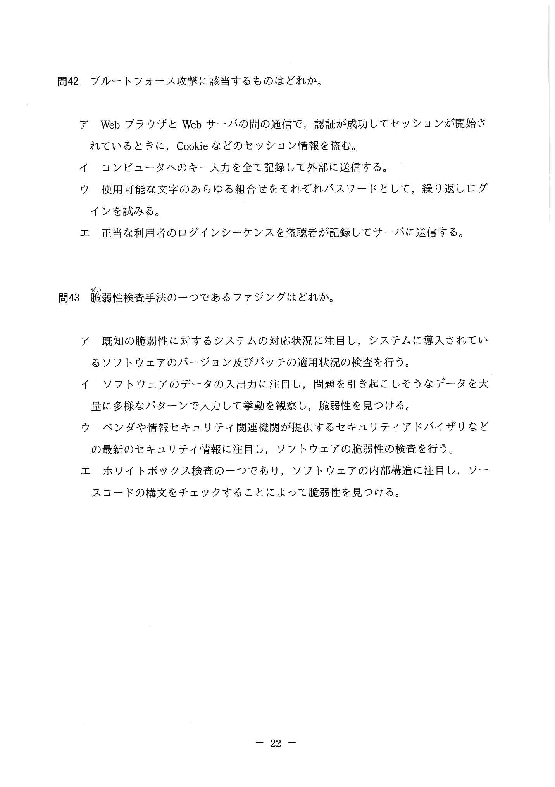

テキスト (OCR)

問42 ブルートフォース攻撃に該当するものはどれか。

ア Web ブラウザと Web サーバの間の通信で, 認証が成功してセッションが開始さ
れているときに, Cookie などのセッション情報を盗む。

イ コンピュータへのキー入力を全て記録して外部に送信する。

ウ 使用可能な文字のあらゆる組合せをそれぞれパスワードとして, 繰り返しログ
インを試みる。

x 正当な利用者のログインシーケンスを盗聴者が記録してサーバに送信する。

問43 脆層性検査手法の一つであるファジングはどれか。

ア 既知の脆弱性に対するシステムの対応状況に注目し, システムに導入されてい
るソフトウェアのバージョン及びパッチの適用状況の検査を行う。

イ ソフトウェアのデータの入出力に注目し, 問題を引き起こしそうなデータを大
量に多様なパターンで入力して挙動を観察し, 脆弱性を見つける。

ウ ベンダや情報セキュリティ関連機関が提供するセキュリティアドバイザリなど
の最新のセキュリティ情報に注目し, ソフトウェアの脆弱性の検査を行う。

エエ ホワイトボックス検査の一つであり, ソフトウェアの内部構造に注目し, ソー
スコードの構文をチェックすることによって脆弱性を見つける。

ー 22 一

### ページ 23

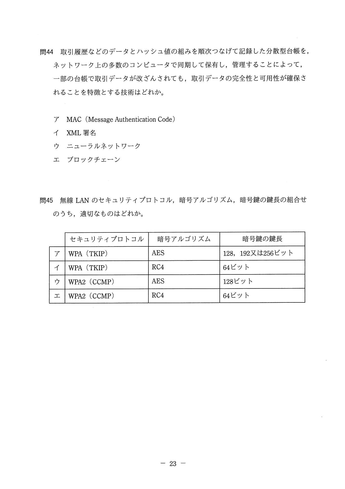

テキスト (OCR)

間44 取引履歴などのデータとハッシュ値の組みを順次つなげて記録した分散型台帳を,
ネットワーク上の多数のコンピュータで同期して保有し, 管理することによって,
一部の台帳で取引データが改ざんされても, 取引データの完全性と可用性が確保さ
れることを特徴とする技術はどれか。

MAC (Message Authentication Code)
XML 署名
ニューラルネットワーク

H ざさへさい

プロックチェーンシン

間45 無線 LAN のセキュリティプロトコル, 暗号アルゴリズム, 暗号鍵の鍵長の組合せ
のうち, 適切ながものはどれか。

セキュリティプロトコル | 暗号アルゴリズム     暗号鍵の鍵長
ア | WPA (TKIP)          AES             128, 192又は256ビット
イ | WPA (TKIP)           RC4               64ビット
ウ | WPA2 (CCMP)         AES               128ビット
= | WPA2 (CCMP)        RC4            64ビット

ー 23 一

### ページ 24

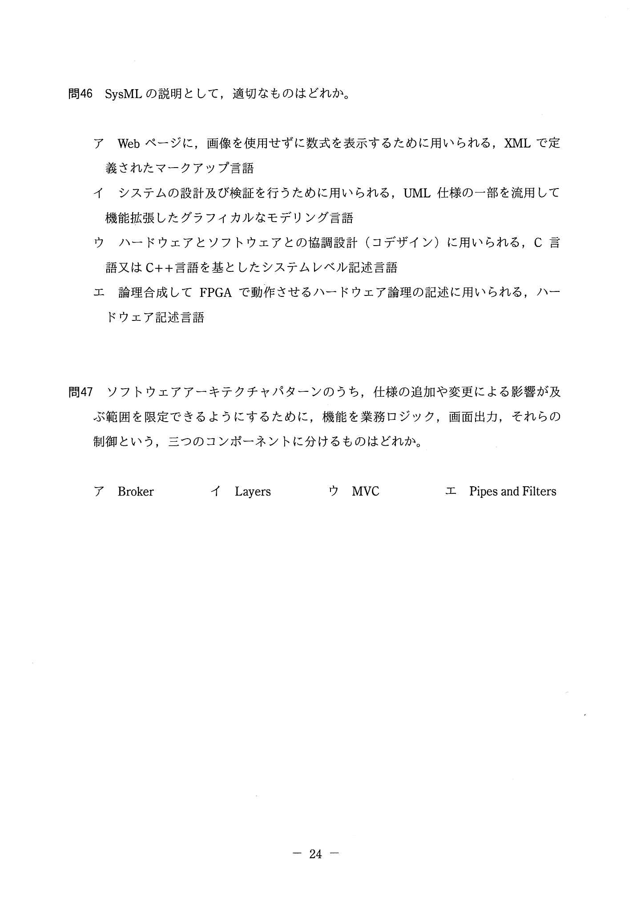

テキスト (OCR)

問46 SysML の説明として, 適切なものはどれか。

ア Web ページに, 画像を使用せずに数式を表示するために用いられる, XML で定
義されたマークアップ言語
イ システムの設計及び検証を行うために用いられる, UML 仕様の一部を流用して
機能拡張したグラフィカルなモデリング言語
ウ ハードウェアとソフトウェアとの協調設計 (コデザイン) に用いられる, C 言
語又はC++言語を基としたシステムレベル記述言語
エ 論理合成して FPGA で動作させるハードウェア論理の記述に用いちられる, ハー
ドウェア記述言語

問47 ソフトウェアアーキテクチャパターンのうち, 仕様の追加や変更による影響が及
ぶ範囲を限定できるようにするために, 機能を業務ロジック, 画面出力,それらの
制御という, 三つのコンポーネントに分けるものはどれか。

ア Broker    イ Layers    ウ MVC     <x Pipes and Filters

ー 24 一

### ページ 25

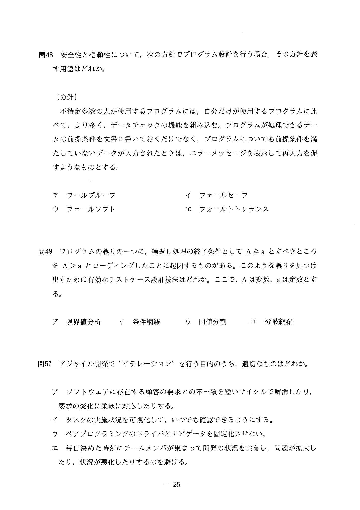

テキスト (OCR)

間48 安全性と信頼性について, 次の方針でプログラム設計を行う場合, その方針を表
す用語はどれか。

(方針〕

不特定多数の人が使用するプログラムには, 自分だけが使用するプログラムに比
ART, EVES, データチェックの機能を組み込む。プログラムが処理できるデー
タの前提条件を文書に書いておくだけでなく, プログラムについても前提条件を満
たしていないデータが入力されたときは, エラーメッセージを表示して再入力を促
すようなものとする。

ア フールプルーフ          イ フェールセーフ
ウ フェールソフト             エエ フォールトトレランス

問49 プログラムの誤りの一つに, 繰返し処理の終了条件として A =a とすべきところ
を Aa とコーディングしたことに起因するものがある。このような誤りを見つけ
出すために有効なテストケース設計技法はどれか。ここで, A は変数, a は定数とす
る。

ア 限界値分析   イ ARAEARE    ウ 同値分割    LPG RE

f50 アジャイル開発で“イテレーション" を行う目的のうち, 適切なかものはどれか。

ア ソフトウェアに存在する顧客の要求との不一致を短いサイクルで解消したり,
要求の変化に柔軟に対応したりする。

イ タスクの実施状況を可視化して, いつでも確認できるようにする。

ウ ペアプログラミングのドライバとナビゲータを固定化させない。

エ 毎日決めた時刻にチームメンバが集まって開発の状況を共有し, 問題が拡大し
たり, 状況が悪化したりするのを避ける。

ー 25 一

### ページ 26

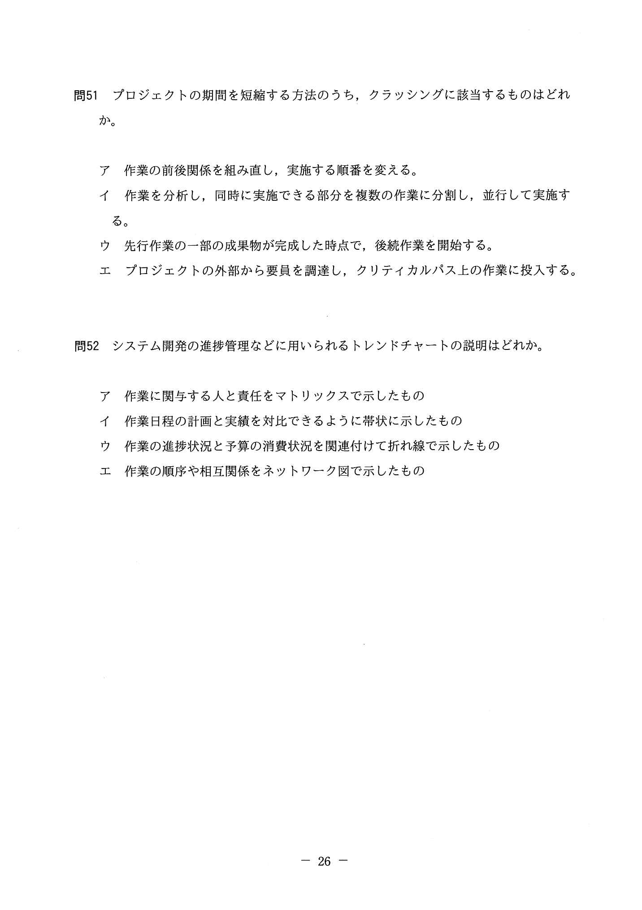

テキスト (OCR)

間51 プロジェクトの期間を短縮する方法のうち, クラッシングに該当するものはどれ
か。

ア 作業の前後関係を組み直し, 実施する順番を変える。

イ 作業を分析し, 同時に実施できる部分を複数の作業に分割し, 並行して実施す
る。

ウ 先行作業の一部の成果物が完成した時点で, 後続作業を開始する。

エエ プロジェクトの外部から要員を調達し. クリティカルパス上の作業に投入する。

問52 システム開発の進捗管理などに用いられるトレンドチャートの説明はどれか。

作業に関司する人と責任をマトリックスで示したもの

作業日程の計画と実績を対比できるように帯状に示したもの

作業の進捗状況と予算の消費状況を関連付けて折れ線で示したもの
作業の順序や相互関係をネットワーク図で示したもの

H SAN

ー 26 一

### ページ 27

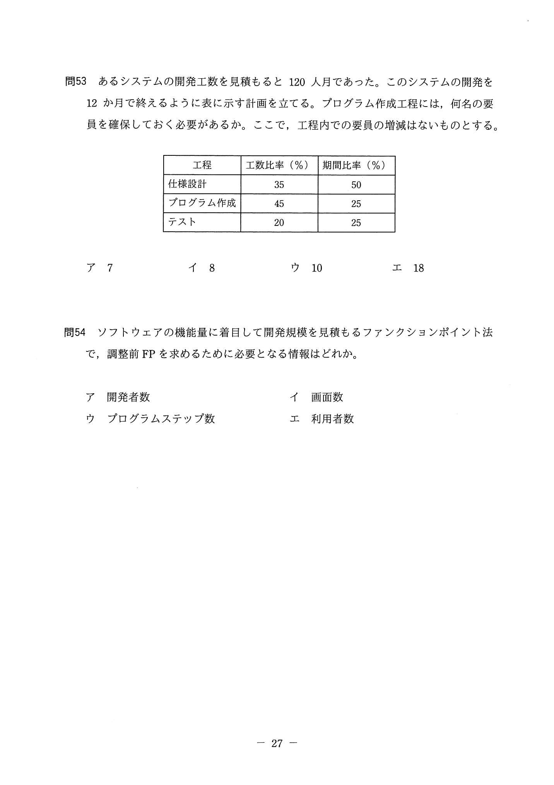

テキスト (OCR)

間53 あるシステムの開発工数を見積もると 120 人月であった。このシステムの開発を
12 か月で終えるように表に示す計画を立てる。プログラム作成工程には, 何名の要
員を確保しておく必要があるか。ここで, 工程内での要員の増減はないものとする。

Le    工数比率 (%) | 期間比率 (%)
仕様設計       35       50
プログラム作成    45       25
テスト      20     25
ア 7      イ 8      ウ 10      x= 18

問54 ソフトウェアの機能量に着目して開発規模を見積もるファンクションポイント法
で, 調整前FP を求めるために必要となる情報はどれか。

ア 開発者数             イ 画面数
ウ プログラムステップ数       エエ 利用者数

ー 27 一

### ページ 28

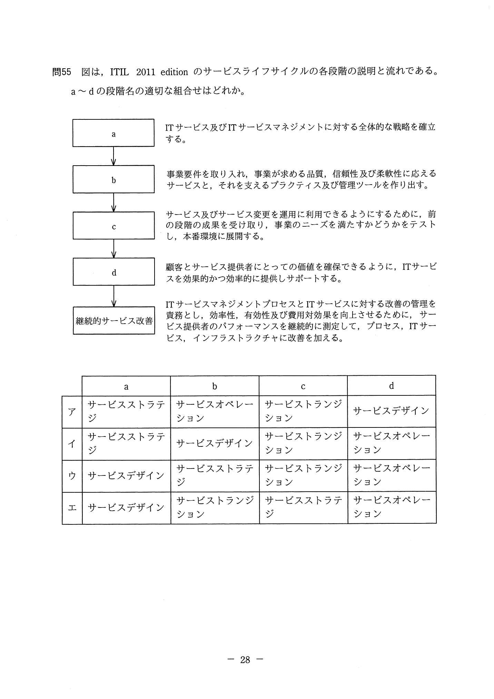

テキスト (OCR)

問55 図は, ITIL 2011 edition のサービスライフサイクルの各段階の説明と流れである。

adの段階名の適切な組合せはどれか。

継続的サービス改善

ITサービス及びITサービスマネジメントに対する全体的な戦略を確立
する。

事業要件を取り入れ, 事業が求める品質, 信頼性及び柔軟性に応える
サービスと, それを支えるプラクティス及び管理ツールを作り出す。

サービス及びサービス変更を運用に利用できるようにするために, 前
の段階の成果を受け取り, 事業のニーズを満たすかどうかをテスト
し, 本番環境に展開する。

顧客とサービス提供者にとっての価値を確保できるように, ITサービ
スを効果的かつ効率的に提供しサポートする。

ITサービスマネジメントプロセスとITサービスに対する改善の管理を
商務とし, 効率性, 有効性及び費用対効果を向上させるために, サー
ビス提供者のパフォーマンスを継続的に測定して, プロセス, ITサー
ビス, インフラストラクチャに改善を加える。

a          b          て          d
ee サービスオペルー サービストランジ サービスデザイン
ジ        ション      ション
BOAR MAE サービスデザイン eeEAh gee oA
¥                 yay      yay

aa    ie   ラテ  ービ  ランジ  ービ  ペレー
サービスデザイン a  スストラテ ず ストブッンジ すず ビスオペレ
vy.        ション      ション
cas    ービストランジ | サービスストラテ | サービスオペレー
サービスデザイン al ‘ トランジ す  スストラテ サ cu
ション      ジ        ション

ー 28 一

### ページ 29

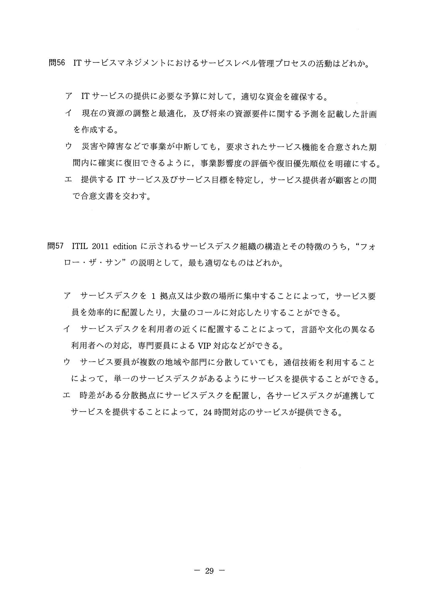

テキスト (OCR)

問56 IT サービスマネジメントにおけるサービスレベル管理プロセスの活動はどれか。

ア ITサービスの提供に必要な予算に対して, 適切な資金を確保する。

イ 現在の資源の調整と最適化, 及び将来の資源要件に関する予測を記載した計画
を作成する。

ウ 災害や障害などで事業が中断しても, 要求されたサービス機能を合意された期
間内に確実に復旧できるように, 事業影響度の評価や復旧優先順位を明確にする。

= 提供する IT サービス及びサービス目標を特定し, サービス提供者が顧客との間
で合意文書を交わす。

間57 ITIL 2011 edition に示されるサービスデスク組織の構造とその特徴のうち, “フォ
ロー・ザ・サン”" の説明として, 最も適切なものはどれか。

ア サービスデスクを 1 拠点又は少数の場所に集中することによって, サービス要
員を効率的に配置したり, 大量のコールに対応したりすることができる。

イ サービスデスクを利用者の近くに配置することによって, 言語や文化の異なる
利用者への対応, 専門要員による VTP 対応などができる。

ウ サービス要員が複数の地域や部門に分散していても, 通信技術を利用すること
によって, 単一のサービスデスクがあるようにサービスを提供することができる。
L 時差がある分散拠点にサービスデスクを配置し, 各サービスデスクが連携して
サービスを提供することによって, 24 時間対応のサービスが提供できる。

ー 29 一

### ページ 30

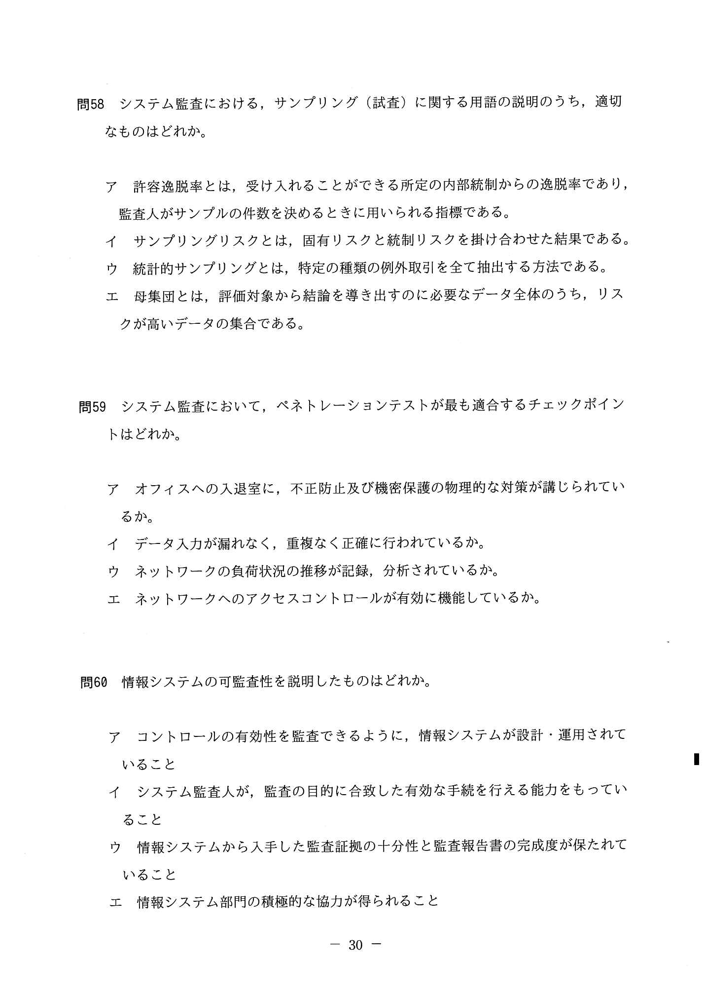

テキスト (OCR)

間58 システム監査における, サンプリング (試査) に関する用語の説明のうち, 適切
なものはどれか。

ア 許容逸脱率とは, 受け入れることができる所定の内部統制からの逸脱率であり,
監査人がサンプルの件数を決めるときに用いられる指標である。

イ サンプリングリスクとは, 固有リスクと統制リスクを掛け合わせた結果である。

ウ 統計的サンプリングとは, 特定の種類の例外取引を全て抽出する方法である。

エ 母集団とは, 評価対象から結論を導き出すのに必要なデータ全体のうち, リス
クが高いデータの集合である。

問59 システム監査において, ペネトレーションテストが最も適合するチェックポイン
トはどれか。

ア オフィスへの入退室に, 不正防止及び機密保護の物理的な対策が講じられてい
るか。

イ データ入力が漏れなく, 重複なく正確に行われているか。

ウ ネットワークの負荷状況の推移が記録, 分析されているか。

エエ ネットワークへのアクセスコントロールが有効に機能しているか。

間69 情報システムの可監査性を説明したものはどれか。

ア コントロールの有効性を監査できるように, 情報システムが設計・運用されて
いること

4 システム監査人が, 監査の目的に合致した有効な手続を行える能力をもってい
ること

ウ 情報システムから入手した監査証拠の十分性と監査報告書の完成度が保たれて
いること

= 情報システム部門の積極的な協力が得られること

ー 30 一

### ページ 31

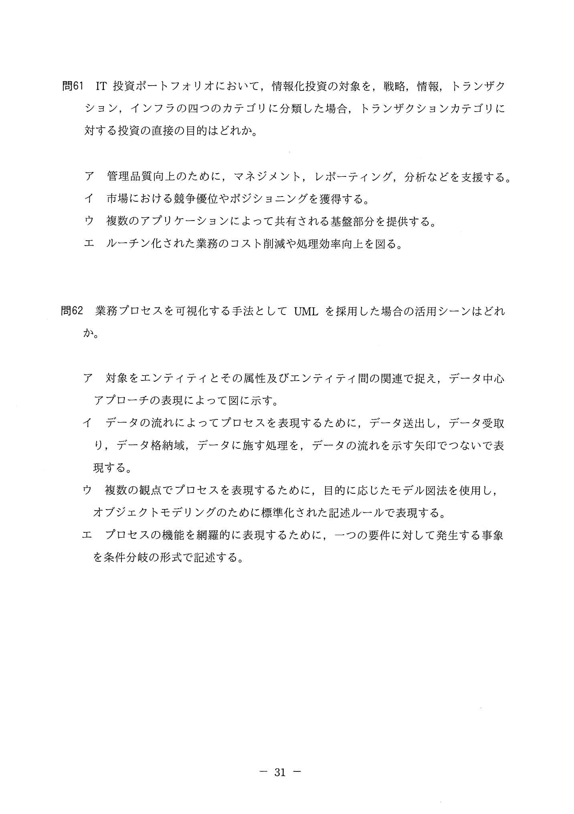

テキスト (OCR)

間61 IT 投資ポートフォリオにおいて, 情報化投資の対象を, 戦略, 情報, トランザク
Yay, インフラの四つのカテゴリに分類した場合, トランザクションカテゴリに
対する投資の直接の目的はどれか。

管理品質向上のために, マネジメント, レポーティング, 分析などを支援する。
市場における競争優位やポジショニングを獲得する。

複数のアプリケーションによって共有される基盤部分を提供する。

ルーチン化された業務のコスト削減や処理効率向上を図る。

H ざさ

問62 業務プロセスを可視化する手法として UML を採用した場合の活用シーンはどれ
か。

ア 対象をエンティティとその属性及びエンティティ間の関連で所え, データ中心
アプローチの表現によって図に示す。

イ データの流れによってプロセスを表現するために, データ送出し, データ受取
り, データ格納域, データに施す処理を, データの流れを示す矢印でつないで表
現する。

ウ 複数の観点でプロセスを表現するために, 目的に応じたモデル図法を使用し,
オブジェクトモデリングのために標準化された記述ルールで表現する。

エ プロセスの機能を網羅的に表現するために, 一つの要件に対して発生する事象
を条件分岐の形式で記述する。

ー 31 一

### ページ 32

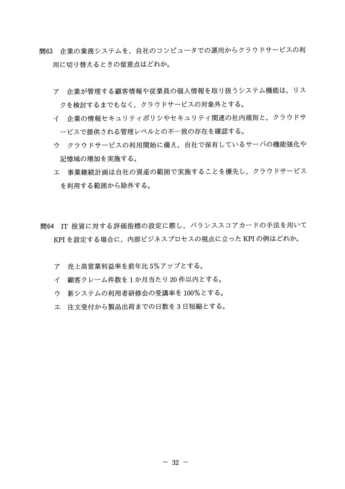

テキスト (OCR)

間63 企業の業務システムを, 自社のコンピュータでの運用からクラウドサービスの利
用に切り替えるときの留意点はどれか。

ア 企業が管理する顧客情報や従業員の個人情報を取り扱うシステム機能は, リス
クを検討するまでもなく, クラウドサービスの対象外とする。

イ 企業の情報セキュリテイポリシやセキュリティ関連の社内規則と, クラウドサ
ービスで提供される管理レベルとの不一致の存在を確認する。

ウ クラウドサービスの利用開始に備え, 自社で保有しているサーバの機能強化や
記憶域の増加を実施する。

エ 事業継続計画は自社の資産の範囲で実施することを優先し, クラウドサービス
を利用する範囲から除外する。

問64 IT 投資に対する評価指標の設定に際し, バランススコアカードの手法を用いて
KPI を設定する場合に, 内部ビジネスプロセスの視点に立った KPI の例はどれか。

売上高営業利益率を前年比5%アップとする。

顧客クレーム件数を 1 か月当たり 20 件以内とする。
新システムの利用者研修会の受講率を 1000%とする。
注文受付から製品出荷までの日数を 3 日短縮とする。

Hさささ

ー 32 一

### ページ 33

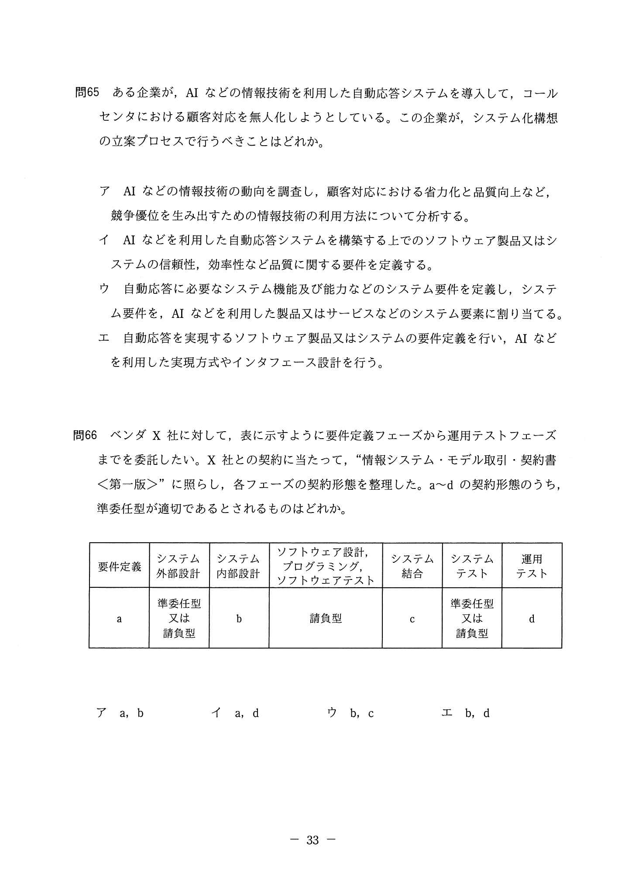

テキスト (OCR)

間65 ある企業が, AI などの情報技術を利用した自動応答システムを導入して, コール
センタにおける顧客対応を無人化しようとしている。この企業が, システム化構想
の立案プロセスで行うべきことはどれか。

ア AI などの情報技術の動向を調査し, 顧客対応における省力化と品質向上など,
競争優位を生み出すための情報技術の利用方法について分析する。
イ AI などを利用した自動応答システムを構築する上でのソフトウェア製品又はシ
に関する要件を定義する。
ウ 自動応答に必要なシステム機能及び能力などのシステム要件を定義し, システ
ム要件を, AI などを利用した製品又はサービスなどのシステム要素に割り当てる。
エエ 自動応答を実現するソフトウェア製品又はシステムの要件定義を行い, AI など

ステムの信頼性, 効率性など品

を利用した実現方式やインタフェース設計を行う。

間66 ベンダ X 社に対して, 表に示すように要件定義フェーズから運用テストフェーズ
までを委託したい。X 社との契約に当たって, “情報システム・モデル取引・契約書
 ” に照らし, 各フェーズの契約形態を整理した。a一d の契約形態のうち,
準委任型が適切であるとされるものはどれか。

wae  soe  ソフトウェア設計, | 、。-  woe   、
maser | piace | ra | アログョョング。 | “we | ean | Sok
   BSP | ソフトウェアテスト   a
準委任型                       準委任型
a    又は    b      請負型      c    又は    d
請負型                                                  請負型
ア ab     fad     7 »b, c     — b, d

### ページ 34

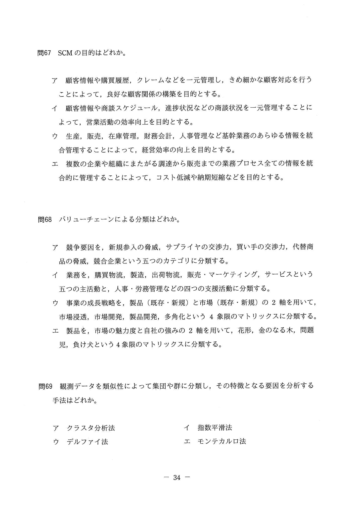

テキスト (OCR)

問67 SCM の目的はどれか。

ア 顧客情報や購買履歴, クレームなどを一元管理し, きめ細かな顧客対応を行う
ことによって, 良好な顧客関係の構築を目的とする。

イ 顧客情報や商談スケジュール, 進捗状況などの商談状況を一元管理することに
よって, 営業活動の効率向上を目的とする。

ウ 生産, 販売, 在庫管理, 財務会計, 人事管理など基幹業務のあらゆる情報を統
合管理することによって, 経営効率の向上を目的とする。

エエ 複数の企業や組織にまたがる調達から販売までの業務プロセス全ての情報を統
合的に管理することによって, コスト低減や納期短縮などを目的とする。

問68 バリューチェーンによる分類はどれか。

ア 競争要因を, 新規参入の脅威, サプライヤの交渉力, 買い手の交渉力, 代替商
HOB, 競合企業という五つのカテゴリに分類する。

イ 業務を, 購買物流, 製造, 出荷物流, 販売・マーケティング, サービスという
五つの主活動と, 人事・労務管理などの四つの支援活動に分類する。

ウ 事業の成長戦略を, 製品 (既存・新規) と市場 (既存・新規) の 2 軸を用いて,
市場浸透, 市場開発, 製品開発, 多角化という 4 象限のマトリックスに分類する。

エ 製品を, 市場の魅力度と自社の強みの 2 軸を用いて, 花形, BORSA, 問題
児, 負け犬という 4 象限のマトリックスに分類する。

問69 観測データを類似性によって集団や群に分類し, その特徴となる要因を分析する
手法はどれか。

ア クラスタ分析法            イ 指数平滑法
ウ デルファイ法           エエ モンテカルロ法

ー 34 一

### ページ 35

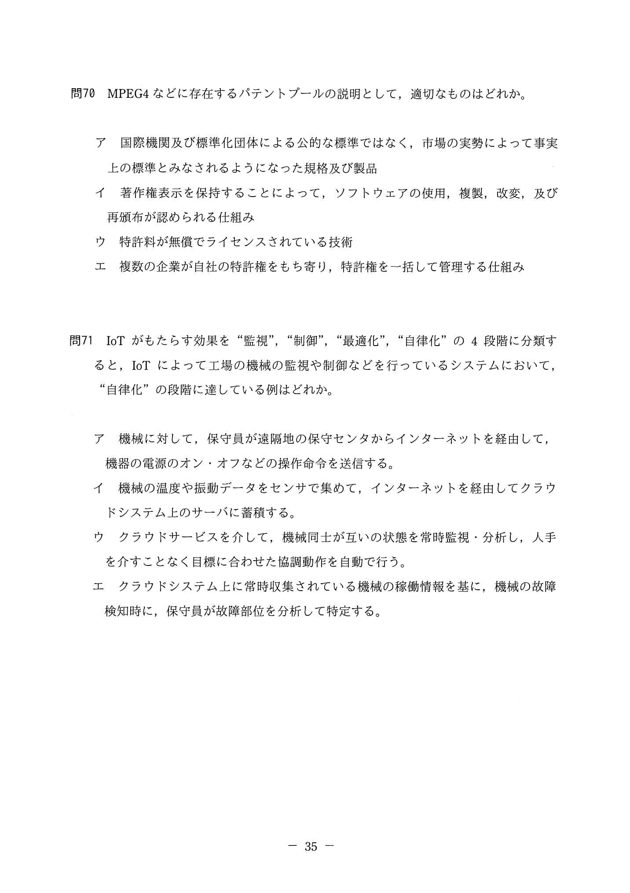

テキスト (OCR)

間70 MPEG4 などに存在するパテントプールの説明として, 適切なかものはどれか。

ア 国際機関及び標準化団体による公的な標準ではなく, 市場の実勢によって事実
上の標準とみなされるようになった規格及び製品

イ 著作権表示を保持することによって, ソフトウェアの使用, BH, 改変, 及び
再頒布が認められる仕組み

ウ 特許料が無償でライセンスされている技術

TL 複数の企業が自社の特許権をもち和寄り, 特許権を一括して管理する仕組み

fel71 ToT がもたらす効果を監視", “制御", “最適化", “ABIL” の 4 段階に分類す
ると, IoT によって工場の機械の監視や制御おなどを行っているシステムにおいて,
"自律化” の段階に達している例はどれか。

ア 機械に対して, 保守員が遠隔地の保守センタからインターネットを経由して,
機器の電源のオン・オフなどの操作命令を送信する。

イ 機械の温度や振動データをセンサで集めて, インターネットを経由してクラウ
ドシステム上のサーバに鞭積する。

ウ クラウドサービスを介して, 機械同士が互いの状態を常時監視・分析し, 人手
を介すことなく目標に合わせた協調動作を自動で行う。

エ クラウドシステム上に常時収集されている機械の稼働情報を基に, 機械の故障
検知時に, 保守員が故障部位を分析して特定する。

ー 35 一

### ページ 36

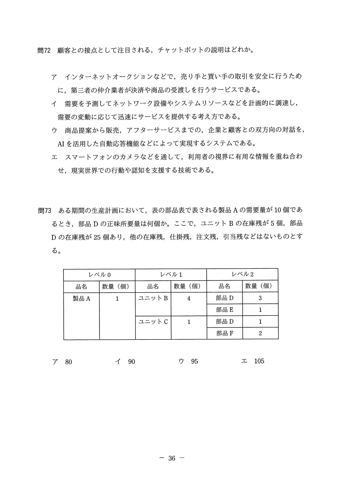

テキスト (OCR)

問72 顧客との接点として注目される, チャットボットの説明はどれか。

ア インターネットオークションなどで, 売り手と買い手の取引を安全に行うため
に, 第三者の仲介業者が決済や商品の受渡しを行うサービスである。

イ 需要を予測してネットワーク設備やシステムリソースなどを計画的に調達し,
需要の変動に応じて迅速にサービスを提供する考え方である。

ウ 商品提案から販売, アフターサービスまでの, 企業と顧客との双方向の対話を,
AI を活用した自動応答機能などによって実現するシステムである。

エ スマートフォンのカメラなどを通して, 利用者の視界に有用な情報を重ね合わ
せ, 現実世界での行動や認知を支援する技術である。

間73 ある期間の生産計画において, 表の部品表で表される製品 A OBEEM 10 ACH
るとき, 部品 D の正味所要量は何個か。ここで, ユニット B の在庫残が 5 個, 部品
D の在庫残が 25 個あり, 他の在庫残, 仕掛残, 注文残, 引当残などはないものとす
る。

レベル0        レベル 1        レベル 2
品     数量 (個)    品名    数量 (個)    品名    数量 (個)
製品A          1        ユニット B        4          部品D          3
部品E        1
ユニットC      1        部品D        1
部品F        2
ア 80              イ 90              ウ 95              x= 105

= 36 =

### ページ 37

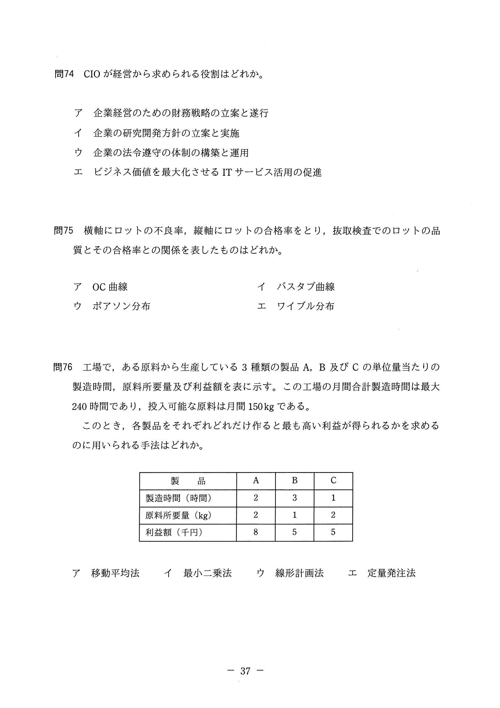

テキスト (OCR)

間74 CIO が経営から求められる役割はどれか。

企業経営のための財務戦略の立案と遂行

企業の研究開発方針の立案と実施

企業の法令遵守の体制の構築と運用

ビジネス価値を最大化させる IT サービス活用の促進

H ざさ

間75 横軸にロットの不良率, 縦軸にロットの合格率をとり, 抜取検査でのロットの品
質とその合格率との関係を表したものはどれか。

ア 0OC曲線                                 イ バスタブ曲線
ウ ポアソン分布                       エエ ワイブル分布

間76 工場で, ある原料から生産している 3 種類の製品 A, B 及び C の単位量当たりの
製造時間, 原料所要量及び利益額を表に示す。この工場の月間合計製造時間は最大
240 時間であり, 投入可能な原料は月間 150kg である。

LOLS, 各製品をそれぞれどれだけ作ると最も高い利益が得られるかを求める
のに用いられる手法はどれか。

製品       A     B     C
製造時間 (時間)       2     3     1
原料所要量 (kg)       2      1      2
利益額 (FA)        8      5      5

ア 移動平均法  イ 最小二乗法  ウ 線形計画法  エエ 定量発注法

ー 37 一

### ページ 38

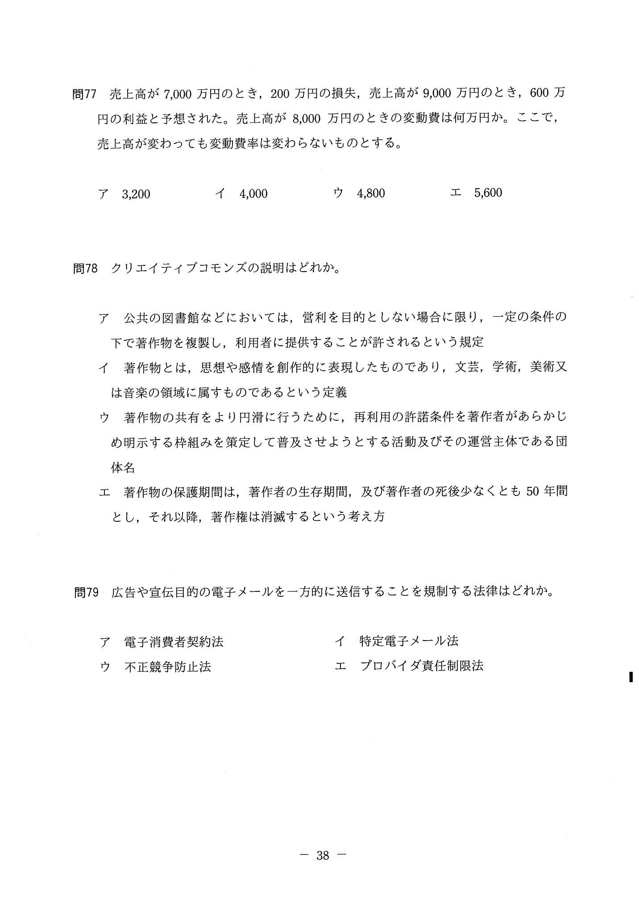

テキスト (OCR)

間77 売上高が 7,000 万円のとき, 200 万円の損失, 売上高が 9,000 万円のとき, 600 万
円の利益と予想された。 売上高が 8,000 万円のときの変動費は何万円か、。ここで
売上高が変わっても変動費率は変わらないものとする。

ア 3,200    イ 4000     ウ 4800    = 5,600

間78 クリエイティブコモンズの説明はどれか。

ア 公共の図書館などにおいては, 営利を目的としない場合に限り, 一定の条件の
下で著作物を複製し, 利用者に提供することが許されるという規定

イ 著作物とは, 思想や感情を創作的に表現したものであり, 文芸, 学術, 美術又
は音楽の領域に属すものであるという定義

ウ 著作物の共有をより円滑に行うために, 再利用の許諾条件を著作者があらかじ
め明示する枠組みを策定して普及させようとする活動及びその運営主体である団
体名

エ 著作物の保護期間は, 著作者の生存期間 及び著作者の死後少なくとも 50 年間
とし, それ以降, 著作権は消滅するという考え方

問79 広告や宣伝目的の電子メールを一方的に送信することを規制する法律はどれか。

ア 電子消費者契約法         イ 特定電子メール法
ウ 不正競争防止法          エ プロバイダ貢任制限法

ー 38 一

### ページ 39

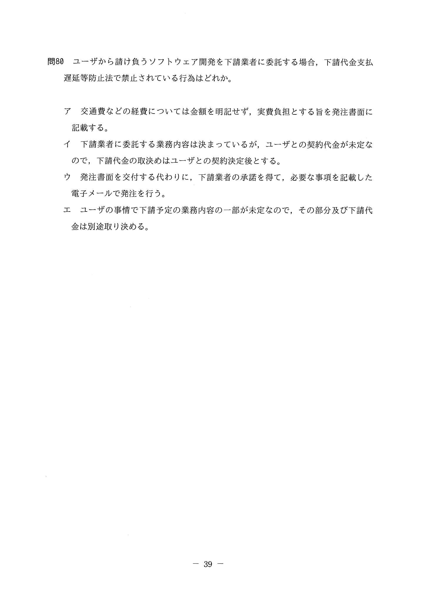

テキスト (OCR)

問89 ユーザから請け負うソフトウェア開発を下請業者に委託する場合, 下請代金支払
遅延等防止法で禁止されている行為はどれか。

ア 交通費などの経費については金額を明記せず, 実費負担とする旨を発注書面に
記載する。

イ 下請業者に委託する業務内容は決まっているが, ユーザとの契約代金が未定な
DC, 下請代金の取決めはユーザとの契約決定後とする。

ウ 発注書面を交付する代わりに, 下請業者の承諾を得て, 必要な事項を記載した
電子メールで発注を行う。

エ ユーザの事情で下請予定の業務内容の一部が未定なので, その部分及び下請代
金は別途取り決める。

ー 39 一

### ページ 40

テキスト (OCR)

〔

メ = 用 紙 ]

ー 40 一

### ページ 41

テキスト (OCR)

〔

x モ 用 紙 J

ー 41 一

### ページ 42

テキスト (OCR)

C

メ モ 用 紙 )

ー 42 一

### ページ 43

テキスト (OCR)

C

A モ 用 紙 J

ー 43 一

### ページ 44

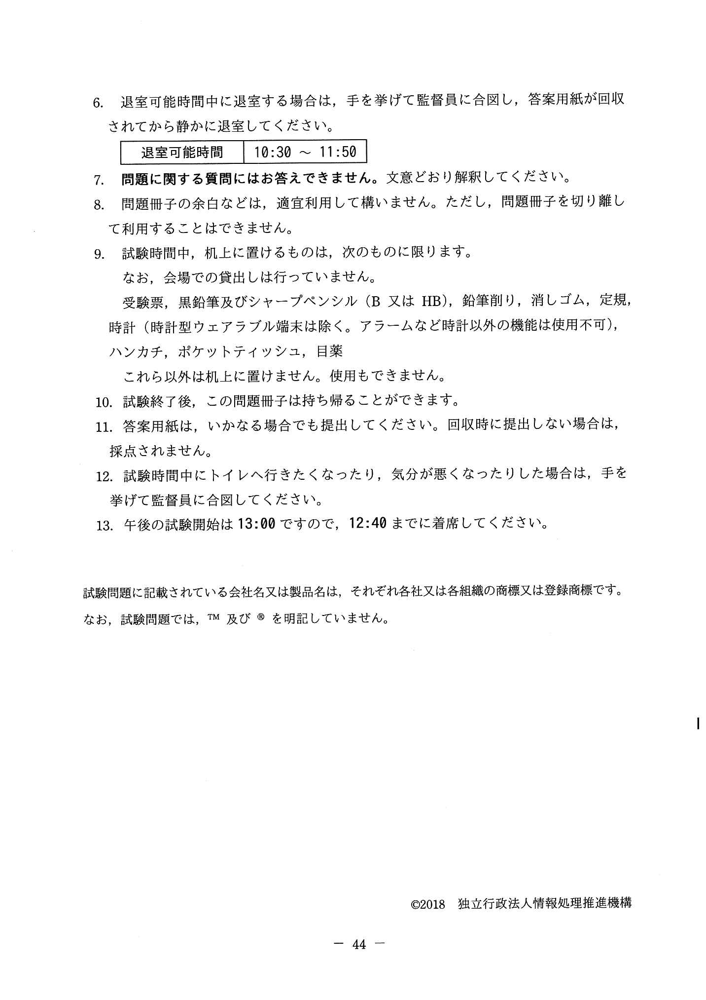

テキスト (OCR)

6. 退室可能時間中に退室する場合は, 手を挙げて監督員に合図し, 答案用紙が回収
されてから静かに退室してください。
| 退室可能時間 | 10:30 ~ 11:50 |
7. 問題に関する質問にはお答えできません。文意どおり解釈してください。
8. 問題民子の余白などは, 適宜利用して構いません。ただし, 問題冊子を切り離し
て利用することはできません。
9. 試験時間中, 机上に置けるものは, 次のものに限ります。
なお, 会場での貸出しは行っていません。
受験票,黒鉛筆及びシャープベンシル (B 又は HB), 鉛筆削り, 消しゴム, 定規,
時計 (時計型ウェアラブル端末は除く。アラームなど時計以外の機能は使用不可),
ハンカチ, ポケットティッシュ, 目薬
これら以外は机上に置けません。使用もできません。
10. 試験終了後, この問題民子は持ち帰ることができます。
LL, SRAM, いかなる場合でも提出してください。回収時に提出しない場合は,
採点されません。
12, 試験時間中にトイレへ行きたくなったり, 気分が悪くなったりした場合は, FE
挙げて監督員に合図してください。
13. 午後の試験開始は 13:00 ですので, 12:40 までに着席してください。

試験問題に記載されている会社名又は製品名は, それぞれ各社又は各組織の商標又は登録商標です。
なお, 試験問題では, ™ 及び ® を明記していません。

@2018 独立行政法人情報処理推進機構

ー 44 一

---

## 午前解答

©2018 独立行政法人情報処理推進機構 
平成30 年度 秋期 応用情報技術者試験 解答例 
 
午前試験 
問番号 正解 分野 
問1 
ア 
Ｔ 
問2 
イ 
Ｔ 
問3 
イ 
Ｔ 
問4 
ア 
Ｔ 
問5 
ウ 
Ｔ 
問6 
エ 
Ｔ 
問7 
イ 
Ｔ 
問8 
ア 
Ｔ 
問9 
エ 
Ｔ 
問10 
イ 
Ｔ 
問11 
エ 
Ｔ 
問12 
ア 
Ｔ 
問13 
イ 
Ｔ 
問14 
エ 
Ｔ 
問15 
ア 
Ｔ 
問16 
ウ 
Ｔ 
問17 
ア 
Ｔ 
問18 
エ 
Ｔ 
問19 
エ 
Ｔ 
問20 
ウ 
Ｔ 
 
 
問番号 正解 分野 
問21 
ウ 
Ｔ 
問22 
ウ 
Ｔ 
問23 
ア 
Ｔ 
問24 
エ 
Ｔ 
問25 
イ 
Ｔ 
問26 
イ 
Ｔ 
問27 
ウ 
Ｔ 
問28 
ウ 
Ｔ 
問29 
ウ 
Ｔ 
問30 
エ 
Ｔ 
問31 
エ 
Ｔ 
問32 
イ 
Ｔ 
問33 
ア 
Ｔ 
問34 
ウ 
Ｔ 
問35 
イ 
Ｔ 
問36 
エ 
Ｔ 
問37 
ウ 
Ｔ 
問38 
イ 
Ｔ 
問39 
イ 
Ｔ 
問40 
エ 
Ｔ 
 
 
問番号 正解 分野 
問41 
ウ 
Ｔ 
問42 
ウ 
Ｔ 
問43 
イ 
Ｔ 
問44 
エ 
Ｔ 
問45 
ウ 
Ｔ 
問46 
イ 
Ｔ 
問47 
ウ 
Ｔ 
問48 
ア 
Ｔ 
問49 
ア 
Ｔ 
問50 
ア 
Ｔ 
問51 
エ 
Ｍ 
問52 
ウ 
Ｍ 
問53 
エ 
Ｍ 
問54 
イ 
Ｍ 
問55 
イ 
Ｍ 
問56 
エ 
Ｍ 
問57 
エ 
Ｍ 
問58 
ア 
Ｍ 
問59 
エ 
Ｍ 
問60 
ア 
Ｍ 
 
 
問番号 正解 分野 
問61 
エ 
Ｓ 
問62 
ウ 
Ｓ 
問63 
イ 
Ｓ 
問64 
エ 
Ｓ 
問65 
ア 
Ｓ 
問66 
イ 
Ｓ 
問67 
エ 
Ｓ 
問68 
イ 
Ｓ 
問69 
ア 
Ｓ 
問70 
エ 
Ｓ 
問71 
ウ 
Ｓ 
問72 
ウ 
Ｓ 
問73 
イ 
Ｓ 
問74 
エ 
Ｓ 
問75 
ア 
Ｓ 
問76 
ウ 
Ｓ 
問77 
ウ 
Ｓ 
問78 
ウ 
Ｓ 
問79 
イ 
Ｓ 
問80 
イ 
Ｓ 
 
 
分野の「Ｔ」はテクノロジ系，「Ｍ」はマネジメント系，「Ｓ」はストラテジ系の問題です。

---

## 午後問題

### ページ 1

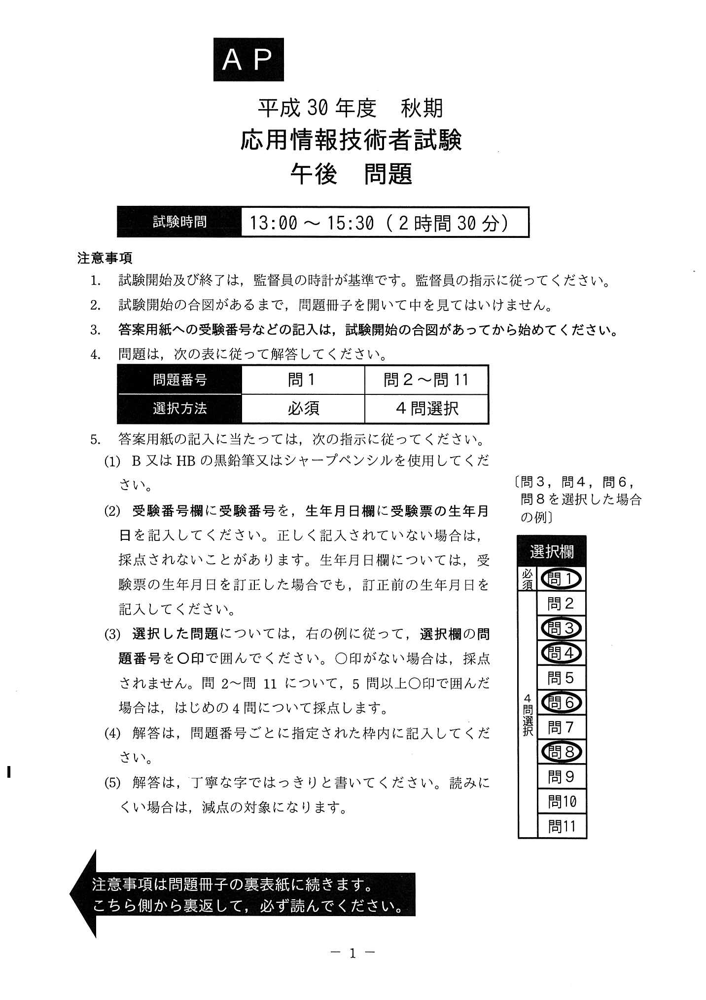

テキスト (OCR)

平成3年度 秋期
応用情報技術者試験
午後 問題

| son 00 ~ 15:30 (2588 30-9)

注意事項

1. 試験開始及び終了は, 監督貞の時計が基準です。監督貞の指示に従ってください。
2. 試験開始の合図があるまで, 問題冊子を開いて中を見てはいけません。

3. 答案用紙への受験番号などの記入は, 試験開始の合図があってから始めてください。
4. 問題は, 次の表に従って解答してください。

問題番号              間 1            問2 ~f 11
選択方法     必須     4 問選択

5. 答案用紙の記入に当たっては, 次の指示に従ってください。
(1) B 又は HB の黒鉛筆又はシャープペンシルを使用してくだ
さい。                           〔問3, 問4, 問6,

問8を選択した場合
2) 受験番号欄に受験番号を生年月日材に受験球の生年月 Da

日を記入してください。 正しく記入されていない場合は,

採点されないことがあります。生年月日棚については = All

上験東の生年月日を訂正した場合でも, 訂正前の生年月日を |用
記入してください。                      問2
⑬ 選択した問題については, 右の例に従って, 選択欄の問   CD
題番号をO印で囲んでください。〇印がない場合は, 採点   Gi4
されません。問 2ご問 11 について, 5 問以上〇印で囲んだ    問5
MAIL, はじめの 4 問について採点します。            ke)
④ 解答は, 問題番号ごとに指定された逢内に記入してくだ |航|問7
さい。                                                         G3
(6) 解答は, 丁寧な字ではっきりと書いてください。読みに    間9
くい場合は, 減点の対象になります。              間10
問11

注意事項は問題冊子の裏表紙に続きます。
こちら側から裏返して, 必ず読んでください。

### ページ 2

### ページ 3

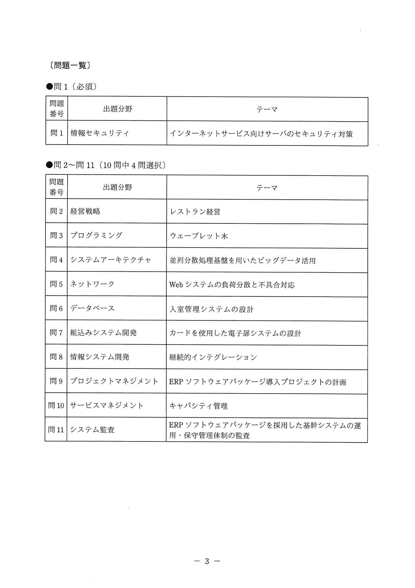

テキスト (OCR)

〔問題一覧〕

@問 1 (必須)

問題           出題分野                                 テーマ
番号
All | 情報セキュリティ     インターネットサービス向けサーバのセキュリティ対策

@ fe] 2一問 11 (10 問中4 問選択)

      出題分野                  テーマ

Vel 2 | 経営戦略          レストラン経営

問3 | プログラミング     ウェーブレット木

問4 | システムアーキテクチャ  並列分散処理基盤を用いたビッグデータ活用

問5 | ネットワーク       Web システムの負荷分散と不具合対応

問6 | データベース       入室管理システムの設計

問7 |組込みシステム開発    カードを使用した電子扉システムの設計

間 8 | 情報システム開発     継続的インテグレーション

問 9 | プロジェクトマネジメント |ERPソフトウェアパッケージ導入プロジェクトの計画
問 10 | サービスマネジメント    キャパシティ管理

muly ayaa        ERPソフトウェアパッケージを採用した基幹システムの運

用・保守管理体制の監査

### ページ 4

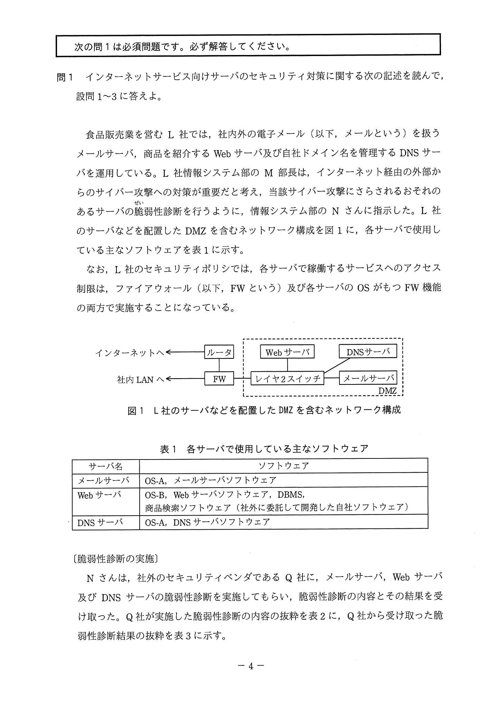

テキスト (OCR)

次の問 1 は必須問題です。必ず解答してください。

Al インターネットサービス向けサーバのセキュリティ対策に関する次の記述を

設問 1こ3 に答えよ。

aul
a
e
A

ARIE MO L 社では, 社内外の電子メール WME, AVES) を扱う
メールサーバ, 商品を紹介する Wed サーバ及び自社ドメイン名を管理する DNS サー
バを運用している。L 社情報システム部の M 部長は。インターネット経由の外部か
らのサイバー攻撃への対策が重要だと考え, 当該サイバー攻撃にさらされるおそれの
あるサーバの話穫性診断を行うように, 情報システム部の N さんに指示した。 L tt
のサーバなどを配置した DMZ を含むネットワーク構成を図 1 に, 各サーバで使用し
ている主ながソフトウェアを表 1 に示す。

なお, L 社のセキュリティポリシでは, 各サーバで稼働するサービスへのアクセス
制限は。 ファイアウォール ULE, FW という) 及び各サーバの OS がもつ FW 機能
の両方で実施することになっている。

インターネットヘへ       ルータ   | Webサーバ| | pNsサ-バ | |
‘heen — CEH レイヤ2スイッチト メールサーバ| !
1                       DMZ!

M1 L社のサーバなどを配置した DMZ を含むネットワーク構成

表1 各サーバで使用している主なソフトウェア
サーバ名                         ソフトウェア
メールサーバ | OS-A, メールサーバソフトウェア
Web サーバ      OS-B, Web サーバソフトウェア, DBMS,
商品検索ソフトウェア (社外に委託して開発した自社ソフトウェア)
‘| DNS サーバ    OS-A, DNS サーバソフトウェア

〔脆弱性診断の実施〕

N さんは, 社外のセキュリティベンダである Q 社に, メールサーバ, Web サーバ
及び DNS サーバの脆性診断を実施してもらい, 脆弱性診断の内容とその結果を受
け取った。 Q 社が実施した脆静性診断の内容の抜粋を表 2 に, Q 社から受け取った脆
弱性診断結果の抜粋を表 3 に示す。

### ページ 5

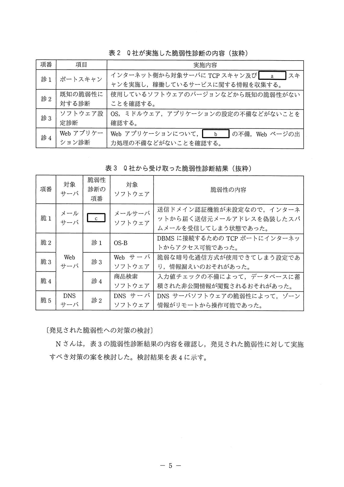

テキスト (OCR)

表2 0社が実施した脆弱性診断の内容 (抜粋)

項番        項目                                  実施内容

インターネット側から対象サーバに TCP スキャン及び|  』 |スキ

BL) ポートスキャン | 。ンを実施し。 稼働しているサービスに関する情報を収集する。

既知の脆弱性に | 使用しているソフトウェアのバージョンなどから既知の脆弱性がない

ンク | 対する診断 | ことを確認する。
診3  ソフトウェア設 | 05,。 ミドルウェア, アプリケーションの設定の不備などがないことを
” | 定診断    確認する。
B4 Web アプリケー | Web アプリケーションについて, | b | の不備, Web ページの出
"| ション診断   力処理の不備などがないことを確認する。
表3 0社から受け取った脆弱性診断結果 (抜粋)
脆弱性

対象 |    対象           .  we

RE | ん sip The      脆弱性の内容

     メールサーバ | 送信ドメイン認証機能が未設定なので, インターネ
Wer] ん ソフ トウェア | アトから還く送信元メールアドレスを偽装したスパ
ムメールを受信してしまう状態であった。

DBMS に接続するための TCP ポートにインターネッ

診
に       wa | Ree      トからアクセス可能であった。
es| Web | 。 | Web サーバ | 用間な語呈人通信方式が作用できてしまう設定であ
サーバ     ソフトウェア | り, 情報漏えいのおそれがあった。
Wea       D4  商品検索    入力値チェックの不備によって, データベースに鞭
ソフトウェア | 積された非公開情報が閲覧されるおそれがあった。
vas) DNS | 。。 | DNS サーバ| DNS サーバソフトウェアの際性によって, ゾーン
サーバ       ソフトウェア | 情報がリモートから操作可能であった。

〔発見された脆弱性への対策の検討]
N さんは, 表 3 の脆弱性診断結果の内容を確認し, 発見された脆弱性に対して実施
すべき対策の案を検討した。 検討結果を表 4 に示す。

### ページ 6

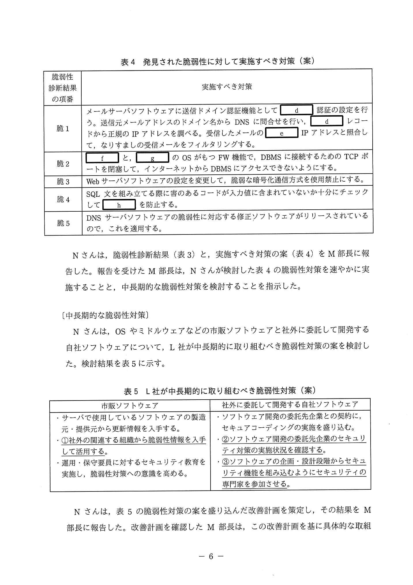

テキスト (OCR)

表4 発見された脆弱性に対して実施すべき対策 (案)

脆弱性
診断結果                             実施すべき対策
の項番
メールサーバソフトウェアに送信ドメイン認証機能として     認証の設定を行
al  う。送信元メールアドレスのドメイン名から DNS に問合せを行い,     レコー
ドから正規の P アドレスを調べる。受信したメールの[| es ] IP アドレスと照合し
て, なりすましの受信メールをフィルタリングする。
Wee  LE t+, Lig | の OS がもつ FW HERET, DBMS に接続するための TCP K
ートを閉塞して, インターネットから DBMS にアクセスできないようにする。
脆3     Web サーバソフトウェアの設定を変更して, 脆弱な暗号化通信方式を使用禁止にする。
We 4  SQL 文を組み立てる際に害のあるコードが入力値に含まれていないか十分にチェック
して[| 』 | を防止する。
Wes DNS サーバソフトウェアの脆弱性に対応する修正ソフトウェアがリリースされている

ので, これを適用する。

N さんは, 脆弱性診断結果 (表3) と, 実施すべき対策の案 (表 4) を M 部長に報
告した。報告を受けた M BR, N さんが検討した表 4 の脆弱性対策を速やかに実
施することと, 中長期的な脆弱性対策を検討することを指示した。

[中長期的な脆弱性対策

N さんは, OS やミドルウェアなどの市販ソフトウェアと社外に委託して開発する
自社ソフトウェアについて, L 社が中長期的に取り組むべき脆弱性対策の案を検討し
た。検討結果を表 5 に示す。

表5 L社が中長期的に取り組むべき脆弱性対策 (32)

市販ソフトウェア              社外に委託して開発する自社ソフトウェア

・サーバで使用しているソフトウェアの製造 | ・ソフトウェア開発の委託先企業との契約に,
元・提供元から更新情報を入手する。            セキュアコーディングの実施を盛り込む。

・①社外の関連する組織から脆弱性情報を入手 | ・②ソフトウェア開発の委託先企業のセキュリ
して活用する。                           ティ対策の実施状況を確認する。

・運用・保守要員に対するセキュリティ教育を | ・③ソフトウェアの企画・設計段階からセキュ
実施し, 脆弱性対策への意識を高める。            リティ機能を組み込むようにセキュリティの

専門家を参加させる。

N さんは, 表 5 の脆弱性対策の案を盛り込んだ改善計画を策定し, その結果を M
部長に報告した。改善計画を確認した M 部長は, この改善計画を基に具体的な取組

ー 6一

### ページ 7

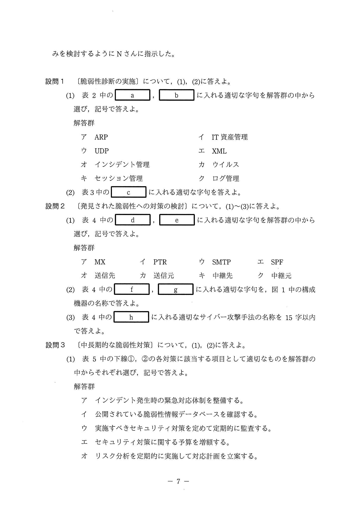

テキスト (OCR)

みを検討するようにNさんに指示した。

設問 1   [脆弱性診断の実施] について, ①), (②)に答えよ。
Q) 表 2 中の|

a 。 |,|  b |に入れる適切な字句を解答群の中から
選び, 記号で答えよ。
解答群
ア ARP                            イ IT 資産管理
ウ UDP                            = XML
オ インシデント管理          A ウイルス
キ セッション管理                      ク ログ管理

@ 表3中の| c | に入れる適切な字旬を答えよ。

設問2 (発見された脆弱性への対策の検討] について, ①)て3)に答えよ。

ag 表 4 中の| a | | ce |に入れる適切な字句を解答群の中から
選び, 記号で答えよ
解答群
ア MX    イ PTR    ウ SMTP   <= SPF
オ 送信先    カ 送信元    キ 中継先    ク 中継元
2) 表 4 中の| ££ | |  g』 |に入れる適切な字句を, 図 1 中の構成

機器の名称で答えよ。
⑬ 表 4 中の| h | に入れる適切なサイバー攻撃手法の名称を 15 字以内
で答えよ。
設問3 [中長期的な騰弱性対策) について, Q①), ⑫に答え
(1) 表 5 中の下線①, ②の各対策に該当する項目として適切なものを解答群の
中からそれぞれ選び, 記号で答えよ。
解答
ア インシデント発生時の皿急対応体制を整備する。
公開されている脆弱性情報データベースを確認する。
実施すべきセキュリティ対策を定めて定期的に監査する。
セキュリティ対策に関する予算を増額する。
リスク分析を定期的に実施して対応計画を立案する。

M HOS A

ー7ー

### ページ 8

テキスト (OCR)

2) 表5中の下線について, 表 3の項番“脆3" で発見された脆弱性への対策
として, ソフトウェアの企画・設計段階からセキュリティの専門家を参加させ
る狙いを 30 字以内で述べよ。

### ページ 9

テキスト (OCR)

【

メ モ 用 tf 〕

### ページ 10

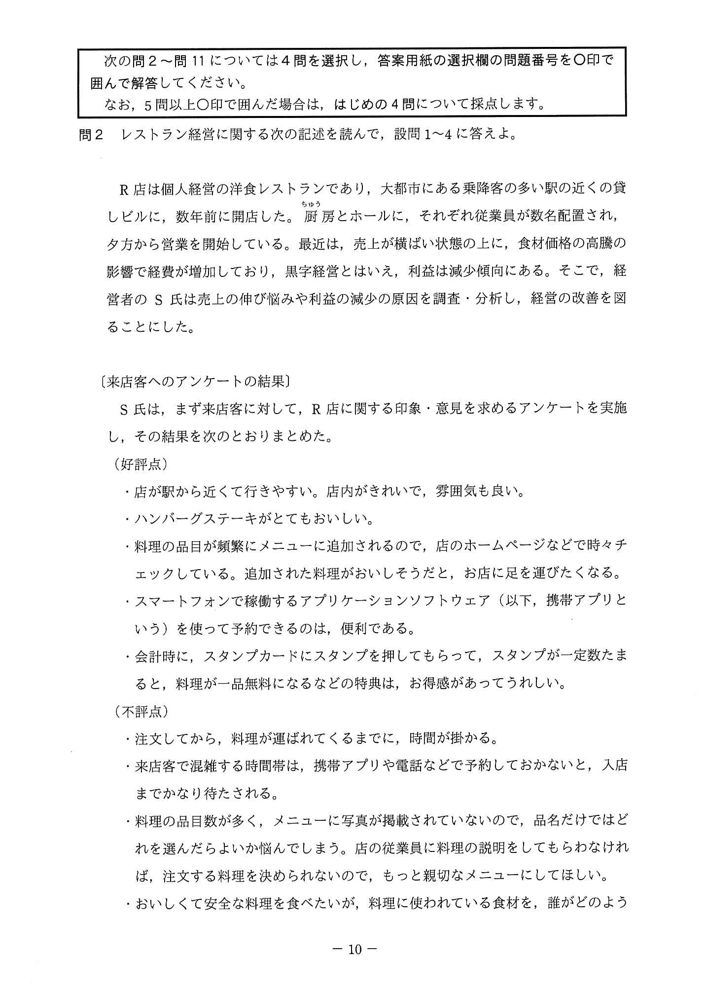

テキスト (OCR)

次の問2 間 11 については4 問を選択し, 答案用紙の選択欄の問題番号を〇O印で
囲んで解答してください。
なお, 5間以上〇印で囲んだ場合は, はじめの 4 問について採点します。

問2 レストラン経営に関する次の記述を読んで, 設問 1ー4 に答えよ。

R 店は個人経営の洋食レストランであり, 大都市にある乗隆客の多い駅の近くの貸
レビルに, 数年前に開店した。 BREE OVI, それぞれ従業員が数名配置され,
夕方から営業を開始している。最近は, 売上が横ばい状態の上に, 食材価格の高騰の
影響で経費が増加しており, 黒字経営とはいえ, 利益は滅少傾向にある。そこで, B
営者の S 氏は売上の伸び悩みや利益の減少の原因を調査・分析し, 経営の改善を図

ることにした。

来店客へのアンケートの結果

S 氏は, まず来店客に対して, R 店に関する印象・意見を求めるアンケートを実施
し, その結果を次のとおりまとめた。

(好評点)

・店が駅から近くて行きやすい。店内がきれいで, 雰囲気も良い。

・ハンバーグステーキがとてもおいしい。

・料理の品目が頻繁にメニューに追加されるので, 店のホームページなどで時々チ
ェックしている。 追加された料理がおいしそうだと, お店に足を運びたくなる。

・スマートフォンで稼働するアプリケーションソフトウェア (以下, 携帯アプリと
いう) を使って予約できるのは, 便利である。

・会計時に, スタンプカードにスタンプを押してもらって, スタンプが一定数たま
ると, 料理が一品無料になるなどの特典は, お得感があってうれしい。

・注文してから, 料理が運ばれてくるまでに, 時間が掛かる。

・来店客で混雑する時間帯は, 携帯アプリや電話などで予約しておかないと, 入店
までかなり待たされる。

・料理の品目数が多く, メニューに写真が掲載されていないので, 品名だけではど
れを選んだらよいか悩んでしまう。店の従業員に料理の説明をしてもらわなけれ
ば, 注文する料理を決められないので, もっと親切なかメニューにしてほしい。

・おいしくて安全な料理を食べたいが, 料理に使われている食材を, 誰がどのよう

ー 10 一

### ページ 11

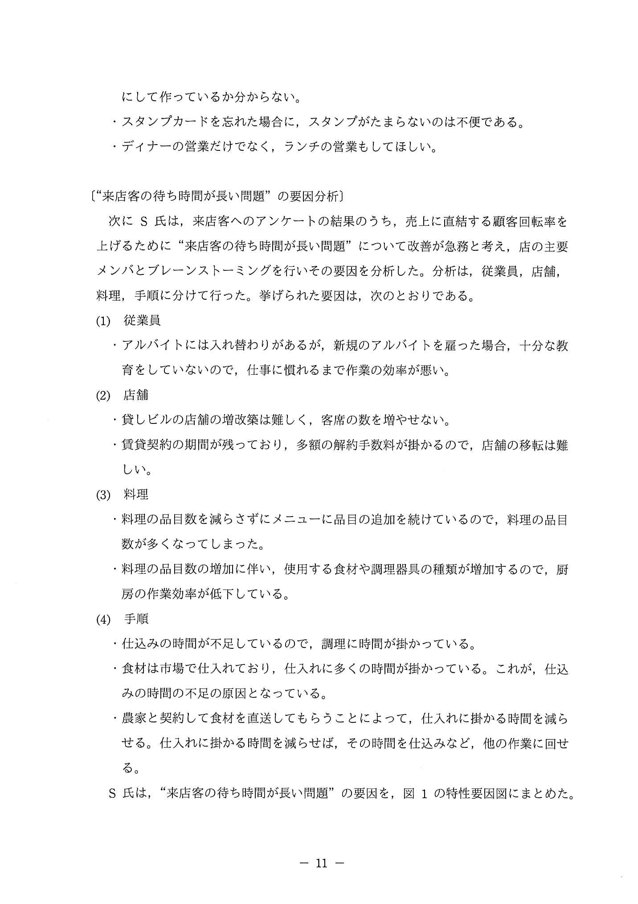

テキスト (OCR)

にして作っているか分からない。

・スタンプカードを忘れた場合に, スタンプがたまらないのは不便である。
・ディナーの営業だけでなく, ランチの営業もしてほしい。

(“来店客の待ち時間が長い問題” の要因分析]

次に S 氏は, 来店客へのアンケートの結果のうち, 売上に直結する顧客回転率を
上げるために “来店客の待ち時間が長い問題”" について改善が急務と考え, 店の主要
メンバとブレーンストーミングを行いその要因を分析した。分析は, 従業員, 店舗,
料理, 手順に分けて行った。挙げられた要因は, 次のとおりである。

①

(2)

(3)

(4)

HERA

・アルバイトには入れ替わりがあるが, 新規のアルバイトを雇った場合, 十分な教

育をしていないので, 仕事に慣れるまで作業の効率が悪い。
店舗

・貸しビルの店舗の増改築は難しく, 客席の数を増やせない。
・ 賃貸契約の期間が残っており, 多額の解約手数料が掛かるので, 店舗の移転は難

しい。
料理

・料理の品目数を減らさずにメニューに品目の追加を続けているので, 料理の品目

数が多くなってしまった。

・料理の品目数の増加に伴い, 使用する食材や調理器具の種類が増加するので, Bt

房の作業効率が低下している。
手順

・仕込みの時間が不足しているので, 調理に時間が掛かっている。
・食材は市場で仕入れており, 仕入れに多くの時間が掛かっている。これが, 仕込

みの時間の不足の原因となっている。

・農家と契約して食材を直送してもらうことによって, 仕入れに掛かる時間を減ら

せる。仕入れに掛かる時間を減らせば, その時間を仕込みなど, 他の作業に回せ
る。

S 氏は, “来店客の待ち時間が長い問題" の要因を, 1 の特性要因図にまとめた。

ー 11 一

### ページ 12

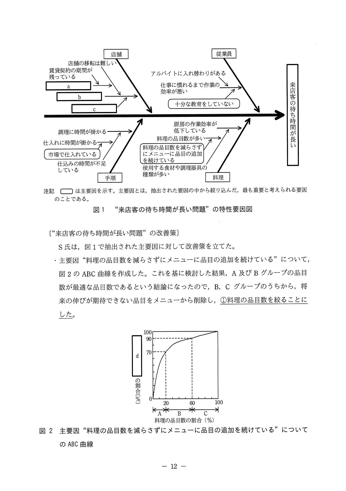

テキスト (OCR)

店舗

店舗の移転は難しい                                ーー
nace NN         アルバイトに SAKI
Cc: SCO >           住事に慣れるまで作業の、さ   >        来
Ces) er             meee
Va         [十分な教育をしていない )           の
                                      待
ーー ち
厨房の作業効率が
調理に時間が掛かるーーオーシタ        低下している
仕入れに時間が掛かるユー        料理の品目数が多いゴーシ             長
料理の品目数を減らさず                い
市場で仕入れている        にメニューに曲目の人
>      R           を続けている
仕込みの時間が不
Pe alii       使用する食材や調理器具の               ーー
手順    種類が多い

注記 CO は主要因を示す。主要因とは, 抽出された要因の中から絞り込んだ, 最も重要と考えられる要因

のことである。
図1 “来店客の待ち時間が長い問題" の特性要因図

("来店客の待ち時間が長い問題" の改善策〕
S 氏は, 図 1 で抽出された主要因に対して改善策を立てた。
・主要因 "料理の品目数を減らさずにメニューに品目の追加を続けている"について,
 2 の ABC 曲線を作成した。これを基に検討した結果, A 及び B グループの品目
数が最適な品目数であるという結論になったので, B, C グループのうちから, 将
来の伸びが期待できない品目をメニューから削除し, ①料理の品目数を絞ることに
bees

100

20トーメ

(38) D>BES

°          20                                       100

eo
A  B   C

料理の品目数の割合 (%)

図 2 主要因 “料理の品目数を減らさずにメニューに品目の追加を続けている" について

の ABC 曲線

ー 12 一

### ページ 13

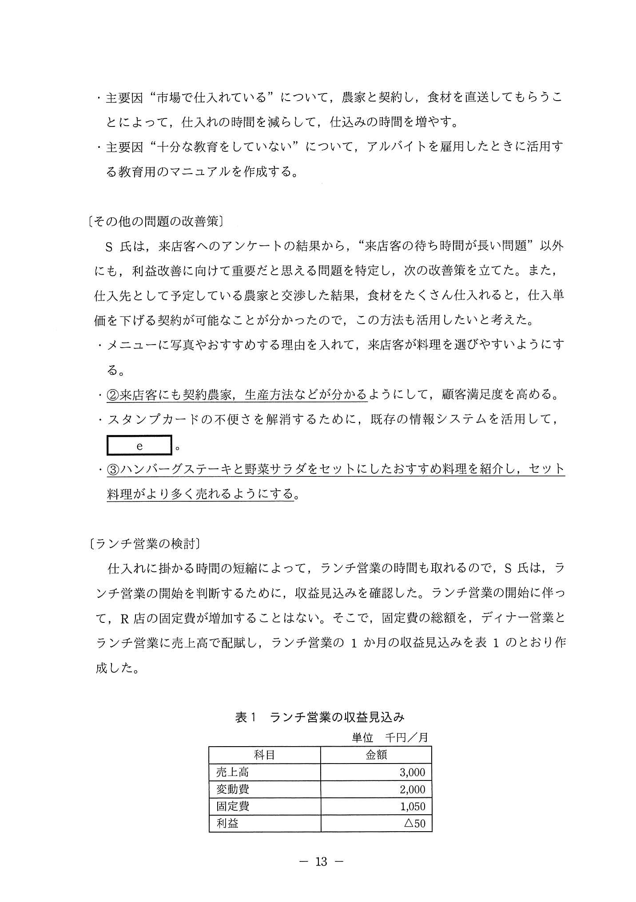

テキスト (OCR)

・主要因“市場で仕入れている"について, 農家と契約し, 食材を直送してもらうこ
とによって, 仕入れの時間を減らして, 仕込みの時間を増やす。
・主要因 "十分な教育をしていない"” について, アルバイトを雇用したときに活用す

る教育用のマニュアルを作成する。

Or

[その他の問題の改善策

S 氏は, 来店客へのアンケートの結果から, “来店客の待ち時間が長い問題” 以外
にも, 利益改善に向けて重要だと思える問題を特定し, 次の改善策を立てた。また,
仕入先として予定している農家と交渉した結果, 食材をたくさん仕入れると, 仕入単
価を下げる契約が可能なことが分かったので, この方法も活用したいと考えた。

・メニューに写真やおすすめする理由を入れて, 来店客が料理を選びやすいようにす

る。

・②来店客にも契約農家, 生産方法などが分かるようにして, 顧客満足度を高める。
・スタンプカードの不便さを解消するために, 既存の情報システムを活用して,

・③ハンバーグステーキと野菜サラダをセットにしたおすすめ料理を紹介し, セット

料理がより多く売れるようにする。

〔ランチ営業の検討〕

仕入れに掛かる時間の短縮によって, ランチ営業の時間も取れるので, S 氏は, ラ
ンチ営業の開始を判断するために, 収益見込みを確認した。ランチ営業の開始に伴っ
て, R 店の固定費が増加することはない。 そこで, 固定費の総額を, ディナー営業と
SV FIL CHUL, ランチ営業の 1 か月の収益見込みを表 1 のとおり作
成した。

表1 ランチ営業の収益見込み

単位 千円月

科目                     金額
売上高                                      3,000
変動費                                      2.000
固定費                                      1,050
利益                                          A50

ー 13 一

### ページ 14

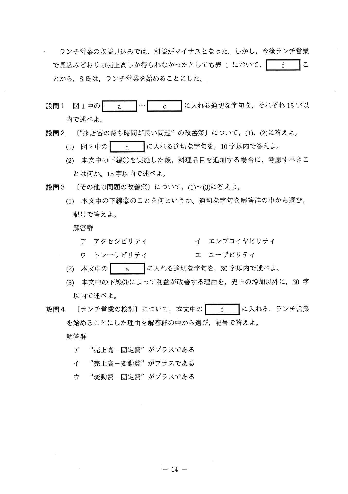

テキスト (OCR)

ランチ営業の収益見込みでは, 利益がマイナスとなった。 しかし, 今後ランチ営業
で見込みどおりの売上高しか得られなかったとしても表 1 において, | rj |こ
とから, SKI, ランチ営業を始めることにした。

設問1 図1中の| sa |て|  c |に入れる適切な字包を, それぞれ15 字以
内で述べよ。

設問2 "来店客の待ち時間が長い問題" の改善策] について, @, ②に答えよ。
Q) 図2中の| a | に入れる適切な字句を, 10 字以内で答えよ。
②) 本文中の下線①を実施した後, 料理品目を追加する場合に, 考慮すべきこ

とは何か。 15 字以内で述べよ。

設問3 (その他の問題の改善策〕) について, ①て(⑬③に答えよ。

Q) 本文中の下線@のことを何というか。適切な字句を解答群の中から選び,

記号で答えよ。

解答群
ア アクセシビリティ       イ エンプロイヤビリティ
ウ トレーサビリティ       エエ ユーザビリティ

@ 本文中の| ce | に入れる適切な字句を, 30字以内で述べよ。
Q) 本文中の下線③によって利益が改善する理由を, 売上の増加以外に, 30 字
以内で述べよ。
設問4 〔ランチ営業の検討}について, 本文中の| f | に入れる, ランチ党業
を始めることにした理由を解答群の中から選び, 記号で答えよ。
ARTE
ア “売上高一固定費" がプラスである
4 “売上高一変動費” がブラスである
ウ “次動費一固定費” がプラスである

— 14 一

### ページ 15

テキスト (OCR)

C

メ モ 用 紙 J

= 45 =

### ページ 16

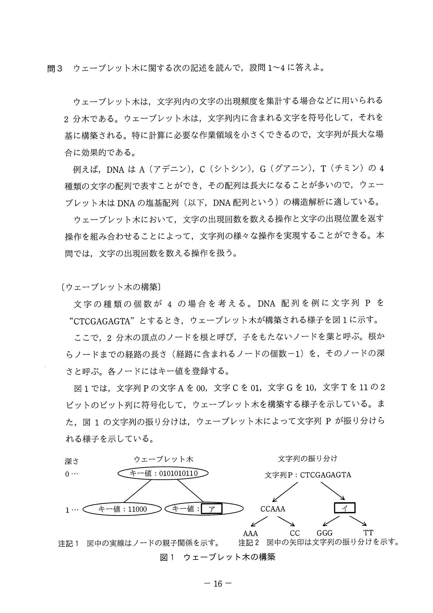

テキスト (OCR)

AS ウェーブレット木に関する次の記述を読んで, 設問 1こ4 に答えよ。

ウェーブレット木は, 文字列内の文字の出現頻度を集計する場合などに用いられる
2 分木である。ウェーブレット木は, 文字列内に含まれる文字を符号化して, それを
基に構築される。特に計算に必要な作業領域小さくできるので, 文字列が長大な場
合に効果的である。

例えば, DNA は A (アデニン), C (シトシン), G (グアニン), T (チミン) の 4
種類の文字の配列で表すことができ, その配列は長大になることが多いので, ウェー
ブレット木は DNA の塩基配列 (以下, DNA 配列という) の構造解析に適している。

ウェーブレット木において, 文字の出現回数を数える操作と文字の出現位置を返す
操作を組み合わせることによって, 文字列の様々な操作を実現することができる。本
Cla, 文字の出現回数を数える操作を扱う。

〔ウェーブレット木の構築〕

文字の種類の個数が 4 の場合を考える。DNA 配列を例に文字列 P を
“CTCGAGAGTA” とするとき, ウェーブレット木が構築される様子を図 1 に示す。

ここで, 2 分木の頂点のノードを根と呼び, 子をもたないノードを葉と呼ぶ。根か
らノードまでの経路の長さ (経路に含まれるノードの個数一1) を, そのノードの深
さと呼ぶ。、各ノードにはキー値を登録する。

図 1 では, 文字列P の文字Aを00, 文字Cを01, 文字Gを10, 文字を11の2
ビットのビット列に符号化して, ウェーブレット木を構築する様子を示している。ま
た, 1 の文字列の振り分けは, ウェーブレット木によって文字列 P が振り分けら
れる様子を示している。

深さ       ウェーブレット木           文字列の振り分け

キー値 : 0101010110

文字列P : CTCGAGAGTA

N

CCAAA       a
aos ZS

AAA         CC     GGG         TT
注記1 図中の実線はノードの親子関係を示す。       注記2 図中の矢印は文字列の振り分けを示す。

図1 ウェーブレット木の構築

・ キー値: 000 >

= [§ 一

### ページ 17

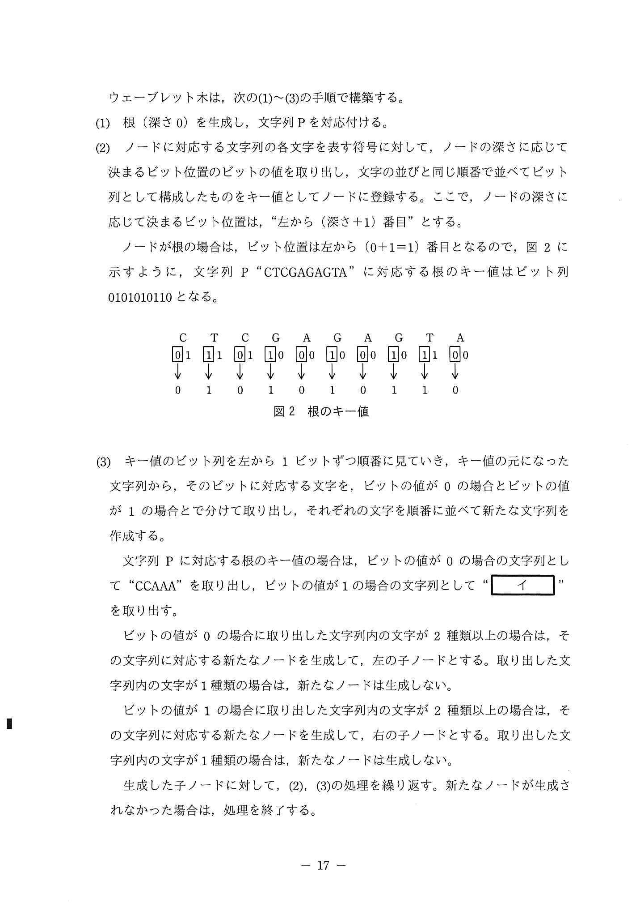

テキスト (OCR)

ウェーブレット木は, 次の(1①~て(3③の手順で構築する。

(1) 根 (深さ 0) を生成し, 文字列 P を対応付ける。

2) ノードに対応する文字列の各文字を表す符号に対して, ノードの深さに応じて
決まるビット位置のビットの値を取り出し, 文字の並びと同じ順番で並べてビット
列として構成したものをキー値としてノードに登録する。ここで, ノードの深さに
応じて決まるビット位置は, “AS (深さ十1) 番目” とする。

ノードが根の場合は, ビット位置は左から (0+1=1) 番目となるので, 図 2 に
示すように, 文字列 P “CTCGAGAGTA” に対応する根のキー値はビット列
0101010110 となる。

C T C G A GA GTA

(ola 1 [ola [alo [ojo ho eo Ho 還 [oo

りり すすすすすす》 SY

0 1 0 1 0 1 0 1 1 0
図2 根のキー値

⑬) キー値のビット列を左から 1 ビットずつ順番に見ていき, キー値の元になった
文字列から, そのビットに対応する文字を, ビットの値が 0 の場合とビットの値
が 1 の場合とで分けて取り出し, それぞれの文字を順番に並べて新たな文字列を
作成する。

文字列 P に対応する根のキー値の場合は, ビットの値が 0 の場合の文字列とし
て “CCAAA" を取り出し, ピットの値が1 の場合の文字列として "| イ |"
を取り出す。

ビットの値が 0 の場合に取り出した文字列内の文字が 2 種類以上の場合は。そ
の文字列に対応する新たなノードを生成して, 左の子ノードとする。取り出した文
字列内の文字が 1 種類の場合は, 新たなノードは生成しない。

ビットの値が 1 の場合に取り出した文字列内の文字が 2 種類以上の場合は, そ
の文字列に対応する新たなノードを生成して,右の子ノードとする。取り出した文
字列内の文字が 1 種類の場合は。 新たなノードは生成しない。

生成した子ノードに対して, 2), ⑬の処理を繰り返す。新たなノードが生成さ
れなかった場合は, 処理を終了する。

ー 一

### ページ 18

テキスト (OCR)

〔文字の出現回数を数える操作]
文字列P 全体での文字 C(一01)の出現回数は, KO), ⑫の手順で求める。

() 文字C の符号の左から 1 番目のビットの値は 0 なので, 文字Cは根から左の子
ノードに振り分けられる。左の子ノードに振り分けられる文字の個数は, 根のキー
値の 0 の個数に等しく, | ウ |でぁる<。

Q) 文字 C の符号の左から 2 番目のビットの値は 1 である。(1①)で振り分けられた左
の子ノードのキー値の 1 の個数は 2 で, このノードは葉であるので, これが文字
列P 全体での文字Cの出現回数となる。

〔文字の出現回数を数えるプログラム〕

与えられた文字列 Q 内に含まれる文字の種類の個数を 0とするとき, あらかじめ
生成したウェーブレット木を用いて, 与えられた文字列内で指定した文字の出現回数
を数えるプログラムを考える。ウェーブレット木の各ノードを表す構造体 Node を表
1 に示す。左の子ノード, 又は右の子ノードがない場合は, それぞれ, left, right に
は NULL を格納する。

表1 各ノードを表す構造体 Node

構成要素                  説明
key           ノードのキー値をビット列として格納
left         左の子ノフードへのポインタを格納
right           右の子ノードへのポインタを格納

文字列 Q に対応して生成したウェーブレット木の根へのポインタを root とする。
文字列 Q 内に存在する一つの文字 (以下, 対象文字という) をビット列に符号化し
て, 整数 (0こgー1) に変換したものをェとする。

このとき, 文字列 Q の 1 文字目から m 文字目までの部分文字列で, 対象文字の出
現回数を数える関数 rank(root, m,r) のプログラムを図 3 に示す。

文字の符号化に必要な最小のビット数は, ABB DEPTH に格納されているもの
とする。

ュー 18 —

### ページ 19

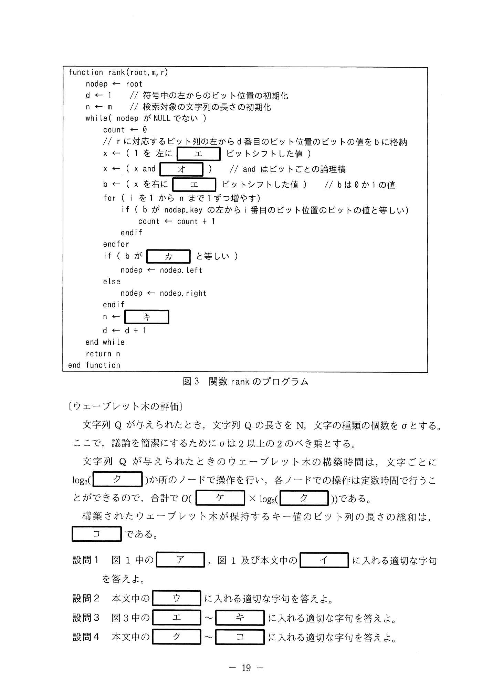

テキスト (OCR)

function rank(root, mr)

nodep < root

9でと1  // 符号中の左からのビット位置の初期化

neo   // 検索対象の文字列の長さの初期化

while( nodep がNULL でない )
count <— @
//r に対応するビット列の左からd番目のビット位置のビットの値をbに格納
x (1を左に| エ | ビットシフトした値 )
x = (x and ) 。// and はピットごとの論理積

be (x を右に ビットシフトした値 )  //bは0か1の値
for (i を1 から n まで1ずつ増やす)
if ( b が nodep.key DADS i 番目のビット位置のビットの値と等しい)
count を count + 1
endif
endfor
if (b が[| ヵ | と等しい )
nodep < nodep.left
else
nodep < nodep. right
endif
ve
d<«-ditl
end while
return n
end function

図3 関数rank のプログラム

(ウェープレット木の評価)
文字列 Q が与えられたとき, 文字列 Q の長さを N, 文字の種類の個数をとする。
ここで, 議論を簡潔にするためにoは2以上の 2 のべき乗とする。
文字列 Q が与えられたときのウェーブレット木の構築時間は, 文字ごとに
log(| ク か所のノードで操作を行い, 各ノードでの操作は定数時間で行うこ
とができるので, 合計で0(| 7 |xjogdl 7 |)でぁる。
構築されたウェーブレット 木が保持するキー値のピット列の長さの総和は,

設問1 図 1 中の| ア | , 図 1 及び本文中の[| イ |] に入れる適切な字句

を答えよ。
設問2 本文中の[| ウ | に入れる適切な字句を答えよ。
BAS 図3中の| エ |~| + |に入れる適切な字句を答えよ。
設問4 本文中の| ク |~| コ |に入れる適切な字句を答えよ。

ー 19 一

### ページ 20

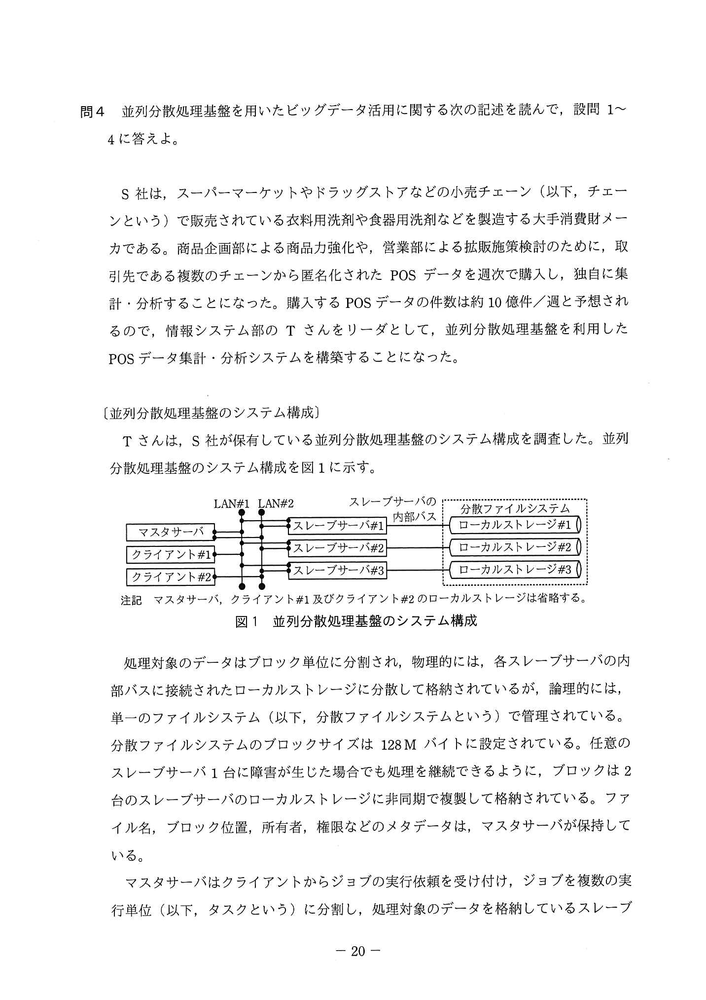

テキスト (OCR)

間4 並列分散処理基盤を用いたビッグデータ活用に関する次の記述を読んで, 設問 I~

4 に答えよ。

S 社は, スーパーマーケットやドラッグストアなどの小売チェーン (以下, チェー
ンという) で販売されている衣料用洗剤や食器用洗剤などを製造する大手消費財メー
カである。商品企画部による商品力強化や, 営業部による拡販施策検討のために, 取
引先である複数のチェーンから匿名化された POS データを週次で購入し, 独自に集
計・分析することになった。 購入する POS データの件数は約 10 億件/週と予想され
るので, 情報システム部の T さんをリーダとして, 並列分散処理基盤を利用した
POS データ集計・分析システムを構築することになった。

〔並列分散処理基盤のシステム構成〕
T さんは, S 社が保有している並列分散処理基盤のシステム構成を調査した。並列
分散処理基盤のシステム構成を図 1 に示す。

LAN#1 LAN#2              スレーブサーバの                                      1

*           ーーーーー」 内部バス                   i

フラィテント な1 】 pe} a 8)
クライアントめ1     スレープサーバ約ーーーーF( ローカルストレージ8 0 |

9 @              sons
注記 マスタサーバ, クライアント#1 及びクライアント#2 のロー

図1 並列分散処理基盤のシステム構成

処理対象のデータはブロック単位に分割され, 物理的には, 各スレーブサーバの内
部バスに接続されたローカルストレージに分散して格納されているが, 論理的には,
単一のファイルシステム (以下, 分散ファイルシステムという) で管理されている。
分散ファイルシステムのブロックサイズは 128M バイトに設定されている。 任意の
スレーブサーバ 1 台に障害が生じた場合でも処理を継続できるように, ブロックは2
台のスレーブサーバのローカルストレージに非同期で複製して格納されている。 ファ
イル名, ブロック位置, 所有者, 権限などのメタデータは, マスタサーバが保持して
いる。

マスタサーバはクライアントからジョブの実行依頼を受け付け, ジョブを複数の実
行単位 OLE, タスクという) に分割し, 処理対象のデータを格納しているスレーブ

ー 20 一

### ページ 21

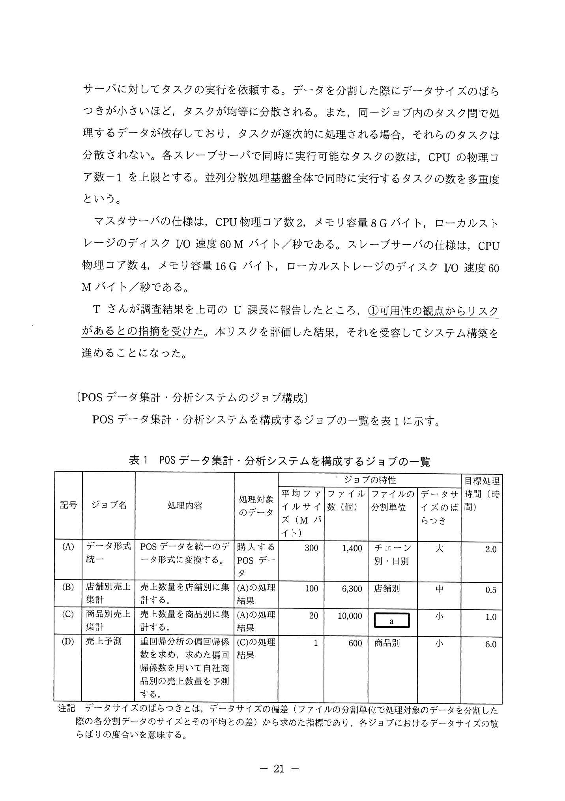

テキスト (OCR)

サーバに対してタスクの実行を依頼する。データを分割した際にデータサイズのばら
つきが小さいほど, タスクが均等に分散される。 また, 同一ジョブ内のタスク間で処
理するデータが依存しており, タスクが逐次的に処理される場合, それらのタスクは
分散されない。各スレーブサーバで同時に実行可能なタスクの数は, CPU の物理コ
ア数一1 を上限とする。並列分散処理基盤全体で同時に実行するタスクの数を多重度
という。

マスタサーバの仕様は, CPU 物理コア数 2, メモリ容量 8G バイト, ローカルスト
レージのディスク VO 速度60M バイトノ秒である。スレーブサーバの仕様は, CPU
物理コア数4,。 メモリ容量 16 G バイト, ローカルストレージのディスク YO 速度60
M バイトノ秒である。

T さんが調査結果を上司の U 課長に報告したところ, ①可用性の観点からリスク
があるとの指摘を受けた。本リスクを評価した結果, それを受容してシステム構築を
進めることになった。

(POS データ集計・分析システムのジョブ構成〕
POS データ集計・分析システムを構成するジョブの一覧を表 1 に示す。

表1 POS データ集計・分析システムを構成するジョブの一覧

ジョブの特性         目標処理
処理対象 平均ファ|ファイル| ファイルの|データサ|時間 (時
記号| ジョブ名      処理内容     のデータ |「 ルサイ|数(個) |分割単位 |イズのば|間)
ズ (M バ               らちつき
イト)
(A) | データ形式 POS データを統一のデ |購入する    300   1,400 | チェーン   大      2.0
統一       ータ形式に変換する。 |POS デー                  別・日別
タ
(B) | 店舗別売上 | 売上数量を店舗別に集 |A)の処理    100   6,300 | 店舗別     中      0.5
集計     計する。         結果
(C) | 商品別売上 | 売上数量を商品別に集 |(A)の処理   20  10,000       小    1.0
集計     計する。         結果                C]
(D) | 売上予測 | 重回帰分析の偏回帰係 |(C)の処理     1    600 | 商品別     小      6.0
数を求め, 求めた偏回 | 結果
帰係数を用いて自社商
品別の売上数量を予測
する。
注記 データサイズのばらつきとは, データサイズの偏差 (ファイルの分割単位で処理対象のデータを分割した

際の各分割データのサイズとその平均との差) から求めた指標であり, 各ジョブにおけるデータサイズの散
らばりの度合いを意味する。

ー 21 一

### ページ 22

テキスト (OCR)

POS データの購入元は 200 チェーンあり, POS データは日別にファイル分割され
ている。1 週間分の POS データのファイル数は 1,400 個であり, 総データサイズは
420 G バイトとなる。 店舗数は全チェーン合わせて 6,300 店舗であり, 取り扱われて
いる商品数は 10.000 点である。そのうち, S 社の商品は 600 点である。

ジョブの実行順序は(A), (B), (C), (D)の順であり, 各ジョブは同時には実行され
ない。

毎週月曜日 23 時までには, 前週月曜日から日曜日までの全ての POS データが分散
ファイルシステムに格納される。商品企画部や営業部からは, 毎週火曜日の 9 時に
は最新の分析結果を見られるようにしてほしいとの要望が拳がっているので, 月曜日
23 時から火曜日 9 時までの間に一連のジョブを完了させる必要がある。

[性能テスト〕
POS データ集計・分析システムを開発し, 性能テストを実施したところ, OVa
が判明した。ジョブ()実行中のマスタサー

プ(B)が目標処理時間内に完了しないこ
バ及びスレーブサーバ#1 のリソース使用状況を図 2 に示す。
スレーブサーバ#2 及びスレーブサーバ#3 のリソース使用状況もスレーフ

なお,
サーバ#1 のリソース使用状況と類似している。
(%)                   CPU使用率                           (Gバイト)            メモリ使用量
100              16
40m                        A
0 10 20 30 40 50 60(分) 0 10 20 30 40 50 60(分)
(Mバイトノ秒) ディスクMO速度                                凡例
70              ーー マスタサーバ
Pr スレーブサーバ1
40                        注記 各グラフの横軸はジョブ開始時からの
経過時間を表す。
20
ian a   ケー
0 10  20  30  40  50 60(分)

図2 各サーバのリソース使用状況

### ページ 23

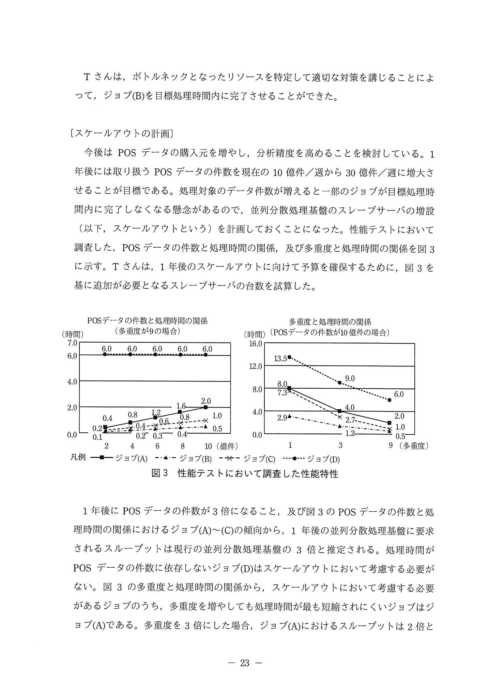

テキスト (OCR)

T さんは, ボトルネックとなったリソースを特定して適切な対策を講じることによ
って, ジョブ()を目標処理時間内に完了させることができた。

〔スケールアウトの計画]

今後は POS データの購入元を増やし, 分析精度を高めることを検討している。1
年後には取り扱う POS データの件数を現在の 10 億件/週から 30 億件ン週に増大さ
せることが目標である。処理対象のデータ件数が増えると一部のジョブが目標処理時
間内に完了しなくなる懸念があるので, 並列分散処理基盤のスレーブサーバの増設

(以下、スケールアウトという) を計画しておくことになった。性能テストにおいて
調査した, POS データの件数と処理時間の関係, 及び多重度と処理時間の関係を図 3
に示す。T さんは, 1 年後のスケールアウトに向けて予算を確保するために, 図 3 を
基に追加が必要となるスレーブサーバの台数を試算した。

POSデータの件数と処理時間の関係                        多重度と処理時間の関係
(時間        (多重度が9の場合)                 (時間) (POSデータの企表が10 位件の場合)
0  60 60 60 60 60
60  6.0 60 60 60 6
12.0
4.0
8.0
2.0                 4.0
00一5          00  一05一
2 4 6 8 10 Cite)      1      3      9 (多重度)

凡例一下一ジョブ(A) AH ジョブ(B) -ペページョブ(C) タージョブ①
図3 性能テストにおいて調査した性能特性

1 年後に POS データの件数が 3 倍になること, 及び図 3 の POS データの件数と処
理時間の関係におけるジョブ(⑳)~(C)の傾向から, 1 年後の並列分散処理基盤に要求
されるスループットは現行の並列分散処理基盤の 3 倍と推定される。 処理時間が
POS データの件数に依存しないジョブ(D)はスケールアウトにおいて考慮する必要が
ない。 図 3 の多重度と処理時間の関係から, スケールアウトにおいて考慮する必要
があるジョブのうち, 多重度を増やしても処理時間が最も短縮されにくいジョブはジ
ョブ(A)である。多重度を 3 倍にした場合, ジョブ(A)におけるスループットは 2 EL

ー 23 一

### ページ 24

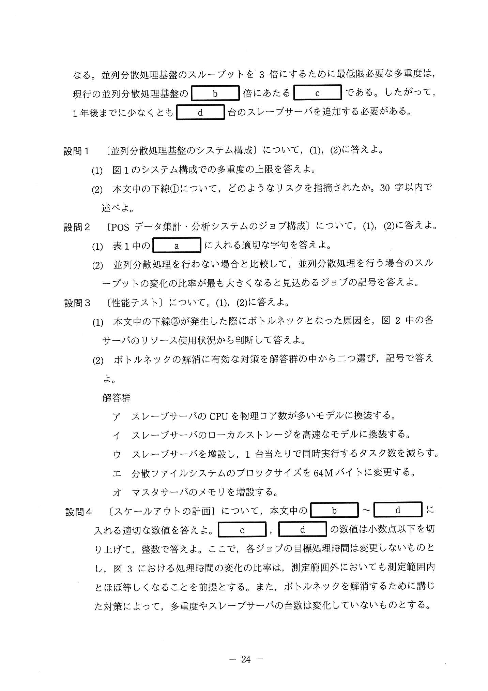

テキスト (OCR)

なる。並列分散処理基盤のスループットを 3 倍にするために最低限必要な多重度は,

現行の並列分散処理基盤の| b | 億にあたる である。したがって,

1 年後までに少なくとも|  q | 台のスレーブサーバを追加する必要がある。

設問1 並列分散処理基盤のシステム構成】について, ①, ②)に答えよ
Q) 図1のシステム構成での多重度の上限を答えよ。
2) 本文中の下線①について, どのようなリスクを指摘されたか。30 字以内で
述べよ。
設問2 «(POS データ集計・分析システムのジョブ構成】〕について, ①⑪, ⑫②に答えよ。
a) 表1中の[|  。 |に入れる適切な字句を答えよ
②) 並列分散処理を行わない場合と比較して, 並列分散処理を行う場合のスル
ープットの変化の比率が最も大きくなると見込めるジョブの記号を答えよ。
設問3 性能テスト〕 について, (①⑪, ②⑫に答えよ。
①) 本文中の下線②が発生した際にボトルネックとなった原因を, 図 2 中の各
サーバのリソース使用状況から判断して答えよ。
Q) ボトルネックの解消に有効な対策を解答群の中から二つ選び,
よ
fie

my

oS CHA

Bl

my °

BY
スレーブサーバの CPU を物理コア数が多いモデルに換装する。
スレーブサーバのローカルストレージを高速なモデルに換装する。
スレーブサーバを増設し, 1 台当たりで同時実行するタスク数を減らす。
分散ファイルシステムのブロックサイズを 64M バイトに変更する。
A マスタサーバのメモリを増設する。
設問4 〔スケールアウトの計画] について, 本文中の| b |~-| qa |に
入れる適切な数値を答えよ。|  c |,|  q』 |の数値は小数点以下を切
り上げて, 整数で答えよ。ここで, 各ジョブの目標処理時間は変更しないものと
し, 3 における処理時間の変化の比率は, 測定範囲外においても測定範囲内
とほぼ等しくなることを前提とする。また, ボトルネックを解消するために講じ
た対策によって, 多重度やスレーブサーバの台数は変化していないものとする。

H ささパコ

ー 24 一

### ページ 25

テキスト (OCR)

〔

x モ 用 紙 ]

ー 25 一

### ページ 26

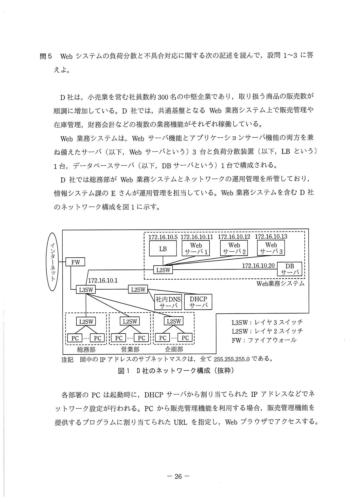

テキスト (OCR)

問5 Web システムの負荷分散と不具合対応に関する次の記述を読んで, 設問 1ご3 に答
えよ。

D thik, 小売業を営む社員数約 300 名の中堅企業であり, 取り扱う商品の販売数が
に増加している。D 社では, 共通基盤となる Web 業務システム上で販売管理

在庫管理, 財務会計などの複数の業務機能がそれぞれ稼働している

Web 業務システムは, Web サーバ機能とアプリケーションサーバ機能の両方を兼
ね備えたサーバ (以下, Web サーバという) 3 台と負荷分散装置 (以下, LB という)
1 台, データベースサーバ (以下, DB サーバという) 1 台で構成される。

D 社では総務部が Web 業務システムとネットワークの運用管理を所管しており,
情報システム課の E さんが運用管理を担当している。Web 業務システムを含む D 社
のネットワーク構成を図 1 に示す。

172.16.10.5 172.16.10.11 172.16.10.12 172.16.10.13

| ge  Web  Web  Web
!   YORI meee サーバ3

172.16.10.20| DB

Web業務システム

L3SW : レイヤ 3 スイッチ
L2SW : レイヤ2 スイツチ
FW : ファイアウォール

a ee        企画部
注記  BO IP アドレスのサブネットマスクは, 全て 255.255.255.0 CHS,

Bl D社のネットワーク構成 (抜粋)

各部署の PC は起動時に, DHCP サーバから割り当てられた IP アドレスなどでネ
ットワーク設定が行われる。PC から販売管理機能を利用する場合, 販売管理機能を
提供するプログラムに割り当てられた URL を指定し, Web ブラウザでアクセスする。

ー 26 一

### ページ 27

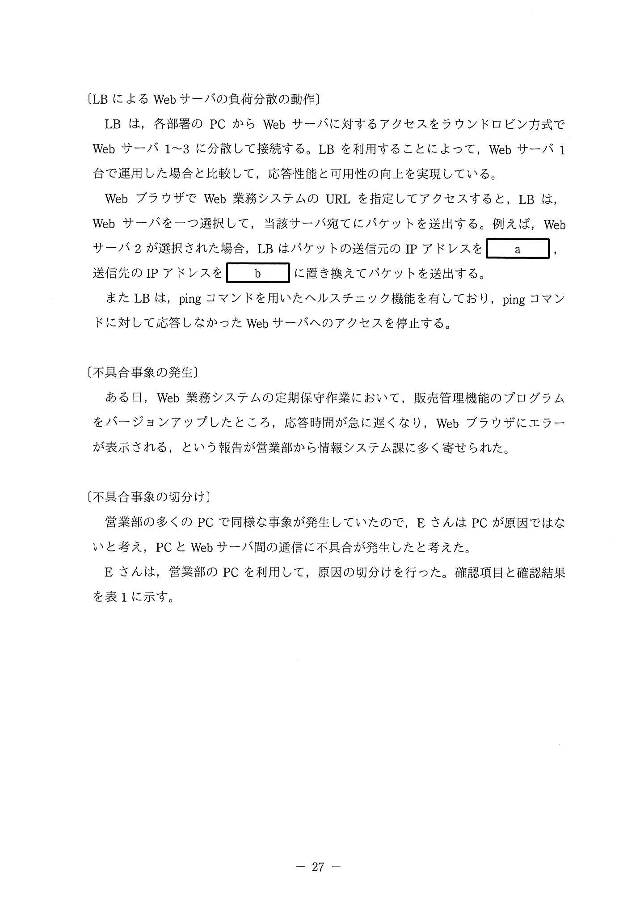

テキスト (OCR)

(LB による Web サーバの負荷分散の動作]

LB は, 各部署の PC から Web サーバに対するアクセスをラウンドロビピン方式で
Web サーバ 1~3 に分散して接続する。LB を利用することによって, Web サーバ 1
台で運用した場合と比較して, 応答性能と可用性の向上を実現している。

Web ブラウザで Web 業務システムの URL を指定してアクセスすると, LB は,
Web サーバを一つ選択して, 当該サーバ宛てにパケットを送出する。例えば, Web
サーバ 2 が選択された場合, LB はパケットの送信元の P アドレスを[| 。 |,
送信先の IP アドレスを|  b | に置き換えてパケットを送出する。

また LB は, ping コマンドを用いたヘルスチェック機能を有しており, ping IVY
ドに対して応答しなかった Web サーバへのアクセスを停止する。

〔不具合事象の発生〕

ある日, Web 業務システムの定期保守作業において, 販売管理機能のプログラム
をバージョンアップしたところ, 応答時間が急に遅くなり, Web ブラウザにエラー
が表示される, という報告が営業部から情報システム課に多く寄せられた。

〔不具合事象の切分け〕

営業部の多くの PC で同様な事象が発生していたので, E さんは PC が原因ではな
いと考え, PC と Web サーバ間の通信に不具合が発生したと考えた。

E さんは, 営業部の PC を利用して, 原因の切分けを行った。 確認項目と確認結果
を表 1 に示す。

ー 27 一

### ページ 28

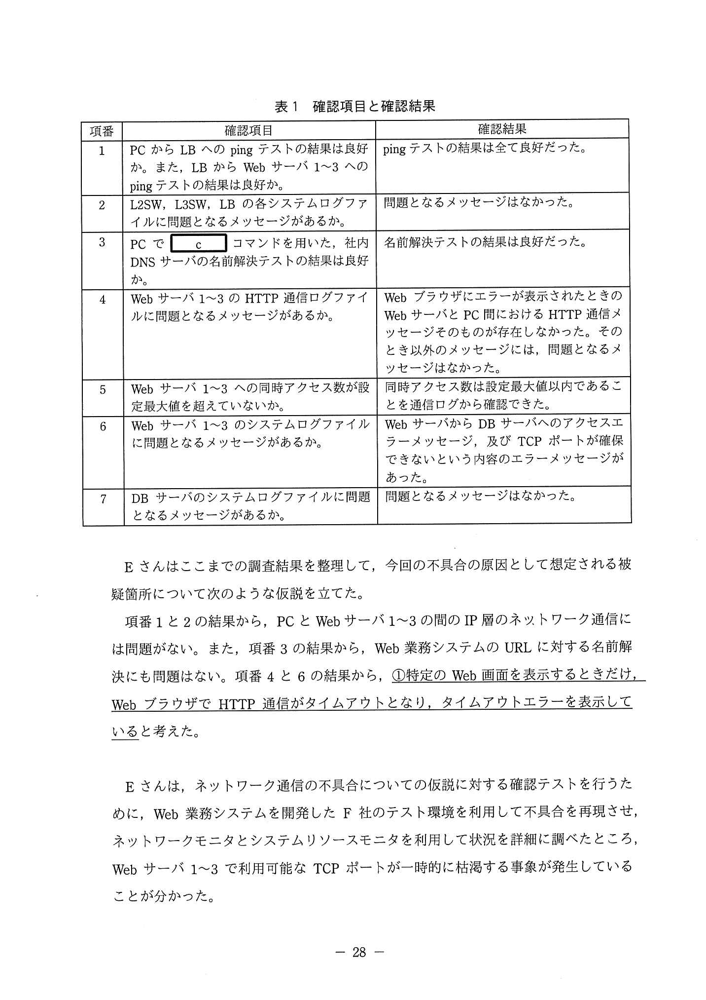

テキスト (OCR)

表1 確認項目と確認結果
項番            確認項目                       確認結果
1    PC から LB への ping テストの結果は良好 | ping テストの結果は全て良好だった。
か。また, LB から Web サーバ 1~3 への
ping テストの結果は良好か。
2 | L2SW, L3SW, LB の各システムログファ | 問題となるメッセージはなかった。
イルに問題となるメッセージがあるか。
3 | Pcで コマンドを用いた, 社内 | 名前解決テストの結果は良好だった。
DNS サーバの名前解決テストの結果は良好
De
4 | Web サーバュて3 の HTTP 通信ログファイ | Web ブラウザにエラーが表示されたときの
ルに問題となるメッセージがあるか。         Web サーバと PC 間における HTTP 通信メ
ッセージそのものが存在しなかった。その
とき以外のメッセージには, 問題となるメ
ッセージはなかった。
5 | Web サーバ 1~3 への同時アクセス数が設 | 同時アクセス数は設定最大値以内であるこ
定最大値を超えていないか。             とを通信ログから確認できた。
6 | Web サーバ 1て3 のシステムログファイル | Web サーバから DB サーバへのアクセスエ
に問題となるメッセージがあるか。        ラーメッセージ, 及び TCP ポートが確保
できないという内容のエラーメッセージが
あった。
7 | DB サーバのシステムログファイルに問題 | 問題となるメッセージはなかった。
となるメッセージがあるか。

E さんはここまでの調査結果を整理して,
疑箇所について次のような仮説を立てた。

項番 1 と 2 の結果から, PC と Web サーバ 1て3 の間の IP 層のネットワーク通信に
は問題がない。また, 項番 3 の結果から, Web 業務システムの URL に対する名前解
決にも問題はない。項番 4 と 6 の結果から, ①特定の Web 画面を表示するときだけ,

今回の不具合の原因として想定される被

Web ブラウザで HTTP 通信がタイムアウトとなり, タイムアウトエラーを表示して
いると考えた。

E さんは, ネットワーク通信の不具合についての仮説に対する確認テストを行うた
めに, Web 業務システムを開発した F 社のテスト環境を利用して不具合を再現させ,
ネットワークモニタとシステムリソースモニタを利用して状況を詳細に調べたところ,
Web サーバ 1~3 で利用可能な TCP ポートが一時的に枯潟する事象が発生している
ことが分かった。

ー 28 一

### ページ 29

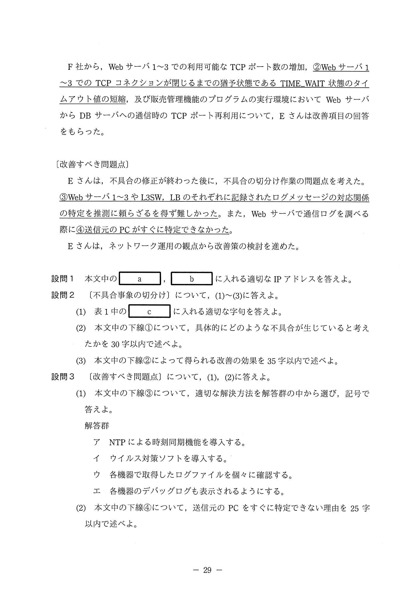

テキスト (OCR)

F 社から, Web サーバ 1-3 での利用可能な TCP ポート数の増加 ②Web サーバ 1
~3 での TCP コネクションが閉じるまでの猫予状態である TIME_WAIT 状態のタイ
ムアウト値の短縮, 及び販売管理機能のプログラムの実行環境において Web サーバ
から DB サーバへの通信時の TCP ポート再利用について, E さんは改善項目の回答
をもらっつた。

[改善すべき問題点〕

E さんは, 不具合の修正が終わった後に, 不具合の切分け作業の間題点を考えた。
@Web サーバ1ー3 やL3SW, LB のそれぞれに記録されたログメッセージの対応関係
の特定を推測に頼らざるを得ず難しかった。また, Web サーバで通信ログを調べる
際に送信元の PC がすぐに特定できなかった。

E さんは, ネットワーク運用の観点から改善策の検討を進めた。

設問1 本文中の| a |, L b | に入れる適切な ITP アドレスを答えよ
設問2 〔不具合事象の切分け〕) について, ①~て⑬)に答えよ。
G① sages 入れる適切な字句を答えよ。
(2) 本文中の下線やについて, 具体的にどのような不具合が生じていると考え
たかを 30 字以内で述べよ
(3) 本文中の下線②によって得られる改善の効果を 35 字以内で述べよ。
設問3 改善すべき問題点】 について, (1), (②⑫)に答えよ

QQ) 本文中の下線について, 適切な解決方法を解答群の中から選び, 記号で
答えよ。
解答群

ア NTP による時刻同期機能を導入する。
イ ウイルス対策ソフトを導入する。
ウ 各機器で取得したログファイルを個々に確認する。
エ 各機器のデバッグログも表示されるようにする。
(2) 本文中の下線@について, 送信元の PC をすぐに特定できない理由を 25 字
以内で述べよ

ー 29 一

### ページ 30

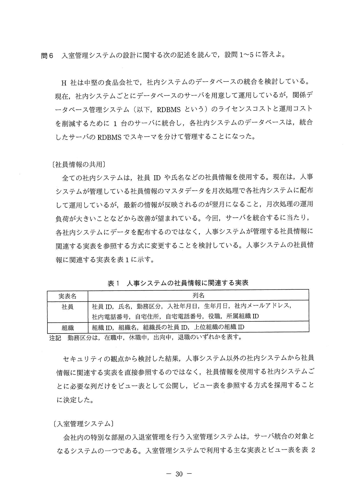

テキスト (OCR)

間6 入室管理システムの設計に関する次の記述を読んで, 設問 1ー5 に答えよ。

H 社は中堅の食品会社で, 社内システムのデータベースの統合を検討している。
現在, 社内システムごとにデータベースのサーバを用意して運用しているが, 関係デ
ータベース管理システム (以下, RDBMS という) のライセンスコストと運用コスト
を削減するために 1 台のサーバに統合し, 各社内システムのデータベースは, 統合
したサーバの RDBMS でスキーマを分けて管理することになった。

社員情報の共用]

全ての社内システムは, 社員 ID や氏名などの社員情報を使用する。現在は, 人事
システムが管理している社員情報のマスタデータを月次処理で各社内システムに配布
して運用しているが, 最新の情報が反映されるのが翌月になること, 月次処理の運用
負荷が大きいことなどから改善が望まれている。今回, サーバを統合するに当たり,
各社内システムにデータを配布するのではなく, 人事システムが管理する社員情報に
関連する実表を参照する方式に変更することを検討している。 人事システムの社員情
報に関連する実表を表 1 に示す。

表1 人事システムの社員情報に関連する実表
実表名                       列名
社員    社員 ID, 氏名, 勤務区分, 入社年月日, 生年月日, 社内メールアドレス,
社内電話番号, 自宅住所, 自宅電話番号, 役職, 所属組織TD
組織    組織 D, 組織名, 組織長の社員ID, 上位組織の組織
注記 勤務区分は, 在職中, 休職中, 出向中, 退職のいずれかを表す。

セキュリティの和観点から検討した結果, 人事システム以外の社内システムから社員
情報に関連する実表を直接参照するのではなく, 社員情報を使用する社内システムご
とに必要な列だけをビュー表として公開し, ビュー表を参照する方式を採用すること
に決定した。

会社内の特別な部屋の入退室管理を行う入室管理システムは, サーバ統合の対象と

なるシステムの一つである。人入室管理システムで利用する主な実表とビュー表を表 2

ー 30 一

### ページ 31

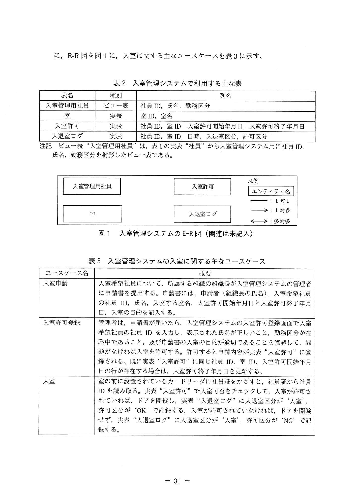

テキスト (OCR)

に, E-R 図を図 1 に, 入室に関する主なユースケースを表 3 に示す。

表2 入室管理システムで利用する主な表

表名       種別                   列名
入室管理用社員   ビュー表 | 社員ID, 氏名, 勤務区分
室        ER    1D, 室名
入室許可      実表   社員ID, SID, 入室許可開始年月日, 入室許可終了年月日
入退室ログ     実表    社員ID, SID, 日時, 入退室区分, 許可区分

ビュー表 “入室管理用社員”" は, 表1の実表 “HA” から入室管理システム用に社員 ID,

氏名, 勤務区分を射影したビュー表である。

入室管理用社員

凡人
ee           ーー
: 1対1
Amey        ーータ1対多
<>: He

図1 入室管理システムのE-R図 (関連は未記入)

表3 入室管理システムの入室に関する主なユースケース

ユースケース名

概要

入室希望社員について, 所属する組織の組織長が入室管理システムの管理者
に申請書を提出する。申請書には, 申請者 (組織長の氏名), 入室希望社員
の社員 ID, KA, 入室する室名, 入室許可開始年月日と入室許可終了年月
日, 入室の目的を記入する。

入室許可登録

管理者は, 申請書が届いたら, 入室管理システムの入室許可登録画面で入室
希望社員の社員 ID を入力し, 表示された氏名が正しいこと, 勤務区分が在
職中であること, 及び申請書の入室の目的が適切であることを確認して, 問
題がなければ入室を許可する。 許可すると申請内容が実表“入室許可"に登
録される。 既に実表 “ABA” に同じ社員 ID, 室 ID, 入室許可開始年月
日の行が存在する場合は, 入室許可終了年月日を更新する。

入室

室の前に設置されているカードリーダに社員証をかざすと, 社員証から社員
ID を読み取る。実表 “入室許可” で入室可否をチェックして, 入室が許可さ
れていれば, ドアを開錠し, 実表“入退室ログ” に入退室区分が 入室,
許可区分が "OK'で記録する。 入室が許可されていなければ, ドアを開錠
せず, BR “入退室ログ" に入退室区分が (AR, 許可区分が "NG' で記
録する。

ー 31 一

### ページ 32

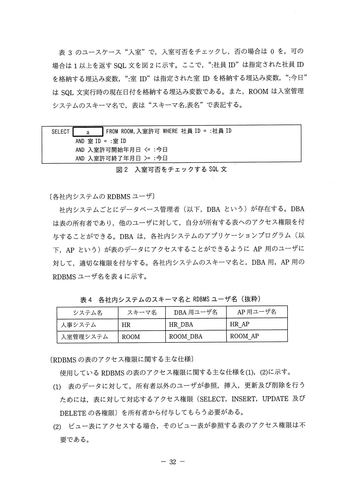

テキスト (OCR)

表 3 のユースケース “HB” で, 入室可否をチェックし, 否の場合は 0 を, TO
場合は 1 以上を返す SQL 文を図 2 に示す。ここで, “:社員ID” は指定された社員 ID
を格納する埋込み変数, “:室 ID” は指定された室 ID を格納する埋込み変数, “OR”
は SQL 文実行時の現在日付を格納する埋込み変数である。 また, ROOM は入室管理
システムのスキーマ名で, 表は“スキーマ名.表名” で表記する。

SELECT | 』 | FROM ROOM.入室許可 WHERE 社員ID = :社員TD
AND 室ID = :室ID
AND 入室許可開始年月日 ぐ= :今日
AND 入室許可終了年月日 >= :今日

M2 入室可否をチェックする SQL文

[各社内システムの RDBMS ユーザ)

社内システムごとにデータベース管理者 (以下, DBA という) が存在する。DBA
は表の所有者であり, 他のユーザに対して, 自分が所有する表へのアクセス権限を付
与することができる。DBA は, 各社内システムのアプリケーションプログラム (以
下, AP という) が表のデータにアクセスすることができるように AP 用のユーザに
対して, 適切な権限を付与する。各社内システムのスキーマ名と, DBA 用, AP 用の
RDBMS ユーザ名を表 4 に示す。

表4 各社内システムのスキーマ名と RDBMS ユーザ名 (抜粋)

システム名      スキーマ名    DBA 用ユーザ名    AP 用ユーザ名
人事システム            HR                  HR DBA                 HR AP
入室管理システム | ROOM            ROOM_DBA            ROOM AP

(RDBMS の表のアクセス権限に関する主な仕様]
使用している RDBMS の表のアクセス権限に関する主な仕様を), (②に示す。

QQ) 表のデータに対して, 所有者以外のユーザが参照, HA, 更新及び削除を行う
ためには, 表に対して対応するアクセス権限 (SELECT, INSERT, UPDATE 及び
DELETE の各権限) を所有者から付与してもらう必要がある。

Q) ビュー表にアクセスする場合, そのビュー表が参照する表のアクセス枚限は不

要である。

ー 32 一

### ページ 33

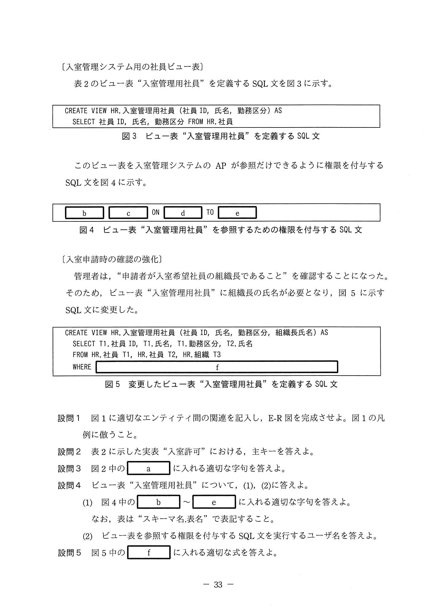

テキスト (OCR)

〔入室管理システム用の社員ビュー表〕
表2 のビュー表 “入室管理用社員” を定義する SQL 文を図 3 に示す。

CREATE VIEW HR.入室管理用社員 (社員ID, 氏名, 勤務区分) AS
SELECT 社員ID, 氏名, 勤務区分 FROM HR.社員

図3 ビュー表 “入室管理用社員” を定義する SQL文

このビュー表を入室管理システムの AP が参照だけできるように枚限を付与する
SQL 文を図 4 に示す。

Loo | 。 lm d lm es |
図4 ビュー表 “入室管理用社員” を参照するための権限を付与する SOX

【入室申請時の確認の強化〕
管理者は, “申請者が入室希望社員の組織長であること"を確認することになった。

そのため, ビュー表“入室管理用社員” に組織長の氏名が必要となり, 図 5 に示す
SQL 文に変更した。

CREATE VIEW HR.入室管理用社員 (社員ID, 氏名, 勤務区分, 組織長氏名) AS
SELECT T1.社員 ID, T1.氏名, T1.勤務区分, T2.氏名
FROM HR.社員 T1, HR.社員 T2, HR.組織 T3
WHERE |                            f

_]
図5 変更したビュー表 “入室管理用社員"を定義する SOL X

設問1 図1に適切ながエンティティ間の関連を記入し, E-R 図を完成させよ。図1 の凡
PINKS CE,

設問2 表2に示した実表 “入室許可"における, 主キーを答えよ。
設問3 図2中の|  』 | に入れる適切な字句を答えよ。
設問4 ビュー表“入室管理用社員"について, ①), ②に答えよ。

Q Batol pb |~| ec |に入れる適切な字句を答えよ。
BB, RIL “スキーマ名.表名” で表記すること。
(②) ビュー表を参照する権限を付与する SQL 文を実行するユーザ名を答えよ。
設問5 図5中の| { | に入れる適切な式を答えよ。

ー 33 一

### ページ 34

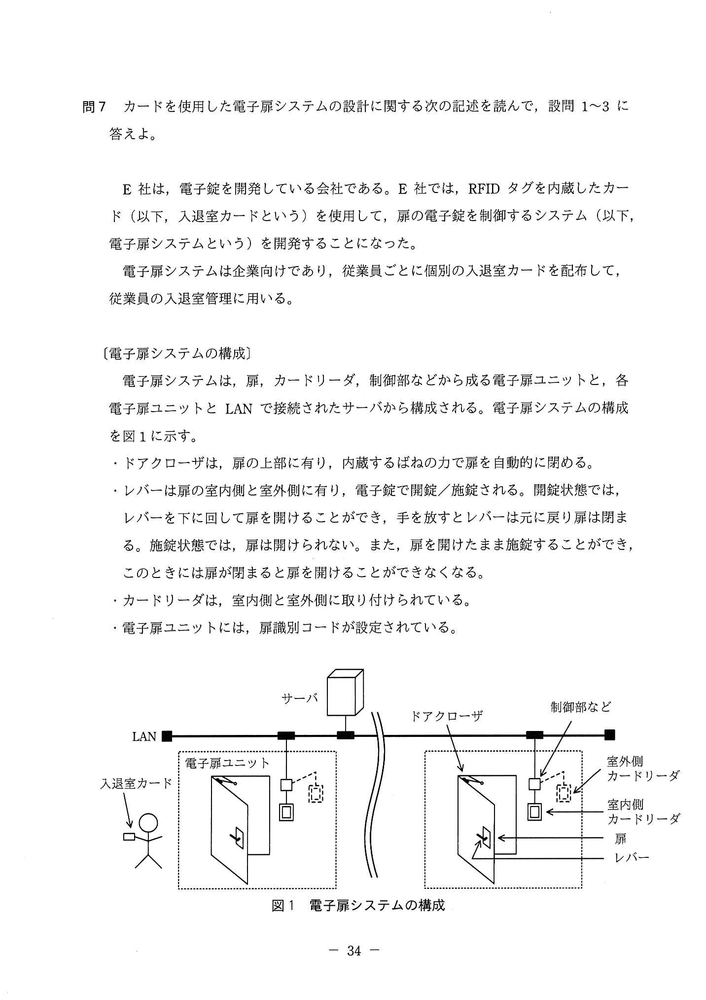

テキスト (OCR)

問7 カードを使用した電子扉システムの設計に関する次の記述を読んで, 設問 1~3 に

答えよ。

E 社は, 電子錠を開発している会社である。E 社では, RFID タグを内蔵したカー
ド (以下, 入退室カードという) を使用して, 扉の電子錠を制御するシステム (以下
電子扉システムという) を開発することになった。

電子扉システムは企業向けであり, 従業員ごとに個別の入退室カードを配布して,
従業員の入退室管理に用いる。

[電子扉システムの構成]

電子扉システムは, 扉, カードリーダ, 制御部などから成る電子扉ユニットと, 各

電子扉ユニットと LAN で接続されたサーバから構成される。電子扉システムの構成
を図 1 に示す。

・ドアクローザは, 扉の上部に有り, 内蔵するばねの力で扉を自動的に閉める。

・レバーは扉の室内側と室外側に有り, 電子錠で開錠施錠される。開錠状態では,
レバーを下に回して扉を開けることができ, 手を放すとレバーは元に戻り扉は閉ま
る。施錠状態では, 扉は開けられない。また, 扉を開けたまま施錠することができ,
このときには扉が閉まると扉を開けることができなくなる。

・カードリーダは, 室内側と室外側に取り付けられている。

・電子扉ユニットには, 扉識別コードが設定されている。

7クローッ      制御部など
LAN i                   \          a
{電子扉ユニット |                "て—            3 Mil
ae r OR      1          Le ae Pe
| 宣内側
カードリーダ
扉
ーー レバー

図 1 RFR AT ADM

ー 84 一

### ページ 35

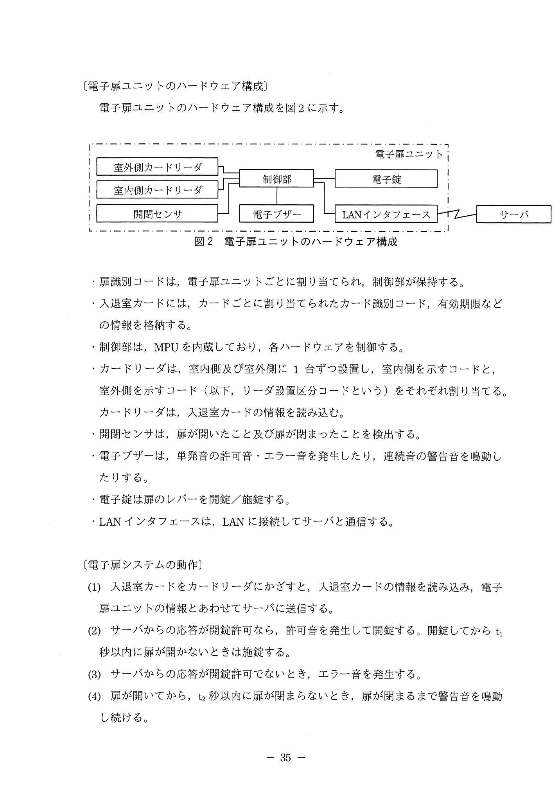

テキスト (OCR)

[電子扉ユニットのハードウェア構成
電子扉ユニットのハードウェア構成を図 2 に示す。

| | 種外側カードリーダ
         制御部            電子錠       |
| | 、許内側カードリーダ           |
|                                                   ・
i |     開閉センサ        | 電子ブザー      LANインタフェース |イアー| サーバ

 2 電子扉ユニットのハードウェア構成

・扉識別コードは, 電子扉ユニットごとに割り当てられ, 制御部が保持する。

・入退室カードには, カードごとに割り当てられたカード識別コード, 有効期限など
の情報を格納する。

・制御部は, MPU を内蔵しており, 各ハードウェアを制御する。

・カードリーダは, 室内側及び室外側に 1 台ずつ設置し, 室内側を示すコードと,
室外側を示すコード (以下, リータダ設置区分コードという) をそれぞれ割り当てる。
カードリーダは, 入退室カードの情報を読み込む。

・開閉センサは, 扉が開いたこと及び扉が閉まったことを検出する。

・電子ブザーは, 単発音の許可音・エラー音を発生したり, 連続音の警告音を鳴動し
たりする。

・ 電子錠は扉のレバーを開錠施錠する。

・LAN インタフェースは, LAN に接続してサーバと通信する。

(電子扉システムの動作)

(1) 入退室カードをカードリーダにかざすと, 入退室カードの情報を読み込み, 電子
扉ユニットの情報とあわせてサーバに送信する。

2) サーバからの応答が開錠許可なら, 許可音を発生して開錠する。開錠してから th
秒以内に扉が開かないときは施錠する。

3) サーバからの応答が開錠許可でないとき, エラー音を発生する。

(4) 扉が開いてから, t 秒以内に扉が閉まらないとき, 扉が閉まるまで称告音を鳴動
し続ける。

ー 35 一

### ページ 36

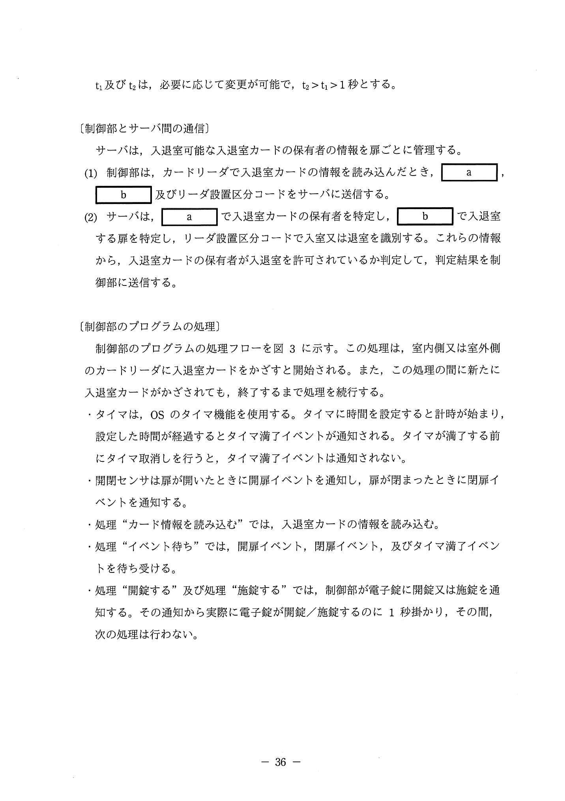

テキスト (OCR)

もhb及びt。は, 必要に応じて変更が可能で, tt>hh>1秒とする。

(制御部とサーバ間の通信】
サーバは, 入退室可能な入退室カードの保有者の情報を扉ごとに管理する。

Q) 制御部は, カードリーダで太退室カードの情報を読み込んだとき, | a |,
| b |及びリータダ設置区分コードをサーバに送信する。

② サーバは, [a] で入退室カードの保有者を特定し, | b ]cABx
FORENEL, リーダ設置区分コードで入室又は退室を識別する。これらの情報
Db, 入退室カードの保有者が入退室を許可されているか判定して, 判定結果を制
御部に送信する。

[制御部のプログラムの処理〕
制御部のプログラムの処理フローを図 3 に示す。この処理は, 室内側又は室外側

のカードリーダに入退室カードをかざすと開始される。また, この処理の間に新たに

入退室カードがかざされても, 終了するまで処理を続行する。

・タイマは, OS のタイマ機能を使用する。タイマに時間を設定すると計時が始まり
設定した時間が経過するとタイマ満イイベントが通知される。タイマが満了する前
にタイマ取消しを行うと, タイマ満イイベントは通知されない。

・開閉センサは扉が開いたときに開扉イベントを通知し, 扉が閉まったときに閉扉イ
ベントを通知する。

・処理 “カード情報を読み込むお" では, 入退室カードの情報を読み込む。

・処理 “イベント待ち" では, 開扉イベント, 閉扉イベント, 及びタイマ満イイベン
トを待ち受ける。

・処理 “開錠する"及び処理 “施錠する” では, 制御部が電子錠に開錠又は施錠を通
知する。その通知から実際に電子錠が開錠施錠するのに 1 WEY, COR,
次の処理は行わない。

ー 36 一

### ページ 37

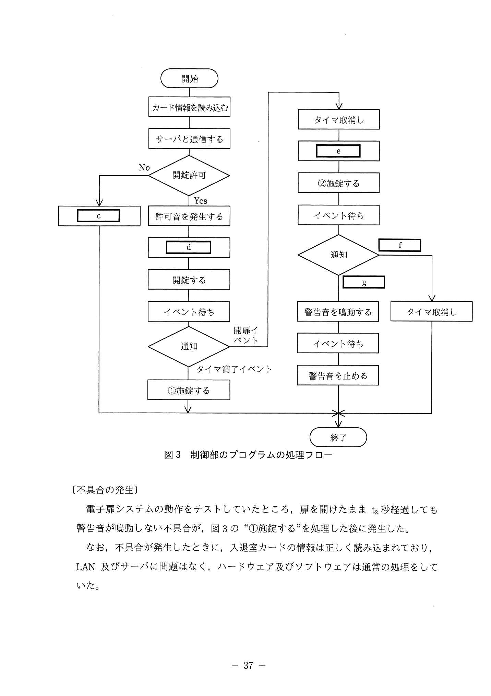

テキスト (OCR)

カード情報を読み込む
|              タイマ取消し
サーバと通信する
No         _                              |
開錠許可
②施錠する
Yes                           |
     許可音を発生する              イベント待ち
|
|
開錠する
|
イベント待ち          Hs eB SS    タイマ取消し
|
                  イベント待ち
|
タイマ満プイイベント    GEE LDS
施錠する
\
終了

図3 制御部のプログラムの処理フロー

〔不具合の発生〕

電子扉システムの動作をテストしていたところ, 扉を開けたまま t MRIALTH
告音が鳴動しない不具合が, M30 “①施錠する"を処理した後に発生した。

なお, 不具合が発生したときに, 入退室カードの情報は正しく読み込まれており,
LAN 及びサーバに問題はなく, ハードウェア及びソフトウェアは通常の処理をして
いた。

&

ー 37 一

### ページ 38

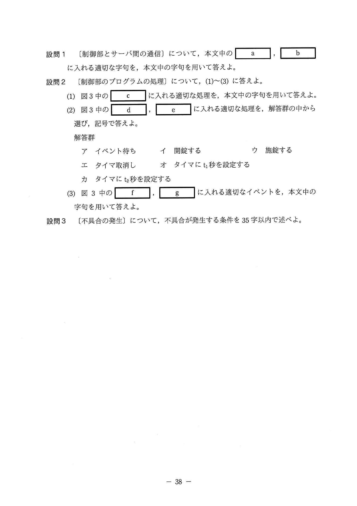

テキスト (OCR)

設問1 制御部とサーバ間の通信} について, 本文中の|  a |,| b5 |
に入れる適切な字名を, 本文中の字句を用いて答えよ。
設問2 [制御部のプログラムの処理] について, ①て(3) に答えよ。
@ 図3 中の[| c  ] に入れる適切な処理を, 本文中の宇句を用いて答えよ。
⑫②) 図3中の| a |, | ec |に入れる適切な処理を, 解答群の中から
選び, 記号で答えよ。
解答群
ア イベント待ち   イ 開錠する      ウ 施錠する
エ タイマ取消し   A タイマにGi秒を設定する
カ タイマに6t秒を設定する
③) 図 3 中の| f |,|  g | に入れる適切なイベントを, 本文中の
字句を用いて答えよ。
設問3 【〔不具合の発生 について, 不具合が発生する条件を 35 字以内で述べよ。

### ページ 39

テキスト (OCR)

〔

x = 用 紙 J

ー 39 一

### ページ 40

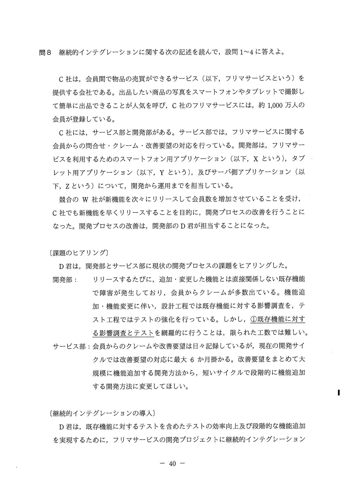

テキスト (OCR)

問8 継続的インテグレーションに関する次の記述を読んで, 設問 1ユー4 に答えよ。

C 社は, 会員間で物品の売買ができるサービス (以下、フリマサービスという) を
提供する会社である。出品したい商品の写真をスマートフォンやタブレットで撮影し
て簡単に出品できることが人気を呼び, C 社のフリマサービスには, 約 1,000 万人の
会員が登録している。

C 社には, サービス部と開発部がある。サービス部では, フリマサービスに関する
会員からの問合せ・クレーム・改善要望の対応を行っている。 開発部は, フリマサー
ビスを利用するためのスマートフォン用アプリケーション (以下, X という), タブ
レット用アプリケーション (以下, Y という), 及びサーバ側アプリケーション (以
下, Zという) について, 開発から運用までを担当している。

競合の W 社が新機能を次々にリリースして会員数を増加させていることを受け,
C 社でも新機能を早くリリースすることを目的に, 開発プロセスの改善を行うことに
Rok, 開発プロセスの改善は, 開発部の D 君が担当することになった。

(課題のしアリング]
D 君は, 開発部とサービス部に現状の開発プロセスの課題をヒアリングした。

開発部 :     リリースするたびに, 追加・変更した機能とは直接関係しない既存機能
で障害が発生しており, 会員からクレームが多数出ている。機能師
加・機能変更に伴い, 設計工程では既存機能に対する影響調査を, テ
スト工程ではテストの強化を行っている。しかし, ①既存機能に対す
る影響調査とテストを網羅的に行うことは, 限られた工数では難しい。

サービス部 : 会員からのクレームや改善要望は日々記録しているが, 現在の開発サイ
クルでは改善要望の対応に最大 6 か月掛かる。改善要望をまとめて大
規模に機能追加する開発方法から, 短いサイクルで段階的に機能追加
する開発方法に変更してほしい。

〔継続的インテグレーションの導入]
D 君は, 既存機能に対するテストを含めたテストの効率向上及び段階的な機能追加
を実現するために, フリマサービスの開発プロジェクトに継続的インテグレーション

ー 40 一

### ページ 41

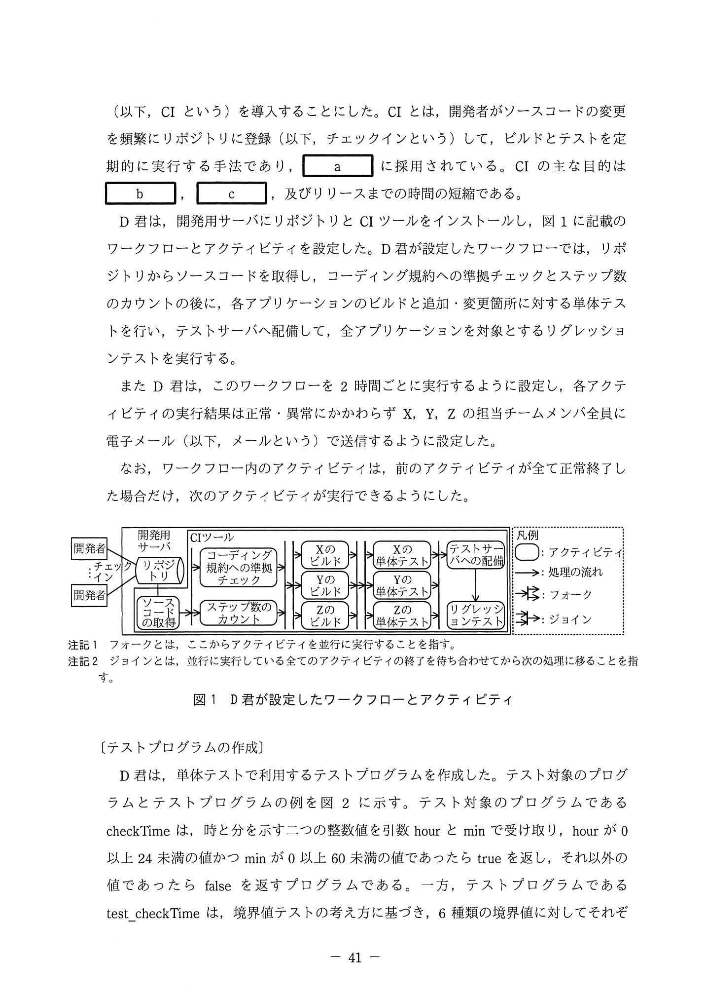

テキスト (OCR)

(以下, CI という) を導入することにした。CI とは, 開発者がソースコードの変更
を頻繁にりリポジトリに登録 (以下、 チェックインという) UT, ビルドとテストを定
期的に実行する手法であり, (La | に採用されている。CI の主な目的は
| b |, | c |, 及びリリースまでの時間の短縮である。

D 君は, 開発用サーバにリポジトリと CI ツールをインストールし, 図 1 に記載の
ワークフローとアクティビティを設定した。D 君が設定したワークフローでは, リポ
ジトリからソースコードを取得し, コーディング規約への準拠チェックとステップ数
のカウントの後に, 各アプリケーションのビルドと追加・変更箇所に対する単体テス
トを行い, テストサーバへ配備して, 全アプリケーションを対象とするリグレッショ
ンテストを実行する。

また D 君は。 このワークフローを 2 時間ごとに実行するように設定し, ATIF
ィビティの実行結果は正常・異常にかかわらず X, Y, Z の担当チームメンバ全員に
電子メール (以下。 メールという) で送信するように設定した。

なお, ワークフロー内のアクティビティは, 前のアクティビティが全て正常終了し
た場合だけ, 次のアクティビティが実行できるようにした。

wae aia   CIツール                                                                  i
開発     =A                          FAPIMC ).ァクティビピテイ
(2                              RAD RU O イクイケ
1イツ        トリ  ()                                                                   ュータラ: 処理の流れ
開発者                                   tS: 74-7

注記1 フォークとは, ここからアクティビティを並行に実行することを指す。
注記2 ジョインとは, 並行に実行している全てのアクティビティの終了を待ち合わせてから次の処理に移ることを指
す。

図1 D君が設定したワークフローとアクティビティ

[〔テストプログラムの作成]

D 君は, 単体テストで利用するテストプログラムを作成した。テスト対象のプログ
ラムとテストプログラムの例を図 2 に示す。テスト対象のプログラムである
checkTime は, 時と分を示す二つの整数値を引数 hour と min で受け取り, hounr が0
以上 24 未満の値かつ mn が0 以上 60 未満の値であったら true を返し, それ以外の
値であったら fase を返すプログラムである。 一方, テストプログラムである
test checkTime は, 境界値テストの考え方に基づき, 6 種類の境界値に対してそれぞ

ー 41 一

### ページ 42

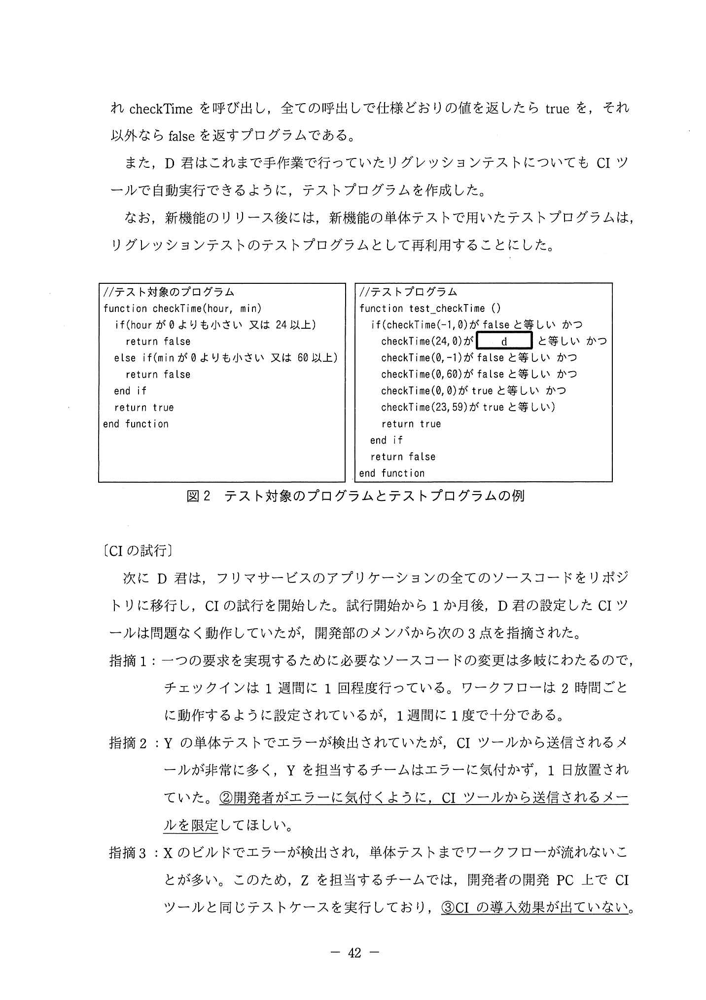

テキスト (OCR)

れ checkTime を呼び出し, 全ての呼出しで仕様どおりの値を返したら true を, それ
以外なら false を返すプログラムである。

また, D 君はこれまで手作業で行っていたリグレッションテストについても CI ツ
ールで自動実行できるように, テストプログラムを作成した。

なお, 新機能のリリース後には, 新機能の単体ケストで用いたテストプログラムは,
リグレッションテストのテストプログラムとして再利用することにした。

//テスト対象のプログラム                //テストプログラム
function checkTime(hour, min)             function test_checkTime ()
if(hour が0よりも小さい 又は 24 以上)           if(checkTime(-1,9)がfalse と等 しい かつ
return false                           checkTime(24, 0が[   d   | と等しい かつ
else if(minが9よりも小さい 又は 69 以上)         checkTime(9,-1)がfalse と等しい かつ
return false                               checkTime(0, 60)A* false と等しい かつ
end if                                   checkTime(9, 9)が true と等しい かつ
return true                                          checkTime(23, 59)が true と等しい)
end function                              return true
end if
return false
end function

図2 テスト対象のプログラムとテストプログラムの例

(CI の試行〕
次に D 君は。 フリマサービスのアプリケーションの全てのソースコードをリポジ
トリに移行し, CI の試行を開始した。試行開始から 1 か月後, D 君の設定した CLY
ールは問題なく動作していたが, 開発部のメンバから次の 3 点を指摘された。
指摘 1 : 一つの要求を実現するために必要なソースコードの変更は多岐にわたるので
チェックインは 1 週間に 1 回程度行っている。ワークフローは 2 時間ごと
に動作するように設定されているが, 1 週間に 1 度で十分である。

指摘 2 : Y の単体ケストでエラーが検出されていたが, CI ツールから送信されるメ
ールが非常に多く, Y を担当するチームはエラーに気付かず, 1 日放置され
ていた。②開発者がエラーに気付くように, CI ツールから送信されるメー
ルを限定してほしい。

指摘3 :X のビルドでエラーが検出され, 単体テストまでワークフローが流れないこ
とが多い。このため, Z を担当するチームでは, 開発者の開発 PC 上で CI
ツールと同じテストケースを実行しており, OCl の導入効果が出ていない。

out

ー 42 一

### ページ 43

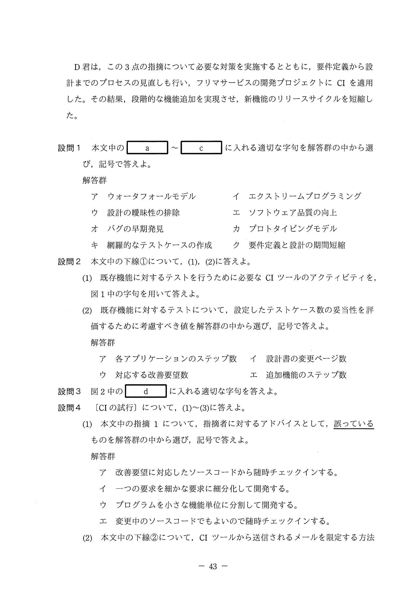

テキスト (OCR)

D 君は, この 3 点の指摘について必要な対策を実施するとともに, 要件定義から設
計までのプロセスの見直しも行い, フリマサービスの開発プロジェクトに CI を適用
した。その結果, 段階的な機能追加を実現させ, 新機能のリリースサイクルを短縮し
ただた。

設問1 本文中の| a |~| ic |に入れる適切な字句を解答群の中から選
U, 記号で答えよ。
WRATH
ア ウォータフォールモデル
ウ 設計の曖昧性の排除        ソフトウェア上品質の向上
オ バグの早期発見           プロトタイピングモデル
キ 網羅的なテストケースの作成  ク 要件定義と設計の期間短縮
設問2 本文中の下線わについて, ①⑪, (2②)に答えよ。
Q①) 既存機能に対するテストを行うために必要な CI ツールのアクティビティを。,
図 1 中の字句を用いて答えよ。
(2) 財存機能に対するテストについて, 設定したテストケース数の妥当性を評
価するために考慮すべき値を解答群の中から選び, 記号で答えよ。

エクストリームプログラミング

+ HAN

fe Aa
Y 各アプリケーションのステップ数 4 設計書の変更ページ数
ウ 対応する改善要望数        エ 追加機能のステップ数

設問3 図2中の|  d |に入れる適切な字句を答えよ。
設問4 CIの試行} について, ①~て(3⑬)に答えよ。
(1) 本文中の指摘 1 について, 指摘者に対するアドバイスとして, 誤っている
ものを解答群の中から選び, 記号で答えよ。
AH
ア 改善要望に対応したソースコードから随時チェックインする。
イ 一つの要求を細かな要求に細分化して開発する。
ウ プログラムを小さな機能単位に分割して開発する。
r= 変更中のソースコードでもよいので随時チェックインする。
(②) 本文中の下線@について, CI ツールから送信されるメールを限定する方法

ー 43 一

### ページ 44

テキスト (OCR)

を, 正常時のメールの送信を停止する以外に 35 字以内で述べよ。
3) 本文中の下線@について, CI ツールのワークフローをどのように修正する
とよいか。40 字以内で述べよ。

ー 44 一

### ページ 45

テキスト (OCR)

〔

x = 用 紙 J

ー 45 一

### ページ 46

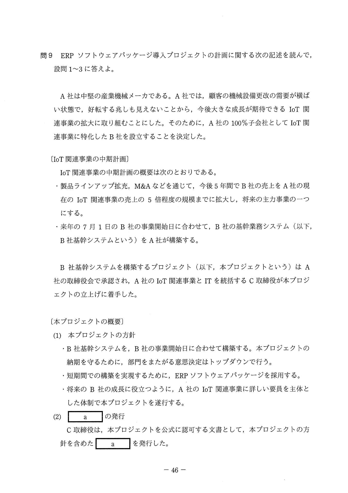

テキスト (OCR)

間9 ERP ソフトウェアパッケージ導入プロジェクトの計画に関する次の記述を読んで,

設問 1ー3 に答えよ。

A 社は中堅の産業機械メーカである。A 社では, 顧客の機械設備更改の秋要が横ば
い状態で, 好転する兆しも見えないことから, 今後大きな成長が期待できる IoT 関
連事業の拡大に取り組むことにした。そのために, AO 100%子会社として IoT 関

に特化した B 社を設立することを決定した。

[IoT 関連事業の中期計画]
IoT 関連事業の中期計画の概要は次のとおりである。

・製品ラインアップ拡充, M&A などを通じて, 今後5 年間で B 社の売上を A 社の現
在の IoT 関連事業の売上の 5 倍程度の規模までに拡大し, 将来の主力事業の一つ
にする。

・来年の 7 月 1 日の B 社の事業開始日に合わせて, B 社の基幹業務システム (以下,
B 社基幹システムという) を4A社が構築する。

B 社基幹システムを構築するプロジェクト (以下, 本プロジェクトという) は A
社の取締役会で承認され, A 社の IoT 関連事業と IT を統括する C 取締役が本プロジ
ェクトの立上げに着手した。

〔【本プロジェクトの概要〕

Q) 本プロジェクトの方針
・B 社基幹システムを, B 社の事業開始日に合わせて構築する。本プロジェクトの
納期を守るために, 部門をまたがる意思決定はトップダウンで行う。
・短期間での構築を実現するために, ERP ソフトウェアパッケージを採用する。
・将来の B 社の成長に役立つように, A 社の IoT 関連事業に詳しい要員を主体と
した体制で本プロジェクトを遂行する。

@ | 。』 |の発生

C 取締役は, 本プロジェクトを公式に認可する文書として, 本プロジェクトの方

針を含めた| a] を発行した。

ー 46 一

### ページ 47

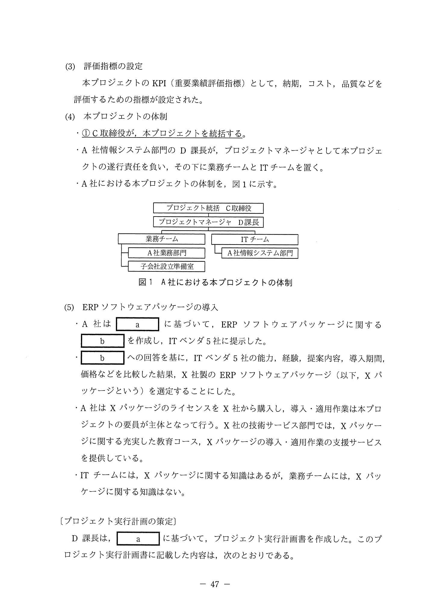

テキスト (OCR)

(3) 評価指標の設定
本プロジェクトの KPI (重要業績評価指標) として, WH, TA, 品質などを
評価するための指標が設定された。
(4) 本プロジェクトの体制
・①C 取締役が, 本プロジェクトを統括する。
・A 社情報システム部門の D BRM, プロジェクトマネージャとして本プロジェ
クトの遂行責任を負い, その下に業務チームと IT チームを置く。
・A 社における本プロジェクトの体制を, 図 1 に示す。

| プロジェクト統括 C取締役 |
I
| プロジェクトマネージャ DEE |
T
|    業務チーム    | | _ テーム    ]
A社業務郭門 | し| A社情報システム部門 |

子会社設立準備室
図1 A社における本プロジェクトの体制

(5) ERP ソフトウェアパッケージの導入
・A 社は| 』 |] に基づいて, ERP ソフトウェアパッケージに関する

| 5 |を作成し  IT ベンダ 5 社に提示した。

"| 5 some eske, TT ベンダ 5 社の人能力,経験 提案内容, 導入期間
価格などを比較した結果, X 社製の ERP ソフトウェアパッケージ (以下, X パ
ッケージという ) を選定することにした。
・A 社は X パッケージのライセンスを X 社から購入し, 導入・適用作業は本プロ
ジェクトの要員が主体となって行う。X 社の技術サービス部門では, X パッケー
に関する充実した教育コース, X パッケージの導入・適用作業の支援サービス
を提供している。
IT チームには, X パッケージに関する知識はあるが, 業務チームには, X パッ
ジに関する知識はない。
〔プロジェクト実行計画の策定】
D 課長は, ーー に基づいて, プロジェクト実行計画書を作成した。このプ

ロジェクト実行計画書に記載した内容は, 次のとおりである。

ー 47 一

### ページ 48

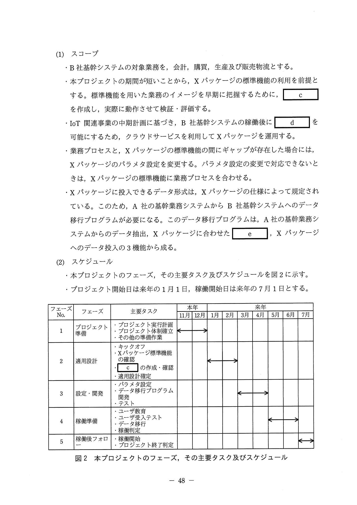

テキスト (OCR)

①

(2)

スローダ

・B 社基幹システムの対象業務を, Sit, WH, 生産及び販売物流とする。
・本プロジェクトの期間が短いことから, X パッケージの標準機能の利用を前提と

する。 標準機能を用いた業務のイメージを早期に把握するために,
を作成し, 実際に動作させて検証・評価する。

・ ToT 関連事業の中期計画に基づき, B 社基幹システムの乏働後に| q |を

可能にするため, クラウドサービスを利用して X パッケージを運用する。

・業務プロセスと, X パッケージの標準機能の間にギャップが存在した場合には,

X パッケージのパラメタ設定を変更する。パラメタ設定の変更で対応できないと
きは, X パッケージの標準機能に業務プロセスを合わせる。

・X パッケージに投入できるデータ形式は, X パッケージの仕様によって規定され

ている。このため, 4A 社の基幹業務システムから B 社基幹システムへのデータ
移行プログラムが必要になる。このデータ移行プログラムは, A 社の基幹業務シ
ステムからのデータ抽出。X パッケージに合わせた| es |, x パッケージ
へのデータ投入の 3 機能から成る。

スケジュール

・本プロジェクトのフェーズ, その主要タスク及びスケジュールを図 2 にす。
・プロジェクト開始日は来年の 1 月 1 日, 稼働開始日は来年の 7 月 1 日とする。

フェーズ       ーー
No.   フェーズ     主要タスク

本年        来年
1月| 2月| 1月 | 2月| 3月| 4月| 5月| 6月| 7月

1

ッ    ・ プロジェクト実生計画
人ジェクト | ・ ラロジェクト体制
・ その他の巡備人

・キックオフ

・Xパッケージ標準能
適用設計    の確認
[le] の作成・確認
・ 代用設計確定

PF:
設定・    ・データ移行プログラ
設定・開発   開発

・テスト

3 HEAT AN
,       avs    TA
ware | データ移行

- RUE

稼働後フォロ | ・稼働開始
ー      ・プロジェクト終了判定

図2 本プロジェクトのフェーズ, その主要タスク及びスケジュール

ー 48 一

### ページ 49

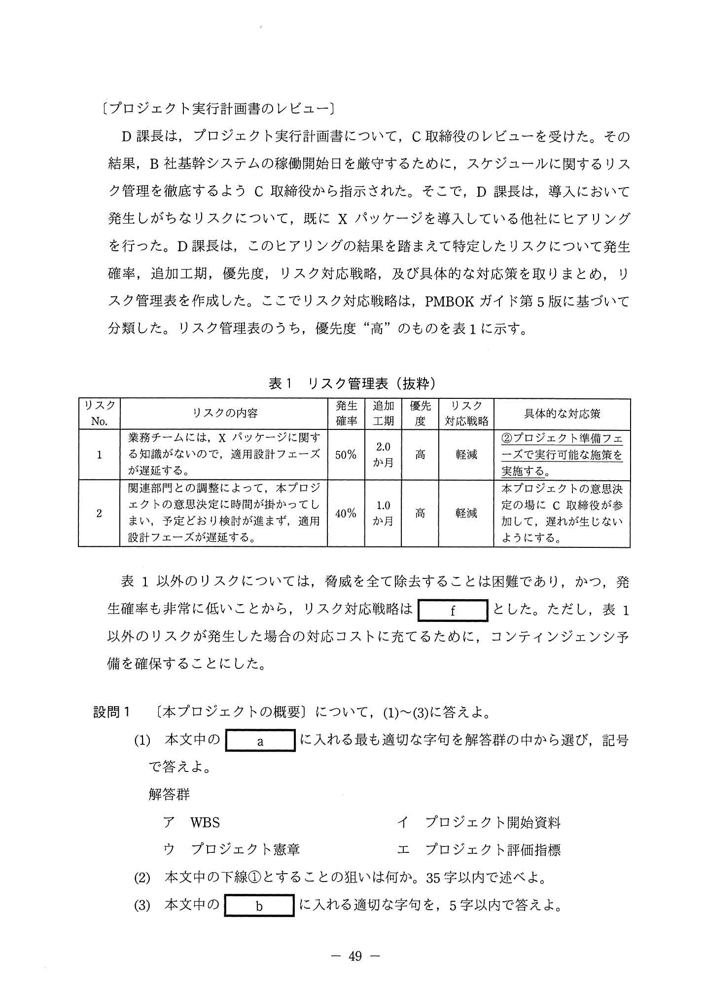

テキスト (OCR)

[プロジェクト実行計画書のレビュー〕

D 課長は, プロジェクト実行計画書について, C 取締役のレビューを受けた。その
結果, B 社基幹システムの稼働開始日を厳守するために, スケジュールに関するリス
ク管理を徹底するよう C 取締役から指示された。 そこで, D 課長は, 導入において
発生しがちなリスクについて, 既に X パッケージを導入している他社にヒアリング
を行った。D 課長は, このヒアリングの結果を踏まえて特定したリスクについて発生
確率, 追加工期, 優先度,リスク対応戦略, 及び具体的な対応策を取りまとめ, リ
スク管理表を作成した。ここでリスク対応戦略は, PMBOK ガイド第 5 版に基づいて
分類した。リスク管理表のうち, 優先度“高" のものを表 1 に示す。

表1 リスク管理表 (抜粋)

リスク                              発生 | 追加 | 優先| リスク           に
No.              リスクの内容            確率| 工期| 度 |対応戦略      具体的な対応策
業務チームには, X パッケージに関す        20                プロジェクト準備フェ
1   る知識がないので, 適用設計フェーズ | 50%  が月   a   軽減 | 二スで実行可能な施策を
が遅延する。                                           実施する。
関連部門との調整によって, 本プロジ                        本プロジェクトの意思決
2    エクトの意思決定に時間が掛かってし   40%   1.0    4     軽減    定の場に C 取締役が参
まい, 予定どおり検討が進まず, 適用     か月           加して, 遅れが生じない
設計フェーズが遅延する。                                  ようにする。

=n
BR

表 1 以外のリスクについては, 脅威を全て除去することは困難であり, かつ, 発
生確率も非常に低いことから, リスク対応戦略は | f | とした。 ただし, 表 1
以外のリスクが発生した場合の対応コストに充てるために, コンティンジェンシ予
備を確保することにした。

問1 〔本プロジェクトの概要) について, (①~③)に答えよ。
Q) 本文中の | 』 | に入れる最も適切な字句を解答詳の中から選び, 記号
で答えよ。
解答群
ア WBS             イ プロジェクト開始資料
ウ プロジェクト憲章       エ プロジェクト評価指標

⑫ 本文中の下線や①とすることの狙いは何か。35 字以内で述べよ。
⑬) 本文中の| b | に入れる適切な字句を, 5字以内で答えよ。

ー 49 一

### ページ 50

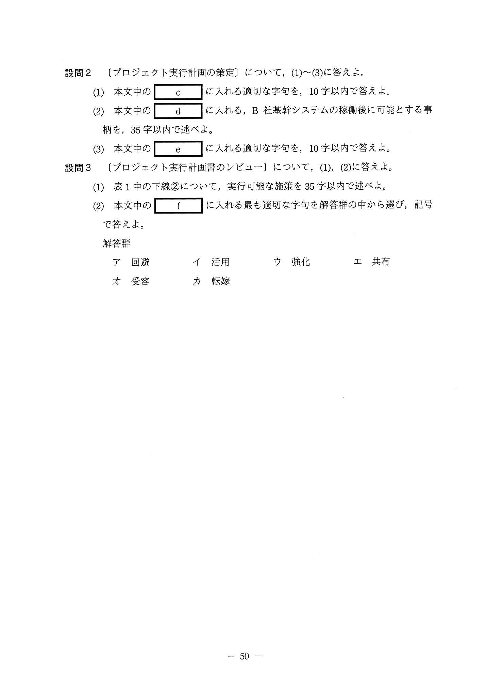

テキスト (OCR)

[プロジェクト実行計画の策定】について, (①⑪~(3)に答えよ。

Q①) 本文中の に入れる適切な字句を, 10 字以内で答えよ。

⑫ 本文中の|  q | に入れる,B社基幹システムの稼働後に可能とする事

柄を, 35 字以内で述べよ。

⑬ 本文中の| ec |に入れる適切な字句を, 10字以内で答えよ。
(プロジェクト実行計画書のレビュー) について, ①, ⑫に答えよ。
(1) 表1中の下線②⑨について, 実行可能な施策を 35 字以内で述べよ。

@) 本文中の| { | に入れる最も適切な字句を解答竹の中から選び,

設問2

設問3

ut
cu
a

で答えよ。

ARATE
ア 回避    イ 活用    ウ 強化    = 共有
オ 受容    A 転嫁

ー 50 一

### ページ 51

テキスト (OCR)

〔

x モ 用 紙 )

— by 一

### ページ 52

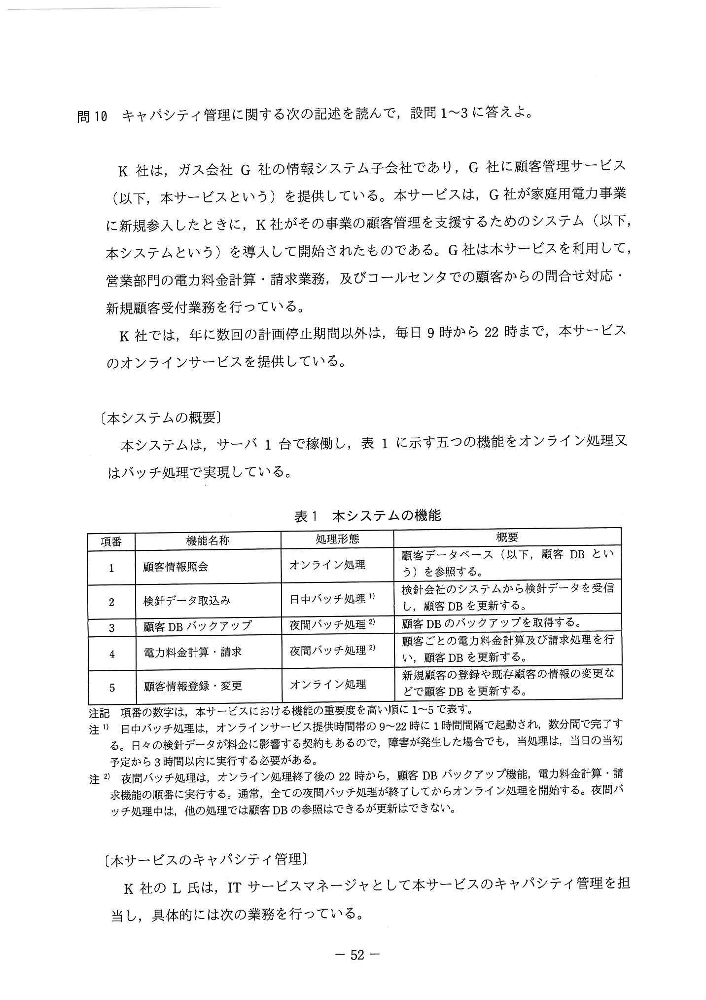

テキスト (OCR)

問19 キャパシティ管理に関する次の記述を読んで, 設問 1ご3 に答えよ。

K 社は, ガス会社 G 社の情報システム子会社であり, G 社に顧客管理サービス
QUE, 本サービスという) を提供している。本サービスは, G 社が家庭用電力事業
に新規参入したときに, K 社がその事業の顧客管理を支援するためのシステム (以下,
本システムという) を導入して開始されたものである。G 社は本サービスを利用して,
営業部門の電力料金計算・請求業務, 及びコールセンタでの顧客からの問合せ対応・
新規顧客受付業務を行っている。

K 社では, 年に数回の計画停止期間以外は, 毎日 9 時から 22 時まで, 本サービス
のオンラインサービスを提供している。

〔本システムの概要)
本システムは, サーバ 1 台で稼働し, 表 1 に示す五つの機能をオンライン処理
はバッチ処理で実現している。

表1 本システムの機能
項番      機能名称        処理形態             概要
上       顧客データベース (以下, MA DB とい
|     会                ヽ     ‘
1    顧客情報照会           オンライン処理     う) を参照する。
検針会社のシステムから検針データを受信

ee.              Ss     "
2    検針データ取込み        日中バッチ処理     し, MDB を更新する。
3 | 願客DBバックアップ     夜間バッチ処理9 | 顧客DBのバックアップを取得する。

       P                     :                  顧客ごとの電力料金計算及び請求処理を行
4    電力料金計算・請求      夜間バッチ処理    い, ME DB を更新する。
5    誠客情報登録・変更       オンライン処理     新規顧客の登録や既存願客の情報の変更な

どで顧客 DB を更新する。

注記 項番の数字は, 本サービスにおける機能の重要度を高い順に 1ご5 で表す。

注 日中バッチ処理は, オンラインサービス提供時間帯の 9て22 時に 1 時間間曲で起動され, 数分間で完了す
る。日々の検針データが料金に彫響する契約もあるので, 障害が発生した場合でも, 当処理は, 当日の当初
予定から 3 時間以内に実行する必要がある。

注9 夜間バッチ処理は, オンライン処理終了後の 22 時から, 顧客 DB バックアップ機能, 電力料金計算・請
求機能の順番に実行する。 通常, 全ての夜間バッチ処理が終了してからオンライン処理を開始する。夜間バ
ッチ処理中は, 他の処理では顧客 DB の参照はできるが更新はできない。

[本サービスのキャパシティ管理]
K 社の L Bit, IT サービスマネージャとして本サービスのキャパシティ管理を担
当し, 具体的には次の業務を行っている。

ー 52 一

### ページ 53

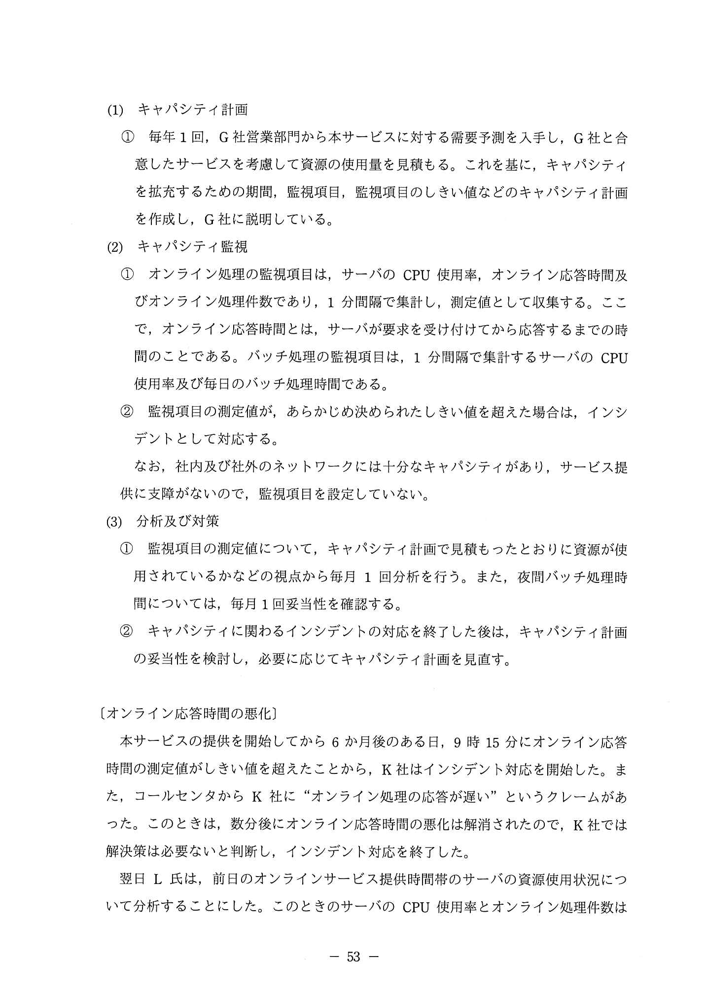

テキスト (OCR)

(1) キャパシティ計画
① 毎年 1 回, G 社営業部門から本サービスに対する需要予測を入手し, G 社と合
意したサービスを考慮して資源の使用量を見積もる。これを基に, キャパシティ
を拡充するための期間, 監視項目, 監視項目のしきい値などのキャパシティ計画
を作成し, G社に説明している。
(2②) キャパシティ監視
① オンライン処理の監視項目は, サーバの CPU 使用率, オンライン応答時間及
びオンライン処理件数であり, 1 分間隔で集計し, 測定値として収集する。ここ
で, オンライン応答時間とは, サーバが要求を受け付けてから応答するまでの時
間のことである。 バッチ処理の監視項目は, 1 分間隔で集計するサーバの CPU
使用率及び毎日のバッチ処理時間である。
②⑫ 監視項目の測定値が, あらかじめ決められたしきい値を超えた場合は, インシ
デントとして対応する。
なお, 社内及び社外のネットワークには十分なキャパシティがあり, サービス提
供に支障がないので, 監視項目を設定していない。
(3) 分析及び対策
① 監視項目の測定値について, キャパシティ計画で見積もったとおりに資源が使
用されているかなどの視点から毎月 1 回分析を行う。また, 夜間バッチ処理時
間については, 毎月 1 回妥当性を確認する。
② キャパシティに関わるインシデントの対応を終了した後は, キャパシティ計画
の妥当性を検討し, 必要に応じてキャパシティ計画を見直す。

〔オンライン応答時間の悪化

本サービスの提供を開始してから 6 か月後のある日, 9 時 15 分にオンライン応答
時間の測定値がしきい値を超えたことから, K 社はインシデント対応を開始した。ま
た, コールセンタから K 社に “オンライン処理の応答が遅い" というクレームがあ
った。このときは, 数分後にオンライン応答時間の悪化は解消されたので, K 社では
解決策は必要ないと判断し, インシデント対応を終了した。

BAL 氏は, 前日のオンラインサービス提供時間帯のサーバの資源使用状況につ
いて分析することにした。このときのサーバの CPU 使用率とオンライン処理件数は

ー 53 一

### ページ 54

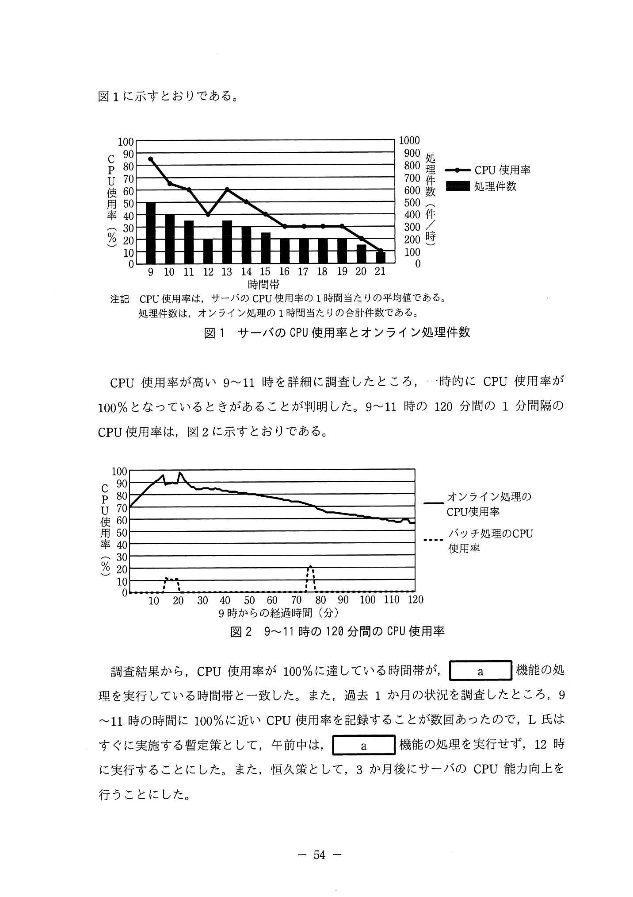

テキスト (OCR)

図 1 に示すとおりである。

100                              1000

90                                                   900
C    4                              Hl
P しにへ                          700 ff ーー CPU 使用率
使 60     ーーへ   Po                       600 数  ee
用 50         VW    へへ                    500 ~
率 40                    へ                  400 件
の 30                                          300 %
% 20                                          200 時

10                                                   100

0ー9 10 11 12 13 14 15 16 17 18 19 20 21   0

時間帯

注記 CPU使用率は, サーバの CPU 使用率の 1 時間当たりの平均値である。
処理件数は, オンライン処理の 1 時間当たりの合計件数である。

図1 サーバの CPU 使用率とオンライン処理件数

CPU 使用率が高い O~1L 時を詳細に調査したところ, 一時的に CPU 使用率が
100%となっているときがあることが判明した。9一11 時の 120 AIO 1 分間隔の
CPU 使用率は, 図 2 に示すとおりである。

p 80              ーー            _ オンライン処理の
U 70                      ーー         CPU使用率
用 50                                           ween バッチ処理のCPU

10  かて

10 20 30 40 50 60 70 80 90 100 110 120
9 時からの経過時間 (分)

図 2 9~11 時の 120 分間の CPU 使用率

調査結果から, CPU 使用率が 100%に達している時間帯が, | 』 |機能の処
理を実行している時間帯と一致した。また, 過去 1 か月の状況を調査したところ, 9
て11 時の時間に 100%に近い CPU 使用率を記録することが数回あったので, L 氏は
すぐに実施する胃定策として, 午前中は, | 。 |機能の処理を実行せず,12 時
に実行することにした。また, 恒久策として, 3 か月後にサーバの CPU 能力向上を
行うことにした。

ー 54 一

### ページ 55

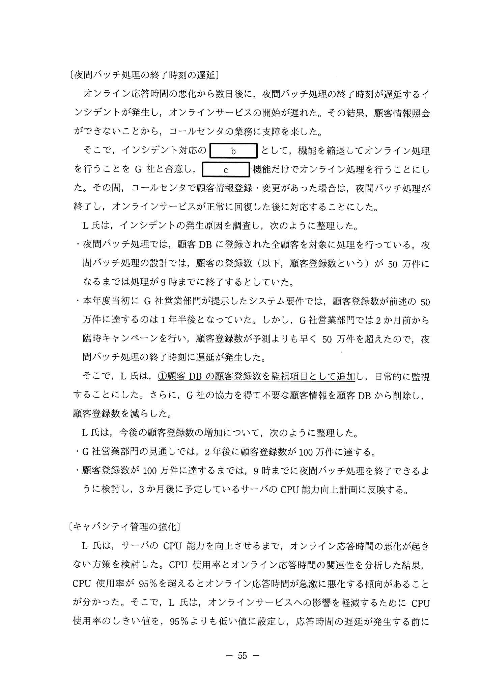

テキスト (OCR)

(夜間バッチ処理の終了時刻の遅延
オンライン応答時間の悪化から数日後に, 夜間バッチ処理の終了時刻が遅延するイ

ンシデントが発生し, オンラインサービスの開始が遥れた。その結果, 顧客情報照会

ができないことから, コールセンタの業務に支障を来した。
そこで, インシデント対応の| bp |] として, 機能を縮退してオンライン処理

を行うことを G 社と合意し, | c | 機能だけでオンライン処理を行うことにし

た。 その間, TW Yo CHEESE «II BAIL, 夜間バッチ処理が

WIL, オンラインサービスが正常に回復した後に対応することにした。

し 氏は, インシデントの発生原因を調査し, 次のように整理した。

・ 夜間パッチ処理では, WE DB に登録された全顧客を対象に処理を行っている。夜
間バッチ処理の設計では, 顧客の登録数 (以下, 願客登録数という) が 50 万件に
なるまでは処理が 9 時までに終了するとしていた。

・ 本年度当初に G LEROY LAY AT ABE CIS, 顧客登録数が前述の 50
万件に達するのは 1 年半後となっていた。 LPL, 社営業部門では 2 か月前から
臨時キャンペーンを行い, 顧客登録数が予測よりも早く 50 万件を超えたので, 夜
間バッチ処理の終了時刻に遅延が発生した。
そこで, L Bld, OMA DB の題客登録数を監視項目として追加し, 日常的に監視

することにした。さらに, G 社の協力を得て不要な顧客情報を顧客 DB から削除し,

WE GRC BLD Ue
L 氏は, 今後の顧客登録数の増加について, 次のように整理した。

・ 社営業部門の見通しでは, 2 AERIS ME SABRES 100 万件に達する。

・ 顧客登録数が 100 万件に達するまでは, 9 時までに夜間バッチ処理を終了できるよ

うに検討し, 3 か月後に予定しているサーバの CPU 能力向上計画た反映する。

[キャパシティ管理の強化]

L 氏は, サーバの CPU 能力を向上させるまで, オンライン応答時間の悪化が起き
ない方策を検討した。CPU 使用率とオンライン応答時間の関連性を分析した結果,
CPU 使用率が 95%を超えるとオンライン応答時間が急激に悪化する傾向があること
が分かった。 そこで, L 氏は, オンラインサービスへの影響を軽減するために CPU
使用率のしきい値を, 95%よりも低い値に設定し, 応答時間の遅延が発生する前に

ー 55 一

### ページ 56

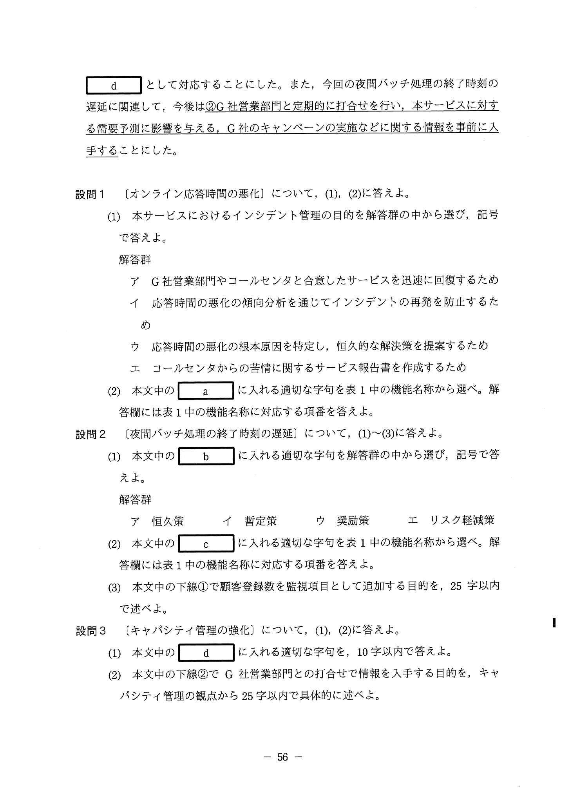

テキスト (OCR)

[| 』 ] として対応することにした。 RE, 今回の夜間バッチ処理の終了時刻の
運延に関連して, 今後は②G 社営業部門と定期的に打合せを行い。 本サービスに対す
る電要予測に影響を与える, G 社のキャンペーンの実施などに関する情報を事前に入
手することにした。

設問1 〔オンライン応答時間の悪化)] について, (①, ②⑫②に答えよ。

(1) 本サービスにおけるインシデント管理の目的を解答群の中から選び, 記号
で答えよ。
解答群

ア (0社営業部門やコールセンタと合意したサービスを迅速に回復するため
イ 応答時間の悪化の傾向分析を通じてインシデントの再発を防止するた
め
ウ 応答時間の悪化の根本原因を特定し, 傾久的な解決策を提案するため
エ コールセンタからの苦情に関するサービス報告書を作成するため
@) 本文中の|  。 |] に入れる適切な字句を表 1中の機能名称から選べ。解
答杉には表 1 中の機能名称に対応する項番を答えよ。
設問2 [夜間パッチ処理の終了時刻の遅延] について, ①(⑬に答えよ。
Q) 本文中の| b |] に入れる適切な字句を解答群の中から選び, 記号で答
えよ。
ARATE
ア BA   イ 暫定策   ウ 奨励策   EVA HBS
@) 本文中の| < |] に入れる適切な字句を表 1中の機能名称から選べ。解
答欄には表 1 中の機能名称に対応する項番を答えよ。
⑬ 本文中の下線①で大客登録数を監視項目として追加する目的を, 25 字以内
で述べよ。
設問3 〔キャパシティ管理の強化] について, ①, ②に答えよ。
a 本文中の|  d | に入れる適切な字旬を, 10字以内で答えよ。
⑫ 本文中の下線②で G 社営業部門との打合せで情報を入手する目的を, キャ
パシティ管理の観点から 25 字以内で具体的に述べよ。

ow

— 56 一

### ページ 57

テキスト (OCR)

C

メ モ 用 紙 )

ー 57 一

### ページ 58

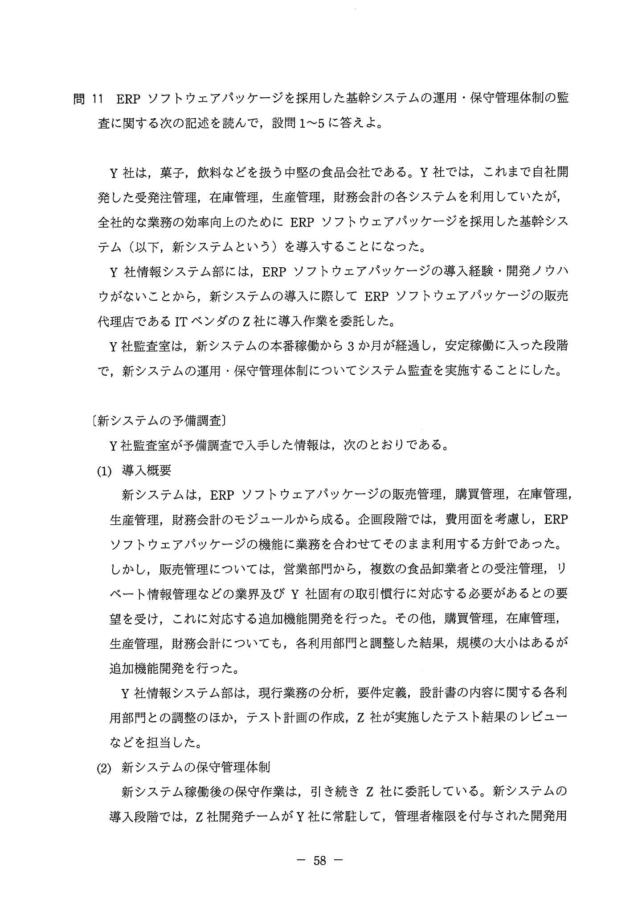

テキスト (OCR)

問 11 ERP ソフトウェアパッケージを採用した基幹システムの運用・保守管理体制の監
査に関する次の記述を読んで, 設問 1ー5 に答えよ。

Y 社は, 菓子, 飲料などを扱う中堅の食品会社である。Y 社では, これまで自社開
発した受発注管理, 在庫管理, 生産管理, 財務会計の各システムを利用していたが
全社的な業務の効率向上のために ERP ソフトウェアパッケージを採用した基幹シス
テム (以下, 新システムという) を導入することになった。

Y 社情報システム部には, ERP ソフトウェアパッケージの導入経験・開発ノウハ
ウがないことから, 新システムの導入に際して ERP ソフトウェアパッケージの販売
代理店である IT ベンダのZ 社に導入作業を委託した。

Y 社監査室は, 新システムの本番稼働から 3 か月が経過し, 安定稼働に入った段階
で, 新システムの運用・保守管理体制についてシステム監査を実施することにした。

[新システムの予備調査〕
Y 社監査室が予備調査で入手した情報は, 次のとおりである。

GQ) 導入概要
新システムは, ERP ソフトウェアパッケージの販売管理, 購買管理, 在庫管理
生産管理, 財務会計のモジュールから成る。企画段階では, 費用面を考慮し, ERP
ソフトウェアパッケージの機能に業務を合わせてそのまま利用する方針であった。
しかし, 販売管理については, 営業部門から, 複数の食品卸業者との受注管理, リ
ベート情報管理などの業界及び Y 社固有の取引慣行に対応する必要があるとの要
望を受け, これに対応する追加機能開発を行った。その他, 購買管理, 在庫管理
生産管理, 財務会計こついても, 各利用部門と調整した結果, 規模の大小はあるが
追加機能開発を行った。
Y 社情報システム部は, 現行業務の分析, 要件定義, 設計書の内容に関する各利
用部門との調整のほか, テスト計画の作成, Z 社が実施したテスト結果のレビュー
などを担当した。

⑫) 新システムの保守管理体制
新システム稼働後の保守作業は, 引き続き Z 社に委託している。新システムの
導入段階では, Z 社開発チームがY 社に常駐して, 管理者権限を付与された開発用

ー 58 一

### ページ 59

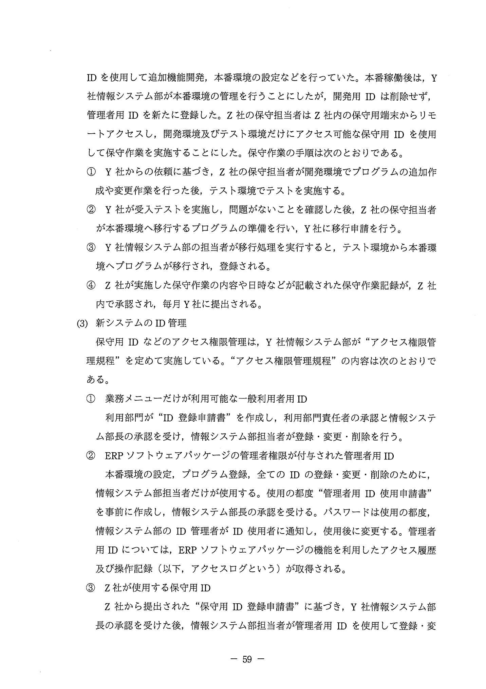

テキスト (OCR)

ID を使用して追加機能開発, 本番環境の設定などを行っていた。 本番稼働後は, Y
社情報システム部が本番環境の管理を行うことにしたが, 開発用 ID は削除せず,
管理者用 ID を新たに登録した。Z 社の保守担当者は Z 社内の保守用端末からリモ
ートアクセスし, 開発環境及びテスト環境だけにアクセス可能な保守用 ID を使用
して保守作業を実施することにした。保守作業の手順は次のとおりである。
① Y 社からの依頼に基づき, Z 社の保守担当者が開発環境でプログラムの追加作
成や変更作業を行った後, テスト環境でテストを実施する。
@ Y 社が受入テストを実施し, 問題がないことを確認した後, Z 社の保守担当者
が本番環境へ移行するプログラムの準備を行い, Y 社に移行申請を行う。
③ Y 社情報システム部の担当者が移行処理を実行すると, テスト環境から本番環
境へプログラムが移行され, 登録される。
④ Z 社が実施した保守作業の内容や日時などが記載された保守作業記録が, Z 社
内で承認され, 毎月Y社に提出される。
3) 新システムのTD 管理
保守用 ID などのアクセス権限管理は, Y 社情報システム部が“アクセス権限管
理規程" を定めて実施している。“アクセス権限管理規程" の内容は次のとおりで
ある。
① 業務メニューだけが利用可能な一般利用者用 TD
利用部門が “ID 登録申請書" を作成し, 利用部門責任者の承認と情報システ
ム部長の承認を受け, 情報システム部担当者が登録・変更・削除を行う。
@ ERP ソフトウェアパッケージの管理者権限が付与された管理者用 TD
本番環境の設定, プログラム登録, 全ての ID の登録・変更・削除のために,
情報システム部担当者だけが使用する。使用の都度 “管理者用 ID 使用申請書"
を事前に作成し, 情報システム部長の承認を受ける。パスワードは使用の都度,
情報システム部の ID 管理者が ID 使用者に通知し, 使用後に変更する。管理者
用 ID については, ERP ソフトウェアパッケージの機能を利用したアクセス履歴
及び操作記録 (以下, アクセスログという) が取得される。
@ Z社が使用する保守用 ID
Z 社から提出された “保守用 ID 登録申請書" に基づき, Y 社情報システム部
長の承認を受けた後, 情報システム部担当者が管理者用 ID を使用して登録・変

### ページ 60

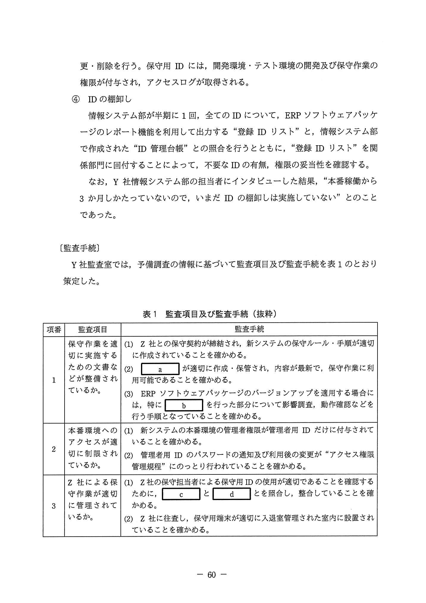

テキスト (OCR)

〔

更・削除を行う。保守用 TD には, 開発環境・テスト環境の開発及び保守作業の
権限が付与され, アクセスログが取得される。
④ TDの棚卸し
情報システム部が半期に 1 回, 全ての ID について, ERP ソフトウェアパッケ
ージのレポート機能を利用して出力する “登録 D VAR” と, 情報システム部
で作成された “ID 管理台帳” との照合を行うとともに, “登録 D VAR” を関
係部門に回付することによって, 不要な DORR, 権限の妥当性を確認する。
なお, Y 社情報システム部の担当者にインタビューした結果, “本番稼働から
3 か月しかたっていないので, いまだ ID の棚卸しは実施していない" とのこと
であった。

監査手続〕
Y 社監査室では, 予備調査の情報に基づいて監査項目及び監査手続を表 1 のとおり
策定した。

表1 監査項目及び監査手続 (抜粋)

項番

監査項目                                                              監査手続

保守作業を適 | (1) Z 社との保守契約が締結され, 新システムの保守ルール・手順が適切
切に実施する| に作成されていることを確かめる。

ための文書な| ② (a |] が適切に作成・保管され, 内容が最新で, 保守作業に利
どが整備され| 用可能であることを確かめる。

ているが。    (3③) ERP ソフトウェアパッケージのバージョンアップを適用する場合に
は, 特に [| b | を行った部分について影響調査, 動作確認などを
行う手順となっていることを確かめる。

本番環境への| 1) 新システムの本番環境の管理者権限が管理者用 ID だけに付与されて
アクセスが適| いることを確かめる。

切に制限され| (2) 管理者用 ID のパスワードの通知及び利用後の変更が“アクセス権限
ているかが。      管理規程" にのっとり行われていることを確かめる。

Z 社による保 | Q) Z社の保守担当者による保守用 ID の使用が適切であることを確認する
守作業が適切| ために,| c |と| a |とを照合し, 整合していることを確
に管理されて| かめる。

いるがか。     (2) Z 社に往査し, 保守用端末が適切に入退室管理された室内に設置され
ていることを確かめる。

ー 60 一

### ページ 61

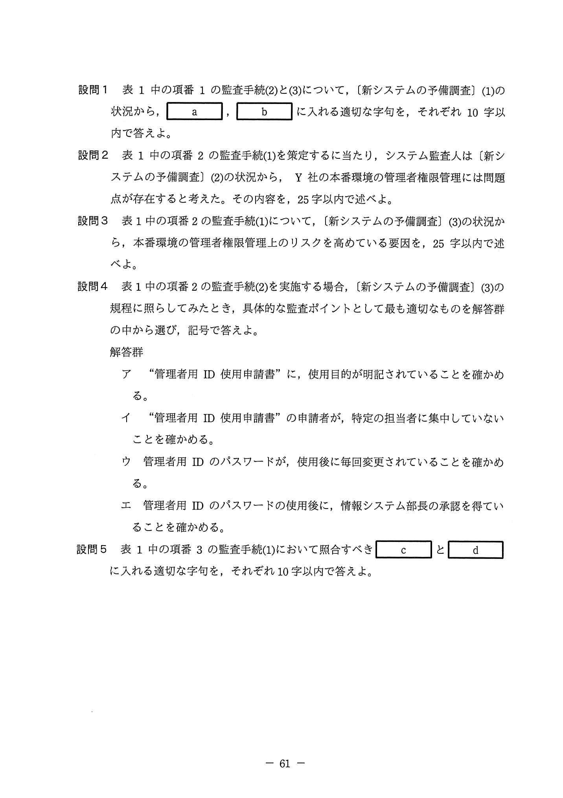

テキスト (OCR)

設問1 表 1 中の項番 1 の監査手続2)と(3)について, 〔新システムの予備調査] (1)の
Ries, | a |,|  b |に入れる適切な字句を, それぞれ 10 字以
内で答えよ。

設問2 表 1 HORE 2 の監査手続(1)を人策定するに当たり, システム監査人は〔新シ
ステムの予備調査] (②の状況から, Y 社の本番環境の管理者権限管理には問題
点が存在すると考えた。その内容を, 25 字以内で述べよ。

設問3 表1中の項番 2 の監査手続(1)について, 〔新システムの予備調査] (3)の状況か
ら, 本番環境の管理者権限管理上のリスクを高めている要因を, 25 字以内で述
べよ。

設問4 表1中の項番 2 の監査手続(2)を実施する場合, 〔新システムの予備調査] (3③)の
規程に照らしてみたとき, 具体的な監査ポイントとして最も適切なものを解答群
の中から選び, 記号で答えよ。

解答群

ア “GEA ID 使用申請書" に, 使用目的が明記されていることを確かめ
る。

イ 管理者用 ID 使用申請書" の申請者が, 特定の担当者に集中していない
ことを確かめる。

ウ 管理者用 ID のパスワードが, 使用後に毎回変更されていることを確かめ
る。

= 管理者用 ID のパスワードの使用後に, 情報システム部長の承認を得てい
ることを確かめる。

設問5 表 1 中の項番 3 の監査手続①)において照合すべき| < |と| a |
に入れる適切な字句を, それぞれ10 字以内で答えよ。

ー 61 一

### ページ 62

テキスト (OCR)

C

メ = 用 紙

ー 62 一

]

### ページ 63

テキスト (OCR)

x = 用 紙

= 68.三

0

### ページ 64

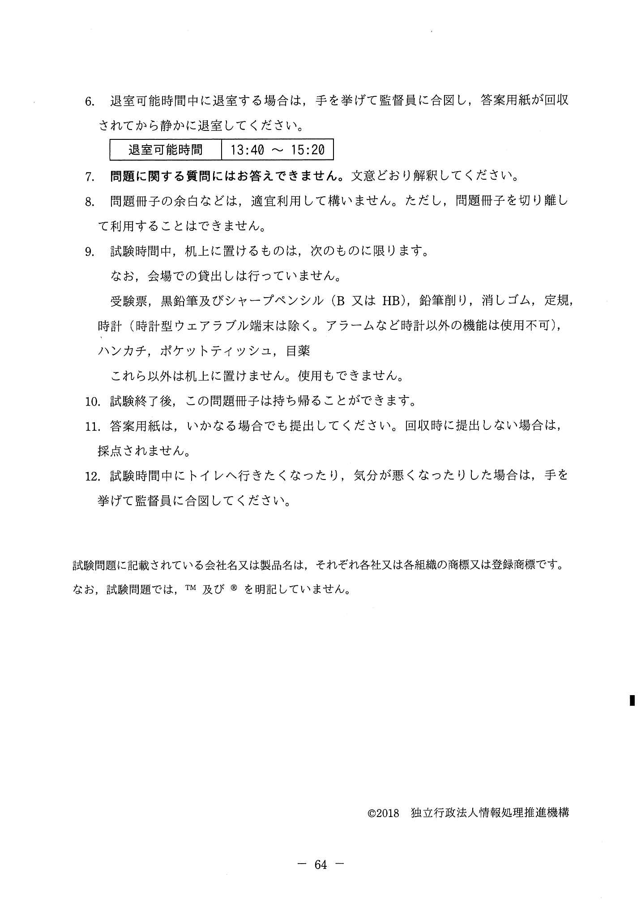

テキスト (OCR)

6. 退室可能時間中に退室する場合は, 手を挙げて監督員に合図し, 答案用紙が回収
されてから静かに退室してください。
退室可能時間 | 13:40 ~ 15:20
7. 問題に関する質問にはお答えできません。文意どおり解釈してください。
8. 問題冊子の余白などは, 適宜利用して構いません。ただし, 問題冊子を切り離し
て利用することはできません。
9. 試験時間中, 机上に置けるものは, 次のものに限ります。
BB, 会場での貸出しは行っていません。
SRR, 黒鉛筆及びシャープペンシル (B 又は HB), 鉛筆削り, 消しゴム, 定規
時計 (時計型ウェアラブル端末は除く。アラームなど時計以外の機能は使用不可),
ハンカチ, ポケットティッシュ, AR
これら以外は机上に置けません。使用もできません。
10. 試験終了後, この間題冊子は持ち帰ることができます。
11. 答案用紙は, いかなる場合でも提出してください。 回収時に提出しない場合は
採点されません。
12. 試験時間中にトイレへ行きたくなったり, 気分が悪くなったりした場合は, 手を
挙げて監督員に合図してください。

試験問題に記載されている会社名又は製品名は, それぞれ各社又は各組織の商標又は登録商標です。
なお, 試験問題では, ™ 及び @ を明記していません。

@2018 独立行政法人情報処理推進機構

ー 64 一

---

## 午後解答

1/6 
©2018 独立行政法人情報処理推進機構 
平成30 年度 秋期 応用情報技術者試験 解答例 
 
午後試験 
問１ 
出題趣旨 
 昨今，サイバー攻撃は高度化，複雑化してきており，サイバーセキュリティ上の脅威は拡大している。その
結果，サイバーセキュリティ対策として定期的な脆弱性診断と対策をPDCA サイクルに組み込むことが求めら
れている。 
 本問では，インターネットサービス向けサーバのセキュリティ対策を題材に，脆弱性診断に関する基本的な
理解，及び短期的・中長期的な脆弱性対策に関する基本的な理解について問う。 
 
設問 
解答例・解答の要点 
備考 
設問１(1)
a
ウ 
 
 
b
キ 
 
(2)
c
診3 
設問２(1)
d
エ 
 
 
e
カ 
 
(2)
f
FW 
 
 
g
Web サーバ 
 
(3)
h
SQL インジェクション 
設問３(1) 下線①
イ 
 
 
下線②
ウ 
 
(2) 危殆
たい
化していない暗号化通信方式を採用するため 
 
問２ 
出題趣旨 
 昨今，応用情報技術者にとって，経営に関する問題の分析と解決のための知識やスキルを身に付けることは
益々重要となってきている。 
 本問では，レストラン経営におけるQC 七つ道具などを活用した問題分析・解決を題材に，経営戦略・マー
ケティングに関する知識（理解，能力）を問う。 
 
設問 
解答例・解答の要点 
備考 
設問１ 
a
多額の解約手数料が掛かる 
 
 
b
客席の数を増やせない 
 
 
c
店舗の増改築は難しい 
 
設問２(1)
d
売上金額の累積 
 
 
(2) 最適な品目数を維持する。 
 
設問３(1) ウ 
 
 
(2)
e
携帯アプリにスタンプカードの代替機能をもたせる 
 
 
(3) 食材の仕入量が増え，仕入単価を下げられるから 
 
設問４ 
f
イ

2/6 
©2018 独立行政法人情報処理推進機構 
問３ 
出題趣旨 
 大規模なデータ処理においては，データサイズが増えても高速に処理できるデータ構造が求められる。 
 本問では，データサイズをコンパクトにできるウェーブレット木を題材に，2 分木に関する知識（理解，能力）
について問う。 
 
設問 
解答例・解答の要点 
備考 
設問１ 
ア
10001
 
イ
TGGGT
設問２ 
ウ
5
設問３ 
エ
DEPTH－d 
 
オ
r 
 
カ
0 
 
キ
count 
設問４ 
ク
σ 
 
ケ
N
 
コ
N log2(σ) 
 
問４ 
出題趣旨 
 昨今，ビッグデータの活用において，大量かつ多種多様な形式のデータを高速に処理するために，並列分散
処理基盤を利用することが普及しつつある。 
 本問では，POS データの集計・分析を題材に，並列分散処理基盤の利用に関する基本的な理解，及び性能目
標達成に向けた施策の理解について問う。 
 
設問 
解答例・解答の要点 
備考 
設問１(1) 9
 
 
(2) マスタサーバが冗長化されておらず，単一障害点である。 
 
設問２(1)
a
商品別 
 
(2) (C)
設問３(1) スレーブサーバのディスクI/O 速度 
 
(2) イ，ウ 
設問４ 
b
4.5（5.7，6，6.75，3log23 も可） 
 
 
c
41（52，54，61 も可） 
 
 
d
11（15，18 も可）

3/6 
©2018 独立行政法人情報処理推進機構 
問５ 
出題趣旨 
 企業の情報システムやネットワークの運用管理において，障害の検知や原因切分け，迅速な復旧に対する重
要性と緊急性はますます高まっている。 
 本問では，Web アプリケーションを用いた社内情報システムにおけるネットワーク管理を題材に，不具合原
因の切分けや復旧作業に関する基本的な理解を問う。 
 
設問 
解答例・解答の要点 
備考 
設問１ 
a
172.16.10.5 
 
b
172.16.10.12 
設問２(1)
c
nslookup 又は dig 
 
(2) Web サーバからDB サーバへのアクセスがエラーとなった。 
 
(3) Web サーバ1～3 で再利用できるTCP ポート数を増やせること 
設問３(1) ア 
 
(2) 送信元のIP アドレスはLB のものになるから 
 
問６ 
出題趣旨 
 データベースの設計において，表へのアクセス権限を適切に設計することは，セキュリティ上重要な要件で
ある。 
 本問では，社員情報に関するマスタデータの取扱いを題材に，実表，ビュー表のアクセス権限の設計に関す
る基本的な理解について問う。 
 
設問 
解答例・解答の要点 
備考 
設問１ 
入室管理用社員
入室許可
室
入退室ログ
 
設問２ 
社員ID, 室ID, 入室許可開始年月日 
 
設問３ 
a
COUNT(*) 
 
設問４(1)
b
GRANT 
 
 
 
c
SELECT 
 
 
 
d
HR.入室管理用社員 
 
 
 
e
ROOM_AP 
 
 
(2) HR_DBA 
 
設問５ 
f
T1.所属組織ID = T3.組織ID AND T3.組織長の社員ID = T2.社員ID

4/6 
©2018 独立行政法人情報処理推進機構 
問７ 
出題趣旨 
 電子扉システムは，多くの企業で採用され，サーバと連携して入退室管理に利用されている。 
 本問では，企業向けの電子扉システムの設計を題材にして，入退室管理に必要な情報に関する理解，電子扉
システムを実現するためのプログラムの設計，システムの状態を考慮して不具合の発生原因を推測する能力を
問う。 
 
設問 
解答例・解答の要点 
備考 
設問１ 
a
カード識別コード 
 
b
扉識別コード 
設問２(1)
c
エラー音を発生する 
 
 
d
オ 
 
 
e
カ 
 
(2)
f
閉扉 
 
 
g
タイマ満了 
設問３ 
“①施錠する”処理中に扉を開き，そのままt2秒経過したとき。 
 
問８ 
出題趣旨 
 昨今，エンドユーザ向け情報システムについて，ソフトウェアのリリースサイクルを短縮するための手段と
して継続的インテグレーション（CI）が普及しつつある。 
 本問では，会員間で物品の売買ができるサービスの開発プロセスの改善を題材に，継続的インテグレーショ
ンに関する基本的な理解や考え方について問う。 
 
設問 
解答例・解答の要点 
備考 
設問１ 
a
イ 
 
b
エ 
順不同 
 
c
オ 
設問２(1) リグレッションテスト 
 
(2) ア 
設問３ 
d
false
設問４(1) エ 
 
(2) 各アプリケーションの担当チームにだけメールするようにする。 
 
(3) 各アプリケーションのビルド終了後，待ち合わせせず単体テストに移る。

5/6 
©2018 独立行政法人情報処理推進機構 
問９ 
出題趣旨 
 プロジェクト計画は，プロジェクトを成功させるために最も重要な要素の一つである。 
 本問では，産業機械メーカのIoT 関連事業の子会社設立に伴うERP ソフトウェアパッケージの導入計画を題
材に，プロジェクト統合マネジメント，スコープマネジメント，タイムマネジメント，リスクマネジメントに
関する知識（理解，能力）について問う。 
 
設問 
解答例・解答の要点 
備考 
設問１(1)
a
ウ 
 
(2) 業務とIT の両部門にまたがる意思決定をトップダウンで行うこと 
 
(3)
b
RFP 
設問２(1)
c
プロトタイプ 
 
(2)
d
今後の売上規模の拡大にあわせて，柔軟にシステムを拡張すること 
 
(3)
e
データ形式への変換 
設問３(1) X パッケージの教育コースを業務チームに受講させる。 
 
(2)
f
オ 
 
問10 
出題趣旨 
 昨今，新規事業参入などで短期日に必要な情報システムを準備・稼働させる場合が多くなっているが，その
場合にも，稼働後のキャパシティ管理をしっかり実施することによって，安定稼働を維持することが重要であ
る。 
 本問では，顧客管理を支援するシステムを題材に，キャパシティ管理に関する基本的な理解，及びキャパシ
ティ管理における問題への対策立案に関する理解について問う。 
 
設問 
解答例・解答の要点 
備考 
設問１(1) ア 
 
(2)
a
2
設問２(1)
b
イ 
 
(2)
c
1
 
(3) 夜間バッチ処理の終了時刻の予測を行うため 
設問３(1)
d
インシデント 
 
(2) キャパシティ計画への影響を把握するため

6/6 
©2018 独立行政法人情報処理推進機構 
問11 
出題趣旨 
 自社開発のシステムを導入，保守してきた企業が，ERP ソフトウェアパッケージを利用したシステムを導入
しようとする場合，ERP ソフトウェアパッケージの導入経験やノウハウが不足しているので，外部委託を活用
した導入・保守を行うことがある。また，パッケージ機能に対して，独自の取引慣行などに対応するための追
加機能開発を行うケースも多い。 
 本問では，ERP ソフトウェアパッケージの導入を題材として，システム保守やセキュリティ管理の監査に関
する基本的な知識を問う。 
 
設問 
解答例・解答の要点 
備考 
設問１ 
a
設計書 
 
b
追加機能開発 
設問２ 
開発用ID が本番環境に残っていること 
設問３ 
いまだID の棚卸しが実施されていないこと 
設問４ 
ウ 
設問５ 
c
アクセスログ 
順不同 
 
d
保守作業記録

---

## 午後採点講評

1/3 
©2019 独立行政法人情報処理推進機構 
平成30 年度 秋期 応用情報技術者試験 採点講評 
 
午後試験 
問１ 
 問1 では，インターネットサービス向けサーバのセキュリティ対策を題材に，脆弱性診断に関する基本的な
知識，及び短期的・中長期的な脆弱性対策について出題した。 
 設問2(1)のd は，正答率が低かった。SPF 認証などの電子メールの送信ドメイン認証機能は，セキュリティ
対策として重要な機能であるので，電子メールの送受信の仕組みとともに理解しておいてほしい。 
 設問2(3)は，正答率が高かった。サイバー攻撃の代表的な手法であるSQL インジェクションについては，よ
く理解されているようであった。 
 設問3(2)では，ソフトウェアの企画・設計段階から暗号化通信方式の危殆化について意識し，注意深く取り
組むことの重要性を理解しておいてほしい。 
 
問２ 
 問2 では，レストラン経営におけるQC 七つ道具などを活用した問題分析・解決を題材に，経営戦略・マー
ケティングに関する知識（理解，能力）について出題した。全体として，正答率は高かった。 
 設問1 は，正答率が高かった。特性要因図の要因の分解については，おおむね理解されているようであっ
た。 
 設問2(1)は，正答率が低かった。ABC 曲線は基本的な分析手法の一つなので，よく理解しておいてほしい。
 設問3(3)は，正答率が低かった。食材の仕入量が増え，食材の仕入単価を下げられることを答えてほしかっ
たが，これに言及していない解答が目立った。問題文から状況を的確に読み取り，正答を導き出してほしい。
 
問３ 
 問3 では，大規模なデータ処理において，データサイズをコンパクトにできるウェーブレット木を題材に，
2 分木に関する知識（理解，能力）について出題した。 
 設問1 と設問2 は，正答率が高かった。ウェーブレット木の構築方法について，よく理解されているようで
あった。 
 設問3 のエは，正答率が低く，“d”と解答した誤った解答が目立った。図3 中の“左からd 番目のビット位
置”のコメントも参考にして，正答を導き出してほしかった。 
 設問4 のコは，正答率が低かった。ノードの深さごとのキー値のビット列の長さの和が“N”であることに
着目して，ウェーブレット木のデータサイズが，文字の符号化に必要な最小のビット数“log2(σ) ”と文字列
の長さ“N”とを掛け合わせたものになることに気付いてほしかった。 
 
問４ 
 問4 では，POS データの集計・分析を題材に，並列分散処理基盤の利用に関する基本的な理解，及び性能目
標達成に向けた施策の理解について出題した。 
 設問1(2)は，正答率が低かった。システムを構成している各要素の役割やシステム構成をよく理解し，何に
障害が発生するとどのような影響が生じるかを考慮して，正答を導き出してほしい。 
 設問2(2)は，並列分散処理の効果が高いジョブと低いジョブが存在することを踏まえて，適切なジョブを選
択できるかを問うた。ジョブの特性を把握することは並列分散処理基盤を利用する上で非常に重要であるの
で，考え方を理解しておいてほしい。 
 設問3(1)は，正答率が低かった。各サーバの仕様とリソース使用状況を踏まえて，ボトルネックを的確に捉
えて解答してほしい。

2/3 
©2019 独立行政法人情報処理推進機構 
問５ 
 問5 では，Web アプリケーションを用いた社内情報システムにおけるネットワーク管理を題材に，不具合原
因の切分けや復旧作業に関する基本知識について出題した。 
 設問1 及び設問3(1)は，正答率が高かった。本問の負荷分散装置におけるWeb サーバの負荷分散の動作や，
不具合の切分け作業におけるログメッセージの適切な取扱いについては，おおむね理解されているようであっ
た。 
 設問3(2)は，正答率が低かった。負荷分散装置においてIP アドレスが置き換わることによる影響をよく理解
することで，正答を導き出してほしかった。 
 
問６ 
 問6 では，社員情報に関するマスタデータの取扱いを題材に，実表，ビュー表のアクセス権限の設計に関す
る基本的な理解について出題した。全体として，正答率は低かった。 
 設問1 は，正答率が低かった。矢印を逆方向に記載した解答が目立った。各表の主キーと外部キーを考え
て，正答を導いてほしい。 
 設問3 は，正答率が高かった。COUNT の使い方についてはよく理解されているようであった。 
 設問4 は，正答率が低かった。データを処理するDML だけでなく，権限制御に関するSQL 文についても理
解しておいてほしい。 
 設問5 は，正答率が低かった。同じ表を複数の用途で使用する際のSQL 文について理解しておいてほしい。
 
問７ 
 問7 では，カードを使用した電子扉システムの設計を題材に，電子扉の制御部とサーバとの通信，制御部の
プログラム，及び不具合について出題した。全体として，正答率は高かった。 
 設問1 は，正答率が高かった。カード及び電子扉ユニットが保持している情報について，おおむね理解され
ているようであった。 
 設問2 は，正答率が高かった。制御部のプログラムの処理は，おおむね理解されているようであった。 
 設問3 は，正答率が低かった。本問では，不具合が提示してあるので，フローチャートを基に，処理の順序
と処理の所要時間を分析することで，不具合の発生条件を見つけ出すことができる。不具合が発生したとき，
フローチャートなどから発生原因を見つけ出すことは，ソフトウェア開発での重要なプロセスなので，十分な
力量を身に付けてほしい。 
 
問８ 
 問8 では，会員間で物品の売買ができるサービスの開発プロセスの改善を題材に，継続的インテグレーショ
ンに関する基本的な理解や考え方について出題した。全体として，正答率は高かった。 
 設問3 は，正答率が高かった。境界値テストの基本的な考え方は，よく理解されているようであった。 
 設問4(3)は，正答率が低かった。CI ツールのワークフローを題材に，アクティビティ図に関する基本的な理
解を問うたが，フォークとジョインについて理解が不足していると思われる解答が目立った。業務及び処理の
流れをアクティビティ図でモデル化するスキルについては，是非身に付けておいてもらいたい。 
 
問９ 
 問9 では，産業機械メーカのIoT 関連事業の子会社設立に伴うERP ソフトウェアパッケージの導入計画を題
材に，プロジェクト計画に関する基本的な知識と手順の理解について出題した。 
 設問1(2)では，プロジェクト体制について問うた。プロジェクトの納期を守る上で，部門をまたがる意思決
定は重要であり，それらの部門を統括する役職者がトップダウンで行うことは有効な方法となる。プロジェク
トの目的や方針にあわせたプロジェクト体制の構築について是非理解しておいてほしい。 
 設問3(1)は，正答率が高かった。リスクを軽減するために，プロジェクト準備フェーズで実行可能な施策に
ついておおむね理解されているようであった。

3/3 
©2019 独立行政法人情報処理推進機構 
問10 
 問10 では，顧客管理を支援するシステムを題材に，キャパシティ管理に関する基本的な理解，及びキャパシ
ティ管理における問題への対策立案に関する理解について出題した。 
 設問2(3)は，目的について解答をしてもらいたかったが，理由について述べた解答が目立った。設問をよく
読み，求められていることを理解した上で解答してほしい。 
 設問3(2)は，設問中の“キャパシティ管理の観点”に沿って，営業部門から情報を入手する目的を解答して
もらいたかった。サービスの需要に関わる情報を適宜入手することでキャパシティ計画の見直しをタイムリに
実施できることを理解しておいてほしい。 
 
問11 
 問11 では，ERP ソフトウェアパッケージの導入を題材に，システム保守やセキュリティ管理の監査に関す
る基本的な知識について出題した。 
 設問3 は，正答率が低かった。設問で問われている監査手続が，“本番環境の管理者権限が管理者用ID だけ
に付与されていることを確かめる”手続であることに留意して解答を導き出してほしい。 
 設問5 は，“登録ID リスト”のような誤った解答が散見された。保守担当者による保守用ID の使用が適切
であることを確認するためには，保守用ID の使用日時や作業内容が報告内容と一致しているかどうかを確認
すべきであることに気が付いてほしい。

