# 平成30年度春期 応用情報技術者試験

---

## 午前問題

### ページ 1

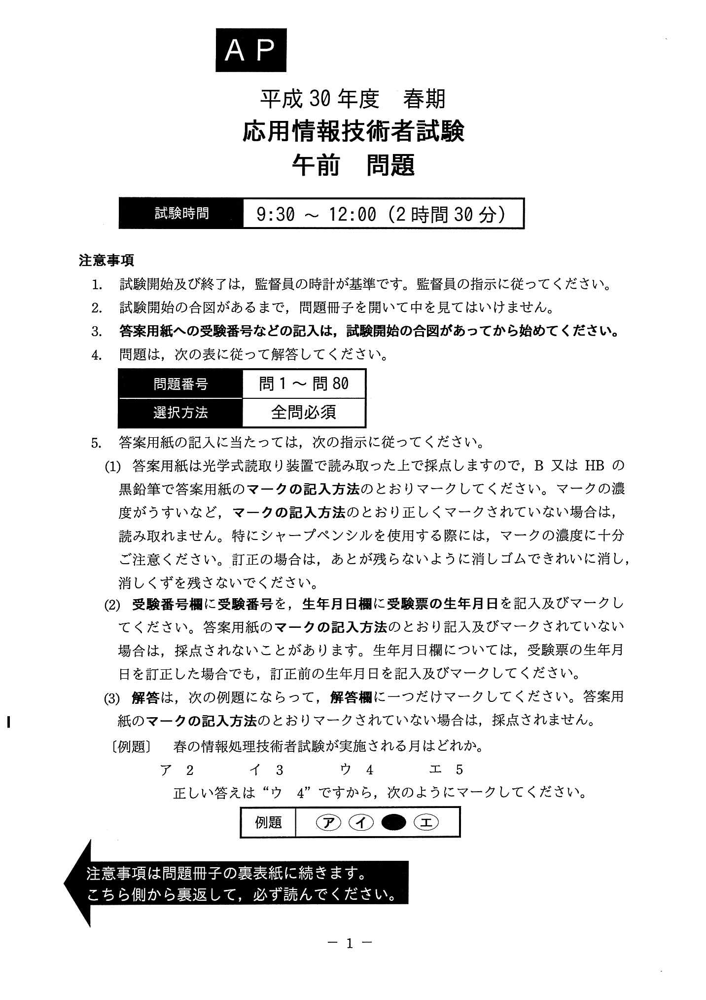

テキスト (OCR)

平成0年度 春期
応用情報技術者試験
午前 問題

 9:30 ~ 12:00 (2時間 30 分)

注意事項

1. 試験開始及び終了は, 監督員の時計が基準です。監督員の指示に従ってください。
2. 試験開始の合図があるまで, 問題冊子を開いて中を見てはいけません。

3. 答案用紙への受験番号などの記入は, 試験開始の合図があってから始めてください。
4. 問題は, 次の表に従って解答してください。

問題番号    fal 1 ~ fai 80
選択方法    全間必須

5. 答案用紙の記入に当たっては, 次の指示に従っつてください。

Q) 答案用紙は光学式読取り装置で読み取った上で採点しますので, B 又は HB の
黒鉛筆で答案用紙のマークの記入方法のとおりマークしてください。マークの濃
度がうすいなど, マークの記入方法のとおり正しくマークされていない場合は
読み取れません。特にシャープペンシルを使用する際には, マークの濃度に十分
ご注意ください。 訂正の場合は, あとが残らないように消しゴムできれいに消し,
消しくずを残さないでください。

Q) 受験番号欄に受験番号を, 生年月日柚に受験票の生年月日を記入及びマークし
てください。管案用紙のマークの記入方法のとおり記入及びマークされていない
場合は, 採点されないことがあります。 生年月日欄については, 受験票の生年月
日を訂正した場合でも, 訂正前の生年月日を記入及びマークしてください。

(3) 解答は, 次の例題にならって, 解答欄に一つだけマークしてください。答案用
紙のマークの記入方法のとおりマークされていない場合は, 採点されません。
[例題】 春の情報処理技術者試験が実施される月はどれか。

ア 2    イ 3    ウ 4    エ 5
正しい答えは“ウ 4”" ですから, 次のようにマークしてください。

例題 | ODO

注意事項は問題冊子の裏表紙に続きます。
こちら側から裏返して, 必ず読んでください。

### ページ 2

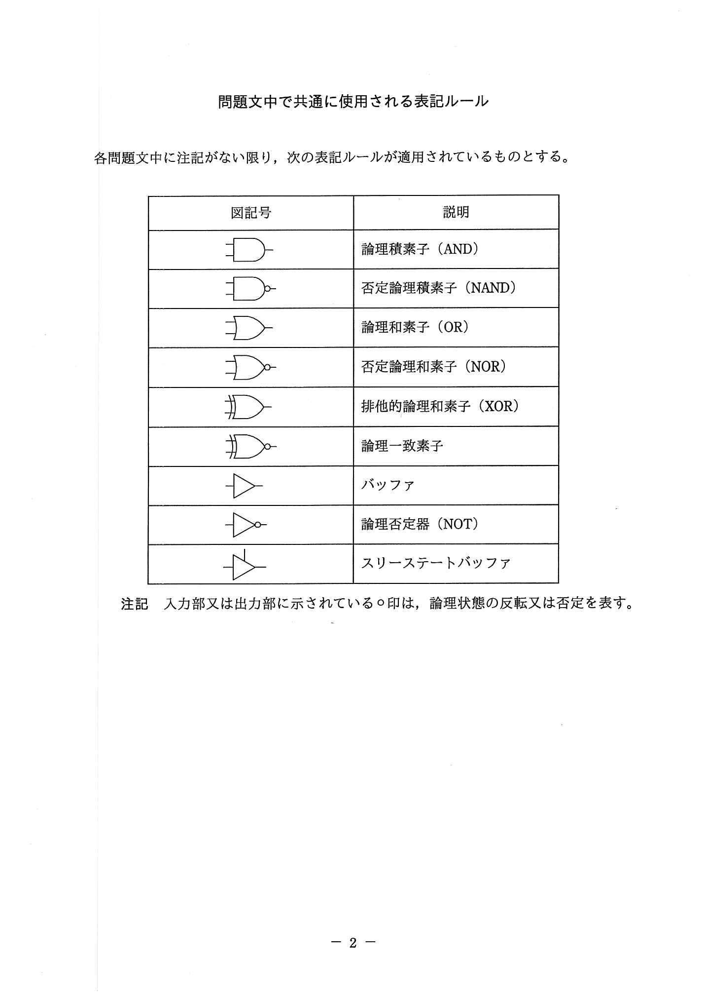

テキスト (OCR)

問題文中で共通に使用される表記ルール

各問題文中に注記がない限り, 次の表記ルールが適用されているものとする。

説明

&
ill
ful
il

論理積素子 (AND)

否定論理積素子 (NAND)

論理和素子 (OR)

否定論理和素子 (NOR)

排他的論理和素子 (XOR)

論理一致素子

バッファ

論理否定器 (NOT)

スリーステートバッファ

YIYMVMMMVMM

注記 入力部又は出力部に示されているo9印は, 論理状態の反転又は否定を表す。

### ページ 3

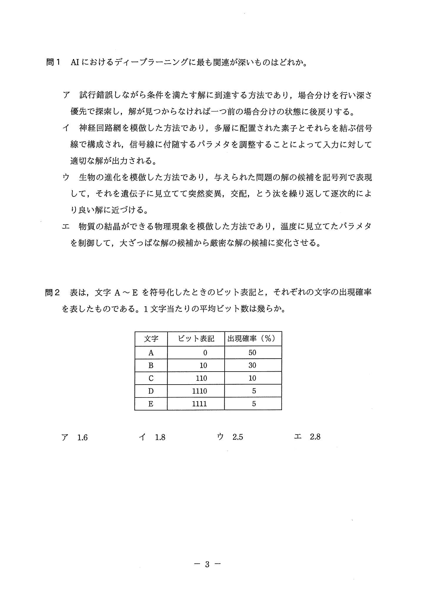

テキスト (OCR)

fll AIにおけるディープラーニングに最も関連が深いものはどれか。

ア 試行錯誤しながら条件を満たす解に到達する方法であり, 場合分けを行い深さ
優先で探索し, 解が見つからなければーつ前の場合分けの状態に後戻りする。

イ 神経回路網を模信した方法であり, 多層に配置された素子とそれらを結ぶ信号
線で構成され, 信号線に付随するパラメタを調整することによって入力に対して
適切な解が出力される。

ウ 生物の進化を模信した方法であり, 与えられた問題の解の候補を記号列で表現
UT, それを遺伝子に見立てて突然変異交配, とう汰を繰り返して逐次的によ
り良い解に近づける。

エ 物質の結晶ができる物理現象を模條した方法であり, 温度に見立てたパラメタ
を制御して, 大ざっぱな解の候補から厳密な解の候補に変化させる。

問2 Rid, RF A~E を符号化したときのビット表記と, それぞれの文字の出現確率
を表したものである。1 文字当たりの平均ビット数は幾らか。

文字     ビット表記 |出現確率 (%)
A               0             50
B               10             30
C             110             10
D            1110              5
E            1111              5
ア 16                  イ 18                  ウ 2.5                  x= 2.8

### ページ 4

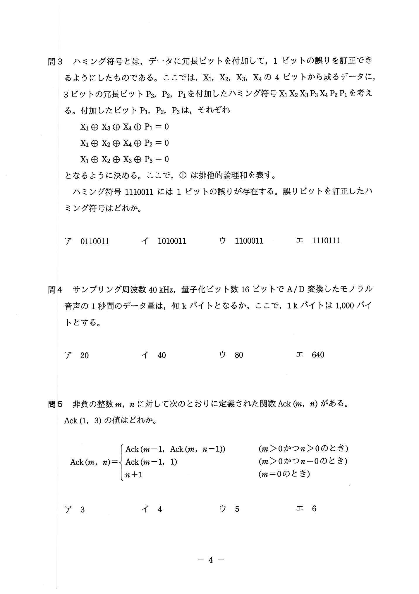

テキスト (OCR)

FAS ハミング符号とは, データに冗長ビットを付加して, 1 ビットの誤りを訂正でき
るようにしたものである。ここでは, Mi, Xo, Xs, X4の 4 ビットから成るデータに,
3 ビットの冗長ビット Ps, Po, Piを付加したハミング符号 X」 Xs Xs Ps X4 Ps Pl を考え
る。付加したビット Pi, Po, Psは, それぞれ
Xi © Xs © Xt © Pi = 0
Xi © X2 ® Xi © P2 = 0
Xi © X2 @ X3 ® P3 = 0
となるように決める。ここで, © は排他的論理和を表す。
ハミング符号 1110011 には 1 ビットの誤りが存在する。誤りビットを訂正したハ
ミング符号はどれか。

ア 0110011   イ 1010011   ウ 1100011   = 1110111

問4 サンプリング周波数 40 kHz, 量子化ビット数 16 ビットで A/D 変換したモノラル

音声の 1 秒間のデータ量は, fk バイトとなるか。ここで, 1k バイトは1.000 バイ

トとする。

ア 20      イ 40      ウ 80      x= 640

問5 非負の整数妨, z に対して次のとおりに定義された関数 Ack (m, 1) がある。
Ack (1, 3) の値はどれか。

Ack (一1, Ack(m, n—1))      (0かつぁ0のとき)
Ack(m, n)=4 Ack(m—1, 1)            (0かつヵヶ三0のとき)
十1                (0のとき)
7 3      イ 4      ウ 5      x= 6

### ページ 5

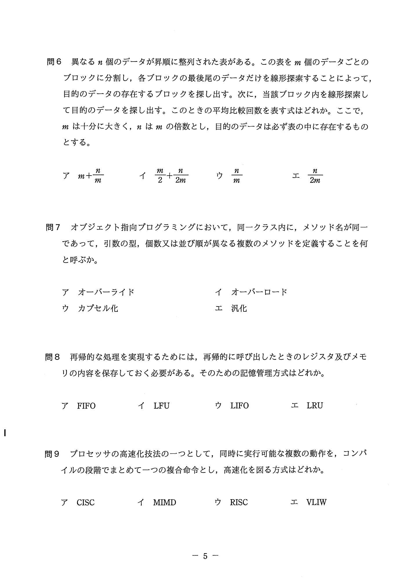

テキスト (OCR)

問6 異なるヵ個のデータが昇順に整列された表がある。この表を z 個のデータごとの
ブロックに分割し, 各ブロックの最後尾のデータだけを線形探索することによって,
目的のデータの存在するブロックを探し出す。次に, 当該ブロック内を線形探索し
て目的のデータを探し出す。このときの平均比較回数を表す式はどれか。ここで,
娘 は十分に大きく, n lim OF BEL, 目的のデータは必ず表の中に存在するもの
とする。

n
ア m+    イ 2 + Om   ウ a     &.

間7 オブジェクト指向プログラミングにおいて, 同一クラス内に, メソッド名が同一
であって, 引数の型, 個数又は並び順が異なる複数のメソッドを定義することを何
と呼ぶか。

ア オーバーライド          イ オーバーロード
ウ カプセル化           エ Wk

問8 再帰的な処理を実現するためには, 再帰的に呼び出したときのレジスタ及びメモ

リの内容を保存しておく必要がある。そのための記憶管理方式はどれか。
ア FIFO    イ LFU     ウ LIFO    x= LRU
間9 プロセッサの高速化技法の一つとして, 同時に実行可能な複数の動作を, コンパ

イルの段階でまとめて一つの複合命令とし, 高速化を図る方式はどれか。

ア CISC    イ MIMD    ウ RISC    <= VLIW

### ページ 6

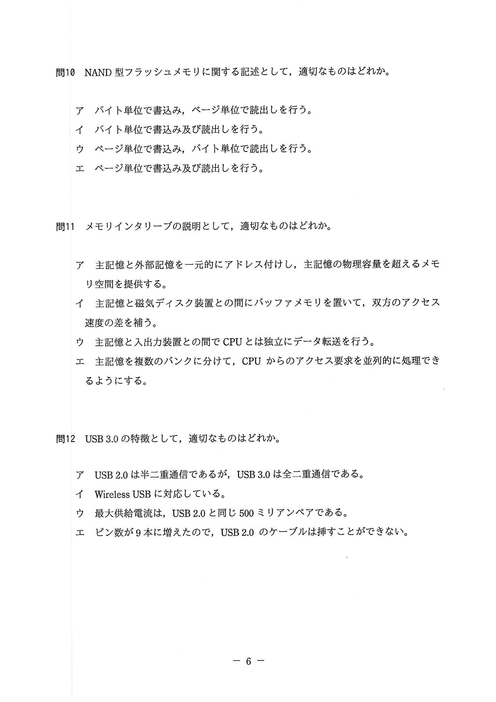

テキスト (OCR)

問19 NAND型フラッシュメモリに関する記述として, 適切がものはどれか。

バイト単位で書込み, ページ単位で読出しを行う。
バイト単位で書込み及び読出しを行う。
ページ単位で書込み, バイト単位で読出しを行う。
ページ単位で書込み及び読出しを行う。

H ざさ

間11 メモリインタリーブの説明として, 適切かがものはどれか。

ア 主記憶と外部記憶を一元的にアドレス付けし, 主記憶の物理容量を超えるメモ
り空間を提供する。

4 主記憶と磁気ディスク装置との間にバッファメモリを置いて, 双方のアクセス
速度の差を補う。

ウ 主記憶と入出力装置との間で CPU とは独立にデータ転送を行う。

エ 主記憶を複数のバンクに分けて, CPU からのアクセス要求を並列的に処理でき
るようにする。

間12 USB 3.0 の特徴として, 適切かがものはどれか。

USB 2.0 は半二重通信であるが, USB 3.0 は全二重通信である。

Wireless USB に対応している。

最大供給電流は, USB 2.0 と同じ 500 ミリアンペアである。

ピン数が 9 本に増えたので, USB 2.0 のケーブルは挿すことができない。

H AN

### ページ 7

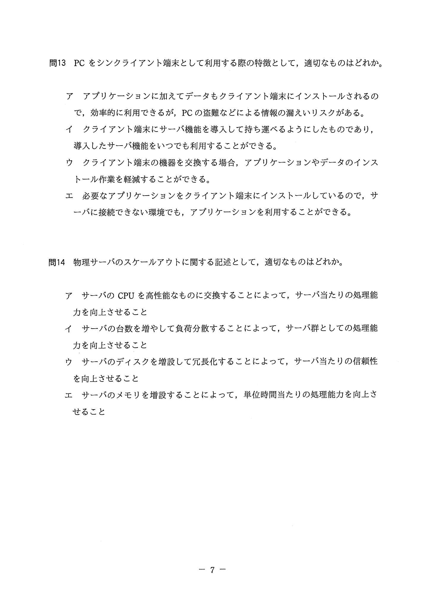

テキスト (OCR)

間13 PC をシンクライアント端末として利用する際の特徴として, 適切かものはどれか。

ア アプリケーションに加えてデータもクライアント端末にインストールされるの
で, 効率的に利用できるが, PC の盗難などによる情報の漏えいリスクがある。

イ クライアント端末にサーパ機能を導入して持ち運べるようにしたものであり,
導入したサーバ機能をいつでも利用することができる。

ウ クライアント端末の機器を交換する場合アプリケーションやデータのインス
トール作業を軽減することができる。

エエ 必要なアプリケーションをクライアント端末にインストールしているので, サ
ーバに接続できない環境でも, アプリケーションを利用することができる。

問14 物理サーバのスケールアウトに関する記述として, 適切なものはどれか。

ア サーバの CPU を高性能なものに交換することによって, サーバ当たりの処理能
力を向上させること

イ サーバの台数を増やして負荷分散することによって, サーバ群としての処理能
力を向上させること

ウ サーバのディスクを増設して冗長化することによって, サーバ当たりの信頼性
を向上させること

エ サーバのメモリを増設することによって, 単位時間当たりの処理能力を向上さ
せること

### ページ 8

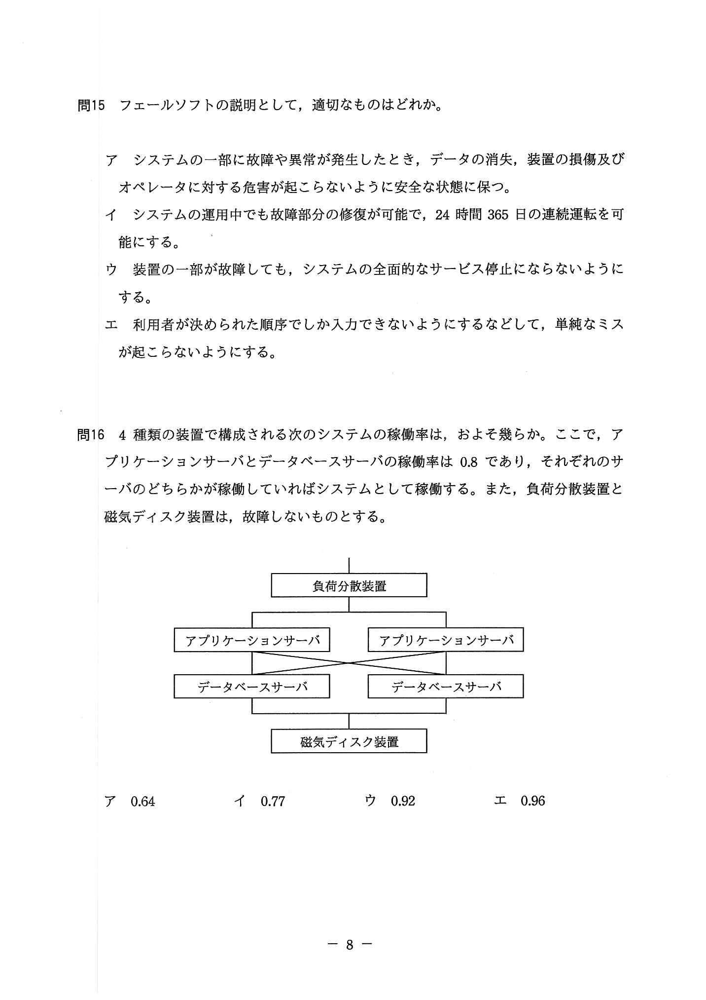

テキスト (OCR)

問15 フェールソフトの説明として, 適切がものはどれか。

ア システムの一部に故障や異常が発生したとき, データの消失, 装置の損傷及び
オペレータに対する危害が起こちないように安全な状態に保つ。

イ システムの運用中でも故障部分の修復が可能で, 24 時間 365 日の連続運転を可
能にする。

ウ 装置の一部が故障しても, システムの全面的なサービス停止にならないように
する。

エ 利用者が決められた順序でしか入力できないようにするなどして, 単純なミス
が起こらないようにする。

問16 4 種類の装置で構成される次のシステムの稼働率は, SBLtTHOM CLT, ア
プリケーションサーバとデータベースサーバの稼働率は 08 CHV, それぞれのサ
ーバのどちらかが稼働していればシステムとして稼働する。また, 負荷分散装置と
磁気ディスク装置は, 故障しないものとする。

|
負荷分散装置

アプリケーションサーバ        アプリケーションサーバ
データベースサーバ         |    データベースサーバ

|
|

磁気ディスク装置

ア 0.64     イ 0.77     ウ 0.92     x= 0.96

### ページ 9

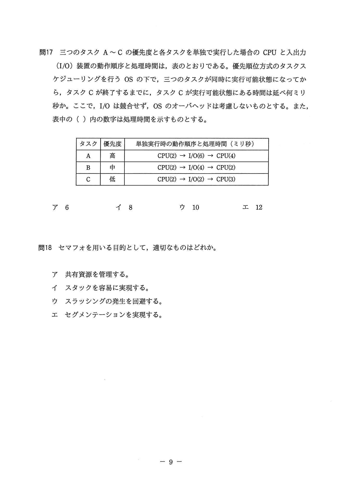

テキスト (OCR)

間17 三つのタスク A~C の優先度と各タスクを単独で実行した場合の CPU と入出力
(1/0) 装置の動作順序と処理時間は, 表のとおりである。 優先順位方式のタスクス
ケジューリングを行う OS OFC, 三つのタスクが同時に実行可能状態になってか
ら, タスク C が終了するまでに, RAY C が実行可能状態にある時間は延べ何ミリ
秒か。ここで, 1/O は競合せず, OS のオーバヘッドは考慮しないものとする。また,
RAD ( ) 内の数字は処理時間を示すものとする。

タスク | 優先度     単独実行時の動作順序と処理時間 (ミリ秒)
高           CPU②) — TO⑥) > CPU(4)
中            CPU②) — 1O④ > CPU②)
低            CPU②) > I/0(2) > CPU③)
ア 6             イ                ウ 10            a 12

AIS セマフォを用いる目的として, 適切がものはどれか。

H tA WY

共有資源を管理する。

スタックを容易に実現する。
スラッシングの発生を回避する。
セグメンテーションを実現する。

### ページ 10

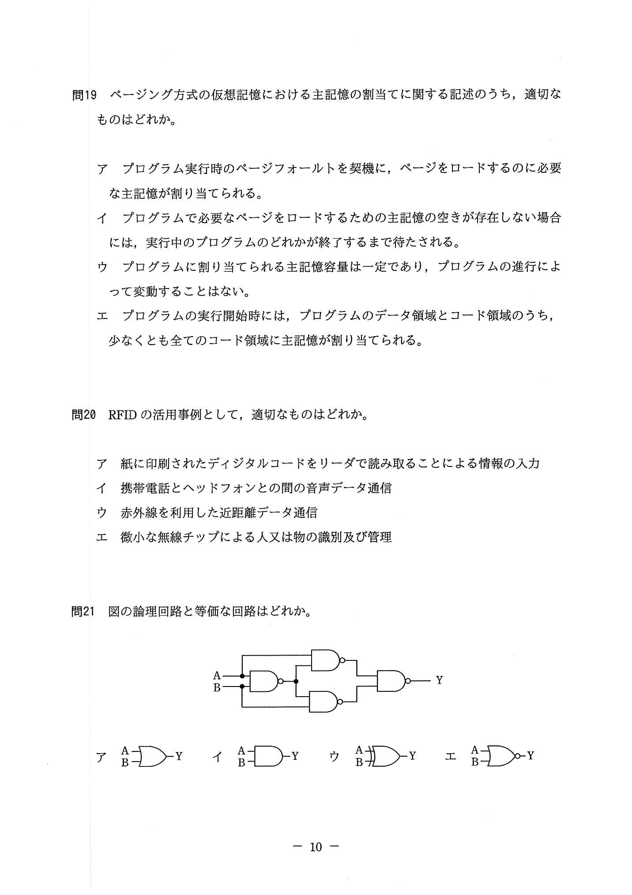

テキスト (OCR)

間19 ページング方式の仮想記憶における主記憶の割当てに関する記述のうち, 適切な
ものはどれか。

ア プログラム実行時のページフォールトを契機に:, ページをロードするのに必要
な主記憶が割り当てられる。

イ プログラムで必要なページをロードするための主記憶の空きが存在しない場合
には, 実行中のプログラムのどれかが終了するまで待たされる。

ウ プログラムに割り当てられる主記憶容量は一定であり, プログラムの進行によ
って変動することはない。

x プログラムの実行開始時には, プログラムのデータ領域とコード領域のうち,
少なくとも全てのコード領域に主記憶が割り当てられる。

問29 RFID の活用事例として, 適切なものはどれか。

紙に印刷されたディジタルコードをリーダで読み取ることによる情報の入力
携帯電話とヘッドフォンとの間の音声データ通信

赤外線を利用した近距離データ通信

微小な無線チップによる人又は物の識別及び管理

H へ コ

間21 図の論理回路と等価な回路はどれか。

ー 10 一

### ページ 11

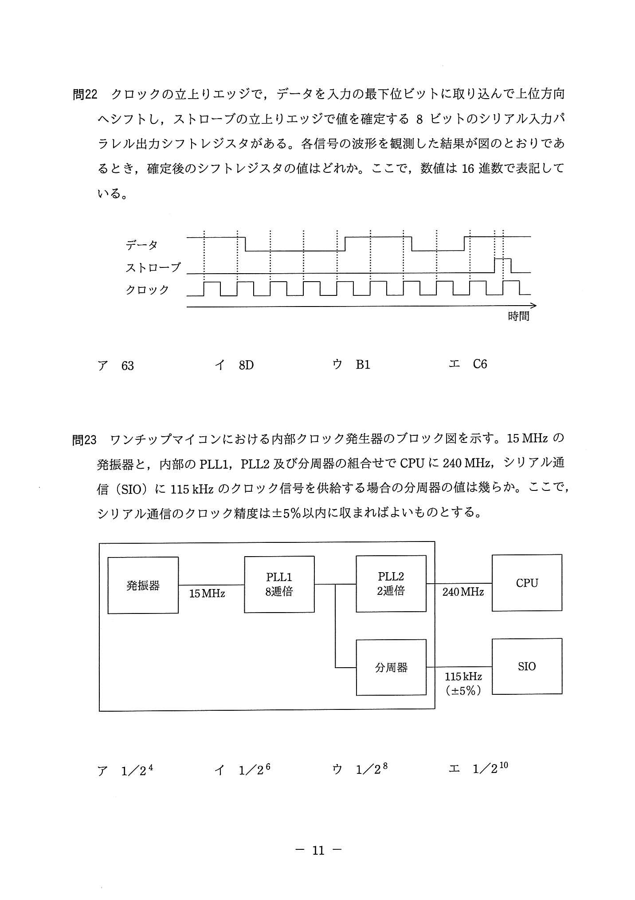

テキスト (OCR)

間22 クロックの立上りエッジで, データを入力の最下位ビットに取り込んで上位方向
ヘへシフトし, ストローブの立上りエッジで値を確定する 8 ビットのシリアル入力パ
ラレル出力シフトレジスタがある。各信号の波形を観測した結果が図のとおりであ
るとき, 確定後のシフトレジスタの値はどれか。ここで, 数値は 16 進数で表記して
いる。

データ
ストローブ i
クロック TAAL LALA

時間

問23 ワンチップマイコンにおける内部クロック発生器のブロック図を示す。15 MHz の
発振器と, 内部の PLL1, PLL2 及び分周器の組合せで CPU に 240 MHz, シリアル通
信 (SIO) に 115 kHz のクロック信号を供給する場合の分周器の値は幾らか。ここで,
シリアル通信のクロック精度は土5%以内に収まればよいものとする。

_       PLL1      PLL2
ae  15MHz   8通信      2通倍   240 MHz  eu
BES            SIO
ames   115 kHz
(+5%)
y 1/724    4 1728    ウ 1/728    エ 1/2

Hy

### ページ 12

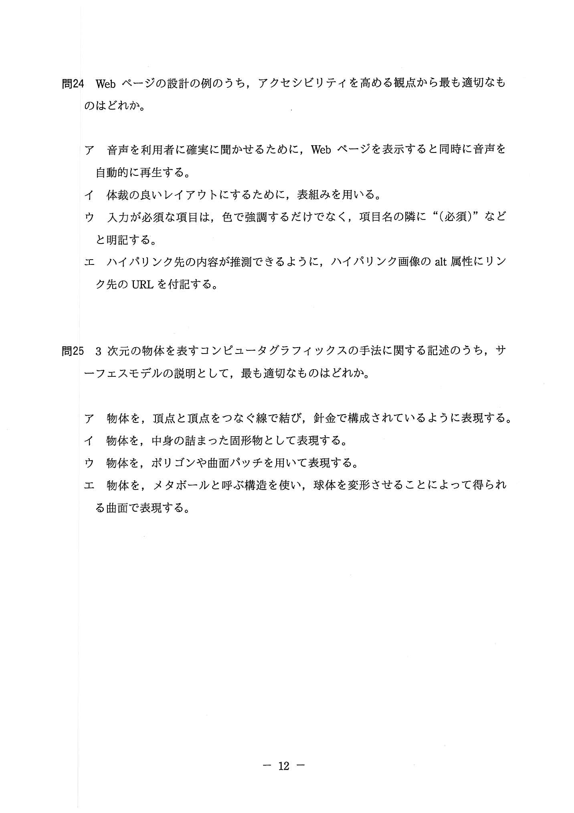

テキスト (OCR)

間24 Web ページの設計の例のうち, アクセシビリティを高める観点から最も適切なも
のはどれか。

ア 音声を利用者に確実に聞かせるために, Web ページを表示すると同時に音声を
自動的に再生する。

イ 体裁の良いレイアウトにするために, 表組みを用いる。

ウ 入力が必須な項目は, 色で強調するだけでなく, 項目名の隣に “(必須)” など
と明記する。

エ ハイパリンク先の内容が推測できるように, ハイパリンク画像の alt 属性にリン
ク先の URL を付記する。

間25 3 次元の物体を表すコンピュータグラフィックスの手法に関する記述のうち, サ
ーフェスモデルの説明として, 最も適切なかものはどれか。

物体を, 頂点と頂点をつなぐ線で結び, 針金で構成されているように表現する。

物体を, 中身の詰まった固形物として表現する。

物体を, ポリゴンや曲面パッチを用いて表現する。

物体を, メタボールと呼ぶ構造を使い, 球体を変形させることによって得られ
る曲面で表現する。

Hさへさい

ー 12 一

### ページ 13

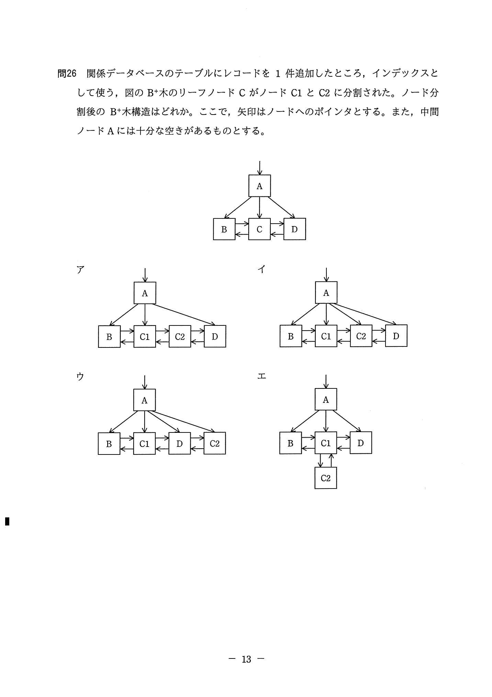

テキスト (OCR)

26 関係データベースのテーブルにレコードを 1 件追加したところ, インデックスと
して使う, 図の B+木のリーフノード C がノード C1 と C2 に分割された。ノード分
割後の B+木構造はどれか。ここで, 矢印はノードへのポインタとする。 また, 中間
ノード A には十分な空きがあるものとする。

    L       7    J
A            A

BL }a ce] p     ELleLleklp
a    し       *    if
A            A

BET cal] p ec    B Jae} p

vf
ce

ー 13 一

### ページ 14

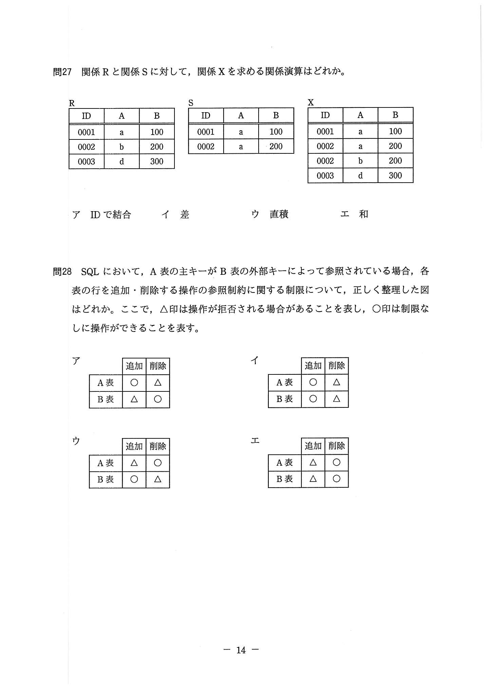

テキスト (OCR)

問27 関係R と関係Sに対して, 関係メを求める関係演算はどれか。

R           S           xX
ID   A   B    ID   A   B    ID   A   B
0001  a   100   0001  a   100   0001  a   100
0002  b   200   0002  a   200   0002  a   200
0003  d   300               0002  b   200
0003  d   300
ア ID CRA   イ 差      ウ 直積     = 和

間28 SQL において, A 表の主キーが B 表の外部キーによって参照されている場合, 各
表の行を追加・削除する操作の参照制約に関する制限について, 正しく整理した図
はどれか。ここで, へ印は操作が拒否される場合があることを表し, 〇印は制限な
しに操作ができることを表す。

ア

追加|削除                   追加 | 削除

A表  oO  A               AR  oO  A

BR |Al|O               px |O|A

ウ      追加|削除           =      追加削除
A表|A1O               A表|Alo

BR |O|A                px | Alo

ー {4 -—

### ページ 15

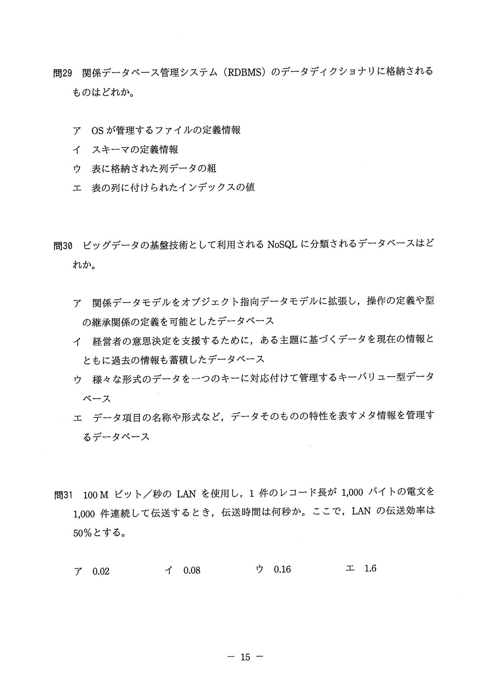

テキスト (OCR)

間29 関係データベース管理システム (RDBMS) のデータディクショナリに格納される
ものはどれか。

OS が管理するファイルの定義情報
スキーマの定義情報

表に格納された列データの組

表の列に付けられたインデックスの値

H ささで

B30 ビッグデータの基盤技術として利用される NoSQL に分類されるデータベースはど
れか。

ア 関係データモデルをオブジェクト指向データモデルに拡張し, 操作の定義や型
の継承関係の定義を可能としたデータベース

イ 経営者の意思決定を支援するために, ある主題に基づくデータを現在の情報と
ともに過去の情報も蓄積したデータベース

ウ 様々な形式のデータを一つのキーに対応付けて管理するキーバリュー型データ
ベース

エ データ項目の名称や形式など, データそのものの特性を表すメタ情報を管理す
るデータベース

B31 100M ビットノ秒の LAN を使用し, 1 件のレコード長が 1,000 バイトの電文を
1,000 件連続して伝送するとき, 伝送時間は何秒か。 COT, LAN の伝送効率は
50%とする。

ア 0.02     イ 0.08     ウ 0.16     = 16

ー 15 一

### ページ 16

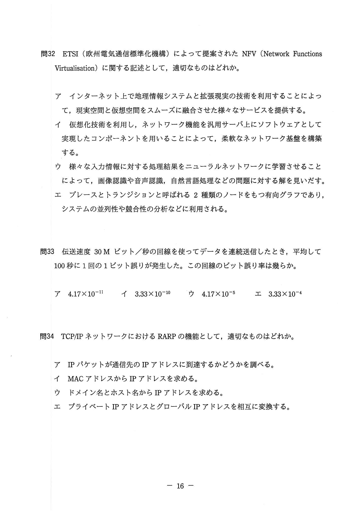

テキスト (OCR)

問32 ETSI (欧州電気通信標準化機構) によって提案された NFV (Network Functions
Virtualisation) に関する記述として, 適切ながものはどれか。

ア インターネット上で地理情報システムと拡張現実の技術を利用することによっ
て, 現実空間と仮想空間をスムーズに融合させた様々なサービスを提供する。

イ 仮想化技術を利用し, ネットワーク機能を汎用サーバ上にソフトウェアとして
実現したコンポーネントを用いることによって, 柔軟なネットワーク基盤を構築
する。

ウ 様々な入力情報に対する処理結果をニューラルネットワークに学習させること
によって, 画像認識や音声認識, 自然言語処理などの問題に対する解を見いだす。

エ プレースとトランジションと呼ばれる 2 種類のノードをもつ有向グラフであり,
システムの並列性や競合性の分析などに利用される。

問33 伝送速度 30M ビットノ秒の回線を使ってデータを連続送信したとき, 平均して
100 秒に 1 回の 1 ビット誤りが発生した。この回線のビット誤り率は北らか。

ア 417X107"         イ 3.33X10~         ウ 4.17X10~5         X= 3.33X10^

問34 TCP/IP ネットワークにおける RARP の機能として, 適切かものはどれか。

ア TPパケットが通信先の IP アドレスに到達するかどうかを調べる。

イ MACアドレスから IP アドレスを求める。

ウ ドメイン名とホスト名から IP アドレスを求める。

エエ プライベート IPアドレスとグローバル IP アドレスを相互に変換する。

ー 16 一

### ページ 17

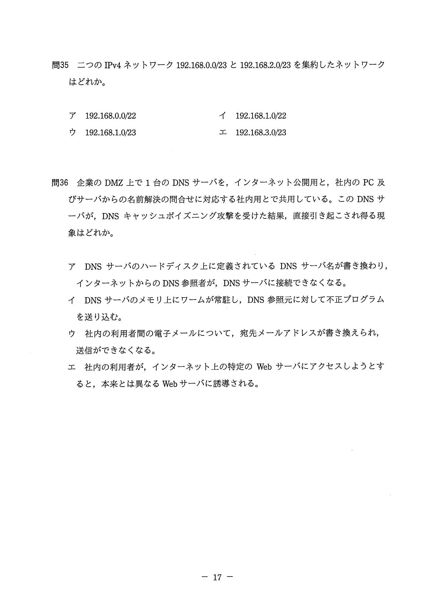

テキスト (OCR)

間35 二つの IPv4 ネットワーク 192.168.0.0/23 と 192.168.2.0/23 を集約したネットワーク
はどれか。

ア 192.168.0.0/22       イ 192.168.1.0/22
ウ 192.168.1.0/23        エエ 192.168.3.0/23

問36 企業の DMZ 上で 1 AO DNS サーバを, インターネット公開用と, HAD PCR
びサーバからの名前解決の問合せに対応する社内用とで共用している。この DNS サ
ーバが, DNS キャッシュポイズニング攻撃を受けた結果, 直接引き起こされ得る現
象はどれか。

ア DNS サーバのハードディスク上に定義されている DNS サーバ名が書き換わり,
インターネットからの DNS 参照者が, DNS サーバに接続できなくなる。

4 DNS サーバのメモリ上にワームが常駐し, DNS 参照元に対して不正プログラム
を送り込む。

ウ 社内の利用者間の電子メールについて, 宛先メールアドレスが書き換えられ,
送信ができなくなる。

エ 社内の利用者が, インターネット上の特定の Web サーバにアクセスしようとす
SL, 本来とは異なる Web サーバに誘導される。

= 77 =

### ページ 18

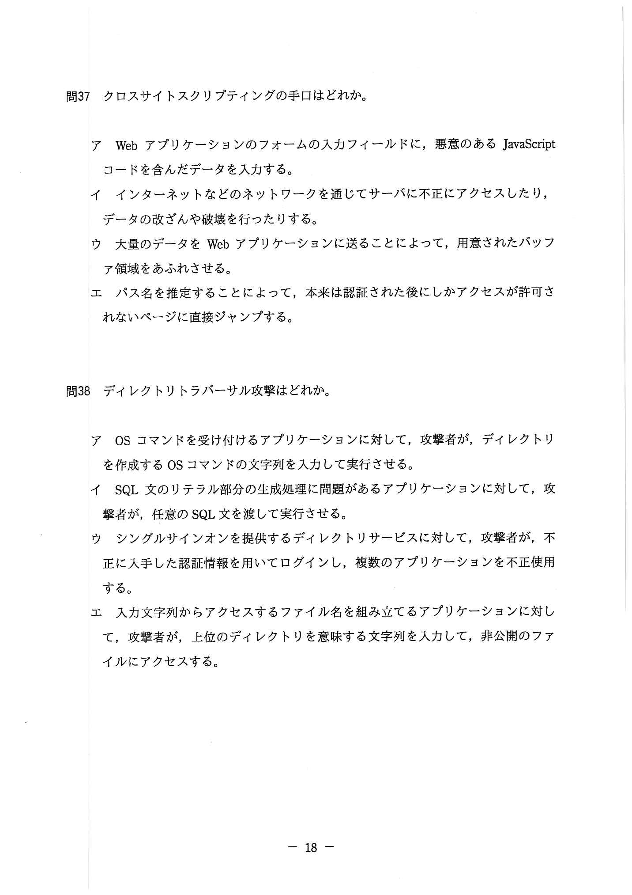

テキスト (OCR)

間37 クロスサイトスクリプティングの手口はどれか。

ア Web アプリケーションのフォームの入力フィールドに, 悪意のある JavaScript
コードを含んだデータを入力する。

イ インターネットなどのネットワークを通じてサーバに不正にアクセスしたり,
データの改ざんや破壊を行ったりする。

ウ 大量のデータを Web アプリケーションに送ることによって, 用意されたバッフ
ア領域をあふれさせる。

エエ パス名を推定することによって, 本来は認証された後にしかアクセスが許可さ
れないページに直接ジャンプする。

M38 ディレクトリトラバーサル攻撃はどれか。

FY OS コマンドを受け付けるアプリケーションに対して, 攻撃者が, ディレクトリ
を作成する OS コマンドの文字列を入力して実行させる。

4 SQL 文のリテラル部分の生成処理に問題があるアプリケーションに対して, 攻
撃者が, 任意の SQL 文を渡して実行させる。

ウ シングルサインオンを提供するディレクトリサービスに対して, 攻撃者が, 不
正に入手した認証情報を用いてログインし, 複数のアプリケーションを不正使用
する。

エエ 入力文字列からちらアクセスするファイル名を組み立てるアプリケーションに対し
て, 攻撃者が, 上位のディレクトリを意味する文字列を入力して, 非公開のファ
イルにアクセスする。

ー 18 一

### ページ 19

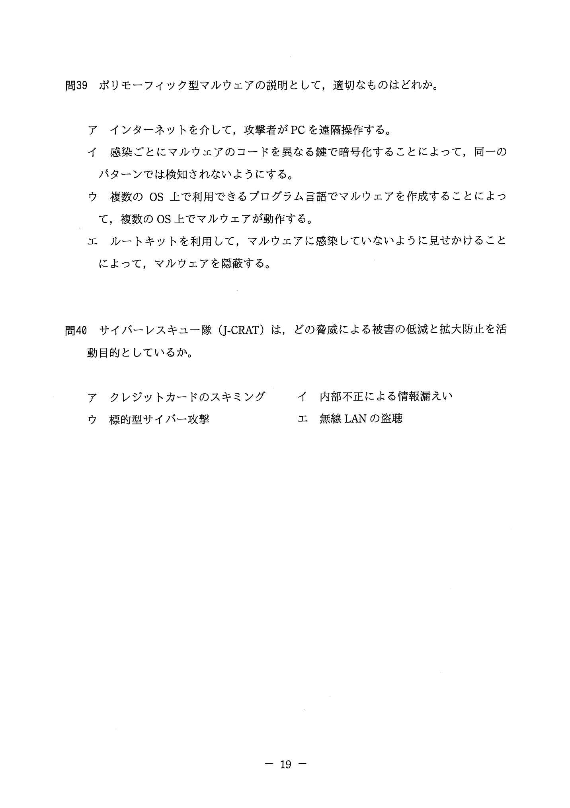

テキスト (OCR)

問39 ポリモーフィック型マルウェアの説明として, 適切ながものはどれか。

ア インターネットを介して, 攻撃者がPC を遠隔操作する。

イ 感染ごとにマルウェアのコードを異なる鍵で暗号化することによって, 同一の
パターンでは検知されないようにする。

ウ 複数の OS 上で利用できるプログラム言語でマルウェアを作成することによっ
て, ERO OS 上でマルウェアが動作する。

エエ ルートキットを利用して, マルウェアに感染していないように見せかけること
によって, マルウェアを隠蔽する。

問49 サイバーレスキュー隊 (J-CRAT) は, どの脅威による被害の低減と拡大防止を活
動目的としているか。

ア クレジットカードのスキミング     イ 内部不正による情報漏えい
ウ 標的型サイバー攻撃               エエ 無線LAN OYSR

ー 19 一

### ページ 20

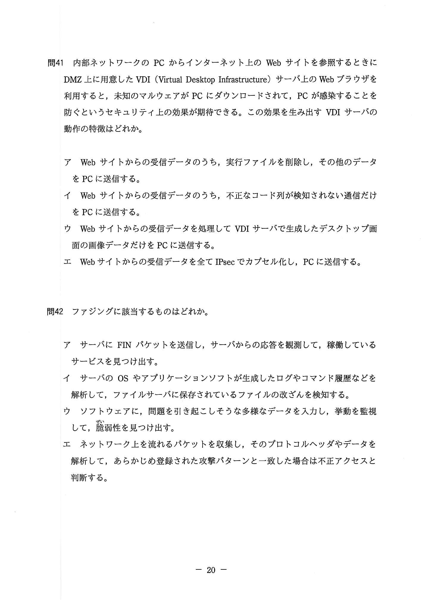

テキスト (OCR)

問41 内部ネットワークの PC からインターネット上の Web サイトを参照するときに
DMZ 上に用意した VDI (Virtual Desktop Infrastructure) サーバ上の Web ブラウザを
利用すると, 未知のマルウェアが PC にダウンロードされて, PC が感染することを
防ぐというセキュリティ上の効果が期待できる。この効果を生み出す VDI サーバの
動作の特徴はどれか。

ア Web サイトからの受信データのうち, 実行ファイルを削除し, その他のデータ
を PC に送信する。

イ Web サイトからの受信データのうち, 不正なコード列が検知されない通信だけ
を PC に送信する。

ウ Web サイトからの受信データを処理して VDI サーバで生成したデスクトップ画
面の画像データだけを PC に送信する。

Web サイトからの受信データを全て IPsec でカプセル化し, PC に送信する。

間42 ファジングに該当するものはどれか。

ア サーバに FIN パケットを送信し, サーバからの応答を観測して, 稼働している
サービスを見つけ出す。

イ サーバの OS やアプリケーションソフトが生成したログやコマンド履歴などを
解析して, ファイルサーバに保存されているファイルの改ざんを検知する。

ウ ソフトウェアに, 問題を引き起こしそうな多様なデータを入力し, 挙動を監視
UT, 脆弱性を見つけ出す。

エエ ネットワーク上を流れるパケットを収集し, そのプロトコルヘッダやデータを
解析して, あらかじめ登録された攻撃パターンと一致した場合は不正アクセスと
判断する。

ー 20 一

### ページ 21

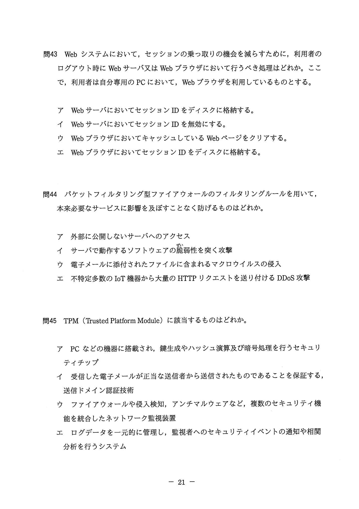

テキスト (OCR)

間43 Web システムにおいて, セッションの乗っ取りの機会を減らすために, 利用者の
ログアウト時に Web サーバ又は Web ブラウザにおいて行うべき処理はどれか。ここ
で, 利用者は自分専用の PC において, Web ブラウザを利用しているものとする。

Web サーバにおいてセッション ID をディスクに格納する。

Web サーバにおいてセッション ID を無効にする。

Web ブラウザにおいてキャッシュしている Web ページをクリアする。
Web ブラウザにおいてセッション ID をディスクに格納する。

HG AY

間44 パケットフィルタリング型ファイアウォールのフィルタリングルールを用いて,
本来必要なサービスに影響を及ぼすことなく防げるものはどれか。

外部に公開しないサーバへのアクセス

サーバで動作するソフトウェアの脆弱性を突く攻撃

電子メールに添付されたファイルに含まれるマクロウイルスの侵入

不特定多数の IoT 機器から大量の HTTP リクエストを送り付ける DDoS 攻撃

H

問45 TPM (Trusted Platform Module) に該当するものはどれか。

ア PC などの機器に搭載され, 鍵生成やハッシュ演算及び暗号処理を行うセキュリ
ティチップ

イ 受信した電子メールが正当な送信者から送信されたものであることを保証する,
送信ドメイン認証技術

ウ ファイアウォールや侵入検知, アンチマルウェアなど, 複数のセキュリティ機
能を統合したネットワーク監視装置

エエ ログデータを一元的に管理し, 監視者へのセキュリティイベントの通知や相関
分析を行うシステム

ー 21 一

### ページ 22

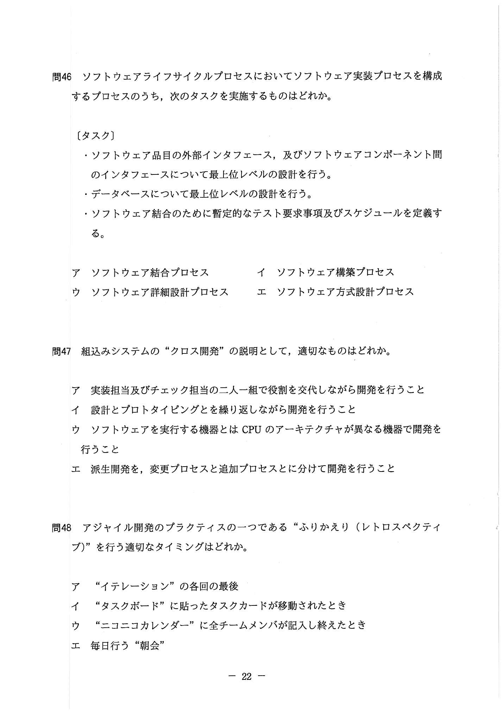

テキスト (OCR)

問46

ソフトウェアライフサイクルプロセスにおいてソフトウェア実装プロセスを構成

するプロセスのうち, 次のタスクを実施するものはどれか。

[タスク]〕

問47
ア
イ
ウ

x=

問48

・ソフトウェア品目の外部インタフェース, 及びソフトウェアコンポーネント間
のインタフェースについて最上位レベルの設計を行う。

・データベースについて最上位レベルの設計を行う。

・ソフトウェア結合のために暫定的なテスト要求事項及びスケジュールを定義す
る。

ソフトウェア結合プロセス     イ ソフトウェア構築プロセス
ソフトウェア詳細設計プロセス   エエ ソフトウェア方式設計プロセス

組込みシステムの“クロス開発" の説明として, 適切がものはどれか。

実装担当及びチェック担当の二人一組で役割を交代しながら開発を行うこと
設計とプロトタイピングとを繰り返しながら開発を行うこと
ソフトウェアを実行する機器とは CPU のアーキテクチャが異なる機器で開発を

行うこと

派生開発を, 変更プロセスと追加プロセスとに分けて開発を行うこと

アジャイル開発のプラクティスの一つである “ふりかえり (レトロスペクティ

FT)” を行う適切なタイミングはどれか。

ア
イ
ウ
a

“AFV-Yay" の各回の最後

“タスクボード” に貼ったタスクカードが移動されたとき
“ニコニコカレンダー” に全チームメンバが記入し終えたとき
毎日行う “HS”

ー 22 一

### ページ 23

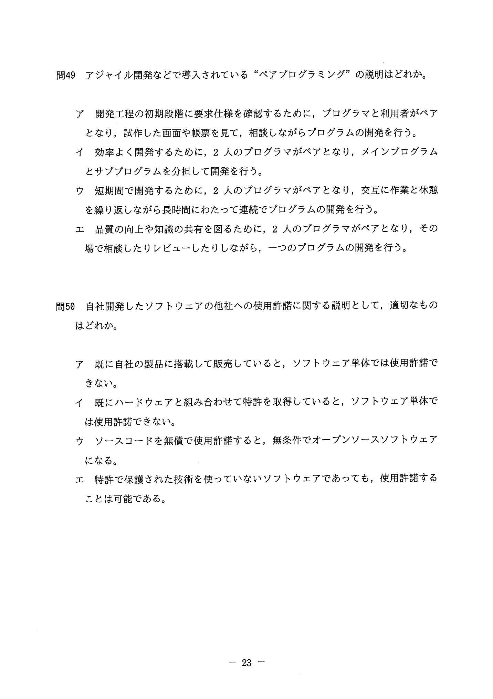

テキスト (OCR)

間49 アジャイル開発などで導入されている“ペアプログラミング" の説明はどれか。

ア 開発工程の初期段階に要求仕様を確認するために, プログラマと利用者がペア
となり, 試作した画面や帳票を見て, 相談しながらプログラムの開発を行う。

イ 効率よく開発するために, 2 人のプログラマがペアとなり, メインプログラム
とサブププログラムを分担して開発を行う。

ウ 短期間で開発するために, 2 人のプログラマがペアとなり, 交互に作業と休憩
を繰り返しながら長時間にわたって連続でプログラムの開発を行う。

エ 品質の向上や知識の共有を図るために, 2 人のプログラマがペアとなり, その

ラー テ

場で相談したりレビューしたりしながら, 一つのプログラムの開発を行う。

問56 自社開発したソフトウェアの他社への使用許諾に関する説明として, 適切なもの
はどれか。

ア 既に自社の製品に搭載して販売していると, ソフトウェア上単体では使用許諾で
きない。

イ 既にハードウェアと組み合わせて特許を取得していると, ソフトウェア単体で
は使用許諾できない。

ウ ソースコードを無償で使用許諾すると, 無条件でオープンソースソフトウェア
になる。

エ 特許で保護された技術を使っていないソフトウェアであっても, 使用許諾する
ことは可能である。

ー 23 一

### ページ 24

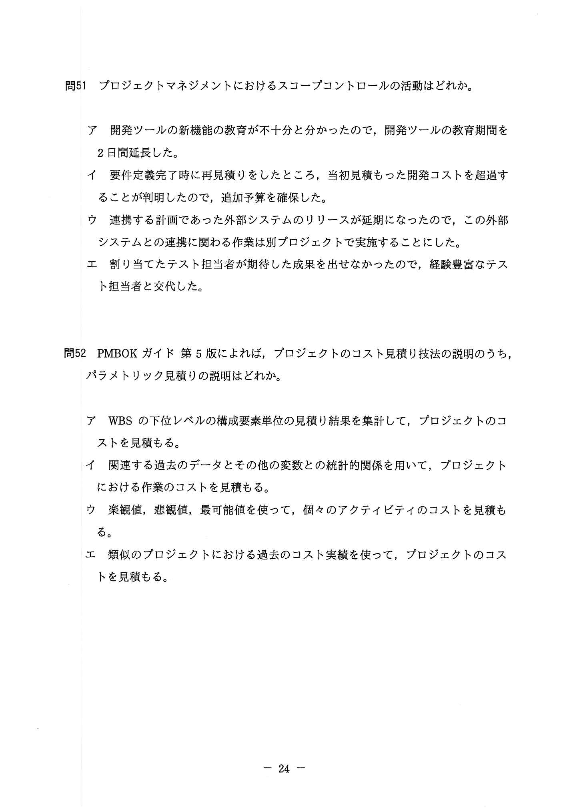

テキスト (OCR)

問51 プロジェクトマネジメントにおけるスコープコントロールの活動はどれか。

ア 開発ツールの新機能の教育が不十分と分かったので, 開発ツールの教育期間を
2 日間延長した。

イ 要件定義完了時に再見積りをしたところ, 当初見積もった開発コストを超過す
ることが判明したので, 追加予算を確保した。

ウ 連携する計画であった外部システムのリリースが延期になったので, この外部
システムとの連携に関わる作業は別プロジェクトで実施することにした。

エエ 割り当てたテスト担当者が期待した成果を出せなかったので, 経験豊富なテス
ト担当者と交代した。

問52 PMBOK ガイド 第 5 版によれば, プロジェクトのコスト見積り技法の説明のうち,
パラメトリック見積りの説明はどれか。

ア WBS の下位レベルの構成要素単位の見積り結果を集計して, プロジェクトのコ
ストを見積もる。

イ 関連する過去のデータとその他の変数との統計的関係を用いて, プロジェクト
における作業のコストを見積もる。

ウ 楽観値, 悲観値, 最可能値を使って, 個々のアクティビティのコストを見積も
る。

エエ 類似のプロジェクトにおける過去のコスト実績を使って, プロジェクトのコス
トを見積もる。

### ページ 25

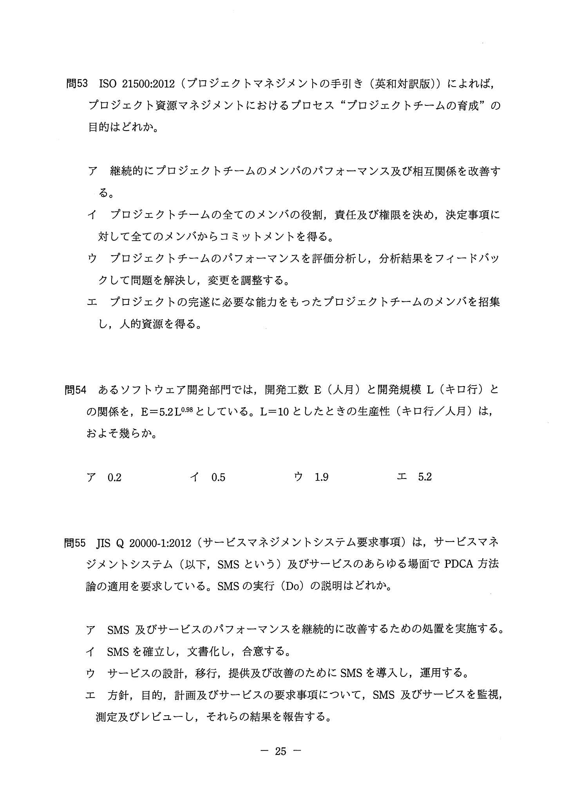

テキスト (OCR)

問53 ISO 21500:2012 (プロジェクトマネジメントの手引き (英和対訳版)) によれば,
プロジェクト資源マネジメントにおけるプロセス “プロジェクトチームの育成” の
目的はどれか。

ア 継続的にプロジェクトチームのメンバのパフォーマンス及び相互関係を改善す
る。

イ プロジェクトチームの全てのメンバの役割, 責任及び権限を決め, 決定事項に
対して全てのメンバからコミットメントを得る。

ウ プロジェクトチームのパフォーマンスを評価分析し, 分析結果をフィードバッ
クして問題を解決し, 変更を調整する。

KK プロジェクトの完遂に必要な能力をもったプロジェクトチームのメンバを招集
し, 人的資源を得る。

問54 あるソフトウェア開発部門では, 開発工数 E (AA) と開発規模 L (キロ行) と
の関係を, セー5.2L098 としている。 L=10 としたときの生産性 (キロ行人月) は,

およそ幾らか。

間55 JIS Q 20000-1:2012 (サービスマネジメントシステム要求事項) は, サービスマネ
ジメントシステム (以下, SMS という) 及びサービスのあらゆる場面で PDCA 方法
論の適用を要求している。SMS の実行 (Do) の説明はどれか。

SMS 及びサービスのパフォーマンスを継続的に改善するための処置を実施する。

SMS を確立し, 文書化し, 合意する。

サービスの設計, 移行, 提供及び改善のために SMS を導入し, 運用する。

方針, 目的, 計画及びサービスの要求事項について, SMS 及びサービスを監視,
測定及びレビューし, それらの結果を報告する。

H へ WN

ー 25 一

### ページ 26

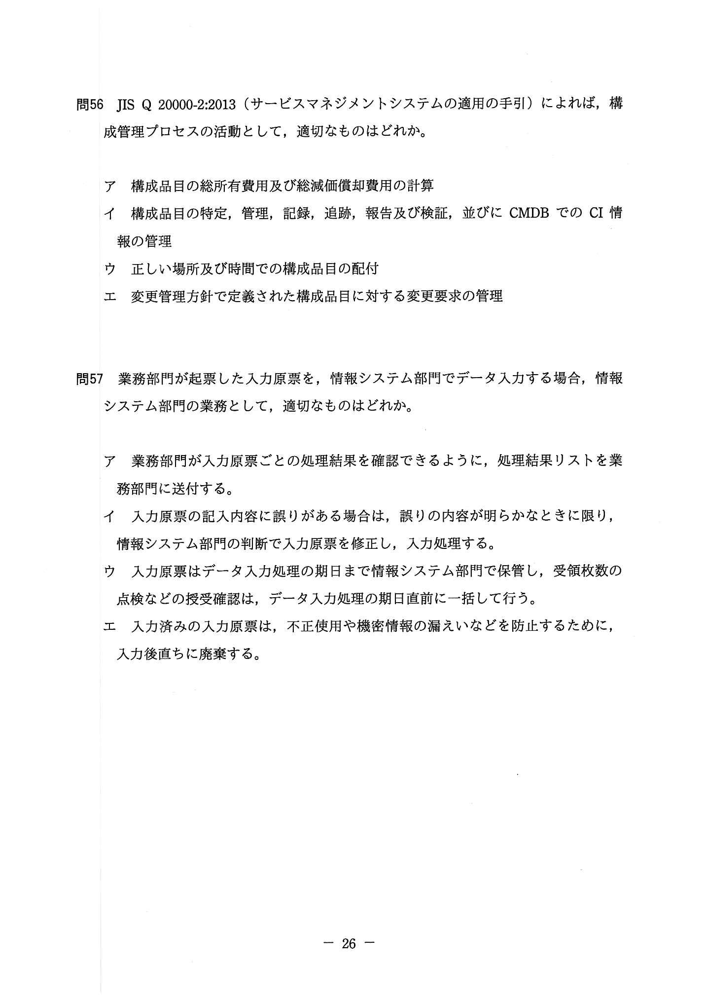

テキスト (OCR)

問56 JIS Q 20000-2:2013 (サービスマネジメントシステムの適用の手引) によればぱ, 構
成管理プロセスの活動として, 適切なものはどれか。

ア 構成品目の総所有費用及び総減価償却費用の計算

イ 構成品目の特定, 管理, 記録, 追跡, 報告及び検証, 並びに CMDB での Cl 情
報の管理

ウ 正しい場所及び時間での構成品目の配付

エエ 変更管理方針で定義された構成品目に対する変更要求の管理

問57 業務部門が起票した入力原票を, 情報システム部門でデータ入力する場合, 情報
システム部門の業務として, 適切なものはどれか。

ア 業務部門が入力原票ごとの処理結果を確認できるように, 処理結果リストを業
務部門に送付する。

イ 入力原票の記入内容に誤りがある場合は, 誤りの内容が明らかなときに限り,
情報システム部門の判断で入力原票を修正し, 入力処理する。

ウ 入力原票はデータ入力処理の期日まで情報システム部門で保管し, 受領枚数の
点検などの授受確認は, データス入力処理の期日直前に一括して行う。

エ 入力済みの入力原票は, 不正使用や機密情報の漏えいなどを防止するために,
入力後直ちに廃棄する。

ー 26 一

### ページ 27

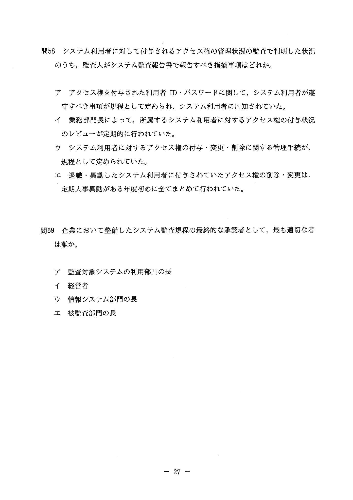

テキスト (OCR)

間58 システム利用者に対して付与されるアクセス権の管理状況の監査で判明した状況
のうち, 監査人がシステム監査報告書で報告すべき指摘事項はどれか。

ア アクセス権を付与された利用者 D・パスワードに関して, システム利用者が遵
守すべき事項が規程として定められ, システム利用者に周知されていた。

イ 業務部門長によって, 所属するシステム利用者に対するアクセス権の付与状況
のレビューが定期的に行われていた。

ウ システム利用者に対するアクセス権の付与・変更・削除に関する管理手続が,
規程として定められていた。

エエ 退職・異動したシステム利用者に付与されていたアクセス権の削除・変更は,
定期人事異動がある年度初めに全てまとめて行われていた。

問59 企業において整備したシステム監査規程の最終的な承認者として, 最も適切な者
は誰か。

監査対象システムの利用部門の長
経営者

情報システム部門の長

被監査部門の長

H へ

ー 27 一

### ページ 28

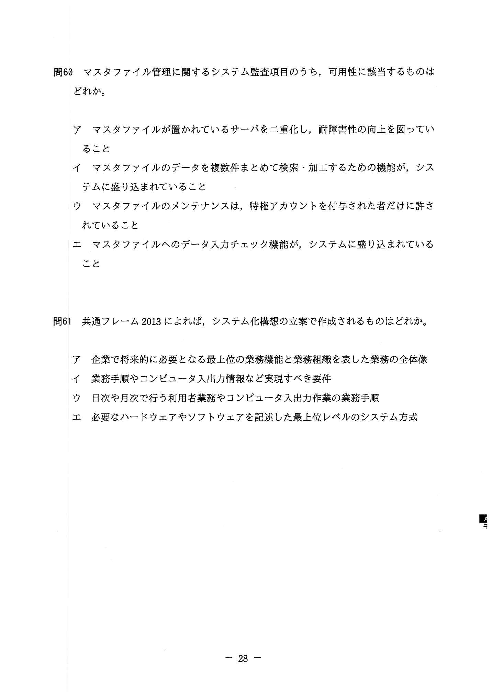

テキスト (OCR)

問69

マスタファイル管理に関するシステム監査項目のうち, 可用性に該当するものは

どれか。

ア

イ

ウ

x=

問61

He AN

マスタファイルが置かれているサーバを二重化し, 耐障害性の向上を図ってい
ること

マスタファイルのデータを複数件まとめて検索・加工するための機能が, シス
テムに盛り込まれていること

マスタファイルのメンテナンスは, 特権アカウントを付与された者だけに許さ
れていること

マスタファイルへのデータ入力チェック機能が, システムに盛り込まれている
こと

共通フレーム 2013 によれば, システム化構想の立案で作成されるものはどれか。
企業で将来的に必要となる最上位の業務機能と業務組織を表した業務の全体像
業務手順やコンピュータ入出力情報など実現すべき要件

日次や月次で行う利用者業務やコンピュータ入出力作業の業務手順
必要なハードウェアやソフトウェアを記述した最上位レベルのシステム方式

ー 28 一

+

### ページ 29

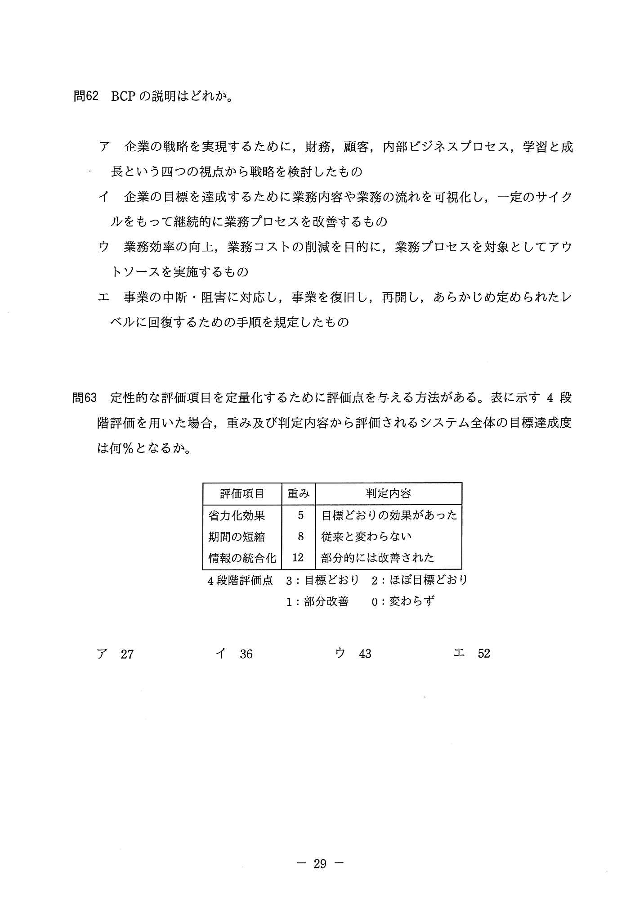

テキスト (OCR)

間62 BCP の説明はどれか。

ア 企業の戦略を実現するために, BB, BS, 内部ビジネスプロセス, 学習と成
長という四つの視点から戦略を検討したもの
イ 企業の目標を達成するために業務内容や業務の流れを可視化し, 一定のサイク
ルをもって継続的に業務プロセスを改善するもの
ウ 業務効率の向上, 業務コストの削減を目的に, 業務プロセスを対象としてアウ
トソースを実施するもの
エ 事業の中断・阻害に対応し, 事業を復旧し, 再開し, あらかじめ定められたレ
ベルに回復するための手順を規定したもの

問63 定性的な評価項目を定量化するために評価点を与える方法がある。表に示す 4 段
階評価を用いた場合, 重み及び判定内容から評価されるシステム全体の目標達成度
は何%となるがか。

評価項目     重み           判定内容
省力化効果      5 | 目標どおりの効果があった
期間の短縮      8 | 従来と変わらない
情報の統合化 | 12 | 部分的には改善された
4段階評価点 3: 目標どおり 2:ほばぼ目標どおり
1 : 部分改善 。0:変わらず

ー 29 一

### ページ 30

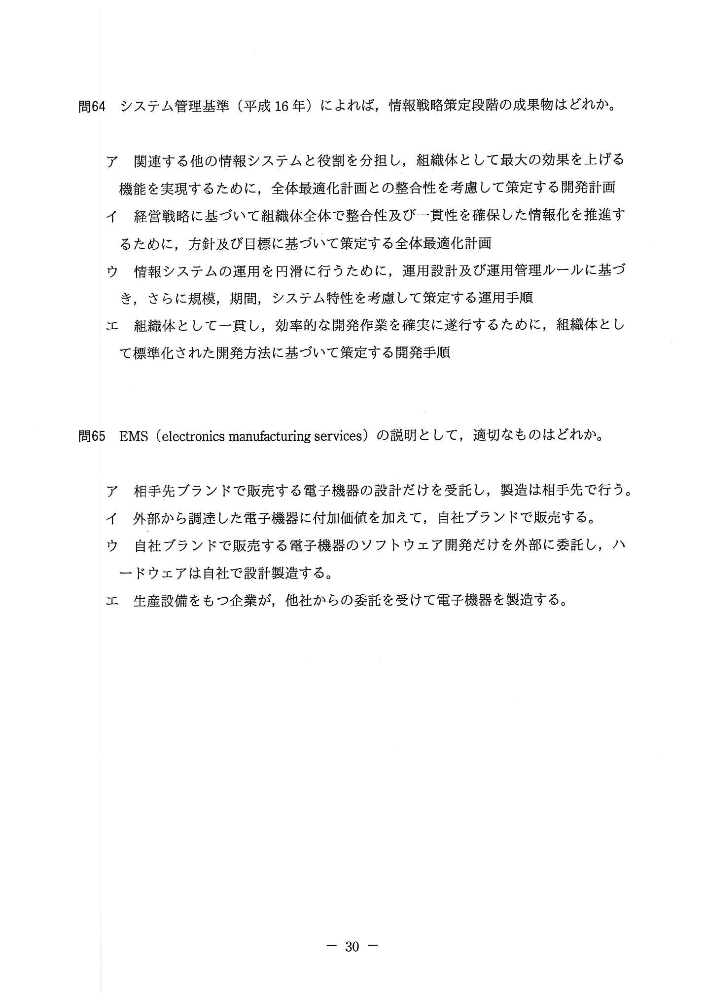

テキスト (OCR)

間64 システム管理基準 (平成 16 年) によれば, 情報戦略策定段階の成果物はどれか。

ア 関連する他の情報システムと役割を分担し, 組織体として最大の効果を上げる
機能を実現するために, 全体最適化計画との整合性を考慮して策定する開発計画

イ 経営戦略に基づいて組織体全体で整合性及び一貫性を確保した情報化を推進す
るために, 方針及び目標に基づいて策定する全体最適化計画

ウ 情報システムの運用を円滑に行うために, 運用設計及び運用管理ルールに基づ
き, さらに規模, 期間 システム特性を考慮して策定する運用手順

エ 組織体として一貫し, 効率的な開発作業を確実に遂行するために, 組織体とし
て標準化された開発方法に基づいて策定する開発手順

fi65 EMS (electronics manufacturing services) の説明として, 適切かものはどれか。

ア 相手先ブランドで販売する電子機器の設計だけを受託し, 製造は相手先で行う。

イ 外部から調達した電子機器に付加価値を加えて, 自社ブランドで販売する。

ウ 自社ブランドで販売する電子機器のソフトウェア開発だけを外部に委託し, ハ
ードウェアは自社で設計製造する。

エ 生産設備をもつ企業が, 他社からの委託を受けて電子機器を製造する。

ー 30 一

### ページ 31

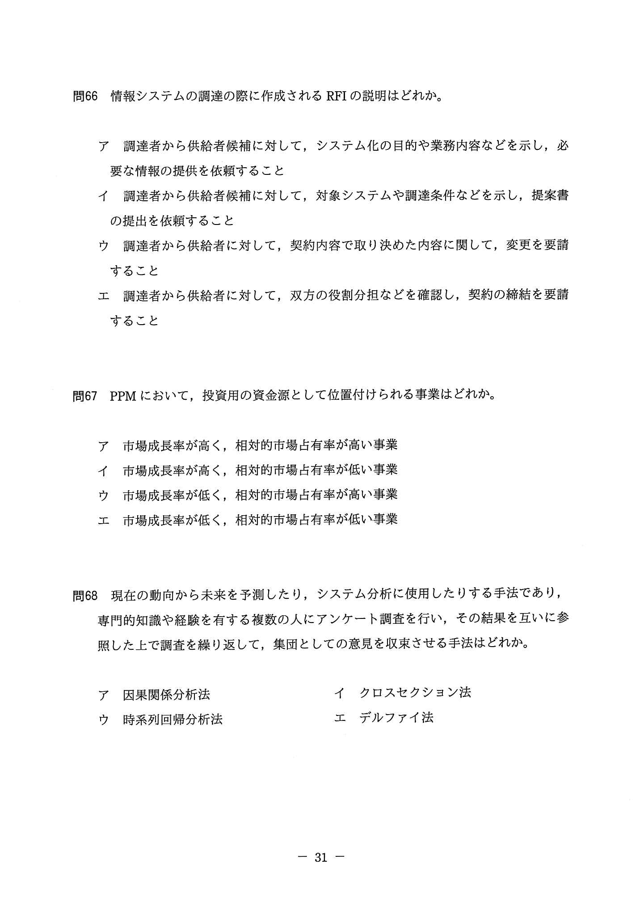

テキスト (OCR)

間66 情報システムの調達の際に作成される RFI の説明はどれか。

ア 調達者から供給者候補に対して, システム化の目的や業務内容などを示し, 必

要な情報の提供を依頼すること

イ 調達者から供給者候補に対して, 対象システムや調達条件などを示し, 提案書
の提出を依頼すること

ウ 調達者から供給者に対して, 契約内容で取り決めた内容に関して, 変更を要請
すること

エ 調達者から供給者に対して, 双方の役割分担などを確認し, 契約の締結を要請
すること

間67 PPM において, 投資用の資金源として位置付けられる事業はどれか。

市場成長率が高く, 相対的市場占有率が高い事業
市場成長率が高く, 相対的市場占有率が低い事業
市場成長率が低く, 相対的市場占有率が高い事業
市場成長率が低く, 相対的市場占有率が低い事業

Hot AN

問68 現在の動向から未来を予測したり, システム分析に使用したりする手法であり,
専門的知識や経験を有する複数の人にアンケート調査を行い, その結果を互いに参
照した上で調査を繰り返して, 集団としての意見を収束させる手法はどれか。

ア 因果関係分析法          イ クロスセクション法
ウ 時系列回帰分析法            エ デルファイ法

ー 31 一

### ページ 32

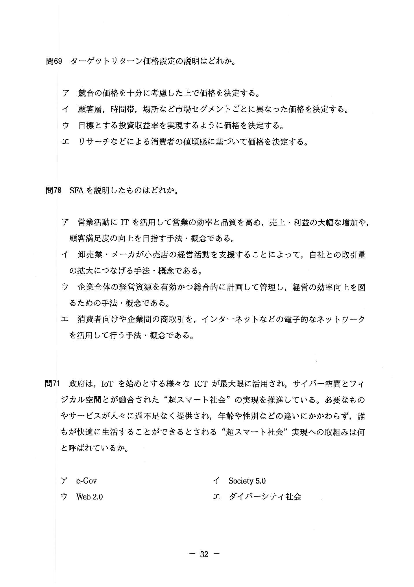

テキスト (OCR)

間69 ターゲットリターン価格設定の説明はどれか。

競合の価格を十分に考慮した上で価格を決定する。

顧客層, 時間帯, 場所など市場セグメントごとに異なった価格を決定する。
目標とする投資収益率を実現するように価格を決定する。

リサーチなどによる消費者の値頃感に基づいて価格を決定する。

H @ AN

間79 SFAを説明したものはどれか。

ア 営業活動に IT を活用して営業の効率と品質を高め, 売上・利益の大幅な増加や,
顧客満足度の向上を目指す手法・概念である。

イ 卸売業・メーカが小売店の経営活動を支援することによって, 自社との取引量
の拡大につなげる手法・概念である。

ウ 企業全体の経営資源を有効かつ総合的に計画して管理し, 経営の効率向上を図
るための手法・概念である。

エエ 消費者向けや企業間の商取引を, インターネットなどの電子的なネットワーク
を活用して行う手法・概念である。

間71 政府は, IoT を始めとする様々な ICT が最大限に活用され, サイバー空間とフィ
ジカル空間とが融合された “超スマート社会” の実現を推進している。必要なもの
やサービスが人々に過不足なく提供され, 年齢や性別などの違いにかかわらず, 誰
もが快適に生活することができるとされる “超スマート社会” 実現への取組みは何
と呼ばれているかが。

ア e-Gov                                        イ Society 5.0
ウ Web2.0                         エエ ダイバーシティ社会

### ページ 33

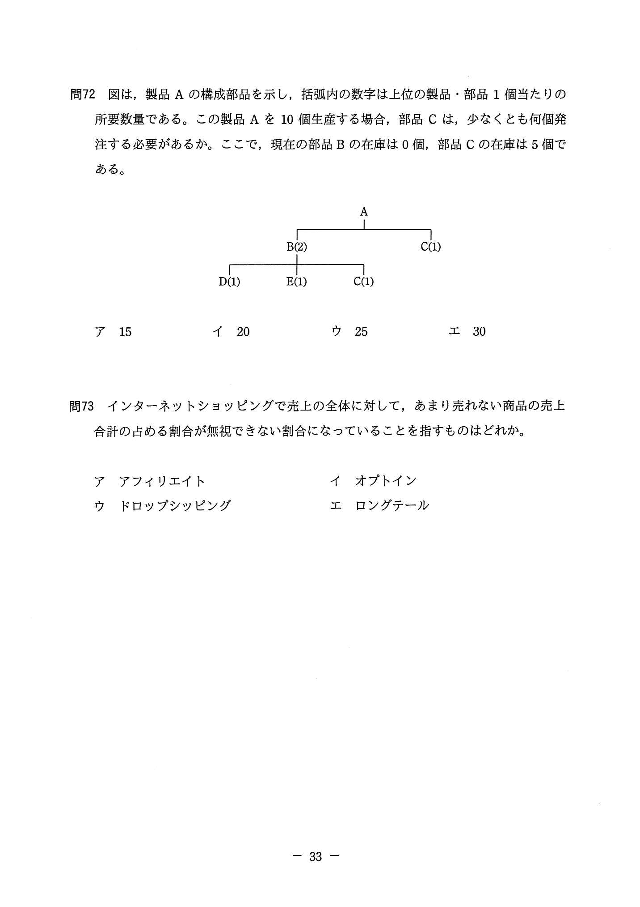

テキスト (OCR)

問72 did, 製品A の構成部品を示し, 括弧内の数字は上位の製品・部品 1 個当たりの
所要数量である。この製品 A を 10 個生産する場合, 部品 lt, 少なくとも何個発
注する必要があるか。ここで, 現在の部品 B の在庫は 0 個, 部品Cの在庫は5個で
ある。

A
|    |
BQ)         CG①
|
|    |    |
DQ)   EQ)   cq)
ア 15     イ 20      ウ 25     エ 30

間73 インターネットショッピングで売上の全体に対して, あまり売れない商品の売上
合計の占める割合が無視できない割合になっていることを指すものはどれか。

ア アフィリエイト        イ オプトイン
ウ ドロップシッピング      エエ ロングテール

ー 33 一

### ページ 34

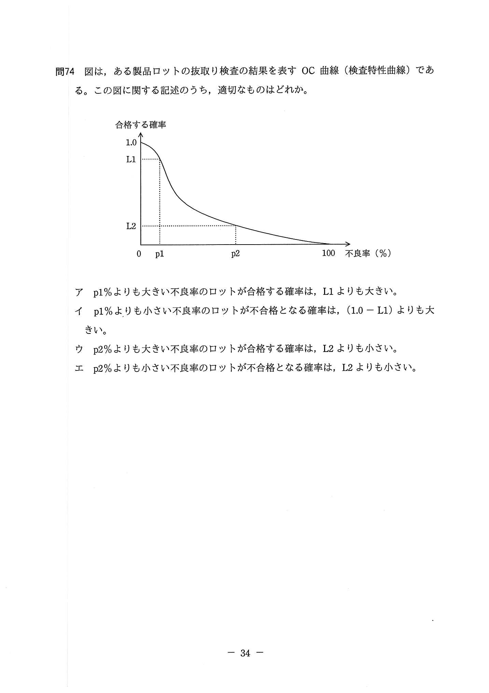

テキスト (OCR)

問74 図は, ある製品ロットの抜取り検査の結果を表す OC 曲線 (検査特性曲線) であ
る。この図に関する記述のうち, 適切なものはどれか。

合格する確率

1.0

L2

0 pl      p2        100 ARH (%)

ア p1%よりも大きい不良率のロットが合格する確率は, L1 よりも大きい。

イ p1%よりも小さい不良率のロットが不合格となる確率は, (1.0 一 L1) よりも大
きい。

ウ p2%よりも大きい不良率のロットが合格する確率は, L2 よりも小さい。

エエ p2%よりも小さい不良率のロットが不合格となる確率は, L2 よりも小さい。

ー 34 一

### ページ 35

テキスト (OCR)

間75 ビッグデータ分析の手法の一つであるデシジョンツリーを活用してマーケティン
グ施策の判断に必要な事象を整理し, 発生確率の精度を向上させた上で二つのマー
ケティング施策 a, b の選択を行う。マーケティング施策を実行した場合の利益増加
額 (売上増加額一覧用) の期待値が最大となる施策と, そのときの利益増加額の期
待値の組合せはどれか。

発生確率           売上増加額

200億円
売上増加額
100億円
マーケティング施策a
初期費用 30億円
売上増加額
150億円
マーケティング施策b
初期費用 40億円
売上増加額
100億円

発生確率 売上増加額
07             140億円

| ] : 意思決定の分岐点 ( ): 発生し得る可能性の分野点

施策 | 利益増加額の期待値 (億円)
ア          a                                   70
4          a                                 160
ウ     b                  82
xr     b                 162

ー 35 一

### ページ 36

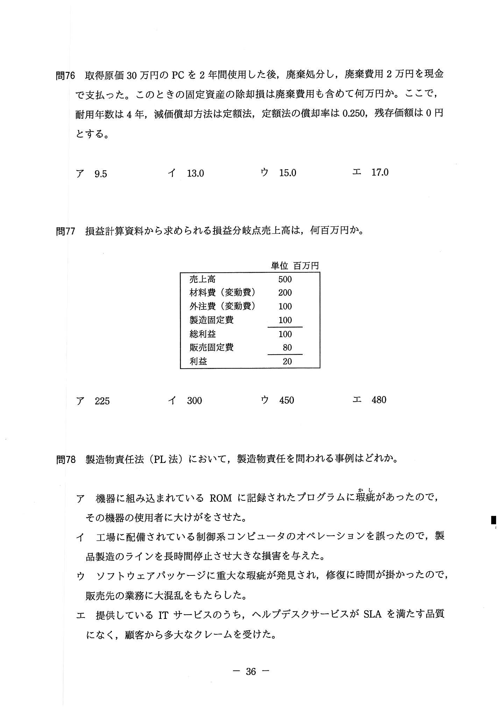

テキスト (OCR)

間76 取得原価 30 万円の PCを 2 年間使用した後, 廃棄処分し, 廃棄費用 2 万円を現金
で支払った。このときの固定資産の除却損は廃棄費用も含めて何万円か。ここで,
耐用年数は 4 年, 減価償却方法は定額法, 定額法の償却率は 0.250, 残存価額は 0円
とする。

ア 9.5     イ 13.0     ウ 15.0     x= 17.0

問77 損益計算資料から求められる損益分岐点売上高は, 何百万円か。

単位 百万円
売上高           500
材料費 (変動費)    200
外注費 (変動費)    100

製造固定費    100
総利益      100
販売固定費    80
利益       20
ア 225     イ 300     ウ 450     x 480

間78 製造物責任法 (PL 法) において, 製造物責任を問われる事例はどれか。

ア 機器に組み込まれている ROM に記録されたプログラムに隊交があったので,
その機器の使用者に大けがをさせた。

イ 工場に配備されている制御系コンピュータのオペレーションを誤ったので, 製
品製造のラインを長時間停止させ大きな損害を与えた。

ウ ソフトウェアパッケージに重大な現渡が発見され, 修復に時間が掛かったので,
販売先の業務に大混乱をもたらした。

エ 提供している IT サービスのうち, ヘルプデスクサービスが SLA を満たす品質
になく, 顧客から多大なクレームを受けた。

ー 36 一

### ページ 37

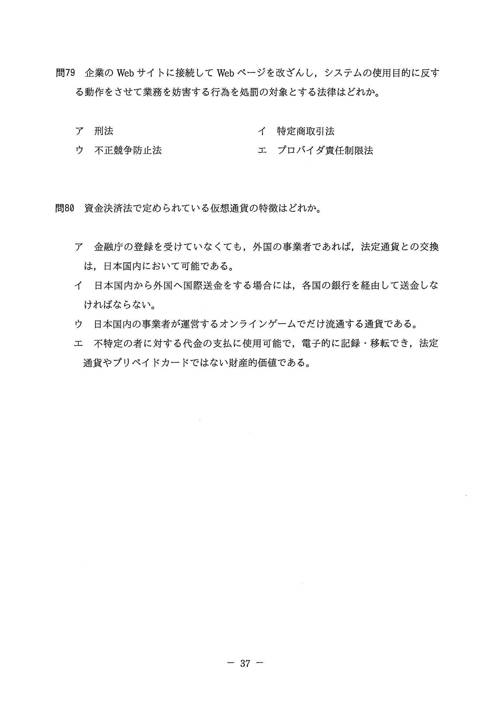

テキスト (OCR)

問79 企業の Web サイトに接続して Web ページを改ざんし, システムの使用目的に反す
る動作をさせて業務を妨害する行為を処罰の対象とする法律はどれか。

ア 刑法            イ 特定商取引法
ウ 不正競争防止法        エエ プロバイダ資任制限法

問8 資金決済法で定められている仮想通貨の特徴はどれか。

ア 金融庁の登録を受けていなくても, 外国の事業者であれば, 法定通貨との交換
は, 日本国内において可能である。

イ 日本国内から外国へ国際送金をする場合には, 各国の銀行を経由して送金しな
ければならない。

ウ 日本国内の事業者が運営するオンラインゲームでだけ流通する通貨である。

エ 不特定の者に対する代金の支払に使用可能で, 電子的に記録・移転でき, 法定
通貨やプリペイドカードではない財産的価値である。

ー 37 一

### ページ 38

テキスト (OCR)

C

メ = 用 紙 J

ー 38 一

### ページ 39

テキスト (OCR)

〔

x モ 用 紙 〕

ー 39 一

### ページ 40

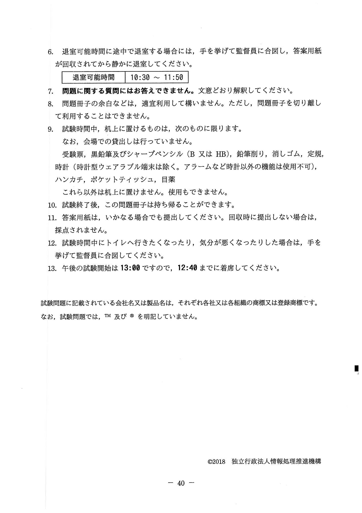

テキスト (OCR)

6. 退室可能時間に途中で退室する場合には, 手を挙げて監督員に合図し, 答案用紙
が回収されてから静かに退室してください。
| 退室可能時間 | 10:30 ~ 11:50 |
7. 賠題に関する質問にはお答えできません。文意どおり解釈してください。
8. 問題冊子の余白などは, 適宜利用して構いません。ただし, 問題冊子を切り離し
て利用することはできません。
9. 試験時間中, 机上に置けるものは, 次のものに限ります。
なお, 会場での貸出しは行っていません。
ZAR, 黒鉛筆及びシャープペンシル (B 又は HB), 鉛筆削り, 消しゴム, 定規,
時計 (時計型ウェアラブル端末は除く。アラームなど時計以外の機能は使用不可),
ハンカチ, ポケットティッシュ, 目薬
これら以外は机上に置けません。使用もできません。
10. 試験終了後, この問題冊子は持ち帰ることができます。
ll. 答案用紙は, いかなる場合でも提出してください。 回収時に提出しない場合は,
採点されません。
12. 試験時間中にトイレへ行きたくなったり, 気分が悪くなったりした場合は, FE
挙げて監督貞に合図してください。
13. 午後の試験開始は 13:00 ですので, 12:40 までに着席してください。

試験問題に記載されている会社名又は製品名は, それぞれ各社又は各組織の商標又は登録商標です。
なお, 試験問題では, ™ 及び @ を明記していません。

@2018 独立行政法人情報処理推進機構

ー 40 一

---

## 午前解答

©2018 独立行政法人情報処理推進機構 
平成30 年度 春期 応用情報技術者試験 解答例 
 
午前試験 
問番号
正解
分野
問1 
イ 
Ｔ 
問2 
イ 
Ｔ 
問3 
ア 
Ｔ 
問4 
ウ 
Ｔ 
問5 
ウ 
Ｔ 
問6 
イ 
Ｔ 
問7 
イ 
Ｔ 
問8 
ウ 
Ｔ 
問9 
エ 
Ｔ 
問10 
エ 
Ｔ 
問11 
エ 
Ｔ 
問12 
ア 
Ｔ 
問13 
ウ 
Ｔ 
問14 
イ 
Ｔ 
問15 
ウ 
Ｔ 
問16 
ウ 
Ｔ 
問17 
ウ 
Ｔ 
問18 
ア 
Ｔ 
問19 
ア 
Ｔ 
問20 
エ 
Ｔ 
 
 
問番号
正解
分野
問21 
ウ 
Ｔ 
問22 
イ 
Ｔ 
問23 
エ 
Ｔ 
問24 
ウ 
Ｔ 
問25 
ウ 
Ｔ 
問26 
イ 
Ｔ 
問27 
エ 
Ｔ 
問28 
ア 
Ｔ 
問29 
イ 
Ｔ 
問30 
ウ 
Ｔ 
問31 
ウ 
Ｔ 
問32 
イ 
Ｔ 
問33 
イ 
Ｔ 
問34 
イ 
Ｔ 
問35 
ア 
Ｔ 
問36 
エ 
Ｔ 
問37 
ア 
Ｔ 
問38 
エ 
Ｔ 
問39 
イ 
Ｔ 
問40 
ウ 
Ｔ 
 
 
問番号
正解
分野
問41 
ウ 
Ｔ 
問42 
ウ 
Ｔ 
問43 
イ 
Ｔ 
問44 
ア 
Ｔ 
問45 
ア 
Ｔ 
問46 
エ 
Ｔ 
問47 
ウ 
Ｔ 
問48 
ア 
Ｔ 
問49 
エ 
Ｔ 
問50 
エ 
Ｔ 
問51 
ウ 
Ｍ 
問52 
イ 
Ｍ 
問53 
ア 
Ｍ 
問54 
ア 
Ｍ 
問55 
ウ 
Ｍ 
問56 
イ 
Ｍ 
問57 
ア 
Ｍ 
問58 
エ 
Ｍ 
問59 
イ 
Ｍ 
問60 
ア 
Ｍ 
 
 
問番号
正解
分野
問61 
ア 
Ｓ 
問62 
エ 
Ｓ 
問63 
イ 
Ｓ 
問64 
イ 
Ｓ 
問65 
エ 
Ｓ 
問66 
ア 
Ｓ 
問67 
ウ 
Ｓ 
問68 
エ 
Ｓ 
問69 
ウ 
Ｓ 
問70 
ア 
Ｓ 
問71 
イ 
Ｓ 
問72 
ウ 
Ｓ 
問73 
エ 
Ｓ 
問74 
ウ 
Ｓ 
問75 
ウ 
Ｓ 
問76 
エ 
Ｓ 
問77 
ウ 
Ｓ 
問78 
ア 
Ｓ 
問79 
ア 
Ｓ 
問80 
エ 
Ｓ 
 
 
分野の「Ｔ」はテクノロジ系，「Ｍ」はマネジメント系，「Ｓ」はストラテジ系の問題です。

---

## 午後問題

### ページ 1

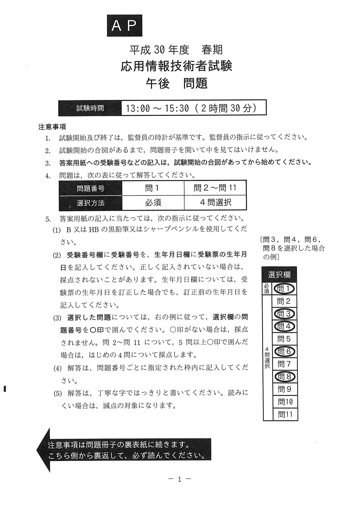

テキスト (OCR)

平成36年度 春期
応用情報技術者試験
午後 問題

ae 13:00 ~ 15:30 (2時間30 分)

注意事項
1. 試験開始及び終了は, 監督貞の時計が基準です。監督員の指示に従ってください。
2. 試験開始の合図があるまで, 問題冊子を開いて中を見てはいけません。
3. 答案用紙への受験番号などの記入は, 試験開始の合図があってから始めてください。
4. 問題は, 次の表に従って解答してください。

問題番号     fj    fal 2 ~問 11
_ 選択方法     必須     4 問選択

5. 答案用紙の記入に当たっては, 次の指示に従ってください。
(1) B 又は HB の黒鉛筆又はシャープペンシルを使用してくだ

aw,                        (MIS, 4, RIG,

問8 を選択した場合

) 要験番号欄に和験番号を。 生年月日村に受験本の生年月 5) RUNES
日を記入してください。正しく記入されていない場合は,

採点されないことがあります。生年月日欄については, 受   選択欄

験票の生年月日を訂正した場合でも, 訂正前の生年月日を |用
記入してください。                      間2
(3) 選択した問題については, 右の例に従って, 選択欄の問
題番号を〇印で囲んでください。〇印がない場合は, 採点   Gi4
されません。間 2一問 11 について, 5 間以上〇印で囲んだ    fal 5
Baik, はじめの 4 間について採点します。         ョ9
4) 解答は, 問題番号ごとに指定された梓内に記入してくだ |択|問7
さい。                               C38
(65) 解答は, 丁寧な字ではっきりと書いてください。読みに    fai 9
くい場合は, 減点の対象になります。              間16

間11

注意事項は問題冊子の裏表紙に続きます。
こちら側から裏返して, 必ず読んでください。

### ページ 2

### ページ 3

テキスト (OCR)

〔問題一覧〕

信問 1 (必須)

     出題分野                テーマ
問 1 | 情報セキュリティ      マルウェア感染への対応

人@問 2一問 11 (10 問中 4 問選択)

     出題分野                チー
問2 | 経営戦略          事業戦略の策定

間 3 | プログラミング      ナイトの巡歴問題

間4 | システムアーキテクチャ  クラウドサービス

問5 | ネットワーク       Web システムの構成変更

問6 | データベース       備品購買システムの設計と実装
問7 | 組込みシステム開発    児童の見守り機能付き防犯ブザー
fl 8 | 情報システム開発     プログラムの品質評価

問 9 | プロジェクトマネジメント |ERPソフトウェアパッケージ導入プロジェクト
問10| サービスマネジメント    データセンタで行うシステム運用
間 11| システム監査        システム更改プロジェクトの監査

### ページ 4

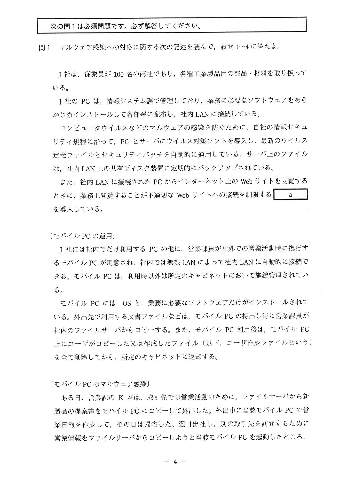

テキスト (OCR)

次の問 1 は必須問題です。必ず解答してください。

間1 マルウェア感染への対応に関する次の記述を読んで, 設問 1ー4 に答えよ。

J 社は, 従業員が 100 名の商社であり, 各種工業製品用の部品・材料を取り扱つて
いる。

J 社の PC は, 情報システム課で管理しており, 業務に必要なソフトウェアをあら
かじめインストールして各部署に配布し, 社内 LAN に接続している。

コンピュータウイルスなどのマルウェアの感染を防ぐために, 自社の情報セキュ
リティ規程に沿って, PC とサーバにウイルス対策ソフトを導入し, 最新のウイルス
定義ファイルとセキュリティパッチを自動的に適用している。サーバ上のファイル
は, 社内 LAN 上の共有ディスク装置に定期的にバックアップされている。

また, 社内 LAN に接続された PC からインターネット上の Web サイトを閲覧する
LEK, 業務上閲覧することが不適切な Web サイトへの接続を制限する| 。 |
を導入している。

[モバイル PC の運用〕

] 社には社内でだけ利用する PC の他に, 営業課員が社外での営業活動時に携行す
るモバイル PC が用意され, 社内では無線 LAN によって社内 LAN に自動的に接続で
きる。モバイル PC は, 利用時以外は所定のキャビネットにおいて施錠管理されてい
る。

モバイル PC には, OS と, 業務に必要なソフトウェアだけがインストールされて
いる。 外出先で利用する文書ファイルなどは, モバイル PC の持出し時に営業課員が
社内のファイルサーバからコピーする。また, モバイル PC 利用後は, モバイル PC
上にユーザがコピーした又は作成したファイル (以下,。 ユーザ作成ファイルという)
を全て削除してから, 所定のキャビネットに返却する。

[モバイル PC のマルウェア感染]

HSA, 営業課の K Bld, 取引先での営業活動のために, ファイルサーバから新
製品の提案書をモバイル PC にコピーして外出した。外出中に当該モバイル PC で営
業日報を作成して, その日は帰宅した。翌日出社し, 別の取引先を訪問するために
営業情報をファイルサーバからコピーしようと当該モバイル PC を起動したところ,

デールー

### ページ 5

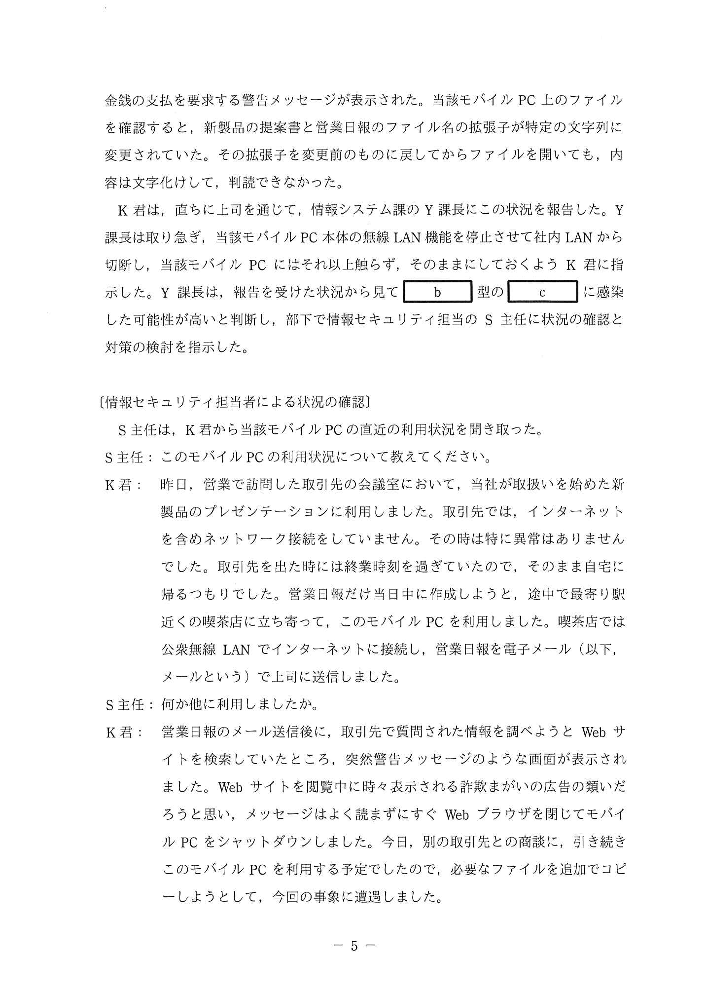

テキスト (OCR)

金銭の支払を要求する称告メッセージが表示された。当該モバイル PC 上のファイル
を確認すると, 新製品の提案書と営業日報のファイル名の拡張子が特定の文字列に
変更されていた。その拡張子を変更前のものに戻してからファイルを開いても, 内
容は文字化けして, 判読できなかった。

K 君は, 直ちに上司を通じて, 情報システム課の Y 課長にこの状況を報告した。Y
課長は取り急ぎ, 当該モバイル PC 本体の無線 LAN 機能を停止させて社内 LAN から
切断し, 当該モバイル PC にはそれ以上触らずが, そのままにしておくよう K 君に指
示した。Y 課長は, 報告を受けた状況から見て| b |型の| c |に感染
した可能性が高いと判断し, 部下で情報セキュリティ担当の S 主任に状況の確認と
対策の検討を指示した。

(情報セキュリティ担当者による状況の確認
S 主任は, K 君から当該モバイル PC の直近の利用状況を聞き取った。

S 主任: このモバイル PC の利用状況について教えてください。

KA: 昨日, 営業で訪問した取引先の会議室において, 当社が取扱いを始めた新
製品のプレゼンテーションに利用しました。取引先では, インターネット
を含めネットワーク接続をしていません。その時は特に異常はありません
でした。取引先を出た時には終業時刻を過ぎていたので, そのまま自宅に
帰るつもりでした。営業日報だけ当日中に作成しようと, 途中で最寄り駅
近くの喫茶店に立ち寄って, このモバイル PC を利用しました。喫茶店では
公衆無線 LAN でインターネットに接続し, 営業日報を電子メール (以下
メールという) で上司に送信しました。

S 主任 : 何が他に利用しましたか。

K君: 営業日報のメール送信後に, 取引先で質問された情報を調べようと Web サ
イトを検索していたところ, 突然警告メッセージのような画面が表示され
ました。Web サイトを閲覧中に時々表示される詐欺まがいの広告の類いだ
ろうと思い, メッセージはよく読まずにすぐ Web ブラウザを閉じてモバイ
ル PC をシャットダウンしました。 SA, 別の取引先との商談に, 引き続き
このモバイル PC を利用する予定でしたので, 必要なファイルを追加でコピ
ーしようとして, 今回の事象に遭遇しました。

=f

### ページ 6

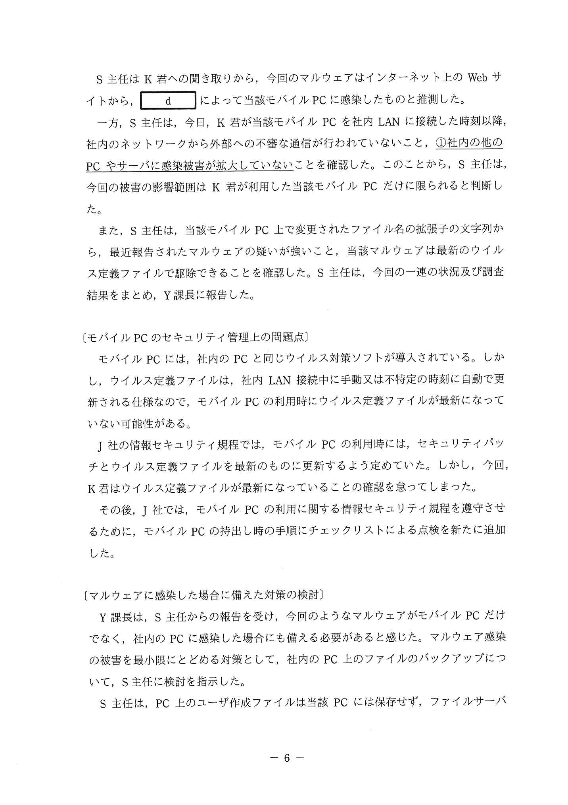

テキスト (OCR)

S 主任は K 君への聞き取りから, 今回のマルウェアはインターネット上の Web サ
イトから, (a |] によって当該モバイル PC に感染したものと推測した。

一方, S 主任は, 今日, K 君が当該モバイル PC を社内 LAN に接続した時刻以降
社内のネットワークから外部への不審な通信が行われていないこと, ①社内の他の
PC やサーバに感染被害が拡大していないことを確認した。このことから, S 主任は,
今回の被害の影響範囲は K 君が利用した当該モバイル PC だけに限ちれると判断し
Top

また, 8 主任は, 当該モバイル PC 上で変更されたファイル名の拡張子の文字列か
ら, 最近報告されたマルウェアの疑いが強いこと, 当該マルウェアは最新のウイル
ス定義ファイルで駆除できることを確認した。S 主任は, 今回の一連の状況及び調査
結果をまとめ, Y 課長に報告した。

[モバイル PC のセキュリティ管理上の間題点]

モバイル PC には, 社内の PC と同じウイルス対策ソフトが導入されている。しか
し, ウイルス定義ファイルは, 社内 LAN 接続中に手動又は不特定の時刻に自動で更
新される仕様なので, モバイル PC の利用時にウイルス定義ファイルが最新になって
いない可能性がある。

 社の情報セキュリティ規程では, モバイル PC の利用時には, セキュリティパッ
チとウイルス定義ファイルを最新のものに更新するよう定めていた。 しかし, 今回,
K 君はウイルス定義ファイルが最新になっていることの確認を怠っつてしまった。

その後, 社では, モバイル PC の利用に関する情報セキュリティ規程を遵守させ
るために, モバイル PC の持出し時の手順にチェックリストによる点検を新たに追加
Lies

[マルウェアに感染した場合に備えた対策の検討]

Y 課長は, S 主任からの報告を受け, 今回のようなマルウェアがモバイル PC だけ
CES, 社内の PC に感染した場合にも備える必要があると感じた。マルウェア感染
の被害を最小限にとどめる対策として, 社内の PC 上のファイルのバックアップにつ
WT, S主任に検討を指示した。

S 主任は, PC 上のユーザ作成ファイルは当該 PC には保存せず,. ファイルサーバ

### ページ 7

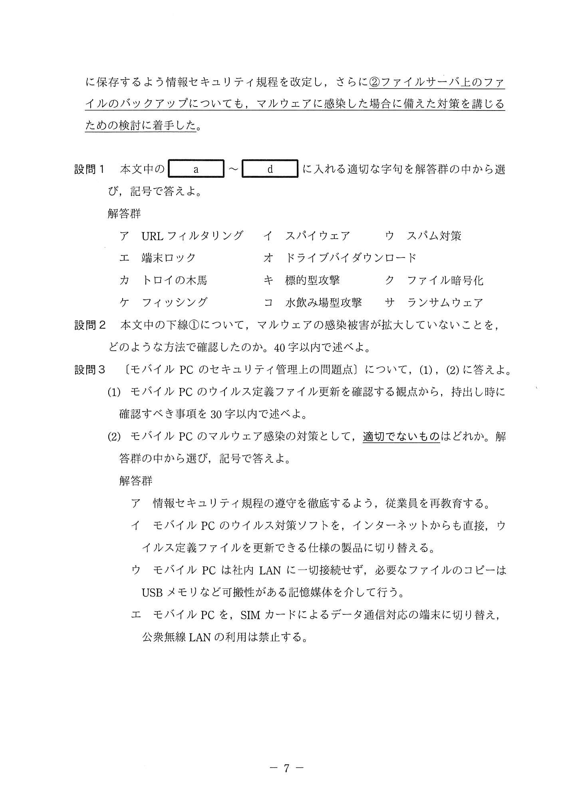

テキスト (OCR)

に保存するよう情報セキュリティ規程を改定し, さらに②ファイルサーバ上のファ
イルのバックアップについても, マルウェアに感染した場合に備えた対策を講じる
ための検討に着手した。

設問1 本文中の| 』 |~| da |に入れる適切な字句を解答群の中から選
び, 記号で答えよ。

解答群

ア URL フィルタリング イ スパイウェア   ウ スバパム対策

エ 端末ロック      オ ドライブバイダウンロード

カ トロイの木馬      キ 標的型攻撃     ク ファイル暗号化
ケ フィッシング    コ 水飲み場型攻撃 「サ ランサムウェア

設問2 本文中の下線やについて, マルウェアの感染被害が拡大していないことを,
どのようね方法で確認したのか。 40 字以内で述べよ。
設問3 〔モバイル PC のセキュリティ管理上の問題点おについて, ①) , ②) に答えよ。
(1) モバイル PC のウイルス定義ファイル更新を確認する観点から, 持出し時に
確認すべき事項を 30 字以内で述べよ。
(2) モバイル PC のマルウェア感染の対策として, 適切でないものはどれか。解
答群の中から選び, 記号で答えよ。
解答群
ア 情報セキュリティ規程の遵守を徹底するよう, 従業員を再教育する。
イ モバイル PC のウイルス対策ソフトを, インターネットからも直接, ウ
イルス定義ファイルを更新できる仕様の製品に切り替える。
ウ モバイル PC は社内 LAN に一切接続せすず, 必要なファイルのコピーは
USB メモリなど可搬性がある記憶媒体を介して行う。
エ モバイル PC を, SIM カードによるデータ通信対応の端末に切り替え,
公衆無線 LAN の利用は禁止する。

### ページ 8

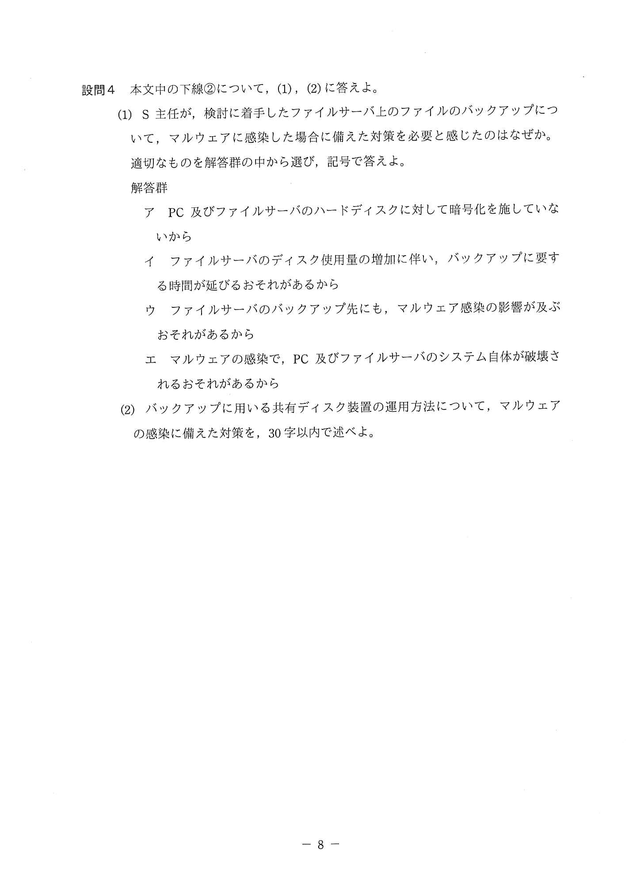

テキスト (OCR)

設問4 本文中の下線@について, ①), (② に答えよ。

(1) S 主任が, 検討に着手したファイルサーバ上のファイルのバックアップにつ
いて, マルウェアに感染した場合に備えた対策を必要と感じたのはなぜか。
適切なものを解答群の中から選び, 記号で答えよ。
解答群

ア PC 及びファイルサーバのハードディスクに対して暗号化を施していな
いから

イ ファイルサーバのディスク使用量の増加に伴い, バックアップに要す
る時間が延びるおそれがあるから

ウ ファイルサーバのバックアップ先にも, マルウェア感染の影響が及ぶ
おそれがあるから

エ マルウェアの感染で, PC 及びファイルサーバのシステム自体が破壊さ
れるおそれがあるから

Q) バックアップに用いる共有ディスク装置の運用方法について, マルウェア
の感染に備えた対策を, 30 字以内で述べよ。

### ページ 9

テキスト (OCR)

x = 用 紙 〕

### ページ 10

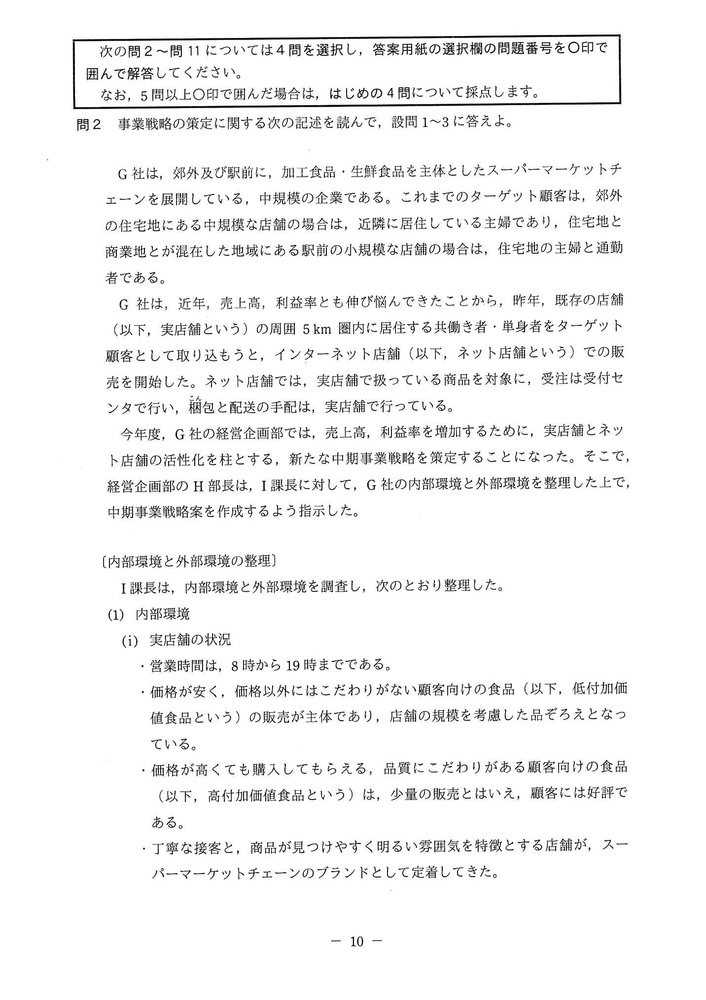

テキスト (OCR)

次の問2一問 11 については4 問を選択し, 答案用紙の選択欄の問題番号を〇印で
囲んで解答してください。
なお, 5問以上〇印で囲んだ場合は, はじめの 4 問について採点します。

問2 事業戦略の策定に関する次の記述を読んで, 設問 1ご3 に答えよ。

G 社は, 郊外及び駅前に, 加工食品・生鮮食品を主体としたスーパーマーケットチ
ェーンを展開している, 中規模の企業である。これまでのターゲット顧客は, 郊外
の住宅地にある四規模な店舗の場合は, 近隣に居住している主婦であり, 住宅地と
商業地とが混在した地域にある駅前の小規模な店舗の場合は, 住宅地の主婦と通勤
者である。

G 社は, 近年, HEM, 利益率とも伸び悩んできたことから, 昨年, 既存の店舗
(以下, 実店舗という) の周囲 5 km 圏内に居住する共働き者・単身者をターゲット
顧客として取り込もうと, インターネット店舗 (以下, ネット店舗という) TOM
売を開始した。ネット店舗では, 実店舗で扱っつている商品を対象に, 受注は受付セ
ンタで行い, 梱包と配送の手配は, 実店舗で行っている。

今年度, G 社の経営企画部では, 売上高, 利益率を増加するために, 実店舗とネッ
ト店舗の活性化を柱とする, 新たな中期事業戦略を策定することになった。そこで,
経営企画部の H 部長は, ! 課長に対して, G 社の内部環境と外部環境を整理した上で
中期事業戦略案を作成するよう指示した。

〔内部環境と外部環境の整理

1 課長は, 内部環境と外部環境を調査し, 次のとおり整理した。
(1) 内部環境

G) 実店舗の状況

・営業時間は, 8 時から 19 時までである。

・ 価格が安く, 価格以外にはこだわりがない顧客向けの食品 (以下, 低付加価
値食品という) の販売が主体であり, 店舗の規模を考慮した品ぞろえとなっ
ている。

・ 価格が高くても購入してもらえる, 品質にこだわりがある願客向けの食品
(以下, 高付加価値信品という) は, 少量の販売とはいえ, 顧客には好評で
ある。

・丁寧な接客と, 商品が見つけやすく明るい雰囲気を特徴とする店舗が, スー
パーマーケットチェーンのブランドとして定着してきた。

ー 10 一

### ページ 11

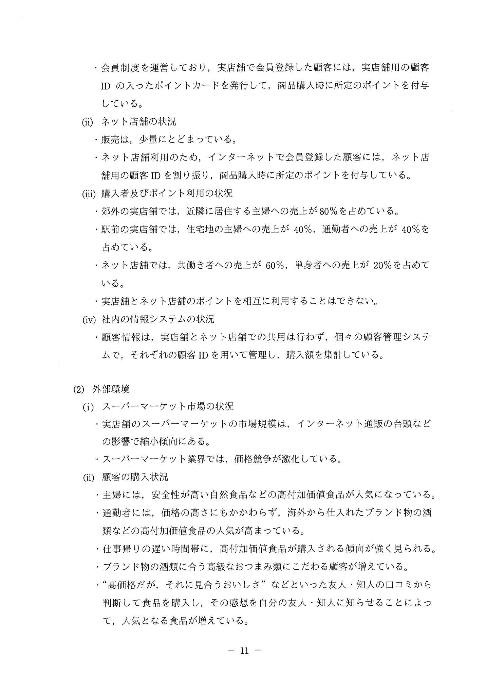

テキスト (OCR)

・ 会員制度を運営しており, 実店舗で会員登録した顧客には, 実店舗用の顧客

(ai)

ID の入ったポイントカードを発行して, 商品購入時に所定のポイントを付与
している。
ネット店舗の状況

・販売は, 少量にとどまっている。
・ネット店舗利用のため, インターネットで会員登録した顧客には, ネット店

(iii)

MA OMA ID を割り振り, 商品購入時に所定のポイントを付与している。
購入者及びポイント利用の状況

・郊外の実店舗では, 近隣に居住する主婦への売上が 80%を占めている。
・駅前の実店舗では, 住宅地の主婦への売上が 40%, 通勤者への売上が 40%を

占めている。

・ネット店舗では, 共働き者への売上が 60%, 単身者への売上が 20%を占めて

いる。

・実店舗とネット店舗のポイントを相互に利用することはできない。

(iv)

社内の情報システムの状況

・顧客情報は, 実店舗とネット店舗での共用は行わず, 個々の顧客管理システ

ATC, それぞれの顧客 ID を用いて管理し, 購入額を集計している。

(2) 外部環境

(i)

スーパーマーケット市場の状況

・実店舗のスーパーマーケットの市場規模は, インターネット通販の台頭など

の影響で縮小傾向にある。

・スーパーマーケット業界では, 価格競争が激化している。

(ii)

顧客の購入状況

・主婦には, 安全性が高い自然食品などの高付加価値食品が人気になっている。
・ 通勤者には, 価格の高さにもかかわらず, 海外から仕入れたブランド物の酒

類などの高付加価値食品の人気が高まっている。

・仕事帰りの遅い時間帯に, 高付加価値食品が購入される傾向が強く見られる。
・ブランド物の酒類に合う高級がなおつまみ類にこだわる顧客が増えている。
・高価格だが, それに見合うおいしさ" などといった友人・知人の口コミから

判断して食品を購入し, その感想を自分の友人・知人に知らせることによっ
て, 人気となる食品が増えている。

aq =

### ページ 12

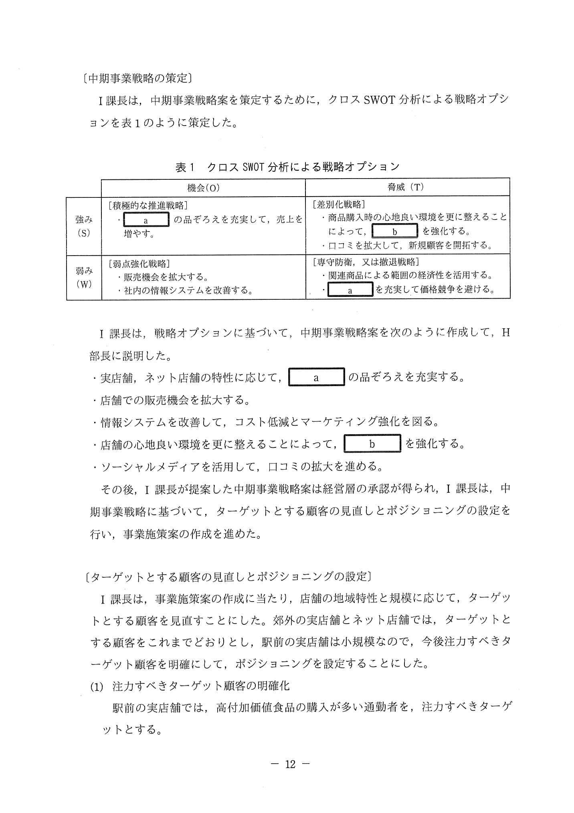

テキスト (OCR)

[中期事業戦略の策定〕
{ 課長は, 中期事業戦略案を策定するために, クロス SWOT 分析による戦略オプシ
ョンを表 1 のように策定した。

表1 クロス SWOT 分析による戦略オプション

機会(0)              mk (T)
[積極的な推進戦略              [差別化戦略
強み     ・           の品ぞろえを充実して, 売上を| ・商品購入時の心地良い環境を更に散えること
⑮ | er                  によって, [ 5 | を強化する。
・口コミを拡大して, HAMA E METS,
ga | aie)               [専守防衛。 KUHGR A]
Cy) | '双売機会的大する。            ・ 関連商品による範囲の経済性を活用する。
・ 社内の情報システムを履善する。       ・[ し 。 |を充寄して価格競争を違ける。

1 課長は, 戦略オプションに基づいて, 中期事業戦略案を次のように作成して, H
部長に説明した。

・実店舗, ネット店舗の特性に応じて, |  』 | の品ぞろえを充実する。

・ 店舗での販売機会を拡大する。

・ 情報システムを改善して, コスト低減とマーケティング強化を図る。

・店舗の心地良い環境を更に上整えることによって, |  b | を強化する。

・ソーシャルメディアを活用して, 口コミの拡大を進める。

その後, | 課長が提案した中期事業戦略案は経営層の承認が得られ, 1 課長は, 中
其事業戦略に基づいて, ターゲットとする顧客の見直しとポジショニングの設定を
行い, 事業施策案の作成を進めた。

[ターゲットとする顧客の見直しとポジショニングの設定]

1 課長は, 事業施策案の作成に当たり, 店舗の地域特性と規模に応じて, ターゲッ
トとする顧客を見直すことにした。 郊外の実店舗とネット店舗では, ターゲットと
する顧客をこれまでどおりとし, 駅前の実店舗は小規模なので, 今後注力すべきタ
ーゲット顧客を明確にして, ポジショニングを設定することにした。

(1) 注カカすべきターゲット顧客の明確化
駅前の実店舗では, 高付加価値食品の購入が多い通勤者を, 注力すべきターゲ
ットとする。

ー 12 一

### ページ 13

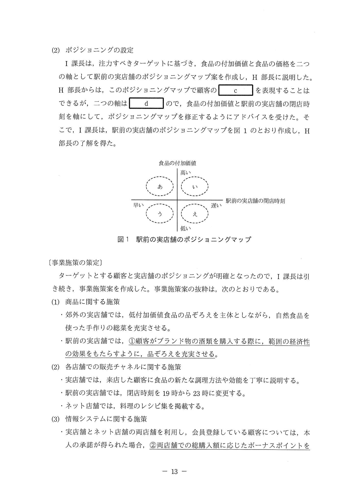

テキスト (OCR)

(② ポジショニングの設

1 課長は, 注力すべきターゲットに基づき, 食品の付加価値と食品の価格を二つ
の軸として駅前の実店舗のポジショニングマップ案を作成し, H 部長に説明した。
H BEDS, このポジショニングマップで顧客の| < | を表現することは
できるが, 二つの軸は[|  q Joc, 食品の付加価値と駅前の実店舗の閉店時
刻を軸にして, ポジショニングマップを修正するようにアドバイスを受けた。そ
こで, 1 課長は, 駅前の実店舗のポジショニングマップを図 1 のとおり作成し, H
部長の了解を得た。

食品の付加価値
_    高い
-             駅前の実店舗の閉店時刻
早い グー SS  pei SmNs 遅い
ra
\  う  } \  a  }
低い

図1 駅前の実店舗のポジショニングマップ

(事業施策の策定]
ターゲットとする顧客と実店舗のポジショニングが明確となったので, 1 課長は引
き続き, 事業施策案を作成した。事業施策案の抜粋は, 次のとおりである。
(1) 商品に関する施策
・郊外の実店舗では, 低付加価値食品の品ぞろえを主体としながら, 自然食品を
使った手作りの総菜を充実させる。
・駅前の実店舗では, ①顧客がブランド物の酒類を購入する際に, 範囲の経済性
の効果をもたらすように, 品ぞろえを充実させる。
(2) 各店舗での販売チャネルに関する施策
・実店舗では, 来店した顧客に食品の新たな調理方法や効能を丁寧に説明する。
・駅前の実店舗では, 閉店時刻を 19 時から 23 時に変更する。
・ネツット店舗では, 料理のレシピ集を掲載する。
(3) 情報システムに関する施策
・実店舗とネット店舗の両店舗を利用し, 会員登録している顧客については, 本
人の承諾が得られた場合, ②両店舗での総購入額に応じたボーナスポイントを

ー 13 一

### ページ 14

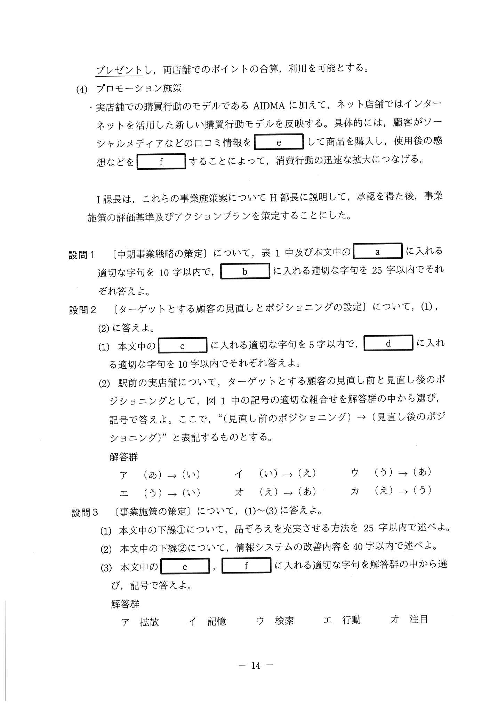

テキスト (OCR)

プレゼント し, 両店舗でのポイントの合算, 利用を可能とする。
4 プロモーション施策
・実店舗での購買行動のモデルである AIDMA に加えて, ネット店舗ではイ シンター
ネットを活用した新しい購買行動モデルを反映する。具体的には, 顧客がソー
シャルメディアなどの口コミ情報を | e | して商品を購入し, 使用後の感
想などを することによって, 消費行動の迅速な拡大につなげる。

1 課長は, これらの事業施策案について HH 部長に説明して, 承認を得た後, 事業
施策の評価基準及びアクションプランを策定することにした。

設問1 中期事業戦略の策定】 について, 表 1 中及び本文中の| a』 |] に入れる
適切な字句を 10 字以内で, | b |] に入れる適切な字句を25 宇以内でそれ
ぞれ答えよ。
設問2 〔ターゲットとする願客の見直しとポジショニングの設定〕について, ①) ,
(② に答えよ。
a 本文中の[ < | に入れる適切な字旬を5字以内で, (a |に入れ
る適切な字句を 10 字以内でそれぞれ答えよ。
(2) 駅前の実店舗について, ターゲットとする願客の見直し前と見直し後のポ
ジショニングとして, 図 1 中の記号の適切な組合せを解答群の中から選び,
記号で答えよ。ここで, "(見直し前のポジショニング) > (見直し後のポジ
ショニング)”と表記するものとする。

解答群
ア (あぁ) > (ゆ)     4 (Ww) っ(あえ)     ウ (3) > (あ)
= (3) っ (W)     オ (A) つ (あ)     カ (A) っ (う)

設問3 〔事業施策の策定}) について, (①て(③ に答えよ。
Q) 本文中の下線①について, 品ぞろえを充実させる方法を 25 字以内で述べよ。
2) 本文中の下線@について, 情報システムの改善内容を 40 字以内で述べよ。
(3③) 本文中の| ce |, | { | に入れる適切な字句を解答群の中から選
び, 記号で答えよ。
解答群
ア 拡散   イ 記憶   ウ 検索   エ 行動   オ 注目

= HE

### ページ 15

テキスト (OCR)

〔

x モ 用 紙

= 15—

J

### ページ 16

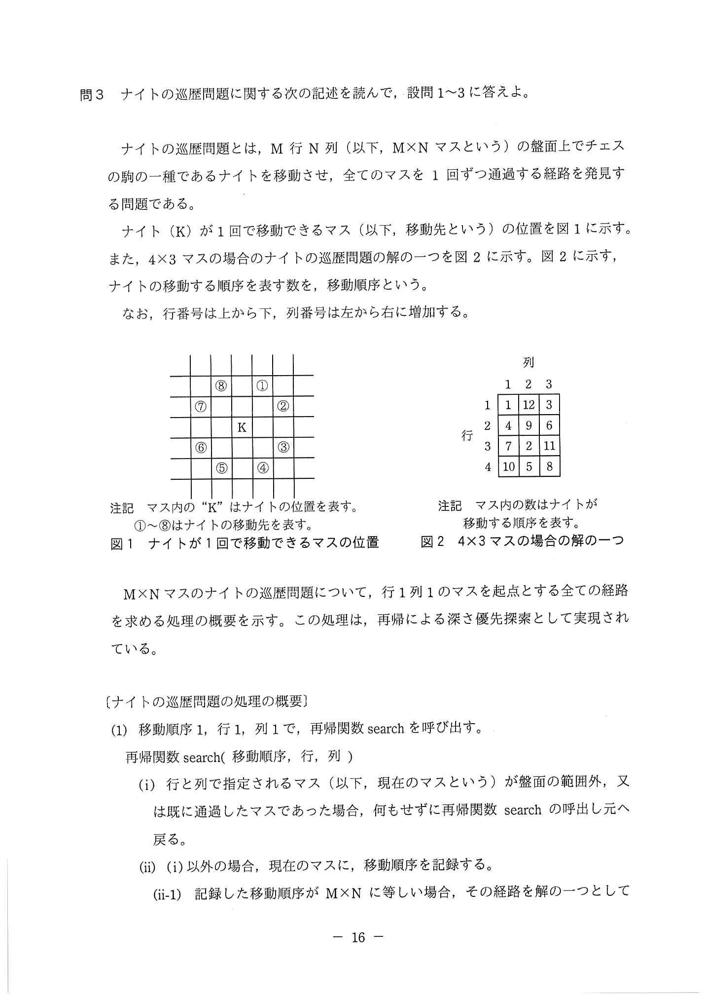

テキスト (OCR)

AIS ナイトの巡歴問題に関する次の記述を読んで, 設問 1ご3 に答えよ。

ナイトの巡歴問題とは, M 行 N 列 (以下 MXN マスという) の盤面上でチェス
の駒の一種であるナイトを移動させ, 全てのマスを 1 回ずつ通過する経路を発見す
る問題である。

ナイト (K) が1 回で移動できるマス (以下, 移動先という) の位置を図 1 に示す。
また, 4X3 マスの場合のナイトの巡歴問題の解の一つを図 2 に示す。図 2 にがす,
ナイトの移動する順序を表す数を, 移動順序という。

なお, 行番号は上から下, 列番号は左から右に増加する。

列
  ®                1 2
(の)     @               1] 1 {12} 3
K                ーー 21419|6
⑥     ③            a 31712111
®  @                 4/10/5118
注記 マス内の “K” はナイトの位置を表す。          注記 マス内の数はナイトが
①て⑧はナイトの移動先を表す。                     移動する順序を表す。
図1 ナイトが1 回で移動できるマスの位置   図2 4X3 マスの場合の解のーつ

MXN マスのナイトの巡歴問題について, 行 1 列 1 のマスを起点とする全ての経路
を求める処理の概要を示す。この処理は, 再帰による深さ優先探索として実現され
ている。

〔ナイトの巡歴問題の処理の概要}
1①) 移動順序 1, 行 1, 列 1 で, 再帰関数 search を呼び出す。
再帰関数 search( 移動順序, 行, 列 )
G) 行と列で指定されるマス (以下, 現在のマスという) が盤面の範囲外。 又
は既に通過したマスであった場合, 何もせずに再帰関数 search の呼出し元へ
戻る。
Gi) G) 以外の場合, 現在のマスに, 移動順序を記録する。
Gi-1) 記録した移動順序が MXN に等しい場合, その経路を解のーつとして

ー 46 一

### ページ 17

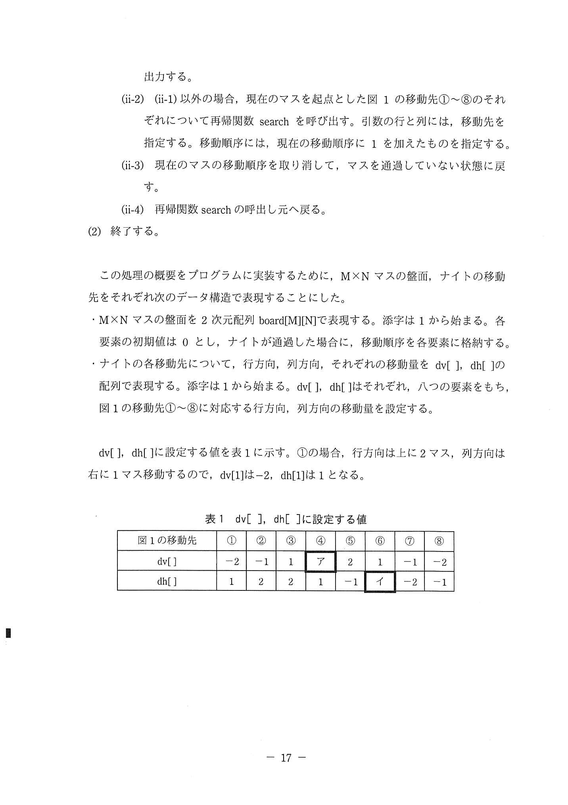

テキスト (OCR)

出力する。

⑪-2) Gi-1) 以外の場合, 現在のマスを起点とした図 1 の移動先Dやー⑧のそれ
ぞれについて再帰関数 search を呼び出す。引数の行と列には, 移動先を
FETS. 移動順序には, 現在の移動順序に 1 を加えたものを指定する。

(ii-3) 現在のマスの移動順序を取り消して, マスを通過していない状態に戻
す。

(ii-4) 再帰関数 search の呼出し元へ戻る。

(2) 終了する。

この処理の概要をプログラムに実装するために, MXN マスの盤面,ナイトの移動
先をそれぞれ次のデータ構造で表現することにした。
“MXN マスの盤面を 2 次元配列 board[M][N]で表現する。添字は 1 から始まる。各
要素の初期値は 0 とし, ナイトが通過した場合に, 移動順序を各要素に格納する。
・ナイトの各移動先について, THA, 列方向, それぞれの移動量を dy[ ], dhl ]の
配列で表現する。添字は 1 から始まる。dv[ ], dh[ ]はそれぞれ, 八つの要素をもち,
 1 の移動先Dー⑧に対応する行方向, 列方向の移動量を設定する。

dv[], dh[ ]に設定する値を表 1 に示す。①の場合, 行方向は上に 2 マス, 列方向は
右に 1 マス移動するので, dy[1]は-2, dh[1]は 1 となる。

表1 dv[ ], dh[ ]に設定する値
図 1 の移動先    の〇|1@ |1③ 1 ④@1@1@⑥1@⑦@
ei ]       -2| -ュ| 17 7 | 2 | 1 | -1] -2
dh ]       i   2   2    1   =   イ   ー2  =

ー 17 一

### ページ 18

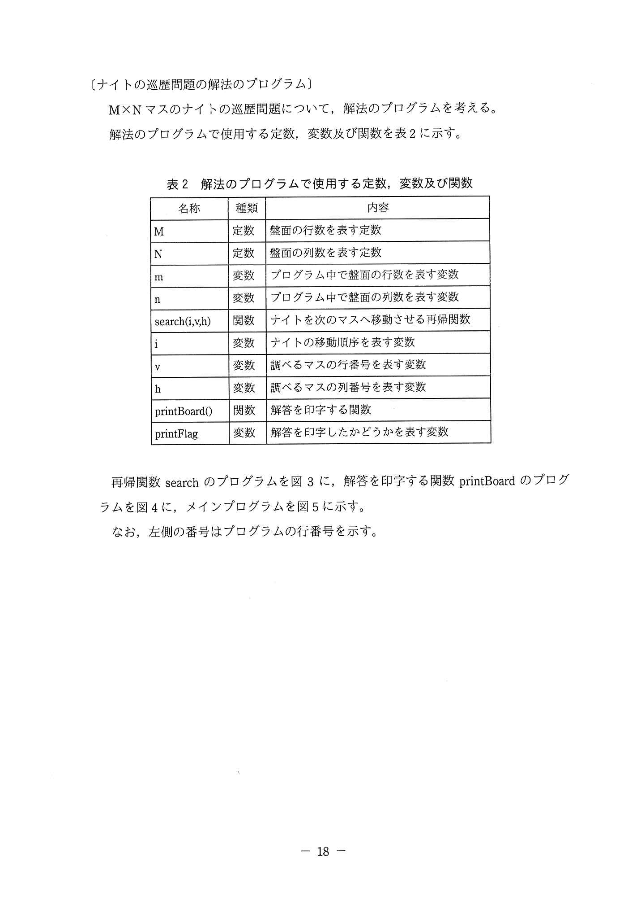

テキスト (OCR)

[ナイトの巡歴問題の解法のプログラム〕
MXN マスのナイトの巡歴問題について, 解法のプログラムを考える。
解法のプログラムで使用する定数, 変数及び関数を表 2 に示す。

表2 解法のプログラムで使用する定数, 変数及び関数

名称     種類                 内容
M            定数 |盤面の行数を表す定数
N            定数 |盤面の列数を表す定数
m          変数 | プログラム中で盤面の行数を表す変数
n           変数 | プログラム中で盤面の列数を表す変数

search(i,vjh) |関数 |ナイトを次のマスムへ移動させる再帰関数
i             変数 | ナイトの移動順序を表す変数

v            変数 | 調べるマスの行番号を表す変数

h            変数 |調べるマスの列番号を表す変数
printBoard() |関数 |解答を印字する関数

printFlag           変数 |解答を印字したかどうかを表す変数

再帰関数 search のプログラムを図 3 に, 解答を印字する関数 printBoard のプログ
ラムを図 4 に, メインプログラムを図 5 に示す。
なお, 左側の番号はプログラムの行番号を示す。

ー 18 一

### ページ 19

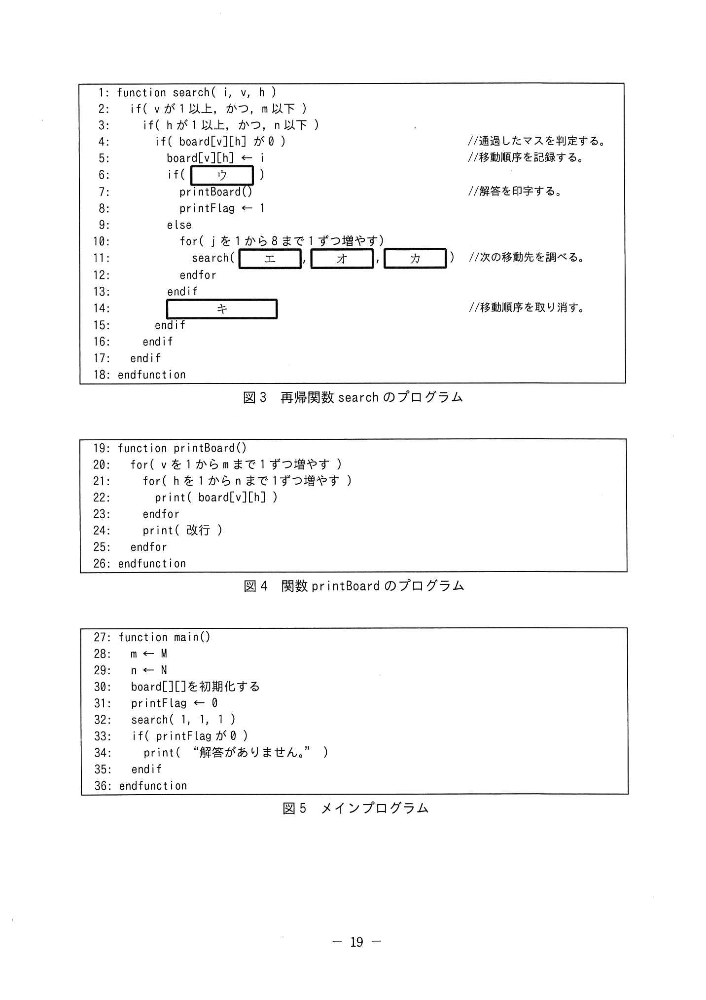

テキスト (OCR)

1: function search( i, v, h )

2   if( vが1 以上, かつ, m以下 )

3   if( hが1 以上, AD, n以下 )

4:      if( board[v][h] が0 )                     //通過したマスを判定する。
By       board[v][h] < i                        //移動順序を記録する。
6     gl

7         printBoard                           //解答を印字する。

8         printFlag と 1

9:       else

10:         for( 」を1 から 8 まで 1 ずつ増やす)

11:          search(   x=   |]   オ   |   カ   |  //次の移動先を調べる。
12:         endfor

13:       endif

14:                       //移動順序を取り消す。
15:      endif

16:    endif

17: endif

18: endfunction

図3 再帰関数 search のプログラム

19: function printBoard()
20: for(vを1からmまで1ずつ増やす )

Qi    for(hを1からnまで1ずつ増やす )
22:      print( board[v][h] )

23:     endfor

24:    print( 改行 )

25: endfor

26: endfunction

図4 関数printBoard のプログラム

27: function main()

28: mM

29: neN

30: board[][]を初期化する

Pale   printFlag を 6

32: search( 1, 1, 1 )

33: if( printFlagが9 )

34:    print( “解答がありません。” )
35: endif

36: endfunction

図5 メインプログラム

ー 19 一

### ページ 20

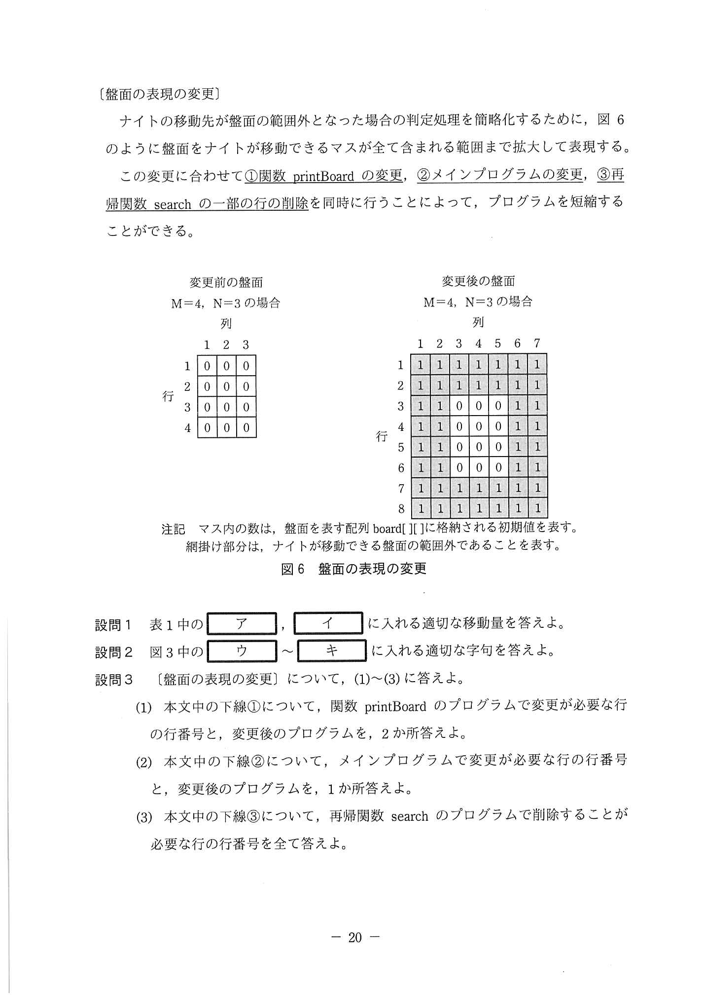

テキスト (OCR)

〔盤面の表現の変更]
ナイトの移動先が盤面の範囲外となった場合の判定処理を簡略化するために, 図 6
のように盤面をナイトが移動できるマスが全て含まれる範囲まで拡大して表現する。
この変更に合わせて①関数 printBoard の変更, ⑨メインプログラムの変更, OF
帰関数 search の一部の行の削除を同時に行うことによって, プログラムを短縮する
ことができる。

変更前の盤面              変更後の盤面
M=4, N=3 の場合             M=4, N=3 の場合
列                  列

1 2 3            1 2 3 4 5 6 7
110|1010          1 te Se a ede a
。 2101010          2 |S ales es ale sl Wea ey
7 3to 010          311|I1|10|1010|1|1
4101010        。 4|1|11010|10|11|1
Ts 1|11010|10|1|1

6|1|110|1010|1|1

7|11|1|1|1|1|1|1

8 関全剖吊間昌生昌細四隔国陣|

注記 マス内の数は, 盤面を表す配列 board[ ][ ]に格納される初期値を表す。
ANIMA, ナイトが移動できる盤面の範囲外であることを表す。

図6 盤面の表現の変更

設問1 表1中の| ア |,[ ィ 1 量を答えよ
設問2 図3中の| ウ |一| + |に入れる適切な字句を答えよ。
設問3 [盤面の表現の変更] について, ①~(3) に答えよ。
①) 本文中の下線や①について, 関数 printBoard のプログラムで変更が必要な行
の行番号と, 変更後のプログラムを, 2か所答えよ。
2) 本文中の下線@について, メインプログラムで変更が必要な行の行番号
と, 変更後のプログラムを, 1 が所答えよ。
(3) 本文中の下線③について, 再帰関数 search のプログラムで削除することが
必要な行の行番号を全て答えよ。

ー 20 一

### ページ 21

テキスト (OCR)

〔

x モ 用 紙 )

ー 21 一

### ページ 22

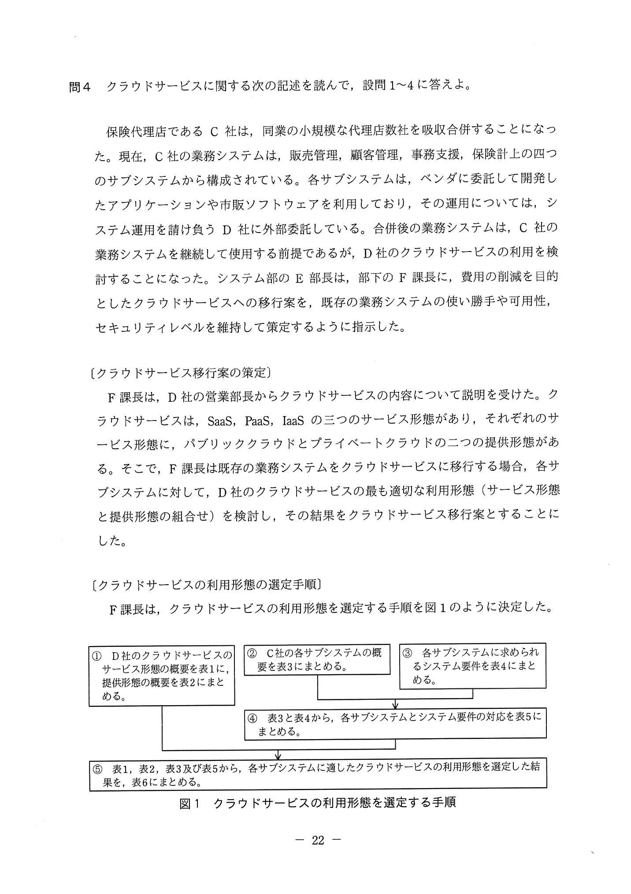

テキスト (OCR)

問4 クラウドサービスに関する次の記述を読んで, 設問 ユー4 に答えよ。

保険代理店である C 社は, 同業の小規模な代理店数社を吸収合併することになっ
た。 現在, C 社の業務システムは, 販売管理, 顧客管理, 事務支援, 保険計上の四つ
のサブシステムから構成されている。各サブシステムは, ベンダに委託して開発し
たアプリケーションや市販ソフトウェアを利用しており, その運用については, シ
ステム運用を請け負う D 社に外部委託している。合併後の業務システムは, C 社の
業務システムを継続して使用する前提であるが, D 社のクラウドサービスの利用を検
討することになった。システム部の 部長は, MPO FP 課長に, 費用の削減を目的
としたクラウドサービスへの移行案を, 既存の業務システムの使い勝手や可用性,
セキュリティレベルを維持して策定するように指示した。

[クラウドサービス移行案の策定〕

F 課長は, D 社の営業部長からクラウドサービスの内容について説明を受けた。 ク
ラウドサービスは, SaaS, PaaS, IaaS の三つのサービス形態があり, それぞれのサ
ービス形態に. パブリッククラウドとプライベートクラウドの二つの提供形態があ
る。 そこで, F 課長は既存の業務システムをクラウドサービスに移行する場合, 各サ
ブシステムに対して, D 社のクラウドサービスの最も適切な利用形態 (サービス形態
と提供形態の組合せ) EMAL, その結果をクラウドサービス移行寄とすることに
した。

[クラウドサービスの利用形態の選定手順]
PRR, クラウドサービスの利用形態を選定する手順を図 1のように決定した。

① D社のクラウドサービスの| |②⑨ C社の各サプシステムの概 | |@ 各サブシステムに求められ
サービス形態の概要を表1 に,    要を表3にまとめる。         るシステム要件を表4にまと
提供形態の概要を表2にまと                        める。
める。                                  て         J
④ 表3と表4から, 各サブシステムとシステム要件の対応を表5に
まとめる。
             _]
© #1, 表2, 表3及び表5から, 各サブシステムに適したクラウドサービスの利用形態を選定した結
果を, 表6にまとめる。

図1 クラウドサービスの利用形態を選定する手順

ー 22 一

### ページ 23

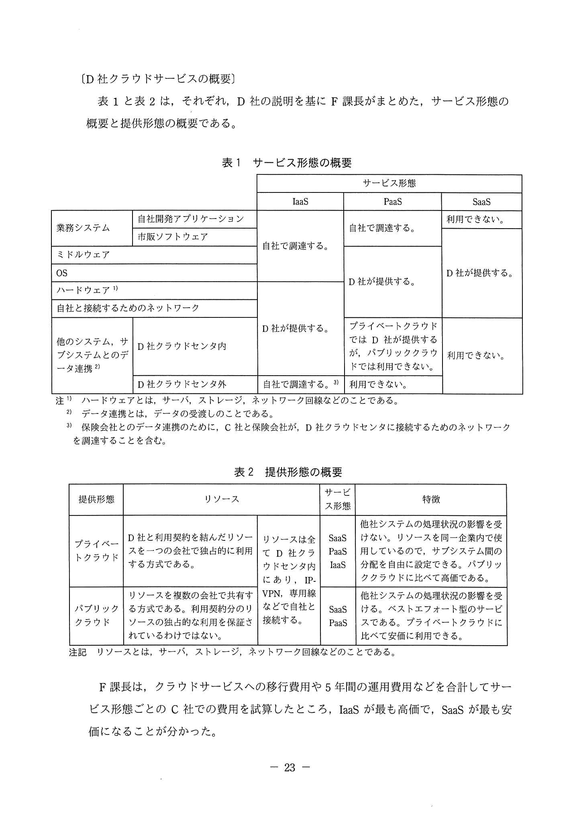

テキスト (OCR)

〔D 社クラウドサービスの概要)
表 1 と表 2 は, それぞれ, D 社の説明を基にF 課長がまとめた, サービス形態の
概要と提供形態の概要である。

表1 サービス形態の概要

サービス形態

JaaS                PaaS               SaaS

自社開発アプリケーション                                       利用できない。
業務システム                                                  自社で調達する。

市販ソフトウェア                      _

自社で調達する。
ミドルウェア
OS                                                           、              D 社が提供する。
ュー kz                                                  D 社が提供する。
Saad    に

自社と接続するためのネットワーク

D 社が提供する。 | プライベートクラウド

他のシステム, サ | 社クラッウドセンタ内                   では D 社が提供する

ブシステムとのデ                       が, パブリッククラウ | 利用できない。
ータ連携う                                   ドでは利用できない。
D 社クラウドセンタ外      自社で調達する。? | 利用できない。

注り ハードウェアとは, サーバ, ストレージ, ネットワーク回線などのことである。
2 データ連携とは, データの受渡しのことである。
3 保険会社とのデータ連携のために, C 社と保険会社が D 社クラウドセンタに接続するためのネットワーク
を調達することを含む。

表2 提供形態の概要

サービ
i WE               ソー                              の
提供形態          リソース         sabe        特徴
他社システムの処理状況の影響を受
プライィベー | り 社と利用契約を結んだリソー | リソースは全 | SaaS | けない。リソースを同一企業内で使
クラウド スを一つの会社で独占的に利用 | て D 祉クラ| PaaS | 用しているので, サブシステム間の
する方式である。              ウドセンタ内| IaaS | 分配を自由に設定できる。パブリッ
にあり, IE-          ククラウドに比べて高価である。
リソースを複数の会社で共有す | VPN, 専用線     他社システムの処理状況の影響を受

パブリック | る方式である。利用契約分のり | などで自社と | sas | ける。ベストエフォート型のサービ
クラウド | ソースの独占的な利用を保証さ | 接続する。  PaaS | スである。プライベートクラウドに
れているわけではない。               比べて安価に利用できる。

注記 リソースとは, サーバ, ストレージ, ネットワーク回線などのことである。

F 課長は, クラウドサービスへの移行費用や 5 年間の運用費用などを合計してサー
ビス形態ごとの C 社での費用を試算したところ, IaaS が最も高価で, SaaS が最も安
価になることが分かった。

ー 23 一

### ページ 24

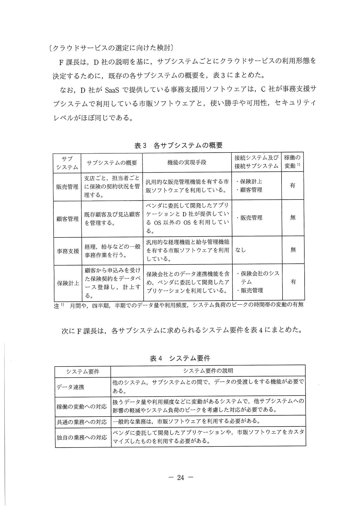

テキスト (OCR)

[〔【クラウドサービスの選定に向けた検討]

F 課長は, D 社の説明を基に, サブシステムごとにクラウドサービスの利用形態を

決定するために, 既存の各サブシステムの概要を, 表3 にまとめた。

なお, D thas SaaS で提供している事務支援用ソフトウェアは, C 社が事務支援サ
ブシステムで利用している市販ソフトウェアと, 使い勝手や可用性, セキュリティ

レベルがほぼ同じである。

表3 各サブシステムの概要

サブ    —           ”    on     接続システム及び | 稼働の
we, | サプシメテムの本     機能の実現手和     陳サブシステム | mh
支店ごと, 担当者ごと | .                  -
痢ごと| 泊用的な販売管理村能を有する市 | ・保険計上
売管理| に   契約状況を管
BEES aed 販ソフトウェアを利用している。 | EH     和
ベンダに委託して開発したアプリ
Berm RO SAMS | 7—Y ay © D 社が擬供してい
He                          a
BE | arms,     る 08 以外の os を利用してぃ| REE     i
る。
汎用的な経理機能と給与管理機能
A  Ey ia wal im
ERE yerhenns 有する市販ソフトウェアを利用 | なし        fe
2    している。
いら申込みを受
ee pore a | 保険会社とのデータ沸能を人| ・保会社のシス
保険計上 = REEL apg | Or, ペンダに委託して開発したア| テム      有
る  pet   プリケーションを利用している。 | ・販売管理

注り 月間や, 四半期, 半期でのデータ量や利用頻度, システム負荷のビークの時間帯の変動の有無

次にF 課長は, 各サブシステムに求められるシステム要件を表4 にまとめた。

表4 システム要件

システム要件               システム要件の説明

psy       他のシステム, サブシステムとの間で, データの受渡しをする機能が必要で
データ連携

あるし

扱うデータ量や利用頻度などに変動があるシステムで, 他サプシステムへの

変   Sf
FD ADI | a ypu AF ALOE — 7 BLL EAMETS.
共通の業務への対応 | 一般的な業務は。 市販ソフトウェアを利用する必要がある。
_ |ベンダに委放して開発したアプリケーションや。 市販ソフトウェアをカスタ

独自の業務への対応 | 。 ィ ズしたものを利用する必要がある。

ー 24 一

### ページ 25

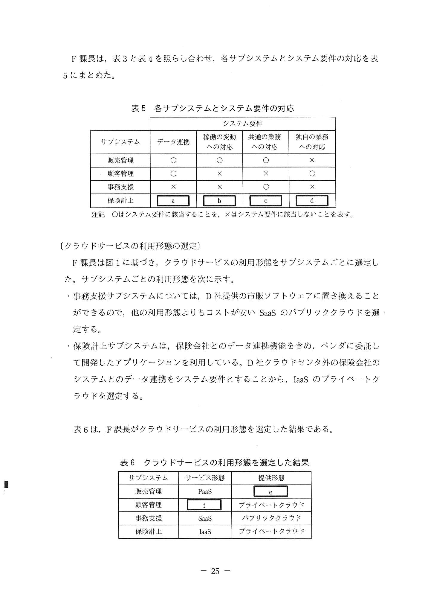

テキスト (OCR)

F 課長は, 表3 と表4 を照らし合わせ, 各サブシステムとシステム要件の対応を表
5 にまとめた。

表5 各サブシステムとシステム要件の対応
システム要件

販売管理   O   O   Oo   x
顧客管理   〇   x   x   O
事務支援      x      x      O      x
保険計上   [a [if 5b 1 : 1 aq

注記 〇はシステム要件に該当することを, メ※はシステム要件に該当しないことを表す。

[クラウドサービスの利用形態の選定]

F 課長は図 1 に基づき, クラウドサービスの利用形態をサブシステムごとに選定し
た。サブシステムごとの利用形態を次に示す。

・ 事務支援サブシステムについては, D 社提供の市販ソフトウェアに置き換えること
ができるので, 他の利用形態よりもコストが安い SaaS のパブリッククラウドを選
定する。

・ 保険計上サブシステムは, 保険会社とのデータ連携機能を含め, ベンダに委託し
て開発したアプリケーションを利用している。D 社クラウドセンタ外の保険会社の
システムとのデータ連携をシステム要件とすることから, IaaS のプライベートク
ラウドを選定する。

表 6 は, F 課長がクラウドサービスの利用形態を選定した結果である。

表6 クラウドサービスの利用形態を選定した結果

サブシステム      Y-E ABE           提供形態
販売管理              PaaS                Lic |
HA SEE    |   f   |   プライベートクラウド
事務支援     SaaS    パブリッククラウド
保険計上             IaaS          プライベートクラウド

ー 25 一

### ページ 26

テキスト (OCR)

(仕様の変更]

F 課長がサブシステムごとに にクラウドサー ビスの利用形態を選定した後に, ABH
の営業社員の給与制度を業績連動型に変更することに こなった。 そのため, 販売管理
サブシステムで管理されている営業社員の契約状況を利用して給与を計算するとい
うシステム仕様の変更が必要となり, F 課長は, D 社が提供している市販ソフトウェ
アをカスタマイズして使用することにした。

F 課長は, 給与計算の仕様を変更したクラウドサービスの利用形態の選定結果を,
E 部長に提出した。ここで, 複数の利用形態が選択可能であったので, 費用が安価な
利用形態を選択した。

設問1 D社クラウドサービスの内容について, 適切なものを解答群の中から全て選び,

US CHAE,

RA

Y D 社が提供する OS で稼働しない市販ソフトウェアでは, このサービスを
利用できない。

イ D 社が提供する OS で稼働する市販ソフトウェアでも, D 社クラウドセン
タ外のシステムとのデータ連携が必要な場合は IaaS を利用する必要がある。
ウ サブシステム間のデータ 連携は, PaaS と IaaS の全ての提供形態で利用で

cou

=

きる。
エ 市販ソフトウェアをカスタマイズしたものでも, このサービスが利用で
きる。
オ パブリッククラウドは利用者がサーバ台数やストレージ容量を選べない。
設問2 表5中の|  a |一|  d |に入れる適切な記号を,“O" ie “x”
で答えよ。
設問3 表6中の|  e |,|  f |に入れる適切な字句を, 表 1のサービス形

18, 表2 の提供形態の名称で答えよ。
設問4 [仕様の変更] について, (1), (②) に答えよ。
Q) F 課長が仕様を変更したサブシステムの名称と, 選択したクラウドサービス
の利用形態 (サービス形態と提供形態) を, 本文中の名称で答えよ。
2) (①) のクラウドサービスの利用形態を選択した理由を 30 字以内で述べよ

ー 26 一

### ページ 27

テキスト (OCR)

メ モ 用 紙

ー 27 一

j

### ページ 28

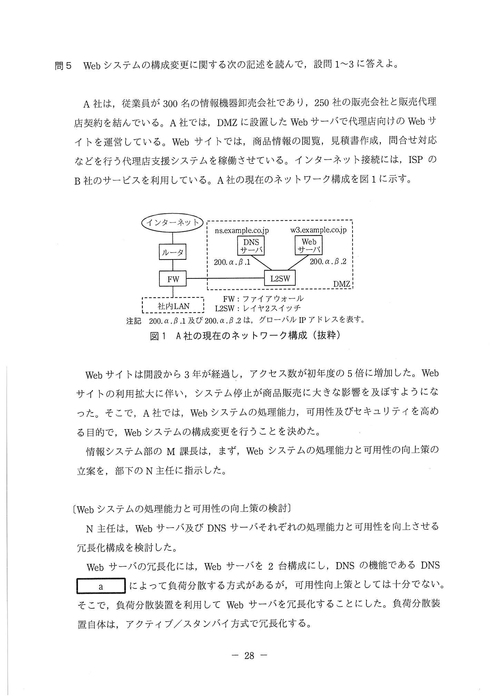

テキスト (OCR)

問5 Web システムの構成変更に関する次の記述を読んで, 設問 1ご3 に答えよ。

A 社は, 従業員が 300 名の情報機器卸売会社であり, 250 社の販売会社と販売代理
店契約を結んでいる。A 社では, DMZ に設置した Web サーバで代理店向けの Web サ
イトを運営している。Web サイトでは, 商品情報の閲覧, 見積書作成, 問合せ対応
などを行う代理店支援システムを稼働させている。インターネット接続には, ISP の
B 社のサービスを利用している。4 社の現在のネットワーク構成を図 1 に示す。

ns.example.coJp           w3.example.co,jp
DNS                         Web

1
1     サーバ      サーバ
| 200.e.81          200.g.8.2

1    FW : ファイアウォール
1 社内LAN iL2SW : レイヤ2スイッチ

注記 200.@.6.1 及び 200.c..2 は, グローバル IP アドレスを表す。
図1 A社の現在のネットワーク構成 (抜粋)

Web サイトは開設から 3 年が経過し, アクセス数が初年度の 5 倍に増加した。Web
サイトの利用拡大に伴い, システム停止が商品販売に大きな影響を及ぼすように
った。 そこで, ARTIS, Web システムの処理能力, 可用性及びセキュリティを高め
る目的で, Web システムの構成変更を行うことを決めた。

情報システム部の M HRI, まず, Web システムの処理能力と可用性の向上策の
立案を, BRON 主任に指示した。

(Web システムの処理能力と可用性の向上策の検討

N 主任は, Web サーバ及び DNS サーバそれぞれの処理能力と可用性を向上させる
冗長化構成を検討した。

Web サーバの冗長化には, Web サーバを 2 台構成にし, DNS の機能である DNS
(a | によって負荷分散する方式があるが, 可用性向上筑としては十分でない。
そこで, 負荷分散装置を利用して Web サーバを冗長化することにした。負荷分散装
置自体は。 アクティブノスタンバイ方式で冗長化する。

ー 28 一

### ページ 29

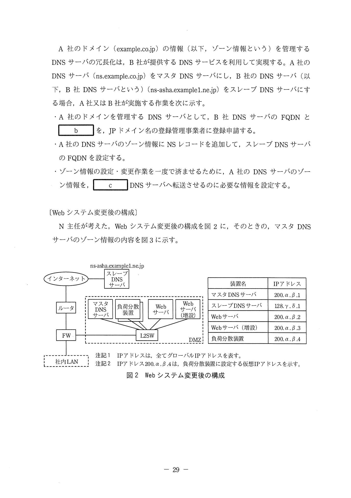

テキスト (OCR)

A 社のドメイン (example.co.jp) の情報 (以下, ゾーン情報という) を管理する
DNS サーバの冗長化は, B 社が提供する DNS サービスを利用して実現する。A 社の
DNS サーバ (ns.example.cojp) をマスタ DNS サーバにし, B 社の DNS サーバ (以
下, B 社 DNS サーバという) (ns-asha.example1.ne.jp) をスレーブ DNS サーバにす
る場合, A 社又は B 社が実施する作業を次に示す。

・A 社のドメインを管理する DNS サーバとして, B 社 DNS サーバの FQDN と

(bd を jpPドメイン名の登録管理事業者に登録申請する。

・A 社の DNS サーバのゾーン情報に NS レコードを追加して, スレーブ DNS サーバ

の FQDN を設定する。

・ゾーン情報の設定・変更作業を一度で済ませるために, A tO DNS サーバのゾー

ン情報を, | c | DNS サーバへ転送させるのに必要な情報を設定する。

(Web システム変更後の構成]
N 主任が考えた, Web システム変更後の構成を図 2 に. そのときの, マスタ DNS

サーバのゾーン情報の内容を図 3 に示す。

ns-asha.examplel.ne.jp

-      スレーブ
Ln     PN,                       装置名      IPアドレス
ac| マスタ DNS サーバ   200.e.8 1
[a | 8 ral  web | Web |i | スレーブpNsサーバ | ey.5a
(Lanse || =m   37S | L Gia {| webサーバ     200.e.8 2
!                            1 | Webサーバ (増設)    200..6 3
Lmトーー 1w|pw} [emi    2.0.4

sececcde-----5 注記1 IPアドレスは, 全てグローバル1IPアドレスを表す。
社内LAN ij 注記2 IPアドレス200.g.8.4は, 負荷分散装置に設定する仮想IPアドレスを示す。

 2 Web システム変更後の構成

ー 29 一

### ページ 30

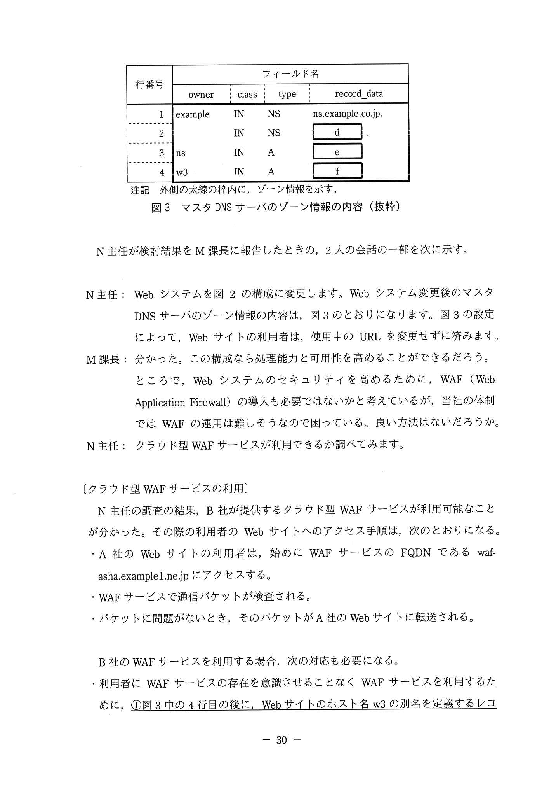

テキスト (OCR)

_                               フィールド名
行番号          H     H      7
owner | class | type !}   record_data
1 lexample   IN   NS     ns.example.co.jp.
2          m ws [しょ|

注記 外側の太線の枠内に, ゾーン情報を示す。
図3 マスタ DNS サーバのゾーン情報の内容 (抜粋)

N 主任が検討結果を M 課長に報告したときの, 2 人の会話の一部を次に示す。

N 主任 : Web システムを図 2 の構成に変更します。Web システム変更後のマスタ
DNS サーバのゾーン情報の内容は, 図 3 のとおりになります。図 3 の設定
によって, Web サイトの利用者は, 使用中の URL を変更せずに済みます。
M 課長 : 分かった。この構成なら処理能力と可用性を高めることができるだろう。
ところで, Web システムのセキュリティを高めるために, WAF (Web
Application Firewall) の導入も必要ではないかと考えているが, 当社の体制
では WAF の運用は難しそうなので困っている。良い方法はないだろうか。
N 主任: クラウド型 WAF サービスが利用できるか調べてみます。

[クラウド型 WAF サービスの利用)

N 主任の調査の結果, B 社が提供するクラウド型 WAF サービスが利用可能なこと
が分かった。その際の利用者の Web サイトへのアクセス手順は, 次のとおりになる。
・A 社の Web サイトの利用者は, 始めに WAF サービスの FQDN である waft

asha.example1.ne.jp にアクセスする。

・WAF サービスで通信パケットが検査される。
・パケットに問題がおなかいとき, そのパケットがA社の Web サイトに転送される。

B 社の WAF サービスを利用する場合, 次の対応も必要になる。
・利用者に WAF サービスの存在を意識させることなく WAF サービスを利用するた
めに, ①図 3 中の 4 行目の後に, Web サイトのホスト名 w3 の別名を定義するレコ

ー 30 一

### ページ 31

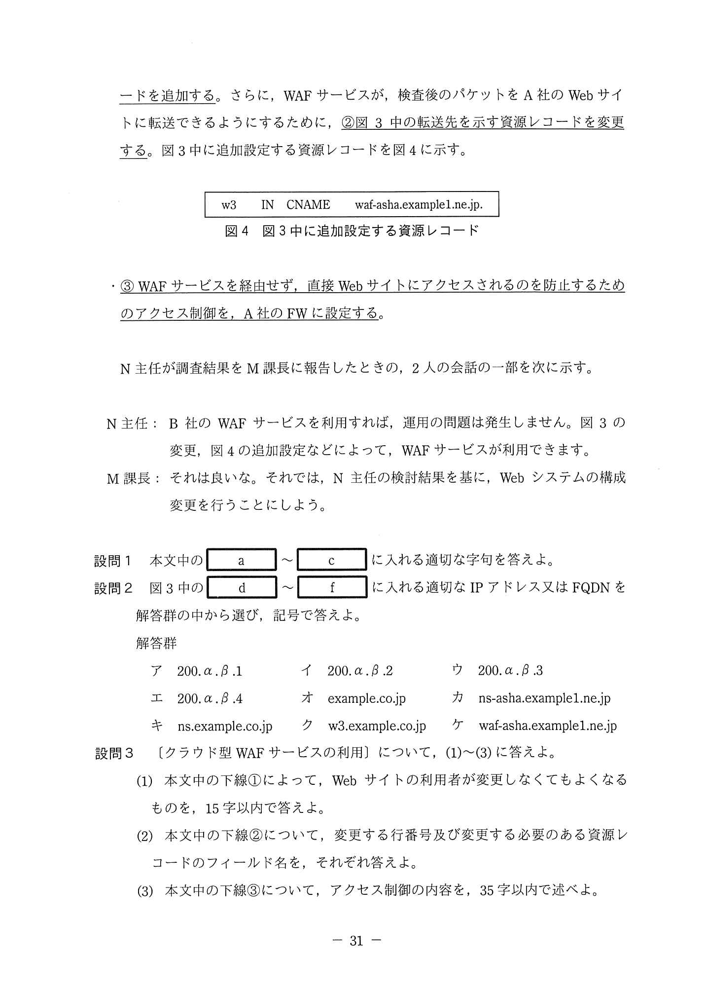

テキスト (OCR)

ードを追加する。さらに, WAF サービスが, 検査後のパナットを A 社の Web サイ
トに転送できるようにするために, OM 3 中の転送先を示す資源レコードを変更
する。図 3 中に追加設定する資源レコードを図 4 に示す。

w3     IN CNAME     waf-asha.examplel.ne.jp.
図 4 3 中に追加設定する資源レコード

・⑧ WAF サービスを経貼せず, 直接 Web サイトにアクセスされるのを防止するため
のアクセス制御を, A 社のFW に設定する。

N 主任が調査結果を M 課長に報告したときの, 2 人の会話の一部を次に示す。

N 主任 : B 社の WAF サービスを利用すれば, 運用の問題は発生しません。図 3 の
変更, 図4 の追加設定などによって, WAF サービスが利用できます。

M 課長: それは良いな。それでは, N 主任の検討結果を基に, Web システムの構成
変更を行うことにしよう。

設問1 本文中の| oa |~-| < |に入れる適切な字句を答えよ。
設問2 図3中の| a |~| ji |に入れる適切な TP アドレス又はFQDN を
解答群の中から選び, 記号で答えよ。

解答

ア 200.@.8 1        イ 200.a.8.2        ウ 200.a.6 3

XH 200.a.8.4    オ example.co.jp   7 ns-asha.example1.ne.jp
キ  ns.example.co.jp  2 w3.example.co.jp ケ wafasha.example1.ne.jp

設問3 [クラウド型 WAF サービスの利用] について, D~@B) に答えよ。
GQ) 本文中の下線によって, Web サイトの利用者が変更しなくてもよくなる
ものを, 15 字以内で答えよ。
(2) 本文中の下線②について, 変更する行番号及び変更する必要のある資源レ
コードのフィールド名を, それぞれ答えよ。
(3) 本文中の下線つについて, アクセス制御の内容を, 35 字以内で述べよ。

= 31 =

### ページ 32

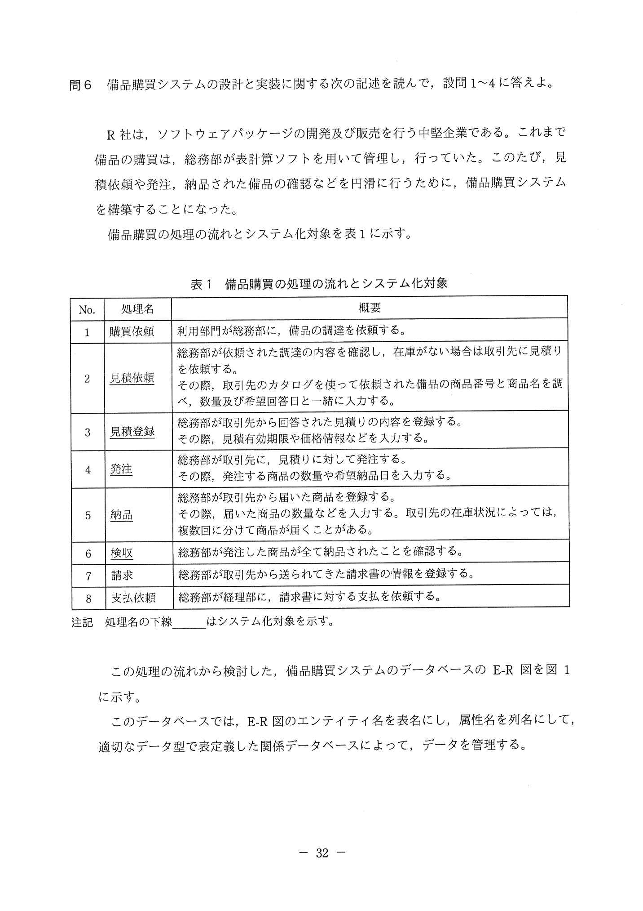

テキスト (OCR)

問6 備品購買システムの設計と実装に関する次の記述を読んで, 設問 1こ4 に答えよ。

R 社は, ソフトウェアパッケージの開発及び販売を行う中堅企業である。これまで
備品の購買は, 総務部が表計算ソフトを用いて管理し, 行っていた。このたび, 見
積依頼や発注, 納品された備品の確認などを円滑に行うために, 備品購買システム
を構築することになった。

備品購買の処理の流れとシステム化対象を表 1 に示す。

表1 備品購買の処理の流れとシステム化対象

No. | 処理名                  概要
] RM |利用部門が総部に備品の調達を依頼する。
総務部が依導された調達の内容を確認し。 在庫がない場合は取引先に見策り
2 |見本依引 | RES.
—-    その際, 取引先のカタログを使って依頼された備品の商品番号と商品名を調
べ、 数量及び希望回答日と一緒に入力する。
| amen | RAMEE SERENE RAY OME BTS,
その際, 見生有効期限や価格情報などを入力する。
lees    総務部が取引発に 見積りに対して発注する。
BE    その際, HET S AORN AMM DEANS.
ABM DIE ED DB me BIRT 5.
5 |納品    その際, 届いた商品の数量などを入力する。取引先の在庫状況によっては,
複数回に分けて商品が届くことがある。
6 | sex    総務部が発注した商品が全て納品されたことを確認する。
7 | a    CHM DELEP DDN SL MRBOWME BETS.
3 | end | REA EDIC, 請求書に対する支払を依頼する。
注記 処理名の下練はシステム化対象を示す。

この処理の流れから検討した, 備品購買システムのデータベースの ER 図を図 1
に示す。

このデータベースでは, E-R 図のエンティティ名を表名にし, 属性名を列名にして,
適切なデータ型で表定義した関係データベースによって, データを管理する。

= 394

### ページ 33

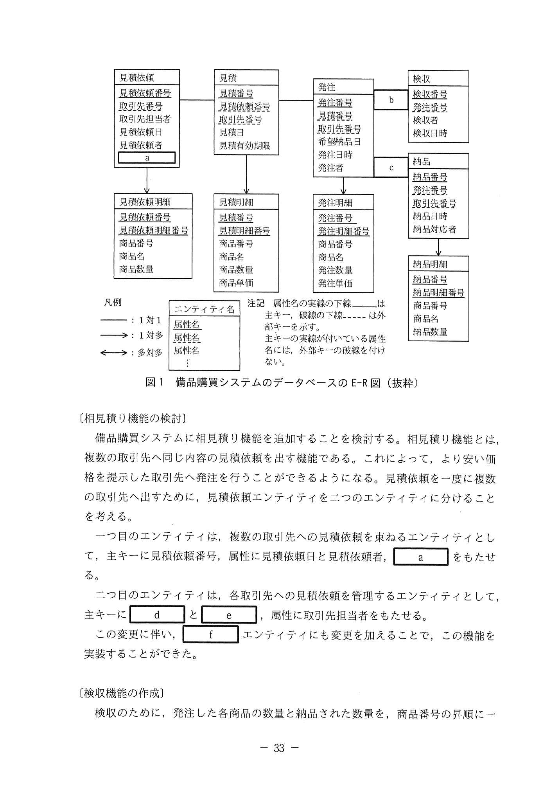

テキスト (OCR)

見積依頼                   a         Bll
anes             ーー   D | sees
取引番号                 信号      発注番号
Higa Seda                 ABTS      isnt
見積依頼日                  BARES      ULES
cs ie      見積有効期限     is

Heike     にに
納品番号
!       HES.
見積依頼明細      見積明細        発注明細       取引先番号
見策依頼番号     RAS       発注番号       納品日時
見積依頼明細番号    見積明細番号      発注明細番号     納品対応者
商品番号       商品番号       商品番号         J
商品名         商品名         商品名        FT
商品数量       商品数量       発注数量       ーーーー
商品単価        発注単価       Mini
納品明細番号
凡例       ーーーー   注記 届性名の実線の下線は |商品番号
| キー, 破線の下線-----は外 |商品名
.         属性名               部キーを示す。                      納品数量
ーータテ : 1対多 | 属性名       主キーの実線が付いている履性     ー

<—> : 多対多 | IEE,       名には, 外部キーの破線を付け
      ない。

図1 備品購買システムのデータベースのE-R図 (抜粋)

相見積り機能の検討

備品購買システムに相見積り機能を追加することを検討する。相見積り機能とは,
複数の取引先へ同じ内容の見積依頼を出す機能である。これによって, より安い価
格を提示した取引先へ発注を行うことができるようになる。見積依頼を一度に複数
の取引先へ出すために, 見積依頼エンティティを二つのエンティティに分けること
を考える。

ーつ目のエンティティは, 複数の取引先への見積依頼を束ねるエンティティとし
て, 主キーに此策依頼番号, 属性に見積依頼日と見積依頼者| a | をもたせ
る。

二つ目のエンティティは, 各取引先への見積依頼を管理するエンティティとして,
主キーに| od |と| ie | 属性に取引先担当者をもたせる。

この変更に伴い, | { | エンティティにも変更を加えることで, この機能

実装することができた。

検収機能の作成]
検収のために, 発注した各商品の数量と納品された数量を, 商品番号の昇順に一

ー By 一

### ページ 34

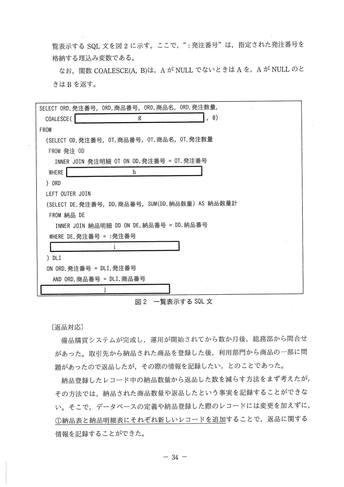

テキスト (OCR)

覧表示する SQL 文を図 2 に示す。ここで, “: 発注番号” は, 指定された発注番号を
格納する埋込み変数である。
なお, 関数 COALESCE(A, B)は, A が NULL でないときはAを, AがNULL のと

きはB を返す。

SELECT ORD.発注番号, 0RD.商品番号, 0RD.商品名, ORD.発注数量,

cOALESCE(| g |, 9
FROM
(SELECT 0D.発注番号, 0T.商品番号, 0T.商品名, 0T.発注数量
FROM 発注 0D
INNER JOIN 発注明細 OT ON OD.発注番号 = 0T.発注番号
WHERE | h|
) ORD

LEFT OUTER JOIN
(SELECT DE.発注番号, DD.商品番号, SUM(DD. 納品数量) AS 納品数量計
FROM 納品 DE
INNER JOIN 納品明細 DD ON DE.納品番号 = DD.納品番号
WHERE DE.発注番号 = :発注番号
[_        i         |
) DLI
ON 0RD.発注番号 = DLI.発注番号
AND ORD.商品番号 = DLI.商品番号
[               i                J
図2 一覧表示する3SQL文

〔返品対応】

備品購買システムが完成し, 運用が開始されてから数か月後, 総務部から問合せ
があった。取引先から納品された商品を登録した後, 利用部門から商品の一部に問
題があったので返品したが, その際の情報を記録したい, とのことであった。

納品登録したレコード中の納品数量から返品した数を減らす方法をまず考えたが,
その方法では, 納品された商品数量や返品したという事実を記録することができな
い。 そこで, データベースの定義や納品登録した際のレコードには変更を加えずに
①納品表と納品明細表にそれぞれ新しいレコードを追加することで, 返品に関する
情報を記録することができた。

= 4

### ページ 35

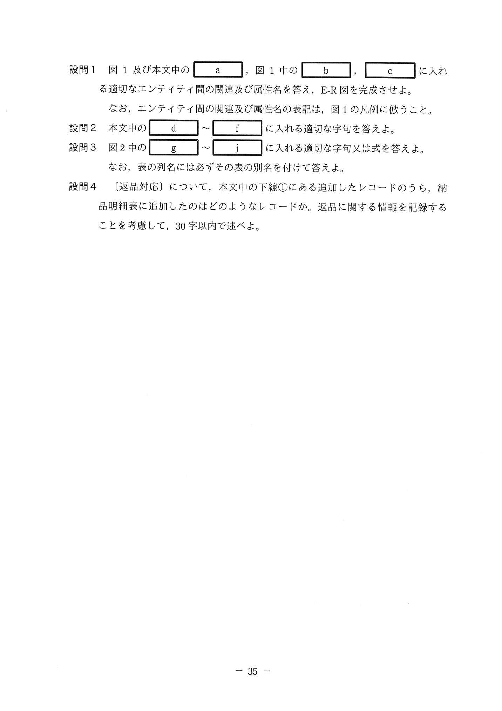

テキスト (OCR)

設問1 図 1 及び本文中の[| ぉ』 |,図1中の[| 5 |,| c |に入れ
る適切なエンティティ間の関連及び属性名を答え, E-R 図を完成させよ。
なお, エンテイティ間の関連及び属性名の表記は, 図 1 の凡例に父うこと。
設問2 本文中の| d |~[ fj |に入れる適切な字旬を答えよ。
設問3 図2中の| g |~-|  」 |に入れる適切な字句又は式を答えよ。
なお, 表の列名には必ずその表の別名を付けて答えよ。
設問4 【返品対応】 について, 本文中の下線①にある追加したレコードのうち, 納
唱明細表に追加したのはどのようなレコードか。返品に関する情報を記録する
ことを考慮して, 30 字以内で述べよ。

ー 85 =

### ページ 36

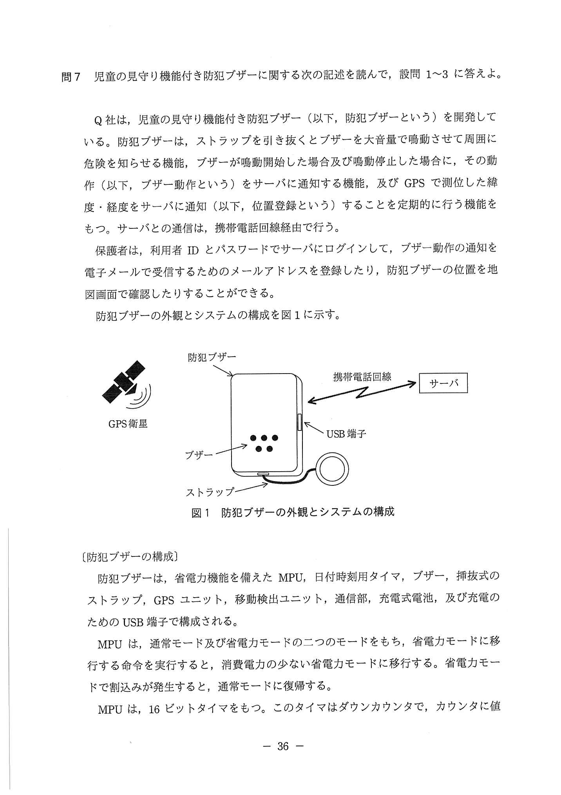

テキスト (OCR)

間7 児童の見守り機能付き防犯ブザーに関する次の記述を読んで, 設問 +ン3 に答えよ。

Q 社は, 児童の見守り機能付き防犯ブザー (以下, 防犯プブザーという) を開発して
WS, 防犯プブザーは, ストラップを引き抜くとブザーを大音量で鳴動させて周囲に
危険を知らせる機能, ブザーが鳴動開始した場合及び鳴動停止した場合に, その動
作 (以下。ブザー動作という) をサーバに通知する機能, 及び GPS で測位した紳
度・経度をサーバに通知 (以下, 位置登録という) することを定期的に行う機能を
もつ。サーバとの通信は, 携帯電話回線経由で行う。

保護者は, 利用者 ID とパスワードでサーバにログインして, ブザー動作の通知を
電子メールで受信するためのメールアドレスを登録したり, 防犯ブザーの位置を地
図画面で確認したりすることができる。

防犯ブザーの外観とシステムの構成を図 1 に示す。

防犯ブザー
携帯電話回線
サーバ
4)                                 a 7m
GPS衛星                                      |
Ps USB 端子

ストラップーで”
図1 防犯ブザーの外観とシステムの構成

[防犯ブザーの構成〕

防犯ブザーは, 省電力機能を備えた MPU, 日付時刻用タイマ, ブザー, 挿抜式の
ストラップ, GPS ユニット, 移動検出ユニット, 通信部, 充電式電池, 及び充電の
ための USB 端子で構成される。

MPU は, 通常モード及び省電力モードの二つのモードをもち, 省電力モードに移
行する命令を実行すると, 消費電力の少ない省電力モードに移行する。省電力モー
ドで割込みが発生すると, 通常モードに復帰する。

MPU は, 16 ビットタイマをもつ。このタイマはダウンカウンタで, カウンタに値

### ページ 37

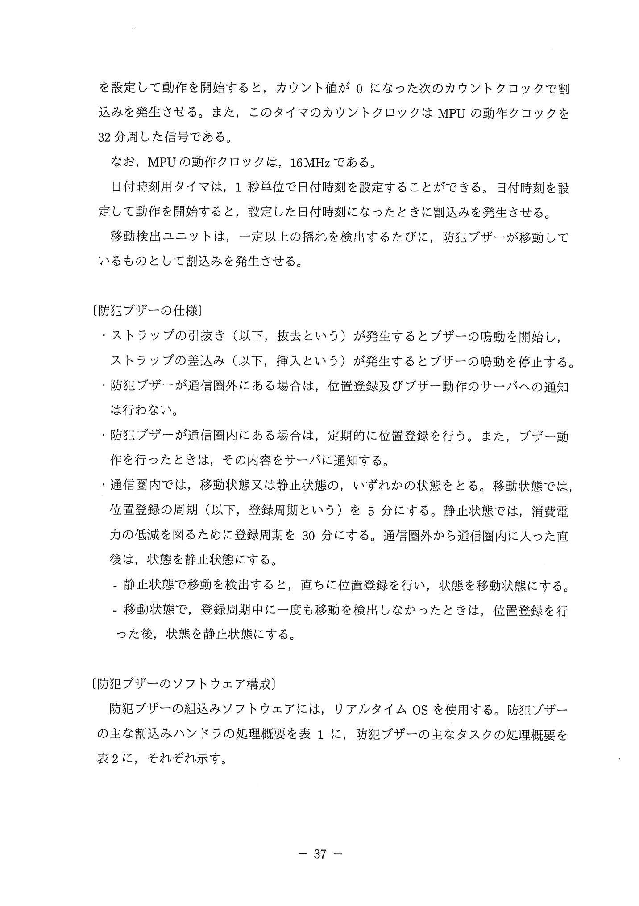

テキスト (OCR)

を設定して動作を開始すると, カウント値が 0 になった次のカウントクロックで割
込みを発生させる。また, このタイマのカウントクロックは MPU の動作クロックを
32 分周した信号である。

なお, MPU の動作クロックは, 16MHz CHS,

日付時刻用タイマは, 1 秒単位で日付時刻を設定することができる。 日付時刻を設
定して動作を開始すると, 設定した日付時刻になったときに割込みを発生させる。
移動検出ユニットは, 一定以上の揺れを検出するたびに, 防犯ブザーが移動して
いるものとして割込みを発生させる。

(防犯ブザーの仕様]

・ストラップの引抜き (以下, 抜去という) が発生するとブザーの鳴動を開始し,
ストラップの差込み (以下, 挿入という) が発生するとブザーの鳴動を停止する。
・ 防犯ブザーが通信圏外にある場合は, 位置登録及びブザー動作のサーバへの通知
は行わない。

・防犯プブザーが通信圏内にある場合は, 定期的に位置登録を行う。また, ブザー動
作を行ったときは, その内容をサーバに通知する。

・ 通信圏内では, 移動状態又は静止状態の,。 いずれかの状態をとる。移動状態では,
位置登録の周期 (以下, 登録周期という) を 5 分にする。静止状態では, 消費電
力の低減を図るために登録周期を 30 分にする。 通信了圏外から通信圏内に入った直
alk, 状態を静止状態にする。
- 静止状態で移動を検出すると, 直ちに位置登録を行い, 状態を移動状態にする。
- 移動状態で, 登録周期中に一度も移動を検出しなかったときは, 位置登録を行
った後, 状態を静止状態にする。

〔防犯ブザーのソフトウェア構成〕

防犯ブザーの組込みソフトウェアには, リアルタイム OS を使用する。防犯ブザー
の主な割込みハンドラの処理概要を表 1 に, 防犯ブザーの主なタスクの処理概要を
表 2 に, それぞれ示す。

ー 37 一

### ページ 38

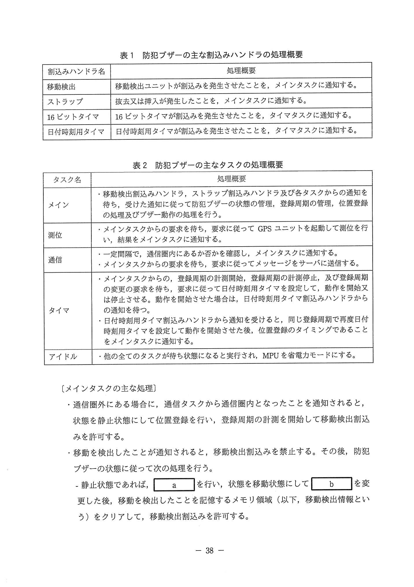

テキスト (OCR)

表1 防犯ブザーの主な割込みハンドラの処理概要

割込みハンドラ名                 処理概要

移動検出     移動検出ユニットが割込みを発生させたことを, メインタスクに通知する。
ストラップ       抜去又は挿入が発生したことを, メインタスクに通知する。

16 ビットタイマ  16 ビットタイマが割込みを発生させたことを, タイマタスクに通知する。

日付時刻用タイマ | 日付時刻用タイマが割込みを発生させたことを, タイマタスクに通知する。

表2 防犯ブザーの主なタスクの処理概要

タスク名

処理概要

メイン

・移動検出割込みハンドラ, ストラッププ割込みハンドラ及び各タスクからの通知を

待ち, 受けた通知に従って防犯ブザーの状態の管理, 登録周期の管理, 位置登録
の処理及びブザー動作の処理を行う。

測位

・メインタスクからの要求を待ち, 要求に従って GPS ユニットを起動して測位を行

い, 結果をメインタスクに通知する。

通信

・一定間隔で, 通信半内にあるか否かを確認し, メインタスクに通知する。
・メインタスクからの要求を待ち, 要求に従ってメッセージをサーバに送信する。

タイマ

・メインタスクからの, 登録周期の計測開始, 登録周期の計測停止, 及び登録周期

の変更の要求を待ち, 要求に従って日付時刻用タイマを設定して, 動作を開始又
は停止させる。動作を開始させた場合は, 日付時刻用タイマ割込みハンドラから
の通知を待つ。

・日付時刻用タイマ割込みハンドラから通知を受けると, 同じ登録周期で再度日付

時刻用タイマを設定して動作を開始させた後, 位置登録のタイミングであること
をメインタスクに通知する。

アイドル

・他の全てのタスクが待ち状態になると実行され, MPU を省電力モードにする。

〔メインタスクの主な処理]

・ 通信賠外にある場合に, 通信タスクから通信購内となったことを通知されると,
状態を静止状態にして位置登録を行い, 登録周期の計測を開始して移動検出害込
みを許可する。

・移動を検出したことが通知されると, 移動検出割込みを禁止する。その後, 防犯
ブザーの状態に従って次の処理を行う。

- 静止状態であれば, |  』 | を行い, 状態を移動状態にして| b |を変
更した後, 移動を検由したことを記憶するメモリ領城 (以下, 移動検出情報とい
う) をクリアして, 移動検出割込みを許可する。

ー 38 一

### ページ 39

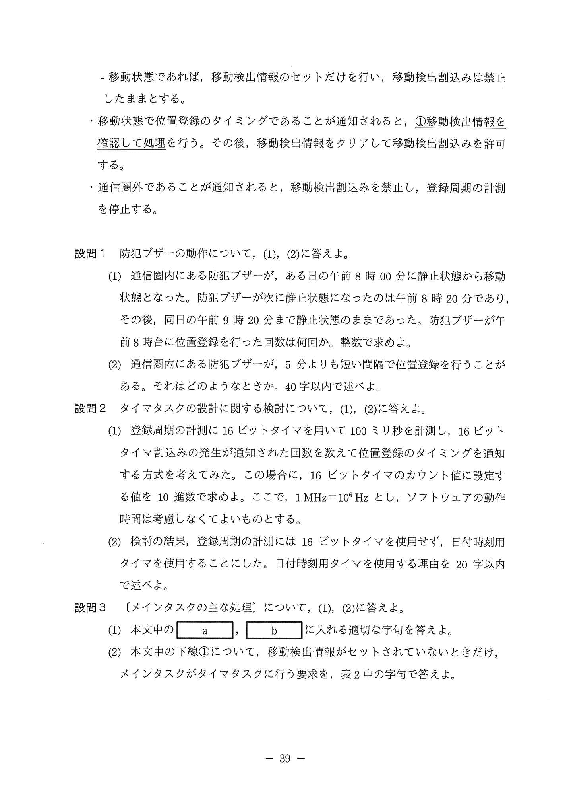

テキスト (OCR)

- 移動状態であれば, 移動検出情報のセットだけを行い, 移動検出割込みは禁止
したままとする。

・移動状態で位置登録のタイミングであることが通知されると, ①移動検出情報を
確認して処理を行う。 その後, 移動検出情報をクリアして移動検出割込みを許可
する。

・ 通信圏外であることが通知されると, 移動検出割込みを禁止し, 登録周期の計測
を停止する。

設問1 防犯ブザーの動作について, Q①, (2②)に答えよ。
Q) 通信圏内にある防犯ブザーが, ある日の午前 8 時 00 分に静止状態から移動
状態となった。防犯ブザーが次に静止状態になったのは午前 8 時 20 分であり,
COR, 同日の午前 9 時 20 分まで静止状態のままであった。防犯ブザーが午
前 8 時台に位置登録を行った回数は何回か。整数で求めよ。
(2) 通信圏内にある防犯ブザーが, 5 分よりも短い間隔で位置登録を行うことが
ある。それはどのようなときか。 40 字以内で述べよ。
設問2 タイマタスクの設計に関する検討について, ①, ⑫)に答えよ。
GQ) 登録周期の計測に 16 ビットタイマを用いて 100 ミリ秒を計測し, 16 ビット
タイマ割込みの発生が通知された回数を数えて位置登録のタイミングを通知
する方式を考えてみた。この場合に, 16 ビットタイマのカウント値に設定す
る値を 10 進数で求めよ。ここで, 1 MHz=106 Hz とし, ソフトウェアの動作
時間は考慮しなくてよいものとする。
(2) 検討の結果, 登録周期の計測には 16 ビットタイマを使用せず, 日付時刻用
タイマを使用することにした。 日付時刻用タイマを使用する理由を 20 字以内

で述べよ。
設問3 〔メインタスクの主な処理】 について, ①⑪, ②に答えよ。
@ 本文中の|  a | |  b |に入れる適切な字句を答えよ。

(2) 本文中の下線のについて, 移動検出情報がセットされていないときだけ,
メインタスクがタイマタスクに行う要求を, 表2中の字句で答えよ。

ー 39 一

### ページ 40

テキスト (OCR)

HS プログラムの品質評価に関する次の記述を読んで, 設問 1ご3 に答えよ。

Z 社では, 全国に店舗展開する家電量販店向けに, 顧客管理システムを開発してい
る。 開発中の顧客管理システムは, 運用開始後, 家電量販店の業務内容の変化に合
わせて, 3 か月おきを目安に継続的に改修していくことが想定されている。

Z 社では, プログラムの品質を定量的に評価するために, メトリクスを計測し, 活
用している。プログラムを関数の単位で評価する際には, 関数の長さとサイクロマ
ティック複雑度をメトリクスとして計測し, 評価する。 開発プロセスにおいては
プログラムのテストを開始する前にメトリクスを計測し, 評価された値が, あらか
じめ設定されたしきい値を上回らないことを確認することにしている。

開発中の顧客管理システムについても, 開発プロセスのルールに従い, この評価
方法によって評価した。

[サイクロマティック複雑度]

サイクロマティック和複雑度とは, プログラムの複雑度を示す指標である。プログ
ラムの制御構造を有向グラフで表したときの, グラフ中のノードの数 N とリンク
(辺) の数L を用いて次の式で算出する。

サイクロマティック複雑度だ=ニエーN十2

プログラムの制御構造を有向グラフで表した例を図 1 に示す。プログラムの開始
位置と終了位置, 反復や条件分岐が開始する位置と終了する位置をノードとし, ノ
ード間をつなぐ順次処理の部分をリンクとしてグラフにする。ノードの間に含まれ
る順次処理のプログラムの行数は考慮せずが, 一つのリンクとして記述する。 KK,
図 1 のリンク 1 やリンク 4 のように, 処理がない場合も一つのリンクとして記述す
る。

ー 40 一

### ページ 41

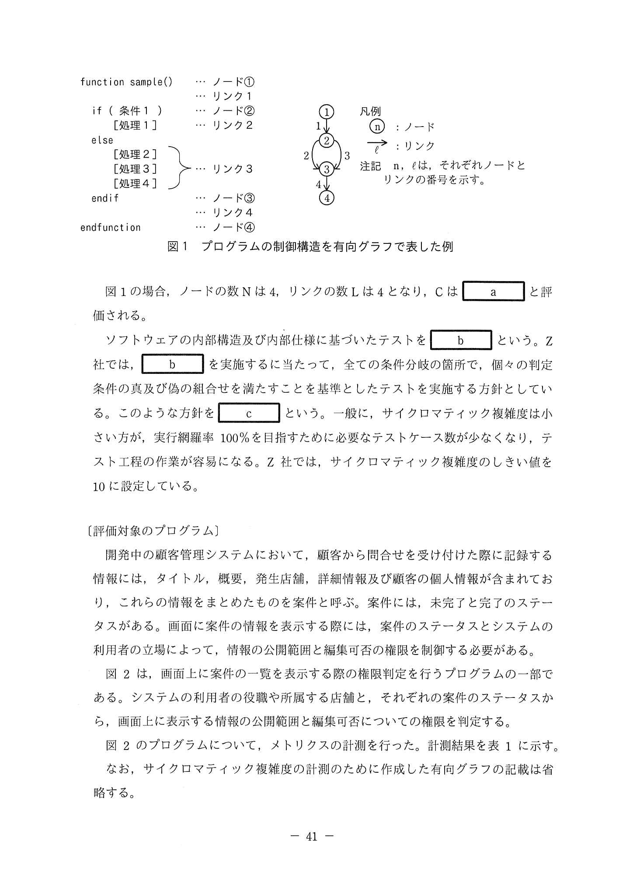

テキスト (OCR)

function sample()   … ブード①
if (条件1 )    … ノード@
[処理1 ]     … リンクタる

凡例

@

1     @ :フノード

OQ Pv
[処理2               2( _)s
[処理 3 ]    … YDS       (3)   注記 n, 6は, それぞれノードと

4

ぐ

else

[処理4 ]                         リンクの番号を示す。
endif         … ノード③
… リンク4
endfunction      … ブード④

図1 プログラムの制御構造を有向グラフで表した例

図 1 の場合,ノードの数N は4, リンクの数しは4となり, Cは| 。 |と評
価される。

ソフトウェアの内部構造及び内部仕様に基づいたテストを| b | というぅ。Z
社では, | b | を実施するに当たって, 全ての条件分岐の箇所で, 個々の判定
条件の真及び偽の組合せを満たすことを基準としたテストを実施する方針としてい
る。このような方針を| c Jews. 一般に, サイクロマティック複雑度は小
さい方が, 実行網羅氷 100%を目指すために必要なテストケース数が少なくなり, テ
スト工程の作業が容易になる。Z 社では,、 サイクロマティック複雑度のしきい値を
10 に設定している。

〔評価対象のプログラム]

開発中の顧客管理システムにおいて, 顧客から問合せを受け付けた際に記録する
情報には, タイトル, 概要, 発生店舗, 詳細情報及び顧客の個人情報が含まれてお
り, これらの情報をまとめたものを案件と呼ぶ。案件には, 未完了と完了のステー
タスがある。画面に案件の情報を表示する際には, 案件のステータスとシステムの
利用者の立場によって, 情報の公開範囲と編集可否の権限を制御する必要がある。

 2 は, 画面上に案件の一覧を表示する際の権限判定を行うプログラムの一部で
ある。システムの利用者の役職や所属する店舗と.。 それぞれの案件のステータスか

画面上に表示する情報の公開範囲と編集可否についての権限を判定する。

図 2 のプログラムについて, メトリクスの計測を行った。計測結果を表 1 に示す。

なお, サイクロマティック複雑度の計測のために作成した有向グラフの記載は省
略する。

### ページ 42

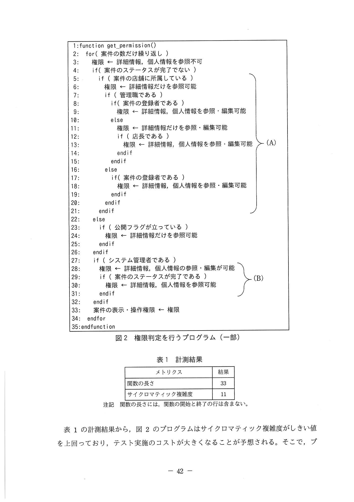

テキスト (OCR)

1:function get_permission()

2: for( 案件の数だけ繰り返し )

3    権限 で 詳細情報, 個人情報を参照不可

4: if( 案件のステータスが完了でない )

5:     if ( 案件の店舗に所属している )
6       権限 < 詳細情報だけを参照可能

7    if ( 管理職である )

8:     if( 案件の登録者である )

9:          権限 詳細情報, 個人情報を参照・編集可能
10:        else

TVs           権限 <— 詳細情報だけを参照・編集可能

122     if ( 店長である )

13:          権限 < 詳細情報,個人情報を参照・編集可能 > (A)
14:          endif

15:        endif

16:       else

17:     if( 案件の登録者である )

18:          権限 で 詳細情報, 個人情報を参照・編集可能
19:        endif

20:       endif

21:     endif                                   プ
22:    else

28%  if ( 公開フラグが立っている )

24:    権限 詳細情報だけを参照可能

25:     endif

26:    endif

27: if ( システム管理者である )

28:     権限 < 詳細情報, 個人情報の参照・編集が可能

29:  if ( 案件のステータスが完了である )       (B)
30:      権限 <— 詳細情報個人情報を参照可能

318     endif

32:    endif

33:    案件の表示・操作権限 < 権限

34: endfor

35:endfunction

図2 権限判定を行うプログラム (一部)

表1 計測結果

メトリクス         結果
関数の長さ                33
サイクロマティック複雑度       11

注記 関数の長さには, 関数の開始と終了の行は含まない。

表 1 の計測結果から, 図 2 のプログラムはサイクロマティック複雑度がしきい値
を上回っつており, テスト実施のコストが大きくなることが予想される。そこで, TF

ー 42 一

### ページ 43

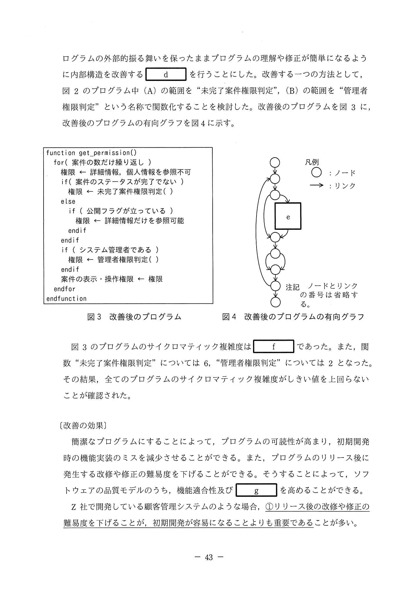

テキスト (OCR)

ログラムの外部的振る舞いを保ったままプログラムの理解や修正が簡単になるよう
に内部構造を攻善する| q |] を行うことにした。改善する一つの方法として,
 2 のプログラム中 (A) の範囲を “未完了案件権限判定", (B) の範囲を “管理者
権限判定"という名称で関数化することを検討した。改善後のプログラムを図 3 に,
改善後のプログラムの有向グラフを図 4 に示す。

function get_permission()
for( 案件の数だけ繰り返し )
権限 で 詳細情報, 個人情報を参照不可
if( 案件のステータスが完了でない )
権限 未完了案件権限判定( )
else
if ( 公開フラグが立っている )
権限 詳細情報だけを参照可能
endif
endif
if ( システム管理者である )
権限 < 管理者権限判定( )
endif
案件の表示・操作権限 < 権限
endfor
endfunction

凡例
3ノード

ーーテー:リンク

注記 ノードとリンク
の番号は省略す
る。

 3 改善後のプログラム

図4 改善後のプログラムの有了向グラフ

 3 のプログラムのサイクロマティッタク複雑度は| f | であぁった。また,関
数 “未完了案件権限判定"については 6, “管理者権限判定"については 2 となった。
その結果, 全てのプログラムのサイクロマティック複雑度がしきい値を上回らない

ことが確認された。

〔改善の効果〕

簡潔なプログラムにすることによって, プログラムの可読性が高まり, 初期開発

時の機能実装のミスを減少させることができる。また, プログラムのリリース後に

発生する改修や修正の難易度を下げけることができる。そうすることによって,

We

トウェアの品質モデルのうち, 機能適合性及び |  g | を高めることができる。

Z 社で開発している顧客管理システムのような場合

リリース後の改修や修正の

難易度を下げることが, 初期開発が容易になることよりも重要であることが多い。

ー 43 一

### ページ 44

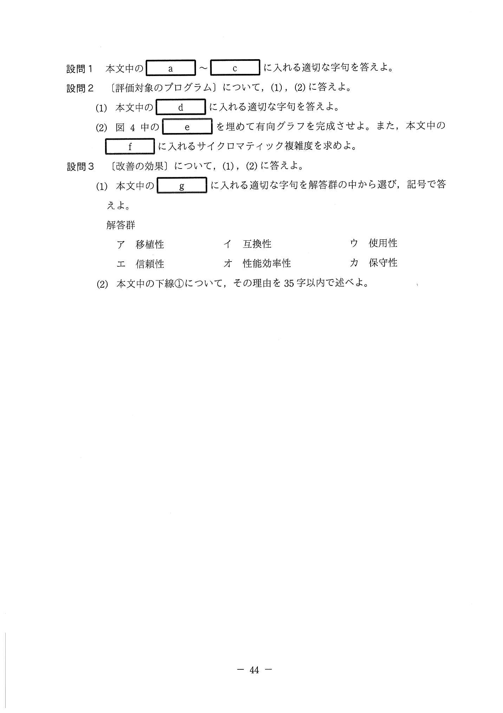

テキスト (OCR)

設問1 本文中の| oa |]~[ cc |に入れる適切な字句を答えよ。

設問2 [評価対象のプログラム〕 について, ①⑪, (②) に答えよ。
a) 本文中の|  q |] に入れる適切な字句を答えよ。
⑫) 図 4 中の[| ce | を埋めて有向グラフを完成させよ。また, 本文中の
[|] に入れるサイクロマティック和複雑度を求めよ。

設問3 (改善の効果】 について, M, ② に答えよ。
a) 本文中の[| g | に入れる適切な字句を解答群の中から選び, 記号で

えよ。
解答竹
ア 移植性     イ 互換性       ウ 使用性
エ 信頼性     オ 性能効率性     カカ 保守性

(②) 本文中の下線やについて, その理由を 35 字以内で述べよ。

ー 44 一

### ページ 45

テキスト (OCR)

C

メ モ 用 紙

ー 45 一

### ページ 46

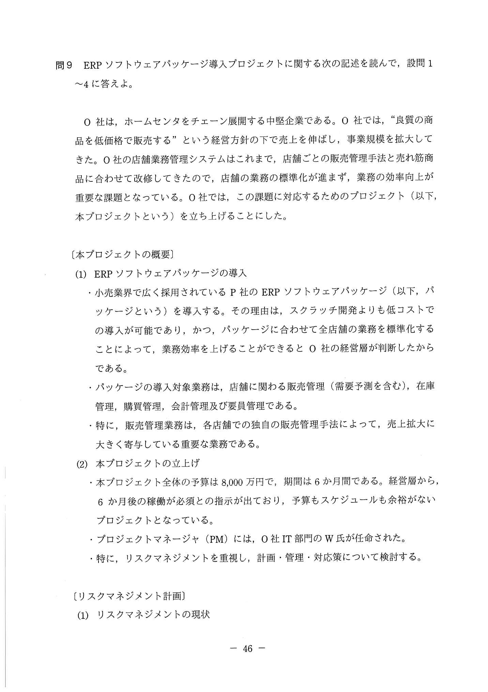

テキスト (OCR)

間9 ERPソフトウェアパッケージ導入プロジェクトに関する次の記述を読んで, 設問 1

<4 に答えよ。

O tlt, ホームセンタをチェーン展開する中堅企業である。 0 社では, “良質の商
品を低価格で販売する” という経営方針の下で売上を伸ばし, 事業規模を拡大して
きた。O 社の店舗業務管理システムはこれまで, 店舗ごとの販売管理手法と売れ筋商
品に合わせて改修してきたので, 店舗の業務の標準化が進まず, 業務の効率向上が
重要な課題となっている。O0 社では, この課題に対応するためのプロジェクト (以下
本プロジェクトという) を立ち上げることにした。

〔本プロジェクトの概要)

(1) ERP ソフトウェアパッケージの六入
・小売業界で広く採用されている PHO ERP ソフトウェアパッケージ (以下, パ
ッケージという) を導入する。その理由は, スクラッチ開発よりも低コストで
の導入が可能であり, かつ, パッケージに合わせて全店舗の業務を標準化する
ことによって, 業務効率を上げることができると O 社の経営層が判断したから
である。
・パッケージの導入対象業務は, 店舗に関わる販売管理 (需要予測を含む), 在庫
管理, 購買管理, 会計管理及び要員管理である。
・ 特に, 販売管理業務は, 各店舗での独自の販売管理手法によって, 売上拡大に
大きく寄与している重要な業務である。

Q) 本プロジェクトの立上げ
・本プロジェクト全体の予算は 8,000 万円で, 期間は 6 か月間である。 経営層から
6 か月後の稼働が必須との指示が出ており, 予算もスケジュールも余裕がない
プロジェクトとなっている。
・プロジェクトマネージャ (PM) には, OF IT 部門の W 氏が任命された。
・特に, リスクマネジメントを重視し, 計画・管理・対応策について検討する。

(リスクマネジメント計画]
Q①) リスクマネジメントの現状

ー 46 一

### ページ 47

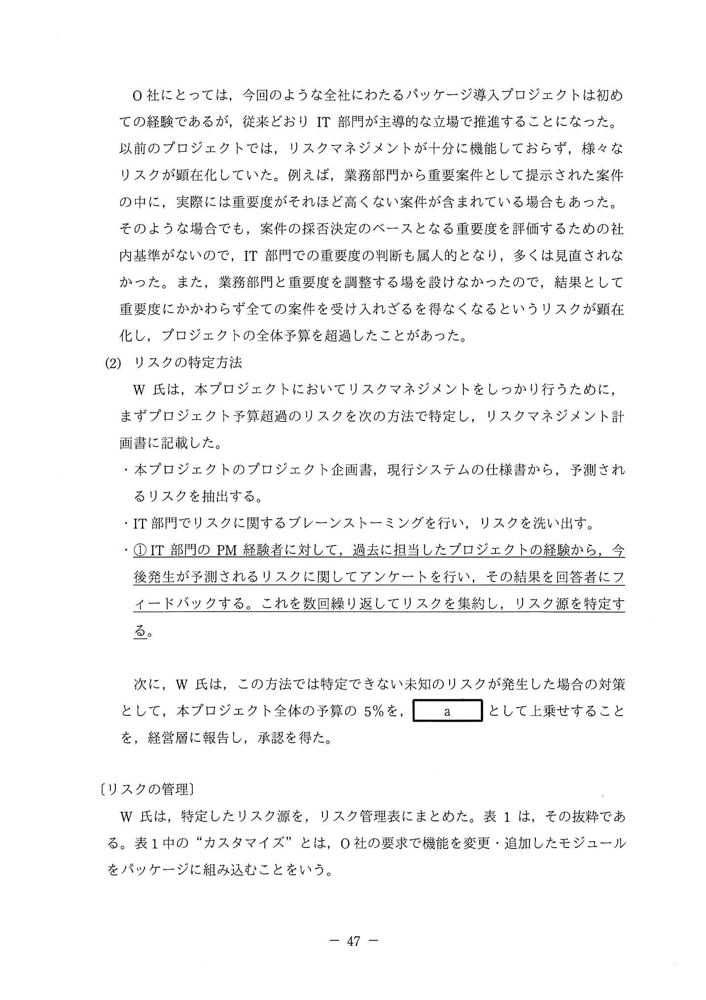

テキスト (OCR)

0 社にとっては, 今回のような全社にわたるパッケージ人導入プロジェクトは初め
ての経験であるが, 従来どおり IT 部門が主導的な立場で推進することになった。
以前のプロジェクトでは, リスクマネジメントが十分に機能しておらず, 様々な
リスクが顕在化していた。例えば, 業務部門から重要案件として提示された案件
の中に, 実際には重要度がそれほど高くない案件が含まれている場合もあった。
そのような場合でも, 案件の採耕決定のベースとなる重要度を評価するための社
内基準がないので, IT 部門での重要度の判断も属人的となり, 多くは見直されな
Dok, kk, 業務部門と重要度を調整する場を設けなかったので, 結果として
重要度にかかわらず全ての案件を受け入れざるを得なくなるというリスクが顕在
化し, プロジェクトの全体予算を超過したことがあった。

Q) リスクの特定方法

W 氏は, 本プロジェクトにおいてリスクマネジメントをしっかり行うために,
まずプロジェクト予算超過のリスクを次の方法で特定し, リスクマネジメント計
画書に記載した。

・本プロジェクトのプロジェクト企画書, 現行システムの仕様書から, 予測され

るリスクを抽出する。

・IT 部門でリスクに関するブプレーンストーミングを行い, リスクを洗い出す。
・①TT 部門の PM 経験者に対して, 過去に担当したプロジェクトの経験から, 今

後発生が予測されるリスクに関してアンケートを行い, その結果を回答者にフ

ィードバックする。これを数回繰り返してリスクを集約し, リスク源を特定す

る。

次に, W 氏は, この方法では特定できない未知のリスクが発生した場合の対策
LUT, 本プロジェクト全体の予算の 5%を, |  。 | として上乗せすすること
を, 経営層に報告し, 承認を得た。

〔リスクの管理]                                      」

W 氏は, 特定したリスク源を, リスク管理表にまとめた。表 1 は, その抜粋であ
る。表 1 中の“カスタマイズ" とは, O 社の要求で機能を変更・追加したモジュール
をパッケージに組み込むことをいう。

ー 47 一

### ページ 48

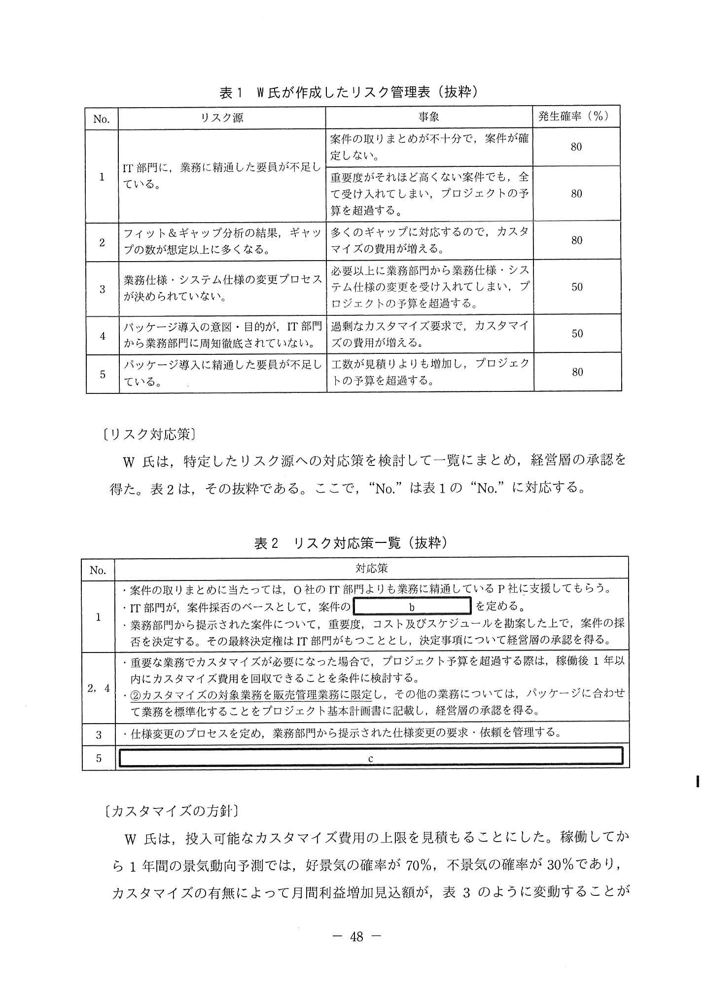

テキスト (OCR)

表1 W氏が作成したリスク管理表 (抜粋)

No.        リスク源                事象         発生確率 (%
案件の取りまとめが不十分で, 案件が確
80
定しない。
IT 部門に, 業務に精通した要員が不足し    -   -
1 |てい。。               重要度がそれほど高くない案件でも, 全
て受け入れてしまい, プロジェクトの予    80
算を超過する。
 フィット&ギャップ分析の結果, ギャッ| 多くのギャップに対応するので, HAR    Pr
プの数が想定以上に多くなる。     マイズの費用が増える。
           必要以上に業務部門から業務仕様・シス
3  ae テム侍様の変更を受け入れてしまい,ブ    50
.              ロジェクトの予算を超過する。
4 パッケージ導入の意図・目的が, IT 部門 | 過剰なカスタマイズ要求で カスタマイ    a
から業務部門に周知徹底されていない。 | ズの費用が増える。
 パッケージ導入に精通した要員が不足し | 工数が見積りよりも増加し, プロジェク    0
"|ている。               トの予算を超過する。
[リスク対応策]

W 氏は, 特定したリスク源への対応策を検討して一覧にまとめ, 経営層の承認

得た。表 2 は, その抜粋である。ここで, “No.” は表1の “No.” に対応する。

表2 リスク対応策一覧 (抜粋)

No.                            対応策
・案件の取りまとめに当たっては, 0 社の TT 部門よりも業務に精通している 社に支援してもらう。

」 | 「 部門が, 案件採佑のペースとして。 aol  b |をまゅs。
・柴務部門から提示された案件について, 重要度,コスト及びスケジュールを勤案した上で, ROR
否を決定する。その了最終決定権は IT 部門がもつこととし, 決定事項について経営層の承認を得る。
・ 重要な業務でカスタマイズが必要になった場合で、 プロジェクト予算を超過する際は, RUE 1 HED,

ou 4  内にカスタマイズ費用を回収できることを条件に検討する。

“| ・②カスタマイズの対象業務を販売管理業務に限定し, その他の業務については, パッケージに合わせ
て業務を標準化することをブロジェクト基本計画書に記載し, 経営層の承認を得る。

3 | ・仕欄変更のプロセスを定め, 業務部門から提示された仕様変更の要求・依頼を管理する。

5                              c                            |

〔カスタマイズの方針]

W 氏は, 投入可能なカスタマイズ費用の上限を見積もることにした。 稼働してか

ら 1 年間の景気動向予測では, 好景気の確率が 70%, 不景気の確率が 30%であり,
カスタマイズの有無によって月間利益増加見込額が, 表 3 のように変動することが

ー 48 一

### ページ 49

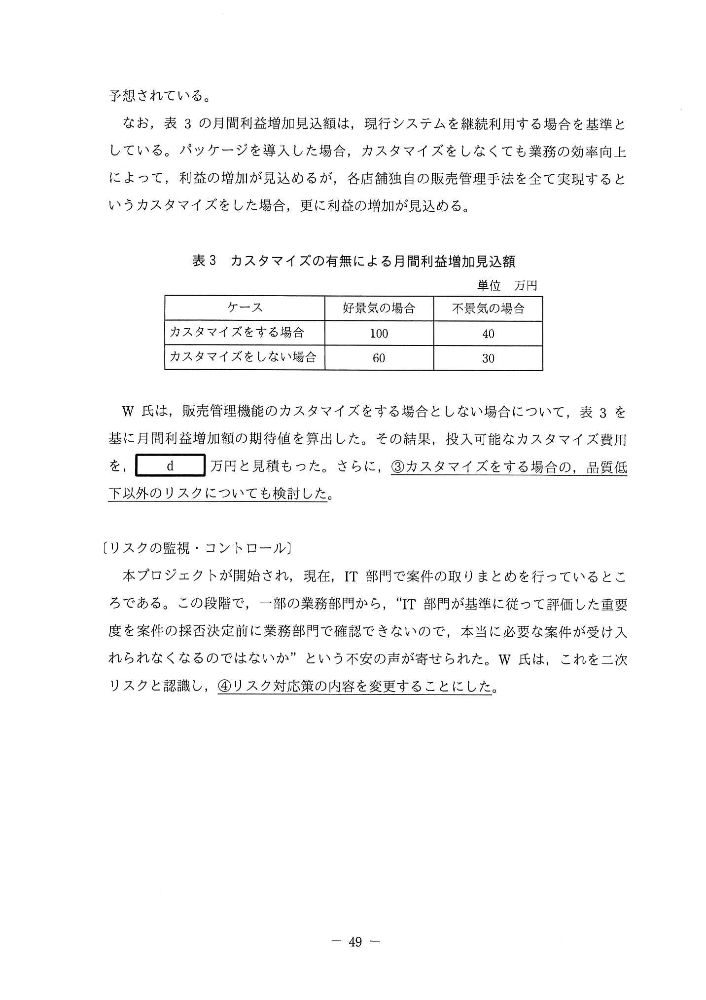

テキスト (OCR)

予想されている。

なお, 表 3 の月間利益増加見込額は, 現行システムを継続利用する場合を基準と
している。 パッケージを導入した場合, カスタマイズをしなくても業務の効率向上
によって, 利益の増加が見込めるが, 各店舗独自の販売管理手法を全て実現すると
いうカスタマイズをした場合, 更に利益の増加が見込める。

表3 カスタマイズの有無による月間利益増加見込額

単位 万円

ケース      好景気の場合   不景気の場合
カスタマイズをする場合     100        40
カスタマイズをしないりい場合        60             30

W 氏は, 販売管理機能のカスタマイズをする場合としない場合について, 表 3 を
基に月間利益増加額の期待値を算出した。その結果 投入可能なカスタマイズ偶用
を, | d |万円と見積もった。さらに, ③カスタマイズをする場合の, 品質低
下以外のリスクについても検討した。

〔リスクの監視・コントロール]

本プロジェクトが開始され, 現在, IT 部門で案件の取りまとめを行っているとこ
ろである。この段階で, 一部の業務部門から, “IT 部門が基準に従って評価した重要
度を案件の採否決定前に業務部門で確認できないので, 本当に必要な案件が受け入
れられなくなるのではないか"” という不安の声が寄せられた。W 氏は, これを二次
リスクと認識し, リスク対応策の内容を変更することにした。

ー 49 一

### ページ 50

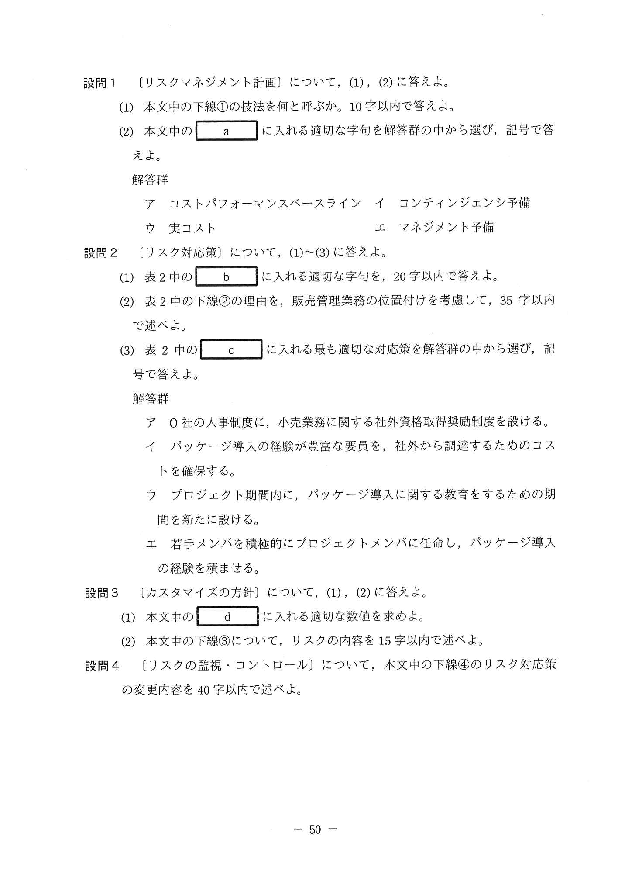

テキスト (OCR)

設問] 〔リスクマネジメント計画] について, @, ②⑫) に答えよ。
Q) 本文中の下線①の技法を何と呼ぶか。10 字以内で答えよ。

⑫ 本文中の|  。』 | に入れる適切な字句を解答群の中から選び, 記号で答
えよ。
ABE
ア コストパフォーマンスベースライン イ コンティンジェンシ予備
ウ 実コスト             エエ マネジメント予備

設問2 (VAM COT, ①⑪)て⑬) に答えよ。
a) 表2中の[| bp | に入れる適切な宇名を, 20字以内で答えよ。
(2) 表2 中の下線②の理由を, 販売管理業務の位置付けを考慮して, 35 字以内

CHAK,

@) 表 2 中の| < | に入れる最も適切な対応策を解答群の中から選び, 記
号で答えよ。
解答

ア 0社の人事制度に, 小売業務に関する社外資格取得奨励制度を設ける。
イ パッケージ導入の経験が豊富な要員を, 社外から調達するためのコス
トを確保する。
ウ プロジェクト期間内に, パッケージ導入に関する教育をするための期
間を新たに設ける。
エ 若手メンバを積極的にプロジェクトメンバに任命し, パッケージ導入
の経験を積ませる。
設問3 〔カスタマイズの方針] について, (1), ②⑫②) に答えよ。
a 本文中の[ d |に入れる適切な数値を求めよ。
2) 本文中の下線②③について, リスクの内容を 15 字以内で述べよ。
設問4 [リスクの監視・コントロール〕 について, 本文中の下線@のリスク対応策
の変更内容を 40 字以内で述べよ。

ー 50 一

### ページ 51

テキスト (OCR)

〔

メ = 用 if

ー 5 一

J

### ページ 52

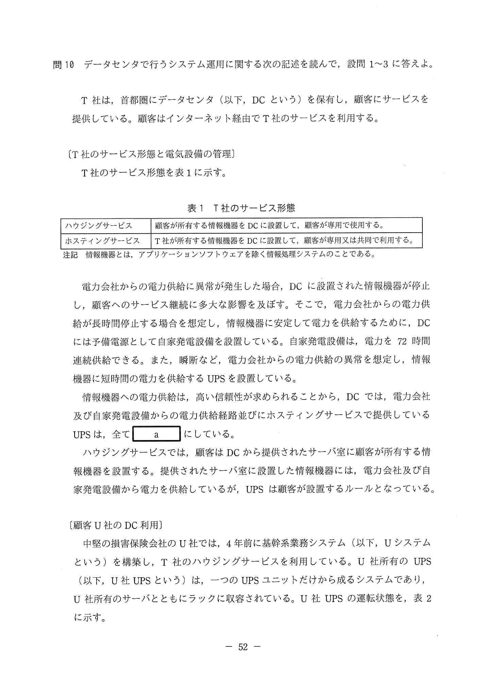

テキスト (OCR)

P10 データセンタで行うシステム運用に関する次の記述を読んで, 設問 1ー3 に答えよ。

T 社は, 首都較にデータセンタ (LAB, DC という) を保有し, 顧客にサービスを
提供している。 顧客はインターネット経由でT社のサービスを利用する。

[T 社のサービス形態と電気設備の管理]
T 社のサービス形態を表 1 に示す。

表1 T社のサービス形態
ハウジングサービス      顧客が所有する情報機器を DC に設置して, 顧客が専用で使用する。
ホスティングサービス | T 社が所有する情報機器を DC に設置して, 顧客が専用又は共同で利用する。
注記 情報機器とは, アプリケーションソフトウェアを除く情報処理システムのことである。

き力会社からの電力供給に異常が発生した場合, DC に設置された情報機器が停止
し, 顧客へのサービス継続に多大な影響を及ぼす。そこで, 電力会社からの電力供
給が長時間停止する場合を想定し, 情報機器に安定して電力を供給するために, D
には予備電源として自家発電設備を設置している。自家発電設代は。 電力を 72 時間

連続供給できる。また, MM, 電力会社からの電力供給の異常を想定し, 情報
機器に短時間の電力を供給する UPS を設置している。

情報機器への電力供給は 高い信頼性が求められることから, DC では, 電力会社
及び自家発電設備からの電力供給経路並びにホスティングサービスで提供している
UPS は, 全て|  』 |にしている。

ハウジングサービスでは, 顧客は DC から提供されたサーバ室に顧客が所有する情
報機器を設置する。 提供されたサーバ室に設置した情報機器には, 電力会社及び自
家発電設備から電力を供給しているが, UPS は顧客が設置するルールとなっている。

(HA U 社の DC 利用)

中堅の損害保険会社の U 社では, 4 年前に基幹系業務システム (以下,Uシステム
という) を構築し, T 社のハウジングサービスを利用している。U 社所有の UPS
(以下, U社 UPS という) は, 一つの UPS ユニットだけから成るシステムであり,
U 社所有のサーバとともにラックに収容されている。U 社 UPS の運転状態を, 表 2
に示す。

ー 52 一

### ページ 53

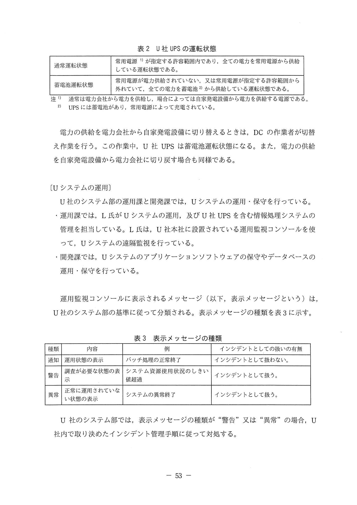

テキスト (OCR)

表2 U社UPS の運転状態

本     常用電源 が指定する許容範囲内であり, 全ての電力を常用電源から供給
AM     している運転状態である。

eeaiasmisynie    MARIE BREE CUR, 又は常用電源が指定する許容秀男から
MM    外れていて, SCORN E FMI? から供給している運転状態である。

SE) 通常は電力会社から電力を供給し, 場合によっては自家発電設備から電力を供給する電源である。
2 UPS には区電池があり, 常用電源によって充電されている。

電力の供給を電力会社から自家発電設備に切り替えるときは, DC の作業者が切替
え作業を行う。この作業中, U th UPS は普電池運転状態になる。また, 電力の供給
を自家発電設備から電力会社に切り戻す場合も同様である。

[U システムの運用
U社のシステム部の運用課と開発課では, U システムの運用・保守を行っている。
・ 運用課では, L 氏がU システムの運用, 及び U社 UPS を含む情報処理システムの
を担当している。L 氏は, U 社本社に設置されている運用監視コンソールを使
って, Uリシステムの遠隔監視を行っている。
PEFR Cla, U システムのアプリケーションソフトウェアの保守やデータベースの
軍用・保守を行っている。

用監視コンソールに表示されるメッセージ (以下, 表示メッセージという) は
U 社のシステム部の基準に従って分類される。表示メッセージの種類を表 3 に示す。

表3 表示メッセージの種類

種類     内容             例          インシデントとしての扱いの有無
通知 | 運用状態の表示    バッチ処理の正常終了      インシデントとして扱わない。
調  AG な状態   で  ーー  『源   Je   き \
ee | BEER REDE | PAT ARRER ROO LE peste peri,
示           値超過
ve 正常に運用されていな | 、_ _    ween          wets      .
異常 い状態の表示    システムの異常終了      インシデントとして扱う。

U 社のシステム部では, 表示メッセージの種類が“警告” 又は“異常" OWA, U
社内で取り決めたインシデント管理手順に従って対処する。

ー 53 一

### ページ 54

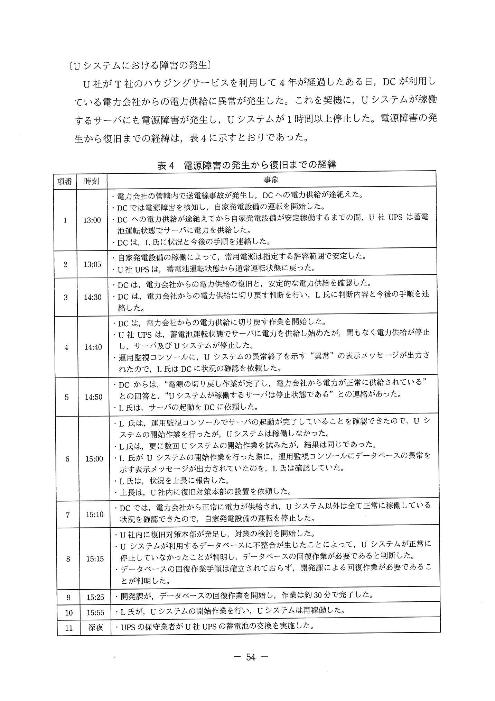

テキスト (OCR)

(U

システムにおける障害の発生]

U 社が T 社のハウジングサービスを利用して 4 年が経過したある日, DC が利用し

ている電力会社からの電力供給に異常が発生した。これを契機に。Uシステムが稼働
するサーバにも電源障害が発生し, U システムが1 時間以上停止した。電源障害の発
生から復旧までの経緯は, 表4 に示すとおりであった。

表4 電源障害の発生から復旧までの経緯

項番

事象

13:00

・DC では電源障害を検知し, 自家発電設備の運転を開始した。
・DC への電力供給が途絶えてから自家発電設備が安定稼働するまでの間, U 社 UPS a

・DC は, L 氏に状況と今後の手順を連絡した。

電力会社の管轄内で送電線事故が発生し, DC への電力供給が途絶えた。

池運転状態でサーバに電力を供給した。

13:05

・自家発電設備の稼働によって, 常用電源は指定する許容範囲で安定した。
・U 社 UPS は, 蓄電池運転状態から通常運転状態に戻った。

14:30

・DC は, 電力会社からの電力供給の復旧と, 安定的な電力供給を確認した。
・DC は, 電力会社からの電力供給に切り戻す判断を行い, L 氏に判断内容と今後の手順を連

絡した。

14:40

・DC は, 電力会社からの電力供給に切り戻す作業を開始した。

U 社 UPS は, 蓄電池運転状態でサーバに電力を供給し始めたが, 間もなく電力供給が停止
に AA haere

監視コンソールに, U システムの異常終了を示す “RE” の表示メッセージが出力さ
かたので L 氏は DC に状況の確認を依頼した。

14:50

“DC からは, "電源の切り戻し作業が完了し, 電力会社から電力が正常に供給されている『

・L 氏は, サーバの起動を DC に依頼した。

との回答と, “U システムが稼働するサーバは停止状態である” との連絡があった。

15:00

・L 氏は, 運用監視コンソールでサーバの起動が完了していることを確認できたので, U シ

・L 氏は, 更に数回 U システムの開始作業を
・L 氏が U システムの開始作業を行った際

・L 氏は, 状況を上長に報告した。
・上長は, U社内に復旧対策本部の設置を依頼した。

ステムの開始作業を行ったが, Uシステムは稼働しなかった。

試みたが, 結果は同じであった。

こ, 運用監視コンソールにデータベースの異常を
示す表示メッセージが出力されていたのを, L 氏は確認していた。

15:10

DC では, 電力会社から正常に電力が供給され, U システム以外は全て正常に稼働している
状況を確認できたので, 自家発電設備の運転を停止した。

15:15

・U 社内に復旧対策本部が発足し, 対策の検討を開始した。
・U システムが利用するデータベースに不整合が生じたことによって, U システムが正常に

停止していなかったことが判明し, データベースの回復作業が必要であると判断した。
ータベースの回復作業手順は確立されておらず, 開発課による回復作業が必要であるこ
とが判明した。

15:25

・開発課が, データベースの回復作業を開始し, 作業は約 30 分で完了した。

10

15:55

LEAS, U システムの開始作業を行い U システムは再稼働した。

11

深夜

+ UPS の保守業者が U 社 UPS の蓄電池の交換を実施した。

ー 54 一

### ページ 55

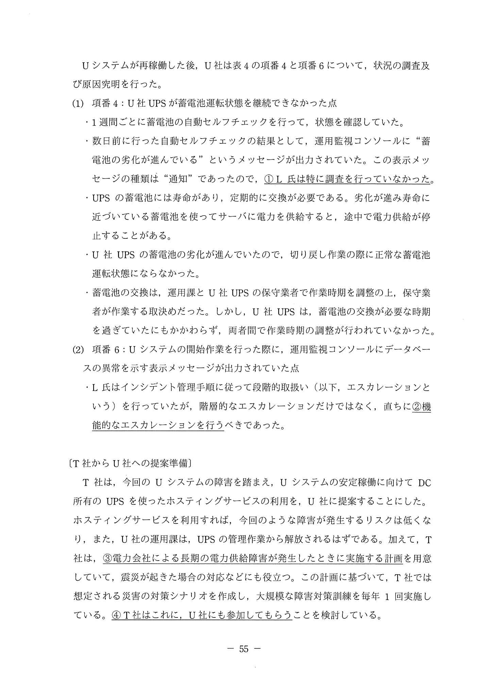

テキスト (OCR)

U システムが再稼働した後, U 社は表 4 の項番 4 と項番6 について, 状況の調査及
び原因究明を行った。
(1) 項番4:U社UPS が蘭電池運転状態を継続できなかった点
・1 週間ごとに蓄電池の自動セルフチェックを行って, 状態を確認していた。
・数日前に行った自動セルフチェックの結果として, 運用監視コンソールに Ce
電池の劣化が進んでいる" というメッセージが出力されていた。この表示メッ
セージの種類は SEM” であったので, OL 氏は特に調査を行っていなかった。
・UPS の蓄電池には寿命があり, 定期的に交換が必要である。 劣化が進み寿命に
近づいている薔電池を使ってサーバに電力を供給すると, 途中で電力供給が停
止することがある。
・U 社 UPS の蓄電池の劣化が進んでいたので, 切り戻し作業の際に正常な蓄電池
運転状態にならなかった。
・鞭電池の交換は, 運用課と U 社 UPS の保守業者で作業時期を調整の上, 保守業
者が作業する取決めだった。 しかし, U 社 UPS は, 蓄電池の交換が必要な時期
を過ぎていたにもかかわらず, 両者間で作業時期の調整が行われていなかった。
(2) 項番6:U システムの開始作業を行った際に, 運用監視コンソールにデータベー
スの異常を示す表示メッセージが出力されていた点
・L 氏はインシデント管理手順に従って段階的取扱い (以下, エスカレーションと
いう) を行っていたが, 階層的なエスカレーションだけではなく, 直ちに⑨機

能的なエスカレーションを行うべきであった。

[T 社から U社への提案準備

T 社は, 今回の U システムの障害を踏まほえ, U システムの安定稼働に向けて DC
所有の UPS を使ったホスティングサービスの利用を, U 社に提案することにした。
ホスティングサービスを利用すれば, 今回のような障害が発生するリスクは低くな
り, また, U 社の運用課は, UPS の管理作業から解放されるはずである。加えて, T
社は, ③電力会社による長期の電力供給障害が発生したときに実施する計画を用意
していて, 岩災が起きた場合の対応などにも役立つ。この計画に基づいて, THE
想定される災害の対策シナリオを作成し, 大規模な障害対策訓練を毎年 1 回実施し
TWH, OTH Mc, U社にも参加してもらうことを検討している。

ー 55 一

### ページ 56

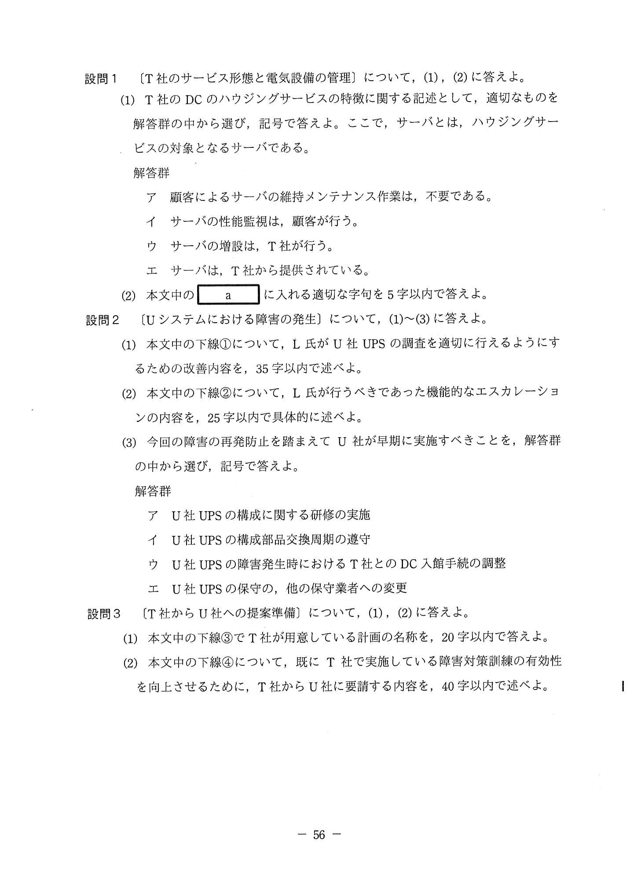

テキスト (OCR)

設問1 〔(T社のサービス形態と電気設備の管理] について, 1) , ②) に答えよ。

(1) T 社の DC のハウジングサービスの特徴に関する記述として, 適切なものを
解答群の中から選び, 記号で答えよ。ここで, サーバとは, ハウジングサー
ビスの対象となるサーバである。
解答群

ア MRC ESV-NOMBA YT TY AE, 不要である。
イ サーバの性能監視は, 顧客が行う。

ウ サーバの増設は, T 社が行う。

エ サーバは, 〒社から提供されている。

② 本文中の| 』 | に入れる適切な字旬を5字以内で答えよ。

設問2 〔Uシステムにおける障害の発生] について, ①~(3) に答えよ。

(1) 本文中の下線①について, L 氏が U 社 UPS の調査を適切に行えるようにす
るための改善内容を, 35 字以内で述べよ。

(2) 本文中の下線②について, L 氏が行うべきであった機能的なエスカレーショ
ンの内容を, 25 字以内で具体的に述べよ。

(3) 今回の障害の再発防止を踏まえて U 社が早期に実施すべきことを, 解答群
の中から選び, 記号で答えよ。
解答群

ア U社 UPS の構成に関する研修の実施
イ U社 UPS の構成部品交換周期の遵守
ウ U社 UPS の障害発生時におけるTT社との DC 入館手続の調整
エ U社UPS の保守の, 他の保守業者への変更
設問3 〔T社からU社への提案準備】] について, Q) , (⑫②) に答えよ。

(1) 本文中の下線③でT 社が用意している計画の名称を, 20 字以内で答えよ。

(2) 本文中の下線るについて, 既に T 社で実施している障害対策訓練の有効性
を向上させるために, T 社からU社に要請する内容を, 40 字以内で述べよ。

ー 565 一

### ページ 57

テキスト (OCR)

C

メ モ 用 紙 J

= 57 =

### ページ 58

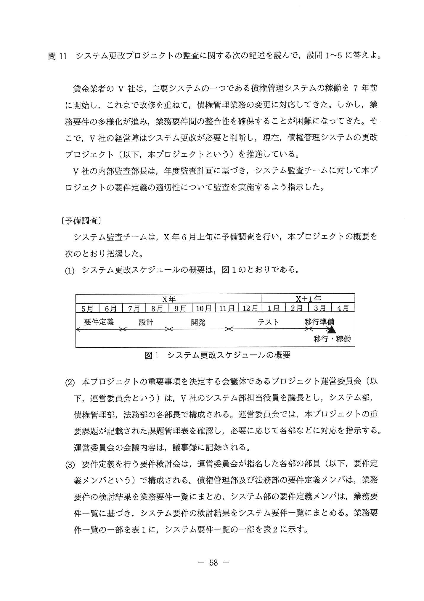

テキスト (OCR)

All システム更改プロジェクトの監査に関する次の記述を読んで, 設問 1ー5 に答えよ。

貸金業者の V 社は, 主要システムの一つである債権管理システムの稼働を 7 年前
に開始し, これまで改修を重ねて, 債権管理業務の変更に対応してきた。しかし, 業
務要件の多様化が進み, 業務要件間の整合性を確保することが困難になってきた。そ
こで, Y 社の経営陣はシステム更改が必要と判断し, 現在, 債権管理システムの更改
プロジェクト (以下, 本プロジェクトという) を推進している。

Y 社の内部監査部長は, 年度監査計画に基づき, システム監査チームに対して本プ
ロジェクトの要件定義の適切性について監査を実施するよう指示した。

(予備調査〕

システム監査チームは, X 年 6 月上旬に予備調査を行い 本プロジェクトの概要を
次のとおり把握した。
(1) システム更改スケジュールの概要は, 図 1のとおりである。

XE                  X14
5月| 6月| 7月|g月| 9月|10月|月[2月| 1月| 2月| 3月| 4月
要件定義        設計            開発                テスト        ibe
BG +

図1 システム更改スケジュールの概要

Q) 本プロジェクトの重要事項を決定する会議体であるプロジェクト運営委員会 (以
下, 運営委員会という) は, V 社のシステム部担当役員を議長とし, システム部,
債権管理部, 法務部の各部長で構成される。運営委員会では, 本プロジェクトの重
要課題が記載された課題管理表を確認し, 必要に応じて各部などに対応を指示する。
運営委員会の会議内容は, 議事録に記録される。

3) 要件定義を行う要件検討会は, 運営委員会が指名した各部の部員 (以下, 要件定
義メンバという) で構成される。 債権管理部及び法務部の要件定義ペメンバは, 業務
要件の検討結果を業務要件一覧にまとめ, システム部の要件定義メンバは, 業務要
件一覧に基づき, システム要件の検討結果をシステム要件一覧にまとめる。業務要
件一覧の一部を表 1 に, システム要件一覧の一部を表 2 に示す。

ー 58 一

### ページ 59

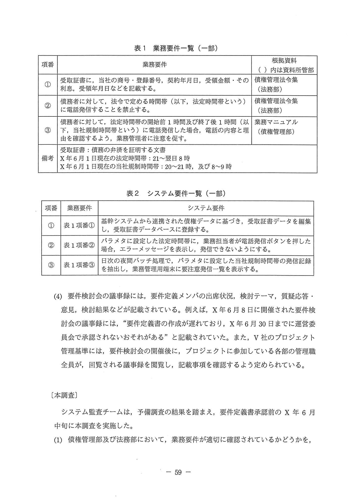

テキスト (OCR)

表1 業務要件一覧 (一部)

                    根拠資料
項番              業務要件              ( ) 内は資料所管部

© 受取証書に, 当社の商号・登録番号, 契約年月日, 受領金額・その | 債権管理法令集

利息, 受領年月日などを記載する。               (法務部)
@② 債務者に対して, 法令で定める時間帯 (以下, 法定時間帯という) | 債権管理法令集
こ電話発信することを禁止する。                (法務部)

債務者に対して, 法定時間帯の開始前 1 時間及び終了後 1 時間 (以 | 業務マニュアル
@ | 下, 当社規制時間帯という) に電話発信した場合, 電話の内容と理 | (債権管理部)
由を確認するよう, 業務管理者に注意を促す。

受取証書 : 債務の弁済を証明する文書
備考|X年6月1日現在の法定時間帯 : 21て翌日8時
年6月1日現在の当社規制時間帯 : 20て21 時, 及び 8~9 時

表2 システム要件一覧 (一部)
TA | 業務要件                 システム要件

基替システムから連携された偵権ゲータに基づき, 受取証書データを編集
© | 1 ABO | し, 妥取証書データベースに登録する。
パラメタに設定した法定時間帯に。 業務担当者が電話発信ボタンを押した
の | RRB | 坦合. エラーメッセージを表示し, 発信できないようにする。
| ge | PROM Sy FBC, パラメタに設定した当社時間帯の発信記録
を抽出し, 業務管理用催末に要注意発信一覧を表示する。

(4) 要件検討会の議事録には, 要件定義メンバの出席状況。 検討テーマ, 質疑応答・
意見, 検討結果などが記載されている。例えば, X年6月 8 日に開催された要件検
討会の議事録には, “要件定義書の作成が遅れており, X 年6月 30 日までに運営委
員会で承認されないおそれがある”" と記載されていた。また, V 社のプロジェクト
管理基準には, 要件検討会の開催後に. プロジェクトに参加している各部の管理職
全員が, 回和覧される議事録を閲覧し, 記載事項を確認するよう定められている。

本調査〕

システム監査チームは, 予備調査の結果を踏まえ, 要件定義書承認前のX 年6月
中旬に本調査を実施した。
(1) 債権管理部及び法務部において, 業務要件が適切に確認されているかどうかを,

ー 59 一

### ページ 60

テキスト (OCR)

次のとおり確認した。

① 要件検討会の議事録を閲覧したところ, 債権管理部の要件定義ペメンバ P 氏が
第 2 回要件検討会を欠席していることが記録されていた。

@ P 氏にインタビューしたところ, P 氏は, “欠席した第 2 回要件検討会も含め
て, 全ての要件検討会の議事録を閲覧し, 記載事項を確認している"と回答した。

⑧ また, P 氏は, “プロジェクト管理基準に従って, 債権管理部の管理職全員が
要件検討会の議事録の記載事項を確認していると認識している"と回答した。

④ P 氏の③の回答内容が事実かどうかを確認するために, 追加の監査手続を行っ
だ。

2) 業務要件の根拠が明確かどうかを, 次のとおり確認した。

① 業務要件一覧に記載された業務要件をサンプル抽出し, 根拠資料の内容と照合
した。しかし, 業務要件の一部は根拠資料の内容との関係が不明確であったこと
から, 業務要件の根拠が明確であることを立証するための十分な[| 』 |を
得られなかった。例えば, 表 1 項番①の業務要件が, 債権管理法令集に記載さ
れた法令のどの条項に対応するのか, システム息査チームは確認できなかった。

⑨ 業務要件の根拠が明確であることを立証するために,| bp |に
 を説明するよう求めた。

⑬ 業務要件とシステム要件が整合しているかどうかを, 次のとおり確認した。

① 業務要件一覧とシステム要件一覧を照合したところ, 業務要件ごとにシステム
要件が定義されていた。

Q 業務要件及び対応するシステム要件をサンプル抽出し, 関連する要件検討会の
議事録を閲覧するとともに, 要件定義ペメンバにインタビューした。その結果, 業
務要件及びシステム要件の具体的な内容についての認識が, 要件定義メンバ間で
合致していないケースがあった。例えば, P 氏は, 表 1 項番③の当社規制時間帯
が, 前日の 20~21 時, 及び当日の 8~9 時の間であると考えていた。一方, シ
ステム部の要件定義ペメンバは, 表 2 項番$について, バッチ処理時間帯の制約
があるので, 前日の 8~9 時, 及び前日の 20~21 時の間の発信記録を, 要注意
発信一覧として表示しようと考えていた。

© ⑨の状況が生じた原因を確認した上で, “業務要件とシステム要件を整合させ
ることが必要である” ことを指摘した。

ー 60 一

### ページ 61

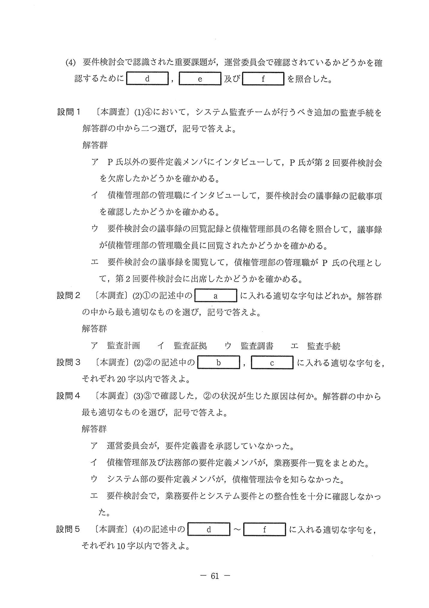

テキスト (OCR)

(④ 要件検討会で認識された重要課題が, 運営委員会で確認されているかどうかを確
認するために| aq ],[ se |及び| f )emaun.

設問1 【本調査] 1)④において, システム監査チームが行うべき追加の監査手続を
解答群の中から二つ選び, 記号で答えよ。
fea
ア 氏以外の要件定義メンバにインタビューして, P 氏が第 2 MRS
を欠席したかどうかを確かめる。
イ 債権管理部の管理職にインタビューして, 要件検討会の議事録の記載事項
を確認したかどうかを確かめる。
ウ 要件検討会の議事録の回覧記録と全権管理部員の名和を照合して, MER
が債権管理部の管理職例員に回覧されたかどうかを確かめる。
エ 要件検討会の議事録を閲覧して, 債権管理部の管理職が P 氏の代理とし
て, 第2 回要件検討会に出席したかどうかを確かめる。
設問2 (AIA) ②①の記述中の| a | に入れる適切な字句はどれか。解管攻
の中から最も適切なものを選び, 記号で答えよ。

解答群
ア 監査計画 イ 監査証拠 ウ 監査調書 エ 監査手続

設問3 [本調査] (②②の記述中の| vb |,[  c | に入れる適切な字句を,
それぞれ20 字以内で答えよ。

設問4 〔本調査〕 (3③で確認した, ②③の状況が生じた原因は何か。解答群の中から
最も適切なものを選び, 記号で答えよ。
解答群
ア 運営委員会が, 要件定義書を承認していなかった。
イ 債権管理部及び法務部の要件定義メンバが, 業務要件一覧をまとめた。
ウ システム部の要件定義メンバが, 債権管理法令を知らなかった。
エ 要件検討会で, 業務要件とシステム要件との整合性を十分に確認しなかっ
た。
設問5 (KM) (④の記述中の| da |~[ ft | に入れる適切な字句を,
それぞれ 10 字以内で答えよ。

ー 61 一

### ページ 62

テキスト (OCR)

〔

x = 用 紙.〕

ー 62 一

### ページ 63

テキスト (OCR)

【

メ モ 用 紙 〕

ーー 9 一

### ページ 64

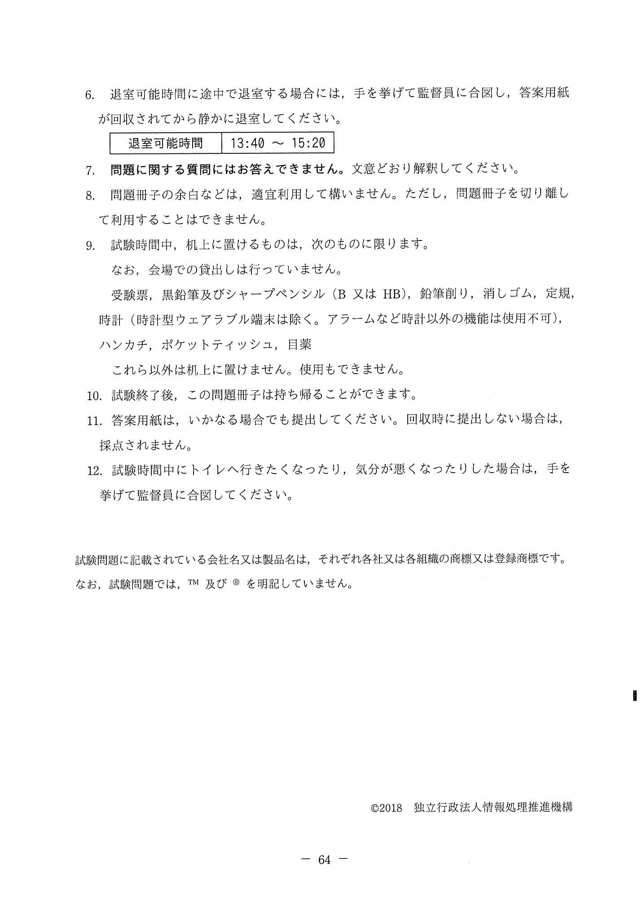

テキスト (OCR)

6. 退室可能時間に途中で退室する場合には, 手を挙げて監督貞に合図し, 答案用紙
が回収されてから静かに退室してください。
| 退室可能時間 | 13:40 ~ 15:20
7. 問題に関する質問にはお答えできません。文意どおり解釈してください。
8. 問題穫子の余白などは, 適宜利用して構いません。ただし, 問題冊子を切り離し
て利用することはできません。
9. 試験時間中, 机上に置けるものは, 次のものに限ります。
なお, 会場での貸出しは行っていません。
受験時黒鉛筆及びシャープペンシル (B 又は HB), 鉛筆削り, 消しゴム, 定規
時計 (時計型ウェアラブル端末は除く。アラームなど時計以外の機能は使用不可),
ハンカチ, ポケットティッシュ, 目薬
これら以外は机上に置けません。使用もできません。
10. 試験終了後, この問題民子は持ち帰ることができます。
11. SRAMIL, いかなる場合でも提出してください。回収時に提出しない場合は,
採点されません。
12, 試験時間中にトイレへ行きたくなったり, 気分が悪くなったりした場合は, FE
挙げて監督員に合図してください。

試験問題に記載されている会社名又は製品名は, それぞれ各社又は各組織の商標又は登録商標です。
なお, 試験問題では, ™ 及び @ を明記していません。

@2018 独立行政法人情報処理推進機構

ー 64 一

---

## 午後解答

1/6 
©2018 独立行政法人情報処理推進機構 
平成30 年度 春期 応用情報技術者試験 解答例 
 
午後試験 
問１ 
出題趣旨 
 昨今，ランサムウェアと呼ばれるPC などに特定の制限をかけ，その制限解除と引き換えに金銭（身代金）を
要求するマルウェアによる被害が急増している。 
 本問では，ランサムウェアを題材に，マルウェアの脅威に関する基本的な理解，感染した場合に被害を最小
限に抑えるための対策の理解について問う。 
 
設問 
解答例・解答の要点 
備考 
設問１ 
a
ア 
 
 
b
ク 
 
 
c
サ 
 
 
d
オ 
 
設問２ 
・特定の文字列に変更された拡張子のファイルが他のPC やサーバにないこと
・最新のウイルス定義ファイルで，当該マルウェアが他に検出されないこと 
・他のPC やサーバでマルウェアによる警告メッセージが表示されないこと 
 
設問３(1) ・ウイルス定義ファイルのバージョンが最新であること 
・ウイルス定義ファイルの更新日時が最新であること 
・社内LAN に接続し，手動でウイルス定義ファイルを更新したこと 
 
 
(2) ウ 
 
設問４(1) ウ 
 
 
(2) ・バックアップの時だけ共有ディスク装置を接続する。 
・バックアップ時以外は社内LAN から切り離す。 
 
 
問２ 
出題趣旨 
 昨今，企業間競争の激化や顧客ニーズの変化が加速しており，企業を発展させるためには，確たる事業戦略
の策定が重要度を増している。 
 本問では，スーパーマーケットチェーンの中期事業戦略の策定を題材として，クロスSWOT 分析，ポジショ
ニング分析に関する知識，及び事業施策の策定の能力を問う。 
 
設問 
解答例・解答の要点 
備考 
設問１ 
a
高付加価値食品 
 
 
b
スーパーマーケットチェーンのブランド 
 
設問２(1)
c
ニーズ 
 
 
 
d
強い相関がある 
 
 
(2) エ 
 
設問３(1) 高級なおつまみ類の品ぞろえを増やす。 
 
 
(2) ・実店舗とネット店舗の顧客ID を統合し，顧客ごとの購入額を集計する。 
・顧客の属性情報によって名寄せをし，顧客ごとの購入額を集計する。 
 
 
(3)
e
ウ 
 
 
 
f
ア

2/6 
©2018 独立行政法人情報処理推進機構 
問３ 
出題趣旨 
 可能な組合せを順番に検証するような問題の解を求める場合，再帰関数を用いた実装は有効な方法の一つで
ある。 
 本問では，ナイトの巡歴問題を題材に，再帰関数を用いたプログラムや，データ構造を変更した際のプログ
ラムへの影響を理解する能力を問う。 
 
設問 
解答例・解答の要点 
備考 
設問１ 
ア
2
 
イ
－2 
設問２ 
ウ
i が m×n 
 
エ
i+1 
 
オ
v+dv[j] 
 
カ
h+dh[j] 
 
キ
board[v][h] ← 0 
設問３(1) ①
行番号 
20
 
 
 
変更後のプログラム
for( v を3 からm+2 まで1 ずつ増やす ) 
 
 
②
行番号 
21
 
 
 
変更後のプログラム
for( h を3 からn+2 まで1 ずつ増やす ) 
 
(2) 行番号 
32
 
 
変更後のプログラム 
search( 1, 3, 3 ) 
 
(3) 2，3，16，17 
 
問４ 
出題趣旨 
 クラウドサービスは，社内システムインフラとして多くの企業に導入され，利用されている。 
 本問では，現行のオンプレミス上で稼働している業務システムを，クラウドサービスに移行するに当たって，
クラウドサービスの内容を理解し，業務要件に見合ったクラウドサービスのサービス形態（SaaS，PaaS，IaaS）
及び提供形態（パブリッククラウド，プライベートクラウド）を選定する能力を問う。 
 
設問 
解答例・解答の要点 
備考 
設問１ 
イ，エ 
 
設問２ 
a
○ 
 
 
b
○ 
 
 
c
× 
 
 
d
○ 
 
設問３ 
e
プライベートクラウド 
 
 
f
IaaS 
 
設問４(1) サブシステムの名称
事務支援サブシステム 
 
 
 
サービス形態 
PaaS
 
 
 
提供形態 
プライベートクラウド 
 
 
(2) 販売管理サブシステムとのデータ連携が必要だから

3/6 
©2018 独立行政法人情報処理推進機構 
問５ 
出題趣旨 
 インターネット利用において，DNS の役割は大きい。DNS が適切に設定されないと，インターネット利用で
思いがけない問題を発生させる可能性がある。 
 本問では，Web システムの構成変更を題材に，構成変更に合わせたDNS の基本的な設定変更の内容について
の理解を問う。 
 
設問 
解答例・解答の要点 
備考 
設問１ 
a
ラウンドロビン 
 
b
IP アドレス 
 
c
スレーブ 
設問２ 
d
カ 
 
e
ア 
 
f
エ 
設問３(1) Web サイト利用時のURL 
 
(2) 行番号 
4
 
 
フィールド名
owner
 
(3) Web サイトへのアクセスをWAF サービスだけから許可する。 
 
問６ 
出題趣旨 
 データモデルの作成は，現在の対象業務を単に表現するだけではなく，将来の変化に対応するための柔軟性
まで考える必要がある。 
 本問では，備品購買システムを題材に，E-R 図やSQL 文に関する基本的な理解，機能追加や仕様変更が発生
した際のデータモデルへの対応に関する理解，能力を問う。 
 
設問 
解答例・解答の要点 
備考 
設問１ 
a
希望回答日 
 
 
b
 
 
c
 
設問２ 
d
見積依頼番号 
順不同 
 
e
取引先番号 
 
f
見積依頼明細 
 
設問３ 
g
DLI.納品数量計 
 
 
h
OD.発注番号 = :発注番号 
 
 
i
GROUP BY DE.発注番号, DD.商品番号 
 
 
j
ORDER BY ORD.商品番号 
 
設問４ 
返品した商品の数量をマイナスの値に設定したレコード

4/6 
©2018 独立行政法人情報処理推進機構 
問７ 
出題趣旨 
 バッテリを電源とする組込みシステムでは，動作時間を延ばすために，省電力を意識した設計・実装が求め
られる。 
 本問では，児童の見守り機能付き防犯ブザーを題材に，仕様を把握する能力，省電力を意識した設計及び実
装に対する基本的理解力を問う。 
 
設問 
解答例・解答の要点 
備考 
設問１(1) 6
 
 
(2) 静止状態で位置登録を行った後，5 分経過する前に移動を検出したとき 
 
設問２(1) 49,999
 
(2) 消費電力を小さくできるから 
設問３(1)
a
位置登録 
 
 
b
登録周期 
 
(2) 登録周期の変更 
 
問８ 
出題趣旨 
 社会のインフラの中でIT システムは不可欠なものとなっている。業務運用に利用されるIT システムは，そ
のときの業務要件や情勢の変化に応じて改修や修正が加えられる。したがって，初期開発だけではなく，運用
開始後の保守性も見据えた品質評価を行う必要がある。 
 本問では，サイクロマティック複雑度の評価を題材に，プログラム品質を評価するメトリクスについての基
本的な知識と応用能力を問う。 
 
設問 
解答例・解答の要点 
備考 
設問１ 
a
2 
 
b
ホワイトボックステスト 
 
c
条件網羅 
設問２(1)
d
リファクタリング 
 
(2)
e
 
 
f
5
設問３(1)
g
カ 
 
(2) プログラムの改修や修正が継続的に発生することが想定されるから

5/6 
©2018 独立行政法人情報処理推進機構 
問９ 
出題趣旨 
 IT プロジェクトにおいては，様々なリスクがあり，リスクへの対処を誤ると，大きな損失に繋がるおそれが
あるので，リスクに対する十分な備えが重要である。 
 本問では，中堅小売業でのERP パッケージ導入プロジェクトを題材に，プロジェクトで発生し得るリスクを
特定し，適切な対応方法を検討，計画する能力について問う。 
 
設問 
解答例・解答の要点 
備考 
設問１(1) デルファイ法 
 
(2)
a
エ 
設問２(1)
b
重要度を評価するための社内基準 
 
(2) 各店舗独自の販売管理手法が売上拡大に寄与しているから 
 
(3)
c
イ 
 
設問３(1)
d
372
 
(2) スケジュールが遅延する。 
設問４ 
IT 部門が案件の採否を決定する前に業務部門と調整する場を設ける。 
 
問10 
出題趣旨 
 昨今，企業は運用費用，信頼性，災害対策などの観点から自社のシステム機器やシステム自体を，データセ
ンタで運用するケースが増加している。 
 本問では，データセンタを利用したシステム運用を対象にインシデントの管理，災害対策，ファシリティ管
理に関する実務管理能力を問う。 
 
設問 
解答例・解答の要点 
備考 
設問１(1) イ 
 
(2)
a
冗長構成 
設問２(1) 蓄電池の劣化を示すメッセージの種類を“警告”とする。 
 
(2) 開発課にインシデントの対応を依頼する。 
 
(3) イ 
設問３(1) ・ディザスタリカバリプラン 
・緊急時対応計画 
 
(2) 運用課から担当者を選定し，該当者に障害対策訓練に参加してもらう。

6/6 
©2018 独立行政法人情報処理推進機構 
問11 
出題趣旨 
 貸金業などの規制業務をサポートする情報システムは，関連法令で定められた要件を満たすことに加えて，
組織体の業務運営方針に基づく要件も満たす必要がある。そのためには，関係者が適切にプロジェクトに関与
すること，要件の根拠を明確にすること，要件間の整合性を確保することなどが重要である。 
 本問では，債権管理システムの更改プロジェクトを題材に，要件定義に関する監査において，問題点を識別
する能力，監査手続を策定する能力などを問う。 
 
設問 
解答例・解答の要点 
備考 
設問１ 
イ，ウ 
設問２ 
a
イ 
設問３ 
b
債権管理部及び法務部の要件定義メンバ 
 
c
業務要件と根拠資料の内容との関係 
設問４ 
エ 
設問５ 
d
要件検討会の議事録 
順不同 
 
e
運営委員会の議事録 
 
f
課題管理表

---

## 午後採点講評

1/3 
©2018 独立行政法人情報処理推進機構 
平成30 年度 春期 応用情報技術者試験 採点講評 
 
午後試験 
問１ 
 問1 では，ランサムウェアを題材に，マルウェア感染への対応について出題した。全体として，正答率は低
かった。 
 設問2 は，拡張子を変更するという，当該マルウェアの特徴に注目した解答を期待したが，既に問題文で触
れられているネットワーク上での通信に言及した解答が散見された。問題文の構成を考慮した解答が求められ
ることに留意してもらいたい。 
 設問3(1)は，ウイルス定義ファイルの更新を確認する観点での解答を求めたにもかかわらず，セキュリティ
パッチの更新について述べた解答が目立った。OS やソフトウェアを常に最新の状態にすることは，マルウェ
ア対策として重要だが，設問で何が問われているかを正しく理解し，注意深く解答してほしい。 
 設問4(2)は，正答率が低かった。ファイル暗号化型ランサムウェアの特徴として，感染したPCだけでなく，
ネットワーク上で共有されているファイルまで暗号化される場合があることを理解してほしい。 
 
問２ 
 問2 では，スーパーマーケットチェーンの中期事業戦略の策定を題材として，クロスSWOT 分析，ポジショ
ニング分析に関する知識，及び事業施策の策定について出題した。 
 設問1 は，正答率が高く，クロスSWOT 分析に関する理解が高いことがうかがわれた。 
 設問2(1)d は，正答率は低く，相関の強さに言及していない解答が目立った。ポジショニングマップの二つ
の軸に求められる要件をよく理解しておいてほしい。 
 設問3(1)は，正答率は低かった。ブランド物の酒類の近くに高級なおつまみ類を置くという解答が散見され
たが，これは品ぞろえの充実ではない。範囲の経済性の意味をよく理解しておいてほしい。 
 設問3(3)は，正答率は高く，インターネットでの購買モデルに関する理解が高いことがうかがわれた。 
 
問３ 
 問3 では，ナイトの巡歴問題を題材に，再帰関数を用いたプログラムや，データ構造の使用方法を変更した
際のプログラムへの影響について出題した。全体として，正答率は高かった。 
 設問2 のオ，カは，正答率が低かった。現在の行番号に行方向の移動量（dv[ ]）を加えることで，移動先の
行番号が決まること，同様に，現在の列番号に列方向の移動量（dh[ ]）を加えることで，移動先の列番号が決
まることを，問題文から正しく読み取ってほしい。 
 設問3(1)は，正答率が低かった。データ構造の変更に合わせ，解答を印字するプログラムの修正箇所と修正
内容を問う問題であったが，修正内容であるfor 文の条件を誤った解答が多く見受けられた。繰返し処理の条
件を求める際には，条件に具体的な値を代入して，想定どおりの結果が得られることを確認することが重要で
ある。 
 
問４ 
 問4 では，保険代理店の業務システムを題材に，クラウドサービスの選定について出題した。全体として，
正答率は高かった。 
 設問1 は，正答率は低かった。クラウドサービスの内容は，表1，表2 に記載されており，二つの表を十分
に理解した上で，正解を選び出してほしい。 
 設問2 は，正答率は高かった。業務システム上の各サブシステムのシステム要件については，よく理解でき
ているようであった。 
 設問3 は，正答率は高かった。各サブシステムの特徴と，どのサービス形態，提供形態との組合せが適切か
は，理解できているようであった。 
 設問4(2)は，正答率は低かった。本文中に仕様の変更内容が記載されており，仕様の変更内容とそれを実現
するためのクラウドサービスの利用形態を関連付けて理解した上で，説明してほしい。

2/3 
©2018 独立行政法人情報処理推進機構 
問５ 
 問5 では，Web システムの構成変更を題材に，DNS に関連する用語や基本機能などについて出題した。 
 設問1 は，b，c の正答率は高かったが，a の正答率が低かった。DNS ラウンドロビンは，Web サーバなどの
負荷分散に広く利用されている簡便な機能なので，用語と基本動作は覚えておいてほしい。 
 設問2 は，d，e の正答率は高かったが，f の正答率が低かった。負荷分散装置を導入した場合，接続先ホス
トのIP アドレスは，負荷分散装置がもつ仮想IP アドレスを設定することを理解しておいてほしい。 
 設問3 では，(2)のフィールド名の正答率が低かった。図4 の資源レコードを追加すると，図3 の3 行目の
owner の名称が重複することから，owner の変更が必要になるのを導き出してほしかった。 
 
問６ 
 問6 では，備品購買システムを題材に，E-R 図やSQL 文に関する基本的な理解，機能追加や仕様変更が発生
した際のデータモデルへの対応について出題した。 
 設問2 は，二つ目のエンティティの主キーについては，正答率が高く，見積依頼エンティティの分け方は理
解されていたようだが，この変更に伴って変更を加えるべきエンティティの正答率が低かった。頭の中だけで
考えずに，変更後のE-R 図を書きながら影響を受けるエンティティを導き出してほしい。 
 設問3 は，ソート処理については正答率が高かったが，納品された数量を集計する処理に対応するSQL 文の
正答率が低かった。集計単位と選択対象列に注意しながら，注意深く解答してほしい。 
 
問７ 
 問7 では，児童の見守り機能付き防犯ブザーについて出題した。 
 設問1(2)は，仕様を正しく理解していないと思われる受験者が多かった。問題文に記載されている仕様を注
意深く読むようにしてほしい。 
 設問2(1)は，正答率が低かった。16 ビットタイマのカウント値に対し，16 ビットに収まりきらない誤った解
答が多かった。難しい計算ではないので，落ち着いて解答してほしい。 
 設問3(2)は，正答率が低かった。誤った解答では，メインタスクがタイマタスクに行う要求ではなく，自身
が行う処理を記述したものが多く見られたので，問題文で問われている内容をよく理解して解答してほしい。
 
問８ 
 問8 では，サイクロマティック複雑度の評価を題材に，プログラム品質を評価するメトリクスについての基
本的な知識と応用能力について出題した。全体として，正答率は高かった。 
 設問2(2)は，サイクロマティック複雑度の具体的な評価方法についての出題であり，正答率は高かった。動
作の結果が同じプログラムでも，記述の仕方によって品質には違いが出る。プログラムの構造とメトリクスの
関係について，よく理解しておいてほしい。 
 
問９ 
 問9 では，中堅小売業でのERP ソフトウェアパッケージ導入プロジェクトを題材に，プロジェクトで発生し
得るリスクを特定し，適切な対応方法を検討，計画する能力について出題した。全体として，正答率は低かっ
た。 
 設問2(1)は，正答率が高かった。IT 部門が案件採否を判断するために必要な対応策について，よく理解され
ていた。 
 設問2(2)は，パッケージに合わせて全店舗の業務を標準化することによって，業務効率を上げることがパッ
ケージ導入の目的にもかかわらず，販売管理業務に限定してカスタマイズの対象とする理由について問うた。
設問文に“販売管理業務の位置付けを考慮して”とあることから，業務限定の理由として各店舗独自の販売管
理手法が売上拡大に寄与していることを答えてほしかった。販売管理業務について具体的に述べず，単に重要
な業務であるから，という記述だけの解答が散見された。設問で何が問われているかを正しく理解し，注意深
く解答してほしい。

3/3 
©2018 独立行政法人情報処理推進機構 
問10 
 問10 では，データセンタを利用したシステム運用を題材に，インシデントの管理，災害対策，ファシリティ
管理について出題した。全体として，正答率は低かった。 
 設問1(2)は，正答率が低かった。該当箇所の直前にある“情報機器への電力供給は，高い信頼性が求められ
る”という記述から，冗長（二重化）構成の解答を導き出してほしかった。 
 設問2(2)は，“上長を介して経営層に報告する”のような誤った解答が散見された。段階的取扱いの意味，そ
して階層的エスカレーションと機能的エスカレーションの違いをよく理解しておいてほしい。 
 
問11 
 問11 では，債権管理システムの更改プロジェクトを題材に，要件定義の適切性の監査において，問題点を識
別する能力，監査手続を策定する能力などについて出題した。全体として，正答率は高かった。 
 設問3 は，十分な監査証拠を得るために必要な監査手続を問うた。業務要件の定義に関する記述，及び本調
査での確認に関する記述から，正解を導けるはずである。 
 設問5 は，要件定義段階の重要課題に関する監査手続を問うた。重要課題に関する資料を特定すれば，正解
を導けるはずである。

