# 平成31年度春期 応用情報技術者試験

---

## 午前問題

### ページ 1

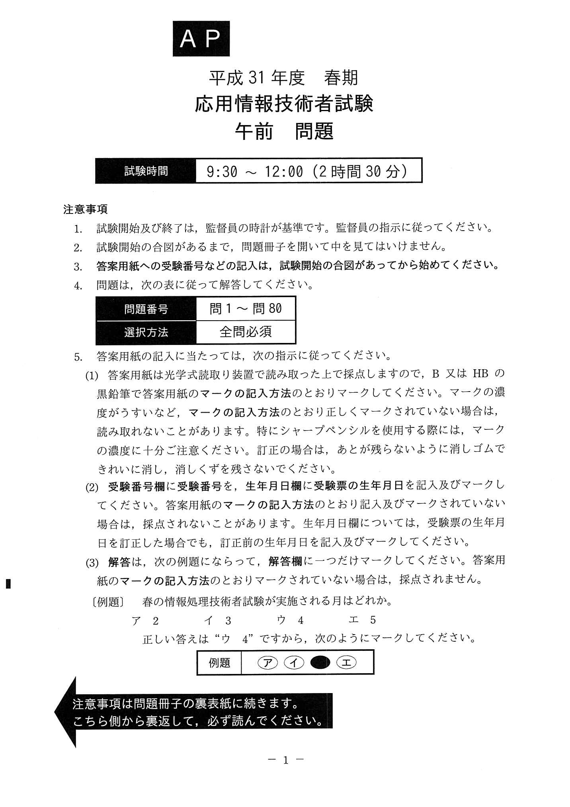

テキスト (OCR)

平成31 年度 春期
応用情報技術者試験
午前 問題

aM 9:30 ~ 12:00 (2時間30 分)

注意事項

1. 試験開始及び終了は, 監督貞の時計が基準です。監督員の指示に従ってください。

2. 試験開始の合図があるまで, 問題冊子を開いて中を見てはいけません。

3. 管案用紙への受験番号などの記入は, 試験開始の合図があってから始めてください。

4. 問題は, 次の表に従って解答してください。

問題番号       fal 1 ~ fal 80
選択方法     全問必2
5. 答案用紙の記入に当たっては, 次の指示に従ってください。

GQ) 答案用紙は光学式読取り装置で読み取った上で採点しますので, B 又は HB の
黒鉛筆で答案用紙のマークの記入方法のとおりマークしてください。マークの渡
度がうすいなど, マークの記入方法のとおり正しくマークされていない場合は,
読み取れないことがあります。 特にシャープペンシルを使用する際には, マーク
の濃度に十分ご注意ください。訂正の場合は, あとが残らないように消しゴムで
きれいに消し, 消しくずを残さないでください。

(⑫) 受験番号欄に受験番号を, 生年月日欄に受験票の生年月日を記入及びマークし
てください。管案用紙のマークの記入方法のとおり記入及びマークされていない
場合は, 採点されないことがあります。生年月日欄については, 受験票の生年月
日を訂正した場合でも, 訂正前の生年月日を記入及びマークしてください。

(3) 解答は, 次の例題にならって, 解答欄に一つだけマークしてください。 答案用
紙のマークの記入方法のとおりマークされていない場合は, 採点されません。
(WE) 春の情報処理技術者試験が実施される月はどれか。

ア 2   イ 3    ウ 4   エ 5
正しい答えは“ウ 4" ですから, 次のようにマークしてください。

例題 | 〈⑦の(の (や)

注意事項は問題冊子の裏表紙に続きます。
こちら側から裏返して, 必ず読んでください。

### ページ 2

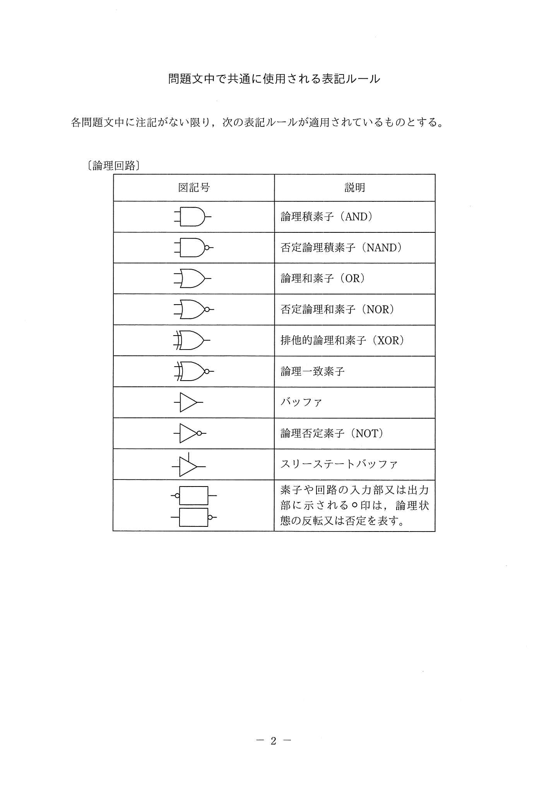

テキスト (OCR)

問題文中で共通に使用される表記ルール

各間題文中に注記がない限り, 次の表記ルールが適用されているものとする。

〔論理回路)

図
Bult
cu
aq

説明

論理積素子 (AND)

否定論理積素子 (NAND)

論理和素子 (OR)

AE mE A AF (NOR)

排他的論理和素子 (XOR)

論理一致素子

バッファ

論理否定素子 (NOT)

スリーステートバッファ

素子や回路の入力部又は出力
部に示されるo印は, 論理状
態の反転駐は耕定を表す。

HHYIYIYMVMMV

### ページ 3

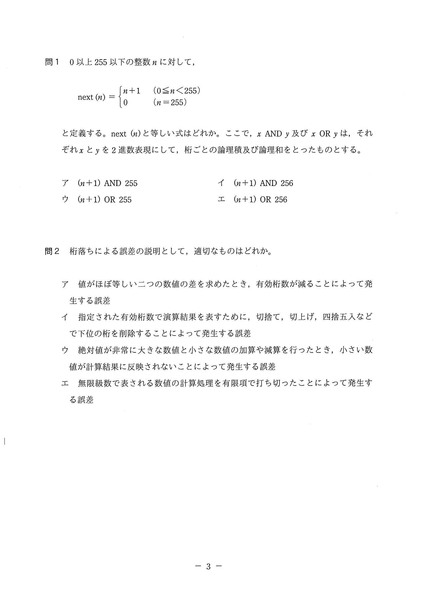

テキスト (OCR)

問1 0以上255 以下の整数ヵ に対して,

z十1 (0ミミヵぐ255)

Heat) = 15         (n = 255)

と定義する。next ⑰)と等しい式はどれか。 ここで, « AND 及び x OR yは, それ
Chan とゅを 2 進数表現にして, 桁ごとの論理積及び論理和をとったものとする。

ア (n+1) AND 255           4 (+1) AND 256
ウ (n+1) OR 255          エ (n+) OR 256

間2 桁落ちによる誤差の説明として, 適切なものはどれか。

ア 値がほぼ等しい二つの数値の差を求めたとき, 有効桁数が減ることによって発
生する誤差

イ 指定された有効桁数で演算結果を表すために, 切捨て, 切上げ, 四捨五入など
で下位の桁を削除することによって発生する誤差

ウ 絶対値が非常に大きな数値と小さな数値の加算や減算を行ったとき, 小さい数
値が計算結果に反映されないことによって発生する誤差

エ 無限級数で表される数値の計算処理を有限項で打ち切ったことによって発生す

### ページ 4

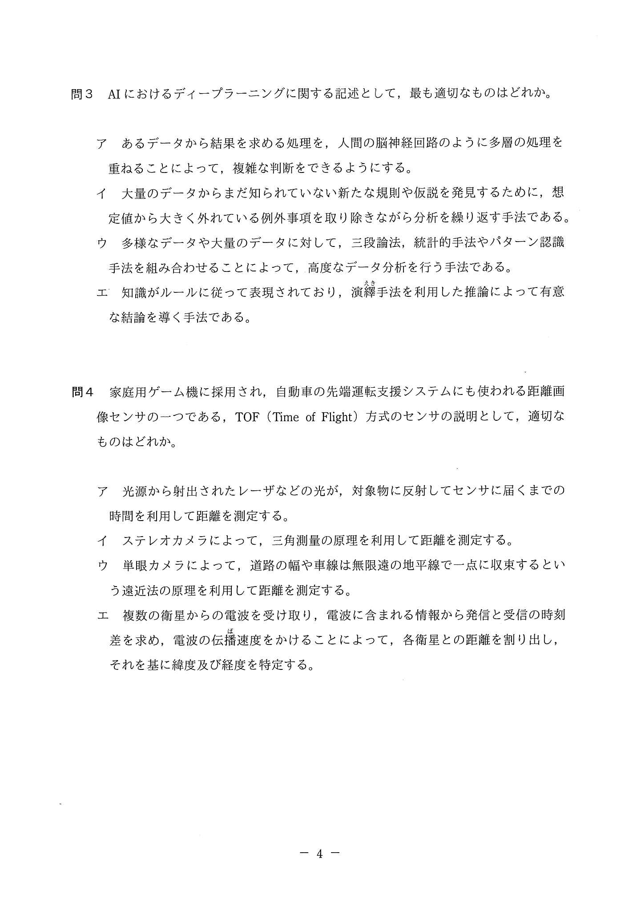

テキスト (OCR)

AS AIにおけるディープラーニングに関する記述として, 最も適切かものはどれか。

ア あるデータから結果を求める処理を, 人間の脳神経回路のように多層の処理を
重ねることによって, 複雑な判断をできるようにする。

イ 大量のデータからまだ知られていない新たな規則や仮説を発見するために, 想
定値から大きく外れている例外事項を取り除きながら分析を繰り返す手法である。
ウ 多様なデータや大量のデータに対して, 三段論法, 統計的手法やヤパターン認識
手法を組み合わせることによって, 高度なデータ分析を行う手法である。

エ 知識がルールに従って表現されており, 演幼手法を利用した推論によって有意
な結論を導く手法である。

問4 家庭用ゲーム機に採用され, 自動車の先端運転支援システムにも使われる距離画
像センサの一つである, TOF (Time of Flight) 方式のセンサの説明として, 適切な
ものはどれか。

ア 光源から射出されたレーザなどの光が, 対象物に反射してセンサに届くまでの
時間を利用して距離を測定する。

イ ステレオカメラによって, 三角測量の原理を利用して距離を測定する。

ウ 単眼カメラによって, 道路の幅や車線は無限各の地平線で一点に収束するとい
う遠近法の原理を利用して距離を測定する。

エ 複数の衛星からの電波を受け取り, 電波に含まれる情報から発信と受信の時刻
差を求め, 電波の伝摘速度をかけることによって, 各衛星との距離を割り出し,
それを基に紳度及び経度を特定する。

### ページ 5

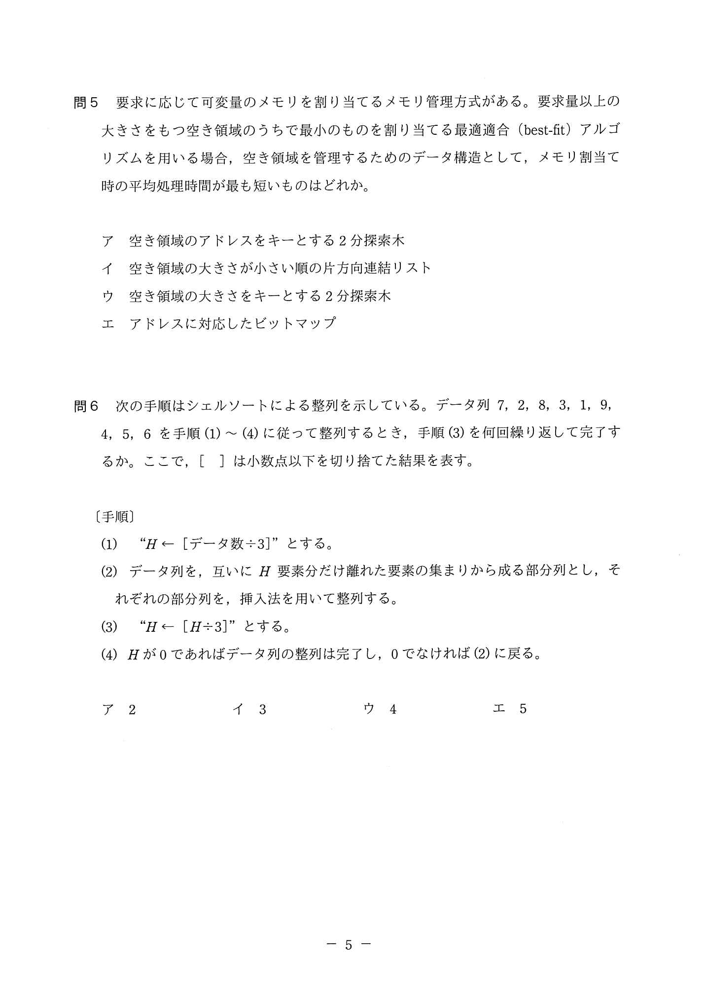

テキスト (OCR)

AS 要求に応じて可変量のメモリを割り当てるメモリ管理方式がある。 要求量以上の
大きさをもつ空き領域のうちで最小のものを割り当てる最適適合 (best-it) アルゴ
リズムを用いる場合, 空き領域を管理するためのデータ構造として, メモリ割当て
時の平均処理時間が最も短いものはどれか。

時

き領域のアドレスをキーとする 2 分探索木

き領域の大きさが小さい順の片方向連結リスト
き領域の大きさをキーとする 2 分探索木

ドレスに対応したビットマップ

Ha 時

ア
イ
Dv
a

YW

問6 次の手順はシェルソートによる整列を示している。データ列 7, 2, 8, 3, 1, 9
4, 5, 6 を手順 (1) ~ @ に従って整列するとき, 手順 (3③ を何回繰り返して完了す
るか。ここで, [ ] は小数点以下を切り捨てた結果を表す。

(手順

Q①) 婦こ[データ数3]” とする。

2) データ列を, 互いに 万 要素分だけ離れた要素の集まりから成る部分列とし, そ
れぞれの部分列を, 挿入法を用いて整列する。

(3) “H< [H+3]” とする。

(4) HO であればデータ列の整列は完了し, 0 でなければ (⑫ に戻る。

### ページ 6

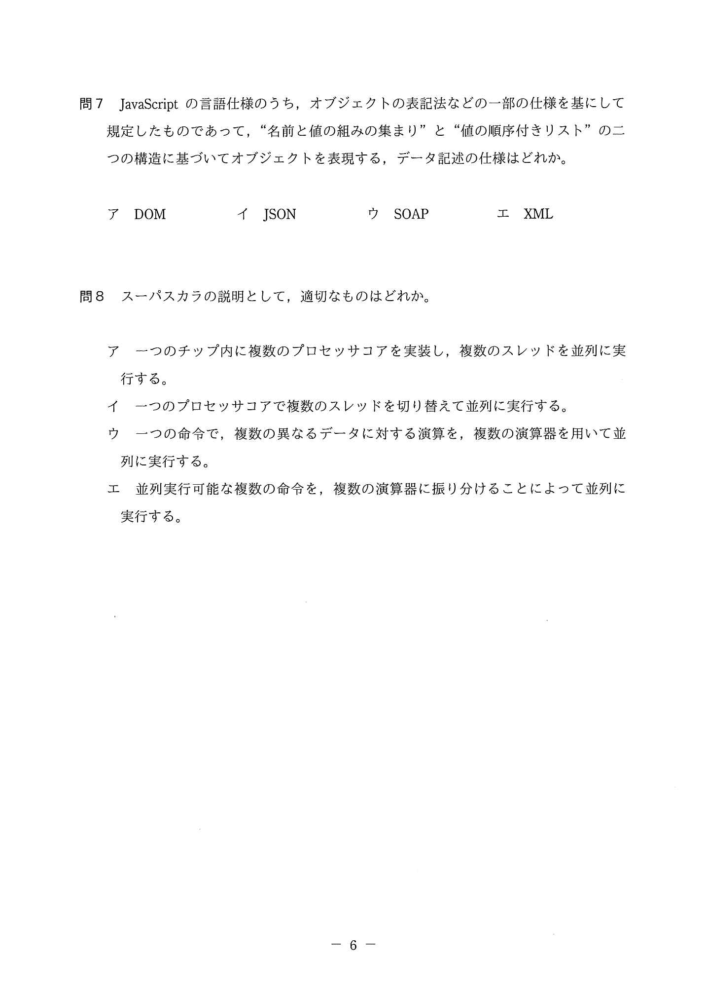

テキスト (OCR)

間 7 JavaScript の言語仕様のうちも, オブジェクトの表記法などの一部の仕様を基にして

規定したものであって, “名前と値の組みの集まり” と “値の順序付きリスト” OR
つの構造に基づいてオブジェクトを表現する, データ記述の仕様はどれか。

ア DOM    イ JSON    ウ SOAP

FAIS スーパスカラの説明として, 適切がものはどれか。

ア 一つのチップ内に複数のプロセッサコアを実装し, 複数のスレッドを並列に実
行する。

イ 一つのプロセッサコアで複数のスレッドを切り替えて並列に実行する。

ウ

ーつの命令で, 複数の異なるデータに対する演算を, 複数の演算器を用いて並
列に実行する。

エ 並列実行可能な複数の命令を, 複数の演算器に振り分けることによって普列に
実行する。

### ページ 7

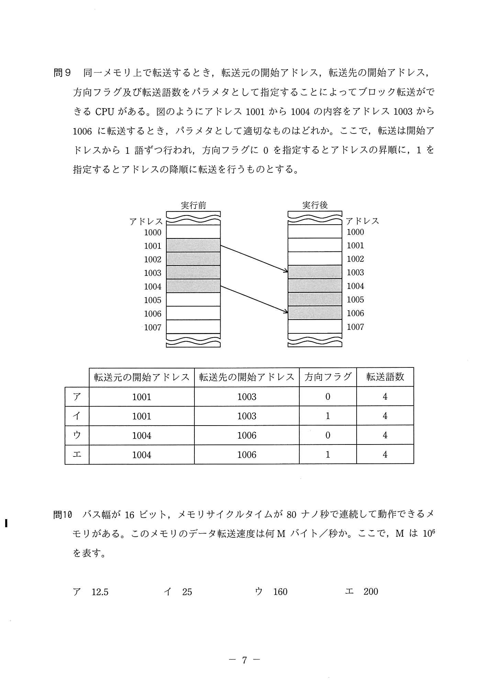

テキスト (OCR)

間9 同一メモリ上で転送するとき, 転送元の開始アドレス, 転送先の開始アドレス,
方向フラグ及び転送語数をパラメタとして指定することによってブロック転送がで
きる CPU がある。図のようにアドレス 1001 から 1004 の内容をアドレス 1003 から
1006 に転送するとき, パラメタとして適切ながものはどれか。ここで, 転送は開始ア
ドレスから 1 語ずつ行われ, 方向フラグに 0 を指定するとアドレスの昇順に, 1 を
指定するとアドレスの降順に転送を行うものとする。

実行前                                        実行後
ァドレぇピー           ーーキーゴリァドレス

1000                                                                    1000

1001                                                                    1001

1002                      P|                      1002

1003                                                                    1003

1004                                                                    1004

1005                      P|                      1005

1006                                                                    1006

1007                                                                    1007

ーーーーズ                        ーー
転送元の開始アドレス | 転送先の開始アドレス | 方向フラグ| 転送語3

ア                   1001                                1003                                              4
イ                   1001                                1003                          1                   4
ウ                   1004                                1006                         0                   4
om                   1004                                1006                          1                   4

間19 バス幅が 16 ビット, メモリサイクルタイムが 80 ナノ秒で連続して動作できるメ
モリがある。このメモリのデータ転送速度は何M バイトノ秒か。ここで, M は 108
を表す。

ア 12.5     イ 25     ウ 160     x= 200

### ページ 8

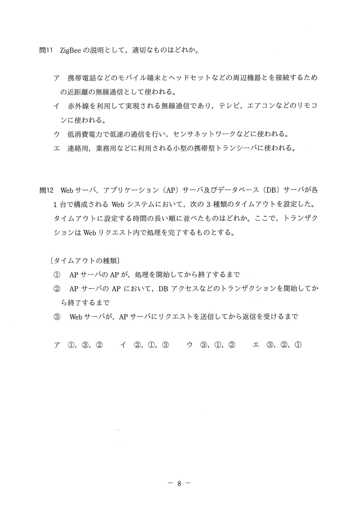

テキスト (OCR)

問11 ZigBee の説明として, 適切がかものはどれか。

ア 携帯電話などのモバイル端末とヘッドセットなどの周辺機器とを接続するため
の近距離の無線通信として使われる。

イ 赤外線を利用して実現される無線通信であり, テレビ, エアコンなどのリモコ
ンに使われる。

ウ 低消費電力で低速の通信を行い センサネットワークなどに使われる。

エエ 連絡用, 業務用などに利用される小型の携帯弄トランシーバに使われる。

問12 Web サーバ, アプリケーション (AP) サーバ及びデータベース (DB) サーバが各

台で構成される Web システムにおいて, 次の 3 種類のタイムアウトを設定した。

タイムアウトに設定する時間の長い順に並べたものはどれか。ここで, トランザク
ションは Web リクエスト内で処理を完了するものとする。

〔【タイムアウトの種類]

① AP サーバの AP が, 処理を開始してから終了するまで

② AP サーバの AP において, DB アクセスなどのトランザクションを開始してか
ら終了するまで

③ Web サーバが, AP サーバにリクエストを送信してから返信を受けるまで

ア O, ③, @  1 @ ①, ③  7 ③, ©, @  x ③ @, O

### ページ 9

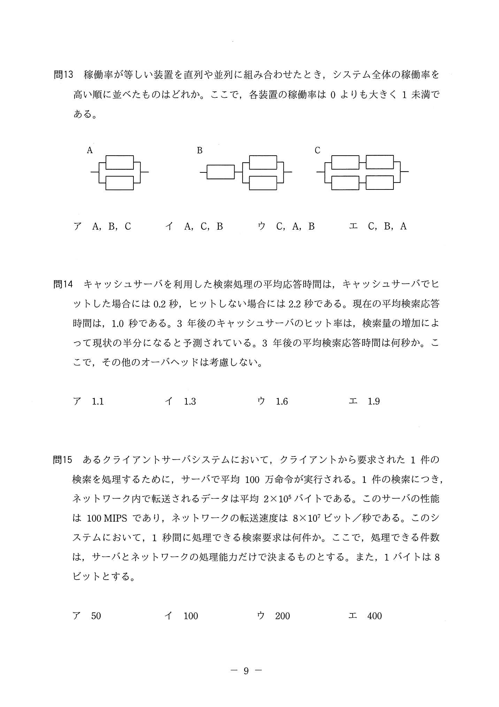

テキスト (OCR)

問13 稼働率が等しい装置を直列や並列に組み合わせたとき, システム全体の稼働率を
高い順に並べたものはどれか。ここで, 各装置の稼働率は 0 よりも大きく 1 未満で
ある。

A      B      C
ア Az, B,C  4 A, C, B  7 C, A, B  エ C, B, A

間14 キャッシュサーバを利用した検索処理の平均応答時間は, キャッシュサーバでヒ
ットした場合には 0.2 秒, ヒットしない場合には 2.2 秒である。現在の平均検索応答
時間は, 1.0 秒である。3 年後のキャッシュサーバのヒット率は, 検索量の増加によ
って現状の半分になると予測されている。3 年後の平均検索応答時間は何秒か。こ
こで, その他のオーバヘッドは考慮しない。

間15 あるクライアントサーバシステムにおいて, クライアントから要求された 1 件の
検索を処理するために, サーバで平均 100 万命令が実行される。1 件の検索につき,
ネットワーク内で転送されるデータは平均 2X105 バイトである。このサーバの性能
は 100 MIPS であり, ネットワークの転送速度は 8X107 ビットノ秒である。このシ
ステムにおいて, 1 秒間に処理できる検索要求は何件か。ここで, 処理できる件数
は, サーバとネットワークの処理能力だけで決まるものとする。また, 1 バイトは8
ビットとする。

ア 50     イ 100     ウ 200     x= 400

### ページ 10

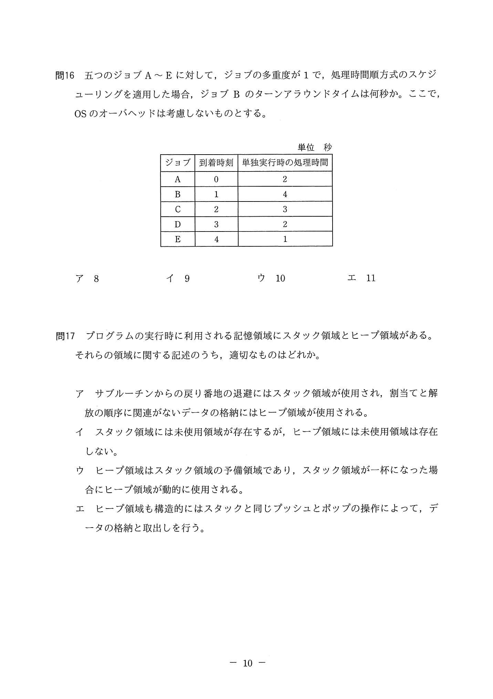

テキスト (OCR)

問16 五つのジョブ AE に対して, ジョブの多重度が 1 で, 処理時間順方式のスケジ
ューリングを適用した場合, ジョブ B のターンアラウンドタイムは何秒か。ここで
OS のオーバヘッドは考慮しないものとする。

単位 秒
ジョブ | 到着時刻 | 単独実行時の処理時間
A   0      2
B   1      4
C   2      3
D   3      2
E   4      1
ア 8    イ 9    ウ 10   =u

間17 プログラムの実行時に利用される記憶領域にスタック領域とヒープ領域がある。
それらの領域に関する記述のうち, 適切かものはどれか。

ア サブルーチンからの戻り番地の退避にはスタック領域が使用され, 割当てと解
放の順序に関連がないデータの格納にはヒープ領域が使用される。

イ スタック領域には未使用領域が存在するが, ヒーブプ領域には未使用領域は存在
しない。

ウ ヒーブプ領域はスタック領域の予備領域であり, スタック領域が一杯になった場
合にヒープ領域が動的に使用される。

エ ヒープ領域も構造的にはスタックと同じプッシュとポップの操作によって, デ
ータの格納と取出しを行う。

ー 10 一

### ページ 11

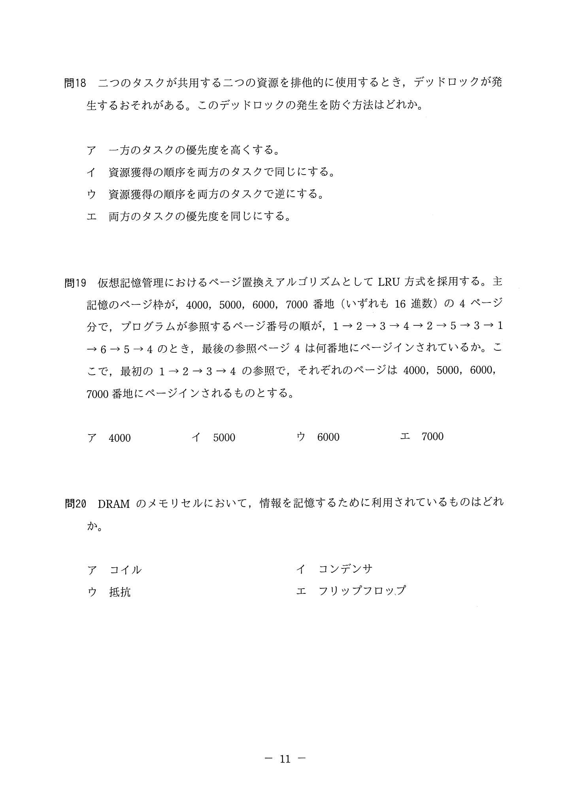

テキスト (OCR)

間18 二つのタスクが共用する二つの資源を排他的に使用するとき, デッドロックが発
生するおそれがある。このデッドロックの発生を防ぐ方法はどれか。

ア 一方のタスクの優先度を高くする。

イ 資源獲得の順序を両方のタスクで同じにする。
ウ 資源獲得の順序を両方のタスクで逆にする。
L 両方のタスクの優先度を同じにする。

問19 仮想記憶管理におけるページ置換えアルゴリズムとして LRU 方式を採用する。主
記憶のページ枠が, 4000, 5000, 6000, 7000 番地 (いずれも 16 進数) の 4 ページ
HC, プログラムが参照するページ番号の順が., 1つ2つ3つ4つ2つづ5つ3づつ1
つっつ6つ5一4 のとき, 最後の参照ページ 4 は何番地にページインされているか。こ
こで, 最初の1つ2つ3一4 の参照で。 それぞれのページは 4000, 5000, 6000,
7000 番地にページインされるものとする。

ア 4000           イ 5000           ウ 6000           = 7000
FI20 DRAM のメモリセルにおいて, 情報を記憶するために利用されているものはどれ
か。

ア コイル          イ コンデンサ
ウ 抵抗            エ フリップフロップ

— tt 一

### ページ 12

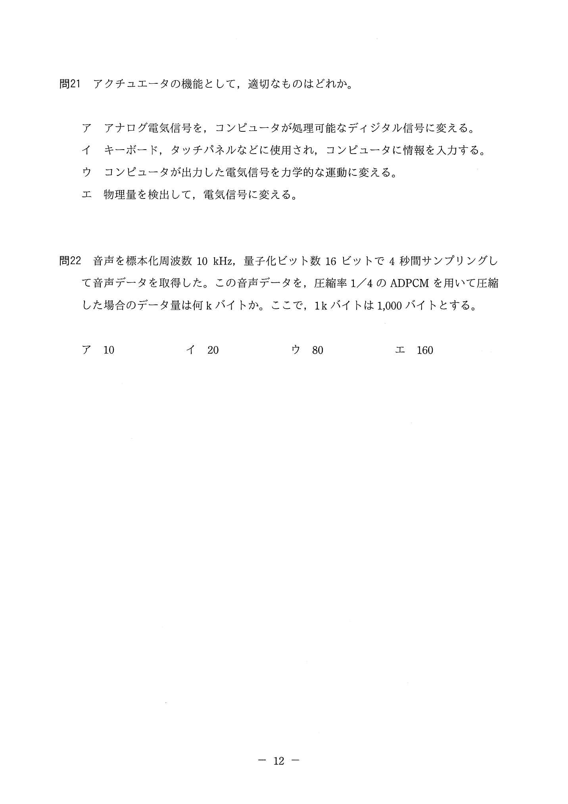

テキスト (OCR)

間21 アクチュエータの機能として, 適切なものはどれか。

アナログ電気信号を, コンピュータが処理可能なディジタル信号に変える。
キーボード, タッチパネルなどに使用され, コンピュータに情報を入力する。
コンピュータが出力した電気信号を力学的な運動に変える
物理量を検出して, 電気信号に変える。

H GAN

問22 音声を標本化周波数 10 kHz, 量子化ビット数 16 ビットで 4 秒間サンプリングし
て音声データを取得した。この音声データを, 圧縮率 1プ4 の ADPCM を用いて圧縮
した場合のデータ量は何 k バイトか。ここで, 1k バイトは1.000 バイトとする。

ア 10     イ 20     ウ 80     = 160

ー 12 一

### ページ 13

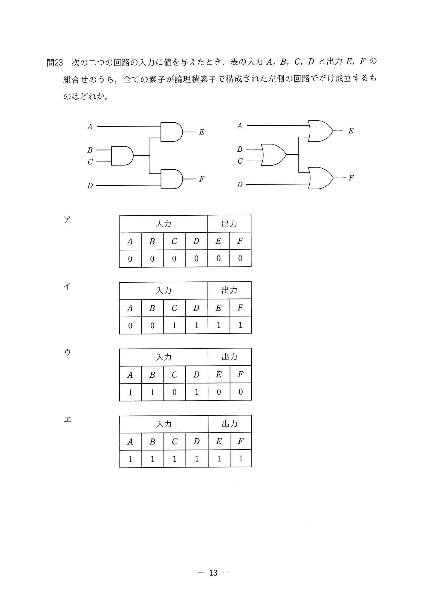

テキスト (OCR)

間23 次の二つの回路の入力に値を与えたとき, 表の入力 4, B,C, の と出力名, FO
組合せのうち, 全ての素子が論理積素子で構成された左側の回路でだけ成立するも
のはどれか。

ーーーD- 1
E                   E
B—            B
C—            C
p=
の ————_        D
ア           入力       出力

イィ                        入力              出力
4    B    Cc    D    E    F
0     0     1     1     1     1

a                        AD              出力
A    B     C    の    E    F
1     1.     0     1     0     0

エ                        入力              出力
4    B    C    の    F
1     1     1     1     1     1

ー- 18 一

### ページ 14

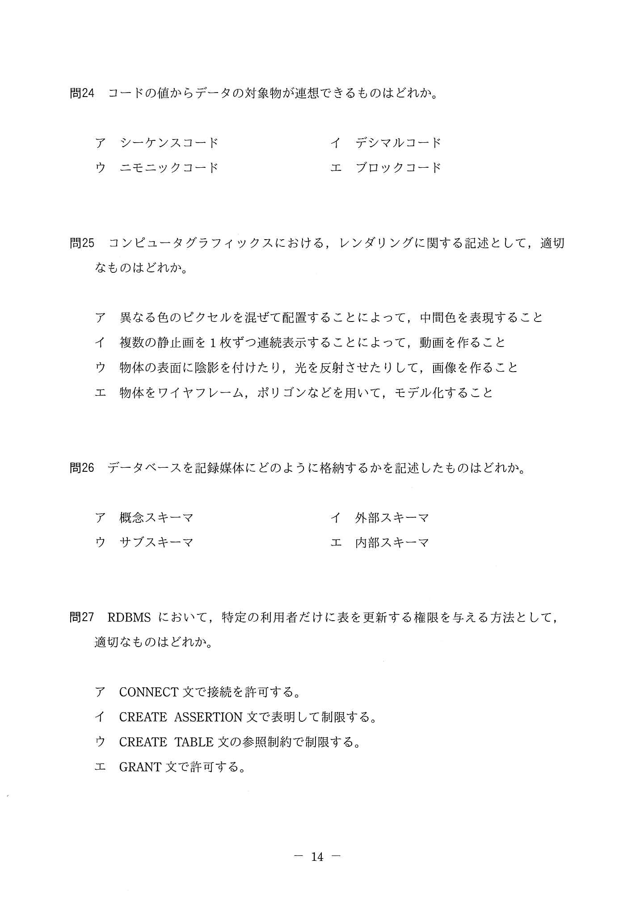

テキスト (OCR)

問24 コードの値からデータの対象物が連想できるものはどれか。

ア シーケンスコード         イ デシマルコード

必 デモデー必タダコヨード         = ブロックコード

間25 コンピュータグラフィックスにおける, レンダリングに関する記述として, 適切
なものはどれか。

異なる色のピクセルを混ぜて配置することによって, 中間色を表現すること
複数の静止画を 1 枚ずつ連続表示することによって, 動画を作ること
物体の表面に陰影を付けたり, 光を反射させたりして, 画像を作ること
物体をワイヤフレーム, ポリゴンなどを用いて, モデル化すること

H へ

問26 データベースを記録媒体にどのように格納するかを記述したものはどれか。

ア 概念スキーマ        イ 外部スキーマ
ウ サブスキーマ         エエ 内部スキーマ

間27 RDBMS において, 特定の利用者だけに表を更新する権限を与える方法として,
適切なものはどれか。

CONNECT 文で接続を許可する。

CREATE ASSERTION 文で表明して制限する。
CREATE TABLE 文の参照制約で制限する。
GRANT 文で許可する。

H ささコ

ー 14 一

### ページ 15

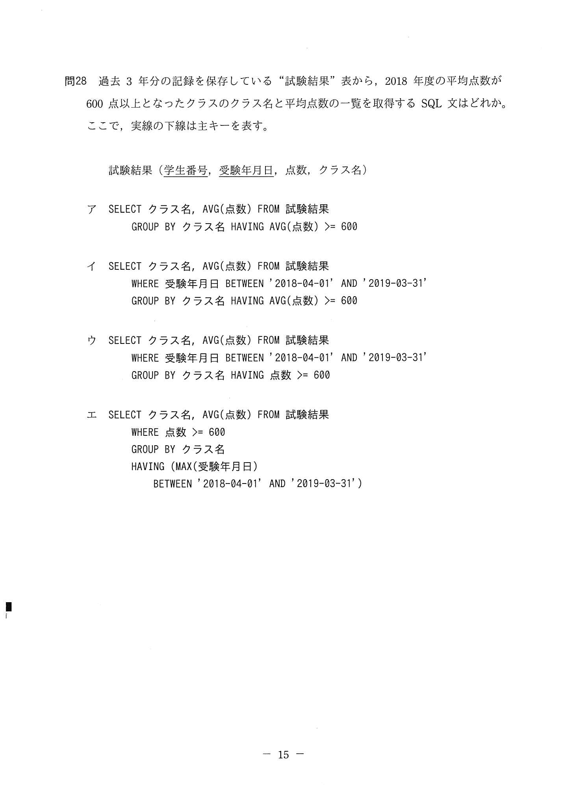

テキスト (OCR)

問28 過去 3 年分の記録を保存している“試験結果" ROS, 2018 年度の平均点数が
600 点以上となったクラスのクラス名と平均点数の一覧を取得する SQL 文はどれか。
ここで, 実線の下線は主キーを表す。

試験結果 (学生番号, 受験年月日, 点数, クラス名)

ア SELECT クラス名, AVG(点数) FROM 試験結果
GROUP BY クラス名 HAVING AVG(点数) >= 600

イ SELECT クラス名, AVG(点数) FROM 試験結果
WHERE 受験年月日 BETWEEN ’ 2018-04-01’ AND ’ 2019-03-31’
GROUP BY クラス名 HAVING AVG(点数) >= 600

ウ SELECT クラス名, AVG(点数) FROM 試験結果
WHERE 受験年月日 BETWEEN ’ 2018-04-01’ AND ’ 2019-03-31’
GROUP BY クラス名 HAVING 点数 >= 600

x SELECT クラス名, AVG(点数) FROM 試験結果
WHERE 点数 >= 600
GROUP BY クラス名
HAVING (MAX(受験年月日)
BETWEEN ’ 2018-04-01’ AND ’ 2019-03-31’ )

= 45 =

### ページ 16

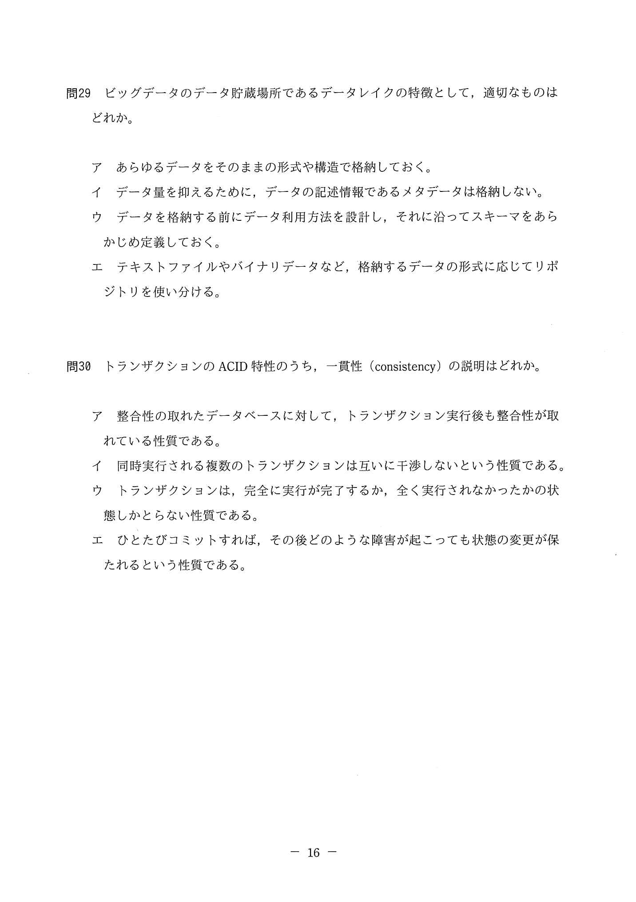

テキスト (OCR)

29 ビッグデータのデータ貯蔵場所であるデータレイクの特徴として, 適切なものは
どれか。

ア あらゆるデータをそのままの形式や構造で格納しておく。

イ データ量を抑えるために, データの記述情報であるメタデータは格納しない。

ウ データを格納する前にデータ利用方法を設計し, それに沿っつてスキーマをあら
かじめ定義しておく。

エエ テキストファイルやバイナリデータなど, 格納するデータの形式に応じてリポ
ジトリを使い分ける。

間39 トランザクションの ACID 特性のうち, 一貫性 (consistency) の説明はどれか。

ア 整合性の取れたデータベースに対して, トランザクション実行後も整合性が取
れている性質である。

イ 同時実行される複数のトランザクションは互いに千渉しないという性質である。
ウ トランザクションは, 完全に実行が完了するか, 全く実行されなかったかの状
RUDLSEVMATHS,

エ ひとたびコミットすれば, その後どのような障害が起こっても状態の変更が保
たれるという性質である。

ー 16 一

### ページ 17

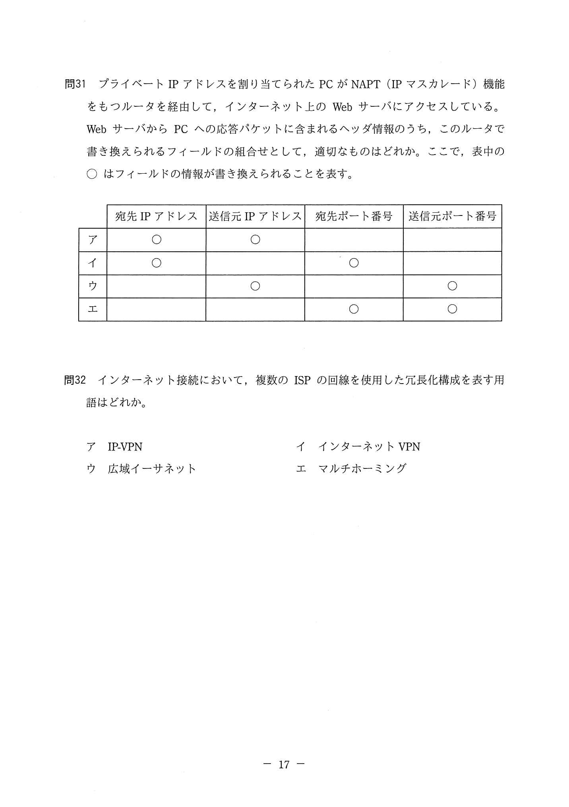

テキスト (OCR)

31 プライベート IP アドレスを割り当てられた PC が NAPT (IP マスカレード) 機能
をもつルータを経由して, インターネット上の Web サーバにアクセスしている。
Web サーバから PC への応答パケットに含まれるヘッダ情報のうち, このルータで
書き換えられるフィールドの組合せとして, 適切かものはどれか。ここで, RHO
〇 はフィールドの情報が書き換えられることを表す。

宛先IP アドレス |送信元 IP アドレス| 宛先ポート番号 | 送信元ポート番号
O              O
O                             O

HI} a] A}

間32 インターネット接続において, 複数の ISP の回線を使用した冗長化構成を表す用
語はどれか。

ア IPVPN           イ インターネット VPN
ウ 広域イーサネット       エエ マルチホーミング

ー 17 一

### ページ 18

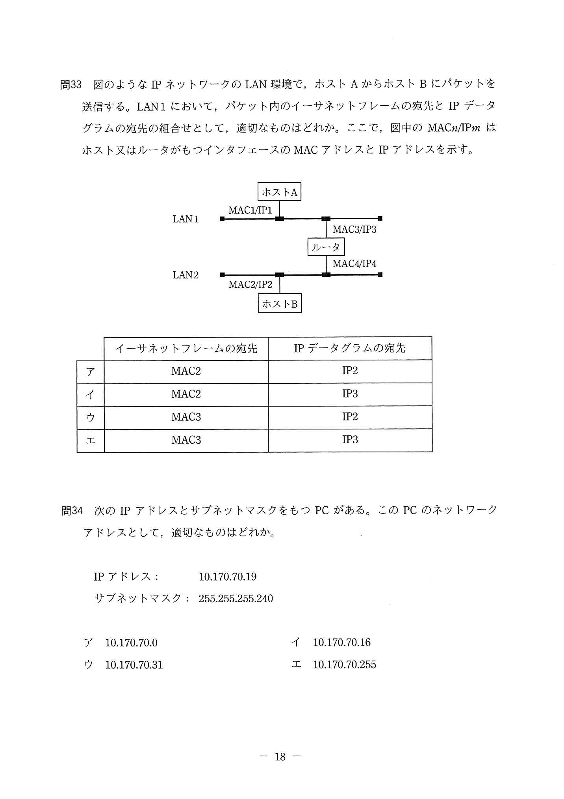

テキスト (OCR)

間33 図のようなIP ネットワークの LAN 環境で, ホスト Aからホスト B にパケットを
送信する。LAN 1 において, パケット内のイーサネットフレームの宛先と IP データ
グラムの宛先の組合せとして, 適切なものはどれか。ここで, 図中の MACzIP は
ホスト又はルータがもつインタフェースの MAC アドレスと IP アドレスを示す。

MAC1/IP1
LAN1       し                                                 a

MAC3/IP3
MAC4/IP4
LAN2         —                                                             a
MAC2/IP2
ホストB
イーサネットフレームの宛先      IP データグラムの郊先
ア                            MAC2                                                    IP2
イ                            MAC2                                                    IP3
ウ                            MAC3                                                   IP2
x                            MAC3                                                   TP3

間34 次の IP アドレスとサブネットマスクをもつ PC がある。この PC のネットワーク
アドレスとして, 適切なものはどれか。

IP アドレス :         10.170.70.19
サブネットマスク : 255.255.255.240

ア 10.170.70.0         イ 10.170.70.16
ウ 10.170.70.31          XZ 10.170.70.255

ー 18 一

### ページ 19

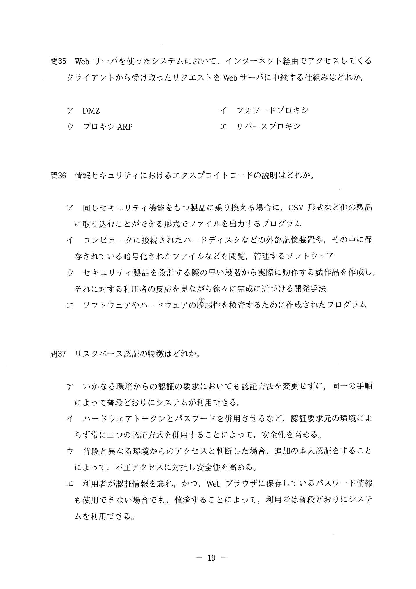

テキスト (OCR)

問35 Web サーバを使ったシステムにおいて, インターネット経由でアクセスしてくる
クライアントから受け取ったリクエストを Web サーバに中継する仕組みはどれか。

ア DMZ               イ フォワードプロキシ
エ リバースプロキシ

ウ プロキシ ARP
講報セキュリティにおけるエクスプロイトコードの説明はどれか。

問36
ア 同じセキュリティ機能をもつ製品に乗り換える場合に, CSV 形式など他の製品

に取り込むことができる形式でファイルを出力するプログラム
イ コンピュータに接続されたハードディスクなどの外部記憶装置や, その中に保

存されている暗号化されたファイルなどを閲覧, 管理するソフトウェア
設計する際の早い段階から実際に動作する試作品を作成し

ウ セキュリティ製品
それに対する利用者の反応を見ながら徐々に完成に近づける開発手法

エ ソフトウェアやハードウェアの脆弱性を検査するために作成されたプログラム

リスクベース認証の特徴はどれか。

問 3 7
証の要求においても認証方法を変更せずに, 同一の手順

証要求元の環境によ

vo al

ア
によって普段どおりにシステムが利用できる。
ハードウェアトークンとパスワードを併用させるなど, 認

イ
らず常に二つの認証方式を併用することによって, 安全性を高める。

ウ 普段と異なる環境からのアクセスと判断した場合, 追加の本人認証をすること
によって, 不正アクセスに対抗し安全性を高める。

エエ 利用者が認証情報を忘れ, DO, Web ブラウザに保存しているパスワード情報

も使用できない場合でも, 救済することによって, 利用者は普段どおりにシステ

ムを利用できる。

ー 19 一

### ページ 20

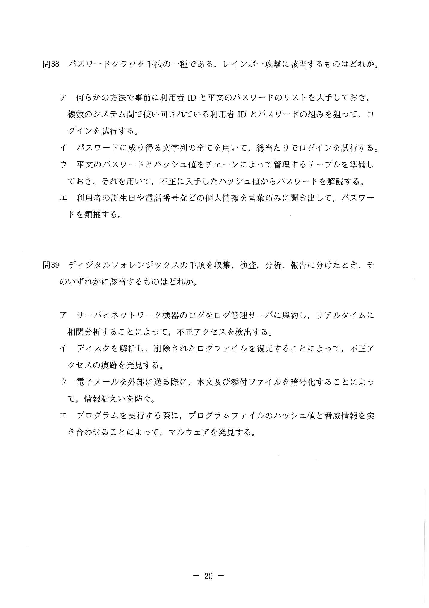

テキスト (OCR)

間38 パスワードクラック手法の一種である, レインボー攻撃に該当するものはどれか。

ア 何らかの方法で事前に利用者 ID と平文のパスワードのリストを入手しておき,
複数のシステム間で使い回されている利用者 ID とパスワードの組みを狙って, ロ
グインを試行する。

イ パスワードに成り得る文字列の全てを用いて, 総当たりでログインを試行する。
ウ 平文のパスワードとハッシュ値をチェーンによって管理するテーブルを準備し
ておき, それを用いて, 不正に入手したハッシュ値からパスワードを解読する。
エエ 利用者の誕生日や電話番号などの個人情報を言葉巧みに聞き出して, パスワー

ドを類推する。

問39 ディジタルフォレンジックスの手順を収集 MA, 分析, 報告に分けたとき, そ
のいずれかに該当するものはどれか。

ア サーバとネットワーク機器のログをログ管理サーバに集約し, リアルタイムに
相関分析することによって, 不正アクセスを検出する。

イ ディスクを解析し, 削除されたログファイルを復元することによって, 不正ア
クセスの痕跡を発見する。

電子メールを外部に送る際に, 本文及び添付ファイルを暗号化することによっ

て, 情報漏えいを防ぐ。

エエ プログラムを実行する際に, プログラムファイルのハッシュ値と公威情報を突
き合わせることによって, マルウェアを発見する。

ー 20 一

### ページ 21

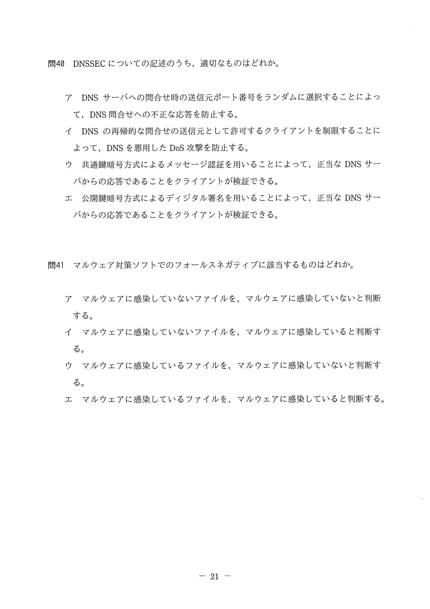

テキスト (OCR)

問40 DNSSEC についての記述のうち, 適切なものはどれか。

ア DNS サーバへの問合せ時の送信元ポート番号をランダムに選択することによっ
て, DNS 問合せへの不正な応答を防止する。

4 DNS の再帰的な問合せの送信元として許可するクライアントを制限することに
よって, DNS を悪用した DoS 攻撃を防止する。

ウ 共通鍵暗号方式によるメッセージ認証を用いることによって, 正当な DNS サー
バからの応答であることをクライアントが検証できる。

エエ 公開鍵暗号方式によるディジタル署名を用いることによって, 正当な DNS サー
バからの応答であることをクライアントが検証できる。

間41 マルウェア対策ソフトでのフォールスネガティブに該当するものはどれか。

ア マルウェアに感染していないファイルを, マルウェアに感染していないと判断

する。

イ マルウェアに感染していないファイルを, マルウェアに感染していると判断す
る。

ウ マルウェアに感染しているファイルを, マルウェアに感染していないと判断す
る。

エ マルウェアに感染しているファイルを, マルウェアに感染していると判断する。

ー 21 一

### ページ 22

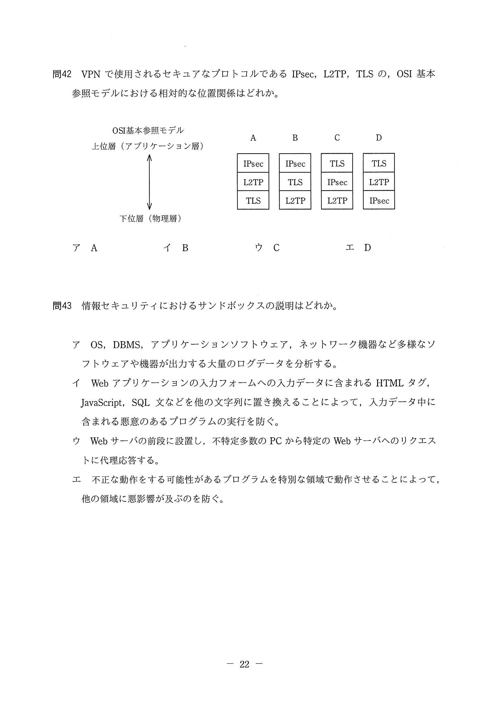

テキスト (OCR)

問42 VPN で使用されるセキュアなプロトコルである IPsec, L2TP, TLS の, OSI 基本
参照モデルにおける相対的な位置関係はどれか。

OSI基本参照モデル
A          B          G          D
L(Y TU 7 Y a)
IPsec      IPsec      TLS       TLS
L2TP       TLS       IPsec      L2TP
TLS       L2TP      L2TP      IPsec
下位層 (物理層)
ア A                  イ B                  ウ C                  x= D

問43 情報セキュリティにおけるサンドボックスの説明はどれか。

ア OS, DBMS, アプリケーションソフトウェア, ネットワーク機器など多様なソ
フトウェアや機器が出力する大量のログデータを分析する。

イ Web アプリケーションの入力フォームへの入力データに含まれる HTML タグ,
JavaScript, SQL 文などを他の文字列に置き換えることによって, 入力データ中に
含まれる悪意ひあるプログラムの実行を防ぐ。

ウ Web サーバの前段に設置し, 不特定多数の PC から特定の Web サーバへのリクエス

トに代理応答する。

エエ 不正な動作をする可能性があるプログラムを特別な領域で動作させることによって,

他の領域に悪影響が及ぶのを防ぐ。

ー 22 一

### ページ 23

テキスト (OCR)

問44 パケットフィルタリング型ファイアウォールが, 通信パケットの通過を許可する
かどうかを判断するときに用いるものはどれか。

ア Web アプリケーションに渡される POST データ
イ 送信元と宛先の TP アドレスとポート番号
ウ 送信元の MAC アドレス

エエ 利用者の PC から送信された URL

問45 WAFの説明はどれか。

Web アプリケーションへの攻撃を検知し, 阻止する。

Web ブラウザの通信内容を改ざんする攻撃を PC 内で監視し, 検出する。
サーバの 0S への不正なログインを監視する。

ファイルへのマルウェア感染を監視し, 検出する。

HAN

問46 ソフトウェアの分析・設計技法の特徴のうち, データ中心分析・設計技法の特徴
として, 最も適切なものはどれか。

ア 機能を詳細化する過程で.。 モジュールの独立性が高くなるようにプログラムを
分割していく。

イ システムの開発後の仕様変更は, データ構造や手続の局所的な変更で対応可能
なので, 比較的容易に実現できる。

ウ 対象業務領域のモデル化に当たって, 情報資源であるデータの構造に着目する。

LZ プログラムが最も効率よくアクセスできるようにデータ構造を設計する。

ー 23 一

### ページ 24

テキスト (OCR)

問47 フェールセーフの考えに基づいて設計したものはどれか。

ア 乾電池のプラスとマイナスを逆にすると, 乾電池が装協できないようにする。

イ 交通管制システムが故障したときには, 信号機に赤色が点灯するようにする。

ウ ネットワークカードのコントローラを二重化しておき, 片方のコントローラが
故障しても運用できるようにする。

エ ハードディスクに RAID1 を採用して, MTBF で示される信頼性が向上するよう
にする。

間48 オペレーティングシステムの更新によって, 既存のアプリケーションソフトウェ
アが正常に動作しなくなることが判明したので, 正常に動作するように修正した。
この保守を何と呼ぶか。

ア 完全化保守            イ 是正保守
ウ 適応保守             エ 予防保守

ー 24 一

### ページ 25

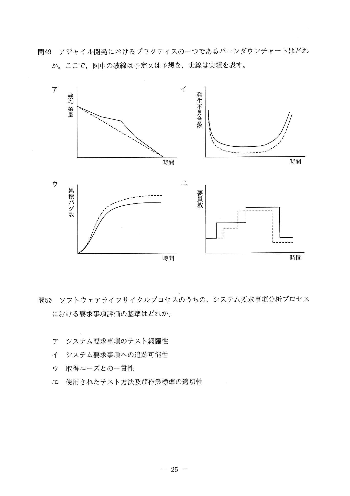

テキスト (OCR)

問49 アジャイル開発におけるプラクティスの一つであるバーンダウンチャートはどれ
か。ここで, 図中の破線は予定又は予想を, 実線は実績を表す。

ア                 イ

残                  発
作                  生
業           不

数

時間                                                                    時間
ウ                  x
Bl ーー         s
バ ーーー数
グ                        っ                                                          数
数              FS                                                                               en

時間                     時間

間59 ソフトウェアライフサイクルプロセスのうちの, システム要求事項分析プロセス
における要求事項評価の基準はどれか。

ア システム要求事項のテスト網苺性

イ システム要求事項への追跡可能性

ウ 取得ニーズとの一貫性

エエ 使用されたテスト方法及び作業標準の適切性

ー 25 一

### ページ 26

テキスト (OCR)

問51 JIS Q 21500:2018 (プロジェクトマネジメントの手引) によれば, プロジェクトマ
ネジメントの “実行のプロセス群" の説明はどれか。

ア プロジェクトの計画に照らしてプロジェクトパフォーマンスを監視し, 測定し,
管理するために使用する。

イ プロジェクトフェーズ又はプロジェクトが完了したことを正式に確定するため
に使用し, 必要に応じて考慮し, 実行するように得た教訓を提供するために使用
する。

ウ プロジェクトフェーズ又はプロジェクトを開始するために使用し, プロジェク
トフェーズ又はプロジェクトの目標を定義し, プロジェクトマネージャがプロジ
ェクト作業を進める許可を得るために使用する。

エエ プロジェクトマネジメントの活動を遂行し, プロジェクトの全体計画に従って
プロジェクトの成果物の提示を支援するために使用する。

問52 ある組織では, プロジェクトのスケジュールとコストの管理にアーンドバリュー
マネジメントを用いている。期間 10 日間のプロジェクトの, 5 日目の終了時点の状
況は表のとおりである。この時点でのコスト効率が今後も続くとしたとき, 完成時
総コスト見積り (EAC) は何万円か。

管理項目         金額 (万円)
完成時総予算 (BAC)       100
プランドバリュー (PV)          50
アーンドバリュー (EV)          40
実コスト (AC)           60
ア 110         イ 120          ウ 135         x= 150

ー 26 一

### ページ 27

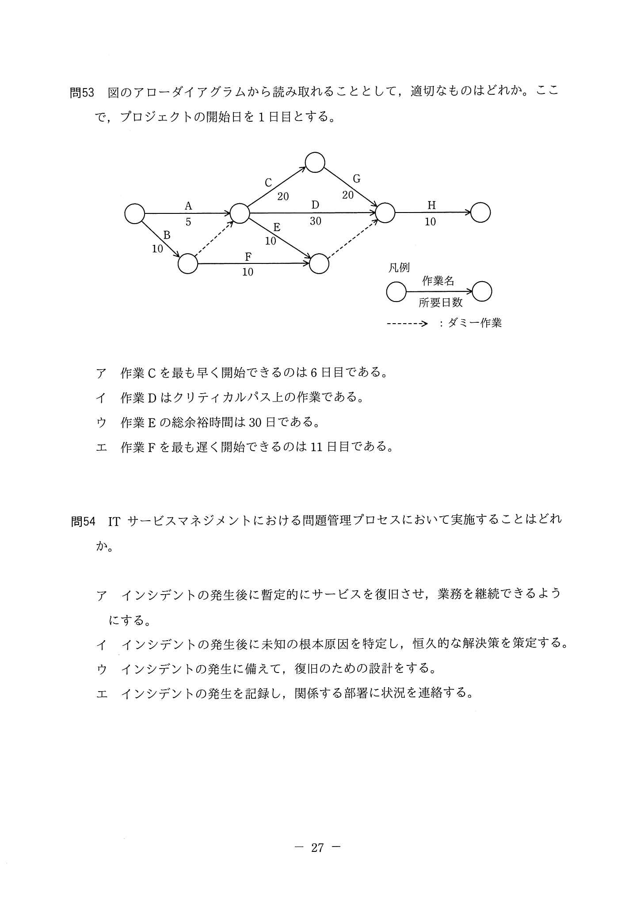

テキスト (OCR)

(1
(4

問53 図のアローダイアグラムから読み取れることとして, 適切なものはどれか。
で, プロジェクトの開始日を 1 日目とする。

作業 C を最も早く開始できるのは6 日目である。
作業 D はクリティカルパス上の作業である。
作業E の総余裕時間は 30 日である。

作業F を最も遅く開始できるのは11 日目である。

H ざ へ

問54 IT サービスマネジメントにおける問題管理プロセスにおいて実施することはどれ
か。

ア インシデントの発生後に暫定的にサービスを復旧させ, 業務を継続できるよう
にする。

イ インシデントの発生後に未知の根本原因を特定し, 恒久的な解決策を策定する。

ウ インシデントの発生に備えて, 復旧のための設計をする。

エ インシデントの発生を記録し, 関係する部署に状況を連絡する。

ー 27 一

### ページ 28

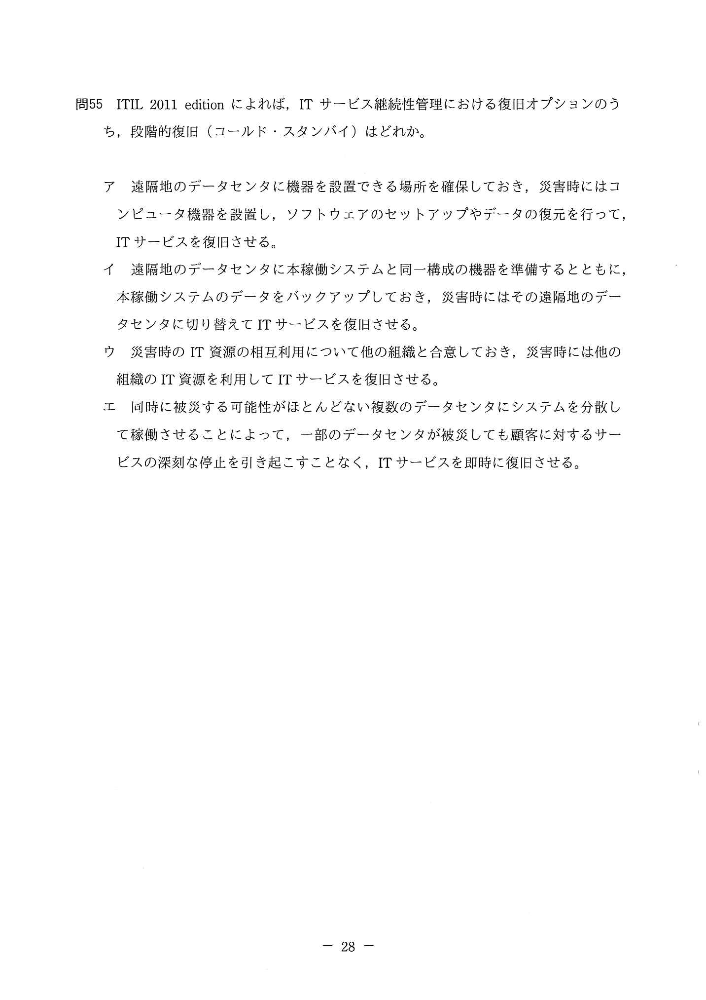

テキスト (OCR)

問55 ITIL 2011 edition によれば, IT サービス継続性管理における復旧オプションのう
ち, 段階的復旧 (コールド・スタンバイ ) はどれか。

ア 遠隔地のデータセンタに機器を設置できる場所を確保しておき, 災害時にはコ
ンピュータ機器を設置し, ソフトウェアのセットアップやデータの復元を行って,
IT サービスを復旧させる。

イ 遠隔地のデータセンタに本稼働システムと同一構成の機器を準備するとともに,
本稼働システムのデータをバックアップしておき, 災害時にはその遠隔地のデー
タセンタに切り替えて IT サービスを復旧させる。

ウ 災害時の IT 資源の相互利用について他の組織と合意しておき, 災害時には他の
組織の IT 資源を利用して IT サービスを復旧させる。

TL 同時に被災する可能性がほとんどない複数のデータセンタにシステムを分散し
て稼働させることによって, 一部のデータセンタが被災しても顧客に対するサー
ビスの深刻な停止を引き起こすことなく, IT サービスを即時に復旧させる。

ー 28 一

### ページ 29

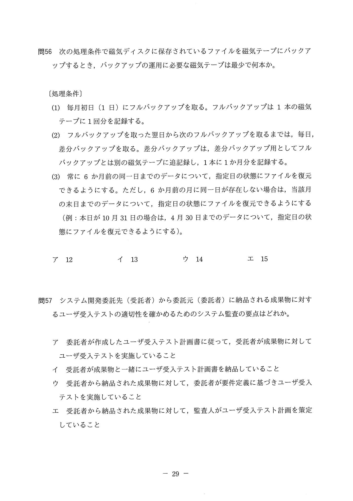

テキスト (OCR)

間56 次の処理条件で磁気ディスクに保存されているファイルを磁気テープにバックア
ップするとき, バックアップの運用に必要な磁気テープは最少で何本か。

〔処理条件〕

Q) 毎月初日 (1 日) にフルバックアップを取る。フルバックアップは 1 本の磁気
テープに1 回分を記録する。

Q) フルバックアップを取った翌日から次のフルバックアップを取るまでは, BH,
差分バックアップを取る。差分バックアップは, 差分バックアップ用としてフル
バックアップとは別の磁気テープに追記録し, 1 本に1か月分を記録する。

(3) 常に 6 か月前の同一日までのデータについて, 指定日の状態にファイルを復元
できるようにする。ただし, 6 か月前の月に同一日が存在しない場合は, 当該月
の末日までのデータについて, 指定日の状態にファイルを復元できるようにする
(例 : 本日が 10 月 31 日の場合は, 4 月 30 日までのデータについて, 指定日の状
態にファイルを復元できるようにする)。

AIST システム開発委託先 (受託者) から委託元 (委託者) に納品される成果物に対す
るユーザ受入テストの適切性を確かめるためのシステム監査の要点はどれか。

ア 委託者が作成したユーザ受入テスト計画書に従って, 受託者が成果物に対して
ユーザ受入テストを実施していること

イ 受託者が成果物と一緒にユーザ受入テスト計画書を納品していること

ウ 受託者から納品された成果物に対して, 委託者が要件定義に基づきユーザ受入
テストを実施していること

エ 受託者から納品された成果物に対して, 監査人がユーザ受入テスト計画を策定
してめいるとと

ー 29 一

### ページ 30

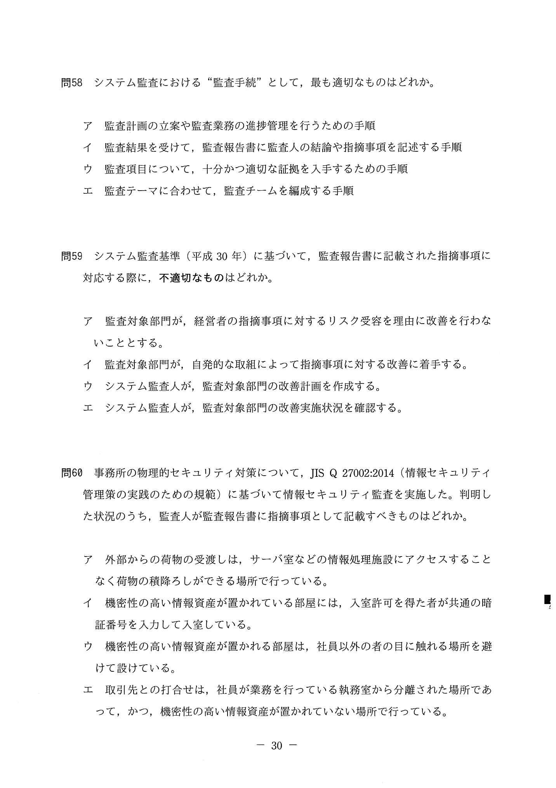

テキスト (OCR)

間58 システム監査における 監査手続" として, 最も適切がものはどれか。

監査計画の立案や監査業務の進捗管理を行うための手順

監査結果を受けて, 監査報告書に監査人の結論や指摘事項を記述する手順
監査項目について, 十分かつ適切な証拠を入手するための手順

監査テーマに合わせて, 監査チームを編成する手順

H へ

間59 システム監査基準 (平成 30 年) に基づいて, 監査報告書に記載された指摘事項に
対応する際に, 不適切なものはどれか。

ア 監査対象部門が, 経営者の指摘事項に対するリスク受容を理由に改善を行わな
いこととする。
イ 監査対象部門が, 自発的な取組によって指摘事項に対する改善に着手する。
ウ システム監査人が, 監査対象部門の改善計画を作成する。
システム監査人が, 監査対象部門の改善実施状況を確認する。

問69 事務所の物理的セキュリティ対策について, JIS Q 27002:2014 (情報セキュリティ
管理策の実践のための規範) に基づいて情報セキュリティ監査を実施した。判明し
た状況のうち, 監査人が監査報告書に指摘事項として記載すべきものはどれか。

ア 外部からの荷物の受渡しは, サーバ室などの情報処理施設にアクセスすること
なく荷物の積隆ろしができる場所で行っている。

イ 機密性の高い情報資産が置かれている部屋には, 入室許可を得た者が共通の暗
証番号を入力して入室している。

ウ 機密性の高い情報資産が置かれる部屋は, 社員以外の者の目に触れる場所を避
けて設けている。

エ 取引先との打合せは, 社員が業務を行っている執務室から分離された場所であ
って, かつ, 機密性の高い情報資産が置かれていない場所で行っている。

ー 30 一

### ページ 31

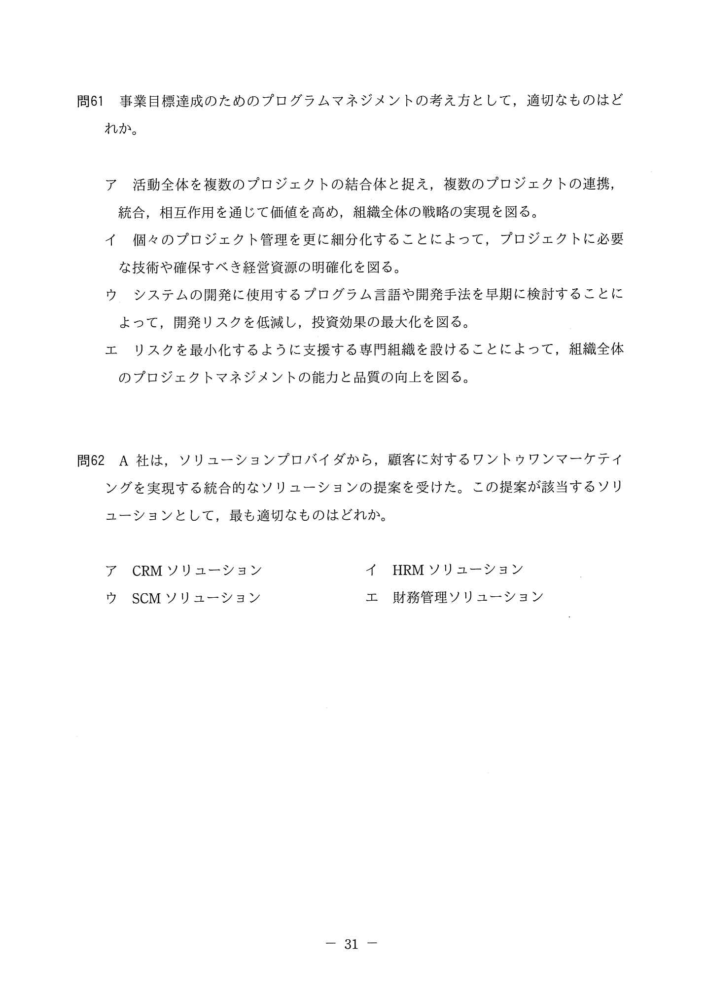

テキスト (OCR)

問61 事業目標達成のためのプログラムマネジメントの考え方として, 適切なものはど
れか。

ア 活動全体を複数のプロジェクトの結合体と捉え, 複数のプロジェクトの連携,
統合, 相互作用を通じて価値を高め, 組織全体の戦略の実現を図る。

イ 個々のプロジェクト管理を更に細分化することによって, プロジェクトに必要
な技術や確保すべき経営資源の明確化を図る。

ウ システムの開発に使用するプログラム言語や開発手法を早期に検討することに
よって, 開発リスクを低減し, 投資効果の最大化を図る。

エ リスクを最小化するように支援する専門組織を設けることによって, 組織全体
のプロジェクトマネジメントの能力と品質の向上を図る。

問62 A 社は, ソリューションプロバイダから, 顧客に対するワントゥワンマーケティ
ングを実現する統合的なソリューションの提案を受けた。この提案が該当するソリ
ューションとして, 最も適切なかものはどれか。

ア CRMソリューション      イ HRM ソリューション
ウ SCMソリューション       エ 財務管理ソリューション

ー 81 =

### ページ 32

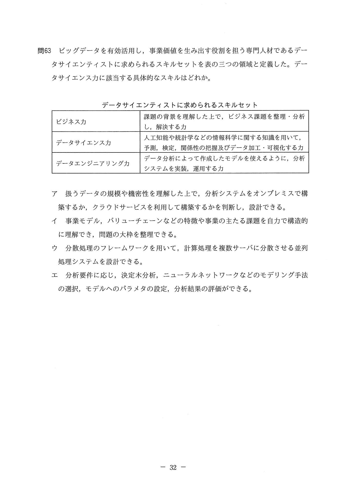

テキスト (OCR)

間63 ビッグデータを有効活用し, 事業価値を生み出す役割を担う専門人材であるデー
タサイエンティストに求められるスキルセットを表の三つの領域と定義した。デー
タサイエンス力に該当する具体的なかスキルはどれか。

データサイエンティストに求められるスキルセット

課題の背景を理解した上で, ビジネス課題を整理・分析
し, 解決するカ

人工知能や統計学などの情報科学に関する知識を用いて,
FH, RE, 関係性の把握及びデータ加工・可視化するカ
データ分析によって作成したモデルを使えるように, 分析
システムを実装, 運用するカ

ビジネスカ

デーサイエンスカ

データタエッジニアリング

ア 扱うデータの規模や機密性を理解した上で, 分析システムをオンプレミスて構
築するか, クラウドサービスを利用して構築するかを判断し, 設計できる。

イ 事業モデル, バリューチェーンなどの特徴や事業の主たる課題を自力で構造的
に理解でき, 問題の大枠を整理できる。

ウ 分散処理のフレームワークを用いて, 計算処理を複数サーバに分散させる並列
処理システムを設計できる。

エエ 分析要件に応じ, 決定木分析, ニニューラルネットワークなどのモデリング手法
の選択. モデルへのパラメタの設定, 分析結果の評価ができる。

ー 32 一

### ページ 33

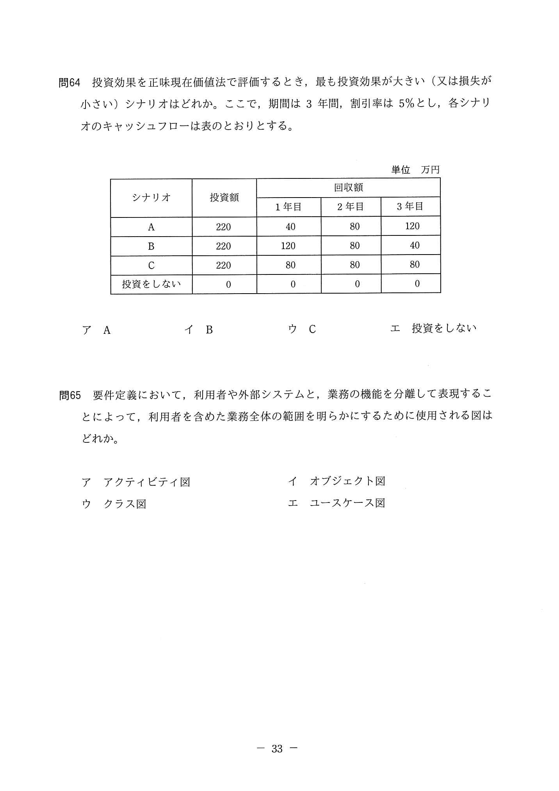

テキスト (OCR)

間64 投資効果を正味現在価値法で評価するとき, 最も投資効果が大きい (又は損失が
小さい) シナリオはどれか。ここで, 期間は 3 年間, 割引率は 5%とし, 各シナリ
オのキャッシュフローは表のとおりとする。

単位 万円
シナリオ    投資額          上

1 年目            2 年目           3 年目

220                  40                  80               120

220                120                  80                40

220                  80                  80                80

投資をしない    0      0     0     0

ア A      イ B      ウ C      エ 投資をしない

問65 要件定義において, 利用者や外部システムと, 業務の機能を分離して表現するこ
とによって, 利用者を含めた業務全体の範囲を明らかにするために使用される図は
どれか。

アクティビティイ図             イ オブジェクト図
ウ クラス図             エエ ユースケース図

ー 33 一

### ページ 34

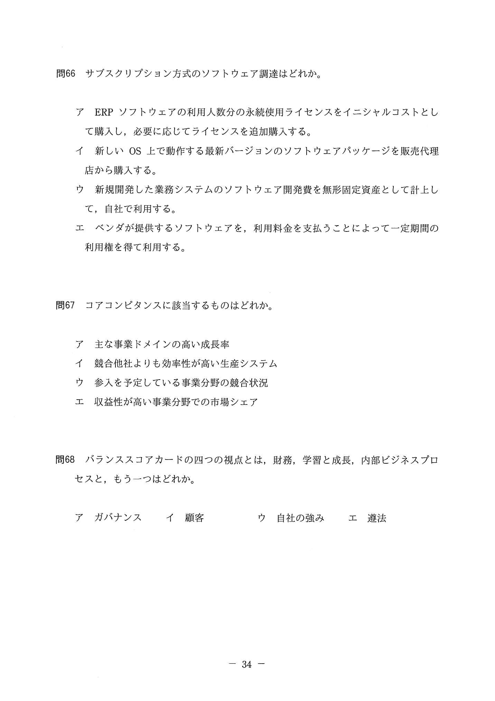

テキスト (OCR)

間66 サブスクリプション方式のソフトウェア調達はどれか。

ア ERP ソフトウェアの利用人数分の永続使用ライセンスをイニシャルコストとし
て購入し, 必要に応じてライセンスを追加購入する。

イ 新しい OS 上で動作する最新バージョンのソフトウェアパッケージを販売代理
店から購入する。

ウ 新規開発した業務システムのソフトウェア開発費を無形固定資産として計上し
て, 自社で利用する。

エ ベンダが提供するソフトウェアを, 利用料金を支払うことによって一定期間の
利用権を得て利用する。

問67 コアコンピタンスに該当するものはどれか。

主な事業ドメインの高い成長率

競合他社よりも効率性が高い生産システム
参入を予定している事業分野の競合状況
収益性が高い事業分野での市場シェア

H @- AN

間68 バランススコアカードの四つの視点とは, 財務, 学習と成長, 内部ビジネスプロ
セスと, もう一つはどれか。

ア ガバナンス  イ 顧客     ウ 自社の強み  エ 遵法

ー 34 一

### ページ 35

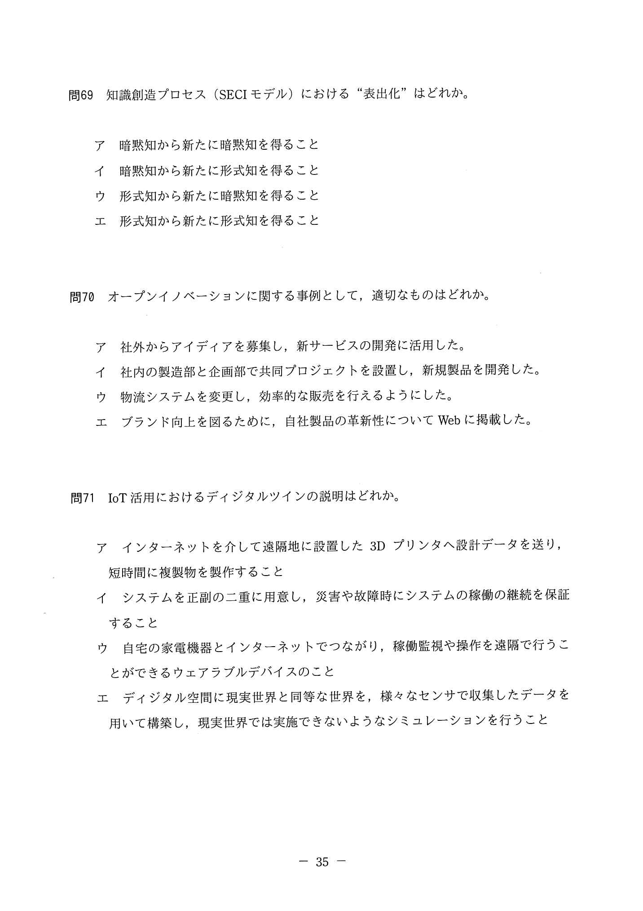

テキスト (OCR)

問69 知識創造プロセス (SECIモデル) における “表出化"” はどれか。

暗黙知から新たに暗黙知を得ること
暗黙知から新たに形式知を得ること
形式知から新たに暗黙知を得ること
形式知から新たに形式知を得ること

H さ へ

間79 オープンイノベーションに関する事例として, 適切なものはどれか。

社外からアイディアを募集し, 新サービスの開発に活用した。

社内の製造部と企画部で共同プロジェクトを設置し, 新規製品を開発した。
物流システムを変更し, 効率的な販売を行えをるようにした。

ブランド向上を図るために, 自社製品の革新性について Web に掲載した。

Hさふさ

問71 IoT 活用におけるディジタルツインの説明はどれか。

ア インターネットを介して遠隔地に設置した 3D プリンタへ設計データを送り,
短時間に複製物を製作すること

イ システムを正副の二重に用意し, 炎害や故障時にシステムの稼働の継続を保証
すること

ウ 自宅の家電機器とインターネットでつながり, 稼働監視や操作を遠隔で行うこ
とができるウェアラブルデバイスのこと

エ ディジタル空間に現実世界と同等な世界を, 様々なセンサで収集したデータを
用いて構築し, 現実世界では実施できないようなシミュレーションを行うこと

ー 35 一

### ページ 36

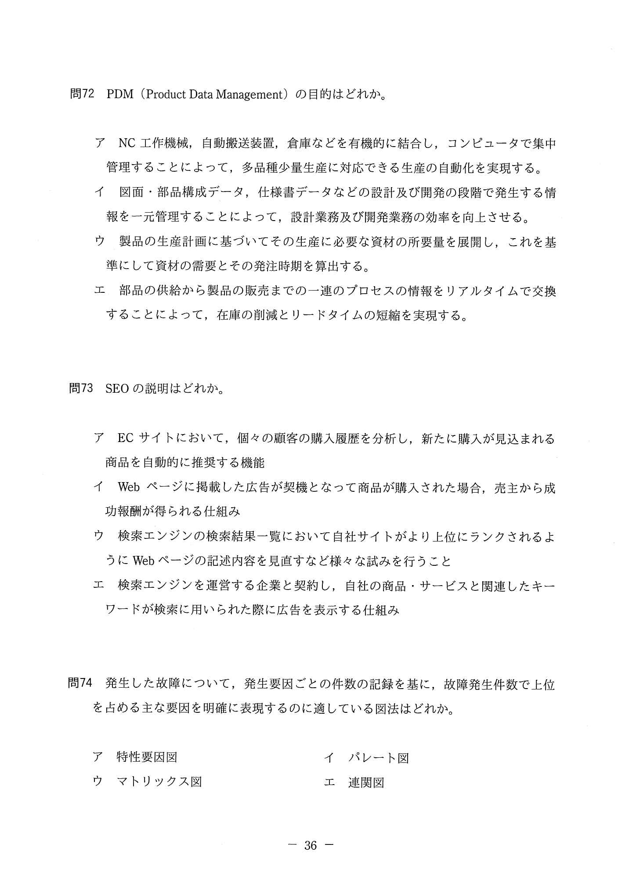

テキスト (OCR)

問72 PDM (Product Data Management) の目的はどれか。

Y NC 工作機械, 自動搬送装置, 倉庫などを有機的に結合し, コンピュータで集中
管理することによって, 多品種少量生産に対応できる生産の自動化を実現する。
イ 図面・部品構成データ, 仕様書データなどの設計及び開発の段階で発生する情
報を一元管理することによって, 設計業務及び開発業務の効率を向上させる。

ウ 製品の生産計画に基づいてその生産に必要な資材の所要量を展開し, これを基

準にして資材の徐要とその発注時期を算出する。
エエ 部品の供給から製品の販売までの一連のプロセスの情報をりアルタイムで交換
することによって, 在庫の削減とリードタイムの短縮を実現する。

問73 SEO の説明はどれか。

ア EC サイトにおいて, 個々の顧客の購入履歴を分析し, 新たに購入が見込まれる
商品を自動的に推奨する機能

イ Web ページに掲載した広告が契機となって商品が購入された場合, 売主から成
功報酬が得られる仕組み

ウ 検索エンジンの検索結果一覧において自社サイトがより上位にランクされるよ
うに Web ページの記述内容を見直すなど様々な試みを行うこと

エ 検索エンジンを運営する企業と契約し, 自社の商品・サービスと関連したキー
ワードが検索に用いられた際に広告を表示する仕組み

間74 発生した故障について, 発生要因ごとの件数の記録を基に, 故障発生件数で上位
を占める主な要因を明確に表現するのに適している図法はどれか。

ア 特性要因図            イ パレート図
ウ マトリックス図          エエ 連関図

= 36, 一

### ページ 37

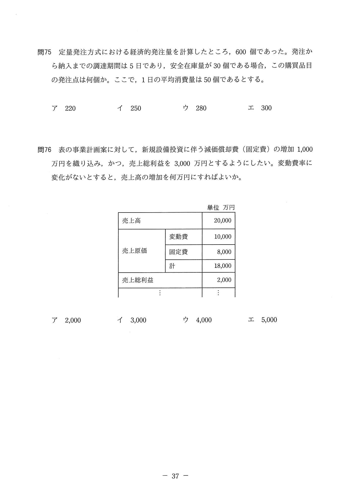

テキスト (OCR)

間75 定量発注方式における経済的発注量を計算したところ, 600 個であった。 発注か
ら納入までの調達期間は 5 日であり, 安全在庫量が 30 個である場合, この購買品目
の発注点は何個か。ここで, 1日の平均消費量は 50 個であるとする。

ア 220     イ 250     ウ 280     x= 300

問76 表の事業計画案に対して, 新規設備投資に伴う減価償却費 (固定費) の増加 1,000

万円を織り込み, DO, 売上総利益を 3,000 万円すするようにしたい。 変動費率に
変化がないとすると, 売上高の増加を何万円にすればよいか。

に

単位 万円
売上高         20,000
変動費   10,000
売上原価   固定費    8,000
at     18,000
売上総利益        2.000
ア 2,000    イ 3,000     ウ 4000    エ 5000

ー 37 一

### ページ 38

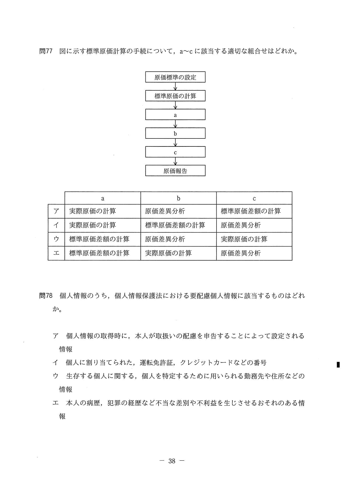

テキスト (OCR)

問77 図に示す標準原価計算の手続について, ac に該当する適切な組合せはどれか。

原価標準の設
標準原価の計算

a                                           b                                           c
ア | 実際原価の計算         原価差異分析          標準原価差額の計算
イ | 実際原価の計算            標準原価差額の計算       原価差異分析
ウ | 標準原価差額の計算     原価差異分析          実際原価の計算
エ | 標準原価差額の計算     実際原価の計算         原価差異分析

間78 個人情報のうち, 個人情報保護法における要配慮個人情報に該当するものはどれ
か。

ア 個人情報の取得時に, 本人が取扱いの配慮を申告することによって設定される
情報

イ 個人に割り当てられた, 運転免許証, クレジットカードなどの番号

ウ 生存する個人に関する, 個人を特定するために用いられる勤務先や住所などの
情報

= 本人の病歴, 犯罪の経歴など不当な差別や不利益を生じさせるおそれのある情
報

ー 38 一

### ページ 39

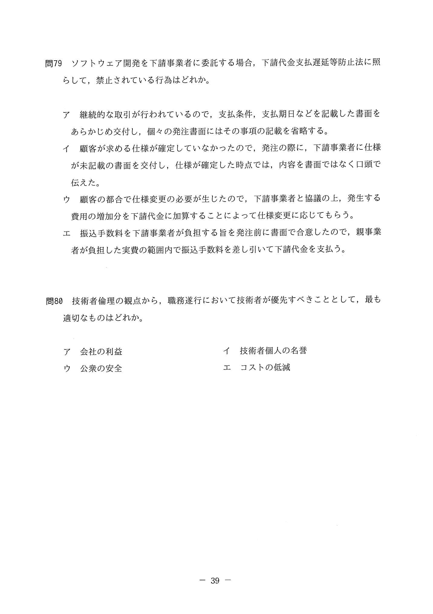

テキスト (OCR)

問79 ソフトウェア開発を下請事業者に委託する場合, 下請代金支払遅延等防止法に照
らして, 禁止されている行為はどれか。

ア 継続的な取引が行われているので, 支払条件, 支払期日などを記載した書面を
あらかじめ交付し, 個々の発注書面にはその事項の記載を省略する。

イ 顧客が求める仕様が確定していなかったので, 発注の際に, 下請事業者に仕様
が未記載の書面を交付し, 仕様が確定した時点では, 内容を書面ではなく口頭で
伝えた。

ウ 顧客の都合で仕様変更の必要が生じたので, 下請事業者と協議の上, 発生する
費用の増加分を下請代金に加算することによって仕様変更に応じてもらう。

エ 振込手数料を下請事業者が負担する旨を発注前に書面で合意したので, MER
者が負担した実費の範囲内で振込手数料を差し引いて下請代金を支払う。

M80 技術者倫理の観点から, 職務遂行において技術者が優先すべきこととして, 最も
適切なものはどれか。

ア 会社の利益            イ RAHA OBE
ウ 公衆の安全            エエ コストの低減

必

ー 39 一

### ページ 40

テキスト (OCR)

メ モ 用 紙 J

ー 40 一

### ページ 41

テキスト (OCR)

( x モ 用 紙 〕

ー 41 一

### ページ 42

テキスト (OCR)

〔

メ = 用 紙 )

ー 42 一

### ページ 43

テキスト (OCR)

C

メ モ 用 紙 )

ー 43 —

### ページ 44

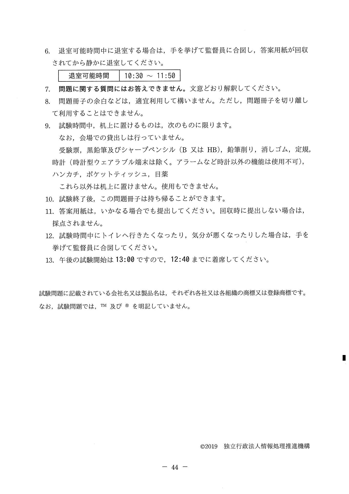

テキスト (OCR)

6. 退室可能時間中に退室する場合は, 手を挙げて監督具に合図し, 答案用紙が回収
されてから静かに退室してください。
退室可能時間 | 10:30 ~ 11:50 |
7. 問題に関する質問にはお答えできません。文意どおり解釈してください。
8. 問題冊子の余白などは, 適宜利用して構いません。 ただし, 問題冊子を切り離し
て利用することはできません。
9. 試験時間中, 机上に置けるものは, 次のものに限ります。
なお, 会場での貸出しは行っていません。
受験票, 黒鉛筆及びシャープペンシル (B 又は HB), 鉛筆削り, 消しゴム, 定規,
時計 (時計型ウェアラブル端末は除く。アラームなど時計以外の機能は使用不可),
ハンカチ, ポケットティッシュ, 目薬
これら以外は机上に置けません。使用もできません。
10. 試験終了後, この問題冊子は持ち帰ることができます。
11. 答案用紙は, いかなる場合でも提出してください。 回収時に提出しない場合は
採点されません。
12. 試験時間中にトイレへ行きたくなったり, 気分が悪くなったりした場合は, FE
挙げて監督員に合図してください。
13. 午後の試験開始は 13:00 ですので, 12:40 までに着席してください。

試験問題に記載されている会社名又は製品名は, それぞれ各社又は各組織の商標又は登録商標です。
なお, 試験問題では, ™ 及び @ を明記していません。

@2019 独立行政法人情報処理推進機構

ー 44 一

---

## 午前解答

©2019 独立行政法人情報処理推進機構 
平成31 年度 春期 応用情報技術者試験 解答例 
 
午前試験 
問番号 正解 分野 
問1 
ア 
Ｔ 
問2 
ア 
Ｔ 
問3 
ア 
Ｔ 
問4 
ア 
Ｔ 
問5 
ウ 
Ｔ 
問6 
ア 
Ｔ 
問7 
イ 
Ｔ 
問8 
エ 
Ｔ 
問9 
エ 
Ｔ 
問10 
イ 
Ｔ 
問11 
ウ 
Ｔ 
問12 
ウ 
Ｔ 
問13 
イ 
Ｔ 
問14 
ウ 
Ｔ 
問15 
ア 
Ｔ 
問16 
エ 
Ｔ 
問17 
ア 
Ｔ 
問18 
イ 
Ｔ 
問19 
ウ 
Ｔ 
問20 
イ 
Ｔ 
 
 
問番号 正解 分野 
問21 
ウ 
Ｔ 
問22 
イ 
Ｔ 
問23 
ウ 
Ｔ 
問24 
ウ 
Ｔ 
問25 
ウ 
Ｔ 
問26 
エ 
Ｔ 
問27 
エ 
Ｔ 
問28 
イ 
Ｔ 
問29 
ア 
Ｔ 
問30 
ア 
Ｔ 
問31 
イ 
Ｔ 
問32 
エ 
Ｔ 
問33 
ウ 
Ｔ 
問34 
イ 
Ｔ 
問35 
エ 
Ｔ 
問36 
エ 
Ｔ 
問37 
ウ 
Ｔ 
問38 
ウ 
Ｔ 
問39 
イ 
Ｔ 
問40 
エ 
Ｔ 
 
 
問番号 正解 分野 
問41 
ウ 
Ｔ 
問42 
ウ 
Ｔ 
問43 
エ 
Ｔ 
問44 
イ 
Ｔ 
問45 
ア 
Ｔ 
問46 
ウ 
Ｔ 
問47 
イ 
Ｔ 
問48 
ウ 
Ｔ 
問49 
ア 
Ｔ 
問50 
ウ 
Ｔ 
問51 
エ 
Ｍ 
問52 
エ 
Ｍ 
問53 
ウ 
Ｍ 
問54 
イ 
Ｍ 
問55 
ア 
Ｍ 
問56 
ウ 
Ｍ 
問57 
ウ 
Ｍ 
問58 
ウ 
Ｍ 
問59 
ウ 
Ｍ 
問60 
イ 
Ｍ 
 
 
問番号 正解 分野 
問61 
ア 
Ｓ 
問62 
ア 
Ｓ 
問63 
エ 
Ｓ 
問64 
イ 
Ｓ 
問65 
エ 
Ｓ 
問66 
エ 
Ｓ 
問67 
イ 
Ｓ 
問68 
イ 
Ｓ 
問69 
イ 
Ｓ 
問70 
ア 
Ｓ 
問71 
エ 
Ｓ 
問72 
イ 
Ｓ 
問73 
ウ 
Ｓ 
問74 
イ 
Ｓ 
問75 
ウ 
Ｓ 
問76 
ウ 
Ｓ 
問77 
イ 
Ｓ 
問78 
エ 
Ｓ 
問79 
イ 
Ｓ 
問80 
ウ 
Ｓ 
 
 
分野の「Ｔ」はテクノロジ系，「Ｍ」はマネジメント系，「Ｓ」はストラテジ系の問題です。

---

## 午後問題

### ページ 1

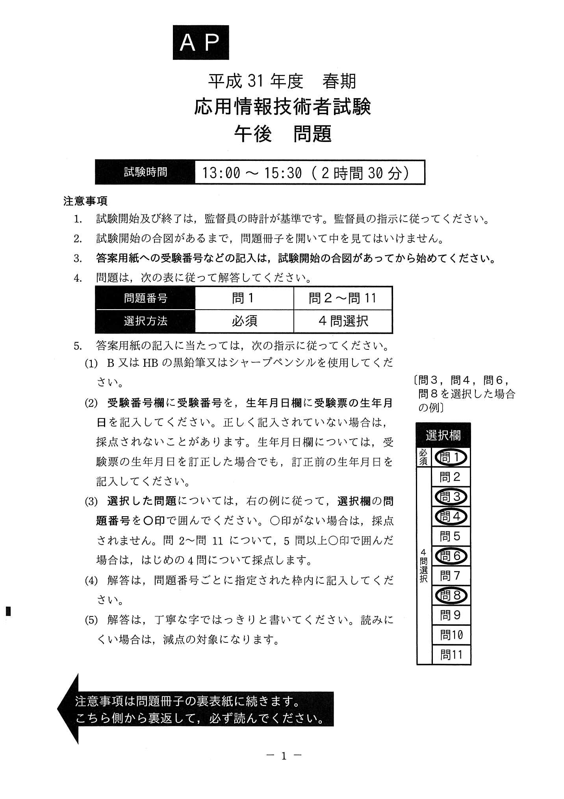

テキスト (OCR)

平成31年度 春期
応用情報技術者試験
午後 問題

 13:00 ~ 15:30 (2 時間30 分)

注意事項
1. 試験開始及び終了は, 監督員の時計が基準です。監督員の指示に従ってください。
2. 試験開始の合図があるまで, 問題冊子を開いて中を見てはいけません。
3. 答案用紙への受験番号などの記入は, 試験開始の合図があってから始めてください。
4. 問題は, 次の表に従って解答してください。

問題番号     fal 1    2 ~問 11
選択方法    必須    4 問選択

5. 答案用紙の記入に当たっては, 次の指示に従ってください。
(1) B 又は HB の黒鉛筆又はシャープペンシルを使用してくだ

さい。                                       (問3, 問4, 問6,

HS SHUR LEA
⑫ SRESMCSRESt, SeRAMCEBROLER A NRU LS

AemAUTSESW, 正しく記入されていない場合は,

採点されないことがあります。生年月日棚については, = RRA

験票の生年月日を訂正した場合でも, 訂正前の生年月日を |舌四の

記入してください。                      間2

3) 選択した問題については, 右の例に従って, 選択欄の問   Gi3>
題番号を〇印で囲んでください。〇印がない場合は, 採点       Gi 4

XMEtA. MM 2問 11 について, 5 問以上〇印で囲んだ    間5

場合は, はじめの4 問について採点します。         a|\G@s

4) 解答は, 問題番号ごとに指定された枠内に記入してくだ [RL
さい。                                          G8

(6) 解答は, 丁寧な字ではっきりと書いてください。読みに    間9
くい場合は, 減点の対象になります。              間10

間11

注意事項は問題冊子の裏表紙に続きます。
こちら側から裏返して, 必ず読んでください。

### ページ 2

### ページ 3

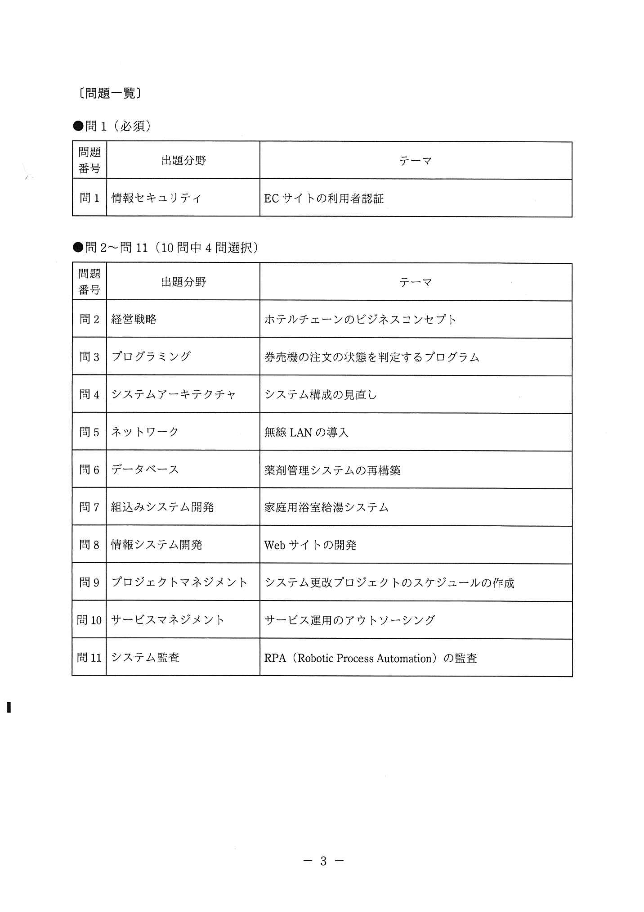

テキスト (OCR)

〔問題一覧]

@問 1 (必須)

       出題分野                       ry

問 1 | 情報セキュリティ      EC サイトの利用者

@ fi] 2一問 11 (10 問中 4 問選択)

       出題時                       テーマ

問2 | 経営戦略         ホテルチェーンのビジネスコンセプト
問 3 | プログラミング        券売機の注文の状態を判定するプログラム
問4 | システムアーキテクチャ    システム構成の見直し

問5 |ネットワーク         無線 LAN の導入

問6 | データベース          薬剤管理システムの再構築

問7 | 組込みシステム開発    家庭用浴室給湯システム

問 8 |情報システム開発      Web サイトの開発

問 9 | プロジェクトマネジメント | システム更改プロジェクトのスケジュールの作成
fl lO} サービスマネジメント      サービス運用のアウトソーシング

問 11| システム監査          RPA (Robotic Process Automation) の監査

### ページ 4

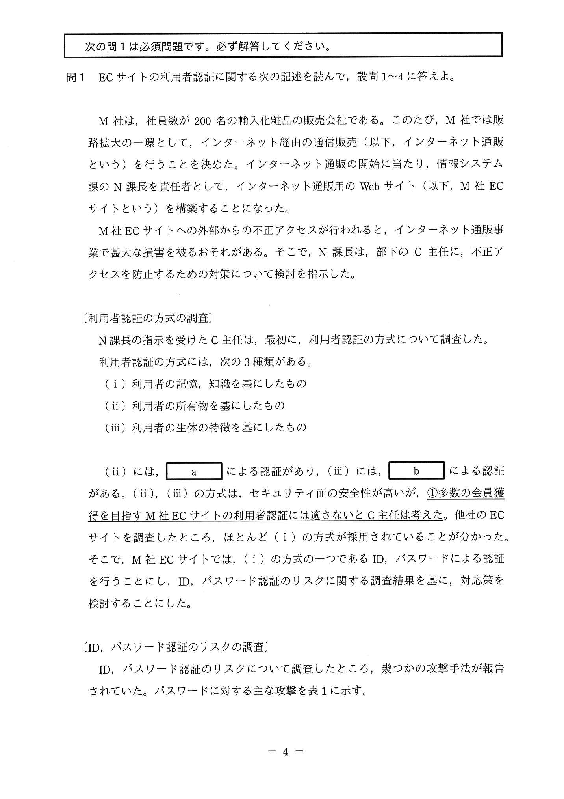

テキスト (OCR)

次の問 1 は必須問題です。必ず解答してください。

間1 ECサイトの利用者認証に関する次の記述を読んで, 設問 1ー4 に答えよ。

M 社は, 社員数が 200 名の輸入化粧品の販売会社である。このたび, M 社では
路拡大の一環として, インターネット経由の通信販売 (以下,インターネット通販
という) を行うことを決めた。インターネット通販の開始に当たり, 情報システム
HON 課長を責任者として, インターネット通販用の Web サイト (以下, M tt EC
サイトという) を構築することになった。

M 社 EC サイトへの外部からの不正アクセスが行われると, インターネット通販事
業で甚大な損害を被るおそれがある。 そこで, N 課長は, 部下の C 主任に, 不正ア
クセスを防止するための対策について検討を指示した。

[利用者認証の方式の調査)
N 課長の指示を受けた C 主任は, 最初に, 利用者認証の方式について調査した。
利用者認証の方式には, 次の3 種類がある。
(i) 利用者の記憶, 知識を基にしたもの
) 利用者の所有物を基にしたもの
(ii) 利用者の生体の特徴を基にしたもの

Gi) には, [a |] による認証があり, Gi) には,| pb Je sama
がある。 (ii), (ii) の方式は,。 セキュリティ面の安全性が高いが, ①多数の会員獲
得を目指す M 社 EC サイトの利用者認証には適さないと主任は考えた。他社の EC
サイトを調査したところ, ほとんど (i) の方式が採用されていることが分かった。
そこで, M 社 EC サイトでは, (1) の方式の一つである ID, NAV-KIC LSE
を行うことにし, ID, パスワード認証のリスクに関する調査結果を基に, 対応策を
検討することにした。

UD, パスワード認証のリスクの調査
ID, パスワード認証のリスクについて調査したところ, 幾つかの攻撃手法が報告
されていた。パスワードに対する主な攻撃を表 1 に示す

### ページ 5

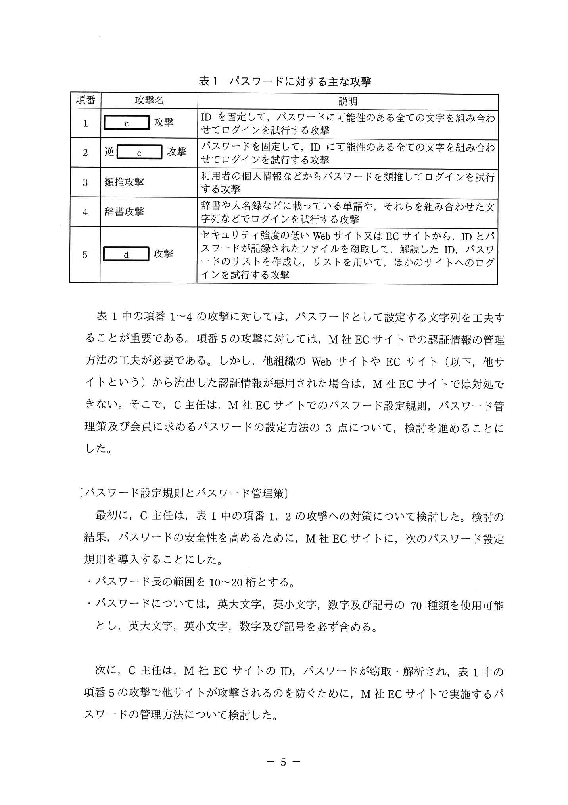

テキスト (OCR)

表1 パスワードに対する主な攻撃

ae     攻撃名                     説明
ID を固定して, パスワードに可能性のある全ての文字を組み合わ
1 [Cee cary vemes cae
:             バスワードを固定して, ID KUMEDS S2COLFEMARD
2 fae) ay Seated once
利用者の個人情報などからパスワードを類礁してログインを試行
3 |鍵失攻撃       9
5       辞書や人名録などに温っている単語や, それらを組み合わせた文
‘      字列などでログインを試行する攻撃
セキュリティ強度の低い Web サイト又は EC サイトから, ID とパ
スワードが記録されたファイルを寅取して, 解読した ID, NAT
5 Ce ee のスト作隊し。 DAERWT, Benet banne
インを試行する攻撃

し

[パ

表 1 HOU 1~4 の攻撃に対しては, パスワードとして設定する文字列を工夫す
ることが重要である。項番 5 の攻撃に対しては, M 社EC サイトでの認証情報の管理
方法の工夫が必要である。しかし, 他組織の Web サイトや EC サイト (以下, 他サ
イトという) から流出した認証情報が悪用された場合は, M 社 EC サイトでは対処で
きない。 そこで, C主任は, M 社EC サイトでのパスワード設定規則, パスワード管
理策及び会員に求めるパスワードの設定方法の 3 点について, 検討を進めることに

た。

スワード設定規則とパスワード管理策

最初に, C 主任は, 表 1 中の項番 1, 2 の攻撃への対策について検討した。検討の
MR, パスワードの安全性を高めるために, M 社EC サイトに, 次のパスワード設定
規則を導入することにした。

・パスワード長の範囲を 1020 桁とする。

・パスワードについては, 英大文字, 英小文字, 数字及び記号の 70 種類を使用可能
CL, RARE, 英小文字, 数字及び記号を必ず含める。

次に, C 主任は, M 社 EC サイトの ID, パスワードが袖取・解析され, 表 1 中の
項番5 の攻撃で他サイトが攻撃されるのを防ぐために, M 社EC サイトで実施するパ
スワードの管理方法について検討した。

### ページ 6

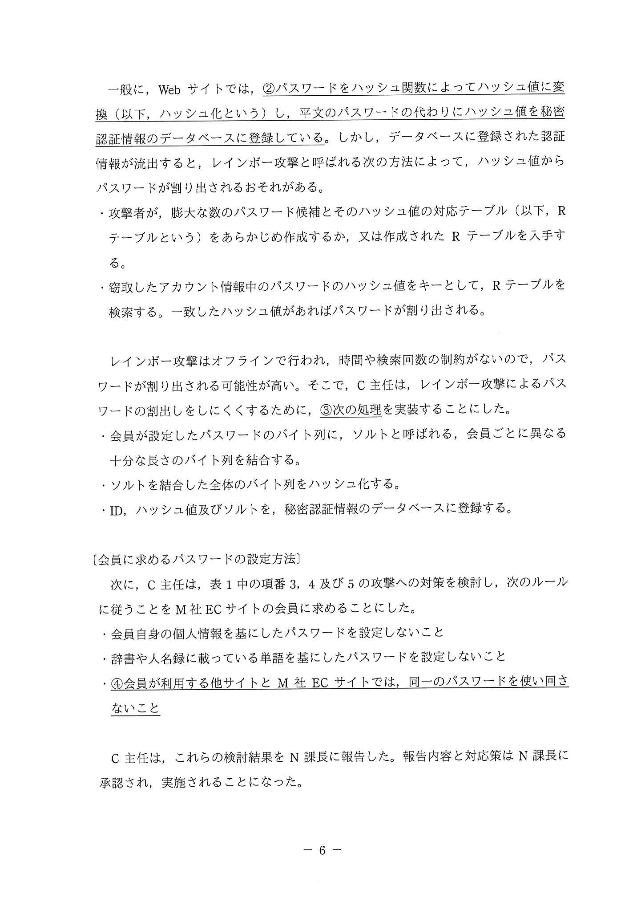

テキスト (OCR)

S

一般に, Web サイトでは, パスワードをハッシュョ関数によってハッシュ値に
換 (以下,ハッシュ化という) し, 平文のパスワードの代わりにハッシュ値を秘密
認証情報のデータベースに登録している。しかし, データベースに登録された論語
情報が流出すると, レインボー攻撃と呼ばれる次の方法によって, ハッシュ値から
パスワードが割り出されるおそれがある。

・ 攻撃者が, 膨大な数のパスワード候補とそのハッシュ値の対応テーブル (以下, R
テーブルという) をあらかじめ作成するか, 又は作成された R テーブルを有入手す
る。

・袖取したアカウント情報中のパスワードのハッシュ値をキーとして, R テーブルを
検索する。一致したハッシュ値があればパスワードが割り出される。

レインボー攻撃はオフラインで行われ, 時間や検索回数の制約がないので, パス
ワードが割り出される可能性が高い。そこで, C EEL, レインボー攻撃によるパス
ワードの割出しをしにくくするために, ③次の処理を実装することにした。
・会員が設定したパスワードのバイト列に, ソルトと呼ばれる, 会員ごとに異なる
十分な長さのバイト列を結合する。
・ソルトを結合した全体のバイト列をハッシュ化する。
“ID, ハッシュ値及びソルトを, 秘密認証情報のデータベースに登録する。

〔会員に求めるパスワードの設定方法
次に, C 主任は, 表 1 中の項番 3, 4 及び5 の攻撃への対策を検討し, 次のルール
に従うことを M 社EC サイトの会員に求めることにした。
会員自身の個人情報を基にしたパスワードを設定しないこと
・ 辞書や人名録に載っている単語を基にしたパスワードを設定しないこと
・④会員が利用する他サイトと M 社 EC サイトでは, 同一のパスワードを使い回さ

ないこと

C 主任は, これらの検討結果を N 課長に報告した。報告内容と対応策は N 課長に
承認され, 実施されることになった。

### ページ 7

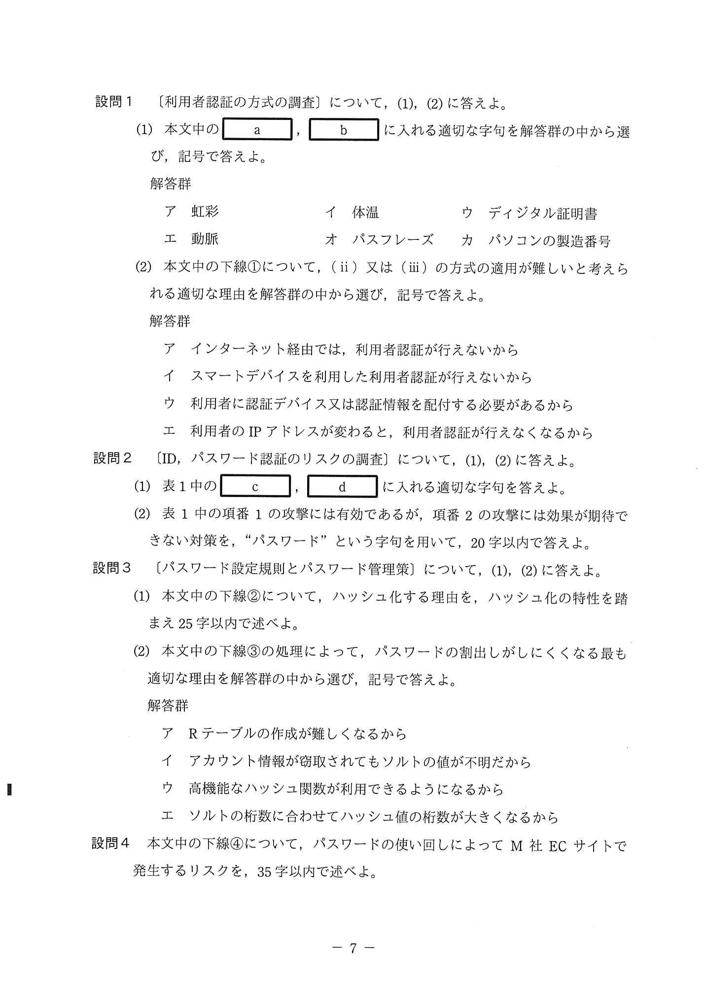

テキスト (OCR)

設問1 【〔利用者認証の方式の調査] について, ①), (②) に答えよ。

a 本文中の| a | |  b |に入れる適切な字句を解答群の中から選

び, 記号で答えよ。

AES BE

ア 虹彩      イ 体温     ウ ディジタル証明書
エ 動脈      A パスフレーズ WA パソコンの製造番号

(2) 本文中の下線やについて, (ii) 又は Gi) の方式の適用が難しいと考えら
れる適切な理由を解答群の中から選び, 記号で答えよ。
解答群
ア インターネット経由では, 利用者認証が行えないから
イ スマートデバイスを利用した利用者認証が行えないから
ウ 利用者に認証デバイス又は認証情報を配付する必要があるから
= 利用者の IP アドレスが変わると, 利用者認証が行えなくなるから
設問2 = (ID, パスワード認証のリスクの調査] について, ①, (②) に答えよ。
Q①) 表1中の|  c |, |  』 |に入れる適切な字句を答えよ。
2) 表 1 中の項番 1 の攻撃には有効であるが, WH 2 の攻撃には効果が期待で
きない対策を, "パスワード" という字句を用いて, 20 字以内で答えよ。
設問3 (パスワード設定規則とパスワード管理策] について, Q①), ⑫) に答えよ。
GQ) 本文中の下線②@について, ハッシュ化する理由を, ハッシュ化の特性を踏
まえ 25 字以内で述べよ。

(2) 本文中の下線③の処理によって, パスワードの割出しがしにくくなる最も
適切な理由を解答群の中から選び, 記号で答えよ。
解答群
ア R テーブルの作成が難しくなるから
イ アカウント情報が禄取されてもソルトの値が不明だから
ウ 高機能なハッシュ関数が利用できるようになるから
エエ ソルトの桁数に合わせてハッシュ値の桁数が大きくなるから
設問4 本文中の下線@について, パスワードの使い回しによって M tH EC サイトで
発生するリスクを, 35 字以内で述べよ。

### ページ 8

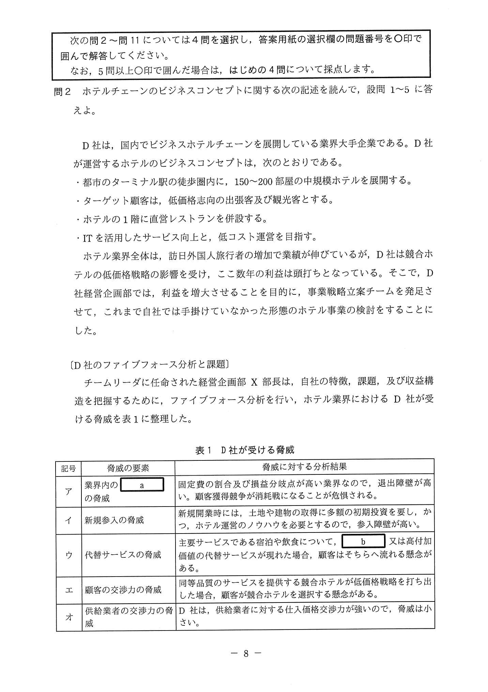

テキスト (OCR)

次の問 2 一問 11 については4 問を選択し, 答案用紙の選択欄の問題番号を〇印で
囲んで解答してください。
なお, 5 問以上〇印で囲んだ場合は, はじめの 4 問について採点します。

間2 ホテルチェーンのビジネスコンセプトに関する次の記述を読んで, 設問 ユー5 に答

えよ。

D 社は, 国内でビジネスホテルチェーンをド展開している業界大手企業である。D 社
が運営するホテルのビジネスコンセプトは, 次のとおりである。

・都市のターミナル駅の徒歩圏内に, 150~200 部屋の中規模ホテルを展開する。

・ターゲット顧客は, 低価格志向の出張客及び観光客とする。

・ホテルの 1 階に直営レストランを併設する。

・IT を活用したサービス向上と, 低コスト運営を目指す。

ホテル業界全体は, 訪日外国人旅行者の増加で業績が伸びているが, D 社は競合ホ
テルの低価格戦略の影響を受け, ここ数年の利益は頭打ちとなっている。 そこで, D
社経営企画部では, 利益を増大させることを目的に, 事業戦略立案チームを発足さ
せて, これまで自社では手掛けていなかった形態のホテル事業の検討をすることに
した。

[D 社のファイブフォース分析と課題]

チームリーダに任命された経営企画部 X BR, 自社の特徴, RE, 及び収益構
造を把握するために, ファイブフォース分析を行い。 ホテル業界における D 社が受
FS MBER 1 (CELA,

表1 DHMRISBR

記号   御成の要素             脅成に対する分析結果
テ 業界内の|  。 | |固定旨の割合及び損益分岐点が高い業界なので, BWM
Deh        V, HASHES MRICS CE DYES NS,

新規開業時には, 土地や建物の取得に多額の初期投資を要し, か
つ, ホテル運営のノウハウを必要とするので, 参入障壁が高い。
主要サービスである宿泊や飲食について, | b | 又は高付加
ウ |REY-EAORR |価値の代替サービスが現れた場合, 顧客はそちらへ流れる懸念が
ある。

同等品質のサービスを提供する競合ホテルが低価格戦略を打ち出
した場合, 顧客が競合ホテルを選択する懸念がある。

供給業者の交渉力の脅|D 社は, 供給業者に対する仕入価格交渉力が強いので, 脅威は小
威          さい。

イ |新規参入の合威

エ |顧客の交渉力の脅威

### ページ 9

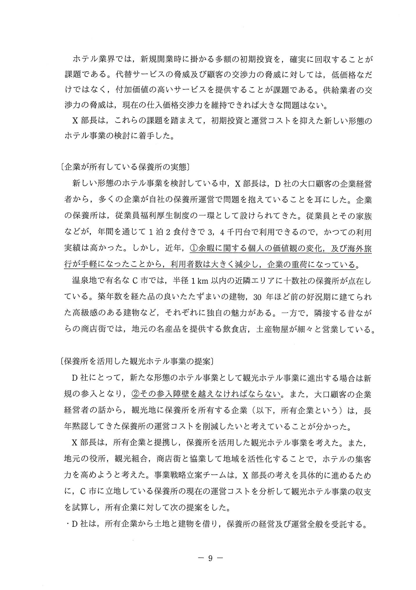

テキスト (OCR)

ホテル業界では, 新規開業時に掛かる多額の初期投資を, 確実に回収することが
課題である。 代替サービスの公威及び顧客の交渉力の脅威に対しては, 低価格なだ
けではなく, 付加価値の高いサービスを提供することが課題である。供給業者の交
渉力の脅威は, 現在の仕入価格交渉力を維持できれば大きな問題はない。

X 部長は, これらの課題を踏まえて, 初期投資と運営コストを抑えた新しい形態の
ホテル事業の検討に着手した。

〔企業が所有している保養所の実態

新しい形態のホテル事業を検討している中, XBR, D 社の大口顧客の企業経営
者から, 多くの企業が自社の保養所運営で問題を抱えていることを耳にした。 企業
の保養所は, 従業員福利厚生制度の一環として設けられてきた。 従業員とその家族
BEM, 年間を通じて 1 泊 2 食付きで 3, 4 千円台で利用できるので, かつての利用
実績は高かった。 しかし, 近年, ①余暇に関する個人の価値観の変化, 及び海外旅
行が手軽になったことから, 利用者数は大きく減少し, 企業の重荷こねなっている。

温泉地で有名な C 市では, 半径 1 km 以内の近隣エリアに十数社の保養所が点在し
ている。築年数を経た品の良いたたずまいの建物, 30 年ほど前の好況期に建てられ
た高級感のある建物など, それぞれに独自の魅力がある。一方で, 隣接する昔なが
らの商店街では, 地元の名産品を提供する飲食店, 土産物屋が細々と営業している。

保養所を活用した観光ホテル事業の提案]

D 社にとって, 新たな形態のホテル事業として観光ホテル事業に進出する場合は新
規の参入となり, ②その参入障壁を越えなければならない。また, 大日顧客の企業
経営者の話から, 観光地に保養所を所有する企業 (以下, 所有企業という) は, 長
年黙議してきた保養所の運営コストを削減したいと考えていることが分かった。

X 部長は, 所有企業と提携し, 保養所を活用した観光ホテル事業を考えた。 EK,
地元の役所, 観光組合, 商店街と協業して地域を活性化することで, ホテルの集客
力を高めようと考えた。 事業戦略立案チームは, X 部長の考えを具体的に進めるため
に, C 市に立地している保養所の現在の運営コストを分析して観光ホテル事業の収支
を試算し, 所有企業に対して次の提案をした。

・D 社は, 所有企業から土地と建物を借り, 保養所の経営及び運営全般を受託する。

### ページ 10

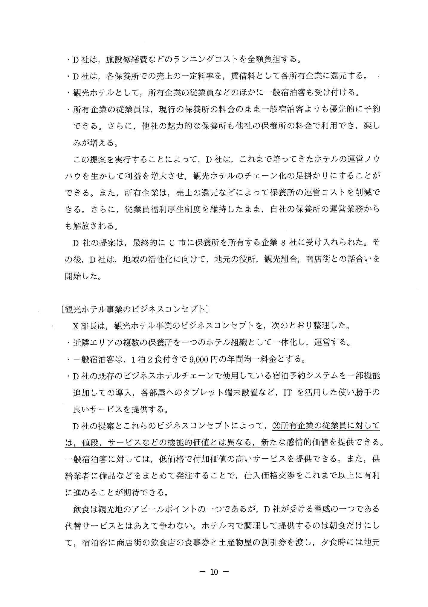

テキスト (OCR)

・D 社は, 施設修繕費などのランニングコストを全額負担する。

・D 社は, 各保養所での売上の一定料率を, 賃借料として各所有企業に還元する。

・観光ホテルとして, 所有企業の従業員などのほかに一般宿泊客も受け付ける。

・ 所有企業の従業員は, 現行の保養所の料金のまま一般宿泊客よりも優先的に予約
できる。 さらに, 他社の魅力的な保養所も他社の保養所の料金で利用でき, 楽し
みが増える。
この提案を実行することによって, Delt, これまで培ってきたホテルの運営ノウ

ハウを生かして利益を増大させ, 観光ホテルのチェーン化の足掛かりにすることが

できる。また, 所有企業は, 売上の還元などによって保養所の運営コストを削減で

きる。 さらに, 従業員福利厚生制度を維持したまま, 自社の保養所の運営業務から

も解放される。

D 社の提案は, 最終的に C 市に保養所を所有する企業 8 社に受け入れられた。そ

の後, D 社は, 地域の活性化に向けて, 地元の役所, 観光組合, 商店街との話合いを

開始した。

(観光ホテル事業のビジネスコンセプト〕}

X 部長は, 観光ホテル事業のビジネスコンセプトを, 次のとおり整理した。

・近隣エリアの複数の保養所を一つのホテル組織として一体化し, 運営する。

・一般宿泊客は, 1 泊 2 食付きで 9,000 円の年間均一料金とする。

・D 社の既存のビジネスホテルチェーンで使用している宿泊予約システムを一部機能

追加しての人導入, 各部屋へのタブレット端末設置など, IT を活用した使い勝手の

良いサービスを提供する。

D 社の提案とこれらのビジネスコンセプトによって, ③所有企業の従業員に対して
ik, 値段, サービスなどの機能的価値とは異なる, 新たな感情的価値を提供できる。
一般宿泊客に対しては, 低価格で付加価値の高いサービスを提供できる。また, 供
給業者に備品などをまとめて発注することで, 仕入価格交渉をこれまで以上に有利
に進めることが期待できる。

飲食は観光地のアビールポイントの一つであるが, DMR SBRO-VDCHS
代替サービスとはあえて争わない。ホテル内で調理して提供するのは朝食だけにし
て, 宿泊客に商店街の飲食店の食事券と土産物屋の割引券を渡し, 夕食時には地元

ー 一

### ページ 11

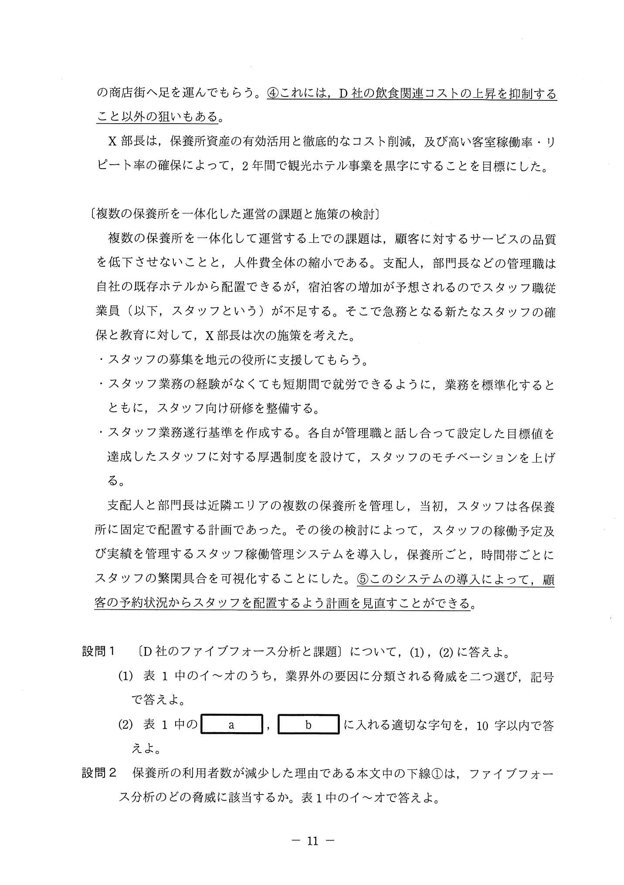

テキスト (OCR)

の商店街へ足を運んでもらう。④これには, D 社の飲食関連コストの上昇を抑制する
こと以外の狙いもある。

X 部長は, 保養所資産の有効活用と徹底的なコスト削減, 及び高い客室稼働率・リ
ピート率の確保によって, 2 年間で観光ホテル事業を黒字にすることを目標にした。

〔複数の保養所を一体化した運営の課題と施策の検討
複数の保養所を一体化して運営する上での課題は, 顧客に対するサービスの品質

を低下させないことと, 人件費全体の縮小である。支配人, 部門長などの管理職は

自社の既存ホテルから配置できるが, 宿泊客の増加が予想されるのでスタッフ職従

業員 (以下、 スタッフという) が不足する。そこで急務となる新たなスタッフの確

保と教育に対して, X 部長は次の施策を考えた。

・スタッフの募集を地元の役所に支援してもらう。

・スタッフ業務の経験がなくても短期間で就労できるように, 業務を標準化すると
ともに, スタッフ向け研修を整備する。

・スタッフ業務遂行基準を作成する。各自が管理職と話し合って設定した目標値を
達成したスタッフに対する厚過制度を設けて, スタッフのモチベーションを上げ
る。
支配人と部門長は近隣エリアの複数の保養所を管理し, 当初, スタッフは各保養

所に固定で配置する計画であった。 その後の検討によって, スタッフの乏働予定及

び実績を管理するスタッフ稼働管理システムを導入し, 保養所ごと, 時間帯ごとに

スタッフの繁閑具合を可視化することにした。⑤⑧このシステムの導入によって, A

客の予約状況からスタッフを配置するよう計画を見直すことができる。

設問1 (D社のファイブフォース分析と課題] について, ①) , (② に答えよ。

Q 表 1 中のイーオのうち, 業界外の要因に分類される導成をニつ選び, 記号
で答えよ。

@ 表1中の| ai |,|  b |に入れる適切な字句を, 10 字以内で答
Rk.

設問2 保養所の利用者数が減少した理由である本文中の下線やは, ファイブフォー
ス分析のどの脅威に該当するか。表 1 中のイーオで答えよ。

— i.

### ページ 12

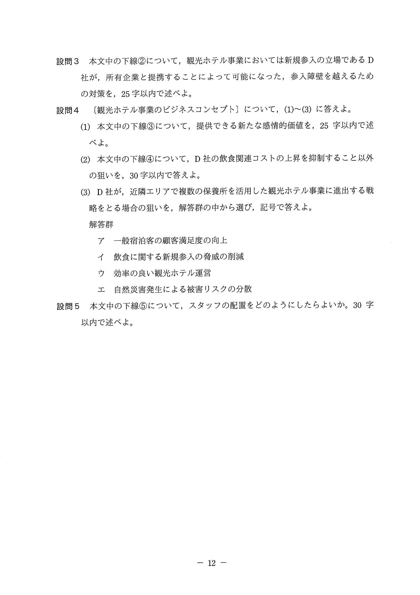

テキスト (OCR)

設問3 本文中の下線②について, 観光ホテル事業においては新規参入の立場であるD
社が, 所有企業と提携することによって可能になった, 参入障壁を越えるため
の対策を, 25 字以内で述べよ。
設問4 観光ホテル事業のビジネスコンセプト〕 について, M~@) に答えよ。
(1) 本文中の下線③について, 提供できる新たな感情的価値を, 25 字以内で述
べよ。
2) 本文中の下線るについて, D 社の飲食関連コストの上昇を抑制すること以外
の狙いを, 30 字以内で答えよ。
(3) D 社が, 近隣エリアで複数の保養所を活用した観光ホテル事業に進出する戦
略をとる場合の狙いを, 解答群の中から選び, 記号で答えよ。
解答群
ア 一般宿泊客の顧客満足度の向上
イ 飲食に関する新規参入の脅威の削減
ウ 効率の良い観光ホテル運営
エ 自然災害発生による被害リスクの分散
設問5 本文中の下線@について, スタッフの配置をどのようにしたらよいか。 30 字
以内で述べよ。

ー 12 一

### ページ 13

テキスト (OCR)

【

メ モ 用 紙 )

ー 13 一

### ページ 14

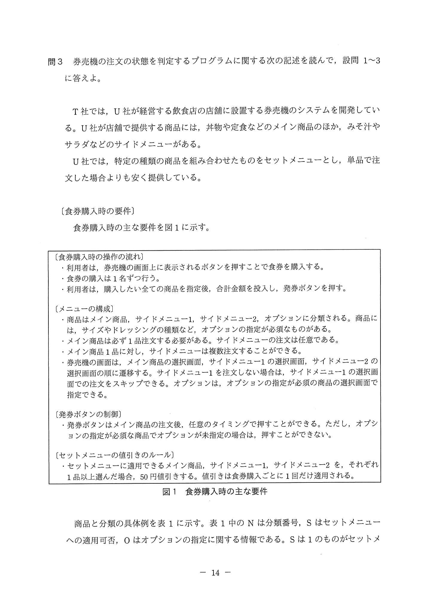

テキスト (OCR)

AS 券売機の注文の状態を判定するプログラムに関する次の記述を読んで, 設問 1~3
に答えよ。

a

T 社では, U 社が経営する飲食店の店舗に設置する券売機のシステムを開発してい
る。U 社が店舗で提供する商品には, 丼物や定食などのメイン商品のほか, みそ汁や
サラダなどのサイドメニューがある。

U 社では, 特定の種類の商品を組み合わせたものをセットメニューとし, 単品で注
文した場合よりも安く提供している。

〔食券購入時の要件]
食券購入時の主な要件を図 1 に示す。

[食券購入時の操作の流れ]
・利用者は, 券売機の画面上に表示されるボタンを押すことで食券を購入する。
・食券の購入は 1 名ずつ行う。
・利用者は, 購入したい全ての商品を指定後, 合計金額を投入し, 発券ボタンを押す。

(メニューの構成〕

・商品はメイン商品,サイドメニュー1, サイドメニュー2, オプションに分類される。商品
は, サイズやドレッシングの種類など, オプションの指定が必須なものがある。

・メイン商品は必ず 1 品注文する必要がある。サイドメニューの注文は任意である。

・メイン商品 1 品に対し, サイドメニューは複数注文することができる。

・券売機の画面は, メイン商品の選択画面,サイドメニュー1 の選択画面,サイドメニュー2 の
選択画面の順に居移する。サイドメニュー1 を注文しない場合は, サイドメニュー1 の選択画
面での注文をスキップできる。オプションは, オプションの指定が必須の商品の選択画面で
指定できる。

[発券ボタンの制御]
・ 発券ボタンはメイン商品の注文後, 任意のタイミングで押すことができる。ただし, オプシ
ョンの指定が必須な商品でオプションが未指定の場合は, 押すことができない。

【セットメニューの値引きのルール〕}
・セットメニューに適用できるメイン商品, サイドメニュー1, サイドメニュー2 を, それぞれ
1 品以上選んだ場合, 50 円値引きする。値引きは食券購入ごとに 1 回だけ適用される。

 1 食券購入時の主な要件

商品と分類の具体例を表 1 に示す。表 1 中の N は分類番号,S はセットメニュー
への適用可否, 0O はオプションの指定に関する情報である。S は 1 のものがセットメ

ー 14 一

### ページ 15

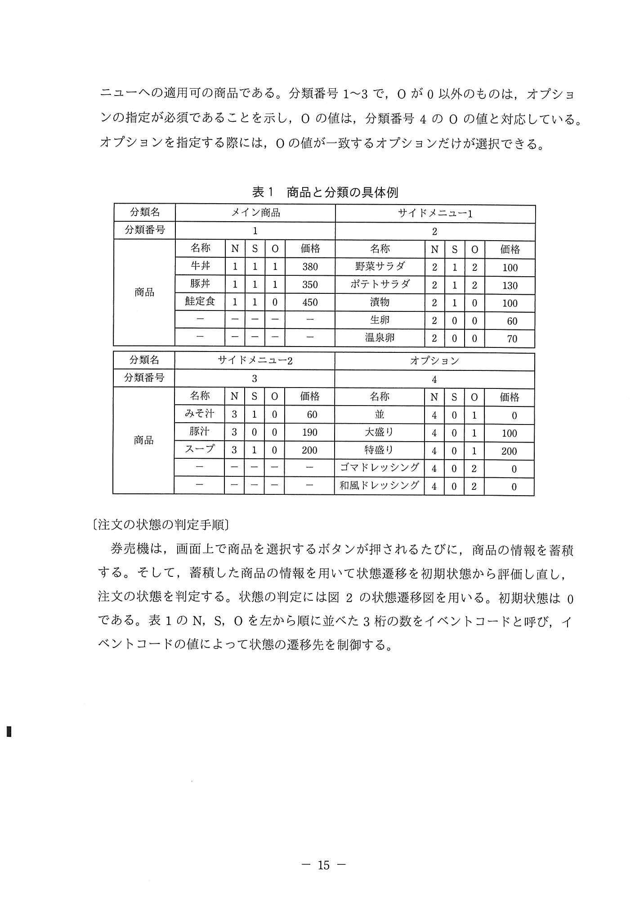

テキスト (OCR)

ニューへの適用可の商品である。 分類番号 1ユー3 で, O が0以外のものは, オプショ
ンの指定が必須であることを示し, O の値は, 分類番号 4 の 0 の値と対応している。
オプションを指定する際には, O の値が一致するオプションだけが選択できる。

表1 商品と分類の具体例

分類名            メイン商品                    サイ ドメヌニュー1
分類番号                      1.                                           2
名称     NISIO      価格             名称          NISIO      価格
生井 |i|lili| sso   野菜サラダ |2|ilz| ro
_    me [afilal 350   ポテトサラダ [efile] is
mae        see [ililol 4so             nt           2|ilo| io
- |-|-|-| -              45           2|olo| so
=       ー|ー | デ       ー             温泉卵         210|0        70
分類名          サイドメニュー2                    オプション
分類番号                      3                                           4
名称 INlslo| tis     名称    Nlslo| (ais
ぁそを汗 |s|ilo| so              th            aloli         0
se            mt |slolo| 190               大盛り             4|o|i| 100
スープ |3|i|o| 200 特成り 4|o|i| 200
ーー        -|-|-        ー        ゴマドレッシング|4 1 01 2          0
ー | -| -|-| - |血Mドレッシング|4 | 6 | 2   0

注文の状態の判定手順

券売機は, 画面上で商品を選択するボタンが押されるたびに, 商品の情報を蓄積
する。 CUT, 薔積した商品の情報を用いて状態遷移を初期状態から評価し直し,
注文の状態を判定する。状態の判定には図 2 の状態遷移図を用いる。初期状態は 0
である。表 1 の N, S, O を左から順に並べた 3 桁の数をイベントコードと呼び, イ
ベントコードの値によって状態の大移先を制御する。

— e+

### ページ 16

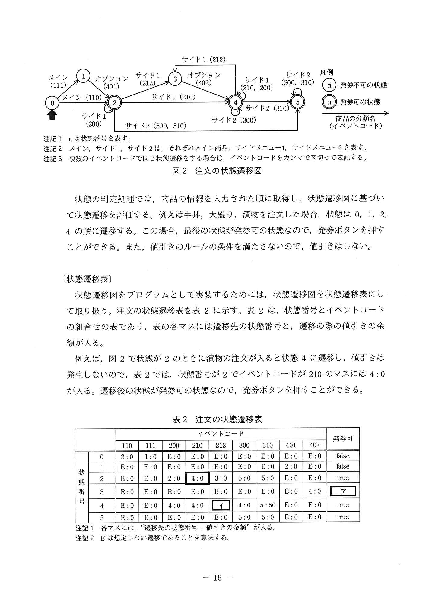

テキスト (OCR)

サイド1 (212)

サイド1   aha, Ae
ar0, 200) (20% 310) Ga) 発券不可の状態

パプ サイド2 (310)       @ aaa  i
サイド2 (300)                    商品の分類名

(イベントコード

注記 1 nは状態番号を表す。
注記 2 メイン, サイド 1, サイド 2 は, それぞれメイン商品, サイドメニュー1, サイドメニュー2 を表す。
注記 3 複数のイベントコードで同じ状態層移をする場合は, イベントコードをカンマで区切って表記する。

 2 注文の状態遷移図

状態の判定処理では, 商品の情報を入力された順に取得し, 状態遷移図に基づい

て状態乱移を評価する。例えば和牛丼, 大盛り, 漬物を注文した場合, 状態は 0, 1, 2,
4 の順に怖移する。この場合, 最後の状態が発券可の状態なので, 発券ボタンを押す
ことができる。また, 値引きのルールの条件を満たさないので, 値引きはしない。

〔状態遷移表]

状態遷移図をプログラムとして実装するためには, 状態遷移図を状態遷移表に
て取り扱う。注文の状態遷移表を表 2 に示す。表 2 は, 状態番号とイベントコード
の組合せの表であり, 表の各マスには遷移先の状態番号と, 遷移の際の値引きの金
額が入る。

例えば, 2 で状態が 2 のときに漬物の注文が入ると状態 4 に遷移し, 値引きは
発生しないので, 表 2 では, 状態番号が 2 でイベントコードが 210 のマスには 4:0
が入る。遷移後の状態が発券可の状態なので, 発券ボタンを押すことができる。

表2 注文の状態遷移表

イベントコード
発券可
110  111  200  210  212  300  310  401  402

0   2:0 | 1:0 | E:0 | E:0 | E:0 | E:0 |] E:0 | E:0 | E:0  false

4  1  E:0 | E:0 | E:0 }] E:0 | E:0 | E:0 | E:0 | 2:0 | E:0  false

He  2  E:0 | E:0 | 2:0 f 4:0 | 3:0 | 5:0 | 5:0 | E:0 | E:0  true

番| 3 | £:0|E:0]£:0] £:0 | B:0| £:0 | £:0| E:0] 4:0
=

=! 4 |£:0| 8:0] 4:0 | 4:0 |Z] 4:0 | 5:50] E:0 | E:0] eue

5   E:0 | E:0 | E:0 | E:0 | E:0 | 5:0 | 5:0 | E:0 | E:0   true

注記1 各マスには, “EBAOKEES : 値引きの金額" が入る。
注記 2 EME LEVER CHS CL EMMIS.

= 9§ 一

### ページ 17

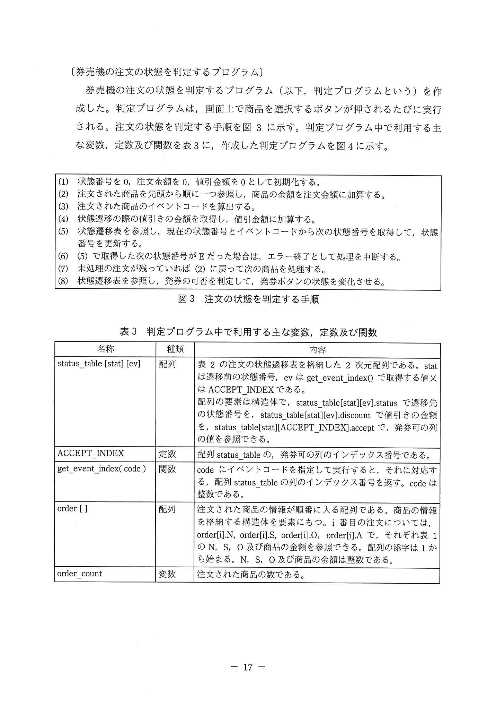

テキスト (OCR)

[券売機の注文の状態を判定するプログラム〕

券売機の注文の状態を判定するプログラム (以下, 判定プログラムという) を作
成した。判定プログラムは, 画面上で商品を選択するボタンが押されるたびに実行
される。 注文の状態を判定する手順を図 3 に示す。判定プログラム中で利用する主
な変数, 定数及び関数を表3 に, 作成した判定プログラムを図 4 に示す。

(1)
(2)
(3)
(4)
(5)

(6)
(2)
(8)

状態番号を 0, 注文金額を0, 値引金額を0として初期化する。

注文された商品を先頭から順に一つ参照し, 商品の金額を注文金額に加算する。
注文された商品のイベントコードを算出する。

状態遷移の際の値引きの金額を取得し, 値引金額に加算する。

状態須移表を参照し, 現在の状態番号とイベントコードから次の状態番号を取得して, 状態
番号を更新する。

(5) で取得した次の状態番号がE だった場合は, エラー終了として処理を中断する。

末処理の注文が残っていれば (2) に戻って次の商品を処理する。

状態遷移表を参照し, 発券の可否を判定して, 発券ボタンの状態を変化させる。

 3 注文の状態を判定する手順

表3 判定プログラム中で利用する主な変数, 定数及び関数

名称                      種類                                                    内容

status_table [stat] [ev] |配列    表 2 の注文の状態遷移表を格納した 2 次元配列である。stat

は遷移前の状態番号, ey は get_event_index() で取得する値又
は ACCEPT INDEX である。

配列の要素は構造体で, status_table[stat][ev].status CHEB 56
の状態番号を, status_table[stat][ev].discount で値引きの金額
を, status table[stat][ACCEPT INDEX].accept で, 発券可の列
の値を参照できる。

ACCEPT_INDEX           定数       配列 status table の, 発券可の列のインデックス番号である。

get_event index( code) |関数      code にイベントコードを指定して実行すると, それに対応す

る, 配列 status table の列のインデックス番号を返す。code は
整数である。

order [ ]               配列     注文された商品の情報が順番に入る配列である。商品の情報

を格納する構造体を要素にもつ。i 番目の注文については,
order[i].N, order[i].S, order[i].0, orderhi].A で, それぞれ表 1
の N, S, 0及び商品の金額を参照できる。配列の添字は 1 か
ら始まる。N, S, 0及び商品の金額は整数である。

order count             変数     注文された商品の数である。

ー 17 一

### ページ 18

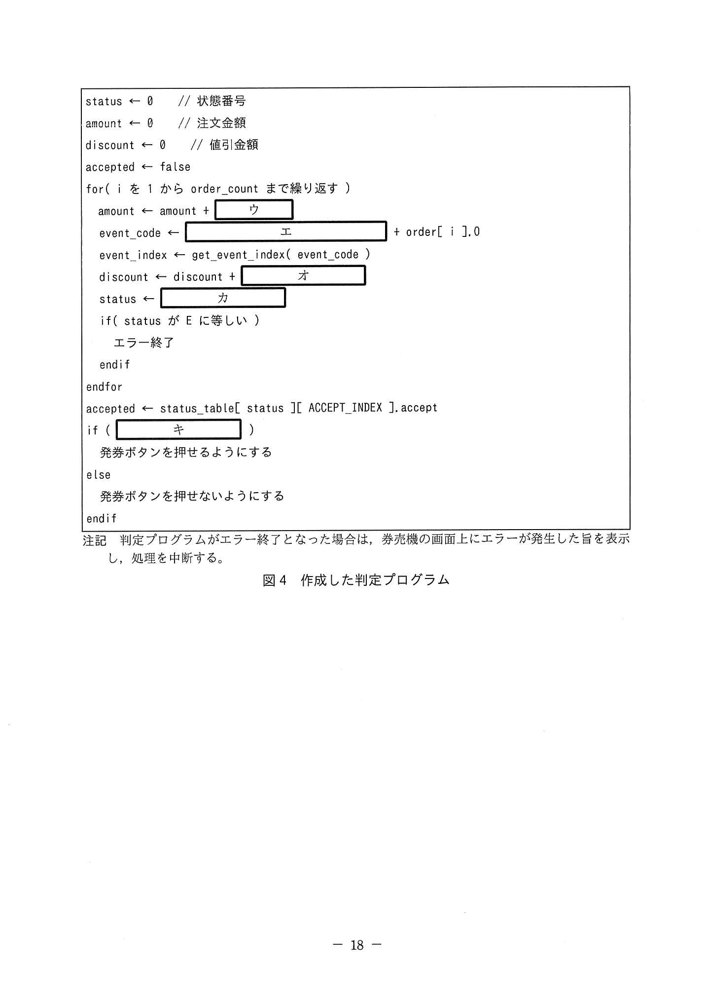

テキスト (OCR)

status と 9  // 状態番号

amount と9  // 注文金額

discount — 0  // 値引金額

accepted < false

for( i を 1 から order_count まで繰り返す )

event_code «|            x=            ] + order[ i ].0

event_index で get_event index( event_code )

discount で discount +

if( status が E に等しい )
エラー終了

endif
endfor
accepted < status_table[ status ][ ACCEPT_INDEX ].accept
im

発券ボタンを押せるようにする
else

発券ボタンを押せないようにする
endif
注記 判定プログラムがエラー終了となった場合は, 券売機の画面上にエラーが発生した旨を表示
し, 処理を中断する。

図4 作成した判定プログラム

ー 18 一

### ページ 19

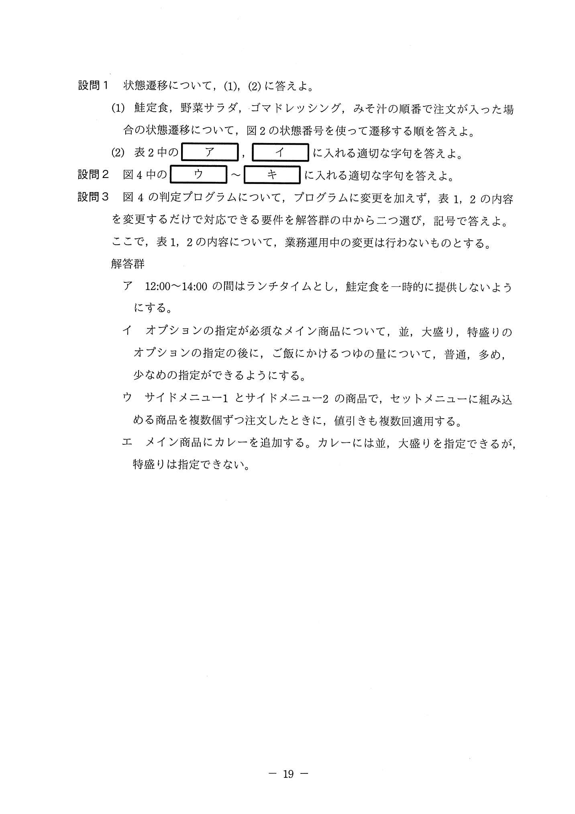

テキスト (OCR)

設問1 状態遷移について, ①⑪), ②) に答えよ。

Q①) MER, 野菜サラダ, ゴマドレッシング, みそ汗の順番で注文が入った場
合の状態乱移について, 図 2 の状態番号を使って遷移する順を答えよ。

@) 表2中の| ア |,[ イ |に入れる適切な字句を答えよ。

設問2 図4中の| ウ |-| キ |に入れる適切な字句を答えよ。

設問3 図4 の判定プログラムについて, プログラムに変更を加えず, 表 1, 2 の内容
を変更するだけで対応できる要件を解答群の中から二つ選び, 記号で答えよ。
ここで, Hl, 2 の内容について, 業務運用中の変更は行わかいものとする。

ア 12:00~14:00 の間はランチタイムとし, 鮭定食を一時的に提供しないよう
にする。

イ オプションの指定が必須なメイン商品について, Mh, 大盛り, 特盛りの
オプションの指定の後に, ご飯にかけるつゆの量について, 普通, 多め
少なめの指定ができるようにする。

ウ サイドメニュー1 とサイドメニュー2 の商品で,。 セットメニューに組み込
める商品を複数個ずつ注文したときに, 値引きも複数回適用する。

工 メイン商品にカレーを追加する。カレーには並, 大盛りを指定できるが,
特盛りは指定できない。

ー 19 一

### ページ 20

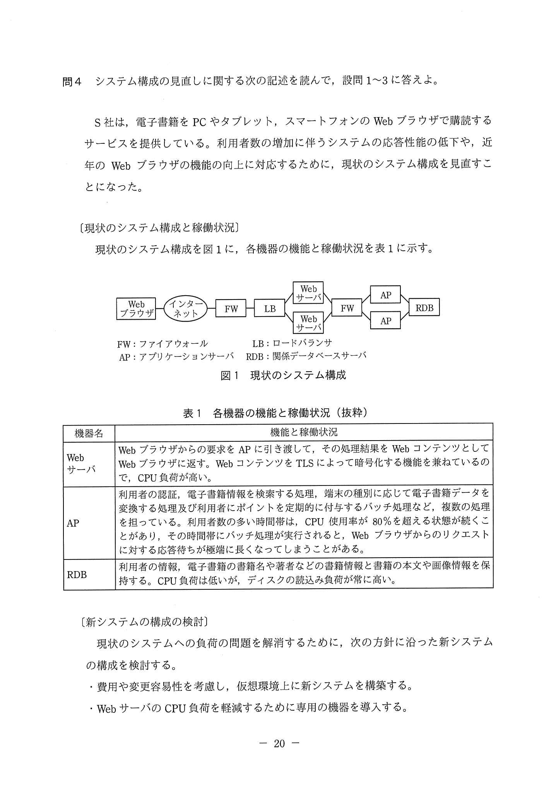

テキスト (OCR)

問4 システム構成の見直しに関する次の記述を読んで, 設問 1ー3 に答えよ。

S 社は, 電子書籍を PC やタブレット, スマートフォンの Web ブラウザで購読する
サービスを提供している。利用者数の増加に伴うシステムの応答性能の低下や, 近
年の Web ブラウザの機能の向上に対応するために, 現状のシステム構成を見直すこ
とになった。

[現状のシステム構成と稼働状況]
現状のシステム構成を図 1 に, 各機器の機能と稼働状況を表 1 に示す。

Web
サーバ            AP
e
サーバ            BE
FW : ファイアウォール        LB: ロードバパラシサ
AP :アプリケーションサーバ  RDB : 関係データベースサーバ

図1 現状のシステム構成

表1 各機器の機能と稼働状況(抜粋)

機器名                       機能と稼働状況
We       Web ブラウザからの要求を AP に引き渡して, その処理結果を Web コンテンツとして
サーバ | Web ブラウザに返す。Web コンテンツを TLS によって暗号化する機能を兼ねているの
で, CPU負荷が高い。

利用者の認証, 電子書籍情報を検索する処理, 端末の種別に応じて電子書籍データを
変換する処理及び利用者にポイントを定期的に付与するバッチ処理など, 複数の処理
AP       を担っている。利用者数の多い時間帯は, CPU 使用率が 80%を超える状態が続くこ
とがあり, その時間帯にバッチ処理が実行されると, Web ブラウザからのリクエスト
に対する応答待ちが極端に長くなってしまうことがある。

利用者の情報, 電子書籍の書籍名や著者などの書籍情報と書籍の本文や画像情報を保

RDB |i, CPU 負荷は低いが, ディスクの読込み負荷が常に高い。

〔新システムの構成の検討]
現状のシステムへの負荷の問題を解消するために, 次の方針に沿った新システム
の構成を検討する。
・費用や変更容易性を考慮し, 仮想環境上に新システムを構築する。
・Web サーバの CPU 負荷を軽減するために専用の機器を導入する。

ー 20 一

### ページ 21

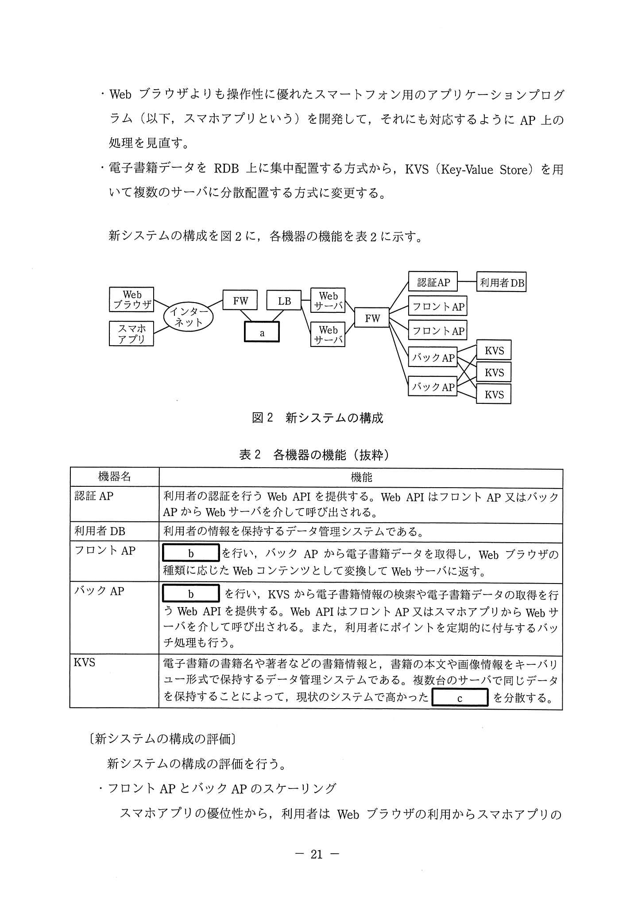

テキスト (OCR)

・Web ブラウザよりも操作性に優れたスマートフォン用のアプリケーションプログ
ラム (以下,スマホアプリという) を開発して, それにも対応するように AP 上の
処理を見直す。

・電子書籍データを RDB 上に集中配置する方式から, KVS (Key-Value Store) を用
いて複数のサーバに分散配置する方式に変更する。

新システムの構成を図2 に, 各機器の機能を表 2 に示す。

Web
プラウザ   Gs    FW      LB  |  Piet
ホ
220                   La |       yet
M2 新システムの構成
表2 各機器の機能 (抜粋)
機器名                                          機能

認証 AP         利用者の認証を行う Web API を提供する。Web API はフロント AP 又はバック
AP から Web サーバを介して呼び出される。

利用者 DB       利用者の情報を保持するデータ管理システムである。

フロントAP |b |を行い, バック AP から電子書籍データを取得し, Web ブラウザの
種類に応じた Web コンテンツとして変換して Web サーバに返す。

バック AP                  を行い。KVS から電子書籍情報の検索や電子書籍データの取得を行
う Web API を提供する。Web API はフロント AP 又はスマホアプリから Web +
ーバを介して呼び出される。また, 利用者にポイントを定期的に付与するバッ
チ処理も行う。

KVS                 電子書籍の書籍名や著者などの書籍情報と, 書籍の本文や画像情報をキーバリ
ュー形式で保持するデータ管理システムである。複数台のサーバで同じデータ
を保持することによって, 現状のシステムで高かった|  c | を分散する。

[新システムの構成の評価〕

新システムの構成の評価を行う。
・フロント AP とバック AP のスケーリング
スマホアプリの優位性から, 利用者は Web ブラウザの利用からスマホアプリの

ー 2T 一

### ページ 22

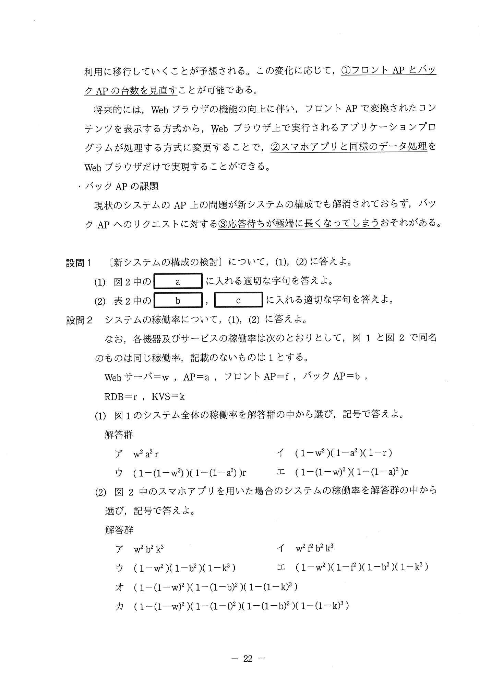

テキスト (OCR)

利用に移行していくことが予想される。この変化に応じて, ①フロント AP とバッ
ク AP の台数を見直すことが可能である。
将来的には, Web ブラウザの機能の向上に伴い, フロント AP で変換されたコン
テンツを表示する方式から, Web ブラウザ上で実行されるアプリケーションプロ
グラムが処理する方式に変更することで, ②スマホアプリと同様のデータ処理を
Web ブラウザだけで実現することができる。
・バック AP の課題
現状のシステムの AP 上の問題が新システムの構成でも解消されておらず, バッ
ク AP へのリクエストに対する③応答待ちが極端に長くなってしまうおそれがある。

設問1 【新システムの構成の検討]について, (①, ⑫) に答えよ。
a) 図2中の| 』 | に入れる適切な字句を答えよ。
@ 表2中の|  b | | c |に入れる適切な字句を答えよ。
設問2 システムの稼働率について, (①⑪, @ に答えよ。
なお, 各機器及びサービスの稼働率は次のとおりとして, 図 1 と図 2 で同名
のものは同じ乏働率, 記載のないものは 1 とする。
Web サーバテw , AP=a, フロント AP={f , バック AP=b,
RDB=r , KVS=k

①) 図1のシステム全体の稼働率を解答群の中から選び, 記号で答えよ。
解答群
ア war         4 (1一w?)(1一a2)( 1一r )
ウ (1-1ーw?) (1-G~a’) r   エー (1-G-w) (1-day )r

(2) 2ZHOAVAKT TY EAVEGROY AF LORS ERARO HDS
選び, 記号で答えよ。

MARE
ア whbk                          4 wf b'k?
ウ (1—-w? )(1—b? )(1-k*)        = (1-w)(1-f)(1-b? (1-K)

オ (1-G—w)? )(1-—b) )(1--k)*)
A (1-G—w)? )(1--£? (1 - (bY (1ユーローk) )

ー 92 一

### ページ 23

テキスト (OCR)

設問3 〔新システムの構成の評価] について, (1て(3) に答えよ。

1) 本文中の下線わにあるフロント AP とバック AP の台数はそれぞれどのよう
に変化するか。解答群の中から選び, 記号で答えよ。ただし, システム全体
へのリクエスト数は変わらないものとし, 機器の台数は必要かつ最も少ない
台数にすること。
解答群

ア 少なくなる     イ 多くなる      ウ 変わらない

(2) 本文中の下線②とはどのような処理か。40 字以内で述べよ。

(3) 本文中の下線③の問題を回避するためには, 表 2 中の機器の機能に変更を
加える必要がある。 対象となる機器を表 2 から選び, 加える変更について,
30 字以内で述べよ。

ー 23 一

### ページ 24

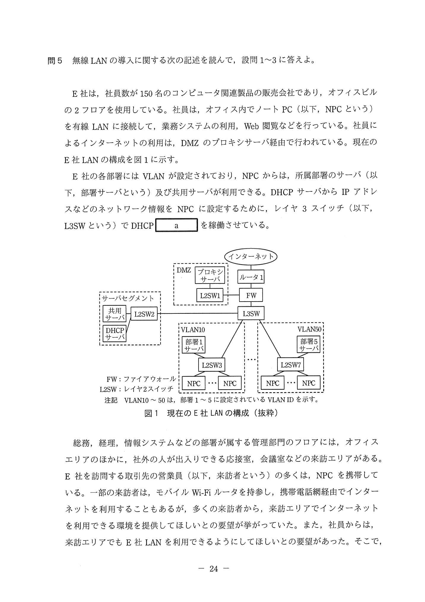

テキスト (OCR)

問5 無線LANの導入に関する次の記述を読んで, 設問 1ー3 に答えよ。

E 社は, 社員数が 150 名のコンピュータ関連製品の販売会社であり, オフィスピル
の 2 フロアを使用している。和社員は, オフィス内でノート PC (以下, NPC という)
を有線 LAN に接続して, 業務システムの利用, Web 閲覧などを行っている。社員に
よるインターネットの利用は, DMZ のプロキシサーバ経由で行われている。 現在の
E 社LAN の構成を図 1 に示す。

E 社の各部署には VLAN が設定されており, NPC からは, 所属部署のサーバ (以

, 部署サーバという) 及び共用サーバが利用できる。DHCP サーバから IP アドレ
スなどのネットワーク情報を NPC に設定するために, レイヤ 3 スイッチ (以下,
L3SW という) でDHCP[ 』 | を稼働させている。

i         1
1DMZ | プロキシ|
!     ae  ルータ 1
1         1

!サーバセグメント ! !   L2SW1 f+ FW

tl          a aa1

1 共用       1

|サーバILBSWR            L3sw

          fo jcsszaeesssos==ー enoeoemeニーー

|| DHCP      |   | VLAN10       st       VLAN50!

| サーバ      !          ; !           1

101    !| 部署1         14         ARES |!
es        rf        テーバ
1             Ti ce ait             1
| Isws| 1 Issw| 1
1           1  1           1

FW : ファイアウォール!              ド 4              |

注記 VLAN10~ 50 は, 部署 1て5に設定されている VLAN ID を示す。
 1 現在のE社LANの構成 (抜粋)

総務, 経理, 情報システムなどの部署が属する管理部門のフロアには, オフィス
エリアのほかに, 社外の人が出入りできる応接室, 会議室などの来訪エリアがある。
E 社を訪問する取引先の営業員 (以下, 来訪者という) の多くは, NPC を携帯して
いる。一部の来訪者は, モバイル WER ルータを持参し, 携帯電話綱経由でインター
ネットを利用することもあるが, 多くの来訪者から, 来訪エリアでインターネット
を利用できる環境を提供してほしいとの要望が挙がっていた。また, 社員からは,
来訪エリアでも ELAN を利用できるようにしてほしいとの要望があった。そこで,

ー 24 一

### ページ 25

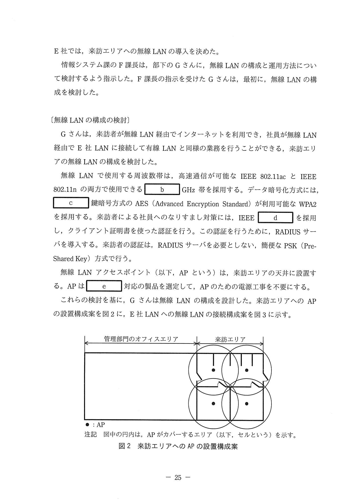

テキスト (OCR)

E 社では, 来訪エリアへの無線 LAN の導入を決めた。

情報システム課のF 課長は, 部下のGさんに, 無線 LAN の構成と運用方法につい
て検討するよう指示した。F 課長の指示を受けた G さんは, 最初に, 無線 LAN の構
成を検討した。

(無線 LAN の構成の検討

G さんは, 来訪者が無線 LAN 経由でインターネットを利用でき, MELO LAN
経由で E 社 LAN に接続して有線 LAN と同様の業務を行うことができる, 来訪エリ
アの無線 LAN の構成を検討した。

無線 LAN で使用する周波数帯は, 高速通信が可能な IEEE 802.11ac と IEEE
802.11n の両方で使用できる|  b | GHz 帯を採用する。データ暗号化方式には,
[|  c  ] atm sto AES (Advanced Encryption Standard) が利用可能な WPA2
を採用する。来訪者による社員へのなりすまし対策には, IEEE | q | を採用
し, クライアント証明書を使った認証を行う。この認証を行うために, RADIUS サー
バを導入する。来訪者の認証は, RADIUS サーバを必要としない, 簡便な PSK (Pre-
Shared Key) 方式で行う。

無線 LAN アクセスポイント (以下, AP EWS) は, 来訪エリアの天井に設置す
る。AP は|  e | HiKOWMEMIELT, APのための電源工事を不要にする。

これらの検討を基に, G さんは無線 LAN の構成を設計した。来訪エリアへの AP

の設置構成案を図 2 に, E 社 LAN への無線 LAN の接続構成寄を図 3 に示す。

管理部門のオフィスエリア      来訪エリア

@ : AP
注記 図中の円内は, AP がカバーするエリア (以下, セルという) を示す。
図2 来訪エリアへの AP の設置構成案

ー 25 一

### ページ 26

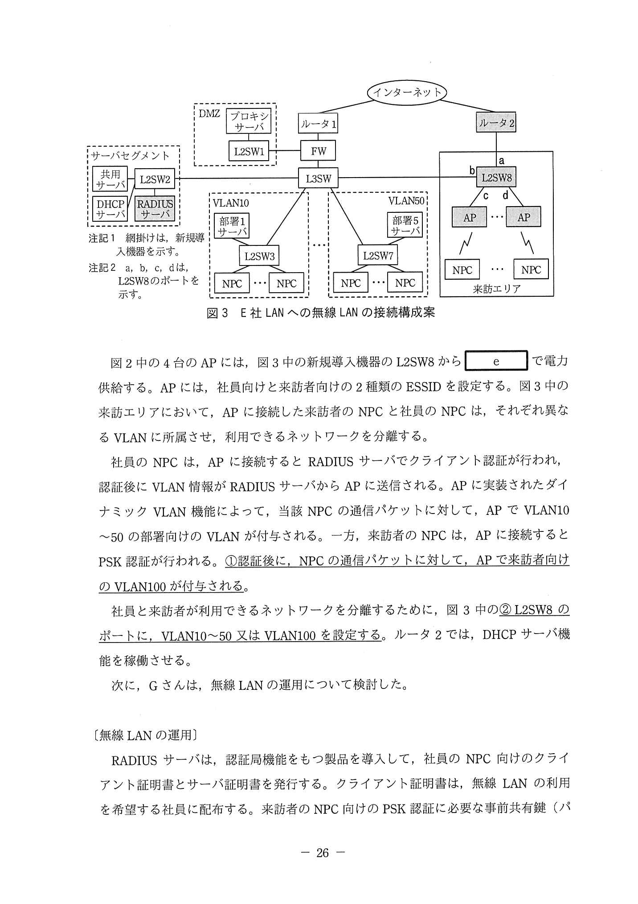

テキスト (OCR)

DHCP} [RADIUS
サーバ| | サーバ

H          1
1
1
1) 革用       1
 ME
          1
          !

注記1 網掛けは, 新規導
入機器を示す。

注記2 a, b, cdは,
L2SW8のポートを
示す。

 3 E社LANへの無線 LAN の接続構成案

 2 中の 4 人台の AP には, 図3中の新規導入機器の L2SW8 から| e |で電カ
供給する。AP には, 社員向けと来訪者向けの 2 種類の ESSID を設定する。図 3 中の
来訪エリアにおいて, AP に接続した来訪者の NPC と社員の NPC は, それぞれ異な
る VLAN に所属させ, 利用できるネットワークを分離する。

社員の NPC は, AP に接続すると RADIUS サーバでクライアント認証が行われ,
認証後に VLAN 情報が RADIUS サーバから AP に送信される。AP に実装されたダイ
ナミック VLAN 機能によって, 当該 NPC の通信パケットに対して, AP で VLAN10
~50 の部署向けの VLAN が付与される。一方, 来訪者の NPC は, AP に接続すると
PSK 認証が行われる。①認証後に, NPC の通信パケットに対して, AP で来訪者向け
の VLAN100 が付与される。

社員と来訪者が利用できるネットワークを分離するために, 図 3 中の②L2SW8 の
ポートに, VLANIO~50 又は VLAN100 を設定する。ルータ 2 では, DHCP サーバ機

能を稼働させる。
次に, G さんは, 無線 LAN の運用について検討した。
[無線 LAN の運用〕

RADIUS サーバは, 認証局機能をもつ製品を導入して, 社員の NPC 向けのクライ
アント証明書とサーバ証明書を発行する。クライアント証明書は, 無線 LAN の利用
を希望する社員に配布する。来訪者の NPC 向けの PSK 認証に必要な事前共有鍵 (パ

ー 26 一

### ページ 27

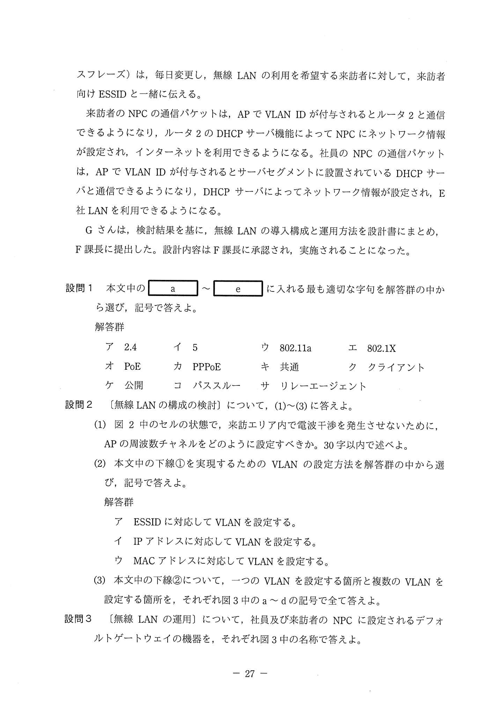

テキスト (OCR)

スフレーズ) は, 毎日変更し, 無線 LAN の利用を希望する来訪者に対して, 来訪者
向け ESSID と一緒に伝える。

来訪者の NPC の通信パケットは, AP で VLAN ID が付与されるとルータ 2 と通信
できるようになり, ルータ 2 の DHCP サーバ機能こよって NPC にネットワーク情報
が設定され, インターネットを利用できるようになる。社員の NPC の通信パケット
は, AP で VLAN ID が付与されるとサーバセグメントに設置されている DHCP サー
バと通信できるようになり, DHCP サーバによってネットワーク情報が設定され, E
社 LAN を利用できるようになる。

G さんは, 検討結果を基に, 無線 LAN の導入構成と運用方法を設計書にまとめ,
F 課長に提出した。設計内容はF 課長に承認され, 実施されることになった。

設問1 本文中の| a |~[  。 |に入れる最も適切な字句を解答群の中か

He ARE
ア 24   イ 5     ウ 802.11a   エ 802.1X
オ PoE   カ PPPog   キ 共通    ク クライアント
ケ 公開   コ パススルー サ リレーエージェント

設問2 = RAR LAN の構成の検討] について, (①~(3) に答えよ。
GQ) 図 2 中のセルの状態で, 来訪エリア内で電波干渉を発生させないために,
AP の周波数チャネルをどのように設定すべきか。30 字以内で述べよ。
2) 本文中の下線①を実現するための VLAN の設定方法を解答群の中から選
UO, 記号で答えよ。
解答

=

ア ESSID に対応して VLAN を設定する。
イ IPアドレスに対応して VLAN を設定する。
ウ MACアドレスに対応して VLAN を設定する。
(3) 本文中の下線②について, 一つの VLAN を設定する箇所と複数の VLAN を
設定する箇所を, それぞれ図 3 中の a てdの記号で全て答えよ。
設問3 [無線 LAN の運用】 について, 社員及び来訪者の NPC に設定されるデフォ
ルトゲートウェイの機器を, それぞれ図 3 中の名称で答えよ。

ー 27 一

### ページ 28

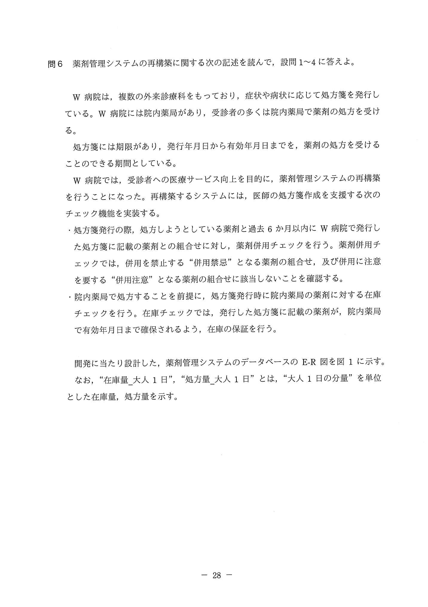

テキスト (OCR)

問6 薬剤管理システムの再構築に関する次の記述を読んで, 設問 1ご4 に答えよ。

人 症状や病状に応じて処方箋を発行し
ている。 W 病院には院内薬局があり, 受診者の多くは院内薬局で薬剤の処方を受け
る。

処方箋には期限があり, 発行年月日から有効年月日までを, 薬剤の処方を受ける
ことのできる期間としている。

W 病院では, 受診者への医療サービス向上を目的に, 薬剤管理システムの再構築
を行うことになった。再構築するシステムには, 医師の処方箋作成を支援する次の
チェック機能を実装する。

・ 処方箋発行の際, 処方しようとしている薬剤と過去 6 か月以内に W 病院で発行し
た処方箋に記載の薬剤との組合せに対し, 薬剤併用チェックを行う。薬剤併用チ
ェックでは, 併用を禁止する "併用禁忌"” となる薬剤の組合せ, 及び併用に注意
を要する “併用注意” となる薬剤の組合せに該当しないことを確認する。

・院内薬局で処方することを前提に, 処方箋発行時に院内薬局の薬剤に対する在庫
チェックを行う。在庫チェックでは, 発行した処方箋に記載の薬剤が, 院内薬局
で有効年月日まで確保されるよう, 在庫の保証を行う。

開発に当たり設計した, 薬剤管理システムのデータベースの ER 図を図 1 に示す。

なお, “在庫量 KALA”, "処方量 大人 1 日” とは, “大人 1 AOE” を単位
とした在庫量, 処方量を示す。

ー 28 一

### ページ 29

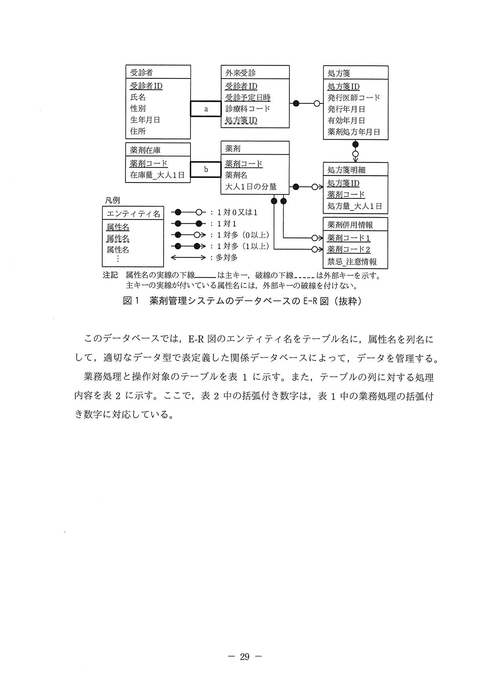

テキスト (OCR)

愛診者                        外来受診                        処方穫
受診者ID                   受診者ID                     処方箋TD
氏名          受診予定日時       発行医師コード
性別        a | 診療笠コード   ©) 人生
生年月日        AFBI         有効年月日
住所                       薬剤般方年月日
薬剤在庫        薬剤              6
コード       薬剤コード
在庫恒 ALE LD] ese,          —
4
on             大人1日の分量 es eee
2 55                                                          人1日
エンティティ名| @—O-: 1対0又は1               久居
属性名            -信一一候- : 1対1                           薬剤併用情報
属性名         -@—o> : 182 (OE)             薬剤コード1
REZ        -念一@> : 1対多 (1以上)           薬剤コード2
i           <> : 多装多                    禁 注意情報

注記 属性名の実線の下線は主キー, 破線の下線----- は外部キーを示す。
主キーの実線が付いている属性名には, 外部キーの破線を付けない。

図1 薬剤管理システムのデータベースのE-R図 (抜粋)

このデータベースでは, E-R 図のエンティティ名をテーブル名に, 属性名を列名に
して, 適切なデータ型で表定義した関係データベースによって, データを管理する。
業務処理と操作対象のテーブルを表 1 に示す。また, テーブルの列に対する処理
内容を表 2 に示す。ここで, 表 2 中の括弧付き数字は, 表 1 中の業務処理の括弧付
き数字に対応している。

ー 29 一

### ページ 30

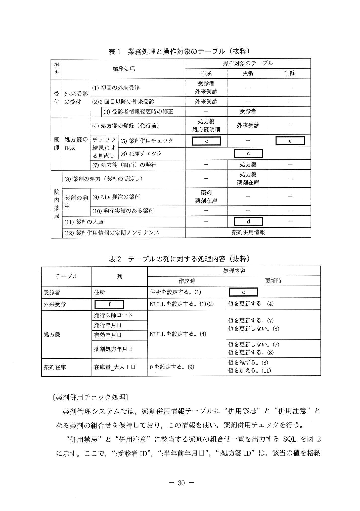

テキスト (OCR)

表1 業務処理と操作対象のテーブル (抜粋)
‘a                              HEH ROT — 7)
a         業務処理
き             作成     更新     削除
初回の外来受診          テテ      =
| eee @) 初回   来受診             外来受診
付 | の受付 | ②⑰2 回目以降の外来受診       外来受診     ー      =
@) 受診者情報変更時の修正      =      受診者      =
‘acsomdin deem       Te     _—     回
@) 処方箕の登録 (発行前)     msm | 外来受診
il dete Peg COL      -
ai | ¢    結果によ
る見直し | ⑯ 在庫チェック
WES (MM) OFF        =     aS     =
ュー            _     AS     _
⑧ RHOMA CRAMOBIEL)                sree
Wi                        E
vy | HELD se | (0) ADEE DICL         wen     -      -
."    GO HERA 5 Al         =       =       =
5
(1D 薬剤の入庫                      ー      Ca]      ー
(12) 薬剤人用情報の定期メンテナンス             薬剤人用情報
表2 テーブルの列に対する処理内容 (抜粋)
処理内容
ーブル         列
                    作成時            更新時
受診者      住所        住所を設定する。Q)     |
外来受診      NULL を設定する。 WO) | 値を更新する。(④⑭
ala                 値を更新する。 の
Fe:                     ty     s 7
-       airrAg        |         値を更新しない。⑬
MLAS        有効年月日      NULL を設定する。④⑭
ー                       値を更新しない。(⑦の
0                 値を更新する。⑮
”          と            値を減ずる。⑮
eat     在庫量 大人1日 |0を設定する。⑨      司る0ある

[薬剤併用チェック処理]

薬剤管理システムでは, 薬剤併用情報テーブルに “併用禁忌"

なる薬剤の組合せを保持しており, この情報を使い, 薬剤併用チェックを行う。

に該当する薬剤の組合せ一覧を出力する SQL を図 2

に示す。ここで, “Se ID’, “:半年前年月日", “:負方箋ID” は, 該当の値を格納

ー 30 一

### ページ 31

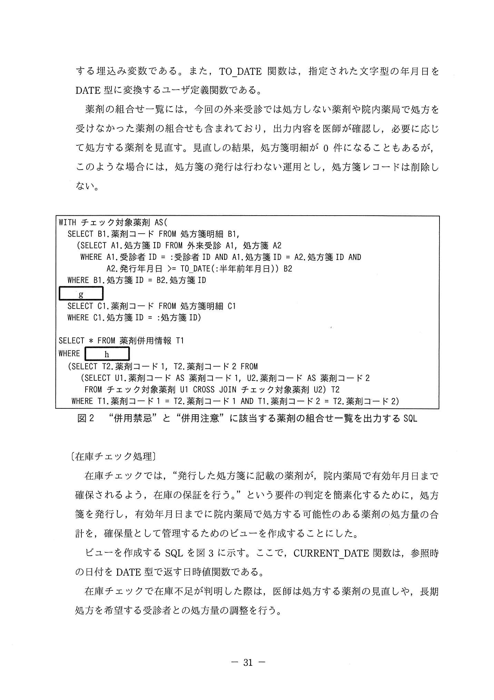

テキスト (OCR)

する埋込み変数である。 また, TO_DATE 関数は, 指定された文字型の年月日を
DATE 型に変換するユーザ定義関数である。

薬剤の組合せ一覧には, 今回の外来受診では処方しない薬剤や院内薬局で処方を
受けなかった薬剤の組合せも含まれており, 出力内容を医師が確認し, 必要に応じ
て処方する薬剤を見直す。見直しの結果, 処方箋明細が 0 件になることもあるが,
このような場合には, 処方箋の発行は行わない運用とし, 処方箋レコードは削除し

ない。

WITH チェック対象薬剤 AS(
SELECT B1.薬剤コード FROM 処方箋明細 B1,
(SELECT A1.処方箋 ID FROM 外来受診 Al, 処方箋 A2
WHERE A1.受診者 ID = :受診者 ID AND A1.処方箋 ID = A2.処方箋 ID AND
A2. 発行年月日 >= TO0_DATE(:半年前年月日)) B2
WHERE B1.処方箋 ID = B2.処方箋 ID
SELECT C1.薬剤コード FROM 処方箋明細 C1
WHERE C1.処方箋ID = :処方箋 ID)

SELECT * FROM 薬剤併用情報 T1
(SELECT T2.薬剤コード 1, T2.薬剤コード 2 FROM
(SELECT U1.薬剤コード AS 薬剤コード 1, U2.薬剤コード AS 薬剤コード 2
FROM チェック対象薬剤 U1 CROSS JOIN チェック対象薬剤 U2) T2
WHERE T1. 薬剤コード 1 = T2.薬剤コード 1 AND T1.薬剤コード 2 = T2.薬剤コード 2)

図2 “併用禁忌" と “併用注意" に該当する薬剤の組合せ一覧を出力する SOL

(在庫チェック処理]

在庫チェックでは, “発行した処方箋に記載の薬剤が, 院内薬局で有効年月日まで
確保されるよう, 在庫の保証を行う。" という要件の判定を簡素化するために, 処方
箋を発行し, 有効年月日までに院内薬局で処方する可能性のある薬剤の処方量の合
計を, 確保量として管理するためのビューを作成することにした。

ビューを作成する SQL を図 3 に示す。ここで, CURRENT DATE 関数は, 参照時
の日付を DATE 型で返す日時値関数である。

在庫チェックで在庫不足が判明した際は, 医師は処方する薬剤の見直しや, 長期
処方を希望する受診者との処方量の調整を行う。

ー 31 一

### ページ 32

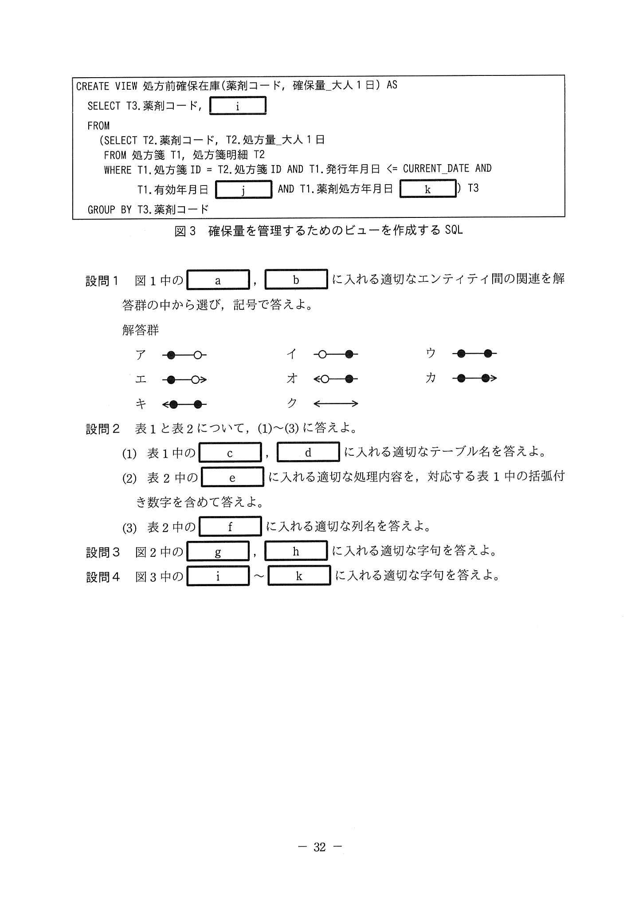

テキスト (OCR)

CREATE VIEW 処方前確保在庫(薬剤コード, 確保量_-大人 1 日) AS

SELECT T3.薬剤コード| ij |
FROM
(SELECT T2.薬剤コード, T2.処方量 大人 1 日
FROM 処方箋 T1, 処方箋明細 T2
WHERE T1.処方箋 D = 12.処方箋 ID AND TI.発行年月日 <= CURRENT_DATE AND

T1.有効年月日 AND TI.薬剤処方年朋日 | k |)Tr3

GROUP BY T3.薬剤コード

 3 確保量を管理するためのビューを作成する SQL

設問1 図1中の| a | | b |に入れる適切ながエンティティ間の関連を解
答群の中から選び, 記号で答えよ。
解答群
ア eo    イ で一@-    ウ -@—e
= -@—O>     オ <O一@-    7 -@—@>
+ <@一@-     ク <—>

設問2 表1と表2について, (①ー⑬) に答えよ。
a 表1中の| oc), |  d |に入れる適切なテーブル名を答えよ。
@ 表2 中の|  e | に入れる適切な処理内容を, 対応する表 1中の括弧付
き数字を含めて管えよ。
⑬ 表2中の[| f |] に入れる適切な列名を答えよ。

設問3 図2中の|  g |,| hn |に入れる適切な字句を答えよ。

設問4 図3中の| ji |-| k |に入れる適切な字句を答えよ。

ー 32 一

### ページ 33

テキスト (OCR)

【

x = 用 紙 J

ー 33 一

### ページ 34

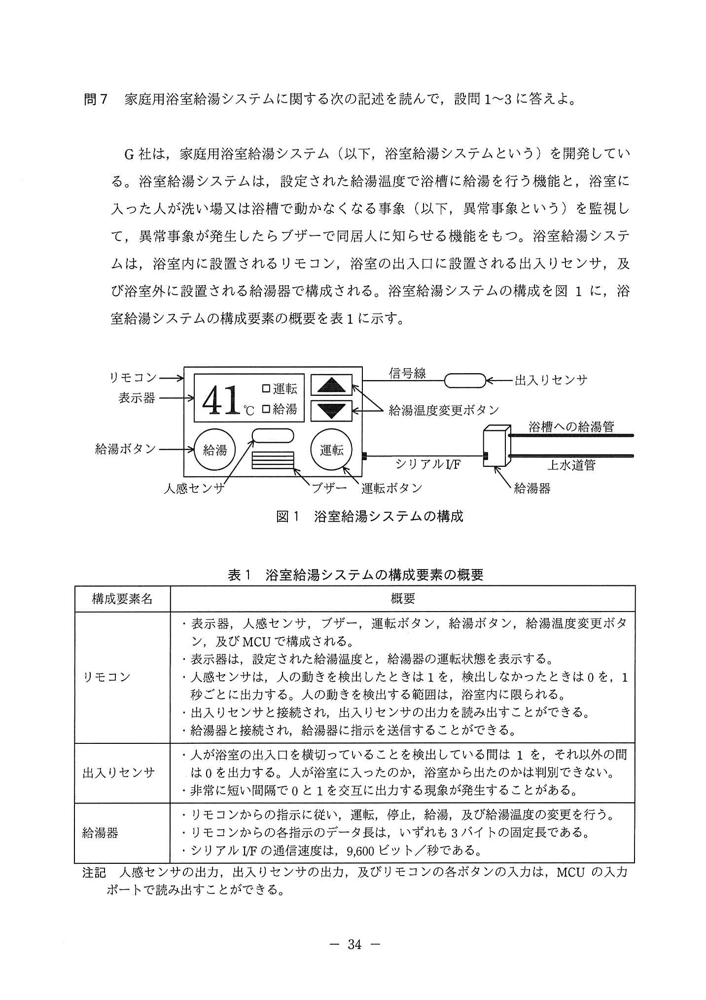

テキスト (OCR)

7 家庭用浴室給湯システムに関する次の記述を読んで, 設問13 に答えよ。

G 社は, 家庭用浴室給湯システム (以下, 浴室給湯システムという) を開発してい
る。 浴室給湯システムは, 設定された給湯温度で浴槽に給湯を行う機能と, 浴室に
入った人が洗い場又は浴槽で動かなくなる事象 (以下, 異常事象という) を監視し
て, 異常事象が発生したらブザーで同居人に知らせる機能をもつ。 浴室給湯システ
Alt, 浴室内に設置されるリモコン, 浴室の出入口に設置される出入りセンサ, 及
び浴室外に設置される給湯器で構成される。浴室給湯システムの構成を図 1 に, 浴
室給湯システムの構成要素の概要を表 1 に示す。

リモコン一|      sae] (aim KB ted
ERE
°       41. ON | kj eminem sy

4 浴槽への給湯
給湯ボタンーー| ォたー (xe
1(ew) =.    画了22227       上水道

人感センサ           ブザー 運転ボタン           給湯器
図1 浴室給湯システムの構成

表1 浴室給湯システムの構成要素の概要

構成要素名                   概要

・表示器, 人感センサ, ブザー, 運転ボタン, 給湯ボタン, 給湯温度変更ボタ
ン, 及びMCU で構成される。

・ 表示器は, 設定された給湯温度と, 給湯器の運転状態を表示する。

リモコン    ・人感センサは, 人の動きを検出したときは1 を, 検出しなかったときは0 を, 1
秒ごとに出力する。人の動きを検出する範囲は, 浴室内に限られる。

・出入りセンサと接続され, 出入りセンサの出力を読み出すことができる。

・給湯器と接続され, 給湯器に指示を送信することができる。

・人が浴室の出入口を横切っていることを検出している間は 1 を, それ以外の間
出入りセンサ   は 0 を出力する。 人が浴室に入ったのか, 浴室から出たのかは判別できない。
・非常に短い間隔で 0 と 1 を交互に出力する現象が発生することがある。

・リモコンからの指示に従い, 運転, 停止, 給湯。 及び給湯温度の変更を行う。
給湯器     ・リモコンからの各指示のデータ長は, いずれも 3 バイトの固定長である。
・シリアル IF OFS, 9,600 ビットノ秒である。

注記 人感センサの出力, 出入りセンサの出力, 及びリモコンの各ボタンの入力は, MCU の入力
ポートで読み出すことができる。

ー 34 一

### ページ 35

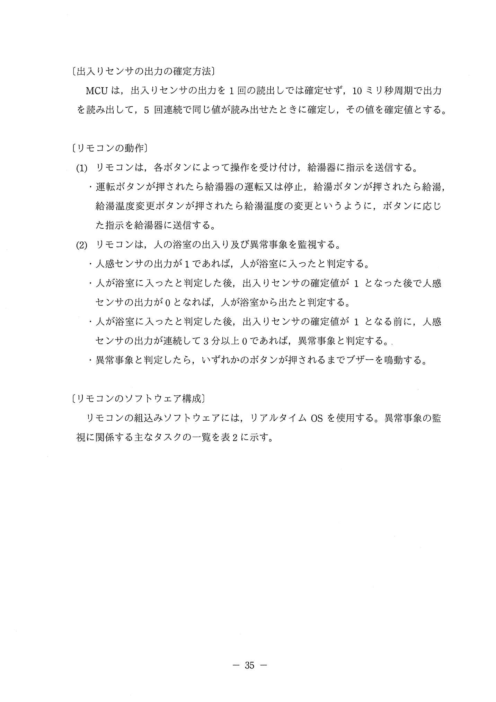

テキスト (OCR)

[出入りセンサの出力の確定方法
MCU は, 出入りセンサの出力を 1 回の読出しでは確定せず, 10 ミリ秒周期で出力
を読み出して, 5 回連続で同じ値が読み出せたときに確定し, その値を確定値とする。

[リモコンの動作

Q①) リモコンは, 各ボタンによって操作を受け付け, 給湯器に指示を送信する。
・運転ボタンが押されたら給湯器の運転又は停止, 給湯ボタンが押されたら給湯
給湯温度変更ボタンが押されたら給湯温度の変更というように, ボタンに応じ
た指示を給湯器に送信する。

(2) リモコンは, 人の浴室の出入り及び異常事象を監視する。
・人感センサの出力が 1 であれば, 人が浴室に入ったと判定する。
・人が浴室に入ったと判定した後, 出入りセンサの確定値が 1 となった後で人感
センサの出力が 0 となれば, 人が浴室から出たと判定する。
・人が浴室に入ったと判定した後, 出入りセンサの確定値が 1 となる前に, AR
センサの出力が連続して 3 分以上 0 であれば, 異常事象と判定する。 |
・異常事象と判定したら, いずれかのボタンが押されるまでブザーを鳴動する。

[リモコンのソフトウェア構成]

リモコンの組込みソフトウェアには, リアルタイム 0S を使用する。異常事象の監
視に関係する主なタスクの一覧を表 2 に示す。

ー 35 一

### ページ 36

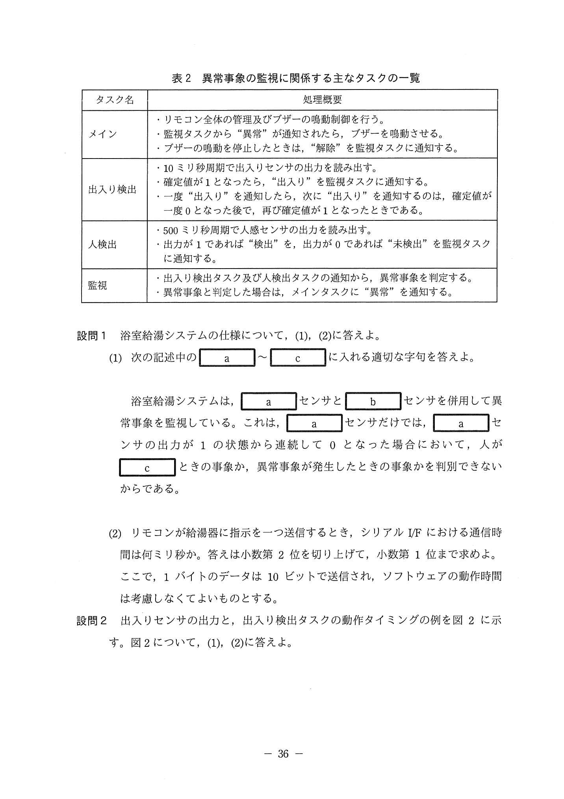

テキスト (OCR)

表2 異常事象の監視に関係する主なタスクの一覧

タスク名                             処理概要
・リモコン全体の管理及びブザーの鳴動制御を行う。
メイン       ・監視タスクから 異常" が通知されたら, ブザーを鳴動させる。

・ブザーの鳴動を停止したときは, “HOR” を監視タスクに通知する。

・10 ミリ秒周期で出入りセンサの出力を読み出す。
・確定値が1 となったら, “MAD” を監視タスクに通知する。

出入り検出     ie  wi BS    i alejee  ® bys         cies
・一度 “出入り” を通知したら, mic “HAD” を通知するのは, 確定値が
一度 0 となった後で, 再び確定値が 1 となったときである。
・500 ミリ秒周期で人感センサの出力を読み出す。

人検出       ・出力が 1 であれば “検出” を, 出力が 0 であれば “RM” を監視タスク
に通知する。

ee     ・出入り検出タスク及び人検出タスクの通知から, 異常事象を判定する。

・異常事象と判定した場合は, メインタスクに “異常” を通知する。

設問1 浴室給湯システムの仕様について, ①, ②に答えよ。
Q) 次の記述中の| a |~] c |に入れる適切な字句を答えよ。

浴室給湯システムは, | a |センサと|  b |センサを併用して異
常事象を監視している。これは, |  。 |]センサだけでは,[ 。』 de
ンサの出力が 1 の状態から連続して 0 となった場合において, 人が
| < | ときの事象か, 異常事象が発生したときの事象かを判別できない
からである。

(2) リモコンが給湯器に指示を一つ送信するとき, シリアル IF における通信時
間は何ミリ秒か。答えは小数第 2 位を切り上げて, 小数第 1 位まで求めよ。
ここで, 1 バイトのデータは 10 ビットで送信され, ソフトウェアの動作時間
は考慮しなくてよいものとする。
設問2 出入りセンサの出力と, 出入り検出タスクの動作タイミングの例を図 2 に示
す。図 2 について, ①, KABA,

ー 36 一

### ページ 37

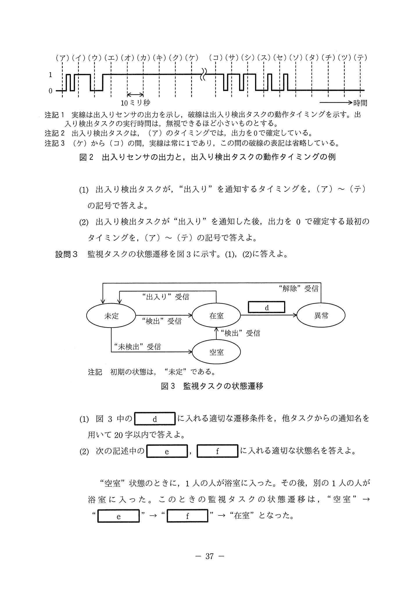

テキスト (OCR)

(了) (イ) (ゆ) (エ) (オ) (ヵ) (キ) (ク) (ヶ) (DCH (シ) (ス) (セ) (ソ) BDF (ツ) (テ)
a a
mill LT nae TET LLL rob 1 @
10ミリ秒                        ーー一*>時間

注記1 実線は出入りセンサの出力を示し, 破線は出入り検出タスクの動作タイミングを示す。出
入り検出タスクの実行時間は, 無視できるほど小さいものとする。

注記 2 出入り検出タスクは, (ア) のタイミングでは, 出力を0で確定している。

注記 3 (ケ) から (コ) の間, 実線は常に1であり, この間の破線の表記は省略している。

図2 出入りセンサの出力と, 出入り検出タスクの動作タイミングの例

Q①) 出入り検出タスクが, “HAD” を通知するタイミングを, (ア) ~ (テ)
の記号で答えよ。
(2) 出入り検出タスクが “出入り” を通知した後, 出力を 0 で確定する最初の
タイミングを, (ア) ~ (テ) の記号で答えよ。
設問3 監視タスクの状態遷移を図 3 に示す。(1), (②)に答えよ

"解除" 受信

“HAD” 受信

“検出” 受信
“検出” 受信

"未検出” 受信

注記 初期の状態は, “RE” CHS.
図3 監視タスクの状態遷移

@ 図 3 中の[ q |に入れる適切な避移条件を, 他タスクからの通知名を
用いて 20 字以内で答えよ。
(②) 次の記述中の| e | |  £ |に入れる適切な状態名を答えよ。

“空室” 状態のときに, 1 人の人が浴室に入った。 その後, 別の 1 人の人が
浴室に入った。このときの監視タスクの状態遷移は, “空室"っ
“|   e   |” > |   f   |” + “在室" となった。

ー 37 一

### ページ 38

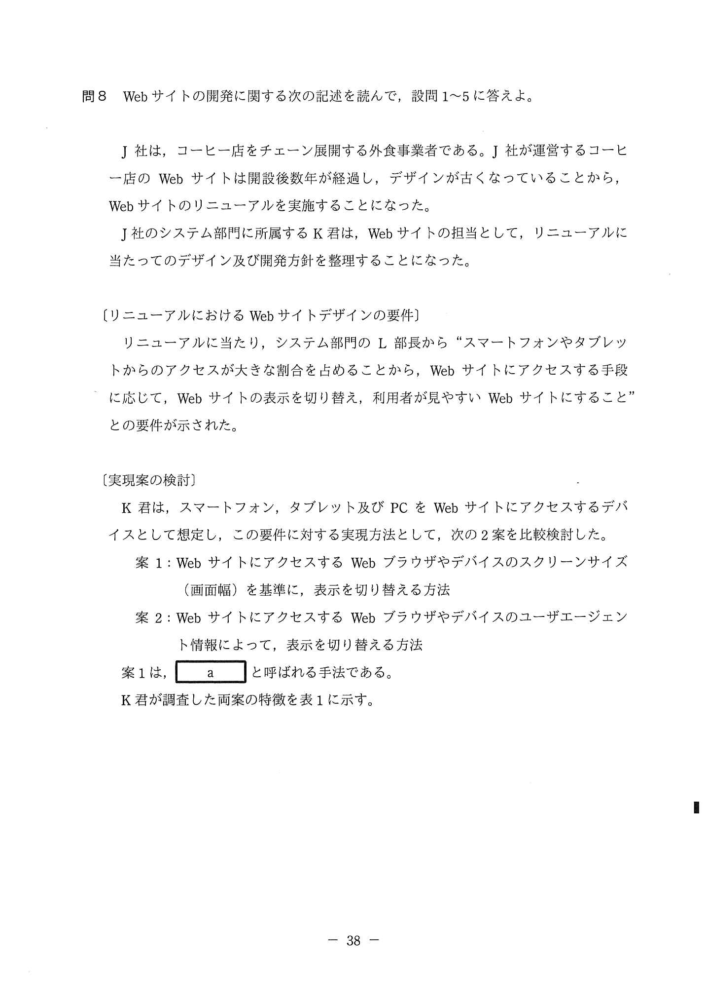

テキスト (OCR)

FAIS Webサイトの開発に関する次の記述を読んで, 設問 15に答えよ。

J elt, コーヒー店をチェーン展開する外食事業者である。 J 社が運営するコーヒ
一店の Web サイトは開設後数年が経過し, デザインが古くなっていることから,
Web サイトのリニューアルを実施することになった。

了 社のシステム部門に所属する K 君は, Web サイトの担当として, リニューアルに
当たってのデザイン及び開発方針を整理することになった。

[リニューアルにおける Web サイトデザインの要件〕
リニューアルに当たり, システム部門の L 部長から“スマートフォンやタブレッ
トからのアクセスが大きな割合を占めることから, Web サイトにアクセスする手段

に応じて, Web サイトの表示を切り替え, 利用者が見やすい Web サイトにすること

との要件が示された。

(実現案の検討
K 君は。 スマートフォン, タブレット及び PC を Web サイトにアクセスするデバ
イスとして想定し, この要件に対する実現方法として, 次の2案を比較検討した。
案 1 : Web サイトにアクセスする Web ブラウザやデバイスのスクリーンサイズ
(画面幅) を基準に, 表示を切り替える方法
案 2 : Web サイトにアクセスする Web ブラウザやデバイスのユーザエージェン
ト情報によって, 表示を切り替える方法
案 1 は, | 』 | と呼ばれる手法である。

K 君が調査した両案の特徴を表 1 に示す。

ー 38 一

### ページ 39

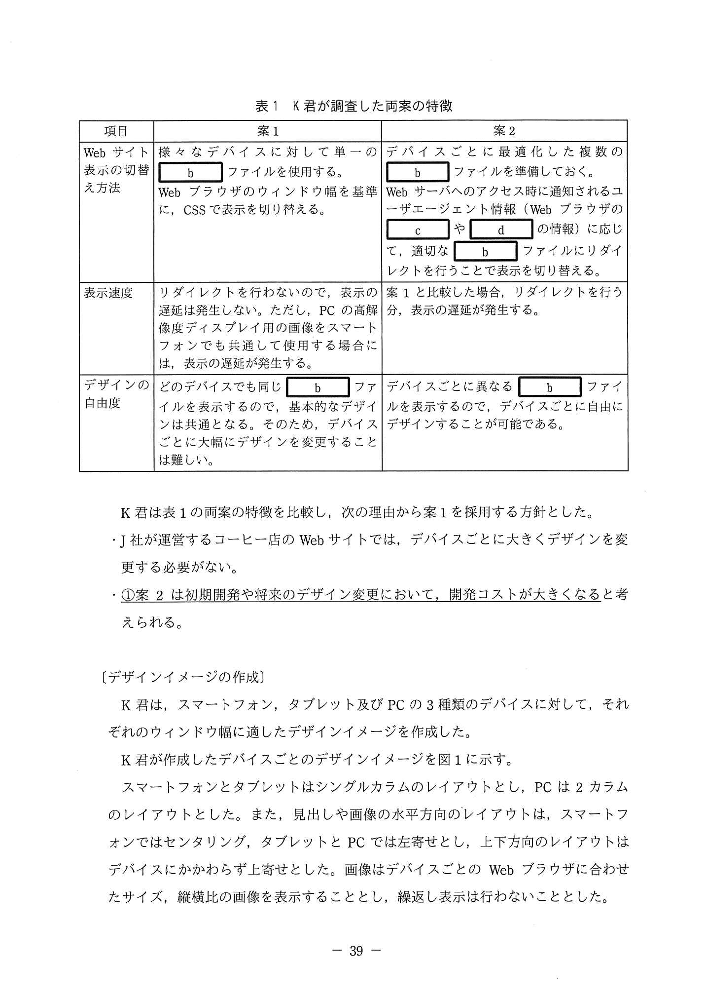

テキスト (OCR)

表1 K君が調査した両案の特徴

項目           案1                  案 2

Web サイト|和様々なデバイスに対して単一の|デバイスごとに最適化した複数の
表示の切替| | ファイルを使用する。    [5 ] ファイルを準備しておく。

え方法   Web ブラウザのウィンドウ幅を基準|Web サーバヘへのアクセス時に通知されるユ
に, CSS で表示を切り替える。    ーザエージェント情報 (Web ブラウザの
 や[| 』 ] の情報) に応じ
て, 適切な[ b |] ファイルにリダイ
レクトを行うことで表示を切り替える。

表示速度    リダイレクトを行わないので, 表示の| 案 1 と比較した場合, リダイレクトを行う
遅延は発生しない。ただし, PC の高解| 分, 表示の遅延が発生する。

像度デビィスプレイ用の画像をスマート
フォンでも共通して使用する場合に
は, 表示の遅延が発生する。

デザインの | どのデバイスでも同じ[| bp | ファ|デバイスごとに異なる[| pb |ファィ
自由度   イルを表示するので, 基本的なデザイ | ルを表示するので, デバイスごとに自由に
ンは共通となる。そのため, デバイス|デザインすることが可能である。

ごとに大幅にデザインを変更すること
は難しい。

K 君は表 1 の両案の特徴を比較し, 次の理由から案1 を採用する方針とした。

・] 社が運営するコーヒー店の Web サイトでは, デバイスごとに大きくデザインを変
更する必要がない。

・①案 2 は初期開発や将来のデザイン変更において, 開発コストが大きくなると考
えられる。

[デザインイメージの作成

K Blk, スマートフォン, タブレット及び PCの3 種類のデバイスに対して, それ
ぞれのウィンドウ幅に適したデザインイメージを作成した。

K 君が作成したデバイスごとのデザインイメージを図 1 に示す。

スマートフォンとタブレットはシングルカラムのレイアウトとし, PC は 2 カラム
のレイアウトとした。また, 見出しや画像の水平方向のレイアウトは, スマートフ
ォンではセンタリング, タブレットと PC では左寄せとし, 上下方向のレイアウトは
デバイスにかかわらず上寄せとした。 画像はデバイスごとの Web ブラウザに合わせ
たサイズ, 縦横比の画像を表示することとし, 繰返し表示は行わかいこととした。

ー 39 一

### ページ 40

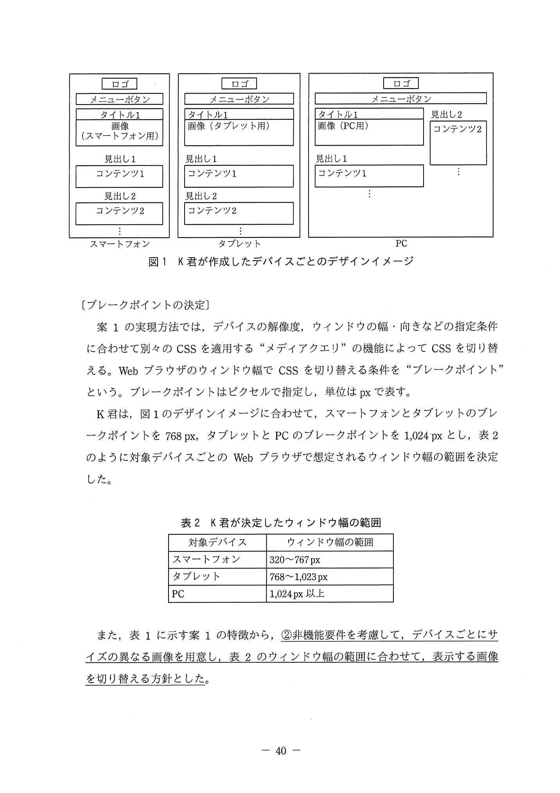

テキスト (OCR)

| メニューポボタン 111   メニューポタン || | [        メニューボタン       ]
タイトル1        タイトル1               タイトル1            見出し2
画像         画像 (タブレット用)        画像 (PC用)            yes
(スマートフォン用)                                       2デジツウ2
見出し1       見出し1              見出し1
コンテンツ1      コッテジツウ1            コンテンツ1
見出し2       見出し2
コンテンツ2      コツテツツウ
スマートフォン         タプブレット                  PC

図 1

K 君が作成したデバイスごとのデザインイメージ

【ブレークポイントの決定】
案 1 の実現方法では, デバイスの解像度, ウィンドウの幅・向きなどの指定条件
に合わせて別々の CSS を適用する“メディアクエリ” の機能によって CSS を切り替
RS, Web ブラウザのウィンドウ幅で CSS を切り替える条件を “ブレークポイント”
という。ブレークポイントはピクセルで指定し, 単位は px で表す。
K lk, 図1のデザインイメージに合わせて, スマートフォンとタブレットのブレ

ークポイントを 768 px, タブレットと PC のブレークポイントを 1.024 px とし, 表 2
のように対象デバイスごとの Web ブラウザで想定されるウィンドウ幅の範囲を決定

した。

表 2 K君が決定したウィンドウ幅の範囲

対象デバイス      ウィンドウ幅の範囲
スマートフォン    320て767px
タブレット          768~ 1,023 px
PC                 1,024 px 以上

また, 表 1 に示す案 1 の特徴から, ②非機能要件を考慮して, デバイスごとにサ
イズの異なる画像を用意し, 表 2 のウィンドツウ幅の範囲に合わせて, 表示する画像

を切り替える方針とした。

ー 40 一

### ページ 41

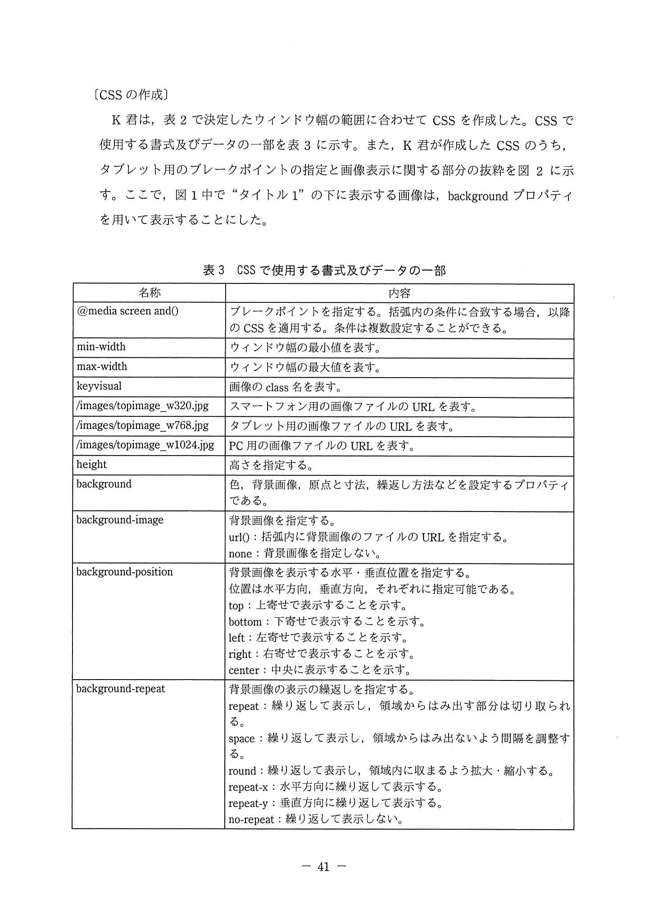

テキスト (OCR)

(CSS の作成

K 君は, 表 2 で決定したウィンドウ幅の範囲に合わせて CSS を作成した。CSS で
使用する書式及びデータの一部を表 3 に示す。また, K 君が作成した CSS のうち,
タブレット用のブレークポイントの指定と画像表示に関する部分の抜粋を図 2 に示
す。ここで, 図 1 中で“タイトル 1" の下に表示する画像は, background プロパティ
を用いて表示することにした。

表3 CSS で使用する書式及びデータの一部

名称

内容

@media screen and()

ブレークポイントを指定する。括弧内の条件に合致する場合,
の CSS を適用する。 条件は複数設定することができる。

以降

min-width                         ウィンドウ幅の最小値を表す。
max-width                         ウィンドウ幅の最大値を表す。
keyvisual                              画像の class 名を表す。

/images/topimage_w320.jpg

スマートフォン用の画像ファイルの URL ERT,

/images/topimage_w768.jpg

タブレット用の画像ファイルの URL を表す。

/images/topimage_w1024.jpg

PC 用の画像ファイルの URL を表す。

height                     高さを指定する。
background          色, 背景画像, 原点と寸法繰返し方法などを設定するプロパティ

である。

background-image

背景画像を指定する。
url() : 括弧内に背景画像のファイルの URL を指定する。
none : 背景画像を指定しない。

background-position

背景画像を表示する水平・垂直位置を指定する。
位置は水平方向, 垂直方向, それぞれに指定可能である。
top: 上寄せで表示することを示す。

bottom : 下寄せで表示することを示す。

left: 左寄せで表示することを示す。

right: 右寄せで表示することを示す。

center : 中央に表示することを示す。

background-repeat

背景画像の表示の繰返しを指定する。

repeat: 繰り返して表示し, 領域からはみ出す部分は切り取られ
る。
space :
る。
round : 繰り返して表示し, 領域内に収まるよう拡大・縮小する。
repeat-x : 水平方向に繰り返して表示する。

repeat-y : 垂直方向に繰り返して表示する。

no-repeat : 繰り返して表示しない。

繰り返して表示し, 領域からはみ出ないよう間隔を調整す

ー 41 一

### ページ 42

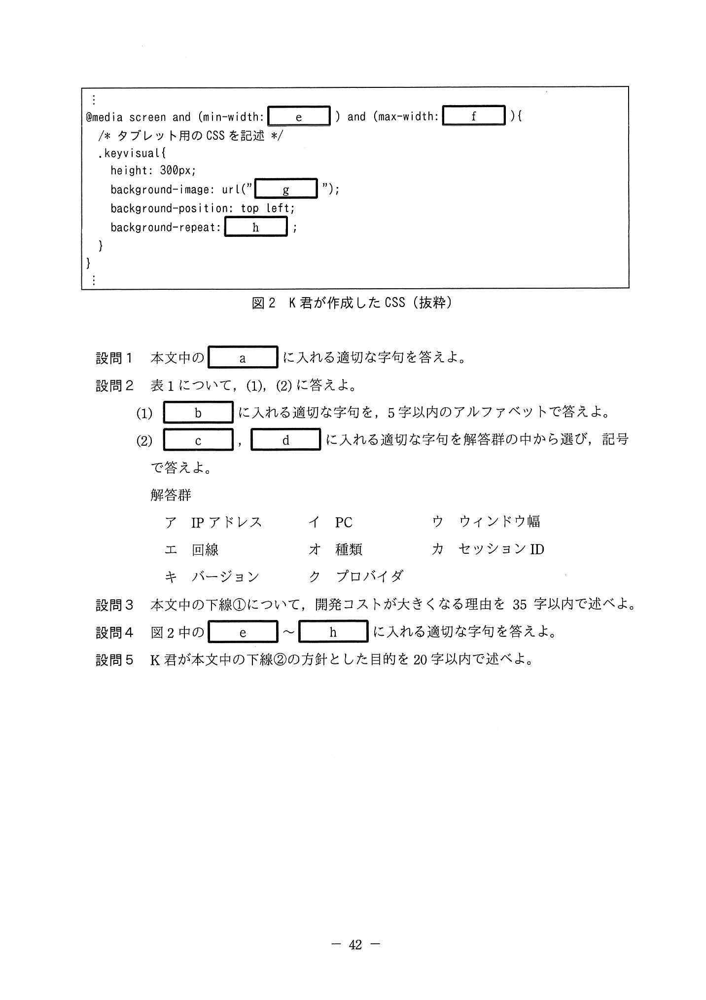

テキスト (OCR)

@media screen and min-width:| e |) and (ax-widthi[ : |)(
/* タブレット用のCSS を記述 */
.keyvisual(
height: 300px;
background-image: we g |7:
background-position: top left:
background-repeat: ;
}

}

図 2 K君が作成したCSS (抜粋)

設問1 本文中の| a | に入れる適切な字句を答えよ。
設問2 表1について, Q①⑪, (⑫② に答えよ。
@ [ 5  ] に入れる適切な字句を, 5宇以内のアルファベットで答えよ。

② |  c |,| 4 |に入れる適切な字句を解答群の中から選び, 記号
で答えよ。
ABBE
ア IPアドレス   イ PC    ウ ウィンドウ幅
エ 回線      オ 種類    カ セッションD
キ バージョン   ク プロバイダ
設問3 本文中の下線のについて, 開発コストが大きくなる理由を 35 字以内で述べよ。
設問4 図2中の| ce |~| bh |に入れる適切な字句を答えよ。

設問5 K君が本文中の下線②の方針とした目的を 20 字以内で述べよ。

ー 42 一

### ページ 43

テキスト (OCR)

〔

メ モ 用 紙 )

ー 43 一

### ページ 44

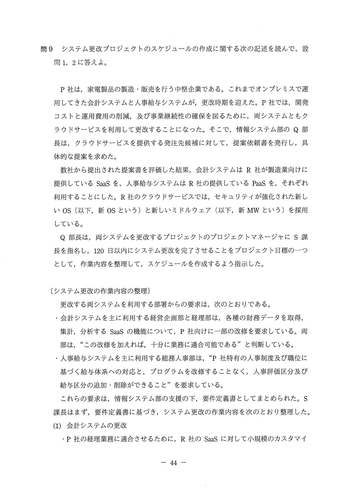

テキスト (OCR)

間9 システム更改プロジェクトのスケジュールの作成に関する次の記述を読んで, 設

問1 2に答えよ。

P 社は, 家電製品の製造・販売を行う中堅企業である。これまでオンプレミスで運
用してきた会計システムと人事給与システムが, 更改時期を迎えた。P 社では, 開発
コストと運用費用の削減, 及び事業継続性の確保を図るために, 両システムともク
ラウドサービスを利用して更改することになった。そこで, 情報システム部の Q 部
長は, クラウドサービスを提供する発注先候補に対して, 提案依頼書を発行し, 具
体的な提案を求めた。

数社から提出された提案書を評価した結果, 会計システムは R 社が製造業向けに
提供している SaaS を, 人事給与システムは R 社の提供している PaaS を, それぞれ
利用することにした。R 社のクラウドサービスでは, セキュリティが強化された新し
い OS (以下, # OS という) と新しいミドルウェア (以下, HH MW という) を採用
している。

Q 部長は, 両システムを更改するプロジェクトのプロジェクトマネージャに SH
長を指名し, 120 日以内にシステム更改を完了させることをプロジェクト目標のーつ
として, 作業内容を整理して, スケジュールを作成するよう指示した。

〔システム更改の作業内容の整理〕
更改する両システムを利用する部署からの要求は, 次のとおりである。

・ 会計システムを主に利用する経営企画部と経理部は, 各種の財務データを取得,
集計, 分析する SaaS の機能について, P 社向けに一部の改修を要求している。両
部は, “この改修を加えれば, 十分に業務に適合可能である"と判断している。

・人事給与システムを主に利用する総務人事部は, “P 社特有の人事制度及び職位に
基づく給与体系への対応と, プログラムを改修することなく, 人事評価区分及び
給与区分の追加・削除ができること”" を要求している。
これらの要求は, 情報システム部の支援の下, 要件定義書としてまとめられた。S

課長はまず, 要件定義書に基づき, システム更改の作業内容を次のとおり整理した。

(1) 会計システムの更改
・P 社の経理業務に適合させるために, R 社の SaaS に対して小規模のカスタマイ

= 4 =

### ページ 45

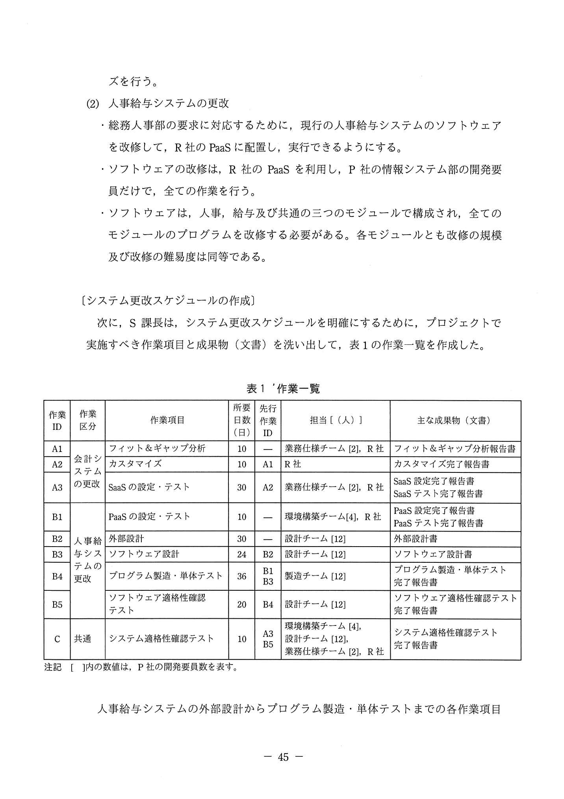

テキスト (OCR)

(2)

ズを行う。
人事給与システムの更改

・ 総務人事部の要求に対応するために, 現行の人事給与システムのソフトウェア

を改修して, R 社の PaaS に配置し, 実行できるようにする。

・ソフトウェアの改修は, R 社の PaaS を利用し, P 社の情報システム部の開発要

員だけで, 全ての作業を行う。

・ソフトウェアは, 人事, 給与及び共通の三つのモジュールで構成され, 全ての

モジュールのプログラムを改修する必要がある。各モジュールとも改修の規模
及び改修の難易度は同等である。

[システム更改スケジュールの作成〕
次に, S 課長は, システム更改スケジュールを明確にするために, プロジェクトで
実施すべき作業項目と成果物 (文書) を洗い出して, 表1の作業一覧を作成した。

表1 作業一覧
所要 | 先行
作業| 作業       (reese      日数 | 作業    my OA) I      主な成果物 (文書)
ID    区分
(A)} m
A1        フィット&ギャップ分析     10 | 一 |業務仕様チーム [2], RH | | フィット&ギャップ分析報告書
のきき上で
AQ aay カスタマイズ         10 | Al [R#           WAR ABT RE
T,
の更改     is                                  ye           _                 SaaS 設定完了報告書
A3           SaaS の設定・テスト            30 | A2 |業務仕様チーム [2], R tt  SaaS テスト完了報告書
ay                                 ー            PaaS 設定完了報告書
B1           PaaS の設定・テスト            10    — | 環境構築チーム[4], Rt   PaaS テスト完了報告書
B2 | 人事給| 外部設計                      30 | 一 |設計チーム [12]           外部設計書
B3 |与シス| ソフトウェア設計      24 | B2 |設計チーム 2     ソフトウェア設計番
テムの                                                                                                =      5      Tees
Sh thy Me:        Bl   ンー          プログラム製造・単体テスト
B4 |更改 | プログラム製造・単体テスト | 36    ps | 園造チーム [12]           完了報告書
ソフトウェア適格性確認         onan.        ソフトウェア適格性確認テスト
B5          テスト                       20    B4 | 設計チーム [12]           完了報告書
環境構築チーム [4],        rer        ag
C |夫馬| システム適格性確認テスト | 10 | 43 |設計テームnzh     NM
業務仕様チーム [2], R社|
注記 [ ]内の数値は, P 社の開発要員数を表す。

人事給与システムの外部設計からプログラム製造・単体テストまでの各作業項目

ー 45 一

### ページ 46

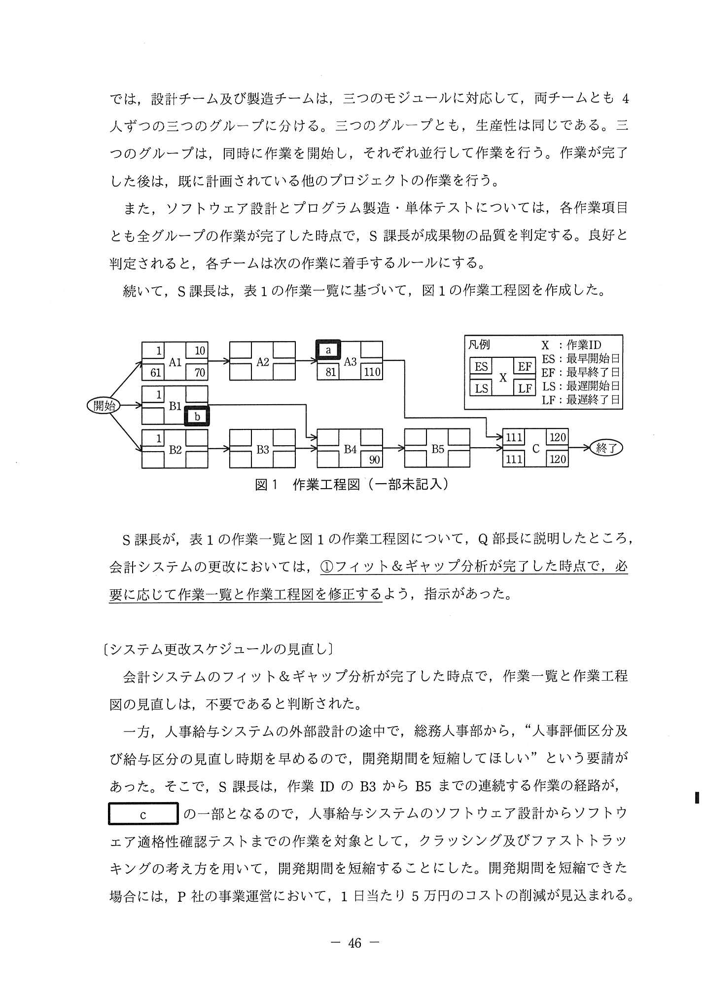

テキスト (OCR)

Clk, 設計チーム及び製造チームは, 三つのモジュールに対応して, 両チームとも 4
ar 人人 SOBER, pe UNE,
つのグループは, 同時に作業を開始し, それぞれ並行して作業を行う。作業が完了
した後は, 既に計画されている他のプロジェクトの作業を行う。

また, ソフトウェア設計とプログラム製造・単体テストについては, 各作業項目
とも全グループの作業が完了した時点で, S 課長が成果物の品質を判定する。良好と
判定されると, 各チームは次の作業に着手するルールにする。

続いて, S 課長は, 表 1 の作業一覧に基づいて, 図 1 の作業工程図を作成した。

| Li | ] wed TJ | 」    凡例   X : 作業TD_
Fal pot 1’ bal al   (esl TER cr duet
[ts] [cr] LS: 最遅開始日
 1 和l Ll              LF: 最層終了晶
mie
Po eG oo Lt sey
PI’ cr Dt "bel CP Gea" fe)

BQ1 作業工程図(一部未記入)

S 課長が, 表 1 の作業一覧と図 1 の作業工程図について, Q 部長に説明したところ,
会計システムの更改においては, ①フィット&ギャップ分析が完了した時点で, 必
要に応じて作業一覧と作業工程図を修正するよう, 指示があった。

[システム更改スケジュールの見直し]

会計ステムのフィット&ギャップ分析が完了した時点で, 作業一覧と作業工程
図の見直しは, 不要であると判断された。

一方, 人事給与システムの外部設計の途中で, 総務人事部から, “人事評価区分及
び給与区分の見直し時期を早めるので, 開発期間を短縮してほしい" という要請が
あった。 そこで, S 課長は, 作業 ID の B3 から B5 までの連続する作業の経路が,
[Lc の一部となるので, 人事給与システムのソフトウェア設計からソフトウ
ェア適格性確認テストまでの作業を対象として, クラッシング及びファストトラッ
キングの考え方を用いて, 開発期間を短縮することにした。 開発期間を短縮できた
場合には, P 社の事業運営において, 1 日当たり 5 万円のコストの削減が見込まれる。

ー 46 一

### ページ 47

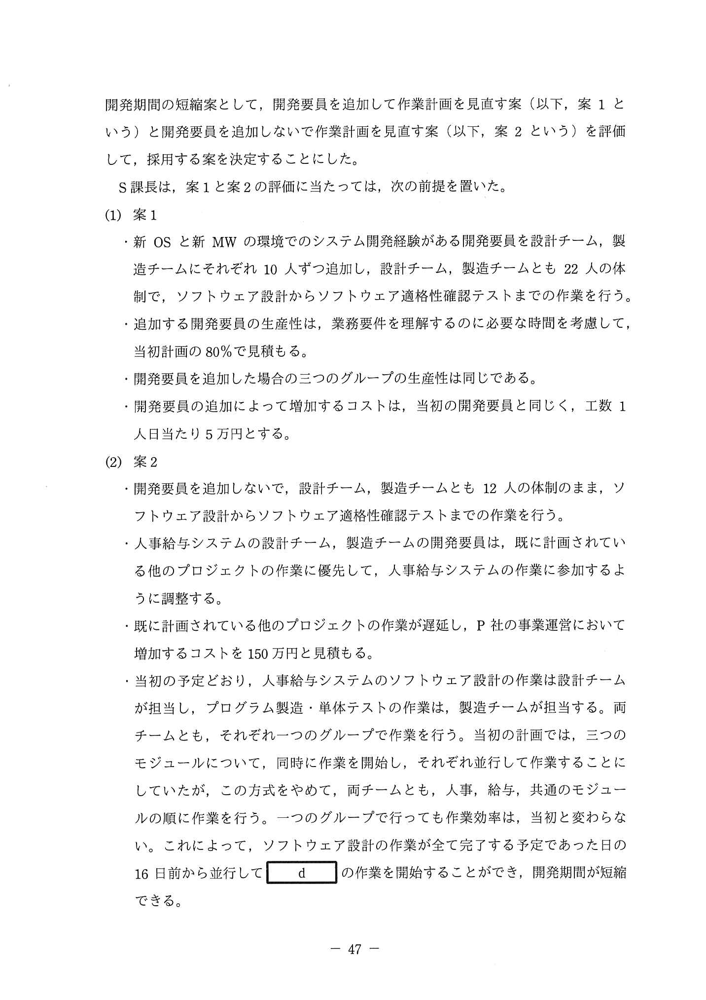

テキスト (OCR)

開発期間の短縮案として, 開発要員を追加して作業計画を見直す案 (以下, 案 1 と
いう) と開発要員を追加しないで作業計画を見直す案 (以下, 案 2 という) を評価
して, 採用する案を決定することにした。

S 課長は, 案 1 と案 2 の評価に当たっては, 次の前提を置いた。

QQ)

(2)

#1

・新 OS と新 MW の環境でのシステム開発経験がある開発要員を設計チーム, 製

造チームにそれぞれ 10 人ずつ追加し, 設計チーム, 製造チームとも 22 人の体
BIC, ソフトウェア設計からソフトウェア適格性確認テストまでの作業を行う。

・追加する開発要員の生産性は, 業務要件を理解するのに必要な時間を考慮して,

当初計画の 80%で見積もる。

・開発要員を追加した場合の三つのグループの生産性は同じである。
・開発要員の追加によって増加するコストは, 当初の開発要員と同じく, 工数 1

人日当たり5万円とする。
案 2

・ 開発要員を追加しないで, 設計チーム, 製造チームとも 12 人の体制のまま, ソ

フトウェア設計からソフトウェア適格性確認テストまでの作業を行う。

・人事給与システムの設計チーム, 製造チームの開発要員は, 既に計画されてい

る他のプロジェクトの作業に優先して, 人事給与システムの作業に参加するよ
うに調整する。

・既に計画されている他のプロジェクトの作業が遅延し, P 社の事業運営において

増加するコストを 150 万円と見積もる。

・当初の予定どおり, 人事給与システムのソフトウェア設計の作業は設計チーム

が担当し, プログラム製造・単体テストの作業は, 製造チームが担当する。両
チームとも, それぞれ一つのグループで作業を行う。当初の計画では, 三つの
モジュールについて, 同時に作業を開始し, それぞれ並行して作業することに
していたが, この方式をやめて, 両チームとも, ABS, MS, 共通のモジュー
ルの順に作業を行う。一つのグループで行っても作業効率は, 当初と変わらな
い。これによって, ソフトウェア設計の作業が全て完了する予定であった日の
16 日前から並行して|  d | の作業を開始することができ, 開発期間が短縮
できる。

ー 47 一

### ページ 48

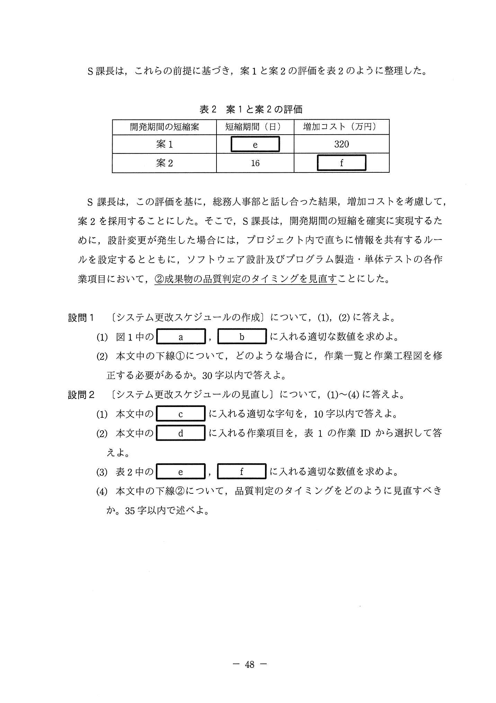

テキスト (OCR)

S 課長は, これらの前提に基づき, 案1と案2 の評価を表2 のように整理した。

表2 R1CR2 OFM
開発期間の短縮案    短縮期間 (日)    増加コスト (万円)

案1       | e ]      320
案2        16     | i ]

S 課長は, この評価を基に, 総務人事部と話し合った結果, 増加コストを考慮して,
案 2 を採用することにした。 そこで, S 課長は, 開発期間の短縮を確実に実現するた
めに, 設計変更が発生した場合には, プロジェクト内で直ちに情報を共有するルー
ルを設定するとともに, ソフトウェア設計及びプログラム製造・単体テストの各作
業項目において, ⑬成果物の品質判定のタイミングを見直すことにした。

設問1 〔システム更改スケジュールの作成] について, ①, ②⑫) に答えよ。
@ Bitola |, |  b |に入れる適切な数値を求めよ。
Q) 本文中の下線①について, どのような場合に, 作業一覧と作業工程図を修
正する必要があるか。30 字以内で答えよ。
設問2 〔システム更改メケジュールの見直し〕 について, MM に答えよ。
a) 本文中の[ c |] に入れる適切な字句を, 10字以内で答えよ。
⑫) 本文中の[| a | に入れる作業項目を,表 1 の作業 ID から選択して答
えよ。
3) 表2中の| se Jj, f |に入れる適切な数値を求めよ。
(4) 本文中の下線@について, 品質判定のタイミングをどのように見直すべき
か。35 字以内で述べよ。

### ページ 49

テキスト (OCR)

x モ 用 紙 J

ー 49 一

### ページ 50

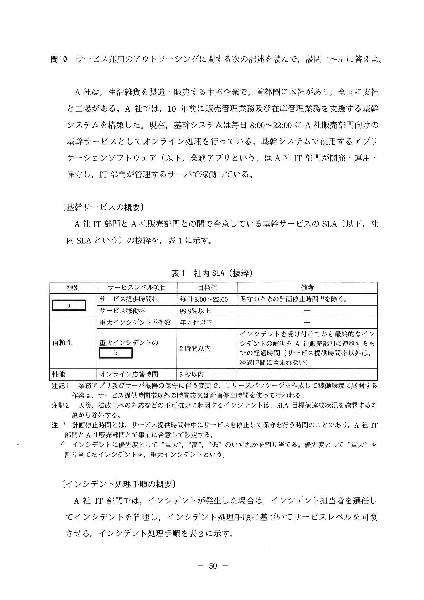

テキスト (OCR)

間10 サービス運用のアウトソーシングに関する次の記述を読んで, 設問 1ー5 に答えよ。

A 社は, 生活雑貨を製造・販売する中堅企業で, 首都閣に本社があり, 全国に支社
と工場がある。A 社では, 10 年前に販売管理業務及び在庫管理業務を支援する基幹
システムを構築した。 現在, 基幹システムは毎日 8:.00て22:00 に A 社販売部門向けの
基幹サービスとしてオンライン処理を行っている。 基幹システムで使用するアプリ
ケーションソフトウェア (以下, 業務アプリという) は 4 社 IT 部門が開発・運用・
保守し, IT 部門が管理するサーバで稼働している。

〔基幹サービスの概要]
A 社TT 部門と A 社販売部門との間で合意している基幹サービスの SLA (以下, 社

内 SLA という) の抜粋を, 表 1 に示す。

表1 社内SLA (抜粋)

種別          サービスレベル項目           目標値                             備考
_—   サービス提供時間帯    毎日 8.00て22:00 | 保守のための計画停止時間 りを除く。
サービス稼働率            99.9%以上                                ー

重大インシデント 9?件数 | 年4件以下                          =
インシデントを受け付けてから最終的なイン
信頼性       重大インシデントの      2 時間以内        シデントの解決を A 社販売部門に連絡するま
での経過時間 (サービス提供時間帯以外は,
経過時間に含まれない)
性能         オンライン応答時間      3 秒以内                          =
注記1 業務アプリ及びサーバ機器の保守に伴う変更で,。 リリースパッケージを作成して稼働環境に展開する
作業は, サービス提供時間帯以外の時間帯又は計画停止時間を使って行われる。
注記2 RR, 法改正への対応などの不可抗力に起因するインシデントは, SLA 目標値達成状況を確認する対
象から除外する。
注 ! 計画停止時間とは, サービス提供時間帯中にサービスを停止して保守を行う時間のことであり, A th IT
部門と A 社販売部門とで事前に合意して RET Se
29 インシデントに優先度として “BA”, “高", UR” のいずれかを割り当てる。優先度として “HK” を
割り当てたインシデントを, 重大イ ey トという。

〔【インシデント処理手順の概要)

A 社 IT 部門では, インシデントが発生した場合は, インシデント担当者を選任し
てインシデントを管理し, インシデント処理手順に基づいてサービスレベルを回復
させる。インシデント処理手順を表 2 に示す。

### ページ 51

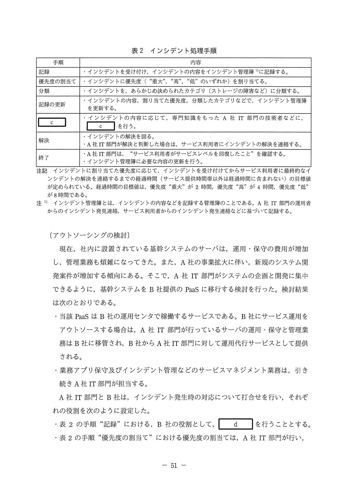

テキスト (OCR)

表2 インシデント処理手順

手順                             内容
記録         - インシデントを受け付け、 インシデントの内容をインシデント管理逢 りに記録する。
優先度の割当て | ・インシデントに優先度 ( "重大", “A, “低” のいずれか) を割り当てる。

分類       - インシデントを, あらかじめ決められたカテゴリ (ストレージの障害など) に分類する。
-         - インシデントの内容, 割り当てた矢先度, 分類したカテゴリなどで, インシデント管理%
FEO at    を更新する。                            m
     ・ インシデントの内容にた応じて, 専門知識をもった A社 IT 部門の技術者などに,

 を行う。
wit       ・インシデントの解決を図る。        J         _

・ 社 TT 部門が解決と判断した場合は。 サービス利用者にインシデントの解決を連絡する。
ey        ・^ 社 T 部門は。 "サービス利用者がサービスレベルを回叙したこと" を確認する。

・インシデント管理千に必要な内容の更新を行う。

注記 インシデントに割り当てた優先度に応じて, インシデントを受け付けてからサービス利用者に最終的なイ
ンシデントの解決を連絡するまでの経過時間 (サービス提供時間帯以外は経過時間に含まれない) の目標値
が定められている。経過時間の目標値は, 優先度“重大" が 2 時間, 優先度 “高" が4時間, 優先度“低"
が8 時間である。

SED AVY FY TMG LI, インシデントの内容などを記録する管理和伏のことである。4A 社 IT 部門の運用者
からのインシデント発見連絡, サービス利用者からのインシデント発生連絡などに基づいて記録する。

(アウトソーシングの検討
現在社内に設置されている基幹システムのサーバは, 運用・保守の費用が増加
し, 管理業務も類雑になってきた。また, A 社の事業拡大に伴い, 新規のシステム開

発案件が増加する傾向にある。そこで, A 社 TT 部門がシステムの企画と開発に集中

できるように, 基幹システムを B 社提供の PaaS に移行する検討を行った。検計結果
は次のとおりである。

・ 当該 PaaS は B 社の運用センタで稼働するサービスである。B 社にサービス運用を
アウトソースする場合は, A 社 IT 部門が行っているサーバの運用・保守と管理業
務はB 社に移管され, B 社から 4 社 IT部門に対して運用代行サービスとして提供
される。

・ 業務アプリ保守及びインシデント管理などのサービスマネジメント業務は, 引き
ES AKL IT 部門が担当する。

A 社 TT 部門と B 社は, インシデント発生時の対応について打合せを行い, それぞ
れの役割を次のように設定した。

・表 2 の手順“記録” における, B 社の役割として, | q』 | を行うこととする。
・表 2 の手順 “優先度の割当て” における優先度の割当ては, Ath IT 部門が行い,

ー 串 一

### ページ 52

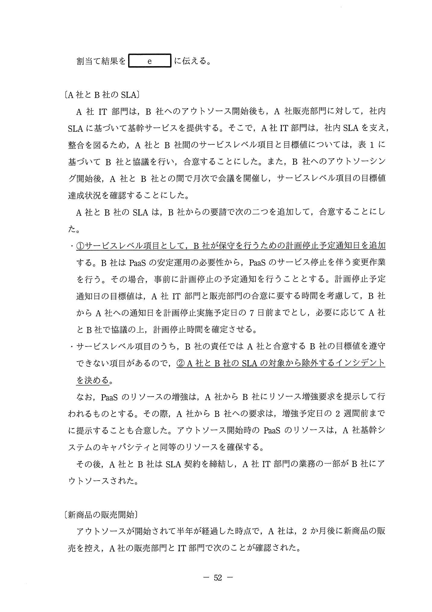

テキスト (OCR)

割当て結果を| ce |に伝える。

(A 社とB社の SLAJ

A 社 IT 部門は, B 社へのアウトソース開始後も, A 社販売部門に対して, 社内
SLA に基づいて基幹サービスを提供する。そこで, A社IT 部門は, 社内 SLA を支え,
整合を図るため, A 社と B 社間のサービスレベル項目と目標値については, 表 1 に
基づいて B 社と協議を行い, 合意することにした。また, B 社へのアウトソーシン
グ開始後, A 社と B 社との間で月次で会議を開催し, サービスレベル項目の目標値
達成状況を確認することにした。

A 社と B 社の SLA ld, B 社からの要請で次の二つを追加して, 合意することにし
Te
・①サービスレベル項目として, B 社が保守を行うための計画停止予定通知日を追加

する。B 社は PaaS の安定運用の必要性から, PaaS のサービス停止を伴う変更作業

を行う。その場合, 事前に計画停止の予定通知を行うこととする。計画停止予定

通知日の目標値は, A 社 IT 部門と販売部門の合意に要する時間を考慮して, Bt

PS A 社への通知日を計画停止実施予定日の 7 日前までとし, 必要に応じて A tt

と B 社で協議の上, 計画停止時間を確定させる。

・サービスレベル項目のうち, B 社の責任では A 社と合意する B 社の目標値を価守
できない項目があるので, ②A 社と B 社の SLA の対象から除外するインシデント
を決める。

BB, PaaS のリソースの増強は, A 社から B 社にリソース増強要求を提示して行
われるものとする。その際, A 社から B 社への要求は, 増強予定日の 2 週間前まで
に提示することも合意した。アウトソース開始時の PaaS のリソースは, A 社基幹シ
ステムのキャパシティと同等のリソースを確保する。

その後, A 社と B 社は SLA 契約を締結し, A 社 IT 部門の業務の一部が B 社にア
ウトソースされた。

〔新商品の販売開始
アウトソースが開始されて半年が経過した時点で, A 社は, 2 か月後に新商品の販
売を控え, A社の販売部門と IT 部門で次のことが確認された。

ー 52 一

### ページ 53

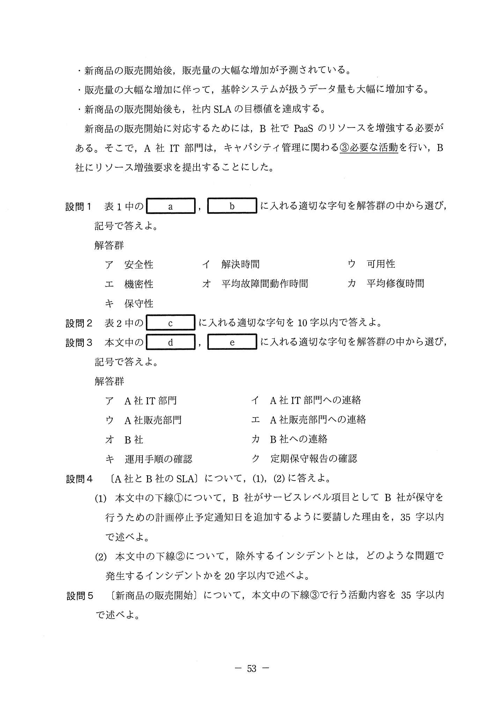

テキスト (OCR)

・新商品の販売開始後, 販売量の大幅な増加が予測されている。
・ 販売量の大幅な増加に伴って, 基幹システムが扱うデータ量も大幅に増加する。
・新商品の販売開始後も, 社内 SLA の目標値を達成する。

新商品の販売開始に対応するためには, B 社で PaaS のリソースを増強する必要が
ある。 そこで, A 社 IT 部門は, キャパシティ管理に関わる③必要な活動を行い,
社にリソース増強要求を提出することにした。

設問 1   1中の| oa |,|  b |に入れる適切な字句を解答群の中から選び
記号で答えよ。
解答群
ア 安全性     イ 解決時間         ウ 可用性
エ 機密性     オ 平均故障間動作時間    カ 平均修復時間
キ 保守性
設問2 表2中の| c | に入れる剖切な字句を10宇以内で答えよ。
設問3 本文中の| a |,|  。 |に入れる適切な字句を解答群の中から選び,
記号で答えよ
解答衝
ア A社IT部門      イ A社IT 部門への連絡
ウ A和社販売部門       エ A社販売部門への連絡
オ B社           カ B社への連絡
キ 運用手順の確認      ク 定期保守報告の確認

設問4 〔[A社とB社のSLA] について, ①, (2) に答えよ。
①) 本文中の下線やについて, B 社がサービスレベル項目として B 社が保守を
行うための計画停止予定通知日を追加するように要請した理由を, 35 SUA
(2) 本文中の下線@②について, 除外するインシデントとは, どのような問題で
発生するインシデントかを 20 字以内で述べよ。
設問5 【〔新商品の販売開始) について, 本文中の下線③で行う活動内容を 35 字以内

ー 53 一

### ページ 54

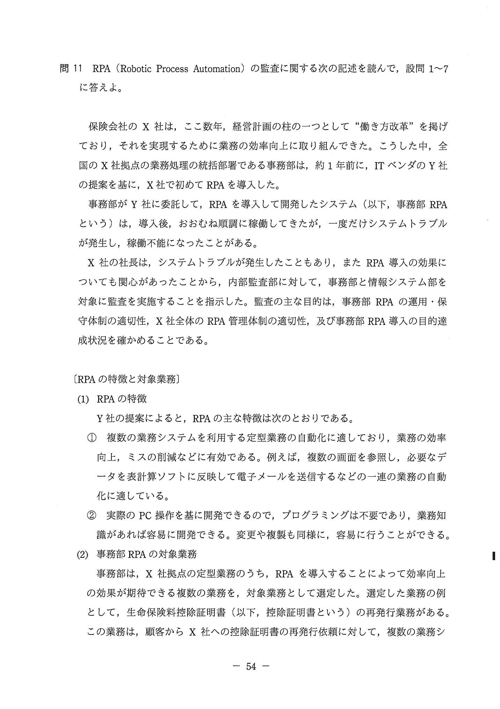

テキスト (OCR)

fl. 11 RPA (Robotic Process Automation) の監査に関する次の記述を読んで, 設問 1<7

に答えよ。

保険会社の X 社は, ここ数年, 経営計画の柱の一つとして “Me AH” を掲げ
ており, それを実現するために業務の効率向上に取り組んできた。こうした中, 全
HO X 社拠点の業務処理の統括部署である事務部は, 約 1 年前に, IT ベンダのY社
の提案を基に, X 社で初めて RPA を導入した。

事務部が Y 社に委託して, RPA を導入して開発したシステム (以下, 事務部 RPA
という) は, 導入後, おおむね順調に稼働してきたが, 一度だけシステムトラブル
が発生し, 稼働不能になったことがある。

X HORS, システムトラブルが発生したこともあり, また RPA 導入の効果に
ついても関心があったことから, 内部監査部に対して, 事務部と情報システム部を
対象に監査を実施することを指示した。 監査の主な目的は, 事務部 RPA の運用・保
守体制の適切性, X 社全体の RPA 管理体制の適切性, 及び事務部 RPA MAO BANS
成状況を確かめることである。

(RPA の特徴と対象業務]
(1) RPA の特徴
Y 社の提案によると, RPA の主な特徴は次のとおりである。
① 複数の業務システムを利用する定型業務の自動化に適しており, 業務の効率
Mb, ミスの削減などに有効である。例えば, 複数の画面を参照し, 必要なデ
ータを表計算ソフトに反映して電子メールを送信するなどの一連の業務の自動
化に適している。
@ 実際の PC 操作を基に開発できるので, プログラミングは不要であり, 業務知
識があれば容易に開発できる。変更や複製も同様に, 容易に行うことができる。
(2) 事務部 RPA の対象業務
事務部は, X 社拠点の定型業務のうち, RPA を導入することによって効率向上
の効果が期待できる複数の業務を, 対象業務として選定した。選定した業務の例
CUT, 生命保険料控除証明書 (以下, 控除証明書という) の再発行業務がある。
この業務は, 顧客から X 社への控除証明書の再発行依頼に対して, 複数の業務シ

ー 54 一

### ページ 55

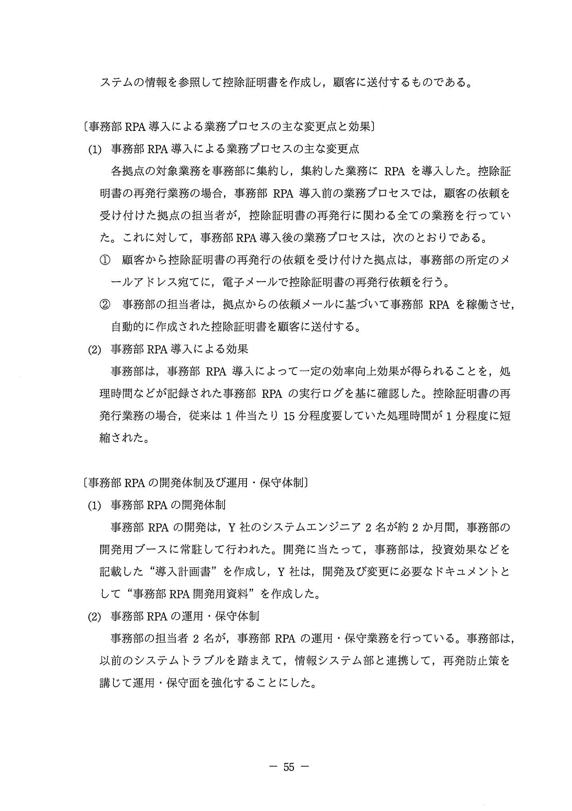

テキスト (OCR)

ステムの情報を参照して控除証明書を作成し, 顧客に送付するものである。

〔事務部 RPA 導入による業務プロセスの主な変更点と効果]
(1) 事務部 RPA 導入による業務プロセスの主な変更点
各拠点の対象業務を事務部に集約し, 集約した業務に RPA を導入した。 控除証
明書の再発行業務の場合, 事務部 RPA 導入前の業務プロセスでは, 顧客の依頼を
受け付けた拠点の担当者が, 控除証明書の再発行に関わる全ての業務を行ってい
た。これに対して, 事務部 RPA 導入後の業務プロセスは, 次のとおりである。
① 顧客から控除証明書の再発行の依頼を受け付けた拠点は, 事務部の所定のメ
ールアドレス宛てに, 電子メールで控除証明書の再発行依頼を行う。
②⑨ 事務部の担当者は, 拠点からの依頼メールに基づいて事務部 RPA を稼働させ,
自動的に作成された控除証明書を顧客に送付する。
(2) 事務部 RPA 導入による効果
事務部は, 事務部 RPA 導入によって一定の効率向上効果が得られることを, MW
理時間などが記録された事務部 RPA の実行ログを基に確認した。 控除証明書の再
発行業務の場合, 従来は 1 件当たり 15 分程度要していた処理時間が 1 分程度に短
縮された。

(事務部 RPA の開発体制及び運用・保守体制〕
Q①) 事務部 RPA の開発体制
事務部 RPA の開発は, Y 社のシステムエンジニア 2 名が約 2 か月間, 事務部の
開発用ブースに常駐して行われた。 開発に当たって, 事務部は, 投資効果などを
記載した “導入計画書" を作成し, Y 社は, 開発及び変更に必要なドキュメントと
して “事務部 RA 開発用資料” を作成した。
(2) 事務部 RPA の運用・保守体制
事務部の担当者 2 名が, 事務部 RPA の運用・保守業務を行っている。事務部は,
以前のシステムトラブルを踏まえて, 情報システム部と連携して, 再発防止策を
講じて運用・保守面を強化することにした。

ー 55 一

### ページ 56

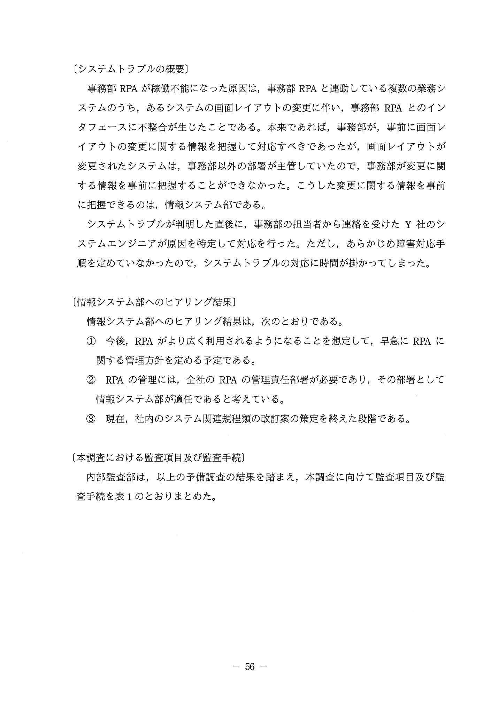

テキスト (OCR)

[システムトラブルの概要〕

事務部 RPA が稼働不能になった原因は, 事務部 RPA と連動している複数の業務シ
ステムのうち, あるシステムの画面レイアウトの変更に伴い, 事務部 RPA とのイン
タフェースに不整合が生じたことである。 本来であれば, 事務部が, 事前に画面レ
イアウトの変更に関する情報を把握して対応すべきであったが, 画面レイアウトが
変更されたシステムは, 事務部以外の部署が主管していたので, 事務部が変更に関
する情報を事前に把握することができなかった。こうした変更に関する情報を事前
に把握できるのは, 情報システム部である。

システムトラブルが判明した直後に, 事務部の担当者から連絡を受けた Y 社のシ
ステムエンジニアが原因を特定して対応を行った。ただし, あらかじめ障害対応手
順を定めていなかったので, システムトラブルの対応に時間が掛かってしまった。

[情報システム部へのヒアリング結果)
情報システム部へのヒアリング結果は, 次のとおりである。
① 今後, RPA がより広く利用されるようになることを想定して, 早急に RPA に
関する管理方針を定める予定である。
@ RPA の管理には, 全社の RPA の管理責任部署が必要であり, その部署として
情報システム部が適任であると考えている。
③ WE, 社内のシステム関連規程類の改訂案の策定を終えた段階である。

〔本調査における監査項目及び監査手続]

内部監査部は, 以上の予備調査の結果を踏まえ, 本調査に向けて監査項目及び監
査手続を表 1 のとおりまとめた。

ー 56 一

### ページ 57

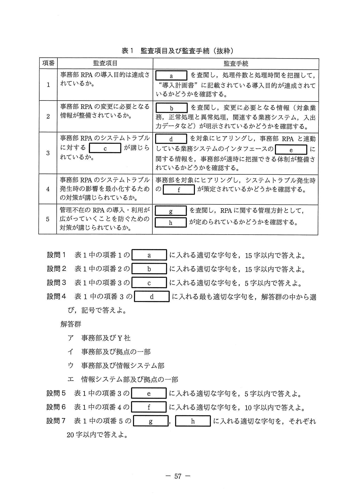

テキスト (OCR)

表 1

監査項目及び監査手続 (抜粋)

項番

監査項目

監査手続

事務部 RPA の導入目的は達成さ
れているか。

を査関し, 処理件数と処理時間を把握して,
“導入計画書" に記載されている導入目的が達成されて
いるかどうかを確認する。

事務部 RPA の変更に必要となる
情報が整備されているか。

を査関し, 変更に必要となる情報 (対象業
務, 正常処理と異常処理, 関連する業務システム, 入出
カデータなど) が明示されているかどうかを確認する。

事務部 RPA のシステムトラブル

に対する が講じら

れているか。

| 』 J を装象ににアリングし, 事務部 RPA と連動
している業務システムのインタフェースの         に
関する情報を, 事務部が適時に把握できる体制が整備さ
れているかどうかを確認する。

事務部 RPA のシステムトラブル
発生時の影響を最小化するため
の対策が講じられているか。

事務部を対象にヒアリングし, システムトラブル発生時

の| fj  ] が策定されているかどうかを確認する。

管理不在の RPA の導入・利用が
広がっていくことを防ぐための
対策が講じられているか。

 を査関し, RPA に関する管理方針として,
 が定められているかどうかを確認する。

設問1 表1中の項番1の| 。 | に入れる適切な字句を, 15字以内で答えよ。

設問2
設問3
設問4

び, 記号で答えよ。
解答群

ア 事務部及びY社

イ
ウ
x=

表 1 中の項番 2 の| b | に入れる適切な字旬を, 15字以内で答えよ。
表 1 中の項番8の|  c | に入れる適切な宇匂を,5字以内で答えよ。
表 1 中の項番 3 の|  q | に入れる最も適切な字句を, 解答群の中から選

事務部及び拠点の一部
事務部及び情報システム部
情報システム部及び拠点の一部

設問5 表1中の項番3の| ce | に入れる適切な字句を, 5字以内で答えよ。
設問6 表1中の項番4の| f | に入れる適切な字句を, 10字以内で答えよ。

設問7 表 1中の項番 5の|

g || bh |に入れる適切な字句を, それぞれ

20 字以内で答えよ。

ー 57 一

### ページ 58

テキスト (OCR)

( メ モ 用 紙 J

ー 58 一

### ページ 59

テキスト (OCR)

〔

メ モ 用 紙 〕

ー 59 一

### ページ 60

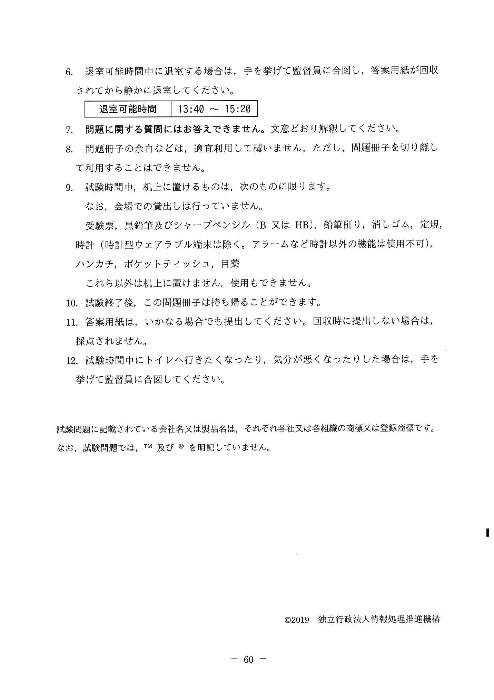

テキスト (OCR)

6. 退室可能時間中に退室する場合は, 手を挙げて監督中に合図し, 答案用紙が回収
されてから静かに退室してください。
退室可能時間 | 13:49 ~ 15:20
7. 問題に関する質問にはお答えできません。文意どおり解釈してください。
8. 問題冊子の余白などは, 適宜利用して構いません。ただし, 問題冊子を切り離し
て利用することはできません。
9. 試験時間中, 机上に置けるものは, 次のものに限ります。
なお, 会場での貸出しは行っていません。
受験村, 黒鉛筆及びシャープペンシル (B 又は HB), 鉛筆削り, 消しゴム, 定規,
時計 (時計型ウェアラブル端末は除く。アラームなど時計以外の機能は使用不可),
ハンカチ, ポケットティッシュ, 目薬
これら以外は机上に置けません。使用もできません。
10. 試験終了後, この問題冊子は持ち帰ることができます。
11. 答案用紙は, いかなる場合でも提出してください。回収時に提出しない場合は
採点されません。
12. 試験時間中にトイレへ行きたくなったり, 気分が悪くなったりした場合は, 手を
挙げて監督員に合図してください。

試験問題に記載されている会社名又は製品名は, それぞれ各社又は各組織の商標又は登録商標です。
なお, 試験問題では, ™ 及び © を明記していません。

@2019 独立行政法人情報処理推進機構

ー 60 一

---

## 午後解答

1/6 
©2019 独立行政法人情報処理推進機構 
平成31 年度 春期 応用情報技術者試験 解答例 
 
午後試験 
問１ 
出題趣旨 
 パスワードが推測されたり，どこかのWeb サイトから窃取されたID，パスワードが利用されたりして，不
正アクセスされる被害が発生している。パスワードの安全な管理・運用は，サイト運営者だけでなくサイト利
用者にとっても重要な課題である。 
 本問では，EC サイトの利用者認証を題材に，パスワード攻撃の手法，安全なパスワードの管理策，及び利
用者に求められるパスワードの管理策についての理解を問う。 
 
設問 
解答例・解答の要点 
備考 
設問１(1)
a
ウ 
 
 
b
ア 
 
(2) ウ 
設問２(1)
c
総当たり 又は ブルートフォース 
 
 
d
パスワードリスト 
 
(2) パスワード入力試行回数の上限値の設定 
 
設問３(1) ハッシュ値からパスワードの割出しは難しいから 
 
(2) ア 
設問４
他サイトから流出したパスワードによって，不正ログインされる。 
 
問２ 
出題趣旨 
 昨今のホテル業界は，高級化路線をとるグループと低価格化路線をとるグループに二極化している。そのう
ち低価格化路線をとるグループは，低料金かつ高品質のサービスを提供しながら利益を確保できる宿泊特化型
などのビジネスモデルを生みだしている。 
 本問では，企業の保養所を活用した観光ホテル事業のビジネスモデル構築プロジェクトを題材に，現状分析
及び問題発見力，各種ビジネス戦略に関する理解と応用力を問う。 
 
設問 
解答例・解答の要点 
備考 
設問１(1) イ，ウ 
 
(2)
a
競合他社 
 
 
b
低価格 
設問２ 
ウ 
設問３ 
開業時の初期投資を賃借料で代替する。 
設問４(1) 他社の魅力的な保養所も利用できる楽しみ 
 
(2) 地域を活性化することで，ホテルの集客力を高めること 
 
 
(3) ウ 
 
設問５ 
保養所全体でスタッフを最適配置する。

2/6 
©2019 独立行政法人情報処理推進機構 
問３ 
出題趣旨 
 プログラムに求められる要件は年々複雑になってきている。複雑な値引きルールをシンプルなアルゴリズム
で実装し，メンテナンス性を維持する能力は重要である。 
 本問では，値引きの自動判定プログラムを題材に，状態遷移図を用いた判定アルゴリズムに関する基本的な
理解と応用力を問う。 
 
設問 
解答例・解答の要点 
備考 
設問１(1) 0，2，3，4，5 
 
(2) ア
false 
 
 
イ
3 : 0 
設問２ 
ウ
order[ i ].A 
 
エ
order[ i ].N*100 + order[ i ].S*10 
 
オ
status_table [ status ][ event_index ].discount 
 
カ
status_table [ status ][ event_index ].status 
 
キ
accepted がtrue に等しい 
設問３ 
イ，エ 
 
問４ 
出題趣旨 
 仮想環境を活用することで，費用を抑えて変更容易性の高いシステム構成を実現することができる。 
 本問では，電子書籍サービスにおけるシステム構成の見直しを題材に，システム方式設計に関する基本的な
理解，Web API を用いたシステム処理方式設計に関する理解を問う。 
 
設問 
解答例・解答の要点 
備考 
設問１(1)
a
TLS アクセラレータ 
 
(2)
b
利用者の認証 
 
 
c
ディスクの読込み負荷 
設問２(1) エ 
 
(2) オ 
設問３(1) フロントAP の台数ア 
 
 
バックAP の台数
ウ 
 
(2) バックAP から電子書籍データを取得しWeb コンテンツに変換する処理 
 
 
(3) 機器
バックAP 
 
 
 
変更
バッチ処理とその他の処理が実行される機器を分ける。

3/6 
©2019 独立行政法人情報処理推進機構 
問５ 
出題趣旨 
 無線LAN によって柔軟性に富んだPC 利用環境が提供される。しかし，電波を通信に利用することによっ
て，通信の傍受が容易になることから，有線LAN では考慮しなかった箇所でのセキュリティ対策も必要にな
る。 
 本問では，無線LAN の導入に当たって必要となる技術面と運用面の課題を題材にして，安全な無線LAN を
構築する能力を問う。 
 
設問 
解答例・解答の要点 
備考 
設問１ 
a
サ 
 
b
イ 
 
c
キ 
 
d
エ 
 
e
オ 
設問２(1) 4 台のAP に，それぞれ異なる周波数チャネルを設定する。 
 
(2) ア 
 
 
(3)
一つのVLAN を設定する箇所
a 
 
 
 
複数のVLAN を設定する箇所
b，c，d 
 
設問３(1)
社員のNPC 
L3SW 
 
 
来訪者のNPC
ルータ2 
 
問６ 
出題趣旨 
 データベース設計では，E-R 図の他に，操作対象のテーブルや列への設定内容など，齟齬
そ
ご
が生じないよう，
複数の観点から設計書を作成する。 
 また，データベースを利用するアプリケーションを開発する際は，ビューを作成して共用することによって
処理の簡素化や作業の効率化が実現できる。 
 本問では，薬剤管理システムを題材に，複数のデータベース設計書間の関連を横断的に理解する能力，及び
ビューを作成するためのSQL に関する理解を問う。 
 
設問 
解答例・解答の要点 
備考 
設問１ 
a
カ 
 
b
ウ 
設問２(1)
c
処方箋明細 
 
 
d
薬剤在庫 
 
(2)
e
値を更新する。(3) 
 
 
(3)
f
処方箋ID 
 
設問３ 
g
UNION 又は UNION ALL 
 
h
EXISTS 
設問４ 
i
SUM(T3.処方量_大人1 日) 
 
j
>= CURRENT_DATE  
 
k
IS NULL

4/6 
©2019 独立行政法人情報処理推進機構 
問７ 
出題趣旨 
 組込みシステムのソフトウェアの設計・実装においては，システムの要求仕様に加えて，ハードウェアの制
御仕様の理解が求められる。 
 本問では，浴室での異常事象を検出する機能をもった浴室給湯システムを題材に，仕様を把握する能力，セ
ンサの出力仕様を理解して，センサの出力を読み出すタスクを設計・実装する基礎的能力，及び複数のセンサ
の出力から状態を判定するタスクを設計・実装する基礎的能力を問う。 
 
設問 
解答例・解答の要点 
備考 
設問１(1)
a
人感 
 
 
b
出入り 
 
 
c
浴室から出た 
 
(2) 3.2
設問２(1) （ク） 
 
(2) （チ） 
 
設問３(1)
d
連続して361 回“未検出”を受信 
 
(2)
e
在室 
 
 
f
未定 
 
問８ 
出題趣旨 
 Web サイトの開発において，デザイン性，保守性に優れたWeb サイトとするために，CSS（Cascading Style 
Sheet）を使用することが一般的になっている。 
 また，CSS を使用し，デバイスに応じて動的にWeb サイトの表示を変更する技術である“レスポンシブ
Web デザイン”も普及し始めている。 
 本問ではWeb サイトのリニューアルを題材に，レスポンシブWeb デザインを用いてスマートフォン，タブ
レット，PC に合わせたWeb サイトのデザインを実現する方法や，CSS の利用方法に関する理解を問う。 
 
設問 
解答例・解答の要点 
備考 
設問１ 
a
レスポンシブWeb デザイン 
設問２(1)
b
HTML 
 
(2)
c
オ 
順不同 
 
 
d
キ 
設問３ 
デバイスごとのHTML ファイルを開発する必要があるから 
設問４ 
e
768px 
 
f
1023px 
 
g
/images/topimage_w768.jpg 
 
h
no-repeat 
設問５ 
画像表示の遅延を防ぐため

5/6 
©2019 独立行政法人情報処理推進機構 
問９ 
出題趣旨 
 急激なビジネス環境の変化に追従するために，システム開発期間の短縮を求められる場合がある。スケジュ
ールの見直しは，クリティカルパスを見極めて適切に対応する必要がある。 
 本問では，クラウドサービス利用を前提としたシステム更改プロジェクトのスケジュール作成を題材に，作
業工程図の策定に関する基本的な理解，及びスケジュールを短縮するための方法を問う。 
 
設問 
解答例・解答の要点 
備考 
設問１(1)
a
21 
 
 
b
54 
 
(2) カスタマイズの規模が事前の想定とかい離した場合 
 
設問２(1)
c
クリティカルパス 
 
(2)
d
B4 
 
(3)
e
32 
 
 
f
70 
 
(4) 各モジュールの各作業が完了したタイミングで品質判定を行 
う。 
 
問10 
出題趣旨 
 昨今，クラウドサービスやアウトソーシングサービスを利用してサービス運用をアウトソーシングするケー
スが増えてきている。こうしたケースでは，IT 部門は，顧客とのSLA を支え，整合を図るため，サービスレ
ベルについてアウトソーシング先とSLA を合意することが重要になる。 
 本問では，既存サービスをアウトソーシングする際のSLA 合意を題材に，SLA の策定及びSLA の目標値の
達成に向けた方策の実施に関する能力を問う。 
 
設問 
解答例・解答の要点 
備考 
設問１ 
a
ウ 
 
b
イ 
設問２ 
段階的取扱い 
設問３ 
d
イ 
 
e
オ 
設問４(1) サービス可用性を維持して変更作業を行う必要があるから 
 
(2) 業務アプリに起因するインシデント 
 
設問５ 
販売部門の販売量予測に基づきリソースの要求量をまとめる。

6/6 
©2019 独立行政法人情報処理推進機構 
問11 
出題趣旨 
 近年，業務の効率化や高度化を目的としてRPA を導入する企業の事例が多く紹介されるようになってき
た。その一方で，RPA 導入から導入後の運用・保守体制全般にわたって，IT ガバナンスが十分でないことな
どに対する注意喚起を行う人も増えている。 
 本問では，RPA の導入及び導入後の運用・保守に関するシステム監査についての基本的な理解を問う。 
 
設問 
解答例・解答の要点 
備考 
設問１ 
a
事務部RPA の実行ログ 
設問２ 
b
事務部RPA 開発用資料 
設問３ 
c
再発防止策 
設問４ 
d
ウ 
設問５ 
e
変更 
設問６ 
f
障害対応手順 
設問７ 
g
システム関連規程類の改訂案 
 
h
全社のRPA の管理責任部署

---

## 午後採点講評

1/3 
©2019 独立行政法人情報処理推進機構 
平成31 年度 春期 応用情報技術者試験 採点講評 
 
午後試験 
問１ 
 問1 では，EC サイトの利用者認証を題材に，利用者認証の方式，パスワード認証のリスク，EC サイトにお
けるパスワードの管理策などについて出題した。 
 設問1 は，(1)a の正答率が低かった。パソコンは利用者の所有物であることから，“パソコンの製造番号”が
選択された答案が散見された。“パソコンの製造番号”は，真正性を検証できないので，認証対象としては適
さないのを理解しておいてほしい。 
 設問2 は，(1)の正答率は高かったが，(2)の正答率が低かった。パスワードの入力回数の制限は，ブルートフ
ォース攻撃への基本的な対策なので，覚えておいてほしい。 
 設問3 は，(2)の正答率が低かった。ソルトを付加することによって，パスワードの桁数が大きくなり，レイ
ンボーテーブルの作成が困難になることを理解しておいてほしい。 
 設問4 は，正答率が高かった。パスワードを使い回したときの問題は，理解されていることがうかがわれ
た。 
 
問２ 
 問2 では，企業の保養所を活用した観光ホテル事業のビジネスモデル構築プロジェクトを題材に，現状分析
及び問題発見の能力，ビジネス戦略に関する理解，能力について出題した。 
 設問3 は，正答率が高かった。本文中の記述から，新規参入の障壁が多額の初期投資であることを読み取
り，所有企業から保養所を借りて，賃借料を支払うことによって初期投資を回避する対策にたどり着くことが
できていた。 
 設問4(1)は，正答率が低かった。設備，サービスに対する印象が良いか悪いかという感情的価値として，“そ
れぞれ独自の魅力をもつ他社の保養所も利用できる楽しみ（ワクワク感）”を解答として求めたが，“IT を活用
した使い勝手の良いサービス”や“現行保養所を安い料金で利用できること”など，サービスや値段そのもの
が良いか悪いかという機能的価値を述べた解答が目立った。 
 設問4(2)は，本文中の記述から，飲食については代替サービスの脅威である地元の商店街とはあえて争わな
いX 部長の狙いが，地域を活性化することによって観光客を増やし，それがホテルの集客力を高める（更には
D 社の利益を増大させる）ことに気づいてほしかった。単純に“地元の飲食店と協業すること”を挙げる解答
が散見された。 
 
 
問３ 
 問3 では，値引きの自動判定プログラムを題材に，状態遷移図を用いた判定アルゴリズムに関する基本的な
理解と応用力について出題した。全体として，正答率は高かった。 
 設問1(2)は，正答率が高かった。図で表現された業務のルールをプログラムで取り扱いやすい形式に変換す
るのは，複雑なルールを簡素に表現する上で重要な考え方なので，是非理解しておいてほしい。 
 設問2 のオ，カは，正答率が高かった。配列や構造体などの，データ構造の取扱いに関する理解が高いこと
がうかがわれた。 
 設問3 は，正答率が低かった。選択したアルゴリズムによって実現できる要件と実現できない要件を正しく
把握することは，最適なアルゴリズムを選択する上で非常に重要である。

2/3 
©2019 独立行政法人情報処理推進機構 
問４ 
 問4 では，電子書籍サービスにおけるシステム構成の見直しを題材に，システム方式設計に関する基本的な
理解，Web API を用いたシステム処理方式設計について出題した。全体として，正答率は低かった。 
 設問1(1)は，新システムの構成に追加する機器として，不適切な機器を挙げている解答が散見された。Web
サーバのCPU 負荷が高い原因に注目して，それを解消させる機器の役割を考え，正答を導いてもらいたい。 
 設問3(2)は，Web ブラウザ上で実行されるアプリケーションプログラムのデータ処理の流れを考えてほしか
ったが，本問中のシステム構成を意識していない解答が目立った。スマートフォン用のアプリケーションプロ
グラム（スマホアプリ）がデータを取得してから画面に表示するまでの処理の流れを理解した上で解答してほ
しい。 
 
問５ 
 問5 では，無線LAN の導入を題材に，無線LAN の基本技術，導入構成及び運用について出題した。 
 設問1 は，c，d の正答率は高かったが，e の正答率が低かった。無線LAN のアクセスポイントには，電源工
事が不要なPoE（Power over Ethernet）対応製品が利用されることが多いので，覚えておいてほしい。 
 設問2 は，(1)，(2)の正答率は高かったが，(3)の“一つのVLAN を設定する箇所”の正答率が低かった。
VLAN の基本的な働きを理解していれば，本文中の記述から正答が導けたはずである。 
 設問3 では，“社員のノートPC に設定されるデフォルトゲートウェイ”の正答率が低かった。デフォルトゲ
ートウェイは，異なるサブネットとの通信に必ず利用されるものなので，役割を理解しておいてほしい。 
 
問６ 
 問6 では，薬剤管理システムを題材に，データの関連性理解，一覧出力SQL，ビュー作成SQL について出題
した。全体として，正答率は低かった。 
 設問3 の一覧出力SQL は，チェック機能の実現を，抽出結果の統合（UNION），組合せの取得（CROSS 
JOIN），存在チェック（EXISTS）によって行っており，チェック機能の説明から，データをどう取り扱うかを
読み取る必要がある問題であった。要求された機能を実現するために，保持しているデータをどのように使え
ばよいのかを導き出せる能力を身に付けてほしい。 
 設問4 のビュー作成SQL は，GROUP BY による集約関数（SUM）の使い方や，条件に合致するレコードの
抽出条件を問う問題であった。題意は理解されていたようだが，SQL の文法上のコーディング誤りが散見され
た。正確にSQL をコーディングできる能力を身に付けてほしい。 
 
問７ 
 問7 では，家庭用浴室給湯システムを題材に，仕様の理解力，タスクを設計・実装する基礎的能力を問う問
題について出題した。 
 設問1(2)は，単位の変換を誤ったと思われる解答が多く，正答率が低かった。基本的な内容であるので，注
意して解答してほしい。 
 設問2(2)は，センサの出力を読み出す仕様を正しく理解していないと思われる解答が多かった。問題文を注
意深く読むようにしてほしい。 
 設問3(1)は，正答率が低かった。遷移条件ではなく処理内容を記述した解答，及び監視タスク以外のタスク
の状態遷移について記述した解答が多かった。設問で問われている内容をよく理解して解答してほしい。

3/3 
©2019 独立行政法人情報処理推進機構 
問８ 
 問8 では，Web サイトのリニューアルを題材に，レスポンシブWeb デザインを用いてスマートフォン，タブ
レット，PC に合わせたWeb サイトのデザインを実現する方法や，CSS の利用方法に関する理解について出題
した。全体として，正答率は高かった。 
 設問1 は“レスポンシブ”を“レスポンシブル”と誤って記載する解答が散見された。日本語ではわずかの
違いであるが，異なる意味となってしまう解答である。対応英語の意味をよく理解した上で，正しい用語を身
に付けてほしい。 
 設問3 ではデバイスごとに複数のHTML を作成する開発手法において，初期開発やデザイン変更でコストが
増加する理由について問うた。ファイル数の増加が開発コストに与える影響については，よく理解されている
ようであった。 
 
問９ 
 問9 では，システム更改プロジェクトのスケジュール見直しを題材に，作業工程図の策定に関する基本的な
理解，及びスケジュールを短縮するための施策について出題した。全体として，正答率は低かった。 
 設問1(1)は，正答率が高かった。作業工程図の構造について，よく理解されているようであった。 
 設問1(2)は，フィット＆ギャップ分析の目的や作業内容が理解できていないと見られる解答が散見され，正
答率が低かった。フィット＆ギャップ分析は，パッケージソフトウェアやSaaS を導入する上で，必須の作業項
目なので，目的や作業内容をしっかり理解しておいてほしい。 
 
問10 
 問10 では，既存サービスをアウトソーシングする際のSLA を題材に，SLA の策定及びSLA の目標値の達成
に向けた方策の実施について出題した。全体として，正答率は低かった。 
 設問4(1)は，正答率が低かった。アウトソース開始後は，B 社でも保守を行う必要があり，SLA サービス稼
働率を維持するために，B 社の保守時間も計画停止時間として考慮する必要がある旨の解答を導き出してほし
かった。 
 設問5 は，正答率が低かった。該当箇所の直後に，“B 社にリソース増強要求を提出する”とあり，増強要求
提出のために必要となる活動について問うたが，単に“リソース増強要求をまとめる”のような解答が散見さ
れた。設問で何が問われているかを正しく理解し，注意深く解答してほしい。 
 
問11 
 問11 では，RPA の導入及び導入後の運用・保守を題材に，システム監査の考え方及び関連知識について出
題した。全体として，正答率は高かった。 
 設問5 は，正答率が低く，“レイアウト”という誤った解答が目立った。トラブルが発生した原因を問題文か
ら的確に読み取り，正答を導き出してほしかった。 
 設問7 は，監査手続として，査閲する対象及び確認する内容を問うたが，いずれも正答率が低かった。査閲
する対象については，本問の状況設定が，システム関連規程類の改定案の策定を終えた段階における監査であ
ることを問題文から的確に読み取って，正答を導き出してほしかった。また，確認する内容については，監査
の目的である“X 社全体のRPA 管理体制の適切性”という誤った解答が目立った。監査手続には，監査項目の
“確からしさ”を確認するための具体性が必要であることを理解してほしい。

