# 令和1年度秋期 応用情報技術者試験

---

## 午前問題

### ページ 1

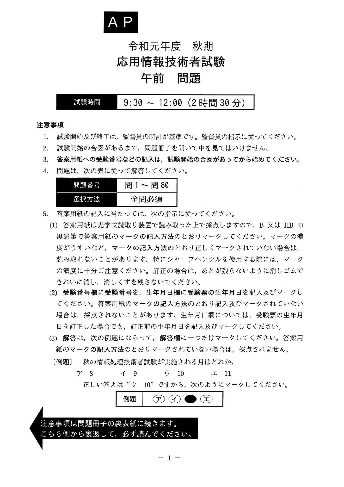

テキスト (OCR)

令和元年度 秋期
応用情報技術者試験
午前 問題

 9:30 ~ 12:00 (2時間 30 分)

注意事項

1. 試験開始及び終了は, 監督上員の時計が基準です。監督員の指示に従ってください。

2. 試験開始の合図があるまで, 問題冊子を開いて中を見てはいけません。

3. 答案用紙への受験番号などの記入は, 試験開始の合図があってから始めてください。

4. 間題は, 次の表に従って解答してください。

問題番号       fal 1 ~ fa] 80
選択方法      全問必須
5. 答案用紙の記入に当たっては, 次の指示に従ってください。

GQ) 答案用紙は光学式読取り装置で読み取った上で採点しますので, B 又は HB の
黒鉛筆で答案用紙のマークの記入方法のとおりマークしてください。マークの濃
度がうすいなど, マークの記入方法のとおり正しくマークされていない場合は,
読み取れないことがあります。 特にシャープペンシルを使用する際には, マーク
の濃度に十分ご注意ください。訂正の場合は, あとが残らないように消しゴムで
きれいに消し, 消しくずを残さないでください。

2) 受験番号欄に受験番号を, 生年月日欄に受験票の生年月日を記入及びマークし
てください。答案用紙のマークの記入方法のとおり記入及びマークされていない
場合は, 採点されないことがあります。生年月日欄については, 受験票の生年月
日を訂正した場合でも, 訂正前の生年月日を記入及びマークしてください。

(3) 解答は, 次の例題にならって, 解答欄に一つだけマークしてください。 SRA
紙のマークの記入方法のとおりマークされていない場合は, 採点されません。

〔例題】 秋の情報処理技術者試験が実施される月はどれか。

ア 8   イ 9    ウ 10   エ 11
正しい答えは“ウ 10” ですから, 次のようにマークしてください。

例題 | 〈のての や

注意事項は問題冊子の裏表紙に続きます。

こちら側から裏返して, 必ず読んでください。

### ページ 2

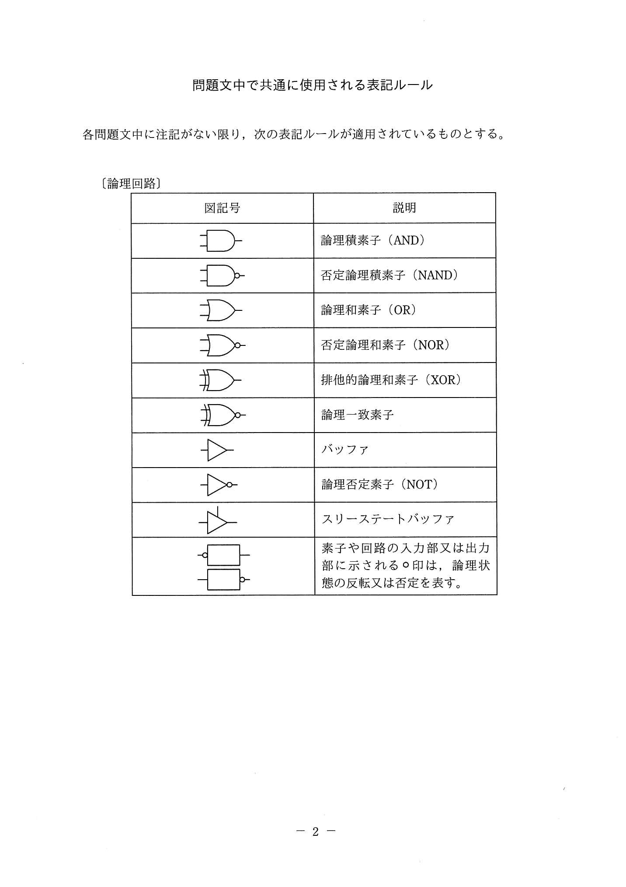

テキスト (OCR)

問題文中で共通に使用される表記ルール

各問題文中に注記がない限り, 次の表記ルールが適用されているものとする。

〔論理回路〕

|
all
cu
a

説明

論理積素子 (AND)

否定論理積素子 (NAND)

論理和素子 (OR)

否定論理和素子 (NOR)

排他的論理和素子 (XOR)

論理一致素子

バッファ

論理否定素子 (NOT)

スリーステートバッファ

素子や回路の入力部又は出力
部に示されるo9印は, 論理状
態の反転又は否定を表す。

COV POV QO

### ページ 3

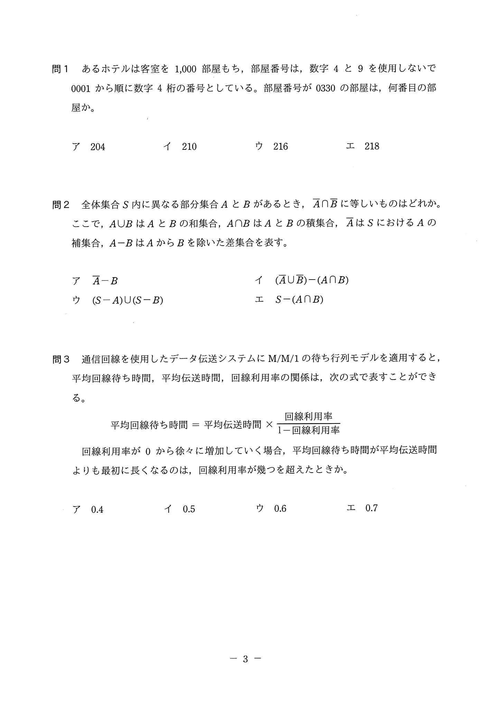

テキスト (OCR)

間1 あるホテルは客室を 1000 部屋もち, 部屋番号は, 数字 4 と 9 を使用しないで
0001 から順に数字 4 桁の番号としている。部屋番号が 0330 の部屋は, 何番目の部
屋か。

ア 204     イ 210     ウ 216     xr 218

問2 全体集合 $ 内に異なる部分集合4 BMHSLS, 4万に等しいものはどれか。
ここで, AUBILAL BOMBA, ANBILAL BOMRA, AUASKEUVSAD
HEA, A-BISA DS BERVLEARGERT.

ア A-B          4 (AUB)—-(ANB)
ウ (S—A)U(S—B)       エ S—-(ANB)

間3 通信回線を使用したデータ伝送システムに M/M/1 の待ち行列モデルを適用すると,
平均回線待ち時間, 平均伝送時間, 回線利用率の関係は, 次の式で表すことができ

る。

      rues        回線利用率
平均回線待ち時間 = 平均伝送時間 X Te are

回線利用率が 0 から徐々に増加していく場合, 平均回線待ち時間が平均伝送時間
よりも最初に長くなるのは, DMNABMROSBAREC EM

### ページ 4

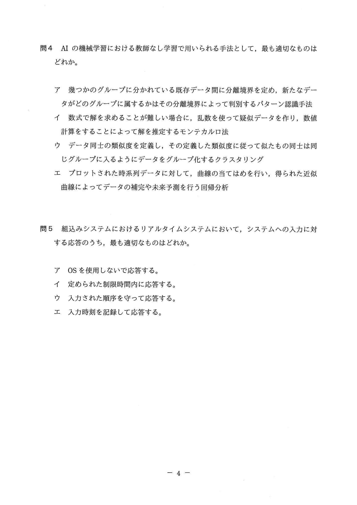

テキスト (OCR)

問4 AI の機械学習における教師なし学習で用いられる手法として, 最も適切なものは
どれか。

ア 幾つかのグループに分かれている既存データ間に分離境界を定め, 新たなデー
タがどのグループに属するかはその分離境界によって判別するパターン認識手法
イ 数式で解を求めることが難しい場合に, 乱数を使って疑似データを作り, 数値

計算をすることによって解を推定するモンテカルロ法
ウ データ同土の類似度を定義し, その定義した類似度に従って似たもの同士は同
じグループに入るようにデータをグループ化するクラスタリング
LZ プロットされた時系列データに対して, 曲線の当てはめを行い, 得られた近似
曲線によってデータの補完や未来予測を行う回帰分析

FAIS 組込みシステムにおけるリアルタイムシステムにおいて, システムへの入力に対
する応答のうち, 最も適切なかものはどれか。

OS を使用しないで応答する。
定められた制限時間内に応答する。
入力された順序を守って応答する。
入力時刻を記録して応答する。

H + AM

### ページ 5

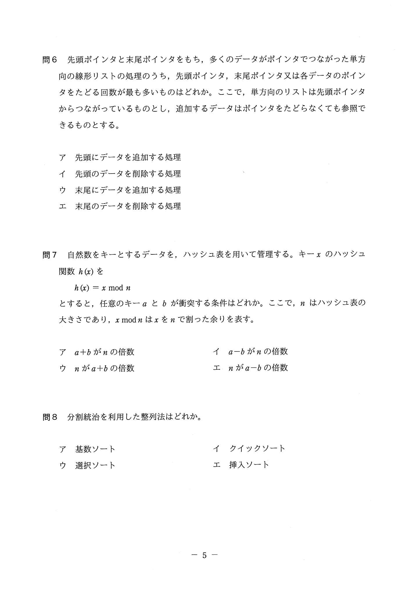

テキスト (OCR)

問6 先頭ポインタと未尾ポインタをもち, 多くのデータがポインタでつながった単方
向の線形リストの処理のうち, 先頭ポインタ, 末尾ポインタ又は各データのポイン
タをたどる回数が最も多いものはどれか。ここで, 単方向のリストは先頭ポインタ
からつながっているものとし, 追加するデータはポインタをたどらなくても参照で
きるものとする。

先頭にデータを追加する処理
先頭のデータを削除する処理
末尾にデータを追加する処理
末尾のデータ を削除する処理

Hoe A NM

問7 自然数をキーとするデータを, ハッシュ表を用いて管理する。キーァ のハッシュ
関数 hw) を
h(x) =x modn
とすると, EBOX—a と b が衝突する条件はどれか。ここで, n はハッシュ表の
大きさであり, zmodz は*ゃをぁヵで割った余りを表す。

ア atb edn の倍数                       イ gpがz の倍数

ウ n Bath の倍数                       エ がg-ヵの倍数
間8 分割統治を利用した整列法はどれか。

ア 基数ソート              イークイックソート

ウ 選択ソート                                    x= 挿入ソート

### ページ 6

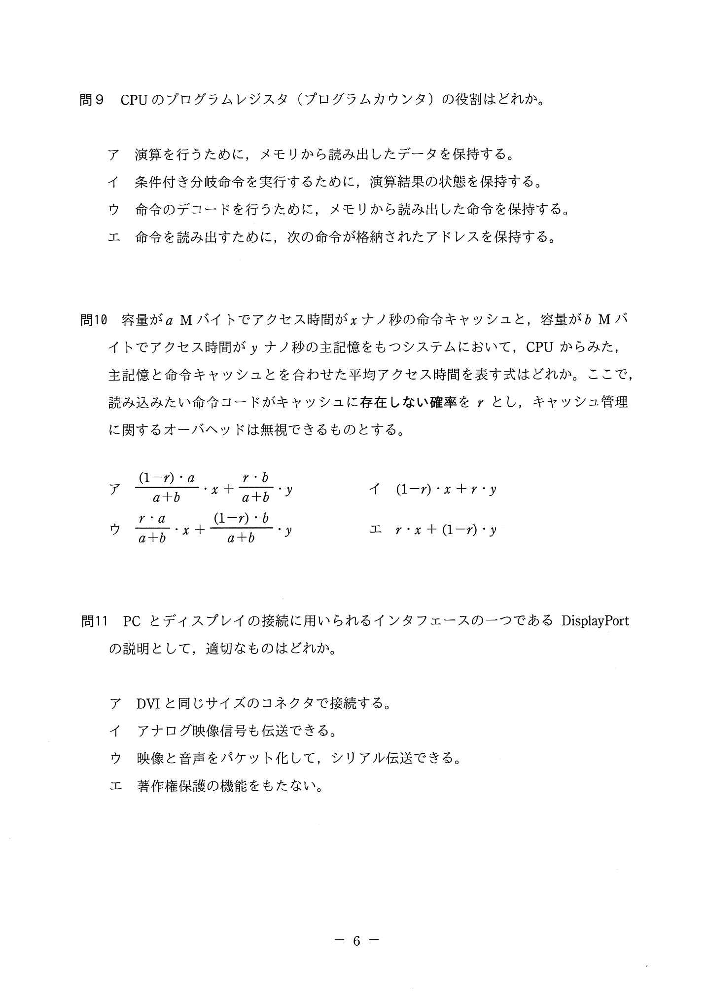

テキスト (OCR)

問9 CPUのプログラムレジスタ (プログラムカウンタ) の役割はどれか。

演算を行うために, メモリから読み出したデータを保持する。

条件付き分岐命令を実行するために, 演算結果の状態を保持する。
命令のデコードを行うために, メモリから読み出した命令を保持する。
命令を読み出すために, 次の命令が格納されたアドレスを保持する。

H tA N

問16 AEDS a M バイトでアクセス時間がャナノ秒の命令キャッシュと, 容量がの Mバ
イトでアクセス時間がァナノ秒の主記憶をもつシステムにおいて, CPU DOAK,
主記憶と命令キャッシュとを合わせた平均アクセス時間を表す式はどれか。ここで,
読み込みたい命令コードがキャッシュに存在しない確率を > とし, キャッシュ管理
に関するオーバヘッドは無視できるものとする。

(1一の・@   ヶ・ひの
ーー toa?    イー G-のテキテッ
ア・の   (1一の・の

ウ イキーッ     エーァ・ャ十1一の・y

fll PC とディスプレイの接続に用いられるインタフェースの一つである DisplayPort
の説明として, 適切なものはどれか。

DVI と同じサイズのコネクタで接続する。

アナログ映像信号も伝送できる。
映像と音声をパケット化して, シリアル伝送できる。
著作権保護の機能をもたない。

Hoe AM

### ページ 7

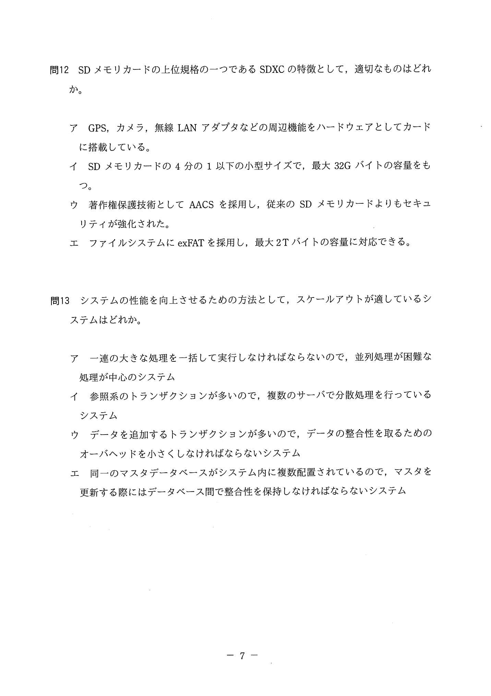

テキスト (OCR)

問12 SD メモリカードの上位規格の一つである SDXC の特徴として, 適切ながものはどれ
か。

ア GPS, カメラ, 無線 LAN アダプタなどの周辺機能をハードウェアとしてカード
に搭載している。

イ SD メモリカードの 4 分の 1 以下の小型サイズで, 最大 32G バイトの容量をも
iy

ウ 著作権保護技術として AACS を採用し, 従来の SD メモリカードよりもセキュ
リティが強化された。

エ ファイルシステムに exFAT を採用し, 最大 2T バイトの容量に対応できる。

AIS システムの性能を向上させるための方法として, スケールアウトが適しているシ
ステムはどれか。

ア 一連の大きな処理を一括して実行しなければならないので, 並列処理が困難な
処理が中心のシステム

イ 参照系のトランザクションが多いので, 複数のサーバで分散処理を行っている
システム

ウ データを追加するトランザクションが多いので, データの整合性を取るための
オーバヘッドを小さくしなければならないシステム

エ 同一のマスタデータベースがシステム内に複数配置されているので, マスタを
更新する際にはデータベース間で整合性を保持しなければならないシステム

### ページ 8

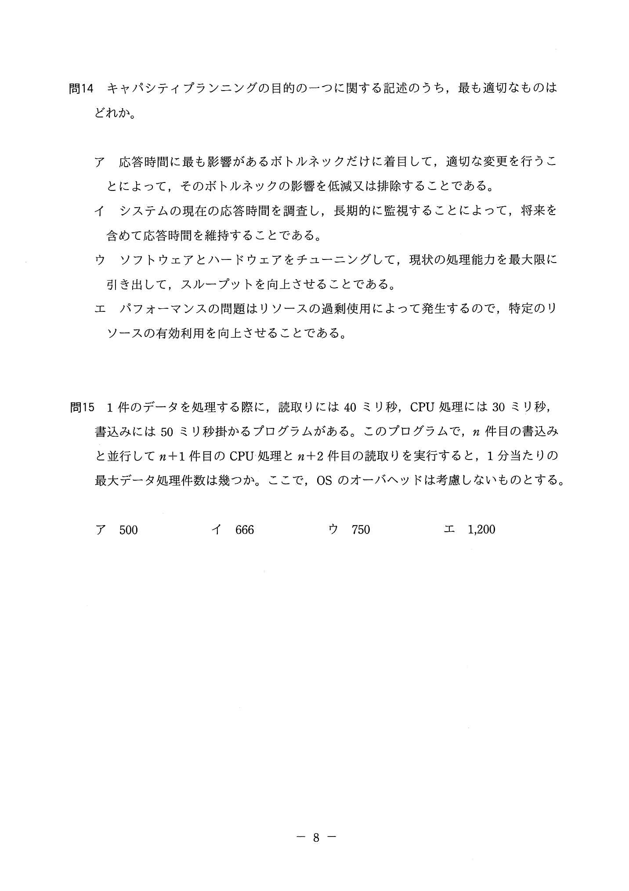

テキスト (OCR)

問14 キャパシティプランニングの目的の一つに関する記述のうち, 最も適切がものは
どれか。

ア 応答時間に最も影響があるボトルネックだけに着目して, 適切な変更を行うこ
とによって, そのボトルネックの影響を低減又は排除することである。

イ システムの現在の応答時間を調査し, 長期的に監視することによって, 将来を
含めて応答時間を維持することである。

ウ ソフトウェアとハードウェアをチューニングして, 現状の処理能力を最大限に
引き出して, スループットを向上させることである。

エエ パフォーマンスの問題はリソースの過剰使用によって発生するので, 特定のリ
ソースの有効利用を向上させることである。

/

問15 1 件のデータを処理する際に, 読取りには 40 ミリ秒, CPU 処理には 30 ミリ秒,
書込みには 50 ミリ秒掛かるプログラムがある。このプログラムで, n 件目の書込み
と並行して nt1 件目の CPU 処理と nt2 件目の読取りを実行すると, 1 分当たりの
最大データ処理件数は幾つか。ここで, OS のオーバヘッドは考慮しないものとする。

ア 500     イ 666     ウ 750     = 1,200

### ページ 9

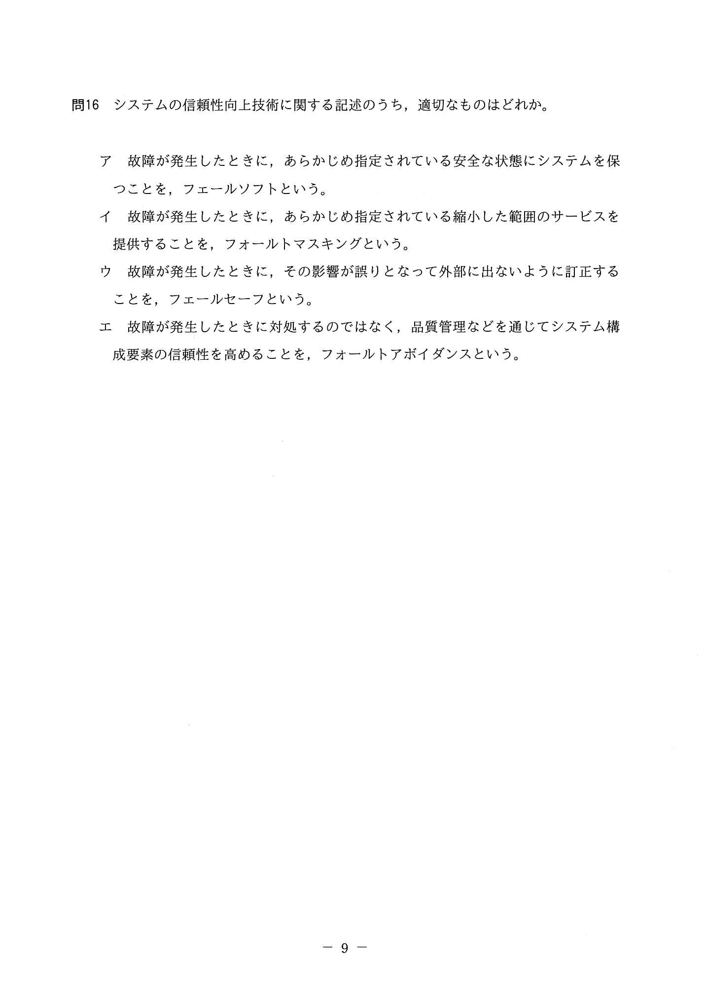

テキスト (OCR)

間16 システムの信頼性向上技術に関する記述のうち, 適切なものはどれか。

ア 故障が発生したときに, あらかじめ指定されている安全な状態にシステムを保
つととを。 フェールソントという。

イ 故障が発生したときに, あらかじめ指定されている縮小した範囲のサービスを
提供することを, フォールトマスキングという。

ウ 故障が発生したときに, その影響が誤りとなって外部に出ないように訂正する
ことを, フェールセーフという。

エエ 故障が発生したときに対処するのではなく, 品質管理などを通じてシステム構
成要素の信頼性を高めることを, フォールトアボイダンスという。

### ページ 10

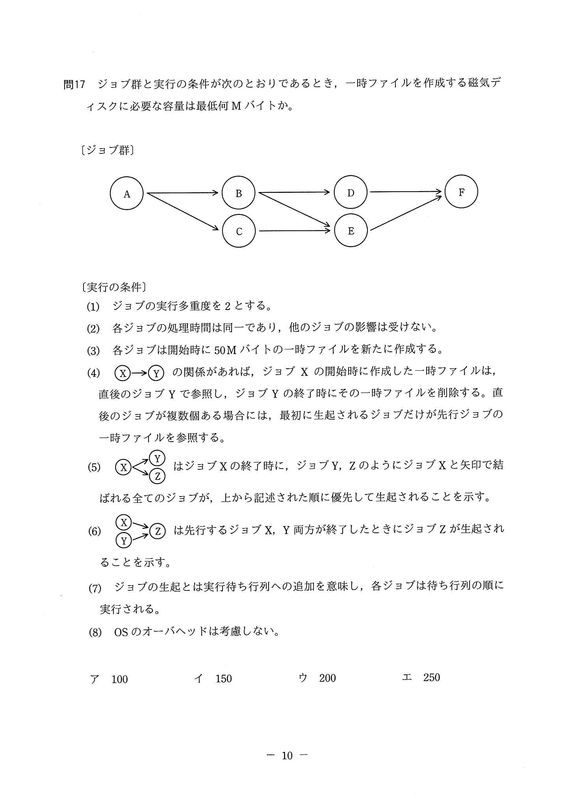

テキスト (OCR)

間17 ジョブ和群と実行の条件が次のとおりであるとき, 一時ファイルを作成する磁気デ
ィスクに必要な容量は最低何 M バイトか。

〔実行の条件

(①) ジョブの実行多重度を 2 とする。

(2) 各ジョブの処理時間は同一であり, 他のジョブの影響は受けない。
(3③) 各ジョブは開始時に SOM バイトの一時ファイルを新たに作成する。

@Q-® の関係があれば, ジョブ X の開始時に作成した一時ファイルは,
直後のジョブ Y で参照し, ジョブ Y の終了時にその一時ファイルを削除する。直
後のジョブが複数個ある場合には, 最初に生起されるジョブだけが先行ジョプの
一時ファイルを参照する。

@つゆ はジョブX の終了時に, ジョブY,Z のようにジョブX と矢印で結

@

ばれる全てのジョブが, 上から記述された順に優先して生起されることを示す。

© So は先行するジョブ X, Y 両方が終了したときにジョブZ が生起され
ることを示す。
(⑦) ジョブの生起とは実行待ち行列への追加を意味し, 各ジョブは待ち行列の順に
実行される。
(8) 0S のオーバヘッドは考慮しない。

ア 100     イ 150     ウ 200     xX 250

ー 10 一

### ページ 11

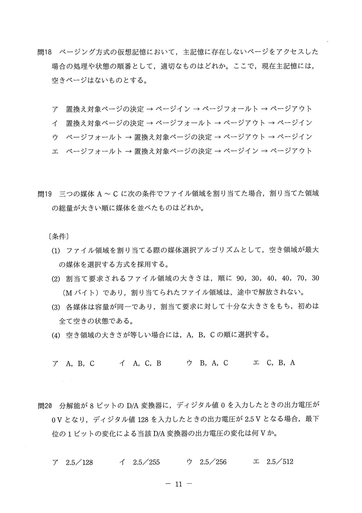

テキスト (OCR)

間18 ページング方式の仮想記憶において, 主記憶に存在しないページをアクセスした
場合の処理や状態の順番として, 適切ながものはどれか。ここで, 現在主記憶には,
空きページはないものとする。

置換え対象ページの決定 — ページイン つ ページフォールト つ ページアウト
置換え対象ページの決定 一 ページフォールト つっ ページアウト っ ページイン
ページフォールト > 置換え対象ページの決定 つ ページアウト つ ページイン

H さ へ

ページフォールト … 置換え対象ページの決定 一 ページイン つ ページアウト

間19 三つの媒体 A こCに次の条件でファイル領域を割り当てた場合, 割り当てた領域
の総量が大きい順に媒体を並べたものはどれか。

(fF)

(1) ファイル領域を割り当てる際の媒体選択アルゴリズムとして, 空き領域が最大
の媒体を選択する方式を採用する。

(2) 割当て要求されるファイル領域の大きさは, 順に 90, 30, 40, 40, 70, 30
(M バイト) であり, 割り当てられたファイル領域は, 途中で解放されない。

(3) 各媒体は容量が同一であり, 割当て要求に対して十分な大きさをもち, 初めは
全て空きの状態である。

(4) 空き領域の大きさが等しい場合には, A, B, Cの順に選択する。

ア <A, B,C  イ AC, B  ウ B, A, C  x= C, BA

R20 分解能が 8 ビットの D/A 変換器に, ディジタル値 0 を入力したときの出力電圧が

0V となり, ディジタル値 128 を入力したときの出力電圧が 2.5V となる場合, 最下

位の 1 ビットの変化による当該 DA 変換器の出力電圧の変化は何 V か。

ア 2.57128     イ 25/255     ウ 2.5グ256     エ 2.5グ512

— 94 =

### ページ 12

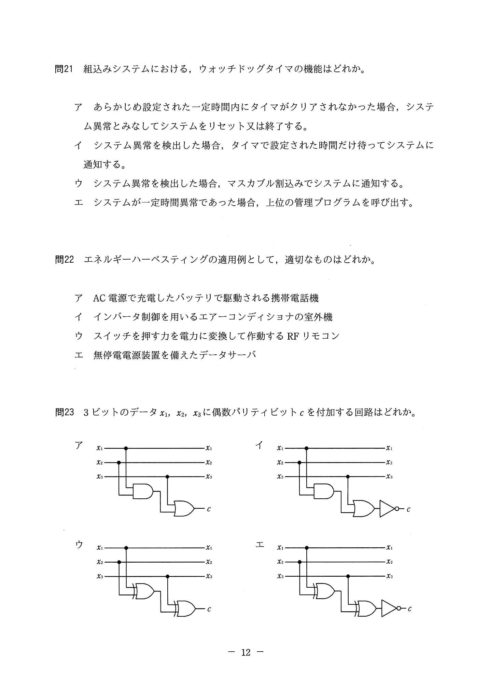

テキスト (OCR)

間21 組込みシステムにおける, ウォッチドッグタイマの機能よどれか。

ア あらかじめ設定された一定時間内にタイマがクリアされなかった場合, システ
ム異営とみなしてシステムをリセット又は終了する。

イ システム異常を検出した場合, タイマで設定された時間だけ待ってシステムに
通知する。

ウ システム異常を検出した場合, マスカブル割込みでシステムに通知する。

エエ システムが一定時間異常であった場合, 上位の管理プログラムを呼び出す。

間22 エネルギーハーベスティングの適用例として, 適切なものはどれか。

AC 電源で充電したバッテリで駆動される携帯電話機
インバータ制御を用いるエアーコンディショナの室外機
スイッチを押す力を電力に変換して作動する RF リモコン
無停電電源装置を備えたデータサーバ

H マコ

間23 3 ビットのデータぇ, x, xsに偶数パリティビット<cを付加する回路はどれか。

Fog) gp   イ る

te       Xe     Xe       Xe

Xs     %   X3     Xs     e   Xs
OL,              と

7 on       on   x= im       Xi

Xe       Xe     Ke       a

Xs     4   Xs     X     5   Xs

や中                 |

### ページ 13

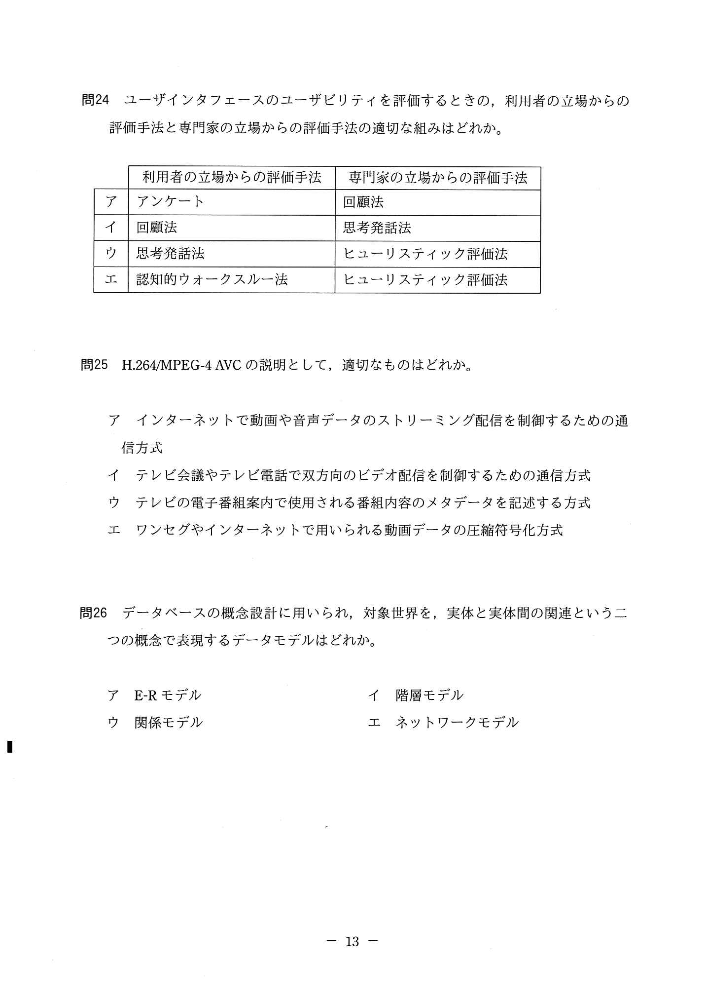

テキスト (OCR)

問24 ユーザインタフェースのユーザビリティを評価するときの, 利用者の立場からの
評価手法と専門家の立場からの評価手法の適切な組みはどれか。

利用者の立場からの評価手法 | 専門家の立場からの評価手法
ア | アンケートド         回顧法
イ | 回顧法           思考発話法
ウ | 思考発話法          ヒューリスティック評価法
エ | 認知的ウォークスルー法    ヒューリスティック評価法

間25 TH.264/MPEG-4 AVC の説明として, 適切ながものはどれか。

ア インターネットで動画や音声データのストリーミング配信を制御するための通
信方式

イ テレビ会議やテレビ電話で双方向のビデオ配信を制御するための通信方式

ウ テレビの電子番組案内で使用される番組内容のメタデータを記述する方式

エエ ワンセグやインターネットで用いられる動画データの圧縮符号化方式

問26 データベースの概念設計に用いられ, 対象世界を, 実体と実体間の関連という二
つの概念で表現するデータモデルはどれか。

ア ERモデル          イ 階層モデル
ウ 関係モデル            エ ネットワークモデル

ー 13 一

### ページ 14

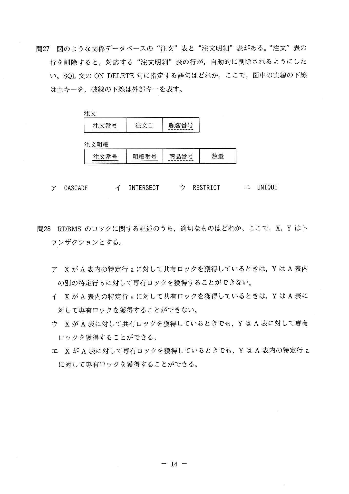

テキスト (OCR)

27 図のような関係データベースの “VEX” 表と “注文明細” 表がある。 "注文" RO
行を削除すると, 対応する “注文明細” 表の行が, 自動的に削除されるようにした
い。SQL XO ON DELETE 句に指定する語句はどれか。ここで, 図中の実線の下線
は主キーを, 破線の下線は外部キーを表す。

注文番号   注文日   顧客番号

明細番号 | 商品番号   数量

ア CASCADE   INTERSECT   ウ RESTRICT   エ UNIQUE

間28 RDBMS のロックに関する記述のうち, 適切なかものはどれか。ここで, X, Y はト
ランザクションとする。

ア XがAん表内の特定行 a に対して共有ロックを獲得しているときは, Y は 4A表内
の別の特定行b に対して専有ロックを獲得することができない。

4 XがA表内の特定行 a に対して共有ロックを獲得しているときは, Y は A 表に
対して専有ロックを獲得することができない。

ウ XがA表に対して共有ロックを獲得しているときでも, Y は A 表に対して専有
ロックを獲得することができる。

エエ XがA表に対して専有ロックを獲得しているときでも, Y は A 表内の特定行 a
に対して専有ロックを獲得することができる。

ー 和則 一

### ページ 15

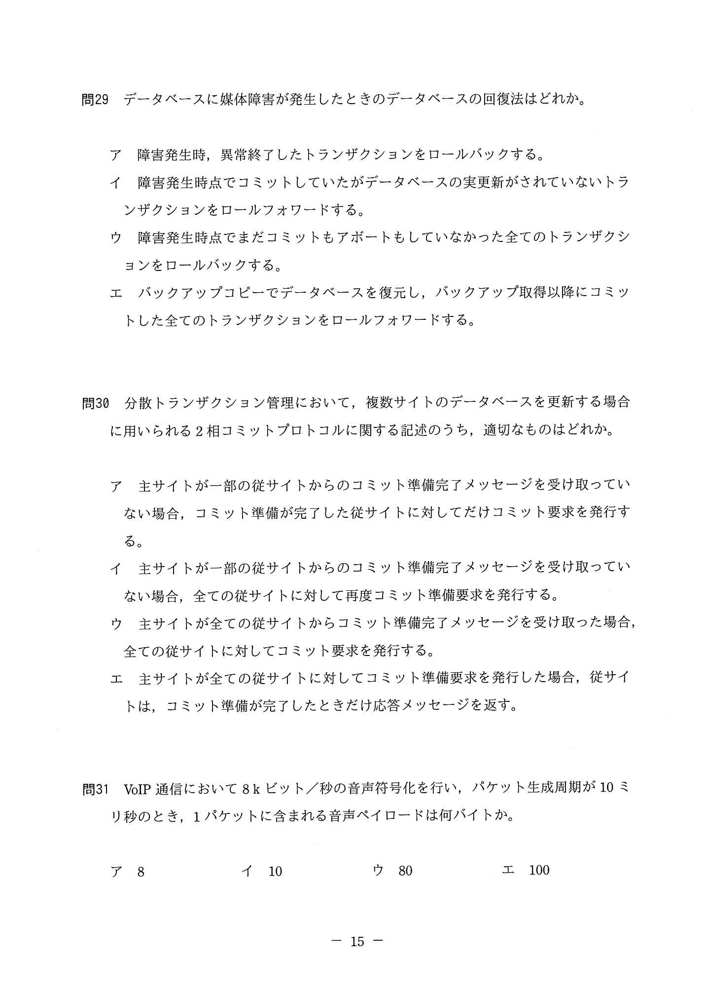

テキスト (OCR)

問29 データベースに媒体障害が発生したときのデータベースの回復法はどれか。

ア 障害発生時, 異常終了したトランザクションをロールバックする。

4 障害発生時点でコミットしていたがデータベースの実更新がされていないトラ
ンザクションをロールフォワードする。

ウ 障害発生時点でまだコミットもアボートもしていなかった全てのトランザクシ
ョンをロールバックする。

エ バックアップコピーでデータベースを復元し, バックアップ取得以降にコミッ
トした全てのトランザクションをロールフォワードする。

間39 分散トランザクション管理において, 複数サイトのデータベースを更新する場合
に用いられる 2 相コミットプロトコルに関する記述のうち, 適切かものはどれか。

ア 主サイトが一部の従サイトからのコミット準備完了メッセージを受け取ってい
ない場合, コミット準備が完了した従サイトに対してだけコミット要求を発行す
る。

4 主サイトが一部の従サイトからのコミット準備完了メッセージを受け取ってい
ない場合, 全ての従サイトに対して再度コミット準備要求を発行する。

ウ 主サイトが全ての従サイトからコミット準備完了メッセージを受け取った場合
全ての従サイトに対してコミット要求を発行する。

LD 主サイトが全ての従サイトに対してコミット準備要求を発行した場合, 従サイ
トは, コミット準備が完了したときだけ応答メッセージを返す。

間31 VoIP 通信において 8k ビットンノ秒の音声符号化を行いパケット生成周期が10 ミ
リ秒のとき, 1 パケットに含まれる音声ペイロードは何バイトか。

ア 8     イ 10     ウ 80    = 100

ー 15 一

### ページ 16

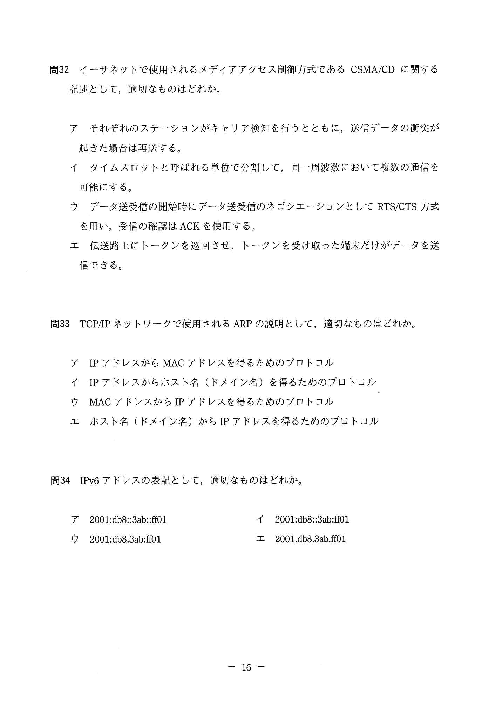

テキスト (OCR)

間32 イーサネットで使用されるメディアアクセス制御方式である CSMA/CD に関する
記述として, 適切かがものはどれか。

ア それぞれのステーションがキャリア検知を行うとともに, 送信データの衝突が
起きた場合は再送する。
イ タイムスロットと呼ばれる単位で分割して, 同一周波数において複数の通信を
可能にする。
ウ データ送受信の開始時にデータ送受信のネゴシエーションとして RTS/CTS 方式
を用い, 受信の確認は ACK を使用する。
エ 伝送路上にトークンを巡回させ, トークンを受け取った端末だけがデータを送
信できる。

問33 TCP/IP ネットワークで使用される ARP の説明として, 適切なものはどれか。

IP アドレスから MAC アドレスを得るためのプロトコル

TP アドレスからホスト名 (ドメイン名) を得るためのプロトコル
MAC アドレスから IP アドレスを得るためのプロトコル
ホスト名 (ドメイン名) から IP アドレスを得るためのプロトコル

Hさささ

問34 IPvY6 アドレスの表記として, 適切なものはどれか。

ア 2001:db8::3ab::ff01       イ 2001:db8::3ab:ffO1
ウ 2001:db8.3ab:f01         エエ 2001.db8.3ab.ff01

ー 一

### ページ 17

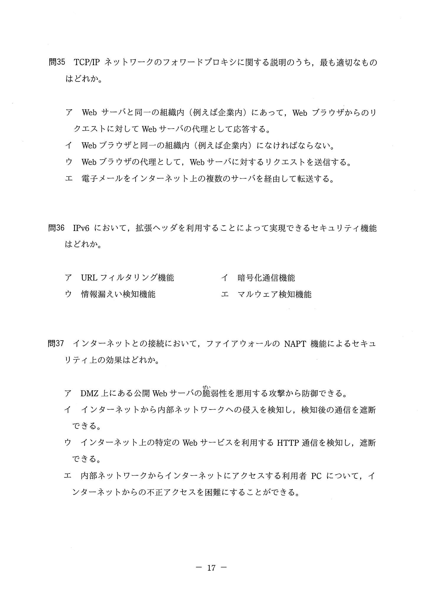

テキスト (OCR)

問35 TCP/IP ネットワークのフォワードプロキシに関する説明のうち, 最も適切なもの
はどれか。

ア Web サーバと同一の組織内 (例えば企業内) にあって, Web ブラウザからのリ
クエストに対して Web サーバの代理として応答する。
イ Web ブラウザと同一の組織内 (例えば企業内) になければならない。
ウ Webブラウザの代理として, Web サーバに対するリクエストを送信する。
電子メールをインターネット上の複数のサーバを経由して転送する。

間36 IPv6 において, 拡張ヘッダを利用することによって実現できるセキュリティ機能
はどれか。

ア URL フィルタリング機能            イ 暗号化通信機能
ウ 情報漏えい検知機能                 エ マルウェア検知機能

37 インターネットとの接続において, ファイアウォールの NAPT 機能によるセキュ
リティ上の効果はどれか。

F DMZ 上にある公開 Web サーバの脆弱性を悪用する攻撃から防御できる。

イ インターネットから内部ネットワークへの侵入を検知し, 検知後の通信を遮断
できる。

ウ インターネット上の特定の Web サービスを利用する HTTP 通信を検知し, 遮断
できる。

= 内部ネットワークからインターネットにアクセスする利用者 PC について, イ
ンターネットからの不正アクセスを困難にすることができる。

ー 17 一

### ページ 18

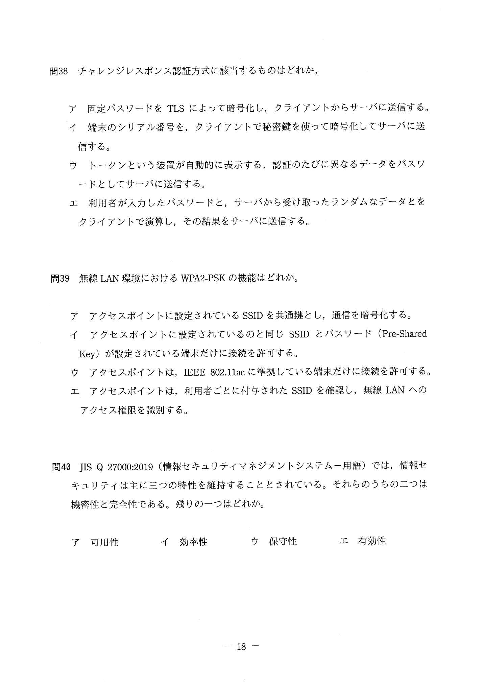

テキスト (OCR)

間38 チャレンジレスポンス認証方式に該当するものはどれか。

ア 固定パスワードを TLS によって暗号化し, クライアントからサーバに送信する。

イ 端末のシリアル番号を, クライアントで秘密鍵を使って暗号化してサーバに送
信する。

ウ トークンという装置が自動的に表示する, 認証のたびに異なるデータをパスワ
ードとしてサーバに送信する。

エ 利用者が入力したパスワードと, サーバから受け取ったランダムなデータとを
クライアントで演算し, その結果をサーバに送信する。

間39 無線 LAN 環境における WPA2-PSK の機能はどれか。

ア アクセスポイントに設定されている SSID を共通鍵とし, 通信を暗号化する。

イ アクセスポイントに設定されているのと同じ SSID とパスワード (Pre-Shared
Key) が設定されている端末だけに接続を許可する。

ウ アクセスポイントは, IEEE 802.11ac に準拠している端末だけに接続を許可する。

エ アクセスポイントは, 利用者ごとに付与された SSID を確認し, 無線 LAN への

アクセス権限を識別する。

問49 JIS Q 27000:2019 (情報セキュリティマネジメントシステムーー用語) では, 情報セ
キュリティは主に三つの特性を維持することとされている。それらのうちの二つは
機密性と完全性である。残りの一つはどれか。

ア 可用性    イ 効率性    ウ 保守性    エ 有効性

ー 18 一

### ページ 19

テキスト (OCR)

問41 内部ネットワークの PC からインターネット上の Web サイトを参照するときに,
DMZ に設置した VDI (Virtual Desktop Infrastructure) サーバ上の Web ブラウザを利
用すると, 未知のマルウェアが PC にダウンロードされるのを防ぐというセキュリ
ティ上の効果が期待できる。この効果を生み出す VDI サーバの動作の特徴はどれか。

ア Web サイトからの受信データのうち, 実行ファイルを削除し, その他のデータ
を PC に送信する。

イ Web サイトからの受信データは, IPsec でカプセル化し, PC に送信する。

ウ Web サイトからの受信データは, 受信処理ののち生成したデスクトップ画面の
画像データだけを PC に送信する。

エエ Web サイトからの受信データは, 不正なコード列が検知されない場合だけ PC
に送信する。

間42 エクスプロイトキットの説明はどれか。

ア JPEG データを読み込んで表示する機能をもつ製品に対して, セキュリティ上の
問題を発生させる可能性のある値を含んだ JPEG データを読み込ませることによ
って, 脆層性がないかをテストするツール

イ SVN などに掲載された脆弱性情報の中に, 利用者自身が PC 又はサーバにイン
ストールした製品に関する情報が含まれているかどうかを確認するツール

ウ OS やアプリケーションソフトウェアの脆弱性を悪用して攻撃するツール

エ Web サイトのアクセスログから, Web サイトの脆弱性を悪用した攻撃を検出す
るツール

ー 19 一

### ページ 20

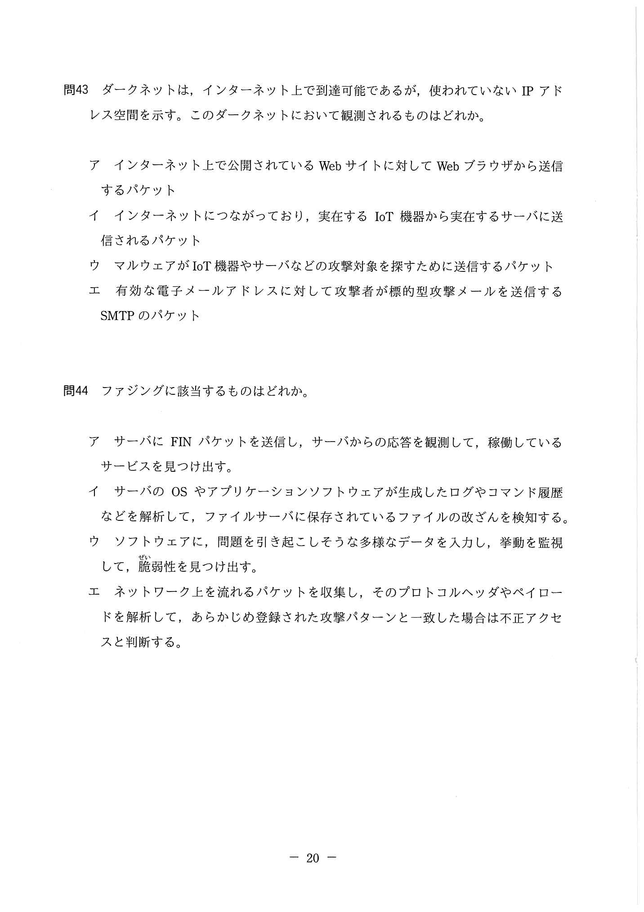

テキスト (OCR)

問43 ダークネットは, インターネット上で到達可能であるが, 使われていない IP アド
レス空間を示す。このダークネットにおいて観測されるものはどれか。

ア インターネット上で公開されている Web サイトに対して Web ブラウザから送信
するパケット

イ インターネットにつながっており, 実在する IoT 機器から実在するサーバに送
信されるパケット

ウ マルウェアがTIoT 機器やサーバなどの攻撃対象を探すために送信するパケット

エ 有効な電子メールアドレスに対して攻撃者が標的型攻撃メールを送信する
SMTP のパケット

間44 ファジングに該当するものはどれか。

ア サーバに FIN パケットを送信し, サーバからの応答を観測して, 稼働している
サービスを見つけ出す。

イ サーバの OS やアプリケーションソフトウェアが生成したログやコマンド履歴
などを解析して, ファイルサーバに保存されているファイルの改ざんを検知する。

ウ ソフトウェアに, 問題を引き起こしそうな多様なデータを入力し, 挙動を監視
して, 脆弱性を見つけ出す。

L ネットワーク上を流れるパケットを収集し, そのプロトコルヘッダやペイロー
ドを解析して, あらかじめ登録された攻撃パターンと一致した場合は不正アクセ
スと判断する。

ー 20 一

### ページ 21

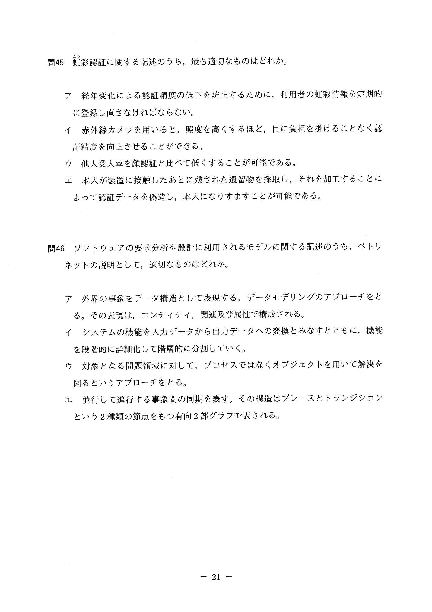

テキスト (OCR)

問45 虹彩認証に関する記述のうち, 最も適切なものはどれか。

ア 経年変化による認証精度の低下を防止するために, 利用者の虹彩情報を定期的
に登録し直さなければならない。

4 赤外線カメラを用いると, 照度を高くするほど, 目に負担を掛けることなく誰
証精度を向上させることができる。

ウ 他人受入率を顔認証と比べて低くすることが可能である。

エエ 本人が装置に接触したあとに残された間留物を採取し, それを加工することに
よって認証データを偽造し, 本人になりすますことが可能である。

B46 ソフトウェアの要求分析や設計に利用されるモデルに関する記述のうち, ベトリ
ネットの説明として, 適切なものはどれか。

ア 外界の事象をデータ構造として表現する, データモデリングのアプローチをと
る。その表現は, エンティティ, 関連及び属性で構成される。

イ システムの機能を入力データから出力データへの変換とみなすとともに, 機能
を段階的に詳細化して階層的に分割していく。

ウ 対象となる問題領域に対して, プロセスではなくオブジェクトを用いて解決を
図るというアプローチをとる。

エ 並行して進行する事象間の同期を表す。その構造はプレースとトランジション
という 2 種類の節点をもつ有了向 2 部グラフで表される。

ー 21 一

### ページ 22

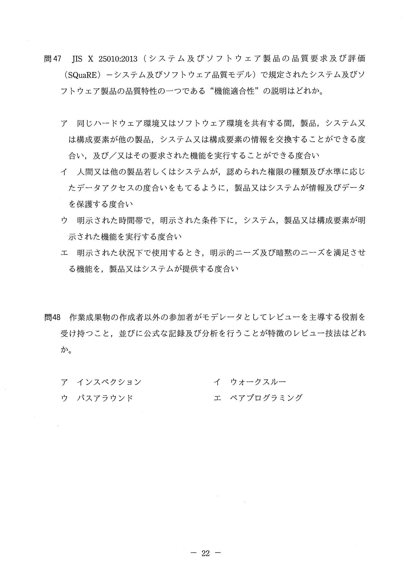

テキスト (OCR)

間47 JIS X 25010:2013 (システム及びソフトウェア製品の品質要求及び評価
(SQuaRE) 一システム及びソフトウェア品質モデル) で規定されたシステム及びソ
フトウェア製品の品質特性の一つである “機能適合性” の説明はどれか。

ア 同じハードウェア環境又はソフトウェア環境を共有する間, 製品, システム又
は構成要素が他の製品, システム又は構成要素の情報を交換することができる度
BW, 及び又はその要求された機能を実行することができる度合い

イ 人間又は他の製品若しくはシステムが, 認められた権限の種類及び水準に応じ
たデータアクセスの度合いをもてるように, 製品又はシステムが情報及びデータ
を保護する度合い

ウ 明示された時間帯で, 明示された条件下に, VATA, 製品又は構成要素が明
示された機能を実行する度合い

エ 明示された状況下で使用するとき, 明示的ニーズ及び暗黙のニーズを満足させ
る機能を, 製品又はシステムが提供する度合い

問48 作業成果物の作成者以外の参加者がモデレータとしてレビューを主導する役割を
受け持つこと, 並びに公式な記録及び分析を行うことが特徴のレビュー技法はどれ
Do

ア インスペクション         イ ウォークスルー
ウ パスアラウンド          エエ ペアプログラミング

ー 22 一

### ページ 23

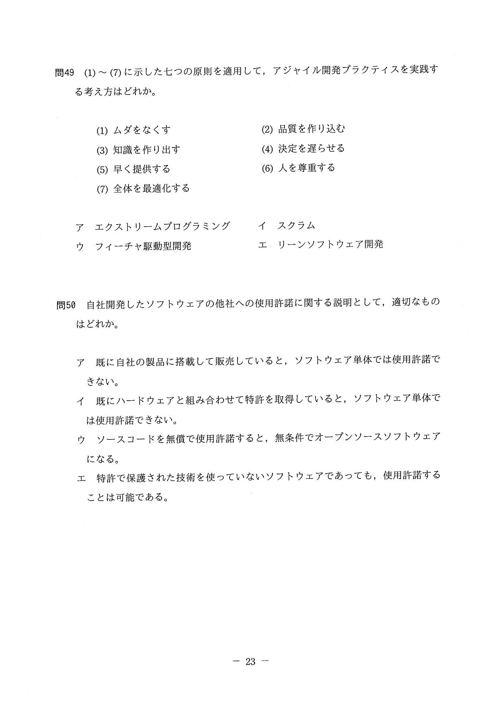

テキスト (OCR)

問49 Q) ~ (⑦ に示した七つの原則を適用して, アジャイル開発プラクティスを実践す
る考え方はどれか。

(1) ムダをなくす              2) 品質を作り込む
(3) 知識を作り出す              (4) 決定を遅らせる
(⑤) 早く提供する                (6) 人を尊重する

(7) 全体を最適化する

ア エクストリームプログラミング    イ スクラム
ウ フィーチャ駆動型開発       エ リーンソフトウェア開発

問56 自社開発したソフトウェアの他社への使用許諾に関する説明として, 適切なもの
はどれか。

ア 既に自社の製品に搭載して販売していると, ソフトウェア単体では使用許諾で
きない。

イ 既にハードウェアと組み合わせて特許を取得していると, ソフトウェア単体で
は使用許諾できない。

ウ ソースコードを無償で使用許諾すると, 無条件でオープンソースソフトウェア
になる。

エ 特許で保護された技術を使っていないソフトウェアであっても, 使用許諾する
ことは可能である。

ー 23 一

### ページ 24

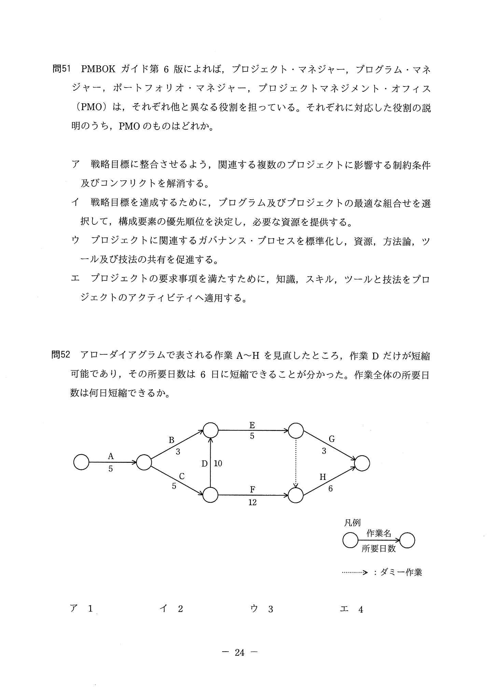

テキスト (OCR)

問51 PMBOK ガイド第 6 版にによれば, プロジェクト・マネジャー, プログラム・マネ
ジャー, ポートフォリオ・マネジャー, プロジェクトマネジメント・オフィス
(PMO) lk, それぞれ他と異なる役割を担っている。それぞれに対応した役割の説
明のうち, PMO のものはどれか。

ア 戦略目標に整合させるよう, 関連する複数のプロジェクトに影響する制約条件
及びコンフリクトを解消する。
イ 戦略目標を達成するために, プログラム及びプロジェクトの最適な組合せを選
RUC, 構成要素の優先順位を決定し, 必要な資源を提供する。
ウ プロジェクトに関連するガバナンス ・プロセスを標準化し, 資源, 方法論, ツ
ール及び技法の共有を促進する。
L プロジェクトの要求事項を満たすために, 知識, スキル, ツールと技法をプロ
ジェクトのアクティビティへ適用する。

間52 アローダイアグラムで表される作業 A~H を見直したところ, 作業 D だけが短縮
可能であり, その所要日数は 6 日に短縮できることが分かった。 作業全体の所要日
数は何日短縮できるか。

ー 24 一

### ページ 25

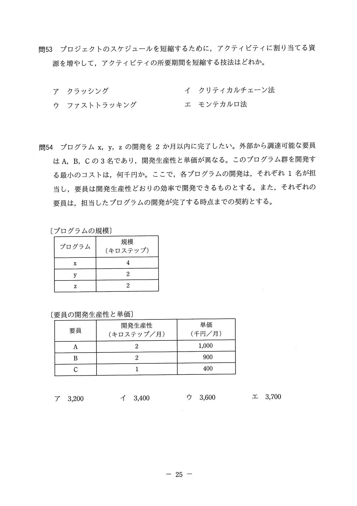

テキスト (OCR)

間53 プロジェクトのスケジュールを短縮するために, アクティビティに割り当てる資
源を増やして, アクティビティの所要期間を短縮する技法はどれか。

ア カクラッシング           イ クリティカルチェーン法
ウ ファストトラッキング       エエ モンテカルロ法

間54 プログラム x, y, z の開発を 2 か月以内に完了したい。外部から調達可能な要員
は A, B, C の 3 名であり, 開発生産性と単価が異なる。このプログラム群を開発す
る最小のコストは, 何千円か。ここで, 各プログラムの開発は, それぞれ 1 名が担
“GU, 要員は開発生産性どおりの効率で開発できるものとする。また, それぞれの
要員は, 担当したプログラムの開発が完了する時点までの契約とする。

[プログラムの規模
ー     規模

ログラム | erロスrwの
x      4
y      2
Zz      2

[要員の開発生産性と単価)
要員      開発生産性       単価
“    (キロステップノ月)   (FAA)

2       1,000

B       2        900
C       1        400

ア 3,200    4 3,400 3,600    x 3,700

ー 25 一

### ページ 26

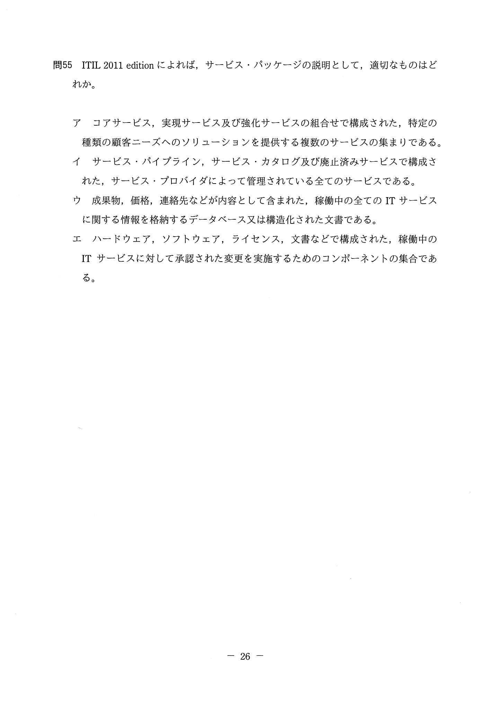

テキスト (OCR)

問55 ITIL 2011 edition によれば, サービス ・パッケージの説明として, 適切かものはど
れか。

ア コアサービス, 実現サービス及び強化サービスの組合せで構成された, 特定の
種類の顧客ニーズへのソリューションを提供する複数のサービスの集まりである。

イ サービス・パイプライン, サービス・カタログ及び廃止済みサービスで構成さ
れた, サービス・プロバイダによって管理されている全てのサービスである。

ウ 成果物, 価格, 連絡先などが内容として含まれた, 稼働中の全ての IT サービス
に関する情報を格納するデータベース又は構造化された文書である。

エエ ハードウェア, ソフトウェア, ライセンス, 文書などで構成された, 稼働中の
IT サービスに対して承認された変更を実施するためのコンポーネントの集合であ
る。

ー 26 一

### ページ 27

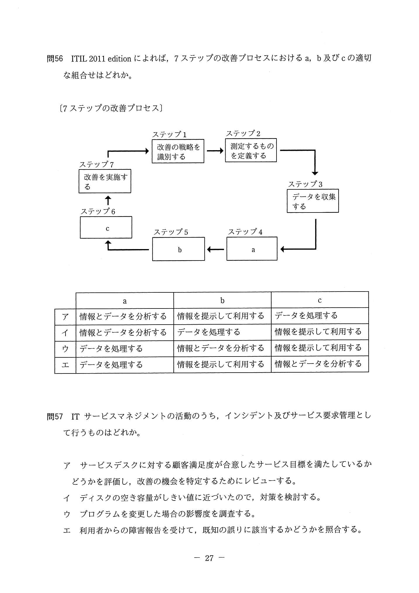

テキスト (OCR)

な組合せはどれか。

[7 ステップの改善プロセス]

間56 ITIL 2011 edition によれば, 7 ステップの改善プロセスにおけるa, b及びcの適切

ステップ1     ステップ2
改善の戦略を    測定するもの
_ 「    | use 。 | |を定義する      |
RFYTT
改善を実施す
る                           ステップ 3
t                          データを収集
ステップ6                        する
©      ステップ5     ステップ4
a              b              C
ア | 情報とデータを分析する | 情報を提示して利用する | データを処理する
イ | 情報とデータを分析する | データを処理する    情報を提示して利用する
ウ | データを処理する    情報とデータを分析する | 情報を提示して利用する
LD | データを処理する    情報を提示して利用する | 情報とデータを分析する

間57 IT サービスマネジメントの活動のうち, イン

て行うものはどれか。

シデント

及びサービス要求管理とし

ア サービスデスクに対する顧客満足度が合意したサービス目標を満たしているか
どうかを評価し, 改善の機会を特定するためにレビューする。

イ ディスクの空き容量がしきい値に近づいたので, 対策を検討する。

ウ プログラムを変更した場合の影響度を調査する。

エエ 利用者からの障害報告を受けて, 既知の誤りに該当するかどうかを照合する。

ー 27 一

### ページ 28

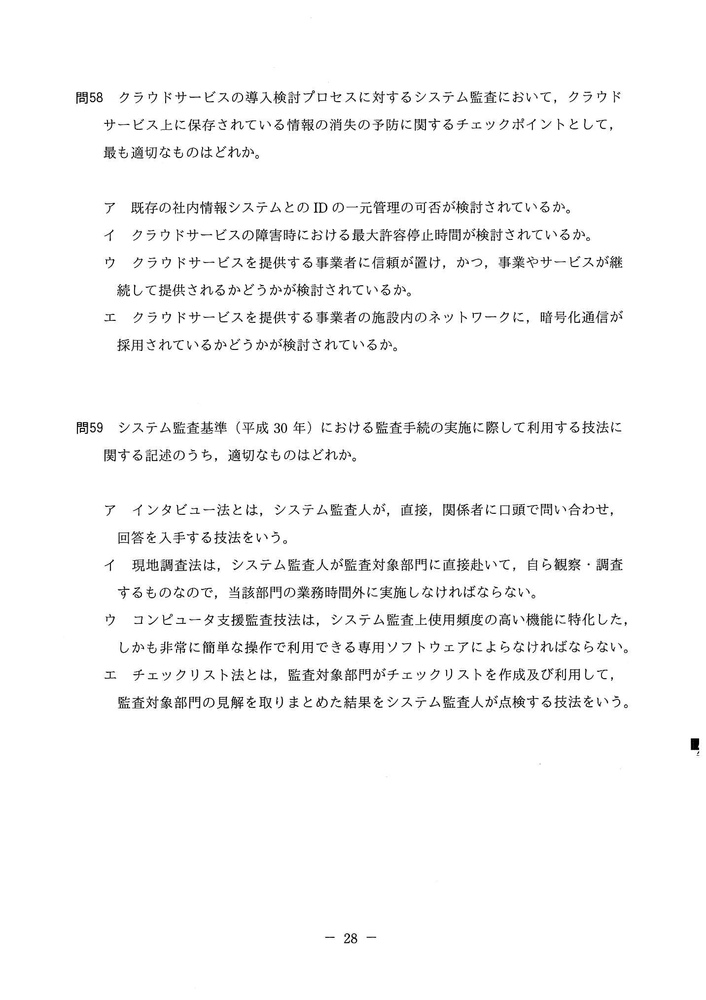

テキスト (OCR)

間58 クラウドサービスの導入検討プロセスに対するシステム監査において, クラウド
サービス上に保存されている情報の消失の予防に関するチェックポイントとして,
最も適切なかものはどれか。

ア 既存の社内情報システムとのID の一元管理の可否が検討されているか。

イ クラウドサービスの障害時における最大許容停止時間が検討されているか。

ウ クラウドサービスを提供する事業者に信頼が置け, DO, 事業やサービスが継
続して提供されるかどうかが検討されているか。

エ クラウドサービスを提供する事業者の施設内のネットワークに, 暗号化通信が
採用されているかどうかが検討されているかが。

間59 システム監査基準 (平成 30 年) における監査手続の実施に際して利用する技法に
関する記述のうち, 適切なかものはどれか。

ア インタビュー法とは, システム監査人が, BR, 関係者に口頭で問い合わせ,
回答を入手する技法をいう。

イ 現地調査濯は, システム監査人が監査対象部門に直接赴いて, 自ら観察・調査
するものなので, 当該部門の業務時間外に実施しなければならない。

ウ コンピュータ支援監査技法は, システム監査上使用頻度の高い機能に特化した,
しかも非常に簡単な操作で利用できる専用ソフトウェアによらなければならない。

工 チェックリスト法とは, 監査対象部門がチェックリストを作成及び利用して,
監査対象部門の見解を取りまとめた結果をシステム監査人が点検する技法をいう。

ー 28 一

### ページ 29

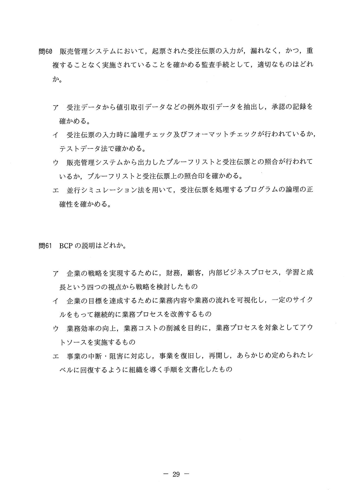

テキスト (OCR)

間66 販売管理システムにおいて, 起票された受注伝票の入力が, 漏れなく, DO, 重
複することなく実施されていることを確かめる監査手続として, 適切がものはどれ
か。

ア 受注データから値引取引データなどの例外取引データを抽出し, 承認の記録を
確かめる。

イ 受注伝票の入力時に論理チェック及びフォーマットチェエックが行われているか,
テストデータ法で確かめる。

ウ 販売管理システムから出力したプルーフリストと受注伝票との照合が行われて
WSR, プルーフリストと受注伝票上の照合印を確かめる。

エ 並行シミュレーション法を用いて, 受注伝票を処理するプログラムの論理の正
確性を確かめる。

問61 BCP の説明はどれか。

ア 企業の戦略を実現するために, 財務, BA, 内部ビジネスプロセス, 学習と成
長という四つの視点から戦略を検討したもの

イ 企業の目標を達成するために業務内容や業務の流れを可視化し, 一定のサイク
ルをもって継続的に業務プロセスを改善するもの

ウ 業務効率の向上, 業務コストの削減を目的に, 業務プロセスを対象としてアウ
トソースを実施するもの

エ 事業の中断・阻害に対応し, 事業を復旧し, 再開し, あらかじめ定められたレ
ベルに回復するように組織を導く手順を文書化したもの

ー 29 一

### ページ 30

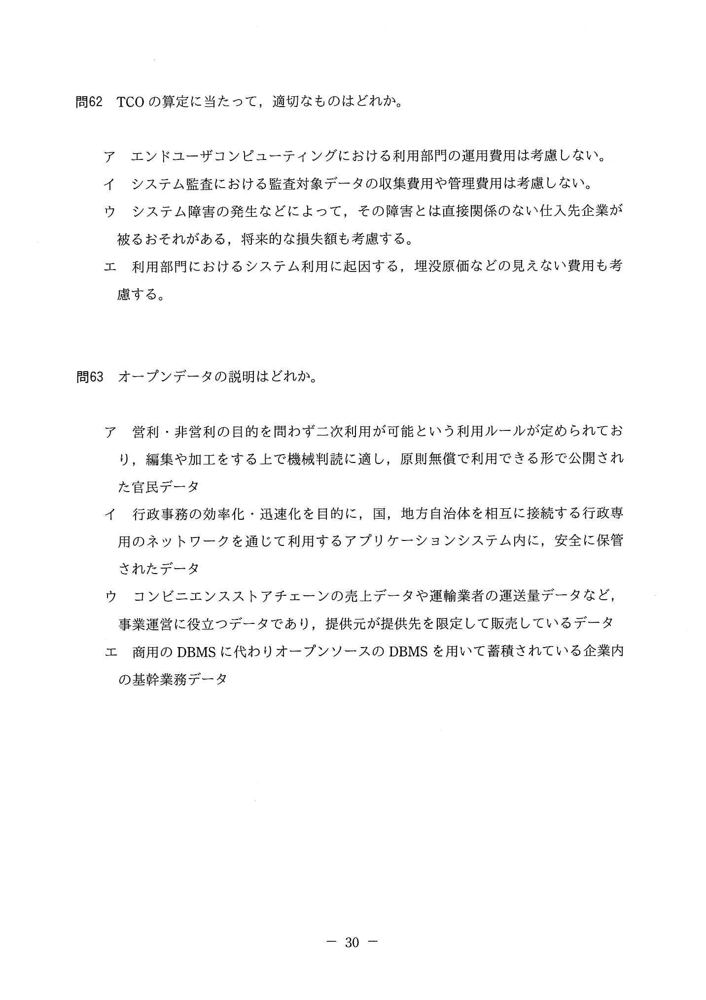

テキスト (OCR)

問62 TCO の算定に当たって, 適切がものはどれか。

ア エンドユーザコンピューティングにおける利用部門の運用費用は考慮しない。

イ システム監査における監査対象データの収集費用や管理費用は考慮しない。

ウ システム障害の発生などによって, その障害とは直接関係のない仕入先企業が
被るおそれがある, 将来的な損失額も考慮する。

エエ 利用部門におけるシステム利用に起因する, 埋没原価などの見えない費用も考
慮する。

問63 オープンデータの説明はどれか。

ア 営利・非営利の目的を問わず二次利用が可能という利用ルールが定められてお
り, 編集や加工をする上で機械判読に適し, 原則無償で利用できる形で公開され
REBT OS

イ 行政事務の効率化・迅速化を目的に, 国, 地方自治体を相互に接続する行政専
用のネットワークを通じて利用するアプリケーションシステム内に, 安全に保管
されたデータ

ウ コンビニエンスストアチェーンの売上データや運輸業者の運送量データなど,
事業運営に役立つデータであり, 提供元が提供先を限定して販売しているデータ

エ 商用の DBMS に代わりオープンソースの DBMS を用いて蓄積されている企業内
の基幹業務データ

ー 30 一

### ページ 31

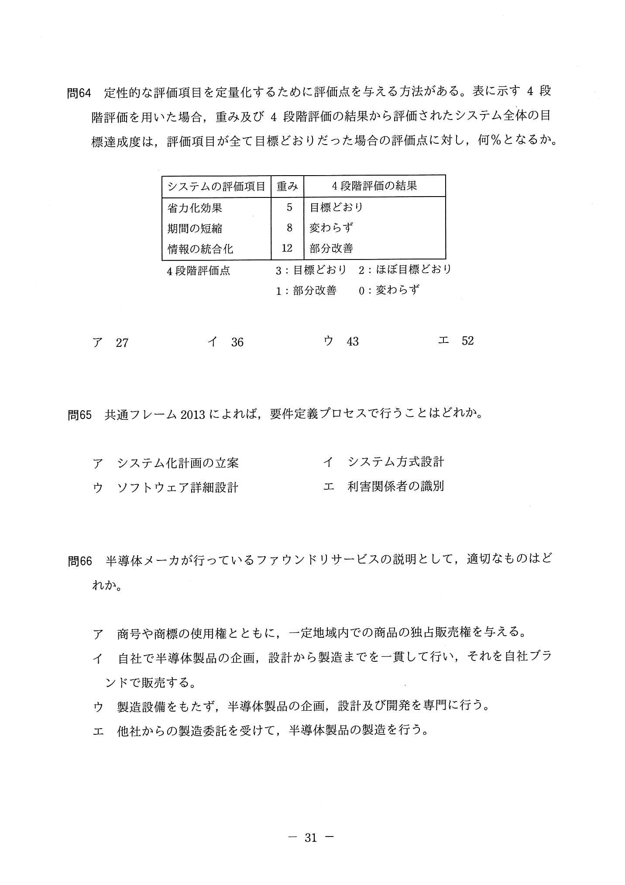

テキスト (OCR)

問64 定性的な評価項目を定量化するために評価点を与える方法がある。表に示す 4 段
階評価を用いた場合, 重み及び 4 段階評価の結果から評価されたシステム全体の目
標達成度は, 評価項目が全て目標どおりだった場合の評価点に対し, 何%となるか。

システムの評価項目 | 重み     4 段階評価の結果

省力化効果         5 | 目標どおり

期間の短縮         8 | 変わらず

情報の統合化       12 | 部分改善

4 段階評価点      3 : 目標どおり 2 : ほぼ目標どおり

1 : 部分改善 0:変わらず

間65 共通フレーム 2013 によれば, 要件定義プロセスで行うことはどれか。

ア システム化計画の立案       イ システム方式設計
ウ ソフトウェア詳細設計       エ 利害関係者の識別

間66 半導体メーカが行っているファウンドリサービスの説明として, 適切なものはど
れか。

ア 商号や商標の使用権とともに, 一定地域内での商品の独占販売権を与える。

イ 自社で半導体製品の企画, 設計から製造までを一貫して行い, それを自社ブラ
ンドで販売する。

ウ 製造設備をもたず, 半導体製品の企画, 設計及び開発を専門に行う。

ラー =

エ 他社からの製造委託を受けて, 半導体製品の製造を行う。

ー 31 一

### ページ 32

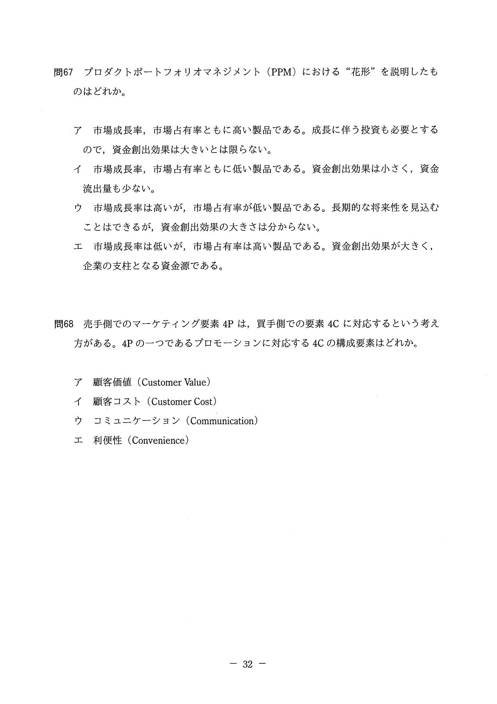

テキスト (OCR)

問67 プロダクトポートフォリオマネジメント (PPM) における “Ew” を説明したも
のはどれか。

ア 市場成長率, 市場占有率ともに高い製品である。 成長に伴う投資も必要とする
ので, 資金創出効果は大きいとは限らない。

4 市場成長率, 市場占有率ともに低い製品である。資金創出効果は小さく, 資金
流出量も少ない。

ウ 市場成長率は高いが, 市場占有率が低い製品である。 長期的な将来性を見込む
ことはできるが, 資金創出効果の大きさは分からない。

エエ 市場成長率は低いが, 市場占有率は高い製品である。 資金創出効果が大きく,
企業の支柱となる資金源である。

間68 売手側でのマーケティング要素 4P は, 買手側での要素 4C に対応するという考え
方がある。4P の一つであるプロモーションに対応する 4C の構成要素はどれか。

顧客価値 (Customer Value)
顧客コスト (Customer Cost)
コミュニケーション (Communication)

利便性 (Convenience)

H マコ

ー 32 一

### ページ 33

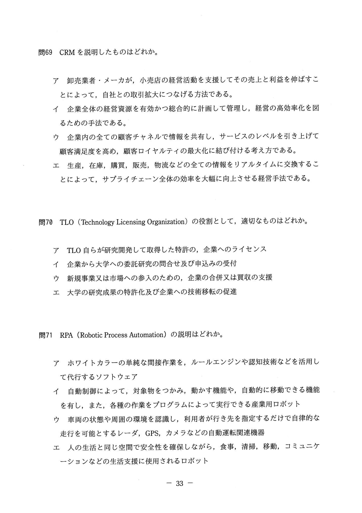

テキスト (OCR)

問69 CRM を説明したものはどれか。

ア 卸売業者・メーカが, 小売店の経営活動を支援してその売上と利益を伸ばすこ
とによって, 自社との取引拡大につなげる方法である。

イ 企業全体の経営資源を有効かつ総合的に計画して管理し, 経営の高効率化を図
るための手法である。

ウ 企業内の全ての顧客チャネルで情報を共有し, サービスのレベルを引き上げて
顧客満足度を高め, 顧客ロイヤルティの最大化に結び付ける考え方である。

エ 生産, 在庫, 購買, 販売, 物流などの全ての情報をリアルタイムに交換するこ
とによって, サプライチェーン全体の効率を大幅に向上させる経営手法である。

FA70 TLO (Technology Licensing Organization) の役割として, 適切ながものはどれか。

TLO 自らが研究開発して取得した特許の, 企業へのライセンス
企業から大学への委託研究の問合せ及び申込みの受付
新規事業又は市場への参入のための, 企業の合併又は買収の支援
大学の研究成果の特許化及び企業への技術移転の促進

H さい

間71 RPA (Robotic Process Automation) の説明はどれか。

ア ホワイトカラーの単純な間接作業を, ルールエンジンや認知技術などを活用し
て代行するソフトウェア
イ 自動制御によって, 対象物をつかみ, 動かす機能や, 自動的に移動できる機能
を有し, また, 各種の作業をプログラムによって実行できる産業用ロボット
ウ 車両の状態周囲の環境を認識し, 利用者が行き先を指定するだけで自律的な
走行を可能とするレーダ, GPS, カメラなどの自動運転関連機器
エエ 人の生活と同じ空間で安全性を確保しながら, 食事, 清掃, 移動, コミュニケ
ーションなどの生活支援に使用されるロボット

ー 33 一

### ページ 34

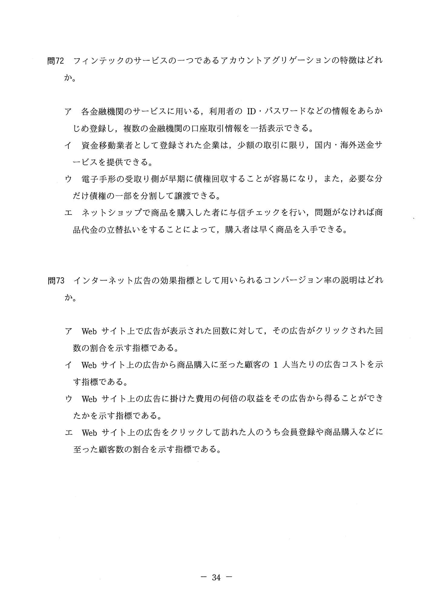

テキスト (OCR)

間72 フィンテックのサービスの一つであるアカウントアグリゲーションの特徴はどれ
か。

ア 各金融機関のサービスに用いる, 利用者の ID・パスワードなどの情報をあらか
じめ登録し, 複数の金融機関の口座取引情報を一括表示できる。

イ 資金移動業者として登録された企業は, 少額の取引に限り, 国内・海外送金サ
ービスを提供できる。

ウ 電子手形の受取り側が早期に債権回収することが容易になり, また, 必要な分
だけ債権の一部を分割して譲渡できる。

エ ネットショップで商品を購入した者に与信チェックを行い, 問題がなければ商
品代金の立替払いをすることによって, 購入者は早く商品を入手できる。

間73 インターネット広告の効果指標として用いられるコンバージョン率の説明はどれ
Do

ア Web サイト上で広告が表示された回数に対して, その広告がクリックされた回
数の割合を示す指標である。

4 Web サイト上の広告から商品購入に至った顧客の 1 人当たりの広告コストを示
す指標である。

ウ Web サイト上の広告に掛けた費用の何倍の収益をその広告から得ることができ
たかを示す指標である。

エエ Web サイト上の広告をクリックして訪れた人のうち会員登録や商品購入などに
至った顧客数の割合を示す指標である。

ー 34 一

### ページ 35

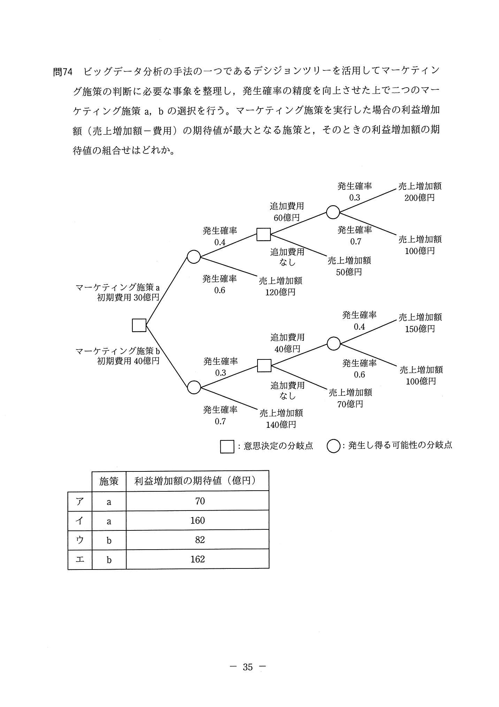

テキスト (OCR)

間74 ビッグデータ分析の手法のーつであるデシジョンツリーを活用してマーケティン
グ施策の判断に必要な事象を整理し, 発生確率の精度を向上させた上で二つのマー
ケティング施策 a, b の選択を行う。マーケティング施策を実行した場合の利益増加
額 (売上増加額一費用) の期待値が最大となる施策と, そのときの利益増加額の期
待値の組合せはどれか。

発生確率           売上増加額

200億円
売上増加額
100億円
マーケティング施策a                             cei
初期費用 30億円                                       “e
売上増加額
150億円
マーケティング施策b
初期費用 40億円
売上増加額
100億円

追加費用

              70億円
発生確率 一各上増加客            ー
0.7             140億円

| ] : 意思決定の分岐点 OC): 発生し得る可能性の分岐点

施策 | 利益増加額の期待値(億円)
ア          a                                   70
イ          a                                 160
ウ     b                   82
x         b                                 162

ー 35 一

### ページ 36

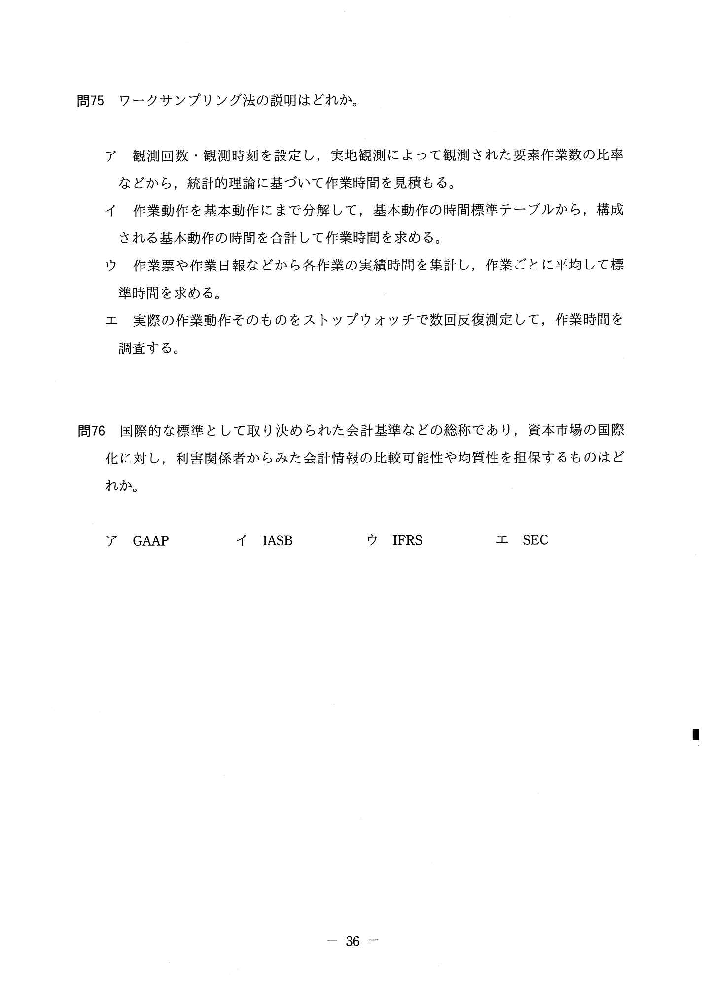

テキスト (OCR)

問75 ワークサンプリング法の説明はどれか。

ア 観測回数・観測時刻を設定し, 実地観測によって観測された要素作業数の比率
などから, 統計的理論に基づいて作業時間を見積もる。

イ 作業動作を基本動作にまで分解して, 基本動作の時間標準テーブルから, 構成
される基本動作の時間を合計して作業時間を求める。

ウ 作業票や作業日報などから各作業の実績時間を集計し, 作業ごとに平均して標
準時間を求める。

エ 実際の作業動作そのものをストップウォッチで数回反復測定して, 作業時間を
調査する。

間76 国際的な標準として取り決められた会計基準などの総称であり, 資本市場の国際
化に対し, 利害関係者からみた会計情報の比較可能性や均質性を担保するものはど
れか。

ア GAAP    イ IASB     ウ IFRS     エエ SEC

ー 36 一

### ページ 37

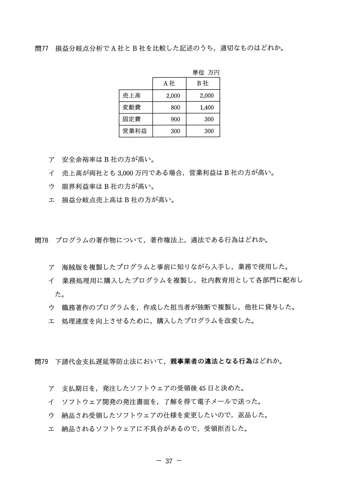

テキスト (OCR)

問77 損益分岐点分析でA社とB社を比較した記述のうち, 適切なものはどれか。

単位 万円
A社   B社
売上高                2.000            2,000
変動費              800         1,400
固定費                900             300
営業利益 300300

安全余裕率は B 社の方が高い。

売上高が両社とも 3,000 万円である場合, 営業利益は B 社の方が高い。
限界利益率は B 社の方が高い。

損益分岐点売上高は B 社の方が高い。

Hoe NY

78 プログラムの著作物について, 著作権法上, 適法である行為はどれか。

ア 海賊版を複製したプログラムと事前に知りながら入手し, 業務で使用した。

イ 業務処理用に購入したプログラムを複製し, 社内教育用として各部門に配布し
ただ。

ウ 職務著作のプログラムを, 作成した担当者が独断で複製し, 他社に貸与した。

エエ 処理速度を向上させるために, 購入したプログラムを改変した。

間79 下請代金支払遅延等防止法において, 親事業者の違法となる行為はどれか。

支払期日を, 発注したソフトウェアの受領後 45 日と決めた。

ソフトウェア開発の発注書面を, 了解を得て電子メールで送った。
納品され受領したソフトウェアの仕様を変更したいので, 返品した。
納品されるソフトウェアに不具合があるので, 受領拒否した。

Hot AY

ー 37 一

### ページ 38

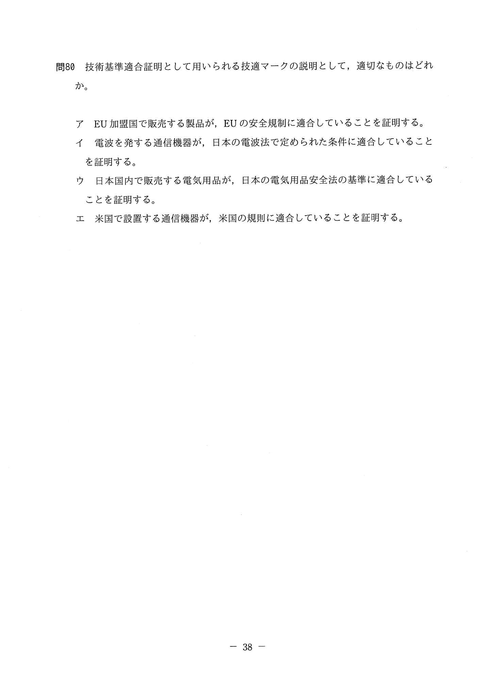

テキスト (OCR)

80 技術基準適合証明として用いられる技適マークの説明として, 適切なものはどれ
Do

ア EDU加盟国で販売する製品が, EU の安全規制に適合していることを証明する。
イ 電波を発する通信機器が, 日本の電濾法で定められた条件に適合していること

を証明する。
ウ 日本国内で販売する電気用品が, 日本の電気用品安全法の基準に適合している
ことを証明する。

= 米国で設置する通信機器が, 米国の規則に適合していることを証明する。

ー 38 一

### ページ 39

テキスト (OCR)

C

メ モ 用 紙 J

ー 39 一

### ページ 40

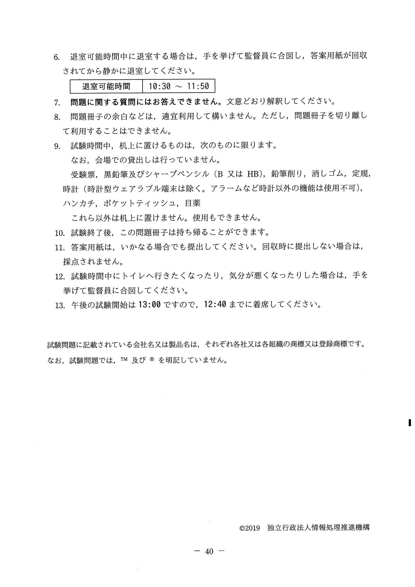

テキスト (OCR)

6. 退室可能時間中に退室する場合は, 手を挙げて監督具に合図し, 答案用紙が回収
されてから静かに退室してください。
| 骨室可能時間 | 10:30 ~ 11:50 |
7. 問題に関する質問にはお答えできません。文意どおり解釈してください。
8. 問題冊子の余白などは, 適宜利用して構いません。ただし, 問題冊子を切り離し
て利用することはできません。
9. 試験時間中, 机上に置けるものは, 次のものに限ります。
なお, 会場での貸出しは行っていません。
SRE, 黒鉛筆及びシャープペンシル (B 又は HB), 鉛筆削り, 消しゴム, 定規,
時計 (時計型ウェアラブル端末は除く。アラームなど時計以外の機能は使用不可),
ハンカチ, ポケットティッシュ, 目薬
これら以外は机上に置けません。使用もできません。
10. 試験終了後, この問題司子は持ち帰ることができます。
ll. SHAMS, いかなる場合でも提出してください。 回収時に提出しない場合は,
採点されません。
12. 試験時間中にトイレへ行きたくなったり, 気分が悪くなったりした場合は, 手を
挙げて監督貞に合図してください。
13. 午後の試験開始は 13:99 ですので, 12:49 までに着席してください。

試験問題に記載されている会社名又は製品名は, それぞれ各社又は各組織の商標又は登録商標です。
なお, 試験問題では, ™ 及び © を明記していません。

@2019 独立行政法人情報処理推進機構

ー 40 一

---

## 午前解答

©2019 独立行政法人情報処理推進機構 
令和元年度 秋期 応用情報技術者試験 解答例 
 
午前試験 
問番号
正解
分野
問1 
ウ 
Ｔ 
問2 
ア 
Ｔ 
問3 
イ 
Ｔ 
問4 
ウ 
Ｔ 
問5 
イ 
Ｔ 
問6 
エ 
Ｔ 
問7 
イ 
Ｔ 
問8 
イ 
Ｔ 
問9 
エ 
Ｔ 
問10 
イ 
Ｔ 
問11 
ウ 
Ｔ 
問12 
エ 
Ｔ 
問13 
イ 
Ｔ 
問14 
イ 
Ｔ 
問15 
エ 
Ｔ 
問16 
エ 
Ｔ 
問17 
ウ 
Ｔ 
問18 
ウ 
Ｔ 
問19 
エ 
Ｔ 
問20 
ア 
Ｔ 
 
 
問番号
正解
分野
問21 
ア 
Ｔ 
問22 
ウ 
Ｔ 
問23 
ウ 
Ｔ 
問24 
ウ 
Ｔ 
問25 
エ 
Ｔ 
問26 
ア 
Ｔ 
問27 
ア 
Ｔ 
問28 
イ 
Ｔ 
問29 
エ 
Ｔ 
問30 
ウ 
Ｔ 
問31 
イ 
Ｔ 
問32 
ア 
Ｔ 
問33 
ア 
Ｔ 
問34 
イ 
Ｔ 
問35 
ウ 
Ｔ 
問36 
イ 
Ｔ 
問37 
エ 
Ｔ 
問38 
エ 
Ｔ 
問39 
イ 
Ｔ 
問40 
ア 
Ｔ 
 
 
問番号
正解
分野
問41 
ウ 
Ｔ 
問42 
ウ 
Ｔ 
問43 
ウ 
Ｔ 
問44 
ウ 
Ｔ 
問45 
ウ 
Ｔ 
問46 
エ 
Ｔ 
問47 
エ 
Ｔ 
問48 
ア 
Ｔ 
問49 
エ 
Ｔ 
問50 
エ 
Ｔ 
問51 
ウ 
Ｍ 
問52 
ウ 
Ｍ 
問53 
ア 
Ｍ 
問54 
ウ 
Ｍ 
問55 
ア 
Ｍ 
問56 
ウ 
Ｍ 
問57 
エ 
Ｍ 
問58 
ウ 
Ｍ 
問59 
ア 
Ｍ 
問60 
ウ 
Ｍ 
 
 
問番号
正解
分野
問61 
エ 
Ｓ 
問62 
エ 
Ｓ 
問63 
ア 
Ｓ 
問64 
イ 
Ｓ 
問65 
エ 
Ｓ 
問66 
エ 
Ｓ 
問67 
ア 
Ｓ 
問68 
ウ 
Ｓ 
問69 
ウ 
Ｓ 
問70 
エ 
Ｓ 
問71 
ア 
Ｓ 
問72 
ア 
Ｓ 
問73 
エ 
Ｓ 
問74 
ウ 
Ｓ 
問75 
ア 
Ｓ 
問76 
ウ 
Ｓ 
問77 
ア 
Ｓ 
問78 
エ 
Ｓ 
問79 
ウ 
Ｓ 
問80 
イ 
Ｓ 
 
 
分野の「Ｔ」はテクノロジ系，「Ｍ」はマネジメント系，「Ｓ」はストラテジ系の問題です。

---

## 午後問題

### ページ 1

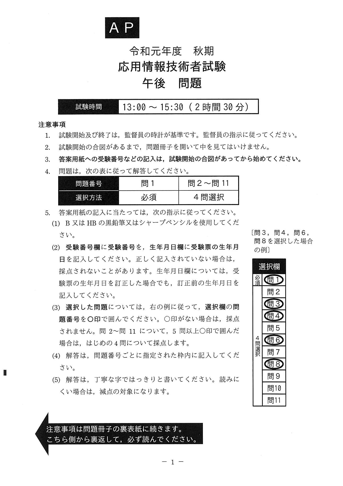

テキスト (OCR)

令和元年度 秋期
応用情報技術者試験
午後 問題

aie 13:00 ~ 15:30 (2時間 30 分)

注意事項
1. 試験開始及び終了は, 監督貞の時計が基準です。監督貞の指示に従ってください。
2. 試験開始の合図があるまで, 問題冊子を開いて中を見てはいけません。
3. 答案用紙への受験番号などの記入は, 試験開始の合図があってから始めてください。
4. 問題は, 次の表に従って解答してください。
問題番号     問 1    fal 2 ~ fal 11
選択方法     必須     4 問選択

5. 答案用紙の記入に当たっては, 次の指示に従ってください。
1) B 又は HB の黒鉛筆又はシャープペンシルを使用してくだ

上                         (問3, 問4,問6
問8 を選択した場合
⑫) 受験番号欄に受験番号を, 生年月日欄に受験票の生年月 pay

日を記入してください。 正しく記入されていない場合は,

採点されないことがあります。生年月日柚については,受 lll

験東の生年月日を訂正した場合でも, 訂正前の生年月日を |天休り

記入してください。                      問2

(3) 選択した問題については, 右の例に従って, 選択杜の問   GD
題番号を〇印で囲んでください。〇印がない場合は, 採点   Gi4

されません。問 2て問 11 について, 5 問以上〇印で囲んだ    問5

場合は,。 はじめの 4 問について採点します。           Key

(4) 解答は, 問題番号ごとに指定された枠内に記入してくだ [RUZ
さい。                                G8

(6) 解答は, 丁寧な字ではっきりと書いてください。 HAI    fai 9
くい場合は, 減点の対象になります。              間19

問1

注意事項は問題民子の裏表紙に続きます。
こちら側から裏返して, 必ず読んでください。

### ページ 2

### ページ 3

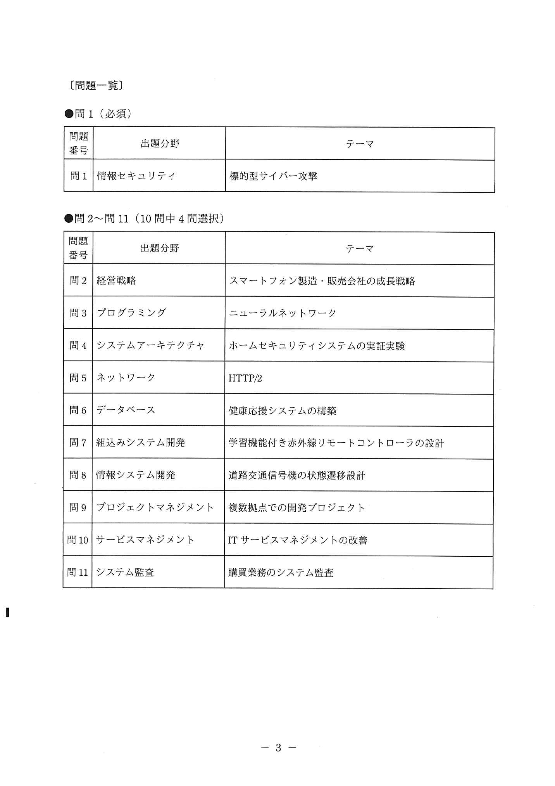

テキスト (OCR)

〔問題一覧〕

人@問 1 (必須)

内用      出題分野                   テーマ

番号

All | 情報セキュリティ     標的型サイバー攻撃

@ ii] 2一問 11 (10 問中 4 問選択)

on      出題分野                   テーマ

番号

問2 | 経営戦略         スマートフォン製造・販売会社の成長戦略
問3 | プログラミング      ニューラルネットワーク

間4 | システムアーキテクチャ  ホームセキュリティシステムの実証実験
問5 | ネットワーク         HTTP/2

問6 | データベース       健康応援システムの構築

問7 | 組込みシステム開発    学習機能付き赤外線リモートコントローラの設計
ALS |情報システム開発     道路交通信号機の状態遷移設計

問 9 | プロジェクトマネジメント | 複数拠点での開発プロジェクト

問 10| サービスマネジメント    ITサービスマネジメントの改善

問 11| システム監査        購買業務のシステム監査

### ページ 4

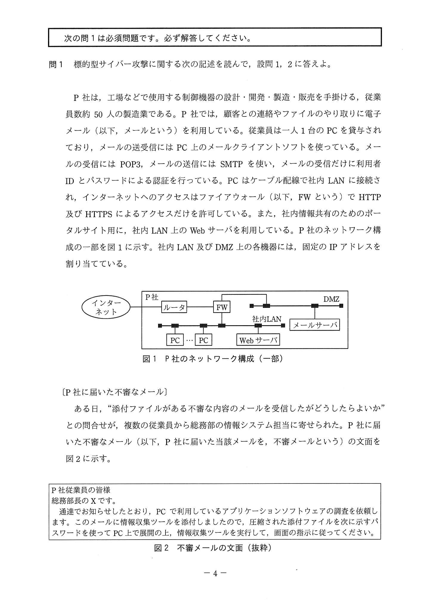

テキスト (OCR)

次の問 1 は必須問題です。必ず解答してください。

問1 標的型サイバー攻撃に関する次の記述を読んで, 設問1, 2 に答えよ。

P 社は, 工場などで使用する制御機器の設計・開発・製造・販売を手掛ける, 従業
員数約 50 人の製造業である。P 社では, 顧客との連絡やファイルのやり取りに電子
メール (以下, メールという) を利用している。 従業員は一人 1 AO PC を貸与され
ており, メールの送受信には PC 上のメールクライアントソフトを使っている。メー
ルの受信には POP3, メールの送信には SMTP を使い, メールの受信だけに利用者
ID とパスワードによる認証を行っている。PC はケーブル配線で社内 LAN に接続さ
れ, インターネットへのアクセスはファイアウォール (以下, FW という) で HTTP
及び HTTPS によるアクセスだけを許可している。また:, 社内情報共有のためのポー
タルサイト用に, 社内 LAN 上の Web サーバを利用している。P 社のネットワーク構
成の一部を図 1 に示す。社内 LAN 及び DMZ 上の各機器には, 固定の IP アドレスを
割り当てている。

社内LAN

LE
[Pc

| [gc]    | Web サーバ|

図1 P社のネットワーク構成 (一部)

(P 社に届いた不審なメール〕

ある日, “添付ファイルがある不審な内容のメールを受信したがどうしたらよいか"
との問合せが, 複数の従業員から総務部の情報システム担当に寄せられた。T 社に届
いた不審なメール (以下, P 社に届いた当該メールを, 不審メールという) の文面を
図 2 に示す。

P 社従業員の皆様
総務部長の X です。

通達でお知らせしたとおり, PC で利用しているアプリケーションソフトウェアの調査を依頼し
ます。このメールに情報収集ツールを添付しましたので, 圧縮された添付ファイルを次に示すパ
スワードを使って PC 上で展開の上, 情報収集ツールを実行して, 画面の指示に従ってください。

図2 不審メールの文面 (抜粋)

eT

### ページ 5

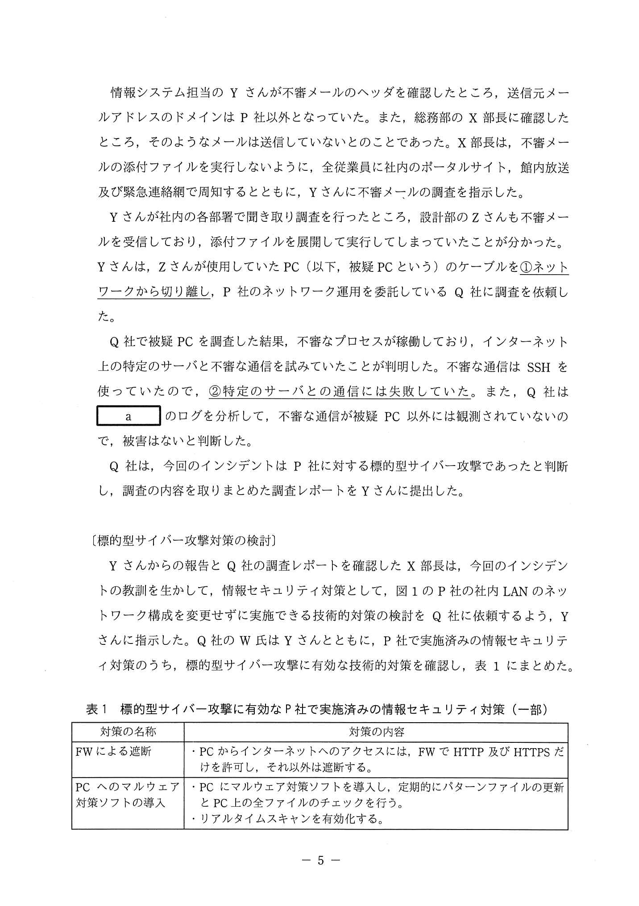

テキスト (OCR)

情報システム担当の Y さんが不審メールのヘッダを確認したところ, 送信元メー
ルアドレスのドメインは P 社以外となっていた。 また, 総務部の X 部長に確認した
ところ, そのようなメールは送信していないとのことであった。X 部長は, 不審メー
ルの添付ファイルを実行しないように, 全従業員に社内のポータルサイト, 館内放送
及び緊急連絡網で周知するとともに, Yさんに不審メールの調査を指示した。

Y さんが社内の各部署で聞き取り調査を行ったところ, 設計部の Zさんも不審メー
ルを受信しており, 添付ファイルを展開して実行してしまっていたことが分かった。
Yさんは, 2Zさんが使用していた PC (以下, 被疑PC という) のケーブルを①ネット
ワークから切り離し, P 社のネットワーク運用を委託している Q 社に調査を依頼し
Teo

Q 社で被疑 PC を調査した結果, 不審なプロセスが稼働しており, インターネット
上の特定のサーバと不審な通信を試みていたことが判明した。不審な通信は SSH を
使っていたので, ②づ特定のサーバとの通信には失していた。また, Q 社は
| 』 | のログを分析して, 不審な通信が被疑 PC 以外には観測されていないの
で, 被害はないと判断した。

Q 社は, 今回のインシデントは P 社に対する標的型サイバー攻撃であったと判断
し, 調査の内容を取りまとめた調査レシポートをYさんに提出した。

[標的型サイバー攻撃対策の検討]

Y さんからの報告と Q 社の調査レポートを確認した X 部長は, 今回のインシデン
トの教訓を生かして, 情報セキュリティ対策として, 図1 の 社の社内 LAN のネッ
トワーク構成を変更せずに実施できる技術的対策の検討を Q 社に依頼するよう, Y
さんに指示した。 Q 社の W 氏はY さんとともに, P 社で実施済みの情報セキュリテ
イ対策のうち, 標的型サイバー攻撃に有効な技術的対策を確認し, 表 1 にまとめた。

Rl 標的型サイバー攻撃に有効な 社で実施済みの情報セキュリティ対策 (一部)

対策の名称                                 対策の内容

FW による遮断       ・PC からインターネットへのアクセスには, FW で HTTP 及び HTTPS だ

けを許可し, それ以外は遮断する。

PC へのマルウェア| ・PC にマルウェア対策ソフトを導入し, 定期的にパターンファイルの更新
対策ソフトの導入    と PC 上の全ファイルのチェックを行う。

・リアルタイムスキャンを有効化する。

ー5一

### ページ 6

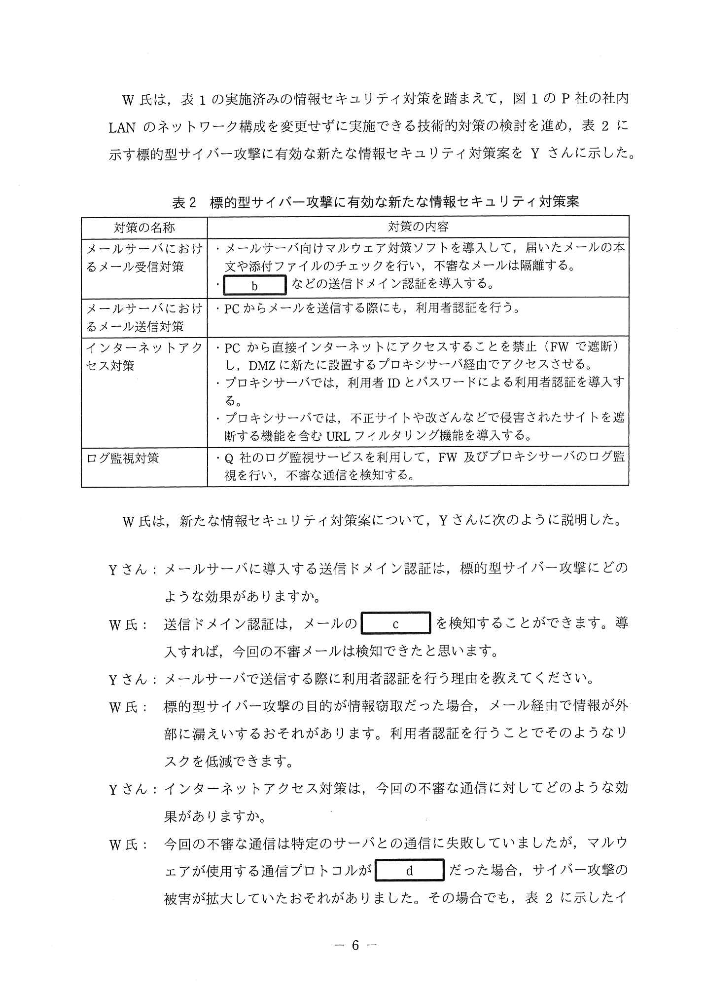

テキスト (OCR)

W 氏は, 表 1 の実施済みの情報セキュリティ対策を踏まえて, 図1 の 社の社内
LAN のネットワーク構成を変更せずに実施できる技術的対策の検討を進め, 表 2 に
示す標的型サイバー攻撃に有効な新たな情報セキュリティ対策案を Y さんに示した。

表2 標的型サイバー攻撃に有効な新たな情報セキュリティ対策案

対策の名称                 対策の内容
メールサーバにおけ|・メールサーバ向けマルウェア対策ソフトを導入して, 届いたメールの本
るメール受信対策         文や添付ファイルのチェックを行い, 不審なメールは隔離する。

[5 ] などの送信ドメイン認証を導入する。

メールサーバにおけ| ・PC からメールを送信する際にも, 利用者認証を行う。
るメール送信対策

インターネットアク| ・PC から直接インターネットにアクセスすることを禁止 (FW で遮断)

セス対策       し, DMZ に新たに設置するプロキシサーバ経由でアクセスさせる。
・プロキシサーバでは, 利用者 ID とパスワードによる利用者認証を導入す
る。
・プロキシサーバでは, 不正サイトや改ざんなどで侵害されたサイトを遮
断する機能を含む URL フィルタリング機能を導入する。

ログ監視対策        ・Q 社のログ監視サービスを利用して, FW 及びプロキシサーバのログ監

視を行い, 不審な通信を検知する。

Feld, 新たな情報セキュリティ対策案について, Yさんに次のように説明した。

Yさん:

メールサーバに導入する送信ドメイン認証は 概的型サイバー攻撃にどの
ような効果がありますか。

送信ドメイン認証は, メールの|  c  ] を検知することができます。導
入すれば, 今回の不審メールは検知できたと思います。

メールサーバで送信する際に利用者認証を行う理由を教えてください。
標的型サイバー攻撃の目的が情報袖取だった場合, メール経由で情報が外
部に漏えいするおそれがあります。利用者認証を行うことでそのようなり
スクを低滅できます。

: インターネットアクセス対策は, 今回の不審な通信に対してどのような効

果がありますか。

今回の不審な通信は特定のサーバとの通信に失敗していましたが, マルウ
エアが使用する通信プロトコルが|  d | だった場合, サイバー攻撃の
被害が拡大していたおそれがありました。 その場合でも, 表 2 に示したイ

ー 6一

### ページ 7

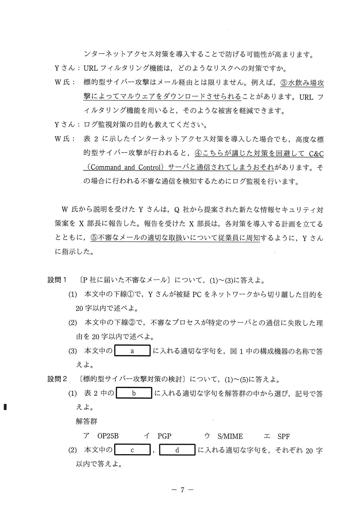

テキスト (OCR)

ンターネットアクセス対策を導入することで防げる可能性が高まります。

Yさん : URL フィルタリング機能は, どのようなリスクへの対策ですか。

WH: 標的型サイバー攻撃はメール経由とは限りません。 例えば, ③水飲み場攻
撃によってマルウェアをダウンロードさせられることがあります。 URL フ
ィルタリング機能をた用いると, そのような被害を軽減できます。

Yさん : ログ監視対策の目的も教えてください。

W氏: 表 2 に示したインターネットアクセス対策を導入した場合でも, 高度な標
的型サイバー攻撃が行われると, ③④こちらが講じた対策を回避して C&C
(Command and Control) サーバと通信されてしまうおそれがあります。そ
の場合に行われる不審な通信を検知するためにログ監視を行います。

W 氏から説明を受けた Y さんは, Q 社から提案された新たな情報セキュリティ対
REE X 部長に報告した。報告を受けた X 部長は, 各対策を導入する計画を立てる
とともに, 不審なメールの適切な取扱いについて従業員に周知するように, Y さん

に指示した。

設問 1 (P 社に届いた不審なメール〕 について, ①⑪~て(3)に答えよ。
(1) 本文中の下線①で, Y さんが被疑 PC をネットワークから切り離した目的を
20 字以内で述べよ。
2) 本文中の下線②で, 不審なねプロセスが特定のサーバとの通信に失敗した理
由を 20 字以内で述べよ。
@ 本文中の| 』 |] に入れる適切な字句を, 図 1 中の構成機器の名称で答
えよ。

設問2 [標的型サイバー攻撃対策の検討について, ①~て(5)に答えよ。

a) 表 2 中の[| b |] に入れる適切な字句を解答群の中から選び, 記号で答
えよ。

解答姓

ア OP25B   4 PGP    ウ S/MIME  <= SPF
②) 本文中の| c |,[ a |に入れる適切な字句を, それぞれ 20 =
以内で答えよ。

### ページ 8

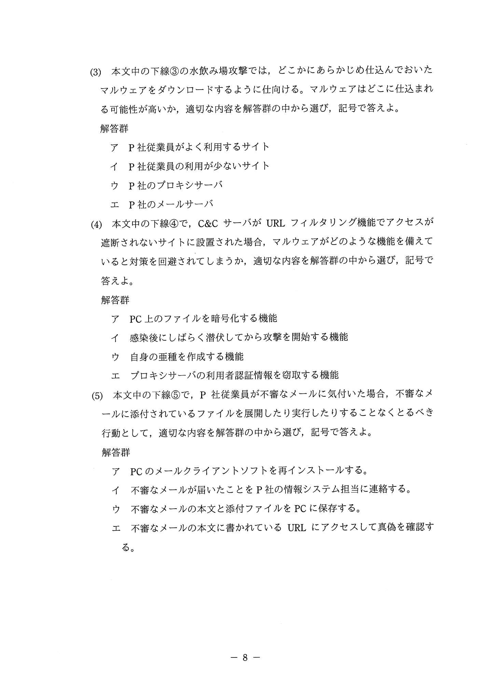

テキスト (OCR)

(3) 本文中の下線③の水飲み場攻撃では, どこかにあらかじめ仕込んでおいた
マルウェアをダウンロードするように仕向ける。マルウェアはどこに仕込まれ
る可能性が高いか, 適切な内容を解答群の中から選び, 記号で答えよ。
解答群

ア
of
ウ

a

P 社従業員がよく利用するサイト
P 社従業員の利用が少ないサイト
P 社のプロキシサーバ

P 社のメールサーバ

(4) 本文中の下線@で, C&C サーバが URL フィルタリング機能でアクセスが
遮断されないサイトに設置された場合, マルウェアがどのような機能を備えて
いると対策を回避されてしまうかが, 適切な内容を解答群の中から選び, 記号で

答えよ。

解答群

ア PC 上のファイルを暗号化する機能

イ 感染後にしばらく潜伏してから攻撃を開始する機能
ウ 自身の亜種を作成する機能

エ プロキシサーバの利用者認証情報を寅取する機能

(5) 本文中の下線⑥で, P 社従業員が不審なメールに気付いた場合, 不審なメ

ールに

添付されているファイルを展開したり実行したりすることなくとるべき

行動として, 適切な内容を解答群の中から選び, 記号で答えよ。
AEE

ア

イ
ウ
x

PC のメールクライアントソフトを再インストールする。
不審なメールが届いたことを了 社の情報システム担当に連絡する。
不審なメールの本文と添付ファイルを PC に保存する。

不審なメールの本文に書かれている URL にアクセスして真偽を確認す

### ページ 9

テキスト (OCR)

〔

x モ 用 紙 J

### ページ 10

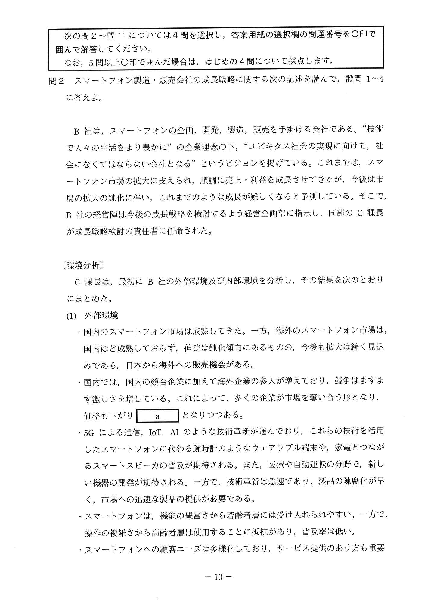

テキスト (OCR)

次の問2 一間 11 については4 問を選択し, 答案用紙の選択欄の問題番号を〇印で
囲んで解答してください。
なお, 5問以上〇印で囲んだ場合は, はじめの 4 間について採点します。

間2 スマートフォン製造・販売会社の成長戦略に関する次の記述を読んで, 設問 1~4

に答えよ。

B 社は, スマートフォンの企画, 開発, 製造, 販売を手掛ける会社である。“技術
で人々の生活をより豊かに"の企業理念の下, “ユビキタス社会の実現に向けて, 社
会になくてはならないぃ会社となる” というビジョンを掲げている。これまでは, スマ
ートフォン市場の拡大に支えられ, 順調に売上・利益を成長させてきたが, 今後は市
場の拡大の鈍化に伴い, これまでのような成長が難しくなると予測している。そこで,
B 社の経営陣は今後の成長戦略を検討するよう経営企画部に指示し, 同部の C 課長
が成長戦略検討の責任者に任命された。

[環境分析〕
C 課長は, 最初に B 社の外部環境及び内部環境を分析し, その結果を次のとおり
ioe と和めた。
①) 外部環境
・国内のスマートフォン市場は成熟してきた。 一方, 海外のスマートフォン市場は,
国内ほど成熟しておらず, 伸びは鈍化傾向にあるものの, 今後も拡大は続く見込
みである。日本から海外への販売機会がある。
・国内では, 国内の競合企業に加えて海外企業の参入が増えており, 競争はますま
す激しさを増している。これによって, 多くの企業が市場を奪い合う形となり,
価格も下がり|  』 | となりつつある。
・5G による通信, IoT, AI のような技術革新が進んでおり, これらの技術を活用
したスマートフォンに代わる腕時計のようなウェアラブル端末や, 家電とつなが
るスマートスピーカの普及が期待される。また, 医療や自動運転の分野で, HL
い機器の開発が期待される。 一方で, 技術革新は急速であり, 製品の陳腐化が早
く, 市場への迅速な製品の提供が必要である。
・スマートフォンは, 機能の豊富さから若齢者層には受け入れられやすい。一方で,
操作の複雑さから高齢者層は使用することに抵抗があり, 普及率は低い。
・スマートフォンへの顧客ニーズは多様化しており, サービス提供のあり方も重要

ー 10 一

### ページ 11

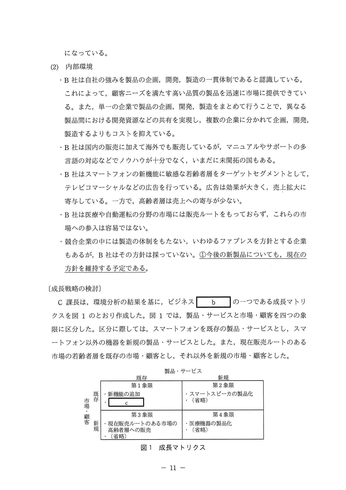

テキスト (OCR)

になっている。

(2) 内部環境
・B 社は自社の強みを製品の企画, HH, 製造の一貫体制であると誰識している。
これによって, 顧客ニーズを満たす高い品質の製品を迅速に市場に提供できてい
る。また, 単一の企業で製品の企画, 開発, 製造をまとめて行うことで, 異なる
製品間における開発資源などの共有を実現し, 複数の企業に分かれて企画, 開発
製造するよりもコストを抑えている。
・B 社は国内の販売に加えて海外でも販売しているが, マニュアルやサポートの多
言語の対応などでノウハウが十分でなく, いまだに未開拓の国もある。
・B 社はスマートフォンの新機能に敏感な若齢者層をターゲットセグメントとして,
テレビコマーシャルなどの広告を行っている。広告は効果が大きく, 売上拡大に
寄与している。一方で, 高齢者層は売上への寄与が少ない。
・B 社は医療や自動運転の分野の市場には販売ルートをもっておらず, これらの市
場への参入は容易ではない。
・競合企業の中には製造の体制をもたない, いわゆるファブレスを方針とする企業
もあるが, B 社はその方針は採っていない。①今後の新製品についても, 現在の
方針を維持する予定である。

[成長戦略の検計

C 課長は, 環境分析の結果を基に, ビジネス|  b |] の-つである成長マトリ
クスを図 1 のとおり作成した。図 1 では, 製品・サービスと市場・原客を四つの象
限に区分した。区分に際しては, スマートフォンを既存の製品・サービスとし, スマ
ートフォン以外の機器を新規の製品・サービスとした。 また, 現在販売ルートのある
市場の若齢者層を既存の市場・顧客とし, それ以外を新規の市場・顧客とした。

製品・サービス
既存            新規
第1 象限          第2 象限
| ・新能の追加        ・スマートスピーカの製品化
きき|しし。      iia)
i       第3 象限          第4象限
客 新| ・現在販売ルートのある市場の | ・医療了器の製品化
規  ae one      ・ (省略

図1 成長マトリクス

ー 11 一

### ページ 12

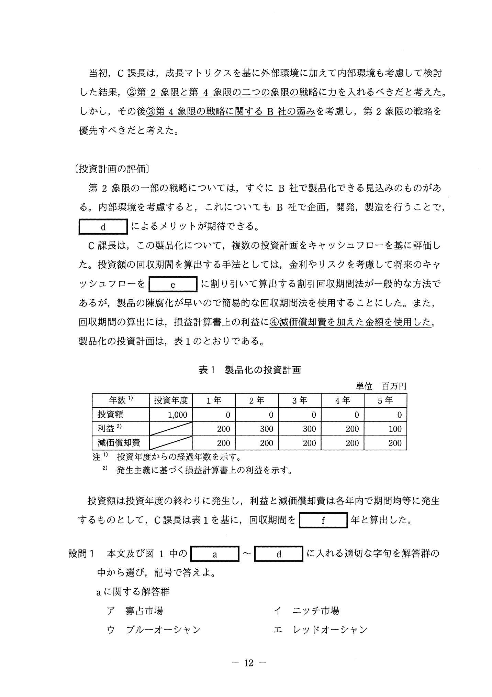

テキスト (OCR)

当初, C 課長は, 成長マトリクスを基に外部環境に加えて内部環境も考慮して検討
した結果, QF 2 象限と第 4 象限の二つの象限の戦略に力を入れるべきだと考えた。
しかし, その後③第 4 象限の戦略に関する B 社の弦みを考慮し, 第 2 象限の戦略を
優先すべきだと考えた。

[投資計画の評価
第 2 象限の一部の戦略については, すぐに B 社で製品化できる見込みのものがあ

クーュー

る。 内部環境を考慮すると, これについても B 社で企画, 開発, 製造を行うことで,
[a |] によるメリットが期待できる。

C 課長は, この製品化について, 複数の投資計画をキャッシュフローを基に評価し
た。投資額の回収期間を算出する手法としては, 金利やリスクを考慮して将来のキャ
ッシュフローを|  e  ] に割り引いて算出する割引回収期間法が一般的な方法で
あるが, 製品の陳腐化が早いので簡易的な回収期間法を使用することにした。また,
回収期間の算出には, 損益計算書上の利益に@⑥洲価償却費を加えた金額を使用した。
製品化の投資計画は, 表 1のとおりである。

表1 製品化の投資計画

単位 百万円
年数   投資年度| 1年    2 年    3年    4 年    5 年
投資額             1,000           0           0           0           0           0
利益9                               200          300          300          200          100
減価償却費             200      200      200      200      200

注" 投資年度からの経過年数を示す。
2 発生主義に基づく損益計算書上の利益を示す。

投資額は投資年度の終わりに発生し, 利益と減価償却費は各年内で期間均等に発生
するものとして, C課長は表 1 を基に, 回収期間を| f | 年と算出した。

設問1 本文及び図 1 中の| a |~|  d |に入れる適切な字句を解答群の
中から選び, 記号で答えよ。
a に関する解答群
ア BAT          イ ニッチ市場
ウ ブルーオーシャン        エ レッドオーシャン

ー 12 一

### ページ 13

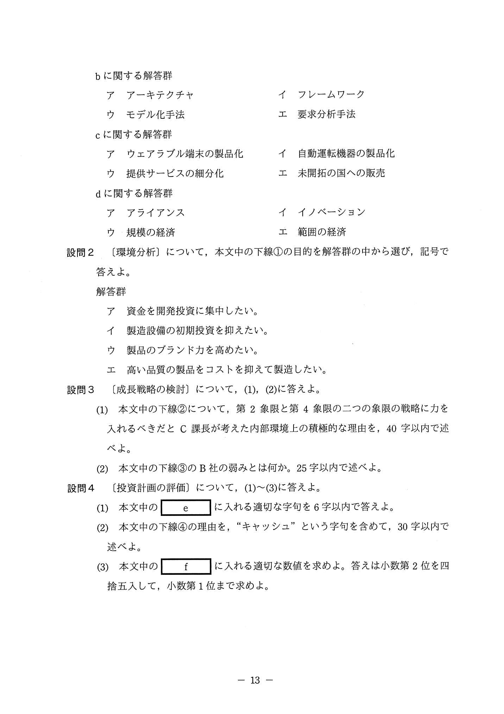

テキスト (OCR)

b に関する解答群

ア アーキテクチャ        イ フレームワーク
ウ モテル化手法         エエ 要求分析手法
c に関する解答群
ア ウェアラブル端末の製品化   イ 自動運転機器の製品化
ウ 提供サービスの細分化     エエ 未開拓の国への販売
d に関する解答群
ア アライアンス         イ イノベーション
ウ 規模の経済          エ 範囲の経済
設問2 (RMD) について, 本文中の下線①の目的を解答群の中から選び, 記号で
答えよ。
解答群

ア 資金を開発投資に集中したい。
イ 製造設備の初期投資を抑えたい。
ウ 製品のブランド力を高めたい。
エ 高い品質の製品をコストを抑えて製造したい。
設問3 [成長戦略の検討 について, ①), ②に答えよ。
①) 本文中の下線②@について, 第 2 象限と第 4 象限の二つの象限の戦略に力を
入れるべきだと C 課長が考えた内部環境上の積極的な理由を, 40 字以内で述
べよ。
(②) 本文中の下線③の B 社の弱みとは何か。25 字以内で述べよ。
設問4 [投資計画の評価] について, ①~て(3⑬)に答えよ。
a 本文中の| e | に入れる適切な字句を6字以内で答えよ。
2) 本文中の下線@の理由を, "キャッシュ"という字旬を含めて, 30 字以内で
述べよ。
⑬ 本文中の| f | に入れる適切な数値を求めよ。管えは小数第 2 位を四
捨五入して, 小数第 1 位まで求めよ。

ー 13 一

### ページ 14

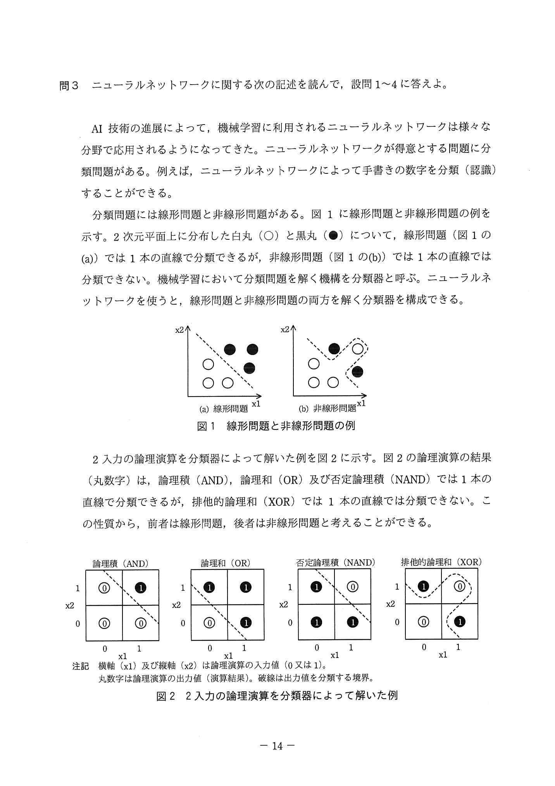

テキスト (OCR)

M3 ニューラルネットワークに関する次の記述を読んで, 設問 1ユー4 に答えよ。

Al 技術の進展によって, 機械学習に利用されるニューラルネットワークは様々な
分野で応用されるようになってきた。ニューラルネットワークが得意とする問題に分
類問題がある。例えば, ニューラルネットワークによって手書きの数字を分類 (認識)
することができる。

分類問題には線形問題と非線形問題がある。図 1 に線形問題と非線形問題の例を
示す。2 次元平面上に分布した白丸 (〇) と黒丸 (@) について, 線形問題 (図1の
(a)) では 1 本の直線で分類できるが, 非線形問題 (図 1 の(b)) では 1 本の直線では
分類できない。 機械学習において分類問題を解く機構を分類器と呼ぶ。ニューラルネ
ットワークを使うと, 線形問題と非線形問題の両方を解く分類器を構成できる。

x2,  "          x2
へ@ @    へWO
ooや       oo”
() 線形問題 *         () 非線形問題

図1 線形問題と非線形問題の例

2 入力の論理演算を分類器によって解いた例を図 2 に示す。図 2 の論理演算の結果
CUB) は, 論理積 (AND), 論理和 (OR) 及び耕定論理積 (NAND) では 1 本の
直線で分類できるが, 排他的論理和 (KOR) では 1 本の直線では分類できない。こ
の性質から, 前者は線形問題, 後者は非線形問題と考えることができる。

論理積 (AND)        論理和 (OR)       否定論理積 (NAND)    排他的論理和 (XOR)
1] ©» @     1n.@ | @      1] Ov @      1K @7 O)
0) © | OY o| OKO    0) @| @Y of © fo
0     a          0     1           0     1           0     1
xl               xl               x1               xl

注記 横軸 (x1) 及び縦軸 (x2) は論理演算の入力値 (0 又は1)。
丸数字は論理演算の出力値 (演算結果)。破線は出力値を分類する境界。

図2 2入力の論理演算を分類器によって解いた例

ー 14 一

### ページ 15

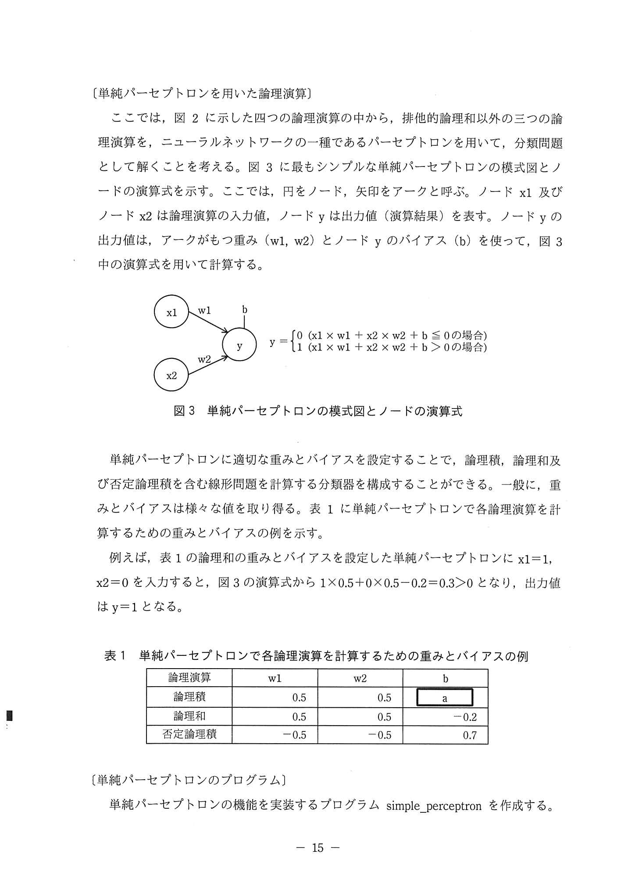

テキスト (OCR)

[単純パーセプトロンを用いた論理演算)

ここでは, 2 に示した四つの論理演算の中から, 排他的論理和以外の三つの論
理演算を, ニューラルネットワークの一種であるパーセプトロンを用いて, 分類問題
として解くことを考える。 3 に最もシンプルな単純パーセプトロンの模式図とノ
ードの演算式を示す。ここでは, 円をノード, 矢印をアークと呼ぶ、ノード x1 及び
ノード x2 は論理演算の入力値, ノード y は出力値 (演算結果) を表す。ノードyの
出力値は。 アークがもつ重み (wl, w2) とノード y のバイアス (b) を使って, 図 3
中の演算式を用いて計算する。

(sa  b

図 3 単純パーセプトロンの模式図とノードの演算式

“ft (xl X wl + x2 x w2 + b SODA)
Y” 1 G&L x wl + x2 x w2 + b > OOH A)
w2

単純パーセプトロンに適切な重みとバイアスを設定することで, 論理積, 論理和及
び否定論理積を含む線形問題を計算する分類器を構成することができる。 一般に, 重
みとバイアスは様々な値を取り得る。表 1 に単純パーセプトロンで各論理演算を計
算するための重みとバイアスの例を示す。

例えば, 表 1 の論理和の重みとバイアスを設定した単純パーセプトロンに x1=1,
x2=0 を入力すると, 図 3 の演算式から 1X0.5十0X0.5一0.2=0.30 となり, 出力値
は yテ1 となる。

Rl 単純パーセプトロンで各論理演算を計算するための重みとバイアスの例

論理演算                      wl                            w2                             b
set                      0.5                  05 | [ a |
論理和                             0.5                        0.5                     ー0.2

Bie iL Bt                      ー0.5                    ー0.5                        0.7

[単純パーセプトロンのプログラム)〕
単純パーセプトロンの機能を実装するプログラム simple_perceptron を作成する。

ー 15 一

### ページ 16

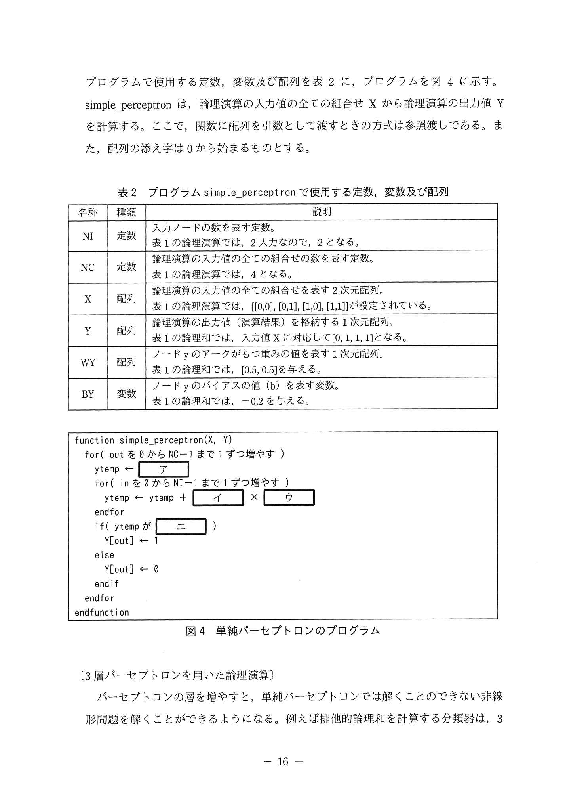

テキスト (OCR)

プログラムで使用する定数, 変数及び配列を表 2 に, プログラムを図 4 に示す。
simple perceptron は, 論理演算の入力値の全ての組合せ X から論理演算の出力値 Y
を計算する。ここで, 関数に配列を引数として渡すときの方式は参照渡しである。ま
た, 配列の添え字は 0 から始まるものとする。

表2 プログラムsimple_perceptron で使用する定数, 変数及び配列

名称 | 種類                                     説明
     定数   スカノー ドの数を表す定数。
表 1 の論理演算では, 2 入力なので, 2 となる。
ne | sk    論理演算の入力値の全ての組合せの数を表す定数。
表 1 の論理演算では, 4 となる。
x     配列   論理演算の入力値の全ての組合せを表す 2 次元配列。
表 1 の論理演算では, [[0,0], (0,1, 1,0], [1.11]が設定されている。
¥      配列    論理演算の出力値 (演算結果) を格納する 1 次元配列。
表 1 の論理和では, 入力値X に対応して[0, 1, 1, 1]となる。
wy | 本  ノード y のアークがもつつ重みの値を表す 1 次元配列。
表 1 の論理和では, [0.5, 0.5]を与える。
に    ノード y のバイアスの値 (b) を表す変数。
BY | 2% | 半」の論理和では, 02 を与える。

function simple_perceptron(X, Y)
for( outを9からMC一1 まで 】 ずつ増やす )
ytemp <
for( inを9からNI一1 まで 1 ずつ増やす )
ytemp とytemp十| イ   lx| ゥ |
endfor
if( ytemp が )
Y[out] < 1
else
YCout] <—
endif
endfor
endfunction

図4 単純パーセプトロンのプログラム
[3 層パーセプトロンを用いた論理演算〕
パーセプトロンの層を増やすと, 単純パーセプトロンでは解くことのできない非線

形問題を解くことができるようになる。例えば排他的論理和を計算する分類器は, 3

ー 16 一

### ページ 17

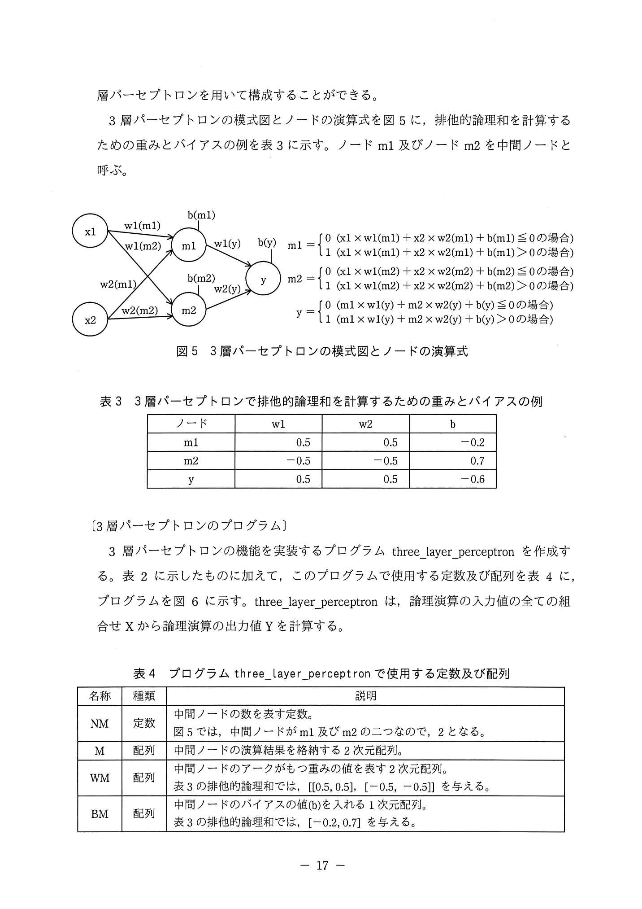

テキスト (OCR)

層パーセプトロンを用いて構成することができる。
3 層パーセプトロンの模式図とノードの演算式を図 5 に, 排他的論理和を計算する
ための重みとバイアスの例を表 3 に示す。ノード m1 及びノード m2 を中間ノードと

呼ぶ。

1        DC          — {0 1 xw1Gm1)十x2 x w2(ml) + b@nl) ミミ0の場合)
(=)  ge) HSS we [TD seqnacn aR + moO AD

{ 0 (xl x w1(m2) + x2 x w2(m2) + b(m2) ミ0 の場合)
1 (x1 X wl(m2) + x2 x w2(m2) + b(m2) > 0 D1§A)
_ { 0 (m1 x wl(y) + m2 x w2(y) + bly) ミ0の場合)

1 (m1 x wl(y) + m2 x w2(y) + bly) > 0 DHA)

3
i
IL

図5 3層パーセプトロンの模式図とノードの演算式

表3 3層パーセプトロンで排他的論理和を計算するための重みとバイアスの例

ノード               w1                 w2                  b
ml                      0.5                 0.5              ー0.2
m2                    ー0.5              ー0.5                0.7
y                       0.5                 0.5              ー0.6

〔3 層パーセプトロンのプログラム]〕

3 層パーセプトロンの機能を実装するプログラム three layer perceptron を作成す
る。表 2 に示したものに加えて, このプログラムで使用する定数及び配列を表 4 に,
プログラムを図 6 に示す。three layer perceptron は, 論理演算の入力値の全ての組
合せ X から論理演算の出力値 Y を計算する。

表4 プログラムthree_layer_perceptron で使用する定数及び配列

名称 | 種類                                  説明

中間ノードの数を表す定数。

NM | | wos clk, 中間ノードがmi 及び m2 のニつなので, 2 となる。
M      配列 | 中間ノードの演算結果を格納する 2 次元配列。

中間ノードのアークがもつ重みの値を表す 2 次元配列。

表 3 の排他的論理和では, [[0.5, 0.5], [一0.5, 一0.5]] を与える。
中間ノードのバイアスの値(b)を入れる 1 次元配列。

表 3 の排他的論理和では, [一0.2, 0.7] を与える。

WM | 配列

BM | 配列

ー 7 一

### ページ 18

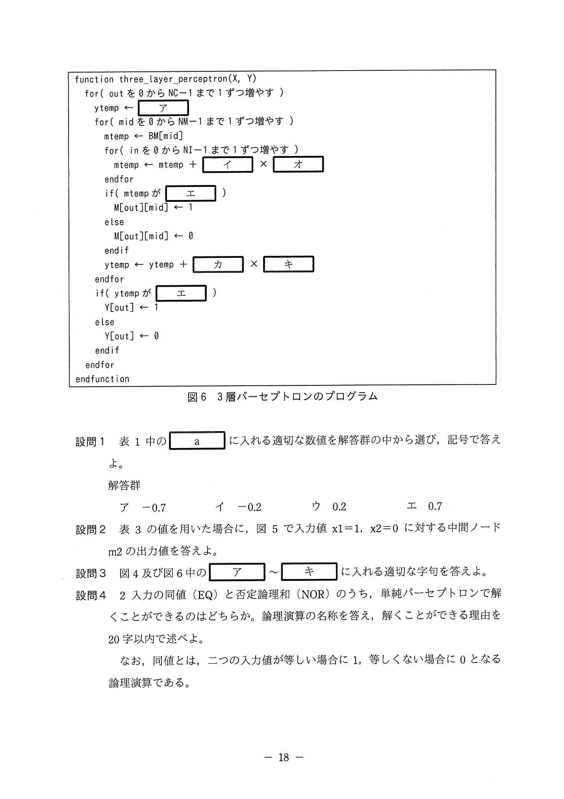

テキスト (OCR)

function three_layer_perceptron(X, Y)
for( out を9 からNC一1 まで1 ずつ増やす )
for( mid を 9 からNM一1 まで 1 ずつ増やす )
mtemp < BMLmid]
for( inを9からNI一1 まで 1 ずつ増やす )
mtemp <— mtemp +[ イ |x| ォ |
endfor
if( mtemp が |   sc   ] )
MLout][mid] ご1
else
MLout][mid] と 6
endif
ytemp <— ytemp + |   ny |x |   キ |
endfor
if( ytemp が )
Y[out] を 1
else
Y[out] で 0
endif
endfor
endfunction

図6 3層パーセプトロンのプログラム

設問1 表 1 中の| 。 |に入れる適切な数値を解答群の中から選び, 記号で答え
よ。

ア —0.7    ザイ ーー    ウ 0.2    x= 0.7
設問2 表 8 の値を用いた場合に, 図 5 で入力値 x1=1, x2=0 に対する中間ノード
m2 の出力値を答えよ。
設問3 図4及び図6中の| ア |~| キ |に入れる適切な字句を答えよ。
設問4 2 入力の同値 (EQ) と否定論理和 (NOR) のうち, 単純パーセプトロンで解
くことができるのはどちらか。論理演算の名称を答え, 解くことができる理由を
20 字以内で述べよ。
なお, 同値とは, 二つの入力値が等しい場合に 1, 等しくない場合に 0 となる
論理演算である。

ー 18 一

### ページ 19

テキスト (OCR)

【

メ モ 用 紙 )

ー 19 一

### ページ 20

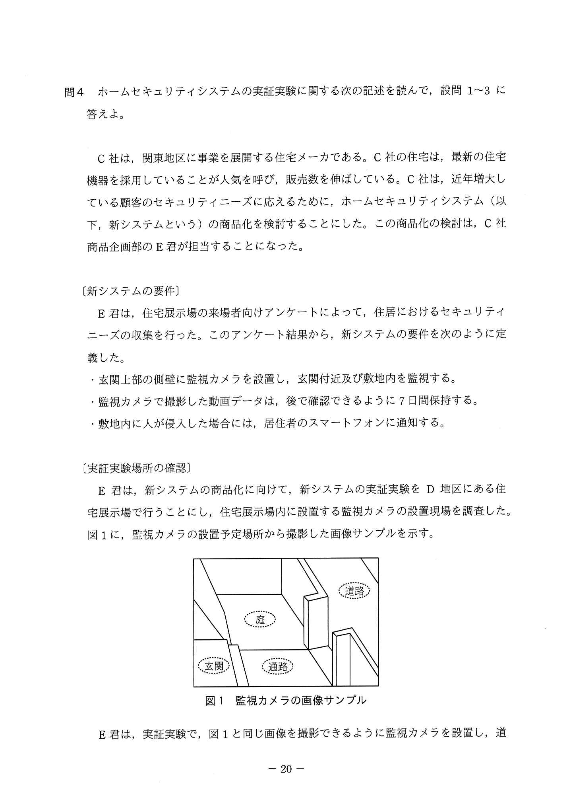

テキスト (OCR)

問4 ホームセキュリティシステムの実証実験に関する次の記述を読んで, 設問 1~3 に

答えよ。

C 社は, 関東地区に事業を展開する住宅メーカである。C CHORE, 最新の住宅
機器を採用していることが人気を呼び, 販売数を伸ばしている。C 社は, 近年増大し
ている顧客のセキュリティニーズに応えるために, ホームセキュリティシステム (以
下, 新システムという) の商品化を検討することにした。この商品化の検討は, C 社
商品企画部の E 君が担当することになった。

(HY AF LORE)

ES, 住宅展示場の来場者向けアンケートによって, 住居におけるセキュリティ
ニーズの収集を行ったを。このアンケート結果から, 新システムの要件を次のように定
義した。

・玄関上部の側壁に監視カメラを設置し, 玄関付近及び敷地内を監視する。

・監視カメラで撮影した動画データは, 後で確認できるように7 日間保持する。

・敷地内に人が侵入した場合には, 居住者のスマートフォンに通知する。

(実証実験場所の確認

E 君は, 新システムの商品化に向けて, 新システムの実証実験を D 地区にある住
宅展示場で行うことにし, 住宅展示場内に設置する監視カメラの設置現場を調査した。
図 1 に, 監視カメラの設置予定場所から撮影した画像サンプルを示す。

図1 監視カメラの画像サンプル

E 君は, 実証実験で, ML と同じ画像を撮影できるように監視カメラを

xe
fi

し, 道

ー 20 一

### ページ 21

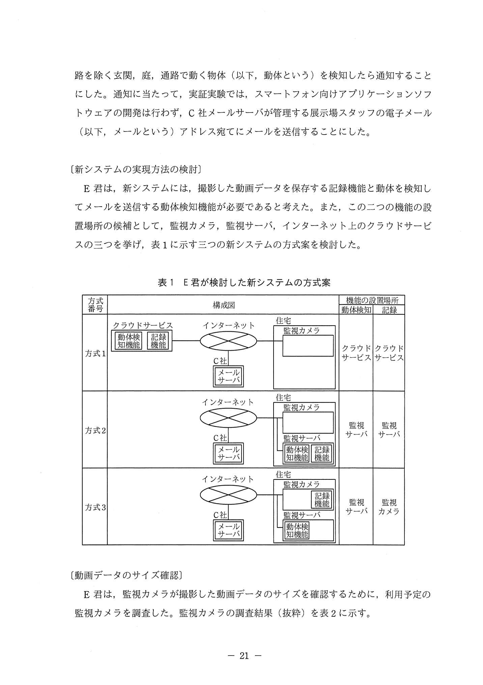

テキスト (OCR)

路を除く玄関,庭, 通路で動く物体 (以下, 動体という) を検知したら通知すること
にした。 通知に当たって, 実証実験では, スマートフォン向けアプリケーションソフ
トウェアの開発は行わず, C 社メールサーバが管理する展示場スタッフの電子メール
(以下, メールという) アドレス宛てにメールを送信することにした。

〔新システムの実現方法の検討]
E 君は, 新システムには, 撮影した動画データを保存する記録機能と動体を検知し

てメールを送信する動体検知機能が必要であると考えた。また, この二つの機能の設
置場所の候補として, 監視カメラ, 監視サーバ, インターネット上のクラウドサービ
スの三つを挙げ, 表 1 に示す三つの新システムの方式案を検討した。

表1 E君が検討した新システムの方式案

Bx                                                       GEOR
番号                         Hint                        Tikka] 記録
ーー           eae       EE
クラウドサー ビス     インターネット     監視カメラ
ea         BG      ら                                              クラウド|クラウド
方式1                           oe                             サービス|サービス
メール
サーバ
ャクーの 5    EAS
mean | em
we                         C社             監視サーバ      サー | サー
メール       ih AB) 記録
サーバ           fall [HAE
1S    監視カメラ
ae
—                                                機能用| see | sees
Cit        me || サブ | カメラ
メール          大人
サーバ           ae

(動画データのサイズ確認〕
E 君は, 監視カメラが撮影した動画データのサイズを確認するために, 利用予定の

監視カメラを調査した。 監視カメラの調査結果 (抜粋) を表 2 に示す。

ー 21 一

### ページ 22

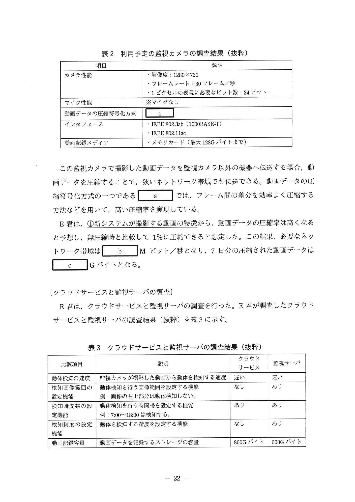

テキスト (OCR)

表2 利用予定の監視カメラの調査結果 (抜粋)
項目                   説明
カメラ性能                    ・ 解像度 : 1280X720
・フレームレート : 30 フレームンノ秒
・1 ビクセルの表現に必要なビット数 : 24 ビット

マイク性能          ※マイクなし
動画データの圧縮符号人方式 | [ 』 |
ギンジン交ツェーズ                    + IEEE 802.3ab (1000BASE-T)
+ IEEE 802.11ac
動画記録メディア          ・メモリカード (最大 128G バイトまで)

この監視カメラで撮影した動画データを監視カメラ以外の機器へ伝送する場合, Bh
画データを圧縮することで, 狭いネットワーク帯域でも伝送できる。動画データの圧
縮符号化方式の一つである |  』 | では, フレーム間の差分を効率よく圧縮する
方法などを用いて, 高い圧縮率を実現している。

E 君は, ①新システムが撮影する動画の特徴から, 動画データの圧縮率は高くなる
と予想し, 無圧縮時と比較して 1%に圧縮できると想定した。この結果, 必要なネッ
トワーク帯域は| b |]M ビットノ秒となり, 7 日分の圧縮された動画データは

[< |eバイトとなる。

[クラウドサービスと監視サーバの調査
E 君はt クラウドサービスと監視サーバの調査を行った。E 君が調査したクラウド
サービスと監視サーバの調査結果 (抜粋) を表 3 に示す。

表3 クラウドサービスと監視サーバの調査結果 (抜粋)

-             クラウド   <
比較項目                               説明                            サービス      監視サーバ

動体検知の速度 | 監視カメラが撮影した動画から動体を検知する速度 | 遅い       速い

検知画像範囲の | 動体検知を行う画像範囲を設定する機能         なし       あり

設定機能           例 : 画像の右上部分は動体検知しない。

検知時間帯の設 | 動体検知を行う時間帯を設定する機能                   あり             あり

定機能           例 : 7:00~18:00 は検知する。

検知精度の設定 | 動体を検知する精度を設定する機能            なし       あり

機能

動画記録容量      動画データを記録するストレージの容量              800G バイト | 600Gバイト

ー22 一

### ページ 23

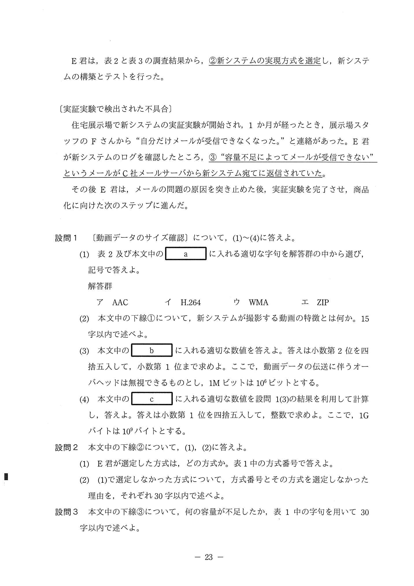

テキスト (OCR)

E 君は, 表2 と表 3 の調査結果から, ②新システムの実現方式を選定し, 新システ
ムの構築とテストを行った。

実証実験で検出された不具合】

住宅展示場で新システムの実証実験が開始され, 1 か月が経ったとき, 展示場スタ
ッフの F さんから “自分だけメールが受信できなくなった。” と連絡があった。E EA
が新システムのログを確認したところ, ③ “容量不足によってメールが受信できない"

というメールがC 社メールサーバから新システム宛てに返信されていた。
COKE Blk, メールの問題の原因を突き止めた後, 実証実験を完了させ, 商品
化に向けた次のステップに進んだ。

設問1 (動画データのサイズ確認) について, ①~(④に答えよ。
(①) 表 2 及び本文中の| a | に入れる道切な字句を解答群の中から選び,

記号で答えよ。

ア AAC    イ HH264   ウ WMA   <= ZIP
(2) 本文中の下線のについて, 新システムが撮影する動画の特徴とは何か。15
字以内で述べよ。

⑬ 本文中の| b | に入れる適切な数値を答えよ。答えは小数第 2 位を四
捨五入して, 小数第 1 位まで求めよ。ここで, 動画データの伝送に伴うオー
バヘッドは無視できるものとし, 1M ビットは106ビットとする。
(④ 本文中の[| < | に入れる適切な数値を設問 1⑬の結果を利用して計算
し, 答えよ。答えは小数第 1 位を四捨五入して, 整数で求めよ。ここで, 1G
バイトは10!バイトとする。
設問2 本文中の下線@について, Q①), ②に等えよ
(1) 君が選定した方式は, どの方式か。表 1 中の方式番号で答えよ。
②) ①で選定しなかった方式について, 方式番号とその方式を選定しなかった
理由を, それぞれ30 字以内で述べよ。
設問3 本文中の下線について, 何の人容量が不足したか, 表 1 中の字旬を用いて 30
字以内で述べよ。

ー 23 一

### ページ 24

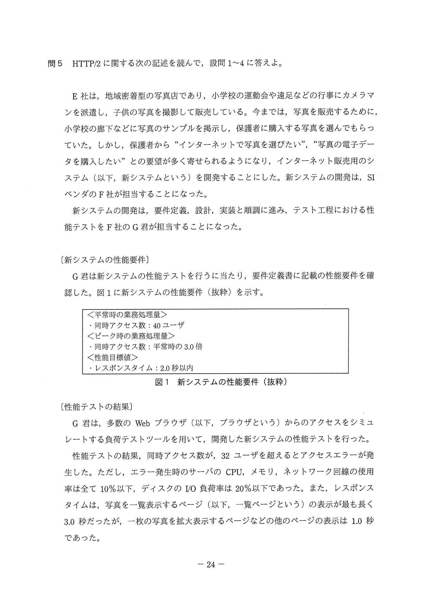

テキスト (OCR)

PIS HTTP/2 に関する次の記述を読んで, 設問 1ー4 に答えよ。

E 社は, 地域密着型の写真店であり, 小学校の運動会や遠足などの行事にカメラマ
ンを派遣し, 子供の写真を撮影して販売している。今までは, 写真を販売するために
小学校の廊下などに写真のサンプルを掲示し, 保護者に購入する写真を選んでもらっ
ていた。しかし, 保護者から“インターネットで写真を選びたい", “写真の電子デー
タを購入したい” との要望が多く寄せられるようになり, インターネット販売用のシ
AFL WE, 新システムという) を開発することにした。新システムの開発は, SI
ベンダのF 社が担当することになった。

新システムの開発は, 要件定義, Rit, 実装と順調に進み, テスト工程における性
能テストをF 社のG君が担当することになった。

〔新システムの性能要件]
G 君は新システムの性能テストを行うに当たり, 要件定義書に記載の性能要件を確
認した。図 1 に新システムの性能要件 (抜粋) を示す。

ぐ平常時の業務処理量>

・同時アクセス数 : 40 ユーザ

ぐビピーク時の業務処理量>

・同時アクセス数 : 平常時の 3.01%
ぐ性能目標値>

・レスポンスタイム : 2.0 秒以内

図1 新システムの性能要件 (抜粋)

(性能テストの結果]

G Bk, 多数の Web ブラウザ (以下、ブプラウザという) からのアクセスをシミュ
レートする負荷テストツールを用いて, 開発した新システムの性能テストを行った。

性能テストの結果, 同時アクセス数が, 32 ユーザを超えるとアクセスエラーが発
生した。 ただし, エラー発生時のサーバの CPU, REV, ネットワーク回線の使用
率は全て 10%以下, ディスクの VO 負荷率は 20%以下であった。また, レスポンス
タイムは, 写真を一覧表示するページ (以下, 一覧ページという) の表示が最も長く
3.0 秒だったが, 一枚の写真を拡大表示するページなどの他のページの表示は 1.0 秒
であった。

ー 24 一

### ページ 25

テキスト (OCR)

同時アクセス数改善に向けた調査

G 君は, 同時アクセス数の要件を満たせない原因を確認するために, ブラウザの開
発者用ツールを用いて, ブラウザが一覧ページの表示に必要なファイルをどのように
受信しているか調査した。G 君が調査したファイルの受信状況 (抜粋) を図 2 に示す。

なお, ブラウザとサーバは HTTP/1.1 over TLS (HTTPS) で通信していた。

ファイル名
index.html

image00 1 jpg

image002,jpg

image003,jpg

image004jpg

image005jpg

image006,jpg

image007Jpg

image008jpg

image009jpg

image010jpg

image011.jpg

image012.jpg

image013jpg

image014jpg

image015.jpg

| 時間

image016pg

]        ]          1し>(秒)

0.1        0.2        0.3        0.4        0.5        0.6        0.7        0.8        0.9        10 30

注記 図中の黒帯はファイルを受信している間を示す。

図2 ファイルの受信状況 (抜粋)

次に, G 君がサーバのログを調査したところ, TCP コネクションを確立できない
という内容のログが多く残っていた。この結果から G Blk, TCPIP でサーバとブラ
ウザが通信を行うために必要なサーバの|  。  ] HIBL, 新たな TCP コネク
ションを確立できなくなったと考えた。また, サーバの|  a』  ] の最大数は128
に設定されていた。

この二つの調査結果から, ①ブラウザが採用する複数のファイルを並行して受信す
るための手法によって, 同時アクセス数が制限されてしまっていることが分かった。

[レスポンスタイム改善に向けた調査
G 君は, 一つの TCP コネクション内における, ブラウザとサーバの間の通信を調
査した。HTTP/1.1 over TLS を用いてブラウザとサーバが通信するとき, ブラウザか

らサーバの| b | 番ポートに対して を送信し, サーバから

— 9 —

### ページ 26

テキスト (OCR)

|  』 ] を返信する, 最後にブラウザから| ec  ] を送信することで TCP コ
ネクションが確立する。その後 TLS ハンドシェイクを行い, プラウザは HTML ファ
イルや画像ファイルなどをサーバへ要求し, サーバは要求に応じてプラウザヘへファイ
ルを送信している (図 3)。また, G 君が利用したブラウザでは, HTTP パイプライ
ン機能はオフになっていた。

TLSハンドシェイクは省略
(aE
|                     get index.html

index.htm]
get image001.jpg
image001.jpg

get image002.jpg

image002.jpg

get image003.jpg
image003.jpg

 3 6G君が調査したブラウザとサーバ間の通信 (抜粋)

G 君は, この結果から, @TCP コネクション内での画像ファイルの取得に掛かる
時間が長くなり, 多くの画像データを含む一覧ページではレスポンスタイムが長くな
ると考えた。

[HTTP/2 を用いた新システムの開発]

G 君が調査結果を上司の H 課長に報告したところ “HTTP/2 の利用を検討すること"
とのアドバイスを得た。HTTP/2 Clk, ③一つの_TCP コネクションを用いて, 複数
のファイルを並行して受信するストリームという仕組みなど, 多くの新しい仕組みが
追加されていることが分かった。

そこで, G 君は新システムの Web サーバに HTTP/2 の設定を行い, 再度性能テス
トを実施した。その結果, 新システムが図 1 の性能要件を満たしていることが確認

ー 26 一

### ページ 27

テキスト (OCR)

できた。
COR, 新システムの開発は完了し, E 社は写真のインターネット販売を開始した。

設問1 【同時アクセス数改善に向けた調査] について, ①), 2)に答えよ。
a) 本文中の| 』 |] に入れる適切な字句を解答群の中から選び, 記号で答
ABs
ARS BE
ア IPアドレス 4 ソケット  ウ プロセス  エ ポート
(2) 本文中の下線①について, 図 2 の調査で分かった, 複数のファイルを並行
して受信するための手法とは, どのような手法か。25 字以内で述べよ。

設問2 本文及び図 3 中の| b |~[  。 |に入れる適切な字句を解答群の
中から選び, 記号で答えよ。
ARE
アプ 25       イ 110       ウ 443
= ACK       オ ACK/FIN     カカ FIN
キ SYN       ク  SYN/ACK     a TCP

設問3 本文中の下線②について, TCP コネクション内での画像ファイルの取得に時
間が掛かる要因は何か。解答群の中から選び, 記号で答えよ。

解答群
ア 画像ファイルの取得ごとに TCP コネクションを確立している。
イ 画像ファイルを圧縮せずに取得している。

ウ 画像ファイルを一つずつ順番にサーバに要求し取得している。
エ 複数の画像ファイルをまとめて取得している。
設問4 本文中の下線について, ①, (②)に答えよ。

QQ) 複数のファイルを並行して受信可能となることで, ブラウザのどのような
待ち時間がなくなるか。20 字以内で答えよ。

(2) HTTP/2 の採用によって, 新システムが許容できる最大の同時アクセス数は
幾つになるか答えよ。ここで, 新システムにアクセスする全てのブラウザが
HTTP/2 を利用し, 一つの TCP コネクションを用いてアクセスするものとす
る。

ー 27 一

### ページ 28

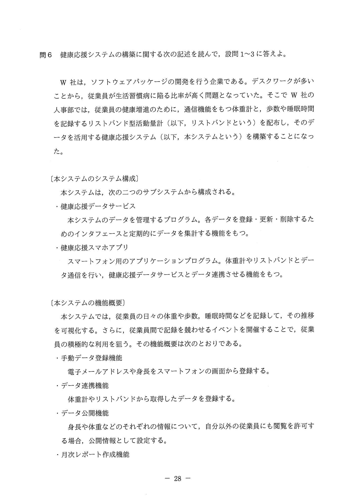

テキスト (OCR)

問6 健康応援システムの構築に関する次の記述を読んで, 設問 1ー3 に答えよ。

W tlt, ソフトウェアパッケージの開発を行う企業である。デスクワークが多い
ことから, 従業員が生活習慣病に陥る比率が高く問題となかっていた。そこで WHO
人事部では, 従業員の健康増進のために, 通信機能をもつ体重計と, 歩数や睡眠時間
を記録するリストバンド型活動量計 (以下,リストバンドという) を配布し, そのデ
ータを活用する健康応援システム (以下, 本システムという) を構築することになっ
た。

〔本システムのシステム構成
本システムは, 次のニニつのサブシステムから構成される。
・ 健康応援データサービス
本システムのデータを管理するプログラム。各データを登録・更新・削除するた
めのインタフェースと定期的にデータを集計する機能をもつ。
・健康応援スマホアプリ
スマートフォン用のアプリケーションプログラム。 体重計やリストバンドとデー
タ通信を行い, 健康応援データサービスとデータ連携させる機能をもつ。

〔本システムの機能概要)

本システムでは, 従業員の日々の体重や歩数, 睡眠時間などを記録して, その推移
を可視化する。さらに, 従業員間で記録を競わせるイベントを開催することで, 従業
員の積極的な利用を狙う。その機能概要は次のとおりである。

・手動データ登録機能

電子メールアドレスや身長をスマートフォンの画面から登録する。
・データ連携機能
体重計やリストバンドから取得したデータを登録する。
・データ公開機能
身長や体重などのそれぞれの情報について, 自分以外の従業員にも閲覧を許可す
る場合, 公開情報として設定する。
・月次レポート作成機能

ー 28 一

### ページ 29

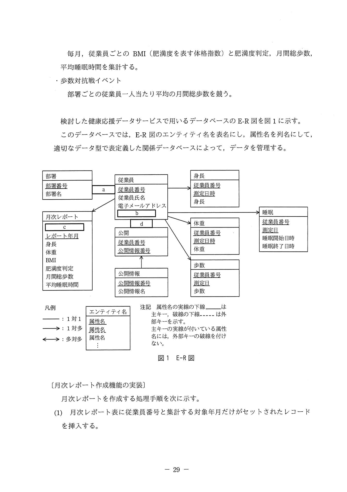

テキスト (OCR)

A, 従業員ごとの BMI (肥満度を表す体格指数) と肥満度判定, 月間総歩数
平均睡眠時間を集計する。
・ 歩数対抗戦イベント

部署ごとの従業員一人当たり平均の月間総歩数を競う。

検討した健康応援データサービスで用いるデータベースの E-R 図を図 1 に示す。
このデータベースでは, E-R 図のエンティティ名を表名にし, 属性名を列名にして,
適切なデータ型で表定義した関係データベースによって, データを管理する。

Br
ae              eA              ae   ー
部時名          ュ | ees           LEB
x                従業員氏名           =
電子メールアドレス
月次レポート                Co     a                              fe
=|     体重        従業員番号
              wT                           TE                  EB
レポート年月         aaa           測定日時           睡眠開始日時
身長              人          én             HORE TG
体重
BMI                                歩数
ae          ce             —
FIBER A                            GRRE
ee         AUR          ーー
公開情報名           歩数

凡例         ーー一      注記 属性名の実線の下線は

oak   エンティティ名      EX, 破線の下線----- は外

1対1 | 周作名           部キーを示す。
ーータ : 1対多 | 属性名        主キーの実線が付いている属性

| sie | 性       に 外部キーの破線を付け

図1 E-R

〔月次レポート作成機能の実装]
月次レポートを作成する処理手順を次に示す。

Q①) 月次レポート表に従業員番号と集計する対象年月だけがセットされたレコード
を挿入する。

ー 29 一

### ページ 30

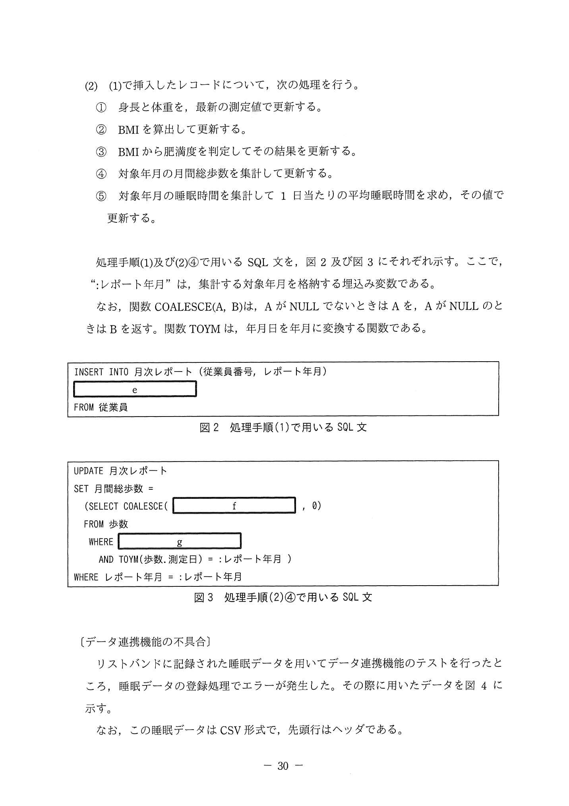

テキスト (OCR)

(2) (①で挿入したレコードについて, 次の処理を行う。

身長と体重を, 最新の測定値で更新する。

BMI を算出して更新する。

BMI から肥満度を判定してその結果を更新する。

対象年月の月間総歩数を集計して更新する。

対象年月の睡眠時間を集計して 1 日当たりの平均睡眠時間を求め、 その値で
更新する。

@6@@@ら9@

処理手順1)及び(②)④で用いる SQL 文を, 図 2 及び図 3 にそれぞれ示す。ここで,
レポート年月”" は, 集計する対象年月を格納する埋込み変数である。

なお, 関数 COALESCE(A, B)は, A が NULL でないときはAを, AがNULL のと
きは B を返す。 関数 TOYM は, 年月日を年月に変換する関数である。

INSERT INTO 月次レポート (従業員番号, レポート年月)
|         e         |

FROM 従業員

 2 処理手順(1)で用いる SQL文

UPDATE 月次レポート
SET 月間総歩数 =
(SELECT COALESCE( |         f        |, 9)
FROM 歩数
WHERE |         g        ]
AND TOYM(歩数.測定日) = : レポート年月 )
WHERE レポート年月 = :レポート年月

 3 処理手順(2)④で用いる SQL文

(データ 連携機能の不具合]

リストバンドに記録された睡眠データを用いてデータ連携機能のテストを行ったと
ころ, 睡眠データの登録処理でエラーが発生した。その際に用いたデータを図 4 に
示す。

BB, この睡眠データは CSV 形式で, 先頭行はヘッダである。

ー 30 一

### ページ 31

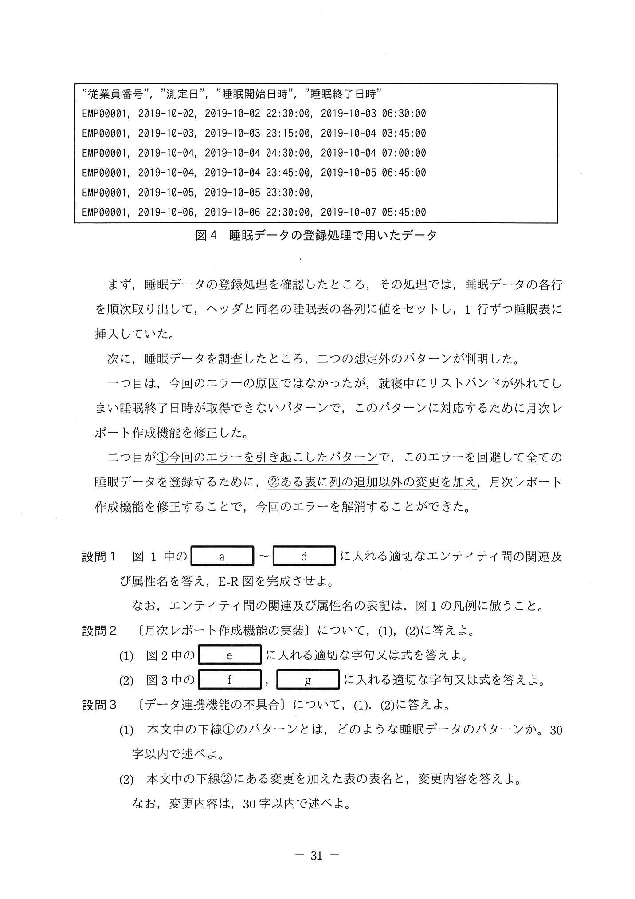

テキスト (OCR)

"従業員番号", “HEA”, "睡眠開始日時", "睡眠終了日時"
EMP90001, 2019-10-02, 2019-10-02 22:30:00, 2019-10-03 06:30:00
EMP00001, 2019-10-03, 2019-10-03 23:15:00, 2019-10-04 03:45:00
EMP00001, 2019-10-04, 2019-10-04 04:30:00, 2019-10-04 07:00:00
EMP00001, 2019-10-04, 2019-10-04 23:45:00, 2019-10-05 06:45:00
EMP00001, 2019-10-05, 2019-10-05 23:30:00,

EMP00001, 2019-10-06, 2019-10-06 22:30:00, 2019-10-07 05:45:00

図4 BRT — 4 OSRMIBCHWKT—Y

まず, 睡眠データの登録処理を確認したところ, その処理では, 睡眠データの各行
を順次取り出して, ヘッダと同名の睡眠表の各列に値をセットし, 1 行ずつ睡眠表に
挿入していた。

次に, 睡眠データを調査したところ, 二つの想定外のパターンが判明した。

ーフ目は, 今回のエラーの原因ではなかったが, 就科中にリストバンドが外れてし
まい睡眠終了日時が取得できないパターンで, このパターンに対応するために月次レ
ポート作成機能を修正した。

ニニフつ目が①今回のエラーを引き起こしたパターンで, このエラーを回避して全ての
睡眠データを登録するために, ②ある表に列の追加以外の変更を加え, 月次レポート
作成機能を修正することで, 今回のエラーを解消することができた。

設問1 図 1 中の| a |~l a |に入れる適切なエンティティ間の関連及
び属性名を答え, E-R 図を完成させよ。
なお, エンテイティ間の関連及び属性名の表記は, 図 1 の凡例に條うこと。
設問2 [月次レポート作成機能の実装〕】 について, (), ②に答えよ。
a) 図2中の| 。 | に入れる適切な字句又は式を答えよ。
②) 図3中の| ij | |  g |に入れる適切な字人匂又は式を答えよ。
設問3 〔データ連携機能の不具合}] について, ①, ②⑫②)に答えよ。
1) 本文中の下線ののパターンとは, どのような睡上限データのパターンか。 30
字以内で述べよ。
Q) 本文中の下線②にある変更を加えた表の表名と, 変更内容を答えよ。
なお, 変更内容は, 30 字以内で述べよ。

ー 31 一

### ページ 32

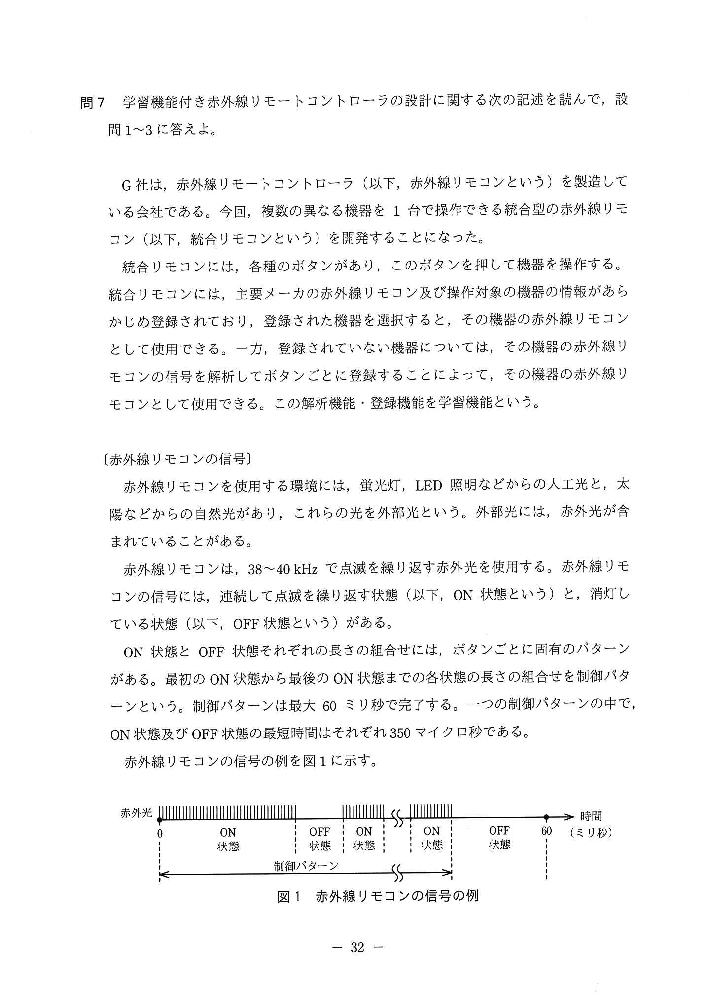

テキスト (OCR)

SM
に

間7 学習機能付き赤外線リモートコントローラの設計に関する次の記述を読んで
問 1こ3 に答えよ。

G 社は, 赤外線リモートコントローラ (以下, 赤外線リモコンという) を製造して
いる会社である。今回, 複数の異なる機器を 1 台で操作できる統合型の赤外線リモ

ン (以下, 統合リモコンという) を開発することになった。

統合リモコンには, 各種のボタンがあり, このボタンを押して機器を操作する。
統合リモコンには, 主要メーカの赤外線リモコン及び操作対象の機器の情報があら
かじめ登録されており, 登録された機器を選択すると, その機器の赤外線りリモコン
として使用できる。一方, 登録されていない機器については, その機器の赤外線リ
モコンの信号を解析してボタンごとに登録することによって, その機器の赤外線リ
モコンとして使用できる。この解析機能・登録機能を学習機能という。

[赤外線リモコンの信号〕

赤外線リモコンを使用する環境には, 蛍光灯, LED 照明などからの人工光と, 太
陽などからの自然光があり, これらの光を外部光という。外部光には, 赤外光が含
まれていることがある。

赤外線リモコンは, 38て40 kHz で点滅を繰り返す赤外光を使用する。赤外線りモ
コンの信号には, 連続して点滅を繰り返す状態 (以下, ON 状態という) と, 消灯し
ている状態 (LAB, OFF 状態という) がある。

ON 状態と OFF 状態それぞれの長さの組合せには, ボタンごとに固有のパターン
がある。最初の ON 状態から最後の ON 状態までの各状態の長さの組合せを制御パタ
ーンという。制御パターンは最大 60 ミリ秒で完了する。一つの制御パターンの中で,
ON 状態及び OFF 状態の最短時間はそれぞれ 350 マイクロ秒である。

赤外線リモコンの信号の例を図 1 に示す。

uuu Hl In          ve
| OFF | ON | “i ON    OFF     (ミリ秒)
si    ORME | 状態! | 状態    状態

~pr---- 2
------- 24

HOY
p>)         !

図1 赤外線リモコンの信号の例

ー 32 一

### ページ 33

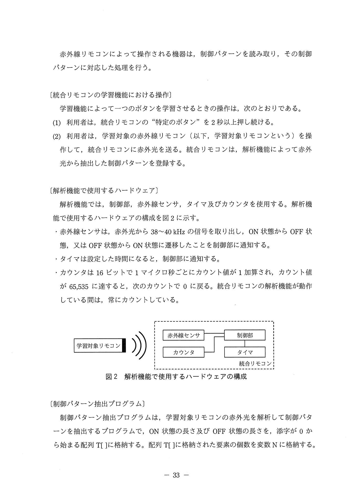

テキスト (OCR)

赤外線リモコンによって操作される機器は, 制御パターンを読み取り, その制御
パターンに対応した処理を行う。

[統合リモコンの学習機能における操作]
学習機能こよって一つのボタンを学習させるときの操作は, 次のとおりである。
Q) 利用者は, 統合リモコンの “特定のボタン" を2 秒以上押し続ける。

(⑫) 利用者は, 学習対象の赤外線リモコン (以下, 学習対象リモコンという) を操
作して, 統合リモコンに赤外光を送る。 統合リモコンは, 解析機能によって赤外
光から抽出した制御パターンを登録する。

[解析機能で使用するハードウェア〕

解析機能では, 制御部, 赤外線センサ, タイマ及びカウンタを使用する。解析機

能で使用するハードウェアの構成を図 2 に示す。

・ 赤外線センサは, 赤外光から 38~40 kHz の信号を取り出し, ON 状態から OFF 状
態, 又は OFF 状態から ON 状態に遷移したことを制御部に通知する。

・タイマは設定した時間になると, 制御部に通知する。

・カウンタは 16 ビットで 1 マイクロ秒ごとにカウント値が 1 加算され, カウント値
が 65,535 に達すると, 次のカウントで 0 に戻る。統合リモコンの解析機能が動作
している間は, 常にカウントしている。

| | 直線センサ     wees | !
ee | ))  | | ラッッッ     |  7   | |
1     ン          マ    1

ここニニニニニニっここだここここニニニコニニューミュニニニジニニニニュニーニュ

図2 解析機能で使用するハードウェアの構成

(制御パターン抽出プログラム]〕

制御パターン抽出プログラムは, 学習対象リモコンの赤外光を解析して制御パタ
ーンを抽出するプログラムで, ON 状態の長さ及び OFF 状態の長さを, 添字が0 か
ら始まる配列 T[ ]に格納する。配列 T[ ]に格納された要素の個数を変数N に格納する。

### ページ 34

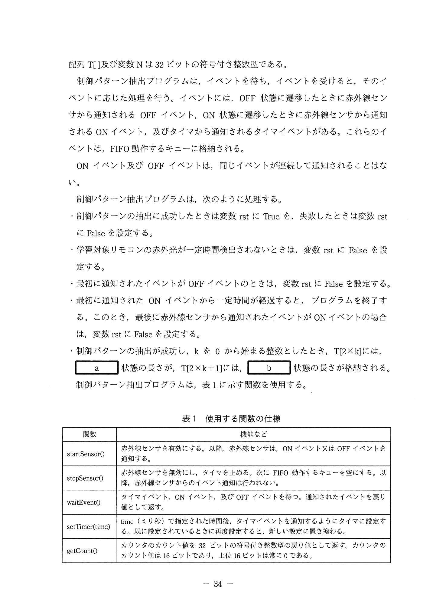

テキスト (OCR)

配列 TL ]及び変数 N は 32 ビットの符号付き整数型である。
制御パターン抽出プログラムは, イベントを待ちも, イベントを受けると, そのイ
ベントに応じた処理を行う。イベントには, OFF 状態に居移したときに赤外線セン
サから通知される OFF イベント, ON 状態に怖移したときに赤外線センサから通知
される ON イベント, 及びタイマから通知されるタイマイベントがある。これらのイ
ベントは, FIFO 動作するキューに格納される。
ON イベント及び OFF イベントは, 同じイベントが連続して通知されることはな
い。
制御パターン抽出プログラムは, 次のように処理する。
・ 制御パターンの抽出に成功したときは変数 rst に True を, 失敗したときは変数 rst
に False を設定する。
・学習対象リモコンの赤外光が一定時間検出されないときは, 変数 rst に False を設
定する。
・最初に通知されたイベントが OFF イベントのときは, 変数 rst に False を設定する。
・ 最初に通知された ON イベントから一定時間が経過すると, プログラムを終了す
Bo CODES, 最後に赤外線センサから通知されたイベントが ON イベントの場合
は, 変数 rst に False を設定する。
・ 制御パターンの抽出が成功し, k を 0 から始まる整数としたとき, TI2Xk]には,

=a 状態の長さが, TI2Xk十1]には,  [し 5 状態の長さが格納される。

制御パターン抽出プログラムは, 表 1 に示す関数を使用する。

Rl 使用する関数の仕様

関数                                                機能など

赤外線センサを有効にする。 以降, 赤外線センサは, ON イベント又は OFF イベントを

startSensor()     通知する

赤外線センサを無効にし, タイマを止める。 次に FIFO 動作するキューを空にする。以

StopSensor() | 降。赤外線センサからのイベント通知は行われない。

タイマイベント, ON イベント, 及び OFF イベントを待つ。通知されたイベントを戻り

waitEvent()      値として返す

time (SUM) で指定された時間後, タイマイベントを通知するようにタイマに設定す

setTimer(time) | る。既に設定されているときに再度設定すると, 新しい設定に置き換わる。

カウンタのカウント値を 32 ビットの符号付き整数型の戻り値として返す。カウンタの

getCount()       カウント値は 16 ビットであり, 上位 16 ビットは常に 0 である。

ー 34 一

### ページ 35

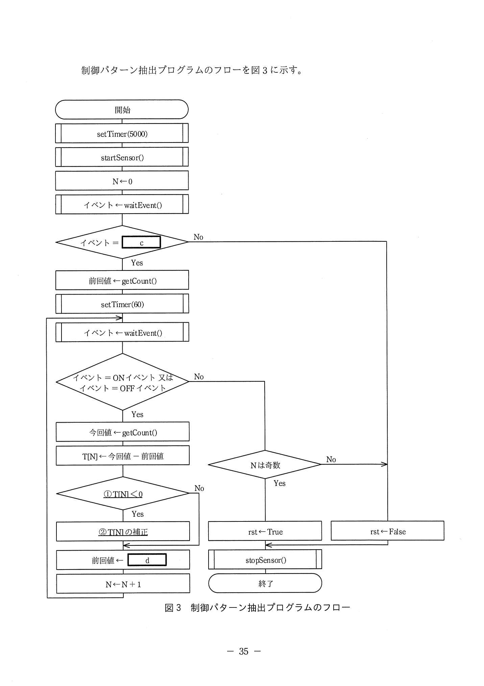

テキスト (OCR)

制御パターン抽出プログラムのフローを図 3 に示す。

C                      開始                     )

setTimer(5000)
I

startSensor()

前回値 とgetCountO

I
setTimer(60)
ーーーーーーーーー J

イベント —waitEvent()

イベント = ONイベント 又は

イベント =テOFFイベント
今回値 ごgetCount0
I

TINIご今回値 一前回人                    No

Nは奇数
Yes
rst — True                          rst False
に                                  T

前回値  Ca |                                    stopSensor()

Ns           C       6    _)

図3 制御パターン抽出プログラムのフロー

ー 35 一

### ページ 36

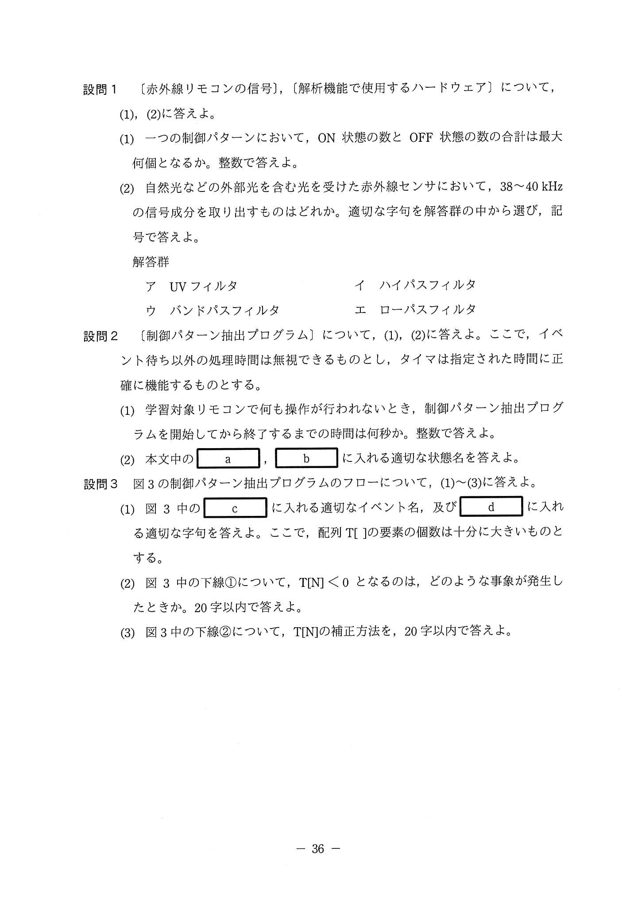

テキスト (OCR)

設問1 [赤外線リモコンの信号〕, 解析機能で使用するハードウェア〕 について,
(1), ②)に答えよ。
QQ) 一つの制御パターンにおいて, ON 状態の数と OFF 状態の数の合計は最大
何個となるか。 整数で答えよ。
(2) 自然光などの外部光を含む光を受けた赤外線センサにおいて, 38~40 kHz
の信号成分を取り出すものはどれか。 適切な字旬を解答群の中から選び, 記

号で答えよ。

解答群

ア UV フィルタ        イ ハイパスフィルタ
ウ バンドパスフィルタ     エ ローパスフィルタ

設問2 制御パターン抽出プログラム〕について, ①, ②に答えよ。ここで, イベ
ント待ち以外の処理時間は無視できるものとし, タイマは指定された時間に正
確に機能するものとする。
Q①) 学習対象リモコンで何も操作が行われないとき, 制御パターン抽出プログ
ラムを開始してから終了するまでの時間は何秒か。整数で答えよ。
②) 本文中の| a | |  b |に入れる適切な状態名を答えよ。
設問3 図3の制御パターン抽出プログラムのフローについて, ①⑪~て3⑬)に答えよ。
a 図 3 中の[| < | に入れる適切なイベント名,及び[ d |に入れ
る適切な字句を答えよ。ここで, 配列 T[ ]の要素の個数は十分に大きいものと
する。
2) 図 3 中の下線①について, TIN] く0 となるのは, どのような事象が発生し
たときか。20 字以内で答えよ。
(3) 図 3 中の下線@について, TIN]の補正方法を, 20 字以内で答えよ。

### ページ 37

テキスト (OCR)

C

メ = 用 紙 J

ー 一

### ページ 38

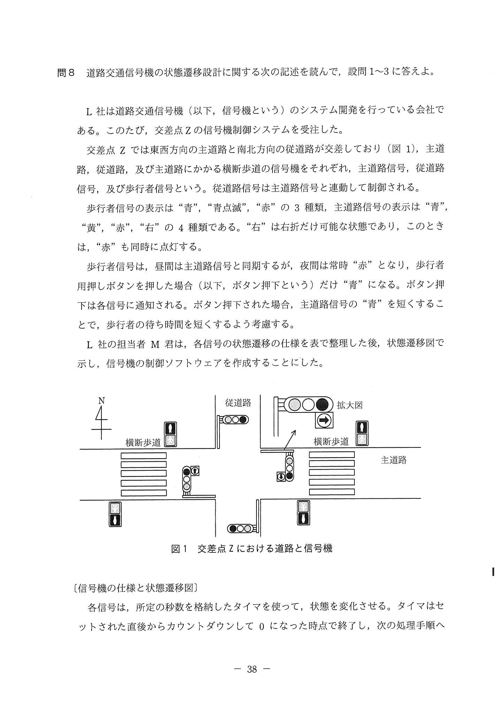

テキスト (OCR)

AS 道路交通信号機の状態遷移設計に関する次の記述を読んで, 設問1ー3 に答えよ。

L 社は道路交通信号機 (以下, 信号機という) のシステム開発を行っている会社で
ある。このたび, 交差点 Z の信号機制御システムを受注した。

交差点 Z では東西方向の主道路と南北方向の従道路が交差しており (図 1), 主道
路, 従道路, 及び主道路にかかる横断歩道の信号機をそれぞれ, 主道路信号, 従道路
信号, 及び歩行者信号という。 従道路信号は主道路信号と連動して制御される。
歩行者信号の表示は “青", “HAIR, “赤”の 3 種類, 主道路信号の表示は “FT,
“ae” HR", “i” の 4 CHS. “A” は右折だけ可能な状態であり, このとき
lk, “赤”も同時に点灯する。

歩行者信号は, 昼間は主道路信号と同期するが, 夜間は常時 “OR” となり, 歩行者
用押しボタンを押した場合 (以下, ボタン押下という) だけ “青" になる。ボタン押
下は各信号に通知される。ボタン押下された場合, 主道路信号の “青" を短くするこ
LC, 歩行者の待ち時間を短くするよう考慮する。

L 社の担当者 M Ald, 各信号の状態遷移の仕様を表で整理した後, 状態遷移図で
示し, 信号機の制御ソフトウェアを作成することにした。

2
wie CI      に     / seis a

ーー                                         ーー          、
—— ge                                =a        主道路
ーー @                       pg
に                                MS oo

=a

図1 交差点7における道路と信号機

(信号機の仕様と状態遷移図〕
各信号は, 所定の秒数を格納したタイマを使って, 状態を変化させる。タイマはセ
ットされた直後からカウントダウンして 0 になった時点で終了し, 次の処理手順へ

ー 38 一

### ページ 39

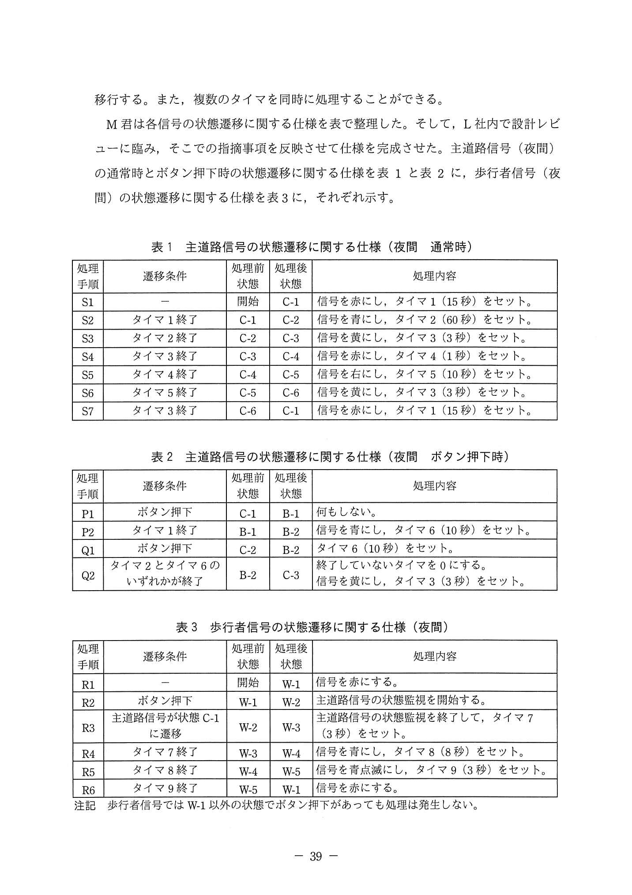

テキスト (OCR)

移行する。 また, 複数のタイマを同時に処理することができる。

M 君は各信号の状態遷移に関する仕様を表で整理した。そして, L 社内で設計レビ
ューに了臨み, そこでの指摘事項を反映させて仕様を完成させた。主道路信号 (夜間)
の通常時とボタン押下時の状態遷移に関する仕様を表 1 と表 2 に, 歩行者信号 (夜

間) の状態遷移に関する仕様を表 3 に, それぞれ示す。

表1 主道路信号の状態遷移に関する仕様 (夜間 通常時)

処理    %       処理前 | 処理後

手順      EBA      状態 | yene              処理内容

S1        ー        開始 | C-1 |信号を赤にし, タイマ1 (15 秒) をセット。
S2      タイマ 1終了      C-1    C-2 | 信号を青にし, タイマ2 (60 秒) をセット。
S3      タイマ 2 終了      C-2    C-3 | 信号を黄にし, タイマ3 (3 秒) をセット。
S4     タイマ3 終了      C-3    C-4 | 信号を赤にし, タイマ4 (1秒) をセット。
S5     タイマ 4終了      C-4    C-5 | 信号を右にし, タイマ5 OM) をセット。
S6      タイマ 5終了      C-5    C-6 | 信号を黄にし, タイマ3 (3秒) をセット。
S7     タイマ 3 終了      C-6   C-1 | 信号を赤にし, タイマ1 (15 秒) をセット。

表2 主道路信号の状態遷移に関する仕様 (夜間 ボタン押下時)

Pl      ボタン押下       G1    B-1 |何もしない。

P2      タイマ1 終了      B-1    B-2 |信号を青にし, タイマ6 OM) をセット。
Q1       ボタン押下        C-2    B-2 | タイマ6 (10 秒) をセット。

タイマ2 とタイマ6の            終了していないタイマを 0 にする。
2 | いずれかが終了     B2 | C3 leew, タイマ3 (3 秒) をセット。
表3 上歩行者信号の状態遷移に関する仕様 (RA)

処理    、        処理前 | 処理後            pe

手順      遷移条件      状態 | 状態              処理内容

R1        =         開始 | W-1 |信号を赤にする。

R2          ボタン押下           W-1 | W-2 |主道路信号の状態監視を開始する。

主道路信号が状態 C-1             主道路信号の状態監視を終了して, タイマ7

Ra        ees        W2 | WS | (3秒) をセット。

R4      タイマ 7終了      W-3    wea |信号を青にし, タイマ8 (8秒) をセット。
R5      タイマ8 終了      Wa    W-5 |信号を青点滅にし, タイマ 9 (3 秒) をセット。
R6      タイマ 9 終了      Wr-5    Wl |信号を赤にする。
注記 歩行者信号では W-1 以外の状態でボタン押下があっても処理は発生しない。

ー 39 一

### ページ 40

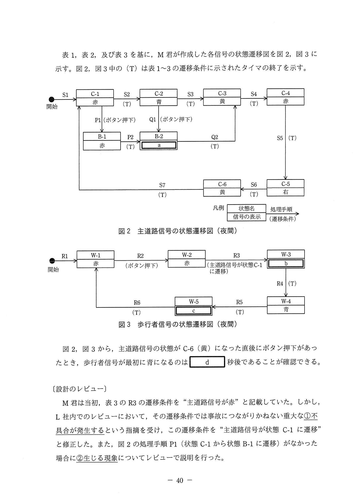

テキスト (OCR)

#1, 表2, 及び表 3 を基に, M 君が作成した各信号の状態遷移図を図 2, 図3 に
示す。図 2, 図3 中の (T) は表 1~3 の遷移条件に示されたタイマの終了を示す。

Sl             Cl              S2              C2              S3              C3              S4              C4
a     が   ①   i   (1)   =   (7)   is
P1|(ボタン押下)    Q1 |(ボタン押下)
B-1  P2   B-2       Q2        S5 | (T)
bil   ① (Lad    ①)
S7       C6   S6   C5
(7)       Bi   ①   右

凡例| 状態名 | 処理手順
信号の表示 | (記移条件)
図2 主道路信号の状態遷移図 (夜間)

R1                        W-1                                      R2                                       W-2                                          R3                                          W-3
.       赤    (ボタン押下)    が | (通路信号が状態c1 し _b 1
開始                             CHE)
R4 | (T)
R6                                       W-5                              R5                               W-4
1)    して 「]   ①)      青

図3 歩行者信号の状態遷移図 (夜間)

図 2, 図 3 から, 主道路信号の状態が C-6 (黄) になった直後にボタン押下があっ
たとき, 歩行者信号が最初に青になるのは|  d | 秒後であることが確認できる。

【設計のレビュー〕}

M 君は当初, 表 3 の R3 の居移条件を “主道路信号が赤” と記載していた。しかし
L 社内でのレビューにおいて, その居移条件では事故につながりかねない重大な①不
具合が発生するという指摘を受け, この居移条件を “主道路信号が状態 C-1 に遷移"
と修正した。また, 図 2 の処理手順 PL (状態 C-1 から状態 B-1 に遷移) がなかった
場合に②生じる現象についてレビューで説明を行った。

ー 40 一

### ページ 41

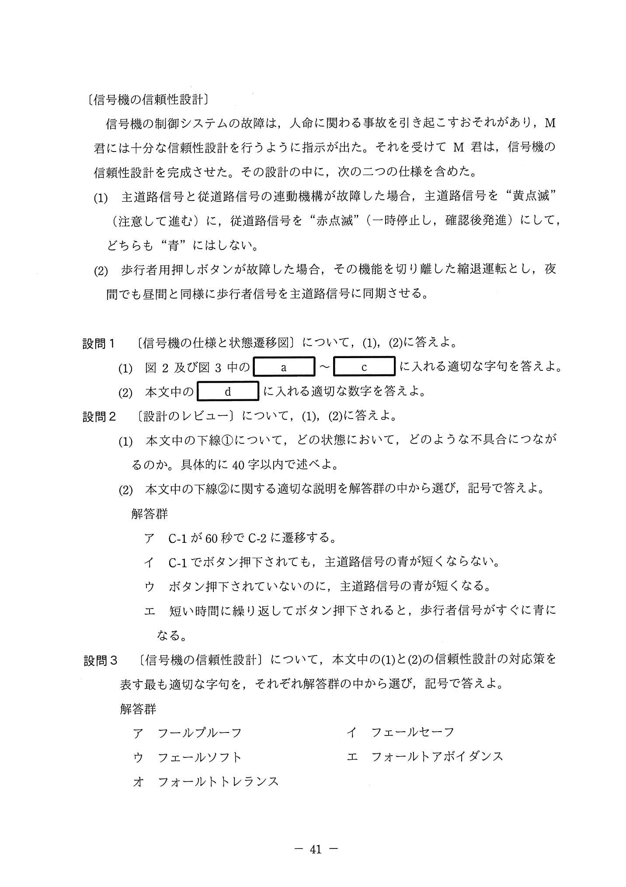

テキスト (OCR)

〔信号機の信頼性設計]
信号機の制御システムの故障は, 人命に関わる事故を引き起こすおそれがあり, M

君には十分な信頼性設計を行うように指示が出た。それを受けて M 君は, 信号機の

信頼性設計を完成させた。その設計の中に, 次の二つの仕様を含めた。

QQ) 主道路信号と従道路信号の連動機構が故障した場合, 主道路信号を “黄点滅"
(注意して進む) に, 従道路信号を “赤点滅" (一時停止し, 確認後発進) にして,
どちらも “青" にはしない。

⑫) 歩行者用押しボタンが故障した場合, その機能を切り離した縮退運転とし, 夜
間でも昼間と同様に歩行者信号を主道路信号に同期させる。

設問1 [信号機の仕様と状態遷移図) について, ①⑪, ②に答えよ。
Q①) 図 2 及び図 3 中の| a |~|  c |に入れる適切な字句を答えよ。
② 本文中の[|  q | に入れる適切な数字を答えよ。
設問2 【設計のレビュー〕 について, ①, ②に答えよ。
Q) 本文中の下線⑦について, どの状態において, どのような不具合につなが
るのか。 具体的に 40 字以内で述べよ。
Q) 本文中の下線②に関する適切な説明を解答群の中から選び
解答群
ア C-1が60 秒でC-2 に遷移する。
イ C-1 でボタン押下されても, 主道路信号の青が短くならない。
ウ ボタン押下されていないのに, 主道路信号の青が短くなる。
エ 短い時間に繰り返してボタン押下されると, 歩行者信号がすぐに青に
なる。
設問3 信号機の信頼性設計) について, 本文中の(1)と(②)の信頼性設計の対応策を
表す最も適切な字句を, それぞれ解答群の中から選び, 記号で答えよ。

ws CHALE,

Bul

解答群
ア フールプルーフ        イ フェールセーフ
ウ フェールソフト        エ フォールトアボイダンス

オ フォールトトレランス

ー 41 一

### ページ 42

テキスト (OCR)

HO 複数拠点での開発プロジェクトに関する次の記述を読んで, 設問1, 2に答えよ。

SI 企業の S 社は, 住宅設備機器の販売を行う N 社から, N 社で現在稼働中の販売
管理システム (以下, 現行システムという) の機能を拡張する開発案件を受注した。
現行システムは, S 社の第一事業部が数年前に開発したものである。

今回の機能拡張では, 新たにモバイル端末を利用可能にするとともに, 需要予測
及び仕入管理における自動発注機能を追加開発する。自動発注機能は, 現行システム
の発注処理の考え方に基づき開発する必要がある。

東京に拠点がある第一事業部には, 現行システムを開発した部門と, モバイル端末
で稼働するアプリケーションソフトウェア (以下, モバイルアプリという) の開発に
多数の実績をもつ部門がある。一方, 大阪に拠点がある第二事業部には, 雷要予測な
どに関する数理工学の技術をもつ部門がある。

この開発案件に対応するプロジェクト (以下, 本プロジェクトという) には, S 社
の各部門が保有する技術を統合した開発体制が必要なので, 事業部横断のプロジェク
トチームを編成することが決定した。プロジェクトマネージャには, 第一事業部の T
主任が任命された。

なお, 本プロジェクトは1 月に開始し, 9 月のシステム稼働開始が求められている。

開発対象システムと開発体制案)
本プロジェクトの開発対象システムを図 1 に示す。本プロジェクトでは, 在庫管
理と売上管理の改修はない。

He     BS «ee
MERE    =  入荷予定照会・結果
電要予測   =   a   —   モバイルアプリ
は     per              続,       指示      バ
販売予測データ   在庫管理   Ey    出荷指示
売上管理        リ        売上入力

注記1 需要予測は, 売上実績データを基に販売予測データを作成する。

注記2 自動発注機能は, 販売予測データと在庫データを基に適正在庫を維持するための自動発注を行う。

注記 3 モバイルアプリ接続機能は, モバイルアプリからの各要求に応答する。

注記 4 モバイルアプリは, モバイルアプリ接続機能を介して, 入荷予定照会と結果の取得, 在庫照会と結果の
取得出荷指示, 売上入力を行う。

図1 本プロジェクトの開発対象システム

ー 42 一

### ページ 43

テキスト (OCR)

T 主任は, 本プロジェクトの開発体制を, 全て S社の社員で構成される二つの開発
チームで編成する方針とした。モバイルアプリの開発, モバイルアプリ接続機能の開
発及び自動発注機能を組み込むための仕入管理の機能拡張を, 第一事業部の東京チー
ムが担当する。 また, 和夫要予測と自動発注機能を, 第二事業部の大阪チームが開発す
る。

T 主任の方針を受けて, 各事業部は, 本プロジェクトに割当て可能な開発要員案を
提示した。T 主任は, 提示された案でプロジェクトの遂行に支障がないかを検証する
ために, 各要員の開発経験などを確認するためのヒアリングを行った。提示された開
発要員案と T 主任が行ったヒアリングの結果は, 表 1 のとおりである。

Rl 開発要員案とヒアリングの結果
biel        開発対象              開発要員案                             ヒアリングの結果
東京 | モバイルアプリ    モバイルアプリの開発 | ・現行システムの開発に関わった要員はいない。
(新規開発)        経験がある入社 2て5 | ・過去の開発案件では, 顧客との仕様や設計内容の検討
年ほどの若手社員複数    結果が担当者のメモ書きだけで残され, 開発文書の更
名                    新から漏れることがあった。
モバイルアプリ     現行システムを開発し | ・現行システムの開発経験者を, 余裕をもたせて割り当
接続機能          たベテラン社員複数名     てている。
(新規開発)                               ・ 文書管理では, 文書名称, 格納方法, 版管理の規則を
仕入管理                                定め, その実施を徹底している。
(既存機能拡張)
AR | HEP Hl           数理工学のスキルをも | ・現行システムの開発に関わった要員はいない。
(新規開発)        OB BB,       ・本プロジェクトの開始前に顧客の需要データを分析して
いる。
自動発注機能        自動発注機能の開発経 | ・現行システムの開発に関わった要員はいない。
(新規開発)       験者であるベテラン社 | ・流通業務のノウハウの蓄積がある。
員複数名

[プロジェクトマネジメントの方針〕

T 主任は, 開発要員案でプロジェクトの遂行に支障があれば, 事業部間で必要な要
員の異動を行う考えであった。

T 主任は, ヒアリングの結果を踏まえて, ①不足するスキルを補うため, 本プロジ
ェクトの開発要員案の範囲内で, 最小限の要員異動をして適切な開発チームを編成す
ることにした。その上で, 両開発チームが作成する成果物に対する品質保証の活動を
徹底することにした。 そこで, TEES, 次のプロジェクトマネジメントの方針を策
定した。

ー 43 一

### ページ 44

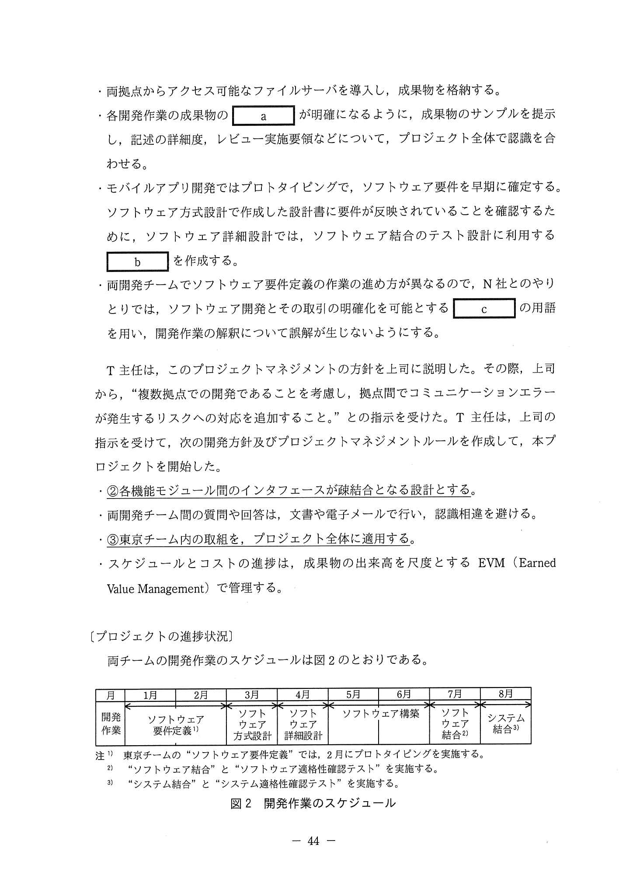

テキスト (OCR)

・両拠点かちアクセス可能なファイルサーバを導入し, 成果物を格納する。

・ 各開発作業の成果物の | 』 | が明確になるように, 成果物のサンプルを提示
し, 記述の詳細度, レビュー実施要領などについて, プロジェクト全体で認識を合
わせる。

・モバイルアプリ開発ではプロトタイピングで, ソフトウェア要件を早期に確定する。
ソフトウェア方式設計で作成した設計書に要件が反映されていることを確認するた
めに, ソフトウェア詳細設計では, ソフトウェア結合のテスト設計に利用する
[> | を作成する。

・両開発チームでソフトウェア要件定義の作業の進め方が異なるので, N社とのやり
とりでは, ソフトウェア開発とその取引の明確化を可能とする| c JOM
を用い, 開発作業の解釈について誤解が生じないようにする。

THEE, このプロジェクトマネジメントの方針を上司に説明した。その際, LA
DS, “複数拠点での開発であることを考慮し, 拠点間でコミュニケーションエラー
が発生するリスクへの対応を追加すること。" との指示を受けた。T 主任は, 上司の
指示を受けて, 次の開発方針及びプロジェクトマネジメントルールを作成して, 本プ
ロジェクトを開始した。

・②各機能モジュール間のインタフェースが疎結合となる設計とする。

・両開発チーム間の質問や回答は, 文書や電子メールで行い, 認識相違を避ける。
・③東京チーム内の取組を, プロジェクト全体に適用する。

・スケジュールとコストの進捗は, 成果物の出来高を尺度とする EVM (Earned

Value Management) で管理する。

[プロジェクトの進捗状況]
両チームの開発作業のスケジュールは図 2 のとおりである。

月  1月 | 2月  3月  4月  5月 | 6月  7月  8月
‘,    ソフト | ソフト ソフトウェア構築 | ソフト | vgs
方式設計 | 詳細設計            a> | "「

注! 東京チームの“ソフトウェア要件定義" では, 2 月にプロトタイピングを実施する。
2 “ソフトウェア結合" と “"ソフトウェア適格性確認テスト” を実施する。
3 “システム結合" と"システム適格性確認テスト” を実施する。

図2 開発作業のスケジュール

ー 44 一

### ページ 45

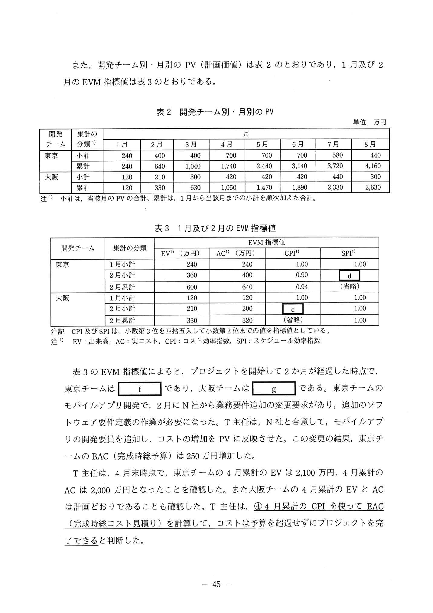

テキスト (OCR)

また, 開発チーム別・月別の PV (計画価値) は表 2 のとおりであり, 1 月及び 2
月の EVM 指標値は表 3 のとおりである。

表2 開発チーム別・月別のPV

単位 万円
開発      集計の                                                      月
チーム | BH?    1 月    2 月    3 月    4 月    5 月    6 月    7 月    8 月
小計            240        400         400         700         700         700         580          440
果計            240        640        1,040        1,740        2,440       3,140        3,720        4,160
小計            120        210         300         420         420         420         440          300
Sait            120        330          630        1,050        1,470        1,890        2,330        2,630
SE 小計は, 当該月の PV の合計。累計は, 1 月から当該月までの小計を順次加えた合計。
表3 1月及び 2 月のEVM 指標値
っ                                                    EVM 指標値
Sk | MROOM っ 大所 ach aR)      cer        spr)
東京               1 月小計                   240                 240                1.00                 1.00
2 月小計                   360                 400                0.90           [a ]
2 月累計                         600                      640                     0.94                (省略)
Ai               1 月小計                   120                 120                1.00                 1.00
2 月小計                   210                 200           | 。 |                   1.00
2 月累計                         330                      320               (省略)                         1.00

注記 CPI及びSPI は, 小数第 3 位を四捨五入して小数第 2 位までの値を指標値としている。
SE) EV: 出来高, AC : 実コスト, CPL: コスト効率指数, SPI : スケジュール効率指数

表 3 の EVM 指標値によると, プロジェクトを開始して 2 か月が経過した時点で,
東京チームは|  { | であり, 大阪チームは| g』 | である。東京チームの
モバイルアプリ開発で, 2 月に N 社か業務要件追加の変更要求があり, 追加のソフ
トウェア要件定義の作業が必要になった。T 主任は, N 社と合意して, モバイルアプ
リの開発要員を追加し, コストの増加を PV に反映させた。この変更の結果, 東京チ
ームの BAC (完成時総予算) は 250 万円増加した。

T 主任は, 4 月末時点で, 東京チームの 4 月累計の EV は 2.100 万円, 4 月累計の
AC は 2,000 万円となったことを確認した。また大阪チームの 4 月累計の EVE AC
は計画どおりであることも確認した。T 主任は, ③④ 4 ARO CPI を使って EAC
(完成時総コスト見積り) を計算して, コストは予算を超過せずにプロジェクトを完
了できると判断した。

ー 45 一

### ページ 46

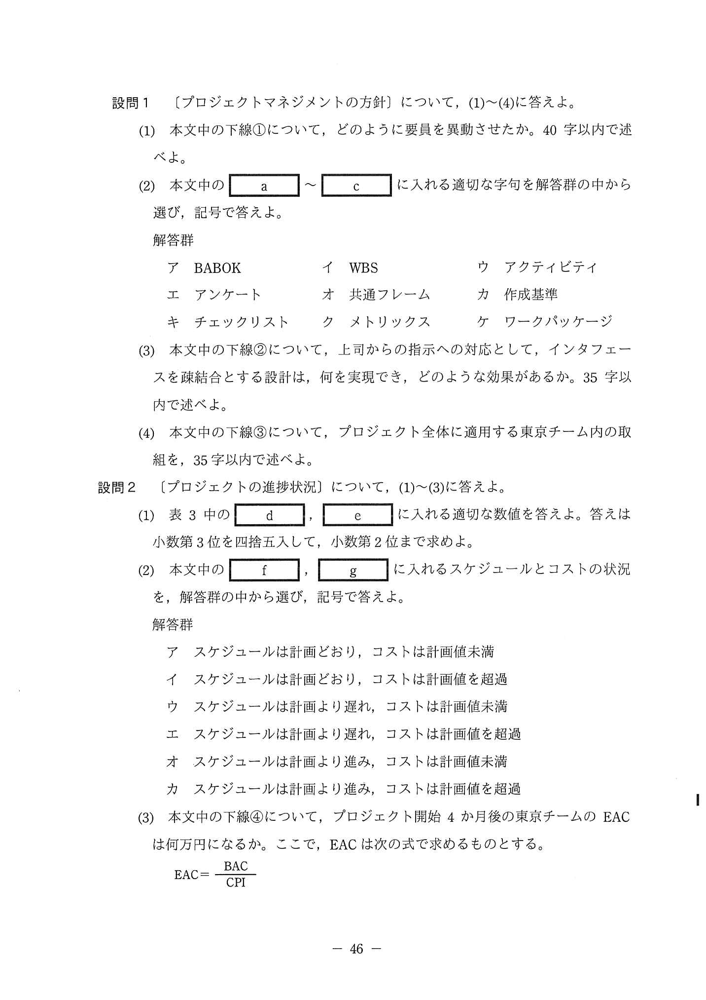

テキスト (OCR)

設問1 〔プロジェクトマネジメントの方針}] について, ①⑪~(④に答えよ
GQ) 本文中の下線のについて, どのように要員を異動させたか。 40 字以内で述
べよ。
2 本文中の| a |~[  c |に入れる適切な字句を解答學の中から
選び, 記号で答えよ。
解答群
ア BABOK      イ WBS       ウ アクティビティ
x アジツジゲート    オ 共通フレーム   カカ 作成基準
キ チェックリスト  ク メトリックス   婦 ワークパッケー?

(3③) 本文中の下線@について, 上司からの指示への対応として, インタフェー
スを疎結合とする設計は, 何を実現でき, どのような効果があるか。35 FLA
内で述べよ。

(4) 本文中の下線つ②について, プロジェクト全体に
組を, 35 字以内で述べよ。

適用する東京チーム内の取

設問2 〔プロジェクトの進捗状況] について, ①て(3③)に答えよ。
Q①) 表3 中の| a |,| = |に入れる適切な数値を答えよ。答えは
小数第 3 位を四捨五入して, 小数第 2 位まで求めよ。
@ 本文中の| fj | |  』 |に入れるスケジュールとコストの状況
を, 解答群の中から選び, 記号で答えよ。
解答群
ア スケジュールは計画どおり, コストは計画値未満
イ スケジュールは計画どおり, コストは計画値を超過
ウ スケジュールは計画より遅れ, コストは計画値未滴
エエ スケジュールは計画より遅れ, コストは計画値を超過
A スケジュールは計画より進み, コストは計画値未満
A スケジュールは計画より進み, コストは計画値を超過
(3) 本文中の下線のについて, プロジェクト開始 4 か月後の東京チームの EAC
は何万円になるか。ここで, EAC は次の式で求めるものとする。
EAC= Be

ー 46 一

### ページ 47

テキスト (OCR)

〔

x = 用 紙 J

ー 47 一

### ページ 48

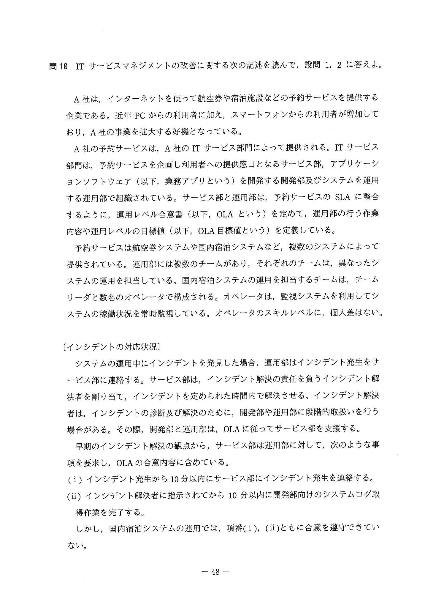

テキスト (OCR)

PA10 IT サービスマネジメントの改善に関する次の記述を読んで, 設問 1, 2 に答えよ。

Attlt, インターネットを使って航空券や宿泊施設などの予約サービスを提供する
企業である。 近年 PC からの利用者に加え, スマートフォンからの利用者が増加して
おり, A社の事業を拡大する好機となっている。

A 社の予約サービスは, A 社の IT サービス部門によって提供される。IT サービス
部門は, 予約サービスを企画し利用者への提供窓口となるサービス部, アプリケーシ
ョンソフトウェア (以下, 業務アプリという) を開発する開発部及びシステムを運用
する運用部で組織されている。サービス部と運用部は, 予約サービスの SLA に整合
するように, 運用レベル合意書 (以下, OLA という) を定めて, 運用部の行う作業
内容や運用レベルの目標値 (以下, OLA 目標値という) を定義している。

予約サービスは航空券システムや国内宿泊システムなど, 複数のシステムによって
提供されている。運用部には複数のチームがあり, それぞれのチームは, 異なったシ
ステムの運用を担当している。 国内宿泊システムの運用を担当するチームは, チーム
リーダと数名のオペレータで構成される。オペレータは, 監視システムを利用してシ
ステムの稼働状況を常時監視している。オペレータのスキルレベルに, 個人差はない。

【インシデントの対応状況]
システムの運用中にインシデントを発見した場合, 運用部はインシデント発生をサ
ービス部に連絡する。サービス部は, インシデント解決の責任を負うインシデント解
決者を割り当て, インシデントを定められた時間内で解決させる。インシデント解決
Blk, インシデントの診断及び解決のために, 開発部や運用部に段階的取扱いを行う
場合がある。その際, 開発部と運用部は, OLA に従ってサービス部を支援する。
早期のインシデント解決の観点から, サービス部は運用部に対して, 次のような事
項を要求し, OLA の合意内容に含めている。
(i) インシデント発生から 10 分以内にサービス部にインシデント発生を連絡する。
(i) インシデント解決者に指示されてから 10 分以内に開発部向けのシステムログ取
得作業を完了する。
しかし, 国内宿泊システムの運用では, 項番(1), (ii)ともに合意を遵守できてい

ない。

ー 48 一

### ページ 49

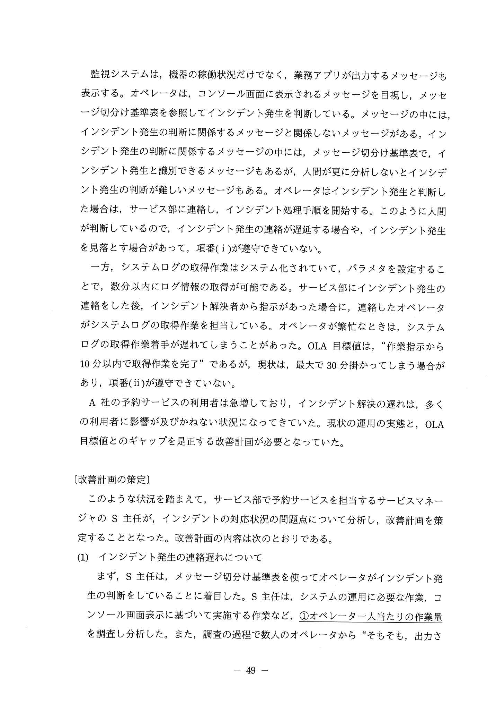

テキスト (OCR)

監視システムは, 機器の稼働状況だけでなく, 業務アプリが出力するメッセージも
表示する。オペレータは, コンソール画面に表示されるメッセージを目視し, メッセ
ージ切分け基準表を参照してインシデント発生を判断している。メッセージの中には,
インシデント発生の判断に関係するメッセージと関係しなかいメッセージがある。イン
シデント発生の判断に関係するメッセージの中には, メッセージ切分け基準表で, イ
ンシデント発生と識別できるメッセージもあるが, 人間が更に分析しないとインシデ
ント発生の判断が難しいメッセージもある。オペレータはインシデント発生と判断し
た場合は, サービス部に連絡し, インシデント処理手順を開始する。このように人間
が判断しているので, インシデント発生の連絡が遅延する場合や, インシデント発生
を見落とす場合があって, 項番( 1 )が遵守できていない。

一方, システムログの取得作業はシステム化されていて, パラメタを設定するこ
とで, 数分以内にログ情報の取得が可能である。サービス部にインシデント発生の
連絡をした後, インシデント解決者から指示があった場合に, 連絡したオペレータ
がシステムログの取得作業を担当している。オペレータが繁忙なときは, システム
ログの取得作業着手が遅れてしまうことがあった。 OLA 目標値は, “作業指示から
10 分以内で取得作業を完了” であるが, 現状は, 最大で 30 分掛かってしまう場合が
あり, 項番(ii)が遵守できていない。

A 社の予約サービスの利用者は急増しており, インシデント解決の遅れは, 多く
の利用者に影響が及びかねない状況になってきていた。現状の運用の実態と。 OLA
目標値とのギャップを是正する改善計画が必要となっていた。

〔改善計画の策定〕
このような状況を踏まえて, サービス部で予約サービスを担当するサービスマネー
ジャの S 主任が, インシデントの対応状況の問題点について分析し, 改善計画を策
定することとなった。改善計画の内容は次のとおりである。
(1) インシデント発生の連絡遅れについて
まず, S EE, メッセージ切分け基準表を使ってオペレータがインシデント発
生の判断をしていることに着目した。S 主任は, システムの運用に必要な作業, コ
ンソール画面表示に基づいて実施する作業など, ①オペレーター人当たりの作業量
を調査し分析した。 また, 調査の過程で数人のオペレータから “そもそも, 出力さ

ー 49 一

### ページ 50

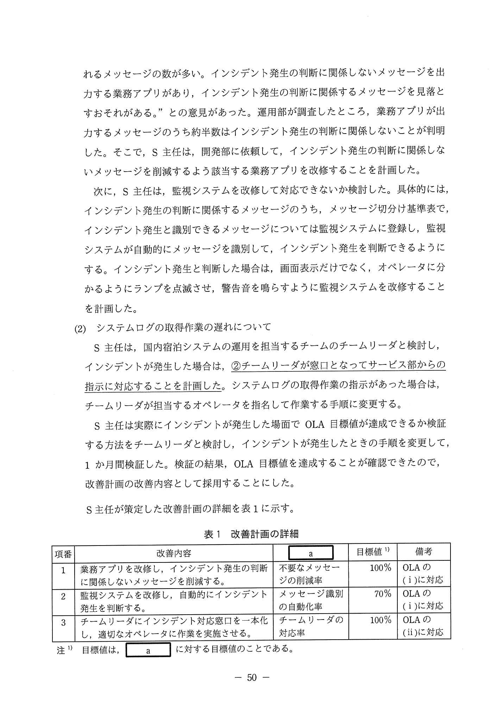

テキスト (OCR)

れるメッセージの数が多い。インシデント発生の判断に関係しなかいメッセージを出
力する業務アプリがあり, インシデント発生の判断に関係するメッセージを見落と
すおそれがある。”との意見があった。運用部が調査したところ, 業務アプリが出
力するメッセージのうち約半数はインシデント発生の判断に関係しないことが判明
した。そこで, S 主任は, 開発部に依頼して, インシデント発生の判断に関係しな
いメッセージを削減するよう該当する業務アプリを改修することを計画した。

次に, S 主任は, 監視レステムを改修して対応できないか検討した。具体的には,
インシデント発生の判断に関係するメッセージのうち, メッセージ切分け基準表で,
インシデント発生と識別できるメッセージについては監視システムに登録し, 監視
システムが自動的にメッセージを識別して, インシデント発生を判断できるように
する。インシデント発生と判断した場合は, 画面表示だけでなく, オペレータに分
かるようにランプを点滅させ, 警告音を鳴らすように監視システムを改修すること
を計画した。

(2) システムログの取得作業の遅れについて

S 主任は, 国内宿泊システムの運用を担当するチームのチームリーダと検討し,
インシデントが発生した場合は, ⑨チームリーダが窓口となってサービス部からの
指示に対応することを計画した。システムログの取得作業の指示があった場合は,
チームリーダが担当するオペレータを指名して作業する手順に変更する。

S 主任は実際にインシデントが発生した場面で OLA 目標値が達成できるか検証
する方法をチームリーダと検討し, インシデントが発生したときの手順を変更して,
1 か月間検証した。検証の結果, OLA 目標値を達成することが確認できたので,
改善計画の改善内容として採用することにした。

S 主任が策定した改善計画の詳細を表 1 に示す。

表1 改善計画の詳細

項番           改善内容               a | | Bee | 備者
1 | 業務アプリを改修し, インシデント発生の判断 | 不要なメッセー   100% | OLA の
に関係しないメッセージを削減する。         ジの削減率              (1)に対応
2 | 監視システムを改修し, 自動的にインシデント | メッセージ識別   70% | OLAの
発生を判断する。               の自動化率         Ci hc satis
3 | チームリーダにインシデント対応窓口を一本化 | チームリーダの   100% | OLA の
し, 適切なオペレータに作業を実施させる。    対応率             (ii)に対応
注" 目標値は| 。 | に対する目標値のことである。

ー 50 一

### ページ 51

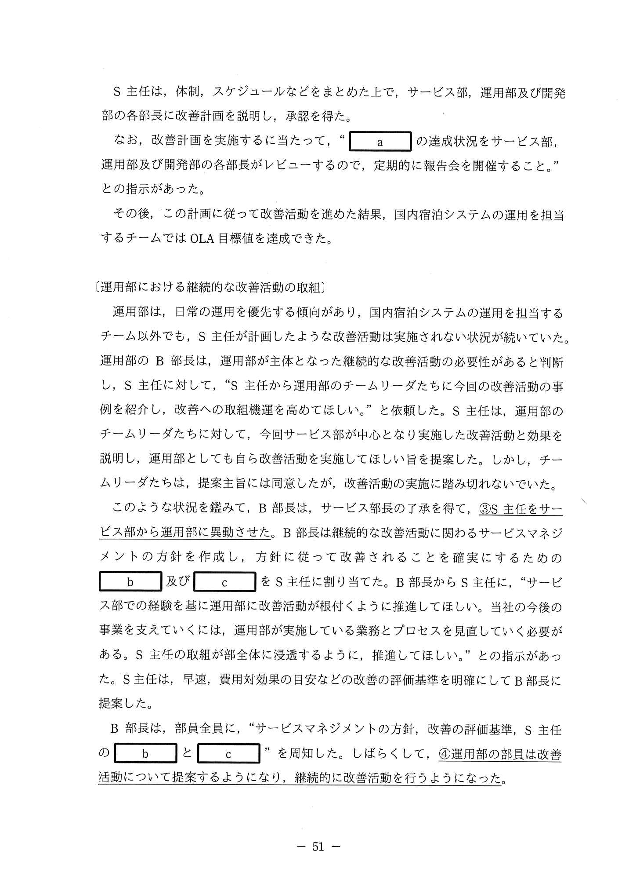

テキスト (OCR)

S 主任は, 体制スケジュールなどをまとめた上で, サービス部, 運用部及び開発
部の各部長に改善計画を説明し, 承認を得た。

なお, 改善計画を実施するに当たって, “|  。 | の遅成状況をサービス部
運用部及び開発部の各部長がレビューするので, 定期的に報告会を開催すること。"
との指示があった。

その後, この計画に従って改善活動を進めた結果, 国内宿泊システムの運用を担当
するチームでは OLA 目標値を達成できた。

[運用部における継続的な改善活動の取組

運用部は, 日常の運用を優先する傾向があり, 国内宿泊システムの運用を担当する
チーム以外でも, S 主任が計画したような改善活動は実施されない状況が続いていた。
運用部の B 部長は, 運用部が主体となった維続的な改善活動の必要性があると判断
し, S 主任に対して, “S 主任から運用部のチームリーダたちに今回の改善活動の事
例を紹介し, 改善への取組機運を高めてほしい。" と依頼した。S 主任は, 運用部の
チームリーダたちに対して, 今回サービス部が中心となり実施した改善活動と効果を
説明し, 運用部としても自ら改善活動を実施してほしい旨を提案した。しかし, チー
ムリーダたちは, 提案主旨には同意したが, 改善活動の実施に踏み切れないでいた。

このような状況を鑑みて, BBR, サービス部長の了承を得て, OS 主任をサー
ビス部から運用部に異動させた。B 部長は継続的な改善活動に関わるサービスマネジ
メントの方針を作成し, 方針に従って改善されることを確実にするための
| b |及び| c |を5主任に割り当てた。B 部長から SEEK, “サービ
ス部での経験を基に運用部に改善活動が根付くように推進してほしい。当社の今後の
事業を支えていくには, 運用部が実施している業務とプロセスを見直していく必要が
HS. 主任の取組が部全体に浸透するように, 推進してほしい。”との指示があっ
た。 8 主任は, 早速, 費用対効果の目安などの改善の評価基準を明確にしてB部長に
提案した。

B 部長は, 部員全員に, “サービスマネジメントの方針, 改善の評価基準, S 主任
の| b |と| c | を周知した。しばらくして, @運用部の部員は改善
活動について提案するようになり, 継続的に改善活動を行うようになった。

ー 51 一

### ページ 52

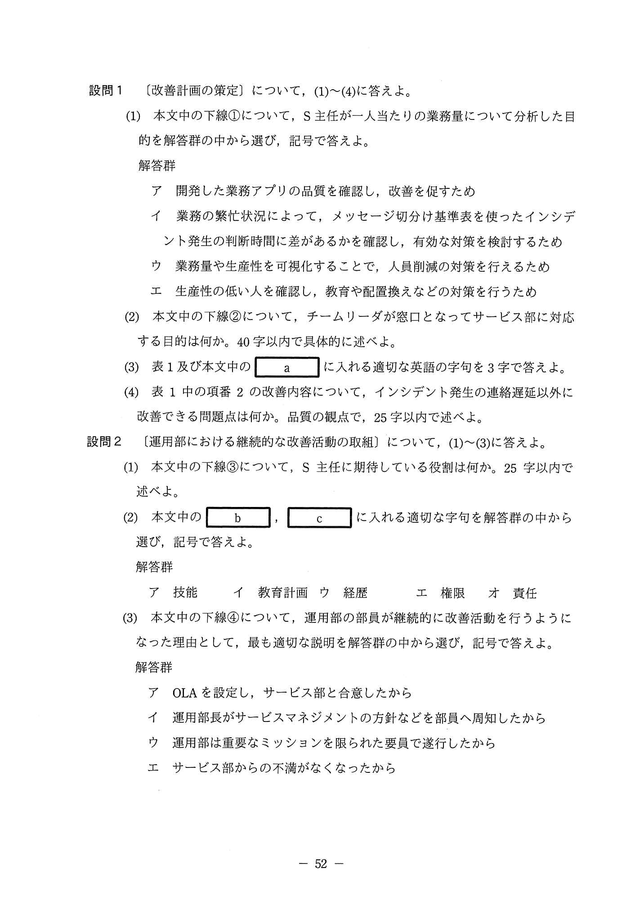

テキスト (OCR)

設問1 [改善計画の策定〕】について, ①)~て(④に答えよ。
GQ) 本文中の下線のについて, S 主任が一人当たりの業務量について分析した目
的を解答群の中から選び, 記号で答えよ。
解答群
ア 開発した業務アプリの品質を確認し, 改善を促すため
イ 業務の繁忙状況によって, メッセージ切分け基準表を使ったインシデ
ント発生の判断時間に差があるかを確認し, 有効な対策を検討するため
ウ 業務量や生産性を可視化することで, 人上員削減の対策を行えるため
エエ 生産性の低い人を確認し, 教育や配置換えなどの対策を行うため
(2) 本文中の下線@について, チームリーダが窓口となってサービス部に対応
する目的は何か。40 字以内で具体的に述べよ。
@) 表1及び本文中の| a | に入れる適切な英語の字句を3字で答えよ。
(44) 表 1 中の項番 2 の改善内容について, インシデント発生の連絡遅延以外に
改善できる問題点は何か。品質の観点で, 25 字以内で述べよ。
設問2 [運用部における継続的な改善活動の取組〕】について, (①て(3)に答えよ。
Q) 本文中の下線②について, S 主任に期待している役割は何か。25 字以内で

述べよ。
②) 本文中の| b |,|  c |に入れる適切な字句を解答群の中から
選び, 記号で答えよ。

解答群

ア 技能  イ 教育計画 ウ 経歴   エ 権限 オ 責任

(3) 本文中の下線@について, 運用部の部員が継続的に改善活動を行うよ
なった理由として, 最も適切な説明を解答群の中から選び, 記号で答えよ。
解答群

ア OLA を設定し, サービス部と合意したから

イ 運用部長がサービスマネジメントの方針などを部員へ周知したから
ウ 運用部は重要なミッションを限られた要員で遂行したから

エ サービス部からの不満がなくなったから

ー 52 一

### ページ 53

テキスト (OCR)

〔

x = 用 紙 ]

ー 8一

### ページ 54

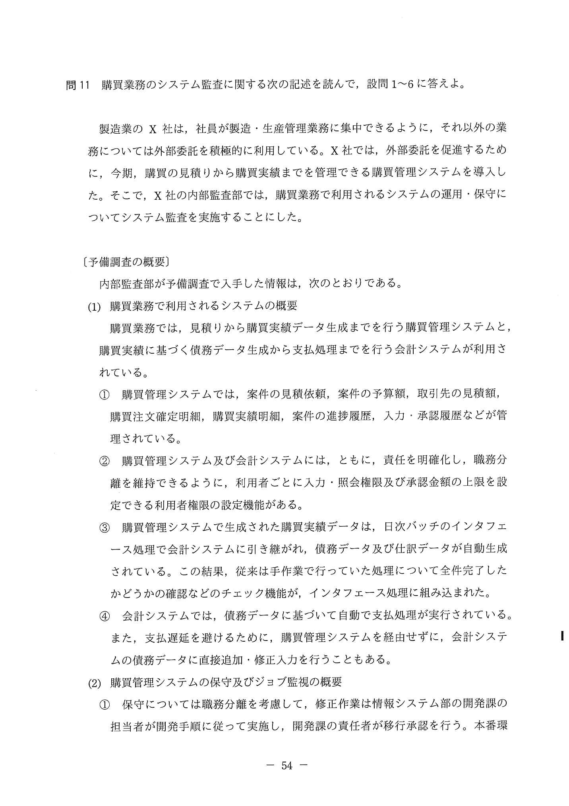

テキスト (OCR)

All 購買業務のシステム監査に関する次の記述を読んで, 設問 1ー6 に答えよ。

製造業の X 社は, 社員が製造・生産管理業務に集中できるように, それ以外の業
務については外部委託を積極的に利用している。X 社では, 外部委託を促進するため
に, 今期, 購買の見積りから購買実績までを管理できる購買管理システムを導入し
た。 そこで, X 社の内部監査部では, 購買業務で利用されるシステムの運用・保守に
ついてシステム監査を実施することにした。

[予備調査の概要〕
内部監査部が予備調査で入手した情報は, 次のとおりである。
) 購買業務で利用されるシステムの概要
購買業務では, 見積りから購買実績データ生成までを行う購買管理システムと,
購買実績に基づく債務データ生成から支払処理までを行う会計システムが利用さ
れている。
① 購買管理システムでは, 案件の見積依頼, 案件の予算額, 取引先の見積額,
購買注文確定明細, 購買実績明細, 案件の進捗履歴, 入力・承認履歴などが管
理されている。
② 購買管理システム及び会計システムには, ともに, 責任を明確化し, 職務分
離を維持できるように, 利用者ごとに入力・照会権限及び承認金額の上限を設
定できる利用者権限の設定機能がある。
③ 購買管理システムで生成された購買実績データは, 日次バッチのインタフェ
ース処理で会計システムに引き継がれ, 債務データ及び仕訳データが自動生成
されている。この結果, 従来は手作業で行っていた処理について全件完了した
かどうかの確認などのチェック機能が. インタフェース処理に組み込まれた。
④ 会計システムでは, 債務データに基づいて自動で支払処理が実行されている。
また, 支払遅延を避けるために, 購買管理システムを経由せずに, 会計システ
ムの債務データに直接追加・修正入力を行うこともある。
(2) 購買管理システムの保守及びジョブ監視の概要
① 保守については職務分離を考慮して, 修正作業は情報システム部の開発課の
担当者が開発手順に従って実施し, 開発課の責任者が移行承認を行う。本番環

ー 54 一

### ページ 55

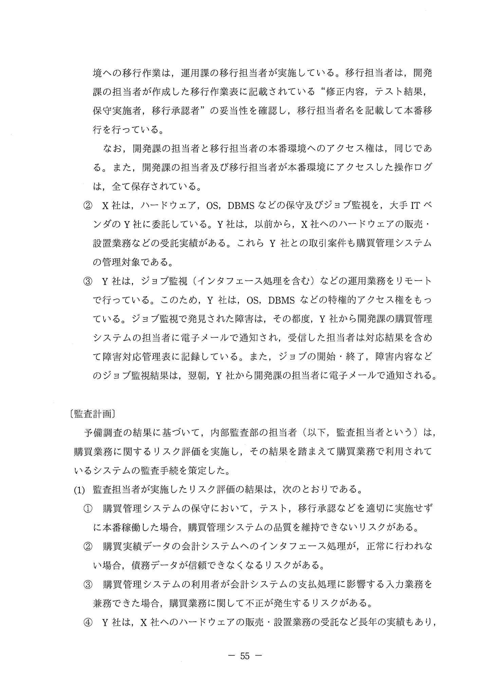

テキスト (OCR)

境への移行作業は, 運用課の移行担当者が実施している。移行担当者は, 開発
課の担当者が作成した移行作業表に記載されている “修正内容, テスト結果,
保守実施者, 移行承認者” の妥当性を確認し, 移行担当者名を記載して本番移
行を行っている。

なお, 開発課の担当者と移行担当者の本番環境へのアクセス権は, 同じであ
る。また, 開発課の担当者及び移行担当者が本番環境にアクセスした操作ログ
は, 全て保存されている。

@ X社は, ハードウェア, OS, DBMS などの保守及びジョブ監視を, 大手ITベ
ンダの Y 社に委託している。Y 社は, 以前から, X社へのハードウェアの販売・
設置業務などの受託実績がある。 これら Y 社との取引案件も購買管理システム
の管理対象である。

⑨⑧ Y 社は, ジョブ監視 (インタフェース処理を含む) などの運用業務をリモート
で行っている。このため, Y 社は, OS, DBMS などの特権的アクセス権をもっ
ている。 ジョブ監視で発見された障害は, TOME, Y 社から開発課の購買管理
システムの担当者に電子メールで通知され, 受信した担当者は対応結果を含め
て障害対応管理表に記録している。また, ジョブの開始・終了, 障害内容など
のジョブ監視結果は, 翌朝, Y 社から開発課の担当者に電子メールで通知される。

[監査計画
予備調査の結果に基づいて, 内部監査部の担当者 (以下, 監査担当者という) は,
購買業務に関するリスク評価を実施し, その結果を踏まえて購買業務で利用されて
いるシステムの監査手続を策定した。
QQ) 監査担当者が実施したリスク評価の結果は, 次のとおりである。
① 購買管理システムの保守において, テスト, 移行承認などを適切に実施せず
に本番稼働した場合, 購買管理システムの品質を維持できないリスクがある。
② 購買実績データの会計システムへのインタフェース処理が, 正常に行われな
い場合, 債務データが信頼できなくなるリスクがある。
③ 購買管理システムの利用者が会計システムの支払処理に影響する入力業務を
兼務できた場合, 購買業務に関して不正が発生するリスクがある。
④ Y 社は, X 社へのハードウェアの販売・設置業務の受託など長年の実績もあり,

= 5B =

### ページ 56

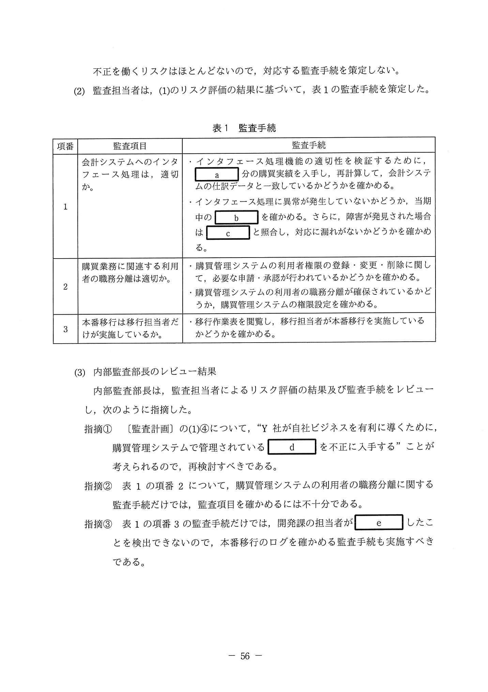

テキスト (OCR)

不正を働くリスクはほとんどないので, 対応する監査手続を策定しない。
(2) 監査担当者は, (①)のリスク評価の結果に基づいて, 表 1 の監査手続を策定した。

Rl 監査手続

項番

監査項目

監査手続

会計システムへのインタ
フェース処理は, 適切
D>

・インタフェース処理機能の適切性を検証するために,
分の購買実績を入手し, 再計算して, 会計システ
ムの仕訳データと一致しているかどうかを確かめる。

・インタフェース処理に異常が発生していないかどうか, 当期
中の| b | を確かめる。さらに, 障害が発見された場合
は| < CAL, 対応に漏れがないかどうかを確かめ
る。

購買業務に関連する利用
者の職務分離は適切か。

・購買管理システムの利用者権限の登録・変更・削除に関し
て, 必要な申請・承認が行われているかどうかを確かめる。

・購買管理システムの利用者の職務分離が確保されているかど
うか, 購買管理システムの権限設定を確かめる。

本番移行は移行担当者だ
けが実施しているか。

・移行作業表を閲覧し, 移行担当者が本番移行を実施している
かどうかを確かめる。

⑬) 内部監査部長のレビュー結果
内部監査部長は, 監査担当者によるリスク評価の結果及び監査手続をしビュー
し, 次のように指摘した。
HO CRASH) の①)④について, “Y 社が自社ビジネスを有利に導くために,
購買管理システムで管理されている|  q | を不正に入手する"ことが

考えられるので

再検討すべきである。

HHO 表 1 の項番 2 について, 購買管理システムの利用者の職務分離に関する

監査手続だをけでは

, 監査項目を確かめるには不十分である。

指摘の 表 1 の項番 3 の監査手続だけでは, 開発課の担当者が[ ce | したこ
とを検出できないので, 本番移行のログを確かめる臣査手続も実施すべき

である。

ー 56 一

### ページ 57

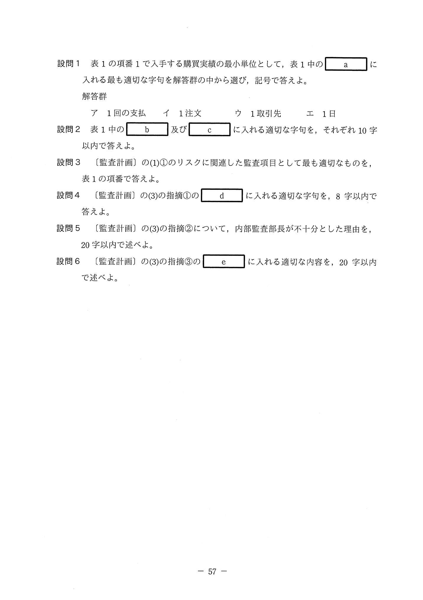

テキスト (OCR)

設問1 表1の項番 1 で入手する購買実績の最小単位として, 表1中の| 。 |に
入れる最も適切な字句を解答群の中から選び, 記号で答えよ。
解答群

ア 1回の支払 イ 1注文
設問2 表1中の| b |及び|
以内で答えよ。

ウ 1取引先   エ 1日
c |に入れる適切な字句を, それぞれ 10 字

設問3 [監査計画] の(1])①のリスクに関連した監査項目として最も適切なものを,
表 1 の項番で答えよ。

設問4 (監査計画) の③の指摘①の|  d |] に入れる適切な字句を, 8 字以内で
答えよ。

設問5 CEASE) の③の指摘めについて, 内部監査部長が不十分とした理由を,
2

0 字以内で述べよ。
tH

(Keath) の③の指摘つの| es |] に入れる適切な内容を,20字以内

設問6

ー 57 一

### ページ 58

テキスト (OCR)

【

x = 用 紙 )

ー 58 一

### ページ 59

テキスト (OCR)

〔

メ モ 用 紙 〕

ー 59 一

### ページ 60

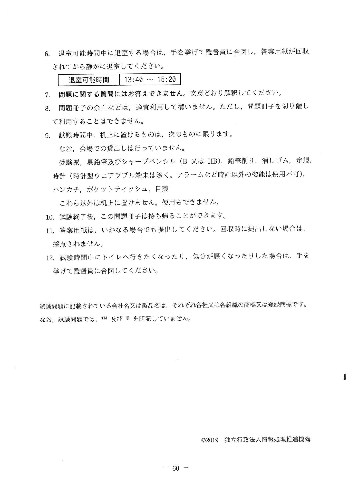

テキスト (OCR)

6. 退室可能時間中に退室する場合は, 手を挙げて監督貞に合図し, 答案用紙が回収
されてから静かに退室してください。
退室可能時間 | 13:40 ~ 15:20 |
7. 問題に関する質問にはお答えできません。文意どおり解釈してください。
8. 問題冊子の余白などは, 適宜利用して構いません。ただし, 問題冊子を切り離し
て利用することはできません。
9. 試験時間中, 机上に置けるものは, 次のものに限ります。
なお, 会場での貸出しは行っていません。
受験票, 黒鉛筆及びシャープペンシル (B 又は HB), 鉛筆削り, 消しゴム, 定規,
時計 (時計型ウェアラブル端末は除く。アラームなど時計以外の機能は使用不可),
ハンカチ, ポケットティッシュ, 目薬
これら以外は机上に置けません。 使用もできません。
10. 試験終了後, この問題冊子は持ち帰ることができます。
ll, 答案用紙は, いかなる場合でも提出してください。 回収時に提出しない場合は,
採点されません。
12. 試験時間中にトイレへ行きたくなったり, 気分が悪くなったりした場合は, Fe
挙げて監督具に合図してください。

試験問題に記載されている会社名又は製品名は, それぞれ各社又は各組織の商標又は登録商標です。
なお, 試験問題では, ™ RO © を明記していません。

@2019 独立行政法人情報処理推進機構

ー 60 一

---

## 午後解答

1/6 
©2019 独立行政法人情報処理推進機構 
令和元年度 秋期 応用情報技術者試験 解答例 
 
午後試験 
問１ 
出題趣旨 
 近年，サイバー攻撃の脅威はますます高まってきており，標的型サイバー攻撃に代表される巧妙化も進んで
きている。 
 本問では，自社に対して行われた標的型サイバー攻撃の事例を題材に，具体的な技術的対策に関する基本的
な理解を問う。 
 
設問 
解答例・解答の要点 
備考 
設問１(1) 社内の他の機器と通信させないため 
 
(2) FW でアクセスが許可されていないから 
 
(3)
a
FW 
設問２(1)
b
エ 
 
(2)
c
送信元メールアドレスのなりすまし 
 
 
d
HTTP 又はHTTPS 
 
(3) ア 
 
(4) エ 
 
(5) イ 
 
問２ 
出題趣旨 
 企業にとって，その企業に適した今後の成長戦略を採ることは重要である。 
 本問では，スマートフォン製造・販売会社を題材に，成長戦略の検討及び投資計画の評価に関する基本的な
理解について問う。 
 
設問 
解答例・解答の要点 
備考 
設問１ 
a
エ 
 
 
b
イ 
 
 
c
ウ 
 
 
d
エ 
 
設問２ 
エ 
 
設問３(1) 企画から製造の一貫体制を強みに，低コストで高品質の製品にできるから 
 
 
(2) 医療や自動運転の市場には販売ルートがないこと 
 
設問４(1)
e
現在価値 
 
 
(2) 減価償却費はキャッシュの移動がない費用だから 
 
 
(3)
f
2.2

2/6 
©2019 独立行政法人情報処理推進機構 
問３ 
出題趣旨 
 昨今，ディープラーニングに代表される機械学習を情報システムに組み込むことが活発に行われるようにな
ってきた。 
 本問では，ディープラーニングの基本的なアルゴリズムであるニューラルネットワークを題材に，ニューラ
ルネットワークの一種であるパーセプトロンに関する基本的な理解について問う。 
 
設問 
解答例・解答の要点 
備考 
設問１ 
a
ア 
設問２ 
1
設問３ 
ア
BY 
 
イ
X[out][in] 
 
ウ
WY[in] 
 
エ
0 より大きい 
 
オ
WM[mid][in] 
 
カ
M[out][mid] 
順不同 
 
キ
WY[mid] 
設問４ 
名称 
否定論理和 
 
理由 
否定論理和は線形問題だから 
 
問４ 
出題趣旨 
 昨今，IoT 機器の普及によって，生活のあらゆる場面で，監視カメラ，センサなどの活用が進んでいる。 
 本問では，住宅展示場でのホームセキュリティシステムの実証実験を題材に，現実世界とのインタフェース
となるIoT 機器の導入における方式や注意点について基本的な理解を問う。 
 
設問 
解答例・解答の要点 
備考 
設問１(1)
a
イ 
 
(2) 動画に動きが少ない 
 
(3)
b
6.6
 
(4)
c
499
設問２(1) 方式2 
 
(2) ①
方式番号
方式1 
①②は順不同 
 
 
 
理由 
動体検知範囲の設定ができないから 
 
 
②
方式番号
方式3 
 
 
 
理由 
メモリカードに7 日分の動画データを記録できないから 
設問３ 
C 社メールサーバのF さんのメールボックスの空き容量

3/6 
©2019 独立行政法人情報処理推進機構 
問５ 
出題趣旨 
 昨今，高速ネットワークインフラの普及によって，大量の画像データや動画データを送受信することが一般
的になりつつある。 
 本問では，写真のインターネット販売サイトを題材に，Web システムを支えるHTTP プロトコルに関する基
本的な理解について問う。 
 
設問 
解答例・解答の要点 
備考 
設問１(1)
a
イ 
 
(2) 同時に複数のTCP コネクションを確立する手法 
設問２ 
b
ウ 
 
 
c
キ 
 
 
d
ク 
 
 
e
エ 
設問３ 
ウ 
設問４(1) 前の画像ファイルの受信完了待ち 
 
(2) 128
 
問６ 
出題趣旨 
 近年，インターネットに接続された多様なデバイスから生成される膨大なデータを活用して，新しいビジネ
スを創出することが求められている。 
 本問では，健康応援システムの構築を題材に，E-R 図やSQL 文に関する基本的な理解，実データからデータ
モデルの問題箇所を見つけて修正する能力を問う。 
 
設問 
解答例・解答の要点 
備考 
設問１ 
a
→ 
 
 
 
b
部署番号 
 
 
 
c
従業員番号 
 
 
 
d
↓ 
 
設問２(1)
e
SELECT 従業員番号, :レポート年月 
 
 
(2)
f
SUM(歩数.歩数) 
 
 
 
g
歩数.従業員番号 = 月次レポート.従業員番号 
 
設問３(1) 1 日に2 回以上睡眠を取得するパターン 
 
 
(2)
表名 
睡眠 
 
 
 
変更内容
主キーを“従業員番号，睡眠開始日時”に変更する。

4/6 
©2019 独立行政法人情報処理推進機構 
問７ 
出題趣旨 
 赤外線リモコンには，1 台で複数の機器を制御できる統合リモコンがあり，学習機能を有しているものもある。
本問では，統合リモコンを題材に，応用情報技術者として必要なフローチャートの読解力を問う。また，外
部光が混在している状態における赤外線リモコンの信号の抽出方法など，組込みシステム開発技術の基本的な
能力も問う。 
 
設問 
解答例・解答の要点 
備考 
設問１(1) 171
 
(2) ウ 
設問２(1) 5
 
(2)
a
ON
 
 
b
OFF
設問３(1)
c
ON イベント 
 
 
d
今回値 
 
(2) カウント値が0 に戻ったとき 
 
(3) T[N]に65,536 を加算する。 
 
問８ 
出題趣旨 
 機器の制御ソフトウェアでは，要求された機能要求の理解と実装に加えて，事故などにつながらないために，
正確で分かりやすい状態遷移図を設計することが求められる。 
 本問では，道路交通信号機の制御ソフトウェアを題材に，仕様を正しく把握し，状態遷移図を設計・実装す
る能力，特に遷移条件と発生アクションのタイミングに関する理解と応用力を問う。 
 
設問 
解答例・解答の要点 
備考 
設問１(1)
a
青 
 
 
b
赤 
 
 
c
青点滅 
 
(2)
d
6 
設問２(1) ・状態C-5 のときに，主道路信号が右折可能で，歩行者信号が青になる。 
・状態C-4 でR3 の遷移が可能となり主道路信号が右折可能で，歩行者信号が青
になる。 
 
(2) イ 
設問３(1) イ 
 
(2) ウ

5/6 
©2019 独立行政法人情報処理推進機構 
問９ 
出題趣旨 
 複数拠点の開発チームで編成されるプロジェクトにおいては，コミュニケーションエラーの発生リスクに備
えるマネジメント方針やルールの策定が必要である。 
 本問では，流通業における販売管理システムの開発プロジェクトを題材に，複数拠点での開発チームのプロ
ジェクトマネジメントに関する知識と実務能力について問う。 
 
設問 
解答例・解答の要点 
備考 
設問１(1) 現行システムの開発経験者を東京チームから大阪チームへ異動させた。 
 
(2)
a
カ 
 
 
b
キ 
 
 
c
オ 
 
(3) 作業の独立性を高め，コミュニケーションエラーのリスクを軽減する。 
 
(4) 文書名称，格納方法，版管理の規則を定め，その実施を徹底する。 
設問２(1)
d
0.90 
 
 
e
1.05 
 
(2)
f
エ 
 
 
g
ア 
 
(3) 4,200
 
問10 
出題趣旨 
 IT サービスにおいて効果的なサービス改善に取り組むためには，現状の正確な把握と分析に基づく改善策の
検討が重要である。 
 本問では，予約サービスを提供する企業のインシデント対応業務を題材に，顧客にサービスを提供する部門
に対する社内サービス目標や，改善活動のKPI の設定を通じて，社内サービスとプロセスの改善方法を策定・
実行するまでの一連の実務能力，及び，継続的な改善活動における評価基準について問う。 
 
設問 
解答例・解答の要点 
備考 
設問１(1) イ 
 
(2) 繁忙状況を踏まえて，適切なオペレータに作業を実施させるため 
 
(3)
a
KPI
 
(4) オペレータによるインシデント発生の見落とし 
設問２(1) 運用部に自主的な改善活動を根付かせる役割 
 
(2)
b
エ 
順不同 
 
 
c
オ 
 
(3) イ

6/6 
©2019 独立行政法人情報処理推進機構 
問11 
出題趣旨 
 業務を支援するアプリケーションシステムは，業務内容，他システムとの連携，システム管理体制によって
リスクが異なる。したがって，システム監査を効果的に実施するためには，適切にリスクを評価し，その結果
を踏まえた監査手続を実施する必要がある。 
 本問では，購買業務で利用されるシステムを題材に，リスク評価及びその結果を踏まえた監査手続が適切か
どうかを検討できる能力を問う。 
 
設問 
解答例・解答の要点 
備考 
設問１ 
a
エ 
設問２ 
b
ジョブ監視結果 
 
c
障害対応管理表 
設問３ 
3
設問４ 
d
取引先の見積額 
設問５ 
会計システムで債務データを修正できるので 
設問６ 
e
移行作業表を作成せずに本番移行を実施

---

## 午後採点講評

1/3 
©2020 独立行政法人情報処理推進機構 
令和元年度 秋期 応用情報技術者試験 採点講評 
 
午後試験 
問１ 
 問1 では，標的型サイバー攻撃の事例を題材に，具体的な対処方法や技術的対策などについて出題した。 
 設問1(1)は，正答率が高かった。標的型サイバー攻撃によって被害を受けた際の初動対応として，被害の拡
大防止が重要であることは，広く理解されているようである。 
 設問2(1)は，正答率が低かった。標的型サイバー攻撃では，電子メールによる感染事例が依然として多いの
で，利用者に届く前に不審なメールを減らすことが重要である。不審なメールの削減策として，メールサーバ
における送信ドメイン認証は基本的な対策なので，覚えておいてほしい。 
 設問2(3)～(5)は，正答率が高かった。水飲み場攻撃，マルウェアが備える機能や不審なメールを受信した際
の対策に関する理解が高いことがうかがわれた。標的型サイバー攻撃は年々高度化しており，様々な攻撃手法
が考案されている。対策も様々な観点で複合的に行う必要があることを，よく理解しておいてほしい。 
 
問２ 
 問2 では，スマートフォン製造・販売会社を題材に，成長戦略の検討及び投資計画の評価について出題し
た。 
 設問1 のb は，正答率が低かった。成長マトリクスはビジネスフレームワークの一つであるが，アーキテク
チャやモデル化手法などを選択した受験者が多かった。ビジネスフレームワークを使うことによって，効率的
に問題解決や意思決定などを行うことができるので，使えるビジネスフレームワークの数を是非増やしてほし
い。 
 設問4(1)～(3)は，正答率が低かった。投資計画の評価手法として，割引回収期間法と回収期間法を取り上げ
たが，これらの手法についての理解が不足していると思われる解答が多かった。投資計画の代表的な評価手法
は，しっかりと理解して使いこなせるようになっておいてほしい。設問4(2)は，減価償却費がキャッシュの移
動のない費用であることを解答してほしかった。減価償却費については，キャッシュフローとの関係も含め
て，その特徴をよく理解しておいてほしい。 
 
問３ 
 問3 では，ディープラーニングの基本的なアルゴリズムであるニューラルネットワークを題材に，その一種
であるパーセプトロンのアルゴリズムについて出題した。 
 設問3 のア～エは，正答率が高かった。単純パーセプトロンのモデルからプログラムに変換する方法に関す
る理解が高いことがうかがわれた。模式図や演算式で示されたモデルから具体的なプログラムに変換する考え
方は，広く理解されているようである。 
 設問3 のオ～キは，単純パーセプトロンよりも複雑な3 層パーセプトロンのモデルからプログラムに変換す
る方法について問うた。複雑な模式図や演算式も丁寧に読み解くことで，具体的なプログラムを完成してほし
かった。 
 設問4 は，解こうとする問題（同値と否定論理和）がどのような性質をもつか，その結果どのようなプログ
ラムで解けるかに気付いてほしかった。ディープラーニングを用いて問題を解く場合，その問題の性質によっ
て用いるべきアルゴリズムが異なることを，よく理解しておいてほしい。

2/3 
©2020 独立行政法人情報処理推進機構 
問４ 
 問4 では，住宅展示場でのホームセキュリティシステムの実証実験を題材に，現実世界とのインタフェース
となるIoT 機器の導入における方式や注意点について出題した。 
 設問2(1)は，正答率が高かった。本文中の記述を十分理解し，7 日分の動画データを格納するために必要な
ストレージの容量，動体検知機能に必要な機能要件を考慮した適切な方式の選定ができていた。IoT 関連のシ
ステムの方式設計を行う場合，機能要件・非機能要件だけでなく使用する機器の制約条件や，機器の設置環境
を考慮した設計が必要なことを是非理解しておいてほしい。 
 設問3 は，正答率が低かった。ホームセキュリティシステムの実証実験に伴う既存のメールサーバへの影響
を問う問題であった。実証実験の場合でも実運用の場合と同様に，関連する既存システムにも十分注意して，
実証実験を行ってほしい。 
 
問５ 
 問5 では，写真のインターネット販売サイトを題材に，Web システムを支えるHTTP プロトコルについて出
題した。 
 設問1(2)は，正答率が低かった。本文及び図の記述から，Web ブラウザがWeb サーバに複数のTCP コネク
ションを確立していることを読み取る問題であった。日常的に利用しているWeb ブラウザがどのような通信を
行っているか，是非理解しておいてほしい。 
 設問4(1)は，正答率が低かった。複数のファイルをWeb サーバから取得する場合に，Web サーバとWeb ブラ
ウザの間で行われるやり取りについて問う問題であった。HTTP プロトコルは，広く利用されている基本的な
プロトコルの一つであるので，プロトコルの仕様と応用について是非理解しておいてほしい。 
 
問６ 
 問6 では，健康応援システムの構築を題材に，E-R 図やSQL 文，実データからのトラブル対応について出題
した。 
 設問2(1)のe は，正答率が低かった。SQL 文中で埋込み変数を用いて処理を実装することは，アプリケーシ
ョンプログラム開発において不可欠な実装方法の一つである。求めるデータを抽出する処理についてよく考
え，正答を導き出してほしい。 
 設問3(2)の変更内容は，データ連携機能の不具合を解決する対応ではなく，月次レポート作成機能の修正に
ついての対応が解答として散見された。睡眠データの登録処理でエラーを引き起こした原因を回避するため
に，データモデルがどうあるべきなのかをよく考え，注意深く解答してほしい。 
 
問７ 
 問7 では，統合リモコンを題材に，統合リモコンの学習機能について出題した。 
設問1(2)は，正答率が低かった。必要な周波数帯域の周波数を取り出すフィルタは，ハードウェアに近い知
識であるが，組込みシステム開発の基本的な知識でもあるので，把握しておいてほしい。 
設問2 は，正答率が高かった。制御パターン抽出プログラムの処理の流れは理解されていたようである。 
設問3(2)，(3)は，カウンタの演算で負の値の補正方法を問うものであったが，(3)では補正方法ではなく，
“絶対値を使用する”と解答した受験者が多かった。システム構築時，デバイスごとに異なった信号を処理し
て補正することは，組込みシステム開発では必須なので，是非理解しておいてほしい。

3/3 
©2020 独立行政法人情報処理推進機構 
問８ 
 問8 では，道路交通信号機の制御ソフトウェアを題材に，状態遷移図の設計・実装について出題した。 
 設問1 では，(1)の正答率が高く，(2)の正答率が低かった。(2)は各タイマが図2・図3 中のどこに位置するか
を丁寧に読み解いて解答を導いてほしい。また，状態遷移図では“処理”と“状態”を混同せず考えることが
重要である。 
 設問2(1)は，“C-1 以外の赤”状態で歩行者信号の遷移が発生するとどのような状況になるのかを，主道路信
号と歩行者信号の状態遷移を時系列に整理できれば正答を導けるはずである。 
 設問3 は，正答率が高かった。信頼性設計については，用語の定義を覚えるだけではなく，具体的にどのよ
うな仕様になっているのか理解し，普段から意識して設計してほしい。 
 
問９ 
 問9 では，複数拠点での開発プロジェクトを題材に，マネジメント方針やルールの策定について出題した。
 設問1(4)は，“プロトタイピングを行う”と述べた解答が散見された。“プロトタイプ”はユーザインタフェ
ースの確認に効果があるが，ここでは複数拠点開発で拠点間コミュニケーションエラーが発生するリスクへの
対応が問われている。ファイルサーバを共有する点に着目して解答してほしい。 
 設問2 では，(1)，(2)は正答率が高かったが，(3)は正答率が低かった。与えられたプロジェクトのEVM 指標
値を使って，将来の予測を立てる方法を身に付けてほしい。 
 
問10 
 問10 では，予約サービスを提供する企業のインシデント対応業務を題材に，サービス提供に関わる各部門の
サービス品質の向上とプロセスの改善方法について出題した。 
設問1(3)，(4)は，正答率が低かった。サービスマネジメントの業務では，サービスの提供状況や改善活動の
状況を把握するために必要なKPI と目標値を設定し，実績値を採取して報告や評価をする場合が多いので，是
非理解しておいてほしい。 
設問2 は，正答率が高かった。継続的な改善活動を組織に定着させるには，運用部門のトップがマネジメン
ト方針と評価基準を示し，改善に必要な体制を作ることが重要であることが，よく理解されているようであっ
た。 
 
問11 
問11 では，購買業務で利用されるシステムを題材に，リスク評価及び監査手続について出題した。 
設問2 は，閲覧すべき資料名を記載することを期待したが，信頼性を保証すべき対象データ名を記載した解
答が多かった。監査において，最適な監査証拠を選択できる知識の習得とそれに基づく実践を期待したい。 
設問5 は，購買管理システムに関連する会計システムの利用者の権限に関する解答を期待したが，開発部門
のアクセス権限や記述にないパスワード管理などの解答が多かった。職務分離は，システム監査のみならず内
部統制をデザインするうえでも重要な考慮事項であるので，十分に理解してほしい。 
設問6 は，開発者が本番環境へアクセスできる状況において，移行作業表を閲覧するだけでは，監査ができ
ないことを理解して解答してほしかったが，移行作業表で発見できるケースを記載した解答が多かった。シス
テム監査では，特定の監査手続から得られる監査結果と得られない監査結果があることを理解し，複数の監査
手続を組み合わせることのできる知識の習得とそれに基づく実践力を期待したい。

