# 令和2年度10月 応用情報技術者試験

---

## 午前問題

### ページ 1

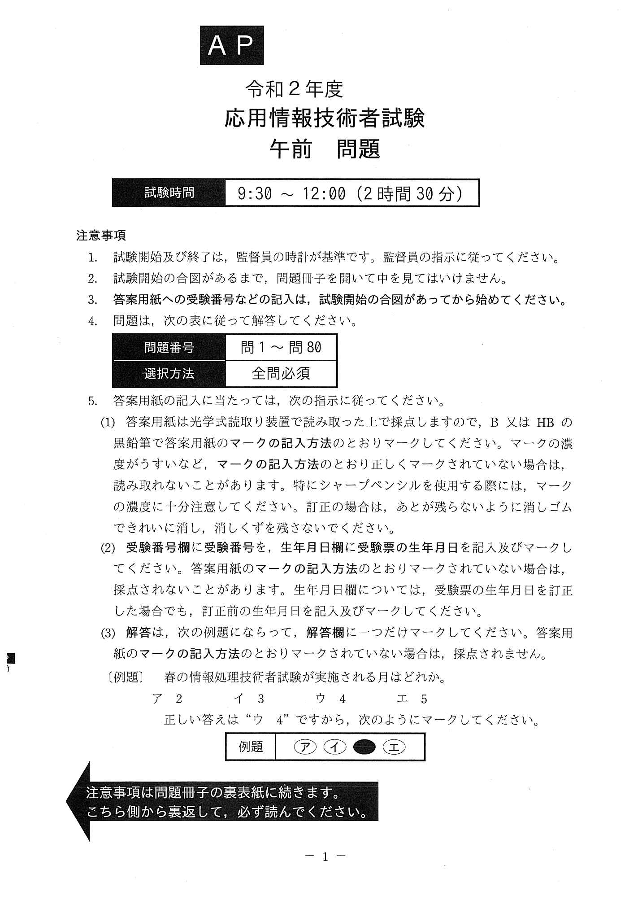

テキスト (OCR)

令和 2 年度
応用情報技術者試験
午前 問題

 9:30 ~ 12:00 (2時間 30 分)

注意事項
1. 試験開始及び終了は, 監督員の時計が基準です。監督員の指示に従ってください。
2. 試験開始の合図があるまで, 問題冊子を開いて中を見てはいけません。

3. 管案用紙への受験番号などの記入は, 試験開始の合図があってから始めてください。
4. 問題は, 次の表に従って解答してください。
問題番号       間 1 て 問 80
選択方法    全間必須
答案用紙の記入に当たっては, 次の指示に従ってください。

①) 答案用紙は光学式読取り装置で読み取った上で採点しますので, B 又は HB の
黒鉛筆で答案用紙のマークの記入方法のとおりマークしてください。マークの濃
度がうすいなど, マークの記入方法のとおり正しくマークされていない場合は,
読み取れないことがあります。 特にシャープペンシルを使用する際には, マーク
の濃度に十分注意してください。訂正の場合は, あとが残らないように消しゴム
できれいに消し, 消しくずを残さないでください。

(2) 受験番号欄に受験番号を, 生年月日欄に受験票の生年月日を記入及びマークし
てください。 答案用紙のマークの記入方法のとおりマークされていない場合は,
採点されないことがあります。生年月日欄については, 受験票の生年月日を訂正
した場合でも, 訂正前の生年月日を記入及びマークしてください、。

(3) 解答は, 次の例題にならって, 解答欄に一つだけマークしてください。 SEH
紙のマークの記入方法のとおりマークされていない場合は, 採点されません。

〔例題) 春の情報処理技術者試験が実施される月はどれか。

デア 2    イ 3    ウ 4    エ 5
正しい答えは“ウ 4"ですから, 次のようにマークしてください。

例題 | 〈の(の ⑤

に

注意事項は問題冊子の裏表紙に続きます。

こちら側から裏返して, 必ず読んでください。

### ページ 2

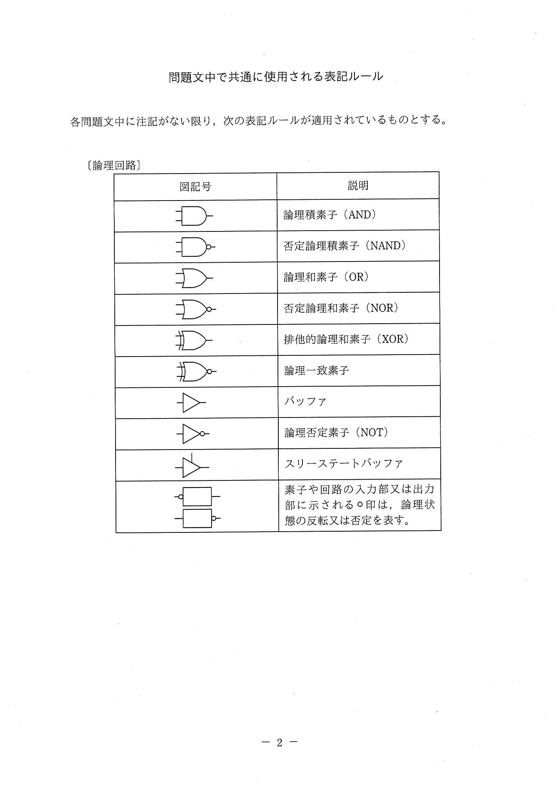

テキスト (OCR)

間題文中で共通に使用される表記ルール

各間題文中に注記がない限り, 次の表記ルールが適用されているものとする。

〔論理回路]

i
ou
cu
a

説明

論理積素子 (AND)

否定論理積素子 (NAND)

論理和素子 (OR)

否定論理和素子 (NOR)

排他的論理和素子 (XOR)

論理一致素子

がツア

YIMMMVMM

論理否定素子 (NOT)

スリーステートバッファ

素子や回路の入力部又は出力
部に示されるo9印は, 論理状
上態の反転又は否定を表す。

VIY

由

### ページ 3

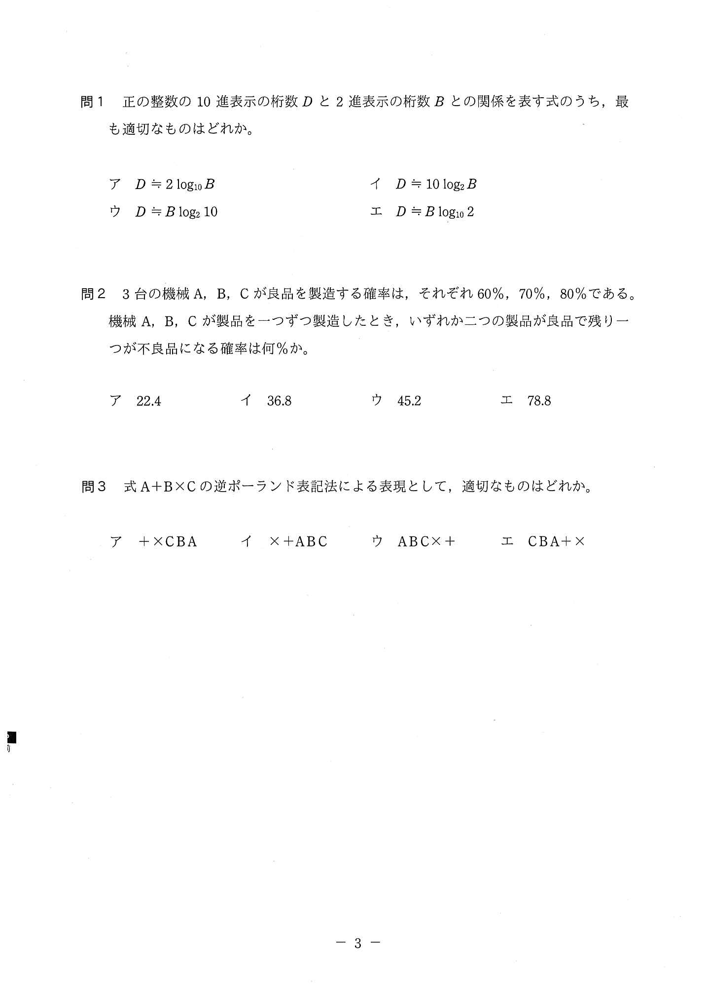

テキスト (OCR)

fll 正の整数の 10 進表示の桁数の と 2 進表示の桁数 j との関係を表す式のうち, 最
も適切なものはどれか。

ア の=2logi。ぢ                     イ D=10lomB

ウ の=log10               エ DS Blog 2

問2 3台の機械A, B, Cが良品を製造する確率は, それぞれ60%, 70%, 80% CHS,
Beek A, B, Cが製品を一つずつ製造したとき, いずれか二つの製品が良品で残り一
つが不良品になる確率は何%か。

ア 22.4     イ 36.8     ウ 45.2     xr 78.8

AS 式A+BXCの逆ポーランド表記法による表現として, 適切かものはどれか。

ア ++XCBA   ft ※十ABC   ウ ABCX+   = CBA+X

### ページ 4

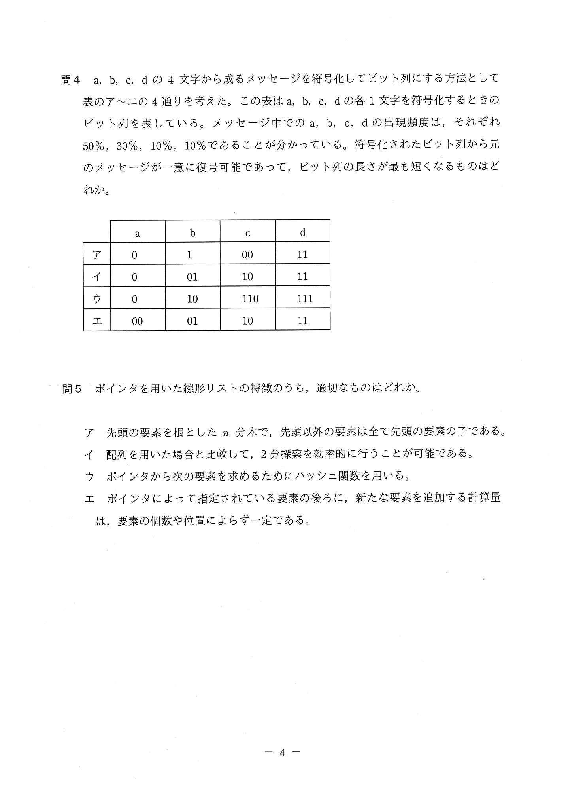

テキスト (OCR)

問4 a b,c, d の 4 文字から成るメッセージを符号化してビット列にする方法として
表のアーエの 4 通りを考えた。この表はa, b, c, d の各 1 文字を符号化するときの
ビット列を表している。メッセージ中での a, b, c, d の出現頻度は, それぞれ
50%, 30%, 10%, 10%であることが分かっている。符号化されたビット列から元
のメッセージが一意に復号可能であって, ビット列の長さが最も短くなるものはど
れか。

a      b      C      d
  0    1    00    11
イ     0        01       10       11
2 0 10 110111
エ 00 01 1011

AS ポインタを用いた線形リストの特徴のうち, 適切なものはどれか。

先頭の要素を根とした ヶ DRC, 先頭以外の要素は全て先頭の要素の子である。
配列を用いた場合と比較して, 2 分探索を効率的に行うことが可能である。

ポインタから次の要素を求めるためにハッシュ関数を用いる。

ポインタによって指定されている要素の後ろに, 新たな要素を追加する計算量
は, 要素の個数や位置によらず一定である。

H st A MW

### ページ 5

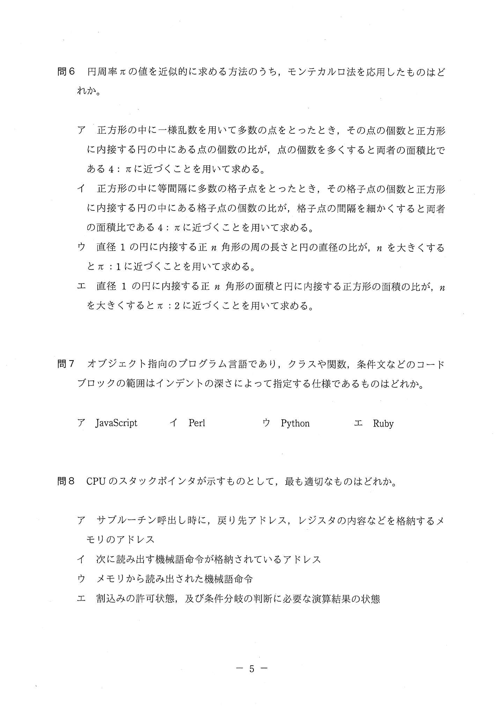

テキスト (OCR)

間6 円周率*の値を近似的に求める方法のうち, モンテカルロ法を応用したものはど
れか。

ア 正方形の中に一様乱数を用いて多数の点をとったとき, その点の個数と正方形
に内接する円の中にある点の個数の比が, 点の個数を多くすると両者の面積比で
ある4: zに近づくことを用いて求める。

イ 正方形の中に等間隔に多数の格子点をとったとき, その格子点の個数と正方形
に内接する円の中にある格子点の個数の比が, 格子点の間隔を細かくすると両者
の面積比である 4 : zに近づくことを用いて求める。

ウ 直径 1 の円に内接する正 n 角形の周の長さと円の直径の比が, ヵ を大きくする
と : 1 に近づくことを用いて求める。

エ 直径 1 の円に内接する正 ヵ 角形の面積と円に内接する正方形の面積の比が, ヵ
を大きくするとr : 2 に近づくことを用いて求める。

間7 オブジェクト指向のプログラム言語であり, クラスや関数, 条件文などのコード
ブロックの範囲はインデントの深さによって指定する仕様であるものはどれか。

ア JavaScript   イ Perl     ウ Python    <= Ruby

間8 CPUのスタックボポインタが示すものとして, 最も適切なものはどれか。

ア サブルーチン呼出し時に, 戻り先アデドレス, レジスタの内容などを格納するメ
モリのアドレス

イ 次に読み出す機械語命令が格納されているアドレス

ウ メモリから読み出された機械語命令

エ 割込みの許可状態, 及び条件分岐の判断に必要な演算結果の状態

### ページ 6

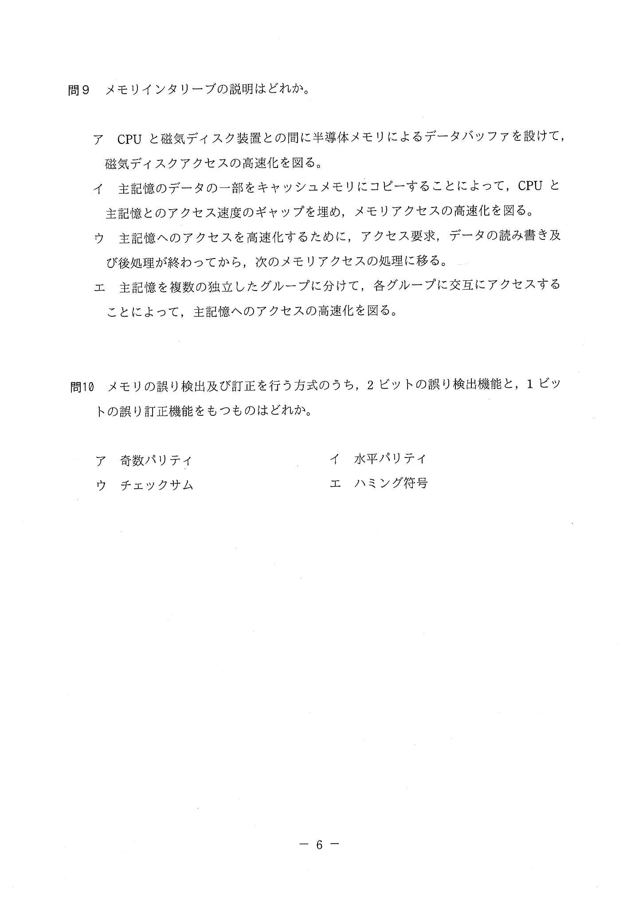

テキスト (OCR)

間9 メモリインタリーブの説明はどれか。

ア CPU と磁気ディスク装置との間に半導体メモリによるデータバッファを設けて,
磁気ディスクアクセスの高速化を図る。

4 主記憶のデータの一部をキャッシュメモリにコピーすることによって, CPU と
主記憶とのアクセス速度のギャップを埋め, メモリアクセスの高速化を図る。

ウ 主記憶へのアクセスを高速化するために, アクセス要求, データの読み書き及
び後処理が終わってから, 次のメモリアクセスの処理に移る。

エ 主記憶を複数の独立したグループに分けて, 各グループに交互にアクセスする
ことによって, 主記憶へのアクセスの高速化を図る。

B10 メモリの誤り検出及び訂正を行う方式のうち, 2 ビットの誤り検出機能と, 1 ビッ

トの誤り訂正機能をもつものはどれか。

ア 奇数パリティ           イ 水平パリティ
ウ チェックサム           エ ハミング符号

### ページ 7

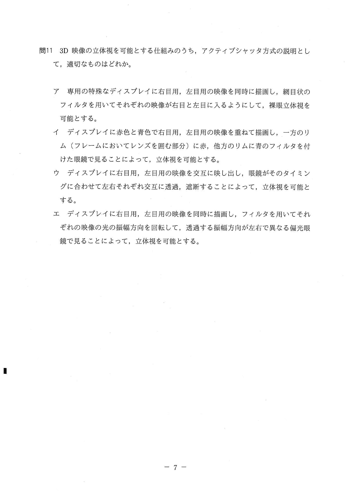

テキスト (OCR)

間11 3D 映像の立体視を可能とする仕組みのうち, アクティブシャッタ方式の説明とし
て, 適切なものはどれか。

ア 専用の特殊なディスプレイに右目用, 左目用の映像を同時に描画し, MARKO
フィルタを用いてそれぞれの映像が右目と左目に入るようにして, 裸眼立体視を
可能とする。

イ ディスプレイに赤色と青色で右目用, 左目用の映像を重ねて搬画し, 一方のリ
ム (フレームにおいてレンズを囲む部分) に赤, 他方のリムに青のフィルタを付
けた有眼鏡で見ることによって, 立体視を可能とする。

ウ ディスプレイに右目用, 左目用の映像を交互に映し出し, 眼鏡がそのタイミン
グに合わせて左右それぞれ交互に逃過, 遮断することによって, 立体視を可能と
する。

エ ディスプレイに右目用, 左目用の映像を同時に描画し, フィルタを用いてそれ
ぞれの映像の光の振幅方向を回転して, 透過する振幅方向が左右で異なる偏光眼
鏡で見ることによって, 立体視を可能とする。

### ページ 8

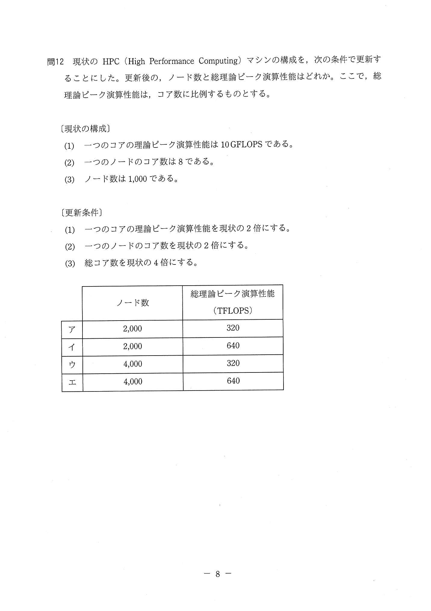

テキスト (OCR)

R12 現状の HPC (High Performance Computing) マシンの構成を, 次の条件で更新す
ることにした。更新後の。 ノード数と総理論ピーク演算性能はどれか。ここで, 総
理論ピーク演人算性能は, コア数に比例するものとする。

現状の構成]

1) 一つのコアの理論ピーク演算性能は 10GFLOPS である。
(2) 一つのノードのコア数は 8 CHS,

(3) ノード数は 1.000 CHS.

[更新条件]

(1) 一つのコアの理論ピーク演算性能を現状の 2 倍にする。
2) 一つのノードのコア数を現状の 2 倍にする。

(3) 総コア数を現状の4倍にする。

     総理論ピーク演算性能
ノード数
(TFLOPS)
ア                           2,000                                               320
4                           2,000                                               640
ウ                           4,000                                               320
x                           4,000                                               640

### ページ 9

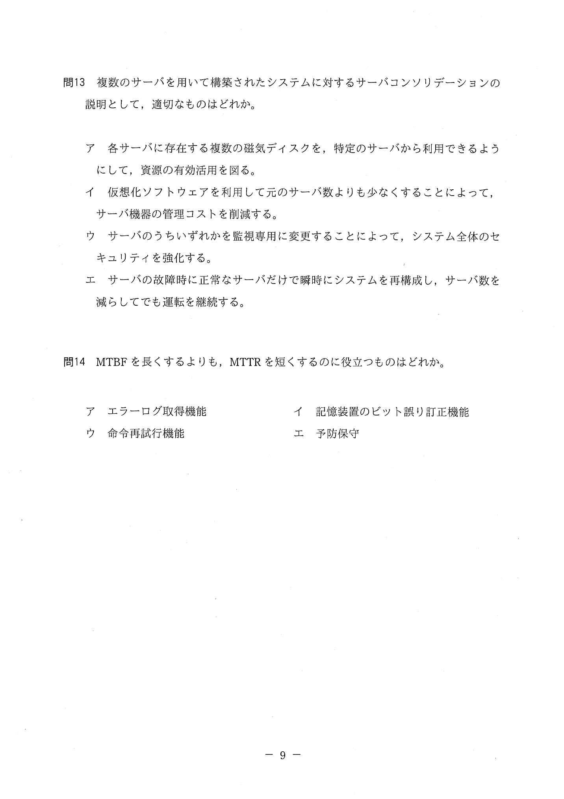

テキスト (OCR)

間13 複数のサーバを用いて構築されたシステムに対するサーバコンソリデーションの
説明として, 適切ながものはどれか。

ア 各サーバに存在する複数の磁気ディスクを, 特定のサーバから利用できるよう
にして, 資源の有効活用を図る。
イ 仮想化ソフトウェアを利用して元のサーバ数よりも少なくすることによって,
サーバ機器の管理コストを削減する。
ウ サーバのうちいずれかを監視専用に変更することによって, システム全体のセ
キュリティを強化する。
エエ サーバの故障時に正常なサーバだけで瞬時にシステムを再構成し, サーバ数を
減らしてでも運転を継続する。

間14 MTBF を長くするよりも, MTTR を短くするのに役立つものはどれか。

ア エラーログ取得機能        イ 記層装置のビット誤り訂正機能
ウ eR HAE          エ PBR

### ページ 10

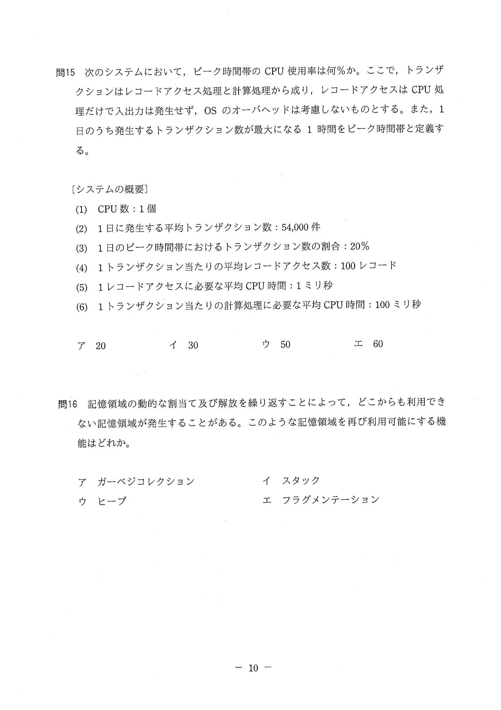

テキスト (OCR)

問15 次のシステムにおいて, ピーク時間帯の CPU 使用率は何%か。ここで, トランザ
クションはレコードアクセス処理と計算処理から成り, レコードアクセスは CPU 処
理だけで入出力は発生せず, OS のオーバヘッドは考慮しないものとする。また, 1
日のうち発生するトランザクション数が最大になる 1 時間をビーク時間帯と定義す
る。

[システムの概要]

Q①) CPU数:1個

Q) 1日に発生する平均トランザクション数 : 54,000 件

38) 1 日のピーク時間帯におけるトランザクション数の割合 20%

(4) 1トランザクション当たりの平均レコードアクセス数 : 100 レコード

(5) 1 レコードアクセスに必要な平均CPU時間 : 1 ミリ秒

(6) 1トランザクション当たりの計算処理に必要な平均CPU時間 : 100 ミリ秒

問16 記憶領域の動的な割当て及び解放を繰り返すことによって, どこからも利用でき
ない記憶領域が発生することがある。このような記憶領域を再び利用可能にする機
能はどれか。

ア ガーベジコレクション         イ スタック

ウ ヒープ              = フラグメンテーション

ー 10 一

### ページ 11

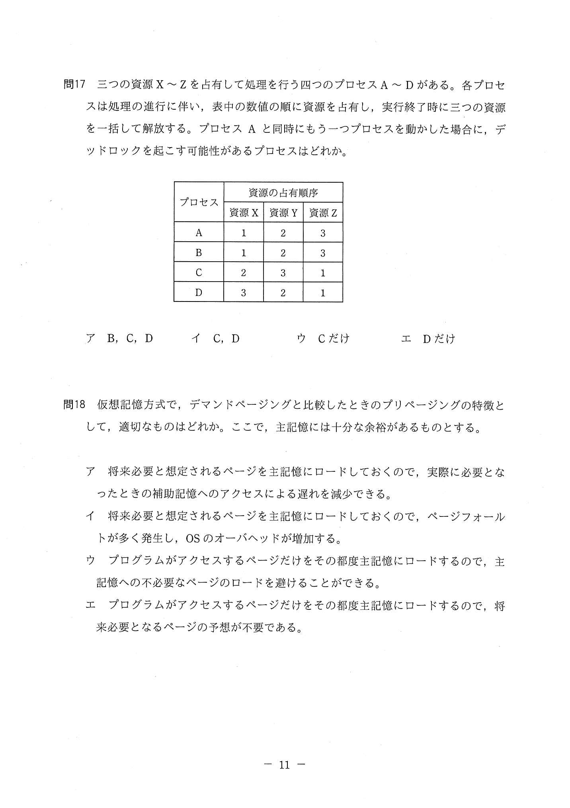

テキスト (OCR)

Al? 三つの資源メーZを占有して処理を行う四つのプロセスA D がある。各プロセ
スは処理の進行に伴い, 表中の数値の順に資源を占有し, 実行終了時に三つの資源
を一括して解放する。プロセス A と同時にもう一つプロセスを動かした場合に, デ
ッドロックを起こす可能性があるプロセスはどれか。

資源の占有順序
資源X | 資源Y | 資源Z

1  2  3

1

プロセス

|1O |

2
2    3    1
2

ア B, C, D   イ ¢,D     ウ Cだけ     エ Dだけ

間18 仮想記憶方式で, デマンドページングと比較したときのプリページングの特徴と
UT, 適切がものはどれか。ここで, 主記憶には十分な余裕があるものとする。

ア 将来必要と想定されるページを主記憶にロードしておくので, 実際に必要とな
ったときの補助記憶へのアクセスによる遅れを減少できる。

イ 将来必要と想定されるページを主記憶にロードしておくので, ページフォール
トが多く発生し, 0S のオーバヘッドが増加する。

ウ プログラムがアクセスするページだけをその都度主記憶にロードするので, 主
記憶への不必要なページのロードを避けることができる。

エ プログラムがアクセスするページだけをその都度主記憶にロードするので, 将
来必要となるページの予想が不要である。

ー 11 一

### ページ 12

テキスト (OCR)

間19 OSS (Open Source Software) における, ディストリビュータの役割はどれか。

ア OSS やアプリケーションソフトウェアを組み合わせて, パッケージにして提供
する。

4 OSS を開発し, 活動状況を Web で公開する。

ウ OSS を稼働用のコンピュータにインストールし, 動作確認を行う。

エエ 0SS を含むソフトウェアを利用したシステムの提案を行う。

F920 SRAM と比較した場合の DRAM の特徴はどれか。

主にキャッシュメモリとして使用される。

データを保持するためのリフレッシュ又はアクセス動作が不要である。
メモリセル構成が単純なので, ビット当たりの単価が安くなる。

メモリセルにフリップフロップを用いてデータを保存する。

Hさささ

問21 FPGA などに実装するディジタル回路を記述して, 直接論理合成するために使用
されるものはどれか。

ア DDL     イ HDL     ウ UML    エ XML

ー 12 一

### ページ 13

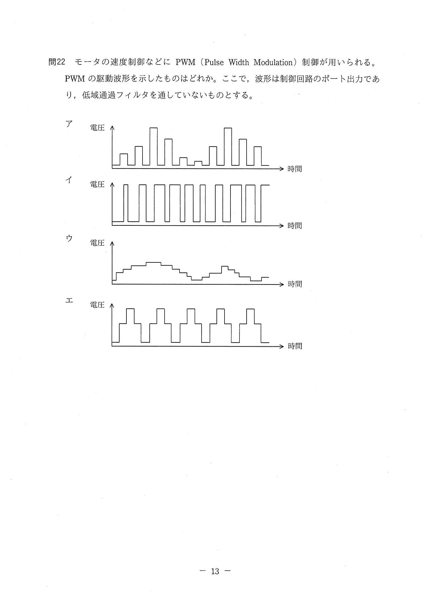

テキスト (OCR)

問22 モータの速度制御などに PWM (Pulse Width Modulation) 制御が用いられる。
PWM の駆動波形を示したものはどれか。ここで, 波形は制御回路のポート出力であ
り, 低域通過フィルタを通していないものとする。

7 fe
時間

イ «Ee
時間
ーー on
時間

= 18 =

### ページ 14

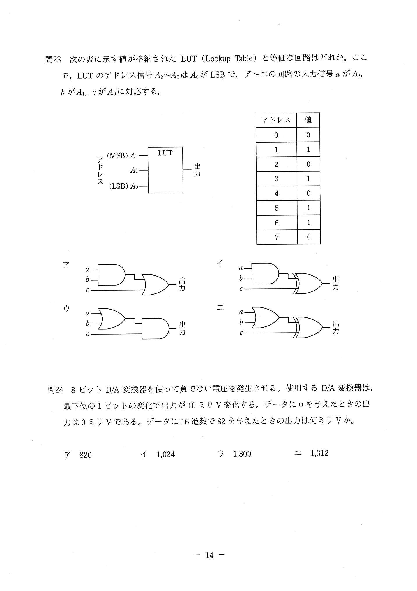

テキスト (OCR)

問23 次の表に示す値が格納された LUT (Lookup Table) と等価な回路はどれか。ここ
で, LUT のアドレス信号 4ー4。は 4。が LSB で, アーエの回路の入力信号々が4。,
BMA, cが4。に対応する。

アドレス | 値

0     0

ァ (MsB) ー| LUT                     4A      a
* rsB) Ao—                  3    1
4     0

5     1

6     1

7     0

ッ   a                     Toa
b               出         b
一ーーーーーーー     A       と

間24 8 ビット D/A 変換器を使って負でない電圧を発生させる。使用する D/A 変換器は,
最下位の 1 ビットの変化で出力が 10 ミリ Y変化する。データに 0 を与えたときの出
力は0 ミリ Vである。データに 16 進数で 82 を与えたときの出力は何ミリ VO.

SE

ア 820     イ 1,024    ウ 1,300    エ 1,312

=~ {4

### ページ 15

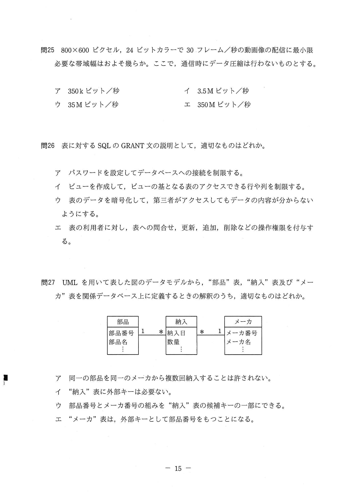

テキスト (OCR)

間25 800X600 ピクセル, 24 ビットカラーで 30 フレームノ秒の動画像の配信に最小限
必要な帯域幅はおよそ幾らか。ここで, 通信時にデータ圧縮は行わかいものとする。

ア 350k ビットンノ秒        イ 3.5M ビットンノ秒
ウ 35Mビットンノ秒        エ 350Mビットン秒

間26 表に対する SQL の GRANT 文の説明として, 適切なものはどれか。

ア パスワードを設定してデータベースへの接続を制限する。

イ ビューを作成して, ビューの基となる表のアクセスできる行や列を制限する。

ウ 表のデータを暗号化して, 第三者がアクセスしてもデータの内容が分からない
ようにする。

エ 表の利用者に対し, 表への問合せ, 更新, 追加, 削除などの操作権限を付与す
る。

間27 UML を用いて表した図のデータモデルから, “部品” 表, “WA” 表及び“メー
A” 表を関係データベース上に定義するときの解釈のうち, 適切なものはどれか。

部品        納入         メーカ
部品番号 2  ※|納入日 Le _ 1|メーカ番号
部品名       数量        メーカ名

同一の部品を同一のメーカから複数回納入することは許されない。
納入” 表に外部キーは必要ない。

部品番号とメーカ番号の組みを“納入” 表の候補キーの一部にできる。
“メーカ” 表は, 外部キーとして部品番号をもつことになる。

HG AM

ー 一

### ページ 16

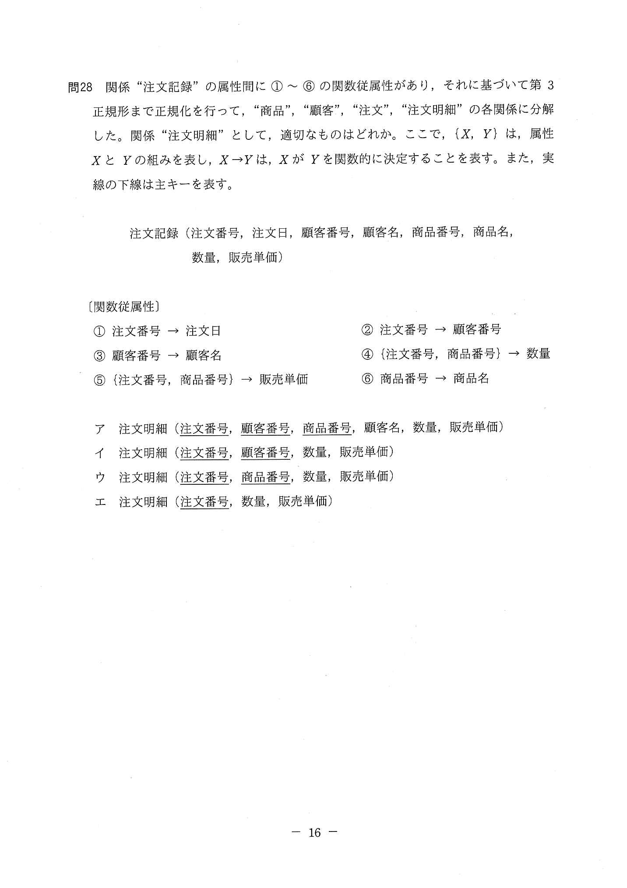

テキスト (OCR)

間28 関係 "注文記録” の属性間に ① ~ © の関数従属性があり, それに基づいて第 3
正規形まで正規化を行って, “商品”, “顧客", “VER”, “注文明細" の各関係に分解
した。関係 “注文明細” として, 適切なものはどれか。ここで, (X, Y) は, 属性
メと 也の組みを表し, メーは, が 也を関数的に決定することを表す。また, 実
線の下線は主キーを表す。

注文記録 (注文番号, 注文日, MBBS, 顧客名, 商品番号, 商品名
数量, 販売単価)

[関数従属性

① 注文番号 > 注文日          ② 注文番号 つ 顧客番号

⑬ 顧客番号 つ 顧客名           ④ (注文番号, 商品番号) づつ 数量
© (注文番号, MBS) > 販売単価    © 商品番号 つ 商品名

ア 注文明細 (注文番号, MASS, 商品番号, MAS, 数量, 販売単価)

イ 注文明細 (注文番号, 顧客番号, 数量, 販売単価)

ウ 注文明細 (注文番号, 商品番号, 数量, 販売単価)

エ 注文明細 (注文番号, 数量, 販売単価)

ー 16 一

### ページ 17

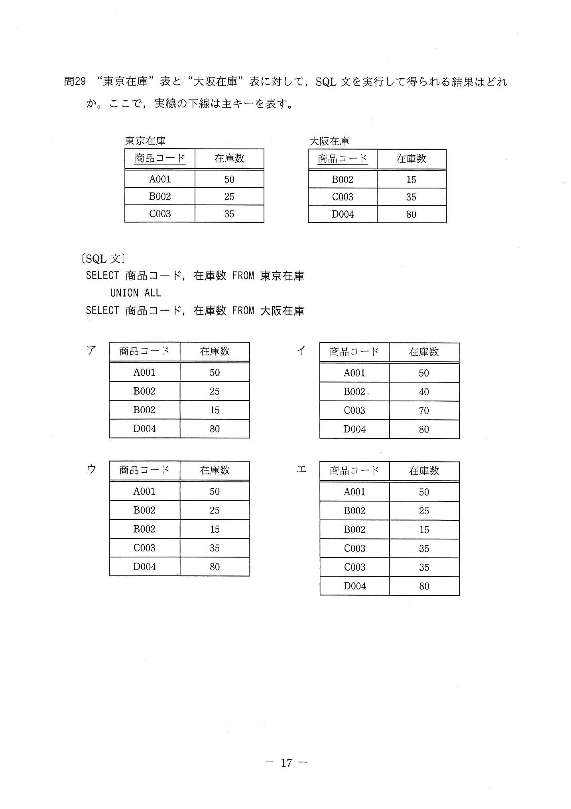

テキスト (OCR)

問29 “東京在庫” 表と“大阪在庫” 表に対して, SQL 文を実行して得られる結果はどれ
か。ここで, 実線の下線は主キーを表す。

東京在庫             大阪在庫
商品コード   在庫数       商品コード   在庫数

A001                       50                                         B002                       15
B002                       25                                         C003                       35
C003                       35                                         D004                      80

(SQL 文】

SELECT 商品コード, 在庫数 FROM 東京在庫

UNION ALL

SELECT 商品コード, 在庫数 FROM 大阪在庫

ア | 商品コード    在庫数         イ | 商品コード    在庫数
A001                 50                                       A001                 50
B002                 25                                       B002                 40
B002                 15                                       C003                 70
D004                 80                                       D004                 80
ウ | 商品コード    在庫数          = | 商品コード    在庫数
A001                 50                                       A001                 50
B002                 25                                       B002                 25
B002                 15                                       B002                 15
C003                 35                                       C003                 35
D004                 80                                       CO003                 35
D004                 80

ー 17 一

### ページ 18

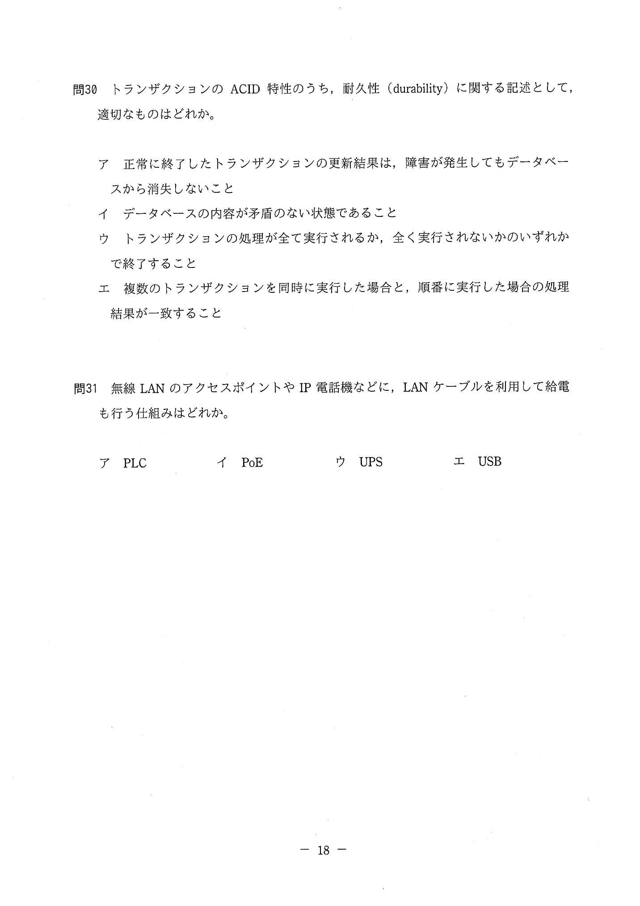

テキスト (OCR)

問39 トランザクションの ACID 特性のうち, 耐久性 (durability) に関する記述として,
適切おものはどれか。

ア 正常に終了したトランザクションの更新結果は, 障害が発生してもデータベー
スから消失しないこと

イ データベースの内容が茅盾のない状態であること

ウ トランザクションの処理が全て実行されるか, 全く実行されないかのいずれか
で終了すること

エ 複数のトランザクションを同時に実行した場合と, 順番に実行した場合の処理
結果が一致すること

問31 無線 LAN のアクセスポイントや TP 電話機などに, LAN ケーブルを利用して給電

も行う仕組みはどれか。

ア PLC     イ PoE     ウ UPS     x= USB

ー 18 一

### ページ 19

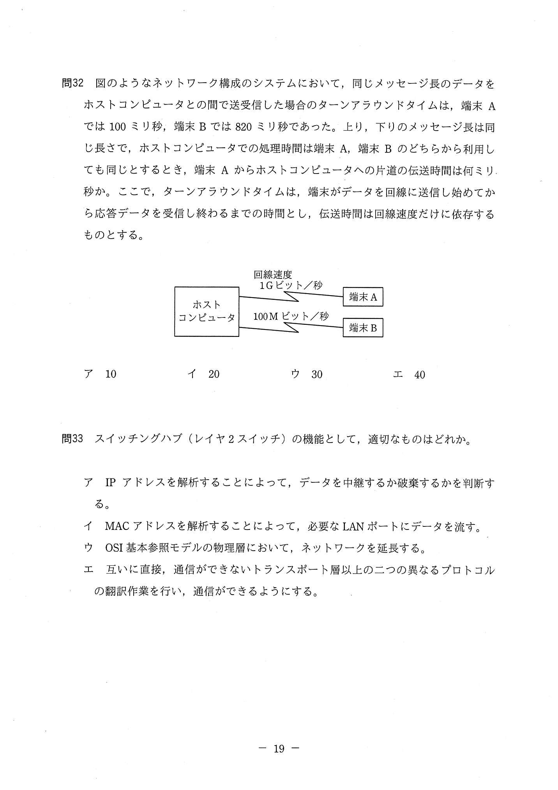

テキスト (OCR)

問32 図のようなネットワーク構成のシステムにおいて, 同じメッセージ長のデータを
ホストコンピュータとの間で送受信した場合のターンアラウンドタイムは, 端末 A
では 100 ミリ秒, 端末 B では 820 ミリ秒であった。 上り, 下りのメッセージ長は同
じ長さで, ホストコンピュータでの処理時間は端末 A, 端末 B のどちらから利用し
ても同じとするとき, 端末 A からホストコンピュータへの片道の伝送時間は何ミリ.
秒か。ここで, ターンアラウンドタイムは, 端末がデータを回線に送信し始めてか
ら応答データを受信し終わるまでの時間とし, 伝送時間は回線速度だけに依存する
ものとする。

回線速度
1Gビットンノ秒
i
ホスト            端末 A
コンピュータ| 100Mビットンノ秒
端末 B
ア 10     イ 20     ウ 30     x= 40

間33 スイッチングハブ (レイヤ 2 スイッチ) の機能として, 適切がものはどれか。

ア IP アドレスを解析することによって, データを中継するか破棄するかを判断す
る。

4 MAC アドレスを解析することによって, 必要なLAN ポートにデータを流す。

ウ OSI基本参照モデルの物理層において, ネットワークを延長する。

エ 互いに直接, 通信ができないトランスポート層以上の二つの異なるプロトコル
の翻訳作業を行い, 通信ができるようにする。

ー 19 一

### ページ 20

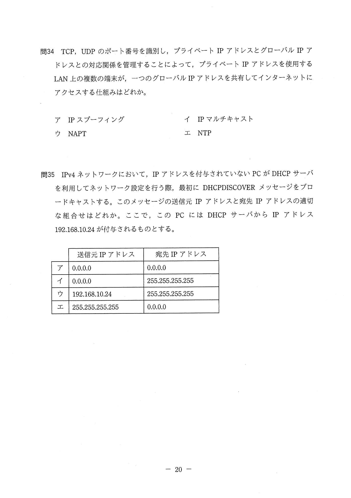

テキスト (OCR)

間34 TCP, UDP のポート番号を識別し, プライベート PT ドレスとグローバル IP ア
ドレスとの対応関係を管理することによって, プライベート IP アドレスを使用する
LAN 上の複数の端末が, 一つのグローバル IP アドレスを共有してインターネットに

アクセスする仕組みはどれか。

ア IPスプーフィング
ウ NAPT

イ IPマルチキャスト
エエ NTP

問35 IPv4 ネットワークにおいて, IP アドレスを付与されていない PC が DHCP サーバ

を利用してネットワーク設定

を行う際, 最初に DHCPDISCOVER メッセージをブロ

ードキャストする。このメッセージの送信元 IP アドレスと和宛先 IP アドレスの適切
な組合せはどれか。ここで, この PC には DHCP サーバから IP アドレス
192.168.10.24 が付与されるものとする。

送信元 IP アドレス    宛先IP アドレス
ア | 0.0.0.0                     0.0.0.0
イ | 0.0.0.0                     255.255.255.255
ウ | 192.168.10.24             255.255.255.255
工 | 255.255.255.255           0.0.0.0

ー 20 一

### ページ 21

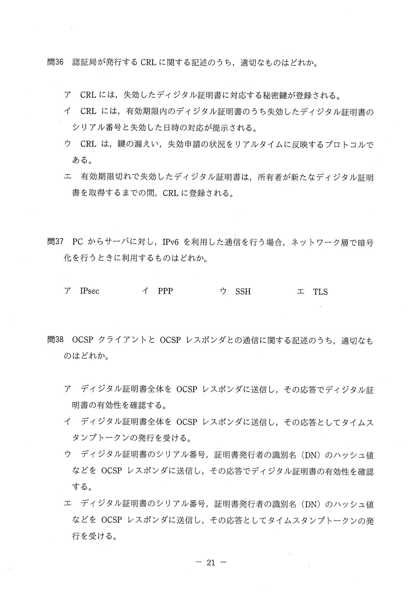

テキスト (OCR)

問36 認証局が発行する CRL に関する記述のうち, 適切なものはどれか。

ア CRL には, 失効したディジタル証明書に対応する秘密鍵が登録される。

イ CRL には, 有効期限内のディジタル証明書のうち失効したディジタル証明書の
シリアル番号と失効した日時の対応が提示される。

ウ CRL は, 鍵の漏えい, 失効申請の状況そりリアルタイムに反映するプロトコルで
ある。

エエ 有効期限切れで失効したディジタル証明書は, 所有者が新たなディジタル証明
書を取得するまでの間, CRL に登録される。

問37 PC からサーバに対し, IPv6 を利用した通信を行う場合, ネツットワーク層で暗号
化を行うときに利用するものはどれか。

ア IPsec    イ PPP     ウ SSH     = TLS

間38 OCSP クライアントと OCSP レスポンダとの通信に関する記述のうち, 適切なも
のはどれか。

ア ディジタル証明書全体を 0CSP レスポンダに送信し, その応答でディジタル証
明書の有効性を確認する。

イ ディジタル証明書全体を OCSP レスポンダに送信し, その応答としてタイムス
タンプトークンの発行を受ける。

ウ ディジタル証明書のシリアル番号, 証明書発行者の識別名 (DN) のハッシュ値
などを OCSP レスポンダに送信し, その応答でディジタル証明書の有効性を確認
する。

エ ディジタル証明書のシリアル番号, 証明書発行者の識別名 (DN) のハッシュ値
などを OCSP レスポンダに送信し, その応答としてタイムスタンプトークンの発
行を受ける。

ー 21 一

### ページ 22

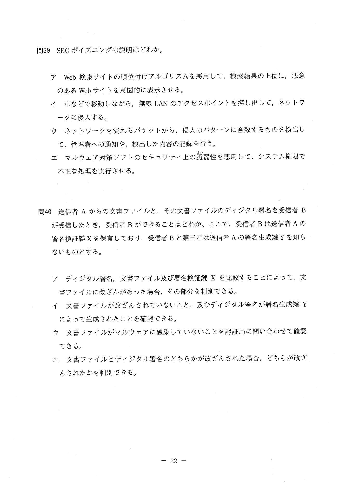

テキスト (OCR)

間39 SEO ポイズニングの説明はどれか。

ア Web 検索サイトの順位付けアルゴリズムを悪用して, 検索結果の上位に, 悪意

のある Web サイトを意図的に表示させる。

4 車などで移動しながら, 無線 LAN のアクセスポイントを探し出して, ネットワ
クに侵入する。

ウ ネットワークを流れるパケットから, 侵入のパターンに合致するものを検出し

て, 管理者への通知や, 検出した内容の記録を行う。

ae VO LTH I hOLEAUT + LOWBEEBALT, システム権限で

不正な処理を実行させる。

問49 送信者A からの文書ファイルと, その文書ファイルのディジタル署名を受信者 B
が受信したとき, 受信者 B ができることはどれか。ここで, 受信者 B は送信者A の
署名検証鍵 X を保有しており, 受信者 B と第三者は送信者 A の署名生成鍵Y を知ら
ないものとする。

ア FIVINER, 文書ファイル及び署名検証鍵 X を比較することによって, 文
書ファイルに改ざんがあった場合, その部分を判別できる。

A 文書ファイルが改ざんされていないこと, 及びディジタル署名が署名生成鍵 Y
によって生成されたことを確認できる。

ウ 文書ファイルがマルウェアに感染していないことを認証局に問い合わせて確認
できる。

エエ 文書ファイルとディジタル署名のどちらかが改ざんされた場合, どちらが改ざ
んされたかを判別できる。

ー 92 一

### ページ 23

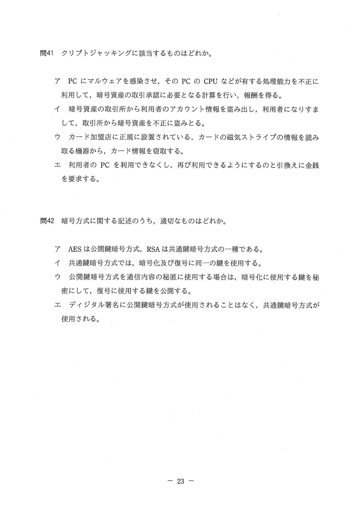

テキスト (OCR)

41 クリプトジャッキングに該当するものはどれか。

ア PC にマルウェアを感染させ, その PC の CPU などが有する処理能力を不正に
利用して, 暗号資産の取引承認に必要となる計算を行い, 報酬を得る。

イ 暗号資産の取引所から利用者のアカウント情報を盗み出し, 利用者になりすま
UT, 取引所から暗号資産を不正に盗みとる。

ウ カード加盟店に正規に設置されている, カードの磁気ストライプの情報を読み
取る機器から, カード情報を初取する。

エエ 利用者の PC を利用できなくし, 再び利用できるようにするのと引換えに金銭
を要求する。

間42 暗号方式に関する記述のうち, 適切なものはどれか。

ア AES は公開鍵暗号方式, RSA は共通鍵暗号方式の一種である。

イ 共通鍵暗号方式では, 暗号化及び復号に同一の鍵を使用する。

ウ 公開鍵暗号方素を通信内容の秘匿に使用する場合は, 暗号化に使用する鍵を秘
密にして, 復号に使用する鍵を公開する。

エ ディジタル署名に公開鍵暗号方式が使用されることはなく, 共通鍵暗号方式が
使用される。

ー 23 一

### ページ 24

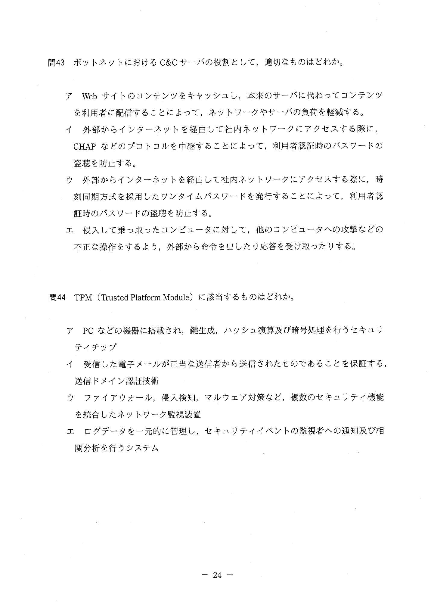

テキスト (OCR)

間43 ボットネットにおける C&C サーバの役割として, 適切なものはどれか。

ア Web サイトのコンテンツをキャッシュし, 本来のサーバに代わってコンテンツ
を利用者に配信することによって, ネットワークやサーバの負荷を軽減する。

イ 外部からインターネットを経由して社内ネットワークにアクセスする際に
CHAP などのプロトコルを中継することによって, 利用者認証時のパスワードの
盗聴を防止する。

ウ 外部からインターネットを経由して社内ネットワークにアクセスする際に, 時
刻同期方式を採用したワンタイムパスワードを発行することによって, 利用者認
証時のパスワードの盗聴を防止する。

エエ 侵入して乗っ取ったコンピュータに対して, 他のコンピュータへの攻撃などの
不正な操作をするよう, 外部から命令を出したり応答を受け取ったりする。

間44 TPM (Trusted Platform Module) に該当するものはどれか。

ア PC などの機器に搭載され, 鍵生成, ハッシュ演算及び暗号処理を行うセキュリ
ディイチップ
イ 受信した電子メールが正当な送信者から送信されたものであることを保証する,
送信ドメイン認証技術
ウ ファイアウォール, 侵入検知, マルウェア対策など, 複数のセキュリティ機能
を統合したネットワーク監視装置
エ ログデータを一元的に管理し,, セキュリティイベントの監視者への通知及び相
関分析を行うシステム

ー 24 一

### ページ 25

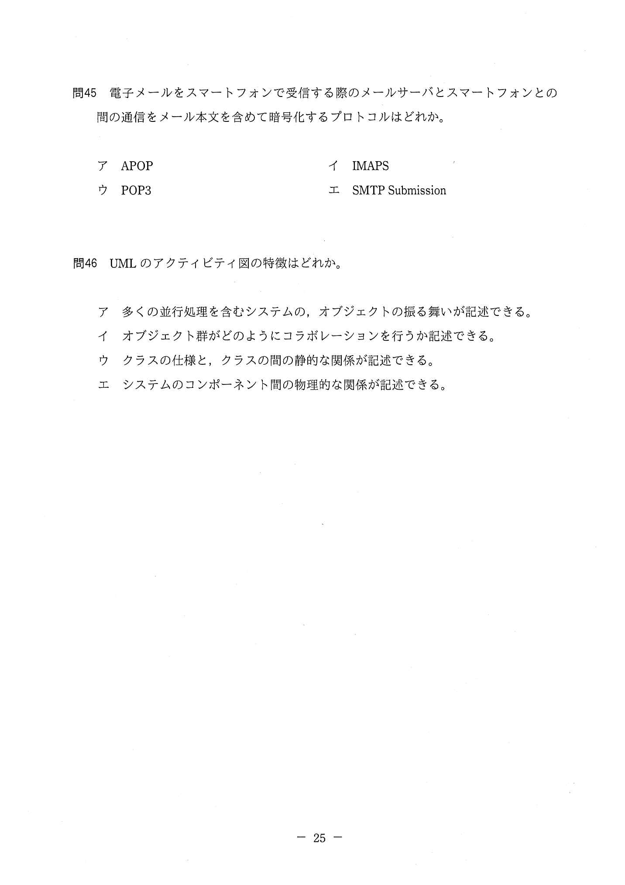

テキスト (OCR)

問45 電子メールをスマートフォンで受信する際のメールサーバとスマートフォンとの
間の通信をメール本文を含めて暗号化するプロトコルはどれか。

ア APOP           イ IMAPS
ウ POP3             エエ SMTP Submission

間46 UML のアクティビティ図の特徴はどれか。

多くの並行処理を含むシステムの, オブジェクトの振る舞いが記述できる。
オブジェクト群がどのようにコラボレーションを行うか記述できる。

クラスの仕様と, クラスの間の静的な関係が記述できる。

システムのコンポーネント間の物理的な関係が記述できる。

H tA NWN

— 25一

### ページ 26

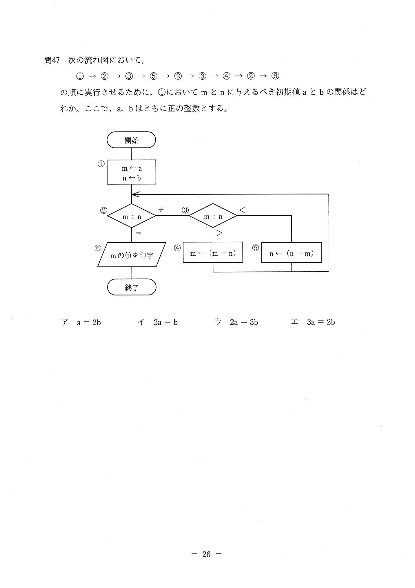

テキスト (OCR)

問47 次の流れ図において,
D-@-O@-O©-O@-OG-©-G8-©O
の順に実行させるために, ①において mとnに与えるべき初期値 。 と b の関係はど
れか。ここで, a b はともに正の整数とする。

mぐa
nb

mの値を印字        mmで (mーn)       n< (n—m)

ll
にョ
\t

ア a=2b    イ 2a       2a = 3b   = 3a= 2b

ー 26 一

### ページ 27

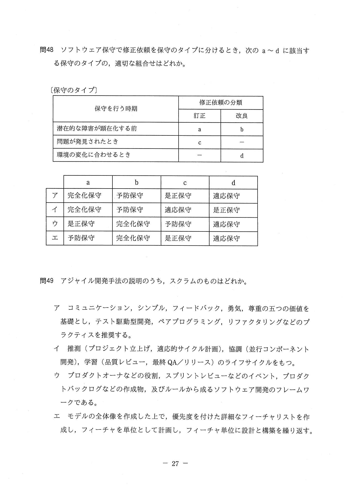

テキスト (OCR)

問48 ソフトウェア保守で修正依頼を保守のタイプに分けるとき, MO anr~d に該当す
る保守のタイプの, 適切な組合せはどれか。

(保守のタイブ)
保守を行う時期          rk
訂正      改良
潜在的な障害が顕在化する前          a      b
問題が発見されたとき             c      =
環境の変化に合わせるとき           =      d
a      b      C      d
ア | 完全化保守 予防保守  是正保守  適応保守
イ | 完全化保守  予防保守   適応保守   是正保守
ウ | 是正保守   完全化保守  予防保守   適応保守
エ | 予防保守  完全化保守  是正保守  適応保守

間49 アジャイル開発手法の説明のうち, スクラムのものはどれか。

FY コミュニケーション, シンプル, フィードバック, BR, 尊重の五つの価値を
基礎とし, テスト駆動型開発, ペアプログラミング, リファクタリングなどのプ
ラクティスを推奨する。

イ 推測 (プロジェクト立上げ, 適応的サイクル計画), 協調 (並行コンポーネント
開発), 学習 (品質レビュー, 最終QAプリリース) のライフサイクルをもつ。

ウ プロダクトオーナなどの役割, スプリントレビューなどのイベント, プロダク
トバックログなどの作成物, 及びルールから成るソフトウェア開発のフレームワ
ークである。

エ モデルの全体像を作成した上で, 優先度を付けた詳細なフィーチャリストを作
成し, フィーチャを単位として計画し, フィーチャ単位に設計と構築を繰り返す。

ー 27 一

### ページ 28

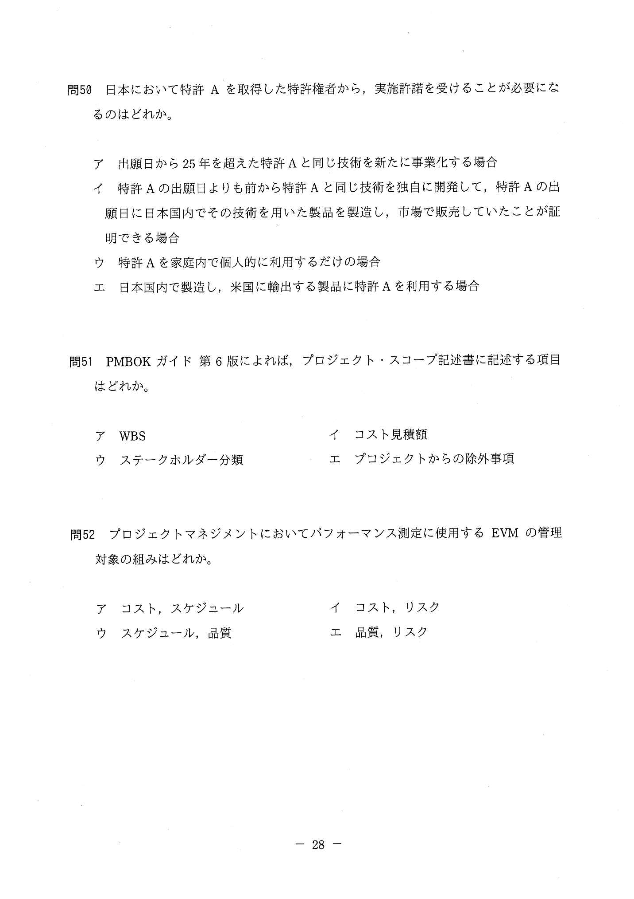

テキスト (OCR)

M50 日本において特許 A を取得した特許権者から, 実施許諾を受けることが必要にな
るのはどれか。

ア 出願日から 25 年を超えた特許 A と同じ技術を新たに事業化する場合

イ 特許Aの出願日よりも前から特許A と同じ技術を独自に開発して, 特許Aの出
願日に日本国内でその技術を用いた製品を製造し, 市場で販売していたことが証
明できる場合

ウ 特許Aを家庭内で個人的に利用するだけの場合

エ 日本国内で製造し, 米国に輸出する製品に特許A を利用する場合

問51 PMBOK ガイド 第6 版によれば, プロジェクト・スコーブプ記述書に記述する項目

はどれか。

ア WBS                         イ コスト見積額

ウ ステークホルダー分類      エ プロジェクトからの除外事項

間52 プロジェクトマネジメントにおいてパフォーマンス測定に使用する EVM の管理

対象の組みはどれか。

ア コスト, スケジュール      イ コスト, VAD
ウ スケジュール, 品質        x 品質, リスク

ー 28 一

### ページ 29

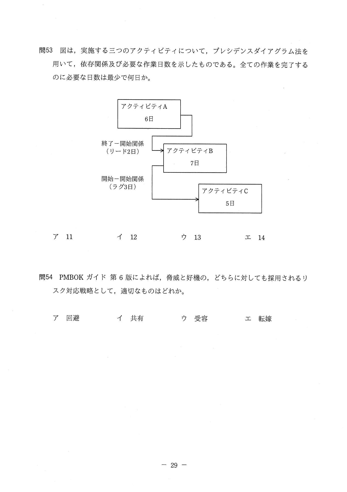

テキスト (OCR)

間53 図は, 実施する三つのアクティビテイィについて, プレシデンスダイアグラム法を
用いて, 依存関係及び必要な作業日数を示したものである。全ての作業を完了する
のに必要な日数は最少で何日か。

アクティビティA

ーー |

終了ー開始関係
(リード2日)  ーー アクティビティB
ー |   78
開始一開始関係
(7738)        FIFACFAC
5H
ァ 1     イ 12     ウ 13     エ 14

問54 PMBOK ガイド 第6 版によれば, 脅威と好機の, どちらに対しても採用されるリ
スク対応戦略として, 適切なものはどれか。

ア 回避    イ 共有    y       x= 転嫁

XA
oy

ー 29 一

### ページ 30

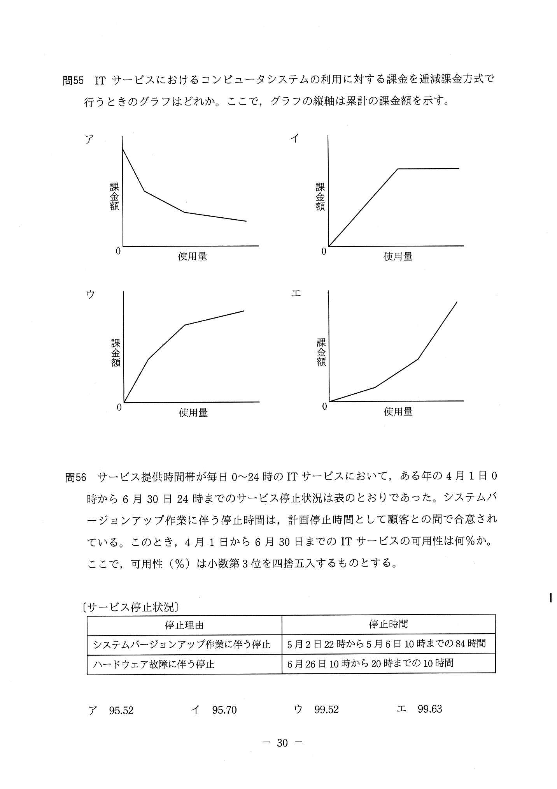

テキスト (OCR)

間55 IT サービスにおけるコンピュータシステムの利用に対する課金を運減課金方式で
行うときのグラフはどれか。ここで, グラフの縦軸は果計の課金額をがす。

ア                 f

Sess

o

使用量                           9             使用量

sass

使用量                                             使用量

間56 サービス提供時間帯が毎日 0て24 時の IT サービスにおいて, ある年の4月1日0
時から 6 月 30 日 24 時までのサービス停止状況は表のとおりであった。システムバ
ージョンアップ作業に伴う停止時間は, 計画停止時間として顧客との間で合意され
ている。このとき, 4 月 1 日から 6 月 30 日までの IT サービスの可用性は何%か。
ここで, 可用性 (%) は小数第 3 位を四捨五入するものとする。

(サービス停止状況

停止理由                 停止時間
システムバージョンアップ作業に伴う停止 | 5月2日22 時から5月6日 10 時までの84 時間
ハードウェア故障に伴う停止           6 月 26 日 10 時から 20 時までの 10 時間
ア 95.52            イ 95.70             ウ 99.52             エ 99.63

ー 30 一

### ページ 31

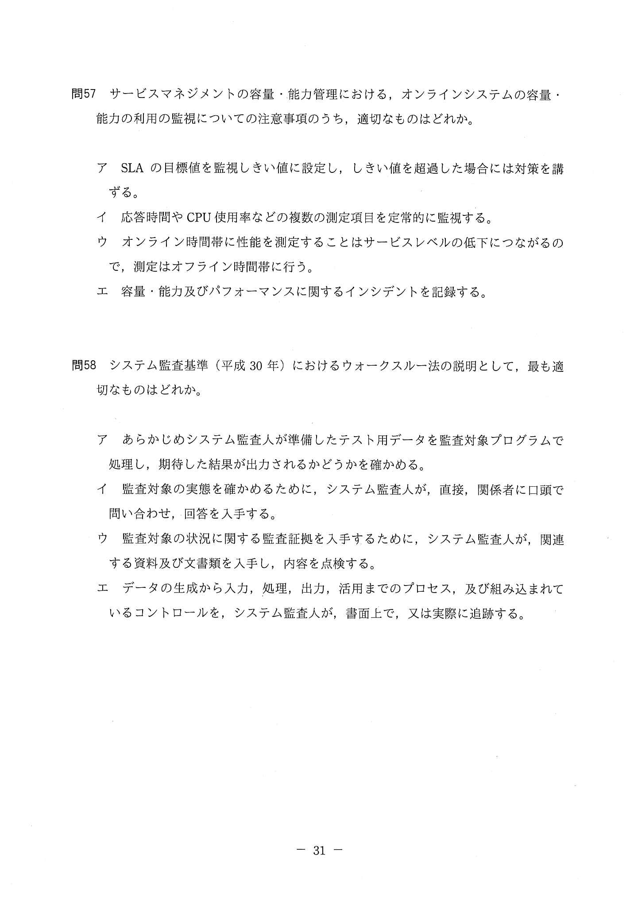

テキスト (OCR)

間57 サービスマネジメントの容量・能力管理における, オンラインシステムの容量・
能力の利用の監視についての注意事項のうち, 適切なものはどれか。

ア SLA の目標値を監視しきい値に設定し, しきい値を超過した場合には対策を講
ずる。

イ 応答時間や CPU使用率などの複数の測定項目を定常的に監視する。

ウ オンライン時間帯に性能を測定することはサービスレベルの低下につながるの
で, 測定はオフライン時間帯に行う。

エエ 容量・能力及びパフォーマンスに関するインシデントを記録する。

間58 システム監査基準 (平成 30 年) におけるウォークスルー法の説明として, 最も適
切なものはどれか。

ア あらかじめシステム監査人が準備したテスト用データを監査対象プログラムで
処理し, 期待した結果が出力されるかどうかを確かめる。

イ 監査対象の実態を確かめるために, システム監査人が, 直接, 関係者に口頭で
問い合わせ, 回答を入手する。

ウ 監査対象の状況に関する監査証拠を入手するために, システム監査人が, 関連
する資料及び文書類を入手し, 内容を点検する。

エ データの生成から入力, 処理, 出力, 活用までのプロセス, 及び組み込まれて
いるコントロールを, システム監査人が, 書面上で, 又は実際に追跡する。

= BE =

### ページ 32

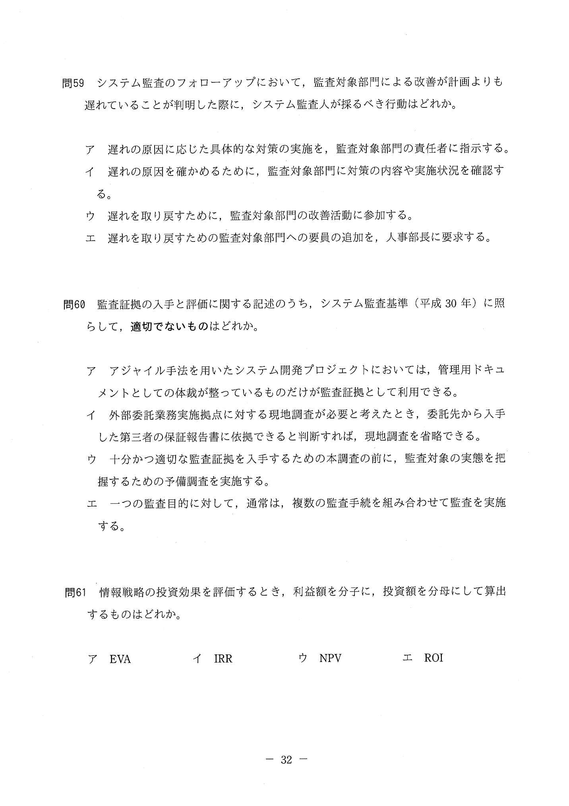

テキスト (OCR)

問59 システム監査のフォローアップにおいて, 監査対象部門による改善が計画よりも
遅れていることが判明した際に, システム監査人が採るべき行動はどれか。

ア 遅れの原因に応じた具体的な対策の実施を, 監査対象部門の次任者に指示する。

イ 遅れの原因を確かめるために, 監査対象部門に対策の内容や実施状況を確認
る。

ウ 遅れを取り戻すために, 監査対象部門の改善活動に参加する。

エ 遅れを取り戻すための監査対象部門への要員の追加を, 人事部長に要求する。

問69 監査証拠の入手と評価に関する記述のうち, システム監査基準 (平成 30 年) に照
らして, 適切でないものはどれか。

ア アジャイル手法を用いたシステム開発プロジェクトにおいては, 管理用ドキュ
メントとしての体裁が整っているものだけが監査証拠として利用できる。

イ 外部委託業務実施拠点に対する現地調査が必要と考えたとき, 委託先から入手
した第三者の保証報告書に依拠できると判断すれば, 現地調査を省略できる。

ウ 十分かつ適切な監査証拠を入手するための本調査の前に, 監査対象の実態を把
握するための予備調査を実施する。

エ 一つの監査目的に対して, 通常は, 複数の監査手続を組み合わせて監査を実施
する。

問61 情報戦略の投資効果を評価するとき, 利益額を分子に, 投資額を分母にして算出

するものはどれか。

ア EVA     イ IRR     ウ NPV     = ROI

ー 32 一

### ページ 33

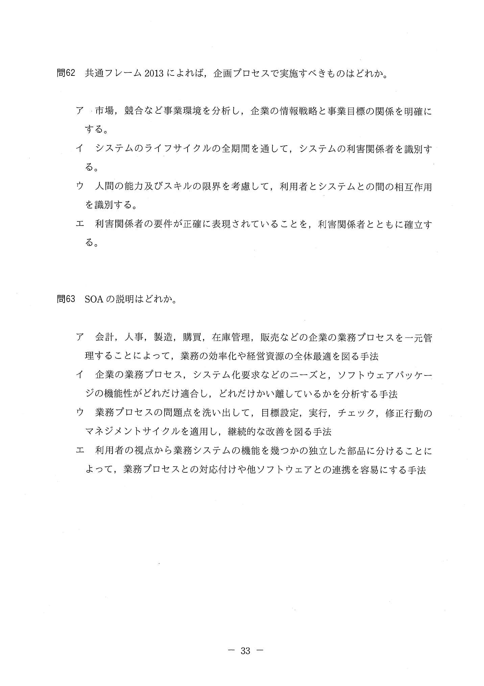

テキスト (OCR)

間62 共通フレーム 2013 によれば, 企画プロセスで実施すべきものはどれか。

ア i, 競合など事業環境を分析し, 企業の情報戦略と事業目標の関係を明確に
する。

イ システムのライフサイクルの全期間を通して, システムの利害関係者を識別す
る。

ウ 人間の能力及びスキルの限界を考慮して, 利用者とシステムとの間の相互作用
を識別する。

エ 利害関係者の要件が正准に表現されていることを, 利害関係者とともに確立す
る。

間63 SOA の説明はどれか。

ア Bat, 人事, 製造, WA, 在庫管理, 販売などの企業の業務プロセスを一元管
理することによって, 業務の効率化や経営資源の全体最適を図る手法

イ 企業の業務プロセス, システム化要求などすのニーズと, ソフトウェアパッケー
ジの機能性がどれだけ適合し, どれだけかい離しているかを分析する手法

ウ 業務プロセスの問題点を洗い出して, 目標設定, 実行, チェック, 修正行動の
マネジメントサイクルを適用し, 継続的な改善を図る手法

エエ 利用者の視点から業務システムの機能を幾つかの独立した部品に分けることに
よって, 業務プロセスとの対応付けや他ソフトウェアとの連携を容易にする手法

= 393 一

### ページ 34

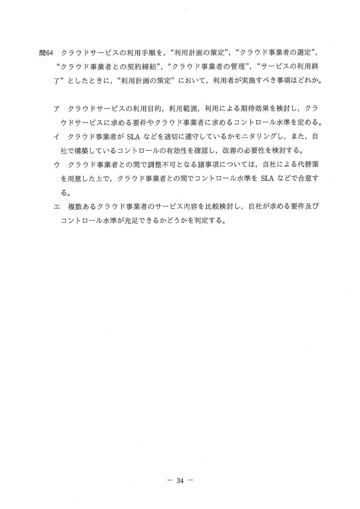

テキスト (OCR)

問64 クラウドサービスの利用手順を, “利用計画の策定", “クラウド事業者の選定”,
“クラウド事業者との契約締結", “クラウド事業者の管理", “サービスの利用終
JT” としたときに, "利用計画の策定” において, 利用者が実施すべき事項はどれか。

ア クラウドサービスの利用目的, 利用範囲。 利用による期待効果を検討し, クラ
ウドサービスに求める要件やクラウド事業者に求めるコントロール水準を定める。

イ クラウド事業者が SLA などを適切に遵守しているかモニタリングし, また, 自
社で構築しているコントロールの有効性を確認し, 改善の必要性を検討する。

ウ クラウド事業者との間で調整不可となる諸事項については, 自社による代替策
を用意した上で, クラウド事業者との間でコントロール水準を SLA などで合意す
る。

エエ 複数あるクラウド事業者のサービス内容を比較検討し, 自社が求める要件及び
コントロール水準が充足できるかどうかを判定する。

ー 34 一

### ページ 35

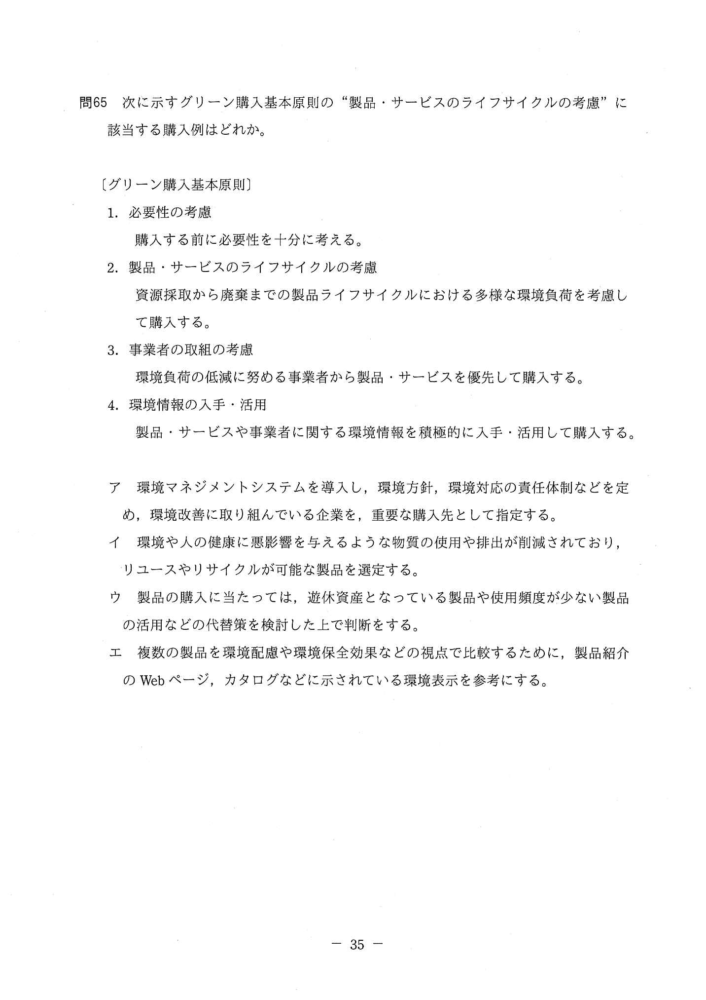

テキスト (OCR)

問65 次に示すグリーン購入基本原則の“製品・サービスのライフサイクルの考慮”" に
該当する購入例はどれか。

[グリーン購入基本原則)
1. 必要性の考慮
購入する前に必要性を十分に考える。
2. 製品・サービスのライフサイクルの考慮
資源採取から廃棄までの製品ライフサイクルにおける多様な環境負荷を考慮し
て購入する。
3. 事業者の取組の考慮
環境負荷の低減に努める事業者から製品・サービスを優先して購入する。
4. 環境情報の入手・活用
製品・サービスや事業者に関する環境情報を積極的に入手・活用して購入する。

ア 環境マネジメントシステムを導入し, 環境方針, 環境対応の責任体制などを定
め, 環境改善に取り組んでいる企業を, 重要な購入先として指定する。

イ 環境や人の健康に悪影響を与えるような物質の使用や排出が削減されており
リユースやリサイクルが可能な製品を選定する。

ウ 製品の購入に当たっては, 遊休資産となっている製品や使用頻度が少ない製品
の活用などの代替策を検討した上で判断をする。

エ 複数の製品を環境配慮や環境保全効果などの視点で比較するために, 製品紹介
の Web ページ, カタログなどに示されている環境表示を参考にする。

ー 35 一

### ページ 36

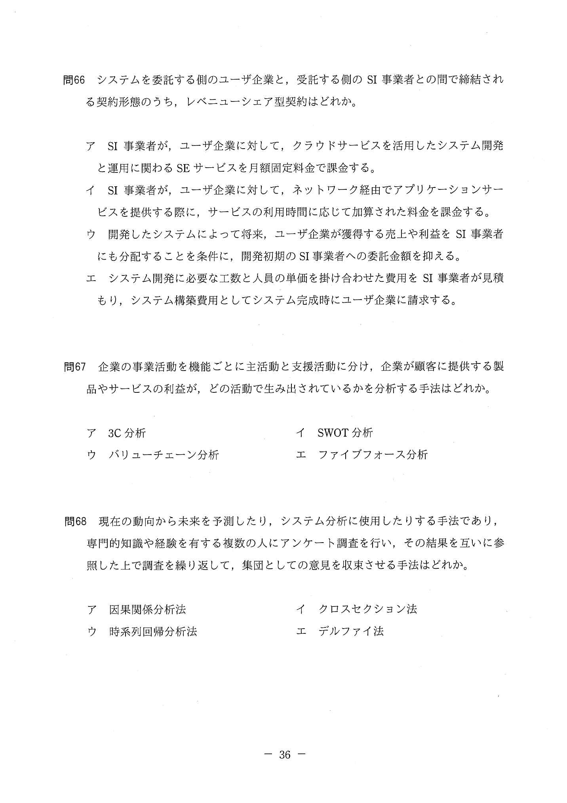

テキスト (OCR)

間66 システムを委託する側のユーザ企業と, 受託する側の SI 事業者との間で締結され
る契約形態のうち, レベニューシェア型契約はどれか。

ア Sl 事業者が, ユーザ企業に対して, クラウドサービスを活用したシステム開発
と運用に関わる SE サービスを月額固定料金で課金する。

イ SI 事業者が, ユーザ企業に対して, ネットワーク経由でアプリケーションサー
ビスを提供する際に, サービスの利用時間に応じて加算された料金を課金する。
ウ 開発したシステムによって将来, ユーザ企業が獲得する売上や利益を SI 事業者

にも分配することを条件に, 開発初期の SI 事業者への委託金額を抑える。
エ システム開発に必要な工数と人員の単価を掛け合わせた費用を SI 事業者が見積
BY, システム構築費有としてシステム完成時にユーザ企業に請求する。

問67 企業の事業活動を機能ごとに主活動と支援活動に分け, 企業が顧客に提供する製

品やサービスの利益が, どの活動で生み出されているかを分析する手法はどれか。

ア 3C分析                  イ SWOT 分析

ウ パリューチェーン分析       エエ ファイブフォース分析

問68 現在の動向から未来を予測したり, システム分析に使用したりする手法であり
専門的知識や経験を有する複数の人にアンケート調査を行い, その結果を互いに参
照した上で調査を繰り返して, 集団としての意見を収束させる手法はどれかが。

ア 因果関係分析法          イ クロスセクション法
ウ 時系列回帰分析法         エ デルファイ法

ー 36 一

### ページ 37

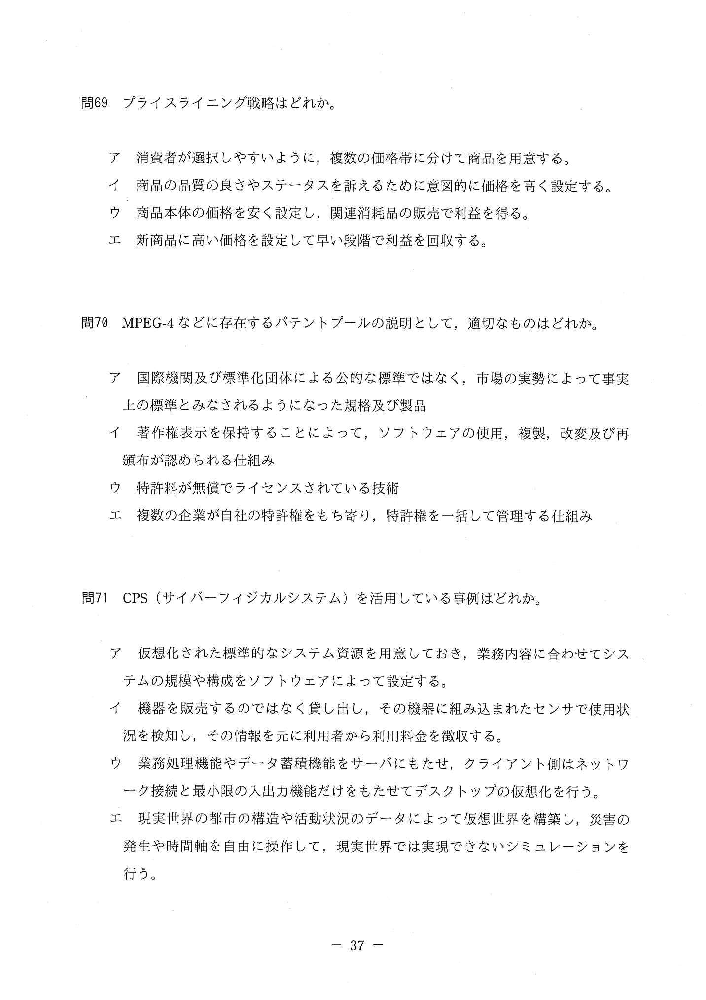

テキスト (OCR)

間69 プライスライニング戦略はどれか。

消費者が選択しやすいように, 複数の価格帯に分けて商品を用意する。
商品の品質の良さやステータスを訴えるために意図的に価格を高く設定する。
商品本体の価格を安く設定し, 関連消耗品の販売で利益を得る。

新商品に高い価格を設定して早い段階で利益を回収する。

H ざさ

問79 MPEG-4 などに存在するパテントプールの説明として, 適切なかものはどれか。

ア 国際機関及び標準化団体による公的な標準ではなく, 市場の実勢によって事実
上の標準とみなされるようになった規格及び製品

イ 著作権表示を保持することによって, ソフトウェアの使用, 複製, 改変及び再
頒布が認められる仕組み

ウ 特許料が無償でライセンスされている技術

エ 複数の企業が自社の特許権をもち寄り, 特許権を一括して管理する仕組み

間71 CPS (サイバーフィジカルシステム) を活用している事例はどれか。

ア 仮想化された標準的なシステム資源を用意しておき, 業務内容に合わせてシス
テムの規模や構成をソフトウェアによって設定する。
イ 機器を販売するのではなく貸し出し, その機器に組み込まれたセンサで使用状
況を検知し, その情報を元に利用者から利用料金を徴収する。
ウ 業務処理機能やデータ蓄積機能をサーバにもたせ, クライアント側はネットワ
ーク接続と最小限の入出力機能だなけをもたせてデスクトップの仮想化を行う。
エ 現実世界の都市の構造や活動状況のデータによって仮想世界を構築し, 災害の
発生や時間軸を自由に操作して, 現実世界では実現できないシミュレーションを

{TD

ー 37 一

### ページ 38

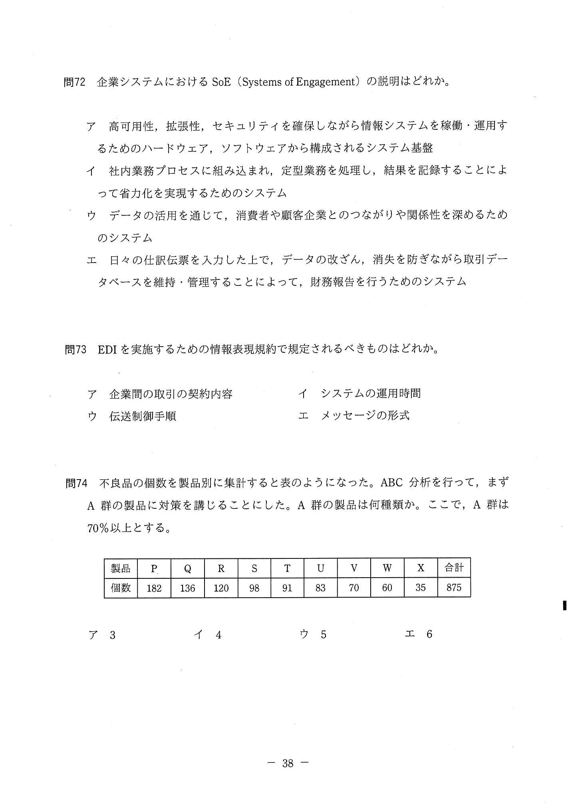

テキスト (OCR)

間72 企業システムにおける SoE (Systems of Engagement) の説明はどれか。

ア 高可用性, 拡張性, セキュリティを確保しながら情報システムを稼働・運用す
るためのハードウェア, ソフトウェアから構成されるシステム基盤

イ 社内業務プロセスに組み込まれ, 定型業務を処理し, 結果を記録することによ
って省力化を実現するためのシステム

ウ データの活用を通じて, 消費者や顧客企業とのつながりやそ関係性を深めるため
のシステム

エエ 日々の仕訳伝票を入力した上で, データの改ざん, 消失を防ぎながら取引デー
タベースを維持・管理することによって, 財務報告を行うためのシステム

間73 EDIを実施するための情報表現規約で規定されるべきものはどれか。

ア 企業間の取引の契約内容           イ システムの運用時間

ウ 伝送制御手順         エエ メッセージの形式

間74 不良品の個数を製品別に集計すると表のようになった。ABGC 分析を行って, まず
A 群の製品に対策を講じることにした。4 群の製品は何種類か。ここで, A 群は
70%以上とする。

mule

製品| P  Q  R  S  T  U  vV  W  X |合計
個数 | 182 | 136 | 120 | 98 | 91 | 83 | 70 | 60 | 35 | 875

ー 38 一

### ページ 39

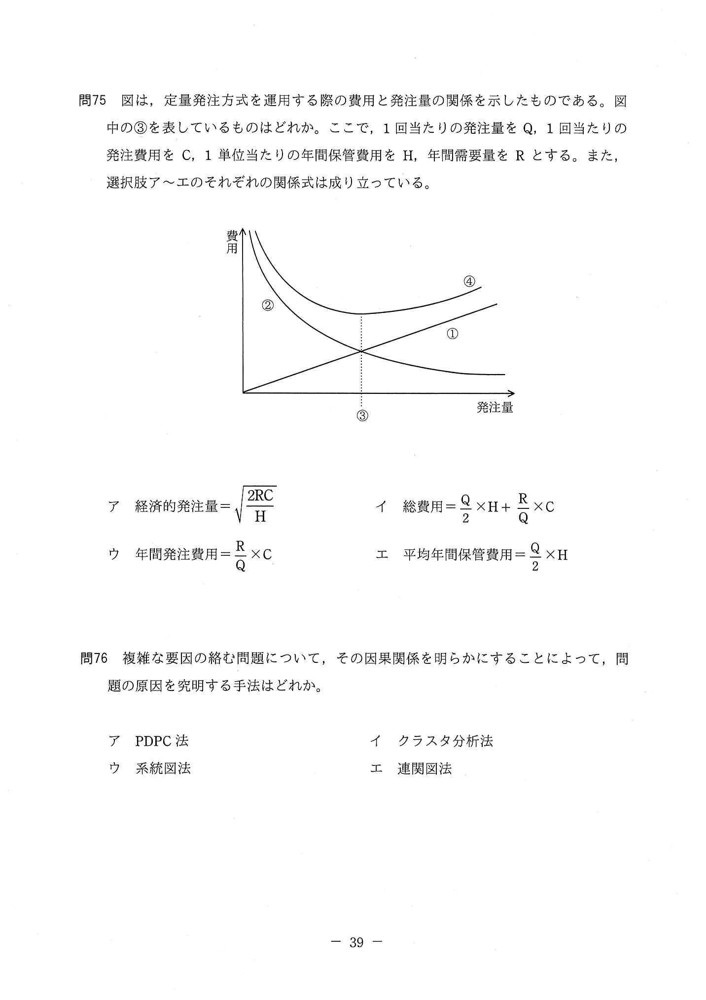

テキスト (OCR)

間75 図は, 定量発注方式を運用する際の費用と発注量の関係を示したものである。
中の③を表しているものはどれか。ここで, 1 回当たりの発注量を Q, 1 回当たりの
発注費用を C, 1 単位当たりの年間保管費用を H, 年間和需要量を R とする。また。,
選択肢アーンエのそれぞれの関係式は成り立っている。

#
用
@
@               4
              ®
アァ 経済的発往量= | ニー         4 総費用=SxH+Exc
H                                 2         Q
ウ 年間発注費用 こき xC                   エ 平均年間保管費用= a XH

問76 複雑な要因の絡む問題について, その因果関係を明らかにすることによって, A
題の原因を究明する手法はどれか。

ア PDPC法          イ クラスタ分析法

ー 39 一

### ページ 40

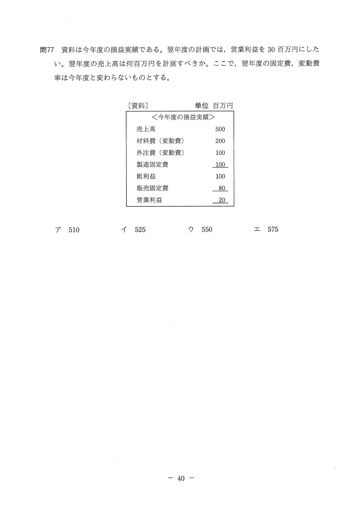

テキスト (OCR)

問77 資料は今年度の損益実績である。翌年度の計画では, 営業利益を 30 百万円にした
い。翌年度の売上高は何百万円を計画すべきか。ここで, 翌年度の固定費, 変動費
率は今年度と変わらないものとする。

(資料           単位 AAA
ぐ今年度の損益実績>
売上高          500
材料費 (変動費)       200
外注費 (変動費)       100
製造固定費       _100_
粗利益          100
販売固定費       280.
営業利益        _20_
ア 510     イ 525     ウ 550     エ 575

ー 40 一

### ページ 41

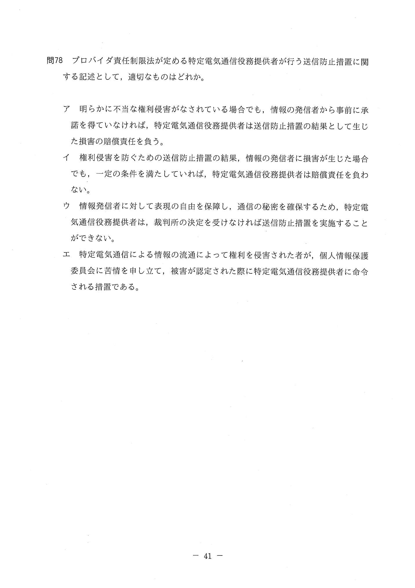

テキスト (OCR)

間78 プロバイタダ資任制限法が定める特定電気通信役務提供者が行う送信防止措置に関
する記述として, 適切なものはどれか。

ア 明らかに不当な権利侵害がなされている場合でも, 情報の発信者から事前に承
庄を得ていなければ, 特定電気通信役務提供者は送信防止措置の結果として生じ
た損害の賠償次任を負う。

イ 権利侵害を防ぐための送信防止措置の結果, 情報の発信者に損害が生じた場合

も, 一定の条件を満たしていれば, 特定電気通信役務提供者は賠償責任を負わ
ない。

ウ 情報発信者に対して表現の自由を保障し, 通信の秘密を確保するため, 特定電
気通信役務提供者は, 裁判所の決定を受けなければ送信防止措置を実施すること
ができない。

エエ 特定電気通信による情報の流通によって権利を侵害された者が, 個人情報保護
委員会に苦情を申し立て, 被害が認定された際に特定電気通信役務提供者に命令
される措置である

ー 41 一

### ページ 42

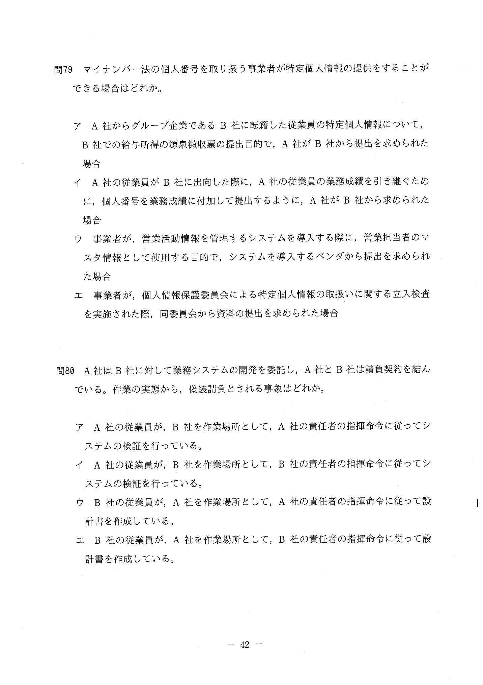

テキスト (OCR)

間79 マイナンバー法の個人番号を取り扱う事業者が特定個人情報の提供をすることが
できる場合はどれかが。

ア A 社からグループ企業である B 社に転籍した従業員の特定個人情報について,
B 社での給与所得の源泉徴収票の提出目的で, A 社が B 社から提出を求められた
場合

イ A 社の従業員が B 社に出向した際に, A 社の従業員の業務成績を引き継ぐため
に, 個人番号を業務成績に付加して提出するように, A 社が B 社から求められた
場合

ウ 事業者が, 営業活動情報を管理するシステムを導入する際に, 営業担当者のマ
スタ情報として使用する目的で, システムを導入するベンダから提出を求められ
た場合

エ 事業者が, 個人情報保護委員会による特定個人情報の取扱いに関する立入検査
を実施された際, 同委員会から資料の提出を求められた場合

間80 A社はB社に対して業務システムの開発を委託し, A 社と B 社は請負契約を結ん
でいる。 作業の実態から, 偽装請負とされる事象はどれか。

ア A 社の従業員が, B 社を作業場所として, A 社の責任者の指揮命令に従ってシ
ステムの検証を行っている。

4 A 社の従業員が, B 社を作業場所として, B 社の貢任者の指揮命令に従ってシ
ステムの検証を行っている。

ウ B 社の従業員が, A 社を作業場所として, A 社の責任者の指揮命令に従って設
計書を作成している。

エエ B 社の従業員が, A 社を作業場所として, B 社の責任者の指揮命令に従って設
計書を作成している。

ー 42 一

### ページ 43

テキスト (OCR)

〔

x = 用 紙

ー 43 一

J

### ページ 44

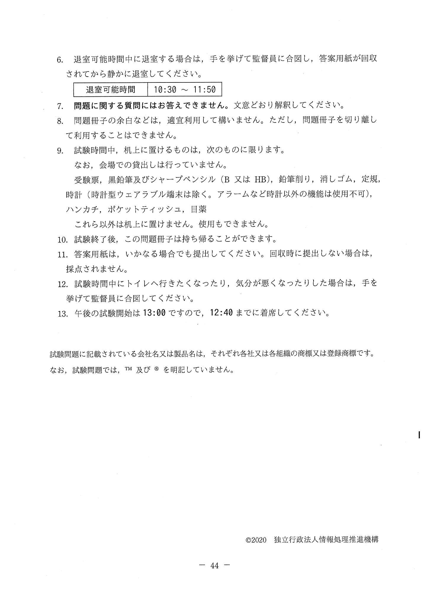

テキスト (OCR)

6. 退室可能時間中に退室する場合は, 手を挙げて監督員に合図し, 答案用紙が回収
されてから静かに退室してください。
退室可能時間 | 10:30 ~ 11:50
7. 問題に関する質問にはお答えできません。文意どおり解釈してください。
8. 問題世子の余白などは, 適宜利用して構いません。ただし, 問題冊子を切り離し
て利用することはできません。
9. 試験時間中, 机上に置けるものは, 次のものに限ります。
なお, 会場での貸出しは行っていません。
受験票, 黒鉛筆及びシャープペンシル (B 又は HB), 鉛筆削り, 消しゴム, 定規,
時計 (時計型ウェアラブル端末は除く。アラームなど時計以外の機能は使用不可),
ハンカチ, ポケットティッシュ, 目薬
これら以外は机上に置けません。使用もできません。
10. 試験終了後, この問題冊子は持ち帰ることができます。
11. 答案用紙は, いかなる場合でも提出してください。回収時に提出しない場合は
採点されません。
12. 試験時間中にトイレへ行きたくなったり, 気分が悪くなったりした場合は, 手を
挙げて監督貞に合図してください。
13. 午後の試験開始は 13:00 ですので, 12:40 までに着席してください。

試験問題に記載されている会社名又は製品名は, それぞれ各社又は各組織の商標又は登録商標です。
なお, 試験問題では, ™ 及び © を明記していません。

@2020 独立行政法人情報処理推進機構

ー 44 一

---

## 午前解答

©2020 独立行政法人情報処理推進機構 
令和2 年度 10 月 応用情報技術者試験 解答例 
 
午前試験 
問番号
正解
分野
問1 
エ 
Ｔ 
問2 
ウ 
Ｔ 
問3 
ウ 
Ｔ 
問4 
ウ 
Ｔ 
問5 
エ 
Ｔ 
問6 
ア 
Ｔ 
問7 
ウ 
Ｔ 
問8 
ア 
Ｔ 
問9 
エ 
Ｔ 
問10 
エ 
Ｔ 
問11 
ウ 
Ｔ 
問12 
イ 
Ｔ 
問13 
イ 
Ｔ 
問14 
ア 
Ｔ 
問15 
エ 
Ｔ 
問16 
ア 
Ｔ 
問17 
イ 
Ｔ 
問18 
ア 
Ｔ 
問19 
ア 
Ｔ 
問20 
ウ 
Ｔ 
 
 
問番号
正解
分野
問21 
イ 
Ｔ 
問22 
イ 
Ｔ 
問23 
イ 
Ｔ 
問24 
ウ 
Ｔ 
問25 
エ 
Ｔ 
問26 
エ 
Ｔ 
問27 
ウ 
Ｔ 
問28 
ウ 
Ｔ 
問29 
エ 
Ｔ 
問30 
ア 
Ｔ 
問31 
イ 
Ｔ 
問32 
エ 
Ｔ 
問33 
イ 
Ｔ 
問34 
ウ 
Ｔ 
問35 
イ 
Ｔ 
問36 
イ 
Ｔ 
問37 
ア 
Ｔ 
問38 
ウ 
Ｔ 
問39 
ア 
Ｔ 
問40 
イ 
Ｔ 
 
 
問番号
正解
分野
問41 
ア 
Ｔ 
問42 
イ 
Ｔ 
問43 
エ 
Ｔ 
問44 
ア 
Ｔ 
問45 
イ 
Ｔ 
問46 
ア 
Ｔ 
問47 
エ 
Ｔ 
問48 
エ 
Ｔ 
問49 
ウ 
Ｔ 
問50 
エ 
Ｔ 
問51 
エ 
Ｍ 
問52 
ア 
Ｍ 
問53 
イ 
Ｍ 
問54 
ウ 
Ｍ 
問55 
ウ 
Ｍ 
問56 
ウ 
Ｍ 
問57 
イ 
Ｍ 
問58 
エ 
Ｍ 
問59 
イ 
Ｍ 
問60 
ア 
Ｍ 
 
 
問番号
正解
分野
問61 
エ 
Ｓ 
問62 
ア 
Ｓ 
問63 
エ 
Ｓ 
問64 
ア 
Ｓ 
問65 
イ 
Ｓ 
問66 
ウ 
Ｓ 
問67 
ウ 
Ｓ 
問68 
エ 
Ｓ 
問69 
ア 
Ｓ 
問70 
エ 
Ｓ 
問71 
エ 
Ｓ 
問72 
ウ 
Ｓ 
問73 
エ 
Ｓ 
問74 
ウ 
Ｓ 
問75 
ア 
Ｓ 
問76 
エ 
Ｓ 
問77 
イ 
Ｓ 
問78 
イ 
Ｓ 
問79 
エ 
Ｓ 
問80 
ウ 
Ｓ 
 
 
分野の「Ｔ」はテクノロジ系，「Ｍ」はマネジメント系，「Ｓ」はストラテジ系の問題です。

---

## 午後問題

### ページ 1

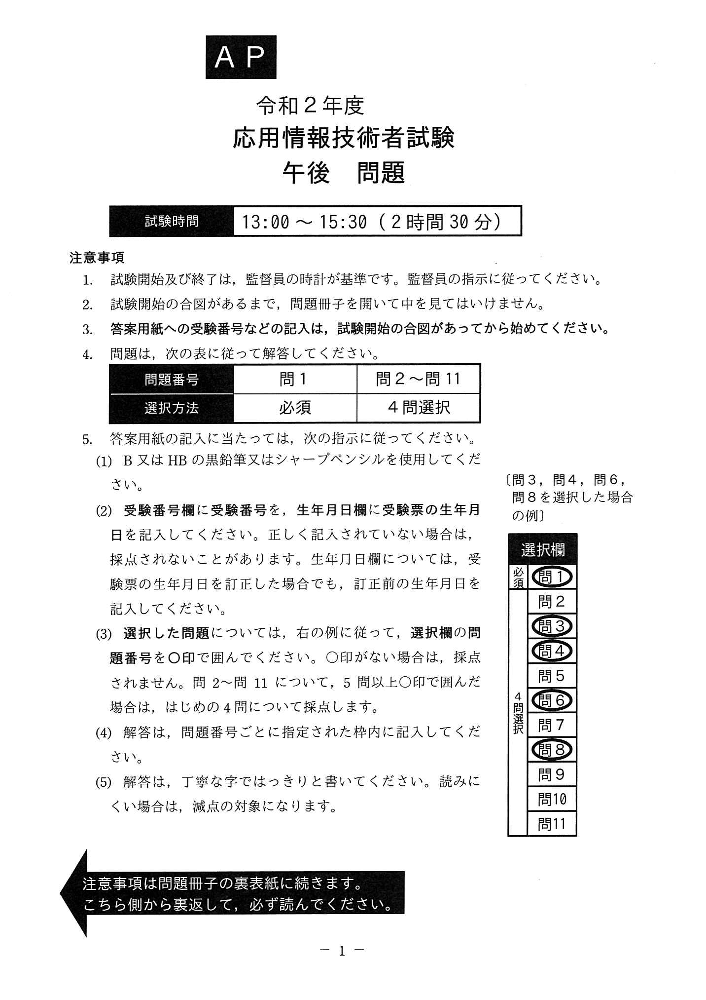

テキスト (OCR)

令和 2 年度
応用情報技術者試験
午後 問題

 13:00 ~ 15:30 (2時間 30 分)

注意事項
1. 試験開始及び終了は, 監督員の時計が基準です。監督貞の指示に従っつてください。
2. 試験開始の合図があるまで, 問題冊子を開いて中を見てはいけません。
3. 答案用紙への受験番号などの記入は, 試験開始の合図があってから始めてください。
4. 問題は, 次の表に従って解答してください。
問題番号             fa] 1           fal 2 ~faj 11
選択方法     必     4 問選択
5. 管案用紙の記入に当たっては, 次の指示に従ってください。
(1) B 又は HB の黒鉛筆又はシャープペンシルを使用してくだ

XA                         【問3, 問4, 問6,

ーー                          HS を選択した場合
2) 受験番号欄に受験番号を, 生年月日杜に受験票の生年月 大)

日を記入してください。 正しく記入されていない場合は,

採点されないことがあります。生年月日楓については = All

験球の生年月日を訂正した場合でも, 訂正前の生年月日 eID

記入してください。                      問2

(3③) 選択した問題については, 右の例に従って, BROOM    Gid
題番号を〇印で囲んでください。〇印がない場合は, 採点     Cai 4

されません。問 2ご問 11 について, 5 問以上〇印で囲んだ    問5

場合は, はじめの 4 問について採点します。           Key

(④ 解答は, 問題番号ごとに指定された枠内に記入してくだ RL
さい。                          Gis

6) 解答は, 丁寧な字ではっきりと書いてください。読みに    問9
くい場合は, 減点の対象になります。              間19

問1

注意事項は問題冊子の裏表紙に続きます。
こちら側から裏返して, 必ず読んでください。

### ページ 2

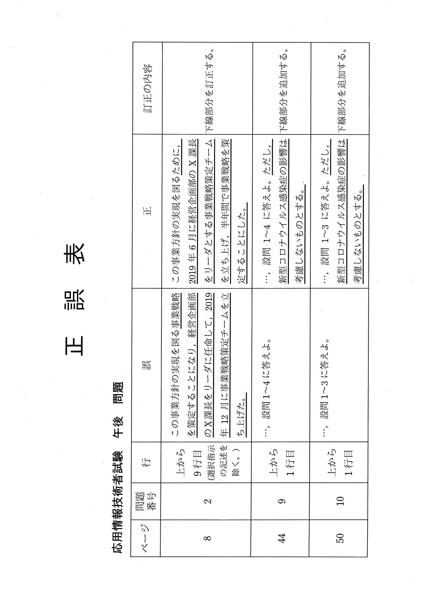

テキスト (OCR)

“SC LRADEARKVHE                     HLET
°& SLNE & CWE | PER AIODRRRICAC) GO Ce                     s / _   OL    0s
——S                                   本全く
(コタマ CP YET ENT BRB …       oP YEN E~T ERE“
FER ORAN IME                  aie
°S HUNTER COM | PHRATOERRRICAC) GO le                     ret ae   6    Ww
ne                                   aS
ehh CL YEN PNT BRB …       “PY EUNPA~T MRE‘
PANNA DS pay                   “AAT S  CoS a4
weal AT 9なタ | R27 LM ol ay |2 Re
°S fA IER NW | 7 — ERR S 2 we — (1 & | 6102 “DAD cle — 0 BSED | EMO] oz    9
{EI
HE X ORM BST) 9 sy 6102 | eID AR ORM RAD SLM 2 Hy 6
ーーーーーー               ーー               ら
TRY Sl REO RO > | PRES el aecoisKmo > | IT
Ee
AN ICEE            Eu                  hie               med |

BH #4. BEFUeRAHY

### ページ 3

### ページ 4

テキスト (OCR)

〔問題一覧〕

全問 1 (必須)

ne     HH BF                ad
番号
問1 |情報セキュリティ      内部不正による情報漏えいの対策

@ fe] 2一問 11 (10 問中 4 問選択)

as     出題分野                 テーマ

問 2 | 経営戦略          新事業の創出を目的とする事業戦略の策定

問 3 | プログラミング      誤差拡散法による減色処理

aa | eRe ERR   AMAT TREE 2 22 ドとの連携のためのシステム方式
ae

問5 | ネットワーク              仮想デスクトップ基盤の導入

問6 | データベース        宿泊施設の予約を行うシステム

問 7 | 組込みシステム開発    多言語多通貨対応両替システム

問 8 |情報システム開発     アジャイルソフトウェア開発手法の導入

問9 | プロジェクトマネジメント |稼働延期に伴うプロジェクト計画の変更

問 10 | サービスマネジメント    サービスの予算業務及び会計業務

問 11 | システム監査        販売システムの監

### ページ 5

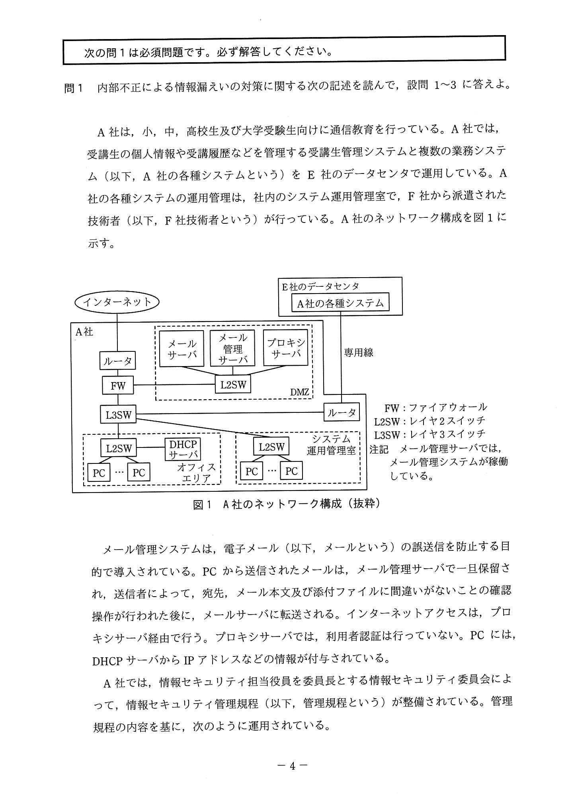

テキスト (OCR)

次の問 1 は必須問題です。必ず解答してください。

fal 1

内部不正による情報漏えいの対策に関する次の記述を読んで, 設問 1ユー3 に答えよ。

A 社は, 小, 中, 高校生及び大学受験生向けに通信教育を行っている。A 社では,
受講生の個人情報や受講履歴などを管理する受講生管理システムと複数の業務システ
ム (以下, A 社の各種システムという) を E 社のデータセンタで運用している。A
社の各種システムの運用管理は, 社内のシステム運用管理室で, F 社から派遣された
技術者 (以下, F 社技術者という) が行っている。A 社のネットワーク構成を図 1 に

示す。

E社のデータセンタ
インターネット              A社の各種システム

A

社

専用線

Styx   FW : ファイアウォール
L2SW : レイヤ2スイッチ

rr ea iシステム | L3SW : レイヤ3スイッチ

|注記 メール管理サーバでは
'  AW EBY AF LOR
  している。

図1 A社のネットワーク構成 (抜粋)

メール管理システムは, 電子メール (以下, メールという) の誤送信を防止する目
的で導入されている。PC から送信されたメールは, メール管理サーバで一旦保留さ
れ, 送信者によって, 宛先, メール本文及び添付ファイルに間違いがないことの確認
操作が行われた後に, メールサーバに転送される。インターネットアクセスは, プロ
キシサーバ経貼で行う。プロキシサーバでは, 利用者認証は行っていない。PC には,
DHCP サーバから IP アドレスなどの情報が付与されている。

A 社では, 情報セキュリティ担当役員を委員長とする情報セキュリティ委員会によ
って, 情報セキュリティ管理規程 (以下, 管理規程という) が整備されている。管理
規程の内容を基に, 次のように運用されている。

デーオー

### ページ 6

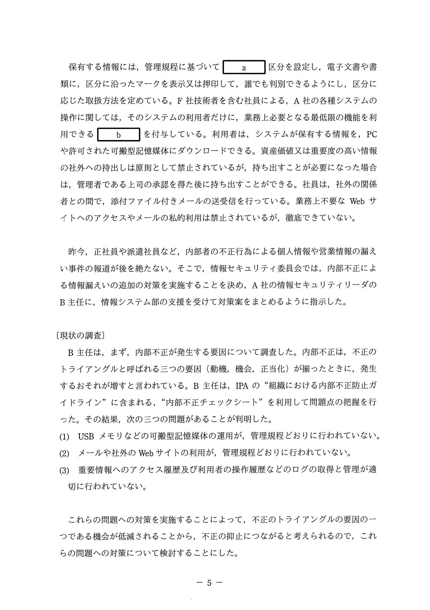

テキスト (OCR)

保有する情報には, 管理規程に基づいて|  。 | 区分を設定し, 電子文書や書
類に, 区分に沿ったマークを表示又は押印して, 誰でも判別できるようにし, 区分に
応じた取扱方法を定めている。 社技術者を含む社員による, 4 社の各種システムの
操作に関しては, そのシステムの利用者だけに, 業務上必要となる最低限の機能を利
用できる| pb | を付与している。利用者は, システムが保有する情報を, PC
や許可された可搬型記憶媒体にダウンロードできる。 資産価値又は重要度の高い情報
の社外への持出しは原則として禁止されているが, 持ち出すことが必要になった場合
は, 管理者である上司の承認を得た後に持ち出すことができる。 HA, 社外の関係
者との間で, 漆付ファイル付きメールの送受信を行っている。業務上不要な Web +
イトへのアクセスやメールの私的利用は禁止されているが, 徹底できていない。

昨今, 正社員や派遣社員など, 内部者の不正行為による個人情報や営業情報の漏え
い事件の報道が後を絶たない。 そこで, 情報セキュリティ委員会では, 内部不正によ
る情報漏えいの追加の対策を実施することを決め, A 社の情報セキュリティリーダの
B 主任に, 情報システム部の支援を受けて対策案をまとめるように指示した。

〔現状の調査
B 主任は, まず, 内部不正が発生する要因について調査した。内部不正は, 不正の
トライアングルと呼ばれる三つの要因 (動機, 機会, 正当化) が揃ったときに, 発生
するおそれが増すと言われている。B 主任は, IPA の “組織における内部不正防止ガ
イドライン" に含まれる, “内部不正チェックシート”" を利用して問題点の把握を行
った。その結果, 次の三つの間題があることが判明した。
Q) USB メモリなどの可搬型記憶媒体の運用が, 管理規程どおりに行われていない。
(2) メールや社外の Web サイトの利用が, 管理規程どおりに行われていない。
3) 重要情報へのアクセス履歴及び利用者の操作履歴などのログの取得と管理が適
切に行われていない。

これらの問題への対策を実施することによって, 不正のトライアングルの要因の一
つである機会が低減されることから, 不正の抑止につながると考えられるので, これ

らの問題への対策について検討することにした。

—5 =

### ページ 7

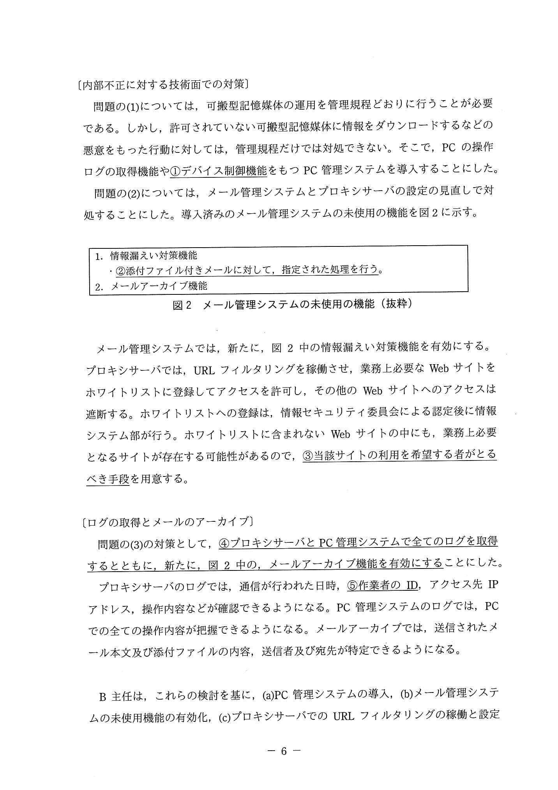

テキスト (OCR)

〔内部不正に対する技術面での対策]
問題の1)については, 可搬型記憶媒体の運用を管理規程どおりに行うこ とが必要
CHS, しかし, 許可されていない可搬型記憶媒体に情報をダウンロードするなどの
悪意をもった行動に対しては, 管理規程だけでは対処できない。そこで, PC の操作
ログの取得機能ややデバイス制御機能をもつ PC 管理システムを導入することにした。
問題の②にについては, メール管理システムとプロキシサーバの設定の見直しで対
処することにした。導入済みのメール管理システムの未使用の機能を図 2 に示す。

1. 情報漏えい対策機能
・②添付ファイル付きメールに対して, 指定された処理を行う。
2. メールアーカイプブ機能
図2 メール管理システムの未使用の機能 (抜粋)

メール管理システムでは, 新たに, 図 2 中の情報漏えい対策機能を有効にする。
プロキシサーバでは, URL フィルタリングを稼働させ, 業務上必要な Web サイトを
ホワイトリストに登録してアクセスを許可し, その他の Web サイトへのアクセスは
JEWS S. RIT KV ALADOSSR, 情報セキュリティ委員会による認定後に情報
システム部が行う。ホワイトリストに含まれない Web サイトの中にも, 業務上必要
となるサイトが存在する可能性があるので, ③当該サイトの利用を希望する者がとる
べき手段を用意する。

[ログの取得とメールのアーカイブ]〕
問題の3③の対策として, ③④プロキシサーバと PC管理システムで全てのログを取得
するとともに, 新たに, 2 中の, メールアーカイブ機能を有効にすることにした。
プロキシサーバのログでは, 通信が行われた日時, ⑤作業者のID, アクセス先 IP
アドレス, 操作内容などが確認できるようになる。PC 管理システムのログでは, PC
での全ての操作内容が把握できるようになる。メールアーカイブでは, 送信されたメ
ール本文及び添付ファイルの内容, 送信者及び宛先が特定できるようになる。

B 主任は, これらの検討を基に, (DPC 管理システムの導入, ⑪)メール管理システ
ムの未使用機能の有効化, (COプロキシサーバでの URL フィルタリングの稼働と設定

= 6 一

### ページ 8

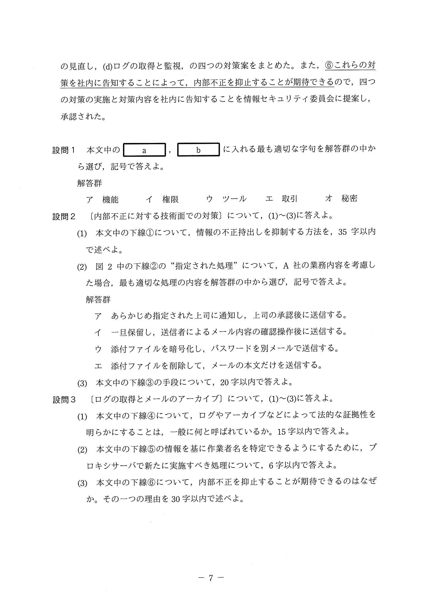

テキスト (OCR)

の見直し, (④①ログの取得と監視, の四つの対策案をまとめた。また, これらの対
策を社内に告知することによって, 内部不正を抑止することが期待できるので, 四つ
の対策の実施と対策内容を社内に告知することを情報セキュリティ委員会に提案し,
承認された。

設問1 本文中の| 。 |, | b |に入れる最も適切な字句を解答群の中か
ら選び, 記号で答えよ。
解答群
ア 機能   イ 権限   ウ ツール エ 取引   オ 秘密

設問2 【内部不正に対する技術面での対策] について, ①)て3)に答えよ。
1) 本文中の下線①について, 情報の不正持出しを抑制する方法を, 35 FIA
(2) 2 中の下線②の“指定された処理"” について, A 社の業務内容を考慮し
た場合, 最も適切な処理の内容を解答群の中から選び, 記号で答えよ。
解答群
ア あらかじめ指定された上司に通知し, 上司の承認後に送信する。
イ 一旦保留し, 送信者によるメール内容の確認操作後に送信する。
ウ 添付ファイルを暗号化し, パスワードを別メールで送信する。
エ 添付ファイルを削除して, メールの本文だけを送信する。
(3) 本文中の下線③の手段について, 20 字以内で答えよ。
設問3 〔ログの取得とメールのアーカイブ]〕 について, ①⑪~て(3)に答えよ。
(1) 本文中の下線について, ログやアーカイブなどによって法的な証拠性を
明らかにすることは, 一般に何と呼ばれているか。15 字以内で答えよ。
2) 本文中の下線⑥の情報を基に作業者名を特定できるようにするために, プ
ロキシサーバで新たに実施すべき処理について, 6 字以内で答えよ。
3) 本文中の下線⑥について, 内部不正を抑止することが期待できるのはなぜ
か。その一つの理由を 30 字以内で述べよ。

### ページ 9

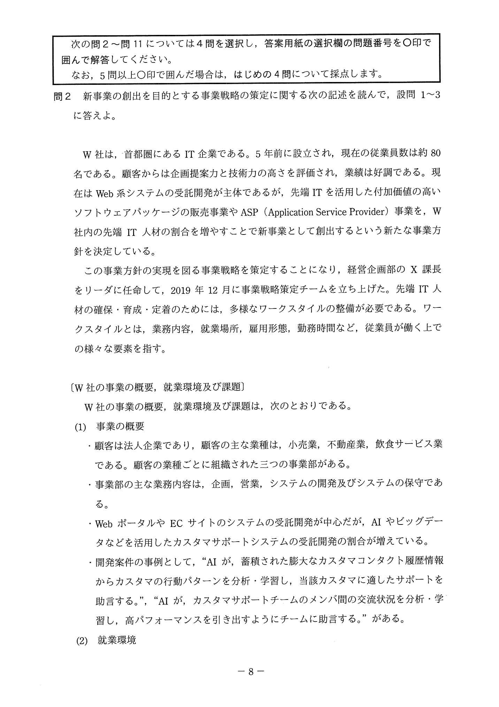

テキスト (OCR)

次の間2 一問 11 については4問を選択し, 答案用紙の選択欄の問題番号を〇印で
囲んで解答してください。
なお, 5 問以上〇印で囲んだ場合は, はじめの 4 問について採点します。

間2 新事業の創出を目的とする事業戦略の策定に関する次の記述を読んで, 設問 1~3

に答えよ。

W 社は, 首都圏にある IT 企業である。5 年前に設立され, 現在の従業上数は約 80
名である。 顧客からは企画提案力と技術力の高さを評価され, 業績は好調である。現
在は Web 系システムの受託開発が主体であるが, 先端 IT を活用した付加価値の高い
ソフトウェアパッケージの販売事業や ASP (Application Service Provider) 事業を, W
社内の先端 TT 人材の割合を増やすことで新事業として創出するという新たな事業方
針を決定している。

この事業方針の実現を図る事業戦略を策定することになり, 経営企画部の X 課長
をリーダに任命して, 2019 年 12 月に事業戦略策定チームを立ち上げた。 先端 IT 人
材の確保・育成・定着のためには, 多様なワークスタイルの整備が必要である。ワー
クスタイルとは, 業務内容, 就業場所 雇用形態, 勤務時間など, 従業員が働く上で
の様々な要素を指す。

(W 社の事業の概要, 就業環境及び課題]
W 社の事業の概要, 就業環境及び課題は, 次のとおりである。
Q) 事業の概要

・ 顧客は法人企業であり, 顧客の主な業種は, 小売業, 不動産業, 飲食サービス業
である。顧客の業種ごとに組織された三つの事業部がある。

・ 事業部の主な業務内容は, 企画, BH, システムの開発及びシステムの保守であ
る。

・Web ポータルや EC サイトのシステムの受託開発が中心だが, AI やビッグデー
タなどを活用したカスタマサポートシステムの受託開発の割合が増えている。

・開発案件の事例として, “ALD, 蓄積された膨大なカスタマコンタクト履歴情報
からカスタマの行動パターンを分析・学習し, 当該カスタマに適したサポートを
助言する。", “ALM, カスタマサポートチームのメンバ間の交流状況を分析・学
習し, 高パフォーマンスを引き出すようにチームに助言する。" がある。

(2) 就業環境

### ページ 10

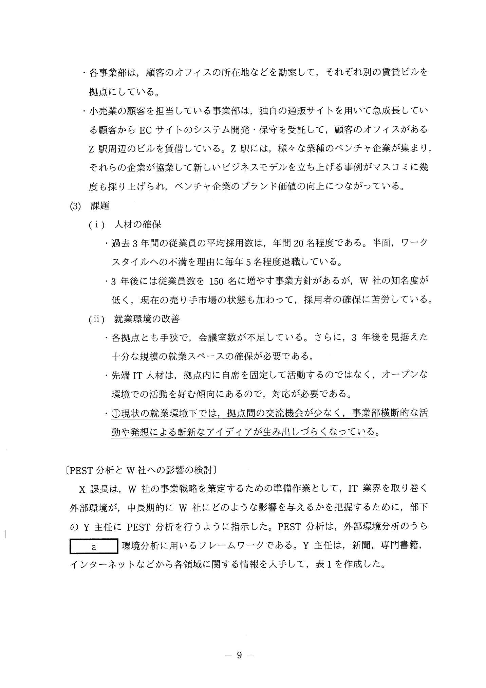

テキスト (OCR)

・各事業部は, 顧客かのオフィスの所在地などを勘案して, それぞれ別の賃貸ビルを
拠点にしている。

・小売業の顧客を担当している事業部は, 独自の通販サイトを用いて急成長してい
る顧客から EC サイトのシステム開発・保守を受託して, 顧客のハオフィスがある
Z 駅周辺のビルを賃借している。Z 駅には, 様々な業種のベンチャ企業が集まり,
それらの企業が協業して新しいビジネスモデルを立ち上げる事例がマスコミに林
度も採り上げられ, ベンチャ企業のブランド価値の向上につながっている。

(3) 課題

(i) 人材の確保
・過去 3 年間の従業員の平均採用数は, 年間 20 名程度である。 半面, ワーク
スタイルへの不満を理由に毎年 5 名程度退職している。
・3 年後には従業員数を 150 名に増やす事業方針があるが, W 社の知名度が
低く, 現在の売り手市場の状態も加わって, 採用者の確保に苦労している。

(ii) 就業環境の改善
・各拠点とも手狭で, 会議室数が不足している。さらに, 3 年後を見据えた
十分な規模の就業スペースの確保が必要である。
・ 先端 IT 人材は, 拠点内に自席を固定して活動するのではなく, オープンな
環境での活動を好む傾向にあるので, 対応が必要である。
・①現状の就業環境下では, 拠点間の交流機会が少なく, 事業部横断的な活
動や発想による斬新なアイディアが生み出しづらくなっている。

(PEST 分析と W 社への影響の検討

X 課長は, W 社の事業戦略を策定するための準備作業として, IT 業界を取り巻く
外部環境が, 中長期的に W 社にどのような影響を与えるかを揚握するために, 部下
の Y 主任に PEST 分析を行うように指示した。PEST 分析は, 外部環境分析のうち
[a | 環境分析に用いるフレームワークである。Y 主任は, 新聞, 専門書籍,
インターネットなどから各領域に関する情報を入手して, 表 1 を作成した。

### ページ 11

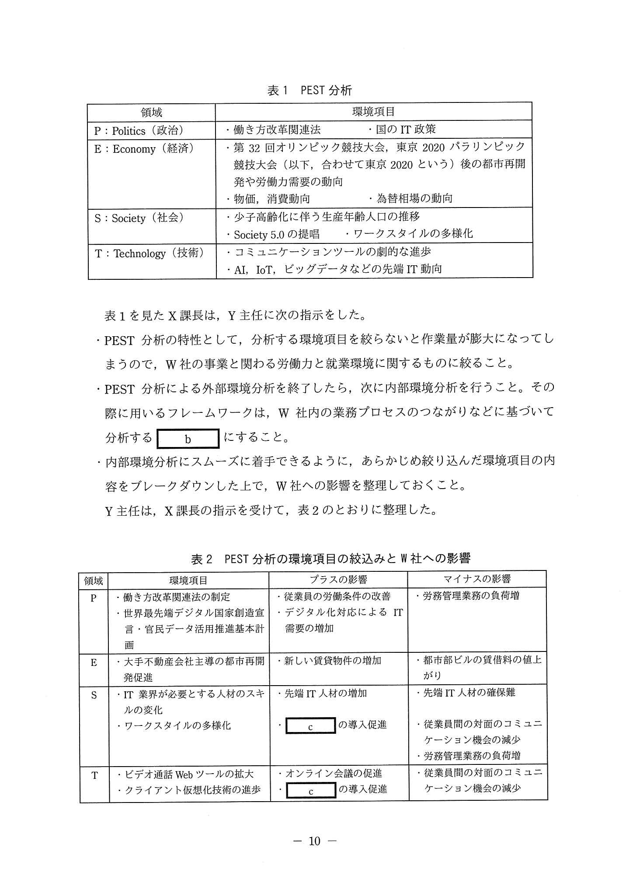

テキスト (OCR)

表1 PEST 分析

領域                                    環境項目
P : Politics (政治)        ・働き方改革関連法         ・国の IT 政策
E : Economy (経済)  ・第 32 回オリンピック競技大会, 東京 2020 パラリンピック

競技大会 (以下, 合わせて東京 2020 という) 後の都市再開
発や労働力需要の動向

・ 物価, 消費動向          ・為替相場の動向
S : Society (社会)        ・少子高齢化に伴う生産年齢人口の推移
・Society 5.0 の提唱       ・ワークスタイルの多様化

: Technology (技術)     ・コミュニケーションツールの劇的な進歩
“AL, IoT, ビッグデータなどの先端 IT 動向

・PEST 分析の特性として, 分析する環境項目を絞らないと作業量が膨大になってし

・ PEST 分析による外部環境分析を終了したら, 次に内部環境分析を行うこと。その
際に用いるフレームワークは, W 社内の業務プロセスのつながりなどに基づいて

・内部環境分析にスムーズに着手できるように, あらかじめ絞り込んだ環境項目の内

表 1 を見た X課長は, Y 主任に次の指示をした。

まうので, W 社の事業と関わる労働力と就業環境に関するものに絞ること。

分析する [> | にすること。

容をブレークダウンした上で, W 社への影響を整理しておくこと。

Y 主任は, XX課長の指示を受けて, 表2 のとおりに整理した。

表 2 PEST 分析の環境項目の絞込みと W社への影響

領域            環境項目                  プラスの影響              マイナスの影響
P | ・働き方改革関連法の制定    - 従業員の労働条件の改善 | ・労務管理業務の負荷増
・ 世界最先端デジタル国家創造宜 | ・デジタル化対応による IT
言・官民データ活用推進基本計 | 需要の増加
画
E | ・大手不動産会社主導の都市再開 | ・新しい賃貸物件の増加   ・ 都市部ビルの賃借料の値上
発促進                                                がり
S | ・TT 業界が必要とする人材のスキ | ・先端TT人材の増加     - 先端 TT 人材の確保難
ルの変化
・ワークスタイルの多様化      ・ し 。 |の導入促進    ・ 従業員間の対面のコミュニ
ケーション機会の減少
+ 労務管理業務の負荷増
T | ・ビデオ通話 Web ツールの拡大 | ・オンライン会議の促進   ・ 従業員間の対面のコミュニ

・クライアント仮想化技術の進歩

ケーション機会の減少

ー 10 一

### ページ 12

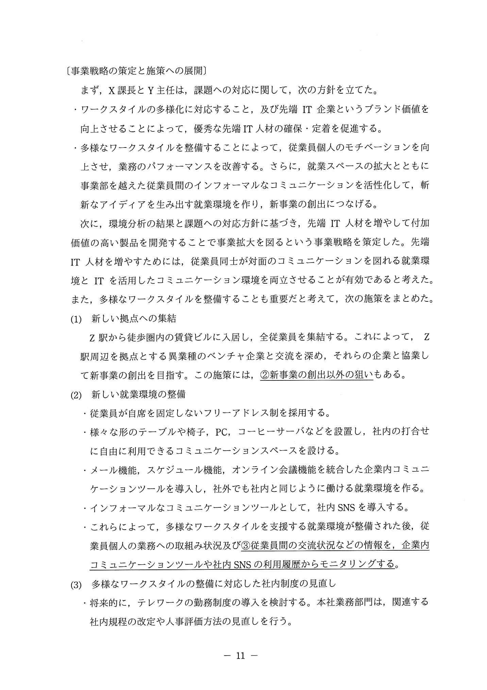

テキスト (OCR)

[事業戦略の策定と施策への展開]

まず, X課長と Y 主任は, 課題への対応に関して, 次の方針を立てた。

・ワークスタイルの多様化に対応すること, 及び先端 IT 企業というブランド価値を

向上させることによって, 優秀な先端 IT 人材の確保・定着を促進する。

・ 多様なワークスタイルを整備することによって, 従業員個人のモチベーションを向

上させ, 業務のパフォーマンスを改善する。 さらに, 就業スペースの拡大とともに

事業部を越えた従業員間のインフォーマルなコミュニケーションを活性化して, 斬

新なアイディアを生み出す就業環境を作り, 新事業の創出につなげる。

次に, 環境分析の結果と課題への対応方針に基づき, 先端 IT 人材を増やして付加
価値の高い製品を開発することで事業拡大を図るという事業戦略を策定した。 先端
IT 人材を増やすためには, 従業員同士が対面のコミュニケーションを図れる就業環
境と IT を活用したコミュニケーション環境を両立させることが有効であると考えた。
また, 多様なワークスタイルを整備することも重要だと考えて, 次の施策をまとめた。
QQ) 新しい拠点への集結

Z 駅から徒歩圏内の賃貸ビルに入居し, 全従業員を集結する。これによって, Z
駅周辺を拠点とする異業種のベンチャ企業と交流を深め, それらの企業と協業し
て新事業の創出を目指す。この施策には, ②新事業の創出以外の狙いもある。

(2) 新しい就業環境の整備

・ 従業員が自席を固定しないフリーアドレス制を採用する。

・様々な形のテーブルや椅子, PC. コーヒーサーバなどを設置し, 社内の打合せ

に自由に利用できるコミュニケーションスペースを設ける。

・メール機能, スケジュール機能, オンライン会議機能を統合した企業内コミュニ

ケーションツールを導入し, 社外でも社内と同じように働ける就業環境を作る。

・インフォーマルなコミュニケーションツールとして, 社内 SNS を導入する。

・これらによって, 多様なワークスタイルを支援する就業環境が整備された後, 従

業員個人の業務への取組み状況及び③従業員間の交流状況などの情報を, 企業内

コミュニケーションツールや社内 SNS の利用履歴からモニタリングする。
(3) 多様なワークスタイルの整備に対応した社内制度の見直し

・ 将来的に, テレワークの勤務制度の導入を検討する。本社業務部門は, 関連する

社内規程の改定や人事評価方法の見直しを行う。

ー 11 一

### ページ 13

テキスト (OCR)

・④テレワークの勤務制度の導入によって, 本社業務部門の担当である一部の業務
の負荷が増える懸念があるので, 対策を検討する。

設問1 本文中の下線①の状態のままでは危恨される, W 社の事業に関する機会損失
リスクを, 25 字以内で述べよ。
設問2 【PEST 分析と W 社への影響の検討 について, (1)て④に答えよ。

Q) 本文中の | 』 | に入れる適切な字句を解答群の中から選び, RESCH
あま。

ASB
ア 市場    イ 内部    ウ マクロ   = ミクロ

⑫ 本文中の[| b | に入れる適切な字句を解答群の中から選び, 記号で答
Rds

ABER
ア 3C分析         イ SWOT 分析
ウ パリューチェーン分析     エ ファイブフォース分析

(3 表1 で挙げた東京 2020 後の労働力需要の動向を表 2 の作成時に除外してい
る。その理由として適切なものを解答群の中から選び, 記号で答えよ。
NSB
ア IT 業界に直接的な影響を及ぼす変化だから
イ 一時的な変化だから
ウ スピードが遅い変化だから
エ 中長期の構造的な変化だから
④ 表 2 中の| < | に入れる適切な字句を, 本文中の用語を使って 15 F
以内で答えよ。
設問3 (事業戦略の策定と施策への展開] について, (①て(③⑬に答えよ。
Q①) 本文中の下線@について, 新事業の創出以外の狙いを, 15 字以内で答えよ。
2) 本文中の下線について, モニタリングにとどまらず, W 社が開発案件で
習得した先端 IT を応用してできる施策を, 40 字以内で述べよ。
⑬ 本文中の下線@について, 負荷が増える懸念のある業務の名称を, 5 FUN

で答えよ。

ー 12 一

### ページ 14

テキスト (OCR)

C

メ モ 用 紙 )

ー 13 一

### ページ 15

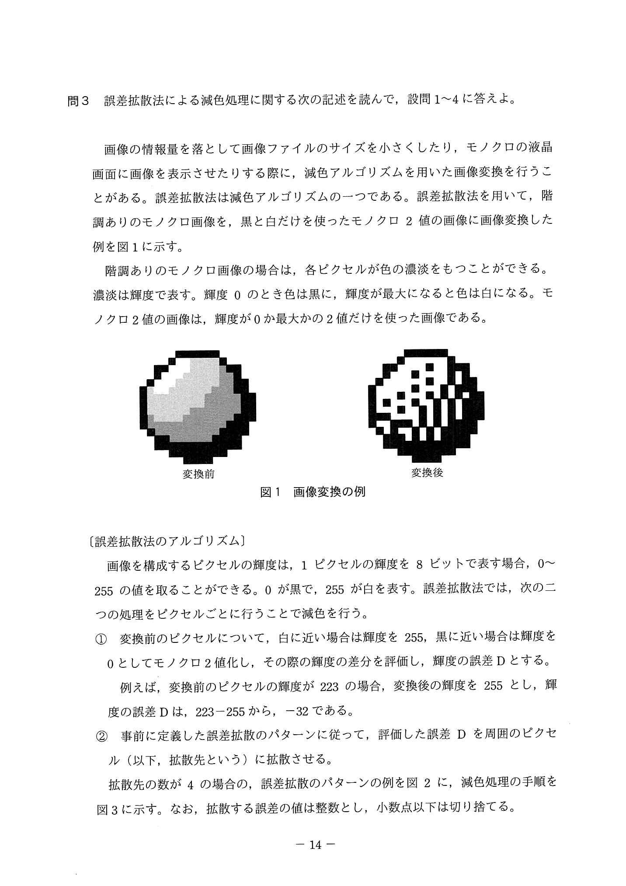

テキスト (OCR)

MS 誤差拡散法による減色処理に関する次の記述を読んで, 設問 1ー4 に答えよ。

画像の情報量を落として画像ファイルのサイズを小さくしたり, モノクロの液晶
画面に画像を表示させたりする際に, 減色アルゴリズムを用いた画像変換を行うこ
とがある。 誤差拡散法は減色アルゴリズムの一つである。誤差拡散法を用いて, 階
調ありのモノクロ画像を, 黒と白だけを使ったモノクロ 2 値の画像に画像変換した
例を図 1 に示す。

階調ありのモノクロ画像の場合は, 各ピクセルが色の濃淡をもつことができる。
RECHT, 輝度 0 のとき色は黒に, 輝度が最大になると色は白になる。モ
ノクロ 2 値の画像は, 輝度が0 か最大かの 2 値だけを使った画像である。

 1 画像変換の例

[誤差拡散法のアルゴリズム]〕
画像を構成するピクセルの輝度は, 1 ピクセルの輝度を 8 ビットで表す場合, 0
255 の値を取ることができる。0 が黒で, 255 が白を表す。誤差拡散法では, ROX
つの処理をピクセルごとに行うことで減色を行う。
① 変換前のピクセルについて, 白に近い場合は郊度を 255, 黒に近い場合は郊度を
0 としてモノクロ 2 値化し, その際の輝度の差分を評価し, 輝度の誤差D とする。
例えば, 変換前のピクセルの輝度が 223 OWS, 変換後の輝度を 255 とし, 輝
度の誤差 lk, 223一255 から, 一32 である。
② 事前に定義した誤差拡散のパターンに従って, 評価した誤差 D を周囲のピクセ
ル (以下, 拡散先という) に拡散させる。
拡散先の数が 4 の場合の, 誤差拡散のパターンの例を図 2 に, 減色処理の手順を
図 3 に示す。なお, 拡散する誤差の値は整数とし, 小数点以下は切り捨てる。

ー 14 一

### ページ 16

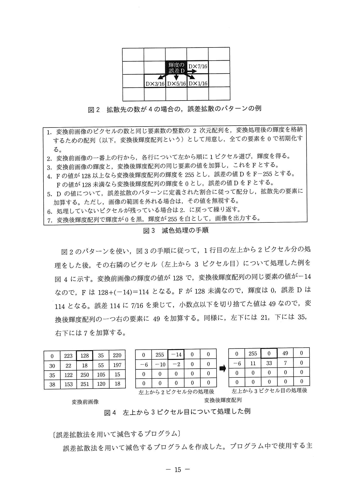

テキスト (OCR)

DX7/16

DX3/16| DX5/16] DX 1/16

 2 拡散先の数が 4 の場合の, 誤差拡散のパターンの例

1. 変換前画像のピクセルの数と同じ要素数の整数の 2 次元配列を, 変換処理後の輝度を格納
するための配列 (以下, 変換後輝度配列という) として用意し, 全ての要素を 0 で初期化す
る。

2. 変換前画像の一番上の行から, 各行について左から順に 1 ピクセル選び, 輝度を得る。

3. 変換前画像の輝度と, 変換後輝度配列の同じ要素の値を加算し, これを F とする。

4. F の値が 128 以上なら変換後輝度配列の輝度を 255 とし, 誤差の値Dをドー255 とする。

F の値が 128 未満なら変換後煙度配列の輝度を 0 とし, 誤差の値DりをF とする。

5. D の値について, 誤差拡散のパターンに定義された割合に従って配分し, 拡散先の要素に
加算する。ただし, 画像の範囲を外れる場合は, その値を無視する。

6. 処理していないピクセルが残っている場合は 2. に戻って繰り返す。

7. 変換後輝度配列で輝度が 0 eB, 輝度が 255 を白として, 画像を出力する。

 3 減色処理の手順

 2 のパターンを使い, 図 3 の手順に従って, 1 行目の左上から 2 ビクセル分の処
理をした後, その右隣のピクセル (左上から 3 ピクセル目) について処理した例を
 4 に示す。変換前画像の輝度の値が 128 で, 変換後輝度配列の同じ要素の値がー14
なので, F は 128+(一14)三114 となる。F が 128 未満なので, 輝度は 0, 誤差D は
114 となる。 誤差 114 に 716 を乗じて, 小数点以下を切り捨てた値は 49 BOT, 変
換後交度配列の一つ右の要素に 49 を加算する。同様に, 左下には 21, 下には 35,
右下には7 を加算する。

0 | 223 | 128 | 35 | 220            0 | 255 }—14] 0        0               0 | 255] 0       49       0
30    22    18    55 | 197       —6|-10| —2] 0     0         ー6 | 11    33     7     0
35 | 122 | 250 | 105 | 15                0         0                    0          0       »       0         0          0          0         0
38 | 153 | 251 | 120 | 18                0         0         0          0         0                  0          0         0         0          0
左上から 2 ピクセル分の処理後      左上から 3 ビクセル目の処理後
変換前画像                                 変換後輝度配列

図 4 左上から 3 ピクセル目について処理した例

[誤差拡散法を用いて減色するプログラム〕
誤差拡散法を用いて減色するプログラムを作成した。プログラム中で使用する主

ー 15 =

### ページ 17

テキスト (OCR)

な変数, 定数及び配列を表 1 に, 作成したプログラムを図 5 に示す。

表1 プログラム中で使用する主な変数, 定数及び配列

名称          種別                                         説明
width          変数 | 画像の幅。 1 以上の整数が入る。
height               変数 | 画像の高さ。1 以上の整数が入る。

bmpFrom[x, y] | 配列 | 変換前画像の輝度の配列。輝度が 0~255 の値で格納される。
x,y はそれぞれ X 座標と Y 座標で, 画像の左上が[1, 1], 右下が
[width, height] C4.

bmpTolx, y]        配列 | 変換後輝度配列。x, y は bmpFromlx, y]と同様である。全ての要素は 0

で初期化されている。

ratioCount          定数 | 誤差拡散のパターンの拡散先の数。図 2 の場合は 4 が入る。

tdx[ ]          配列 | 拡散先の, ピクセル単位の X 方向の相対位置。図 2 の場合は[1, 一1,
0, AAS.

tdy[ ]         配列 | 拡散先の, ピクセル単位の Y 方向の相対位置。図 2 の場合は[0, 1, 1,
RAS.

ratio[ ]        配列 | 拡散先のピクセルごとの割合の分子。 2 の場合は[7, 3, 5, 1]が入
る。

denominator         定数 | 拡散先のピクセルごとの割合の分母。図 2 の場合は 16 が入る。

for (yを1からheight まで繰り返す )
for ( xを1から width まで繰り返す ) <                      ①
fて|         ァ       _|
i
d < f - 255
bmpTo[x, y] < 255
else
d< f
bmpTo[x, y] て 0
endif
for (cを1からratioCount まで繰り返す )
px — x + tdx[c] <<                                    2)
py <— y + tdy[c]
if ( (px が1 以上) かつ (px が width 以下)
かつ (py が1 以上) かつ (py が height 以下) )
bmpTo[px , py] < |              ウ              |
endif
endfor

トォーーー @

endfor
endfor

 5 作成したプログラム

ー 16 一

### ページ 18

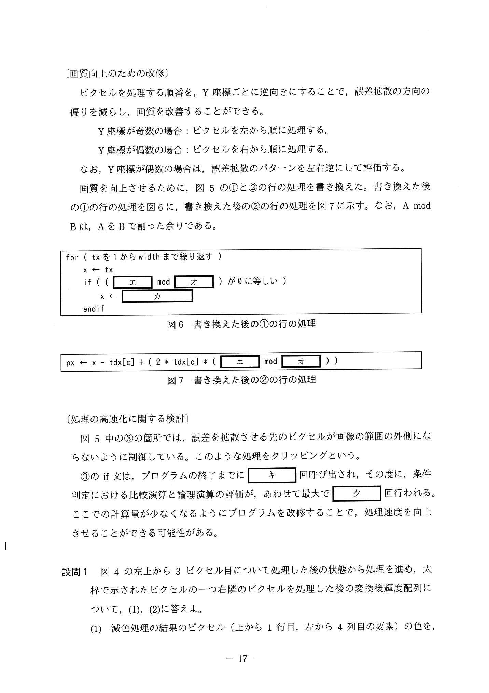

テキスト (OCR)

[画質向上のための改修
ピクセルを処理する順番を, Y 座標ごとに逆向きにすることで, 誤差拡散の方向の
偏りを減らし, 画質を改善することができる。
Y 座標が奇数の場合 : ピクセルを左から順に処理する。
Y 座標が偶数の場合 : ピクセルを右から順に処理する。
なお, Y 座標が偶数の場合は, 誤差拡散のパターンを左右逆にして評価する。
画質を向上させるために, 5 の①と②③の行の処理を書き換えた。 書き換えた後
の①の行の処理を図 6 に, 書き換えた後の②の行の処理を図 7 に示す。なお, A mod
B は, AをBで割った余りである。

for ( txを1からwidth まで繰り返す )

x を tx
if((ト[し ェ | md| ォ ] ) が9に等しい )
ol

endif

 6 書き換えた後の①の行の処理

px-tdx[e]d+(2*tdxtcl*([ = |md[ ォ |))
図7 書き換えた後の②の行の処理

(処理の高速化に関する検計

 5 中の③の箇所では, 誤差を拡散させる先のピクセルが画像の範囲の外側にな
らないように制御している。このような処理をクリッピングという。

Oo if 文は, ブログラムの終了までに | キ |回呼び出され, その度に, 条件
判定における比較演算と論理演算の評価が, あわせて最大で| ク |回行われる。
ここでの計算量が少なくなるようにプログラムを改修することで, 処理速度を向上
させることができる可能性がある。

設問 1 4 の左上から 3 ピクセル目について処理した後の状態から処理を進め,太
枠で示されたピクセルの一つつ右隣のピクセルを処理した後の変換後輝度配列に
DWT, ①), (②)に答えよ。

(1) 減色処理の結果のピクセル (上から 1 行目, 左から 4 列目の要素) の色を,

ー 太一

### ページ 19

テキスト (OCR)

自か黒で答えよ。
2) (①)のピクセルの処理後に. そのピクセルの下のピクセル (上から 2 行目,
左から AWA ORR) (CASED ME PKCER EK.
設問2 図5中の| ア |~| 9 |に入れる適切な字名を答えよ
設問3 M6 図7中の| = |~-| カ 1 に大れる半和な人を符ま
設問4 本文中の| キ |,| ク |に入れる適切な字句を答えよ。

ー 18 一

### ページ 20

テキスト (OCR)

C

メ モ 用 紙 ]

ー 19 一

### ページ 21

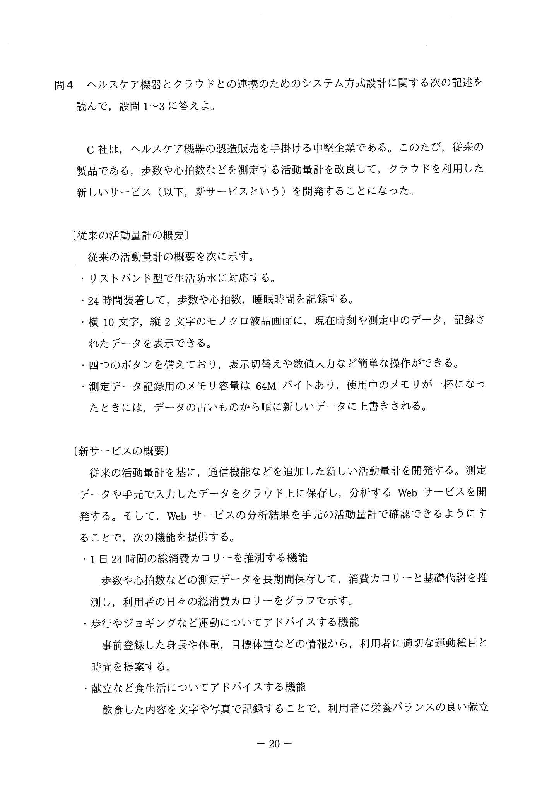

テキスト (OCR)

問4 ヘルスケア機器とクラウドとの連携のためのシステム方式設計に関する次の記述を
MAC, 設問 1ー3 に答えよ。

C 社は, ヘルスケア機器の製造販売を手掛ける中堅企業である。このたび, 従来の
製品である, 歩数や心拍数などを測定する活動量計を改良して, クラウドを利用した
新しいサービス (以下, 新サービスという) を開発することになった。

従来の活動量計の概要]

従来の活動量計の概要を次に示す。

・リストバンド型で生活防水に対応する。

・24 時間装着して, 歩数や心拍数, 睡眠時間を記録する。

・横 10 文字, 縦 2 文字のモノクロ液晶画面に, 現在時刻や測定中のデータ, 記録さ
れたデータを表示できる。

・四つのボタンを備えており, 表示切替えや数値入力など簡単な操作ができる。

・測定データ記録用のメモリ容量は 64M バイトあり, 使用中のメモリが一杯になっ
たときには, データの古いものから順に新しいデータに上書きされる。

i

〔新サービスの概要]
従来の活動量計を基に, 通信機能などを追加した新しい活動量計を開発する。測定
データや手元で入力したデータをクラウド上に保存し, 分析する Web サービスを開
発する。そして, Web サービスの分析結果を手元の活動量計で確認できるようにす
ることで, 次の機能を提供する。
・1 日 24 時間の総消費カロリーを推測する機能
歩数や心拍数などの測定データを長期間保存して, 消費カロリーと基礎代謝を推
測し, 利用者の日々の総消費カロリーをグラフで示す。
・歩行やジョギングなど運動についてアドバイスする機能
事前登録した身長や体重, 目標体重などの情報から, 利用者に適切な運動種目と
時間を提案する。
・柚立など食生活についてアドバイスする機能
飲食した内容を文字や写真で記録することで, 利用者に栄養バランスの良い獣立

ー 20 一

### ページ 22

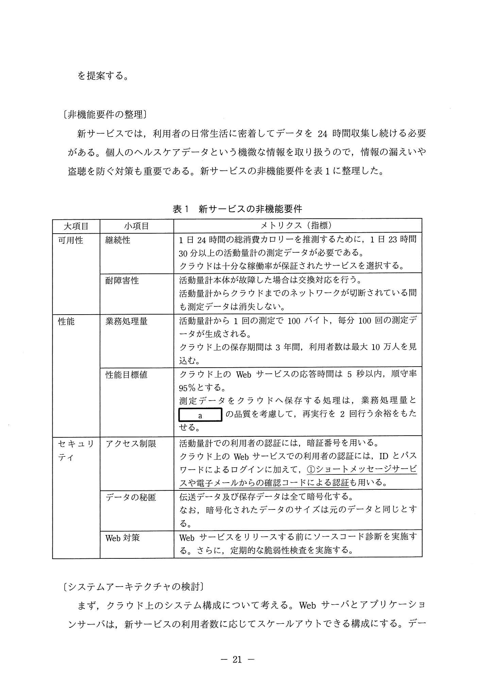

テキスト (OCR)

を提案する。

〔非機能要件の整理

新サービスでは, 利用者の日常生活に密着してデータを 24 時間収集し続ける必要
がある。 個人のヘルスケアデータという機微な情報を取り扱うので, 情報の漏えいや
盗聴を防ぐ対策も重要である。新サービスの非機能要件を表 1 に整理した。

表1 新サービスの非機能要件

大項目         小項目                            メトリクス (指標)
可用性     継続性           1 日 24 時間の総消費カロリーを推測するために, 1 日 23 時間

30 分以上の活動量計の測定データが必要である。

クラウドは十分な稼働率が保証されたサービスを選択する。

耐障害性          活動量計本体が故障した場合は交換対応を行う。

活動量計からクラウドまでのネットワークが切断されている間
も測定データは消失しない。

性能      業務処理量      活動量計から 1 回の測定で 100 バイト, 毎分 100 回の測定デ
ータが生成される。
クラウド上の保存期間は 3 EA, 利用者数は最大 10 万人を見
込む。
性能目標値      クラウド上の Web サービスの応答時間は 5 秒以内, 順守率
95%とする。

測定データをクラウドへ保存する処理は, 業務処理量と
| 』 | の員質を考慮して, 再実行を 2 回行う余裕をもた

せる。
セキュリ | アクセス制限       活動量計での利用者の認証には, 暗証番号を用いる。
ティ                        クラウド上の Web サービスでの利用者の認証には, ID とパス

ワードによるログインに加えて, ①ショートメッセージサービ
スや電子メールからの確認コードによる認証も用いる。

データの秘匿    伝送データ及び保存データは全て暗号化する。

なお, 暗号化されたデータのサイズは元のデータと同じとす
る。

Web 対策       Web サービスをリリースする前にソースコード診断を実施す
る。 さらに, 定期的な脆弱性検査を実施する。

〔【システムアーキテクチャの検討]
まず, クラウド上のシステム構成について考える。Web サーバとアプリケーショ
ンサーバは, 新サービスの利用者数に応じてスケールアウトできる構成にする。デー

ー 21 一

### ページ 23

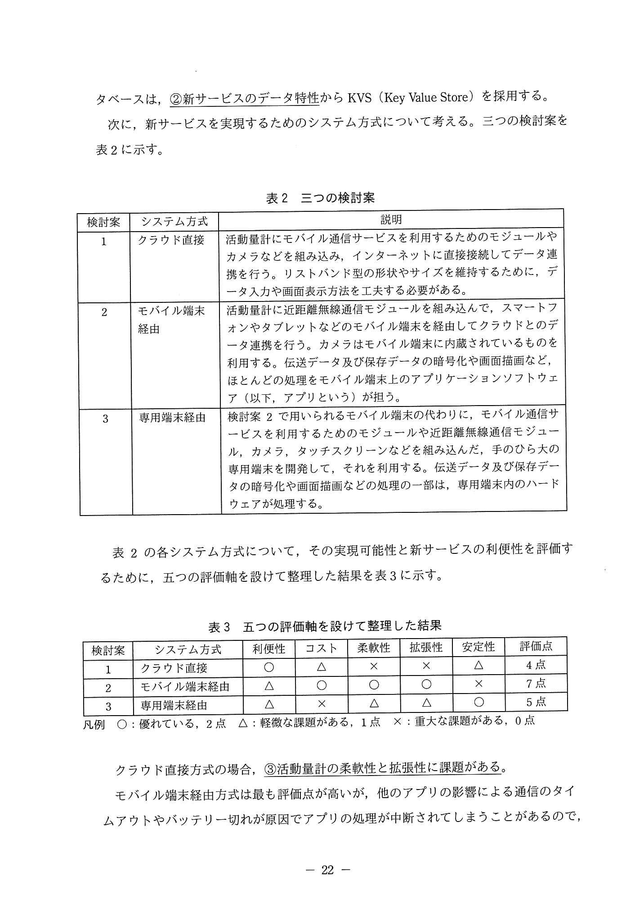

テキスト (OCR)

タベースは, ②新サービスのデータ特性から KVS (Key Value Store) を採用する。
RIL, 新サービスを実現するためのシステム方式について考える。三つの検討案を
表 2 に示す。

表2 三つの検討案
MN | システム方式                  説明
1.  クラウド直接 | 活動量計にモバイル通信サービスを利用するためのモジュールや
カメラなどを組み込み, インターネットに直接接続してデータ連
携を行う。リストバンド型の形状やサイズを維持するために, デ
ータ入力や画面表示方法を工夫する必要がある。

2   モバイル端末 | 活動量計に近距離無線通信モジュールを組み込んで, スマートフ
経由          ォオンやタブレットなどのモバイル端末を経由してクラウドとのデ
ータ連携を行う。カメラはモバイル端末に内蔵されているものを
利用する。 伝送データ 及び保存データの暗号化や画面描画など,
ほとんどの処理をモバイル端末上のアプリケーションソフトウェ
ア (以下,アプリという) が担う。

3    専用端末経由 | MAE 2 で用いられるモバイル端末の代わりに, モバイル通信サ
ービスを利用するためのモジュールや近距離無線通信モジュー
ル, カメラ, タッチスクリーンなどを組み込んだ, 手のひら大の
専用端末を開発して, それを利用する。伝送データ及び保存デー
タの暗号化や画面描画などの処理の一部は, 専用端末内のハード
ウェアが処理する。

表 2 の各システム方式について, その実現可能性と新サービスの利便性を評価す
るために, 五つの評価軸を設けて整理した結果を表3 に示す。

表3 五つの評価軸を設けて整理した結果

検討案   システム方式   利便性 | コスト | 柔軟性 | 拡張性 | 安定性 | TPM
A
x

1    クラウド直接        O      A      x      x              4 点
2       モバイル端末経由        A          O          Oo          O                     7 点
3    専用端末経由       A      x      ca     A     O     5 点
凡例 〇 : 優れている, 2点 A: 軽微な課題がある, 1点 X: 重大な課題がある, OM

クラウド直接方式の場合,③活動量計の柔軟性と拡張性に課題がある。
モバイル端末経由方式は最も評価点が高いが, 他のアプリの影響による通信のタイ
ムアウトやバッテリー切れが原因でアプリの処理が中断されてしまうことがあるので,

### ページ 24

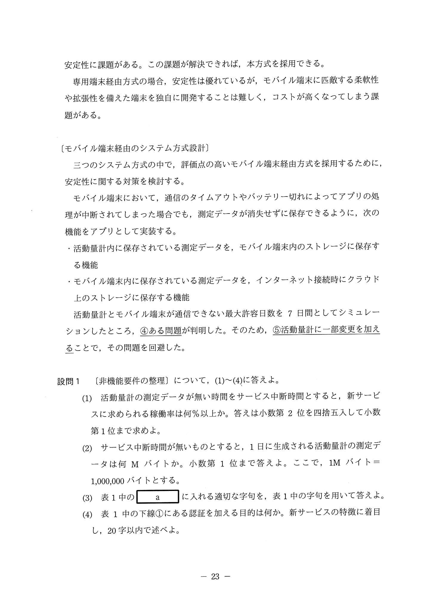

テキスト (OCR)

安定性に課題がある。この課題が解決できれば, 本方式を採用できる。

専用端末経由方式の場合, 安定性は優れているが, ENF VARICES 5 RE
や拡張性を備えた端末を独自に開発することは難しく, コストが高くなってしまう課
題がある。

[モバイル端末経由のシステム方式設計)
三つのシステム方式の中で, 評価点の高いモバイル端来経由方式を採用するために,
安定性に関する対策を検討する。
モバイル端末において, 通信のタイムアウトやバッテリー切れによってアプリの処
理が中断されてしまった場合でも, 測定データが消失せずに保存できるように, 次の
機能をアプリとして実装する。
・ 活動量計内に保存されている測定データを, モバイル端末内のストレージに保存す
る機能
・モバイル端末内に保存されている測定データを, インターネット接続時にクラウド
上のストレージに保存する機能
活動量計とモバイル端末が通信できない最大許容日数を 7 日間としてシミュレー
ションしたところ, ④ある問題が判明した。そのため, ⑤活動量計に一部変更を加え
ることで, その間題を回避した。

設問 1   〔非機能要件の整理) について, ①~て(④に答えよ。

①) 活動量計の測定データが無い時間をサービス中断時間とすると, 新サービ
スに求められる稼働率は何%以上か。答えは小数第 2 位を四捨五入して小数
第 1 位まで求めよ。

(2) サービス中断時間が無いものとすると, 1 日に生成される活動量計の測定デ
ータは何 M バイトか。小数第 1 位まで答えよ。ここで, IM バイト=
1.000,.000 バイトとする。

⑬ 表1中の[|  』 | に入れる適切な字句を, 表 1中の字句を用いて答えよ。

(4) 表 1 中の下線〇①にある認証を加える目的は何か。 新サービスの特徴に着目
し, 20 字以内で述べよ。

ー 23 一

### ページ 25

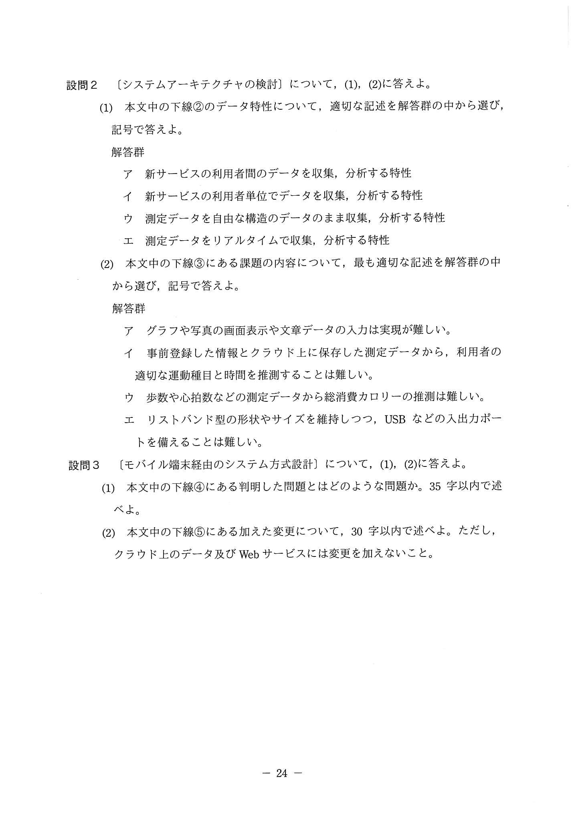

テキスト (OCR)

設問2 〔システムアーキテクチャの検討1について, M, ②)に答えよ。
(1) 本文中の下線@②のデータ特性について, 適切な記述を解答群の中から選び,
ws CHAK.
RAR
新サービスの利用者間のデータを収集, 分析する特性
新サービスの利用者単位でデータを収集, 分析する特性
測定データを自由な構造のデータのまま収集, 分析する特性
エ 測定データをリアルタイムで収集, 分析する特性
2) 本文中の下線③にある課題の内容について, 最も適切な記述を解答群の中
から選び, 記号で答えよ。
解答群
ア グラフや写真の画面表示や文章データの入力は実現が難しい。
イ 事前登録した情報とクラウド上に保存した測定データから, 利用者の
適切な運動種目と時間を推測することは難しい。
ウ 歩数や心拍数などの測定データから総消費カロリーの推測は難しい。
エ リストバンド型の形状やサイズを維持しつつ, USB などの入出力ポー
トを備えることは難しい。
設問3 〔モバイル端末経由のシステム方式設計) について, (①, ②)に答えよ。
(1) 本文中の下線の@にある判明した問題とはどのような問題か。35 字以内で述
べべペよ。
2) 本文中の下線@にある加えた変更について, 30 字以内で述べよ。ただし,
クラウド上のデータ及び Web サービスには変更を加えないこと。

ult

a

=

ny

GAN

i) ざ

— 24 一

### ページ 26

テキスト (OCR)

〔

メ = 用 紙 J

ー 25 一

### ページ 27

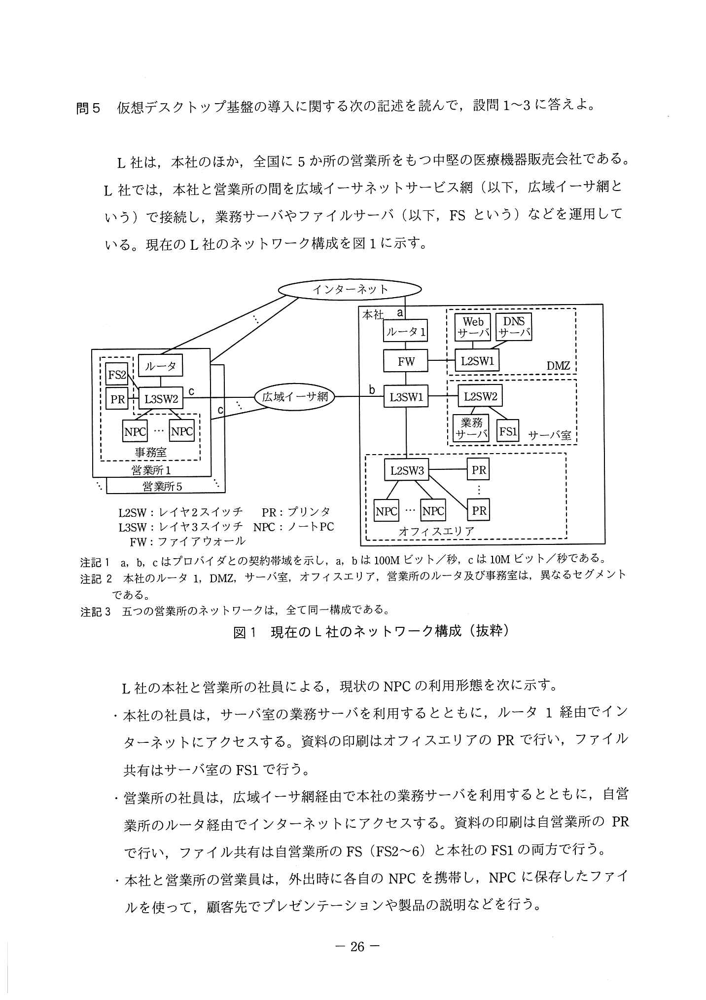

テキスト (OCR)

BIS 仮想デスクトップ基盤の導入に関する次の記述を読んで, 設問 13 に答えよ。

L 社は, 本社のほか, 全国に 5 か所の営業所をもつ中堅の医療機器販売会社である。
L 社では, 本社と営業所の間を広域イーサネットサービス網 (以下, 広域イーサ綱と
いう) で接続し, 業務サーバやファイルサーバ (以下, FS という) などを運用して
いる。現在のL 社のネットワーク構成を図 1 に示す。

ーーて広域イーサ綱

L2SW : レイヤ2スイッチ PR: プリンタ
L3SW : レイヤ3スイッチ NPC : ノートPC
FW : ファイアウォール
注記 1 oa, b, cはプロバイダとの契約帯域を示し, a b は 100M ビットノ秒, c は 10M ビットノ秒である。
注記 2 本社のルータ 1, DMZ, サーバ室,オフィスエリア, 営業所のルータ及び事務室は, 異なるセグメント
である。
注記 3 五つの営業所のネットワークは, 全て同一構成である。

図1 現在のL社のネットワーク構成 (抜粋)

L 社の本社と営業所の社員による, 現状の NPC の利用形態を次に示す。

・ 本社の社員は, サーバ室の業務サーバを利用するとともに, ルータ 1 経由でイン
ターネットにアクセスする。 資料の印刷はオフィスエリアの PR で行い, ファイル
共有はサーバ室の FS1 で行う。

・ 営業所の社員は, 広域イーサ綱経由で本社の業務サーバを利用するとともに, 自営
業所のルータ経由でインターネットにアクセスする。 資料の印刷は自営業所の PR
CHW, ファイル共有は自営業所のFS (FS2~6) CAMO FSI の両方で行う。

・ 本社と営業所の営業員は, 外出時に各自の NPC を携帯し, NPC に保存したファイ
ルを使って, 顧客先でプレゼンテーションや製品の説明などを行う。

ー 26 一

### ページ 28

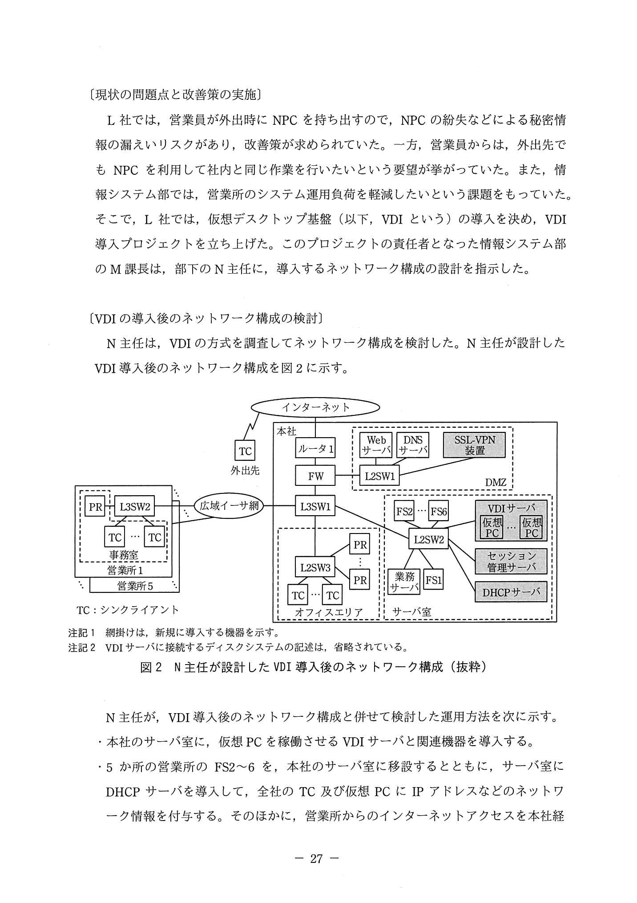

テキスト (OCR)

[現状の問題点と改善策の実施]

L 社では, 営業員が外出時に NPC を持ち出すので, NPC の紛失などによる秘密情
報の漏えいリスクがあり, 改善策が求められていた。ー一方, 営業員からは, 外出先で
も NPC を利用して社内と同じ作業を行いたいという要望が挙がっていた。 また, 情
報システム部では, 営業所のシステム運用負荷を軽減したいという課題をもっていた。
そこで, L 社では, 仮想デスクトップ基盤 (以下, VDI という) の導入を決め, VDI
導入プロジェクトを立ち上げた。このプロジェクトの責任者となった情報システム部
の M 課長は, 部下のN 主任に, 導入するネットワーク構成の設計を指示した。

(VDI の導入後のネットワーク構成の検討]
N 主任は, VDI の方式を調査してネットワーク構成を検討した。N 主任が設計した
VDI 導入後のネットワーク構成を図 2 に示す。

外出先

ロー広域イーサ綱

TO: シンクライアシト

注記1 網掛けは, 新規に導入する機器を示す。
注記 2 VDI サーバに接続するディスクシステムの記述は, 省略されている。

図 2 N主任が設計した VD1 導入後のネットワーク構成 (抜粋)

N 主任が, VDI 導入後のネットワーク構成と併せて検討した運用方法を次に示す。
・本社のサーバ室に, 仮想 PCを稼働させる VDI サーバと関連機器を導入する。

・5 が所の営業所の FS2~6 を, 本社のサーバ室に移設するとともに, サーバ室に
DHCP サーバを導入して, BHO TC 及び仮想 PC に IP アドレスなどのネットワ
ーク情報を付与する。そのほかに, 営業所からのインターネットアクセスを本社経

ー 一

### ページ 29

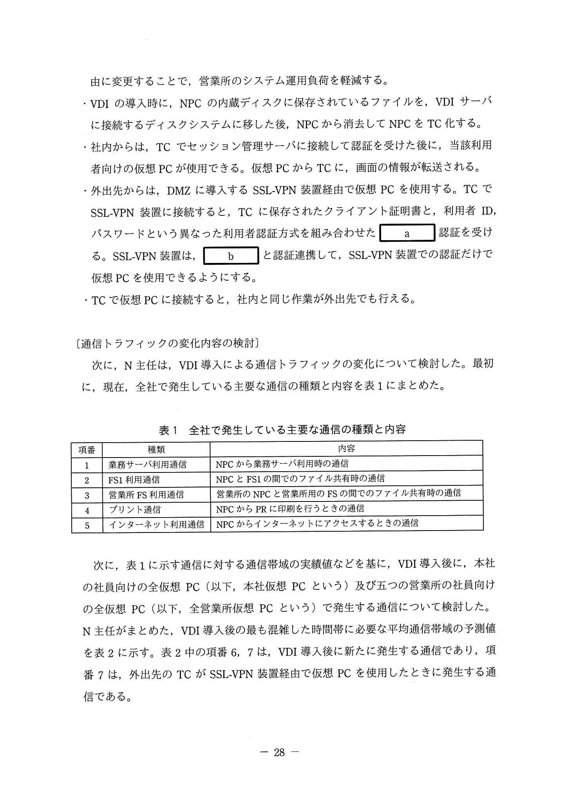

テキスト (OCR)

由に変更することで, 営業所のシステム運用負荷を軽減する。

・ VDI の導入時に, NPC の内蔵ディスクに保存されているファイルを, VDI サーバ
に接続するディスクシステムに移した後, NPC から消去して NPC を TC 化する。

・ 社内からは, TC でセッション管理サーバに接続して認証を受けた後に, 当該利用
者向けの仮想 PC が使用できる。 仮想 PC から TC に, 画面の情報が転送される。

・ 外出先からは, DMZ に導入する SSL-VPN 装置経由で仮想 PC を使用する。TC で
SSLVPN 装置に接続すると, TC に保存されたクライアント証明書と, 利用者 ID,
パスワードという異なった利用者認証方式を組み合わせた|  a』 |認証を受け
る。SSL-VPN 装置は。 | b | と認証連携して, SSLVPN 装置での認証だけで
仮想 PC を使用できるようにする。

・ TC で仮想 PC に接続すると, 社内と同じ作業が外出先でも行える。

〔通信トラフィックの変化内容の検討]
次に, N 主任は, VDI 導入による通信トラフィックの変化について検討した。 最初

に, 現在, 全社で発生している主要な通信の種類と内容を表 1 にまとめた。

表1 全社で発生している主要な通信の種類と内容

1      業務サーバ利用通信         NPC から業務サーバ利用時の通信

2      FS1 利用通信                NPC と FS1 の間でのファイル共有時の通信

3    営業所 FS 利用通信       営業所の NPC と営業所用の FS の間でのファイル共有時の通信
4      プリント通信               NPC から PR に印刷を行うときの通信

5    インターネット利用通信 | NPCからインターネットにアクセスするときの通信

次に, 表 1 に示す通信に対する通信帯域の実績値などを基に, VDI 導入後に, 本社
の社員向けの全仮想 PC (以下, 本社仮想 PC という) 及び五つの営業所の社員向け
の全仮想 PC (以下, 全営業所仮想 PC という) で発生する通信について検討した。
N 主任がまとめた, VDI 導入後の最も混雑した時間帯に必要な平均通信帯域の予測値
を表 2 に示す。表 2 中の項番 6, 7 は, VD 導入後に新たに発生する通信であり, 項
番 7 は, 外出先の TC が SSL-VPN 装置経由で仮想 PC を使用したときに発生する通
信である。

ー 28 一

### ページ 30

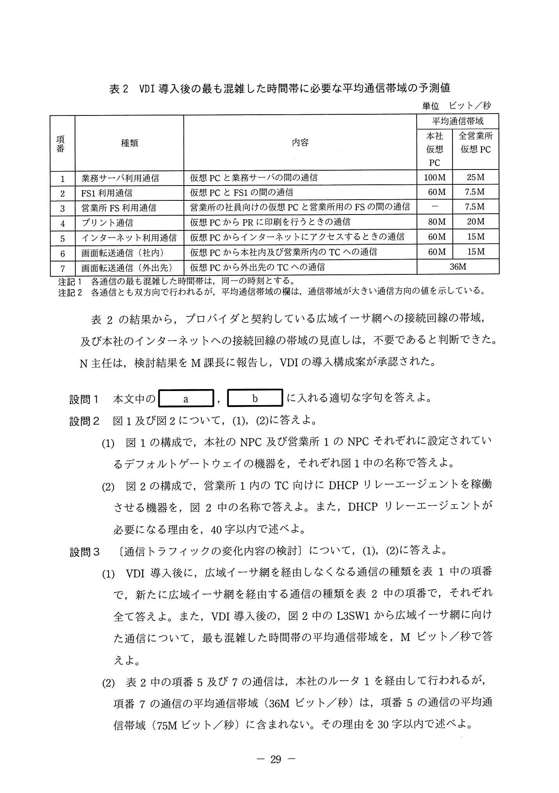

テキスト (OCR)

表 2 Wl 導入後の最も混雑した時間帯に必要な平均通信帯域の予測値

単位 ビットノ/秒
平均通信帯域
本社 | 全営業所
               人                                        me                              仮想 | 仮想PC
PC
1 | 業務サーバ利用通信      仮想 PC と業務サーバの間の通信                   100M    25M
2 | FS1 利用通信               仮想 PC と FS1 の間の通信                                   60M | 7.5M
3 | 営業所 FS 利用通信          営業所の社員向けの仮想 PC と営業所用の FS の間の通信       ー        75M
4 | プリント通信                仮想 PC から PR に印刷を行うときの通信                     80M      20M
5 | インターネット利用通信 | 仮想PCからインターネットにアクセスするときの通信    60M    15M
6 | 画面転送通信 (社内)        仮想 PC から本社内及び営業所内の TC への通信               60M       15M
7 | 画面転送通信 (外出先) | 仮想PCから外出先の TC への通信                                     36M

注記1 各通信の最も混雑した時間帯は, 同一の時刻とする。
注記 2 各通信とも双方向で行われるが, 平均通信帯域の欄は, 通信帯域がた大きい通信方向の値示している。

表 2 の結果から, プロバイダと契約している広域イーサ網への接続回線の帯域,

及び本社のインターネットへの接続回線の帯域の見直しは, 不要であると判断できた。
N 主任は, 検討結果を M 課長に報告し, VDI の導入構成案が承認された。

設問1 本文中の| oa |,|  b |に入れる適切な字句を答えよ。
設問2 1 及び図 2 について, (1), ②⑫②に答えよ。

① 1 の構成で, 本社の NPC 及び営業所 1 の NPC それぞれに設定されてい
るデフォルトゲートウェイの機器を, それぞれ図 1 中の名称で答えよ。

2) 図 2 の構成で, 営業所 1 内の TC 向けに DHCP リレーエージェントを稼働
させる機器を, 図 2 中の名称で答えよ。また, DHCP リレーエージェントが
必要になる理由を, 40 字以内で述べよ。

設問3 [通信トラフィックの変化内容の検討] について, ①⑪, ②に答えよ。

①) VDI 導入後に, 広域イーサ網を経由しなくなる通信の種類を表 1 中の項番
で, 新たに広域イーサ網を経由する通信の種類を表 2 中の項番で, それぞれ
全て答えよ。また, VDI BAKO, 図 2 中の L3SW1 から広域イーサ網に向け
た通信について, 最も混雑した時間帯の平均通信帯域を, M ビットノ秒で答
えよ。

2) 表 2 中の項番 5 及び 7 の通信は, 本社のルータ 1 を経由して行われるが,
項番 7 の通信の平均通信帯域 (36M ビットノ秒) は, 項番 5 の通信の平均通
信帯域 (75M ビットノ秒) に含まれない。 その理由を 30 字以内で述べよ。

ー 29 一

### ページ 31

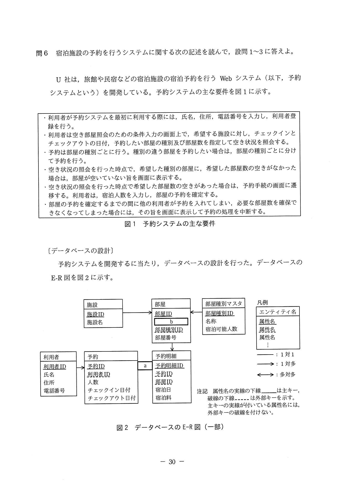

テキスト (OCR)

問6 宿泊施設の予約を行うシステムに関する次の記述を読んで, 設問 1ご3 に答えよ。

U 社は, 旅館や民宿などの宿泊施設の宿泊予約を行う Web システム (以下, 予約
システムという) を開発している。 予約システムの主な要件を図 1 に示す。

- 利用者が予約システムを最初に利用する際には, 氏名, 住所, 電話番号を入力し, 利用者登
録を行う。

・ 利用者は空き部屋照会のための条件入力の画面上で, 希望する施設に対し, チェックインと
チェックアウトの日付, 予約したい部屋の種別及び部屋数を指定して空き状況を照会する。

・ 予約は部屋の種別ごとに行う。種別の違う部屋を予約したい場合は, 部屋の種別ごとに分け
て予約を行う。

空き状況の照会を行った時点で, 希望した種別の部屋に, 希望した部屋数の空きがなかった
場合は, 部屋が空いていない旨を画面に表示する。

・空き状況の照会行った時点で希望した部屋数の空きがあった場合は, 予約手続の画面に居
移する。利用者は, 宿泊人数を入力し, 部屋の予約を確定する。

- 部屋の予約を確定するまでの間に他の利用者が予約を入れてしまい, 必要な部屋数を確保で
きなくなってしまった場合には, その旨を画面に表示して予約の処理を中断する。

 1 予約システムの主な要件

[データベースの設計]
予約システムを開発するに当たり, データベースの設計を行ったを。データベースの
E-R 図を図 2 に示す。

設                                  部屋                        部屋種別マスタ| 凡例
施設ID             部屋ID         部屋種別D       エンティティ名
施設名                        Coa) | 4                    属性名
部屋種別D           宿泊可能人数          属性名
部屋番号                                       属性名
I                                            :
利用者              予約                           予約明細                                      ーー : 1対1
ID Ls ID                  a       約明細ID                                   ーータ : 1対多
氏名            利用者TD                予約ID                               <> : 多対多
住所                人数                          部屋ID
anes            Fxg vate            宿泊日             注記 属性名の実線の下線はキー
チェックアウト日付         宿泊料                 破線の下線----- は外部キーを示す。

主キーの実線が付いている属性名には,
外部キーの破線を付けない。

 2 データベースのE-R図 (一部)

ー 30 一

### ページ 32

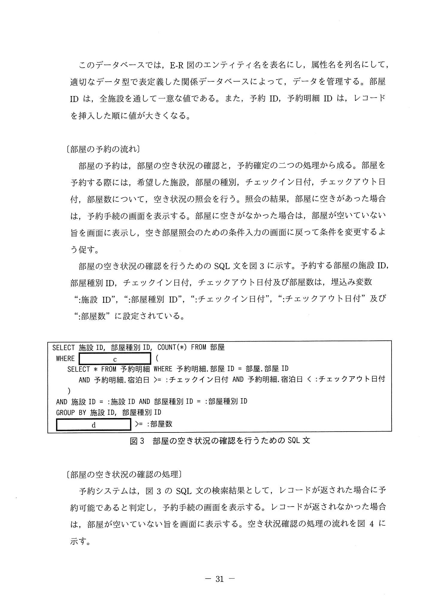

テキスト (OCR)

このデータベースでは, E-R 図のエンティティ名を表名にし, 必性名を列名にして
適切なデータ型で表定義した関係データベースによって, データを管理する。 部屋
ID は, 全施設を通して一意な値である。 Hk, 予約 ID, 予約明細 ID Ik, レコード
を挿入した順に値が大きくなる。

(部屋の予約の流れ〕

部屋の予約は, 部屋の空き状況の確認と, 予約確定の二つの処理から成る。部屋を
予約する際には, 希望した施設, 部屋の種別. チェックイン日付, チェックアウト日
付, 部屋数について, 空き状況の照会を行う。照会の結果,      空きがあった場合
は, 予約手続の画面を表示する。部屋に空きがなかった場合は, 部屋が空いていない
旨を画面に表示し, 空き部屋照会のための条件入力の画面に戻って条件を変更するよ
う促す。

部屋の空き状況の確認を行うための SQL 文を図 3 に示す。予約する部屋の施設 D
部屋種別 ID, チェックイン日付, チェックアウト日付及び部屋数は, 埋込み変数
本施設 ID”, "部屋種別 D", “Fay It VA", “:チェックアウト日付" 及び
部屋数” に設定されている。

SELECT 施設 ID, 部屋種別 ID, COUNT(*) FROM 部屋
SELECT * FROM 予約明細 WHERE 予約明細.部屋 ID = 部屋.部屋ID
AND 予約明細.宿泊日 >= :チェックイン日付 AND 予約明細.宿泊日 く:チェックアウト日付
)
AND 施設 ID = :施設ID AND 部屋種別ID = :部屋種別 ID
GROUP BY 施設ID, 部屋種別 ID

図3 部屋の空き状況の確認を行うための SQL 文

〔部屋の空き状況の確認の処理]
予約システムは, 3 の SQL 文の検索結果として, レコードが返された場合に
約可能であると判定し, 予約手続の画面を表示する。レコードが返されなかった場合
部屋が空いていない旨を画面に表示する。 空き状況確認の処理の流れを図 4 (
示す。

ー 31 一

### ページ 33

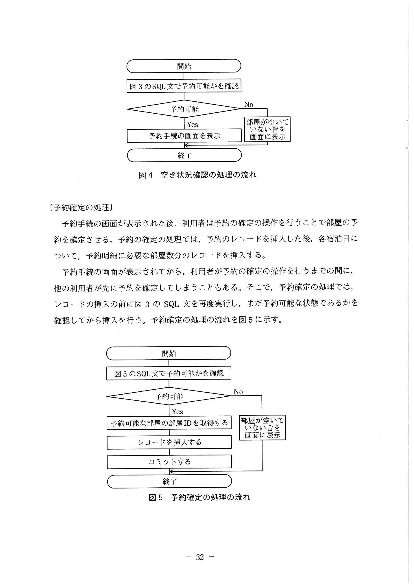

テキスト (OCR)

C    a    )

[a3 3 のSQL xc FHT AeM ee]

HEPA

WRWE

| 予約手続の画面を表示 || 画面に表示
にーーーーーーーーーー

図4 空き状況確認の処理の流れ

予約確定の処理]
予約手続の画面が表示された後, 利用者は予約の確定の操作を行うことで部屋の予
約を確定させる。予約の確定の処理では, 予約のレコードを挿入した後, 各和宿泊日に
ついて, 予約明細に必要な部屋数分のレコードを挿入する。
予約手続の画面が表示されてから, 利用者が予約の確定の操作を行うまでの間に,
他の利用者が先に予約を確定してしまうこともある。そこで, 予約確定の処理では,
レコードの挿入の前に図 3 の SQL 文を再度実行し, まだ予約可能な状態であるかを
認してから挿入を行う。予約確定の処理の流れを図 5 に示す。

(て     開始       )

| 図ぅ のSQL文で予約可能かを確認 |

et

Yes
| 予約可能な部屋の部屋ID を取得する | |部屋が空いて
          画面に表示
[ レコードを挿入する   |
I
|         コミットする         |

C       終了       )

図5 予約確定の処理の流れ

ー 32 一

### ページ 34

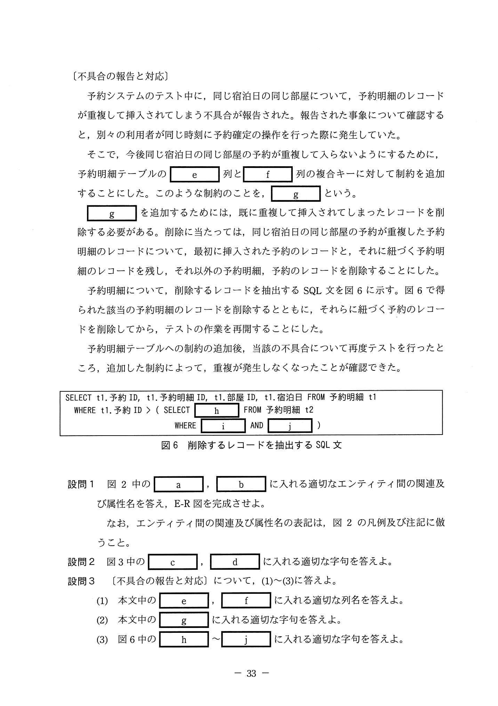

テキスト (OCR)

(不具合の報告と対応〕

予約システムのテスト中に, 同じ宿泊日の同じ部屋について, 予約明細のレコード
が重複して挿入されてしまう不具合が報告された。報告された事象について確認する
と, 別々の利用者が同じ時刻に予約確定の操作を行った際に発生していた。

そこで, 今後同じ宿泊日の同じ部屋の予約が重複して入らないようにするために,
予約明細テーブルの|  e [We]  f |列の複合キーに対して制約を追加
することにした。このような制約のことを, | g』 | という。

| gz | を追加するためには, 既に重複して挿入されてしまったレコードを削
除する必要がある。削除に当たっては, 同じ宿泊日の同じ部屋の予約が重複した予約
明細のレコードについて, 最初に挿入された予約のレコードと, それに紐づく予約明
細のレコードを残し, それ以外の予約明細, 予約のレコードを削除することにした。

予約明細について, 削除するレコードを抽出する SQL 文を図 6 に示す。図 6 で得
られた該当の予約明細のレコードを削除するとともに, それらに紐づく予約のレコー
ドを削除してから, テストの作業を再開することにした。

予約明細テーブルへの制約の追加後, 当該の不具合について再度テストを行ったと
ころ, 追加した制約によって, 重複が発生しなくなったことが確認できた。

SELECT t1.予約 ID, t1.予約明細 ID, t1.部屋 D, t1.宿泊日 FROM 予約明細 t1
WHERE t1.予約ID > ( SELECT FROM 予約明細 t2
WHERE| ji |Am| j」 |)

図6 削除するレコードを抽出する SQL 文

設問1 図 2 中の| a |,|  b |に入れる適切なエンティティ問の関連及
び属性名を答え, E-R 図を完成させよ。
BB, エンティティ間の関連及び属性名の表記は, 図 2 の凡例及び注記に條

うとと。
設問2 図3中の| c |,| ad |に入れる適切な字句を答えよ。
設問3  [不具合の報告と対応】 について, ①~て(3⑬)に答えよ。
a 本文中の[|  。 |,| fj | に入れる適切な列名を答えよ。
⑫ 本文中の| g | に入れる適切な字句を答えよ。
3) Mero} hn I~,  j |に入れる適切な字句を答えよ。

— 8 一

### ページ 35

テキスト (OCR)

問7 多言語多通貨対応両替システムに関する次の記述を読んで, 設問 1+ー4 に答えよ。

G 社は, 訪日外国人観光客が所持する外貨紙幣を日本円に両替するための, 多言語
多通貨対応両替システム (以下, 両替システムという) を開発している。 両替シス
テムは, 駅, 商店などに設置される両替機, 及びインターネットを介して両替機の
管理と両替機への情報提供を行う管理サーバで構成される。 両替システムの構成を
図 1 に, 両替機の外観を図 2 に, 両替機の内部構成を図 3 に, 両替機の構成要素の
機能概要を表 1 に示す。

SHEL                                                タッチパネル                   | aso
管理サーバ                       _
両替機n                                                     Heo                       明細書排出品
図1 両傘システムの構成              図2 両替機の外観
入金部                  出金部                  印刷部
I                        I                        I
ーーーーーーーー        シリアルバス
制御部
レーーーナーー
タッチパネル                              aie

 3 BRRONRBR

表1 両替機の構成要素の機能概要

構成要素名                                       機能概要
制御部            ・ 両替機全体の制御及び管理サーバとの通信を行う。
タッチパネル     ・制御部からの指示を基に, 画面表示を行う。
・利用者が画面にタッチしたら, 座標情報を制御部に通知する。
・外貨紙幣が入金口から挿入されたら, 通貨・金種を識別して制御部に通知する。
入金部          ・制御部からの指示を基に, 挿入された外貨紙幣を入金口に戻すか, 内部に格納す
る。
出金部           ・制御部からの指示を基に, 出金口から日本円紙幣・硬貨を出金する。
・制御部からの指示を基に, 両替の結果を示す明細書を印刷して明細書排出口から排
印刷部              出する

ー 34 一

### ページ 36

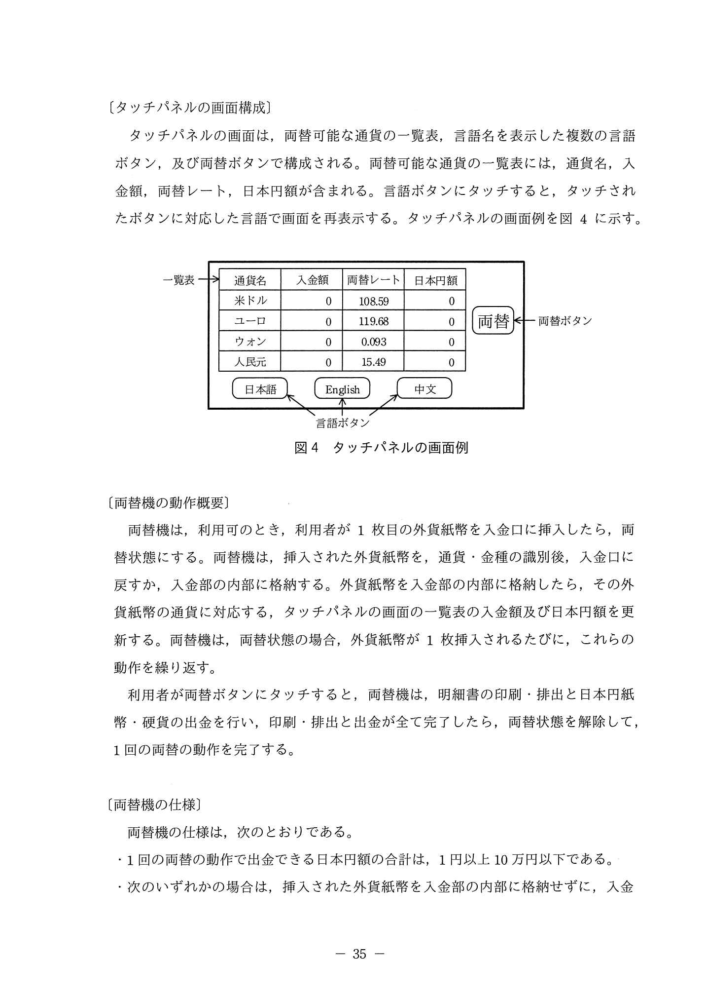

テキスト (OCR)

【タッチパネルの画面構成]

タッチパネルの画面は, 両替可能な通貨の一覧表, 言語名を表示した複数の言語
KAY, 及び両替ボタンで構成される。 両替可能な通貨の一覧表には, 通貨名, A
金額, 両替レート, 日本円額が含まれる。 言語ボタンにタッチすると, タッチされ
たボタンに対応した言語で画面を再表示する。 タッチパネルの画面例を図 4 に示す。

一覧表 P| 通貨名    入金額 |両替レート| 日本円額
米ドル            0      108.59            0
ウォン            0      0.093             0
ABI            0      15.49             0
日本語          English           中文
不
ae
M4 タッチパネルの画面例
〔両替機の動作概要〕

両替機は, 利用可のとき, 利用者が 1 枚目の外貨紙幣を入金口に挿入したら, 両
替状態にする。両替機は, 挿入された外貨紙幣を, 通貨・金種の識別後, 入金口に
RID, 入金部の内部に格納する。外貨紙幣を入金部の内部に格納したら, その外
貨紙幣の通貨に対応する, タッチパネルの画面の一覧表の入金額及び日本円額を更
新する。両替機は, 両替状態の場合, 外貨紙幣が 1 枚挿入されるたびに, これらの
動作を繰り返す。

利用者が両替ボタンにタッチすると, 両替機は, 明細書の印刷・排出と日本円紙
WE TER OW eT, 印刷・排出と出金が全て完了したら, 両替状態を解除して,
1 回の両替の動作を完了する。

[両替機の仕様]
両替機の仕様は, 次のとおりである。
・1 回の両替の動作で出金できる日本円額の合計は, 1 円以上 10 万円以下である。
・次のいずれかの場合は, 挿入された外貨紙幣を入金部の内部に格納せずに, 入金

ー 35 一

### ページ 37

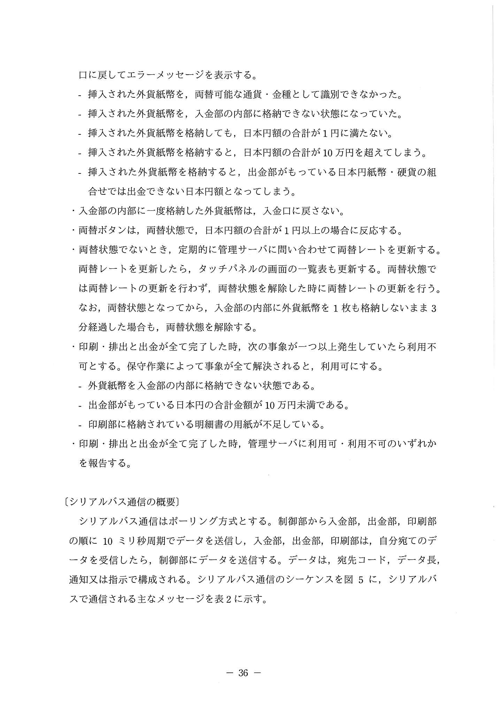

テキスト (OCR)

口に戻してエラーメッセージを表示する。

- 挿入された外貨紙幣を, 両替可能な通貨・金種として識別できなかった。

- 挿入された外貨紙幣を, 入金部の内部に格納できない状態になっていた。

- 挿入された外貨紙幣を格納しても, 日本円額の合計が 1 円に満たない。

- 挿入された外貨紙幣を格納すると, 日本円額の合計が 10 万円を超えてしまう。

- 挿入された外貨紙幣を格納すると, 出金部がもっている日本円紙幣・硬貨の組
合せでは出金できない日本円額となってしまう。

・入金部の内部に一度格納した外貨紙幣は, 入金口に戻さない。

・ 両替ボタンは, 両替状態で, 日本円額の合計が1 円以上の場合に反応する。

・ 両替状態でないとき, 定期的に管理サーバに問い合わせて両替レートを更新する。

両替レートを更新したら, タッチパネルの画面の一覧表も更新する。両替状態で

は両替レートの更新を行わず, 両替状態を解除した時に両替レートの更新を行う。

なお, 両替状態となってから, 入金部の内部に外貨紙幣を 1 枚も格納しないまま 3

分経過した場合も, 両替状態を解除する。

・印刷・排出と出金が全て完了した時, 次の事象がーつ以上発生していたら利用不

可とする。保守作業によって事象が全て解決されると, 利用可にする。

- 外貨紙幣を入金部の内部に格納できない状態である。

- 出金部がもっている日本円の合計金額が 10 万円未満である。

- 印刷部に格納されている明細書の用紙が不足している。

・印刷・排出と出金が全て完了した時, 管理サーバに利用可・利用不可のいずれか

を報告する。

〔シリアルバス通信の概要〕

シリアルバス通信はポーリング方式とする。制御部から入金部, 出金部, 印刷部
の順に 10 ミリ秒周期でデータを送信し, 入金部, 出金部, 印刷部は, 自分宛てのデ
ータを受信したら, 制御部にデータを送信する。データは, 宛先コード, データ長,
通知又は指示で構成される。シリアルバス通信のシーケンスを図 5 に, シリアルバ
スで通信される主なメッセージを表 2 に示す。

ー 36 一

### ページ 38

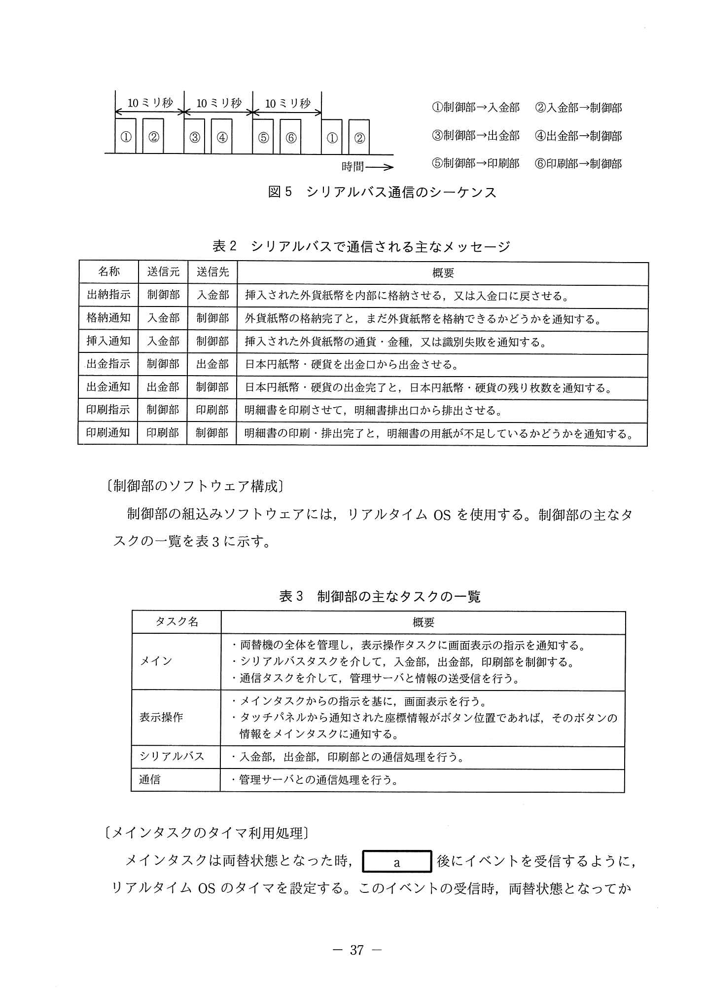

テキスト (OCR)

10ミリ秒

10ミリ秒

10ミリ秒           ①制御部入金部 ②入金部制御部

al

al

sl fo]  jol[o|      Onl HEE ④出金部一制御部

表 2

時間--> 制御部つっ印刷部 ⑥刷部制御部
図5 シリアルバス通信のシーケンス

シリアルバスで通信される主ながメッセージ

名称

送信元 | 送信先

概要

出納指示

制御部 | 入金部

挿入された外貨紙和刺を内部に格納させる, 又は入金口に戻させる。

格納通知

入金部 | 制御部

外貨紙幣の格納完了と, まだ外貨紙刺を格納できるかどうかを通知する。

挿入通知

入金部 | 制御部

挿入された外貨紙幣の通貨・金種, 又は識別失敗を通知する。

出金指示

制御部 | 出金部

日本円紙幣・硬賃を出金口から出金させる。

出金通知

出金部 | 制御部

日本円紙幣・硬貨の出金完了と, 日本円紙整・硬貨の残り枚数を通知する。

印刷指示

制御部 | 印刷部

明細書を印刷させて, 明細書排出口から排出させる。

印刷通知

印刷部 | 制御部

明細書の印刷・排出完了と, 明細書の用紙が不足しているかどうかを通知する。

(制御部のソフトウェア構成]
制御部の組込みソフトウェアには, リアルタイム OS を使用する。制御部の主なタ
スクの一覧を表 3 に示す。

表3 制御部の主なタスクの一覧

タスク名                                  概要

・ 両替機の全体を管理し, 表示操作タスクに画面表示の指示を通知する。

メイン         ・ シリアルバスタスクを介して, 入金部, WBE, 印刷部を制御する。
・通信タスクを介して, 管理サーバと情報の送受信を行う。
・メインタスクからの指示を基に, 画面表示を行う。

表示操作          ・タッチパネルから通知された座標情報がボタン位置であれば, そのボタンの
情報をメインタスクに通知する。

シリアルバス    ・入金部, 出金部, 印刷部との通信処理を行う。

通信           ・ 管理サーバとの通信処理を行う。

(メインタスクのタイマ利用処理)
メインタスクは両替状態となった時, [a | 後にイベントを受信するように,
リアルタイム OS のタイマを設定する。このイベントの受信時, 両替状態となってか

ー 37 一

### ページ 39

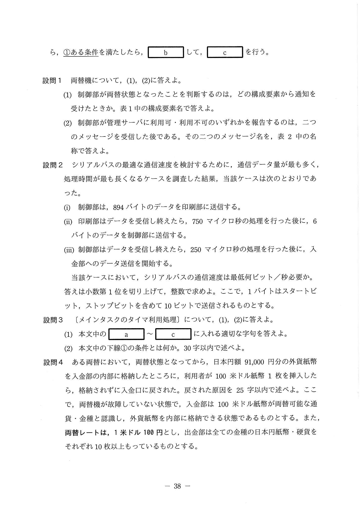

テキスト (OCR)

5, ①ある条件を満たしたら, | b |して,| < |を行う。

設問1 両替機について, (1), ②⑫)に答えよ。
Q①) 制御部が両替状態とかったことを判断するのは, どの構成要素から通知を
受けたときか。表 1 中の構成要素名で答えよ。
(2) 制御部が管理サーバに利用可・利用不可のいずれかを報告するのは, =O
のメッセージを受信した後である。その二つのメッセージ名を, 表 2 中の名
称で答えよ。
設問2 シリアルバスの最適な通信速度を検討するために, 通信データ量が最も多く,
処理時間が最も長くなるケースを調査した結果, 当該ケースは次のとおりであ
Die
(i) 制御部は, 894 バイトのデータを印刷部に送信する。
Gi) 印刷部はデータを受信し終えたら, 750 マイクロ秒の処理を行った後に, 6
バイトのデータを制御部に送信する。
Gi) 制御部はデータを受信し終えたら, 250 マイクロ秒の処理を行った後に, A
金部へのデータ送信を開始する。
当該ケースにおいて, シリアルバスの通信速度は最低何ビットノ秒必要か。
答えは小数第 1 位を切り上げて, 整数で求めよ。ここで, 1 バイトはスタートビ
Yh, ストップビットを含めて 10 ビットで送信されるものとする。
設問3 〔メインタスクのタイマ利用処理) について, ①, (⑫②)に答えよ。
a 本文中の| a |~| ic |に入れる適切な字句を答えよ。
(2) 本文中の下線〇の条件とは何か。30 字以内で述べよ。
設問4 ある両替において, 両替状態となかってから, 日本円額 91.000 円分の外貨紙幣
を入金部の内部に格納したところに, 利用者が 100 米ドル紙幣 1 枚を挿入した
ら, 格納されずに信金口に戻された。戻された原因を 25 字以内で述べよ。ここ
で, 両替機が故障していない状態で, 入金部は 100 米ドル紙幣が両替可能な通
貨・金種と認識し, 外貨紙幣を内部に格納できる状態であるものとする。また,
両替レートは, 1 米ドル WALL, 出金部は全ての金種の日本円紙幣・硬貨を
それぞれ10 枚以上もっているものとする。

— 38 一

### ページ 40

テキスト (OCR)

〔

x = 用 紙 〕

ー 39 一

### ページ 41

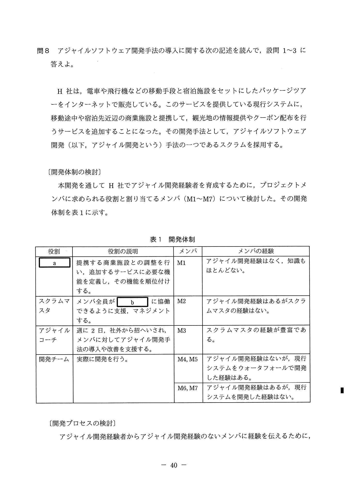

テキスト (OCR)

AS アジャイルソフトウェア開発手法の導入に関する次の記述を読んで, 設問 1こ3 に

答えよ。

a

H 社は, 電車や飛行機などの移動手段と宿泊施設をセットにしたパッケージツア
ーをインターネットで販売している。このサービスを提供している現行システムに,
移動途中や宿泊先近辺の商業施設と提携して, 観光地の情報提供やクーポン配布を行
うサービスを追加することになった。 その開発手法として, アジャイルソフトウェア
開発 (以下, アジャイル開発という) 手法の一つであるスクラムを採用する。

開発体制の検討〕

本開発を通して H 社でアジャイル開発経験者を育成するために, プロジェクトメ
ンバに求められる役割と割り当てるメンバ (MI~M7) について検討した。その開発
体制を表 1 に示す。

表1 開発体制

役割                  役割の説明                メンバ                メンバの経験
La || 提携する商業施設との調整を行| MI   アジャイル開発経験はなく, 知識も
い, 追加するサービスに必要な機       ほとんどない。
能を定義し, その機能を順位付け
する。
スクラムマ メンバ全員が|  b  | に協働 M2   アジャイル開発経験はあるがスクラ
スタ     できるように支援, マネジメント       ムマスタの経験はない。
する。
アジャイル | 週に 2 日, 社外から招へいされ, | M3    スクラムマスタの経験が豊富であ
ゴーチ    メンバに対してアジャイル開発手       る。
法の導入や改善を支援する。
開発チーム | 実際に開発を行う。        M4,M5 | アジャイル開発経験はないが, 現行
システムをウォータフォールで開発
した経験はある。
M6,M7 | アジャイル開発経験はあるが, 現行
システムを開発した経験はない。

〔開発プロセスの検討〕
アジャイル開発経験者からアジャイル開発経験のないメンバに経験を伝えるために,

ー 40 一

### ページ 42

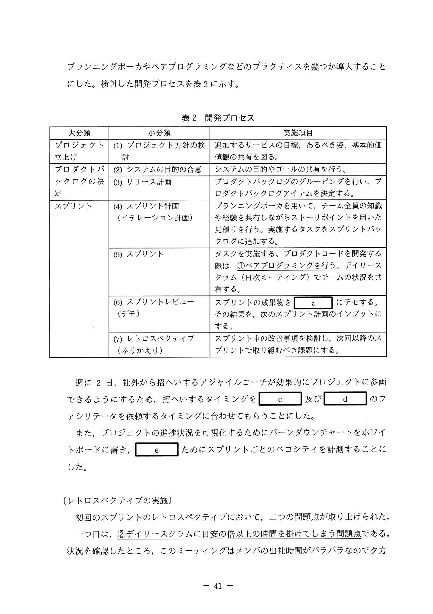

テキスト (OCR)

プランニングポーカやペアプログラミングなどのプラクティスを幾つか導入すること
にした。検討した開発プロセスを表 2 に示す。

表2 開発プロセス

大分類       小分類              実施項目
プロジェクト | Q①) プロジェクト方針の検 | 追加するサービスの目標, あるべき姿, 基本的価
立上げ      at           値観の共有を図る。
プロダクトバ | ⑫) システムの目的の合意 | システムの目的やゴールの共有を行う。
ックログの決 | (3) リリース計画      プロダクトバックログのグルーピングを行い, プ
定                    ロダクトバックログアイテムを決定する。
スプリント   (4) スプリント計画     プランニングポーカを用いて, チーム全員の知識

(イテレーション計画)  や経験を共有しながらストーリポイントを用いた
見積りを行う。実施するタスクをスプリントバッ
クログに追加する。

(5) スプリント       タスクを実施する。プロダクトコードを開発する
際は, ①ペアプログラミングを行う。デイリース
クラム (日次ミーティング) でチームの状況を共

有する。
(6) スプリントレビュー   スプリントの成果物を| a  | にデモする。
(デモ)         その結果を, 次のスプリント計画のインプットに
する。
(⑦) レトロスペクティブ   スプリント中の改善事項を検討し, 次回以降のス
(ふりかえり)      プリントで取り組むべき課題にする。

週に 2 A, 社外から招へいするアジャイルコーチが効果的にプロジェクトに参画
できるようにするため, 招へいするタイミングを|  c |及び| q |の>
ァシリテータを依頼するタイミングに合わせてもらうことにした。

また, プロジェクトの進捗状況を可視化するためにバーンダウンチャートをホワイ
トボードに書き, | e | ためにスプリントごとのベロシティを計測することに
した。

[レトロスペクティブの実施〕
初回のスプリントのレトロスペクティブにおいて, 二つの問題点が取り上げられた。
ーつ目は, デイリースクラムに目安の倍以上の時間を掛けてしまう問題点である。
状況を確認したところ, このミーティングはメンバの出社時間がバラバラなので夕方

ー <i 一

### ページ 43

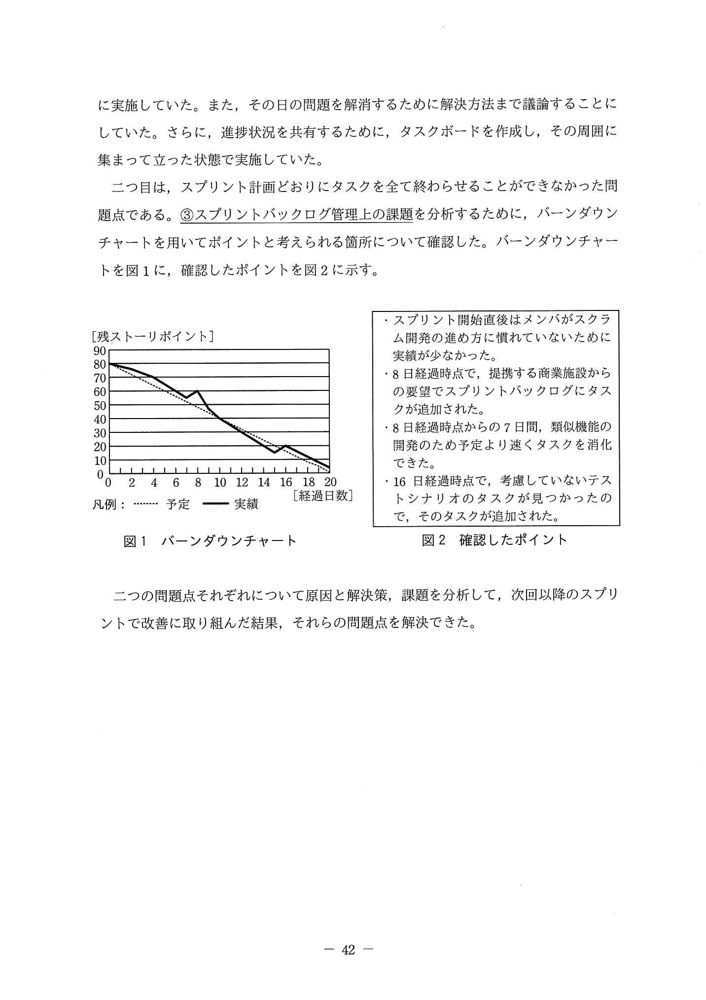

テキスト (OCR)

に実施していた。また, その日の問題を解消するために解決方法まで議論することに

していた。 さらに, 進捗状況を共有するため(

集まって立った状態で実施していた。

タスクボードを作成し, その周囲に

ニニつ目は, スプリント計画どおりにタスクを全て終わらせることができなかった問

題点である。③スプリントバックログ管理上の課題を分析するために, バーンダウン
チャートを用いてポイントと考えられる人箇所について確認した。バーンダウンチャー

トを図 1 に,

[残ストーリポイント]

90

凡例 : PAE 一 実績

や

Ss

pp tk ISSS

2 4 6 8 10 12 14 16 18 20
[経過日数]

図1 バーンダウンチャート

認したポイントを図 2 に示す。

・スプリント開始直後はメンバがスクラ

ム開発の進め方に慣れていないために
実績が少なかった。

・8 日経過時点で, 提携する商業施設から

の要望でスプリントバックログにタス
クが追加された。

・8 日経過時点からの 7 日間, 類似機能の

開発のため予定より速くタスクを消化
GSEs

・16 日経過時点で, 考慮していないテス

トシナリオのタスクが見つかったの
で, そのタスクが追加された。

図2 確認したポイント

二つの問題点それぞれについて原因と解決策, 課題を分析して, 次回以降のスプリ

ントで改善に取り組んだ結果, それらの問題点を解決できた。

ー 42 一

### ページ 44

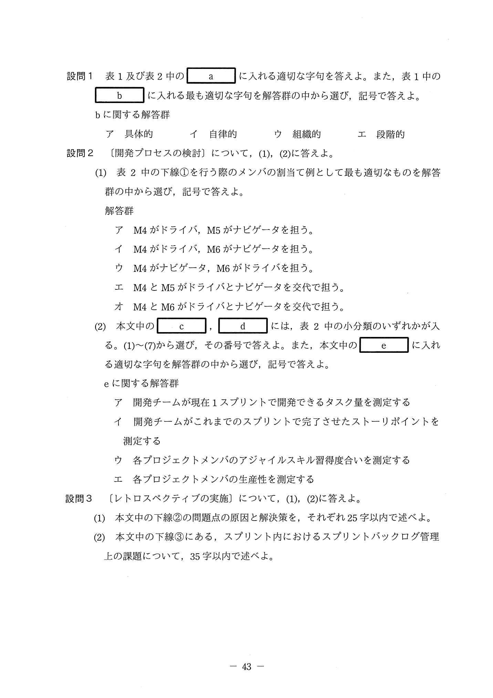

テキスト (OCR)

設問1 表 1及び表2中の| a |] に入れる適切な字句を答えよ。また, 表1中の
| b | に入れる最も適切な字句を解答群の中から選び, 記号で答えよ。
b に関する解答群
ア 具体的     イ 自律的     ウ 組織的     エ 段階的
設問2 開発プロセスの検討)について, ①, ②⑫②に答えよ。
GQ) 表 2 中の下線①を行う際のメンバの割当て例として最も適切なかものを解答
群の中から選び, 記号で答えよ。
AES HE
ア M4がドライバ, M5 がナビゲータを担う。
M4 がドライバ, M6 がナビゲータを担う。
M4 がナビゲータ, M6 がドライバを担う。
M4 と M5 がドライバとナビゲータを交代で担う。
オ M4とM6がドライバとナビゲータを交代で担う。
⑫) 本文中の|  c |, |  q |には, 表 2 中の小分類のいずれかが入
So I~ MPS, その番号で答えよ。また, 本文中の| ce |に入れ
る適切な字句を解答群の中から選び, 記号で答えよ。
e に関する解答群
ア 開発チームが現在1スプリントで開発できるタスク量を測定する
イ 開発チームがこれまでのスプリントで完了させたストーリポイントを
測定する
ウ 各プロジェクトメンバのアジャイルスキル習得度合いを測定する
エ 各プロジェクトメンバの生産性を測定する
設問3 〔レトロスペクティブの実施] について, ①, ②に答えよ。
Q) 本文中の下線②の問題点の原因と解決策を, それぞれ 25 字以内で述べよ。
(2) 本文中の下線@にある, スプリント内におけるスプリントバックログ管理
上の課題について, 35 字以内で述べよ。

H ユ

ー 43. =

### ページ 45

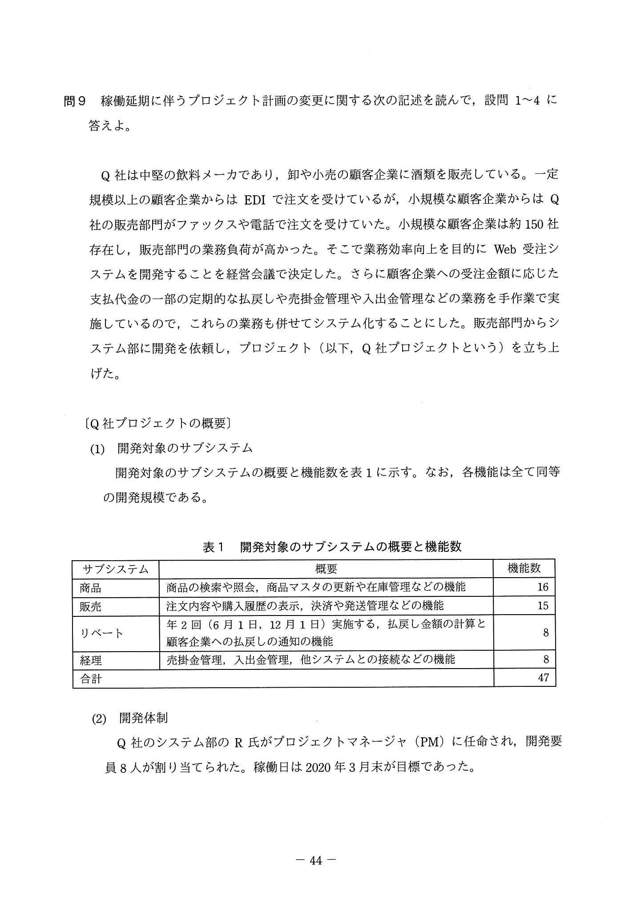

テキスト (OCR)

問9 稼働延期に伴うプロジェクト計画の変更に関する次の記述を読んで, 設問 1~4 に

答えよ。

Q 社は中堅の飲料メーカであり, 卸や小売の顧客企業に酒類を販売している。一定
規模以上の顧客企業からは ED] で注文を受けているが, 小規模な顧客企業からは Q
社の販売部門がファックスや電話で注文を受けていた。小規模な顧客企業は約 150 社
存在し, 販売部門の業務負荷が高かった。そこで業務効率向上を目的に Web 受注シ
ステムを開発することを経営会議で決定した。さらに顧客企業への受注金額に応じた
支払代金の一部の定期的な払戻しや売掛金管理や入出金管理などの業務を手作業で実
施しているので, これらの業務も併せてシステム化することにした。 販売部門からシ
ステム部に開発を依頼し, プロジェクト (以下, Q 社プロジェクトという) を立ち上
Wk.

〔Q 社プロジェクトの概要〕

QQ) 開発対象のサブシステム
開発対象のサブシステムの概要と機能数を表 1 に示す。なお, 各機能は全て同等
の開発規模である。

表1 開発対象のサブシステムの概要と機能数

サブプシステム               概要               機能数

商品         商品の検索や照会, 商品マスタの更新や在庫管理などの機能          16

販売      注文内容や購入履歴の表示, 決済や発送管理などの機能        15

リベート    年2回 (6月1日, 12 月 日) 実施する, 払戻し金額の計算と     8
顧客企業への払戻しの通知の機能

経理      売掛金管理, 入出金管理, 他システムとの接続などの機能        8

合計47

(2) 開発体制
Q 社のシステム部の R 氏がプロジェクトマネージャ (PM) に任命され, 開発要
員 8 人が割り当てられた。 稼働日は 2020 年 3 月末が目標であった。

ー44一

### ページ 46

テキスト (OCR)

〔プロジェクト計画の変更]

Q 社プロジェクトはソフトウェア要件定義 (以下, 要件定義という), ソフトウェ
ア方式設計 (以下, 基本設計という), ソフトウェアコード作成及びテスト (以下,
製造という) の工程が終了し, テスト密度やテスト検出不具合密度などの品質管理の
指標値に問題がないことを確認した。しかし, ソフトウェア結合テスト (以下, 結合
テストという) のテスト項目の消化が終了した時点で, 全てのサブシステムで目標と
するテスト検出不具合密度を大幅に超過する障害が発生していた。R 氏は, システム
部の部長に状況を説明し, 次週の経営会議に報告するよう指示を受けた。

経営会議では, 品質に問題があって注文が正しく処理されないと顧客企業に迷惑が
掛かるので, 品質の確保を最優先にすること, 社内の業務効率向上が目的であり稼働
日には調整の余地があるので販売部門に確認すること, 予算を超過するコストの追加
が必要な場合は経営会議の承認を得ること, が指示された。この指示を受けて R 氏
lk, 一了負プロジェクトを中断してプロジェクト計画変更の検討を開始した。

R 氏は, 販売部門に稼働日についてヒアリングして, “業務の都合上, 2020 年 6 月
30 日に稼働させてほしい" との回答を得た。1 週間後の経営会議で承認が得られて,
翌日にプロジェクトを再開すれば, 6 月 29 日までのプロジェクトの作業可能な日数
は 100 日であった。

[結合テストエ程の障害の原因分析]

R 氏は上司のアドバイスを受けながら, 結合テスト工程で発生した障害を複数の観
点で分析し, 表 2~4 に整理した。テストケースの不備やテスト作業のミスを除くと,
障害件数は合計 240 件であった。

表2 サブシステム別      表3 障害動作別の       表4 原因工程別の
の障害分析表                  障害分析表                     障害分析表

サブシステム | 障害件数          障害動作       障害件数          原因工程      障害件数
商品                     46      画面表示                40      要件定義                0
販売                    110      異常終了               120      基本設計              180
リベート                 50      値不正                   75      製造                     40
経理                     34      その他                    5       合合テスト             20
合計                     240      合計                    240      合計                  240

— 45 一

### ページ 47

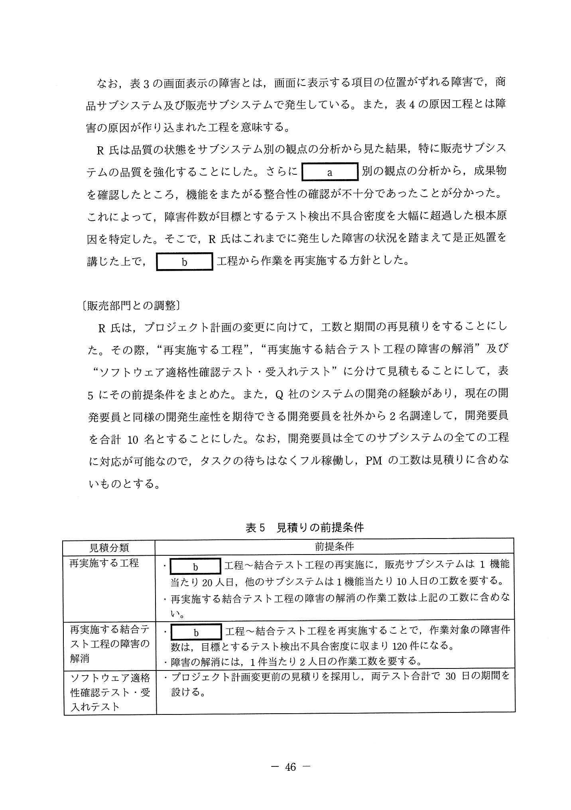

テキスト (OCR)

なお, 表 3 の画面表示の障害とは, 画面に表示する項目の位置がずれる障害で, 商
品サブシステム及び販売サブシステムで発生している。また, 表 4 の原因工程とは障
害の原因が作り込まれた工程を意味する。

R 氏は品質の状態をサプシステム別の観点の分析から見た結果, 特に販売サブシス
テムの品質を強化することにした。さらに|  』 | 別の観点の分析から, 成果物
を確認したところ, 機能をまたがる整合性の確認が不十分であったことが分かった。
これによって, 障害件数が目標とするテスト検出不具合密度を大幅に超過した根本原
因を特定した。そこで, R 氏はこれまでに発生した障害の状況を踏まえて是正処置を
講じた上で, | b | 工程から作業を再実施する方針とした。

〔販売部門との調整〕

R 氏は, プロジェクト計画の変更に向けて, 工数と期間の再見積りをすることにし
た。その際, “再実施する工程", “再実施する結合テスト工程の障害の解消” 及び
“ソフトウェア適格性確認テスト・受入れテスト"” に分けて見積もることにして, 表

にその前提条件をまとめた。また, Q 社のシステムの開発の経験があり, 現在の開
の人を人できるを1から 2 名調達して, 開発要員
を合計 10 名とすることにした。なお, 開発要員は全てのサブシステムの全ての工程

に対応が可能なので, タスクの待ちはなくフル稼働し, PM の工数は見積りに含めな

いものとする。

RS 見積りの前提条件

見積分類                                                                   前提条件

再実施する工程 | | b |工程~結合テスト工程の再実施に, 販売サブシステムは 1機能
当たり 20 人日, 他のサブシステムは 1機能当たり 10 人日の工数を要する。

・再実施する結合テストエ程の障害の解消の作業工数は上記の工数に含めな
い。

再実施する結合テ | ・[ bp | エ程結合テス工程を再実施することで, 作業対象の障害伯
スト工程の障害の | BUR, 目標とするテスト検出不具合密度に収まり 120 件になる。
a               - 障害の解消には, 1 件当たり 2 人日の作業工数を要する。

ソフトウェア適格 | ・プロジェクト計画変更前の見積りを採用し, 両テスト合計で 30 日の期間を
性確認テスト・受| 設ける。
入れテスト

### ページ 48

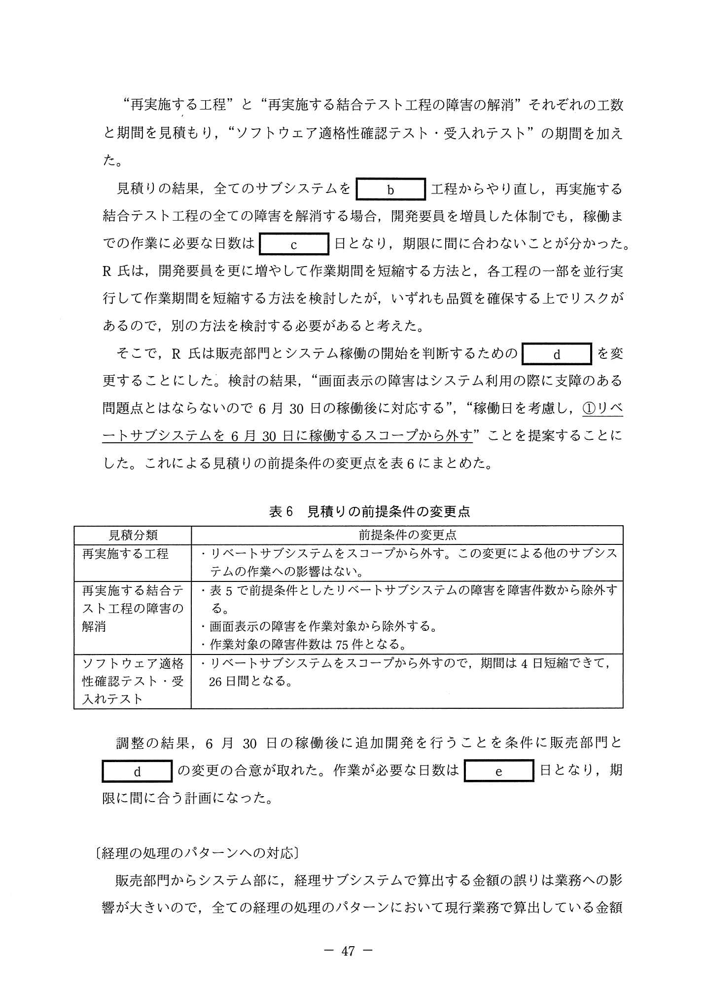

テキスト (OCR)

"再実施する工程" と “再実施する結合テスト工程の障害の解消"それぞれの工数
と期間を見積もり, “ソフトウェア敵格性確認テスト・受入れテスト" の期間を加え
た。

見積りの結果, 全てのサブシステムを|  b | エ程からやり直し, 再実施する
結合テスト工程の全ての障害を解消する場合, 開発要員を増員した体制でも, 稼働ま
での作業に必要な日数は| < | 日となり, 期限に問に合わないことが分かった。
R 氏は, 開発要員を更に増やして作業期間を短縮する方法と, 各工程の一部を並行実
行して作業期間を短縮する方法を検討したが, いずれも品質を確保する上でリスクが
あるので, 別の方法を検討する必要があると考えた。

そこで, R 氏は販売部門とシステム稼働の開始を判断するための|  q | eH
更することにした。検討の結果, "画面表示の障害はシステム利用の際に支障のある
問題点とはならないので 6 月 30 日の稼働後に対応する", “RMA EARL, DA
ートサブシステムを 6 月 30 日に稼働するスコープから外す" ことを提案することに
した。 これによる見積りの前提条件の変更点を表 6 にまとめた。

表6 見積りの前提条件の変更点

見積分類                                  前提人条件の変更点
再実施する工程       ・リベートサブシステムをスコープから外す。この変更による他のサブシス

テムの作業への影響はない。

再実施する結合テ | ・表5 で前提条件としたリベートサブシステムの障害を障害件数から除外す
スト工程の障害の     る。

解消               ・ 画面表示の障害を作業対象から除外する。

・ 作業対象の障害件数は 75 件となる。

ソフトウェア適格 | ・リベートサブシステムをスコープから外すので, 期間は 4 日短縮できて,
性確認テスト・受| 26日間となる。
入れテスト

調整の結果, 6 月 30 日の稼働後に追加開発を行うことを条件に販売部門と

| 』 | の変更の合意が取れた。 作業が必要な日数は| e | 日となり,期

限に問に合う計画になった。

[経理の処理のパターンへの対応〕
販売部門からシステム部に, 経理サブシステムで算出する金額の誤りは業務への影
響が大きいので, 全ての経理の処理のパターンにおいて現行業務で算出している金額

ー 47 一

### ページ 49

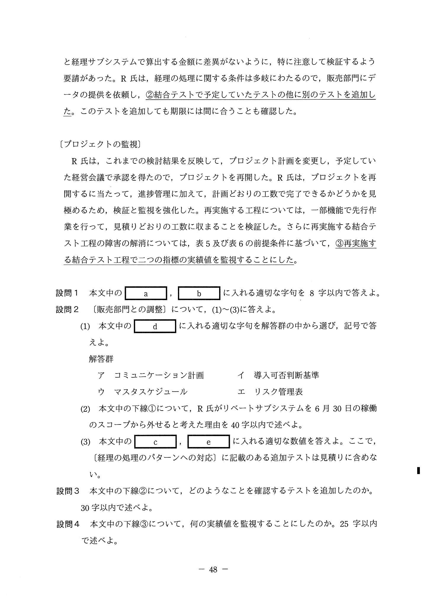

テキスト (OCR)

と経理サブシステムで算出する金額に差異がないように, 特に注意して検証するよう
要請があった。R 氏は, 経理の処理に関する条件は多岐にわたるので, 販売部門にデ
ータの提供を依頼し, ②結合テストで予定していたテストの他に別のテストを追加し
た。このテストを追加しても期限には間に合うことも確認した。

[プロジェクトの監視]

R 氏は, これまでの検討結果を反映して, プロジェクト計画を変更し, 予定してい
た経営会議で承認を得たので, プロジェクトを再開した。R 氏は, プロジェクトを再
開するに当たって, 進捗管理に加えて, 計画どおりの工数で完了できるかどうかを見
極めるため, 検証と監視を強化した。再実施する工程については, 一部機能で先行作
業を行って, 見積りどおりの工数に収まることを検証した。さらに再実施する結合テ
スト工程の障害の解消については, 表 5及び表 6 の前提条件に基づいて, ③再実施す
る結合テスト工程でつの指標の実績値を監視することにした。

設問1 本文中の|  a |,|  b |に入れる適切な字句を 8 字以内で答えよ
設問2 [販売部門との調整)]について, ①て③に答えよ。
a) 本文中の| 』 | に入れる適切な字句を解答群の中から選び, USCA
ae.
ARS RE
ア コミュニケーション計画    イ 導入可否判断基準
ウ マスタスケジュール      エ リスク管理表

(2) 本文中の下線やについて, R 氏がリベートサブシステムを 6 月 30 日の稼働
のスコープから外せると考えた理由を 40 字以内で述べよ。
3) 本文中の| c |,| e |に入れる適切な数値を答えよ。ここで
(経理の処理のパターンへの対応〕 に記載のある追加テストは見積りに含めな
い。
設問3 本文中の下線@について, どのようなことを確認するテストを追加したのか。
30 字以内で述べよ。
設問4 本文中の下線について, 何の実績値を監視することにしたのか。25 字以内
で述べよ。

°

### ページ 50

テキスト (OCR)

【

メ モ 用 紙 J

ー 49 一

### ページ 51

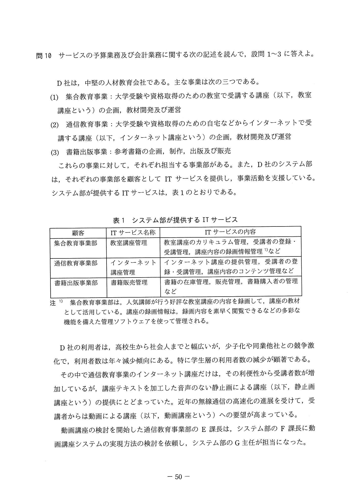

テキスト (OCR)

問 19 サービスの予算業務及び会計業務に関する次の記述を読んで, 設問 1ご3 に答えよ。

D 社は, 中堅の人材教育会社である。主な事業は次の三つである。
(1) 集合教育事業 : 大学受験や資格取得のための教室で受講する講座 (以下, 教室
講座という) OFM, 教材開発及び運営
(②) 通信教育事業 : 大学受験や資格取得のための自宅などからインターネットで受
譜する講座 (以下、 インターネット講座という) の企画, 教材開発及び運営
(3) 書籍出版事業 : 参考書籍の企画, 制作, 出版及び販売
これらの事業に対して, それぞれ担当する事業部がある。また, D 社のシステム部
lk, それぞれの事業部を顧客として IT サービスを提供し, 事業活動を支援している。
システム部が提供する IT サービスは, 表 1のとおりである。

Rl システム部が提供する IT サービス
顧客        IT サービス名称                IT サービスの内容
集合教育事業部 | 教室講座管理        教室講座のカリキュラム管理, 受講者の登録・
受講管理, 講座内容の録画情報管理 リなど
通信教育事業部   インターネット | インターネット講座の提供管理, 受講者の登

講座管理           録・受講管理, 講座内容のコンテンツ管理など
書籍出版事業部 | 書籍販売管理      書籍の在庫管理, 販売管理, 書籍購入者の管理
など

注 " 集合教育事業部は, 人気講師が行う好評な教室講座の内容を録画して, 講座の教材
として活用している。講座の録画情報は, 録画内容を素早く閲覧できるなどの多彩な
機能を備えた管理ソフトウェアを使って管理される。

D 社の利用者は, 高校生から社会人までと幅広いが, 少子化や同業他社との競争激
化で, 利用者数は年々減少傾向にある。特に学生層の利用者数の減少が顕著である。

その中で通信教育事業のインターネット講座だけは, その利便性から受講者数が増
加しているが, 講座テキストを加工した音声のない静止画による講座 (以下, 静止画
講座という) の提供にとどまっていた。近年の無線通信の高速化の進展を受けて, 受
講者からは動画による講座 (以下, 動画講座という) への要望が高まっている。

動画講座の検討を開始した通信教育事業部の E 課長は, システム部のF 課長に動
画講座システムの実現方法の検討を依頼し, システム部の G 主任が担当になった。

ー 50 一

### ページ 52

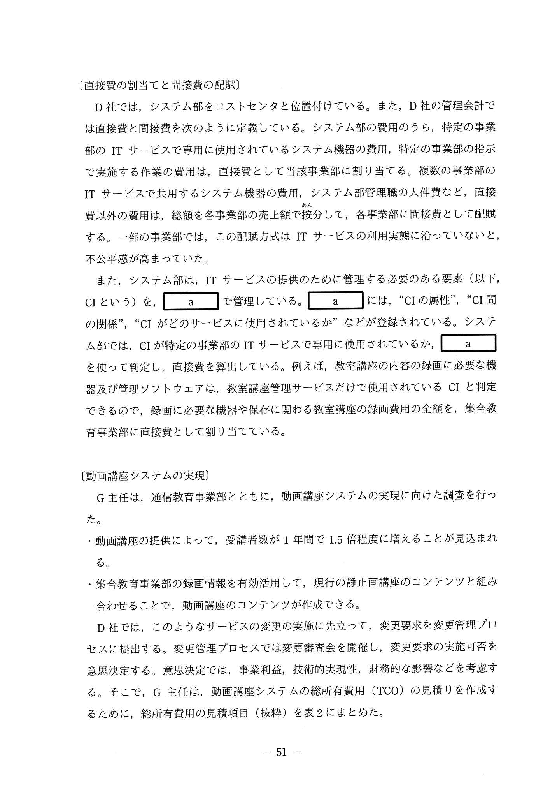

テキスト (OCR)

[直接費の割当てと間接費の配央〕

D 社では, システム部をコストセンタと位置付けている。また, D 社の管理会計で
は直接費と間接費を次のように定義している。システム部の費用のうち, 特定の事業
部の IT サービスで専用に使用されているシステム機器の費用, 特定の事業部の指示
で実施する作業の費用は, 直接費として当該事業部に割り当てる。 複数の事業部の
IT サービスで共用するシステム機器の費用, システム部管理職の人件費など, 直接
費以外の費用は, 総額を各事業部の売上額で投分して, 各事業部に間接費として配央
する。一部の事業部では, COMA IT サービスの利用実態に沿っていないと,
不公平感が高まっていた。

また, システム部は, IT サービスの提供のために管理する必要のある要素 (以下
CI という) を, |  。 |] で管理している。 [La |には, “CTの属性", “CI間
OUR’, “CI がどのサービスに使用されているか"などが登録されている。システ
ム部では, CI が特定の事業部の TT サービスで専用に使用されているか, | 。 |
を使って判定し, 直接費を算出している。例えば, 教室講座の内容の録画に必要な機
器及び管理ソフトウェアは, 教室講座管理サービスだけで使用されている CI と判定
できるので, 録画に必要な機器や保存に関わる教室講座の録画費用の全額を, KAA
育事業部に直接費として割り当てている。

動画講座システムの実現]
G 主任は, 通信教育事業部とともに, 動画講座システムの実現に向けた調査を行っ
た。

・動画講座の提供によって, 受講者数が 1 年間で 1.5 倍程度に増えることが見込まれ

る。

・ 集合教育事業部の録画情報を有効活用して, 現行の静止画講座のコンテンツと組み
合わせることで, 動画講座のコンテンツが作成できる。

D 社では, このようなサービスの変更の実施に先立って, 変更要求を変更管理プロ
セスに提出する。 変更管理プロセスでは変更審査会を開催し, 変更要求の実施可否を
意思決定する。意思決定では, 事業利益, 技術的実現性, 財務的な影響などを考慮す
る。 そこで, G 主任は, 動画講座システムの総所有費用 (TCO) の見積りを作成す
るために, 総所有費用の見積項目 (抜粋) を表 2 にまとめた。

ー 51 一

### ページ 53

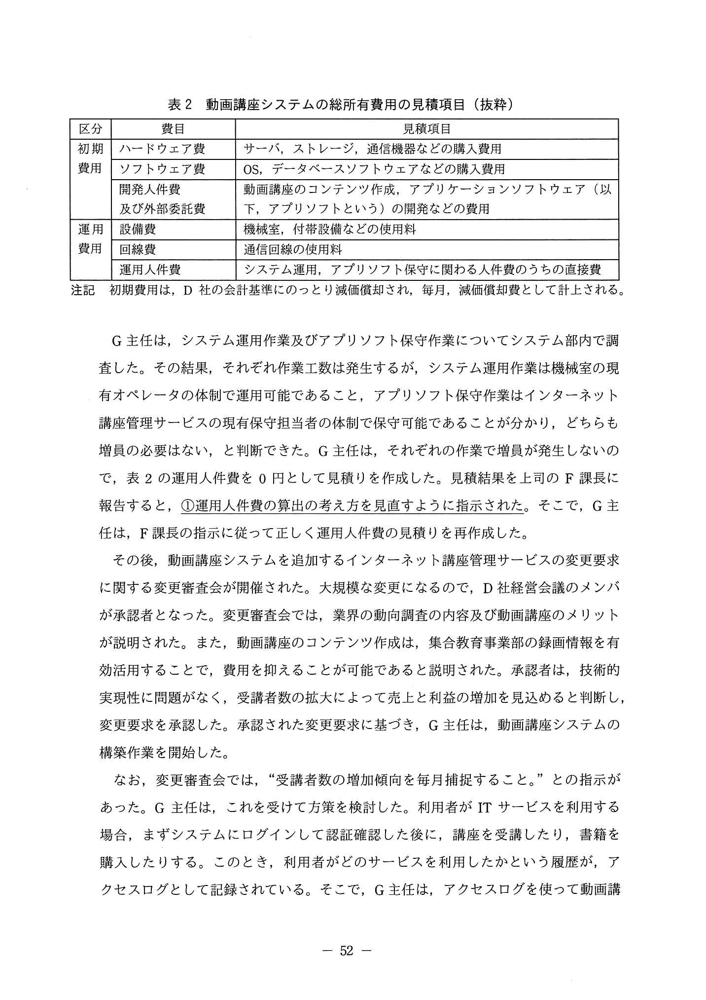

テキスト (OCR)

表2 動画講座システムの総所有費用の見積項目 (抜粋)

区分     費目                  見積項目

初期 | ハードウェア費       サーバ, ストレージ, 通信機器などの購入費用

費用 | ソフトウェア費   0S, データベースソフトウェアなどの購入費用
開発人件費     動画講座のコンテンツ作成, アプリケーションソフトウェア (以
及び外部委託費   下, アプリソフトという) の開発などの費用

運用 | 設備費       機械室, 付帯設備などの使用料

費用 | 回線費       通信回線の使用料
運用人件費           システム運用, アプリソフト保守に関わる人件費のうちの直接費

注記 初期費用は, D 社の会計基準にのっとり減価償却され, BA, 減価償却費として計上される。

G 主任は, システム運用作業及びアプリソフト保守作業についてシステム部内で調
査した。その結果, それぞれ作業工数は発生するが, システム運用作業は機械室の現
有オペレータの体制で運用可能であること, アプリソフト保守作業はインターネット
講座管理サービスの現有保守担当者の体制で保守可能であることが分かり, どちらも
増員の必要はない, と判断できた。G 主任は, それぞれの作業で増員が発生しないの
で, 表 2 の運用人件費を 0 円として見積りを作成した。見積結果を上司の 課長に
報告すると, ①運用人件費の算出の考え方を見直すように指示された。そこで, GE
任は, F 課長の指示に従って正しく運用人件費の見積りを再作成した。

その後, 動画講座システムを追加するインターネット講座管理サービスの変更要求
に関する変更審査会が開催された。 大規模な変更になるので, D 社経営会議のメンバ
が承認者となった。 変更審査会では, 業界の動向調査の内容及び動画講座のメリット
が説明された。 また, 動画講座のコンテンツ作成は, 集合教育事業部の録画情報を有
効活用することで, 費用を抑えることが可能であると説明された。承認者は, 技術的
実現性に問題がなく, 受講者数の拡大によって売上と利益の増加を見込めると判断し

変更要求を承認した。 承認された変更要求に基づき, G 主任は, 動画講座レステムの
構築作業を開始した。

なお, 変更審査会では, “受講者数の増加傾向を毎月捕捉すること。” との指示が
あった。G 主任は, これを受けて方策を検討した。利用者が IT サービスを利用する
場合, まずシステムにログインして認証確認した後に, 講座を受講したり, 書籍を
購入したりする。このとき, 利用者がどのサービスを利用したかという履歴が, ア
クセスログとして記録されている。 そこで, GEEK, アクセスログを使って動画講

アッ

ー 52 一

### ページ 54

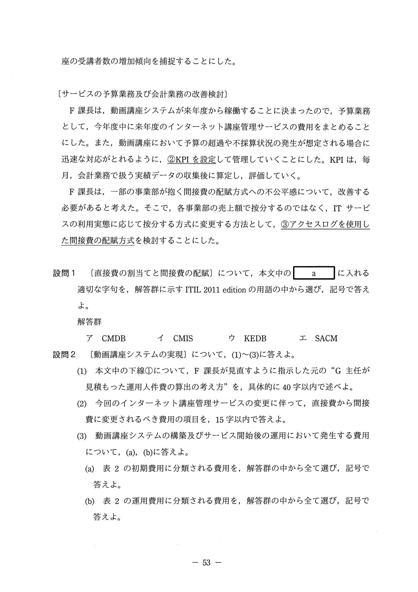

テキスト (OCR)

座の受講者数の増加傾向を捕捉することにした。

〔サービスの予算業務及び会計業務の改善検討]

F 課長は, 動画講座システムが来年度から稼働することに決まったので, 予算業務
tut, 今年度中に来年度のインターネット講座管理サービスの費用をまとめること
にした。また, 動画講座において予算の超過や不採算状況の発生が想定される場合に
迅速な対応がとれるように, ②KPI を設定して管理していくことにした。KPI は, 毎

, 会計業務で扱う実績データの収集後に算定し, 評価していく。

F 課長は, 一部の事業部が抱く間接費の配駆方式への不公平感について, 改善する
必要があると考えた。そこで, 各事業部の売上額で披分するのではなく, IT サービ
スの利用実態に応じて捧分する方式に変更する方法として, ③アクセスログを使用し
た間接費の配臓方式を検討することにした。

設問1 (直接費の割当てと間接費の配虹) について, 本文中の[| 』 |] に入れる
適切な字句を, 解答群に示す ITIL 2011 edition の用語の中から選び, 記号で答え
よ。
解答群
ア CMDB   イ CMIS    ウ KEDB   エ SACM
設問2  〔動画講座システムの実現}] について, ①~③)に答えよ。
QQ) 本文中の下線のについて, F 課長が見直すように指示した元の “G 主任が
見積もった運用人件費の算出の考え方" を, 具体的に 40 字以内で述べよ。
Q) 今回のインターネット講座管理サービスの変更に伴って, 直接費から間接
費に変更されるべき費用の項目を, 15 字以内で答えよ。
3) 動画講座システムの構築及びサービス開始後の運用において発生する費用
について, (a), (b)に答えよ。

(2) 表 2 の初期費用に分類される費用を, 解答群の中から全て選び, 記号で
答えよ。

(b) 表 2 の運用費用に分類される費用を, 解答群の中から全て選び, 記号で
答えよ。

ー 53 一

### ページ 55

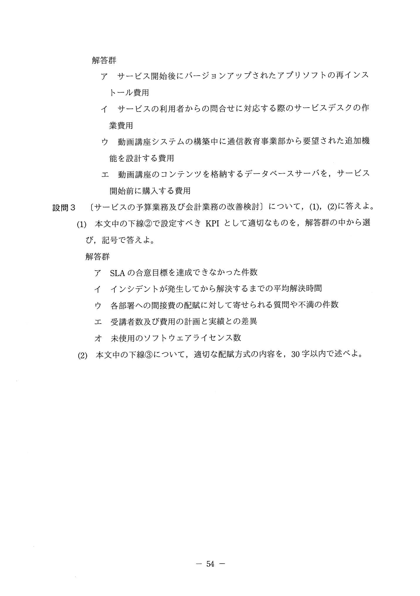

テキスト (OCR)

解答群
ア サービス開始後にバージョンアップされたアプリソフトの再インス
トール費用
イ サービスの利用者からの問合せに対応する際のサービスデスクの作
業費用
ウ 動画講座システムの構築中に通信教育事業部から要望された追加機
能を設計する費用
エ 動画講座のコンテンツを格納するデータベースサーバを, サービス
開始前に購入する費用
設問3 〔サービスの予算業務及び会計業務の改善検討) について, (①⑪, ⑫)に答えよ。
(1) 本文中の下線②で設定すべき KPI として適切なものを, 解答群の中から選
UO, 記号で答えよ。
解答群
ア SLA の合意目標を達成できなかった件数
イ インシデントが発生してから解決するまでの平均解決時間
必
a

Bi

ABBA D MBER ORRIN LCERE 5 1S BEPC RIO HK
受講者数及び費用の計画と実績との差異
オ 未使用のソフトウェアライセンス数
②) 本文中の下線@について, 適切な配央方式の内容を, 30 字以内で述べよ。

ー 54 一

### ページ 56

テキスト (OCR)

〔

x = 用 紙 J

— a 一

### ページ 57

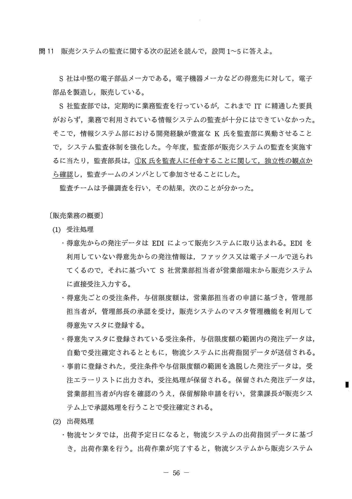

テキスト (OCR)

間11 販売システムの監査に関する次の記述を読んで, 設問 1ご5 に答えよ。

S 社は中堅の電子部品メーカである。 電子機器メーカなどの得意先に対して, 電子
部品を製造し, 販売している

S 社監査部では, 定期的に業務監査を行っているが, これまで IT に精通した要員
がおらず, 業務で利用されている情報システムの監査が十分にはできていなかった。
そこで, 情報システム部における開発経験が豊富な K 氏を監査部に異動させること
で, システム監査体制を強化した。 CFE, 監査部が販売システムの監査を実施す
に当たり, 監査部長は, OK 氏を監査人に任命することに関して, 独立性の観点か
ら確認し, 監査チームのメンバとして参加させることにした。

監査チームは予備調査を行い。 その結果, 次のことが分かった。

〔販売業務の概要〕
Q) 受注処理
・得意先からの発注データは EDI によって販売システムに取り込まれる。EDI を
利用していない得意先からの発注情報は, ファックス又は電子メールで送られ
てくるので, それに基づいて S 社営業部担当者が営業部端末から販売システム
に直接受注入力する。
・得意先ごとの受注条件, 与信限度額は, 営業部担当者の申請に基づき, 管理部
担当者が, 管理部長の承認を受け, 販売システムのマスタ管理機能を利用して
得意先マスタに登録する。
・得意先マスタに登録されている受注条件, 与信限度額の範囲内の発注データは,
自動で受注確定されるとともに, 物流システムに出荷指図データが送信される。
・事前に登録された, 受注条件や与信限度額の範囲を逸脱した発注データは, 受
注エラーリストに出力され, 受注処理が保留される。 保留された発注データは,
営業部担当者が内容を確認のうえ, 保留解除申請を行い, 営業課長が販売シス
テム上で承認処理を行うことで受注確定される。
(2) 出荷処理
・物流センタでは, 出荷予定日になると, 物流システムの出荷指図データに基づ
き, 出荷作業を行う。出荷作業が完了すると, 物流システムから販売システム

= 5g

### ページ 58

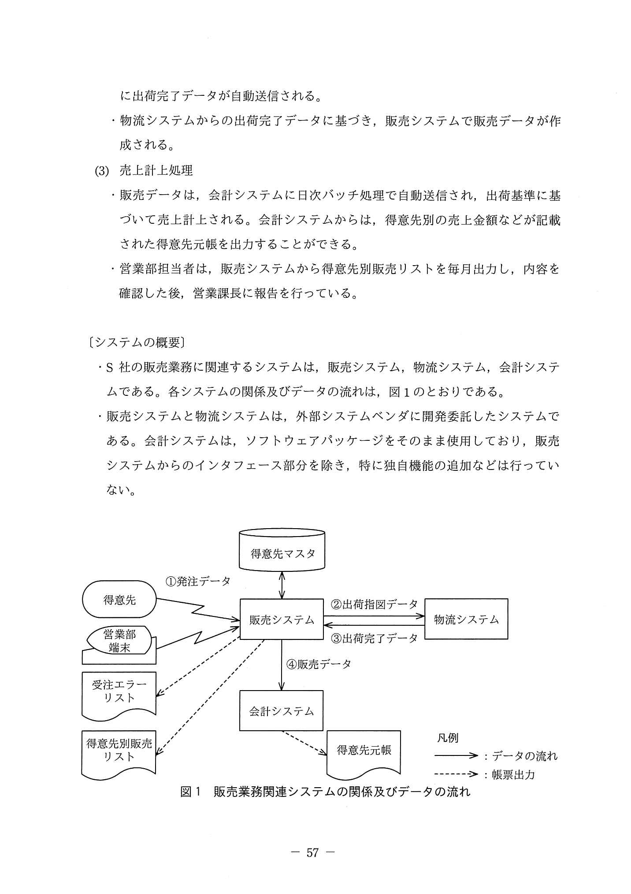

テキスト (OCR)

に出荷完了データが自動送信される。
・物流システムからの出荷完了データに基づき, 販売システムで販売データが作
MENS,

(3) 売上計上処理
・販売データは, 会計システムに日次バッチ処理で自動送信され, 出荷基準に基
づいて売上計上される。会計システムからは, 得意先別の売上金額などが記載
された得意先元帳を出力することができる。
・ 営業部担当者は, 販売システムから得意先別販売リストを毎月出力し, 内容を
確認した後, 営業課長に報告を行っている。

[システムの概要〕

・S 社の販売業務に関連するシステムは, 販売システム, 物流システム, 会計システ
ムである。各システムの関係及びデータの流れは, 図 1のとおりである。

・販売システムと物流システムは, 外部システムベンダに開発委託したシステムで
ある。 会計システムは, ソフトウェアパッケージをそのまま使用しており, 販売
システムからのインタフェース部分を除き, 特に独自機能の追加などは行ってい

ない。

にニーラーュ
得意先マスタ

Se ーーーージ

①発注データ
                               ②出荷指図データ
販売システム           物流システム

ey             “=          @出荷完了データ
ブー グ   ④販売データ
受注エラー |
var 了P   グ
Lo   “    会計システム
得意先別販売|               a | ーー        凡例
リスト  we                                得意先元帳                 。 データの流れ

しニーング                                                 ーーーーテ : 帳票出力
図1 販売業務関連システムの関係及びデータの流れ

ー 57 一

### ページ 59

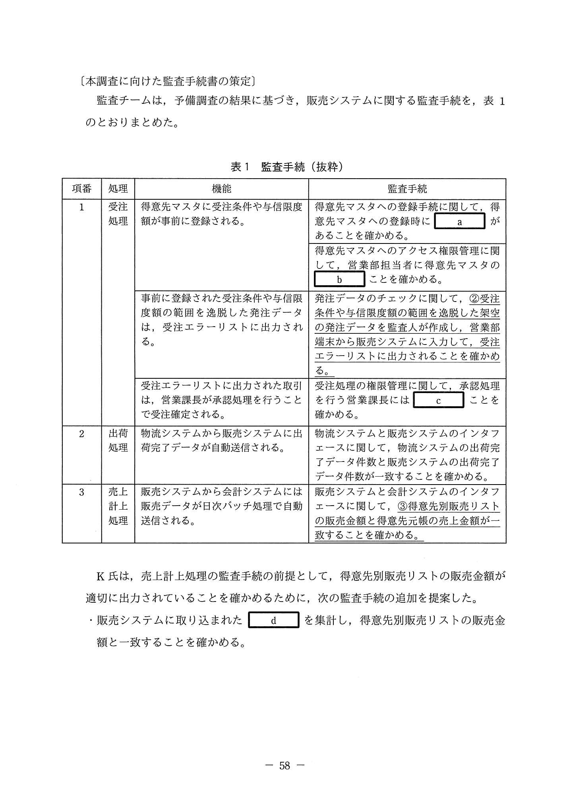

テキスト (OCR)

〔本調査に向けた監査手続書の策定〕
監査チームは, 予備調査の結果に基づき, 販

のとおりまとめた。

関する監査手続を, 表 1

売システムに

表1 監査手続(抜粋)
項番 | 処理         機能                 監査手続
1 | 受注 | 得意完マスタに受注条件や与信限度 | 得意先マスタへの登録手続に関して, 得
処理 人が事前に登録される。      意先マスタへの登録時に      が
あることを確かめる。
得意先マスタへのアクセス権限管理に
LO, 営業部担当者に得意先マスタの
ことを確かめる。
事前に登録された受注条件や与信限 | 発注データのチェックに関して, ORE
度額の範囲を逸脱した発注データ | 条件や写信限度額の範囲を途脱した架空
ik, 受注エラーリストに出力され | の発注データを監査人が作成し, 営業部
る。               端末から販売システムに入力して, 受注
エラーリストに出力されることを確かめ
る。
受注エラーリストに出力された取引 | 受注処理の権限管理に関して, 承認処理
は, 営業課長が承認処理を行うこと | を行う営業課長には| c |] ことを
で受注確定される。        確かめる。
2 | 出荷 | 物流システムから販売システムに出 | 物流システムと販売システムのインタフ
処理 | 荷完了データが自動送信される。 | エースに関して, 物流システムの出荷完
了データ件数と販売システムの出荷完了
データ件数が一致することを確かめる。
3 | 売上 | 販売システムから会計システムには 上ポンステム会計システスウインタフ
計上 | 販売データが日次バッチ処理で自動 | エースに関して, ⑧得意先別販売リスト
処理 | 送信される。           ORO: BRETEOR LAA
致することを確かめる。 |
K 氏は, 売上計上処理の監査手続の前提として, 得意先別販売リストの販売金額が
に出力されていることを確かめるために, 次の監査手続の追加を提案した。

・ 販売システムに取り込まれた | d | を集計し,
一致することを確かめる。

額と

ー 58 一

得意先別販売リストの販売金

### ページ 60

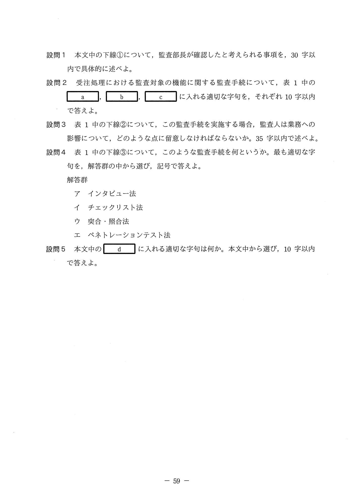

テキスト (OCR)

設問1 本文中の下線のについて, 監査部長が確認したと考えられる事項を, 30 字以

内で具体的に述べよ。

設問2 受注処理における監査対象の機能に関する監査手続について, 表 1 中の
{a 上| b 上上| 。 |に入れる適切な字句を, それぞれ 10 字以内
で答えよ。

設問3 表 1 中の下線@について, この監査手続を実施する場合, 監査人は業務への
影響について, どのような点に留意しなければならないか。35 字以内で述べよ。
設問4 表 1 中の下線つ③について, このような監査手続を何というか。最も適切な字
名を, 解答群の中から選び
解答衝
J インタビュー法
イ チェックリスト法
ウ 突合・照合法
エ ペネトレーションテスト法
設問5 本文中の[| 』 |] に入れる適切な字句は何か。本文中から選び, 10 字以内

で答えよ。

tS CHAL.

Bult

ー 59 一

### ページ 61

テキスト (OCR)

(CX モ 用 紙 J

ー 60 一

### ページ 62

テキスト (OCR)

〔

メ = 用 紙 〕

ー 61 一

### ページ 63

テキスト (OCR)

〔

メ = 用 紙 〕

ー 62 一

### ページ 64

テキスト (OCR)

( メ モ 用 紙 J

ー 63 一

### ページ 65

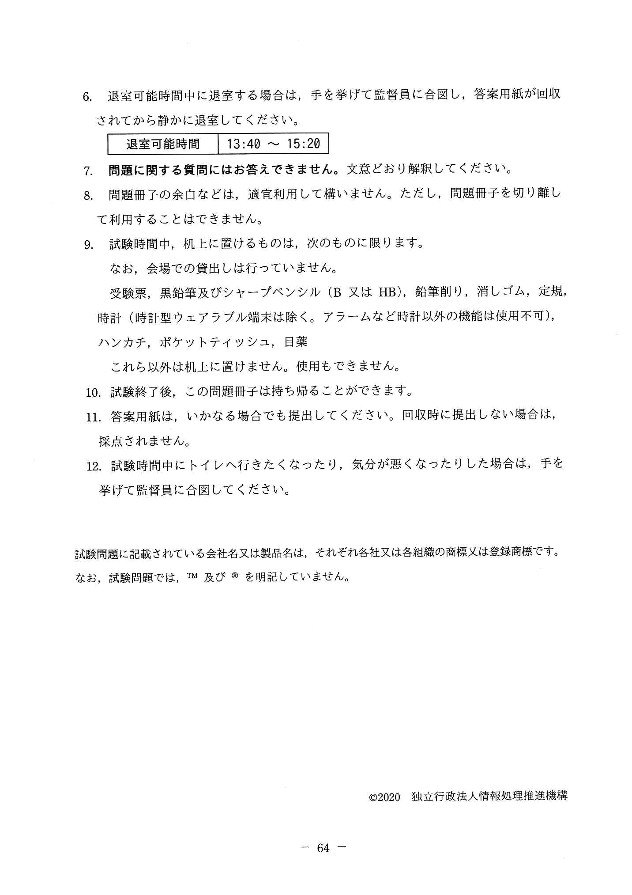

テキスト (OCR)

6. 退室可能時間中に退室する場合は, 手を挙げて監督貞に合図し, 答案用紙が回収
されてから静かに退室してください。
| 退室可能時間 | 13:40 ~ 15:20
7. 問題に関する質問にはお答えできません。文意どおり解釈してください。
8. 問題冊子の余白などは, 適宜利用して構いません。ただし, 問題冊子を切り離し
て利用することはできません。
9. 試験時間中, 机上に置けるものは, 次のものに限ります。
なお, 会場での貸出しは行っていません。
受験球, 黒鉛筆及びシャープペンシル (B 又は HB), 鉛筆削り, 消しゴム, 定規,
時計 (時計型ウェアラブル端末は除く。アラームなど時計以外の機能は使用不可),
ハンカチ, ポケットティッシュ, BR
これら以外は机上に置けません。使用もできません。
10. 試験終了後, この問題還子は持ち帰ることができます。
11. 答案用紙は, いかなる場合でも提出してください。回収時に提出しない場合は,
採点されません。
12. 試験時間中にトイレへ行きたくなったり, 気分が悪くなったりした場合は, FE
挙げて監督具に合図してください。

試験問題に記載されている会社名又は製品名は, それぞれ各社又は各組織の商標又は登録商標です。
なお, 試験問題では, ™ 及び © を明記していません。

@2020 独立行政法人情報処理推進機構

ー 64 一

---

## 午後解答

1/6 
©2020 独立行政法人情報処理推進機構 
令和２年度 10 月 応用情報技術者試験 解答例 
 
午後試験 
問１ 
出題趣旨 
 昨今，内部情報にアクセスできる内部者の不正行為によって，秘密情報が漏えいする事件が発生している。
秘密情報の漏えいは，企業に甚大な損失を与えるおそれがある。 
 本問では，内部不正による情報漏えいの対策を題材に，電子メールやインターネット経由での漏えい防止策，
ログの取得方法や効果などについての理解を問う。 
 
設問 
解答例・解答の要点 
備考 
設問１ 
a
オ 
 
 
b
イ 
設問２(1) 許可されていない可搬型記憶媒体のPC への接続を拒否する。 
 
(2) ア 
 
(3) 利用したいWeb サイトの認定申請 
設問３(1) ディジタルフォレンジックス 
 
(2) 利用者認証 
 
(3) ・情報を不正に社外に持ち出すのが難しいことが分かるから 
・不正を隠し通せないことが分かるから 
 
問２ 
出題趣旨 
 IT は，日本の産業の成長にとって重要な役割を期待されているが，AI，IoT，ビッグデータなどの先端IT の
人材確保が大きな課題となっている。一方で，IT 業界は，政府が働き方改革を後押しするなど従来の就業環境
からの急激な変化への適応という課題を抱えている。 
 本問では，IT 企業の新事業の創出を目的とする事業戦略の策定を題材に，PEST 分析による外部環境分析及
び中長期的視野での事業戦略の策定に関する能力を問う。 
 
設問 
解答例・解答の要点 
備考 
設問１ 
新事業の創出につながる機会が失われる。 
設問２(1)
a
ウ 
 
(2)
b
ウ 
 
(3) イ 
 
(4)
c
テレワークの勤務制度 
設問３(1) 企業のブランド価値の向上 
 
(2) AI が，情報を分析・学習し，高パフォーマンスを引き出すように助言する。 
 
(3) 労務管理

2/6 
©2020 独立行政法人情報処理推進機構 
問３ 
出題趣旨 
 近年，コンピュータの処理能力は向上しているとはいえ，大量のデータを扱う際には，処理対象のデータを
事前に加工処理しておく必要がある場合がある。 
 本問では，誤差拡散法による画像のモノクロ2 値化を題材に，アルゴリズムの理解と応用力について問う。
 
設問 
解答例・解答の要点 
備考 
設問１(1) 黒 
 
(2) 33
設問２ 
ア
bmpFrom[x, y] + bmpTo[x, y] 
 
 
 
イ
f が128 以上 
 
 
 
ウ
bmpTo[px , py] + ( d * ratio[c]/denominator ) 
 
設問３ 
エ
y 
 
 
 
オ
2 
 
 
 
カ
width － tx + 1 
 
設問４ 
キ
height×width×ratioCount 
 
 
 
ク
7
 
 
問４ 
出題趣旨 
 昨今，IoT に対応する機器がネットワークと接続して動作し，クラウドと連携する新しいサービスが増えつつ
ある。 
 本問では，ヘルスケア機器とクラウドとの連携を題材に，システム方式設計に関する基本的な理解，及び要
件からシステムアーキテクチャを選定するプロセスの理解について問う。 
 
設問 
解答例・解答の要点 
備考 
設問１(1) 97.9
 
(2) 14.4
 
(3)
a
ネットワーク 
 
(4) 機微な情報の漏えいを防ぐため 
設問２(1) イ 
 
(2) ア 
設問３(1) クラウド上に保存していない測定データが消失してしまう問題 
 
(2) 活動量計本体のメモリ量を7 日分以上に増やす。

3/6 
©2020 独立行政法人情報処理推進機構 
問５ 
出題趣旨 
 仮想デスクトップ基盤（以下，VDI という）を導入することによって，利便性を損なわずに，情報流出など
のセキュリティリスクを低減できる。しかし，既設LAN にVDI を導入する場合は，通信トラフィックが大きく
変わることに留意する必要がある。 
 本問では，VDI 導入によって発生する通信トラフィックの変化を題材に，TCP/IP 通信の基本技術の理解を問
う。 
 
設問 
解答例・解答の要点 
備考 
設問１ 
a
2 要素 又は 多要素 又は 2 段階 
 
 
b
セッション管理サーバ 
設問２(1)
本社のNPC 
L3SW1 
 
 
営業所1 のNPC
L3SW2 
 
(2)
機器名 
L3SW2 
 
 
理由 
DHCP サーバは，営業所1 のTC と異なったセグメントに設置され
るから 
設問３(1) 経由しなくなる通信
1，2 
 
 
新たに経由する通信
4，6 
 
 
平均通信帯域 
35 
 
(2) インターネット利用通信と逆方向のトラフィックだから 
 
問６ 
出題趣旨 
 データベースを利用するシステムを開発，運用する際には，データベース上に不整合なデータが入らないよ
うにする必要がある。万が一，プログラムの不具合が原因で不整合なデータが入ってしまった場合には，速や
かな暫定対応と，その後の恒久対応が求められる。 
 本問では，宿泊施設の予約システムを題材に，データベースに関する基本的な理解と，データ保全に関する
応用力を問う。 
 
設問 
解答例・解答の要点 
備考 
設問１ 
a
→ 
 
 
 
b
施設ID 
 
設問２ 
c
NOT EXISTS 
 
 
 
d
HAVING COUNT(*) 
 
設問３(1)
e
宿泊日 
順不同 
 
 
f
部屋ID 
 
(2)
g
UNIQUE 制約 
 
 
(3)
h
MIN(t2.予約ID) 
 
 
 
i
t1.部屋ID = t2.部屋ID 
順不同 
 
 
j
t1.宿泊日 = t2.宿泊日

4/6 
©2020 独立行政法人情報処理推進機構 
問７ 
出題趣旨 
組込みシステムのソフトウェアの設計・実装においては，システムの要求仕様に加え，周辺装置の制御仕様
の理解が求められる。 
本問では，複数の装置で構成される両替機を用いた，多言語多通貨対応両替システムを題材に，周辺装置と
の通信仕様を理解する能力，両替機を制御するタスク設計能力及びそれらを実装するための基礎的能力を問う。
 
設問 
解答例・解答の要点 
備考 
設問１(1) 入金部 
 
(2) ①
・出金通知 
 
 
②
・印刷通知 
設問２ 
1,000,000
設問３(1)
a
3 分 
 
 
b
両替状態を解除 
 
 
c
両替レートの更新 
 
(2) 入金部の内部に外貨紙幣を1 枚も格納していないこと 
設問４ 
日本円額の合計が10 万円を超えるから 
 
問８ 
出題趣旨 
 昨今，新しいサービスを創出するために，仮説検証型のソフトウェア開発モデルであるアジャイルソフトウ
ェア開発手法を採用するプロジェクトが増えつつある。 
 本問では，アジャイルソフトウェア開発手法の導入を題材に，開発手法の一つであるスクラムに関する基本
的な理解や考え方について問う。 
 
設問 
解答例・解答の要点 
備考 
設問１ 
a
プロダクトオーナ 
 
b
イ 
設問２(1) オ 
 
(2)
c
(4) 
順不同 
 
 
d
(7) 
 
 
e
ア 
設問３(1)
原因 
問題の解決方法まで議論してしまった点 
 
 
解決策 
問題解決のための会議体を別途設ける。 
 
(2) スプリント期間中に外部からの変更要求を受け入れてしまった点

5/6 
©2020 独立行政法人情報処理推進機構 
問９ 
出題趣旨 
 プロジェクトは様々な要因によって，当初の計画どおりに進まないことがある。 
 本問では，品質に問題が発生した状況を題材に，適切なプロジェクト計画と導入可否判断基準の変更，ステ
ークホルダと変更内容を調整する能力を問う。 
 
設問 
解答例・解答の要点 
備考 
設問１ 
a
原因工程 
 
 
b
基本設計 
設問２(1)
d
イ 
 
(2) 稼働日からリベートサブシステムの機能を実施する日まで期間に余裕があるか
ら 
 
(3)
c
116 
 
 
e
95 
設問３ 
現行業務と経理サブシステムで算出する金額の一致 
設問４ 
障害の発生件数と1 件当たりの解消の作業工数 
 
問10 
出題趣旨 
 昨今，企業が顧客に提供するサービスにとってIT は不可欠であるが，企業内のIT サービス費用を正確に把
握できていない企業が少なからず存在する。 
 本問では，人材教育会社の講座サービスの変更を題材に，サービスの予算業務及び会計業務について，サー
ビス提供に対する間接費の配賦及び直接費の割当て，適切な財務管理などの実務能力を問う。 
 
設問 
解答例・解答の要点 
備考 
設問１ 
a
ア 
設問２(1) 作業工数が発生するが，増員が発生しないので費用は0 円である。 
 
(2) 教室講座の録画費用 
 
(3) (a) ウ，エ 
 
 
 (b) ア，イ 
設問３(1) エ 
 
(2) 費用をサービスごとの利用者数で按分して配賦する。

6/6 
©2020 独立行政法人情報処理推進機構 
問11 
出題趣旨 
 アプリケーションシステムの監査においては，関連するシステムとの関係やデータの流れを理解して，監査
手続を立案する必要がある。 
 本問では，販売システムの監査を題材に，当該システムの特質を踏まえてシステム監査手続を実施するため
の基礎知識，及びIT 業務処理統制に関する具体的な監査手続を立案する能力を問う。 
 
設問 
解答例・解答の要点 
備考 
設問１ 
・販売システムの担当から離れて一定期間経過していること 
・販売システムの開発・保守業務に対する関与度合い 
設問２ 
a
管理部長の承認記録 
 
b
・登録権限がない 
・更新権限がない 
 
c
受注入力権限がない 
設問３ 
監査人が作成した発注データが受注確定されてしまわないこと 
設問４ 
ウ 
設問５ 
d
出荷完了データ

---

## 午後採点講評

1/3 
©2021 独立行政法人情報処理推進機構 
令和２年度 10 月 応用情報技術者試験 採点講評 
 
午後試験 
問１ 
 問1 では，内部不正による情報漏えい対策を題材に，技術と運用の両面での対策について出題した。全体と
して正答率は平均的であった。 
 設問2(2)は，正答率が平均的であった。ウ（添付ファイルを暗号化し，パスワードを別メールで送信する）
を選択した解答が散見された。この処理は，誤送信対策としては効果的だが，情報の不正持ち出し対策にはな
らないことを理解しておいてほしい。 
 設問3(1)は，正答率がやや低かった。ディジタルフォレンジックスは，ディジタル情報の改ざん，窃取など
に対する法的な証拠性を明らかにすることであり，情報保全のための重要な手法なので覚えておいてほしい。
(3)は，正答率がやや低かった。実施した複数の対策の内容を告知することによって，情報の不正持ち出しが困
難であること，仮に不正持ち出しに成功しても操作ログから，それを隠しとおすことができないことを，不正
持ち出しを企む者に知らしめることが，不正行為の抑止に繋がることを理解しておいてほしい。 
 
問２ 
 問2 では，IT 企業の新事業の創出を目的とする事業戦略の策定を題材に，PEST 分析による外部環境分析及
び事業戦略の策定について出題した。全体として正答率は平均的であった。 
 設問1 は，正答率がやや低かった。本文の記述からW 社では拠点間の交流を活性化することによって，新事
業の創出につながることを強く期待しているが，現状の就業環境下では新事業の創出が困難であることを懸念
している。W 社の事業方針をよく理解した上で事業に関する機会損失リスクを解答してほしい。 
 設問3(1)は，正答率がやや低かった。新しい拠点の立地条件や一拠点への全従業員集結に関する解答が散見
された。W 社の知名度や企業ブランド価値を上げることによって，先端IT 人材を確保でき，将来の新規事業
の創出及び事業拡大へつなげる狙いに着目してほしい。 
 
問３ 
 問3 では，誤差拡散法による画像のモノクロ2 値化を題材に，そのアルゴリズムに関する理解と応用力につ
いて出題した。全体として正答率は平均的であった。 
 設問1(2)は，正答率がやや低かった。手順が進むごとに，データの値がどのように変化していくかを正しく
把握することは，手順（アルゴリズム）を理解するだけでなく，その手順をプログラムとして実装する上でも
非常に重要である。 
 設問2 のウは，正答率が低かった。拡散された誤差の値を，ピクセルごとに加算し蓄積する処理について問
うたが，d*ratio[c]/denominator だけを答えた解答が目立った。ピクセルの元の値に拡散された誤差を足し込
む処理であるということを理解した上で解答してほしかった。 
 設問4 のクは，正答率が低かった。プログラム中に実行回数が多い処理がある場合，その回数を正しく把握
することは，パフォーマンスを改善する上で非常に重要なので，理解を深めてほしい。 
 
問４ 
 問4 では，ヘルスケア機器とクラウドとの連携を題材に，システム方式設計について出題した。全体として
正答率は平均的であった。 
 設問1(3)は，正答率が低かった。“測定データをクラウドへ連携する処理”について，“再実行を2 回行う余
裕”を算出するためのパラメタとしては，データ量（業務処理量）とネットワークの品質がある。問題文中に
示された条件を過不足なく読み取り，正答を導き出してほしい。 
 設問3 は，正答率が高かったものの，単にメモリ，ネットワークなどの用語だけを漠然と挙げた解答が散見
された。システムアーキテクチャを意識しながら，具体的に解答してほしい。

2/3 
©2021 独立行政法人情報処理推進機構 
問５ 
 問5 では，仮想デスクトップ基盤（以下，VDI という）の導入を題材に，VDI の導入によって発生するトラ
フィックの変化内容について出題した。全体として正答率は平均的であった。 
 設問2(1)は，正答率が平均的であった。NPC に設定されるデフォルトゲートウェイは，NPC が他のセグメン
ト宛てにパケットを送信するとき，パケットの送信先となる機器であることを理解しておけば正答が導けたは
ずである。(2)は，“機器名”の正答率がやや低かった。DHCP リレーエージェントは，DHCP のブロードキャ
ストフレームを受信する機器（本問の場合はL3SW2）で稼働させることを理解しておいてほしい。 
 設問3(1)については，VDI 導入前のNPC とサーバとの間の通信は，VDI 導入後は仮想PC とサーバとの間の
通信に置き換わることを理解してほしかった。(2)は，正答率が低かった。項番5 のインターネット利用通信
は，インターネットから仮想PC へのトラフィックであるのに対し，項番7 の画面転送通信は，仮想PC からイ
ンターネット上のTC へのトラフィックであり，トラフィックが逆向きであることを導き出してほしかった。
 
問６ 
 問6 では，宿泊施設の予約システムを題材に，データベースに関する基本的な理解と，データ保全に関する
応用力について出題した。全体として正答率は平均的であった。 
 設問2 のd は，正答率がやや低かった。HAVING 句は，GROUP BY 句でグルーピングした項目に対する条件
付けに利用されるので，よく理解しておいてほしい。 
 設問3(3)のh は，正答率が低かった。列名の指定は正しいが，最小値を指定する記述がない解答が散見され
た。どのような抽出条件を記述すれば，目的のレコードを正しく抽出できるのかについて，注意深く考えて正
答を導いてほしい。 
 
問７ 
問7 では，多言語多通貨対応両替システムを題材に，周辺装置との通信仕様，両替機を制御するタスク設計
について出題した。全体として正答率は平均的であった。 
設問2 は，正答率が低かった。単位の変換又は計算を誤ったと思われる解答が多かった。落ち着いて計算す
るよう心掛けてもらいたい。 
設問3 は，正答率がやや低かった。問うている処理条件を理解していないと思われる解答が多かった。シス
テム仕様の内容とタスク設計の内容とを対比しながら検討してほしい。 
設問4 は，正答率が高かったが，両替状態では起こり得ないことや問題文の想定を無視した内容を解答した
受験者もいた。解答した内容で問題の想定条件を満たすことができるかどうかを再確認してほしい。 
 
問８ 
 問8 では，アジャイルソフトウェア開発手法の導入を題材に，開発手法の一つであるスクラムについて出題
した。全体として正答率はやや低かった。 
 設問1 のa は，正答率が低かった。スクラムにおいて主要な役割であるプロダクトオーナやスクラムマス
タ，開発チームについて，その名称だけではなく果たすべき役割についても，その特徴をよく理解しておいて
ほしい。 
 設問3(1)では，“原因”は正答率が平均的であったが，“解決策”は正答率がやや低かった。デイリースクラ
ムの目的や運用ルールについて，十分に理解しておいてほしい。 
 設問3(2)は，正答率が低かった。ウォータフォールモデルを意識したプロジェクト管理上の課題を指摘する
解答が散見された。アジャイル開発が求める価値や開発プロセスについて，ウォータフォールモデルとの違い
を意識しながら，是非理解しておいてほしい。

3/3 
©2021 独立行政法人情報処理推進機構 
問９ 
 問9 では，品質に問題が発生した状況を題材に，適切なプロジェクト計画と導入可否判断基準の変更，ステ
ークホルダと変更内容の調整について出題した。全体として正答率は平均的であった。 
 設問2(3)は，正答率が平均的であったが，数値が若干異なる解答が散見された。本文から機能数や障害件数
などの期間の算出に必要な要素の抽出に時間を要したと思われるが，計算自体は複雑ではないので，落ち着い
て計算して正答を導いてほしい。また，期間の算出をする際に，何を必要な要素として抽出するかは重要な観
点であるので，十分に理解を深めてほしい。 
 設問3 は，正答率がやや低かった。新システムの算出金額が正しいことを現行と比較し検証するテストは，
品質を高めるために重要である。こうしたテストは，金額に限らず，新システムの算出する数値が正しいこと
を検証する局面において実施することが多いので，是非知っておいてもらいたい。 
 
問10 
 問10 では，人材教育会社の講座サービスの変更を題材に，サービスの予算業務及び会計業務，サービス提供
に対する間接費の配賦及び直接費の割当てについて出題した。全体として正答率は平均的であった。 
 設問2(2)は，正答率がやや低かった。教室講座の録画を新たにインターネット講座管理サービスでも使用す
る場合，これまで集合教育事業部に直接費として割り当てていたものを，間接費として二つの部に配賦変更す
ることがふさわしい。本文中に示されたD 社の管理会計における直接費と間接費の定義を読み取り，正答を導
き出してほしい。 
 設問3(2)は，正答率がやや低かった。利用実態に応じた費用按分を実現するためにアクセスログを使用する
という条件から，システムでサービスごとの利用者数や利用時間を取得し，費用をそれらで按分して配賦する
ことを導いてほしい。 
 
問11 
問11 では，販売業務で利用される情報システムを題材に，システム監査人の独立性，リスク評価，監査手続
について出題した。全体として正答率は平均的であった。 
設問2 のb は，正答率が低かった。具体的なアクセス権限の内容まで記述することを期待したが，単に“ア
クセス権”としか記述していない解答が多かった。ひと言で“アクセス権”と言っても，参照権限と更新権限
とでは想定されるリスクが大きく異なることを理解して解答してほしかった。 
設問2 のc は，承認者が受注入力できる場合，承認者自ら入力して承認までできてしまうというリスクがあ
ることに気付けば，解答を導き出せたはずである。 
設問5 は，正答率がやや低かった。得意先別販売リストの販売金額の適切性を確かめるためには，受注確定
だけでなく，業務及びデータの流れから出荷完了したデータを集計する必要があることに気付いてほしかっ
た。

