# 令和3年度秋期 応用情報技術者試験

---

## 午前問題

### ページ 1

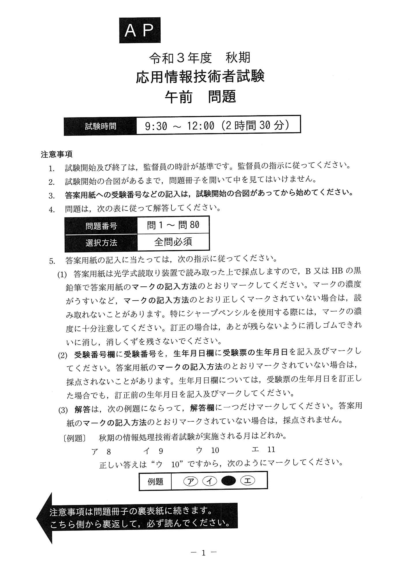

テキスト (OCR)

令和3年度 秋期
午前 問題

注意事項

1. 試験開始及び終了は, 監督貞の時計が基準です。監督中の指示に従ってください。
2. 試験開始の合図があるまで, 問題冊子を開いて中を見てはいけません。

3. 総案用紙への受験番号などの記入は, 試験開始の合図があってから始めてください。
4. 問題は, 次の表に従って解答してください。

問題番号    fal 1 ~ fej 80

選択方法             全間必須

5. 答案用紙の記入に当たっては, 次の指示に従ってください。

Q) 答案用紙は光学式読取り装置で読み取った上で採点しますので, B 又は HB OR
鉛筆で答案用紙のマークの記入方法のとおりマークしてください。マークの濃度
がうすいなど, マークの記入方法のとおり正しくマークされていない場合は, 読
み取れないことがあります。特にシャープペンシルを使用する際には, マークの渡
度に十分注意してください。訂正の場合は, あとが残らないように消しゴムできれ
いに消し, 消しくずを残さないでください。

Q) 受験番号欄に受験番号を, 生年月日欄に受験票の生年月日を記入及びマークし
てください。管案用紙のマークの記入方法のとおりマークされていない場合は,
採点されないことがあります。生年月日欄については, 受験票の生年月日を訂正し
た場合でも, 訂正前の生年月日を記入及びマークしてください。

3) 解答は, 次の例題にならって, 解答欄に一つだけマークしてください。答案用
紙のマークの記入方法のとおりマークされていない場合は, 採点されません。
[例題] 秋期の情報処理技術者試験が実施される月はどれがか。

ア 8    イ 9    ウ 10    エ 11
正しい答えは “ウ 10" ですから, 次のようにマークしてください。

例題 | DODO

注意事項は問題冊子の裏表紙に続きます。
こちら側から裏返して, 必ず読んでください。

### ページ 2

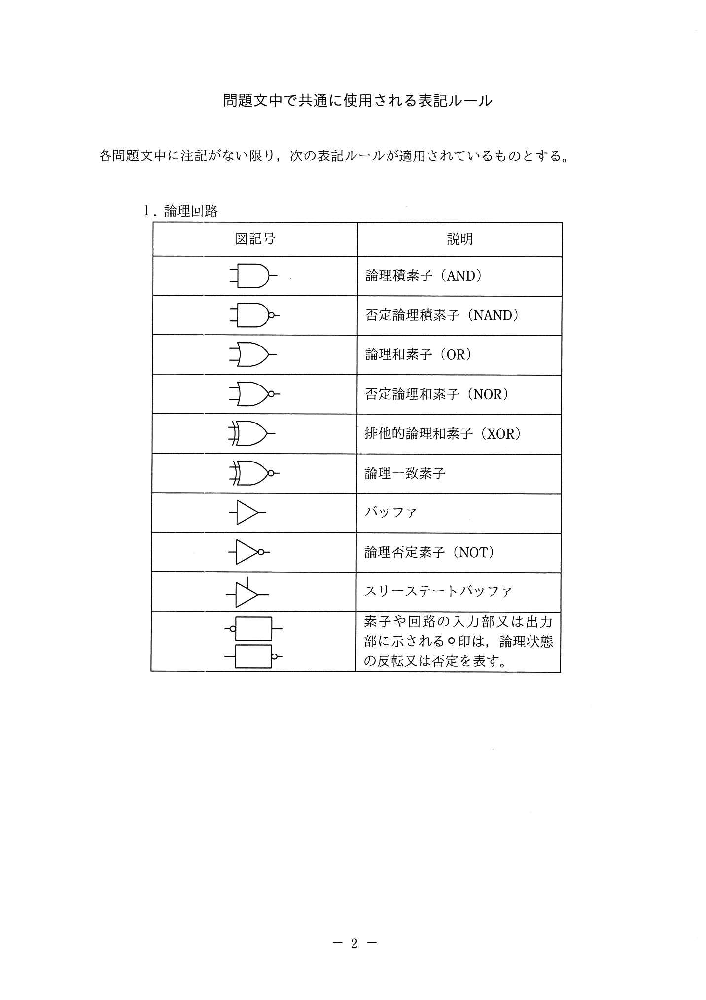

テキスト (OCR)

問題文中で共通に使用される表記ルール

各間題文中に注記がない限り, 次の表記ルールが適用されているものとする。

1. 論理回路

説明

gw
Bait
cu
a

論理積素子 (AND)

否定論理積素子 (NAND)

論理和素子 (OR)

否定論理和素子 (NOR)

排他的論理和素子 (XOR)

論理一致素子

yMMMMO

バッファ

論理否定素子 (NOT)

スリーステートバッファ
素子や回路の入力部又は出力
部に示される9印は, 論理状態
の反転又は否定を表す。

IIYIY

上

### ページ 3

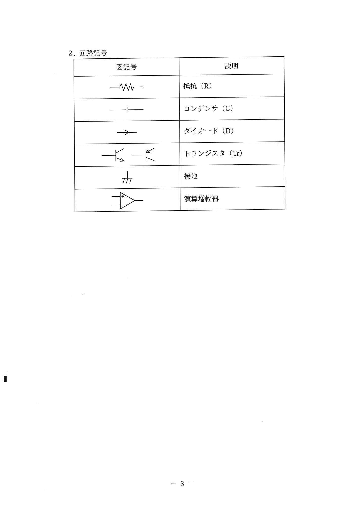

テキスト (OCR)

. 回路記号

図記号                         説明
ーツWV一        抵抗 (R)
ーー          コンデンサ (C)

一時一               ダイオード (D)

—  ード       トランジスタ (Tr)

### ページ 4

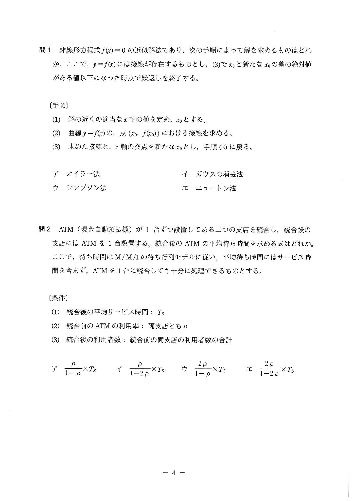

テキスト (OCR)

間1 非線形方程式/) =0 の近似解法であり, 次の手順によって解を求めるものはどれ
か。ここで, ッテア⑦) には接線が存在するものとし, 3)で *。 と新たな mn の差の絶対値
がある値以下になった時点で繰返しを終了する。

(手順]

(1) 解の近くの適当なヶ軸の値を定め, x。とする。

2) 曲線ッニ/(*) の, A (x, (wo)) における接線を求める。

(3) 求めた接線と, * 軸の交点を新たな*。とし, 手順 (2) に戻る。

ア オイラー法         イ ガウスの消去法
ウ シンプソン法         エエ ニュートン法

間2 ATM (現金自動預払機) が 1 台ずつ設置してある二つの支店を統合し, 統合後の
支店には ATM を 1 台設置する。統合後の ATM の平均待ち時間を求める式はどれか。
ここで, 待ち時間は M/M/1 の待ち行列モデルに従い, 平均待ち時間にはサービス時
間を含まず, ATM を 1 台に統合しても十分に処理できるものとする。

【条件

GQ) 統合後の平均サービス時間 : Ts

(2) 統合前の ATM の利用率 : 両支店ともp

3) 統合後の利用者数 : 統合前の両支店の利用者数の合計

ア           メ7s

1一の

### ページ 5

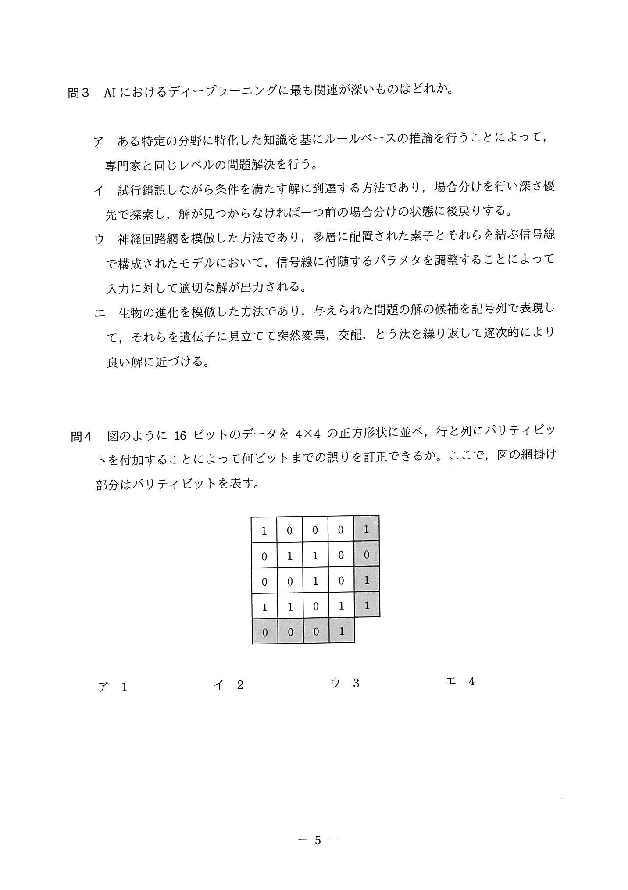

テキスト (OCR)

FAS AIにおけるディープラーニングに最も関連が深いものはどれか。

ア ある特定の分野に特化した知識を基にルールベースの推論を行うことによって,
専門家と同じレベルの問題解決を行う。

イ 試行錯誤しながら条件を満たす解に到達する方法であり, 場合分けを行い深さ優
先で探索し, 解が見つからなければーーつ前の場合分けの状態に後戻りする。

ウ 神経回路網を模信した方法であり, 多層に配置された素子とそれらを結ぶ信号線
で構成されたモデルにおいて, 信号線に付随するパラメタを調整することによって
入力に対して適切な解が出力される。

エ 生物の進化を模條した方法であり, 与えられた問題の解の候補を記号列で表現し
て, それらを遺伝子に見立てて突然変異, 交配, とう潜を繰り返して逐次的により
良い解に近づける。

問4 図のように 16 ビットのデータを 4X4 の正方形状に並べ, 行と列にパリティビッ
トを付加することによって何ビピットまでの誤りを訂正できるか。ここで, MOMENT
部分はパリティビットを表す。

### ページ 6

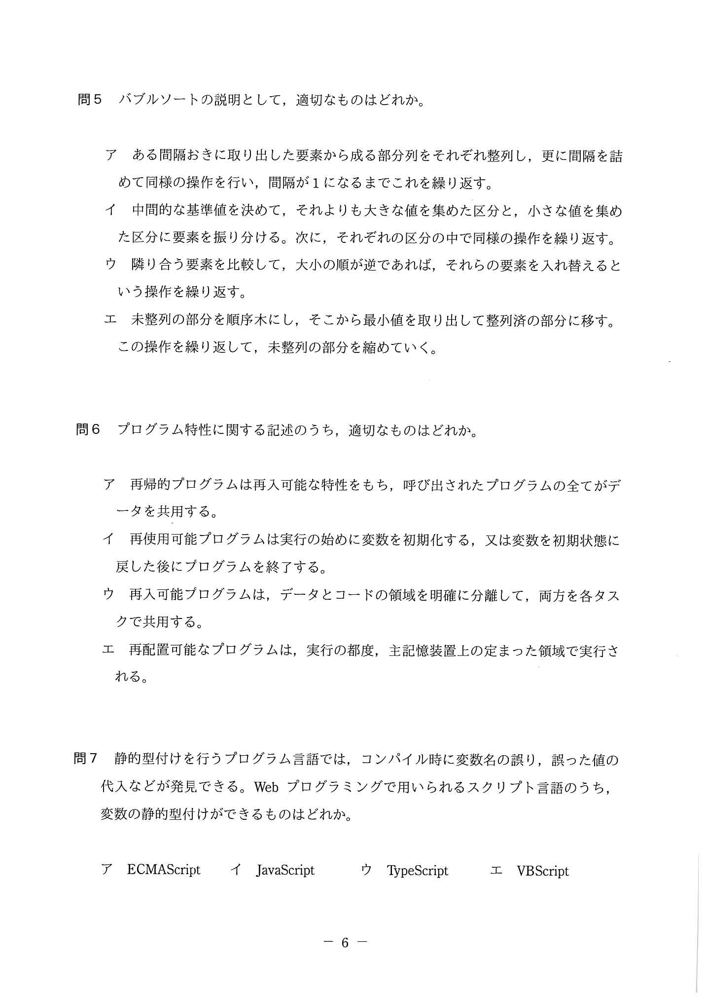

テキスト (OCR)

AIS バブルソートの説明として, 適切なものはどれか。

ア PSTD SCHERER OROMA AE LEAL, SEC fel ia © ae
めて同様の操作を行い, 間隔が 1 になるまでこれを繰り返す。

イ 中間的な基準値を決めて, それよりも大きな値を集めた区分と, 小さな値を集め
た区分に要素を振り分ける。次に, それぞれの区分の中で同様の操作を繰り返す。
ウ 隣り合う要素を比較して, 大小の順が逆であれば, それらの要素を入れ替えると
いう操作を繰り返す。

エエ 未整列の部分を順序木にし, そこから最小値を取り出して整列済の部分に移す。
この操作を繰り返して, 未整列の部分を縮めていく。

問6 プログラム特性に関する記述のうち, 適切なものはどれか。

ア 再帰的プログラムは再入可能な特性をもち, 呼び出されたプログラムの全てがデ
ータを共用する。

イ 再使用可能プログラムは実行の始めに変数を初期化する, 又は変数を初期状態に
戻した後にブログラムを終了する。

ウ 再入可能プログラムは, データとコードの領域を明確に分離して, 両方を各タス
クで共用する。

エ 再配置可能なプログラムは, 実行の都度, 主記憶装置上の定まった領域で実行さ
れる。

問7 静的型付けを行うプログラム言語では, コンパイル時に変数名の誤り, 誤った値の
代入などが発見できる。Web プログラミングで用いられるスクリプト言語のうち,
変数の静的型付けができるものはどれか。

Y ECMAScript  イ JavaScript   ウ TYpeScript   =< VBScript

### ページ 7

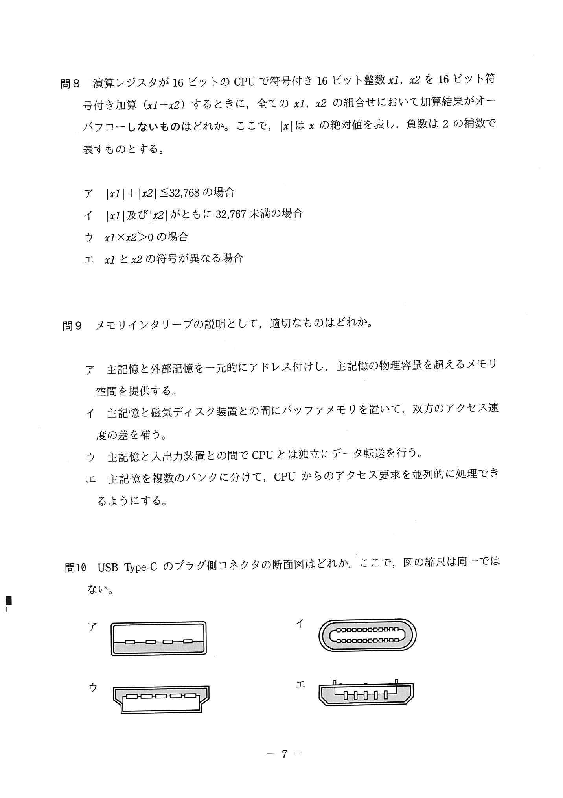

テキスト (OCR)

問8 演算レジスタが16 ビットの CPU で符号付き 16 ビット整数7, 2 を 16 Ey be
号付き加算 (x7x2) するときに, STO xl, 2 の組合せにおいて加算結果がオー
バフローしないものはどれか。ここで, |z|は * の絶対値を表し, 負数は 2 の補数で
表すものとする。

ア |xl|+|x2| ミミ32,768 の場合

イ |%7|及び|*2|がともに 32,767 未満の場合
ウ x1Xx2>0 の場合

エエ xl と?2の符号が異なる場合

BO メモリインタリーブの説明として, 適切なものはどれか。

ア 主記憶と外部記憶を一元的にアドレス付けし, 主記憶の物理容量を超えるメモ リ
空間を提供する。

イ 主記憶と磁気ディスク装置との間にバッファメモリを置いて,  双方のアクセス速
度の差を補う。

ウ 主記憶と入出力装置との間で CPU とは独立にデータ転送を行う。

エ 主記憶を複数のバンクに分けて, CPU からのアクセス要求を並列的に処理でき
るようにする。

間19 USB Type-C のプラグ側コネクタの断面図はどれか。ここで  図の縮尺は同一では

ない。

x

i 5                           Cant)

if

### ページ 8

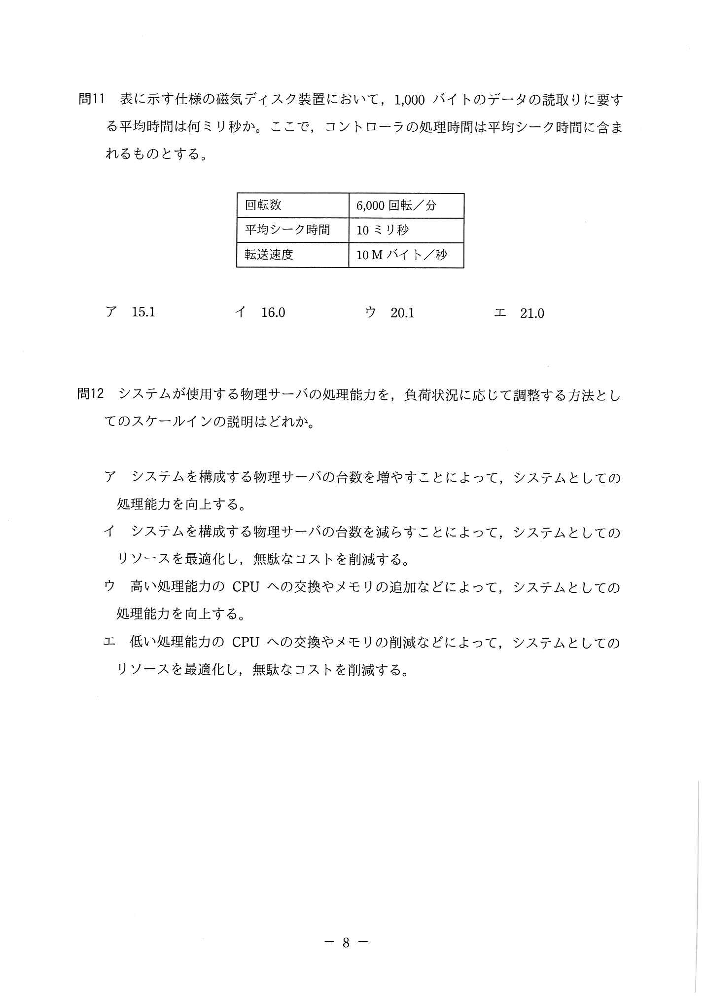

テキスト (OCR)

fll 表に示す仕様の磁気ディスク装置において, 1,000 バイトのデータの読取りに要す
る平均時間は何ミリ秒か。ここで, コントローラの処理時間は平均シーク時間に含ま

6,000 回転分

10 ミリ秒

10 M バイトンノ秒

れるものとする。
回転数
平均シーク時間
転送速度

ア 15.1     イ 16.0

ウ 20.1

x= 21.0

問12 システムが使用する物理サーバの処理能力を, 負荷状況に応じて調整する方法とし

てのスケールインの説明はどれか。

ア システムを構成する物理サーバの台数を増やすことによって, システムとしての

処理能力を向上する。

イ システムを構成する物理サーバの台数を減らすことによって, システムとしての
リソースを最適化し, 無駄なコストを削減する。

ウ 高い処理能力の CPU への交換やメモリの追加などによって,

処理能力を向上する。

エエ 低い処理能力の CPU への交換やメモリの削減などによって,

リソースを最適化し, 無駄なコストを削減する。

システムとしての

システムとしての

### ページ 9

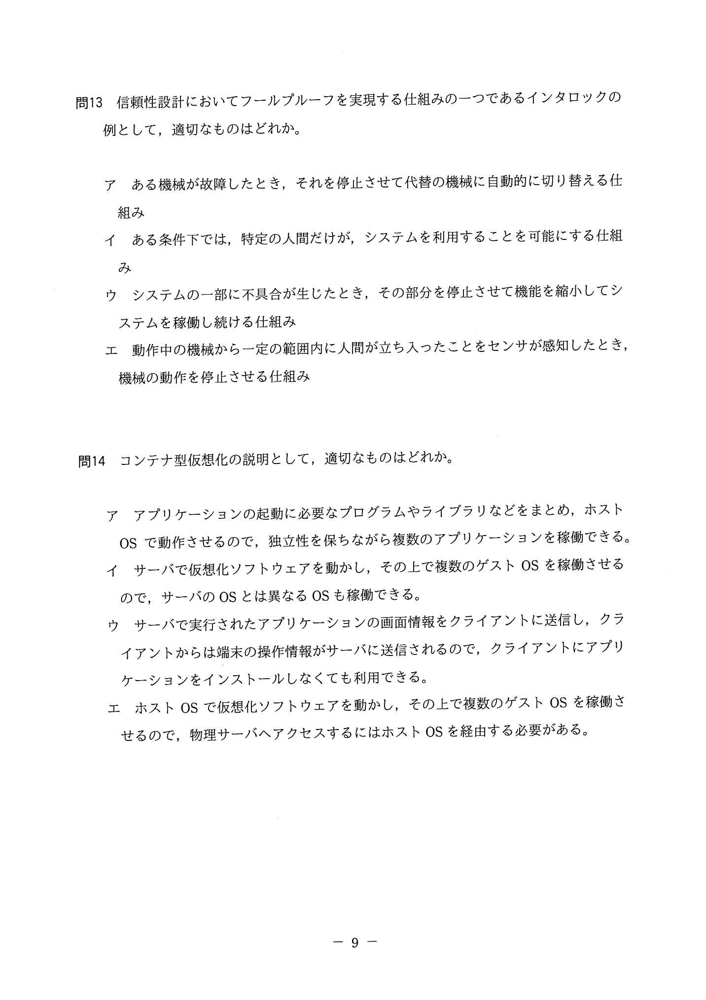

テキスト (OCR)

PAIS 信頼性設計においてフールプルーフを実現する仕組みの一つであるインタロックの
例として, 適切なかものはどれか。

ア ある機械が故障したとき, それを停止させて代替の機械に自動的に切り替える仕

組み

4 ある条件下では, 特定の人間だけが, システムを利用することを可能にする仕組
A

ウ システムの一部に不具合が生じたとき, その部分を停止させて機能を縮小してシ
ステムを稼働し続ける仕組み

エ 動作中の機械から一定の範囲内に人間が立ち入ったことをセンサが感知したとき,
機械の動作を停止させる仕組み

間14 コンテナ型仮想化の説明として, 適切なものはどれか。

ア アプリケーションの起動に必要かプログラムやライブラリなどをまとめ, ホスト
OS で動作させるので, 独立性を保ちながら複数のアプリケーションを稼働できる。

イ サーバで仮想化ソフトウェアを動かし, その上で複数のゲスト OS を稼働させる
DC, サーバの OS とは異なる OS も稼働できる。

ウ サーバで実行されたアプリケーションの画面情報をクライアントに送信し, クラ
イアントからは端末の操作情報がサーバに送信されるので, クライアン トにアプリ
ケーションをインストールしなくても利用できる。

エ ホスト OS で仮想化ソフトウェエアを動かし, その上で複数のゲスト OS を稼働さ
せるので, 物理サーバヘアクセスするにはホスト 0S を経由する必要がある。

### ページ 10

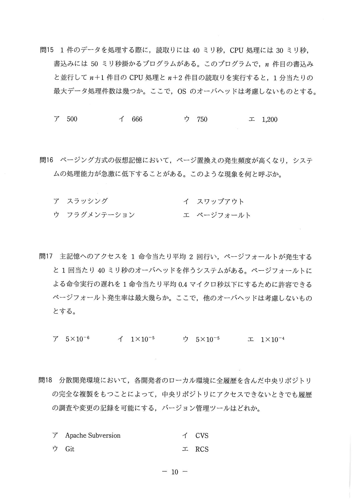

テキスト (OCR)

間15 1 件のデータを処理する際に, 読取りには 40 ミリ秒, CPU 処理には 30 ミリ秒
書込みには 50 ミリ秒掛かるプログラムがある。このプログラムで, ヶ 件目の書込み
と並行して n+1 件目の CPU 処理と n+2 件目の読取りを実行すると, 1 分当たりの
BAT — ZU BISBOM, TOC, OS のオーバヘッドは考慮しないものとする。

ア 500     イ 666     ウ 750     = 1200

RING ページング方式の仮想記憶において, ページ置換えの発生頻度が高くなり, VAT
ムの処理能力が急激に低下することがある。このような現象を何と呼ぶか。

ツマ
NY

ン            イ スワップアウト

Mi

ア スラッ
ウ フラダ

M‘
x
MI
|
マ
Ww
x

エ ページフォールト

Ni

間17 主記憶へのアクセスを 1 命令当たり平均 2 BTW, ページフォールトが発生する
と 1 回当たり 40 ミリ秒のオーバヘッドを伴うシステムがある。ページフォールトに
よる命令実行の遅れを 1 命令当たり平均 0.4 マイクロ秒以下にするために許容できる
ページフォールト発生率は最大幾らか。ここで, 他のオーバヘッドは考慮しないもの
とする。

ア 5X10~?$    イ 1X10~5    ウ 5X10~5    x= 1x10

問18 分散開発環境において, 各開発者のローカル環境に全履歴を含んだ中央リポジトリ
の完全な複製をもつことによって, 中央リポジトリにアクセスできないときでも履歴
の調査や変更の記録を可能にする, バージョン管理ツールはどれか。

ア Apache Subversion       イ CVS
ウ Git               = RCS

ー 10 一

### ページ 11

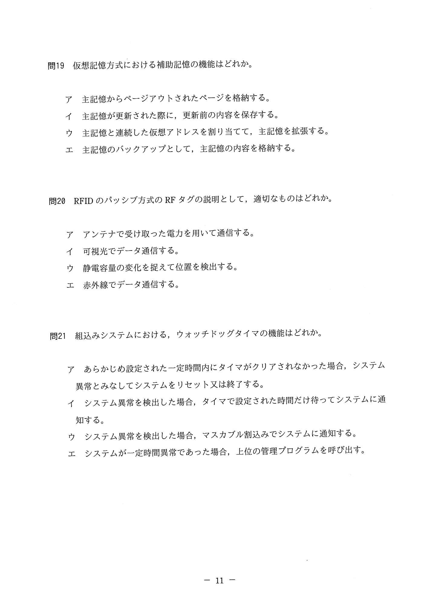

テキスト (OCR)

間19 仮想記憶方式における補助記憶の機能はどれか。

主記憶からページアウトされたページを格納する。

主記憶が更新された際に, 更新前の内容を保存する。

主記憶と連続した仮想アドレスを割り当てて, 主記憶を拡張する。
主記憶のバックアップとして, 主記憶の内容を格納する。

H パパ

間26 RFID のパッシブ方式の RF タグの説明として, 適切なものはどれか。

アンテナで受け取った電力を用いて通信する。
可視光でデータ通信する。

静電容量の変化を捉えて位置を検出する。
赤外線でデータ通信する。

H ささい

問21 組込みシステムにおける, ウォッチドッグタイマの機能はどれが。

ア あらかじめ設定された一定時間内にタイマがクリアされなかった場合, システム
異常とみなしてシステムをリセット又は終了する。

イ システム異常を検出した場合, タイマで設定された時間だけ待ってシステムに通
知する。

ステム異常を検出した場合, マスカブル割込みでシステムに通知する。

システムが一定時間異常であった場合, 上位の管理プログラムを呼び出す。

KO

ウ
エ

= fi

### ページ 12

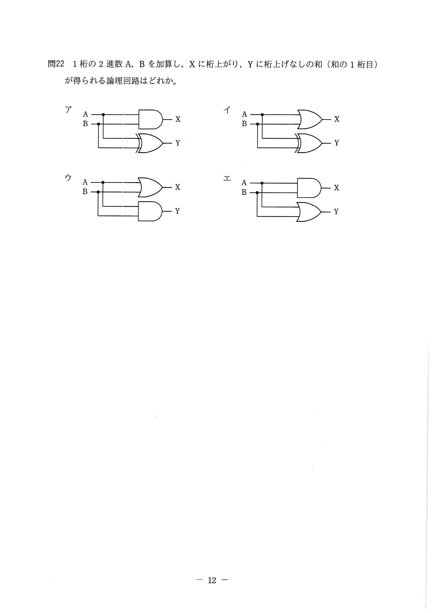

テキスト (OCR)

間22 1桁の2 進数 A, B を加算し, X に桁上がり, Y に桁上げなしの和 (MO 1 桁目)

が得られる論理回路はどれか。
ア
A
コー
=
 aa
コーゴウ

| ナッ

ー 12 一

B

ョイーブ テー

ーーう >-

>
=

x
Y

x

### ページ 13

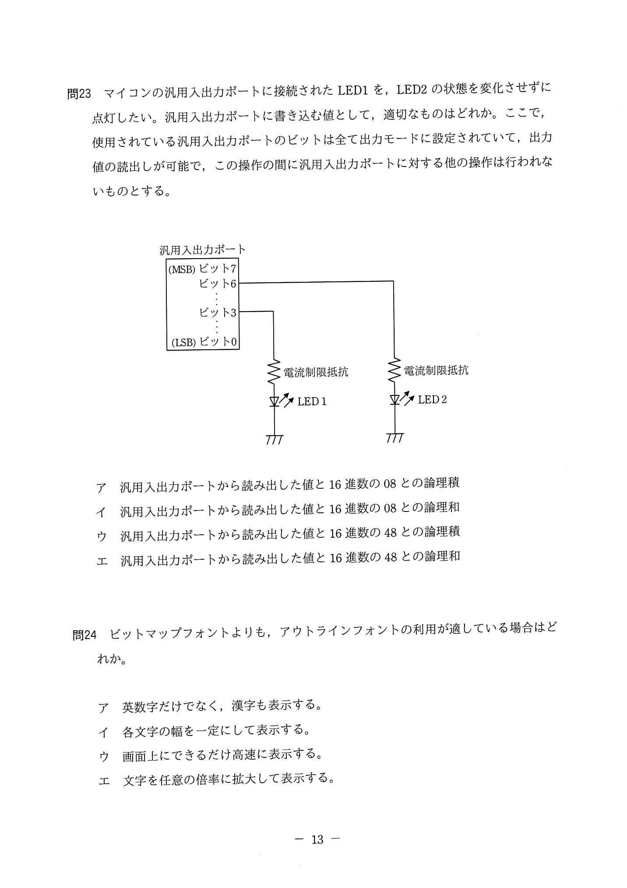

テキスト (OCR)

FI23 マイコンの汎用入出ポートに接続された LED1 を, LED2 の状態を変化させずに
AUT UW, 汎用入出力ポートに書き込む値として, 適切なものはどれか。ここで,
使用されている汎用入出力ポートのビットは全て出力モー ドに設定されていて, 出力
値の読出しが可能で, この操作の間に汎用入出力ポート に対する他の操作は行われな
いものとする。

汎用入出カポート
(MSB) ビット7
ビット6
ピット3
asB) ビット0
電流制限抵抗                  電流制限抵抗
の LED1                    74 LED 2

汎用入出力ポートから読み出した値と 16 進数の 08 との論理積
汎用入出力ポートから読み出した値と 16 進数の 08 との論理和
汎用入出力ポートから読み出した値と 16 進数の 48 との論理積
汎用入出力ポートから読み出した値と 16 進数の 48 との論理和

HAN

問24 ビットマップフォントよりも, アウ トラインフォントの利用が適している場合はど
れか。

英数字だけでなく, 漢字も表示する。
各文字の幅を一定にして表示する。
画面上にできるだけ高速に表示する。
文字を任意の倍率に拡大して表示する。

H ささ

ー 13 一

### ページ 14

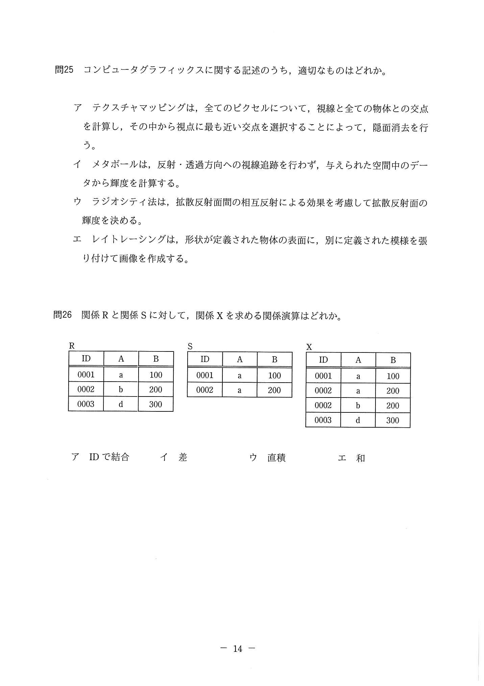

テキスト (OCR)

問25 コンピュータグラフィックスに関する記述のうち, 適切なものはどれか。

ア テクスチャマッピングは, 全てのピクセルについて, 視線と全ての物体との交点
を計算し, その中から視点に最も近い交点を選択することによって, 隠面消去を行

う。

イ メタボールは, 反射・逃過方向への視線追跡を行わず, 与えられた空間中のデー
タから交度を計算する。

ウ ラジオシティ法は, 拡散反射面間の相互反射による効果を考慮して拡散反射面の
輝度を決める。

エエ レイトレーシングは, 形状が定義された物体の表面に, 別に定義された模様を張
り付けて画像を作成する。

問26 関係R と関係S に対して, 関係 X を求める関係演算はどれか。

R                                     S                                      X
wm | 4          B              ID         A          B              ID         A          B
0001        a         100           0001        a         100           0001        a         100
0002        b         200           0002        a         200           0002        a         200
0003        d         300                                                  0002        b         200
0003        d         300
ア ID CHE             イ #£                           ウ 直積                      x= 和

=q4a=

### ページ 15

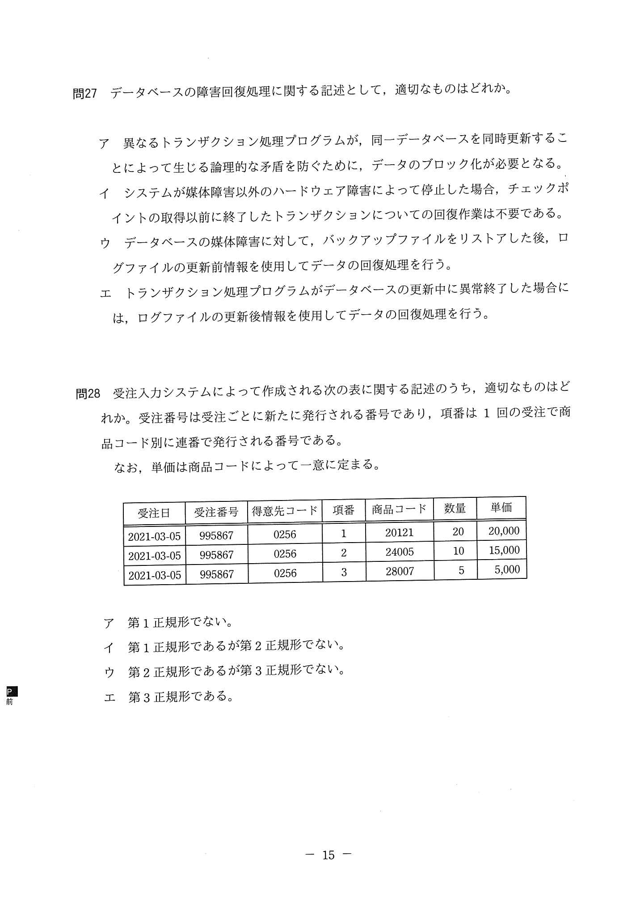

テキスト (OCR)

問27 データベースの障害回復処理に関する記述として, 適切なものはどれが。

ア 異なるトランザクション処理プログラムが, 同一データベースを同時更新するこ
とによって生じる論理的な矛盾を防ぐために, データのブロック化が必要となる。
イ システムが妊体隊害以外のハードウェア障害によって停止した場合,チェックポ
イントの取得以前に終了したトランザクションについての回復作業は不要である。
ウ データベースの媒体障害に対して, バックアップファイルをリストアした後, ロ

グファイルの更新前情報を使用してデータの回復処理を行う。
Bc} トランザクション処理プログラムがデータベースの更新中に異常終了した場合に
は, ログファイルの更新後情報を使用してデータの回復処理を行う。

間28 受注入カシステムによって作成される次の表に関する記述のうち, 適切なものはど
れか。受注番号は受注ごとに新たに発行される番号であり, 項番は 1 回の受注で商
品コード別に連番で発行される番号である。

なお, 単価は商品コードによって一意に定まる。

受注日 | 受注番号 |得意先コード| 項番 | 商品コード| 数量 | 単価
2021-03-05 | 995867               0256                 1               20121               20          20,000
2021-03-05 | 995867               0256                 2               24005               10          15,000
2021-03-05 | 995867               0256                 3               28007                 5            5,000

第 1 正規形でない。
第 1 正規形であるが第 2 正規形でない。
第 2 正規形であるが第 3 正規形でない。
第 3 正規形である。

Hot A NW

*H

ー JB

### ページ 16

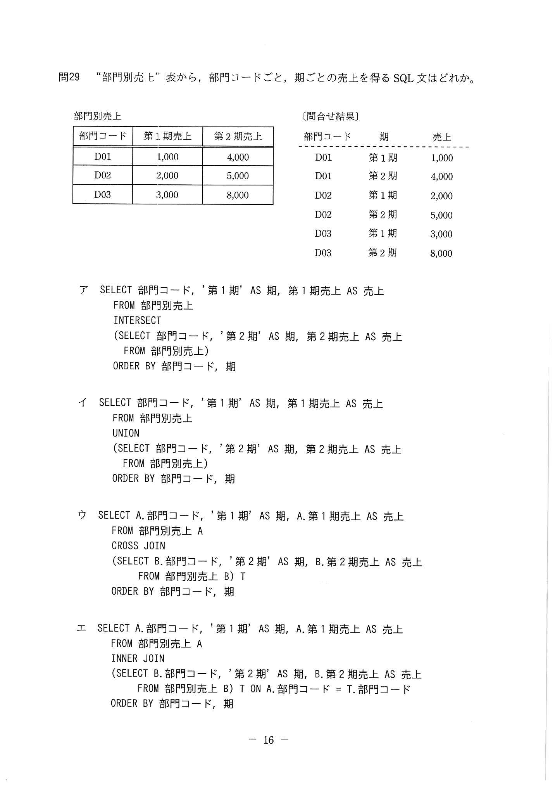

テキスト (OCR)

問29 “APY RICE” 表から, 部門コードごと, 期ごとの売上を得る SQL 文はどれか。
部門別売上                                                    〔問合せ結果)

部門コード | 第1期売上 | 第2期売上      部門コード    ia      売上
DOL               1,000                4,000                Do            第1期           1L000 ー

D02              2.000               5,000                    Do1           第2期          4,000

D03           3,000            8,000                D02         第1期        2.000

D02           第2期          5,000

D03           第1其          3,000

DO3           第2期          8.000

SELECT 部門コード, ’ 38188’ AS 期, 第1期売上 AS 売
FROM 部門別売上
INTERSECT
(SELECT 部門コード, ’ 58288’ AS 期, 第2 期売上 AS 売上
FROM 部門別売上)
ORDER BY 部門コード, 期

SELECT 部門コード, 「第1期"AS 期, 第1 期売上 AS 売上
FROM 部門別売上
UNION
(SELECT 部門コード, "第2期 AS 期, 第2 期売上 AS 売上
FROM 部門別売上)
ORDER BY 部門コード, 期

SELECT A.部門コード, 第1期 AS 期, A.第1 期売上 AS 売上
FROM 部門別売上 A
CROSS JOIN
(SELECT B.部門コード, ’ 582 #8’ AS HA, B.第2期売上 AS BH
FROM 部門別売上 B) T
ORDER BY 部門コード, 期

SELECT A.部門コード, "第1期" AS HR, A.第1期売上 AS 売
FROM 部門別売上 A
INNER JOIN
(SELECT B.部門コード, ’ $82 #9’ AS 期, B.第2 期売上 AS 売上
FROM 部門別売上 B) T ON A.部門コード = T.部門コード
ORDER BY 部門コード, 期

= 16 =

### ページ 17

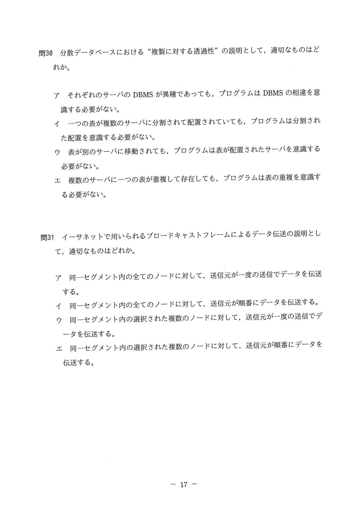

テキスト (OCR)

ISO 分散デゲータベースにおける “複製に対する透過性"の説明として, 適切なものはど
れか。

ア それぞれのサーバの DBMS が異種であっても, プログラムは DBMS の相違を意
識する必要がない。

イ ーーつの表が複数のサーバに分割されて配置されていても, プログラムは分割され
た配置を意識する必要がない。

ウ 表が別のサーバに移動されても, プログラムは表が配置されたサーバを意識する

必要がない。
エ 複数のサーバにーつの表が重複して存在しても, プログラムは表の重複を意識す
る必要がない。

間31 イーサネットで用いられるブロードキャスト フレームによるデータ伝送の説明とし
て, 適切なものはどれか。

ア 同一セグメント内の全てのノードに対して,  送信元が一度の送信でデータを伝送
する。

4 同一セグメント内の全てのノードに対して, 送信元が順番にデータ を伝送する。

ウ 同一セグメント内の選択された複数のノードに対して,  送信元が一度の送信でデ
ータを伝送する。

エ 同一セグメント内の選択された複数のノードに対して,  送信元が順番にデータを
伝送する。

ー 17 一

### ページ 18

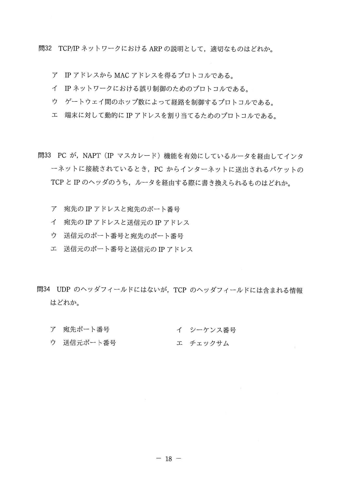

テキスト (OCR)

問32 TCP/IP ネットワークにおける ARP の説明として, 適切なものはどれか。

ア IP アドレスから MAC アドレスを得るプロトコルである。

イ IPネットワークにおける誤り制御のためのプロトコルである。

ウ ゲートウェイ間のホップ数によって経路を制御するプロトコルである。
エエ 端末に対して動的に IP アドレスを割り当てるためのプロトコルである。

間33 PC が, NAPT (IP マスカレード) 機能を有効にしているルータを経由してインタ
ーネットに接続されているとき, PC からインターネットに送出されるパケットの
TCP と IP のヘッダのうち, ルータを経由する際に書き換えられるものはどれか。

宛先のIP アドレスと宛先のポート番号
宛先の IP アドレスと送信元の IP アドレス
送信元のポート番号と宛先のポート番号
送信元のポート番号と送信元の IP アドレス

Hoe AN

間34 UDP のヘッダフィールドにはないが, TCP のヘッダフィールドには含まれる情報
はどれか。

ア RAR-hES        イ シーケンス番号
ウ 送信元ポート番号        エエ チェックサム

ー 18 一

### ページ 19

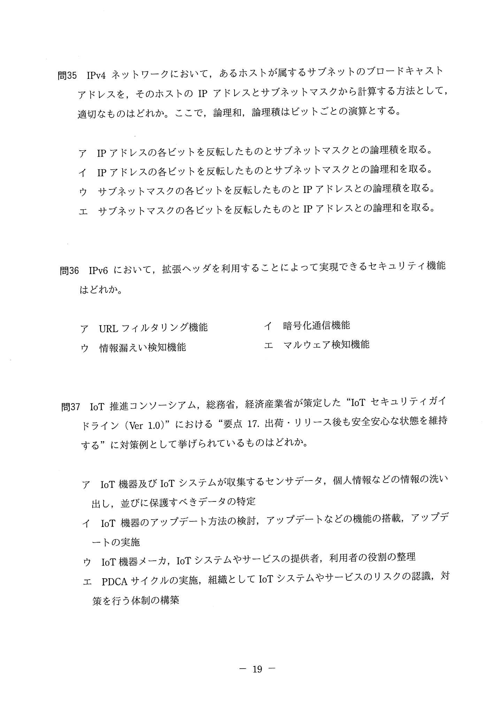

テキスト (OCR)

間35 IPv4 ネットワークにおいて, あるホストが属するサブネットのプロードキャスト
アドレスを, そのホストの IP アドレスとサブネットマスクから計算する方法として
適切なものはどれか。ここで, WHA, 論理積はビッ トごとの演算とする。

IP アドレスの各ビットを反転したものとサブネットマスクとの論理積を取る。
IP アドレスの各ビットを反転したものとサブネットマスクとの論理和を取る。
サブネットマスクの各ビットを反転したものと IP アドレスとの論理積を取る。
サブネットマスクの各ビットを反転したものとIPア ドレスとの論理和を取る。

HH さす へ ぺ

間36 IPv6 において, 拡張ヘッダを利用することによって実現できるセキュリティ機能
はどれか。

ア URL フィルタリング機能             イ 暗号化通信機能
ウ 情報漏えい検知機能                   エ マルウェア検知機能

間37 IoT 推進コンソーシアム, MHA, 経済産業省が策定した “ToT セキュリティガイ
ドライン (Ver 1.0)” における “要点 17. 出荷リリ ース後も安全安心な状態を維持
TH” に対策例として挙げられているものはどれか。

ア IoT 機器及び IoT システムが収集するセンサデータ, 個人情報な どの情報の洗い
出し, 並びに保護すべきデータの特定

4 IoT 機器のアップデート方法の検討.アップデートな どの機能の搭載, アップデ
ートの実施

ウ IoT 機器メーカ, IoT システムやサービスの提供者  利用者の役割の整理

エ PDCA サイクルの実施組織として IoT システムやサービスのリ スクの認識, 対
策を行う体制の構築

ー 19 一

### ページ 20

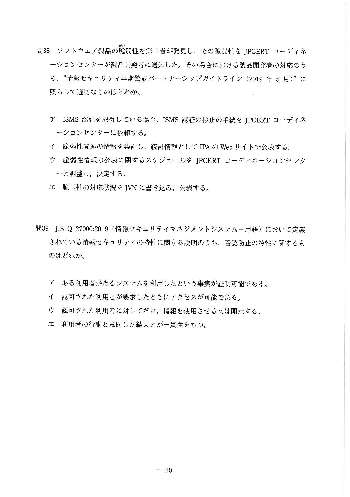

テキスト (OCR)

問38 ソフトウェア興品の脆弱性を第三者が発見し。 その脆弱性を JPCERT コーディネ
ーションセンターが製品開発者に通知した。その場合における製品開発者の対応のう
ち, “情報セキュリティ早期警大パートナーシップガイドライン (2019 年 5 A)" に
照らして適切なものはどれか。

ア ISMS 認証を取得している場合, ISMS 認証の停止の手続を JPCERT コーディネ
ーションセンターに依頼する。

イ 脆弱性関連の情報を集計し, 統計情報として IPA の Web サイトで公表する。

ウ 脆弱性情報の公表に関するスケジュールを JPCERT コーディネーションセンタ
ーと調整し, 決定する。

エエ 脆弱性の対応状況をとJVN に書き込み, 公表する。

間39 JIS Q 27000:2019 (情報セキュリティマネジメントシステムー用語) において定義
されている情報セキュリティの特性に関する説明のうち, 否認防止の特性に関するも
のはどれか。

ある利用者があるシステムを利用したという事実が証明可能である。
認可された利用者が要求したときにアクセスが可能である。

認可された利用者に対してだけ, 情報を使用させる又は開示する。
利用者の行勤と意図した結果とが一貫性をもつ。

H さい

ー 20 一

### ページ 21

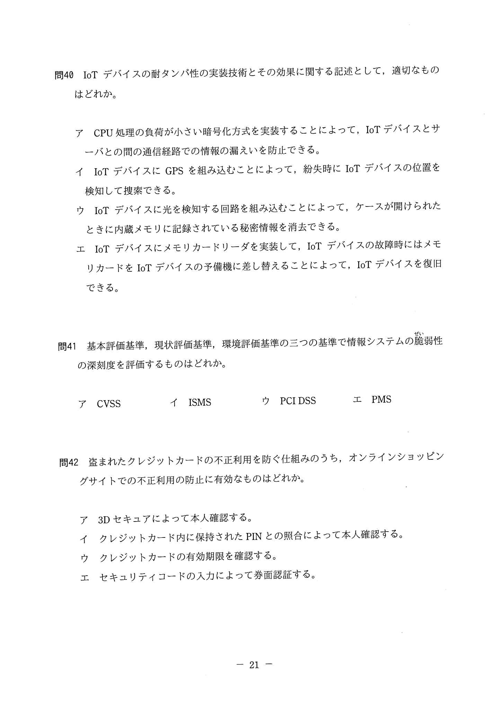

テキスト (OCR)

問49 IoT デバイスの耐タンパ性の実装技術とその効果に関する記述として, 適切なもの
はどれか。

ア CPU処理の負荷が小さい暗号化方式を実装することによって, IoT デバイスとサ
ーバとの間の通信経路での情報の漏えいを防止できる。

4 IoT デバイスに GPS を組み込むことによって, 紛失時に loT デバイスの位置を
検知して捜索できる。

ウ IoT デバイスに光を検知する回路を組み込むことによって, ケースが開けられた
ときに内蔵メモリに記録されている秘密情報を消去できる。

エ ToT デバイスにメモリカードリーダを実装して, IoT デバイスの故障時にはメモ
リカードを IoT デバイスの予備機に差し替えることによって, IoT デバイスを復旧

間41 昌本評価基準現状評価基準環境評価基準の三つの基準で情報システムの朋表性
の深刻度を評価するものはどれか。
ア CVSS                イ ISMS                 ウ PCIDSS            = PMS

問42 次まれたクレジットカードの不正利用を防ぐ仕組みのうち, オンラインショッピン
グサイトでの不正利用の防止に有効なものはどれか。
ア 3Dセキュアによって本人確認する。
イ クレジットカード内に保持された PIN との照合によって本人確認する。

ウ クレジットカードの有効期限を確認する。
エ セキュリティコードの入力によって券面認証する。

ー 21 一

### ページ 22

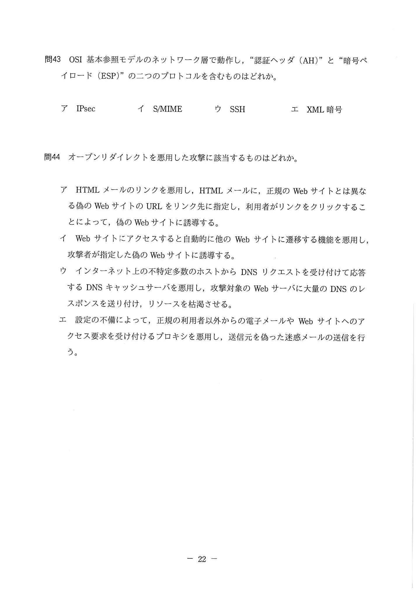

テキスト (OCR)

間43 OS] 基本参照モデルのネットワーク層で動作し, “認証ヘッダ (AH)” と“暗号ペ
イロード (ESP)” の二つのプロトコルを含むものはどれか。

ア IPsec    イ S/MIME   ウ SSH     エ XML 暗号

間44 オープンリダイレクトを悪用した攻撃に該当するものはどれか。

ア HTML メールのリンクを悪用し, HTML メールに, 正規の Web サイトとは異な
る偽の Web サイトの URL をリンク先に指定し, 利用者がリンクをクリックするこ
とによって, 偽の Web サイトに誘導する。

イ Web サイトにアクセスすると自動的に他の Web UT bic BBS SMES BAL,
攻撃者が指定した偽の Web サイトに誘導する。

ウ インターネット上の不特定多数のホストから DNS リクエストを受け付けて応答
する DNS キャッシュサーバを悪用し, 攻撃対象の Web サーバに大量の DNS OV
スポンスを送り付け, リソースを枯潟させる。

= 設定の不備によって, 正規の利用者以外からの電子メールや Web サイトへのア
クセス要求を受け付けるプロキシを悪用し, 送信元を偽った迷惑メールの送信を行

De

ー 22 一

### ページ 23

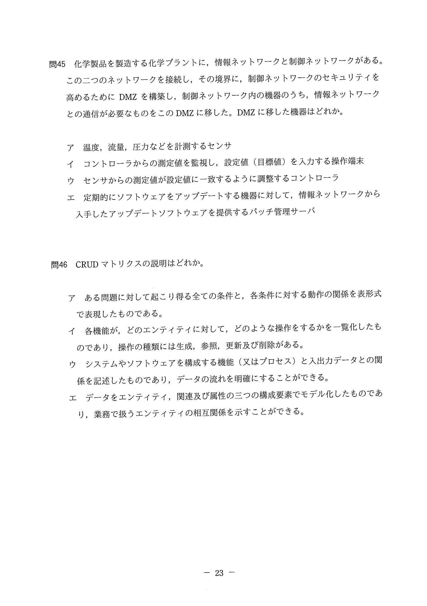

テキスト (OCR)

間45 化学製品を製造する化学プラントに, 情報ネットワークと制御ネットワークがある。
この二つのネットワークを接続し, その境界に, 制御ネットワークのセキュリティを
高めるために DMZ を構築し, 制御ネットワーク内の機器のうち, 情報ネットワーク
との通信が必要なものをこの DMZ に移した。DMZ に移した機器はどれか。

温度, 流量, 圧力などを計測するセンサ

コントローラからの測定値を監視し, 設定値 (目標値) を入力する操作端末
センサからの測定値が設定値に一致するように調整するコントローラ

定期的にソフトウェアをアップデートする機器に対して, 情報ネットワークから
入手したアップデートソフトウェアを提供するパッチ管理サーバ

H ざささい

問46 CRUD マトリクスの説明はどれか。

ア ある問題に対して起こり得る全ての条件と, 各条件に対する動作の関係を表形式
で表現したものである。

イ 各機能が. どのエンティティに対して, どのような操作をするかを一覧化したも
OCH), 操作の種類には生成, 参照更新及び削除がある。

yp システムやソフトウェアを構成する機能 (又はプロセス) と入出力データとの関
係を記述したものであり, データの流れを明確にすることができる。

エ データをエンティティ, 関連及び属性の三つの構成要素でモデル化したものであ
り, 業務で扱うエンティティの相互関係を示すことができる。

ー 23 一

### ページ 24

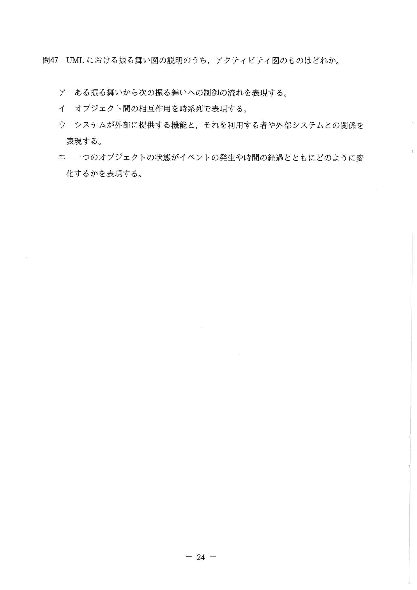

テキスト (OCR)

47 UML における振る舞い図の説明のうち, アクティビティ図のものはどれか。

ア ある振る舞いから次の振る舞いへの制御の流れを表現する。
イ オブジェクト間の相互作用を時系列で表現する。
ウ システムが外部に提供する機能と, それを利用する者や外部システムとの関係を

表現する。
エ 一つのオブジェクトの状態がイベントの発生や時間の経過とともにどのように変
化するかを表現する。

ー 24 一

### ページ 25

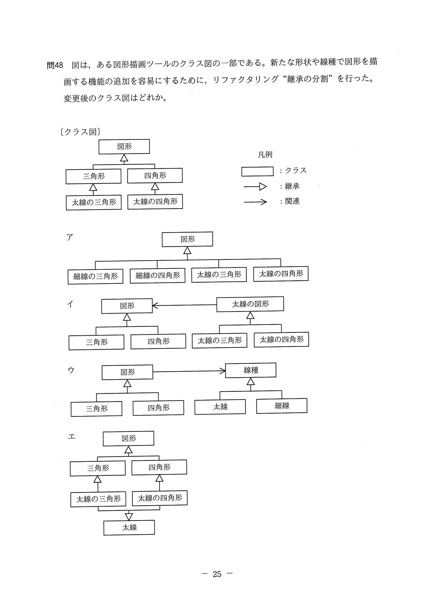

テキスト (OCR)

問48 Mit, ある図形描画ツールのクラス図の一部である。新たな形状や線種で図形を描
する機能の追加を容易にするために, リファクタリング “継承の分割" を行った。
更後のクラス図はどれか。

% 回

[クラス図]
図形
TA                       凡例
三角形        四角形                し] :クラス
な           な                  —> ft
太線の三角形 | | 太線の四角形 |             ーー>  :関連

ア                       図形

較           |             |             |

細線の三角形    細線の四角形    太線の三角形    太線の四角形

イ               図形                              太線の図形

三角形 | | 四角形 | | 太線の三角形| | 太線の四角形

三角形          四角形 |        太線            細線

三角形          四角形

T   T

太線の三角形 | | 太線の四角形

ー 25 一

### ページ 26

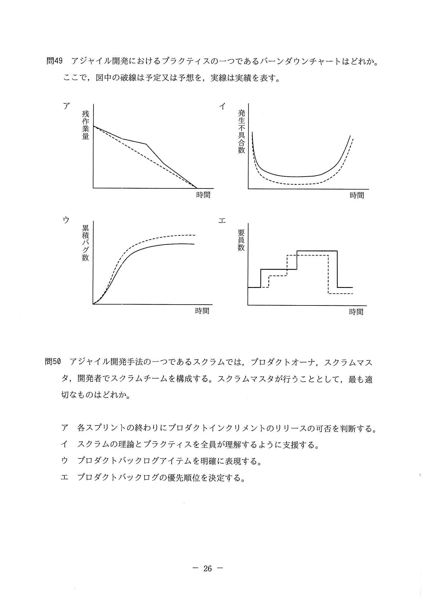

テキスト (OCR)

問49 アジャイル開発におけるプラクティスの一つであるバーンダウンチャートはどれか。
ここで, 図中の破線は予定又は予想を, 実線は実績を表す。

ア

ROHR

ES

XN
7:

EN,

イ
発
生
不
具
a
数
時間
x
=ニッーーーー      要
--           員
数
時間                  時間

間59 アジャイル開発手法のーつであるスクラムでは, プロダクトオーナ, スクラムマス
タ, 開発者でスクラムチームを構成する。スクラムマスタが行うこととして, 最も適

切なものはどれか。

H SOA NY

各スプリントの終わりにプロダクトインクリメントのリリースの可否を判断する。
スクラムの理論とプラクティスを全員が理解するように支援する。

プロダクトバックログアイテムを明確に表現する。
プロダクトバックログの優先順位を決定する。

ー 26 一

### ページ 27

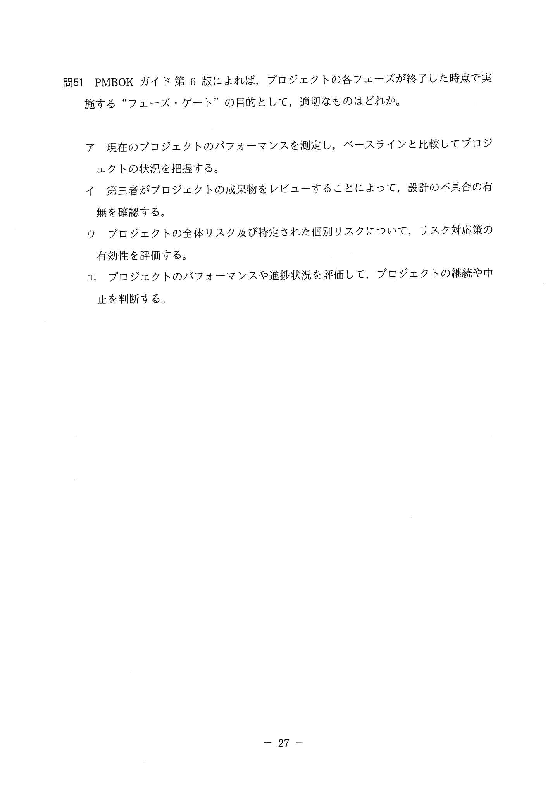

テキスト (OCR)

問51 PMBOK ガイド第 6 版によれば, プロジェクトの各フェーズが終了した時点で実
施する“フェーズ・ゲート"の目的として, 適切なものはどれか。

ア 現在のプロジェクトのパフォーマンスを測定し, ベースラインと比較してプロジ
ェクトの状況を把握する。

イ 第三者がプロジェクトの成果物をレビューすることによって, 設計の不具合の有
無を確認する。

ウ プロジェクトの全体リスク及び特定された個別リスクについて, リスク対応策の
有効性を評価する。

エ プロジェクトのパフォーマンスや進捗状況を評価して, プロジェクトの継続や中
止を判断する。

ー 27 一

### ページ 28

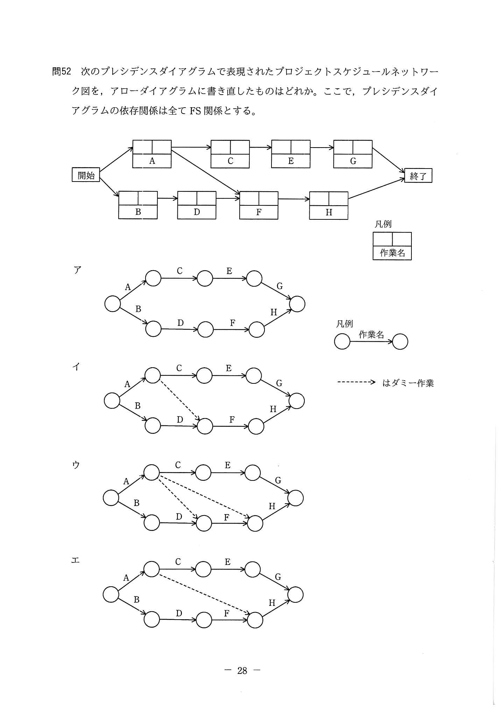

テキスト (OCR)

間52 次のプレシデンスダイアグラムで表現されたプロジェクトスケジュールネットワー
ク図を, アローダイアグラムに書き直したものはどれか。ここで, プレシデンスダイ
アグラムの依存関係は全て FS 関係とする。

|         |       |       |
A         C       E       G
開始                                      終了
|       |       |        |
B      D       F        H
凡例
|
作業名
ァ
凡例
のーー
イ
Peas> はダミー作業
ウ
oo

ー 28 一

### ページ 29

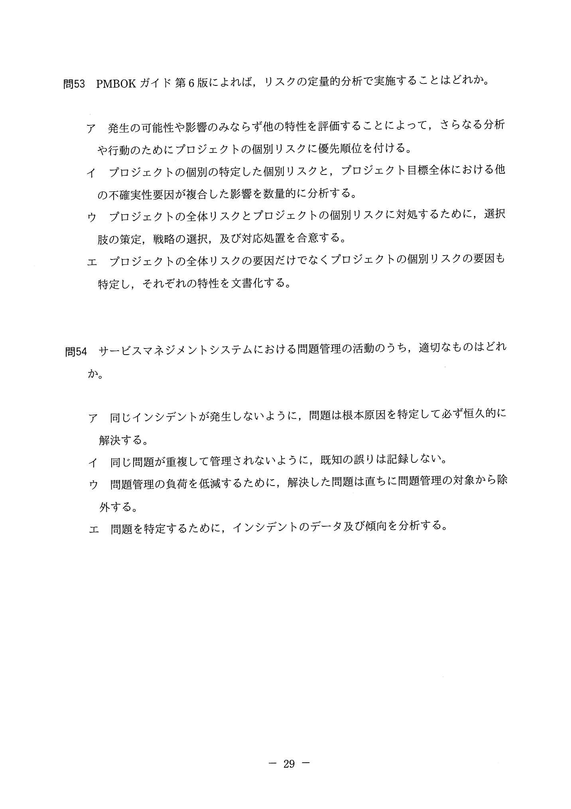

テキスト (OCR)

問53 PMBOK ガイド 第6版によれば, リスクの定量的分析で実施することはどれか。

ア 発生の可能性や影響のみならず他の特性を評価することによって, さらなる分析
や行動のためにプロジェクトの個別リスクに優先順位を付ける。

イ プロジェクトの個別の特定した個別リスクと, プロジェクト目標全体における他
の不確実性要因が複合した影響を数量的に分析する。

ウ プロジェクトの全体リスクとプロジェクトの個別リスクに対処するために, 選択
肢の策定, 戦略の選択, 及び対応処置を合意する。

エ プロジェクトの全体リスクの要因だけでなくプロジェクトの個別リスクの要因も
特定し, それぞれの特性を文書化する。

間54 サービスマネジメントシステムにおける問題管理の活動のうち, 適切なものはどれ
か。

ア 同じインシデントが発生しないように, 問題は根本原因を特定して必ず恒久的に
解決する。

4 同じ問題が重複して管理されないように, 既知の誤りは記録しない。

ウ 問題管理の負荷を低減するために, 解決した問題は直ちに問題管理の対象から除
外する。

エ 間題を特定するために, インシデントのデータ及び傾向を分析する。

ー 29 一

### ページ 30

テキスト (OCR)

間55 次の処理条件で磁気ディスクに保存されているファイルを磁気テープにバックアッ
プするとき, バックアップの運用に必要な磁気テープは最少で何本か。

〔処理条件]

1) 毎月初日 (1 日) にフルバックアップを取る。フルバックアップは 1 本の磁気テ
ープに 1 回分を記録する。

(2) フルバックアップを取った翌日から次のフルバックアップを取るまでは, BHA,
差分バックアップを取る。差分バックアップは, 差分バックアップ用としてフルバ
ックアップとは別の磁気テープに追記録し, 1 本に 1 か月分を記録する。

(3) 常に 6 か月前の同一日までのデータについて, 指定日の状態にファイルを復元
できるようにする。ただし, 6 か月前の月に同一日が存在しない場合は, 当該月の
未日までのデータについて, 指定日の状態にファイルを復元できるようにする
(例 : 本日が 10 月 31 日の場合は, 4 月 30 日までのデータについて, 指定日の状
態にファイルを復元できるようにする)。

間56 “24 時間 365 日" の有人オペレーションサービスを提供する。シフト勤務の条件
が次のとき, オペレータは最少で何人必要か。

条件)

GQ) 1日に3 シフトの交代勤務とする。

2) 各シフトで和勤務するオペレータは2 人以上とする。

3) 各オペレータの勤務回数は 7 日間当たり 5回以内とする。

ー 30 一

+

### ページ 31

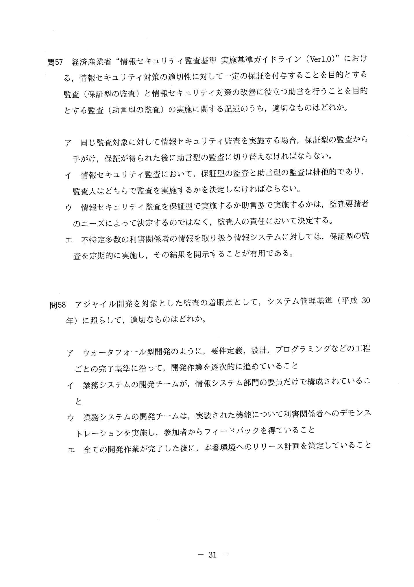

テキスト (OCR)

問57 経済産業省 “情報セキュリティ監査基準 実施基準ガイドライン (Ver1.0)*” におけ
る, 情報セキュリティ対策の適切性に対して一定の保証を付与することを目的とする
監査 (保証型の監査) と情報セキュリティ対策の改善に役立つ助言行うことを目的
とする監査 (助言型の監査) の実施に関する記述のうち, 適切なものはどれがか。

ア 同じ監査対象に対して情報セキュリティ監査を実施する場合, 保証型の監査から
手がけ, 保証が得られた後に助言型の監査に切り替えなければならない。

イ 情報セキュリティ監査において, 保証型の監査と助言型の監査は排他的であり

監査人はどちらで監査を実施するかを決定しなければならない。

ウ 情報セキュリティ監査を保証型で実施するか助言型で実施するかは, 監査要請

のニーズによって決定するのではなく, 監査人の責任において決定する。

x= 不特定多数の利害関係者の情報を取り扱う情報システムに対しては, REEBOK
査を定期的に実施し, その結果を開示することが有用である。

B58 アジャイル開発を対象とした監査の着眼点として, システム管理基準 (平成 30
4) (IRS UT, 適切なものはどれがか。

ア ウォータフォール型開発のように, 要件定義。 設計, プログラミングなどの工程
ごとの完了基準に沿って, 開発作業を逐次的に進めていること

イ 業務システムの開発チームが, 情報システム部門の要員だけで構成されているこ
と

必 業務システムの開発チームは, 実装された機能について利害関係者へのデモンス
トレーションを実施し, 参加者からフィードバックを得ていること

エ 全ての開発作業が完了した後に, 本番環境へのリリース計画を策定していること

ー 31 一

### ページ 32

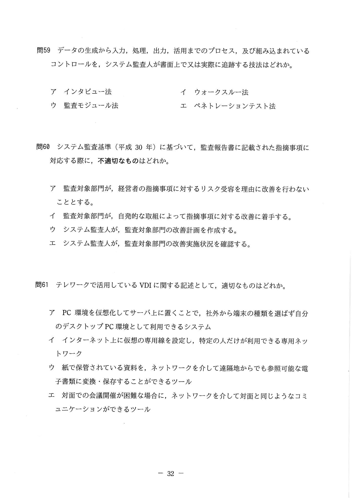

テキスト (OCR)

間59 データの生成から入力, 処理, 出力, 活用までのプロセス, 及び組み込まれている
コントロールを, システム監査人が書面上で又は実際に追跡する技法はどれか。

ア インみタビュー法          イ ウォークスルー法
ウ 監査モジュール法         エエ ペネトレーションテスト法

問69 システム監査基準 (平成 30 年) に基づいて, 監査報告書に記載された指摘事項に
対応する際に, 不適切なものはどれか。

ア 監査対象部門が, 経営者の指摘事項に対するリスク受容を理由に改善を行わない
ことどとする。

イ 監査対象部門が, 自発的な取組によって指摘事項に対する改善に着手する。

ウ システム監査人が, 監査対象部門の改善計画を作成する。

エエ システム監査人が, 監査対象部門の改善実施状況を確認する。

間61 テレワークで活用している VDI に関する記述として, 適切なものはどれか。

ア PC 環境を仮想化してサーバ上に置くことで, 社外から端末の種類を選ばず自分
のデスクトップPC環境として利用できるシステム

イ インターネット上に仮想の専用線を設定し, 特定の人だけが利用できる専用ネッ
トワーク

ウ 紙で保管されている資料を, ネットワークを介して遠隔地からでも参照可能な電
子書類に変換・保存することができるツール

エエ 対面での会議開催が困難な場合に. ネットワークを介して対面と同じようなコミ
ュニケーションができるツール

ー 32 一

### ページ 33

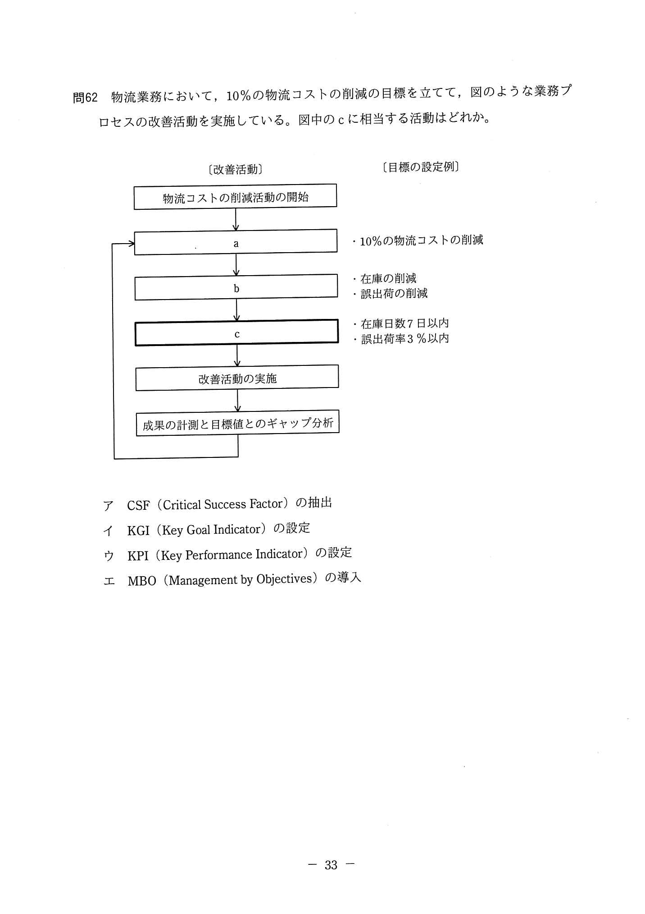

テキスト (OCR)

間62 物流業務において, 10%の物流コストの削減の目標を立てて, 図のような業務プ
ロセスの改善活動を実施している。 図中のcに相当する活動はどれか。

(改善活動〕           [目標の設定例]
物流コストの削減活動の開始
a                      ・10%の物流コストの削減
b         ・ 在庫の削減

・ 在庫日数7 日以内
・誤出荷率3 %以内

改善活動の実施

成果の計測と目標値とのギャップ分析

CSF (Critical Success Factor) の抽出
KGI (Key Goal Indicator) Dax
KPI (Key Performance Indicator) の設定

H さい

MBO (Management by Objectives) の導入

ー 33 一

### ページ 34

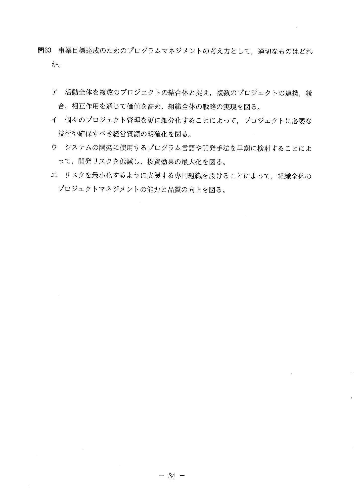

テキスト (OCR)

間63 事業目標達成のためのプログラムマネジメントの考え方として, 適切なかものはどれ
Da

ア 活動全体を複数のプロジェクトの結合体と捉え, 複数のプロジェクトの連携, 統
合, 相互作用を通じて価値をる高め, 組織全体の戦略の実現を図る。

イ 個々のプロジェクト管理を更に細分化することによって, プロジェクトに必要な
技術や確保すべき経営資源の明確化を図る。

ウ システムの開発に使用するプログラム言語や開発手法を早期に検討することによ
って, 開発リスクを低減し, 投資効果の最大化を図る。

= リスクを最小化するように支援する専門組織を設けることによって, 組織全体の
プロジェクトマネジメントの能力と品質の向上を図る。

ー 34 一

### ページ 35

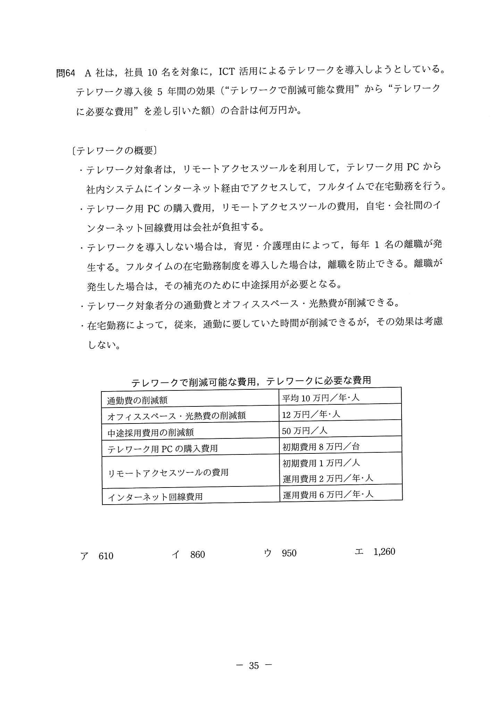

テキスト (OCR)

間64 A 社は, 社員 10 名を対象に, ICT 活用によるテレワークを導入しようとしている。
テレワーク導入後 5 年間の効果 ("テレワークで削減可能な費用" から “テレワーク
に必要な費用” を差し引いた額) の合計は何万円か。

[テレワークの概要]〕

- テレワーク対象者は, リモートアクセスツールを利用して, テレワーク用 PC から
社内システムにインターネット経由でアクセスして, フルタイムで在宅勤務を行う。
- テレワーク用 PC の購入費用, リモートアクセスツールの費用, 自宅・会社間のイ
ンターネット回線費用は会社が負担する。

- テレワークを導入しない場合は, 育児・介護理由によって, 毎年 1 名の離職が発
APS, フルタイムの在宅勤務制度を導入した場合は, 離職を防止できる。離職が
発生した場合は, その補充のために中途採用が必要となる。

- テレワーク対象者分の通勤紳とオフィススペース・光熱費が削減できる。

- 在宅勤務によって, 従来, 通勤に要していた時間が削減できるが, その効果は考虐

しない。

テレワークで削減可能な費用, テレワークに必要な費用
通勤費の削減額            平均 10 万円年・人
オフィススペース・光熱費の削減額    12 万円年・人
中途採用費用の削減額          50 万円ノ人
テレワーク用 PC の購入費用       初期費用 8 万円台
リモートアクセスツールの費用      ORB AB.

運用費用 2 万円年・人
インターネット回線費用               運用費用 6 万円年・人
ア 610     イ 860     ウ 950     エ 1,260

= 85, =

### ページ 36

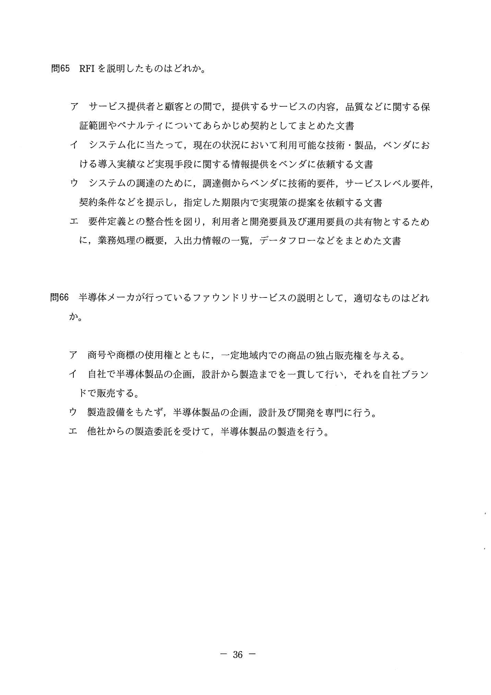

テキスト (OCR)

問65 RFIを説明したものはどれか。

ア サービス提供者と顧客との間で, 提供するサービスの内容, 品質などに関する保
証範囲やペナルティについてあらかじめ契約としてまとめた文書

イ システム化に当たって, 現在の状況において利用可能な技術・製品,ベンダにお
ける導入実績など実現手段に関する情報提供をベンダに依頼する文書

ウ システムの調達のために, 調達側からベンダに技術的要件, サービスレベル要件,
契約条件などを提示し, 指定した期限内で実現策の提案を依頼する文書

エエ 要件定義との整合性を図り, 利用者と開発要員及び運用要員の共有物とするため
に, 業務処理の概要, 入出力情報の一覧, データフローなどをまとめた文書

間66 半導体メーカが行っているファウンドリサービスの説明として, 適切なものはどれ
か。

ア 商号や商標の使用権とともに, 一定地域内での商品の独占販売権を与える。

イ 自社で半導体製品の企画, 設計から製造までを一貫して行い, それを自社ブラン
ドで販売する。

ウ 製造設備をもたず, 半導体製品の企画, 設計及び開発を専門に行う。

エ 他社からの製造委託を受けて, 半導体製品の製造を行う。

= 36 =

### ページ 37

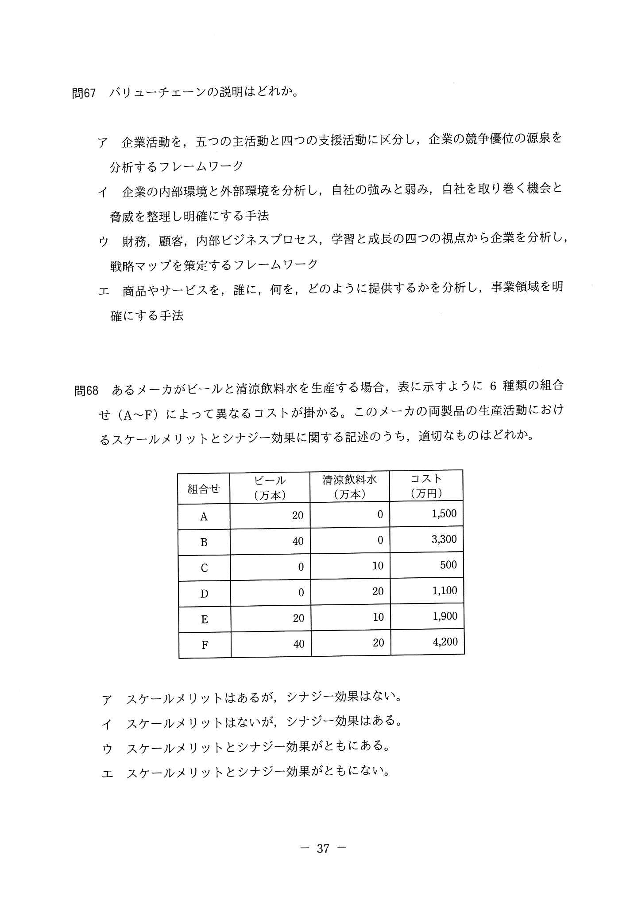

テキスト (OCR)

間67 バリューチェーンの説明はどれか。

ア 企業活動を, 五つの主活動と四つの支援活動に区分し, 企業の競争優位の源泉を
分析するフレームワーク

イ 企業の内部環境と外部環境を分析し, 自社の強みと弱み, 自社を取り巻く機会と
脅威を整理し明確にする手法

ウ 財務, 顧客, 内部ビジネスプロセス, 学習と成長の四つの視点から企業を分析し,
戦略マップを策定するフレームワーク

エ 商品やサービスを, 誰に, 何を, どのように提供するかを分析し, 事業領域を明
確にする手法

間68 あるメーカがビールと清涼飲料水を生産する場合, 表に示すように 6 種類の組合
せ (AXE) によって異なるコストが掛かる。このメーカの両製品の生産活動におけ
るスケールメリットとシナジー効果に関する記述のうち, 適切なものはどれか。

組合せ   ビール   清涼飲料水   コスト
ーー      (万本)      (万本)      (円)
A       20           0       1,500
B                     40                   0            3,300
(9 0 10500
D         0          20       1100
E 20 101900
F        40          20       4200

スケールメリットはあるが, シナジー効果はない。
スケールメリットはないが, シナジー効果はある。
スケールメリットとシナジー効果がともにある。
スケールメリットとシナジー効果がともにない。

H eA N

ー 37 一

### ページ 38

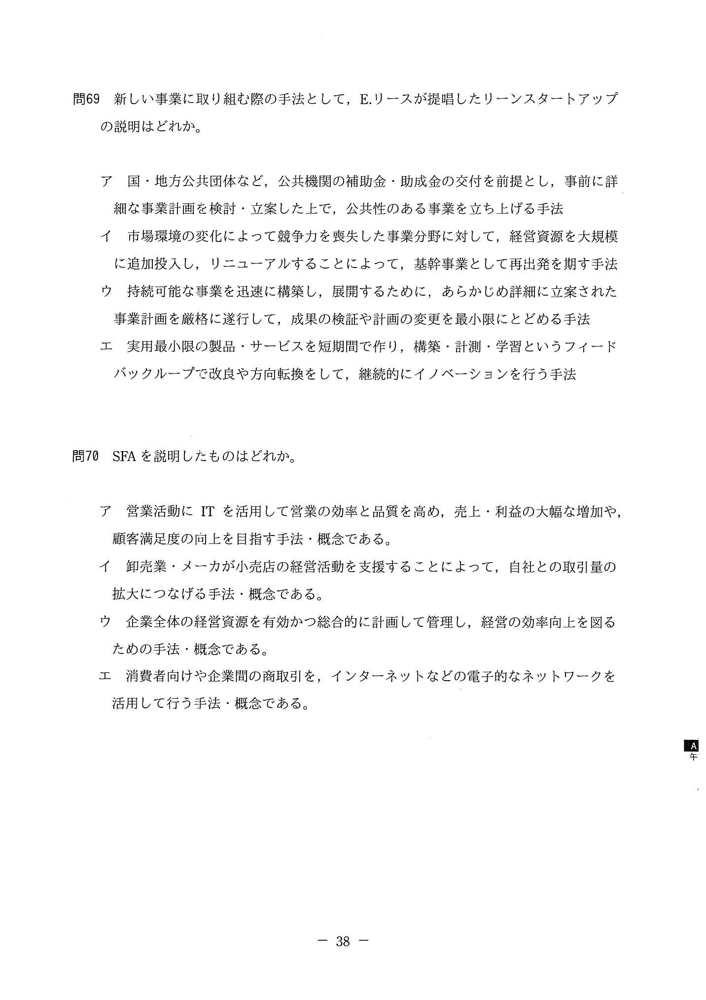

テキスト (OCR)

間69 新しい事業に取り組む際の手法として, E.リースが提唱したリーンスタートアップ
の説明はどれか。

ア ・地方公共団体など, 公共機関の補助金・助成金の交付を前提とし, 事前に詳
細な事業計画を検討・立案した上で, 公共性のある事業を立ち上げる手法

イ 市場環境の変化によって競争力を衰失した事業分野に対して, 経営資源を大規模
に追加投入し, リニューアルすることによって, 基幹事業として再出発を期す手法

ウ 持続可能な事業を迅速に構築し, 展開するために, あらかじめ詳細に立案された
事業計画を厳格に遂行して, 成果の検証や計画の変更を最小限にとどめる手法

エ 実用最小限の製品・サービスを短期間で作り, 構築・計測・学習というフィード
バックループで改良や方向転換をして, 継続的にイノベーションを行う手法

問79 SFAを説明したものはどれか。

ア 営業活動に IT を活用して営業の効率と品質を高め, 売上・利益の大幅な増加や,

顧客満足度の向上を目指す手法・概念である。

イ 卸売業・メーカが小売店の経営活動を支援することによって, 自社との取引量の
拡大につなげる手法・概念である。

ウ 企業全体の経営資源を有効かつ総合的に計画して管理し, 経営の効率向上を図る
ための手法・概念である。

エエ 消費者向けや企業間の商取引を, インターネットなどの電子的なネットワークを
活用して行う手法・概念である。

ー 38 一

+8

### ページ 39

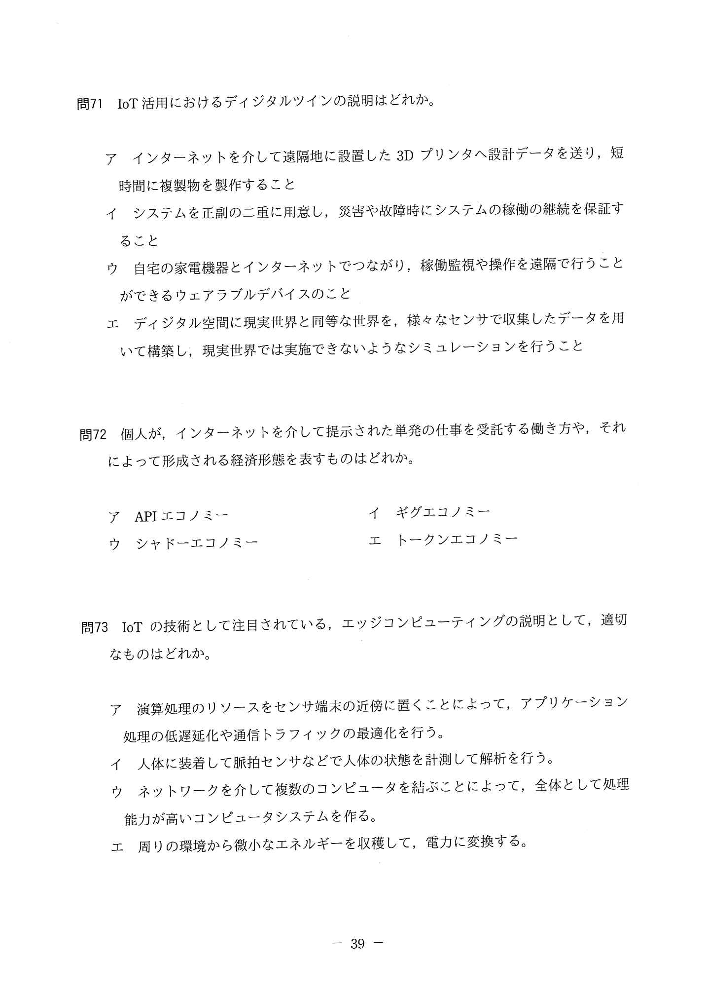

テキスト (OCR)

間71 1oT 活用におけるディジタルツインの説明はどれか。

ア インターネットを介して遠隔地に設置した 3D プリンタへ設計データを送り, 短
時間に複製物を製作すること

イ システムを正副の二重に用意し, 秋害や故障時にシステムの稼働の継続を保証す
る

Wy

(4

と

宅の家電機器とインターネットでつながり, 稼働監視や操作を遠隔で行うこと
ができるウェアラブルデバイスのこと

エ ディジタル空間に現実世界と同等な世界を, 様々なセンサで収集したデータを用
いて構築し, 現実世界では実施できないようなシミュレーションを行うこと

It

間72 個人が, インターネットを介して提示された単発の仕事を受託する働き方や, それ
によって形成される経済形態を表すものはどれか。

ア APIエコノミー          イ ギグエコノミー
ウ シャドーエコノミー         =m ドークジエユミー

間73 ToT の技術として注目されている, エッジコンピューティングの説明として, 適切
なものはどれか。

ア 演算処理のリソースをセンサ端末の近傍に置くことによって, アプリケーション
処理の低遅延化や通信トラフィックの最適化を行う。
イ 人体に装着して脈拍センサなどで人体の状態を計測して解析を行う。
i) ネットワークを介して複数のコンピュータを結ぶことによって, 全体として処理
能力が高いコンピュータシステムを作る。
エ 周りの環境から微小なエネルギーを収穫して, 電力に変換する。

ー 39 一

### ページ 40

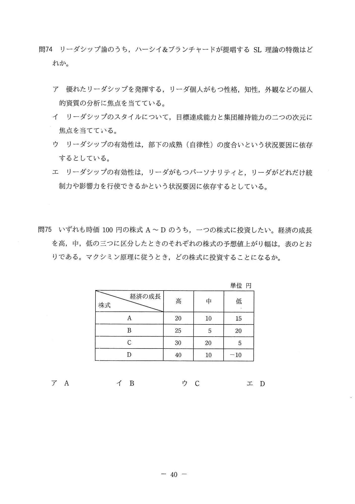

テキスト (OCR)

間74 リーダシップ論のうち, ハーシイ&ブランチャードが提唱する SL 理論の特徴はど
れか。

ア 優れたリーダシップを発揮する, リーダ個人がもつ性格, 知性, 外観などの個人
的資質の分析に焦点を当てている。

イ リーダシップのスタイルについて, 目標達成能力と集団維持能力の二つの次元に
焦点を当てている。

ウ リーダシップの有効性は, 部下の成熟 (自律性) の度合いという状況要因に依存
するとしている。

エ リーダシップの有効性は, リーダがもつパーソナリティと, リーダがどれだけ統
制力や影響力を行使できるかという状況要因に依存するとしている。

間75 いずれも時価 100 円の株式 AD のうち, 一つの株式に投資したい。経済の成長
を高, 中, 低の三つに区分したときのそれぞれの株式の予想値上がり幅は, 表のとお
りである。マクシミン原理に従うとき, どの株式に投資することになるか。

単位 円
経済の成長| _.
株式         m   *   人
A      20   10   15
B      25    5   20
C      30   20    5
D      40   10  ー10
ア A      イ B      ウ C      x= D

= 40 一

### ページ 41

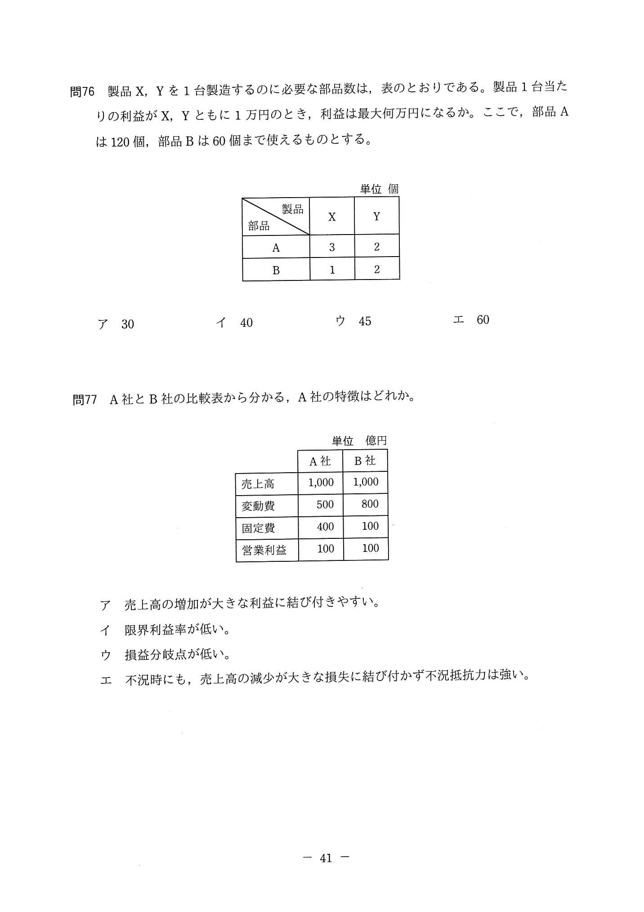

テキスト (OCR)

問76 製品X,Yを1台製造するのに必要な部品数は, 表のとおりである。製品 1 台当た
りの利益が X。Y ともに 1 万円のとき, 利益は最大何万円になるか。ここで, 部品A
は 120 個, 部品B は60 個まで使えるものとする。

単位 個
製品
部品    x | %
A   3   2
B    iL.   2
ア 30      4 40      ウ 45      x 60

問77 A社とB社の比較表から分かる, A社の特徴はどれか。

単位 億円
Att | B社
売上高        1,000 | 1,000
変動費          500      800
固定費          400       100
営業利益       100       100

売上高の増加が大きな利益に結び付きやすい。
限界利益率が低い。

損益分岐点が低い。
不況時にも, 売上高の減少が大きな損失に結び付かず不況抵抗力は強い。

H ささ コ

ー 41 一

### ページ 42

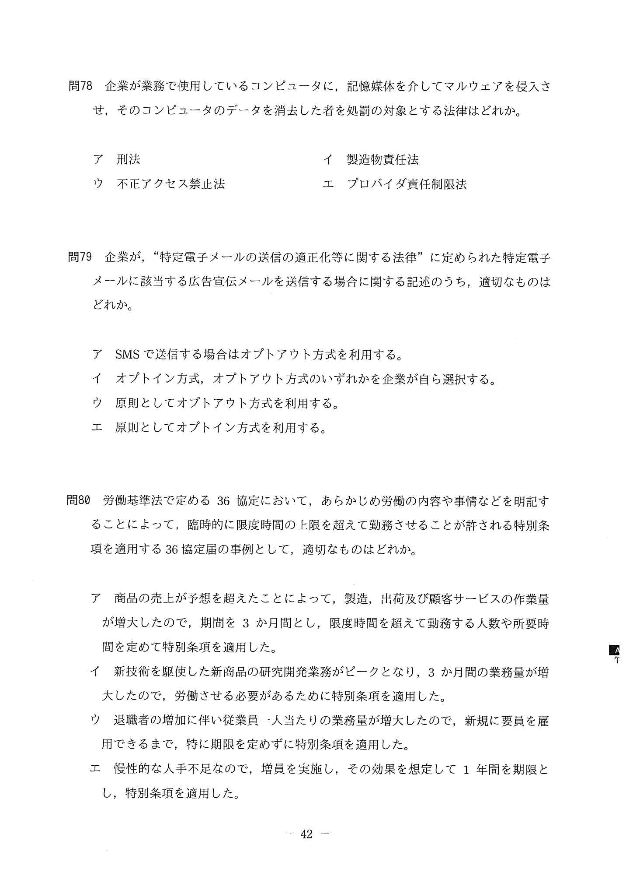

テキスト (OCR)

間78 企業が業務で使用しているコンピュータに, 記憶媒体を介してマルウェアを侵入さ
せ, そのコンピュータのデータを消去した者を処罰の対象とする法律はどれか。

ア 刑法            イ 製造物足任法
ウ 不正アクセス禁止法       エエ プロバイダ責任制限法

間79 企業が, “特定電子メールの送信の適正化等に関する法律" に定められた特定電子
メールに該当する広告宣伝メールを送信する場合に関する記述のうち, 適切なものは
どれか。

SMS で送信する場合はオプトアウト方式を利用する。

オプトイン方式, オプトアウト方式のいずれかを企業が自ら選択する。
原則としてオプトアウト方式を利用する。

原則としてオプトイン方式を利用する。

H へ

問80 労働基準法で定める 36 協定において, あらかじめ労働の内容や事情などを明記す
ることによって, 臨時的に限度時間の上限を超えて勤務させることが許される特別条
項を適用する 36 協定届の事例として, 適切なものはどれか。

ア 商品の売上が予想を超えたことによって, 製造, 出荷及び顧客サービスの作業量
が増大したので, 期間を 3 か月間とし, 限度時間を超えて勤務する人数や所要時
間を定めて特別条項を適用した。

イ 新技術を駆使した新商品の研究開発業務がビピークとなり, 3 か月間の業務量が増
大したので, 労働させる必要があるために特別条項を適用した。

ウ 退職者の増加に伴い従業員一人当たりの業務量が増大したので, 新規に要員を雇
用できるまで, 特に期限を定めずに特別条項を適用した。

= 慢性的な人手不足なので, 増員を実施し, その効果を想定して 1 年間を期限と
し, 特別条項を適用した。

ー 42 一

+8

### ページ 43

テキスト (OCR)

x = 用 紙 J

ー 43 一

### ページ 44

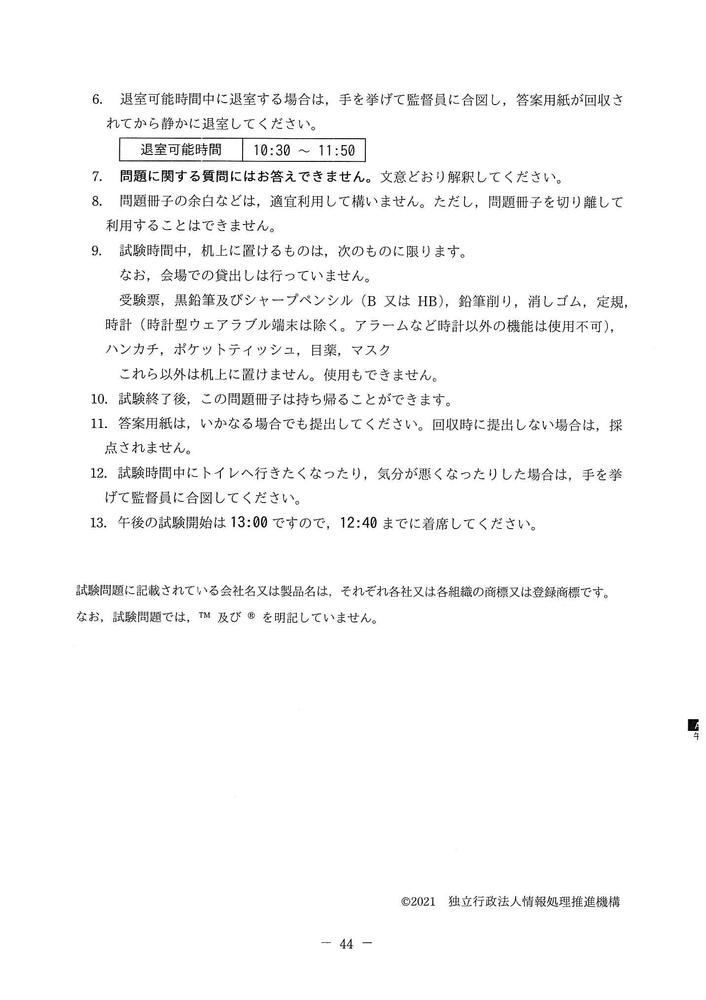

テキスト (OCR)

6. 退室可能時間中に退室する場合は, 手を挙げて監督員に合図し, 答案用紙が回収さ
れてから静かに退室してください。
退室可能時間  10:30 ~ 11:50
7. 問題に関する質問にはお答えできません。文意どおり解釈してください。
8. 問題周子の余白などは, 適宜利用して構いません。ただし, 問題冊子を切り離して
利用することはできません。
9. 試験時間中, 机上に置けるものは, 次のものに限ります。
なお, 会場での貸出しは行っていません。
受験票, 黒鉛筆及びシャープペンシル (B 又は HB), 鉛筆削り, 消しゴム, 定規,
時計 (時計型ウェアラブル端末は除く。アラームなど時計以外の機能は使用不可),
ハンカチ, ポケットティッシュ, BH, VAT
これら以外は机上に置けません。 使用もできません。
10. 試験終了後, この間題冊子は持ち帰ることができます。
11. 答案用紙は, いかなる場合でも提出してください。回収時に提出しない場合は, 採
点されません。
12. 試験時間中にトイレへ行きたくなったり, 気分が悪くなったりした場合は, FER
げて監督員に合図してください。
13. 午後の試験開始は 13:00 ですので, 12:40 までに着席してください。

試験問題に記載されている会社名又は製品名は, それぞれ各社又は各組織の商標又は登録商標です。
なお, 試験問題では, ™ 及び @ を明記していません。

@2021 独立行政法人情報処理推進機構

ー 44 一

---

## 午前解答

©2021 独立行政法人情報処理推進機構 
令和3 年度 秋期 応用情報技術者試験 解答例 
 
午前試験 
問番号
正解
分野
問1 
エ 
Ｔ 
問2 
エ 
Ｔ 
問3 
ウ 
Ｔ 
問4 
ア 
Ｔ 
問5 
ウ 
Ｔ 
問6 
イ 
Ｔ 
問7 
ウ 
Ｔ 
問8 
エ 
Ｔ 
問9 
エ 
Ｔ 
問10 
イ 
Ｔ 
問11 
ア 
Ｔ 
問12 
イ 
Ｔ 
問13 
エ 
Ｔ 
問14 
ア 
Ｔ 
問15 
エ 
Ｔ 
問16 
ア 
Ｔ 
問17 
ア 
Ｔ 
問18 
ウ 
Ｔ 
問19 
ア 
Ｔ 
問20 
ア 
Ｔ 
 
 
問番号
正解
分野
問21 
ア 
Ｔ 
問22 
ア 
Ｔ 
問23 
イ 
Ｔ 
問24 
エ 
Ｔ 
問25 
ウ 
Ｔ 
問26 
エ 
Ｔ 
問27 
イ 
Ｔ 
問28 
イ 
Ｔ 
問29 
イ 
Ｔ 
問30 
エ 
Ｔ 
問31 
ア 
Ｔ 
問32 
ア 
Ｔ 
問33 
エ 
Ｔ 
問34 
イ 
Ｔ 
問35 
エ 
Ｔ 
問36 
イ 
Ｔ 
問37 
イ 
Ｔ 
問38 
ウ 
Ｔ 
問39 
ア 
Ｔ 
問40 
ウ 
Ｔ 
 
 
問番号
正解
分野
問41 
ア 
Ｔ 
問42 
ア 
Ｔ 
問43 
ア 
Ｔ 
問44 
イ 
Ｔ 
問45 
エ 
Ｔ 
問46 
イ 
Ｔ 
問47 
ア 
Ｔ 
問48 
ウ 
Ｔ 
問49 
ア 
Ｔ 
問50 
イ 
Ｔ 
問51 
エ 
Ｍ 
問52 
イ 
Ｍ 
問53 
イ 
Ｍ 
問54 
エ 
Ｍ 
問55 
ウ 
Ｍ 
問56 
イ 
Ｍ 
問57 
エ 
Ｍ 
問58 
ウ 
Ｍ 
問59 
イ 
Ｍ 
問60 
ウ 
Ｍ 
 
 
問番号
正解
分野
問61 
ア 
Ｓ 
問62 
ウ 
Ｓ 
問63 
ア 
Ｓ 
問64 
イ 
Ｓ 
問65 
イ 
Ｓ 
問66 
エ 
Ｓ 
問67 
ア 
Ｓ 
問68 
イ 
Ｓ 
問69 
エ 
Ｓ 
問70 
ア 
Ｓ 
問71 
エ 
Ｓ 
問72 
イ 
Ｓ 
問73 
ア 
Ｓ 
問74 
ウ 
Ｓ 
問75 
ア 
Ｓ 
問76 
ウ 
Ｓ 
問77 
ア 
Ｓ 
問78 
ア 
Ｓ 
問79 
エ 
Ｓ 
問80 
ア 
Ｓ 
 
 
分野の「Ｔ」はテクノロジ系，「Ｍ」はマネジメント系，「Ｓ」はストラテジ系の問題です。

---

## 午後問題

### ページ 1

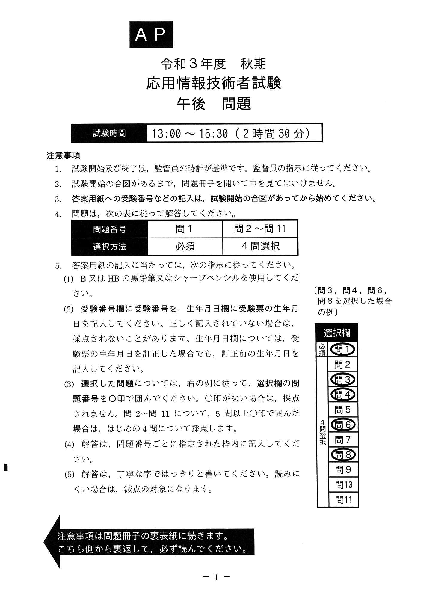

テキスト (OCR)

令和3年度 秋期
応用情報技術者試験
午後 問題

注意事項
1. 試験開始及び終了は, 監督貞の時計が基準です。監督貞の指示に従ってください。
2. 試験開始の合図があるまで, 問題冊子を開いて中を見てはいけません。
3. 答案用紙への受験番号などの記入は, 試験開始の合図があってから始めてください。
4. 問題は, 次の表に従って解答してください。
問題番号             問 1           fal 2 て問 11
選択方法     必須     4 問選択
5. 管案用紙の記入に当たっては, 次の指示に従ってください。
(1) B 又は HB の黒鉛筆又はシャープペンシルを使用してくだ

きい。                        (RIS, 問4, 問6,

8 を選択した場合
⑫) 受験番号欄に受験番号を, 生年月日欄に受験票の生年月   の ames

日を記入してください。 正しく記入されていない場合は
採点されないことがあります。生年月日材については, = RAM
必

験票の生年月日を訂正した場合でも, 訂正前の生年月日を |富軸り
記入してください。                      fel 2
(3) 選択した問題については, 右の例に従って, 選択楓の問   GD
題番号を〇印で囲んでください。〇印がない場合は, 採点   Gi4
されません。問 2~ 1 について, 5 問以上〇印で囲んだ    fa]
場合は, はじめの 4 問について採点します。            Keb)
() 解答は, 問題番号ごとに指定された枠内に記入してくだ |和| 問7
re,                          Gs
©) 解答は, 丁寧な字ではっきりと書いてください。読みに    間9
くい場合は, 減点の対象になかります。              間19

問11

注意事項は問題冊子の裏表紙に続きます。
こちら側から裏返して, 必ず読んでください。

### ページ 2

### ページ 3

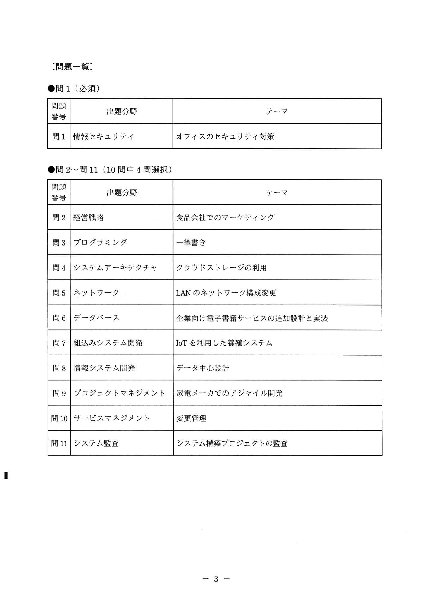

テキスト (OCR)

〔問題一覧〕

@問1 (必須)

     出題分野                aks
問 1 | 情報セキュリティ     オフィスのセキュリティ対策
例問 2一問 11 (10 問中 4 問選択)

nea     出題分野               テーマ
問2 | 経営戦略         食品会社でのマーケティング
問3 | プログラミング      一筆書き

id | ジステムアーキテデクチャ  クラウドストレージの利用

Rls | ネットワーク       LAN のネットワーク構成変更
問6 | データベース       企業向け電子書籍サービスの追加設計と実装
問 7 | 組込みシステム開発    IoT を利用した養殖システム
問 8 | 情報システム開発     データ中心設計

問9 | プロジェクトマネジメント  電メーカでのアジャイル開発
問 10 | サービスマネジメント    変更管理

問 11 | システム監査        システム構築プロジェクトの監査

### ページ 4

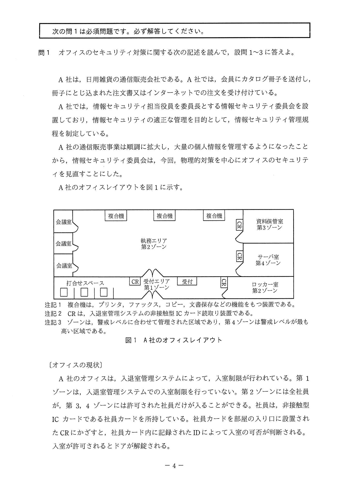

テキスト (OCR)

次の問 1 は必須問題です。必ず解答してください。

間1 オフィスのセキュリティ対策に関する次の記述を読んで, 設問 1ー3 に答えよ。

A 社は, 日用雑貨の通信販売会社である。A 社では, 会員にカタログ冊子を送付し,
冊子にとじ込まれた注文書又はインターネットでの注文を受け付けている。

A 社では, 情報セキュリティ担当役員を委員長とする情報セキュリティ委員会を設
置しており, 情報セキュリティの適正な管理を目的として, 情報セキュリティ管理規
程を制定している。

A 社の通信販売事業は順調に拡大し, 大量の個人情報を管理するようになったこと
から, 情報セキュリティ委員会は, 今回, 物理的対策を中心にオフィスのセキュリテ
イィを見直すことにした。

A 社のオフィスレイアウトを図 1 に示す。

開      | waa |    | ween |    | wane |   .
Stes                               Ss) ROMER
bad   第8ゾーン
執務エリア
第2ゾーン
eee
第4ゾーン
2      4
打合せスペース     | CR| 受付エリア | 受付     g      yp
第1ゾーン                ロッカーS
HIHIHTI  /V\       we

注記1 複合機は. プリンタ, ファックス, コピー, 文書保存などの機能をもつ装置である。
注記 2 CRは, 入退室管理システムの非接触型 IC カード読取り装置である。
注記3 ゾーンは, 警戒レベルに合わせて管理された区域であり, 第4ゾーンは和警戒レベルが最も
高い区域である。
図1 A社のオフィスレイアウト

〔【オフィスの現状)

A 社のオフィスは, 入退室管理システムによって, 入室制限が行われている。第 1
ゾーンは, 入退室管理システムでの入室制限を行っていない。第 2 ゾーンには全社員
が, 第 3, 4 ゾーンには許可された社員だけが入ることができる。 社員は, 非接触型
IC カードである社員カードを所持している。社員カードを部屋の入り口に設置され
たCR にかざすと, 社員カード内に記録されたID によって入室の可否が判断される。
入室が許可されるとドアが解錠される。

a

### ページ 5

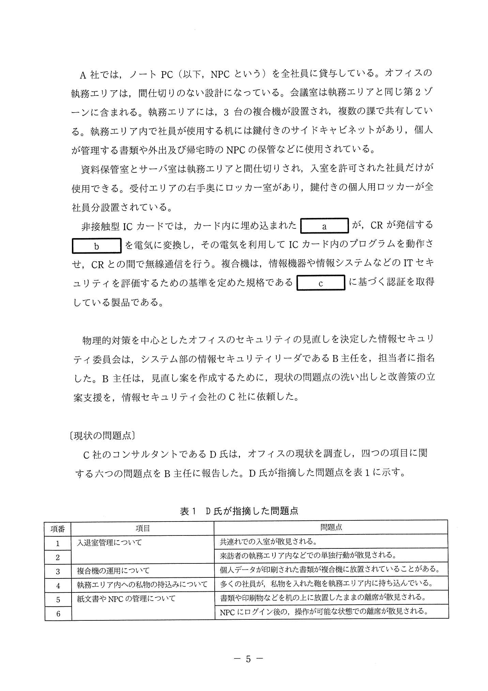

テキスト (OCR)

A 社では, ノート PC (以下, NPC という) を全社員に貸与している。オフィスの
執務エリアは, 間仕切りのない設計になっている。会議密は執務エリアと同じ第 2 ゾ
ーンに含まれる。執務エリアには, 3 台の複合機が設置され, 複数の課で共有してい
る。執務エリア内で社員が使用する机には鍵付きのサイドキャビネットがあり, 個人
が管理する書類や外出及び帰宅時の NPC の保管などに使用されている。

資料保管室とサーバ室は執務エリアと間仕切りされ, 入室を許可された社員だけが
使用できる。受付エリアの右手奥にロッカー室があり, 鍵付きの個人用ロッカーが全
社員分設置されている。

SEEM IC カードでは, カード内に埋め込まれた| 』 | が, CRが発信する
| 5  ] を電気に変換し, その電気を利用して IC カード内のプログラムを動作さ
せ, CR との間で無線通信を行う。複合機は情報機器や情報システムなどの IT セキ
ュリティを評価するための基準を定めた規格である に基づく認証を取得
している製品である。

物理的対策を中心としたオフィスのセキュリティの見直しを決定した情報セキュリ
ティ委員会は, システム部の情報セキュリティリーダである B主任を, 担当者に指名
した。B 主任は, 見直し案を作成するために, 現状の問題点の洗い出しと改善策の立
案支援を, 情報セキュリティ会社の C 社に依頼した。

〔現状の問題点}
C 社のコンサルタントである D 氏は, オフィスの現状を調査し, 四つの項目に関

する六つの問題点を B 主任に報告した。D 氏が指摘した問題点を表 1 に示す。

表1 D氏が指摘した問題点

項番                                   項目                                                                                    問題点
1        入退室管理について                                 共連れでの入室が散見される。
2                              来訪者の執務エリア内などでの単独行動が散見される。
3    複合機の運用について                個人データが印刷された書類が複合機に放置されていることがある。
4 | 百務エリア内への私物の持込みについて | 多くの社員が, 私物を入れた軸を執務エリア内に持ち込んでいる。
5    紙文書や NPC の管理について          書類や印刷物などを机の上に放置したままの離席が散見される。
6                                                               NPC にログイン後の, 操作が可能な状態での離席が散見される。

### ページ 6

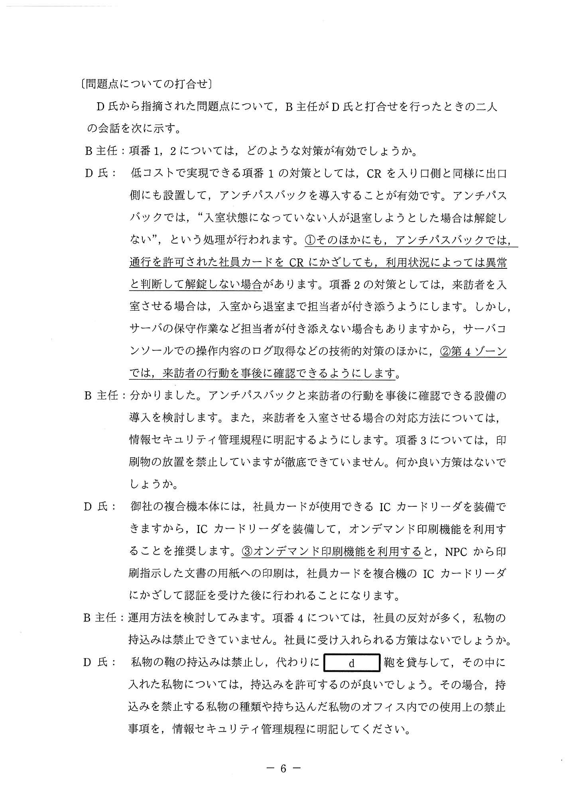

テキスト (OCR)

[問題点についての打合せ]
D 氏から指摘された問題点について, B 主任がD 氏と打合せを行ったときの二人
の会話を次に示す。

B 主任 :
D氏:

B 主任 :

DR:

B 主任 :

DK:

WB 1, 2 については, どのような対策が有効でしょうか。

低コストで実現できる項番 1 の対策としては, CR を入り口側と同様に出口
側にも設置して, アンチパスバックを導入することが有効です。アンチパス
バックでは, “入室状態になっていない人が退室しようとした場合は解錠し
Bw", という処理が行われます。①ゆそのほかにも, アンチパスバックでは

通行を許可された社員カードを CR にかざしても, 利用状況によっては異常
と判断して解錠しない場合があります。項番 2 の対策としては, 来訪者を入
室させる場合は, 入室から退室まで担当者が付き添うようにします。しかし,
サーバの保守作業など担当者が付き添えない場合もありますから, サーバコ
ンソールでの操作内容のログ取得などの技術的対策のほかに, OF 4 ゾーン
では, 来訪者の行動を事後に確認できるようにします。

分かりました。アンチパスバックと来訪者の行動を事後に確認できる設備の
導入を検討します。また, 来訪者を入室させる場合の対応方法については,

情報セキュリティ管理規程に明記するようにします。項番 3 については, 印
刷物の放置を禁止していますが徹底できていません。 何か良い方策はないで
しょうか。

御社の複合機本体には, 社員カードが使用できる IC カードリーダを装備で
きますから, IC カードリーダを装備して, オンデマンド印刷機能を利用す
ることを推奨します。③オンデマンド印刷機能を利用すると, NPC から印
刷指示した文書の用紙への印刷は, 社員カードを複合機の IC カードリーダ
にかざして認証を受けた後に行われることになります。

運用方法を検討してみます。項番 4 については, 社員の反対が多く, 私物の
持込みは禁止できていません。 社員に受け入れられる方策はないでしょうか。
私物の軸の持込みは禁止し, 代わりに|  q | 細を貸与して, その中に
入れた私物については, 持込みを許可するのが良いでしょう。その場合, 持
込みを禁止する私物の種類や持ち込んだ私物のオフィス内での使用上の禁止
事項を, 情報セキュリティ管理規程に明記してください。

ー 6一

### ページ 7

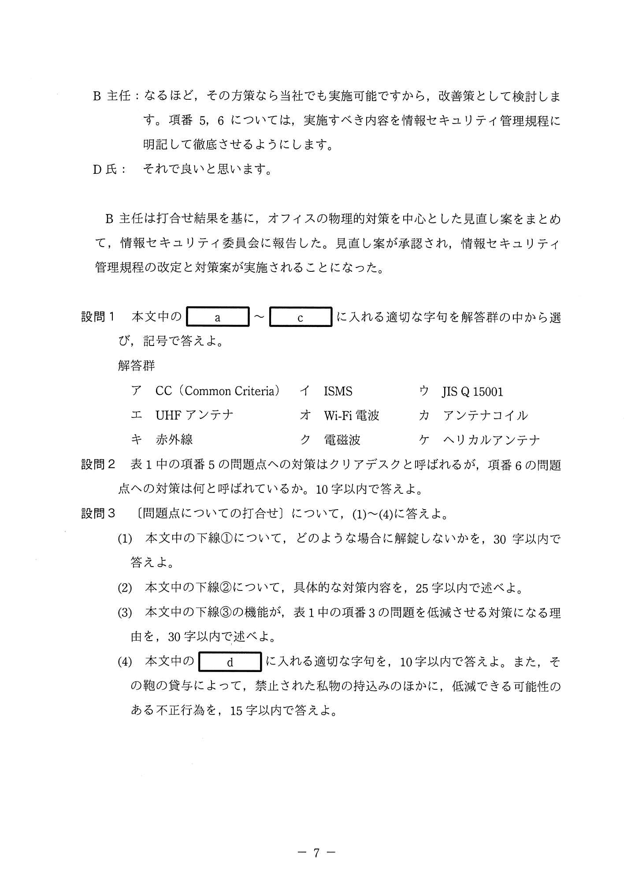

テキスト (OCR)

B 主任 : なるほど, その方策なら当社でも実施可能ですから, 改善策として検討しま
す。 項番 5, 6 については, 実施すべき内容を情報セキュリティ管理規程に
明記して徹底させるようにします。

D氏: それで良いと思います。

B 主任は打合せ結果を基に, オフィスの物理的対策を中心とした見直し案をまとめ
て, 情報セキュリティ委員会に報告した。見直し案が承認され, 情報セキュリティ
管理規程の改定と対策案が実施されることになった。

設問1 本文中の| a |~| cc |に入れる適切な字句を解答群の中から選
U, 記号で答えよ。

bait

解答群
ア CC (Common Criteria) イ ISMS               ウ JISQ15001
x= UHF アンテナ           オ Wi-Fi 電波       カカ アンテナコイル
キ 赤外線                 ク 電磁波         ケ へヘリカルアンテナ

設問2 表1中の項番 5の問題点への対策はクリアデスクと呼ばれるが, 項番 6 の問題
点への対策は何と呼ばれているか。10 字以内で答えよ。
設問3 (問題点についての打合せ] について, ①ー(④に答えよ。
Q) 本文中の下線について, どのような場合に解錠しないかを, 30 字以内で
答えよ。
2) 本文中の下線@について, 具体的な対策内容を, 25 字以内で述べよ。
3) 本文中の下線③の機能が, 表 1 中の項番3 の問題を低減させる対策になる理
He, 30 字以内で述べよ。
@ 本文中の| ad | に入れる適切な字句を, 10字以内で答えよ。また, そ
の絶の貸与によって, 禁止された私物の持込みのほかに, 低滅できる可能性の
HEREGAE, 15 字以内で答えよ。

### ページ 8

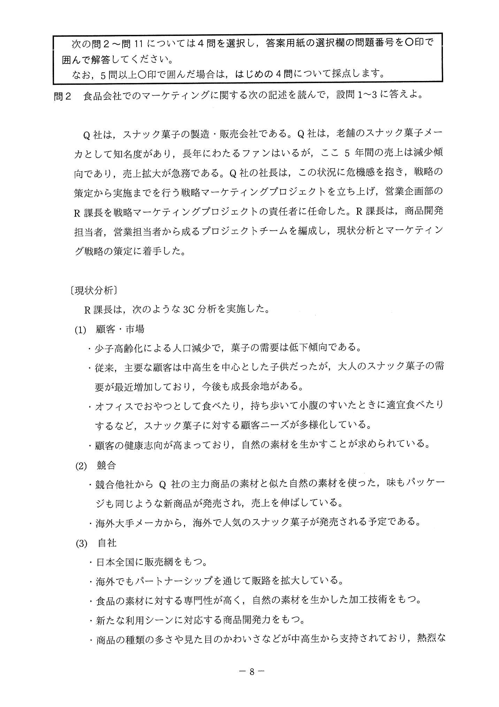

テキスト (OCR)

次の間 2 問 11 については4 問を選択し, 答案用紙の選択欄の問題番号を〇印で
囲んで解答してください。
なお, 5 問以上〇印で囲んだ場合は, はじめの 4 問について採点します。

間2 食品会社でのマーケティングに関する次の記述を読んで, 設問 1ー3 に答えよ。

Q 社は, スナック菓子の製造・販売会社である。Q 社は, 老舗のスナック菓子メー
カカとして知名度があり, 長年にわたるファンはいるが, ここ 5 年間の売上は減少傾
向であり, 売上拡大が急務である。Q 社の社長は, この状況に危機感を抱き, 戦略の
策定から実施までを行う戦略マーケティングプロジェクトを立ち上げ, 営業企画部の
R 課長を戦略マーケティングプロジェクトの次任者に任命した。R 課長は, 商品開発
担当者, 営業担当者から成るプロジェクトチームを編成し, 現状分析とマーケティン
グ戦略の策定に着手した。

現状分析]
R 課長は, 次のような 3C 分析を実施した。
(1) 顧客・市場

・ 少子高齢化による人口減少で, 菓子の電要は低下傾向である。
・従来, 主要な顧客は中高生を中心とした子供だったが, 大人のスナック菓子の需
要が最近増加しており, 今後も成長余地がある。
・オフィスでおやつとして食べたり, 持ち歩いて小腹のすいたときに適宜食べたり
するなど, スナック菓子に対する顧客ニーズが多様化している。
・顧客の健康志向が高まっており, 自然の素材を生かすことが求められている。
2) 競合
・競合他社から Q 社の主力商品の素材と似た自然の素材を使った, 味もパッケー
ジも同じような新商品が発売され, 売上を伸ばしている。
・海外大手メーカから, 海外で人気のスナック菓子が発売される予定である。
(3) 自社
・ 日本全国に販売網をもつ。
・海外でもパートナーシップを通じて販路を拡大している。
・ 食品の素材に対する専門性が高く, 自然の素材を生かした加工技術をもつ。
・新たな利用シーンに対応する商品開発力をもつ。
・商品の種類の多さや見た目のかわいさなどが中高生から支持されており, 熱烈な

ー8g一

### ページ 9

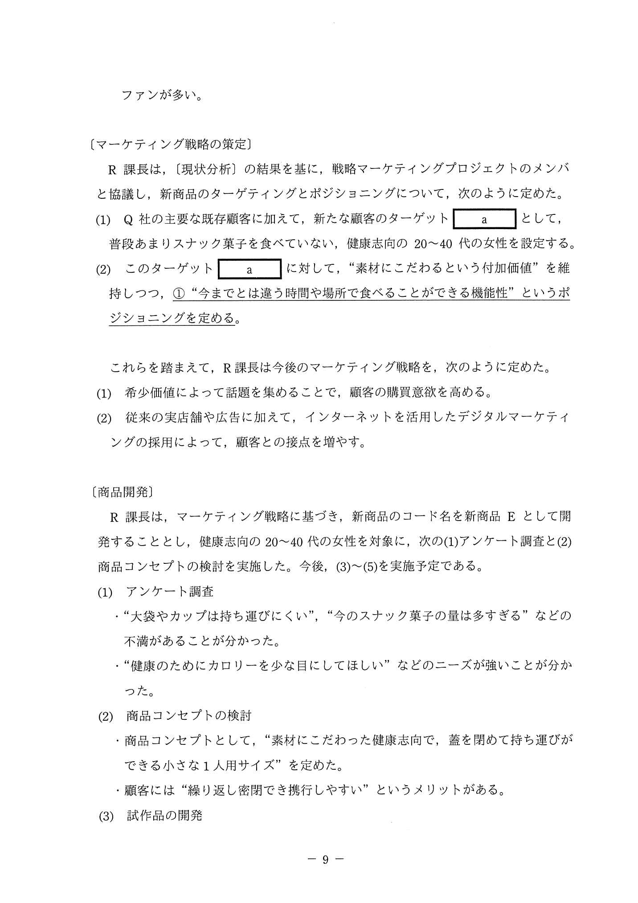

テキスト (OCR)

ファンが多い。

(マーケティング戦略の策定
R 課長は, (GRAM) の結果を基に, 戦略マーケティングプロジェクトのメンバ
と協議し, 新商品のタダターゲティングとポジショニングについて, 次のように定めた。
Q) 社の主要な既存顧客に加えて, 新たな願客のターゲット| a | として,
普段あまりスナック菓子を食べていない, 健康志向の 20~40 代の女性を設定する。
@) このターゲット| ぉ』 | に対して, “素材にこだわるという付加価値” を維
持しつつ, ① "今までとは四う時間や場所で食べることができる機能性" というポ

ジショニングを定める。

これらを踏まえて, R 課長は今後のマーケティング戦略を, 次のように定めた。
1) 希少価値によって話題を集めることで, 顧客の購買意欲を高める。
(2) 従来の実店舗や広告に加えて, インターネットを活用したデジタルマーケティ
ングの採用によって, 顧客との接点を増やす。

〔商品開発
R BRI, マーケティング戦略に基づき, 新商品のコード名を新商品 E として開
発することとし, 健康志向の 20て40 代の女性を対象に, 次の1)アンケート調査と②)
商品コンセプトの検討を実施した。今後, 3)て(5)を実施予定である。
Q アンケート調査
“大袋やカップは持ち運びにくい", “今のスナック菓子の量は多すぎる” などの
不満があることが分かった。
・“健康のためにカロリーを少な目にしてほしい"” などのニーズが強いことが分か
yey
(2) 商品コンセプトの検討
・商品コンセプトとして, “素材にこだわった健康志向で, 蓋を閉めて持ち運びが
できる小さな 1 人用サイズ"” を定めた。
・顧客には “繰り返し密閉でき携行しやすい" というメリットがある。
(3) 試作品の開発

### ページ 10

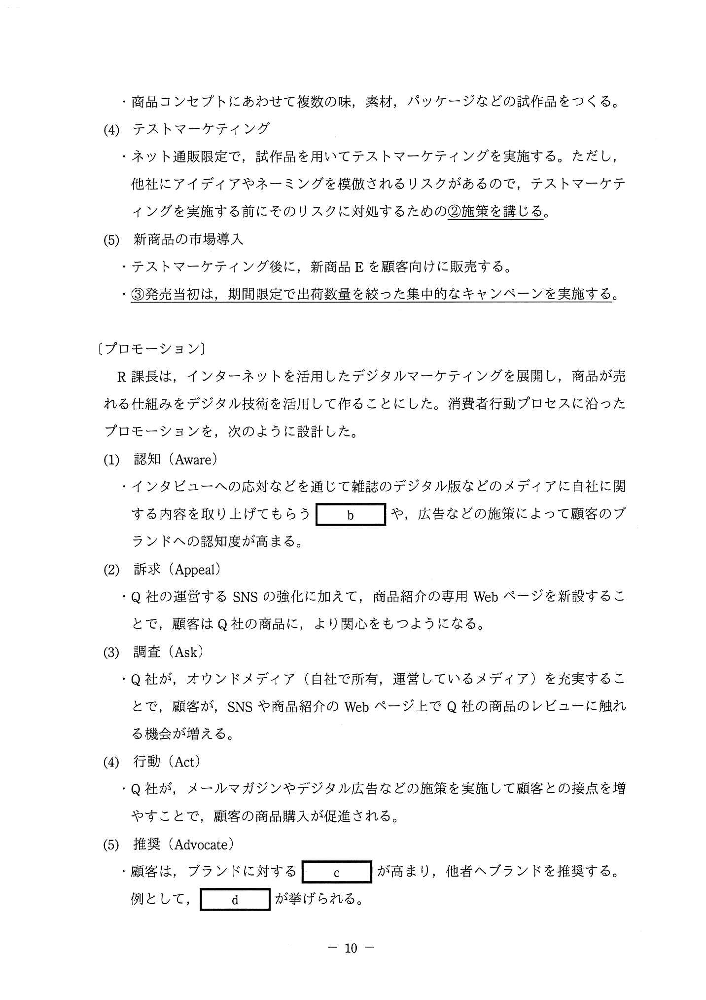

テキスト (OCR)

(4)

(5)

・ 商品コンセプトにあわせて複数の味, 素材, パッケージなどの試作品をつくる。

テストマーケティング

・ネット通販限定で, 試作品を用いてテストマーケティングを実施する。ただし,

他社にアイディアやネーミングを模條されるリスクがあるので, テストマーケテ
ィングを実施する前にそのリスクに対処するための②施策を講じる。
新商品の市場導入

・テストマーケティング後に, 新商品E を顧客向けに販売する。
・⑨発売当初は, 期間限定で出荷数量を絞った集中的なキャンペーンを実施する。

〔【プロモーション〕

R 課長は, インターネットを活用したデジタルマーケティングを展開し, 商品が売
れる仕組みをデジタル技術を活用して作ることにした。消費者行動プロセスに沿った
プロモーションを, 次のように設計した。

①

(2)

(3)

(4)

(5)

認知 (Aware)

・インタビューへの応対などを通じて雑誌のデジタル版などのメディアに自社に関

する内容を取り上げてもらう|  p | や, 広告などの施策によって顧客のブ
ランドへの認知度が高まる。
訴求 (Appeal)

・ Q 社の運営する SNS の強化に加えて, 商品紹介の専用 Web ページを新設するこ

とで, 顧客は Q 社の商品に, より関心をもつようになる。
調査 (Ask)

・Q 社が, オウンドメディア (自社で所有, 運営しているメディア) を充実するこ

とで, 顧客が, SNS や商品紹介の Web ページ上で Q 社の商品のレビューに触れ
る機会が増える。
行動 (Act)

・Q 社が, メールマガジンやデジタル広告などの施策を実施して顧客との接点を増

やすことで, 顧客の商品購入が促進される。

推奨 (Advocate)

MEI, ブランドに対する が高まり, 他者へプランドを推奨する。

例として, | q | が挙げられる。

~ 4g 一

### ページ 11

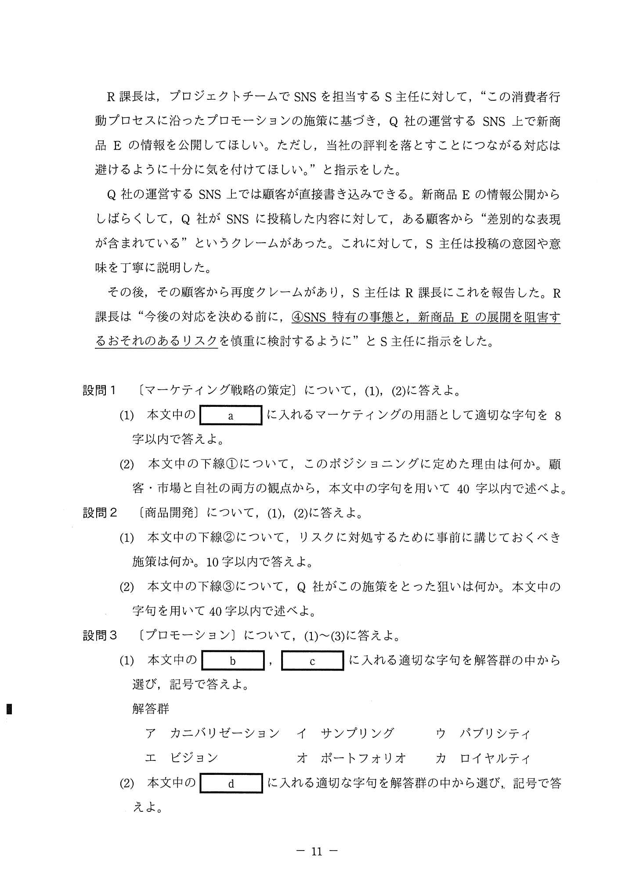

テキスト (OCR)

R 課長は, プロジェクトチームで SNS を担当する S 主任に対して, “この消費者行
動プロセスに沿ったプロモーションの施策に基づき, Q 社の運営する SNS 上で新商
品 E の情報を公開してほしい。ただし, 当社の評判を落とすことにつながる対応は
避けるように十分に気を付けてほしい。” と指示をした。

Q 社の運営する SNS 上では顧客が直接書き込みできる。新商品 E の情報公開から
しばらくして, Q 社が SNS に投稿した内容に対して, ある顧客から “差別的な表現
が含まれている" というクレームがあった。これに対して, S 主任は投稿の意図や意
味を丁寧に説明した。

その後, その顧客から再度クレームがあり, S 主任は R 課長にこれを報告した。R
課長は “今後の対応を決める前に, ④SNS 特有の事態と, 新商品 E の展開を阻害す
るおそれのあるリスクを慎重に検討するように"とS主任に指示をした。

設問1 〔マーケティング戦略の策定〕】 について, (1), ⑫)に答えよ。
a) 本文中の[| a | に入れるマーケティングの用語として適切な字句を 8
字以内で答えよ。

(2) 本文中の下線について, このポジショニングに定めた理由は何か。顧
客・市場と自社の両方の観点から, 本文中の字旬を用いて 40 字以内で述べよ。
設問2 [商品開発) について, ①, ②に答えよ。
Q①) 本文中の下線②について, リスクに対処するために事前に講じておくべき
施策は何か。10 字以内で答えよ。
(2) 本文中の下線について, Q 社がこの施策をとった狙いは何か。本文中の
字句を用いて 40 字以内で述べよ。
設問3 〔プロモーション] について, ①~て(3)に答えよ。

Q①) 本文中の| b |,| < |に入れる適切な字句を解答群の中から
選び, 記号で答えよ。
解答
ア カニバリゼーション イ サンプリング   ウ パプブリシティ
エ ピジョン      A ポートフォリオ カカ ロイヤルティ
@) 本文中の|  』 | に入れる適切な字句を解答群の中から選び。記号で答
えよ。

= Fy 一

### ページ 12

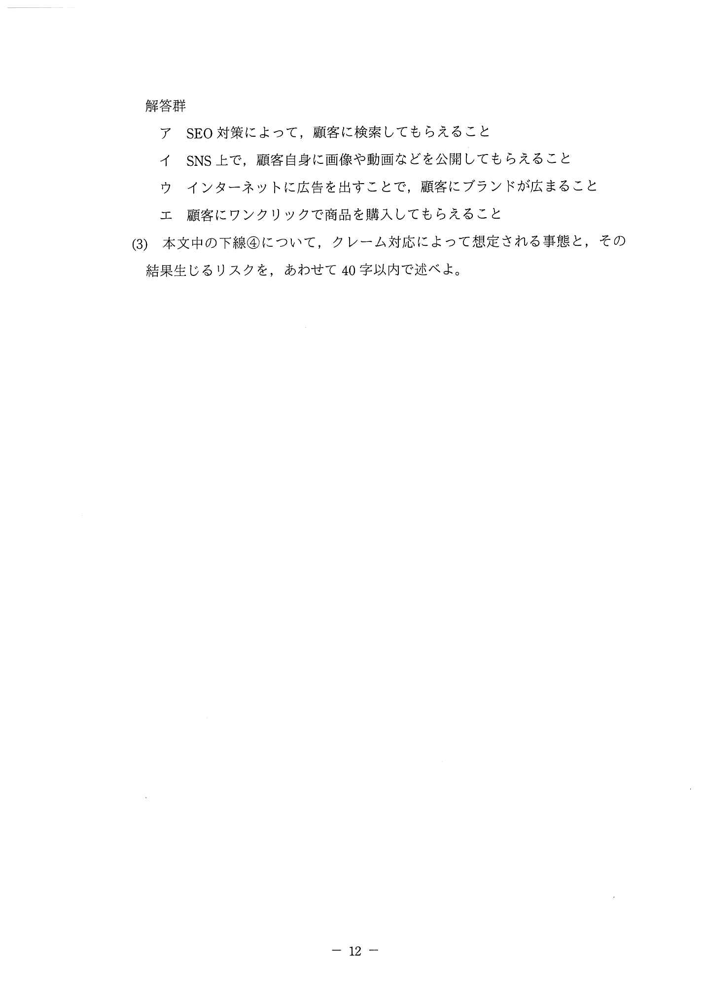

テキスト (OCR)

a
II
Es

SEO 対策によって, 顧客に検索してもらえること
SNS 上で, 顧客自身に画像や動画などを公開してもらえること
インターネットに広告を出すことで, 顧客にブランドが広まること
エ 顧客にワンクリックで商品を購入してもらえること
(3) 本文中の下線@について, クレーム対応によって想定される事態と, その
結果生じるリスクを, あわせて 40 字以内で述べよ。

tA N

ー i9—

### ページ 13

テキスト (OCR)

〔

メ モ 用 紙 }

ー 13 一

### ページ 14

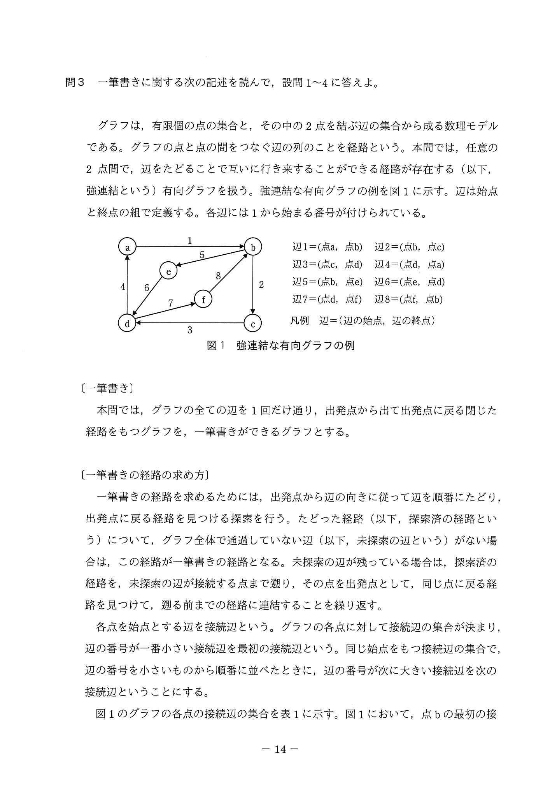

テキスト (OCR)

HIS 一筆書きに関する次の記述を読んで, 設問 1]ー4 に答えよ。

グラフは, 有限個の点の集合と, その中の 2 点を結ぶ辺の集合から成る数理モデル
CHS. グラフの点と点の間をつなぐ辺の列のことを経路という。本問では, 任意の
2 点間で, 辺をたどることで互いに行き来することができる経路が存在する (以下
強連結という) 有向グラフを扱う。強連結な有向グラフの例を図 1 に示す。 辺は始点
と終点の組で定義する。各辺には 1 から始まる番号が付けられている。

辺1三(点a, Ab) 辺2三(点b, Ac)
辺3三(点c, md) 辺4三(点d, Fata)
辺5三(点b, Me) 辺6三(点e, Ad)
辺7三(点d, 点f) 辺8ニ(点 点b)

凡例 辺=(辺の始点, 辺の終点)

図1 強連結な有向グラフの例

(一筆書き〕
本問では, グラフの全ての辺を 1 回だけ通り, 出発点から出て出発点に戻る閉じた
経路をもつグラフを, 一筆書きができるグラフとする。

(一筆書きの経路の求め方

一筆書きの経路を求めるためには, 出発点から辺の向きに従って辺を順番にたどり,
出発点に戻る経路を見つける探索を行う。たどった経路 (以下, 探索済の経路とい
う) について, グラフ全体で通過していない辺 (以下, 未探索の辺という) がない場
Blk, この経路が一筆書きの経路となる。未探索の辺が残っている場合は, 探索済の
経路を, 未探索の辺が接続する点まで遡り, その点を出発点として, 同じ点に戻る経
路を見つけて, 遡る前までの経路に連結することを繰り返す。

各点を始点とする辺を接続辺という。グラフの各点に対して接続辺の集合が決まり,
辺の番号が一番小さい接続辺を最初の接続辺という。 同じ始点をもつ接続辺の集合で
辺の番号を小さいものから順番に並べたときに, 辺の番号が次に大きい接続辺を次の
接続辺ということにする。

図 1 のグラフの各点の接続辺の集合を表 1 に示す。図 1 において, 点 b の最初の接

ー 14 一

### ページ 15

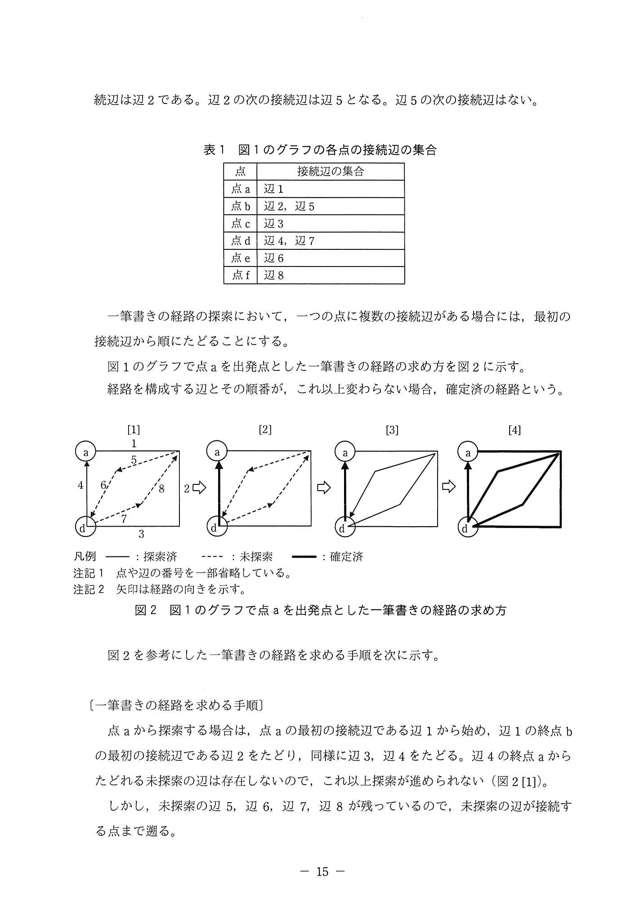

テキスト (OCR)

続辺は辺 2 CHS, 辺 2 の次の接続辺は辺 5 となる。 US の次の接続辺はない。

表1 図1のグラフの各点の接続辺の集合

点      接続辺の集合
点a | 辺1

rib | 辺2, 辺5

Fic | 辺3

点d|辺4 7

点e  6

点f  8

SS

一筆書きの経路の探索において, 一つの点に複数の接続辺がある場合には, 最初の
接続辺から順にたどることにする。

図1のグラフで点 a を出発点とした一筆書きの経路の求め方を図 2 に示す。

経路を構成する辺とその順番が, これ以上変わらない場合, 確定済の経路という。

1]                 [2]                [3]               [4]
er     a               a
lan    ra
ae a
ー        d
凡例 —— :探索済    ーーー :未探索 一 : 確定済

注記1 点や辺の番号を一部省略している。
注記 2 矢印は経路の向きを示す。

図2 図1のグラフで点 a を出発点とした一筆書きの経路の求め方

ir

2 を参

vu

考にした一筆書きの経路を求める手順を次に示す。

(一筆書きの経路を求める手順]

点 a から探索する場合は, Ra の最初の接続辺である辺 1 から始め, 辺 1の終点b
の最初の接続辺である辺 2 をたどり, 同様に辺 3 辺4 をたどる。辺 4 の終点a から
たどれる未探索の辺は存在しないので, これ以上探索が進められない (図 2 [11)。

しかし, ARROW 5, 辺 6, 辺 7, 辺 8 が残っているので, 未探索の辺が接続す

ー 15 一

### ページ 16

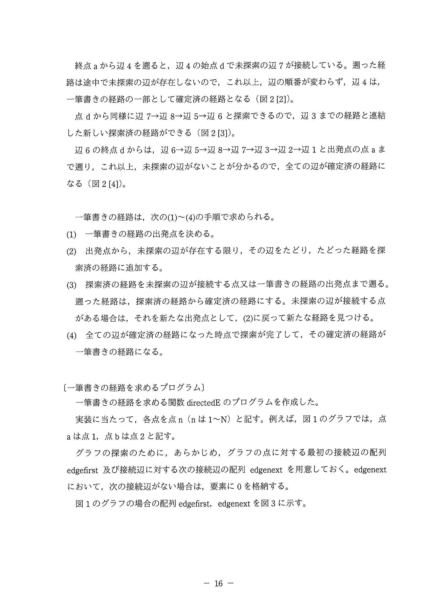

テキスト (OCR)

終点 a から辺 4 を遡ると, 辺4の始点dで未探索の辺 7 が接続している。遡つた経
路は途中で未探索の辺が存在しないので, これ以上, 辺の順番が変わらず, 辺 4は,
一筆書きの経路の一部として確定済の経路となる (図2[2])。

点d から同様に辺 7つ辺 8つ辺 5つ辺 6 と探索できるので, 辺 3 までの経路と連結
した新しい探索済の経路ができる (図2[31])。

辺 6 の終点dからは, 辺 6つ辺 5つ辺 8つ辺 7つ辺 3つ辺 2つ辺 1 と出発点の点 a ま
CHD, これ以上, 未探索の辺がないことが分かるので, 全ての辺が確定済の経路に
なる (図2[4])。

一筆書きの経路は, 次の]①)~(④の手順で求められる。

(1) 一筆書きの経路の出発点を決める。

Q) 出発点から, 未探索の辺が存在する限り, その辺をたどり, たどった経路を探
索済の経路に追加する。

3) 探索済の経路を未探索の辺が接続する点又は一筆書きの経路の出発点まで遡る。
遡った経路は, 探索済の経路から確定済の経路にする。未探索の辺が接続する点
がある場合は, それを新たな出発点として, (2②)に戻って新たな経路を見つける。

4) 全ての辺が確定済の経路になった時点で探索が完了して, その確定済の経路が
一筆書きの経路になる。

(一筆書きの経路を求めるプログラム]〕

一筆書きの経路を求める関数 directedE のプログラムを作成した。

実装に当たって, 各点を点n (nは1てN) と記す。例えば, 図 1のグラフでは, 点
a は点 1, 点bは点 2 と記す。

グラフの探索のために, あらかじめ, グラフの点に対する最初の接続辺の配列
edgefirst 及び接続辺に対する次の接続辺の配列 edgenext を用意しておく。 edgenext
において, 次の接続辺がない場合は, 要素に 0 を格納する。

 1のグラフの場合の配列 edgefirst, edgenext を図 3 に示す。

ー 16 一

### ページ 17

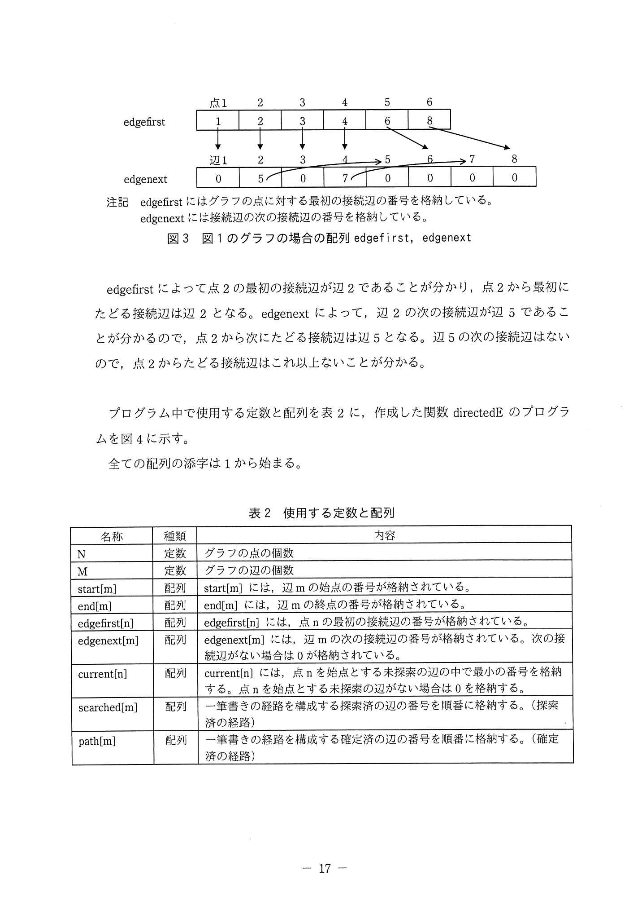

テキスト (OCR)

LTLm La
TS

__ 6 >7   8
トラント  o | o | o |
注記 edgefirst にはグラフの点に対する最初の接続辺の番号を格納している。

edgenext には接続辺の次の接続辺の番号を格納している。

M3 図1のグラフの場合の配列 edgefirst, edgenext

edgefirst          |      1      |

w 一上上Co | CO

ュー |
Ko Fb |]

A

edgenext         |      0      |

edgefirst によって点 2 の最初の接続辺が辺 2 であることが分かり, 点2 から最初に
たどる接続辺は辺 2 となる。 edgenext によって, 辺 2 の次の接続辺が辺 5 であるこ
とが分かるので, 点 2 から次にたどる接続辺は辺 5 となる。 辺 5 の次の接続辺はない
OC, 点 2 からたどる接続辺はこれ以上ないことが分かる。

プログラム中で使用する定数と配列を表 2 に, 作成した関数 directedE のプログラ
ムを図 4 に示す。

全ての配列の添字は 1 から始まる。

表2 使用する定数と配列

名称          種類                                               内容
N                        定数 | グラフの点の個数
M                  定数 | グラフの辺の個数
start[m]             配列 | startlm] には, 辺mの始点の番号が格納されている
end[m]             配列 | end[m] には, 辺 m の終点の番号が格納されている。

edgefirst[n]            配列 | edgefirstln] には, 点n の最初の接続辺の番号が格納されている。

edgenext[m]      配列 | edgenext[m] には, 辺mの次の接続辺の番号が格納されている。 KOK
続辺がない場合は 0 が格納されている

current[n]            配列 | currentIn] には, Ain を始点とする未探索の辺の中で最小の番号を格納
FS, An を始点とする未探索の辺がない場合は 0 を格納する。

searched[m]       配列 | 一筆書きの経路を構成する探索済の辺の番号を順番に格納する。 (探索
済の経路)

path[m]             配列 | 一筆書きの経路を構成する確定済の辺の番号を順番に格納する。 (確定
済の経路)

ー 1 ー

### ページ 18

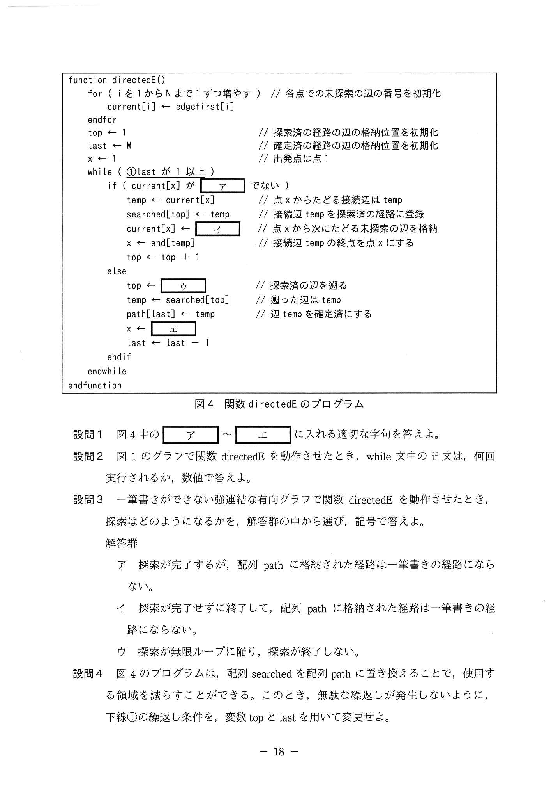

テキスト (OCR)

function directedE()
for (ijを1からNまで 1 ずつ増やす ) // 各点での未探索の辺の番号を初期化
current[i] <— edgefirst[i]

endfor

topで1                    // 探索済の経路の辺の格納位置を初期化
last でM                   // 確定済の経路の辺の格納位置を初期化
xで1                     // 出発点は点 1

while (①last が1以上)
if ( current[x] が でない )
temp で current[x]         // 点x からたどる接続辺は temp
searched[top] < temp    // 接続辺 temp を探索済の経路に登録
current[x] で   // 点x から次にたどる未探索の辺を格納

x end[temp]          // 接続辺 temp の終点を点 x にする
top と top + 1
else
top て        // 探索済の辺を遡る
temp < searched[top]    // 遡った辺は temp
path[ last] < temp      // 辺 temp を確定済にする

x“ [Ta]

last < last 一 1
endif
endwhile
endfunction

図4 関数directedE のプログラム

設問1 図4中の| ア |~| xs |に入れる適切な字句を答えよ。
設問 2 1 のグラフで関数 directedE を動作させたとき, while 文中の if cit, 何回
実行されるか, 数値で答えよ。
設問3 一筆書きができない強連結な有向グラフで関数 directedE を動作させたとき,
探索はどのようになるかを, 解答群の中から選び, 記号で答えよ。
解答群
ア 探索が完了するが, 配列 path に格納された経路は一筆書きの経路になら
ない。
イ 探索が完了せずに終了して, 配列 path に格納された経路は一筆書きの経
路にならない。
ウ 探索が無限ループに陥り, 探索が終了しない。
設問4 4 のプログラムは, 配列 searched を配列 path に置き換えることで, 使用す
る領域を減らすことができる。このとき, 無駄な繰返しが発生しないように,
下線〇の繰返し条件を, 変数top とlast を用いて変更せよ。

ー 18 一

### ページ 19

テキスト (OCR)

〔

メ モ 用 紙 J

ー 19 一

### ページ 20

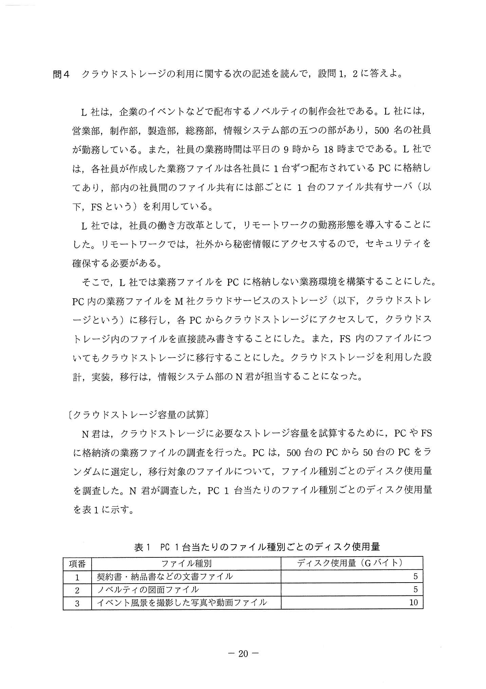

テキスト (OCR)

問4 クラウドストレージの利用に関する次の記述を読んで, 設問 1, 2 に答えよ。

L 社は, 企業のイベントなどで配布するノベルティの制作会社である。 L 社には,
営業部, 制作部, 製造部, 総務部, 情報システム部の五つの部があり, 500 名の社員
が勤務している。また, 社員の業務時間は平日の 9 時から 18 時までである。L 社で
は, 各社員が作成した業務ファイルは各社員に 1 台ずつ配布されている PC に格納し
CH), 部内の社員間のファイル共有には部ごとに 1 台のファイル共有サーバ (以
下, FS という) を利用している。

L 社では, 社員の働き方改革として, リモートワークの勤務形態を導入することに
した。リモートワークでは, 社外から秘密情報にアクセスするので, セキュリティを
確保する必要がある。

そこで, L 社では業務ファイルを PC に格納しない業務環境を構築することにした。
PC 内の業務ファイルを M 社クラウドサービスのストレージ (以下, クラウドストレ
ージという) に移行し, 各 PC からクラウドストレージにアクセスして, クラウドス
トレージ内のファイルを直接読み書きすることにした。また, FS 内のファイルにつ
いてもクラウドストレージに移行することにした。クラウドストレージを利用したき
計, 実装, 移行は, 情報システム部の N 君が担当することになった。

[クラウドストレージ容量の試算〕

N 君は. クラウドストレージに必要なストレージ容量を試算するために, PCやFS
に格納済の業務ファイルの調査を行った。PC は, 500 台の PC から 50 台の PC をラ
ンダムに選定し, 移行対象のファイルについて, ファイル種別ごとのディスク使用量
を調査した。N 君が調査した, PC 1 台当たりのファイル種別ごとのディスク使用量
を表 1 に示す。

表1 PC 1台当たりのファイル種別ごとのディスク使用量
項番          ファイル種別           ディスク使用量 (G バイト)
契約書・納品書などの文書ファイル
ノベルティの図面ファイル
イベント風景を撮影した写真や動画ファイル                 10

ー 20 一

### ページ 21

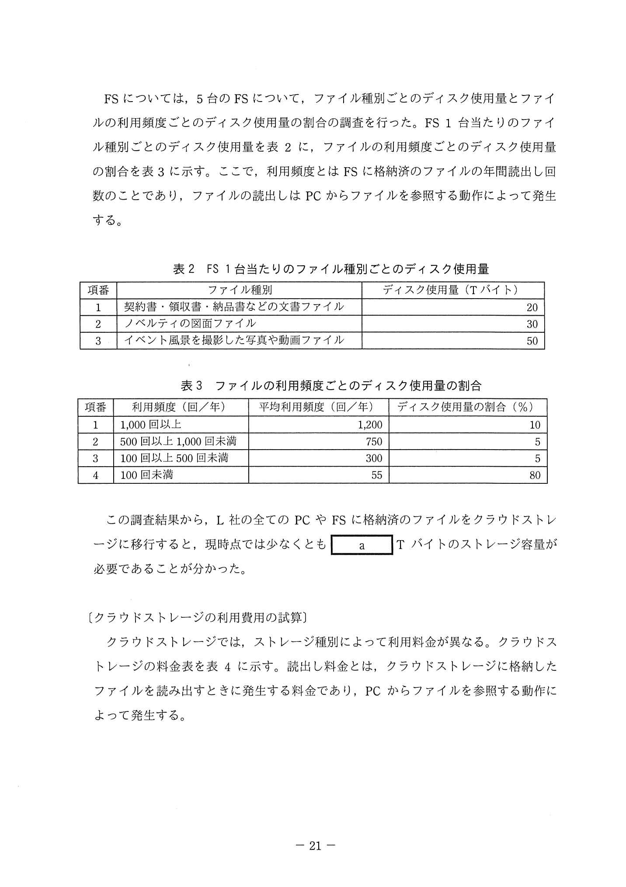

テキスト (OCR)

FS については, 5 台の FS について, ファイル種別ごとのディスク使用量とファイ
ルの利用頻度ごとのディスク使用量の割合の調査を行った。EFS 1 台当たりのファイ
ル種別ごとのディスク使用量を表 2 に, ファイルの利用頻度ごとのディスク使用量
の割合を表 3 に示す。ここで, 利用頻度とは FS に格納済のファイルの年間読出し回
数のことであり, ファイルの読出しは PC からファイルを参照する動作によって発生
する。

表 2 FS 1台当たりのファイル種別ごとのディスク使用量

項番            ファイル種別             ディスク使用量 (T バイト)

1 | 契約書・領収書・納品書などの文書ファイル                      20
2 | ノベルティの図面ファイル                                30
3   イベント風景を撮影した写真や動画ファイル                         50

表3 ファイルの利用頻度ごとのディスク使用量の割合

項番   利用頻度 (回年)    平均利用頻度 (回年) | ディスク使用量の割合 (%)
1 | 1,000 回以上                                         1,200                                  10
2 | 500 回以上 1,000 回未満                            750
3 | 100 回以上 500 回未満                               300
4 | 100 回未満                                              55                                  80

この調査結果から, L 社の全ての PC や FS に格納済のファイルをクラウドストレ
ージに移行すると, 現時点では少なくとも|  a』 |T バイトのストレージ容量が
必要であることが分かった。

[クラウドストレージの利用費用の試算〕

クラウドストレージでは, ストレージ種別によって利用料金が異なる。クラウドス
トレージの料金表を表 4 に示す。読出し料金とは, クラウドストレージに格納した
ファイルを読み出すときに発生する料金であり, PC からファイルを参照する動作に
よって発生する。

ー 21 一

### ページ 22

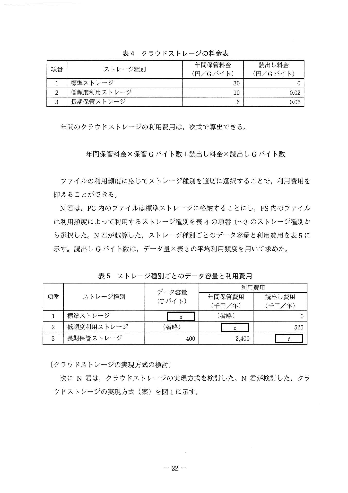

テキスト (OCR)

表4 クラウドストレージの料金表

Sn                   年間保管料金         読出し料金
ne              Gi               (貼ノGバイト) | (由ノ6バイト)
標準ストレージ                                      30                  0
低頻度利用ストレージ                                 10                0.02
長期保管ストレージ                  6        0.06

年間のクラウドストレージの利用費用は, 次式で算出できる。
年間保管料金X保管 G バイト数読出し料金X読出しGバイト数

ファイルの利用頻度に応じてストレージ種別を適切に選択することで, 利用費用を
抑えることができる。

N 君は, PC 内のファイルは標準ストレージに格納することにし, FS 内のファイル
は利用頻度によって利用するストレージ種別を表 4 の項番 1て3 のストレージ種別か
ら選択した。N 君が試算した, ストレージ種別ごとのデータ容量と利用費用を表5に
示す。読出しG バイト数は, データ量x表 3 の平均利用頻度を用いて求めた。

HS ストレージ種別ごとのデータ容量と利用費用

                  利用費用
me) | ARLE          oe | SRA | aU
(FA/#)         (千円ノ年)
1 | 標準ストレージ                  |       (省略)                     0
2 | 低頻度利用ストレージ           (省略)              525
3 | 長期保管ストレージ                    400             2,400        [| 。 |

[クラウドストレージの実現方式の検討〕
次に N Blk, クラウドストレージの実現方式を検討した。N 君が検討した, クラ

ウドストレージの実現方式 (案) を図 1 に示す。

ー 22 一

### ページ 23

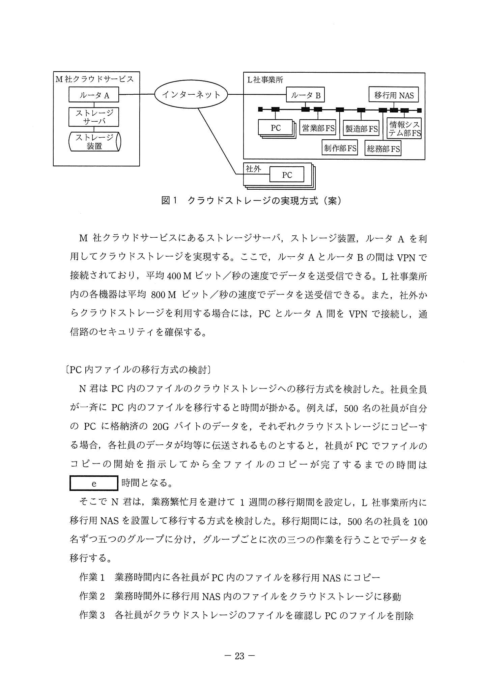

テキスト (OCR)

M社クラウドサービス

LASSER
ルータ A            =>    トーーーー |ルータ |           | waar Nas |

ストレージ
サーバ

Cm

1

情報シス

[_pc_|}[mseenrs] | [aus] | | ERE 2

図1 クラウドストレージの実現方式 (案)

M 社クラウドサービスにあるストレージサーバ, ストレージ装置, ルータ A を利
用してクラウドストレージを実現する。ここで, ルータ A とルータ B の間は VPN で
接続されており, 平均 400M ビットノ秒の速度でデータを送受信できる。 社事業所
内の各機器は平均 800M ビットノ秒の速度でデータを送受信できる。また, 社外か
らクラウドストレージを利用する場合には, PC とルータ A 間を VPN で接続し, 通
信路のセキュリティを確保する。

[PC 内ファイルの移行方式の検討〕

N 君は PC 内のファイルのクラウドストレージへの移行方式を検討した。 社員全員
が一斉に PC 内のファイルを移行すると時間が掛かる。例えば, 500 名の社員が自分
の PC に格納済の 20G バイトのデータを, それぞれクラウドストレージにコピーす
る場合, 各社員のデータが均等に伝送されるものとすると, 社員が PC でファイルの
コピーの開始を指示してから全ファイルのコピーが完了するまでの時間は
| < | 時間となる。

そこで N 君は, 業務繁忙月を避けて 1 週間の移行期間を設定し, L 社事業所内に
移行用 NAS を設置して移行する方式を検討した。移行期間には, 500 名の社員を 100
名ずつ五つのグループに分け, グループごとに次の三つの作業を行うことでデータを
移行する。

作業1 業務時間内に各社員がPC 内のファイルを移行用 NAS にコピー

作業2 業務時間外に移行用 NAS 内のファイルをクラウドストレージに移動

作業3 各社員がクラウドストレージのファイルを確認し PC のファイルを削除

ー 23 一

### ページ 24

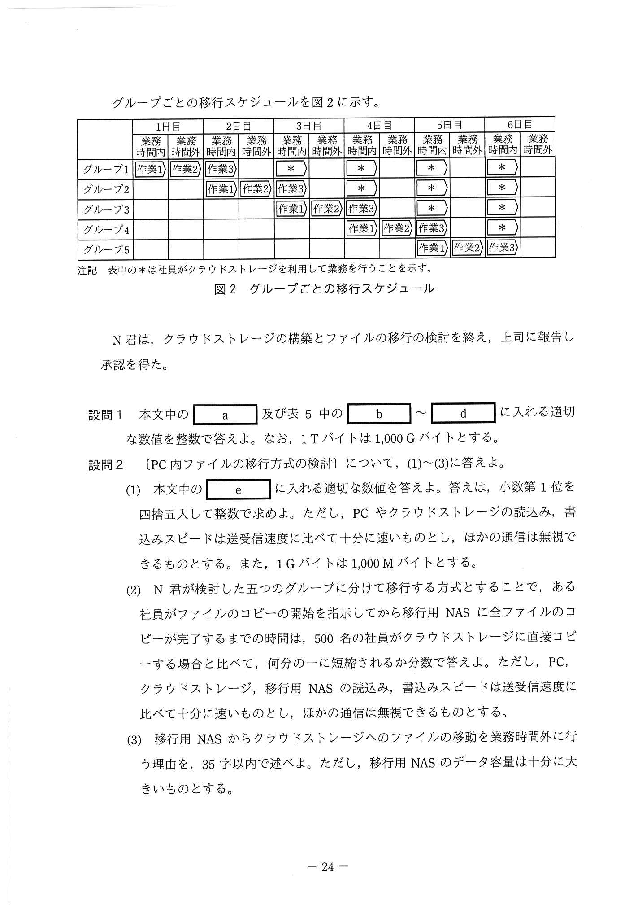

テキスト (OCR)

グループごとの移行スケジュールを図 2 に示す。

1日目      2日目      3日目      4日目      5日目      6日目
時間内| 時間外| 時間内| 時間外| 時間内| 時間外| 時間内|時間外| 時間内| 時間外[ 時間内|時間外
グループ1 |作業1 |作業2)|作業3)   [* )   L* )   L* )   L* )
グループ2            作業1作業2作業3)        * )        * )        * )
グループ3                      Gea >) |e)        * )        * )
グループ4                                 ERE 1)| VE 32) | EES)        * )
グループ5                                     作業1 作業3

注記 表中の*は社員がクラウドストレージを利用して業務を行うことを示す。
図2 グループごとの移行スケジュール

N 君は。 クラウドストレージの構築とファイルの移行の検討を終え, 上司に報告し
承認を得た。

設問1 本文中の| a |及び表5中の| b |~-| d |に入れる適切
な数値を整数で答えよ。なお, 1Tバイトは 1.000G バイトとする。
設問2 (PC内ファイルの移行方式の検討について, (1て(3③)に答えよ。

a 本文中の| ce | に入れる適切な数値を答えよ。答えは, 小数第 1 位を
四捨五入して整数で求めよ。ただし, PC やクラウドストレージの読込み, 書
込みスピードは送受信速度に比べて十分に速いものとし, ほかの通信は無視で
きるものとする。また, 1G バイトは1.000 M バイトとする。

Q) N 君が検討した五つのグループに分けて移行する方式とすることで, ある
社員がファイルのコピーの開始を指示してから移行用 NAS に全ファイルのコ
ピーが完了するまでの時間は, 500 名の社員がクラウドストレージに直接コピ
ーする場合と比べて, 何分の一に短縮されるか分数で答えよ。ただし, PC,
クラウドストレージ, 移行用 NAS の読込み, 書込みスピードは送受信速度に
比べて十分に速いものとし, ほかの通信は無視できるものとする。

(3) 移行用 NAS からクラウドストレージへのファイルの移動を業務時間外に行
う理由を, 35 字以内で述べよ。ただし, 移行用 NAS のデータ容量は十分に大
きいものとする。

ー 24 一

### ページ 25

テキスト (OCR)

C

メ モ 用 紙 J

ー 25 一

### ページ 26

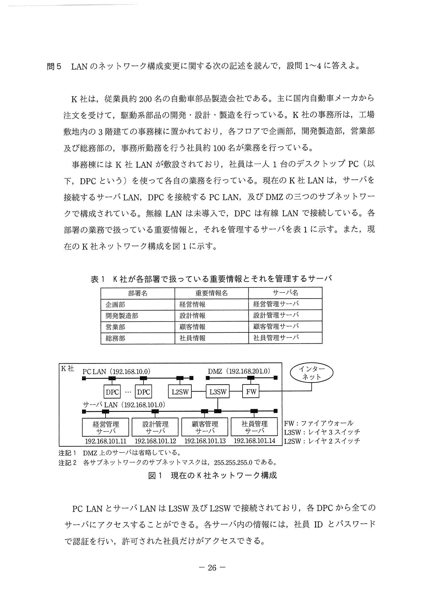

テキスト (OCR)

問5 LAN のネットワーク構成変更に関する次の記述を読んで, 設問 1ー4 に答えよ。

K 社は, 従業員約 200 名の自動車部品製造会社である。主に国内自動車メーカから
注文を受けて, 駆動系部品の開発・設計・製造を行っている。K 社の事務所は, 工場
敷地内の 3 階建ての事務棟に置かれており, 各フロアで企画部, 開発製造部, 営業部
及び総務部の, 事務所勤務を行う社員約 100 名が業務を行っている。

事務棟には K 社 LAN が敷設されており, 社員は一人 1 台のデスクトップ PC (以
下, DPC という) を使って各自の業務を行っている。現在の K 社 LAN は, サーバを
接続するサーバLAN, DPC を接続する PC LAN, 及び DMZ の三つのサブネットワー
クで構成されている。無線 LAN は未導入で, DPC は有線 LAN で接続している。各
部署の業務で扱っている重要情報と, それを管理するサーバを表 1 に示す。また, 現
在の K社ネットワーク構成を図 1 に示す。

表1 K社が各部署で扱っている重要情報とそれを管理するサーバ

部署名                 重要情報名                サーバ名
企画部              経営情報            経営管理サーバ
開発製造部              設計情報                 設計管理サーバ
営業部                   顧客情報                顧客管理サーバ
総務部                   社員情報                 社員管理サーバ

K社 pcLAN (192.168.10.0)             DMZ (192.168.201.0)     Cee)
[ppc] [ppc] [12sw FH xssw | rw} —J

サーバLAN (192.168.101.0)

経営管理          設計管理         meee         社員管理 | |FW : ファイアウォール
サーバ     サーバ      rs      サーバ | IL3SW : レイヤ3スイッチ

192.168.101.11 192.168.101.12 192.168.101.13 192.168.101.14 |L2SW : レイヤ 2 スイッチ
注記1 DMZ 上のサーバは人省略している。
注記 2 各サブネットワークのサブネットマスクは, 255.255.255.0 CHS,

図1 現在のK社ネットワーク構成

PC LAN とサーバLAN はL3SW 及び L2SW で接続されており, 各 DPC から全ての
サーバにアクセスすることができる。各サーバ内の情報には, 社員 ID とパスワード
で認証を行い, 許可された社員だけがアクセスできる。

ー 26 一

### ページ 27

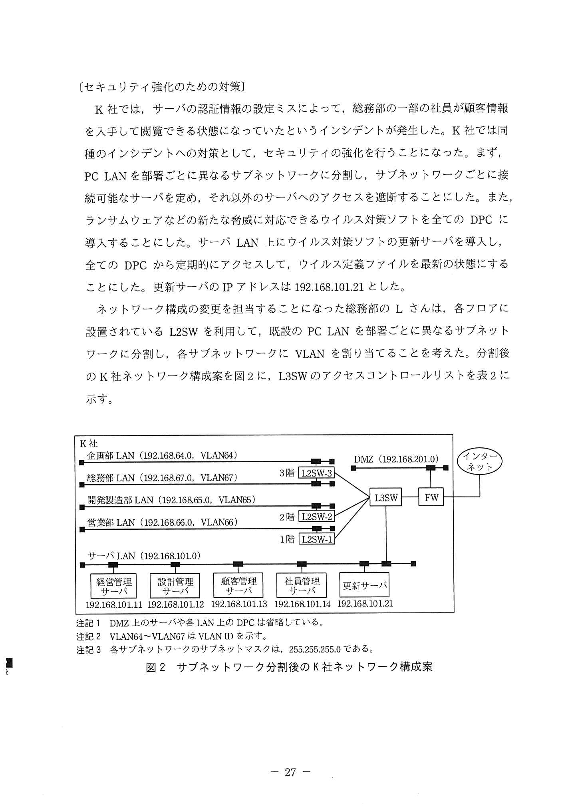

テキスト (OCR)

〔セキュリティ強化のための対策〕

K 社では, サーバの認証情報の設定ミスによって, 総務部の一部の社員が顧客情報
を入手して閲覧できる状態になっていたというインシデントが発生した。K 社では同
種のインシデントへの対策として, セキュリティの強化を行うことになった。まず,
PC LAN を部署ごとに異なるサブネットワークに分割し, サブネットワークごとに接
続可能なサーバを定め, それ以外のサーバへのアクセスを遮断することにした。また,
ランサムウェアなどの新たな暫威に対応できるウイルス対策ソフトを全ての DPC に
導入することにした。サーバ LAN 上にウイルス対策ソフトの更新サーバを導入し,
全ての DPC から定期的にアクセスして, ウイルス定義ファイルを最新の状態にする
ことにした。 更新サーバの IP アドレスは192.168.101.21 とした。

ネットワーク構成の変更を担当することになった総務部の L さんは, 各フロアに
設置されている L2SW を利用して, 既設の PC LAN を部署ごとに異なるサブネット
ワークに分割し, 各サブネットワークに VLAN を割り当てることを考えた。分割後
の K社ネットワーク構成案を図 2 に, L3SW のアクセスコントロールリストを表2に
示す。

K社
企画人 LAN (192.168.64.0, VLAN64)                 a (192.168,201.0)   ess
op S285 LAN (192.168.67.0,_ VLAN67)      3階 L2SW-3

 開発製造部LAN (192.168.65.0, VLAN65)

meee LAN (192.168.66.0, VLAN66)

サーバLAN (192.168.101.0)

galery         ta          pi          にta         更新サーバ

192.168.101.11 192.168.101.12 192.168.101.13 192.168.101.14 192.168.101.21

注記1 DMZ 上のサーバや各 LAN 上の DPC は省略している。
注記 2 VLAN64~VLANG67 は VLAN ID を示す。
注記 3 各サブネットワークのサブネットマスクは, 255.255.255.0 である。

図2 サブネットワーク分割後の K 社ネットワーク構成案

ー 27 一

### ページ 28

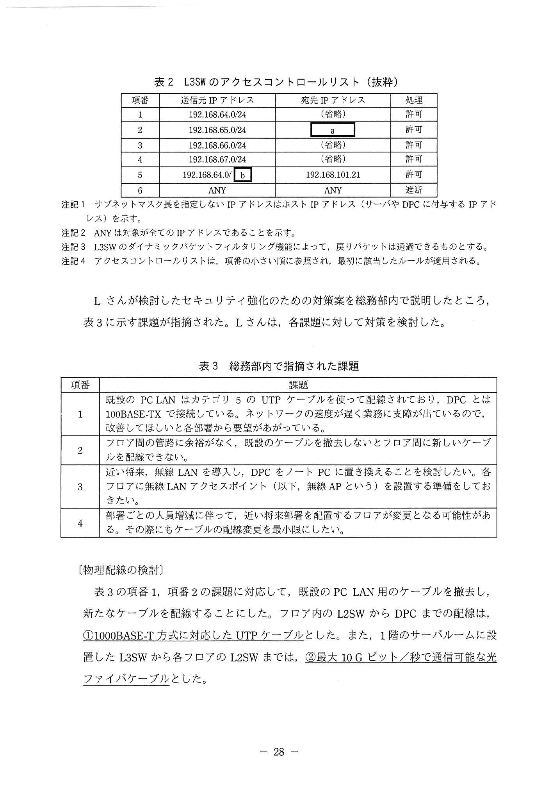

テキスト (OCR)

表 2 L3SWMのアクセスコントロールリスト GRE)

項番      送信元 P アドレス         宛先TP アドレス        処理

1            192.168.64,0/24                   (省略)                許可

2            192.168.65.0/24                |     a     |             許可

3            192.168.66.0/24                   (省略)                許可

4            192.168.67.0/24                   (省略)                許可

5           192.168.64.0/[ |              192.168.101.21            許可
注記1 サブネットマスク長を指定しない IP アドレスはホスト IP アドレス (サーバや DPC に付与する IP アド

レス) を示す。

注記 2 ANY は対象が全ての IP アドレスであることを示す。
注記 3 L3SW のダイナミックパケットフィルタリング機能によって, 戻りパケットは通過できるものとする。
注記4 アクセスコントロールリストは, 項番の小さい順に参照され, 最初に該当したルールが適用される。

L さんが検討したセキュリティ強化のための対策案を総務部内で説明したところ,

表 3 に示す課題が指摘された。L さんは, 各課題に対して対策を検討した。

表3 総務部内で指摘された課題
項番                                     課題
既設の PCLAN はカテゴリ 5 の UTP ケーブルを使って配線されており, DPC とは
1    100BASE-TX で接続している。ネットワークの速度が遅く業務に支障が出ているので,
改善してほしいと各部署から要望があめがっている。
‘  フロア間の管路に余裕がなく, 既設のケーブルを撤去しないとフロア間に新しいケーブ
ルを配線できない。
近い将来, 無線 LAN を導入し, DPC をノート PC に置き換えることを検討したい。各
3  フロアに無線 LAN アクセスポイント (以下, 無線 AP という) を設置する準備とそしてお
きたい。
4    部署ごとの人員増減に伴って, 近い将来部署を配置するフロアが変更となる可能性があ
る。その際にもケーブルの配線変更を最小限にしたい。
(物理配線の検討〕

表 3 の項番1, 項番2 の課題に対応して, 既設の PC LAN 用のケーブルを撤去し,

新たなケーブルを配線することにした。フロア内の L2SW から DPC までの配線は,
①1000BASE-T 方式に対応した UTP ケーブルとした。 また, 1 階のサーバルームに設

ia

した L3SW から各フロアの L2SW までは, OA 10G ビットノ秒で通信可能な光

ファイバケーブルとした。

ー 28 一

### ページ 29

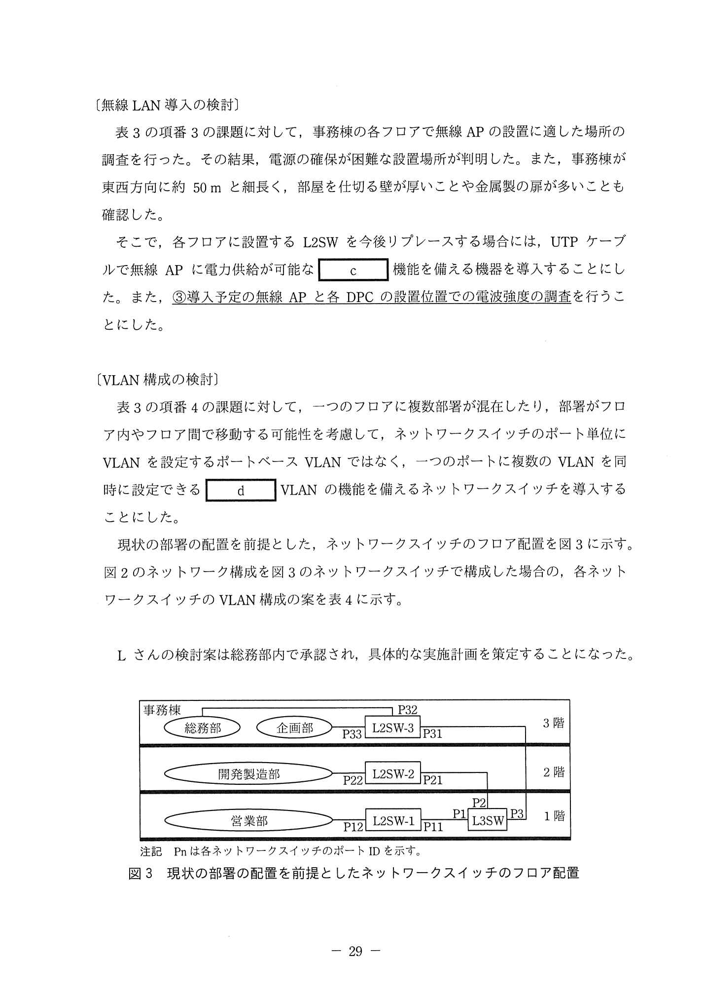

テキスト (OCR)

無線 LAN 導入の検討〕
表 3 の項番 3 の課題に対して, 事務棟の各フロアで無線 AP の設置に適した場所の

調査を行った。その結果, 電源の確保が困難な設置場所が判明した。また, 事務棟が
東西方向に約 50m と細長く, 部屋を仕切る壁が厚いことや金属製の扉が多いことも
確認した。

そこで, 各フロアに設置する L2SW を今後リプレースする場合には, UTP ケーブ

ルで無線 AP に電力供給が可能な 機能を備える機器を導入することにし
た。また, 導入予定の無線 AP と各 DPC の設置位置での電波強度の調査を行うこ

とにした。

(VLAN 構成の検討]
表 3 の項番 4 の課題に対して, 一つのフロアに複数部署が混在したり, 部署がフロ

ア内やフロア間で移動する可能性を考慮して, ネットワークスイッチのポート単位に
VLAN を設定するポートベース VLAN ではなく, 一つのポートに複数の VLAN を同
時に設定できる|  q | VLAN の機能を備えるネットワークスイッチを導入する

ごとしした。
現状の部署の配置を前捉とした, ネットワークスイッチのフロア配置を図 3 に示す。

図 2 のネットワーク構成を図 3 のネットワークスイッチで構成した場合の, 各ネット
ワークスイッチの VLAN 構成の案を表 4 に示す。

L さんの検討案は総務部内で承認され, 具体的な実施計画を策定することになった。

                  ト                                                    3階
総務部 つ て 企画部 つーaal Lesw-s pa
ヌ  tf                                            ib
開発製造部        pzzLL2SW-2 jpzT             2階
P2
 piaLL2SW 1L3SWT 1

注記 Pnは各ネットワークスイッチのポート ID を示す。
図3 現状の部署の配置を前提としたネットワークスイッチのフロア配軒

ー 29 一

### ページ 30

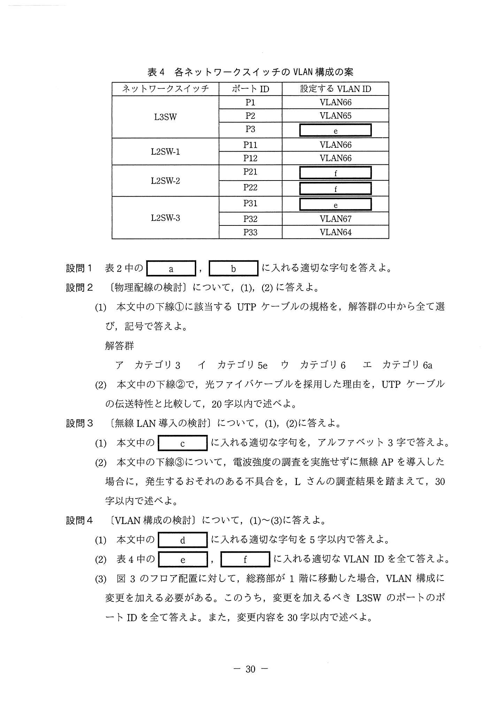

テキスト (OCR)

表4 各ネットワークスイッチの VLAN 構成の案

ネットワークスイッチ    ポート ID     設定する VLAN ID
Pl                     VLAN66
L3SW                      P2                     VLAN65

PS    に 4d
Pl1                    VLAN66
DSW                    P12                    VLAN66

L2SW-2

P22             | : |
L2SW-3                    P32                    VLAN67
P33                    VLAN64

設問1 表2中の| 』 |,|  b | に入れる適切な字句を答えよ。

設問2 [物理配線の検討について, (①⑪, ②) に答えよ。
QQ) 本文中の下線①に該当する UTP ケーブルの規格を, 解答群の中から全て選
び, 記号で答えよ。
解答
ア カテゴリ3 イ カテゴリ5e ウ カテゴリ6 エ AFA Ea
(2) 本文中の下線②@で, 光ファイバケーブルを採用した理由を, UTP ケーブル
の伝送特性と比較して, 20 字以内で述べよ。
設問3 (RAR LAN 導入の検討) について, Q①⑪, ②⑫②に答えよ。
Q①) 本文中の| c | に入れる適切な字句を, アルファベット 3 字で答えよ。
(2) 本文中の下線@について, 電波強度の調査を実施せずに無線 AP を導入した
場合に, 発生するおそれのある不具合を, L さんの調査結果を踏まえて, 30
設問4 〔VLAN構成の検討) について, ①~て(3③)に答えよ。
a) 本文中の| a |] に入れる適切な字句を5字以内で答えよ。
2) 表4中の| ec |,|  f |に入れる適切な VLAN ID を全て答えよ。
(3) 3 のフロア配置に対して, 総務部が 1 階に移動した場合, VLAN 構成に
変更を加える必要がある。このうち, 変更を加えるべき L3SW のポートのポ
ート ID を全て答えよ。また, 変更内容を 30 字以内で述べよ。

ト

uly

Ee

ー 30 一

### ページ 31

テキスト (OCR)

〔

メ = 用 紙 J

ー 31 一

### ページ 32

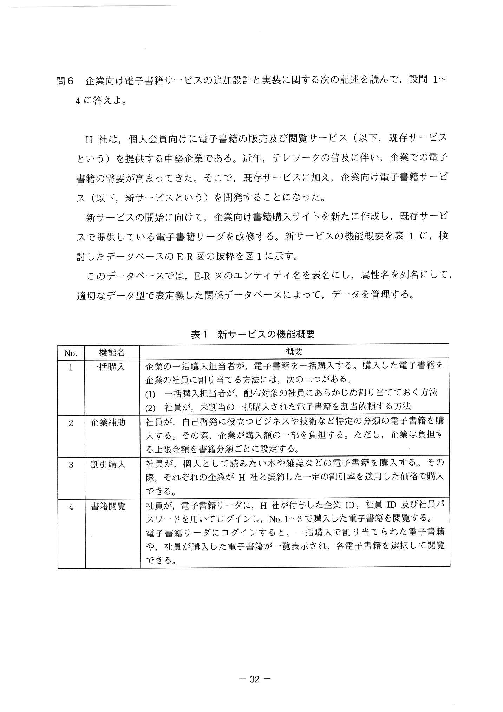

テキスト (OCR)

問6 企業向け電子書籍サービスの追加設計と実装に関する次の記述を読んで, 設問 1ご

4 に答えよ。

H 社は, 個人会員向けに電子書籍の販売及び閲覧サービス (以下, 既存サービス
という) を提供する中堅企業である。 近年, テレワークの普及に伴い, 企業での電子
書籍の需要が高まってきた。そこで, 既存サービスに加え, 企業向け電子書籍サービ
ス (以下, 新サービスという) を開発することになった。

新サービスの開始に向けて, 企業向け書籍購入サイトを新たに作成し, 既存サービ
スで提供している電子書籍リーダを改修する。新サービスの機能概要を表 1 に, 検
討したデータベースの ER 図の抜粋を図 1 に示す。

このデータベースでは, E-R 図のエンティティ名を表名にし, 属性名を列名にして,
適切なデータ型で表定義した関係データベースによって, データを管理する。

表1 新サービスの機能概要
No.   機能名                     概要
1 | 一括購入 | 企業の一括購入担当者が, 電子書籍を一括購入する。購入した電子書籍を
企業の社員に割り当てる方法には, 次の二つがある。
(QQ) 一括購入担当者が, 配布対象の社員にあらかじめ割り当てておく方法
(2) 社員が, 未割当の一括購入された電子書籍を割当依頼する方法
2 | 企業補助 | 社員が, 自己啓発に役立つビジネスや技術など特定の分類の電子書籍を購
入する。その際, 企業が購入額の一部を負担する。 ただし, 企業は負担す
る上限金額を書籍分類ごとに設定する。
3 | 割引購入   社員が, 個人として読みたい本や雑誌などの電子書籍を購入する。その
際,。 それぞれの企業が H 社と契約した一定の割引率を適用した価格で購入
4 | 書籍閲覧 | 社員が, 電子書籍リーダに, H 社が付与した企業 D, 社員 ID 及び社員パ
スワードを用いてログインし, No.1~3 で購入した電子書籍を閲覧する。
電子書籍リーダにログインすると, 一括購入で割り当てられた電子書籍
や, 社員が購入した電子書籍が一覧表示され, 各電子書籍を選択して閲覧
できる。

ー 32 一

### ページ 33

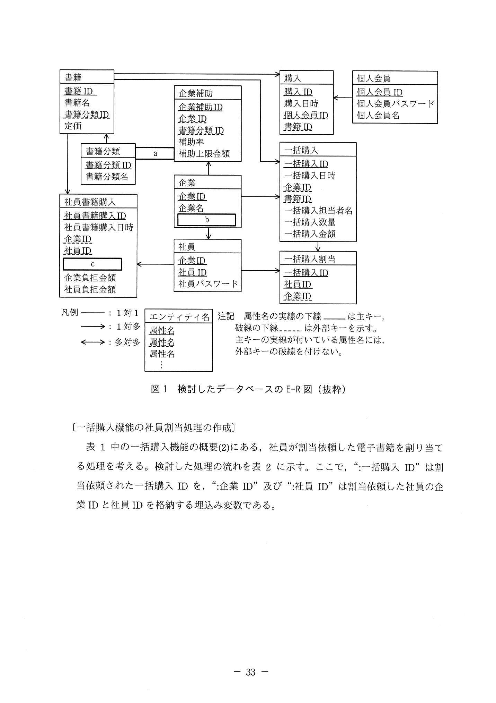

テキスト (OCR)

書籍                                                           購入                個人会員
om                          企業補助                     購入DD                   {A268 ID
書                       (eID              購入日時         個人会員パスワード
書籍分類JD                      企業                         {OAS BUD         個人会員名
rei                            #HA8UD                 BHM
il                    補助率
書籍分類          a |補助上限金額                一括購入
書籍分類D                      f                     tHE AID
書籍分類                 =                            一括購入日時
に                          企業D
社員書籍購入                  #21D                            J6350D.
業名                        一括購入担当
“LEER AID               S                             RB ABS ae
oe                                                        括購入数量
社員書籍購入日時                     T                     Z
全業D                                                          括購入金客
社員ID                         社員                                   \
                企業D
企業負担金額        PT      co
社員負担金額                     ー                          のST
企業TD
MM ——: 1対1 | エンティティ名| 注記 属性名の実線の下線        はキー,
ーータテ : 1対多  属性名               破線の下線---_- は外部キーを示す。
<ー > : 多対多 | BEX            主キーの実線が付いている属性名には,
属性名                  外部キーの破線を付けない。
図1 検討したデータベースのE-R図 (抜粋)

(一括購入機能の社員割当処理の作成〕

表 1 中の一括購入機能の概要(2)にある, 社員が割当依頼した電子書籍を割り当て
る処理を考える。 検討した処理の流れを表 2 に示す。ここで, "一括購入 ID” は割
当依頼された一括購入 ID を, “:企業 ID” 及び “:社員 ID” は割当依頼した社員の企

RID と社員 ID を格納する埋込み変数である。

ー 33 一

### ページ 34

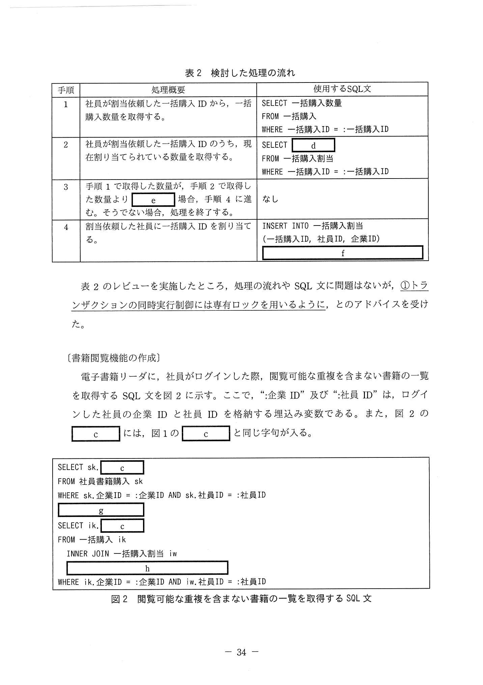

テキスト (OCR)

表2 検討した処理の流れ

手順                     処理概要                                   使用するSQL文
1 | 社員が割当依頼した一括購入 ID から, 一括 | SELECT 一括購入数量
購入数量を取得する。                  FROM 一括購入

WHERE 一括購入ID = :一括購入TD

2 | 社員が割当依頼した一括購入 D のうち, 現 | SELECT Lia |
在部り当てられている数量を取得する。  FROM 一括購入割当
WHERE 一括購入ID = :一括購入ID

3 | 手順 1 で取得した数量が, 手順 2 で取得し
た数量より|  e 場合,手順 4に進| なし
む。そうでない場合, 処理を終了する。

4 | 割当依頼した社員に一括購入 ID を割り当て | INSERT INTO 一括購入割当
る。                        (一括購入D, 社員ID, 企業ID)

|            f

表 2 のレビューを実施したところ, 処理の流れや SQL 文に問題はないが, ①トラ
ンザクションの同時実行制御には専有ロックを用いるように, とのアドバイスを受け
た。

[書籍閲覧機能の作成]

電子書籍リーダに, 社員がログインした際, 閲覧可能な重複を含まない書籍の一覧
を取得する SQL 文を図 2 に示す。ここで, “:企業 ID” 及び “HB ID” Ik, ログイ
ンした社員の企業 ID と社員 ID を格納する埋込み変数である。また, 2 の

SELECT sk.
FROM nea sk
WHERE sk.企業ID = :企業ID AND sk.社員ID = :社員ID

SELECT ik.
FROM 一括購入 ik

INNER JOIN 一括購入割当 iw

              h

WHERE ik.企業ID = :企業ID AND iw.社員ID = :社員ID

 2 閲覧可能な重複を含まない書籍の一覧を取得する SQL 文

= 34 一

### ページ 35

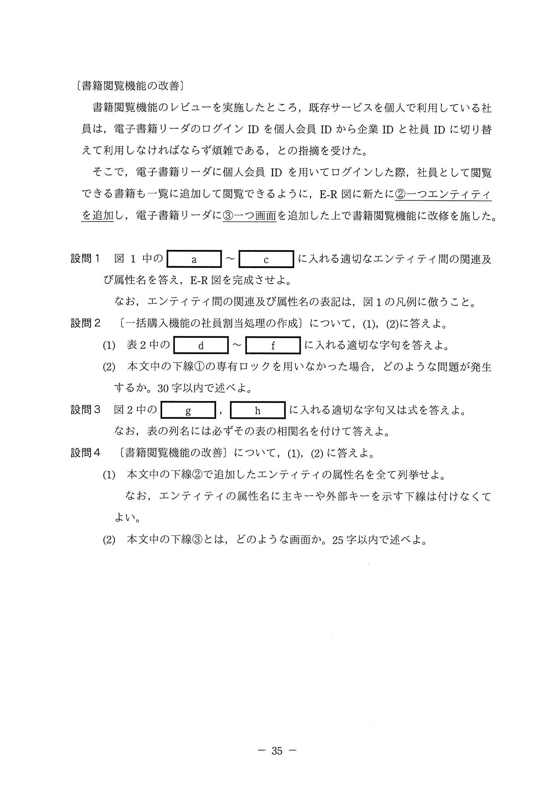

テキスト (OCR)

〔書籍閲覧機能の改善〕

書籍閲覧機能のレビューを実施したところ, 既存サービスを個人で利用している社
Alt, 電子書籍リーダのログイン ID を個人会員 ID から企業 ID と社員 ID に切り替
えて利用しなければならず燃雑である, との指摘を受けた。

そこで, 電子書籍リーダに個人会員 ID を用いてログインした際, 社員として閲覧
できる書籍も一覧に追加して閲覧できるように, E-R 図に新たに②一つエンティティ
を追加し, 電子書籍リーダに③一つ画面を追加した上で書籍閲覧機能に改修を施した。

設問1 図1 中の| a |~|  c |に入れる適切なエンティティ間の関連及
び属性名を答え, E-R 図を完成させよ。
なお, エンテイティ間の関連及び属性名の表記は, 図 1 の凡例に條うこと。
設問2 (一括購入機能の社員割当処理の作成] について, ①, ⑫に答えよ。
Q①) 表2中の| a |~| ij |に入れる適切な字句を答えよ。
2) 本文中の下線①の専有ロックを用いなかった場合, どのような問題が発生
するか。30 字以内で述べよ。
設問3 図2中の|  g |,[  』 |に入れる適切な字句又は式を答えよ。
なお, 表の列名には必ずその表の相関名を付けて答えよ。
設問4 [書籍閲覧機能の改善) について, (①, ⑫②) に答えよ。
(Ql) 本文中の下線②で追加したエンティティの属性名を全て列挙せよ。
なお, エンティティの属性名にキーや外部キーを示す下線は付けなくて
よい。
(2) 本文中の下線おとは, どのような画面か。25 字以内で述べよ。

= 35 =

### ページ 36

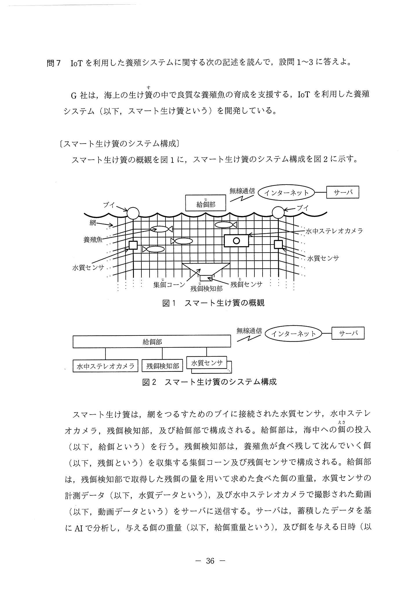

テキスト (OCR)

問 7 IoTを利用した養殖システムに関する次の記述を読んで, 設問13 に答えよ。

G 社は, 海上の生け箋の中で良質な養殖魚の育成を支援する, IoT を利用した養多
システム (以下, スマート生け徐という) を開発している。

〔【スマート生け答のシステム構成]
スマート生け管の概観を図 1 に, スマート生け和僅のシステム構成を図 2 に示す。

無線通信 シターネット    サーバ
四   at            ー

74               給餌部              ブィ

oe ell i all    1                a
@— 5
ーー   Le —x        [   =    ー水中ステレオカメラ
養殖魚-  4      っ   | O ia  L
の                             水質センサ
KB UY                            a

SAI po tsp gnag ARE SD
M1 AVY-hb#EVHOBR

無線通信                 =
ee fe           | 7 <イシターネッ   サーバ
|          |
、 | 水申ステレオカメラ | Lanes | EEZ

図2 スマート生け香のシステム構成

AV-bEWHIS, 網をつるすためのブイに接続された水質センサ, 水中ステレ
THAT, ROR, ROMA CHA NS, BMI, 海中への餌の投入
(以下, 給餌という) を行う。残餌検知部は, 養殖魚が食べ残して沈んでいく餌
(以下, BBLS) を収集する集餌コーン及び残餌センサで構成される。給餌部
は, 残餌検知部で取得した残餌の量を用いて求めた食べた餌の重量, 水質センサの
計測データ (以下, 水質データという), 及び水中ステレオカメラで撮影された動画
(以下, 動画データという) をサーバに送信する。サーバは, 薔積したデータを基
に AI で分析し, 与える餌の重量 (以下, 給餌重量という), 及び餌を与える日時 (以

ー 36 一

### ページ 37

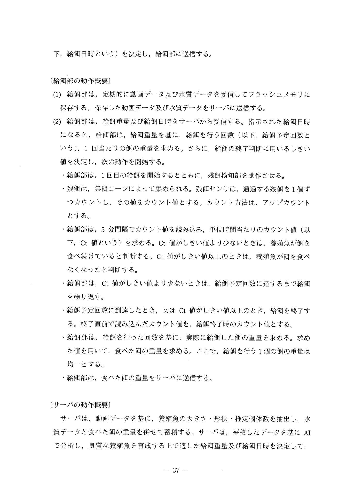

テキスト (OCR)

下, 給餌日時という) を決定し, 給餌部に送信する。

[給餌部の動作概要)

(1) 給餌部は, 定期的に動画データ及び水質データを受信してフラッシュメモリに
保存する。 保存した動画データ及び水質データをサーバに送信する。

(2) 給餌部は, 給餌重量及び給餌日時をサーバから受信する。 指示された給餌日時
になると, 給餌部は, 給餌重量を基に, 給餌を行う回数 (以下, 給餌予定回数と
WS), 1 回当たりの餌の重量を求める。さらに, 給餌の終了判断に用いるしきい
値を決定し, 次の動作を開始する。

・ 給餌部は, 1 回目の給餌を開始するとともに, 残餌検知部を動作させる。

・残餌は, 集餌コーンによって集められる。残餌センサは, 通過する残餌を 1 個ず
つカウントし, その値をカウント値とする。 カウント方法は, アップカウント
とする。

・ 給餌部は, 5 分間隔でカウント値を読み込み, 単位時間当たりのカウント値 (以
下, Ct 値という) を求める。Ct 値がしきい値より少ないときは, 養殖魚が餌を
食べ続けていると判断する。Ct 値がしきい値以上のときは, 養殖魚が餌を食べ
なくなったと判断する。

・ 給餌部は, Ct 値がしきい値より少ないときは, 給餌予定回数に達するまで給餌
を繰り返す。

・ 給餌予定回数に到達したとき, 又は Ct 値がしきい値以上のとき, 給餌を終了す
る。終了直前で読み込んだカウント値を, 給餌終了時のカウント値とする。

・ 給餌部は, 給餌を行った回数を基に, 実際に給餌した餌の重量を求める。求め
た値を用いて, 食べた餌の重量を求める。ここで, 給餌を行う 1 個の餌の重量は
均一とする。

・ 給餌部は, 食べた餌の重量をサーバに送信する。

〔サーバの動作概要)

サーバは, 動画データを基に, 養殖魚の大きさ・形状・推定個体数を抽出し, 水
質データと食べた餌の重量を併せて積する。サーバは, 次積したデータを基に AI
で分析し, 良質な養殖魚を育成する上で適した給餌重量及び給餌日時を決定して,

ー 37 一

### ページ 38

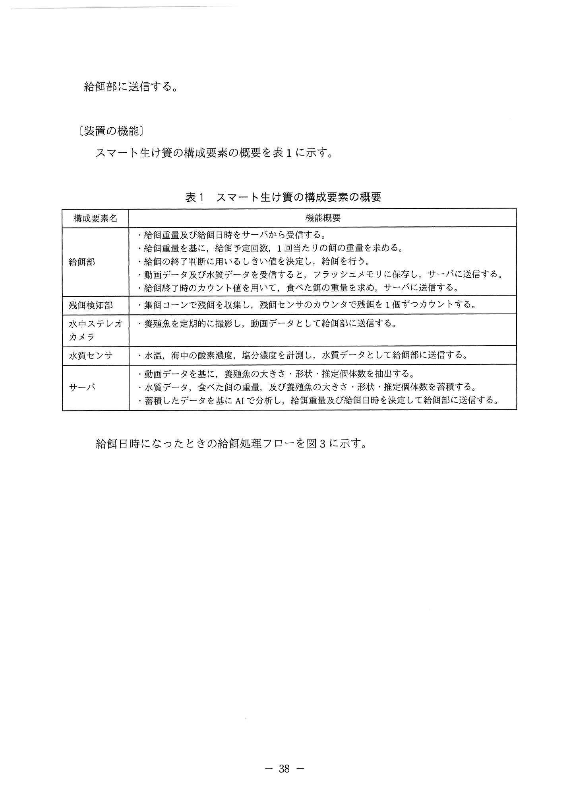

テキスト (OCR)

給伴都に送信する。

(装置の機能
スマート生け和供の構成要素の概要を表 1 に示す。

Rl スマート生け邊の構成要素の概要

構成要素名                                                                               機能概要

・ 給餌重量及び給餌日時をサーバから受信する。

・ 給餌重量を基に, 給餌予定回数, 1 回当たりの餌の重量を求める。

給餌部         ・給餌の終了判断に用いるしきい値を決定し, 給餌を行う。

・ 動画データ及び水質データを受信すると, フラッシュメモリに保存し, サーバに送信する。
・給餌終了時のカウント値を用いて, 食べた餌の重量を求め, サーバに送信する。

残餌検知部      ・集餌コーンで残餌を収集し, 残餌センサのカウンタで残餌を 1 個ずつカウントする。

水中ステレオ | ・養殖魚を定期的に撮影し, 動画データとして給餌部に送信する。
カメラ

水質センサ     ・水温海中の酸素濃度 塩分濃度を計測し, 水質データとして給餌部に送信する。
・動画データを基に, 養殖魚の大きさ・形状・推定個体数を抽出する。
サーバ          ・水質データ, 食べた餌の重量, 及び養殖魚の大きさ・形状・推定個体数を蓄積する。

・ 次積したデータを基に AI で分析し, 給個重量及び給餌日時を決定して給餌部に送信する。

給餌日時になったときの給餌処理フローを図 3 に示す。

ー 38 一

### ページ 39

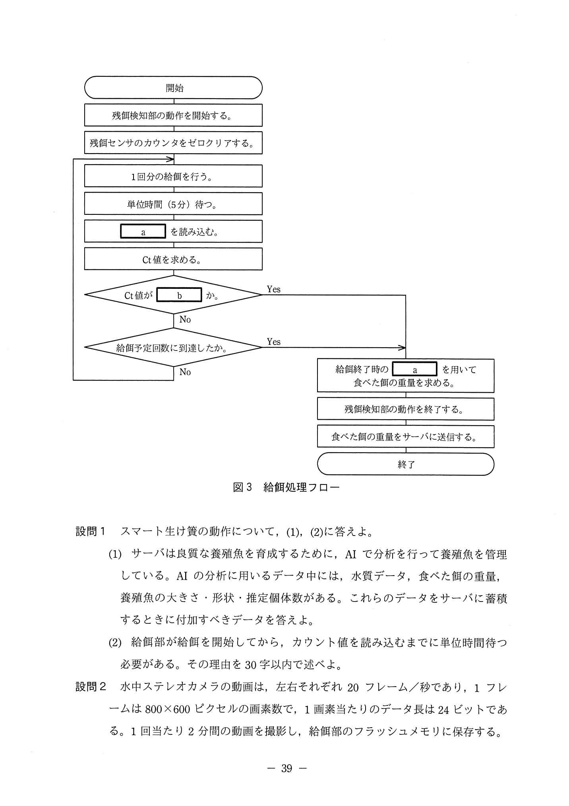

テキスト (OCR)

C                          開始                         )

it
残個検知部の動作を開始する。
I
Bie VIO AY RERIDV TTS,
SO

1回分の給餌を行う。

ルー

単位時間 (5分) 待つ。

rT

Ct値を求める。

給個終了時の |  。 | を用いて
食べた餌の重量を求める。

残餌検知部の動作を終了する。

I

食べた餌の重量をサーバに送信する。

C                  終了                 )

図3 給餌処理フロー

設問1 スマート生け供の動作について, ①, DIBA,
Q) サーバは良質な養殖魚を育成するために, AI で分析を行って養殖魚を管理
している。AI の分析に用いるデータ中には, 水質データ, 食べた餌の重量,
養殖魚の大きさ・形状・推定個体数がある。これらのデータをサーバに区積
するときに付加すべきデータを答えよ。
(2) 給餌部が給餌を開始してから, カウント値を読み込むまでに単位時間待つ
必要がある。その理由を 30 字以内で述べよ。
設問2 水中ステレオカメラの動画は, 左右それぞれ 20 フレームノ秒であり, 1 フレ
ームは 800X600 ビクセルの画素数で, 1 画素当たりのデータ長は 24 ビットであ
る。1 回当たり 2 分間の動画を撮影し, 給餌部のフラッシュメモリに保存する。

ー 39 一

### ページ 40

テキスト (OCR)

この動画データについて, ①), (2②)に答えよ。 ここで, 1G バイトテ10? バイトと

する。

Q①) 撮影 1 回当たりの動画データのサイズは, 何Gバイトか。答えは小数第1 位
を四捨五入して, 整数で求めよ。

(2) 動画データを給餌部のフラッシュメモリに保存するために, 水中ステレオ
カメラ内で行う必要がある処理は何か。ここで, 給餌部のフラッシュメモリ
の容量は 2G バイトとする。

設問3 給餌処理フローについて, ①⑪), (2②)に答えよ。

a 図3中の|  』 |,|  b |に入れる適切な字句を答えよ。

2) 養殖魚が食べた餌の重量の算出方法について, 次の式中の| c ]-
Lf | に入れる最も適切な字句を解答群の中から選び, 記号で答えよ。

ult

食べた餌の重量= (| c |x| qa ])-人| s lxl 5

解答群
ア Cet                        イ 1回当たりの餌の重量
ウ 1個の餌の重量                エ 給餌開始時のカウント値
オ 給餌終了時のカウント値         A 給餌重量
キ 給餌予定回数                   ク 給餌を行った回数

ー 40 一

### ページ 41

テキスト (OCR)

C

x = 用 紙 J

ー 41 一

### ページ 42

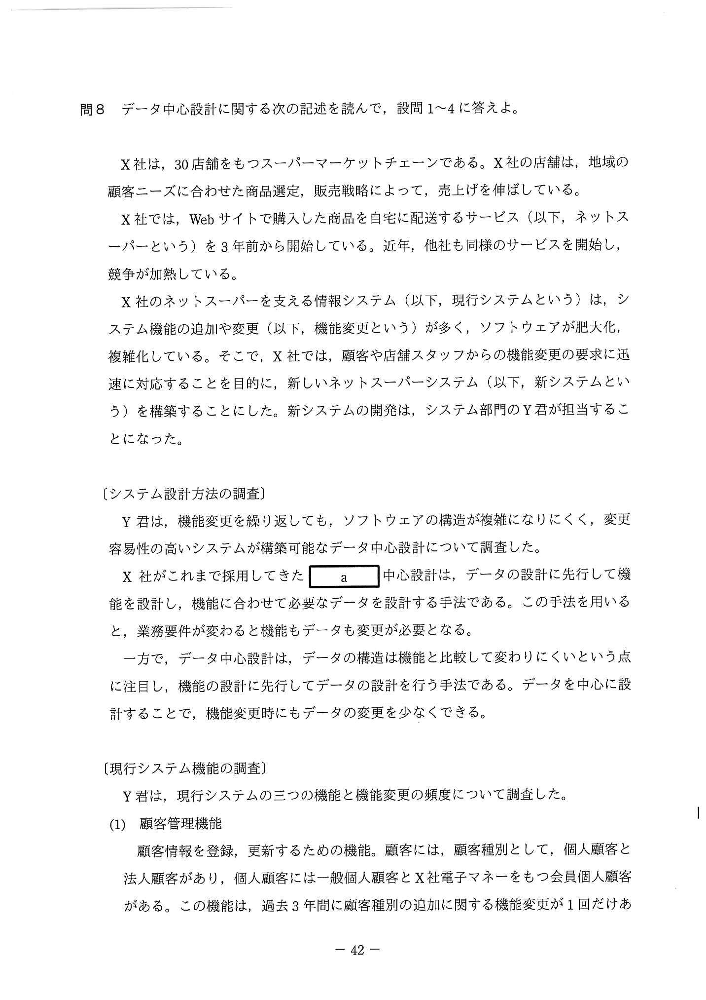

テキスト (OCR)

AS データ中心設計に関する次の記述を読んで, 設問 1ユー4 に答えよ。

X 社は, 30店舗をもつスーパーマーケットチェーンである。X社の店舗は, 地域の
顧客ニーズに合わせた商品選定, 販売戦略によって, 売上げを伸ばしている。

X 社では, Web サイトで購入した商品を自宅に配送するサービス (以下, ネットス
ーパーという) を 3 年前から開始している。近年, 他社も同様のサービスを開始し,
競争が加熱している。

X 社のネットスーパーを支える情報システム (以下, 現行システムという) は, シ
ステム機能の追加や変更 (以下, 機能変更という) が多く, ソフトウェアが肥大化,
複雑化している。そこで, X 社では, 顧客や店舗スタッフからの機能変更の要求に迅
速に対応することを目的に, 新しいネットスーパーシステム (以下, 新システムとい
う) を構築することにした。新システムの開発は, システム部門の Y 君が担当するこ

とになった。

[システム設計方法の調査

Y 君は, 機能変更を繰り返しても, ソフトウェアの構造が複雑にねりにくく, 変更
容易性の高いシステムが構築可能なデータ中心設計について調査した。

X 社がこれまで採用してきた|  。 |中心設計は, データの設計に先行して機
能を設計し, 機能に合わせて必要なデータを設計する手法である。この手法を用いる
と, 業務要件が変わると機能もデータも変更が必要となる。

一方で, データ中心設計は, データの構造は機能と比較して変わりにくいという点
に注目し, 機能の設計に先行してデータの設計を行う手法である。データを中心に設
計することで, 機能変更時にもデータの変更を少なくできる。

〔現行システム機能の調査〕
Y 君は, 現行システムの三つの機能と機能変更の頻度について調査した。
(1) 顧客管理機能
顧客情報を登録更新するための機能。顧客には, 顧客種別として, 個人顧客と
法人顧客があり, 個人顧客には一般個人顧客とX社電子マネーをもつ会員個人六客
がある。この機能は, 過去 3 年間に顧客種別の追加に関する機能変更が 1 回だけあ

ー 42 一

### ページ 43

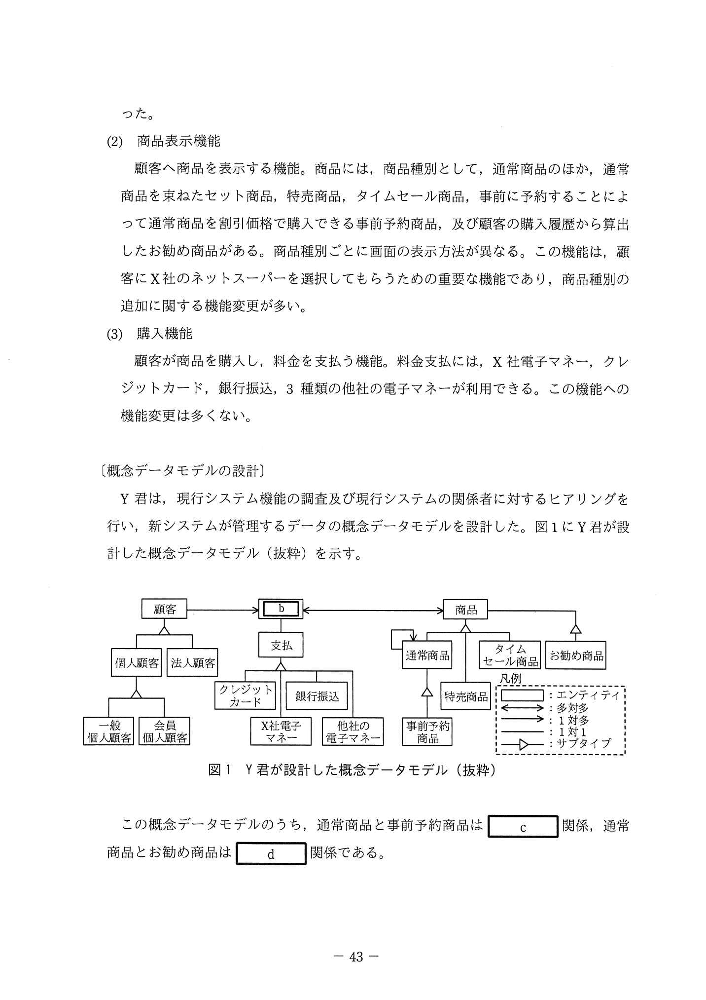

テキスト (OCR)

5た。
(2) 商品表示機能
顧客へ商品を表示する機能。商品には, 商品種別として, 通常商品のほか, 通常
商品を東ねたセット商品, 特売商品, タイムセール商品, 事前に予約することによ
って通常商品を割引価格で購入できる事前予約商品, 及び顧客の購入履歴か算出
したお和勧め商品がある。商品種別ごとに画面の表示方法が異なる。この機能は, H
客にX社のネットスーパーを選択してもらうための重要な機能であり, 商品種別の
追加に関する機能変更が多い。
(3) 購入機能
顧客が商品を購入し, 料金を支払う機能。料金支払には, X 社電子マネー, クレ
ジットカード, 銀行振込, 3 種類の他社の電子マネーが利用できる。この機能への
機能変更は多くない。

[概念データモデルの設計]

Y 君は, 現行システム機能の調査及び現行システムの関係者に対するヒアリングを
行い,新システムが管理するデータの概念データモデルを設計した。図1にY君が設
計した概念データモデル (抜粋) を示す。

に
通

pn      uae   タイム | sewn
fale | A                Pe) | | ae | ROO
i              1
クシジット||| esta             sere (Ld : エンティティ
1マー :多対多 。 !
—i | 全員       X社電子 | | 他社の | |束前予約    !    et
{til AMZ | Ais]      マネー | |電子マネー   商品    1ールセー : サプタイブ !

図1 Y君が設計した概念データモデル (抜粋)

この概念データモデルのうち, 通常商品と事前予約商品は 関係通常
商品とお勧め商品は| a |関係である。

ー 43 一

### ページ 44

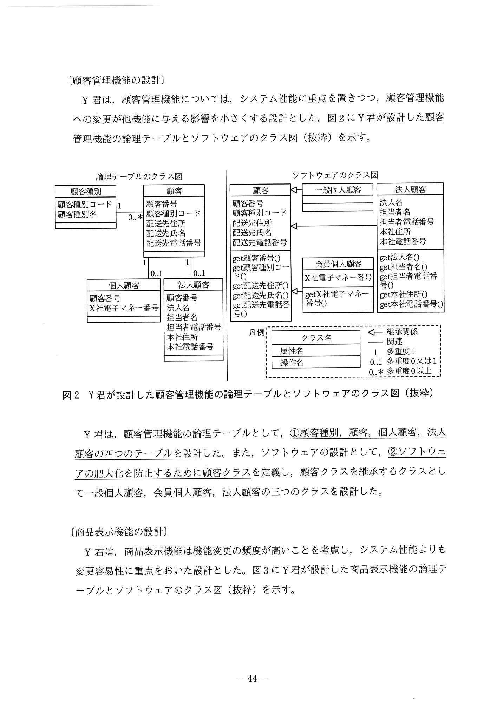

テキスト (OCR)

[顧客管理機能の設計]

Y 君は, 顧客管理機能こついては, システム性能に重点を置きつつ, 顧客管理機能
への変更が他機能に与える影響を小さくする設計とした。図 2 に Y 君が設計した願客
管理機能の論理テーブルとソフトウェアのクラス図 (抜粋) を示す。

論理テーブルのクラス図              ソフトウェアのクラス図
Eva        BE         [i <0 ec    AE
題客種別コード h   EES       EES               法人名
ELBA    ec le    願客種別コード            担当者名
配送先住所      配送先住所 し 担当者電話番号
配送先氏名      配送先氏名              本社住所
配送先電語番号    配送先電話番号            本社電話番号
gt願客番号()                            gt法人名()
Yor loa   ees tts —   BABAR |) gotta e420)
=    e    ド        Xi   ネー   中当者電話番
1a NRE     法人願客 ||| ge配送先住所   ssl oo
BEES     WEES    gt配送先氏名() "| getX社電子マネー | |get本社住所
X社電子マネー番号| |法人名            gets He Gee    番号()              中{本社電話番号())
担当者名    号0
担当者電話番号      ーーニーーーーーーーーーーーーニーーーーーーーーーェェニニュニニーーーーー1
AHR      |   クラス名    “ee |
本社電話番号      | REE,        os
| 操作名         0.1 多重度0又は1 !
に0.* 多重度0以上 |

図2 Y君が設計した顧客管理機能の論理テーブルとソフトウェアのクラス図 (抜粋)

Y 君は, 顧客管理機能の論理テーブルとして, ①顧客種別, 顧客, 個人顧客, 法人
顧客の思つのテーブルを設計した。また, ソフトウェアの設計として, ②③ソフトウェ
アの肥大化を防止するために顧客クラスを定義し, 顧客クラスを継承するクラスとし
て一般個人顧客, 会員個人顧客, 法人顧客の三つのクラスを設計した。

[商品表示機能の設計]

Y 君は, 商品表示機能は機能変更の頻度が高いことを考慮し, システム性能よりも
変更容易性に重点をおいた設計とした。図 3 に Y君が設計した商品表示機能の論理テ
ーブルとソフトウェアのクラス図 (抜粋) を示す。

ー 44 一

### ページ 45

テキスト (OCR)

論理テーブルのクラス図

ソフトウェアのクラス図

注記 商品テーブルの商品個別情報属性には

a aA        商品        商品               FLEW
商品種別コード |   商品コード    商品コード               au a
商品種別名   0 商品種別コード | | |商品種別コード            A

商品名               商品名               にーー get開始日時()
販売価格      販売価格                  gett’ T ARO
販売数量     販売数量          ーー   getill 3158()
商品説明      品説明         特売商品   下着引額O)
商品個別情報      ーーーー      ※省略      画面表示()
セット商品コード get商品コード()

get商品種別コード() | gett S150)

get 40)                 gett 5180

get販売価格()              画面表示(0)

get販売数量()                            5

ge tits BAC)      セット商品

画面表示()       ※省略       事前予約商品

a       商品一覧0    ※省略
通常商品     画面表示()    get PA)

en                                          get# 3138()

alia             ーー |画面表示()

画面表示(0)

商品種別ごとに異なる情報をまとめて格納する。
図 3 Y君が設計した商品表示機能の論理テーブルとソフトウェアのクラス図 (抜粋)

Y Bld, 商品表示機能の論理テーブルとして, ⑨特売商品テーブル, セット商品テ
ーブルなど商品種別ごとに多数のテーブルを作成するのではなく, 商品種別と商品の

二つのテーブルを作成し, 運用環境へのリリース時の作業量を低減する設計とした。
また, ソフトウェア設計としては商品クラスを定義せするとともに, ③商品種別ごとに

個別のクラスを設計した。

CORY Bld, 新システムの設計及び構築を完了させ, X 社は新システムを用いた
ネットスーパーのサービスを開始した。

ー 45 一

### ページ 46

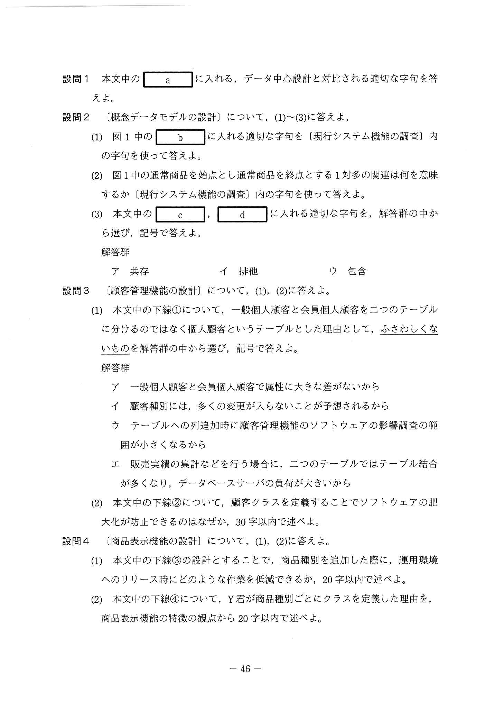

テキスト (OCR)

設問1 本文中の| a |に入れる, データ中心設計と対旨される適切な宇名を答
えよ。
設問2 [概念データモデルの設計) について, ①て(3③)に答えよ
①) 図1 中の| b |に入れる適切な字句を[現行システム機能の調査] 内
の字句を使って答えよ。
Q) 図1中の通常商品を始点とし通常商品を終点とする 1 対多の関連は何を意味
するか 【現行システム機能の調査] 内の字句を使って答えよ。

⑬) 本文中の|  。 | | a |に入れる適切な字句を, 解答群の中か
ら選び, 記号で答えよ。

解答群
ア 共存       イ 排他       ウ ae

設問3 [顧客管理機能の設計})について, (1), (②)に答えよ。
Q①) 本文中の下線のについて, 一般個人顧客と会員個人顧客を二つのテーブル

に分けるのではなく個人顧客というテーブルとした理由として, ふさわしくな
いものを解答群の中から選び, 記号で答えよ。
解答群

ア 一般個人顧客と会員個人顧客で属性に大きな差がないから
イ 顧客種別には, 多くの変更が入らないことが予想されるから
ウ テーブルへの列追加時に顧客管理機能のソフトウェアの影響調査の範
囲が小さくなるから
エエ 販売実績の集計などを行う場合に, 二つのテーブルではテーブル結合
が多くなり, データベースサーバの負荷が大きいから
⑫) 本文中の下線@②について, 顧客クラスを定義むすることでソフトウェアの肥
大化が防止できるのはなぜか, 30 字以内で述べよ。
設問4 [商品表示機能の設計) について, ①, ⑫に答えよ。
①) 本文中の下線③の設計とすることで, 商品種別を追加した際に, 運用環境
へのリリース時にどのような作業を低減できるか, 20 字以内で述べよ。
(2) 本文中の下線ぷについて, Y 君が商品種別ごとにクラスを定義した理由を,
商品表示機能の特徴の観点から 20 字以内で述べよ。

ー 46—

### ページ 47

テキスト (OCR)

〔

メ = 用 紙 J

ー 47 一

### ページ 48

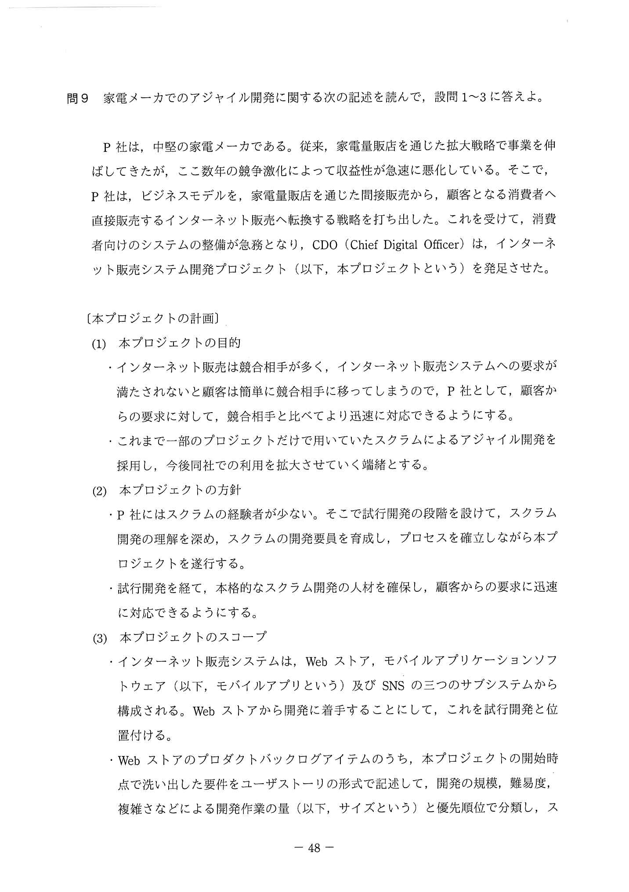

テキスト (OCR)

問9 家電メーカでのアジャイル開発に関する次の記述を読んで, 設問 1ご3 に答えよ。

P 社は, 中堅の家電メーカである。 従来, 家電量販店を通じた拡大戦略で事業を伸
ばしてきたが, ここ数年の競争激化によって収益性が急速に悪化している。そこで
P 社は, ビジネスモデルを, 家電量販店を通じた間接販売から, 顧客となる消費者へ
直接販売するインターネット販売へ転換する戦略を打ち出した。これを受けて, 消費
者向けのシステムの整備が急務となり, CDO (Chief Digital Officer) lk, インターネ
ット販売システム開発プロジェクト (以下, 本プロジェクトという) を発足させた。

〔本プロジェクトの計画〕

①)

(2)

(8)

本プロジェクトの目的

・インターネット販売は競合相手が多く, インターネット販売システムへの要求が

満たされないと顧客は簡単に競合相手に移ってしまうので, P 社として, MAM
らの要求に対して, 競合相手と比べてより迅速に対応できるようにする。

・これまで一部のプロジェクトだけで用いていたスクラムによるアジャイル開発を

採用し, 今後同社での利用を拡大させていく端緒とする。
本プロジェクトの方針

・P 社にはスクラムの経験者が少ない。そこで試行開発の段階を設けて, スクラム

開発の理解を深め, スクラムの開発要員を育成し, プロセスを確立しながら本プ
ロジェクトを遂行する。

・ 試行開発を経て, 本格的なスクラム開発の人材を確保し, 顧客からの要求に迅速

に対応できるようにする。
本プロジェクトのスコープ

・インターネット販売システムは, Web ストア, モバイルアプリケーションソフ

トウェア (以下, モバイルアプリという) 及び SNS の三つのサブシステムから
構成される。Web ストアから開発に着手することにして, これを試行開発と位
置付ける。

・Web ストアのプロダクトバックログアイテムのうち, 本プロジェクトの開始時

点で洗い出した要件をユーザストーリの形式で記述して, 開発の規模, BAR,
複雑さなどによる開発作業の量 (以下, サイズという) と優先順位で分類し, A

ー 48 一

### ページ 49

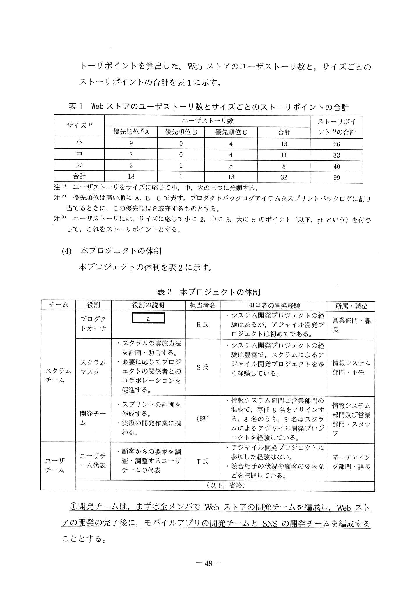

テキスト (OCR)

トーリポイントを算出した。Web ストアのユーザストーリ数と, サイズごとの

ストーリポイントの合計を表 1 に示す。

表1 Web ストアのユーザストーリ数とサイズごとのストーリポイントの合計
Sof oh 8              ユーザストーリ数        -    ストーリポイ
優先順位 9A    優先順位 B    優先順位C       合計      ント ?の合計
小      9      0      4      13      26
中       7       0       4       11       33
大       2       1       5       8       40
合計           18          1             13             32             99
SEY ユーザストーリをサイズに応じて小, 中, 大の三つに分類する。
注? 優先順位は高い順に A, B, C で表す。プロダクトバックログアイテムをスプリントバックログに割り

当てるときに,

この優先順位を厳守するものとする。

SEY ユーザストーリには, サイズに応じて小に 2, 中に 3, 大に 5 のポイント (以下, pt という) を付与
して, これをストーリポイントとする。

(44) 本プロジェクトの体制
本プロジェクトの体制を表 2 に示す。

表2 本プロジェクトの体制

FOL      役割          役割の説明        担当者名          担当者の開発経験           所属・職位
                ・ システム開発プロジェクトの経 | 。。。。 」
1   Ca]    RE | mk oA, TH+ tmET | EE 剖
ロジェクトは初めてである。
・スクラムの実施方法          ・システム開発プロジェクトの経
を計画・助言する。        験は豊富で。 スクラムによるア
スクラム | ・必要に応じてプロジ   Sk    ジャイル開発プロジェクトを多 | 情報システム
スクラム | マスタ      ェクトの関係者との    .        く経験している。             部門・主任
チーム         コラボレーションを
促進する。
スズメプリントの計画を      "情報システム部門と普業部門の| a oo
混成で, 専任 8 名をアサインす        a
開発チー   作成する。                     =         = | 部門及び営業
ds       eromnzeresecay | (PH | る。8 名のうち、3 BEATZ | eg oy
わる                  ムによるアジャイル開発プロジ  5
°                ェクトを経験している。
   +。       ・アジャイル開発プロジェクトに
ーー | rg | 多加した和験はない。        マーケティン
ene         ・ 競合相手の状況や願客の要求な | グ部門・課長
どを把握している。
(以下, 省略)

①開発チームは, まずは全メンバで Web ストアの開発チームを編成し, Web スト

アの開発の完了後にに モバイルアプリの開発チームと SNS の開発チームを編成する

こととする。

ー 49 一

### ページ 50

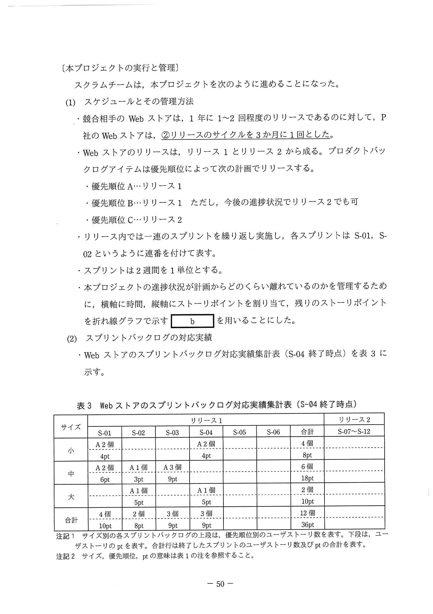

テキスト (OCR)

〔本プロジェクトの実行と管理〕
スクラムチームは, 本プロジェクトを次のように進めることになった。

①

スケジュールとその管理方法

・ 競合相手の Web ストアは, 1 年に 1へ2 回程度のリリースであるのに対して, P

社の Web ストアは, ②③リリースのサイクルを 3 か月に 1 回とした。

・Web ストアのリリースは, リリース 1 とリリース 2 から成る。プロダクトバッ

クログアイテムは優先順位によって次の計画でリリースする。

・優先順位 A…リリース 1

・優先順位 B…リリース 1 ただし, 今後の進捗状況でリリース 2 でも可
・優先順位 C…リリース 2

・リリース内では一連のスプリントを繰り返し実施し, 各スプリントは S-01, S-

02 というように連番を付けて表す。

・スプリントは2 週間を 1単位とする。
・本プロジェクトの進捗状況が計画からどのくらい離れているのかを管理するため

(2)

に, 横軸に時間, 縦軸にストーリポイントを割り当て, 残りのストーリポイント
を折れ線グラフで示す| pb | を用いることにした。
スプリントバックログの対応実績

“Web ストアのスプリントバックログ対応実績集計表 (S-04 終了時点) を表 3 に

示す。

表 3 Web ストアのスプリントバックログ対応実績集計表 (S-04 終了時点)

a                   リリース 1                     リリース 2
サイズ                                                          =
8-01     S-02     S-03     S-04     S-05     S-06     合計      S-07てS-12
| 導電 | 1 | Oe eee eee) eee                  4人個 1
      4pt                      Apt                      8pt
[Azmi [aa [asm fT TITn |
6pt      3pt      9pt                             18pt
ーー oeAo
が              5pt              5pt                      10pt
an | fee) gm fem fe
10pt      8pt      Opt      9pt                     36pt
注記1 サイズ別の各スプリントバックログの上段は, 優先順位別のユーザストーリ数を表す。 下段は, ユー

ザストーリの pt を表す。合計行は終了したスプリントのユーザストーリ数及び pt の合計を表す。
注記 2 サイズ, 優先順位, pt の意味は表 1 の注を参照すること。

— 57 —

### ページ 51

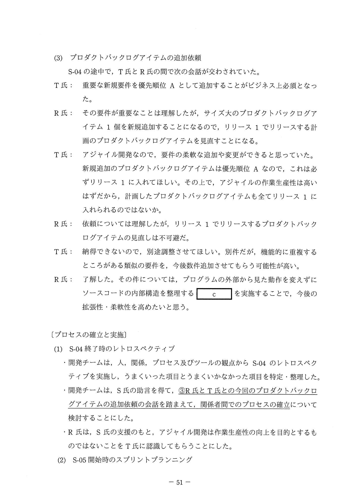

テキスト (OCR)

(3)

RE:

TUR:

R氏:

THK:

RE:

[プロ
①)

プロダクトバックログアイテムの追加依頼

S-04 の途中で, THE R 氏の間で次の会話が交わされていた。
TER:

重要な新規要件を優先順位 A として追加することがビジネス上必須となっ
た。
その要件が重要なことは理解したが, サイズ大のプロダクトバックログア
AFA 1 個を新規追加することになるので, リリース 1 でリリースする計
画のプロダクトバックログアイテムを見直すことになる。
アジャイル開発なので, 要件の柔軟な追加や変更ができると思っていた。
新規追加のプロダクトバックログアイテムは優先順位 A なので, これは必
ずリリース 1 に入れてほしい。その上で, アジャイルの作業生産性は高い
はずだから, 計画したプロダクトバックログアイテムも全てリリース 1 に
入れられるのではないか。
依頼については理解したが, リリース 1 でリリースするプロダクトバック
ログアイテムの見直しは不可避だ。
納得できないので, 別途調整させてほしい。別件だが, 機能的に重複する
ところがある類似の要件を, 今後数件追加させてもらう可能性が高い。
了解した。 その件については, プログラムの外部から見た動作を変えずに
ソースコードの内部構造を整理する を実施することで, 今後の
拡張性・柔軟性を高めたいと思う。

セスの確立と実施

S-04 終了時のレトロスペクティブ

・開発チームは, A, 関係, プロセス及びツールの観点から S-04 のレトロスペク

ティブを実施し, うまくいった項目とうまくいかなかった項目を特定・整理した。

・ 開発チームは, S 氏の助言を得て, ③R 氏とT 氏との今回のプロダクトバックロ

グアイテムの追加依頼の会話を踏まえて, 関係者間でのプロセスの確立について
検討ることにした。

・R 氏は, S 氏の支援のもと, アジャイル開発は作業生産性の向上を目的とするも

(2)

のではないことを芽氏に認識してもらうことにした。
S-05 開始時のスプリントプランニング

ー 51 一

### ページ 52

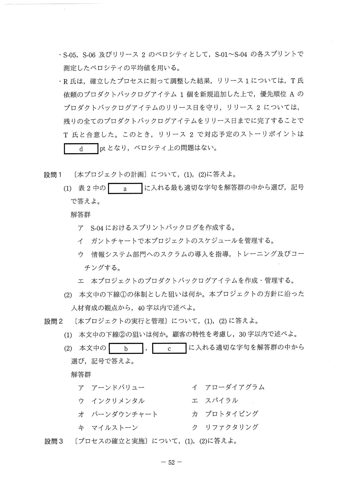

テキスト (OCR)

・S-05, S-06 及びリリース 2 のベロシティとして, S01~S04 の各スプリントで
測定したベロシティの平均値を用いる。

・R 氏は, 確立したプロセスに則って調整した結果. リリース 1 については, TK
依頼のプロダクトバックログアイテム 1 個を新規追加した上で, 優先順位 A の
プロダクトバックログアイテムのリリース日を守り, リリース 2 については,
残りの全てのプロダクトバックログアイテムをリリース日までに完了することで
T 氏と合意した。このとき, リリース 2 で対応予定のストーリポイントは
| 3』 ptとなり, ベロシティ上の問題はない。

設問1 〔本プロジェクトの計画] について, ①, (②に答えよ。

Q①) 表2 中の| 』 | に入れる最も適切な字句を解答群の中から選び, 記号
で答えよ。
ARS TY

ア S-04 におけるスプリントバックログを作成する。
イ ガントチャートで本プロジェクトのスケジュールを管理する。
ウ 情報システム部門へのスクラムの導入を指導, トレーニング及びコー
チングする。
エ 本プロジェクトのプロダクトバックログアイテムを作成・管理する。
⑫) 本文中の下線①の体制とした狙いは何か。本プロジェクトの方針に沿った
人材育成の観点から, 40 字以内で述べよ。
設問2 〔本プロジェクトの実行と管理) について, ①), ②) に答えよ。
1) 本文中の下線②の狙いは何か。顧客の特性を考慮し, 30 字以内で述べよ。

Qe 本文中の| pb |,|  c |に入れる適切な字句を解答群の中から
選び, 記号で答えよ。
解答群
ア アーンドバリュー       イ アローダイアグラム
ウ インクリメンタル       エ スパイラル
オ バーンダウンチャート     カ プロトタイピング
キ マイルストーン        ク リファクタリング

設問3 [プロセスの確立と実施]」 について, (1), ②⑫②に答えよ。

ー 52 一

### ページ 53

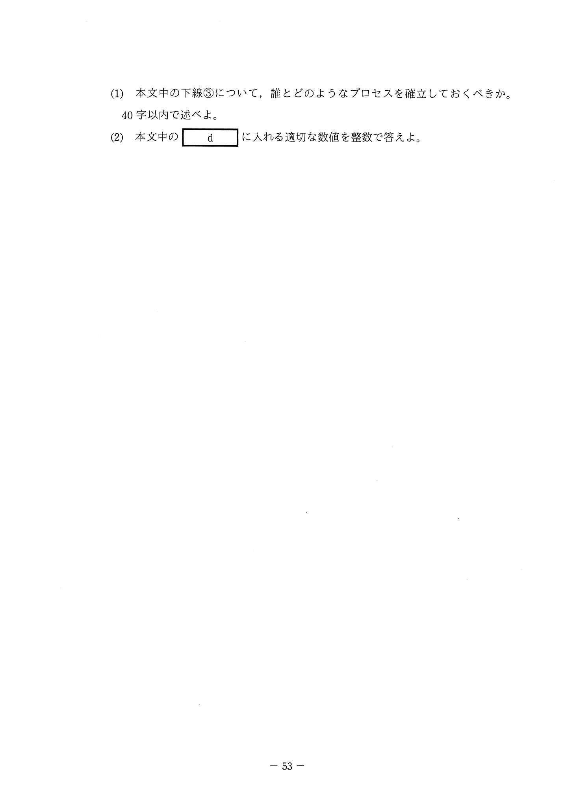

テキスト (OCR)

Q①) 本文中の下線②@について, 誰とどのようなプロセスを確立しておくべきか。
40 字以内で述べよ。
② 本文中の| a |に入れる適切な数値を整数で答えよ。

— ga 一

### ページ 54

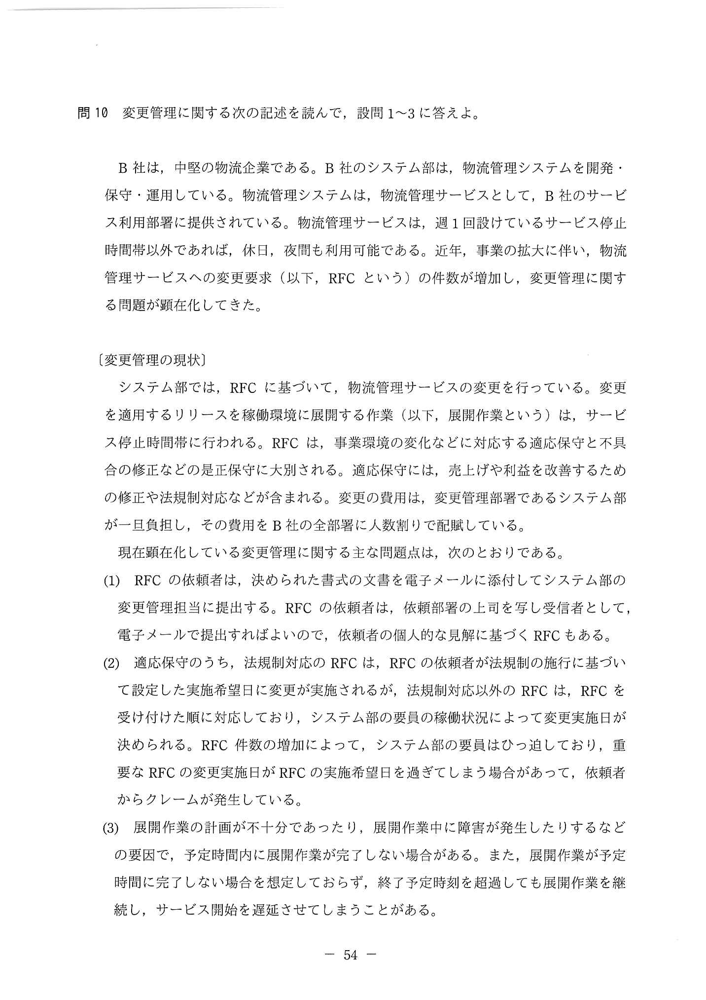

テキスト (OCR)

間16 変更管理に関する次の記述を読んで, 設問 1ー3 に答えよ。

B 社は, 中堅の物流企業である。B 社のシステム部は, 物流管理システムを開発・
保守・運用している。物流管理システムは, 物流管理サービスとして, B 社のサービ
ス利用部署に提供されている。 物流管理サービスは, 週 1 回設けているサービス停止
時間帯以外であれば, (KA, 夜間も利用可能である。近年, 事業の拡大に伴い, 物流
管理サービスへの変更要求 (以下, RFC という) の件数が増加し, 変更管理に関す
る問題が顕在化してきた。

[変更管理の現状
システム部では, RFC に基づいて, 物流管理サービスの変更を行っている。 変更

を適用するリリースを乏働環境に展開する作業 (以下, 展開作業という) は, サービ

ス停止時間帯に行われる。RFC は, 事業環境の変化などに対応する適応保守と不具

合の修正などの是正保守に大別される。 適応保守には, 売上げや利益を改善するため

の修正や法規制対応などが含まれる。 変更の費用は, BESS CHSVATLB

が一旦負担し, その費用を BHOSMB IC AREY CHUL TVS,
現在顕在化している変更管理に関する主な問題点は, 次のとおりである。

1) RFC の依頼者は, 決められた書式の文書を電子メールに添付してシステム部の
変更管理担当に提出する。RFC の依頼者は, 依頼部署の上司を写し受信者として
電子メールで提出すればよいので, 依頼者の個人的な見解に基づく RFC もある。

(2) 適応保守のうち, 法規制対応の RFC は, RFC の依頼者が法規制の施行に基づい
て設定した実施希望日に変更が実施されるが, 法規制対応以外の RFC は, RFC を
受け付けた順に対応しており, システム部の要員の稼働状況によって変更実施日が
決められる。RPFC 件数の増加によって, システム部の要員はひっ人迫しており, 重
要な RFC の変更実施日が RFC の実施希望日を過ぎてしまう場合があって, 依頼者
からクレームが発生している。

3) 展開作業の計画が不十分であったり, 展開作業中に障害が発生したりするなど
の要因で, 予定時間内に展開作業が完了しない場合がある。また, 展開作業が予定
時間に完了しない場合を想定しておらず, 終了予定時刻を超過しても展開作業を継
続し, サービス開始を遅延させてしまうことがある。

ー 一

### ページ 55

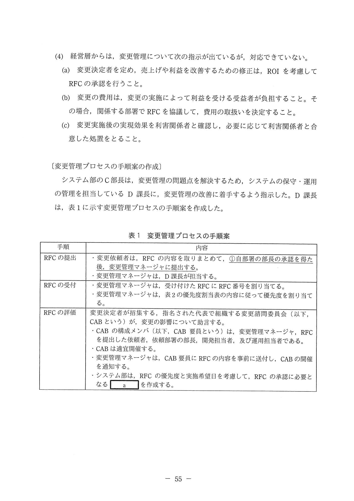

テキスト (OCR)

(4) 経営層からは, 変更管理について次の指示が出ているが, 対応できていない。

(a)

変更決定者を定め, 売上げや利益を改善するための修正は, ROI を考慮して

RFC の承認を行うこと。

(b)

変更の費用は, 変更の実施によって利益を受ける受益者が負担すること。そ

の場合 関係する部署で RFC を協議して, 費用の取扱いを決定すること。

(c)

変更実施後の実現効果を利害関係者と確認し, 必要に応じて利害関係者と合

意した処置をとること。

[変更管理プロセスの手順案の作成]

システム部のC部長は, 変更管理の問題点を解決するため, システムの保守・運用
の管理を担当している D 課長に, 変更管理の改善に着手するよう指示した。D 課長
は, 表 1 に示す変更管理プロセスの手順案を作成した。

表1 変更管理プロセスの手順案

手順                        内容

RFC の提出    ・ 変更依頼者は, RFC の内容を取りまとめて, ①自部署の部長の承認を得た
後, 変更管理マネージャに提出する。
・変更管理マネージャは, D 課長が担当する。

RFC の受付      ・変更管理マネージャは, 受け付けた REC に RFC 番号を割り当てる。
・ 変更管理マネージャは, 表2 の優先度割当表の内容に従って優先度を割り当て
る。

RFCの評価 | 変更決定者が招集する, 指名された代表で組織する変更府問委員会 (以下,

CAB という) が, 変更の影響について助言する。

・CAB の構成メンバ (以下, CAB 要員という) は, 変更管理マネージャ, RFC
を提出した依頼者, 依頼部署の部長, 開発担当者, 及び運用担当者である。

・CAB は適宜開催する。

・変更管理マネージャは, CAB 要員に RFC の内容を事前に送付し, CAB の開催
を通知する。

・システム部は, RFC の優先度と実施希望日を考應して, RFC の承認に必要と

なる| 。 |を作成する。

ー 55 一

### ページ 56

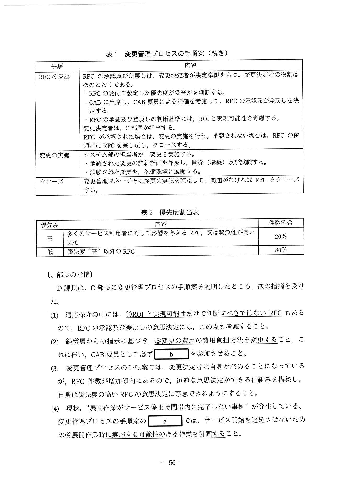

テキスト (OCR)

表1 変更管理プロセスの手順案 (続き)
内容
更決定者が決定権限をもつ。 変更決定者の役割は

手順
RFC の承認及び差戻しは, 変

RFC の承認
次のとおりである。
・RFC の受付で設定した優先度が妥当かを判断する。
・ CAB に出席し, CAB 要員による評価を考慮して, RFC の承認及び差戻しを決

定する。
・ RFC の承認及び差戻しの判断基準には, ROI と実現可能性を考慮する。
変更決定者は, C 部長が担当する。

変更の実施を行う。承認されない場合は, RFC OR

RFC が承認された場合は,

頼者に RFC を差し戻し。 クローズする。
変更を実施する。

システム部の担当者が, 3
承認された変更の詳細計画を作成し, 開発 (構築) 及び試験する

変更の実施
・試験された変更を, 稼働環境に展開する。
クローズ     変更管理マネージャは変更の実施を確認して, 問題がなければ RFC をクローズ
する。
表2 優先度割当表
優先度                        内容                         件数割合
多くのサービス利用者に対して影響を与える REC, 又は皿急性が高い
高    RFC                                                20%
低   優先度“高” 以外の RFC                                 80%
(C 部長の指摘]
D 課長は, C 部長に変更管理プロセスの手順案を説明したところ, 次の指摘を受け

Wee
(1) 適応保守の中には, ②ROI と実現可能性だけで判断すべきではない RFC もある
決定には, この点も考慮すること。

OC, RFC の承認及び差戻しの意思
③変更の費用の費用負担方法を交更すること。 こ

Q) 経営層からの指示に基づき,
れに伴い, CAB 要員として必ず|  b | を参加させること。
I   S#  ことになっている

変更管理プロセスの手順案では, 変更決定者は自身が務めること
速な意思決定ができる仕組みを構築し,

(3)
RFC 件数が増加傾向にあるので

が,
自身は優先度の高い RFC の意思決定に専念できるようにすること
(④ 現状, “展開作業がサービス停止時間帯内に完了しない事例” が発生している

変更管理プロセスの手順案の | 。 | では, サービス開始を遅延させないため

の@③展開作業時に実施する可能性のある作業を計画すること。

= 56 <

### ページ 57

テキスト (OCR)

(5) 変更を実施した後に,

更の有効性をレビューすること。PIR の実施時期に
定すること。
(6)

⑤変更実施後のレビュー (以下, PIR という) を行い,

変

ついては, RFC の承認の際に決
現状の変更管理の問題点が解決されたかを確認するために, 変更管理プロセス

を評価する KPI を設定すること。KPI は, 依頼者からのクレームが減ったことが確
できるものとすること。

[変更管理プロセスの手順案の修正〕

D 課長は, C 部長の指摘に漏れなく対応するよう
修正した。そのうち

変更管理プロセスの手順案を
迅速な意思決定に関する修正, 及びKPIの設定は次のとおりで
ある。
(1) 迅速な意思決定
しの決定は, | c |とする
x5

については, 表 2 に示す優先度が “MK” の RFC の承認及び差戻

(2) 変更管理プロセスを評価する KPI として, RO@~OXRETS
(a) 失敗した展開作業数の削減率

(b) 変更に起因するインシデント数の削減率

(c) 実施希望日どおりに変更が実施できた REC の割合の増加率
設問1 [変更管理プロセスの手順案の作成】 について, GQ), ②に答えよ
GQ) 表1中の下線①の狙いを, 25 FUNCHAL
Ricky

@) 表1中の[|  』 |] に入れる適切な字句を解答群の中から選び
BSH

zit

cu
a
の1

ns

ア エスカレーションフロー

ウ トレーニング資料

設問2 【〔C部長の指摘]!

イ サービスカタログ
エ 変更スケジュール
こついて, ①~て(④に答えよ。

(1) 本文中の下線②@について
内で答えよ

(2)

該当する RFC を本文中の字句を用いて, 10 FY
本文中の下線③の費用負担方法について,
るのか。

現在の方法をどのように変更す
変更前と変更後の方法を含めて, 40 字以内で述べよ。また, 本文中
ー 57 一

### ページ 58

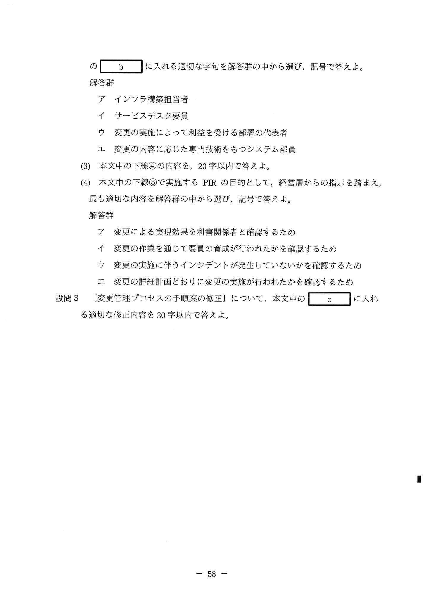

テキスト (OCR)

の
解

に入れる適切な字句を解答群の中から選び, 記号で答えよ。

Ns
}

ア インフラ構築担当者
イ サービスデスク要員
ウ 変更の実施によって利益を受ける部署の代表者
エ 変更の内容に応じた専門技術をもつシステム部員
(⑬ 本文中の下線のの内容を, 20 字以内で答えよ。
(4) 本文中の下線@⑥で実施する PIR の目的として, 経営層からの指示を踏まえ,
最も適切な内容を解答群の中から選び, 記号で答えよ。
解答
ア 変更による実現効果を利家関係者と確認するため
イ 変更の作業を通じて要員の育成が行われたかを確認するため
ウ 変更の実施に伴うインシデントが発生していないかを確認するため
エ 変更の詳細計画どおりに変更の実施が行われたかを確認するため
設問3 変更管理プロセスの手順案の修正】 について, 本文中の| c |に入れ
る適切な修正内容を 30 字以内で答えよ。

ー 58 一

### ページ 59

テキスト (OCR)

〔

メ = 用 紙 J

ー 59 一

### ページ 60

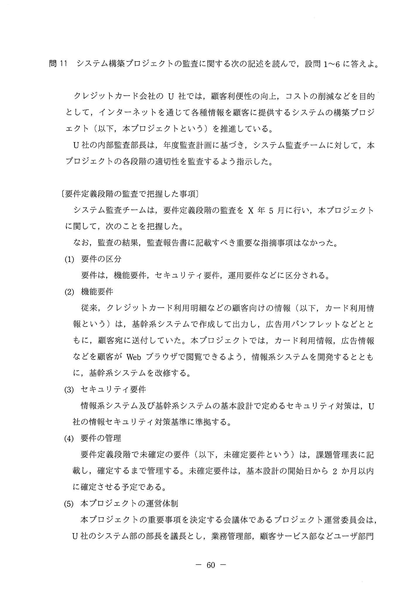

テキスト (OCR)

問11 システム構築プロジェクトの監査に関する次の記述を読んで, 設問 1こ6 に答えよ。

クレジットカード会社の U 社では, 顧客利便性の向上, コストの削減などを目的
として, インターネットを通じて各種情報を顧客に提供するシステムの構築プロジ
ェクト (以下, 本プロジェクトという) を推進している。

U 社の内部監査部長は, 年度監査計画に基づき, システム監査チームに対して, 本
プロジェクトの各段階の適切性を監査するよう指示した。

要件定義段階の監査で把握した事項
システム監査チームは, 要件定義段階の監査を X 年 5 月に行い, 本プロジェクト
に関して, 次のことを把握した。
なお, 監査の結果, 監査報告書に記載すべき重要な指摘事項はなかった。
Q) 要件の区分
要件は, 機能要件, セキュリティ要件, 運用要件などに区分される。
(2) 機能要件
従来, クレジットカード利用明細などの顧客向けの情報 (以下, カード利用情
報という) は, 基幹系システムで作成して出力し, 広告用パンフレットなどとと
もに, 顧客宛に送付していた。本プロジェクトでは, カード利用情報, 広告情報
などを顧客が Web ブラウザで閲覧できるよう, 情報系システムを開発するととも
に, 基幹系システムを改修する。
(3) セキュリティ要件
情報系システム及び基幹系システムの基本設計で定めるセキュリティ対策は, U
社の情報セキュリティ対策基準に準拠する。
(4) 要件の管理
要件定義段階で未確定の要件 (以下, 末確定要件という) は, 課題管理表に記
ML, 確定するまで管理する。未確定要件は, 基本設計の開始日から 2 か月以内
に確定させる予定である。
(5) 本プロジェクトの運営体制
本プロジェクトの重要事項を決定する会議体であるプロジェクト運営委員会は,
U社のシステム部の部長を議長とし, 業務管理部, 顧客サービス部などユーザ部門

ー 60 一

### ページ 61

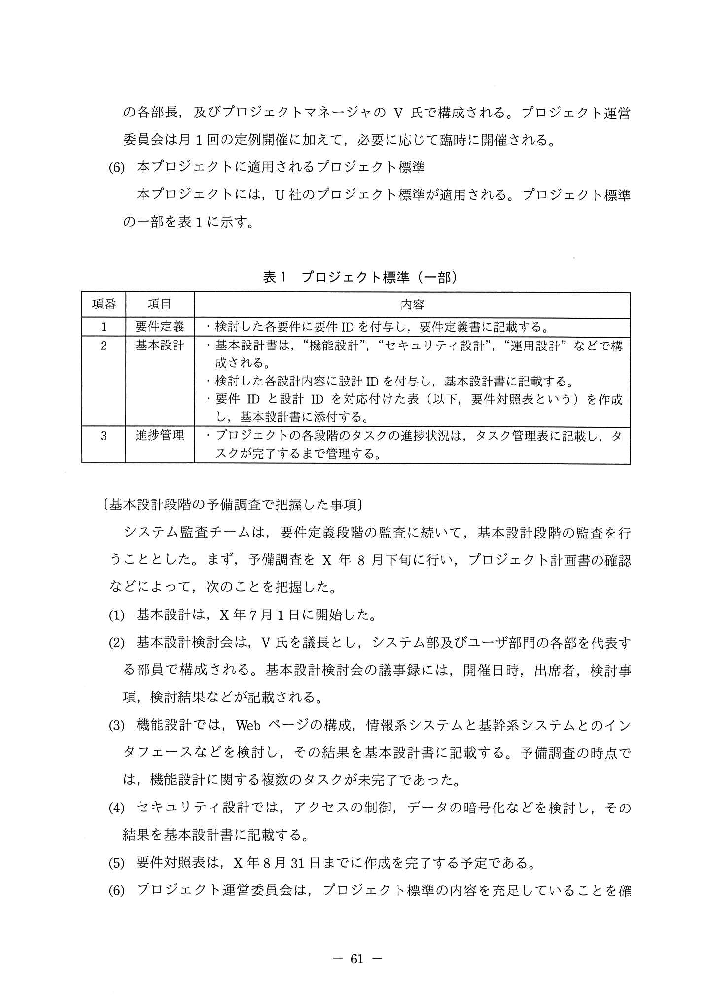

テキスト (OCR)

の各部長, 及びプロジェクトマネージャの YV 氏で構成される。プロジェクト運営
委員会は月 1 回の定例開催に加えて, 必要に応じて臨時に開催される。
(6) 本プロジェクトに適用されるプロジェクト標準
本プロジェクトには, U社のプロジェクト標準が適用される。プロジェクト標準
の一部を表 1 に示す。

表1 プロジェクト標準 (一部)

項番     項目                                    内容

1    要件定義 | ・検討した各要件に要件 ID を付与し, 要件定義書に記載する。

2   SEARLE   Raat, “機能設計", “セキュリティ設計", “運用設計" などで構
成される。

・ 検討した各設計内容に設計 ID を付与し, 基本設計書に記載する。

・ 要件 ID と設計 ID を対応付けた表 (以下, 要件対照表という) を作成
し, 基本設計書に添付する。

3  進捗管理 | ・プロジェクトの各段階のタスクの進捗状況は, タスク管理表に記載し, タ
スクが完了するまで管理する。

〔基本設計段階の予備調査で把握した事項]
システム監査チームは, 要件定義段階の監査に続いて, 基本設計段階の監査を行

うこととした。まず, 予備調査をX 年8 月下旬に行い プロジェクト計画書の確認

などによって, 次のことを把握した。

①) 基本設計は, XX年7月1日に開始した。

(2) 基本設計検討会は, V 氏を議長とし, システム部及びユーザ部門の各部を代表す
る部員で構成される。基本設計検討会の議事録には, 開催日時, 出席者, 検討事
項, 検討結果などが記載される。

(3) 機能設計では, Web ページの構成, 情報系システムと基幹系システムとのイン
タフェースなどを検討し, その結果を基本設計書に記載する。 予備調査の時点で
は, 機能設計に関する複数のタスクが未完了であった。

(4) セキュリティ設計では, アクセスの制御, データの暗号化などを検討し,. その
結果を基本設計書に記載する。

(5) 要件対照表は, X年8月31 日までに作成を完了する予定である。

(6) プロジェクト運営委員会は.。 プロジェクト標準の内容を充足していることを確

ー 61 一

### ページ 62

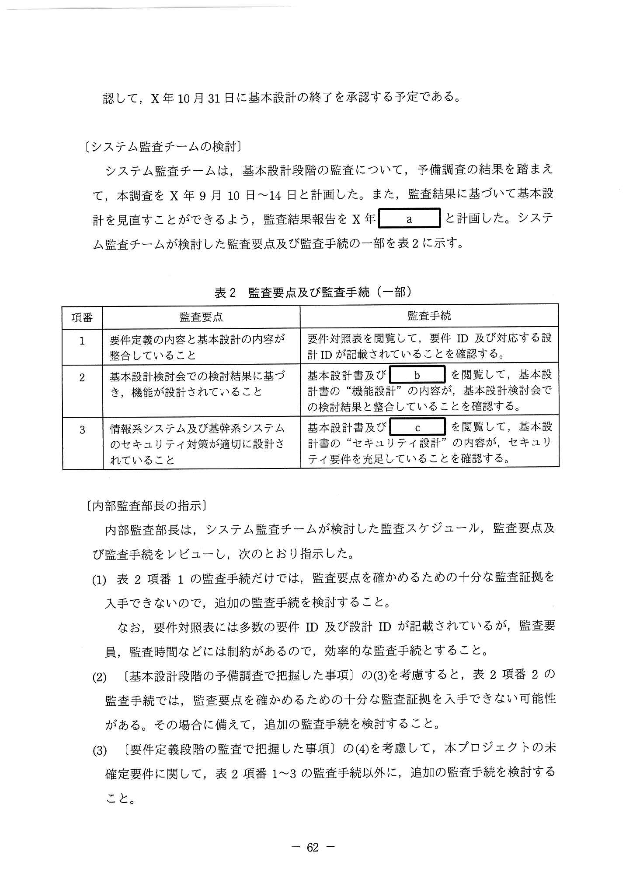

テキスト (OCR)

認して, X 年10 月 31 日に基本設計の終了を承認する予定である。

[システム監査チームの検討]

システム監査チームは, 基本設

て, 本調査をXX年9月 10 日14 日と計画した。また,

mamas x(a | と計画した。システ

査要点及び監査手続の一部を表 2 に示す。

計を見直すことができるよう,
ム監査チームが検討した監

計段階の監査について, 予備調査の結果を踏まえ

監査結果に基づいて基本設

表2 監査要点及び監査手続(一部)

RE        HEE                 Bare
1 | 要件定義の内容と基本設計の内容が | 要件対照表を閲覧して, 要件 ID 及び対応する設
整合していること          計 ID が記載されていることを確認する。
2 | 基本設計検討会での検討結果に基づ | 基本設計書及び      を閲覧して, 基本設
き, 機能が設計されていること    計書の"機能設計"の内容が, 基本設計検討会
の検討結果と整合していることを確認する。
3 | 情報系システム及び基香系システム | 基本設計書及び[ c | を閲覧して, 基本設
のセキュリティ対策が適切に設計さ | 計午の“セキュリティ設計" の内容が, セキュリ
れていること              ティ要件を充足していることを確認する。
〔内部監査部長の指示〕
内部監査部長は, システム監査チームが検討した監査スケジュール, BABAK
び監査手続をレビューし, 次のとおり指示した。
Q) 表 2 項番 1 の監査手続だなけでは, 監査要点を確かめるための十分な監査証拠を

(2)

(3)

入手できないので, 追加の監査手続を検討すること。

なお, 要件対照表に
監査時間などに
[基本

監査手続では,

がある。 その場

は多数の要件 ID 及び設
は制約があるので, 効率的な
設計段階の予備調査で把握した事項]】 の(3)を考慮すると, 表 2 項番 2 の
監査要点を確かめるための十分な監査証拠を入手できない可能
に備えて, 追加の監査手続を検討すること。
0 の(④を考慮して, 本プロジェクトの未

at ID が記載されているが,
監査手続とすること。

監査要

性

確定要件に関して, 表 2 項番 1ご3 の監査手続以外に, 追加の監査手続を検討する

ご Bs

ー 62 一

### ページ 63

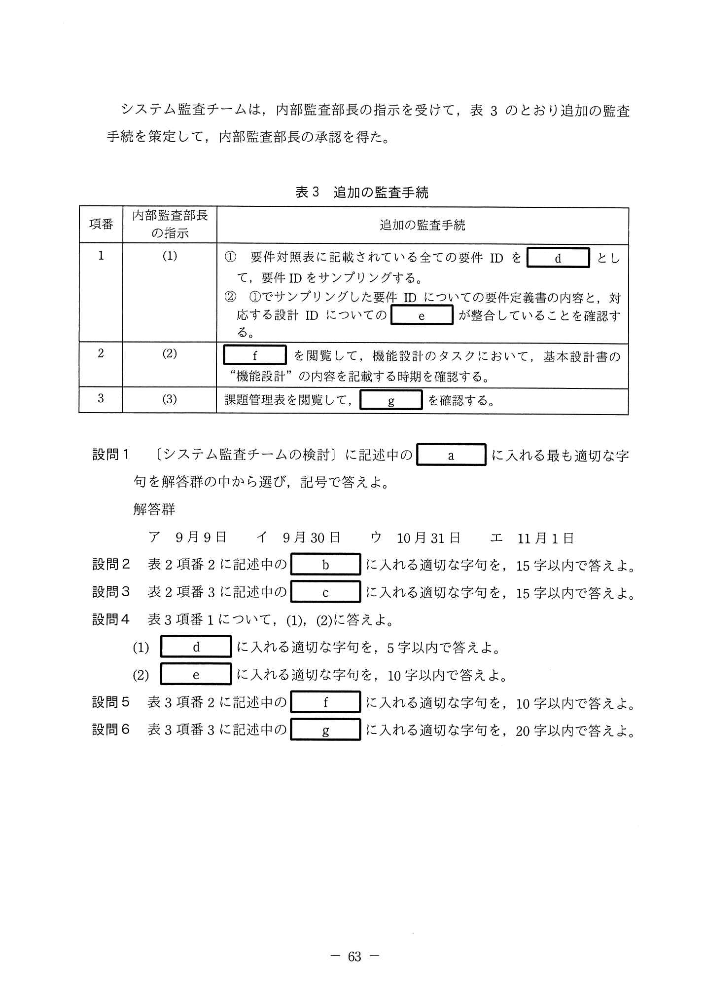

テキスト (OCR)

システム監査チームは, 内部監査部長の指示を受けて, 表 3 のとおり追加の監査

手続を策定して, 内部監査部長の承認を得た。

表3 追加の監査手続

AGAR                     aaa
Se Ota                                                 BMORAE
1       ①      O 要件対照表に記載されている全ての要件 D を[ dq |とし

て, 要件 ID をサンプリングする。

る。

② ①でサンプリングした要件 TD についての要件定義書の内容と, 対
応する設計 ID についての| < | が整合していることを確認す

2     @) を閲覧して, 機能設計のタスクにおいて, 基本設計書の

3             (3)           課題管理表を閲覧して,  |      g      | を確認する。

設問1 〔システム監査チームの検討] に記述中の[|  』 | に入れる最も適切な字

MEMEO HDD RO, 記号で答えよ。
解答群
ア 9月9日  イ 9月30日  ウ 10月31日  =

設問2 表2項番 2に記述中の| b | に入れる適切な字句を,
設問3 表2項番3に記述中の| c | に入れる適切な字句を,
設問4 表3項番1について, ①⑪), ②に答えよ。

@ (La ] に入れる適切な字旬を, 5字以内で答えよ。

@ Le | に入れる適切な字句を, 10 字以内で答えよ。
設問5 表3項番 2に記述中の| ft |] に入れる適切な字句を,
設問6 表3項番3に記述中の| gz |] に入れる適切な字句を,

==

11 月 1 日
15 字以内で答えよ。
15 字以内で答えよ。

10 字以内で答えよ。
20 字以内で答えよ。

### ページ 64

テキスト (OCR)

〔

メ = 用 紙 )

ー 64 一

### ページ 65

テキスト (OCR)

〔

x モ 用 tf

ー 65 一

J

### ページ 66

テキスト (OCR)

C

メ モ 用 紙 〕

ー 66 一

### ページ 67

テキスト (OCR)

〔

x = 用 紙 〕

ー 67 一

### ページ 68

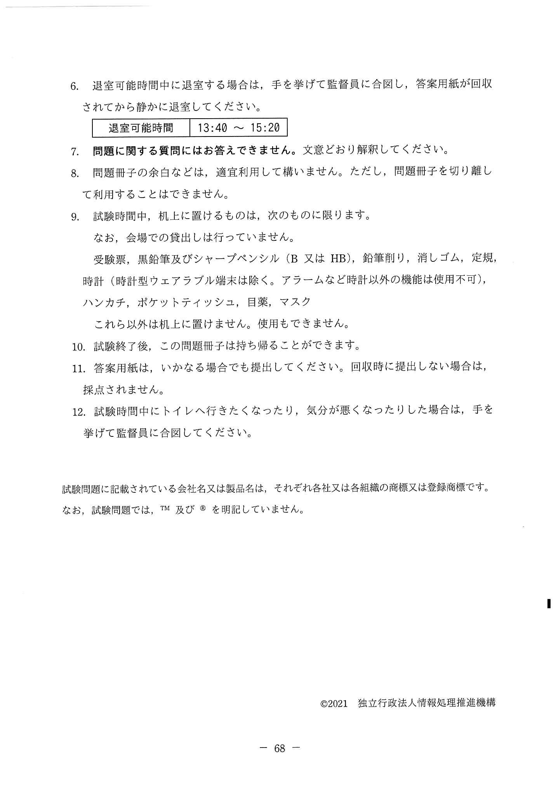

テキスト (OCR)

6. 退室可能時間中に退室する場合は, 手を挙げて監督貞に合図し, 答案用紙が回収
されてから静かに退室してください。
| 朋室可能時間 | 13:49 ~ 15:20 |
7. 問題に関する質問にはお答えできません。文意どおり解釈してください。
8. 問題冊子の余白などは, 適宜利用して構いません。 ただし, 問題冊子を切り離し
て利用することはできません。
9. 試験時間中, 机上に置けるものは, 次のものに限ります。
なお, 会場での貸出しは行っていません。
受験票, 黒鉛筆及びシャープペンシル (B 又は HB), 鉛筆削り, 消しゴム, 定規,
時計 (時計型ウェアラブル端末は除く。アラームなど時計以外の機能は使用不可),
ハンカチ, ポケットテイィッシュ, 目薬, マスク
これら以外は机上に置けません。使用もできません。
10. 試験終了後, この問題冊子は持ち帰ることができます。
ll. SHAMS, いかなる場合でも提出してください。 回収時に提出しない場合は
採点されません。
12. 試験時間中にトイレへ行きたくなったり, 気分が悪くなったりした場合は, FE
挙げて監督員に合図してください。

試験問題に記載されている会社名又は製品名は, それぞれ各社又は各組織の商標又は登録商標です。
なお, 試験問題では, ™ 及び © を明記していません。

@2021 独立行政法人情報処理推進機構

ー 68 一

---

## 午後解答

1/6 
©2021 独立行政法人情報処理推進機構 
令和３年度 秋期 応用情報技術者試験 解答例 
 
午後試験 
問１ 
出題趣旨 
 昨今，オフィス内から秘密情報が記録された情報機器や書類などが不正に持ち出され，秘密情報が漏えいす
る事案が発生している。秘密情報の漏えいは，企業に甚大な損失を与える可能性がある。 
 本問では，物理的な情報セキュリティを中心とした対策を題材に，情報機器や書類の不正持出しを防ぐため
の方策についての理解を問う。 
 
設問 
解答例・解答の要点 
備考 
設問１ 
a
カ 
 
b
ク 
 
 
c
ア 
設問２ 
クリアスクリーン 
 
設問３(1) 入室状態となっている人が再度入室しようとした場合 
 
(2) 監視カメラを設置して来訪者の行動を記録する。 
 
 
(3) 複合機の側に行かないと用紙への印刷ができないから 
 
(4)
d 
中が透けて見える 
 
 
 
行為 
秘密書類の持出し 
 
問２ 
出題趣旨 
 近年，インターネットを活用して顧客との接点を増やしブランド価値を高めるデジタルマーケティングの利
用が広がっている。 
 本問では，食品会社の売上拡大を題材に，マーケティング戦略の策定，商品開発戦略，プロモーション戦略，
デジタルマーケティングの運用における留意点などに関する基本的な理解について問う。 
 
設問 
解答例・解答の要点 
備考 
設問１(1)
a
セグメント 
 
(2) 顧客ニーズの多様化に対して，新たな利用シーンに対応する商品開発力をもつ
から 
 
設問２(1) 特許や商標の出願 
 
 
(2) 希少価値によって話題を集めることで，顧客の購買意欲を高めること 
設問３(1)
b
ウ 
 
 
 
c
カ 
 
(2)
d
イ 
 
 
(3) クレームが拡散して，デジタルマーケティングが機能しない。

2/6 
©2021 独立行政法人情報処理推進機構 
問３ 
出題趣旨 
 “もの”と“もの”が複雑につながり合っているときに，つながり具合だけに注目して議論するのにグラフ
は適している。 
 本問では，一筆書きを題材に，応用範囲が広いグラフを扱うアルゴリズムに関する理解とその実装を問う。
 
設問 
解答例・解答の要点 
備考 
設問１ 
ア
0 
 
 
 
イ
edgenext[temp] 
 
 
 
ウ
top － 1 
 
 
 
エ
start[temp] 
 
設問２ 
16
 
設問３ 
ア 
 
設問４ 
top がlast 以下 
 
 
問４ 
出題趣旨 
 昨今，秘密情報をセキュリティが確保されたクラウドサービスに格納し，安全に管理する企業が増えている。
 本問では，クラウドサービス上でのストレージの利用を題材に，システム方式設計及び移行方式設計に関す
る設計能力について問う。 
 
設問 
解答例・解答の要点 
備考 
設問１ 
a
510 
 
 
 
b
60
 
 
c
500 
 
 
 
d
1,320 
 
設問２(1)
e
56
 
(2) 1／10 
 
 
(3) 業務時間内は前のグループがクラウドストレージを利用するから

3/6 
©2021 独立行政法人情報処理推進機構 
問５ 
出題趣旨 
 昨今，サイバーセキュリティ対策の一環として，既設LAN をゾーン分割し，ゾーン間のアクセス制御を行う
ことが普及しつつある。 
 本問では，既設LAN のネットワーク構成変更を題材に，物理配線やネットワークスイッチに関する基本的な
理解，及びVLAN を用いたゾーン分割に関する理解について問う。 
 
設問 
解答例・解答の要点 
備考 
設問１ 
a
192.168.101.12 
 
 
b
22 
 
設問２(1) イ，ウ，エ 
 
(2) 通信可能な最長距離が長いから 
 
設問３(1)
c
PoE 
 
(2) PC の通信に必要な電波強度が確保できない。 
設問４(1)
d
タグ 
 
 
(2)
e
VLAN64，VLAN67 
 
 
f
VLAN65 
 
 
(3) ポート ID P1，P3 
 
 
変更内容
総務部のVLAN67 をP1 に設定しP3 から削除する。 
 
 
問６ 
出題趣旨 
 近年，テレワークの普及に伴い，インターネット利用を前提とする新しいサービスが増えつつある。 
 本問では，企業向け電子書籍サービスを題材に，E-R 図やSQL 文に関する基本的な理解，トランザクション
処理における同時実行制御に関する理解，業務要件からデータモデルを実装する能力を問う。 
 
設問 
解答例・解答の要点 
備考 
設問１ 
a
→ 
 
 
 
b
割引率 
 
 
 
c
書籍ID 
 
設問２(1)
d
COUNT(*) 
 
 
 
e
大きい 
 
 
 
f
VALUES ( :一括購入ID, :社員ID , :企業ID ) 
 
 
(2) 一括購入数量より多い数量の書籍を割り当ててしまう問題 
 
設問３
 
g
UNION 
 
 
 
h
ON ik.一括購入ID = iw.一括購入ID 
 
設問４(1) 個人会員ID，企業ID，社員ID 
 
 
(2) 個人会員が企業ID と社員ID を登録する画面

4/6 
©2021 独立行政法人情報処理推進機構 
問７ 
出題趣旨 
食料の安定供給を目指し，農業，畜産業及び飼育漁業において，IoT やAI を導入して良質な食料を安定的に
確保するための試みが始まっている。 
本問では，IoT を利用して良質な養殖魚を育成し，安定供給するシステムを題材に，システムの仕様を把握す
る能力，仕様に応じたソフトウェア設計の能力を問う。 
 
設問 
解答例・解答の要点 
備考 
設問１(1) 日時データ 
 
(2) 残餌が残餌センサに到達するまでに時間を要するから 
 
設問２(1) 7
 
(2) 画像圧縮処理 
 
設問３(1)
a
カウント値 
 
 
b
しきい値以上 
 
 
(2)
c
イ 
順不同 
 
 
d
ク 
 
 
e
ウ 
順不同 
 
 
f
オ 
 
問８ 
出題趣旨 
 昨今，デジタルトランスフォーメーションによって，企業と顧客との接点において情報システムが担う役割
が拡大している。自社のWeb サイトで商品を魅力的に伝え，操作性が良く商品を選択・購入できるようにする
ためには，システムの機能変更を繰り返す必要がある。 
 本問では，スーパーマーケットのネットスーパー機能を題材に，システムへの機能追加・変更容易性を向上
させるためのデータ中心設計について，基本的な理解とその設計能力を問う。 
 
設問 
解答例・解答の要点 
備考 
設問１ 
a
プロセス 
設問２(1)
b
購入 
 
 
(2) セット商品 
 
(3)
c
ウ 
 
 
 
d
ア 
設問３(1) ウ 
 
 
(2) 顧客種別によらない共通な処理を一か所で定義できるから 
設問４(1) データベースへのテーブル追加作業 
 
 
(2) 画面の表示方法が異なるから

5/6 
©2021 独立行政法人情報処理推進機構 
問９ 
出題趣旨 
 環境変化が激しい中で企業の競争力を維持し，市場の変化にも迅速に対応可能なアジャイル開発が注目され
ている。 
 本問では，家電メーカのインターネット販売に伴うインターネット販売システム開発プロジェクトを題材に，
アジャイル開発プロジェクトのマネジメントに関する能力を問う。 
 
設問 
解答例・解答の要点 
備考 
設問１(1)
a
エ 
 
(2) スクラムの開発要員を育成し，本格的なスクラム開発の人材を確保する。 
 
設問２(1) 顧客からの要求に競合相手より迅速に対応すること 
 
(2)
b
オ 
 
 
 
c
ク 
設問３(1) T 氏とプロダクトバックログアイテム変更に伴う対応方法を決めておく。 
 
 
(2)
d
50 
 
問10 
出題趣旨 
 企業におけるビジネスの拡大に迅速，適切に対応するために，IT サービスマネジメントにおける変更管理を
有効かつ確実に行うことが重要である。 
 本問では，中堅物流企業の変更管理プロセスの手順案の作成，修正を題材に，変更管理の活動についての基
本的理解を問う。 
 
設問 
解答例・解答の要点 
備考 
設問１(1) 依頼者の個人的な見解に基づくRFC の撲滅 
 
 
(2)
a
エ 
 
設問２(1) 法規制対応のRFC 
 
 
(2) 費用負担方法
全部署への人数割り配賦を，利益を受ける受益者負担に変更す
る。 
 
 
 
b
ウ 
 
 
(3) 切り戻し計画の作成 
 
 
(4) ア 
 
設問３ 
c
変更管理マネージャに権限委譲すること

6/6 
©2021 独立行政法人情報処理推進機構 
問11 
出題趣旨 
 システム構築プロジェクトの基本設計段階では，要件定義の内容との整合性を確保すること，設計内容の適
切性を確保すること，タスクや課題を管理することなどが重要である。 
 本問では，クレジットカード関連のシステム構築プロジェクトを題材に，基本設計段階の監査において，適
時・適切な監査計画を策定する能力，十分な監査証拠を入手するための監査手続を策定する能力などを問う。
 
設問 
解答例・解答の要点 
備考 
設問１ 
a
イ 
 
設問２ 
b
基本設計検討会の議事録 
 
設問３ 
c
情報セキュリティ対策基準 
 
設問４(1)
d
母集団 
 
 
(2)
e
基本設計書の内容 
 
設問５ 
f
タスク管理表 
 
設問６ 
g
全ての要件が確定していること

---

## 午後採点講評

1/3 
©2022 独立行政法人情報処理推進機構 
令和３年度 秋期 応用情報技術者試験 採点講評 
 
午後試験 
問１ 
 問1 では，オフィスのセキュリティ対策を題材に，物理的なセキュリティを中心とした具体的な対策内容に
ついて出題した。全体として正答率は平均的であった。 
 設問1 のc は，正答率が低かった。Common Criteria は，情報機器や情報システムのIT セキュリティを評価
するための規格なので，覚えておいてほしい。 
 設問2 は，正答率がやや低かった。離席時におけるPC からの情報漏えいリスクを低減するための対策に，
クリアスクリーンがある。クリアスクリーンという用語とその概要について覚えておいてほしい。 
 設問3(4)のd は，正答率が平均的であった。オフィス内への私物の持込みを許可する場合は，持ち込んだ私
物が，不正行為に繋がる可能性がない物であることを，周囲の者が判別できるようにする対策が重要であるこ
とを理解してほしい。 
 
問２ 
 問2 では，食品会社の売上拡大を題材に，マーケティング戦略の策定，商品開発戦略，プロモーション戦略
などデジタルマーケティングの運用における留意点などについて出題した。全体として正答率はやや高かっ
た。 
 設問1(1)は，正答率が低かった。マーケティングの基本用語を覚えるだけでなく，用語の意味や用語に関連
する項目の概要も含めて理解を深めてほしい。 
 設問3(3)は，正答率がやや高かった。デジタルマーケティングのクレーム対応では，インターネット上で想
定される様々な事態を想定するだけでなく，その結果生じる経営へのインパクトやリスクを勘案して，被害の
拡大を食い止める対策を速やかに実施することが重要であることを理解してほしい。 
 
問３ 
 問3 では，一筆書きを題材に，応用範囲が広いグラフを扱うアルゴリズムの理解とその実装について出題し
た。全体として正答率は平均的であった。 
 設問1 のイは，正答率がやや低かった。配列edgefirst と配列edgenext の関係を例示した図3 も参考にして，
点x から次にたどる未探索の辺の求め方を理解してほしい。 
 設問2 は，正答率が低かった。図2 及び〔一筆書きの経路を求める手順〕から，グラフの各辺は，一度，探
索済になってから確定済になることに注目して，if 文の実行回数が辺の数の2 倍になることを理解してほし
い。 
 設問4 は，正答率が低かった。“top がlast より小さい”など，top とlast が等しい場合を含まない，誤った
解答をした受験者が多かった。プログラム中の分岐や繰返しの条件は，その境界値まで正確に記述できている
かどうかを，常に確認するようにしてほしい。 
 
問４ 
 問4 では，クラウドサービス上でのストレージの利用を題材に，システム方式設計とファイル移行方式設計
について出題した。全体として正答率は平均的であった。 
 設問1 のb は，正答率がやや低かった。PC 及びファイルサーバに格納されているデータを移行する際に必要
となるクラウドストレージのデータ容量を問うたが，PC に格納されているデータが考慮されていない解答が
散見された。問題文中に示された内容を正確に読み取り，正答を導き出してほしい。 
 設問2(2)は，正答率が低かった。ファイル移行は，限られたネットワーク帯域を使用して，限られた時間内
に移行を完了する必要がある場合が多いので，十分な移行方式の設計，移行の計画，及びリハーサルが必要で
ある。使用できるネットワーク帯域や時間などを考慮した上で，最良な移行方式を設計する能力を是非習得し
てほしい。

2/3 
©2022 独立行政法人情報処理推進機構 
問５ 
 問5 では，LAN のネットワーク構成変更を題材に，物理配線やネットワークスイッチの構成，VLAN を用い
たサブネットワークの分割について出題した。全体として正答率は平均的であった。 
 設問1 のb は，正答率が低かった。サブネットマスク長の指定では，よく使われるクラスC（24 ビット）な
どの固定値だけでなく，クラスレス（CIDR）の可変値も指定可能であることを理解してほしい。また，セキ
ュリティの観点から，アクセスコントロールリストでは最小限のアドレス範囲を指定して通信を許可すること
が望ましいことも理解してほしい。 
 設問2 は，(1)(2)ともに正答率が低かった。LAN 高速化の需要に伴い新しい規格の策定が今後も続くと考え
られるので，UTP ケーブルや光ファイバケーブルの規格については，最新の動向に常に注意を払ってほしい。
 設問4(1)は，正答率が低かった。LAN のサブネットワークへの分割を柔軟に行うために，タグVLAN の機能
や構成方法を理解してほしい。 
 
問６ 
 問6 では，企業向け電子書籍サービスを題材に，E-R 図，SQL 文，トランザクション処理における同時実行
制御，データモデルなどについて出題した。全体として正答率は平均的であった。 
 設問1 のb は，正答率が平均的であった。新サービスの機能概要中にある割引購入とE-R 図を注意深く読ん
で，正答を導いてほしい。 
 設問2(1)のf は，正答率が低かった。INSERT 文を用いたデータの挿入は，重要なデータ操作の一つである。
基本的な構文だけではなく，埋込み変数を用いた記述方法についても理解してほしい。 
 設問4(2)は，正答率が低かった。電子書籍リーダに個人会員ID を用いてログインしている状況において，ど
のような画面を追加するかを問うたが，その状況や画面追加を考慮しない解答が散見された。落ち着いて問題
文を読んで解答するよう心掛けてもらいたい。 
 
問７ 
 問7 では，IoT を利用した良質な養殖魚を育成して安定供給するためのスマート生け簀を題材に，仕様の把
握，ソフトウェア設計について出題した。全体として正答率は平均的であった。 
 設問1(2)は，正答率がやや低かった。餌を投入してから残餌センサが餌を検出するまでの餌の動きを考慮し
て正答を導き出してほしかった。システムの動作を正確に理解する能力を身に付けてほしい。 
 設問2(1)は，正答率が低かった。単眼のカメラが2 台あるステレオカメラを用いていたが，カメラ1 台分し
か計算していない誤答が散見された。設問で与えられた条件を正しく理解して計算するよう心掛けてもらいた
い。 
 設問3(1)は，正答率が平均的であった。給餌日時における給餌処理フローを完成させる問題であったが，本
文で説明していない用語や機能の解答が散見された。本文で述べられた機能や処理についてよく理解した上で
解答してほしい。 
 
問８ 
 問8 では，スーパーマーケットのネットスーパー機能を題材に，データ中心設計について出題した。全体と
して正答率は平均的であった。 
 設問3(1)は，正答率が低かった。システム機能の設計において，システム性能と変更容易性はトレードオフ
の関係になる場合が多く，システムへのアクセス数や機能変更の頻度などを考慮した設計を行う必要がある。
ここでは，システム性能に重点を置くことを考慮して正答を導いてほしい。 
 設問4(1)は，正答率が低かった。機能変更に伴うテーブル追加作業のリスクについて問うた。ソースコード
の変更はテスト環境で十分なテストができるが，テーブル追加作業はリリース時の限られた時間内で作業及び
テストを行う必要があり，リスクが高い。システム設計においては，システム性能や変更容易性への考慮にと
どまらず，リリース作業におけるリスクについても是非考慮してほしい。

3/3 
©2022 独立行政法人情報処理推進機構 
問９ 
 問9 では，家電メーカのインターネット販売に伴う開発プロジェクトを題材に，近年急速に普及しているア
ジャイル開発について出題した。全体として正答率は平均的であった。 
 設問2(1)は，正答率がやや高かった。アジャイル開発を社内で展開する際には，アジャイル開発の技術的な
側面について習熟するだけでなく，企業の競争力を維持，強化し，市場の変化にも迅速に対応するという経営
的な側面についても考慮することが重要であることを理解してほしい。 
 設問3(1)は，正答率がやや低かった。スプリントの途中で生じたステークホルダ間の認識不一致という問題
に対して，誰とどのようなプロセスを確立しておくべきかを問うたが，アジャイル開発におけるプロダクトオ
ーナなどの役割について理解できていないと思われる解答が散見された。アジャイルの基本概念だけでなく，
実際のプロジェクトにアジャイルを適用する場合，誰にどのような役割を担わせるのかが重要であることにつ
いて理解を深めてほしい。 
 
問10 
 問10 では，中堅物流企業の変更管理プロセスの手順案の作成，修正を題材に，変更管理の活動について出題
した。全体として正答率は平均的であった。 
 設問2(3)は，正答率が低かった。“展開作業がサービス停止時間内に完了しない事例”への対策として，サー
ビス開始を遅延させないための，展開作業時に実施する可能性のある作業の計画について問うた。切り戻し計
画を含めた，展開の計画についての理解を深めてほしい。 
 設問3 のc は，正答率がやや低かった。本文に記載された事例に即して，優先度が“低”のRFC の承認及び
差戻しの決定について権限委譲が有効な対策であることに気付いてほしかった。状況に応じて，適切な変更管
理プロセスの手順案を作成できる能力を身に付けてほしい。 
 
問11 
 問11 では，クレジットカード関連のシステム構築プロジェクトを題材に，基本設計段階の監査について出題
した。全体として正答率は平均的であった。 
 設問3 は，正答率が高かった。監査要点を確かめるための基本的な監査手続については，正しく理解できて
いることがうかがえた。 
 設問4 は，正答率がやや低かった。監査手続の一つであるサンプリングについて問うたが，サンプリングを
理解できていないと思われる解答や，監査要点を確かめることができない資料などを挙げている解答が散見さ
れた。監査要点を確かめるための効率的な監査手続を策定する能力は重要であるので，是非身に付けてほし
い。 
 設問6 は，正答率が平均的であった。未確定要件に関する追加の監査手続を問うたが，未確定要件との関係
が曖昧な解答が散見された。設問で問われていることを正しく理解した上で，解答してほしい。

