# 令和3年度春期 応用情報技術者試験

---

## 午前問題

### ページ 1

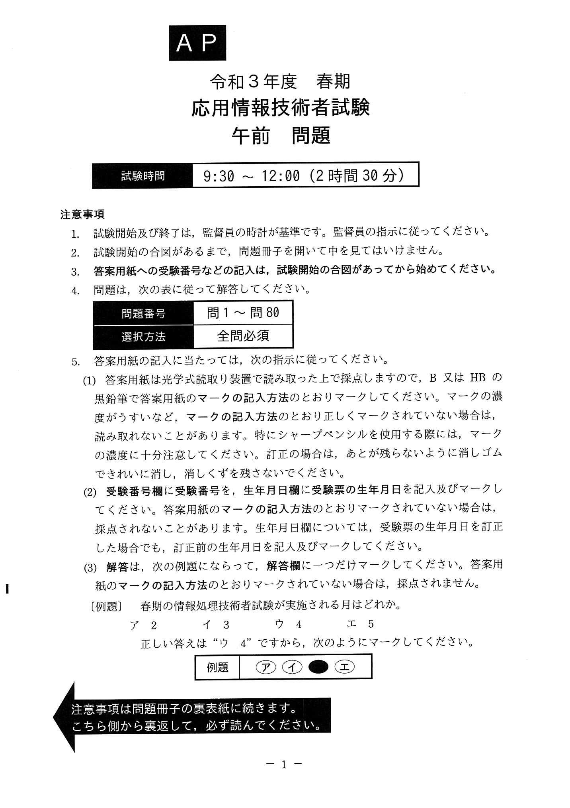

テキスト (OCR)

令和3年度 春期
応用情報技術者試験
午前 問題

 9:30 ~ 12:00 (2時間 30 分)

注意事項

1. 試験開始及び終了は, 監督上員の時計が基準です。監督具の指示に従ってください。

2. 試験開始の合図があるまで, 問題冊子を開いて中を見てはいけません。

3. 管案用紙への受験番号などの記入は, 試験開始の合図があってから始めてください。

4. 問題は, 次の表に従って解答してください。

問題番号    fa] 1 ~ fal 80
選択方法            全間必須
5. 答案用紙の記入に当たっては, 次の指示に従ってください。

①) 管案用紙は光学式読取り装置で読み取った上で採点しますので, B 又は HB の
黒鉛筆で答案用紙のマークの記入方法のとおりマークしてください。マークの濃
度がうすいなど, マークの記入方法のとおり正しくマークされていない場合は,
読み取れないことがあります。 特にシャープペンシルを使用する際には, マーク
の濃度に十分注意してください。 訂正の場合は, あとが残らないように消しゴム
できれいに消し, 消しくずを残さないでください。

Q) 受験番号欄に受験番号を, 生年月日欄に受験票の生年月日を記入及びマークし
てください。 答案用紙のマークの記入方法のとおりマークされていない場合は,
採点されないことがあります。 生年月日欄については, 受験票の生年月日を訂正
した場合でも, 訂正前の生年月日を記入及びマークしてください。

3) 解答は, 次の例題にならって, 解答欄に一つだけマークしてください。答案用
紙のマークの記入方法のとおりマークされていない場合は, 採点されません。
例題 春期の情報処理技術者試験が実施される月はどれか。

ア 2    4 3    ウ 4    = 5
正しい答えは“ウ 4" ですから, 次のようにマークしてください。

例題 | 〈の(の (や

注意事項は問題冊子の裏表紙に続きます。
こちら側から裏返して, 必ず読んでください。

### ページ 2

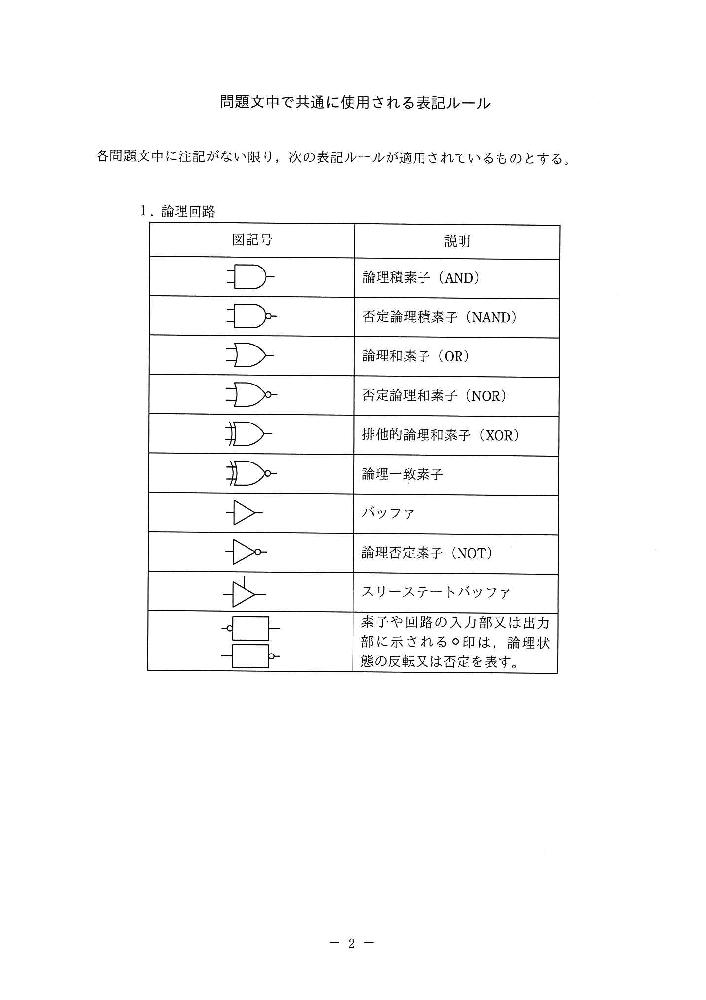

テキスト (OCR)

問題文中で共通に使用される表記ルール

各問題文中に注記がない限り, 次の表記ルールが適用されているものとする。

1 . 論理回路

xg
allt
cul
aa

説明

論理積素子 (AND)

否定論理積素子 (NAND)

論理和素子 (OR)

否定論理和素子 (NOR)

排他的論理和素子 (XOR)

論理一致素子

バッファ

理否定素子 (NOT)

スリーステートバッファ

素子や回路の入力部又は出力
部に示されるo9印は, 論理状
態の反転又は否定を表す。

LHYIYYMMVMMD

### ページ 3

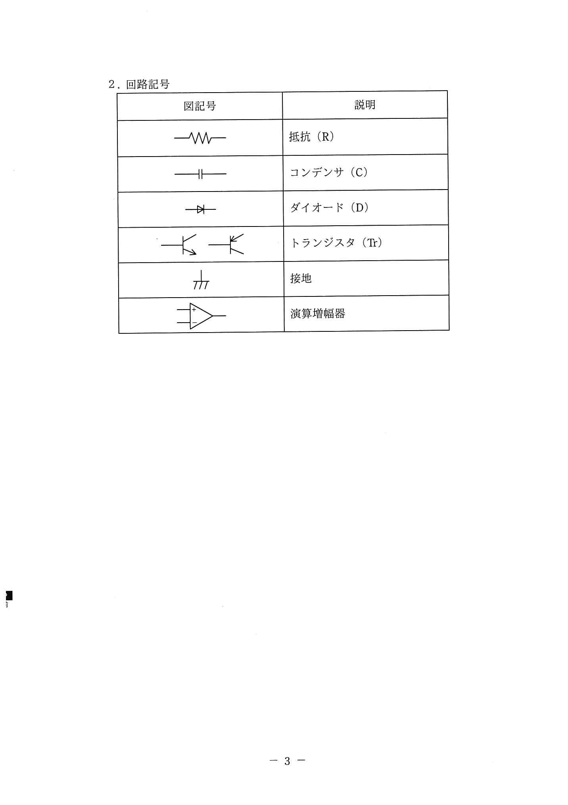

テキスト (OCR)

2. 回路記号

図記号                       説明
ーツWW一        抵抗 (R)
ーゴーー           コンデンサ (C)
+t              ダイオード (D)

トランジスタ (Tr)

接地

演算増幅器

### ページ 4

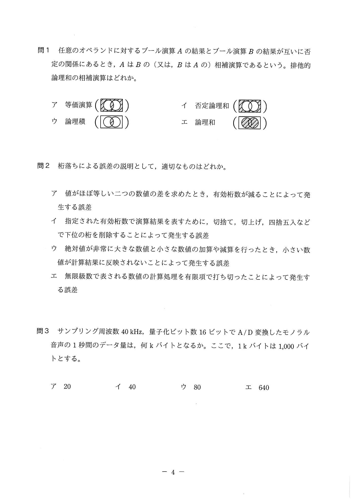

テキスト (OCR)

問1 任意のオペランドに対するブール演算 4 の結果とブール演算 お の結果が互いに否
定の関係にあるとき, 4 はの (又は, BILAO) 相補演算であるという。排他的
論理和の相補演算はどれか。

ァ 等価注算 (   )      イ 否定論理和

(
論理本 (I)     エ 論理和  ((@])

間2 桁落ちによる誤差の説明として, 適切なものはどれか。

ア 値がほぼ等しい二つの数値の差を求めたとき, 有効桁数が減ることによって発
生する誤差

イ 指定された有効桁数で演算結果を表すために, 切捨て, 切上げ, 四捨五入など
で下位の桁を削除することによって発生する誤差

ウ 絶対値が非常に大きな数値と小さな数値の加算や減算を行ったとき, 小さい数
値が計算結果に反映されないことによって発生する誤差

エ 無限級数で表される数値の計算処理を有限項で打ち切ったことによって発生す
SRE

間3 サンプリング周波数 40 kHz, 量子化ビット数 16 ビットで A/D 変換したモノラル
音声の 1 秒間のデータ量は, fk バイトとなるか。ここで, 1k バイトは 1000 バイ
トとする。

ア 20     イ 40      ウ 80     = 640

### ページ 5

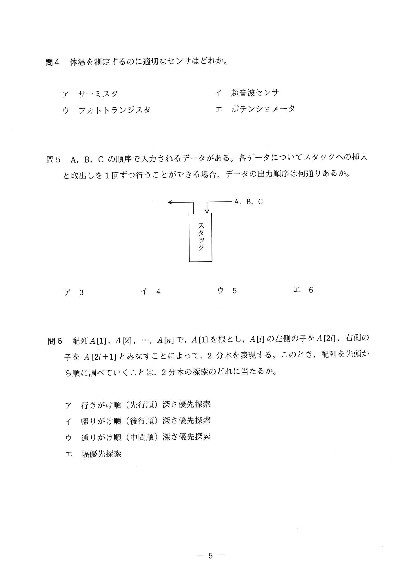

テキスト (OCR)

間4 体温を測定するのに適切かセンサはどれか。
ア サーミスタ            イ 超音波センサ

ウ フォトトランジスタ          エ ポテンショメータ

FAS A, B, Cの順序で入力されるデータがある。各データについてスタックへの挿入
と取出しを 1 回ずつ行うことができる場合, データの出力順序は何通りあるが。

—7]   rs B, C

Na

間6 配列4I1], 4[2], …, Ale] で, ADI を根とし, AD の左側の子を Ali], AMO
子を 4[2二1] とみなすことによって, 2 分木を表現する。このとき, 配列を先頭か
ら順に調べていくことは, 2 分木の探索のどれに当たるか。

ア 行きがけ順 (先行順) 深さ優先探索
イ 帰りがけ順 (後行順) 深さ優先探索
ウ 通りがけ順 (中間順) 深さ優先探索
エ 幅優先探索

### ページ 6

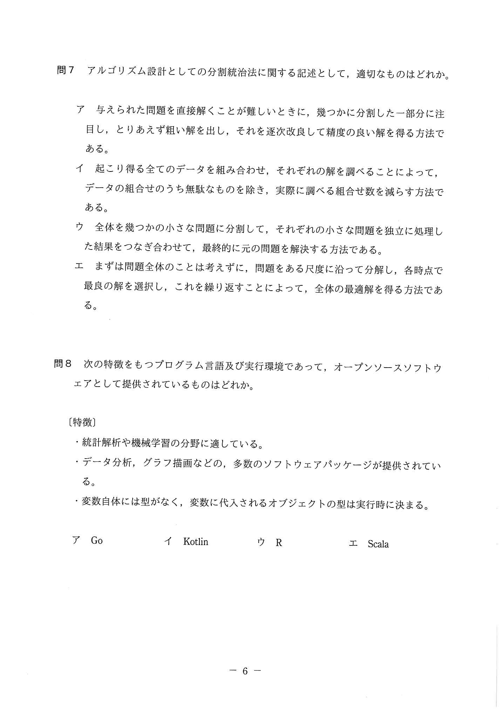

テキスト (OCR)

間7 アルゴリズム設計としての分割統治法に関する記述として, 適切なものはどれか。

ア 与えられた問題を直接解くことが難しいときに, 幾つかに分割した一部分に注
AL, とりあえず粗い解を出し, それを逐次改良して精度の良い解を得る方法で
ある。

イ 起こり得る全てのデータを組み合わせ, それぞれの解を調べることによって,
データの組合せのうち無駄なものを除き, 実際に調べる組合せ数を減らす方法で
ある。

ツウ 全体を幾つかの小さな間題に分割して, それぞれの小さな問題を独立に処理し
た結果をつなぎ合わせて, 最終的に元の問題を解決する方法である。

T まずは問題全体のことは考えずに, 問題をある尺度に沿って分解し, 各時点で
最良の解を選択し.。 これを繰り返すことによって, 全体の最適解を得る方法であ
る。

問8 次の特徴をもつプログラム言語及び実行環境であって, オープンソースソフトウ
エアとして提供されているものはどれか。

(特徴]
・ 統計解析や機械学習の分野に適している。
データ分析, グラフ描画などの, 多数のソフトウェアパッケージが提供されてい
る。
変

数自体には型がなく, 変数に代入されるオブジェクトの型は実行時に決まる。

ア Go     イ Kotlin    ウ R      = Seala

### ページ 7

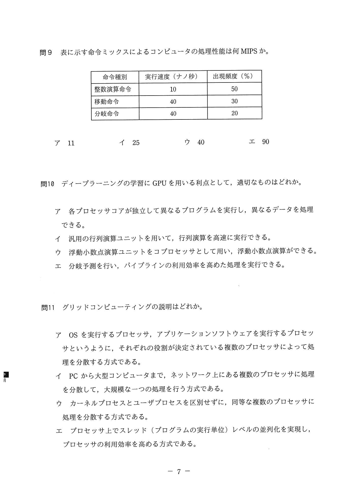

テキスト (OCR)

問9 表に示す命令ミックスによるコンピュータの処理性能は何 MIPS か。

命令種別   実行速度 (ナノ秒)  出現頻度 (%)
整数演算命令      10         50
移動命令        40         30
分岐命令        40         20
ア 11              イ 25              ウ 40              エ 90

lO ディープラーニングの学習に GPU を用いる利点として, 適切なものはどれか。

ア 各プロセッサコアが独立して異なるプログラムを実行し, 異なるデータを処理
できる。

イ 汎用の行列演算ユニットを用いて, 行列演算を高速に実行できる。

ウ 浮動小数点演算エユニットをコプロセッサとして用い, 浮動小数点演算ができる。

エ 分岐予測を行い パイプラインの利用効率を高めた処理を実行できる。

間11 グリッドコンピューティングの説明はどれか。

ア OS を実行するプロセッサ, アプリケーションソフトウェアを実行するプロセッ
サというように, それぞれの役割が決定されている複数のプロセッサによって処
理を分散する方式である。

4 PC から大型コンピュータまで, ネットワーク上にある複数のプロセッサに処理
を分散して, 大規模な一つの処理を行う方式である。

Y カーネルプロセスとユーザプロセスを区別せずに, 同等な複数のプロセッサに
処理を分散する方式である。

エ プロセッサ上でスレッド (プログラムの実行単位) レベルの並列化を実現し,
プロセッサの利用効率を高める方式である。

‘i

### ページ 8

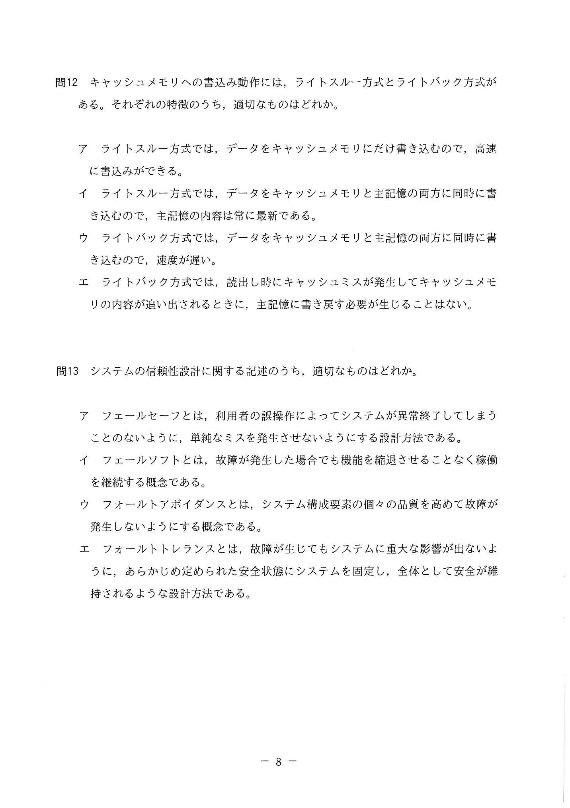

テキスト (OCR)

間12 キャッシュメモリへの書込み動作には, ライトスルー方式とライトバック方式が
ある。それぞれの特徴のうち, 適切ながものはどれか。

ア ライトスルー方式では, データをキャッシュメモリにだけ書き込むので, BH
に書込みができる。

イ ライトスルー方式では, データをキャッシュメモリと主記憶の両方に同時に書
き込むので, 主記憶の内容は常に最新である。

ウ ライトバック方式では, データをキャッシュメモリと主記憶の両方に同時に書
き込むので, 速度が遅い。

エエ ライトバック方式では, 読出し時にキャッシュミスが発生してキャッシュメモ
リの内容が追い出されるときに, 主記憶に書き戻す必要が生じることはない。

間13 システムの信頼性設計に関する記述のうち, 適切ながものはどれか。

ア フェールセーフとは, 利用者の誤操作によってシステムが異常終了してしまう
ことのないように, 単純なミスを発生させないようにする設計方法である。

イ フェールソフトとは, 故障が発生した場合でも機能を縮退させることなく乏働
を継続する概念である。

ウ フォールトアボイダンスとは, システム構成要素の個々の品質を高めて故障が
発生しないようにする概念である。

エエ フォールトトレランスとは, 故障が生じてもシステムに重大な影響が出ないよ
うに, あらかじめ定められた安全状態にシステムを固定し, 全体として安全が維
持されるような設計方法である。

### ページ 9

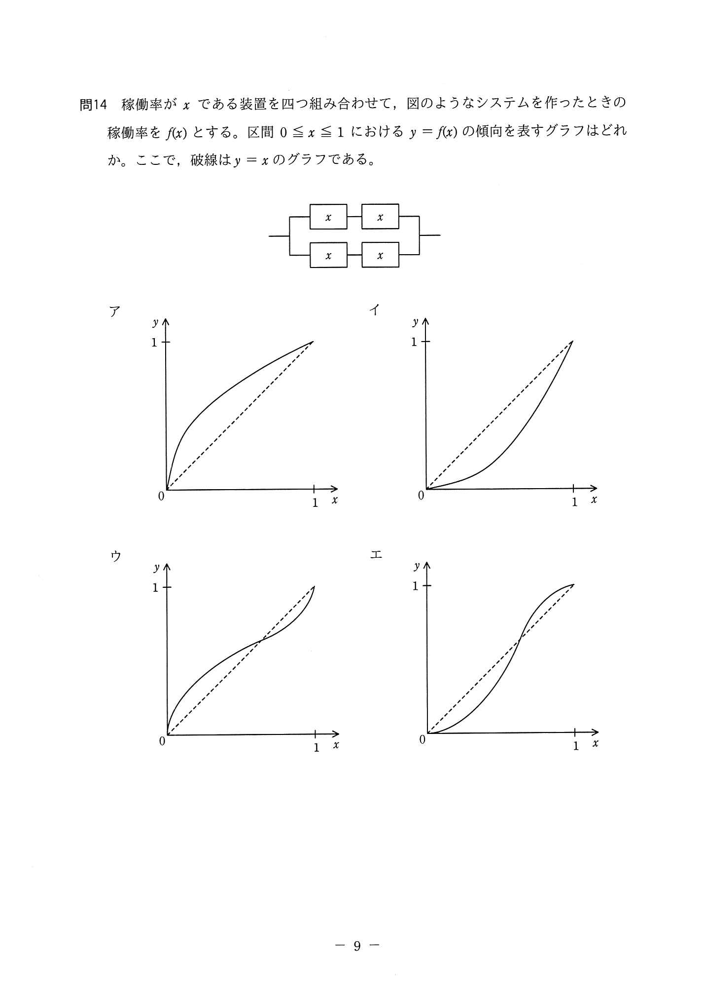

テキスト (OCR)

問14 稼働率が x である装置を四つ組み合わせて, 図のようなシステムを作ったときの
PUB fa) とする。区間 0 ミ* ミ 1 における y =f) の傾向を表すグラフはどれ
か。ここで, 破線はッタニャのグラフである。

y
aL                                                            Z                                                                                                        4
ン                                                                                                        ン
ン                                                                                                        >
ン                                                                                                      2
<                                                                                                        ン
ン                                                                                                        ン
ン
<                                                                                                        7
ン                                                                                                        ン
ン                                                                                                        ン
ィ                                                                                                        ン
の                                                                                                        ン
ン                                                                                                        ン
ン                                                                                                        ン
ン                                                                                                      Z
ン
<                                                                                                        ン
<                                                                                                        ン
ン                                                                                                        ン
ン                                                                                                        ン
の                                                                                                        >
の                                                                                                        ン
ン
ン                                                                                                        ン
ン                                                                                                        >
ン                                                                                                        ン
ン                                                                                                        ン
ン                                                                                                        ン
9                                                         4                                               と                                                         ュ
+                                                                                                         +t
0                                           12                       0                                           12
ノ                                                        xr
J
1                                                          2
ン
ン
ン
ン
ン
の
7
ン
>
ン
:
ン
ン
が2
ン
ン
ン
ン
ン
ン
ン
                                                         +
+
9                                                             1 そ                                                                                                       x

### ページ 10

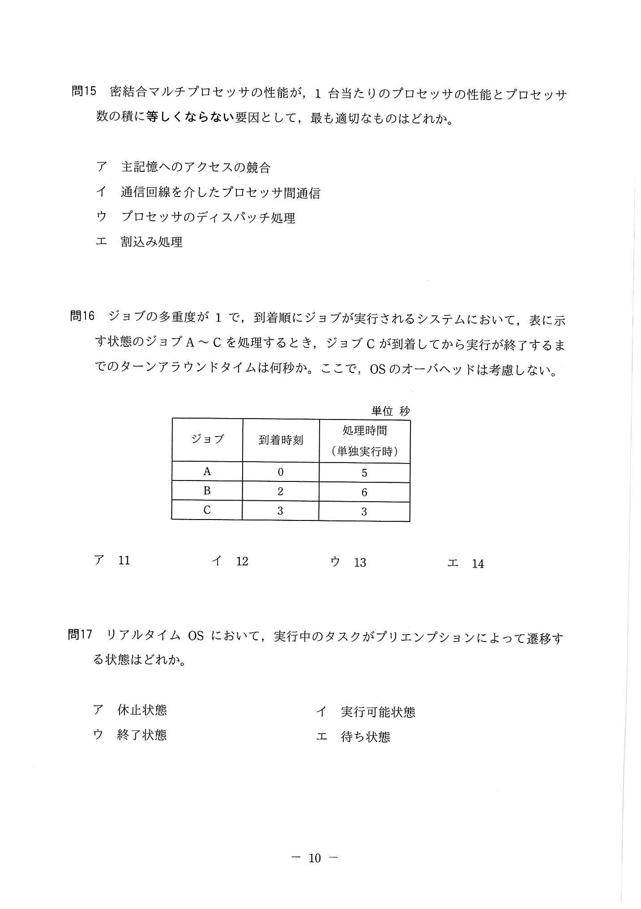

テキスト (OCR)

問15 密結合マルチプロセッサの性能が, 1 台当たりのプロセッサの性能とプロセッサ
数の積に等しくならない要因として, 最も適切かものはどれか。

H マささい

割込み処理

主記憶へのアクセスの競合
通信回線を介したプロセッサ間通信
プロセッサのディスパッチ処理

間16 ジョブの多重度が 1 で, 到着順にジョブが実行されるシステムにおいて, 表に示
す状態のジョブA 一Cを処理するとき, ジョブCが到着してから実行が終了するま
でのターンアラウンドタイムは何秒か。ここで, 0S のオーバヘッドは考慮しない。

単位 秒
ジョブ        到着時刻         scala
(単独実行時)
A     0      5
B            6
C           3
ア 11            イ                ウ 13            = 14

間17 リアルタイム OS において, 実行中のタスクがプリエンプションによって居移す

る状態はどれか。

ア 休止状態
ウ 終了状態

ー 10 一

### ページ 11

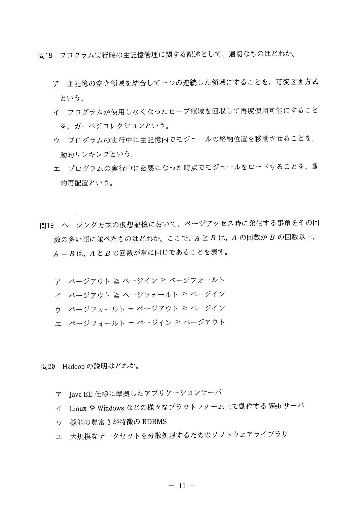

テキスト (OCR)

M18 プログラム実行時の主記憶管理に関する記述として, 適切かなものはどれか。

ア 主記憶の空き領域を結合して一つの連続した領域にすることを, 可変区画方式
という。

イ プログラムが使用しなくなったヒープ領域を回収して再度使用可能にすること
を, ガーベジコレクションという。

ウ プログラムの実行中に主記憶内でモジュールの格納位置を移動させることを,
動釣リンキングという。

エ プログラムの実行中に必要になった時点でモジュールをロードすることを, 動
的再配置という。

間19 ページング方式の仮想記憶において, ページアクセス時に発生する事象をその回
数の多い順に並べたものはどれか。ここで, 4 = は, 4 の回数が の回数以上,
A=Blk, 4 とぢの回数が常に同じであることを表す。

ページアウト 放 ページイン 放 ページフォールト
ページアウト 放 ページフォールト 呈 ページイン

ページフォールト = ページアウト 放 ページイン

H ざいコ

ページフォールト = ページイン ページアウト

120 Hadoop の説明はどれか。

Java EE 仕様に準拠したアプリケーションサーバ

Linux や Windows などの様々なプラットフォーム上で動作する Web サーバ
機能の豊富さが特徴の RDBMS

大規模なデータセットを分散処理するためのソフトウェアライ ブラリ

H ささい

ー T1 一

### ページ 12

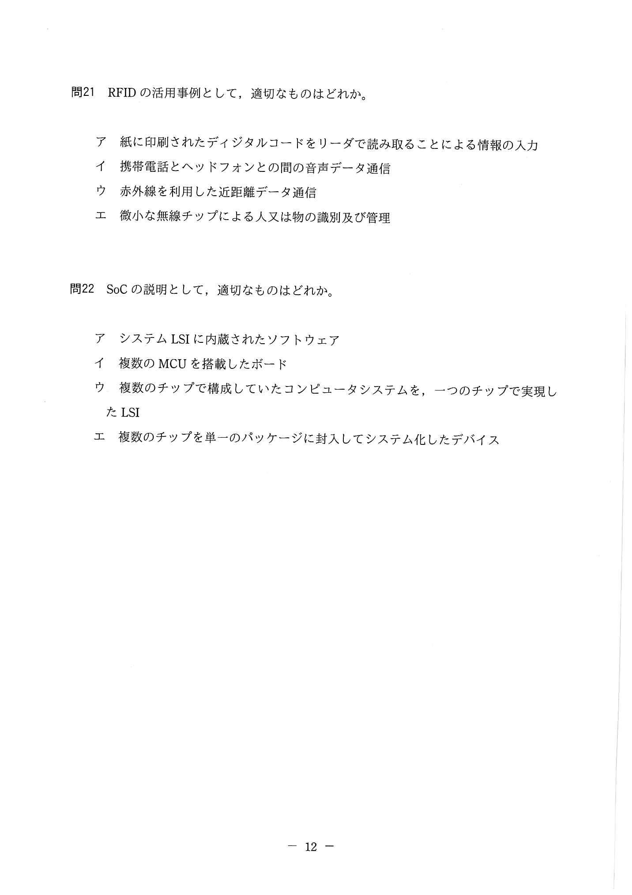

テキスト (OCR)

間21 RFTID の活用事例として, 適切なものはどれか。

紙に印刷されたディジタルコードをリーダで読み取ることによる情報の入力
携帯電話とヘッドフォンとの間の音声データ通信

赤外線を利用した近距離データ通信

微小な無線チップによる人又は物の識別及び管理

HAY

問22 SoCの説明として, 適切なものはどれか。

ア システム LSI に内蔵されたソフトウェア

イ 複数のMCU を搭載したボード

ウ 複数のチップで構成していたコンピュータシステムを, 一つのチップで実現し
たLSI

= 複数のチップを単一のパッケージに封入してシステム化したデバイス

ー 12 一

### ページ 13

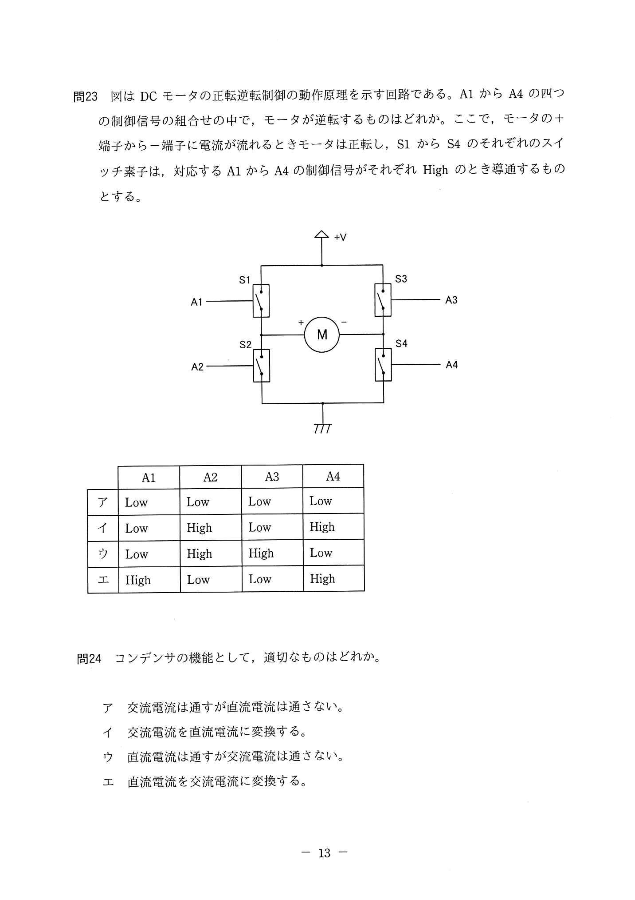

テキスト (OCR)

問23 図は DC モータの正転逆転制御の動作原理を示す回路である。A1 から A4 の四つ
の制御信号の組合せの中で, モータが逆転するものはどれか。ここで, モータの+
端子から一端子に電流が流れるときモータは正転し, S1 から S4 のそれぞれのスイ
ッチ素子は, 対応する A1 から A4 の制御信号がそれぞれ High のとき導通するもの

とする。
im

S1 |             | ss
ュートド]          —

| s4

A2                                                                             \                            A4
Al                  A2                  A3                  A4
ア | Low             Low             Low             Low
イ | Low             High            Low            High
ウ | Low             High            High            Low
=x | High            Low             Low             High

間24 コンデンサの機能として, 適切なものはどれか。

ア 交流電流は通すが直流電流は通さない。
イ 交流電流を直流電流に変換する。

ウ
pa

は通すが交流電流は通さない。

ie
x
&
ss

ー 13 一

### ページ 14

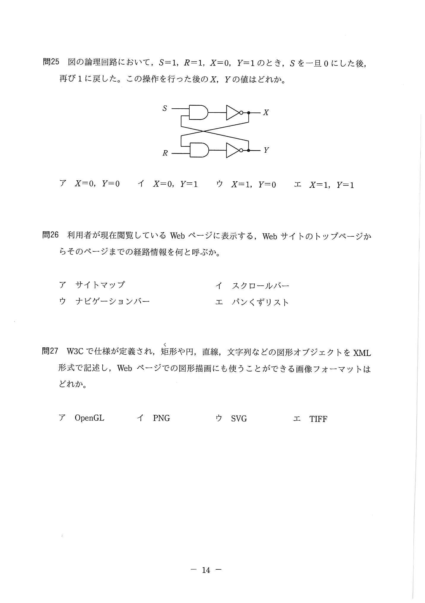

テキスト (OCR)

問25 図の論理回路において, S=1, R=1, X=0, Yー1 のとき, $ を一旦 0 にした後,
再び 1 に戻した。 この操作を行った後のえ,了の値はどれか。

ア X=0, Y=0  イ X=0, Y=1  9 X=1, Y=0  x= X=1, Y=1
間26 利用者が現在閲覧している Web ページに表示する, Web サイトのトップページか

らそのページまでの経路情報を何と呼ぶか。

ア サイトマップ         イ スクロールバー

ウ ナビゲーションバー           エエ パンくずリスト

く
問27 W3C で仕様が定義され, 短形や円, 直線, 文字列などの図形オブジェクトを XML
形式で記述し, Web ページでの図形描画にも使うことができる画像フォーマットは
どれか。

ア OpenGL   イ PNG     ウ SVG     <= TIFF

ー 14 一

### ページ 15

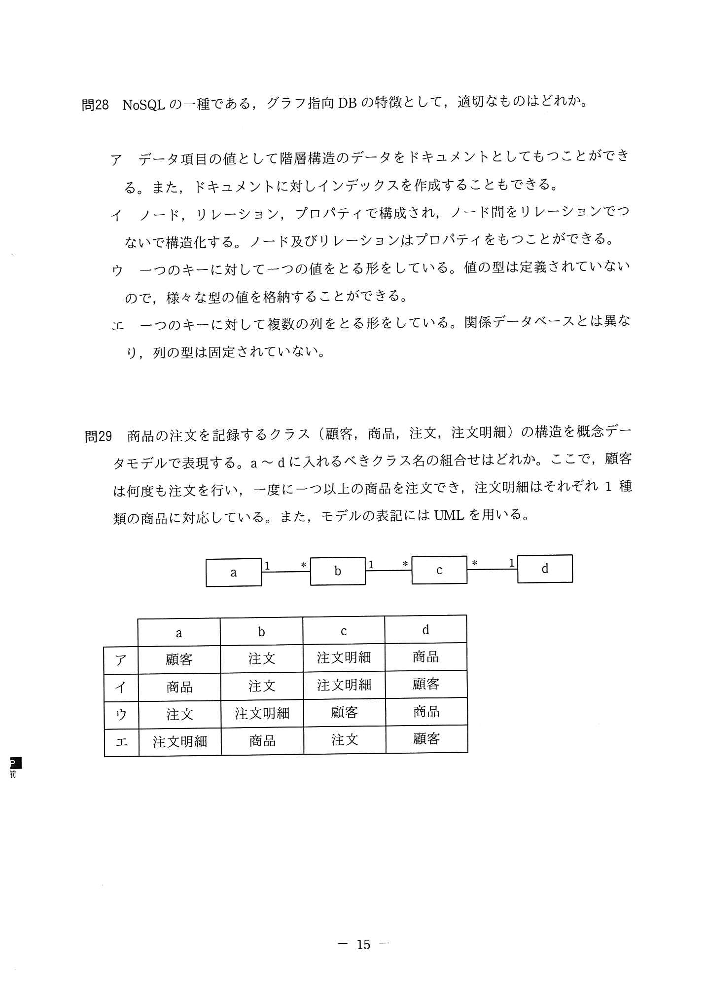

テキスト (OCR)

間28 NoSQL の一種である, グラフ指向 DB の特徴として, 適切なものはどれか。

ア データ項目の値として階層構造のデータをドキュメントとしてもつことができ
る。また, ドキュメントに対しインデックスを作成することもできる。

イ ノード, リレーション, プロパティで構成され, ノード間をリレーションでつ
ないで構造化する。ノード及びリレーションはプロパティをもつことができる。
ウ 一つのキーに対して一つの値をとる形をしている。値の型は定義されていない

DC, 様々な型の値を格納することができる。
エ ーーつのキーに対して複数の列をとる形をしている。関係データベースとは異な
り, 列の型は固定されていない。

問29 商品の注文を記録するクラス (顧客, 商品, 注文, 注文明細) の構造を概念デー
タモデルで表現する。a… dに入れるべきクラス名の組合せはどれか。ここで, Me
は何度も注文を行い, 一度に一つ以上の商品を注文でき, 注文明細はそれぞれ 1 種
類の商品に対応している。 また, モデルの表記には UML を用いる。

a    .     =    b    so    =    C     A    d
a           b           c           d
ア   顧客    注文   注文明細   商品
イ   商品    注文   注文明細   顧客
0   注文   注文明細   顧客    商品
エエ | 注文明細   商品    注文    顧客

re

=4y5 =

### ページ 16

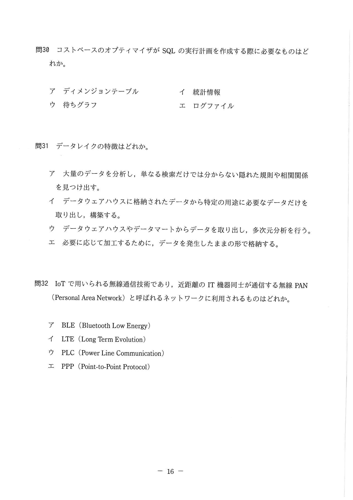

テキスト (OCR)

間39 コストペベースのオプティマイザが SQL の実行計画を作成する際に必要なものはど
れか。

ア ディメンジョンテーブル      イ 統計情報
ウ 待ちもグラフ            エ ログファイル

間31 データレイクの特徴はどれか。

ア 大量のデータを分析し, 単なる検索だけでは分からない隠れた規則や相関関係
を見つけ出す。

イ データウェアハウスに格納されたデータから特定の用途に必要なデータだけを
取り出し, 構築する。

ウ データウェアハウスやデータマートからデータを取り出し, 多次元分析を行う。

エエ 必要に応じて加工するために, データを発生したままの形で格納する。

問32 IoT で用いられる無線通信技術であり, 近距離の IT 機器同士が通信する無線 PAN
(Personal Area Network) と呼ばれるネットワークに利用されるものはどれか。
BLE (Bluetooth Low Energy)

ア

イ LTE (Long Term Evolution)

ウ PLC (Power Line Communication)
x

PPP (Point-to-Point Protocol)

= 6 一

### ページ 17

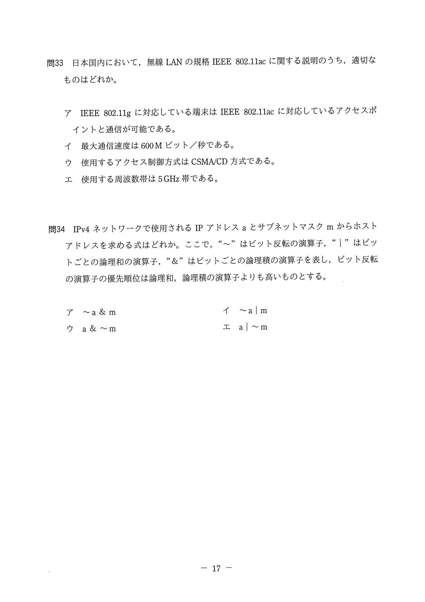

テキスト (OCR)

P33 日本国内において, 無線 LAN の規格 TEEE 802.11ac に関する説明のうち, 適切な
ものはどれか。

ア IEEE 802.11g に対応している端末は IEEE 802.11ac に対応しているアクセスポ
イントと通信が可能である。

4 最大通信速度は 600M ビットノ秒である。

ウ 使用するアクセス制御方式は CSMA/CD 方式である。

エ 使用する周波数帯は 5GHz 帯である。

問34 IPv4 ネットワークで使用される IP アドレス a とサブネットマスク m からホスト
アドレスを求める式はどれか。ここで, “~” はビット反転の演算子,“ |" はビッ
トごとの論理和の演算子,“&” はビットごとの論理積の演算子を表し, Cy bie
の演算子の優先順位は論理和, 論理積の演算子よりも高いものとする。

ア ~a&m            イ ~alm

ウ a&~m           x= al~m

= 47 =

### ページ 18

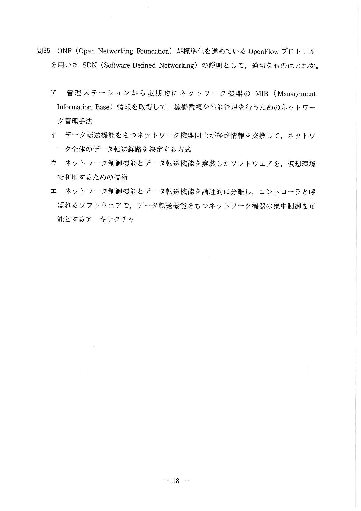

テキスト (OCR)

間35 ONF (Open Networking Foundation) が標準化を進めている OpenFlow プロトコル
を用いた SDN (Software-Defined Networking) の説明として, 適切なかものはどれか。

ア 管理ステーションから定期的にネットワーク機器の MIB (Management
Information Base) 情報を取得して, 稼働監視や性能管理を行うためのネットワー
ク管理手法

イ データ転送機能をもつネットワーク機器同士が経路情報を交換して, ネットワ
ーク全体のデータ転送経路を決定する方式

ウ ネットワーク制御機能とデータ転送機能を実装したソフトウェアを, 仮想環境
で利用するための技術

エ ネットワーク制御機能とデータ転送機能を論理的に分離し, コントローラと呼
ばれるソフトウェアで, データ転送機能をもつネットワーク機器の集中制御を可
能とするアーキテクチャ

= g =

### ページ 19

テキスト (OCR)

間36 2.4 GHz 帯の無線 LAN のアクセスポイントを, 広いオフィスや店舗などをカバー
できるように分散して複数設置したい。2.4 GHz HORM LAN の特性を考慮した運
用をするために, 各アクセスポイントが使用する周波数チャネル番号の割当て方と
LT, 適切ながものはどれか。

ア PC を移動しても, PC の設定を変えずに近くのアクセスポイントに接続できる
ように, 全てのアクセスポイントが使用する周波数チャネル番号は同じ番号に捕
えておくのがよい。

イ アクセスポイント相互の電波の干渉を避けるために, 隣り合うアクセスポイン
トには, 例えば周波数チャネル番号 1 と 6, 6 と 11 のように離れた番号を割り当
てるのがよい。

ウ 異なる SSID の通信が相互に影響することはないので, アクセスポイントごとに
SSID を変えて, PO, 周波数チャネル番号の割当ては機器の出荷時設定のままが
よい。

エエ 障害時に周波数チャネル番号から対象のアクセスポイントを特定するために,
設置エリアの端から 1, 2, 3 と順番に使用する周波数チャネル番号を割り当てる
のがよい。

間37 Web サイトにおいて, クリックジャッキング攻撃の対策に該当するものはどれか。

ア HTTP レスポンスペヘッダに X-Content-Type-Options を設定する。

4 HTTP レスポンスヘッダに X-Frame-Options を設定する。

ウ 入力に HTML タグが含まれていたら, HTML タグとして解釈されないほかの文
字列に置き換える。

エ 入力文字数が制限を超えているときは受け付けない。

= 19 =

### ページ 20

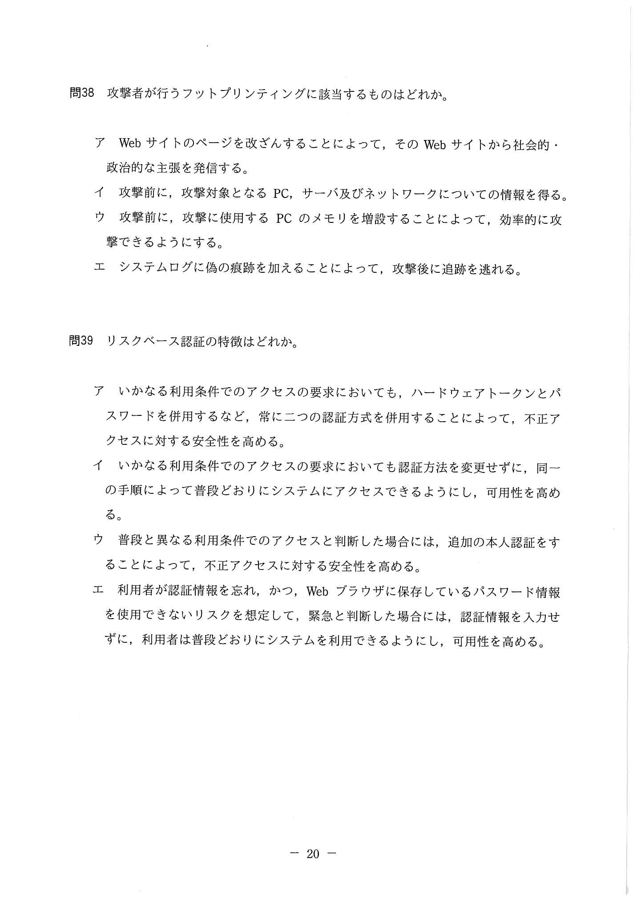

テキスト (OCR)

問38 攻撃者が行うフットプリンティングに該当するものはどれか。

ア Web サイトのページを改ざんすることによって, その Web サイトから社会的・
政治的な主張を発信する。

イ 攻撃前に, 攻撃対象となる PC, サーバ及びネットワークについての情報を得る。
ウ 攻撃前に, 攻撃に使用する PC のメモリを増設することによって, 効率的に攻
撃できるようにする。

エエ システムログに偽の痕跡を加えることによって, 攻撃後に追跡を逃れる。

間39 リスクベース認証の特徴はどれか。

ア いかなる利用条件でのアクセスの要求においても, ハードウェアトークンとパ
スワードを併用するなど, 常に二つの認証方式を併用することによって, 不正ア
クセスに対する安全性を高める。

イ いかなる利用条件でのアクセスの要求においても認証方法を変更せずに, 同一
の手順によって普段どおりにシステムにアクセスできるようにし, 可用性を高め
る。

ウ 普段と異なる利用条件でのアクセスと判断した場合には, 追加の本人認証をす
ることによって, 不正アクセスに対する安全性を高める。

TL 利用者が認証情報を忘れ, かつ, Web ブラウザに保存しているパスワード情報
を使用できないリスクを想定して, 緊急と判断した場合には, 認証情報を入力せ
ずに, 利用者は普段どおりにシステムを利用できるようにし, 可用性を高める。

ー 20 一

### ページ 21

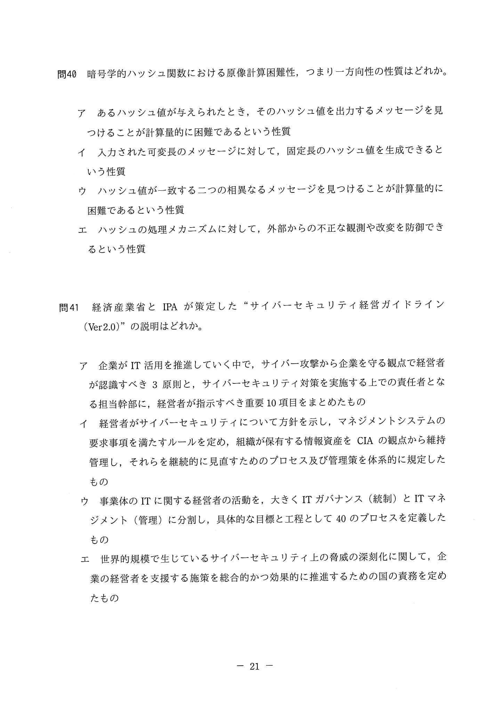

テキスト (OCR)

40 暗号学的ハッシュ関数における原像計算困難性, つまり一方向性の性質はどれか。

ア あるハッシュ値が与えられたとき, そのハッシュ値を出力するメッセージを見
つけることが計算量的に困難であるという性質
イ 入力された可変長のメッセージに対して, 固定長のハッシュ値を生成できると

いう性質

ウ ハッシュ値が一致する二つの相異なるメッセージを見つけることが計算量的に
困難であるという性質

エ ハッシュの処理メカニズムに対して, 外部からの不正な観測や改変を防御でき
るという性質

問41 経済産業省と IPA が策定した “サイバーセキュリティ経営ガイドライン
(Ver2.0)”の説明はどれか。

ア 企業が IT 活用を推進していく中で, サイバー攻撃から企業を守る観点で経営者
が認識すべき 3 原則と, サイバーセキュリティ装策を実施する上での貢任者とな
る担当幹部に, 経営者が指示すべき重要 10 項目をまとめたもの

イ 経営者がサイバーセキュリティについて方針を示し, マネジメントシステムの
要求事項を満たすサルールを定め, 組織が保有する情報資産を CIA の観点から維持
管理し, それらを継続的に見直すためのプロセス及び管理策を体系的に規定した
もの

ウ 事業体の IT に関する経営者の活動を, 大きく IT ガバナンス (統制) とIT マネ
ジメント (管理) に分割し, 具体的な目標と工程として 40 のプロセスを定義した
もの

エ 世界的規模で生じているサイバーセキュリティ上の僧威の深刻化に関して, 企
業の経営者を支援する施策を総合的かつ効果的に推進するための国の責務を定め
たもの

ー 21 一

### ページ 22

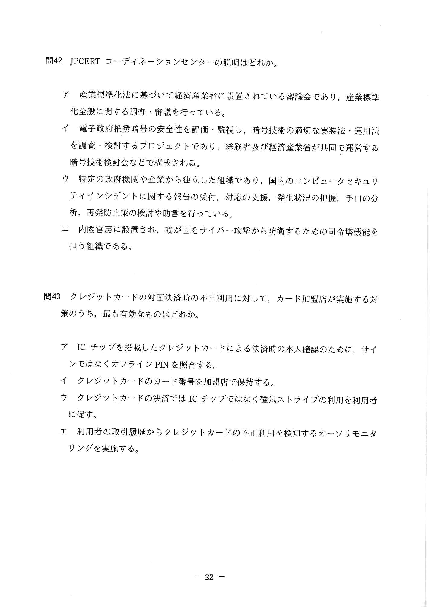

テキスト (OCR)

問42 JPCERT コーディネーションセンターの説明はどれか。

ア 産業標準化法に基づいて経済産業省に設置されている審議会であり, 産業標準
化全般に関する調査・審議を行っている。

イ 電子政府推奨暗号の安全性を評価・監視し, 暗号技術の適切な実装法・運用法
を調査・検討するプロジェクトであり,  総務省及び経済産業省が共同で運営する
暗号技術検討会などで構成される。

ウ 特定の政府機関や企業から独立した組織であり, 国内のコンピュータセキュリ
ティインシデントに関する報告の受付, 対応の支援, 発生状況の把握, 手口の分
析, 再発防止策の検討や助言行っている。

= 内閣官房に設置され, 我が国をサイバー攻撃から防衛するための司令塔機能を
担う組織である。

間43 クレジットカードの対面決済時の不正利用に対して, カード加盟店が実施する対
策のうち, 最も有効なものはどれか。

ア WC チップを搭載したクレジットカードによる決済時の本人確認のために, サイ
ンではなくオフライン PIN を照合する。

イ クレジットカードのカード番号を加盟店で保持する。

ウ クレジットカードの決済では IC チップではなく磁気ストライプの利用を利用者
に促す。

Lt 利用者の取引履歴からクレジットカードの不正利用を検知するオーソリモニタ
リングを実施する。

ー 22 一

### ページ 23

テキスト (OCR)

間44 Web システムにおいて, セッションの乗っ取りの機会を減らすために, 利用者の
ログアウト時に Web サーバ又は Web ブラウザにおいて行うべき処理はどれか。ここ
で, 利用者は自分専用の PC において, Web ブラウザを利用しているものとする。

Web サーバにおいてセッション ID を内蔵ストレージに格納する。
Web サーバにおいてセッション ID を無効にする。

Web ブラウザにおいてキャッシュしている Web ページをクリアする。
Web ブラウザにおいてセッション ID を内蔵ストレージに格納する。

Hod AM

B45 TLS のクライアント認証における次の処理 ac について, 適切な順序はどれか。

処理                      処理の内容
a    クライアントが, サーバにクライアント証明書を送付する。

b     サーバが, クライアントにサーバ証明書を送付する。

c    サーバが, クライアントを認証する。

H ささ コ
トコ
J
Q
!
ご

ー 23 一

### ページ 24

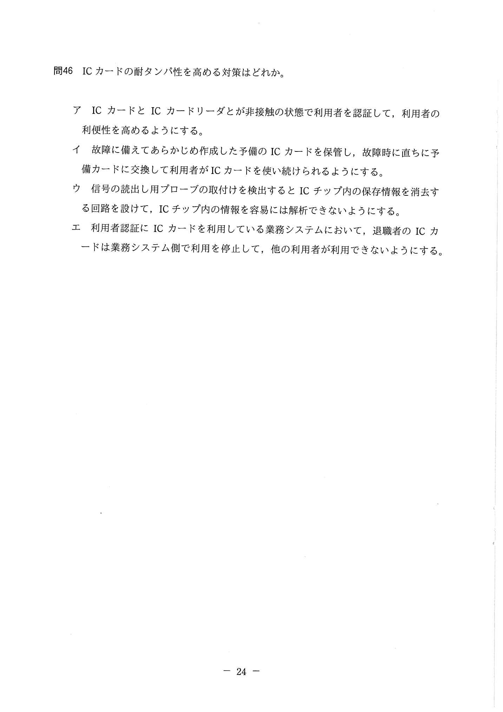

テキスト (OCR)

間46 IC カードの耐タンパ性を高める対策はどれか。

ア 1C カードと IC カードリーダとが非接触の状態で利用者を認証して, 利用者の
利便性を高めるようにする。

イ 故障に備えてあらかじめ作成した予備の IC カードを保管し, 故障時に直ちに予
備カードに交換して利用者がIC カードを使い続けられるようにする。

ウ 信号の読出し用プローブの取付けを検出すると IC チップ内の保存情報を消去す
る回路を設けて, IC チップ内の情報を容易には解析できないようにする。

エエ 利用者認証に IC カードを利用している業務システムにおいて, 退職者のICカ
ードは業務システム側で利用を停止して, 他の利用者が利用できないようにする。

ー 24 一

### ページ 25

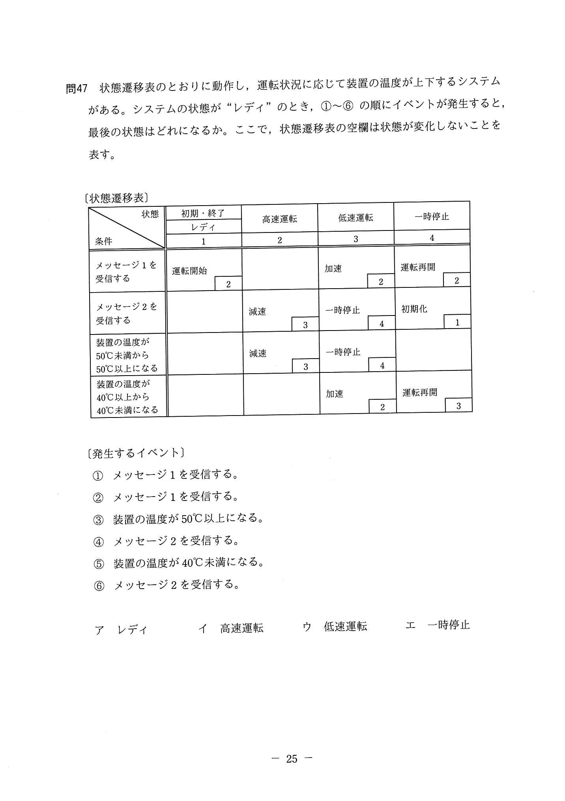

テキスト (OCR)

間47 状態遷移表のとおりに動作し, 運転状況に応じて装置の温度が上下するシステム
がある。システムの状態が "レディ” のとき, O~© の順にイベン トが発生すると,
最後の状態はどれになるか。ここで,  状態遷移表の空欄は状態が変化しないことを
表す。

〔状態遷移表]
se | 00 eT        高速運転        低速運転        ー時停上
レディ
条件                  1              2              3              4
メッセージ 1を
‘            運転開始                       加速            運転再開
受信
受信する                   2                           | 3 |            2
nara                  woe            — HIB        ante
ae                                     3              4              A.
装置の温度が
50で未満から                    減速            一時停止
50C以上になる                             8              4
装置の温度が
40C以上から                                   加速            運転再開
40で未満になる                                            2              3
[発生するイベント〕
① メッセージ 1 を受信する。
② メッセージ 1 を受信する。
③ 装置の温度が 50C以上になる。
④ メッセージ 2 を受信する。
© 装置の温度が 40で未満になる。
© メッセージ 2 を受信する。
ア レディ          イ 高速運転        ウ 低速運転        エ 一時停止

ー 25 一

### ページ 26

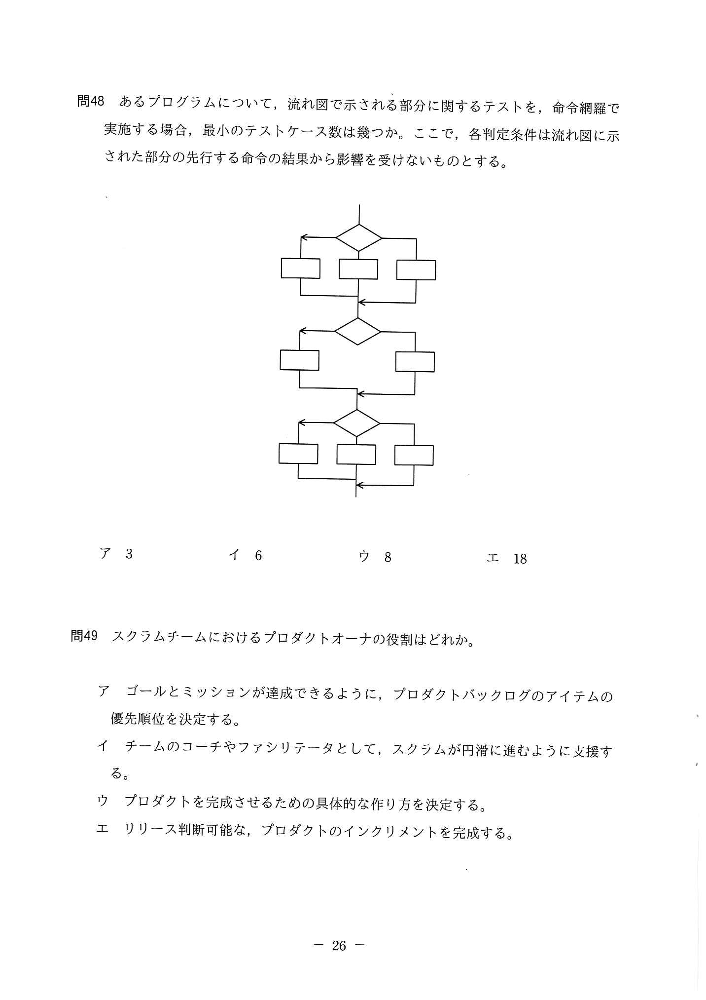

テキスト (OCR)

問48 あるプログラムについて, 流れ図で示される部分に関するテストを, 命令網羅で
実施する場合 HDOTAKT—ABIUKOM Lot, 各判定条件は流れ図に示
された部分の先行する命令の結果から彫響を受けないものとする。

間49 スクラムチームにおけるプロダクトオーナの役割はどれか。

ア ゴールとミッションが達成できるように, プロダクトバックログのアイテムの
優先順位を決定する。

イ チームのコーチやファシリテータとして, スクラムが円滑に進むように支援す
る。

ウ プロダクトを完成させるための具体的な作り方を決定する。

= リリース判断可能な, プロダクトのインクリメントを完成する。

ー 26 一

### ページ 27

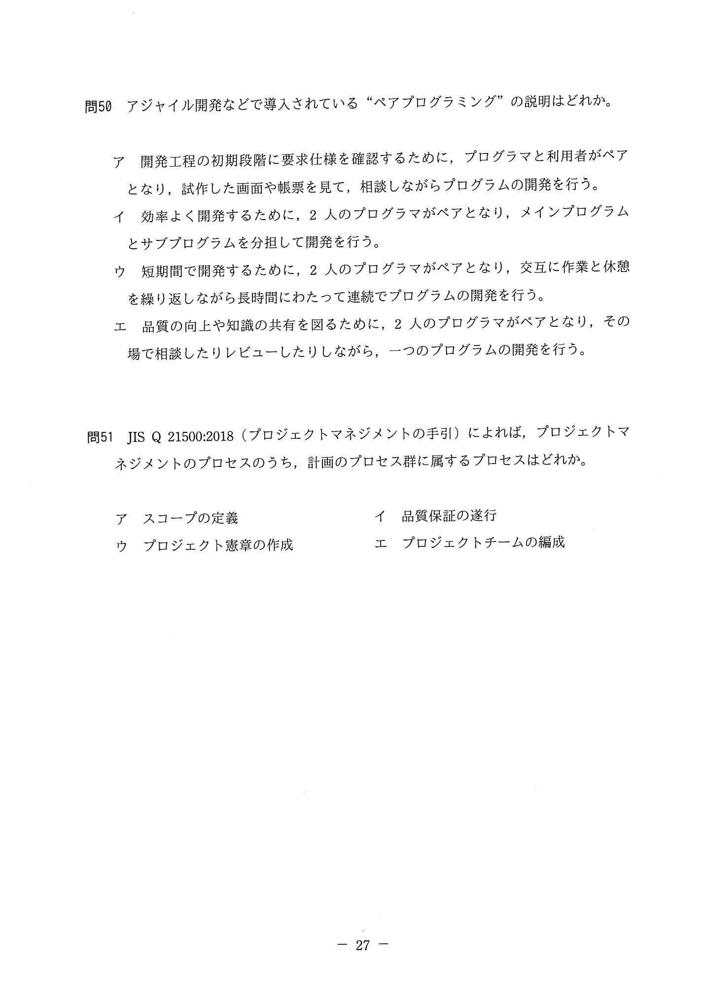

テキスト (OCR)

問59 アジャイル開発などで導入されている “ペアプログラミング" の説明はどれが。

ア 開発工程の初期段階に要求仕様を確認するために, プログラマと利用者がペア
となり, 試作した画面や帳票を見て, 相談しながらプログラムの開発を行う。

イ 効率よく開発するために, 2 人のプログラマがペアとなり, メインプログラム
とサブプログラムを分担して開発を行う。

ウ 短期間で開発するために, 2 人のプログラマがペアとなり, 交互に作業と体憩
を繰り返しながら長時間にわたって連続でプログラムの開発を行う。

エ 品質の向上や知識の共有を図るために, 2 人のプログラマがペアとなり, その
場で相談したりレビューしたりしながら, 一つのプログラムの開発を行う。

間51 JIS Q 21500:2018 (プロジェクトマネジメントの手引) によれば, プロジェクトマ
ネジメントのプロセスのうち, 計画のプロセス群に属するプロセスはどれか。

ア スコープの定義          イ 品質保証の遂行
ウ プロジェクト憲章の作成      エ プロジェクトチームの編成

ー 27 一

### ページ 28

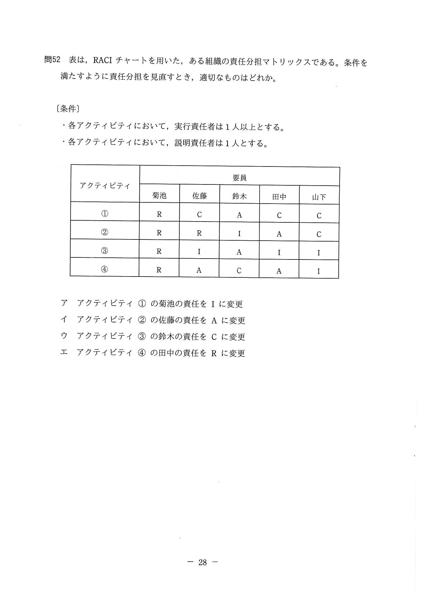

テキスト (OCR)

問52 表は, RACI チャートを用いた, ある組織の責任分担マトリックスである。条件を
満たすように南任分担を見直すとき, 適切なものはどれか。

(BF)
・各アクティビティにおいて, 実行責任者は 1 人以上とする。
・各アクティビティにおいて, 説明次任者は 1 人とする。

要員
アクティビティ
菊池   佐藤   鈴木   田中   山下
①         R       @       A       C       【ゅ
@         R       R       I       A       C
③         R       I       A       I       I
®         R       A       (0       A       I

アクティビティ ① の菊池の責任を I に変更
アクティビティ © の佐藤の責任を A に変更
アクティビティ @ の鈴木の責任を C に変更
アクティビティ @ の田中の責任を R に変更

H さヽ コ

ー 28 一

### ページ 29

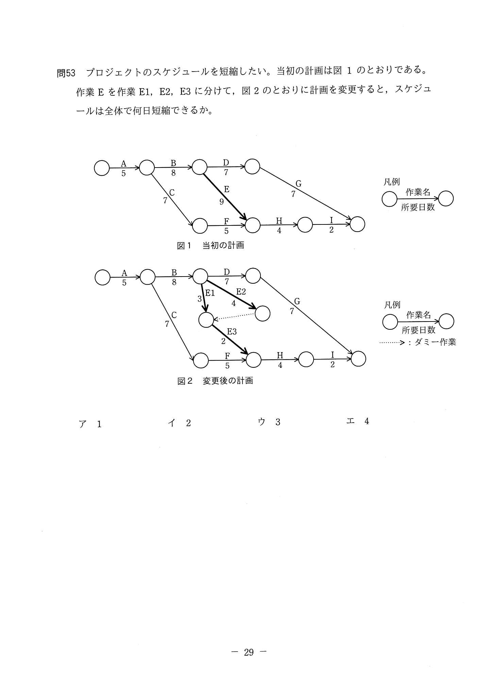

テキスト (OCR)

問53 プロジェクトのスケジュールを短縮したい。 当初の計画は図 1 のとおりである。
作業 F を作業 EL, E2, E3 に分けて, 図 2 のとおりに計画を変更すると, スケジュ
ールは全体で何日短縮できるか。

図1 当初の計画

ー 29 一

### ページ 30

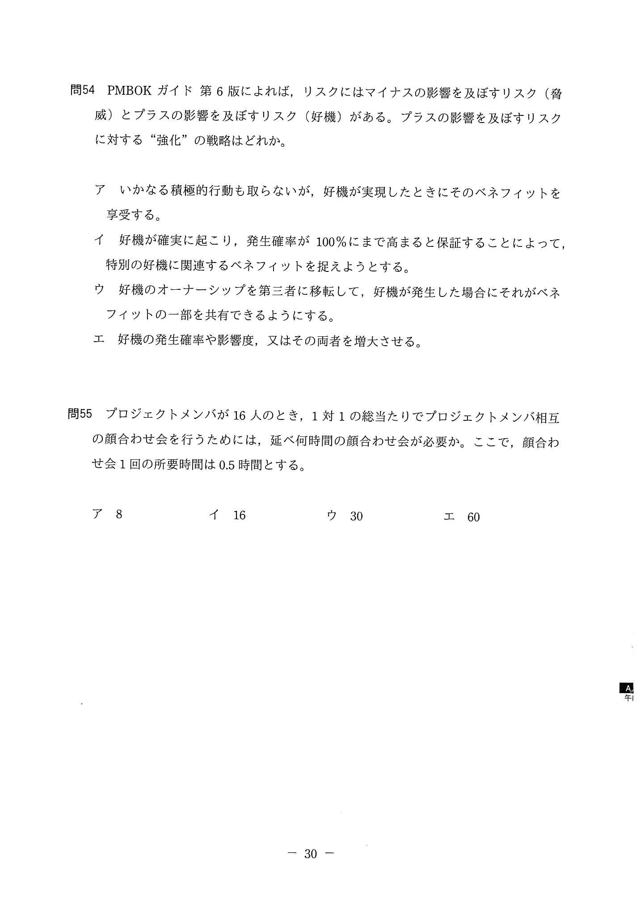

テキスト (OCR)

問54 PMBOK ガイド 第6 版によれば, リスクにはマイナスの影響を及ぼすリスク (B
威) とプラスの影響を及ぼすリスク (好機) がある。プラスの影響を及ぼすリスク
に対する 強化” の戦略はどれか。

ア いかなる積極的行動も取らないが, 好機が実現したときにそのベネフィットを
享受する。

イ 好機が確実に起こり, 発生確率が 100%にまで高まると保証することによって
特別の好機に関連するベネフィットを捉えようとする。

ウ 好機のオーナーシップを第三者に移転して, 好機が発生した場合にそれがべベネ
フィットの一部を共有できるようにする。

<= 好機の発生確率や影響度。 又はその両者を増大させる。

問55 プロジェクトメンバが 16 人のとき, 1 対 1 の総当たりでプロジェクトメンバ相互
の顔合わせ会を行うためには, 延べ何時間の顔合わせ会が必要か。ここで, MAD
せ会 1 回の所要時間は 0.5 時間とする。

ー 30 一

### ページ 31

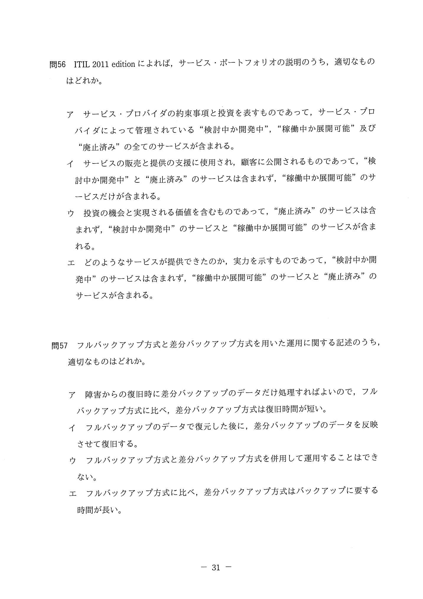

テキスト (OCR)

間56 ITIL 2011 editon によれば, サービス・ポートフォリオの説明のうち, 適切なもの
はどれか。

ア サービス・プロバイズダの約束事項と投資を表すものであって, サービス・プロ
バイダによって管理されている “検討中か開発中", “稼働中か展開可能” 及び
“廃止済み” の全てのサービスが含まれる。

イ サービスの販売と提供の支援に使用され, 顧客に公開されるものであって, “検
討中か開発中” と“廃止済み” のサービスは含まれず, “稼働中か展開可能” OF
ービスだけが含まれる。

ウ 投資の機会と実現される価値を含むものであって, “廃止済み" のサービスは含
まれず, “検討中か開発中"” のサービスと “稼働中か展開可能*” のサービスが含ま
れる。

エ どのようなサービスが提供できたのか, 実力を示すものであって, “検討中か開
JE” のサービスは含まれず, “稼働中か展開可能* のサービスと “廃止済み"の
サービスが含まれる。

間57 フルバックアップ方式と差分バックアップ方式を用いた運用に関する記述のうち,
適切なものはどれか。

ア 障害からの復旧時に差分バックアップのデータだけ処理すればよいので, フル
バックアップ方式に比べ, 差分バックアップ方式は復旧時間が短い。

イ フルバックアップのデータで復元した後に, 差分バックアップのデータを反映
させて復旧する。

ウ フルバックアップ方式と差分バックアップ方式を併用して運用することはでき
ない。

エ フルバックアップ方式に比べ, 差分バックアップ方式はバックアップに要する
時間が長い。

ーー前 —

### ページ 32

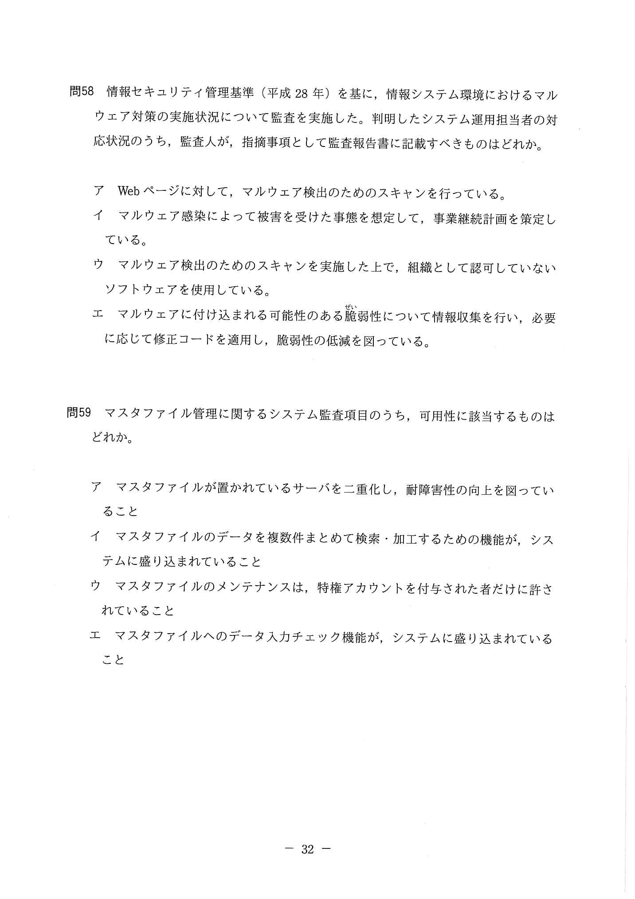

テキスト (OCR)

問58 情報セキュリティ管理基準 (平成 28 年) を基に, 情報システム環境におけるマル
ウェア対策の実施状況について監査を実施した。判明したシステム運用担当者の対
応状況のうち, 監査人が, 指摘事項として監査報告書に記載すべきものはどれか。

ア Web ページに対して, マルウェア検出のためのスキャンを行っている。

イ マルウェア感染によって被害を受けた事態を想定して, 事業継続計画を策定し
ている。

ウ マルウェア検出のためのスキャンを実施した上で, 組織として認可していない
ソフトウェアを使用している。

エ マルウェアに付け込まれる可能性のある脆弱性について情報収集を行い, 必要
に応じて修正コードを適用し, 脆弱性の低減を図っている。

問59 マスタファイル管理に関するシステム監査項目のうち, 可用性に該当するものは
どれか。

ア マスタファイルが置かれているサーバを二重化し, 耐障害性の向上を図ってい
ること

イ マスタファイルのデータを複数件まとめて検索・加工するための機能が, シス
テムに盛り込まれていること

ウ マスタファイルのメンテナンスは, 特権アカウントを付与された者だけに許さ
れていること

エエ マスタファイルへのデータ入力チェック機能が, システムに盛り込まれている
at

ー 32 一

### ページ 33

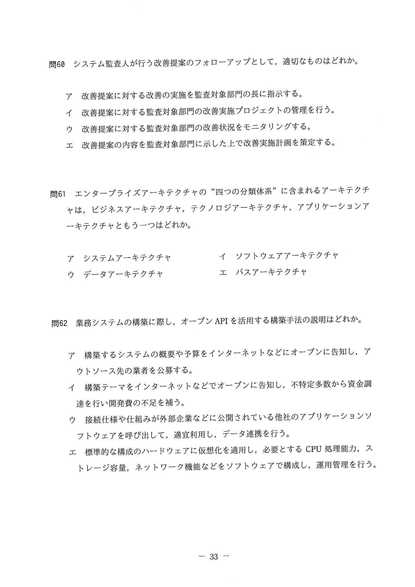

テキスト (OCR)

間60 システム監査人が行う改善提案のフォローアップとして, 適切なものはどれか。

改善提案に対する改善の実施を監査対象部門の長に指示する。
改善提案に対する監査対象部門の改善実施プロジェクトの管理を行う。
改善提案に対する監査対象部門の改善状況とをモニタリングする。
改善提案の内容を監査対象部門に示した上で改善実施計画を策定する。

H ささへ NM

問61 エンタープライズアーキテクチャの “四つの分類体系” に含まれるアーキテクチ
ャは, ビジネスアーキテクチャ, テクノロジアーキテクチャ, アプリケーションア
ーキテクチャともう一つはどれか。

ア システムアーキテクチャ         イ フトウェアアーキテクチャ
ウ データアーキテクチャ       エ バスアーキテクチャ

問62 業務システムの構築に際し, オープン API を活用する構築手法の説明はどれか。

ア 構築するシステムの概要や予算をインターネットなどにオープンに告知し, ア
ウトソース先の業者を公募する。

イ 構築テーマをインターネットなどでオープンに告知し, 不特定多数から資金調
達を行い開発費の不足を補う。

ウ 接続仕様や仕組みが外部企業などに公開されている他社のアプリケーションソ
フトウェアを呼び出して, 適宜利用し, データ連携を行う。

エ 標準的な構成のハードウェアに仮想化を適用し, 必要とする CPU 処理能力, ス

の

トレージ容量, ネットワーク機能などをソフトウェアで構成し, 運用管理を行う。

ー 33 一

### ページ 34

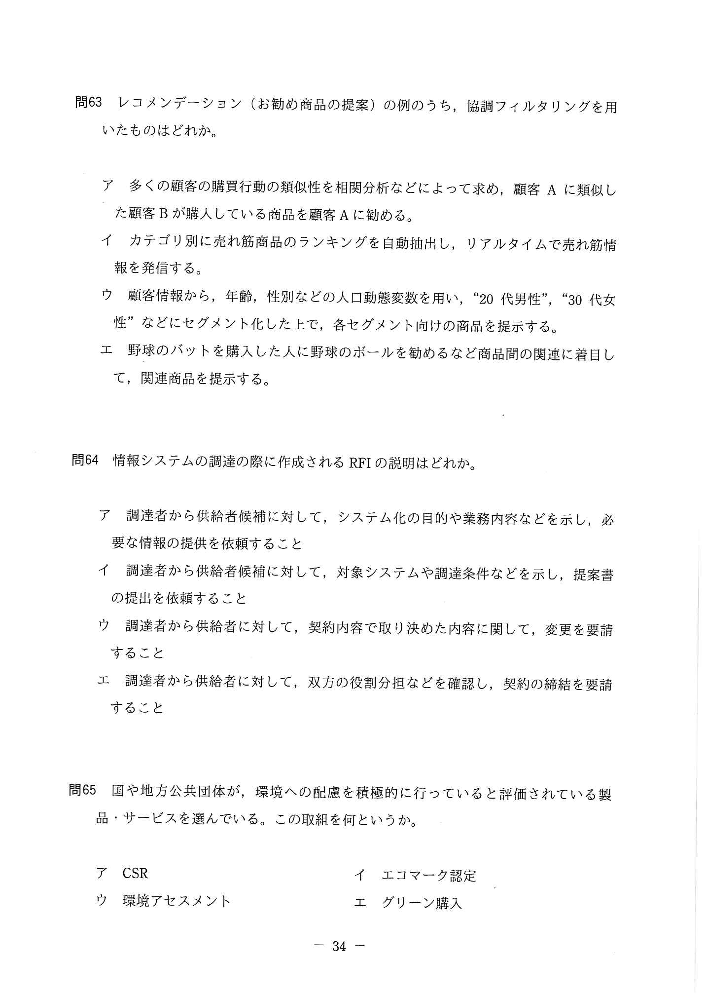

テキスト (OCR)

63 レコメンデーション (お勧め商品の提案) の例のうち, 協調フィルタリングを用
いたものはどれか。

ア 多くの顧客の購買行動の類似性を相関分析などによって求め, 顧客 A に類似し
た顧客 B が購入している商品を顧客 A に勧める。

イ カテゴリ別に売れ筋商品のランキングを自動抽出し, リアルタイムで売れ筋情
報を発信する。

ウ 顧客情報から, 年齢。 性別などの人口動態変数を用い, “20 代男性", “30 代女
ME” などにセグメント化した上で, 各セグメント向けの商品を提示する。

= 野球のバットを購入した人に野球のボールを勧めるなど商品間の関連に着目し
て, 関連商品を提示する。

問64 情報システムの調達の際に作成される RFI の説明はどれか。

ア 調達者から供給者候補に対して, システム化の目的や業務内容などを示し, 必
要な情報の提供を依頼すること

イ 調達者から供給者候補に対して, 対象システムや調達条件などを示し, BEB
の提出を依頼すること

ツウ 調達者から供給者に対して, 契約内容で取り決めた内容に関して, 変更を要請
すること

エエ 調達者から供給者に対して, 双方の役割分担などを確認し, 契約の締結を要請
すること

間65 国や地方公共団体が, 環境への配慮を積極的に行っていると評価されている製
品・サービスを選んでいる。この取組を何というか。

ア CSR              イ エコマーク認定
ウ 環境アセスメント               エエ グリーン購入

ー 34 一

### ページ 35

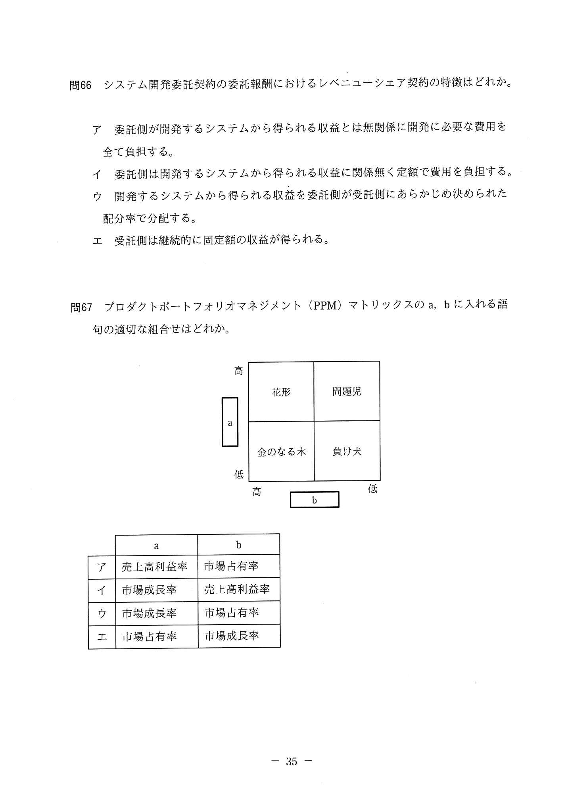

テキスト (OCR)

M66 システム開発委託契約の委託報酬における レベニューシェア契約の特徴は どれか。

ア 委託側が開発するシステムから得らちれる収益とは無関係に開発に必要な費用を

全て負担する。
イ 委託側は開発するシステムから得られる収益に関係無く定額で費用を負担する。
ウ 開発するシステムから得られる収益を委託側が受託側にあらかじめ決められた
配分率で分配する。

エ 受託側は継続的に固定額の収益が得られる。

2h
it

間67 プロダクトポートフォリオマネジメント (PPM) マトリックスのa, b に入れる
名の適切な組合せはどれか。

ett

aleve

at
SS

BORSA    AUK

低

高                   低

a               b
売上高利益率 | 市場占有率
市場成長率    売上高利益率
市場成長率      市場占有率
市場占有率     市場成長率

HI ]さ11

ー 85 一

### ページ 36

テキスト (OCR)

問68 企業の競争戦略におけるフォロワ戦略はどれか。

ア 上位企業の市場シェアを奪うことを目標に, 製品,サービス, 販売促進, 流通
チャネルなどのあらゆる面での差別化戦略をとる。

イ 潜在的な雷要がありながら, 大手企業が参入してこないような専門特化した市
場に, 限られた経営資源を集中する。

ウ 目標とする企業の戦略を観察し, 迅速に模伏することによって, 開発や広告の
コストを抑制し, 市場での存続を図る。

<= 利潤, 名声の維持・向上と最適市場シェアの確保を目標として, 市場内の全て
の顧客をターゲットにした全方位戦略をとる。

間69 ジェフリー・A・ムーアはキャズム理論において, 利用者の行動様式に大きな変化
をもたらすハイテク製品では, イノベータ理論の五つの区分の間に断絶があると主
張し, その中でも特に乗り越えるのが困難な深く大きな溝を“キャズム"と呼んで
いる。 “キャズム"が存在する場所はどれか。

ア イノベータとアーリーアダプタの間

イ アーリーアダプタとアーリーマジョリティの間
ウ

x

アーリーマジョリティとレイトマジョリティの間
レイトマジョリティとラガードの間

問79 バランススコアカードの四つの視点とは, 財務, 学習と成長, 内部ビジネスプロ
セスと, もう一つはどれか。

ア ガバナンス  イ we     ウ 自社の強み  エ 遵法

ー 36 一

### ページ 37

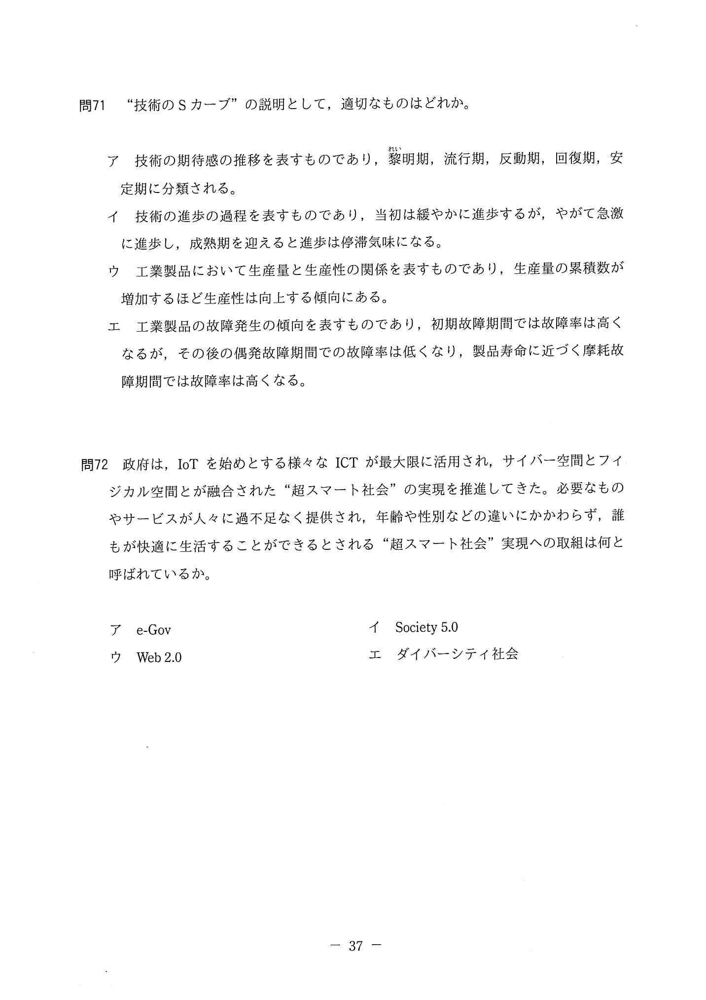

テキスト (OCR)

間71 "技術の S カーブ" の説明として, 適切なものはどれか。

ア 技術の期待感の推移を表すものであり, HH, 流行期, 反動期, 回復期,安
定期に分類される。

イ 技術の進歩の過程を表すものであり, 当初は緩やかに進歩するが, やがて急激
に進歩し, 成熟期を迎えると進歩は停滞気味になる。

ウ 工業製品において生産量と生産性の関係を表すものであり, 生産量の累積数が
増加するほど生産性は向上する傾向にある。

エ 工業製品の故障発生の傾向を表すものであり, 初期故障期間では故障率は高く
なるが, その後の偶発故障期間での故障率は低くなり, 製品寿命に近づく摩耗改
障期間では故障率は高くなる。

間72 政府は, IoT を始めとする様々な ICT が最大限に活用され, サイバー空間とフィ
ジカル空間とが融合された『“超スマート社会" の実現を推進してきた。必要なもの
やサービスが人々に過不足なく提供され, 年齢や性別などの違いにかかわらず, 誰
もが快適に生活することができるとされる “超スマート社会” 実現への取組は何と
呼ばれているか。

ア e-Gov                                             イ Society 5.0
ウ Web2.0                    エ ダイバーシティ視会

ー 37 一

### ページ 38

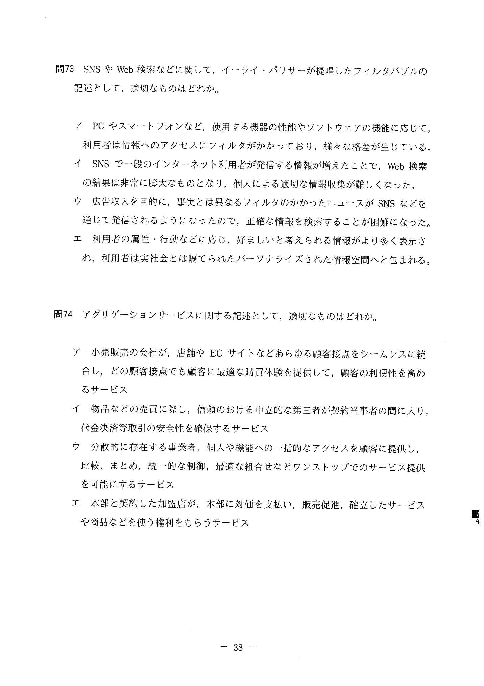

テキスト (OCR)

問73 SNS や Web 検索などに関して, イーライ ・パリサーが提唱したフィルタバブルの
記述として, 適切なものはどれか。

ア PC やスマートフォンなど, 使用する機器の性能やソフトウェアの機能に応じて,
利用者は情報へのアクセスにフィルタがかかっており, 様々な格差が生じている。
イ SNS で一般のインターネット利用者が発信する情報が増えたことで, Web 検索
の結果は非常に膨大なものとなり, 個人による適切な情報収集が難しくなった。

ウ 広告収入を目的に, 事実とは異なるフィルタのかかったニュースが SNS などを
通じて発信されるようになったので, 正確な情報を検索することが困難になった。

= 利用者の属性・行動などに応じ, 好ましいと考えられる情報がより多く表示さ
れ, 利用者は実社会とは隔てられたパーソナライズされた情報空間へと包まれる。

4 アグリゲーションサービスに関する記述として, 適切なものはどれか。

ア 小売販売の会社が, 店舗や EC サイトなどあらゆる顧客接点をシームレスに統
GL, どの顧客接点でも願客に最適な購買体験を提供して, 顧客の利便性を高め
るサービス

イ 物品などの売買に際し, 信頼のおける中立的な第三者が契約当事者の間に入り,
代金決済等取引の安全性を確保するサービス

ウ 分散的に存在する事業者, 個人や機能への一括的なアクセスを顧客に提供し
比較, まとめ, 統一的な制御, 最適な組合せなどワンストップでのサービス提供
を可能にするサービス

= 本部と契約した加盟店が, 本部に対価を支払い, 販売促進, 確立したサービス
や商品などを使う権利をもらうサービス

ー 38 一

### ページ 39

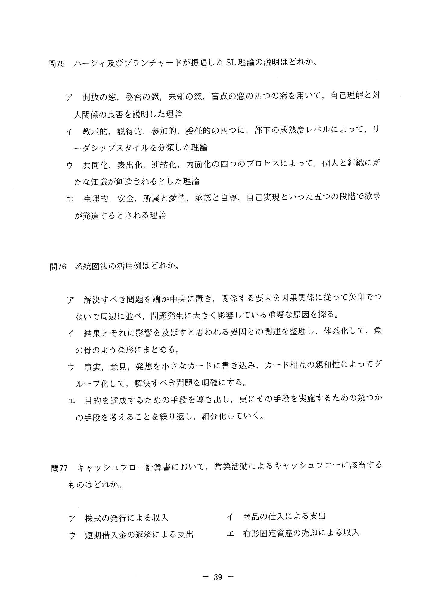

テキスト (OCR)

間75 ハーシィ及びブランチャードが提唱した SL 理論の説明はどれか。

ア 開放の窓, 秘密の窓, ROB, 盲点の窓の四つの窓を用いて, 自己理解と対
人関係の良否を説明した理論

4 教示的, 説得的, 参加的, 委任的の四つに, MKOMABYVAVICEOT, リ
ーダシップスタイルを分類した理論

ウ 共同化, 表出化, 連結化, 内面化の四つのプロセスによって, 個人と組織に新
たな知識が創造されるとした理論

エ 生理的, RS, 所属と愛情, 承認と自尊 自己実現といった五つの第障で欲求
が発達するとされる理論

問76 系統図法の活用例はどれか。

ア 解決すべき問題を端か中央に置き, 関係する要因を因果関係に従って矢印でつ
ないで周辺に並べ, 問題発生に大きく影響している重要な原因を探る。

イ 結果とそれに影響を及ぼすと思われる要因との関連を整理し, 体系化して, 魚
の骨のような形にまとめる。

ウ HE, 意見, 発想を小さなカードに書き込み, カード相互の親和性によってグ
ループ化して, 解決すべき問題を明確にする。

エ 目的を達成するための手段を導き出し, BICOL REMIT SLODROM
の手段を考えることを繰り返し, 細分化していく。

問77 キャッシュフロー計算書において, 営業活動によるキャッシュフローに該当する
ものはどれか。

ア 株式の発行による収入       イ 商品の仕入による支出
ウ 短期借入金の返済による支出    エ 有形固定資産の売却による収入

ー 39 一

### ページ 40

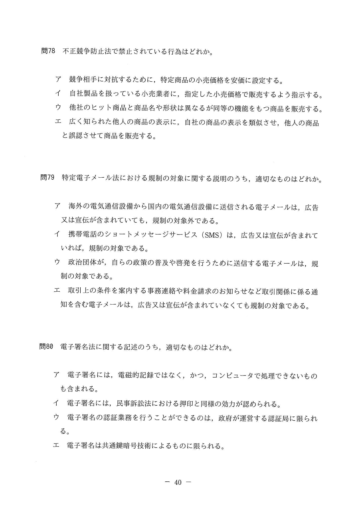

テキスト (OCR)

間78 不正競争防止法で禁止されている行為はどれか。

競争相手に対抗するために, 特定商品の小売価格を安価に設定する。

自社製品を扱つている小売業者に, 指定した小売価格で販売するよう指示する。

他社のヒット商品と商品名や形状は異なるが同等の機能をもつ商品を販売する。

広く知られた他人の商品の表示に, 自社の商品の表示を類似させ, 他人の商品
と誤認させて商品を販売する。

HbA Y

問79 特定電子メール法における規制の対象に関する説明のうち, 適切なものはどれか。

ア 海外の電気通信設備から国内の電気通信設備に送信される電子メールは, 広告
又は宣伝が含まれていても, 規制の対象外である。

イ 携帯電話のショートメッセージサービス (SMS) は, 広告又は宣伝が含まれて
いれば, 規制の対象である。

ウ 政治団体が, 自らの政策の普及や啓発を      こ送信する電子メールは, 規
制の対象である。

工 取引上の条件を案内する事務連絡や料金請求のお知らせなど取引関係に係る通
知を含む電子メールは, 広告又は宣伝が含まれていなくても規制の対象である。

問89 電子署名法に関する記述のうち, 適切ながものはどれか。

ア 電子署名には, 電磁的記録ではなく, PO, コンピュータで処理できないもの
も含まれる。

イ 電子署名には, 民事訴訟法における押印と同様の効力が認められる。

ウ 電子署名の認証業務を行うことができるのは, 政府が運営する認証局に限られ
る。

TL 電子署名は共通鍵暗号技術によるものに限られる。

ー 40 一

### ページ 41

テキスト (OCR)

【

メ = 用 紙 J

ー 41 一

### ページ 42

テキスト (OCR)

C

x モ 用 紙 )

ー 42 一

+8

### ページ 43

テキスト (OCR)

〔

メ モ 用 紙 J

ー 43 一

### ページ 44

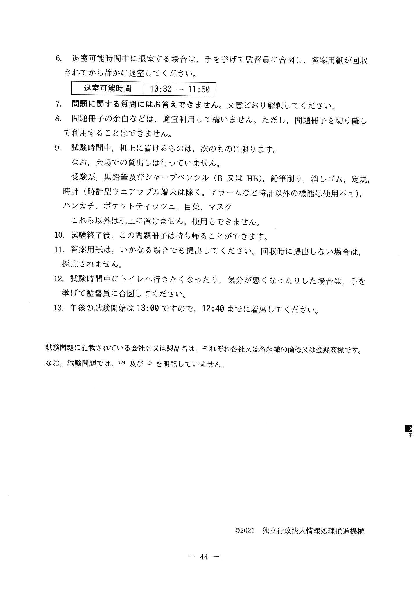

テキスト (OCR)

6. 退室可能時間中に退室する場合は, 手を挙げて監督員に合図し, 答案用紙が回収
されてから静かに退室してください。
退室可能時間    10:30 ~ 11:50
7. 問題に関する質問にはお答えできません。文意どおり解釈してください。
8. 問題冊子の余白などは, 適宜利用して構いません。ただし, 問題冊子を切り離し
て利用することはできません。
9. 試験時間中, 机上に置けるものは, 次のものに限ります。

なお, 会場での貸出しは行っていません。

SBR, 黒鉛筆及びシャープペンシル (B 又は HB), 鉛筆削り, 消しゴム, 定規,
時計 (時計型ウェアラブル端末は除く。 アラームなど時計以外の機能は使用不可),
ハンカチ, ポケットティッシュ, 目薬, マスク

これら以外は机上に置けません。 使用もできません。

10. 試験終了後, この問題冊子は持ち帰ることができます。

ll. 答案用紙は, いかなる場合でも提出してください。回収時に提出しない場合は,
採点されません。

12. 試験時間中にトイレへ行きたくなったり, 気分が悪くなったりした場合は, 手を
挙げて監督員に合図してください。

13. 午後の試験開始は 13:00 ですので, 12:40 までに着席してください。

試験問題に記載されている会社名又は製品名は, それぞれ各社又は各組織の商標又は登録商林です。
なお, 試験問題では, ™ 及び @ を明記していません。

@2021 独立行政法人情報処理推進機構

ー 44 一

+8

---

## 午前解答

©2021 独立行政法人情報処理推進機構 
令和3 年度 春期 応用情報技術者試験 解答例 
 
午前試験 
問番号
正解
分野
問1 
ア 
Ｔ 
問2 
ア 
Ｔ 
問3 
ウ 
Ｔ 
問4 
ア 
Ｔ 
問5 
ウ 
Ｔ 
問6 
エ 
Ｔ 
問7 
ウ 
Ｔ 
問8 
ウ 
Ｔ 
問9 
ウ 
Ｔ 
問10 
イ 
Ｔ 
問11 
イ 
Ｔ 
問12 
イ 
Ｔ 
問13 
ウ 
Ｔ 
問14 
エ 
Ｔ 
問15 
ア 
Ｔ 
問16 
ア 
Ｔ 
問17 
イ 
Ｔ 
問18 
イ 
Ｔ 
問19 
エ 
Ｔ 
問20 
エ 
Ｔ 
 
 
問番号
正解
分野
問21 
エ 
Ｔ 
問22 
ウ 
Ｔ 
問23 
ウ 
Ｔ 
問24 
ア 
Ｔ 
問25 
ウ 
Ｔ 
問26 
エ 
Ｔ 
問27 
ウ 
Ｔ 
問28 
イ 
Ｔ 
問29 
ア 
Ｔ 
問30 
イ 
Ｔ 
問31 
エ 
Ｔ 
問32 
ア 
Ｔ 
問33 
エ 
Ｔ 
問34 
ウ 
Ｔ 
問35 
エ 
Ｔ 
問36 
イ 
Ｔ 
問37 
イ 
Ｔ 
問38 
イ 
Ｔ 
問39 
ウ 
Ｔ 
問40 
ア 
Ｔ 
 
 
問番号
正解
分野
問41 
ア 
Ｔ 
問42 
ウ 
Ｔ 
問43 
ア 
Ｔ 
問44 
イ 
Ｔ 
問45 
ウ 
Ｔ 
問46 
ウ 
Ｔ 
問47 
エ 
Ｔ 
問48 
ア 
Ｔ 
問49 
ア 
Ｔ 
問50 
エ 
Ｔ 
問51 
ア 
Ｍ 
問52 
エ 
Ｍ 
問53 
ア 
Ｍ 
問54 
エ 
Ｍ 
問55 
エ 
Ｍ 
問56 
ア 
Ｍ 
問57 
イ 
Ｍ 
問58 
ウ 
Ｍ 
問59 
ア 
Ｍ 
問60 
ウ 
Ｍ 
 
 
問番号
正解
分野
問61 
ウ 
Ｓ 
問62 
ウ 
Ｓ 
問63 
ア 
Ｓ 
問64 
ア 
Ｓ 
問65 
エ 
Ｓ 
問66 
ウ 
Ｓ 
問67 
ウ 
Ｓ 
問68 
ウ 
Ｓ 
問69 
イ 
Ｓ 
問70 
イ 
Ｓ 
問71 
イ 
Ｓ 
問72 
イ 
Ｓ 
問73 
エ 
Ｓ 
問74 
ウ 
Ｓ 
問75 
イ 
Ｓ 
問76 
エ 
Ｓ 
問77 
イ 
Ｓ 
問78 
エ 
Ｓ 
問79 
イ 
Ｓ 
問80 
イ 
Ｓ 
 
 
分野の「Ｔ」はテクノロジ系，「Ｍ」はマネジメント系，「Ｓ」はストラテジ系の問題です。

---

## 午後問題

### ページ 1

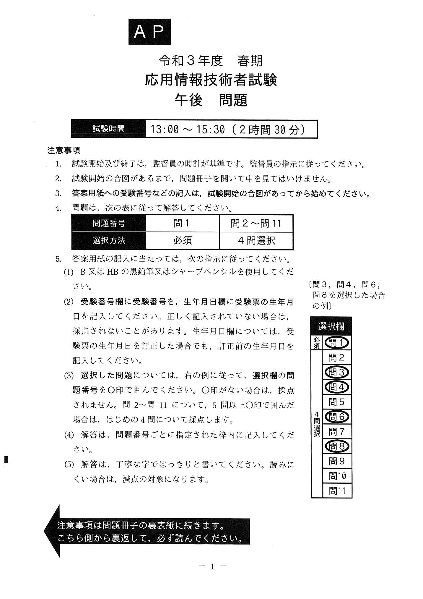

テキスト (OCR)

令和3年度 春期
応用情報技術者試験
午後 問題

Bs: 00 ~ 15:30 (20588 909)

注意事項

1. 試験開始及び終了は, 監督具の時計が基準です。監督貞の指示に従ってください。
2. 試験開始の合図があるまで, 問題冊子を開いて中を見てはいけません。

3. 答案用紙への受験番号などの記入は, 試験開始の合図があってから始めてください。
4. 問題は, 次の表に従って解答してください。

問題番号     問 1    問2 ~f 11
選択方法     必須     4 問選択

5. 答案用紙の記入に当たっては, 次の指示に従ってください。
(1) B 又は HB の黒鉛筆又はシャープペンシルを使用してくだ
さい。                        〔(問3,問4, FAG,

問8を選択した場合
2) 受験番号構に受験番号を生年月日柚に受験昌の生年月 の

日を記入してください。正しく記入されていない場合は
採点されないことがあります。生年月日杉については, 受 RBR
を

験票の生年月日を訂正した場合でも, 訂正前の生年月日    ACGD)

記入してください。                      間2

(⑬) 選択した問題については, 右の例に従って, 選択欄の問   GD
題番号を〇印で囲んでください。〇印がない場合は, 採点   G4

されません。問 2一問 11 について, 5 問以上O印で囲んだ    問5

場合は, はじめの 4 問について採点します。         | G6

④ 解答は, 問題番号ごとに指定された枠内に記入してくだ RL
さい。                                                         G8

(5) 解答は, 丁寧な字ではっきりと書いてください。読みに    間9
くい場合は, 減点の対象になります。              間19

問1

注意事項は問題冊子の裏表紙に続きます。
こちら側から裏返して, 必ず読んでください。

### ページ 2

### ページ 3

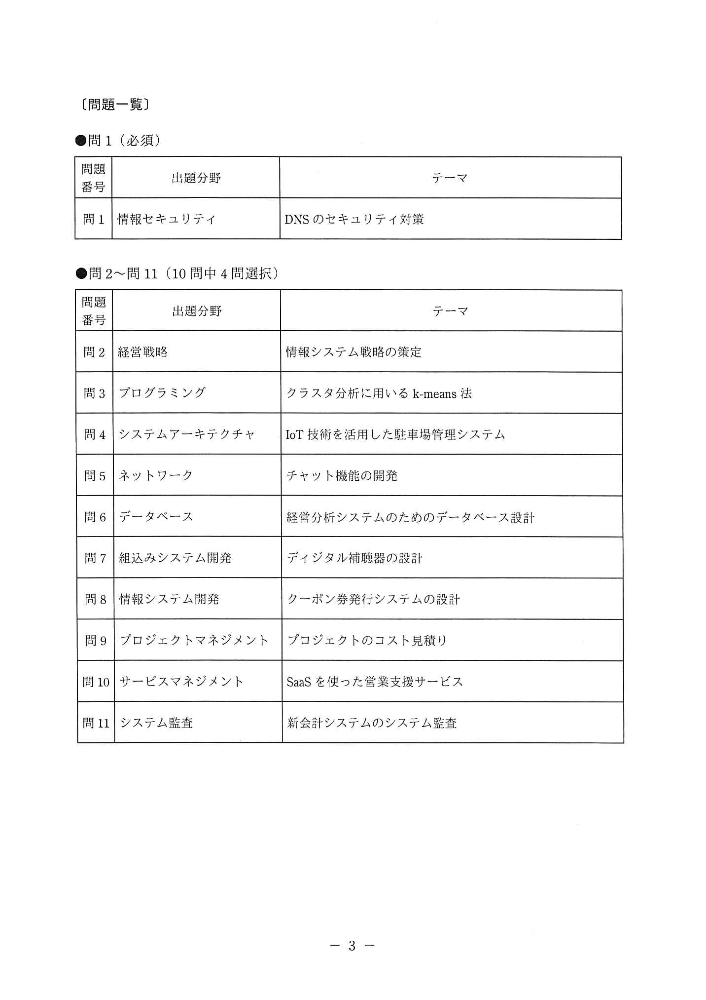

テキスト (OCR)

〔問題一覧]

@問 1 (必須)

      出題分野                   ザー

ll | 情報セキュリティ     DNS のセキュリティ対策

@問 2一問 11 (10 問中 4 問選択)

      出題分野                   テーマ

問2 |経営戦略         情報システム戦略の策定

問3 | プログラミング     クラスタ分析に用いる k-means 法
問 4 | システムアーキテクチャ  ToT 技術を活用した駐車場管理システム
問5 | ネットワーク             チャット機能の開発

問6 | データベース       経営分析システムのためのデータベース設計
問 7 |組込みシステム開発    ディジタル補聴器の設計

問 8 | 情報システム開発     クーポン券発行システムの設計

問 9 | プロジェクトマネジメント | プロジェクトのコスト見積り

間 10 | サービスマネジメント    SaaS を使った営業支援サービス

間 11 | システム監査        新会計システムのシステム監査

### ページ 4

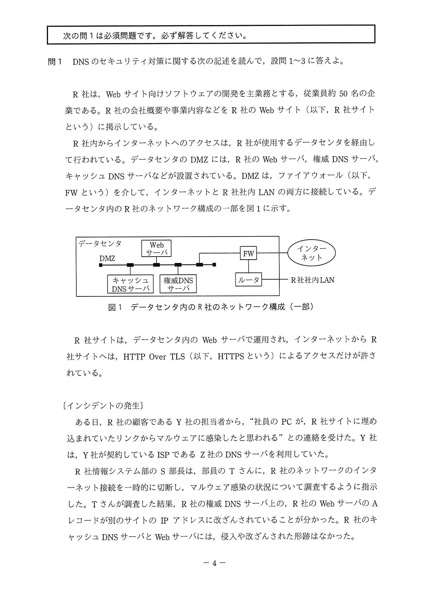

テキスト (OCR)

次の問 1 は必須問題です。必ず解答してください。

DNS のセキュリティ対策に関する次の記述を読んで, 設問 1ー3 に答えよ。

R 社は, Web サイト向けソフトウェアの開発を主業務とする, HAM 50 名の企
業である。R 社の会社概要や事業内容などを REO Web サイト (以下, R 社サイト
という) に掲示している。

R 社内からインターネットへのアクセスは, R 社が使用するデータセンタを経由し
て行われている。データセンタの DMZ には, R 社の Web サーバ, 権威 DNS サーバ
キャッシュ DNS サーバなどが設置されている。DMZ は, ファイアウォール (以下,
FW という) を介して, インターネットと R 社社内 LAN の両方に接続している。デ
ータセンタ内の R 社のネットワーク構成の一部を図 1 に示す。

データセンタ
/       サーバ         [mw    Pa
DMZ                                        ネット
キャッシュ | | 権威DNS              ルータ       | _R社社内LAN
DNSサーバ    サーが

図1 データセンタ内の R社のネットワーク構成 (一部)

R 社サイトは, データセンタ内の Web サーバで運用され, インターネットから R
社サイトへは, HTTP Over TLS (LAK, HTTPS という) によるアクセスだけが許さ
れている。

[インシデントの発生〕

HSA, R 社の顧客である Y 社の担当者から, “社員の PC A, R 社サイトに埋め
込まれていたリンクからマルウェアに感染したと思われる"との連絡を受けた。Y th
lk, 社が契約している ISP である 2Z 社の DNS サーバを利用していた。

R 社情報システム部の S 部長は, MAO T さんに, R 社のネットワークのインタ
ーネット接続を一時的に切断し, マルウェア感染の状況について調査するように指示
した。T さんが調査した結果, R 社の権威 DNS サーバ上の, R 社の Web サーバの A
レコードが別のサイトの IP アドレスに改ざんされていることが分かった。R 社のキ
ャッシュ DNS サーバと Web サーバには, 侵入や改ざんされた形跡はなかった。

ー4ー

### ページ 5

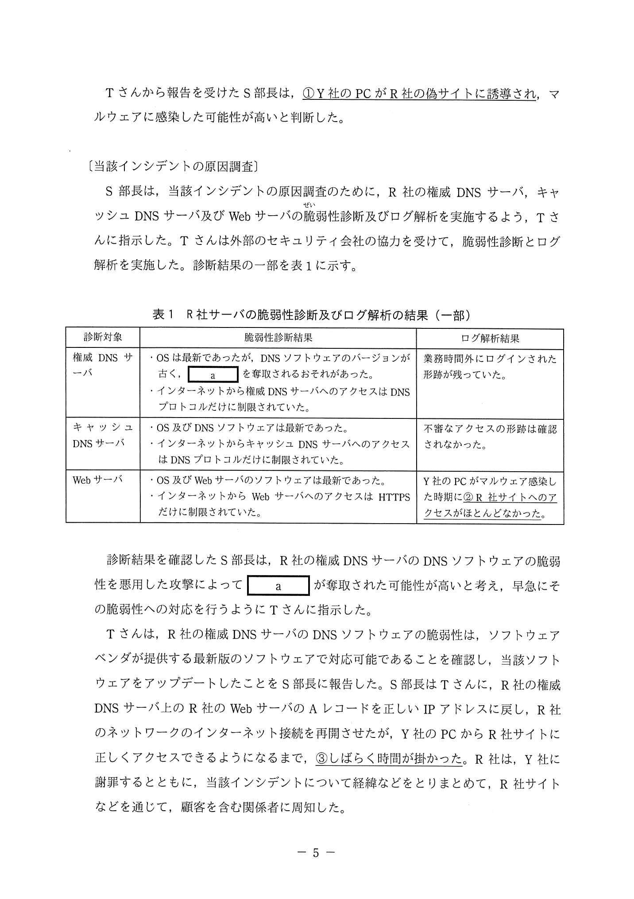

テキスト (OCR)

Tさんから報告を受けた S部長は, ①Y 社の PC がR 社の偽サイトに誘導され, マ
ルウェアに感染した可能性が高いと判断した。

[当該インシデントの原因調査

S BRIE, 当該インンデントの原因調査のために, R 社の権威 DNS サーバ, キャ
ッシュ DNS サーバ及び Web サーバの脆明性診断及びログ解析を実施するよう, TS
んに指示した。T さんは外部のセキュリティ会社の協力を受けて, MBIBME OT
解析を実施した。診断結果の一郎を表 1 に示す。

表1 R社サーバの脆弱性診断及びログ解析の結果 (一部)

診断対象              Hea MARR                 ログ解析結果
権威 DNS サ | ・OS は最新であったが, DNS ソフトウェアのバージョンが | 業務時間外にログインされた
ーバ      吉く, [la] を本取されるおそれがあった。    形跡が残っていた。

・インターネットから権威 DNS サーバへのアクセスは DNS
プロトコルだけに制限されていた。

キャッシュ| ・08S及び DNS ソフトウェアは最新であった。       不審なアクセスの形跡は確認
DNS サーバ     ・インターネットからキャッシュ DNS サーバへのアクセス | されなかった。
は DNS プロトコルだけに制限されていた。
Web サーバ    ・OS 及び Web サーバのソフトウェアは最新であった。      Y 社のPCがマルウェア感染し
・インターネットから Web サーバへのアクセスは HTTPS | た時期に②R 社サイトへのア
だけに制限されていた。                         クセスがほとんどなかった。

診断結果を確認した S 部長は, R 社の権威 DNS サーバの DNS ソフトウェアの脆弱
性を悪用した攻撃によって| a | が奪取された可能性が高いと考え, 早急にそ
の脆弱性への対応を行うようにTさんに指示した。

T さんは, R 社の権威 DNS サーバの DNS ソフトウェアの脆弱性は. ソフトウェア
ベンダが提供する最新版のソフトウェアで対応可能であることを確認し, 当該ソフト
ウェアをアップデートしたことを S部長に報告した。S 部長はTさんに, R HOMER
DNS サーバ上の R 社の Web サーバの A レコードを正しい IP アドレスに戻し, RHE
のネットワークのインターネット接続を再開させたが, Y 社の PC MS R 社サイトに
正しくアクセスできるようになるまで, ③しばらく時間が掛かった。R 社は, Y 社に
謝罪するとともに, 当該インシデントについて経緯などをとりまとめて, R 社サイト
などを通じて, 顧客を含む関係者に周知した。

=5=

### ページ 6

テキスト (OCR)

〔セキュリティ対策の検討]

S 部長は, R 社の権威 DNS サーバに対する@同様なインシデントの再発防止に有
効な対策と, R 社のキャッシュ DNS サーバ及び Web サーバに対するセキュリティ対
策の強化を検討るように, さんに指示した。

T さんは, R 社の Web サーバが使用しているディジタル証明書が, ドメイン名の
所有者であることが確認できる DV (Domain Validation) 証明書であることが問題と
考えた。そこでTさんは, EV (Extended Validation) 証明書を導入することを提案し
た。R 社の Web サーバに EV 証明書を導入し, Web ブラウザで R 社サイトに HTTPS
でアクセスすると, R 社の| pb | を確認できる。

また T さんは, ⑮R 社のキャッシュ DNS サーバがインターネットから問合せ可能
であることも問題だと考えた。その対策として, FW の設定を修正して R 社社内
LAN からだけ問合せ可能とすることを提案した。また, R 社のキャッシュ DNS サー
バに, 偽の DNS 応答がキャッシュされ, R 社の社内 LAN 上の PC がインターネット
上の偽サイトに誘導されてしまう, | c | の信成があると考えた。DNS ソフト
ウェアの最新版を確認したところ, ソースポートのランダム化などに対応しているこ
とから, この人脅威については対応済みとして報告した。

設問1 本文中の下線①で, Y 社の PC が R 社の偽サイトに誘導された際に, Y 社の
に偽の IP アドレスを返した可能性のある DNS サーバを, 解答群の中から全
て選び, 記号で答えよ。

ARH
ア DNS ルートサーバ             4 R社のキャッシュ DNS サーバ
ウ R社の権威 DNS サーバ         x= Z社の DNS サーバ

設問2 (当該インシデントの原因調査) について, )⑬に答えよ。
Q①) 表 1 及び本文中の| a | に入れる適切な字句を, 解答群の中から選び,

記号で答えよ。
解答群
ア 管理者権限                        イ シリアル番号
ウ ディジタル証明書                エ 利用者パスワード

### ページ 7

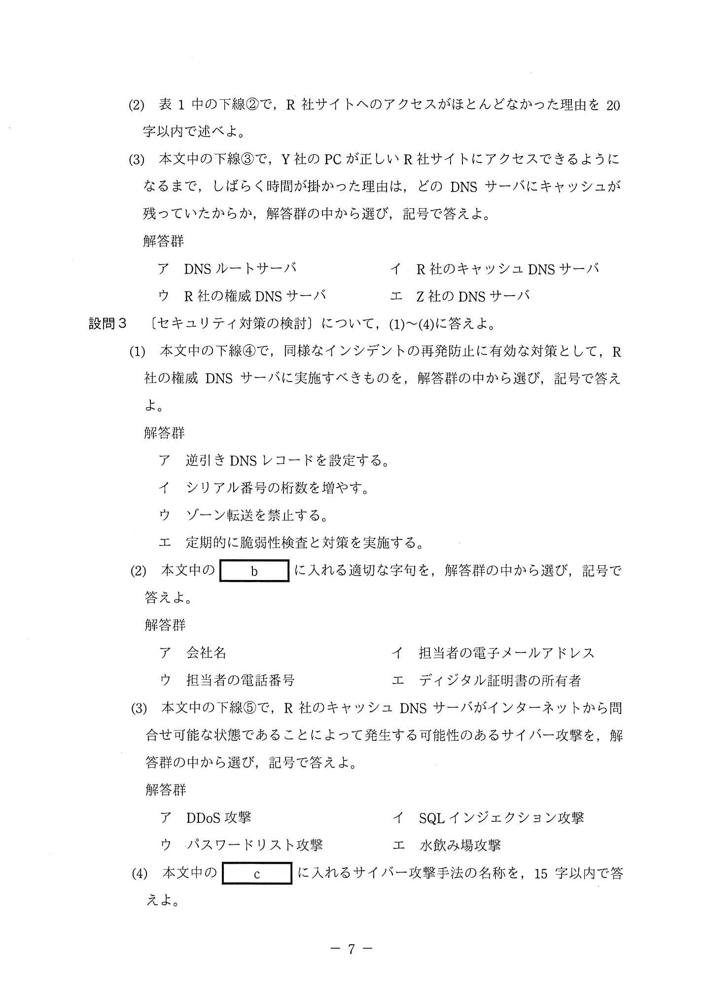

テキスト (OCR)

(2) 表 1 中の下線②で, R 社サイトへのアクセスがほとんどなかった理由を 20
字以内で述べよ。

(38) 本文中の下線③で, Y 社の PC が正しい R 社サイトにアクセスできるように
なるまで, しばらく時間が掛かった理由は, どの DNS サーバにキャッシュが
残っていたからか, 解答群の中から選び, 記号で答えよ。

解答冬
ア DNS ルートサーバ             イ R社のキャッシュ DNS サーバ
ウ R 社の権威 DNS サーバ         x= Z社のDNS サーバ

設問3 〔セキュリティ対策の検討) について, ①(④に答え

①) 本文中の下線②で, 同様なインシデントの再発防止に有効な対策として, R
社の権威 DNS サーバに実施すべきものを, 解答群の中から選び, 記号で答え
eS RE
Y 逆引きDNS レコードを設定する。
イ シリアル番号の桁数を増やす。
ウ ゾーン転送を禁止する。
エ 定期的に脆融性検査と対策を実施する。

② 本文中の| b | に入れる適切な字句を, 解答群の中から選び

答えよ。
解答
ア 会社名          イ 担当者の電子メールアドレス
ウ 担当者の電話番号      エ ディジタル証明書の所有者

(3) 本文中の下線⑥で, R 社のキャッシュ DNS サーバがインターネットから問
合せ可能な状態であることによって発生する可能性のあるサイバー攻撃を, 解
答群の中から選び, 記号で答えよ。

HRS BY
ア DDoS 攻撃         イ SQLインジェクション攻撃
ウ パスワードリスト攻撃     エ 水飲み場攻撃
④ 本文中の| < |] に入れるサイバー攻撃手法の名称を, 15 字以内で答
Ads

### ページ 8

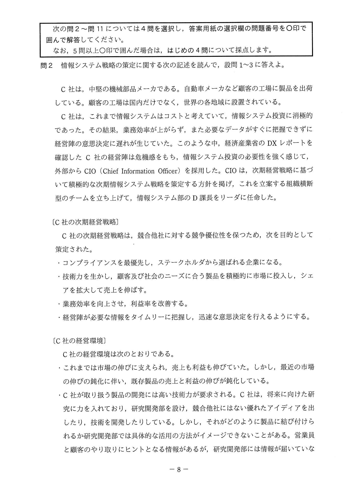

テキスト (OCR)

次の問2 一問 11 については4間を選択し, 管案用紙の選択欄の問題番号を〇印で
囲んで解答してください。
なお, 5問以上〇印で囲んだ場合は, はじめの 4 問について採点します。

問2 情報システム戦略の策定に関する次の記述を読んで, 設問 1+ー3 に答えよ。

C 社は, 中堅の機械部品メーカである。自動車メーカなど顧客の工場に製品を出荷
している。顧客の工場は国内だけでなく, 世界の各地域に設置されている。

C 社は, これまで情報システムはコストと考えていて, 情報システム投資に消極的
であった。 CORR, 業務効率が上がらず, また必要なデータがすぐに把握できずに
経営陣の意思決定に遅れが生じていた。このような中, 経済産業省の DX レポートを
確認した C 社の経営陣は危機感をもち, 情報システム投資の必要性を強く感じて,
外部から CIO (Chief Information Officer) を採用した。CIO は, 次期経営戦略に基づ
いて積極的な次期情報システム戦略を策定する方針を掲げ これを立案する組織横断
型のチームを立ち上げて, 情報システム部の D 課長をリーダに任命した。

(C 社の次期経営戦略

C 社の次期経営戦略は, 競合他社に対する競争優位性を保つため, 次を目的として
策定された。

・ コンプライアンスを最優先し, ステークホルダから選ばれる企業になる。

・ 技術力を生かし, 顧客及び社会のニーズに合う製品を積極的に市場に投入し, シェ

アを拡大して売上を伸ばす。

・ 業務効率を向上させ, 利益率を改善する。

・ 経営陣が必要な情報をタイムリーに把握し, 迅速な意思決定を行えんるようにする。

(C 社の経営環境)
C 社の経営環境は次のとおりである。
・これまでは市場の伸びに支えられ, 売上も利益も伸びていた。 しかし, 最近の市場
の伸びの鈍化に伴い, 既存製品の売上と利益の伸びが鈍化している。
・C 社が取り扱う製品の開発には高い技術力が要求される。C 社は, 将来に向けた研
究に力を入れており, 研究開発部を設け, 競合他社にはない優れたアイディアを出
したり, 技術を開発したりしている。しかし, それがどのように製品に結び付けら
れるか研究開発部では具体的な活用の方法がイメージできないことがある。 BRA
と顧客のやり取りにヒントとなる情報があるが, 研究開発部には情報が届いていな

ー8一

### ページ 9

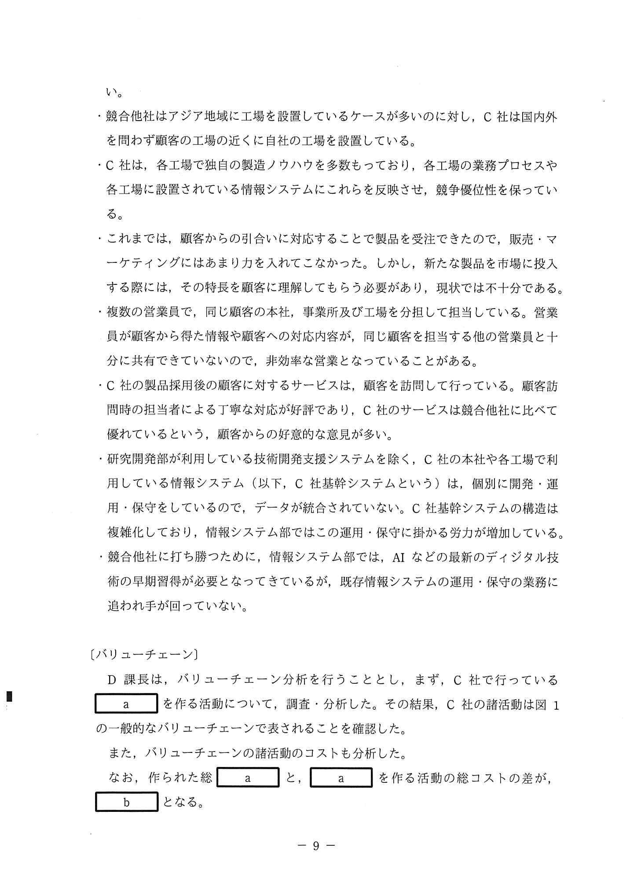

テキスト (OCR)

い。

・競合他社はアジア地域に工場を設置しているケースが多いのに対し, C 社は国内外
を問わず顧客の工場の近くに自社の工場を設置している。

・C 社は, 各工場で独自の製造ノウハウを多数もっており, 各工場の業務プロセスや
各工場に設置されている情報システムにこれらを反映させ, 競争優位性を保ってい
る。

・これまでは, 顧客からの引合いに対応することで製品を受注できたので, 販売・マ
ーケティングにはあまり力を入れてこなかった。 しかし, 新たな製品を市場に投入
する際には, その特長を顧客に理解してもらう必要があり, 現状では不十分である。

・複数の営業員で, 同じ顧客の本社, 事業所及び工場を分担して担当している。 営業
員が顧客から得た情報や顧客への対応内容が, 同じ顧客を担当する他の営業員と十
分に共有できていないので, 非効率な営業となっていることがある。

・C 社の製品採用後の顧客に対するサービスは, 顧客を訪問して行っている。顧客訪
間時の担当者による丁寧な対応が好評であり, C 社のサービスは競合他社に比べて
優れているという, 顧客からの好意的な意見が多い。

・研究開発部が利用している技術開発支援システムを除く, C 社の本社や各工場で利
用している情報システム (以下, C 社基幹システムという) は, 個別に開発・運
用・保守をしているので, データが統合されていない。C 社基幹システムの構造は
複雑化しており, 情報システム部ではこの運用・保守に掛かる労力が増加している。
・競合他社に打ち勝つために, 情報システム部では, AI などの最新のディジタル技
術の早期習得が必要となってきているが, 既存情報システムの運用・保守の業務に
追われ手が回っていない。

〔バパリューチェーン】〕

D 課長は, バリューチェーン分析を行うこととし, BY, C 社で行っている
La | を作る活動について, 調査・分析した。その結果, C 社の諸活動は図 1
の一般的なバリューチェーンで表されることを確認した。

また, パリューチェーンの請活動のコストも分析した。

なお, 作られた総| 』a |e, [a |を作る活動の総コストの差が,

### ページ 10

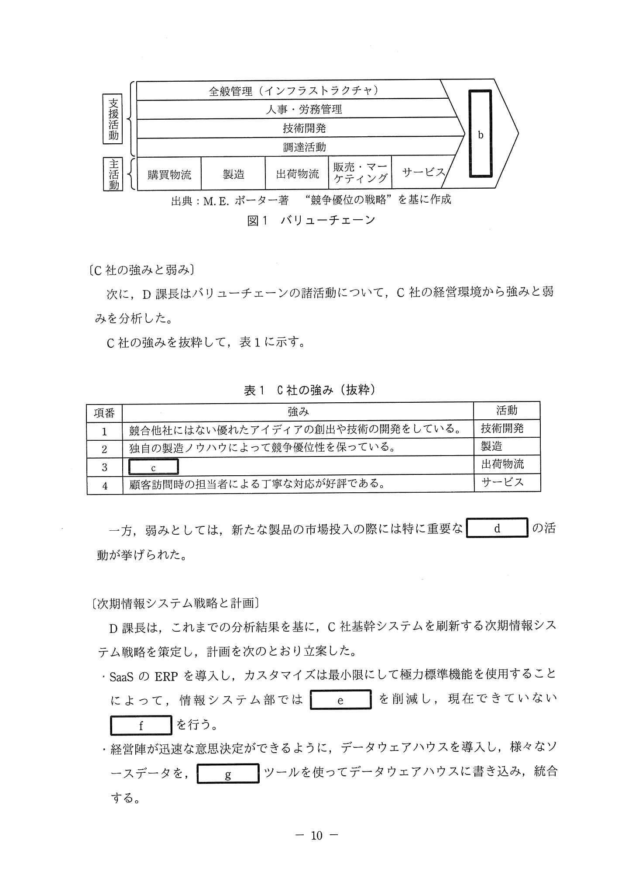

テキスト (OCR)

全般管理 (インフラストラクチャ)       \

a                                  AG 6H                        \

Hs                                      技術開発                             MM,
ae                              /

=         ro            9                 ae | 販売・マー          6

le 購買物流 | 製造 | mein |ケテッング  ッーッ

出典 : ME. ポーター著 “競争優位の戦略" を基に作成
図1 バリューチェーン

(C 社の強みと弱み〕

次に, D 課長はバリューチェーンの諸活動について, C 社の経営環境から強みと麗
みを分析した。

C 社の強みを抜粋して, 表 1 に示す。

表1 C社の強み (抜粋)

項番                                 強み                                    活動
1 | 競合他社にはない優れたアイディアの創出や技術の開発をしている。 | 技術開発
2 | 独自の製造ノウハウによって競争優位性を保っつている。               製造
3 | <                                                     出荷物流
4 | 顧客訪問時の担当者による丁寧な対応が好評である。                 サービス

一方, 弱みとしては, 新たな製品の市場投入の際には特に重要な[| d oR
動が挙げられた。

(次期情報システム戦略と計画)
D 課長は, これまでの分析結果を基に, C 社基幹システムを吊新する次期情報シス
テム戦略を策定し, 計画を次のとおり立案した。

・SaaS の ERP MAL, カスタマイズは最小限にして極力標準機能を使用すること
によって, 情報システム部では[| e | を削減し, 現在できていない
[ij |を行う。

・ 経営陣が迅速な意思決定ができるように, データウェアハウスを導入し, 様々なソ
ースデータを, | gz  ] ツールを使ってデータウェアハウスに書き込み, HA

する。

=~ 一

### ページ 11

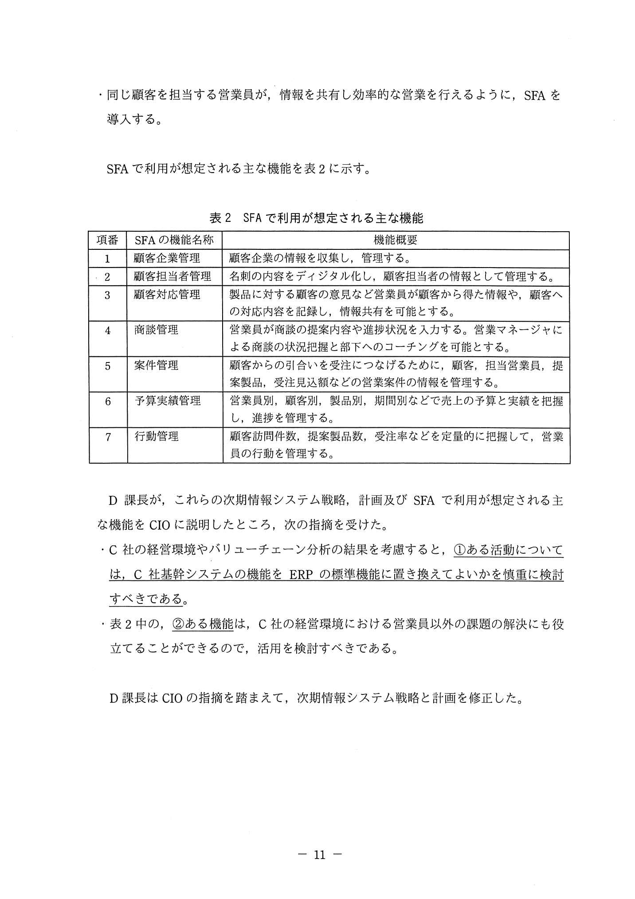

テキスト (OCR)

・同じ顧客を担当する営業員が, 情報を共有し効率的な営業を行えるように, SFA を
導入する。

SFA で利用が想定される主な機能を表 2 に示す。

表 2 SFAで利用が想定される主な機能

項番 | SFA の機能名称                                    機能概要

顧客企業管理    顧客企業の情報を収集し, 管理する。

顧客担当者管理 | 名刺の内容をディジタル化し, 顧客担当者の情報として管理する。

顧客対応管理         製品に対する顧客の意見など営業員が顧客から得た情報や, 顧客へ
の対応内容を記録し, 情報共有を可能とする。

4 | 商談管理      営業員が商談の提案内容や進捗状況を入力する。営業マネージャに
よる商談の状況把握と部下へのコーチングを可能とする。
5 | 案件管理      顧客からの引合いを受注につなげるために, MS, 担当営業員, 提

案製品, 受注見込額などの営業案件の情報を管理する。

6 | 予算実績管理   営業員別, Men, 製品別 期間別などで売上の予算と実績を把握
し, 進捗を管理する。

7 | 行動管理      顧客訪問件数, 提案製品数, 受注率などを定量的に把握して, 営業
上員の行動を管理する。

D 課長が, これらの次期情報システム戦略, 計画及び SFA で利用が想定される主

な機能を CIO に説明したところ, 次の指摘を受けた。

・C 社の経営環境やバリューチェーン分析の結果を考慮すると, ①ある活動について
は, C 社基幹システムの機能を ERP の標準機能に置き換えてよいかを慎重に検討
すべきである。

・表 2 中の, ある機能は, C 社の経営環境における営業員以外の課題の解決にも役
立てることができるので, 活用を検討すべきである。

D 課長は CIO の指摘を踏まえて, 次期情報システム戦略と計画を修正した。

==

### ページ 12

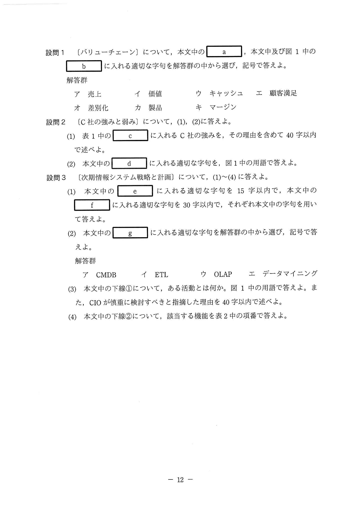

テキスト (OCR)

設問1 〔パリューチェーン) について, 本文中の| a』 ] , 本文中及び図 中の
|? | に入れる適切な字句を解答群の中から選び, 記号で答えよ。

解答竹
ア 売上   イ 価値   ウ キャッシュ エエ 顧客満足
オ 差別化    A 製品    キ マージン

設問2 〔C社の強みと弱み〕について, ①⑪, ⑫に答えよ。
a) 表1中の| c | に入れるC 社の強みを, その理由を含めて 40 SUA
で述べよ。
⑫ 本文中の| a | に入れる適切な字句を, 図 1中の用語で答えよ。
設問3 (次期情報システム戦略と計画] について, ①⑪)~(⑬⑭ に答えよ。
a 本文中の[| ec | に入れる適切な字句を 15 字以内で, 本文中の
[| f |] に入れる適切な字句を 30 字以内で, それぞれ本文中の字句を用い

て答えよ。
@ 本文中の[| gz | に入れる適切な字句を解答群の中から選び, 記号で答
えよ。
ARR
ア CMDB   イ ETL    ウ OLAP  = データマイニッグ

(3) 本文中の下線について, ある活動とは何か。図 1 中の用語で答えよ。ま
た, CIO が慎重に検討すべきと指摘した理由を 40 字以内で述べよ。
(4) 本文中の下線@について, 該当する機能を表 2 中の項番で答えよ。

ー 12 一

### ページ 13

テキスト (OCR)

C

x = 用 紙 J

ー 13 一

### ページ 14

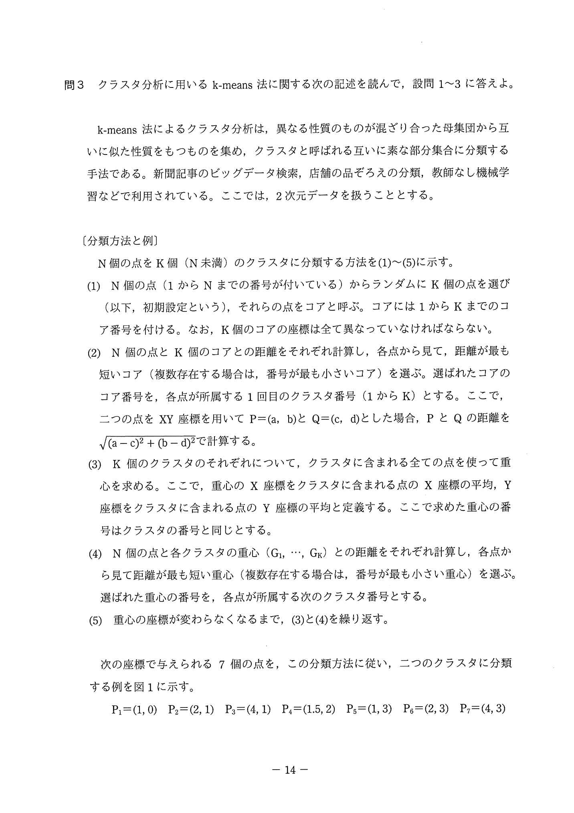

テキスト (OCR)

問3 クラスタ分析に用いる k-means 法に関する次の記述を読んで, 設問 ユー3 に答えよ。

k-means 法によるクラスタ分析は, 異なる性質のものが混ざり合った母集団から互
いに似た性質をもつものを集め, クラスタと呼ばれる互いに素な部分集合に分類する
手法である。新聞記事のビッグデータ検索, 店舗の品ぞろえの分類, 教師なし機械学
習などで利用されている。ここでは, 2 次元データを扱うこととする。

〔分類方法と例]
N 個の点をK個 (N 未満) のクラスタに分類する方法を(1)て(⑤)に示す。
(1) N 個の点 (1 から N までの番号が付いている) からランダムに K 個の点を選び
(以下, 初期設定という), それらの点をコアと呼ぶ。 コアには 1 から K までのコ
ア番号を付ける。なお, K 個のコアの座標は全て異なっていなければならない。

(2) N 個の点と K 個のコアとの距離をそれぞれ計算し, 各点から見て, 距離が最も
短いコア (複数存在する場合は, 番号が最も小さいコア) を選ぶ。選ばれたコアの
コア番号を, 各点が所属する 1 回目のクラスタ番号 (1 から K) とする。ここで,
TOOK XY 座標を用いて Pニ=(a, b)と Q=(, ①とした場合, P と Q の距離を
J@—o? + (b— de CHATS.

3) K 個のクラスタのそれぞれについて, クラスタに含まれる全ての点を使って重
心を求める。ここで, 重心の X 座標をクラスタに含まれる点の X 座標の平均, Y
座標をクラスタに含まれる点の Y 座標の平均と定義する。ここで求めた重心の番
号はクラスタの番号と同じとする。

(4) N 個の点と各クラスタの重心 (Gj, …, Gx) との距離をそれぞれ計算し, 各点か
ら見て距離が最も短い重心 (複数存在する場合は, 番号が最も小さい重心) を選ぶ。
選ばれた重心の番号を, 各点が所属する次のクラスタ番号とする。

6) 重心の座標が変わらちなくなるまで, (3)と(④を繰り返す。

次の座標で与えられる 7 個の点を, この分類方法に従い, 二つのクラスタに分類

する例を図 1 に示す。
Pi=(1,0) Pz三(2, 1) Ps=(4,1) Ps=(1.5,2) Ps=(1,3) Pe=(2,3) P=, 3)

ー 14 一

### ページ 15

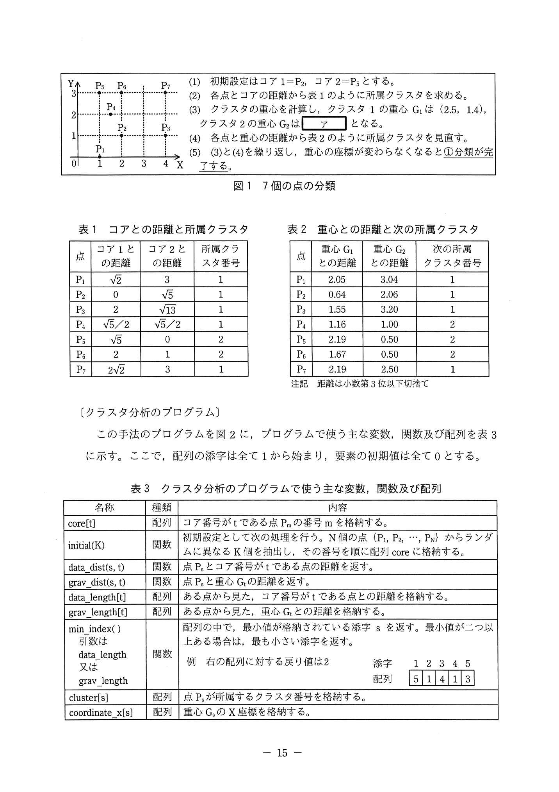

テキスト (OCR)

QQ) 初期設定はコア 1=P, コア 2三Ps とする。

(2) 各点とコアの距離から表 1 のように所属クラスタを求める。

3) クラスタの重心を計算し, クラスタ 1 の重心 Giは (2.5, 14),
クラスタ 2 の重心 は[| ァア | となる。

(4) 各点と重心の距離から表 2 のように所属クラスタを見直す。

6) (⑬)と(④を繰り返し, 重心の座標が変わらなくなると①分類が完
了する。

図1 7個の点の分類

表1 コアとの距離と所属クラスタ      表2 重心との距離と次の所属クラスタ
点   コア1と| コア2と | 所属クラ              点    重心 Gi     重心 Gz       ROP

“| の距離    の距離   スタ番号          "| との距離 | との距離 | クラスタ番号
Pi       v2            3              1                     Pi | 2.05          3.04               i

P。        0             Y5             1                     P。 | 0.64          2.06               1

Py        2            Y13            1                     Es       1.55          3.20               1

Py | v5/2       Y5ノ2           1                     Py       1.16          1.00               2

Ps       V5            0              2                     Pa| 2.19          0.50               2

Ps        2              1              2                     Es       1.67          0.50               2

Py       2v2            3              1                     P;       2.19          2.50               1

注記 距離は小数第3 位以下切捨て

[クラスタ分析のプログラム]
この手法のプログラムを図 2 に, プログラムで使う主な変数, 関数及び配列を表 3
に示す。ここで, 配列の添字は全て 1 から始まり, 要素の初期値は全て 0 とする。

表3 クラスタ分析のプログラムで使う主な変数, 関数及び配列

名称        種類                                  内容
core[t]               配列 | コア番号がtである点 P。の番号 m を格納する。
ーー                ye, | 初期設定として次の処理を行う。N 個の点 (Pi, Po, …, Pr) からランダ
initial(K)          関数

ムに異なる K 個を抽出し, その番号を順に配列 core に格納する。

data_dist(s, t)        関数 | 点P。とコア番号がtである点の距離を返す。

grav_dist(s, t)        関数 | 点P。と重心 G,の距離を返す。

data length[t]        配列 | ある点から見た, コア番号がtである点との距離を格納する。

grav_length[t]         配列 | ある点から見た, 重心 G,との距離を格納する。

Jih id              配列の中で, 最小値が格納されている添字 s を返す。最小値がニっ以
引数は         上ある場合は, 最も小さい添字を返す。
eet      BEAT iy coMaMlc SREY Hide          RE 12345
grav_length                                                         配列
cluster[s]             配列 | 点P、が所属するクラスタ番号を格納する。

coordinate x[s] | 配列 | 重心 G。のXX座標を格納する。

ー 15 一

### ページ 16

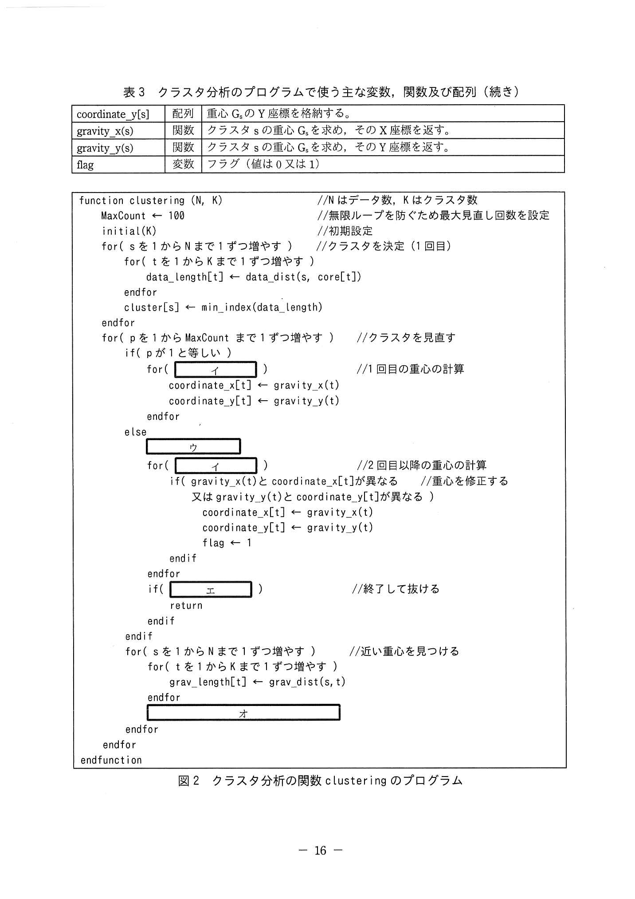

テキスト (OCR)

表3 クラスタ分析のプログラムで使う主な変数, 関数及び配列 (続き)

coordinate_y[s]      配列 | 重心 G。のY座標を格納する。

gravity_x(s)          関数 | クラスタ SOBD GERD, そのXX座標を返す。

gravity_y(s)         関数 | クラスタ s の重心 G。を求め, そのY 座標を返す。

flag              変数 | フラグ (値は0又は1)

function clustering (N, K)                //N はデータ数, K はクラスタ数
MaxCount — 100                       //無限ループを防ぐため最大見直し回数を設定
initial(K)                       //初期設定

for( sを1からNまで1 ずつ増やす )   //クラスタを決定 (1 回目)
for( tを1からKまで1 ずつ増やす )
data_length[t] < data_dist(s, core[t])
endfor                  -
cluster[s] で min index(data_length)
endfor
for( pを1からMaxCount まで 1 ずつ増やす )  //クラスタを見直す
if( pが1と等しい )
for( )             //1 回目の重心の計算
coordinate_x[t] < gravity_x(t)
coordinate_y[t] < gravity_y(t)

endfor
else
for( )             //2 回目以降の重心の計算
if( gravity_x(t)と coordinate_x[t]が異なる    //重心を修正する
又は gravity_y(t)とcoordinate_y[t]が異なる )
coordinate_x[t] < gravity_x(t)
coordinate_y[t] < gravity_y(t)
flag で 1
endif
endfor
if([ =ェ |)         //終了して抜ける
return
endif
endif

for( sを1からNまで 1 ずつ増やす )   //近い重心を見つける
for( tを1からKまで1ずつ増やす )
grav length[t] < grav_dist(s, t)
endfor
|          x          J
endfor
endfor
endfunction

M2 クラスタ分析の関数 clustering のプログラム

ー 16 一

### ページ 17

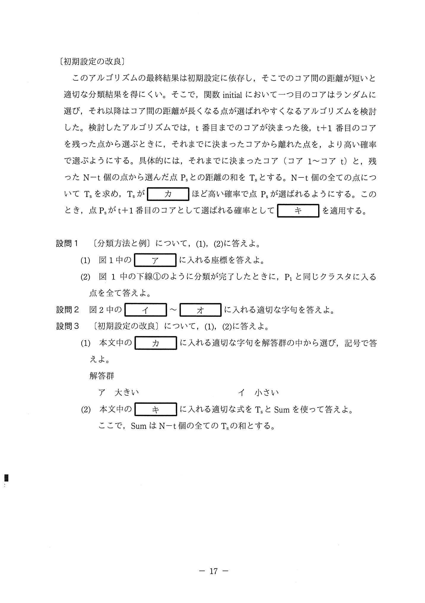

テキスト (OCR)

(初期設定の改良

このアルゴリズムの最終結果は初期設定に依存し, そこでのコア間の距離が短いと
適切な分類結果を得にくい。そこで, 関数 initial において一つ目のコアはランダムに

選び, それ以降はコア間の距離が長くなる点が選ばれやすくなるアルゴリズムを検討
した。検対したアルゴリズムでは, t 番目までのコアが決まった後,t十1 番目のコア
を残った点から選ぶときに, それまでに決まったコアから離れた点を, より高い確率
で選ぶようにする。具体的には, それまでに決まったコア (コア 1てコア t) と, 残
つった Nーt 個の点から選んだ点 P。との距離の和を T、とする。Nーt 個の全ての点につ
いて T、を求め、T。が| カカ | ほど高い確率で点 P。が選ばれるようにする。この
とき, 点P。がて1番目のコアとして選ばれる確率として| キ | を適用する。

設問1 分類方法と例] について, ①, (②)に答えよ。

a 図1中の[| ア  ] に入れる座標を答えよ

(2) 1 中の下線①のように分類が完了したときに, P」 と同じクラスタに

点を全て答えよ
設問2 図2中の| イ |一| オ |に入れる適切な字句を答えよ。
設問3 初期設定の改良] について, ①), ②に答えよ。
a) 本文中の| カ | に入れる剖切な字句を解答群の中から選び, 記号で答
Bode
Wis
ア 大きい         イ 小さい

@) 本文中の| キ |] に入れる適切な式を T。と Sum を使って答えよ。

ここで, Sum は Nーt 個の全ての T。の和とする。

ー 17 一

### ページ 18

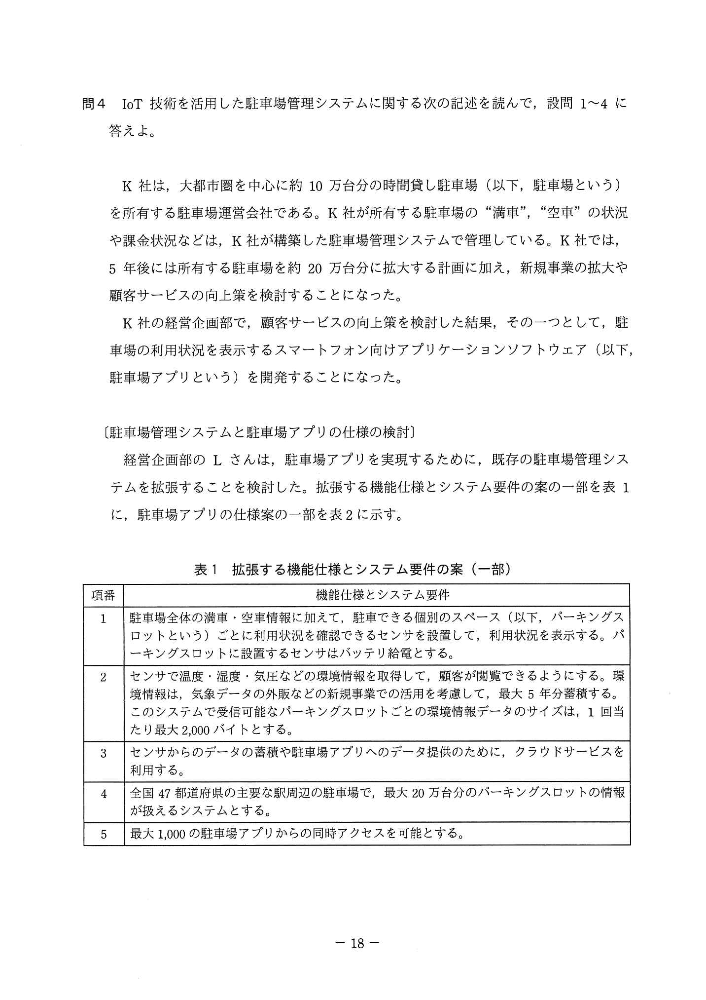

テキスト (OCR)

間4 IoT 技術を活用した駐車場管理システムに関する次の記述を読んで, 設問 1ー4 に

答えよ。

K 社は, 大都市圏を中心に約 10 万台分の時間貸し駐車場 (以下, 駐車場という)
を所有する駐車場運営会社である。K 社が所有する駐車場の “満車", “空車" の状況
や課金状況などは, K 社が構築した駐車場管理システムで管理している。K 社では,
5 年後には所有する駐車場を約 20 万台分に拡大する計画に加え, 新規事業の拡大や
顧客サービスの向上策を検討することになった。

K 社の経営企画部で, 顧客サービスの向上策を検討した結果,. その一つとして, HE
車場の利用状況を表示するスマートフォン向けアプリケーションソフトウェア (以下
駐車場アプリという) を開発することになった。

〔駐車場管理システムと駐車場アプリの仕様の検討]

経営企画部の 上 さんは, 駐車場アプリを実現するために, 既存の駐車場管理シス
テムを拡張することを検討した。 拡張する機能仕様とシステム要件の案の一部を表 1
に, 駐車場アプリの仕様案の一部を表 2 に示す。

表1 拡張する機能仕様とシステム要件の案 (一部)
項番                機能仕様とシステム要件
1 |駐車場全体の満車・空車情報に加えて, 駐車できる個別のスペース (ME, パーキングス
ロットという) ごとに利用状況を確認できるセンサを設置して, 利用状況を表示する。パ
ーキングスロットに設置するセンサはバッテリ給電とする。
2 | センサで温度・湿度・気話などの環境情報を取得して, 顧客が閲覧できるようにする。環
境情報は, 気象データの外販などの新規事業での活用を考慮して, 最大 5 年分蓄積する。
このシステムで受信可能なパーキングスロットごとの環境情報データのサイズは, 1 回当
たり最大 2,000 バイトとする。
3 | センサからのデータの蓄積や駐車場アプリへのデータ提供のために, クラウドサービスを
利用する。
4 | 全国 47 都道府県の主要な駅周辺の駐車場で, 最大 20 万台分のパーキングスロットの情報
が扱えるシステムとする。
5 | 最大 1000 の駐車場アプリからの同時アクセスを可能とする。

ー 18 一

### ページ 19

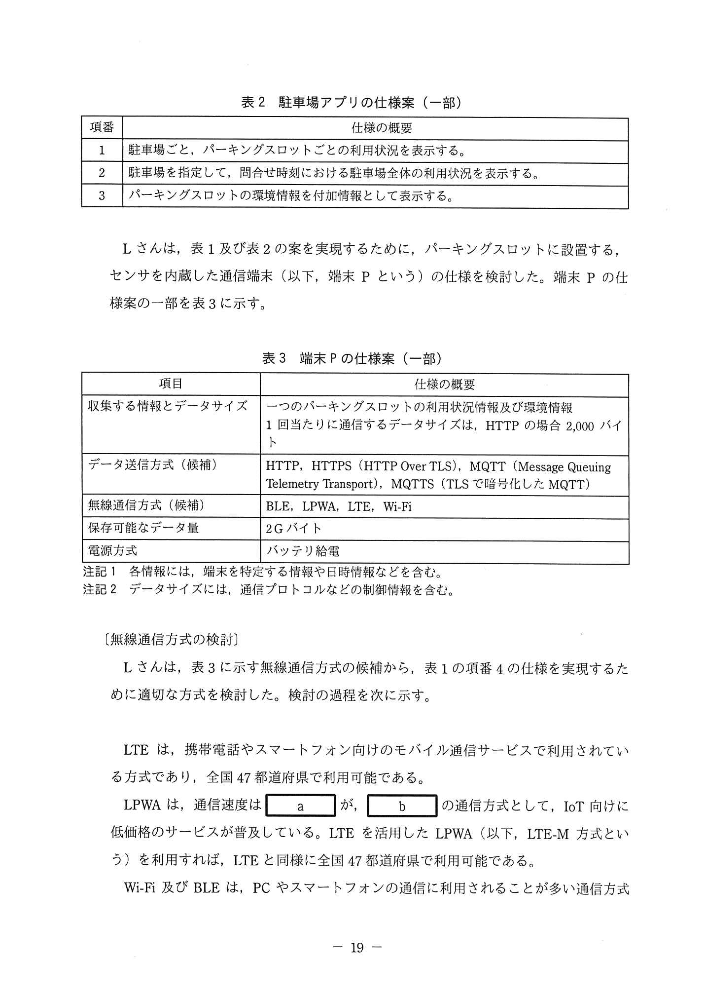

テキスト (OCR)

表2 駐車場アプリの仕様案 (一部)
項番                                   仕様の概要
1 |駐車場ごと, パーキングスロットごとの利用状況を表示する。
2 | 駐車場を指定して, 問合せ時刻における駐車場全体の利用状況を表示する。
3 | パーキングスロットの環境情報を付加情報として表示する。

L さんは, 表 1 及び表 2 の案を実現するために, パーキングスロットに設置する,
センサを内蔵した通信端末 (以下, 端末 P という) の仕様を検討した。端末 P OLE
様案の一部を表 3 に示す。

表3 端末Pの仕様案 (一部)

項目                                               仕様の概要

収集する情報とデータサイズ | 一つのパーキングスロットの利用状況情報及び環境情報
1 回当たりに通信するデータサイズは, HTTP の場合 2.000 バイ
ト

データ送信方式 (候補)        HTTP, HTTPS (HTTP Over TLS), MQTT (Message Queuing
Telemetry Transport), MQTTS (TLS で暗号化した MQTT)

無線通信方式 (候補)             BLE, LPWA, LTE, Wi-Fi

保存可能なデータ量        2Gバイト

電源方式                           バッテリ給電

注記1 各情報には, 端末を特定する情報や日時情報などを含む。
注記 2 データサイズには, 通信プロトコルなどの制御情報を含む。
[無線通信方式の検討]
L さんは, 表 3 に示す無線通信方式の候補から, 表 1 の項番 4 の仕様を実現するた
めに適切な方式を検討した。検討の過程を次に示す。

LTE は, 携帯電話やスマートフォン向けのモバイル通信サービスで利用されてい
る方式であり, 全国 47 都道府県で利用可能である。

LPWA は, 通信速度は| oa |が,|  b |の通信方式として, IoT 向けに
低価格のサービスが普及している。LTE を活用した LPWA (以下, LTE-M 方式とい
う) を利用すれば, LTE と同様に全国 47 都道府県で利用可能である。

Wi-Fi 及び BLE は, PC やスマートフォンの通信に利用されることが多い通信方式

ー 19 一

### ページ 20

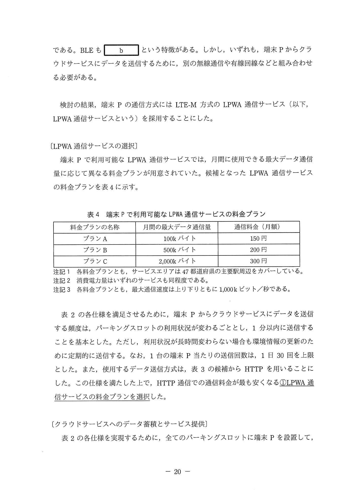

テキスト (OCR)

である。BLEも| b | という特徴がある。しかし, いずれも, 端末 Pからクラ
ウドサービスにデータを送信するために, 別の無線通信や有線回線などと組み合わせ
る必要がある。

検討の結果, 端末 P の通信方式には LTE-M 方式の LPWA 通信サービス (以下,
LPWA 通信サービスという) を採用することにした。

(LPWA 通信サービスの選択〕

端末 P で利用可能な LPWA 通信サービスでは, 月間に使用できる最大データ通信
量に応じて異なる料金プランが用意されていた。候補となった LPWA 通信サービス
の料金プランを表 4 に示す。

表4 端末Pで利用可能な LPWA 通信サービスの料金プラン

料金プランの名称       月間の最大データ 通信量       通信料金 (月額)
TOYA                      100k バイト                     150 円
プラン B                     500k バイト                    200 円
プラッC                    2.000k バイト                     300 円

注記1 各料金プランとも, サービスエリアは 47 都道府県の主要駅周辺をカバーしている。
注記2 7  力量はいずれのサービスも同程度である。
注記3 各料金プランとも, 最大通信速度は上り下りともに1.000k ビットノ秒である。

表 2 の各仕様を満足させるために, 端末 P からクラウドサービスにデータを送信
する頻度は, パーキングスロットの利用状況が変わるごととし, 1 分以内に送信する
ことを基本とした。ただし, 利用状況が長時間変わらない場合も環境情報の更新のた
めに定期的に送信する。なお, 1 台の端末 P 当たりの送信回数は, 1 日 30 回を上限
とした。 また, 使用するデータ送信方式は, 表 3 の候補から HTTP を用いることに
した。この仕様を満たした上で, HTTP 通信での通信料金が最も安くなる①LPWA 通
信サービスの料金プランを選択した。

[クラウドサービスへのデータ薔積とサービス提供〕
表 2 の各仕様を実現するために, 全てのパーキングスロットに端末 P を設置して,

ー 20 一

### ページ 21

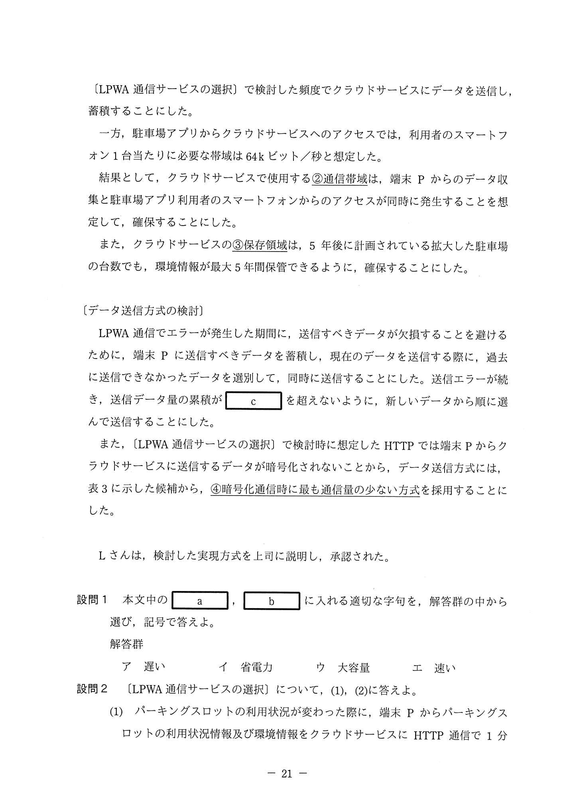

テキスト (OCR)

(LPWA 通信サービスの選択〕 で検討した頻度でクラウドサービスにデータを送信し
普積することにした。

一方, 駐車場アプリからクラウドサービスへのアクセスでは, 利用者のスマートフ
ォン 1 台当たりに必要な帯域は 64k ビットノ秒と想定した。

結果として, クラウドサービスで使用する②通信帯域は, 端末 P からのデータ収
集と駐車場アプリ 利用者のスマートフォンからのアクセスが同時に発生することを想
定して, 確保することにした。

また, クラウドサービスの③保存領域は, 5 年後に計画されている拡大した駐車場
の人台数でも, 環境情報が最大 5 年間保管できるように, 確保することにした。

(データ送信方式の栓計

LPWA 通信でエラーが発生した期間に, 送信すべきデータが欠損することを避ける
ために, 端末 P に送信すべきデータを菩積し, 現在のデータを送信する際に, 過去
に送信できなかったデータを選別して, 同時に送信することにした。送信エラーが続
き, 送信データ量の果積が[| c |] を超えないように, 新しいデータから順に選
んで送信することにした。

また, (LPWA 通信サービスの選択 で検討時に想定した HTTP では端末 P からク
ラウドサービスに送信するデータが暗号化されないことから, データ送信方式には,
表 3 に示した候補から, @暗号化通信時に最も通信量の少な方式を採用することに
した。

んは, 検討した実現方式を上司に説明し, 承認された。

設問1 本文中の| a |,|  b | に入れる適切な字句を, 解答群の中から
選び, 記号で答えよ。
解答群
ア 遅い    イ 省電力   ウ 大容量   エ 速い

設問2 〔LPWA 通信サービスの選択] について, (①, ②に答えよ。
GQ) パーキングスロットの利用状況が変わった際に, 端末 P からパーキングス
ロットの利用状況情報及び環境情報をクラウドサービスに HTTP 通信で 1 分

ー 21 一

### ページ 22

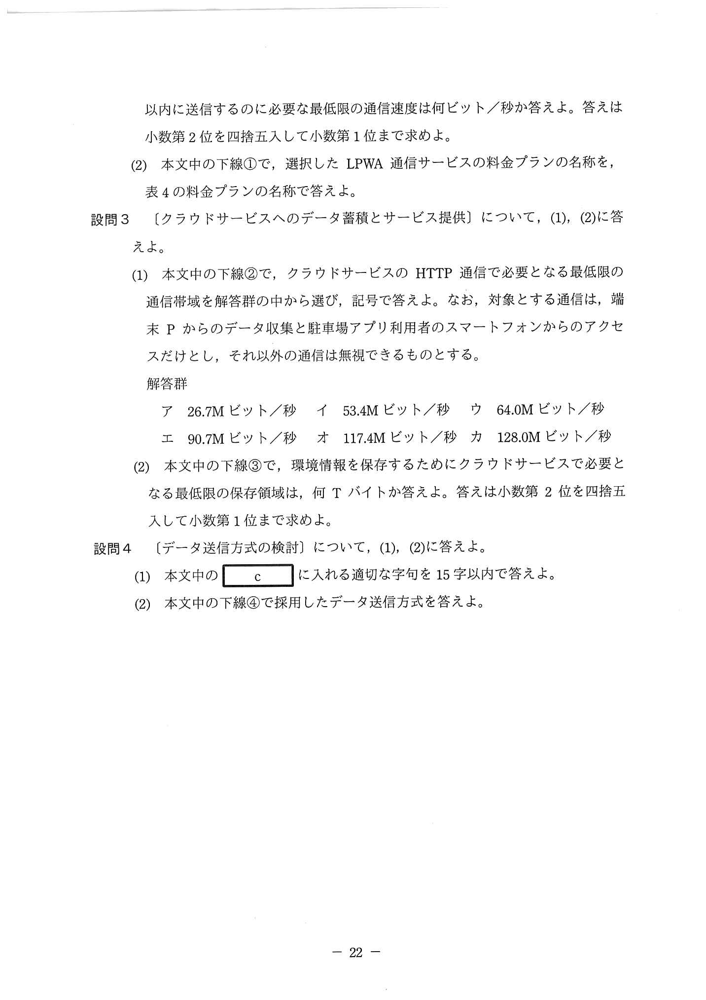

テキスト (OCR)

以内に送信するのに必要な最低限の通信速度は何ビットノ秒か答えよ。答えは
小数第 2 位を四捨五入して小数第 1 位まで求めよ。

2) 本文中の下線①で, 選択した LPWA 通信サービスの料金プランの名称を,
表 4 の料金プランの名称で答えよ。

設問3 〔クラウドサービスへのデータ蓄積とサービス提供〕】 について, ①, OKA

えよ。

Q①) 本文中の下線②@で, クラウドサービスの HTTP 通信で必要となる最低限の
通信帯域を解答群の中から選び, 記号で答えよ。なお, 対象とする通信は, 端
KP からのデータ収集と駐車場アプリ利用者のスマートフォンからのアクセ
スだけとし, それ以外の通信は無視できるものとする。
解答群

ア 26.7M ビットノ秒 イ 53.4Mビットノ秒 YD 64.0M ビットンノ/秒
x= 90.7Mビットンノ秒 A 117.4M ビットノ秒 カカ 128.0M ビットノ秒

2) 本文中の下線③で, 環境情報を保存するためにクラウドサービスで必要と
なる最低限の保存領域は, 何 T バイトかが答えよ。答えは小数第 2 位を四捨五
入して小数第 1 位まで求めよ。

設問4 〔データ送信方式の検討] について, ①), (②に答えよ。

a 本文中の[| < |] に入れる適切な字句を15 FUNCHAL,

(2) 本文中の下線④で採用したデータ送信方式を答えよ

ー 22 一

### ページ 23

テキスト (OCR)

C

メ モ 用 紙 〕

ー 23 一

### ページ 24

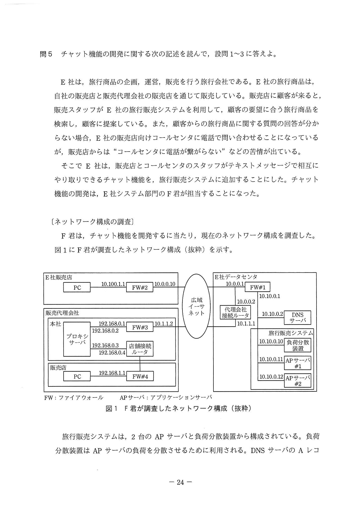

テキスト (OCR)

AIS チャット機能の開発に関する次の記述を読んで, 設問 1ご3 に答えよ。

E 社は, 旅行商品の企画, 運営, 販売を行う旅行会社である。E 社の旅行商品は,
自社の販売店と販売代理会社の販売店を通じて販売している。販売店に顧客が来ると,
販売スタッフが E 社の旅行販売システムを利用して, 顧客の要望に合う旅行商品を
検索し, 顧客に提案している。また, 顧客からの旅行商品に関する質問の回答が分か
らない場合, E 社の販売店向けコールセンタに電話で問い合わせることになっている
が, 販売店からは “コールセンタに電話が繋がらない” などの苦情が出ている。

そこで E 社は, 販売店とコールセンタのスタッフがテキストメッセージで相互に
やり取りできるチャット機能を, 旅行販売システムに追加することにした。チャット
機能の開発は, E 社システム部門の F 君が担当することになった。

〔【ネットワーク構成の調査]
F Ald, チャット機能を開発するに当たり, 現在のネットワーク構成を調査した。
 1にF君が調査したネットワーク構成 GREE) ERT.

E社販売店                                    /™  E社データセンタ
| pc | 01 rw oto                 9901 Wan |
10.10.01
i.           10.0.0.2
ae                                 ュー       理会
販売代理会社                                    ネット      sok     10.10.02| DNS
本社                      19216801 ーッ 0112                                    J10.1.11                    ian
Faxes] ese?               \N、/              旅行販売システム

サーバ |19916803 [ERIE               10.10.0.10 RR
192.168.0.4| ルータ

10.10.0.11|aPpサーバ

a            2.16811                                                    =
  192.1681. pwr                       10.10.012[APサーバ

#2

FW: ファイアウォール     APサーバ : アプリケーションサーバ
図1 『君が調査したネットワーク構成 (抜粋)

旅行販売システムは, 2 台の AP サーバと負荷分散装置から構成されている。 負荷
分散装置は AP サーバの負荷を分散させるために利用される。DNS サーバの A レコ

ー 24 一

### ページ 25

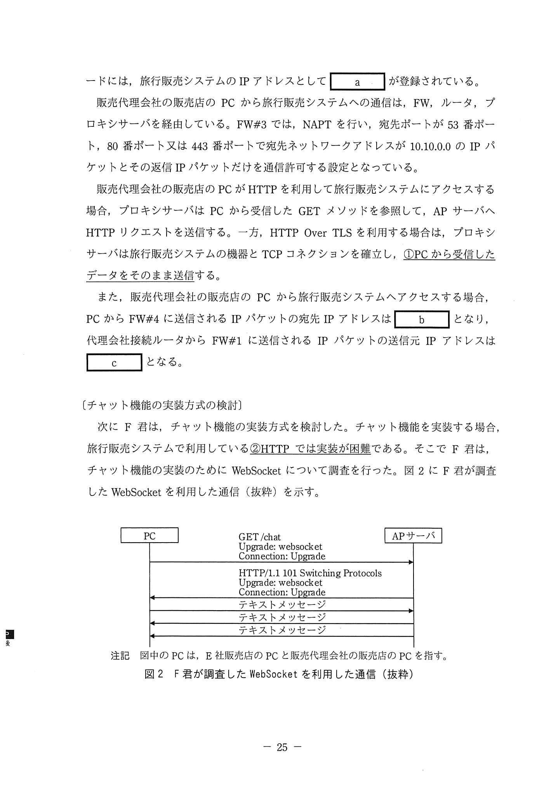

テキスト (OCR)

“i

ードには, 旅行販売システムの IP アドレスとして|  a』 | が登録されている。

販売代理会社の販売店の PC から旅行販売システムへの通信は, FW, ルータ, 7
ロキシサーバを経由している。FW#3 では, NAPT を行い, 宛先ポボートが 53 番ポー
ト, 80 番ポート又は 443 番ポートで宛先ネットワークアドレスが 10.10.0.0 の IP パ
ケットとその返信 IP パケットだけを通信許可する設定となっている。

販売代理会社の販売店の PC が HTTP を利用して旅行販売システムにアクセスする
場合,プロキシサーバは PC から受信した GET メソッドを参照して, AP サーバヘ
HTTP リクエストを送信する。一方, HTTP Over TLS を利用する場合は, プロキシ
サーバは旅行販売システムの機器と TCP コネクションを確立し, OPC から受信した
データをそのまま送信する。

また, 販売代理会社の販売店の PC から旅行販売システムヘアクセスする場合,
PC から FW#4 に送信される IP パケットの宛先 P アドレスは| b | となり,
代理会社接続ルータから FW#1 に送信される IP パケットの送信元 P アドレスは

(チャット機能の実装方式の検討

次に F Blk, チャット機能の実装方式を検討した。チャット機能を実装する場合
旅行販売システムで利用している②HTTP では実装が困難である。そこで F Ald
チャット機能の実装のために WebSocket について調査を行った。図 2 にF 君が調査
した WebSocket を利用した通信 (抜粋) を示す。

PC                 GET /chat                       APサーバ

Upgrade: websocket
Connection: Upgrade

HTTP/1.1 101 Switching Protocols
Upgrade: websocket
Connection: Upgrade

テキストメッセージ
テキストメッセージ
テキストメッセージ

注記 図中のPCは, E 社販売店の PC と販売代理会社の販売店の PC を指す。
 2 『君が調査した WebSocket を利用した通信 (抜粋)

ー 25 一

### ページ 26

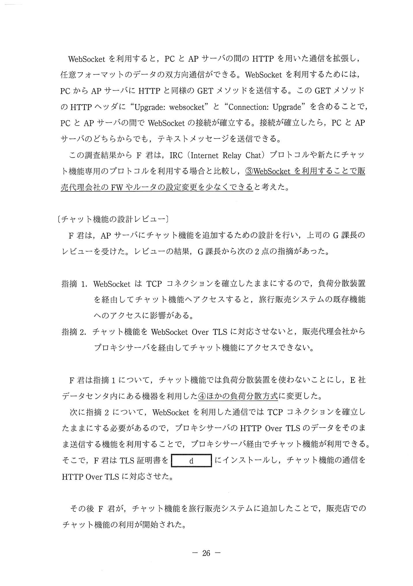

テキスト (OCR)

WebSocket を利用すると, PC と AP サーバの間の HTTP を用いた通信を拡張し,
任意フォーマットのデータの双方向通信ができる。WebSocket を利用するためには,
PC から AP サーバに HTTP と同様の GET メソッドを送信する。このGET メソッド
の HTTP ヘッダに“Upgrade: websocket” と “Connection: Upgrade "を含めることで,
PC と AP サーバの間で WebSocket の接続が確立する。接続が確立したら, PC と AP
サーバのどちらからでも, テキストメッセージを送信できる。

この調査結果から F 君は, IRC (Internet Relay Chat) プロトコルや新たにチャッ
ト機能専用のプロトコルを利用する場合と比較し, ③WebSocket を利用することで販
売代理会社のFW やルータの設定変更を少なくできると考えた。

(チャット機能の設計レビュー
F 君は, AP サーバにチャット機能を追加するための設計を行い。 上司の G 課長の
レビューを受けた。レビューの結果, G 課長から次の 2 点の指摘があった。

指摘 1. WebSocket は TCP コネクションを確立したままにするので, 負荷分散装置
を経由してチャット機能ヘアクセスすると, 旅行販売システムの既存機能
へのアクセスに影響がある。

指摘 2. チャット機能を WebSocket Over TLS に対応させないと, 販売代理会社から
プロキシサーバを経由してチャット機能にアクセスできない。

F 君は指摘 1 について, チャット機能では負荷分散装置を使わないことにし, Ett
データセンタ内にある機器を利用した④ほかの負荷分散方式に変更した。

次に指摘 2 について, WebSocket を利用した通信では TCP コネクションを確立し
たままにする必要があるので, プロキシサーバの HTTP Over TLS のデータをそのま
ま送信する機能を利用することで, プロキシサーバ経由でチャット機能が利用できる。
そこで, 君は TLS 証明書を| q |] にインストールし, チャット機能の通信を
HTTP Over TLS に対応させた。

その後 F 君が. チャット機能を旅行販売システムに追加したことで, 販売店での
チャット機能の利用が開始された。

ー 26 一

### ページ 27

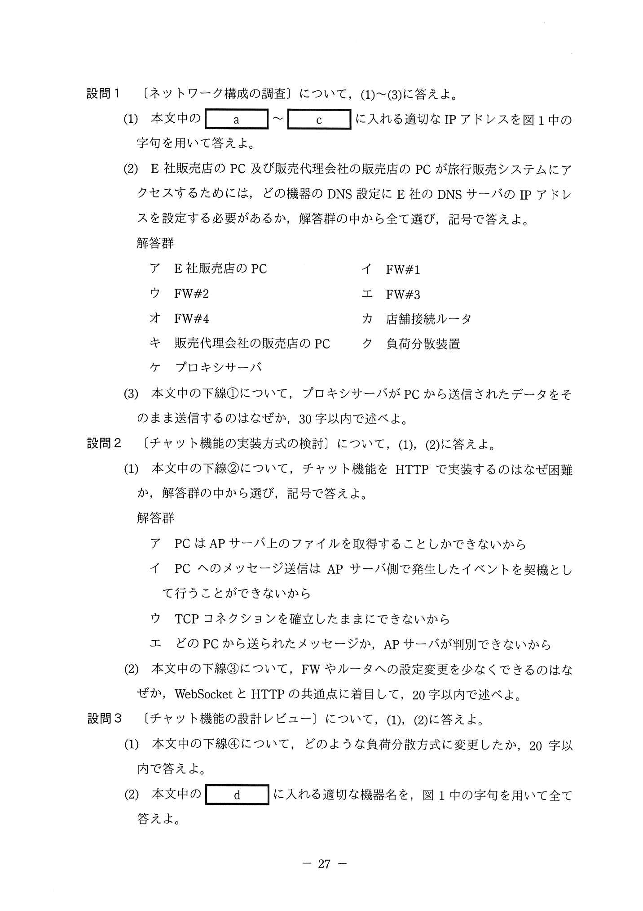

テキスト (OCR)

設問1 〔ネットワーク構成の調査〕 について, ①~て(3)に答えよ。
Q 本文中の|  』 |~|  c |に入れる適切な TP アドレスを図 1中の
字句を用いて答えよ。
(2) 社販売店の PC 及び販売代理会社の販売店の PC が旅行販売システムにア
クセスするためには, どの機器の DNS 設定に E 社の DNS サーバの IP アドレ
スを設定する必要があるか, 解答群の中から全て選び, 記号で答えよ。

解答群
ア E社販売店の PC                    イ FW#1
ウ FW#2                               = FW#3
オ FW#4                                  A 店舗接続ルータ
キ 販売代理会社の販売店の PC       ク 負荷分散装軒

ケ プロキシサーバ
(3) 本文中の下線のについて, プロキシサーバが PC から送信されたデータをそ
のまま送信するのはなぜか, 30 字以内で述べよ。
設問2 〔チャット機能の実装方式の検討 について, ①), ②)に答えよ。
GQ) 本文中の下線②について, チャット機能を HTTP で実装するのはなぜ了困難
か, 解答群の中から選び, 記号で答えよ。
解答群
ア PCはAP サーバ上のファイルを取得することしかできないから
イ PC へのメッセージ送信は AP サーバ側で発生したイベントを契機とし
て行うことができないから
ウ TCP コネクションを確立したままにできないから
エエ どのPCから送られたメッセージか, AP サーバが判別できないから
(2) 本文中の下線について, FW やルータへの設定変更を少なくできるのはな
ぜか, WebSocket と HTTP の共通点に着目して, 20 字以内で述べよ。
設問3 〔チャット機能の設計レビュー〕 について, ①, ②⑫②に答えよ。
GQ) 本文中の下線について, どのような人負荷分散方式に変更したか, 20 字以
内で答えよ。
@ 本文中の| q』 | に入れる適切な機器名を, 図 1 中の字句を用いて全て
答えよ。

ー 27 一

### ページ 28

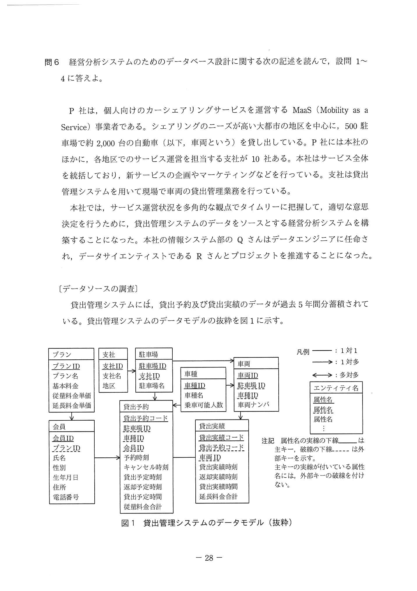

テキスト (OCR)

間6 経営分析システムのためのデータベース設計に関する次の記述を読んで, 設問 1~

4 に答えよ。

P 社は, 個人向けのカーシェアリングサービスを運営する MaaS (Mobility as a
Service) 事業者である。シェアリングのニーズが高い大都市の地区を中心に, 500 EE
車場で約 2,000 台の自動車 (以下, 車両という) を貸し出している。P 社には本社の
ほかに, 各地区でのサービス運営を担当する支社が 10 社ある。本社はサービス全体
を統括しており, 新サービスの企画やマーケティングなどを行っている。支社は貸出
管理システムを用いて現場で車両の貸出管理業務を行っている。

本社では, サービス運営状況を多角的な観点でタイムリーに把握して, 適切な意思
決定を行うために, 貸出管理システムのデータをソースとする経営分析システムを構
築することになった。 本社の情報システム部の Q さんはデータエンジニアに任命さ
れ, データサイエンティストである R さんとプロジェクトを推進することになった。

[データソースの調査
貸出管理システムには, 貸出予約及び貸出実績のデータが過去 5 年間分蓄積されて
いる。 貸出管理システムのデータモデルの抜粋を図 1 に示す。

プラン           支社 | [aoe                                                Al           1
フランID | | xan |_| sete                  sit                    Ee
プラン名         支社名 | | HID         車種              車両D                   <> : 多対多
基本料金          地区          駐車場名        車種D         トラ| 駐車場TD                    エンティティ名
従量料金単価                   MM         車種名           車種DD                 RHA
延長料金単価        貸出予約      ky 乗車可能人数| | 車両ナンバ          Po

\                 EHS —                      :                      ates,
会員                                          貸出実績                               :
会員D                                       信遇寄合コード | 注記 mee ose FL
プランD | | 会只DD                 貸出予約コード          主キー, 破線の下線----- は外
氏名                  時                車両D                 部キーを示す。
性別                  キャンセル時刻          貸出実績時刻            主キーの実線が付いている属性
生年月日           貸出予定時刻         返却実績時刻         名には, 外部キーの破線を付け
住所                  SED FERGAL            貸出実績時間            ない。
電話番号              貸出予定時間            LENS

従量料金合計

 1 貸出管理システムのデータモデル (抜粋)

ー 28 一

### ページ 29

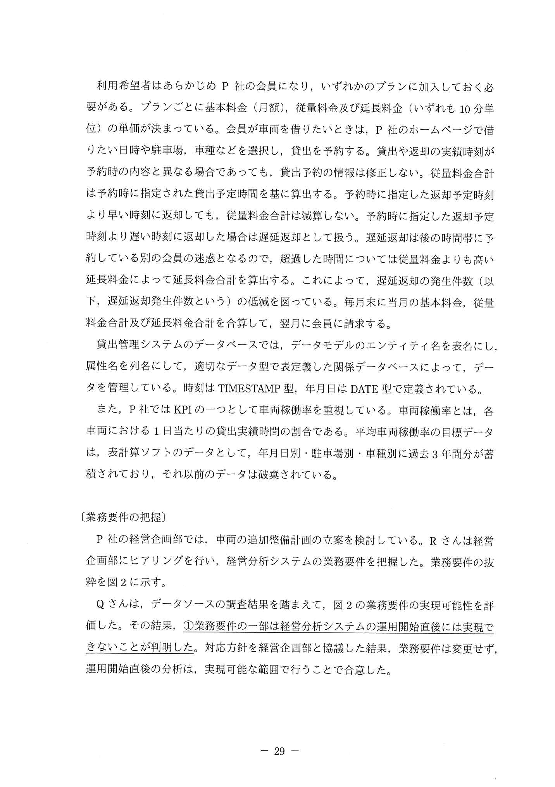

テキスト (OCR)

利用希望者はあらかじめ P 社の会員になり, いずれかのプランに加入しておく必
要がある。プランごとに基本料金(月額) 従量料金及び延長料金 (いずれも 10 分単
位) の単価が決まっている。 会員が車両を借りたいときは, P 社のホームページで借
りたい日時や駐車場。車種などを選択し, 貸出を予約する。貸出や返却の実績時刻が
予約時の内容と異なる場合であっても, 貸出予約の情報は修正しない。 従量料金合計
は予約時に指定された貸出予定時間を基に算出する。予約時に指定した返却予定時刻
より早い時刻に返却しても, 従量料金合計は減算しない。予約時に指定した返却予定
時刻より遅い時刻に返却した場合は遅延返却として扱う。遅延返却は後の時間帯に予
約している別の会員の迷惑となるので, 超過した時間については従量料金よりも高い
延長料金によって延長料金合計を算出する。これによって, 遅延返却の発生件数 (以
下, 遅延返却発生件数という) の低減を図っている。 毎月末に当月の基本料金, 従量
料金合計及び延長料金合計を合算して, 翌月に会員に請求する。

貸出管理システムのデータベースでは, データモデルのエンティティ名を表名にし
属性名を列名にして, 適切なデータ列で表定義した関係データベースによって, デー
タを管理している。 時刻は TIMESTAMP 型, 年月日は DATE 型で定義されている。

また, P 社では KPI の一つとして車両稼働率を重視している。車両稼働率とは, 各
車両における 1 日当たりの貸出実績時間の割合である。平均車両稼働率の目標ゲータ
は, 表計算ソフトのデータとして, 年月日別・駐車場別・車種別に過去 3 年間分が次
積されており, それ以前のデータは破棄されている。

〔業務要件の把握]

P 社の経営企画部では, 車両の追加整備計画の立案を検討している。R さんは経営
企画部にヒアリングを行い, 経営分析システムの業務要件を把握した。業務要件の抜
粋を図 2 に示す。

Q さんは, データソースの調査結果を踏まえて, 図 2 の業務要件の実現可能性を評
価した。その結果, ①業務要件の一部は経営分析システムの運用開始直後には実現で
きないことが判明した。対応方針を経営企画部と協議した結果, 業務要件は変更せず
運用開始直後の分析は, 実現可能な範囲で行うことで合意した。

ー 29 一

### ページ 30

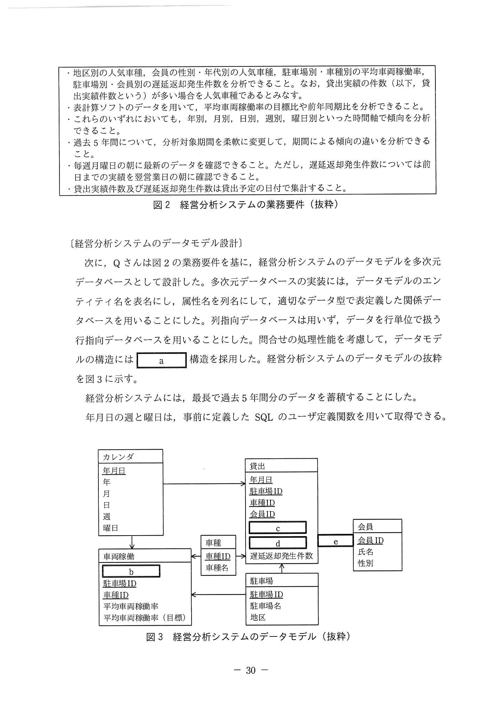

テキスト (OCR)

・地区別の人気車種, 会員の性別・年代別の人気車種, 駐車場別・車種別の平均車両稼働率,
駐車場別・会員別の遅延返却発生件数を分析できること。なお, 貸出実績の件数 (以下, 貸
出実績件数という) が多い場合を人気車種であるとみなす。

・表計算ソフトのデータを用いて, 平均車両稼働率の目標比や前年同期比を分析できること。

・これらのいずれにおいても, 年別, 月別, AB, 週別, 曜日別といった時間軸で傾向を分析
できること。

・ 過去 5 年間について, 分析対象期間を柔軟に変更して, 期間による傾向の違いを分析できる
とも。

・毎週月曜日の朝に最新のデータを確認できること。ただし, 遅延返却発生件数については前
日までの実績を翌営業日の朝に確認できること。

・貸出実績件数及び遅延返却発生件数は貸出予定の日付で集計すること。

図2 経営分析システムの業務要件 (抜粋)

[経営分析システムのデータモデル設計]

次に, Q さんは図 2 の業務要件を基に, 経営分析システムのデータモデルを多次元
データベースとして設計した。多次元データベースの実装には, データモデルのエン
ティティ名を表名にし, 属性名を列名にして, 適切なデータ型で表定義した関係デー
タベースを用いることにした。列指向データベースは用いず, データを行単位で扱う
行指向データベースを用いることにした。問合せの処理性能を考慮して, データモデ
ルの構造には|  』 |構造を採用した。経営分析システムのデータモデルの抜粋
を図 3 に示す。

経営分析システムには, 最長で過去 5年間分のデータを蓄積することにした。

年月日の週と曜日は, 事前に定義した SQL のユーザ定義関数を用いて取得できる。

Arye
#25                                        a
年                                        年月日
月                                             駐車場D
日                                             車種D
週                                        会員D
曜日                                      [       Cc       ]               aa
J                       車種         |        d        ]         e 会員D
車両和作       lc_ | 車種ID | 遅征返者発生件数      Be
駐車場ID                                    駐車場
H EID                            駐車場ID
平均車両稼働率                              駐車場名
平均車両稼働率 (目標)                   地区

図3 経営分析システムのデータモデル (抜粋)

ー 30 一

### ページ 31

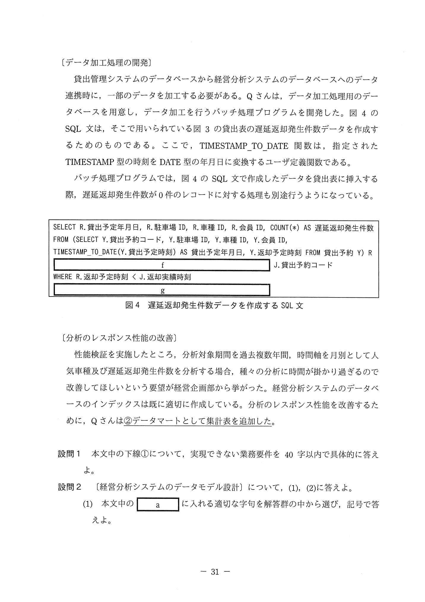

テキスト (OCR)

〔データ加工処理の開発]

貸出管理システムのデータベースから経営分析システムのデータベースへのデータ
連携時に, 一部のデータを加工する必要がある。Q さんは, データ加工処理用のデー
タベースを用意し, データ加工を行うバッチ処理プログラムを開発した。 4 の
SQL 文は, そこで用いられている図 3 の貸出表の遅延返却発生件数データを作成す
るためのものである。 ここで, TIMESTAMP TO DATE 関数は, 指定された
TIMESTAMP 型の時刻を DATE 型の年月日に変換するユーザ定義関数である。

バッチ処理プログラムでは, 4 の SQL 文で作成したデータを貸出表に挿入する
BR, 遅延返却発生件数が0 件のレコードに対する処理も別途行うようになっている。

SELECT R. 貸出予定年月日, R.駐車場 ID, R,車種 ID, R. SAID, COUNT(*) AS 遅延返却発生件数
FROM (SELECT Y.貸出予約コード, Y.駐車場 ID, Y.車種 ID, Y.会員 ID,

TIMESTAMP_TO_DATE(Y. 貸出予定時刻) AS 貸出予定年月日, Y.返却予定時刻 FROM 貸出予約 Y) R
|              f             | ).貸出予約コード

WHERE R.返却予定時刻 < J.返却実績時刻

|                                        g                                       |

図4 遅延返却発生件数データを作成する SQL 文

〔分析のレスポンス性能の改善]
性能検証を実施したところ, 分析対象期間を過去複数年間, 時間軸を月別として人
気車種及び遅延返却発生件数を分析する場合, 種々の分析に時間が掛かり過ぎるので
改善してほしいという要望が経営企画部から挙がった。経営分析システムのデータベ
ースのインデックスは既に適切に作成している。分析のレスポンス性能を改善するた
めに, Q さんは②データマートとして集計表を追加した。

設問1 本文中の下線〇について, 実現できない業務要件を 40 字以内で具体的に答え
よ。

設問2 〔経営分析システムのデータモデル設計)について, Q①), (②)に答えよ。
Q) 本文中の| 』 | に入れる適切な字句を解答君の中から選び, BSCS

えよ。

ー 31 一

### ページ 32

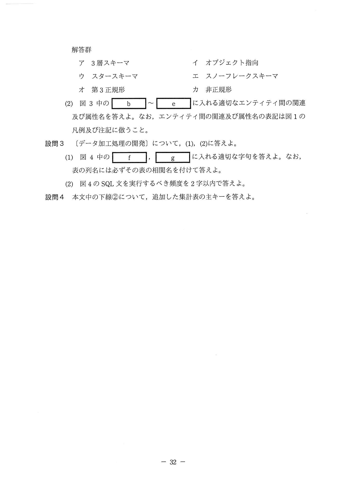

テキスト (OCR)

解答衝

ア 3層スキーマ          イ オブジェクト指向
ウ スタースキーマ        スノーフレータスキーマ
オ 第3正規形          ny 非正規形

② 図3中の| b |~[ es

| に入れる適切なエンティティ間の関連
及び必性名を答えよ。なお, エンティティ間の関連及び属性名の表記は図 1 の
凡例及び注記に父うこと。

設問3 〔データ加工処理の開発」 について, (①, ②に答えよ。

① 図4中の| fj | |  g |に入れる適切な字句を答えよ。なお,
表の列名には必ずその表の相関名を付けて答えよ。
(2) 図4のSQL 文を実行するべき頻度を 2 字以内で答えよ。

設問4 本文中の下線②について, 追加した集計表の主キーを答えよ。

ー 32 一

### ページ 33

テキスト (OCR)

〔

x = 用 紙 J

ー 33 一

### ページ 34

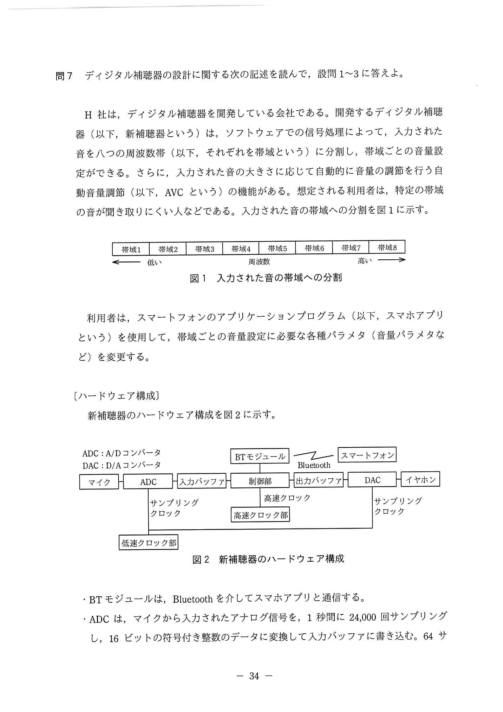

テキスト (OCR)

7 ディジタル補聴器の設計に関する次の記述を読んで, 設問13 に答えよ。

H 社は, ディジタル補聴器を開発している会社である。開発するディジタル補聴
器 (以下, 新補聴器という) は, ソフトウェアでの信号処理によって, 入力された
音を八つの周波数帯 (以下, それぞれを帯域という) に分割し, 帯域ごとの音量設
定ができる。さらに, 入力された音の大きさに応じて自動的に音量の調節を行う自
動音量調節 (LE, AVC という) の機能がある。 想定される利用者は, PEO RK
の音が開き取りにくい人などである。入力された音の帯域への分割を図 1 にボす。

[wee | mo | wea | wma | os [we | 帯域7 | 天城 |
ーー 低い        周波数        高い 一テ

図1 入力された音の帯域への分割

利用者は, スマートフォンのアプリケーションプログラム (以下, スマホアプリ
という) を使用して, 帯域ごとの音量設定に必要な各種パラメタ (音量パラメタな
ど) を変更する。

〔ハードウェア構成〕
新補聴器のハードウェア構成を図 2 に示す。

DAC : D/Aコンバータ                                             Bluetooth
EE
サンプリング        44        サンブリング

クロック          高速クロック部                 クロック
低速クロック部

図2 新補聴器のハードウェア構成
・BT モジュールは, Bluetooth を介してスマホアプリと通信する。
・ ADC は, マイクから入力されたアナログ信号を, 1 秒間に 24.000 回サンプリ ング

し, 16 ビットの符号付き整数のデータに変換して入力バッファに書き込む。64 サ

### ページ 35

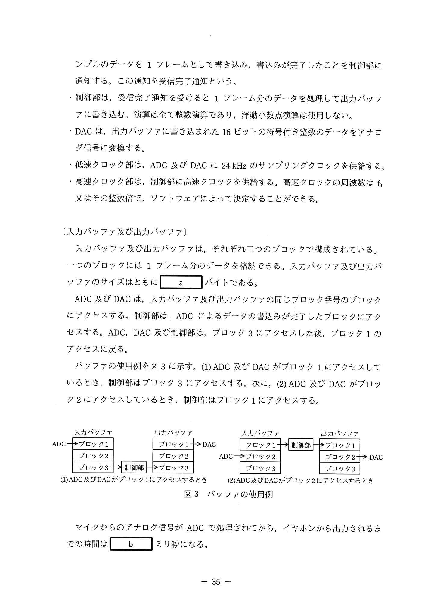

テキスト (OCR)

ンプルのデータを 1 フレームとして書き込み, 書込みが完了したことを制御部に
通知する。この通知を受信完了通知という。

・ 制御部は, 受信完了通知を受けると 1 フレーム分のデータを処理して出力バッフ
ァに書き込む。 演算は全て整数演算であり, 浮動小数点演算は使用しない。

・DAC は, 出力バッファに書き込まれた 16 ビットの符号付き整数のデータをアナロ
グ信号に変換する。

・ 低速クロック部は, ADC 及び DAC に 24 kHz のサンプリングクロックを供給する。
・高速クロック部は, 制御部に高速クロックを供給する。高速クロックの周波数は fy
又はその整数倍で,。 ソフトウェアによって決定することができる。

[入力バッファ及び出力バッファ〕}

入力バッファ及び出力バッファは, それぞれ三つのブロックで構成されている。
ーつのブロックには 1 フレーム分のデータを格納できる。 入力バッファ及び出力バ
ッファのサイズはともに|  』 |]バイトでぁる。

ADC 及び DAC は, 入力バッファ及び出力バッファの同じブロック番号のブロック
にアクセスする。制御部は, ADC によるデータの書込みが完了したブロックにアク
セスする。ADC, DAC 及び制御部は, ブロック 3 にアクセスした後, ブロック 1 の
アクセスに戻る。

バッファの使用例を図 3 に示す。(1) ADC 及び DAC がブロック 1 にアクセスして
いるとき, 制御部はブロック 3 にアクセスする。次に, (2) ADC 及び DAC がブロッ
ク 2にアクセスしているとき, 制御部はブロック 1 にアクセスする。

入力バッファ          出カバッファ            入力バッファ          出力バッファ
ADC一プロック1           ブロック1丁> DAC       ブロック1 十 制御部>プロック1
プロック2           ロウ2       ADC—>7uy 72           Fuy 727> DAC
ブロック3十引 mins HP Foy 73             プブロック3           ブロック3
Q)ADC及びDACがプロック1にアクセスするとき       (⑫②)ADC及びDACがブロック2にアクセスするとき

図3 バッファの使用例

マイクからのアナログ信号が ADC で処理されてから, イヤホンから出力されるま

での時間は| b |] ミリ秒になる。

ー 35 一

### ページ 36

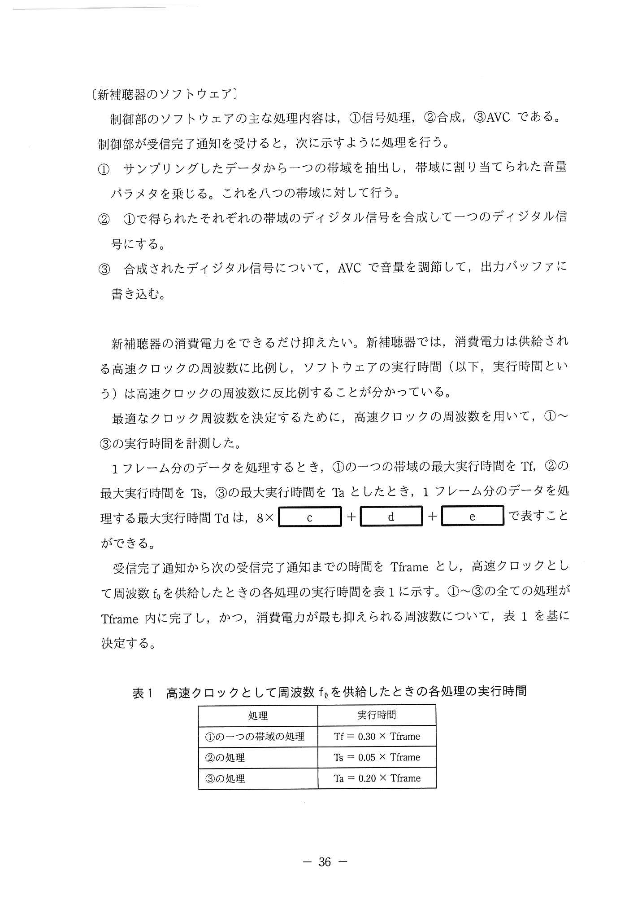

テキスト (OCR)

〔新補聴器のソフトウェア〕
制御部のソフトウェアの主な処理内容は, ①信号処理, ②合成,③AVC である。
制御部が受信完了通知を受けると, 次に示すように処理を行う。

① サンプリングしたデータから一つの帯域を抽出し, 帯域に割り当てられた音量
パラメタを乗じる。これを八つの帯域に対して行う。

② ①で得られたそれぞれの帯域のディジタル信号を合成してつのディジタル信
号にする。

③ 合成されたディジタル信号について, AVC CHHEMMULT, 出力バッファに
書き込む。

新補聴器の消費電力をできるだけ抑えたい。新補聴器では, 消費電力は供給され
る高速クロックの周波数に比例し, ソフトウェアの実行時間 (以下, 実行時間とい
う) は高速クロックの周波数に反比例することが分かっている。

最適なクロック周波数を決定するために, 高速クロックの周波数を用いて, O~
⑨の実行時間を計測した。

1 フレーム分のデータを処理するとき, ①の一つの帯域の最大実行時間を Ti, OO
最大実行時間を Ts, ③の最大実行時間を Ta としたとき, 1 フレーム分のデータを処
理する最大実行時間 Td は。 8X| oc |+| a |+| ie |で表すこと
ができる。

受信完了通知から次の受信完了通知までの時間を Thame CL, 高速クロックとし
て周波数るを供給したときの各処理の実行時間を表 1 に示す。①て③の全ての処理が
Trame 内に完了し, かつ, 消費電力が最も抑えられる周波数について, 表 1 を基に
決定する。

表1 高速クロックとして周波数 f。を供給したときの各処理の実行時間
処理                    実行時間
①の一つの帯域の処理      Tf = 0.30 X Tframe

②の処理                   Ts = 0,05 X Tframe

③の処理                   Ta = 0.20 X Tframe

ー 36 一

### ページ 37

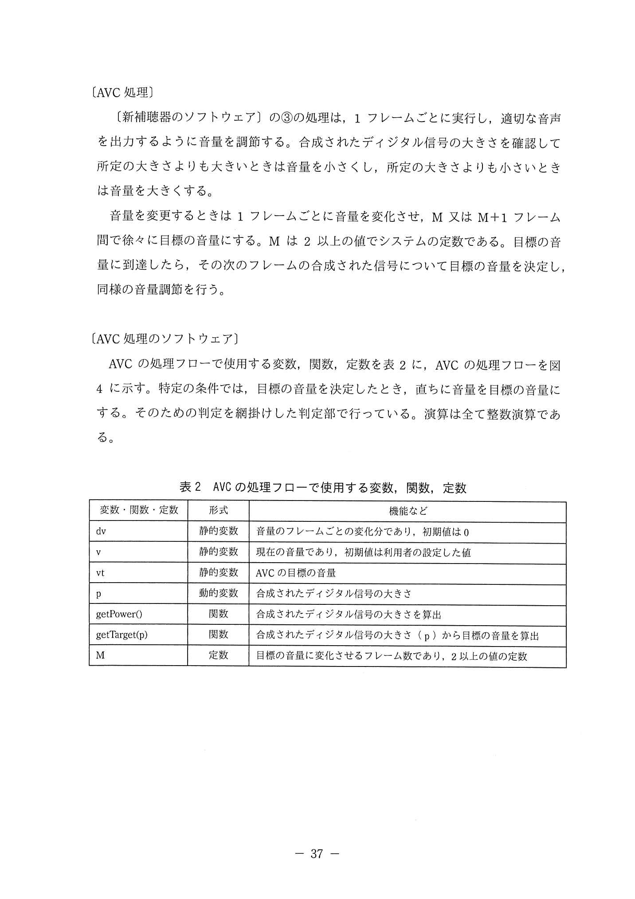

テキスト (OCR)

(AVC 処理〕

CMO Y DhU TY) の③の処理は, 1 フレームごとに実行し, 適切な音声
を出力するように音量を調節する。合成されたディジタル信号の大きさを確認して
所定の大きさよりも大きいときは音量を小さくし, 所定の大きさよりも小さいとき
は音量を大きくする。

音量を変更するときは 1 フレームごとに音量を変化させ, M 又は M二1 フレーム
間で徐々に目標の音量にする。M は 2 以上の値でシステムの定数である。目標の音
量に到達したら, その次のフレームの合成された信号について目標の音量を決定し,
同様の音量調節を行う。

(AVC 処理のソフトウェア]〕

AVC の処理フローで使用する変数, 関数, 定数を表 2 に, AVC の処理フローを図
4 に示す。 特定の条件では, 目標の音量を決定したとき, 直ちに音量を目標の音量に
する。そのための判定を網掛けした判定部で行っている。演算は全て整数演算であ
る。

表 2 AVCの処理フローで使用する変数, 関数, 定数

変数・関数・定数      形式                               機能など

dv             静的変数 | 音量のフレームごとの変化分であり, 初期値は0

v            静的変数 | 現在の音量であり, 初期値は利用者の設定した値

vt                 WIZE | AVC の目標の音量

p                 動的変数 | 合成されたディジタル信号の大きさ

getPower()                関数       合成されたディジタル信号の大きさを算出

getTarget(p)            関数     合成されたディジタル信号の大きさ (p ) から目標の音量を算出
M                     定数      目標の音量に変化させるフレーム数であり, 2 以上の値の定数

ー 37 一

### ページ 38

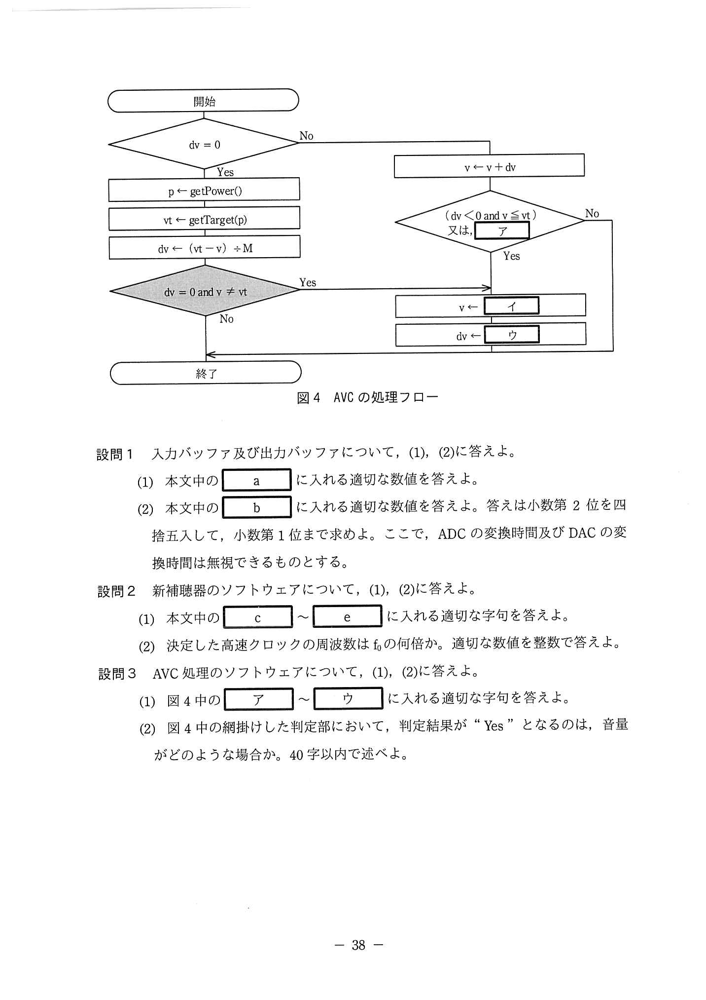

テキスト (OCR)

C    a)

No

dv =0

Yes
pぐ getPower()               |
I

|             vt で getTarget(p)             |
I

|       dyで (vt-—v) +M

Yes

dy = Qandy # vt

|     vcしィ |   |

No                                                                                       I

C                      終了                      )

 4 AVC の処理フロー

設問1 入力バッファ及び出力バッファについて, ①⑪, ②に答えよ
a 本文中の[|  』 | に入れる適切な数値を答えよ。
⑫ 本文中の[| b |] に入れる適切な数値を答えよ。答えは小数第 2 位を四
捨五入して, 小数第 1 位まで求めよ。ここで, ADC の変換時間及び DAC OB
換時間は無視できるものとする。
設問2 新補聴器のソフトウェアについて, (①⑪, (2②)に答えよ。
a 本文中の| < |-| ce |に入れる適切な字句を答えよ。
⑫) 決定した高速クロックの周波数は の何倍か。適切な数値を整数で答えよ
設問3 AVC処理のソフトウェアについて, ①⑪, ②⑫に答えよ。
Q) 図4中の| アァ  a  ウ |に入れる適切な字句を答えよ。
Q) 図 4 中の網掛けした判定部において, 判定結果が “Yes” となるのは, 音量
がどのような場合か。40 字以内で述べよ。

### ページ 39

テキスト (OCR)

〔

メ = 用 紙 J

ー 39 一

### ページ 40

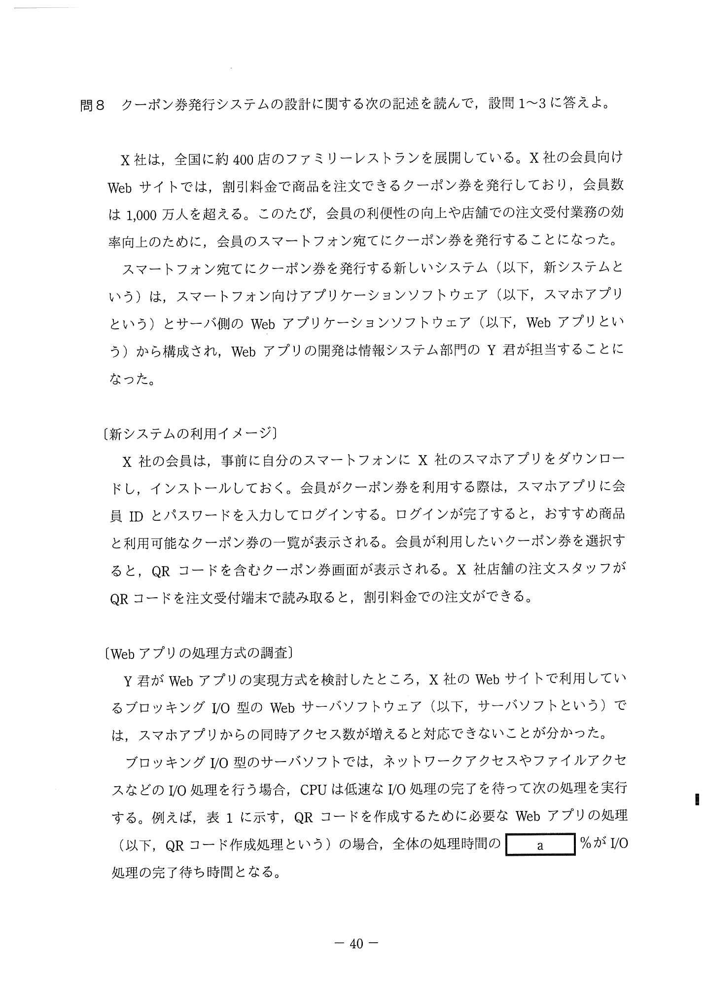

テキスト (OCR)

BS クーポン券発行システムの設計に関する次の記述を読んで, 設問 1ー3 に答えよ。

X 社は, 全国に約 400 店のファミリーレストランを展開している。X 社の会員向け
Web サイトでは, 割引料金で商品を注文できるクーポン券を発行しており, 会員数
は 1.000 万人を超える。このたび, 会員の利便性の向上や店舗での注文受付業務の効
率向上のために, 会員のスマートフォン多てにクーポン券を発行することになった。

スマートフォン宛てにクーポン券を発行する新しいシステム (以下, 新システムと
WS) は, スマートフォン向けアプリケーションソフトウェア (以下, スマホアプリ
という) とサーバ側の Web アプリケーションソフトウェア (以下, Web アプリとい
う) から構成され, Web アプリの開発は情報システム部門の Y 君が担当することに

なつた。

【新システムの利用イメージ〕

X 社の会員は, 事前に自分のスマートフォンに X 社のスマホアプリをダウンロー
ドし, インストールしておく。 会員がクーポン券を利用する際は, スマホアプリに会
員 ID とパスワードを入力してログインする。ログインが完了すると, おすすめ商品
と利用可能なクーポン券の一覧が表示される。会員が利用したいクーポン券を選択す
ると, QR コードを含むクーポン券画面が表示される。X 社店舗の注文スタッフが
QR コードを注文受付端末で読み取ると, 割引料金での注文ができる。

(Web アプリの処理方式の調査

Y EO Web アプリの実現方式を検討したところ, X 社の Web サイトで利用してい
るブロッキング YO HO Web サーバソフトウェア (以下, サーバソフトという) で
は, スマホアプリからの同時アクセス数が増えると対応できないことが分かった。

ブロッキング TO 型のサーバソフトでは, ネットワークアクセスやファイルアクセ
スなどの YO 処理を行う場合, CPU は低速な O 処理の完了を待って次の処理を実行
する。合えば, 表 1 に示す, QR コードを作成するために必要な Web アプリの処理

(LE, QR コード作成処理という) OMA, 全体の処理時間の| 。 | %が7O
処理の完了待ち時間となる。

ー 40 一

### ページ 41

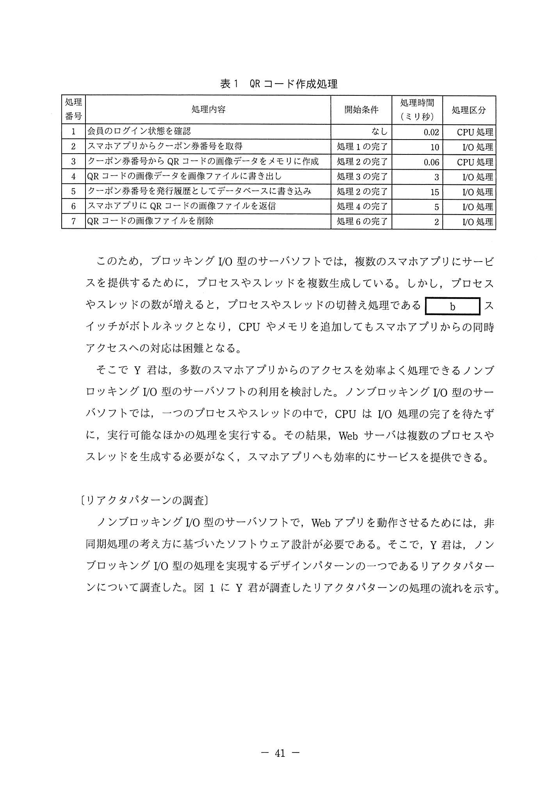

テキスト (OCR)

表1 QRコード作成処理

                      処理内容                        条件 | TE | soem
1 |会員のログイン状態を確認                                                    なし          0.02| CPU処理
2 |スマホアプリからクーポン券番号を取得                 処理 1 の完了        10    VO 処理
3 |クーポン券番号から QR コードの画像データをメモリに作成 | 処理2の完了           0.06| CPU処理
4 |QR コードの画像データを画像ファイルに書き出し         処理 3 の完了        3    VO 処理
5 |クーポン券番号を発行履歴としてデータベースに書き込み    処理 2 の完了       15    VO 処理
6 |スマホアプリに QR コードの画像ファイルを返信          処理 4 の完了        5    VO 処理
7 |QR コードの画像ファイルを削除                     処理 6 の完了        2    VO 処理

このため, ブロッキング YO 型のサーバソフトでは, 複数のスマホアプリにサービ
スを提供するために, プロセスやスレッドを複数生成している。しかし, プロセス
やスレッドの数が増えると, プロセスやスレッドの切替え処理である| pb |ス
イッチがボトルネックとなり, CPU やメモリを追加してもスマホアプリからの同時
アクセスへの対応は困難となる。

そこで Y Blk, 多数のスマホアプリからのアクセスを効率よく処理できるノンブ
ロッキング VO 型のサーバソフトの利用を検討した。ノンプブロッキング YO 型のサー
バソフトでは, 一つのプロセスやスレッドの中で, CPU は VO 処理の完了を待たず
に, 実行可能なほかの処理を実行する。 その結果, Web サーバは複数のプロセスや
スレッドを生成する必要がなく, スマホアプリへも効率的にサービスを提供できる。

[リアクタパターンの調査]

ノンブロッキング YO 型のサーバソフトで, Web アプリを動作させるためには, JE
同期処理の考え方に基づいたソフトウェア設計が必要である。 そこで, Y Blk, ノン
プブロッキング VO 型の処理を実現するデザインパターンの一つであるリアクタパター
ンについて調査した。図 1 に Y 君が調査したリアクタパターンの処理の流れを示す。

ー 41 一

### ページ 42

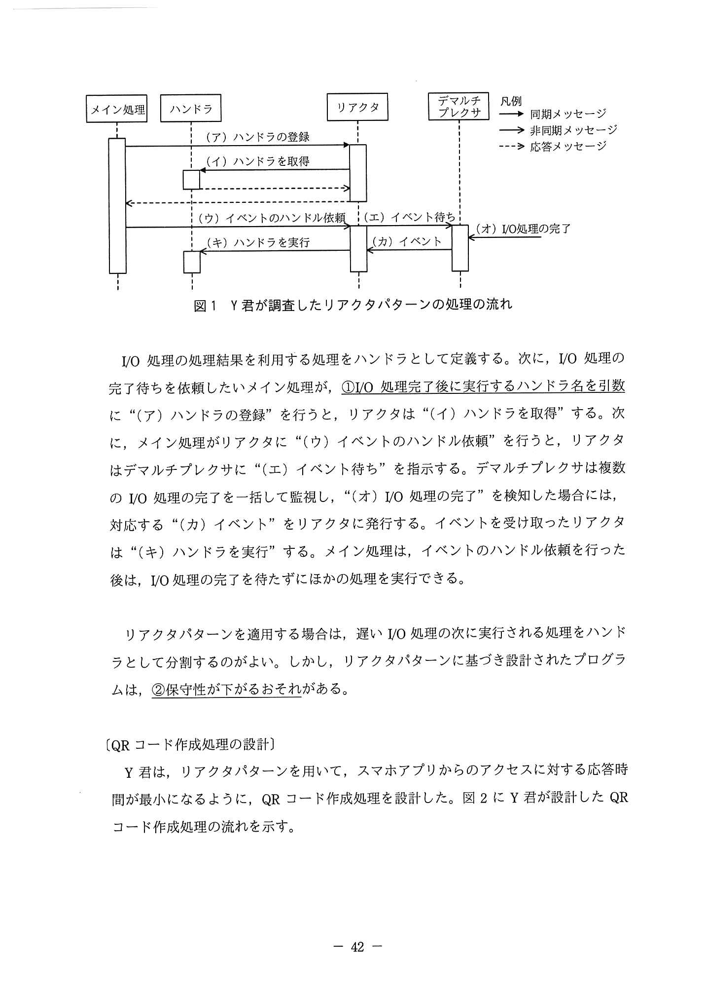

テキスト (OCR)

、              ーー                                              デマルチ | 凡例
メイン処理| | ハンドラ           リアクタ     プレクサ | —> 同期メッセージ

—> 非同期メッセージ
ーータ 応答メツセージ

| (7) ハンドラの登録             !
! (イ) ハンドラを取得             !
回           |

1 (ウ) イベントのハンドル依頼 | (エ) イベント待ち
! (キ) ハンドラを実生     (A) イベント

LI    a   UW

1                              1                                                                   '                                         1
1                              1                                                                   1                                         1

図1 Y君が調査したリアクタパターンの処理の流れ

(オ) WO処理の完了

VO 処理の処理結果を利用する処理をハンドラとして定義する。次に, VO 処理の
完了待ちを依頼したいメイン処理が, OVO 処理完了後に実行するハンドラ名を引数
に“(ア) ハンドラの登録” を行うと, リアクタは『“(イ) ハンドラを取得" する。次
に, メイン処理がリアクタに『“(ウ) イベントのハンドル依頼"を行うと, リアクタ
はデマルチプレクサに『“(エ) イベント待ち"を指示する。デマルチプレクサは複数
の YO 処理の完了を一括して監視し, “(オ) VO 処理の完了” を検知した場合には
対応する“(カ) イベント” をリアクタに発行する。イベントを受け取ったリアクタ

“(キ) ハンドラを実行" する。メイン処理は, イベントのハンドル依頼を行った
後は, VO 処理の完了を待たずにほかの処理を実行できる。

リアクタパターンを適用する場合は, 遅い IO 処理の次に実行される処理をハンド
ラとして分割するのがよい。しかし, リアクタパターンに基づき設計されたプログラ
ムは, ⑨づ保守性が下がるおそれがある。

(QR コード作成処理の設計〕

Y Blk, リアクタパターンを用いて, スマホアプリからのアクセスに対する応答時
間が最小になるように, QR コード作成処理を設計した。図 2 に Y 君が設計した QR
コード作成処理の流れを示す。

ー 42 一

### ページ 43

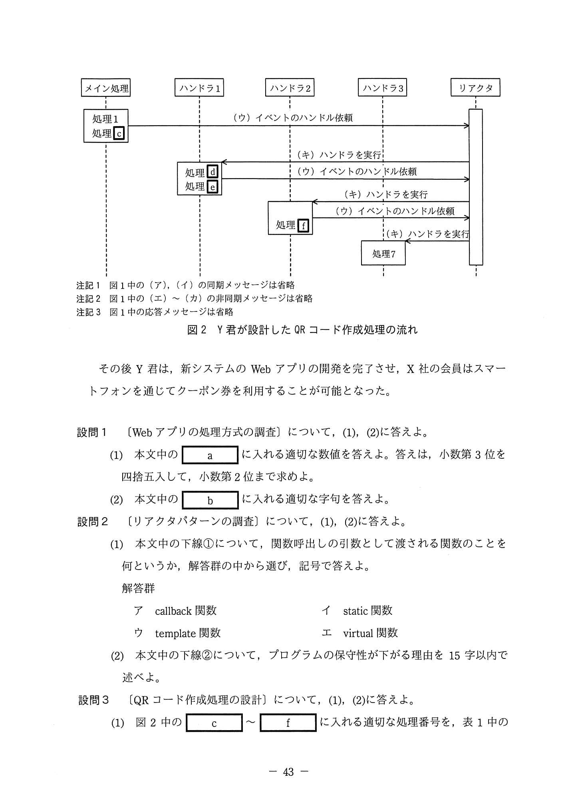

テキスト (OCR)

メイン処理      |ハンドi|     |ハンドラ|      |ハンka|      | リァクタ |

H                                   !                 as
処理1                 (ウ) イベントのハンドル依頼    |
wld                                |                  |
! (キ) ハンドラを実生
処              ! (ウ) イベントのハンドル依頼
     (4) ハンドラを実生

(ウ) イベントのハンドル依頼

処理 f         !
          !(キ) ハンドラを実利

処理7

a
safel

注記1 図1中の (7), (イ) の同期メッセージは省略
注記2 図1中の(エ) ~ (カ) の非同期メッセージは省略
注記3 図1中の応答メッセージは省略

図 2 Y君が設計した QR コード作成処理の流れ

その後 Y 君は, 新システムの Web アプリの開発を完了させ, X 社の会員はスマー
トフォンを通じてクーポン券を利用することが可能となった。

設問1 〔Webアプリの処理方式の調査) について, ①, ②⑫に答えよ。
Q①) 本文中の| a | に入れる適切な数値を答えよ。答えは, 小数第 3 位を
四捨五入して, 小数第 2 位まで求めよ。
@ 本文中の| b | に入れる適切な字句を答えよ。
設問2 〔リアクタパターンの調査) について, ①⑪, ②に答えよ。
GQ 本文中の下線やについて, 関数呼出しの引数として渡される関数のことを
何というか, 解答群の中から選び, 記号で答えよ。

解答群
ア callback 関数                           イ static 関数
ウ template 関数                          エ virtual 関数
(2) 本文中の下線@について, プログラムの保守性が下がる理由を 15 字以内で
述べよ。

設問3 [QRコード作成処理の設計) について, @, ⑫②)に答えよ。
Q 図2中の| c |~| fj |に入れる適切な処理番号を, 表 1 中の

### ページ 44

テキスト (OCR)

処理番号を用いて答えよ。ただし, 複数ある場合は全て答えよ。
2) 図 2 のように QR コード作成処理を設計した場合, 処理 4こ7 はどのような
順序で完了するか, 処理が早く完了する順にコンマ区切りで答えよ。

ー 44 一

### ページ 45

テキスト (OCR)

メ モ 用 紙

ー 45 一

### ページ 46

テキスト (OCR)

AQ プロジェクトのコスト見積りに関する次の記述を読んで, 設問 1+ー4 に答えよ。

L 社は大手機械メーカ Q 社のシステム子会社であり, Q 社の様々なシステムの開
発, 運用及び保守を行っている。このたび, Q 社は, 新工場の設立に伴い, 新工場用
の生産管理システムを新規開発することを決定した。この生産管理システム開発プロ
ジェクト (以下, 本プロジェクトという) では, 業務要件定義と受入れを Q 社が担
当し, システム設計から導入までと受入れの支援を L 社が担当することになった。 L
社と Q tlt, システム設計と受入れの支援を準委任契約, システム設計完了から導
入まで (以下, 実装工程という) を請負契約とした。

本プロジェクトのプロジェクトマネージャには, L 社システム開発部の M 課長が
任命された。本プロジェクトは現在 Q 社での業務要件定義が完了し, これかられ th
でシステム設計に着手するところである。T 社側実装工程のコスト見積りは, 同部の
N 君が担当することになった。

なお, L 社は Q 社の情報システム部が, 最近になって子会社として独立した会社
CH), 本プロジェクトの直前に実施した別の新工場用の生産管理システム開発プロ
ジェクト (以下, 前回プロジェクトという) が, L 社独立後に Q 社から最初に受注
したプロジェクトであった。本プロジェクトの 社と Q 社の担当範囲や契約形態は
前回プロジェクトと同じである。

〔前回プロジェクトの間題とその対応〕

前回プロジェクトの実装工程では, 見積り時のスコープは工程完了まで変更がなか
ったのに, L 社のコスト実績がコスト見積りを大きく超過した。しかし, OL 社は超
過コストを Q 社に要求することはできなかった。本プロジェクトでも請負契約とな
るので, M 課長はまず, 前回プロジェクトで超過コストが発生した問題点を次のと
おり洗い出した。

・コスト見積りの機能の範囲について, Q 社が範囲に含まれると誰識していた機能が,

L 社は範囲に含まれないと誤解していた。

・ 予算確保のためにできるだけ早く実装工程に対するコスト見積りを提出してほしい

という Q 社の要求に応えるため, L 社はシステム設計の途中で WBS を一旦作成し,

ー 46 一

### ページ 47

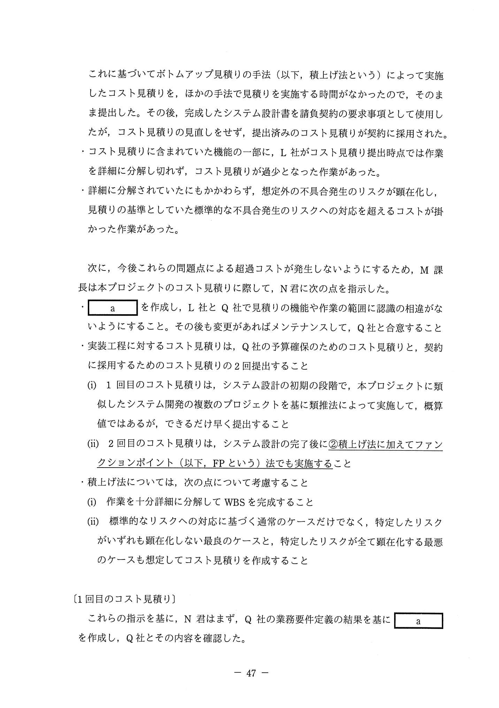

テキスト (OCR)

これに基づいてボトムアップ見積りの手法 (以下, 積上げ法という) によって実施
したコスト見積りを, ほかの手法で見積りを実施する時間がなかったので, そのま
ま提出した。 COR, 完成したシステム設計書を請負契約の要求事項として使用し
たが, コスト見積りの見直しをせず, 提出済みのコスト見積りが契約に採用された。

・コスト見積りに含まれていた機能の一部に, L 社がコスト見積り提出時点では作業
を詳細に分解し切れず, コスト見積りが過少となった作業があった。

・ 詳細に分解されていたにもかかわらず, 想定外の不具合発生のリスクが顕在化し
見積りの基準としていた標準的な不具合発生のリスクへの対応を超えるコストが持
かった作業があった。

次に, 今後これらの問題点による超過コストが発生しないようにするため, M 課
長は本プロジェクトのコスト見積りに際して, N 君に次の点を指示した。
・ | 』 | を作成し, 社と Q 社で見積リの機能や作業の範囲に認識の相違がな
いようにすること。その後も変更があればメンテナンスして, Q社と合意すること
・実装工程に対するコスト見積りは, Q 社の予算確保のためのコスト見積りと, 契約
に採用するためのコスト見積りの2回提出すること
⑪⑬ 1 回目のコスト見積りは, システム設計の初期の段階で, 本プロジェクトに類
似したシステム開発の複数のプロジェクトを基に類推法によって実施して, 概算
値ではあるが, できるだけ早く提出すること
Gi) 2 回目のコスト見積りは, システム設計の完了後に②積上げ法に加えてファン
クションポイント (以下, FP という) 法でも実施すること
・積上げ法については, 次の点について考慮すること
G) 作業を十分詳細に分解して WBS を完成すること
Gi) 標準的なりリスクへの対応に基づく通常のケースだけでなく, 特定したリスク
がいずれも顕在化しない最良のケースと, 特定したリスクが全て顕在化する最悪
のケースも想定してコスト見積りを作成すること

(1 回目のコスト見積り〕
これらの指示を基に, N 君はまず, Q 社の業務要件定義の結果を基に|  。 |
を作成し, Q 社とその内容を確認した。

ー 47 一

### ページ 48

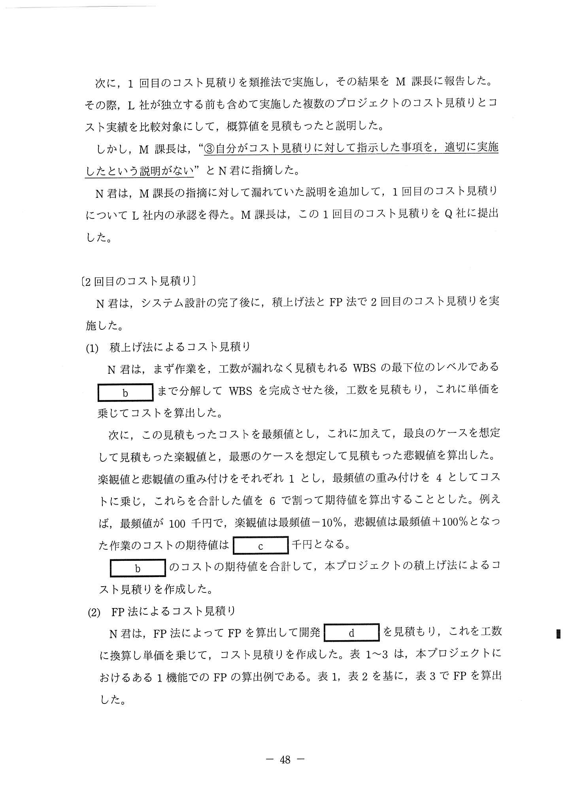

テキスト (OCR)

次に, 1 回目のコスト見積りを類推法で実施し, その結果を M 課長に報告した。
その際, L 社が独立する前も含めて実施した複数のプロジェクトのコストト見積りとコ
スト実績を比較対象にして, 概算値を見積もったと説明した。

しかし, M 課長は, “③自分がコスト見積りに対して指示した事項を, 適切に実施
したという説明がない” とN君に指摘した。

N 君は, M 課長の指摘に対して漏れていた説明を追加して, 1 回目のコスト見積り
について 【 社内の承認を得た。M 課長は, この 1 回目のコスト見積りを Q 社に提|
し夫。

[2 回目のコスト見積り]
N 君は。 システム設計の完了後に, 積上げ法と FP 法で 2 回目のコスト見積りを実
施した。
(1) 積上げ法によるコスト見積り
N 君は, まず作業を, 工数が漏れなく見積もれる WBS の最下位のレベルである
| 5 | まで分解して WBS を完成させた後, 工数を見積もり, これに単価を
乗じてコストを算出した。
RIL, この見積もったコストを最頻値とし, これに加えて, 最良のケースを想定
して見積もった楽観値と, 最悪のケースを想定して見積もった悲観値を算出した。
楽観値と悲観値の重み付けをそれぞれ 1 とし, 最頻値の重み付けを 4 としてコス
トに乗じ, これらを合計した値を 6 で割って期待値を算出することとした。例え
ば, 最頻値が 100 千円で, 楽観値は最頻値-10%, 悲観値は最頻値+100%となっ
た作業のコストの期待値は | c |千円となる。
| | のコストの期待値を合計して, 本プロジェクトの積上げ法によるコ
スト見積りを作成した。
(2) FP 法によるコスト見積り
N 君は, FP 法によって FP を算出して開発 | d | を見積もり, これを工数
に換算し単価を乗じて, コスト見積りを作成した。表 1ご3 は, 本プロジェクトに
おけるある 1 機能での FP の算出例である。表 1, 表2 を基に, 表3でFP を算出
した。

ー 48 一

### ページ 49

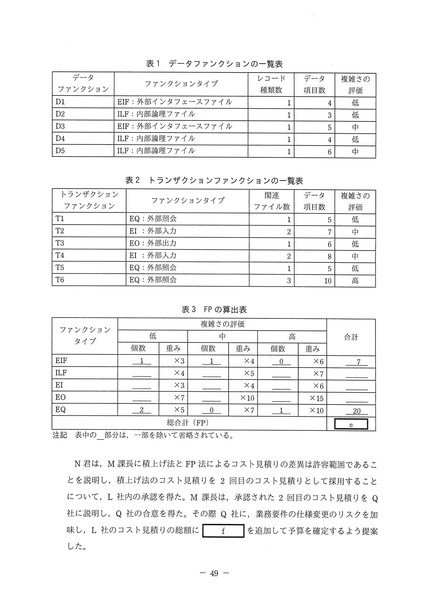

テキスト (OCR)

表 1

データファンクションの一覧表

eed          se  F     レコード  データ | 複雑さの
ファンクション      のののミレタイキン       種類数 | 項目数 | 評価
D1      EIF : 外部インタフェースファイル       1     4  低
D2      ILF : 内部論理ファイル            1     3  低
D3           EIF : 外部インタフェースファイル           1       5    中
D4              ILF : 内部論理ファイル                        1          4     低
D5      ILF : 内部論理ファイル            1     6  中

表2 トランザクションファンクションの一覧表
トランザクション        so.  ‘     関連   データ | 複雑さの
ファンクション     イジ導きイデ     ファイル数| 項目数 | 評価
TL         EQ : 外部照会                1     5   低
T2             EI : 外部入力                     2       7    中
T3                 EO : 外部出力                             1          6     低
T4             EI : 外部入力                      2       8    中
T5                 EQ : 外部照会                             1          5     低
T6                EQ : 外部照会                           3        10     高
表3 FPの算出表
がか Y                  複雑さの評価
タイプ              低                中                 fe)             合計
個数      重み      個数      重み      個数      重み
EIF           し   AS 1_    X4| _0    X6   _ 7
ILF                   _       X4|       X5|       X7      ーー
EI           _   x3}    ※4|    x6   _
EO                   _       x7]      X10,      X15
EQ           ー2   X5| _0_   7| 1ユー   x10    20

注記 表中の 部分は, 一部を除いて省略されている。

N 君は, M 課長に積上げ法と FP 法によるコスト見積りの差異は

許容範団であるこ

とを説明し, 積上げ法のコスト見積りを 2 回目のコスト見積りとして採用すること

について, L 社内の承認を得た。M 課長は, 承

2H

iv S

れた 2 回目のコスト見積りを Q

社に説明し, Q 社の合意を得た。その際 Q 社に, 業務要件の仕様変更のリスクを加
KL, L 社のコスト見積りの総額に | f | を追加して予算を確定するよう提案

た。

ー 49 一

### ページ 50

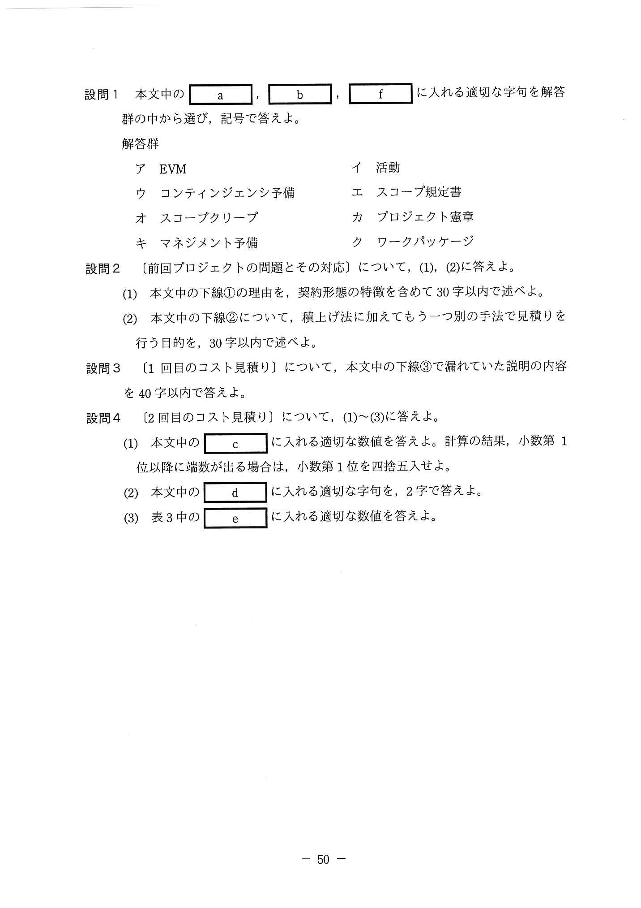

テキスト (OCR)

設問1 本文中の| a。 |,| b |,| fj |に入れる適切な字句を解答

群の中から選び, 記号で答えよ。

解答群
ア EVM             イ 活動
ウ コンティンジェンシ予備     エ スコープ規定書
x 入当一ジタカタリーデ        nA プロジェクト憲章
キ マネジメント予備        ク ワークパッケージ

設問2 (前回プロジェクトの問題とその対応〕 について, Q①, ②に答えよ。
(1) 本文中の下線〇の理由を, LOCOS ADT 30 字以内で述べよ。
Q) 本文中の下線@について, 積上げ法に加えてもう一つ別の手法で見積りを
行う目的を, 30 字以内で述べよ。
設問3 [1回目のコスト見積り) について, 本文中の下線③で漏れていた説明の内容
を 40 字以内で答えよ。
設問4 [2回目のコスト見積り) について, ①て③に答えよ。
a) 本文中の| < | に入れる適切な数値を答えよ。計算の結果, 小数第 1
位以降に端数が出る場合は, 小数第 1 位を四捨五入せよ。
@ 本文中の| a | に入れる適切な宇名を, 2字で答えよ。
⑬ 表3中の[| ec | に入れる適切な数値を答えよ。

ー 50 一

### ページ 51

テキスト (OCR)

〔

x モ 用 紙 J

= By =

### ページ 52

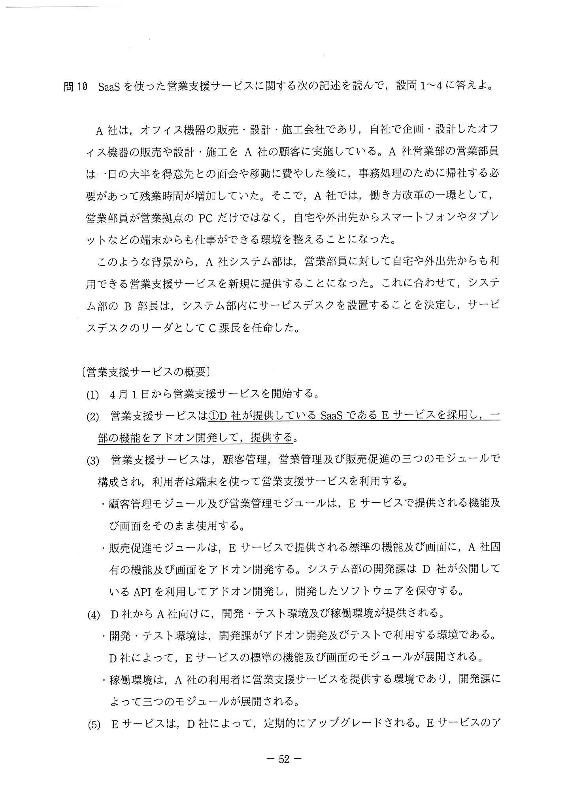

テキスト (OCR)

問10 SaaS を使った営業支援サービスに関する次の記述を読んで, 設問 1ユー4 に答えよ。

A 社は, オフィス機器の販売・設計・施工会社であり, 自社で企画・設計したオフ
ィス機器の販売や設計・施工を A 社の顧客に実施している。A 社営業部の営業部員
は一日の大半を得意先との面会や移動に費やした後に, 事務処理のために帰社する必
要があって残業時間が増加していた。そこで, A 社では, 働き方改革の一環として,
営業部員が営業拠点の PC だけではなく, 自宅や外出先からスマートフォンやタプブレ
ットなどの端末からも仕事ができる環境を整えることになった。

このような背景から, A 社システム部は, 営業部員に対して自宅や外出先からも利
用できる営業支援サービスを新規に提供することになった。 これに合わせて, システ
ム部の BBE, システム部内にサービスデスクを設置することを決定し, サービ
スデスクのリーダとして C課長を任命した。

[営業支援サービスの概要]
Q) 4月1日から営業支援サービスを開始する。
(2) 営業支援サービスは①D 社が提供している SaaS である E サービスを採用し, 一
部の機能をアドオン開発して, 提供する。
3) 営業支援サービスは, MESH, 営業管理及び販売促進の三つのモジュールで
構成され, 利用者は端末を使って営業支援サービスを利用する。
・顧客管理モジュール及び営業管理モジュールは, E サービスで提供される機能
び画面をそのまま使用する。
・販売促進モジュールは, E サービスで提供される標準の機能及び画面に, A 社固
有の機能及び画面をアドオン開発する。システム部の開発課は D 社が公開して
いる API を利用してアドオン開発し, 開発したソフトウェアを保守する。
(4) D 社から A 社向けに, 開発・テスト環境及び稼働環境が提供される。
・開発・テスト環境は, 開発課がアドオン開発及びテストで利用する環境である。
D 社によって, E サービスの標準の機能及び画面のモジュールが展開される。
・稼働環境は, A 社の利用者に営業支援サービスを提供する環境であり, 開発課に
よって三つのモジュールが展開される。
(5) E サービスは, D 社によって, 定期的にアップグレードされる。E サービスのア

ー 52 一

### ページ 53

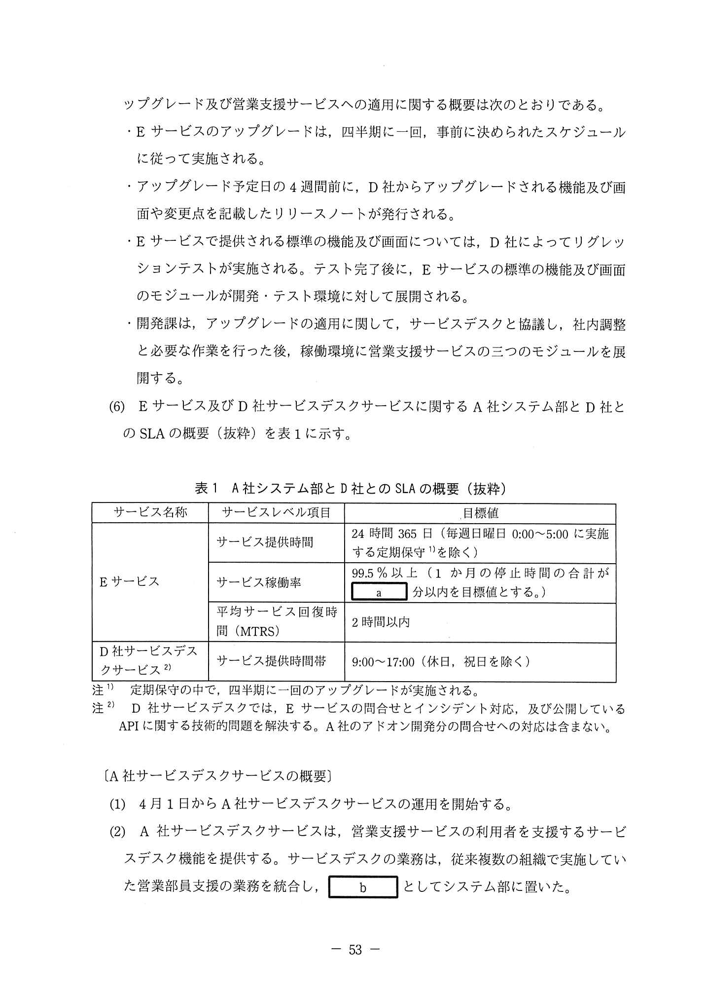

テキスト (OCR)

ップグレード及び営業支援サービスへの適用に関する概要は次のとおりである。
・E サービスのアップグレードは, 四半期に一回, 事前に決められたスケジュール
に従って実施される。

・アップグレード予定日の 4 週間前に, D 社からアップグレードされる機能及び画
面や変更点を記載したリリースノートが発行される。

・E サービスで提供される標準の機能及び画面については, D 社によってリグレッ
ションテストが実施される。テスト完了後に, E サービスの標準の機能及び画面
のモジュールが開発・テスト環境に対して展開される。

・開発課は, アップグレードの適用に関して, サービスデスクと協議し, 社内調整
と必要な作業を行った後, 稼働環境に営業支援サービスの三つのモジュールを展
開する。

(6) E サービス及び D 社サービスデスクサービスに関する A 社システム部と D 社と
の SLA の概要 (抜粋) を表 1 に示す。

表1 A社システム部と D社とのSLAの概要 (抜粋)
サービス名称   サービスレベル項目           目標値
24 時間 365 日 (毎週日曜日 0.00て5:00 に実施
する定期保守 ERS)
99.5%以上 (1 か月の停止時間の合計が
| a |分以内を目標値とする。)

2 時間以内

サービス提供時間

E サービス    サービス稼働率

平均サービス回復時
間 (MTRS)

D 社サービスデス
みサービスの
注! 定期保守の中で, 四半期に一回のアップグレードが実施される。

注? D 社サービスデスクでは, E サービスの問合せとインシデント対応, 及び公開している
API に関する技術的問題を解決する。A 社のアドオン開発分の問合せへの対応は含まない。

サービス提供時間帯 | 9:00~17:00 (休日, 祝日を除く)

〔A 社サービスデスクサービスの概要〕

(①) 4月1日からA社サービスデスクサービスの運用を開始する。

(②) A 社サービスデスクサービスは, 営業支援サービスの利用者を支援するサービ
スデスク機能を提供する。サービスデスクの業務は, 従来複数の組織で実施してい
た営業部員支援の業務を統合し, | b |] としてシステム部に置いた。

ー 5

### ページ 54

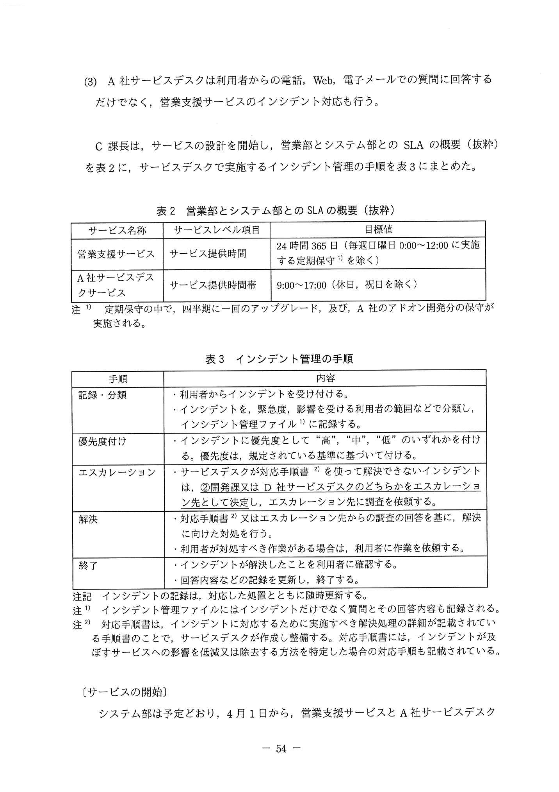

テキスト (OCR)

(3) A 社サービスデスクは利用者からの電話, Web, 電子メールでの質問に回答する
だけでなく, 営業支援サービスのインシデント対応も行う。

C 課長は。サービスの設計を開始し, 営業部とシステム部との SLA の概要 (Hott)
を表 2 に,。 サービスデスクで実施するインシデント管理の手順を表 3 にまとめた。

表2 営業部とシステム部との SLA の概要 (抜粋)
サービス名称   サービスレベル項目           目標値
24 時間 365 日 (毎週日曜日 0.00て12:00 に実施
する定期保守 ! を除く)

営業支援サービス | サービス提供時間

A社サービスデス
クサービス
注 ! 定期保守の中で, 四半期に一回のアップグレード, 及び, A 社のアドオン開発分の保守が
実施される。

サービス提供時間帯 | 9:00て17:00 (KA, 祝日を除く)

表3 インシデント管理の手順
手順                    内容

記録・分類    ・利用者からインシデントを受け付ける。
・インシデントを, 緊急度, 影響を受ける利用者の範囲などで分類し
インシデントト管理ファイル ! に記録する。
優先度付け    ・インシデントに優先度として WR", “中”, UB” のいずれかを付け
る。優先度は, 規定されている基準に基づいて付ける。
エスカレーション | ・サービスデスクが対応手順書 ? を使って解決できないインシデント
は, ②開発課又は D 社サービスデスクのどちらかをエスカレーショ
ン先として決定し, エスカレーション先に調査を依頼する。
解決       ・対応手順書 2 又はエスカレーション先からの調査の回答を基に, 解決
に向けた対処を行う。
・利用者が対処すべき作業がある場合は, 利用者に作業を依頼する。
終了       ・インシデントが解決したことを利用者に確認する。
・回答内容などの記録を更新し, 終了する。
注記 インシデントの記録は, 対応した処置とともに随時更新する。
注り インシデント管理ファイルにはインシデントだけでなく質問とその回答内容も記録される。
注? 対応手順書は, インシデントに対応するために実施すべき解決処理の詳細が記載されてい

る手順書のことで, サービスデスクが作成し整備する。対応手順書には, インシデントが及

ぼすサービスへの影響を低減又は除去する方法を特定した場合の対応手順も記載されている。

[サービスの開始】
システム部は予定どおり, 4 月 1 日から, 営業支援サービスと A社サービスデスク

ー 54 一

### ページ 55

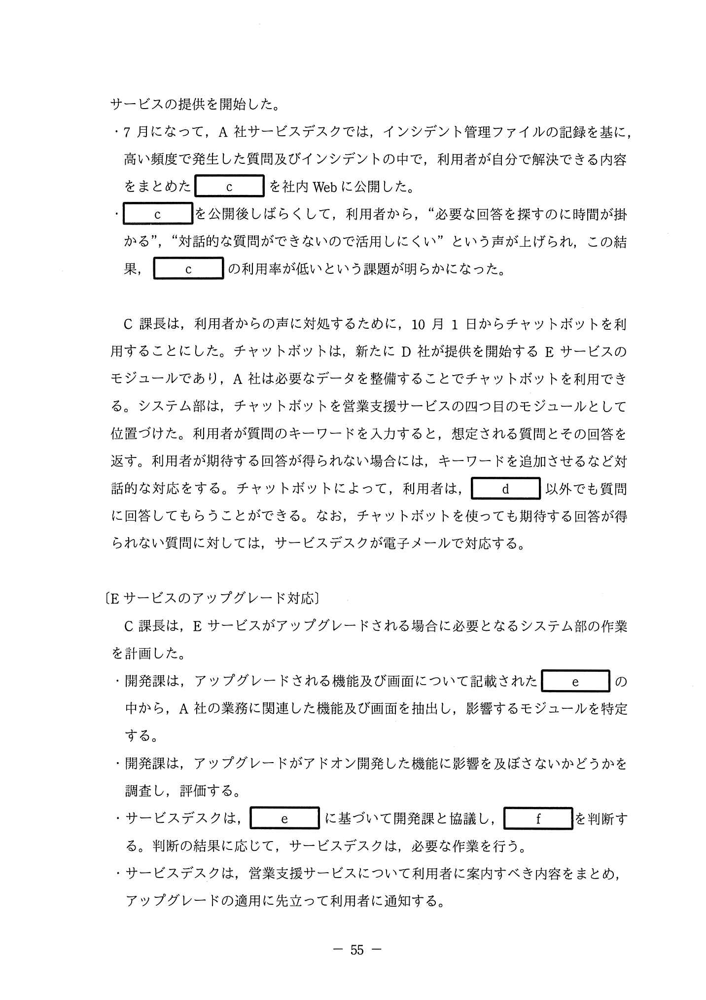

テキスト (OCR)

サービスの提供を開始した。

・7 月になって, A 社サービスデスクでは, インシデント管理ファイルの記録を基に,
高い頻度で発生した質問及びインシデントの中で, 利用者が自分で解決できる内容
をまとめた|  c | を社内 Web CAMILA.

・| < |を公開後しばらくして, 利用者から, “必要な回答を探すのに時間が掛
DS", “対話的な質問ができないので活用しにくい"という声が上げられ, この結

果, の利用率が低いという課題が明らかになった。

C 課長は, 利用者からの声に対処するために, 10 月 1 日からチャットボットを利
用することにした。チャットボットは, 新たに D 社が提供を開始する E サービスの
モジュールであり, A 社は必要なデータを整備することでチャットボットを利用でき
る。システム部は, チャットボットを営業支援サービスの四つ目のモジュールとして
位置づけた。 利用者が質問のキーワードを入力すると, 想定される質問とその回答を
返す。利用者が期待する回答が得られない場合には, キーワードを追加させるなど対
話的な対応をする。チャットボットによって, 利用者は, |  d | 以外でも質問
に回答してもらうことができる。 なお, チャットボットを使っても期待する回答が得
られない質問に対しては, サービスデスクが電子メールで対応する。

(E サービスのアップグレード対応〕
C 課長は, E サービスがアップグレードされる場合に必要となるシステム部の作業

を計画した。

・ 開発課は。 アップグレードされる機能及び画面について記載された[| e |の
中から, A 社の業務に関連した機能及び画面を抽出し, 周響するモジュールを特定
する。

・ 開発課は。 アップグレードがアドオン開発した機能に影響を及ぼさないかどうかを
調査し, 評価する。

・サービスデスクは, | se | に基づいて開発課と協議し,| { |を判断す
る。判断の結果に応じて, サービスデスクは, 必要な作業を行う。

・サービスデスクは, 営業支援サービスについて利用者に案内すべき内容をまとめ,
アップグレードの適用に先立って利用者に通知する。

ー 55 一

### ページ 56

テキスト (OCR)

設問1 [営業支援サービスの概要) について, ①, ⑫に答えよ。
(1) 本文中の下線①について, SaaS を利用する A 社のサービスマネジメントと
LC, 最も適切なものを解答群の中から選び, 記号で答えよ。
ABST
F E サービスが定期的にアップグレードされる場合, 開発課は営業支援サ
ービスのリグレッションテストを行う必要はない。
イ E サービスを構成品目として管理するだけでなく, E サービスを構成す
るシステムリソースを, 構成品目として必ず管理する。
ウ 発生したインシデントを D 社が解決する場合でも, A 社システム部は
A 社営業部に対して, インシデントの解決についての説明資任をもつ。
エ 予算業務及び会計業務において, 営業支援サービスが使用する物理的リ
ソースの滅価償却費を計算する必要がある。
@ 表1中の[  。 | に入れる適切な数値を答えよ。ここで, 1か月は30 日
日曜日は月 4 回で計算し, 小数点以下は四捨五入して整数で求めよ。
設問2 〔A社サービスデスクサービスの概要] について, ①, ②に答えよ。
a) 本文中の| b | に入れる適切な字句を解答群の中から選び, 記号で答
Biden
BSI
ア BCP    イ BPO    ウ PMO    = SPOc
Q) 表 3 中の下線②において, エスカレーション先を決定するときに必要とな
る判断内容は何か, 30 字以内で述べよ。
設問3  [サービスの開始})について, 0), ②に答えよ。
a) 本文中の[| c | に入れる適切な字句を5字以内で答えよ。
@ 本文中の|  q | に入れる適切な字句を, 表 1, 2 又は 3 中で使用され
ている字句を使って 15 字以内で答えよ。
設問4 (Eサービスのアップグレード対応】 について, (①⑪, ②に答えよ。
a 本文中の[| ce |] に入れる適切な字句を, (営業支援サービスの概要)
で使用されている字旬を使って, 10 字以内で答えよ。
②) 本文中の[| f |] には, サービスデスクで実施する作業に関連する内容
が入る。その内容について, 20 字以内で答えよ。

ー 56 一

### ページ 57

テキスト (OCR)

C

メ モ 用 紙 )

ー 57 一

### ページ 58

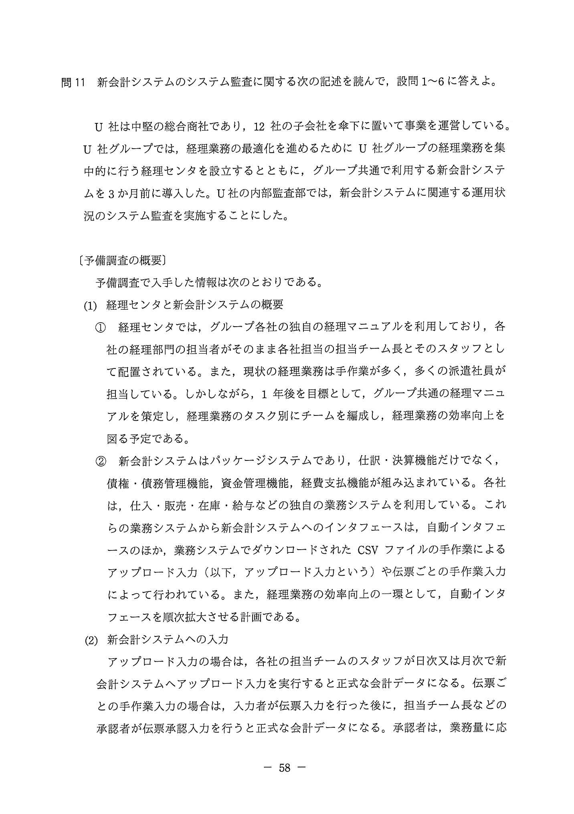

テキスト (OCR)

間11 新会計システムのシステム監査に関する次の記述を読んで, 設問 1ー6 に答えよ。

U 社は中堅の総合商社であり, 12 社の子会社を傘下に置いて事業を運営している。
U 社グループでは, 経理業務の最適化を進めるために U 社グループの経理業務を集
中的に行う経理センタを設立するとともに, グループ共通で利用する新会計システ
ムを 3 か月前に導入した。U 社の内部監査部では, 新会計システムに関連する運用状
況のシステム監査を実施することにした。

(予備調査の概要〕
予備調査で入手した情報は次のとおりである。
Q) 経理センタと新会計システムの概要
① 経理センタでは, グループ各社の独自の経理マニュアルを利用しており, 各
社の経理部門の担当者がそのまま各社担当の担当チーム長とそのスタッフとし
て配置されている。また, 現状の経理業務は手作業が多く, 多くの派遣社員が
担当している。しかしながら, 1 年後を目標として, グループ共通の経理マニュ
アルを策定し, 経理業務のタスク別にチームを編成し, 経理業務の効率向上を
図る予定である。
② 新会計システムはパッケージシステムであり, 仕訳・決算機能だけでなく,
債権・債務管理機能, 資金管理機能, 経費支払機能が組み込まれている。各社
lk, 仕入・販売・在庫・給与などの独自の業務システムを利用している。これ
らちの業務システムから新会計システムへのインタフェースは, 自動インタフェ
ースのほか, 業務システムでダウンロードされた CSV ファイルの手作業に
アップロード入力 (以下, アップロード入力という) や伝票ごとの手作業入力
によって行われている。 また, 経理業務の効率向上の一環として, 自動インタ
フェースを順次拡大させる計画である。
Q) 新会計システムへの入力
アップロード入力の場合は, 各社の担当チームのスタッフが日次又は月次で新
会計システムへアップロード入力を実行すると正式な会計データになる。 伝票ご
との手作業入力の場合は, 入力者が伝票入力を行った後に, 担当チーム長などの
承認者が伝票承認入力を行うと正式な会計データになる。承認者は, 業務量に応

ー 58 一

### ページ 59

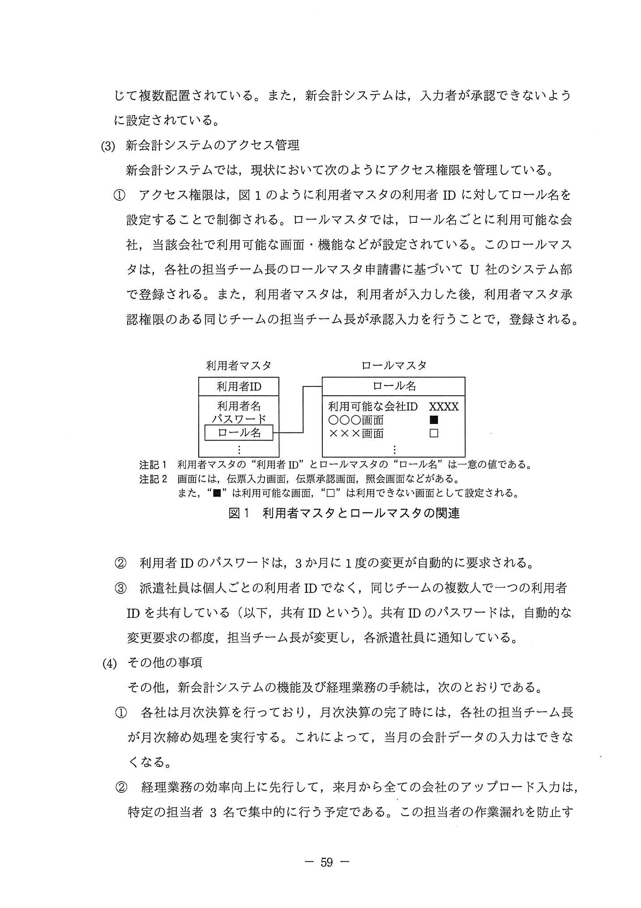

テキスト (OCR)

じて複数配置されている。また, 新会計システムは, 入力者が承認できないよう
に設定されている。
3) 新会計システムのアクセス管理
新会計システムでは, 現状において次のようにアクセス権限を管理している。
① アクセス権限は, 図 1 のように利用者マスタの利用者 ID に対してロール名を
設定することで制御される。ロールマスタでは, ロール名ごとに利用可能な会
社, 当該会社で利用可能な画面・機能などが設定されている。このロールマス
タは, 各社の担当チーム長のロールマスタ申請書に基づいて U 社のシステム部
で登録される。 また, 利用者マスタは, 利用者が入力した後, 利用者マスタ承
認権限のある同じチームの担当チーム長が承認入力を行うことで, 登録される。

利用者マスタ        ロールマスタ
利用者TD                         ロール名
利用者名               利用可能な会社ID XXXX
パスワード                  〇OO画面             |
   xxi ”。 ロ

注記1 利用者マスタの “利用者 ID" とロールマスタの "ロール名" は一意の値である。
注記2 画面には, 伝票入力画面, 伝票承認画面, 照会画面などがある。
また, “園" は利用可能な画面,“口" は利用できない画面として設定される。

図1 利用者マスタとロールマスタの関連

② 利用者ID のパスワードは, 3 か月に 1 度の変更が自動的に要求される。

@ 派遣社員は個人ごとの利用者 ID でなく, 同じチームの複数人で一つの利用者
ID を共有している (以下, 共有 ID という)。共有 ID のパスワードは, 自動的な
変更要求の都度, 担当チーム長が変更し, 各派遣社員に通知している。

(④) その他の事項
その他, 新会計システムの機能及び経理業務の手続は, 次のとおりである。

① 各社は月次決算を行っており, 月次決算の完了時には, 各社の担当チーム長
が月次締め処理を実行する。これによって, 当月の会計データの入力はできな
くなる。

② 経理業務の効率向上に先行して, 来月から全ての会社のアップロード入力は,
特定の担当者 3 名で集中的に行う予定である。 この担当者の作業漏れを防止す

### ページ 60

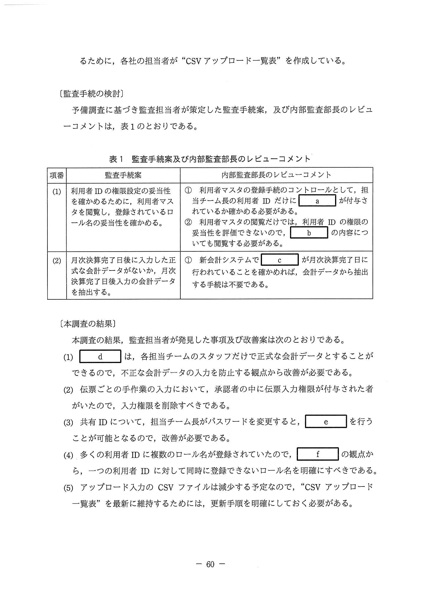

テキスト (OCR)

るために, 各社の担当者が“CSV アップロード一覧表” を作成している。

(EAS MORN)
予備調査に基づき監査担当者が策定した監査手続案, 及び内部監査部長のレビュ
ーコメントは, 表1のとおりである。

表1 監査手続案及び内部監査部長のレビューコメント

項番

監査手続案

内部監査部長のレビューコメント

①

利用者 D の権限設定の妥当性
を確かめるために, 利用者マス
タを閲覧し, 登録されているロ
ール名の妥当性を確かめる。

① 利用者マスタの登録手続のコントロールとして, 担
当チーム長の利用者 ID だけに|  』 | が付与さ
れているが確かめる必要がある。

© 利用者マスタの閲覧だけでは, 利用者 D の権限の
妥当性を評価できないので, | b | の内容にっ
いても閲覧する必要がある。

(2)

月次決算完了日後に入力した正
式な会計データがないか, 月次
決算完了日後入力の会計データ
を抽出する。

© 新会計システムで|  c | が月次決算完了日に
行われていることを確かめれば, 会計データから抽出
する手続は不要である。

(本調査の結果
本調査の結果, 監査担当者が発見した事項及び改善案は次のとおりである。

a) | 』 | は, 各担当チームのスタッフだけで正式な会計データとすることが
できるので, 不正な会計データの入力を防止する観点から改善が必要である。

⑫ 伝票ごとの手作業の入力において, 承認者の中に伝票入力権限が付生された者
がいたので, 入力権限を削除すべきである。

⑬ 共有 ID について, 担当チーム長がパスワードを変更すると, | e |を行う
ことが可能となるので, 改善が必要である。

@ 多くの利用者 TD に複数のロール名が登録されていたので, | f | の観点か
ら, 一つの利用者 ID に対して同時に登録できないロール名を明確にすべきである。

(6) アップロード入力の CSV ファイルは減少する予定なので, “CSV アップロード

一覧表” を最新に維持するため

には, 更新手順を明確にしておく必要がある。

ー 60 一

### ページ 61

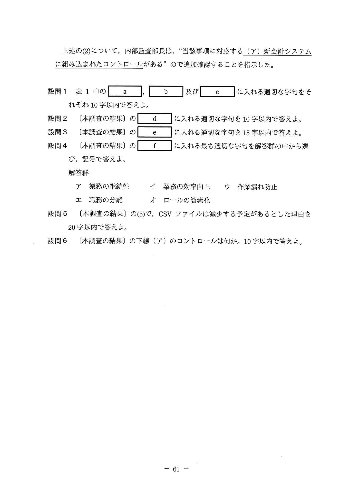

テキスト (OCR)

上述の(②について, 内部監査部長は, “当該事項に対応する (ア) 新会計システム
に組み込まれたコントロールがある" ので追加確認することを指示した。

設問1 表1中の| a |[  b |及び| 。 |に入れる適切な字句をそ
れぞれ10 字以内で答えよ。

設問2 [本調査の結果] の|  qd | に入れる適切な字句を10字以内で答えよ。

設問3 (本調査の結果] の| ce |] に入れる適切な字名を15字以内で答えよ。

設問4 本調査の結果] の| { | に入れる最も適切な字句を解答君の中から選
び, 記号で答えよ。

解答群
ア 業務の継続性   イ 業務の効率向上 ウツ 作業漏れ防止
エ 職務の分離    A ロールの人簡素化

設問5 [本調査の結果] OG)C, CSV ファイルは減少する予定があるとした理由を
20 字以内で答えよ。
設問6 [本調査の結果」 の下線 (ア) のコントロールは何か。10 字以内で答えよ。

ー 前 =

### ページ 62

テキスト (OCR)

〔

メ = 用 紙 J

ー 62 一

### ページ 63

テキスト (OCR)

C

メ モ 用 紙 )

ー 63 一

### ページ 64

テキスト (OCR)

6. 退室可能時間中に退室する場合は, 手を挙げて監督員に合図し, 答案用紙が回収
されてから静かに退室してください。
| 退室可能時間 | 13:40 ~ 15:20 |
7. 問題に関する質問にはお答えできません。文意どおり解釈してください。
8. 問題冊子の余白などは, 適宜利用して構いません。ただし, 問題民子を切り離し
て利用することはできません。
9. 試験時間中, 机上に置けるものは, 次のものに限ります。
なお, 会場での貸出しは行っていません。
受験票, 黒鉛筆及びシャープペンシル (B 又は HB), 鉛筆削り, 消しゴム, 定規,
時計 (時計型ウェアラブル端末は除く。アラームなど時計以外の機能は使用不可),
ハンカチ, ポケットティッシュ, 目薬,マスク
これら以外は机上に置けません。使用もできません。
10. 試験終了後, この問題冊子は持ち帰ることができます。
ll. 答案用紙は, いかなる場合でも提出してください。 回収時に提出しない場合は
採点されません。
12. 試験時間中にトイレへ行きたくなったり, 気分が悪くなったりした場合は, FE
挙げて監督貞に合図してください。

試験問題に記載されている会社名又は製品名は, それぞれ各社又は各組織の商標又は登録商標です。

なお, 試験問題では, ™ RO © を明記していません。

@2021 独立行政法人情報処理推進機構

ー 64 一

---

## 午後解答

1/6 
©2021 独立行政法人情報処理推進機構 
令和３年度 春期 応用情報技術者試験 解答例 
 
午後試験 
問１ 
出題趣旨 
 DNS は，インターネット基盤を支える重要システムであり，各組織が運用するDNS サーバもサイバー攻撃の
標的とされることが多い。 
 本問では，自社ドメインを管理する権威DNS サーバに対して行われたサイバー攻撃の事例を題材として，具
体的な技術的対策に関する知識を問う。 
 
設問 
解答例・解答の要点 
備考 
設問１ 
ウ，エ 
設問２(1)
a
ア 
 
(2) 顧客がR 社の偽サイトに誘導されたから 
 
(3) エ 
設問３(1) エ 
 
(2)
b
ア 
 
(3) ア 
 
(4)
c
DNS キャッシュポイズニング 
 
問２ 
出題趣旨 
 昨今，企業経営にとって，経営戦略に沿った情報システム戦略の策定が益々重要になってきている。 
 本問では，機械部品メーカの情報システム戦略の策定を題材として，経営戦略に沿った情報システム戦略策
定手順の基本的な理解を，バリューチェーン分析やDX レポートの理解と併せて問う。 
 
設問 
解答例・解答の要点 
備考 
設問１ 
a
イ 
 
 
b
キ 
設問２(1)
c
顧客の工場の近くに自社の工場があるので，配送時間が短くて済む。 
 
(2)
d
販売・マーケティング 
設問３(1)
e
運用・保守に掛かる労力 
 
 
f
AI などの最新のディジタル技術の早期習得 
 
(2)
g
イ 
 
(3)
活動 
製造 
 
 
理由 
ERP の標準機能への置換えで各工場の競争優位性を失うリスクがある
から 
 
(4) 3

2/6 
©2021 独立行政法人情報処理推進機構 
問３ 
出題趣旨 
 近年，機械学習を利用したデータ分析が多く利用されている。 
 本問では，データの分類に利用されるクラスタリングを行う手法の一つであるk-means 法を題材として，ク
ラスタリングのアルゴリズムの理解と，そのアルゴリズムの実装について問う。 
 
設問 
解答例・解答の要点 
備考 
設問１(1) ア
（1.5，3） 
 
 
(2) P2，P3，P7 
 
設問２ 
イ
t を1 からK まで1 ずつ増やす 
 
 
 
ウ
flag ← 0 
 
 
 
エ
flag が0 と等しい 
 
 
 
オ
cluster[s] ← min_index（grav_length） 
 
設問３(1) カ
ア 
 
 
(2) キ
Ts／Sum 
 
 
問４ 
出題趣旨 
 近年，IoT 技術やクラウドサービスを活用した様々なアプリケーションソフトウェアが開発されるようになっ
てきており，特にLPWA 通信サービスの利用が普及し始めている。 
 本問では，駐車場管理システムへの機能追加を題材として，LPWA 通信サービスなどのIoT 技術やクラウド
サービスを用いたシステム構築に関する理解と応用力を問う。 
 
設問 
解答例・解答の要点 
備考 
設問１ 
a
ア 
 
 
b
イ 
設問２(1) 266.7
 
(2) プランC 
設問３(1) オ 
 
(2) 21.9
設問４(1)
c
月間の最大データ通信量 
 
(2) MQTTS

3/6 
©2021 独立行政法人情報処理推進機構 
問５ 
出題趣旨 
 昨今，顧客からの問合せ対応を行うコールセンタでは，電話などの音声による問合せ対応に加え，Web やチ
ャットによる問合せ対応が普及しつつある。 
 本問では，旅行販売システムへのチャット機能の追加を題材として，HTTP 及びWebSocket に関する基本的
な理解と応用能力について問う。 
 
設問 
解答例・解答の要点 
備考 
設問１(1)
a
10.10.0.10 
 
 
b
192.168.0.3 
 
 
c
10.1.1.2 
 
(2) ア，ケ 
 
(3) プロキシサーバはGET メソッドの内容が見えないから 
設問２(1) イ 
 
(2) 同じポートを利用するから 
設問３(1) DNS ラウンドロビン方式 
 
(2)
d
AP サーバ#1，AP サーバ#2 
 
問６ 
出題趣旨 
 昨今のディジタル革新の取組によって，SoI（Systems of Insight）のシステム領域で取り扱うデータの量・種
類の増加や質の多様化が進んでおり，データ資源を適切に管理するデータエンジニアの重要性が増している。
 本問では，MaaS 事業者の経営分析システム構築を題材として，SoI においてデータエンジニアに求められる
データベース設計及びデータ操作に必要な知識の基本的な理解並びにデータモデリングの能力について問う。
 
設問 
解答例・解答の要点 
備考 
設問１ 
システム稼働後2 年間は，過去5 年間分の平均車両稼働率の目標比を表示でき
ない。 
 
設問２(1)
a
ウ 
 
 
(2)
b
年月日 
 
 
 
c
年代 
順不同 
 
 
d
貸出実績件数 
 
 
e
← 
 
設問３(1)
f
INNER JOIN 貸出実績 J ON R.貸出予約コード = 
 
 
 
g
GROUP BY R.貸出予定年月日, R.駐車場ID, R.車種ID, R.会員ID 
 
 
(2) 日次 
 
設問４ 
年月，駐車場ID，車種ID，会員ID

4/6 
©2021 独立行政法人情報処理推進機構 
問７ 
出題趣旨 
補聴器は，ディジタル化が進み，入力された音を複数の周波数帯域に分割し，周波数帯域ごとに音量設定が
可能な製品が販売されている。周波数帯域に分割するフィルタには論理演算だけで実現できるディジタルフィ
ルタが使われている。また，各種設定をスマートフォンから行うことができる製品もある。 
本問では，ディジタル補聴器を題材として，使用するバッファのサイズ，音声が入力されてから出力される
までの遅延時間の計算，処理能力と消費電力を考慮した最適な動作クロック周波数の決定，及び自動音量調節
のアルゴリズムについての設計・実装に関する能力を問う。 
 
設問 
解答例・解答の要点 
備考 
設問１(1)
a
384
 
(2)
b
8.0
設問２(1)
c
Tf
 
 
d
Ts
順不同 
 
 
e
Ta
 
(2) 3
設問３(1) ア
dv ＞ 0 and v ≧ vt 
 
 
イ
vt
 
 
ウ
0
 
(2) 現在の音量が目標値に近く，変化量が0 となり音量を変更する必要がない場合
 
問８ 
出題趣旨 
 昨今，多数のクライアントに対して効率的にサービスを提供できるノンブロッキングI/O 型のWeb サーバソ
フトウェアが普及しつつある。 
 本問では，ファミリーレストランチェーンのクーポン券を発行するシステムを題材として，ノンブロッキン
グI/O 型のWeb サーバソフトウェアに関する基本的な理解と，ノンブロッキングI/O 型のWeb サーバソフトウ
ェアで動作するアプリケーションの設計能力について問う。 
 
設問 
解答例・解答の要点 
備考 
設問１(1)
a
99.77 
 
(2)
b
コンテキスト 
設問２(1) ア 
 
(2) 可読性が下がるから 
設問３(1)
c
2 
 
 
 
a 群 
b 群 
同じ群中の組合
せとする。 
 
 
d
3 
3，5 
 
 
e
4，5 
4 
 
 
f
6 
 
(2) 4，6，7，5

5/6 
©2021 独立行政法人情報処理推進機構 
問９ 
出題趣旨 
 昨今，情報システムの開発において，工程ごとに契約を締結する多段階契約が増えてきている。応用情報処
理技術者にとって，各工程での契約形態の違いを理解して，プロジェクトの規模やコストの見積りを適切なタ
イミングで適切に実施できる能力を身に付けることは，益々重要となってきている。 
 本問では，多段階契約を採用した大手機械メーカのシステム子会社のコスト見積りを題材として，契約形態
についての基本的な理解，並びに類推法，ボトムアップ法，及びファンクションポイント法の見積り手法の考
え方や手順の基本的な理解について問う。 
 
設問 
解答例・解答の要点 
備考 
設問１ 
a
エ 
 
 
b
ク 
 
 
f
キ 
設問２(1) 請負契約は仕事の完成に対して報酬が支払われるから 
 
(2) 複数の手法を併用して見積りの精度を高めるため 
設問３ 
本プロジェクト類似の複数のシステム開発プロジェクトと比較していること 
設問４(1)
c
115 
 
(2)
d
規模 
 
(3)
e
55 
 
問10 
出題趣旨 
 昨今，企業における労働時間の削減を実現するために，オフィスだけでなく，自宅や外出先からも仕事がで
きる環境の整備が進んでいる。 
 本問では，SaaS を用いた営業支援サービス及びサービスデスクサービスの設計を題材として，SLA の策定や
評価に関する基本的な理解，及び合意した目標値の達成に向けた施策の理解について問う。 
 
設問 
解答例・解答の要点 
備考 
設問１(1) ウ 
 
 
(2)
a
210
 
設問２(1)
b
エ 
 
 
(2) ・A 社のアドオン開発のインシデントなのか否か 
・A 社が保守するソフトウェアのインシデントかどうか 
 
設問３(1)
c
FAQ
 
 
(2)
d
サービス提供時間帯 
 
設問４(1)
e
リリースノート 
 
 
(2)
f
対応手順書の修正が必要かどうか

6/6 
©2021 独立行政法人情報処理推進機構 
問11 
出題趣旨 
 アプリケーションシステムは，システムに組み込まれた機能や利用するユーザの環境によって依拠すべきコ
ントロールが異なり，同一ではない。したがって，システム監査を効果的に実施するためには，システムの機
能の違い，ユーザ環境による運用の違いを適切に理解し，これに対応するコントロールを識別し，監査手続を
実施する必要がある。 
 本問では，新会計システムを題材として，監査で検証すべきコントロール及び監査手続を検討できるかにつ
いて問う。 
 
設問 
解答例・解答の要点 
備考 
設問１ 
a
利用者マスタ承認権限 
 
 
b
ロールマスタ 
 
 
c
月次締め処理 
 
設問２ 
d
アップロード入力 
 
設問３ 
e
担当チーム長が入力と承認 
 
設問４ 
f
エ 
 
設問５ 
自動インタフェースを拡大させるから 
 
設問６ 
入力者が承認できない

---

## 午後採点講評

1/3 
©2021 独立行政法人情報処理推進機構 
令和３年度 春期 応用情報技術者試験 採点講評 
 
午後試験 
問１ 
 問1 では，自社ドメインを管理する権威DNS サーバに対して行われたサイバー攻撃の事例を題材に，情報セ
キュリティの具体的な技術的対策について出題した。全体として正答率は平均的であった。 
 設問1 及び設問2(3)は，正答率が平均的であった。権威DNS サーバは情報システムにおける基盤であり，サ
イバー攻撃の対象となることも多い。インシデント発生時に権威DNS サーバの挙動からサイバー攻撃の原因を
究明するためには，DNS の応答の仕組みを正しく把握しておくことが必要である。本問で取り上げた，権威
DNS サーバの管理者権限が奪取された場合に起こり得る影響について，よく理解してほしい。 
 設問3(2)は，正答率が低かった。近年はDV 証明書の入手が容易になってきたことから，Web サイトの信頼
性を高めるためにEV 証明書を用いることも多い。DV 証明書とEV 証明書の違いとともに，EV 証明書によっ
て実現できるセキュリティ対策への理解を深めてほしい。 
 
問２ 
 問2 では，機械部品メーカの情報システム戦略の策定を題材に，経営戦略に沿った情報システム戦略策定手
順について，バリューチェーン分析やDX レポートの理解と併せて出題した。全体として正答率は平均的であ
った。 
 設問1 は，正答率が低かった。バリューチェーン分析は重要な分析手法の一つなので，その内容について理
解を深めてほしい。 
 設問3(2)は，正答率が低かった。様々なソースデータをデータウェアハウスに書き込み，統合するETL ツー
ルについて，理解してほしい。 
 設問3(3)は，正答率がやや低かった。ERP を導入する際，カスタマイズを最小限にして，できる限り標準機
能を使用する計画を立てることがしばしば行われる。本問では，各工場の独自のノウハウを業務プロセスや情
報システムに反映させ，競争優位を保っていることを踏まえ，自社の特性を慎重に考慮して計画を立案する必
要があることを理解してほしい。 
 
問３ 
 問3 では，クラスタリングを行う手法の一つであるk-means 法を題材に，クラスタリングのアルゴリズムに
関する理解と実装について出題した。全体として正答率は高かった。 
 設問1(2)は，正答率がやや低かった。表2 の結果を使い，重心とクラスタの見直しを繰り返し，座標が変わ
らなくなるまで，落ち着いて計算して正答を導き出してほしい。 
 設問3 は，正答率がやや高かった。問題文から，各点と既存コアの距離をベースにした確率分布を用いてい
ることが分かるので，確率をTS／Sum とすればよい。これによって，総和が1 になるなどの確率の基本性質に
合致することを理解してほしい。 
 
問４ 
 問4 では，駐車場管理システムへの機能追加を題材に，LPWA 通信サービスなどのIoT 技術やクラウドサー
ビスを用いたシステム構築について出題した。全体として正答率は平均的であった。 
 設問3(1)は，正答率がやや低かった。本問で構築しようとした駐車場管理システムでは，端末P からのデー
タ収集と駐車場アプリからのアクセスの両方を考慮する必要がある。計算式自体は複雑ではないので，落ち着
いて計算するように心掛けてほしい。 
 設問4(1)は，正答率が低かった。本文中では送信データ量に関する解答を求めているのに対して，通信速度
や通信回数に関する解答が散見された。本文をよく読んで解答を導き出すように心掛けてほしい。 
 設問4(2)は，正答率がやや低かった。MQTT やMQTTS は，IoT の普及に伴い利用が進んできた通信プロト
コルである。その基本的な仕様や特徴をよく理解してほしい。

2/3 
©2021 独立行政法人情報処理推進機構 
問５ 
 問5 では，旅行販売システムへのチャット機能の追加を題材に，HTTP 及びWebSocket について出題した。
全体として正答率はやや低かった。 
 設問2(2)は，正答率がやや低かった。ファイアウォールやルータが許可する通信プロトコルを制限してセキ
ュリティを確保する際に，通信プロトコルで利用するポート番号を用いる場合があることを知っておいてほし
い。 
 設問3(2)は，正答率が低かった。DNS ラウンドロビン方式の負荷分散を用いる場合に，TLS 証明書をインス
トールする機器を問うたが，ルータやプロキシサーバという解答が散見された。HTTP の暗号化に広く利用さ
れているTLS については，TLS 証明書をインストールする機器の違いによって通信の暗号化範囲が異なる点を
理解してほしい。 
 
問６ 
 問6 では，MaaS 事業者の経営分析システム構築を題材に，SoI（Systems of Insight）において必要となるデ
ータベース設計及びデータ操作について出題した。全体として正答率はやや低かった。 
 設問1 は，正答率が平均的であった。業務部門の要件に対して必要なデータが不足していることは現実によ
くある問題なので，データソースを注意深く精査してほしい。 
 設問2(1)は，正答率が低かった。スタースキーマは，関係データベースを用いて多次元データベースを実装
する際に有用なデータモデルの構造なので，十分に理解してほしい。 
 設問3(1)のf は，正答率がやや低かった。結合は基本的なデータ操作の一つなので構文を理解してほしい。 
 設問4 は，正答率が低かった。人気車種及び遅延返却発生件数の分析のレスポンス性能を改善するためには
貸出表の集計表をデータマートとして作成する必要があるが，貸出表に着目していない解答が散見された。要
望を実現するために必要なデータを明確にした上で，正答を導いてほしい。 
 
問７ 
 問7 では，ディジタル補聴器を題材に，ディジタル補聴器の構成，性能と消費電力及び自動音量調節機能に
ついて出題した。全体として正答率は平均的であった。 
 設問1(1)は，正答率が低かった。全体のバッファ長について問うたが，バッファを構成するブロック長を答
えている解答が散見された。仕様書からバッファ長を決定するのは設計の基本なので，理解してほしい。 
 設問2(1)は，正答率が高く，式の意味を正しく理解できていることがうかがえた。組込みシステム開発にお
いて，消費電力と性能はトレードオフの関係にあり，これらを同時に満足させる最適解を決定することが重要
である。 
 設問3(2)は，正答率が低かった。判定部の式の意味について問うたが，式をそのまま記述しただけの解答が
散見された。式の意味を正しく理解することは，ソフトフェアの挙動を理解することである。ソフトウェアの
設計において必須なので，是非理解してほしい。 
 
問８ 
 問8 では，クーポン券を発行するシステムを題材に，ノンブロッキングI/O 型のWeb サーバソフトウェアで
動作するアプリケーションソフトウェアの構成について出題した。全体として正答率はやや低かった。 
 設問1(2)は，正答率が低かった。コンテキストスイッチについて問うたが，スレッドスイッチという解答が
散見された。コンテキストスイッチは，一つのCPU コアを有効に利用するためにプロセスやスレッドを切り替
える重要な処理なので，是非理解してほしい。 
 設問3 は，正答率が平均的であった。本文に示したデザインパターンに従ってソフトウェアを設計し，その
処理順序について問う問題であった。デザインパターンを理解してソフトウェアを設計する能力は，良いソフ
トウェアを設計する上で重要なので，是非身に付けてほしい。

3/3 
©2021 独立行政法人情報処理推進機構 
問９ 
 問9 では，多段階契約を採用した大手機械メーカのシステム子会社のコスト見積りを題材に，見積手法の考
え方や手順及び契約形態について出題した。全体として正答率は平均的であった。 
 設問1 のf は，正答率がやや低かった。2 回目のコスト見積額は，L 社内の承認を得た後，Q 社の合意を得た
ことによって，コストベースラインとなっており，M 課長がQ 社に提案した追加予算は，コストベースライン
の外側であることから，マネジメント予備であることを理解してほしい。 
 設問3 は，正答率が低かった。類推法では，類似かつ複数のプロジェクトを比較する必要があり，本問で
は，そのうち類似プロジェクトとの比較を問うている。類似と複数の二つの視点があることを理解して正答を
導いてほしい。 
 設問4(2)は，正答率が低かった。ファンクションポイント法は，利用者の視点から，ソフトウェアの機能を
基本にして，その処理内容の複雑さなどからファンクションポイントという点数を付けていき，開発規模を測
定する手法である。ファンクションポイント法などの代表的な見積手法については，その特徴や見積方法の理
解を深めてほしい。 
 
問10 
 問10 では，SaaS を用いた営業支援サービス及びサービスデスクサービスの設計を題材に，SLA の策定や評
価に関する基本的な理解，及び合意した目標値の達成に向けた施策の理解について出題した。全体として正答
率は平均的であった。 
 設問1(2)は，正答率が平均的であった。SLA の対象となる1 か月のサービス提供時間の計算がポイントとな
るが，計算式自体は複雑ではないので，落ち着いて計算して正答を導いてほしい。 
 設問4(2)は，正答率がやや低かった。サービスデスク以外の部門で実施する内容についての解答が散見され
た。アップグレード時には稼働環境の機能が変更を受ける可能性があり，サービスデスク側でも手順を変更す
る必要があることに気付いてほしかった。 
 
問11 
 問11 では，企業グループ共通で利用するために導入した新会計システムを題材に，システムへの入力方法や
アクセス権限管理が複数存在する中で，検証すべきコントロールの特定や監査手続の策定について出題した。
全体として正答率は平均的であった。 
 設問2 は，正答率がやや高かった。新会計システムにおいて，アップロード入力されたデータは承認者の承
認を経ずに正式な会計データになるという問題点があることは，正しく理解されていることがうかがえた。 
 設問6 は，正答率がやや低かった。新会計システムでは，同一利用者ID（同一人物）に入力と承認の権限が
付与されていても，入力者が承認できないという設定があるという本文中の記述に着目し，正答を導き出して
ほしい。

