# 令和4年度秋期 応用情報技術者試験

---

## 午前問題

### ページ 1

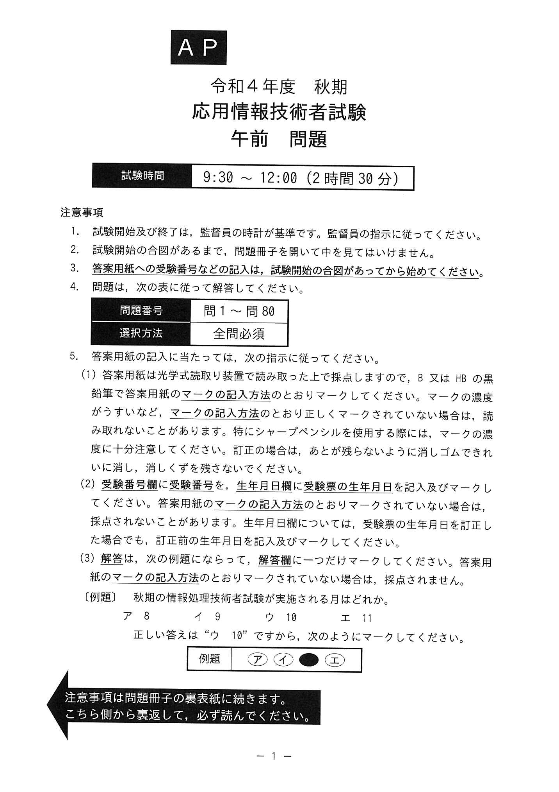

テキスト (OCR)

令和4年度 秋期
応用情報技術者試験
午前 問題

 9:30 ~ 12:00 (2時間 30 分)

注意事項
1. 試験開始及び終了は, 監督具の時計が基準です。監督具の指示に従ってください。
2. 試験開始の合図があるまで, 問題冊子を開いて中を見てはいけません。
3. 答案用紙への受験番号などの記入は, 試験開始の合図があってから始めてください。
4. 問題は, 次の表に従って解答してください。
問題番号       問 1 て 問 80
選択方法    全問必2
5. 答案用紙の記入に当たっては, 次の指示に従ってください。

(1) 答案用紙は光学式読取り装置で読み取った上で採点しますので, B 又は HB の黒
鉛筆で答案用紙のマークの記入方法のとおりマークしてください。 マークの濾度
がうすいなど, マークの記入方法のとおり正しくマークされていない場合は, 読
み取れないことがあります。特にシャープペンシルを使用する際には, マークの濃
度に十分注意してください。訂正の場合は, あとが残らないように消しゴムできれ
いに消し, 消しくずを残さないでください。

(2) 受験番号欄に受験番号を, 生年月日欄に受験票の生年月日を記入及びマークし
てでください。 答案用紙のマークの記入方法のとおりマークされていない場合は。
採点されないことがあります。生年月日欄については, 受験票の生年月日を訂正し
た場合でも, 訂正前の生年月日を記入及びマークしてください。

(3) 解答は, 次の例題にならって, 解答欄に一つだけマークしてください、。管案用
紙のマークの記入方法のとおりマークされていない場合は, 採点されません。

【例題】 秋期の情報処理技術者試験が実施される月はどれか。

ア 8    イ 9    ウ 10    エ 11
正しい答えは “ウ 10” ですから, 次のようにマーク してください。

例題 | (⑦の(の や

注意事項は問題冊子の裏表紙に続きます。
こちら側から裏返して, 必ず読んでください。

### ページ 2

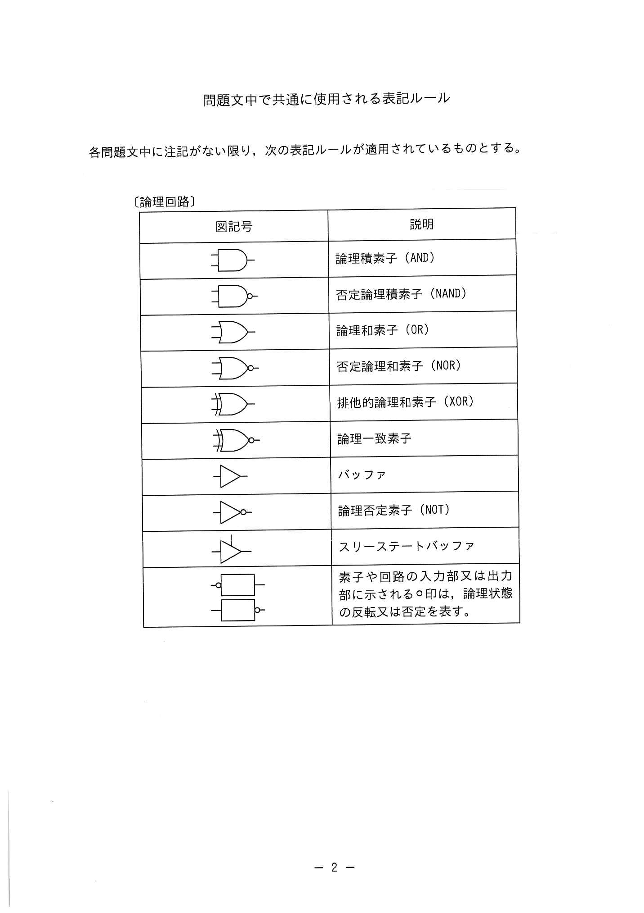

テキスト (OCR)

問題文中で共通に使用される表記ルール

各問題文中に注記がない限り, 次の表記ルールが適用されているものとする。

〔論理回路〕

説明

4
ou
al
ata

論理積素子 (AND)

否定論理積素子 (NAND)

論理和素子 (OR)

否定論理和素子 (NOR)

排他的論理和素子 (XOR)

論理一致素子

バッファ

論理否定素子 (NOT)

スリーステートバッファ

素子や回路の入力部又は出力
部に示されるo印は, 論理状態
の反転又は否定を表す。

LMYYMMMMIMM

### ページ 3

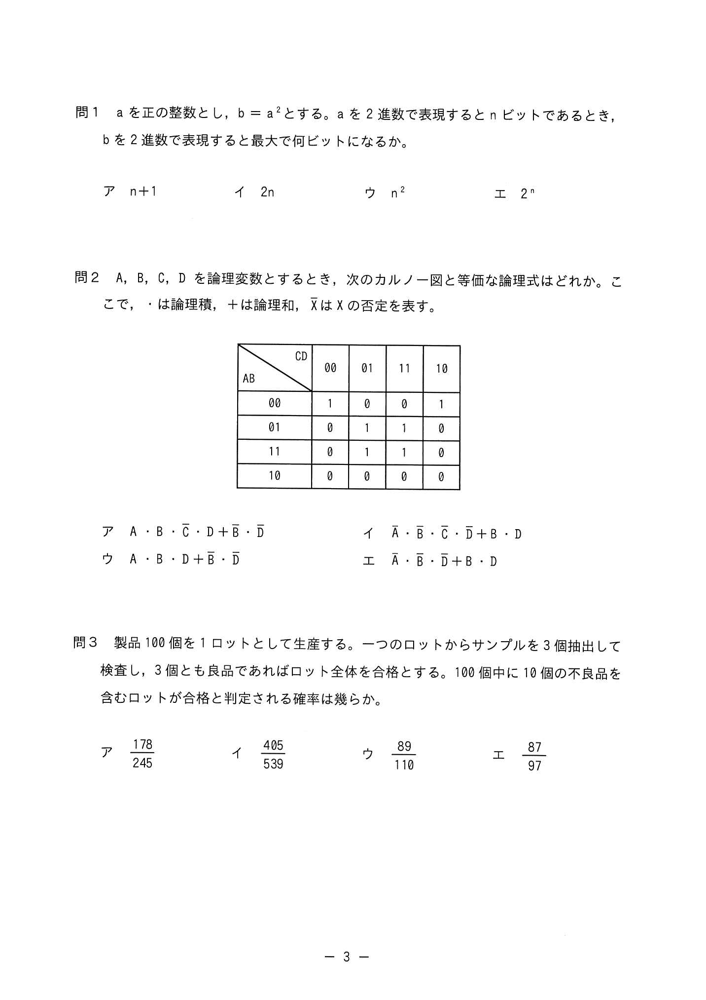

テキスト (OCR)

問1 aを正の整数とし, ba?とする。a を 2 進数で表現するとn ビットであるとき,
b を2 進数で表現すると最大で何ビットになるか。

ア nti     イ 2n      ウ ne     エ 2"

問2 A, B, C, D を論理変数とするとき, 次のカルノー図と等価な論理式はどれか。こ
CC, ・は論理積。 十は論理和, XはXの否定を表す。

CD
i    oo | 9 | 11 | 10
00   1  0  0  1
01   0  1  1  0
11   0  1  1  6
10   6  9  6  0
ア A・B・C・D十B・5   4 A・B・C・D十B・D
ウ A・B・D十B・D      x= A+B-D+B-D

問3 製品109 個を1 ロットとして生産する。一つのロットからサンプルを 3 個抽出して
REL, 3 個とも良品であればロット全体を合格とする。 100 個中に 10 個の不良品を
含むロットが合格と判定される確率は幾らか。

178                       405                       89                        87
+.              4 2              ゥ 王              =
245                                 539                                 110                                 97

### ページ 4

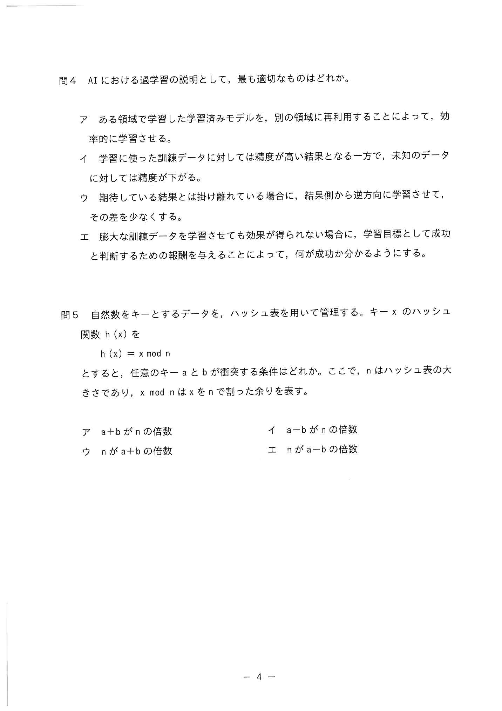

テキスト (OCR)

M4 AI における過学習の説明として, 最も適切なものはどれか。

ア ある領域で学習した学習済みモデルを, 別の領域に再利用することによって, 効
率的に学習させる。

イ 学習に使った訓練データに対しては精度が高い結果となる一方で, 未知のデータ
に対しては精度が下がる。

ウ 期待している結果とは掛け離れている場合に, 結果側から逆方向に学習させて,
その差を少なくする。

エ 膨大な訓練データを学習させても効果が得られない場合に, 学習目標として成功
と判断するための報酬を与えることによって, 何が成功か分かるようにする。

間5 自然数をキーとするデータを, ハッシュ表を用いて管理する。キー x のハッシュ
関数 h (x) を
h (x) = x mod n
とすると, 任意のキー aとb が衝突する条件はどれか。ここで, n はハッシュ表の大
きさであり, x mod nはxをnで割った余りを表す。

ア a二bがnの倍数       イ ab がnの倍数
ウ nがa+b の倍数        エ nがabの倍数

### ページ 5

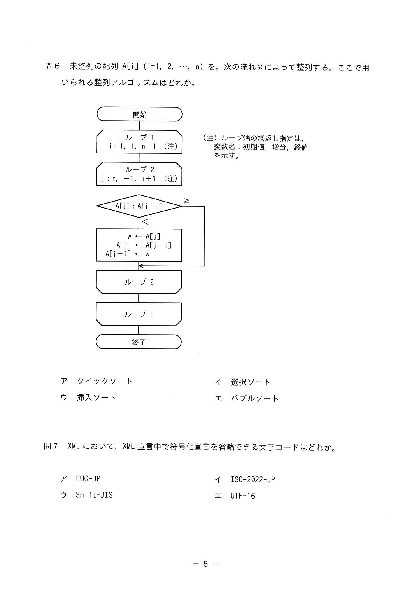

テキスト (OCR)

問6

未整列の配列 ACI] (i=1, 2, …

, n) を, 次の流れ図によって整列する。ここで用

いられる整別アルゴリズムはどれか。

ループ 1         (注) ループ端の繰返し指定は,
ii 1。 1, n-1 (注)      変数名 : 初期値, 増分, 終値
を示す。
ループ 2
jin, 一1, i十1 (注)
w= ALi]
ALi] で ALj-1]
ALj-1] と w
kニ一 !
ループ 2
ループ 1
終了
アア イクソート           4 選択ソート
ウ 挿入ソート               エ バブルソート

問7 XML において, XML 宣言中で符号化宣言を省略できる文字コードはどれか。

Pg

EUC-JP

ウ Shift-JIS

イ 1S0-2022-JP
エ UTF-16

### ページ 6

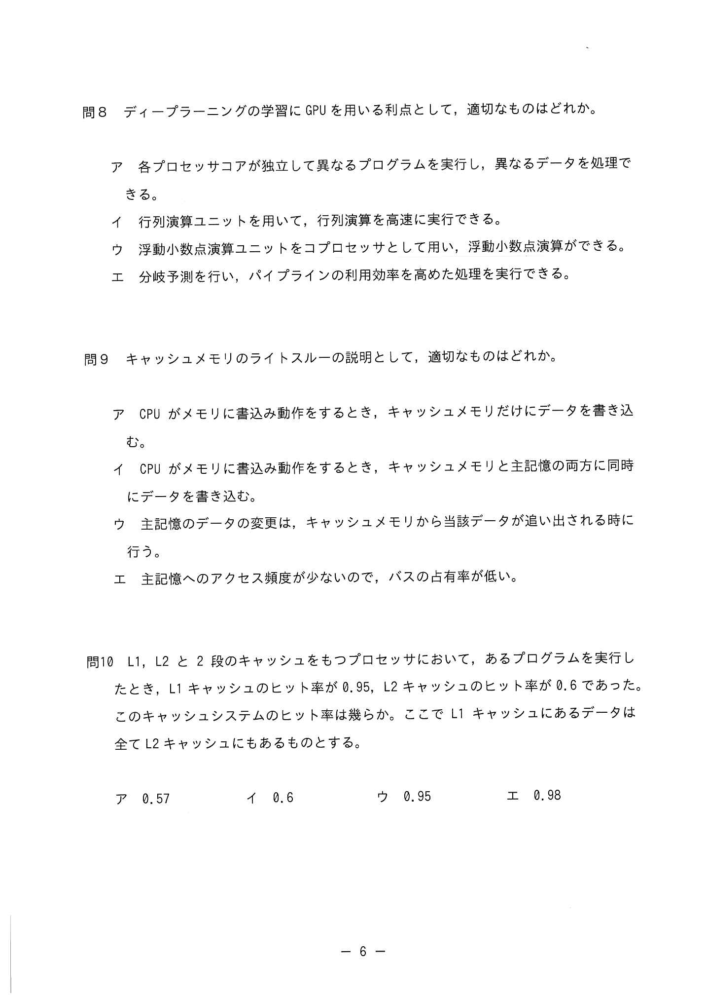

テキスト (OCR)

MS ディープラーニングの学習に GPU を用いる利点として, 適切なものはどれか。

ア 各プロセッサコアが独立して異なるプログラムを実行し, 異なるデータを処理で
きる。

4 行列演算ユニットを用いて, 行列演算を高速に実行できる。

ウ 浮動小数点演算ユニットをコプロセッサとして用い, 浮動小数点演算ができる。

エ 分岐予測を行い, パイプラインの利用効率を高めた処理を実行できる。

FAQ キャッシュメモリのライトスルーの説明として, 適切なものはどれか。

ア CPU がメモリに書込み動作をするとき, キャッシュメモリだけにデータを書き込
む。

イ CPU がメモリに書込み動作をするとき, キャッシュメモリと主記憶の両方に同時
にデータを書き込む。

ウ 主記憶のデータの変更は, キャッシュメモリから当該データが追い出される時に
行

う
エ 主記憶へのアクセス頻度が少ないので, バスの占有率が低い。

o

問19 L1, L2 と 2 段のキャッシュをもつプロセッサにおいて, あるプログラムを実行し
たとき, L1 キャッシュのヒット率が 9.95, L2 キャッシュのヒット率が 0.6 であった。
このキャッシュシステムのヒット率は幾らか。ここで L1 キャッシュにあるデータは
全てL2 キャッシュにもあるものとする。

ア 9.57     イ 0.6     ウ 0.95     エ 0.98

### ページ 7

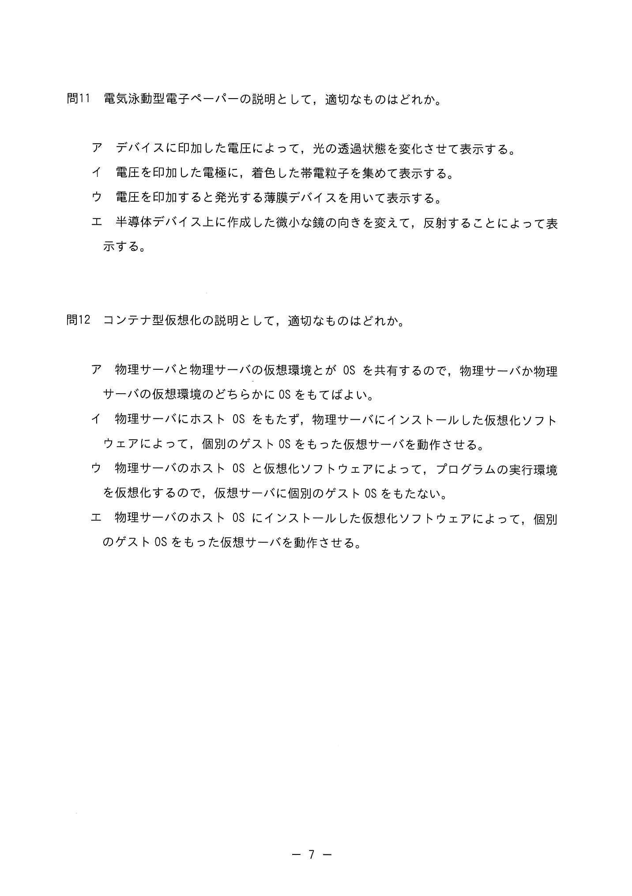

テキスト (OCR)

間11 電気泳動型電子ペーパーの説明として, 適切なものはどれか。

に|

デバイスに印加した電圧によって, 光の肖過状態を変化させて表示する。

電圧を印加した電極に, 着色した帯電粒子を集めて表示する。

電圧を印加すると発光する薄膜デバイスを用いて表示する。

半導体デバイス上に作成した微小な鏡の向きを変えて, 反射することによって表
示する。

H GA

間12 コンテナ型仮想化の説明として, 適切なものはどれか。

ア 物理サーバと物理サーバの仮想環境とが 0S を共有するので, 物理サーバカ物理
サーバの仮想環境のどちらかに 0S をもてばよい。

イ 物理サーバにホスト OS をもたず, 物理サーバにインストールした仮想化ソフト
ウェアによって, 個別のゲスト 0S をもった仮想サーバを動作させる。

ウ 物理サーバのホスト OS と仮想化ソフトウェアによって, プログラムの実行環境
を仮想化するので, 仮想サーバに個別のゲスト 0S をもたない。

エ 物理サーバのホスト OS にインストールした仮想化ソフトウェアによって, 個別
のゲスト 0S をもった仮想サーバを動作させる。

### ページ 8

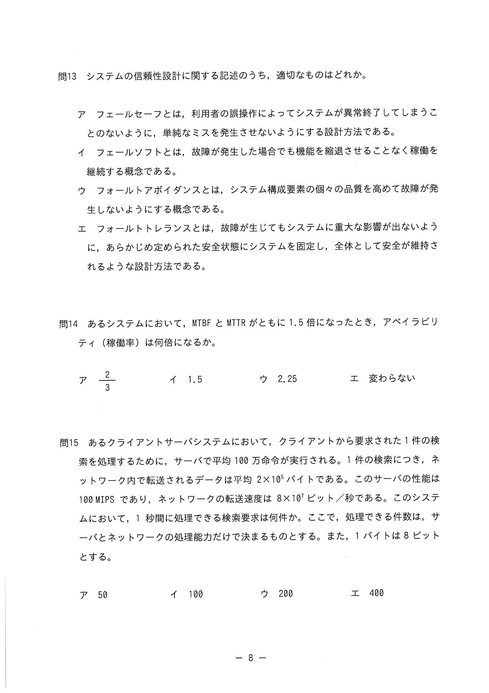

テキスト (OCR)

AIS システムの信頼性設計に関する記述のうち, 適切なものはどれか。

ア フェールセーフとは, 利用者の誤操作によってシステムが異常終了してしまうこ
とのないように, 単純なミスを発生させないようにする設計方法である。
イ フェールソフトとは, 故障が発生した場合でも機能を縮退させることなく乏働を
継続する概念である。
ウ フォールトアボイダンスとは, システム構成要素の個々の品質を高めて故障が発
生しないようにする概念である。
エエ フォールトトレランスとは, 故障が生じてもシステムに重大な影響が出ないよう
に, あらかじめ定められた安全状態にシステムを固定し, 全体として安全が維持さ
れるような設計方法である。

P14 あるシステムにおいて, MTBF と MTTR がともに 1.5 倍になったとき, アベイラビリ
ティ (稼働率) は何倍になるか。

1.5         ウ 2.25        I 変わらない

SI
|
Ny

FAIS あるクライアントサーバシステムにおいて, クライアントから要求された 1 件の検
索を処理するために, サーバで平均 100 万命令が実行される。1 件の検索につき, ネ
ットワーク内で転送されるデータは平均 2X10? バイトである。このサーバの性能は
199 MIPS であり, ネットワークの転送速度は 8X10' ビットノ秒である。このシステ
ムにおいて, 1 秒間に処理できる検索要求は何件か。ここで, 処理できる件数は, サ
ーバとネットワークの処理能力だけで決まるものとする。また, 1 バイトは8 ビット
とする。

ア 50      イ 100     ウ 200     エ 400

### ページ 9

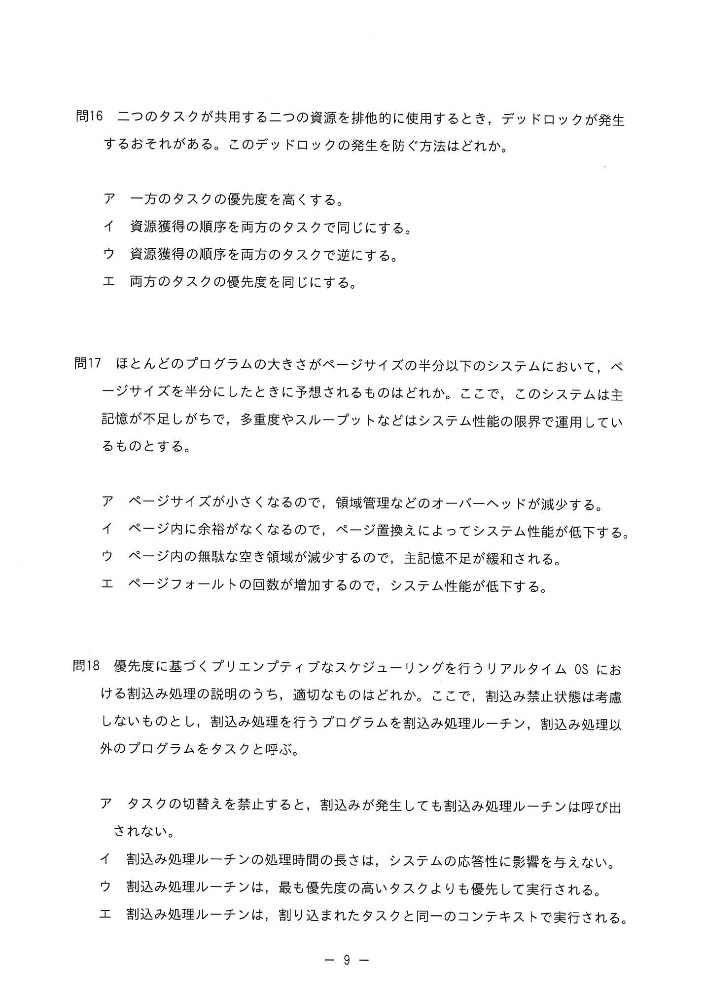

テキスト (OCR)

間16 二つのタスクが共用する二つの資源を排他的に使用するとき, デッドロックが発生
するおそれがある。このデッドロックの発生を防ぐ方法はどれか。

に|

一方のタスクの優先度を高くする。

資源獲得の順序を両方のタスクで同じにする。
資源獲得の順序を両方のタスクで逆にする。
両方のタスクの優先度を同じにする。

H A

間17 ほとんどのプログラムの大きさがページサイズの半分以下のシステムにおいて, ペ
ージサイズを半分にしたときに予想されるものはどれか。ここで, このシステムは主
記憶が不足しがちで, 多重度やスループットなどはシステム性能の限界で運用してい
るものとする。

に|

ページサイズが小さくなるので, 領域管理などのオーバーヘッドが減少する。
ページ内に余裕がなくなるので, ページ置換えによってシステム性能が低下する。
ページ内の無駄な空き領域が減少するので, 主記憶不足が緩和される。

ページフォールトの回数が増加するので, システム性能が低下する。

H Ww AX

間18 優先度に基づくプリエンプティブなスケジューリングを行うリアルタイム OS にお
ける割込み処理の説明のうち, 適切なものはどれか。ここで, 割込み禁止状態は考慮
しないものとし, 割込み処理を行うプログラムを割込み処理ルーチン, 割込み処理以
外のプログラムをタスクと呼ぶ。

ア タスクの切替えを禁止すると, 割込みが発生しても割込み処理ルーチンは呼び出
されない。
割込み処理ルーチンの処理時間の長さは, システムの応答性に影響を与えない。
割込み処理ルーチンは, 最も優先度の高いタスクよりも優先して実行される。
エ 割込み処理ルーチンは, 割り込まれたタスクと同一のコンテキストで実行される。

ー 9一

### ページ 10

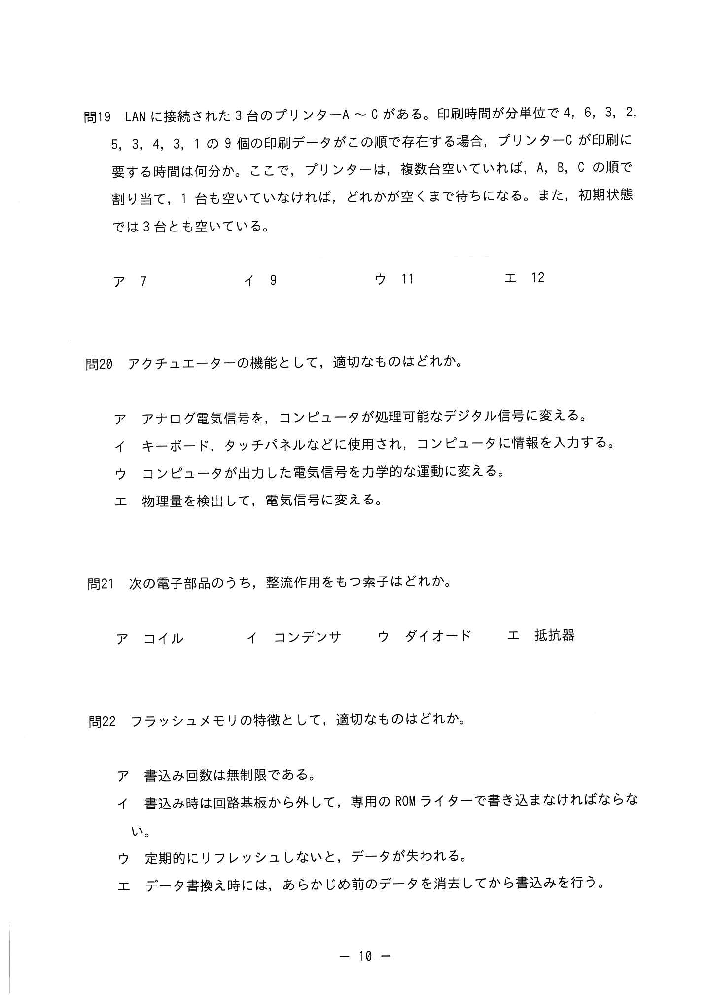

テキスト (OCR)

問19 LANに接続された 3 台のプリンターA ~ C がある。印刷時間が分単位で 4, 6, 3, 2,
5, 3, 4, 3, 1 の 9 個の印刷データがこの順で存在する場合, プリンターC が印刷に
要する時間は何分か。ここで, プリンターは, 複数台空いていれば, A, B, C の順で
割り当て, 1 台も空いていなければ, どれかが空くまで待ちになる。また, 初期状態
では3台とも空いている。

11       エ 12

N
~
sy
<)
Ni

20 アクチュエーターの機能として, 適切なものはどれか。

N

アナログ電気信号を, コンピュータが処理可能なデジタル信号に変える。
キーボード, タッチパネルなどに使用され, コンピュータに情報を入力する。
コンピュータが出力した電気信号を力学的な運動に変える。

物理量を検出して, 電気信号に変える。

H sos

2] 次の電子部品のうち, 整流作用をもつ素子はどれか。

ア コイル    イ コンデンサ  ウ ダイオード  エ 抵抗器

22 フラッシュメモリの特徴として, 適切なものはどれか。

ア 書込み回数は無制限である。

イ 書込み時は回路基板から外して, 専用の ROM ライターで書き込まなければならな
い。

ウ 定期的にリフレッシュしないと, データが失われる。

エ データ書換え時には, あらかじめ前のデータを消去してから書込みを行う。

### ページ 11

テキスト (OCR)

間23 入力XとYの値が同じときにだけ, 出力Z に 1 を出力する回路はどれか。

Et
an  しうー
oni

間24 顧客に, A~ZLORANS 26 種類を用いた顧客コードを割り当てたい。現在の顧客
総数は 8, 099 人であって, BH, 前年対比で 2 割ずつ顧客が増えていくものとする。
3 年後まで全顧客にコードを割り当てられるようにするためには, 顧客コードは少な
くとも何桁必要か。

### ページ 12

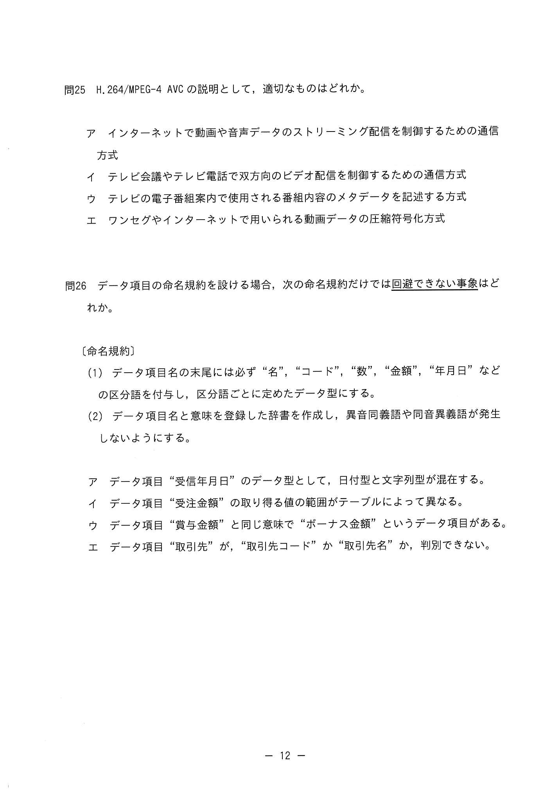

テキスト (OCR)

間25 H.264/MPEG-4 AVC の説明として, 適切なものはどれか。

ア インターネットで動画や音声データのストリーミング配信を制御するための通信
方式
4 テレビ会議やテレビ電話で双方向のビデオ配信を制御するための通信方式
テレビの電子番組案内で使用される番組内容のメタデータを記述する方式
ワンセグやインターネットで用いられる動画データの圧縮符号化方式

問26 データ項目の命名規約を設ける場合, 次の命名規約だけでは回避できない事象はど
れか。

〔命名規約

(1) データ項目名の未尾には必ず 『名", "コード”, “数", “金額", “年月日"など
の区分語を付与し, 区分語ごとに定めたデータ型にする。

(2) データ項目名と意味を登録した辞書を作成し, 異音同義語や同音異義語が発生
しないようにする。

ア データ項目 "受信年月日" のデータ型として, 日付型と文字列型が混在する。

4 データ項目 "受注金額" の取り得る値の範囲がテーブルによって異なる。

ウ データ項目 “賞与金額′ と同じ意味で"ボーナス金額" というデータ項目がある。
エ データ項目 “取引先” が, “取引先コード” か“取引先名” か, 判別できない。

### ページ 13

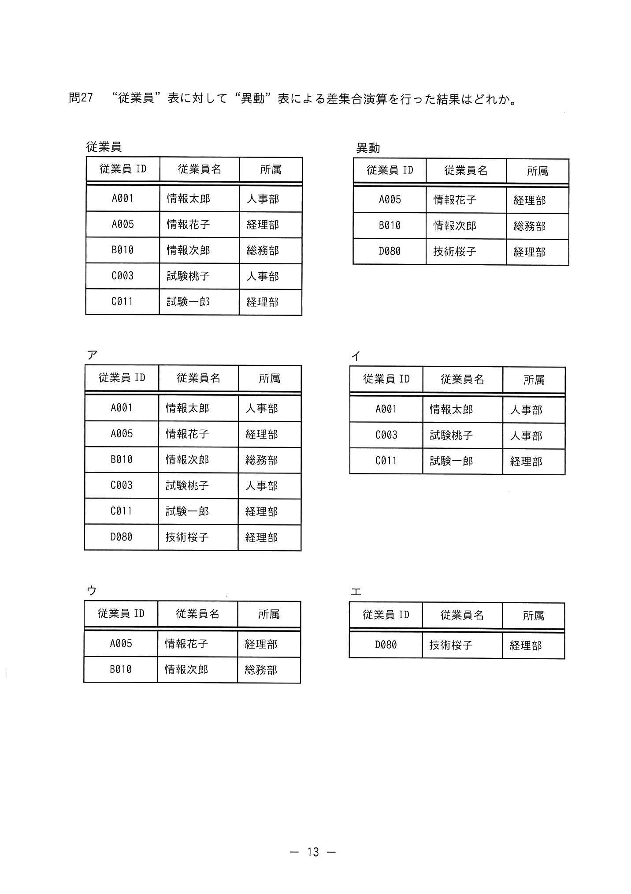

テキスト (OCR)

問27 “Gee”

表に対して “RH” 表による差集合演算を行った結果はどれか。

従業員                                            異動
従業員 ID      従業員名        所属                従業員 ID      従業員名        所属
A601       情報太朗       ABB                   A005      情報花子       経理部
AQ05      情報花子       経理部                   B910      情報次朗       総務部
BO10      SER OR BB       総務部                   D680      技術桜子       経理部
C003      試験桃子       人事部
col       試験一郎       経理部
                                                4
従業員 ID      従業員名        所属                従業員 ID      従業員名        所属
AQ01       情報太郎       人事部                   A001       情報太郎       人事部
A905      情報花子       経理部                   C903      試験桃子       人事部
BO10          情報次郎           総務部                            C911          試験一郎           経理部
C003      試験桃子       人事部
C911       試験一朗       経理部
Desa      技術桜子       経理部
Q                                                a
従業員 ID      RBS        所属                従業員 ID      従業員名        所属
A005      情報花子       経理部                   D080      技術桜子       経理部
B910      情報次朗       総務部

### ページ 14

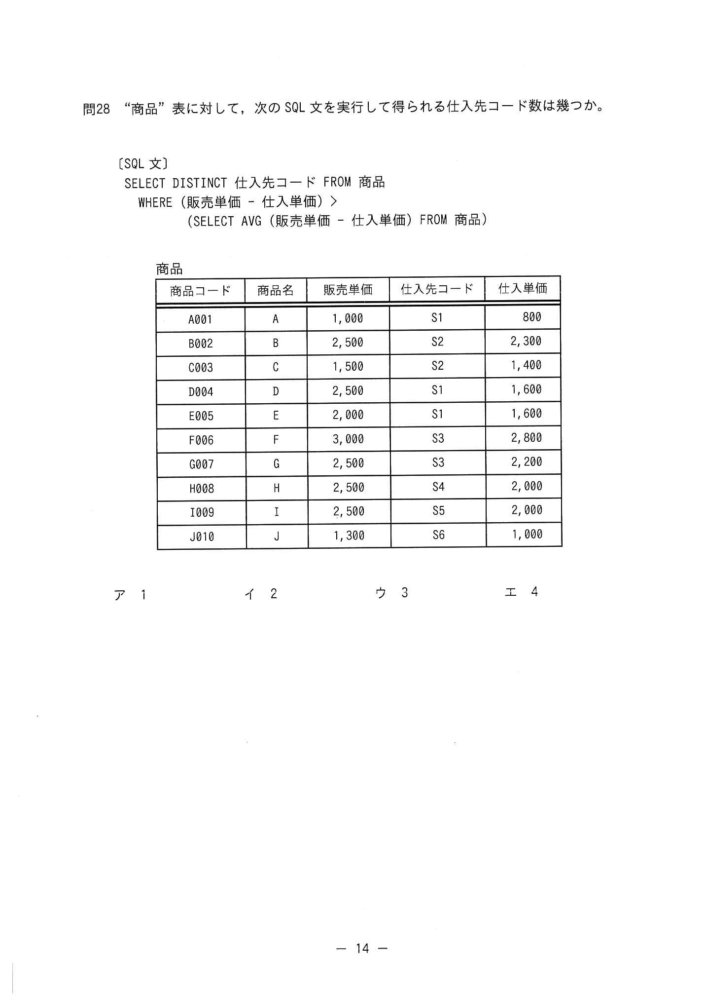

テキスト (OCR)

問28 “商品" 表に対して, 次のSQL 文を実行して得られる仕入先コード数は幾つか。

(SQL 3c]
SELECT DISTINCT 仕入先コード FROM 商品
WHERE (販売単価 - 仕入単価) >
(SELECT AVG (販売単価 - 仕入単価) FROM 商品)

商品
商品コード | 商品名    販売単価    仕入先コード | 仕入単価
A001             A           1, 000              $1                 800
B902            B           2, 500              S2              2,300
C003            C           1, 500              $2              1,400
D004            D           2, 500              $1              1, 600
E005              E            2, 000                $1                1, 600
F006            E           3, 000              $3              2, 800
G007            G           2,500              S3              2, 200
H968            H           2, 500              S4              2, 000
1009             I           2, 500              $5              2, 000
J010          J         1,300           S6           1, 000
ア 1                    イ 2                    ウ 3                    xz 4

### ページ 15

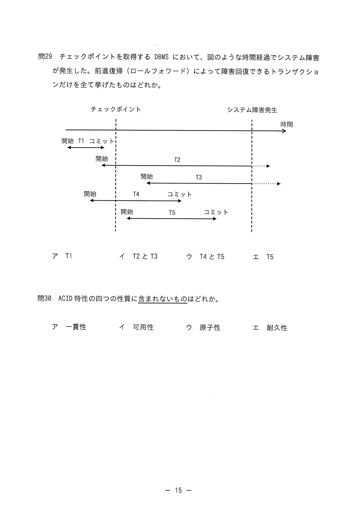

テキスト (OCR)

問29 チェックポイントを取得する DBMS において, 図のような時間経過でシステム障害
が発生した。 前進復帰 (ロールフォワード) によって障害回復できるトランザクショ
ンだけを全て挙げたものはどれか。

チェックポイント             システム障害発生
1                  i    時間
開始 T1 コミット!
1
開始 !        12
                   re
1                  1
!   開始      13      1
              eeを
開始  T4    コミット        i
<           >         1
1                  1
1 開始      T5     コミット   !
MM
アァ Tl     イ T2&T3   ウ 1T4とT5   エ 15
問39 ACID 特性の四つの性質に含まれないものはどれか。
ア 一貫性    イ 可用性    ウ 原子性    エ 耐久性

### ページ 16

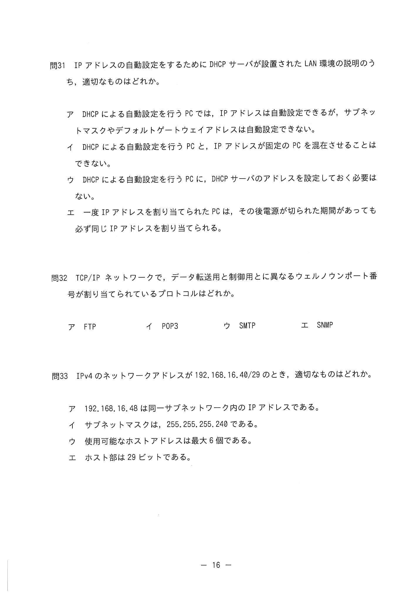

テキスト (OCR)

間31 IP アドレスの自動設定をするために DHCP サーバが設置された LAN 環境の説明のう
ち, 適切なものはどれか。

ア DHCP による自動設定を行う PC では, IP アドレスは自動設定できるが, サブネッ
トマスクやデフォルトゲートウェイアドレスは自動設定できない。

A DHCP による自動設定を行う PC と, IP アドレスが固定の PC を混在させることは
できない。

> DHCP による自動設定を行う PC に, DHCP サーバのアドレスを設定しておく必要は
ない。

エエ 一度IP アドレスを割り当てられた PC は, その後電源が切られた期間があっても
必ず同じ IP アドレスを割り当てられる。

間32 TCP/IP ネットワークで, データ転送用と制御用とに異なるウェルノウンポート番

号が割り当てられているプロトコルはどれか。

ア FTP     イ POP3     ウ SMTP     エ SNMP

間33 IPv4 のネットワークアドレスが 192.168.16.49/29 のとき, 適切なものはどれか。

に|

192.168.16.48 は同一サブネットワーク内の IP アドレスである。
サブネットマスクは, 255.255.255.249 である。

使用可能なホストアドレスは最大 6 個である。

ホスト部は 29 ビットである。

Ho ユ

### ページ 17

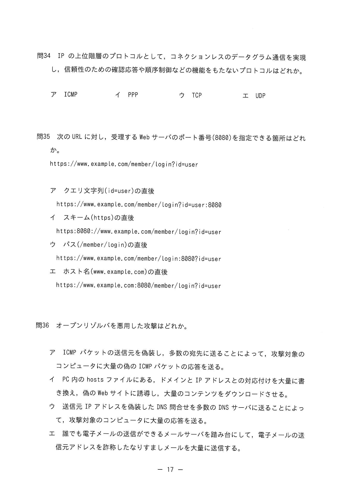

テキスト (OCR)

問34 IP の上位階層のプロトコルとして, コネクションレスのデータグラム通信を実現
し, 信頼性のための確認応答や順序制御などの機能をもたないプロトコルはどれか。

ア ICMP     イ PPP     ウ TCP     x UDP

間35 次のURL に対し, 受理する Web サーバのポート番号(8080)を指定できる箇所はどれ
か。

https://www. examp le.com/member/login?id=user

ア クエリ文字列(id=user)の直後

https://www. example.com/member/login?id=user:8080
イ スキーム(https)の直後

https:8080://www. example. com/member/login?id=user
ウ パス(/member/login)の直後

https://www. example. com/member/login:89897id=user
エ ホスト名(www.example.com)の直後

https://www. example. com:8080/member/login2id=user

間36 オープンリゾルバを悪用した攻撃はどれか。

ア ICMP パケットの送信元を偽装し, 多数の宛先に送ることによって, 攻撃対象の
コンピュータに大量の偽の ICMP パケットの応答を送る。

イ PC 内の hosts ファイルにある, ドメインと IP アドレスとの対応付けを大量に書
き換え, AO Web サイトに誘導し, 大量のコンテンツをダウンロードさせる。

ウ 送信元 IP アドレスを偽装した DNS 問合せを多数の DNS サーバに送ることによっ
て, 攻撃対象のコンピュータに大量の応答を送る。

エエ 誰でも電子メールの送信ができるメールサーバを式み台にして, 電子メールの送
信元アドレスを詐称したなりすましメールを大量に送信する。

### ページ 18

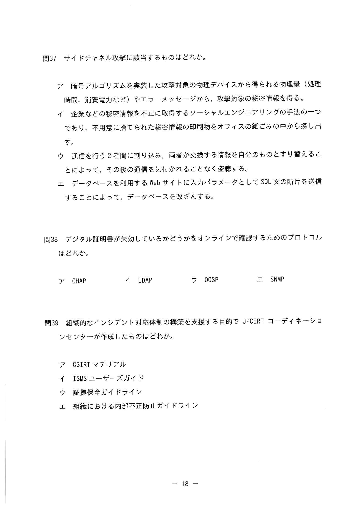

テキスト (OCR)

間37 サイドチャネル攻撃に該当するものはどれか。

ア 暗号アルゴリズムを実装した攻撃対象の物理デバイスから得られる物理量 (処理
時間, 消費電力など) やエラーメッセージから, 攻撃対象の秘密情報を得る。

イ 企業などの秘密情報を不正に取得するソーシャルエンジニアリングの手法の一つ
であり, 不用意に捨てられた秘密情報の印刷物をオフィスの紙ごみの中から探し出
す。

ウ 通信を行う2者間に割り込み, 両者が交換する情報を自分のものとすり替えるこ
とによって, その後の通信を気付かれることなく盗聴する。

エエ データベースを利用する Wed サイトに入力パラメータとして SOL 文の断片を送信
することによって, データベースを改ざんする。

間38 デジタル証明書が失効しているかどうかをオンラインで確認するためのプロトコル

はどれか。

ア CHAP     イ LDAP     ウ 0CSP     エ SNMP

間39 組織的なインシデント対応体制の構築を支援する目的で JPCERT コーディネーショ
ンセンターが作成したものはどれか。

N

CSIRT マテリアル
ISMS ユーザーズガイド
証拠保全ガイドライン

組織における内部不正防止ガイドライン

Hoa ユ

### ページ 19

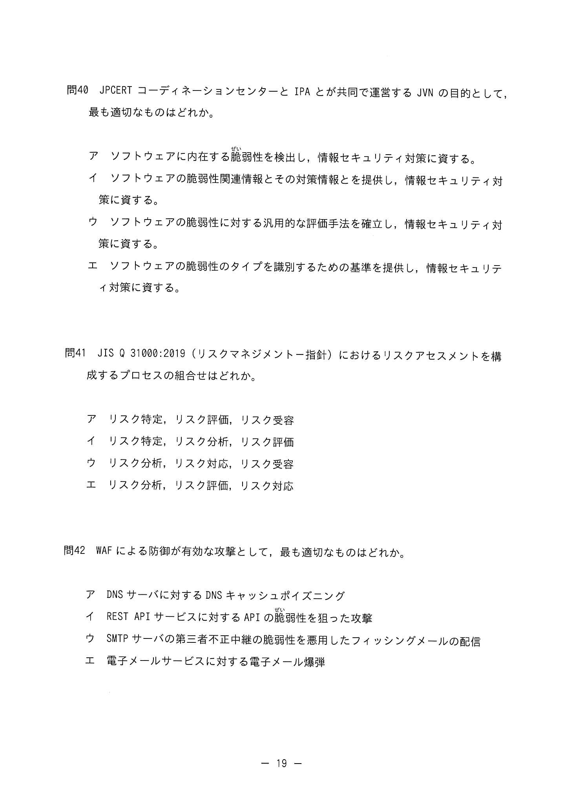

テキスト (OCR)

問49 JPCERT コーディネーションセンターと IPA とが共同で運営する JVN の目的として,
最も適切なものはどれか。

ア ソフトウェアに内在する脆弱性を検出し, 情報セキュリティ対策に資する。

イ ソフトウェアの脆弱性関連情報とその対策情報とを提供し, 情報セキュリティ対
策に資する。

ウ ソフトウェアの脆弱性に対する汎用的な評価手法を確立し, 情報セキュリティ対
策に資する。

エ ソフトウェアの脆弱性のタイプを識別するための基準を提供し, 情報セキュリテ
ィ対策に資する。

問41 JIS Q 31000:2019 (リスクマネジメントー指針) におけるリスクアセスメントを構
成するプロセスの組合せはどれか。

に|

リスク特定, リスク評価, リスク受容
リスク特定, リスク分析, リスク評価
リスク分析, リスク対応,リスク受容
リスク分析, リスク評価,. リスク対応

H GA

問42 WAF による防御が有効な攻撃として, 最も適切なものはどれか。

|

DNS サーバに対する DNS キャッシュポイズニング

REST API サービスに対する API の脆弱性を狙った攻撃

SMTP サーバの第三者不正中継の脆弱性を悪用したフィッシングメールの配信
電子メールサービスに対する電子メール爆弾

H GA

### ページ 20

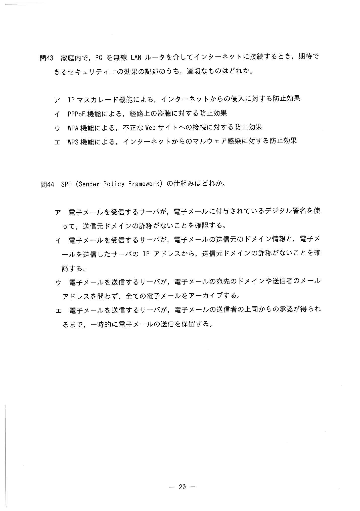

テキスト (OCR)

問43 家庭内で, PC を無線 LAN ルータを介してインターネットに接続するとき, 期待で
きるセキュリティ上の効果の記述のうち, 適切なものはどれか。

に|

IP マスカレード機能こよる, インターネットからの侵入に対する防止効果
PPPoE 機能による, 経路上の盗聴に対する防止効果

WPA 機能による, 不正な Web サイトへの接続に対する防止効果

WPS 機能ことよる, インターネットからのマルウェア感染に対する防止効果

Hoo A

問44 SPF (Sender Policy Framework) の仕組みはどれか。

ア 電子メールを受信するサーバが, 電子メールに付与されているデジタル輸名を使
って, 送信元ドメインの詐称がないことを確認する。

イ 電子メールを受信するサーバが, 電子メールの送信元のドメイン情報と, 電子メ
ールを送信したサーバの IP アドレスから, 送信元ドメインの詐称がないことを確
認する。

ウ 電子メールを送信するサーバが, 電子メールの宛先のドメインや送信者のメール
アドレスを間わず, 全ての電子メールをアーカイブする。

エ 電子メールを送信するサーバが, 電子メールの送信者の上司からの承認が得られ
るまで, 一時的に電子メールの送信を保留する。

### ページ 21

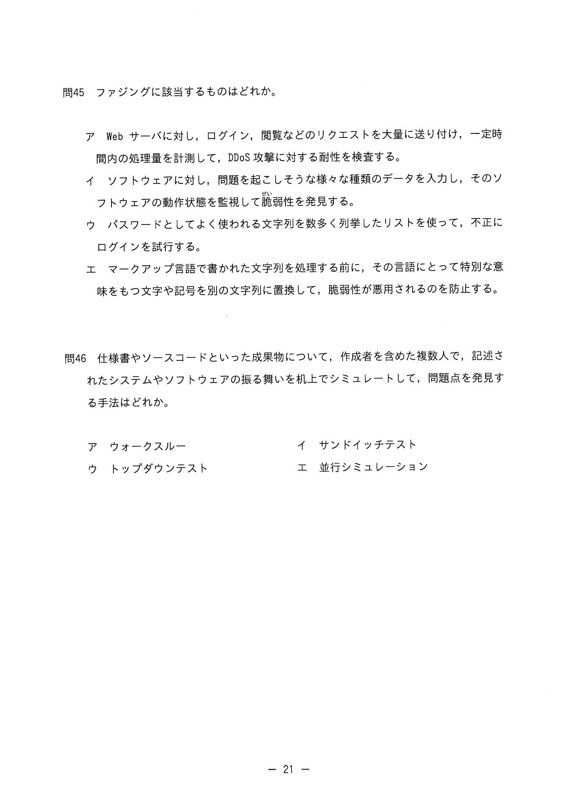

テキスト (OCR)

問45 ファジングに該当するものはどれか。

ア Web サーバに対し, ログイン, 閲覧などのリクエストを大量に送り付け, 一定時
間内の処理量を計測して, DDoS 攻撃に対する耐性を検査する。

イ ソフトウェアに対し, 間題を起こしそうな様々な種類のデータを入力し, そのソ
フトウェアの動作状態を監視して脆弱性を発見する。

ウ パスワードとしてよく使われる文字列を数多く列挙したリストを使って, 不正に
ログインを試行する。

エ マークアップ言語で書かれた文字列を処理する前に, その言語にとって特別な意
味をもつつ文字や記号を別の文字列に置換して, 脆弱性が悪用されるのを防止する。

問46 仕様書やもソースコードといった成果物について, 作成者を含めた複数人で, 記述さ
れたシステムやソフトウェアの振る舞いを机上でシミュレートして, 問題点を発見す
る手法はどれか。

ア ウォークスルー        イ サンドイッチテスト
ウ トップダウンテスト      エ 並行シミュレーション

### ページ 22

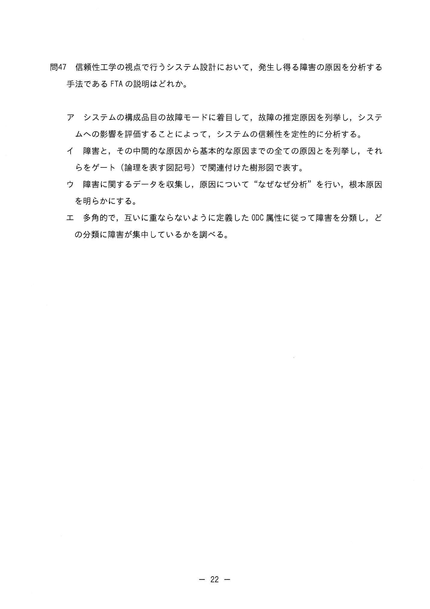

テキスト (OCR)

問47 信頼性工学の視点で行うシステム設計において, 発生し得る障害の原因を分析する
手法である「『TA の説明はどれか。

ア システムの構成品目の故障モードに着目して, 故障の推定原因を列挙し, VAT
ムへの逐響を評価することによって, システムの信頼性を定性的に分析する。

イ BSc, その中間的な原因から基本的な原因までの全ての原因とを列挙し, それ
らをゲート (論理を表す図記号) で関連付けた樹形図で表す。

ウ 障害に関するデータを収集し, 原因について“なぜなぜ分析" を行い, 根本原因
を明らかにする。

エ 多角的で, 互いに重ならないように定義した OC 属性に従って障害を分類し, ど
の分類に障害が集中しているかを調べる。

### ページ 23

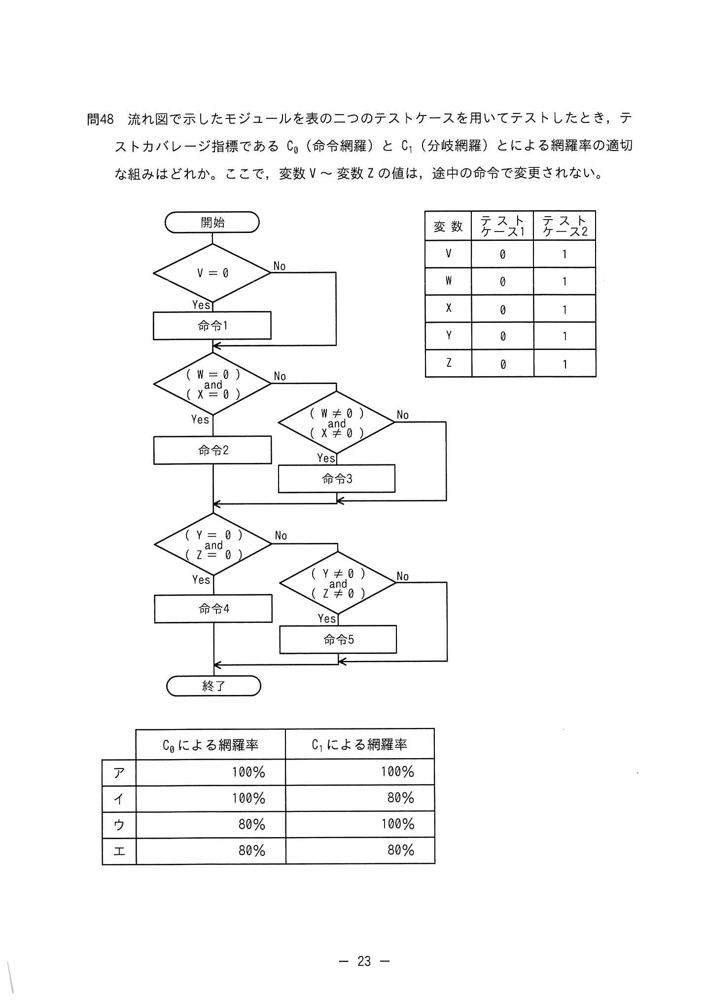

テキスト (OCR)

間48 流れ図で示したモジュールを表の二つのテストケースを用いてテストしたとき, テ
ストカバレージ指標である Cy (命令網羅) と C」 (DI) CK OMRXOBY
な組みはどれか。ここで, 変数V ~ 変数 の値は, 途中の命令で変更されない。

         EE
V   9   1
No
W   9   1
9   1
9   1
9   1

C。 による網羅率      C」 による網羅率
ア                 100%                  100%
4                 100%                   80%
ウ                  80%                  100%
エ               80%                80%

### ページ 24

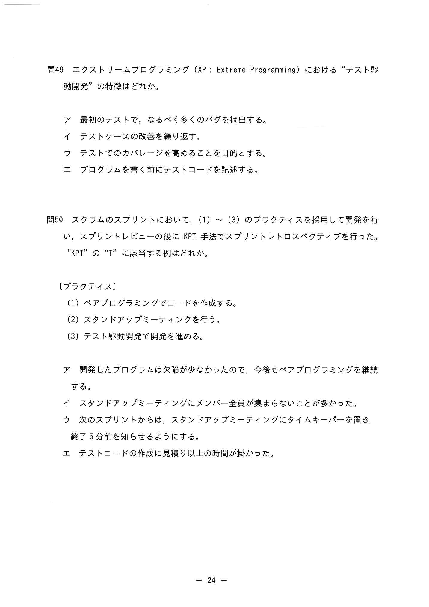

テキスト (OCR)

間49 エクストリームプログラミング (XP: Extreme Programming) (CHWS “FAKE
動開発" の特徴はどれか。

に|

最初のテストで, なるべく多くのバグを摘出する。
テストケースの改善を繰り返す。

テストでのカバレージを高めることを目的とする。
プログラムを書く前にテストコードを記述する。

H +s ユ

間59 スクラムのスプリントにおいて, (1) ~ (3) のプラクティスを採用して開発を行
い, スプリントレビューの後に KPT 手法でスプリントレトロスペクティブを行った。
“KPT” の "T” に該当する例はどれか。

〔プラクティス〕}
(1) ペアプログラミングでコードを作成する。
(2) スタンドアップミーティングを行う。
(3) テスト駆動開発で開発を進める。

ア 開発したプログラムは欠陥が少なかったので, 今後もペアプログラミングを継続
する。

イ スタンドアップミーティングにメンバー全員が集まらないことが多かった。

ウ 次のスプリントからは, スタンドアップミーティングにタイムキーパーを置き,
終了 5分前を知らせるようにする。

エ テストコードの作成に見積り以上の時間が掛かった。

### ページ 25

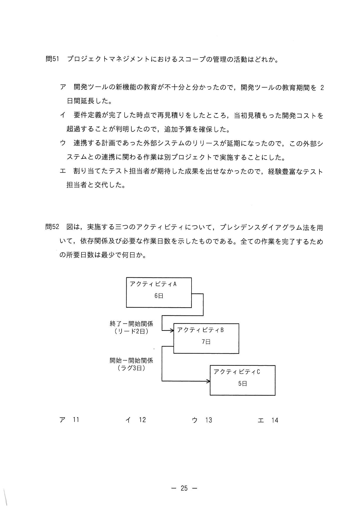

テキスト (OCR)

問51 プロジェクトマネジメントにおけるスコープの管理の活動はどれか。

ア 開発ツールの新機能の教育が不十分と分かったので, 開発ツールの教育期間を 2
日間延長した。

イ 要件定義が完了した時点で再見積りをしたところ, 当初見積もった開発コストを
超過することが判明したので, 追加予算を確保した。

ウ 連携する計画であった外部システムのリリースが延期になったので, この外部シ
ステムとの連携に関わる作業は別プロジェクトで実施することにした。

エ 割り当てたテスト担当者が期待した成果を出せなかったので, 経験豊富なテスト
担当者と交代した。

問52 図は, 実施する三つのアクティビティについて, プレシデンスダイアグラム法を用
いて, 依存関係及び必要な作業日数を示したものである。 全ての作業を完了するため
の所要日数は最少で何日か。

に|
N
MI

ィビティA

終了ー開始関係    oy en
(リード2日) Sy アクティビティB
開始一開始関係
fe)           アクティビティC
5日
ア 11      イ 12     ウ 13     x= 14

### ページ 26

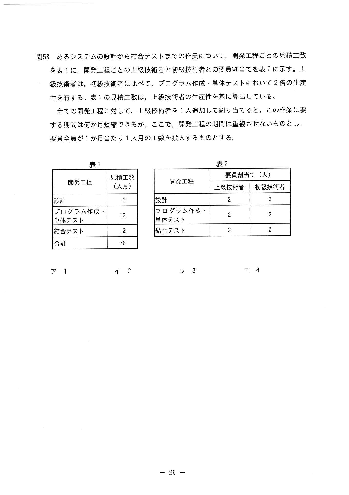

テキスト (OCR)

問53 あるシステムの設計から結合テストまでの作業について, 開発工程ごとの見積工数
を表 1 に, 開発工程ごとの上級技術者と初級技術者との要員割当てを表 2 に示す。上
級技術者は, 初級技術者に比べて, プログラム作成・単体テストにおいて 2 倍の生産
性を有する。表 1 の見積工数は, 上級技術者の生産性を基に算出している。
全ての開発工程に対して, 上級技術者を 1 人追加して割り当てると, この作業に要
する期間は何か月短縮できるか。ここで, 開発工程の期間は重複させないものとし
要員全員が1 か月当たり 1 人月の工数を投入するものとする。

表 1                      表 2
要員割当て (人)
mere = | RTH      開発工程      =
(AA)             上級技術者 | 初級技術者

ERE                  6         ERE                    2            9
プログラム作成・    12       プログラム作成・     2         2
単体テスト           単体テスト
結合テスト       12      結合テスト        2       6
合計            30
ア 1        イ 2        ウ 3        エ 4

### ページ 27

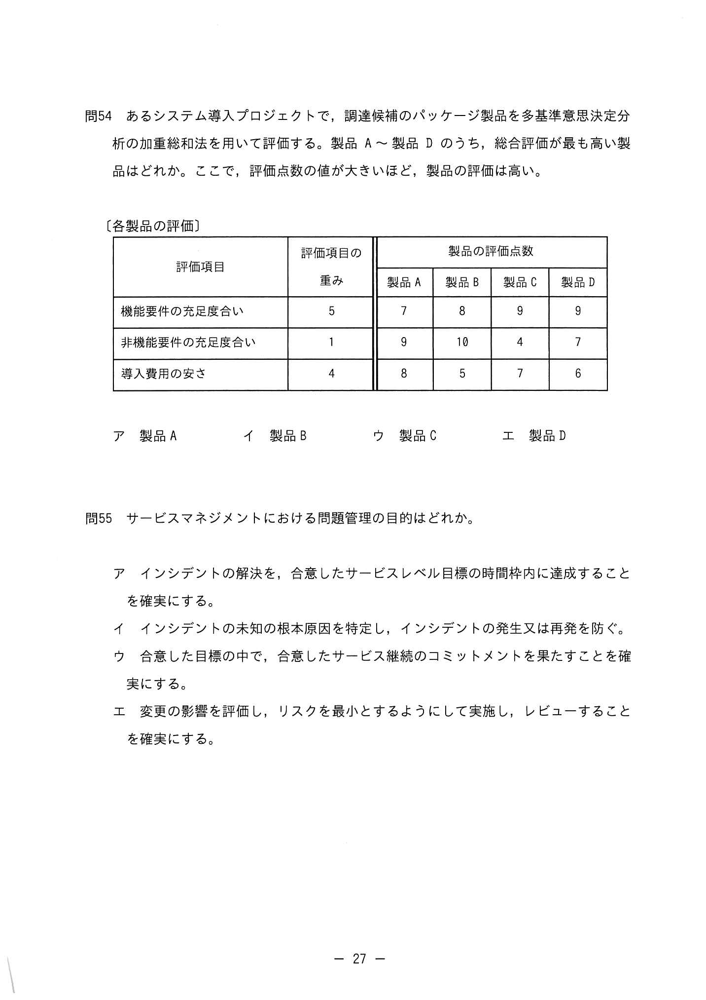

テキスト (OCR)

問54 あるシステム導入プロジェクトで, 調達候補のパッケージ製品を多基準意思決定分
析の加重総和法を用いて評価する。 製品 A一製品 D のうち, 総合評価が最も高い製
品はどれか。 ここで, 評価点数の値が大きいほど, 製品の評価は高い。

〔各製品の評価]
評価項目の       製品の評価点数
評価項目
重み    製品A | 製品B | 製品C | 製品D

機能要件の充足度合い       5     7    8    9   9

非機能要件の充足度合い     1     9   10   4   7

導入費用の安さ         4     8   5    7   6
ア 製品A    イ 製品B    ウ 製品C    エ 製品D

間55 サービスマネジメントにおける問題管理の目的はどれか。

ア インシデントの解決を, 合意したサービスレベル目標の時間枠内に達成すること
を確実にする。
イ インシデントの未知の根本原因を特定し, インシデントの発生又は再発を防ぐ。
合意した目標の中で, 合意したサービス継続のコミットメントを果たすことを確
実にする。
エ 変更の影響を評価し, リスクを最小とするようにして実施し, レビューすること
を確実にする。

### ページ 28

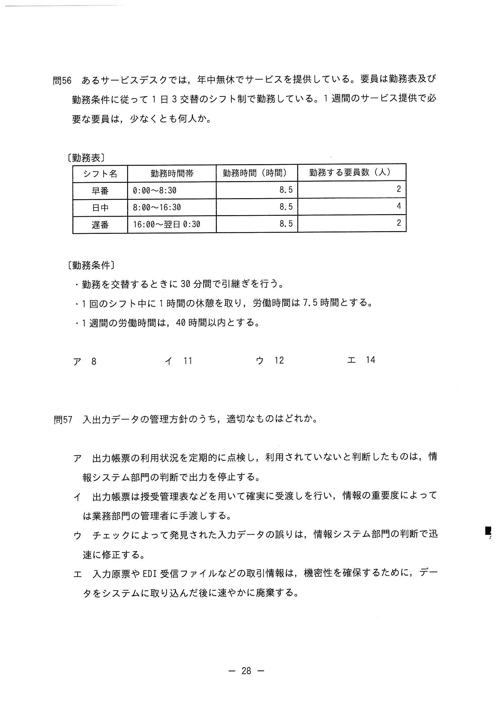

テキスト (OCR)

56 あるサービスデスクでは, 年中無休でサービスを提供している。 要員は勤務表及び
勤務条件に従って 1 日 3 交夫のシフト制で勤務している。1 週間のサービス提供で必
要な要員は, 少なくとも何人か。

(HBR)
シフト名    勤務時間帯    勤務時間 (時間)  勤務する要員数 (人)
早番   0:00~8:30            8.5            2
日中   8:00~16:30           8.5            4
ze  16:00~22 5 0:30        8.5           2
〔勤務条件]

・勤務を交替するときに 30 分間で引継ぎを行う。
・1 回のシフト中に 1 時間の休憩を取り, 労働時間は 7.5時間とする。
・1 週間の労働時間は, 49 時間以内とする。

11        ウ 12       エ 14

Oo
=a

問57 入出力データの管理方針のうち, 適切なものはどれか。

ア 出力帳票の利用状況を定期的に点検し, 利用されていないと判断したものは, 情
報システム部門の判断で出力を停止する。

イ 出力帳票は授受管理表などを用いて確実に受渡しを行い, 情報の重要度によって
は業務部門の管理者に手渡しする。

ウ チェックによって発見された入力データの誤りは, 情報システム部門の判断で迅
速に修正する。

エ 入力原票や EDI 受信ファイルなどの取引情報は, 機密性を確保するために, デー
タをシステムに取り込んだ後に速やかに廃棄する。

### ページ 29

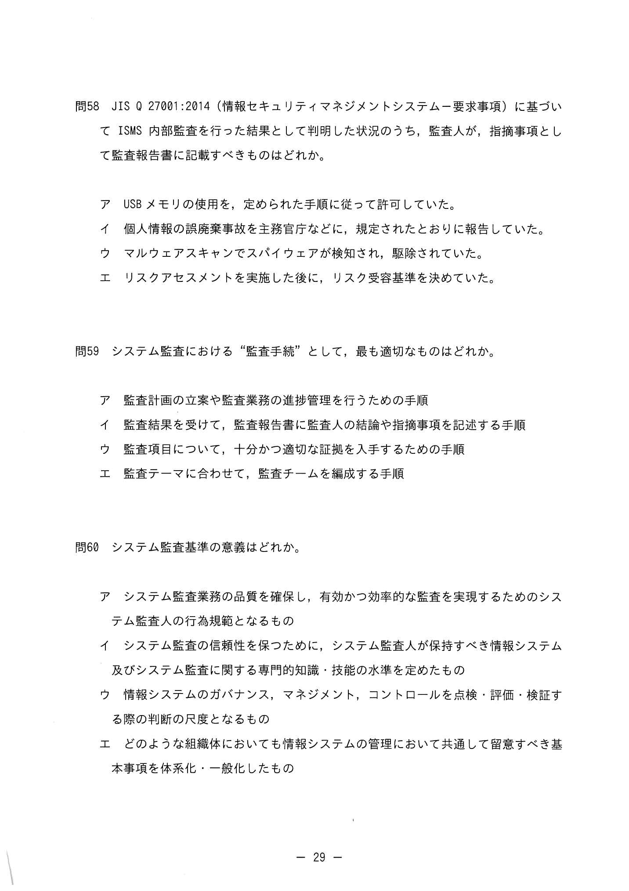

テキスト (OCR)

問58 JIS Q 27001:2014 (情報セキュリティマネジメントシステムー要求事項) に基づい
て ISMS 内部監査を行った結果として判明した状況のうち, 監査人が, 指摘事項とし
て監査報告書に記載すべきものはどれか。

ア USB メモリの使用を, 定められた手順に従って許可していた。

4 個人情報の誤廃棄事故を主務官庁などに, 規定されたとおりに報告していた。
ウ マルウェアスキャンでスパイウェアが検知され, 駆除されていた。

DL リスクアセスメントを実施した後に, リスク受容基準を決めていた。

AIO システム監査における “監査手続" として, 最も適切なものはどれか。

N

監査計画の立案や監査業務の進捗管理を行うための手順

監査結果を受けて, 監査報告書に監査人の結論や指摘事項を記述する手順
監査項目について, 十分かつ適切な証拠を入手するための手順

監査テーマに合わせて, 監査チームを編成する手順

Hos ユ

M60 システム監査基準の意義はどれか。

ア システム監査業務の品質を確保し, 有効かつ効率的な監査を実現するためのシス
テム監査人の行為規範となるもの

イ システム監査の信頼性を保つために, システム監査人が保持すべき情報システム
及びシステム監査に関する専門的知識・技能の水準を定めたもの

ウ 情報システムのガバナンス, マネジメント, コントロールを点検・評価・検証す
る際の判断の尺度となるもの

エ どのような組織体においても情報システムの管理において共通して留意すべき基
本事項を体系化・一般化したもの

### ページ 30

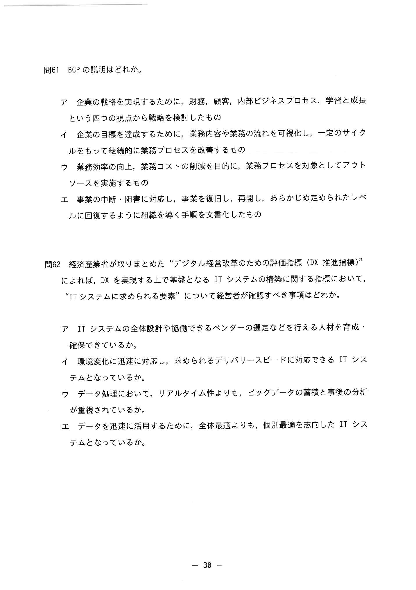

テキスト (OCR)

問61 BCP の説明はどれか。

ア 企業の戦略を実現するために, 財務, MS, 内部ビジネスプロセス, 学習と成長
という四つの視点から戦略を検討したもの

イ 企業の目標を達成するために, 業務内容や業務の流れを可視化し, 一定のサイク
ルをもって継続的に業務プロセスを改善するもの

> 業務効率の向上, 業務コストの削減を目的に, 業務プロセスを対象としてアウト
ソースを実施するもの

エエ 事業の中断・阻害に対応し, 事業を復旧し, BRL, あらかじめ定められたレベ
ルに回復するように組織を導く手順を文書化したもの

問62 経済産業省が取りまとめた“デジタル経営改革のための評価指標 (DX 推進指標)"
によれば, DX を実現する上で基盤となる IT システムの構築に関する指標において,
“TT システムに求められる要素"について経営者が確認すべき事項はどれか。

ア IT システムの全体設計や協働できるベンダーの選定などを行える人材を育成・

確保できているか。

イ 環境変化に迅速に対応し, 求められるデリバリースピードに対応できる IT シス
テムとなっているか。

ウ データ処理において, リアルタイム性よりも, ビッグデータの蓄積と事後の分析
が重視されているか。

エエ データを迅速に活用するために, 全体最適よりも, 個別最適を志向した IT シス
テムとなっているか。

### ページ 31

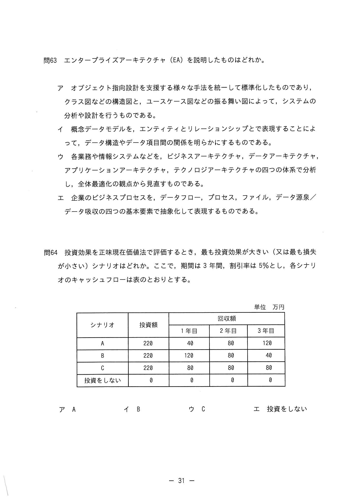

テキスト (OCR)

問683 エンタープライズアーキテクチャ (EA) を説明したものはどれか。

ア オブジェクト指向設計を支援する様々な手法を統一して標準化したものであり
クラス図などの構造図と, ユースケース図などの振る舞い図によって, システムの
分析や設計を行うものである。

4 概念データモデルを, エンティティとリレーションシップとで表現することによ
って, データ構造やデータ項目間の関係を明らかにするものである。

ウ 各業務や情報システムなどを, ビジネスアーキテクチャ, データアーキテクチャ,
アプリケーションアーキテクチャ, テクノロジアーキテクチャの四つの体系で分析
し, 全体最適化の観点から見直すものである。

エ 企業のビジネスプロセスを, データフロー, プロセス, ファイル, データ源泉
データ吸収の四つの基本要素で抽象化して表現するものである。

間64 投資効果を正味現在価値法で評価するとき, 最も投資効果が大きい (又は最も損失
が小さい) シナリオはどれか。ここで, 期間は 3 年間,割引率は 5%とし, 各シナリ
オのキャッシュフローは表のとおりとする。

単位 万円

シナリオ    投資客          —

1 年目      2 年目     3 年目

A  220 40 80120

B  220 120 8040

C  220 80 8080

投資をしない     9      9      9     9

ア A            イ 8B            2 仙            エ 投資をしない

### ページ 32

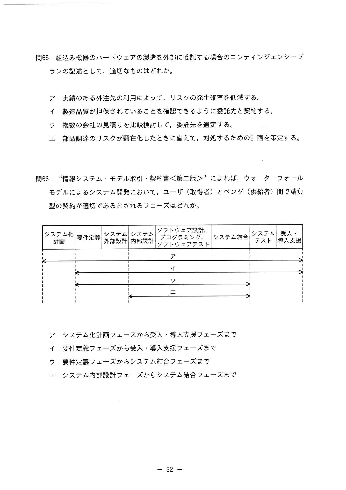

テキスト (OCR)

間65 組込み機器のハードウェアの製造を外部に委託する場合のコンティンジェンシープ
ランの記述として, 適切なものはどれか。

実績のある外注先の利用によって, リスクの発生確率を低減する。

製造品質が担保されていることを確認できるように委託先と契約する。

複数の会社の見積りを比較検討して, 委託先を選定する。

部品調達のリスクが顕在化したときに備えて, 対処するための計画を策定する。

H GA

間66 "情報システム・モデル取引・契約書ぐ第二版>" によれば, ウォーターフォール
モデルによるシステム開発において, ユーザ (取得者) とベンダ (供給者) 間で請
型の契約が適切であるとされるフェーズはどれか。

ンュニー            59 Sle, ここ ツフトウェア設計             5 igs
システム化         システム|システム       ot     a      システム| 受入・
2       要件定義| 3。。 | panenss| プログラミング, |YAT ABA =
計画             外部設計| 内部設計  ソフトウェアテスト               テスト |導入支
1         1               1            >                     1              1
1         1               1            ノ                     1              1
           ィ
1   1       1      ウ          1       1
1         1 コ              T                                A              1
           :              |
1         1                                               cal              1
1         1                                                1              '

a,

に|

システム化計画フェーズから受入・導入支援フェーズまで
要件定義フェーズから受入・導入支援フェーズまで
要件定義フェーズからシステム結合フェーズまで

H ユ

システム内部設計フェーズからシステム結合フェーズまで

### ページ 33

テキスト (OCR)

問67 M&A の際に, 買収対象企業の経営実態, 資産や負債, 期待収益性といった企業価値
などを買手が詳細に調査する行為はどれか。

ア 株主総会招集請         4 公開買付開始公告

ウ セグメンデーション           エ デューデリジェンス

FIGS ターゲットリターン価格設定の説明はどれか。

競合の価格を十分に考慮した上で価格を決定する。

顧客層, 時間帯, 場所など市場セグメントごとに異なった価格を決定する。
目標とする投資収益率を実現するように価格を決定する。

リサーチなどによる消費者の値頃感に基づいて価格を決定する。

H so

間69 コンジョイント分析の説明はどれか。

ア 顧容ごとの売上高, 利益額などを高い順に並べ, 自社のビジネスの中心をなして
いる顧客を分析する手法

4 商品がもつ価格, デザイン, 使いやすさなど, 購入者が重視している複数の属性
の組合せを分析する手法

ウ 同一世代は年齢を重ねても, 時代が変化しても, 共通の行動や意識を示すことに
注目した, 消費者の行動を分析する手法

エ ブランドがもつ複数のイメージ項目を散布図にプロットし, それぞれのブランド
のポジショニングを分析する手法

### ページ 34

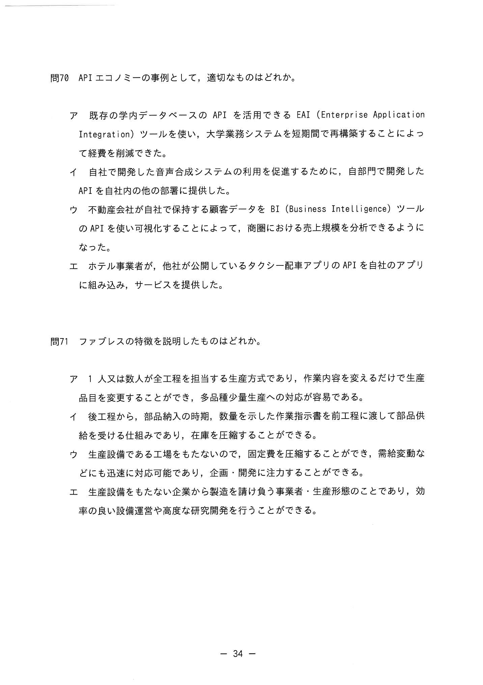

テキスト (OCR)

問79 APIエコノミーの事例として, 適切なものはどれか。

ア 既存の学内データベースの API を活用できる EAI (Enterprise Application
Integration) ツールを使い, 大学業務システムを短期間で再構築することによっ
て経費を削減できた。

イ 自社で開発した音声合成システムの利用を促進するために, 自部門で開発した
API を自社内の他の部署に提供した。

ウ 不動産会社が自社で保持する顧客データを BI (Business Intelligence) ツール
の API を使い可視化することによって, 商圏における売上規模を分析できるように
なった。

エエ ホテル事業者が, 他社が公開しているタクシー配車アプリの API を自社のアプリ
に組み込み, サービスを提供した。

間71 ファブレスの特徴を説明したものはどれか。

ア 1 人又は数人が全工程を担当する生産方式であり, 作業内容を変えるだけで生産
品目を変更することができ, 多品種少量生産への対応が容易である。

4 後工程から, 部品納入の時期, 数量を示した作業指示書を前工程に渡して部品供
給を受ける仕組みであり, 在庫を圧縮することができる。

ウ 生産設備である工場をもたないので, 固定費を圧縮することができ, 順給変動な
どにも迅速に対応可能であり, 企画・開発に注力することができる。

エ 生産設備をもたない企業から製造を請け負う事業者・生産形態のことであり, 効
率の良い設備運営や高度な研究開発を行うことができる。

### ページ 35

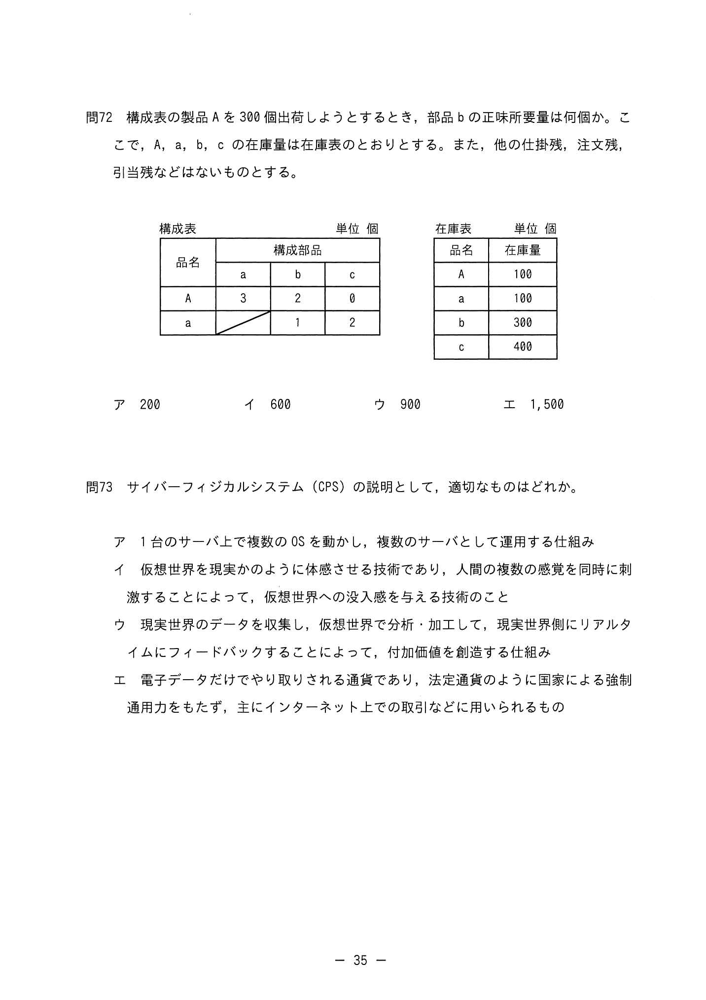

テキスト (OCR)

72 構成表の製品A を 369 個出荷しようとするとき, 部品 b の正味所要量は何個か。こ
こで, A, a, b, c の在庫量は在庫表のとおりとする。また, 他の仕掛残, 注文残,
引当残などはないものとする。

構成表                  単位 個       在庫表      単位 個
構成部品           品名   在庫量
品名
a    b    c         A    100
A    3    2    9         a    100
a         1    2         b    300
0    400
ア 200     4 600     ウ 900     エ 1,500

問73 サイバーフィジカルシステム (CPS) の説明として, 適切なものはどれか。

ア 1 台のサーバ上で複数の 0S を動かし, 複数のサーバとして運用する仕組み

イ 仮想世界を現実かのように体感させる技術であり, 人間の複数の感覚を同時に刺
激することによって, 仮想世界への没入感を与える技術のこと

ウ 現実世界のデータを収集し, 仮想世界で分析・加工して, 現実世界側にリアルタ
イムにフィードバックすることによって, 付加価値を創造する仕組み

エ 電子データだけでやり取りされる通貨であり, 法定通貨のように国家による強制
通用力をもたず, 主にインターネット上での取引などに用いられるもの

### ページ 36

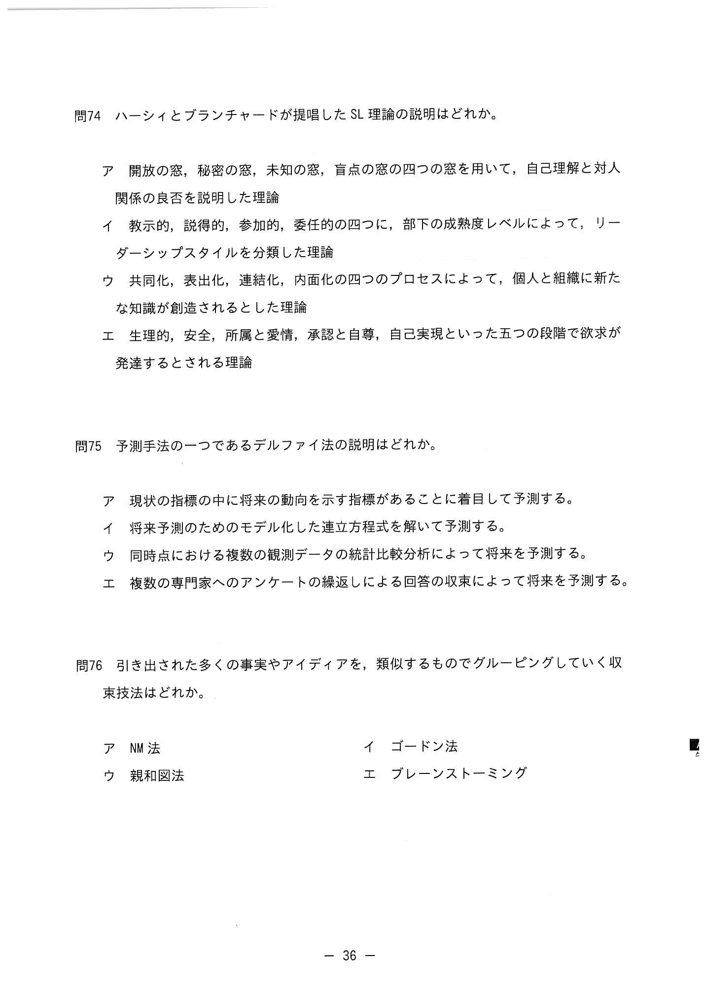

テキスト (OCR)

間74 ハーシィとブランチャードが提唱した SL 理論の説明はどれか。

ア 開放の窓, 秘密の窓, 未知の窓, 盲点の窓の四つの窓を用いて, 自己理解と対人
関係の良否を説明した理論

イ 教示的, 説得的, 参加的, 委任的の四つに, 部下の成熟度レベルによって, リー
ダーシップスタイルを分類した理論

ウ 共同化, 表出化, 連結化, 内面化の四つのプロセスによって, 個人と組織に新た
な知識が創造されるとした理論

エ 生理的, RS, 所属と愛情, 承認と自尊, 自己実現といった五つの段階で欲求が
発達するとされる理論

間75 予測手法の一つであるデルファイ法の説明はどれか。

に|

現状の指標の中に将来の動向を示す指標があることに着目して予測する。

将来予測のためのモデル化した連立方程式を解いて予測する。

同時点における複数の観測データの統計比較分析によって将来を予測する。
複数の専門家へのアンケートの繰返しによる回答の収束によって将来を予測する。

H ws ユ

問76 引き出された多くの事実やアイディアを, 類似するものでグルーピングしていく収
東技法はどれか。

ア NM法               4 ゴードン法
ウ 親和図法             エ ブレーンストー

MW
NG
XY

### ページ 37

テキスト (OCR)

間77 表の製品申と乙とを製造販売するとき, 年間の最大営業利益は何千円か。ここで,
甲と乙の製造には同一の機械が必要であり, 機械の年間使用可能時間は延べ 10,000
時間, 年間の固定費総額は 19,999 千円とする。また, 甲と乙の製造に関して, 機械
の使用時間以外の制約条件はないものとする。

製品       製品単価      製品 1 個当たりの変動費      製品 1 個当たりの機械使用時間
甲       30 千円             18 千円                      10 時間
a       25 FFA             144A                        8 時間
ア 2,000             イ 3,750             ウ 4,750             エ 6,150

P78 A社は顧客管理システムの開発を, 情報システム子会社である B 社に委託し, B 社
は要件定義を行った上で, ソフトウェア設計・プログラミング・ソフトウェアテスト
までを, 協力会社である 社に委託した。C 社では自社の社員 D にその作業を担当さ
tk. COLE, 開発したプログラムの著作権はどこに帰属するか。ここで, 関係者
の問には, 著作権の帰属に関する特段の取決めはないものとする。

ア A社      4 B社      ウ (〈社      エ 社員D

### ページ 38

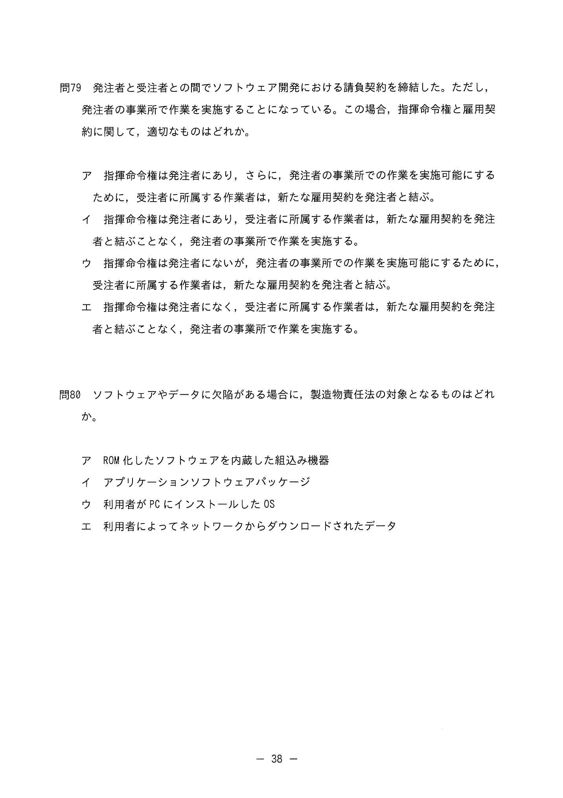

テキスト (OCR)

間79 発注者と受注者との間でソフトウェア開発における請負契約を締結した。ただし
発注者の事業所で作業を実施することになっている。この場合, 指揮命令権と雇用契
約に関して, 適切なものはどれか。

ア 指揮命令権は発注者にあり, さらに, 発注者の事業所での作業を実施可能にする
ために, 受注者に所属する作業者は, 新たな雇用契約を発注者と結ぶ。

イ 指揮命令権は発注者にあり, 受注者に所属する作業者は, 新たな雇用契約を発注
者と結ぶことなく, 発注者の事業所で作業を実施する。

ウ 指揮命令権は発注者にないが, 発注者の事業所での作業を実施可能にするために,
受注者に所属する作業者は, 新たな雇用契約を発注者と結ぶ。

エエ 指揮命令権は発注者になく, 受注者に所属する作業者は, 新たな雇用契約を発注
者と結ぶことなく, 発注者の事業所で作業を実施する。

問89 ソフトウェアやデータに欠陥がある場合に, 製造物責任法の対象となるものはどれ
か。

|

ROM 化したソフトウェアを内蔵した組込み機器

アプリケーションソフトウェアパッケージ

利用者が PC にインストールした OS

利用者によってネットワークからダウンロードされたデータ

H GAN

### ページ 39

テキスト (OCR)

C

メ = 用 紙 J

### ページ 40

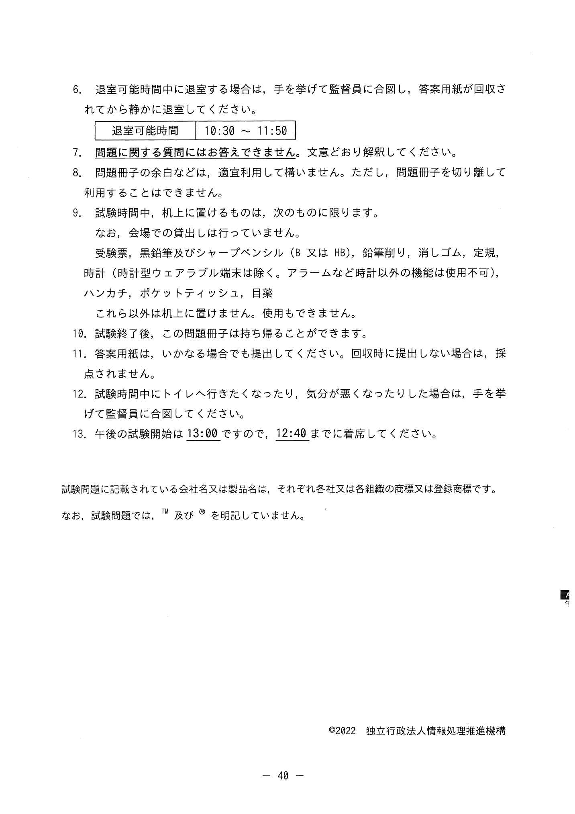

テキスト (OCR)

6. 退室可能時間中に退室する場合は, 手を挙げて監督具に合図し, 答案用紙が回収さ
れてから静かに退室してください。
| 退室可能時間 | 10:30 ~ 11:50
7. 問題に関する質問にはお答えできません。文意どおり解釈してください。
8. 問題冊子の余白などは, 適宜利用して構いません。ただし, 問題冊子を切り離して
利用することはできません。
9. 試験時間中, 机上に置けるものは, 次のものに限ります。
なお, 会場での貸出しは行っていません。
受験票, 黒鉛筆及びシャープペンシル (B 又は HB), 鉛筆削り, 消しゴム, 定規,
時計 (時計型ウェアラブル端末は除く。アラームなど時計以外の機能は使用不可),
ハンカチ, ポケットティッシュ, 目薬
これら以外は机上に置けません。使用もできません。
10. 試験終了後, この問題冊子は持ち帰ることができます。
11. 答案用紙は, いかなる場合でも提出してください。回収時に提出しない場合は, 採
点されません。
12. 試験時間中にトイレへ行きたくなったり, 気分が悪くなったりした場合は, FEB
げて監督具に合図してください。
13. 午後の試験開始は 13:99 ですので, 12:40 までに着席してください。

試験問題に記載されている会社名又は製品名は, それぞれ各社又は各組織の商標又は登録商標です。

なお, 試験問題では, "及び 『 を明記していません。

@2022 独立行政法人情報処理推進機構

+8

---

## 午前解答

©2022 独立行政法人情報処理推進機構 
令和4 年度 秋期 応用情報技術者試験 解答例 
 
午前試験 
問番号
正解
分野
問1 
イ 
Ｔ 
問2 
エ 
Ｔ 
問3 
ア 
Ｔ 
問4 
イ 
Ｔ 
問5 
イ 
Ｔ 
問6 
エ 
Ｔ 
問7 
エ 
Ｔ 
問8 
イ 
Ｔ 
問9 
イ 
Ｔ 
問10 
エ 
Ｔ 
問11 
イ 
Ｔ 
問12 
ウ 
Ｔ 
問13 
ウ 
Ｔ 
問14 
エ 
Ｔ 
問15 
ア 
Ｔ 
問16 
イ 
Ｔ 
問17 
ウ 
Ｔ 
問18 
ウ 
Ｔ 
問19 
ウ 
Ｔ 
問20 
ウ 
Ｔ 
 
 
問番号
正解
分野
問21 
ウ 
Ｔ 
問22 
エ 
Ｔ 
問23 
ウ 
Ｔ 
問24 
ア 
Ｔ 
問25 
エ 
Ｔ 
問26 
イ 
Ｔ 
問27 
イ 
Ｔ 
問28 
ウ 
Ｔ 
問29 
ウ 
Ｔ 
問30 
イ 
Ｔ 
問31 
ウ 
Ｔ 
問32 
ア 
Ｔ 
問33 
ウ 
Ｔ 
問34 
エ 
Ｔ 
問35 
エ 
Ｔ 
問36 
ウ 
Ｔ 
問37 
ア 
Ｔ 
問38 
ウ 
Ｔ 
問39 
ア 
Ｔ 
問40 
イ 
Ｔ 
 
 
問番号
正解
分野
問41 
イ 
Ｔ 
問42 
イ 
Ｔ 
問43 
ア 
Ｔ 
問44 
イ 
Ｔ 
問45 
イ 
Ｔ 
問46 
ア 
Ｔ 
問47 
イ 
Ｔ 
問48 
イ 
Ｔ 
問49 
エ 
Ｔ 
問50 
ウ 
Ｔ 
問51 
ウ 
Ｍ 
問52 
イ 
Ｍ 
問53 
エ 
Ｍ 
問54 
ウ 
Ｍ 
問55 
イ 
Ｍ 
問56 
ウ 
Ｍ 
問57 
イ 
Ｍ 
問58 
エ 
Ｍ 
問59 
ウ 
Ｍ 
問60 
ア 
Ｍ 
 
 
問番号
正解
分野
問61 
エ 
Ｓ 
問62 
イ 
Ｓ 
問63 
ウ 
Ｓ 
問64 
イ 
Ｓ 
問65 
エ 
Ｓ 
問66 
エ 
Ｓ 
問67 
エ 
Ｓ 
問68 
ウ 
Ｓ 
問69 
イ 
Ｓ 
問70 
エ 
Ｓ 
問71 
ウ 
Ｓ 
問72 
イ 
Ｓ 
問73 
ウ 
Ｓ 
問74 
イ 
Ｓ 
問75 
エ 
Ｓ 
問76 
ウ 
Ｓ 
問77 
イ 
Ｓ 
問78 
ウ 
Ｓ 
問79 
エ 
Ｓ 
問80 
ア 
Ｓ 
 
 
分野の「Ｔ」はテクノロジ系，「Ｍ」はマネジメント系，「Ｓ」はストラテジ系の問題です。

---

## 午後問題

### ページ 1

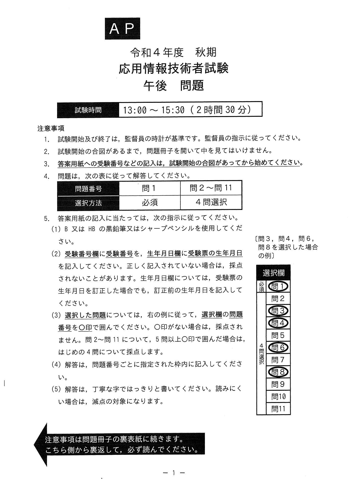

テキスト (OCR)

令和4年度 秋期
応用情報技術者試験
午後 問題

| won 3:00 ~ 15:50 (250 30)

注意事項
1. 試験開始及び終了は, 監督具の時計が基準です。監督貞の指示に従ってください。
2. 試験開始の合図があるまで, 問題冊子を開いて中を見てはいけません。
3. 答案用紙への受験番号などの記入は, 試験開始の合図があってから始めてください。
4. 問題は, 次の表に従って解答してください。
問題番号     問 1    Fl 2 ~問11
選択方法     DAY     4 問選択

5. 答案用紙の記入に当たっては, 次の指示に従ってください。
(1) B 又は HB の黒鉛筆又はシャープペンシルを使用してくだ

5,                         (問3, 問4, 問6

#8 を:   した場合
(の) 受験番号得に受験番号を, teaomcemmotena Fee RRL ES

を記入してください。 正しく記入されていない場合は, 採点
されないことがあります。 生年月日材については, 受験票の

選択欄

w| fB
生年月日を訂正した場合でも, 訂正前の生年月日を記入して |
ください。                         問2
(3) 選択した問題については, 右の例に従って, DROME   GD
番号をO印で囲んでください。〇印がない場合は, 採点され   G4
問5

ません。 問 2一問 11 について, 5 問以上O印で囲んだ場合は,

で
faa
fai}
Oy,

はじめの 4 間について採点します。                     ey

(4) 解答は, 問題番号ごとに指定された枠内に記入してくださ |所|問7

い。                                                    ED

(5) 解答は, 丁寧な字ではっきりと書いてください。読みにく    間9

い場合は。 減点の対象になります。               fal
問1

注意事項は問題冊子の裏表紙に続きます。
こちら側から裏返して, 必ず読んでください。

### ページ 2

### ページ 3

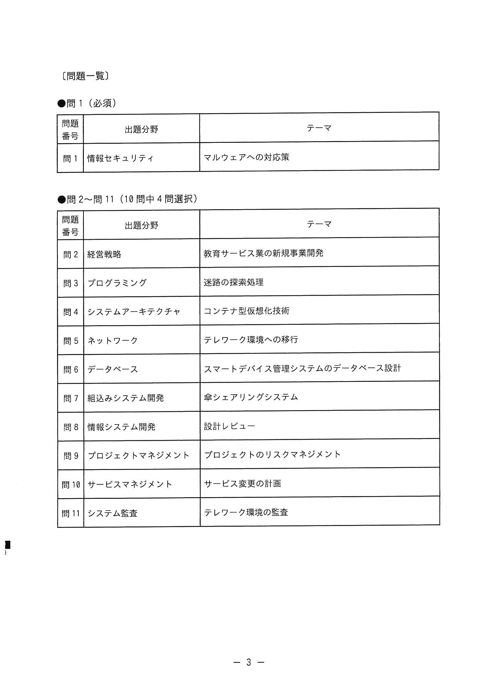

テキスト (OCR)

〔問題一覧]

@問1 (必須)

aes     出題分野                 デーマ
番号

間 1 | 情報セキュリティ      マルウェアへの対応策

人@問 2一問 11 (10 問中 4 問選択)

      出題分野                   テーマ
番号

問 2 | 経営戦略          教育サービス業の新規事業開発
fl3 | プログラミング       迷路の探索処理

間4 | システムアーキテクチャ   コンテナ型仮想化技術

間5 | ネットワーク          テレワーク環境への移行

fl6 | データベース        スマートデバイス管理システムのデータベース設計
問 7 | 組込みシステム開発    傘シェアリングシステム

問 8 | 情報システム開発      設計レビュー

間 9 | プロジェクトマネジメント   プロジェクトのリスクマネジメント
間 10 | サービスマネジメント    サービス変更の計画

間 11 | システム監査       テレワーク環境の監査

### ページ 4

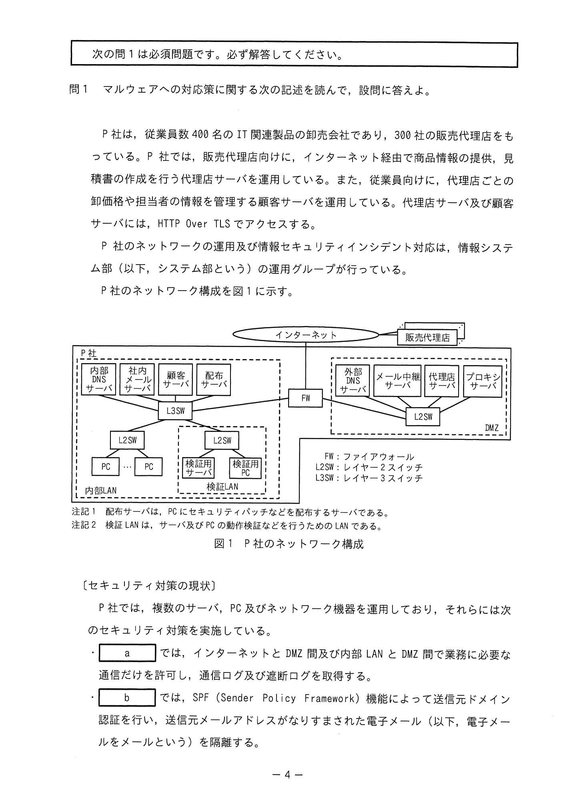

テキスト (OCR)

ROM 1 は必須問題です。必ず解答してください。

fall マルウェアへの対応策に関する次の記述を読んで, 設問に答えよ。

P 社は, 従業員数 499 名の IT 関連製品の卸売会社であり, 300 社の販売代理店をも
っている。P 社では, 販売代理店向けに, インターネット経由で商品情報の提供, 見
積書の作成を行う代理店サーバを運用している。また, 従業員向けに, 代理店ごとの
卸価格や担当者の情報を管理する顧客サーバを運用している。 代理店サーバ及び顧客
サーバには, HTTP Over TLS でアクセスする。

P 社のネットワークの運用及び情報セキュリティインシデント対応は, 情報システ
AB (以下, システム部という) の運用グループが行っている。

P 社のネットワーク構成を図 1 に示す。

1              1

Axl  社内            ') Hel      2     1
顧客  配布            X—)L ER HE) 代理店 | | プロキ

ES | eae        Hei camel aac | ce

I               FW  1                     !

Last           1       L2SW      !

FIDME |

FW: ファイアウォール
L2SW: レイヤー2 スイッチ
L3SW: レイヤー 3 スイッチ

1
1        1
1        1
        1
1
証用   証用|!
PC |…| Pc  HB  人
1        1
1

部LAN                      に RBELAN

注記1 配布サーバは, PC にセキュリティパッチなどを配布するサーバである。
注記2 検証LANは, サーバ及び PC の動作検証などを行うためのLAN CHS,

Bll P社のネットワーク構成

〔セキュリティ対策の現状]
P 社では, 複数のサーバ, PC 及びネットワーク機器を運用しており, それらには次
のセキュリティ対策を実施している。
・|  』 |] では, インターネットと DMZ 間及び内部 LAN と DMZ 間で業務に必要な
通信だけを許可し, 通信ログ及び遮断ログを取得する。
2 5 |でゅ, SPF (Sender Policy Framework) 機能によって送信元ドメイン
認証を行い, 送信元メールアドレスがなりすまされた電子メール (以下, 電子メー
ルをメールという) を隔離する。

### ページ 5

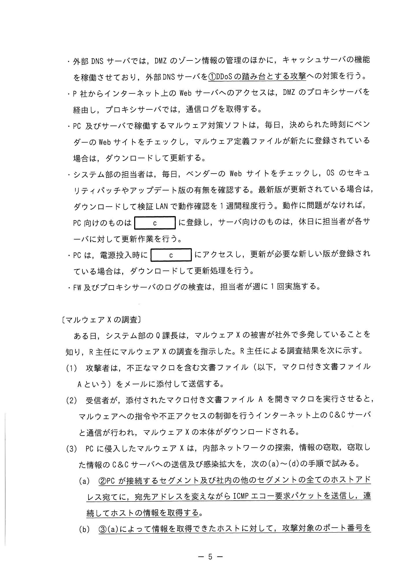

テキスト (OCR)

・ 外部 DNS サーバでは, DMZ のゾーン情報の管理のほかに, キャッシュサーバの機能
を稼働させており, 外部DNS サーバを⑪DDoS の踏み台とする攻撃への対策を行う。
・P 社からインターネット上の Web サーバへのアクセスは, DMZ のプロキシサーバを

経由し, プロキシサーバでは, 通信ログを取得する。

PC 及びサーバで稼働するマルウェア対策ソフトは, 毎日決められた時刻にベン
ダーの Web サイトをチェックし, マルウェア定義ファイルが新たに登録されている
Balt, ダウンロードして更新する。

・システム部の担当者は, 毎日, ベンダーの Web サイトをチェックし, 0S のセキュ
リティパッチやアップデート版の有無を確認する。最新版が更新されている場合は,
ダウンロードして検証 LAN で動作確認を 1 週間程度行う。動作に問題がなければ,
PC 向けのものは|  c | に登録し, サーバ向けのものは, 休日に担当者が各サ
ーバに対して更新作業を行う。

・PC は, 電源投入時に|  c | にアクセスし, 更新が必要な新しい版が登録され
ている場合は, ダウンロードして更新処理を行う。

・FW 及びプロキシサーバのログの検査は, 担当者が週に 1 回実施する。

[マルウェア X の調査
ある日, システム部の 0 課長は, マルウェア X の被害が社外で多発していることを
知り, R 主任にマルウェア X の調査を指示した。R 主任による調査結果を次に示す。
(1) 攻撃者は, 不正なマクロを含む文書ファイル (以下, マクロ付き文書ファイル
A という) をメールに添付して送信する。
(2) 受信者が, 添付されたマクロ付き文書ファイル A を開きマクロを実行させると,
マルウェアへの指令や不正アクセスの制御を行うインターネット上のC&Cサーバ
と通信が行われ, マルウェア X の本体がダウンロードされる。
(3) PC に侵入したマルウェア X ld, 内部ネットワークの探索, ROB, BALL
た情報のC&C サーバへの送信及び感染拡大を, 次の(a)一(d) の手順で試みる。
(a) @PC が接続するセグメント及び社内の他のセグメントの全てのホストアド
レス宛てに, 宛先アドレスを変えながら ICMP エコー要求パケットを送信し, 連
続してホストの情報を取得する。
(b) ⑨③(a)によって情報を取得できたホストに対して, 攻撃対象のポート番号を

ー 5一

### ページ 6

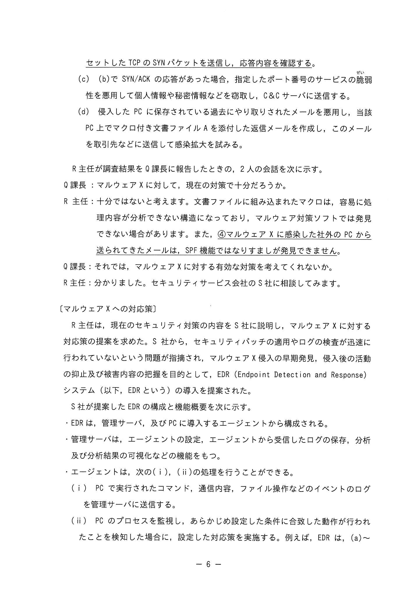

テキスト (OCR)

セットしたTCP の SYN パケットを送信し, 応答内容を確認

(c) (⑫)で SYN/ACK の応答があった場合 指定したポー gece —eaolin
性を悪用して個人情報や秘密情報などを密取し, C&C サーバに送信する。

(d) 侵入した PC に保存されている過去にやり取りされたメールを悪用し, MB
PC 上でマクロ付き文書ファイル A を添付した返信メールを作成し, このメール
を取引先などに送信して感染拡大を試みる。

R 主任が調査結果を 0 課長に報告したときの, 2 人の会話を次に示す。

ORR : マルウェア X に対して, 現在の対策で十分だろうか。

R 主任 : 十分ではないと考えます。 文書ファイルに組み込まれたマクロは, 容易に処
理内容が分析できない構造になかっており, マルウェア対策ソフトでは発見
できない場合があります。また, マルウェア X に感染した社外の PC から
送られてきたメールは, SPF 機能ではなりすましが発見できません。

0 課長 : それでは, マルウェア X に対する有効な対策を者えてくれないか。

REE: 分かりました。セキュリティサービス会社の $ 社に相談してみます。

〔マルウェア X への対応策]

R 主任は, 現在のセキュリティ対策の内容を S 社に説明し, マルウェア X に対する
対応策の提案を求めた。S 社から, セキュリティパッチの適用やログの検査が迅速に
行われていないという問題が指摘され, マルウェア X 侵入の早期発見, 侵入後の活動
の抑止及び被害内容の把握を目的として, EDR (Endpoint Detection and Response)
システム (以下, EDR という) の導入を提案された。

S 社が提案した EDR の構成と機能概要を次に示す。

・EDR は, 管理サーバ, 及びPC に導入するエージェントから構成される。
・ 管理サーバは, エージェントの設定, エージェントから受信したログの保存, 分析
及び分析結果の可視化などの機能をもつ。
・エージェントは, 次の(ji), (ji)の処理を行うことができる。
Ci) PC で実行されたコマンド, 通信内容, ファイル操作などのイベントのログ
を管理サーバに送信する。
(ii) PC のプロセスを監視し, あらかじめ設定した条件に合致した動作が行われ
たことを検知した場合に, 設定した対応策を実施する。例えば, EDR は, (a)~

ー 6 一

### ページ 7

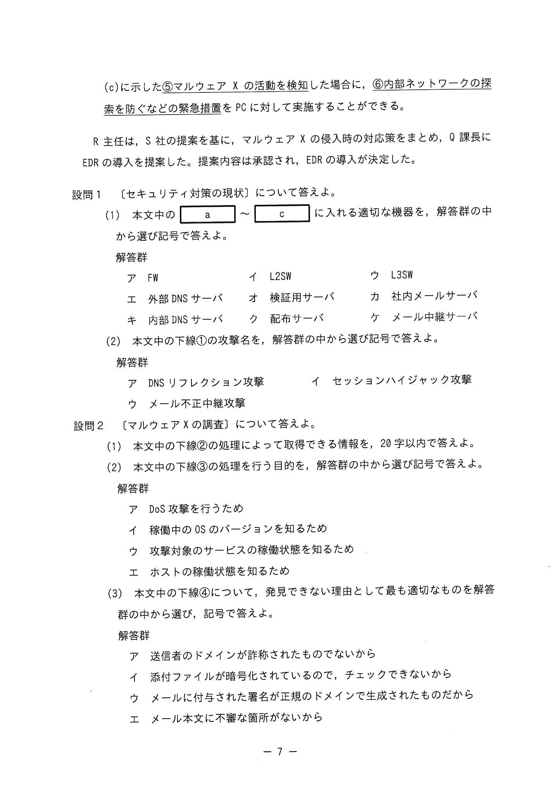

テキスト (OCR)

(c)に示したマルウェア X の活動を検知した場合に, ⑥内部ネットワークの探
素を防ぐなどの緊急措置を PC に対して実施することができる。

R 主任は, S 社の提案を基に, マルウェア X の侵入時の対応策をまとめ, 0 課長に
EDR の導入を提案した。提案内容は承認され, EDR の導入が決定した。

設問1 〔セキュリティ対策の現状)]について答えよ。
(1) 本文中の| a |-| < | に入れる適切な機器を, 解答群の中

から選び記号で答えよ。
解答群
ア FW       イ L2SW      ウ L3SW
エ 外部DNS サーバ  オ 検証用サーバ   pn 社内メールサーバ
キ 内部DNSサーバ ク 配布サーバ   ケ メール中継サーバ
(2) 本文中の下線①の攻撃名を, 解答群の中から選び記号で答えよ。
解答群
ア DNS リフレクション攻撃    イ セッションハイジャック攻撃

ウ メール不正中継攻撃
設問2 〔マルウェアXの調査】について答えよ。
(1) 本文中の下線②の処理によって取得できる情報を, 20 字以内で答えよ。
(2) 本文中の下線③の処理を行う目的を, 解答群の中から選び記号で答えよ。
解答群
ア DoS 攻撃を行うため
稼働中の 05 のバージョンを知るため
攻撃対象のサービスの乏働状態を知るため
ホストの乏働状態を知るため
(3) 本文中の下線について, 発見できない理由と して最も適切なものを解答
群の中から選び, 記号で答えよ。
解答群
ア 送信者のドメインが詐称されたものでないから
イ 添付ファイルが暗号化されているので, チェックできないから
ウ メールに付与された署名が正規のドメインで生成されたものだから
エ メール本文に不審な箇所がないから

Hos ユ

デーィー

### ページ 8

テキスト (OCR)

設問3 〔マルウェア Xへの対応策] について答えよ。
(1) 本文中の下線@について, どのような事象を検知した場合に, マルウェア
X の侵入を疑うことができるのかを, 25 字以内で答えよ。
(2) 本文中の下線@について, 緊急措置の内容を 25 字以内で答えよ。
(3) EDR 導入後にマルウェア X の被害が発生したとき, 被害内容を早期に明ら
かにするために実施すべきことは何か。本文中の字句を用いて 20 FLATS
えよ。

### ページ 9

テキスト (OCR)

C

メ モ 用 紙 J

### ページ 10

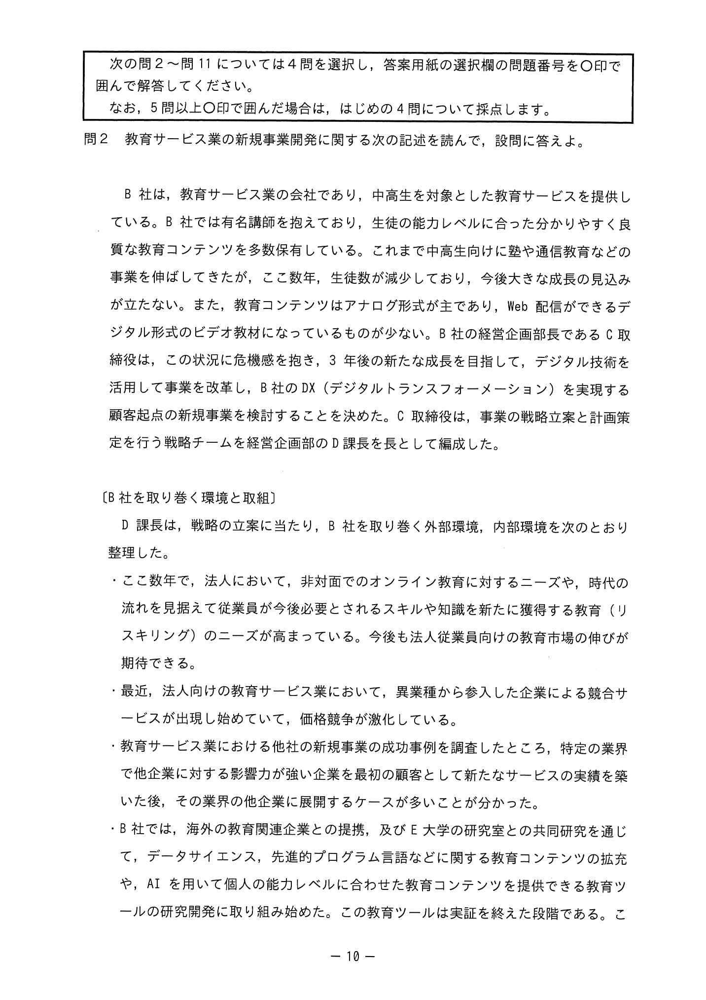

テキスト (OCR)

次の問2一問 11 については4 問を選択し, 答案用紙の選択欄の問題番号を〇印で
囲んで解答してください。
なお, 5 間以上〇印で囲んだ場合は, はじめの 4 問について採点します。

問2 教育サービス業の新規事業開発に関する次の記述を読んで, 設問に答えよ。

B 社は, 教育サービス業の会社であり, 中高生を対象とした教育サービスを提供し
ている。B 社では有名講師を抱えており, 生徒の能力レベルに合った分かりやすく良
質な教育コンテンツを多数保有している。これまで中高生向けに塾や通信教育などの
事業を伸ばしてきたが, COME, 生徒数が減少しており, 今後大きな成長の見込み
が立たない。 また, 教育コンテンツはアナログ形式が主であり, Web 配信ができるデ
ジタル形式のビデオ教材になっているものが少ない。B 社の経営企画部長である CH
締役は, この状況に危機感を抱き, 3 年後の新たな成長を目指して, デジタル技術を
活用して事業を改革し, B 社のDX (デジタルトランスフォーメーション) を実現する
顧客起点の新規事業を検討することを決めた。C 取締役は, 事業の戦略立案と計画策
定を行う戦略チームを経営企画部の D 課長を長として編成した。

〔B 社を取り巻く環境と取組〕

D 課長は, 戦略の立案に当たり, B 社を取り巻く外部環境, 内部環境を次のとおり

整理した。

‘COMET, 法人において, 非対面でのオンライン教育に対するニーズや, 時代の
流れを見据えて従業員が今後必要とされるスキルや知識を新たに獲得する教育 (リ
スキリング) のニーズが高まっている。 今後も法人従業員向けの教育市場の伸びが
期待できる。

・ 最近, 法人向けの教育サービス業において, 異業種から参入した企業による競合サ
ービスが出現し始めていて, 価格競争が激化している。

・ 教育サービス業における他社の新規事業の成功事例を調査したところ, 特定の業界
で他企業に対する影響力が強い企業を最初の顧客として新たなサービスの実績を築
いた後, その業界の他企業に展開するケースが多いことが分かった。

・B 社では, 海外の教育関連企業との提携, 及び E 大学の研究室との共同研究を通じ
て, データサイエンス, 先進的プログラム言語などに関する教育コンテンツの拡充
や, AL を用いて個人の能力レベルに合わせた教育コンテンツを提供できる教育ツ
ールの研究開発に取り組み始めた。この教育ツールは実証を終えた段階である。こ

### ページ 11

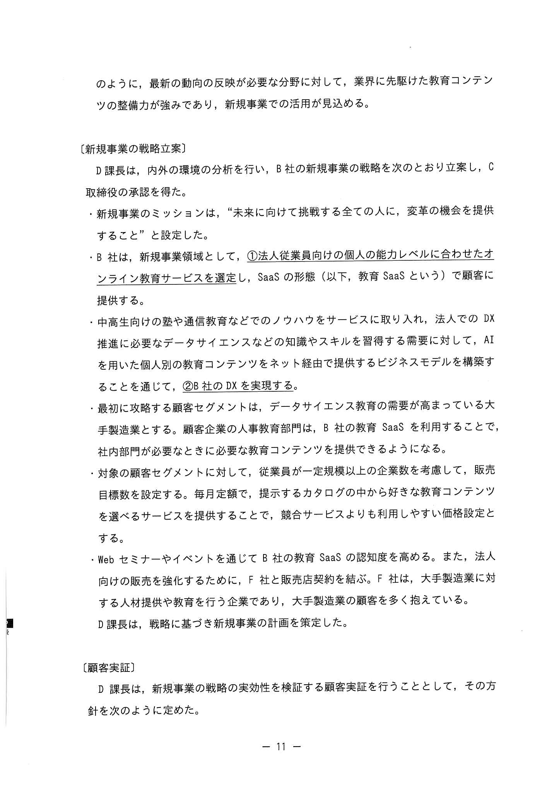

テキスト (OCR)

のように, 最新の動向の反映が必要な分野に対して, 業界に先駆けた教育コンテン
ツの整備力が強みであり, 新規事業での活用が見込める。

[新規事業の戦略立案]
D 課長は, 内外の環境の分析を行い, B 社の新規事業の戦略を次のとおり立案し, C
取締役の承認を得た。

- 新規事業のミッションは, “未来に向けて挑戦する全ての人に, 変革の機会を提供
すること"と設定した。

・B 社は, 新規事業領域として, ①法人従業員向けの個人の能力レベルに合わせたオ
ンライン教育サービスを選定し, SaaS の形態 (以下, WA SaaS という) で顧客に
提供する。

- 中高生向けの塾や通信教育などでのノウハウをサービスに取り入れ, 法人での DX
推進に必要なデータサイエンスなどの知識やスキルを習得する需要に対して, Al
を用いた個人別の教育コンテンツをネット経由で提供するビジネスモデルを構築す
ることを通じて, @②@B 社のDX を実現する。

・ 最初に攻略する顧客セグメントは, データサイエンス教育の需要が高まっている大
手製造業とする。顧客企業の人事教育部門は, B 社の教育 SaaS を利用することで
社内部門が必要なときに必要な教育コンテンツを提供できるようになる。

・ 対象の顧客セグメントに対して, 従業貞が一定規模以上の企業数を考慮して, 販売
目標数を設定する。毎月定額で, 提示するカタログの中から好きな教育コンテンツ
を選べるサービスを提供することで, 競合サービスよりも利用しやすい価格設定と
する。

- Web セミナーやイベントを通じて B 社の教育 SaaS の認知度を高める。また, 法人
向けの販売を強化するために, F 社と販売店契約を結ぶ。F 社は, 大手製造業に対
する人材提供や教育を行う企業であり, 大手製造業の顧客を多く抱えている。

D 課長は, 戦略に基づき新規事業の計画を策定した。

(HRS aE)
D 課長は, 新規事業の戦略の実効性を検証する顧客実証を行うこととして, その方
針を次のように定めた。

### ページ 12

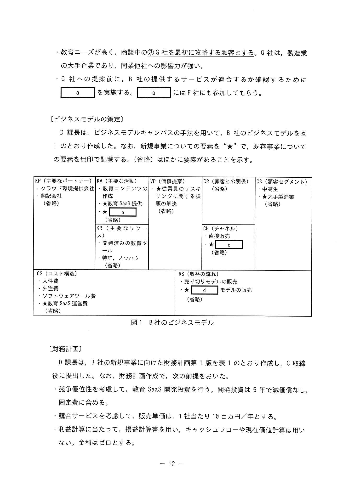

テキスト (OCR)

育ニーズが高く, 商談中の③ G 社を最初に攻略する顧客とする。G 社は, 製造業

の大手企業であり, 同業他社への影響力が強い。

・G 社への提案前に, B 社の提供するサービスが適合するか確認するために

|  』 ] を実施する。|  』 |] にはF社にも参加してもらう。

[ビジネスモデルの策定〕

D 課長は, ビジネスモデルキャンバスの手法を用いて, B 社のビジネスモデルを図
1 のとおり作成した。なお, 新規事業についての要素を “文"” で, 既存事業について

の要素を無印で記載する。 (省略) はほかに要素があることを示す。

KP (主要なパートナー) |KA (主要な活動) |VP (価値提案)     CR (顧客との関係) |CS (顧客セグメント)
・クラウド環境提供会社| ・教育コンテンツの| ・丸従業員のリスキ| (省略)           ・中高生
・ 翻訳会社             作成              リングに関する課                   ・大手製造業
(省略)                  ・ KAU Saas 提供 | 題の解決                                       (省略)
*                  (省略)
(省略)
KR (主要なリソー            CH (チャネル)
ス)                                   ・ 直接販売
・ 開発済みの教育ツ                    ‘ [| < |
ール                                   (省略)
・ 特許, ノウハウ
(省略)
C$ (コスト構造)                                R$ (収益の流れ)
・人件費                                       ・ 売り切りモデルの販売
・ 外注費                                       «(a |] モデルの販売
・ソフトウェアツール費                              (省略)
・ 文教育 SaaS BER
(省略)
図1 B社のビジネスモデル
〔財務計画

D 課長は, B 社の新規事業に向けた財務計画第 1 版を表1 のとおり作成し, C 取締

役に提出した。なお, 財務計画作成で, 次の前提をおいた。

・ 競争優位性を考慮して, 教育 SaaS 開発投資を行う。開発投資は 5 年で減価償却し,
固定費に含める。

・ 競合サービスを考慮して, 販売単価は, 1 社当たり 16 百万円年とする。

・ 利益計算に当たって, 損益計算書を用い, キャッシュフローや現在価値計算は用い
ない。金利はゼロとする。

### ページ 13

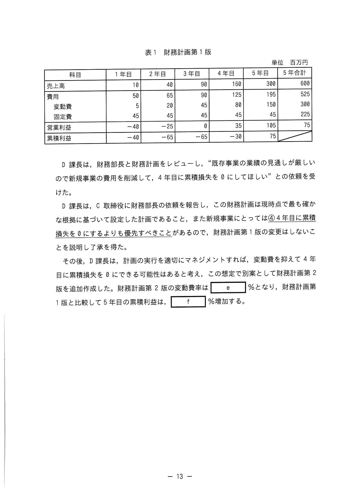

テキスト (OCR)

表1 財務計画第1版

単位 百万円
科目        1 年目    2 年目    3 年目    4 年目    5 年目   5 年合計

売上高                               19             40             90            160            300            600

費                                    50             65             90            125            195            525

変動費                             5             20             45             80            150            300

固定費                            45             45             45             45             45            225

営業利益                         ー40          ー25              9             35            105             75
累積利益             —40     ー65     ー65     —30       75

D 課長は, 財務部長と財務計画をレビューし, “既存事業の業績の見通しが厳しい
ので新規事業の費用を削減して, 4 年目に累積損失を 0 にしてほしい” との依頼を受
けた。

D 課長は,C 取締役に財務部長の依頼を報告し, この財務計画は現時点で最も確か
な根拠に基づいて設定した計画であること, また新規事業にとっては④4 FARM
損失を 0 にするよりも優先すべきことがあるので, 財務計画第 1 版の変更はしないこ
とを説明レイ承を得た。

その後, D 課長は, 計画の実行を適切にマネジメントすれば, 変動費を抑えて 4 年
目に累積損失を 0 にできる可能性はあると考え, この想定で別案として財務計画第 2
版を追加作成した。財務計画第 2 版の変動費率は| se | %となり, 財務計画第

1 版と比較して 5 年目の累積利益は, %増加する。

### ページ 14

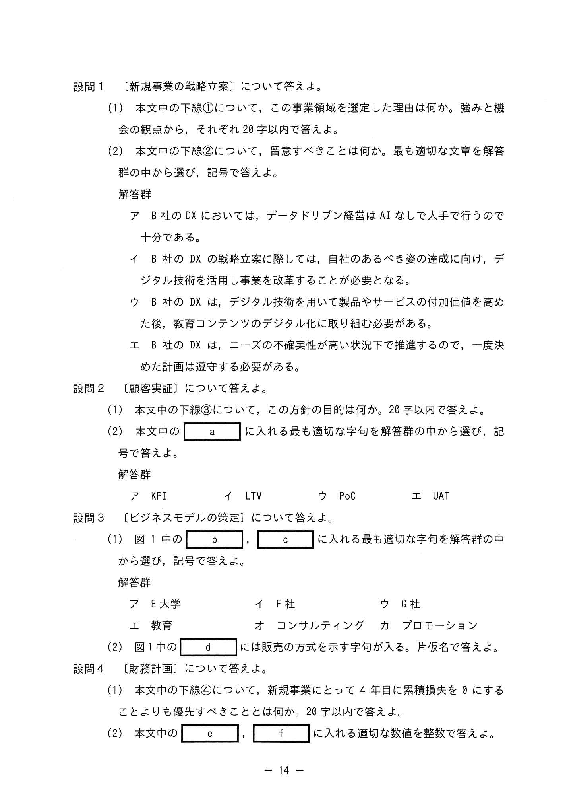

テキスト (OCR)

設問1 [新規事業の戦略立案〕 について答えよ。
(1) 本文中の下線やについて, この事業領域を選定した理由は何か。強みと機
会の観点から, それぞれ 20 字以内で答えよ。
(2) 本文中の下線②について, 留意すべきことは何か。最も適切な文章を解答
群の中から選び, 記号で答えよ。
REE
ア B社のDX においては, データドリブン経営は AI なしで人手で行うので
十分である。
4 B 社の DX の戦略立案に際しては, 自社のあるべき姿の達成に向け,デ
ジタル技術を活用し事業を改革することが必要となる。
ウ BHO DX は, デジタル技術を用いて製品やサービスの付加価値を高め
た後。 教育コンテンツのデジタル化に取り組む必要がある。
エ B 社の DX は, ニーズの不確実性が高い状況下で推進するので, 一度決
めた計画は遵守する必要がある。
設問2 〔顧客実証〕】について答えよ。
(1) 本文中の下線@について, この方針の目的は何か。20 字以内で答えよ。
(2) 本文中の| 。 | に入れる最も適切な字句を解答群の中から選び, 記
号で答えよ。
解答群
ア KPI    イ LTV    ウ Pol    = UAT
設問3 [ビジネスモデルの策定】について答えよ。
(1) 図1中の|  b |,|  c |に入れる最も適切な字句を解答群の中
から選び, 記号で答えよ。
SH
ア E大学       イ Fat        ウ 6社
エ 教育      A コンサルティング hH プロモーション
(2) 図!中の| d | には販売の方式を示す字句が入る。片仮名で答えよ。
設問4 [財務計画] について答えよ。
(1) 本文中の下線@について, 新規事業にとって 4 年目に累積損失を 0 にする
ことよりも優先すべきこととは何か。 29 字以内で答えよ。
(2) 本文中の| ce |,|  f |に入れる適切な数値を整数で答えよ。

### ページ 15

テキスト (OCR)

【

メ モ 用 紙 〕

### ページ 16

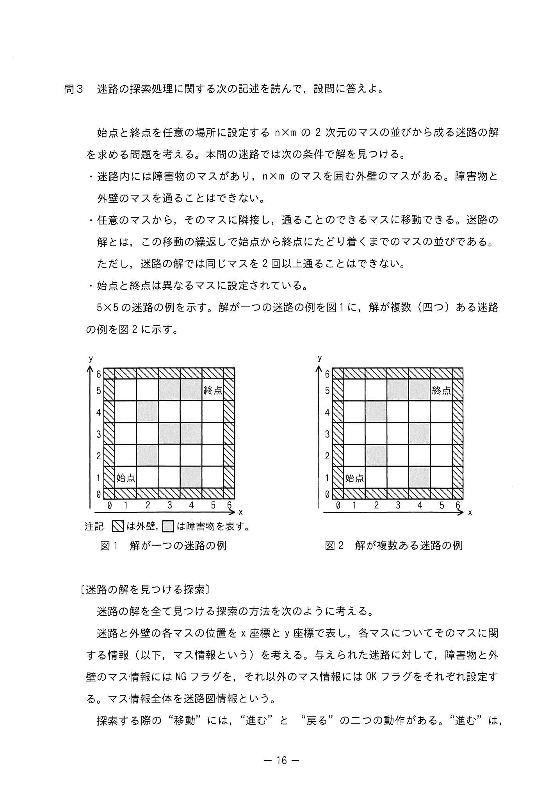

テキスト (OCR)

AS 迷路の探索処理に関する次の記述を読んで, 設問に答えよ。

始点と終点を任意の場所に設定する nXm の 2 次元のマスの並びから成る迷路の解

を求める問題を考える。本問の迷路では次の条件で解を見つける。

・迷路内には障害物のマスがあり, nXm のマスを囲む外壁のマスがある。障害物と
外壁のマスを通ることはできない。

・任意のマスから, そのマスに隣接し, 通ることのできるマスに移動できる。迷路の
解とは, この移動の繰返しで始点から終点にたどり着くまでのマスの並びである。
ただし, 迷路の解では同じマスを 2 回以上通ることはできない。

・始点と終点は異なるマスに設定されている。
5x5 の迷路の例を示す。解がーつの迷路の例を図 1 に, 解が複数 (MD) ある迷路

の例を図 2 に示す。

y                                              4

6      N            6

5         終点         5         終点
4                    4

3                    3

2                    2

1N始点                 1 NN始点

6                   6

9 1 2 3 4 56《        9 1 2 3 4 56.
注記 は外壁, | ]は障害物を表す。

図1 解がーつの迷路の例         図2 解が複数ある迷路の例

〔迷路の解を見つける探索〕

迷路の解を全て見つける探索の方法を次のように考える。

迷路と外壁の各マスの位置を x 座標と y 座標で表し, 各マスについてそのマスに関
する情報 (以下, マス情報という) を考える。与えられた迷路に対して, 障害物と外
壁のマス情報には NG フラグを, それ以外のマス情報には OK フラグをそれぞれ設定す
る。 マス情報全体を迷路図情報という。

探索する除の “移動"には, “進む" と “RS” の二つの動作がある。 “進む"は,

### ページ 17

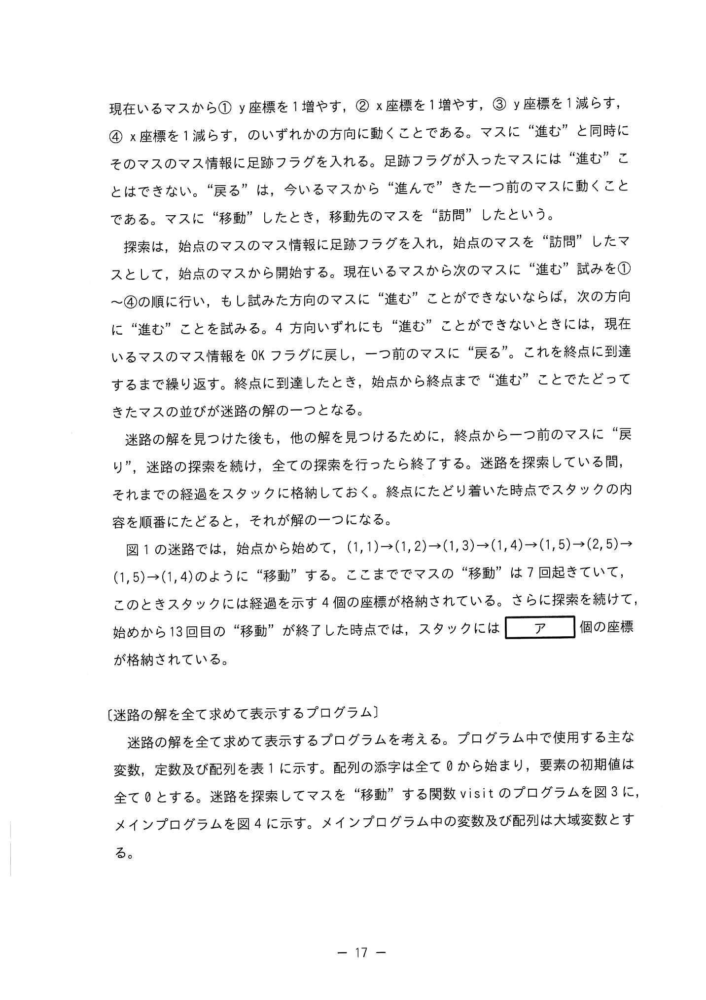

テキスト (OCR)

現在いるマスから① y 座標を 1 増やす, © x 座標を1 増やす, © 座標を 1減らす,
④ x 座標を1減らす, のいずれかの方向に動くことである。マスに“進む” と同時に
そのマスのマス情報に足跡フラグを入れる。足跡フラグが入ったマスには “HD” こ
LI CHR. “RS” ld, 今いるマスから SEAT” きた一つ前のマスに動くこと
である。マスに “BH” したとき, 移動先のマスを “訪問"” したという。

探索は。 始点のマスのマス情報に足跡フラグを入れ, 始点のマスを "訪問" したマ
スとして, 始点のマスから開始する。現在いるマスから次のマスに “HD” 試みを①
ー④の順に行い。 もし試みた方向のマスに “ED” ことができないならば, 次の方向
に“進むお" ことを試みる。 4 方向いずれにも"進む" ことができないときには, 現在
いるマスのマス情報を OK フラグに戻し, 一つ前のマスに "戻る"。これを終点に到達
するまで繰り返す。終点に到達したとき, 始点から終点まで SED” ことでたどって
きたマスの並びが迷路の解のつとなる。

迷路の解を見つけた後も, 他の解を見つけるために, 終点からーつ前のマスに『戻
り”, 迷路の探索を続け, 全ての探索を行ったら終了する。迷路を探索している間,
それまでの経過をスタックに格納しておく。 終点にたどり着いた時点でスタックの内
容を順番にたどると, それが人解のーつになる。

図 1 の迷路では, 始点から始めて, (1.1)っ(1.2)つ(1.3)っ(1のっ(1.5)っ(2.5)つ
(1.5)つ(1,4)のように“移動” する。ここまででマスの “移動" は 7 回起きていて,
このときスタックには経過を示す 4 個の座標が格納されている。さらに探索を続けて,
始めから 13 回目の "移動" が終了した時点では,スタックには | ア |個の座標
が格納されている。

(迷路の解を全て求めて表示するプログラム}

迷路の解を全て求めて表示するプログラムを考える。プログラム中で使用する主な
変数, 定数及び配列を表 1 に示す。配列の添字は全て 6 から始まり, 要素の初期値は
全て 0 とする。迷路を探索してマスを "移動"する関数visit のプログラムを図 3 に,
メインプログラムを図 4 に示す。メインプログラム中の変数及び配列は大域変数とす
る。

### ページ 18

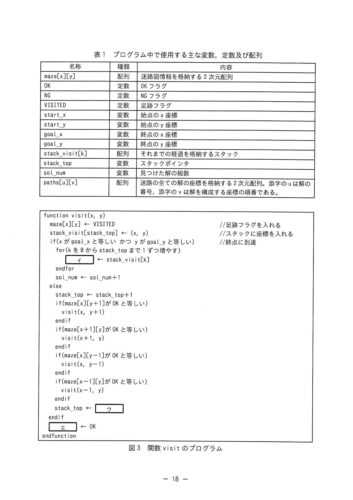

テキスト (OCR)

Rl プログラム中で使用する主な変数, 定数及び配列
名称            種類                               内容
maze[x][y]             配列 | 迷路図情報を格納する 2 次元配列
OK                              定数     OK フラグ
NG                              定数 | NGフラグ
VISITED                定数 | 足跡フラグ
start x                変数 | 始点のx座標
start y                変数 | 始点のy座標
goal_x                 変数 | 終点のx座標
goal_y                 変数 | 終点のy座標
stack_visit[k]         配列 | それまでの経過を格納するスタック
stack_top                 変数 | スタックポインタ
sol_num                  変数 | 見つけた解の総数
paths[u][v]                配列 | 迷路の全ての解の座標を格納する2 次元配列。添字のuは解の

BS, 添字のv は解を構成する座標の順番である。

function visit(x, y)

maze[x][y] < VISITED

stack visit[stack top] と (x, y)
if(x がgoalL_x と等しい かつ y A goal_y ESL)

//足跡フラグを入れる
//スタックに座標を入れる
//終点に到達

for(k を9からstack top まで 1 ずつ増やす)

  < stack visit[k]

endfor

soL num <— sol num十1

else

stack top で stack_top+1
if(maze[x][y十1]が 0K と等しい)

if(maze[x十1][y]が OK と等しい)

visit(x, y+1)
endif

visit(x十1, y)
endif

if(maze[x][yー1]が OK と等しい)

visit(x, yー1)
endif

(maze[x一1][y]が OK と等しい)

visit(x一1, y)
endif

stack top <—

endif

=~ «

endfunction

M3 関数visit のプログラム

### ページ 19

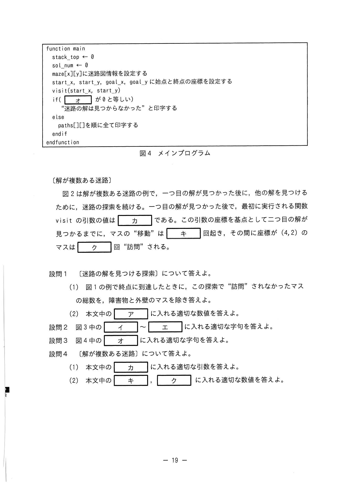

テキスト (OCR)

function main
stack topで09
sol_num <— 0
maze[x][y]に迷路図情報を設定する
start_x, start y, goal_x, goal_y に始点と終点の座標を設定する
visit(start_x, start y)
if( が0 と等しい)
“迷路の解は見つからなかった"と印字する
else
paths[][]を順に全て印字する
endif
endfunction

図4 メインプログラム

(ARABI BABE)

図 2 は解が複数ある迷路の例で, 一つ目の解が見つかった後に, 他の解を見つける
ために, 迷路の探索を続ける。一つ目の解が見つかった後で, 最初に実行される関数
visit の引数の値は| カカ | である。この引数の座標を基点として二つ目の解が
見つかるまでに, マスの “移動"” は| = | 回起き, その間に座標が(4.2) の

マスは 回 “訪問” される。

設問1 [迷路の解を見つける探索〕 について答えよ。
(1) 図1 の例で終点に到達したときに, この探索で “HM” されなかったマス
の総数を, 障害物と外壁のマスを除き答えよ。
(2) 本文中の | ア | に入れる適切な数値を答えよ。

設問2 図3中の| イ |~[ エ |に入れる適切な字句を答えよ。

設問3 図4中の| オ | に入れる適切な字句を答えよ。

設問4 〔解が複数ある迷路】について答えよ。

(1) 本文中の| カ | に入れる適切な引数を答えよ。

(2) 本文中の| キ |,[ ク | に入れる適切な数値を答えよ。

“mM

### ページ 20

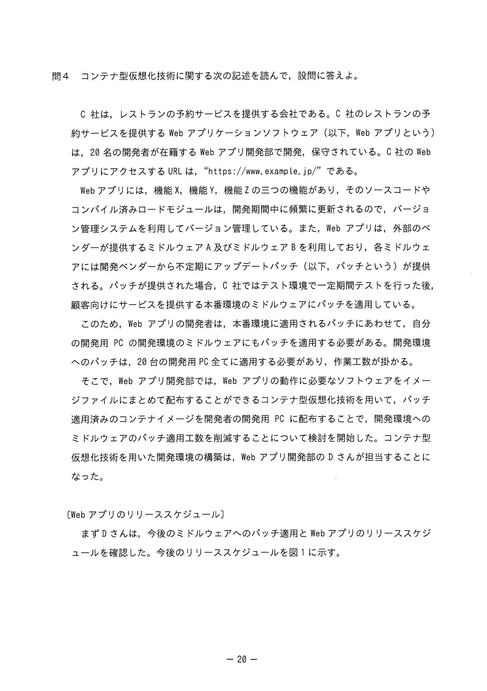

テキスト (OCR)

問4 コンテナ型仮想化技術に関する次の記述を読んで, 設問に答えよ。

C 社は, レストランの予約サービスを提供する会社である。C 社のレストランの予
約サービスを提供する Web アプリケーションソフトウェア (以下, Web アプリという)
は, 20 名の開発者が在籍する Web アプリ開発部で開発, 保守されている。( HO Web
アプリにアクセスする URL は, “https://www. example. jp/” CHS,

Web アプリには, 機能X, 機能Y, 機能7 の三つの機能があり, そのソースコードや
コンパイル済みロードモジュールは, 開発期間中に頻繁に更新されるので, バージョ
ン管理システムを利用してバージョン管理している。また, Web アプリは, 外部のベ
ンダーが提供するミドルウェアA及びミドルウェアBを利用しており, 各ミドルウェ
アには開発ベンダーから不定期にアップデートパッチ (以下, パッチという) が提供
される。 パッチが提供された場合, C 社ではテスト環境で一定期間テストを行った後,
顧客向けにサービスを提供する本番環境のミドルウェアにパッチを適用している。

このため, Web アプリの開発者は, 本番環境に適用されるパッチにあわせて, 自分
の開発用 PC の開発環境のミドルウェアにもパッチを適用する必要がある。 開発環境
へのパッチは, 20 台の開発用 PC 全てに適用する必要があり, 作業工数が掛かる。

そこで, Web アプリ開発部では, Web アプリの動作に必要なソフトウェアをイメー
ジファイルにまとめて配布することができるコンテナ型仮想化技術を用いて, パッチ
適用済みのコンテナイメージを開発者の開発用 PC に配布することで, 開発環境への
ミドルウェアのパッチ適用工数を削減することについて検討を開始した。コンテナ型
仮想化技術を用いた開発環境の構築は, Web アプリ開発部の D さんが担当することに

なった。
Web アプリのリリーススケジュール〕

まず D さんは, 今後のミドルウェアへのパッチ適用と Web アプリのリリーススケジ
ュールを確認した。今後のリリーススケジュールを図 1 に示す。

### ページ 21

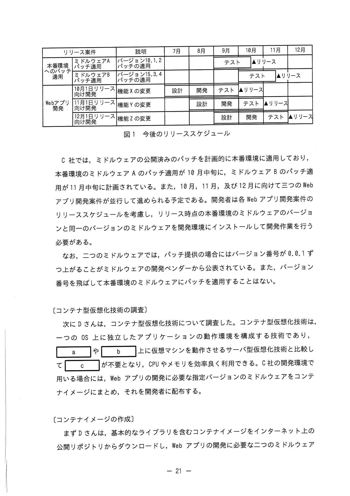

テキスト (OCR)

リリース案件       説明    7月 | 8月 | 9A | A | 1月 | A

へのパッチ

ミドルウェアA  バージョン19.1.2            =
xem | ope |バッチの適用              テスト 1479ー^

ieee | MHEX ose    設計 | 開発 | テスト Aリリース
Nore” abn MRE Y ome        設計 | 開発 | テスト |4リリース
AIST U—2 leet 7 ose            設計 | 開発 | テスト Aリリース

図1 今後のリリーススケジュール

C 社では, ミドルウェアの公開済みのパッチを計画的に本番環境に適用しており,
本番環境のミドルウェア A のパッチ適用が 10 月中旬に, ミドルウェア B のパッチ適
用が 11 月中旬に計画されている。また, 10H, 11 月, 及び 12 月に向けて三つの Web
アプリ開発案件が並行して進められる予定である。 開発者は各 Web アプリ開発案件の
リリーススケジュールを考慮し, リリース時点の本番環境のミドルウェアのバージョ
ンと同一のバージョンのミドルウェアを開発環境にインストールして開発作業を行う
必要がある。

なお, 二つのミドルウェアでは, パッチ提供の場合にはバージョン番号が 0.0.1 ず
つ上がることがミドルウェアの開発ベンダーから公表されている。また, バージョン
番号を飛ばして本番環境のミドルウェアにパッチを適用することはない。

[コンテナ型仮想化技術の調査〕

次に D さんは, コンテナ型仮想化技術について調査した。コンテナ型仮想化技術は,
ーつの 0S 上に独立したアプリケーションの動作環境を構成する技術であり,
| 。 |や| 5 |上に仮想マシンを動作させるサーバ型仮想化技術と比較し
て | < |] が不要となり, CPUやメモリを効率良く利用できる。C 社の開発環境で
用いる場合には, Web アプリの開発に必要な指定バージョンのミドルウェアをコンテ
ナイメージにまとめ, それを開発者に配布する。

[コンテナイメージの作成]
まず D さんは, 基本的なライブラリを含むコンテナイメージをインターネット上の
公開リポジトリからダウンロードし, Web アプリの開発に必要な二つのミドルウェア

### ページ 22

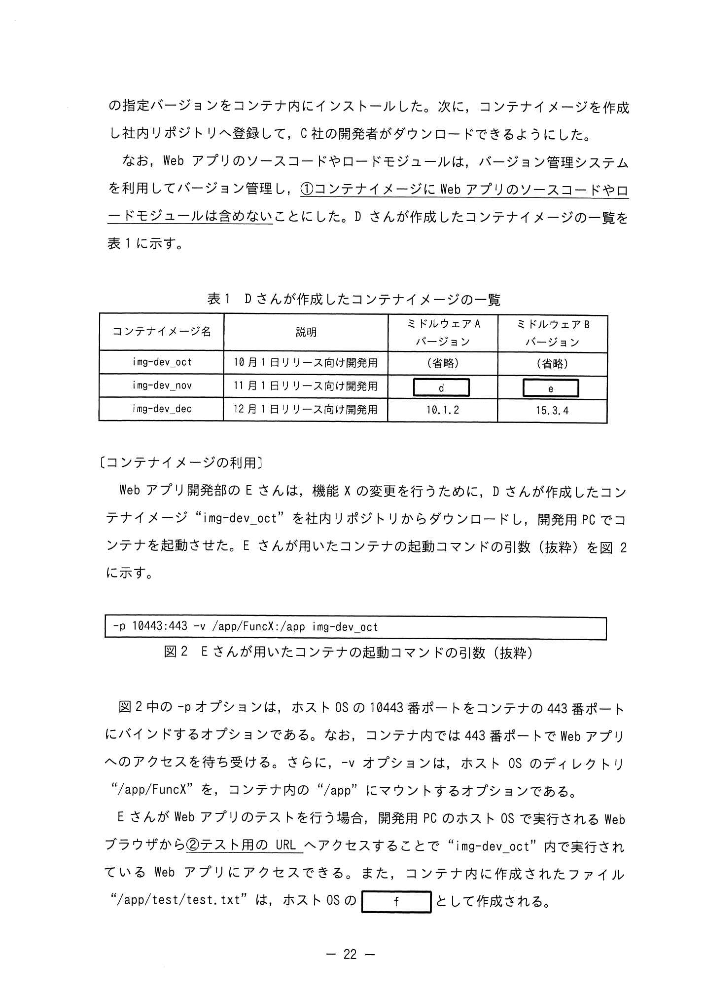

テキスト (OCR)

の指定バージョンをコンテナ内にインストールした。次に, コンテナイメージを作成
し社内リポジトリムへ登録して, C 社の開発者がダウンロードできるようにした。

なお, Web アプリのソースコードやロードモジュールは, バージョン管理システム
を利用してバージョン管理し,。 ①コンテナイメージに Web アプリのソースコードやロ
ードモジュールは含めないことにした。D さんが作成したコンテナイメージの一覧を
表 1 に示す。

表1 Dさんが作成したコンテナイメージの一覧

img-dev_oct       19 月 1 日リリース向け開発用        (省略)            (省略)
img-dev_nov      11 月 1 日リリース向け開発用     L_ s |        Lie J
img-dev_dec       12 月 1 日リリース向け開発用         10.1.2             15.3.4

【コンテナイメージの利用】

Web アプリ開発部の Eさんは, 機能 X の変更を行うために, D さんが作成したコン
テナイメージ “img-dev oct” を社内リポジトリからダウンロードし, 開発用 PC でコ
ンテナを起動させた。E さんが用いたコンテナの起動コマンドの引数 (抜粋) を図 2

に示す。

| -p 10443:443 -v /app/FuncX:/app img-dev_oct                            |
図2 Eさんが用いたコンテナの起動コマンドの引数 (抜粋)

図 2 中の -pオプションは, ホスト OS の 10443 番ポートをコンテナの 443 番ポート
にバインドするオプションである。なお, コンテナ内では 443 番ポートで Web PTY
へのアクセスを待ち受ける。さらに, -v オプションは, RAK OS のディレクトリ
“/app/FuncxX” を, コンテナ内の “/app” にマウントするオプションである。

E さんが Web アプリのテストを行う場合, 開発用 PC のホスト OS で実行される Web
ブラウザから②テスト用の UL へヘアクセスすることで “img-dev_oct” 内で実行され
ている Web アプリにアクセスできる。 また, コンテナ内に作成されたファイル

“/app/test/test.txt” は, ホスト0S の として作成される。

### ページ 23

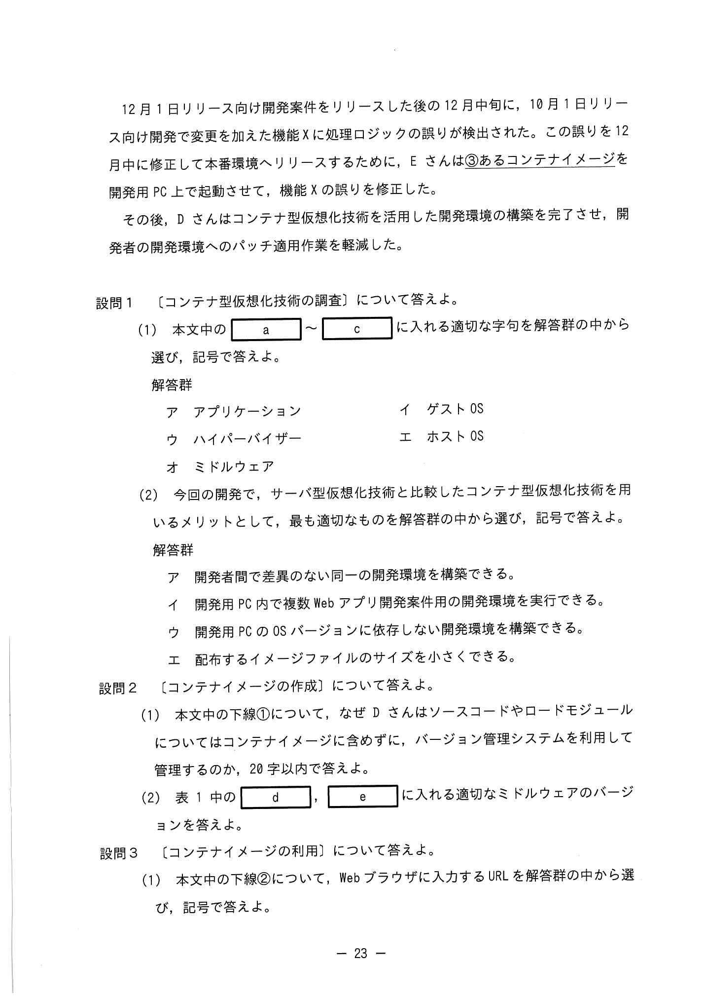

テキスト (OCR)

12 月 1 日リリース向け開発案件をリリースした後の 12 月中旬に, 10月1日リリー
ス向け開発で変更を加えた機能 X に処理ロジックの誤りが検出された。この誤りを12
月中に修正して本番環境ヘリリースするために, E さんは③あるコンテナイメージを
開発用 PC 上で起動させて, 機能 X の誤りを修正した。

その後,D さんはコンテナ型仮想化技術を活用した開発環境の構築を完了させ, 開
発者の開発環境へのパッチ適用作業を軽減した。

設問1 〔コンテナ型仮想化技術の調査] について答えよ。
(1) 本文中の| a |~| < |に入れる適切な字句を解答群の中から

解答群
ア アプリケーション        4 ゲスト 0S
ウ ハイパーバイザー             エ ホスト 0S

オ ミドルウェア
(2) 今回の開発で, サーバ型仮想化技術と比較したコ ンテナ型仮想化技術を用
いるメリットとして, 最も適切なものを解答群の中から選び, 記号で答えよ。
解答群
ア 開発者間で差異のない同一の開発環境を構築できる。
イ 開発用 PC 内で複数 Web アプリ開発案件用の開発環境を実行できる。
ウ 開発用 PC の 05 バージョンに依存しない開発環境を構築できる。
エ 配布するイメージファイルのサイズを小さくできる。
設問2 〔コンテナイメージの作成〕について答えよ。
(1) 本文中の下線①について, なぜ D さんはソースコードやロードモジュール
についてはコンテナイメージに含めずに, バージョン管理システムを利用して
管理するのか, 290 字以内で答えよ。
(2) 表 1 中の| gd | | gs |に入れる適切なミドルウェアのバージ
ョンを答えよ。
設問3 〔コンテナイメージの利用] について答えよ。
(1) 本文中の下線②について, Web ブラウザに入力する URL を解答群の中から選

U, 記号で答えよ。

### ページ 24

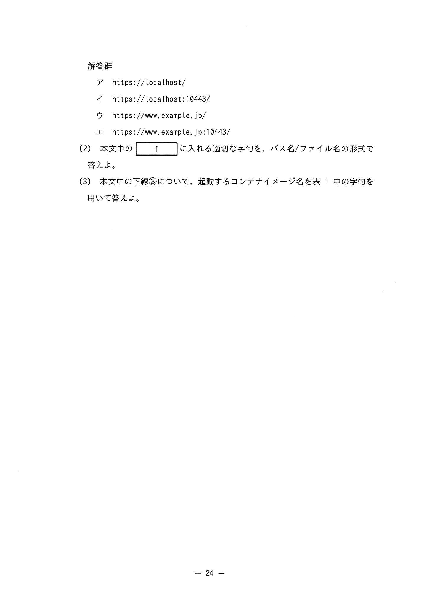

テキスト (OCR)

https://localhost/

に

https://localhost:10443/

NG

https: //www. examp Le. jp/

H

https: //www, example, jp:10443/

(2) 本文中の| f |に入れる適切な字句を, パス名/ファイル名の形式で
答えよ。

(3) 本文中の下線@について, 起動するコンテナイメージ名を表 1 中の字句を
用いて答えよ。

= 24 一

### ページ 25

テキスト (OCR)

C

メ モ 用 紙 J

### ページ 26

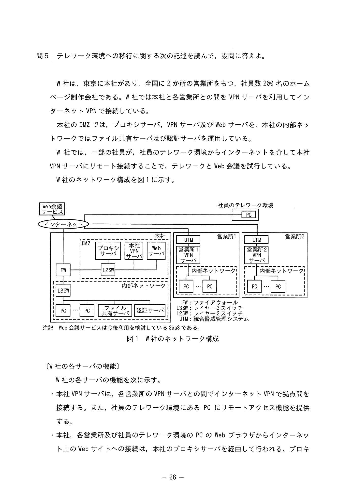

テキスト (OCR)

fAlS テレワーク環境への移行に関する次の記述を読んで, 設問に答えよ。

W 社は, 東京に本社があり, 全国に 2 か所の営業所をもつ, 社員数 209 名のホーム
ページ制作会社である。W 社では本社と各営業所との間を VPN サーバを利用してイン
ターネット VPN で接続している。

本社の DMZ では, プロキシサーバ, VPN サーバ及び Web サーバを, 本社の内部ネッ
トワークではファイル共有サーバ及び認証サーバを運用している。

W 社では, 一部の社員が, 社員のテレワーク環境からインターネットを介して本社
VPN サーバにリモート接続することで, テレワークと Web 会議を試行している。

W社のネットワーク構成を図 1 に示す。

eb会議                                                 社員のテレワーク環境
サービス                                                        Cc]
インターネット
にーー
ーーーーーーーーーーーーーーーー- Ait,  Lew ]    営業所1    UTM      営業所2
iDMZ            末社         i
1      プロキシ           Web |中|営業所 1               営業所2
SI                ot
1         1!                   1      is                    ee
1                               ーーヒーーーーーーーーーーこ   ーーヒーーーーーーーーーーー
本トー     L2SW     |     |  ! | 内部ネットワーク!||「 | 内部ネットワーク!
1                              !                   yt                  1
!                   |!                  1
1                   Wh                  !
1                  NII

注記 Web 会議サービスは今後利用を検討している SaaS である。
図1 W社のネットワーク構成

〔W 社の各サーバの機能]
W 社の各サーバの機能を次に示す。

・本社 VPN サーバは, 各営業所の VPN サーバとの間でインターネット VPN で拠点問を
接続する。 また, 社員のテレワーク環境にある PC にリモートアクセス機能を提供
する。

・本社, 各営業所及び社員のテレワーク環境の PC の Web ブラウザからインターネッ
ト上の Web サイトへの接続は, 本社のプロキシサーバを経由して行われる。プロキ

### ページ 27

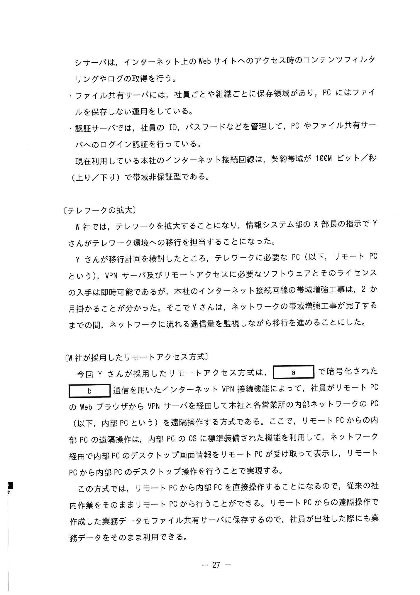

テキスト (OCR)

aa |

シサーバは,インターネット上の Web サイトへのアクセス時のコンテンツフィルタ
リングやログの取得を行う。
・ファイル共有サーバには, 社員ごとや組織ごとに保存領域があり, PC にはファイ
ルを保存しない運用をしている。
・ 認証サーバでは, 社員の ID, パスワードなどを管理して, PC やファイル共有サー
バへのログイン認証を行っている。
現在利用している本社のインターネット接続回線は, 契約帯域が 160M ビットノ秒
(上りノ下り) で帯域非保証型である。

[テレワークの拡大〕

W 社では, テレワークを拡大することになり, 情報システム部の X 部長の指示で Y
さんがテレワーク環境への移行を担当することになった。

Y さんが移行計画を検討したところ, テレワークに必要な PC (以下, リモート PC
EWS), VIN サーバ及びリモートアクセスに必要なソフトウェアとそのライセンス
の入手は即時可能であるが, 本社のインターネット接続回線の帯域増強工事は, 2 か
月掛かることが分かった。そこでYさんは, ネットワークの葵域増強工事が完了する
までの間, ネットワークに流れる通信量を監視しながら移行を進めることに した。

[W 社が採用したリモートアクセス人方式

今回 さんが採用したりリモートアクセス方式は, |  a | で暗号化された
| 5』 |通信を用いたインターネット VPN 接続機能によって, 社員がリモート PC
の Web ブラウザから VN サーバを経由して本社と各営業所の内部ネットワークの PC

(以下, 内部 PC という) を遠隔操作する方式である。ここで, リモート PC からの内
部 PC の遠隔操作は, 内部 PC の OS に標準装備された機能を利用して, ネットワーク
経由で内部 PC のデスクトップ画面情報をリモート PC が受け取って表示し, リモート
PC から内部 PC のデスクトップ操作を行うことで実現する。

この方式では, リモート PC から内部 PC を直接操作することになるので, 従来の社
内作業をそのままリモート PC から行うことができる。リモート PC からの遠隔操作で
作成した業務データもファイル共有サーバに保存するので, 社員が出社した際にも業
務データをそのまま利用できる。

### ページ 28

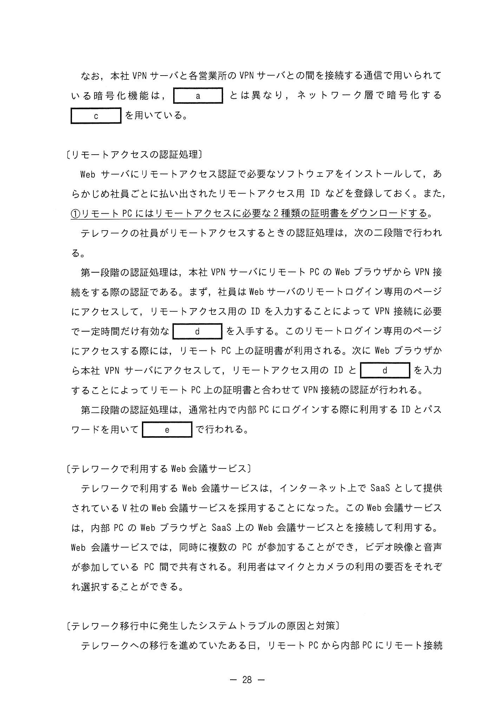

テキスト (OCR)

なお, 本社 VPN サーバと各営業所の VPN サーバとの間を接続する通信で用いられて
いる暗号化機能た, [a | とは異なり, ネットワーク層で暗号化する

[リモートアクセスの認証処理〕

Web サーバにリモートアクセス認証で必要なソフトウェアをインストールして, あ
らかじめ社員ごとに払い出されたリモートアクセス用 ID などを登録しておく。また,
①リモート PC にはリモートアクセスに必要な 2 種類の証明書をダウンロードする。

テレワークの社員がリモートアクセスするときの認証処理は, 次の二段階で行われ
る。

第一段階の認証処理は, 本社 VPN サーバにリモート PC のWeb ブラウザから VPN 接
続をする際の認証である。 まず, 社員は Web サーバのリモートログイン専用のページ
にアクセスして, リモートアクセス用の ID を入力することによって VPN 接続に必要

ー定時間だけ有効な| d | を入手する。このリモートログイン専用のページ
にアクセスする際には, リモート PC 上の証明書が利用される。次に Web ブラウザか
SAA VPN サーバにアクセスして, リモートアクセス用のIDと| d | を入力
することによってリモート PC 上の証明書と合わせて VPN 接続の認証が行われる。

第二段階の認証処理は, 通常社内で内部 PC にログインする際に利用する ID とパス

ワードを用いて|  e | で行われる。

〔テレワークで利用する Web 会議サービス〕

テレワークで利用する Web 会議サービスは, インターネット上で SaaS として提供
されている V 社の Web 会議サービスを採用することになった。この eb 会議サービス
は, 内部 PC の Web ブラウザと SaaS 上の Web 会議サービスとを接続して利用する。
Web 会議サービスでは, 同時に複数の PC が参加することができ, ビデオ映像と音声
が参加している PC 間で共有される。利用者はマイクとカメラの利用の要否をそれぞ
れ選択することができる。

[テレワーク移行中に発生したシステムトラブルの原因と対策]
テレワークへの移行を進めていたある日, リモート PC から内部 PC にリモート接続

### ページ 29

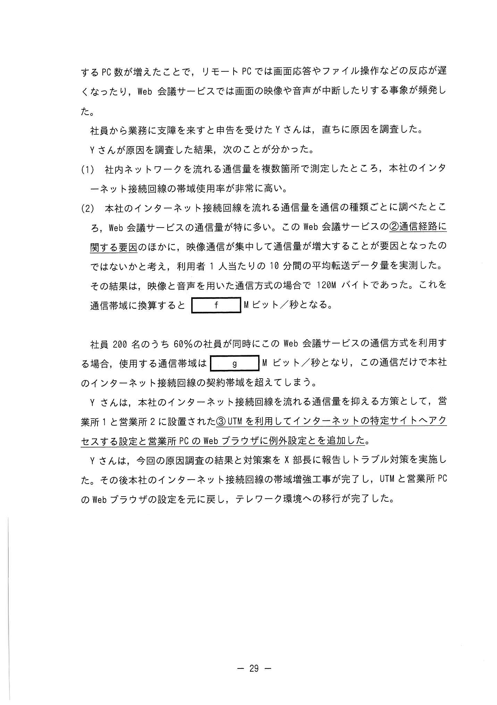

テキスト (OCR)

する PC 数が増えたことで, リモート PC では画面応答やファイル操作などの反応が遅
くなったり, Web 会議サービスでは画面の映像や音声が中断したりする事象が頻発し
た。

社員から業務に支障を来すと申告を受けた Y さんは, 直ちに原因を調査した。

Y さんが原因を調査した結果, 次のことが分かった。

(1) 社内ネットワークを流れる通信量を複数箇所で測定したところ, 本社のインタ
ーネット接続回線の帯域使用率が非常に高い。

(2) 本社のインターネット接続回線を流れる通信量を通信の種類ごとに調べたとこ
ろ, Web 会議サービスの通信量が特に多い。この Web 会議サービスの@通信経路に
関する要因のほかに, 映像通信が集中して通信量が増大することが要因となったの
ではないかと考え, 利用者 1 人当たりの 10 分間の平均転送データ量を実測した。
その結果は, 映像と音声を用いた通信方式の場合で 120W バイトであった。これを

通信帯域に換算すると | f |]ビットノ秒となる。

社員 200 名のうち 609%の社員が同時にこの Web 会議サービスの通信方式を利用す

る場合,使用する通信帯域は | g |W ビットノ秒となり, この通信だけで本社
のインターネット接続回線の契約帯域を超えてしまう。

Y さんは, 本社のインターネット接続回線を流れる通信量を抑える方策として, 営
業所 1 と営業所 2 に設置された③UTM を利用してインターネットの特定サイトヘアク
セスする設定と営業所 PC の Web ブラウザに例外設定とを追加した。

Y さんは, 今回の原因調査の結果と対策案を X 部長に報告しトラブル対策を実施し
た。 その後本社のインターネット接続回線の帯域増強工事が完了し, UTM と営業所 PC
の Web ブラウザの設定を元に戻し, テレワーク環境への移行が完了した。

### ページ 30

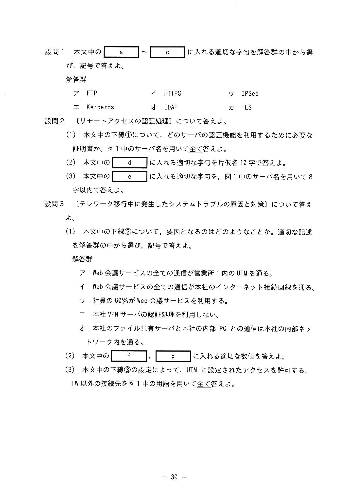

テキスト (OCR)

設問1 本文中の| a |~|  c |に入れる適切な字句を解答群の中から選

U, 記号で答えよ。

解答群
ア FTP                      イ HTTPS                    ウ IPSec
エエ Kerberos           オ LDAP               カ TLS

設問 2 【リモートアクセスの認証処理)について答えよ。
(1) 本文中の下線①について, どのサーバの認証機能を利用するために必要な
証明書か。図 1 中のサーバ名を用いて全て答えよ。
(2) 本文中の| d | に入れる適切な字句を片仮名10字で答えよ。
(3) 本文中の| 。 | に入れる適切な字句を, 図 1 中のサーバ名を用いて8
字以内で答えよ。
設問3 〔テレワーク移行中に発生したシステムトラブルの原因と対策] について答え
cia
(1) 本文中の下線ぢについて, 要因となるのはどのようなことか。適切な記述
を解答群の中から選び, 記号で答えよ。
解答群
ア Web 会議サービスの全ての通信が営業所 1 内の UTM を通る。

イ Web 会議サービスの全ての通信が本社のインターネット接続回線を通る。
ウ 社員の 609%%が Web 会議サービスを利用する。
エ 本社VPM サーバの認証処理を利用しない。
オ 本社のファイル共有サーバと本社の内部 PC との通信は本社の内部ネッ
トワーク内を通る。
(2) 本文中の| Ff |,| 9 |に入れる適切な数値を答えよ。

(3) 本文中の下線③の設定によって, UTM に設定されたアクセスを許可する,
FW 以外の接続先を図 1 中の用語を用いて全て答えよ。

### ページ 31

テキスト (OCR)

〔

x = 用 紙 J

### ページ 32

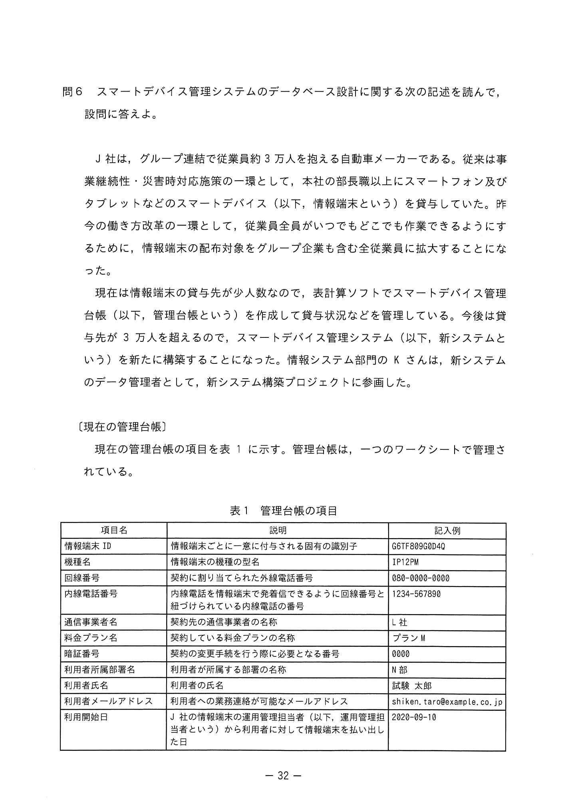

テキスト (OCR)

間6 スマートデバイス管理システムのデータベース設計に関する次の記述を読んで,

設問に答えよ。

J 社は, グループ連結で従業員約 3 万人を抱える自動車メーカーである。 従来は事
業継続性・災害時対応施策の一環として, 本社の部長職以上にスマートフォン及び
タブレットなどのスマートデバイス (以下, 情報端末という) を貸与していた。昨
今の働き方改革の一環として, 従業員全員がいつでもどこでも作業できるようにす
るために, 情報端末の配布対象をグループ企業も含む全従業員に拡大することにな
った。

現在は情報端末の貸与先が少人数なので, 表計算ソフトでスマートデバイス管理
台帳 (以下, 管理台帳という) を作成して貸与状況などを管理している。今後は貸
与先が 3 万人を超えるので, スマートデバイス管理システム (以下, 新システムと
いう) を新たに構築することになった。 情報システム部門の K さんは, 新システム
のデータ管理者として, 新システム構築プロジェクトに参画した。

〔現在の管理台帳]
現在の管理台帳の項目を表 1 に示す。管理台帳は, 一つのワークシートで管理さ
れている。

表1 管理台帳の項目
項目名                  説明                   記入例
情報端末 ID      情報端末ごとに一意に付与される固有の識別子    G6TF809G6D40
機種名         情報端末の機種の型名               IP12PM
回線番号        契約に割り当てられた外線電話番号         080-0000-0000
内線電話番号      内線電話を情報端末で発着信できるように回線番号と | 1234-567890
紐づけられている内線電話の番号
通信事業者名      契約先の通信事業者の名称             L 社
料金プラン名      契約している料金プランの名称           プランlM
暗証番号        契約の変更手続を行う際に必要となる番号      0000
利用者所属部署名    利用者が所属する部署の名称            N部
利用者氏名      利用者の氏名                 試験 太朗
利用者メールアドレス | 利用者への業務連絡が可能なメールアドレス           shiken.taro@example.co.jp
利用開始日         J 社の情報端末の運用管理担当者 (以下, 運用管理担 2020-09-10
当者という) から利用者に対して情報端末を払い出し
た日

### ページ 33

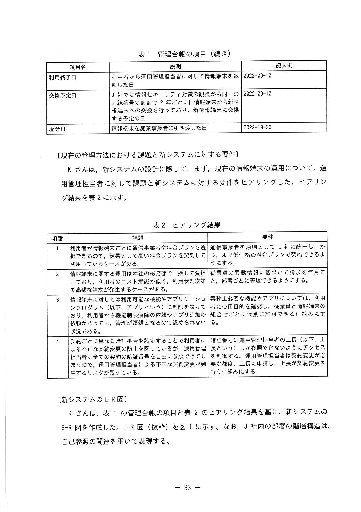

テキスト (OCR)

表1 管理台帳の項目 (続き)
項目名                説明                  記入例
利用終了日      利用者から運用管理担当者に対して情報端末を返 2022-09-10
却した日
交換予定日      」社では情報セキュリティ対策の観点から同一の | 2022-09-10

回線番号のままで 2 年ごとに旧情報端末から新情
報端末への交換を行っており, 新情報端末に交換

する予定の日

廃棄日

情報端末を廃棄事業者に引き渡した日

2022-10-20

[現在の管理方法における課題と新システムに対する要件]

K さんは, 新システムの設計に際して, まず, 現在の情報端末の運用について, 運
用管理担当者に対して課題と新システムに対する要件をヒアリングした。ヒアリン
グ結果を表 2 に示す。

表2 ヒアリング結果

項番

課題

要件

利用者が情報端末ごとに通信事業者や料金プランを選
択できるので, 結果として高い料金プランを契約して
利用しているケースがある。

通信事業者を原則として L 社に統一し, か
つ, より低価格の料金プランで契約できるよ
うにする。

情報端末に関する費用は本社の総務部で一括して負担
しており, 利用者のコスト意識が低く, 利用状況次第
で高額な請求が発生するケースがある。

従業員の異動情報に基づいて請求を年月ご
と, 部署どごとに管理できるようにする。

情報端末に対しては利用可能な機能やアプリケーショ
ンプログラム (以下、アプリという) に制限を設けて
おり, 利用者から機能制限解除の依頼やアプリ追加の
依頼があっても, 管理が如雑となるので認められない
状況である。

業務上必要な機能やアプリについては, 利用
者に使用目的を確認し, 従業員と情報端末の
組合せごとに個別に許可できる仕組みにす
る。

契約ごとに異なる暗証番号を設定することで利用者に
よる不正な契約変更の防止を図っているが, 運用管理
担当者は全ての契約の暗証番号を自由に参照できてし
まうので, 運用管理担当者による不正な契約変更が発

生するリスクが残っている。

暗証番号は運用管理担当者の上長 (以下, 上
長という) しか参照できないようにアクセス
を制御する。運用管理担当者は契約変更が必
要な都度, 上長に申請し, 上長が契約変更を
行う仕組みにする。

〔新システムの E-R A)
K さんは, 表 1 の管理台帳の項目と表 2 のヒアリング結果を基に, 新システムの

E-R 図を作成した。E-R 図 (抜粋) を図 1 に示す。なお, J 社内の部署の階層構造は,
自己参照の関連を用いて表現する。

### ページ 34

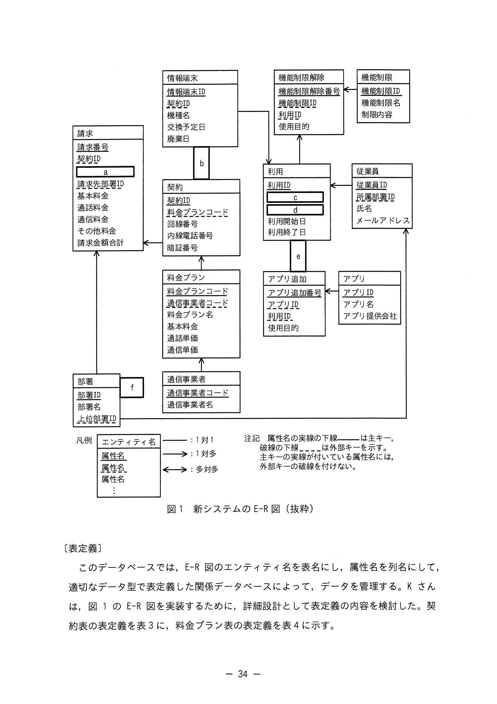

テキスト (OCR)

情報端末                  機能制限解除        機能制限
情報端末D         機能制限解除番号 ドー] 機能制限D
契約DD           携能制限D     機能制限名
機種名            利用D        制限内容
          交換予定日         使用目的
re         BER
請求番号
BHD                      5
Coa                              利用                従業員
利用D      従業員TD
L_ c |       所属部署D
に |x
en                                               利用開始日               メールアドレス
      内線電放番号       利用終了日
ail   a      暗証番号
人                     6
料金プラン              アプリ追加        アプリ
料金プランコード        アプリ追加番号 | アプリD
通信事業者コード         アプリ1D          アプリ名
料金プラン名                      利用ID                     アプリ提供会社
基本料金                使用目的
通話単価
通信単価
1
es         通信事業者
em 1       通信事業者コード
部署名               通信事業者名
土笠部署ID
RL Al  yay =  ーー 18   SER   DRARO Fk    ーー
ig 中    Tt    TE BOTA. は外部キーをぶす。
属性名    ーー : 1対多     主キーの実線が付いている属性名には,
属性名         <> : 多対多           外部キーの破線を付けない。
属性名
図1 新システムのE-R図 (抜粋)
(RES)

このデータベースでは, ER 図のエンティティ名を表名にし, 属性名を列名にして,
適切なデータ型で表定義した関係データベースによって, データを管理する。K さん
lt, 図 1 のE-R 図を実装するために, 詳細

約表の表定義を表 3 に, 料金プラン表の表定義を表 4 に示す。

設計として表定義の内容を検討した。契

### ページ 35

テキスト (OCR)

表 3 及び表 4 のデータ型欄には, 適切なデータ型, 適切な長さ, WE, 位取りを
記入する。PK 欄は主キー制約, UK 欄は UNIQUE 制約, 非 NULL 欄は非 NULL 制約の指
定をするかどうかを記入する。指定する場合には Y を, 指定しない場合には N を記
入する。ただし, 主キーに対しては UNIQUE 制約を指定せず, 非 NULL 制約は指定す

るものとする。
表3 契約表の表定義
項番| We   データ型  PK | UK |非NULL| 初期値 | アクセス制御    その他の指定内容
1 |契約ID | CHAR(8)  CJ |    上長 (ユーザ| (省略)
ーアカウント
名 : ADMIN) に
よる参照が必
要
2 | 料金プラ|CHAR(8)    N  N   Y              料金プラン表への外部キー
yack
3 | 回線番号 | CHAR(13)   N  N  Y           (省略)
4 |内線電話| CHAR(11)   N  N  N  NULL       (省略)
番号
5 | 暗証番号 | CHAR(4)   N  N  Y     上長 (ユーザ| (省略)
ーアカウント
名 : ADMIN) に
よる参照が必
要
表4 料金プラン表の表定義
項番| WA   データ型  PK | UK | 非NULL| 初期値 | アクセス制御    その他の指定内容
1 | 料金プラ|CHAR(8)   CJ 豆|            (省略)
ジジコー
2 |通信事業| CHAR(4)    N  N   Y  1234         通信事業者表への外部キー。
者コード                             行挿入時に, 初期値としてし
社の通信事業者コード'1234'
を設定する。
3 |料金プラ|VARCHAR(39) | N  N  Y             (省略)
ン名
4 |基本料金 DECIMAL(5, 0)] N  N   Y             (省略)
5 |通話単価 | DECIMAL(5,2)| N  N  Y            (省略)
6 |通信単価 | DECIMAL(5,4)| N  N   Y               (省略)
[表の作成とアクセス制御〕

K さんは, 実装に必要な各種 SQL 文を表定義に基づいて作成した。表3 のアクセス

### ページ 36

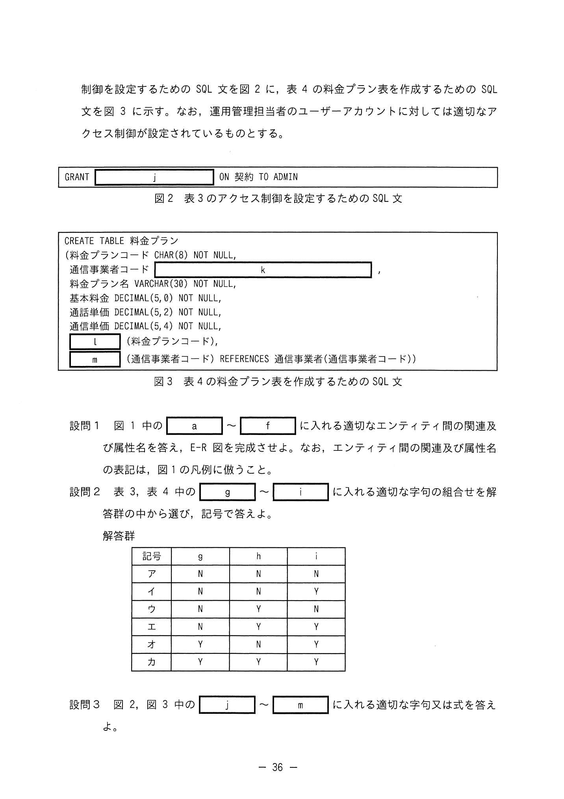

テキスト (OCR)

制御を設定するための SQL 文を図 2 に, 表 4 の料金プラン表を作成するための SQL
文を図 3 に示す。なお, 運用管理担当者のユーザーアカウントに対しては適切なア
クセス制御が設定されているものとする。

GRANT |          j          | ON 3249 TO ADMIN

 2 表3のアクセス制御を設定するための SQL 文

CREATE TABLE 料金プラン
(料金プランコード CHAR(8) NOT NULL,
通信事業者コード |
料金プラン名 VARCHAR(30) NOT NULL,

基本料金 DECIMAL(5, 0) NOT NULL,

通話単価 DECIMAL(5, 2) NOT NULL,

通信単価 DECIMAL(5, 4) NOT NULL,

[| (料金プランコード),

|   m   | (通信事業者コード) REFERENCES 通信事業者(通信事業者コード))

レコ

図3 表4の料金プラン表を作成するための SLX

設問 1 1 中の| a |一| f |に入れる適切なエンティティ間の関連及
び属性名を答え, ER 図を完成させよ。なお, エンティティ間の関連及び属性名
の表記は, 図 1 の凡例に信うこと。

設問2 表3, 表4中の|  g |一| i |に入れる適切な字旬の組合せを解
答群の中から選び, 記号で答えよ。
解答群
記号    9      h      i
x     N      N      N
4     N      N      Y
ie)     N      ¥      N
エ     N      Y
オ     Y      N      Y
カ     Y      Y

設問3 図2,図3中の| 」 |~[ nm | に入れる適切な字句又は式を答え
ま。

### ページ 37

テキスト (OCR)

〔

メ モ 用 紙

ー 37 一

### ページ 38

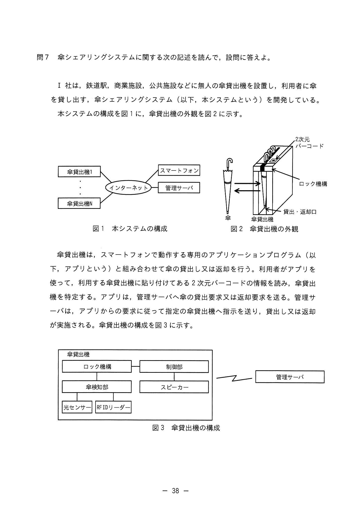

テキスト (OCR)

間7 奉シェアリングシステムに関する次の記述を読んで, 設問に答えよ。

I 社は, 鉄道駅, 商業施設, 公共施設などに無人の傘貸出機を設置し, 利用者に傘
を貸し出す, 人共シェアリングシステム (以下, 本システムという) を開発している。
本システムの構成を図 1 に, 傘貸出機の外観を図 2 に示す。

2次元
パーコード
ーー              ロック機構
<
貸出・返却品
x    奏貸出機
図1 本システムの構成         図2 傘貸出機の外観

傘貸出機は. スマートフォンで動作する専用のアプリケーションプログラム (以
下, アプリという) と組み合わせて傘の貸出し又は返却を行う。利用者がアプリを
使って, 利用する傘貸出機に貼り付けてある 2 次元バーコードの情報を読み, 傘貸出
機を特定する。アプリは, 管理サーバへ傘の貸出要求又は返却要求を送る。管理サ
ーバは, アプリからの要求に従って指定の傘貸出機へ指示を送り, 貸出し又は返却
が実施される。傘貸出機の構成を図 3 に示す。

aa
Oy 78H          snes
             |       ーーー    管理サーバ
傘栓和部      | 。 ぇピーカー
|                |
光センサー| |RFIDリーダー|

図3 傘貸出機の構成

### ページ 39

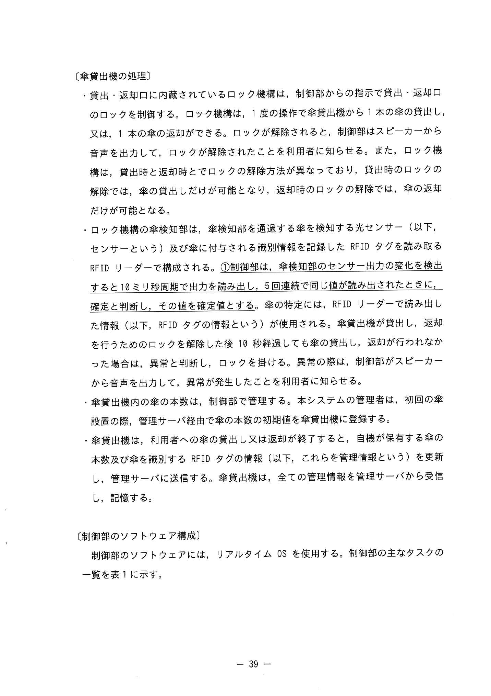

テキスト (OCR)

【傘貸出機の処理

・ 貸出・返却口に内蔵されているロック機構は, 制御部からの指示で貸出・返却品
のロックを制御する。ロック機構は, 1 度の操作で傘貸出機から 1 本の傘の貸出し
Mit, 1 本の傘の返却ができる。ロックが解除されると, 制御部はスピーカーから
音声を出力して, ロックが解除されたことを利用者に知らせる。また, ロック機
構は, 貸出時と返却時とでロックの解除方法が異なっており, 貸出時のロックの
解除では, 傘の貸出しだけが可能となり, 返却時のロックの解除では, 傘の返却
だけが可能となる。

-ロック機構の傘検知部は, 傘検知部を通過する卒を検知する光センサー (以下,
センサーという) 及び傘に付与される識別情報を記録した RFID タグを読み取る
RFID リーダーで構成される。①制御部は, 傘検知部のセンサー出力の変化を検出
すると10 ミリ秒周期で出力を読み出し, 5回連続で同じ値が読み出されたときに,
確定と判断し, その値を確定値とする。傘の特定には, RID リーダーで読み出し
た情報 (以下, RFID タグの情報という) が使用される。傘貸出機が貸出し, 返却
を行うためのロックを解除した後 10 秒経過しても卒の貸出し, 返却が行われなか
った場合は, 異常と判断し, ロックを掛ける。異常の際は, 制御部がスピーカー
から音声を出力して, 異常が発生したことを利用者に知らせる。

・傘貸出機内の傘の本数は, 制御部で管理する。本システムの管理者は, 初回の傘
設置の際, 管理サーバ経由で傘の本数の初期値を傘貸出機に登録する。

・傘貸出機は, 利用者への傘の貸出し又は返却が終了すると, 自機が保有する傘の
本数及び傘を識別する RFID タグの情報(以下, これらを管理情報という) を更新
し, 管理サーバに送信する。傘貸出機は, 全ての管理情報を管理サーバから受信
し, 記憶する。

[制御部のソフトウェア構成]
制御部のソフトウェアには, リアルタイム OS を使用する。制御部の主なタスクの
一覧を表 1 に示す。

### ページ 40

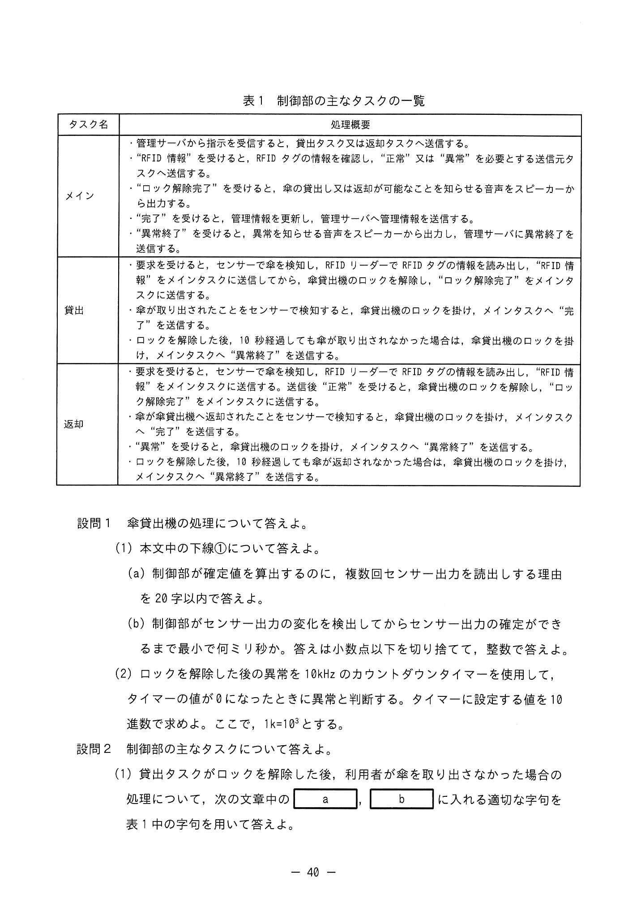

テキスト (OCR)

表1 制御部の主なタスクの一覧

タスク名                             処理概要
・ 管理サーバから指示を受信すると, 貸出タスク又は返却タスクへ送信する。
“RFID 情報" を受けると, RFID タグの情報を確認し, "正常" 又は “異常” を必要とする送信元タ
スクへ送信する。

メイッ     ・“ロック解除完了” を受けると, 卒の貸出し又は返却が可能なことを知らせる音声をスピーカーか
ら出力する。
“ST” を受けると, 管理情報を更新し, 管理サーバへ管理情報を送信する。
・『異常終了" を受けると, 異常を知らせる音声をスピーカーから出力し, 管理サーバに異常終了を
送信する。
・要求を受けると, センサーで傘を検知し, RFID リーダーで RFID タグの情報を読み出し, “RFID 情
報" をメインタスクに送信してから, 卒貸出機のロックを解除し, "ロック解除完了” をメインタ
スクに送信する。

貸出      ・傘が取り出されたことをセンサーで検知すると, 傘貸出機のロックを掛け。 メインタスクへ "完
了"” を送信する。
・ロックを解除した後, 10 秒経過しても卒が取り出されなかった場合は, 傘貸出機のロックを掛
け, メインタスクへ 異常終了” を送信する。
・要求を受けると, センサーで傘を検知し, RFID リーダーで RFID タグの情報を読み出し, “RFID 情
報" をメインタスクに送信する。送信後 “EM” を受けると, 座貸出機のロックを解除し, "ロッ
ク解除完了"” をメインタスクに送信する。

、       ・卒が傘貸出機へ返却されたことをセンサーで検知すると, 傘貸出機のロックを掛け,、 メインタスク

返却         ae
へ “完了"を送信する。
・『異常" を受けると, 傘貸出機のロックを掛け, メインタスクへ "異常終了” を送信する。
・ロックを解除した後, 19 秒経過しても傘が返却されなかった場合は, 傘貸出機のロックを掛け,
メインタスクへ “異常終了” を送信する。

設問1 傘貸出機の処理について答えよ。

(1) 本文中の下線のについて答えよ。
(a) 制御部が確定値を算出するのに, 複数回センサー出力を読出しする理由
を 29 字以内で答えよ。
(b) 制御部がセンサー出力の変化を検出してからセンサー出力の確定ができ
るまで最小で何ミリ秒か。答えは小数点以下を切り捨てて, 整数で答えよ。
(2) ロックを解除した後の異常を 19kHz のカウントダウンタイマーを使用して,
タイマーの値が9になったときに異常と判断する。 タイマーに設定する値を19
進数で求めよ。ここで, 1k=10?とする。

設問2 制御部の主なタスクについて答えよ。

(1) 貸出タスクがロックを解除した後, 利用者が傘を取り出さなかった場合の
処理について, 次の文章中の| a |, |  b |に入れる適切な字句を
表 1 中の字句を用いて答えよ。

### ページ 41

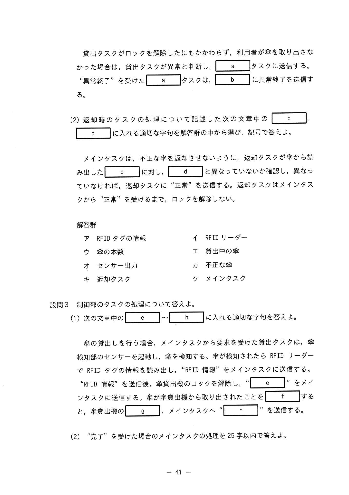

テキスト (OCR)

貸出タスクがロックを解除したにもかかわらず, 利用者が傘を取り出さな

かった場合は, 貸出タスクが異常と判断し,| 。 |タスクに送信する。
“異常終了” を受けた| a |タスクは, | b | に異常終了を送信す
る。

(2) 返却時のタスクの処理について記述した次の文章中の| c |

| 3 | に入れる適切な字句を解答群の中から選び, 記号で答えよ。

ml

メインタスクは, 不正な傘を返却させないように, 返却タスクが傘から読
み出した|  c |に対し,| gd | と異なっていないか確認し, 異なっ
ていなければ, 返却タスクに『正常" を送信する。 返却タスクはメインタス
クから "正常” を受けるまで, ロックを解除しない。

解答群

ア RFID タグの情報      4 RFID リーダー
ウ BOAR          エ 貸出中の傘
A センサー出力        A 不正な傘

キ 返却タスク       ク メインタスク

設問3 制御部のタスクの処理について答えよ。
(1) 次の文章中の| es |-| _h |に入れる適切な字句を答えよ。

傘の貸出しを行う 場合,メインタスクから要求を受けた貸出タスクは, 傘
検知部のセンサーを起動し, 傘を検知する。傘が検知されたら RFID リーダー
で RFID タグの情報を読み出し, “RFID 情報" をメインタスクに送信する。
“REID WR” を送信後, 傘貸出機のロックを解除し“| se |”をメイィ
ンタスクに送信する。傘が傘貸出機から取り出されたことを| fF |する
と, 傘貸出機の[| g |, メインタスクへ “| h | ” を送信する。

(2) “完了” を受けた場合のメインタスクの処理を 25 字以内で答えよ。

### ページ 42

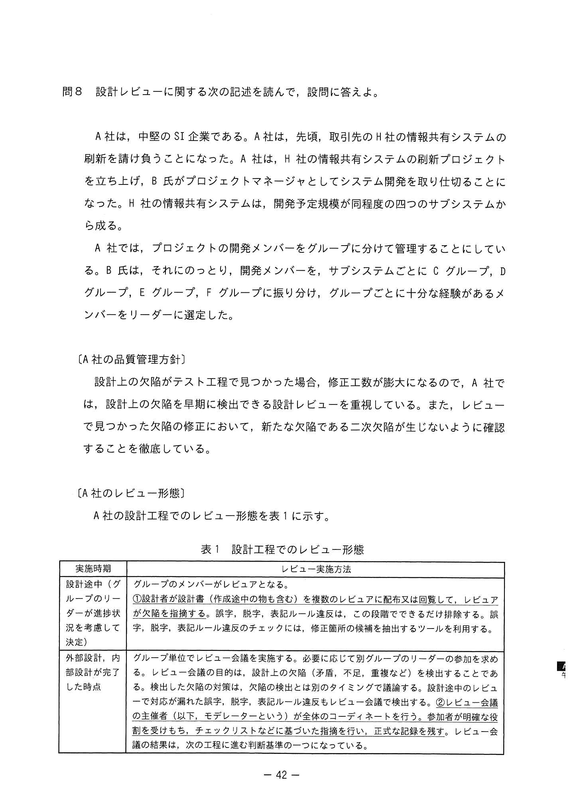

テキスト (OCR)

間8 設計レビューに関する次の記述を読んで, 設問に答えよ。

A 社は, PEO SI 企業である。A 社は, 先頃, 取引先のH 社の情報共有システムの
刷新を請け負うことになった。A 社は, H 社の情報共有システムの刷新プロジェクト
を立ち上げ, B 氏がプロジェクトマネージャとしてシステム開発を取り仕切ることに
なった。H 社の情報共有システムは, 開発予定規模が同程度の四つのサブシステムか
ら成る。

A 社では, プロジェクトの開発メンバーをグループに分けて管理することにしてい
る。B 氏は, それにのっとり, 開発メンバーを, サブシステムごとに C グループ, D
ンー
ンバーをリーダーに選定した。

(A 社の品質管理方針〕
設計上の欠陥がテスト工程で見つかった場合, 修正工数が膨大になるので, A 社で
は, 設計上の欠陥を早期に検出できる設計レビューを重視している。また, レビュー
で見つかった欠陥の修正において, 新たな欠陥である二次欠陥が生じないように確認
することを徹底している。

〔A 社のレビュー形態]
A 社の設計工程でのレビュー形態を表 1 に示す。

表1 設計工程でのレビュー形態

実施時其                                レビュー実施方法

設計途中 (7
ループのリー
ダーが進捗状
況を考慮して
決定)

グループのメンバーがレビュアとなる。

①設計者が設計書 (作成途中の物も含む) を複数のレビュアに配布又は回覧して, レビュア
が欠陥を指摘する。誤字, 脱字, 表記ルール達反は, この段階でできるだけ排除する。誤
字, 脱字, 表記ルール違反のチェックには, 修正箇所の候補を抽出するツールを利用する。

外部設計 内
部設計が完了
した時点

グループ単位でレビュー会議を実施する。必要に応じて別グループのリーダーの参加を求め
る。 レビュー会議の目的は, 設計上の欠陥 (矛盾, FE, 重複など) を検出することであ
Bo 検出した欠陥の対策は, 欠陥の検出とは別のタイミングで議論する。設計途中のレビュ
ーで対応が漏れた誤字, 脱字, 表記ルール培反もレビュー会議で検出する。②レビュー会議
の主催者 (以下 モデレーターという) が全体のコーディネートを行う。参加者が明確な役
割を受けもち, チェックリストなどに基づいた指摘を行い, 正式な記録を残す。レビュー
議の結果は, 次の工程に進む判断基準の一つになっている。

a |

### ページ 43

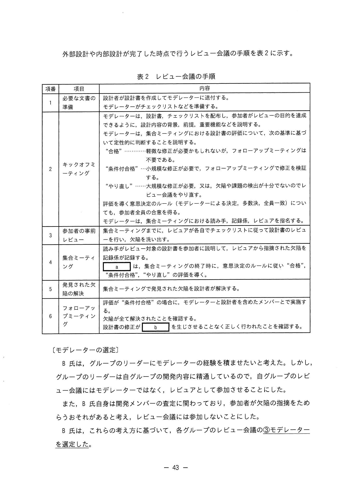

テキスト (OCR)

部設計や内部設計が完了した時点で行うレビュー会議の手順を表 2 に示す。

表2 レビュー会議の手順

項番    項目                         内容
| | 必要な文書の | 設計者が設計春を作成してモデレーターに送付する。
準備       モデレーターがチェックリストなどを準備する。
モデレーターは, 設計書, チェックリストを配布し, 参加者がレビューの目的を達成
できるように, 設計内容の背景, 前提 重要機能などを説明する。
モデレーターは, 集合ミーティングにおける設計書の評価について, 次の基準に基づ
いて定性的に判断することを説明する。
"合格" ・   …:軽微な修正が必要かもしれないが, フォローアップミーティングは
キックオフミ | 。 で22。            ーー          _-
2  ーティング    条件付合格 ee
"やり直し" ……NE E, 又は 欠陥や課題の検出が十分でないのでレ
会議をやり直す。
8 Neくんール (モデレーターによる決定多数決,全員一致) につい
ても, 参加者全員の合意を得る。
モデレーターは, 集合ミーティングにおける読み手, 記録係,レビュアを指名する。
i  参加者の事前 | 集合ミーティングまでに, レビュアが各自でチェックリストに従って設計書のレビュ
レビュー   ーを行い, 欠陥を洗い出す。
読み手がレビュー対象の設計書を参加者に説明して, レビュアから指摘された欠陥を
。 | 集合ミーティ | 記録作が記録する。
ング           は, 集合ミーティングの終了時に, 意思決定のルールに従い“合格",
“RES”, “やり直し"の評価を導く。
5  oa  集合ミーティングで発見された欠陥を設計者が解決する。
評価が "条件付合格” の場合に. モデレーターと設計者を含めたメンバーとで実施す
みオローアw  る。
6 | プミーティン | 欠陥が全て解決されたことを確認する。
の        設計書の修正が| 5 | を生じさせることなく正しく行われたととを確認する。

〔モデレーターの選定]

B 氏は, グループのリーダーにモデレーターの経験を積ませたいと考えた。しかし
グループのリーダーは自グループの開発内容に精通しているので, 自グループのレビ

ー会議にはモデレーターではなく, レビュアとして参加させることにした。

また, B 氏自身は開発メンバーの査定に関わっており, 参加者が欠陥の指摘をため
らうおそれがあると考え, レビュー会議には参加しないことにした。

B 氏は, これらの考え方に基づいて, 各グループのレビュー会議のモデレーター

を選定した。

### ページ 44

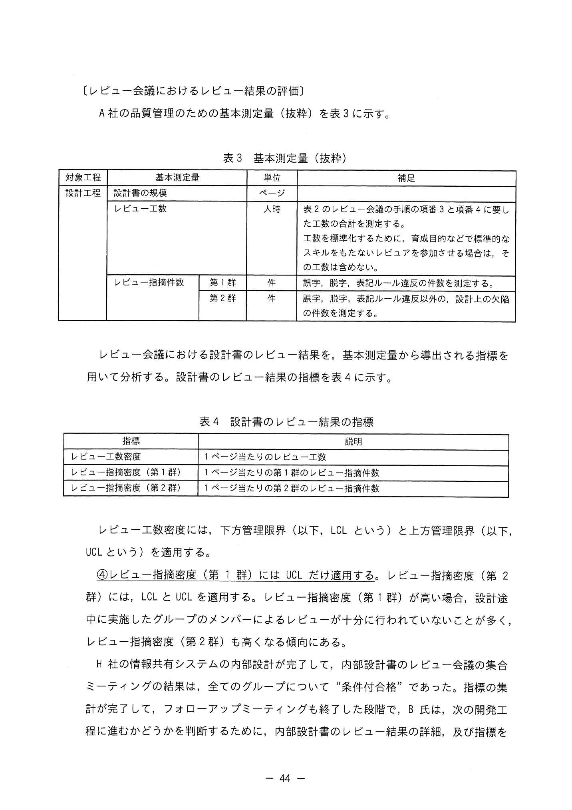

テキスト (OCR)

[レビュー会議におけるレビュー結果の評価〕
A 社の品質管理のための基本測定量 (抜粋) を表 3 に示す。

表3 基本測定量 (抜粋)

対象工程               基本測定量                  単位                                 補足
設計工程 | 設計書の規模                          ページ
レビューエ数                   人時    表 2 のレビュー会議の手順の項番 3 と項番 4 に要し

た工数の合計を測定する。

工数を標準化するために, 育成目的などで標準的な
スキルをもたないレビュアを参加させる場合は, そ
の工数は含めない。

レビュー指摘件数    第1 BE     件     誤字, 脱字, 表記ルール培反の件数を測定する。

第2 BE    件    誤字, 脱字, 表記ルール培反以外の, 設計上の欠陥
の件数を測定する。

レビュー会議における設計書のレビュー結果を, 基本測定量から導出される指標を
用いて分析する。設計書のレビュー結果の指標を表 4 に示す。

表4 設計書のレビュー結果の指標

指標                                      説明

レビューエエ数密度          当たりのレビューエエ数

レビュー指摘密度 (第1 群)      1 ページ当たりの第 1 群のレビュー指摘件数

レビュー指摘密度 (第2 群)     1 ページ当たりの第 2 群のレビュー指摘件数

レビュー工数密度には, 下方管理限界 (以下, LCL という) と上方管理限界 (以下,
UCL という) を適用する。

(④レビュー指摘密度 (第 1 群) には UCL だけ適用する。レビュー指摘密度 (第 2
群) には, LCL と UCL を適用する。レビュー指摘密度 (第 1 群) が高い場合, 設計途
中に実施したグループのメンバーによるレビューが十分に行われていないことが多く
レビュー指摘密度 (第2 群) も高くなる傾向にある。

H 社の情報共有システムの内部設計が完了して, 内部設計書のレビュー会議の集合
ミーティングの結果は, 全てのグループについて “条件付合格” であった。 指標の集
計が完了して, フォローアップミーティングも終了した段階で, B 氏は, 次の開発工
程に進むかどうかを判断するために, 内部設計書のレビュー結果の詳細。及び指標を

### ページ 45

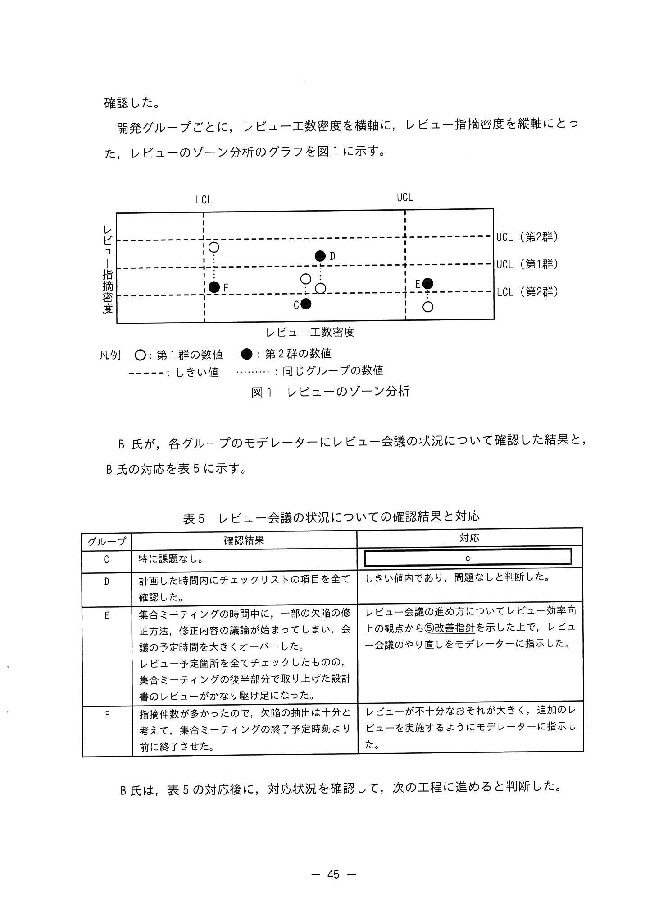

テキスト (OCR)

確認した。
開発グループごとに, レビューエエ数密度を横軸に, レビュー指摘密度を縦軸にとっ
た, レビューのゾーン分析のグラフを図 1 に示す。

LCL                             UCL
T                                             T
| ーーーーーーコゴーミーーーーーーーーーーーーーーーーーーーーーーーーユーーーーーーーーーーーUCL (第2
i〇              1
Ae + UCL (第1群
1                                            1
 1 LCL (第2群)
1                                            1

凡例

レビューエ数密度
〇: 第1群の数値 坦:第2群の数値
ーーーーー: しきい値 。……… : 同じグループの数値

レビューのゾーン分析

BEM, 各グループのモデレーターにレビュー会議の状況について確認した結果と
B 氏の対応を表 5 に示す。

表5 レビュー会議の状況についての確認結果と対応

グループ                  確認結果                                    対応

C     特に課題なし。                            1_               c               _|

D    計画した時間内にチェックリストの項目を全て | しきい値内であり, 問題なしと判断した。
確認した。

E    集合ミーティングの時間中に, 一部の欠陥の修 | レビュー会議の進め方についてレビュー効率向
正方法, 修正内容の議論が始まってしまい, 会 | 上の観点から⑤改善指針を示した上で, レビュ
議の予定時間を大きくオーバーした。                ー会議のやり直しをモデレーターに指示した。
レビュー予定箇所を全てチェックしたものの,
集合ミーティングの後半部分で取り上げた設計
書のレビューがかなり駆け足になった。

E      指摘件数が多かったので, 欠陥の抽出は十分と | レビューが不十分なおそれが大きく, 追加のレ

考えて, 集合ミーティングの終了予定時刻より
前に終了させた。

ビューを実施するようにモデレーターに指示し
た。

B 氏は, 表5の対応後に, 対応状況を確認して, 次の工程に進めると判断した。

### ページ 46

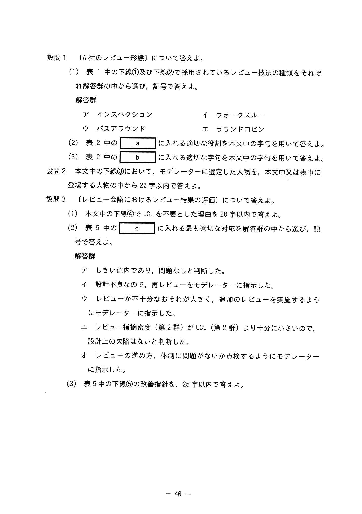

テキスト (OCR)

設問1   〔A 社のレビュー形態〕] について答えよ。
(1) 表 1 中の下線①及び下線②で採用されているレビュー技法の種類をそれぞ
れ解答群の中から選び, 記号で答えよ。

解答群
ア インスペクション           イ ウォークスルーー
ウ パスアラウンド           エ ラウンドロビン

(2) 表 2 中の| a | に入れる適切な役割を本文中の字句を用いて答えよ。
(3) 表 2 中の| b | に入れる適切な字名を本文中の字句を用いて答えよ。
設問2 本文中の下線③において, モデレーターに選定した人物を, 本文中又は表中に
登場する人物の中から 20 字以内で答えよ。
設問3 (レビュー会議におけるレビュー結果の評価】 について答えよ。
(1) 本文中の下線④でLCL を不要とした理由を 29 字以内で答えよ。
(2) 表 5 中の| c | に入れる最も適切な対応を解答群の中から選び,記
号で答えよ。
AROS BY
ア しきい値内であり, 問題なしと判断した。
4 設計不良なので, 再レビューをモデレーターに指示した。
ウ レビューが不十分なおそれが大きく, 追加のレビューを実施するよう
にモデレーターに指示した。
エ レビュー指摘密度 (第2 群) がUCL (第 2 群) より十分に小さいので,
設計上の欠陥はないと判断した。
オ レビューの進め方, 体制に問題がないか点検するようにモデレーター
に指示した。

(3) 表5中の下線⑤の改善指針を, 25 字以内で答えよ。

### ページ 47

テキスト (OCR)

【

メ モ 用 紙

### ページ 48

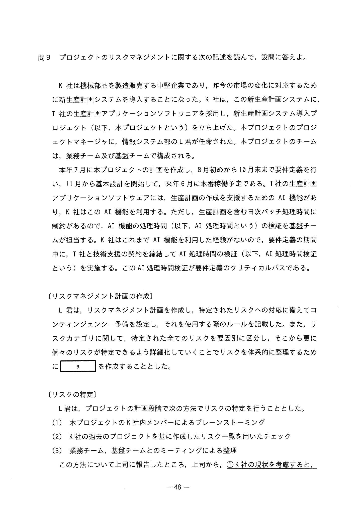

テキスト (OCR)

FID プロジェクトのリスクマネジメントに関する次の記述を読んで, 設問に答えよ。

K 社は機械部品を製造販売する中堅企業であり, 昨今の市場の変化に対応するため
に新生産計画システムを導入することになった。K 社は, この新生産計画システムに
T 社の生産計画アプリケーションソフトウェアを採用し, 新生産計画システム導入プ
ロジェクト (以下, 本プロジェクトという) を立ち上げた。本プロジェクトのプロジ
ェクトマネージャに, 情報システム部のL 看が任命された。本プロジェクトのチーム
は, 業務チーム及び基盤チームで構成される。

本年 7 月に本プロジェクトの計画を作成し, 8月初めから16 月末まで要件定義を行
い, 11 月から基本設計を開始して, 来年6月に本番稼働予定である。T 社の生産計画
アプリケーションソフトウェアには, 生産計画の作成を支援するための AT 機能があ
り, K 社はこの Al 機能を利用する。ただし, 生産計画を含む日次バッチ処理時間に
制約があるので, AI 機能の処理時間 (以下, AI 処理時間という) の検証を基盤チー
ムが担当する。K 社はこれまで AI 機能を利用した経験がないので, 要件定義の期間
hic, T 社と技術支援の契約を締結して AI 処理時間の検証 (以下, AI 処理時間検証
という) を実施する。この AI 処理時間検証が要件定義のクリティカルパスである。

〔【リスクマネジメント計画の作成

L Bld, リスクマネジメント計画を作成し, 特定されたリスクへの対応に備えてコ
ンティンジェンシー予備を設定し, それを使用する際のルールを記載した。また, リ
スクカテゴリに関して, 特定された全てのリスクを要因別に区分し, そこから更に
個々のリスクが特定できるよう詳細化していくことでリスクを体系的に整理するため

に|  』 | を作成することとした。

[リスクの特定〕
L 君は。 プロジェクトの計画段階で次の方法でリスクの特定を行うこととした。
(1) 本プロジェクトのK【 社内メンバーによるブレーンストーミング
(2) K 社の過去のプロジェクトを基に作成したリスク一覧を用いたチェック
(3) 業務チーム, 基盤チームとのミーティングによる整理
この方法について上司に報告したところ, LADS, ①K 社の現状を考慮すると,

### ページ 49

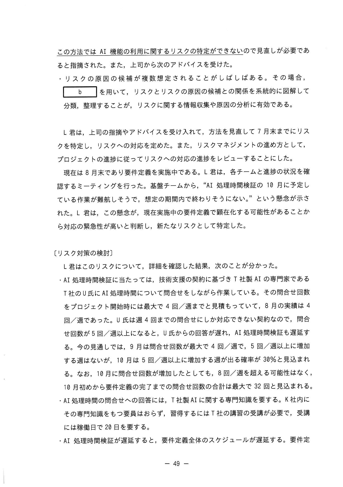

テキスト (OCR)

この方法では Al 機能の利用に関するリスクの特定ができないので見直しが必要であ
ると指摘された。また, 上司から次のアドバイスを受けた。

・リスクの原因の候補が複数想定されることがしばしばある。 COMA,
| 5 | を用いて, リスクとリスクの原因の候補との関係系統的に図解して
分類, 整理することが, リスクに関する情報収集や原因の分析に有効である。

L 君は, 上司の指摘やアドバイスを受け入れて, 方法を見直して 7 月末までにリス
クを特定し, リスクへの対応を定めた。また, リスクマネジメントの進め方として,
プロジェクトの進捗に従ってリスクへの対応の進捗をレビューすることにした。

現在は 8 月末であり要件定義を実施中である。L 君は, 各チームと進捗の状況を確
認するミーティングを行った。基盤チームから, “Al 処理時間検証の 10 月に予定し
ている作業が難航しそうで, 想定の期間内で終わりそうにない。” という懸念が示さ
れた。L 君は, この懸念が, 現在実施中の要件定義で顕在化する可能性があることか
ら対応の緊急性が高いと判断し, 新たかなリスクとして特定した。

〔リスク対策の検討〕
L 君はこのリスクについて, 詳細を確認した結果, 次のことが分かった。

・AI 処理時間検証に当たっては, 技術支援の契約に基づき T 社製 AI の専門家である
T社のU氏に AI 処理時間について問合せをしながら作業している。その問合せ回数
をプロジェクト開始時には最大で 4 回週までと見積もっていて, 8 月の実績は 4
回ノ週であった。U 氏は週 4 回までの問合せにしか対応できない契約なので, AG
せ回数が 5 回ノ週以上になると, U 氏からの回答が遅れ, AI 処理時間検証も遅延す
る。今の見通しでは, 9 月は問合せ回数が最大で 4 回ノ週で, 5 回ノ週以上に増加
する週はないが, 10 月は5 回ノ週以上に増加する週が出る確率が 309%と見込まれ
る。 なお, 19 月に問合せ回数が増加したとしても, 8 回ノ週を超える可能性はなく,
10 月初めから要件定義の完了までの問合せ回数の合計は最大で 32 回と見込まれる。

・AI 処理時間の問合せへの回答には, T 社製 AI に関する専門知識を要する。【K 社内に
その専門知識をもつ要員はおらず, 習得するにはT 社の講習の受講が必要で, 受講
には乏働日で 26 日を要する。

AL 処理時間検証が遅延すると, 要件定義全体のスケジュールが遅延する。要件定

### ページ 50

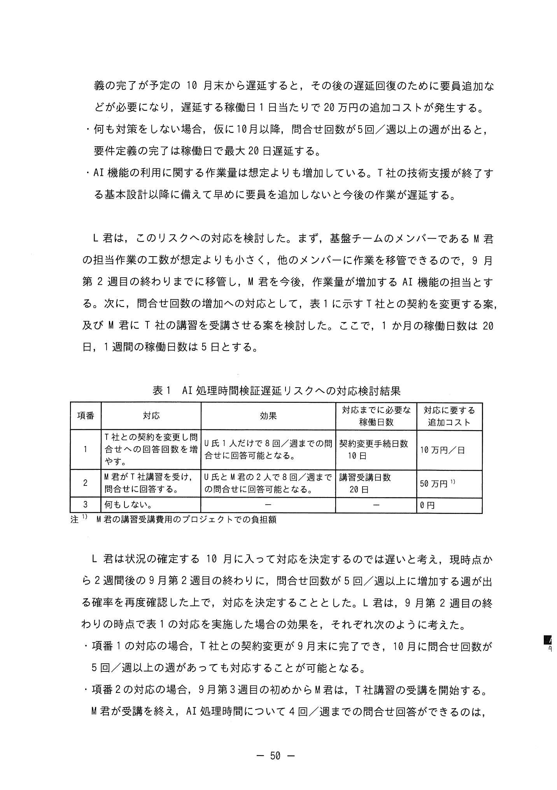

テキスト (OCR)

義の完了が予定の 10 月末から遅延すると, その後の遅延回復のために要員追加な
どが必要になり, 遅延する稼働日 1 日当たりで 20 万円の追加コストが発生する。

・何も対策をしない場合, 仮に10月以降, 問合せ回数が5回ノ週以上の週が出ると,
要件定義の完了は稼働日で最大 20 日遅延する。

・ AI 機能の利用に関する作業量は想定よりも増加している。T 社の技術支援が終了す
る基本設計以降に備えて早めに要員を追加しないと今後の作業が遅延する。

LBlé, このリスクへの対応を検討した。まず, 基盤チームのメンバーである M 君
の担当作業の工数が想定よりも小さく, 他のメンバーに作業を移管できるので, 9 月
第 2 週目の終わりまでに移管し, M 君を今後, 作業量が増加する AI 機能の担当とす
る。 次に, 問合せ回数の増加への対応として, 表 1 に示すT社との契約を変更する案
及び M 君に T 社の講習を受講させる案を検討した。ここで, 1 か月の乏働日数は 20
日, 1 週間の稼働日数は 5 ACTS.

表1 AI 処理時間検証遅延リスクへの対応検討結果
対応までに必要な | 対応に要する

項番             対応                          効果

稼働日数       追加コスト
|  ee り氏 1 人だけで8 回ノ週までの問 | ROKR ERE | |
やす    “   “| 合せに回答可能となる。     108
。 |!君が 社講習を受け, [UREN 君の 2 人で8回ノ週まで| 講習受講日数   —
問合せに回答する。      の問合せに回答可能となる。        208
3 | 何もしない。                            ー                         ー          6 円

注 ! M君の講習受講費用のプロジェクトでの負担客

L 君は状況の確定する 10 月に入って対応を決定するのでは遅いと考え, 現時点か
ら 2 週間後の 9 月第 2 週目の終わりに, 問合せ回数が 5 回ノ週以上に増加する週が出
る確率を再度確認した上で, 対応を決定することとした。L Blt, 月第 2 週目の終
わりの時点で表 1 の対応を実施した場合の効果を, それぞれ次のように考えた。

・項番 1 の対応の場合, T 社との契約変更が 9 月末に完了でき, 16 月に問合せ回数が

5 回ノ週以上の週があっても対応することが可能となる。

・項番 2 の対応の場合, 9 月第3 週目の初めからM君は, 1 社講習の受講を開始する。

M 君が受講を終え, AI 処理時間について 4 回ノブ週までの問合せ回答ができるのは,

oi

### ページ 51

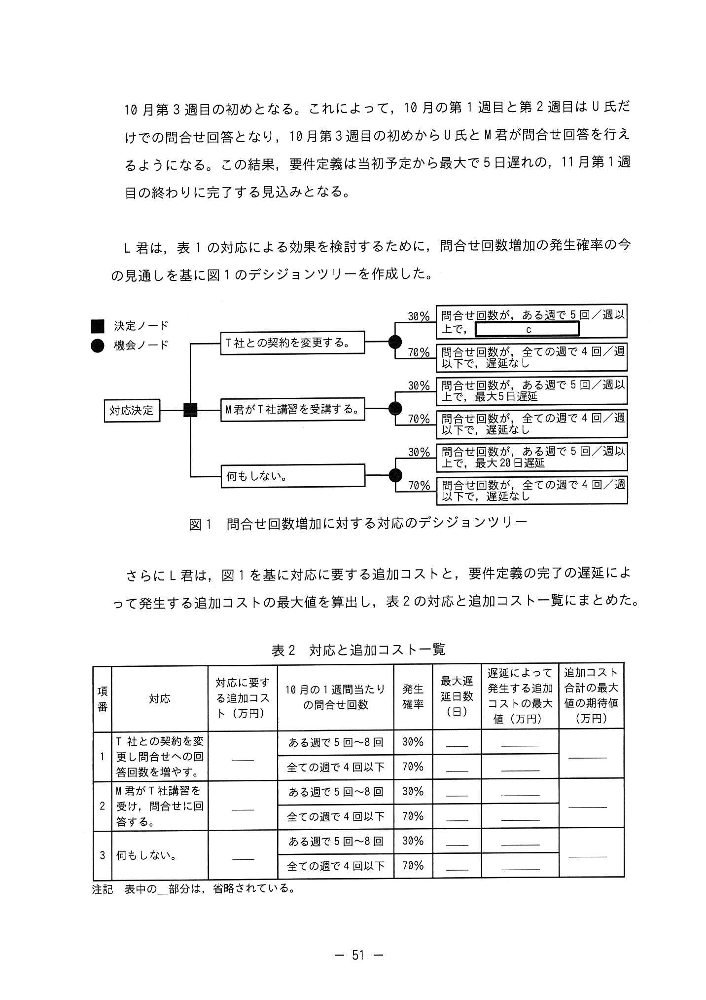

テキスト (OCR)

10 月第 3 週目の初めとなる。これによって, 19 月の第 1 週目と第 2 週目は U 氏だ
けでの問合せ回答となり, 16 月第3 週目の初めからU氏とM君が問合せ回答を行え
るようになる。この結果, 要件定義は当初予定から最大で 5 日遅れの, 11 月第 1 周

目の終わりに完了する見込みとなる。

L Blt, 表 1 の対応による効果を検討するために, 問合せ回数増加の発生確率の今
の見通しを基に図1 のデシジョンツリーを作成した。

epee   、                       30% | 問合せ回数が, ある週で5回/週以
圏 決定ノード                          it, [eS

@ #4e-k      1 社との契約を変更する。                =
20% |問合せ回数が 全ての週で 4 回ノ週

以下で, 遅延なし

399% | 問合せ回数が, ある週で 5 回ノ週以
=   =           上で, HRS AiBwE
| 対応決定       M君がT社講習を受講する。

79% | 問合せ回数が, 全ての週で 4 回ノ週
以下で, 遅延なし

30% | 問合せ回数が, ある週で 5 回ノ週以
上で, 最大26日遅延

799 | 問合せ回数が, 全ての週で 4 回ノ週

以下で, 遅延なし
図1 問合せ回数増加に対する対応のデシジョンツリー

さらに[ 君は, 図1 を基に対応に要する追加コストと, 要件定義の完了の遅延によ
って発生する追加コストの最大値を算出し, 表2 の対応と追加コスト一覧にまとめた。

表2 対応と追加コスト一覧

_                     _ | 軍兵によって |追加コスト
項       ies 4   10 月の 1 週間当たり | 発生   aes  発生する追加 | 合計の最大
番         is        eas      の問合せ回数 | ae | TEM | コストの最大 | gown
a (万円) | GF)
T HL ORMER             ある週で5 回8回 | 30%]        ーー
1 | 更し問合せへの回     ーー                                                 ーーーー
答回数を増やす。              全ての週で4回以下| 70% | __     ーー一
MBO T 社講習を               ある週で 5 回8回   30%    ーー      _
alan, maticm| __                                                 —
$B,                              全ての週で 4 回以下 | 70% | __       ョーーーー
あぁる週で5回8回 | 3%] |
3 | me しなぃ。       ーー                                     _
全ての週で 4 回以下 | 70% | __     ーー

注記 表中の_ 部分は, 省略されている。

ー 51 一

### ページ 52

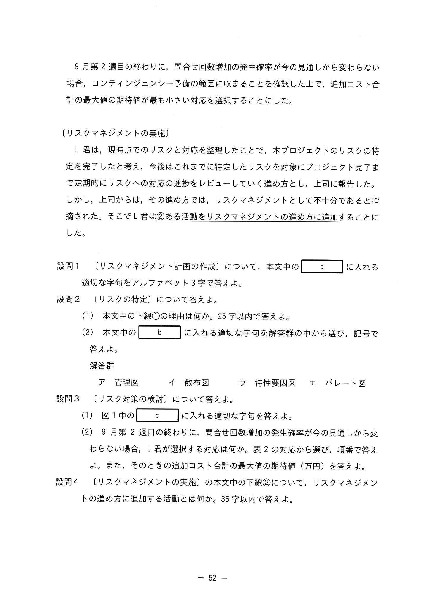

テキスト (OCR)

9 月第 2 週目の終わりに, 問合せ回数増加の発生確率が今の見通しから変わらない

場合コンティンジェンシー予備の範囲に収まることを確認した上で, 追加コスト合
計の最大値の期待値が最も小さい対応を選択することにした。

[リスクマネジメントの実施〕

L Ald, 現時点でのリスクと対応を整理したことで, 本プロジェクトのリスクの特
定を完了したと考え, 今後はこれまでに特定したリスクを対象にプロジェクト完了ま
で定期的にリスクへの対応の進捗をレビューしていく進め方とし, 上司に報告した。
しかし, 上司からは, その進め方では, リスクマネジメントとして不十分であると指

摘された。 そこでL 君はのある活動をリスクマネジメントの進め方に追加することに
した。

設問1 〔リスクマネジメント計画の作成〕 について, 本文中の|  a | に入れる
適切な字句をアルファベット 3字で答えよ。
設問2 〔リスクの特定〕について答えよ。

(1) 本文中の下線①の理由は何か。25 字以内で答えよ。

(2) 本文中の| b | に入れる適切な字句を解答群の中から選び

記号で
答えよ。
解答群
ア 管理図   イ 散布図   ウ 特性要因図 エ パレート図
設問3 〔リスク対策の検討] について答えよ。

(1) 図1中の| c |] に入れる適切な字句を答えよ。
(2)

9 月第 2 週目の終わりに, 問合せ回数増加の発生確率が今の見通しから変

わらない場合, L 君が選択する対応は何か。表 2 の対応から選び, 項番で答え

よ。 また, そのときの追加コスト合計の最大値の期待値 (万円) を答えよ。

設問4 〔リスクマネジメントの実施] の本文中の下線@について, リスクマネジメン
トの進め方に追加する活動とは何か。35 字以内で答えよ。

### ページ 53

テキスト (OCR)

〔

メ モ 用 紙

]

### ページ 54

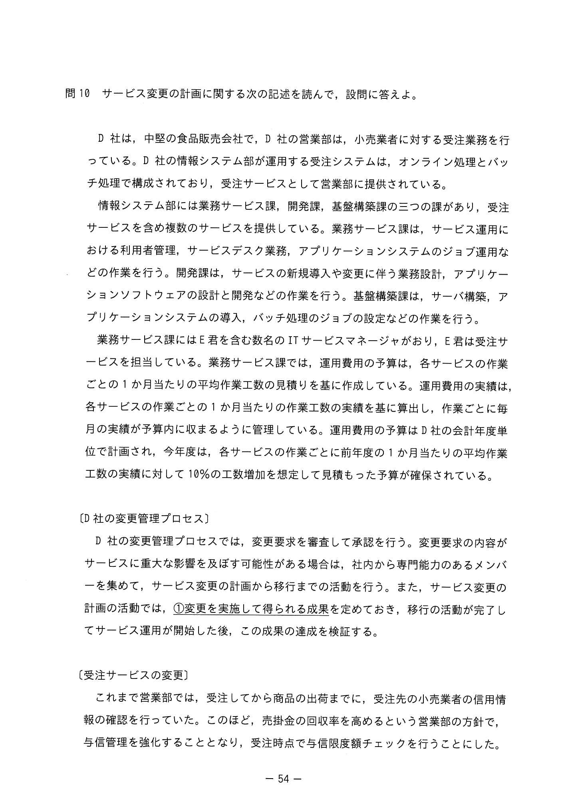

テキスト (OCR)

10 サービス変更の計画に関する次の記述を読んで, 設問に答えよ。

D 社は, 中堅の食品販売会社で, D 社の営業部は, 小売業者に対する受注業務を行
っている。D 社の情報システム部が運用する受注システムは, オンライン処理とバッ
チ処理で構成されており, 受注サービスとして営業部に提供されている。

情報システム部には業務サービス課, HER, 基盤構築課の三つの課があり, 受注
サービスを含め複数のサービスを提供している。業務サービス課は, サービス運用に
おける利用者管理.,サービスデスク業務, アプリケーションシステムのジョブ運用な
どの作業を行う。開発課は, サービスの新規導入や変更に伴う業務設計, アプリケー
ションソフトウェアの設計と開発などの作業を行う。基盤構築課は, サーバ構築。 ア
プリケーションシステムの導入, バッチ処理のジョブの設定などの作業を行う。

業務サービス課にはE 君を含む数名のITサービスマネージャがおり, E君は受注サ
ービスを担当している。業務サービス課では, 運用費用の予算よは, 各サービスの作業
ごとの 1 か月当たりの平均作業工数の見積りを基に作成している。運用費用の実績は,
各サービスの作業ごとの 1 か月当たりの作業工数の実績を基に算出し, 作業ごとに毎
月の実績が予算内に収まるように管理している。運用費用の予算は D 社の会計年度単
位で計画され, 今年度は, 各サービスの作業ごとに前年度の 1 か月当たりの平均作業
工数の実績に対して 19%の工数増加を想定して見積もった予算が確保されている。

〔D 社の変更管理プロセス〕

D 社の変更管理プロセスでは, 変更要求を審査して承認を行う。変更要求の内容が
サービスに重大な影響を及ぼす可能性がある場合は, 社内から専門能力のあるメンバ
ーを集めて, サービス変更の計画から移行までの活動を行う。また, サービス変更の
計画の活動では, ①変更を実施して得られる成果を定めておき, 移行の活動が完了し
てサービス運用が開始した後, この成果の達成を検証する。

(受注サービスの変更]

これまで営業部では, 受注してから商品の出荷までに, 受注先の小売業者の信用情
報の確認を行っていた。このほど, 売掛金の回収率を高めるという営業部の方針で,
与信管理を強化することとなり, 受注時点で与信限度額チェックを行うことにした。

ー 54 一

### ページ 55

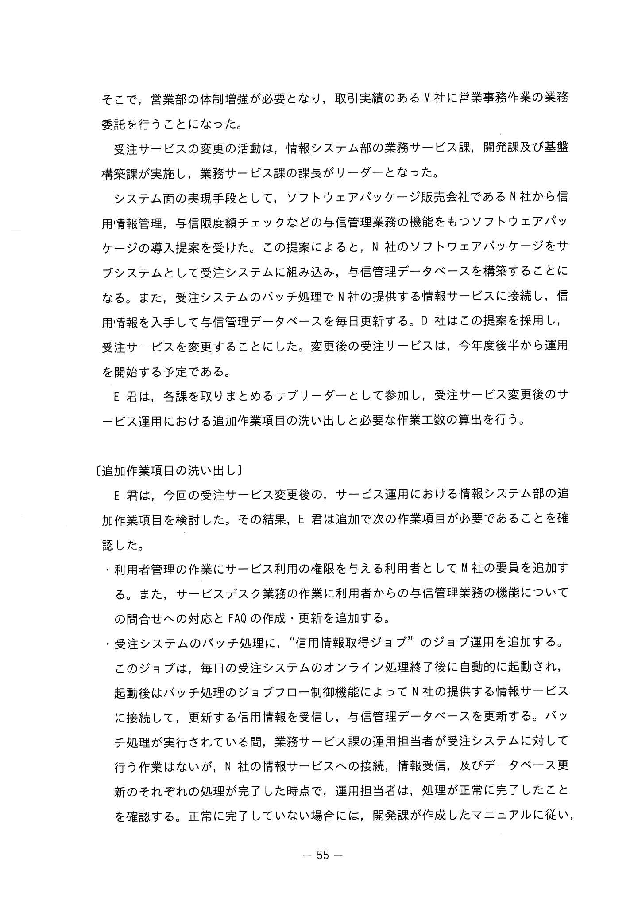

テキスト (OCR)

そこで, 営業部の体制増強が必要となり, 取引実績のある M 社に営業事務作業の業務
委託を行うことになった。

受注サービスの変更の活動は, 情報システム部の業務サービス課, 開発課及び基盤
構築課が実施し, 業務サービス課の課長がリーダーとなった。

システム面の実現手段として, ソフトウェアパッケージ販売会社である N 社から信
用情報管理, 与信限度額チェックなどの与信管理業務の機能をもつソフトウェアパッ
ケージの導入提案を受けた。この提案によると, N 社のソリフトウェアパッケージをサ
ブシステムとして受注システムに組み込み, 与信管理データベースを構築することに
BS, HK, 受注システムのバッチ処理で N 社の提供する情報サービスに接続し, 信
用情報を入手して与信管理データベースを毎日更新する。D 社はこの提案を採用し
受注サービスを変更することにした。変更後の受注サービスは, 今年度後半から運用
を開始する予定である。

E 君は, 各課を取りまとめるサブリーダーとして参加し, 受注サービス変更後のサ
ービス運用における追加作業項目の洗い出しと必要な作業工数の算出を行う。

〔追加作業項目の洗い出し]

E 君は, 今回の受注サービス変更後の, サービス運用における情報システム部の追
加作業項目を検討した。その結果, E 君は追加で次の作業項目が必要であることを確
認した。

・利用者管理の作業にサービス利用の権限を与える利用者として M 社の要員を追加す
る。また, サービスデスク業務の作業に利用者からの与信管理業務の機能について
の問合せへの対応とFAQ の作成・更新を追加する。

・受注システムのバッチ処理に, "信用情報取得ジョブ” のジョブ運用を追加する。
このジョブは, 毎日の受注システムのオンライン処理終了後に自動的に起動され
起動後はバッチ処理のジョブフロー制御機能こよって N 社の提供する情報サービス
に接続して, 更新する信用情報を受信し, 与信管理データベースを更新する。バッ
チ処理が実行されている間, 業務サービス課の運用担当者が受注システムに対して
行う作業はないが, N 社の情報サービスへの接続, 情報受信, 及びデータベース更
新のそれぞれの処理が完了した時点で, 運用担当者は, 処理が正常に完了したこと
を確認する。正常に完了していない場合には, 開発課が作成したマニュアルに従い,

### ページ 56

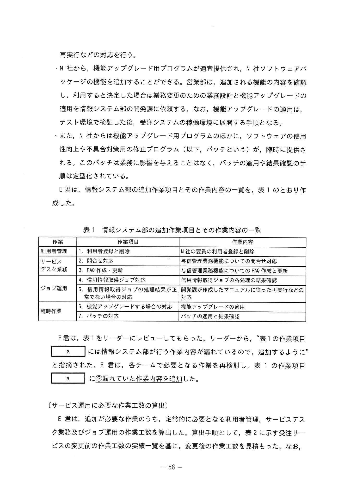

テキスト (OCR)

再実行などの対応を行う。

・N 社から, 機能アップグレード用プログラムが適宜提供され, N 社ソフトウェアパ
ッケージの機能を追することができる。営業部は, 追加される機能の内容を確認
し, 利用すると決定した場合は業務変更のための業務設計と機能アップグレードの
適用を情報システム部の開発課に依頼する。なお, 機能アップグレードの適用は,
テスト環境で検証した後, 受注システムの移働環境に展開する手順となる。

・また, N 社からは機能アップグレード用プログラムのほかに, ソフトウェアの使用
性向上や不具合対策用の修正プログラム (以下, パッチという) が, 臨時に提供さ
れる。このパッチは業務に影響をほ与えることはなく, パッチの適用や結果確認の手
順は定型化されている。

E Bld, 情報システム部の追加作業項目とその作業内容の一覧を, 表1 のとおり作

成した。

表1 情報システム部の追加作業項目とその作業内容の一覧

作業                       作業項目                                       作業内容
利用者管理 |1. 利用者登録と削除               M 社の要員の利用者登録と削除
サービス     2, 問合せ対応                    与信管理業務機能こついての問合せ対応
デスク業務 |3. FAO 作成・更新                 与信管理業務機能こついての FAQ 作成と更新
4. 信用情報取得ジョブ対応               信用情報取得ジョブの各処理の結果確認
ジョブ運用 |5. 信用情報取得ジョブの処理結果が正 | 開発課が作成したマニュアルに従った再実行などの
常でない場合の対応                     対応
且時作業     6. mary プグレードする場合の対応   BEE then
7. パッチの対応                   パッチの適用と結果確認

E 君は, 表1 をリーダーにレビューしてもらった。リーダーから, “#1 の作業項目
| 。 | には情報システム部が行う作業内容が漏れているので, 追加するように”"
と指摘された。E Bl, 各チームで必要となる作業を再検討し, 表 1 の作業項目
|  』 | に@②漏れていた作業内容を追加した。

〔サービス運用に必要な作業工数の算出]

E Bld, 追加が必要な作業のうち, 定常的に必要となる利用者管理, サービスデス
ク業務及びジョブ運用の作業工数を算出した。 算出手順として, 表 2 に示す受注サー
ビスの変更前の作業工数の実績一覧を基に, 変更後の作業工数を見積もった。なお,

### ページ 57

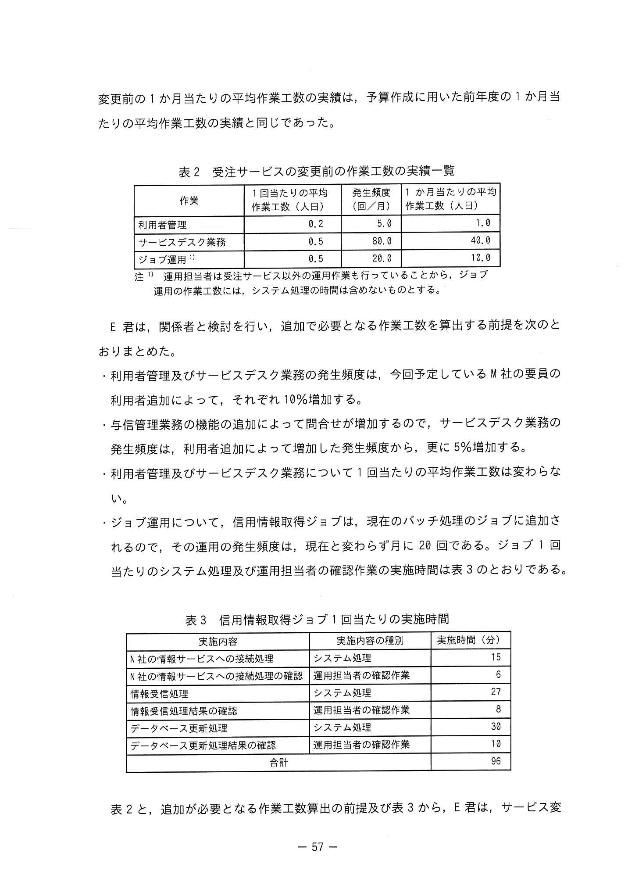

テキスト (OCR)

変更前の 1 か月当たりの平均作業工数の実績は, 予算作成に用いた前年度の 1 か月当
たりの平均作業工数の実績と同じであった。

表2 受注サービスの変更前の作業工数の実績一覧

作業          1 回当たりの平均     発生頻度 |1 か月当たりの平均
作業工数 (AB)    (回月) | 作業工数 (AB)
利用者管理                       9.2          5.0                1.0
サービスデスク業務                0.5          80.0               40.0
ジョブ運用                          0.5           20.0                  10.0

EB) 運用担当者は受注サービス以外の運用作業も行っていることから, ジョブ
運用の作業工数には, システム処理の時間は含めかいものとする。

E Blt, 関係者と検討を行い, 追加で必要となる作業工数を算出する前提を次のと
おりまとめた。

・利用者管理及びサービスデスク業務の発生頻度は, 今回予定しているM社の要員の
利用者追加によって, THEN 10%増加する。

・ 与信管理業務の機能の追加によって問合せが増加するので, サービスデスク業務の
発生頻度は, 利用者追加によって増加した発生頻度から, 更に 5%増加する。

・ 利用者管理及びサービスデスク業務について 1 回当たりの平均作業工数は変わらな
い。

・ジョブ運用について, 信用情報取得ジョブは, 現在のバッチ処理のジョブに追加さ
れるので, その運用の発生頻度は, 現在と変わらず月に 20 回である。ジョブ 1 回
当たりのシステム処理及び運用担当者の確認作業の実施時間は表 3 のとおりである。

表3 信用情報取得ジョブ 1 回当たりの実施時間

実施内容          実施内容の種別   実施時間 (分)

N 社の情報サービスへの接続処理    システム処理            15
N 社の情報サービスへの接続処理の確認 | 運用担当者の確認作業        6
情報受信処理             システム処理            27
情報受信処理結果の確認        運用担当者の確認作業         8
データベース更新処理         システム処理            30
データベース更新処理結果の確認    運用担当者の確認作業        19
合計96

表 2 と, 追加が必要となる作業工数算出の前提及び表 3 から, EB, サービス変

### ページ 58

テキスト (OCR)

更後のサービス運用に必要な作業工数を算出した。 作業工数の算出においては, ジョ
ブ運用の 1 回当たりの平均作業工数は, 表 2 の受注サービスの変更前の平均作業工数
に表 3 の信用情報取得ジョブ 1 回当たりの実施時間から人算出した作業工数の合計を加
算した。なお, 運用担当者は 1 日 3 交替のシフト勤務をしているので, 作業時間の単
fu “分′ を“日 に換算する場合は, 情報システム部では 4860 分を 1 日として計算す
る規定としている。算出結果を表 4 に示す。

表4 サービス変更後のサービス運用に必要な作業工数

aa         an         1 回当たりの平均作業工数] FEAT      1 か月当たりの平均
(AB)             (回ノ月)        作業工数(人日)
1 | 利用者管理                           0.2          ーー      [し5 |
2 | サービスデスク2業務              0.5
3 | ジョブ運用                           _             2.0} [oa]

注記 表中の_ 部分は, 省略されている。

E Bld, サービス変更後の作業ごとの 1 か月当たりの平均作業工数を算出した結果,
③ある作業には問題点があると考えた。 その問題点についてリーダーと相談して対策
方針を決め, 対策を実施することになった。

設問1 0 社の変更管理プロセス〕 の本文中の下線①の “変更を実施して得られる成
果" について, 今回のサービス変更における内容を, [受注サービスの変更】 の
本文中の字句を用いて, 20 字以内で答えよ。
設問 2 (追加作業項目の洗い出し】 について, 作業項目 | a | は何か。表1の
作業項目の中からーつ選び, 作業項目の先頭に記した番号で答えよ。また, 下線
②の漏れていた作業内容を 15 字以内で答えよ。
設問3 〔サービス運用に必要な作業工数の算出) について答えよ。
(1) 表4 中の| b |-| ad |に入れる適切な数値を答えよ。なお,
計算の最終結果で小数第 2 位の小数が発生する場合は, 小数第 2 位を四捨五入
し, 答えは小数第 1 位まで求めよ。
(2) 本文中の下線③について, 問題点があると考えた作業は何か。表 4 の項番
で答えよ。 また, 問題点の内容を 15 字以内, E 君が1 か月当たりの平均作業
数を算出した結果を見て問題点があると考えた根拠を 30 字以内で答えよ。

### ページ 59

テキスト (OCR)

[ + モ 用 紙 J

### ページ 60

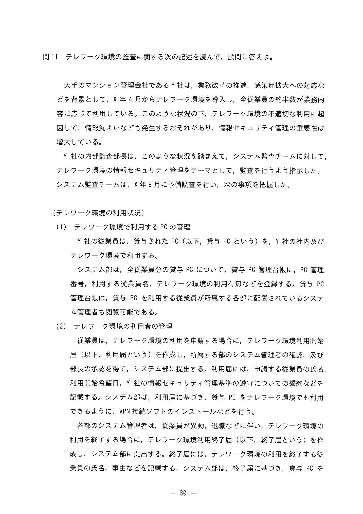

テキスト (OCR)

間11 テレワーク環境の監査に関する次の記述を読んで, 設問に答えよ。

大手のマンション管理会社である Y 社は, 業務改革の推進, 感染症拡大への対応な
どを背景として, X 年 4 月からテレワーク環境を導入し, 全従業員の約半数が業務内
容に応じて利用している。このような状況の下, テレワーク環境の不適切な利用に起
因して, 情報漏えいなども発生するおそれがあり, 情報セキュリティ管理の重要性は
増大している。

Y 社の内部監査部長は, このような状況を踏まえて, システム監査チームに対して,
テレワーク環境の情報セキュリティ管理をテーマとして, 監査を行うよう指示した。
システム監査チームは, X 年 9 月に予備調査を行い, 次の事項を把握した。

〔テレワーク環境の利用状況]

(1) テレワーク環境で利用する PC の管理
Y 社の従業員は, 貸与された PC (以下, 貸与 PC という) を, Y 社の社内及び
テレワーク環境で利用する。
システム部は, 全従業員分の貸与 PC について, 貸与 PC 管理台帳に, PC 管理
番号, 利用する従業員名, テレワーク環境の利用有無などを登録する。貸与 PC
管理台帳は, 貸与 PC を利用する従業員が所属する各部に配置されているシステ
ム管理者も閲覧可能である。

(2) テレワーク環境の利用者の管理
従業員は, テレワーク環境の利用を申請する場合に, テレワーク環境利用開始
届 (以下, 利用届という) を作成し, 所属する部のシステム管理者の確認, 及び
部長の承認を得て, システム部に提出する。利用届には, 申請する従業員の氏名,
利用開始希望日, Y 社の情報セキュリティ管理基準の遵守についての痺約などを
記載する。システム部は, 利用届に基づき, 貸与 PC をテレワーク環境でも利用
できるように, VPN 接続ソフトのインストールなどを行う。
各部のシステム管理者は, 従業員が異動, 退職などに伴い, テレワーク環境の
利用を終了する場合に, テレワーク環境利用終了届 (以下, 終了届という) を作
ML, システム部に提出する。終了届には, テレワーク環境の利用を終了する従
業員の氏名, 事由などを記載する。システム部は, 終了届に基づき, 貸与 PC を

### ページ 61

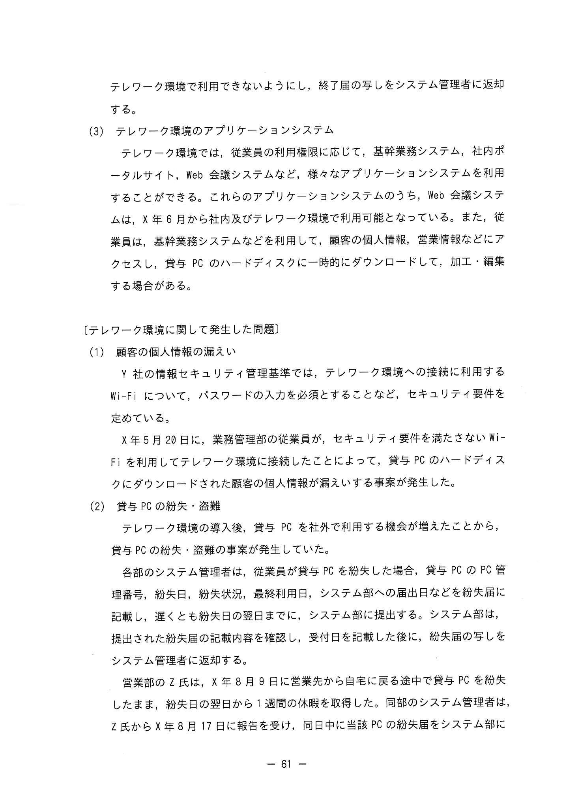

テキスト (OCR)

テレワーク環境で利用できないようにし, 終了届の写しをシステム管理者に返却
する。

テレワーク環境のアプリケーションシステム

テレワーク環境では, 従業員の利用権限に応じて, 基幹業務システム, 社内ポ
ータルサイト, Web 会議シンステムなど, 様々なアプリケーションシステムを利用
することができる。これらのアプリケーションシステムのうち, Web 会議システ
Alt, 年 6 月から社内及びテレワーク環境で利用可能となっている。 また, 従
業員は, 基幹業務システムなどを利用して, 顧客の個人情報, 営業情報などにア
クセスし, 貸与 PC のハードディスクに一時的にダウンロードして, 加工・編集
する場合がある。

〔テレワーク環境に関して発生した問題〕

(1)

(2)

顧客の個人情報の漏えい

Y 社の情報セキュリティ管理基準では, テレワーク環境への接続に利用する
Wi-Fi について, パスワードの入力を必須とすることなど, セキュリティ要件を
定めている。

X 年 5 月 29 日に, 業務管理部の従業員が, セキュリティ要件を満たさない Wi-
Fi を利用してテレワーク環境に接続したことによって, 貸与PP のハードディス
クにダウンロードされた顧客の個人情報が漏えいする事案が発生した。
貸与 PC の紛失・盗難

テレワーク環境の導入後, 貸与 PC を社外で利用する機会が増えたことから,
貸与 PC の紛失・盗難の事案が発生していた。

各部のシステム管理者は, 従業員が貸与 PC を紛失した場合, 貸与PCのPC管
理番号, 紛失日, 紛失状況, 最終利用日, システム部への届出日などを紛失届に
記載し, 遅くとも紛失日の翌日までに, システム部に提出する。システム部は
提出された紛失届の記載内容を確認し, 受付日を記載した後に, 紛失届の写しを
システム管理者に返却する。

営業部の 7 氏は, X 年8 月 9 日に営業先から自宅に戻る途中で貸与 PC を紛失
したまま, 紛失日の翌日から 1 週間の休暇を取得した。同部のシステム管理者は,
7 氏からX年8 月 17 日に報告を受け, 同日中に当該 PC の紛失届をシステム部に

### ページ 62

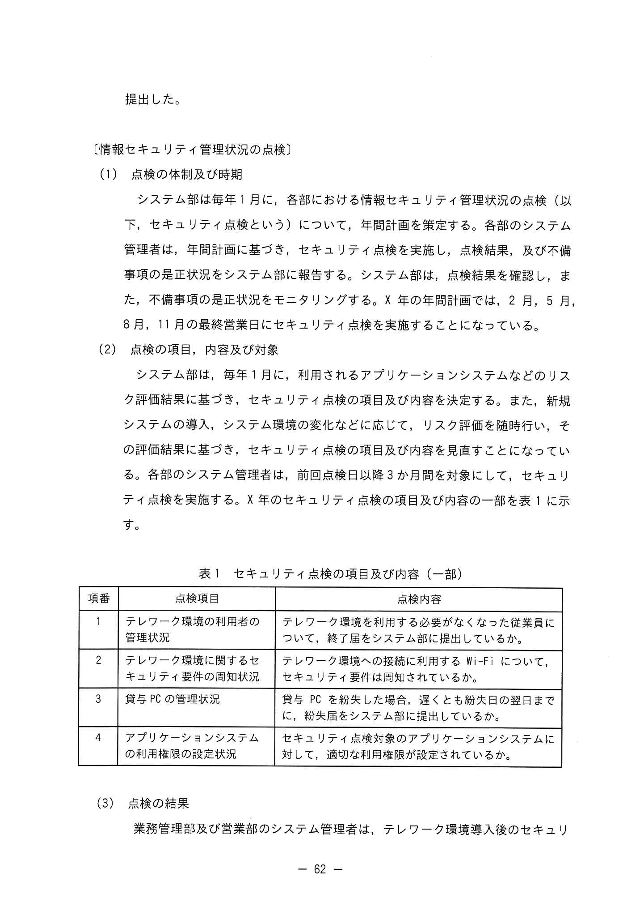

テキスト (OCR)

提出した。

[情報セキュリティ管理状況の点検〕

(1)

(2)

点検の体制及び時期

システム部は毎年 1 月に, 各部における情報セキュリティ管理状況の点検 (LL
下, セキュリティ点検という) について, 年間計画を策定する。各部のシステム
管理者は, 年間計画に基づき, セキュリティ点検を実施し, 点検結果, 及び不備
事項の是正状況をシステム部に報告する。システム部は, 点検結果を確認し, ま
た, 不備事項の是正状況とモニタリングする。X 年の年間計画では, 2 月, 5月,
8 月, 11 月の最終営業日にセキュリティ点検を実施することになっている。
点検の項目, 内容及び対象

システム部は, 毎年 1 月に, 利用されるアプリケーションシステムなどのリス
ク評価結果に基づき, セキュリティ点検の項目及び内容を決定する。 また, 新規
システムの導入, システム環境の変化などに応じて, リスク評価を随時行い, そ
の評価結果に基づき, セキュリティ点検の項目及び内容を見直すことになってい
る。各部のシステム管理者は, 前回点検日以降 3 か月間を対象にして, セキュリ
ティ点検を実施する。X 年のセキュリティ点検の項目及び内容の一部を表 1 に示
す。

表1 セキュリティ点検の項目及び内容 (一部)

項番         点検項目                        点検内容
1    テレワーク環境の利用者の   テレワーク環境を利用する必要がなくなった従業員に
管理状況            ついて, 終了届をシステム部に提出しているか。
2 | テレワーク環境に関するセ | テレワーク環境への接続に利用する Wi-Fi について
キュリティ要件の周知状況   セキュリティ要件は周知されているか。
3   貸与 PC の管理状況         貸与 PC を紛失した場合, 遅くとも紛失日の翌日まで
に, 紛失届をシステム部に提出しているか。
4 | アプリケーションシステム | セキュリティ点検対象のアプリケーションシステムに
の利用権限の設定状況     対して, 適切な利用権限が設定されているか。
(3) 点検の結果

業務管理部及び営業部のシステム管理者は, テレワーク環境導入後のセキュリ

### ページ 63

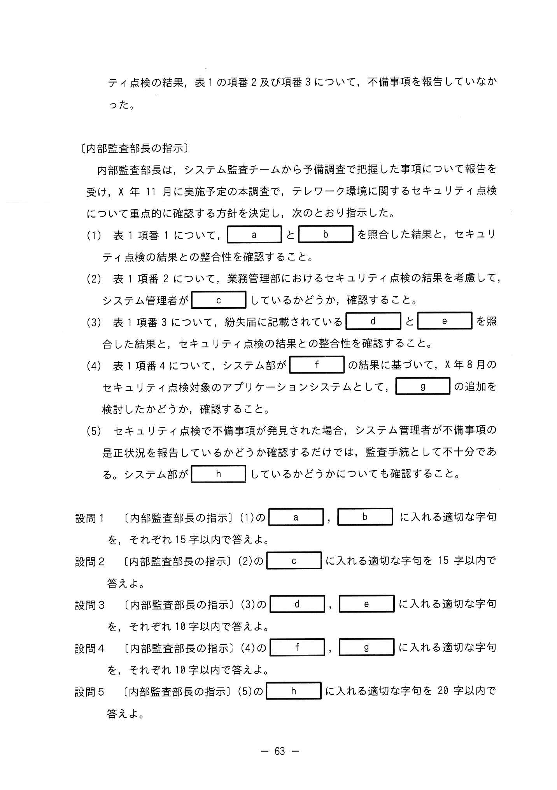

テキスト (OCR)

ティ点検の結果, 表1 の項番 2 及び項番 3 について, 不備事項を報告していなか

た。

〔内部監査部長の指示〕

内部監査部長は, システム監査チームから予備調査で把握した事項について報告を
受け, X 年 11 月に実施予定の本調査で。 テレワーク環境に関するセキュリティ点検
について重点的に確認する方針を決定し, 次のとおり指示した。

(1) 表1項番1 について, |  a |と|  b | を照合した結果と, セキュリ
ティ点検の結果との整合性を確認すること。

(2) 表 1 項番 2 について, 業務管理部におけるセキュリティ点検の結果を考慮して,
システム管理者が[| c | しているかどうか, 確認すること。

(3) 表 1 項番 3 について, 紛失届に記載されている| d |と| e [er
合した結果と, セキュリティ点検の結果との整合性を確認すること。

(4) 表1項番4について, システム部が| Ff | の結果に基づいて,X年8月の
セキュリティ検対象のアプリケーションシステムとして, | sg | の追加を
検討したかどうか, 確認すること。

(5) セキュリティ点検で不備事項が発見された場合, システム管理者が不備事項の
是正状況を報告しているかどうか確認するだけでは, 監査手続として不十分であ

る。システム部が| h | しているかどうかについても確認すること。

設問1 【内部監査部長の指示] (1)の| a |,|  b | に入れる適切な字句
を, それぞれ 15 字以内で答えよ。
設問2 (内部監査部長の指示] (2)の| ¢ | に入れる適切な字句を 15 字以内で

答えよ。
設問3 〔内部監査部長の指示] (3)の|  d |,| ee |に入れる適切な字句
を, それぞれ 10 字以内で答えよ。
設問4 【内部監査部長の指示] Mol f |,| 9 | に入れる適切な字句

を, それぞれ 10 字以内で答えよ。
設問5 (内部監査部長の指示] (5)の| h | に入れる適切な字旬を29 字以内で

答えよ。

### ページ 64

テキスト (OCR)

【

x モ 用 紙 ]

### ページ 65

テキスト (OCR)

〔

メ モ 用 紙 ]〕

### ページ 66

テキスト (OCR)

〔

メ モ 用 紙

]

### ページ 67

テキスト (OCR)

【

x = 用 紙 ]

### ページ 68

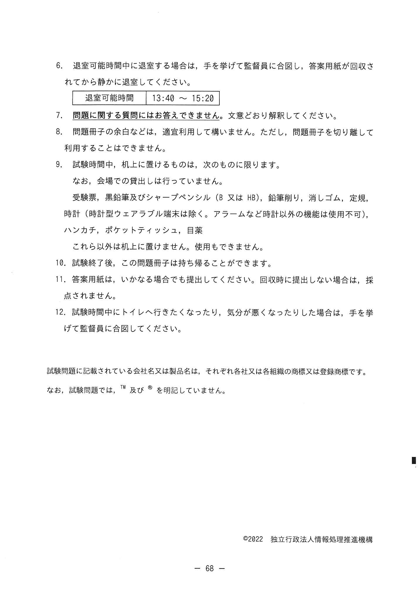

テキスト (OCR)

6. 退室可能時間中に退室する場合は, 手を挙げて監督貞に合図し, 答案用紙が回収さ
れてから静かに退室してください。
退室可能時間 | 13:40 ~ 15:20 |
7. 問題に関する質問にはお答えできません。文意どおり解釈してください。
8. 問題冊子の余白などは, 適宜利用して構いません。ただし, 問題冊子を切り離して
利用することはできません。
9, 試験時間中, 机上に置けるものは, 次のものに限ります。

なお, 会場での貸出しは行っていません。

BRE, 黒鉛筆及びシャープペンシル (B 又は HB), 鉛筆削り, 消しゴム, 定規,
時計 (時計型ウェアラブル端末は除く。アラームなど時計以外の機能は使用不可),
ハンカチ, ポケットティッシュ, 目薬

これら以外は机上に置けません。使用もできません。

10. 試験終了後, この問題冊子は持ち帰ることができます。

11. 答案用紙は, いかなる場合でも提出してください。 回収時に提出しない場合は, 採
点されません。

12. 試験時間中にトイレへ行きたくなったり, 気分が悪くなったりした場合は, 手を挙
げて監督具に合図してください。

試験問題に記載されている会社名又は製品名は, それぞれ各社又は各組織の商標又は登録商標です。

なお, 試験問題では, "及び © を明記していません。

@2022 独立行政法人情報処理推進機構

---

## 午後解答

1/6 
©2022 独立行政法人情報処理推進機構 
令和４年度 秋期 応用情報技術者試験 解答例 
 
午後試験 
問１ 
出題趣旨 
 マルウェアの侵入手法は巧妙化し，社内ネットワークへの侵入防止がますます困難になっている。最近では，
EMOTET と呼ばれるマルウェアが世界中に蔓延し，甚大な被害をもたらした。 
 本問では，巧妙化したマルウェアへの対応策を題材に，社内ネットワークへの侵入の早期発見と侵入後の活
動を抑止するための方策の理解について問う。 
 
設問 
解答例・解答の要点 
備考 
設問１(1)
a
ア 
 
 
 
b
ケ 
 
 
 
c
ク 
 
 
(2) ア 
 
設問２(1) 稼働中のホストのIP アドレス 
 
 
(2) ウ 
 
 
(3) ア 
 
設問３(1) ICMP エコー要求パケットの連続した送信 
 
 
(2) マルウェアに感染したPC を隔離する。 
 
 
(3) EDR が保存するログの分析 
 
 
問２ 
出題趣旨 
 昨今，競争環境が厳しくなっており，企業が生き残るためには，外部環境や内部環境を正確に把握した上で，
経営戦略を策定することが重要になっている。 
 本問では，教育サービス業の新規事業開発を題材に，目標利益を確保しつつ成長を目指すための経営戦略の
策定，及び新規事業開発プロセスについての基本的な理解，並びに財務計画の策定の理解について問う。 
 
設問 
解答例・解答の要点 
備考 
設問１(1)
強み 
業界に先駆けた教育コンテンツの整備力 
 
 
 
機会 
リスキリングのニーズの高まり 
 
 
(2) イ 
 
設問２(1) 大手製造業の同業他社へ展開するため 
 
 
(2)
a
ウ 
 
設問３(1)
b
カ 
 
 
 
c
イ 
 
 
(2)
d
サブスクリプション 
 
設問４(1) ・新規事業のミッションを遂行すること 
・競争優位性のある教育SaaS の提供 
 
 
(2)
e
40 
 
 
 
f
80

2/6 
©2022 独立行政法人情報処理推進機構 
問３ 
出題趣旨 
 同じ処理を何回も繰り返して行い，探索を実行する問題の解を求めるような場合，再帰関数を用いた実装は
有効な方法である。 
 本問では，迷路の探索処理を題材に，再帰関数を用いたアルゴリズムの理解と，プログラムの応用力につい
て問う。 
 
設問 
解答例・解答の要点 
備考 
設問１(1) 3 
 
 
(2) ア
2 
 
設問２ 
イ
paths[sol_num][k] 
 
 
 
ウ
stack_top - 1 
 
 
 
エ
maze[x][y] 
 
設問３ 
オ
sol_num 
 
設問４(1) カ
5，3 
 
 
(2) キ
22 
 
 
 
ク
3 
 
 
問４ 
出題趣旨 
 昨今，ソフトウェアの開発サイクルの短縮に伴い，開発用PC の開発環境としてコンテナ型仮想化技術を用い
た開発環境が普及しつつある。 
 本問では，レストランの予約サービスにおける開発環境の構築を題材に，コンテナ型仮想化技術に関する基
本的な理解と，開発環境構築における設計能力について問う。 
 
設問 
解答例・解答の要点 
備考 
設問１(1)
a
ウ 
順不同 
 
 
b
エ 
 
 
c
イ 
 
 
(2) エ 
 
設問２(1) 開発期間中に頻繁に更新されるから 
 
 
(2)
d
10.1.2 
 
 
 
e
15.3.3 
 
設問３(1) イ 
 
 
(2)
f
/app/FuncX/test/test.txt 
 
 
(3) img-dev_dec

3/6 
©2022 独立行政法人情報処理推進機構 
問５ 
出題趣旨 
 多くの企業ではリモートアクセスによるテレワークやWeb 会議サービスの導入が行われることとなり，テレ
ワークへの移行やそれに伴うネットワーク運用に際して幾つかの共通の課題が散見された。 
 本問では，テレワークへの移行やWeb 会議サービスの導入事例を題材に，企業ネットワークにおける運用管
理や障害対応に関する基本的な理解や留意事項について問う。 
 
設問 
解答例・解答の要点 
備考 
設問１ 
a
カ 
 
 
 
b
イ 
 
 
 
c
ウ 
 
設問２(1) Web サーバ，本社VPN サーバ 
 
 
(2)
d
ワンタイムパスワード 
 
 
(3)
e
認証サーバ 
 
設問３(1) イ 
 
 
(2)
f
1.6 
 
 
 
g
192 
 
 
(3) Web 会議サービス，本社VPN サーバ 
 
 
問６ 
出題趣旨 
 近年，働き方改革及びリモートワークの普及に伴い，企業におけるスマートデバイスの活用が増えている。
 本問では，スマートデバイス管理システムを題材に，E-R 図や表定義，SQL 文（データ定義言語，データ制御
言語）の基本的な理解と，関係モデルを設計・実装する能力を問う。 
 
設問 
解答例・解答の要点 
備考 
設問１ 
a
年月 
 
 
 
b
↑ 
 
 
 
c
従業員ID 
順不同 
 
 
d
情報端末ID 
 
 
e
↓ 
 
 
 
f
 
 
設問２ 
オ 
 
設問３ 
j
SELECT (契約ID, 暗証番号) 
 
 
 
k
CHAR(4) DEFAULT '1234' NOT NULL 
 
 
 
l
PRIMARY KEY 
 
 
 
m
FOREIGN KEY

4/6 
©2022 独立行政法人情報処理推進機構 
問７ 
出題趣旨 
近年，様々な物を各自で個別に所有するのではなく，複数人で共同利用するシェアリングサービスが普及し
つつある。 
本問では，傘シェアリングシステムを題材に，応用情報技術者に求められる要求仕様の理解力，要求仕様に
基づいてソフトウェアを設計する能力，及びタスク間の処理の理解について問う。 
 
設問 
解答例・解答の要点 
備考 
設問１(1) (a) ノイズなどによる誤動作を防ぐため 
 
 
 (b) 40 
 
 
(2) 100,000 
 
設問２(1)
a
メイン 
 
 
 
b
管理サーバ 
 
 
(2)
c
ア 
 
 
 
d
エ 
 
設問３(1)
e
ロック解除完了 
 
 
 
f
センサーで検知 
 
 
 
g
ロックを掛け 
 
 
 
h
完了 
 
 
(2) 管理情報を更新し，管理サーバへ送信する。 
 
 
問８ 
出題趣旨 
 設計レビューの重要性は認識されており，その方法も改善されつつあるものの，設計レビューが人間の知的
活動に大きく依存しているので，その効果が見えにくい傾向にある。 
 本問では，システム開発における設計レビューの実施を題材に，設計レビューに関する基本的な理解，及び
適切な品質評価に向けた施策の理解について問う。 
 
設問 
解答例・解答の要点 
備考 
設問１(1) 下線①
ウ 
 
 
 
下線②
ア 
 
 
(2)
a
モデレーター 
 
 
(3)
b
二次欠陥 
 
設問２ 
別グループのリーダー 
 
設問３(1) ・ツールの利用で抽出可能だから 
・設計途中のレビューで排除されているから 
 
 
(2)
c
オ 
 
 
(3) 集合ミーティングでは欠陥の指摘だけ行う。

5/6 
©2022 独立行政法人情報処理推進機構 
問９ 
出題趣旨 
 AI などの新技術を活用したシステム開発が増加する中で，プロジェクトのリスクに対して適切なマネジメン
トを行うことが，ますます重要となってきている。 
 本問では，機械部品を製造販売する中堅企業のプロジェクトのリスクマネジメントを題材に，リスクの特定，
リスクの評価及びリスクへの対応の考え方，並びにデシジョンツリーを用いた対応の評価に関する基本的な理
解について問う。 
 
設問 
解答例・解答の要点 
備考 
設問１ 
a
RBS 
 
設問２(1) AI に知見のあるT 社が参画していないから 
 
 
(2)
b
ウ 
 
設問３(1)
c
遅延なし 
 
 
(2)
項番 
2 
 
 
 
期待値
80 
 
設問４ 
プロジェクトの進捗に従ってリスクの特定を継続して行う。 
 
 
問10 
出題趣旨 
 昨今，DX の進展などによって業務のスピーディーで継続的な改善が行われる中で，サービス内容の変更に対
して適切な管理の実施が求められている。 
 本問では，中堅の食品販売会社における受注サービスの変更を題材に，サービス内容の変更時に必要となる
サービス運用における変更点の洗い出し，及び運用に必要な作業工数の算出に関する基本的な理解について問
う。 
 
設問 
解答例・解答の要点 
備考 
設問１ 
売掛金の回収率を高める。 
 
設問２ 
a 
6 
 
 
 
作業内容
業務変更のための業務設計 
 
設問３(1)
b
1.1 
 
 
 
c
46.2 
 
 
 
d
11.0 
 
 
(2)
項番 
2 
 
 
 
内容 
運用費用の予算を超過する。 
 
 
 
根拠 
1 か月当たりの平均作業工数の増加が10％超となる。

6/6 
©2022 独立行政法人情報処理推進機構 
問11 
出題趣旨 
 業務改革の推進，感染症拡大への対応などを背景に，テレワーク環境の利用が常態化する中で，情報セキュ
リティの確保が重要な課題となっている。このような状況の下，業務部門などが自部門の情報セキュリティ管
理状況を点検し，さらにシステムリスク管理の機能を担う部門が不備事項の是正状況をモニタリングする場合
がある。 
 本問では，テレワーク環境の監査を題材として，情報セキュリティ管理状況の点検の実効性を確認する場合
に，システム監査人に求められる能力・知識を問う。 
 
設問 
解答例・解答の要点 
備考 
設問１ 
a
従業員の異動，退職などの状況 
順不同 
 
b
終了届の記載内容 
設問２ 
c
セキュリティ点検を適切に実施 
 
設問３ 
d
貸与PC の紛失日 
順不同 
 
 
e
システム部への届出日 
設問４ 
f
リスク評価 
 
 
 
g
Web 会議システム 
 
設問５ 
h
不備事項の是正状況をモニタリング

---

## 午後採点講評

1/3 
©2023 独立行政法人情報処理推進機構 
令和４年度 秋期 応用情報技術者試験 採点講評 
 
午後試験 
問１ 
 問1 では，巧妙化したマルウェアへの対応策を題材に，社内ネットワークへの侵入の早期発見と侵入後の活
動を抑止するための方策について出題した。全体として正答率は平均的であった。 
 設問1 は，(1)，(2)とも，正答率が高かった。ネットワークセキュリティの基本技術については，理解され
ていることがうかがえた。 
 設問2(1)は，正答率がやや低かった。ICMP エコー要求パケットにはポート番号は含まれず，宛先IP アドレ
スのホスト自体が稼働しているかどうかを判断するために利用されることを理解してほしい。 
 設問3(1)は，正答率が低かった。本文中に記述されたマルウェアX の動作内容を基に，ICMP エコー要求パケ
ットが連続して送信されることが，業務処理による通信ではなくマルウェアX の侵入後の活動によって発生す
る事象であることを導き出してほしい。 
 
問２ 
 問2 では，教育サービス業の新規事業開発を題材に，経営戦略の策定，及び新規事業開発プロセスについて
の基本的な理解，並びに財務計画の策定について出題した。全体として正答率は平均的であった。  
 設問1(1)は，正答率がやや高く，経営戦略の策定の前提となるSWOT 分析については，よく理解されている
ことがうかがえた。 
 設問4(2)は，正答率が低かった。計画の実行を適切にマネジメントすることで，変動費を抑える設定である
が，損益分岐点についての理解が不足していると思われる解答が散見された。財務計画を立案する際には，何
年目に累積損失を0 にできるかという視点が重要な判断ポイントであり，是非理解を深めてほしい。 
 
問３ 
 問3 では，迷路の探索処理を題材に，平面の座標を2 次元配列で表し，再帰関数を用いたアルゴリズムの理
解とその実装について出題した。全体として正答率は平均的であった。 
 設問4(1)は，正答率がやや低かった。一つ目の解が見つかった後のプログラム動作を理解できていないと思
われる誤った解答が多く，終点や始点などの解答も見受けられた。座標（5，5）に達した後，呼出し元の
（5，4）に戻り，次の関数実行での引数はx＝5，y＝3 となることを理解してほしい。 
 設問4(2)キとクは，正答率が低かった。どちらの方向にも進めなかった場合，呼出し元の関数に戻る再帰関
数となっていることを読み取って，動きを再現すればよいことを理解してほしい。 
 
問４ 
 問4 では，レストランの予約サービスにおける開発環境の構築を題材に，コンテナ型仮想化技術について出
題した。全体として正答率は平均的であった。 
 設問1(1)のa，b は，正答率が平均的であった。サーバ型仮想化技術に関する基本的な理解として，ハイパ
ーバイザーやホストOS などの用語を問うた。仮想化技術は昨今の情報システム構築において欠かすことがで
きないので，その理解を深めてほしい。 
 設問1(2)は，正答率が低かった。仮想化技術の進化によって，ハイパーバイザー型，ホスト型，コンテナ型
など利用可能な仮想化技術が増えてきているので，それぞれの特徴を十分に理解した上で適切なものを選択す
る能力を習得してほしい。

2/3 
©2023 独立行政法人情報処理推進機構 
問５ 
 問5 では，テレワークへの移行やWeb 会議サービスの導入事例を題材に，企業ネットワークにおける運用管
理や障害対応に関する基本的な理解や留意事項について出題した。全体として正答率はやや高かった。 
 設問2(1)は，正答率が低かった。リモートアクセスの認証処理で用いられる2 種類の証明書をどのサーバの
認証機能で利用するのかを，問題文中の第一段階の認証処理で示された処理の流れの中から丁寧に読み取り，
正答を導き出してほしい。 
 設問3(1)(2)は，正答率がやや高かった。今回のテレワーク移行中に発生したシステムトラブルの要因やネ
ットワークの通信帯域の計算については，正しく理解されていることがうかがえた。 
 
問６ 
 問6 では，スマートデバイス管理システムを題材に，E-R 図や表定義，SQL 文について出題した。全体として
正答率はやや低かった。 
 設問1 のa は，正答率がやや低かった。“部署ID”と誤って解答した受験者が多かった。請求を部署ごとだ
けではなく年月ごとでも管理するという要件の理解が不十分であると考えられる。落ち着いて要件を把握する
よう心掛けてもらいたい。 
 設問1 のb は，正答率がやや高かった。一方で，情報端末と契約の関係を1 対1 とする解答が散見された。
同一の回線番号のままで定期的に情報端末を交換するという管理方法が示す意味の理解が不十分であることの
結果と思われる。関連のカーディナリティを正しく捉えて表現することはデータベースの概念設計を行う上で
重要なので，注意深く読んで，正答を導き出してほしい。 
 設問3 は，正答率が低かった。GRANT 文は表に対する権限を付与するために使用される基本的なDCL（データ
制御言語）であり，またCREATE TABLE 文は表を作成するために使用される基本的なDDL（データ定義言語）で
ある。いずれも基本的なSQL 文であり，構文を覚えておいてほしい。 
 
問７ 
問7 では，傘シェアリングシステムを題材に，要求仕様の理解，要求仕様に基づいたソフトウェア設計，及
びタスク間の処理について出題した。全体として正答率は高かった。 
設問1(1)(a)は，正答率が低かった。センサーを用いて対象を検知する際，現実ではノイズなどが発生して
不正な値を検知することもあるので，そのような不具合をソフトウェアによって対処する必要があることを理
解してほしい。 
設問2 は，正答率が高かった。それぞれのタスクの処理について正確に把握することは，組込みシステムに
おいては非常に重要な技術である。是非理解を深めてほしい。 
設問3 は，正答率が高かった。傘の貸出しに関する制御部のタスクの一連の処理を正しく理解できているこ
とがうかがえた。(2)は正答率が高かったが，処理の一部しか記述されていない解答，処理の順序が異なる解
答が一部見受けられた。通知を受けた際のタスクの処理の内容と，その順序を正しく理解して解答してほし
い。 
 
問８ 
 問8 では，システム開発における設計レビューの実施を題材に，設計レビュー，及び適切な品質評価に向け
た施策について出題した。全体として正答率は平均的であった。 
 設問3(1)は，正答率が低かった。UCL，LCL を設けている理由は，値が大き過ぎるときも小さ過ぎるときも，
何らかの問題が存在するおそれがあるからである。レビュー指摘密度が低い場合は，品質が高い場合と，レビ
ューのプロセスなどに問題があり，欠陥が検出できていない場合とが考えられる。品質が高いと判断できる理
由を，問題文中や表に示された状況から読み取り，正答を導き出してほしい。 
 設問3(2)は，正答率が低かった。定量品質指標や，それらのデータの可視化と分析方法は，品質管理におけ
る重要な概念なので，是非理解を深めてほしい。 
 設問3(3)は，正答率がやや低かった。インスペクションの集合ミーティングでは，欠陥の検出が重要であ
る。修正方法，修正内容まで深入りせずに，欠陥をもっと検出するために時間を使うべきであることを理解し
てほしい。

3/3 
©2023 独立行政法人情報処理推進機構 
問９ 
 問9 では，機械部品を製造販売する中堅企業のプロジェクトのリスクマネジメントを題材に，リスクの特
定，リスクの評価及びリスクへの対応の考え方，並びにデシジョンツリーを用いた対応の評価について出題し
た。全体として正答率は平均的であった。 
 設問1 は，正答率が低かった。RBS（リスクブレークダウンストラクチャ）はリスクカテゴリの検討を行う
のに有効な手法なので，理解を深めてほしい。 
 設問2(1)は，正答率が高かった。ブレーンストーミングや，過去のプロジェクトを基に作成したリスク一覧
を用いたチェックはリスクの特定に有効な方法であるが，過去に経験のない技術を使用する場合には有識者を
参画させるなど，状況に応じた適用が必要であることが理解されているようであった。 
 設問3(2)は，正答率がやや低かった。追加コスト合計の最大値の期待値は，対応に要する追加コストと，遅
延によって発生する追加コストの最大値に発生確率を乗じたものを足し合わせることで求める必要がある。計
算式自体は複雑ではないので，落ち着いて計算するよう心掛けてもらいたい。 
 
問10 
 問10 では，中堅の食品販売会社における受注サービスの変更を題材に，サービス内容の変更時に必要とな
るサービス運用における変更点の洗い出し，及び運用に必要な作業工数の算出について出題した。全体として
正答率は平均的であった。 
 設問1 は，正答率が平均的であったが，N 社パッケージ導入や与信データベース構築を成果とする解答が散
見された。これらは，売掛金の回収率を高めるという成果を達成するための手段であり，変更を実施して得ら
れる成果は，サービス運用が開始した後に成果の達成を検証するために，測定可能で定量的な指標として定義
する必要があることを理解してほしい。 
 設問3(1)のd は，正答率が低かった。追加されたジョブに要する運用担当者の確認作業の実施時間から作業
工数を算出すべきところを，システム処理時間を加算して計算した解答が散見された。計算式自体は複雑では
ないので，落ち着いて計算するよう心掛けてもらいたい。 
 
問11 
 問11 では，テレワーク環境の監査を題材に，情報セキュリティ管理状況の点検の実効性などを重点的に確
認する監査手続について出題した。全体として正答率は平均的であった。 
 設問1 は，正答率が低かった。テレワーク環境の利用者を管理するために，業務部門などのシステム管理者
がどのような役割を担うのかを理解した上で，適切な監査手続を導き出してほしい。 
設問2 は，正答率がやや低かった。テレワーク環境に関して発生した問題を考慮して，情報セキュリティ管
理状況の点検の実効性を確認するために，適切な監査手続を導き出してほしい。 
設問5 は，正答率が平均的であった。情報セキュリティ管理状況の点検で不備事項が発見された場合，シス
テムリスク管理を担う部門がどのような役割を担うのかを理解した上で，適切な監査手続を導き出してほし
い。

