# 令和4年度春期 応用情報技術者試験

---

## 午前問題

### ページ 1

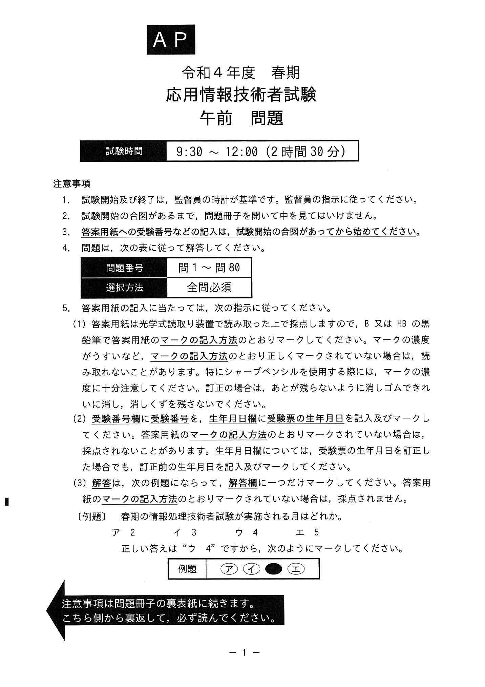

テキスト (OCR)

令和4年度 春期
応用情報技術者試験
午前 問題

 9:30 ~ 12:00 (2時間 30 分)

注意事項

1. 試験開始及び終了は, 監督具の時計が基準です。監督貞の指示に従ってください。
2. 試験開始の合図があるまで, 問題冊子を開いて中を見てはいけません。
3. 答案用紙への受験番号などの記入は, 試験開始の合図があってから始めてください。
4. 問題は, 次の表に従って解答してください。
問題番号   fa] 1 ~ Fa] 80
選択方法      全間必須
5. 答案用紙の記入に当たっては, 次の指示に従ってください。

(1) 答案用紙は光学式読取り装置で読み取った上で採点しますので, B 又は HB の黒
鉛筆で答案用紙のマークの記入方法のとおりマークしてください。マークの濃度
がうすいなど, マークの記入方法のとおり正しくマークされていない場合は, 読
み取れないことがあります。特にシャープペンシルを使用する際には, マークの濃
度に十分注意してください。訂正の場合は, あとが残らないように消しゴムできれ
いに消し, 消しくずを残さないでください。

(2) 受験番号欄に受験番号を, 生年月日棚に受験票の生年月日を記入及びマークし
てください。 答案用紙のマークの記入方法のとおりマークされていない場合は,
採点されないことがあります。生年月日欄については, 受験票の生年月日を訂正し
た場合でも, 訂正前の生年月日を記入及びマークしてください。

(3) 解答は, 次の例題にならって, 解答欄に一つだけマークしてください。和案用
紙のマークの記入方法のとおりマークされていない場合は, 採点されません。

【例題】 春期の情報処理技術者試験が実施される月はどれか。

ア 2   イ 3    ウ 4   x, 5
正しい答えは “ウ 4” ですから, 次のようにマークしてください。

例題 | 〈の(の ⑤

注意事項は問題冊子の裏表紙に続きます。
こちら側から裏返して, 必ず読んでください。

### ページ 2

### ページ 3

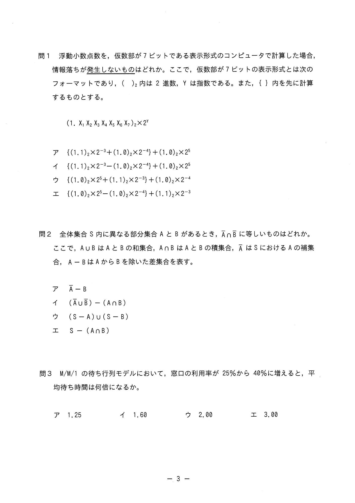

テキスト (OCR)

間1 浮動小数点数を, 仮数部が 7 ビットである表示形式のコンピュータで計算した場合,
情報落ちが発生しないものはどれか。ここで, 仮数部が 7 ビットの表示形式とは次の
フォーマットであり, ( )。 内は 2 進数, Y は指数である。また, { } 内を先に計算
するものとする。

(1. 6 Xg Xa Xs Xp X7 2 2"

に|

{(1.1)2X273+(1.0)2% 274} +(1.0)2% 28
{(1.1)2X 273 (1, 0)2.x 274} + (1.0)2X 2°
{(1.0).X 2+ (1. 1)2% 273} + (1.0).x 274
{(1.0).X25—(1.0).X 2-43 +(1.1).x273

H さ A

問2 全体集合 S 内に異なる部分集合 A と B があるとき, AnB に等しいものはどれか。
ここで, AUB はAとBの和集合, AnBはAとBの積集合, A は S におけるAの補集
合, AーBはAからBを除いた差集合を表す。

ア A-B

イ (AuB) 一(AnB)
ウ (S一A)U(S一B)
エ S$ — (AnB)

FAS M/M/1 の待ち行列モデルにおいて, 窓口の利用率が 259%から 40%に増えると, F
均待ち時間は何倍になるか。

ア 1.25    イ 1,60    ウ 2.00    エ 3.00

### ページ 4

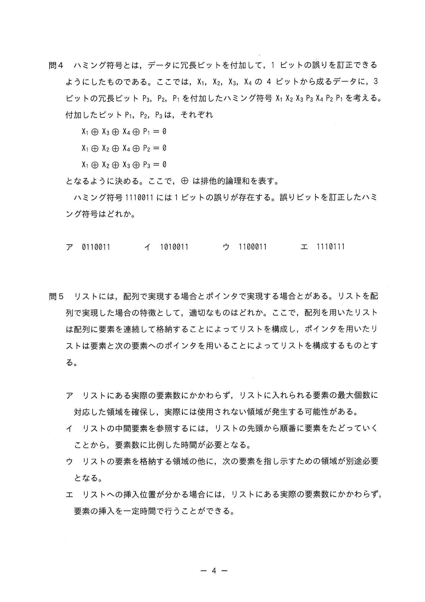

テキスト (OCR)

間4 ハミング符号とは, データに冗長ビットを付加して, 1 ビットの誤りを訂正できる
ようにしたものである。ここでは, Xi, Xz, X3, X4 の 4 ビットから成るデータに, 3
ビットの冗長ビット Ps, Po, Pi を付加したハミング符号 Xi Xz Xs Ps X4 Pz Pi を考える。
付加したビット Pi, Po, Psは, CHEN

Xi ® X3 @ Xa @ P} =
Xi ® X2 @ Xa ® P2 = O
X1 ® X2 ® X3 @ Ps = 0
となるように決める。ここで, O は排他的論理和を表す。
ハミング符号 1119911 には 1 ビットの誤りが存在する。誤りビットを訂正したハミ
ング符号はどれか。

ア 0110011   4 1010011    ウ 1100011   エ 1110111

AIS リストには, 配列で実現する場合とポインタで実現する場合とがある。リストを配
列で実現した場合の特徴として, 適切なものはどれか。ここで, 配列を用いたリスト
は配列に要素を連続して格納することによってリストを構成し, ポインタを用いたリ
ストは要素と次の要素へのポインタを用いることによってリストを構成するものとす
る。

ア リストにある実際の要素数にかかわらず, リストに入れられる要素の最大個数に
対応した領域を確保し, 実際には使用されない領域が発生する可能性がある。

イ リストの中間要素を参照するには, リストの先頭から順番に要素をたどっていく
ことから, 要素数に比例した時間が必要となる。

ウ リストの要素を格納する領域の他に, 次の要素を指し示すための領域が別途必要
となる。

エエ リストへの挿入位置が分かる場合には, リストにある実際の要素数にかかわらず,
要素の挿入を一定時間で行うことができる。

### ページ 5

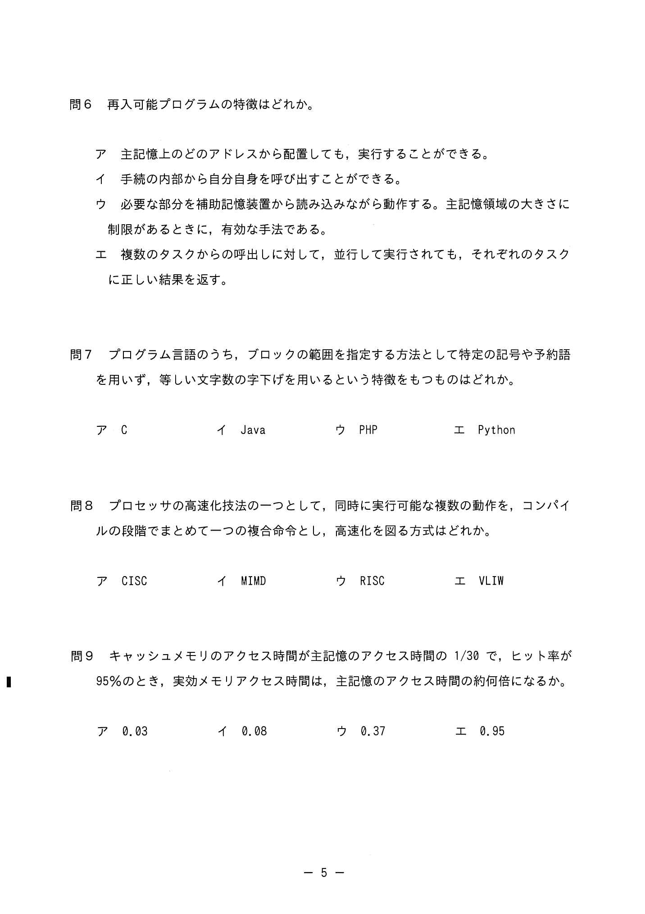

テキスト (OCR)

AG 再入可能プログラムの特徴はどれか。

ア 主記憶上のどのアドレスから配置しても, 実行することができる。

イ 手続の内部から自分自身を呼び出すことができる。

ウ 必要な部分を補助記憶装置から読み込みながら動作する。主記憶領域の大きさに
制限があるときに, 有効な手法である。

エ 複数のタスクからの呼出しに対して, 並行して実行されても, それぞれのタスク
に正しい結果を返す。

間7 プログラム言語のうち, ブロックの範囲を指定する方法として特定の記号や予約語
を用いず, 等しい文字数の字下げを用いるという特徴をもつものはどれか。

イ Java    ウ PHP     エ Python

に|
6う

AS プロセッサの高速化技法の一つとして, 同時に実行可能な複数の動作を, コンパイ
ルの段階でまとめて一つの複合命令とし, 高速化を図る方式はどれか。

ア CISC     イ MIMD     ウ RISC    x VLIW

間9 キャッシュメモリのアクセス時間が主記憶のアクセス時間の 1/30 で, ヒット率が

959%%のとき, 実効メモリアクセス時間は, 主記憶のアクセス時間の約何倍になるか。

ア 0.03     イ 0.08     ウ 0.37     エ 09.95

### ページ 6

テキスト (OCR)

間19 キャッシュメモリのフルアソシエイティブ方式に関する記述として, 適切なものは
どれか。

N

キャッシュメモリの各ブロックに主記憶のセットが固定されている。

キャッシュメモリの各ブロックに主記憶のブロックが固定されている。

主記憶の特定の1 ブロックに専用のキャッシュメモリが割り当てられる。
任意のキャッシュメモリのブロックを主記憶のどの部分にも割り当てられる。

H + A

間11 8T バイトの磁気ディスク装置 6 台を, 予備ディスク (ホットスペアディスク) 1台
込みの RAIDS 構成にした場合, 実効データ容量は何T バイトになるか。

問12 プロセッサ数と, 計算処理におけるプロセスの並列化が可能な部分の割合とが, 性
能向上へ及ぼす影響に関する記述のうち, アムダールの法則に基づいたものはどれか。

ア 全ての計算処理が並列化できる場合, 速度向上比は, プロセッサ数を増やしても
ある水準に滞近的に近づく。

イ 並列化できない計算処理がある場合, 速度向上比は, プロセッサ数に比例して増
加する。

ウ 並列化できない計算処理がある場合, 速度向上比は, プロセッサ数を増やしても
ある水準に滞近的に近づく。

エ 並列化できる計算処理の割合が増えると, 速度向上比は, プロセッサ数に反比例
して減少する。

### ページ 7

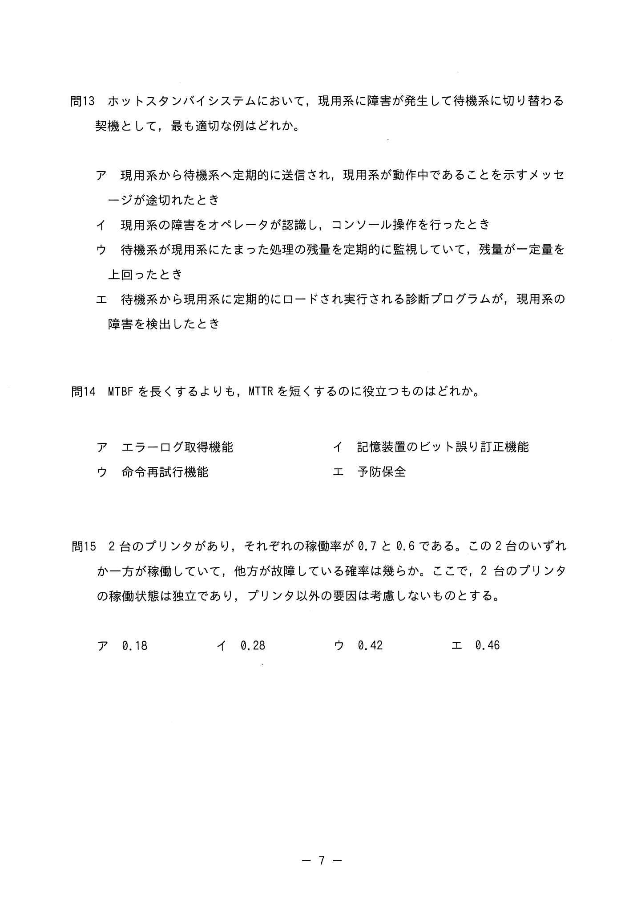

テキスト (OCR)

間13 ホットスタンバイシステムにおいて, 現用系に障害が発生して待機系に切り替わる
契機として, 最も適切な例はどれか。

ア 現用系から待機系へ定期的に送信され, 現用系が動作中であることを示すメッセ
ージが途切れたとき

イ 現用系の障害をオペレータが認識し, コンソール操作を行ったとき

ウ 待機系が現用系にたまった処理の残量を定期的に監視していて, 残量が一定量を
上回ったとき

エ 待機系から現用系に定期的にロードされ実行される診断プログラムが, 現用系の
障害を検出したとき

間14 MTBF を長くするよりも, MTTR を短くするのに役立つものはどれか。

H

Ne

=>

ad

|

Boo

iN

= 言

me a
Rs
RS

H ~

記憶装置のビット誤り訂正機能
予防保全

FAIS 2 台のプリンタがあり, それぞれの稼働率が 0.7 と 0.6 である。この 2 台のいずれ
か一方が稼働していて, 他方が故障している確率は幾らか。ここで, 2 台のプリンタ
の稼働状態は独立であり, プリンタ以外の要因は考慮しないものとする。

ア 9.18     4 9.28     ウ 0.42    エ 0.46

### ページ 8

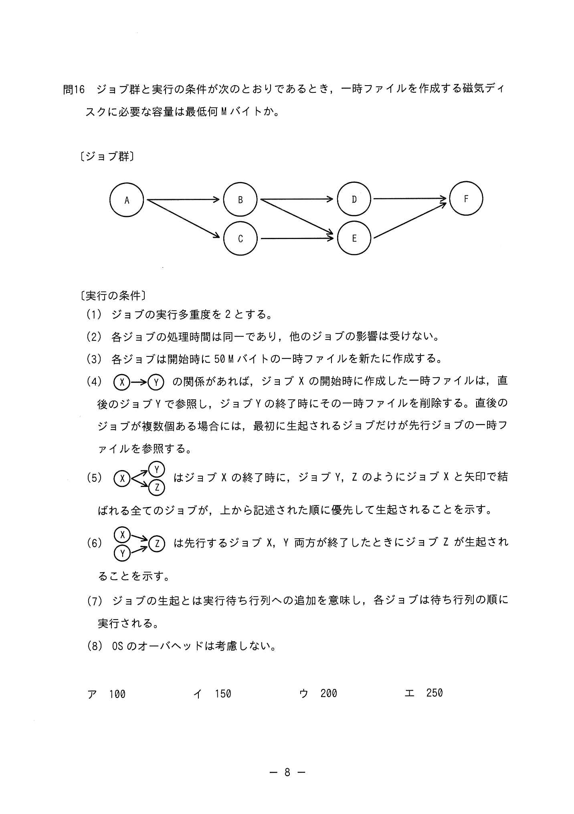

テキスト (OCR)

間16 ジョブ群と実行の条件が次のとおりであるとき, 一時ファイルを作成する磁気ディ
スクに必要な容量は最低何 M バイトか。

〔実行の条件]
(1) ジョブの実行多重度を 2 とする。

(2) 各ジョブの処理時間は同一であり, 他のジョブの影響は受けない。

(3) 各ジョブは開始時に 59 M バイトの一時ファイルを新たに作成する。

(4) MQ) の関係があれば, ジョブ X の開始時に作成した一時ファイルは, 直
後のジョブY CBRL, ジョブ Y の終了時にその一時ファイルを削除する。直後の
ジョブが複数個ある場合には, 最初に生起されるジョブだけが先行ジョブの一時フ
ァイルを参照する。

(5) o<g はジョブ X の終了時に, ジョブ Y, 7 のようにジョブ X と矢印で結
ばれる全てのジョブが, 上から記述された順に優先して生起されることを示す。

© Bo  AIT SVATX, 両方が終了したときにジョブ Z が生起され
ることを示す。
(7) ジョブの生起とは実行待ち行列への追加を意味し, 各ジョブは待ち行列の順に
実行される
(8) 0S のオーバヘッドは考慮しない。

ア 100     イ 150     ウ 200     エ 250

### ページ 9

テキスト (OCR)

FRI? 一つの IC バスに接続された二つのセンサがある。それぞれのセンサ値を読み込む
ニニつのタスクで排他的に制御したい。利用するリアルタイム OS の機能として, 適切
なものはどれか。

アア キミュー           イ セマフォ
ウ マルチスレッド        エ ラウンドロビン

間18 フラグメンテーションに関する記述のうち, 適切なものはどれか。

ア 可変長ブロックのメモリプール管理方式では, 様々な大きさのメモリ領域の獲得
や返却を行ってもフラグメンテーションは発生しない。

4 固定長ブロックのメモリプール管理方式では, 可変長ブロックのメモリプール管
理方式よりもメモリ領域の獲得と返却を速く行えるが, フラグメンテーションが発
生しやすい。

ウ フラグメンテーションの発生によって, 合計としては十分な空きメモリ領域があ
るにもかかわらず, 必要とするメモリ領域を獲得できなくなることがある。

エ メモリ領域の獲得と返却の頻度が高いシステムでは, フラグメンテーションの発
生を防止するため, メモリ領域が返却されるたびにガーベジコレクションを行う必
要がある。

間19 複数のクライアントから接続されるサーバがある。このサーバのタスクの多重度が
2 以下の場合,タスク処理時間は常に 4 秒である。このサーバに 1 秒間隔で 4 件の処
理要求が到着した場合, 全ての処理が終わるまでの時間はタスクの多重度が1のとき
と 2 のときとで, 何秒の差があるか。

NI
に
ae
~
Ng
©
H
にっ)

### ページ 10

テキスト (OCR)

間20 FPGAの説明として, 適切なものはどれか。

XN

電気的に記憶内容の書換えを行うことができる不揮発性メモリ

特定の分野及びアプリケーション用に限定した特定用途向け汎用集積回路
浮動小数点数の演算を高速に実行する演算エユニット

論理回路を基板上に実装した後で再プログラムできる集積回路

H GA

### ページ 11

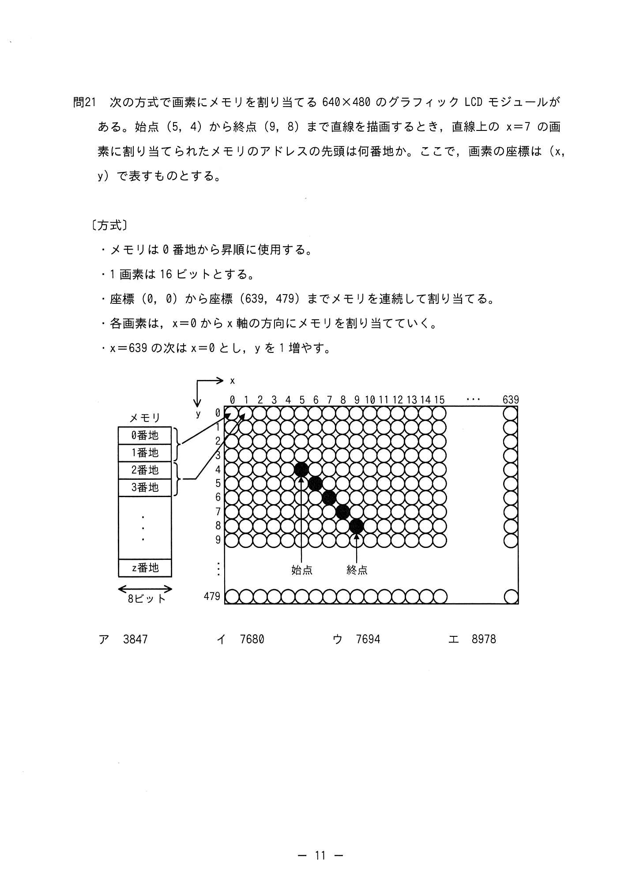

テキスト (OCR)

間21 次の方式で画素にメモリを割り当てる 640X480 のグラフィック LOD モジュールが
ある。 始点 (5, 4) から終点 (9, 8) まで直線を描画するとき, 直線上の x=7 OF
素に割り当てられたメモリのアドレスの先頭は何番地か。ここで, 画素の座標は (x,
y) で表すものとする。

(xX)
・メモリは 0 番地から昇順に使用する。
・1 画素は 16 ビットとする。
・座標 (9, 0) から座標 (639。 479) までメモリを連続して割り当てる。
・各画素は, x三0 から x 軸の方向にメモリを割り当てていく。
・x三639 の次は x=0ECL, y を 1 増やす。

x
!   9 1 2 3 4 5 6 7 8 9 101112131415  RES  639

y 0 Rott                       人人人人 )

メモリ
9番地
1番地

2番地
3番地

z番地

でーーーテ>
8ビットド          479 DOC OOCOOOOOOOOOCO

ア 3847     4 7680     ウ 7694     エ 8978

### ページ 12

テキスト (OCR)

間22 アクチュエータの説明として, 適切なものはどれか。

ア 与えられた目標量と, センサから得られた制御量を比較し, 制御量を目標量に一
致させるように操作量を出力する。

イ 位置, 角度, RE, URE, 力, 温度などを検出し, 電気的な情報に変換する。

ウ エネルギー源からのパワーを, 回転, 直進などの動きに変換する。

エエ マイクロフォン, センサなどが出力する微小な電気信号を増幅する。

間23 マイクロプロセッサの耐タンパ性を向上させる手法として, 適切なものはどれか。

に|

ESD (Electrostatic Discharge) に対する耐性を強化する。

チップ検査終了後に検査用パッドを残しておく。

チップ内部を物理的に解析しようとすると, 内部回路が破壊されるようにする。
内部メモリの物理アドレスを整然と配置する。

H WG 4X

間244 ユーザインタフェースのユーザビリティを評価するときの, 利用者が参加する手法
と専門家だけで実施する手法との適切な組みはどれか。

利用者が参加する手法          専門家だけで実施する手法
ア | アンケート                      回顧法
4 | 回顧法                            思考発話法
ウ | 思考発話法                         ヒューリスティック評価法
x | 認知的ウォークスル一法       ヒューリスティック評価法

### ページ 13

テキスト (OCR)

間25 レイトレーシング法の説明として, 適切なものはどれか。

ア スクリーンの全ての画素について, 視線と描画の対象となる物体との交点を反射
属性や透明属性なども含めて計算し, その中から視点に最も近い交点を選択する。

イ スクリーンの走査線ごとに視点とその走査線を結ぶ走査面を作成し, 各走査面と
描画の対象となる物体との交差を調べて交差線分を求め, 奥行き判定を行うことに
よって描画する。

ウ 描画の対象となる二つの物体のうち, 一方が近くに, もう一方が遠くにあるとき
に, まず遠くの物体を描いてから近くの物体を重ね書きする。

エ 描画の対象となる物体の各面をピクセルに分割し, ピクセルごとに視点までの距
離を計算し, その最小値を作業領域に保持することによって, 視点までの距離が最
小となる面を求める。

間26 CAP 定理におけるAとPの特性をもつ分散システムの説明として, 適切なものはど
nD.

NI

可用性と整合性と分断耐性の全てを満たすことができる。
可用性と整合性を満たすが分断面性を満たさない。
可用性と分断耐性を満たすが整合性を満たさない。
整合性と分断耐性を満たすが可用性を満たさない。

H GAN

### ページ 14

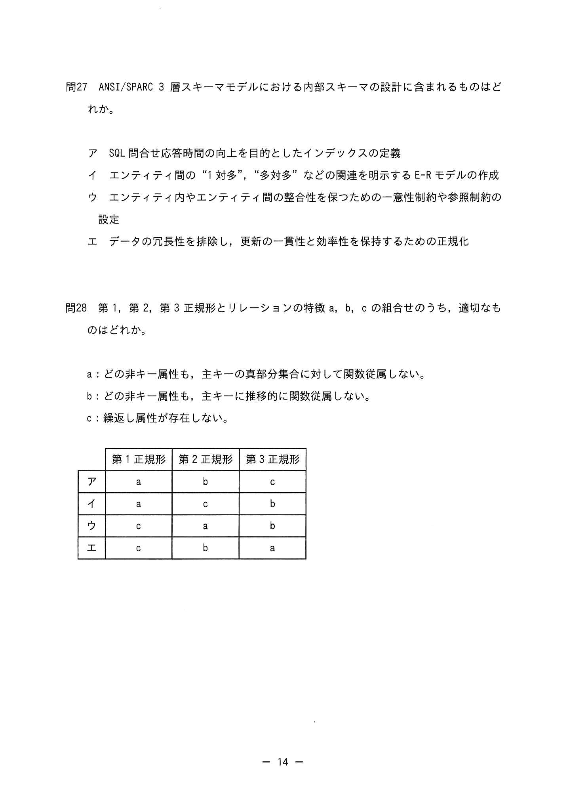

テキスト (OCR)

間27 ANSI/SPARC 3 層スキーマモデルにおける内部スキーマの設計に含まれるものはど

れ

Pi

イ エンティティ間の “1 対多",

か。

SQL 問合せ応答時間の向上を目的としたインデックスの定義

“EHS” などの関連を明示する E-R モデルの作成

ウ エンティティ内やエンティティ間の整合性を保つための一意性制約や参照制約の

aE

xB

定
デー

タの冗長性を排除し, 更新の一貫性と効率性を保持するための正規化

間28 第1, 第2, 第3 正規形とリレーションの特徴 a, b, c の組合せのうち, 適切なも

の

はどれか。

a: どの非キー属性も, 主キーの真部分集合に対して関数従属しない。
b : どの非キー属性も, 主キーに推移的に関数従属しない。
c : 繰返し属性が存在しない。

第 1 正規形 | 第2 正規形 | 第 3 正規形
ア         a              b              c
4          a              C              b
ウ          c              a              b
==.         C              b              a

### ページ 15

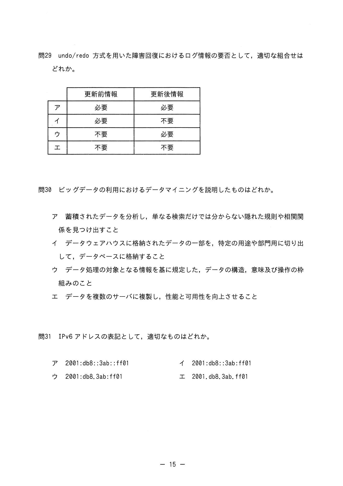

テキスト (OCR)

間29 undo/redo 方式を用いた障害回復におけるログ情報の要否として, 適切な組合せは
どれか。

更新前情報            更新後情報
アァ            必要                   必要
4             必要                   不要
5            RE                   必要
中            不要                   不要

間39 ビッグデータの利用におけるデータマイニングを説明したものはどれか。

ア 蓄積されたデータを分析し, 単なる検索だけでは分からない隠れた規則や相関関
係を見つけ出すこと

イ データウェアハウスに格納されたデータの一部を, 特定の用途や部門用に切り出
して, データベースに格納すること

ウ データ処理の対象となる情報を基に規定した, データの構造, 意味及び操作の枠
組みのこと

エ データを複数のサーバに複製し, 性能と可用性を向上させること

間31 IPv6 アドレスの表記として, 適切かものはどれか。

ア 2001:db8::3ab::ff01      イ 2001:db8::3ab:ff01
ウ 2001:db8.3ab:ff91       エ 2001. db8. 3ab. ff01

### ページ 16

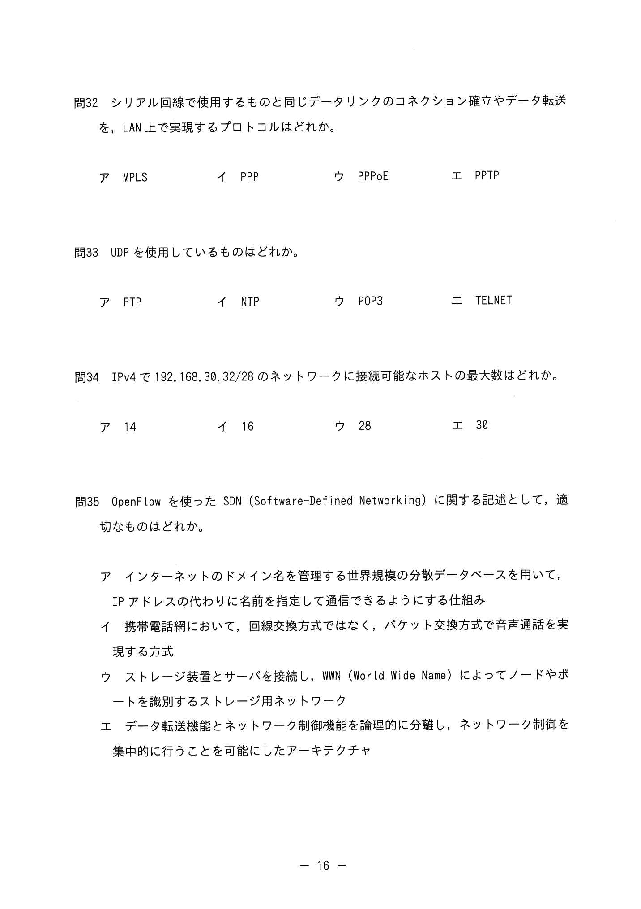

テキスト (OCR)

間32 シリアル回線で使用するものと同じデータリンクのコネクション確立やデータ転送
を, LAN 上で実現するプロトコルはどれか。

ア MPLS     イ PPP     ウ PPPoE    エ PPTP

問33 UDP を使用しているものはどれか。

ア FTP     イ NTP     ウ POP3     I TELNET

間34 TPv4 で 192, 168, 30.32/28 のネットワークに接続可能なホストの最大数はどれか。

ア 14     イ 16     ウ 28    エ 30

F535 OpenFlow を使った SDN (Software-Defined Networking) に関する記述として, 適
切なものはどれか。

ア インターネットのドメイン名を管理する世界規模の分散データベースを用いて,
IP アドレスの代わりに名前を指定して通信できるようにする仕組み
イ 携帯電話網において, 回線交換方式ではなく, パケット交換方式で音声通話を実
現する方式
ウ ストレージ装置とサーバを接続し, WWN (World Wide Name) によってノードやポ
ートを識別するストレージ用ネットワーク
エ データ転送機能とネットワーク制御機能を論理的に分離し, ネットワーク制御を
集中的に行うことを可能にしたアーキテクチャ

### ページ 17

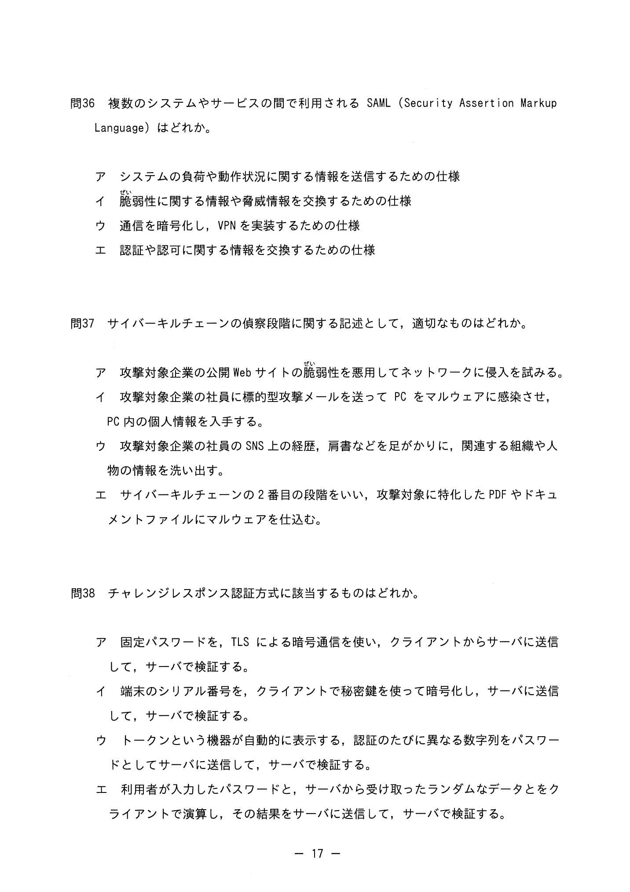

テキスト (OCR)

問36 複数のシステムやサービスの間で利用される SAML (Security Assertion Markup
Language) はどれか。

に|

システムの負荷や動作状況に関する情報を送信するための仕欄
脆弱性に関する情報や償威情報を交換するための仕欄

通信を暗号化し, VPN を実装するための仁欄

認証や認可に関する情報を交換するための仕様

H WG SX

間37 +4 NAS IDF TY ORERIBICRS SacMkc LT, 適切なものはどれか。

ア 攻撃対象企業の公開 Wed サイトの脆弱性を悪用してネットワークに侵入を試みる。
イ 攻撃対象企業の社員に標的型攻撃メールを送って PC をマルウェアに感染させ,
PC 内の個人情報を入手する。

ウ 攻撃対象企業の社員の SNS 上の経歴, 肩書などを足がかりに, 関連する組織や人
物の情報を洗い出す。

エ サイバーキルチェーンの 2 番目の段階をいい, 攻撃対象に特化した PDF やドキュ
メントファイルにマルウェアを仕込む。

間38 チャレンジレスポンス認証方式に該当するものはどれか。

ア 固定パスワードを, TLS による暗号通信を使い。 クライアントからサーバに送信
LT, サーバで検証する。

イ 端末のシリアル番号を, クライアントで秘密鍵を使って暗号化し,。 サーバに送信
して, サーバで検証する。

ウ トークンという機器が自動的に表示する, 認証のたびに異なる数字列をパスワー
ドとしてサーバに送信して, サーバで検証する。

エ 利用者が入力したパスワードと, サーバから受け取ったランダムなデータとをク
ライアントで演算し, その結果をサーバに送信して, サーバで検証する。

### ページ 18

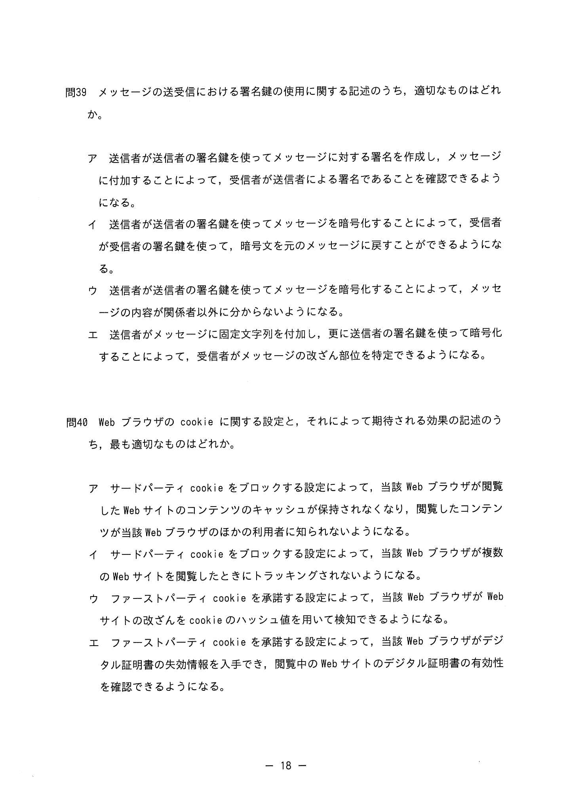

テキスト (OCR)

か。

M39 メッセージの送受信における署名鍵の使用に関する記述のうち, 適切なものはどれ
ア
になる。

る。

送信者が送信者の署名鍵を使ってメッセージに対する署名を作成し, メッセージ
イ 送信者が送信者の署名鍵を使ってメッセージを晴号化することによって, 受信者

に付加することによって, 受信者が送信者による署名であることを確認できるよう

が受信者の署名鍵を使って, 暗号文元のメッセージに戻すことができるようにな

ウ 送信者が送信者の署名鍵を使ってメッセージを暗号化することによって, AVE
ージの内容が関係者以外に分からないようになる。

エ 送信者がメッセージに固定文字列を付加し, 更に送信者の署名鍵を使って暗号化
間49 Web ブラウザの cookie に関する

ミル
ax AE

することによって, 受信者がメッセージの改ざん部位を特定できるようになる。
ze

ち, 最も適切なかものはどれか。

と, それによって期待される効果の記述のう
サードパーティ cookie をブロックする設定によって, 当該 Web ブラウザが閲覧
した Web サイトのコンテンツのキャッシュが保持されなくなり, 閲覧したコンテン

ツが当該 Web ブラウザのほかの利用者に知られないようになる。
イ サードパーティ cookie をブロックする

ミル っ
BX AE

ウ ファーストパーティ cookie を承諾する

Bx AL

の Web サイトを閲覧したときにトラッキングされないようになる。

によって, 当該 Web ブラウザが複数

サイトの改ざんを cookie のハッシュ値を用いて検知できるようになる。
タル証明書の失効情報を入手でき

によって, 当該 Web ブラウザが Web
エエ ファーストパーティ cookie を承諾する設定によって, 当該 Web ブラウザがデジ
閲覧中の Web サイトのデジタル証明書の有効性
を確認できるようになる。

### ページ 19

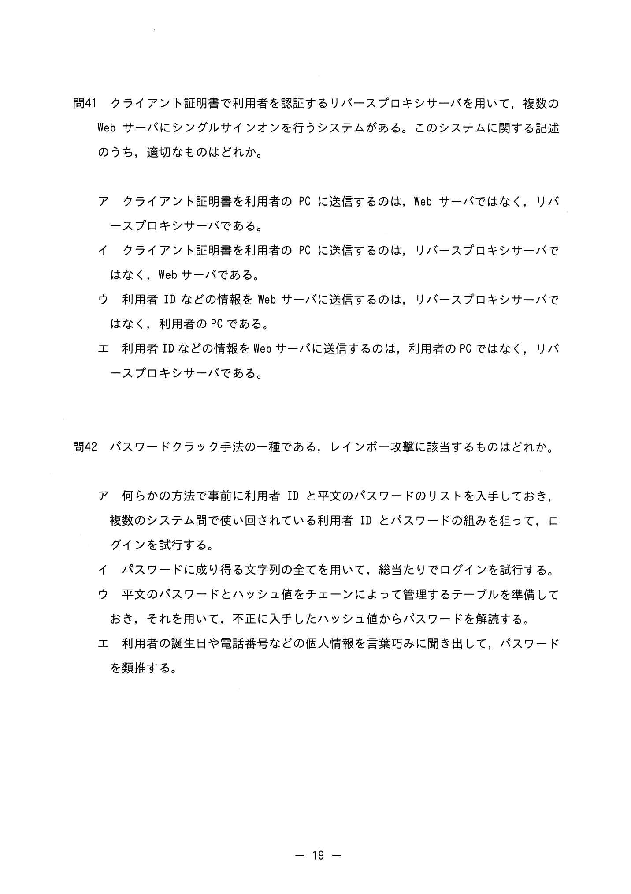

テキスト (OCR)

問41 クライアント証明書で利用者を認証するリバースプロキシサーバを用いて, 複数の
Web サーバにシングルサインオンを行うシステムがある。このシステムに関する記述
のうち, 適切なものはどれか。

ア クライアント証明書を利用者の PC に送信するのは, Web サーバではなく, リバ
ースプロキシサーバである。

イ クライアント証明書を利用者の PC に送信するのは, リバースプロキシサーバで
はなく, Web サーバである。

ウ 利用者 ID などの情報を Web サーバに送信するのは, リバースプロキシサーバで
はなく, 利用者の PC である。

エ 利用者 ID などの情報を Web サーバに送信するのは, 利用者の PC ではなく, リバ
ースプロキシサーバである。

問42 パスワードクラック手法の一種である, レインボー攻撃に該当するものはどれか。

ア 何らかの方法で事前に利用者 ID と平文のパスワードのリストを入手しておき,
複数のシステム間で使い回されている利用者 ID とパスワードの組みを狙って, A
グインを試行する。

イ パスワードに成り得る文字列の全てを用いて, 総当たりでログインを試行する。

ウ 平文のパスワードとハッシュ値をチェーンによって管理するテーブルを準備して
おき, それを用いて, 不正に入手したハッシュ値からパスワードを解読する。

I 利用者の誕生日や電話番号などの個人情報を言葉巧みに聞き出して, パスワード
を類推する。

### ページ 20

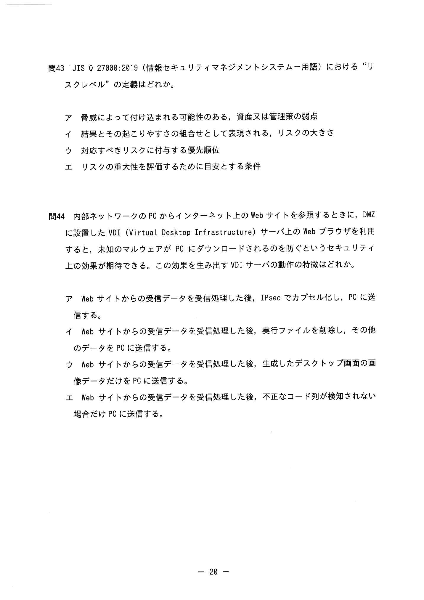

テキスト (OCR)

間43 JIS Q 27000:2019 (情報セキュリティマネジメントシステムー用語) における “Y
スクレベル" の定義はどれか。

に|

脅威によって付け込まれる可能性のある, 資産又は管理策の弱点

イ 結果とその起こりやすさの組合せとして表現される, リスクの大きさ
ウ 対応すべきリスクに付与する優先順位

エ リスクの重大性を評価するために目安とする条件

間44 内部ネットワークのPC からインターネット上の Web サイトを参照するときに, DMZ
に設置した VDI (Virtual Desktop Infrastructure) サーバ上の Web ブラウザを利用
すると, 未知のマルウェアが PC にダウンロードされるのを防ぐというセキュリティ
上の効果が期待できる。この効果を生み出す VWI サーバの動作の特徴はどれか。

ア Web サイトからの受信データを受信処理した後, IPsec でカプセル化し, PC に送
信する。

イ Web サイトからの受信データを受信処理した後, 実行ファイルを削除し, その他
のデータを PC に送信する。

ウ Web サイトからの受信データを受信処理した後, 生成したデスクトップ画面の画
像データだけを PC に送信する。

エエ Web サイトからの受信データ を受信処理した後, 不正なコード列が検知されない
場合だけ PC に送信する。

### ページ 21

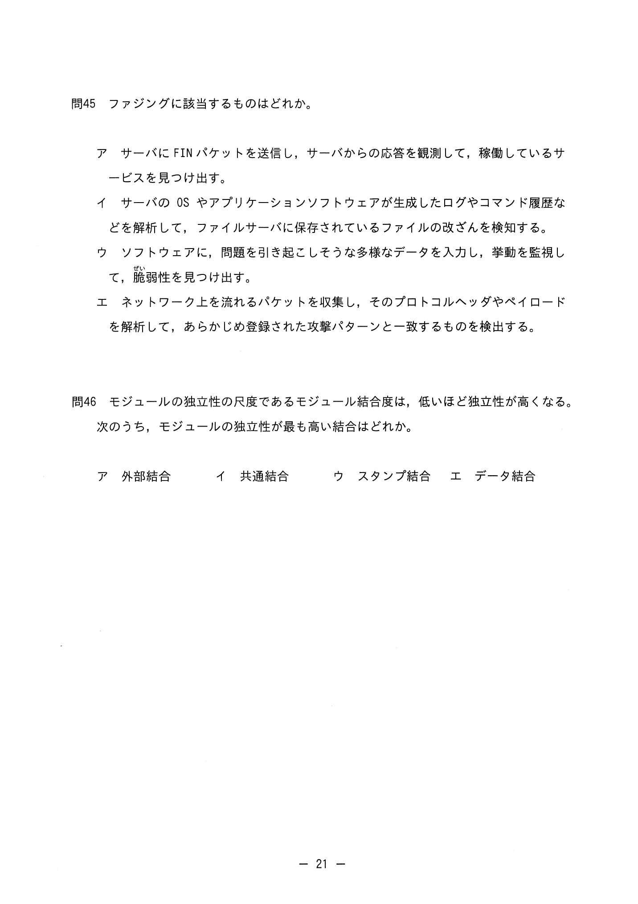

テキスト (OCR)

間45 ファジングに該当するものはどれか。

ア サーバに「『IN パケットを送信し, サーバからの応答を観測して, 稼働しているサ
ービスを見つけ出す。

イ サーバの US やアプリケーションソフトウェアが生成したログやコマンド履歴な
どを解析して, ファイルサーバに保存されているファイルの改ざんを検知する。
ウ ソフトウェアに, 問題を引き起こしそうな多様なデータを入力し, SHEBRL

て, 脆弱性を見つけ出す。
LT ネットワーク上を流れるパケットを収集し, そのプロトコルヘッダやペイロード
を解析して, あらかじめ登録された攻撃パターンと一致するものを検出する。

F46 モジュールの独立性の尺度であるモジュール結合度は, 低いほど独立性が高くなる。
次のうち, モジュールの独立性が最も高い結合はどれか。

ア 外部結合   イ 共通結合   ウ スタンプ結合 エ データ結合

### ページ 22

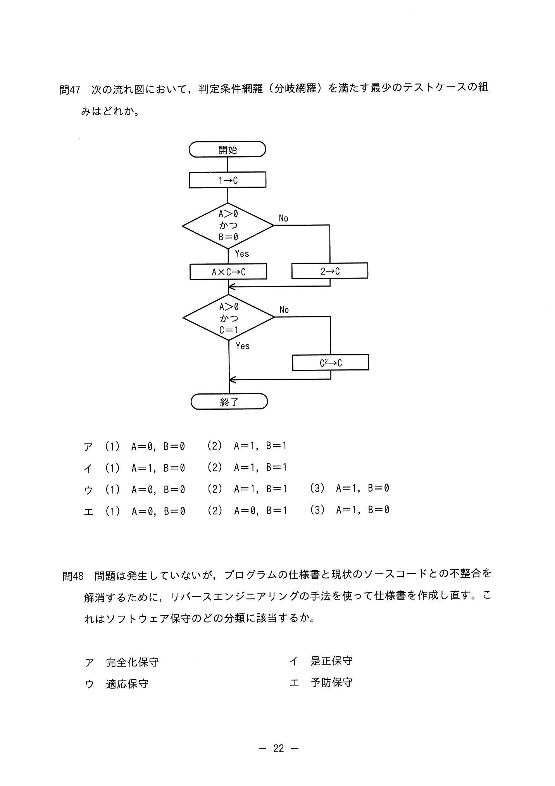

テキスト (OCR)

問47 次の流れ図において, HERE (RE) を満たす最少のテストケースの組
みはどれか。

に|

(1)
⑪)
(1)
(1)

H +s AN

終了
(2) A=1, B=1
(2) A=1, B=1
(2) A=1, B=1   (3) A=1, B=0
(2) A=0, B=1   (3) A=1, B=6

問48 問題は発生していないが, プログラムの仕様書と現状のソースコードとの不整合
解消みるために, リバースエンジニアリングの手法を使って仕様書を作成し直す。こ
れはソフトウェア保守のどの分類に該当するか。

ア 完全化保守

ウ 適応保守

イ 是正保守
エ 予防保守

### ページ 23

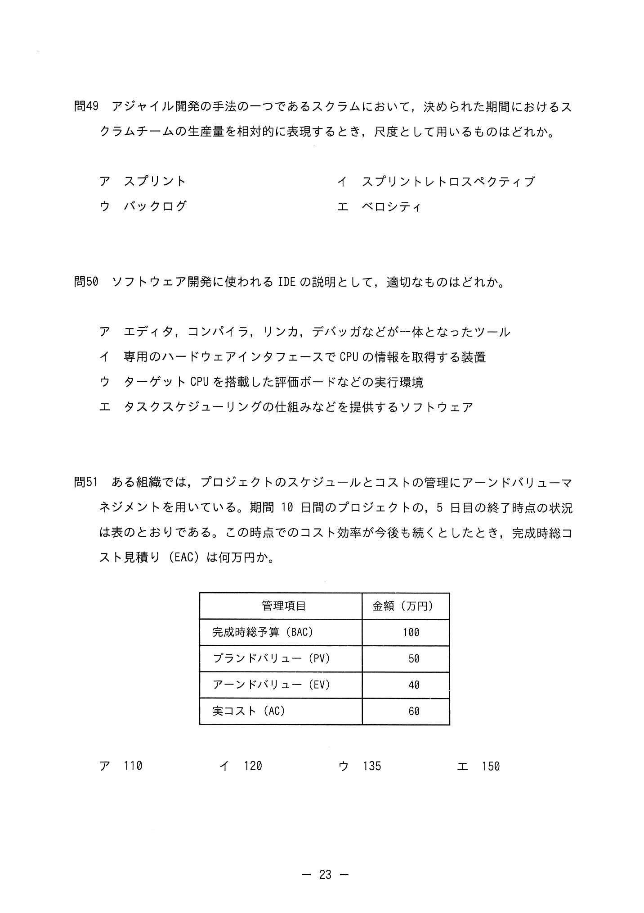

テキスト (OCR)

間49 アジャイル開発の手法の一つであるスクラムにおいて, 決められた期間におけるス
クラムチームの生産量を相対的に表現するとき, 尺度として用いるものはどれか。

ア スプリント               イ スプリントレトロスペクティブ

ウ バックログ               エー ベロシティ

間59 ソフトウェア開発に使われる IDE の説明として, 適切なものはどれか。

N

エディタ, コンパイラ, リンカ, デバッガなどが一体となったツール
専用のハードウェアインタフェースで CPUの情報を取得する装置
ターゲット CPU を搭載した評価ボードなどの実行環境

タスクスケジューリングの仕組みなどを提供するソフトウェア

Hot AN

間51 ある組織では, プロジェクトのスケジュールとコストの管理にアーンドバリューマ
ネジメントを用いている。 期間 10 日間のプロジェクトの, 5 日目の終了時点の状況
は表のとおりである。この時点でのコスト効率が今後も続くとしたとき, 完成時総コ
スト見積り (EAC) は何万円か。

管理項目        金額 (万円)
完成時総予算 (BAC)            100
プランドバリュー (PV)            50
アーンドバリュー (EV)           40
実コスト (AC)                 60
ア 110         4 120         ウ 135         エ 150

### ページ 24

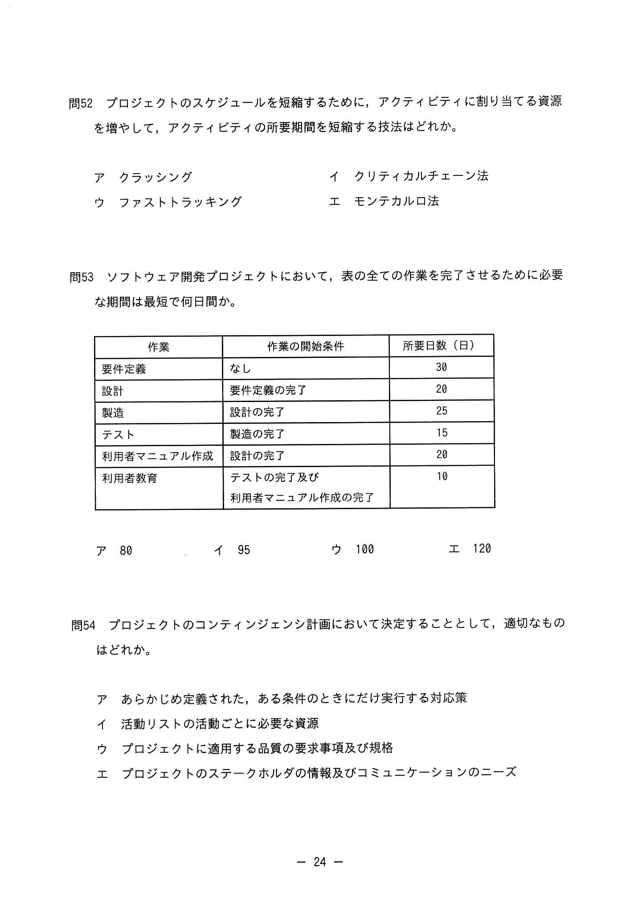

テキスト (OCR)

間52 プロジェクトのスケジュールを短縮するために, アクティビティに割り当てる資源
を増やして, アクティビティの所要期間を短縮する技法はどれか。

|
NUN
Nl
Ss
wr ぎ

シング                イ クリティカルチェーン法
トラッキング       エ モンテカルロ法

間53 ソフトウェア開発プロジェクトにおいて, 表の全ての作業を完了させるために必要
な期間は最短で何日間か。

作業        作業の開始条件     所要日数 (日)
要件定義               なし                                30
設計                   要件定義の完了                       20
製造                  設計の完了                          25
テスト        製造の完了             15
利用者マニュアル作成 | 設計の完了                      20
利用者教育      テストの完了及び          10
利用者マニュアル作成の完了

ア 89     イ 95     ウ 100     エ 120

間54 プロジェクトのコンティンジェンシ計画において決定することとして, 適切なもの
はどれか。

あらかじめ定義された, ある条件のときにだけ実行する対応策

イ 活動リストの活動ごとに必要な資源

ウ プロジェクトに適用する品質の要求事項及び規格

エ プロジェクトのステークホルダの情報及びコミュニケーションのニーズ

### ページ 25

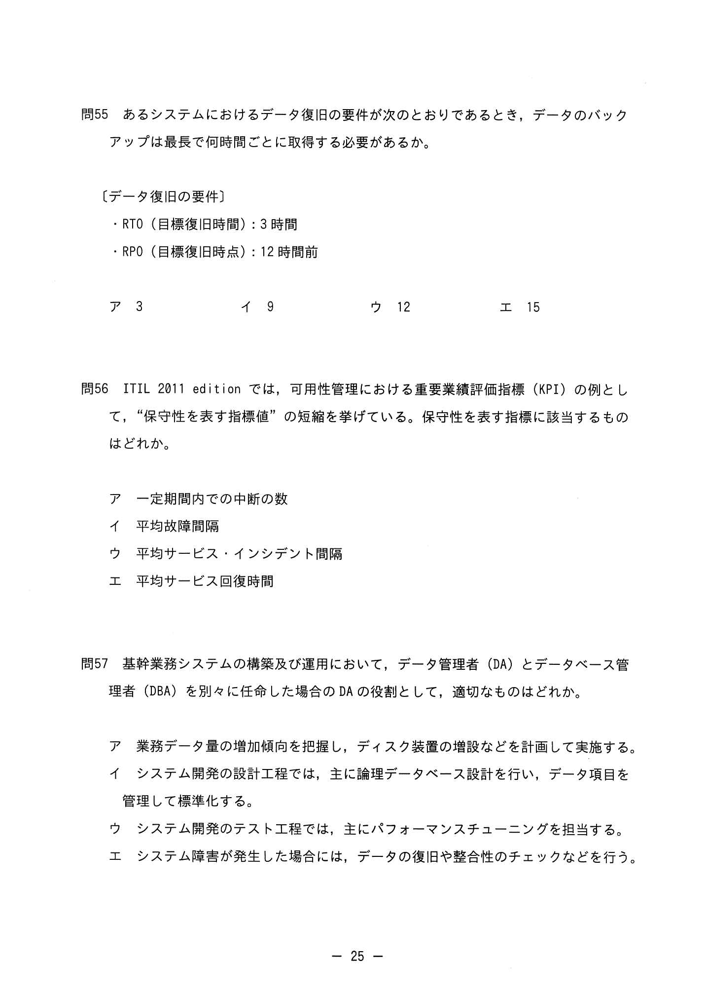

テキスト (OCR)

問55 あるシステムにおけるデータ復旧の要件が次のとおりであるとき, データのバック
アップは最長で何時間ごとに取得する必要があるか。

〔データ復旧の要件]
・RTO (目標復旧時間) : 3 時間
・RPO (目標復旧時点) : 12 時間前

NI
w
ae
o
Nu
nD
H

15

間56 ITIL 2011 edition では, 可用性管理における重要業績評価指標 (KPI) の例とし
て, “保守性を表す指標値" の短縮を挙げている。 保守性を表す指標に該当するもの
はどれか。

に|

ー定期間内での中断の数

平均故障間隔

平均サービス・インシデント間隔
平均サービス回復時間

H WAX

問57 基幹業務システムの構築及び運用において, データ管理者 (DA) とデータベース管
理者 (DBA) を別々に任命した場合の DA の役割として, 適切なものはどれか。

ア 業務データ量の増加傾向を把握し, ディスク装置の増設などを計画して実施する。
イ システム開発の設計工程では, 主に論理データベース設計を行い, データ項目を
管理して標準化する。

ウ システム開発のテスト工程では, 主にパフォーマンスチューニングを担当する。

エ システム障害が発生した場合には, データの復旧や整合性のチェックなどを行う。

### ページ 26

テキスト (OCR)

問58 事業継続計画 (BCP) について監査を実施した結果, 適切な状況と判断されるもの
はどれか。

に

従業員の緊急連絡先リストを作成し, 最新版に更新している。

重要書類は複製せずに, 1 か所で集中保管している。

全ての業務について, 優先順位なしに同一水準の BCP を策定している。
平時には BCP を従業員に非公開としている。

H VGA

問59 監査調書に関する記述のうち, 適切なものはどれか。

ア 監査調書には, 監査対象部門以外においても役立つ情報があるので, 全て企業内
で公開すべきである。

イ 監査調書の役割として, 監査実施内容の客観性を確保し, 監査の結論を支える合
理的な根拠とすることなどが挙げられる。

> 監査調書は, 通常, 電子媒体で保管されるが, 機密保持を徹底するためバックア
ップは作成すべきではない。

エ 監査調書は監査の過程で入手した客観的な事実の記録なので, 監査担当者の所見
は記述しない。

### ページ 27

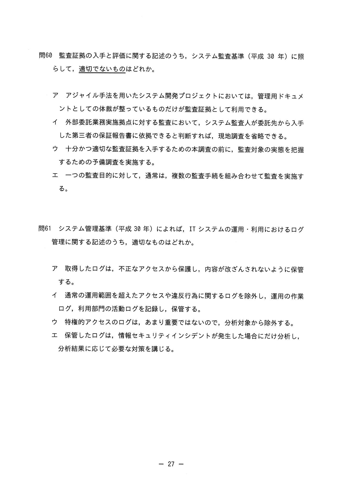

テキスト (OCR)

問69 監査証拠の入手と評価に関する記述のうち, システム監査基準 (平成 3 年) に照
らして, 適切でないものはどれか。

ア アジャイル手法を用いたシステム開発プロジェクトにおいては, 管理用ドキュメ
ントとしての体裁が整っているものだけが監査証拠として利用できる。

イ 外部委託業務実施拠点に対する監査において, システム監査人が委託先から入手
した第三者の保証報告書に依拠できると判断すれば, 現地調査を省略できる。

ウ 十分かつ適切な監査証拠を入手するための本調査の前に, 監査対象の実態を把握
するための予備調査を実施する。

エエ 一つの監査目的に対して, 通常は, 複数の監査手続を組み合わせて監査を実施す
る。

問61 システム管理基準 (平成 39 年) によれば, IT システムの運用・利用におけるログ
管理に関する記述のうち, 適切かものはどれか。

ア 取得したログは, 不正なアクセスから保護し, 内容が改ざんされないように保管
する。

イ 通常の運用範囲を超えをたアクセスや違反行為に関するログを除外し, 運用の作業
ログ, 利用部門の活動ログを記録し, 保管する。

ウ 特権的アクセスのログは, あまり重要ではないので, 分析対象から除外する。

エ 保管したログは, 情報セキュリティインシデントが発生した場合にだけ分析し,
分析結果に応じて必要な対策を講じる。

### ページ 28

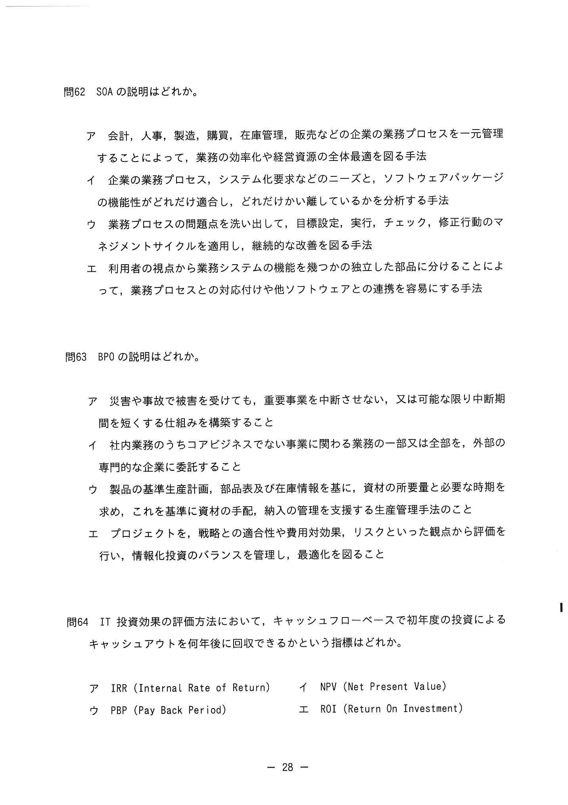

テキスト (OCR)

問62 SOA の説明はどれか。

ア 会計 人事, 製造,購買, 在庫管理, 販売などの企業の業務プロセスを一元管理
することによって, 業務の効率化や経営資源の全体最適を図る手法

イ 企業の業務プロセス, システム化要求などのニーズと, ソフトウェアパッケージ
の機能性がどれだけ適合し, どれだけかい離しているかを分析する手法

ウ 業務プロセスの間題点を洗い出して, 目標設定, 実行チェック, 修正行動のマ
ネジメントサイクルを適用し, 継続的な改善を図る手法

エ 利用者の視点から業務システムの機能を幾つかの独立した部品に分けることによ
って, 業務プロセスとの対応付けや他ソフトウェアとの連携を容易にする手法

間63 BPOの説明はどれか。

ア 災害や事故で被害を受けても, 重要事業を中断させない, 又は可能な限り中断其
間を短くする仕組みを構築すること

イ 社内業務のうちコアビジネスでない事業に関わる業務の一部又は全部を, 外部の
専門的な企業に委託すること

ウ 製品の基準生産計画, 部品表及び在庫情報を基に, 資材の所要量と必要な時期を
求め, これを基準に資材の手配, 納入の管理を支援する生産管理手法のこと

エ プロジェクトを, 戦略との適合性や費用対効果, リスクといった観点から評価を
行い, 情報化投資のバランスを管理し, 最適化を図ること

間64 IT 投資効果の評価方法において, キャッシュフローベースで初年度の投資による
キャッシュアウトを何年後に回収できるかという指標はどれか。

ア IRR (Internal Rate of Return)    4 NPV (Net Present Value)

ウ PBP (Pay Back Period)         エ ROI (Return On Investment)

### ページ 29

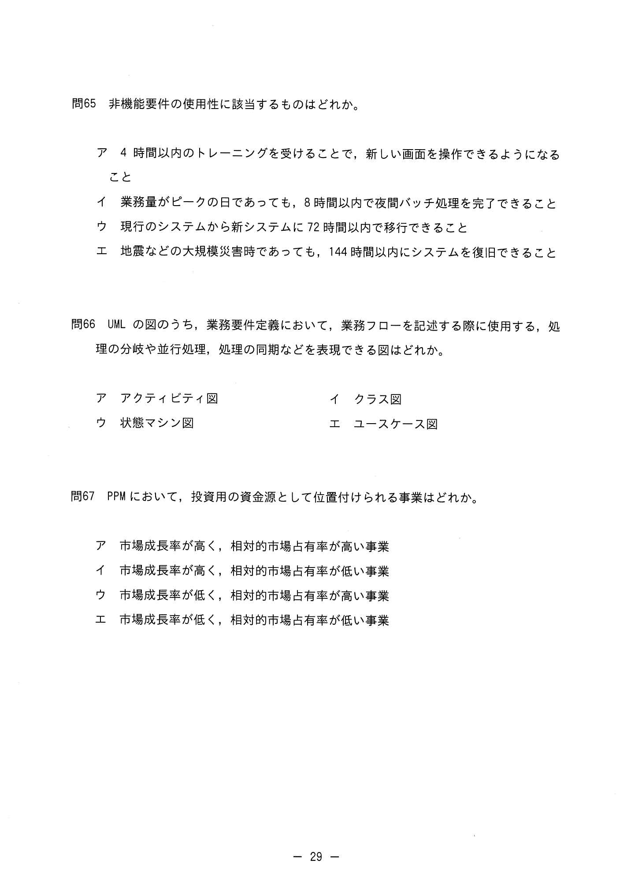

テキスト (OCR)

問65 非機能要件の使用性に該当するものはどれか。

ア 4 時間以内のトレーニングを受けることで, 新しい画面を操作できるようになる
こと

イ 業務量がピークの日であっても, 8 時間以内で夜間バッチ処理を完了できること

ウ 現行のシステムから新システムに 72 時間以内で移行できること

エ 地震などの大規模災害時であっても, 144 時間以内にシステムを復旧できること

問66 UML の図のうち, 業務要件定義において, 業務フローを記述する際に使用する, 処
理の分岐や並行処理, 処理の同期などを表現できる図はどれか。
ア アクティビティ図         4 クラス図

ウ 状態マシン図           =m ユースケース図

間67 PPM において, 投資用の資金湖として位置付けられる事業はどれか。

に|

市場成長率が高く, 相対的市場占有率が高い事業
市場成長率が高く, 相対的市場占有率が低い事業
市場成長率が低く, 相対的市場占有率が高い事業
市場成長率が低く, 相対的市場占有率が低い事業

H oF A

### ページ 30

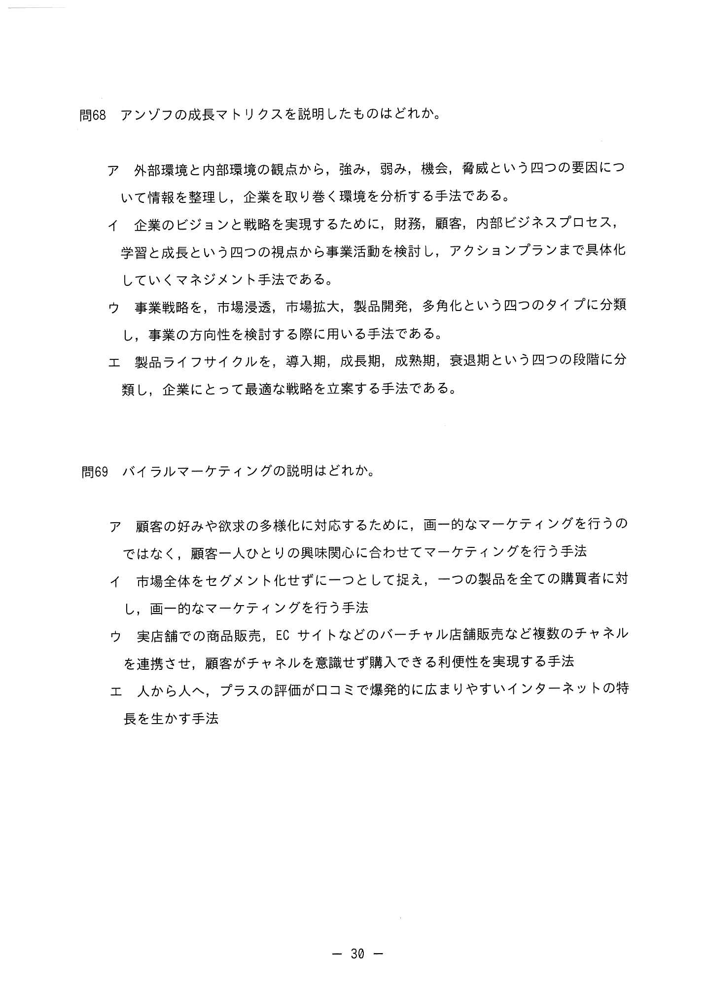

テキスト (OCR)

間68 アンゾフの成長マトリクスを説明したものはどれか。

ア 外部環境と内部環境の観点から, 強み, HH, 機会脅威という四つの要因につ
いて情報を整理し, 企業を取り巻く環境を分析する手法である。

イ 企業のビジョンと戦略を実現するために, MB, MS, 内部ビジネスプロセス,
学習と成長という四つの視点から事業活動を検討し, アクションプランまで具体化
していくマネジメント手法である。

ウ 事業戦略を, 市場浸透, 市場拡大, 製品開発, 多角化という四つのタイプに分類
し, 事業の方向性を検討する際に用いる手法である。

エ 製品ライフサイクルを, 導入期, 成長期, 成熟期, 衰退期という四つの段階に分
類し, 企業にとって最適な戦略を立案する手法である。

間69 バイラルマーケティングの説明はどれか。

ア 顧客の好みや欲求の多様化に対応するために, 画一的なマーケティングを行うの
ではなく, 顧容一人ひとりの興味関心に合わせてマーケティングを行う手法

イ 市場全体をセグメント化せずに一つとして捉え, 一つの製品を全ての購買者に対
し, 画一的なマーケティングを行う手法

ウ 実店舗での商品販売, EC サイトなどのバーチャル店舗販売など複数のチャネル
を連携させ, 顧客がチャネルを意識せず購入できる利便性を実現する手法

エエ 人から人へ, プラスの評価が口コミで爆発的に広まりやすいインターネットの特
長を生かす手法

### ページ 31

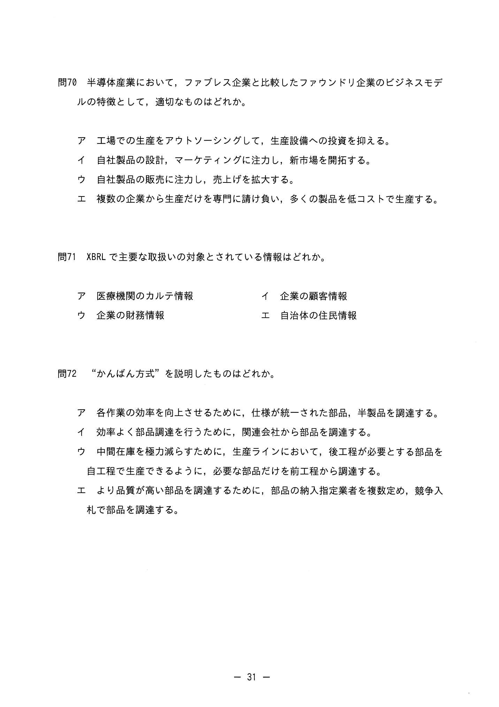

テキスト (OCR)

間70 半導体産業において, ファブレス企業と比較したファウンドリ企業のビジネスモデ
ルの特徴として, 適切なものはどれか。

に|

工場での生産をアウトソーシングして, 生産設備への投資を抑える。

自社製品の設計, マーケティングに注力し, 新市場を開拓する。
自社製品の販売に注力し, 売上げを拡大する。

複数の企業から生産だけを専門に請け負い, 多くの製品を低コストで生産する。

H GAN

問71 XBRL で主要な取扱いの対象とされている情報はどれか。

ア 医療機関のカルテ情報       イ 企業の顧客情報
ウ 企業の財務情報          エ 自治体の住民情報

間72 “かんばん方式” を説明したものはどれか。

ア 各作業の効率を向上させるために, 仕様が統一された部品, 半製品を調達する。

イ 効率よく部品調達を行うために, 関連会社から部品を調達する。

ウ 中間在庫を極力減らすために, 生産ラインにおいて, 後工程が必要とする部品を
自工程で生産できるように, 必要な部品だけを前工程から調達する。

エ より品質が高い部品を調達するために, 部品の納入指定業者を複数定め, BEA
札で部品を調達する。

### ページ 32

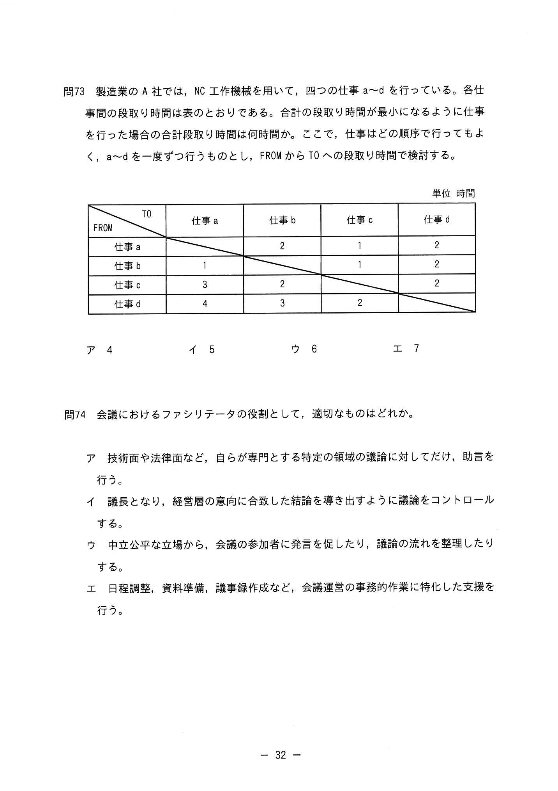

テキスト (OCR)

間73 製造業の A 社では, NC 工作機械を用いて, 四つの仕事 ad を行っている。各仕
事問の段取り時間は表のとおりである。 合計の段取り時間が最小になるように仕事
を行った場合の合計段取り時間は何時間か。ここで, 仕事はどの順序で行ってもよ
く, ard を一度ずつ行うものとし, FROM から TO への段取り時間で検討する。

単位 時間
10
FROM                     仕事a              仕事b              仕事c              仕事9
仕事a                2        1        2
仕事b                1                                       1                   2
仕事c                3                   2                                       2
仕事d                4                   3                   2
ア 4                    イ 5                    ウ 6                    エ 7

74 会議:おけるファシリテータの役割として, 適切なものはどれか。

ア 技術面や法律面など, 自らが専門とする特定の領域の議論に対してだけ, 助言を

行う。

イ 議長となり, 経営層の意向に合致した結論を導き出すように議論をコントロール
する。

ウ 中立公平な立場から, 会議の参加者に発言を促したり, 議論の流れを整理したり
する。

エ 日程調整, 資料準備, 議事録作成など, 会議運営の事務的作業に特化した支援を
行う。

### ページ 33

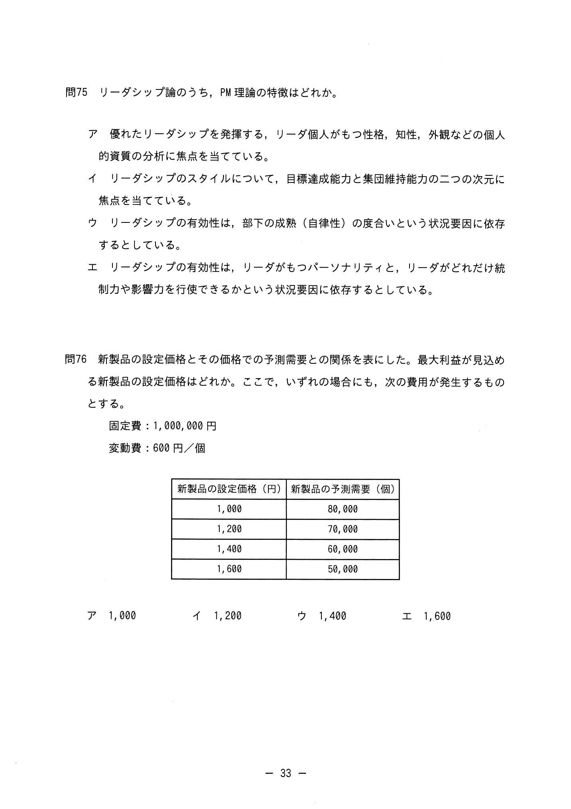

テキスト (OCR)

問75 リーダシップ論のうち, PM 理論の特徴はどれか。

ア 優れたリーダシップを発揮する, リーダ個人がもつ性格, HITE, 外観などの個人
的資質の分析に焦点を当てている。

イ リーダシップのスタイルについて, 目標達成能力と集団維持能力の二つの次元に
焦点を当てている。

ウ リーダシップの有効性は, 部下の成熟 (自律性) の度合いという状況要因に依存
するとしている。

エ リーダシップの有効性は, リーダがもつパーソナリティと, リーダがどれだけ統
制力や影響力を行使できるかという状況要因に依存するとしている。

間76 新製品の設定価格とその価格での予測需要との関係を表にした。最大利益が見込め
る新製品の設定価格はどれか。ここで, いずれの場合にも, 次の費用が発生するもの
とする。
固定費 : 1,000,000
変動費 : 600 円ノ個

新製品の設定価格 (円) | 新製品の予測需要 (個)
1, 000         80, 000
1, 200         70, 000
1,400         60, 000
1, 600         50, 000
ア 1,000    イ 1,200    ウ 1,400    エ 1,600

### ページ 34

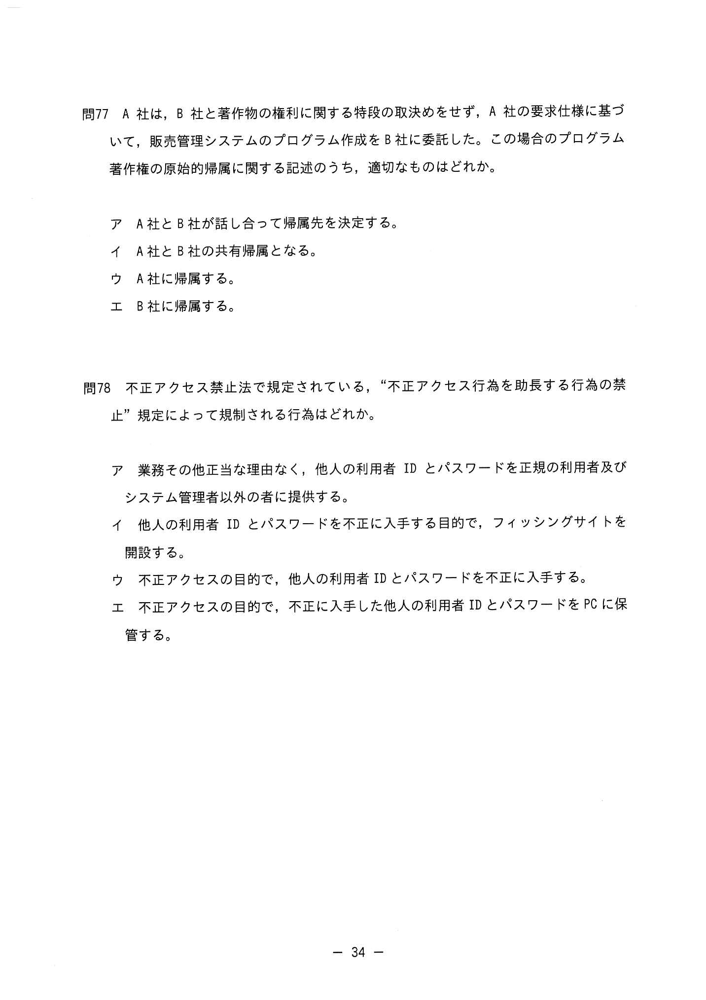

テキスト (OCR)

間77 A 社は,B 社と著作物の権利に関する特段の取決めをせず, A 社の要求仕様に基づ
いて, 販売管理レステムのプログラム作成をB 社に委託した。この場合のプログラム
著作権の原始的帰属に関する記述のうち, 適切なものはどれか。

に|

A社とB社が話し合って帰属先を決定する。
A社とB社の共有上帰属となる。

A 社に帰属する。

B 社に帰属する。

Hoo A

間78 不正アクセス禁止法で規定されている, “不正アクセス行為を助長する行為の禁
Ik” 規定によって規制される行為はどれか。

ア 業務その他正当な理由なく, 他人の利用者 ID とパスワードを正規の利用者及び
システム管理者以外の者に提供する。

4 他人の利用者 ID とパスワードを不正に入手する目的で, フィッシングサイトを
開設する。

ウ 不正アクセスの目的で, 他人の利用者 ID とパスワードを不正に入手する。

エ 不正アクセスの目的で, 不正に入手した他人の利用者 ID とパスワードをPC に保
管する。

### ページ 35

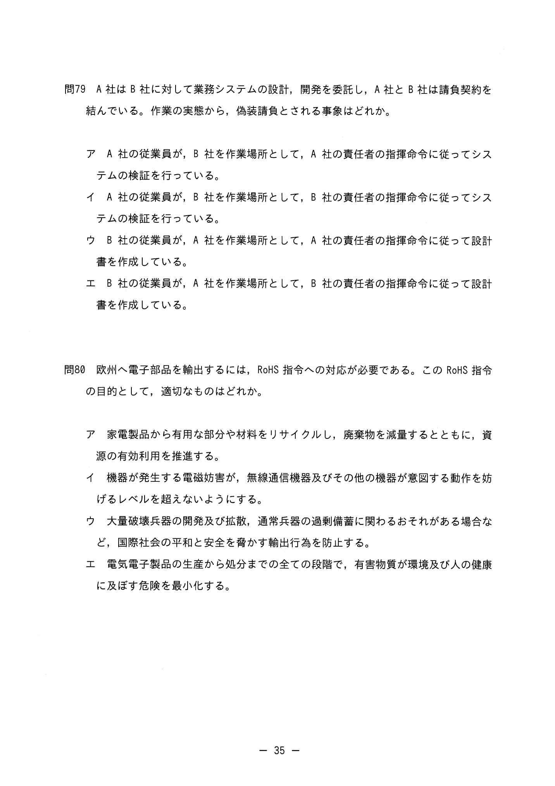

テキスト (OCR)

問79 A社はB社に対して業務システムの設計, 開発を委託し, A 社とB 社は請負契約を
結んでいる。 作業の実態から, 偽装請負とされる事象はどれか。

ア A 社の従業員が, B 社を作業場所として, A 社の責任者の指揮命令に従ってシス
テムの検証を行っている。

4 A 社の従業員が, B 社を作業場所として, B 社の責任者の指揮命令に従ってシス
テムの検証を行っている。

ウ B 社の従業員が, A 社を作業場所として, A 社の責任者の指揮命令に従って設計
書を作成している。

エ B 社の従業員が, A 社を作業場所として, B 社の責任者の指揮命令に従って設計
書を作成している。

問86 欧州へ電子部品を輸出するには, ROHS 指令への対応が必要である。この RoHS 指令
の目的として, 適切なかものはどれか。

ア 家電製品から有用な部分や材料をリサイクルし, 廃棄物を減量するとともに, 資
源の有効利用を推進する。

イ 機器が発生する電磁妨害が, 無線通信機器及びその他の機器が意図する動作を妨
げるレベルを超えないようにする。

ウ 大量破壊兵器の開発及び拡散, 通常兵器の過剰備区に関わるおそれがある場合な
ど, 国際社会の平和と安全を脅かす輸出行為を防止する。

I 電気電子製品の生産から処分までの全ての段階で, 有害物質が環境及び人の健康
に及ぼす危険を最小化する。

### ページ 36

テキスト (OCR)

〔

メ モ 用 紙 J

### ページ 37

テキスト (OCR)

【

x = 用 紙 }

### ページ 38

テキスト (OCR)

〔

x = 用 紙 J

### ページ 39

テキスト (OCR)

C

メ モ 用 紙 〕

### ページ 40

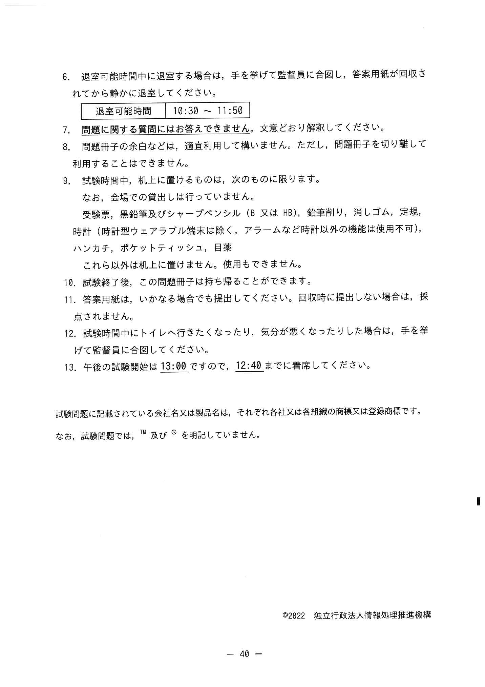

テキスト (OCR)

6. 退室可能時間中に退室する場合は, 手を挙げて監督具に合図し, 答案用紙が回収さ
れてから静かに退室してください。
| sasnraesm | 10:30 ~ 11:50 |
7. 間題に関する質問にはお答えできません。文意どおり解釈してください。
8. 問題冊子の余白などは, 適宜利用して構いません。ただし, 問題冊子を切り離して
利用することはできません。
9. 試験時間中, 机上に置けるものは, 次のものに限ります。
なお, 会場での貸出しは行っていません。
受験票, 黒鉛筆及びシャープペンシル (B 又は HB), 鉛筆削り, 消しゴム, 定規
時計 (時計型ウェアラブル端末は除く<。アラームなど時計以外の機能は使用不可),
ハンカチ, ポケットティッシュ, 目薬
これら以外は机上に置けません。使用もできません。
10. 試験終了後, この問題冊子は持ち帰ることができます。
11, SRM, いかなる場合でも提出してください。回収時に提出しない場合は, 採
点されません。
12, 試験時間中にトイレへ行きたくなったり, 気分が悪くなったりした場合は, FER
げて監督貞に合図してください。
13. 午後の試験開始は 13:00 ですので, 12:40 までに着席してください。

試験問題に記載されている会社名又は製品名は, それぞれ各社又は各組織の商標又は登録商標です。

なお, 試験問題では, "及び 『 を明記していません。

©2022 独立行政法人情報処理推進機構

---

## 午前解答

### ページ 1

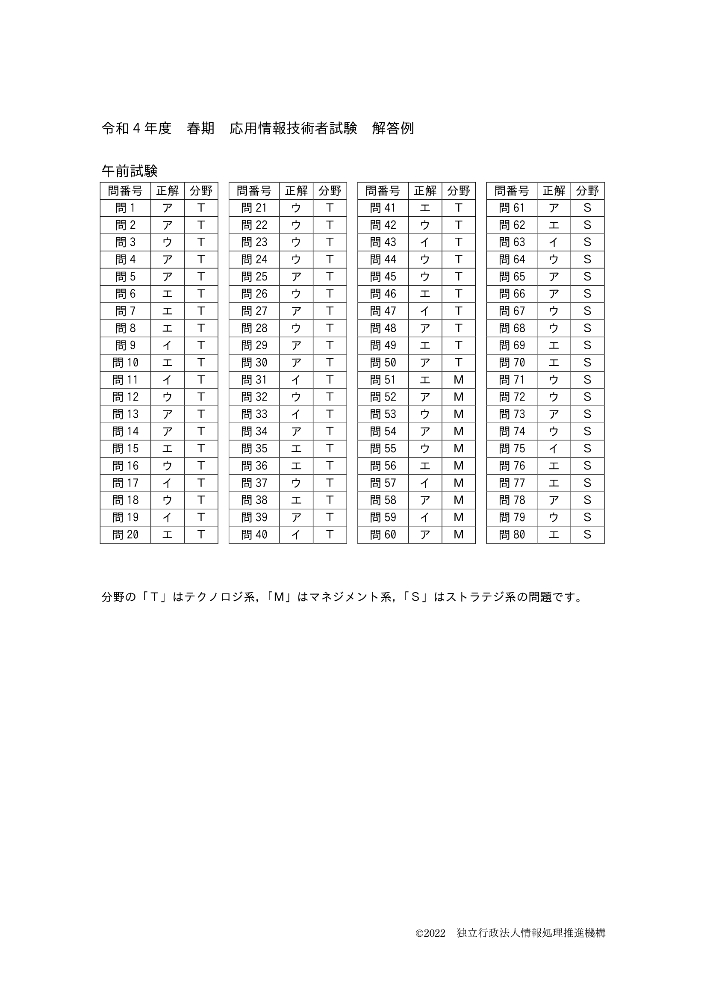

テキスト (OCR)

令和4年度 春期 応用情報技術者試験 解答例

午前試験
igs |正解|分野| | 問番号 |正解|分野| | 問番号 |正解|分野| | 問番号 | 正解| 分野
問 1      ア     T        問 21      ウ     T        問 41     エ     T        問 61     ア     S
問 2      ア     T        問 22     ウ     T        問 42     ウ     T        間62 | エ     S
fal 3      ウ     T        fa] 23     ウ     T        fa] 43     4      T        問 63     4      S
問 4      ア     T        問 24     ウ      T        問 44     ウ      T        問 64     ウ      S
fal 5      ア     T        fa] 25     ア     T        問 45     ウ     T        fa] 65     ア     S
問 6      エ     T        問 26     ウ     T        問 46     エ     T        問 66     ア     S
問 7      エ     T        問 27     ア     T        問 47     4      T        問 67     ウ     S
問 8      x     T        問 28     ウ     T        問 48     ア     T        問 68     ウ     S
問 9      イ      T        fl] 29     ア     T        問 49     エ     T        問 69     エ     S
fa] 10     エ     T       問 30     ア     T       問 50     ア     T       問 70     エ     S
問 11     イ     T       問 31     4     T       問 51     エ     M       問 71     ウ     S
問 12     ウ     T       fa] 32     ウ     T       問 52     ア     M       問 72     ウ     S
問 13     ア     T       問 33     4     T       問 53     ウ     M       fal 73     ア     S
問 14     ア     T       問 34     ア     T       問 54     ア     M       fal 74     ウ     S
fa] 15     エ     T       問 35     =     T       問 55     ウ     M       fal 75     4     S
fa] 16     ウ     T       fa] 36     =x     T       問 56     x     M       問 76     x     S
問 17     イ     T       問 37     ウ     T       問 57     4     M       fal 77     エ     S
fa] 18     ウ     T       問 38     =     T       問 58     ア     M       問 78     ア     S
fa] 19     4     T       fa] 39     ア     T       fa] 59     4     M       fal 79     ウ     S
問 20     エ     T        問 40     4     T        問 60     ア     M       問80     エ     S

分野の「T」はテクノロジ系, 「M」はマネジメント系, 「S」はストラテジ系の問題です。

@2022 独立行政法人情報処理推進機構

---

## 午後問題

### ページ 1

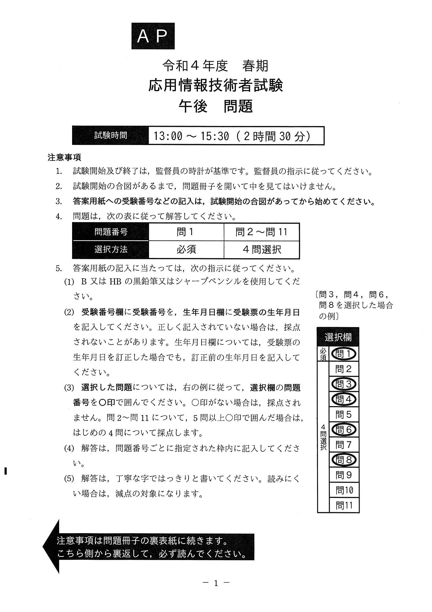

テキスト (OCR)

令和4年度 春期
応用情報技術者試験
午後 問題

 13:00 ~ 15:30 (2時間 30 分)

注意事項

1. 試験開始及び終了は, 監督員の時計が基準です。監督員の指示に従ってください。
2. 試験開始の合図があるまで, 問題冊子を開いて中を見てはいけません。

3. 答案用紙への受験番号などの記入は, 試験開始の合図があってから始めてください。
4

問題は, 次の表に従って解答してください。

問題番号              間 1            al 2 て間 11
選択方法              必須             4 問選択

5. 答案用紙の記入に当たっては, 次の指示に従ってください。

QQ) B 又は HB の黒鉛筆又はシャープペンシルを使用してくだ
さい。

(2) 受験番号欄に受験番号を, 生年月日欄に受験票の生年月日
を記入してください。正しく記入されていない場合は, 採点
されないことがあります。生年月日欄については, 受験票の
生年月日を訂正した場合でも, 訂正前の生年月日を記入して
ください。

3) 選択した問題については, 右の例に従って, 選択欄の問題
番号を〇印で囲んでください。〇印がない場合は, 採点され
ません。間 2一問 11 について, 5 問以上〇印で囲んだ場合は,
はじめの4 問について採点します。

(4) 解答は, 問題番号ごとに指定された枠内に記入してくださ
い。

(5) 解答は, 丁寧な字ではっきりと書いてください。 読みにく
い場合は, 減点の対象になります。

注意事項は問題冊子の裏表紙に続きます。
こちら側から裏返して, 必ず読んでください。

(Fal
問

3, 問4, 問6,
8を選択した場合

Opi)

必
須

選択欄

Gid

Soka >

### ページ 2

### ページ 3

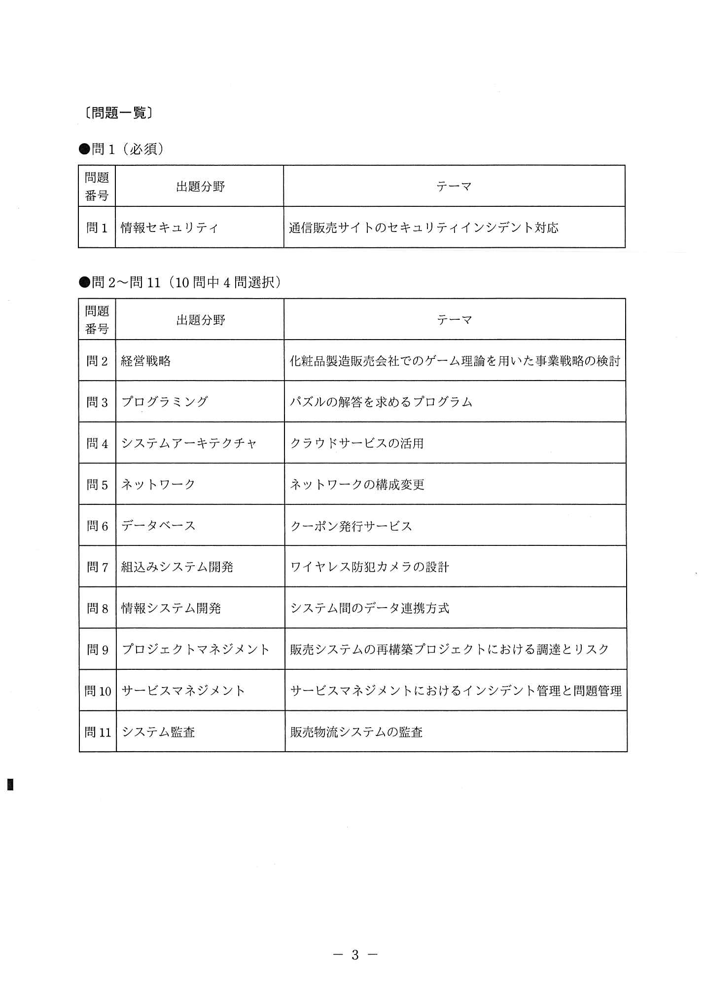

テキスト (OCR)

【問題一覧〕

en (xa)

a       He                      pay

番号

問1 | 情報セキュリティ       通信販売サイトのセキュリティインシデント対応

久間 2一問 11 (10 問中 4 問選択)

NM     出題分野                テーマ

問2 | 経営戦略          化粧品製造販売会社でのゲーム理論を用いた事業戦略の検討
問3 | プログラミング       パズルの解答を求めるプログラム

fl4 | システムアーキテクチャ   クラウドサービスの活用

問5 | ネットワーク        ネットワークの構成変更

問6 | データベース        クーポン発行サービス

問7 | 組込みシステム開発    D4 VV AIL AF ORE

問8 | 情報システム開発      システム間のデータ連携方式

問9 | プロジェクトマネジメント | 販売システムの再構築プロジェクトにおける調達とリスク
問 10 | サービスマネジメント    サービスマネジメントにおけるインシデント管理と問題管理
問 11 | システム監査        販売物流システムの監査

### ページ 4

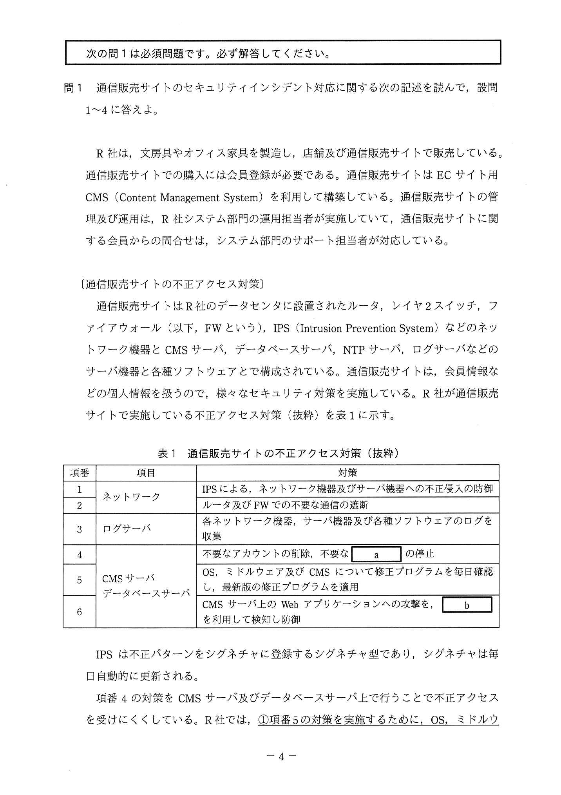

テキスト (OCR)

次の問 1 は必須問題です。必ず解答してください。

fl 1

通信販売サイトのセキュリティインシデント対応に関する次の記述を読んで, 設問

1~4 に答えよ。

R 社は, 文房具やオフィス家具を製造し, 店舗及び通信販売サイトで販売している。
通信販売サイトでの購入には会員登録が必要である。 通信販売サイトは EC サイト用
CMS (Content Management System) を利用して構築している。 通信販売サイトの管
理及び運用は, R 社システム部門の運用担当者が実施していて, 通信販売サイトに関
する会員からの問合せは, システム部門のサポート担当者が対応している。

〔通信販売サイトの不正アクセス対策)

通信販売サイトはR社のデータセンタに設置されたルータ, レイヤ2スイツチ, フ
ァイアウォール (以下, FW という), IPS (Intrusion Prevention System) などのネッ
トワーク機器と CMS サーバ, データベースサーバ, NTP サーバ, ログサーバなどの
サーバ機器と各種ソフトウェアとてで構成されている。 通信販売サイトは, 会員情報な
どの個人情報を扱うので, 様々なセキュリティ装策を実施している。R 社が通信販売
サイトで実施している不正アクセス対策 (抜粋) を表 1 に示す。

表1 通信販売サイトの不正アクセス対策 (抜粋)

項番       項目                            対策
1  wbーク    IPS による, ネットワーク機器及びサーバ機器への不正侵入の防御
2            ルータ 及び FW での不要な通信の遮断
P     、          各ネットワーク機器, サーバ機器及び各種ソフトウェアのログを
3   ログサーバ
収集
4            不要ぶなアカウントの削除, 不要な| a  | OL
ミド   こ   Z    ラムを毎日確認
5 | cMs サーバ     Oe eG MS OCB TE NESTE
データベースサーバ し, 最新版の修正プログラムを適用
ーバ         1  ーシ  8     *
            CMS サーバ上の Web アプリケーションへの攻撃を, | ゎ |
を利用して検知し防御

IPS は不正パターンをシグネチャに登録するシグネチャ型であり, シグネチャは毎
日自動的に更新される。

項番 4 の対策を CMS サーバ及びデータベースサーバ上で行うことで不正アクセス
を受けにくくしている。R 社では, ①項番5の対策を実施するために, OS, ミドルウ

a 一

### ページ 5

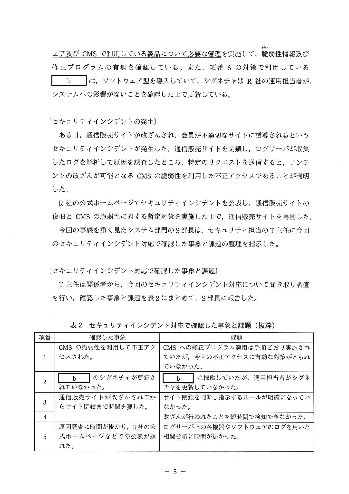

テキスト (OCR)

エア及び CMS で利用している製品について必要な管理を実施して, 用性情報及び
修正プログラムの有無を確認している。 また, 項番 6 の対策で利用している
La ソフトウェア型を導入していて, シグネチャは R 社の運用担当者が,
システ        影響がないことを確認した上で更新している。

【セキュリティインシデントの発生〕

ある日, 通信販売サイトが改ざんされ, 会員が不適切なサイトに誘導されるという
セキュリティインシデントが発生した。 通信販売サイトを閉鎖し, ログサーバが収集
したログを解析して原因を調査したところ, 特定のリクエストを送信すると, コンテ
ンツの改ざんが可能となる CMS の脆弱性を利用した不正アクセスであることが判明
した。

R 社の公式ホームページでセキュリティインシデントを公表し, 通信販売サイトの
復旧と CMS の脆弱性に対する暫定対策を実施した上で, 通信販売サイトを再開した。

今回の事態を重く見たシステム部門のS 部長は, セキュリティ担当の生主任に今回
のセキュリティインシデント対応で確認した事象と課題の整理を指示した。

〔セキュリティインシデント対応で確認した事象と課題〕
T 主任は関係者から, 今回のセキュリティインシデント対応について聞き取り調査

を行い, 確認した事象と課題を表2 にまとめて, 8部長に報告した。

表2 セキュリティインシデント対応で確認した事象と課題 (抜粋)

項番         確認した事象                         課題
CMS の騰弱性を利用して不正アク | CMS への修正プログラム適用は手順どおり実施され
1 | セスされた。              ていたが, 今回の不正アクセスに有効な対策がとられ

ていなかった。

5  [> |] のシグネチャが更新さ | | b | は稼働していたが, 運用担当者がシグネ
れていなかった。         チャを更新していなかった。

通信販売サイトが改ざんされてか | サイト閉鎖を判断し指示するルールが明確になってい
らサイト閉鎖まで時間を要した。    なかった。

4                                  改ざんが行われたことを短時間で検知できなかった。

原因調査に時間が掛かり, R社の公 | ログサーバ上の各機器やソフトウェアのログを用いた
5 | 式ホームページなどでの公表が遅 | 相関分析に時間が掛かった。
れた。

### ページ 6

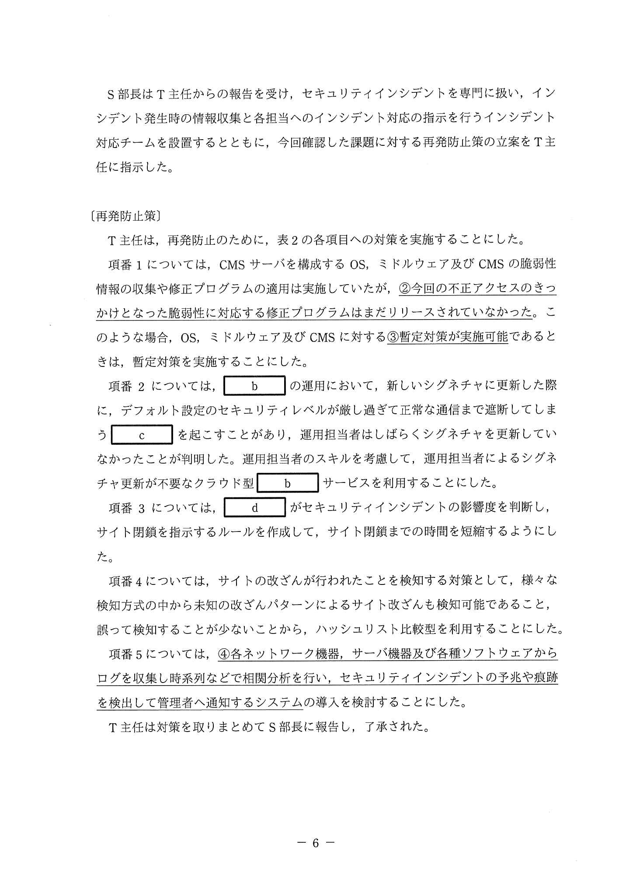

テキスト (OCR)

S 部長は主任からの報告を受け, セキュリテイィインシデントを専門に扱い, イン
シデント発生時の情報収集と各担当へのインシデント対応の指示を行うインシデント
対応チームを設置するとともに, 今回確認した課題に対する再発防止策の立案を主
任に指示した。

(再発防止策]

T 主任は, 再発防止のために, 表 2 の各項目への対策を実施することにした。

項番 1 については, CMS サーバを構成する OS, ミドルウェア及び CMS の脆表性
情報の収集や修正プログラムの適用は実施していたが, ②⑫今回の不正アクセスのきっ
かけとなった脆弱性に対応する修正プログラムはまだリリースされていなかった。こ
のような場合, 0S。ミドルウェア及び CMS に対する@匠定対策が実施可能であると
きは, 暫定対策を実施することにした。

項番 2 については, | jp | の運用において, 新しいシグネチャに更新した際
に, デフォルト設定のセキュリティレベルが厳し過ぎて正常な通信まで遮断してしま
5 を起こすことがあり, 運用担当者はしばらくシグネチャを更新してい
なかったことが判明した。運用担当者のスキルを考慮して, 運用担当者によるシグネ
チヤ更新が不要なクラウド型| b | サービスを利用することにした。

項番 3 については, |  q | がセキュリティインシデントの影響度を判断し
サイト閉鎖を指示するルールを作成して。サイト閉鎖までの時間を短縮するようにし
た。

項番4 については, サイトの改ざんが行われたことを検知する対策として, 様々な
検知方式の中から未知の改ざんパターンによるサイト改ざんも検知可能であること
誤って検知することが少ないことから, ハッシュリスト比較型を利用することにした。

項番 5については, つ各ネットワーク機器, サーバ機器及び各種ソフトウェアから
ログを収集し時系列などで相関分析を行い。 セキュリティインシデントの予兆や痕跡
を検出して管理者へ通知するシステムの導入を検討することにした。

T 主任は対策を取りまとめて S 部長に報告し, 了承された。

### ページ 7

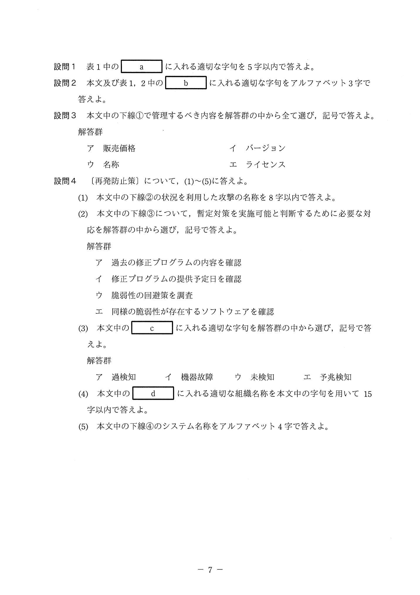

テキスト (OCR)

設問1 表1中の| 』 |に入れる適切な字句を5字以内で答えよ。
設問2 本文及び表1, 2中の| b | に入れる適切な字句をアルファベット3字で

答えよ。
設問3 本文中の下線①で管理するべき内容を解答群の中から全て選び, 記号で答えよ。
解答群
ア 販売価格           イ バージョン
ウ 名称              EZ ライセンス

設問4 [再発防止策) について, ①て⑤に答えよ。
Q) 本文中の下線@の状況を利用した攻撃の名称を 8 字以内で答えよ。
2) 本文中の下線@について, 暫定対策を実施可能と判断するために必要な対
応を解答群の中から選び, 記号で答えよ。
AR
ア 過去の修正プログラムの内容を確認
4 修正プログラムの提供予定日を確認
ウ 脆弱性の回避策を調査
エ 同様の脆弱性が存在するソフトウェアを確認
⑬) 本文中の| c | に入れる適切な字句を解答欄の中から選び,

記号で答
AK,
ABI
ア 過栓知   イ 機器故障 ウ 未検知   エ 予兆検知
@ 本文中の| q | に入れる適切な組織名称を本文中の字句を用いて 15
字以内で答えよ。

(5) 本文中の下線の@のシステム名称をアルファベット 4 字で答えよ。

### ページ 8

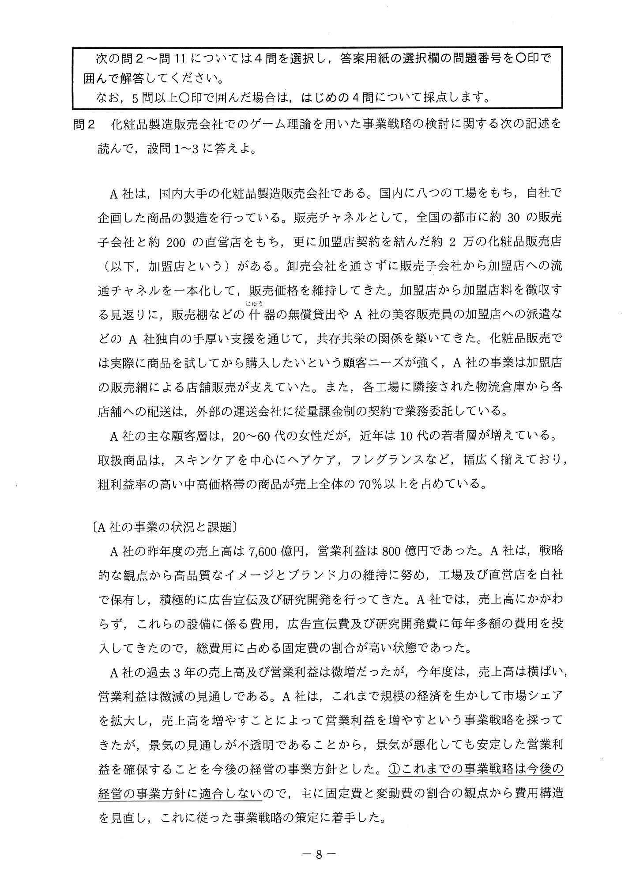

テキスト (OCR)

次の問2 一問 11 については4 間を選択し, 答案用紙の選択欄の問題番号を〇印で
囲んで解答してください。
なお, 5 問以上〇印で囲んだ場合は, はじめの 4 問について採点します。
間2 化粧品製造販売会社でのゲーム理論を用いた事業戦略の検討に関する次の記述を
読んで, 設問 1こ3 に答えよ。

A 社は, 国内大手の化粧品製造販売会社である。国内に八つの工場をもち, 自社で
画した商品の製造を行っている。 販売チャネルとして, 全国の都市に約 30 の販売
子会社と約 200 の直営店をもち, 更に加盟店契約を結んだ約 2 万の化粧品販売店
(以下, 加盟店という) がある。 卸売会社を通さずに販売子会社から加盟店への流
通チャネルを一本化して, 販売価格を維持してきた。 加盟店から加盟店料を徴収す
る見返りに, 販売棚な どの ft 器の無償貸出や A 社の美容販売員の加盟店への派遣な
どの A 社独自の手厚い支援を通じて, 共存共栄の関係を築いてきた。化粧品販売で
は実際に商品を試してから購入したいという顧客ニーズが強く, A 社の事業は加盟店
の販売網による店舗販売が支えていた。また, 各工場に隣接された物流倉庫から各
店舗への配送は, 外部の運送会社に従量課金制の契約で業務委託している。

A 社の主な顧客層は, 20~60 代の女性だが, 近年は 10 代の若者層が増えている。
取扱商品は, スキンケアを中心にヘアケア, フレグランスなど, 幅広く揃えており
粗利益率の高い中高価格帯の商品が売上全体の 70%以上を占めている

(A 社の事業の状況と課題〕

A 社の昨年度の売上高は 7,600 億円, 営業利益は 800 億円であった。4 社は, 戦略
的な観点から高品質なイメージとブランドカカの維持に努め, 工場及び直営店を自社
で保有し, 積極的に広告宣伝及び研究開発を行ってきた。A 社では, 売上高にかかわ
らず, これらの設備に係る費用, 広告宣伝費及び研究開発費に毎年多額の費用を投
入してきたので, 総費用に占める固定費の割合が高い状態であった。

A 社の過去 3 年の売上高及び営業利益は微増だったが, 今年度は, 売上高は横ばい
営業利益は微減の見通しである。A 社は, これまで規模の経済を生かして市場シェア
を拡大し, 売上高を増やすことによって営業利益を増やすという事業戦略を採って
きたが, 景気の見通しが不透明であることから, 景気が悪化しても安定した営業利
益を確保することを今後の経営の事業方針とした。①これまでの事業戦略は今後の
経営の事業方針に適合しないので, 主に固定費と変動費の割合の観点から費用構造
を見直し, これに従った事業戦略の策定に着手した。

ー8一

### ページ 9

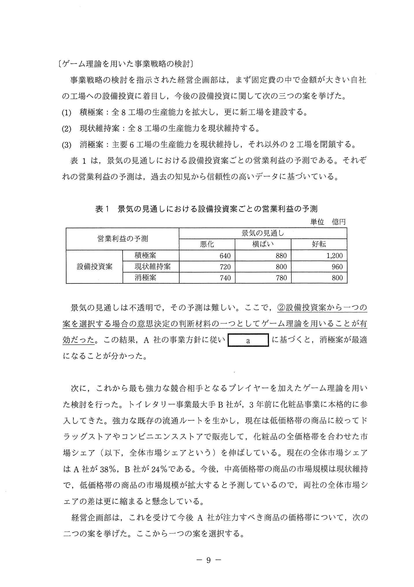

テキスト (OCR)

〔ゲーム理論を用いた事業戦略の検討]
事業戦略の検討を指示された経営企画部は, まず固定費の中で金額が大きい自社
の工場への設備投資に着目し, 今後の設備投資に関して次の三つの案を挙げた。
①) 積極案 : 全8工場の生産能力を拡大し, 更に新工場を建設する。
(2) 現状維持案 : 全8 工場の生産能力を現状維持する。
(3) 消極案 : 主要 6 工場の生産能力を現状維持し, それ以外の 2 工場を閉鎖する。
表 1 は, 景気の見通しにおける設備投資案ごとの営業利益の予測である。それぞ
れの営業利益の予測は, 過去の知見から信頼性の高いデータに基づいている。

表1 景気の見通しにおける設備投資案ごとの営業利益の予測
単位 億円

se     。             景気の見通し
の       悪化     横ばい     好転
積極案 640 8801.200
設備投資案         現状維持案                   720                  800                 960
消極案 740 780800

景気の見通しは不透明で, その予測は難しい。ここで, @②設備投資案から一つの
案を選択する場合の意思決定の判断材料の一つとしてゲーム理論を用いることが有
効だった。この結果, A 社の事業方針に従い| 。 | に基づくと, 消極案が最適
になることが分かった。

次に, これから最も強力な競合相手となるプレイヤーを加えたゲーム理論を用い
た検討を行った。 トイレタリー事業最大手 B 社が, 3 年前に化粧品事業に本格的に参
入してきた。 強力な既存の流通ルートを生かし, 現在は低価格帯の商品に絞ってド
ラッグストアやコンビニエンスストアで販売して, 化粧品の全価格帯を合わせた市
場シェア (以下, 全体市場シェアという) を伸ばしている。現在の全体市場シェア
は A 社が 38%, B 社が 24%である。 今後, 中高価格帯の商品の市場規模は現状維持
で, 低価格帯の商品の市場規模が拡大すると予測しているので, 両社の全体市場シ
エアの差は更に縮まると懸念している。

経営企画部は, これを受けて今後 A 社が注力すべき商品の価格帯について, 次の
二つの案を挙げけた。ここから一つの案を選択する。

—g@-

### ページ 10

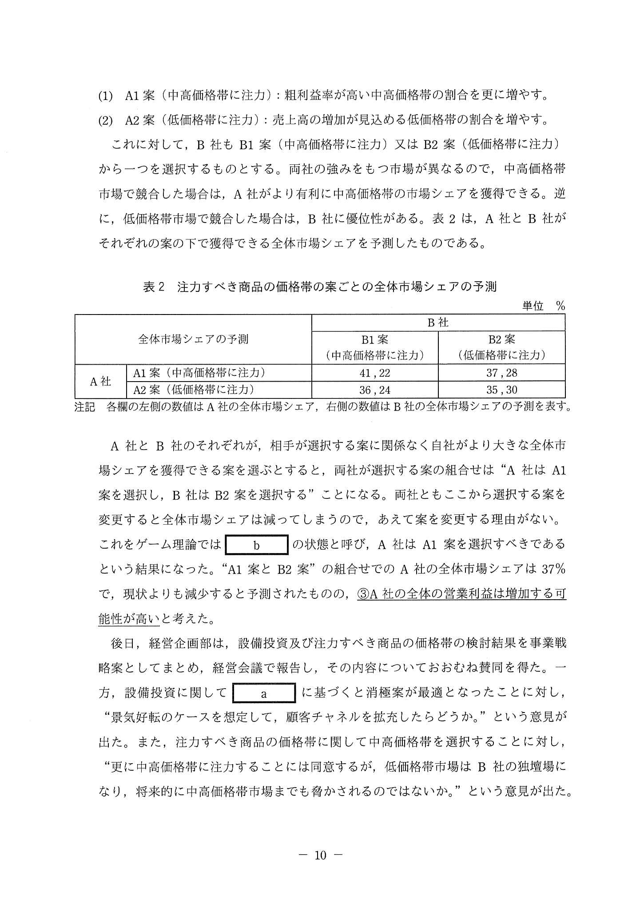

テキスト (OCR)

(1) ALS (中高価格帯に注力) : 粗利益率が高い中高価格帯の割合を更に増やす。
(2) A2案 (低価格帯に注力) : 売上高の増加が見込める低価格帯の割合を増やす。
これに対して, B 社も Bl 案 (中高価格帯に注力) 又は B2 案 (低価格帯に注力)
から一つを選択するものとする。 両社の強みをもつ市場が異なるので, 中高価格帯
市場で競合した場合は, A 社がより有利に中高価格帯の市場シェアを獲得できる。逆
, 低価格帯市場で競合した場合は, B 社に優位性がある。表 2 は, A 社と B 社が
それぞれの案の下で獲得できる全体市場シェアを予測したものである。

表2 注力すべき商品の価格帯の案ごとの全体市場シェアの予測

単位 %
B社
全体市場シェアの予測              B1 案             B2 案
(中高価格帯に注力)     (低価格帯に注力)
Aw   A1 案 (中高価格帯に注力)            41 , 22            37 ,28
A2 案 (低価格帯に注力)             36 , 24            35 , 30

注記 各欄の左側の数値は A 社の全体市場シェア, AMOBUHIS B 社の全体市場シェアの予測を表す。

A 社と B 社のそれぞれが, 相手が選択する案に関係なく自社がより大きな全体市
場シェアを獲得できる案を選ぶとすると, 両社が選択する案の組合せは “A HIE AL
案を選択し, B 社は B2 案を選択する"ことになる。両社ともここから選択する案を
変更すると全体市場シェアは減ってしまうので, あえて案を変更する理由がない。
これをゲーム理論では| bp | の状態と呼び.A 社は A1案を選択すべきである
という結果になった。“A1 RE B2 案” の組合せでの A 社の全体市場シェアは 37%
で, 現状よりも減少すると予測されたものの, OA 社の全体の営業利益は増加する可
能性が高いと考えた。

後日, 経営企画部は, 設備投資及び注力すべき商品の価格帯の検討結果を事業戦
略案としてまとめ, 経営会議で報告し。 その内容についておおむね賛同を得た。一
方, 設備投資に関して| 。 | に基づくと消極案が最適となったことに対し
"景気好転のケースを想定して, 顧客チャネルを拡充したらどうか。” という意見が
出た。また, 注力すべき商品の価格帯に関して中高価格帯を選択することに対し
"更に中高価格帯に注力することには同意するが, 低価格帯市場は B 社の独壇場に
なり, 将来的に中高価格帯市場までも脅かされるのではないか。” という意見が出た。

ー 10 一

### ページ 11

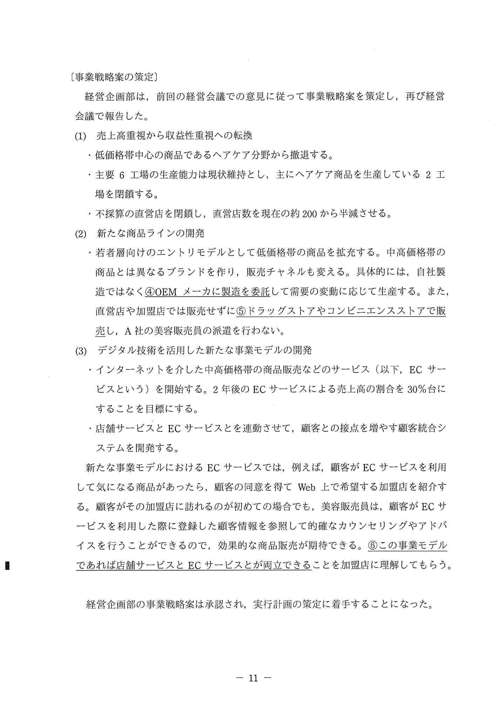

テキスト (OCR)

[事業戦略案の策定〕
経営企画部は, 前回の経営会議での意見に従って事業戦略案を策定し, 再び経営
会議で報告した。
①) 売上高重視から収益性重視への転換
・ 低価格帯中心の商品であるヘアケア分野から撤退する。
・主要 6 工場の生産能力は現状維持とし, 主にヘアケア商品を生産している 2 工
場を閉鎖する。
・不採算の直営店を閉鎖し, 直営店数を現在の約 200 から半減させる。
(2) 新たな商品ラインの開発
・若者層向けのエントリモデルとして低価格帯の商品を拡充する。中高価格帯の
商品とは異なるブランドを作り, 販売チャネルも変える。 具体的には, 自社製
造ではなく④OEM メーカに製造を委託して需要の変動に応じて生産する。また
直営店や加盟店では販売せずに⑤ドラッグストアやコンビニエンスストアで販
売し, A 社の美容販売員の派遣を行わない。
(3) デジタル技術を活用した新たな事業モデルの開発
・インターネットを介した中高価格帯の商品販売などのサービス (以下, EC サー
ビスという) を開始する。2 年後の EC サービスによる売上高の割合を 30%台に
することを目標にする。
・ 店舗サービスと EC サービスとを連動させて, 顧客との接点を増やす顧客統合シ
ステムを開発する。
新たな事業モデルにおける EC サービスでは, 例えば, 顧客が EC サービスを利用
して気になる商品があったら, 顧客の同意を得て Web 上で希望する加盟店を紹介す
る。 顧客がその加盟店に訪れるのが初めての場合でも, 美容販売員は, 顧客がECサ
ービスを利用した際に登録した顧客情報を参照して的確なカウンセリングやアドバ
イスを行うことができるので, 効果的な商品販売が期待できる。⑥この事業モデル
であれば店舗サービスと EC サービスとが両立できることを加盟店に理解してもらう。

経営企画部の事業戦略案は承認され, 実行計画の策定に着手することになった。

ー 11 一

### ページ 12

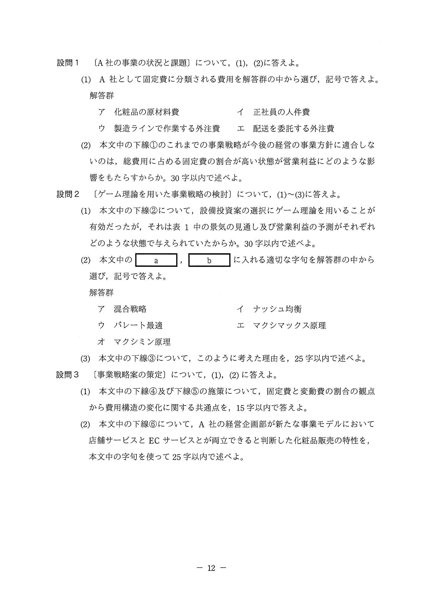

テキスト (OCR)

設問 1 (A 社の事業の状況と課題】] について, (1), ②)に答えよ。
1) A 社として固定費に分類される費用を解答群の中から選び, 記号で答えよ。
解答群
ア 化粧品の原材料費       イ 正社員の人件費
ウ 製造ラインで作業する外注費 エ 配送を委託する外注費
(2) 本文中の下線ののこれまでの事業戦略が今後の経営の事業方針に適合しな
いのは, 総費用に占める固定費の割合が高い状態が営業利益にどのような影
響をもたらすからか。 30 字以内で述べよ。
設問2 〔ゲーム理論を用いた事業戦略の検討]について, (①~て(3)に答えよ。
(1) 本文中の下線②について, 設備投資案の選択にゲーム理論を用いることが
有効だったが, それは表 1 中の景気の見通し及び営業利益の予測がそれぞれ
どのような状態で与えられていたからか。30 字以内で述べよ。

②) 本文中の| a |,|  b |に入れる適切な字句を解答群の中から
選び, 記号で答えよ。
解答群

ア 混合戦略         イ ナッシュ均衡

ウ パレート最適         エ マクシマックス原理

A マクシミン原理
3) 本文中の下線について, このように考えた理由を, 25 字以内で述べよ。
設問3 [事業戦略案の人策定)〕 について, (①⑪, (2②) に答えよ。
(1) 本文中の下線④及び下線⑤の施策について, 固定費と変動費の割合の観点
から費用構造の変化に関する共通点を, 15 字以内で答えよ。
(2) 本文中の下線⑥について, A 社の経営企画部が新たな事業モデルにおいて
店舗サービスと EC サービスとが両立できると判断した化粧品販売の特性を,
本文中の字旬を使って 25 字以内で述べよ。

ー 12 一

### ページ 13

テキスト (OCR)

[ + モ 用 紙 J

ー 13 一

### ページ 14

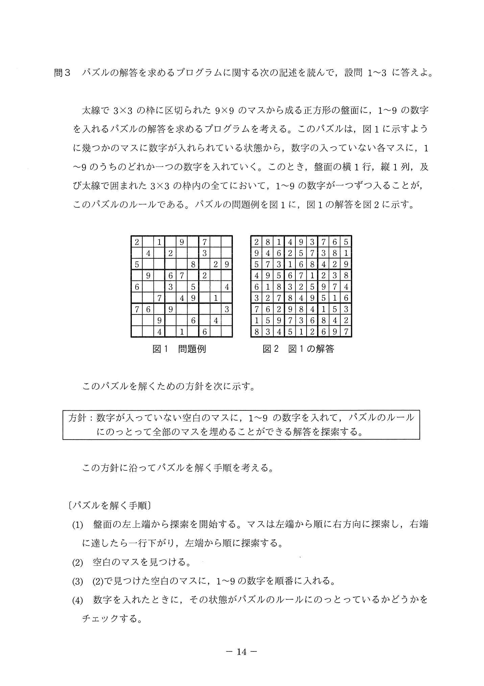

テキスト (OCR)

問3 パズルの解答を求めるプログラムに関する次の記述を読んで, 設問 1ー3 に答えよ。

太線で 3X3 の枠に区切られた 9X9 のマスから成る正方形の盤面に, 1~9 の数字
を入れるパズルの解答を求めるプログラムを考える。このパズルは, 図 1 に示すよう
に幾つかのマスに数字が入れられている状態から, 数字の入っていない各マスに, 1
て9 のうちのどれか一つの数字を入れていく。このとき, 盤面の横 1 行, 縦 1 列,及
び太線で囲まれた 3X3 の枠内の全てにおいて, 1+9 の数字が一つずつ入ることが
このパズルのルールである。パズルの問題例を図 1 に, 図1の解答を図2 にボす。

2   1   9   7        218|1141913171615
4   2     3        914161215171318[1
5        8   219    5|171311161814|219
9   617   2        4191516|17|11121318
6     3   5     4    6111813121519|1714
が   419   1      3121718141915|116
716  9      3   71612191814111513
9     6   4      11519171316181412
4   1   6        8131415|112161917

図1 問題例      図2 図1 の解答

このパズルを解くための方針を次に示す。

方針 : 数字が入っていない空白のマスに, 1~9 の数字を入れて, パズルのルール
にのっとって全部のマスを埋めることができる解答を探索する。

この方針に沿ってパズルを解く手順を考える。

〔パズルを解く手順]

QQ) 盤面の左上端から探索を開始する。マスは左端から順に右方向に探索し, 右端
に達したら一行下がり, 左端から順に探索する。

2) 空白のマスを見つける。

(3) ⑫)で見つけた空白のマスに, 1-9 の数字を順番に入れる。

(4) 数字を入れたときに, その状態がパズルのルールにのっとっているかどうかを
チェックする。

ー 14 一

### ページ 15

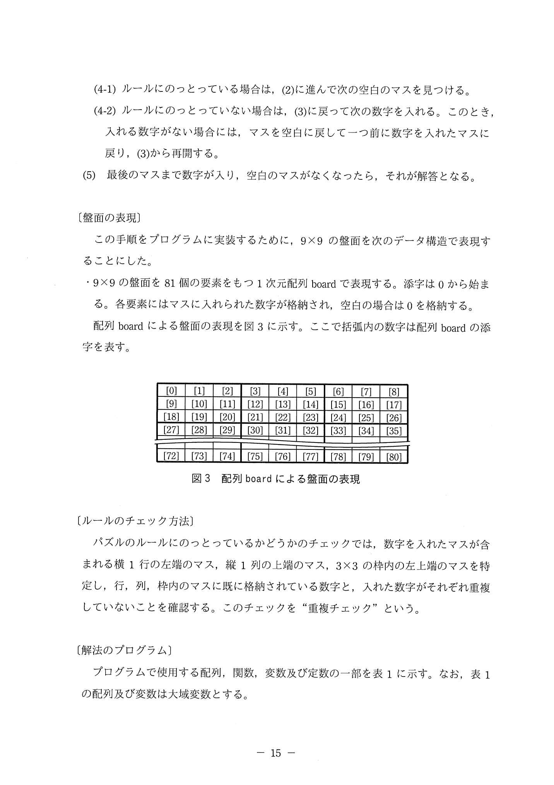

テキスト (OCR)

(4-1) ルールにのっとっている場合は, (2②)に進んで次の空白のマスを見つける。
(4-2) ルールにのっとっていない場合は, (3)に戻って次の数字を入れる。このとき
入れる数字がない場合には, マスを空白に戻して一つ前に数字を入れたマスに
戻り, (3)から再開する。
(6) 最後のマスまで数字が入り, 空白のマスがなくなったら, それが解答となる。

[盤面の表現]
この手順をプログラムに実装するために, 9X9 の盤面を次のデータ構造で表現す
ることにした。
・9X9 の盤面を 81 個の要素をもつ 1 次元配列 board で表現する。添字は 0 から始ま
る。各要素にはマスに入れられた数字が格納され, 空白の場合は 0 を格納する。
配列 board による盤面の表現を図 3 に示す。ここで括弧内の数字は配列 board の添

(o]_| (J | (2) | (3) | (4) | TI6]| [7 | [si
(9] | (10) | (11) | (12) | (13) | (14) | (15) | [16] | [17]
{18] | [19] | [20] | [21] | [22] | [23] | [24] | [25] | [26]
(27] | [28] | [29] | [30] | (31) | [32] | [33] | [34] | [35]

トー人

——_——              1
(72) | [73] | [74] | [75] | [76] | (771 | [78] | 1791 | 180} |
図3 配列board による盤面の表現

〔ルールのチェック方法〕

パズルのルールにのっとっているかどうかのチェックでは, 数字を入れたマスが含
まれる横 1 行の左端のマス, 縦 1 列の上端のマス, 3X3 の枠内の左上端のマスを特
定し, 行, 列, 枠内のマスに既に格納されている数字と, 入れた数字がそれぞれ重複
していないことを確認する。このチェックを “重複チェック” という。

(解法のプログラム]〕

プログラムで使用する配列, 関数, 変数及び定数の一部を表 1 に示す。なお, 表 1
の配列及び変数は大域変数とする。

— {5 -

### ページ 16

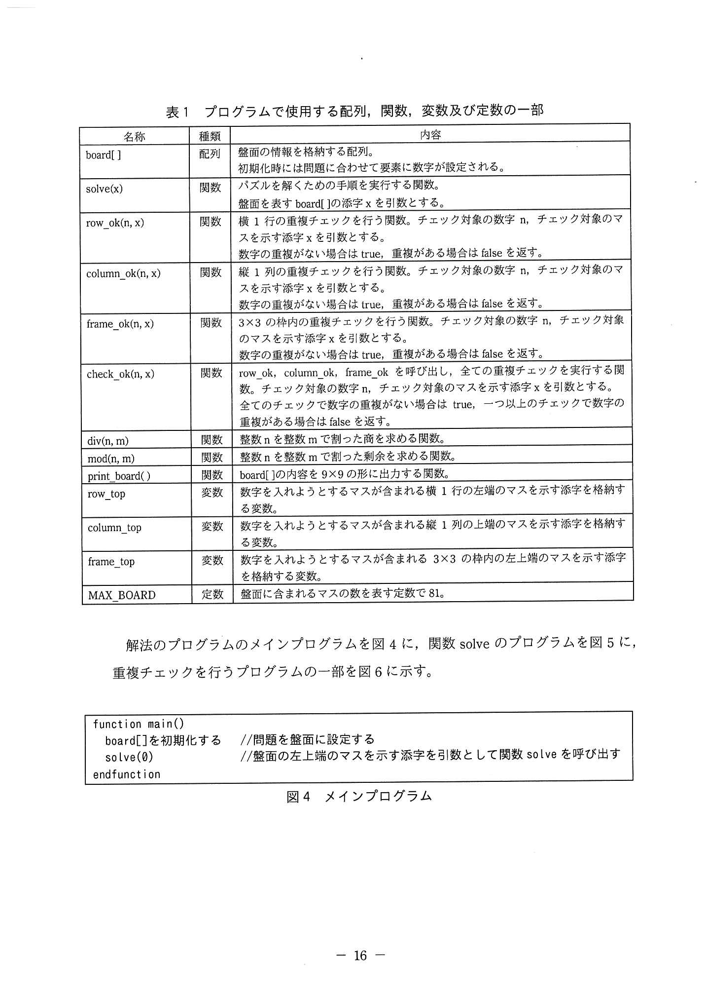

テキスト (OCR)

表1 プログラムで使用する配列, 関数, 変数及び定数の一部

名称            種類                                             内容
board[ ]                       配列 | 盤面の情報を格納する配列。
初期化時には問題に合わせて要素に数字が設定される。
solve(x)              関数 | パズルを解くための手順を実行する関数。
盤面を表す board[ ]の添字 x を引数とする。
row_ok(n, x)         関数 | 横 1 行の重複チェックを行う関数。チェック対象の数字 n。 チェック対象のマ

スを示す添字 x を引数とする。
数字の重複がない場合は rue, 重複がある場合は flse を返す。

column_ok(n, x)          関数 | 縦 1 列の重複チェックを行う関数。チェック対象の数字 n, チェック対象のマ
AERTRE x を引数とする。
数字の重複がない場合は true, 重複がある場合は false を返す。

frame_ok(n, x)            関数 | 3x3 の枠内の重複チェックを行う関数。チェック対象の数字 n, チェック対象
のマスを示す添字 x を引数とする。
数字の重複がない場合は true, 重複がある場合は 介se を返す。

check_ok(n, x)        関数 | row_ok, column_ok, frame_ok を呼び出し, 全ての重複チェックを実行する関
数。チェック対象の数字n。 チェック対象のマスを示す添字 x を引数とする。
全てのチェックで数字の重複がない場合は true, 一つ以上のチェックで数字の
重複がある場合は false を返す。

div(n, m)            関数 | 整数n を整数 m で割った商を求める関数。

mod(n, m)            関数 | 整数n を整数 m で割った剰余を求める関数。

print board()         関数 | board ]の内容を 9X9 の形に出力する関数。

row_top               変数 | 数字を入れようとするマスが含まれる横 1 行の左端のマスを示す添字を格納す
column_top          変数 | 数字を入れようとするマスが含まれる縦 1 列の上端のマスを示す添字を格納す
frame_top            変数 | 数字を入れようとするマスが含まれる 3X3 の枠内の左上端のマスを示す浴字

を格納する変数。
MAX BOARD        定数 | 盤面に含まれるマスの数を表す定数で 81。

解法のプログラムのメインプログラムを図 4 に, 関数 solve のプログラムを図 5 に,
重複チェックを行うプログラムの一部を図 6 に示す。

function main()

board[]を初期化する  //問題を盤面に設定する

solve(9)               //盤面の左上端のマスを示す添字を引数として関数 solve を呼び出す
endfunction

図4 メインプログラム

ss 一

### ページ 17

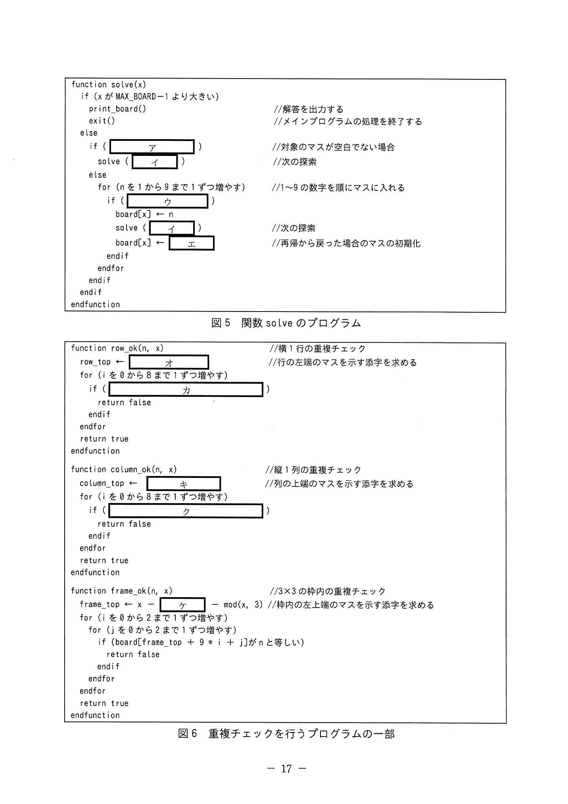

テキスト (OCR)

function solve(x)
if (x がMAX_BOARD一1 より大きい)

print_board()                      //解答を出力する
exit()                         //メインプログラムの処理を終了する
else
it ( )            //対象のマスが空自でない場合
solve ( )               //次の探索
else

for (n を1 から 9 まで1 ずつ増やす)      //1-9 の数字を順にマスに入れる

(E>)

board[x] で n

solve ( )             //次の探索
board[x] <          //再帰から戻った場合のマスの初期化
endif
endfor
endif

endif
endfunction

図5 関数sotve のプログラム

function row_ok(n, x)                       //横 1 行の重複チェック
row_top て            //行の左端のマスを示す添字を求める
for (iを9から8まで1 ずつ増やす)
(|      カ      |)
return false
endif
endfor

return true
endfunction

function column_ok(n, x)                       //縦 1 列の重複チェック
colum_top と         //列の上端のマスを示す添字を求める
for (i を9から8まで1 ずつ増やす)
if (|           ク           |)
return false
endif
endfor
return true
endfunction

function frame_ok(n, x)                     //3X3 の枠内の重複チェック
frame_top — x 一 ー mod(x, 3) //枠内の左上端のマスを示す添字を求める
for (i を0 から 2 まで 1 ずつ増やす)

for (」を0から2 まで1 ずつ増やす)
if (board[frame_top + 9* i + j」]がnと等しい)
return false
endif
endfor
endfor
return true
endfunction

図6 重複チェックを行うプログラムの一部

ー 17 一

### ページ 18

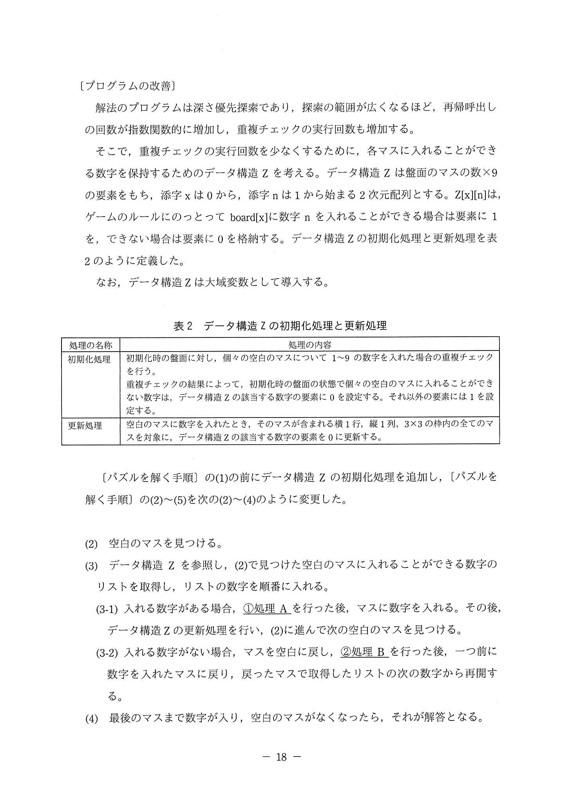

テキスト (OCR)

〔プログラムの改善
解法のプログラムは深さ優先探索であり, 探索の範囲が広くなるほど, 再帰呼出し
の回数が指数関数的に増加し, 重複チェックの実行回数も増加する。

so

で, 重複チェックの実行回数を少なくするために, 各マスに入れることができ

る数字を保持するためのデータ構造 2 を考える。データ構造 Z は盤面のマスの数X9

の要素をもち, 添字x は0から,

添字n は 1 から始まる 2 次元配列とする。Z[x][n]は,

ゲームのルールにのっとって boardlx]に数字n を入れることができる場合は要素に 1
を, できない場合は要素に 0 を格納する。データ構造 Z の初期化処理と更新処理を表
2 のように定義した。

なお, データ構造 2 は大域変数として導入する。

表2 データ構造 Z の初期化処理と更新処理

処理の名称                         処理の内容

初期化処理 | 初期化時の盤面に対し, 個々の空白のマスについて 1~9 の数字を入れた場合の重複チェック
を行う。
重複チェックの結果によって, 初期化時の盤面の状態で個々の空白のマスに入れることができ
ない数字は, データ構造 Z の該当する数字の要素に 0 を設定する。それ以外の要素には 1 を設
定する。

更新処理   空白のマスに数字を入れたとき, そのマスが含まれる横 1 行 縦 1 列, 3X3 の枠内の全てのマ

スを対象に, データ構造 2 の該当する数字の要素を 0 に更新する。

〔パズルを解く手順〕】 の(1)の前にデータ構造 Z の初期化処理を追加し, 〔パズルを
解く手順〕] の(②~(5)を次の②)て(④のように変更した。

(2) 空白のマスを見つける。
(3) データ構造 Z を参照し, (2)で見つけた空白のマスに入れることができる数字の
リストを取得し, リストの数字を順番に入れる。
(3-1) 入れる数字がある場合,①処理 A を行った後, マスに数字を入れる。 その後,
データ構造 Z の更新処理を行い, (2②)に進んで次の空白のマスを見つける。
(3-2) 入れる数字がない場合, マスを空白に戻し, ②処理 B を行った後, 一つ前に
数字を入れたマスに戻り, 戻ったマスで取得したリストの次の数字から再開す
る。

(4)

最後のマスまで数字が入り, 空白のマスがなくなったら, それが解答となる。

ー 18 一

### ページ 19

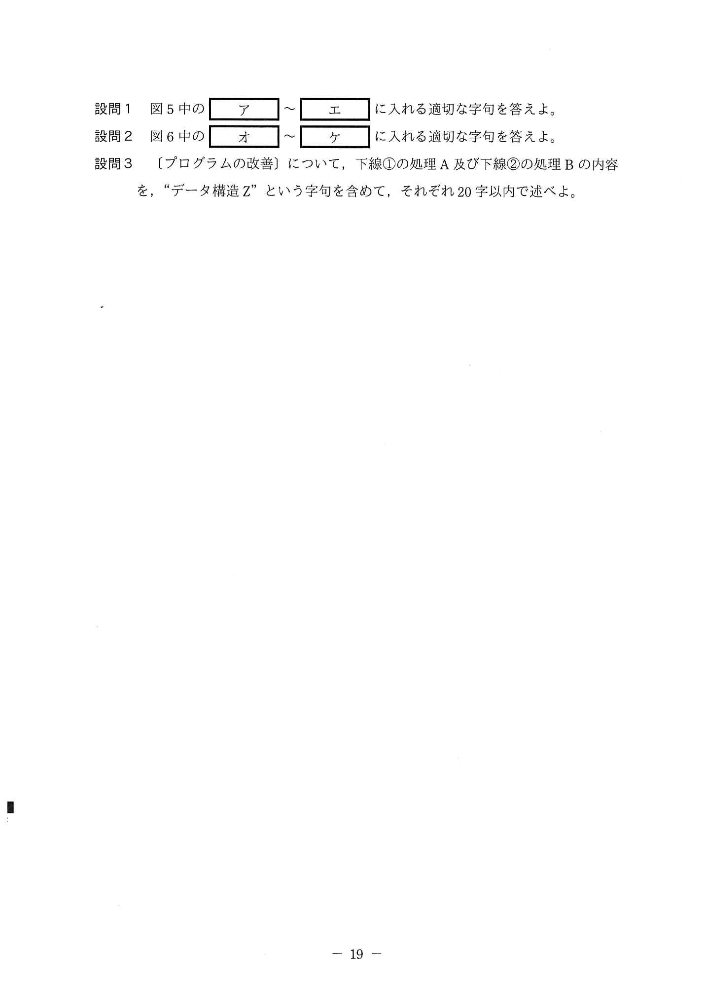

テキスト (OCR)

設問1 図5中の| ア |~| エ |に入れる適切な字句を答えよ。

設問2 図6中の| オ |~L_ ヶケ |に入れる適切な字句を答えよ。

設問3 〔プログラムの改善) について, 下線①の処理 A 及び下線②の処理 B の内容
を, “データ構造 Z” という宇句を含めて, それぞれ 20 字以内で述べよ。

ー 19 一

### ページ 20

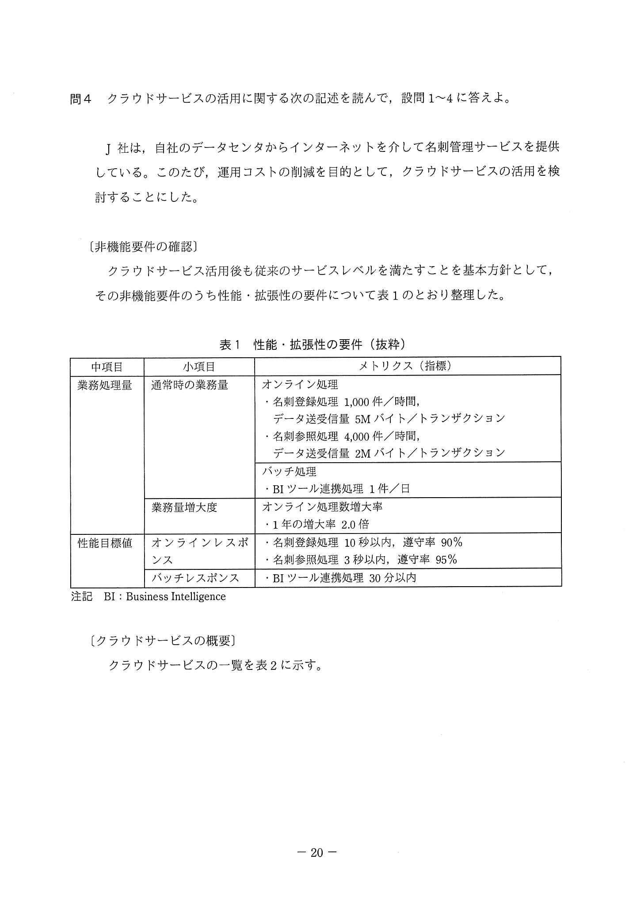

テキスト (OCR)

間4 クラウドサービスの活用に関する次の記述を読んで, 設問 1+ー4 に答えよ。

J 社は, 自社のデータセンタからインターネットを介して名刺管理サービスを提供
している。このたび, 運用コストの削減を目的として, クラウドサービスの活用を検
討することにした。

〔非機能要件の確認
クラウドサービス活用後も従来のサービスレベルを満たすことを基本方針として,
その非機能要件のうち性能・拡張性の要件について表 1 のとおり整理した。

表 1

性能・拡張性の要件 (抜粋)

中項目

MEAL

メトリクス (指標)

業務処理量

通常時の業務量

オンライン処下

・ 名登録処理 1.000 件時間

データ送受信量 5M バイトントランザクション
・ ZS IRIE 4,000 件時間,

データ送受信量 2M バイトントランザクション
Ry FE

・ BI ツール連携処理 1 件/日

業務量増大度

オンライン処理数増大率
・1 年の増大率 2.0 倍

性能目標値

オンラインレスポ
ンス

・名刺登録処理 10 秒以内, 遵守率 90%
・名刺参照処理 3 秒以内, 遵守率 95%

バッチレスポンス

・BI ツール連携処理 30 分以内

注記 BI: Business Intelligence

〔クラウドサービスの概要〕
クラウドサービスの一覧を表 2 に示す。

ー 20 一

### ページ 21

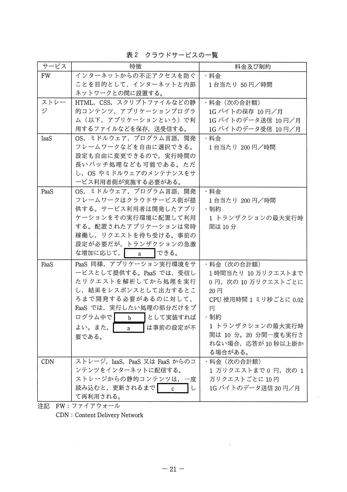

テキスト (OCR)

表2 クラウドサービスの一覧

ンテンツをインターネットに配信する。

ストレージからの静的コンテンツは, 一度
読み込むと, 更新されるまで| c |し
て再利用される。

サービス             特徴                   料金及び制約
FW     インターネットからの不正アクセスを防ぐ | ・料金
ことを目的として, インターネットと内部   1 台当たり 50 円時間
ネットワークとの間に設置する。
ストレー | HTML, CSS, スクリプトファイルなどの静 | ・料金 (次の合計額)
Pa      的コンテンツ, アプリケーションプログラ   1G バイトの保存 10 円月
ム (以下、アプリケーションという) CH] 1Gバイトのデータ送信 10 円月
用するファイルなどを保存, 送受信する。     1G バイトのデータ受信 10 円月
IaaS    0S, ミドルウェア, プログラム言語, 開発| ・料金
フレームワークなどを自由に選択できる。     台当たり 200 円時間
設定も自由に変更できるので, 実行時間の
長いバッチ処理なども可能である。ただ
し, OS やミドルウェアのメンテナンスをサ
ービス利用者側が実施する必要がある。
PaaS    OS, ミドルウェア, プログラム言語, 開発 - HS
フレームワークはクラウドサービス側が提   1 台当たり 200 円時間
供する。サービス利用者は開発したアプリ | ・制約
ケーションをその実行環境に配置して利用   1 トランザクションの最大実行時
する。 配置されたアプリケーションは常時   間は 10 分
ROL, リクエストを待ち受ける。事前の
設定が必要だが, トランザクションの急激
な増加に応じて,        できる。
FaaS     PaaS 同様, アプリケーション実行環境をサ | ・料金 (次の合計額)
ービスとして提供する。PaaS では, 受信し   1 時間当たり 10 万リクエストまで
たリクエストを解析してから処理を実行    0 円, 次の 10 万リクエストごとに
し, 結果をレスポンスとして出力するとこ   20 円
ろまで開発する必要があるのに対して,      CPU 使用時間 1 ミリ秒ごとに 0.02
FaaS では, 実行したい処理の部分だけをプ   円
ログラム中で|  b |として実装すれば | ・制約
よい。 また, |  。 |は事前の設定が不| 1 トランザクションの最大実行時
要である。                           間は 10 分。20 分間一度も実行さ
れない場合, 応答が 10 秒以上掛か
る場合がある。
CDN       ストレージ, IaaS, PaaS 又は FaaS からのコ | ・料金 (次の合計額)

1 万リクエストまで0 円, 次の 1
万リクエストごとに 10円
1G バイトのデータ送信 20 円月

注記 FW : ファイアウォール
CDN : Content Delivery Network

ー 21 一

### ページ 22

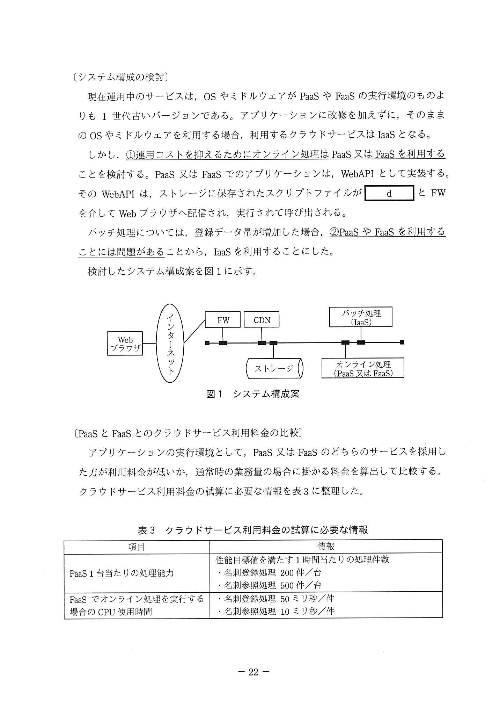

テキスト (OCR)

(VAT AM KORA)

現在運用中のサービスは, OS やミドルウェアが PaaS や FaaS の実行環境のものよ
りも 1 世代古いバージョンである。アプリケーションに改修を加えずに, そのまま
の 0S やミドルウェアを利用する場合, 利用するクラウドサービスは IaaS となる。

しかし, ①運用コストを抑えるためにオンライン処理は PaaS 又は FaaS を利用する
ことを検討する。PaaS 又は FaaSs でのアプリケーションは, WebAPI として実装する。
その WebAPI は, ストレージに保存されたスクリプトファイルが|  q |とFw
を介して Web ブラウザへ配信され, 実行されて呼び出される。

バッチ処理については, 登録データ量が増加した場合,②PaaS や FaaS を利用する
ことには間題があることから, IaaS を利用することにした。

検対したシステム構成案を図 1 に示す。

バッチ処理
(IaaS)
Web
ブラウザ                                *
オンライン処理
(ストルー i      (PaaS 又は FaaS)

図1 システム構成案

(PaaS と FaaS とのクラウドサービス利用料金の比較]

アプリケーションの実行環境として, PaaS 又は FaaS のどちらのサービスを採用し
た方が利用料金が低いか, 通常時の業務量の場合に掛かる料金を算出して比較する。
クラウドサービス利用料金の試算に必要な情報を表 3 に整理した。

表3 クラウドサービス利用料金の試算に必要な情報

項目                                                                       情報
性能目標値を満たす 1 時間当たりの処理件数
PaaS 1 台当たりの処理能力              ・名刺登録処理 200 件人台

・名刺参照処理 500 件人台

FaaS でオンライン処理を実行する | ・名刺登録処理 50 ミリ秒件
場合の CPU 使用時間               ・名刺参照処理 10 ミリ秒件

ー 22 一

### ページ 23

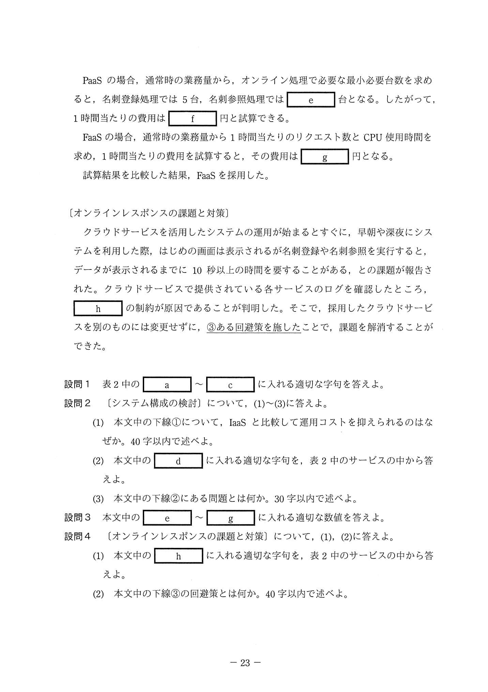

テキスト (OCR)

PaaS の場合, 通常時の業務量から, オンライン処理で必要な最小必要台数を求め
ると, 名刺登録処理では 5 台, 名刺参照処理では|  e lates. LAAT,
1時間当たりの費用は| { |円と試算できる。

FaaS の場合 通常時の業務量から 1 時間当たりのリクエスト数と CPU 使用時間を
求め, 1 時間当たりの費用を試算すると, その費用は| g | 円となる。

試算結果を比較した結果, FaaS を採用した。

[オンラインレスポンスの課題と対策

クラウドサービスを活用したシステムの運用が始まるとすぐに, 早朝や深夜にシス
テムを利用した際, はじめの画面は表示されるが名刺登録や名刺参照を実行すると,
データが表示されるまでに 10 秒以上の時間を要することがある, との課題が報告さ
れた。クラウドサービスで提供されている各サービスのログを確認したところ,
| | の制約が原因であることが判明した。そこで, 採用したクラウドサービ
スを別のものには変更せずに, ③ある回避策を施したことで, 課題を解消することが
‘CP Re

DF

えよ。

設問1 表2中の| a  上  c |に入れる適切な字匂を
設問2 〔システム構成の検討] について, ①⑪て⑬)に答えよ。
GQ) 本文中の下線①について, IaaS と比較して運用コストを抑えられるのはな
ED, 40 字以内で述べよ。
⑫ 本文中の[| a |] に入れる適切な字句を, 表2 中のサービスの中から答
えよ。
3) 本文中の下線②にある問題とは何か。30 字以内で述べよ。
設問3 本文中の|  e |~|  g |に入れる適切な数値を答えよ。
設問4 〔オンラインレスポンスの課題と対策] について, ①⑪, (②)に答えよ。
Q) 本文中の| hh | に入れる適切な字句を, 表 2 中のサービスの中から答
Ake
(2) 本文中の下線③の回避策とは何か。40 字以内で述べよ。

ー 23 一

### ページ 24

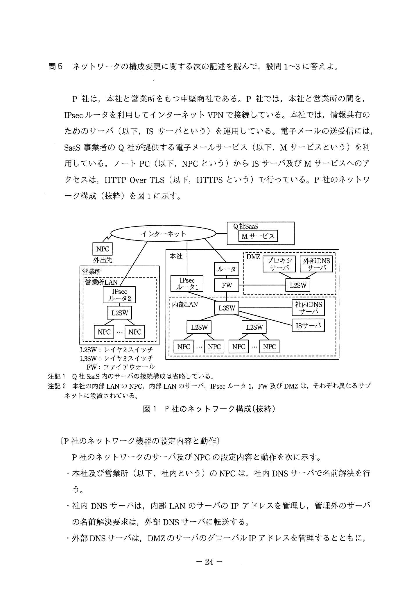

テキスト (OCR)

FS ネットワークの構成変更に関する次の記述を読んで, 設問 1ー3 に答えよ。

P 社は, 本社と営業所をもつ中堅商社である。P 社では, 本社と営業所の間を,
IPsec ルータを利用してインターネット VPN で接続している。 本社では, 情報共有の
ためのサーバ (UE, IS サーバという) を運用している。 電子メールの送受信には,
SaaS 事業者の Q 社が提供する電子メールサービス (以下, M サービスという) を利
用している。ノート PC (以下, NPC という) から IS サーバ及び M サービスへのア
クセスは, HTTP Over TLS (以下, HTTPS という) で行っている。P 社のネットワ
ーク構成 (抜粋) を図 1 に示す。

外部DNS
サーバ

社内DNS
サーバ

psW: レイYsスイッチ || [Nec] ~[Nec] [npc] [nc]
L3SW : レイヤ3スイッチ |ビーーーーーーーーーーーーーーーーーーーーーーーーーーーーーーーーーーーーーーーーーーー
FW : ファイアウォール
注記 1 Q社 SaaS 内のサーバの接続構成は省略している。
注記 2 本社の内部 LAN の NPC, 内部 LAN のサーバ, IPsec ルータ 1, FW 及び DMZ は, それぞれ異なるサブ
ネットに設置されている。

図1 P社のネットワーク構成(抜粋)

(P 社のネットワーク機器の設定内容と動作]
P 社のネットワークのサーバ及び NPC の設定内容と動作を次に示す。
・本社及び営業所 (以下, 社内という) のNPC は, 社内 DNS サーバで名前解決を行
う。
・社内 DNS サーバは, 内部 LAN のサーバの IP アドレスを管理し, 管理外のサーバ
の名前解決要求は, 外部 DNS サーバに転送する。
・外部 DNS サーバは, DMZ のサーバのグローバル IP アドレスを管理するとともに,

ー 24 一

### ページ 25

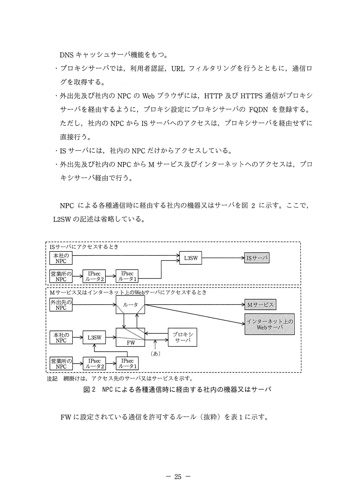

テキスト (OCR)

DNS キャッシュサーバ機能をもつ。
・プロキシサーバでは, 利用者認証, URL フィルタリングを行うとともに, HRD
グを取得する。
・外出先及び社内の NPC の Web ブラウザには, HTTP 及び HTTPS 通信がプロキシ
サーバを経由するように, プロキシ設定にプロキシサーバの FQDN を登録する。
ただし, 社内の NPC から IS サーバヘのアクセスは, プロキシサーバを経由せずに
直接行う。
・IS サーバには, 社内の NPC だけからアクセスしている。
・外出先及び社内の NPC から M サービス及びインターネットへのアクセスは, プロ
キシサーバ経由で行う。

NPC による各種通信時に経由する社内の機器又はサーバを図 2 に示す。ここで,
L2SW の記述は省略している。

| ISサーバにアクセスするとき

本社の                                                                                                              ass

Mサービス又はインターネット上のWebサーバにアクセスするとき

1
ae            ルータ ,                          MMサービス
|
!

インターネット上の
Webサーバ

本社の          .         プロキシ
NEc | 1 LSW    EW   K   サーバ

営業所の|      IPsec       IPsec
NPC | ルータ2| ルータュ1

注記 網掛けは, アクセス先のサーバ又はサービスを示す。
図 2 NPC による各種通信時に経由する社内の機器又はサーバ

FW に設定されている通信を許可するルール (抜粋) を表 1 に示す。

ー 25 一

### ページ 26

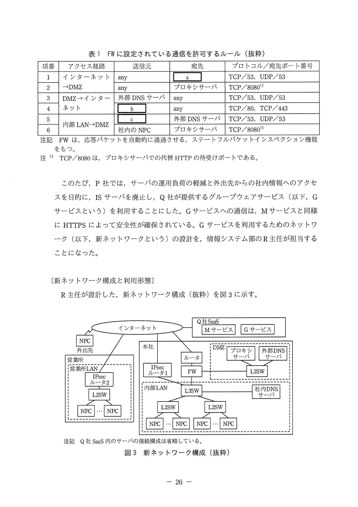

テキスト (OCR)

表1 FWに設定されている通信を許可するルール (抜粋)

項番    アクセス経路         送信元            宛先         プロトコルンノ宛先ポート番号
1 | インターネット | any        a |   TCP/53, UDP/53
2 | つDMZ     any        プロキシサーバ | TCPン8080リ
3 | DMZつインター | 外部DNS サーバ | any       TCP/53, UDPグ53
4 | ネット           | 5 |        any              TCP/80, TCP443
5              |     外部 DNS サーバ | TCPノ53, UDPノ53
内部 LANつDMZ               =   =       5
6           社内の NPC   プロキシサーバ | TCPング8080

注記 FW は, 応答パケットを自動的に通過させる, ステートフルパケットインスペクション機能
をもつ。
注 ! TCPノ8080 は, プロキシサーバでの代替 HTTP の待受けポートである。

このたび, P 社では, サーバの運用負荷の軽減と外出先からの社内情報へのアクセ
スを目的に, IS サーバを廃止し, Q 社が提供するグループウェアサービス (以下, G
サービスという) を利用することにした。GCサービスへの通信は, M サービスと同様
に HTTPS によって安全性が確保されている。G サービスを利用するためのネットワ
ーク (以下, 新ネットワークという) の設計を, 情報システム部のR 主任が担当する

ことになった。

〔新ネットワーク構成と利用形態〕
R 主任が設計した, 新ネットワーク構成 (抜粋) を図 3 にボす。

Q社SaaS

1    プロキシ | | 外部DNS
|ルータ |   Hy        サーバ      サーバ
1

BLAN              L3SW                                             社内DNS
サーバ

1
'
i
L2SW      L2SW            1
i
1
i

注記 Q 社 SaaS 内のサーバの接続構成は省略している。
M3 新ネットワーク構成 (抜粋)

ー 26 一

### ページ 27

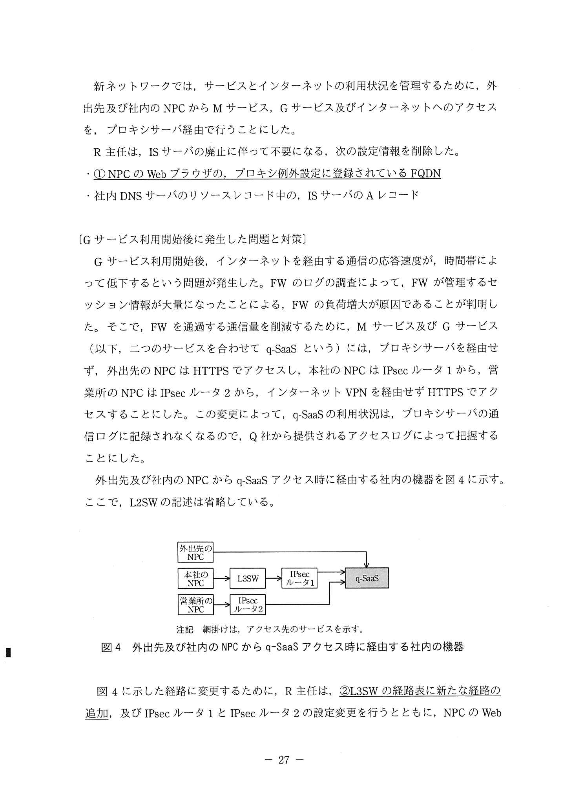

テキスト (OCR)

新ネットワークでは, サービスとインターネットの利用状況を管理するために, 外
出先及び社内の NPC から M サービス, G サービス及びインターネットへのアクセス
を, プロキシサーバ経貼で行うことにした。

R 主任は, IS サーバの廃止に伴って不要になる, 次の設定情報を削除した。

・① NPC の Web ブラウザの, プロキシ例外設定に登録されている FQDN
・社内 DNS サーバのリソースレコード中の, IS サーバの A レコード

〔G サービス利用開始後に発生した問題と対策]

G サービス利用開始後, インターネットを経由する通信の応答速度が, 時間帯によ
って低下するという問題が発生した。FW のログの調査によって, FW が管理するセ
ッション情報が大量になったことによる, FW の負荷増大が原因であることが判明し
た。 そこで, FW を通過する通信量を削減するために, M サービス及び G サービス

(以下, 二つのサービスを合わせて q-SaaS という) には, プロキシサーバを経由せ
ず, 外出先の NPC は HTTPS でアクセスし, 本社の NPC は IPsec ルータ 1 から, 営
業所の NPC は IPsec ルータ 2 から, インターネット VPN を経由せず HTTPS でアク
セスすることにした。この変更によって, q-SaaS の利用状況は, プロキシサーバの通
信ログに記録されなくなるので, Q 社から提供されるアクセスログによって把握する
ことにした。

外出先及び社内の NPC から q-SaaS アクセス時に経由する社内の機器を図 4 に示す。
ここで, L2SW の記述は省略している。

外出先の

NPC                          J
本社の             IPsec

NPC | L3SW Fly Sy     d-SaaS
営業所の    TPsec

NPC     ルータ2

注記 網掛けは,。 アクセス先のサービスを示す。
図4 外出先及び社内の NPC から q-SaaS アクセス時に経由する社内の機器

 4 に示した経路に変更するために, R 主任は, ②L3SW の経路表に新たな経路の
追加, 及び IPsec ルータ 1 と IPsec ルータ 2 の設定変更を行うとともに, NPC の Web

ー 27 一

### ページ 28

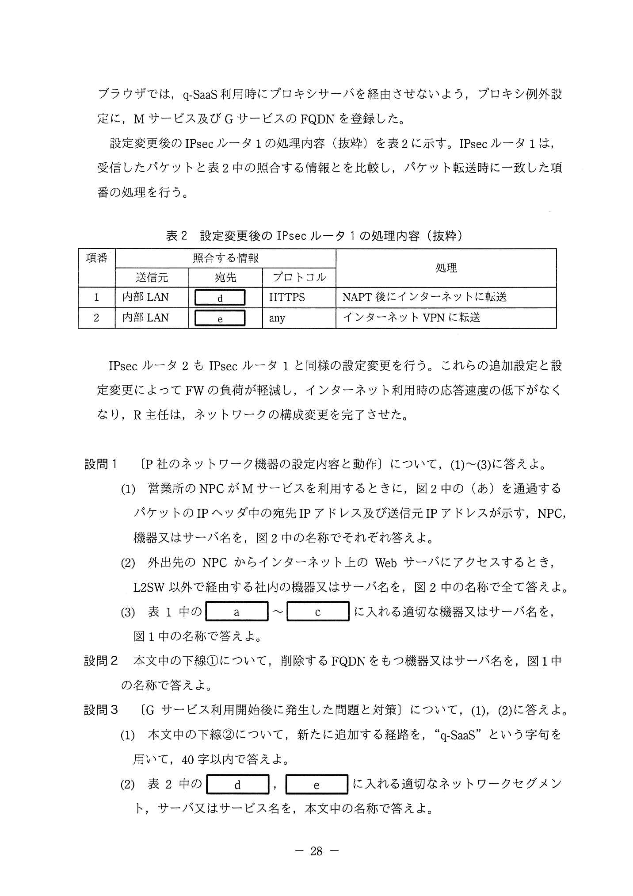

テキスト (OCR)

ブラウザでは, q-SaaS 利用時にプロキシサーバを経由させないよう, プロキシ例外設
定に, M サービス及び G サービスの FQDN を登録した。

設定変更後の IPsecc ルータ 1 の処理内容 (抜粋) を表2 に示す。IPsec ルータ 1 は,
受信したパケットと表 2 中の照合する情報とを比較し, パケット転送時に一致した項
番の処理を行う。

表2 設定変更後の IPsec ルータ 1 の処理内容 (抜粋)

項番                    照合する情報
7                                                             処理
送信元          宛先        プロトコル
1 | 内部LAN |[ 』 |] | HTTPS     NAPT 後にインターネットに転送
2 |内部LAN |[ 。 | | ay             インターネット VPN に転送

IPsec ルータ 2 も IPsec ルータ 1 と同様の設定変更を行う。これらの追加設定と設
定変更によって FW の負荷が軽減し, インターネット利用時の応答速度の低下がなく
なり, R 主任は, ネットワークの構成変更を完了させた。

設問 1   〔【P 社のネットワーク機器の設定内容と動作}) について, ①⑪~て(3③)に答えよ。
G) 営業所の NPC がM サービスを利用するときに, 図2中の (あ) を通過する
パケットのIP ヘッダ中の宛先ITP アドレス及び送信元IP アドレスが示す, NPC,
機器叉はサーバ名を, 図 2 中の名称でそれぞれ答えよ。
(2) 外出先の NPC からインターネット上の Web サーバにアクセスするとき,
L2SW 以外で経由する社内の機器又はサーバ名を, 図 2 中の名称で全て答えよ。
3) 表 1 中の| a |~l  c |に入れる適切な機器又はサーバ名を,
図 1 中の名称で答えよ。
設問2 本文中の下線わについて, 削除するFQDN をもつつ機器又はサーバ名を, 図1中
の名称で答えよ。
設問3 〔G サービス利用開始後に発生した問題と対策] について, (①), (②)に答え
(1) 本文中の下線②について, 新たに追加する経路を, “q-SaaS” という字句
用いて, 40 字以内で答えよ。
②) 表2 中の| a |,| ie |に入れる適切なネットワークセグメン
ト, サーバ又はサービス名を, 本文中の名称で答えよ。

よ。
を

ー 28 一

### ページ 29

テキスト (OCR)

メ モ 用 紙 J

ー 29 一

### ページ 30

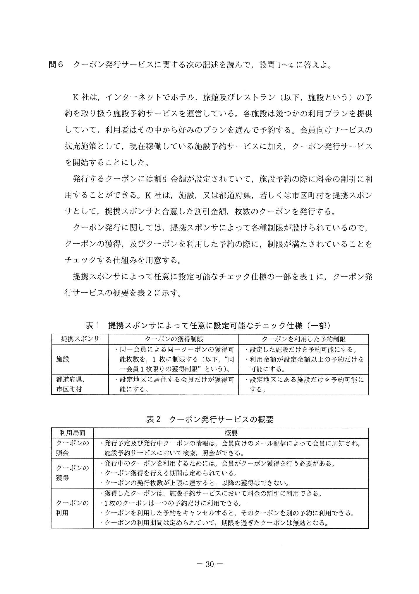

テキスト (OCR)

間6 クーポン発行サービスに関する次の記述を読んで, 設問 1ー4 に答えよ。

K 社は, インターネットでホテル, 旅館及びレストラン (以下, 施設という) の予
約を取り扱う施設予約サービスを運営している。各施設は幾つかの利用プランを提供
していて, 利用者はその中から好みのプランを選んで予約する。 会員向けサービスの
拡充施策として, 現在稼働している施設予約サービスに加え, クーポン発行サービス
を開始することにした。

発行するクーポンには割引金額が設定されていて, 施設予約の際に料金の割引に利
用することができる。K 社は, 施設, 又は都道府県, 若しくは市区町村を提携スポン
サとして, 提携スポンサと合意した割引金額, 枚数のクーポンを発行する。

クーポン発行に関しては, 提携スポンサによって各種制限が設けられているので
クーポンの獲得。 及びクーポンを利用した予約の際に, 制限が満たされていることを
チェックする仕組みを用意する。

提携スポンサによって任意に設定可能なチェック仕様の一部を表 1 に, クーポン発
行サービスの概要を表 2 に示す。

Rl 提携スポンサによって任意に設定可能なチェック仕様 (一部)

提携スポンサ            クーポンの獲得制限                クーポンを利用した予約制限
・同一会員による同一クーポンの獲得可 | ・設定した施設だけを予約可能にする。
施設               能枚数を, 1 枚に制限する (以下, “同 | ・利用金額が設定金額以上の予約だけを
一会員 1 枚限りの獲得制限” という)。        可能にする。
都道府県,         ・ 設定地区に居住する会員だけが獲得可 | ・設定地区にある施設だけを予約可能に
市区町村           能にする。                             する。

表2 クーポン発行サービスの概要

利用局面                         概要
クーポンの | ・発行予定及び発行中クーポンの情報は, 会員向けのメール配信によって会員に周知され,
照会       施設予約サービスにおいて検索, 照会ができる。

・発行中のクーポンを利用するためには, 会員がクーポン獲得を行う必要がある。

・クーポン獲得を行える期間は定められている。

・クーボポンの発行枚数が上限に達すると, 以降の獲得はできない。

・ 獲得したクーボンは, 施設予約サービスにおいて料金の割引に利用できる。

クーポンの | ・1枚のクーポンは一つの予約だけに利用できる。

利用           ・クーポンを利用した予約をキャンセルすると, そのクーポンを別の予約に利用できる。
・クーポンの利用期間は定められていて, 期限を過ぎたクーポンは無効となる。

クーポンの
獲得

ー 30 一

### ページ 31

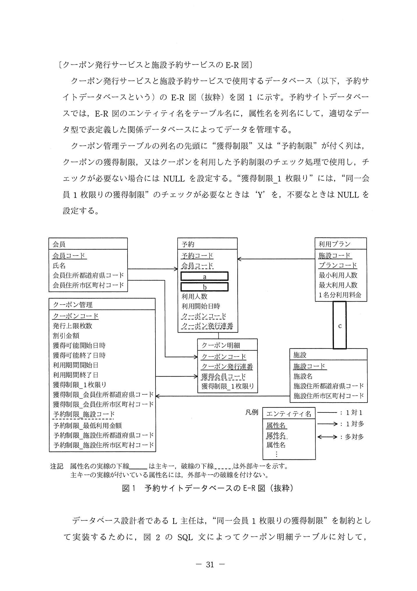

テキスト (OCR)

[クーポン発行サービスと施設予約サービスの ER 図]

ーポン発行サービスと施設予約サービスで使用するデータベース (以下, 予約サ
イトデータベースという) OBR 図 (抜粋) を図 1 に示す。予約サイトデータベー
スでは, E-R 図のエンティティ名をテーブル名に, 属性名を列名にして, 適切なデー
タ型で表定義した関係データベースによってデータを管理する。

ーポン管理テチーブルの列名の先頭に “獲得制限" 又は “予約制限" が付く列は,

ーポンの獲得制限, 又はクーポンを利用した予約制限のチェック処理で使用し, チ

ェックかが必要ない場合には NULL を設定する。“獲得制限 1 枚限り"      , "同一会
員 1 枚限りの獲得制限” のチェックが必要なときは Y'を, 不要なときは NULL を
設定する。

会員                                        予約                                           利用プラン

会員コード                予約コード                  施設コード

氏名                    会員コード                  プランコード

会員住所都道府県コード                    | 』 |                               最小利用人数

会員住所市区町村コード                               最大利用人数
利用人数                                       1名分利用料金

クーポン管理                利用開始日時

クーボンコード                                                        1

発行上限枚数                                                                                              c

割引金額                                                     I

獲得可能開始日時                 クーポン明細

狂得可能終了日時                 クーポンコード        施設

利用期間開始日                                                  クーポン発行較番                      施設コード

利用期間終了日                                   獲得会員コード                 施設名

獲得制限_1枚限り                                 獲得制限 1枚限り              施設住所都道府県コード

獲得制限 会員住所者府県コード
獲得制限 会員住所市区町村コード
予約制限 施設コード

予約制限 最休利用金額

予約制限 施設住所都道府県コード
予約制限 施設住所市区町村コー

注記 属性名の実線の下線___は主キー

凡例

, 破線の下線____-.は外部キー

施設住所市区町村コード

エンティティ名 |— : 1対1
属性名          — > : 1対多
届性名.        <> : 多対多

を示す。

主キーの実線が付いている属性名には, 外部キーの破銀を付けない。
Bl 予約サイトデータベースのE-R図 (抜粋)

データベース設計者である L 主任は, “同一会員 1

て実装するため

に, 2 の SQL 文によってク

ー 31 一

枚限りの獲得制限”" を制約とし

ーポン明細テーブルに対して,

### ページ 32

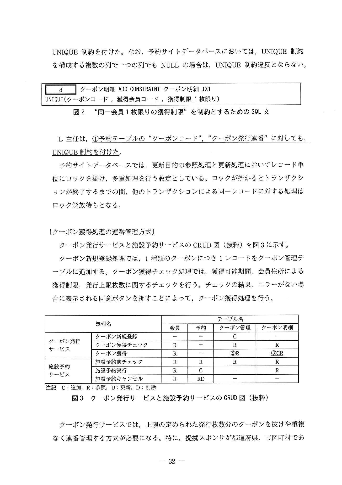

テキスト (OCR)

UNIQUE 制約を付けた。なお, 予約サイトデータベースにおいては, UNIQUE 制約
を構成する複数の列で二つの列でも NULL の場合は, UNIQUE 制約違反とならない。

| 』 | クーポン明細 ADD CONSTRAINT クーポン明細_1X1
UNIQUE(クーポンコード , 獲得会員コード , 獲得制限_1 枚限り)

図2 “同一会員 1 枚限りの獲得制限” を制約とするための SAX

L 主任は, ①予約テーブルの“クーポンコード", “クーポン発行連番"に対しても,

UNIQUE 制約を付けた。

予約サイトデータベースでは, 更新目的の参照処理と更新処理においてレコード単
位にロックを掛け, 多重処理を行う設定としている。ロックが掛かるとトランザクシ
ョンが終了するまでの間, 他のトランザクションによる同一レコードに対する処理は
ロック解放待ちとなる。

〔クーポン獲得処理の連番管理方式]
クーポン発行サービスと施設予約サービスの CRUD 図 (抜粋) を図 3 に示す。
クーポン新規登録処理では, 1 種類のクーポンにつき 1 レコードをクーポン管理テ
ーブルに追加する。クーポン獲得チェック処理では, 獲得可能期間, 会員住所による
獲得制限, 発行上限枚数に関するチェックを行う。チェックの結果, エラーがない場
合に表示される同意ボタンを押すことによって, クーポン獲得処理を行う。

テーブル名
es
aii               会員    予約    クーポン管理 | クーポン明細
nl クーポン新規登録       =    =      c       =
poe   RY WEF = 97     R    =      R       R
クーポン獲得         R    ー     @R      @CR
ー       施設予約前チェック      R    R      R       R
eee     施設予約実行         R    c      ー       z
施設予約キャンセル          R       RD         ー            ー

注記 OC: 追加,R: 参照,U: 更新, D : 削除
図3 クーポン発行サービスと施設予約サービスのCRUD 図 (抜粋)

クーポン発行サービスでは, 上限の定められた発行枚数分のクーポンを抜けや重複
なく連番管理する方式が必要になる。 特に, 提携スポンサが都道府県, 市区町村であ

ー 32 一

### ページ 33

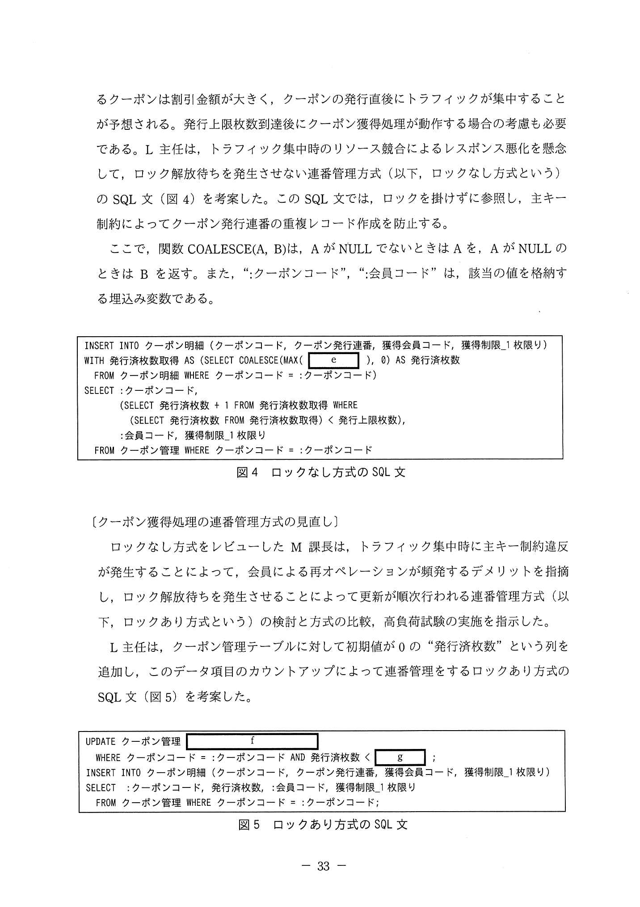

テキスト (OCR)

るクーポンは割引金額が大きく, クーポンの発行直後にトラフィックが集中すること
が予想される。 発行上限枚数到達後にクーポン獲得処理が動作する場合の考慮も必要
である。L 主任は, トラフィック集中時のリソース競合によるレスポンス悪化を懸念
UT, ロック解放待ちを発生させない連番管理方式 (以下, ロックなし方式という)
の SQL 文 (図 4) を考案した。この SQL 文では, ロックを掛けずに参照し, 主キー
制約によってクーポン発行連番の重複レコード作成を防止する。

ここで, 関数 COALESCE(A, B)は, A が NULL でないときはAを, AがNULL の
ときは B を返す。また, "クーポンコード", 会員コード"は, 該当の値を格納す
る埋込み変数である。

INSERT INTO クーポン明細 (クーポンコード, クーポン発行連番, 獲得会員コード, 獲得制限-1 KORY)
WITH 発行済枚数取得 AS (SELECT COALESCE(MAX( | ce | ), 0) AS 発行済枚数
FROM クーポン明細 WHERE クーポンコード = :クーポンコード)
SELECT :クーポンコード,
(SELECT 発行済枚数 + 1 FROM 発行済枚数取得 WHERE
(SELECT 発行済枚数FROM 発行済枚数取得) < SLID,
:会員コード, 獲得制限1 枚限り
FROM クーポン管理 WHERE クーポンコード = :クーポンコード

図4 ロックなし方式の SOL Xx

〔クーポン獲得処理の連番管理方式の見直し〕

ロックなし方式をレビューした M 課長は, トラフィック集中時に主キー制約違反
が発生することによって, 会員による再オペレーションが頻発するデメリットを指摘
し, ロック解放待ちを発生させることによって更新が順次行われる連番管理方式 (以
下, ロックあり方式という) の検討と方式の比較, 高負荷試験の実施を指示した。

L 主任は, クーポン管理テーブルに対して初期値が0 の “発行済枚数” という列を
追加し, このデータ項目のカウントアップによって連番管理をするロックあり方式の
SQL 文 (図 5) を考案した。

WHERE クーポンコード = :クーポンコード AND 発行済枚数 く          i

INSERT INTO クーポン明細 (クーポンコード, クーポン発行連番, 獲得会員コード, 獲得制限1 枚限り)
SELECT :クーポンコード, 発行済枚数, :会員コード, 獲得制限_1 枚限り

FROM クーポン管理 WHERE クーポンコード = :クーポンコード

図5 ロックあり方式の SLX

ー ,39.一

### ページ 34

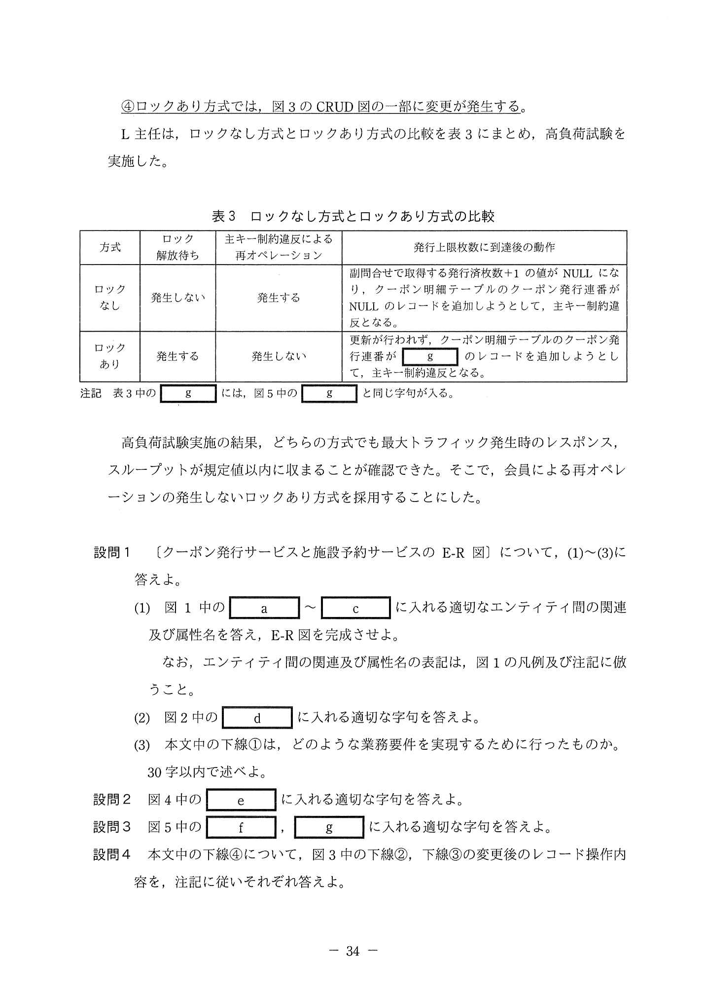

テキスト (OCR)

ロックあり方式では, 図 3 の CRUD 図の一部に変更が発生する。
L 主任は, ロックなし方式とロックあり方式の比較を表 3 にまとめ, 高負荷試験を
実施した。

表3 ロックなし方式とロックあり方式の比較

ロック | キキー制約違反による         開    vais pi
方式     能放待ち     再オペレーション            発行上限枚数に到達後の動作
副問合せで取得する発行済枚数+†1 の値が NULL にな
ロック                          り, クーポン明細テーブルのクーポン発行連番が
a, | 生ましな    発生まる    NULL のレコードを追加しようとして, EFA
反となる。
naz                           更新が行われず, クーポン明細テーブルのクーポン発
発生する      発生しない     行連番が| sg | のレコードを追加しようとし
あり                  a  a
て, キキー制約違反となる。

注記 表3中の| g | には,図5中の| g | と同じ字句が入る。

高負荷試験実施の結果, どちらの方式でも最大トラフィック発生時のレスポンス
スループットが規定値以内に収まることが確認できた。そこで, 会員による再オペレ
ーションの発生しないロックあり方式を採用することにした。

設問1 (クーポン発行サービスと施設予約サービスの E-R 図] について, ①⑪て(⑬)に
答えよ。

Q 図 1 中の| a |て|  c |に入れる適切なエンティティ間の関連
及び属性名を答え, E-R 図を完成させよ。

BB, エンティティ間の関連及び属性名の表記は, 図 1 の凡例及び注記に依
bre,
@) 図2 中の| a | に入れる適切な字句を答えよ。
(3 本文中の下線①は, どのような業務要件を実現するために行ったものか。
30 字以内で述べよ。
設問2 図4中の| e |に入れる適切な字句を答えよ。
設問3 Moto] f |,|  g |に入れる適切な字句を答えよ。
設問4 本文中の下線@について, 図 3 中の下線②, 下線⑧③の変更後のレコード操作内
容を, 注記に従いそれぞれ答えよ。

ー 34.一

### ページ 35

テキスト (OCR)

〔

x モ 用 紙 )

ー 35 一

### ページ 36

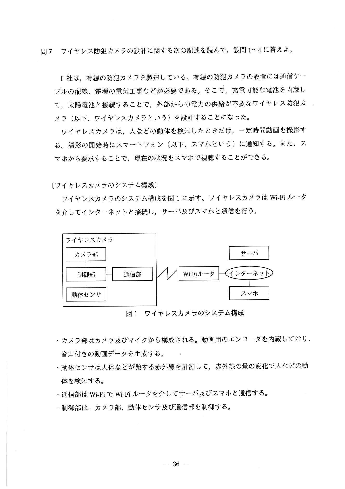

テキスト (OCR)

FT ワイヤレス防犯カメラの設計に関する次の記述を読んで, 設問 1ー4 に答えよ。

1 社は, 有線の防犯カメラを製造している。有線の防犯カメラの設置には通信ケー
ブルの配線, 電源の電気工事などが必要である。そこで, 充電可能な電池を内蔵し
て, 太陽電池と接続することで, 外部からの電力の供給が不要なワイヤレス防犯カ
メラ (以下,。ワイヤレスカメラという) を設計することになった。

ワイヤレスカメラは, 人などの動体を検知したときだけ, 一定時間動画を撮影す
る。 撮影の開始時にスマートフォン (以下, スマホという) に通知する。また, A
マホから要求することで, 現在の状況とスマホで視聴することができる。

[ワイヤレスカメラのシステム構成]
ワイヤレスカメラのシステム構成を図 1 に示す。ワイヤレスカメラは Wi-Fi ルータ

ラー =

を介してインターネットと接続し, サーバ及びスマホと通信を行う。

ワイヤレスカメラ
カメラ部                    サーバ
we | 通信部 |ノン| wmルータ
動体センサ                       スマホ

図1 ワイヤレスカメラのシステム構成

・カメラ部はカメラ及びマイクからち構成される。 動画用のエンコーダを内蔵しており,
音声付きの動画データを生成する。

・ 動体センサは人体などが発する赤外線を計測して, 赤外線の量の変化で人などの動
体を検知する。

・ 通信部は Wi-Fi で Wi-Fi ルータを介してサーバ及びスマホと通信する。

・制御部は, カメラ部, 動体センサ及び通信部を制御する。

ー 36 一

### ページ 37

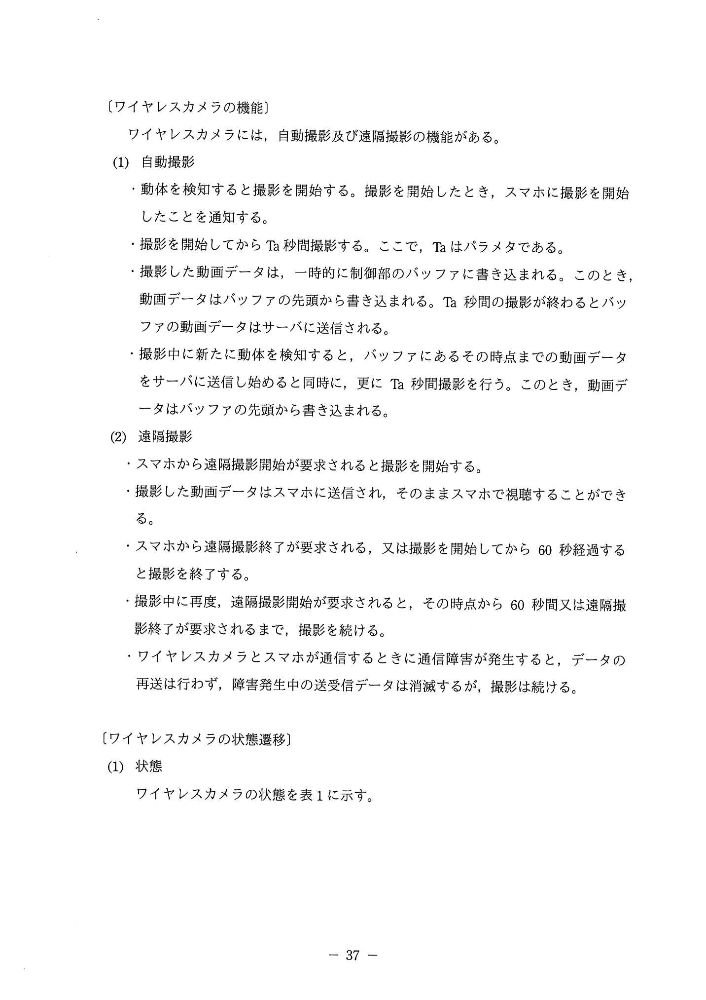

テキスト (OCR)

【ワイヤレスカメラの機能)
ワイヤレスカメラには, 自動撮影及び遠隔撮影の機能がある。

(1)

(2)

自動撮影

・ 動体を検知すると撮影を開始する。撮影を開始したとき, スマホに撮影を開始

したことを通知する。

・ 撮影を開始してから Ta 秒間撮影する。ここで, 必 はパラメタである。
・ 撮影した動画データは, 一時的に制御部のバッファに書き込まれる。このとき,

動画データはバッファの先頭から書き込まれる。 Ta 秒間の撮影が終わるとバッ
ファの動画データはサーバに送信される。

・ 撮影中に新たに動体を検知すると, バッファにあるその時点までの動画データ

をサーバに送信し始めると同時に, 更に Ta 秒間撮影を行う。、このとき, 動画デ
ータはバッファの先頭から書き込まれる。
遠隔撮影

・スマホから遠隔撮影開始が要求されると撮影を開始する。
・ 撮影した動画データはスマホに送信され, そのままスマホで視聴することができ

る。

・スマホから遠隔撮影終了が要求される, 又は撮影を開始してから 60 秒経過する

と撮影を終了する。

・ 撮影中に再度, 遠隔撮影開始が要求されると, その時点から 60 秒間又は遠隔撮

影終了が要求されるまで, 撮影を続ける。

"ワイヤレスカメラとスマホが通信するときに通信障害が発生すると, データの

再送は行わず, 障害発生中の送受信データは消滅するが, 撮影は続ける。

〔ワソイヤレスカメラの状態遷移]
Q) 状態

ワイヤレスカメラの状態を表 1 に示す。

ー 37 一

### ページ 38

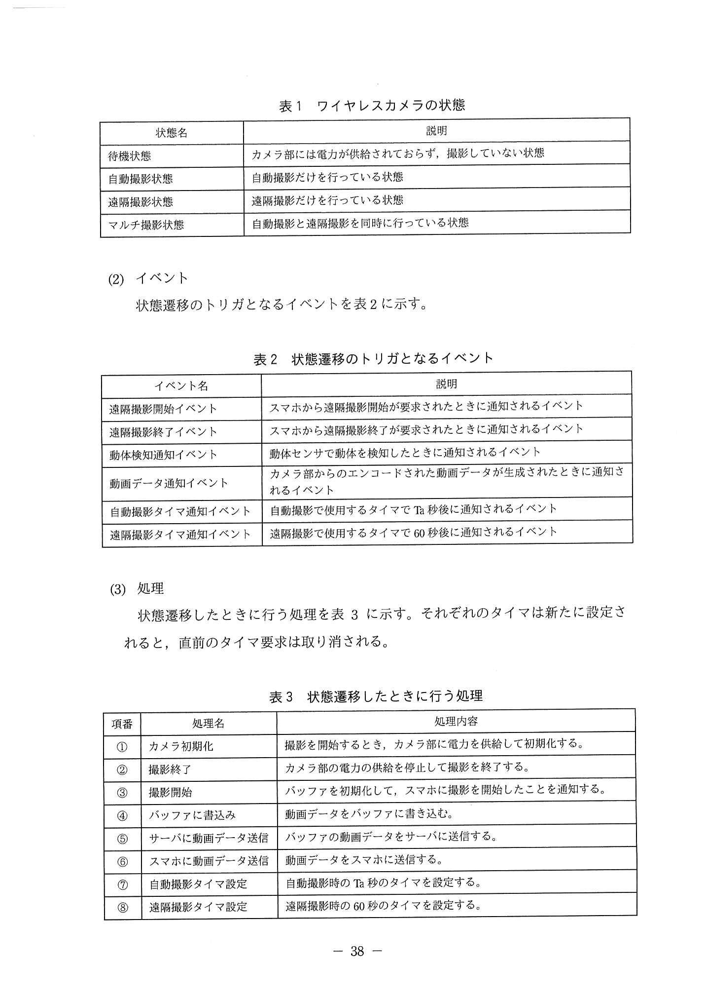

テキスト (OCR)

表1 ワイヤレスカメラの状態

状態名                      説明
待機状態         カメラ部には電力が供給されておらず, 撮影していない状態
ORR       自動撮影だけを行っている状態

7       VEILED 2 Fo CO SIRE

マルチ撮影状態      自動提時と示隔提影を同時に行っている状態

②⑫② イベント

状態遷移のトリガとなるイベントを表 2 に示す。

表2 状態乱移のトリガとなるイベント

イベント名                                    説明
遠隔撮影開始イベント          スマホから遠隔撮影開始が要求されたときに通知されるイベント
遠隔撮影終了イベント          スマホから遠隔撮影終了が要求されたときに通知されるイベント
動体検知通知イベント           動体センサで動体を検知したときに通知されるイベント
カメラ部からのエンコードされた動画データが生成されたときに通知さ

tee
動画データ通知イベント    Se ge

自動撮影タイマ通知イベント | 自動撮影で使用するタイマで Ta 秒後に通知されるイベント

遠隔撮影タイマ通知イベント | 遠隔撮影で使用するタイマで 60 秒後に通知されるイベント

(3) 処理
状態乱移したときに行う処理を表 3 に示す。それぞれのタイマは新たに設定さ
れると, 直前のタイマ要求は取り消される。

表3 状態乱移したときに行う処理

項番          処理名                                    処理内容

① | カメラ初期化           HCE BAT SLE, カメラ部に電力を供給して初期化する。

② | 撮影終了               カメラ部の電力の供給を停止して撮影を終了する。

@ | 撮影開始              バッファを初期化して, スマホに撮影を開始したことを通知する。
④ | バッファに書込み       動画データをバッファに書き込む。

© | サーバに動画データ送信 | バッファの動画データをサーバに送信する。

© | スマホに動画データ送信 | 動画データをスマホに送信する。

⑰ | 自動撮影タイマ設定         自動撮影時の Ta 秒のタイマを設定する。

     遠隔撮影タイマ設定         遠隔撮影時の 60 秒のタイマを設定する。

ー 38 一

### ページ 39

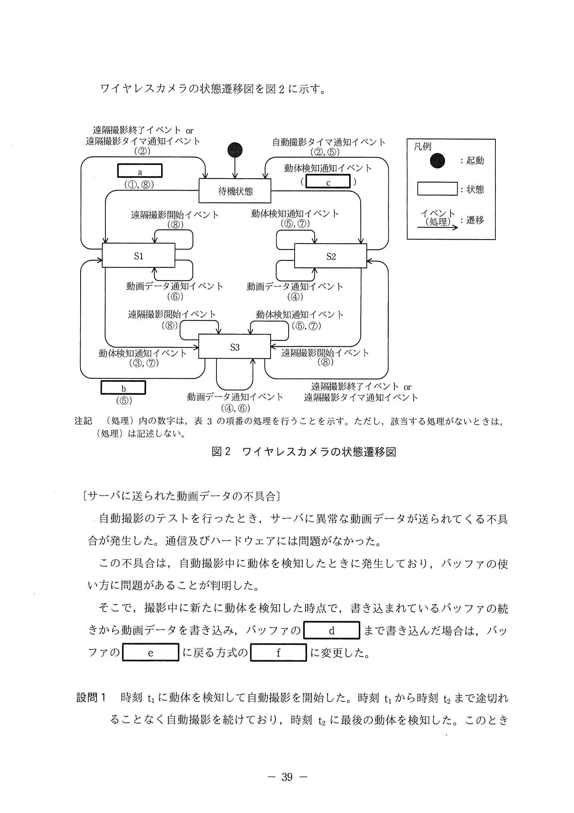

テキスト (OCR)

ワイヤレスカメラの状態価移図を図 2 に示す。

遠隔撮影終了イベント or
Rees Tees ペントド

自動撮影タイマ通知イベント     ロ
?                   (@.8)                     人

トーュー                                          重体知通知イベント                 ⑯
(,®)              aaa           (L_c_])             Co): ate

UBER BT 2     RAID SY b          イベント 、
SAH <b   hibit <7        Sea may

、まーー      C34
「] で)    C+")

動画データ 通知イベント 動画データ通知イベント

©)                             @)
SAUDI AY b             ahi Yb
@C         し 、] 9Wの
レー ソノ

動体検知通知イベント           8           送月最時開始イベント

(@,@)                                            (8)
|      〔  ]      WNIT 1 <b or

⑧       BRB RRO eb SNL RT <b
(④,⑥)

注記 (処理) 内の数字は, 表 3 の項番の処理を行うことを示す。ただし, 該当する処理がないときは,
(処理) は記述しない。

図2 ワイヤレスカメラの状態居移図

(サーバに送られた動画データの不具合)
自動撮影のテストを行ったとき, サーバに異常な動画データが送られてくる不具
合が発生した。通信及びハードウェアには問題がなかった。
この不具合は, 自動撮影中に動体を検知したときに発生しており, バッファの使
い方に問題があることが判明した。
, 撮影中に新たに動体を検知した時点で, 書き込まれているバッファの続
昌和

ファの|  e | に戻る方式の| { | に変更した。

設問1 時刻 tiに動体を検知して自動撮影を開始した。時刻 ti から時刻 t まで途切れ
ることなく自動撮影を続けており, 時刻 t。 に最後の動体を検知した。このとき

ー 39 一

### ページ 40

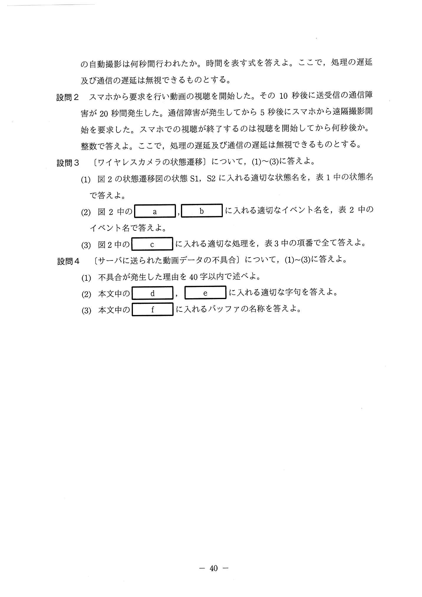

テキスト (OCR)

の自動撮影は何秒間行われたか。時間を表す式を答えよ。ここで, 処理の遅延
及び通信の遅延は無視できるものとする。
設問2 スマホから要求を行い動画の視聴を開始した。その 10 秒後に送受信の通信障
害が 20 秒間発生した。通信障害が発生してから 5 秒後にスマホから遠隔撮影開
始を要求した。スマホでの視聴が終了するのは視聴を開始してから何秒後か。
整数で答えよ。ここで, 処理の遅延及び通信の遅延は無視できるものとする。
設問3 〔ワイヤレスカメラの状態乱移】について, ①~て(⑬)に答えよ。
Q) M2 の状態遷移図の状態 1, S2 に入れる適切な状態名を, 表 1 中の状態名
で答えよ。
②) 図 2 中の| a || b |に入れる適切なイベント名を, 表 2 中の
イベント名で答えよ。
⑬ 図2中の[| < |に入れる適切な処理を, 表3中の項番で全て答えよ。
設問4 〔サーバに送られた動画データの不具合] について, ①)-(3⑬)に答えよ。
1) 不具合が発生した理由を 40 字以内で述べよ。
gy 本文中の|  q | |  e |に入れる適切な字句を答えよ。

@) 本文中の[| { |] に入れるバッファの名称を答えよ。

ー 40 一

### ページ 41

テキスト (OCR)

( メ モ 用 紙 〕

ー 41 一

### ページ 42

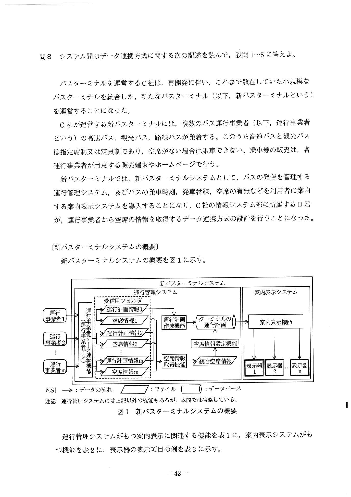

テキスト (OCR)

BS システム間のデータ連携方式に関する次の記述を読んで, 設問1ー5 に答えよ。

バスターミナルを運営するC社は, 再開発に伴い, これまで散在していた小規模な
バスターミナルを統合した, 新たなバスターミナル (以下, 新バスターミナルという)
を運営することになった。

C 社が運営する新バスターミナルには, 複数のバス運行事業者 (以下, 運行事業者

という) の高速バス, 観光バス, 路線バスが発着する。このうち高速パスと観光バス
は指定席制又は定員制であり, 空席がない場合は乗車できない。乗車券の販売は, 各
運行事業者が用意する販売端末やホームページで行う。

新バパスターミナルでは, 新バスターミナルシステムとして, バスの発着を管理する
運行管理システム, 及びバスの発車時刻, 発車番線, 空席の有無などを利用者に
する案内表示システムを導入することになり, CHOMRYATAMICMETS DA
が, 運行事業者から空席の情報を取得するデータ 連携方式の設計を行うことになった。

〔新バスターミナルシステムの概要〕
新バスターミナルシステムの概要を図 1 に示す。

新バスターミナルシステム
 … …… 運行管理システム              案内表示システム
受信用フォルダ

運行     運

(32)   Perit                    ーミ
半生人報             の      案内表示機能

SE Ae                             ea TE

ae               xara). [eae
事業者   能   空席情報m              一| ial ta 生

凡例 一> : データの流れ Lf /:ファイル (  () :データベース
注記 運行管理システムには上記以外の機能もあるが, 本問では省略している。
図1 新バスターミナルシステムの概要

運行管理システムがもつ案内表示に関連する機能を表 1 に, 案内表示システムがも
つ機能を表 2 に, 表示器の表示項目の例を表3 に示す。

ー 42 一

### ページ 43

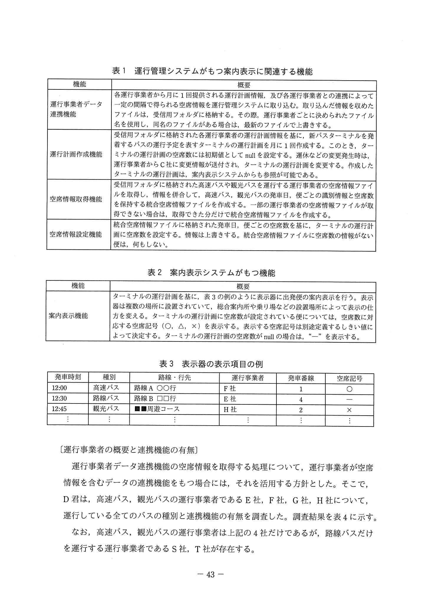

テキスト (OCR)

表1 運行管理システムがもつ案内表示に関連する機能

機能

概要

運行事業者データ
連携機能

各運行事業者から月に 1 回提供される運行計画情報, 及び各運行事業者との連携によって
一定の間隔で得られる空席情報を運行管理システムに取り込む。取り込んだ情報を収めた
ファイルは, 受信用フォルダに格納する。その際, 運行事業者ごとに決められたファイル
名を使用し, 同名のファイルがある場合は, 最新のファイルで上書きする。

運行計画作成機能

受信用フォルダに格納された各運行事業者の運行計画情報を基に, 新バスターミナルを発
着するバスの運行予定を表すターミナルの運行計画を月に 1 回作成する。このとき, ター
ミナルの運行計画の空席数には初期値として null を設定する。運休などの変更発生時は,
運行事業者からC社に変更情報が送付され, ターミナルの運行計画を変更する。 作成した
ターミナルの運行計画は, 案内表示システムからも参照が可能である。

受信用フォルダに格納された高速バスや観光バスを運行する運行事業者の空席情報ファイ
ルを取得し, 情報を併合して, 高速バス, 観光バスの発車日, 便ごとの識別情報と空席数

ets  4“  129
ERIE |e ess 5 aH 7-1 LE MERTS, 一朗の運行事業者の空席情報ファイルが取
毎できない場合は 取得できた分だけで統合補席情報ファイルを作成する。
合宅席情報ファイルに格納された発車日、便ごとの座席数を基に。 ターミナルの退行計
空席情報設定機能 | 画に空席数を設定する。情報は上書きする。統合空席情報ファイルに空席数の情報がない
ld, 何もしない。
表2 案内表示システムがもつつ機能
He                     we
BSF VOMGNMER, 表 3 OVO £5 CREB ARMORARREGS. EE
BROW CAEN, RAKED BEY OMEUBMTIC ko TROL
案内表示機能    方を夜える。ターミナルの運行計画に空席数が設定されている便については。 Sis
ST SHIRE (0, A,X) SAAT. 示する人放すしきぶ人
よって決定する。ターミナルの之行計画の空席数が null OMS, “—” を表示する。
表3 表示器の表示項目の例
JER | 種別      BR aR      運行事業者 | em | Smee
12:00    高速バス | Bia OOF       PAE         1      o
12:30   路線バス  路線 B ODT     E社       4     =
12:45   観光バス  軒較周遊コース     H社       2     x

〔運行事業者の概要と連携機能の有無}

EET EEE ONES ASO 運行事業者が空席
情報を含むデータの連携機能をもつ場合には, それを活用する方針とした。そこで,
D 君は, 高速ベス, 観光バスの運行事業者である 社, F 社, G 社, H 社について
運行している全てのバスの種別と連携機能の有無を調査した。調査結果を表4 に示す。

なお, 高速

バス, 観光バスの運行事業者は上記の 4 社だけであるが, 路線バスだけ

を運行する運行事業者である S tt, T 社が存在する。

ー 43 一

### ページ 44

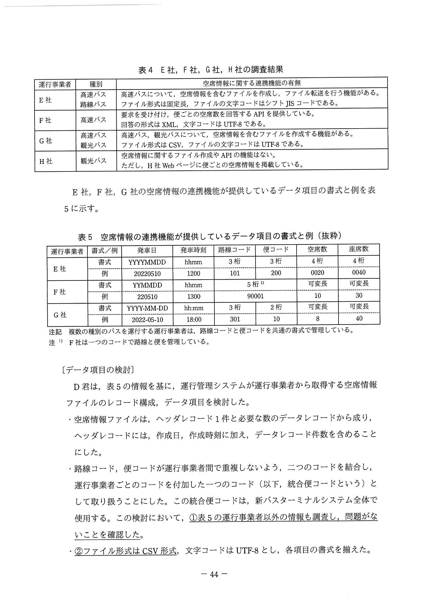

テキスト (OCR)

表4 Ett, Fat, GH, H社の調査結果

Waa | 竹別                                  空席情報に関する連措機能の有無
時     高速バス | 高速バスについて,識府情報を含むファイルを作成し, ファイル転送を行う機能がある。
路線バス  ファイル形式は固定長, ファイルの文字コードはシフト JIS コードである。
ーー | BRESDHD, 便ごとの空席数を回答する API を提供している。
『社     ENA | 回答の形式は XML, 文字コードは UTF8 である。
oh     BEA | 高速パス,観光バスについて SRNREAD I 77 VEEM SHEDS.
観光バス  ファイル形式は CSV, ファイルの文字コードは UTF-8 CHS,
ーー 証人報に関するファイル作成や API の機能はない。
He     観光バス | たたし, HAE Web ページに便ごとの空席情報を掲載している。
E 社, F 社, G 社の空席情報の連携機能が提供しているデータ項目の書式と例を表
5 に示す。

表5 空席情報の連携機能が提供しているデータ項目の書式と例 (抜粋)
Wane | 書式/例| 発車        3 | 路線コード| 便コード | 空席数 | 座席数
nit              書式        YYYYMMDD         hhmm            3桁              3桁              4桁              4桁

例          20220510          1200           101            200           0020           0040
-              Ga | YYMMDD | hhmm                    BHF                   Wie | wee

例           220510           1300                  90001                   10             30
Git             書式       YYYY-MM-DD       hh:mm           3 桁            2 桁           可変長         可変長

例         2022-05-10         18:00           301             10              8              40

注記 複数の種別のバスを運行する運行事業者は, 路線コードと便コードを共通の書式で管理している。
注 り F社はーつのコードで路線と便を管理している。

〔データ項目の検討]
D 君は, 表5の情報を基に, 運行管理システムが運行事業者から取得する空席情報
ファイルのレコード構成, データ項目を検討した。

・空席情報ファイルは, ヘッダレコード 1 件と必要な数のデータレコードから成り,
ヘッダレコードには, 作成日, 作成時刻に加え, データレコード件数を含めること
(27a

・路線コード, 便コードが運行事業者間で重複しないよう, 二つのコードを結合し
運行事業者ごとのコードを付加した一つのコード (以下, 統合便コードという) と
して取り扱うことにした。この統合便コードは, 新バスターミナルシステム全体で
使用する。この検討において, ①表 5 の運行事業者以外の情報も調査し, 問題がな
いことを確認した。

・②ファイル形式は CSV 形式, 文字Gードは UTF-8 とし, 各項目の書式を揃えた。

ー 44 一

### ページ 45

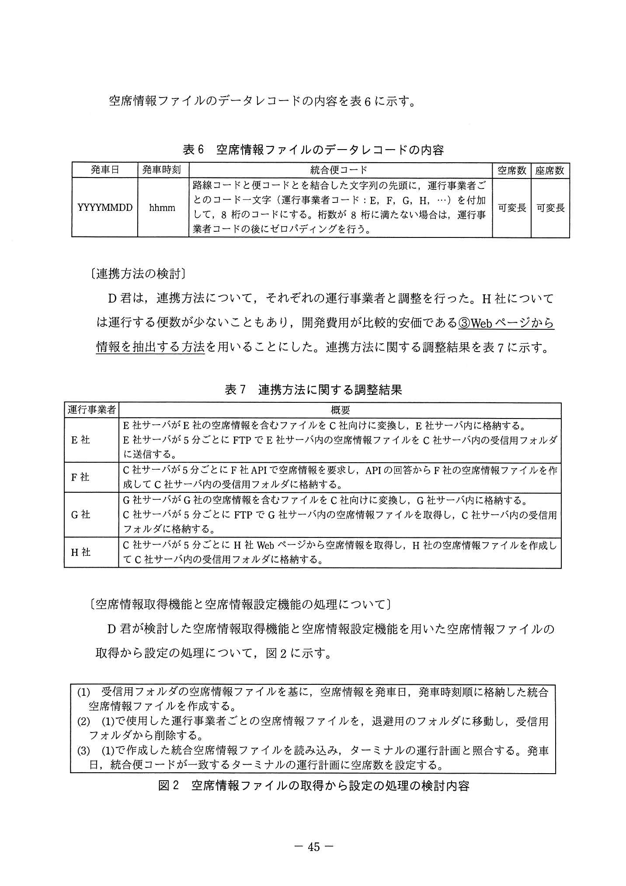

テキスト (OCR)

空席情報ファイルのデータレコードの内容を表 6 に示す。

表6 空席情報ファイルのデータレコードの内容
発車日 | 発車時刻                 統合便コード                 空席数 | 座席数
路線コードと便コードとを結合した文字列の先頭に, 運行事業者ご
とのコードー文字 (運行事業者コード : E, F, G, H, …) を付加
UT, 8 桁のコードにする。桁数が 8 桁に満たない場合は, 運行事
業者コードの後にゼロパディングを行う。

YYYYMMDD | hhmm                                                              可変長 | 可変長

(連携方法の検討]

D 君は, 連携方法について, それぞれの運行事業者と調整を行った。H 社について
は運行する便数が少ないこともあり, 開発費用が比較的安価である③Web ページから
情報を抽出する方法を用いることにした。 連携方法に関する調整結果を表 7 に示す。

表7 連携方法に関する調整結果
運行事業者                                         概要
E 社サーバが 社の空席情報を含むファイルを 社向けに変換し, E 社サーバ内に格納する。
Et        E 社サーバが 5 分ごとに FTP でE 社サーバ内の空席情報ファイルを C 社サーバ内の受信用フォルダ
に送信する。
Pit        C 社サーバが5分ごとにF 社APIで空席情報を要求し, API の回答からF 社の空席情報ファイルを作
BUT C 社サーバ内の受信用フォルダに格納する。
GHEY ADS 社の空席情報を含むファイルをて(社向けに変換し, G 社サーバ内に格納する。
G社        C 社サーバが 5 分ごとに FTP CG 社サーバ内の空席情報ファイルを取得し, C 社サーバ内の受信用
フォルダに格納する。
Wit       C 社サーバが 5 分ごとに H tt Web ページから空席情報を取得し, H 社の空席情報ファイルを作成し
てC 社サーバ内の受信用フォルダに格納する。

(空席情報取得機能と空席情報設定機能の処理について〕
D 君が検討した空席情報取得機能と空席情報設定機能を用いた空席情報ファイルの
取得から設定の処理について, 図 2 に示す。

Q) 受信用フォルダの空席情報ファイルを基に, 空席情報を発車日, 発車時刻順に格納した統合
空席情報ファイルを作成する。

(2) Q)で使用した運行事業者ごとの空席情報ファイルを, 退避用のフォルダに移動し, 受信用
フォルダから削除する。

(3 Q①で作成した統合空席情報ファイルを読み込み, ターミナルの運行計画と照合する。 発車
A, 統合便コードが一致するターミナルの運行計画に空席数を設定する。

図2 空席情報ファイルの取得から設定の処理の検討内容

ー45 一

### ページ 46

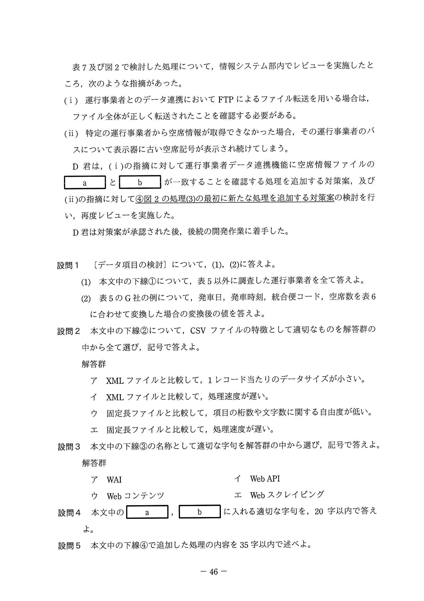

テキスト (OCR)

表 7 及び図 2 で検討した処理について, 情報システム部内でレビューを実施したと
ころ, 次のような指摘があった。

(i) 運行事業者とのデータ連携において FTP によるファイル転送を用いる場合は,
ファイル全体が正しく転送されたことを確認する必要がある。
(ii) 特定の運行事業者から空席情報が取得できなかった場合, その運行事業者のバ

スについて表示器に古い空席記号が表示され続けてしまう。

D Blk, (i )の指摘に対して運行事業者データ 連携機能に空席情報ファイルの
[oa |と| 5 |が一致することを確認する処理を追加する対策案, 及び
(ii)の指摘に対して④図 2 の処理(3)の最初に新たな処理を追加する対策案の検討を行
い, 再度レビューを実施した。

D 君は対策案が承認された後, 後続の開発作業に着手した。

設問] 〔データ項目の検討 について, (1, ⑫)に答えよ。
①) 本文中の下線やについて, 表5 以外に調査した運行事業者を全て答えよ。
2) 表5のG社の例について, 発車日, 発車時刻, 統合便コード, 空席数を表6
に合わせて変換した場合の変換後の値を答えよ。
設問2 本文中の下線@について, CSV ファイルの特徴として適切なものを解答群の
中から全て選び, 記号で答えよ。
解答群
ア XML ファイルと比較して, 1 レコード当たりのデータサイズが小さい。
4 XML ファイルと比較して, 処理速度が遅い。
ウ 固定長ファイルと比較して, 項目の桁数や文字数に関する自由度が低い。
エ 固定長ファイルと比較して, 処理速度が遅い。
設問3 本文中の下線③の名称として適切な字句を解答群の中から選び, 記号で答えよ。

解答群
ア WAI              イ Web API
ウ Web コンテンツ        エ Web スクレイピング
設問4 本文中の| a |,|  b |に入れる適切な字旬を, 20 字以内で答え
よ。

設問5 本文中の下線④で追加した処理の内容を 35 字以内で述べよ。

ー 46 一

### ページ 47

テキスト (OCR)

〔

メ モ 用 紙 〕

ー 47 一

### ページ 48

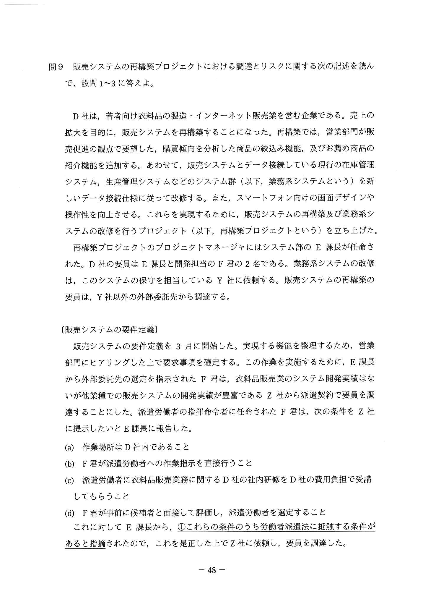

テキスト (OCR)

問9 販売システムの再構築プロジェクトにおける調達とリスクに関する次の記述を読ん

で, 設問 1ー8 に答えよ。

D 社は, 若者向け衣料品の製造・インターネット販売業を営む企業である。売上の
拡大を目的に, 販売システムを再構築することになった。再構築では, 営業部門が販
売促進の観点で要望した, 購買傾向を分析した商品の絞込み機能, 及びお薦め商品の
紹介機能を追加する。あわせて, 販売システムとデータ接続している現行の在庫管理
システム, 生産管理システムなどのシステム群 (以下, 業務系システムという) を新
しいデータ接続仕様に従って改修する。また, スマートフォン向けの画面デザインや
操作性を向上させる。これらを実現するために, 販売システムの再構築及び業務系シ
ステムの改修を行うプロジェクト (以下, 再構築プロジェクトという) を立ち上げた。

再構築プロジェクトのプロジェクトマネージャにはシステム部の E 課長が任命さ
れた。D 社の要員は E 課長と開発担当の F 君の 2 名である。業務系システムの改修
は, このシステムの保守を担当している Y 社に依頼する。販売システムの再構築の
要員は, Y 社以外の外部委託先から調達する。

【販売システムの要件定義]
販売システムの要件定義を 3 月に開始した。実現する機能を整理するため, 営業
部門にヒアリングした上で要求事項を確定する。この作業を実施するために, ERR
から外部委託先の選定を指示された F 君は, 衣料品販売業のシステム開発実績はな
いが他業種での販売システムの開発実績が豊富である Z 社から派遣契約で要員を調
達することにした。 派遣労働者の指揮命令者に任命された F Ald, 次の条件を Z tt
に提示したいと課長に報告した。
(a) 作業場所は D 社内であること
(b) F 看が派遣労働者への作業指示を直接行うこと
(c) 派遣労働者に衣料品販売業務に関する D 社の社内研修を D 社の費用負担で受講
してもらうこと
(④ F 君が事前に候補者と面接して評価し, 派遣労働者を選定すること
これに対して E 課長から, ①これらの条件のうち労働者派遣法に抵触する条件が
あると指摘されたので, これを是正した上でZ 社に依頼し, 要員を調達した。

ー 48 一

### ページ 49

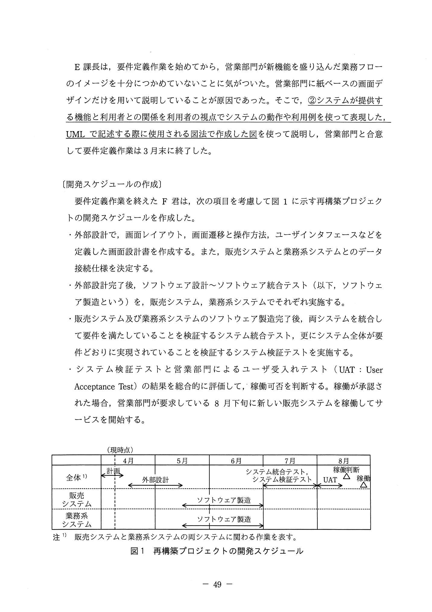

テキスト (OCR)

E 課長は, 要件定義作業を始めてから, 営業部門が新機能を盛り込んだ業務フロー
のイメージを十分につかめていないことに気がついた。営業部門に紙ベースの画面デ
ザインだけを用いて説明していることが原因であった。そこで, ②③システムが提供す
る機能と利用者との関係を利用者の視点でシステムの動作や利用例を使って表現した,

UML で記述する際に使用される図法で作成した図を使って説明し, 営業部門と合意
して要件定義作業は 3 月末に終了した。

〔開発スケジュールの作成〕
要件定義作業を終えた F Ald, 次の項目を考慮して図 1 に示す再構築プロジェク

トの開発スケジュールを作成した。

・外部設計で, 画面レイアウト, 画面遷移と操作方法。ユーザインタフェースなどを
定義した画面設計書を作成する。また, 販売システムと業務系システムとのデータ
接続仕様を決定する。

・外部設計完了後, ソフトウェア設計ンソフトウェア統合テスト (UE, ソフトウェ
ア製造という) を, 販売システム, 業務系システムでそれぞれ実施する。

・販売システム及び業務系システムのソフトウェア製造完了後, 両システムを統合し
て要件を満たしていることを検証するシステム統合テスト, 更にシステム全体が要
件どおりに実現されていることを検証するシステム検証テストを実施する。

・システム検証テストと営業部門によるユーザ受入れテスト (UAT: User
Acceptance Test) の結果を総合的に評価して, 稼働可否を判断する。 稼働が承認さ
れた場合, 営業部門が要求している 8 月下旬に新しい販売システムを稼働してサ
ービスを開始する。

6月    |   7月        8月
システム統合テスト,   Ba
システム検証テスト | UAT  yi

ソフトウェア製造

ソフトウェア製造

注 販売システムと業務系システムの両システムに関わる作業を表す。
図1 再構築プロジェクトの開発スケジュール

ー 49 一

### ページ 50

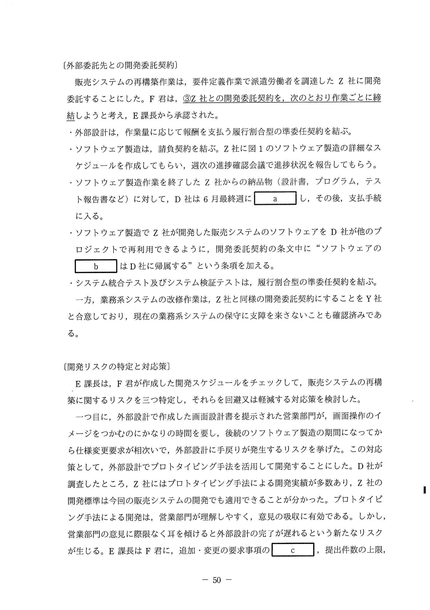

テキスト (OCR)

〔外部委託先との開発委託契約〕
販売システムの再構築作業は, 要件定義作業で派遣労働者を調達した Z 社に開発
委託することにした。F Bld, ⑧③Z 社との開発委託契約を, 次のとおり作業ごとに締
結しようと考え, E課長から承認された。
・外部設計は, 作業量に応じて報酬を支払う履行割合型の準委任契約を結ぶ。
・ソフトウェア製造は, 請負契約を結ぶ。Z 社に図 1 のソフトウェア製造の詳細なス
ケジュールを作成してもらい, 週次の進捗確認会議で進捗状況を報告してもらう。
・ソフトウェア製造作業を終了した Z 社からの納品物 (設計書, プログラム, テス
ト 報告書など) に対して, D 社は 6 月最終週に|  a |] し, その後,支払手続
に入る。
・ソフトウェア製造で Z 社が開発した販売システムのソフトウェアを D 社が他のプ
ロジェクトで再利用できるように, 開発委託契約の条文中に "ソフトウェアの
| 5 |] はD社に帰属する” という条項を加える。
・システム統合テスト及びシステム検証テストは, 履行割合型の準委任契約を結ぶ。
一方, 業務系システムの改修作業は, Z社と同様の開発委託契約にすることをY社
と合意しており, 現在の業務系システムの保守に支障を来さないことも確認済みであ
る。

[開発リスクの特定と対応策]

BARRIS, F 君が作成した開発スケジュールをチェックして, WEY AF LOBE
築に関するリスクを三つ特定し, それらを回避又は軽減する対応策を検討した。

ーフ目に, 外部設計で作成した画面設計書を提示された営業部門が, 画面操作のイ
メージをつかむのにかなりの時間を要し, 後続のソフトウェア製造の期間になってか
ら仕様変更要求が相次いで, 外部設計に手戻りが発生するリスクを挙げた。この対応
策として, 外部設計でプロトタイピング手法を活用して開発することにした。D 社が
調査したところ, Z 社にはプロトタイピング手法による開発実績が多数あり, Z 社の
開発標準は今回の販売システムの開発でも適用できることが分かった。プロトタイピ
ング手法による開発は, 営業部門が理解しやすく, 意見の吸収に有効でもる。しかし,
営業部門の意見に際限なく耳を傾けると外部設計の完了が遅れるという新たなリスク
が生じる。E 課長は F 君に, 追加・変更の要求事項の[| c  ] , 提出件数の上限

ー 50 一

### ページ 51

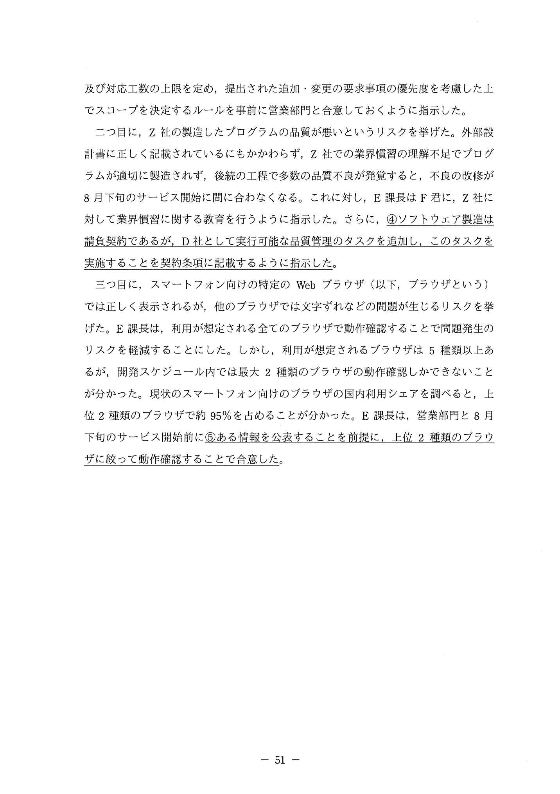

テキスト (OCR)

及び対応工数の上限を定め, 提出された追加・変更の要求事項の優先度を考慮した上
でスコープを決定するルールを事前に営業部門と合意しておくように指示した。

ニフつ目に, Z 社の製造したプログラムの品質が悪いというリスクを挙げた。外部設
計書に正しく記載されているにもかかわらず, Z 社での業界慣習の理解不足でプログ
ラムが適切に製造されず, 後続の工程で多数の品質不良が発覚すると, 不良の改修が
8 月下旬のサービス開始に問に合わなくなる。これに対し, E 課長はF Al, Z 社に
対して業界慣習に関する教育を行うように指示した。さらに, ソフトウェア製造は
請負契約であるが, D 社として実行可能な品質管理のタスクを追加し, このタスクを
実施することを契約条項に記載するように指示した。

三つ目に, スマートフォン向けの特定の Web ブラウザ (AE, ブラウザという)
では正しく表示されるが, 他のブラウザでは文字ずれなどの間題が生じるリスクを挙
げた。E 課長は, 利用が想定される全てのブラウザで動作確認することで問題発生の
リスクを軽減することにした。 しかし, 利用が想定されるブラウザは 5 種類以上あ
るが, 開発スケジュール内では最大 2 種類のブラウザの動作確認しかできないこと
が分かった。 現状のスマートフォン向けのブラウザの国内利用シェアを調べると, 上
位 2 種類のブラウザで約 95%を占めることが分かった。E 課長は, 営業部門と 8 月
下旬のサービス開始前に⑤ある情報を公表することを前提に, 上位 2 種類のブラウ
ザに絞って動作確認することで合意した。

ー 51 一

### ページ 52

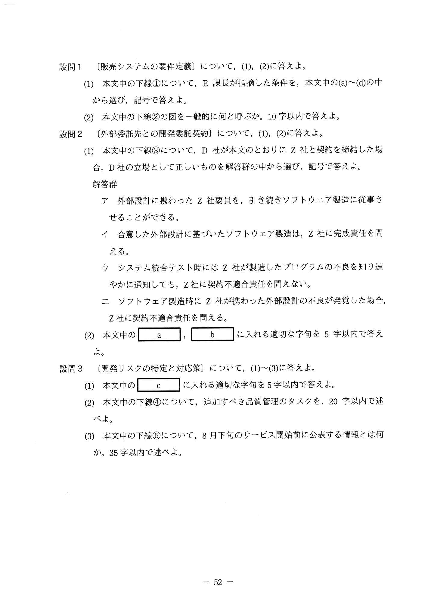

テキスト (OCR)

設問1 (販売システムの要件定義]について, ①⑪, ②)に答えよ。
(①) 本文中の下線①について, E 課長が指摘した条件を, 本文中のて(④の中
から選び, 記号で答えよ。
Q) 本文中の下線②の図を一般的に何と呼ぶか。10 字以内で答えよ。
設問2 外部委託先との開発委託契約)]について, ①, ⑫②)に答えよ。
(1) 本文中の下線③について, D 社が本文のとおりに Z 社と契約を締結した場
合, D 社の立場として正しいものを解答群の中から選び, 記号で答えよ。
解答群
ア 外部設計に携わった Z 社要員を, 引き続きリフトウェア製造に従事さ
せることができる。
イ 合意した外部設計に基づいたソフトウェア製造は, Z 社に完成責任を問
える。
ウ システム統合テスト時には Z 社が製造したプログラムの不良を知り速
やかに通知しても, ZHI BMA ATE eM AR,
エ ソフトウェア製造時に Z 社が携わった外部設計の不良が発覚した場合,
Z 社に契約不適合次任を問える。
②) 本文中の| a |,|  b |に入れる適切な字句を 5 字以内で答え
よ。
設問3 [開発リスクの特定と対応策] について, ①⑪)て(3⑬)に答えよ。
a 本文中の[| < |] に入れる適切な字句を5字以内で答えよ
Q) 本文中の下線のについて, 追加すべき品質管理のタスクを, 20 字以内で述
べよ。
3) 本文中の下線@について, 8 月下旬のサービス開始前に公表する情報とは何
か。35 字以内で述べよ。

ー 52 一

### ページ 53

テキスト (OCR)

〔

メ = 用 紙 ]

ー 53 —

### ページ 54

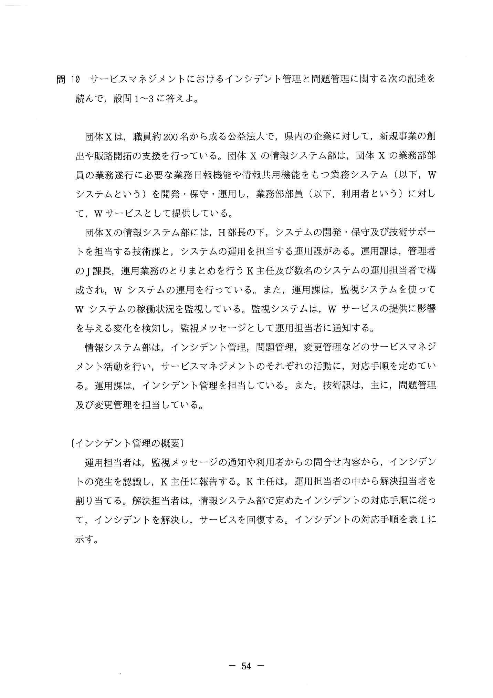

テキスト (OCR)

問 19 サービスマネジメントにおけるインシデント管理と問題管理に関する次の記述を
読んで, 設問 1ー3 | に答え cy

団体X は, 職員約200 名から成る公益法人で, 県内の企業に対して, 新規事業の創
出や販路開拓の支援を行っている。 団体 X の情報システム部は, 団体 X の業務部部
員の業務遂行に必要な業務日報機能や情報共用機能をもつ業務システム (以下, W
システムという) を開発・保守・運用し, 業務部部員 (以下, 利用者という) に対し
て, W サービスとして提供している。

団体X の情報システム部には, HBROK, システムの開発・保守及び技術サポー
トを担当する技術課と, システムの運用を担当する運用課がある。 運用課は, 管理者
の本課長, 運用業務のとりまとめを行う K 主任及び数名のシステムの運用担当者で構
成され, W システムの運用を行っている。 また, 運用課は, 監視アステムを使って
W システムの稼働状況を監視している。 BMY ATA, W サービスの提供に影響
を与える変化を検知し, 監視メッセージとして運用担当者に通知する。

情報システム部は, インシデント管理, 問題管理, 変更管理などのサービスマネジ
メント活動を行い サービスマネジメントのそれぞれの活動に, 対応手順を定めてい
る。運用課は, インシデント管理を担当している。また:, 技術課は, 主に, 問題管理
及び変更管理を担当している

〔【インシデント管理の概要〕

運用担当者は, 監視メッセージの通知や利用者からの問合せ内容から, インシデン
トの発生を認識し, K 主任に報告する。K 主任は, 運用担当者の中から解決担当者を
割り当てる。解決担当者は, 情報システム部で定めたインシデントの対応手順に従っ
て, インシデントを解決し, サービスを回復する。インシデントの対応手順を表 1 に
示す。

ー 54 一

### ページ 55

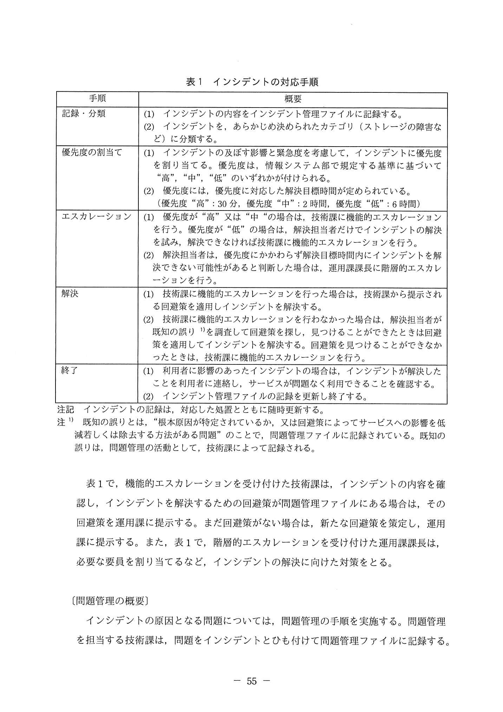

テキスト (OCR)

表1 インシデントの対応手順

手順                                                                概要
記録・分類    GQ) インシデントの内容をインシデント管理ファイルに記録する。
(2) インシデントを, あらかじめ決められたカテゴリ (ストレージの障害な
ど) に分類する。

優先度の割当て  (1) インシデントの及ぼす影響と緊急度を考慮して, インシデントに優先度
を割り当てる。 優先度は, 情報システム部で規定する基準に基づいて
“a”, “ch”, “YR” のいずれかが付けられる。

(2) 優先度には, 優先度に対応した解決目標時間が定められている。
(優先度“高" : 30 分, 優先度 “ch” : 2時間, 優先度“低" : 6 時間)
エスカレーション | 1) 優先度が“高" 又は“中“の場合は, 技術課に機能的エスカレーション
を行う。 優先度が “低"の場合は, 解決担当者だけでインシデントの解決

を試み, 解決できなければ技術課に機能的エスカレーションを行う。

(2) 解決担当者は, 優先度にかかわらず解決目標時間内にインシデントを解
決できない可能性があると判断した場合は, 運用課課長に階層的エスカレ
ーションを行う。

解決       1) 技術課に機能的エスカレーションを行った場合は, 技術課から提示され
る回避策を適用しインシデントを解決する。

(2) 技術課に機能的エスカレーションを行わなかった場合は, 解決担当者が
PEO を調査して回避策を探し, 見つけることができたときは回避
策を適用してインシデントを解決する。回避策を見つけることができなか
ったときは, 技術課に機能的エスカレーションを行う。

終了       (1) 利用者に影響のあったインシデントの場合は, インシデントが解決した
ことを利用者に連絡し, サービスが問題なく利用できることを確認する。

(2) インシデント管理ファイルの記録を更新し終了する。

注記 インシデントの記録は, 対応した処置とともに随時更新する。

SE” 既知の誤りとは, “根本原因が特定されているか, 又は回避策によってサービスへの彫響を低
減若しくは除去する方法がある問題" のことで, 問題管理ファイルに記録されている。既知の
誤りは, 問題管理の活動として, 技術課によって記録される。

表1 で, 機能的エスカレーションを受け付けた技術課は,。 インシデントの内容を確
認し, インシデントを解決するための回避策が問題管理ファイルにある場合は, その
回避策を運用課に提示する。 まだ回避策がない場合は, 新たな回避策を策定し, 運用
課に提示する。また, 表 1 で, 階層的エスカレーションを受け付けた運用課課長は,
必要な要員を割り当てるなど, インシデントの解決に向けた対策をとる。

〔問題管理の概要〕
インシデントの原因となる問題については, 問題管理の手順を実施する。問題管理
を担当する技術課は, 問題をインシデントとひも付けて問題管理ファイルに記録する。

### ページ 56

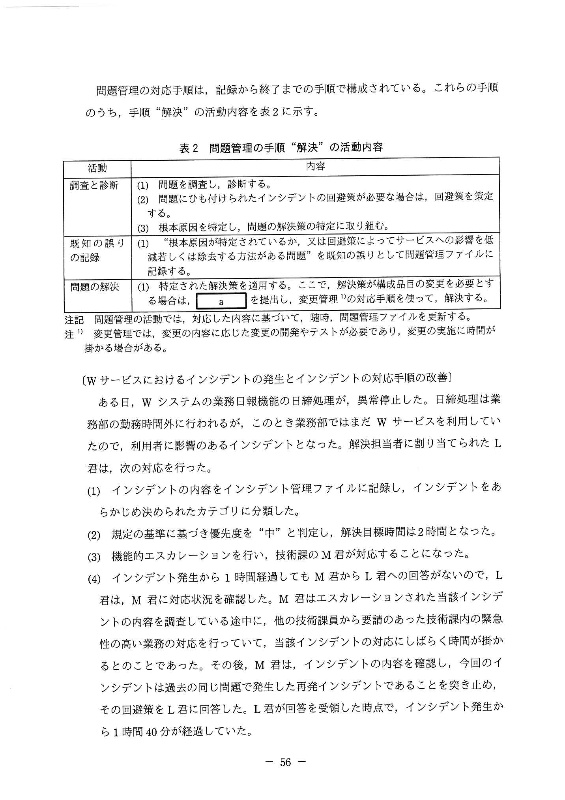

テキスト (OCR)

問題管理の対応手順は, 記録から終了までの手順で構成されている。これらの手順
のうち, 手順“解決” の活動内容を表 2 に示す。

表2 問題管理の手順 “解決"の活動内容

調査と診断 |G) 問題を調査し, 診断する。

Q) 問題にひも付けられたインシデントの回避策が必要な場合は, 回避策を策定
する。

3) 根本原因を特定し, 問題の解決策の特定に取り組む。

既知の誤り | (①) "根本原因が特定されているか, 又は回避策によってサービスへの影響を低

の記録           減若しくは除去する方法がある問題” を既知の誤りとして問題管理ファイルに

記録する。

問題の解決 | ①) 特定された解決築を適用する。ここで, 解決策が構成品目の変更を必要とす
る場合は, (a) を提出し, 変更管理の対応手順を使って, MATS.

注記 問題管理の活動では, 対応した内容に基づいて, 随時, 問題管理ファイルを更新する。
ED 変更管理では, 変更の内容に応じた変更の開発やテストが必要であり, 変更の実施に時間が

掛かる場合がある。

[W サービスにおけるインシデントの発生とインシデントの対応手順の改善]

HSA, W システムの業務日報機能の日締処理が, 異常停止した。日締処理は業
Teo ee een eo eee rane ビスを利用してい
たので, 利用者に影響のあるイン      ントとなった。 解決担当者に割り当てられた工

よ, 次の対応を行った。
① ルンシーントのインシテント人時ファイル に記録し インシデントをあ

らかじめ決められたカテゴリに分類した。

QQ) 規定の基準に基づき優先度を “中” と判定し, 解決目標時間は2時間となった。
(3) 機能的エスカレーションを行い, 技術課の M 君が対応することになった。
(4) インシデント発生から 1 時間経過しても M 君からL 君への回答がないので, L

君は, M 君に対応状況を確認した。M 君はエスカレーションされた当該イ ンシデ

ントの内容を調査している途中に, 他の技術課員から要請のあった技術課内の皿急

性の高い業務の対応を行っていて, 当該インシデントの対応にしばらく時間が掛か

るとのことであった。 その後, M Blk, インシデントの内容を確認し, 今回のイ

ンシデントは過去の同じ問題で発生した再発インシデントであることを突き止め,

その回避策を L 君に回答した。L 君が回答を受領した時点で, イン      ント発生か

ら 1 時間 40 分が経過していた。

ー 56 一

### ページ 57

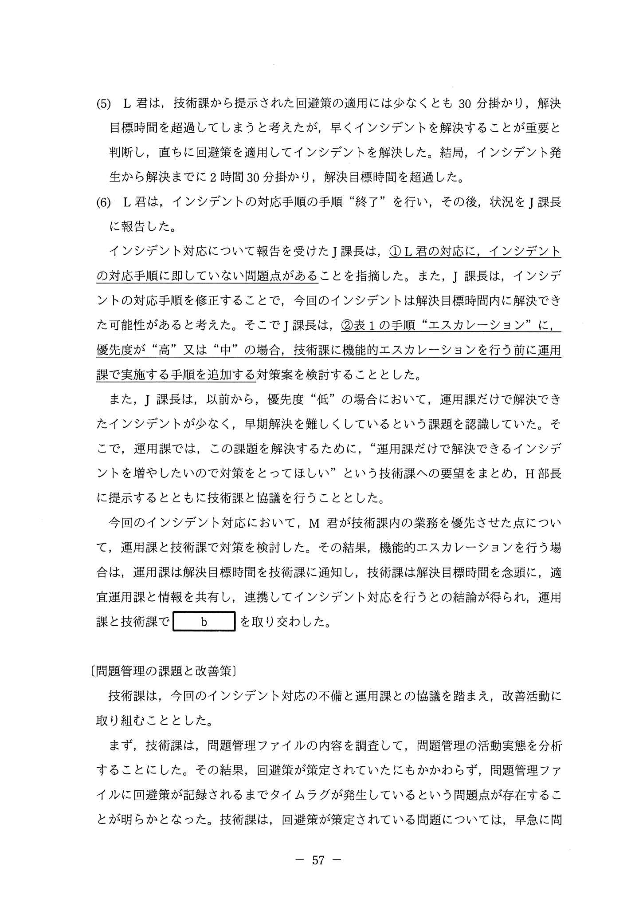

テキスト (OCR)

(5) L Blk, 技術課から提示された回避策の適用には少なくとも 30 分掛かり, 解決
目標時間を超過してしまうと考えたが, 早くインシデントを解決することが重要と
判断し, 直ちに回避策を適用してインシデントを解決した。結局,. インシデント発
生から解決までに 2 時間 30 分掛かり, 解決目標時間を超過した。

(6) L 君は。 インシデントの対応手順の手順“終了” を行い, その後, 状況を課長
に報告した。
インシデント対応について報告を受けた課長は, ①L 看の対応に. インシデント

の対応手順に即していない問題点があることを指摘した。また, J 課長は, インシデ

ントの対応手順を修正することで, 今回のインシデントは解決目標時間内に解決でき

た可能性があると考えた。そこで本課長は, ORI の手順 "エスカレーション"に,

優先度が"高" 又は“中”の場合, 技術課に機能的エスカレーションを行う前に運用

課で実施する手順を追加する対策案を検討することとした。
また, J Bld, 以前から, 優先度“低"の場合において, 運用課だけで解決でき

たインシデントが少なく, 早期解決を難しくしているという課題を認識していた。そ

こで, 運用課では, この課題を解決するために, “運用課だけで解決できるインシデ

ントを増やしたいので対策をとってほしい" という技術課への要望をまとめ, HER

に提示するとともに技術課と協議を行うこととした。
今回のインシデント対応において, M 君が技術課内の業務を優先させた点につい

て, 運用課と技術課で対策を検討した。その結果, 機能的エスカレーションを行う場

合は, 運用課は解決目標時間を技術課に通知し, 技術課は解決目標時間を念頭に, 適

宜運用課と情報を共有し, 連携してインシデント対応を行うとの結論が得られ, 運用

課と技術課で| b | を取り交わした。

〔問題管理の課題と改善策]

技術課は, 今回のインシデント対応の不備と運用課との協議を踏まえ, 改善活動に
取り組むこととした。

まず, 技術課は, 問題管理ファイルの内容を調査して, 問題管理の活動実態を分析
することにした。その結果, 回避策が策定されていたにもかかわらず, 問題管理ファ
イルに回避策が記録されるまでタイムラグが発生しているという問題点が存在するこ
とが明らかとなった。技術課は, 回避策が策定されている問題については, 早急に問

ー 57 一

### ページ 58

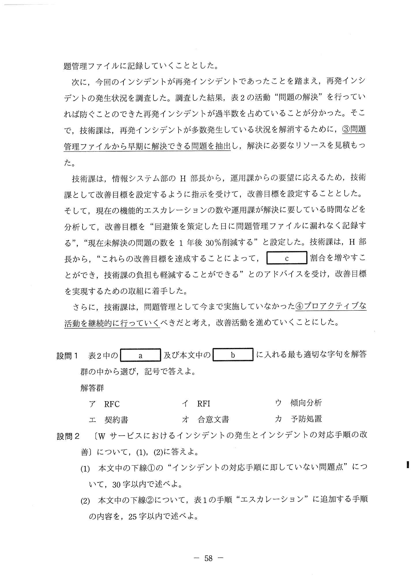

テキスト (OCR)

題管理ファイルに記録していくこととした。

次に, 今回のインシデントが再発インシデントであったことを踏まえ, 再発インシ
デントの発生状況を調査した。調査した結果, 表 2 の活動 “問題の解決” を行ってい
れば防ぐことのできた再発インシデントが過半数を占めていることが分かった。 そこ
で, 技術課は, 再発インシデントが多数発生している状況を解消するために, OME
管理ファイルから早期に解決できる問題を抽出し, 解決に必要なリソースを見積もっ
Ro

技術課は, 情報システム部の H 部長から, 運用課からの要望に応えるため, 技術
課として改善目標を設定するように指示を受けて, 改善目標を設定することとした。
そして, 現在の機能的エスカレーションの数や運用課が解決に要している時間などを
分析して, 改善目標を "回避筑を策定した日に問題管理ファイルに漏れなく記録す
6", "現在末解決の問題の数を 1 年後 30%削減する” と設定した。技術課は, HM
長から, “これらの改善目標を達成することによって, | c |割合を増やすこ
とができ, 技術課の負担も軽滅することができる" とのアドバイスを受け, 改善目標
を実現するための取組に着手した。

さらに, 技術課は, 問題管理として今まで実施していなかった③④プロアクティブな
活動を継続的に行っていくべきだと考え, 改善活動を進めていくことにした。

設問1 表2中の|  。 | 及び本文中の| b | に入れる最も適切な字句を解答
群の中から選び, 記号で答えよ。

解答税
ア RFC                      イ RFI                       ウ 傾向分析
エエ 契約書                        オ 合意文書                    カカ 予防処置

設問2 〔W サービスにおけるインシデントの発生とインシデントの対応手順の改
善) について, ①, (②に答えよ。
Q①) 本文中の下線やの “インシデントの対応手順に始していない問題点” につ
WT, 30 字以内で述べよ。
(2) 本文中の下線@について, 表1の手順 “エスカレーション"に追加する手順
の内容を, 25 字以内で述べよ。

ー 58 一

### ページ 59

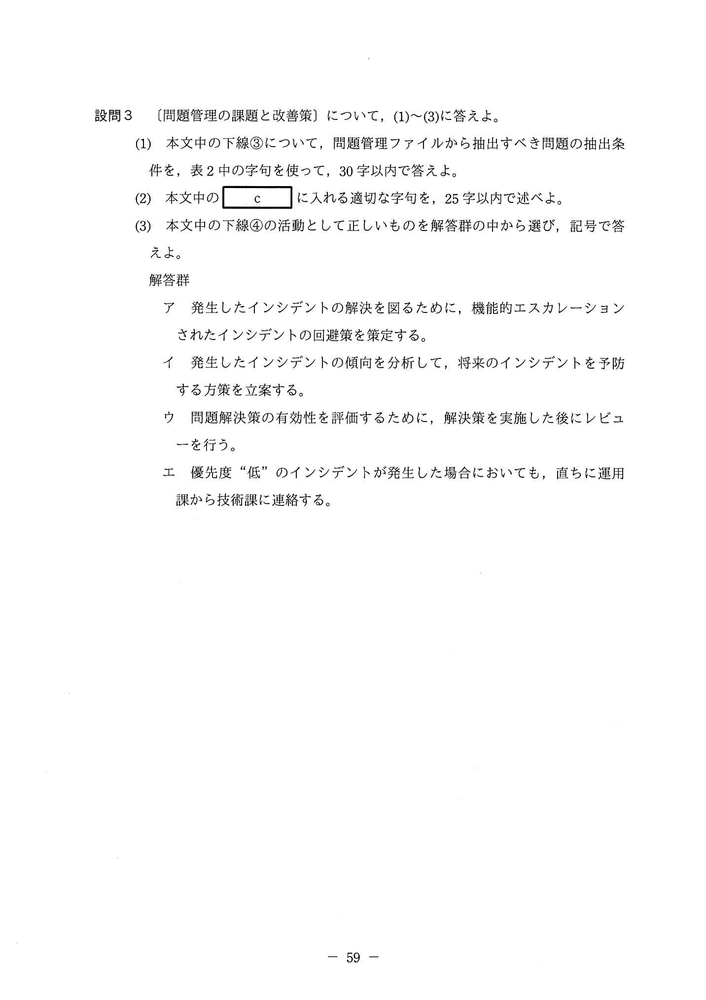

テキスト (OCR)

設問3 (問題管理の課題と改善貸] について, )ー⑬に答えよ。
Q) 本文中の下線③について, 問題管理ファイルから抽出すべき問題の抽出条
件を, 表2 中の字句を使って, 30 FUNCHAL
@ 本文中の| c | に入れる適切な字句を, 25字以内で述べよ。
⑬) 本文中の下線④の活動として正しいものを解答群の中から選び, ECS
the
BSE
ア 発生したインシデントの解決を図るために, 機能的エスカレーション
されたインシデントの回避策を策定する。
イ 発生したインシデントの傾向を分析して, 将来のインシデントを予防

する方策を立案する。
ウ 問題解決策の有効性を評価するために, 解決策を実施した後にレビュ
ーを行う。

エ 優先度“低"のインシデントが発生した場合においても, 直ちに運用
課から技術課に連絡する。

ー 59 一

### ページ 60

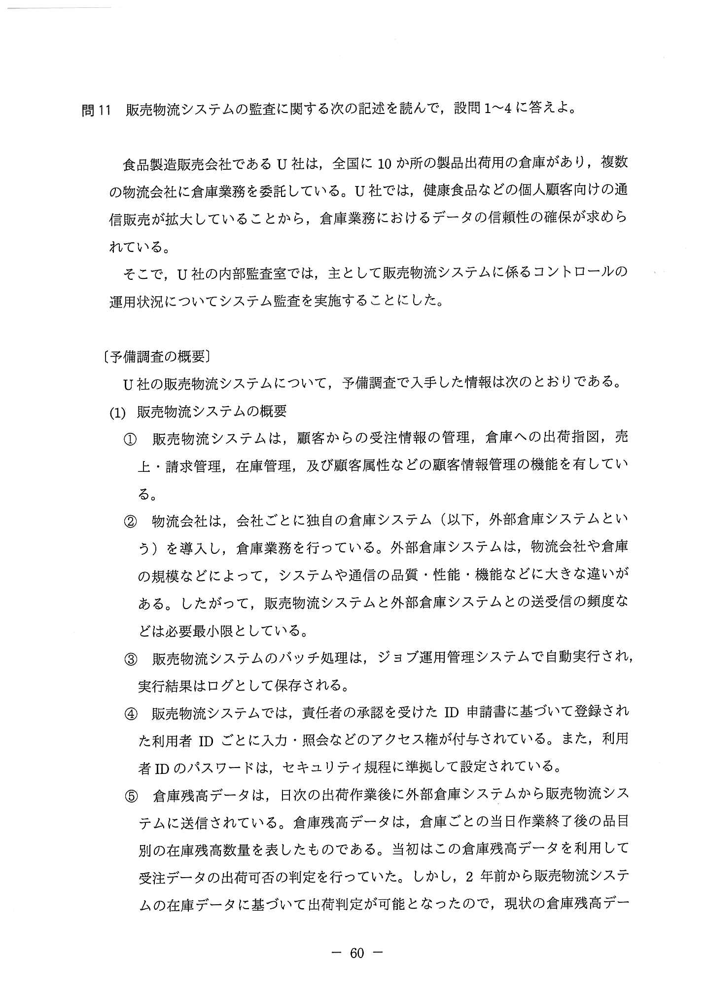

テキスト (OCR)

間11 販売物流システムの監査に関する次の記述を読んで, 設問 1ユー4 に答えよ。

食品製造販売会社である U 社は, 全国に 10 か所の製品出荷用の倉庫があり, 複数
の物流会社に倉庫業務を委託している。U 社では, 健康食品などの個人顧客向けの通
信販売が拡大していることから, 倉庫業務におけるデータの信頼性の確保が求めら
れている。

そこで, U社の内部監査室では, 主として販売物流システムに係るコントロールの
運用状況についてシステム監査を実施することにした。

[予備調査の概要]
U 社の販売物流システムについて, 予備調査で入手した情報は次のとおりである。
(1) 販売物流システムの概要

① 販売物流システムは, 顧客からの受注情報の管理, 倉庫への出荷指図, 売
上・請求管理, 在庫管理, 及び顧客属性などの顧客情報管理の機能を有してい
る。

②⑨ 物流会社は, 会社ごとに独自の倉庫システム (以下, 外部倉庫システムとい
5) を導入し, 倉庫業務を行っている。外部倉庫システムは, 物流会社や倉庫
の規模おなどによって, システムや通信の品質・性能・機能などに大きな違いが
ある。したがって, 販売物流システムと外部倉庫システムとの送受信の頻度な
どは必要最小限としている。

⑨ 販売物流システムのバッチ処理は, ジョブ運用管理システムで自動実行され,
実行結果はログとして保存される。

④ 販売物流システムでは, 足任者の承認を受けた ID 申請書に基づいて登録され
た利用者 ID ごとに入力・照会などのアクセス権が付与されている。また, 利用
者 ID のパスワードは, セキュリティ規程に準拠して設定されている。

© 倉庫残高データは, 日次の出荷作業後に外部倉庫システムから販売物流シス
テムに送信されている。倉庫残高データは, 倉庫ごとの当日作業終了後の品目
別の在庫残高数量を表したものである。 当初はこの倉庫残高データを利用して
受注データの出荷可否の判定を行っていた。 しかし, 2 年前から販売物流システ
ムの在庫データに基づいて出荷判定が可能となったので, 現状の倉庫残高デー

ー 60 一

### ページ 61

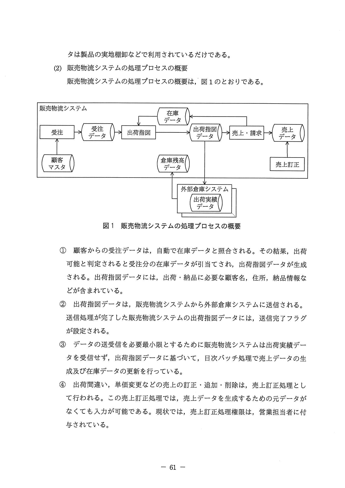

テキスト (OCR)

タは製品の実地棚卸などで利用されているだけである。
(2) 販売物流システムの処理プロセスの概要
販売物流システムの処理プロセスの概要は, 図 1のとおりである。

販売物流システム

MM
Xf

BE ( 2, |) eee   PETAR) oe «aah

   願客  ()                            倉庫残高
マスタ                                              データ                                            PEATE

外部倉庫システム
bs   arg
データ

図1 販売物流システムの処理プロセスの概要

① 顧客からの受注データは, 自動で在庫データと照合される。その結果, 出荷
可能と判定されると受注分の在庫データが引当てされ, 出荷指図データが生成
される。出荷指図データには, 出荷・納品に必要な顧客名, 住所, 納品情報な
どが含まれている。

② 出荷指図データは, 販売物流システムから外部倉庫システムに送信される。
送信処理が完了した販売物流システムの出荷指図データには, 送信完了フラグ
が設定される。

@ データの送受信を必要最小限とするために販売物流システムは出荷実績デー
タを受信せず, 出荷指図データに基づいて, 日次バッチ処理で売上データの生
成及び在庫データの更新を行っている。

④ 出荷間違い, 単価変更などの売上の訂正・追加・削除は, 売上訂正処理とし
て行われる。この売上訂正処理では, 売上データを生成するための元データが
なくても入力が可能である。 現状では, 売上訂正処理権限は, 営業担当者に付
与されている。

ー 61 一

### ページ 62

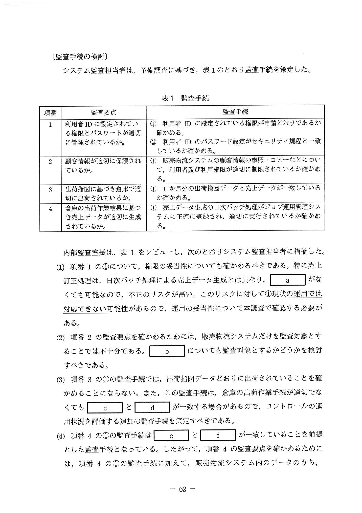

テキスト (OCR)

[監査手続の検討]

システム監査担当者は, 予備調査に基

づき, 表 1 のとおり監査手続を策定した。

表1 監査手続
項番     監査要点                監査手続
1 | 利用者ID に設定されてい | ① 利用者 ID に設定されている権限が申請どおりであるか
る権限とパスワードが適切  確かめる。
に管理されているか。   ② 利用者 ID のパスワード設定がセキュリティ規程と一致
しているか確かめる。
2  顧客情報が適切に保護され | ① 販売物流システムの顧客情報の参照・コピーなどについ
ているか。         て, 利用者及び利用権限が適切に制限されているか確かめ
る。
3 | 出荷指図に基づき倉庫で適 | ① 1 か月分の出荷指図データと売上データが一致している
切に出荷されているか。    か確かめる。
4 | 倉庫の出荷作業結果に基づ | ① 売上データ生成の日次バッチ処理がジョブ運用管理シス

き売上データが適切に生成
されているか。

テムに正確に登録され, 適切に実行されているか確かめ
る。

内部監査室長は, 表 1 をレビューし, 次のとおりシステム監査担当者に指摘した。
(1) 項番 1 の①について, 権限の妥当性についても確かめるべきである。特に売

訂正処理は, 日次バッチ処理による売上データ生成とは異なり, | 。 | がな
くても可能なので, 不正のリスクが高い。このリスクに対して①現状の運用では
対応できない可能性があるので, 運用の妥当性について本調査で確認する必要が

ある。

(2) 項番 2 の臣宜要点を確かめるためには, 販売物流システムだけを監査対象とす
ることでは不十分である。[|  b | についても監査対象とするかどうかを検討

すべきである。

3) 項番 3 の①の監査手続では, 出荷指図データどおりに出荷されていることを確
かめることにならない。また, この監査手続は, 倉庫の出荷作業手続が適切でな

くても|   c

|と[

d |が一致する場合があるので, コントロールの運

用状況を評価する追加の監査手続を策定すべきである。
(4) 項番 4 の①の監査手続は| ec

| と| fj |が一致していることを前提

とした監査手続となっている。したがって, 項番 4 の監査要点を確かめるために
は, 項番 4 の①の監査手続に加えて, 販売物流システム内のデータのうち,

ー 62 一

### ページ 63

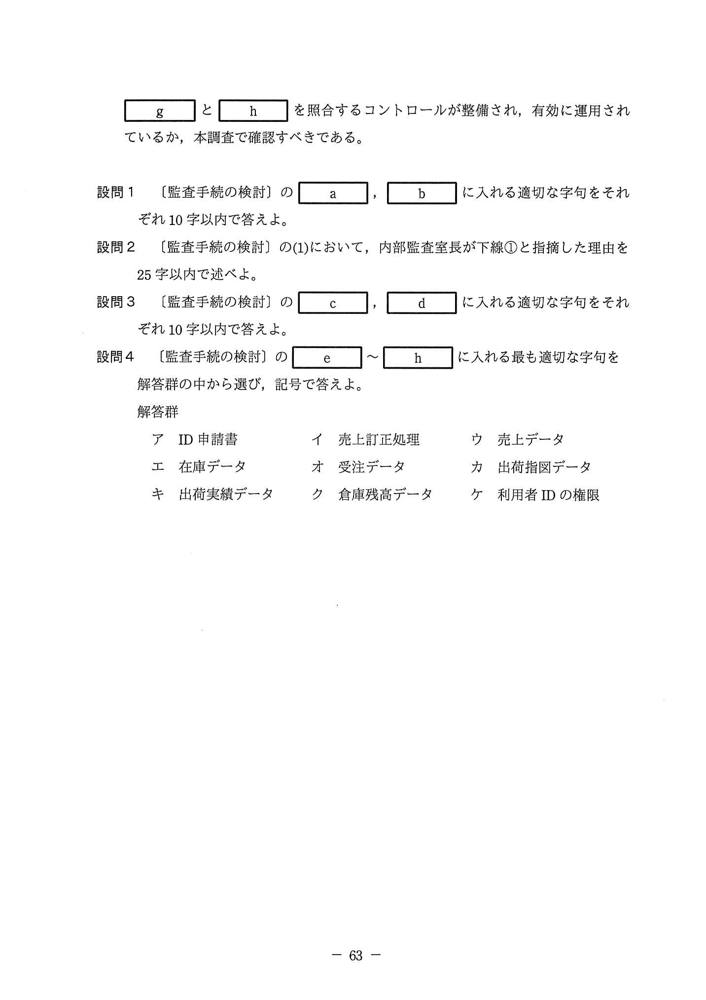

テキスト (OCR)

| sg |と[| nh | を照合するコントロールが整備され, 有効に運用され
ているか, 本調査で確認すべきである。

設問1 監査手続の検討]の| 。 |,|  b |に入れる適切な字句をそれ
ぞれ10 字以内で答えよ。
設問2 【監査手続の検討】の(①)において, 内部監査室長が下線①と指摘した理由を
25 字以内で述べよ。
設問3 [監査手続の検討]の| c |, | a |に入れる適切な字句をそれ
ぞれ10 FUNCHAL,
設問4 [監査手続の検討]の| ce |~[  h |に入れる最も適切な字句を
解答群の中から選び, 記号で答えよ。
解答群
ア TD申請書     イ 売上訂正処理   ウ 売上データ
エ 在庫データ     オ 受注データ     カカ 出荷指図データ

キ 出荷実績データ  ク 倉庫残高データ  ケ 利用者ID の権限

ー 63 一

### ページ 64

テキスト (OCR)

C

メ = 用 紙

=和英一

]

### ページ 65

テキスト (OCR)

[ メ モ 用 紙 }

= 龍王

### ページ 66

テキスト (OCR)

[ メ モ 用 紙 〕

= (66 一

### ページ 67

テキスト (OCR)

【

メ モ 用 紙 ]

ー 67 一

### ページ 68

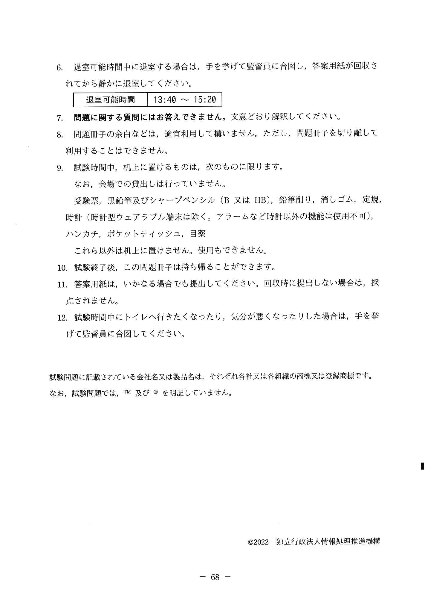

テキスト (OCR)

6. RETA RET SOAS, 手を挙げて監督員に合図し, 答案用紙が回収さ
れてから静かに退室してください。
退室可能時間 | 13:40 ~ 15:20 |
7. PCBS SRMICMESATREUA. KRLB)MRLTS ESV.
8. 問題冊子の余白などは, 適宜利用して構いません。ただし, 問題民子を切り離して
利用することはできません。
9. 試験時間中, 机上に置けるものは, 次のものに限ります。
なお, 会場での貸出しは行っていません。
BRR, 黒鉛筆及びシャープベンシル (B 又は HB), 鉛筆削り, 消しゴム, 定規,
時計 (時計型ウェアラブル端末は除く。アラームなど時計以外の機能は使用不可),
ハンカチ, ポケットティッシュ, 目薬
これら以外は机上に置けません。使用もできません。
10. 試験終了後, この問題民子は持ち帰ることができます。
LL, 答案用紙は。いかなる場合でも提出してください。回収時に提出しな場合は, 採
点されません。
12, 試験時間中にトイレへ行きたくなったり, 気分が悪くなったりした場合は, 手を拳
げて監督員に合図してください。

試験問題に記載されている会社名又は製品名は, それぞれ各社又は各組織の商標又は登録商標です。
なお, 試験問題では, ™ 及び @ を明記していません。

@2022 独立行政法人情報処理推進機構

ー 68 一

---

## 午後解答

1/6 
©2022 独立行政法人情報処理推進機構 
令和４年度 春期 応用情報技術者試験 解答例 
 
午後試験 
問１ 
出題趣旨 
 基本的なセキュリティ対策は定着しつつあるものの，体制の不備や攻撃の高度化によって，当初想定してい
なかったセキュリティインシデントが発生することが増えている。 
 本問では，通信販売サイトのセキュリティ対策を題材に，セキュリティ対策の不備による問題の再発防止策
の立案と攻撃に対処する事後対策に関する理解を問う。 
 
設問 
解答例・解答の要点 
備考 
設問１ 
a
サービス 
設問２ 
b
WAF 
 
設問３ 
イ，ウ 
設問４(1) ゼロデイ攻撃 
 
 
(2) ウ 
 
(3)
c
ア 
 
 
(4)
d
インシデント対応チーム 
 
(5) SIEM 
 
 
問２ 
出題趣旨 
 企業は，不透明な競合市場の中で最大の利益を得る目的で，意思決定や事業戦略を検討する際に，判断材料
の一つとしてゲーム理論を用いることがある。 
 本問では，化粧品製造販売会社の事業戦略の策定を題材に，ゲーム理論を用いた企業活動における利害得失
とリスクに関する判断，及び意思決定に関する理解を問う。 
 
設問 
解答例・解答の要点 
備考 
設問１(1) イ 
 
(2) 売上高の増減に対して営業利益の増減幅が大きくなる。 
 
設問２(1) 景気の見通しの予測は難しいが営業利益は予測できる。 
 
(2)
a
オ 
 
 
 
b
イ 
 
(3) 中高価格帯の商品は粗利益率が高いから 
 
設問３(1) 固定費の割合の減少 
 
(2) 顧客は実際に商品を試してから購入したい。

2/6 
©2022 独立行政法人情報処理推進機構 
問３ 
出題趣旨 
 深さ優先探索は，全探索アルゴリズムの一種であり，グラフ及びグラフと同一視できるようなデータを探索
する際に広く利用されている。 
 本問では，パズルの解法を求める処理を題材に，盤面を1 次元配列を用いて表し，深さ優先探索のアルゴリ
ズムを再帰処理で表現することで，それを実装したプログラム及びデータ構造の特性に関する理解を問う。 
 
設問 
解答例・解答の要点 
備考 
設問１ 
ア
board[x]が0 でない 
 
 
 
イ
x＋1 
 
 
 
ウ
check_ok(n, x)がtrue と等しい 
 
 
 
エ
0 
 
設問２ 
オ
div(x, 9)*9 
 
 
 
カ
board[row_top＋i]がn と等しい 
 
 
 
キ
mod(x, 9) 
 
 
 
ク
board[column_top＋9*i]がn と等しい 
 
 
 
ケ
mod(div(x, 9)*9, 27) 
 
設問３ 
処理A 
データ構造Z を退避する 
 
処理B 
退避したデータ構造Z を取り出す 
 
 
問４ 
出題趣旨 
 昨今，システムの構築及び運用の効率性を向上させるために，クラウドサービスを活用することが定着しつ
つある。 
 本問では，クラウドサービスを活用した名刺管理サービスを題材に，システム構成及び性能要件を満たす適
正なサーバリソース及び料金の見積り，クラウドサービスに関する理解を問う。 
 
設問 
解答例・解答の要点 
備考 
設問１ 
a
スケールアウト 
 
 
 
b
関数 
 
 
c
キャッシュ 
 
設問２(1) PaaS やFaaS では，OS やミドルウェアのメンテナンスが不要だから 
 
(2)
d
CDN 
 
 
(3) バッチ実行時間が上限の10 分を超えてしまう問題 
 
設問３ 
e
8
 
 
f
2,600 
 
 
 
g
1,800
設問４(1)
h
FaaS
 
(2) 20 分未満の間隔でFaaS 上のアプリケーションを定期的に呼び出す。

3/6 
©2022 独立行政法人情報処理推進機構 
問５ 
出題趣旨 
 インターネット上で提供されるSaaS の利用が拡大している。SaaS を利用することによって，社内のファイア
ウォールなどの機器又はインターネットアクセス回線に通信負荷が集中して，通信速度の遅延などの問題が発
生する場合がある。 
 本問では，外部のサービスを利用することによる通信経路の変化を題材に，ファイアウォールへの通信負荷
の集中を避けるための方策について，TCP/IP 通信の基本技術の理解を問う。 
 
設問 
解答例・解答の要点 
備考 
設問１(1)
宛先IP アドレスが示す，NPC，機器又はサーバ名
プロキシサーバ 
 
 送信元IP アドレスが示す，NPC，機器又はサーバ名営業所のNPC 
 
 
(2) ルータ，FW，プロキシサーバ 
 
(3)
a
外部DNS サーバ 
 
 
 
b
プロキシサーバ 
 
 
c
社内DNS サーバ 
 
設問２ 
IS サーバ 
設問３(1) q-SaaS 宛ての通信のネクストホップがIPsec ルータ1 となる経路 
 
 
(2)
d
q-SaaS 
 
 
e
営業所LAN 
 
問６ 
出題趣旨 
 提供するオンラインサービスが，商品販売開始や特典提供開始などの特定のタイミングでレスポンス遅延や
タイムアウトを発生させることがある。 
 本問では，クーポン発行サービスを題材に，業務特性と使用する関係データベースの設定に応じた適切な排
他制御方式，連番管理方式を検討するための知識，技能を問う。 
 
設問 
解答例・解答の要点 
備考 
設問１(1)
a
施設コード 
順不同 
 
 
b
プランコード 
 
 
c
↑ 
 
 
(2)
d
ALTER TABLE 
 
 
(3) 1 枚のクーポンは一つの予約だけに利用できる。 
 
設問２ 
e
クーポン発行連番 
 
設問３ 
f
SET 発行済枚数 = 発行済枚数 + 1 
 
 
 
g
発行上限枚数 
 
設問４ 
下線②
RU 
 
 
 
下線③
C

4/6 
©2022 独立行政法人情報処理推進機構 
問７ 
出題趣旨 
ネットワークに接続できるカメラは，防犯用，ペットの管理などで活用されており，近年は高速な通信が可
能なWi-Fi 通信を利用したワイヤレスカメラが製品化されている。 
本問では，Wi-Fi 通信を使用したワイヤレスカメラの設計を題材として，仕様に基づいた，特定の条件がある
ときの撮影時間の計算能力，状態遷移図を用いたワイヤレスカメラの状態と遷移及び遷移時の処理の理解と設
計，バッファの使用方法の不備によって生じる不具合の原因と対策への理解について問う。 
 
設問 
解答例・解答の要点 
備考 
設問１ 
(t2-t1)+Ta
設問２ 
60
設問３(1) S1
遠隔撮影状態 
 
 
 
S2
自動撮影状態 
 
 
(2)
a
遠隔撮影開始イベント 
 
 
 
b
自動撮影タイマ通知イベント 
 
(3)
c
①，③，⑦ 
 
設問４(1) 書込みと読込みが同時に行われ，バッファの先頭のデータが上書きされた。 
 
(2)
d
終端 
 
 
 
e
始端 
 
(3)
f
リングバッファ 
 
 
問８ 
出題趣旨 
 複数のシステムが連携する業務のシステム開発では，開発の初期段階におけるデータ連携方式の検討が重要
である。 
 本問では，バス運行事業者とバスターミナル間で空席情報を連携させる処理を題材に，コード体系，ファイ
ル形式，及びデータの転送方法の特性を理解し，データ連携方式を検討する能力を問う。 
 
設問 
解答例・解答の要点 
備考 
設問１(1) H 社，S 社，T 社 
 
(2)
発車日 
20220510 
 
 
 
発車時刻 
1800 
 
 
統合便コード
G0030110 
 
 
 
空席数 
8 
 
設問２ 
ア，エ 
 
設問３ 
エ 
 
設問４ 
a
ヘッダレコードのデータレコード件数 
順不同 
 
 
b
処理したデータレコードの件数 
設問５ 
ターミナルの運行計画に設定された空席数をnull にする。

5/6 
©2022 独立行政法人情報処理推進機構 
問９ 
出題趣旨 
 企業が外部委託先にシステムの開発を委託する場合，調達，契約，及びプロジェクト活動でのリスクを特定
し，対応策を事前に検討することが重要である。 
 本問では，販売システムの再構築プロジェクトを題材に，調達とリスクに関する理解と対応能力を問う。 
 
設問 
解答例・解答の要点 
備考 
設問１(1) (d) 
 
 
(2) ユースケース図 
設問２(1) イ 
 
 
(2)
a
検収 
 
 
b
著作権 
 
設問３(1)
c
提出期限 
 
(2) 作業の途中で品質レビューを行う。 
 
 
(3) 上位2 種類以外のブラウザでは問題が生じる場合があること 
 
問10 
出題趣旨 
 IT サービスの提供部門では，組織が規定するプロセス手順に基づいてサービスマネジメント活動を行うこと
で，利用者に安定したサービス提供を行うことができる。 
 本問では，サービスマネジメントにおけるインシデント管理や問題管理を題材に，インシデント対応の手順，
インシデントの発生又は再発を防止する問題管理の活動などに関する実務能力について問う。 
 
設問 
解答例・解答の要点 
備考 
設問１ 
a
ア 
 
 
 
b
オ 
 
設問２(1) L 君が階層的エスカレーションを行わなかった。 
 
 
(2) ・既知の誤りを調査し，回避策を見つける。 
・解決担当者だけでインシデントの解決を試みる。 
 
設問３(1) 根本原因と解決策が特定されている未解決な問題 
 
 
(2)
c
運用課だけでインシデントを解決する 
 
 
(3) イ

6/6 
©2022 独立行政法人情報処理推進機構 
問11 
出題趣旨 
 業務が外部委託されている場合，理想的なIT に関する業務プロセス及びコントロールを実現できない場合が
ある。そこで，システム監査人は，IT に関するリスク及びそのコントロールを踏まえて，業務プロセスとその
処理機能を適切に理解し，監査手続を実施することが求められる。 
 本問では，販売物流システムを題材として，監査で検証すべきコントロール及びその監査手続を検討する能
力を問う。 
 
設問 
解答例・解答の要点 
備考 
設問１ 
a
出荷指図データ 
 
 
b
外部倉庫システム 
 
設問２ 
営業担当者に売上訂正処理権限があるから 
 
設問３ 
c
出荷指図データ 
順不同 
 
d
売上データ 
設問４ 
e
カ 
順不同 
 
f
キ 
 
g
ク 
順不同 
 
h
エ

---

## 午後採点講評

1/3 
©2022 独立行政法人情報処理推進機構 
令和４年度 春期 応用情報技術者試験 採点講評 
 
午後試験 
問１ 
 問1 では，通信販売サイトのセキュリティ対策を題材に，セキュリティ対策の不備による問題の再発防止策
の立案と攻撃に対する事後対策について出題した。全体として正答率は平均的であった。 
 設問1 は，正答率がやや低かった。サーバで不要なサービスなどが起動している場合，サイバー攻撃によっ
て悪用されることがある。セキュリティリスク低減のために，最低限必要なものを除き停止する対策が重要で
あることを理解してほしい。 
 設問4(5)は，正答率が低かった。SIEM はログを統合管理し，ログの相関分析をリアルタイムに行うこと
で，セキュリティインシデントの早期検知や分析時間の短縮を可能とする，セキュリティ対策に重要な仕組み
であるので，覚えておいてほしい。 
 
問２ 
 問2 では，化粧品製造販売会社の事業戦略の策定を題材に，ゲーム理論を用いた企業活動における利害得失
とリスクに関する判断，及び意思決定について出題した。全体として正答率は平均的であった。 
 設問1(2)は，正答率がやや低かった。これまでA 社は，売上高を増やすことで営業利益を増やすという事業
戦略を採ってきた。売上高が増加すると，総費用に占める固定費の割合が高いので，営業利益の増加に大きく
プラスに働いていた。しかし，景気が悪化すると，売上高が減少しても固定費は減らないので，逆に営業利益
を減少させる方向に強く働くことを理解してほしい。 
 設問2(1)は，正答率が低かった。ゲーム理論は，将来の起こり得る状態は予測できるが，その状態の発生確
率は不明である場合の意思決定に有効である。景気の見通し及び営業利益の予測の両方についての解答を求め
たが，景気の見通しの不透明さだけを述べた解答が見受けられた。 
 
問３ 
 問3 では，パズルの解法を求める処理を題材に，その解法を，深さ優先探索，再帰処理，1 次元配列による
盤面の表現を用いて実装するためのアルゴリズム，プログラム及びデータ構造の特性について出題した。全体
として正答率は平均的であった。 
 設問2 のケは，正答率が低かった。添字x，3×3 の枠内の先頭の数字，mod(x, 3)の組合せを列挙すること
で，ケが取るべき値を求めることができる。剰余や商の性質を理解し，着実に計算することで正答を導き出し
てほしい。 
 設問3 は，正答率が低かった。下線②の“処理B”では，“マスを空白に戻す”のに合わせて，データ構造Z
も数字を入れる前の状態に戻す必要がある。これを，Z の内容を実際に更新して行う代わりに，大域変数とし
て導入したZ を，下線①の“処理A”で一時退避しておき，“処理B”ではそれを取り出すことによって実現で
きることを理解してほしい。 
 
問４ 
 問4 では，クラウドサービスを活用した名刺管理サービスを題材に，システム構成及び性能要件を満たす適
正なサーバリソース及び料金の見積りなどについて出題した。全体として正答率は平均的であった。 
 設問1 のa は，正答率が低かった。PaaS の特徴の一つに，トランザクションの負荷に応じてサーバリソース
をスケールアウト及びスケールインできることが挙げられる。問題文中に示された条件を過不足なく読み取
り，正答を導き出してほしい。 
 設問4(2)は，正答率が低かった。オンラインレスポンスの課題の原因である，FaaS の制約を回避するために
は，トランザクションの実行間隔を制御する必要がある。その間隔の値を誤った解答が散見された。問題が発
生する境界値を正確に把握することは，システムを設計する上で重要であることを理解してほしい。

2/3 
©2022 独立行政法人情報処理推進機構 
問５ 
 問5 では，外部のサービスを利用することによる通信経路の変化を題材に，ファイアウォールへの通信負荷
の集中を避けるための方策について出題した。全体として正答率は平均的であった。 
 設問1(1)は，“送信元IP アドレスが示す，NPC，機器又はサーバ名”の正答率がやや低かった。送信元IP ア
ドレスが示す機器として，IPsec ルータ1 又はIPsec ルータ2 を挙げる解答が散見された。図2 の経路では，
IPsec ルータ1 と2 との間でトンネリングが行われるので，送信元IP アドレスが変わらないことを理解してほ
しい。 
 設問3(1)は，正答率がやや低かった。ルータによる経路制御は，ネットワークを流れるパケットの通信経路
を決定する重要な技術なので，経路表に登録される経路情報の内容について理解を深めてほしい。 
 設問3(2)のd の正答率は高かったが，e の正答率が低かった。e についても，本文に記述されたネットワーク
構成と通信内容を理解して，正答を導き出してほしい。 
 
問６ 
 問6 では，クーポン発行サービスを題材に，業務特性と使用する関係データベースの設定に応じた適切な排
他制御方式，連番管理方式について出題した。全体として正答率は平均的であった。 
 設問1(2)のd は，正答率が低かった。ALTER TABLE 文は，制約の追加，削除のほか，列の追加，変更など
にも使われるSQL（DDL）であり，覚えておいてほしい。 
 設問1(3)は，正答率が平均的であった。制約を付けたテーブルに関連する業務要件，UNIQUE 制約違反とな
るデータの組合せを不可とする業務要件については，正しく読み取れているようであった。 
 設問3 のf は，正答率が低かった。UPDATE 文は，連番のカウントアップをはじめ，表の更新に使われる
SQL であり，SET 句の構文と併せて覚えておいてほしい。 
 
問７ 
問7 では，Wi-Fi を使用したワイヤレスカメラを題材に，特定の条件が与えられたときの撮影時間の計算，状
態遷移及びバッファの使い方について出題した。全体として正答率は平均的であった。 
設問2 は，正答率が低かった。通信障害が発生したときの状況を正しく理解することで，障害の及ぼす影
響，その対策などが考察できる。与えられた条件から状況を正しく理解して，正答を導き出してほしい。 
設問3(3)は，正答率が高かったが，三つの処理の全てを挙げていない解答や，関係のない処理を挙げている
解答が散見された。各状態とその状態を維持するための理解が不十分であると考えられる。状態遷移は，組込
みシステムの設計ではよく利用されるので，ぜひ理解してほしい。 
設問4(2)は，正答率が低かった。リングバッファは，通信などのインタフェース処理でよく利用される。名
称及びその仕組みについて理解を深めてほしい。 
 
問８ 
 問8 では，バス運行事業者とバスターミナル間で空席情報を連携させる処理を題材に，コード体系，ファイ
ル形式，データの転送方法，及びデータ連携方式について出題した。全体として正答率は平均的であった。 
 設問4 は，正答率が低かった。FTP における転送データの欠落を検知するためには幾つかの方法があるが，
本問では空席情報ファイルのヘッダーレコードにデータレコード件数を含めることが示されており，この値を
用いてデータレコード件数を確認できることに着目して正答を導き出してほしい。 
 設問5 は，正答率が低かった。システム間のデータ連携においては，相手側システムの状態によって，期待
したデータが連携されないことも考えられる。そのため，データが連携されなかった場合を想定した事前の検
討が重要である。本問では，空席情報が取得できなかった場合，表示器に表示すべき項目を検討することで，
実施する処理の内容を導き出してほしい。

3/3 
©2022 独立行政法人情報処理推進機構 
問９ 
 問9 では，販売システムの再構築プロジェクトを題材に，調達とリスクについて出題した。全体として正答
率は平均的であった。 
 設問3(1)は，正答率がやや低かった。プロトタイピング手法による開発は，利用部門の意見の吸収に有効で
あるが，追加・変更の要求事項の規模が膨らみ，開発コストの上昇や開発期間の延長を招いてしまうことがあ
る。この対応策として，要求事項の提出時期，対応件数の上限について利用部門と合意し，限られた期間で要
求事項を正確かつ最大限に取り込むことが重要であることを理解してほしい。 
 設問3(2)は，正答率が低かった。請負契約では契約条件に織り込まれていない限り，発注者は成果物ができ
上がるまで品質状態を確認する権利はない。しかし，納品される成果物の品質を確保するため，受注者と合意
のもと契約に条項を追加し，発注者が納品前の中間成果物の品質状態を確認したり，レビューしたりすること
が有効である。 
 
問10 
 問10 では，業務日報機能や情報共用機能をもつ業務システムを題材に，インシデント管理や問題管理，及び
発生したインシデント，問題に対する具体的な施策について出題した。全体として正答率は平均的であった。
 設問2(2)は，正答率が低かった。機能的エスカレーションに伴い発生する待機時間の解消がポイントとなる
が，運用課が主体的に，既知の誤りを調査し，回避策を適用することで，時間短縮が可能であることを本文か
ら読み取って解答を導き出してほしい。 
 設問3(1)は，正答率が低かった。抽出条件に，“回避策”に関する解答をした受験者が多かった。回避策が策
定されていたとしても，根本原因や解決策の特定がされていなければ，再発インシデントが発生している状況
を解消することができないことを理解してほしい。 
 
問11 
 問11 では，販売物流システムを題材に，外部委託先を含めた業務プロセスを理解した上で，監査で確かめる
べきコントロール，監査要点に対応する監査手続について出題した。全体として正答率は平均的であった。 
 設問2 は，正答率が低かった。現状プロセスにおける不正リスクは理解されていることがうかがえたもの
の，監査手続を策定する場合には，監査要点を適切に理解した上で，監査要点に対応した不正リスクを特定し
て正答を導き出してほしい。 
設問4 は，正答率が平均的であった。外部倉庫システムから出荷実績データを入手できない場合に，策定さ
れた監査手続がどのような前提を踏まえたものであるかについては，正しく理解されていることがうかがえ
た。その前提条件の信頼性を補完する追加の監査手続については，出荷と在庫との整合性を理解し，正答を導
き出すことを心掛けてほしい。

