# 令和5年度秋期 応用情報技術者試験

---

## 午前問題

### ページ 1

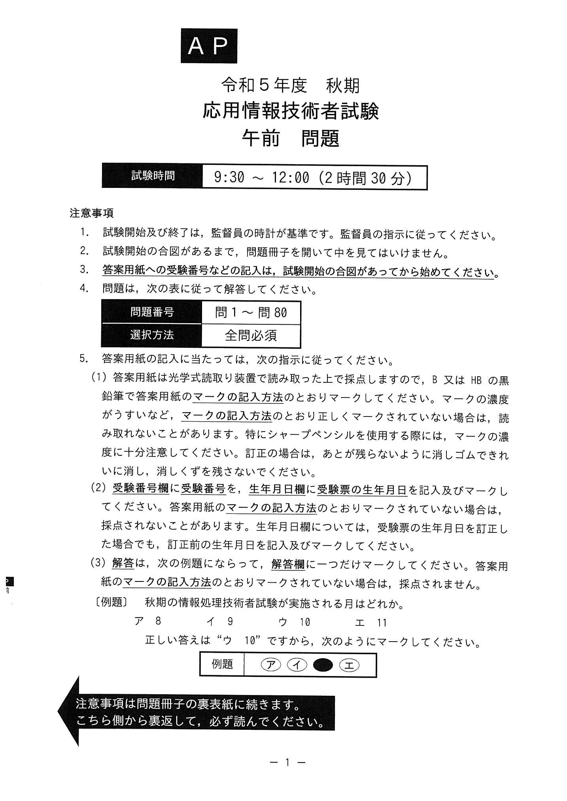

テキスト (OCR)

令和5年度 秋期
応用情報技術者試験
午前 問題

 9:30 ~ 12:00 (2時間 30 分)

1. 試験開始及び終了は, 監督貞の時計が基準です。監督貞の指示に従ってください、。

2. 試験開始の合図があるまで, 問題冊子を開いて中を見てはいけません。

3. 答案用紙への受験番号などの記入は, 試験開始の合図があってから始めてください。

4. 問題は, 次の表に従って解答してください。

問題番号    fi] 1 ~ fl 80

選択方法    全問必須
答案用紙の記入に当たっては, 次の指示に従ってください。

(1) 答案用紙は光学式読取り装置で読み取った上で採点しますので, B 又は HB の黒
鉛筆で答案用紙のマークの記入方法のとおりマークしてください。マークの濃度
がうすいなど, マークの記入方法のとおり正しくマークされていない場合は, 読
み取れないことがあります。特にシャープペンシルを使用する際には, マークの濃
度に十分注意してください。訂正の場合は, あとが残らないように消しゴムできれ
いに消し, 消しくずを残さないでください。

(2) 受験番号欄に受験番号を, 生年月日欄に受験票の生年月日を記入及びマークし
てください。答案用紙のマークの記入方法のとおりマークされていない場合は,
採点されないことがあります。生年月日欄については, 受験票の生年月日を訂正し
た場合でも, 訂正前の生年月日を記入及びマークしてください。

(3) 解答は, 次の例題にならって, 解答欄に一つだけマークしてください。 答案用
紙のマークの記入方法のとおりマークされていない場合は, 採点されません。

〔例題) 秋期の情報処理技術者試験が実施される月はどれか。

ア 8    イ 9    ウ 10    xr 14
正しい答えは “ウ 10” ですから, 次のようにマークしてください。

例題 | DOOD

on

注意事項は問題冊子の裏表紙に続きます。
こちら側から裏返して, 必ず読んでください。

### ページ 2

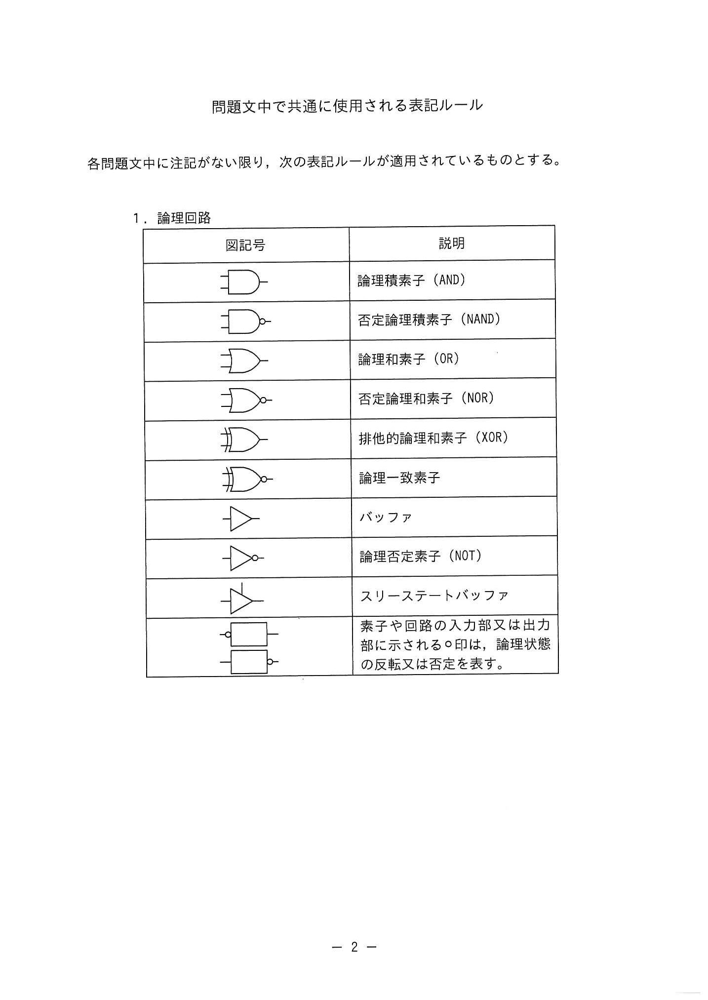

テキスト (OCR)

問題文中で共通に使用される表記ルール

各問題文中に注記がない限り, 次の表記ルールが適用されているものとする。

1. 論理回路

ne
nn
tu
MD

説明

論理積素子 (AND)

否定論理積素子 (NAND)

論理和素子 (OR)

否定論理和素子 (NOR)

排他的論理和素子 (XOR)

論理一致素子

バッファ

論理否定素子 (NOT)

スリーステートバッファ

素子や回路の入力部又は出力
部に示されるo印は, 論理状態
の反転又は否定を表す。

THJYIYIYMVMVMU

### ページ 3

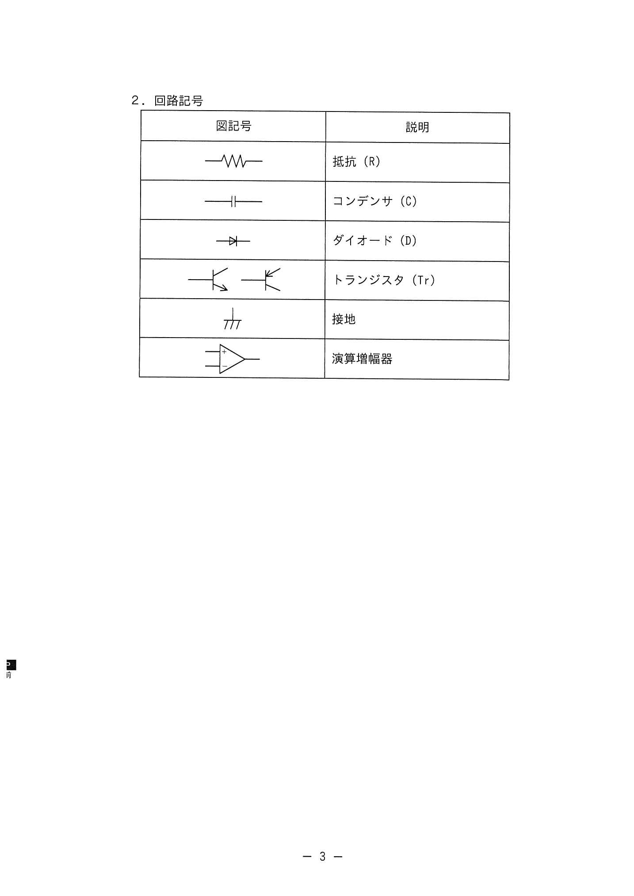

テキスト (OCR)

説明

抵抗 (R)

コンデンサ (C)

ダイオード (D)

トランジスタ (Tr)

接地

演算増幅器

hd

### ページ 4

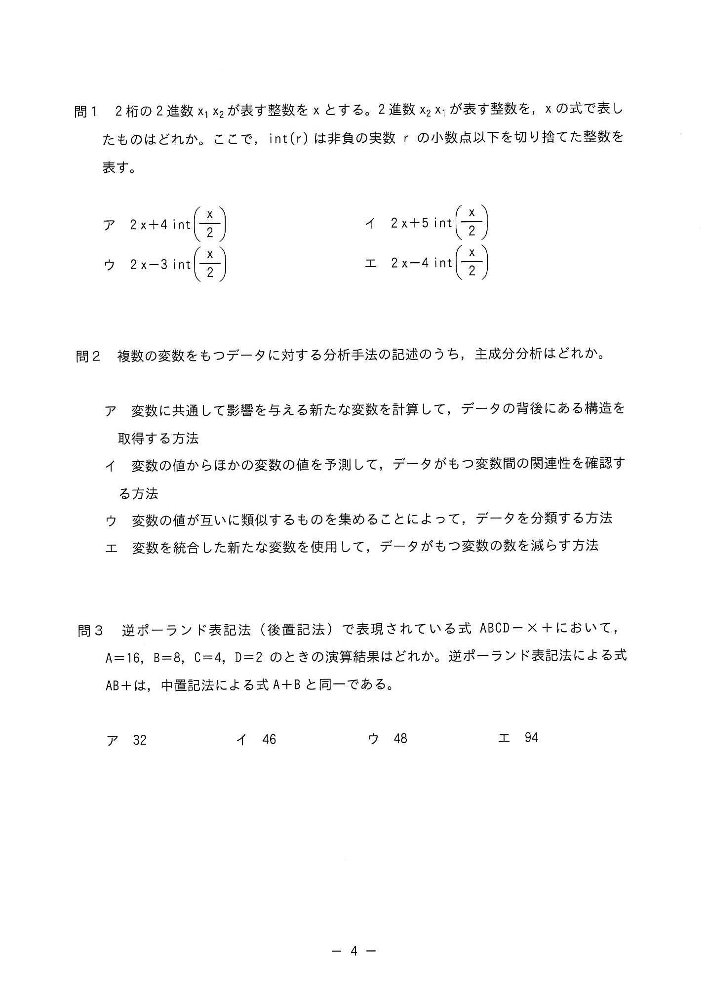

テキスト (OCR)

問1 2桁の2進数 x) x。 が表す整数を x とする。2 進数 x。 x, が表す整数を, x の式で表し
たものはどれか。ここで, int(r) は非負の実数 r の小数点以下を切り捨てた整数を
表す。

X

| =

ア 2x+4 im[ )       イ 2x十5int

(

nm
nm

に3
に3

ie
nN

ウ 2x-3 m[

間2 複数の変数をもつデータに対する分析手法の記述のうち, 主成分分析はどれか。

ア 変数に共通して影響を与える新たな変数を計算して, データの背後にある構造を
取得する方法

イ 変数の値からほかの変数の値を予測して, データがもつつ変数問の関連性を確認す
る方法

ウ 変数の値が互いに類似するものを集めることによって, データを分類する方法

エ 変数を統合した新たな変数を使用して, データがもつ変数の数を減らす方法

問3 逆ポーランド表記法 (後置記法) で表現されている式 ABCD一メX十において,
A=16, B=8, C=4, D=2 のときの演算結果はどれか。逆ポーランド表記法による式
AB十は, 中置記法による式A十B と同一である。

### ページ 5

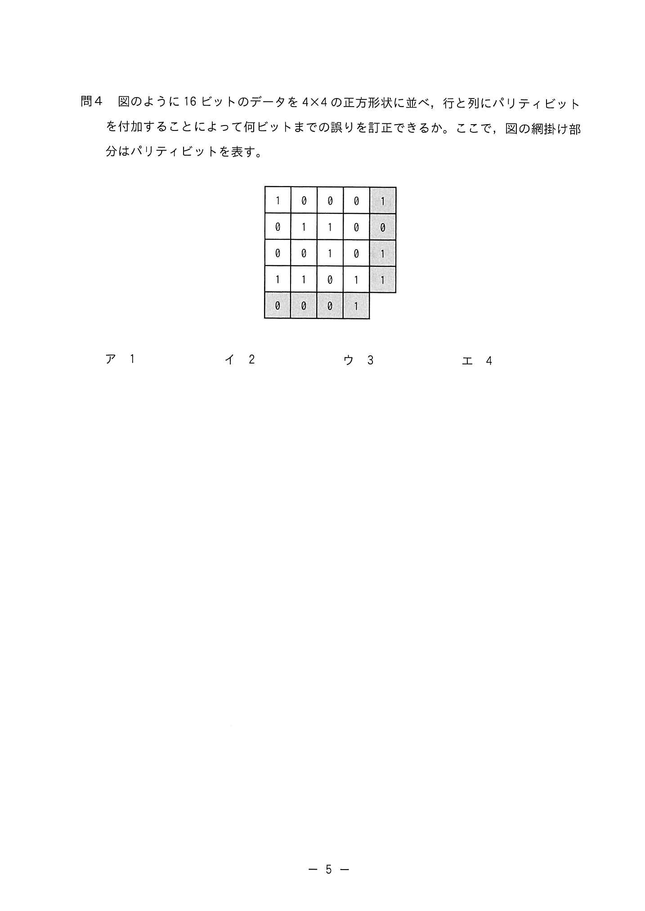

テキスト (OCR)

間4 図のように 16 ビットのデータを 4X4 の正方形状に並べ, 行と列にパリティビット
を付加することによって何ビットまでの誤りを訂正できるか。ここで, 図の網掛け部
分はパリティビットを表す。

119|1919| 1
9111119|9
91 9 11191|1
111191 141
9 | 9 | 9 | 1
ア 1   4 2   ウ 3   エ 4

### ページ 6

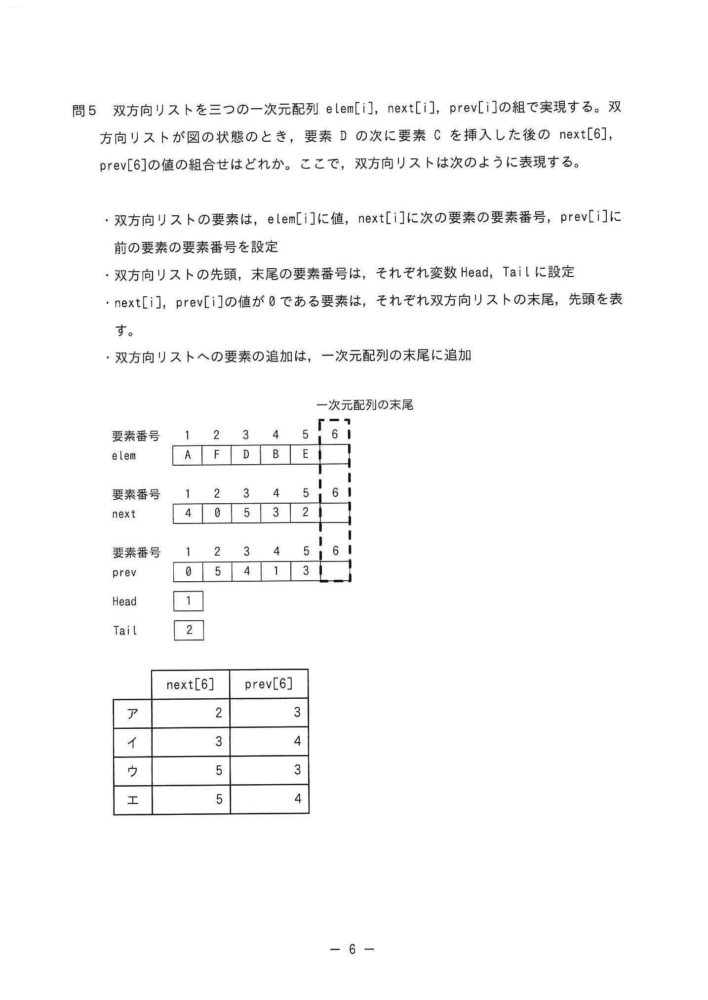

テキスト (OCR)

FAS 双方向リストを三つの一次元配列 elem[i], next[i], prev[i]の組で実現する。双
方向リストが図の状態のとき, BRD の次に要素 C を挿入した後の next[6],
prev[6]の値の組合せはどれか。ここで, 双方向リストは次のように表現する。

・ 双方向リストの要素は, elem[i]に値, next[i]に次の要素の要素番号, prev[i]に
前の要素の要素番号を設定

・ 双方向リストの先頭, 末尾の要素番号は, それぞれ変数 Head, Tail に設定
・next[i], prevy[i]の値が 0 である要素は, それぞれ双方向リストの未尾, 先頭を表

す。

・双方向リストへの要素の追加は, 一次元配列の末尾に追加

ー次元配列の末尾
BRES 1 2 3 4 5 「
elem [AlFlplBlE |
BRES 1     5 4 stat
next [4|lelslslz  |
要素番号 1 2 3 4 «546
mw LelslslilsT 1
Head
Tail
next[6] | prev[6]
ア              3
4              4
ウ              3
=              4

### ページ 7

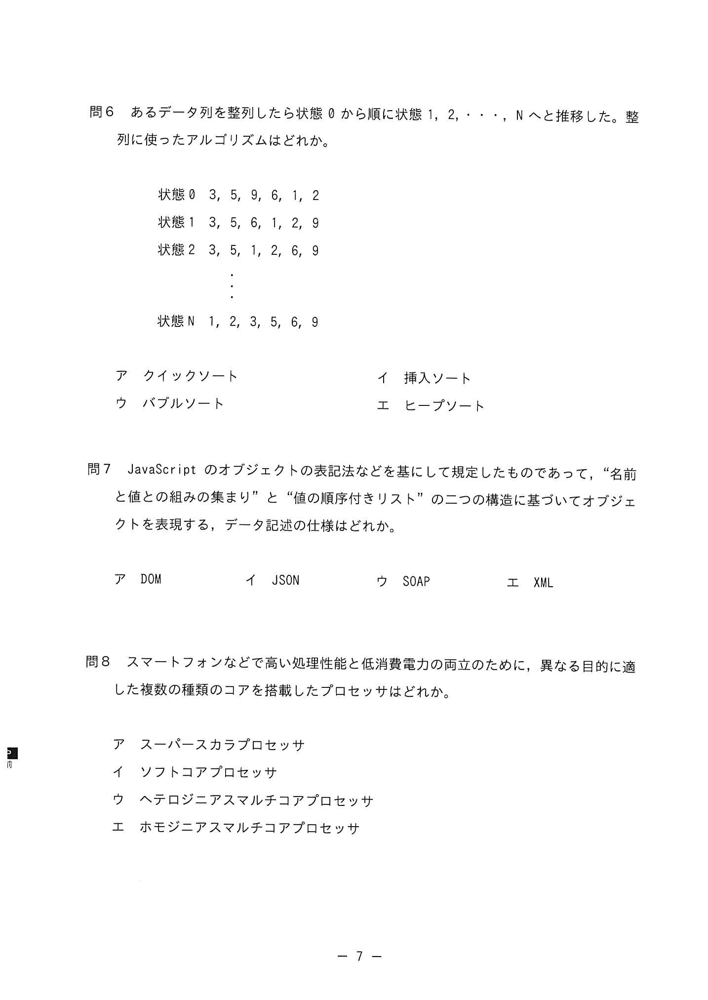

テキスト (OCR)

問6 あるデータ列を整列したら状態 9 から順に状態 1、2, ・・・, N へと推移した。整
列に使ったアルゴリズムはどれか。

状態6 3, 5, 9, 6, 1, 2
状態1 3, 5, 6, 1, 2, 9

状態2 3, 5, 1, 2, 6, 9

TREN 1, 2, 3, 5, 6, 9

ア クイッタツート        イ 挿入ソート
ウ バブルソート         m= ヒープソート

間 7 JavaScript のオブジェクトの表記法などを基にして規定したものであって, “名前
と値との組みの集まり” と “値の順序付きリスト"” の二つの構造に基づいてオブジェ
クトを表現する, データ記述の仕様はどれか。

ア DOM     イ JSON     ウ SOAP     エ XML

M8 スマートフォンなどで高い処理性能と低消費電力の両立のために, 異なる目的に適
した複数の種類のコアを搭載したプロセッサはどれか。

に|

スーパースカラプロセッサ
ソフトコアプロセッサ

へテロジニアスマルチコアプロセッサ

「画

Ho ユ

ホモジニアスマルチコアプロセッサ

### ページ 8

テキスト (OCR)

BQ パイプラインの性能を向上させるための技法の一つで, 分岐条件の結果が決定する
前に, 分岐先を予測して命令を実行するものはどれか。

ア アウトオブオーダー実行      イ 遅延分岐

ウ 投機実行             エ レジスタリネーミング

BIO ファイルシステムをフラッシュメモリで構成するとき, ブロックごとの書換え回数
を管理することによって, フラッシュメモリの寿命を延ばす技術はどれか。

に|

ウェアレベリング
ジャーナリング

デジラグ

H GN

ライトアンプリフィケーション

問11 画面表示用フレームバッファがユニファイドメモリ方式であるシステムの特徴はど
れか。

NI

主記憶とは別に専用のフレームバッファをもつ。

主記憶の一部を表示領域として使用する。

シリアル接続した表示デバイスに, 描画コマンドを用いて表示する。
表示リフレッシュが不要である。

H GS

### ページ 9

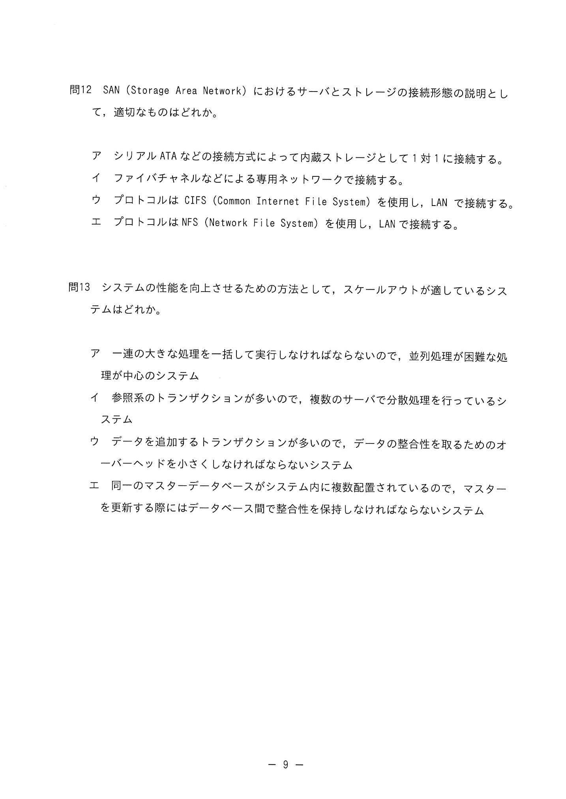

テキスト (OCR)

問12 SAN (Storage Area Network) におけるサーバとストレージの接続形態の説明とし
て, 適切なものはどれか。

に|

シリアル ATA などの接続方求によって内蔵ストレージとして1対1に接続する。
ファイバチャネルなどによる専用ネットワークで接続する。

プロトコルは CIFS (Common Internet File System) を使用し, LAN で接続する。
プロトコルはNFS (Network File System) を使用し, LAN で接続する。

Ho ユ

FNS システムの性能を向上させるための方法として, スケールアウトが適しているシス
テムはどれか。

ア 一連の大きな処理を一括して実行しなければならないので, 並列処理が困難な処
理が中心のシステム

4 参照系のトランザクションが多いので, 複数のサーバで分散処理を行っているシ
ステム

ウ データを追加するトランザクションが多いので, データの整合性を取るためのオ
ーバーヘッドを小さくしなければならないシステム

工 同一のマスターデータベースがシステム内に複数配置されているので, マスター
を更新する除にはデータベース間で整合性を保持しなければならないシステム

### ページ 10

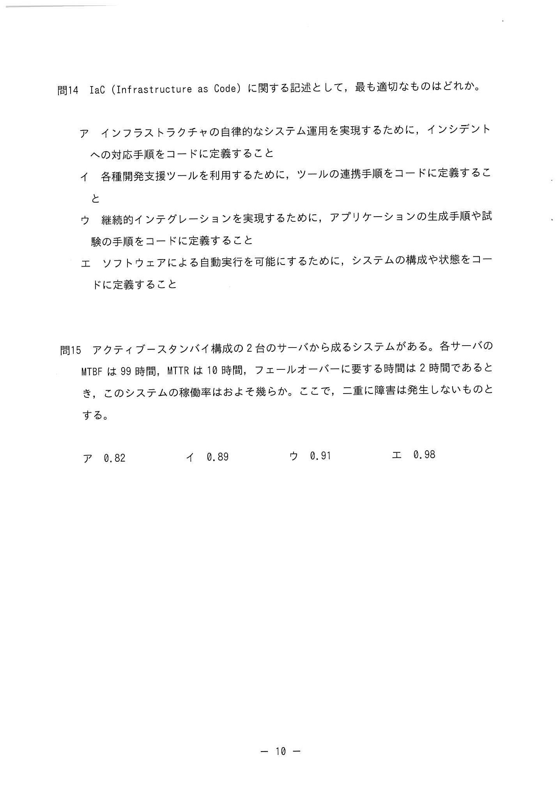

テキスト (OCR)

間14 IaC (Infrastructure as Code) に関する記述として, 最も適切なものはどれか。

ア インフラストラクチャの自律的なシステム運用を実現するために, インシデント
への対応手順をコードに定義むせすること

イ 各種開発支援ツールを利用するために, ツールの連携手順をコードに定義するこ
a

ウ 継続的インテグレーションを実現するために, アプリケーションの生成手順や試
験の手順をコードに定義すること

エ ソフトウェアによる自動実行を可能にするために, システムの構成や状態をコー
ドに定義むせすること

間15 アクティブースタンバイ構成の 2 台のサーバから成るシステムがある。各サーバの
MTBF は 99 BERS, MTTR は 10 時間, フェールオーバーに要する時間は 2 時間であると
き, このシステムの乏働率はおよそ幾らか。ここで, 二重に障害は発生しないものと
する。

ア 0,82     4 0.89     ウ 0.91     エ 0.98

ー 19 一

### ページ 11

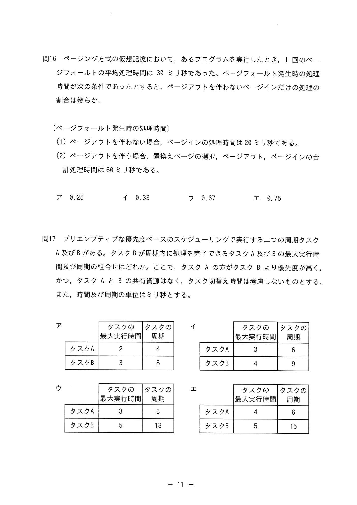

テキスト (OCR)

間16 ページング方式の仮想記憶において, あるプログラムを実行したとき, 1 回のペー
ジフォールトの平均処理時間は 30 ミリ秒であった。ページフォールト発生時の処理
時間が次の条件であったとすると, ページアウトを伴わないページインだけの処理の
割合は幾らか。

〔[ページフォールト発生時の処理時間]
(1) ページアウトを伴わない場合, ページインの処理時間は 29 ミリ秒である。
(2) ページアウトを伴う場合, 置換えページの選択, ページアウト, ページインの合

計処理時間は 69 ミリ秒である。

ア 0.25     イ 0.33     ウ 0.67     エ 0.75

間17 プリエンプティブな優先度ベペースのスケジューリングで実行する二つの周期タスク
A 及び B がある。 タスク B が周期内に処理を完了できるタスクA及びB の最大実行時
間及び周期の組合せはどれか。ここで, タスク A の方がタスク B より優先度が高く,
かつ, タスクA とB の共有資源はなく, タスク切替え時間は考慮しないものとする。
また, 時間及び周期の単位はミリ秒とする。

ア      タスクの |タスクの  イ      タスクの |タスクの
最大実行時間| 周期                最大実行時間| 周期
タスクA   2    4      タスクA   3    6
タスクB   3    8      タスクB   4    9
ウ      タスクの |タスクの  エ      タスクの |タスクの
最大実行時間| 周期                最大実行時間| 周期
タスクA   3    5      タスクA   4    6
タスクB   5    13      タスクB   5    15

### ページ 12

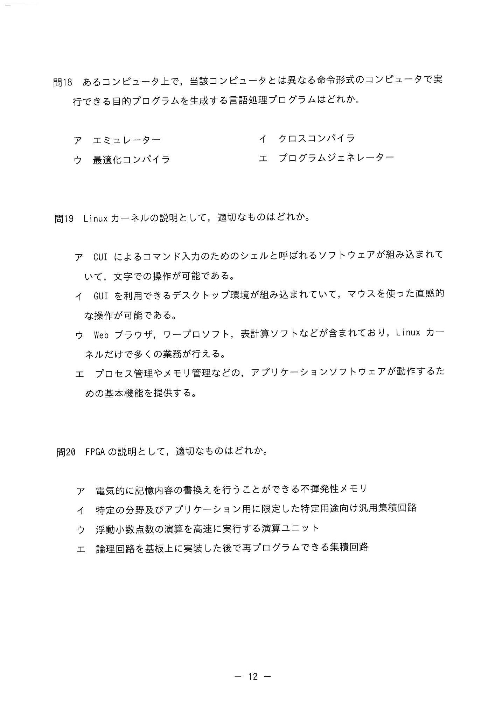

テキスト (OCR)

PAIS あるコンピュータ上で, 当該コンピュータとは異なる命令形式のコンピュータで実
行できる目的プログラムを生成する言語処理プログラムはどれか。

ア エミュレーター             イ クロスコンパイラ

ウ 最適化コンパイラ       エエ プログラムジェネレーター

間19 Linux カーネルの説明として, 適切なものはどれか。

ア CUI によるコマンド入力のためのシェルと呼ばれるソフトウェアが組み込まれて
いて, 文字での操作が可能である。

イ GUI を利用できるデスクトップ環境が組み込まれていて, マウスを使った直感的
な操作が可能である。

ウ Web ブラウザ, ワープロソフト, 表計算ソフトなどが含まれており, Linux カー
ネルだけで多くの業務が行える。

エ プロセス管理やメモリ管理などの, アプリケーションソフトウェアが動作するた
めの基本機能を提供する。

間20 FPGAの説明として, 適切なものはどれか。

に|

電気的に記憶内容の書換えを行うことができる不揮発性メモリ

特定の分野及びアプリケーション用に限定した特定用途向け汎用集積回路
浮動小数点数の演算を高速に実行する演算ユニット

論理回路を基板上に実装した後で再プログラムできる集積回路

H 寺 ユ

### ページ 13

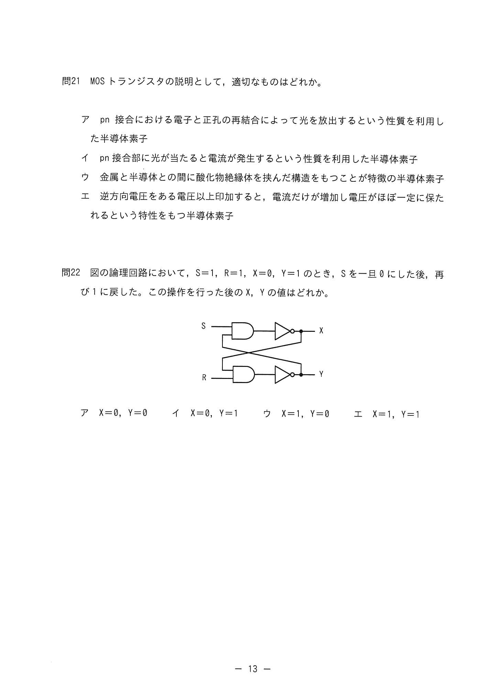

テキスト (OCR)

間21 MOS トランジスタの説明として, 適切なものはどれか。

ア pn 接合における電子と正孔の再結合によって光を放出するという性質を利用し
た半導体素子

イ pn接合部に光が当たると電流が発生するという性質を利用した半導体素子

ウ 金属と半導体との間に酸化物絶縁体を挟んだ構造をもつこと が特徴の半導体素子

エ 逆方向電圧をある電圧以上印加すると, 電流だけが増加し電圧がほぼ一定に保た
れるという特性をもつ半導体素子

間22 図の論理回路において, S=1, R=1, X=0, Y=ニ1 のとき, $S を一且 0 にした後, 再
び 1 に戻した。 この操作を行った後の X, Y の値はどれか。

S 一        x

ア X=0, Y=0   4 X=0, Y=1   ウ X=1, Y=0   x= X=1, Y=1

### ページ 14

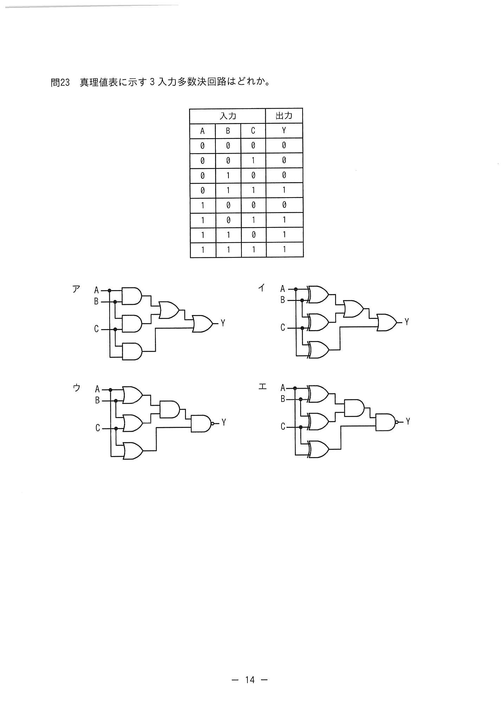

テキスト (OCR)

間23 真理値表に示す 3 入力多数決回路はどれか。

入力  出力

A B C ng

9 9 9 9

0 9 1 9

9 1 9 9

9 1 1 1

1 9 9 9

1 9 1 1

1 1 Q 1

1 1 1 1

Py        tA
TT        B
CH     '   ¢
7 ho       エ A
B         B
‘Ts   |   7

### ページ 15

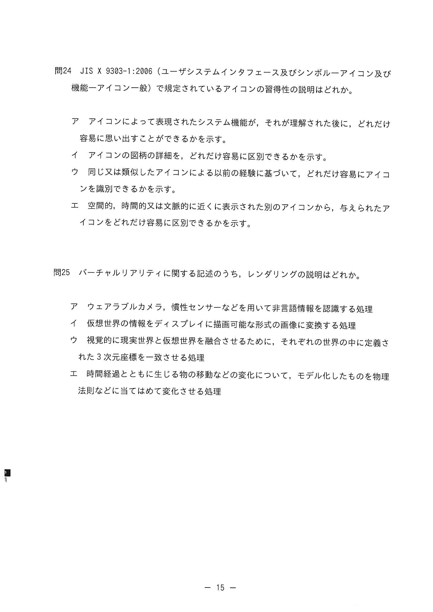

テキスト (OCR)

a

問24 JIS X 9303-1:2006 (ユーザシステムインタフェース及びシンボルーアイコ ン及び
機能一アイコン一般) で規定されているアイコンの習得性の説明はどれか。
ア アイコンによって表現されたシステム機能が. それが理解された後に, どれだけ
容易に思い出すことができるかを示す。
イ アイコンの図柄の詳細を, どれだけ容易に区別できるかを示す。
ウ 同じ又は類似したアイコンによる以前の経験に基づいて, どれだけ容易にアイコ
ンを識別できるかを示す。
エ 空間的, 時間的又は文脈的に近くに表示された別のアイコンから, 与えられたア
イコンをどれだけ容易に区別できるかを示す。

問25 バーチャルリアリティに関する記述のうち, レンダリングの説明はどれか。
ア ウェアラブルカメラ, 慣性センサーなどを用いて非言語情報を認識する処理

イ 仮想世界の情報をディスプレイに描画可能な形式の画像に変換する処理

ウ 視覚的に現実世界と仮想世界を融合させるために, それぞれの世界の中に定義さ
れた 3 次元座標を一致させる処理

エ 時間経過とともに生じる物の移動などの変化について, モデル化したものを物理
法則などに当てはめて変化させる処理

### ページ 16

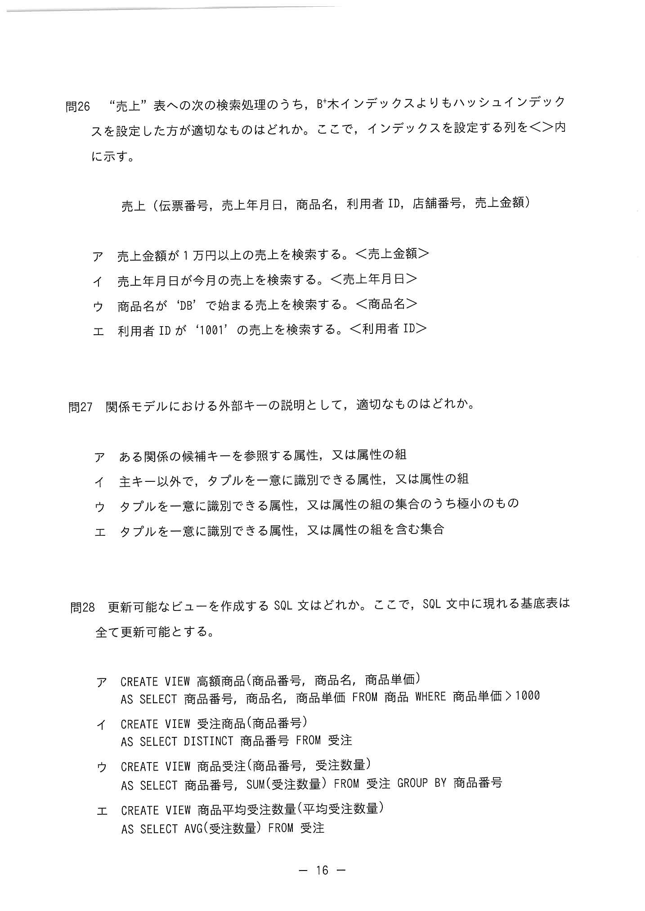

テキスト (OCR)

問26

“売上” 表への次の検索処理のうち, B*木インデックスよりもハッシュインデック

スを設定した方が適切なものはどれか。ここで, インデックスを設定する列をベツ内

に示す。

に|

H ユ

売上 (伝票番号, 売上年月日, 商品名 利用者 D, 店舗番号, 売上金額)

売上金額が 1 万円以上の売上を検索する。 ご売上金額>
売上年月日が今月の売上を検索する。ぐ売上年月日>
商品名が ‘DB で始まる売上を検索する。ぐ商品名
利用者ID が "1991′ の売上を検索する。ぐ利用者 ID>

27 関係モデルにおける外部キーの説明として, 適切なものはどれか。

に|

H ユ

ある関係の候補キーを参照する属性, 又は属性の組

主キー以外で, タプルを一意に識別できる属性, 又は属性の組

タプルを一意に識別できる属性, 又は属性の組の集合のうち極小のもの
タプルを一意に識別できる属性, 又は局性の組を含む集合

問28 更新可能なビューを作成する SOL 文はどれか。ここで, SOL 文中に現れる基底表は
全て更新可能とする。

に|

CREATE VIEW 高額商品(商品番号, 商品名, 商品単価)
AS SELECT 商品番号, 商品名, 商品単価 FROM 商品 WHERE 商品単価>1000

CREATE VIEW 受注商品(商品番号
AS SELECT DISTINCT 商品番号 FROM 受注

CREATE VIEW 商品受注(商品番号, 受注数量)
AS SELECT 商品番号, SUM(受注数量) FROM 受注 GROUP BY 商品番号

CREATE VIEW 商品平均受注数量(平均受注数量)
AS SELECT AVG(受注数量) FROM 受注

### ページ 17

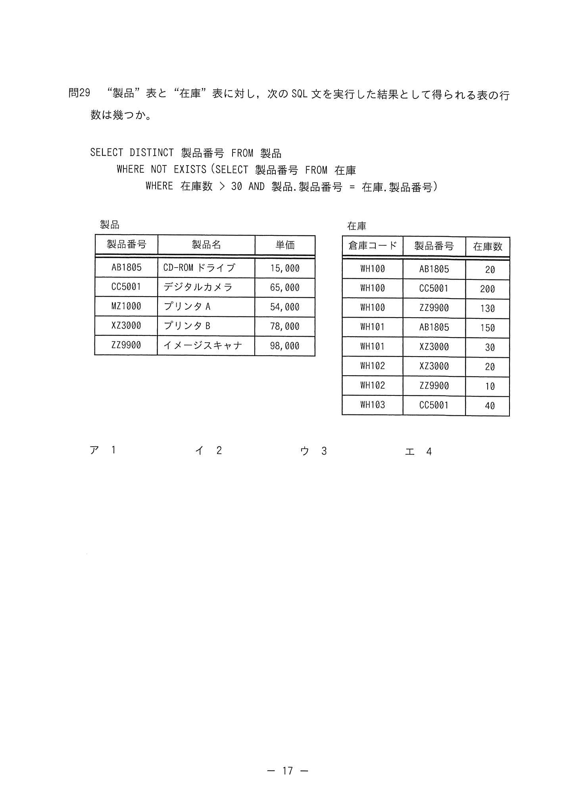

テキスト (OCR)

問29 "製品" 表と“在庫” 表に対し, RO SOL 文を実行した結果として得られる表の行
数は幾つか。

SELECT DISTINCT 製品番号 FROM 製品
WHERE NOT EXISTS (SELECT 製品番号 FROM 在庫
WHERE 在庫数 > 30 AN 製品.製品番号 = 在庫.製品番号)

製品                                                          在庫
製品番号            製品名              単価              倉庫コード | 製品番号 | 在庫数

AB1805 | CD-ROMドライブ        15, 000             WH100        AB1805        20
CC5001 | デジタルカメラ      65, 000         WH100     CC5001     200
MZ1009 | プリンタA               54, 000                WH100         229900        130
XZ3099 | プリンタB               78, 000                WH101         AB1805        150
779900 | イメージスキャナ    98, 000         WH101     xZ3000     30

WH102         XZ3000         20

WH102         229900         10

WH103         CC5001          40

ア 1 2                    ウ 3                    エ 4

### ページ 18

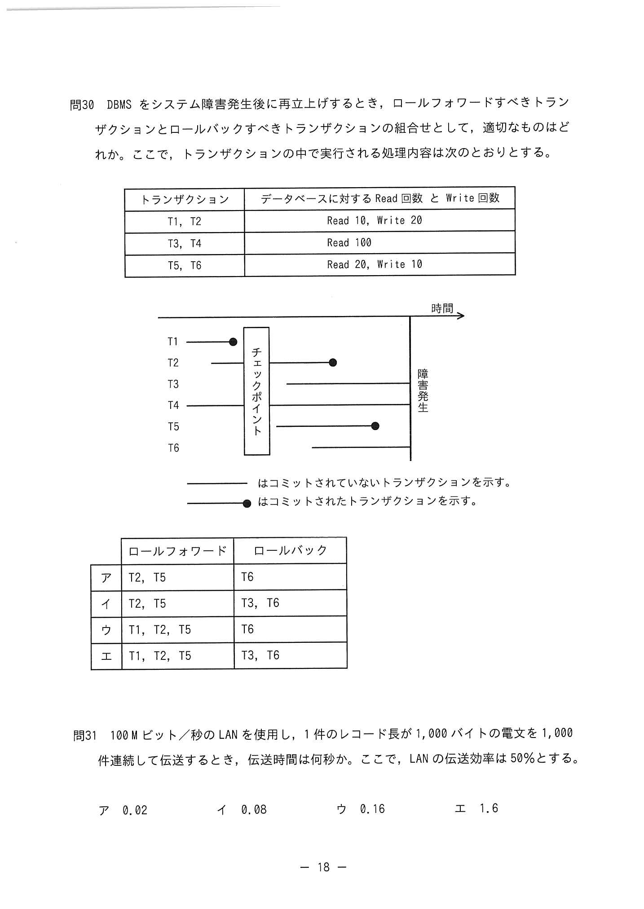

テキスト (OCR)

P30 DBMS をシステム障害発生後に再立エ上げするとき, ロールフォワードすべきトラン
ザクションとロールバックすべきトランザクションの組合せとして, 適切なかものはど
れか。ここで, トランザクションの中で実行される処理内容は次のとおりとする。

トランザクション | データベースに対する Read 回数 と Write回数
T1, T2                Read 10, Write 20
13, 14               Read 100
15, 16               Read 20, Write 10
時間
1 ——e
12          を       ー@
T5          ——
16

はコミットされていないトランザクションを示す。
ーーーー一@ はコミットされたトランザクションを示す。

ロールフォワード    ロールパック
ア | T2, 15        T6
4 | 72, T5        13, T6
ウ | 71, T2, T5     T6
下 | Ty 72) TS     T3, T6

問31 109Mビットン/秒の LAN を使用し, 1 件のレコード長が 1, 609 バイトの電文を 1,000
件連続して伝送するとき, 伝送時間は何秒か。ここで, LAN の伝送効率は 509%とする。

ア 9.02     イ 0,08     ウ 0.16     xz 1.6

### ページ 19

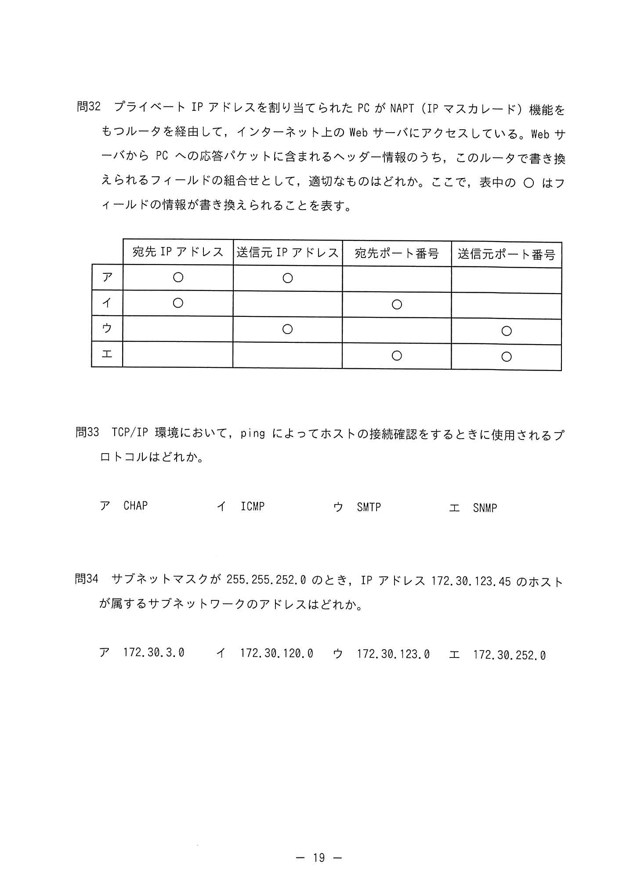

テキスト (OCR)

間32 プライベート IP アドレスを割り当てられた PC が NAPT (IP マスカレード) 機能を
もつルータを経由して, インターネット上の Web サーバにアクセスしている。Web +
ーバから PC への応答パケットに含まれるヘッダー情報のうち, このルータで書き換
えられるフィールドの組合せとして, 適切なものはどれか。ここで, 表中の 〇 はフ
ィールドの情報が書き換えられることを表す。

宛先 IP アドレス |送信元 IP アドレス| 宛先ポート番号 | 送信元ポート番号
ア        O             O
イ        O                            O
ウ                       oO                            O
Be                    O       O

間33 TCP/IP 環境において, ping によってホストの接続確認をするときに使用されるプ
ロトコルはどれか。

ア CHAP     イ TICMP     ウ SMTP     エエ SNMP

問34 サブネットマスクが 255.255.252.6 のとき, IP アドレス 172.30.123.45 のホスト

が属するサブネットワークのアドレスはどれか。

ア 172.30.3.0  イ 172.30.120.0 ウ 172.30.123.0 エ 172.39.252.0

### ページ 20

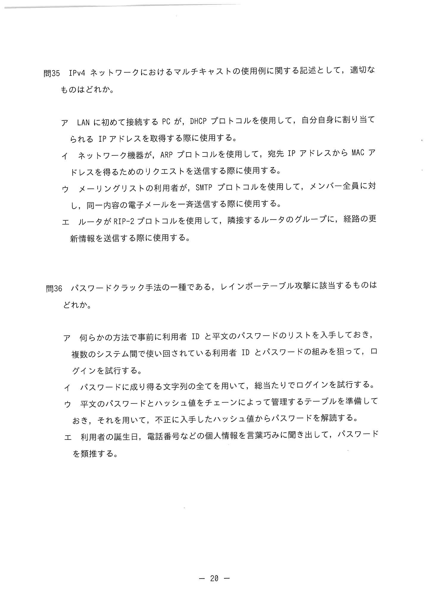

テキスト (OCR)

問35 IPv4 ネットワークにおけるマルチキャストの使用例に関する記述として, 適切な
ものはどれか。

ア LAN に初めて接続する PC AY, DHCP プロトコルを使用して, 自分自身に割り当て
られる IP アドレスを取得する際に使用する。

イ ネットワーク機器が, ARP プロトコルを使用して, 宛先IP アドレスから MAC ア
ドレスを得るためのリクエストを送信する際に使用する。

ウ メーリングリストの利用者が, SMTP プロトコルを使用して, メ ンバー全員に対
し, 同一内容の電子メールを一斉送信する際に使用する。

エ ルータが RIP-2 プロトコルを使用して, 隣接するルータのグループに, 経路の更
新情報を送信する際に使用する。

問36 パスワードクラック手法の一種である, レイ ンボーテーブル攻撃に該当するものは
どれか。

ア 何らかの方法で事前に利用者 ID と平文のパスワードのリス トを入手しておき,
複数のシステム間で使い回されている利用者 ID とパスワードの組みを狙って, ロ
グインを試行する。

イ パスワードに成り得る文字列の全てを用いて, 総当たりでログインを試行する。

ウ 平文のパスワードとハッシュ値をチェーンによって管理するテーブルを準備して
おき, それを用いて, 不正に入手したハッシュ値からパスワードを解読する。

エ 利用者の誕生日, 電話番号などの個人情報を言葉巧みに聞き出して, パスワード
を類推する。

### ページ 21

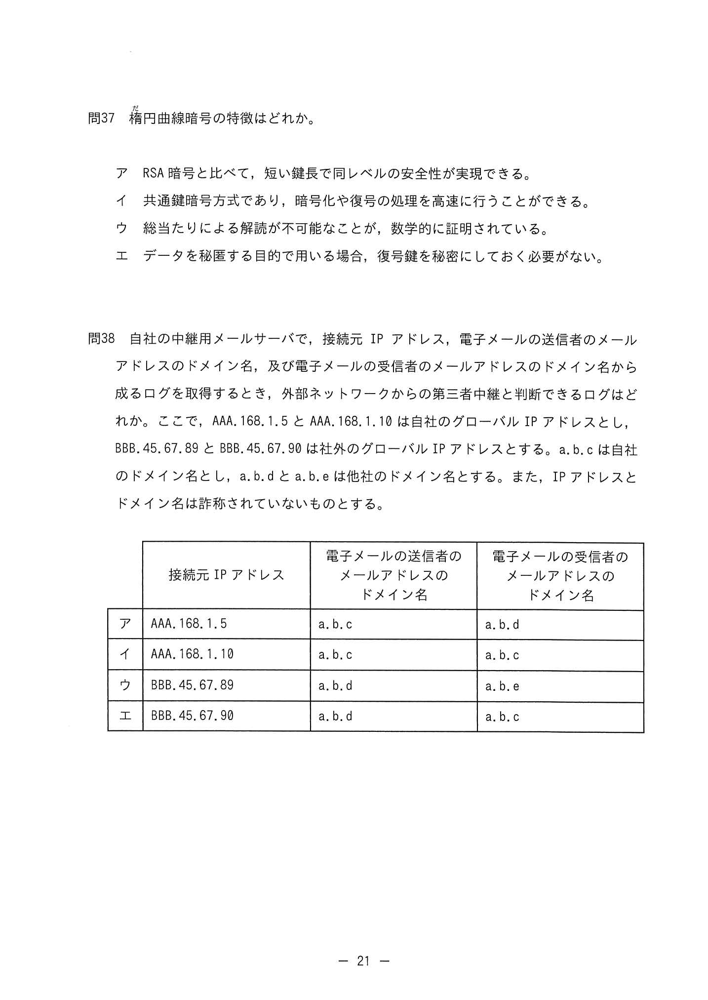

テキスト (OCR)

問37 権円曲線暗号の特徴はどれか。

|

H すさ て

RSA 暗号と比べて, 短い鍵長で同レベルの安全性が実現できる。
共通鍵暗号方式であり, 暗号化や復号の処理を高速に行うことができる。
総当たりによる解読が不可能なことが, 数学的に証明されている。

データを秘匿する目的で用いる場合 復号鍵を秘密にしておく必要がない。

間38 自社の中継用メールサーバで, Heise IP アドレス, 電子メールの送信者のメール

アドレスのドメイン名, 及び電子メールの受信者のメールアドレスのドメイン名から

成るログを取得するとき,

外部ネットワークからの第三者中継と判断できるログはど

れか。ここで, AAA.168.1.5 と AAA.168.1.19 は自社のグローバル IP アドレスとし

BBB.45.67.89 と BBB. 45.67.90 は社外のグローバル IP アドレスとする。a.b.c は自社
のドメイン名とし, a.b.d とa.b.e は他社のドメイン名とする。また, IP アドレスと
ドメイン名は詐称されていないものとする。

接続元 I『 アドレス

電子メールの送信者の
メールアドレスの

電子メールの受信者の
メールアドレスの

ドメイン名             ドメイン名
ア | AAA.168.1.5            .b.c                a.b.d
イ | AAA, 168.1. 10            «bie                 a.b.c
ウ | BBB. 45.67.89          .b.d              a.b.e
エ | BBB. 45.67.90          .b.d              a.b.c

### ページ 22

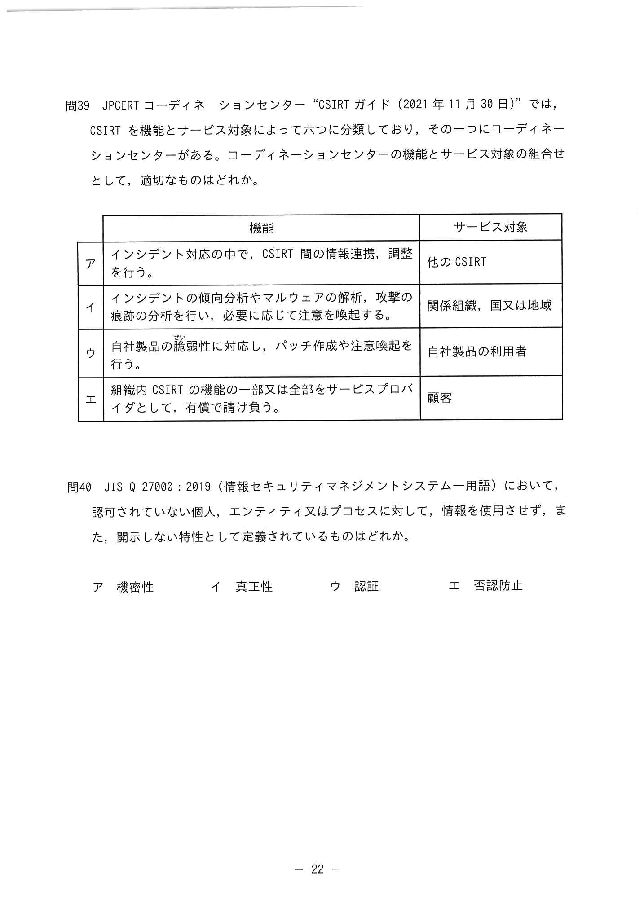

テキスト (OCR)

間39 JPCERT コーディネーションセンター “CSIRT ガイド (2021 年 11 月 39 日)” では,
CSIRT を機能とサービス対象によって六つに分類しており, その一つにコーディネー
ションセンターがある。コーディネーションセンターの機能とサービス対象の組合せ
ELT, 適切ながものはどれか。

機能               サービス対象
デア インシデント対応の中で, CSTRT 間の情報連携, 調整 他の CSIRT
を行う。
ィ インシデントの傾向分析やマルウェアの解析, 攻撃の 関係組織。 国又は地域

痕跡の分析を行い, 必要に応じて注意を喚起する。

4 BHM RORBIECHML, パッチ作成や注意喚起を 自社製品の利用者
行う。

組織内 CSIRT の機能の一部又は全部をサービスプロバ
イダとして, 有償で請け負う。

顧客

問49 JIS Q 27000: 2019 (情報セキュリティマネジメントシステムーー用語) において,
認可されていない個人, エンティティ又はプロセスに対して, 情報を使用させず, ま
た, 開示しない特性として定義されているものはどれか。

ア 機密性    イ 真正性    ウ 認証     エ 否認防止

### ページ 23

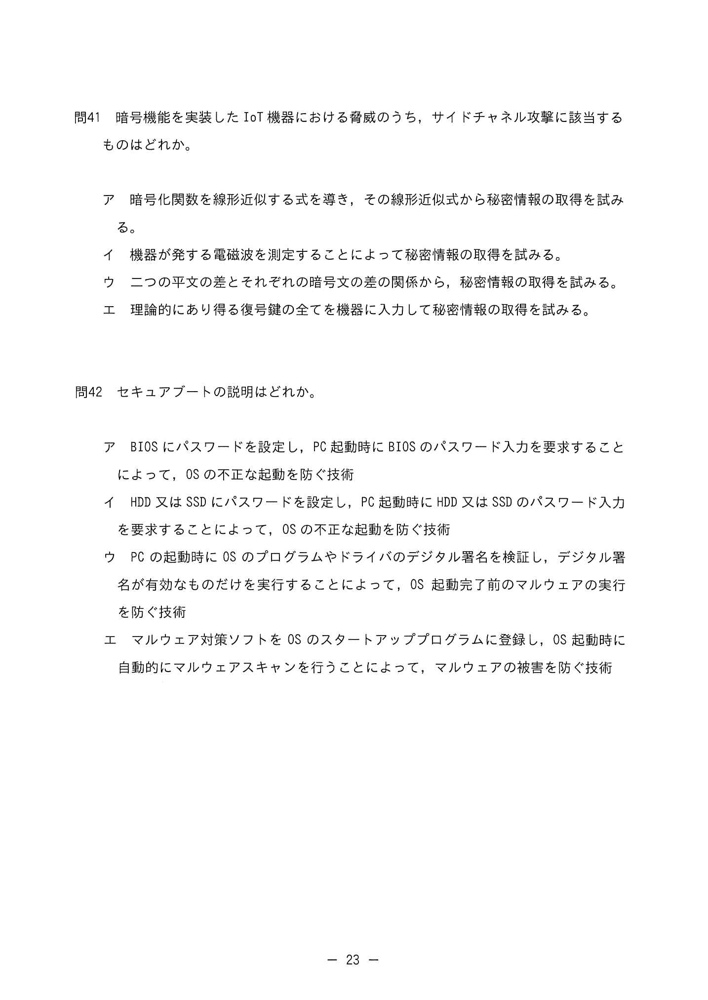

テキスト (OCR)

問41 暗号機能を実装した lol 機器における憎威のうち, サイドチャネル攻撃に該当する
ものはどれか。

ア 暗号化関数を線形近似する式を導き, その線形近似式から秘密情報の取得を試み
る。
機器が発する電磁波を測定することによって秘密情報の取得を試みる。
二つの平文の差とそれぞれの暗号文の差の関係から, 秘密情報の取得を試みる。
エ 理論的にあり得る復号鍵の全てを機器に入力して秘密情報の取得を試みる。

42 セキュアブートの説明はどれか。

ア BIOS にパスワードを設定し, PC 起動時に BIOS のパスワード入力を要求すること
によって, OS の不正な起動を防ぐ技術
4 HDD 又は SSD にパスワードを設定し, PC 起動時に HDD 又は SSD のパスワード入力
を要求することによって, 0S の不正な起動を防ぐ技術
ウ PC の起動時に OS のプログラムやドライバのデジタル署名を検証し, デジタル署
名が有効なものだけを実行することによって, OS 起動完了前のマルウェアの実行
を防ぐ技術
エ マルウェア対策ソフトを 0S のスタートアッププログラムに登録し, 0S 起動時に
自動的にマルウェアスキャンを行うことによって, マルウェアの被害を防ぐ技術

### ページ 24

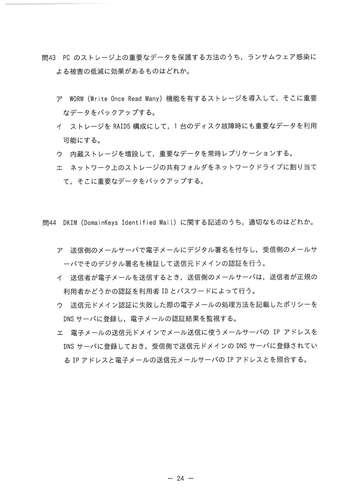

テキスト (OCR)

問43 PC のストレージ上の重要なデータを保護する方法のうち, ランサムウェア感染に
よる被害の低減に効果があるものはどれか。

ア WORM (Write Once Read Many) 機能を有するストレージを導入して, そこに重要
なデータをバックアップする。

イ ストレージを RAID5 構成にして, 1 台のディスク故障時にも重要なデータを利用
可能にする。

ウ 内蔵ストレージを増設して, 重要なデータを常時レプリケーションする。

DL ネットワーク上のストレージの共有フォルダをネットワークドライブに割り当て
て, そこに重要なデータをバックアップする。

P44 DKIM (DomainKeys Identified Mail) に関する記述のうち, 適切なものはどれか。

ア 送信側のメールサーバで電子メールにデジタル署名を付与し, 受信側のメールサ
ーバでそのデジタル署名を検証して送信元ドメインの認証を行う。

イ 送信者が電子メールを送信するとき, 送信側のメールサーバは, 送信者が正規の
利用者かどうかの認証を利用者 ID とパスワードによって行う。

ウ 送信元ドメイン認証に失敗した際の電子メールの処理方法を記載したポリシーを
DNS サーバに登録し, 電子メールの認証結果を監視する。

エ 電子メールの送信元ドメインでメール送信に使うメールサーバの IP アドレスを
DNS サーバに登録しておき, 受信側で送信元ドメインの DNS サーバに登録されてい
る IP アドレスと電子メールの送信元メールサーバの IP アドレスとを照合する。

### ページ 25

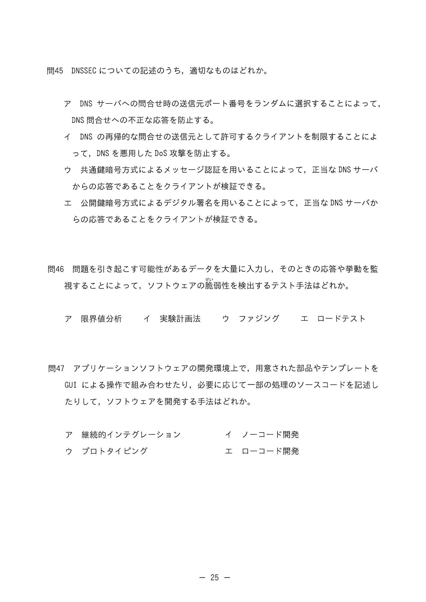

テキスト (OCR)

問45 DNSSEC についての記述のうち, 適切なものはどれか。

ア DNS サーバへの問合せ時の送信元ポート番号をランダムに選択することによって,
DNS 問合せへの不正な応答を防止する。

イ DNS の再帰的な問合せの送信元として許可するクライアントを制限することによ
って, DNS を悪用した DoS 攻撃を防止する。

ウ 共通鍵暗号方式によるメッセージ認証を用いることによって, 正当なDNS サーバ
からの応答であることをクライアントが検証できる。

エ 公開鍵暗号方式によるデジタル署名を用いることによって, 正当な DNS サーバか
らの応答であることをクライアントが検証できる。

問46 問題を引き起こす可能性があるデータを大量に入力し, そのときの応答や挙動を臣
視することによって, ソフトウェアの脆絹性を検出するテスト手法はどれか。

ア 限界値分析  イ 実験計画法  ウ ファジング  = ロードテスト

ml

間47 アプリケーションソフトウェアの開発環境上で, 用意された部品やテンプレートを
GUI による操作で組み合わせたり, 必要に応じて一部の処理のソースコードを記述し
たりして, ソフトウェアを開発する手法はどれか。

ア 継続的インテグレーション     4 ノーコード開発
ウ プロトタイピング         エ ローコード開発

### ページ 26

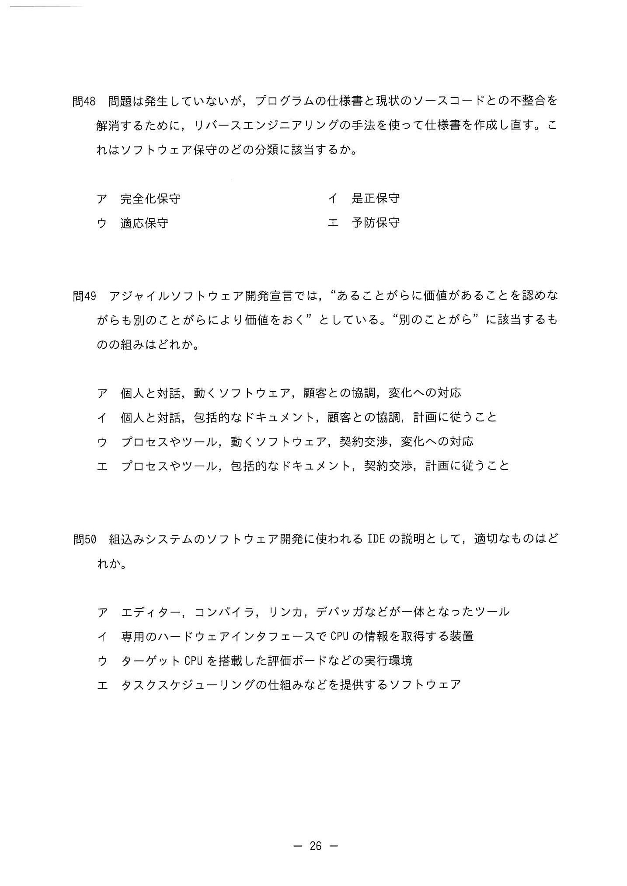

テキスト (OCR)

問48 問題は発生していないが, プログラムの仕様書と現状のソースコードとの不整合を
解消するために, リバースエンジニアリングの手法を使って仕様書を作成し直す。こ
れはソフトウェア保守のどの分類に該当するか。

完全化保守            イ 是正保守
ウ 適応保守             エ 予防保守

間49 アジャイルソフトウェア開発宣言では, "あることがらに価値があることを認めな
がらも別のことがらにより価値をおく" としている。“"別のことがら” に該当するも
のの組みはどれか。

に|

個人と対話, 動くソフトウェア, 顧客との協調。 変化への対応
4 個人と対話, 包括的なかドキュメント, 顧客との協調, 計画に従うこと
ウ プロセスやツール, 動くソフトウェア, 契約交渉, 変化への対応
エ プロセスやツール, 包括的なドキュメント, 契約交渉, 計画に従うこと

間50 組込みシステムのソフトウェア開発に使われる IDE の説明として, 適切なものはど
れか。

に|

エディター, コンパイラ, リンカ, デバッガなどが一体となったツール
専用のハードウェアインタフェースでCPU の情報を取得する装置

ターゲット CPU を搭載した評価ボードなどの実行環境

タスクスケジューリングの仕組みなどを提供するソフトウェア

HG A

### ページ 27

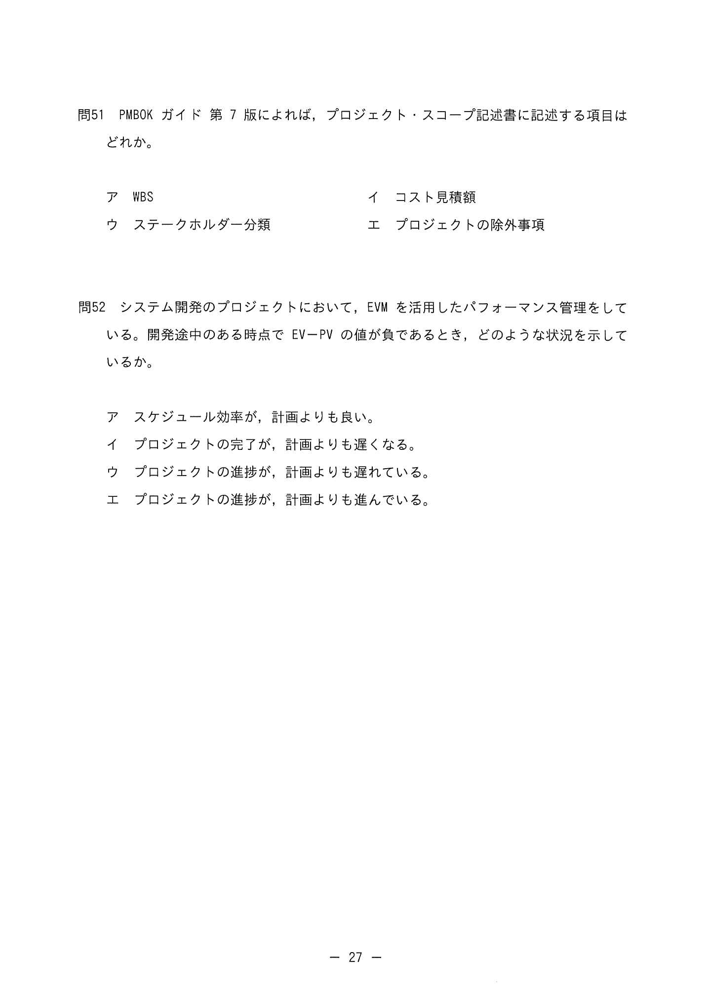

テキスト (OCR)

問51 PMBOK ガイド 第 7 版にによれば, プロジェクト・スコーブプ記述書に記述する項目は
どれか。

ア WBS               4 コスト見積額
ウ ステークホルダー分類       エ プロジェクトの除外事項

問52 システム開発のプロジェクトにおいて, EVM を活用したパフォーマンス管理をして
WS. 開発途中のある時点で EV一PV の値が負であるとき, どのような状況を示して
いるか。

に|

スケジュール効率が, 計画よりも良い。

プロジェクトの完了が, 計画よりも遅くなる。
プロジェクトの進捗が, 計画よりも遅れている。
プロジェクトの進捗が, 計画よりも進んでいる。

pul

H GAN

Dull

### ページ 28

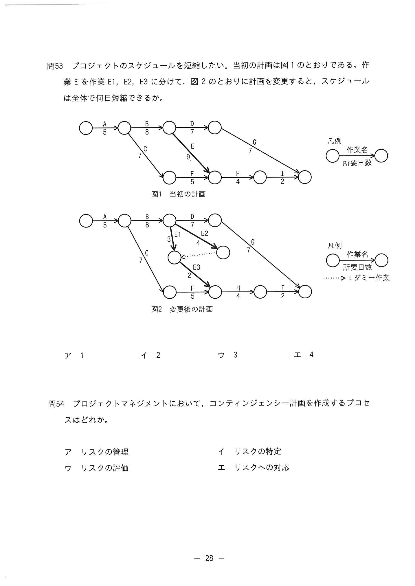

テキスト (OCR)

間53 プロジェクトのスケジュールを短縮したい。 当初の計画は図1 のとおりである。作
SEE を作業 E1, E2, E3 に分けて, 図 2 のとおりに計画を変更すると, スケジュール
は全体で何日短縮できるか。

図1 当初の計画

aN
TS
No
w
H
&

問54 プロジェクトマネジメントにおいて, コンティンジェンシー計画を作成するプロセ
スはどれか。

ア リスクの管理           イ リスクの特定
ウ リスクの評価           エ リスクへの対応

### ページ 29

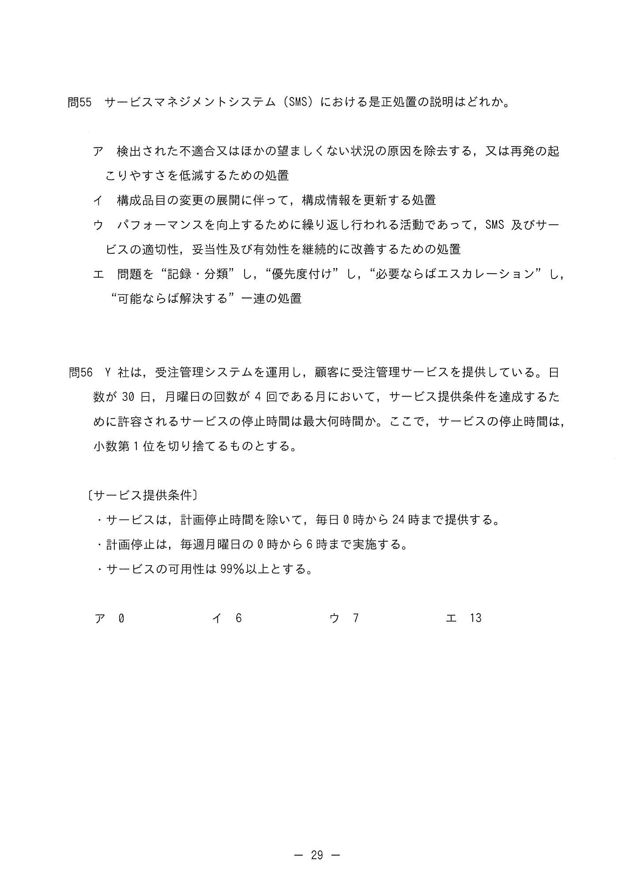

テキスト (OCR)

間55 サービスマネジメントシステム (SMS) における是正処置の説明はどれか。

ア 検出された不適合又はほかの望ましくない状況の原因を除去する, 又は再発の起
こりやすさを低減するための処置

イ 構成品目の変更の展開に伴って, 構成情報を更新する処置

ウ パフォーマンスを向上するために繰り返し行われる活動であって, SMS 及びサー
ビスの適切性, 妥当性及び有効性を継続的に改善するための処置

エ 問題を “記録・分類" し, “優先度付け" し, “必要ならばエスカレーション"し,
"可能ならば解決する"一連の処置

問56 Y 社は, 受注管理システムを運用し, 顧客に受注管理サービスを提供している。 日
数が 30 日, 月曜日の回数が 4 回である月において, サービス提供条件を達成するた
めに許容されるサービスの停止時間は最大何時間か。ここで, サービスの停止時間は,
小数第 1 位を切り捨てるものとする。

[サービス提供条件〕

・サービスは, 計画停止時間を除いて, 毎日9 時から 24 時まで提供する。
・ 計画停止は, 毎週月曜日の 9 時から 6 時まで実施する。

・サービスの可用性は 99%以上とする。

NI
S
SN
の
Nu
~
H

13

### ページ 30

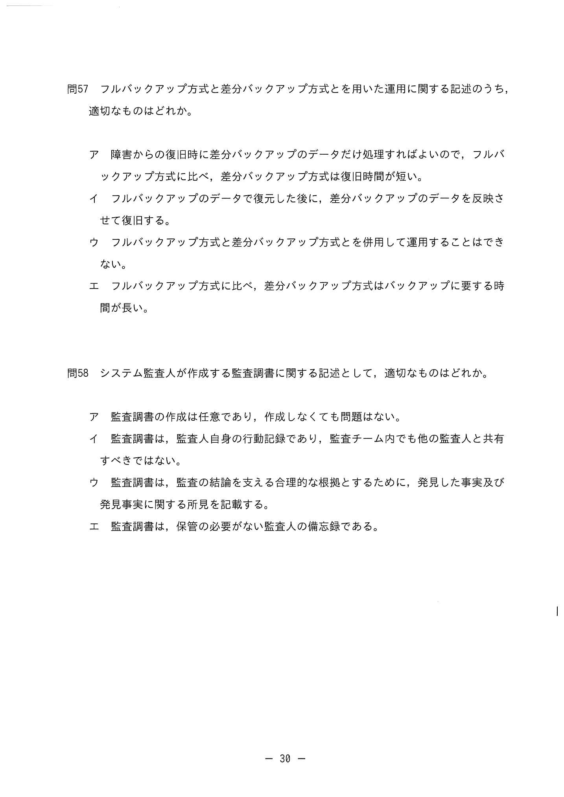

テキスト (OCR)

問57 フルバックアップ方式と差分バックアップ方式とを用いた運用に関する記述のうち
適切なものはどれか。

ア 障害からの復旧時に差分バックアップのデータだけ処理すればよいので, フルバ
ックアップ方式に比べ, 差分バックアップ方式は復旧時間が短い。

イ フルバックアップのデータで復元した後に, 差分バックアップのデータを反映さ
せて復旧する。

ウ フルバックアップ方式と差分バックアップ方式とを併用して運用することはでき
ない。

エ フルバックアップ方式に比べ, 差分バックアップ方式はバックアップに要する時
間が長い。

問58 システム監査人が作成する監査調書に関する記述として, 適切かものはどれか。

ア 監査調書の作成は任意であり, 作成しなくても問題はない。

イ 監査調書は, 監査人自身の行動記録であり, 監査チテーム内でも他の監査人と共有
すべきではない。

ウ 監査調書は, 監査の結論を支える合理的な根拠とするために, 発見した事実及び
発見事実に関する所見を記載する。

I 監査調書は, 保管の必要がない監査人の備忘録である。

### ページ 31

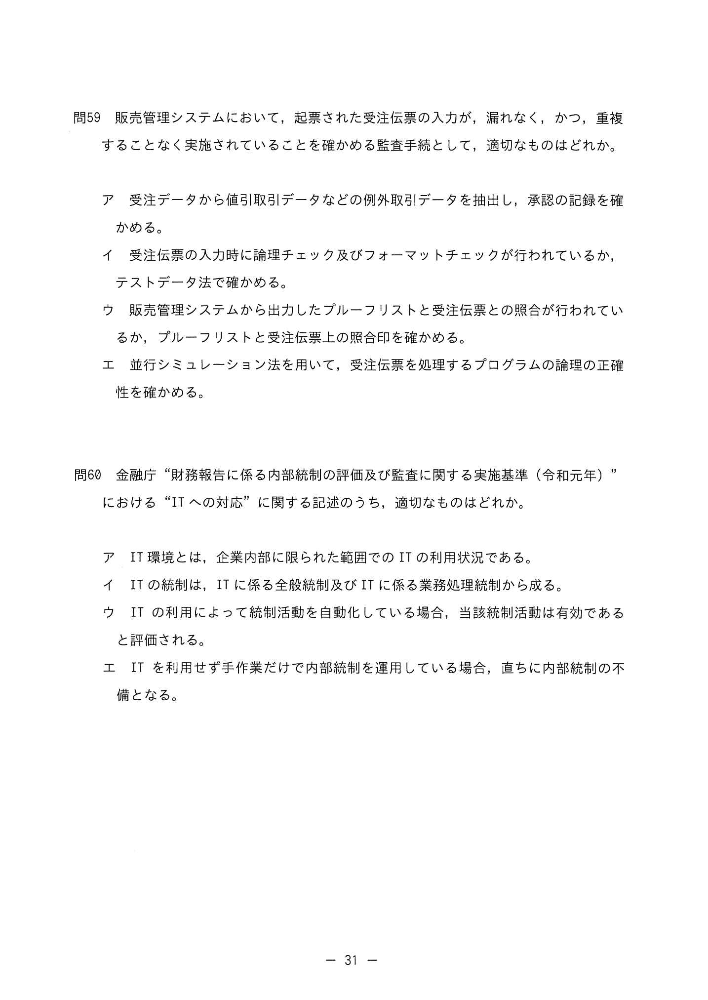

テキスト (OCR)

問59 販売管理システムにおいて, 起票された受注伝票の入力が, 漏れなく, DO, 重複
することなく実施されていることを確かめる監査手続として, 適切なものはどれか。

ア 受注データから値引取引データなどの例外取引データを抽出し, 承認の記録を確
かめる。

イ 受注伝票の入力時に論理チェック及びフォーマットチェックが行われているか,
テストデータ法で確かめる。

ウ 販売管理システムから出力したプルーフリストと受注伝票との照合が行われてい
BD, プルーフリストと受注伝票上の照合印を確かめる。

エ 並行シミュレーション法を用いて, 受注伝票を処理するプログラムの論理の正確
性を確かめる。

問69 金融庁 “財務報告に係る内部統制の評価及び監査に関する実施基準 (BATE) ”
における “1T への対応”" に関する記述のうち, 適切なものはどれか。

に|

IT 環境とは, 企業内部に限られた範囲での IT の利用状況である。

イ TITの統制は, IT に係る全般統制及び IT に係る業務処理統制から成る。

ウ IT の利用によって統制活動を自動化している場合, 当該統制活動は有効である
と評価される。

エ TIT を利用せず手作業だけで内部統制を運用している場合, 直ちに内部統制の不

備となる。

### ページ 32

テキスト (OCR)

間61 バックキャスティングの説明として, 適切なかものはどれか。

ア システム開発において, 先にプロジェクト要員を確定し, リソースの範囲内で優
先すべき機能から順次提供する開発手法

イ 前提として認識すべき制約を受け入れた上で未来のありたい姿を描き, 予想され
る課題や可能性を洗い出し解決策を検討することによって, ありたい姿に近づける
思考方法

ウ 組織において, 下位から上位への発議を受け付けて経営の意思決定に反映するマ
ネジメント手法

エ 投資戦略の有効性を検証する際に, 過去のデータを用いてどの程度の利益が期待
できるかをシミュレーションする手法

間62 A 社は, ソリューションプロバイダから, 顧客に対するワントゥワンマーケティン
グを実現する統合的なソリューションの提案を受けた。この提案に該当するソリュー
ションとして, 最も適切なものはどれか。

ア CRMソリューション         q HRMソリューション

ウ SCMソリューション              エ 財務管理ソリリューション

### ページ 33

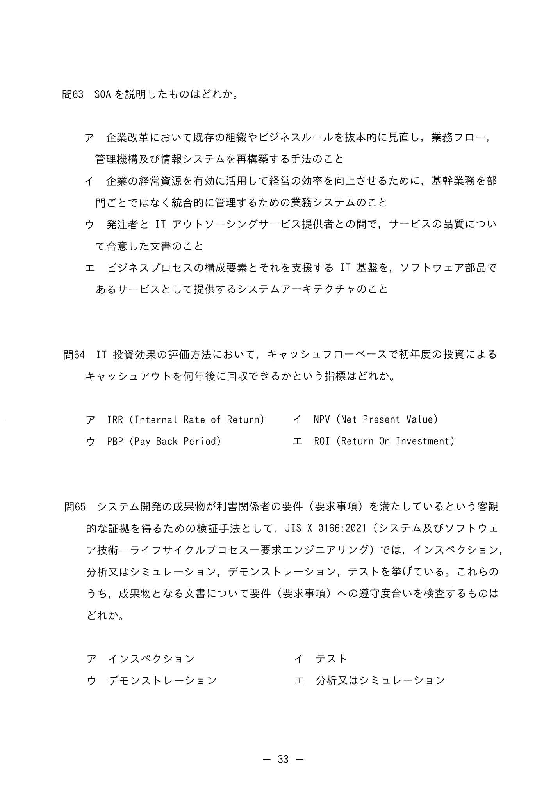

テキスト (OCR)

問63 SOAを説明したものはどれか。

ア 企業改革において既存の組織やビジネスルールを抜本的に見直し, 業務フロー

管理機構及び情報システムを再構築する手法のこと

イ 企業の経営資源を有効に活用して経営の効率を向上させるために, 基幹業務を部
門ごとではなく統合的に管理するための業務システムのこと

ウ 発注者と IT アウトソーシングサービス提供者との間で, サービスの品質につい
て合意した文書のこと

エ ビジネスプロセスの構成要素とそれを支援する IT BRE, ソフトウェア部品で
あるサービスとして提供するシステムアーキテクチャのこと

問64 IT 投資効果の評価方法において, キャッシュフローベースで初年度の投資による
キャッシュアウトを何年後に回収できるかという指標はどれか。

ア IRR (Internal Rate of Return)    4 NPV (Net Present Value)
ウ PBP (Pay Back Period)         X ROI (Return On Investment)

問65 システム開発の成果物が利害関係者の要件 (要求事項) を満たしているという客観
的な証拠を得るための検証手法として, JIS X 0166:2021 (システム及びソフトウェ
ア技術二ライフサイクルプロセスー要求エンジニアリング) では, インスペクション
分析又はシミュレーション, デモンストレーション, テストを挙げている。これらの
うち, 成果物となる文書について要件 (要求事項) への遵守度合いを検査するものは
どれか。

FP イツウスペクション          イ テスト

ウ デモンストレーション       エ 分析又はシミュレーション

### ページ 34

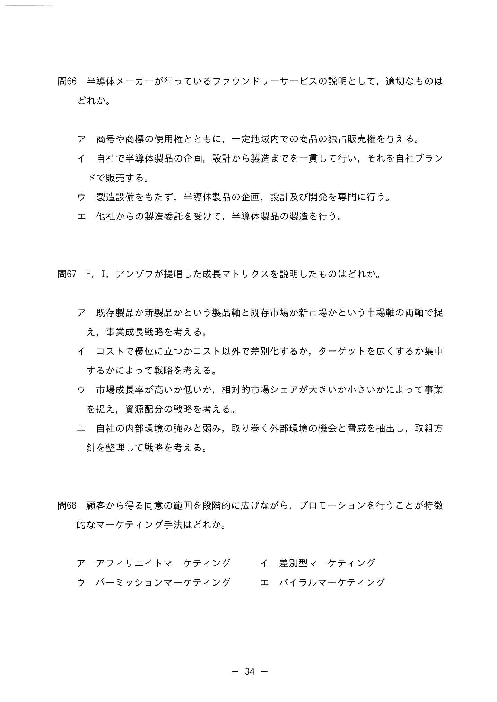

テキスト (OCR)

問66 半導体メーカーが行っているファウンドリーサービスの説明として, 適切なものは
どれか。

ア 商号や商標の使用権とともに, 一定地域内での商品の独占販売権を与える。

イ 自社で半導体製品の企画, 設計から製造までを一貫して行い, それを自社ブラン
ドで販売する。

ウ 製造設備をもたず, 半導体製品の企画, 設計及び開発を専門に行う。

エ 他社からの製造委託を受けて, 半導体製品の製造を行う。

間67 H. 1. アンゾフが提唱した成長マトリクスを説明したものはどれか。

ア 既存製品か新製品かという製品軸と既存市場か新市場かという市場軸の両軸で提
え, 事業成長戦略を考える。

イ コストで優位に立つかコスト以外で差別化するか, ターゲットを広くするか集中
するかによって戦略を考える。

ウ 市場成長率が高いか低いか, 相対的市場シェアが大きいか小さいかによって事業
を捉え, 資源配分の戦略を考える。

エ 自社の内部環境の強みと弱み, MUS< AROS CBRE, 取組方
針を整理して戦略を考える。

問68 顧客から得る同意の範囲を段階的に広げながら, プロモーションを行うことが特徴
的なマーケティング手法はどれか。

ア アフィリエイトマーケティング   イ 差別型マーケティング
ウ パーミッションマーケティング   エ バイラルマーケティング

### ページ 35

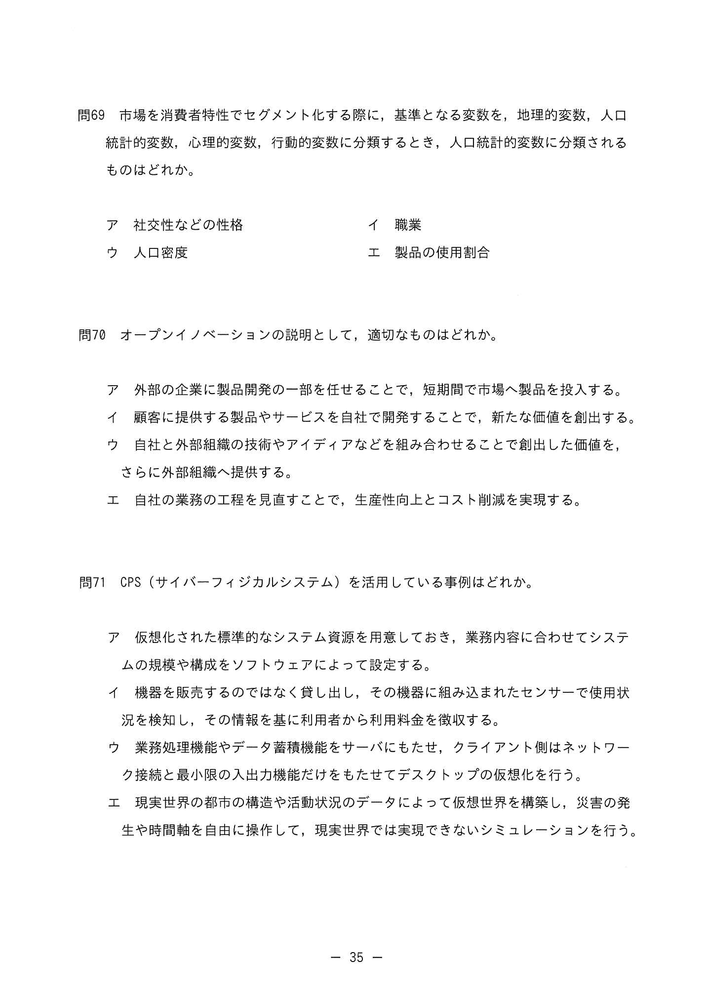

テキスト (OCR)

間69 市場を消費者特性でセグメント化する際に, 基準となる変数を, 地理的変数 Ad
統計的変数, 心理的変数 行動的変数に分類するとき, 人口統計的変数に分類される
ものはどれか。

ア 社交性などの性格         イ 職業
ウ 人口密度                    エ 製品の使用割合

間79 オープンイノベーションの説明として, 適切なものはどれか。

ア 外部の企業に製品開発の一部を任せることで, 短期間で市場へ製品を投入する。

4 顧客に提供する製品やサービスを自社で開発することで, 新たな価値を創出する。

ウ 自社と外部組織の技術やアイディアなどを組み合わせることで創出した価値を,
さらに外部組織へ提供する。

エ 自社の業務の工程を見直すことで, 生産性向上とコスト削減を実現する。

間71 CPS (サイバーフィジカルシステム) を活用している事例はどれか。

ア 仮想化された標準的なシステム資源を用意しておき, 業務内容に合わせてシステ
ムの規模や構成をソフトウェアによって設定する。

イ 機器を販売するのではなく貸し出し, その機器に組み込まれたセンサーで使用状
況を検知し, その情報を基に利用者から利用料金を徴収する。

ウ 業務処理機能やデータ蓄積機能をサーバにもたせ, クライアント側はネットワー
ク接続と最小限の入出力機能だけをもたせてデスクトップの仮想化を行う。

エ 現実世界の都市の構造や活動状況のデータによって仮想世界を構築し, 災害の発
生や時間軸を自由に操作して, 現実世界では実現できないシミュレーションを行う。

### ページ 36

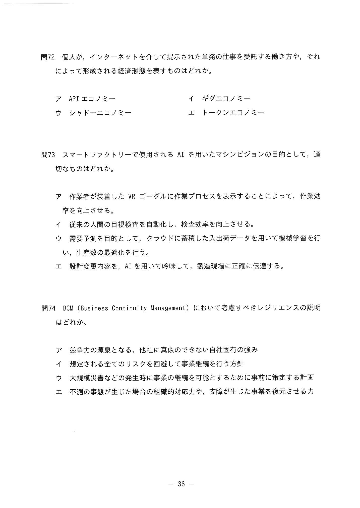

テキスト (OCR)

問72 個人が, インターネットを介して提示された単発の仕事を受託する働き方や, それ
によって形成される経済形態を表すものはどれか。

ア API エコノミー           イ ギグエコノミー

ウ シャドーエコノミー        エエ トータンエコノミー

間73 スマートファクトリーで使用される AI を用いたマシンビジョンの目的として, 適
切なものはどれか。

ア 作業者が装着した VR ゴーグルに作業プロセスを表示することによって, 作業効
率を向上させる。

イ 従来の人間の目視検査を自動化し, 検査効率を向上させる。

ウ 需要予測を目的として, クラウドに蓄積した入出荷データを用いて機械学習を行
い, 生産数の最適化を行う。

エ 設計変更内容を, AI を用いて吟味して, 製造現場に正確に伝達する。

間74 BCM (Business Continuity Management) において考慮すべきレジリエンスの説明
はどれか。

N

競争力の源泉となる, 他社に真似のできない自社固有の強み

想定される全てのリスクを回避して事業継続を行う方針

大規模災害などの発生時に事業の継続を可能とするために事前に策定する計画
不測の事態が生じた場合の組織的対応力や, 支障が生じた事業を復元させる

H GA

ー 36 一

### ページ 37

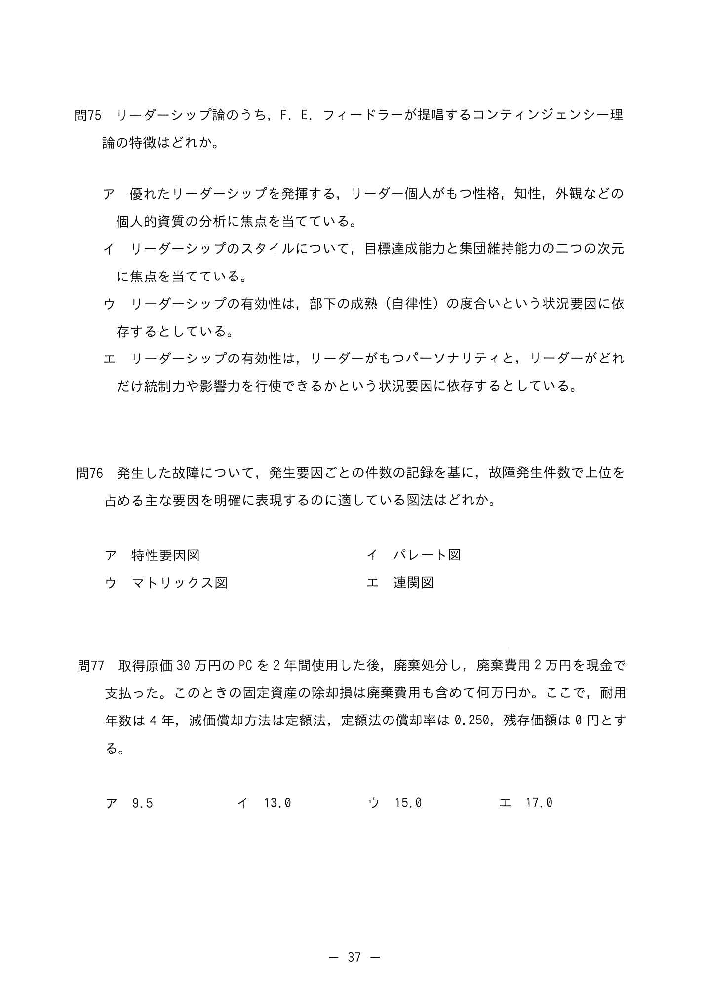

テキスト (OCR)

問75 リーダーシップ論のうち, F. E. フィードラーが提唱するコンティンジェンシー理
論の特徴はどれか。

ア 優れたリーダーシップを発揮する, リーダー個人がもつ性格, 知性, 外観などの
個人的資質の分析に焦点を当てている。

イ リーダーシップのスタイルについて, 目標達成能力と集団維持能力の二つの次元
に焦点を当てている。

ウ リーダーシップの有効性は, 部下の成熟 (自律性) の度合いという状況要因に依
存するとしている。

エ リーダーシップの有効性は, リーダーがもつパーソナリティと, リーダーがどれ
だけ統制力や影響力を行使できるかという状況要因に依存するとしている。

間76 発生した故障について, 発生要因ごとの件数の記録を基に, 故障発生件数で上位を
占める主な要因を明確に表現するのに適している図法はどれか。

ア 特性要因図            4 パレート図

ウ マトリックス図            = 連関図

問77 取得原価 30 万円の PC を 2 年間使用した後, 廃棄処分し, 廃棄費用 2 万円を現金で
支払った。このときの固定資産の除却損は廃棄費用も含めて何万円か。ここで, 耐用
年数は 4 年, 減価償却方法は定額法, 定額法の償却率は 0.250, 残存価額は 6 円とす
る。

 上5     イ 13.0     ウ 15.0     エ 17.0

### ページ 38

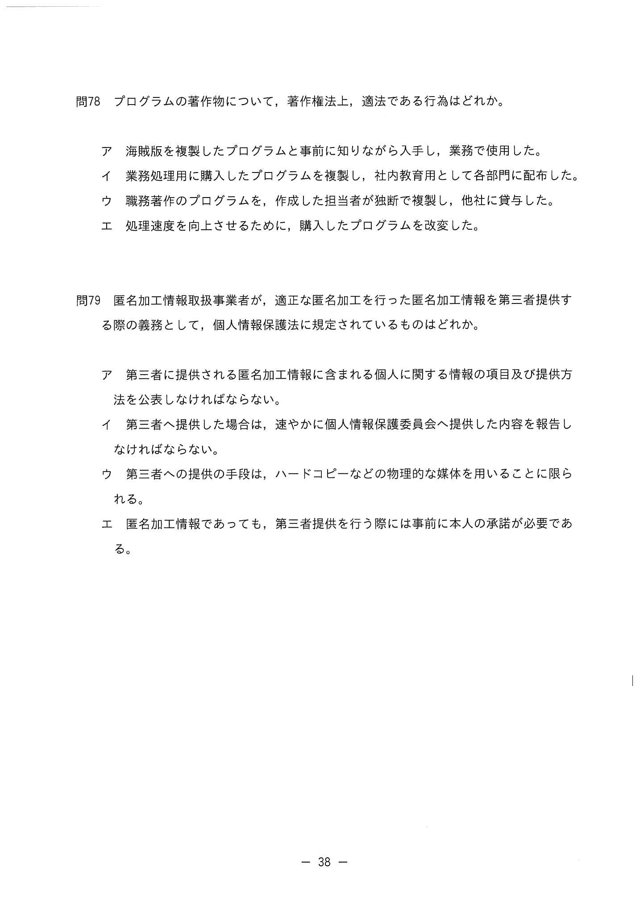

テキスト (OCR)

問78 プログラムの著作物について, 著作権法上, 適法である行為はどれか。

|

海賊版を複製したプログラムと事前に知りながら人入手し, 業務で使用した。

業務処理用に購入したプログラムを複製し, 社内教育用として各部門に配布した。
職務著作のプログラムを, 作成した担当者が独断で複製し, 他社に貸与した。
処理速度を向上させるために, 購入したプログラムを改変した。

H we AN

79 匿名加工情報取扱事業者が, 適正な匿名加工を行った匿名加工情報を第三者提供す
る際の義務として, 個人情報保護法に規定されているものはどれか。

ア 第三者に提供される匿名加工情報に含まれる個人に関する情報の項目及び提供方
法を公表しなければならない。

イ 第三者へ提供した場合は, 速やかに個人情報保護委員会へ提供した内容を報告し
なければならない。

ウ 第三者への提供の手段は ハードコピーなどの物理的な媒体を用いることに限ら

れる。
エ 匿名加工情報であっても, 第三者提供を行う除には事前に本人の承諾が必要であ
る。

### ページ 39

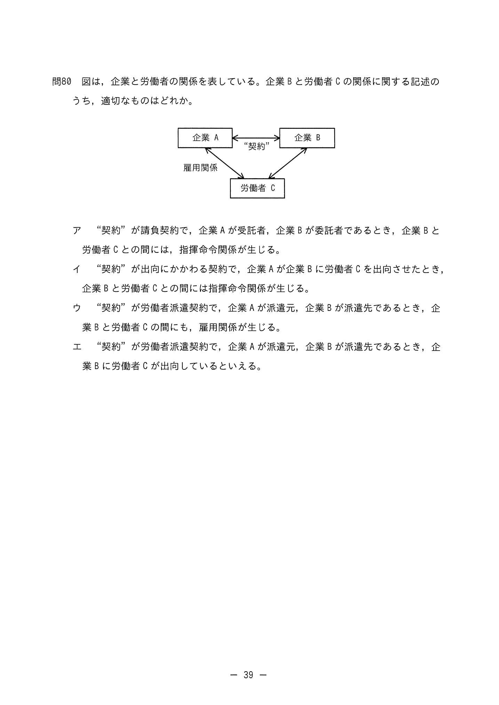

テキスト (OCR)

問86 図は, 企業と労働者の関係を表している。企業 B と労働者C の関係に関する記述の
うち, 適切なものはどれか。

企業 A        企業 B
mm

mm
Se C

ア "契約" が請負契約で, 企業 A が受託者, 企業 B が委託者であるとき, 企業Bと
労働者C との間には, 指揮命令関係が生じる。

イ “RN” が出向にかかわる契約で, 企業Aが企業 B に労働者C を出向させたとき,
企業 B と労働者C との間には指揮命令関係が生じる。

ウ "契約" が労働者派遣契約で, 企業Aが派遣元, 企業 B が派遣先であるとき, 企
業 B と労働者C の間にも, 雇用関係が生じる。

エ “RN” が労働者派遣契約で, 企業A が派遣元, 企業 B が派遣先であるとき, 企
業 B に労働者C が出向しているといえる。

### ページ 40

テキスト (OCR)

メ モ 用 紙 J

### ページ 41

テキスト (OCR)

【

メ モ 用 紙 J

— 前 一

### ページ 42

テキスト (OCR)

〔

メ = 用 紙 〕

### ページ 43

テキスト (OCR)

〔

メ モ 用 紙

= Bo

### ページ 44

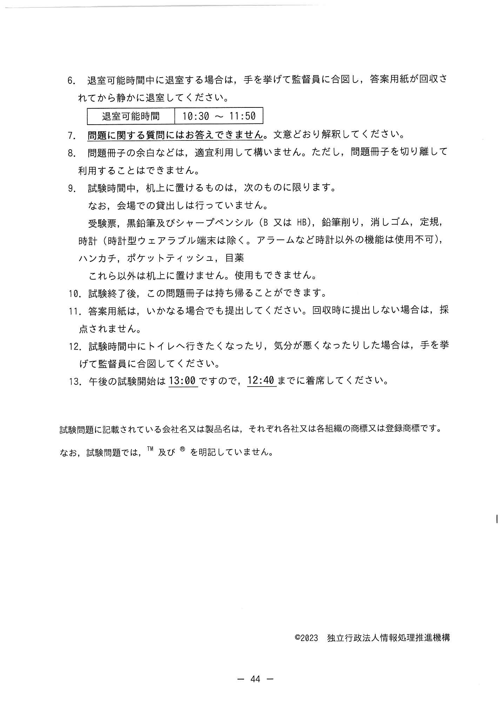

テキスト (OCR)

6. 退室可能時間中に退室する場合は, 手を挙げて監督具に合図し, 答案用紙が回収さ
れてから静かに退室してください。
| 退室可能時間 | 10:30 ~ 11:50 |
7. 問題に関する質問にはお答えできません。文意どおり解釈してください。
8. 問題冊子の余白などは, 適宜利用して構いません。ただし, 問題冊子を切り離して
利用することはできません。
9. 試験時間中, 机上に置けるものは, 次のものに限ります。
なお, 会場での貸出しは行っていません。
受験票, 黒鉛筆及びシャープペンシル (B 又は HB), 鉛筆削り, 消しゴム, 定規
時計 (時計型ウェアラブル端末は除く。アラームなど時計以外の機能は使用不可),
ハンカチ, ポケットティッシュ, BR
これら以外は机上に置けません。使用もできません。
10. 試験終了後, この問題冊子は持ち帰ることができます。
11. 管案用紙は, いかなる場合でも提出してください。回収時に提出しない場合は, 採
点されません。
12, 試験時間中にトイレへ行きたくなったり, 気分が悪くなったりした場合は, FEF
げて監督具に合図してください。
13, 午後の試験開始は 13:00 ですので, 12:40 までに着席してください。

試験問題に記載されている会社名又は製品名は, それぞれ各社又は各組織の商標又は登録商標です。

なお, 試験問題では, ™ Rue を明記していません。

@2023 独立行政法人情報処理推進機構

---

## 午前解答

©2023 独立行政法人情報処理推進機構 
令和5 年度 秋期 応用情報技術者試験 解答例 
 
午前試験 
問番号
正解
分野
問1 
ウ 
Ｔ 
問2 
エ 
Ｔ 
問3 
ア 
Ｔ 
問4 
ア 
Ｔ 
問5 
ウ 
Ｔ 
問6 
ウ 
Ｔ 
問7 
イ 
Ｔ 
問8 
ウ 
Ｔ 
問9 
ウ 
Ｔ 
問10 
ア 
Ｔ 
問11 
イ 
Ｔ 
問12 
イ 
Ｔ 
問13 
イ 
Ｔ 
問14 
エ 
Ｔ 
問15 
エ 
Ｔ 
問16 
エ 
Ｔ 
問17 
ア 
Ｔ 
問18 
イ 
Ｔ 
問19 
エ 
Ｔ 
問20 
エ 
Ｔ 
 
 
問番号
正解
分野
問21 
ウ 
Ｔ 
問22 
ウ 
Ｔ 
問23 
ア 
Ｔ 
問24 
ア 
Ｔ 
問25 
イ 
Ｔ 
問26 
エ 
Ｔ 
問27 
ア 
Ｔ 
問28 
ア 
Ｔ 
問29 
イ 
Ｔ 
問30 
ア 
Ｔ 
問31 
ウ 
Ｔ 
問32 
イ 
Ｔ 
問33 
イ 
Ｔ 
問34 
イ 
Ｔ 
問35 
エ 
Ｔ 
問36 
ウ 
Ｔ 
問37 
ア 
Ｔ 
問38 
ウ 
Ｔ 
問39 
ア 
Ｔ 
問40 
ア 
Ｔ 
 
 
問番号
正解
分野
問41 
イ 
Ｔ 
問42 
ウ 
Ｔ 
問43 
ア 
Ｔ 
問44 
ア 
Ｔ 
問45 
エ 
Ｔ 
問46 
ウ 
Ｔ 
問47 
エ 
Ｔ 
問48 
ア 
Ｔ 
問49 
ア 
Ｔ 
問50 
ア 
Ｔ 
問51 
エ 
Ｍ 
問52 
ウ 
Ｍ 
問53 
ア 
Ｍ 
問54 
エ 
Ｍ 
問55 
ア 
Ｍ 
問56 
イ 
Ｍ 
問57 
イ 
Ｍ 
問58 
ウ 
Ｍ 
問59 
ウ 
Ｍ 
問60 
イ 
Ｍ 
 
 
問番号
正解
分野
問61 
イ 
Ｓ 
問62 
ア 
Ｓ 
問63 
エ 
Ｓ 
問64 
ウ 
Ｓ 
問65 
ア 
Ｓ 
問66 
エ 
Ｓ 
問67 
ア 
Ｓ 
問68 
ウ 
Ｓ 
問69 
イ 
Ｓ 
問70 
ウ 
Ｓ 
問71 
エ 
Ｓ 
問72 
イ 
Ｓ 
問73 
イ 
Ｓ 
問74 
エ 
Ｓ 
問75 
エ 
Ｓ 
問76 
イ 
Ｓ 
問77 
エ 
Ｓ 
問78 
エ 
Ｓ 
問79 
ア 
Ｓ 
問80 
イ 
Ｓ 
 
 
分野の「Ｔ」はテクノロジ系，「Ｍ」はマネジメント系，「Ｓ」はストラテジ系の問題です。

---

## 午後問題

### ページ 1

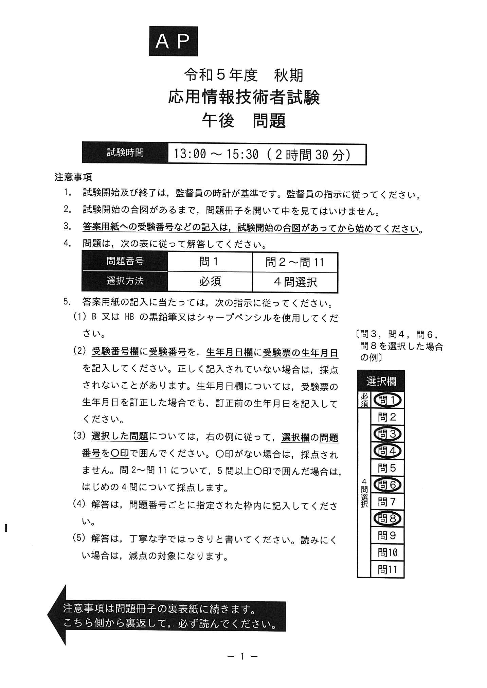

テキスト (OCR)

令和5年度 秋期
応用情報技術者試験
午後 問題

 13:00 ~ 15:30 (2時間 30 分)

注意事項
1. 試験開始及び終了は, 監督貞の時計が基準です。監督員の指示に従ってください。
2. 試験開始の合図があるまで, 問題冊子を開いて中を見てはいけません。
3. 答案用紙への受験番号などの記入は, 試験開始の合図があってから始めてください。
4. 問題は, 次の表に従って解答してください。

問題番号     fi 1    間2 ~間 11
選択方法     必須     4 問選択

5. 答案用紙の記入に当たっては, 次の指示に従ってください。
(1) B 又は HB の黒鉛筆又はシャープペンシルを使用してくだ
さい。                         (問3, 問4, 問6
(2) SRESMCRBESS, 生生月日欄に受験秋生年朋日 のgm LBS
を記入してください。 正しく記入されていない場合は, 採点
されないことがあります。生年月日材については, 受験票の fl
生年月日を訂正した場合でも, 訂正前の生年月日を記入して [all
ください。                          問2
(3) 選択した問題については, 右の例に従って, 選択棚の問題
番号をO印で囲んでください。O〇印がない場合は, 採点され   Go»

ません。問 2一問 11 について, 5 問以上O印で囲んだ場合は,   fai 5

はじめの 4 問について採点します。                     pe)

(4) 解答は, 問題番号ごとに指定された桁内に記入してくださ [RL
い。                                                           <GBy

(5) 解答は, 丁寧な字ではっきりと書いてください。読みにく    間9
い場合は, 減点の対象になります。               eo

511

注意事項は問題冊子の裏表紙に続きます。
こちら側から裏返して,. 必ず読んでください。

### ページ 2

### ページ 3

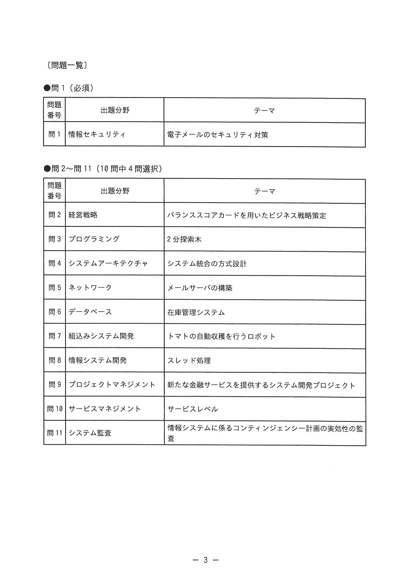

テキスト (OCR)

〔問題一覧〕

信問1 (必須)

問題

番号     出題分野

テーマ

間 1 | 情報セキュリティ

電子メールのセキュリティ対策

@問 2一問11 (10 間中 4 問選択)

問題

番号     出題分野                デーマ

fal 2 | 経営戦略          バランススコアカードを用いたビジネス戦略策定

問3 | プログラミング      2 分探索木

問4 | システムアーキテクチャ   システム統合の方式設計

AS | ネットワーク        メールサーバの構築

問6 | データベース        在庫管理システム

問 7 | 組込みシステム開発     トマトの自動収穫を行うロボット

問 8 | 情報システム開発      スレッド処理

間 9 | プロジェクトマネジメント | 新たな金融サービスを提供するシステム開発プロジェクト

問19 | サービスマネジメント

サービスレベル

間 11 | システム監査

情報システムに係るコンティンジェンシー計
査

画の実効性の監

### ページ 4

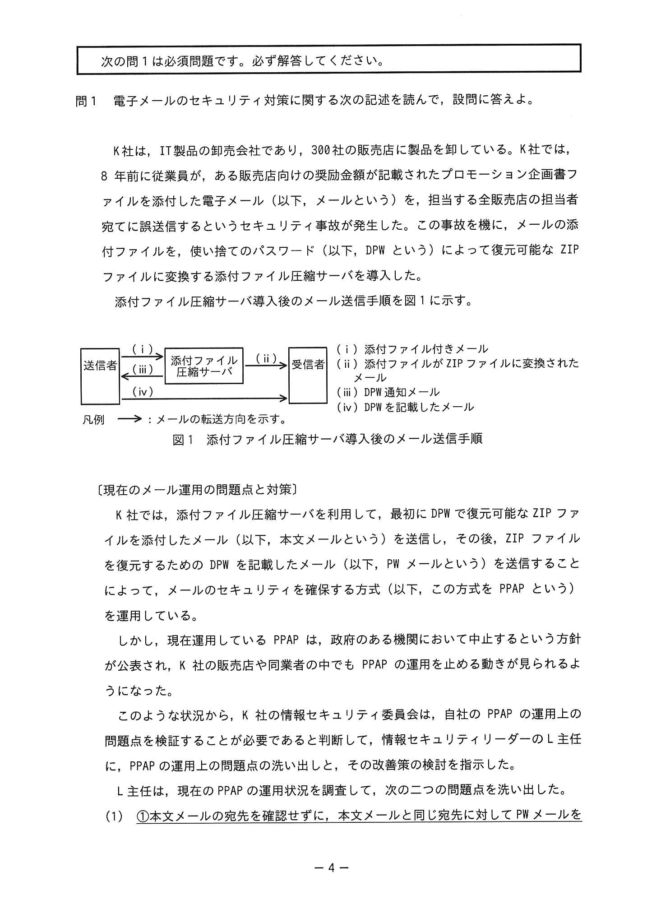

テキスト (OCR)

次の問 1 は必須問題です。必ず人解答してください。

問1 電子メールのセキュリティ対策に関する次の記述を読んで, 設問に答えよ。

K社は, IT製品の卸売会社であり, 399社の販売店に製品を卸している。【K社では,
8 年前に従業員が, ある販売店向けの奨励金額が記載されたプロモーション企画書フ
ァイルを添付した電子メール (QUE, メールという) を, 担当する全販売店の担当者
宛てに誤送信するというセキュリティ事故が発生した。この事故を機に, メールの添
付ファイルを, 使い捨てのパスワード (以下, DPW という) によって復元可能な ZIP

ァイルに変換する添付ファイル圧縮サーバを導入した。

添付ファイル圧縮サーバ導入後のメール送信手順を図 1 に示す。

(i),                      (i) 添付ファイル付きメール

送信       添付ファイル|_G)   =   ii          が        こ変    に

送信者| (mm) | REA? TY つの|受信者 CG) 光信ファイルがHPファイルに変次された
(iv)                      Cit) DPW 通知メール

_                     (iv) DPW を記載したメール
凡例 一み : メールの転送方向を示す。

図1 添付ファイル圧縮サーバ導入後のメール送信手順

〔現在のメール運用の問題点と対策]

K 社では, 添付ファイル圧縮サーバを利用して, 最初に DPW で復元可能な ZIP ファ
イルを添付したメール (以下, 本文メールという) を送信し, その後, ZIP ファイル
を復元するための DPW を記載したメール (LAK, PW メールという) を送信すること
によって, メールのセキュリティを確保する方式 (AF, この方式を PPAP という)
を運用している。

しかし, 現在運用している PPAP は, 政府のある機関において中止するという方針
が公表され, K 社の販売店や同業者の中でも PPAP の運用を止める動きが見られるよ
うになった。

このような状況から, K 社の情報セキュリティ委員会は, 自社の PPAP の運用上の
問題点を検証することが必要であると判断して, 情報セキュリティリーダーの[主任
に, PPAP の運用上の問題点の洗い出しと, その改善策の検討を指示した。

L 主任は, 現在のPPAP の運用状況を調査して, 次の二つの問題点を洗い出した。
(1) ①本文メールの宛先を確認せずに, 本文メールと同じ宛先に対して PW メールを

### ページ 5

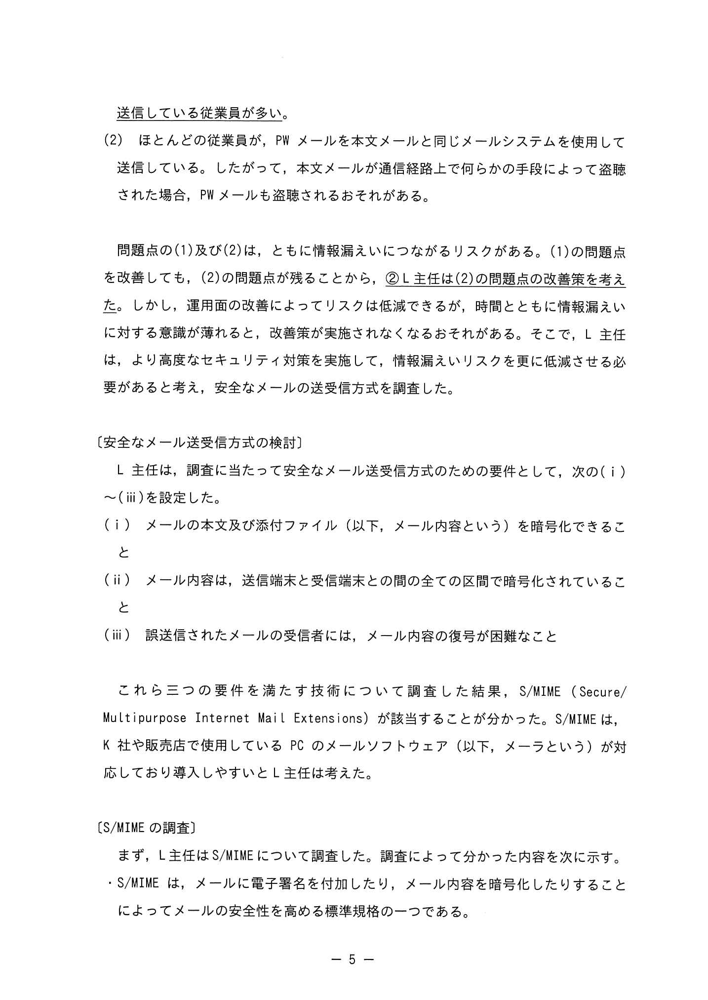

テキスト (OCR)

送信している従業員が多い。

(2) ほとんどの従業員が, PW メールを本文メールと同じメールシステムを使用して
送信している。 したがって, 本文メールが通信経路上で何らかの手段によって盗聴
された場合, PWN メールも盗聴されるおそれがある。

問題点の(1)及び(2)は, ともに情報漏えいにつながるリスクがある。(1)の問題点
を改善しても, (2)の問題点が残ることから, ②L主任は(2) の問題点の改善策を考え
た。 しかし, 運用面の改善によってリスクは低減できるが, 時間とともに情報漏えい
に対する意識が薄れると, 改善策が実施されなくなるおそれがある。そこで, L 主任
は, より高度なセキュリティ対策を実施して, 情報漏えいリスクを更に低減させる必
要があると考え, 安全なメールの送受信方式を調査した。

〔安全なメール送受信方式の検討〕
L 主任は, 調査に当たって安全なメール送受信方式のための要件として, 次の(i)
て(ii )を設定した。
(i) メールの本文及び添付ファイル (以下, メール内容という) を暗号化できるこ
と
(ji) メール内容は, 送信端末と受信端末との間の全ての区間で暗号化されているこ
と
(iii)

uy

記送信されたメールの受信者には, メール内容の復号が困難なこと

これら三つの要件を満たす技術について調査した結果, S/MIME (Secure/
Multipurpose Internet Mail Extensions) が該当することが分かった。S/MIME は,
K 社や販売店で使用している PC のメールソフトウェア (以下, メーラという) OH
応しており導入しやすいと[主任は考えた。

(S/MIME の調査]
まず, L主任は S/MIME について調査した。調査によって分かった内容を次に示す。
・S/MIME は, メールに電子署名を付加したり, メール内容を暗号化したりすること
によってメールの安全性を高める標準規格の一つである。

ー5一

### ページ 6

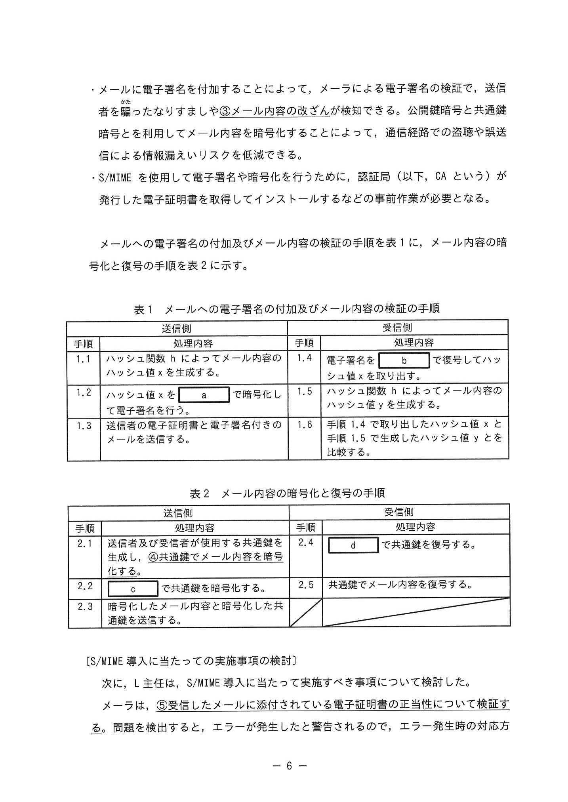

テキスト (OCR)

- メールに電子署名を付加することによって, メーラによる電子署名の検証で。 送信
者を購ったなりすましや③メール内容の改ざんが検知できる。公開銀暗号と共通鍵
暗号とを利用してメール内容を暗号化することによって, MERE CORRE
信による情報漏えいリスクを低減できる。

・S/MIME を使用して電子署名や暗号化を行うために,

認証局 (LAB, CA という) が

発行した電子証明書を取得してインストールするなどの事前作業が必要となる。

メールへの電子署名の付加及びメール内容の検証の手順を表 1 に, メール内容の暗
号化と復号の手順を表 2 に示す。

表1 メールへの電子署名の付加及びメール内容の検証の手順
送信側                          受信側
手順        処理内容        手順        処理内容
1.1 | ハッシュ関数 h によってメール内容の| 1.4 電子署名を| b | で復且してハッ
ハッシュ値 x を生成する。                 シュ値 x を取り出す。
1.2 | ハッシュ値 x を        で暗号化し | !.5 | ハッシュ関数h によってメール内容の
nyvaitre[_ 5]             ハッシュ値 y を生成する。
1.3 | 送信者の電子証明書と電子署名付きの| 1.6 | 手順 1.4 で取り出したハッシュ値 x と
メールを送信する。             手順 1.5 で生成したハッシュ値 y とを
比較する。
表2 メール内容の暗号化と復号の手順
送信側                          受信側
手順       処理内容       手順       処理内容
2.1 | 送信者及び受信者が使用する共通鍵を | 2.4  [a | で失通健を復詞する。
生成し, ④共通鍵でメール内容を暗号
化する。
2.2  |   p   | で共通鍵を暗号化する。     2.5 | 共通鍵でメール内容を復号する。
2.3 | 暗号化したメール内容と暗号化した共

通鍵を送信する。

(S/MIME 導入に当たっての実施事項の検討〕
次に, L 主任は, S/MIME 導入に当たって実施すべき事項について検討した。

メーラは, ⑤受信したメールに添付されている電子証明書の正当性について検証す
る。 問題を検出すると, エラーが発生したと称告されるので, エラー発生時の対応方

ー6 一

### ページ 7

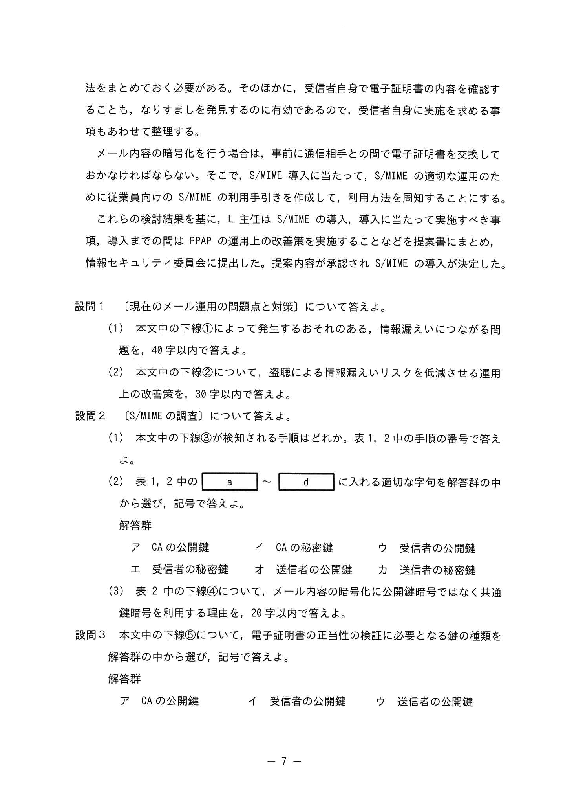

テキスト (OCR)

法をまとめておく必要がある。そのほかに, 受信者自身で電子証明書の内容を確認す
ることも, なりすましを発見するのに有効でもるので, 受信者自身に実施を求める事
項もあわせて整理する。

メール内容の暗号化を行う場合は, 事前に通信相手との間で電子証明書を交換して
おかなければならない。 そこで, S/MIME 導入に当たって, S/MIME の適切な運用のた
めに従業員向けの S/MIME の利用手引きを作成して, 利用方法を周知することにする。

これらの検討結果を基に, L 主任は S/MIME OWA, 導入に当たって実施すべき事
TR, 導入までの間は PPAP の運用上の改善策を実施することなどを提案書にまとめ,
情報セキュリティ委員会に提出した。提案内容が承認され S/MIME の導入が決定した。

設問1 [現在のメール運用の問題点と対策] について答えよ。
(1) 本文中の下線①によって発生するおそれのある, 情報漏えいにつながる問
Be, 49 字以内で答えよ。
(2) 本文中の下線@について, 盗聴による情報漏えいリスクを低減させる運用
上の改善策を, 30 字以内で答えよ。
設問2    (S/MIME の調査] について答えよ。
(1) 本文中の下線③が検知される手順はどれか。表 1, 2 中の手順の番号で答え
aes
(2) 表1, 2中の| a |~|[ dg |に入れる適切な字句を解管群の中
から選び, 記号で答えよ。
解答群
ア CAの公開鍵    イ CAの秘密鍵    ウ 受信者の公開鍵
エ 受信者の秘密鍵  オ 送信者の公開鍵  A 送信者の秘密鍵
(3) 表 2 中の下線のについて, メール内容の暗号化に公開鍵暗号ではなく共通
鍵暗号を利用する理由を, 29 字以内で答えよ。
設問3 本文中の下線@について, 電子証明書の正当性の検証に必要となる鍵の種類を
解答群の中から選び, 記号で答えよ。
解答群
ア CAの公開鍵    イ 受信者の公開鍵  ウ 送信者の公開鍵

### ページ 8

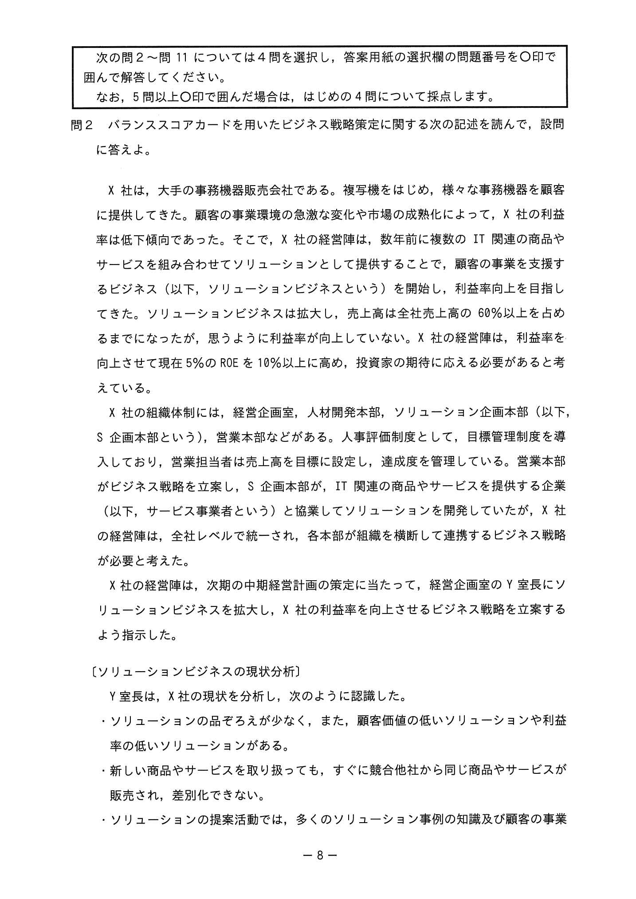

テキスト (OCR)

次の問2 -問 11 については4問を選択し, 答案用紙の選択欄の問題番号を〇印で
囲んで解答してください。
なお, 5 問以上O印で囲んだ場合は, はじめの 4 問について採点します。

FR2 バランススコアカードを用いたビジネス戦略策定に関する次の記述を読んで, 設問

に答えよ。

X 社は, 大手の事務機器販売会社である。 複写機をはじめ, 様々な事務機器を顧客
に提供してきた。 顧客の事業環境の急激な変化や市場の成熟化によって, X 社の利益
率は低下傾向であった。 そこで, X 社の経営陣は, 数年前に複数の IT 関連の商品や
サービスを組み合わせてソリューションとして提供することで, 顧客の事業を支援す
るビジネス (以下, ソリューションビジネスという) を開始し, 利益率向上を目指し
てきた。ソリューションビジネスは拡大し, 売上高は全社売上高の 69%以上を占め
るまでになったが, 思うように利益率が向上していない。X 社の経営陣は, 利益率を
向上させて現在 5%の ROE を 109以上に高め, 投資家の期待に応える必要があると考
えている。

X 社の組織体制には, 経営企画室, 人材開発本部, ソリューション企画本部 (以下
$ 企画本部という), 営業本部などがある。 人事評価制度として, 目標管理制度を導
入しており, 営業担当者は売上高を目標に設定し, 達成度を管理している。営業本部
がビジネス戦略を立案し, S 企画本部が, IT 関連の商品やサービスを提供する企業
(AER, サービス事業者という) と協業してソリューションを開発していたが, X 社
の経営陣は, 全社レベルで統一され, 各本部が組織を横断して連携するビジネス戦略
が必要と考えた。

X 社の経営陣は, 次期の中期経営計画の策定に当たって, 経営企画室の Y 室長にソ
リューションビジネスを拡大し, X 社の利益率を向上させるビジネス戦略を立案する

よう指示した。

[ソリューションビジネスの現状分析〕
Y 室長は, X 社の現状を分析し, 次のように認識した。

・ソリューションの品ぞろえが少なく, また, 顧客価値の低いソリューションや利益
率の低いソリューションがある。

・新しい商品やサービスを取り扱っても, すぐに競合他社から同じ商品やサービスが
販売され, 差別化できない。

・ソリューションの提案活動では, 多くのソリューション事例の知識及び顧客の事業

ー8一

### ページ 9

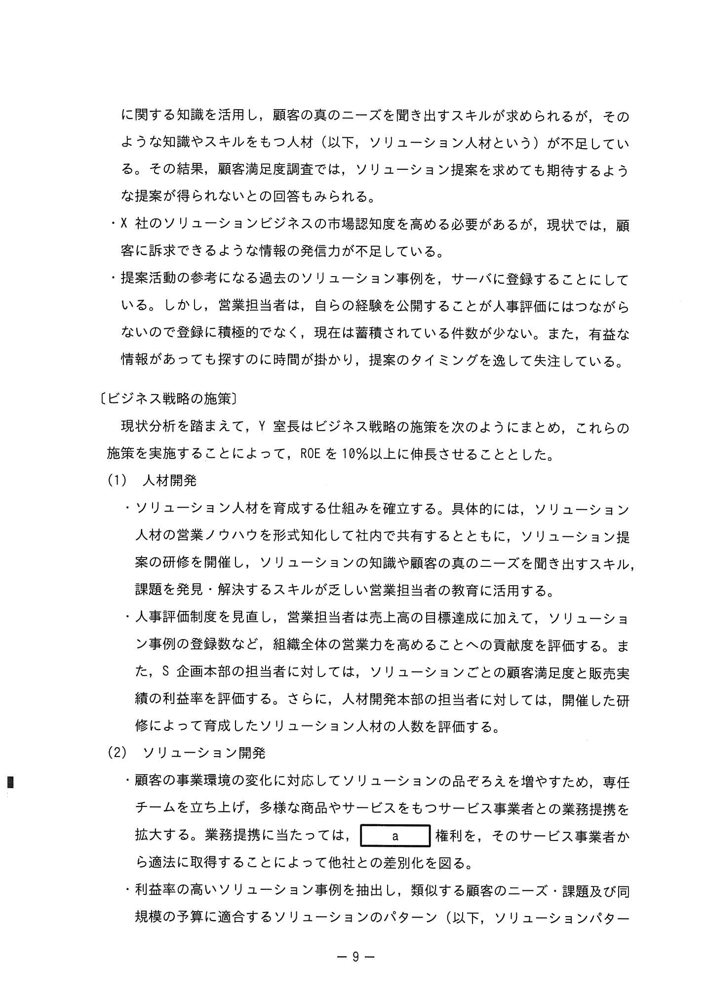

テキスト (OCR)

に関する知識を活用し, 顧客の真のニーズを聞き出すスキルが求められるが, その
ような知識やスキルをもつ人材 (以下,ソリューション人材という) が不足してい
る。 その結果, 顧客満足度調査では, ソリューション提案を求めても期待するよう
な提案が得られないとの回答もみられる。

・X 社のソリューションビジネスの市場認知度を高める必要があるが, 現状では, 顧
客に訴求できるような情報の発信力が不足している。

・ 提案活動の参考になる過去のソリューション事例を, サーバに登録することにして
いる。 しかし, 営業担当者は, 自らの経験を公開することが人事評価にはつながら
ないので登録に積極的でなく, 現在は蓄積されている件数が少ない。また, 有益な
情報があっても探すのに時間が掛かり, 提案のタイミングを逸して失注している。

〔ビジネス戦略の施策]
現状分析を踏まえて, Y 室長はビジネス戦略の施策を次のようにまとめ, これらの
施策を実施することによって, ROE を 10%以上に伸長させることとした。
(1) 人材開発
・ソリューション人材を育成する仕組みを確立する。 具体的には, ソリューション
人材の営業ノウハウを形式知化して社内で共有するとともに, ソリューション提
案の研修を開催し, ソリューションの知識や顧客の真のニーズを聞き出すスキル,
課題を発見・解決するスキルがと乏しい営業担当者の教育に活用する。
・人事評価制度を見直し, 営業担当者は売上高の目標達成に加えて, ソリューショ
ン事例の登録数など, 組織全体の営業力を高めることへの貢献度を評価する。ま
た, S 企画本部の担当者に対しては, ソリューションごとの顧客満足度と販売実
績の利益率を評価する。さらに, 人材開発本部の担当者に対しては, 開催した研
修によって育成したソリューション人材の人数を評価する。
(2) ソリューション開発
・顧客の事業環境の変化に対応してソリューションの品ぞろえを増やすため, 専任
チームを立ち上げ, 多様な商品やサービスをもつサービス事業者との業務提携を
拡大する。業務提携に当たっては, |  』 | 権利を, そのサービス事業者か
ら適法に取得することによって他社との差別化を図る。
・利益率の高いソリューション事例を抽出し, 類似する顧客のニーズ・課題及び同
規模の予算に適合するソリューションのパターン (以下, ソリューションパター

ー9一

### ページ 10

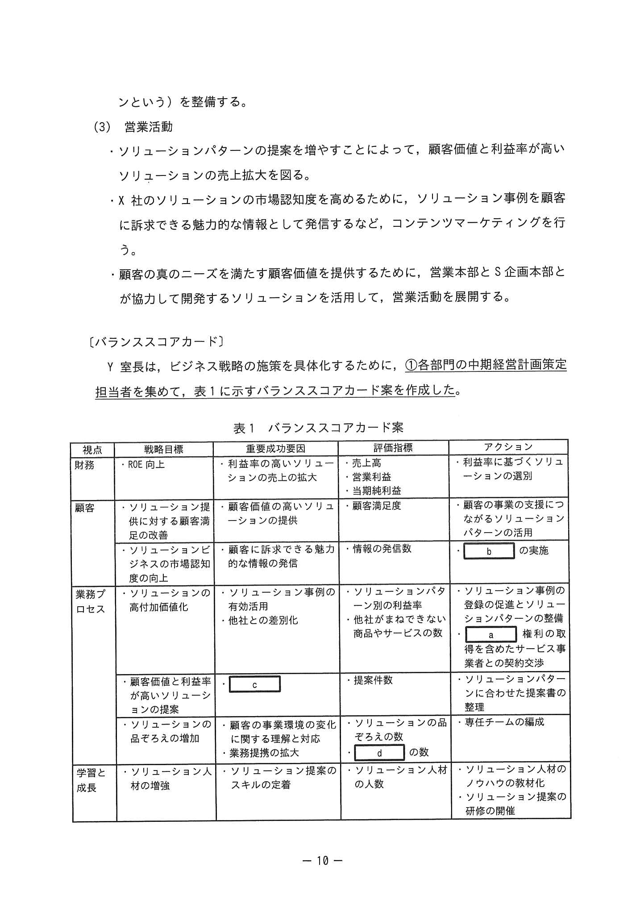

テキスト (OCR)

(3)

〔バランススコアカード〕

担当者を集めて, 表 1 に示すバランススコアカード案を作成した。

ンという) を整備する。

営業活動

・ソリューションパターンの提案を増やすことによって, 顧客価値と利益率が高い
ソリューションの売上拡大を図る。
・X 社のソリューションの市場認知度を高めるために, ソリューション事例を顧客
に訴求できる上魅力的な情報として発信するなど, コンテンツマーケティングを行

う。

・顧客の真のニーズを満たす顧客価値を提供するために, 営業本部と S 企画本部と
が協力して開発するソリューションを活用して, 営業活動を展開する。

Y Slt, ビジネス戦略の施策を具体化するために, ①各部門の中期経営計画策定

表1 バランススコアカード案
視点      戦略目標         重要成功要因          評価指標          アクション
財務     ・ROE 向上          ・利益率の高いソリュー| ・売上高             ・利益率に基づくソリュ
ションの売上の拡大  ・営業利益       ーションの選別
・当期純利益
顧客     ・ソリューション提| ・顧客価値の高いソリュ| ・顧客満足度           ・顧客の事業の支援につ
供に対する顧客満| 一ションの提供                       ながるソリューション
足の改善                                            パターンの活用
・ソリューションビ| ・顧客に訴求できる将力| ・情報の発信数       :          の
ジネスの市場認知| 的な情報の発信                       Ce]  “me
度の向上
業務プ | ・ソリューションの| ・ソリューション事例の| ・ソリューションパタ | ・ソリューション事例の
ロセス    高付加価値化      有効活用            ーン別の利益率      登録の促進とソリュー
・他社との差別化       ・他社がまねできない | ションパターンの整備
商品やサービスの数 | ・         権利の取
得を含めたサービス事
業者との契約交渉
・顧客価値と利益率|                 ・提案件数         ・ソリューションパター
が高いソリューシ                          ンに合わせた提案書の
ョンの提案                                        整理
・ソリューションの| . 顧客の事業環境の変化| ・ソリューションの品 | ・専任チームの編成
品ぞろえの増加     に関する理解と対応     ぞろえの数
・業務提携の拡大       | 』 |数
学習と |・ソリューション人| ・ソリューション提案の| ・ソリューション人材 | ・ソリューション人材の
成長         材の増強                スキルの定着                の人数                     ノウハウの教材化

・ソリューション提案の

研修の開催

### ページ 11

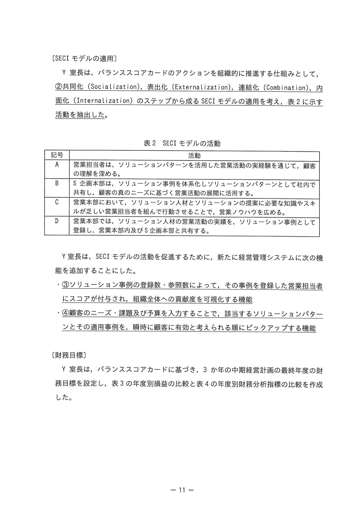

テキスト (OCR)

(SECI モデルの適用〕

Y 室長は, バランススコアカードのアクションを組織的に推進する仕組みとして,
@共同化 (Socialization), 表出化 (Externalization), 連結化 (Combination), 内
it (Internalization) のステップから成る SECI モデルの適用を考え, 表2 に示す
活動を抽出した。

表 2 SECI モデルの活動

nS                       活動
A     営業担当者は, ソリューションパターンを活用した営業活動の実経験を通じて, 顧客

の理解を深める。

B  S 企画本部は, ソリューション事例を体系化しソリューションパターンとして社内で
共有し, 顧客の真のニーズに基づく営業活動の展開に活用する。

C  営業本部において, ソリューション人材とソリューションの提案に必要な知識やスキ
ルが乏しい営業担当者を組んで行動させることで, 営業ノウハウを広める。

D     営業本部では, ソリューション人材の営業活動の実績を, ソリューション事例として
登録し, 営業本部内及び S 企画本部と共有する。

Y 室長は, SECI モデルの活動を促進するために, 新たに経営管理システムに次の機

能を追加することにした。

・③ソリューション事例の登録数・参照数によって, その事例を登録した営業担当者
にスコアが付与され, 組織全体への貢献度を可視化する機能

・④顧客のニーズ・課題及び予算を入力することで, 該当するソリューションパター
ンとその適用事例を, 瞬時に顧客に有効と考えられる順にピックアップする機能

[財務目標〕

Y 室長は, バランススコアカードに基づき, 3 か年の中期経営計画の最終年度の財
務目標を設定し, RI の年度別損益の比較と表 4 の年度別財務分析指標の比較を作成
Lie.

### ページ 12

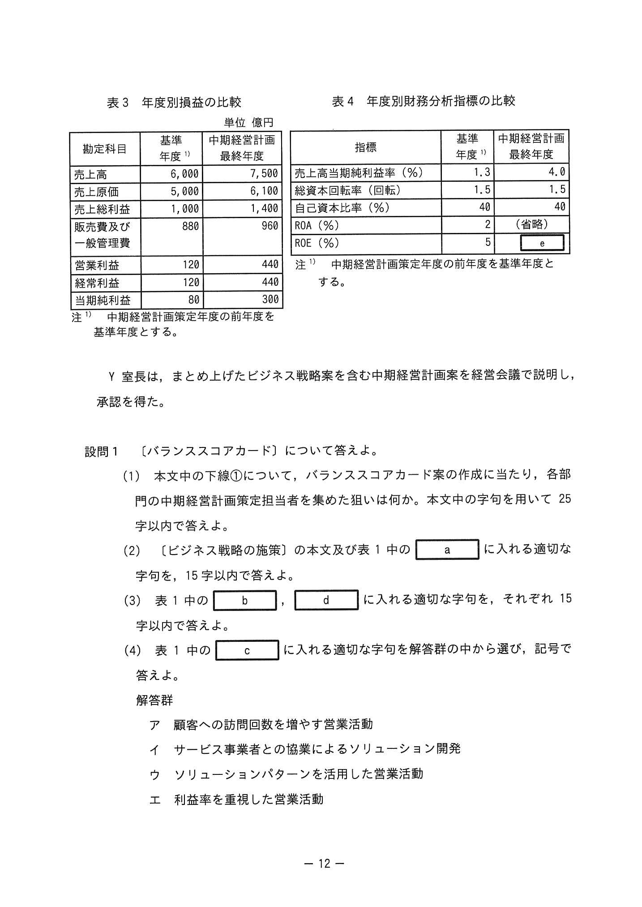

テキスト (OCR)

表3 年度別損益の比較          表4 年度別財務分析指標の比較

単位 億円

an    基準  中期経営計画       am       基準 |中期経営計画
MERE | 年度 | 最終年度                       ie                    seg | 最終年度
売上高        6, 000       7,500| |売上高当期純利益率 (%)       1.3       4.0
売上原価       5, 000       6,100] | 総資本回転率 (回転)         1.5       1.5
売上総利益      1, 000       1,400] | 自己資本比率 (%)            40         40
販売費及び 880 969| |ROA (%) 2(省略)
一般管理費              ROE (%)            5  し 。 |
営業利益         129        440| SE? 中期経営計画策定年度の前年度を基準年度と
経常利益      120      440    する。
当期純利益        80        300
0 中期経営計画策定年度の前年度を

基準年度とする。

Y 室長は, まとめ上げたビジネス戦略案を含む中期経営計画案を経営会議で説明し,

認を得た。

設問1 〔バランススコアカード〕 について答えよ。
(1) 本文中の下線①について, バランススコアカード案の作成に当たり, 各部
門の中期経営計画策定担当者を集めた狙いは何か。本文中の字句を用いて 25
字以内で答えよ。
(2) 〔ビジネス戦略の施策〕 の本文及び表 1 中の| 。 | に入れる適切な
字句を, 15 字以内で答えよ。

(3) 表1中の| bd |,|  d |に入れる適切な字句を, それぞれ15
字以内で答えよ。

(4) 表 1 中の| c | に入れる適切な字句を解答群の中から選び, 記号で
答えよ。

ARSE

ア PSAOMMORZEPTEREH

サービス事業者との協業によるソリューション開発
ソリューションパターンを活用した営業活動

利益率を重視した営業活動

H GAN

### ページ 13

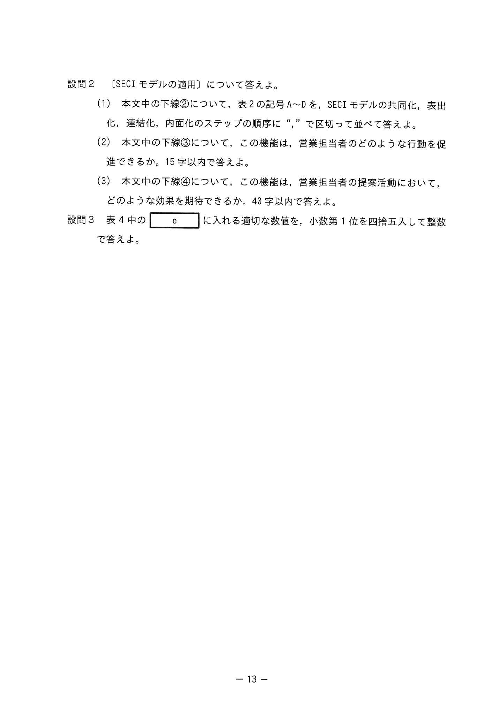

テキスト (OCR)

設問2 [SECI モデルの適用] について答えよ。
(1) 本文中の下線@について, 表 2 の記号AD を, SECI モデルの共同化, 表出
化, 連結化, 内面化のステップの順序に “,” で区切って並べて答えよ。
(2) 本文中の下線について, この機能は, 営業担当者のどのような行動を促
進できるか。15 字以内で答えよ。
(3) 本文中の下線のについて, この機能は, 営業担当者の提案活動において,
どのような効果を期待できるか。 49 字以内で答えよ。
設問3 表4中の| "。 | に入れる適切な数値を,小数第1 位を四捨五入して整数
で答えよ。

### ページ 14

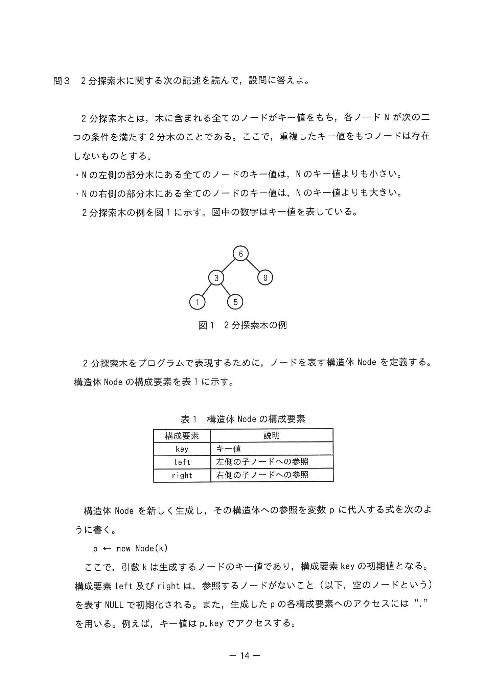

テキスト (OCR)

間3 2分探索木に関する次の記述を読んで, 設問に答えよ。

2 分探索木とは, 木に含まれる全てのノードがキー値をもち, 各ノード N が次の二
つの条件を満たす 2 分木のことである。ここで, 重複したキー値をもつノードは存在
しないものとする。

・N の左側の部分木にある全てのノードのキー値は, N のキー値よりも小さい。
・N の右側の部分木にある全てのノードのキー値は, N のキー値よりも大きい。
2 分探索木の例を図 1 に示す。図中の数字はキー値を表している。

図1 2分探索木の例

2 分探索木をプログラムで表現するために, ノードを表す構造体 Node を定義する。
構造体 Node の構成要素を表 1 に示す。

表1 構造体 Node の構成要素

構成要素                   説明
key         キー値
left        左側の子ノードへの参照
right      右側の子ノードへの参照

HEE Node を新しく生成し, その構造体への参照を変数 p に代入する式を次のよ
うに書く。
p ぐ new Node(k)
ここで, 引数 k は生成するノードのキー値であり, 構成要素 key の初期値となる。
構成要素 left RU right は, 参照するノードがないこと (以下, 空のノードという)

を表す NULL で初期化される。また, 生成した p の各構成要素へのアクセスには「『.
を用いる。例えば, キー値は p.key でアクセスする。

ー 14 一

### ページ 15

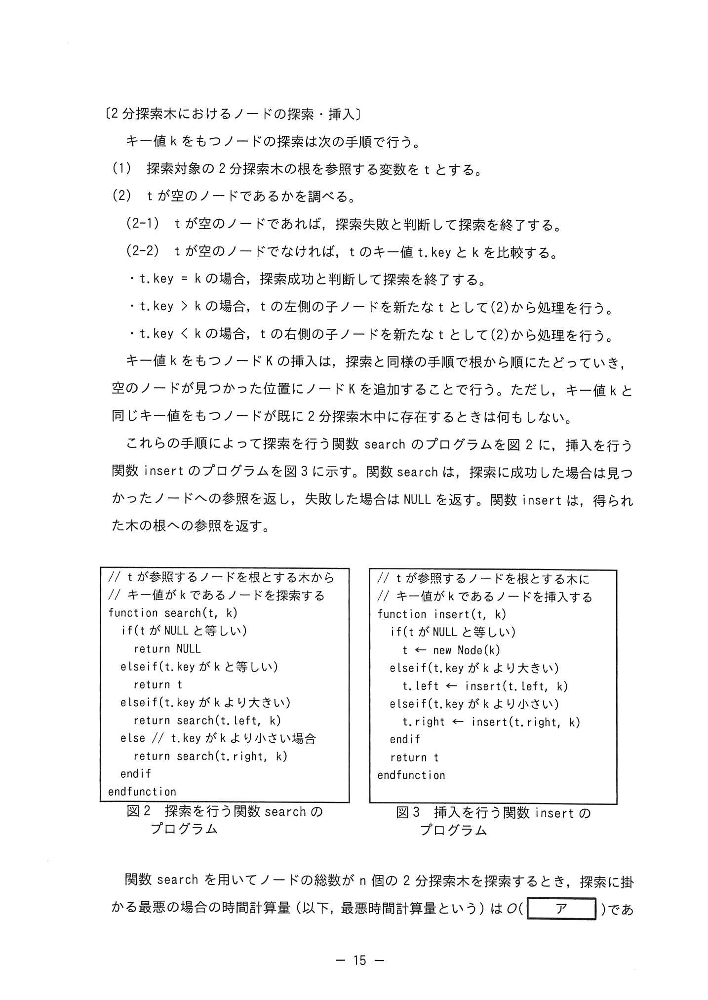

テキスト (OCR)

(2 分探索本におけるノードの探索・挿入〕

キー値 kをもつノードの探索は次の手順で行う。
(1) 探索対象の 2 分探索木の根を参照する変数を t とする。
(2) tが空のノードであるかを調べる。

(2-1) t が空のノードであれば, 探索失敗と判断して探索を終了する。

(2-2) t が空のノードでなければ, t のキー値 t.key とk を比較する。

・t.key = k の場合, 探索成功と判断して探索を終了する。

・t.key > k の場合, t の左側の子ノードを新たな t として(2)から処理を行う。

・t.key くk の場合, t の右側の子ノードを新たなt として(2)から処理を行う。

キー値kをもつノード【Kの挿入は, 探索と同様の手順で根から順にたどっていき,
空のノードが見つかった位置にノード K を追加することで行う。ただし, キー値k と
同じキー値をもつノードが既に 2 分探索木中に存在するときは何もしない。

これらの手順によって探索を行う関数 search のプログラムを図 2 に, 挿入を行う
関数 insert のプログラムを図 3 に示す。関数 search は, 探索に成功した場合は見つ
かったノードへの参照を返し, 失敗した場合は NULL を返す。関数 insert は, 得られ

た木の根への参照を返す。

// t が参照するノードを根とする木から
// キー値がk であるノードを探索する
function search(t, k)
if(t がNULL と等しい)
return NULL
elseif(t.key がk と等しい)
return t
elseif(t. key がk より大きい)
return search(t. left, k)
else // t.key がk より小さい場合
return search(t. right, k)
endif
endfunction

// t が参照するノードを根とする木に
// キー値がk であるノードを挿入する
function insert(t, k)
if(t がNULL と等しい)
t <— new Node(k)
elseif(t.key がk より大きい)
t. left <— insert(t. left, k)
elseif(t. key がk より小さい)
t.right <— insert(t.right, k)
endif
return t
endfunction

図2 探索を行う関数 search の
プログラム

図3 挿入を行う関数insert の
プログラム

関数 search を用いてノードの総数が n 個の 2 分探索木を探索するとき, 探索に掛
かる最悪の場合の時間計算量 (以下, 最悪時間計算量という) は O(| ア |)でぁ

### ページ 16

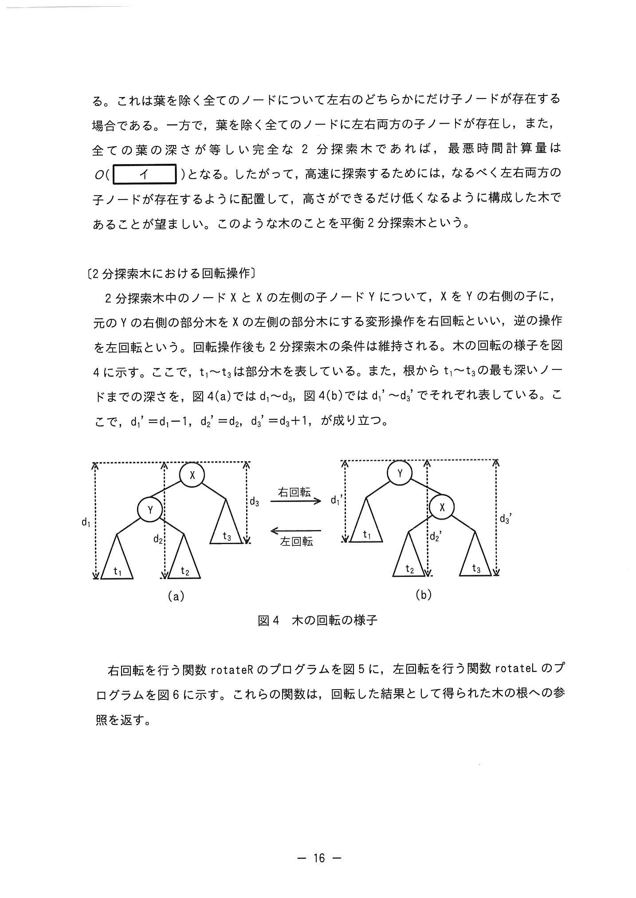

テキスト (OCR)

る。これは葉を除く全てのノードについて左右のどちらかにだけ子ノードが存在する
場合である。一方で, 葉を除く全てのノードに左右両方の子ノードが存在し, また,
全ての葉の深さが等しい完全な 2 分探索本であれば, 最悪時間計算量は
Of イ ] )となる。 したがって, 高速に探索するためには, なるべく左右両方
子ノードが存在するように配置して, 高さができるだけ低くなるように構成した木で
HETEMBE LU, TOLIBKOTE LPM 2 分探索木という。

2 分探索木における回転操作〕

2 分探索木中のノード X と X の左側の子ノード Y について, X を Y の右側の子に,
TOY の右側の部分木を X の左側の部分木にする変形操作を右回転といい, 逆の操作
を左回転という。回転操作後も 2 分探索木の条件は維持される。木の回転の様子を図
4 に示す。ここで, ti一t。は部分木ま表している。また, 根から ti一t。の最も深いノー
ドまでの深さを, 図 4(a)では di~ds 図 4(b)では d」 ~d; でそれぞれ表している。こ
こで, dy 9ュー1, d。 =de, d。 da。寺1, が成り立つ。

図4 木の回転の様子

右回転を行う関数 rotateR のプログラムを図 5 に, 左回転を行う関数 rotateL OF
ログラムを図 6 に示す。これらの関数は, 回転した結果として得られた木の根への参
照を返す。

### ページ 17

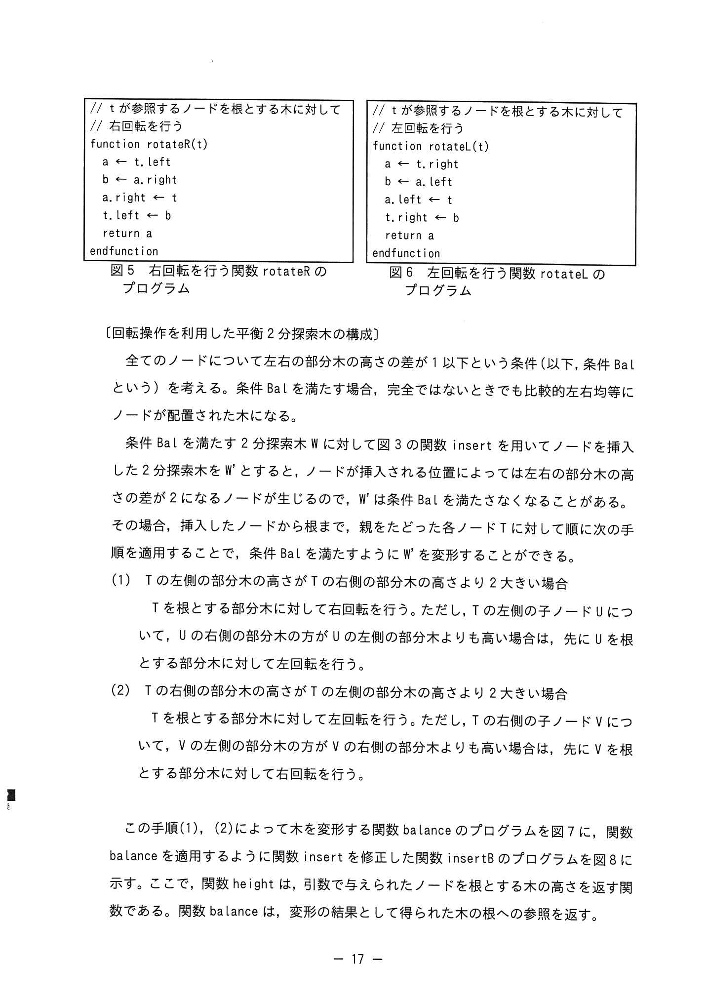

テキスト (OCR)

// t が参照するノードを根とする木に対して      // t が参照するノードを根とする木に対して
// 右回転を行う                     // 左回転を行う
function rotateR(t)                   function rotateL(t)
a <= t, left                           a を t.right
b < a.right                         b <— a. left
a.right <—t                         a.left とt
t. left <—b                          t.right とb
return a                              return a
endfunction                           endfunction

図5 右回転を行う関数 rotateR の         図6 左回転を行う関数 rotateL の
プログラム                           プログラム

〔回転操作を利用した平衡 2 分探索木の構成〕
全てのノードについて左右の部分木の高さの差が 1 以下という条件 (以下, 条件 Bal
CWS) を考える。条件 Bal を満たす場合, 完全ではないときでも比較的左右均等に
ノードが配置された木になる。
RE Bal を満たす 2 分探索木 W に対して図 3 の関数 insert を用いてノードを挿入
した 2 分探索木をW とすると, ノードが挿入される位置によっては左右の部分木の高
さの差が 2 になるノードが生じるので, W は条件 Bal を満たさなくなることがある。
その場合, 挿入したノードから根まで, 親をたどった各ノードT に対して順に次の手
順を適用することで, 条件 Bal を満たすように W を変形することができる。
(1) Tの左側の部分木の高さがT の右側の部分木の高さより 2 大きい場合
Tを根とする部分木に対して右回転を行う。 ただし, T の左側の子ノード Uにつ
WT, U の右側の部分木の方が U の左側の部分木よりも高い場合は, 先にUを根
とする部分木に対して左回転を行う。
(2) Tの右側の部分木の高さがT の左側の部分木の高さより 2 大きい場合
Tを根とする部分木に対して左回転を行う。 ただし, T の右側の子ノード Vにつ
WT, V の左側の部分木の方が V の右側の部分木よりも高い場合は, 先にVを根
とする部分木に対して右回転を行う。

この手順(1), (2)によって木を変形する関数 balance のプログラムを図 7 に, 関数
balance を適用するように関数 insert を修正した関数 insertB のプログラムを図 8 に
示す。ここで, 関数 height は, 引数で与えられたノードを根とする木の高さを返す関
数である。 PAB balance は, 変形の結果として得られた木の根への参照を返す。

### ページ 18

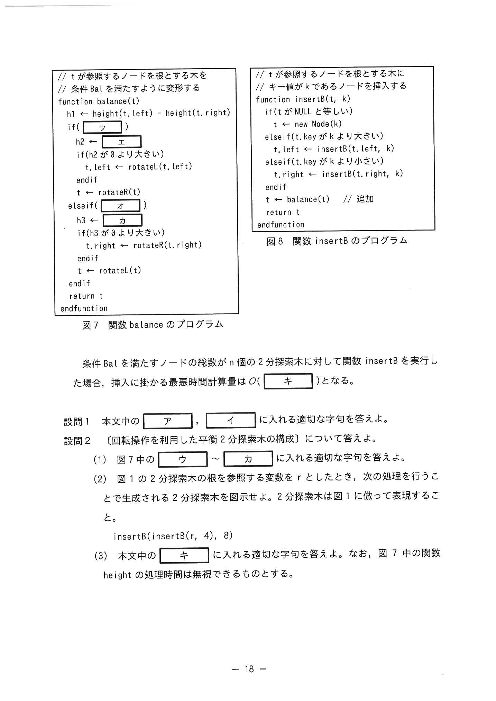

テキスト (OCR)

// t が参照するノードを根とする木を
// 条件 Bal を満たすように変形する
function balance(t)

hl <— height(t. left) - height(t. right)

in (2)
ee
if(h2 が9 より大きい)
t. left <— rotateL(t. left)
endif
t <— rotateR(t)

etseif([ 4 |)
i
if(h3 が 9 より大きい)

t.right で rotateR(t.right)

endif
t — rotateL(t)

endif

return t

endfunction

// t が参照するノードを根とする木に
// キー値がk であるノードを挿入する
function insertB(t, k)
if(tがNULL と等しい)
t <— new Node(k)
elseif(t.key がk より大きい)
t. left < insertB(t. left, k)
elseif (t. key が k より小さい)
t.right で insertB(t. right, k)
endif
t <— balance(t)
return t
endfunction

// 追加

図7 関数 balance のプログラム

条件 Bal を満たすノードの総数が n 個の 2 分探索木に対して関数 insertB を実行し

図8 関数insertB のプログラム

た場合 挿入に掛かる最悪時間計算量はの( | キ | )となる。

設問1 本文中の| アァ |,| ィ

] に入れる適切な字句を答えよ。

設問2 回転操作を利用した平衡 2 分探索木の構成】について答えよ。

ゥ |~-|

(⑪) 図7中の|

カカ |に入れる適切な字句を答えよ。

(2) 図1の2 分探索木の根を参照する変数をr としたとき, 次の処理を行
とで生成される 2 分探索木を図示せよ。2 分探索木は図 Cho TRAST

ど。

insertB(insertB(r, 4), 8)

(3) 本文中の | キ | に入れる適切な補旬を答えよ。なお,図 7 中の関数
height の処理時間は無視できるものとする。

### ページ 19

テキスト (OCR)

〔

x = 用 紙 J

### ページ 20

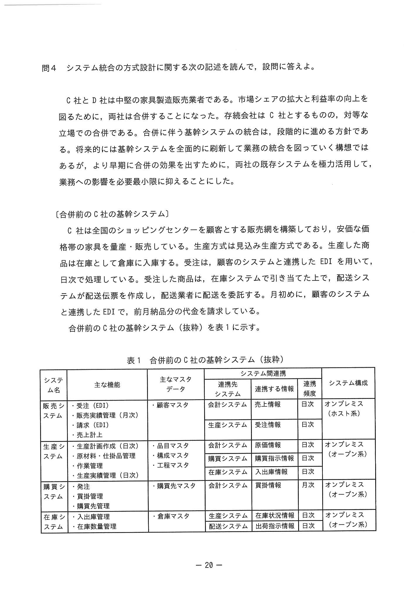

テキスト (OCR)

問4 システム統合の方式設計に関する次の記述を読んで, 設問に答えよ。

C 社と D 社は中堅の家具製造販売業者である。 市場シェアの拡大と利益率の向上を
図るために, 両社は合併することになった。存続会社は C 社とするものの, 対等な
立場での合併である。合併に伴う基幹システムの統合は, 段階的に進める方針であ
る。 将来的には基幹システムを全面的に刷新して業務の統合を図っていく構想では
あるが, より早期に合併の効果を出すために, 両社の既存システムを極力活用して,
業務への影響を必要最小限に抑えることにした。

合併前のC 社の基幹システム]〕

C 社は全国のショッピングセンターを顧客とする販売網を構築しており, 安価な価
格帯の家具を量産・販売している。生産方式は見込み生産方式である。 生産した商
品は在庫として倉庫に入庫する。受注は, 顧客のシステムと連携した EDI を用いて,
日次で処理している。受注した商品は, 在庫システムで引き当てた上で, 配送シス
テムが配送伝票を作成し, 配送業者に配送を委託する。 AMOK, 顧客のシステム
と連携した EDI で, 前月納品分の代金を請求している。

合併前のC 社の基幹システム (抜粋) を表 1 に示す。

表1 合併前のC社の基幹システム (抜粋)

システム間連携
wae   な機能   SEE?  en | 、    we | | システム構成
ム名         データ  ンステム | 電携する情報|
販売シ| ・受注 (ED1)     ・顧客マスタ  会計システム | 売上情報   日次 |オンプレミス
ステム | ・販売実績管理 (月次)                            (ホスト系)
・請求 (ED)               生産システム | 受注情報   日次
・売上計上
生産シ| ・生産計画作成 (BR) | ・品目マスタ  会計システム | 原価情報   日次 |オンプレミス
ステム | ・原材料・仁持品管理 | ・構成マスタ  請買システ 人 |障指示情報|日次 | オープン系)
・ 作業管理                ・ 工程マスタ
・ 生産実績管理 (日次)        在庫システム | 入出庫情報  日次
購買シ| ・発注        ・ 購買先マスタ | 会計システム | 買掛情報   月次 |オンプレミス
ステム | + REE                     (オープン系)
・ 購買先管理
在庫シ| ・入出庫管理     ・倉庫マスタ  生産システム | 在庫状況情報 | 日次 |オンプレミス
ATA | ・在庫数量管理          配送システム | 出荷指示情報 | 日次 | (オープン系)

### ページ 21

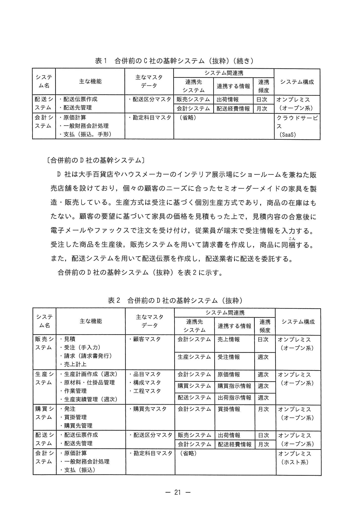

テキスト (OCR)

表1 合併前のC社の基幹システム (抜粋) (続き)

ンズ      主な機能        のでの     連携 イー    We | | システム構成
ム名                            データ        ec
配送 シ| BEER    ・ 本肖区分マスタ | 販売システム | 出荷情報 |日次 |オンプレミス
ステム | ・配送先管理            会計システム | 配送旨情報 | 月次 | (オープン系)
会計シ| ・原価計算        ・ 勘定科目マスタ | (BR)               クラウドサービ
ステム | ・一般財務会計処理                                                        ス

・ 支払(振込,手形)                                      (Saas)

(合併前の D 社の基幹システム〕

D 社は大手百貨店やハウスメーカーのインテリア展示場にショールームを兼ねた販
売店舗を設けており, 個々の願客のニーズに合ったセミオーダーメイドの家具を製
造・販売している。生産方式は受注に基づく個別生産方式であり, 商品の在庫はも
たない。 顧客の要草に基づいて家具の価格を見積もった上で, 見積内容の合意後に
電子メールやファックスで注文を受け付け, 従業員が端末で受注情報を入力する。
受注した商品を生産後, 販売システムを用いて請求書を作成し商品に同梱する。
また, 配送システムを用いて配送伝票を作成し, 配送業者に配送を委託する。

合併前の D 社の基幹システム (抜粋) を表 2 に示す。

表2 合併前の D社の基幹システム (抜粋)

ンスデ        主な機能           abc       Ea イー     =e          構成
1S 7S: Bi             4                                         システム
ム名                            データ        JME | tins omen | 28
販売シ| ・見積              ・顧客マスタ    会計システム | 売上情報     日次 |オンプレミス
AFL | ・受注 (FAD)                                                          (オープン系)
・ 請求(請求発行                    生産システム |受注情報 |週次
・売上計上

生産シ| ・生産計画作成 OB) | ・品目マスタ | 会計システム |原価情報 [wR |オンプレミス
ステム | ・原材料・仕掛品管理 | ・構成マスタ [eecaslteeeeem ber] (オープン系)

・ 作業管理                ・工程マスタ

・生産実績管理 GAR)               配送システム | 出荷指示情報 | 週次
購買シ| ・発注              ・購買先マスタ | 会計システム | 買掛情報     月次 |オンプレミス
ステム | ・買掛管理                                                                      (オープン系)

・購買先管理
配送シ| ・配送伝票作成        ・ 配送区分マスタ | 販売システム | 出荷情報     日次 |オンプレミス
ステム | ・配送先管理                          会計システム | 配送経費情報 | 月次 | (オープン系)
会計シ| ・原価計算           ・ 勘定科目マスタ| (省略)                      オンプレミス
ステム | ・一般財務会計処理                                                     (ホスト系)

・支払 (振込)

### ページ 22

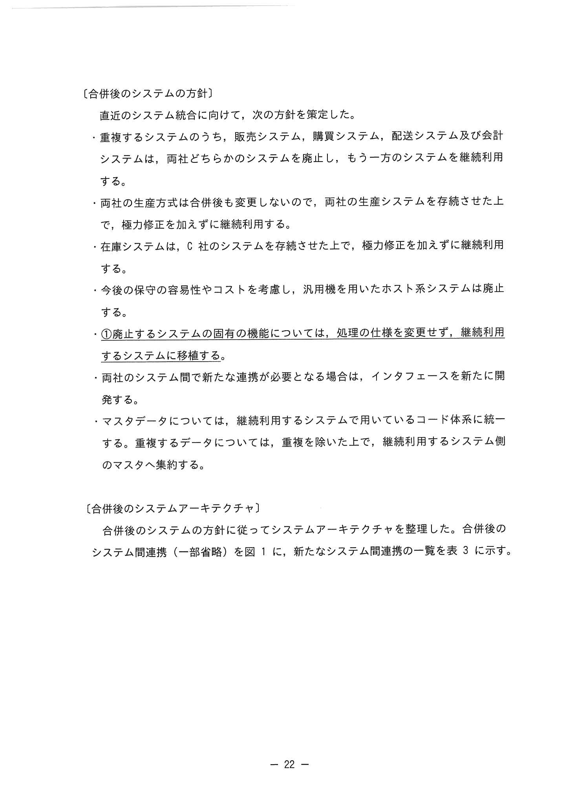

テキスト (OCR)

合併後のシステムの方針〕

直近のシステム続合に向けて, 次の方針を策定した。

・ 重複するシステムのうち, 販売システム, 購買システム, 配送システム及び会計
システムは, 両社どちらかのシステムを廃止し, もう一方のシステムを継続利用
する。

・両社の生産方式は合併後も変更しないので, 両社の生産システムを存続させた上
で, 極力修正を加えずに継続利用する。

・ 在庫システムは, C 社のシステムを存続させた上で, 極力修正を加えずに継続利用
する。

・今後の保守の容易性やコストを考慮し, 汎用機を用いたホスト系システムは廃止
する。

・①廃止するシステムの固有の機能こついては, 処理の仕様を変更せず, 継続利用
するシステムに移植する。

・両社のシステム間で新たな連携が必要となる場合は, インタフェースを新たに開
発する。

・マスタデータについては, 継続利用するシステムで用いているコード体系に統一
する。 重複するデータについては, 重複を除いた上で, 継続利用するシステム側
のマスタへ集約する。

合併後のシステムアーキテクチャ〕
合併後のシステムの方針に従ってシステムアーキテクチャを整理した。合併後の
システム間連携 (一部省略) を図 1 に, 新たなシステム間連携の一覧を表 3 に示す。

### ページ 23

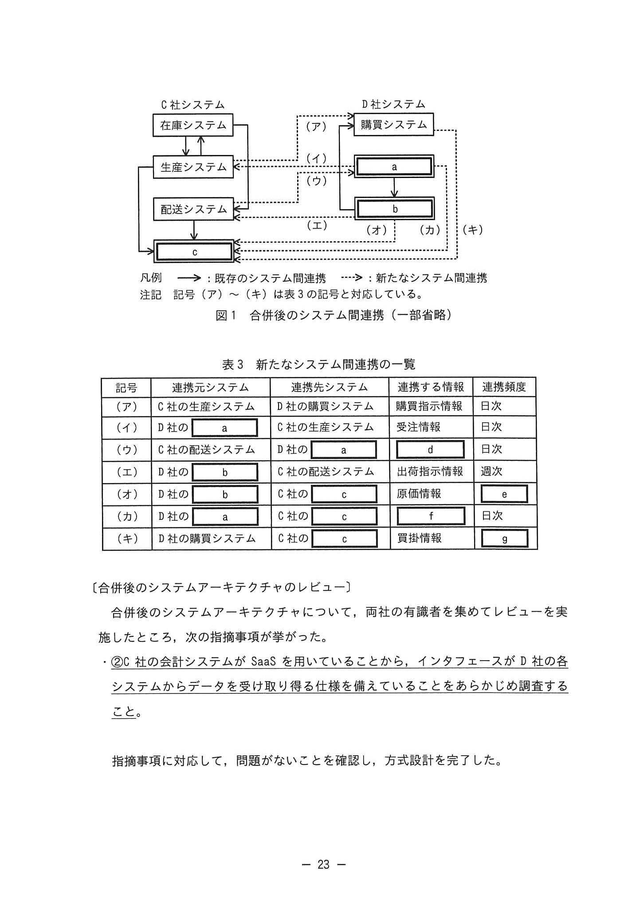

テキスト (OCR)

C社システム
在庫システム
Lt

EEL ATL le

DHYATA

配送システム

(キ)

凡例 一み : 既存のシステム間連携 … : 新たなシステム間連携
注記 記号 (ア) ~ (+) は表 3 の記号と対応している。
図1 合併後のシステム間連携 (一部省略)
表3 新たなシステム間連携の一覧
記号   連携均システム    連携先システム   連携する情報 | STAR
(ア) | C社の生産システム | D 社の購買システム | 購買指示情報 | 日次
(4) | D社の|  』 | | C社の生産システム | 受注情報     Bx
(9) | C社の配送システム |D社の| sa  | ||  d  | | ax
(エ) | D社の| 5 | | C社の配送システム | 出荷指示情報 | ax
(4) | D社の[| 5b | |c社の     原価情報          しs |
(a) |p社の| 』 | |c社の| sc |      ‘|| ar
(キ) | D 社の購買システム | C社の| co] | 買掛情報     [is |

合併後のシステムアーキテクチャのレビュー〕}
合併後のシステムアーキテクチャについて, 両社の有識者を集めてレビューを実
施したところ, 次の指摘事項が挙がった。
-@C 社の会計システムが SaaS を用いていることから, インタフェースが 【 HOB
システムからデータを受け取り得る仕様を備えていることをあらかじめ調査する

Ge.

指摘事項に対応して, 問題がないことを確認し, 方式設計を完了した。

### ページ 24

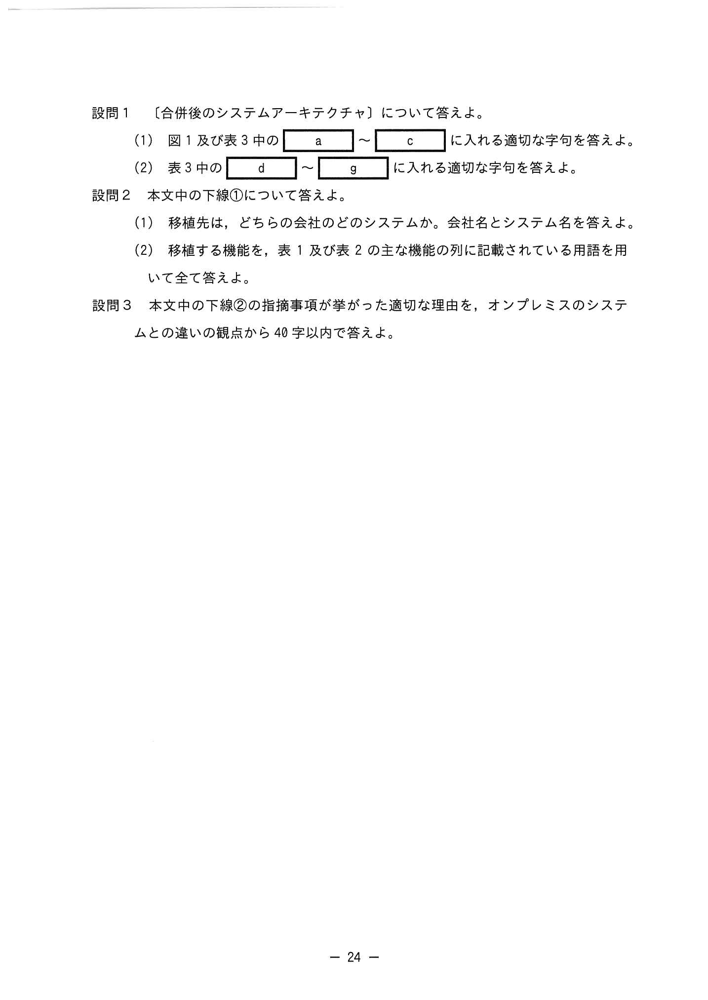

テキスト (OCR)

設問1 [合併後のシステムアーキテクチャ〕 について答えよ。
(1) 図1 及び表3中の| a |~| ic |に入れる適切な字句を答えよ。
(2) 表3中の| d |~| 9 |に入れる適切な字句を答えよ。

設問2 本文中の下線①について答えよ。
(1) 移植先は, どちらの会社のどのシステムか。会社名とシステム名を答えよ。
(2) 移植する機能を, 表 1 及び表 2 の主な機能の列に記載されている用語を用
いて全て答えよ。

設問3 本文中の下線②の指摘事項が挙がった適切な理由を, オンプレミスのシステ
ムとの違いの観点から 49 字以内で答えよ。

### ページ 25

テキスト (OCR)

し メ モ 用 紙 J

### ページ 26

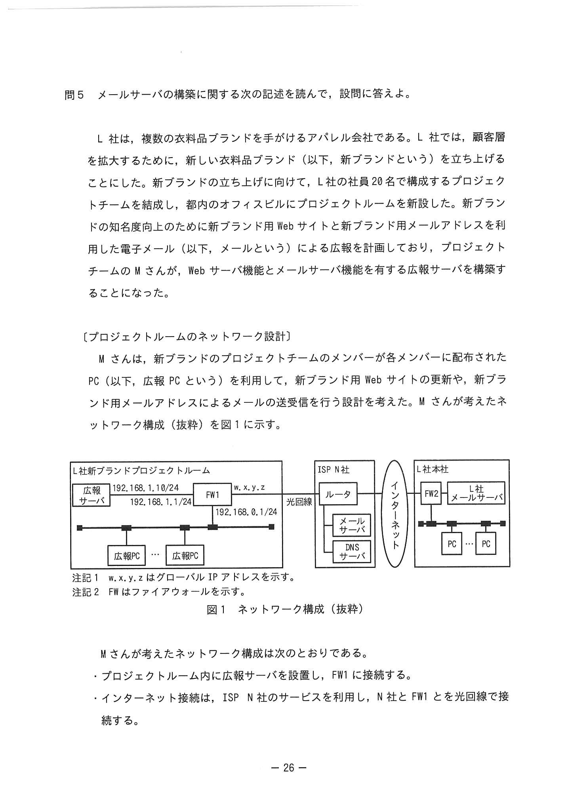

テキスト (OCR)

AS メールサーバの構築に関する次の記述を読んで, 設問に答えよ。

L 社は, 複数の衣料品ブランドを手がけるアパレル会社である。L 社では, BEB
を拡大するために, 新しい衣料品ブランド (以下,新ブランドという) を立ち上げる
ことにした。新ブランドの立ち上げに向けて, L 社の社員 20 名で構成するプロジェク
トチームを結成し, 都内のオフィスピルにプロジェクトルームを新設した。新ブラン
ドの知名度向上のために新ブランド用 Web サイトと新ブランド用メールアドレスを利
用した電子メール (AE, メールという) による広報を計画しており, プロジェクト
チームのMさんが, Web サーバ機能とメールサーバ機能を有する広報サーバを構築す
るととになった。

[プロジェクトルームのネットワーク設計〕

M さんは, 新ブランドのプロジェクトチームのメンバーが各メンバーに配布された
PC (以下, 広報 PC という) を利用して, 新ブランド用 Web サイトの更新や, 新ブラ
ンド用メールアドレスによるメールの送受信を行う設計を考えた。M さんが考えたネ
ットワーク構成 (抜粋) を図 1 に示す。

し社新ブランドプロジェクトルーム                      1SPN社              し社本社
広報  192.168. 1.10/24        W. X.Y.Z          ー          | |   | |   Lat
ga [192,168 1.1724       yma | LY”        FW2 メールサーバ
192, 168, 0.1/24
メール        es
&     T                 時         サーバ
DNS         pc |---| PC
広報PC | … | 広報PC                    サーバ

注記1 w.x.y.z はグローバル IP アドレスを示す。
注記 2 FW はファイアウォールを示す。

図1 ネットワーク構成 (抜粋)

Mさんが考えたネットワーク構成は次のとおりである。

・プロジェクトルーム内に広報サーバを設置し, FW に接続する。

・インターネット接続は, ISP N社のサービスを利用し, N 社とFW1 とを光回線で接
続する。

### ページ 27

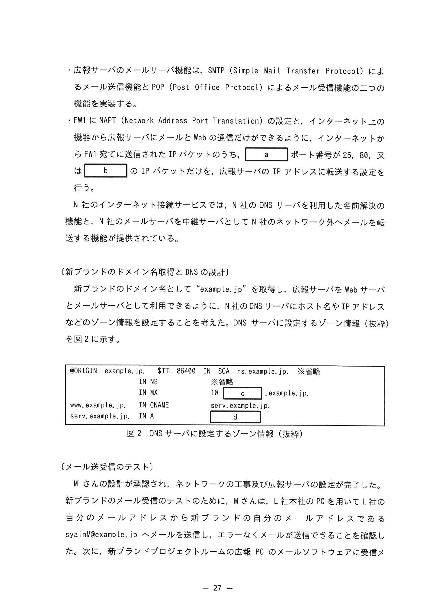

テキスト (OCR)

・広報サーバのメールサーバ機能は, SMTP (Simple Mail Transfer Protocol) によ
るメール送信機能と POP (Post Office Protocol) によるメール受信機能の二っの
機能を実装する。

・FW1 にNAPT (Network Address Port Translation) の設定と, インターネット上の
機器から広報サーバにメールと Web の通信だけができるように, インターネットか
BFW 宛てに送信された IP パケットのうち, |  a | ポート番号が25,89,又
は| 5 JOP パケットだけを, 広報サーバの IP アドレスに転送する設定を
行う。

N 社のインターネット接続サービスでは, N 社の DNS サーバを利用した名前解決の

機能と, N 社のメールサーバを中継サーバとして N 社のネットワーク外ヘメールを転

送する機能が提供されている。

〔新ブランドのドメイン名取得と DNS の設計〕

新ブランドのドメイン名として “example. jp” を取得し, 広報サーバを Web サーバ
とメールサーバとして利用できるように, N社の DNS サーバにホスト名や IP アドレス
などのゾーン情報を設定することを考えた。DNS サーバに設定するゾーン情報 (抜粋)
を図 2 に示す。

@ORIGIN example. jp. $TTL 86400 IN SOA ns.example.jp. ※省略

IN NS            ※省略
IN MX             10 . example. jp.
www. example, jp.    IN CNAME           serv, example. jp.

serv.example.jp. INA

図 2 DNS サーバに設定するゾーン情報 (抜粋)

【メール送受信のテスト〕

M さんの設計が承認され, ネットワークの工事及び広報サーバの設定が完了した。
新ブランドのメール受信のテストのために, M さんは, L 社本社の PC を用いてL 社の
自分のメールアドレスから新ブランドの自分のメールアドレスである
syainM@example. jp へメールを送信し, エラーなくメールが送信できることを確認し
た。 次に, 新ブランドプロジェクトルームの広報 PP のメールソフトウェアに受信メ

### ページ 28

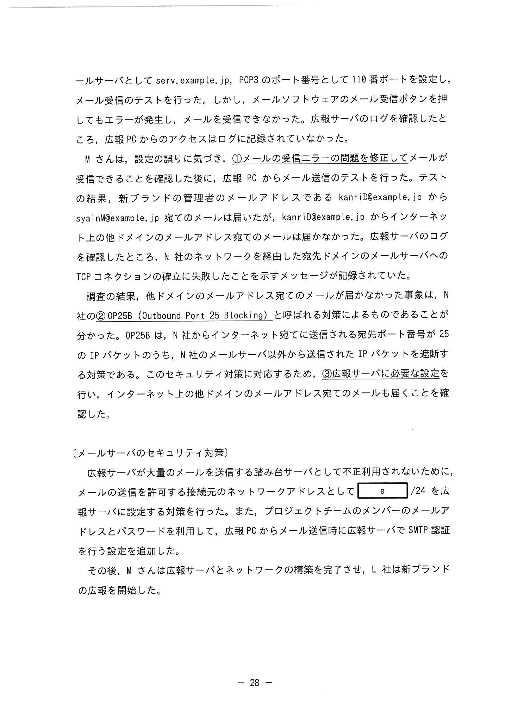

テキスト (OCR)

ールサーバとして serv. examp le.jp, POP3 のポート番号として 110 番ポートを設定し
メール受信のテストを行った。しかし, メールソフトウェアのメール受信ボタンを押
してもエラーが発生し, メールを受信できなかった。広報サーバのログを確認したと
ころ, 広報PCからのアクセスはログに記録されていなかった。

M さんは, 設定の誤りに気づき, ①メールの受信エラーの問題を修正してメールが
受信できることを確認した後に, 広報 PC からメール送信のテストを行った。テスト
の結果, 新ブランドの管理者のメールアドレスである kanriD@example.jp から
syainM@example.jp 宛てのメールは届いたが, kanriD@example.jp からインターネッ
ト上の他ドメインのメールアドレス宛てのメールは届かなかった。広報サーバのログ
を確認したところ, N 社のネットワークを経由した宛先ドメインのメールサーバへの
TCP コネクションの確立に失敗したことを示すメッセージが記録されていた。

調査の結果, 他ドメインのメールアドレス宛てのメールが届かなかった事象は, N
社の②0P25B (Outbound Port 25 Blocking) と呼ばれる対策によるものであることが
分かった。0P25B は, N 社からインターネット宛てに送信される宛先ポート番号が 25
の IP パケットのうち, N 社のメールサーバ以外から送信された IP パケットを遮断す
る対策である。このセキュリティ対策に対応するため, ③広報サーバに必要な設定を
行い インターネット上の他ドメインのメールアドレス宛てのメールも届くことを確
認した。

〔メールサーバのセキュリティ対策]

広報サーバが大量のメールを送信する踏み台サーバとして不正利用されないために,
メールの送信を許可する接続元のネットワークアドレスとして|  e |/24を広
報サーバに設定する対策を行った。また, プロジェクトチームのメンバーのメールア
ドレスとパスワードを利用して, 広報 PC からメール送信時に広報サーバで SMTP BBE
を行う設定を追加した。

その後,M さんは広報サーバとネットワークの構築を完了させ, L 社は新ブランド
の広報を開始した。

### ページ 29

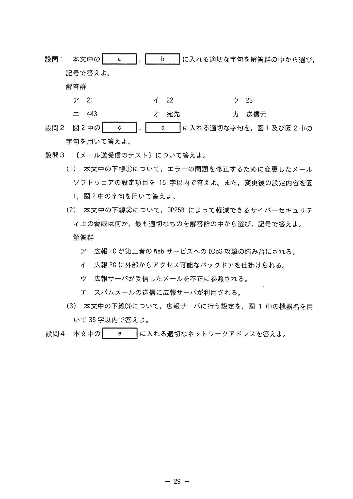

テキスト (OCR)

設問1 本文中の| a |,|  b |に入れる適切な字句を解答群の中から選び,

記号で答えよ。
解答群
ア 21       イ 22       ウ 23
エ 443       オ 宛先       p 送信元
設問2 図2中の| c |,|  d |に入れる適切な字句を, 図1及び図2中の
字句を用いて答えよ。

設問3 〔メール送受信のテスト〕について答えよ。
(1) 本文中の下線やわについて, エラーの問題を修正するために変更したメール
ソフトウェアの設定項目を 15 字以内で答えよ。 また, 変更後の設定内容を図
1, 図 2 中の字句を用いて答えよ。
(2) 本文中の下線@について, 0P25B によって軽減できるサイバーセキュリテ
ィ上の脅威は何か, 最も適切なものを解答群の中から選び, 記号で答えよ。
解答群
ア 広報 PC が第三者の Web サービスへの DDoS 攻撃の踏み台にされる。
広報 PC に外部からアクセス可能なバックドアを仕掛けられる。
広報サーバが受信したメールを不正に参照される。
スパムメールの送信に広報サーバが利用される。
(3) 本文中の下線について, 広報サーバに行う設定を, 図 1 中の機器名を用
いて 35 字以内で答えよ。
設問4 本文中の| es |] に入れる適切なネットワークアドレスを答えよ。

H GN

### ページ 30

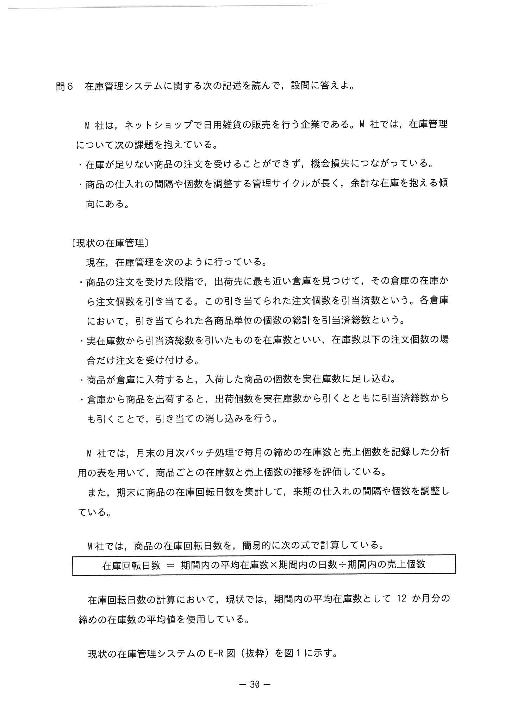

テキスト (OCR)

問6 在庫管理システムに関する次の記述を読んで, 設問に答えよ。

M 社は, ネットショップで日用雑貨の販売を行う企業である。M 社では, 在庫管理
について次の課題を抱えている。

・在庫が足りない商品の注文を受けることができず, 機会損失につながっている。

・商品の仕入れの間隔や個数を調整する管理サイクルが長く, 余計な在庫を抱える傾
向にある。

〔現状の在庫管理
現在, 在庫管理を次のように行っている。

・商品の注文を受けた段階で, 出荷先に最も近い倉庫を見つけて, その倉庫の在庫か
ら注文個数を引き当てる。この引き当てられた注文個数を引当済数という。各倉庫
において, 引き当てられた各商品単位の個数の総計を引当済総数という。

・実在庫数から引当済総数を引いたものを在庫数といい, 在庫数以下の注文個数の場
合だけ注文を受け付ける。

・商品が倉庫に入荷すると, 入荷した商品の個数を実在庫数に足し込む。

・倉庫から商品を出荷すると, 出荷個数を実在庫数から引くとともに引当済総数から
も引くことで, 引き当ての消し込みを行う。

M 社では, 月末の月次バッチ処理で毎月の締めの在庫数と売上個数を記録した分析
用の表を用いて, 商品ごとの在庫数と売上個数の推移を評価している。

また, 期末に商品の在庫回転日数を集計して, 来期の仕入れの間隔や個数を調整し
ている。

M社では, 商品の在庫回転日数を, 簡易的に次の式で計算している。

在庫回転日数 = 期間内の平均在庫数X期間内の日数期間内の売上個数

在庫回転日数の計算において, 現状では, 期間内の平均在庫数として 12 か月分の
締めの在庫数の平均値を使用している。

現状の在庫管理システムのE-R図 (抜粋) を図 1 に示す。

### ページ 31

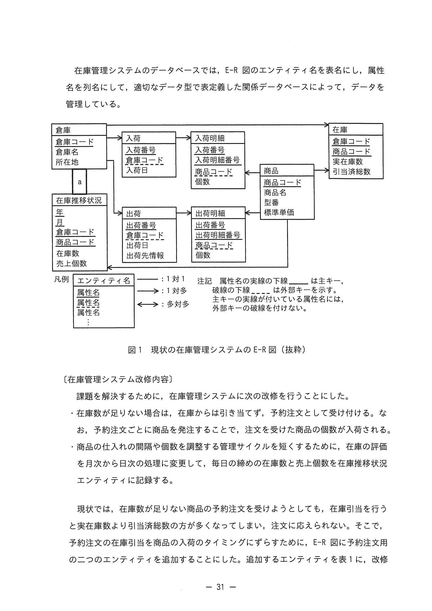

テキスト (OCR)

在庫管理システムのデータベースでは, ER 図のエンティティ名を表名にし, 属性
名を列名にして, 適切なデータ型で表定義した関係データベースによって, データを
管理している。

倉庫                                                                         在庫
倉庫コード     Ass        人谷明細                倉庫コード
倉庫名            入荷番号          入荷番号                            商品コード
所在地             ABATE         入荷明細番号                          実在庫数
入荷日             商品コード         商品               引当済総数
a                             個数              商品コード
商品名
在庫推移状況                                             型番
He        出荷       出荷明細     標準単価
B                 出荷番号           出荷番号
倉庫コード | | 倉庫コード | | 出荷明細番号
商品コード         出荷日             商品コード
在庫数             出荷先情報         個数
売上個数
凡例 | エンティティ名| 一一:1対1 注記 属性名の実線の下線     は主キー,
属性名         ーータテ : 1対多      破線の下線 ____ は外部キーを示す。
7コ                 」              主キーの実線が付いている属性名には,
ae         <> : 多対多 外部キーの破線を付けない。

図1 現状の在庫管理システムのE-R図 (抜粋)

〔在庫管理システム改修内容)
課題を解決するために, 在庫管理システムに次の改修を行うことにした。

・ 在庫数が足りない場合は, 在庫からは引き当てず, 予約注文として受け付ける。な
お, 予約注文ごとに商品を発注することで, 注文を受けた商品の個数が入荷される。
・商品の仕入れの間隔や個数を調整する管理サイクルを短くするために, 在庫の評価
を月次から日次の処理に変更して, 毎日の締めの在庫数と売上個数を在庫推移状況
エンティティに記録する。

現状では, 在庫数が足りない商品の予約注文を受けようとしても, 在庫引当を行う
と実在庫数より引当済総数の方が多くなってしまい, 注文に応えられない。そこで,
予約注文の在庫引当を商品の入荷のタイミングにずらすために, E-R 図に予約注文用
の二つのエンティティを追加することにした。 追加るエンティティを表 1 に, 改修

### ページ 32

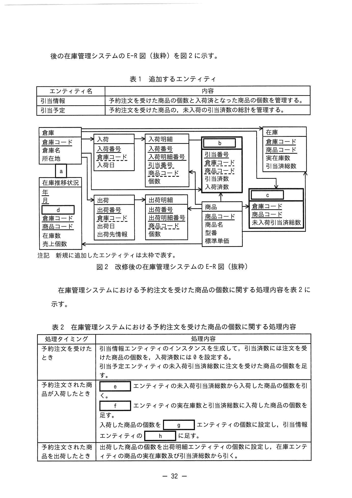

テキスト (OCR)

後の在庫管理システムのE-R図 (抜粋) を図 2 に示す。

表1 追加するエンティティ

エンティティ名

内容

引当情報                予約注文を受けた商品の個数と入荷済となった商品の個数を管理する。
引当予定        予約注文を受けた商品の, 未入荷の引当済数の総計を管理する。
と            入荷       | 入荷明細        =
倉庫コード               3                      i.                                            倉庫コード
ane             入荷番号               入荷番号                し>                商品コード
所在地             倉庫コード | | 入荷明細番号| | 引当番号              実在庫数
入荷日             引当番号           食卓コード            引当済総数
a                                商品コード    |   NN

WS                       個数                  a
a zB                                                    入荷済数                   1
月            出荷       | 出荷明細      L    t
|         Hees          出荷番号            a          i oe
倉庫コード         倉庫コード        出荷明細番号          品コード | |Bea-k
Sea         Hee             Beak          ae             未入荷引当済総数
在庫数              出荷先情報        価数                 ue
売上個数                                                   標準単価

注記 新規に追加したエンティティは太枠で表す。

図 2 改修後の在庫管理システムの E-R図 (抜粋)

在庫管理システムにおける予約注文を受けた商品の個数に関する処理内容を表 2 に

示す。

表2 在庫管理システムにおける予約注文を受けた商品の個数に関する処理内容

処理タイミング

処理内容

予約注文を受けた
とき

引当情報エンティティのインスタンスを生成して, 引当済数には注文を受
けた商品の個数を, 入荷済数には 9 を設定する。

引当予定エンティティの未入荷引当済総数に注文を受けた商品の個数を足
す。

予約注文された商
品が入荷したとき

エンティティの未入荷引当済総数から入荷した商品の個数を引

足す。
入荷した商品の個数を | g | エンティティの個数に設定し,引当情報

エンティティの| h | に足す。

エンティティの実在庫数と引当済総数に入荷した商品の個数を

しょ|
C+]

予約注文された商
品を出荷したとき

出荷した商品の個数を出荷明細エンティティの個数に設定し, 在庫エンテ

ィティの商品の実在庫数及び引当済総数から引く。

### ページ 33

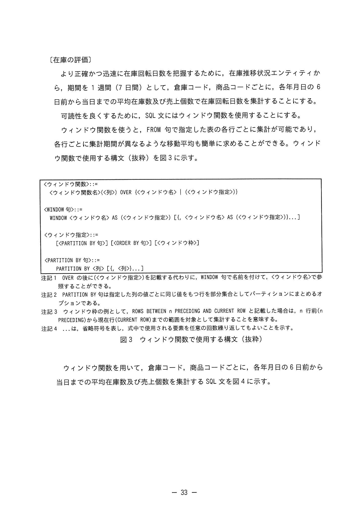

テキスト (OCR)

〔在庫の評価]

より正確かつ迅速に在庫回転日数を把握するために, 在庫推移状況エンティティか
ら, 期間を 1 週間 (7 日間) として, 倉庫コード, 商品コードごとに, 各年月日の 6
日前から当日までの平均在庫数及び売上個数で在庫回転日数を集計することにする。

可読性を良くするために, SQL 文にはウィンドウ関数を使用することにする。

ウィンドウ関数を使うと, FROM 句で指定した表の各行ごとに集計が可能であり,
各行ごとに集計期間が異なるような移動平均も簡単に求めることができる。ウィンド
ウ関数で使用する構文 (抜粋) を図 3 に示す。

く<ウィンドウ関数>: :=
く<ウィンドウ関数名>(<列>) OVER (<ウィンドウ名> | (<ウィンドウ指定>))

<WINDOW 旬>: :=
WINDOW <ウィンドウ名> AS (<ウィンドウ指定>) [(, <ウィンドウ名> AS (<ウィンドウ指定>)}...]

く<ウィンドウ指定>: :=
[<PARTITION BY 名>] [<ORDER BY 句>] [<ウィンドウ枠>]

<PARTITION BY 名>: :=
PARTITION BY <i> [{, <列2).…… ]

注記1 OVER の後に(<ウィンドウ指定>) を記載する代わりに, WINDOW 名で名前を付けて, <ウィンドウ名>で参
照することができる。

注記 2 PARTITION BY 句は指定した列の値ごとに同じ値をもつ行を部分集合としてパーティションにまとめるオ
プションである。

注記 3 ウィンドウ枠の例として, ROWS BETWEEN n PRECEDING AND CURRENT ROW と記載した場合は, n 行前(n
PRECEDING)から現在行(CURRENT ROW)までの範囲を対象として集計することを意味する。

注記 4 ...は, 省略符号を表し, 式中で使用される要素を任意の回数繰り返してもよいことを示す。

図3 ウィンドウ関数で使用する構文 (抜粋)

ウィンドウ関数を用いて, 倉庫コード, 商品コードごとに, 各年月日の6 ARDS
当日までの平均在庫数及び売上個数を集計する SQL 文を図 4 に示す。

### ページ 34

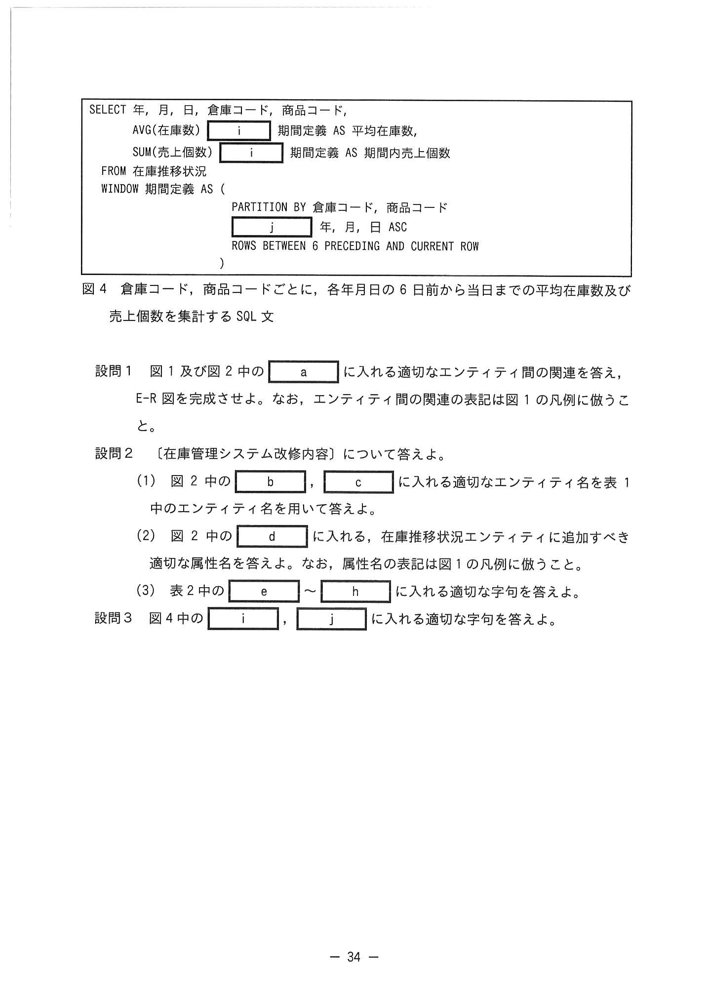

テキスト (OCR)

SELECT 年, A, A, 倉庫コード, 商品コード,
AV6(在庫数) | 」 | 期間定義AS 平均在庫数
SUM(売上個数) | i | 期間定義AS 期間内売上個数
FROM 在庫推移状況

WINDOW 期間定義 AS (
PARTITION BY 倉庫コード, 商品コード

ROWS BETWEEN 6 PRECEDING AND CURRENT ROW
)

図4 倉庫コード, 商品コードごとに, 各年月日の 6 日前から当日までの平均在庫数及び
売上個数を集計する SQL 文

設問1 図 1 及び図 2中の| a | に入れる適切なエンティティ問の関連を答え,
E-R 図を完成させよ。なお, エンティティ間の関連の表記は図 1 の凡例に條うこ
と。
設問2 〔在庫管理システム改修内容】について答えよ。
(⑪) 図2 中の|  b |,|  c |に入れる適切なエンティティ名を表 1
中のエンティティ名を用いて答えよ。
(2) 図 2 中の| a | に入れる, 在庫推移状況エンティティに追加べき
適切な属性名を答えよ。なお, 属性名の表記は図 1 の凡例に僚うこと。
(3) 表2中の|  e |一| h |に入れる適切な字句を答えよ。
設問3 図4中の| ij |,[  」 |に入れる適切な字句を答えよ。

### ページ 35

テキスト (OCR)

〔

メ = 用 紙 ]

### ページ 36

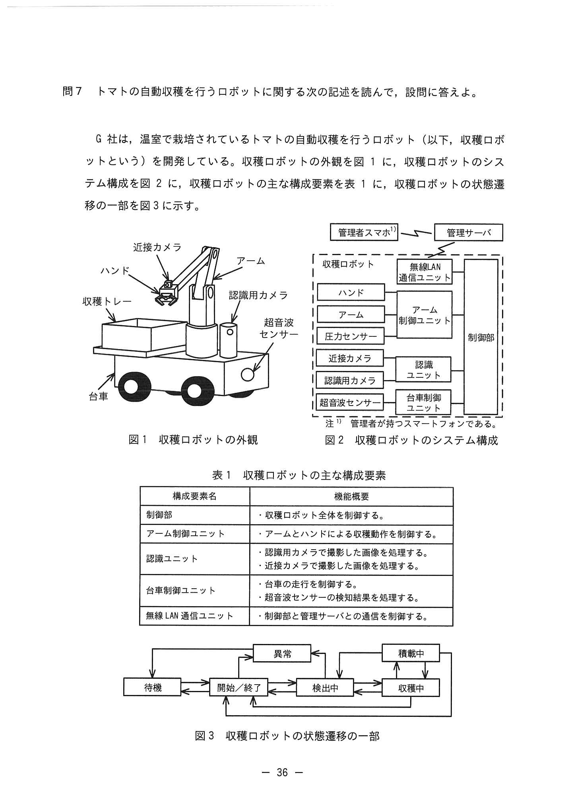

テキスト (OCR)

fA7 トマトの自動収穫を行うロボットに関する次の記述を読んで, 設問に答えよ。

G 社は, 温室で栽培されているトマトの自動収穫を行うロボット (以下, 収穫ロボ
ットという) を開発している。 収穫ロボットの外観を図 1 に, 収穫ロボットのシス
テム構成を図 2 に, 収穫ロボットの主な構成要素を表 1 に, 収穫ロボットの状態遷

移の一部を図 3 に示す。

図1 収穫ロボットの外観

表 1

| 管理者スマボリ| ーー| 管理サーバ |

I  収穫ロボット        無線LAN             |
|         通信ユニット| |   |
ハンド

ュー      アーム
Zoe aay]
圧力センサー          制御部|」
=             |
近接カメラ         con             |
認識用カメラ   ーーデジ       |
Tay      |
marly} BS      |

SED 管理者が持つスマートフォンである。
図2 収穫ロボットのシステム構成

収穫ロボットの主な構成要素

構成要素名

機能概要

制御部

・収穫ロボット全体を制御する。

アーム制御ユニット

・アームとハンドによる収穫動作を制御する。

認識ユニット

・ 認識用カメラで撮影した画像を処理する。
・近接カメラで撮影した画像を処理する。

台車制御ユニット

・ 台車の走行を制御する。

音波センサーの検知結果を処理する。

無線 LAN 通信ユニット

・制御部と管理サーバとの通信を制御する。

異常                                       積載中

|
i                ]

図3 収穫ロボットの状態遷移の一部

### ページ 37

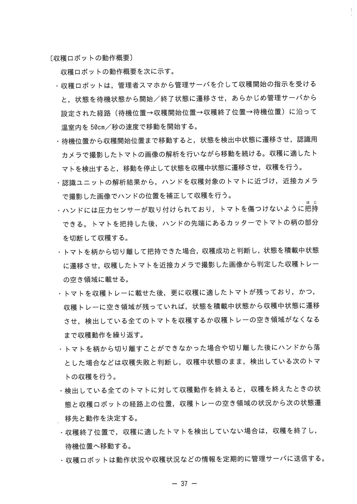

テキスト (OCR)

[I穫ロボットの動作概要)
収穫ロボットの動作概要を次に示す。

. 収穫ロボットは, 管理者スマホから管理サーバを介して収穫開始の指示を受ける
と, 状態を待機状態から開始/終了状態に運移させ, あらかじめ管理サーバから
設定された経路 (待機位置っ収穫開始位置っ収穫終了位置つ待機位置) に沿って
温室内を 50cmノ秒の速度で移動を開始する。

. 待機位置から収穫開始位置まで移動すると, 状態を検出中状態に乱移させ, 認識用
カメラで撮影したトマトの画像の解析を行いながら移動を続ける。収穫に適したト
マトを検出すると, 移動を停下して状態を収穫中状態に軍移させ, 収穫を行う。

. 認識ユニットの解析結果から, ハンドを収穫対象のトマトに近づけ, 近接カメラ
で撮影した画像でハンドの位置を補正して収穫を行う。

- ハンドには圧力センサーが取り付けられており, トマトを傷つけないように担持
できる。トマトを把持した後, ハンドの完端にあるカッターでトマトの柄の部分
を切断して収穫する。

.トマトを柄から切り離して把持できた場合, 収穫成功と判断し, 状態を積載中状態
SEBS, 収穫したトマトを近接カメラで撮影した画像から判定した収穫トレー
の空き領域に載せる。

-トマトを収穫トレーに載せた後。 更に収穫に適したトマトが残っており, かっ,
収穫トレーに空き領域が残っていれば, 状態を積載中状態から収穫中状態に須移
させ, 検出している全てのトマトを収穫するか収穫トレーの空き領域がなくなる
まで収穫動作を繰り返す。

.トマトを柄から切離すことができなかった場合や切り離した後にハンドから落
とした場合などは収穫失敗と判断し, 収穫中状態のまま, 検出している次のトマ
トの収穫を行う。

・ 検出している全てのトマトに対して収穫動作を終えると, 収穫を終えたときの状
態と収穫ロボットの経路上の位置, 収穫トレーの空き領域の状況から次の状態軍
移先と動作を決定する。

・ 収穫終了位置で, 収穫に適したトマトを検出していない場合は, 収穫を終了し,
待機位置へ移動する。

. 収穫ロボットは動作状況や収穫状況などの情報を定期的に管理サーバに送信する。

### ページ 38

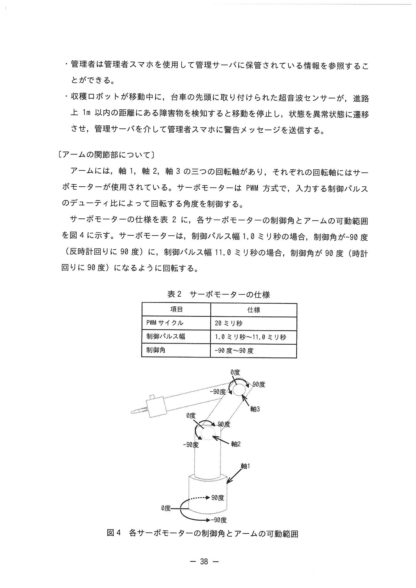

テキスト (OCR)

・ 管理者は管理者スマホを使用して管理サーバに保管されている情報を参照するこ
とができる。

・ 収穫ロボポットが移動中に, 台車の先頭に取り付けられた超音波センサーが, 進路
上 im 以内の距離にある障害物を検知すると移動を停止し, 状態を異常状態に須移
St, 管理サーバを介して管理者スマホに警告メッセージを送信する。

[アームの関節部について〕

アームには, 軸 1, 軸2, 軸3 の三つの回転軸があり, それぞれの回転軸にはサー
ボモーターが使用されている。サーボモーターは PWM 方式で, 入力する制御バルス
のデューティ比によって回転する角度を制御する。

サーボモーターの仕様を表 2 に, 各サーボモーターの制御角とアームの可動範囲
を図 4 に示す。サーボモーターは, 制御パルス幅1.6 ミリ秒の場合, 制御角が-90 度

(反時計回りに 99 BE) に, 制御パルス幅 11.0 ミリ秒の場合, 制御角が 99度(時計
回りに 9 度) になるように回転する。

表2 サーボモーターの仕様

項目                   仕様
PWM サイクル         29 ミリ秒
制御パルス幅        1.6 ミリ秒一11.0 ミリ秒
制御角             -90 度一96 BE
6度

図4 各サーボモーターの制御角とアームの可動範囲

### ページ 39

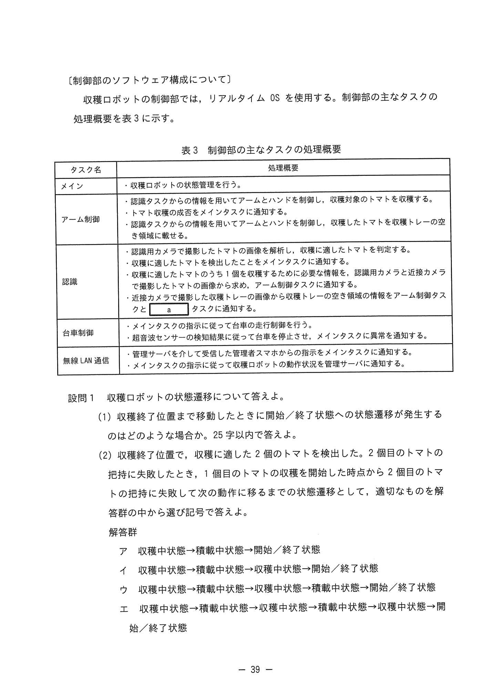

テキスト (OCR)

〔制御痢のソフトウェア構成について〕
収穫ロボットの制御部では, リアルタイム 0S を使用する。制御部の主なタスクの
処理概要を表 3 に示す。

表3 制御部の主なタスクの処理概要

タスク名                      処理概要
メイン     ・ 収穫ロボットの状態管理を行う。
 認識タスクからの情報を用いてアームとハンドを制御し, 収穫対象のトマトを収穫する。
—"   ・トマト収穫の成否をメインタスクに通知する。
- 認識タスクからの情報をた用いてアームとハンドを制御し, 収穫したトマトを収穫トレーの空
き領域に載せる。
・ 認識用カメラで撮影したトマトの画像を解析し, 収穫に適したトマトを判定する。
・収穫に適したトマトを検出したことをメインタスクに通知する。
-      - 収穫に適したトマトのうち 1 個を収穫するために必要な情報を, 認識用カメラと近接カメラ
       で撮影したトマトの画像から求め、 アーム制御タスクに通知する。
- 近接カメラで撮影した収穫トレーの画像から収穫トレーの空き領域の情報をアーム制御タス
クと[| 』 | タスクに通知する。
ee    - メインタスクの指示に従って台車の走行制御を行う。
上       ・ 超音波センサーの検知結果に従って台車を停止させ, メインタスクに異常を通知する。
AN間休  管理サーバを介して受信した管理者スマホからの指示をメインタスクに通知する。
    結 | .メインタスクの指示に従って収穫ロボットの動作状況を管理サーバに通知する。
設問1 収穫ロボットの状態乱移について答えよ。

(1) 収穫終了位置まで移動したときに開始/終了状態への状態遷移が発生する
のはどのような場合か。25 字以内で答えよ。

(2) 収穫終了位置で, 収穫に適した 2 個のトマトを検出した。2 個目のトマトの
把持に失敗したとき, 1 個目のトマトの収穫を開始した時点から 2 個目のトマ
トの把持に失敗して次の動作に移るまでの状態乱移として, 適切なものを人解
答群の中から選び記号で答えよ。

解答群

ア

H GAN

収穫中状態積載中状態開始終了状態

収穫中状態っ積載中状態っ収穫中状態つ開始終了状態

収穫中状態積載中状態収穫中状態っ積載中状態つ開始終了状態
収穫中状態積載中状態収穫中状態積載中状態収穫中状態っ開

始プ終了状態

### ページ 40

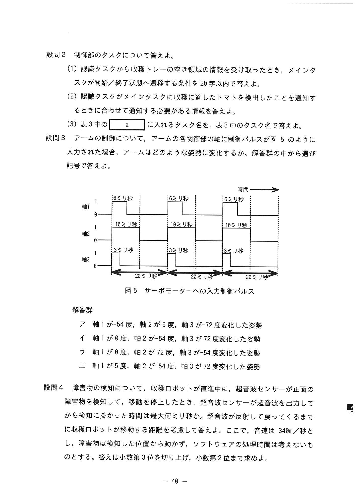

テキスト (OCR)

設問2 制御部のタスクについて答えよ。
(1) 認識タスクから収穫トレーの空き領域の情報を受け取ったとき, メインタ
スクが開始終了状態へ運移する条件を 20 字以内で答えよ。
(2) 認識タスクがメインタスクに収穫に適したトマトを検出したことを通知す
るときに合わせて通知する必要がある情報を答えよ。
(3) 表3中の|  a |] に入れるタスク名を, 表 3中のタスク名で答えよ。
設問3 アームの制御について, アームの名関節部の軸に制御パルスが図 5 のように
入力された場合, アームはどのような姿勢に変化するか。解答群の中から選び

記号で答えよ。
時間 ———_>
1  6ミリ秒 i    16S Up    i6ミリ秒 i    i
ian
, Ls ue        is up}        Hos yp}
軸2                             H
y           ーーゴ
,  BsUe |    iss ua i    iss Ua |
軸3        H        :        1
5       i        i

<         29ミリ のをで         29ミリ p<         205) at

図5 サーボモーターへの入力制御パルス

Re
P 軸1が-54度, 軸2が5度, 軸3が-72度変化した姿勢
4 軸1が69度, 軸2が-54度, 軸3が72度変化した姿勢
ウ 軸1が09度, 軸2が72度, 軸3が-54 度変化した姿勢
エ 軸1が5度, 軸2が-54度, 軸3が72度変化した姿勢

設問4 障害物の検知について, 収穫ロボットが直進中に, 超音波センサーが正面の
障害物を検知して, 移動を停止したとき, 超音波センサーが超音波を出力して
から検知に掛かった時間は最大何ミリ秒か。超音波が反射して戻ってくるまで
に収穫ロボットが移動する距離を考慮して答えよ。ここで, 音速は 340mノ秒と
し, 障害物は検知した位置から動かず, ソフトウェアの処理時間は考えないも
のとする。答えは小数第 3 位を切り上げ, 小数第 2 位まで求めよ。

|

### ページ 41

テキスト (OCR)

[ メ モ 用 紙 )

= Of =

### ページ 42

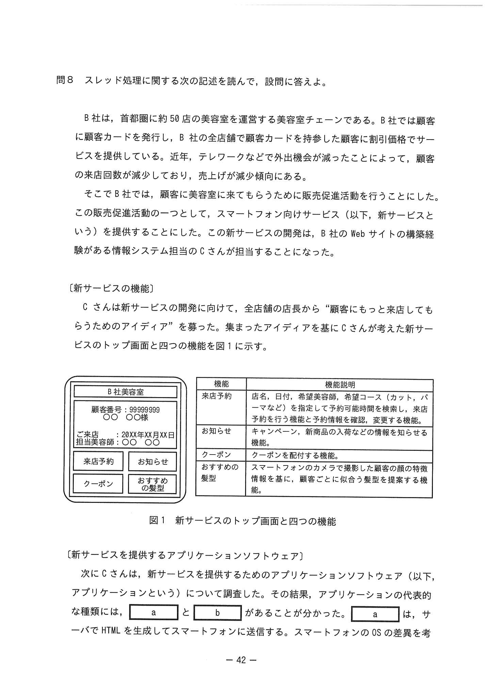

テキスト (OCR)

AIS スレッド処理に関する次の記述を読んで, 設問に答えよ

B 社は, 首都圏に約 56 店の美容室を運営する美容室チェーンである。B 社では顧客
に顧客カードを発行し, B 社の全店舗で顧客カードを持参した顧客に割引価格でサー
ビスを提供している。 近年。 テレワークなどで外出機会が減ったことによって, BE
の来店回数が減少しており, 売上げが減少傾向にある。

そこで B 社では, 顧客に美容室に来てもらうために販売促進活動を行うことにした。
この販売促進活動のーつとして, スマートフォン向けサービス (以下, 新サービスと
いう) を提供することにした。この新サービスの開発は, BLO Web サイトの構築経
験がある情報システム担当のCさんが担当することになった。

〔新サービスの機能]

C さんは新サービスの開発に向けて, 全店舗の店長から“顧客にもっと来店しても
らうためのアイディア” を募った。集まったアイディアを基にC さんが考えた新サー
ビスのトップ画面と四つの機能を図 1 に示す。

>    機能             機能説明
|    B 社美容室    | | Rese [ee oo, SERSH, SBIR (カットバ
a ae            ーマなど) を指定して予約可能時間を検索し。 来店
OO OO             SHORT SMES FAURE TEND, 変更する機能

ご来店     1 OE BE      お知らせ     キャンペーン, 新商品の入荷などの情報を知らせる
担当美容師: OO OO                     機能。

クーポン     クーポンを配付する機能。

おすすめの | スマートフォンのカメラで撮影した顧客の顔の特徴
髪型      情報を基に, 顧客ごとに似合う髪型を提案する機
能。

来店予約      お知らせ

aes  すすめ
クーポン すす

ご         =

図1 新サービスのトップ画面と四つの機能

〔新サービスを提供するアプリケーションソフトウェア】

次にCじさんは, 新サービスを提供するためのアプリケーションソフトウェア (以下,
アプリケーションという) について調査した。その結果, アプリケーションの代表的
な種類には, | 』 |と| b ] があることが分かった。| 。 dia, +

ーバで HTML を生成してスマートフォンに送信する。スマートフォンの 0S の差異を考

### ページ 43

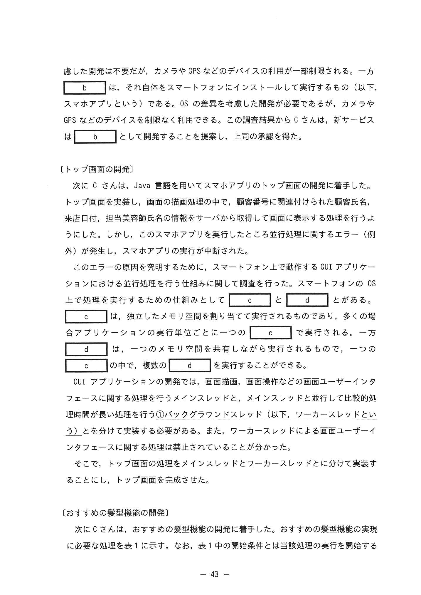

テキスト (OCR)

慮した開発は不要だが, カメラや GPS などのデパイスの利用が一部制限される。一方
[| 5 | は, それ自体をスマートフォンにインストールして実行するもの (WF,
スマホアプリという) である。0S の差異を考慮した開発が必要であるが, カメラや
GPS などのデバイスを制限なく利用できる。この調査結果からC さんは, 新サービス
は|  b | として開発することを提案し, 上司の承認を得た。

[トップ画面の開発〕

次に C さんは, Java 言語を用いてスマホアプリのトップ画面の開発に着手した。
トップ画面を実装し, 画面の描画処理の中で, 顧客番号に関連付けられた顧客氏名
来店日付, 担当美容師氏名の情報をサーバから取得して画面に表示する処理を行うよ
うにした。しかし, このスマホアプリを実行したところ並行処理に関するエラー (例
外) が発生し, スマホアプリの実行が中断された。

このエラーの原因を究明するために, スマートフォン上で動作する WI アプリケー
ションにおける並行処理を行う仕組みに関して調査を行った。 スマートフォンの OS
上で処理を実行するための仕組みとして| c [el da | とがあぁる。
| < | は, 独立したメモリ空間を割り当てて実行されるものであり, BK OW
合アプリケーションの実行単位ごとに一つの で実行される。一方
[| 9 | は, 一つのメモリ空間を共有しながら実行されるもので, 一つの
| < | の中で, 複数の| d | を実行することができる。

QUI アプリケーションの開発では, 画面描画, 画面操作などの画面ユーザーインタ
フェースに関する処理を行うメインスレッドと, メインスレッドと並行して比較的処
理時間が長い処理を行う①バックグラウンドスレッド (以下. ワーカースレッドとい
う) とを分けて実装する必要がある。また, ワーカースレッドによる画面ユーザーイ
ンタフェースに関する処理は禁止されていることが分かった。

そこで, トップ画面の処理をメインスレッドとワーカースレッドとに分けて実装す
ることにし, トップ画面を完成させた。

[おすすめの髪型機能の開発
次にCじさんは, おすすめの髪型機能の開発に着手した。おすすめの髪型機能の実現
に必要な処理を表 1 に示す。 なお, 表 1 中の開始条件とは当該処理の実行を開始する

### ページ 44

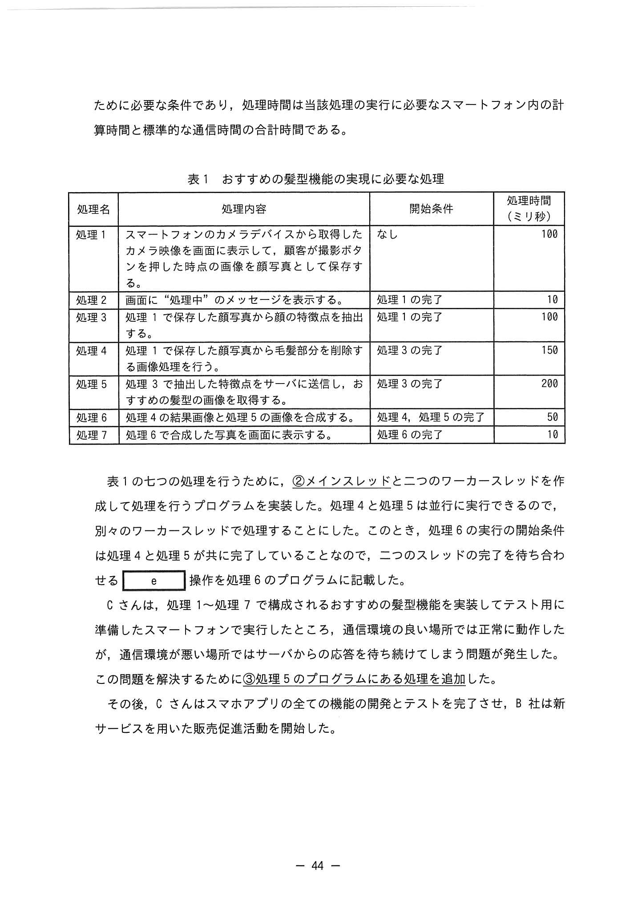

テキスト (OCR)

ために必要な条件であり, 処理時間は当該処理の実行に必要なスマートフォン内の計
算時間と標準的な通信時間の合計時間である。

表1 おすすめの髪型機能の実現に必要な処理

os                    処理時間
処理名                     処理内容                           開始条件          (ミリ秒)
処理1 | スマートフォンのカメラデバイスから取得した | なし            100

カメラ映像を画面に表示して, 顧客が撮影ボタ
ンを押した時点の画像を顔写真として保存す
る。
処理2 | 画面に “MIB” のメッセージを表示する。  処理 1 の完了         10
処理3 | 処理 1 で保存した顔写真から顔の特徴点を抽出 | 処理 1 の完了        100
する。
処理4 | 処理 1 で保存した顔写真から毛髪部分を削除す | 処理 3 の完了              150
る画像処理を行う。
処理5 | 処理 3 で抽出した特徴点をサーバに送信し, お | 処理3 の完了        200
すすめの髪型の画像を取得する。
処理6 | 処理4の結果画像と処理 5 の画像を合成する。 | 処理4, 処理5 の完了       50
処理 7 | 処理6で合成した写真を画面に表示する。   処理 6 の完了         19

表 1 の七つの処理を行うために, メインスレッドと二つのワーカースレッドを作
成して処理を行うプログラムを実装した。処理 4 と処理 5 は並行に実行できるので,
別々のワーカースレッドで処理することにした。このとき, 処理 6 の実行の開始条件
は処理 4 と処理 5 が共に完了していることなので, 二つのスレッドの完了を待ち合わ
せる|  e |操作を処理6のプログラムに記載した。

C さんは, 処理 1一処理 7 で構成されるおすすめの髪型機能を実装してテスト用に
準備したスマートフォンで実行したところ, 通信環境の良い場所では正常に動作した
が, 通信環境が悪い場所ではサーバからの応答を待ち続けてしまう問題が発生した。
この問題を解決するために③処理 5 のプログラムにある処理を追加した。

その後,C さんはスマホアプリの全ての機能の開発とテストを完了させ, B 社は新
サービスを用いた販売促進活動を開始した。

### ページ 45

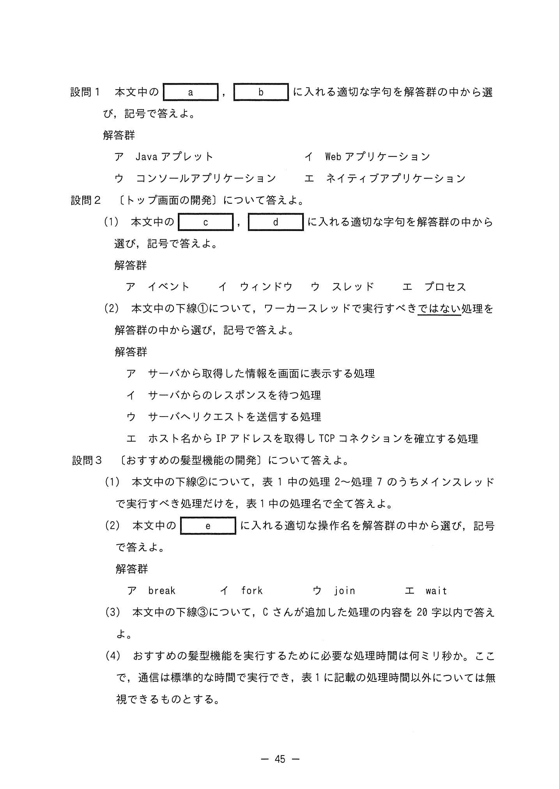

テキスト (OCR)

設問1 本文中の| a |,|  b |に入れる適切な字句を解答群の中から選
U, 記号で答えよ。
解答群
ア Java アプレット       イ Web アプリケーション

DL ネイティブアプリケーション

ウ コンソールアプリケーション
設問2 〔トップ画面の開発】 について答えよ。

(1) 本文中の| c |, | ad |に入れる適切な字句を解答群の中から
選び, 記号で答えよ。
解答群

ア イベント  イ ウィンドウ 9 スレッド  x Sawer
(2) 本文中の下線やについて, ワーカースレッドで実行すべきではない処理を
解答群の中から選び, 記号で答えよ。
解答群
ア サーバから取得した情報を画面に表示する処理
イ サーバからのレスポンスを待つ処理
ウ サーバヘリクエストを送信する処理
エエ ホスト名から IP アドレスを取得し TCP コネクションを確立する処理
設問3 〔おすすめの髪型機能の開発】 について答えよ。
(1) 本文中の下線@について, 表 1 中の処理 2一処理 7 のうちメインスレッド
で実行すべき処理だけを, 表 1 中の処理名で全て答えよ。

(2) 本文中の| e | に入れる適切な操作名を解答群の中から選び, 記号
で答えよ。
eR
ア break   イ fork    ウ join    xX wait
(3) 本文中の下線$について, C さんが追加した処理の内容を 20 字以内で答え
よ。

(4) おすすめの髪型機能を実行するために必要な処理時間は何ミリ秒か。ここ
で, 通信は標準的な時間で実行でき, 表 1 に記載の処理時間以外については無
視できるものとする。

### ページ 46

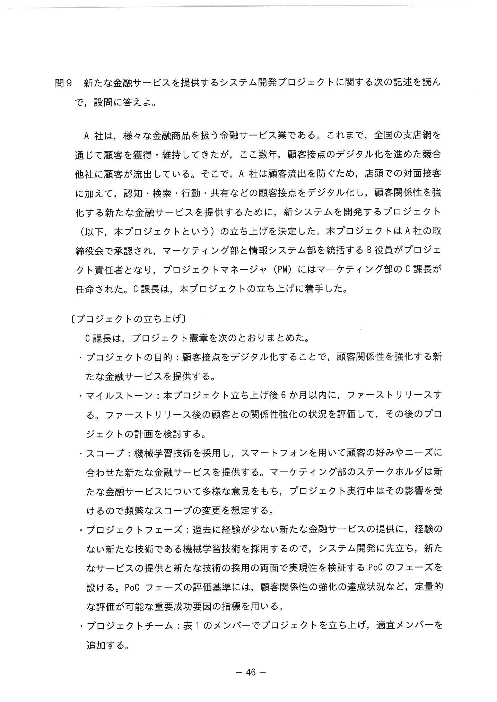

テキスト (OCR)

間9 新たな金融サービスを提供するシステム開発プロジェクトに関する次の記述を読ん

で, 設問に答えよ。

A 社は, 様々な金融商品を扱う金融サービス業である。これまで, 全国の支店網を
通じて顧客を獲得・維持してきたが, COME, 顧客接点のデジタル化を進めた競合
他社に顧客が流出している。 そこで, A 社は顧客流出を防ぐため, 店頭での対面接客
に加えて, 認知・検索・行動・共有などの顧客接点をデジタル化し, 顧客関係性を強
化する新たな金融サービスを提供するために, 新システムを開発するプロジェクト
GUE, 本プロジェクトという) の立ち上げを決定した。本プロジェクトはA社の取
締役会で承認され, マーケティング部と情報システム部を統括する B 役員がプロジェ
クト責任者となり, プロジェクトマネージャ (PM) にはマーケティング部の CRED
任命された。C 課長は, 本プロジェクトの立ち上げに着手した。

[プロジェクトの立ち上げ}
( 課長は, プロジェクト憲章を次のとおりまとめた。

・プロジェクトの目的 : 顧客接点をデジタル化することで, 顧客関係性を強化する新
たな金融サービスを提供する。

・マイルストーン : 本プロジェクト立ち上げ後 6 か月以内に, ファーストリリースす
る。ファーストリリース後の顧客との関係性強化の状況を評価して, その後のプロ
ジェクトの計画を検討する。

・スコープ : 機械学習技術を採用し, スマートフォンを用いて顧客の好みやニーズに
合わせた新たな金融サービスを提供する。マーケティング部のステークホルダは新
たな金融サービスについて多様な意見をもち, プロジェクト実行中はその影響を受
けるので頻繁なスコープの変更を想定する。

・プロジェクトフェーズ : 過去に経験が少ない新たな金融サービスの提供に, 経験の
ない新たな技術である機械学習技術を採用するので, システム開発に先立ち, 新た
なサービスの提供と新たな技術の採用の両面で実現性を検証する PoC のフェーズを
設ける。PoC フェーズの評価基準には, 顧客関係性の強化の達成状況など, 定量的
な評価が可能な重要成功要因の指標を用いる。

・プロジェクトチーム : 表1 のメンバーでプロジェクトを立ち上げ, 適宜メンバーを
追加する。

### ページ 47

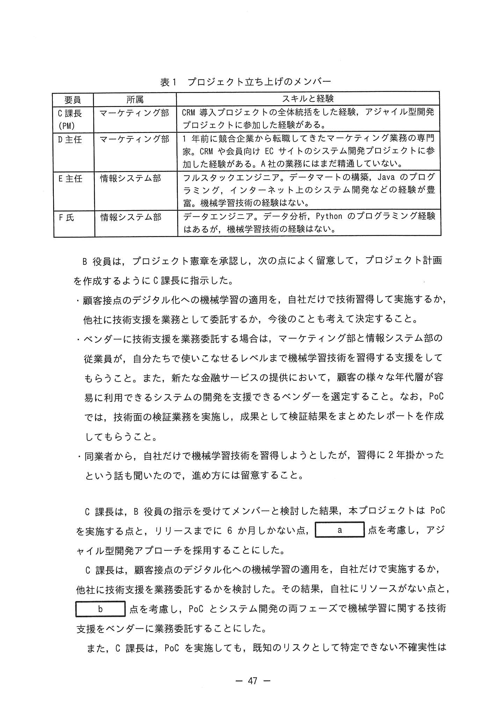

テキスト (OCR)

表1 プロジェクト立ち上げのメンバー
要員     所属               スキルと経験
CHE | マーケティング部 | CRM 導入プロジェクトの全体統括をした経験, アジャイル型開発
(PM)            プロジェクトに参加した経験がある。
D 主任 | マーケティング部 | 1 年前に競合企業から転職してきたマーケティング業務の専門

家。CRM や会員向け EC サイトのシステム開発プロジェクトに参
加した経験がある。A 社の業務にはまだ精通していない。

E主任 | 情報システム部  フルスタックエンジニア。データマートの構築, Java のプログ

ラミング, インターネット上のシステム開発などの経験が豊
富。機械学習技術の経験はない。

情報システム部   データエンジニア。データ分析, Python のプログラミング経験
はあるが, 機械学習技術の経験はない。

B 役員は, プロジェクト憲章を承認し, 次の点によく留意して, プロジェクト計画

を作成するように(課長に指示した。

・顧客接点のデジタル化への機械学習の適用を, 自社だけで技術習得して実施するか
他社に技術支援を業務として委託するか, 今後のことも考えて決定すること。

・ベンダーに技術支援を業務委託する場合は, マーケティング部と情報システム部の
従業員が, 自分たちで使いこなせるレベルまで機械学習技術を習得する支援をして
もらうこと。また, 新たな金融サービスの提供において, 顧客の様々な年代層が容
易に利用できるシステムの開発を支援できるベンダーを選定すること。なお, Pol
では, 技術面の検証業務を実施し, 成果として検証結果をまとめたレポートを作成
してもらうこと。

・同業者から, 自社だけで機械学習技術を習得しようとしたが, 習得に 2 年掛かった
という話も聞いたので, 進め方には留意すること。

C 課長は, B 役員の指示を受けてメンバーと検討した結果, 本プロジェクトは Pol

を実施する点と, リリースまでに 6 か月しかない点,|  a | 点を考慮し, アジ
ャイル型開発アプローチを採用することにした。

C 課長は, 顧客接点のデジタル化への機械学習の適用を, 自社だけで実施するか,
他社に技術支援を業務委託するかを検討した。その結果, 自社にリソースがない点と,

| 5 | RES, Pot とシステム開発の両フェーズで機械学習に関する技術
支援をペンダーに業務委託することにした。

また, C 課長は, PoC を実施しても, 既知のリスクとして特定できない不確実性は

### ページ 48

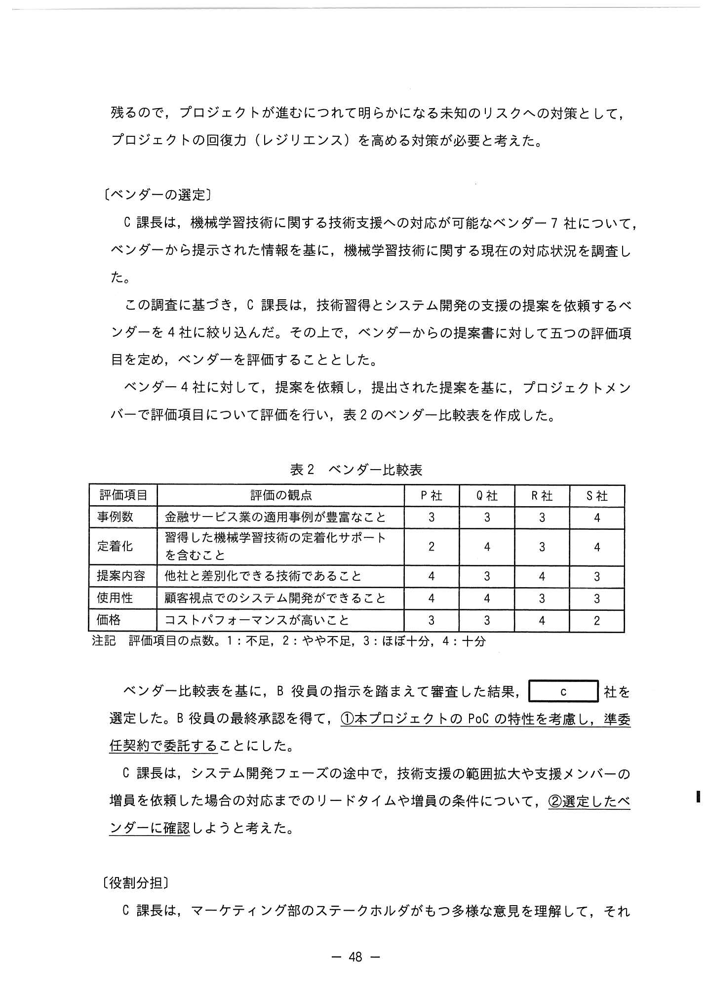

テキスト (OCR)

残るので, プロジェクトが進むにつれて明らかになる未知のリスクへの対策として,
プロジェクトの回復力 (レジリエンス) を高める対策が必要と考えた。

〔ベンダーの選定〕

C 課長は, 機械学習技術に関する技術支援への対応が可能なベンダー 7 社について,
ベンダーから提示された情報を基に, 機械学習技術に関する現在の対応状況を調査し
た。

この調査に基づき, C 課長は, 技術習得とシステム開発の支援の提案を依頼するベ
ンダーを 4 社に絞り込んだ。その上で, ベンダーからの提案書に対して五つの評価項
目を定め, ベンダーを評価することとした。

ベンダー 4 社に対して, 提案を依頼し, 提出された提案を基に, プロジェクトメン
バーで評価項目について評価を行い, 表 2 のベンダー比較表を作成した。

表2 ベンダー比較表

評価項目                       評価の観点                        P社        0社        R社        S社
事例数     金融サービス業の適用事例が豊富なこと       3        3        3        4
定着化     MA ト       2        4        3        4
提案内容 | 他社と差別化できる技術であること       4     3     4     3
使用性  顧客視点でのシステム開発ができること   4    4   3   3
価格   コストパフォーマンスが高いこと      3   3   4   2

注記 評価項目の点数。1 : 不足, 2 : やや不足, 3 : ほぼ十分, 4 : 十分

ベンダー比較表を基に, B 役員の指示を踏まえて審査した結果, 社を
選定した。B 役員の最終承認を得て, ①本プロジェクトの PoC の特性を考慮し, 準委
任契約で委託することにした。

C 課長は, システム開発フェーズの途中で, 技術支援の範囲拡大や支援メンバーの
増員を依頼した場合の対応までのリードタイムや増員の条件について, @選定したベ
ンダーに確認しようと考えた。

役割分担
C RR, マーケティング部のステークホルダがもつ多様な意見を理解して, それ

### ページ 49

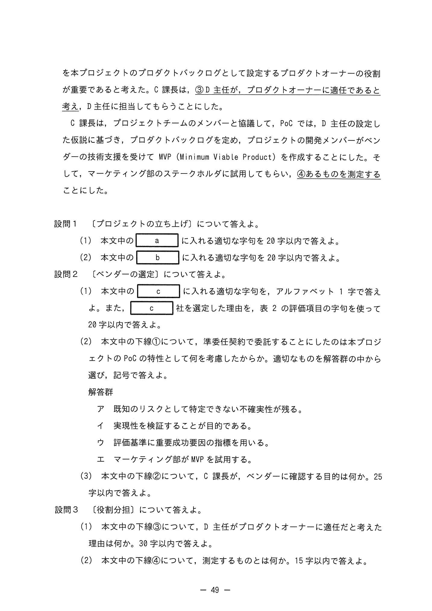

テキスト (OCR)

を本プロジェクトのプロダクトバックログとして設定するプロダクトオーナーの役割
が重要であると考えた。C 課長は, OD 主任が, プロダクトオーナーに適任であると
考え, D 主任に担当してもらうことにした。

C 課長は, プロジェクトチームのメンバーと協議して, PoC では, D 主任の設定し
た仮説に基づき, プロダクトバックログを定め, プロジェクトの開発メンバーがベン
ダーの技術支援を受けて MVP (Minimum Viable Product) を作成することにした。そ
LT, マーケティング部のステークホルダに試用してもらい, ④あるものを測定する
ことにした。

設問1 〔プロジェクトの立ち上げ〕 について答えよ。
(1) 本文中の|  a |] に入れる適切な字句を20字以内で答えよ。
(2) 本文中の| b | に入れる適切な字句を29字以内で答えよ。
設問2 〔ベンダーの選定〕] について答えよ。
(1) 本文中の| c | に入れる適切な字名を,アルファベット 1 SCRA
よ。また, |  c  ] 社を選定した理由を,表 2 の評価項目の字句を使って
20 字以内で答えよ。
(2) 本文中の下線について, 準委任契約で委託することにしたのは本プロジ
ェクトの Pol の特性として何を考上應したからか。適切なものを解答群の中から
選び, 記号で答えよ。
ARSE
ア MRMOUADELTHETS BUABREDES
イ 実現性を検証することが目的である。
ウ 評価基準に重要成功要因の指標を用いる。
エ マーケティング部がMVP を試用する。
(3) 本文中の下線のについて, CREM, ベンダーに確認する目的は何か。25
字以内で答えよ。
設問3 【役割分担) について答えよ。
(1) 本文中の下線について, D 主任がプロダクトオーナーに適任だと考えた
理由は何か。39 字以内で答えよ。
(2) 本文中の下線@について, 測定するものとは何か。15 字以内で答えよ。

mut

### ページ 50

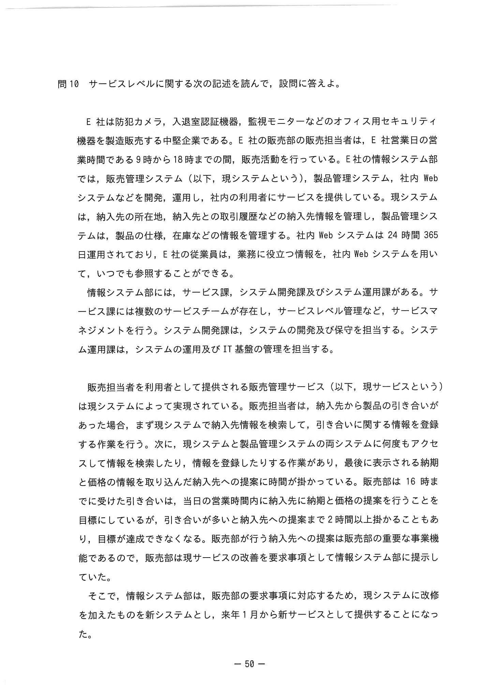

テキスト (OCR)

間19 サービスレベルに関する次の記述を読んで, 設問に答えよ。

E 社は防犯カメラ, 入退室認証機器, 監視モニターなどのオフィス用セキュリティ
機器を製造販売する中堅企業である。E 社の販売部の販売担当者は, E 社営業日の営
業時間である 9 時から 18 時までの間, 販売活動を行っている。E 社の情報システム部
では, 販売管理システム (以下, 現システムという), 製品管理システム, 社内 Web
システムなどを開発, 運用し, 社内の利用者にサービスを提供している。現システム
は, 納入先の所在地, 納入先との取引履歴などの納入先情報を管理し, 製品管理シス
テムは, 製品の仕様, 在庫などの情報を管理する。社内 Web システムは 24 時間 365
日運用されており, E 社の従業員は, 業務に役立つ情報を, 社内 Web システムを用い
て, いつでも参照することができる。

情報システム部には, サービス課, システム開発課及びシステム運用課がある。サ
ービス課には複数のサービスチームが存在し, サービスレベル管理など. サービスマ
ネジメントを行う。システム開発課は, システムの開発及び保守を担当する。システ
ム運用課は, システムの運用及び 1T 基盤の管理を担当する。

販売担当者を利用者として提供される販売管理サービス (以下, 現サービスという)
は現システムによって実現されている。販売担当者は, 納入先から製品の引き合いが
あった場合, まず現システムで納入先情報を検索して, 引き合いに関する情報を登録
する作業を行う。次に, 現システムと製品管理システムの両システムに何度もアクセ
スして情報を検索したり, 情報を登録したりする作業があり, 最後に表示される納期
と価格の情報を取り込んだ納入先への提案に時間が掛かっている。販売部は 16 時ま
でに受けた引き合いは, 当日の営業時間内に納入先に納期と価格の提案を行うことを
目標にしているが, 引き合いが多いと納入先への提案まで 2 時間以上掛かることもあ
り, 目標が達成できなくなる。販売部が行う納入先への提案は販売部の重要な事業機
能であるので, 販売部は現サービスの改善を要求事項として情報システム部に提示し
ていた。

そこで, 情報システム部は, 販売部の要求事項に対応するため, 現システムに改修
を加えたものを新システムとし, 来年 1 月から新サービスとして提供することになっ
た。

### ページ 51

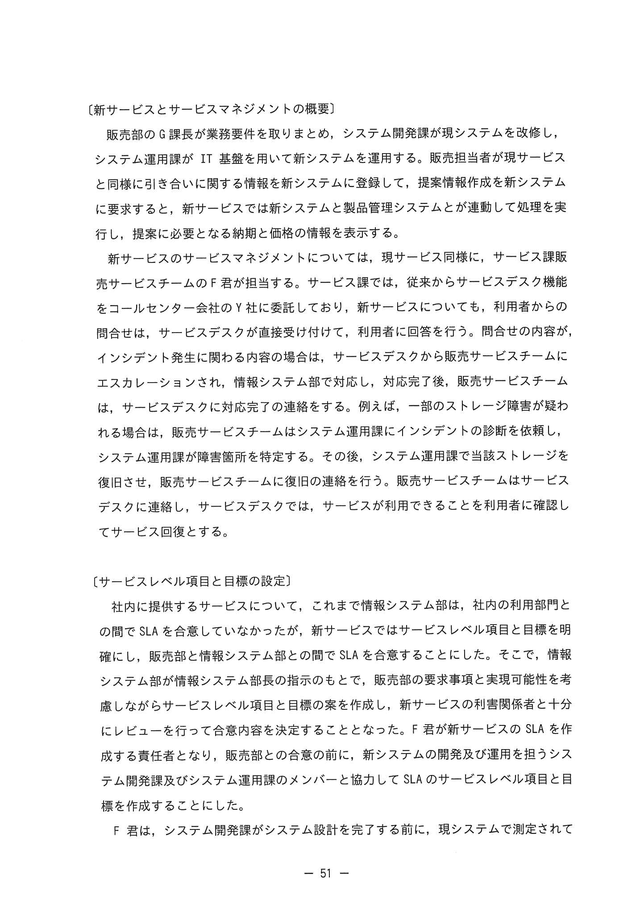

テキスト (OCR)

〔新サービスとサービスマネジメントの概要〕

販売部の G 課長が業務要件を取りまとめ, システム開発課が現システムを改修し
システム運用課が IT 基盤を用いて新システムを運用する。販売担当者が現サービス
と同様に引き合いに関する情報を新システムに登録して, 提案情報作成を新システム
に要求すると, 新サービスでは新システムと製品管理システムとが連動して処理を実
行し, 提案に必要となる納期と価格の情報を表示する。

新サービスのサービスマネジメントについては, 現サービス同様に, サービス課販
売サービスチームの「 君が担当する。サービス課では, 従来からサービスデスク機能
をコールセンター会社の Y 社に委託しており, 新サービスについても, 利用者からの
問合せは, サービスデスクが直接受け付けて, 利用者に回答を行う。問合せの内容が
インシデント発生に関わる内容の場合は, サービスデスクから販売サービスチームに
エスカレーションされ, 情報システム部で対応し, 対応完了後, 販売サービスチーム
は, サービスデスクに対応完了の連絡をする。例えば, 一部のストレージ障害が疑わ
れる場合は, 販売サービスチームはシステム運用課にインシデントの診断を依頼し
システム運用課が障害箇所を特定する。 その後, システム運用課で当該ストレージを
復旧させ, 販売サービスチームに復旧の連絡を行う。販売サービスチームはサービス
デスクに連絡し, サービスデスクでは, サービスが利用できることを利用者に確認し
てサービス回復とする。

[サービスレベル項目と目標の設定〕

社内に提供するサービスについて, これまで情報システム部は, 社内の利用部門と
の間で SLA を合意していなかったが, 新サービスではサービスレベル項目と目標を明
確にし, 販売部と情報システム部との間で SLA を合意することにした。 そこで, 情報
システム部が情報システム部長の指示のもとで, 販売部の要求事項と実現可能性を考
慮しながらサービスレベル項目と目標の案を作成し, 新サービスの利害関係者と十分
にレビューを行って合意内容を決定することとなった。「 君が新サービスの SLA を作
成する責任者となり, 販売部との合意の前に, 新システムの開発及び運用を担うシス
テム開発課及びシステム運用課のメンバーと協力して SLA のサービスレベル項目と目
標を作成することにした。

F Bld, システム開発課がシステム設計を完了する前に, 現システムで測定されて

### ページ 52

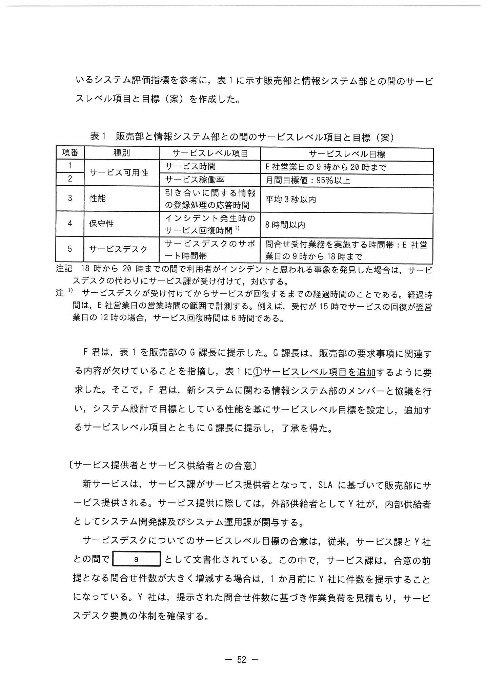

テキスト (OCR)

いるシステム評価指標を参考に, 表 1 に示す販売部と情報システム部との間のサービ
スレベル項目と目標 (RR) を作成した。

Rl 販売部と情報システム部との間のサービスレベル項目と目標 (案)

項番   種別   サービスレベル項目    サービスレベル目標
77] ービス可用性  に     age
3 | te    pamnaoneem | "3
4 | 保守性      キー 8 時間以内

注記 18 時から 20 時までの間で利用者がインシデントと思われる事象を発見した場合は, サービ

スデスクの代わりにサービス課が受け付けて, 対応する。

EP サービスデスクが受け付けてからサービスが回復するまでの経過時間のことである。経過時

間は, E 社営業日の営業時間の範囲で計測する。例えば, 受付が 15 時でサービスの回復が翌営
業日の 12 時の場合, サービス回復時間は 6 時間である。

F 君は, 表 1 を販売部の G 課長に提示した。 GRR, 販売部の要求事項に関連す
る内容が欠けていることを指摘し, 表1 に①サービスレベル項目を追加するように要
求した。 そこで, F Bld, 新システムに関わる情報システム部のメンバーと協議を行
い, システム設計で目標としている性能を基にサービスレベル目標を設定し, 追加す
るサービスレベル項目とともに6G 課長に提示し, 了承を得た。

〔サービス提供者とサービス供給者との合意

新サービスは, サービス課がサービス提供者となって, SLA に基づいて販売部にサ
ービス提供される。サービス提供に際しては, 外部供給者として Y 社が, 内部供給者
としてシステム開発課及びシステム運用課が関与する。

サービスデスクについてのサービスレベル目標の合意は, 従来, サービス課とY社
との間で|  a | として文書化されている。この中で, サービス課は。 合意の前
提となる問合せ件数が大きく増減する場合は, 1 か月前に Y 社に件数を提示すること
になっている。Y tlt, 提示された問合せ件数に基づき作業負荷を見積もり, サービ
スデスク要員の体制を確保する。

### ページ 53

テキスト (OCR)

F Blt, ②新サービスを契機として, サービス課と内部供給者との間で, サービス
レベル項目と目標を合意することにした。新サービスについてのサービス課とシステ
ム開発課との間の主要なサービスレベル項目と目標 (案) を表 2 に示す。

表2 サービス課とシステム開発課との間の主要なサービスレベル項目と目標 (素)

項番           サービスレベル項目           サービスレベル目標
1  インシデントが発生した場合, サービス課からのインシデント | 社営業日の 9 時から
の診断依頼をシステム開発課が受け付ける時間帯       18 時まで

システム開発課が開発したシステムに起因するインシデントの
2  合, システム開発課がサービス課からのインシデントの診断 | 8 時間以内
依頼を受け付けてからシステムを復旧するまでの時間 ”
SE E社営業日の営業時間の範囲で計測する。

F 君は, 表 2 を上司にレビューしてもらった。すると, 上司から, 表 1 項番4 のサ
ービスレベル目標を達成するためには, “OR 2 項番 2 のサービスレベル目標は見直
す必要がある” という指摘を受けた。

[受入れテストにおける指摘と対応〕
システム開発課による開発作業が完了し, 新サービス開始の 2 週間前に販売部が参
画する新サービスの受入れテストを開始した。受人人れテストを行った結果, 販売部か
ら情報システム部に対して, 次の評価と指摘が挙がった。
・機能・性能とも大きな問題はなく, 新サービスを開始してよいと判断できる。
・新サービスの操作方法を説明したマニュアルは整備されているが, FERRERS
要求する処理に関してはサービスデスクへの問合せが多くなると想定される。

F Blt, サービスデスクへの問合せ件数が事前の想定よりも多くなる懸念を感じた。
Y 社担当者とも検討し, ④新サービス開始時点の問合せ件数を削減する対応が必要と
考えた。そこで, 利用者が参照できる⑤FAQ を社内 Web システムに掲載することによ
って, 新サービスの操作方法についてマニュアルで解決できない疑問が出た場合は,
利用者自身で解決できるように準備を進めることにした。

### ページ 54

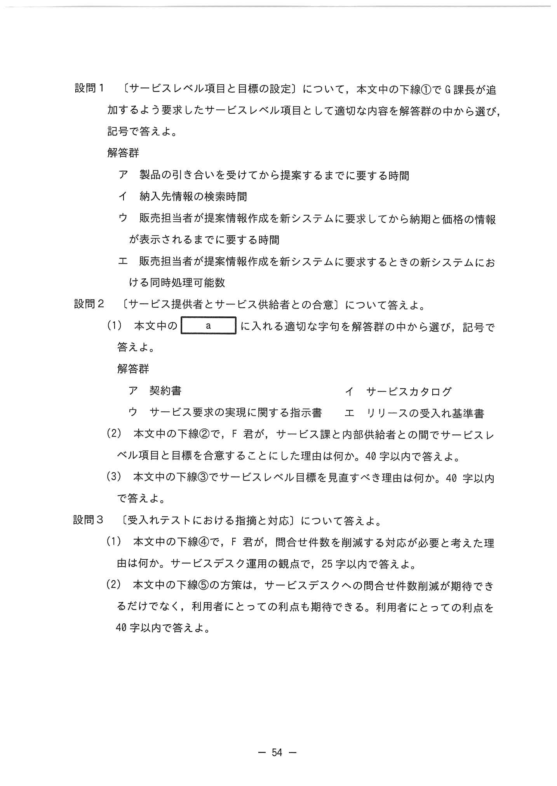

テキスト (OCR)

設問] 〔サービスレベル項目と目標の設定】について, 本文中の下線①で G 課長が追
加するよう要求したサービスレベル項目として適切な内容を解答群の中から選び,
記号で答えよ。
解答群

ア 製品の引き合いを受けてから提案するまでに要する時間
イ 納入先情報の検索時間
ウ 販売担当者が提案情報作成を新システムに要求してから納期と価格の情報
が表示されるまでに要する時間
エ 販売担当者が提案情報作成を新システムに要求するときの新システムにお
ける同時処理可能数
設問2 〔サービス提供者とサービス供給者との合意] について答えよ。

(1) 本文中の| a |] に入れる適切な字名を解答群の中から選び, 記号で
答えよ。

BSB

ア 契約書            イ サービスカタログ

ウ サービス要求の実現に関する指示書 "エエ リリースの受入れ基準書

(2) 本文中の下線@で, F BN, サービス課と内部供給者との間でサービスレ
ベル項目と目標を合意することにした理由は何か。40 字以内で答えよ。

(3) 本文中の下線③でサービスレベル目標を見直すべき理由は何か。49 SUA
で答えよ。

設問3 【受入れテストにおける指摘と対応】について答えよ。

(1) 本文中の下線④で, F 君が, 問合せ件数を削減する対応が必要と考えた理
由は何か。サービスデスク運用の観点で, 25 字以内で答えよ。

(2) 本文中の下線⑤の方策は, サービスデスクへの問合せ件数削減が期待でき
るだけでなく, 利用者にとっての利点も期待できる。利用者にとっての利点を
49 字以内で答えよ。

### ページ 55

テキスト (OCR)

C

メ モ 用 紙 〕

### ページ 56

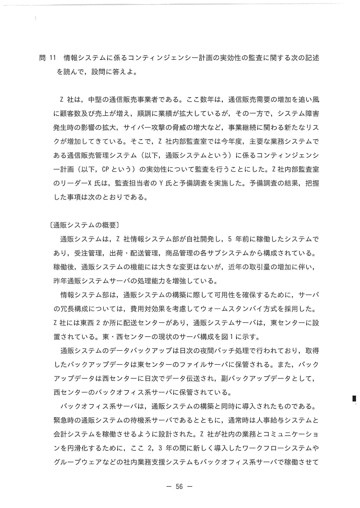

テキスト (OCR)

Al 11 情報システムに係るコンティンジェンシー計画の実効性の監査に関する次の記述
を読んで, 設問に答えよ。

Z 社は, 中堅の通信販売事業者である。ここ数年は, 通信販売需要の増加を追い風
に顧客数及び売上が増え, 順調に業績が拡大しているが, その一方で, システム障害
発生時の影響の拡大, サイバー攻撃の脅威の増大など, 事業継続に関わる新たなリス
クが増加してきている。 そこで, Z 社内部監査室では今年度, 主要な業務システムで
ある通信販売管理システム (以下, 通販システムという) に係るコンティンジェンシ

計画 (以下, CP という) の実効性について監査を行うことにした。2? 社内部監査室
のリーダーX Kit, 監査担当者の Y 氏と予備調査を実施した。 予備調査の結果, 把握
した事項は次のとおりである。

〔通販システムの概要〕

通販システムは, Z 社情報システム部が自社開発し, 5 年前に稼働したシステムで
HY, 受注管理, 出荷・配送管理, 商品管理の各サブシステムから構成されている。
稼働後, 通販システムの機能には大きな変更はないが, 近年の取引量の増加に伴い,
昨年通販システムサーバの処理能力を増強している。

情報システム部は, 通販システムの構築に際して可用性を確保するために, サーバ
の冗長構成については, 費用対効果を考慮してウォームスタンバイ方式を採用した。
Z 社には東西 2 か所に配送センターがあり, 通販システムサーバは, 東センターに設
置されている。東・西センターの現状のサーバ構成を図 1 に示す。

通販システムのデータバックアップは日次の夜間バッチ処理で行われており, 取得
したバックアップデータは東センターのファイルサーバに保管される。また, バック
アップデータは西センターに日次でデータ伝送され, 副バックアップデータとして,
西センターのバックオフィス系サーバに保管されている。

バックオフィス系サーバは, 通販システムの構築と同時に導入されたものである。
緊急時の通販システムの待機素サーバであるとともに, 通常時は人事給与システムと
会計システムを稼働させるように設計された。Z 社が社内の業務とコミュニケーショ
ンを円滑化するために, ここ 2, 3 年の間に新しく導入したワークフローシステムや
グループウェアなどの社内業務支援システムもバックオフィス系サーバで稼働させて

ー 56 一

### ページ 57

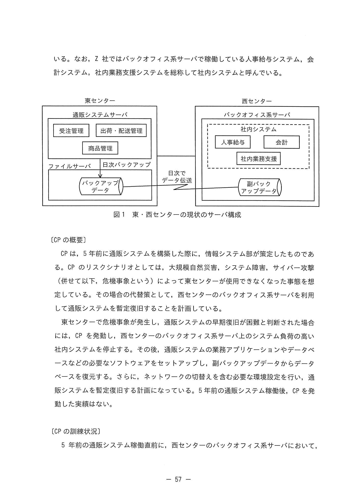

テキスト (OCR)

WS. なお, Z 社ではバックオフィス系サーバで稼働している人事給与システム,
計システム, 社内業務支援システムを総称して社内システムと呼んでいる。

ub

東センター                                           西センター
通販システムサーバ                         バックオフィス系サーバ
サーーーーーーーーロービでーーニーピーーーーーーーー
受注管理      出荷・配送管理                        i            社内システム            !
! | 人事給与     an ||
商品管理               !
1          社内業務支援          1
ファイルサーバ |日次バックアップ                 tr'
日次で
NIIP IT            データ伝送               副バック

データ                     アップデータ

 1 東・西センターの現状のサーバ構成

(CP の概要〕

CP は, 5 年前に通販システムを構築した際に, 情報システム部が策定したものであ
る。CP のリスクシナリオとしては, 大規模自然災害. システム障害., サイバー攻撃
(併せて以下, 危機事象という) によって東センターが使用できなくなった事態を想
定している。その場合の代替策として, 西センターのバックオフィス系サーバを利用
して通販システムを暫定復旧することを計画している。

東センターで危機事象が発生し, 通販システムの早期復旧が困難と判断された場合
には, CP を発動し, 西センターのバックオフィス系サーバ上のシステム負荷の高い
社内システムを停止する。 その後, 通販システムの業務アプリケーションやデータベ
ースなどの必要なソフトウェアをセットアップし, 副バックアップデータからデータ
ベースを復元する。さらに, ネットワークの切替えを含む必要な環境設定を行い,通
販システムを暫定復旧する計画になっている。5 年前の通販システム乏働後, CP を発
動した実績はない。

(CP の訓練状況}
5 年前の通販システム稼働直前に, 西センターのバックオフィス系サーバにおいて

### ページ 58

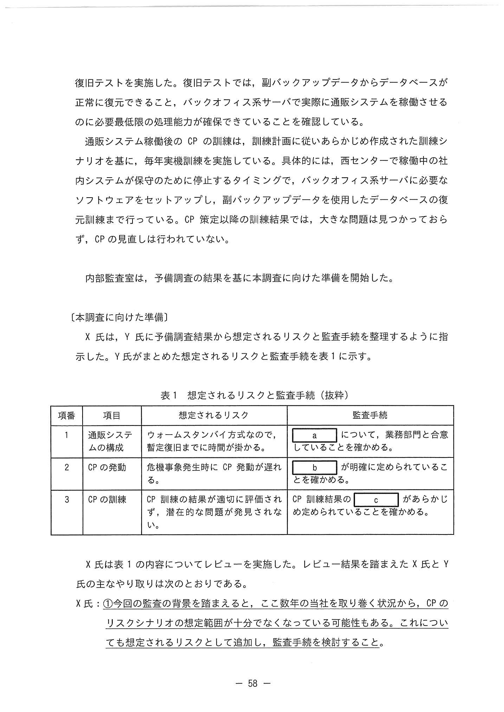

テキスト (OCR)

復旧テストを実施した。復旧テストでは, 副バックアップデータからデータベースが
正常に復元できること, バックオフィス系サーバで実際に通販システムを稼働させる
のに必要最低限の処理能力が確保できていることを確認している。

通販システム稼働後の CP の訓練は, 訓練計画に従いあらかじめ作成された訓練シ
ナリオを基に, 毎年実機訓練を実施している。具体的には, 西センターで稼働中の社
内システムが保守のために停止するタイミングで, バックオフィス系サーバに必要な
ソフトウェアをセットアップし, 加バックアップデータを使用したデータベースの復
元訓練まで行っている。CP 策定以降の訓練結果では, 大きな問題は見つかっておら

ず, CP の見直

しは行われていない。

内部監査室は, 予備調査の結果を基に本調査に向けた準備を開始した。

〔本調査に向けた準備
X Kid, Y 氏に予備調査結果から想定されるリスクと監査手続を整理するように指
示した。Y 氏がまとめた想定されるリスクと監査手続を表 1 に示す。

Rl 想定されるリスクと監査手続 (抜粋)

項番      項目             想定されるリスク                       監査手続
1  通販システ | ウォームスタンバイ方式なので,       について, 業務部門と合意
ムの構成   折定復旧までに時間が掛かる。   していることを確かめる。

2  CP の発動  危機事象発生時に CP 発動が遅れ      が明確に定められているこ
る。              とを確かめる。

3 | CPの訓練 | CP 訓練の結果が適切に評価され| CP 訓練結果の があらかじ
ず, 潜在的な問題が発見されな | め定められていることを確かめる。
い。

X 氏は表 1 の内容についてレビューを実施した。 レビュー結果を踏まえた X氏とY
氏の主なやり取りは次のとおりである。
X 氏 : ①今回の監査の背景を踏まえると, ここ数年の当社を取り巻く状況から, CPO

リスクシナリオの想定範囲が十分でなくなっている可能性もある。これについ

ても想定されるリスクとして追加し, 監査手続を検討すること。

### ページ 59

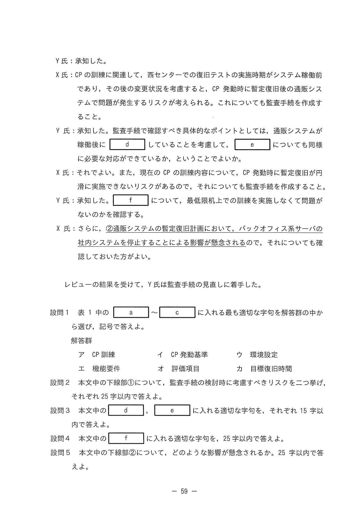

テキスト (OCR)

Y 氏 : 承知した。

X氏 :CP の訓練に関連して, 西センターでの復旧テストの実施時期がシステム稼働前
であり, その後の変更状況を考慮すると, CP 発動時に暫定復旧後の通販シス
テムで問題が発生するリスクが考えられる。これについても監査手続を作成す
ること。

Y 氏 : 承知した。監査手続で確認すべき具体的なポイントとしては, 通販システムが
稼働後に | d | していることを考慮して, | e | についても同様
に必要な対応ができているか, ということでよいか。

X 氏 : それでよい。また, 現在の CP の訓練内容について, CP 発動時に暫定復旧が円
滑に実施できないリスクがあるので, それについても監査手続を作成すること。

Y 氏 : 承知した。 について, 最低限机上での訓練を実施しなくて問題が
ないのかを確認する。

X 氏 : さらに, @通販システムの暫定復旧計画において, バックオフィス系サーバの
社内システムを停止することによる影響が懸念されるので, それについても確
認しておいた方がよい。

レビューの結果を受けて, Y 氏は監査手続の見直しに着手した。

設問1 表1中の|  a |-| < |に入れる最も適切な字句を解答群の中か
ら選び, 記号で答えよ。

解答群
ア CP訓練     4 CP 発動基準   ウ 環境設定
エ 機能要件     オ 評価項目     A 目標復旧時間

設問2 本文中の下線部①について, 監査手続の検討時に考應すべきリスクを二つ挙げ,
それぞれ 25 字以内で答えよ。

設問3 本文中の| d |, | oe |に入れる適切な字句を, then 15 Sy
内で答えよ。

設問4 本文中の| f | に入れる適切な字句を, 25字以内で答えよ。
設問5 本文中の下線部のについて, どのような影響が懸念されるか。25 字以内で答
えま。

### ページ 60

テキスト (OCR)

〔

x = 用 紙 ]

### ページ 61

テキスト (OCR)

x モ 用 紙 ]

### ページ 62

テキスト (OCR)

〔

メ モ 用 紙 )

### ページ 63

テキスト (OCR)

C

メ = 用 紙 )

### ページ 64

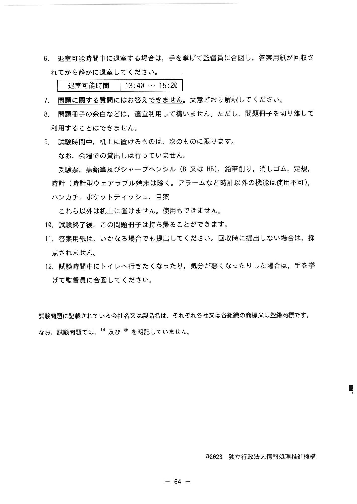

テキスト (OCR)

6. 退室可能時間中に退室する場合は, 手を挙げて監督具に合図し, 答案用紙が回収さ
れてから静かに退室してください。
| 退室可能時間 | 13:49 ~ 15:20 |
7. 間題に関する質問にはお答えできません。文意どおり解釈してください。
8. 問題冊子の余白などは, 適宜利用して構いません。ただし, 問題冊子を切り離して
利用することはできません。
9. 試験時間中, 机上に置けるものは, 次のものに限ります。
なお, 会場での貸出しは行っていません。
SRE, 黒鉛筆及びシャープペンシル (B 又は HB), 鉛筆削り, 消しゴム, 定規,
時計 (時計型ウェアラブル端末は除く<。アラームなど時計以外の機能は使用不可),
ハンカチ, ポケットティッシュ, BR
これら以外は机上に置けません。使用もできません。
10, 試験終了後, この問題冊子は持ち帰ることができます。
11. 答案用紙は, いかなる場合でも提出してください。回収時に提出しない場合は, 採
点されません。
12. 試験時間中にトイレへ行きたくなったり, 気分が悪くなったりした場合は, 手を挙
げて監督具に合図してください。

試験問題に記載されている会社名又は製品名は, それぞれ各社又は各組織の商標又は登録商標です。

なお, 試験問題では, "及び © を明記していません。

@2023 独立行政法人情報処理推進機構

---

## 午後解答

1/6 
©2023 独立行政法人情報処理推進機構 
令和５年度 秋期 応用情報技術者試験 解答例 
 
午後試験 
問１ 
出題趣旨 
 電子メール（以下，メールという）の添付ファイルを使い捨てのパスワードで復元可能な圧縮ファイルに変
換して送信する，PPAP と呼ばれるメール送信方式は，運用を誤ると情報漏えいリスクを高めてしまう。 
 本問では，PPAP の運用上の問題点を題材として，安全なメール送受信方式としてS/MIME を取り上げ，公開鍵
暗号，共通鍵暗号及びPKI の基本技術の理解を問う。 
 
設問 
解答例・解答の要点 
備考 
設問１(1) 本文メールを誤送信すると，DPW も誤送信した相手に届いてしまう。 
 
 
(2) DPW を，電話や携帯メールなど異なった手段で伝える。 
 
設問２(1) 1.6 
 
 
(2)
a
カ 
 
 
 
b
オ 
 
 
 
c
ウ 
 
 
 
d
エ 
 
 
(3) 暗号化と復号の処理速度が速いから 
 
設問３ 
ア 
 
 
問２ 
出題趣旨 
 中期経営計画の策定に，バランススコアカードを採用する企業は多い。 
 本問では，市場の成熟化に伴い提案型営業への転換を図ろうとする事務機器販売会社を題材として，バラン
ススコアカードによる営業戦略・重要成功要因・評価指標の策定，SECI モデルによる知識創造活動，及び財務
諸表に基づく財務状況の評価に関する基本的な知識とその内容の理解を問う。 
 
設問 
解答例・解答の要点 
備考 
設問１
(1)
全社レベルで統一されたビジネス戦略を描くこと 
 
 
(2)
a
独占的に販売できる 
 
 
(3)
b
コンテンツマーケティング 
 
 
 
d
業務提携するサービス事業者 
 
 
(4)
c
ウ 
 
設問２
(1)
C，D，B，A 
 
 
(2)
事例を登録する行動 
 
 
(3)
顧客の真のニーズに合ったソリューションをタイムリーに提案できる。 
 
設問３ 
e
15

2/6 
©2023 独立行政法人情報処理推進機構 
問３ 
出題趣旨 
 2 分探索木は最も基本的かつ幅広く応用されているデータ構造であり，効率良く探索するための様々な方法が
考案されている。 
 本問では，2 分探索木の一種である平衡2 分探索木のうちAVL 木を題材として，木構造，再帰的アルゴリズム，
計算量に関する理解を問う。 
 
設問 
解答例・解答の要点 
備考 
設問１ 
ア
n 
 
 
 
イ
log n 
 
設問２(1) ウ
h1 が2 と等しい 
 
 
 
エ
height(t.left.right) - height(t.left.left) 
 
 
 
オ
h1 が-2 と等しい 
 
 
 
カ
height(t.right.left) - height(t.right.right) 
 
 
(2)
5
1
4
3
8
6
9
 
 
(3) log n 
 
 
問４ 
出題趣旨 
 近年，事業拡大のために複数の企業が合併するケースが増えている。異なる企業が合併する際には，各々の
企業で用いられてきた基幹システムをいかに速やかに統合していくかが，合併の効果を得る上で重要である。
 本問では，中堅の家具製造販売業者の合併における基幹システム統合を題材として，システム統合に関する
基本的な理解，及びその方式を設計する能力を問う。 
 
設問 
解答例・解答の要点 
備考 
設問１(1)
a
販売システム 
 
 
 
b
生産システム 
 
 
 
c
会計システム 
 
 
(2)
d
出荷情報 
 
 
 
e
週次 
 
 
 
f
売上情報 
 
 
 
g
月次 
 
設問２(1)
会社名 
D 社 
 
 
 
システム名
販売システム 
 
 
(2) 受注（EDI），販売実績管理（月次），請求（EDI） 
 
設問３ 
C 社の会計システムはSaaS なので，個別の会社向けの仕様変更が困難だから

3/6 
©2023 独立行政法人情報処理推進機構 
問５ 
出題趣旨 
 昨今，電子メールやWeb などのインターネット技術を活用した，商品の広告やマーケティングは，企業の広
報活動においてなくてはならない存在となった。 
 本問では，メールサーバの構築を題材として，DNS や電子メール技術に関する基本的な理解と，メールサーバ
構築時におけるセキュリティ設計能力について問う。 
 
設問 
解答例・解答の要点 
備考 
設問１ 
a
オ 
 
 
 
b
エ 
 
設問２ 
c
serv 又は www 
 
 
 
d
w.x.y.z 
 
設問３(1)
設定項目 
受信メールサーバ 
 
 
 
設定内容 
192.168.1.10 
 
 
(2) エ 
 
 
(3) N 社のメールサーバを中継サーバとしてメールを送信する設定 
 
設問４ 
e
192.168.0.0 
 
 
問６ 
出題趣旨 
 小売業界では，在庫の適正化が重要な経営課題となっている。 
 本問では，在庫管理システムの改修を題材として，データベース設計に関する基本的な理解について問うと
ともに，OLAP に役立つウィンドウ関数の理解，及びBNF からSQL 文を作成する能力を問う。 
 
設問 
解答例・解答の要点 
備考 
設問１ 
a
↓ 
 
設問２(1)
b
引当情報 
 
 
 
c
引当予定 
 
 
(2)
d
日 
 
 
(3)
e
引当予定 
 
 
 
f
在庫 
 
 
 
g
入荷明細 
 
 
 
h
入荷済数 
 
設問３ 
i
OVER 
 
 
 
j
ORDER BY

4/6 
©2023 独立行政法人情報処理推進機構 
問７ 
出題趣旨 
近年，就農者の高齢化と労働力不足に対応するため，農作業用ロボットの実用化が進んでいる。 
本問では，トマトの自動収穫を行うロボットを題材として，応用情報技術者に求められる，要求仕様への理
解力，要求仕様に基づいてソフトウェアを設計する能力を問う。 
 
設問 
解答例・解答の要点 
備考 
設問１(1) 収穫に適したトマトを検出していない場合 
 
 
(2) イ 
 
設問２(1) 収穫トレーに空き領域がない 
 
 
(2) トマトの個数 
 
 
(3)
a
メイン 
 
設問３ 
ウ 
 
設問４ 
5.90 
 
 
問８ 
出題趣旨 
 昨今，スマートフォンの普及によって，顧客とのチャネル強化のためにスマートフォンアプリケーションソ
フトウェアが活用されている。 
 本問では，スマートフォンアプリケーションソフトウェアの開発を題材として，複数の処理を並行して行う
ためのマルチスレッド処理について，基本的な理解と設計能力を問う。 
 
設問 
解答例・解答の要点 
備考 
設問１ 
a
イ 
 
 
 
b
エ 
 
設問２(1)
c
エ 
 
 
 
d
ウ 
 
 
(2) ア 
 
設問３(1) 処理2，処理7 
 
 
(2)
e
ウ 
 
 
(3) 一定時間でタイムアウトする処理 
 
 
(4) 460（ミリ秒）

5/6 
©2023 独立行政法人情報処理推進機構 
問９ 
出題趣旨 
 顧客との関係性強化を目的とする顧客接点のデジタル化に関するプロジェクトでは，社内にないスキルを活
用する場合，自社で習得するか，他社に業務委託するか，どちらの方法を採用するか，プロジェクト完了後の
ことも考えて決定する必要がある。また，採用した方法に適合するように，プロジェクトメンバーやベンダー
の役割分担を計画し，これに基づき調達範囲や契約形態を決める必要がある。 
 本問では，金融サービス業のプロジェクトを題材として，プロジェクトマネジメントの観点から，プロジェ
クトチームのマネジメントや調達マネジメントに関する知識と実践的な能力について問う。 
 
設問 
解答例・解答の要点 
備考 
設問１(1)
a
頻繁なスコープの変更を想定する 
 
 
(2)
b
機械学習技術の習得の時間がない 
 
設問２(1)
c 
Q 
 
 
 
理由
定着化と使用性の両方が最高点だから 
 
 
(2) イ 
 
 
(3) システム開発フェーズの回復力を確かめるため 
 
設問３(1) マーケティング業務と開発プロジェクト参加の経験があるから 
 
 
(2) ・重要成功要因の指標の値 
・顧客関係性の強化の達成状況 
 
 
問10 
出題趣旨 
 サービスレベル管理では，組織と顧客との間のSLA でサービスレベル目標を明確にすることが重要である。
サービスレベル目標の達成には，組織とサービス提供に関与するサービス供給者との間でSLA と整合性が取れ
た合意が必要である。 
 本問では，新サービスの提供を題材として，SLA のサービスレベル目標の設定，SLA についての顧客との調整，
サービス供給者との調整を通じて，サービスレベル管理の実務能力を問う。 
 
設問 
解答例・解答の要点 
備考 
設問１ 
ウ 
 
設問２(1)
a
ア 
 
 
(2) 表1 のサービスレベル目標の達成には，内部供給者との目標の合意が必要だか
ら 
 
 
(3) サービス回復時間にはシステム開発課以外で実施する作業の時間も含まれるか
ら 
 
設問３(1) サービスデスク要員の体制が確保できないから 
 
 
(2) サービスデスクのサポート時間帯以外でも，利用者が疑問を解決できる。

6/6 
©2023 独立行政法人情報処理推進機構 
問11 
出題趣旨 
 情報システムに係るコンティンジェンシー計画については，計画策定後に定期的な訓練を実施することはも
ちろんのこと，システム環境などの変化に応じて適時にリスクを評価し，コンティンジェンシー計画の内容を
見直すことで，その実効性を確保していくことが重要である。 
 本問では，通信販売管理システムに係るコンティンジェンシー計画を題材として，コンティンジェンシー計
画の実効性に関するシステム監査におけるリスクの識別及び監査手続立案の能力を問う。 
 
設問 
解答例・解答の要点 
備考 
設問１ 
a
カ 
 
 
b
イ 
 
 
c
オ 
 
設問２ 
①
②
・システム障害発生時の影響が拡大するリスク 
・サイバー攻撃の脅威が増大するリスク 
 
設問３ 
d
サーバの処理能力を増強 
 
 
 
e
バックオフィス系サーバ 
 
設問４ 
f
ネットワークの切替えを含む必要な環境設定 
 
設問５ 
社内の業務とコミュニケーションに支障をきたす。

---

## 午後採点講評

1/3 
©2024 独立行政法人情報処理推進機構 
令和５年度 秋期 応用情報技術者試験 採点講評 
 
午後試験 
問１ 
 問1 では，PPAP と呼ばれるメール送信方式を題材に，PPAP 方式の運用上の問題点及び代替策としてS/MIME
について出題した。全体として正答率は平均的であった。 
 設問1(1)は，正答率がやや高かった。PPAP 方式の問題点については理解されていることがうかがえた。 
 設問2(1)は，正答率が高かったが，(2)の正答率は平均的であった。S/MIME におけるメールへの電子署名の
付加，及びメール内容の暗号化の方法は重要なので，その概要だけにとどまらず，どのような手順で，どの鍵
が使われるかについてまで理解を深めてほしい。 
 設問2(3)は，正答率が低かった。共通鍵暗号方式は暗号化や復号の処理が比較的簡単であるのに対し，公開
鍵暗号方式は複雑な処理を必要とすることを理解して，正答を導き出してほしい。 
 設問3 は，正答率がやや高かった。電子証明書の正当性は電子署名の真正性の検証によって確認でき，電子
署名の真正性の検証には認証局（CA）の公開鍵が用いられることは理解されていることがうかがえた。 
 
問２ 
 問2 では，事務機器販売会社の中期経営計画策定を題材に，バランススコアカードによるビジネス戦略の策
定，SECI モデルによる知識創造活動について出題した。全体として正答率は平均的であった。 
 設問1(2)は，正答率がやや低かった。ソリューションを開発し販売することだけを解答した受験者が散見さ
れた。競合他社から同じ商品やサービスが販売されることを防ぐ方法を解答してほしい。 
 設問1(3)のd は，正答率がやや低かった。ソリューションやソリューションパターンと解答した受験者が散
見された。バランススコアカードの構成要素である，戦略目標，重要成功要因，評価指標及びアクションの関
係を正しく理解し，正答を導き出してほしい。 
 設問2(1)は，正答率が低かった。個人が蓄積した知識や経験を組織全体で形式知化し，新たな知識を生み出
す一連のサイクルについて，具体的な活動に照らし合わせて理解を深めてほしい。 
 設問3 は，正答率が低かった。多くの企業が，収益性を測る指標であるROE を高めることを中期経営目標に
掲げている。ROE の計算方法について正しく理解してほしい。 
 
問３ 
 問3 では，2 分探索木の一種である平衡2 分探索木のうちAVL 木を題材として，木構造，再帰的アルゴリズ
ム，計算量について出題した。全体として正答率は平均的であった。 
 設問2(1)は，いずれも正答率がやや高かった。木構造を再帰的に表現する手法は一般的によく用いられてお
り，是非理解を深めてほしい。 
 設問2(2)は正答率が低く，平衡木や2 分探索木の条件を満たしていない誤った解答が散見された。プログラ
ミングにおいて重要な，アルゴリズムを理解しその操作を机上で再現する能力を身につけるとともに，注意深
く解答してほしい。 
 設問2(3)は，正答率が低かった。木構造を用いる場合，探索時の計算効率だけではなく，挿入時の計算効率
も考慮することが重要である。 
 
問４ 
 問4 では，中堅の家具製造販売業者の合併における基幹システム統合を題材として，システム統合の方式設
計について出題した。全体として正答率は平均的であった。 
 設問2 は，正答率が平均的であった。システム統合に伴って幾つかのシステムを廃止するとき，業務への影
響を抑えるためには何の機能をどのシステムに残す必要があるか，業務の視点を忘れずに各機能の最適な配置
を導き出してほしい。 
 設問3 は，正答率が低かった。SaaS をPaaS やIaaS，自社システムの運用アウトソーシングサービスと混同
していると思われる解答や，C 社の会計システムとC 社のオンプレミスのシステムが元々連携していたことを
考慮していないと思われる解答が散見された。SaaS の特徴や制約をあらかじめ把握した上で，統合後だけでは
なく統合前のシステムの全体像も正しく理解し，注意深く解答してほしい。

2/3 
©2024 独立行政法人情報処理推進機構 
問５ 
 問5 では，新ブランドの広報に用いるメールサーバの構築を題材に，DNS や電子メール技術について出題し
た。全体として正答率は平均的であった。 
 設問3(1)は，正答率が低かった。PC のメールソフトウェアの設定項目と設定内容を題材として，DNS サーバ
に登録されたFQDN とIP アドレスの対応関係やDNS が用いるポート番号について問うた。DNS はWeb などのイ
ンターネットに関する技術の基盤となるものであるので，是非理解しておいてほしい。 
 設問4 は，正答率が低かった。広報サーバがメール送信を許可するネットワークアドレスを問うたが，端末
のIP アドレスの解答が散見された。IP アドレスにおけるネットワーク部，ホスト部の考え方は，ネットワー
ク設計を行う上で基礎となるものであるので，是非理解しておいてほしい。 
 
問６ 
 問6 では，在庫管理システムの改修を題材に，データベース設計として，現状と改修後のE-R 図から追加す
るエンティティや属性，処理内容，及びOLAP に役立つウィンドウ関数のSQL 文について出題した。全体として
正答率は高かった。 
 設問3 のi は，正答率がやや低かった。“WINDOW”と誤って解答した受験者が散見された。BNF を正しく読み
解き，正答を導き出してほしい。近年，データベースに蓄積されたデータの分析・活用がますます重要になっ
ているので，ウィンドウ関数の利用方法は是非身につけてほしい。 
 
問７ 
 問7 では，トマトの自動収穫を行うロボットを題材に，要求仕様の理解，要求仕様に基づいたソフトウェア
設計について出題した。全体として正答率は平均的であった。 
設問1(1)は，正答率がやや高かったが，“障害物を検知していない場合”や“管理者スマホから収穫開始の
指示を受けた場合”とした解答が散見された。収穫ロボットの位置による状態遷移を正しく理解した上で解答
してほしい。状態遷移とシステムの動作について正しく理解することは，組込みシステムのソフトウェア設計
において重要であるので，是非理解を深めてほしい。 
設問2(2)は，正答率が低かった。“収穫トレーの空き領域の情報”とした解答が散見された。収穫ロボット
の構成要素と各タスクの処理概要を整理することで，パラメータとして通知する必要がある情報を導き出して
ほしい。 
 
問８ 
 問8 では，美容室の販売促進活動で用いるスマートフォンアプリケーションソフトウェアの開発を題材に，
マルチスレッド処理について出題した。全体として正答率は平均的であった。 
 設問3(1)は，正答率が低かった。スマートフォンアプリケーションをはじめとしたユーザの端末上で動作す
るアプリケーションを開発するには，各処理の処理内容を理解した上で適切なスレッドで処理を実行する設計
が重要になるので，スレッドに関する理解を深めておいてほしい。 
 設問3(2)は，正答率が低かった。二つのスレッドの完了を待ち合わせるjoin について問うた。昨今の高性
能なCPU を搭載したスマートフォンやPC では，アプリケーションソフトウェアがマルチスレッドで処理を行う
ことは一般的であるので，スレッドの分岐や待合せ処理については，是非理解しておいてほしい。 
 
問９ 
 問9 では，金融サービス業のプロジェクトを題材として，プロジェクトマネジメントの観点からプロジェク
トチームのマネジメントや調達マネジメントについて出題した。全体として正答率は平均的であった。 
 設問1(2)は，正答率が平均的であった。顧客接点のデジタル化を実現するために機械学習技術を採用する局
面で，自社だけで実施せず他社に技術支援を業務委託するという判断をした際の着眼点について問うた。プロ
ジェクトにおける重要な決定の際には，他社の事例だけでなく，自社の現状を正確に把握する必要がある点に
ついて，是非理解を深めてほしい。 
 設問2(1)は，正答率がやや高く，調達マネジメントにおけるベンダーの比較方法については，よく理解され
ていることがうかがえた。

3/3 
©2024 独立行政法人情報処理推進機構 
問10 
 問10 では，オフィス用セキュリティ機器製造販売会社における社内新サービスの提供を題材に，SLA のサー
ビスレベル目標の設定，SLA についての顧客及びサービス供給者との調整を通じた，サービスレベル管理につ
いて出題した。全体として正答率はやや低かった。 
 設問2(2)は，正答率がやや低かった。サービス課と内部供給者との間のサービスレベル項目及び目標の合意
は，新サービスの利用者である販売部とサービス提供者であるサービス課との間のサービスレベル目標を達成
するために必要であるということを理解してほしい。 
 設問3(1)は，正答率がやや低かった。サービスデスクへの問合せ件数を削減する対応が必要と考えた理由を
問うたが，“Y 社の体制を増強する”という解答が散見された。1 か月前にY 社に件数を提示することになって
いて，体制を増強することはできないことを本文から読み取り，正答を導き出してほしい。 
 
問11 
 問11 では，通信販売管理システムを題材に，情報システムに係るコンティンジェンシー計画の実効性に関
するシステム監査におけるリスクの識別及び監査手続について出題した。全体として正答率はやや低かった。
 設問2 は，正答率がやや低かった。"今回の監査の背景を踏まえると"という前提から監査を実施することに
なった経緯が記載されている箇所を読み取って，正答を導き出してほしい。 
設問4 は，正答率がやや低かった。机上では訓練が実施できない内容を解答しているケースも散見された。
コンティンジェンシー計画発動時の手順と現在のコンティンジェンシー計画の訓練内容とを比較することで正
答を導き出してほしい。

