# 令和5年度春期 応用情報技術者試験

---

## 午前問題

### ページ 1

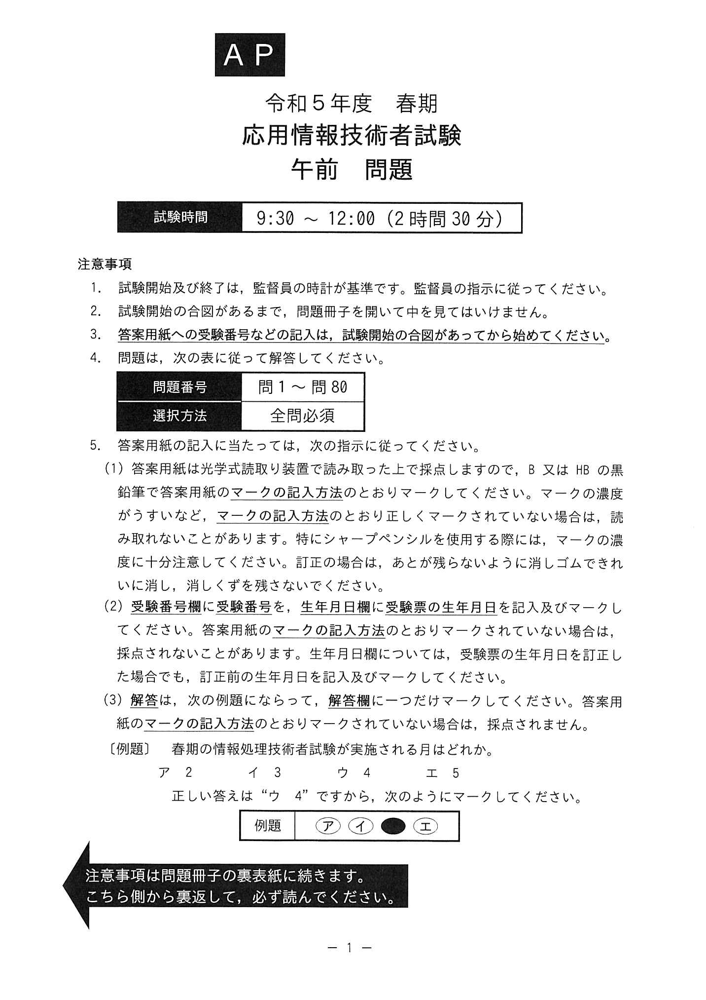

テキスト (OCR)

令和5年度 春期
応用情報技術者試験
午前 問題

 9:30 ~ 12:00 (2時間 30 分)

注意事項
1. 試験開始及び終了は, 監督具の時計が基準です。監督具の指示に従ってください。
2. 試験開始の合図があるまで, 問題冊子を開いて中を見てはいけません。

3. 答案用紙への受験番号などの記入は, 試験開始の合図があってから始めてください。
4. 問題は, 次の表に従って解答してください。

問題番号       問1て問89

選択方法    全問必
答案用紙の記入に当たっては, 次の指示に従ってください。

(1) 答案用紙は光学式読取り装置で読み取った上で採点しますので, B 又は HB OF
鉛筆で答案用紙のマークの記入方法のとおりマークしてください。マークの濃度
がうすいなど, マークの記入方法のとおり正しくマークされていない場合は, 読
み取れないことがあります。特にシャープペンシルを使用する際には, マークの濃
度に十分注意してください。 訂正の場合は, あとが残らないように消しゴムできれ
いに消し, 消しくずを残さないでください。

(2) 受験番号欄に受験番号を, 生年月日欄に受験票の生年月日を記入及びマークし
てください。管案用紙のマークの記入方法のとおりマークされていない場合は,
採点されないことがあります。生年月日杉については, 受験票の生年月日を訂正し
た場合でも, 訂正前の生年月日を記入及びマークしてください。

(3) 解答は, 次の例題にならって, 解答欄に一つだけマークしてください。 答案用
紙のマークの記入方法のとおりマークされていない場合は, 採点されません。

〔例題] 春期の情報処理技術者試験が実施される月はどれか。

ア 2    イ 3    ウ 4    エ 5
正しい答えは “ウ 4" ですから, 次のようにマークしてください。

例題 | (⑦(イ) で)

2

注意事項は問題冊子の裏表紙に続きます。
こちら側から裏返して, 必ず読んでください。

### ページ 2

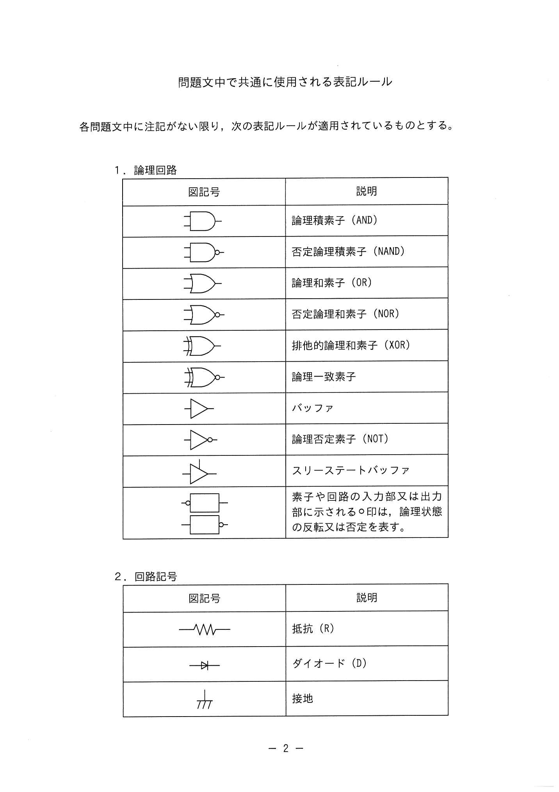

テキスト (OCR)

問題文中で共通に使用される表記ルール

各問題文中に注記がない限り, 次の表記ルールが適用されているものとする。

1 論理回路

図
im
cu
a0

説明

論理積素子 (AND)

否定論理積素子 (NAND)

論理和素子 (0R)

否定論理和素子 (NOR)

排他的論理和素子 (XOR)

論理一致素子

バッファ

論理否定素子 (NOT)

スリーステートバッファ

LUIYIyIYMMVMMU

素子や回路の入力部又は出力
部に示されるo印は, 論理状態
の反転又は否定を表す。
2. 回路記号

図記号            説明

—\M—     抵抗 (R)

一時一              ダイオード (D)

th      接地

### ページ 3

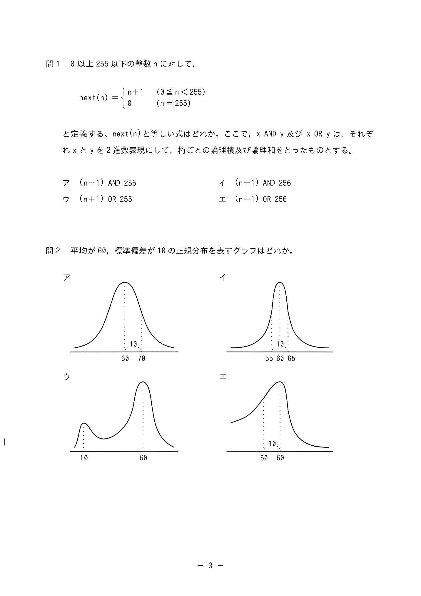

テキスト (OCR)

間1 9 以上 255 以下の整数n に対して,

n十1 (9ミnぐ255)

next(n) = { 0      (n = 255)

と定義むする。next(n) と等しい式はどれか。ここで, x AND y 及び x ORy ld, それぞ
れxとyを2 進数表現にして, 桁ごとの論理積及び論理和をとったものとする。

ア (n+1) AND 255               4 (n+1) AND 256
ウ (n+1) OR 255                エ (n+1) OR 256

間2 平均が69, 標準偏差が 10 の正規分布を表すグラフはどれか。

ア                  イ

55 60 65

### ページ 4

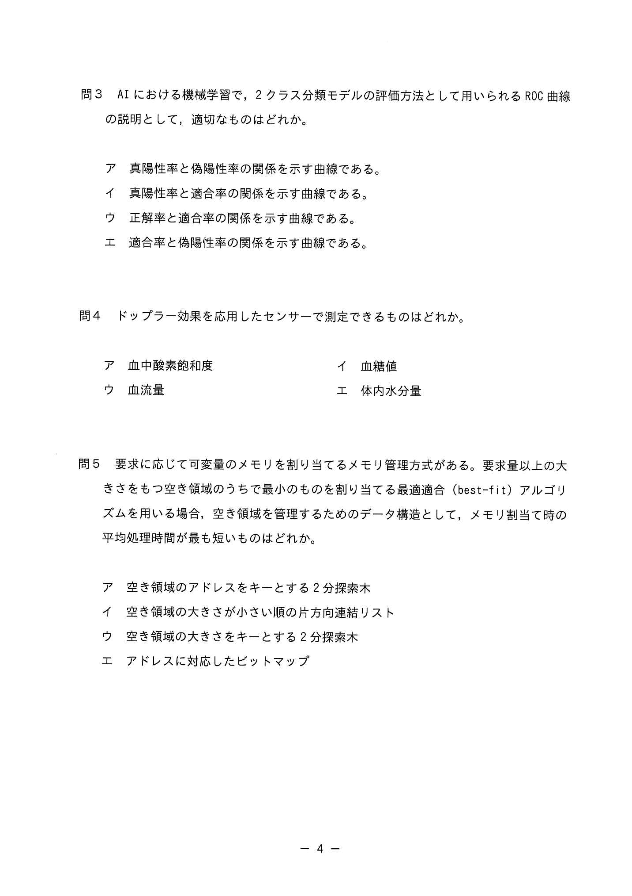

テキスト (OCR)

間3 AIにおける機械学習で, 2 クラス分類モデルの評価方法として用いられる ROC 曲線
の説明として, 適切なかものはどれか。

N

H 寺 ユ

問4

ア

ウ

真陽性率と偽陽性率の関係を示す曲線である。
真陽性率と適合率の関係を示す曲線である。
正解率と適合率の関係を示す曲線である。
適合率と偽陽性率の関係を示す曲線である。

ドップラー効果を応用したセンサーで測定できるものはどれか。

血中酸素飽和度                 イ 血糖値
血流量                                                        エ 体内水分量

問5 要求に応じて可変量のメモリを割り当てるメモリ管理方式がある。要求量以上の大
きさをもつ空き領域のうちで最小のものを割り当てる最適適合 (best-fit) アルゴリ
ズムを用いる場合, 空き領域を管理するためのデータ構造として, メモリ割当て時の
平均処理時間が最も短いものはどれか。

に|

So He Hd He
ok
gz

H GAN

き

ab

順域のアドレスをキーとする 2 分探索木
域の大きさが小さい順の片方向連結リスト
中域の大きさをキーとする 2 分探索木

ドレスに対応したビットマップ

ng
ob

### ページ 5

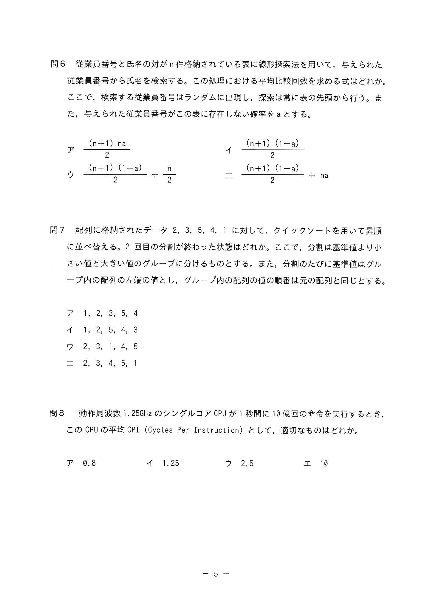

テキスト (OCR)

間6 従業員番号と氏名の対がn 件格納されている表に線形探索法を用いて, 与えられた
従業員番号から氏名を検索する。この処理における平均比較回数を求める式はどれか。
ここで, 検索する従業員番号はランダムに出現し, 探索は常に表の先頭から行う。ま
た, 与えられた従業員番号がこの表に存在しない確率を a とする。

(n+1) na                   (n+1) (1一8)
(n+1) (=a)  ao       x  (n+1) (1一8)  na
2        2               2

間7 配列に格納されたデータ 2, 3, 5, 4, 1 に対して, クイックソートを用いて昇順
に並べ替える。2 回目の分割が終わった状態はどれか。ここで, 分割は基準値より小
さい値と大きい値のグループに分けるものとする。 また, 分割のたびに基準値はグル
ープ内の配列の左端の値とし, グループ内の配列の値の順番は元の配列と同じとする。

ア 1, 2, 3, 5, 4
{ 1, 2, 5, 4, 3
7 2,3, 1, 4, 5
エ 2, 3, 4, 5, 1

問8 動作周波数 1.25GHz のシングルコア CPU が 1 秒間に 10 億回の命令を実行するとき,
ことのCPU の平均 CPI (Cycles Per Instruction) として, 適切なかものはどれか。

ア 9.8     4 25     ウ 2.5     エ 10

### ページ 6

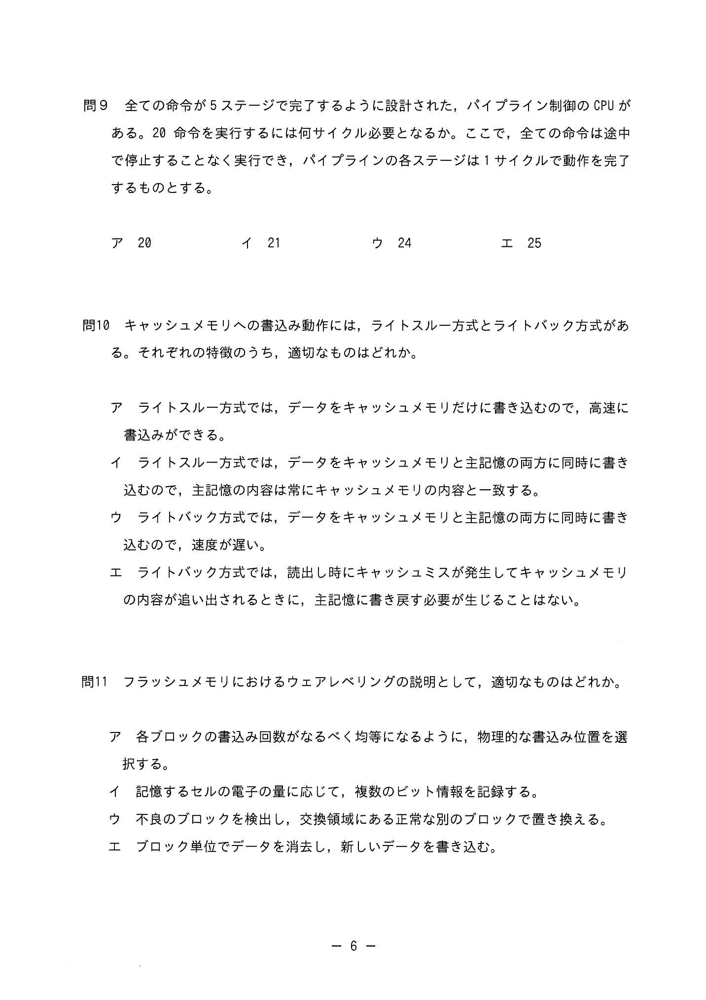

テキスト (OCR)

FO 全ての命令が5ステージで完了するように設計された, パイプライン制御の CPU が
ある。29 命令を実行するには何サイクル必要となるか。ここで, 全ての命令は途中
で停止することなく実行でき, パイプラインの各ステージは 1 サイクルで動作を完了
するものとする。

間19 キャッシュメモリへの書込み動作には, ライトスルー方式とライトバック方式があ
る。 それぞれの特徴のうち, 適切なものはどれか。

ア ライトスルー方式では, データをキャッシュメモリだけに書き込むので, 高速に
書込みができる。

4 ライトスルー方式では, データをキャッシュメモリと主記憶の両方に同時に書き
込むので, 主記憶の内容は常にキャッシュメモリの内容と一致する。

ウ ライトバック方式では, データをキャッシュメモリと主記憶の両方に同時に書き
込むので, 速度が遅い。

エエ ライトバック方式では, 読出し時にキャッシュミスが発生してキャッシュメモリ
の内容が追い出されるときに, 主記憶に書き戻す必要が生じることはない。

間11 フラッシュメモリにおけるウェアレベリングの説明として, 適切なものはどれか。

ア 各ブロックの書込み回数がなるべく均等になるように, 物理的な書込み位置を選
択する。
4 記憶するセルの電子の量に応じて, 複数のビット情報を記録する。
不良のブロックを検出し, 交換領域にある正常な別のブロックで置き換える。
ブロック単位でデータを消去し, 新しいデータを書き込む。

### ページ 7

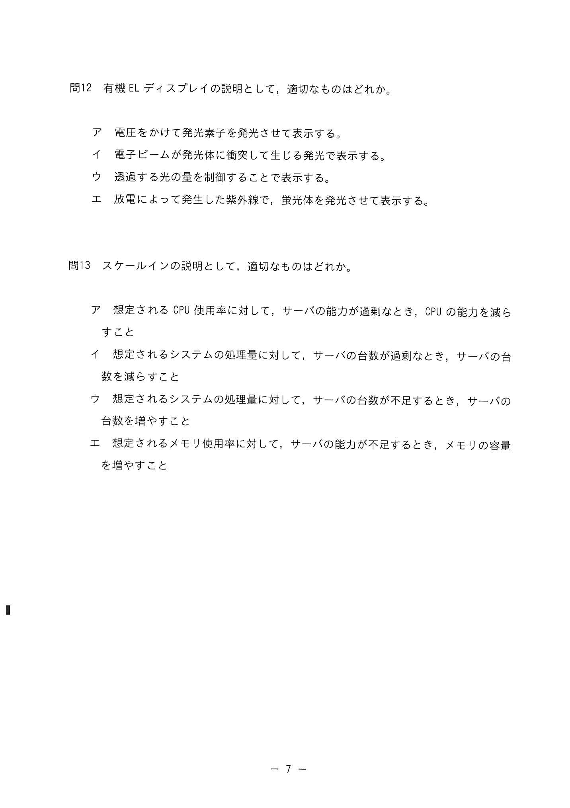

テキスト (OCR)

問12 有機EEディスプレイの説明として, 適切なものはどれか。

Sl

電圧をかけて発光素子を発光させて表示する。

電子ビームが発光体に衝突して生じる発光で表示する。

透過する光の量を制御することで表示する。

放電によって発生した紫外線で, 蛍光体を発光させて表示する。

H GA

fal3 スケールインの説明として, 適切なものはどれか。

される CPU 使用率に対して, サーバの能力が過剰なとき, CPU の能力を減ら

NN

るシステムの処理量に対して, サーバの台数が過剰なとき, サーバの台

= 4
ie

成ら
ウ 想定されるシステムの処理量に対して, サーバの台数が不足するとき, サーバの
台数を増やすこと
エ 想定されるメモリ使用率に対して, サーバの能力が不足するとき, メモリの容量

を増やすこと

### ページ 8

テキスト (OCR)

間14 CPU と磁気ディスク装置で構成されるシステムで, 表に示すジョブ AB を実行す
る。この二つのジョブが実行を終了するまでの CPU の使用率と磁気ディスク装置の使
用率との組合せのうち, 適切なものはどれか。ここで, VATA, B はシステムの動
作開始時点ではいずれも実行可能状態にあり, A, B の順で実行される。CPU 及び磁気
ディスク装置は, ともに一つの要求だけを発生順に処理する。ジョブA, B とも, CPU
の処理を終了した後, 磁気ディスク装置の処理を実行する。

単位 秒
ジョブ     CPU の処理時間 | 磁気ディスク装置の処理時間
A               3                       7
B              12                      10
CPU の使用率 | 磁気ディスク装置の使用率
ア         0.47                    0.53
4         0.60                    0.68
ウ         0.79                    0.89
エ         0.88                    1. 00

間15 コンピュータシステムの信頼性を高める技術に関する記述として, 適切なものはど
れか。

ア フェールセーフは, 構成部品の信頼性を高めて, 故障が起きないようにする技術
である。

イ フェールソフトは, ソフトウェアに起因するシステムフォールトに対処するため
の技術である。

ウ フォールトアボイダンスは, 構成部品に故障が発生しても運用を継続できるよう
にする技術である。

エエ フォールトトレランスは, システムを構成する重要部品を多重化して, 故障に備
える技術である。

### ページ 9

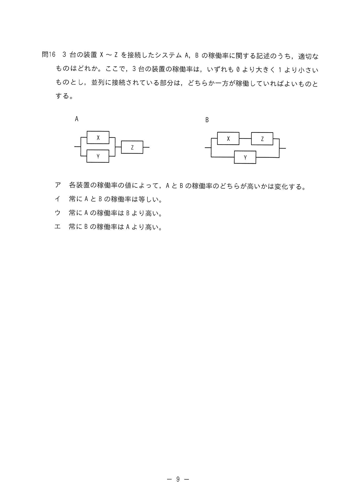

テキスト (OCR)

問16 3 台の装置X一Z を接続したシステム A, B の乏働率に関する記述のうち, 適切な
ものはどれか。 ここで, 3 台の装置の稼働率は, いずれも 9 より大きく 1 より小さい
ものとし, 並列に接続されている部分は, どちらか一方が稼働していればよいものと
する。

X                                  X        Z

H+         上
Y                                       Y

各装置の稼働率の値によって, AとBの乏働率のどちらが高いかは変化する。

常にAとBの乏働率は等しい。

常にAの稼働率は B より高い。
常に B の稼働率はA より高い。

に

H GA

### ページ 10

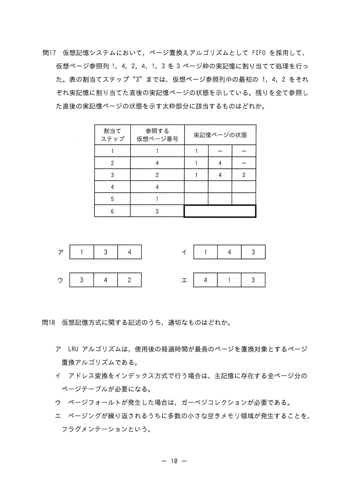

テキスト (OCR)

問17 仮想記憶システムにおいて, ページ結換えアルゴリズムとして FIFO を採用して,
仮想ページ参照列 1。 4, 2, 4, 1, 3 を 3 ページ枠の実記憶に割り当てて処理を行っ
た。表の割当てステップ “3” までは, 仮想ページ参照列中の最初の 1, 4, 2 をそれ
ぞれ実記憶に割り当てた直後の実記憶ページの状態た示している。残りを全て参照し
た直後の実記憶ページの状態を示す太枠部分に該当するものはどれか。

割当て      SIRT S       時
ステップ | 仮想ページ番号 | AES ジの状態
1             1           1      ー      ー
2             4           1       4
3             2           1       4      2
4             4
5             1
6             3
の     1       3      4               イ      1       4      3
p/     3      4      2               =a     4      1       3

間18 仮想記憶方式に関する記述のうち, 適切なものはどれか。

ア LRU アルゴリズムは, 使用後の経過時間が最長のページを置換対象とするページ
置換アルゴリズムである。

イ アドレス変換をインデックス方式で行う場合は, 主記憶に存在する全ページ分の
ページテーブルが必要になる。

ウ ページフォールトが発生した場合は, ガーベジコレクションが必要である。

エ ページングが繰り返されるうちに多数の小さな空きメモリ領域が発生することを,

フラクメジテーショツといみ。

### ページ 11

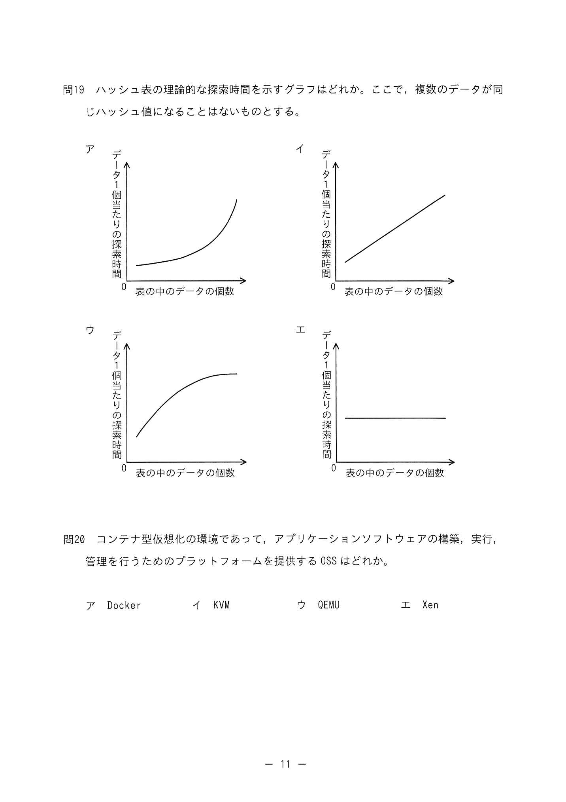

テキスト (OCR)

AIG ハッシュ表の理論的な探索時間を示すグラフはどれか。ここで, 複数のデータが同
じハッシュ値になかることはないものとする。

ァ =                                            4 2
1                                                         1
タ                                                         タ
1                                                          1
個                                                        個
り                                                         り
の                                                         の
pe                                                        探
時                                                        時
間                                                         間

0 表の中のデータの個数              (0 表の中のデータの個数

ウ      =                                                 Te     =
1                                                         1
タ                                                         タ
1                                                          1

個                                                         個
り                                                         り
の                                                         の
控                                                         探
時                                                         時
間                                                         間
0 表の中のデータの価数           (0 表の中のデータの個数

間29 コンテナ型仮想化の環境であって, アプリケーションソフトウェアの構築, 実行
管理を行うためのプラットフォームを提供する 0SS はどれか。

ア Docker    イ KVM     ウ QEMU     = Xen

### ページ 12

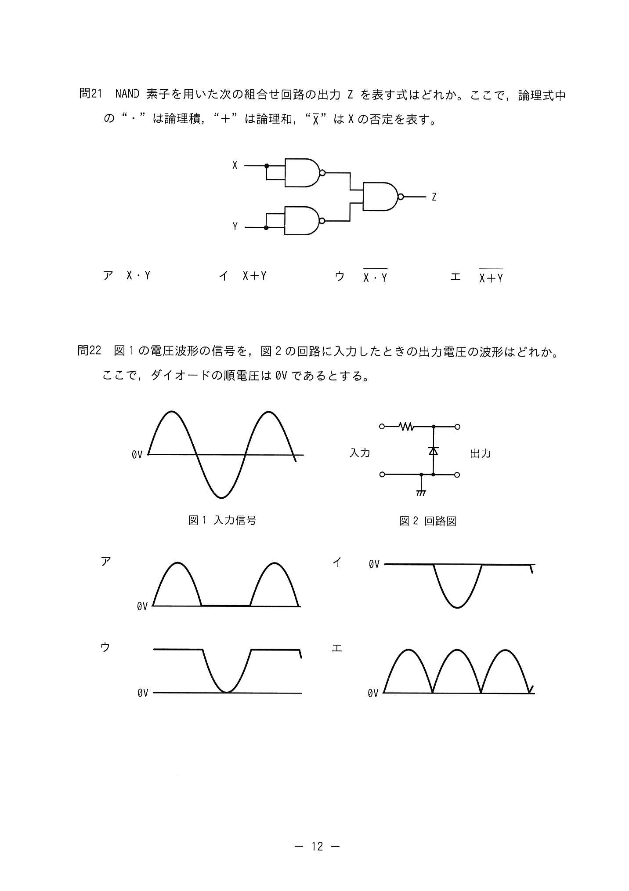

テキスト (OCR)

問21 NAND 素子を用いた次の組合せ回路の出力 Z を表す式はどれか。ここで, 論理式中

の “"・” は論理積, “十" は論理和, “X”はXの否定を表す。
‘TOY,
Dat
日 >
アァ X・Y        4 X+Y        ウ XY       エ x+y

間22 1 の電圧波形の信号を, 図 2 の回路に入力したときの出力電圧の波形はどれか。
ここで, ダイオードの順電圧は 9 であるとする。

ハハ    /ハ       よー
ov                                  \            AD             a HA
\/           ーー

図1 入力信号                       図2 ORs

### ページ 13

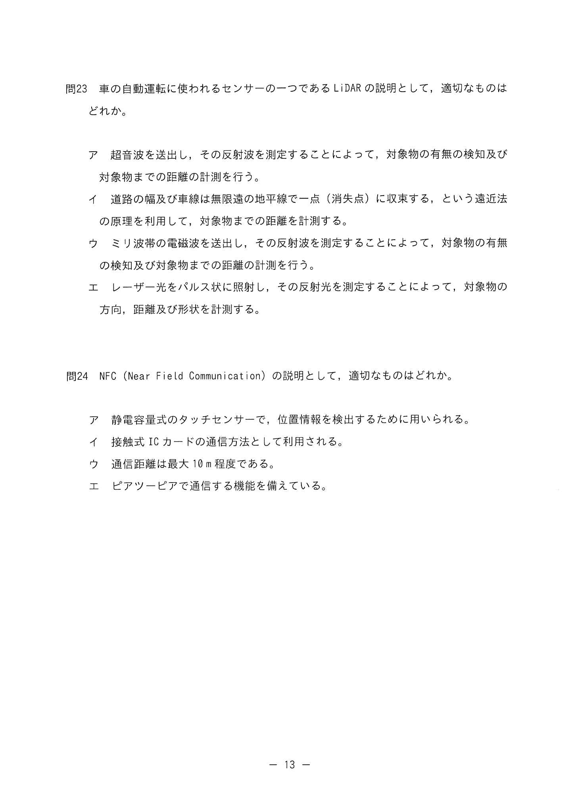

テキスト (OCR)

間23 車の自動運転に使われるセンサーの一つであるLiDAR の説明として, 適切なものは
どれか。

ア 超音波を送出し, その反射波を測定することによって, 対象物の有無の検知及び
対象物までの距離の計測を行う。

イ 道路の幅及び車線は無限遠の地平線で一点 CHAR) に収束する, という遠近法
の原理を利用して, 対象物までの距離を計測する。

ウ ミリ波帯の電磁波を送出し, その反射波を測定することによって, 対象物の有無
の検知及び対象物までの距離の計測を行う。

エ レーザー光をパルス状に照射し, その反射光を測定することによって, 対象物の
方向, 距離及び形状を計測する。

間24 NFC (Near Field Communication) の説明として, 適切なかものはどれか。

|

静電容量式のタッチセンサーで, 位置情報を検出するために用いられる。
接触式 I( カードの通信方法として利用される。

通信距離は最大 10 m 程度である。

ピアツーピアで通信する機能を備えている。

H 寺 ユ

### ページ 14

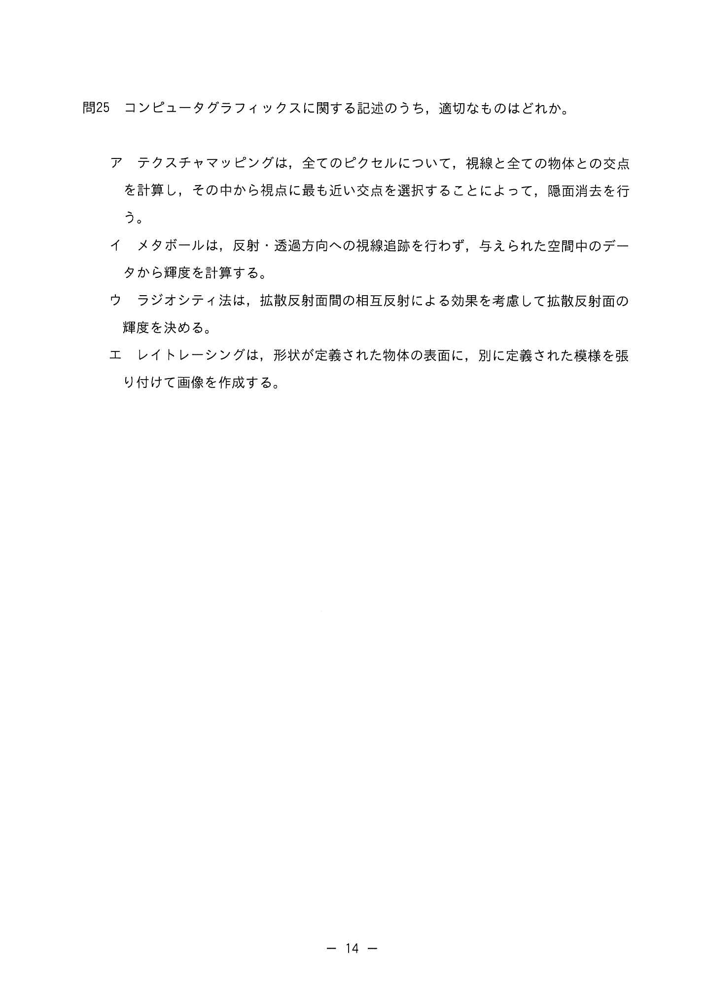

テキスト (OCR)

間25 コンピュータグラフィックスに関する記述のうち, 適切なものはどれか。

ア テクスチャマッピングは, 全てのピクセルについて, 視線と全ての物体との交点
を計算し, その中から視点に最も近い交点を選択することによって, 隠面消去を行
う。

イ メタボールは, 反射・透過方向への視線追跡を行わず, 与えられた空間中のデー
タから輝度を計算する。

ウ ラジオシティ法は, 拡散反射面間の相互反射による効果を考慮して拡散反射面の
輝度を決める。

DT レイトレーシングは, 形状が定義された物体の表面に, 別に定義された模様を張
り付けて画像を作成する。

### ページ 15

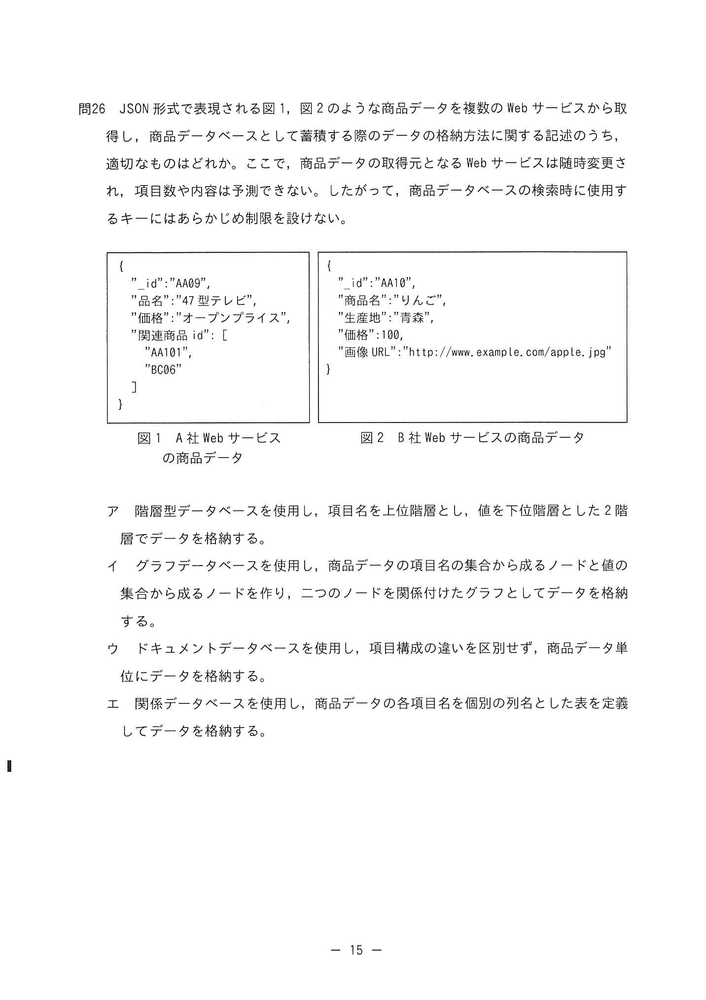

テキスト (OCR)

間26 JSON 形式で表現される図 1, 図2のような商品データを複数の Web サービスから取
得し, 商品データベースとして蓄積する際のデータの格納方法に関する記述のうち,
適切なものはどれか。ここで, 商品データの取得元となる Web サービスは随時変更さ
れ, 項目数や内容は予測できない。 したがって, 商品データベースの検索時に使用す
るキーにはあらかじめ制限を設けない。

{                                   {
”id”:"AA09”,                      ”jd?:”AA10",
"品名":"47 型テレビ",            "商品名"りんごどり,
"価格":"オープンプライスリ",       "生産地": "青森 ,
"関連商品id":[              "価格":100,
7AA101",                              "画像 URL”:"http://www. example. com/apple. jpg”
"BC06"                         }
]
}
図1 A社Web サービス         図2 B社Web サービスの商品データ
の商品データ

NI

階層型データベースを使用し, 項目名を上位階層とし, 値を下位階層とした 2階
層でデータを格納する。

グラフデータベースを使用し, 商品データの項目名の集合から成るノードと値の
集合から成るノードを作り, 二つのノードを関係付けたグラフとしてデータを格納
する。
ウ ドキュメントデータベースを使用し, 項目構成の違いを区別せず, 商品データ単

位にデータを格納する。
エ 関係データベースを使用し, 商品データの各項目名を個別の列名とした表を定義
してデータを格納する。

ー 15 一

### ページ 16

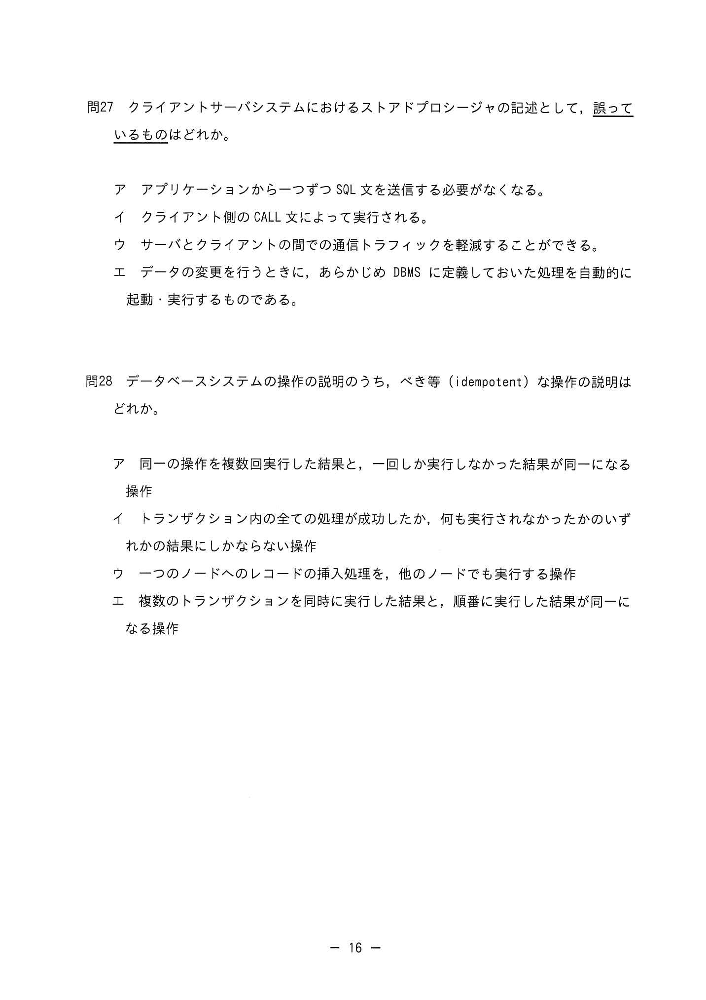

テキスト (OCR)

り
な|

問27 クライアントサーバシステムにおけるストアドプロシージャの記述として,

いるものはどれか。

NI

アプリケーションから一つずつ SQL 文を送信する必要がなくなる。

イ クライアント側のCALL 文によって実行される。

ウ サーバとクライアントの間での通信トラフィックを軽減することができる。

エエ データの変更を行うときに, あらかじめ DBMS に定義しておいた処理を自動的に
起動・実行するものである。

28 データベースシステムの操作の説明のうち, べき等 (idempotent) な操作の説明は
どれか。

ア 同一の操作を複数回実行した結果と, 一回しか実行しなかった結果が同一になる
操作

イ トランザクション内の全ての処理が成功したか, 何も実行されなかったかのいず
れかの結果にしかならない操作

J 一つのノードへのレコードの挿入処理を, 他のノードでも実行する操作

エ 複数のトランザクションを同時に実行した結果と, 順番に実行した結果が同一に
なる操作

### ページ 17

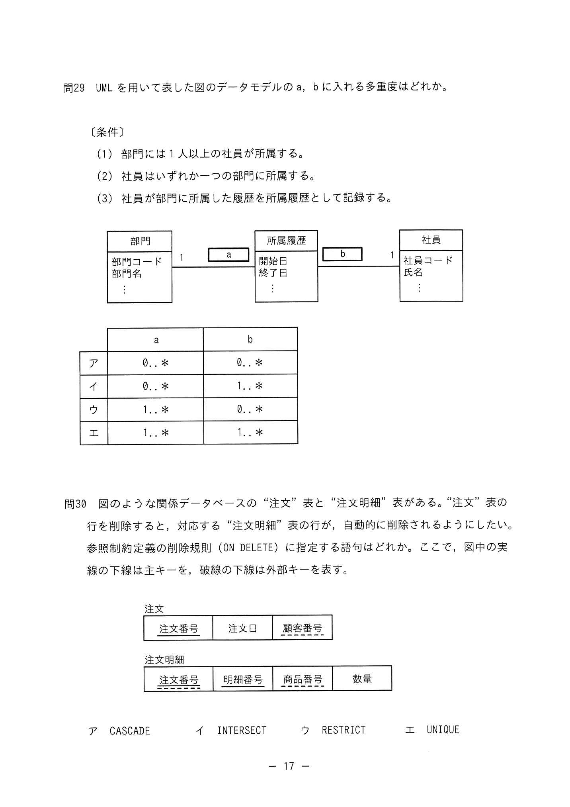

テキスト (OCR)

問29 UML を用いて表した図のデータモデルの a, b に入れる多重度はどれか。

〔条件]

(1) 部門には 1 人以上の社員が所属する。

(2) 社員はいずれかーーつの部門に所属する。

(3) 社員が部門に所属した履歴を所属履歴として記録する。

部門           所属履歴           社員
mmコートド| C2 dime   Ce] ‘hase
部門名           終了日           氏名

a        b
ア    0..*      0..%
4   9..*    1.0%
Ly)    1..      0..
aE    1..ネ       1..玉

30 図のような関係データベースの “SEM” Re “注文明細" ROHS. “ER” RO
行を削除すると, 対応する “注文明細" ROTM, 自動的に削除されるようにしたい。
参照制約定義の削除規則 (ON DELETE) に指定する語句はどれか。ここで, 図中の実
線の下線は主キーを, 破線の下線は外部キーを表す。

注文
注文番号      注文日     顧客番号

注文明細
注文番号    明細番号 | 商品番号     数量

ア CASCADE   イ INTERSECT   ウ RESTRICT   UNIQUE

### ページ 18

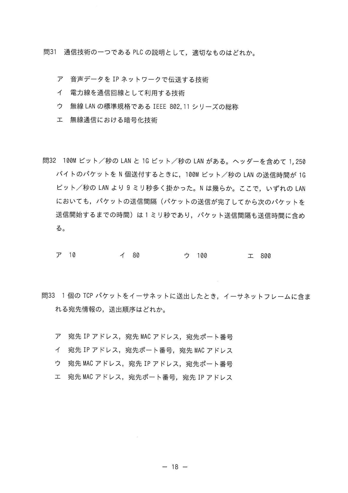

テキスト (OCR)

問31 通信技術の一つである PLC の説明として, 適切なものはどれか。

NI

音声データを IP ネットワークで伝送する技術
電力線を通信回線として利用する技術

無線 LAN の標準規格である IEEE 802.11 シリーズの総称
無線通信における暗号化技術

Ho ユ

間32 199M ビットノ秒の LAN と 1G ビットノ秒のLAN がある。ヘッダーを含めて 1, 250
バイトのパケットをN 個送付するときに, 100M ビットノ秒の LAN の送信時間が 16
ビットン秒のLAN より 9 ミリ秒多く掛かった。N は幾らか。ここで, いずれの LAN
においても, パケットの送信間隔 (パケットの送信が完了してから次のパケットを
送信開始するまでの時間) は 1 ミリ秒であり, パケット送信間隔も送信時間に含め
る。

ア 19     イ 89     ウ 100     エ 800

問33 1 BID TCP パケナットをイーサネットに送出したとき, イーサネットフレームに含ま
れる宛先情報の, 送出順序はどれか。

に|

宛先IP アドレス, 宛先MAC アドレス, 宛先ポート番号
宛先 IP アドレス, 宛先ポート番号, 宛先MAC アドレス
宛先MAC アドレス, 宛先IP アドレス, 宛先ポート番号
宛先MAC アドレス, 宛先ポート番号, 宛先IP アドレス

H 半 ユ

### ページ 19

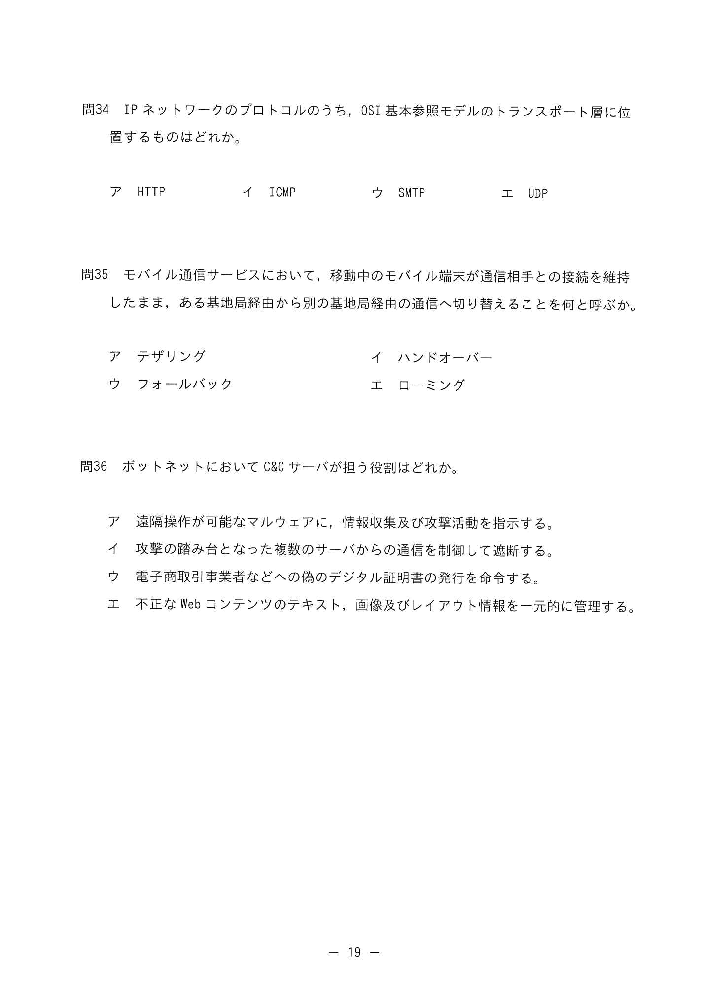

テキスト (OCR)

間34 IP ネットワークのプロトコルのうち, 0S{ 基本参照モデルのトランスポート層に位
置するものはどれか。

ア HTTP     イ ICMP     ウ SMTP     x= UDP

f35 モバイル通信サービスにおいて, 移動中のモバイル端末が通信相手との接続を維持

したまま, ある基地局経由から別の基地局経由の通信へ切り替えることを何と呼ぶか。

ア テザリング                    イ ハンドオーバー

ウ フォールバック          エ ローミング

問36 ボットネットにおいてC&C サーバが担う役割はどれか。

に|

遠隔操作が可能なマルウェアに, 情報収集及び攻撃活動を指示する。

攻撃の踏み台となった複数のサーバからの通信を制御して遮断する。

電子商取引事業者などへの偽のデジタル証明書の発行を命令する。

不正な Web コンテンツのテキスト, 画像及びレイアウト情報を一元的に管理する。

Hoo A

### ページ 20

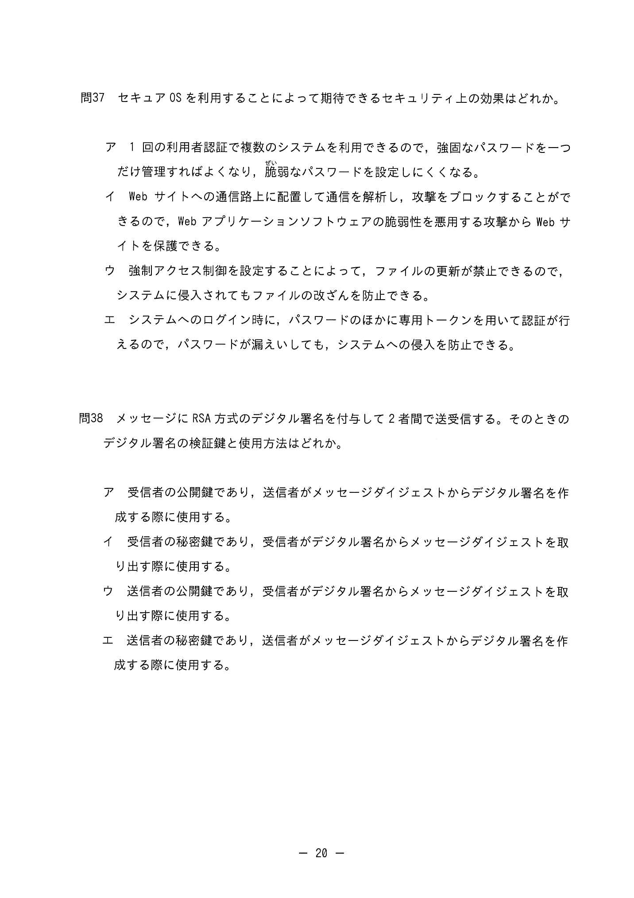

テキスト (OCR)

間37 セキュア OS を利用することによって期待できるセキュリティ上の効果はどれか。

ア 1 回の利用者認証で複数のシステムを利用できるので, 強固なパスワードを一つ
だけ管理すればよくなり, 脆弱なパスワードを設定しにく くなる。

4 Web サイトへの通信路上に配置して通信を解析し, 攻撃をブロックすることがで
きるので, Web アプリケーションソフトウェアの脆弱性を悪用する攻撃から Web +
イトを保護できる。

ウ 強制アクセス制御を設定することによって, ファイルの更新が禁止できるので,
システムに侵入されてもファイルの改ざんを防止できる。

エ システムへのログイン時に, パスワードのほかに専用トークンを用いて認証が行
えるので, パスワードが漏えいしても, システムへの侵入を防止できる。

問38 メッセージに RSA 方式のデジタル署名を付与して 2 者間で送受信する。そのときの
デジタル署名の検証鍵と使用方法はどれか。

ア 受信者の公開鍵であり, 送信者がメッセージダイジェストからデジタル署名を作
成する際に使用する。

イ 受信者の秘密鍵であり, 受信者がデジタル署名からメッセージダイジェストを取
り出す際に使用する。

ウ 送信者の公開鍵であり, 受信者がデジタル署名からメッセージダイジェストを取
り出す際に使用する。

エ 送信者の秘密鍵であり, 送信者がメッセージダイジェストからデジタル署名を作
成する際に使用する。

### ページ 21

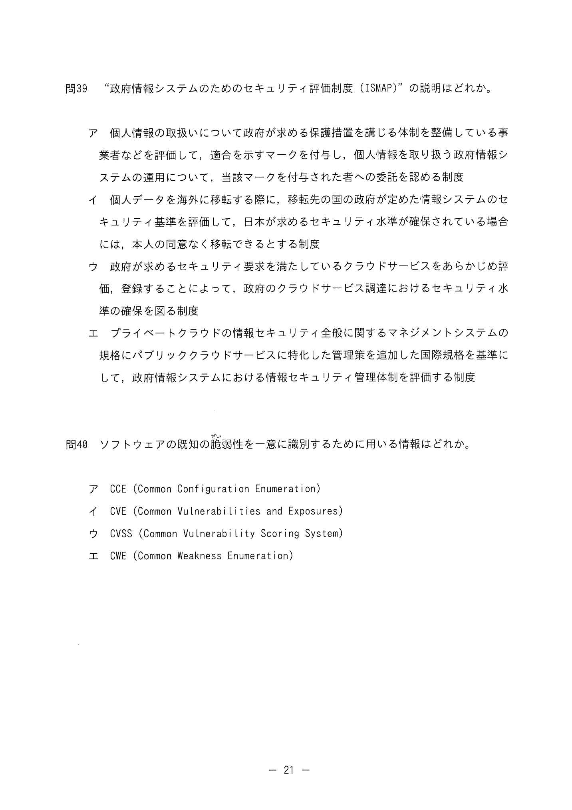

テキスト (OCR)

間39 “政府情報システムのためのセキュリティ評価制度 ([SMAP)” の説明はどれか。

ア 個人情報の取扱いについて政府が求める保護措置を講じる体制を整備している事
業者などを評価して, 適合を示すマークを付与し, 個人情報を取り扱う政府情報シ
ステムの運用について, 当該マークを付与された者への委託を認める制度

イ 個人データを海外に移転する際に, 移転先の国の政府が定めた情報システムのセ
キュリティ基準を評価して, 日本が求めるセキュリティ水準が確保されている場合
には, 本人の同意なく移転できるとする制度

ウ 政府が求めるセキュリティ要求を満たしているクラウドサービスをあらかじめ評
価, 登録することによって, 政府のクラウドサービス調達におけるセキュリティ水
準の確保を図る制度

エエ プライベートクラウドの情報セキュリティ全般に関するマネジメントシステムの
規格にパブリッククラウドサービスに特化した管理策を追加した国際規格を基準に
して, 政府情報システムにおける情報セキュリティ管理体制を評価する制度

問40 ソフトウェアの既知の脆弱性を一意に識別するために用いる情報はどれか。

|

CCE (Common Configuration Enumeration)
CVE (Common Vulnerabilities and Exposures)

CVSS (Common Vulnerability Scoring System)

H GON

CWE (Common Weakness Enumeration)

### ページ 22

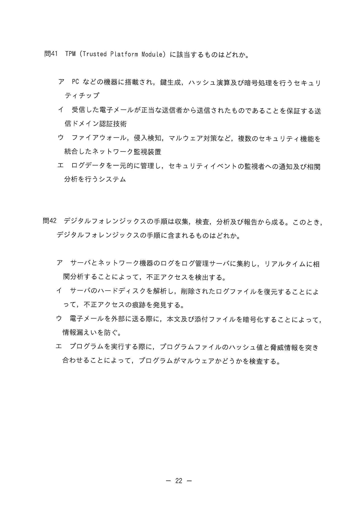

テキスト (OCR)

間41 TPM (Trusted Platform Module) に該当するものはどれか。

ア PC などの機器に搭載され, 鍵生成, ハッシュ演算及び暗号処理を行うセキュリ
ティチップ

イ 受信した電子メールが正当な送信者から送信されたものであることを保証する送
信ドメイン認証技術

ウ ファイアウォール, 侵入検知, マルウェア対策など, 複数のセキュリティ機能を
統合したネットワーク監視装置

エ ログデータを一元的に管理し, セキュリティイベントの監視者への通知及び相関
分析を行うシステム

問42 デジタルフォレンジックスの手順は収集, RA, 分析及び報告から成る。このとき,
デジタルフォレンジックスの手順に含まれるものはどれか。

ア サーバとネットワーク機器のログをログ管理サーバに集約し, リアルタイムに相
関分析することによって, 不正アクセスを検出する。
イ サーバのハードディスクを解析し, 削除されたログファイルを復元することによ
って, 不正アクセスの痕跡を発見する。
電子メールを外部に送る際に, 本文及び添付ファイルを暗号化することによって,
情報漏えいを防ぐ。
エ プログラムを実行する除に, プログラムファイルのハッシュ値と竣威情報を突き
合わせることによって, プログラムがマルウェアかどうかを検査する。

### ページ 23

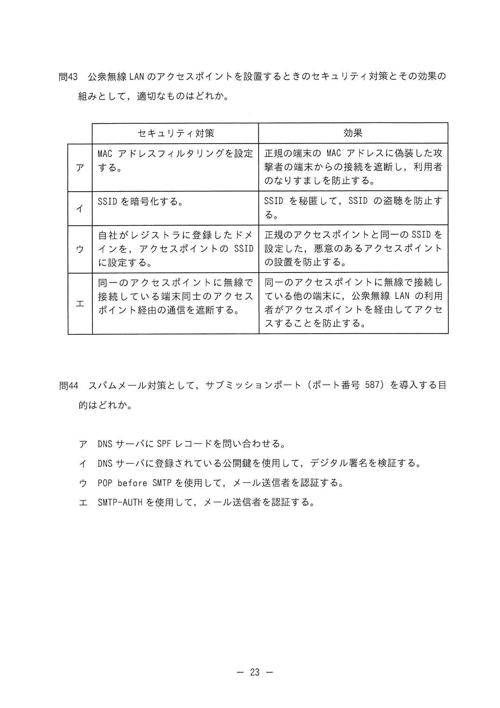

テキスト (OCR)

間43

公衆無線 LAN のアクセスポイントを設置するときのセキュリティ対策とその効果の

効果

組みとして, 適切なものはどれか。
セキュリティ対策
MAC アドレスフィルタリングを設定
ア +s,

正規の端末の MAC アドレスに偽装した攻
撃者の端末からの接続を遮断し, 利用者
のなりすましを防止する。

SSID を暗号化する。

SSID を秘匿して, SSID の盗聴を防止す

ポイント経由の通信を遮断する。

ィ                     る。

自社がレジストラに登録したドメ | 正規のアクセスポイントと同一の SSID を
ウ | インを, アクセスポイントの SSID poe 悪意のあるアクセスポイント

ore                設置を防止する。

同一のアクセスポイントに無線で | 同一のアクセスポイントに無線で接続し
ne  接続している端末同士のアクセス | ている他の端末に, 公衆無線 LAN の利用

者がアクセスポイントを経由してアクセ
スすることを防止する。

間44 スパムメール対策として, サブミッションポート (ポート番号 587) を導入する目

的はどれか。

に|

H GA

DNS サーバに SPF レコードを問い合わせる。

DNS サーバに登録されている公開鍵を使用して, デジタル丹名を検証する。
POP before SMTP を使用して, メール送信者を認証する。

SMTP-AUTH を使用して, メール送信者を認証する。

### ページ 24

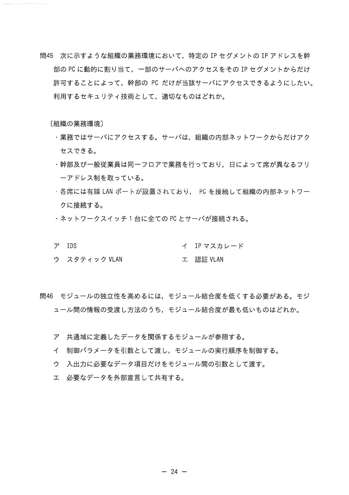

テキスト (OCR)

間45 次に示すような組織の業務環境において, 特定のIP セグメントの IP アドレスを幹
部の PC に動的に割り当て, 一部のサーバへのアクセスをその IP セグメントからだけ
許可することによって, 幹部の PC だけが当該サーバにアクセスできるようにしたい。
利用するセキュリティ技術として, 適切ながものはどれか。

〔組織の業務環境]

・ 業務ではサーバにアクセスする。サーバは, 組織の内部ネットワークからだけアク
セスできる。

・幹部及び一般従業員は同一フロアで業務を行っており, 日によって席が異なるフリ
ーアドレス制を取っている。

・ 各席には有線 LAN ポートが設置されており, PC を接続して組織の内部ネットワー
クに接続する。

・ネットワークスイッチ 1 台に全ての PC とサーバが接続される。

ア IDS            イ 1IP マスカレード
ウ スタティックVLAN       エ 認証VLAN

間46 モジュールの独立性を高めるには, モジュール結合度を低くする必要がある。モジ
ュール間の情報の受渡し方法のうち, モジュール結合度が最も低いものはどれか。

N

共通域に定義したデータを関係するモジュールが参照する。
制御パラメータを引数として渡し, モジュールの実行順序を制御する。
入出力に必要なデータ項目だけをモジュール間の引数として渡す。
必要なデータを外部宣言して共有する。

H GA

### ページ 25

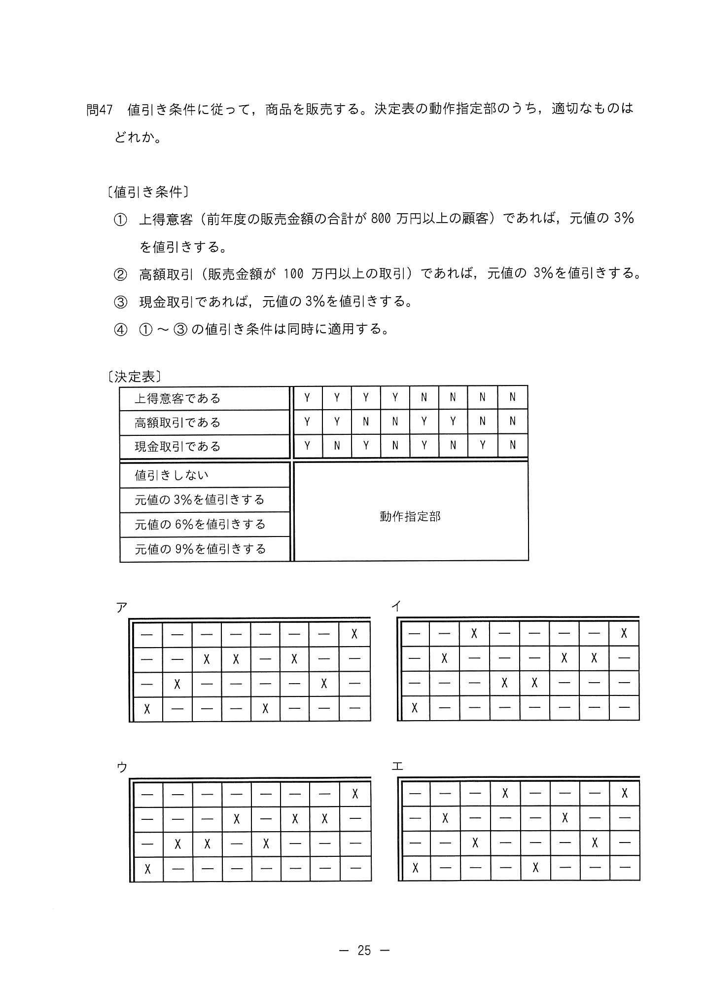

テキスト (OCR)

問47 値引き条件に従って, 商品を販売する。決定表の動作指定部のうち, 適切なものは
どれか。

[値引き条件〕

① 上得意客 (前年度の販売金額の合計が 800 万円以上の顧客) であれば, 元値の 3%
を値引きする。

@② 高額取引 (販売金額が 160 万円以上の取引) であれば, 元値の 3%を値引きする。

現金取引であれば, 元値の 3%を値引きする。

④ ①~て③ の値引き条件は同時に適用する。

R

@

〔決定表]
上得意客である     YIYIYIYININININ
高額取引である     YYININIYIYINHIN
現金取引である     YINIYINIYINIYI|N
値引きしない
元値の 39%を値引きする
元値の 6%%を値引きする                       動作拉定部
元値の 9%を値引きする
ア              “it
ー|一|一|一|一|一|一| x   ー |一|X |一|一|一|一| X
ー|一|X | %X |一|X |一|一  ー| %X |一|一|一| X | %X| 一
ー|X |一|一|一|一|X| 一  ー|一|一| X | X |一|一|一
X |一|一|一|X |一|一|一   X |一|一|一|一|一|一| 一
ウ              x
—/-—|-|-|]-|]-|]-|*   —|-—|-|]x}]-]-|-|x
ー|一|一|]X |一| X|X% |一  ー| %X |一|一|一| X | 一|一
ー| XX |一| X |一|一|一  ー|一|X |一|一|一| X |一
X |一|一|一|一|一|一|一   X |一|一|一| X |一|一|一

### ページ 26

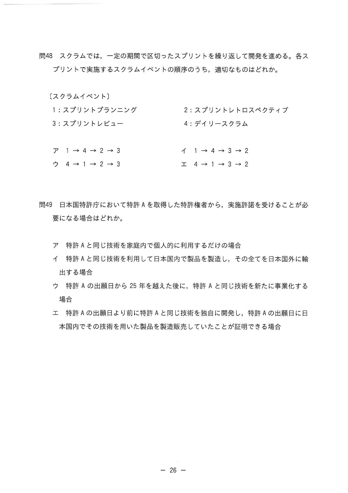

テキスト (OCR)

間48 スクラムでは, 一定の期間で区切ったスプリントを繰り返して開発を進める。各ス
プリントで実施するスクラムイベントの順序のうち, 適切かものはどれか。

[スクラムイベント]〕

1: スプリントプランニング     2:スプリントレトロスペクティブ
3:スプリントレビュー       4: デイリースクラム
ア 13743233      イ 1っ4っ3っ2
ウ 4313233      エ 4っ1っ3っ2

問49 日本国特許庁において特許A を取得した特許権者から, 実施許諾を受けることが必
要になる場合はどれか。

ア 特許Aと同じ技術を家庭内で個人的に利用するだけの場合

イ 特許Aと同じ技術を利用して日本国内で製品を製造し, その全てを日本国外に輸
出する場合

ウ 特許Aの出願日から 25 年を越えた後に, 特許A と同じ技術を新たに事業化する
場合

I 特許Aの出願日より前に特許A と同じ技術を独自に開発し, 特許A の出願日に日
本国内でその技術を用いた製品を製造販売していたことが証明できる場合

### ページ 27

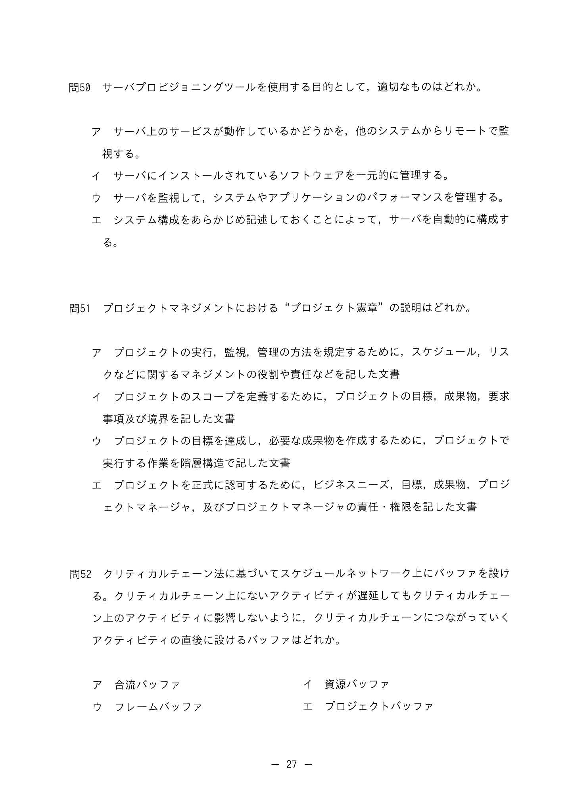

テキスト (OCR)

問59 サーバプロビジョニングツールを使用する目的として, 適切なものはどれか。

ア サーバ上のサービスが動作しているかどうかを, 他のシステムからリモートで監
視する。

A サーバにインストールされているソフトウェアを一元的に管理する。

ウ サーバを監視して, システムやアプリケーションのパフォーマンスを管理する。

エ システム構成をあらかじめ記述しておくことによって, サーバを自動的に構成す
る。

間51 プロジェクトマネジメントにおける “プロジェクト憲章"の説明はどれか。

ア プロジェクトの実行, BH, 管理の方法を規定するために, スケジュール, リス
クなどに関するマネジメントの役割や責任などを記した文書

イ プロジェクトのスコープを定義するために, プロジェクトの目標, 成果物, 要求
事項及び境界を記した文書

ウ プロジェクトの目標を達成し, 必要な成果物を作成するために, プロジェクトで
実行する作業を階層構造で記した文書

エエ プロジェクトを正式に認可するために, ビジネスニーズ., BR, 成果物, プロジ
ェクトマネージャ, 及びプロジェクトマネージャの責任・権限を記した文書

間52 クリティカルチェーン法に基づいてスケジュールネットワーク上にバッファを設け
る。クリティカルチェーン上にないアクティビティが遅延してもクリティカルチェー
ン上のアクティビティに影響しないように, クリティカルチェーンにつながっていく

アクティビティの直後に設けるバッファはどれか。

ア 合流バッファ                  イ 資源バッファ

ウ フレームバッファ         エ プロジェクトバッファ

### ページ 28

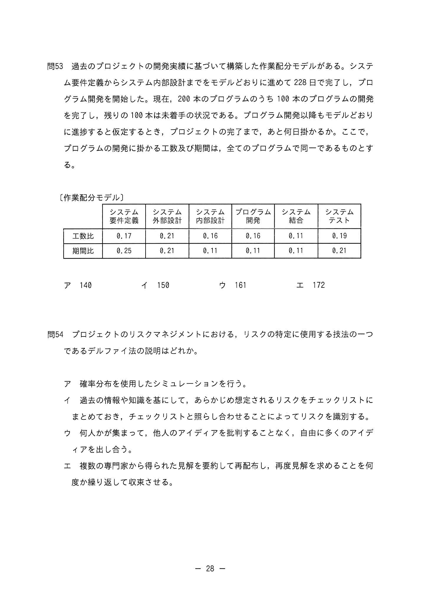

テキスト (OCR)

問53 過去のプロジェクトの開発実績に基づいて構築した作業配分モデルがある。システ
ム要件定義からシステム内部設計までをモデルどおりに進めて 228 日で完了し, プロ
グラム開発を開始した。現在, 209 本のプログラムのうち 100 本のプログラムの開発
を完了し, 残りの 100 本は未着手の状況である。プログラム開発以降もモデルどおり
に進捗すると仮定するとき, プロジェクトの完了まで, あと何日掛かるか。ここで,
プログラムの開発に掛かる工数及び期間は, 全てのプログラムで同一であるものとす
る。

〔作業配分モデル〕
システム | システム | システム | プログラム | システム | システム
要件定義 | 外部設計     内部設計       開発        結合       テスト
工数比    0.17     0.21     0. 16     0.16     0.11     0.19
期間比 0.25 0.21 9.11 9.11 9.110.21
ア 140             イ 150             ウ 161             エ 172

F544 プロジェクトのリスクマネジメントにおける, リスクの特定に使用する技法の一つ
であるデルファイ法の説明はどれか。

ア 確率分布を使用したシミュレーションを行う。

4 過去の情報や知識を基にして, あらかじめ想定されるリスクをチェックリストに
まとめておき, チェックリストと照らし合わせることによってリスクを識別する。
ウ 何人かが集まって, 他人のアイディアを批判することなく, 自由に多くのアイデ

ィアを出し合う。
エ 複数の専門家から得られた見解を要約して再配布し, 再度見解を求めることを何
度か繰り返して収束させる。

### ページ 29

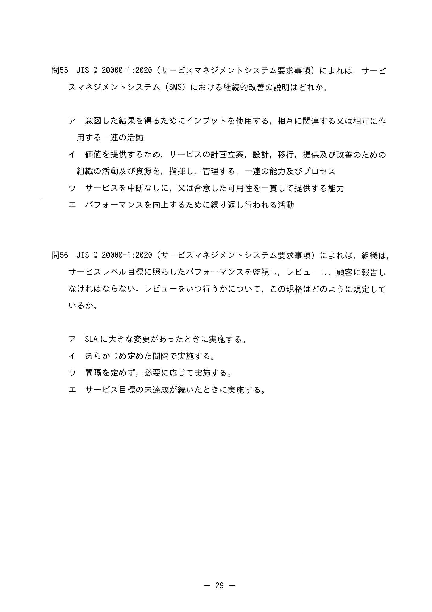

テキスト (OCR)

問55 JIS Q 20000-1:2020 (サービスマネジメントシステム要求事項) によれば, サービ
スマネジメントシステム (SMS) における継続的改善の説明はどれか。

ア 意図した結果を得るためにインプットを使用する, 相互に関連する又は相互に作
用する一連の活動

イ 価値を提供するため, サービスの計画立案, 設計, BT, 提供及び改善のための
組織の活動及び資源を, 指揮し, 管理する, 一連の能力及びプロセス

ウ サービスを中断なしに, 又は合意した可用性を一貫して提供する能力

DL パフォーマンスを向上するために繰り返し行われる活動

間56 JIS Q 20000-1:2020 (サービスマネジメントシステム要求事項) によれば, 組織は
サービスレベル目標に照らしたパフォーマンスを監視し, レビューし, 顧客に報告し
なければならない。レビューをいつ行うかについて, この規格はどのように規定して
いるか。

に|

SLA に大きな変更があったときに実施する。
あらかじめ定めた間隔で実施する。

間隔を定めず, 必要に応じて実施する。

サービス目標の未達成が続いたときに実施する。

Ho A

### ページ 30

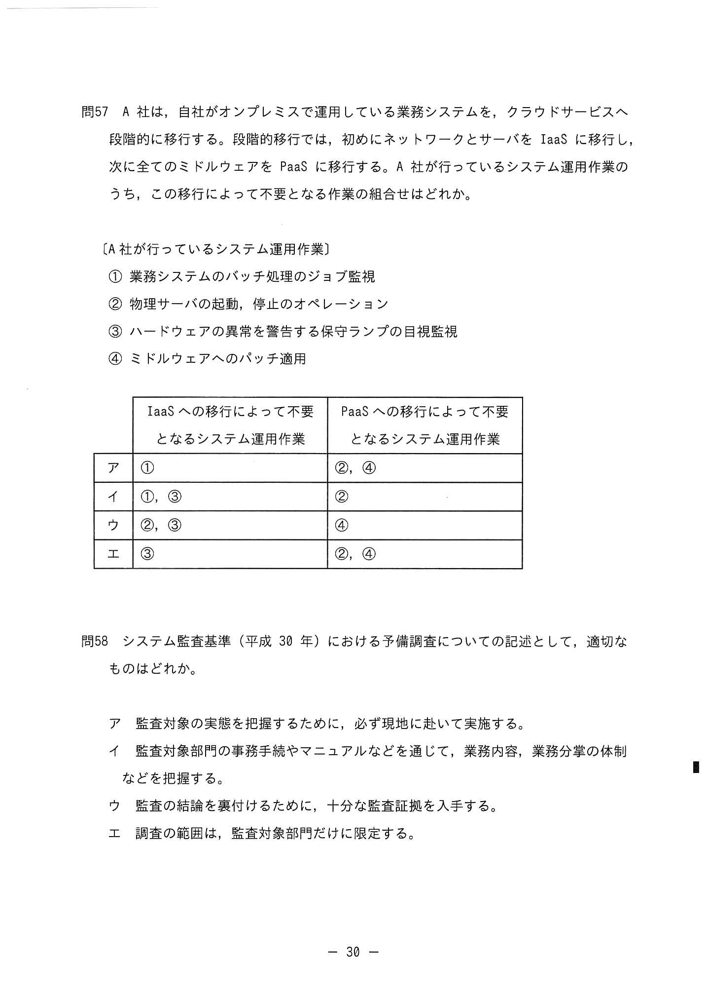

テキスト (OCR)

間57 A 社は, 自社がオンプレミスで運用している業務システムを, クラウドサービスへ
段階的に移行する。段階的移行では, 初めにネットワークとサーバを IaaS に移行し
次に全てのミドルウェアを PaaS に移行する。A 社が行っているシステム運用作業の
うち, この移行によって不要となる作業の組合せはどれか。

〔A 社が行っているシステム運用作業]

① 業務システムのバッチ処理のジョブ監視

② 物理サーバの起動, 停止のオペレーション

③ ハードウェアの異常を警告する保守ランプの目視監視
④ ミドルウェアへのパッチ適用

1aaS への移行によって不要 | PaaS への移行によって不要
となるシステム運用作業   となるシステム運用作業
アァ |①            ②, @
410, ®           @
7 1@, @           ④
エ |③            ②, ④

間58 システム監査基準 (平成 30 年) における予備調査についての記述として, 適切な
ものはどれか。

ア 監査対象の実態を把握するために, 必ず現地に赴いて実施する。

イ 監査対象部門の事務手続やマニュアルなどを通じて, 業務内容, 業務分掌の体制
REET S.

ウ 監査の結論を裏付けるために, 十分な監査証拠を入手する。

エ 調査の範囲は, 監査対象部門だけに限定する。

### ページ 31

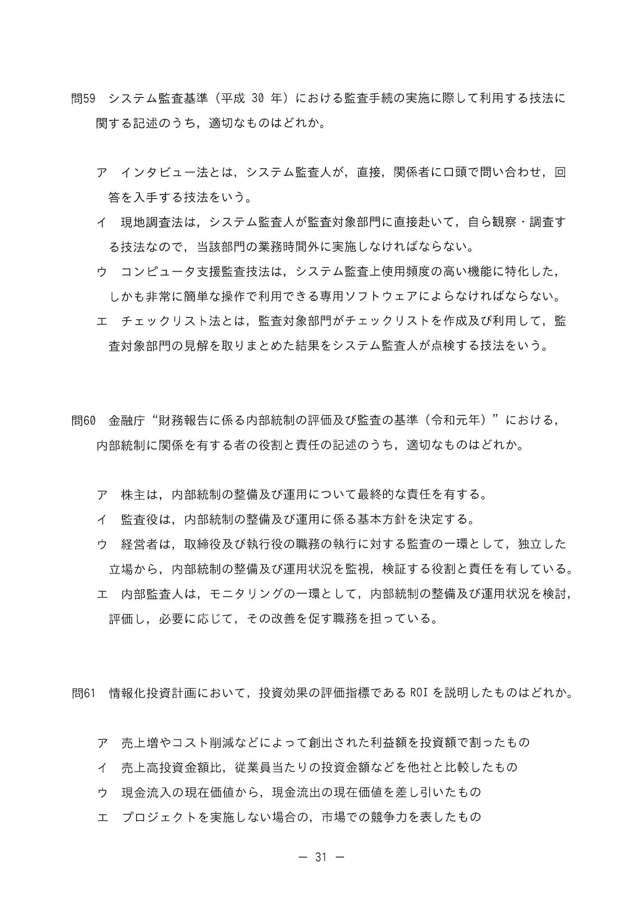

テキスト (OCR)

問59 システム監査基準 (平成 39 年) における監査手続の実施に際して利用する技法に
関する記述のうち, 適切なものはどれか。

ア インタビュー法とは, システム監査人が, BH, 関係者に口頭で問い合わせ, 回
答を入手する技法をいう。

イ 現地調査法は, システム監査人が監査対象部門に直接走いて, 自ら観察・調査す
る技法なので, 当該部門の業務時間外に実施しなければならない。

ウ コンピュータ支援監査技法は, システム監査上使用頻度の高い機能に特化した,
しかも非常に簡単な操作で利用できる専用ソフトウェアによらなければならない。

エエ チェックリスト法とは, 監査対象部門がチェックリストを作成及び利用して, 監
査対象部門の見解を取りまとめた結果をシステム監査人が点検する技法をいう。

問69 金融庁 “財務報告に係る内部統制の評価及び監査の基準 (令和元年) " における,
内部統制に関係を有する者の役割と責任の記述のうち, 適切なものはどれか。

ア 株主は, 内部統制の整備及び運用について最終的な責任を有する。

4 監査役は, 内部統制の整備及び運用に係る基本方針を決定する。

ウ 経営者は, 取締役及び執行役の職務の執行に対する監査の一環として, 独立した
立場から, 内部統制の整備及び運用状況を監視, 検証する役割と責任を有している。

エ 内部監査人は, モニタリングの一環として, 内部統制の整備及び運用状況を検討
評価し, 必要に応じて, その改善を促す職務を担っている。

問61 情報化投資計画において, 投資効果の評価指標である ROI を説明したものはどれか。

売上増やコスト削減などによって創出された利益額を投資額で割ったもの
イ 売上高投資金額比, 従業員当たりの投資金額などを他社と比較したもの
ウ 現金流入の現在価値から, 現金流出の現在価値を差し引いたもの

エ プロジェクトを実施しない場合の, 市場での競争力を表したもの

### ページ 32

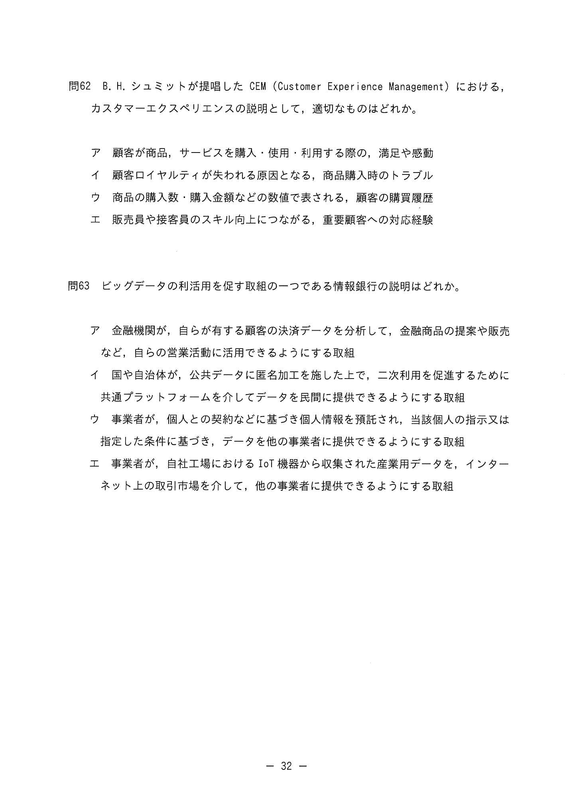

テキスト (OCR)

問62 B.H. シュミットが提唱した CEM (Customer Experience Management) における,
カスタマーエクスペリエンスの説明として, 適切なものはどれか。

|

顧客が商品。サービスを購入・使用・利用する際の, 満足や感動
顧客ロイヤルティが失われる原因となる, 商品購入時のトラブル
商品の購入数・購入金額などの数値で表される, BEOMA ME
販売員や接客員のスキル向上につながる, 重要原客への対応経験

H ユ

間63 ビッグデータの利活用を促す取組の一つである情報銀行の説明はどれか。

ア 金融機関が, 自らが有する顧客の決済データを分析して, 金融商品の提案や販売
など, 自らの営業活動に活用できるようにする取組

4 国や自治体が, 公共データに匿名加工を施した上で, 二次利用を促進するために
共通プラットフォームを介してデータを民間に提供できるようにする取組

ウ 事業者が, 個人との契約などに基づき個人情報を預託され, 当該個人の指示又は
指定した条件に基づき, データを他の事業者に提供できるようにする取組

I 事業者が, 自社工場における lol 機器から収集された産業用データを, インター
ネット上の取引市場を介して, 他の事業者に提供できるようにする取組

### ページ 33

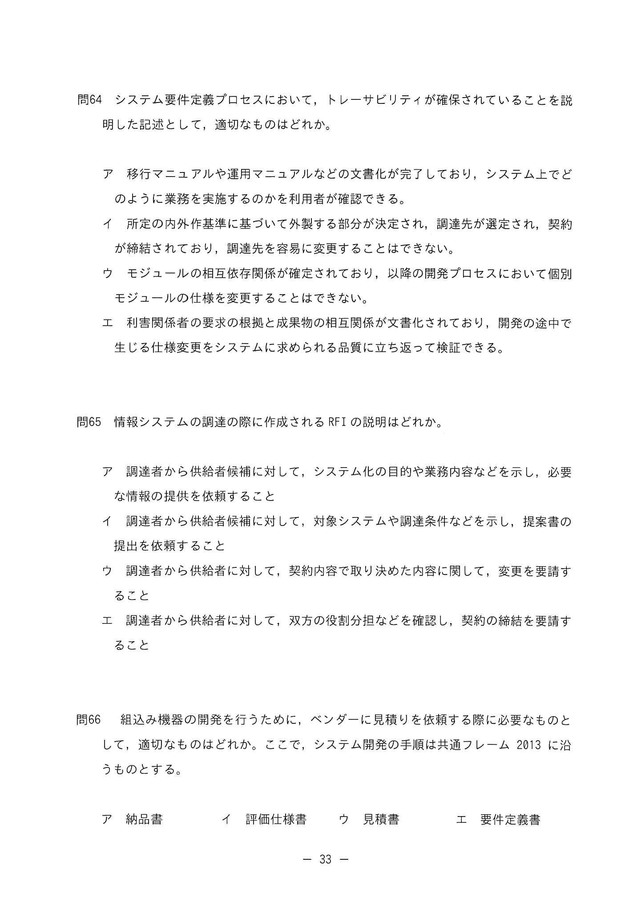

テキスト (OCR)

問64 システム要件定義プロセスにおいて, トレーサビリティが確保されていることを説
明した記述として, 適切なものはどれか。

ア 移行マニュアルや運用マニュアルなどの文書化が完了しており, システム上でど
のように業務を実施するのかを利用者が確認できる。

イ 所定の内外作基準に基づいて外製する部分が決定され, 調達先が選定され, 契約
が締結されており, 調達先を容易に変更することはできない。

9 モジュールの相互依存関係が確定されており, 以降の開発プロセスにおいて個別
モジュールの仕様を変更することはできない。

エ 利害関係者の要求の根拠と成果物の相互関係が文書化されており, 開発の途中で
生じる仕様変更をシステムに求められる品質に立ち返って検証できる。

間65 情報システムの調達の際に作成される RFI の説明はどれか。

ア 調達者から供給者候補に対して, システム化の目的や業務内容などを示し, 必要
な情報の提供を依頼すること

イ 調達者から供給者候補に対して, 対象システムや調達条件などを示し, 提案書の
提出を依頼すること

ウ 調達者から供給者に対して, 契約内容で取り決めた内容に関して, 変更を要請す
ること

エ 調達者から供給者に対して, 双方の役割分担などを確認し, 契約の締結を要請
るでと

CN

問66 組込み機器の開発を行うために, ベンダーに見積りを依頼する際に必要なものと
LT, 適切なかものはどれか。ここで, システム開発の手順は共通フレーム 2013 に治
うものとする。

ア 納品書    イ 評価仕様書  ウ BRE    I 要件定義書

### ページ 34

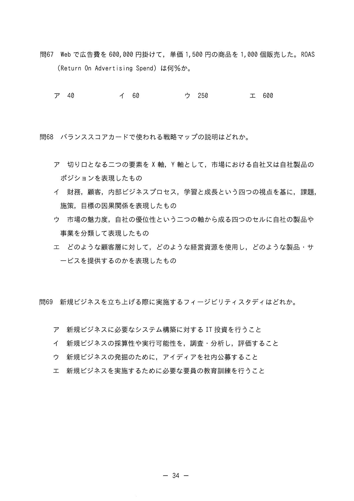

テキスト (OCR)

問67 Web で広告費を 690, 90 円掛けて, 単価 1,500 円の商品を 1, 996 個販売した。ROAS
(Return On Advertising Spend) は何%か。

ア 40      イ 60      ウ 250     エ 600

問68 バランススコアカードで使われる戦略マップの説明はどれか。

ア 切り口となる二つの要素を X 軸, Y 軸として, 市場における自社又は自社製品の
ポジションを表現したもの

4 財務, 顧客, 内部ビジネスプロセス, 学習と成長という四つの視点を基に, 課題
施策, 目標の因果関係を表現したもの

ウ 市場の魅力度, 自社の優位性という二つの軸から成る四つのセルに自社の製品や
事業を分類して表現したもの

エ どのような顧客層に対して, どのような経営資源を使用し, どのような製品・サ
ービスを提供するのかを表現したもの

間69 新規ビジネスを立ち上げる際に実施するフィージビリティスタディはどれか。

NI

新規ビジネスに必要なシステム構築に対する 1T 投資を行うこと
新規ビジネスの採算性や実行可能性を, 調査・分析し, 評価すること
新規ビジネスの発掘のために, アイディアを社内公募すること
新規ビジネスを実施するために必要な要員の教育訓練を行うこと

H GA

ー 34 一

### ページ 35

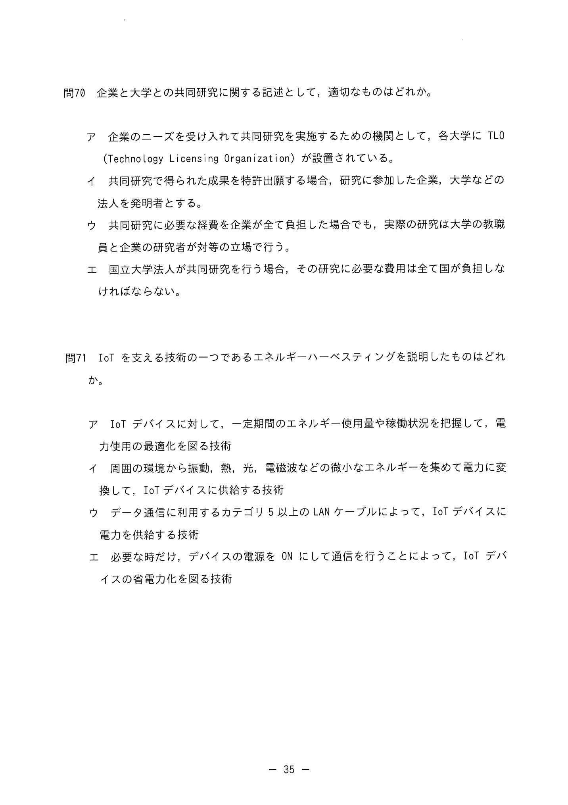

テキスト (OCR)

間79 企業と大学との共同研究に関する記述として, 適切なものはどれか。

ア 企業のニーズを受け入れて共同研究を実施するための機関として, 各大学に TLO
(Technology Licensing Organization) が設置されている。

イ 共同研究で得られた成果を特許出願する場合, 研究に参加した企業, 大学などの
法人を発明者とする。

ウ 共同研究に必要な経費を企業が全て負担した場合でも, 実除の研究は大学の教職
員と企業の研究者が対等の立場で行う。

エ 国立大学法人が共同研究を行う場合,その研究に必要な費用は全て国が負担しな
ければならない。

間71 lol を支える技術の一つであるエネルギーハーベスティングを説明したものはどれ
か。

ア lol デバイスに対して, 一定期間のエネルギー使用量や稼働状況を把握して, 電
力使用の最適化を図る技術

イ 周囲の環境から振動, 熱, 光, 電磁波などの微小なエネルギーを集めて電力に変
換して, ToT デバイスに供給する技術

ウ データ通信に利用するカテゴリ 5 以上のLAN ケーブルによって, IoT デバイスに
電力を供給する技術

エ 必要な時だけ, デバイスの電源を ON にして通信を行うことによって, lol デバ
イスの省電力化を図る技術

### ページ 36

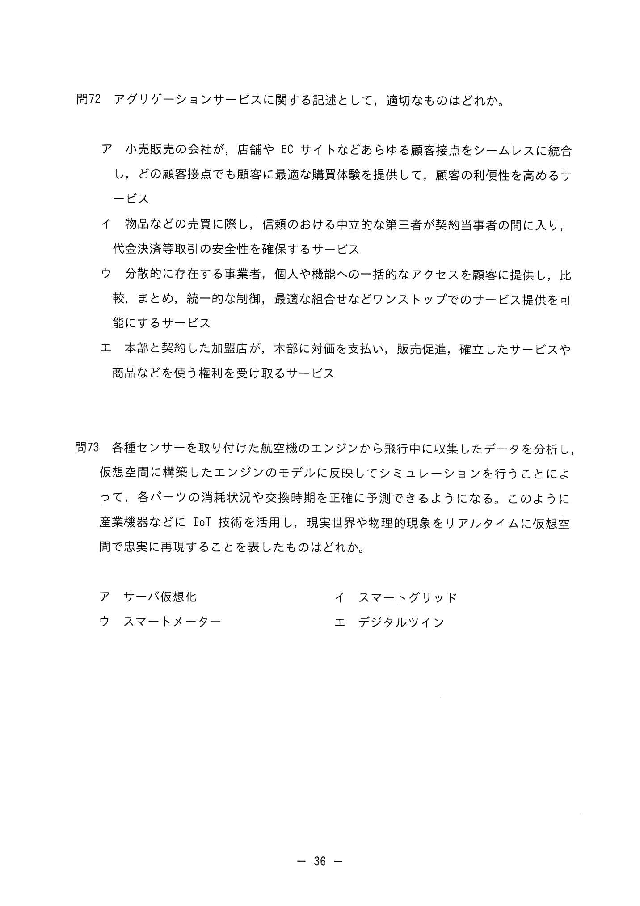

テキスト (OCR)

間72 アグリゲーションサービスに関する記述として, 適切なものはどれか。

ア 小売販売の会社が, 店舗や EC サイトなどあらゆる顧客接点をシームレスに統合
し, どの顧客接点でも顧客に最適な購買体験を提供して, 顧客の利便性を高めるサ
ER

イ 物品などの売買に際し, 信頼のおける中立的な第三者が契約当事者の間に入り
代金決済等取引の安全性を確保するサービス

ウ 分散的に存在する事業者, 個人や機能への一括的なアクセスを顧客に提供し, 比
較, まとめ, 統一的な制御, 最適な組合せなどワンストップでのサービス提供を可
肥にするサービス

エ 本部と契約した加盟店が, 本部に対価を支払い, 販売促進, 確立したサービスや
商品などを使う権利を受け取るサービス

間73 各種センサーを取り付けた航空機のエンジンから飛行中に収集したデータを分析し
仮想空間に構築したエンジンのモデルに反映してシミュレーションを行うことによ
って, 各パーツの消耗状況や交換時期を正確に予測できるようになる。このように
産業機器などに 1oT 技術を活用し, 現実世界や物理的現象をリアルタイムに仮想空
間で忠実に再現することを表したものはどれか。

ア サーバ仮想化           イ スマートグリッド
ウ スマートメーター         エ デジタルツイン

### ページ 37

テキスト (OCR)

問74 事業部制組織の特徴を説明したものはどれか。

ア ある問題を解決するために一定の期間に限って結成され, 問題解決とともに解散
する。

イ 業務を機能別に分け, 各機能こついて部下に命令, 指導を行う。

ウ 製品, 地域などで構成された組織単位に, 利益責任をもたせる。

エ 戦略的提携や共同開発など外部の経営資源を積極的に活用することによって, 経
営環境に対応していく。

### ページ 38

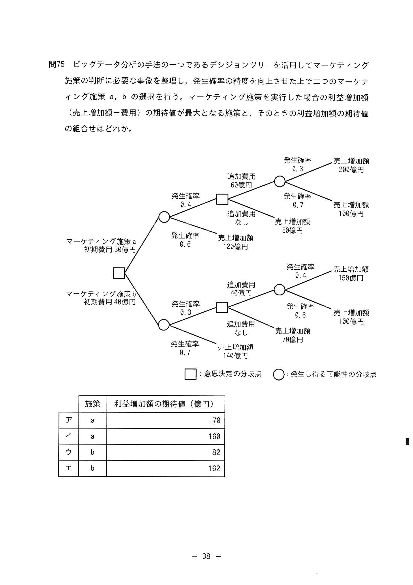

テキスト (OCR)

間75 ビッグデータ分析の手法のーつであるデシジョンツリーを活用してマーケティング
施策の判断に必要な事象を整理し, 発生確率の精度を向上させた上で二つのマーケテ
ィング施策 a, b の選択を行う。マーケティング施策を実行した場合の利益増加額
(売上増加額一費用) の期待値が最大となる施策と, そのときの利益増加額の期待値
の組合せはどれか。

発生確率           売上増加額

206億円
売上増加額
追加費用                                 166億円
なし          売上増加額
ee        50億円
マーケティング施策 a           2
初期費用 30189                               eer
売上増加額
156億円
追加費用
マーケティング施策b               40億円
初期費用46億円
売上増加額
100(8F3

追加費用
なし          売上増加額
発生確率 os bata         mee

9.7   146億円

| ] : 意軸決定の分岐点 OC): 発生し得る可能性の分野点

施策 | 利益増加額の期待値 (億円)
ア          a                                                           70
イ       a                                        160
ウ     b                              82
=x       b                                        162

### ページ 39

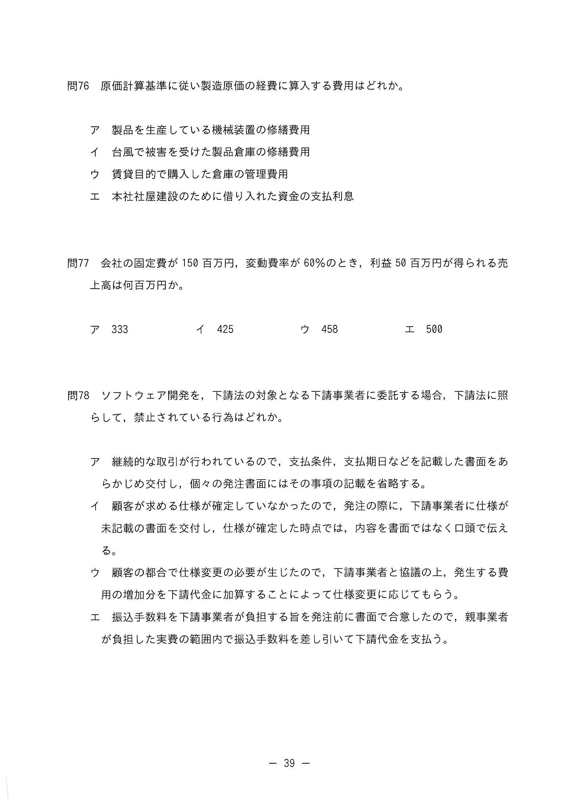

テキスト (OCR)

問76 原価計算基準に従い製造原価の経費に算入する費用はどれか。

に|

製品を生産している機械装置の修繕費用

台風で被害を受けた製品倉庫の修繕費用

賃貸目的で購入した倉庫の管理費用

本社社屋建設のために借り入れた資金の支払利息

H ユ

問77 会社の固定費が150 百万円, 変動費率が 69%%のとき, 利益 50 百万円が得られる売
上高は何百万円か。

ア 333     イ 425     ウ 458     エ 500

間78 ソフトウェア開発を, 下請法の対象となる下請事業者に委託する場合, 下請法に照
らして, 禁止されている行為はどれか。

ア 継続的な取引が行われているので, 支払条件, 支払期日などを記載した書面をあ
らかじめ交付し, 個々の発注書面にはその事項の記載を省略する。

イ 顧客が求める仕様が確定していなかったので, 発注の際に, 下請事業者に仕様が
未記載の書面を交付し, 仕様が確定した時点では, 内容を書面ではなく口頭で伝え
る。

ウ 顧客の都合で仕様変更の必要が生じたので, 下請事業者と協議の上, 発生する費
用の増加分を下請代金に加算することによって仕様変更に応じてもらう。

エ 振込手数料を下請事業者が負担する旨を発注前に書面で合意したので, MERA
が負担した実費の範囲内で振込手数料を差し引いて下請代金を支払う。

### ページ 40

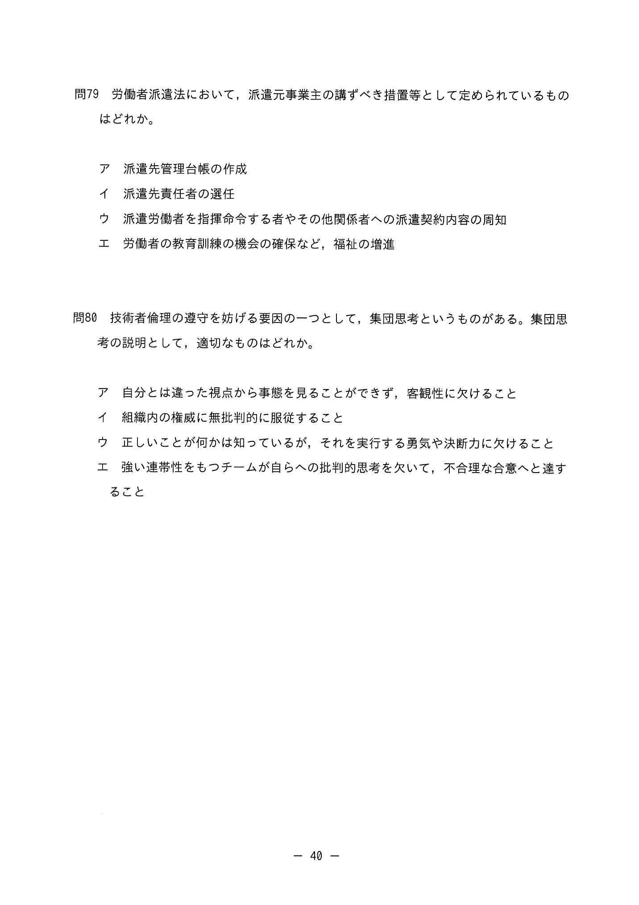

テキスト (OCR)

問79 労働者派遣法において, 派遣元事業主の講ずべき措置等として定められているもの
はどれか。

に|

派遣先管理台帳の作成

派遣先責任者の選任

派遣労働者を指揮命令よる者やその他関係者への派遣契約内容の周知
労働者の教育訓練の機会の確保など, 福祉の増進

H @G@ A

F180 技術者倫理の遵守を妨げる要因の一つとして, 集団思考というものがある。 集団思
考の説明として, 適切なものはどれか。

N

自分とは違った視点から事態を見ることができず, 客観性に欠けること

組織内の権威に無批判的に服従すること

正しいことが何かは知っているが, それを実行する勇気や決断力に欠けること
強い連帯性をもつチームが自らへの批判的思考を欠いて, 不合理な合意へと達す
ること

Hos ユ

### ページ 41

テキスト (OCR)

C

メ モ 用 紙 J

### ページ 42

テキスト (OCR)

【

x モ 用 紙 }

ー 42 一

### ページ 43

テキスト (OCR)

〔

x = 用 欧

ー 43 一

### ページ 44

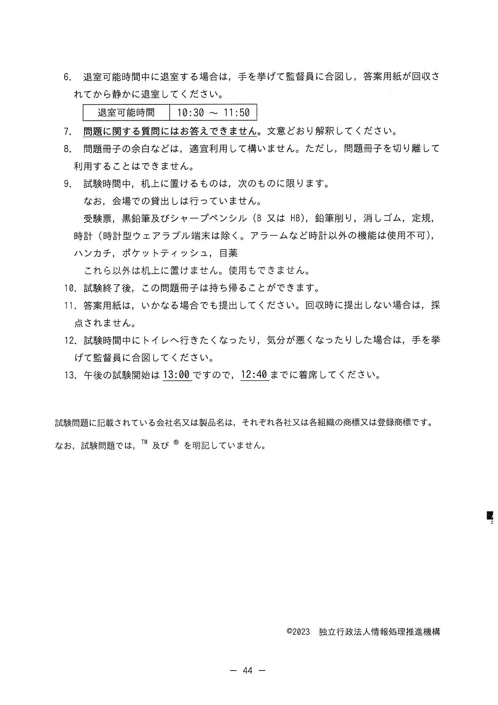

テキスト (OCR)

6. 退室可能時間中に退室する場合は, 手を挙げて監督具に合図し, 答案用紙が回収さ
れてから静かに退室してください。
退室可能時間 | 10:30 ~ 11:50 |
7. 問題に関する質問にはお答えできません。文意どおり解釈してください。
8. 問題冊子の余白などは, 適宜利用して構いません。ただし, 問題冊子を切り離して
利用することはできません。
9. 試験時間中, 机上に置けるものは, 次のものに限ります。
なお, 会場での貸出しは行っていません。
受験票, 黒鉛筆及びシャープペンシル (B 又は HB), 鉛筆削り, 消しゴム, ER,
時計 (時計型ウェアラブル端末は除く。アラームなど時計以外の機能は使用不可),
ハンカチ, ポケットティッシュ, 目薬
これら以外は机上に置けません。使用もできません。
10. 試験終了後, この問題冊子は持ち帰ることができます。
11, SRAM, いかなる場合でも提出してください。 回収時に提出しない場合は, 採
点されません。
12. 試験時間中にトイレへ行きたくなったり, 気分が悪くなったりした場合は, FER
げて監督具に合図してください。
13. 午後の試験開始は 13:00 ですので, 12:40 までに着席してください。

試験問題に記載されている会社名又は製品名は, それぞれ各社又は各組織の商標又は登録商標です。

なお, 試験問題では, "及び © を明記していません。

@2023 独立行政法人情報処理推進機構

ー 44 一

---

## 午前解答

©2023 独立行政法人情報処理推進機構 
令和5 年度 春期 応用情報技術者試験 解答例 
 
午前試験 
問番号
正解
分野
問1 
ア 
Ｔ 
問2 
ア 
Ｔ 
問3 
ア 
Ｔ 
問4 
ウ 
Ｔ 
問5 
ウ 
Ｔ 
問6 
エ 
Ｔ 
問7 
ア 
Ｔ 
問8 
イ 
Ｔ 
問9 
ウ 
Ｔ 
問10 
イ 
Ｔ 
問11 
ア 
Ｔ 
問12 
ア 
Ｔ 
問13 
イ 
Ｔ 
問14 
イ 
Ｔ 
問15 
エ 
Ｔ 
問16 
エ 
Ｔ 
問17 
ウ 
Ｔ 
問18 
ア 
Ｔ 
問19 
エ 
Ｔ 
問20 
ア 
Ｔ 
 
 
問番号
正解
分野
問21 
イ 
Ｔ 
問22 
ア 
Ｔ 
問23 
エ 
Ｔ 
問24 
エ 
Ｔ 
問25 
ウ 
Ｔ 
問26 
ウ 
Ｔ 
問27 
エ 
Ｔ 
問28 
ア 
Ｔ 
問29 
エ 
Ｔ 
問30 
ア 
Ｔ 
問31 
イ 
Ｔ 
問32 
ウ 
Ｔ 
問33 
ウ 
Ｔ 
問34 
エ 
Ｔ 
問35 
イ 
Ｔ 
問36 
ア 
Ｔ 
問37 
ウ 
Ｔ 
問38 
ウ 
Ｔ 
問39 
ウ 
Ｔ 
問40 
イ 
Ｔ 
 
 
問番号
正解
分野
問41 
ア 
Ｔ 
問42 
イ 
Ｔ 
問43 
エ 
Ｔ 
問44 
エ 
Ｔ 
問45 
エ 
Ｔ 
問46 
ウ 
Ｔ 
問47 
ウ 
Ｔ 
問48 
イ 
Ｔ 
問49 
イ 
Ｔ 
問50 
エ 
Ｔ 
問51 
エ 
Ｍ 
問52 
ア 
Ｍ 
問53 
イ 
Ｍ 
問54 
エ 
Ｍ 
問55 
エ 
Ｍ 
問56 
イ 
Ｍ 
問57 
ウ 
Ｍ 
問58 
イ 
Ｍ 
問59 
ア 
Ｍ 
問60 
エ 
Ｍ 
 
 
問番号
正解
分野
問61 
ア 
Ｓ 
問62 
ア 
Ｓ 
問63 
ウ 
Ｓ 
問64 
エ 
Ｓ 
問65 
ア 
Ｓ 
問66 
エ 
Ｓ 
問67 
ウ 
Ｓ 
問68 
イ 
Ｓ 
問69 
イ 
Ｓ 
問70 
ウ 
Ｓ 
問71 
イ 
Ｓ 
問72 
ウ 
Ｓ 
問73 
エ 
Ｓ 
問74 
ウ 
Ｓ 
問75 
ウ 
Ｓ 
問76 
ア 
Ｓ 
問77 
エ 
Ｓ 
問78 
イ 
Ｓ 
問79 
エ 
Ｓ 
問80 
エ 
Ｓ 
 
 
分野の「Ｔ」はテクノロジ系，「Ｍ」はマネジメント系，「Ｓ」はストラテジ系の問題です。

---

## 午後問題

### ページ 1

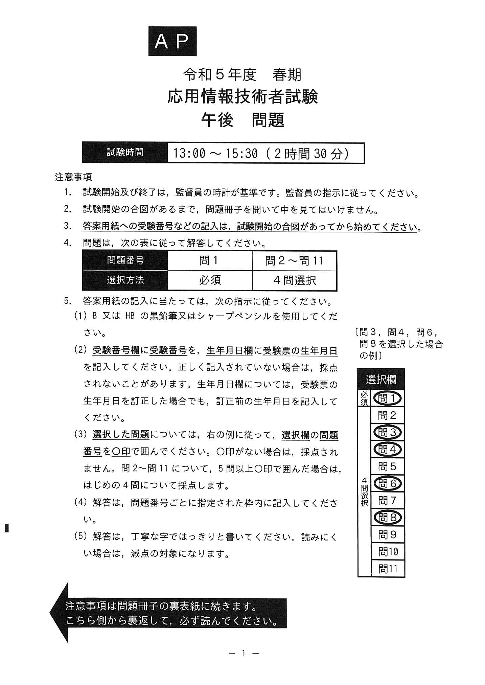

テキスト (OCR)

令和5年度 春期
応用情報技術者試験
午後 問題

ee 13:00 ~ 15:30 (2時間39 分)

注意事項
1. 試験開始及び終了は, 監督員の時計が基準です。監督員の指示に従ってください。
2. 試験開始の合図があるまで, 問題地子を開いて中を見てはいけません。
3. 管用紙への受験番号などの記入は。 吉験開始の合図があってから始めてください。
4. 間題は, 次の表に従って解答してください。
問題番号     fej 1    問2~問 11
選択方法     必須     4 問選択
5. 箇案用紙の記入に当たっては。 次の指示に従ってください。
(1) B 又は HB の黒鉛筆又はシャープペンシルを使用してくだ
fin,                        (問3, 問4,問6,
(②) SRE SMCERESE, SeRoMcEROtERE A ERR LES
を記入してください。正しく記入されていない場合は, 採点
されないことがあります。 生年月日杉については, 受験球の AA
生年月日を訂正した場合でも訂正前の生年月日を記入して [ald

ください。                          問2

(3) 選択した問題については, 右の例に従って, 選択棚の問題   Gd
番号を〇印で囲んでください。〇印がない場合は, 採点され   (前4

ません。問 2一間 11 について, 5 問以上O印で囲んだ場合は,   問5

はじめの 4 問について採点します。             間いSB

(4) 解答は, 問題番号ごとに指定された枠内に記入してくださ [RPI
い。                                                    C48

(5) 解答は, 丁寧な字ではっきりと書いてください。読みにく    問9
い場合は, 減点の対象になります。                     問19

間11

注意事項は問題冊子の裏表紙に続きます。
こちら側から裏返して, 必ず読んでください。

### ページ 2

### ページ 3

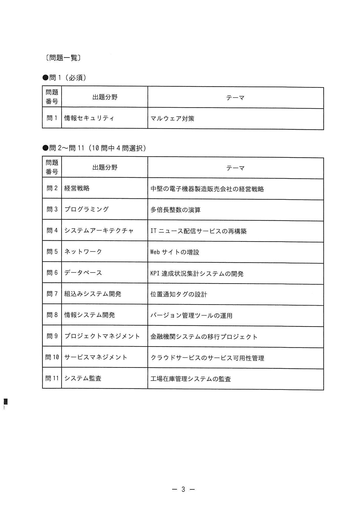

テキスト (OCR)

〔問題一覧]

@問1 (必須)

      出題分野                  テーマ

間 1 | 情報セキュリティ     マルウェア対策

人@問 2一問 11 (10 問中 4 問選択)

      出題分野                  テーマ

fal 2 | 経営戦略          中堅の電子機器製造販売会社の経営戦略
問3 | プログラミング       多倍長整数の演算

間4 | システムアーキテクチャ  IT ニュース配信サービスの再構築

問5 | ネットワーク            Web サイトの増設

問6 | データベース        KPI 達成状況集計システムの開発

問 7 | 組込みシステム開発    位置通知タグの設計

fl 8 | 情報システム開発     バージョン管理ツールの運用

問 9 | プロジェクトマネジメント | 金融機関システムの移行プロジェクト
問 19 | サービスマネジメント    クラウドサービスのサービス可用性管理

間11

システム監査

工場在庫管理システムの監査

### ページ 4

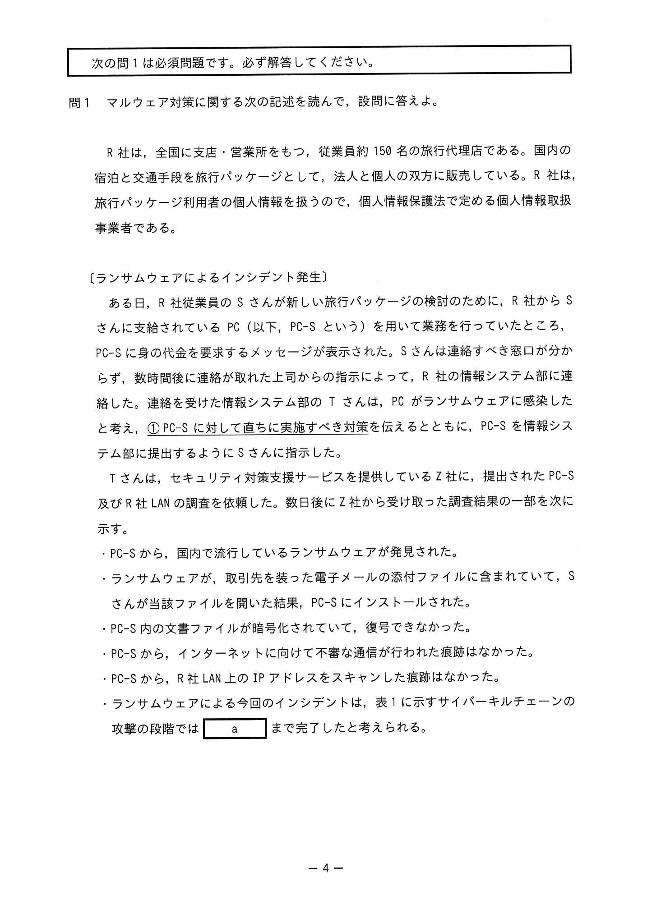

テキスト (OCR)

次の問 1 は必須問題です。必ず解答してください。

fl 1

マルウェア対策に関する次の記述を読んで, 設問に答えよ。

R 社は, 全国に支店・営業所をもつ, 従業員約 156 名の旅行代理店である。国内の
宿泊と交通手段を旅行パッケージとして, 法人と個人の双方に販売している。R 社は,
旅行パッケージ利用者の個人情報を扱うので, 個人情報保護法で定める個人情報取扱
事業者である。

〔【ランサムウェアによるインシデント発生〕

HSA, R 社従業員の S さんが新しい旅行パッケージの検討のために, R 社から$S
さんに支給されている PC (以下, PC-S という) を用いて業務を行っていたところ,
PC-S に身の代金を要求するメッセージが表示された。S さんは連絡すべき窓口が分か
らず, 数時間後に連絡が取れた上司からの指示によって, R 社の情報システム部に連
絡した。 連絡を受けた情報システム部の T さんは, PC がランサムウェアに感染した
と考え, ① PC-S に対して直ちに実施すべき対策を伝えるとともに, PCS を情報シス
テム部に提出するように $ さんに指示した。

T さんは, セキュリティ対策支援サービスを提供している Z 社に, 提出された PC-S
及びR社LAN の調査を依頼した。数日後に Z 社から受け取った調査結果の一部を次に
示す。

・PC-S から, 国内で流行しているランサムウェアが発見された。

・ランサムウェアが, 取引先を装った電子メールの添付ファイルに含まれていて, S

さんが当該ファイルを開いた結果, PC-S にインストールされた。

・PC-S 内の文書ファイルが暗号化されていて, 復号できなかった。

・PC-S から, インターネットに向けて不審な通信が行われた痕跡はなかった。

・PC-S から, R社LAN 上のIP アドレスをスキャンした痕跡はなかった。

・ランサムウェアによる今回のインシデントは, 表 1 に示すサイバーキルチェーンの

攻撃の段階では | a | まで完了したと考えられる。

### ページ 5

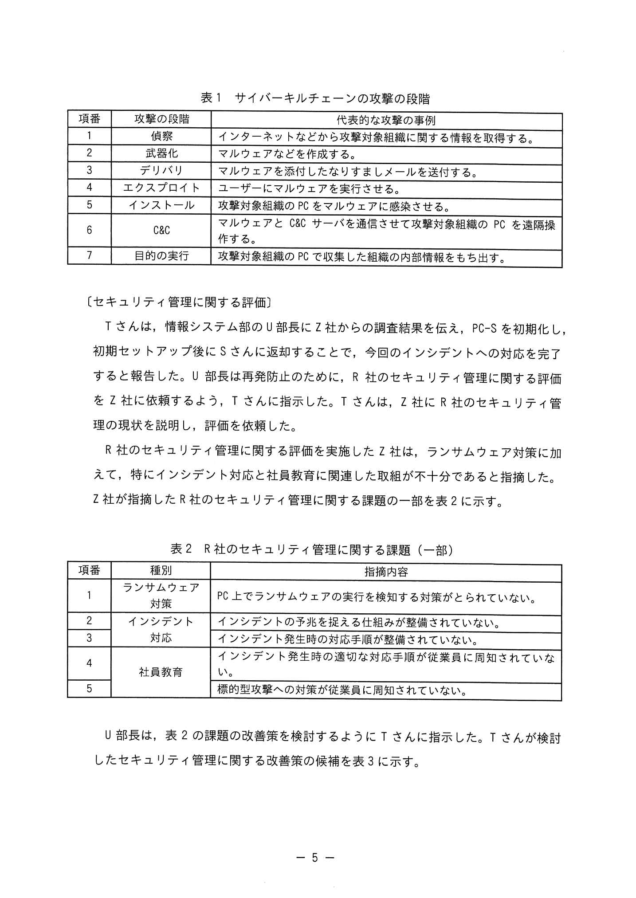

テキスト (OCR)

表1

サイバーキルチェーンの攻撃の段階

項番   攻撃の段階             代表的な攻撃の事例
1         偵察       インターネットなどから攻撃対象組織に関する情報を取得する。
2        武器化      マルウェアなどを作成する。
3       デリバリ     マルウェアを添付したなりすましメールを送付する。
4  エクスプロイト | ユーザーにマルウェアを実行させる。
5   インストール | 攻撃対象組織の PC をマルウェアに感染させる。
マルウェアと C&C サーバを通信させて攻撃対象組織の PC を遠隔操
6    C&C
作する。
7    目的の実行   攻撃対象組織の PC で収集した組織の内部情報をもち出す。

[セキュリティ管理に関する評価〕

Tさんは, 情報システム部のU部長に Z 社からの調査結果を伝え, PC-S を初期化し,
初期セットアップ後にS さんに返却することで, 今回のインシデントへの対応を完了
すると報告した。U 部長は再発防止のために, R 社のセキュリティ管理に関する評価
を Z 社に依頼するよう, T さんに指示した。T さんは, Z 社に R 社のセキュリティ管
理の現状を説明し, 評価を依頼した。

R 社のセキュリティ管理に関する評価を実施した Z 社は, ランサムウェア対策に加
AT, 特にインシデント対応と社員教育に関連した取組が不十分であると指摘した。
Z 社が指摘した R 社のセキュリティ管理に関する課題の一部を表 2 に示す。

表2 R社のセキュリティ管理に関する課題 (一部)

項番        種別                               指摘内容
1  ir PC 上でランサムウェアの実行を検知する対策がとられていない。
インシデント    インシデントの予兆を捉える仕組みが整備されていない。
3          対応        インシデント発生時の対応手順が整備されていない。
F                    インシデント発生時の適切な対応手順が従業員に周知されていな
社員教育      い。
5           標的型攻撃への対策が従業員に周知されていない、。

U 部長は, 表 2 の課題の改善策を検討するように T さんに指示した。T さんが検討
したセキュリティ管理に関する改善策の候補を表 3 に示す。

### ページ 6

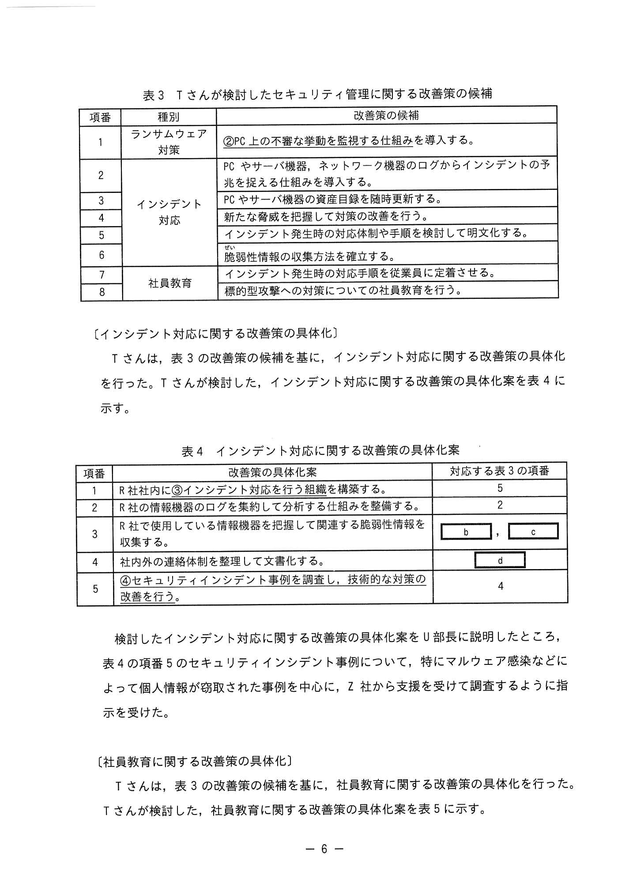

テキスト (OCR)

表3 Tさんが検討したセキュリティ管理に関する改善策の候補

項番         種別                                 改善筑の候補
1     Pi   OM 上の不審な挙動を監視する仕組みを導入する。
。            PC やサーバ機器, ネットワーク機器のログからインシデントの予
兆を捉える仕組みを導入する。
3 | ィソンデント |PC やサーバ機器の資産目録を随時更新する。
4          対応        ina EEE CHROMBEAD.
5                        インシデン ト 発生時の対応体制や手順を検討して明文化する。
6                       脆紅性情報の収集方法を確立する。
7         came |インシデント発生陸の対応手順を代業員に定着させる。
8     aes   標的型攻撃への対策についての社員教育を行う。

[インシデント対応に関する改善策の具体化

T さんは, 表 3 の改善策の候補を基に, インシデント対応に関する改善策の具体化
を行った。T さんが検討した, インシデント対応に関する改善策の具体化案を表 4 に

示す。

表4 インシデント対応に関する改善策の具体化案

改善策の具体化案                    対応する表 3 の項番

R 社社内に③インシデント対応を行う組織を構築する。

R 社の情報機器のログを集約して分析する仕組みを整備する。

R 社で使用している情報機器を把握して関連する脆弱性情報を

社内外の連絡体制を整理して文書化する。

改善を行う。

④セキュリティインシデント事例を調査し, 技術的な対策の

5
2
Warr a.                                       a 本
し s |
4

検討したインシデント対応に関する改善策の具体化案を U部長に説明したところ,
表 4 の項番5 のセキュリティインシデント事例について, 特にマルウェア感染などに
よって個人情報が補取された事例を中心に, Z 社から支援を受けて調査するように指

示を受けた。

社員教育に関する改善策の具体化]
T さんは, 表 3 の改善策の候補を基に, 社員教育に関する改善策の具体化を行った。
T さんが検討した, 社員教育に関する改善策の具体化案を表 5 に示す。

ー 6一

### ページ 7

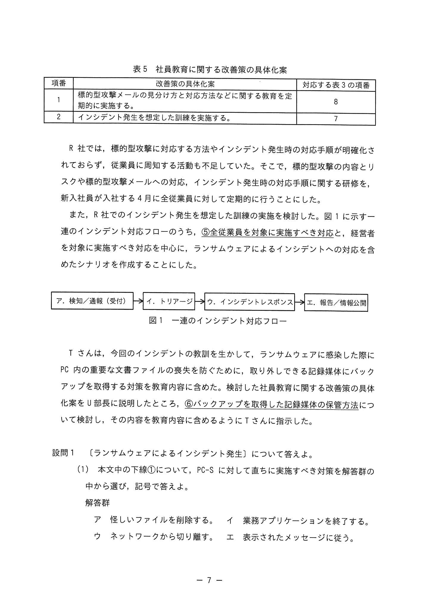

テキスト (OCR)

RS 社員教育に関する改善策の具体化案

項番                       改善策の具体化案                       対応する表 3 の項番
1    標的型攻撃メールの見分け方と対応方法などに関する教育を定          8
期的に実施する。
2    インシデント発生を想定した訓練を実施する。                         メ

R 社では, 標的型攻撃に対応する方法やインシデント発生時の対応手順が明確化さ
れておらず, 従業員に周知する活動も不足していた。 そこで, 標的型攻撃の内容とリ
スクや標的型攻撃メールへの対応, インシデント発生時の対応手順に関する研修を,
新入社員が入社する 4 月に全従業員に対して定期的に行うことにした。

また, R 社でのインシデント発生を想定した訓練の実施を検討した。図 1 に示す一
連のインシデント対応フローのうち, ⑤全従業員を対象に実施すべき対応と, 経営者
を対象に実施すべき対応を中心に。 ランサムウェアによるインシデントへの対応を含
めたシナリオを作成することにした。

ア. 検知通報 (受付)  イ. トリアージトトウ. インシデントレスポンストラ| エ. 報告/情報公開

図1 一連のインシデント対応フロー

T さんは, 今回のインシデントの教訓を生かして, ランサムウェアに感染した際に
PC 内の重要な文書ファイルの衰失を防ぐために, 取り外しできる記録媒体にバック
アップを取得する対策を教育内容に含めた。検討した社員教育に関する改善策の具体
{ERE U部長に説明したところ, バックアップを取得した記録媒体の保管方法につ
いて検討し, その内容を教育内容に含めるようにT さんに指示した。

設問1 〔ランサムウェアによるインシデント発生〕について答えよ。
(1) 本文中の下線やについて, PC-S に対して直ちに実施すべき対策を解答群の
中から選び, 記号で答えよ。
解答群
ア 怪しいファイルを削除する。 イ 業務アプリケーションを終了する。
ウ ネットワークから切り離す。 エエ 表示されたメッセージに従う。

### ページ 8

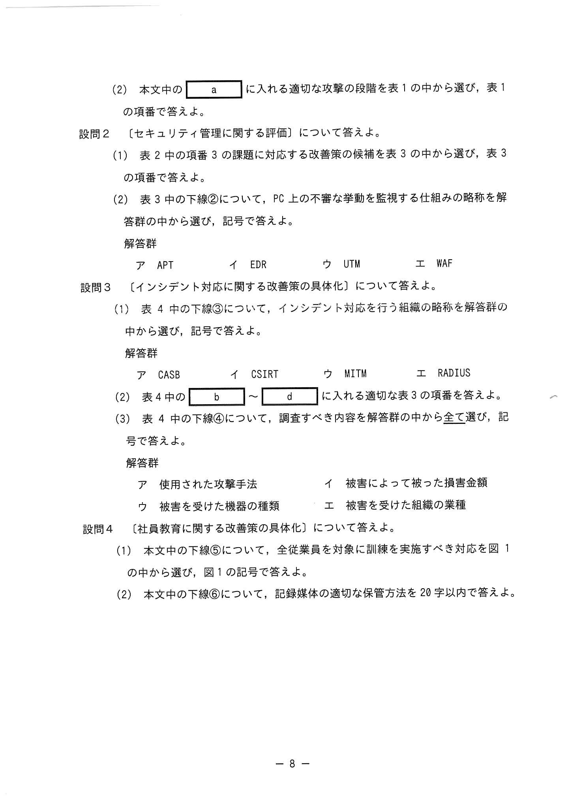

テキスト (OCR)

(2) 本文中の|  』 | に入れる適切な攻撃の段階を表 1 の中から選び, 表 1
の項番で答えよ。
設問2 〔セキュリティ管理に関する評価] について答えよ。
(1) 表 2 中の項番 3 の課題に対応する改善策の候補を表 3 の中から選び, 表 3
の項番で答えよ。
(2) 表 3 中の下線@について, PC 上の不審な挙動を監視する仕組みの略称を解
答群の中から選び, 記号で答えよ。
解答群
ア APT    イ EDR    ウ UTM    エ WAF
設問3 [インシデント対応に関する改善策の具体化】について答えよ。
(1) 表 4 中の下線について, インシデント対応を行う組織の略称を解答群の
中から選び, 記号で答えよ。
解答群
ア CASB    イ CSIRT   ウ MITM    エ RADIUS
(2) 表4中の| b |~[  d |に入れる適切な表3の項番を答えよ。
(3) 表 4 中の下線のについて, 調査すべき内容を解答群の中から全て選び, 記

号で答えよ。

解答群

ア 使用された攻撃手法     イ 被害によって被った損害金額
ウ 被害を受けた機器の種類    エ 被害を受けた組織の業種

設問4 社員教育に関する改善策の具体化)]について答えよ。
(1) 本文中の下線について, 全従業員を対象に訓練を実施すべき対応を図 1
の中から選び, 図 1 の記号で答えよ。
(2) 本文中の下線⑥について, 記録媒体の適切な保管方法を 20 字以内で答えよ。

### ページ 9

テキスト (OCR)

〔

メ モ 用 紙 〕

### ページ 10

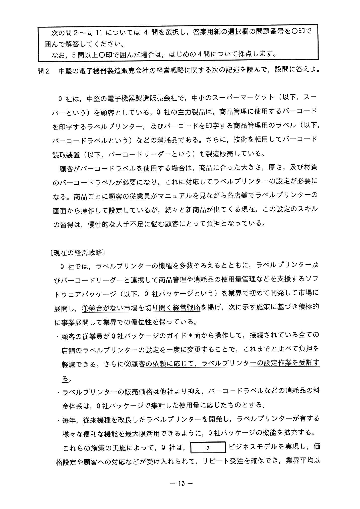

テキスト (OCR)

次の問 2 一問 11 については 4 問を選択し, 答案用紙の選択欄の問題番号を〇印で
囲んで解答してください。
なお, 5 問以上〇印で囲んだ場合は, はじめの 4 問について採点します。

問2 中堅の電子機器製造販売会社の経営戦略に関する次の記述を読んで, 設問に答えよ。

Q 社は, 中堅の電子機器製造販売会社で, 中小のスーパーマーケット (以下, スー
パーという) を顧客としている。0 社の主力製品は, 商品管理に使用するバーコード
を印字するラベルプリンター, 及びバーコードを印字する商品管理用のラベル (以下
バーコードラベルという) などの消耗品である。さらに, 技術を転用してバーコード
読取装置 (以下。 バーコードリーダーという) も製造販売している。

顧客がバーコードラベルを使用する場合は, 商品に合った大きさ, BY, 及び材質
のバーコードラベルが必要になり, これに対応してラベルプリンターの設定が必要に
なる。商品ごとに顧客の従業員がマニュアルを見ながら各店舗でラベルプリンターの
画面から操作して設定しているが, 続々と新商品が出てくる現在, この設定のスキル
の習得は, 慢性的な人手不足に悩む願客にとって負担となっている。

[現在の経営戦略]

Q 社では, ラベルプリンターの機種を多数そろえるとともに, ラベルプリンター及
びバーコードリーダーと連携して商品管理や消耗品の使用量管理などを支援するソフ
トウェアパッケージ (以下, Q 社パッケージという) を業界で初めて開発して市場に
展開し, ①競合がない市場を切り開く経営戦略を掲げ, 次に示す施策に基づき積極的
に事業展開して業界での優位性を保っている。

・ 顧客の従業員が Q 社パッケージのガイド画面から操作して, 接続されている全ての
店舗のラベルプリンターの設定を一度に変更することで, これまでと比べて負担を
軽減できる。さらに②顧客の依頼に応じて, ラベルプリンターの設定作業を受託す
る。

- ラベルプリンターの販売価格は他社より抑え, バーコードラベルなどの消耗品の料
金体系は, Q 社パッケージで集計した使用量に応じたものとする。

・毎年, 従来機種を改良したラベルプリンターを開発し, ラベルプリンターが有する
様々な便利な機能を最大限活用できるように, 0Q 社パッケージの機能を拡充する。
これらの施策の実施によって, 0 社は, | a | ビジネスモデルを実現し, 価

格設定や顧客への対応などが受け入れられて, リピート受注を確保でき, 業界平均以

### ページ 11

テキスト (OCR)

上の収益性を維持している。

〔現在の問題点〕
一方で, 今後も業界での優位性を維持するには次の問題もある。

・ 最近開発したラベルプリンターで, 設置される環境や操作性などについて, REX
ーズの変化を十分に把握しきれておらず, 顧客満足度が低い機種がある。

・ラベルプリンターは定期的に予防保守を行い, 部品を交換しているが, 交換する前
に故障が発生してしまうことがある。故障が発生した場合のメンテナンスは, BE
の担当者から故障連絡を受けて, 高い頻度で発生する故障の修理に必要な部品を持
って要員が現場で対応している。 しかし, 故障部位の詳細な情報は事前に把握でき
ず, 修理に必要な部品を持っていない場合は, 1 回の訪問で修理が完了せず, 顧客
の業務に影響が出たことがある。また, 複数の故障連絡が重なるなど, 要員の作業
の繁閑が予測困難で, 要員が計画的に作業できずに苦慮している。

・多くの顧客では, 消費期限が近くなった商品の売れ残りが発生しそうな場合には,
消費期限と売れ残りの見通しから予測した時刻に, 値引き価格を印字したバーコー
ドラベルを重ねて貼っている。食品の取扱いが多い顧客からは, 顧客の戦略目標の
ーつである食品廃棄量削減を達成するために, 値引き価格を印字したバーコードラ
ベルを貼る適切な時刻を通知する機能を情報システムで提供するよう要望を受けて
いるが, 現在の Q 社パッケージで管理するデータだけでは対応できない。

・ラベルプリンターの製造コストは業界では平均的だが, バーコードリーダーは, 開
発に多くの要員を割かれていて製造コストは業界での平均よりも高い。、バーコード
リーダーの製造販売において, 他社と差別化できておらず, 販売価格を上げられな
いので利益を確保できていない。

・ラベルプリンターでは, スーパーを顧客とする市場が飽和状態になりつつある中で
大手の事務機器製造販売会社の S 社がラベルプリンターを開発して, スーパーを顧
客とする事務機器の商社を通して大手のスーパーに納入した。S 社は, スーパーと
の直接的な取引はないが, 今後, Q 社が事業を展開している中小のスーパーを顧客
とする市場にも進出するおそれが出てきた。
将来に備えて経営戦略を強化することを考えた 0 社のR 社長は, 外部企業へ依頼し

て, 0 社が製造販売する製品と提供するサービスに関する調査を行った。

### ページ 12

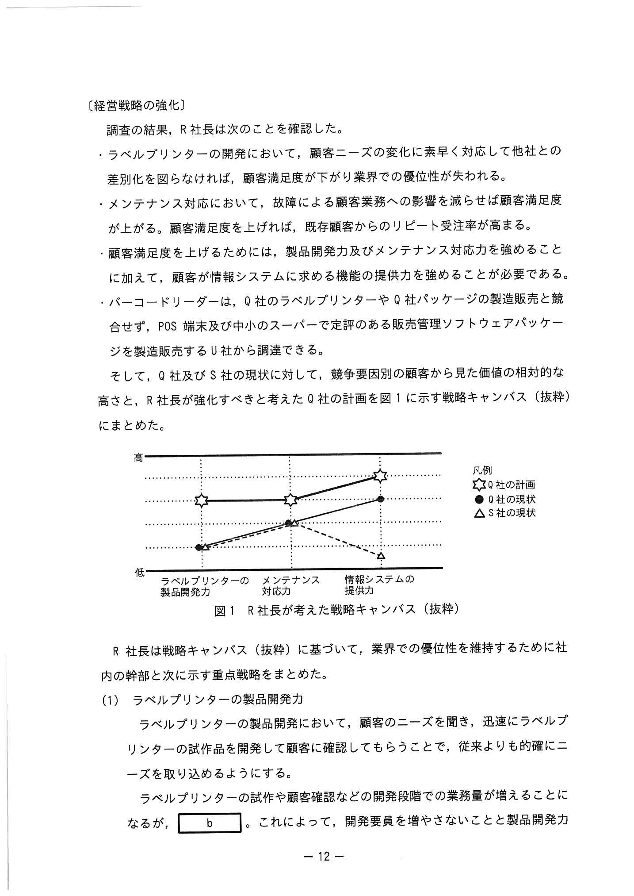

テキスト (OCR)

(経営戦略の強化
調査の結果, R 社長は次のことを確認した。
・ラベルプリンターの開発において, 顧客ニーズの変化に素早く対応して他社との
差別化を図らなければ, 顧客満足度が下がり業界での優位性が失われる。
・ メンテナンス対応において, 故障による顧客業務への影響を減らせば顧客満足度
が上がる。 顧客満足度を上げれば, 既存顧客からのリピート受注率が高まる。
・ 顧客満足度を上げるためには, 製品開発力及びメンテナンス対応力を強めること
に加えて, 顧客が情報システムに求める機能の提供力を強めることが必要である。
- バーコードリーダーは, 0Q 社のラベルプリンターや 0 社パッケージの製造販売と競
合せず, POS 端末及び中小のスーパーで定評のある販売管理ソフトウェアパッケー
ジを製造販売する U社から調達できる。
そして, 0 社及び S 社の現状に対して, 競争要因別の顧客から見た価値の相対的な
高さと, R 社長が強化すべきと考えた 0 社の計画を図 1 に示す戦略キャンバス (抜粋)
にまとめた。

凡例

Xて0 社の計画
人@ 0社の現状
ムAS社の現状

ラベルプリンターの メンテナンス    情報システムの
製品開発         対応         提供

図1 R社長が考えた戦略キャンバス (抜粋)

R 社長は戦略キャンバス (抜粋) に基づいて, 業界での優位性を維持するために社
内の幹部と次に示す重点戦略をまとめた。
(1) ラベルプリンターの製品開発
ラベルプリンターの製品開発において, 顧客のニーズを聞き, 迅速にラベルプ
リンターの試作品を開発して販客に確認してもらうことで, 従来よりも的確にニ
ーズを取り込めるようにする。
ラベルプリンターの試作や馬客確認などの開発段階での業務量が増えることに
なるが, [|  b |] 。 これによって, 開発要員を増やさないことと製品開発

### ページ 13

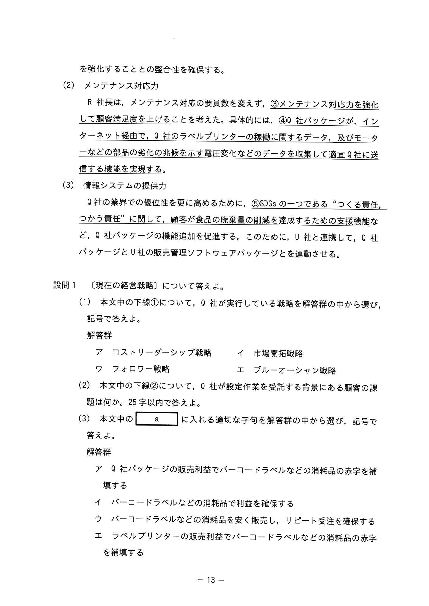

テキスト (OCR)

を強化することとの整合性を確保する。
(2) メンテナンス対応力
R 社長は, メンテナンス対応の要員数を変えず, ③メンテナンス対応力を強化
して顧客満足度を上げることを考えた。具体的には, OO 社パッケージが, イン
ターネット経由で, Q 社のラベルプリンターの稼働に関するデータ, 及びモータ
ーなどの部品の劣化の兆候を示す電圧変化などのデータを収集して適宜 Q 社に送
信する機能を実現する。
(3) 情報システムの提供力
0 社の業界での優位性を更に高めるために, ⑤SDGs のーつである“つくる責任,

つかう責任" に関して, 顧容が食品の廃棄量の削減を達成するための支援機能な
ど, Q 社パッケージの機能追加を促進する。このために, U 社と連携して, 0 社
パッケージとり社の販売管理ソフトウェアパッケージとを連動させる。

設問1 〔現在の経営戦略) について答えよ。
(1) 本文中の下線やについて, 0 社が実行している戦略を解答群の中から選び,

記号で答えよ。
解答群
ア コストリーダーシップ戦略   イ 市場開拓戦略
ウ フォロワー戦略        エエ ブルーオーシャン戦略

(2) 本文中の下線@について, 0 社が設定作業を受託する背景にある顧客の課
題は何か。25 字以内で答えよ。

(3) 本文中の| 』 |] に入れる適切な字句を解答群の中から選び, 記号で
答えよ。
ARB
ア 0 社パッケージの販売利益でバーコードラベルなどの消耗品の赤字を補
填する

イ バーコードラベルなどの消耗品で利益を確保する

ウ バーコードラベルなどの消耗品を安く販売し, リピート受注を確保する

エエ ラベルプリンターの販売利益でバーコードラベルなどの消耗品の赤字
を補填する

### ページ 14

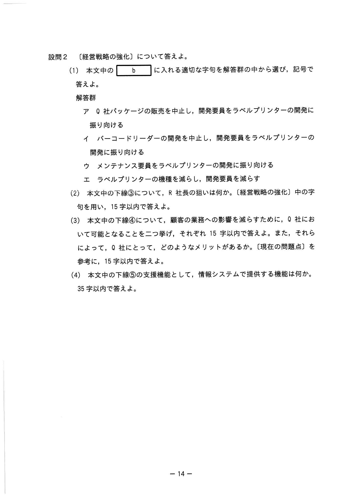

テキスト (OCR)

設問2 〔経営戦略の強化] について答えよ。

(1) 本文中の| b | に入れる適切な字句を解答群の中から選び, 記号で
答えよ。
ARB
ア 0 社パッケージの販売を中止し 開発要員をラベルプリンターの開発に
振り向ける

イ バーコードリーダーの開発を中止し, 開発要員をラベルプリンターの
開発に振り向ける

ウ メンテナンス要員をラベルプリンターの開発に振り向ける

エ ラベルプリンターの機種を減らし, 開発要員を減らす

(2) 本文中の下線③について, R 社長の狙いは何か。〔経営戦略の強化〕 HOF
句を用い, 15 字以内で答えよ。

(3) 本文中の下線について, 顧客の業務への影響を減らすために, 0 社にお
いて可能となることを二つっ挙げ, それぞれ 15 字以内で答えよ。また, それら
によって, Q 社にとって, どのようなメリットがあるか。【現在の問題点]】 を
参考に, 15 字以内で答えよ。

(4) 本文中の下線⑤の支援機能として, 情報システムで提供する機能は何か。
35 字以内で答えよ。

### ページ 15

テキスト (OCR)

C

メ モ 用 紙 ]

### ページ 16

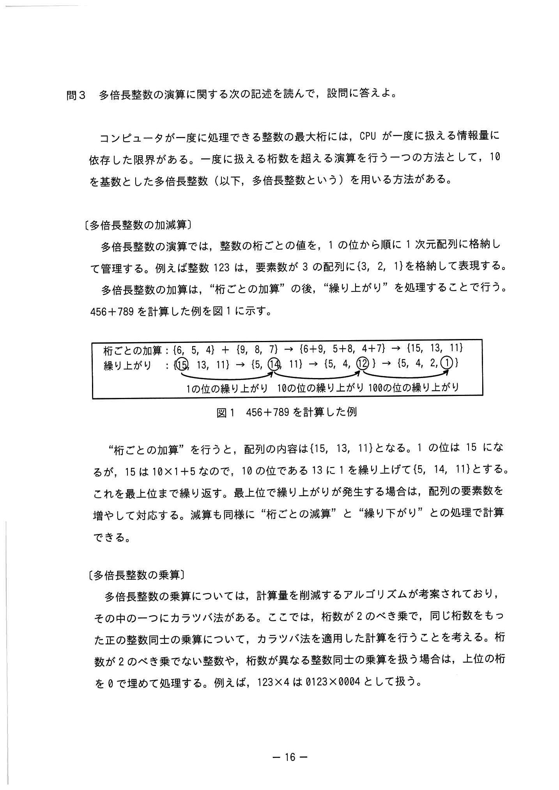

テキスト (OCR)

間3 多倍長整数の演算に関する次の記述を読んで, 設問に答えよ。

コンピュータが一度に処理できる整数の最大桁には, CPU が一度に扱える情報量に
依存した限界がある。一度に扱える桁数を超える演算を行うつの方法として, 10
を基数とした多倍長整数 (以下, 多倍長整数という) を用いる方法がある。

〔多倍長整数の加減算〕
多倍長整数の演算では, 整数の桁ごとの値を, 1 の位から順に 1 次元配列に格納し
て管理する。例えば整数 123 は, 要素数が 3 の配列に(3, 2, 1}を格納して表現する。
多倍長整数の加算は, “桁ごとの加算" の後, “繰り上がり”を処理することで行う。
456十789 を計算した例を図 1 に示す。

桁ごとの加算 : (6, 5, 4} + (9, 8, 7) > (6+9, 5+8, 4+7 > {15, 13, 11}

繰り上がり :《5 23,1) > 6 @ 1 > 6 4,@) > 6 4 2M)
Se    ーー et       _ et

1の位の繰り上がり 10の位の繰り上がり 190の位の繰り上がり
図1 456十789 を計算した例

“桁ごとの加算” を行うと, 配列の内容は{15, 13, 11)となる。 1 の位は 15 にな
SH, 15 は 19X1十5 ROT, 10 の位である 13 に 1 を繰り上げて(5, 14, 11) とする。
これを最上位まで繰り返す。最上位で繰り上がりが発生する場合は, 配列の要素数を
増やして対応する。減算も同様に “桁ごとの減算” と“繰り下がり” との処理で計算
できる。

〔多倍長整数の乗算〕

多倍長整数の乗算については, 計算量を削減するアルゴリズムが考率されており,
その中の一つにカラツバ法がある。ここでは, 桁数が 2 のべき乗で, 同じ桁数をもっ
た正の整数同士の乗算について, カラツバ法を適用した計算を行うことを考える。桁
数が 2 のべき乗でない整数や, 桁数が異なる整数同士の乗算を扱う場合は, 上位の桁
を 0 で埋めて処理する。例えば, 123X4 は 0123X0094 として扱う。

### ページ 17

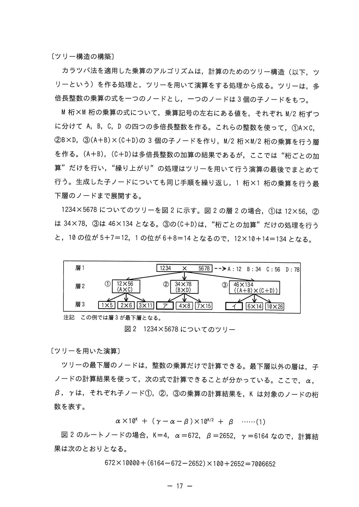

テキスト (OCR)

〔ツリー構造の構築〕

カラツバ法を適用した乗算のアルゴリズムは, 計算のためのツリー構造 (以下,ツ
リーという) を作る処理と, ツリーを用いて演算をする処理から成る。ツリーは, 多
倍長整数の乗算の式を一つのノードとし, 一つのノードは 3 個の子ノードをもつ。

M 桁XM 桁の乗算の式について, 乗算記号の左右にある値を, それぞれ M/2 桁ずつ
に分けて A, B, C, D の四つの多倍長整数を作る。これらの整数を使って, MAXC,
@BXD, ③(A十B) X(C十D)の 3 個の子ノードを作り, M/2 桁XM/2 桁の乗算を行う層
を作る。(A十B), (C十D)は多倍長整数の加算の結果であるが, ここでは “HCOLOM
算” だけを行い, “繰り上がり" の処理はツリーを用いて行う演算の最後でまとめて
行う。生成した子ノードについても同じ手順を繰り返し, 1 桁X1 桁の乗算を行う最
下層のノードまで展開する。

1234X5678 についてのツリーを図 2 に示す。図 2 の層 2 の場合,①は 12x56, ©
は 34X78, ③は 46X134 となる。③の(C+D)は, “HOLCOMB” だけの処理を行う
と, 10 の位が 5十7ニ12, 1 の位が 6十8=ニ14 となるので, 12X10十14=ニ134 となる。

層 1            1234  x  5678|-->A:12 B:34 C:56 D:78
v
12X56     @| 34x78       46X134
層2    9 (AXC)        (8XD)      ® ((A+B) x(C+D) )

層3   1x5] [2x6] [3x11] [7 ] 4x8 |[7x15  [ィ ] 6x14] [10x26

注記 この例では層 3 が最下層となる。
図2 1234X5678 についてのツリー

〔ツリーを用いた演算〕

ツリーの最下層のノードは, 整数の乗算だけで計算できる。最下層以外の層は, 子
ノードの計算結果を使って, 次の式で計算できることが分かっている。ここで, a,
8, yyは, それぞれ子ノード①, ©, ③の乗算の計算結果を, K は対象のノードの桁
数を表す。

wX10' + (Yーw一8)X1072 + 8 ……(1)

図 2 のルートノードの場合, K=4, 672, B=2652, y =6164 なので, 計算結

果は次のとおりとなる。
672 X 10000+ (6164—672—2652) X199十2652=ニ7006652

### ページ 18

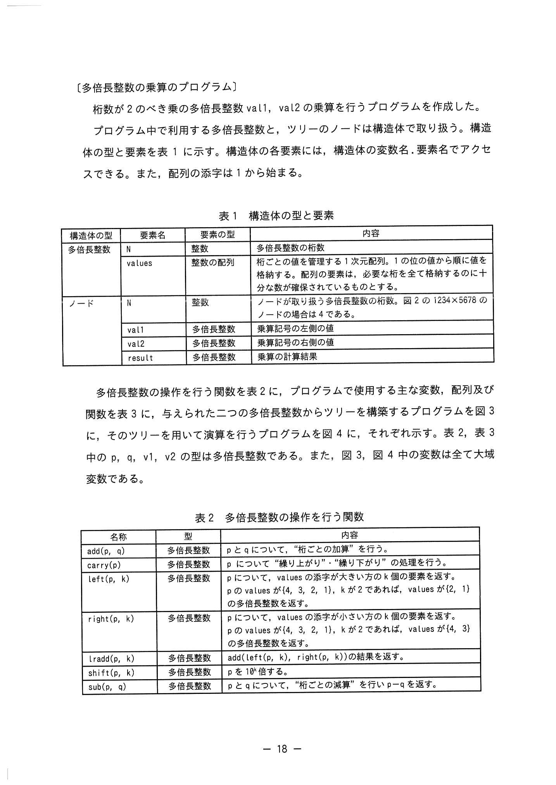

テキスト (OCR)

〔多倍長整数の乗算のプログラム〕

桁数が 2 のべき乗の多倍長整数 va, val2 の乗算を行うプログラムを作成した。
プログラム中で利用する多倍長整数と, ツリーのノードは構造体で取り扱う。構造
体の型と要素を表 1 に示す。構造体の各要素には, 構造体の変数名 .要素名でアクセ

スできる。また, 配列の添字は 1 から始まる。

表1 構造体の型と要素

構造体の弄       要素名         BROW                                 AS
多倍長整数 | N                整数             多倍長整数の桁数
values         整数の配列     桁ごとの値を管理する 1 次元配列。1 の位の値から順に値を
格納する。配列の要素は, 必要な桁を全て格納するのに十
分な数が確保されているものとする。
ノード         N                 整数              ノードが取り扱う多倍長整数の桁数。図 2 の 1234x5678 の
ノードの場合は4 CHS.
val1             多倍長整数      乗算記号の左側の値
val2             多倍長整数      乗算記号の右側の値
result           多倍長整数      乗算の計算結果

多倍長整数の操作を行う関数を表 2 に, プログラムで使用する主な変数, 配列及び
関数を表 3 に, 与えられた二つの多倍長整数からツリーを構築するプログラムを図 3
に, そのツリーを用いて演算を行うプログラムを図 4 に, それぞれ示す。表 2, 表 3

中の p, q, vl, v2 の型は多倍長整数である。また, 図 3, 図 4 中の変数は全て大域
変数である。
表2 多倍長整数の操作を行う関数
名称         型                        内容
add(p, 9)       多倍長整数 | p とq について, “桁ごとの加算" を行う。
carry(p)        多倍長整数 | p について繰り上がり"・“繰り下がり” の処理を行う。
left(p, k)     多倍長整数 | p について, values の添字が大きい方のk 個の要素を返す。
pのvalues が(4, 3, 2, 1}, kが2であれば, values が{2, 1)
の多倍長整数を返す。
right(p, k)     多倍長整数 | p について, values の添字が小さい方のk 個の要素を返す。
p@ values が(4, 3, 2, 1}, kが2 であれば, values が{4, 3)
の多倍長整数を返す。
lradd(p, k)     多倍長整数 | add(left(p, k), right(p, k))の結果を返す。
shift(p, k)        多倍長整数 | p を10'倍する。
sub(p, 9)          多倍長整数 | p と q について, "桁ごとの減算" を行い pq を返す。

### ページ 19

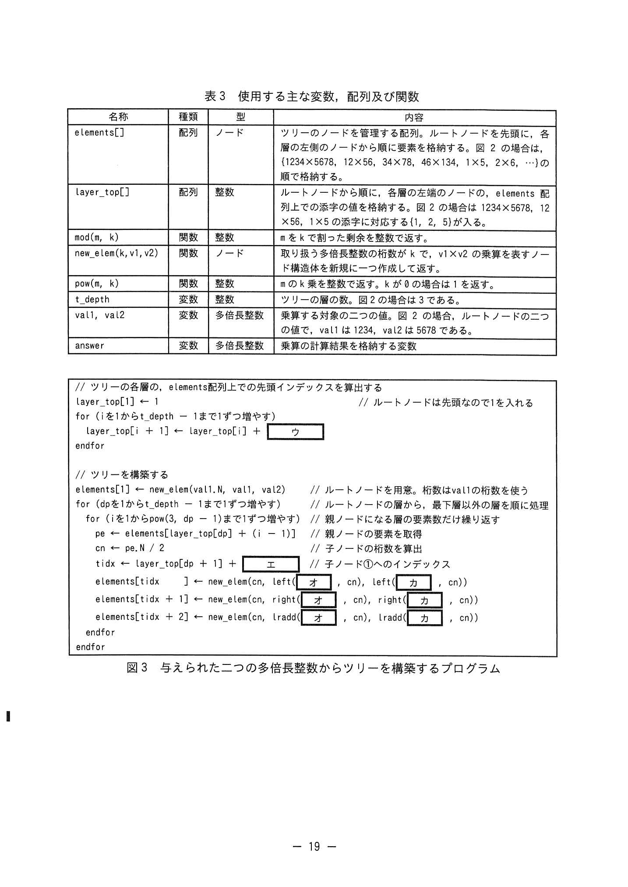

テキスト (OCR)

表3 使用する主な変数, 配列及び関数

名称         種類       型                           内容

elements[]           配列 | ノード       ツリーのノードを管理する配列。ルートノードを先頭に, 各
層の左側のノードから順に要素を格納する。図 2 の場合は,
{1234X5678, 12X56, 34X78,46X134, 1x5, 2x6, …})の
順で格納する。

layer_top[]           配列 | 整数           ルートノードから順に, 各層の左端のノードの, elements 配
列上での添字の値を格納する。図 2 の場合は 1234X5678, 12
X56, 1X5 の添字に対応する{1, 2, AAS.

mod(m, k)             関数 | 整数          mをkで割った剰余を整数で返す。

new_elem(k,v1,v2) | 関数 | ノード       取り扱う多倍長整数の桁数が k で, v1Xv2 の乗算を表すノー
ド構造体を新規に一つ作成して返す。

pow(m, k)              関数 | 整数          mのk乗を整数で返す。k が 0 の場合は 1 を返す。

t_depth                 変数 | 整数            ツリーの層の数。図 2 の場合は 3 である。

vall, val2        変数 | 多倍長整数 | 乗算する対象の二つの値。図 2 の場合, ルートノードのニニつっ
の値で, valt は 1234, val2 は 5678 CHS,

answer              変数 | 多倍長整数 | 乗算の計算結果を格納する変数

// ツリーの各層の, elements配列上での先頭インデックスを算出する
layer_top[1] で 1                                     // ルートノードは先頭なので1を入れる
for (ijを1からt_depth 一 1まで1ずつ増やす)

Layer_top[i + 1] < layer_top[i] +

endfor

// ツリーを構築する
elements[1] <— new_elem(vall.N, vall, val2)    // ルートノードを用意。桁数はvaの桁数を使う
for (dpを1からt_depth 一 1まで1ずつ増やす)    // ルートノードの層から, 最下層以外の層を順に処理
for (iを1からpow(3, dp 一 1)まで1ずつ増やす) // 親ノードになる層の要素数だけ繰り返す
pe と elements[layer_top[dp] + (i 一 1)] // 親ノードの要素を取得
cn とpe.N/2                       // 子ノードの桁数を算出
tidx で tayer_top[dp + 1] 上| エ | // 子ノード①へのインデックス
elements[tidx    J] て new_elem(cn,  ーー   cn), left(| ヵ | , Cn) )
elements[tidx + 1] で new_elem(on, right] オ | , cn), right(      , Cn) )

elements[tidx + 2] と new elem(cn, lradd(| オ   , cn), uradd(| ヵ | , Cn) )
endfor
endfor

図3 与えられた二つの多倍長整数からツリーを構築するプログラム

### ページ 20

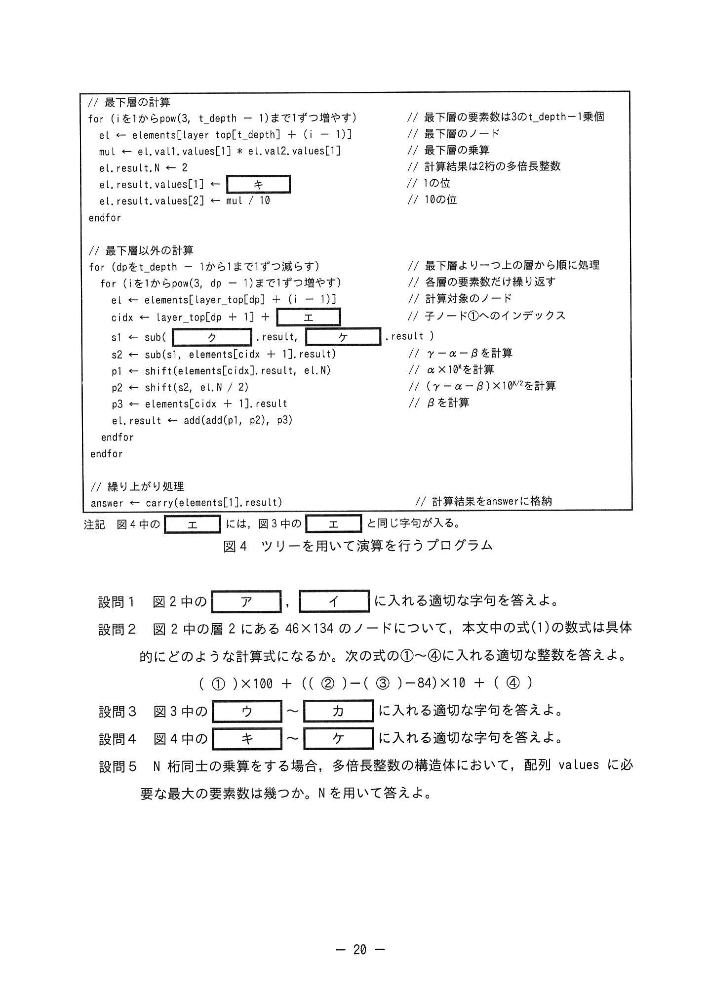

テキスト (OCR)

// 最下層の計算

for (ijを1からpow(3, t_depth 一 1)まで1ずつ増やす)      // 最下層の要素数は3のt_depth一]乗個
el <— elements[layer_top[t_depth] + (i 一 1)]       // 最下層のノード
mul <— el.vall.values[1] * el.val2.values[1]         // 最下層の乗算
el.result.N <— 2                               // 計算結果は2桁の多倍長整数
el.resut.values[1] <—                 // 1の位
el.result.values[2] <— mul / 10                   // 19の位

endfor

// 最下層以外の計算

for (dpをt_depth 一 1から1まで1ずつ減らす)          // 最下層よりリーつ上の層から順に処理
for (iを1からpow(3, dp 一 1)まで1ずつ増やす)        // 各層の要素数だけ繰り返す
el で elements[tayer_top[dp] + (i 一1)]         // 計算対象のノード
cidx で tayer_top[dp + 1] +         // 子ノード①へのインデックス
sl <— sub( |     4     ]. result, |    ケ    ]. result )
s2 < sub(s1, elements[cidx + 1]. result)         // y-a-BeHH
pl < shift(elements[cidx]. result, el.N)         // eX10を計算
p2 で shift(s2, eLN / 2)                     // (Yーw一8) X10'%を計算
p3 elements[cidx + 1]. result                // 8を計算
el.result で add(add(p1, p2), p3)
endfor
endfor

// 繰り上がり処理
answer <— carry(elements[1].resut)                  // 計算結果をanswerに格納

注記 図4中の| エ | には,図3中の[| エ | と同じ字句が入る。
図4 ツリーを用いて演算を行うプログラム

設問1 図2中の| ア |,| イ |に入れる適切な字句を答えよ。

設問2 図 2 HOB 2 にある 46X134 のノードについて, 本文中の式(1)の数式は具体
的にどのような計算式になるか。次の式ののて④に入れる適切な整数を答えよ。

(①)x109+ ((@)-(③)-84)x19+(④)

設問3 図3中の| ウ |~| カ |に入れる適切な字句を答えよ。

設問4 図4中の| キ |~-| ヶケ |に入れる適切な字句を答えよ。

設問5 N 桁同士の乗算をする場合, 多倍長整数の構造体において, 配列 values に必
要な最大の要素数は交つか。N を用いて答えよ。

### ページ 21

テキスト (OCR)

C

メ = 用 紙 J

### ページ 22

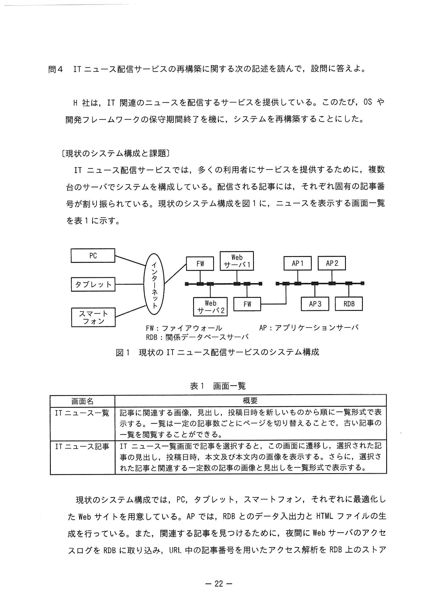

テキスト (OCR)

間4 1ITニュース配信サービスの再構築に関する次の記述を読んで, 設問に答えよ。

H 社は, IT 関連のニュースを配信するサービスを提供している。このたび, 0S や
開発フレームワークの保守期間終了を機に. システムを再構築することにした。

[現状のシステム構成と課題]

IT ニュース配信サービスでは, 多くの利用者にサービスを提供するために, 複数
台のサーバでシステムを構成している。配信される記事には, それぞれ固有の記事番
号が割り振られている。現状のシステム構成を図 1 に, ニュースを表示する画面一覧
を表 1 に示す。

Web
サーバ1 AP1AP2
Web] | FW      | aes | | roe |
スマート           サーバ2
フォン
FW: ファイアウォール      AP : アプリケーションサーバ
RDB : 関係データベースサーバ
図1 現状の IT ニュース配信サービスのシステム構成
表1 画面一覧
画面名                  概要

IT ニュース一覧 | 記事に関連する画像, 見出し, 投稿日時を新しいものから順に一覧形式で表
示する。一覧は一定の記事数ごとにページを切り替えることで, 古い記事の
一覧を閲覧することができる。

IT ニュース記事 | IT ニュース一覧画面で記事を選択すると, この画面に須移し, 選択された
事の見出し, 投稿日時, 本文及び本文内の画像を表示する。 さらに, 選択さ
れた記事と関連する一定数の記事の画像と見出しを一覧形式で表示する。

現状のシステム構成では, PC, タブレット, スマートフォン, それぞれに最適化し
た Web サイトを用意している。AP では, RDB とのデータ入出力と HTML ファイルの生
成を行っている。また, 関連する記事を見つけるために, 夜間に Web サーバのアクセ
スログを RDB に取り込み, URL 中の記事番号をた用いたアクセス解析を RDB 上のストア

### ページ 23

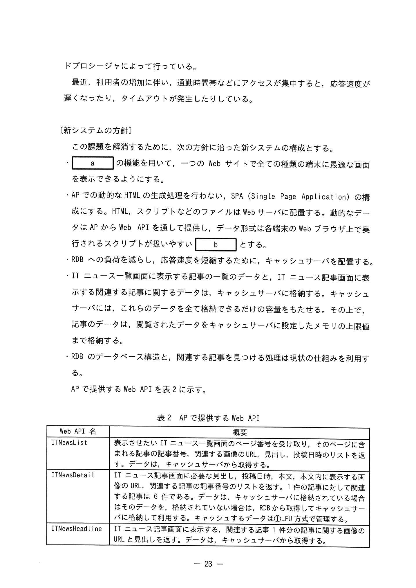

テキスト (OCR)

ドプロシージャによって行っている。
最近, 利用者の増加に伴い, 通勤時間帯などにアクセスが集中すると, 応答速度が
遅くなったり, タイムアウトが発生したりしている。

〔新システムの方針〕
この課題を解消するために, 次の方針に沿った新システムの構成とする。

・ |  』 ] の機能を用いて, 一つの Web サイトで全ての種類の端末に最適画面
を表示できるようにする。

・AP での動的な HTML の生成処理を行わかない, SPA (Single Page Application) の構
成にする。HTML, スクリプトなどのファイルは Web サーバに配置する。動的なデー
タはAP DS Web APIを通して提供し, データ形式は各端末の Web ブラウザ上で実
行されるスクリプトが扱いやすい| b | とする。

・RDB への負荷を減らし, 応答速度を短縮するために, キャッシュサーバを配置する。
・IT ニュース一覧画面に表示する記事の一覧のデータと, IT ニュース記事画面に表
示する関連する記事に関するデータは, キャッシュサーバに格納する。キャッシュ
サーバには, これらのデータを全て格納できるだけの容量をもたせる。その上で
記事のデータは, 閲覧されたデータをキャッシュサーバに設定したメモリの上限値

まで格納する。

・RDB のデータベース構造と, 関連する記事を見つける処理は現状の仕組みを利用す
る。

AP で提供する Web API を表 2 に示す。

表2 APで提供するWeb API
Web API 名                                    概要

ITNewsList       表示させたい IT ニュース一覧画面のページ番号を受け取り, そのページに含
まれる記事の記事番号, 関連する画像のURL, 見出し, 投稿日時のリストを返
す。データは, キャッシュサーバから取得する。

1TNewsDetail  IT ニュース記事画面に必要な見出し, 投稿日時, AM, 本文内に表示する画
像の URL, 関連する記事の記事番号のリストを返す。1 件の記事に対して関連
する記事は 6 件である。データは, キャッシュサーバに格納されている場合
はそのデータを, 格納されていない場合は, RDBから取得してキャッシュサー
バに格納して利用する。キャッシュするデータは①LFU 方式で管理する。

ITNewsHeadline | IT ニュース記事画面に表示する, 関連する記事 1 件分の記事に関する画像の
URL と見出しを返す。データは, キャッシュサーバから取得する。

### ページ 24

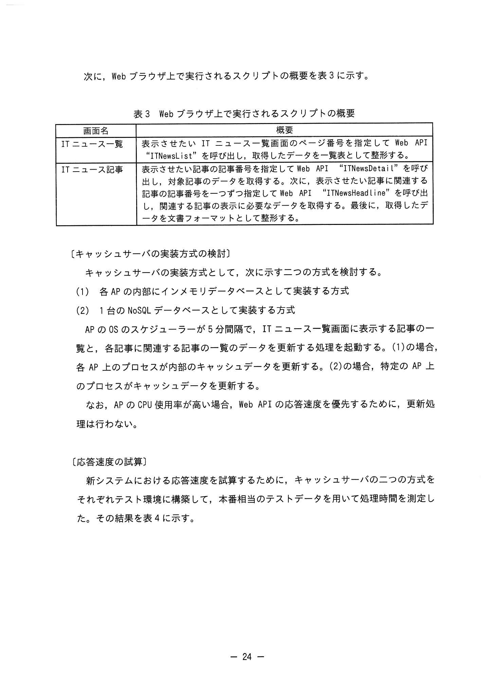

テキスト (OCR)

次に, Web ブラウザ上で実行されるスクリプトの概要を表 3 に示す。

表3 Web ブラウザ上で実行されるスクリプトの概要

画面名                                                                       概要

IT ニュース一覧   表示させたい IT ニュース一覧画面のページ番号を指定して Web API
“TTNewsList” を呼び出し, 取得したデータを一覧表として整形する。

IT ニュース記事 | 表示させたい記事の記事番号を指定して Web API “ITNewsDetail” を呼び
出し, 対象記事のデータを取得する。 次に, 表示させたい記事に関連する
記事の記事番号を一つずつ指定して Web API “ITNewsHeadline” を呼び出
し, 関連する記事の表示に必要なデータを取得する。最後に, 取得したデ
ータを文書フォーマットとして整形する。

[キャッシュサーバの実装方式の検討]

キャッシュサーバの実装方式として, 次に示す二つの方式を検討する。

(1) 各AP の内部にインメモリデータベースとして実装する方式

(2) 1 台の NoSQOL データベースとして実装する方式

AP の 0S のスケジューラーが 5 分間隔で, IT ニュース一覧画面に表示する記事の一
覧と, 各記事に関連する記事の一覧のデータを更新する処理を起動する。(1)の場合
各 AP 上のプロセスが内部のキャッシュデータを更新する。(2)の場合, 特定の AP 上
のプロセスがキャッシュデータを更新する。

なお, AP のCPU 使用率が高い場合, Web API の応答速度を優先するために, 更新処
理は行わない。

[応答速度の試算〕

新システムにおける応答速度を試算するために, キャッシュサーバの二つの方式を
それぞれテスト環境に構築して, 本番相当のテストデータを用いて処理時間を測定し
た。その結果を表 4 に示す。

### ページ 25

テキスト (OCR)

表4 テストデータを用いて処理時間を測定した結果

spice da gs                                 測定結果
No.                            aioe                            HR | BRO
1 | Web サーバが IT ニュース一覧画面又は IT ニュース記事画面のリク       80ms       89ms
エストを受けてから, HTML やスクリプトなどのファイルを全て転
送するまでの時間
2 | APがWeb API “ITNewsList” のリクエストを受けてから, HET      100ms      200ms
ータを全て転送するまでの時間
3    AP がWeb API “ITNewsDetail” でリクエストされた対象記事のデ       60%       90%
ータがキャッシュサーバに格納されている割合
4 | APがWeb API “ITNewsDetail” のリクエストを受けてから, キャ        69ms      129ms
ッシュサーバにある対象記事のデータを全て転送するまでの時間
5 | APがWeb API “ITNewsDetail” のリクエストを受けてから, RDB に      300ms      300ms
ある対象記事のデータを全て転送するまでの時間
6 | APがWeb API “ITNewsHeadline” のリクエストを受けてから, 応       15ms       20ms
答データを全て転送するまでの時間

注記 ms :ミリ秒

インターネットを介した転送時間や Web ブラウザ上の処理時間は掛からないと仮定
して応答時間を考える。その場合, IT ニュース一覧画面を初めて表示する場合の応
答時間は。 方式(1)では 189ms, 方式(2)では|  c | msである。ITニュース一覧
画面のページを切り替える場合の応答時間は, 方式(1)では 100ms, 方式(2)では
| 』 | ms CHS. RK, 記事をリクエストした際の平均応答時間を考える。
Web API “ITNewsDetail” の平均応答時間は, 方式(1)では 156ms, 方式(2)では
| < |ms である。したがって, Web API “ITNewsHeadline” の呼び出しも含め
た IT ニュース記事画面を表示するための平均応答時間は, 方式(1)では[| f |
ms, 方式(2)では 258ms となる。

以上の試算から, 方式(1)を採用することにした。

〔不具合の指摘と改修
新システムの方式(1) を採用した構成についてレビューを実施したところ, 次の指
摘があった。
(1) IT ニュース記事画面の応答速度の不具合
IT ニュース記事画面を生成するスクリプトが実際にインターネットを介して実
行された場合, 試算した応答速度より大幅に遅くなってしまうことが懸念される。

### ページ 26

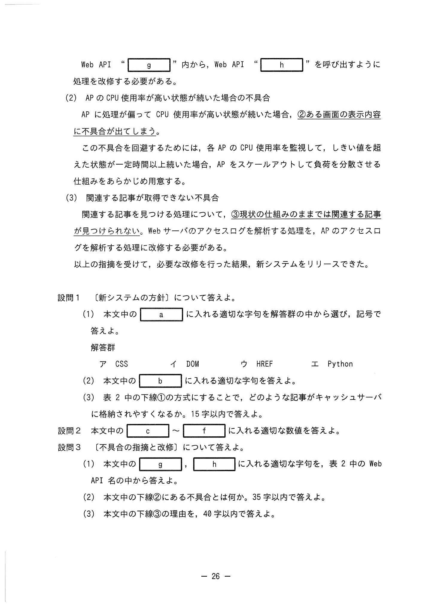

テキスト (OCR)

Web API "| g |] PAS, Web API“ ” を呼び出すように

処理を改修する必要がある。
(2) AP のCPU 使用率が高い状態が続いた場合の不具合
AP に処理が偏って CPU 使用率が高い状態が続いた場合,②ある画面の表示内容
に不具合が出てしまう。
この不具合を回避するためには, 各 AP のCPU 使用率を監視して, しきい値を超
えた状態が一定時間以上続いた場合, AP をスケールアウトして負荷を分散させる
仕組みをあらかじめ用意する。
(3) 関連する記事が取得できない不具合
関連する記事を見つける処理について, ③現状の仕組みのままでは関連する記事
が見つけられない。Web サーバのアクセスログを解析する処理を, AP のアクセスロ
グを解析する処理に改修する必要がある。
以上の指摘を受けて, 必要な改修を行った結果, 新システムをリリースできた。

設問1 【〔新システムの方針] について答えよ。

(1) 本文中の| a | に入れる適切な字句を解答群の中から選び, 記号で
答えよ。

AASB

ア CSS    イ DOM    ウ HREF    エ Python

(2) 本文中の| b | に入れる適切な字旬を答えよ。
(3) 表 2 中の下線①の方式にすることで, どのような記事がキャッシュサーバ
に格納されやすくなるか。15 宇以内で答えよ。
設問2 本文中の| < |~| ff |に入れる適切な数値を答えよ。
設問3 不具合の指摘と改修〕 について答えよ。
(1) 本文中の| og |, |  h |に入れる適切な字句を, 表 2 中の Web
APL 名の中から答えよ。
(2) 本文中の下線@にある不具合とは何か。35 字以内で答えよ。
(3) 本文中の下線③の理由を, 49 字以内で答えよ。

### ページ 27

テキスト (OCR)

〔

x = 用 紙

J

### ページ 28

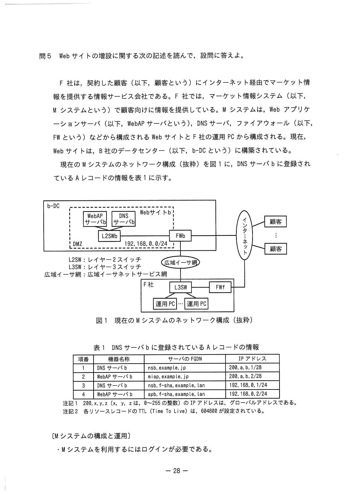

テキスト (OCR)

問5 Web サイトの増設に関する次の記述を読んで, 設問に答えよ。

F 社は, 契約した顧客 (以下, 顧客という) にインターネット経由でマーケット情
報を提供する情報サービス会社である。「 社では, マーケット情報システム (UE,
M システムという) で顧客向けに情報を提供している。M システムは, Web アプリケ
ーションサーバ (以下, WebAP サーバという), DNS サーバ, ファイアウォール (以下,
FW という) などから構成される Web +7 be 社の運用 PC から構成される。 現在,
Web サイトは, B 社のデータセンター (WE, b-DC という) に構築されている。

現在のM システムのネットワーク構成 (抜粋) を図 1 に, DNS サーバb に登録され
ているAレコードの情報を表 1 に示す。

L2SW : レイヤー2スイッチ     広域
L3SW : レイヤー3スイッチ
広域イーサ網 : 広域イーサネットサービス網

F 社

図1 現在のMシステムのネットワーク構成 (抜粋)

表1 DNS サーバb に登録されているA レコードの情報

項番     機器名称          サーバのFQDN          1P アドレス
1      DNS サーバb         nsb. example. jp                  200. a. b. 1/28
2    WebAP サーバb      miap.eXample. jp              200. a. b. 2/28
3     DNS サーバb         nsb.f-sha. example, lan           192. 168, 0. 1/24
4      WebAP サーバb        apb.f-sha. example. lan            192. 168. 0. 2/24

注記1 200.x.y.z (x, y, z は, 0~255 DBR) の IP アドレスは, グローバルアドレスである。
注記2 各リソースレコードのTTL (Time To Live) は, 604800 が設定されている。

[M システムの構成と運用〕
・M システムを利用するにはログインが必要である。

### ページ 29

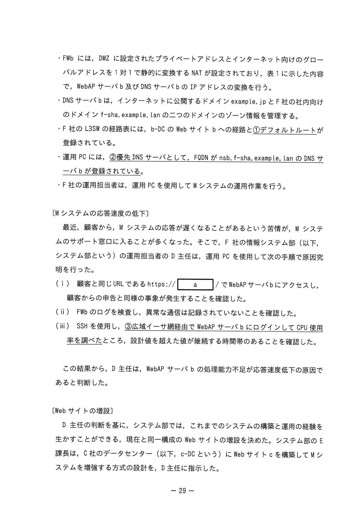

テキスト (OCR)

・FWb には, DMZ に設定されたプライベートアドレスとインターネット向けのグロー
バルアドレスを1 対1 で静的に変換する NAT が設定されており, 表 1 に示した内容
で, WebAP サーバb 及び DNS サーバb の IP アドレスの変換を行う。

・ DNS サーバb は, インターネットに公開するドメイン example. jp と「 社の社内向け
のドメインff-sha. example. lan の二つのドメインのゾーン情報を管理する。

・F 社の L3SW の経路表には, b-DC の Web サイト bへの経路と①デフォルトルートが
登録されている。

・運用 PC には, ②優先 DNS サーバとして, FQDN が nsb.f-sha.example. Lan のDNS +
ーバb が登録されている。

・『 社の運用担当者は, 運用PC を使用してMシステムの運用作業を行う。

(M システムの応答速度の低下〕
最近, MEDS, M システムの応答が遅くなることがあるという若情が, M システ
ムのサポート窓口に入ることが多くなった。 そこで, F 社の情報システム部 (LUE,
システム部という) の運用担当者の D 主任は, 運用 PC を使用して次の手順で原因究
明を行った。
(i) 顧客と同じURLであるhttps://[ a] /でWebAPサーバbにアクセスし,
顧客からの申告と同様の事象が発生することを確認した。
(ii) FWb のログを検査し, 異常な通信は記録されていないことを確認した。
(iii) SSH を使用し, ③広域イーサ網経由で WebAP サーバb にログインして CPU 使用
率を調べたところ, 設計値を超えた値が継続する時間帯のあることを確認した。

この結果から, D 主任は, WebAP サーバb の処理能力不足が応答速度低下の原因で
あると判断した。

(Web サイトの増設

D 主任の判断を基に, システム部では, これまでのシステムの構築と運用の経験を
生かすことができる, 現在と同一構成の Web サイトの増設を決めた。システム部のE
課長は, C 社のデータセンター (以下, c-DC EWS) に Web サイトcを構築してMシ
ステムを増強する方式の設計を, D 主任に指示した。

### ページ 30

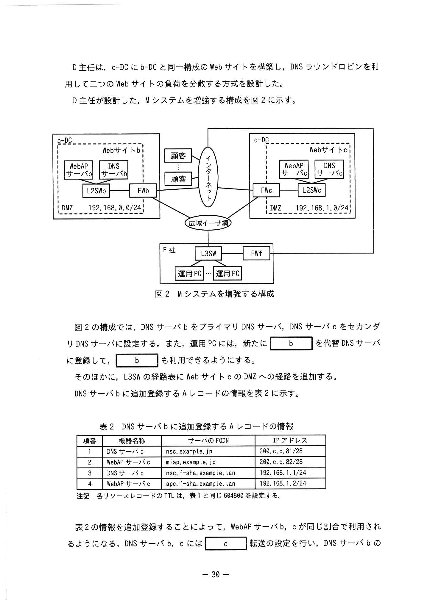

テキスト (OCR)

D 主任は, c-DC にb-DC と同一構成の Web サイトを構築し, DNS ラウンドロビンを利
用して二つの Web サイトの負荷を分散する方式を設計した。
D 主任が設計した, M システムを増強する構成を図 2 に示す。

DLLのニニニニニニニー
1          Webサイトbi                                    Webサイトci
'                                                 1
| | WebAP | [DNS    1                        WebAP | | DNS |!
し|サーバb| |サーバb| !                  サーバc| |サーバal !
1              1                                   1
i     L2SWb     FWb                          L2SWe
1

1                                                 1
1                                                 1

図2 Mシステムを増強する構成

図 2 の構成では, DNS サーバ b をプライマリ DNS サーバ, DNS サーバ c をセカンダ
リ DNS サーバに設定する。また, 運用 PC には, 新たに| b | を代替DNSサーバ
に登録して, | b | も利用できるようにする。

そのほかに, L3SW の経路表に Web サイトcのDMZ への経路を追加する。

DNS サーバb に追加登録するA レコードの情報を表 2 に示す。

表2 DNS サーバb に追加登録するA レコードの情報

項番        機器名称               サーバのFQDN                1P アドレス
1      DNS サーバc        nsc, example, jp                200. c,d. 81/28
2      WebAP サーバc      miap.example.jp                  200. c,d. 82/28
3      DNS サーバc        nsc.f-sha. example, lan         192, 168.1. 1/24
4      WebAP サーバc      apc.f-sha. example, lan         192. 168. 1. 2/24

注記 各リソースレコードの TTL は, 表 1 と同じ 604800 を設定する。

表 2 の情報を追加登録することによって, WebAP サーバb, c が同じ割合で利用され

るようになる。DNS サーバ bc には|  c |転送の設定を行い, DNS サーバb の

### ページ 31

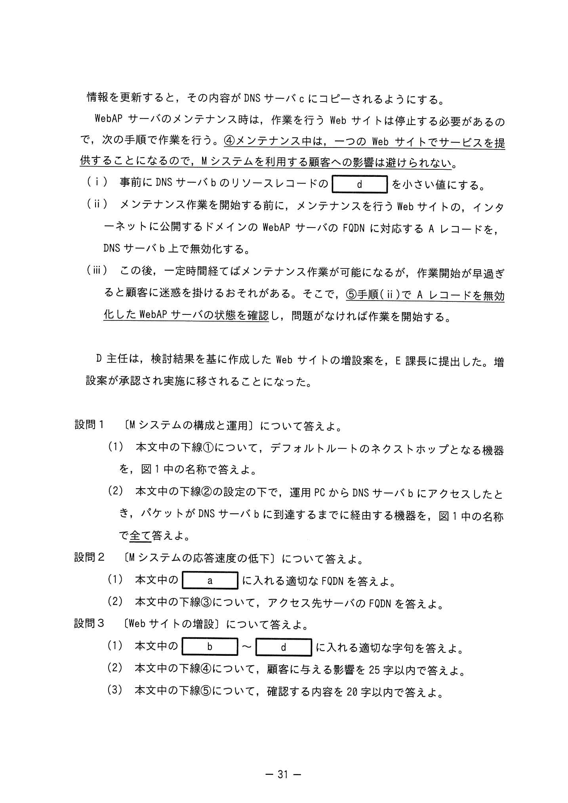

テキスト (OCR)

情報を更新すると, その内容が DNS サーバc にコピーされるようにする。

WebAP サーバのメンテナンス時は, 作業を行う Web サイトは停止する必要があるの
で, 次の手順で作業を行う。④メンテナンス中は, 一つの Web サイトでサービスを提
供することになるので, M システムを利用する顧客への影響に避けられない。

(i) 事前にDNS サーバbのリソースレコードの|  d』 | を小さい値にする。

(ii) メンテナンス作業を開始する前に, メンテナンスを行う Web サイトの, インタ
ーネットに公開するドメインの WebAP サーバの FQDN に対応する A レコードを,
DNS サーバb 上で無効化する。

(li) COR, 一定時間経てばメンテナンス作業が可能になるが, 作業開始が早過ぎ
ると顧客に迷惑を掛けるおそれがある。そこで, 手順(ii )で A レコードを無効
化した WebAP サーバの状態を確認し, 問題がなければ作業を開始する。

 主任は, 検討結果を基に作成した Web サイトの増設案を, E 課長に提出した。増
設案が承認され実施に移されることになった。

設問1 〔Mシステムの構成と運用]】について答えよ。
(1) 本文中の下線わについて, デフォルトルートのネクストホップとなる機器
を, 図 1 中の名称で答えよ。
(2) 本文中の下線②の設定の下で, 運用 PC から DNS サーバb にアクセスしたと
き, パケットがDNS サーバb に到達するまでに経由する機器を, 図 1 中の名称
で全て管えよ。
設問2 〔Mシステムの応答速度の低下]】 について答えよ。
(1) 本文中の| 』 | に入れる適切なFQDNを答えよ。
(2) 本文中の下線について, アクセス先サーバの FQDN を答えよ。
設問3 [Web サイトの増設) について答えよ。
(1) 本文中の|  b |~[ gd |に入れる適切な字句を答えよ。
(2) 本文中の下線のについて, 顧客に与える影響を 25 字以内で答えよ。
(3) 本文中の下線@について, 確認する内容を 20 字以内で答えよ。

### ページ 32

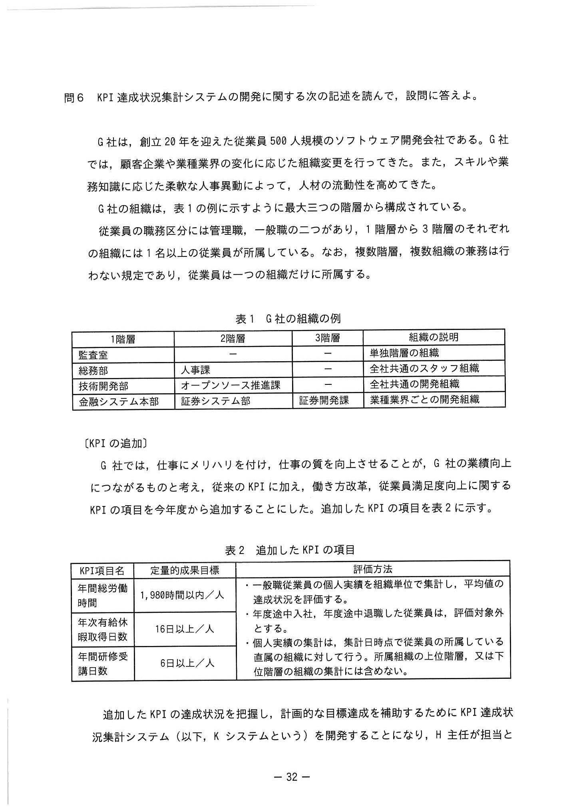

テキスト (OCR)

PAG KPI 達成状況集計システムの開発に関する次の記述を読んで, 設問に答えよ。

G 社は, 創立 29 年を迎えた従業具 500 人規模のソフトウェア開発会社である。6G 社
では, 顧客企業や業種業界の変化に応じた組織変更を行ってきた。また, スキルや業
務知識に応じた柔軟な人事異動によって, 人材の流動性を高めてきた。

G 社の組織は, 表 1 の例に示すように最大三つの階層から構成されている。

従業員の職務区分には管理職, 一般職の二つがあり, 1 階層から 3 階層のそれぞれ
の組織には 1 名以上の従業員が所属している。なお, 複数階層, 複数組織の兼務は行
わない規定であり, 従業員は一つの組織だけに所属する。

表1 6G社の組織の例

1階層               2階層            3階層            組織の説明
監査室                                  =                        =           単独階層の組織
総務部             人事課                   =       全社共通のスタッフ組織
技術開発部         オープンソース推進課        =       全社共通の開発組織
金融システム本部 | 証券システム部        証券開発課 | 業種業界ごとの開発組織

(KPI の追加〕

G 社では, 仕事にメリハリを付け, 仕事の質を向上させることが, G 社の業績向上
につながるものと考え, 従来の KPI に加え, 働き方改革, 従業員満足度向上に関する
KPI の項目を今年度から追加することにした。 追加した KPI の項目を表 2 に示す。

表2 追加したKPI の項目

WES | 定量的成果目標              評価方法
年間総働     」     - 一般職従業員の個人実績を組織単位で集計し, 平均値の
時間    1.980時間以内人 | 違成状況を評価する。
定休| oa,      ・ 年度途中入社, 年度途中退職した従業員は評価対象外
arene | 19日以上ノ人    とする。      」

・ 個人実績の集計は, 集計日時点で科業員の所属している
年間研修受     、       直属の組織に対して行う。所属組織の上位階層。 又は下
3        6日以上ノ人            *
講日数                            位階層の組織の集計には含めない。

追加した KPI の達成状況を把握し, 計画的な目標達成を補助するために KPI 達成状
況集計システム (以下, K システムという) を開発することになり, H 主任が担当と

### ページ 33

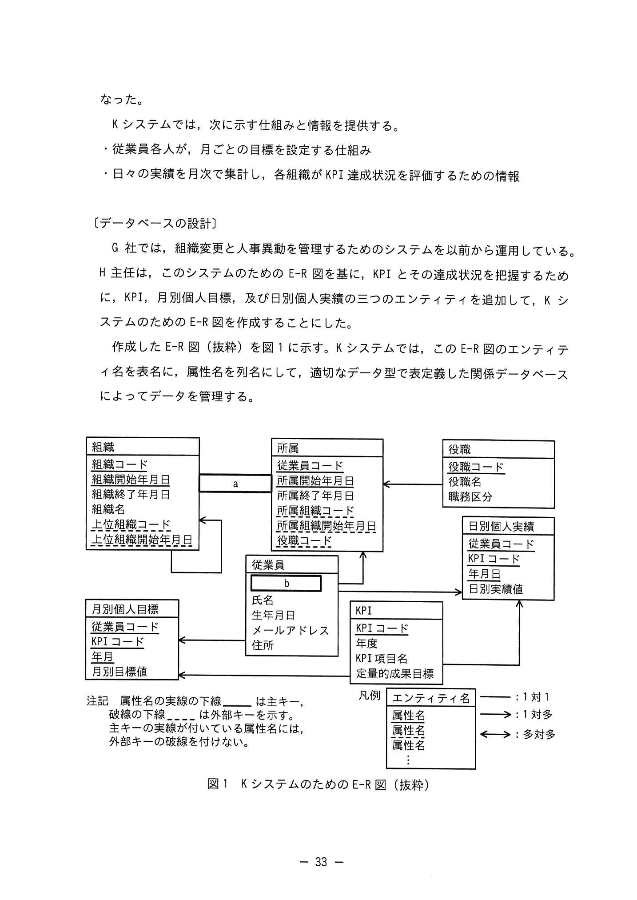

テキスト (OCR)

なった。
K システムでは, 次に示す仕組みと情報を提供する。
・ 従業員各人が, 月ごとの目標を設定する仕組み
・日々の実績を月次で集計し, 各組織がKPI 達成状況を評価するための情報

〔データベースの設計】〕

G 社では, 組織変更と人事異動を管理するためのシステムを以前から運用している。
HES, このシステムのための E-R 図を基に, KPI とその達成状況を把握するため
に, KPI, 月別個人目標, 及び日別個人実績の三つのエンティティを追加して, K シ
ステムのための E-R 図を作成することにした。

作成したE-R 図 (抜粋) を図 1 に示す。K システムでは, この E-R 図のエンティテ
ィ名を表名に, 属性名を列名にして, 適切なデータ型で表定義した関係データベース
によってデータを管理する。

組織                                     所属                                  役職
組織コード                従業員コード             役職コード
組織開始年月日         所属開始年月日                      役職名
組織終了年月日           所属終了年月日         職務区分
組織名                                  所属組織コード
土位組織コード                        所属組織開始年月日                     日別個人実績
土位組織開始年月日        役職コード             従業員コード
従業員                                         =
|   z   b |                                 日別実績値
月別個人目標                     をに AA              KPI
徒業員コード                         メールアドレス | | KPLコード
KPI コード                         住所                   年度
年月                                                      KPI 項目名
月別目標値                                               定量的成果目標
注記 属性名の実線の下線 は主キー,      凡例 | エンティティ名|一一 : 1対1
破線の下線 ____ は外部キーを示す。           属性名      ーータテ : 1 対多
主キーの実線が付いている属性名には,               属性名         <> 」多対多
外部キーの破線を付けない。                                 REZ

図1 Kシステムのための E-R図 (抜粋)

### ページ 34

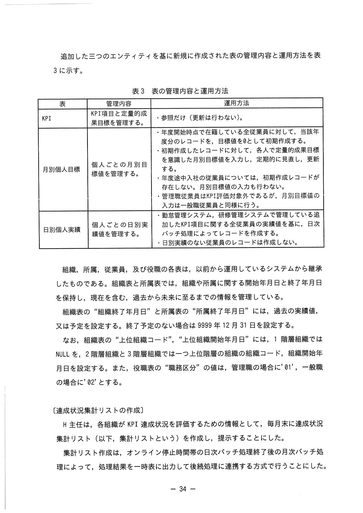

テキスト (OCR)

追加した三つのエンティティを基に新規に作成された表の管理内容と運用方法を表

3 に示す。
表3 表の管理内容と運用方法
表      管理内容              運用方法
KP1項目と定量的成|    =e
KPI      困目標を管理する。  参照だけ (更新は行わない)。
・年度開始時点で在籍している全従業員に対して, 当該年
度分のレコードを, 目標値を9として初期作成する。
・初期作成したレコードに対して, 各人で定量的成果目標
  _ | 個人ごことの月別目  を意識した月別目標値を入力し, 定期的に見直し, 更新
月別個人目標 | pies ered Z  する。
   °  ・ 年度途中入社の従業員については, 初期作成レコードが
BELAY. 月別目標値の入力も行わない。
・管理職従業員はKPI評価対象外であるが, 月別目標値の
入力は一般職従業員と同様に行う。
・勤怠管理システム, 研修管理システムで管理している追
日別個人実績 個人ごとの日別実  加したKP1項目に関する全従業員の実績値を基に, 日次
  績値を管理する。  バッチ処理によってレコードを作成する。
・日別実績のない従業員のレコードは作成しない。

組織, 所属, 従業員, 及び役職の各表は, 以前から運用しているシステムから継承
したものである。 組織表と所属表では, 組織や所属に関する開始年月日と終了年月日
を保持し, 現在を含む, 過去から未来に至るまでの情報を管理している。

組織表の“組織終了年月日" と所属表の“所属終了年月日" には, 過去の実績値
又は予定を設定する。終了予定のない場合は 9999 年 12 月 31 日を設定する。

なお, 組織表の“上位組織コード", "上位組織開始年月日" には, 1 階層組織では
NULL を, 2 階層組織と 3 階層組織では一つ上位階層の組織の組織コード, 組織開始年
月日を設定する。また, 役職表の“職務区分" の値は, 管理職の場合に"01', 一般職
の場合に' 92" とする。

(達成状況集計リストの作成〕

H 主任は, 各組織が KPI 達成状況を評価するための情報として, 毎月末に達成状況
集計リスト (以下, 集計リストという) を作成し, 提示することにした。

集計リスト作成は, オンライン停止時間帯の日次バッチ処理終了後の月次バッチ処
理によって, 処理結果を一時表に出力して後続処理に連携する方式で行うことにした。

### ページ 35

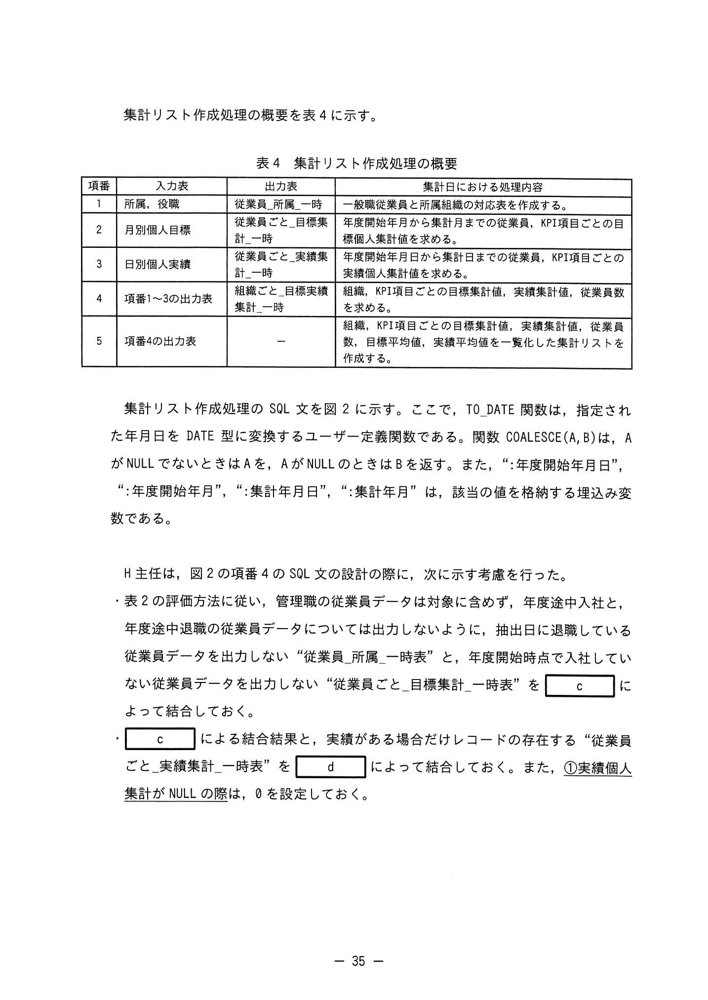

テキスト (OCR)

集計リスト作成処理の概要を表 4 に示す。

表4 集計リスト作成処理の概要

ae    LE       出力表           集計日における処理内容
所属 役職     従業員 所属 一時 | 一般職業員と所属組織の対応表を作成する,
3    従業貞ごと 目標集 | 年度開始年月から集計月までの従業員, KPI項目との日
    計 一時      標個人集計値を求める。
ー      従業員ごと RAR | 年度開始年月日から集計日までの従業内, KPT項目どとの
Bate Ae    計 一時      実績個人集計値を求める。
acc Seam | 組織。KP1項目ごとの目標集計値、寅集計休 GEAR
RBI~SOHDR | gat pe     を求める。
租織, KP1項目ごとの目標集計値、 実績集計仁、 GER
項番4の出力表       ー     数, BEI, 実績平均値を一覧化した集計リストを
作成する。

集計リスト作成処理の SQL 文を図 2 に示す。ここで, TO_DATE 関数は, 指定され
た年月日を DATE 型に変換するユーザー定義関数である。関数 COALESCE(A, B)は, A
がNULLでないときはAを, AがNULLのときはBを返す。また, 『:年度開始年月日”,
“:年度開始年月"。 “:集計年月日",

数である。

“REA” ld, 該当の値を格納する埋込み変

H 主任は, 図 2 の項番 4 の SQL 文の設計の際に, 次に示す考慮を行った。

・表 2 の評価方法に従い, 管理職の従業員データは対象に含めず, 年度途中入社と,
年度途中退職の従業員データについては出力しないように, 抽出日に退職している
従業員データを出力しない “従業員_所属 一時表" と, 年度開始時点で入社してい
ない従業員データを出力しない “従業員ごと.目標集計 一時表” を に
よって結合しておく。
‘Lc |] による結合結果と 実績がある場合だけレコードの存在する “HHA
ごと-実績集計 一時表" を|  d | によって結合しておく。また, 実績個人
集計が NULL の際は, 0 を設定しておく。

### ページ 36

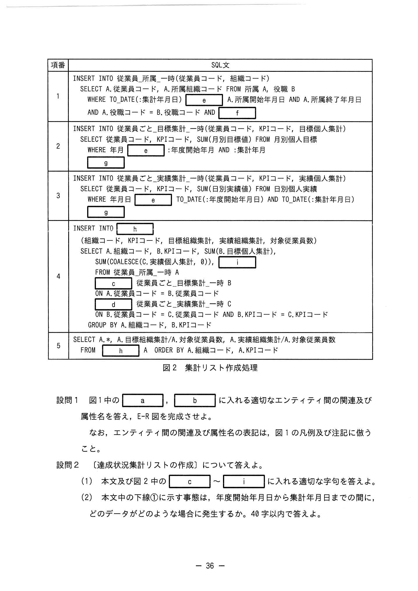

テキスト (OCR)

項番                                                  SQL文

INSERT INTO 従業員_ 所属_一時(従業員コード, 組織コード)
SELECT A従業員コード, A.所属組織コード FROM 所属 A 役職B
WHERE 10_DATE(:集計年月日) | e | ん所属開始年月日 ANDA.所属終了年月日

AND A.役職コード = B.役職コード AND

INSERT INTO 従業員ごと目標集計 一時(従業員コード, KPIコード, 目標個人集計)
SELECT 従業員コード, KPIコード, SUM(月別目標値) FROM 月別個人目標
WHERE 年月        : 年度開始年月 AND :集計年月

Ls]

INSERT INTO 従業員ごと_ 実績集計 一時(従業員コード, KPIコード, 実績個人集計)
SELECT 従業員コード, KPIコード, SUM(日別実績値) FROM 日別個人実績
WHERE 年月日 [し s T0_DATE (:年度開始年月日) AND T0_DATE(:集計年月日)

Cs]

INSERT INTO
(組織コード, KPIコード, 目標組織集計, 実績組織集計, 対象従業員数)
SELECT A.組織コード, B.KPIコード, SUM(B. 目標個人集計),
SUM(COALESCE(C. 実績個人集計, 9)),
4        FROM 従業員_ 所属 一時 A
 従業員ごと目標集計 一時 B
ON A.従業員コード = B.従業員コード
従業員ごと_実績集計 一時 C
ON B.従業員コード = C.従業員コード AND B.KPIコード = C.KPIコード
GROUP BY A.組織コード, B.KPIコード

SELECT A.*, AA.目標組織集計/A. 対象従業員数, A. 実績組織集計/A. 対象従業員数
FROM A ORDER BY A.組織コード, A.KPIコード

図2 集計リスト作成処理

設問1 図1中の| oa |,|  b |に入れる適切なエンティティ間の関連及び
属性名を答え, E-R 図を完成させよ。
なお, エンティティ間の関連及び属性名の表記は, 図 1 の凡例及び注記に條う

ries
設問2 達成状況集計リストの作成〕 について答えよ。
(1) 本文及び図 2 中の| c |一| i |に入れる適切な字句を答えよ。

(2) 本文中の下線〇に示す事態は, 年度開始年月日から集計年月日までの間に,
どのデータがどのような場合に発生するか。49 字以内で答えよ。

### ページ 37

テキスト (OCR)

C

メ = 用 紙 J

### ページ 38

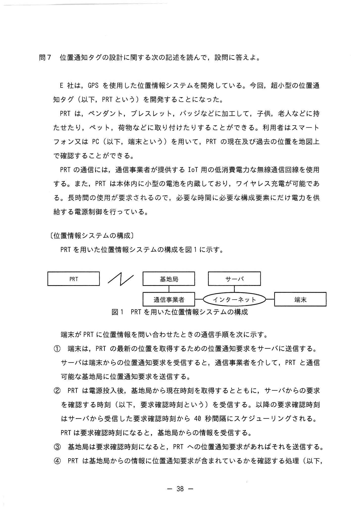

テキスト (OCR)

7 位置通知タグの設計に関する次の記述を読んで, 設問に答えよ。

E 社は, GPS を使用した位置情報システムを開発している。今回, 超小型の位置通
知タグ (以下, PRT という) を開発することになった。

PRT は, ペンダント, ブレスレット, バッジなどに加工して, FR, 老人などに持
たせたり, ペット, 荷物などに取り付けたりすることができる。利用者はスマート
フォン又は PC (以下, 端末という) を用いて, PRT の現在及び過去の位置を地図上
で確認することができる。

PRT の通信には, 通信事業者が提供する lol 用の低消費電力な無線通信回線を使用
FS. また, PRT は本体内に小型の電池を内蔵しており, ワイヤレス充電が可能であ
る。長時間の使用が要求されるので, 必要な時間に必要な構成要素にだけ電力を供
給する電源制御を行っている。

〔位置情報システムの構成
PRT を用いた位置情報システムの構成を図 1 に示す。

PRT       ノン      基地局           サーバ

通信事業者        インターネット           端末

図1 PRT を用いた位置情報システムの構成

端末が PRT に位置情報を問い合わせたときの通信手順を次に示す。
① 端末は, PRI の最新の位置を取得するための位置通知要求をサーバに送信する。
サーバは端末からの位置通知要求を受信すると, 通信事業者を介して, PRT と通信
可能な基地局に位置通知要求を送信する。
② PRT は電源投入後, 基地局から現在時刻を取得するとともに, サーバからの要求
を確認する時刻 (以下, 要求確認時刻という) を受信する。以降の要求確認時刻
はサーバから受信した要求確認時刻から 49 秒間隔にスケジューリングされる。
PRT は要求確認時刻になると, 基地局からの情報を受信する。
③ 基地局は要求確認時刻になると, PRT への位置通知要求があればそれを送信する。
④ PRT は基地局からの情報に位置通知要求人含まれているかを確認する処理 (以下

### ページ 39

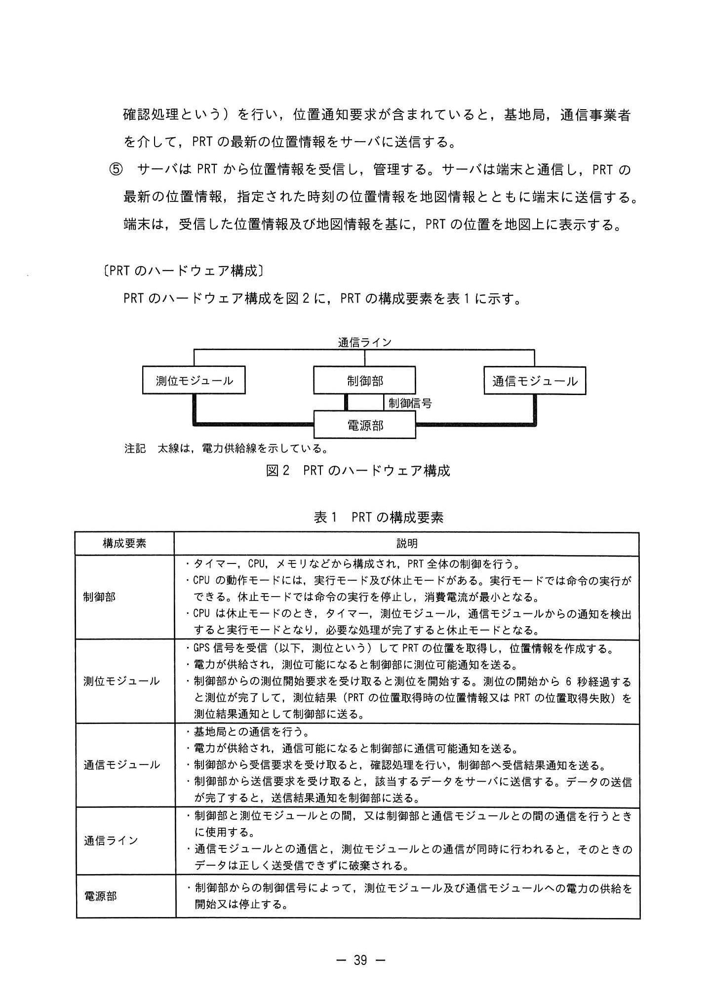

テキスト (OCR)

確認処理という) を行い, 位置通知要求が含まれていると, Bite, 通信事業者
を介して, PRT の最新の位置情報をサーバに送信する。

© サーバは PRT から位置情報を受信し, 管理する。サーバは端末と通信し, PRT の
最新の位置情報, 指定された時刻の位置情報を地図情報とともに端末に送信する。
端末は, 受信した位置情報及び地図情報を基に, PRI の位置を地図上に表示する。

(PRT のハードウェア構成
PRT のハードウェア構成を図 2 に, PRT の構成要素を表 1 に示す。

通信ライン
|                               [
測位モジュール              制御部             通信モジュール
I  | 制御信号

注記 太線は, 電力供給線を示している。

図2 PRT のハードウェア構成

表1 PRTの構成要素

構成要素                                                        説明
・タイマー, CPU, メモリなどから構成され, PRT 全体の制御を行う。
・CPU の動作モードには, 実行モード及び休止モードがある。 実行モードでは命令の実行が
制御部          できる。休止モードでは命令の実行を停止し, 消費電流が最小となる。

・CPU は休止モードのとき, タイマー, 測位モジュール, 通信モジュールからの通知を検出

すると実行モードとなり, 必要な処理が完了すると休止モードとなる。

測位モジュール

・GPS 信号を受信 (以下, 測位という) して PRT の位置を取得し, 位置情報を作成する。
・ 電力が供給され, 測位可能になると制御部に測位可能通知を送る。
・ 制御部からの測位開始要求を受け取ると測位を開始する。測位の開始から 6 秒経過する

と測位が完了して, 測位結果 (PRT の位置取得時の位置情報又は PRT の位置取得失敗) を
測位結果通知として制御部に送る。

通信モジュール

・ 基地局との通信を行う。

・電力が供給され, 通信可能になると制御部に通信可能通知を送る。

・ 制御部から受信要求を受け取ると, 確認処理を行い, 制御部へ受信結果通知を送る。

・ 制御部から送信要求を受け取ると, 該当するデータをサーバに送信する。データの送信

が完了すると, 送信結果通知を制御部に送る。

通信ライン

・制御部と測位モジュールとの間, 又は制御部と通信モジュールとの間の通信を行うとき

に使用する。

・通信モジュールとの通信と, 測位モジュールとの通信が同時に行われると, そのときの

データは正しく送受信できずに破棄される。

・ 制御部からの制御信号によって, 測位モジュール及び通信モジュールへの電力の供給を

開始又は停止する。

### ページ 40

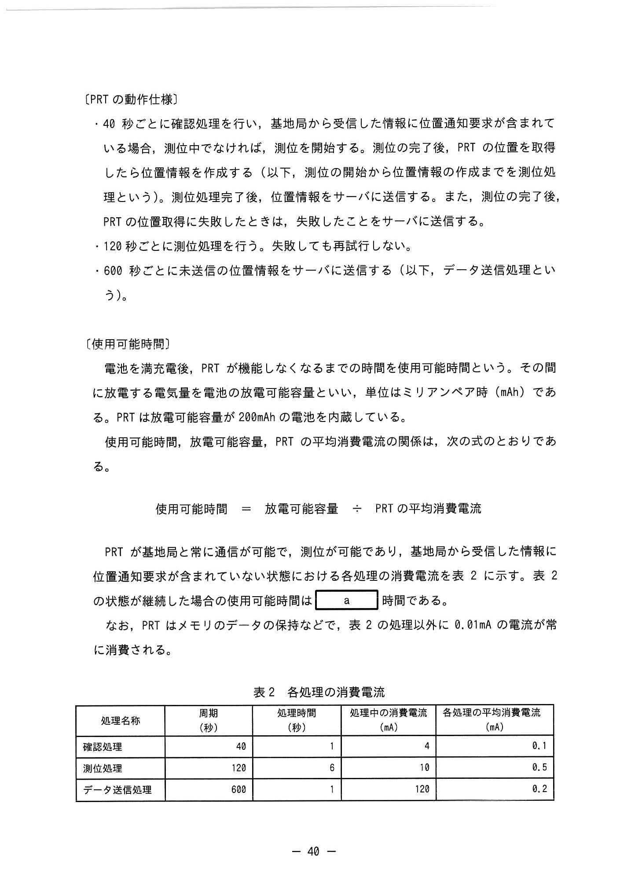

テキスト (OCR)

(PRT の動作仕様〕

・49 秒ごとに確認処理を行い, 基地局から受信

した情報に位置通知要求が含まれて

いる場合, 測位中でなければ, 測位を開始する。測位の完了後, PRT の位置を取得
したら位置情報を作成する (以下, 測位の開始から位置情報の作成までを測位処
理という)。測位処理完了後 位置情報をサーバに送信する。また, 測位の完了後,
PRT の位置取得に失敗したときは, 失敗したことをサーバに送信する。
・120 秒ごとに測位処理を行う。失敗しても再試行しない。
・699 秒ごとに未送信の位置情報をサーバに送信する (AR, データ送信処理とい

De

【使用可能時間)

電池を満充電後, PRT が機能しなくなるまでの時間を使用可能時間という。 その間
に放電する電気量を電池の放電可能容量といい, 単位はミリアンペア時 (mAh) であ
る。PRT は放電可能容量が 209mAh の電池を内蔵している。
量, PRT の平均消費電流の関係は, 次の式のとおりであ

使用可能時間, 放電可

る。

使用可能時間

能容

放電可能容量

+ PRT の平均消費電流

PRT が基地局と常に通信が可能で, 測位が可能であり, 基地局から受信した情報に
位置通知要求が含まれていない状態における各処理の消費電流を表 2 に示す。表 2

の状態が継続した場合の使用可能時間は|  a | 時間である。

なお, PRT はメモリのデータの保持などで, 表 2 の処理以外に 6.61mA OB RAH

に消費される。
表2 各処理の消費電流
oT               処理時間 | 処理中の消費電流 | SUBOTSRRMR
MM               (和お)                  ()                   (mA)                      (nA)
確認処理                             40                      1                       4                          0.1
測位処理                         120                   6                    10                        9.5
データ送信処理                  600                   1                   120                        9.2

### ページ 41

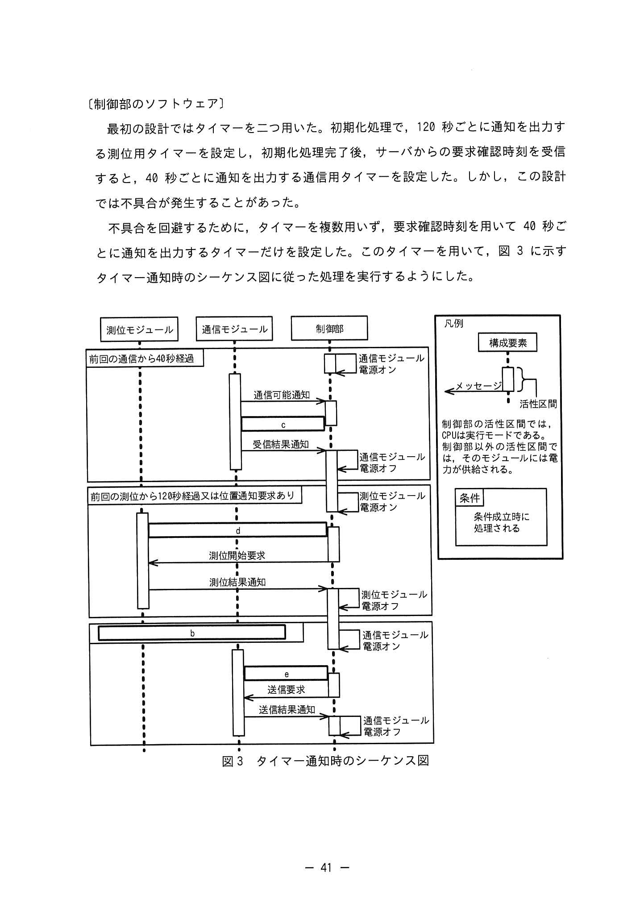

テキスト (OCR)

〔制御部のソフトウェア〕

最初の設計ではタイマーを二つ用いた。初期化処理で, 120 秒ごとに通知を出力す
る測位用タイマーを設定し, 初期化処理完了後, サーバからの要求確認時刻を受信
すると, 49 秒ごとに通知を出力する通信用タイマーを設定した。しかし, この設計
では不具合が発生することがあった。

不具合を回避するために, タイマーを複数用いず, 要求確認時刻を用いて 49 秒ご
とに通知を出力するタイマーだけを設定した。このタイマーを用いて, 図 3 に示す
タイマー通知時のシーケンス図に従った処理を実行するようにした。

測位モジュール | | 通信モジュール         制御部                   凡例
*                 Y                 .                              MRE
前回の通信から46秒経過              通信モジュール        1
4                                                 電源オン                           H
W                                   1                               ss]
:                     通信可能通知 、!                     ーーー | テーディ
!                                        活性区間
H            c          Lied aly
0                            、       ‘                     CPUは実行モードである。
H            受信結果通知       .     制御部以外の活性区間で
F                       通信モジュール | | は。 そのモジュールには電
1                     ・                            電源オフ           力が供給される。
前回の測位から120秒経過撤は位置通知要求あり |        測位モジュール     条件
n                       電源オン
1                 7                          条件成立時に
d                 4                         処理される
.
測位開始要求
6                 LJ
測位結果通知            !
H             測位モジュール
         』             電源オフ
l         b         ] |      通信モジュール
『                       電源オン
i}                                   W
o                                   e
1                          @
0                       送信要求
'                     送信結果通知 、『
                       通信モジュール
H                                         LL_es っ

図3 タイマー通知時のシーケンス図

### ページ 42

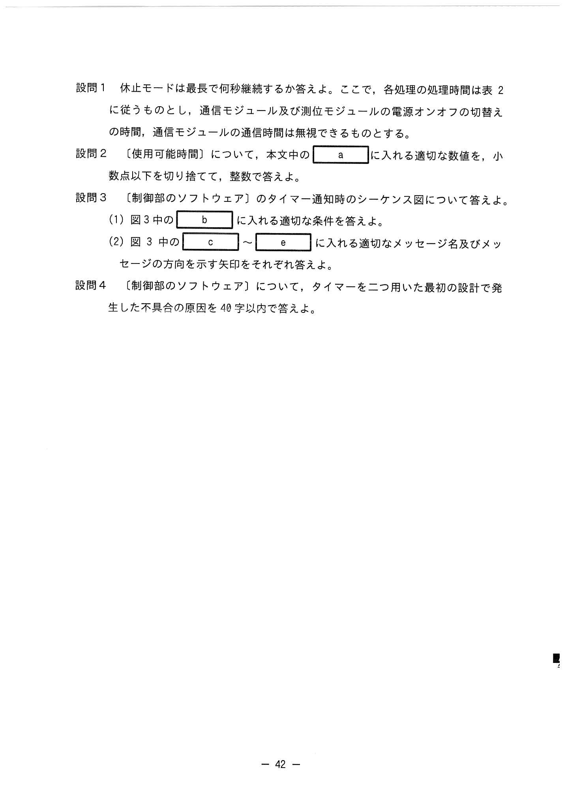

テキスト (OCR)

設問1 休止モードは最長で何秒継続するか答えよ。ここで, 各処理の処理時間は表 2
に従うものとし, 通信モジュール及び測位モジュールの電源オンオフの切替え
の時間, 通信モジュールの通信時間は無視できるものとする。

設問 2 [使用可能時間】 について, 本文中の| a |]に入れる適切な数値を,小
数点以下を切り捨てて, 整数で答えよ。

設問3 [制御部のソフトウェア〕 のタイマー通知時のシーケンス図について答えよ。
(1) 図3中の| b |] に入れる適切な条件を答えよ。
(2) 図 3 中の|  c |~[ es |に入れる適切なメッセージ名及びメッ

セージの方向を示す矢印をそれぞれ管えよ。

設問4 [制御部のソフトウェア〕 について, タイマーを二つ用いた最初の設計で発

生した不具合の原因を 49 字以内で答えよ。

### ページ 43

テキスト (OCR)

〔

メ モ 用 紙 〕

### ページ 44

テキスト (OCR)

問8

バージョン管理ツールの運用に関する次の記述を読んで, 設問に答えよ。

A 社は, 業務システムの開発を行う企業で, システムの新規開発のほか, リリース
後のシステムの運用保守や機能追加の案件も請け負っている。A HEH, ソースコー
ドの管理のために, バージョン管理ツールを利用している。

バージョン管理ツールには, 1 人の開発者がファイルの編集を開始するときにロッ
クを獲得し, 他者による編集を禁止する方式 (以下、ロック方式という) と, 編集は
複数の開発者が任意のタイミングで行い, 編集完了後に他者による編集内容とマージ
する方式 (以下, コピー・マージ方式という) がある。また, バージョン管理ツール
には, ある時点以降のソースコードの変更内容の履歴を分岐させて管理する機能があ
る。以降, 分岐元, 及び分岐して管理される, 変更内容の履歴をブランチと呼ぶ。

ロック方式では, 編集開始時にロックを獲得し, 他者による編集を禁止する。編集
終了時には変更内容をリポジトリに反映し, ロックを解除する。ロック方式では, 一
つのファイルを同時に 1 人しか編集できないので, 複数の開発者で開発する際に変更
箇所の競合が発生しない一方, ①開発者間で作業の待ちが発生してしまう場合がある。

A 社では, 規模の大きな改修に複数人で取り組むことも多いので, コピー・マージ
方式のバージョン管理ツールを採用している。A 社で採用しているバージョン管理ツ
ールでは, 開発者は, 社内に設置されているバージョン管理ツールのサーバ (以下
サーバという) のリポジトリの複製を, 開発者の PC 上のローカル環境のリポジトリ
として取り込んで開発作業を行う。編集時にソースコードに施した変更内容は, ロー
カル環境のリポジトリに反映される。ローカル環境のリポジトリに反映された変更内
容は, 編集完了時にサーバのリポジトリに反映させる。サーバのリポジトリに反映さ
れた変更内容を, 別の開発者が自分のローカル環境のリポジトリに取り込むことで,
変更内容の開発者間での共有が可能となる。

コピー・マージ方式では, 開発者間で作業の待ちが発生することはないが, 他者の
変更箇所と同一の箇所に変更を加えた場合には競合が発生する。その場合には, ソー
スコードの変更内容をサーバのリポジトリに反映させる際に, 競合を解決する必要が
ある。 競合の解決とは, 同一箇所が変更されたソースコードについて, それぞれの変
更内容を確認し, 必要に応じてソースコードを修正することである。

A 社で使うバージョン管理ツールの主な機能を表 1 に示す。

ー 44 一

### ページ 45

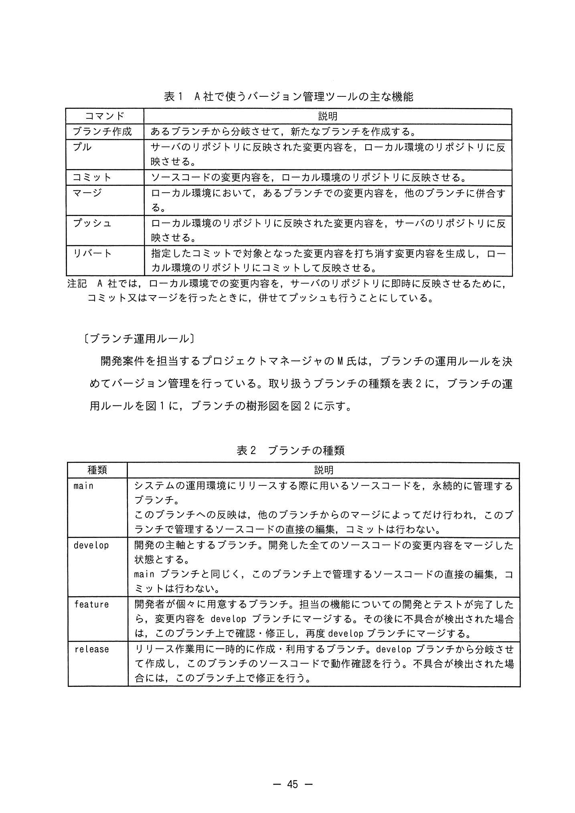

テキスト (OCR)

表1 A社で使うバージョン管理ツールの主な機能

コマンド                   説明

ブランチ作成 | あるブランチから分岐させて, 新たなブランチを作成する。

プル           サーバのリポジトリに反映された変更内容を, ローカル環境のリポジトリに反
映させる。

コミット    ソースコードの変更内容を, ローカル環境のリポジトリに反映させる。

マージ     ローカル環境において, あるブランチでの変更内容を, 他のブランチに併合す
る。

プッシュ    ローカル環境のリポジトリに反映された変更内容を, サーバのリポジトリに反
映させる。

リバート    指定したコミットで対象となった変更内容を打ち消す変更内容を生成し, ロー

カル環境のリポジトリにコミットして反映させる。

注記 A 社では, ローカル環境での変更内容を, サーバのリポジトリに即時に反映させるために,
コミット又はマージを行ったときに, 併せてプッシュも行うことにしている。

[プラシンチ

運用ルール〕

開発案件を担当するプロジェクトマネージャのM 氏は, ブランチの運用ルールを決

めてバー
用ルール

ジョン管理を行っている。 取り扱うブランチの種類を表 2 に, ブランチの運
を図 1 に, ブランチの樹形図を図 2 に示す。

表2 ブランチの種類

種類

説明

main

システムの運用環境にリリースする際に用いるソースコードを, 永続的に管理する
プランチ。

このブランチへの反映は, 他のブランチからのマージによってだけ行われ, このブ
ランチで管理するソースコードの直接の編集。コミットは行わない。

develop

開発の主軸とするブランチ。開発した全てのソースコードの変更内容をマージした
状態とする。

main ブランチと同じく, このブランチ上で管理するソースコードの直接の編集, コ
ミットは行わない。

feature

開発者が個々に用意するブランチ。 担当の機能についての開発とテストが完了した
ら, 変更内容を developp ブランチにマージする。その後に不具合が検出された場合
は, このブランチ上で確認・修正し, 再度 develop ブランチにマージする。

release

リリース作業用に一時的に作成・利用するブランチ。develop ブランチから分岐させ
て作成し。 このブランチのソースコードで動作確認を行う。不具合が検出された場
合には, このブランチ上で修正を行う。

### ページ 46

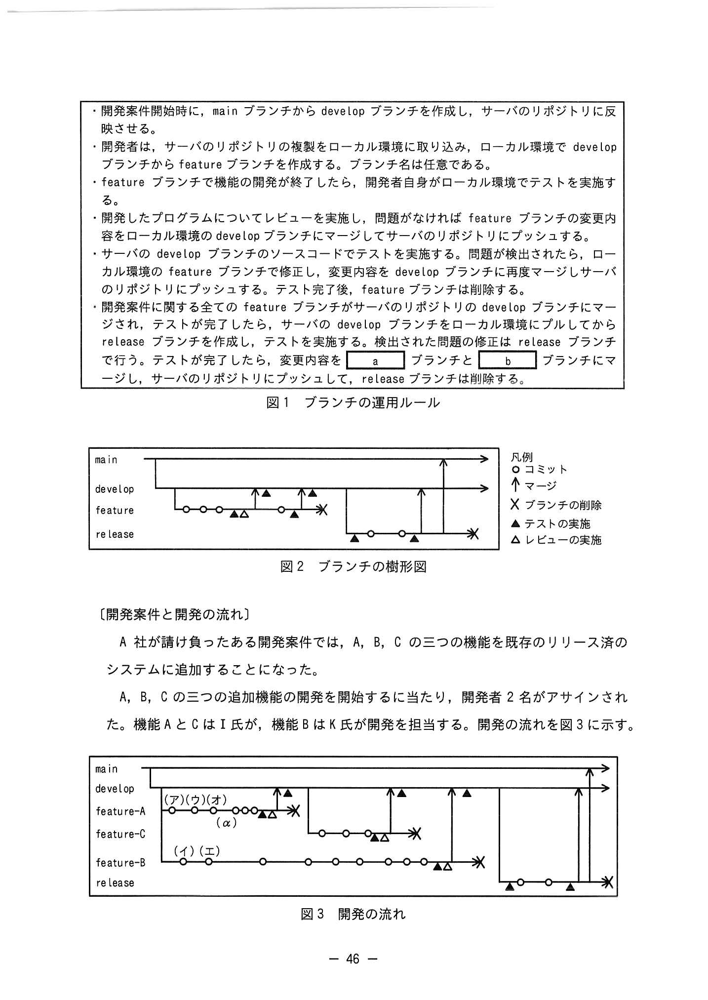

テキスト (OCR)

・開発案件開始時に, main ブランチから develop ブランチを作成し, サーバのリポジトリに反
映させる。

・開発者は, サーバのリポジトリの複製をローカル環境に取り込み, ローカル環境で develop
ブランチからfeature ブランチを作成する。ブランチ名は任意である。

・feature ブランチで機能の開発が終了したら, 開発者自身がローカル環境でテストを実施す
る。

・開発したプログラムについてレビューを実施し, 問題がなければ feature ブランチの変更内
容をローカル環境の developp ブランチにマージしてサーバのリポジトリにプッシュする。

・サーバの develop ブランチのソースコードでテストを実施する。問題が検出されたら, ロー
カル環境の feature ブランチで修正し, 変更内容を develop ブランチに再度マージしサーバ
のリポジトリにプッシュする。テスト完了後, feature ブランチは削除する。

・開発案件に関する全ての feature ブランチがサーバのリポジトリの develop ブランチにマー
YEN, テストが完了したら, サーバの develop ブランチをローカル環境にプルしてから
release ブランチを作成し, テストを実施する。検出された問題の修正は release ブランチ
で行う。テストが完了したら, 変更内容を| a | ブランチと[| b | ブランチにマ
ージし, サーバのリポジトリにプッシュして, release ブランチは削除する。

図1 ブランチの運用ルール

main                                                                   A     i
コミッ
develop                    x      x                              條 マージ
feature      Lo oo gel oh x                           X ブランチの削除
A テストの実施
re lease                                           x        x     A レビューの実施

図2 ブランチの樹形図

〔開発案件と開発の流れ〕

A 社が請け負ったある開発案件では, A, B, C の三つの機能を既存のリリース済の
システムに追加することになった。

A, B, C の三つの追加機能の開発を開始するに当たり, 開発者 2 名がアサインされ
た。機能A とCは1 氏が, 機能B はK氏が開発を担当する。 開発の流れを図 3 に示す。

main

develop

(ア)(ウ)(オ)
feature-A

feature-C

feature-B

release                                                                                        x     x

図3 開発の流れ

### ページ 47

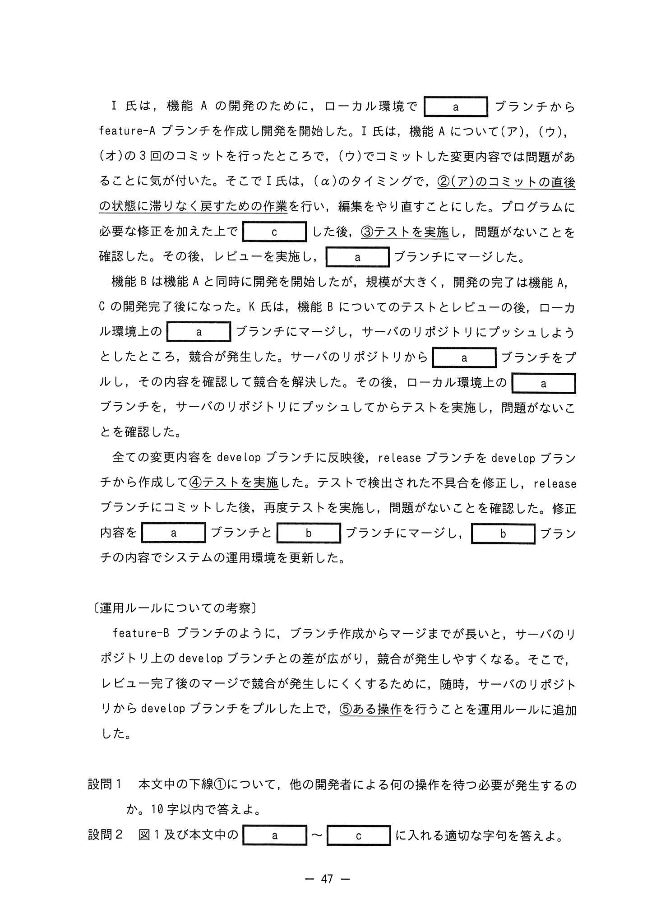

テキスト (OCR)

I 氏は, 機能 A の開発のために, ローカル環境で| 。 | ブランチから
feature-A ブランチを作成し開発を開始した。1 氏は, 機能4 について(ア), (9),
(オ)の 3 回のコミットを行ったところで, (ウ)でコミットした変更内容では問題があ
ることに気が付いた。そこで { 氏は, (w)のタイミングで, ②⑧(ア)のコミットの直後
の状態に滞りなく戻すための作業を行い, 編集をやり直すことにした。プログラムに
必要な修正を加えた上で|  c | した後, ③テストを実施し, 問題がかいことを
確認した。その後, レビューを実施し,| 。 | ブランチにマージした。

機能 B は機能 A と同時に開発を開始したが, 規模が大きく, 開発の完了は機能 A,
C の開発完了後になかった。K 氏は, 機能 B についてのテストとレビューの後, ローカ
ル環境上の | 。 | ブランチにマージし, サーバのリポジトリにプッシュしよう
としたところ, 競合が発生した。サーバのリポジトリから| a | ブランチをプ
WL, その内容を確認して競合を解決した。 その後, ローカル環境上の|  。 |
ブランチを, サーバのリポジトリにプッシュしてからテストを実施し, 問題がないこ
とを確認した。

全ての変更内容を develop ブランチに反映後, reltease ブランチを develop ブラン
チから作成して④テストを実施した。テストで検出された不具合を修正し, release
ブランチにコミットした後, 再度テストを実施し, 問題がないことを確認した。修正
内容を| 』 | プランチと| 5 |] ブランチにマージし,[ b | フラン

チの内容でシステムの運用環境を更新した。

〔運用ルールについての考察〕

feature-B ブランチのように, ブランチ作成からマージまでが長いと, サーバのリ
ポジトリ上の develop ブランチとの差が広がり, 競合が発生しやすくなる。そこで,
レビュー完了後のマージで競合が発生しにくくするために, 随時, サーバのリポジト
リから develop ブランチをプルした上で, ⑤ある操作を行うことを運用ルールに追加
した。

設問1 本文中の下線①について, 他の開発者による何の操作を待つ必要が発生するの
か。 19 字以内で答えよ。
設問2 図1及び本文中の| a |一|  c |に入れる適切な字句を答えよ。

### ページ 48

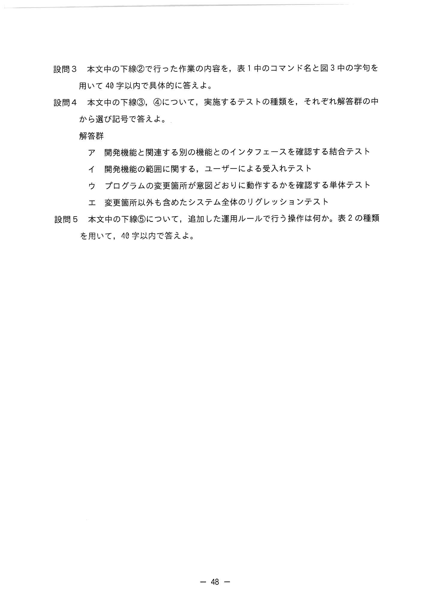

テキスト (OCR)

設問3 本文中の下線②で行った作業の内容を, 表1 中のコマンド名と図 3 中の宇句を
用いて 49 字以内で具体的に答えよ。
設問4 本文中の下線③, について, 実施するテストの種類を, それぞれ解答群の中
から選び記号で答えよ。
解答群
ア 開発機能と関連する別の機能とのインタフェースを確認する結合テスト
イ 開発機能の範囲に関する, ユーザーによる受入れテスト
ウ プログラムの変更箇所が意図どおりに動作するかを確認する単体テスト
エ 変更箇所以外も含めたシステム全体のリグレッションテスト
設問5 本文中の下線@について, 追加した運用ルールで行う操作は何か。表 2 の種類
を用いて, 4 字以内で答えよ。

### ページ 49

テキスト (OCR)

メ モ 用 紙 〕

### ページ 50

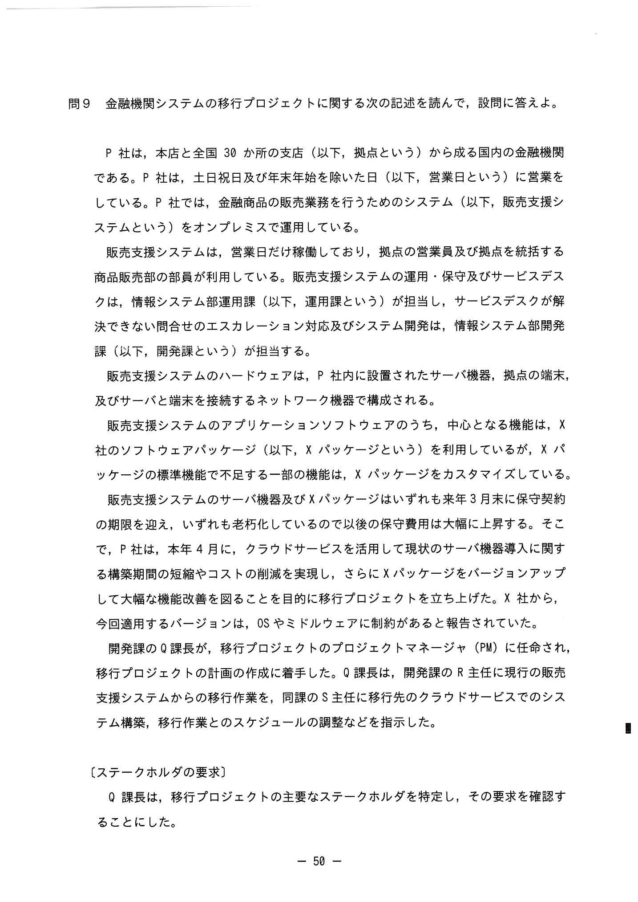

テキスト (OCR)

問9 金融機関システムの移行プロジェクトに関する次の記述を読んで, 設問に答えよ。

P 社は, 本店と全国 39 か所の支店 (以下, 拠点という) から成る国内の人金融機関
である。P 社は, 土日祝日及び年末年始を除いた日 (以下, 営業日という) に営業を
している。P 社では, 金融商品の販売業務を行うためのシステム (以下, 販売支援シ
ステムという) をオンプレミスで運用している。

販売支援システムは, 営業日だけ稼働しており, 拠点の営業員及び拠点を統括する
商品販売部の部員が利用している。販売支援システムの運用・保守及びサービスデス
クは, 情報システム部運用課 (以下, 運用課という) が担当し, サービスデスクが解
決できない問合せのエスカレーション対応及びシステム開発は, 情報システム部開発
aR (以下, 開発課という) が担当する。

販売支援システムのハードウェアは, P 社内に設置されたサーバ機器, 拠点の端末,
及びサーバと端末を接続するネットワーク機器で構成される。

販売支援システムのアプリケーションソフトウェアのうち, 中心となる機能は, X
社のソフトウェアパッケージ (以下, X パッケージという) を利用しているが, X パ
ッケージの標準機能で不足する一部の機能よは, X パッケージをカスタマイズしている。

販売支援システムのサーバ機器及び X パッケージはいずれも来年 3 月末に保守契約
の期限を迎え, いずれも老朽化しているので以後の保守費用は大幅に上昇する。そこ
で, P 社は, 本年 4 月に, クラウドサービスを活用して現状のサーバ機器導入に関す
る構築期間の短縮やコストの削減を実現し, さらにXパッケージをバージョンアップ

して大幅な機能改善を図ることを目的に移行プロジェクトを立ち上げた。X 社から
今回適用するバージョンは, 0S やミドルウェアに制約があると報告されていた。

開発課の 0 課長が, 移行プロジェクトのプロジェクトマネージャ (PM) に任命され,
移行プロジェクトの計画の作成に着手した。0 課長は, 開発課のR 主任に現行の販売
支援システムからの移行作業を, 同課の S 主任に移行先のクラウドサービスでのシス
テム構築, 移行作業とのスケジュールの調整などを指示した。

〔【ステークホルダの要求〕
Q 課長は, 移行プロジェクトの主要なステークホルダを特定し, その要求を確認す
ることにした。

### ページ 51

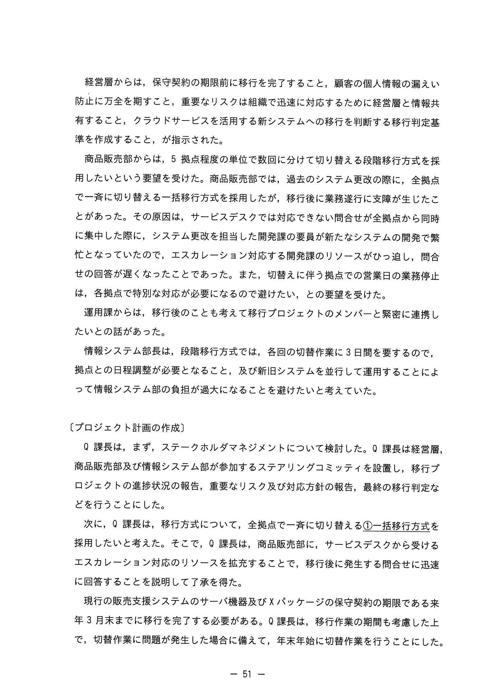

テキスト (OCR)

BEBO Sold, 保守契約の期限前に移行を完了すること, 顧客の個人情報の漏えい
防止に万全を期すこと, 重要なリスクは組織で迅速に対応するために経営層と情報共
有すること, クラウドサービスを活用する新システムへの移行を判断する移行判定基
準を作成すること, が指示された。

商品販売部からは, 5 拠点程度の単位で数回に分けて切り替える段階移行方式を採
用したいという要望を受けた。商品販売部では, 過去のシステム更改の際に, SHA
で一斉に切り替える一括移行方式を採用したが, 移行後に業務遂行に支障が生じたこ
とがあった。 その原因は, サービスデスクでは対応できない問合せが全拠点から同時
に集中した際に, システム更改を担当した開発課の要員が新たなシステムの開発で繁
忙となっていたので, エスカレーション対応する開発課のリソースがひっ人迫し, BA
せの回答が遅くなったことであった。また, 切替えに伴う拠点での営業日の業務停止
は, 各拠点で特別な対応が必要になるので避けたい, との要望を受けた。

運用課からは, 移行後のことも考えて移行プロジェクトのメンバーと緊密に連携し
たいとの話があった。

情報システム部長は, 段階移行方式では, 各回の切替作業に 3 日間を要するので
拠点との日程調整が必要となること, 及び新旧システムを並行して運用することによ
って情報システム部の負担が過大になることを避けたいと考えていた。

〔プロジェクト計画の作成〕

0 課長は, まず, ステークホルダマネジメントについて検討した。0 課長は経営層,
商品販売部及び情報システム部が参加するステアリングコミッティを設置し, BAT
ロジェクトの進捗状況の報告, 重要なリスク及び対応方針の報告, 最終の移行判定な
どを行うことにした。

次に, 0 課長は, 移行方式について, 全拠点で一斉に切り替える①一括移行方式を
採用したいと考えた。 そこで, 0 課長は, 商品販売部に, サービスデスクから受ける
エスカレーション対応のリソースを拡充することで, 移行後に発生する問合せに迅速
に回答することを説明して了承を得た。

現行の販売支援システムのサーバ機器及び X パッケージの保守契約の期限である来
年 3 月末までに移行を完了する必要がある。0 課長は, 移行作業の期間も考慮した上
で, 切替作業に問題が発生した場合に備えて, 年末年始に切替作業を行うことにした。

### ページ 52

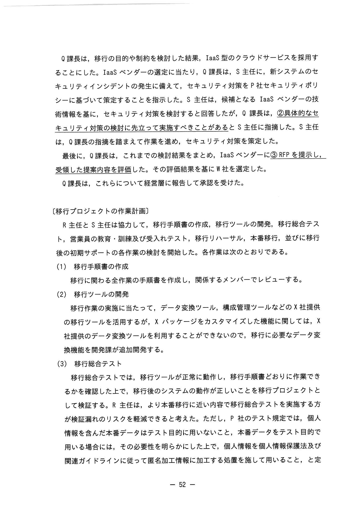

テキスト (OCR)

0 課長は, 移行の目的や制約を検討した結果, aaS 型のクラウドサービスを採用す
ることにした。TIaaS ベンダーの選定に当たり, 0 課長は, SEEK, 新システムのセ
キュリティインシデントの発生に備えて, セキュリティ対策をP 社セキュリティポリ
シーに基づいて策定することを指示した。S 主任は, 候補となる IaaS ベンダーの技
術情報を基に, セキュリティ対策を検討すると回答したが, 0 課長は, @具体的なセ
キュリティ対策の検討に先立って実施すべきことがあると S 主任に指摘した。 S 主任
ld, 0 課長の指摘を踏まえて作業を進め、 セキュリティ対策を策定した。

最後に, 0 課長は, これまでの検討結果をまとめ, 1aaS ベンダーに③RFP を提示し,
受領した提案内容を評価した。その評価結果を基に W 社を選定した。

0 課長は, これらについて経営層に報告して承認を受けた。

[移行プロジェクトの作業計画
R 主任と S 主任は協力して, 移行手順書の作成, 移行ツールの開発, 移行総合テス
ト, 営業員の教育・訓練及び受人入れテスト, 移行リハーサル, 本番移行, 並びに移行
後の初期サポートの各作業の検討を開始した。各作業は次のとおりである。
(1) 移行手順書の作成
移行に関わる全作業の手順書を作成し, 関係するメンバーでレビューする。
(2) 移行ツールの開発
移行作業の実施に当たって, データ変換ツール, 構成管理ツールなどの X 社提供
の移行ツールを活用するが, X パッケージをカスタマイズした機能に関しては, X
社提供のデータ変換ツールを利用することができないので, 移行に必要なデータ変
換機能を開発課が追加開発する。
(3) 移行総合テスト
移行総合ケストでは, 移行ツールが正常に動作し, 移行手順書どおりに作業でき
るかを確認した上で, 移行後のシステムの動作が正しいことを移行プロジェクトと
して検証する。R 主任は, より本番移行に近い内容で移行総合テストを実施する方
が検証漏れのリスクを軽減できると考えた。ただし, P 社のテスト規定では, 個人
情報を含んだ本番データはテスト目的に用いないこと, 本番データをテスト目的で
用いる場合には, その必要性を明らかにした上で, 個人情報を個人情報保護法及び
関連ガイドラインに従って匿名加工情報に加工する処置を施して用いること, と定

### ページ 53

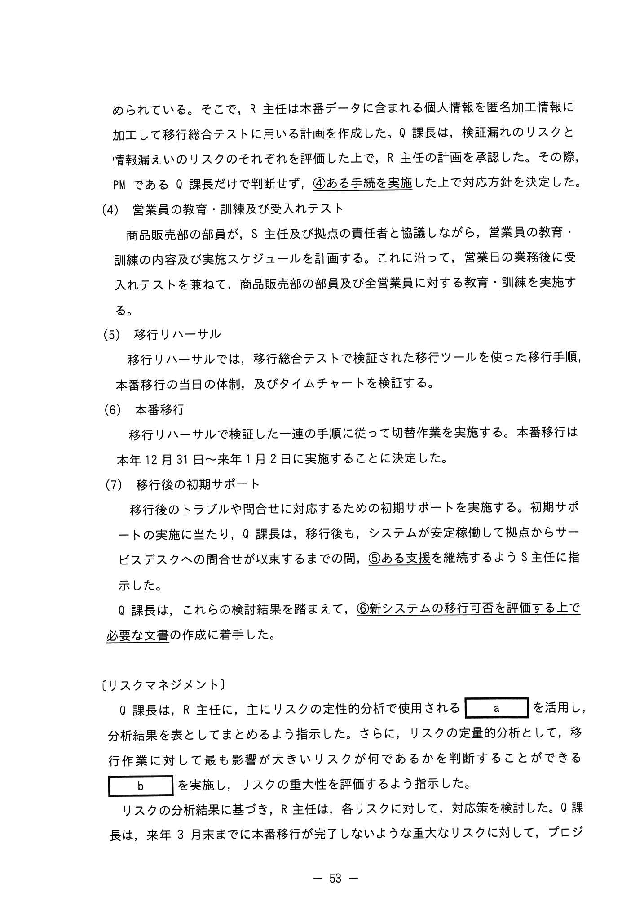

テキスト (OCR)

められている。 そこで, R 主任は本番データに含まれる個人情報を匿名加工情報に
加工して移行総合テストに用いる計画を作成した。0 課長は, 検証漏れのリスクと
情報油えんいのリスクのそれぞれを評価した上で, R 主任の計画を承認した。その際,
PM である 0 課長だけで判断せず, ④ある手続を実施した上で対応方針を決定した。
(4) 営業員の教育・訓練及び受入れテスト
商品販売部の部員が, S 主任及び拠点の責任者と協議しながら, 営業員の教育・
訓練の内容及び実施スケジュールを計画する。これに沿って, 営業日の業務後に受
入れテストを兼ねて, 商品販売部の部上員及び全営業員に対する教育・訓練を実施す
る。
(5) 移行リハバーサル
移行リハーサルでは, 移行総合テストで検証された移行ツールを使った移行手順,
本番移行の当日の体制, 及びタイムチャートを検証する。
(6) 本番移行
移行リハーサルで検証した一連の手順に従って切替作業を実施する。 本番移行は
本年 12 月 31 日一来年 1 月 2 日に実施することに決定した。
(7) 移行後の初期サポート
移行後のトラブルや問合せに対応するための初期サポートを実施する。初期サポ
ートの実施に当たり, 0 課長は, BARE, システムが安定稼働して拠点からサー
ビスデスクへの問合せが収束するまでの間, ⑤ある支援を継続するよう 3 主任に指
示した。
Q 課長は, これらの検討結果を踏まえて, ⑥新システムの移行可否を評価する上で
必要な文書の作成に着手した。

(リスクマネジメント]

0 課長は,R 主任に,主にリスクの定性的分析で使用される| sa | を活用し,
分析結果を表としてまとめるよう指示した。さらに, リスクの定量的分析として, B
行作業に対して最も影響が大きいリスクが何であるかを判断することができる
| 5 | を実施し, リスクの重大性を評価するよう指示した。

リスクの分析結果に基づき,R 主任は, 各リスクに対して, 対応策を検討した。0 課
長は来年 3 月末までに本番移行が完了しないような重大なリスクに対して, TOY

### ページ 54

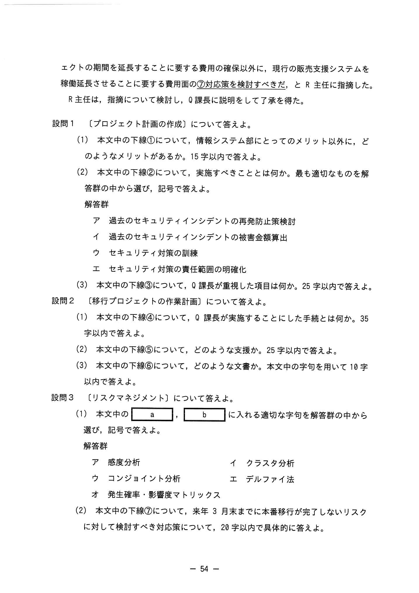

テキスト (OCR)

ェクトの期間を延長することに要する費用の確保以外に, 現行の販売支援システムを
稼働延長させることに要する費用面の⑦対応策を検討すべきだ, と R 主任に指摘した。
R 主任は, 指摘について検討し, 0課長に説明をして了承を得た。

設問1 〔プロジェクト計画の作成〕】 について答えよ。
(1) 本文中の下線のについて, 情報システム部にとってのメリット以外に, ど
のようなメリットがあるか。15 字以内で答えよ。
(2) 本文中の下線@について, 実施すべきこととは何か。最も適切なものを解
答群の中から選び, 記号で答えよ。
解答群
ア 過去のセキュリティインシデントの再発防止策検討
過去のセキュリティインシデントの被害金額算出
セキュリティ対策の訓練
セキュリティ対策の責任範囲の明確化
(3) 本文中の下線③について, 0 課長が重視した項目は何か。25 字以内で答えよ。
設問2 〔移行プロジェクトの作業計画] について答えよ。
(1) 本文中の下線@について, 0 課長が実施することにした手続とは何か。35
字以内で答えよ。
(2) 本文中の下線@について, どのような支援か。25 字以内で答えよ。
(3) 本文中の下線⑥について, どのような文書か。本文中の字句を用いて 16 字

H GAN

以内で答えよ。
BAS 〔リスクマネジメント] について答えよ。
(1) 本文中の| a |,|  b |に入れる適切な字句を解答群の中から
選び, 記号で答えよ。
解答群
ア 感度分析           4 クラスタ分析
ウ コンジョイント分析      エエ デルファイ法

オ 発生確率・影響度マトリックス
(2) 本文中の下線⑦について, 来年 3 月末までに本番移行が完了しないリスク
に対して検討すべき対応策について, 20 字以内で具体的に答えよ。

### ページ 55

テキスト (OCR)

〔

メ モ 用 紙 ]

### ページ 56

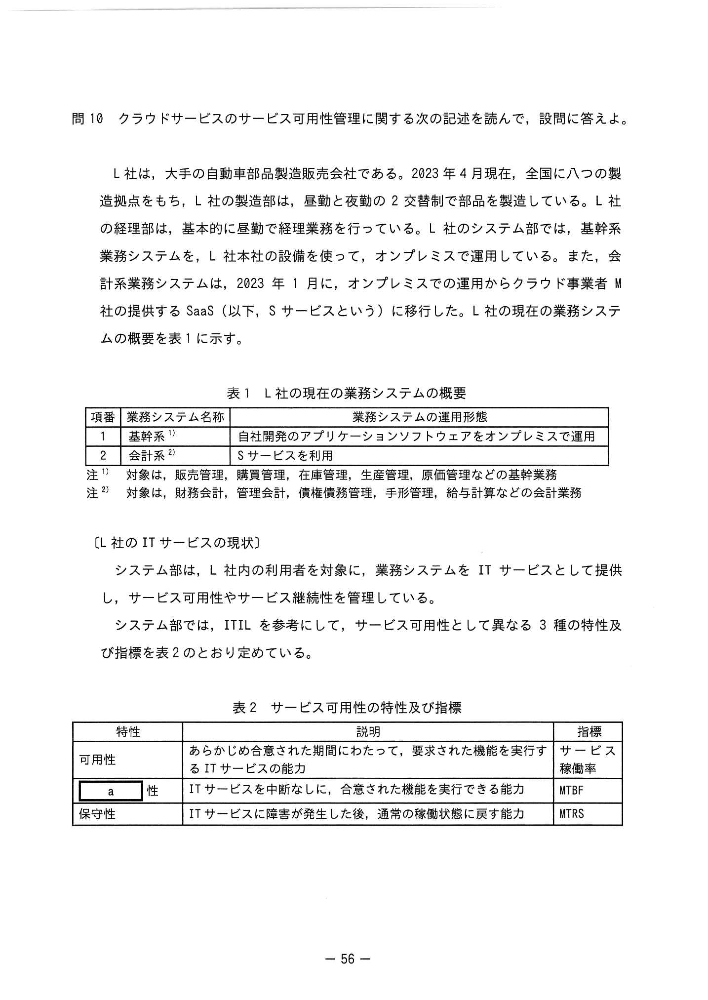

テキスト (OCR)

間19 クラウドサービスのサービス可用性管理に関する次の記述を読んで, 設問に答えよ。

L 社は, 大手の自動車部品製造販売会社である。2923 年 4 月現在, 全国に八つの製
造拠点をもち, L 社の製造部は, 昼勤と夜勤の 2 交替制で部品を製造している。 Ltt
の経理部は, 基本的に昼勤で経理業務を行っている。L 社のシステム部では, 基幹系
業務システムを, L 社本社の設備を使って, オンプレミスで運用している。また, 会
計系業務システムは, 2023 年 1 Ak, オンプレミスでの運用からクラウド事業者 M
社の提供する SaaS (LAF, S サービスという) に移行した。L 社の現在の業務システ
ムの概要を表 1 に示す。

表1 L社の現在の業務システムの概要

項番 | 業務システム名称          業務システムの運用形態
1 | BR?     自社開発のアプリケーションソフトウェアをオンプレミスで運用
2 | SK?     S サービスを利用

3” 対象は, 販売管理, 購買管理, 在庫管理, 生産管理, 原価管理などの基幹業務
3? 対象は, 財務会計, 管理会計 債権債務管理, 手形管理, 給与計算などの会計業務

(L 社の IT サービスの現状〕

システム部は, L 社内の利用者を対象に, 業務システムを IT サービスとして提供
し, サービス可用性やサービス継続性を管理している。

システム部では, ITIL を参考にして, サービス可用性として異なる 3 種の特性及
び指標を表 2 のとおり定めている。

表2 サービス可用性の特性及び指標

特性                   説明                 指標
可用性      あらかじめ合意された期間にわたって, 要求された機能を実行す| サービス
る IT サービスの能力                   稼働率
| 』 tt    IT サービスを中断なしに, 合意された機能を実行できる能力    MTBF
保守性      IT サービスに障害が発生した後, 通常の稼働状態に戻す能力   MTRS

### ページ 57

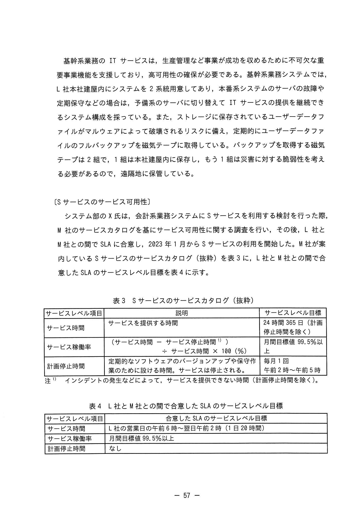

テキスト (OCR)

基幹系業務の IT サービスは, 生産管理など事業が成功を収めるために不可欠な重
要事業機能を支援しており, 高可用性の確保が必要である。基幹系業務システムでは
L 社本社建屋内にシステムを 2 系統用意してあり, 本番系システムのサーバの故障や
定期保守などの場合は, 予備系のサーバに切り替えて IT サービスの提供を継続でき
るシステム構成を採っている。また, ストレージに保存されているユーザーデータフ
ァイルがマルウェアによって破壊されるリスクに備え, 定期的にユーザーデータファ
イルのフルバックアップを磁気テープに取得している。バックアップを取得する磁気
テープは 2 組で, 1 組は本社建屋内に保存し, もう 1 組は災害に対する脆弱性を考え
る必要があるので, 遠隔地に保管している。

〔S サービスのサービス可用性〕

システム部の X 氏は, 会計系業務システムに S サービスを利用する検討を行った際
M 社のサービスカタログを基にサービス可用性に関する調査を行い, TOR, L tte
M社との間で SLA に合意し, 2023 年 1 月から S サービスの利用を開始した。M 社が案
内している S サービスのサービスカタログ (抜粋) を表 3 に, L 社とM社との間で合
意した SLA のサービスレベル目標を表 4 に示す。

表3 Sサービスのサービスカタログ (抜粋)

サービスレベル項目            説明            サービスレベル目標

.      サービスを提供する時間             24 時間 365 日 (計画
サービス時間                                                人止時間を除く)

—        oe   ービ         1             ae   is    .    5

HE RIDE     (サービス時間   サービス停止時間 " )         月間目標値 99.5%以

+ サービス時間 X 100 (%)  上

定期的なソフトウェアのバージョンアップや保守作 | 毎月1回

業のために設ける時間。サービスは停止される。     午前 2 時て午前5時
注り インシデントの発生などによって, サービスを提供できない時間 (計画停止時間を除く)。

計画停止時間

表4 L社とM社との間で合意した SLA のサービスレベル目標

サービスレベル項目          合意した SLA のサービスレベル目標
サービス時間   L 社の営業日の午前 6 時翌日午前2 時 (1 日20 時間)
サービス乏働率   月間目標値 99.5%以上

計画停止時間    なし

### ページ 58

テキスト (OCR)

2023 年 1 月は, S サービスでインシデントが発生してサービス停止した日が 3 日あ
ったが, サービス停止の時間帯は 3 日とも表 4 のサービス時間の外だった。よって,
表 4 のサービス乏働率は 190%である。仮に, サービス停止の時間帯が 3 日とも表 4
のサービス時間の内の場合, サービス停止の月間合計時間が | b |分以下であ
hid, 表 4 のサービス乏働率のサービスレベル目標を達成する。ここで, 1 月のL社
の営業日の日数を 30 とする。

3 月は, 表 4 のサービス時間の内に S サービスでインシデントが発生した日が 1 日
あった。 復旧作業に時間が掛かったので, 表 4 のサービス時間の内で 90 分間サービ
ス停止した。3 月のL 社の営業日の日数を 39 とすると, サービス乏働率は 99.75%と
なり, 3 月も表 4 のサービスレベル目標を達成した。しかし, このインシデントは月
未繁忙期の日中に発生したので, L 社の取引先への支払業務に支障を来した。

X 氏は, サービス停止しないことはもちろんだが, サービス停止した場合に迅速に
対応して回復させることも重要だと考えた。そこで, X 氏は M社の責に帰するインシ
デントが発生してサービス停止したときの①サービスレベル項目を表 4 に追加できな
いか, M 社と調整することにした。

また, 今後, 経理部では, 勤務時間を製造部に合わせて, 交替制で夜勤を行う勤務
体制を採って経理業務を行うことで, 業務のスピードアップを図ることを計画してい
る。この場合, 会計系業務システムのサービス時間を見直す必要がある。そこで, X
Kid, 表4 のサービスレベル目標の見直しが必要と考え, 表3 のサービスカタログを
念頭に, @経理部との調整を開始することにした。

(基幹系業務システムのクラウドサービス移行

2023 年 1 月に, L 社は BCP の検討を開始し, システム部は地震が発生して基幹系業
務システムが被災した場合でもサービスを継続できるようにする対策が必要になった。
X 氏が担当になって, クラウドサービスを利用して BCP を実現する検討を開始した。

X 氏は, まず M 社が提供するパブリッククラウドの laa (以下, I サービスとい
う) を調査した。{I サービスのサービスカタログでは, サービスレベル項目としてサ
ービス時間及びサービス稼働率の二つが挙げられていて, サービスレベル目標は, そ
れぞれ 24 時間 365 日及び月間目標値 99.99%以上になっていた。1 サービスでは, 物
理サーバ, ストレージシステム, ネットワーク機器などの IT 基盤のコンポーネント

rs |

### ページ 59

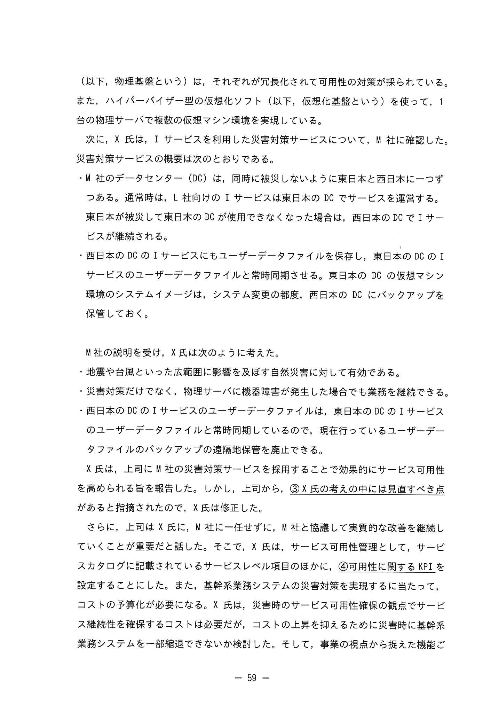

テキスト (OCR)

(以下, 物理基盤という) は, それぞれが冗長化されて可用性の対策が採られている。
また, ハイパーバイザー型の仮想化ソフト (以下, 仮想化基盤という) を使って, 1
台の物理サーバで複数の仮想マシン環境を実現している。

次に, X Kid, 1 サービスを利用した災害対策サービスについて, M 社に確認した。
災害対策サービスの概要は次のとおりである。

・M 社のデータセンター (DC) は, 同時に被災しないように東日本と西日本に一つず
DHS, 通常時は, L 社向けの 1 サービスは東日本の DC でサービスを運営する。
東日本が被災して東日本の DC が使用できなくなった場合は, 西日本の DC で{サー
ビスが継続される。

・西日本の DC のTI サービスにもユーザーデータファイルを保存し,  東日本の DOI
サービスのユーザーデータファイルと常時同期させる。東日本の DC の仮想マシン
環境のシステムイメージは, システム変更の都度, 西日本の DC にバックアップを
保管しておく。

M 社の説明を受け, X 氏は次のように考えた。

・地震や台風といった広範囲に影響を及ぼす自然災害に対して有効である。

・災害対策だけでなく, 物理サーバに機器障害が発生した場合でも業務を継続できる。
・西日本の DC の1サービスのユーザーデータファイルは, 東日本の DC の [ サービス

のユーザーデータファイルと常時同期しているので, 現在行っているユーザーデー

タファイルのバックアップの遠隔地保管を廃止できる。

X 氏は, 上司に M 社の災害対策サービスを採用することで効果的にサービス可用性
を高められる旨を報告した。しかし, LADS, ③ X 氏の考えの中には見直すべき点
があると指摘されたので, X 氏は修正した。

さらに, 上司は X 氏に, M 社に一任せずに, M 社と協議して実質的な改善を継続し
ていくことが重要だと話した。そこで, X 氏は, サービス可用性管理として, サービ
スカタログに記載されているサービスレベル項目のほかに, ④可用性に関する KPI を
設定することにした。また., 基幹系業務システムの災害対策を実現するに当たって,
コストの予算化が必要になる。X 氏は, 災害時のサービス可用性確保の観点でサービ
ス継続性を確保するコストは必要だが, コストの上昇を抑えるために災害時に基幹系
業務システムを一部縮退できないか検討した。そして, 事業の視点から捉えた機能ご

### ページ 60

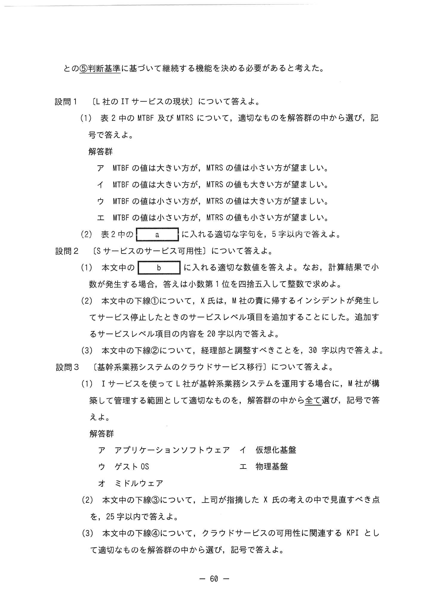

テキスト (OCR)

との判断基準に基づいて継続する機能を決める必要があると考えた。

設問1 【L社のIT サービスの現状)について答えよ。
(1) 表 2 中の MTBF 及び MTRS について, 適切なものを解答群の中から選び, 記
号で答えよ。
解答群
ア MTBF の値は大きい方が, MTRS の値は小さい方が望ましい。
イ MTBF の値は大きい方が, MTRS の値も大きい方が望ましい。
ウ MTBF の値は小さい方が, MTRS の値は大きい方が望ましい。
エ MTBF の値は小さい方が, MTRS の値も小さい方が望ましい。
(2) 表2中の[| sa | に入れる適切な字句を, 5字以内で答えよ。
設問2 〔【$Sサービスのサービス可用性〕] について答えよ。
(1) 本文中の| b | に入れる適切な数値を答えよ。なお, 計算結果で小
数が発生する場合, 答えは小数第 1 位を四捨五入して整数で求めよ。
(2) 本文中の下線①について, X 氏は, M 社の責に帰するインシデントが発生し
てサービス停止したときのサービスレベル項目を追加することにした。追加す
るサービスレベル項目の内容を 20 字以内で答えよ。
(3) 本文中の下線@について, 経理部と調整すべきことを, 39 字以内で答えよ。
設問3 (基幹系業務システムのクラウドサービス移行」について答えよ。
(1) {サービスを使って[ 社が基幹系業務システムを運用する場合に, M 社が構
築して管理する範囲として適切なものを, 解答群の中から全て選び, 記号で答
えよ。
解答群
ア アプリケーションソフトウェア イ 仮想化基盤
ウ ゲスト0S          エ 物理基盤
オ ミドルウェア
(2) 本文中の下線について, 上司が指摘した X 氏の考えの中で見直すべき点
を, 25 字以内で答えよ。
(3) 本文中の下線について, クラウドサービスの可用性に関連する KPI とし
て適切なものを解答群の中から選び, 記号で答えよ。

mutt

### ページ 61

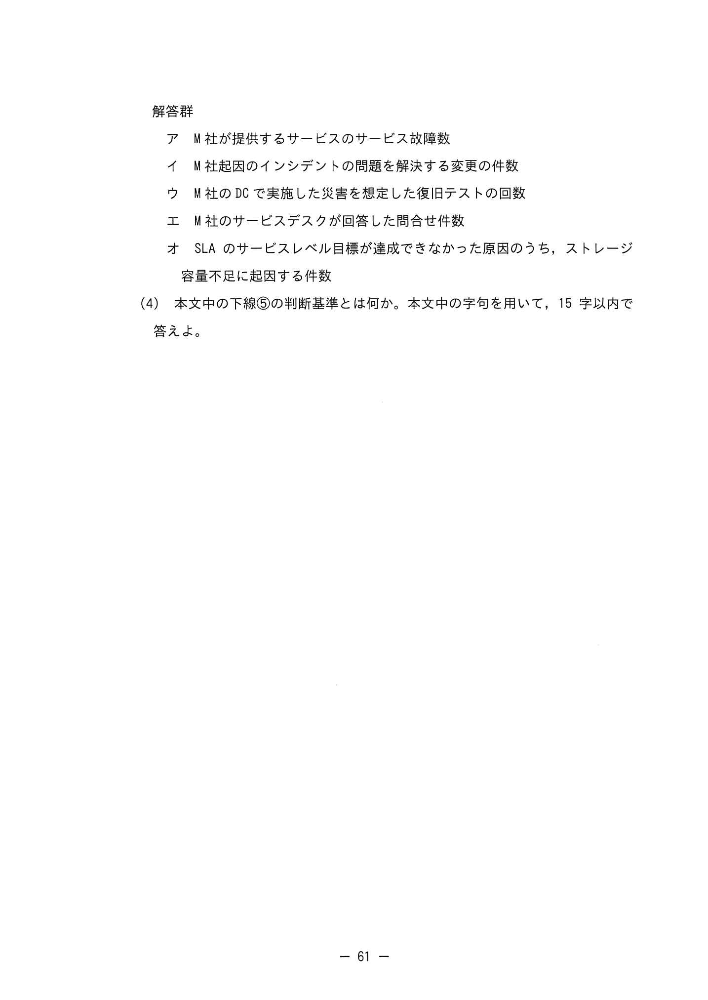

テキスト (OCR)

に|

M 社が提供するサービスのサービス故障数

M 社起因のインシデントの問題を解決する変更の件数

M 社の DC で実施した災害を想定した復旧テストの回数

M社のサービスデスクが回答した問合せ件数

SLA のサービスレベル目標が達成できなかった原因のうち, ストレージ
容量不足に起因する件数

(4) 本文中の下線⑤の判断基準とは何か。本文中の字句を用いて, 15 字以内で

答えよ。

きき H GA

### ページ 62

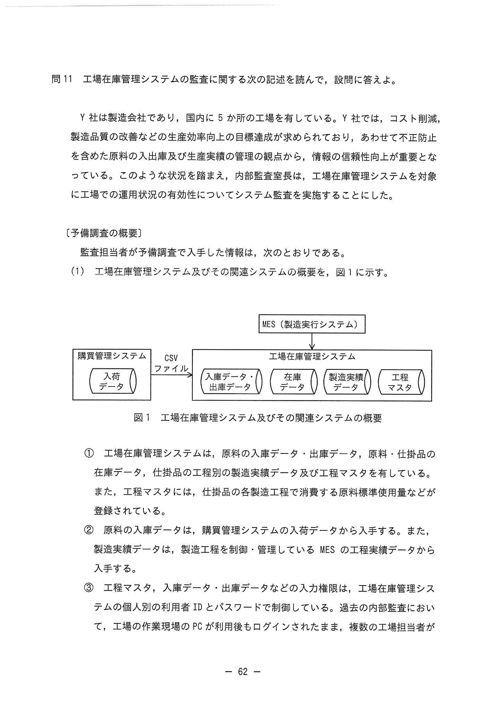

テキスト (OCR)

fll] 工場在庫管理レシステムの監査に関する次の記述を読んで, 設問に答えよ。

Y 社は製造会社であり, 国内に 5 か所の工場を有している。Y 社では, コスト削減
製造品質の改善などの生産効率向上の目標達成が求められており, あわせて不正防止
を含めた原料の入出庫及び生産実績の管理の観点から, 情報の信頼性向上が重要とな
っている。このような状況を踏まえ, 内部監査室長は, 工場在庫管理システムを対象
に工場での運用状況の有効性についてシステム監査を実施することにした。

[予備調査の概要〕
監査担当者が予備調査で入手した情報は, 次のとおりである。
(1) 工場在庫管理システム及びその関連システムの概要を, 図 1 に示す。

MES (製造実行システム)

購買管理システム| csv          工場在庫管理システム
ファイル
入荷 (  こ    入庫データ・   在庫 /)/ 製造宙綾   Lz
データ         出庫データ   データ   データ   マスタ

図1 工場在庫管理システム及びその関連システムの概要

QO 工場在庫管理システムは, 原料の入庫データ・出庫データ, 原料・仕掛品の
在庫データ, 仕掛品の工程別の製造実績データ及び工程マスタを有している。
また, 工程マスタには, 仕掛品の各製造工程で消費する原料標準使用量などが
登録されている。

② 原料の入庫データは, 購買管理システムの入荷データから入手する。また
製造実績データは, 製造工程を制御・管理している MES の工程実績データから
入手する。

③ 工程マスタ, 入庫データ・出庫データなどの入力権限は, 工場在庫管理シス
テムの個人別の利用者 ID とパスワードで制御している。 過去の内部監査におい
て, 工場の作業現場の PC が利用後もログインされたまま, 複数の工場担当者が

### ページ 63

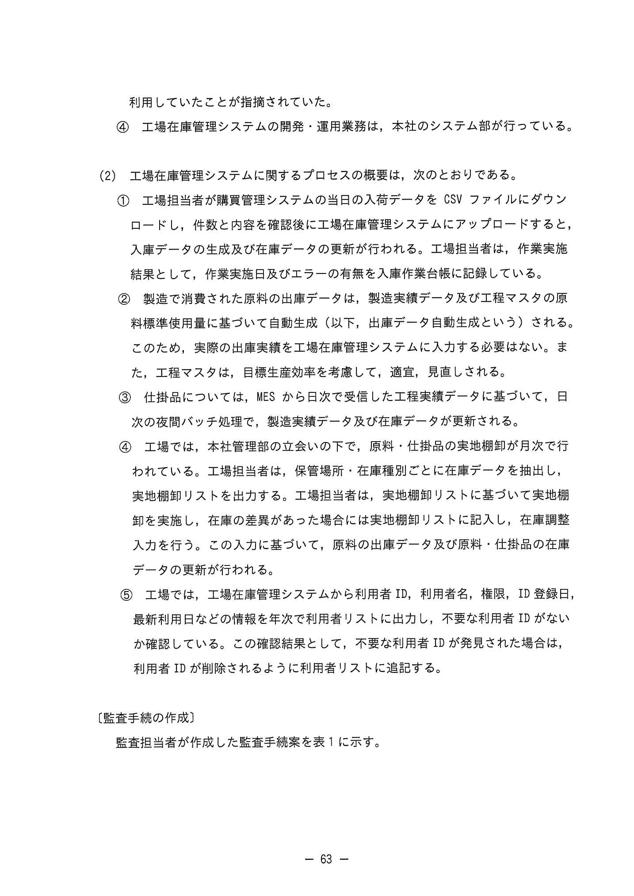

テキスト (OCR)

利用していたことが指摘されていた。
④ 工場在庫管理システムの開発・運用業務は, 本社のシステム部が行っている。

(2) 工場在庫管理システムに関するプロセスの概要は, 次のとおりである。

① 工場担当者が購買管理システムの当日の入荷データを CN ファイルにダウン
ロードし, 件数と内容を確認後に工場在庫管理システムにアップロードすると,
入庫データの生成及び在庫データの更新が行われる。 工場担当者は, 作業実施
結果として, 作業実施日及びエラーの有無を入庫作業台帳に記録している。

@ 製造で消費された原料の出庫データは, 製造実績データ及び工程マスタの原
料標準使用量に基づいて自動生成 (以下, 出庫データ自動生成という) される。
このため, 実際の出庫実績を工場在庫管理システムに入力する必要はない。ま
た, 工程マスタは, 目標生産効率を考慮して, 適宜, 見直しされる。

③ 仕掛品については, MES から日次で受信した工程実績データに基づいて, 日
次の夜間バッチ処理で, 製造実績データ及び在庫データが更新される。

④ 工場では, 本社管理部の立会いの下で, 原料・仕掛品の実地棚卸が月次で行
われている。工場担当者は, 保管場所・在庫種別ごとに在庫データを抽出し,
実地棚卸リストを出力する。工場担当者は, 実地棚卸リストに基づいて実地棚
卸を実施し, 在庫の差異があった場合には実地棚卸リストに記入し, 在庫調整
入力を行う。この入力に基づいて, 原料の出庫データ及び原料・仕掛品の在庫
データの更新が行われる。

© 工場では, 工場在庫管理システムから利用者 ID, 利用者名, 権限, ID 登録日
最新利用日などの情報を年次で利用者リストに出力し, 不要な利用者 ID がない
か確認している。この確認結果として, 不要な利用者 ID が発見された場合は,
利用者 ID が削除されるように利用者リストに追記する。

監査手続の作成〕
監査担当者が作成した監査手続案を表 1 に示す。

### ページ 64

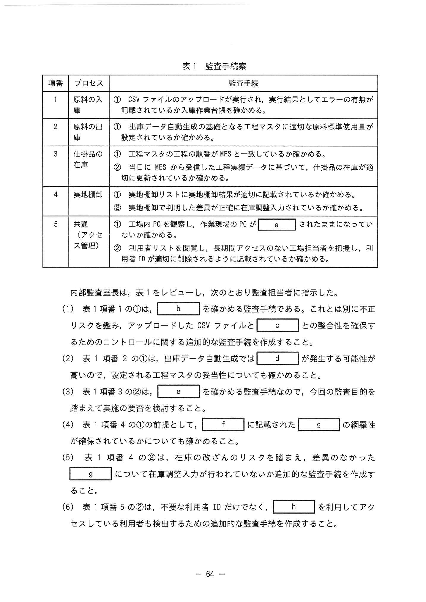

テキスト (OCR)

表1 監査手続案

プロセス                 監査手続
原料の入 | ① CSV ファイルのアップロードが実行され, 実行結果としてエラーの有無が
庫         記載されているか入庫作業台帳を確かめる。

原料の出 | ① 出庫データ自動生成の基礎となる工程マスタに適切な原料標準使用量が
庫             設定されているか確かめる。

仕掛品の | ① 工程マスタの工程の順番が MES と一致しているか確かめる。
在庫     ② 当日に MES から受信した工程実績データに基づいて, 仕掛品の在庫が敵
切に更新されているか確かめる。

実地棚卸 | ① 実地棚卸リストに実地棚卸結果が適切に記載されているか確かめる。
@ 実地棚卸で判明した差異が正確に在庫調整入力されているか確かめる。

共通    ⑰ 工場内 PC を観察し, 作業現場の PC が| a | されたままになってい
(アクセ | ないか確かめる。

ABE) | ② 利用者リストを閲覧し, 長期間アクセスのない工場担当者を把握し, 利
用者 ID が適切に削除されるように記載されているか確かめる。

内部監査室長は, 表 1 をレビューし, 次のとおり監査押当者に指示した。

(1) 表1 項番1 の①は, |  b | を確かめる監査手続である。これとは別に不正
リスクを鑑み, アップロードした CV ファイルと|  c | との整合性を確保す
るためのコントロールに関する追加的な監査手続を作成すること。

(2) 表 1 項番 2 の①は, 出庫データ自動生成では| 9d | が発生する可能性が
高いので, 設定される工程マスタの受当性についても確かめること。

(3) 表 1 項番 3 の②は,|  e | を確かめる監査手続なので, 今回の監査目的を
踏まえて実施の要否を検討すること。

(4) 表 1 項番 4 の①の前提として, に記載された|  g omer
が確保されているかについても確かめること。

(5) 表 1 項番 4 の②は, 在庫の改ざんのリスクを踏まえ, 差異のなかった
| | について在庫調整入力が行われていないか追加的な監査手続を作成す
ること。

(6) 表 1 項番 5 の②は, 不要な利用者 ID だけでなく, を利用してアク
セスしている利用者も検出するための追加的な監査手続を作成すること。

### ページ 65

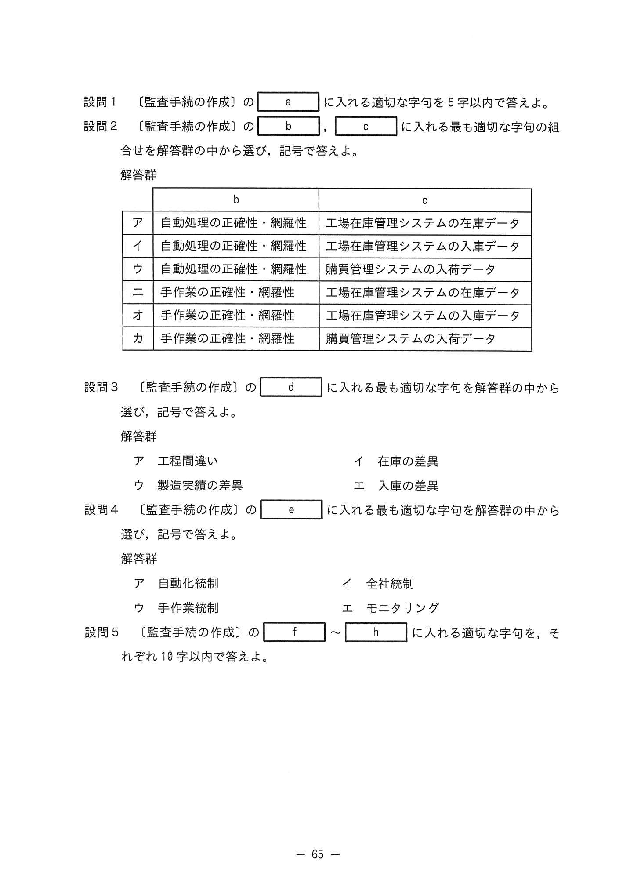

テキスト (OCR)

設問1 [監査手続の作成】 の| a | に入れる適切な字句を5字以内で答えよ。

設問2 監査手続の作成】の| "b |,|  c |に入れる最も適切な字句の組
合せを解答群の中から選び, 記号で答えよ。
解答群
b                  C

に|

自動処理の正確性・網羅性 | 工場在庫管理システムの在庫データ
自動処理の正確性・網羅性 | 工場在庫管理システムの入庫データ
自動処理の正確性・網羅性 | 購買管理システムの入荷データ
FRO ER - MBE  工場在庫管理システムの在庫データ
手作業の正確性・網羅性  工場在庫管理システムの入庫データ
手作業の正確性・網羅性  購買管理システムの入荷データ

中|叶日1]|ユ

設問3 監査手続の作成】 の| d | に入れる最も適切な字句を解答群の中から
選び, 記号で答えよ。

解答群
ア 工程問違い           イ 在庫の差異
ウ 製造実績の差異         Il 入庫の差異

設問4 [監査手続の作成】 の| e | に入れる最も適切な字句を解答群の中から
選び, 記号で答えよ。

解答群
ア 自動化統制                             イ 全社統制
ウ 手作業統制          エエ 宅コタリッグ

設問5 監査手続の作成】の| f |一| h |に入れる適切な字句を,そ
れぞれ 10 字以内で答えよ。

### ページ 66

テキスト (OCR)

〔

メ モ 用 紙 )

### ページ 67

テキスト (OCR)

C

メ = 用 紙 〕

### ページ 68

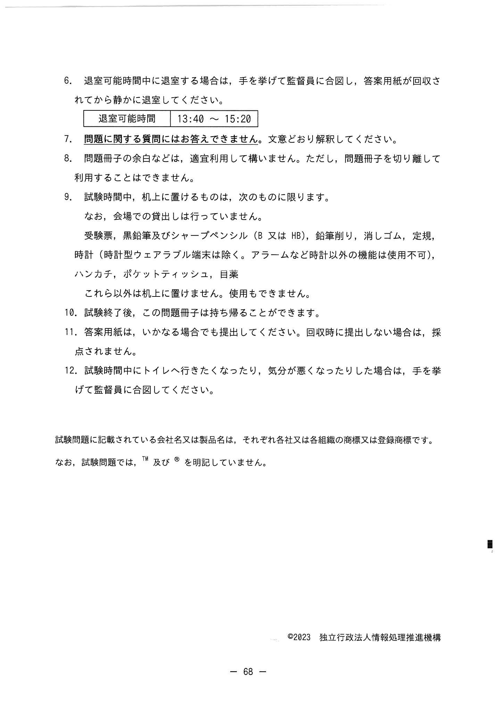

テキスト (OCR)

6. 退室可能時間中に退室する場合は, 手を挙げて監督貞に合図し, 答案用紙が回収さ
れてから静かに退室してください。
退室可能時間 | 13:40 ~ 15:20 |
7. 問題に関する質問にはお答えできません。文意どおり解釈してください。
8. 問題冊子の余白などは, 適宜利用して構いません。ただし, 問題冊子を切り離して
利用することはできません。
9. 試験時間中, 机上に置けるものは, 次のものに限ります。
なお, 会場での貸出しは行っていません。
受験票, 黒鉛筆及びシャープペンシル (B 又は HB), 鉛筆削り, 消しゴム, 定規
時計 (時計型ウェアラブル端末は除く。アラームなど時計以外の機能は使用不可),
ハンカチ, ポケットティッシュ, 目薬
これら以外は机上に置けません。使用もできません。
10. 試験終了後, この問題冊子は持ち帰ることができます。
11. 答案用紙は, いかなる場合でも提出してください。回収時に提出しない場合は, 採
点されません。
12. 試験時間中にトイレへ行きたくなったり, 気分が悪くなったりした場合は, FES
げて監督貞に合図してください。

試験問題に記載されている会社名又は製品名は, それぞれ各社又は各組織の商標又は登録商標です。

なお, 試験問題では, "及び を明記していません。

@2023 独立行政法人情報処理推進機構

---

## 午後解答

1/6 
©2023 独立行政法人情報処理推進機構 
令和５年度 春期 応用情報技術者試験 解答例 
 
午後試験 
問１ 
出題趣旨 
 昨今，ランサムウェアによるサイバーインシデントが多発しており，予防対策に加えてインシデント対応を
含めたインシデントハンドリングの高度化に向けた取組が，多くの企業で進められている。 
 本問では，インシデント発生を想定したマルウェア対策を題材に，サイバーセキュリティ対策としてのイン
シデント対応と社員教育に関する基本的な理解について問う。 
 
設問 
解答例・解答の要点 
備考 
設問１(1) ウ 
 
 
(2)
a
5 
 
設問２(1) 5 
 
 
(2) イ 
 
設問３(1) イ 
 
 
(2)
b
3 
順不同 
 
 
c
6 
 
 
d
5 
 
 
(3) ア，ウ 
 
設問４(1) ア 
 
 
(2) PC から切り離して保管する。 
 
 
問２ 
出題趣旨 
 昨今，今まで均衡していた市場に他業界の企業が新規参入してくることがあり，その場合には，競争が激化
することが予想されるので，事業環境の変化を適切に認識し，その対応のための経営戦略を策定する必要があ
る。 
 本問では，電子機器製造販売会社におけるブルーオーシャン戦略策定を題材に，経営戦略策定に関する基本
的な知識，及び理解を問う。 
 
設問 
解答例・解答の要点 
備考 
設問１
(1)
エ 
 
 
(2)
設定スキルの習得に人手を割けないこと 
 
 
(3)
a
イ 
 
設問２
(1)
b
イ 
 
 
(2)
リピート受注率を高めること 
 
 
(3)
可能となること
①
②
・タイムリーな予防保守 
・詳細な故障部位の把握 
 
 
 
メリット 
要員が計画的に作業できる。 
 
 
(4)
値引き価格を印字したバーコードラベルを貼る適切な時刻を通知する機能

2/6 
©2023 独立行政法人情報処理推進機構 
問３ 
出題趣旨 
 桁数が非常に大きい整数の演算は，数学における学問的な用途のほか，暗号処理の分野などで実用化されて
いるアルゴリズムである。 
 本問では，任意桁数の整数の乗算処理を題材に，多倍長整数の演算のアルゴリズムの一つであるカラツバ法
に関するアルゴリズムの理解と実装について問う。 
 
設問 
解答例・解答の要点 
備考 
設問１ 
ア
3×7 
 
 
 
イ
4×12 
 
設問２ 
① 48 ② 260 ③ 48 ④ 84 
 
設問３ 
ウ
pow(3, i － 1) 
 
 
 
エ
3*(i － 1) 
 
 
 
オ
pe.val1 
順不同 
 
 
カ
pe.val2 
設問４ 
キ
mod(mul, 10) 
 
 
ク
elements[cidx ＋ 2] 
 
 
 
ケ
elements[cidx] 
 
設問５ 
2 × N 
 
 
問４ 
出題趣旨 
 近年，Web ブラウザ上で実行されるスクリプトライブラリの充実に伴い，SPA（Single Page Application）構
成のレスポンシブWeb デザインを採用したWeb システムが増えつつある。 
 本問では，IT ニュース配信サービスの再構築を題材に，SPA 構成の基本的な理解，キャッシュサーバを導入
したシステム方式設計の理解について問う。 
 
設問 
解答例・解答の要点 
備考 
設問１(1)
a
ア 
 
 
(2)
b
JSON 
 
 
(3) 参照回数の多い記事 
 
設問２ 
c
280 
 
 
 
d
200 
 
 
 
e
138 
 
 
 
f
246 
 
設問３(1)
g
ITNewsDetail 
 
 
 
h
ITNewsHeadline 
 
 
(2) IT ニュース一覧と各記事に関連する記事の一覧が更新されない。 
 
 
(3) 記事間の遷移がWeb サーバのアクセスログのURL では解析できないから

3/6 
©2023 独立行政法人情報処理推進機構 
問５ 
出題趣旨 
 情報の活用が企業活動に不可欠となっていることから，インターネット上で情報を提供するシステムには安
定したサービスの提供が求められる。そこで，利用状況の変化に合わせたシステム構成の見直しは必須となっ
ている。 
 本問では，DNS ラウンドロビンを利用したWeb サイトの負荷分散を題材に，インターネットの利用において不
可欠の役割をもつDNS の仕組みや動作について問う。 
 
設問 
解答例・解答の要点 
備考 
設問１(1) FWf 
 
 
(2) L3SW，FWb，L2SWb 
 
設問２(1)
a
miap.example.jp 
 
 
(2) apb.f-sha.example.lan 
 
設問３(1)
b
DNS サーバc 
 
 
 
c
ゾーン 
 
 
 
d
TTL 
 
 
(2) M システムの応答速度が低下することがある。 
 
 
(3) ログイン中の利用者がいないこと 
 
 
問６ 
出題趣旨 
 正規化された表を扱う処理では，複数のシンプルな処理への機能分割や，機能分割した処理結果の統合，再
利用によって，構築工数の削減を図れることがある。 
 本問では，KPI 達成状況集計システムの開発を題材に，集合関数，表結合などによる関係データベースのデー
タ操作に関する知識，技能を問う。 
 
設問 
解答例・解答の要点 
備考 
設問１ 
a
→ 
 
 
 
b
従業員コード 
 
設問２(1)
c
INNER JOIN 
 
 
 
d
LEFT OUTER JOIN 
 
 
 
e
BETWEEN 
 
 
 
f
B.職務区分 = '02' 
 
 
 
g
GROUP BY 従業員コード, KPI コード 
 
 
 
h
組織ごと_目標実績集計_一時 
 
 
 
i
COUNT(*) 
 
 
(2) 該当従業員のKPI 項目に対する実績データが，1 件も存在しない場合

4/6 
©2023 独立行政法人情報処理推進機構 
問７ 
出題趣旨 
近年，移動中でも通信可能なIoT 向けの通信方式が実用化されており，低消費電力で稼働する測位モジュー
ルも市販されている。 
本問では，低消費電力であることで長時間使用できる位置通知タグを題材に，構成する各モジュールの消費
電流から使用可能な時間を計算する能力，間欠動作することで消費電力が少なくなることへの理解，各ハード
ウェアモジュール間のメッセージのやり取りを考察する能力を問う。 
 
設問 
解答例・解答の要点 
備考 
設問１ 
39 
 
設問２ 
a
246 
 
設問３(1)
b
前回の送信から600 秒経過又は位置通知要求あり 
 
 
(2)
c
メッセージ名 
受信要求 
 
 
 
 
メッセージの方向
← 
 
 
 
d
メッセージ名 
測位可能通知 
 
 
 
 
メッセージの方向
→ 
 
 
 
e
メッセージ名 
通信可能通知 
 
 
 
 
メッセージの方向
→ 
 
設問4 
通信モジュールとの通信と測位モジュールとの通信が同時に発生した。 
 
 
問８ 
出題趣旨 
 システムを開発するに当たって，ソースコードの構成管理を適切に行うことは非常に重要である。 
 本問では，バージョン管理ツールのブランチ運用ルールを題材に，バージョン管理ツールの機能や特徴につ
いての基本的な理解と応用力を問う。 
 
設問 
解答例・解答の要点 
備考 
設問１ 
ロックの解除 
 
設問２ 
a
develop 
 
 
 
b
main 
 
 
 
c
コミット 
 
設問３ 
(オ)のコミットをリバートし，次に(ウ)のコミットをリバートする。 
 
設問４ 
下線③ 
ウ 
 
 
 
下線④ 
エ 
 
設問５ 
develop ブランチの内容をfeature ブランチにマージする。

5/6 
©2023 独立行政法人情報処理推進機構 
問９ 
出題趣旨 
 多くの情報システムで，システム更改の際に，旧システムから新システムへの移行が発生する。このため，
移行作業を計画的に推進し，円滑にサービスインを行うことがプロジェクトマネージャには求められる。 
 本問では，金融機関の既存システムのクラウドサービスへの移行を題材に，プロジェクト計画の作成，ステ
ークホルダマネジメント，リスクマネジメントに関する理解について問う。 
 
設問 
解答例・解答の要点 
備考 
設問１(1) 営業日に業務の停止が不要 
 
 
(2) エ 
 
 
(3) IaaS 利用による構築期間とコスト 
 
設問２(1) ステアリングコミッティで本番データを用いたテストの承認を得る。 
 
 
(2) エスカレーション対応の開発課リソースの拡充 
 
 
(3) 移行判定基準書 
 
設問３(1)
a
オ 
 
 
 
b
ア 
 
 
(2) 追加発生する保守費用の確保 
 
 
問10 
出題趣旨 
 従来，低コストや導入のしやすさの点でメリットがあると評価されていたクラウドサービスだが，昨今は可
用性の高さにも着目され，その利用が急速に進んでいる。 
 本問では，自動車部品製造販売会社のクラウドサービスの利用を題材に，クラウドサービスを利用した場合
のサービス可用性管理，及び可用性の向上策の理解について問う。 
 
設問 
解答例・解答の要点 
備考 
設問１(1) ア 
 
 
(2)
a
信頼 
 
設問２(1)
b
180 
 
 
(2) サービス回復までの最大時間 
 
 
(3) 計画停止時間を考慮して経理部の勤務時間を定めること 
 
設問３(1) イ，エ 
 
 
(2) バックアップの遠隔地保管を廃止すること 
 
 
(3) ア 
 
 
(4) 重要事業機能の支援度合い

6/6 
©2023 独立行政法人情報処理推進機構 
問11 
出題趣旨 
 業務プロセスを支援するシステムは，不正リスクに対応した機能・コントロールを組み込むことが求められ
る。システム監査において，業務プロセスを理解した上で不正リスクを識別し，これに対応したIT の機能及び
コントロールを評価する監査手続を実施する必要がある。 
 本問では，工場在庫管理システムを事例として，不正リスクを想定しながらシステムの運用状況を確かめる
ための監査手続を検討する能力を問う。 
 
設問 
解答例・解答の要点 
備考 
設問１ 
a
ログイン 
 
設問２ 
カ 
 
設問３ 
d
イ 
 
設問４ 
e
ア 
 
設問５ 
f
実地棚卸リスト 
 
 
 
g
在庫データ 
 
 
h
他人の利用者ID

---

## 午後採点講評

1/3 
©2023 独立行政法人情報処理推進機構 
令和５年度 春期 応用情報技術者試験 採点講評 
 
午後試験 
問１ 
 問1 では，インシデント発生を想定したマルウェア対策を題材に，サイバーセキュリティ対策としてのイン
シデント対応と社員教育に関する取組について出題した。全体として正答率はやや高かった。 
 設問2(2)は，正答率が低かった。PC 上の不審な挙動を監視する仕組みとして，近年はEDR を用いたサイバー
セキュリティ対策をとる事例が増えているので，その仕組みと効果について理解してほしい。 
 設問4(2)は，正答率が平均的であった。近年のランサムウェアは，感染したPC だけでなく，そのPC からア
クセス可能なファイルサーバや記録媒体にまで被害が拡大する事例が多数報告されている。記録媒体に取得し
たバックアップをランサムウェアから守る方策について，理解を深めてほしい。 
 
問２ 
 問2 では，電子機器製造販売会社におけるブルーオーシャン戦略策定を題材に，経営戦略策定に関する基本
的な知識とその応用について出題した。全体として正答率はやや高かった。 
 設問1(2)は，正答率が平均的であり，経営戦略策定の前提となる顧客の課題についてよく理解されているこ
とがうかがえたが，一方で，顧客の課題ではなく，Q 社の課題や顧客の要望を述べた解答が散見された。設問
をよく読み，求められていることを理解した上で解答してほしい。 
 設問2(4)は，正答率がやや高かったが，Q 社パッケージに追加する機能ではなく，現状の機能を解答した受
験者も見受けられた。ソフトウェアパッケージに対する機能強化の促進によって他社との優位性を高めていく
ためには，新たに追加する機能の要件を正しく洗い出すことが重要であることを理解してほしい。 
 
問３ 
 問3 では，任意桁数の整数の乗算処理を題材に，多倍長整数の演算のアルゴリズムの一つであるカラツバ法
について出題した。全体として正答率は平均的であった。 
 設問3 のエは，正答率が低かった。ツリーなどの構造をもった情報について，1 次元配列を用いて管理する
手法は，よく用いられる。データ構造を理解し，単純な形でプログラムを記述できる能力を身につけてほし
い。 
 設問3 のオ，カは，いずれも正答率がやや低かった。構造体の取扱方と，ツリーの情報構造の両方を理解
し，注意深く解答してほしい。 
 
問４ 
 問4 では，IT ニュース配信サービスの再構築を題材に，SPA（Single Page Application）構成，キャッシュ
サーバを導入したシステム方式設計について出題した。全体として正答率は平均的であった。 
 設問2 のf は，正答率がやや低かった。IT ニュース記事とWeb API の概要から，どのWeb API が何回ずつ呼
び出されるのかを正しく理解し，正答を導き出してほしい。 
 設問3(2)は，正答率がやや低かった。利用者が急増してシステムへの負荷がしきい値を超えた際に，利用者
にどのような影響があるのかを事前に検討することは，不特定多数の利用者向けサービスの開発では特に重要
である。アプリケーションサーバのCPU 使用率が高い場合に，キャッシュサーバの更新処理が行われないと，
どのような不具合が生じるのかについて本文から正しく読み取ってほしい。

2/3 
©2023 独立行政法人情報処理推進機構 
問５ 
 問5 では，DNS ラウンドロビンを利用したWeb サイトの負荷分散を題材に，インターネットの利用において
不可欠の役割をもつDNS の仕組みや動作について出題した。全体として正答率は平均的であった。 
 設問1 は，(2)の正答率は高かったが，(1)の正答率がやや低かった。デフォルトルートは，インターネット
アクセスのように宛先IP アドレスが不定のパケットの転送先を，一つにまとめて経路表中に記述した経路で
あることを理解してほしい。 
 設問3(1)は，c の正答率が低かった。DNS が管理する領域はゾーンと呼ばれ，ゾーンの情報をプライマリDNS
サーバからセカンダリDNS サーバにコピーすることがゾーン転送であることを覚えておいてほしい。 
 設問3(3)は，正答率が低かった。DNS のキャッシュ情報が更新されても，更新前からサーバにログインして
いる顧客は，メンテナンスの影響を受けることを理解してほしい。 
 
問６ 
 問6 では，KPI 達成状況集計システム機能の開発を題材に，組織，人事管理の表に，KPI 管理のための表が追
加された関係データベースにおいて，集計リストを作成するための一連のSQL 文について出題した。全体とし
て正答率は平均的であった。 
 設問2(1)のf は，正答率がやや低かった。WHERE 句の条件式をSQL 文の処理内容などから読み解き，注意深
く解答してほしい。 
 設問2(2)は，正答率が低かった。この設問で問うている知識は，LEFT OUTER JOIN（左外部結合）におい
て，右側の表に条件に合致するレコードがない場合，右側の表の項目値がNULL になるという仕様であり，是
非知っておいてもらいたい。どのデータがどのような場合に発生するかを問うており，LEFT OUTER JOIN で結
合する表間のデータについて，保持する値がどのような状態になるかを注意深く考えて，正答を導き出してほ
しい。 
 
問７ 
 問7 では，電池で駆動する位置通知タグを題材に，駆動時間の計算，メッセージフロー，タイマーの取扱い
について出題した。全体として正答率は平均的であった。 
設問1 は，正答率が低かった。処理時間を正しく把握することは，ソフトウェア設計上重要なので，是非理
解してほしい。 
設問3(1)は，正答率が低かった。周期的な動作だけを指摘して，位置通知要求があることを条件に入れてい
ない解答が散見された。条件を明確にすることは不具合のない設計を行うための必須項目なので，十分に理解
しておいてほしい。 
設問4 は，正答率が平均的であった。“タイマーがずれる”，“電源がオフになる”などの解答が散見された。
複数のタイマーが独立したときにどのような挙動となるかを推測し，提示してある問題点を組み合わせること
で正答が導き出せる。システムの挙動の理解は，組込みシステムの設計上重要なので，是非理解を深めてほし
い。 
 
問８ 
 問8 では，バージョン管理ツールのブランチ運用ルールを題材に，バージョン管理ツールの機能や特徴につ
いて出題した。全体として正答率は平均的であった。 
 設問3 は，正答率が低かった。ソースコードに加えられた複数の変更内容について，それらを打ち消すため
の操作を問うたが，操作の順序についての理解が不足していると思われる解答が散見された。ソースコードの
バージョン管理を行うに当たっては，変更内容のほか，変更が加えられた順番を意識することも重要である。
 設問4 の下線④は，正答率が平均的であった。ブランチの役割と，それぞれのタイミングにおける状態を考
慮しながら，行うべき作業の内容を正しく判断できるようになってほしい。 
 設問5 は，正答率が低かった。複数の開発者が関わるプロジェクトの場合，それぞれのブランチの役割を逸
脱しないように運用することが非常に重要である。どのタイミングで，どのブランチに対して操作を行うべき
かを正しく判断できるよう，理解を深めてほしい。

3/3 
©2023 独立行政法人情報処理推進機構 
問９ 
 問9 では，金融機関の既存システムのクラウドサービスへの移行を題材に，プロジェクト計画の作成，ステ
ークホルダーマネジメント及びリスクマネジメントについて出題した。全体として正答率はやや低かった。 
 設問1(1)は，正答率がやや低かった。一括移行方式では，本文中から，商品販売部の要望である拠点での営
業日の業務停止を回避できることを読み取って，正答を導き出してほしい。 
 設問2(1)は，正答率が平均的であった。プロジェクトとして重要な意思決定について，ステアリングコミッ
ティの承認を得ることは，PM として実施すべき重要な手続であることを理解してほしい。 
 設問3(1)は，正答率が低かった。リスクの定性的分析・定量的分析は，リスクマネジメント上重要な作業な
ので，必要な手法について理解を深めてほしい。 
 設問3(2)は，正答率が平均的であった。本文中で，“費用面の”対応策についての解答を求めたが，それ以
外の対応策を解答した受験者が散見された。設問で何を問われているかを正しく理解し，正答を導き出してほ
しい。 
 
問10 
 問10 では，自動車部品製造販売会社のクラウドサービスの利用を題材に，クラウドサービスを利用した場
合のサービス可用性管理，及び可用性の向上策について出題した。全体として正答率はやや低かった。 
 設問2(3)は，正答率がやや低かった。これまではL 社の営業時間から外れた時間帯に計画停止が実施されて
いたので，サービス時間のサービスレベルに関して合意する必要がなかったが，経理部の勤務体制の変更後は
S サービスが利用できない計画停止時間を考慮した勤務形態にする必要がある。“経理部と調整すべきこと”の
問いに対して，“M 社と計画停止時間の変更を協議する”のような誤った解答が散見された。表3 及び表4 か
ら，サービスカタログと合意するサービスレベルを具体的にイメージして解答してほしい。 
 設問3(2)は，正答率が平均的であった。I サービスには，稼働系（東日本）に障害が発生したときに待機系
（西日本）へ切り替える高可用性対策はあるが，L 社で従来行っていたバックアップの遠隔地保管をやめてし
まうと，広域災害時のマルウェアからのデータ保護という点で不十分である。今回のケースでは，可用性とセ
キュリティ性の両方を満たす対策が重要であることを理解してほしい。 
 
問11 
 問11 では，工場在庫管理システムを題材に，業務プロセスを理解した上で，不正リスクを想定しながら監
査で確かめるべきコントロール，監査要点に対応する監査手続について出題した。全体として正答率は平均的
であった。 
 設問2 は，正答率が低かった。システムの統制は，業務システムで自動化された統制だけでなく，人為的な
手作業の統制を組み合わせることが多い。この設問に対応する統制がどちらであるかを読み取って，正答を導
き出してほしい。 
設問5 のh は，正答率がやや低かった。工場の作業現場におけるPC の利用状況から，利用者ID がどのよう
に利用されているのかを読み取って，正答を導き出してほしい。

