# 令和6年度秋期 応用情報技術者試験

---

## 午前問題

### ページ 1

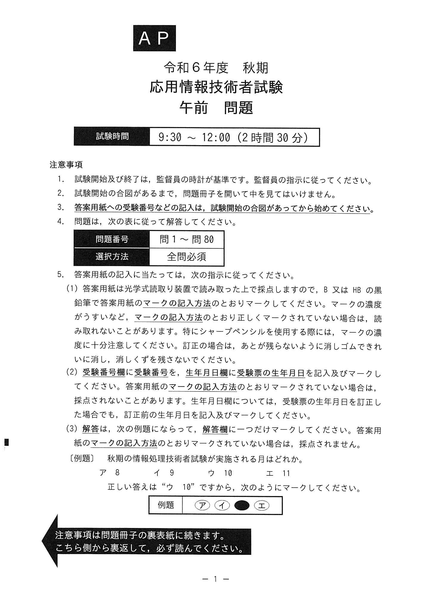

テキスト (OCR)

令和6年度 秋期
応用情報技術者試験
午前 問題

 9:30 ~ 12:00 (2時間 30 分)

注意事項
1. 試験開始及び終了は, 監督貞の時計が基準です。監督具の指示に従ってください。
2. 試験開始の合図があるまで, 問題冊子を開いて中を見てはいけません。
3. 答案用紙への受験番号などの記入は, 試験開始の合図があってから始めてください。
4. 問題は, 次の表に従って解答してください。
問題番号    問1 ~ fal 80
選択方法      全問必須
5. 答案用紙の記入に当たっては, 次の指示に従ってください。

(1) 答案用紙は光学式読取り装置で読み取った上で採点しますので, B 又は HB の黒
鉛筆で答案用紙のマークの記入方法のとおりマークしてください。マークの濃度
がうすいなど, マークの記入方法のとおり正しくマークされていない場合は, 読
み取れないことがあります。 特にシャープペンシルを使用する際には, マークの濃
度に十分注意してください。 訂正の場合は, あとが残らないように消しゴムできれ
いに消し, 消しくずを残さないでください。

(2) 受験番号欄に受験番号を, 生年月日欄に受験票の生年月日を記入及びマークし
てください。答案用紙のマークの記入方法のとおりマークされていないりい場合は,
採点されないことがあります。生年月日欄については, 受験票の生年月日を訂正し
た場合でも, 訂正前の生年月日を記入及びマークしてください。

(3) 解答は, 次の例題にならって, 解答欄に一つだけマークしてください。管案用
紙のマークの記入方法のとおりマークされていない場合は, 採点されません。

〔例題】 秋期の情報処理技術者試験が実施される月はどれか。

ア 8    イ 9    ウ 10    エ 11
正しい答えは “ウ 10” ですから, 次のようにマークしてください。

fe | (アイ) 蘭 や)

注意事項は問題冊子の裏表紙に続きます。
こちら側から裏返して, 必ず読んでください。

### ページ 2

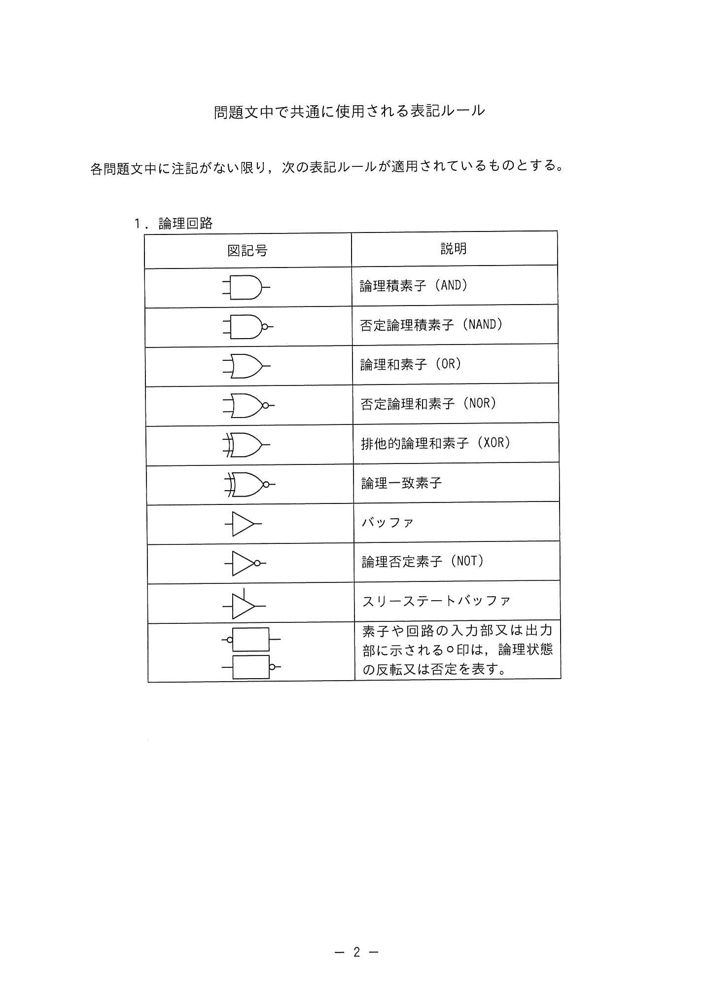

テキスト (OCR)

問題文中で共通に使用される表記ルール

各問題文中に注記がない限り, 次の表記ルールが適用されているものとする。

1. 論理回路

説明

un
cu
aja

論理積素子 (AND)

否定論理積素子 (NAND)

論理和素子 (OR)

否定論理和素子 (NOR)

排他的論理和素子 (XOR)

論理一致素子

yIMMMVIML

バッファ

論理否定素子 (NOT)

スリーステートバッファ

素子や回路の入力部又は出力
部に示されるo9印は, 論理状態
の反転又は否定を表す。

HIYIY

### ページ 3

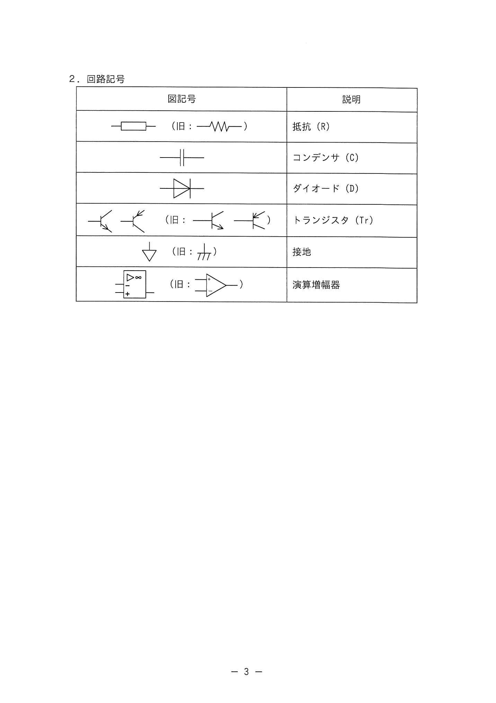

テキスト (OCR)

2. 回路記号

図記号

説明

イーキー (中一WW一)    抵抗 8
ーー            コンデンサ (C)
+                ダイオード (D)

トランジスタ (Tr)

接地

| (a: >>

演算増幅器

### ページ 4

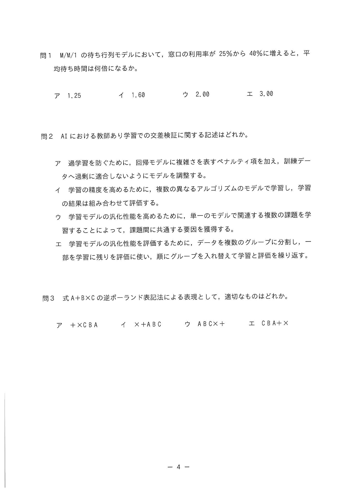

テキスト (OCR)

問 1 M/M/1 の待ち行列モデルにおいて, 窓口の利用率が 259%から 409%%に増えると, 平
均待ち時間は何倍になるか。

25    イ 1,60    ウ 2.00    エ 3.00

NI

間2 AIにおける教師あり学習での交差検証に関する記述はどれか。

ア 過学習を防ぐために, 回帰モデルに複雑さを表すペナルティ項を加え, 訓練デー
タへ過剰に適合しないようにモデルを調整する。

イ 学習の精度を高めるために, 複数の異なるアルゴリズムのモデルで学習し, 学習
の結果は組み合わせて評価する。

ウ 学習モデルの汎化性能を高めるために, 単一のモデルで関連する複数の課題を学
習することによって, 課題問に共通する要因を獲得する。

エ 学習モデルの汎化性能を評価するために, データを複数のグループに分割し, 一
部を学習に残りを評価に使い, 順にグループを入れ替えて学習と評価を繰り返す。

間3 式A+BXC の逆ポーランド表記法による表現として, 適切なものはどれか。

ア +xXCBA   4 X+ABC   ウ ABCX+   エ CBA+xX

### ページ 5

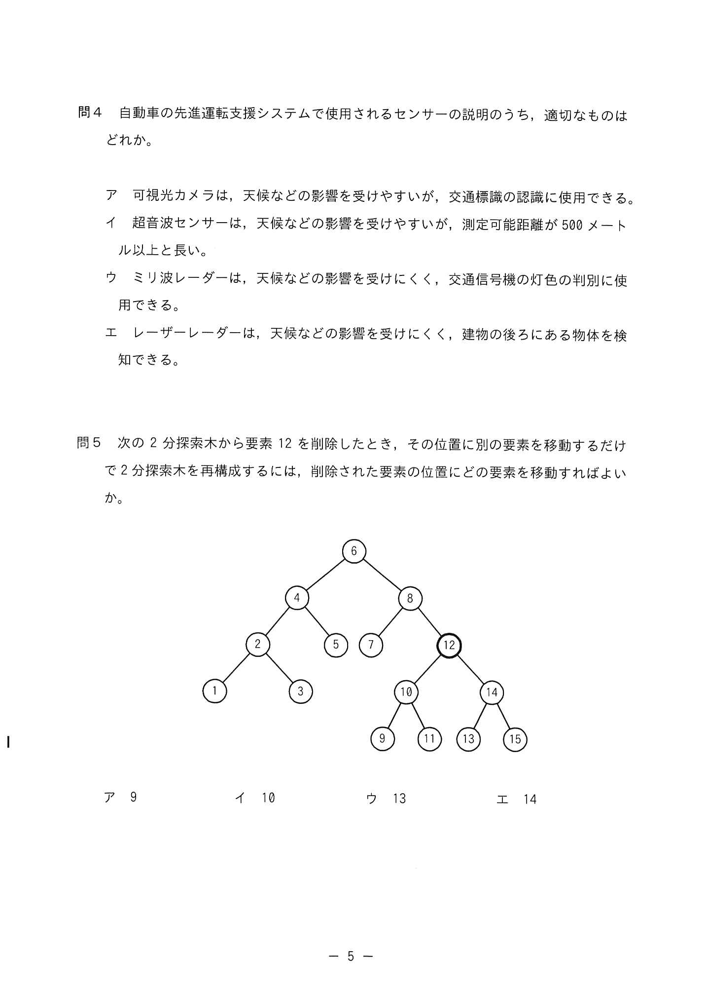

テキスト (OCR)

問4 自動車の先進運転支援システムで使用されるセンサーの説明のうち, 適切なものは
どれか。

ア 可視光カメラは, 天候などの影響を受けやすいが, 交通標識の認識に使用できる。
4 超音波センサーは, 天候などの影響を受けやすいが, 測定可能距離が 500 メート

ル以上と長い。

ウ ミリ波レーダーは, 天候などの影響を受けにくく, 交通信号機の灯色の判別に使
用できる。

エ レーザーレーダーは, 天候などの影響を受けにくく, 建物の後ろにある物体を検
知できる。

問5 次の2 分探索木から要素 12 を削除したとき, その位置に別の要素を移動するだけ
で 2 分探索木を再構成するには, 削除された要素の位置にどの要素を移動すればよい
か。

wo
&

10        ウ 13       エ 14

### ページ 6

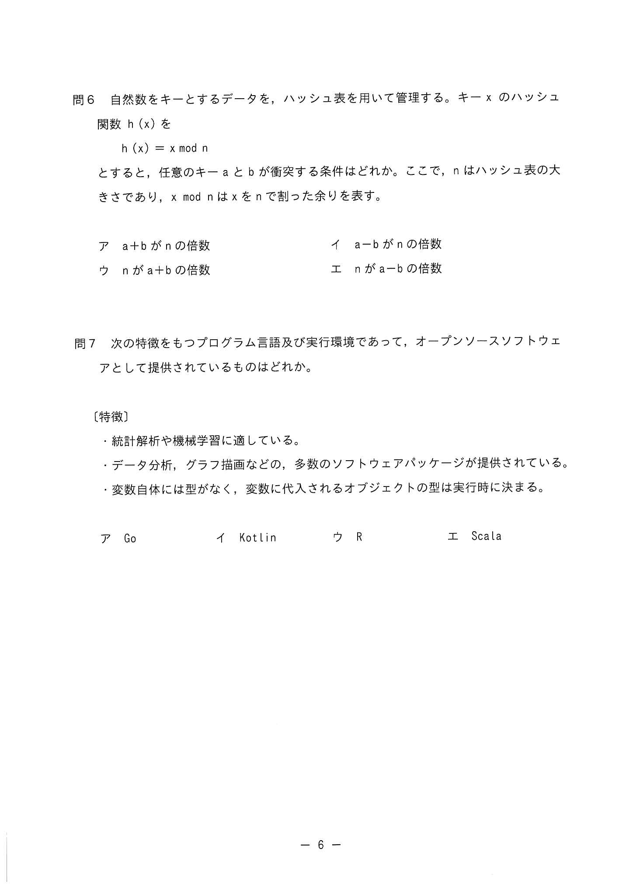

テキスト (OCR)

PRO 自然数をキーとするデータを, ハッシュ表を用いて管理する。キー x のハッシュ
関数 (x) を
h (x) = xmodn
とすると, 任意のキー a とb が衝突する条件はどれか。ここで, n はハッシュ表の大
きさであり, x mod nはx をnで割った余りを表す。

ア a十b がnの倍数       4 a-b がnの倍数
ウ nがa+bの倍数        エ nがa-bの倍数

問7 次の特徴をもつプログラム言語及び実行環境であって, オープンソースソフトウェ
アとして提供されているものはどれか。

[特徴〕
・ 統計解析や機械学習に適している。
データ分析, グラフ描画などの, 多数のソフトウェアパッケージが提供されている。
・ 変数自体には型がなく, 変数に代入されるオブジェクトの型は実行時に決まる。

ア Go     イ Kotlin    ウ R      =x Scala

### ページ 7

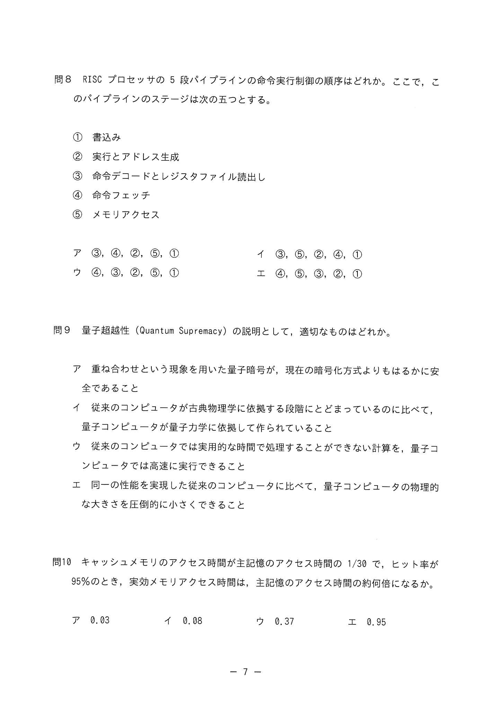

テキスト (OCR)

問8 RISC プロセッサの 5 段パイプラインの命令実行制御の順序はどれか。 COG, こ
のパイプラインのステージは次の五つとする。

@6@@@⑯《ら@
=>
中 ad dd OF OB
ML
u
|
TE
vr
ヾ
WW
N
NI
N
に
=
圧
で

に|
@
®
@
@
@G
て
@
@
®
@
iS)

問9 量子超越性 (Quantum Supremacy) の説明として, 適切なものはどれか。

ア 重ね合わせという現象を用いた量子暗号が, 現在の暗号化方式よりもはるかに安
全であること

イ 従来のコンピュータが古典物理学に依拠する段階にとどまっているのに比べて
量子コンピュータが量子力学に依拠して作られていること

ウ 従来のコンピュータでは実用的な時間で処理することができない計算を, 量子コ
ンピュータでは高速に実行できること

エ 同一の性能を実現した従来のコンピュータに比べて, 量子コンピュータの物理的
な大きさを圧倒的に小さくできること

問10 キャッシュメモリのアクセス時間が主記憶のアクセス時間の 1/30 で, ヒット率が
95%のとき, 実効メモリアクセス時間は, 主記憶のアクセス時間の約何倍になるか。

ア 0.03     イ 0.08     ウ 0.37     エ 0.95

### ページ 8

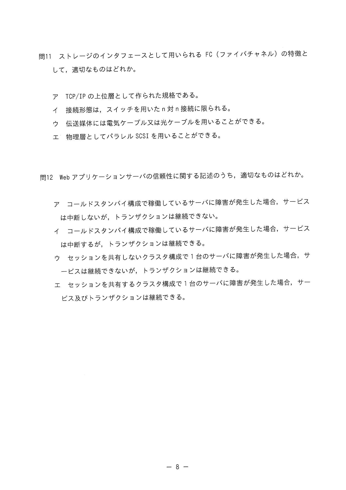

テキスト (OCR)

間11 ストレージのインタフェースとして用いられる FC (ファイバチャネル) の特徴と
LT, 適切かものはどれか。

|

TCP/IP の上位層として作られた規格である。

接続形態は, スイッチを用いたn 対n接続に限られる。

伝送媒体には電気ケーブル又は光ケーブルを用いることができる。
物理層としてパラレル SCSI を用いることができる。

Hos ユ

問12 Web アプリケーションサーバの信頼性に関する記述のうち, 適切なものはどれか。

ア コールドスタンバイ構成で稼働しているサーバに障害が発生した場合, サービス
は中断しないが, トランザクションは継続できない。

イ コールドスタンバイ構成で稼働しているサーバに障害が発生した場合, サービス
は中断するが, トランザクションは継続できる。

ウ セッションを共有しないクラスタ構成で 1 台のサーバに障害が発生した場合, サ
ービスは継続できないが, トランザクションは継続できる。

エ セッションを共有するクラスタ構成で 1 台のサーバに障害が発生した場合, サー
ビス及びトランザクションは継続できる。

### ページ 9

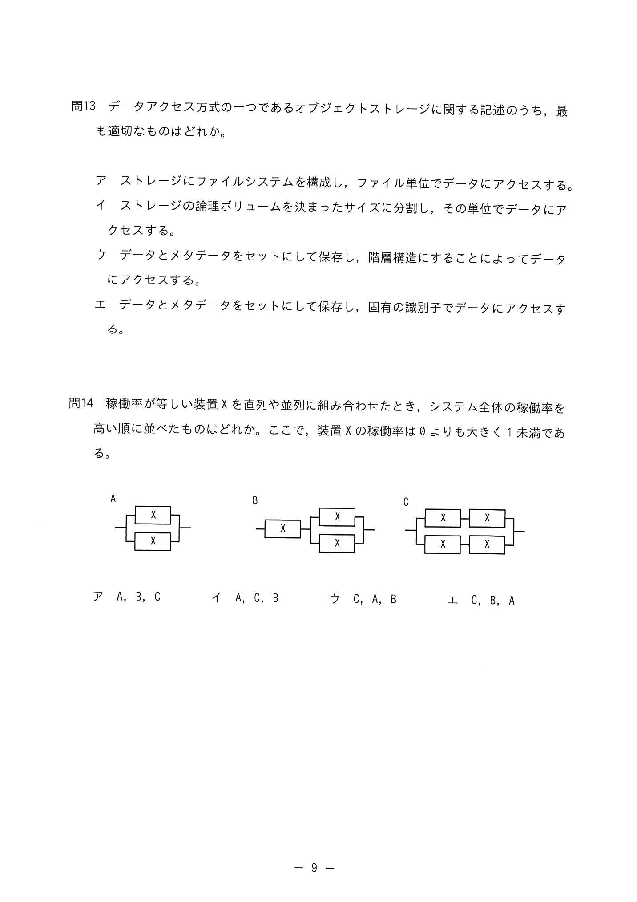

テキスト (OCR)

間13 データアクセス方式のーつであるオブジェクトストレージに関する記述のうち, 最
も適切なものはどれか。

ア ストレージにファイルシステムを構成し, ファイル単位でデータにアクセスする。
イ ストレージの論理ボリュームを決まったサイズに分割し, その単位でデータにア

クセスする。
ウ データとメタデータをセットにして保存し, 階層構造にすることによってデータ
にアクセスする。
エエ データとメタデータをセットにして保存し, 固有の識別子でデータにアクセスす
る。

問14 稼働率が等しい装置 X を直列や並列に組み合わせたとき, システム全体の乏働率を
高い順に並べたものはどれか。ここで, 装置 X の稼働率は 0 よりも大きく 1 未満であ
る。

A             B              (9
fa              int Tee
PA, B, C     4 A, C, B     ウ C, A, B     = C, BA

### ページ 10

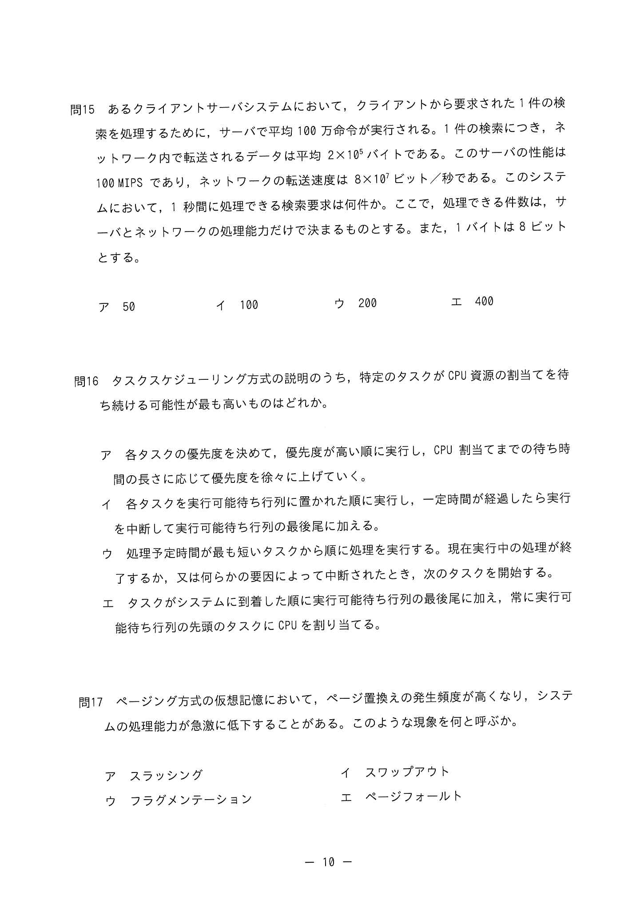

テキスト (OCR)

間15 あるクライアントサーバシステムにおいて, クライアン トから要求された 1 件の検
索を処理するために, サーバで平均 100 万命令が実行される。 1 件の検索につき, ネ
ットワーク内で転送されるデータは平均 2X10?バイトである。 このサーバの性能は
100 MLPS であり, ネットワークの転送速度は 8X10 ビットノ秒である。このシステ
ムにおいて, 1 秒間に処理できる検索要求は何件か。ここで, 処理できる件数は, サ
ーバとネットワークの処理能力だけで決まるものとする。また, 1 バイトは 8 ビット
とする。

ア 59     イ 100     ウ 200     エ 400

間16 タスクスケジューリング方式の説明のうち, 特定のタスクがCPU 資源の割当てを待
ち続ける可能性が最も高いものはどれか。

ア 各タスクの優先度を決めて, 優先度が高い順に実行し, CPU 割当てまでの待ち時
間の長さに応じて優先度を徐々に上げていく。

A 各タスクを実行可能待ち行列に置かれた順に実行し, ー定時間が経過したら実行
を中断して実行可能待ち行列の最後尾に加える。

ウ 処理予定時間が最も短いタスクから順に処理を実行する。現在実行中の処理が終
了するか, 又は何らかの要因によって中断されたとき, 次のタスクを開始する。
Lo タスクがシステムに到着した順に実行可能待ち行列の最後尾に加え, 常に実行可

能待ち行列の先頭のタスクにCPU を割り当てる。

BIT ページング方式の仮想記憶において, ページ置換えの発生頻度が高くなり, システ
ムの処理能力が急激に低下することがある。このような現象を何と呼ぶか。

ア スラッシング              イ スワップアウト

ウ フラグメンテーション          エ ページフォールト

### ページ 11

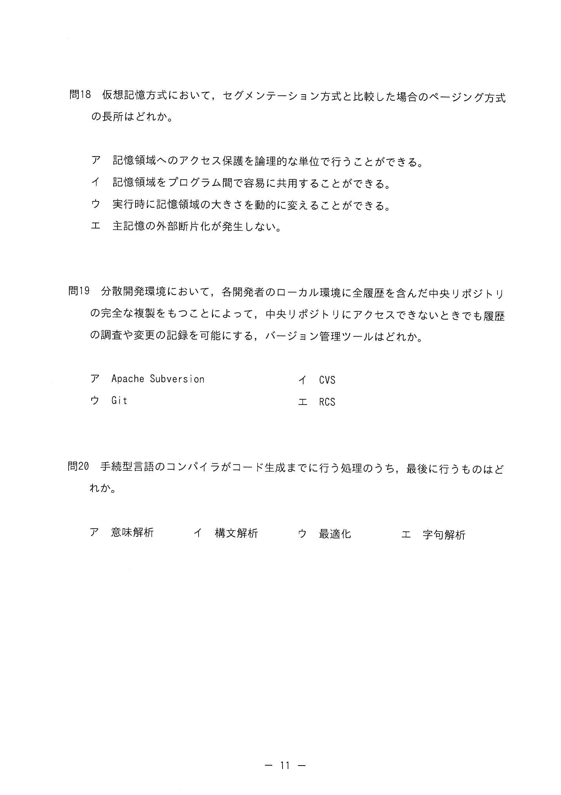

テキスト (OCR)

問18 仮想記憶方式において, セグメンテーション方式と比較した場合のページング方式
の長所はどれか。

sd

記憶領域へのアクセス保護を論理的な単位で行うことができる。
記憶領域をプログラム間で容易に共用することができる。
実行時に記憶領域の大きさを動的に変えることができる。

主記憶の外部断片化が発生しない。

H GA

間19 分散開発環境において, 各開発者のローカル環境に全履歴を含んだ中央リポジトリ
の完全な複製をもつことによって, 中央リポジトリにアクセスできないときでも履歴
の調査や変更の記録を可能にする, バージョン管理ツールはどれか。

ア Apache Subversion       イ CVS

ウ Git                       エ RCS
問2 手続型言語のコンパイラがコード生成までに行う処理のうち, 最後に行うものはど
れか。

ア 意味解析   イ 構文解析   ウ 最適化    エ 字殺解析

ー 11 一

### ページ 12

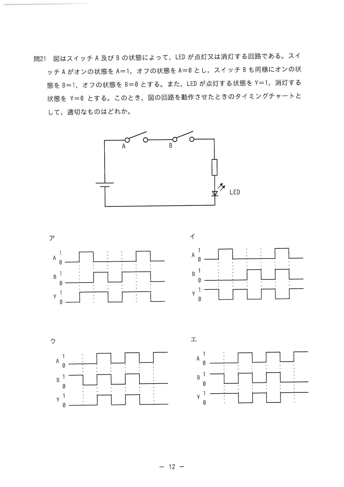

テキスト (OCR)

問21 図はスイッチ4及び B の状態によって, LED が点灯又は消灯する回路である。 スイ
ッチ A がオンの状態を Aニ1, オフの状態を A三0 とし, スイッチBも同様にオンの状
態を B=1, オフの状態を B三6 とする。 また, LED が点灯する状態を Yニ1, 消灯する
状態を Y=9 とする。このとき, 図の回路を動作させたときのタイミングチャートと
LT, 適切なものはどれか。

A

oo oo-

|    AA ey
ア       イ
ウ       x
ee ee   ~ LILI

### ページ 13

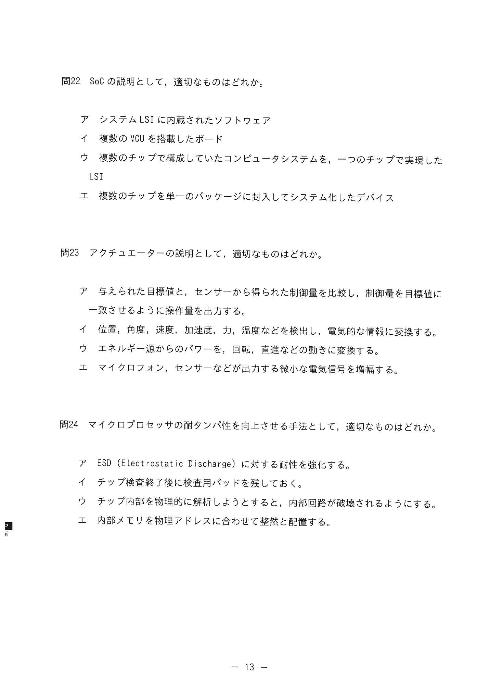

テキスト (OCR)

=r

問22 SoC の説明として, 適切なものはどれか。

ア システム LSI に内蔵されたソフトウェア

イ 複数の MCU を搭載したボード

ウ 複数のチップで構成していたコンピュータシステムを, 一つのチップで実現した
LSI

エ 複数のチップを単一のパッケージに封入してシステム化したデバイス

間23

ア

イ
G

x

間24

に|

H 寺 ユ

アクチュエーターの説明として, 適切なものはどれか。

与えられた目標値と, センサーから得られた制御量を比較し, 制御量を目標値に
一致させるように操作量を出力する。

位置, 角度。 速度, 加速度, 力, 温度などを検出し, 電気的な情報に変換する。

エネルギー源からのパワーを, 回転, 直進などの動きに変換する。

マイクロフォン, センサーなどが出力する微小な電気信号を増幅する。

マイクロプロセッサの耐タンパ性を向上させる手法として, 適切なものはどれか。

ESD (Electrostatic Discharge) に対する耐性を強化する。

チップ検査終了後に検査有パッドを残しておく。

チップ内部を物理的に解析しようとすると, 内部回路が破壊されるようにする。
内部メモリを物理アドレスに合わせて整然と配置する。

### ページ 14

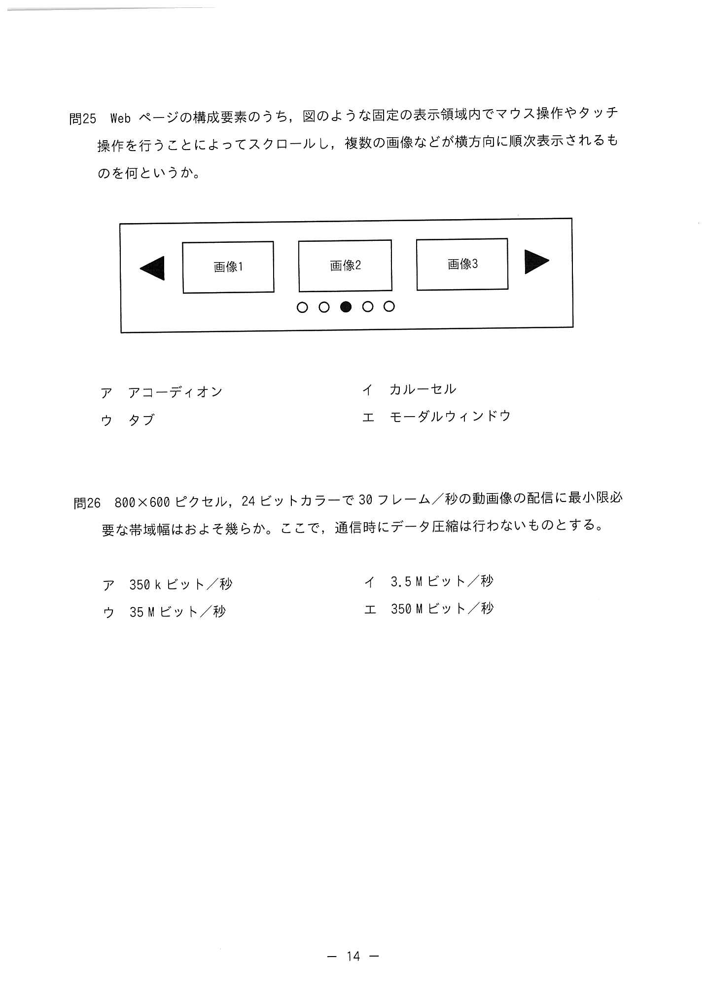

テキスト (OCR)

間25 Web ページの構成要素のうち, 図のような固定の表示領域玲でマウス操作やタッチ
操作を行うことによってスクロールし, 複数の画像などが横方向に順次表示されるも
のを何というか。

ce         画像                画像2                ass | 際

OO@のOO
ア アコーディオン            4 カルーセル
og OF                  エ モーダルウィンドウ

問26 809X699 ピクセル, 24 ビットカラーで 39 フ レームノ秒の動画像の配信に最小限必
要な帯域幅はおよそ幾らか。ここで, 通信時にデータ圧縮は行わかがいものとする。

ア 359k ビットン秒          イ 3.5Mビットンノ秒
ウ 35Mビットン/秒          エ 359Mビットン/秒

ー 14 一

### ページ 15

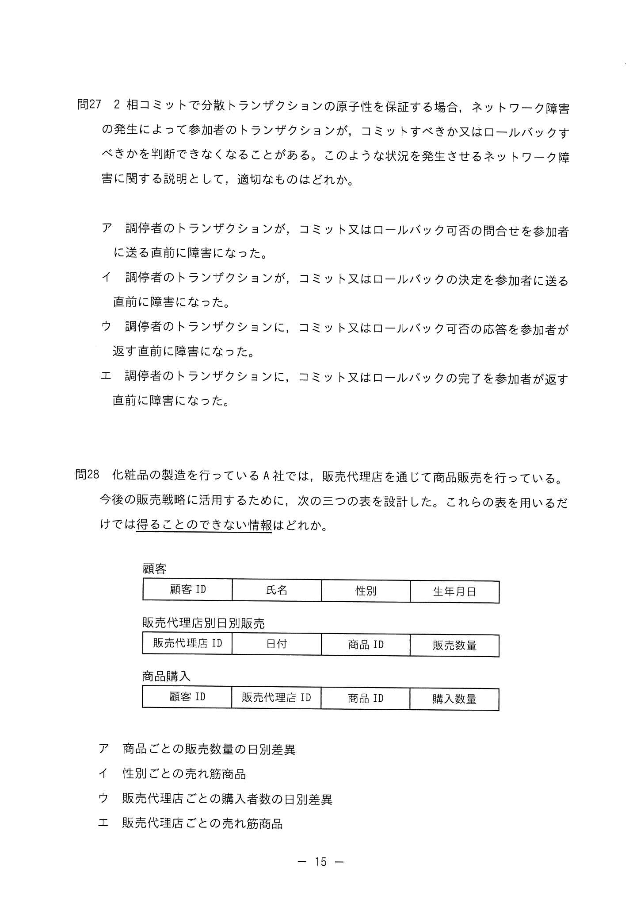

テキスト (OCR)

問27 2 相コミットで分散トランザクションの原子性を保証する場合,ネットワーク障害
の発生によって参加者のトランザクションが, コミットすべきか又はロールバックす
べきかを判断できなくなることがある。このような状況を発生させるネットワーク障
害に関する説明として, 適切なものはどれか。

ア 調停者のトランザクションが, コミット又はロールバック可否の問合せを参加者
に送る直前に障害になった。

イ 調停者のトランザクションが, コミット又はロールバックの決定を参加者に送る
直前に障害になった。

ウ 調停者のトランザクションに, コミット又はロールバック可否の応答を参加者が
返す直前に障害になった。

エ 調停者のトランザクションに, コミット又はロールバックの完了を参加者が返す

直前に障害になった。

問28 化粧品の製造を行っている A社では, 販売代理店を通じて商品販売を行っている。
今後の販売戦略に活用するために, 次の三つの表を設計した。これらの表を用いるだ
けでは得ることのできない情報はどれか。

顧客

顧客 ID             氏名               性別            生年月日

販売代理店別日別販売

販売代理店 ID        日付           商品 ID         販売数量
商品購入
顧客 ID       販売代理店 ID       商品 ID          購入数量

商品ごとの販売数量の日別差異

性別ごとの売れ筋商品

販売代理店ごとの購入者数の日別差異
販売代理店ごとの売れ筋商品

3

HH さす A

### ページ 16

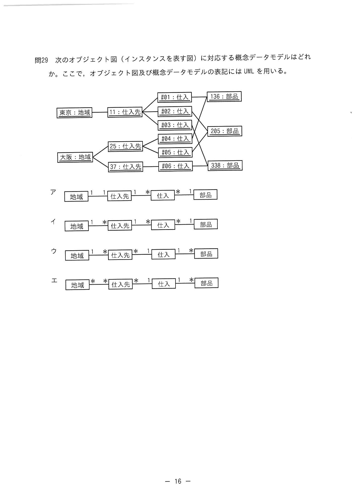

テキスト (OCR)

間29 次のオブジェクト図 (インスタンスを表す図) に対応する概念データモデルはどれ
か。ここで, オブジェクト図及び概念データモデルの表記には UML を用いる。

136 : 部品 |

#92 : 仕入

AGED)

37 : ASE}-—{_#06 : 仕入

| 東京: 地域ト一1 : 仕入先

| 大阪 : 地域

に|

(ee + ire} Ae ドー a]

イ | ee ee 部 |

者トードー| なトー  J

エードー を トー 部 |

### ページ 17

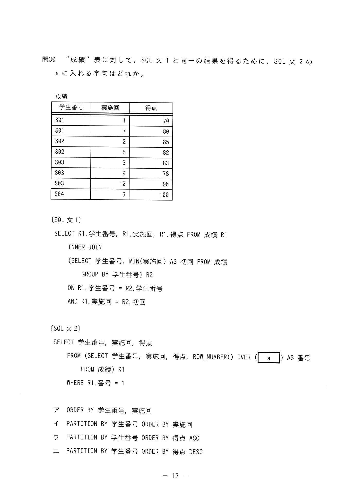

テキスト (OCR)

間36

"成績" 表に対して, SQL文 1 と同一の結果を得るために, SQL文 2 の

a に入れる字句はどれか。

学生番号 | 実施回 | 得点

$01                         1                70
S01                         7                80
$02                   2            85
$02                  5            82
$03                  3            83
$03                  9            78
$03                       12                90
$04                        6               100
(SOL % 1)

SELECT R1.学生番号, R1.実施回, R1.得点 FROM 成績 RI

[SQL

INNER JOIN

(SELECT 学生番号, MTN(実施回) AS 初回 FROM 成績
GROUP BY 学生番号) R2

ON R1.学生番号 = R2.学生番号

AND R1.実施回 = R2.初回

文 2)

SELECT 学生番号, 実施回, 得点

|

H ON

FROM (SELECT 学生番号, 実施回 得点, ROW_NUMBER() OVER (| 。 |) AS 番号
FROM 成績) RI
WHERE R1.番号 = 1

ORDER BY 学生番号, 実施回

PARTITION BY 学生番号 ORDER BY 実施回
PARTITION BY 学生番号 ORDER BY 得点 ASC
PARTITION BY 学生番号 ORDER BY 得点 DESC

### ページ 18

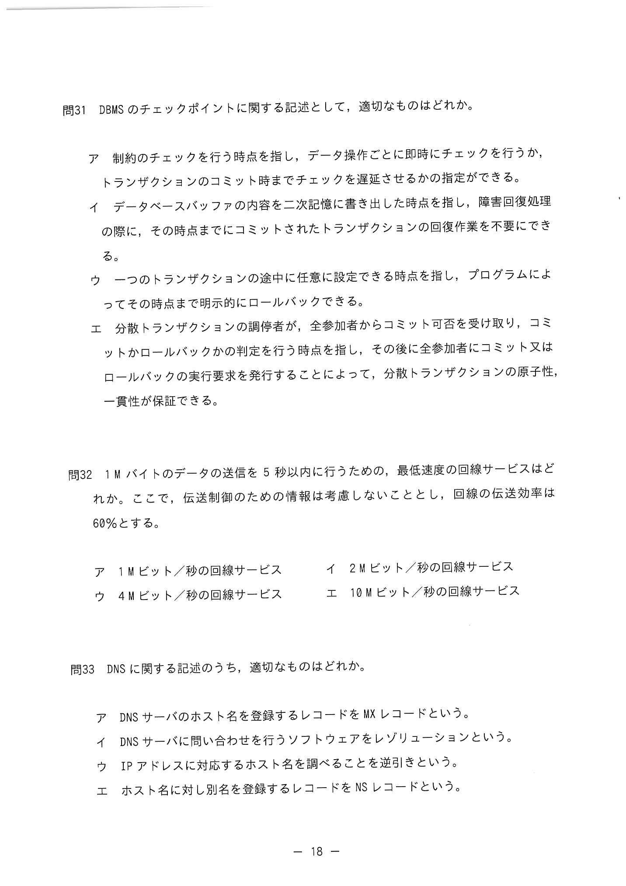

テキスト (OCR)

間31 DBMS のチェックポイントに関する記述として, 適切なものはどれか。

ア 制約のチェックを行う時点を指し, データ操作ごとに即時にチェックを行うか,
トランザクションのコミッ ト時までチェックを遅延させるかの指定ができる。

イ データベースバッファの内容を二次記憶に書き出した時点を指し, 障害回復処理
の際に, その時点までにコミットされた トランザクションの回復作業を不要にでき
る。

ウ 一つのトランザクションの途中に任意に設定できる時点を指し, プログラムによ
ってその時点まで明示的にロールバックできる。

エ 分散トランザクションの調停者が, 全参加者からコミッ ト可否を受け取り, コミ
ットかロールバックかの判定を行う時点を指し, その後に全参加者にコミット又は
ロールバックの実行要求を発行することによって, 分散トランザクションの原子性,
一貫性が保証できる。

問32 1M バイトのデータの送信を 5 秒以内に行うための, 最低速度の回線サービスはど
DD. TOC, 伝送制御のための情報は考慮しないこととし, 回線の伝送効率は
69%%とする。

ア 1Mビットン秒の回線サービス       イ 2Mビット/ノ秒の回線サービス
ウ 4Mピビットンプノ秒の回線サービス      エ 10Mピビット/秒の回線サービス

間33 DNS に関する記述のうち, 適切なかものはどれか。

に|

DNS サーバのホスト名を登録するレコードをMX レコードという。

DNS サーバに問い合わせを行うソフトウェアをレゾリューションという。
IP アドレスに対応するホスト名を調べることを逆引きという。

ホスト名に対し別名を登録するレコードをNS レコードという。

H GAN

### ページ 19

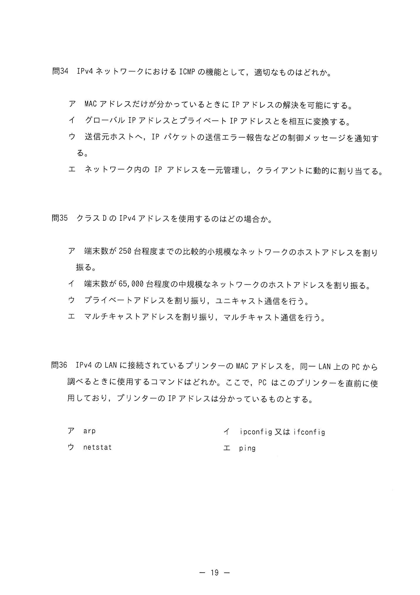

テキスト (OCR)

間34 IPvV4 ネットワークにおける ICMP の機能として, 適切なものはどれか。

ア MAC アドレスだけが分かっているときに IP アドレスの解決を可能にする。

イ グローバル IP アドレスとプライベート IP アドレスとを相互に変換する。

ウ 送信元ホストへ, IP パケットの送信エラー報告などの制御メッセージを通知す
る。

エエ ネットワーク内の IP アドレスを一元管

iH

し, クライアントに動的に割り当てる。

間35 クラス D の IPv4 アドレスを使用するのはどの場合か。

ア 端末数が 250 台程度までの比較的小規模なネットワークのホストアドレスを割り
振る。

イ 端末数が 65,000 台程度の中規模なネットワークのホストアドレスを割り振る。
ウ プライベートアドレスを割り振り, ユニキャスト通信を行う。

エエ マルチキャストアドレスを割り振り, マルチキャスト通信を行う。

間36 IPv4 の LAN に接続されているプリンターのMAC アドレスを, 同一 LAN 上の PC から
調べるときに使用するコマンドはどれか。ここで, PC はこのプリンターを直前に使
用しており, プリンターの IP アドレスは分かっているものとする。

ア arp           イ ipconfig又は ifconfig

ウ netstat                        I ping

### ページ 20

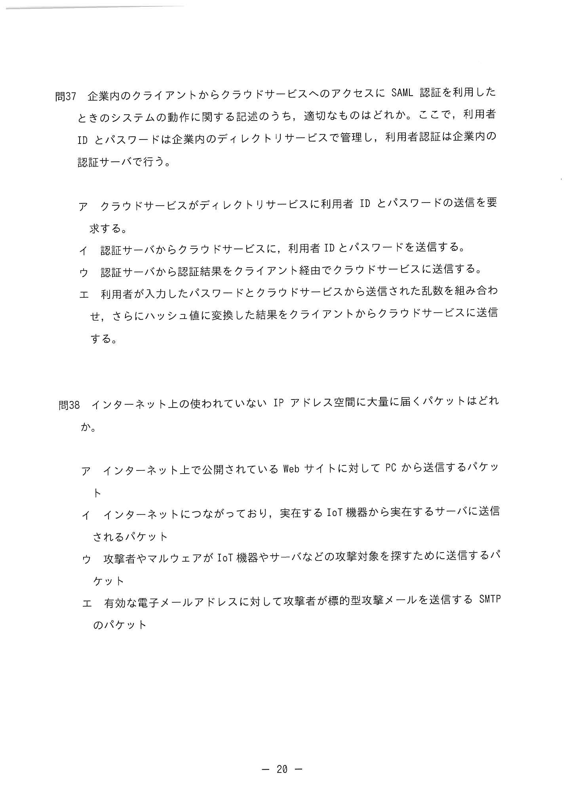

テキスト (OCR)

問37 企業内のクライアントからクラウドサービスへのアクセスに SAML 認証を利用した
ときのシステムの動作に関する記述のうち, 適切かものはどれか。ここで, 利用者
ID とパスワードは企業内のディレクトリサービスで管理し, 利用者認証は企業内の

認証サーバで行う。

ア クラウドサービスがディレクトリサービスに利用者 LD とパスワードの送信を要
求する。
イ 認証サーバからクラウドサービスに, 利用者 ID とパスワードを送信する。
認証サーバから認証結果をクライアント経由でクラウドサービスに送信する。
エ 利用者が入力したパスワードとクラウドサービスから送信された乱数を組み合わ
せ, さらにハッシュ値に変換した結果をクライアントからクラウドサービスに送信
する。

問38 インターネット上の使われていない IP アドレス空間に大量に届くパケッ トはどれ
か。

ア インターネット上で公開されている Web サイトに対して PC から送信するパケッ
ト

イ インターネットにつながっており, 実在する IoT 機器から実在するサーバに送信
されるパケット

g 攻撃者やマルウェアが Lol 機器やサーバなどの攻撃対象を探すために送信するパ
ケット

エ 有効な電子メールアドレスに対して攻撃者が標的型攻撃メールを送信する SMTP
のパケット

### ページ 21

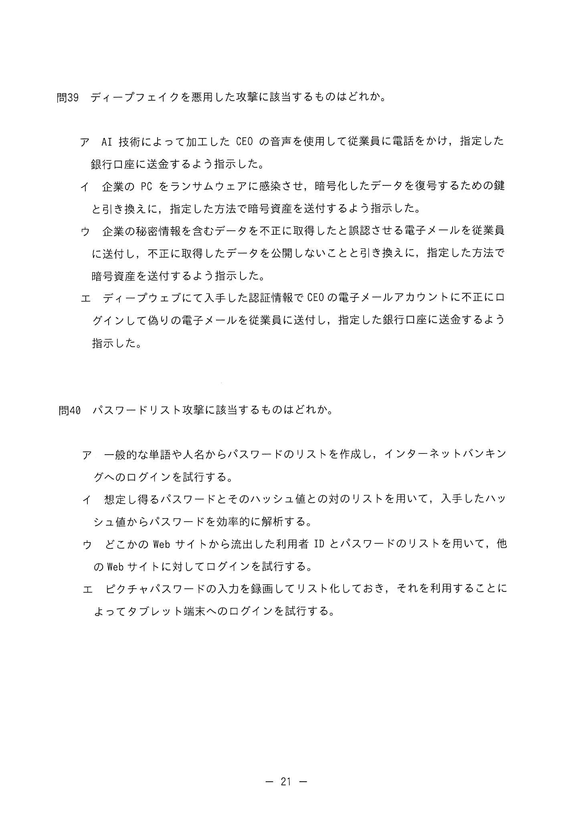

テキスト (OCR)

問39 ディープフェイクを悪用した攻撃に該当するものはどれか。

ア AI 技術によって加工した CEO の音声を使用して従業員に電話をかけ, 指定した
銀行口座に送金するよう指示した。

イ 企業の PC をランサムウェアに感染させ, 暗号化したデータを復号するための鍵
と引き換えに, 指定した方法で暗号資産を送付するよう指示した。

ウ 企業の秘密情報を含むデータを不正に取得したと誤認させる電子メールを従業員
に送付し, 不正に取得したデータを公開しないことと引き換えに, 指定した方法で
暗号資産を送付するよう指示した。

エ ディープウェブにて入手した認証情報で CEO の電子メールアカウントに不正にロ
グインして偽りの電子メールを従業員に送付し, 指定した銀行口座に送金するよう

指示した。

問49 パスワードリスト攻撃に該当するものはどれか。

ア 一般的な単語や人名からパスワードのリストを作成し,。 インターネットバンキン
グへのログインを試行する。

イ 想定し得るパスワードとそのハッシュ値との対のリストを用いて, 入手したハッ
シュ値からパスワードを効率的に解析する。

ウ どこかの Web サイトから流出した利用者 ID とパスワードのリストを用いて, 他
の Web サイトに対してログインを試行する。

エエ ピクチャパスワードの入力を録画してリスト化しておき, それを利用することに
よってタブレット端末へのログインを試行する。

### ページ 22

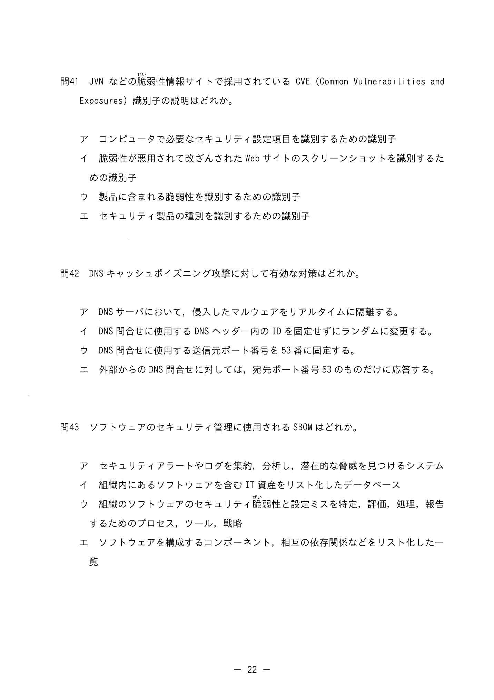

テキスト (OCR)

間41 JVN などの脆弱性情報サイ トで採用されている CVE (Common Vulnerabilities and
Exposures) 識別子の説明はどれか。

ア コンピュータで必要なセキュリティ設定項目を識別するための識別子

イ 脆弱性が悪用されて改ざんされた Web サイトのスクリーンショットを識別するた
めの識別子

ウ 製品に含まれる脆弱性を識別するための識別子

エ セキュリティ製品の種別を識別するための識別子

問42 DNS キャッシュポイズニング攻撃に対して有効な対策はどれか。

NI

DNS サーバにおいて, RBALEVIVI TP EV PWS AIMS S.

DNS 問合せに使用する DNS ヘッダー内の ID を固定せすずにランダムに変更する。
DNS 問合せに使用する送信元ポート番号を 53 番に固定する。

外部からの DNS 問合せに対しては, 宛先ポート番号 53 のものだけに応答する。

H GN

43 ソフトウェアのセキュリティ管理に使用される SBOM はどれか。

ア セキュリティアラートやログを集約, DHL, 潜在的な脅威を見つけるシステム

イ 組織内にあるソフトウェアを含む IT 資産をリスト化したデータベース

ウ 組織のソフトウェアのセキュリティ脆弱性と設定ミスを特定, 評価, WUE, BS
するためのプロセス, ツール, 戦略

エエ ソフトウェアを構成するコンポーネント, 相互の依存関係などをリスト化した一

Be
mB

### ページ 23

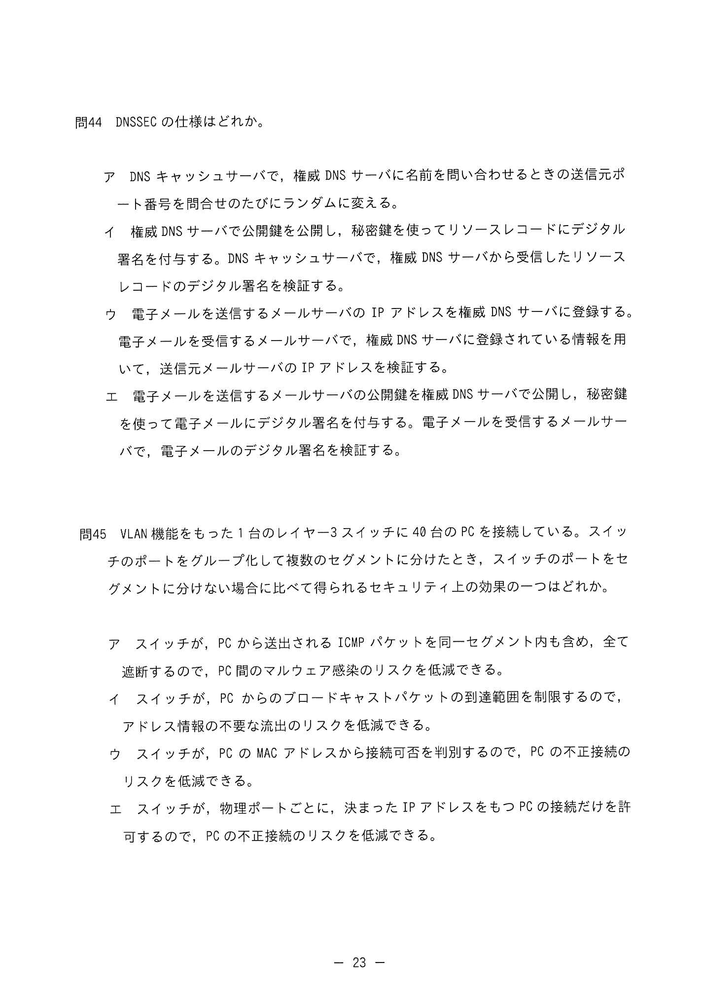

テキスト (OCR)

間44 DNSSEC の仕様はどれか。

ア DNS キャッシュサーバで, 権威 DNS サーバに名前を問い合わせるときの送信元ポ
ート番号を問合せのたびにランダムに変える。

イ 権威DNS サーバで公開鍵を公開し, 秘密鍵を使ってリソースレコードにデジタル
署名を付与する。DNS キャッシュサーバで, 権威 DNS サーバから受信したリソース
レコードのデジタル署名を検証する。

ウ 電子メールを送信するメールサーバの IP アドレスを権威 DNS サーバに登録する。
電子メールを受信するメールサーバで, 権威 DNS サーバに登録されている情報を用
いて, 送信元メールサーバの IP アドレスを検証する。

エ 電子メールを送信するメールサーバの公開鍵を権威 DNS サーバで公開し, 秘密鍵
を使って電子メールにデジタル署名を付与する。電子メールを受信するメールサー
NC, 電子メールのデジタル署名を検証する。

間45 VLAN 機能をもった 1 台のレイヤー3 スイッチに 49 AO PC を接続している。スイッ
チのポートをグループ化して複数のセグメントに分けたとき, スイッチのポートをセ
グメントに分けない場合に比べて得られるセキュリティ上の効果の一つはどれか。

ア スイッチが, PC から送出される ICMP パケットを同一セグメント内も含め, 全て
遮断するので, PC 間のマルウェア感染のリスクを低減できる。

イ スイッチが, PC からのブロードキャストパケットの到達範囲を制限するので
アドレス情報の不要な流出のリスクを低減できる。

ウ スイッチが, PC の MAC アドレスから接続可否を判別するので, PC の不正接続の
リスクを低減できる。

エ スイッチが, 物理ポートごとに, 決まった IP アドレスをもつ PC の接続だけを許
可するので, PC の不正接続のリスクを低減できる。

### ページ 24

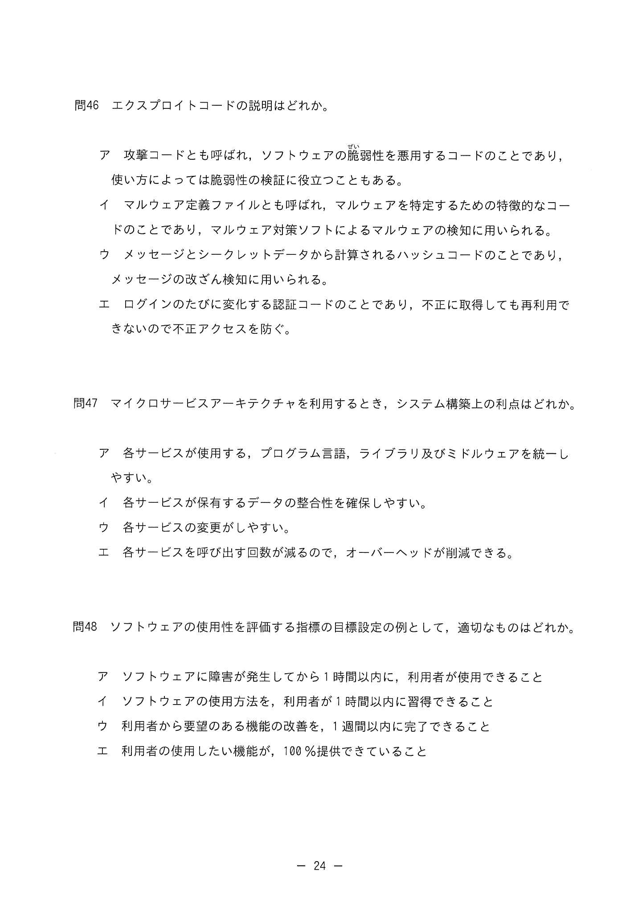

テキスト (OCR)

fl46 エクスプロイトコードの説明はどれか。

ア 攻撃コードとも呼ばれ, ソフトウェアの脆弱性を悪用するコードのことであり,
使い方によっては脆弱性の検証に役立つこともある。

イ マルウェア定義ファイルとも呼ばれ, マルウェアを特定するための特徴的なコー
ドのことであり, マルウェア対策ソフトによるマルウェアの検知に用いられる。
ウ メッセージとシークレットデータから計算されるハッシュコードのことであり,

メッセージの改ざん検知に用いられる。
エ ログインのたびに変化する認証コードのことであり, 不正に取得しても再利用で
きないので不正アクセスを防ぐ。

47 マイクロサービスアーキテクチャを利用するとき, システム構築上の利点はどれか。

ア 各サービスが使用する, プログラム言語., ライブラリ及びミドルウェアを統一し
やすい。

4 各サービスが保有するデータの整合性を確保しやすい。

ウ 各サービスの変更がしやすい。

エ 各サービスを呼び出す回数が減るので, オーバーヘッドが削減できる。

問48 ソフトウェアの使用性を評価する指標の目標設定の例として, 適切なものはどれか。

NI

ソフトウェアに障害が発生してから 1時間以内に, 利用者が使用できること
ソフトウェアの使用方法を, 利用者が 1時間以内に習得できること

利用者から要望のある機能の改善を, 1 週間以内に完了できること

利用者の使用したい機能が, 190 %提供できていること

H GA

### ページ 25

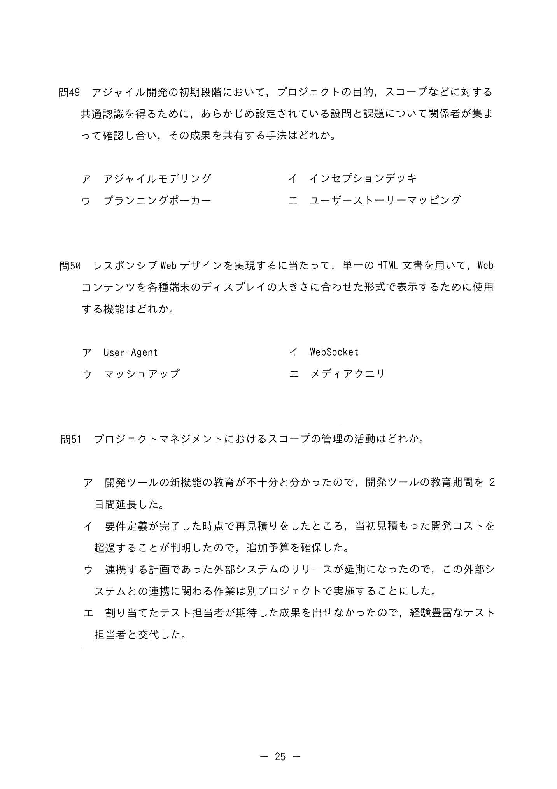

テキスト (OCR)

問49 アジャイル開発の初期段階において, プロジェクトの目的, スコープなどに対する
共通認識を得るために, あらかじめ設定されている設問と課題について関係者が集ま
って確認し合い, その成果を共有する手法はどれか。

ア アジャイルモデリング       イ インセプションデッキ

as:
ウ プランニングポーカー       エ ユーザーストーリーマッピング

間59 レスポンシブ Web デザインを実現するに当たって, 単一の HTML 文書を用いて, Web
コンテンツを各種端末のディスプレイの大きさに合わせた形式で表示するために使用
する機能はどれか。

ア User-Agent イ WebSocket

ウ マッシュアップ          エエ メディアクエリ

間51 プロジェクトマネジメントにおけるスコープの管理の活動はどれか。

ア 開発ツールの新機能の教育が不十分と分かったので, 開発ツールの教育期間を 2
日間延長した。

イ 要件定義が完了した時点で再見積りをしたところ, 当初見積もった開発コストを
超過することが判明したので, 追加予算を確保した。

ウ 連携する計画であった外部システムのリリースが延期になったので, この外部シ
ステムとの連携に関わる作業は別プロジェクトで実施することにした。

エ 割り当てたテスト担当者が期待した成果を出せなかったので, 経験豊富なテスト
担当者と交代した。

### ページ 26

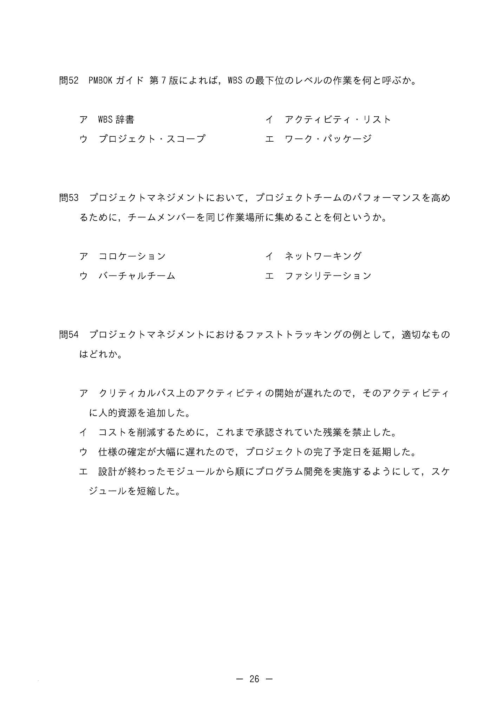

テキスト (OCR)

問52 PMBOK ガイド 第7 版によれば, WBS の最下位のレベルの作業を何と呼ぶか。

ア WBS 辞書              イ アクティビティ・リスト
ウ プロジェクト・スコープ        エ ワーク・パッケージ

f53 プロジェクトマネジメントにおいて, プロジェクトチームのパフォーマンスを高め
るために, チームメンバーを同じ作業場所に集めることを何というか。

ア コロケーション          イ ネットワーキング
ウ パーチャルチーム         エエ ファシリテーション

F544 プロジェクトマネジメントにおけるファストトラッキングの例として, 適切なもの
はどれか。

ア クリティカルパス上のアクティビティの開始が遅れたので, そのアクティビティ
に人的資源を追加した。

イ コストを削減するために, これまで承認されていた残業を禁止した。

ウ 仕様の確定が大幅に遅れたので, プロジェクトの完了予定日を延期した。

エ 設計が終わったモジュールから順にプログラム開発を実施するようにして, スケ
ジュールを短縮した。

### ページ 27

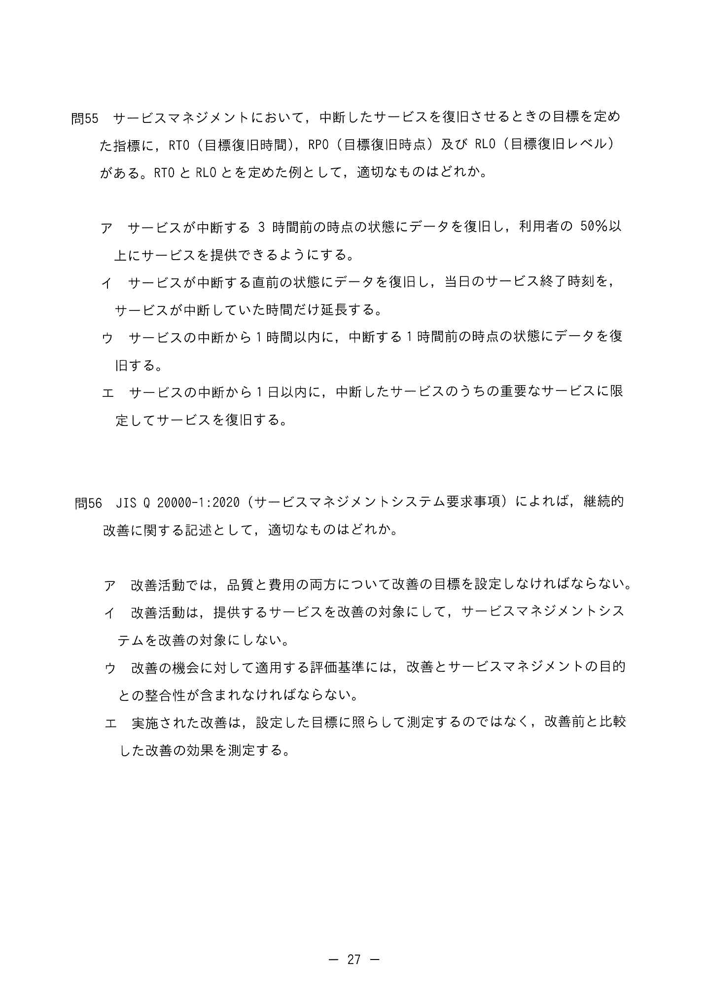

テキスト (OCR)

PISS サービスマネジメントにおいて, 中断したサービスを復旧させるときの目標を定め
た指標に, RTO (目標復旧時間), RPO (目標復旧時点) 及び RLO (目標復旧レベル)
がある。RTO と RLO とを定めた例として, 適切なかものはどれか。

ア サービスが中断する 3 時間前の時点の状態にデータを復旧し, 利用者の 56%以
上にサービスを提供できるようにする。
4 サービスが中断する直前の状態にデータを復旧し, 当日のサービス終了時刻を,
サービスが中断していた時間だけ延長する。
ウ サービスの中断から 1時間以内に, 中断する 1時間前の時点の状態にデータを復
旧する。
エ サービスの中断から 1日以内に, 中断したサービスのうちの重要なサービスに限
定してサービスを復旧する。

問56 JIS Q 20000-1:2020 (サービスマネジメントシステム要求事項) によれば, 継続的
改善に関する記述として, 適切なものはどれか。

ア 改善活動では, 品質と費用の両方について改善の目標を設定しなければならない

イ 改善活動は, 提供するサービスを改善の対象にして, サービスマネジメントシス
テムを改善の対象にしない。

ウ 改善の機会に対して適用する評価基準には, 改善とサービスマネジメントの目的
との整合性が含まれなければならない。

エ 実施された改善は, 設定した目標に照らして測定するのではなく, 改善前と比較
した改善の効果を測定する。

°

### ページ 28

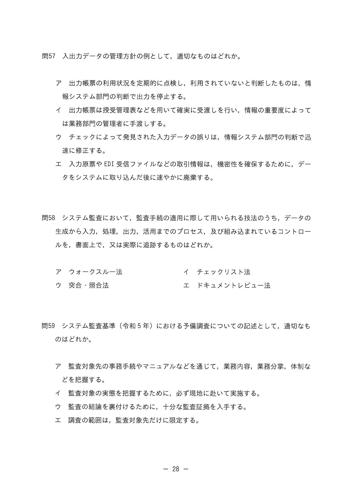

テキスト (OCR)

間57 入出力データの管理方針の例として, 適切なかものはどれか。

ア 出力帳票の利用状況を定期的に点検し, 利用されていないと判断したものは, 情
報システム部門の判断で出力を停止する。

イ 出力帳票は授受管理表などを用いて確実に受渡しを行い, 情報の重要度によって
は業務部門の管理者に手渡しする。

ウ チェックによって発見された入力データの誤りは, 情報システム部門の判断で迅
速に修正する。

I 入力原票や ED 受信ファイルなどの取引情報は, 機密性を確保するために, デー
タをシステムに取り込んだ後に速やかに廃棄する。

間58 システム監査において, 監査手続の適用に際して用いられる技法のうち, データの
生成から入力, 処理, 出力, 活用までのプロセス, 及び組み込まれているコントロー
ルを, 書面上で, 又は実際に追跡するものはどれか。

ウォークスル一法             イ チェックリスト法
ウ 突合・照合法           エ ドキュメントレビュー法

間59 システム監査基準 (令和5年) における予備調査についての記述として, 適切なも
のはどれか。

ア 監査対象先の事務手続やマニュアルなどを通じて, 業務内容, RBH, 体制な
どを把握する。

イ 監査対象の実態を把握するために, 必ず現地に赴いて実施する。
監査の結論を裏付けるために, 十分な監査証拠を入手する。
調査の範囲は, 監査対象先だけに限定する。

ー 28 一

### ページ 29

テキスト (OCR)

問69 システム監査基準 (令和5年) におけるフォローアップの説明として, 適切なもの
はどれか。

ア 監査対象先が, 監査報告書の指摘事項及び改善提案を基に改善計画の策定を行う
こと
4 監査部門の責任者が, 監査報告書を基に監査の実施状況と指摘事項の妥当性を確
認すること
ウ システム監査人が, 監査報告書に記載した改善提案の実施状況に関する情報を収
集し, 改善状況をモニタリングすること
エ システム監査人が, 時間の関係で調査が終了しなかった監査項目を追跡調査して
報告すること

間61 経済産業省が取りまとめた『デジタル経営改革のための評価指標 (DX 推進指標)"
によれば, DX を実現する上で基盤となる IT システムの構築に関する指標において,
“TIT システムに求められる要素"について経営者が確認すべき事項はどれか。

ア IT システムの全体設計や協働できるベンダーの選定などを行える人材を育成・

確保できているか。

イ 環境変化に迅速に対応し, 求められるデリバリースピードに対応できる IT シス
テムとなっているか。

ウ データ処理において, リアルタイム性よりも, ビッグデータの蓄積と事後の分析
が重視されているか。

= データを迅速に活用するために, 全体最適よりも, 個別最適を志向した IT シス
テムとなっているか。

### ページ 30

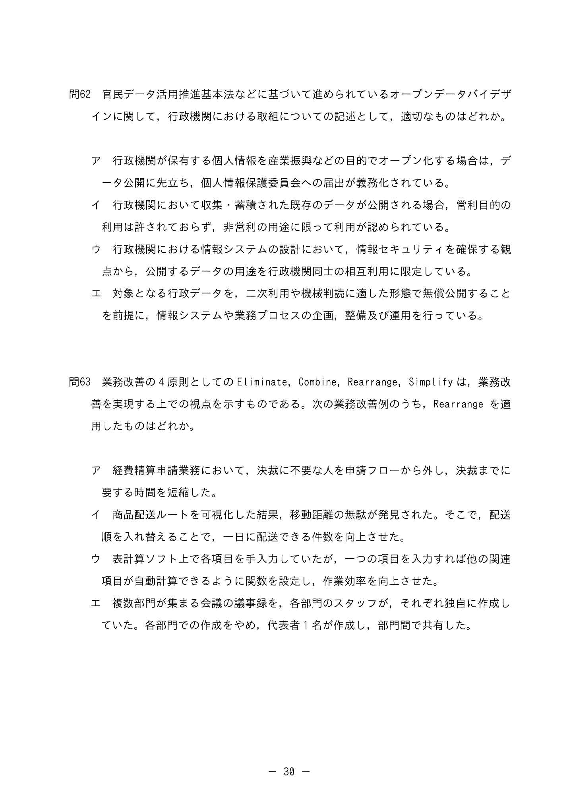

テキスト (OCR)

問62 官民データ活用推進基本法などに基づいて進められているオープンデータバイデザ
インに関して, 行政機関における取組についての記述として, 適切ながものはどれか。

ア 行政機関が保有する個人情報を産業振興などの目的でオープン化する場合は, デ
ータ公開に先立ち, 個人情報保護委員会への届出が義務化されている。

イ 行政機関において収集・蓄積された既存のデータが公開される場合, 営利目的の
利用は許されておらず, 非営利の用途に限って利用が認められている。

ウ 行政機関における情報システムの設計において, 情報セキュリティを確保する観
点から, 公開するデータの用途を行政機関同士の相互利用に限定している。

エ 対象となる行政データ を, 二次利用や機械判読に適した形態で無償公開すること
を前提に, 情報システムや業務プロセスの企画, 整備及び運用を行っている。

間63 業務改善の 4 原則としてのELiminate, Combine, Rearrange, Simplify は, 業務改
善を実現する上での視点を示すものである。次の業務改善例のうち, Rearrange を適
用したものはどれか。

ア 経費精算申請業務において, 決裁に不要な人を申請フローから外し, RRECK
要する時間を短縮した。

イ 商品配送ルートを可視化した結果, 移動距離の無駄が発見された。そこで, 配送
順を入れ替えることで, 一日に配送できる件数を向上させた。

ウ 表計算ソフト上で各項目を手入力していたが, 一つの項目を入力すれば他の関連
項目が自動計算できるように関数を設定し, 作業効率を向上させた。

エ 複数部門が集まる会議の議事録を, 各部門のスタッフが, それぞれ独自に作成し
ていた。各部門での作成をやめ, 代表者 1 名が作成し, 部門間で共有した。

### ページ 31

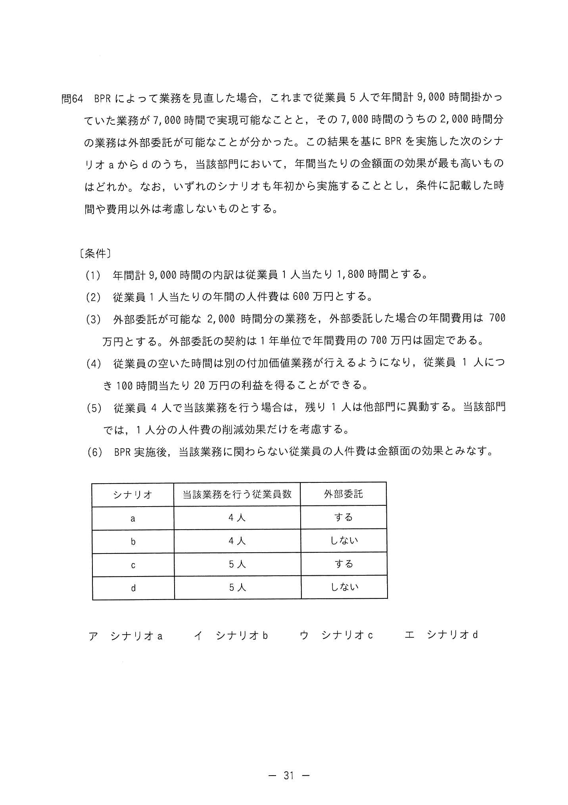

テキスト (OCR)

間64 BPR によって業務を見直した場合, これまで従業員 5 人で年間計 9, 000 時間掛かっ
ていた業務が 7, 000 時間で実現可能なことと, その 7, 000 時間のうちの 2, 000 時間分
の業務は外部委託が可能なことが分かった。この結果を基に BPR を実施した次のシナ
リオ a から d のうち, 当該部門において, 年間当たりの金額面の効果が最も高いもの
はどれか。なお, いずれのシナリオも年初から実施することとし, 条件に記載した時
間や費用以外は考慮しないものとする。

〔条件]

(1) 年間計 9, 000 時間の内訳は従業員 1 人当たり 1,800 時間とする。

(2) 従業員1 人当たりの年間の人件費は 600 万円とする。

(3) 外部委託が可能な 2,0009 時間分の業務を, 外部委託した場合の年間費用は 700
万円とする。 外部委託の契約は 1 年単位で年間費用の 700 万円は固定である。

(4) 従業員の空いた時間は別の付加価値業務が行えるようになり, HRA 1 人につ
き 100 時間当たり 20 万円の利益を得ることができる。

(5) 従業只 4 人で当該業務を行う場合は, 残り 1 人は他部門に異動する。当該部門
では, 1 人分の人件費の削減効果だけを考慮する。

(6) BPR 実施後, 当該業務に関わらない従業員の人件費は金額面の効果とみなす。

シナリオ       当該業務を行う従業員数        外部委託
a               4人              する
b                   4X                  しない
c               5 人              する
d               5人              しない

ア シナリオa  イ シナリオb  ウ シナリオc  エ シナリオd

### ページ 32

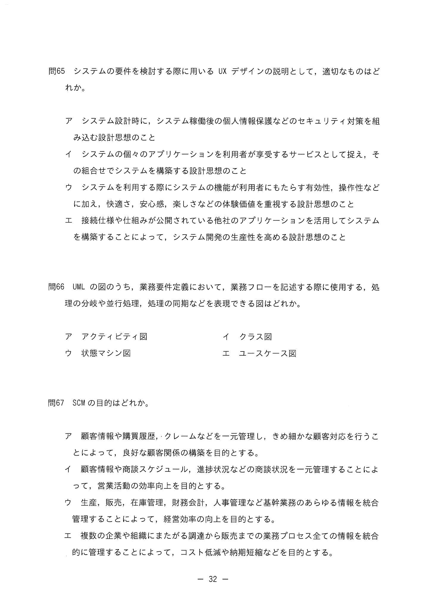

テキスト (OCR)

間65 システムの要件を検討する際に用いる UX デザインの説明として, 適切なものはど
れか。

ア システム設計時に, システム稼働後の個人情報保護などのセキュリティ対策を組
み込む設計思想のこと

イ システムの個々のアプリケーションを利用者が享受するサービスとして捉え, そ
の組合せでシステムを構築する設計思想のこと

ウ システムを利用する際にシステムの機能が利用者にもたらす有効性, 操作性など
に加え, 快適さ, BOR, 楽しさなどの体験価値を重視する設計思想のこと

エ 接続仕様や仕組みが公開されている他社のアプリケーションを活用してシステム
を構築することによって, システム開発の生産性を高める設計思想のこと

問66 UML の図のうち, 業務要件定義において, 業務フローを記述する際に使用する, 処
理の分岐や並行処理, 処理の同期などを表現できる図はどれか。

ア アクティビティ図         4 クラス図
ウ 状態マシン図           エ ユースケース図

問67 SCMの目的はどれか。

ア 顧客情報や購買履歴, , クレームなどを一元管理し, きめ細かな顧客対応を行うこ
とによって, 良好な顧客関係の構築を目的とする。

イ 顧客情報や商談スケジュール, 進捗状況などの商談状況を一元管理することによ
って, 営業活動の効率向上を目的とする。

ウ 生産, 販売, 在庫管理, 財務会計, 人事管理など基幹業務のあらゆる情報を統合
管理することによって, 経営効率の向上を目的とする。

エ 複数の企業や組織にまたがる調達から販売までの業務プロセス全ての情報を統合
的に管理することによって, コスト低減や納期短縮などを目的とする。

### ページ 33

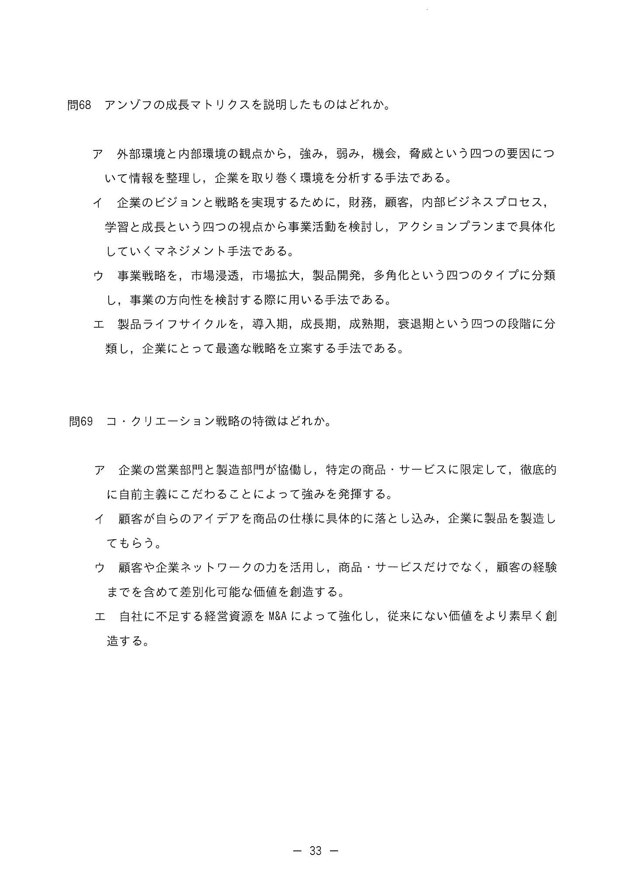

テキスト (OCR)

FIGS アンゾフの成長マトリクスを説明したものはどれか。

ア 外部環境と内部環境の観点から, 強み, 弱み, HA, 脅威という四つの要因につ
いて情報を整理し, 企業を取り巻く環境を分析する手法である。

イ 企業のビジョンと戦略を実現するために, 財務, 顧客, 内部ビジネスプロセス,
学習と成長という四つの視点から事業活動を検討し. アクションプランまで具体化
していくマネジメント手法である。

ウ 事業戦略を, 市場浸透, 市場拡大, 製品開発多角化という四つのタイプに分類
し, 事業の方向性を検討する除に用いる手法である。

エ 製品ライフサイクルを, 導入期, 成長期, 成熟期, 衰退期という四つの段階に分

類し, 企業にとって最適な戦略を立案する手法である。

AGO コ・クリエーション戦略の特徴はどれか。

ア 企業の営業部門と製造部門が協働し, 特定の商品・サービスに限定して, 徹底的
に自前主義:こだわることによって強みを発揮する。

イ 顧客が自らのアイデアを商品の仕様に具体的に落とし込み, 企業に製品を製造し
てもらう。

ウ 顧客や企業ネットワークの力を活用し, 商品・サービスだけでなく, 顧客の経験
までを含めて差別化可能な価値を創造する。

エ 自社に不足する経営資源を M&A によって強化し, 従来にない価値をより素早く創
造する。

### ページ 34

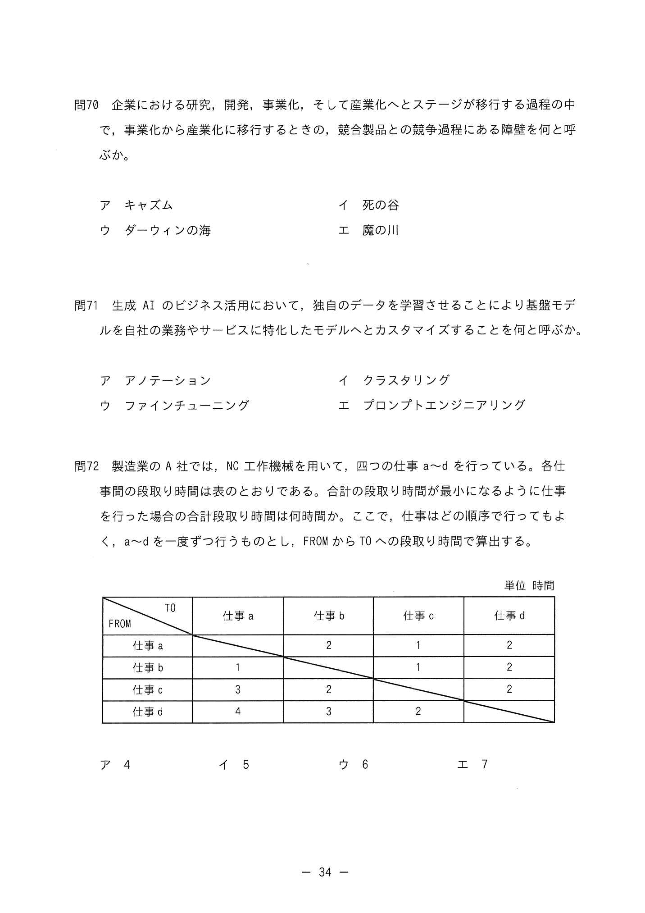

テキスト (OCR)

問76 企業における研究, 開発, 事業化, そして産業化へとステージが移行する過程の中
で, 事業化から産業化に移行するときの, 競合製品との競争過程にある障壁を何と呼

ぶか。
ア キャズム                         イ 死の谷
ウ ダーウィンの海                   エ 魔の川

間71 生成 AI のビジネス活用において, RMBOT-SeFRBSHSTEK LV RBET
ルを自社の業務やサービスに特化したモデルへとカスタマイズすることを何と呼ぶか。

イ クラスタリング

エ プロンプトエンジニアリング

アア アノテーションジ

ウ ブプァイジチューニング

間72 製造業の A 社では, NC 工作機械を用いて, 四つの仕事 ad を行っている。各仕
事間の段取り時間は表のとおりである。 合計の段取り時間が最小になるように仕事
を行った場合の合計段取り時間は何時間か。ここで, 仕事はどの順序で行ってもよ
く, avd を一度ずつ行うものとし, FROM から TO への段取り時間で算出する。

単位 時間
T0
eROH                     仕事a              仕事b             仕事c              仕事d
仕事a                            2               1               2
仕事b             1                              1               2
仕事c             3               2                              2
仕事d             4               3               2
ア 4               イ 5                必

### ページ 35

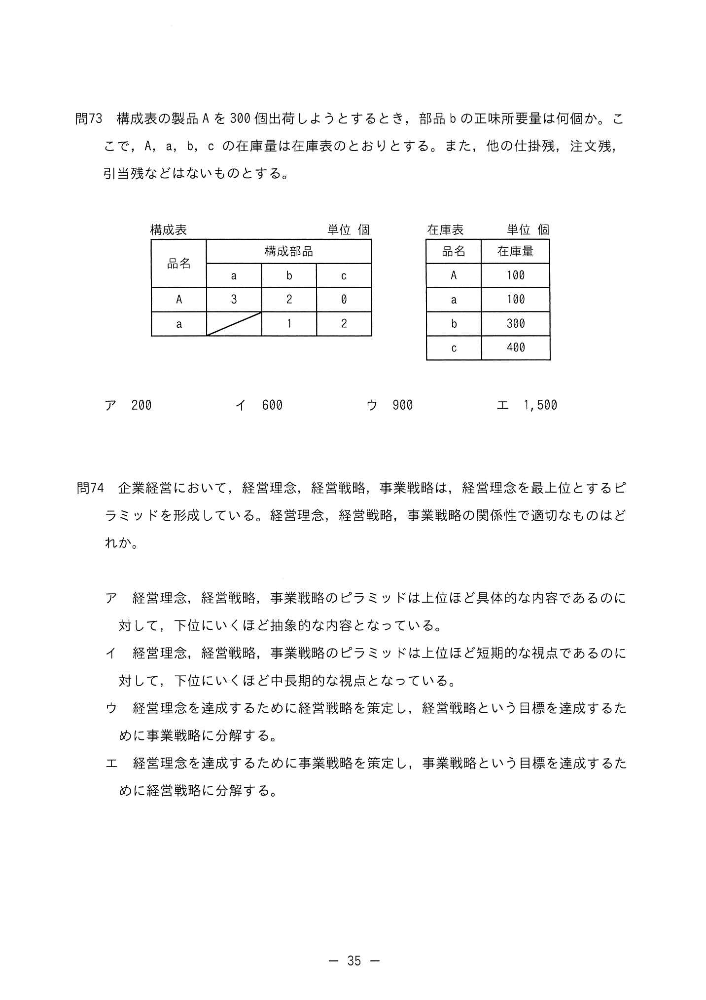

テキスト (OCR)

問73 構成表の製品Aを369 個出荷しとようとするとき, 部品b の正味所要量は何個か。こ
こで, A, a, b, c の在庫量は在庫表のとおりとする。また, 他の仕掛残, 注文残,
引当残などはないものとする。

構成表                   単位 個        在庫表      単位 個
          構成部品                 品名    在庫量
a      b      c             A       100
A      3      2      6             a       100
a             1       2             b      300
c      400
ア 200           4 600           ウ 900           エ 1,500

問74 企業経営において, 経営理念, 経営戦略, 事業戦略は 経営理念を最上位とするピ
ラミッドを形成している。 経営理念経営戦略, 事業戦略の関係性で適切なものはど
れか。

ア 経営理念, 経営戦略, 事業戦略のピラミッドは上位ほど具体的な内容であるのに
対して, 下位にいくほど抽象的な内容となっている。

イ 経営理念, 経営戦略, 事業戦略のピラミッドは上位ほど短期的な視点であるのに
対して, 下位にいくほど中長期的な視点となっている。

ウ 経営理念を達成するために経営戦略を策定し, 経営戦略という目標を達成するた
めに事業戦略に分解する。

エ 経営理念を達成するために事業戦略を策定し, 事業戦略という目標を達成するた
めに経営戦略に分解する。

### ページ 36

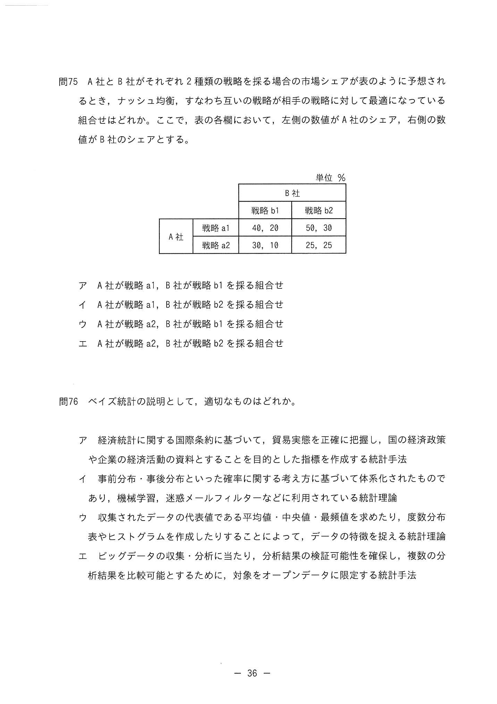

テキスト (OCR)

間75 A社とB社がそれぞれ2 種類の戦略を採る場合の市場シェアが表のように予想され
るとき, ナッシュ均衡, すなわち互いの戦略が相手の戦略に対して最適にかっている
組合せはどれか。ここで, 表の各欄において, 左側の数値がA社のシェア, 右側の数
値が B 社のシェアとする。

単位 %
B社
戦略 b1   戦略 b2
戦略 a1 40, 20 50, 30
Att
戦略 a2 30, 10 25, 25

N

A 社が戦略 a1, B 社が戦略 b1 を採る組合せ
A 社が戦略 a1, B 社が戦略 b2 を採る組合せ
A 社が戦略 a2, B 社が戦略 b1 を採る組合せ
A 社が戦略 a2, B 社が戦略 b2 を採る組合せ

Hoo A

間76 ベイズスズ統計の説明として, 適切なかものはどれか。

ア 経済統計に関する国際条約に基づいて, 貿易実態を正確に把握し, 国の経済政策
や企業の経済活動の資料とすることを目的とした指標を作成する統計手法

イ 事前分布・事後分布といった確率に関する考え方に基づいて体系化されたもので
あり, 機械学習, 迷惑メールフィルターなどに利用されている統計理論

ウ 収集されたデータの代表値である平均値・中央値・最頻値を求めたり, 度数分布
表やヒストグラムを作成したりすることによって, データの特徴を捉える統計理論

エ ビッグデータの収集・分析に当たり, 分析結果の検証可能性を確保し, 複数の分
析結果を比較可能とするために, 対象をオープンデータに限定する統計手法

### ページ 37

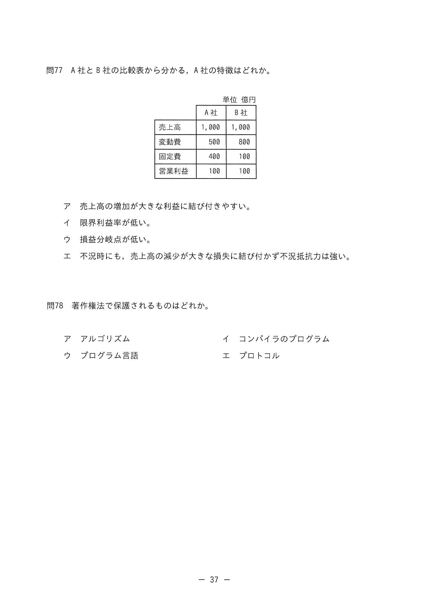

テキスト (OCR)

間77 A社とB社の比較表から分かる, A社の特徴はどれか。

単位 億円

A社  Bet

売上高 1,000 | 1,000
変動費 500800
固定費       400     100
営業利益 100100

に|

売上高の増加が大きな利益に結び付きやすい。

限界利益率が低い。

損益分岐点が低い。

不況時にも, 売上高の減少が大きな損失に結び付かず不況抵抗力は強い。

H ユ

問78 著作権法で保護されるものはどれか。

ア アルゴリズム           イ コンパイラのプログラム
ウ プログラム言語          xr プロトコル

### ページ 38

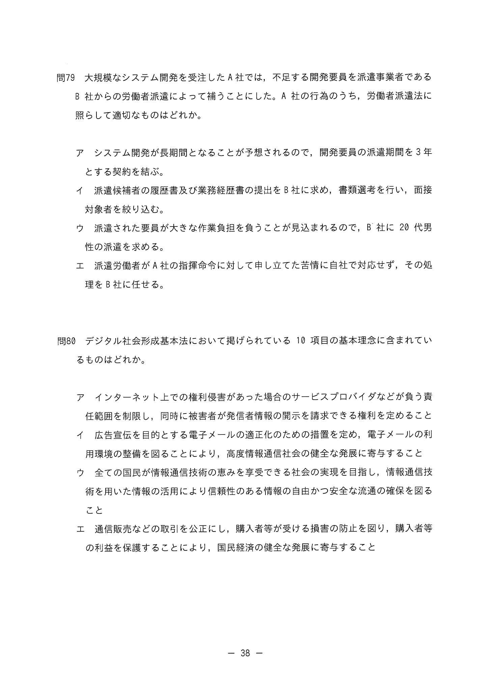

テキスト (OCR)

問79 大規模なシステム開発を受注したA社では, 不足する開発要員を派遣事業者である
B 社からの労働者派遣によって補うことにした。A 社の行為のうち, 労働者派遣法に
照らして適切かものはどれか。

ア システム開発が長期間となることが予想されるので, 開発要員の派遣期間を3年
とする契約を結ぶ。

4 派遣候補者の履歴書及び業務経歴書の提出を B 社に求め, 書類選考を行い, 面接
対象者を絞り込む。

ウ 派遣された要員が大きな作業負担を負うことが見込まれるので, B 社に 20 代男
性の派遣を求める。

エ 派遣労働者がA社の指揮命令に対して申し立てた苦情に自社で対応せず, その処
理を B 社に任せる。

問80 デジタル社会形成基本法において掲げられている 10 項目の基本理念に含まれてい
るものはどれか。

ア インターネット上での権利侵害があった場合のサービスプロバイダなどが負う責
任範囲を制限し, 同時に被害者が発信者情報の開示を請求できる権利を定めること
4 広告宣伝を目的とする電子メールの適正化のための措置を定め, 電子メールの利
用環境の整備を図ることにより, 高度情報通信社会の健全な発展に寄与すること
ウ 全ての国民が情報通信技術の恵みを享受できる社会の実現を目指し, 情報通信技
術を用いた情報の活用により信頼性のある情報の自由かつ安全な流通の確保を図る

BS
エ 通信販売などの取引を公正にし, 購入者等が受ける損害の防止を図り, 購入者等
の利益を保護することにより, 国民経済の健全な発展に寄与すること

### ページ 39

テキスト (OCR)

C

メ モ 用 紙 ]

### ページ 40

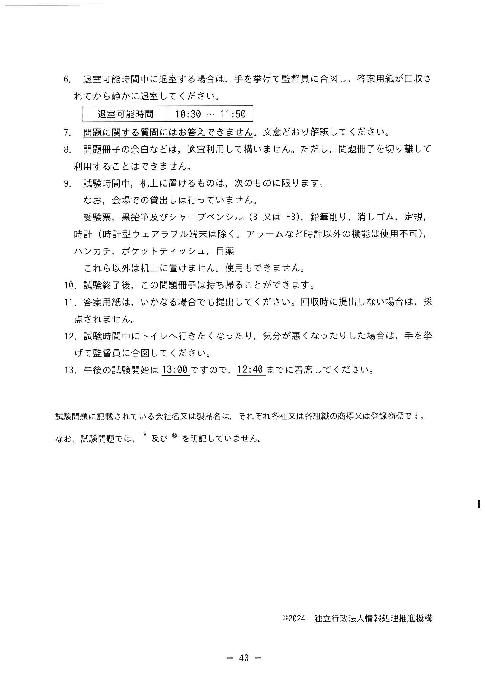

テキスト (OCR)

6. 退室可能時間中に退室する場合は, 手を挙げて監督員に合図し, 答案用紙が回収さ
れてから静かに退室してください。
| 退室可能時間 | 10:30 ~ 11:50 |
7. 問題に関する質問にはお答えできません。文意どおり解釈してください。
8. 問題冊子の余白などは, 適家利用して構いません。ただし, 問題冊子を切り離して
利用することはできません。
9. 試験時間中 机上に置けるものは, 次のものに限ります。
なお, 会場での貸出しは行っていません。
BRR, 黒鉛筆及びシャープペンシル (B 又は HB), 鉛筆削り, 消しゴム, 定規
時計 (時計型ウェアラブル端末は除く。アラームなど時計以外の機能は使用不可),
ハンカチ, ポケットティッシュ., BE
これら以外は机上に置けません。使用もできません。
10, 試験終了後, この問題村子は持ち帰ることができます。
11, 答案用紙は, いかなる場合でも提出してください。回収時に提出しない場合は, 採
点されません。
12, 試験時間中にトイレへ行きたくなったり, 気分が悪くなったりした場合は, FER
げて監督員に合図してください。
13. 午後の試験開始は 13:00 ですので, 12:40 までに着席してください。

試験問題に記載されている会社名又は製品名は, それぞれ各社又は各組織の商標又は登録商標です。

なお, 試験問題では, "及び 『 を明記していません。

@2024 独立行政法人情報処理推進機構

---

## 午前解答

©2024 独立行政法人情報処理推進機構 
令和6 年度 秋期 応用情報技術者試験 解答例 
 
午前試験 
問番号
正解
分野
問1 
ウ 
Ｔ 
問2 
エ 
Ｔ 
問3 
ウ 
Ｔ 
問4 
ア 
Ｔ 
問5 
ウ 
Ｔ 
問6 
イ 
Ｔ 
問7 
ウ 
Ｔ 
問8 
ウ 
Ｔ 
問9 
ウ 
Ｔ 
問10 
イ 
Ｔ 
問11 
ウ 
Ｔ 
問12 
エ 
Ｔ 
問13 
エ 
Ｔ 
問14 
イ 
Ｔ 
問15 
ア 
Ｔ 
問16 
ウ 
Ｔ 
問17 
ア 
Ｔ 
問18 
エ 
Ｔ 
問19 
ウ 
Ｔ 
問20 
ウ 
Ｔ 
 
 
問番号
正解
分野
問21 
ウ 
Ｔ 
問22 
ウ 
Ｔ 
問23 
ウ 
Ｔ 
問24 
ウ 
Ｔ 
問25 
イ 
Ｔ 
問26 
エ 
Ｔ 
問27 
イ 
Ｔ 
問28 
ウ 
Ｔ 
問29 
イ 
Ｔ 
問30 
イ 
Ｔ 
問31 
イ 
Ｔ 
問32 
ウ 
Ｔ 
問33 
ウ 
Ｔ 
問34 
ウ 
Ｔ 
問35 
エ 
Ｔ 
問36 
ア 
Ｔ 
問37 
ウ 
Ｔ 
問38 
ウ 
Ｔ 
問39 
ア 
Ｔ 
問40 
ウ 
Ｔ 
 
 
問番号
正解
分野
問41 
ウ 
Ｔ 
問42 
イ 
Ｔ 
問43 
エ 
Ｔ 
問44 
イ 
Ｔ 
問45 
イ 
Ｔ 
問46 
ア 
Ｔ 
問47 
ウ 
Ｔ 
問48 
イ 
Ｔ 
問49 
イ 
Ｔ 
問50 
エ 
Ｔ 
問51 
ウ 
Ｍ 
問52 
エ 
Ｍ 
問53 
ア 
Ｍ 
問54 
エ 
Ｍ 
問55 
エ 
Ｍ 
問56 
ウ 
Ｍ 
問57 
イ 
Ｍ 
問58 
ア 
Ｍ 
問59 
ア 
Ｍ 
問60 
ウ 
Ｍ 
 
 
問番号
正解
分野
問61 
イ 
Ｓ 
問62 
エ 
Ｓ 
問63 
イ 
Ｓ 
問64 
イ 
Ｓ 
問65 
ウ 
Ｓ 
問66 
ア 
Ｓ 
問67 
エ 
Ｓ 
問68 
ウ 
Ｓ 
問69 
ウ 
Ｓ 
問70 
ウ 
Ｓ 
問71 
ウ 
Ｓ 
問72 
ア 
Ｓ 
問73 
イ 
Ｓ 
問74 
ウ 
Ｓ 
問75 
イ 
Ｓ 
問76 
イ 
Ｓ 
問77 
ア 
Ｓ 
問78 
イ 
Ｓ 
問79 
ア 
Ｓ 
問80 
ウ 
Ｓ 
 
 
分野の「Ｔ」はテクノロジ系，「Ｍ」はマネジメント系，「Ｓ」はストラテジ系の問題です。

---

## 午後問題

### ページ 1

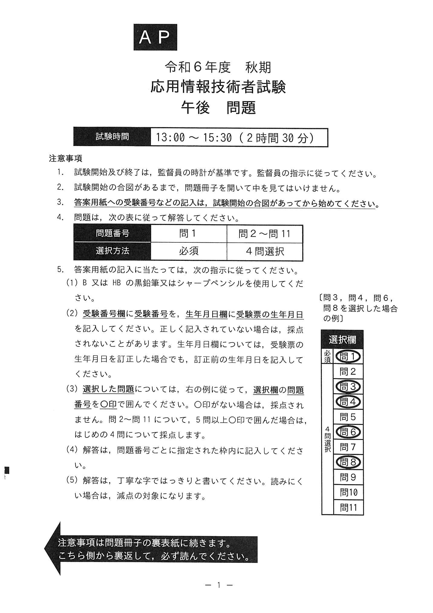

テキスト (OCR)

令和6年度 秋期
応用情報技術者試験
午後 問題

 13:00 ~ 15:30 (2 時間 30 分)

注意事項
1. 試験開始及び終了は, 監督具の時計が基準です。監督貞の指示に従ってください。
2. 試験開始の合図があるまで, 問題冊子を開いて中を見てはいけません。

3. 答案用紙への受験番号などの記入は, 試験開始の合図があってから始めてください。
4. 間題は, 次の表に従って解答してください。

問題番号             問 1            問2~問 11
Wt           4 問選択
5. 答案用紙の記入に当たっては, 次の指示に従ってください。
(1) B 又は HB の黒鉛筆又はシャープペンシルを使用してくだ
さい。                               〔問3, 問4, 問6,

癌8 を     た場合
(2) 受験番号柳に受験番号を生年月日村に受験時生年朋日 のgm /"

を記入してください。 正しく記入されていない場合は, 採点

されないことがあります。生年月日材については, Seo BRERA
Wr =]

生年月日を訂正 した場合でも, 訂正前の生年月日を記入して [A

ください。                                   間2
(3) 選択した問題については。右の例に従って, 選択材の問題
番号を〇印で囲んでください。〇印がない場合は, 採点され     G4
ません。問 2一問 11 について, 5 問以上O印で囲んだ場合は,     間5
はじめの 4 問について採点します。                 上 16
(4) 解答は, 問題番号ごとに指定された桁内に記入してくださ |択|問7
い。                                      C418
(5) 解答は, 丁寧な字ではっきりと書いてください。読みにく      fal 9
い場合は, 減点の対象になります。                   Fao

問11

注意事項は問題冊子の裏表紙に続きます。
こちら側から裏返して, 必ず読んでください。

### ページ 2

### ページ 3

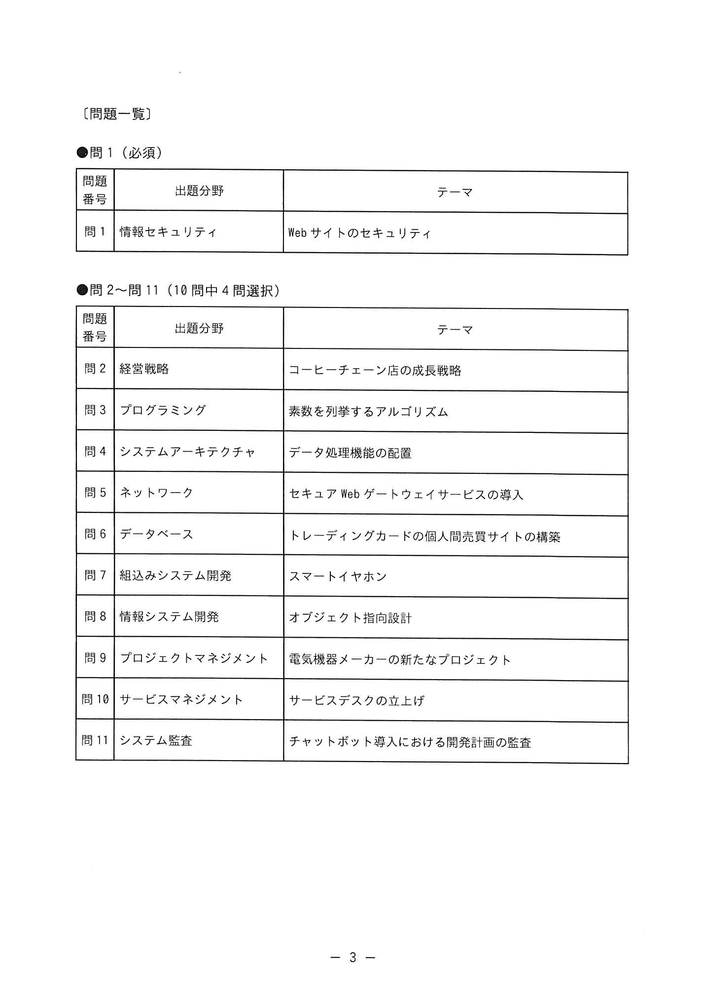

テキスト (OCR)

〔問題一覧〕

@問1 (必須)

           出題分野                                 rT F

間 1 | 情報セキュリティ     Web サイトのセキュリティ

@問 2一問 11 (10 問中 4 問選択)

     出題分野                 テーマ

fe] 2 | 経営戦略          コーヒーチェーン店の成長戦略

問3 | プログラミング       素数を列挙するアルゴリズム

問4 | システムアーキテクチャ   データ処理機能の配置

問 5 | ネットワーク        セキュア Web ゲートウェイサービスの導入
問6 | データベース        トレーディングカードの個人間売買サイトの構築
問 7 | 組込みシステム開発     スマートイヤホン

問 8 | 情報システム開発      オブジェクト指向設計

問 9 | プロジェクトマネジメント | 電気機器メーカーの新たなプロジェクト
間 19 | サービスマネジメント    サービスデスクの立上げ

間11

システム監査

チャットボット導入における開発計画の監査

### ページ 4

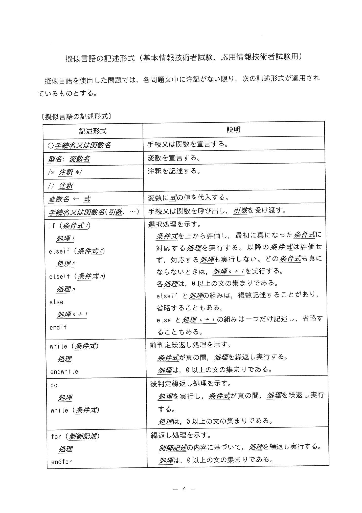

テキスト (OCR)

擬似言語の記述形式 (基本情報技術者試験, 応用情報技術者試験用)

擬似言語を使用した問題では, 各問題文中に注記がない限り, 次の記述形式が適用され

ているものとする。

〔擬似言語の記述形式]

記述形式                     説明
OFME Kt IME      手続又は関数を宣言する。
Be, Bids          変数を宣言する。
/* SEAR */              注釈を記述する。
// BR
変数狂~ st             変数に 冠の値を代入する。
FREZAME WE, …) | 手続又は関数を呼び出し, THERES.
if (Mest 1)           選択処理を示す。
MiB 1             RAHELDOMAL, BMC Bok RAI
elseif (AMX?)         HT SMBERTTS. WMO Ress tt
VEL             ず, WHT SMBtERGLEL. CORMACK
elseif (BAA)         ならないときは, MMBn + 7を実行する。
{EB n              RB MFBISL, 9 以上の文の集まりである。
sites                elseif ¢MHOWAls, 複数記述することがあり,
7            省略することもある。
cuit            else & MB n+ の組みはーつだけ記述し, 省略す

ることもある。

while (fz)

前判定繰返し処理を示す。

while (#fézt)

SUB              KEAPROM, MHCBRATTS.
endwhi Le              BIS, 0 以上の文の集まりである。
do                後判定繰返し処理を示す。
ME              DBRT, RAAMRAROM, MBER

する。
MBS, 9 以上の文の集まりである。

for ( giilacat)
ME

endfor

繰返し処理を示す。
HMRBOKESICES WC, MBEGRURTT SO.
SOB, 0 以上の文の集まりである。

### ページ 5

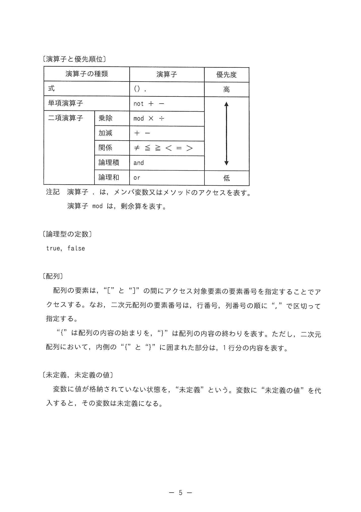

テキスト (OCR)

(演算子と優先順位]

演算子の種類         演算子       優先度

式               0 。               aS
単項演算子         not + 一
二項演算子 | 乗除    mod X +

加減    + 一

関係    FE2<=>

論理積 | and

論理和 | or               低

注記 演算子 lt, メンバ変数又はメソッドのアクセスを表す。
演算子 mod は, 剰余算を表す。

〔論理型の定数]

true, false

〔配列〕

配列の要素は, “[” と “| の間にアクセス対象要素の要素番号を指定することでア
クセスする。 なお, 二次元配列の要素番号は, 行番号, 列番号の順に",” で区切って
指定する。

“ は配列の内容の始まりを, 9” は配列の内容の終わりを表す。ただし, IRE
配列において, 内側の“(” と "に囲まれた部分は, 1 行分の内容を表す。

(RES, 未定義の値〕
変数に値が格納されていない状態を, “未定義”という。変数に“未定義の値" を代
和信すると, その変数は未定義になる。

### ページ 6

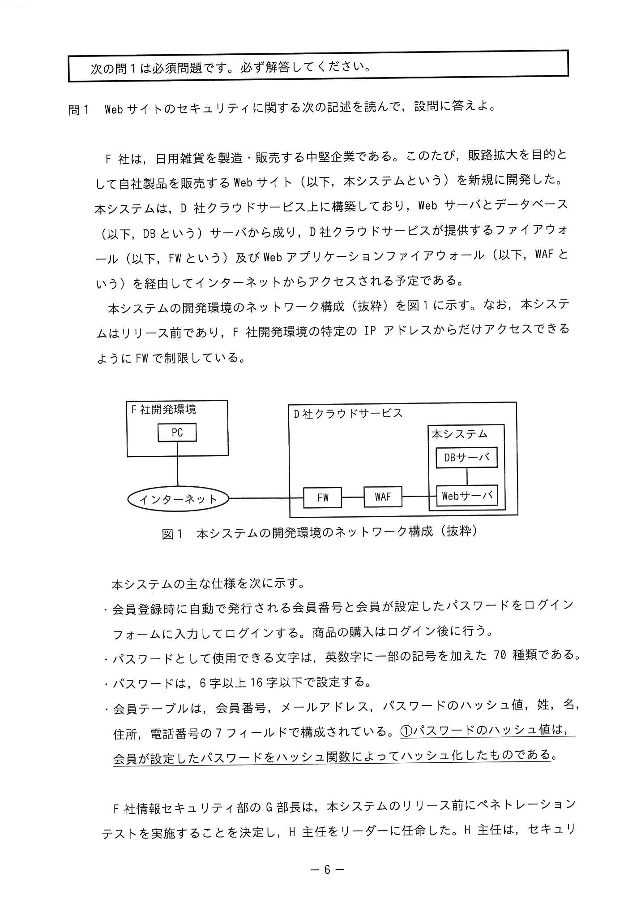

テキスト (OCR)

ROM 1 は必須問題です。必ず解答してください。

問1 Web サイトのセキュリティに関する次の記述を読んで, 設問に答えよ。

F 社は, 日用雑貨を製造・販売する中堅企業である。このたび, 販路拡大を目的と
して自社製品を販売する Web サイト (以下, 本システムという) を新規に開発した。
本システムは, D 社クラウドサービス上に構築しており, Web サーバとデータベース
(以下, DB という) サーバから成り, D 社クラウドサービスが提供するファイアウォ
ール (以下, FW という) 及び Web アプリケーションファイアウォール (以下, WAF と
いう) を経由してインターネットからアクセスされる予定である。

本システムの開発環境のネットワーク構成 (抜粋) を図 1 に示す。なお, 本システ
ムはリリース前であり, 「 社開発環境の特定の IP アドレスからだけアクセスできる
ようにFW で制限している。

F Rca        5 社クラッドサービス
PC                                              本システム
DBサーバ

インターネット      |] Fw LY war トー Webサーバ

図1 本システムの開発環境のネットワーク構成 (抜粋)

本システムの主な仕様を次に示す。

- 会員登録時に自動で発行される会員番号と会員が設定したパスワードをログイン
フォームに入力してログインする。 商品の購入はログイン後に行う。

- パスワードとして使用できる文字は, 英数字に一部の記号を加えた 10 種類である。
・パスワードは, 6字以上 16 字以下で設定する。

- 会員テーブルは, 会員番号, メールアドレス, パスワードのハッシュ値, 姓, 名,
住所, 電話番号の7 フィールドで構成されている。①パスワードのハッシュ値は
会員が設定したパスワードをハッシュ関数によってハッシュ化したものである。

F 社情報セキュリティ部の G 部長は, 本システムのリリース前にベネトレーション
テストを実施することを決定し, H 主任をリーダーに任命した。H El, セキュリ

ー6一

### ページ 7

テキスト (OCR)

ティベンダーであるU社に本システムのペネトレーションテストの実施を依頼した。
ペネトレーションテストは, U社内の PC からインターネット, FW 及び WAF を経由し
て本システムにアクセスする経路で実施した。

ペネトレーションテスト期間中は, FW 及び WAF に対して次の変更を行った。

・FW に対する変更

通信を許可するアクセス元 IP アドレスとして, ペネトレーションテストに用いる
U社の IP アドレスを追加する。

・WAF に対する変更

攻撃を検知した際には, 通信の遮断は行わず, 検知したことだけを記録する。

〔[ペネトレーションテストの結果〕
ペネトレーションテストの結果, 次の手順 (GUE, 本シナリオという) で会員の

パスワードが推測されて, 不正にアクセスされてしまうことが確認された。

1. @SQL インジェクション攻撃によって会員テーブルのデータを取得する。このと
き取得した会員テーブルのデータ (抜粋) を表 1 に示す。

2. レインボーテーブル攻撃によって, 手順 1 で取得した会員テーブル中のパスワー
ドのハッシュ値から元のパスワードを推測する。

3. 推測したパスワードを利用して, 会員になりすまして本システムにログインする。

表1 取得した会員テーブルのデータ (抜粋)

会員番号                   パスワードのハッシュ値                   姓    名
21717202 | 5e884898da28047151d0e56f8dc6292773693d9d6aabbdd62a11ef721d1542d8       T中 | T BB
21717203 | 2597a7caf656e89e9ab35e12326d557ebfe9b7b5dcbe4c564e74070fa5cfcbe5        Sm |H子
30781985 | 5e884898da28047151d9e56f8dc6292773693d9d6aabbdd62a11ef721d1542d8         Sie | J郎
36150833 | ac9689e2272427085e35b9d3e3e8bed88cb3434828b43b86  c0596cad4c6e270        SA [HF
45905900 | ac9689e2272427085e35b9d3e3e8bed88cb3434828b43b86fc9596cad4c6e279      Y田 | Jee
45917046 | d82494f05d6917ba02f7aaa29689ccb444bb73f20380876cb95d1f37537b7892       Teh | TBR

稼働中のシステムのログインフォームに対してパスワードを総当たりで試行する
| 3 | 攻撃では, システム側で試行回数に制限を設けて対策することができる
が, レインボーテーブル攻撃ではそれができない。

H 主任は, 本システムの修正方針を整理するために, SL インジェクション攻撃及

ーーアー

### ページ 8

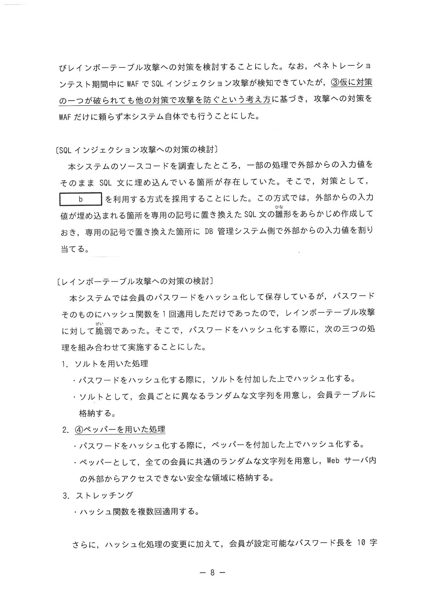

テキスト (OCR)

びレインボーテーブル攻撃への対策を検討ることにした。なお, ペネトレーショ
ンテスト期間中に WAF で SOL インジェクション攻撃が検知できていたが, ③仮に対策
の一つが破られても他の対策で攻撃を防ぐという考え方に基づき, 攻撃への対策を
WAF だけに頼らず本システム自体でも行うことにした。

(SOL 4 インジェクション攻撃への対策の検討

本システムのソースコードを調査したところ, 一部の処理で外部からの入力値を
そのまま SQL 文に埋め込んでいる箇所が存在していた。そこで, 対策として,
| 5 | を利用する方式を採用することにした。この方式では, 外部からの入力
値が埋め込まれる任所を専有の記号に置き換えた SOL LOMME DSH COMME T
おき, 専用の記号で還き換えた箇所に DB 管理システム側で外部からの入力値を割り
当てる。

[レインボーテーブル攻撃への対策の検討〕

本システムでは会員のパスワードをハッシュ化して保存しているが, パスワード
そのものにハッシュ関数を 1 回適用しただけであったので, レインボーテーブル攻撃
に対して脆弱であった。そこで, パスワードをハッシュ化する際に, 次の三つの処
理を組み合わせて実施することにした。

1. ソルトを用いた処理
- パスワードをハッシュ化する際に, ソルトを付加した上でハッシュ化する。
・ソルトとして, 会員ごとに異なるランダムな文字列を用意し, 会員テーブルに
格納する。
2. ペッパーを用いた処理
・ パスワードをハッシュ化する際に, ペッパーを付加した上でハッシュ化する。
・ ペッパーとして, 全ての会員に共通のランダムな文字列を用意し, Web サーバ内
の外部からアクセスできない安全な領域に格納する。
3. ストレッチング
・ハッシュ関数を複数回適用する。

さらに, ハッシュ化処理の変更に加えて, 会員が設定可能なパスワード長を OF

ー8 一

### ページ 9

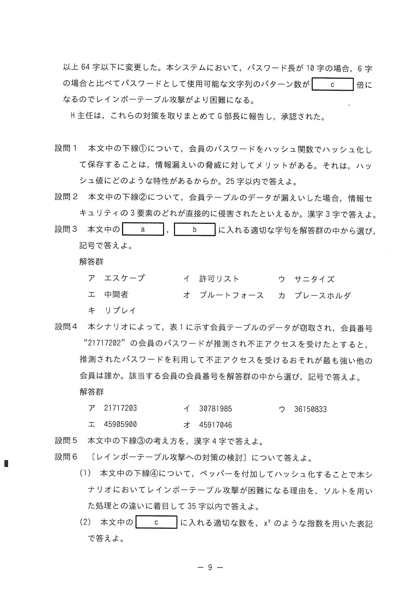

テキスト (OCR)

以上 64 字以下に変更した。本システムにおいて, パスワード長が 19 字の場合, 6 字
の場合と比べてパスワードとして使用可能な文字列のパターン数が|  c |倍に
なるのでレインボーテーブル攻撃がより困難になる。

H 主任は。 これらの対策を取りまとめて 6 部長に報告し, 承認された。

設問1 本文中の下線について, 会員のパスワードをハッシュ関数でハッシュ化し
て保存することは, 情報漏えいの脅威に対してメリットがある。 それは, ハッ
シュ値にどのような特性があるからか。25 字以内で答えよ。

設問2 本文中の下線@②について, 会員テーブルのデータが漏えいした場合, 情報セ
キュリティの 3 要素のどれが直接的に侵害されたといえるか。 漢字 3 字で答えよ。

設問3 本文中の| a |,|  b | に入れる適切な字句を解答群の中から選び,
記号で答えよ。
解答群
ア エスケープ    イ 許可リスト    ウ サニタイズ
エ 中間者       A ブルートフォース AW プレースホルダ
キ リプレイ

設問4 本シナリオによって, 表1に示す会員テーブルのデータが弱取され, 会員番号
“21717202” の会員のパスワードが推測され不正アクセスを受けたとすると,
推測されたパスワードを利用して不正アクセスを受けるおそれが最も強い他の
会員は誰か。該当する会員の会員番号を解答群の中から選び, 記号で答えよ。

解答群
ア 21717203                イ 30781985                ウ 36150833
I 45905900                A 45917046

設問5 本文中の下線③の考え方を, 漢字4 字で答えよ。

設問8 〔【レインボーテーブル攻撃への対策の検討]について答えよ。
(1) 本文中の下線について, ペッパーを付加してハッシュ化することで本シ
ナリオにおいてレインボーテーブル攻撃が困難になる理由を, ソルトを用い
た処理との違いに着目して 35 字以内で答えよ。
(2) 本文中の| c |] に入れる適切な数を, *% のような指数を用いた表記

で答えよ。

### ページ 10

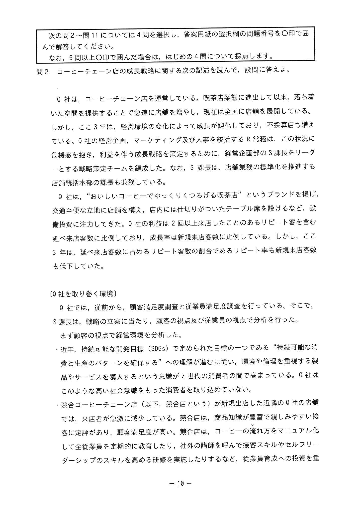

テキスト (OCR)

次の問 2 一問 11 については 4 問を選択し, 答案用紙の選択欄の問題番号を〇印で囲
んで解答してください。
なお, 5 問以上〇印で囲んだ場合は, はじめの 4 問について採点します。

間2 コーヒーチェーン店の成長戦略に関する次の記述を読んで, 設問に答えよ。

Q 社は, コーヒーチェーン店を運営している。喫茶店業態に進出して以来, 落ち着
いた空間を提供することで急速に店舗を増やし, 現在は全国に店舗を展開している。
しかし, ここ 3 年は, 経営環境の変化によって成長が鈍化しており, 不採算店も増え
CWS, 社の経営企画, マーケティング及び人事を統括する R 常務は, この状況に
危機感を抱き, 利益を伴う成長戦略を策定するために, 経営企画部の $ 課長をリーダ
ーとする戦略策定チームを編成した。なお, S 課長は, 店舗業務の標準化を推進する
店舗統括本部の課長も兼務している。

Q 社は。“おいしいコーヒーでゆっくりくつろげる喫茶店” というブランドを掲げ,
交通至便な立地に店舗を構え, 店内には仕切りがついたテーブル席を設けるなど, 設
備投資に注力してきた。0 社の利益は 2 回以上来店したことのあるリピート客を含む
延べ来店客数に比例しており, 成長率は新規来店客数に比例している。しかし, ここ
3 年は, 延べ来店客数に占めるリピート客数の割合であるリピート率も新規来店客数
も低下していた。

(Q 社を取り巻く環境)
0 社では。 従前から, 放客満足度調査と従業員満足度調査を行っている。そこで
SRE, 戦略の立案に当たり, 願客の視点及び従業員の視点で分析を行った。
まず願客の視点で経営環境を分析した。

. 近年 持続可能な開発目標 (SDGs) で定められた目標のーつである “持続可能な消
費と生産のパターンを確保する" への理解が進むに従い, 環境や倫理を重視する製
品やサービスを購入するという意識が 7 世代の消費者の間で高まっている。0 社は
このような高い社会意識をもった消費者を取り込めていない。

. 競合コーヒーチェーン店 (以下, 競合店という) が新規出店した近隣の 0 HORSE
では, 来店者が急激に減少している。競合店は, 商品知識が豊富で親しみやすい接
客に定評があり, 司客満足度が高い。競合店は。 コーヒーの漁れ方をマニュアル化
して全従業員を定期的に教育したり, 社外の講師を呼んで接容スキルやセルフリー
ダーシップのスキルを高める研修を実施したりするなど, 従業員育成への投資を重

### ページ 11

テキスト (OCR)

視している。

・Q tld, 有機農法で栽培するなど, 環境に配慮した生産者から直接調達した高品質
なコーヒー豆を使っていて, 味や香りが良いコーヒーに定評があった。ただし, 最
近の顧客満足度調査では, “店によってコーヒーの味にばらつきがある”, “HDB
りが以前よりも落ちている", といった顧客からの声が寄せられている。

S 課長は, 定評があるコーヒーの安定した提供や, ゆっくりくつろげる喫茶店とし
ての接客といった, 顧客へのサービス品質を向上させる必要があると分析した。

次に, S 課長は, 従業員の視点で経営環境を分析した。

・ 各店舗は店長をリーダーとする一つのチームとして運営されている。 店長が部下に
コーヒーの滝れ方や接客スキルなどを指導している。しかし, 顧客が満足する品質
のサービスを提供できるように部下を育成することまではできていない。全て店長
の責任で部下の育成を行った上で, 顧客が満足する品質のサービスを提供すること
には限界がある。

・ 従業員は, コーヒーを洋れるスキルを高めたいと思ったり, 接客の仕方を改善しよ
うとしたりしているが, 店長に相談したくても, なかなか対応してもらえていない。
その結果, 不満をもって辞めてしまう従業員が増え, 従業員の定着率が低下してき
ている。

・ 店舗統括本部の管理者, 同僚の店長, 店舗内の部下によって店長の 360 度評価を実
施した結果, 全般的に, 店長の自己評価は高いが, 部下からの評価はそれほど高く
なく, 両者の評価には大きなギャップがあった。

S 課長は, これらの経営環境分析の結果, 顧客へのサービス品質の低下には, 従業
只のスキルの不足と従業員の定着率の低下とが関連するのではないかと考えた。さら
に, S 課長は, 従業員のスキル及び定着率について分析し, 次のことが分かった。

・ 顧客へのサービス品質が高いチームは, 従業員満足度が高く, それによってチーム

メンバーがやる気をもって自律的にスキルの向上を図っており, また, チームメン

バーの定着率が高いという共通の特性がある。

・この特性を満たすためには, ERA, 部下に対して共感することで, 質問・相談し

### ページ 12

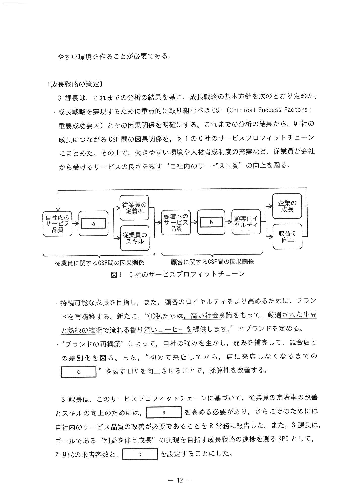

テキスト (OCR)

やすい環境を作ることが必要である。

[成長戦略の策定]
S 課長は, これまでの分析の結果を基に, 成長戦略の基本方針を次のとおり定めた。
・ 成長戦略を実現するために重点的に取り組むべきCSF (Critical Success Factors :
重要成功要因) とその因果関係を明確にする。これまでの分析の結果から, 0 HO
成長につながる CSF 間の因果関係を, 1 の Q 社のサービスプロフィットチェーン
にまとめた。 その上で, 働きやすい環境や人材育成制度の充実など, 従業具が会社
から受けるサービスの良さを表す "自社内のサービス品質"の向上を図る。

の
P        顧客ロイ
=o} ae:

ce                  —Y ヽ                  の

従業員に関するCSF間の因果関係     司客に関するCSF問の因果関係
図1 Q社のサービスプロフィットチェーン

- 持続可能な成長を目指し, また, 顧客のロイヤルティをより高めるために, ブラン
ドを再構築する。新たに, “①私たちは, 高い社会意識をもって, MESNKES
と熟練の技術で溢れる香り深いコーヒーを提供します。 とブランドを定める。

“ブランドの再構築" によって, 自社の強みを生かし, 弱みを補完して, 競合店と
の差別化を図る。 また, “初めて来店してから, 店に来店しなくなるまでの

| < ] ' を表すLTVを向上させることで, 採算性を改善する。

S 課長は。 このサービスプロフィットチェーンに基づいて, 従業員の定着率の改善
とスキルの向上のためには, a | を高める必要があり, さらにそのためには
自社内のサービス品質の改善が必要であることを 常務に報告した。また, 3 課長は,
ゴールである “利益を伴う成長” の実現を目指す成長戦略の進捗を測る KPt として,
2 世代の来店客数と, | d | を設定することにした。

ー 12 一

### ページ 13

テキスト (OCR)

(0 社内のサービス品質の改善
S 課長は, 自社内のサービス品質を改善するため, 店長への研修を実施することに
した。研修の内容は, 店長の 368 度評価の結果を基に, 店長に対して| e |に
気付かせ, 行動改善につなげるものとし, 部下との対話の場面を想定した次の具体的
な演習を行う。
"店長は部下に対して RAS", “アドバイスする"ことはせず, “MMU TRC”
という対話を重視する。
・ 店長は部下に対する| f |] を示すことで, 部下から様々な考え方や行動の選
択肢を引き出し, 自律的な行動を促す。

S 課長は, ブランドの再構築の活動として, 再教育を全従業員に対して行うことに
した。この再教育に当たって, S 課長は, @店舗統括本部として重点的に取り組むべ
き施策があると考えた。また, ブランドの再構築への投資に加えて, 人的資本を強化
する新たな投資計画を策定した。

R 常務は, この報告を受け, “君の策定した戦略は,。 よく考えられていて, 納得で

きた。そのアプローチは本当に良いと思う。" とS課長に| Ff |] を示した上で,

すぐに経営会議に付議し, 成長戦略を推進することを約束した。

設問 1 [成長戦略の策定】について答えよ。
(1) 図1 及び本文中の| a』 | ,図1中の[| 5 | に入れる適切な字句
を, 本文中の字句を用いて, それぞれ8 字以内で答えよ。
(2) 本文中の下線つ①について, 8 課長が新たにブランドを定めた背景となる要
因は何か。機会と強みの観点からそれぞれ 20 字以内で答えよ。
(3) 本文中の| c | に入れる適切な字句を15 字以内で答えよ。
(4) 本文中の| d | に入れる適切な字句を8宇以内で答えよ。
設問2 = (0 社内のサービス品質の改善】 について答えよ。
(1) 本文中の| es | に入れる適切な字句を 20字以内で答えよ。
(2) 本文中の| f  ] に入れる適切な字句を3字以内で答えよ。
(3) 本文中の下線の@について, 店舗統括本部が, 再構築したブランドを考慮し
て重点的に取り組むべき施策を, 本文中の字句を用いて 25 字以内で答えよ。

### ページ 14

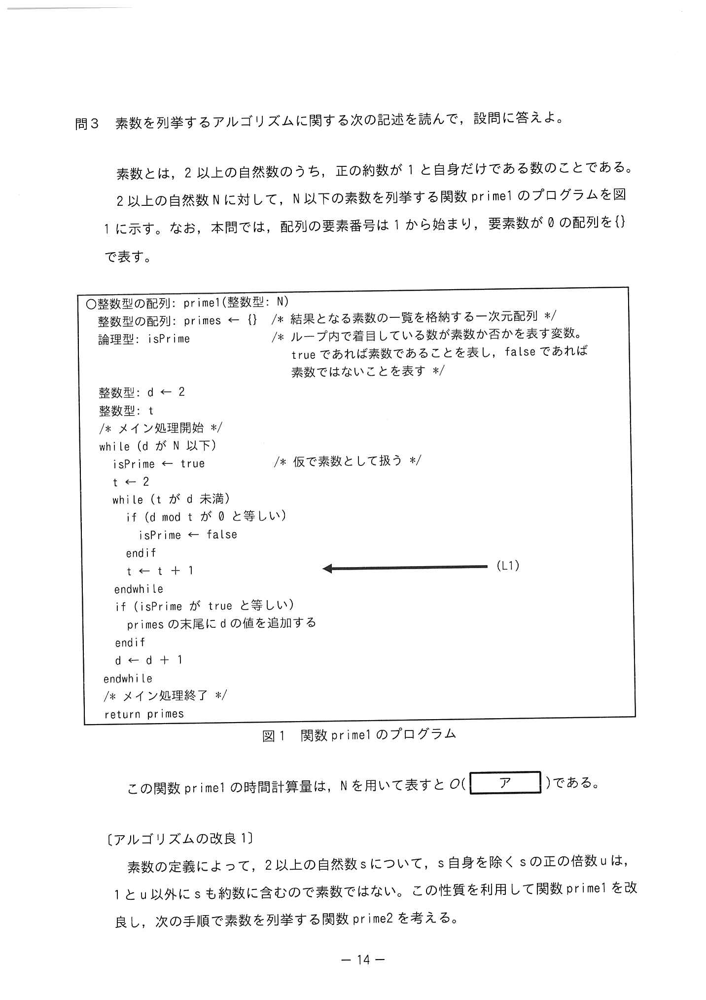

テキスト (OCR)

BS 素数を列挙するアルゴリズムに関する次の記述を読んで, 設問に答えよ。

素数とは, 2 以上の自然数のうち, 正の約数が 1 と自身だけである数のととである。
2 以上の自然数N に対して, N 以下の素数を列挙する関数 prime1 のプログラムを図
1 に示す。なお, 本問では, 配列の要素番号は 1 から始まり, 要素数が9 の配列を人0

〇整数型の配列: prime1(整数型: N)
整数型の配列: primes で 人} /* 結果となる素数の一覧を格納する一次元配列 */
論理型: isPrime      /* ループ内で着目している数が素数か否かを表す変数。
true であれば素数であることを表し, false であれば
素数ではないことを表す */
整数型:dでと2
整数型:
/* メイン処理開始 */
while (d a N 以下)
isPrime <— true         /* 仮で素数として扱う %/
tc 2
while (t が d 未満)
if (d mod t が 0 と等しい)
isPrime < false
endif
tett+]              +                (L1)
endwhi le
if (isPrime が true と等しい)
primes の未尾に d の値を追加する
endif
ddオ 1
endwhile
/* メイン処理終了 */
return primes

図1 関数prime1l のプログラム

この関数 prime1 の時間計算量は, N を用いて表すと の(| ア |)でぁる。

〔アルゴリズムの改良 1〕

素数の定義によって, 2 以上の自然数 s について, s 自身を除く s の正の倍数u は,
1 とu以外に s も約数に含むので素数ではない。この性質を利用して関数prime1 を改
良し, 次の手順で素数を列挙する関数 prime2 を考える。

ー 14 一

### ページ 15

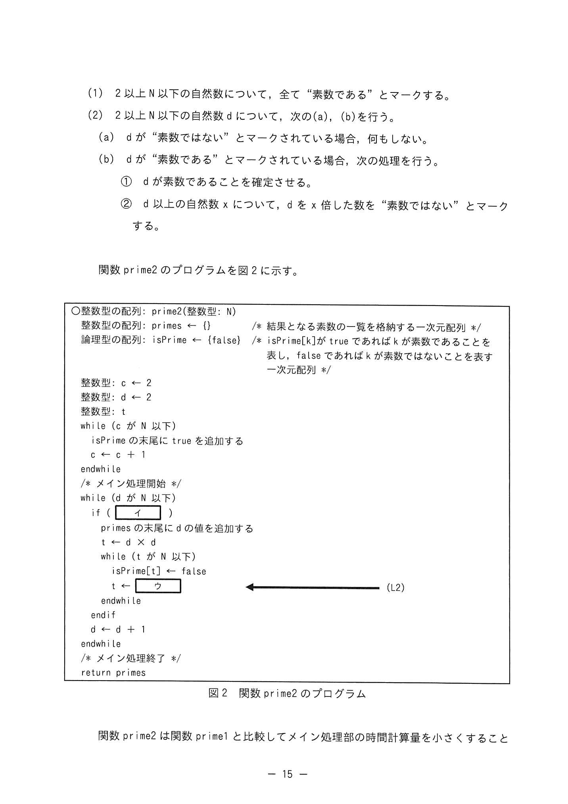

テキスト (OCR)

(1) 2 以上N 以下の自然数について, 全て“素数である"とマークする。
(2) 2 以上 N 以下の自然数 d について, 次の(a), (b) を行う。
(a) dが“素数ではない"” とマークされている場合, 何もしない。
(b) dが “素数である"” とマークされている場合, 次の処理を行う。
① d が素数であることを確定させる。
② d 以上の自然数 x について, d を x 倍した数を “素数ではない"” とマーク
する。

関数 primee のプログラムを図 2 に示す。

〇整数型の配列: prime2(整数型: N)
整数型の配列: primes < {}      /* 結果となる素数の一覧を格納する一次元配列 */
論理型の配列: isPrime < {false} /* isPrime[k]が true であれば k が素数であることを
RL, false であれば k が素数ではないことを表す
一次元配列 */
整数型:c<2
整数型:d<2
整数型:
while (c がN 以下)
isPrime の未尾に true を追加する
cc寺1
endwhile
/* メイン処理開始 */
while (d が N LAB)
ff(しィ ココ)
primes の末尾に d の値を追加する
tでとdXd
while (t がN 以下)
isPrime[t] <— false
te          に                     (12)
endwhile
endif
d<«-d+t+1
endwhi le
/* メイン処理終了 */

return primes

図2 関数prime2 のプログラム

関数 prime2 は関数 prime1 と比較してメイン処理者の時間計算量を小さくすること

ー 15 一

### ページ 16

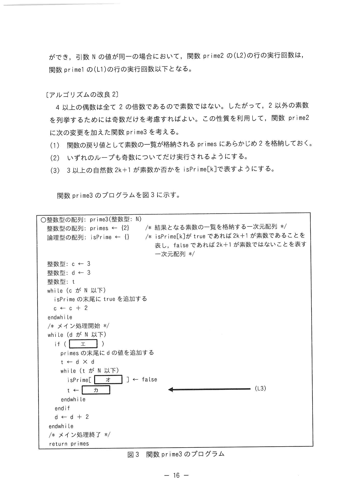

テキスト (OCR)

ができ, 引数 N の値が同一の場合において, 関数 prime2 の(L2)の行の実行回数は,
関数 prime1 の(L1)の行の実行回数以下となる。

[アルゴリズムの改良 2)

4 以上の偶数は全て 2 の倍数であるので素数ではない。したがって, 2 以外の素数
を列挙するためには奇数だけを考慮すればよい。この性質を利用して, 関数 prime2
に次の変更を加えた関数 prime3 を考える。
(1) 関数の戻り値として素数の一覧が格納される primes にあらかじめ 2 を格納しておく。
(2) いずれのループも奇数についてだけ実行されるようにする。
(3) 3 以上の自然数 2k二1 が素数か否かをisPrime[k]で表すようにする。

関数 primes3 のプログラムを図 3 に示す。

〇整数型の配列: prime3(整数型: N)
整数型の配列: primes で {2}    /* 結果となる素数の一覧を格納する一次元配列 */
論理型の配列: isPrime で {}    /* isPrime[k]が true であれば 2k十1 が素数であることを
表し, false であれば 2k十1 が素数ではないことを表す
一次元配列 */
整数型:cで3
整数型:dでを3
整数型: t
while (c が N LAB)
isPrime の未尾に true を追加する
Geを6eキ2
endwhile
/* メイン処理開始 */
while (d がN 以下)
f(しェ |)
primes の未尾に d の値を追加する
tedxd
while (t がN 以下)
isPrime[ ] < false
be               +                     (13)
endwhi le
endif
dd十2
endwhile
/* メイン処理終了 */

return primes

図3 関数 prime3 のプログラム

### ページ 17

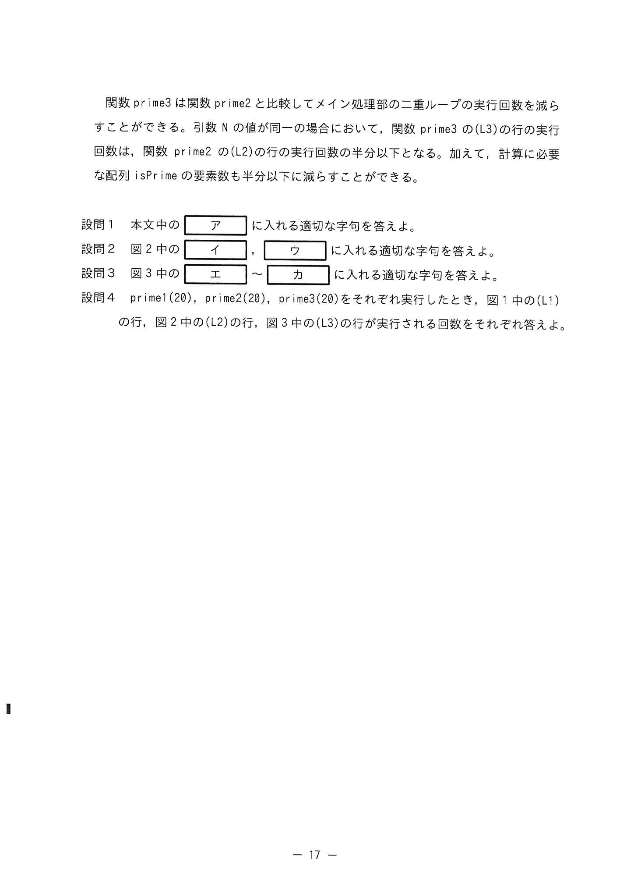

テキスト (OCR)

関数 prime3 は関数 prime2 と比較してメイン処理部の二重ループの実行回数を減ら
すことができる。引数 N の値が同一の場合において, 関数 prime3 の(L3) の行の実行
回数は, 関数 prime2 の(L2)の行の実行回数の半分以下となる。加えて, 計算に必要
な配列 isPrime の要素数も半分以下に減らすことができる。

設問1 本文中の| ア | に入れる適切な字句を答えよ。

設問2 図2中の| イ |,| ウ |に入れる適切な字句を答えよ。

設問3 図3中の| エ |~[ カ | に入れる適切な字句を答えよ。

設問4 prime1(29), prime2(20), prime3(29)をそれぞれ実行したとき, 図 1 中の(L1)
OF, 図 2 中の(L2) の行, 図 3 中の(L3) の行が実行される回数をそれぞれ管えよ。

ー 17 一

### ページ 18

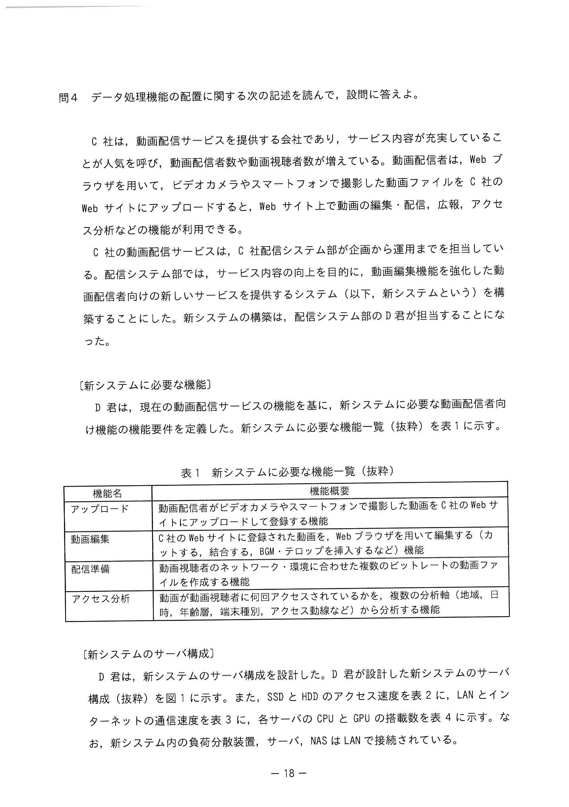

テキスト (OCR)

問4   ータ処理機能の配置に関する次の記述を読んで, 設問に答えよ。

C 社は, 動画配信サービスを提供する会社であり, サー ビス内容が充実しているこ
とが人気を呼び, 動画配信者数や動画視聴者数が増えている。動画配信者は, Web ブ
ラウザを用いて, レーッッリーュー トラッン電動軍ファフルを 80
Web サイトにアップロードすると, Web サイト上で動画の編集 ・配信, 広報, アクセ
ス分析などの機能が利用できる。

C 社の動画配信サービスは, C 社配信システム部が企画から運用までを担当してい
る。配信システム部では, サービス内容の向上を目的に, 動画編集機能を強化した動
画配信者向けの新しいサービスを提供するシステム (以下, 新システムという) を構
築することにした。新システムの構築は, 配信システム部のD 君が担当することにな

3 Tew
[新システムに必要な機能〕
D Bit, 現在の動画配信サービスの機能を基に, 新シレステムに必要な動画配信者向

け機能の機能要件を定義した。新システムに必要な機能一覧 (抜粋) を表 1 に示す。

表1 新システムに必要な機能一覧 (抜粋)

機能                            機能概要

アップロード       動画配信者がビデオカメラやスマートフォンで撮影した動画をC社のWebサ
イトにアップロードして登録する機能

動画編集      C 社の Web サイトに登録された動画を, Web ブラウザを用いて編集する (カ
ットする, MATS, BGM・テロップを挿入するなど) 機能

配信準備         動画視聴者のネットワーク・環境に合わせた複数のビットレートの動画ファ
イルを作成する機能

アクセス分析   動画が動画視聴者に何回アクセスされているかを, 複数の分析軸 (地域, 日
時, 年齢層, 端末種別, アクセス動線など) から分析する機能

[新システムのサーバ構成〕

D 君は, 新システムのサーバ構成を設計した。D 君が設計 した新システムのサーバ
構成 (抜粋) を図 1 に示す。 また, SSD と HDD のアクセス人速度を表 2 に, LAN とイン
ターネットの通信速度を表 3 に, 各サーバの CPU と GPU の搭載数を表 4 に示す。な
お, 新システム内の負荷分散装置, サーバ, NAS は LAN で接続されている。

### ページ 19

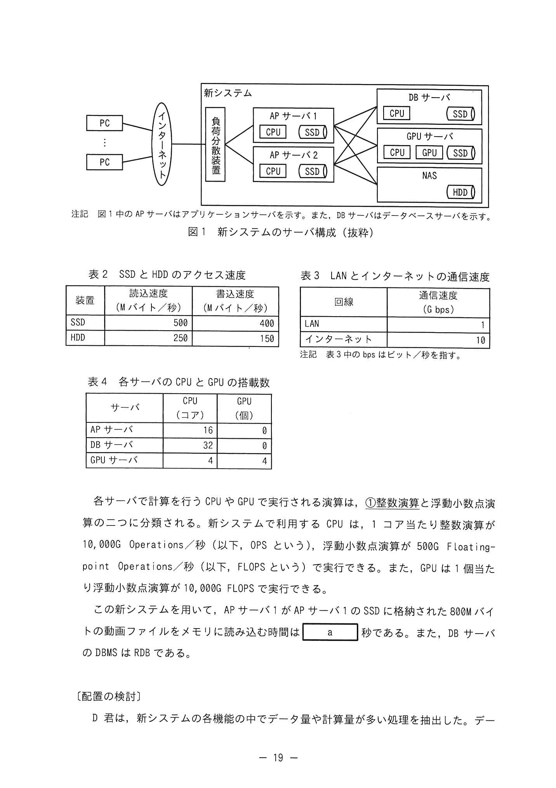

テキスト (OCR)

新システム                               DB サーバ
a          AP サーバ1               CPU         (ssp 0
ba                GPU サーバ
回          AP サーバ2 (ssp (
if                   NAS
しHpD (

注記 図1中の AP サーバはアプリケーションサーバを示す。また, DB サーバはデータベースサーバを示す。
Ml 新システムのサーバ構成 (抜粋)

表 2 SSD とHDD のアクセス速度        表3 LAN とインターネットの通信速度
7       読込速度         HARE                              通信速度
ST WMバイトノ秒) | Wバイトノ秒)           Be           (G bps)
SSD                500             400      LAN                              1
HDD              250            150     インターネット                 10

注記 表3中の bps はビットノ/秒を指す。

表4 各サーバの CPU と GPU の搭載数

、          CPU         GPU

サー      (ay) | ae
AP サーバ               16
DB サーバ               32
GPU サーバ               4

各サーバで計算を行う CPU や GPU で実行される演算は, ①整数演算と浮動小数点演
算の二つに分類される。新システムで利用する CPU は, 1 コア当たり整数演算が
19,990G Operations /#) (LAB, OPS という), 浮動小数点演算が 500G Floating-
point Operationsプ秒 (以下, FLOPS という) で実行できる。また, GPU は 1 個当た
り浮動小数点演算が 10, 000G FLOPS で実行できる。

この新システムを用いて, AP サーバ 1 が AP サーバ 1 の SSD に格納された BOOM バイ
トの動画ファイルをメモリに読み込む時間は| a | 秒である。また,DB サーバ
の DBMS は RDB である。

〔配置の検討]
D 君は, 新システムの各機能の中でデータ量や計算量が多い処理を抽出した。デー

### ページ 20

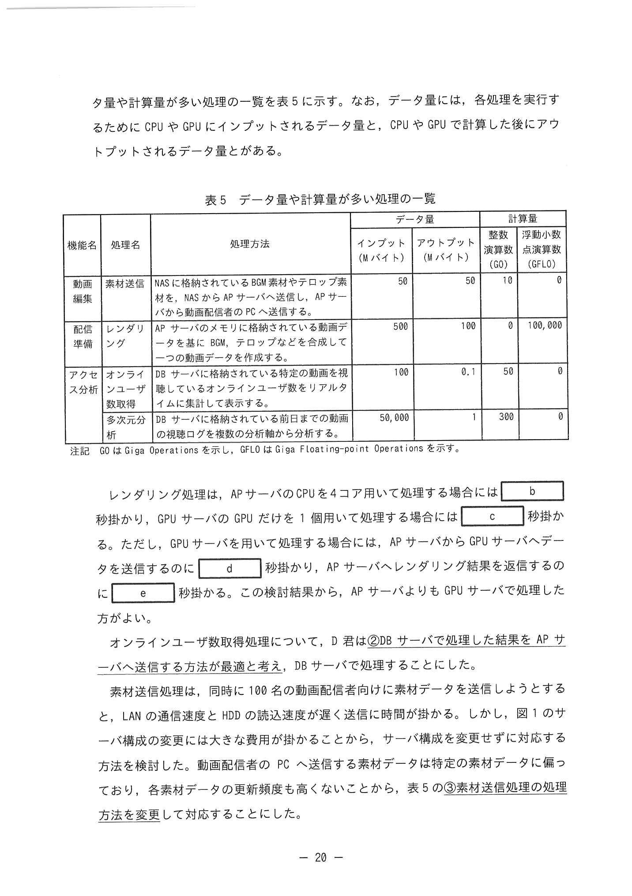

テキスト (OCR)

タ量や計算量が多い処理の一覧を表 5 に示す。なお, データ量には, 各処理を実行す
るためにCPU や GPU にインプットされるデータ量と, CPU や GPU で計算した後にアウ
トプットされるデータ量とがある。

表5 データ量や計算量が多い処理の一覧

データ量           計算量
機能名| 処理名           処理方法           インプット | ァゥトブット | 半数 | Pe
aus’ by | バイト)  演算数 | 点演算数
(GO) | (GFLO)
動画 | 素材送信 | NAS に格納されている BGM 素材やテロップ素       50        50    10      @
編集       材を, NAS から AP サーバへ送信し, AP サー
バから動画配信者の PC へ送信する。
配信 |レンダリ [AP サーバのメモリに格納されている動画デ       500        100     a| 100, 000
準備 |ング   ータを基に BOM, テロップなどを合成して
ーつの動画データを作成する。
アクセ |オンライ |DB サーバに格納されている特定の動画を視     100      0.1   50     0
ス分析 | ンューザ |聴しているオンラインユーザ数をリアルタ
数取得   イムに集計して表示する。
多次元分 |DB サーバに格納されている前日までの動画     50, 000         1| 300      0
析       の視聴ログを覆数の分析軸から分析する。

注記

GO はGiga Operations を示し, GFLO はGiga Floating-point Operations を示す。

レンダリング処理は, AP サーバのCPUを4コア用いて処理する場合には| b |
秒掛かり, GPU サーバの GPU だけを 1 個用いて処理する場合には| c |秒掛か
る。ただし, GPU サーバを用いて処理する場合には, AP サーバから GPU サーバヘデー
タを送信するのに|  』 | 秒掛かり, AP サーバヘレンダリング結果を返信するの
[Lc  ] 秒類かる。この検討結果から, AP サーバよりも GPU サーバで処理した
BREW.

オンラインユーザ数取得処理について, D 君は②D8 —/N THB LARS AP サ
ーバへ送信する方法が最適と考え, DB サーバで処理することにした。

素材送信処理は, 同時に 100 名の動画配信者向けに素材データを送信しようとする
と, LAN の通信速度と HDD の読込速度が遅く送信に時間が掛かる。 しかし, 図 1 のサ
ーバ構成の変更には大きな費用が掛かることから, サーバ構成を変更せずに対応する
方法を検討した。動画配信者の PC へ送信する素材データは特定の素材データに偏っ
ており, 各素材データの更新頻度も高くないことから, RS の③素材送信処理の処理
方法を変更して対応することにした。

### ページ 21

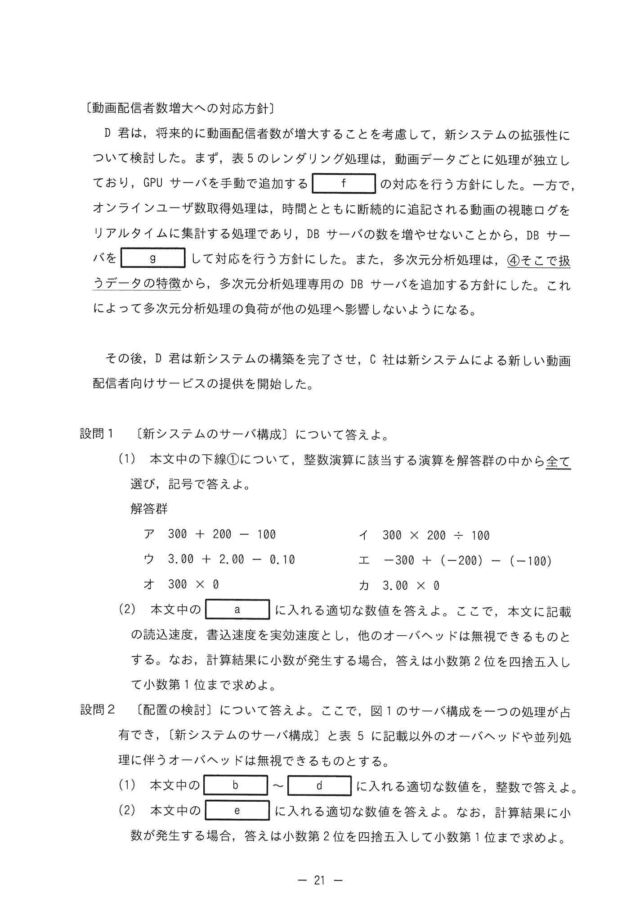

テキスト (OCR)

(動画配信者数増大への対応方針

D Ald, 将来的に動画配信者数が増大することを考慮して, 新システムの拡張性に
ついて検討した。まず, 表5 のレンダリング処理は, 動画データごとに処理が独立し
THY, GPU サーバを手動で追加する| f | の対応を行う方針にした。一方で,
オンラインユーザ数取得処理は, 時間とともに断続的に追記される動画の視聴ログを
リアルタイムに集計する処理であり, DB サーバの数を増やせないことから, DB サー
パを| 9 | して対応を行う方針にした。また, 多次元分析処理は。 OF CTH
うデータの特徴から, 多次元分析処理専用の DB サーバを追加する方針にした。これ
によって多次元分析処理の負荷が他の処理へ影響しないようになる。

その後, D 君は新システムの構築を完了させ, C 社は新システムによる新しい動画
配信者向けサービスの提供を開始した。

設問1 【〔新システムのサーバ構成】について答えよ。
(1) 本文中の下線⑦について, 整数演算に該当する演算を解答群の中から全て
選び, 記号で答えよ。

解答群
ア 300 + 200 — 100            4 300 X 200 + 100
ウ 3.00 + 2.00 一 0.10       エエ —300 + (—200) 一 (—100)
オ 300 x 0                    カ 3.00 x 6

(2) 本文中の| 』 |] に入れる適切な数値を答えよ。ここで, 本文に記載
の読込速度 書込速度を実効速度とし, 他のオーバヘッドは無視できるものと
する。 なお, 計算結果に小数が発生する場合, 答えは小数第 2 位を四捨五入し
て小数第 1 位まで求めよ。
設問2 【〔配置の検討}】について答えよ。ここで, 図 1 のサーバ構成を一つの処理が占

ATE, 【新システムのサーバ構成〕】 と表 5 に記載以外のオーバヘッドや並列処

理に伴うオーバヘッドは無視できるものとする。

GQ) 本文中の| b |~[  』 | に入れる適切な数値を, 整数で答えよ。
(2) 本文中の| % |] に入れる適切な数値を答えよ。なお, 計算結果に小
数が発生する場合 答えは小数第 2 位を四捨五入して小数第 1 位まで求めよ。

### ページ 22

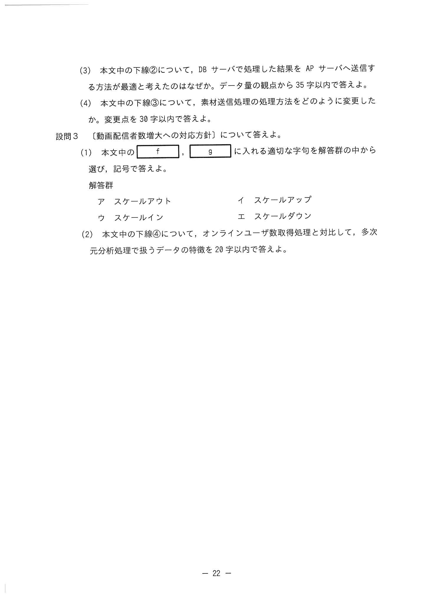

テキスト (OCR)

(3) 本文中の下線@について, DB サーバで処理した結果を AP サーバへ送信す
る方法が最適と考えたのはなぜか。データ量の観点から 35 字以内で答えよ。
(4) 本文中の下線について, 素材送信処理の処理方法をどのように変更した
か。変更点を 39 字以内で答えよ。

設問3 〔動画配信者数増大への対応方針]について答えよ。

(1) 本文中の| f |,| 9 |に入れる適切な字句を解答群の中から
選び, 記号で答えよ。
解答群

ア スケールアウト        イ スケールアップ

ウ スケールイン         エ スケールダウン

(2) 本文中の下線②について, オンラインユーザ数取得処理と対比して, BR
元分析処理で扱うデータの特徴を 20 字以内で答えよ。

### ページ 23

テキスト (OCR)

〔

メ モ 用 tt J

### ページ 24

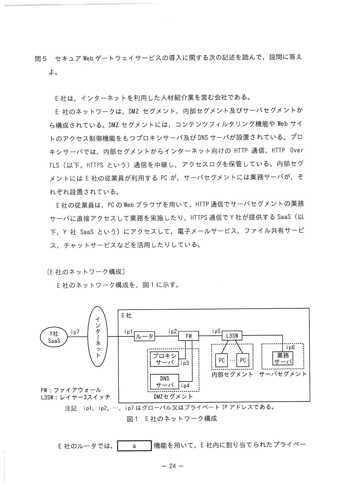

テキスト (OCR)

AS セキュア Web ゲートウェイサービスの導入に関する次の記述を読んで, 設問に答え
よ。

E 社は, インターネットを利用した人材紹介業を営む会社である。

E 社のネットワークは, DMZ セグメント, 内部セグメント及びサーバセグメントか
ら構成されている。DMZ セグメントには, コンテンツフィルタリング機能や Web サイ
トのアクセス制御機能をもつプロキシサーバ及び DNS サーバが設置されている。 プロ
キシサーバでは, 内部セグメントからインターネット向けの HTTP 通信, HTTP Over
TLS (以下, HTTPS という) 通信を中継し, アクセスログを保管している。 内部セグ

ントには E 社の従業員が利用する PCB, サーバセグメントには業務サーバが, そ
れぞれ設置されている。

E 社の従業員は, PC の Web ブラウザを用いて, HTTP 通信でサーバセグメントの業務
サーバに直接アクセスして業務を実施したり, HTTPS 通信で Y 社が提供する SaaS (以
下, Y 社 SaaS という) にアクセスして, 電子メールサービス, ファイル共有サービ
ス, チャットサービスなどを活用したりしている。

(E 社のネットワーク構成
E 社のネットワーク構成を, 図 1 に示す。

Cs) =

F                   ay                 Hoe ee          ip6 |
| プロキシ   i      | ! |業務
引 サーバ Jing} PT LPG} Ep はーバ
=            i MET XD b サーバセグメント
FW: ファイアウォール       LO
L3SW : レイヤー3スイッチ       DMZセグメント
注記 ipl, ip2, , ip7 はグローバル又はプライベート IP アドレスである。

Bl E社のネットワーク構成

E 社のルータでは, [a |機能を用いて, E 社内に割り当てられたプライベー

### ページ 25

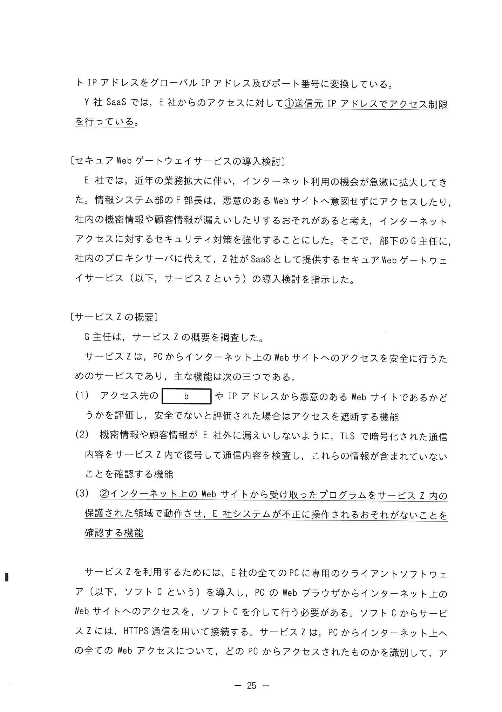

テキスト (OCR)

ト IP アドレスをグローバル IP アドレス及びポート番号に変換している。
Y 社 SaaS では, E 社からのアクセスに対して①送信元 IP アドレスでアクセス制限
を行っている。

〔セキュア Web ゲートウェイサービスの導入検討]

E 社では, 近年の業務拡大に伴い, インターネット利用の機会が急激に拡大してき
た。 情報システム者の 部長は, 悪意のある Web サイトへ意図せずにアクセスしたり
社内の機密情報や顧客情報が漏えんいしたりするおそれがあると考え, インターネット
アクセスに対するセキュリティ対策を強化することにした。そこで, 部下のG 主任に,
社内のプロキシサーバに代えて, Z 社がSaaS として提供するセキュア Web ゲートウェ
イサービス (以下, サービス Z という) の導入検討を指示した。

[サービス Z OE)
6 主任は, サービス Z の概要を調査した。
サービス Z は, PC からインターネット上の Web サイトへのアクセスを安全に行うた

めのサービスであり, 主な機能は次の三つである。

(1) アクセス先の| b | や IP アドレスから悪意のある Wed サイトであるかど
うかを評価し, 安全でないと評価された場合はアクセスを遮断する機能

(2) 機密情報や顧客情報が E 社外に漏えんいしないように, TLS で暗号化された通信
内容をサービス Z 内で復肪して通信内容を検査し, これらの情報が含まれていない
こととを確認する機能

(3) インターネット上の Web サイトから受け取ったプログラムをサービス Z 内の
保護された領域で動作させ, E 社システムが不正に操作されるおそれがないことを
確認する機能

サービス Z を利用するためには, E 社の全てのPC に専用のクライアントソフトウェ
ア (以下、ソフト C という) を導入し, PC の Web ブラウザからインターネット上の
Web サイトへのアクセスを, ソフト C を介して行う必要がある。ソフト (C からサービ
ス Z には, HTTPS 通信を用いて接続する。サービス Z は, PC からインターネット上へ
の全ての Web アクセスについて, どの PC からアクセスされたものかを識別して, ア

### ページ 26

テキスト (OCR)

クセスの監視や各種制御を行う

〔ネットワーク構成の変更]
6 主任は, サービス 2 の調査結果を基に, サービス Z 導入後のE 社のネットワーク

構成案を図 2のように考えた。
ィ E社
i タ 1 2
Y社 ip7  ip ip’
&
y | | eentnnenencenesensanedens
ト

DNS
サーバ ip4

DMZセグメント

注記 ipl, ip2, ip4, ip5, …, ip8 はグローバル又はプライベート IP アドレスである。
 2 サービス Z 導入後のE社のネットワーク構成案

6 主任は,。 サービス Z 導入に当たって必要となる作業を検討し, 次の四点に整理し

た。

(1) 現行のE社のネットワーク構成からプロキシサーバを廃止し, 社内の PC からイ
ンターネット上の Web サイトへのアクセスは, 宛先 TPアドレスが| c Joe
のだけを許可するように, FW の許可ルールを変更する。

(2) PCにソフトCを導入する。このソフトCは, 各PC 上でローカルプロキシとして
動作する。各 PC のプロキシ設定を変更して, このソフト C をプロキシとして利用
する。ソフトCから HTTPS 通信によってインターネット上のWeb サイ トヘアクセス
できるようにするために, | c | を宛先fPアドレスとするようソフトCの通
信設定を行う。

(3) PC のプロキシ設定で。 | d |] については, これまでどおり直接 HTTP 通信
ができるように設定する。

(4) Y 社 SaaS の送信元 IP アドレスでのアクセス制限の設定を変更する。

### ページ 27

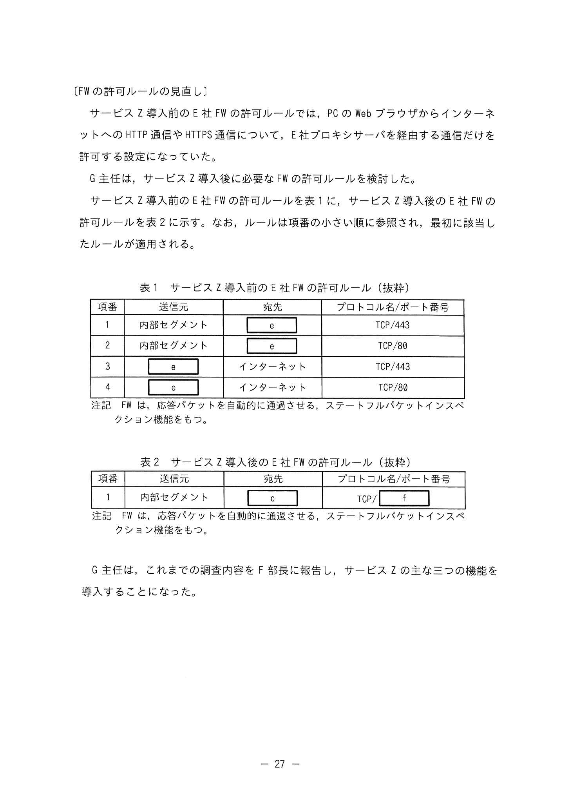

テキスト (OCR)

(FW の許可ルールの見直し]

サービス Z 導入前の E tH FW の許可ルールでは, PC の Web ブラウザからインターネ
ットへのHTTP 通信や HTTPS 通信について, E 社プロキシサーバを経由する通信だけを
許可する設定になっていた。

G 主任は, サービス Z 導入後に必要なFW の許可ルールを検討した。

サービス Z 導入前の E FW の許可ルールを表 1 に, サービス Z 導入後のE社FWの
許可ルールを表 2 に示す。なお, ルールは項番の小さい順に参照され, 最初に該当し
たルールが適用される。

表1 サービス Z 導入前のE社FWの許可ルール (抜粋)
項番       送信元                        プロトコル名/ポート番号

宛先
1       内部セグメント         [し s                 TCP/443

2       内部セグメント                                      TCP/80

3           [_s            インターネット                    TCP/443
4     [_s |     インターネット          TCP/89

注記 FW は, 応答パケットを自動的に通過させる, ステートフルパケットインスペ
クション機能をもつ。

表2 サービス Z何入後のE社FWの許可ルール (抜粋)
項番         送信元                 宛先            プロトコル名/ポート番号

注記 FW は, 応答パケットを自動的に通過させる, ステートフルパケットインスペ
クション機能をもつ。

G 主任は, これまでの調査内容を「『 部長に報告し サービス Z の主な三つの機能を
導入することになった。

### ページ 28

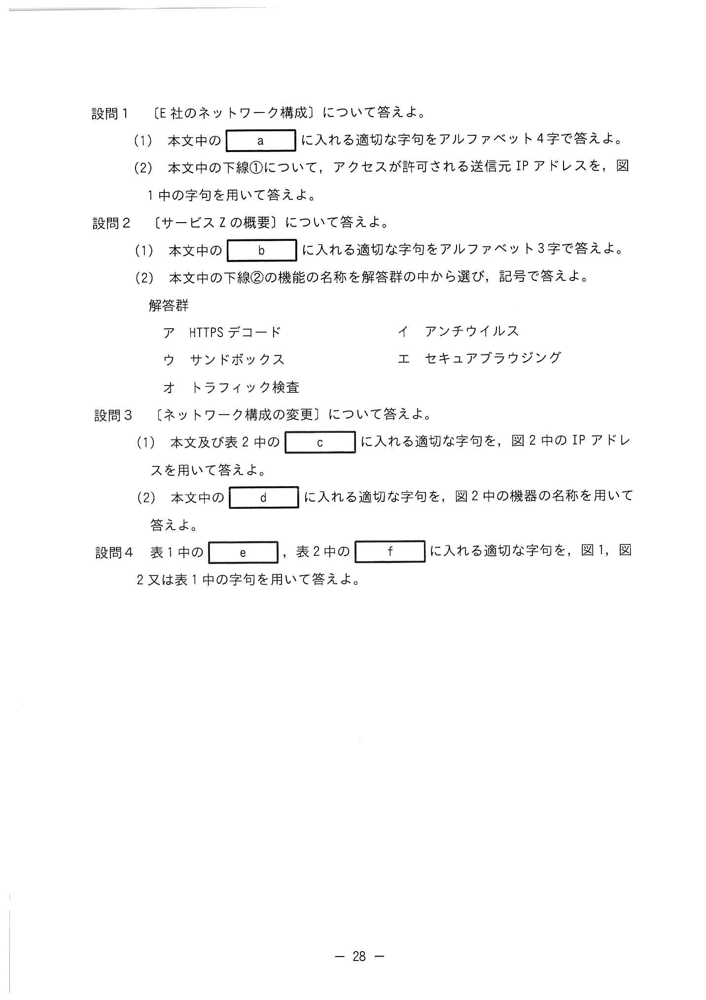

テキスト (OCR)

設問1 、(E社のネットワーク構成]について管えよ。
(1) 本文中の| a | に入れる適切な字句をアルファベット4宇で答えよ。
(2) 本文中の下線①について, アクセスが許可される送信元 P アドレスを,
1 中の字句を用いて答えよ。
設問2 〔サービスZの概要] について答えよ。
(1) 本文中の| b | に入れる適切な字句をアルファベット3字で答えよ。
(2) 本文中の下線②の機能の名称を解答群の中から選び, 記号で答えよ。

解答群
ア HTTPS デコード             イ アンチウイルス
ウ サンドボックス        エ セキュアブラウジング

A トラフィック検査
設問3 【ネットワーク構成の変更] について答えよ。
(1) 本文及び表 2 中の| c | に入れる適切な字旬を, 図2 中のIPアドレ
スを用いて答えよ。
(2) 本文中の| d | に入れる適切な字句を,図 2中の機器の名称を用いて
答えよ。
設問4 表1中の| e  ],表2中の| f | に入れる適切な字句を,図1,

2 又は表 1 中の字句を用いて答えよ。

### ページ 29

テキスト (OCR)

〔

メ = 用 紙 〕

### ページ 30

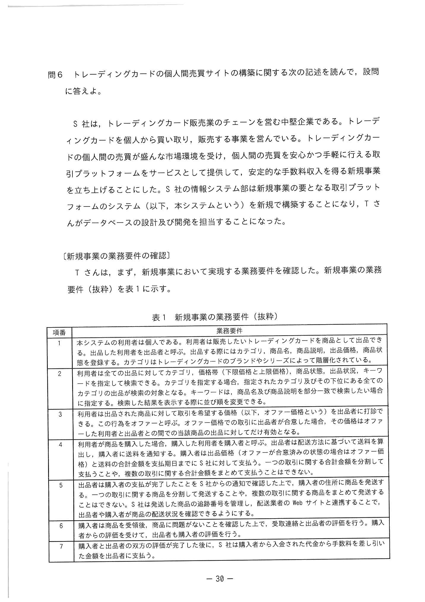

テキスト (OCR)

問8 トレーディングカードの個人間売買サイトの構築に関する次の記述を読んで, 設問

に答えよ。

S 社は。 トレーディングカード販売業のチェーンを営む中堅企業である。トレーデ
ィングカードを個人から買い取り, 販売する事業を営んでいる。トレーディングカー
ドの個人間の売買が盛んな市場環境を受け, 個人間の売買を安心かつ手軽に行える取
引プラットフォームをサービスとして提供して, 安定的な手数料収入を得る新規事業
を立ち上げることにした。 S 社の情報システム部は新規事業の要となる取引プラット
フォームのシステム (以下, 本システムという) を新規で構築することになり, TS
んがデータベースの設計及び開発を担当することになった。

[新規事業の業務要件の確認]
T さんは, まず, 新規事業において実現する業務要件を確認した。新規事業の業務
要件 (抜粋) を表 1 に示す。

表1 新規事業の業務要件 (抜粋)

項番                                      業務要件

1     林システムの利用者は個人である。利用者は販売したいトレーディングカードを商品と して出品でき
る。出品した利用者を出品者と呼ぶ。出品する際にはカテゴリ, 商品名, 商品説明, 出品価格, 商品状
態を登録する。カテゴリはトレーディングカードのブランドやシリーズによって階層化されている。

2   利用者は全ての出品に対してカテゴリ, 価格帯 (下限価格と上限価格), 商品状態, 出品状況, キーワ
ードを指定して検索できる。カテゴリを指定する場合, 指定されたカテゴリ及びその下位にある全ての
カテゴリの出品が検索の対象となる。 キーワードは, 商品名及び商品説明を部分一致で検索したい場合
に指定する。検索した結果を表示する際に並び順を変更できる。

3   利用者は出品された商品に対して取引を希望する価格(以下,オファー価格という) を出品者に打診で
きる。この行為をオファーと呼ぶ。 オファー価格での取引に出品者が合意した場合, その価格はオファ
ーした利用者と出品者との間での当該商品の出品に対してだけ有効となる。

4   利用者が商品を購入した場合 購入した利用者を購入者と呼ぶ。出品者は配送方法に基づいて送料を算
出し, 購入者に送料を通知する。購入者は出品価格 (オフ ァーが合意済みの状態の場合はオファー価
格) と送料の合計金額を支払期日までに 3 社に対して支払う。一つの取引に関する合計人金額を分割して
支払うことや, 複数の取引に関する合計金額をまとめて支払うことはできない。

5      出品者は購入者の支払が完了したことを $ 社からの通知で確認した上で, 購入者の住所に商品を発送す
る。一つの取引に関する商品を分割して発送することや, 複数の取引に関する商品をまとめて発送する
ことはできない。5S 社は発送した商品の追跡番号を管理し, 配送業者の Wep サイトと連携することで,
出品者や購入者が商品の配送状況を確認できるようにする。

6   購入者は商品を受領後, 商品に問題がないことを確認した上で, 受取連絡と出品者の評価を行う。購入
者からの評価を受けて, 出品者も購入者の評価を行う。

7    購入者と出品者の双方の評価が完了 した後に, S 社は購入者から入金された代金から手数料を差し引い
た金額を出品者に支払う。

### ページ 31

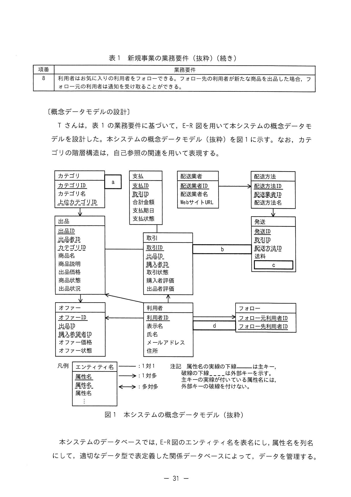

テキスト (OCR)

表1 新規事業の業務要件 (抜粋) (続き)

項番                                     業務要件

8      利用者はお気に入りの利用者をフォローできる。フォロー先の利用者が新たな商品を出品した場合,フ
ォロー元の利用者は通知を受け取ることができる。

〔概念データモデルの設計〕

T さんは, 表 1 の業務要件に基づいて, E-R 図を用いて本システムの概念データモ
デルを設計した。本システムの概念データモデル (抜粋) を図 1 に示す。なお, カテ
ゴリの階層構造は, 自己参照の関連を用いて表現する。

カテゴリ                      支払               配送業者                     配送方法
カテゴリ1D     a   支払D      配送業者TD         配送方法TD
カテゴリ名         取引mD      配送業者名         配送業者TD
上位カテゴリID                  合計金額              WebサイトURL                     配送方法名
T         支払期日
出品                             支払状態
出品D                                     |
出品者D                              取引
カテゴリTD          取引D         b
商品             出品D.
商品説明                              購入者DD
出品価格                              取引状態
商品状態                              購入者評価
出品状況                              出品者評価
\                                      t
オファー            利用者              フォロー
オファーTD           利用者D             フォロー元利用者TD
出品TD             表示名         d    フォロー先利用者ID
購入希望者D       氏名
オファー価格          メールアドレス
オファー状態                             住所
凡例 | エンティティ名 |一一 :!対1      注記 属性名の実線の下線       は主キー,
Bites      aes    TTP
属性名.    <> : 多対多    外部キーの破線を付けない。
属性名

図1 本システムの概念データモデル (抜粋)

本システムのデータベースでは, E-R 図のエンティティ名を表名にし, 属性名を列名
にして, 適切なデータ型で表定義した関係データベースによって, データを管理する。

### ページ 32

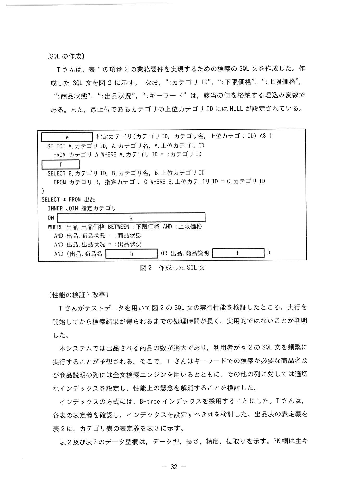

テキスト (OCR)

(SQL の作成〕
T さんは, 表 1 の項番 2 の業務要件を実現するための検索の SOL 文を作成した。 TF
成した SQL 文を図 2 に示す。 BH, ":カテゴリ 1D", “下限価格"。“:上限価格",
商品状態”,“:出品状況"。“":キーワード"” は, 該当の値を格納する埋込み変数で
ある。また, 最上位であるカテゴリの上位カテゴリ ID にはNULL が設定されている。

指定カテゴリ(カテゴリ ID, カテゴリ名, 上位カテゴリ ID) AS (
SELECT A.カテゴリ ID, A.カテゴリ名, A.上位カテゴリ ID
FROM カテゴリ A WHERE A.カテゴリ ID = :カテゴリ ID
SELECT B. カテゴリ ID, B.カテゴリ名, B.上位カテゴリ ID
FROM カテゴリ B, 指定カテゴリ C WHERE B.上位カテゴリ 1D = C.カテゴリ ID
)
SELECT * FROM 出品
INNER JOIN 指定カテゴリ

on |                    9

WHERE 出品.出品価格 BETWEEN :下限価格 AND :上限価格
AND 出品.商品状態 = :商品状態
AND 出品. sisaeipa = :出品状況

図2 作成したSQL文

〔性能の検証と改善]

T さんがテストデータを用いて図 2 の SQL 文の実行性能を検証したところ, 実行を
開始してから検索結果が得られるまでの処理時間が長く, 実用的ではないことが判明
した。

本システムでは出品される商品の数が膨大であり, 利用者が図 2 のSQL 文を頻繁に
実行することが予想される。そこで, T さんはキーワードでの検索が必要な商品名及
び商品説明の列には全文検索エンジンを用いるとともに, その他の列に対しては適切
なインデックスを設定し, 性能上の懸念を解消することを検討した。

インデックスの方式には, B-tree インデックスを採用することにした。T「さんは,
各表の表定義を確認し, インデックスを設定すべき列を検討した。出品表の表定義を
表 2 に。 カテゴリ表の表定義を表 3 に示す。

表 2 及び表 3 のデータ型欄は, データ型, RX, 精度, 位取りを示す。PK MAES

### ページ 33

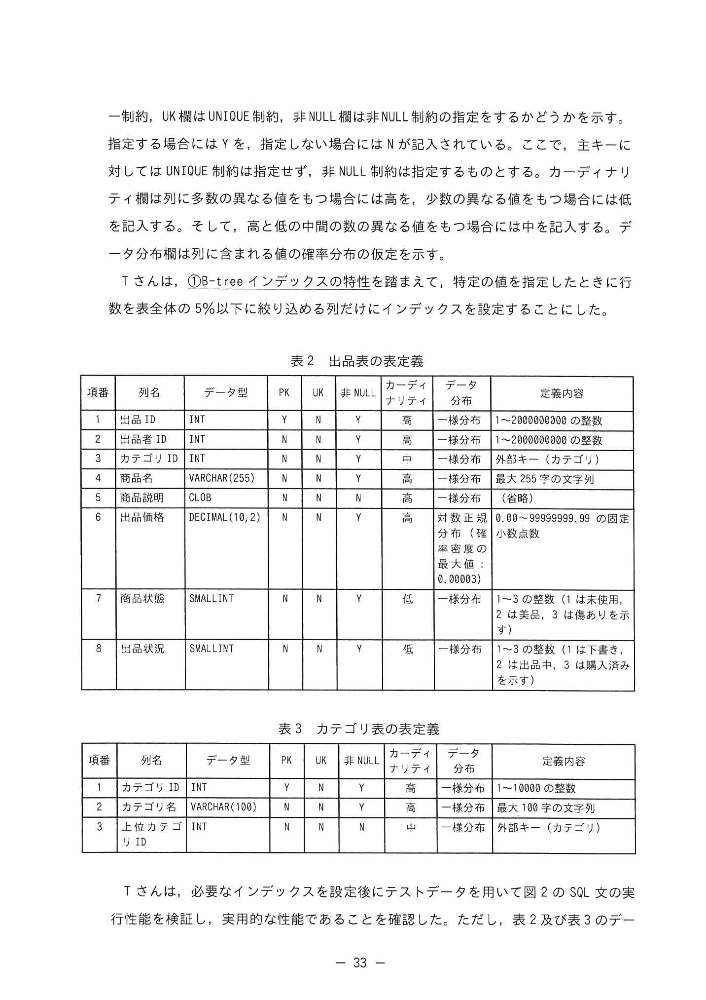

テキスト (OCR)

一制約 UK 欄はUNIQUE 制約。 非 NULL 欄は非NULL 制約の指定をするかどうかを示す。
指定する場合には Y を, 指定しない場合にはN が記入されている。ここで, 主キーに
対しては UNIQUE 制約は指定せず, 非 NULL 制約は指定するものとする。カーディナリ
ティ欄は列に多数の異なる値をもつ場合には高を, 少数の異なる値をもつ場合には低
を記入する。 そして, 高と低の中間の数の異なる値をもつ場合には中を記入する。デ
ータ分布杜は列に含まれる値の確率分布の仮定を示す。

Tさんは, ①B-tree インデックスの特性を踏まえて, 特定の値を指定したときに行
数を表全体の 5%以下に絞り込める列だけにインデックスを設定することにした。

表2 出品表の表定義

カーディ| データ

= yu                                        wee aoe
項番   列名     データ型   PK | UK |非NULL ナリティ| aye       定義内容
1 |出品ID       INT                Y      N       Y         高 |一様分布 |1-2000000009 の整数
2 |出品者ID | INT          N    N     Y      高 |一様分布 1ご2000000900 の整数
3 |カテゴリ 1D | INT          N    N    ¥     中   一様分布 | 外部キー (カテゴリ)
4 |商品名      VARCHAR(255)    N     N      Y       高 |一様分布 |最大 255 字の文字列
5 |商品説明 |CLOB          N    N     N      高 |一様分布 | (省略)
6 |出品価格 |DECIMAL(10,2) | N   N    Y     高 |対数正規|9.09て99999999.99 の固定
分布 (確| 小数点数
率密度の
最大値 :
0. 00003)
7 |商品状態    SMALLINT       N    N     Y      低    一様分布 |1~3 の整数 (1 は未使用,
2 は美品, 3 は傷ありを示
す)
8 |出品状況 |SMALLINT       N    N     Y      低 |一様分布 |13 の整数 (1 は下書き,
2 は出品中、3 は購入済み
を示す)
表3 カテゴリ表の表定義
=    」                   カーディ | データ         er
項番     列名       データ型     PK | UK |非NULL  ナリティ| a6           定義内容
1 |カテゴリ ID |INT          Y    N     Y      高   一様分布 | 119990 の整数
2 |カテゴリ名 | VARCHAR(100)   N   N    Y    fo   一様分布 | 最大 109 字の文字列
3 |上位カテゴ|INT         N    N    N     中   一様分布 | 外部キー (カテゴリ)
yD

T さんは, 必要なインデックスを設定後にテストデータを用いて図 2 の SQL 文の実
行性能を検証し, 実用的な性能であることを確認した。ただし, 表 2 及び表 3 のデー

### ページ 34

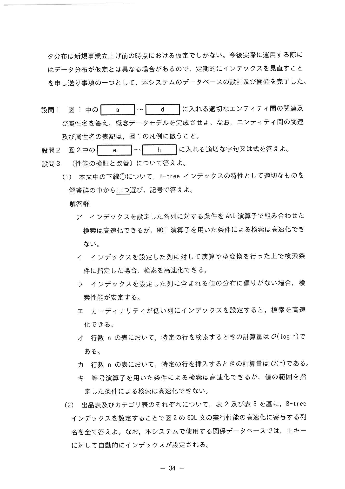

テキスト (OCR)

タ分布は新規事業立上げ前の時点における仮定でしかない。 今後実際に運用する際に
はデータ分布が仮定とは異なる場合があるので, 定期的にインデックスを見直すこと
を申し送り事項のりーつとして, 本システムのデータベースの設計及び開発を完了した。

設問1 図1 中の| oa |~[  d | に入れる適切なエンティティ間の関連及
び属性名を答え, 概念データモデルを完成させよ。 なお, エンティティ間の関連
及び属性名の表記は, 図 1 の凡例に父うこと。

設問2 図2中の| e |~[ h | に入れる適切な字句又は式を答えよ。

設問3 性能の検証と改善} について答えよ。

(1) 本文中の下線やについて, B-tree インデックスの特性として適切なものを
解答群の中から三つ選び, 記号で答えよ。
解答群
ア インデックスを設定した各列に対する条件を AND 演算子で組み合わせた
検索は高速化できるが, NT 演算子を用いた条件による検索は高速化でき
ない。
A インデックスを設定した列に対して演算や型変換を行った上で検索条
件に指定した場合 検索を高速化できる。
ウ インデックスを設定した列に含まれる値の分布に偏りがない場合, 検

索性能が安定する。

エ カーディナリティが低い列にインデックスを設定すると, 検索を高速
化できる。

A 行数 n の表において, 特定の行を検索するときの計算量は O(log n)で
ある。

カ 行数 n の表において, 特定の行を挿入するときの計算量は の(n)である。
キ 等号演算子を用いた条件による検索は高速化できるが, 値の範囲を指
定した条件による検索は高速化できない。

(2) 出品表及びカテゴリ表のそれぞれについて, 表 2 及び表 3 を基に, B-tree
インデックスを設定することで図 2 の SL 文の実行性能の高速化に寄与する列
名を全て答えよ。なお, 本システムで使用する関係データベースでは, 主キー
に対して自動的にインデックスが設定される。

### ページ 35

テキスト (OCR)

C

メ モ 用 紙 )

ー 35 一

### ページ 36

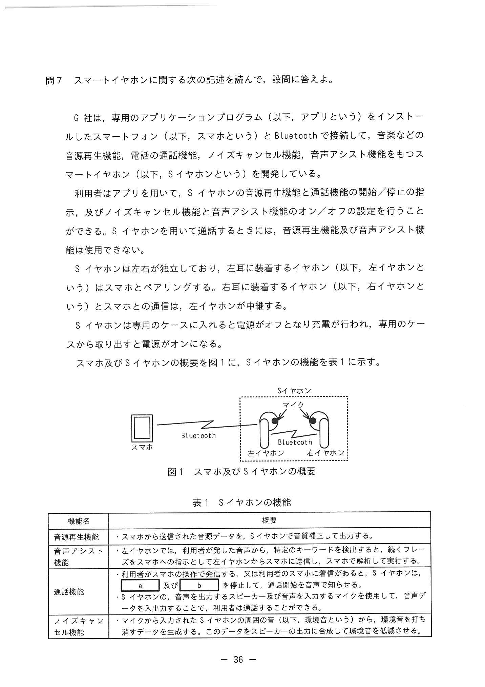

テキスト (OCR)

問7 スマートイヤホンに関する次の記述を読んで, 設問に答えよ。

G 社は, 専用のアプリケーションプログラム (以下,。アプリという) をインストー
ルしたスマートフォン (UE, スマホという) と Bluetooth で接続して, 音楽などの
音源再生機能, 電話の通話機能, ノイズキャンセル機能, 音声アシスト機能をもつス
マートイヤホン (以下,Sイヤホンという) を開発している。

利用者はアプリを用いて, S イヤホンの音源再生機能と通話機能の開始の停止の指
示, 及びノイズキャンセル機能と音声アシスト機能のオンプオフの設定を行うこと
ができる。S イヤホンを用いて通話するときには, 音源再生機能及び音声アシスト機
能は使用できない。

S イヤホンは左右が独立しており, 左耳に装着するイヤホン (以下, 左イヤホンと
いう) はスマホとペアリングする。右耳に装着するイヤホン (以下, 右イヤホンと
いう) とスマホとの通信は, 左イヤホンが中継する。

S イヤホンは専用のケースに入れると電源がオフとなり充電が行われ, 専用のケー
スから取り出すと電源がオンになる。

スマホ及び $S イヤホンの概要を図 1 に, S イヤホンの機能を表 1 に示す。

LI]          Bluetooth

スマホ             1      Bluetooth     i
 Bd vay   右イヤホン!
図1 スマホ及びS イヤホンの概要
表1 S イヤホンの機能
機能名                      概要
音源再生機能   ・スマホから送信された音源データを, $S イヤホンで音質補正して出力する。
音声アシスト | ・左イヤホンでは, 利用者が発した音声から, 特定のキーワードを検出すると, 続くフレー
機能        ズをスマホへの指示として左イヤホンからスマホに送信し, スマホで解析して実行する。

・ 利用者がスマホの操作で発信する, 又は利用者のスマホに着信があると, S イヤホンは,
及び[| b  ] を停上して, 通話開始を音声で知らせる。

-S イヤホンの, 音声を出力するスピーカー及び音声を入力するマイクを使用して, 音声デ

ータを入出力することで, 利用者は通話することができる。

ノイズキャン | ・マイクから入力された S イヤホンの周囲の音 (以下 環境音という) から, 環境音を打ち
セル機能      消すデータを生成する。このデータをス ピーカーの出力に合成して環境音を低減させる。

### ページ 37

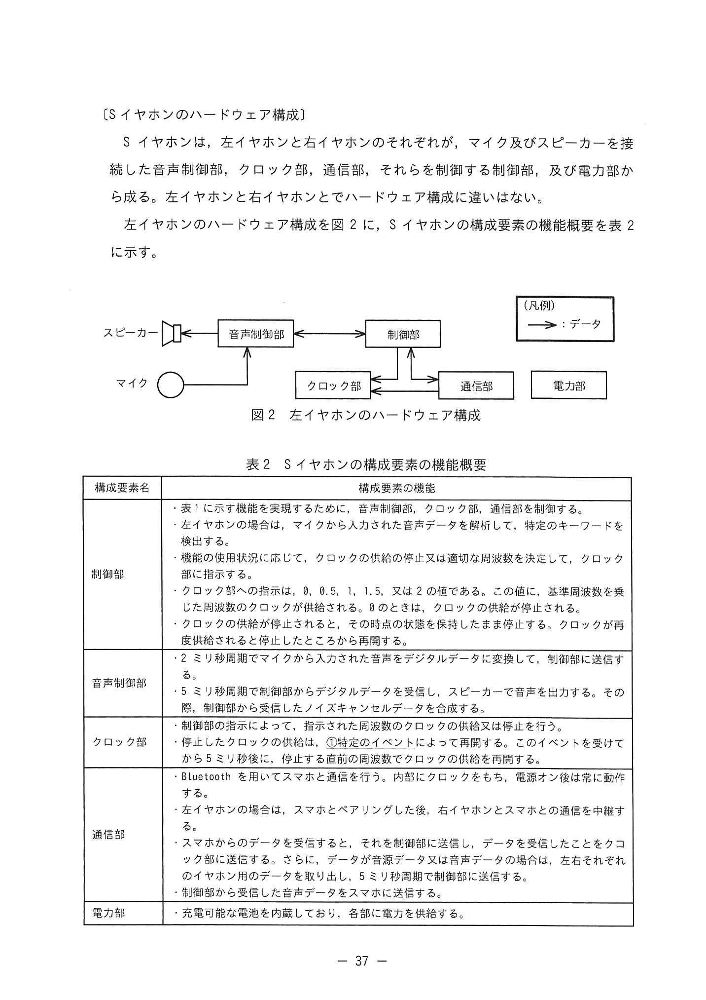

テキスト (OCR)

[S イヤホンのハードウェア構成

S イヤホンは, 左イヤホンと右イヤホンのそれぞれが, マイク及びスピーカーを接
続した音声制御部, クロック部, 通信部, それらを制御する制御部, 及び電力部か
ら成る。左イヤホンと右イヤホンとでハードウェア構成に違いはない。

左イヤホンのハードウェア構成を図 2 に, S イヤホンの構成要素の機能概要を表 2

に示す。

AG p—

>: データ
[キー  音声制御部                  wens
マイク  (ーー          クロック部                 HES          ar

(凡例)

図2 左イヤホンのハードウェア構成

表2 S イヤホンの構成要素の機能概要

構成要素名

構成要素の機能

制御部

・表1 に示す機能を実現するために, 音声制御部, クロック部, 通信部を制御する。
・左イヤホンの場合は, マイクから入力された音声データを解析して, 特定のキーワードを

・機能の使用状況に応じて, クロックの供給の停止又は適切な周波数を決定して, クロック
・クロック部への指示は, 0, 0.5, 1, 1.5, 又は 2 の値である。この値に, 基準周波数を乗

・クロックの供給が停止されると, その時点の状態を保持したまま停止する。クロックが再

検出する。
部に指示する。
じた周小数のクロックが供給される。90 のときは, クロックの供給が停止される。

度供給されると停止したところから再開する。

音声制御部

・2 ミリ秒周期でマイクから入力された音声をデジタルデータに変換して, 制御部に送信す

・5 ミリ秒周期で制御部からデジタルデータを受信し, スピーカーで音声を出力する。その

る。

BR, 制御部から受信したノイズキャンセルデータを合成する。

クロック部

・制御部の指示によって, 指示された周波数のクロックの供給又は停止を行う。
・停止したクロックの供給は, ①特定のイベントによって再開する。このイベントを受けて

から5 ミリ秒後に, 停止する直前の周波数でクロックの供給を再開する。

・Bluetooth を用いてスマホと通信を行う。内部にクロックをもち, 電源オン後は常に動作
・左イヤホンの場合は, スマホとペアリングした後, 右イヤホンとスマホとの通信を中継す

・スマホからのデータを受信すると, それを制御部に送信し, データを受信したことをクロ

・ 制御部から受信した音声データをスマホに送信する。

する。
る。

ック部に送信する。さらに, データが音源データ又は音声データの場合は、 左右それぞれ
のイヤホン用のデータを取り出し, 5 ミリ秒周期で制御部に送信する。

・ 充電可能な電池を内蔵しており, 各部に電力を供給する。

### ページ 38

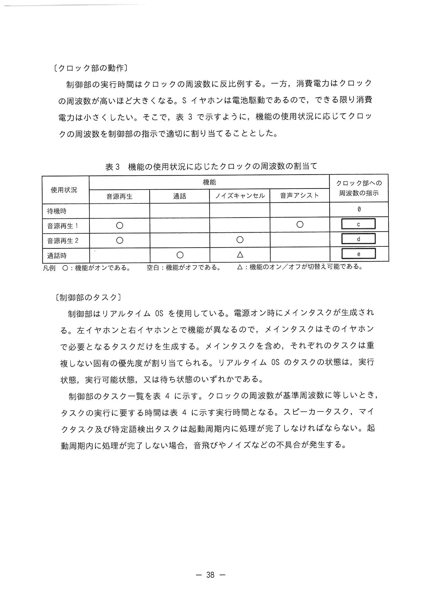

テキスト (OCR)

〔クロック部の動作〕

制御部の実行時間はクロックの周波数に反比例する。一方, 消費電力はクロック
の周波数が高いほど大きくなる。S イヤホンは電池駆動であるので, できる限り消費
電力は小さくしたい。 そこで, 表 3 で示すように, 機能の使用状況に応じてクロッ
クの周波数を制御部の指示で適切に割り当てることとした。

表3 機能の使用状況に応じたクロックの周波数の割当て

機能              werd
aia    音源再生      通話    ノイズキャンセル | 音声アシスト   ‘mamowen
待機時                                 0
音源再生1    O                    O    し
音源再生 2     O                O              Ca
通話時            O      A           Le |

凡例 〇 : 機能がオンである。

(制御部のタスク]

制御部はリアルタイム 0S を使用している。電源オン時にメインタスクが生成され
る。左イヤホンと右イヤホンとで機能が異なるので, メインタスクはそのイヤホン
で必要となるタスクだけを生成する。メインタスクを含め,、 それぞれのタスクは重
複しない固有の優先度が割り当てられる。リアルタイム 0S のタスクの状態は, 実行

状態, 実行可能状態,

空白 : 機能がオフである。

又は待ち状態のいずれかである。

ム : 機能のオンプオフが切替え可能である。

制御部のタスク一覧を表 4 に示す。クロックの周波数が基準周波数に等しいとき,
タスクの実行に要する時間は表 4 に示す実行時間となる。スピーカータスク, マイ
クタスク及び特定語検出タスクは起動周期内に処理が完了しなければならない。起

動周期内に処理が完了しない}

BA
AAs

音飛びやノイズなどの不具合が発生する。

### ページ 39

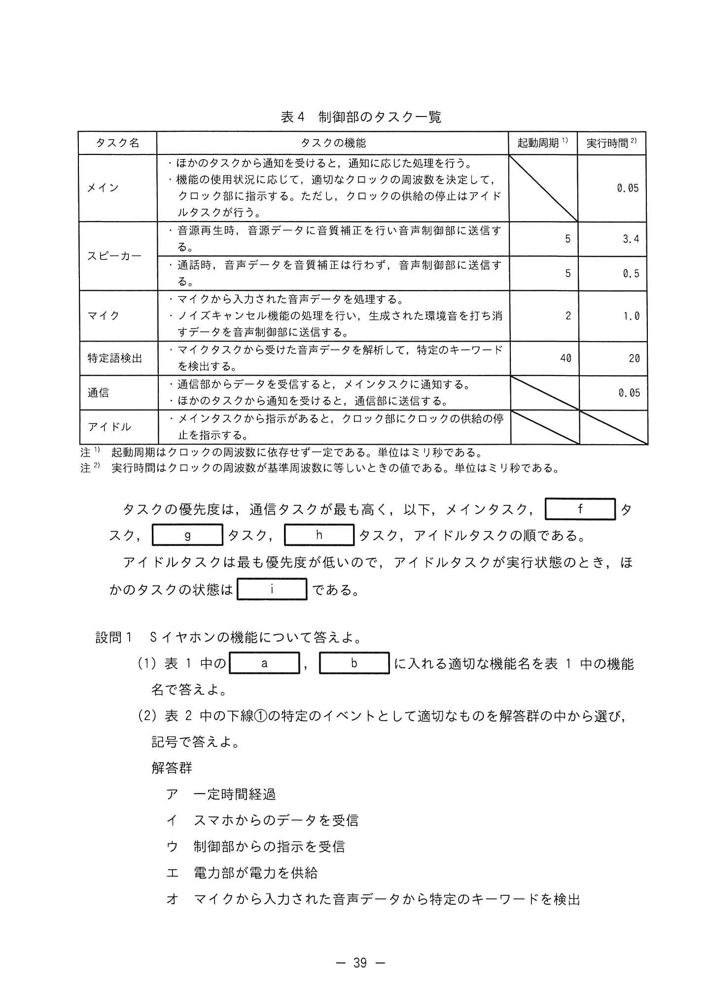

テキスト (OCR)

表4 制御部のタスク一覧

タスク名                         タスクの機能                       起動周期 | 実行時間?

・ほかのタスクから通知を受けると, 通知に応じた処理を行う。

・ 機能の使用状況に応じて, 適切なクロックの周波数を決定して,
クロック部に指示する。ただし, クロックの供給の停止はアイド
ルタスクが行う。

メイン                                              9.05

・ 音源再生時, 音源データに音質補正を行い音声制御部に送信す

の       る。
スピーカー

・ 通話時, 音声データを音質補正は行わず, 音声制御部に送信す
る。

・マイクから入力された音声データを処理する。
マイク        ・ノイズキャンセル機能の処理を行い, 生成された環境音を打ち消          2        1.0
すデータを音声制御部に送信する。

・マイクタスクから受けた音声データを解析して, 特定のキーワード

を検出する。                                                                  “            20

・通信部からデータを受信すると, メインタスクに通知する。
・ほかのタスクから通知を受けると, 通信部に送信する。

・メインタスクから指示があると, クロック部にクロックの供給の停

rb
Pat       止を指示する。

注'! 起動周期はクロックの周波数に依存せず一定である。単位はミリ秒である。
注? 実行時間はクロックの周波数が基準周波数に等しいときの値である。単位はミリ秒である。

タスクの優先度は, 通信タスクが最も高く, 以下、メインタスク, | f ]タ
スク, | 9 | タスク, |  h |タスク, アイドルタスクの順である。
アイドルタスクは最も優先度が低いので, アイドルタスクが実行状態のとき, ほ

かのタスクの状態は| 」 |でぁる。

設問1 Sイヤホンの機能について答えよ。

(1) 表 1 中の| oa |, |  b |に入れる適切な機能名を表 1 中の機能
名で答えよ。

(2) 表 2 中の下線①の特定のイベントとして適切なものを解答群の中から選でび,
記号で答えよ。

解答群

ア 一定時間経過

スマホからのデータ を受信

制御部からの指示を受信

電力部が電力を供給

マイクから入力された音声データから特定のキーワードを検出

MoH GA

### ページ 40

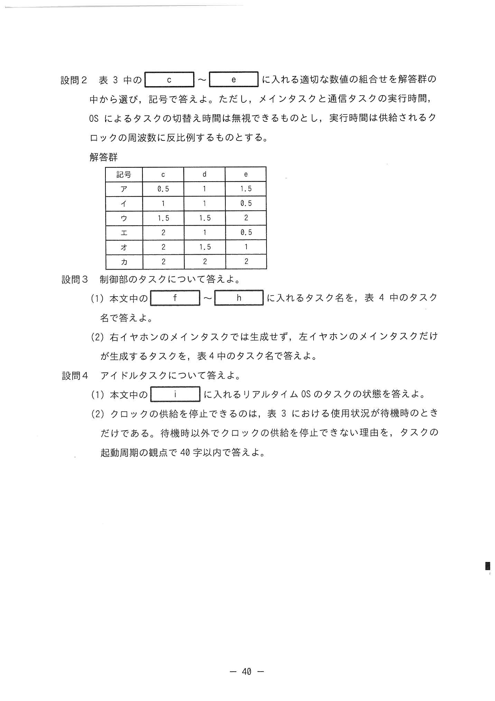

テキスト (OCR)

設問2 表3 中の| oc |~[  e | に入れる適切な数値の組合せを解答群の
中から選び, 記号で答えよ。ただし, メインタスクと通信タスクの実行時間,
0S によるタスクの切替え時間は無視できるものとし, 実行時間は供給されるク
ロックの周波数に反比例するものとする。

解答群
記号    C     d     e
ア    0.5     1     18
4     1     1     9.5
2    1.5    1.5     2
zi     2     1     0.5
a     2     5     1
カ     2     2     2

設問3 制御部のタスクについて答えよ。
(1) 本文中の|  f |一|  』 |に入れるタスク名を, 表 4 中のタスク
名で答えよ。

(2) 右イヤホンのメインタスクでは生成せず, 左イヤホンのメインタスクだけ
が生成するタスクを, 表 4中のタスク名で答えよ。
設問4 アイドルタスクについて答えよ。
(1) 本文中の[| i | に入れるリアルタイム 0S のタスクの状態を答えよ。
(2) クロックの供給を停止できるのは, 表 3 における使用状況が待機時のとき
だけである。 待機時以外でクロックの供給を停止できない理由を, タスクの
起動周期の観点で 40 字以内で答えよ。

### ページ 41

テキスト (OCR)

C

メ モ 用 紙 )

### ページ 42

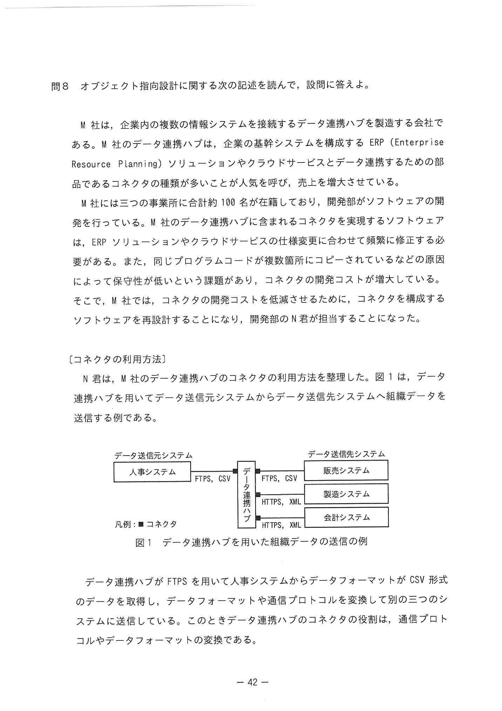

テキスト (OCR)

間8 オブジェクト指向設計に関する次の記述を読んで, 設問に答えよ。

M 社は, 企業内の複数の情報システムを接続するデータ連携ハブを製造する会社で
ある。M 社のデータ連携ハブは, 企業の基幹システムを構成する ERP (Enterprise
Resource Planning) ソリューションやクラウドサービスとデータ連携するための部
品であるコネクタの種類が多いことが人気を呼び, 売上を増大させている。

M 社には三つの事業所に合計約 109 名が在籍しており, 開発部がソフトウェアの開
発を行っている。M 社のデータ連携ハブに含まれるコネクタを実現するソフトウェア
は, ERP ソリューションやクラウドサービスの仕様変更に合わせて頻繁に修正する必
要がある。また, 同じプログラムコードが複数箇所にコピーされているなどの原因
によって保守性が低いという課題があり, コネクタの開発コストが増大している。
そこで, M 社では, コネクタの開発コストを低減させるために, コネクタを構成する
ソフトウェアを再設計することになり, 開発部の N 君が担当することになった。

[コネクタの利用方法〕

N Blt, M 社のデータ連携ハブのコネクタの利用方法を整理した。図 1 は, データ
連携ハブを用いてデータ送信元システムからデータ送信先システムへ組織データを
送信する例である。

データ送信元システム                              データ送信先システム
ABU ATS                   デ                     販売システム
FTPs, csv | | | FTPS, CSV
タ
連                     製造システム
携| HTTPS, XML
iN
1    Bete   es ム
凡例:四コネクタ           7 Pines, we L_22Y 27

 1 データ連携ハブを用いた組織データの送信の例

データ連携ハブがFTPS を用いて人事システムからデータフォーマットが CSV 形式
のデータを取得し, データフォーマットや通信プロトコルを変換して別の三つのシ
ステムに送信している。このときデータ連携ハブのコネクタの役割は, 通信プロト
コルやデータフォーマットの変換である。

### ページ 43

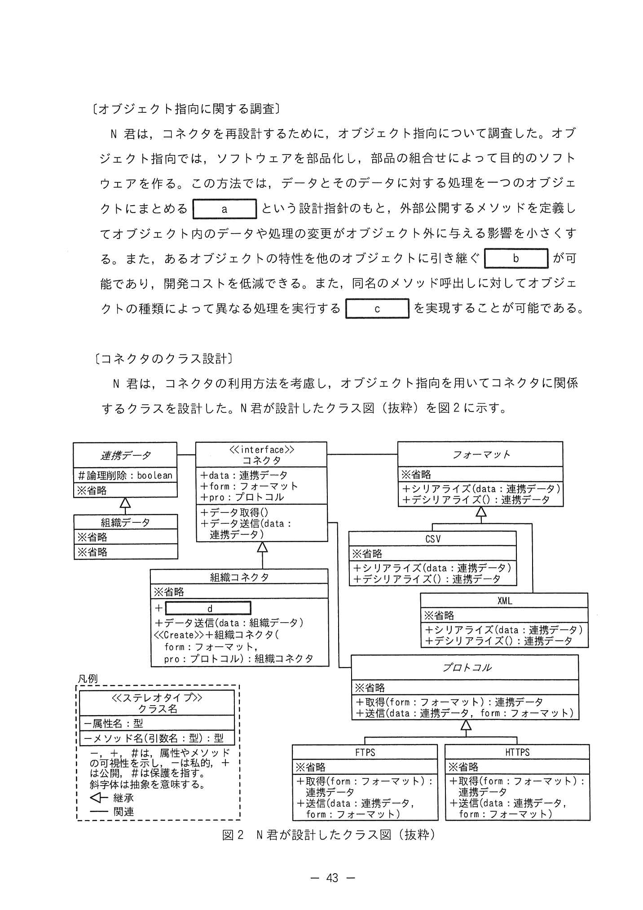

テキスト (OCR)

〔オブジェクト指向に関する調査]
N Bld, コネクタを再設計するために, オブジェクト指向について調査した。オブ

ジェクト指向では,

アを作る。この方法では

0                                      ,
クトにまとめる[| sa |

てオブジェクト内のデータや処理の変更がオブジェクト外に与える

ソフトウェアを部品化し,

部品の組合せによって目的のソフト
ータとそのデータに対する処理を一つのオブジェ
THEO,

外部公開するメソッドを定義し

影響を小さくす

る。また, あるオブジェクトの特性を他のオブジェクトに引き継ぐ| b |が可

能であり,

開発コストを低減できる。また, 同名のメソッド呼出しに対してオブジェ

クトの種類によって異なる処理を実行する を実現することが可能である。

[コネクタのクラス設計〕
N Blt, コネクタの利用方法を考慮し. オブジェクト指向を用いてコネクタに関係
するクラスを設計した。N 君が設計したクラス図 (抜粋) を図 2 に示す。

«interface>>

Dee eed    トー        コネクタ                            フォーマッムた
#諭理削除 : boolean     tdata : 連携データ                      ※省略
Ma                  +form: フォーマット                 キシリアラ    data : 連携デー
ane  a          pro : プロトコル                  トデシリアライスズ0 ・ ie
TL             +F—4 取得()
組織データ         データ送信(data :       画
※省略                   連携データ )                              CSV
a                            T                ai
キシリアライズ(data : 連携データ )
組織コネクタ               デシリアライズ() : 連携データ
※省略                                                          XML
1にふう                                _
データ送信(data : 組織データ )                      ーー     2          =
<Create>>十組織コネクタ(                                  +シリ アライズ (date : 連携データ )
fo ウー UN                         十デシリアライズ() : 連携データ
pro: プロトコル) : 組織コネクタ                     前
凡例
「ニーーニーニーーーーーーーーーーーーーーユ                      ※省略
H       KAFLA IA D>       1                      土取得(form : フォーマット) : 連携データ
!     クラス名     1          十送信(data : 連携データ, form: フォーマット)
中一属性名 : 型                !
|一メソッド名(引数名 : 型) :型 |               [                  1
}    abet! iB me S                     FTPS                       HTTPS
1 OF       aN
| GAM, #は保護を指す。 |          zal               __| Psa _
| 斜字体は抽象を意味する。       1          十取得(form : フォーマット) : | |填取得(form : フォーマット) :
1 < 継承                    !            連携データ      ー             連携データ
i                            H          +3kfa (data: 連携データ,      十送信(data : 連携データ,
に一関連 「」          form: フォーマット)         form: フォーマット)

図 2 N君が設計したクラス図 (抜粋)

### ページ 44

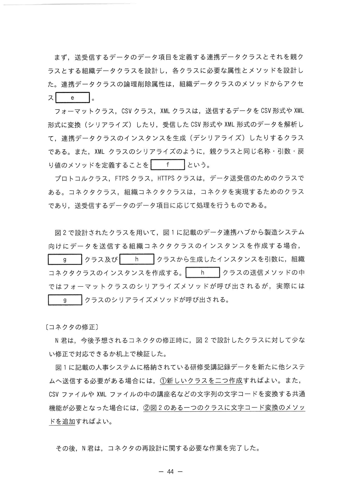

テキスト (OCR)

まず, 送受信するデータのデータ項目を定義する連携データクラスとそれを親ク
ラスとする組織データクラスを設計し, 各クラスに必要な属性とメソッドを設計し
た。 連携データクラスの論理削除属性は, 組織データクラスのメソッドからアクセ
2し s |

フォーマットクラス, CSV クラス, XML クラスは, 送信するデータをCSV形式や XML
形式に変換 (セリアライズ) したり, 受信したCSV 形式や XML 形式のデータを解析し
て, 連携データクラスのインスタンスを生成 (デシリアライズ) したりするクラス
CHS, また, XML クラスのシリアライズのように, 親クラスと同じ名称・引数・戻
り値のメソッドを定義することを|  f Jews.

プロトコルクラス, FTPS クラス, HTTPS クラスは, データ送受信のためのクラスで
ある。 コネクタクラス, 組織コネクタクラスは, コネクタを実現するためのクラス
であり, 送受信するデータのデータ項目に応じて処理を行うものである。

図 2 で設計されたクラスを用いて, 図 1 に記載のデータ連携ハブから製造システム
向けにデータを送信する組織コネクタクラスのインスタンスを作成する場合
| 』 | クラス及び[| | クラスから生成したインスタンスを引数に 組織
コネクタクラスのインスタンスを作成する。| h | クラスの送信メソッドの中
ではフォーマットクラスのシリアライズメソッドが呼び出されるが, 実際には
[og | 2ラスのシリアライズメソッドが呼び出される。

[コネクタの修正〕

N 君は, 今後予想されるコネクタの修正時に, 図 2 で設計したクラスに対して少な
い修正で対応できるか机上で検証した。

図 1 に記載の人事システムに格納されている研修受講記録データを新たに他システ
ムへ送信する必要がある場合には, ①新しいクラスを二つ作成すればよい。また,
CSV ファイルや XML ファイルの中の講座名などの文字列の文字コードを変換する共通
機能が必要となった場合には, ②図 2 のあるつのクラスに文字コード変換のメソッ
ドドを追加すればよい。

その後, N 君は。 コネクタの再設計に関する必要な作業を完了した。

ー 44 一

### ページ 45

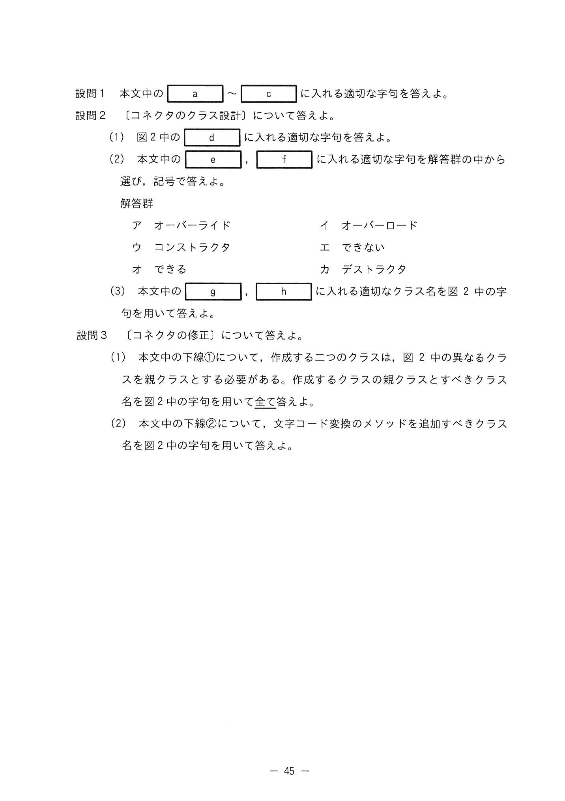

テキスト (OCR)

設問1 本文中の| a |一|  c |に入れる適切な字句を答えよ。
設問2 〔コネクタのクラス設計〕】について答えよ。
(1) Behold | に入れる適切な字句を答えよ。

(2) 本文中の| ce |,|  f |に入れる適切な字句を解答群の中から
選び, 記号で答えよ。
ARES BF

ア オーバーライド       イ ホーペーロード

ウ コンストラクタ        エエ できない

オ できる            A デストラクタ
(3) 本文中の| 9 |,| oh |に入れる適切なクラス名を図 2 中の字
旬を用いて答えよ。

設問3 〔コネクタの修正】について答えよ。
(1) 本文中の下線①について, 作成する二つのクラスは, 図 2 中の異なるクラ
スを親クラスとする必要がある。 作成するクラスの親クラスとすべきクラス
名を図 2 中の字句を用いて全て答えよ。
(2) 本文中の下線@について, 文字コード変換のメソッドを追加べきクラス
名を図 2 中の字句を用いて答えよ。

ー 45 一

### ページ 46

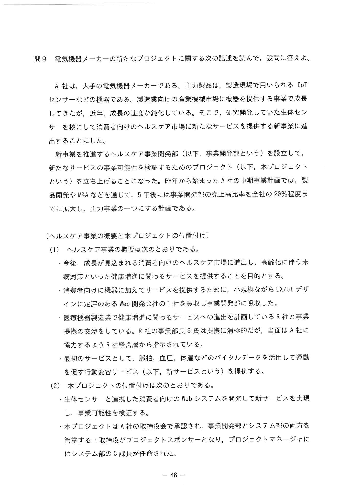

テキスト (OCR)

問9 電気機器メーカーの新たなプロジェクトに関する次の記述を読んで, 設問に答えよ。

A 社は, 大手の電気機器メーカーである。主製品は, 製造現場で用いられる IoT
センサーなどの機器である。製造業向けの産業機械市場に機器を提供する事業で成長
してきたが, 近年, 成長の速度が鈍化している。 そこで, 研究開発していた生体セン
サーを核にして消費者向けのヘルスケア市場に断たなサービスを提供する新事業に進
出することにした。

新事業を推進するヘルスケア事業開発部 (以下, 事業開発部という) を設立して,
新たなサービスの事業可能性を検証するためのプロジェクト (以下。本プロジェクト
という) を立ち上げることになった。 昨年から始まった A 社の中期事業計画では, 製
品開発や M&A などを通じて, 5 年後には事業開発部の売上高比率を全社の 20%程度ま
でに拡大し, 主力事業の一つにする計画である。

[ヘルスケア事業の概要と本プロジェクトの位置付け〕

(1) ヘルスケア事業の概要は次のとおりである。
・ 今後, 成長が見込まれる消費者向けのヘルスケア市場に進出し, 高齢化に伴う未
病対策といった健康増進に関わるサービスを提供することを目的とする。
・ 消費者向けに機器に加えてサービスを提供するために, 小規模ながら UX/UI デザ
インに定評のある Neb 開発会社の T 社を買収し事業開発部に吸収した。
・医療機器製造業で健康増進に関わるサービスへの進出を計画している R 社と事業
提携の交渉をしている。R 社の事業部長 S 氏は提携に消極的だが, 当面は A 社に
協力するようR 社経営層から指示されている。
・ 最初のサービスとして, Mt, ME, 体温などのバイタルデータを活用して運動
を促す行動変容サービス (以下, 新サービスという) を提供する。

(2) 本プロジェクトの位置付けは次のとおりである。
・生体センサーと連携した消費者向けの Web システムを開発して新サービスを実現
し, 事業可能性を検証する。
・本プロジェクトはA社の取締役会で承認され, 事業開発部とシステム部の両方を
管掌する B 取締役がプロジェクトスポンサーとなり, プロジェクトマネージャに
はシステム部の C 課長が任命された。

### ページ 47

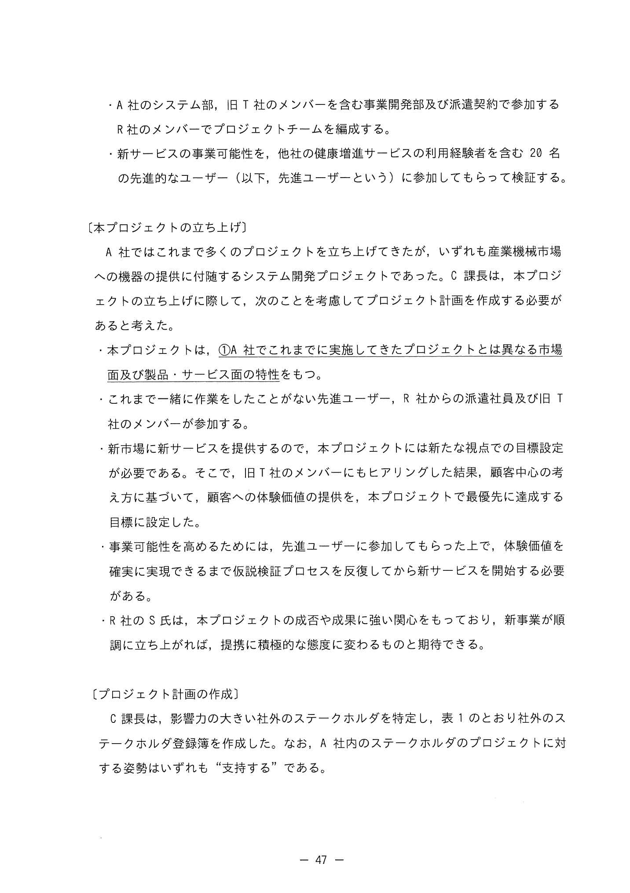

テキスト (OCR)

・A 社のシステム部, 旧T 社のメンバーを含む事業開発部及び派遣契約で参加する
R 社のメンバーでプロジェクトチームを編成する。

・新サービスの事業可能性を, 他社の健康増進サービスの利用経験者を含む 20 名
の先進的なユーザー (以下, 先進ユーザーという) に参加してもらって検証する。

〔本プロジェクトの立ち上げ〕

A 社ではこれまで多くのプロジェクトを立ち上げてきたが, いずれも産業機械市場
への機器の提供に付随するシステム開発プロジェクトであった。C 課長は, 本プロジ
ェクトの立ち上げに際して, 次のことを考慮してプロジェクト計画を作成する必要が
あると考えた。

・本プロジェクトは, ①A 社でこれまでに実施してきたプロジェクトとは異なる市場

面及び製品・サービス面の特性をもつ。

・これまで一緒に作業をしたことがない先進ユーザー, R 社からの派遣社員及び旧T

社のメンバーが参加する。

・新市場に新サービスを提供するので, 本プロジェクトには新たな視点での目標設定
が必要である。 そこで, 旧T社のメンバーにもヒアリングした結果, 顧客中心の考
え方に基づいて, 顧客への体験価値の提供を, 本プロジェクトで最優先に達成する
目標に設定した。

・ 事業可能性を高めるためには, 先進ユーザーに参加してもらった上で, 体験価値を
確実に実現できるまで仮説検証プロセスを反復してから新サービスを開始する必要
がある。

・R 社の S 氏は, 本プロジェクトの成否や成果に強い関心をもっており, 新事業が順
調に立ち上がれば, 提携に積極的な態度に変わるものと期待できる。

[プロジェクト計画の作成]

C 課長は, 影響ボ力の大きい社外のステークホルダを特定し, 表 1 のとおり社外のス
テークホルダ登録簿を作成した。なお, A 社内のステークホルダのプロジェクトに対
する姿勢はいずれも “RTS” TCHS.

= do

### ページ 48

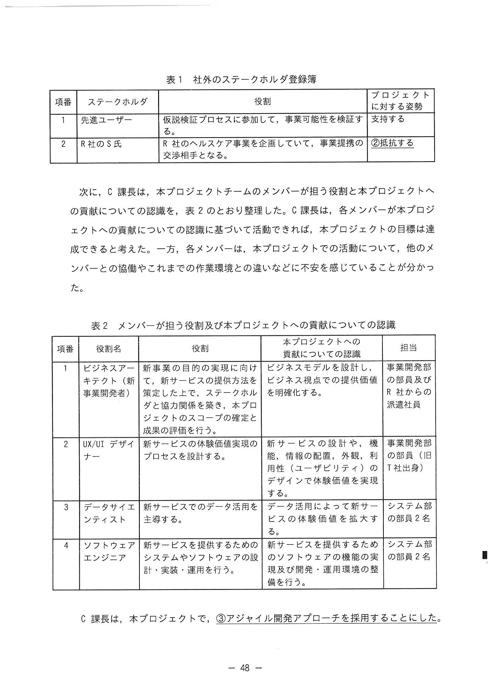

テキスト (OCR)

表1 社外のステークホルダ登録簿
項番 | ステークホルダ            役割           ner
1 | snea-—   仮説検証プロセスに参加して, 事業可能性を検証す | 支持する
る。
2 |R社のS氏     R 社のヘルスケア事業を企画していて, 事業提携の | OMFS
交渉相手となる。
次に, C 課長は, 本プロジェクトチームのメンバーが担う役割と本プロジェクトへ

の貢献についての認識を, 表 2 のとおり整理した。C 課長は, 各メンバーが本プロジ
ェクトへの貢献についての認識に基づいて活動できれば, 本プロジェクトの目標は達
成できると考えた。一方, 各メンバーは, 本プロジェクトでの活動について, 他のメ
ンバーとの協働やこれまでの作業環境との違いなどに不安を感じていることが分かっ

om

表2 メンバーが担う役割及び本プロジェクトへの貢献についての認識

本プロジェクトへの

項番| 役割名        役割         BRITO     担当
1 | ビジネスアー | 新事業の目的の実現に向け| ビジネスモデルを設計し, | 事業開発部
キテクト (新| て, 新サービスの提供方法を | ビジネス視点での提供価値 | の部員及び
事業開発者) |策定した上で, ステークホル | を明確化する。       R 社からの
ダと協力関係を築き, 本プロ               派遣社員
ジェクトのスコープの確定と
成果の評価を行う。
2 | UX/UI デザイ | 新サービスの体験価値実現の | 新サービスの設計や, 機| 事業開発部
ナー      プロセスを設計する。     能, 情報の配置, AM, 利 の部員(旧
用性 (ユーザビリティ) の|T社出身
デザインで体験価値を実現
する。
3 | データサイエ | 新サービスでのデータ活用を | データ活用によって新サー | システム部
ンティスト |主導する。         ビスの体験価値を拡大す | の部員2名
る。
4 |ソフトウェア | 新サービスを提供するための | 新サービスを提供するため | システム部
エンジニア | システムやソフトウェアの設| のソフトウェアの機能の実 | の部員2名

計・実装・運用を行う。

現及び開発・運用環境の整
備を行う。

C 課長は, 本プロジェクトで, ③アジャイル開発アプローチを採用することにした。

### ページ 49

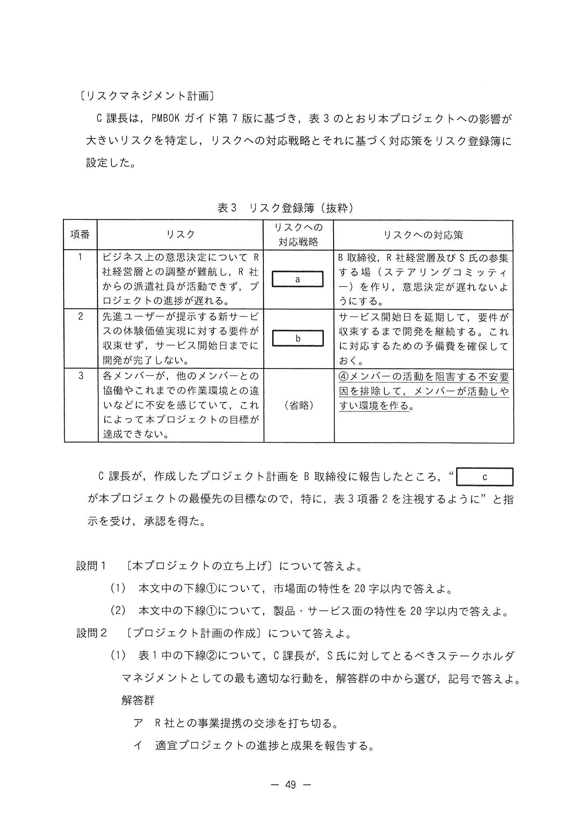

テキスト (OCR)

[リスクマネジメント計画〕

大きいリスクを特定し

( 課長は, PMBOK ガイド第 7 版に基づき, 表3 のとおり本プロジェクトへの影響が

リスクへの対応戦略とそれに基づく対応策をリスク登録簿に

設定した。
表3 リスク登録簿 (抜粋)
Bs        リスク        eee      YADADS ISI

ビジネス上の意思決定について R
HREM COMBO MAL, R 社
からの派遣社員が活動できず, プ
ロジェクトの進捗が遅れる。

B 取締役,R 社経営層及び S 氏の参集
する場 (ステアリングコミッティ
ー) を作り, 意思決定が遅れないよ
うにする。

先進ユーザーが提示する新サービ
スの体験価値実現に対する要件が
WARES, サービス開始日までに
開発が宙了しない。

Ca]
Li»)

サービス開始日を延期して, 要件が
収束するまで開発を継続する。これ
に対応するための予備費を確保して
おく。

各メンバーが, 他のメンバーとの
協働やこれまでの作業環境との違
いなどに不安を感じていて, これ
によって本プロジェクトの目標が

達成できない。

(省略)

④メンバーの活動を阻害する不安要
因を排除して, メンバーが活動しや
すい環境を作る。

示

設問 1

設問2

C 課長が, 作成したプロジェクト計画を 8 取純役に報告したととろ, “Lc |
が本プロジェクトの最優先の目棟なので, 特に, 表 3 項番 2 を注視するように"と指

を受け, 承認を得た。

①)

(2)

(1)

解答群

ア R 社との事業提携の交渉を打ち切る。

[本プロジェクトの立ち上げ〕について答えよ。
本文中の下線①について, 市場面の特性を 2 字以内で答えよ。

本文中の下線のについて, 製品・サービス面の特性を 20 字以内で答えよ。
[プロジェクト計画の作成】について答えよ。

表 1 中の下線のについて, C 課長が, S 氏に対してとるべきステークホルダ
マネジメントとしての最も適切な行動を, 解答群の中から選び

記号で答えよ。

イ 適宜プロジェクトの進捗と成果を報告する。

### ページ 50

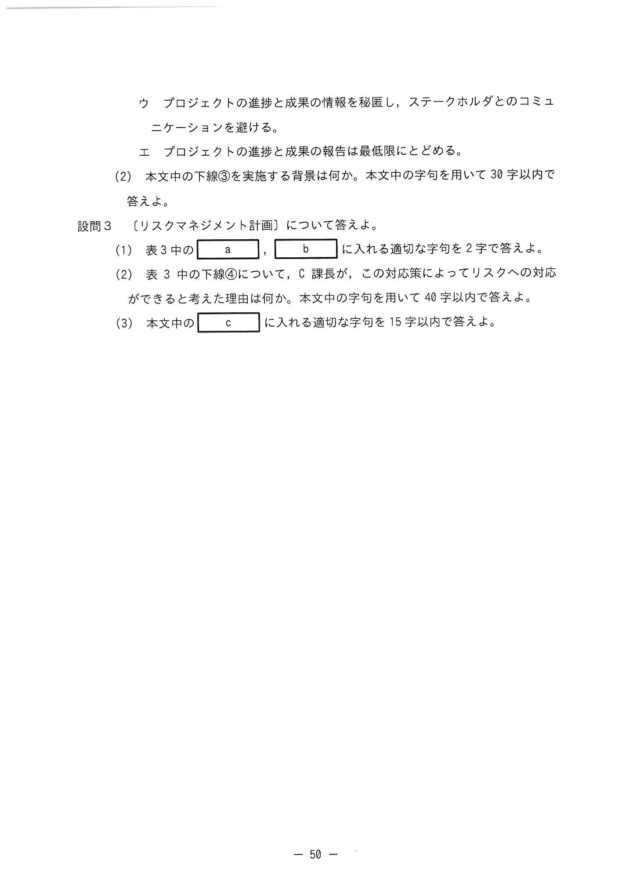

テキスト (OCR)

ウ プロジェクトの進捗と成果の情報を秘匿し ステークホルダとのコミュ
ニケーションを避ける。
エ プロジェクトの進捗と成果の報告は最低限にとどめる。
(2) 本文中の下線③を実施する背景は何か。本文中の字句を用いて 30 字以内で

答えよ。
設問3 〔リスクマネジメント計画] について答えよ。
(1) 表3中の| a |,| b | に入れる適切な字句を2字で答えよ。

(2) 表 3 中の下線④について, C 課長が, この対応策によってリスクへの対応
ができると考えた理由は何か。本文中の字句を用いて 49 字以内で答えよ。

(3) 本文中の[| c | に入れる適切な字句を15 字以内で答えよ。

### ページ 51

テキスト (OCR)

[ メ モ 用 紙 ]

### ページ 52

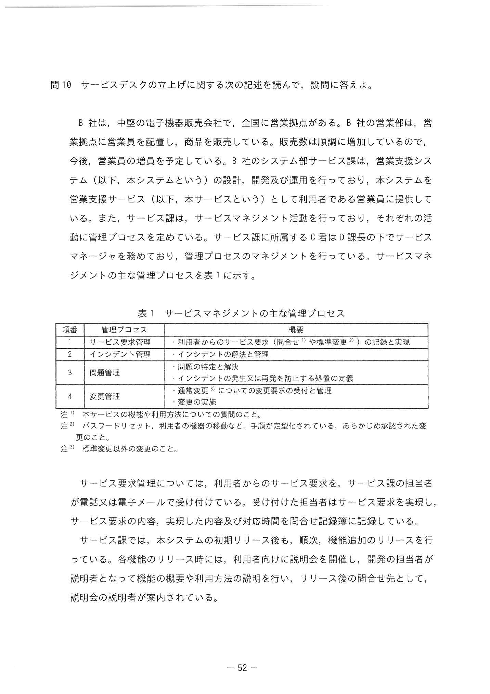

テキスト (OCR)

問19 サービスデスクの立上げに関する次の記述を読んで, 設問に答えよ。

B 社は, 中堅の電子機器販売会社で, 全国に営業拠点がある。B 社の営業部は, 営
業拠点に営業員を配置し, 商品を販売している。販売数は順調に増加しているので
Sk, 営業員の増上員を予定している。B 社のシステム部サービス課は, 営業支援シス
テム UAE, 本システムという) の設計, 開発及び運用を行っており, 本システムを
営業支援サービス (以下, 本サービスという) として利用者である営業員に提供して
いる。 また, サービス課は, サービスマネジメント活動を行っており, それぞれの活
動に管理プロセスを定めている。サービス課に所属するC 君はD 課長の下でサービス
マネージャを務めており, 管理プロセスのマネジメントを行っている。サービスマネ
ジメントの主な管理プロセスを表 1 に示す。

表1 サービスマネジメントの主な管理プロセス

項番      管理プロセス                                   概要
1     サービス要求管理     ・利用者からのサービス要求 (問合せ ! や標準変更 ? ) の記録と実現
2    インシデント管理     ・インシデントの解決と管理
    問題管理            ・ 問題の特定と解決

・インシデントの発生又は再発を防止する処置の定義

・ 通常変更 についての変更要求の受付と管理

・変更の実施

HE? 本サービスの機能や利用方法についての質問のこと。

HE? パスワードリセット, 利用者の機器の移動など, 手順が定型化されている, あらかじめ承認された変
更のこと。

注? 標準変更以外の変更のこと。

4     変更管理

サービス要求管理については, 利用者からのサービス要求を.. サービス課の担当者
が電話又は電子メールで受け付けている。 受け付けた担当者はサービス要求を実現し
サービス要求の内容, 実現した内容及び対応時間を問合せ記録簿に記録している。

サービス課では, 本システムの初期リリース後も, 順次, 機能追加のリリースを行
っている。各機能のリリース時には, 利用者向けに説明会を開催し, 開発の担当者が
説明者となって機能の概要や利用方法の説明を行い。リリース後の問合せ先として,
説明会の説明者が案内されている。

### ページ 53

テキスト (OCR)

〔サービス要求管理の現状と課題〕

サービス要求のうち, 問合せは, 担当者が本サービスの操作マニュアル及び機能の
詳細を記述した本システムの仕様書を参照して回答し, 標準変更は, 担当者が定型業
務手順書を参照して実施している。なお, 問合せの回答では, 経験豊富な担当者は
操作マニュアル及び本システムの仕様書だけでなく暗黙知を使って問合せに短時間で
回答する場合も多い。このことから, 利用者からの問合せに対して最初の連絡で回答
した割合 (以下, 一次解決率という) に, 担当者間で差が出ている。 また, 問合せを
受けてから回答までに要する時間を短縮するために, 一次解決率の向上が課題となっ
ている。 今後, 営業員の増員に伴いサービス課の業務量の増加が予想されているので
担当者の負荷が増大するおそれがあり, 長時間残業の防止も課題となることが推測さ
れる。

そこで, サービス課は, 一次解決率の向上のため, サービス課の経験豊富な担当者
に指示して, 問合せ記録簿に記録されている内容を基に, 問合せ内容, 対応手順及び
回答内容を整理した問合せ対応ノウハウ集を作成することにした。 併せて, BRAO
増員による長時間残業を防止するために, 来年度からサービス課内に新たな組織とし
てサービスデスクを立ち上げ, そのサービスデスクでサービス要求を受け付けて実現
することにした。C 君がサービスデスクのサービスマネージャに任命され, 立上げも
行うよう指示された。サービスデスク要員は, サービスデスクの業務経験が豊富な要
員を新規採用し, C 君の配下でサービスデスク業務を担当させるととにした。

〔【サービスデスク立上げの検討〕

D 課長は, サービスデスクについて, “サービス課の業務量の増加に対応するため
に, 業務を極力サービスデスクに移管する" とともに 一次解決率をできるだけ高く
Lt, 顧客満足を向上させる"との方針を挙げた。

C Bld, D 課長の方針を受け, サービス要求のうち, 問合せについては, サービス
デスク要員が問合せ対応ノウハウ集を活用して, 利用者からの問合せに対して
| 』 | できるようにすることで, 一次解決率を向上させようと考えた。なお,
サービス要求のうち, 標準変更については, サービス課で現在利用している定型業務
手順書を参照して, サービスデスク要員がサービス要求を実現できることを確認した。

これらを踏まえて, ( 君は, 表2 に示すサービスデスク立上げステップを定めた。

### ページ 54

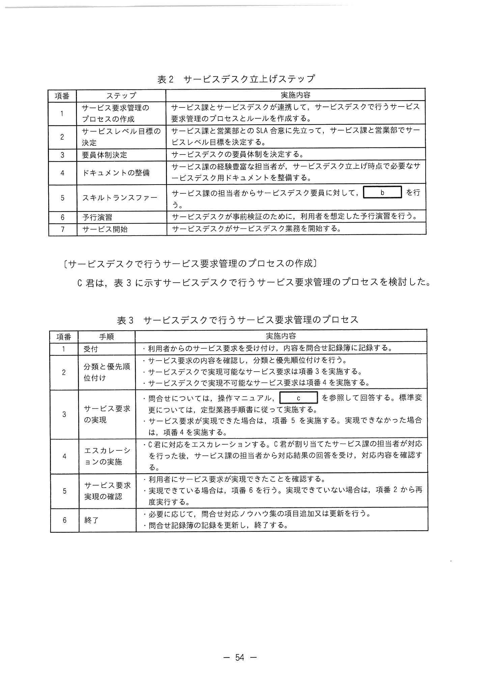

テキスト (OCR)

表2 サービスデスク立上げステップ

項番     ステップ                   実施内容
   サービス要求管理の    サービス課とサービスデスクが連携して, サービスデスクで行うサービス
プロセスの作成        要求管理のプロセスとルールを作成する。
2   サービスレベル目標の | サービス課と営業部との SLA 合意に先立って, サービス課と営業部でサー
決定                ビスレベル目標を決定する。
3    要員体制決定          サービスデスクの要員体制を決定する。

サービス課の経験豊富な担当者が, サービスデスク立上げ時点で必要なサ

4    ドキュメントの整備    ービスデスク用ドキュメントを整備する。

5 | ルトランュファー | サービスの担当者からサービスデスク要員に対して, | 5 ] を生

う。
予行演習                    サービスデスクが事前検証のために, 利用者を想定した予行演習を行う。
サービス開始           サービスデスクがサービスデスク業務を開始する。

[サービスデスクで行うサービス要求管理のプロセスの作成]
C 君は, 表 3 に示すササービスデスクで行うサービス要求管理のプロセスを検討した。

表3 サービスデスクで行うサービス要求管理のプロセス

ae | sm                  EAS
1 | 8      - 利用者からのサービス要求を受け付け。内容を同全せ記録聞に記録する。
・ サービス要求の内容を確認し。 分類と優先順位付けを行う。
|
2 | BRCBAIA) -サービスデスクで拓下可能なサービス秋天秋 3を実施する。

・サービスデスクで実現不可能なサービス要求は項番 4 を実施する。

・ 問合せについては。 操作マニュアル, を参照して回答する。 REL
3 | サービス要求 | 更については, 定型業務手順書に従って実施する。

の実現    ・ サービス要求が実現できた場合は, ABS を実施する。実現できなかった場合
は, 項番 4 を実施する。

・( 君に対応をエスカレーションする。( 君が割り当てたサービス課の担当者が対応

4。 | エスカレーシ | を行った後。サービス課の担当者から対応結果の回答を受け対応内容を確認す
ョンの実施      %
mk | BRECU—CARRORM CERT COMETS.
5 | 2OEABR) gece cused, 項番 6 を行う。実現できていない場合は, 項番 2 から再
実現の確認        ュー
度実行する。
|      - 必要に応じて, 問合せ対応ノウハウ集の項目追加又は更新を行う。

・問合せ記録澄の記録を更新し, 終了する。

### ページ 55

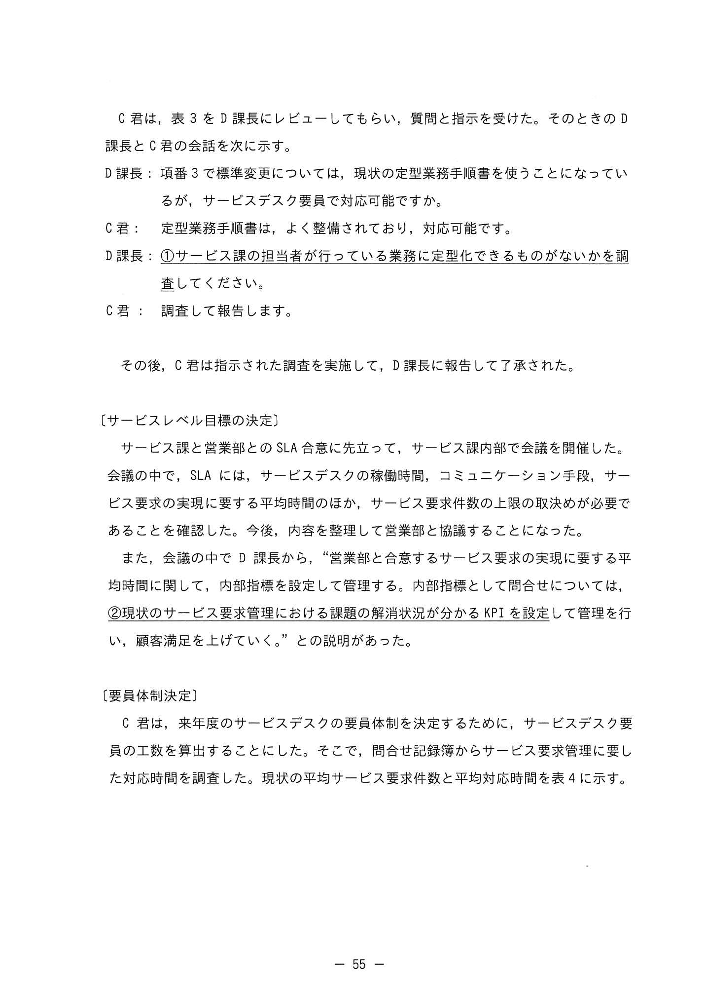

テキスト (OCR)

( 君は, 表 3 をD 課長にレビューしてもらい, 質問と指示を受けた。そのときのD

課長とC 君の会話を次に示す。

D 課長 : 項番 3 で標準変更については, 現状の定型業務手順書を使うことになってい
るが, サービスデスク要員で対応可能ですか。

C君: 定型業務手順書は, よく整備されており, 対応可能です。

DBR: ①サービス課の担当者が行っている業務に定型化できるものがないかを調
査してください。

C君 : 調査して報告します。

その後, C 君は指示された調査を実施して, D 課長に報告して了承された。

[サービスレベル目標の決定〕

サービス課と営業部との SLA 合意に先立って, サービス課内部で会議を開催した。
会議の中で, SLA には, サービスデスクの稼働時間。 コミュニケーション手段, サー
ビス要求の実現に要する平均時間のほか, サービス要求件数の上限の取決めが必要で
あることを確認 した。今後, 内容を整理して営業部と協議することになった。

Ek, 会議の中で D 課長から, “営業部と合意するサービス要求の実現に要する平
均時間に関して, 内部指標を設定して管理する。内部指標として問合せについては,
②現状のサービス要求管理における課題の解消状況が分かる KPI を設定して管理を行
い, 顧客満足を上げていく。” との説明があった。

〔要員体制決定

C Ald, 来年度のサービスデスクの要員体制を決定するために, サービスデスク要
上員の工数を算出することにした。 そこで, 問合せ記録澄からサービス要求管理に要し
た対応時間を調査した。現状の平均サービス要求件数と平均対応時間を表 4 に示す。

### ページ 56

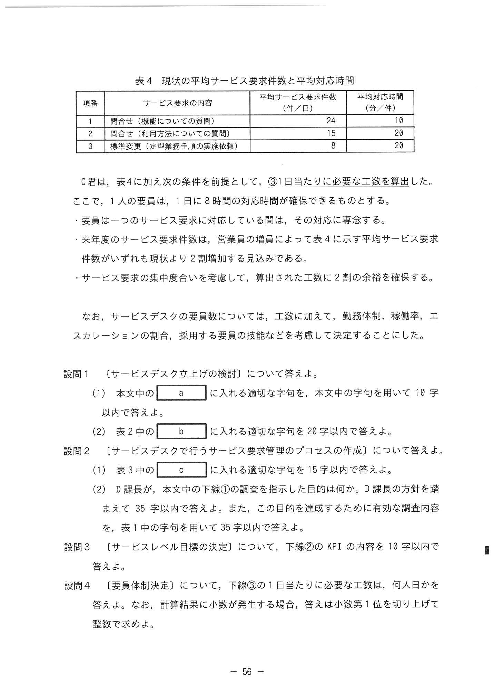

テキスト (OCR)

表4 現状の平均サービス要求件数と平均対応時間

ーー      平均サービス要求件数 | SNORE
ad      2 EABR OAS        EB)     O/H)
] | Bet Goo tome             24       70
2    問合せ (利用方法についての質問)                   15            20
3 | RSE HURBFMORERM           8       20

C君は, RAICMAROREFSMEC LT, ③1日当たりに必要な工数を算出した。
ここで, 1 人の要員は, 1日に8時間の対応時間が確保できるものとする。

・要員は一つのサービス要求に対応している間は, その対応に専念する。

・ 来年度のサービス要求件数は, 営業員の増員によって表 4 に示す平均サービス要求
件数がいずれも現状より 2 割増加する見込みである。

・サービス要求の集中度合いを考慮して, 算出された工数に 2 割の余裕を確保する。

なお, サービスデスクの要員数については, 工数に加えて, 勤務体制, 稼働率, エ
スカレーションの割合, 採用する要員の技能などを考慮して決定することにした。

設問1 〔サービスデスク立上げの検討}]について答えよ。
(1) 本文中の|  』 | に入れる適切な字句を, 本文中の字句を用いて19 字
以内で答えよ。
(2) 表2中の|  b | に入れる適切な字句を29字以内で答えよ。
設問2 [サービスデスクで行うサービス要求管理のプロセスの作成〕]について答えよ。
(1) 表3中の| c | に入れる適切な字句を15字以内で答えよ。
(2) DREAD, 本文中の下線①の調査を指示した目的は何か。D 課長の方針を踏
まえて 35 字以内で答えよ。また, この目的を達成するために有効な調査内容
を, 表 1 中の字句を用いて 35 字以内で答えよ。
設問3 〔サービスレベル目標の決定〕】 について, 下線②の KPI の内容を 10 字以内で
答えよ。
設問4 [要員体制決定})について, 下線③の 1 日当たりに必要な工数は, 何人日かを
Sak. BS, 計算結果に小数が発生する場合, 答えは小数第 1 位を切り上げて
整数で求めよ。

### ページ 57

テキスト (OCR)

メ モ 用 紙 J

ー 57 一

### ページ 58

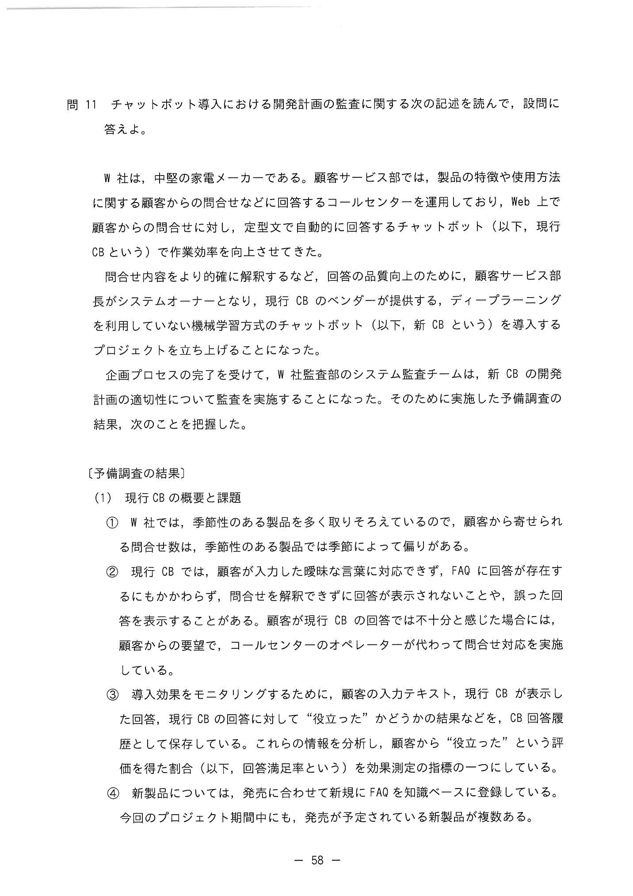

テキスト (OCR)

問 11 チャットボット導入における開発計画の監査に関する次の記述を読んで, 設問に

答えよ。

W 社は, 中堅の家電メーカーである。顧客サービス部では, 製品の特徴や使用方法
に関する顧客からの問合せなどに回答するコールセンターを運用しており, Web 上で
顧客からの問合せに対し, 定型文で自動的に回答するチャットボット (以下, 現行
CB という) で作業効率を向上させてきた。

問合せ内容をより的確に解釈するなど, 回答の品質向上のために, 顧客サービス部
長がシステムオーナーとなり, 現行 CB のベンダーが提供する, ディープラーニング
を利用していない機械学習方式のチャットボット (以下, 新 CB という) を導入する
プロジェクトを立ち上げることになった。

企画プロセスの完了を受けて, W 社監査部のシステム監査チームは, 新 CB の開発
計画の適切性について監査を実施することになった。そのために実施した予備調査の
結果, 次のことを把握した。

[予備調査の結果〕

(1) 現行CB の概要と課題

① W 社では, 季節性のある製品を多く取りそろえているので, 顧客から寄せられ
る問合せ数は, 季節性のある製品では季節によって偏りがある。

② 現行 6 では, 顧客が入力した暖昧な言葉に対応できず, FO に回答が存在す
るにもかかわらず, 問合せを解釈できずに回答が表示されないことや, 誤った回
答を表示することがある。 顧客が現行 CB の回答では不十分と感じた場合には,
顧客からの要望で, コールセンターのオペレーターが代わって問合せ対応を実施
している。

@ 導入効果をモニタリングするために, 顧客の入力テキスト, 現行 CB が表示し
た回答, 現行 CB の回答に対して "役立った" かどうかの結果などを, (BOSE
歴として保存している。 これらの情報を分析し, 顧客から “役立った" という評
価を得た割合 (以下, 回答満足率という) を効果測定の指標の一つにしている。

④ 新製品については, 発売に合わせて新規に FAQ を知識ペースに登録している。
今回のプロジェクト期間中にも, 発売が予定されている新製品が複数ある。

### ページ 59

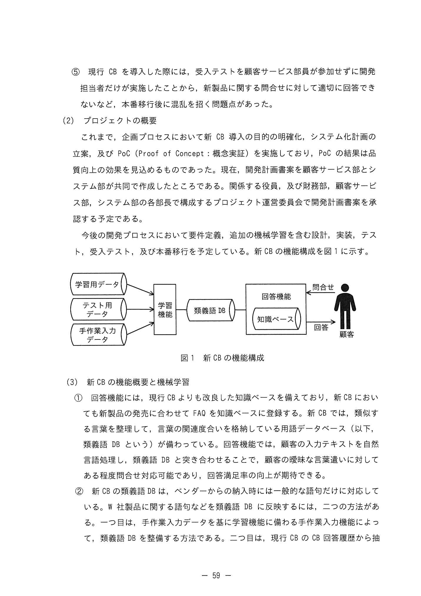

テキスト (OCR)

© 現行 CB を導入した際には, 受入テストを顧客サービス部員が参加せずに開発
担当者だけが実施したことから, 新製品に関する問合せに対して適切に回答でき
ないなど, 本番移行後に混乱を招く問題点があった。
(2) プロジェクトの概要
CHET, 企画プロセスにおいて新 CB 導入の目的の明確化, システム化計画の
立案, 及び Pol (Proof of Concept : 概念実証) を実施しており, Pol の結果は品
質向上の効果を見込めるものであった。 現在, 開発計画書案を顧客サービス部とシ
ステム部が共同で作成したところである。 関係する役員, 及び財務部, 顧客サービ
ス部, システム部の各部長で構成するプロジェクト運営委員会で開発計画書案を承
認する予定である。
今後の開発プロセスにおいて要件定義, 追加の機械学習を含むお設計, RR, テス
ト, 受入テスト, 及び本番移行を予定している。新CB の機能構成を図 1 に示す。

学湯用データ |                                        問合せ @

H
<>

=                     i     (sean ()
デー                      4         類義語 DB
=                      “                                  (saat<—a()
手作業入
データ

回答

顧客

He
fay
<>

図1 新CB の機能構成

(3) 新CB の機能概要と機械学習

①④ 回答機能には, 現行CB よりも改良した知識ベースを備えており, 新CB におい
ても新製品の発売に合わせて FAQ を知識ベースに登録する。新 CB では, 類似す
る言葉を整理して, 言葉の関連度合いを格納している用語データベース (以下,
類義語 DP という) が備わっている。回答機能では, 顧客の入力テキストを自然
言語処理し, 類義語 DP と突き合わせることで, 顧客の曖昧な言葉遣いに対して
ある程度問合せ対応可能であり, 回答満足率の向上が期待できる。

② 新CB の類義語 DB は, ベンダーからの納入時には一般的な語句だけに対応して
いる。W 社製品に関する語句などを類義語 DB に反映するには, 二つの方法があ
る。一つ目は, 手作業入力データを基に学習機能に備わる手作業入力機能によっ
て, 類義語 DB を整備する方法である。二つ目は, 現行CB のCB 回答履歴から抽

### ページ 60

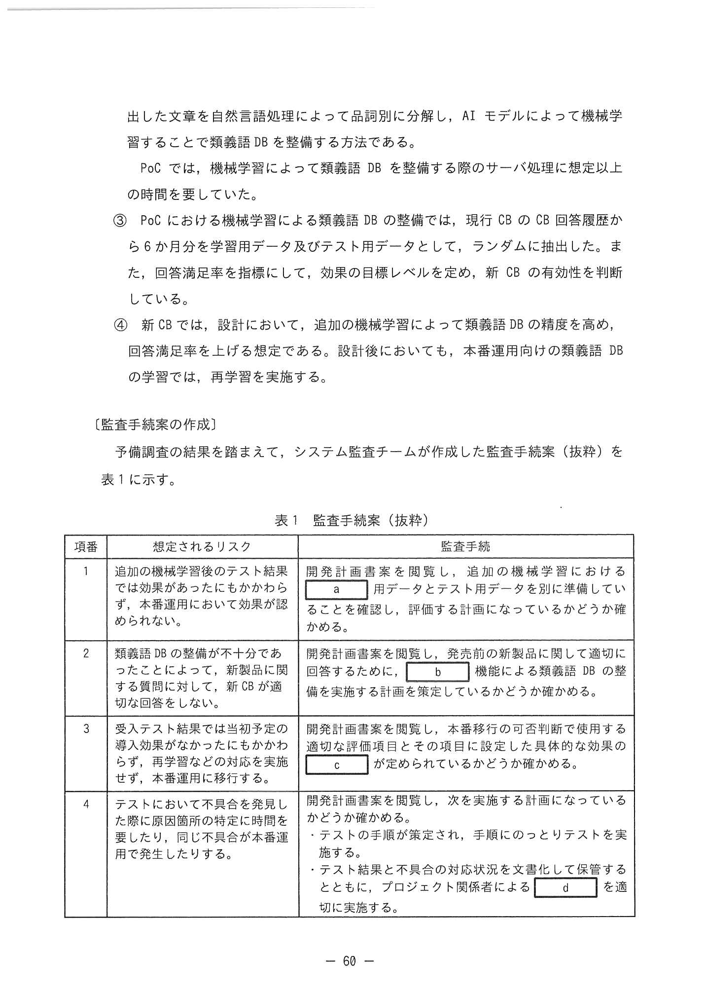

テキスト (OCR)

出した文章を自然言語処理によって品詞別に分解し, AI モデルによって機械学
習することで頻義語 DB を整備する方法である。
PoC では, 機械学習によって類義語 DB を整備する際のサーバ処理に想定以上

の時間を要していた。

③ Pol における機械学習による類義語 DB の整備では, 現行 CB のCB 回答履歴か
ら6か月分を学習用データ及びテスト用データとして, ランダムに抽出した。ま
た, 回答満足率を指標にして, 効果の目標レベルを定め, 新 CB の有効性を判断

している。
④ 新CBでは,

設計において, 追加の機械学習によって類義語 DB の精度を高め,

回答満足率を上げる想定である。設計後においても, 本番運用向けの類義語 DB
の学習では, 再学習を実施する。

(監査手続案の作成〕
予備調査の結果を踏まえて, システム監査チームが作成した監査手続案 (抜粋) を
表 1 に示す。
Rl 監査手続案 (抜粋)
項番             想定されるリスク                                           監査手続

追加の機械学習後のテスト結果
では効果があったにもかかわら
ず, 本番運用において効果が認
められない。

開発計画書案を閲覧し, 追加の機械学習における
[| 3』 | 用データとテスト用データを別に準備してい
ることを確認し, 評価する計画になっているかどうか確
かめる。

類義語 DB の整備が不十分であ
ったことによって, 新製品に関
する質問に対して, MCRD
切な回答をしない。

開発計画書案を閲覧し, 発売前の新製品に関して適切に
回答するために, | b | 機能による類義語DB Ow
備を実施する計画を策定しているかどうか確かめる。

受入テスト結果では当初予定の
導入効果がなかったにもかかわ
らず, 再学習などの対応を実施
せず, 本番運用に移行する。

開発計画書案を閲覧し, 本番移行の可和判断で使用する
適切な評価項目とその項目に設定した具体的な効果の
 が定められているかどうか確かめる。

テストにおいて不具合を発見し
た際に原因箇所の特定に時間を
要したり, 同じ不具合が本番運
用で発生したりする。

開発計画書案を閲覧し, 次を実施する計画になっている

かどうか確かめる。

・テストの手順が策定され, 手順にのっとりテストを実
施する。

・テスト結果と不具合の対応状況を文書化して保管する
とともに, プロジェクト関係者による        を適
切に実施する。

### ページ 61

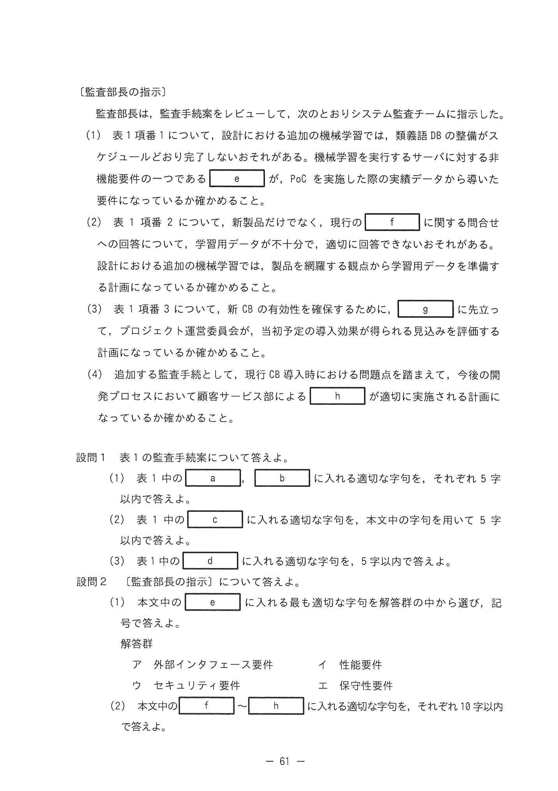

テキスト (OCR)

(監査部長の指示)
監査部長は, 監査手続案をレビューして, 次のとおりシステム監査チームに指示した。
(1) 表1項番1 について, 設計における追加の機械学習では, 類義語 DB の整備がス
ケジュールどおり完了しないおそれがある。機械学習を実行するサーバに対する非
機能要件のーつである|  e | が,Poc を実施した際の実績データから導いた
要件になっているか確かめること。
(2) RIE 2 について, 新製品だけでなく, 現行の| 「 | に関する問合せ
への回答について, 学習用データが不十分で, 適切に回答できないおそれがある。
寺における追加の機械学習では, 製品を網羅する観点から学習用データを準備す
る計画になっているか確かめること。
(3) 表 1 項番 3 について, 新 CB の有効性を確保するために, |  g | に先立っ
, プロジェクト運営委員会が, 当初予定の導入効果が得られる見込みを評価する
計画になっているか確かめること。

nl

14
a

put

nA

(4) 追加する監査手続として, 現行CB 導入時における問題点を踏まえて, 今後の開

発プロセスにおいて顧客サービス部による が適切に実施される計画に
なっているか確かめること。

設問1 表1の監査手続案について答えよ。

GQ) 表1中の| ai | |  b |に入れる適切な字句を, それぞれ 5 字
以内で答えよ。

(2) 表 1 中の| c | に入れる適切な字句を, 本文中の字句を用いて5 字
以内で答えよ。

(3) 表1中の|  d | に入れる適切な字句を, 5字以内で答えよ。
設問2 [監査部長の指示] について答えよ。

(1) 本文中の| s | に入れる最も適切な字句を解答群の中から選び, 記

号で答えよ。
解答群
ア 外部インタフェース要件    イ 性能要件
ウ セキュリティ要件       エ 保守性要件
(2) 本文中の| tf |-|  h |に入れる適切な字句を, それぞれ 10 字以内
で答えよ。

### ページ 62

テキスト (OCR)

【

x モ 用 紙

### ページ 63

テキスト (OCR)

〔

x モ 用 紙 〕

### ページ 64

テキスト (OCR)

6. 退室可能時間中に退室する場合は, 手を挙げて監督具に合図し, 答案用紙が回収さ
れてから静かに退室してください。
退室可能時間 | 13:40 ~ 15:20 |
7. 問題に関する質問にはお答えできません。文意どおり解釈してください。
8. 問題冊子の余白などは, 適宜利用して構いません。ただし, 問題冊子を切り離して
利用することはできません。
9. 試験時間中, 机上に置けるものは, 次のものに限ります。
なお, 会場での貸出しは行っていません。
受験票, 黒鉛筆及びシャープペンシル (B 又は HB), 鉛筆削り, 消しゴム, 定規
時計 (時計型ウェアラブル端末は除く。アラームなど時計以外の機能は使用不可),
ハンカチ, ポケットティッシュ, 目薬
これら以外は机上に置けません。使用もできません。
10. 試験終了後, この問題冊子は持ち帰ることができます。
11. SRAM, いかなる場合でも提出してください。 回収時に提出しない場合は, 採
点されません。
12, 試験時間中にトイレへ行きたくなったり, 気分が悪くなったりした場合は, FEB
げて監督具に合図してください。

試験問題に記載されている会社名又は製品名は, それぞれ各社又は各組織の商標又は登録商標です。

なお, 試験問題では, "及び 『 を明記していません。

©2024 独立行政法人情報処理推進機構

---

## 午後解答

1/6 
©2024 独立行政法人情報処理推進機構 
令和６年度 秋期 応用情報技術者試験 解答例 
 
午後試験 
問１ 
出題趣旨 
 パスワードの管理方法が不適切であったことによって，不正アクセスの被害が拡大する事例が発生している。
 本問では，EC サイトに対するペネトレーションテストの結果を題材として，パスワードの安全な管理方法に
ついての理解を問う。 
 
設問 
解答例・解答の要点 
備考 
設問１ 
ハッシュ値からパスワードの割出しは難しい。 
 
設問２ 
機密性 
 
設問３ 
a
オ 
 
 
b
カ 
 
設問４ 
イ 
 
設問５ 
多層防御 
 
設問６(1) 会員テーブルの窃取だけではペッパーを得ることができないから 
 
 
(2)
c
704 
 
 
問２ 
出題趣旨 
 昨今，デジタル化，脱炭素化などによる人々の社会意識の変容が経営環境を変化させたことで，“ブランド”，
“人的資本経営”などの非財務情報に基づく戦略の策定が，経営課題としての重みを増してきている。 
 本問では，コーヒーチェーン店のブランド再構築による企業の成長や利益性向上を題材として，“人的資本”
を強化することで，顧客へのサービス品質向上につなげるサービスプロフィットチェーンに基づく戦略の策定
についての理解を問う。 
 
設問 
解答例・解答の要点 
備考 
設問１
(1)
a 
従業員満足度 
 
 
 
b 
顧客満足度 
 
 
(2)
機会 
環境や倫理に対する社会意識の高まり 
 
 
 
強み 
環境に配慮した高品質なコーヒー豆の使用 
 
 
(3)
c 
・顧客がQ 社にもたらす利益 
・顧客生涯価値 
 
 
 
(4)
d 
リピート率 
 
設問２
(1)
e 
自己評価と部下からの評価とのギャップ 
 
 
(2)
f 
共感 
 
 
(3) 香り深いコーヒーの淹れ方のマニュアル化

2/6 
©2024 独立行政法人情報処理推進機構 
問３ 
出題趣旨 
 素数は，数学における学問的な用途のほか，暗号処理の分野などで活用されている。 
 本問では，素数を列挙するアルゴリズムの一つであるエラトステネスの篩
ふるい
を題材として，素数の性質を利用
した効率化の手法についての理解を問う。 
 
設問 
解答例・解答の要点 
備考 
設問１ 
ア
N2 
 
設問２ 
イ
isPrime[d]がtrue と等しい 
 
 
ウ
t＋d 
 
設問３ 
エ
isPrime[(d－1)÷2]がtrue と等しい 
 
 
オ
(t－1)÷2 
 
 
カ
t＋2×d 
 
設問４ 
(L1)
171 
 
 
(L2)
13 
 
 
(L3)
2 
 
 
問４ 
出題趣旨 
 昨今，動画処理や機械学習に必要な大量の計算を，専用のハードウェアを用いて高速に行うことが一般的に
なりつつある。 
 本問では，動画配信サービスの動画配信者向け機能を題材として，CPU やGPU を用いて計算を行った場合の処
理時間の違いやネットワーク伝送を含めた機能の最適配置についての理解と設計能力を問う。 
 
設問 
解答例・解答の要点 
備考 
設問１(1) ア，イ，エ，オ 
 
 
(2)
a
1.6 
 
設問２(1)
b
50 
 
 
 
c
10 
 
 
 
d
4 
 
 
(2)
e
0.8 
 
 
(3) アウトプットデータと比較してインプットデータの量が多いから 
 
 
(4) 素材データをAP サーバのSSD にキャッシュする。 
 
設問３(1)
f
ア 
 
 
 
g
イ 
 
 
(2) 追加・更新のない過去のデータ

3/6 
©2024 独立行政法人情報処理推進機構 
問５ 
出題趣旨 
 企業内のネットワーク利用や管理において，クラウドサービスを利用したインターネットセキュリティ対策
が増加してきている。 
 本問では，セキュアWeb ゲートウェイサービスの社内ネットワークへの適用検討を題材として，ネットワー
クの変更設計や運用管理の知識を問う。 
 
設問 
解答例・解答の要点 
備考 
設問１(1)
a
NAPT 
 
 
(2) ip1 
 
設問２(1)
b
URL 
 
 
(2) ウ 
 
設問３(1)
c
ip8 
 
 
(2)
d
業務サーバ 
 
設問４ 
e
プロキシサーバ 又は ip3 
 
f
443 
 
 
問６ 
出題趣旨 
 近年，個人間での商取引のニーズが増加しており，オンライン上でのフリーマーケットの場を提供するプラ
ットフォームが多数生み出されている。 
 本問では，トレーディングカードの個人間売買サイトの構築を題材として，E-R 図，SQL 文による再帰的な問
合せの記述，及びインデックスの原理に関する理解を問う。 
 
設問 
解答例・解答の要点 
備考 
設問１ 
a
 
b
 
 
c
追跡番号 
 
d
 
設問２ 
e
WITH RECURSIVE 
 
f
UNION ALL 
 
g
出品.カテゴリID = 指定カテゴリ.カテゴリID 
 
h
LIKE '%' || :キーワード || '%' 
 
設問３(1) ア，ウ，オ 
 
 
(2)
出品表 
カテゴリID，出品価格 
 
 
 
カテゴリ表 
上位カテゴリID

4/6 
©2024 独立行政法人情報処理推進機構 
問７ 
出題趣旨 
近年，音声アシストやノイズキャンセルなどの様々な機能が搭載されたワイヤレスイヤホンが市販されてい
る。 
本問では，Bluetooth で接続して，音声アシスト機能，ノイズキャンセル機能付きのワイヤレスイヤホンを題
材として，供給するクロックの周波数及び消費電力を考慮した最適なクロックの周波数を考察する能力，デッ
ドライン制御を行うときのタスクの優先度を決定する能力，及びクロックの供給を再開する条件についての理
解を問う。 
 
設問 
解答例・解答の要点 
備考 
設問１(1)
a
音源再生機能 
順不同 
 
 
b
音声アシスト機能 
 
(2) イ 
 
設問２ 
オ 
 
設問３(1)
f
マイク 
 
 
 
g
スピーカー 
 
 
 
h
特定語検出 
 
 
(2) 特定語検出 
 
設問４(1)
i
待ち状態 
 
 
(2) クロックの再開に掛かる5 ミリ秒以下の周期で動くタスクがあるから 
 
 
問８ 
出題趣旨 
 昨今，企業の情報システムを構成するソフトウェアは，顧客ニーズや多くの業務バリエーションに対応する
ために規模や複雑さが増大している。 
 本問では，データ連携ハブのためのソフトウェア設計を題材として，オブジェクト指向に関する理解とソフ
トウェアの設計能力を問う。 
 
設問 
解答例・解答の要点 
備考 
設問１ 
a
カプセル化 
 
 
b
継承 
 
 
c
多相性 
 
設問２(1)
d
データ取得() 
 
 
(2)
e
オ 
 
 
 
f
ア 
 
 
(3)
g
XML 
 
 
 
h
HTTPS 
 
設問３(1) 連携データ，コネクタ 
 
 
(2) フォーマット

5/6 
©2024 独立行政法人情報処理推進機構 
問９ 
出題趣旨 
 昨今，DX プロジェクトに取り組む企業が増えている。DX プロジェクトでは従来型のプロジェクト計画に加え
て，新たな観点のプロジェクト計画が必要である。特に，新事業開発を実現するプロジェクトではビジネスや
業務の変革の目標を設定した上で，ステークホルダの役割分担を定義することが不可欠である。 
 本問では，電気機器メーカーの新たなサービスを実現するプロジェクト計画の作成を題材として，プロジェ
クトマネジメントの観点から，プロジェクト遂行に必要なチームの編成やリスクマネジメントに関する知識と
応用能力を問う。 
 
設問 
解答例・解答の要点 
備考 
設問１(1) 消費者向けのヘルスケア市場に進出 
 
 
(2) 健康増進に関わるサービスの提供 
 
設問２(1) イ 
 
 
(2) サービス開始までに仮説検証プロセスの反復が必要だから 
 
設問３(1)
a
軽減 
 
 
 
b
受容 又は 保有 
 
 
(2) 各メンバーが本プロジェクトへの貢献についての認識に基づいて活動できるか
ら 
 
 
(3)
c
顧客への体験価値の提供 
 
 
問10 
出題趣旨 
 サービスデスクで行うサービス要求管理では，問合せなどのサービス要求への対応ノウハウを蓄積して，対
応の品質や所要時間を改善することが重要である。サービスデスクの立上げ時には，これを適切に実施できる
ようにサービスデスクを設計する必要がある。 
 本問では，営業支援サービスのサービスデスク立上げを題材として，サービスデスクの立上げステップ策定，
サービスデスクで行う要求管理のプロセス作成及びサービスデスクの要員工数算出に関する能力を問う。 
 
設問 
解答例・解答の要点 
備考 
設問１(1)
a
最初の連絡で回答 
 
 
(2)
b
サービスデスク用ドキュメントの説明 
 
設問２(1)
c
問合せ対応ノウハウ集 
 
 
(2)
目的 
現在のサービス課の業務を極力サービスデスクに移管するため 
 
 
 
調査内容
通常変更の中に標準変更にできるものがないかを調査する。 
 
設問３ 
一次解決率 
 
設問４ 
3

6/6 
©2024 独立行政法人情報処理推進機構 
問11 
出題趣旨 
 昨今，監査対象とすべき重要なシステムにAI を応用したシステムを活用することが多くなってきている。監
査人には，機械学習やディープラーニングなどの知識がますます求められている。 
 本問では，AI を応用したチャットボット導入における開発計画を題材として，開発計画の適切性について監
査で確認すべきコントロール及び監査手続を検討する能力を問う。 
 
設問 
解答例・解答の要点 
備考 
設問１(1)
a
学習 
 
 
 
b
手作業入力 
 
 
(2)
c
目標レベル 
 
 
(3)
d
レビュー 
 
設問２(1)
e
イ 
 
 
(2)
f
季節性のある製品 
 
 
 
g
本番移行 
 
 
 
h
受入テスト

---

## 午後採点講評

1/3 
©2025 独立行政法人情報処理推進機構 
令和６年度 秋期 応用情報技術者試験 採点講評 
 
午後試験 
問１ 
問1 では，EC サイトに対するペネトレーションテストの結果を題材に，パスワードの安全な管理方法につい
て出題した。全体として正答率はやや高かった。 
設問1 は，正答率がやや高かった。ハッシュ値は改ざん検知などのパスワード管理以外の用途にも利用され
ており，それぞれの用途において必要となる特性を理解して使用してほしい。 
設問2 は，正答率がやや高かったが，情報セキュリティの3 要素ではない誤った解答が散見された。情報セ
キュリティの3 要素は本分野における基礎的な用語であり，正確に理解してほしい。 
 
問２ 
問2 では，コーヒーチェーン店のブランド再構築による企業の成長や利益性向上を題材に，“人的資本”を
強化することで，顧客へのサービス品質向上につなげる戦略の策定について出題した。全体として正答率はや
や低かった。 
設問1(1)は，正答率が高かった。サービスプロフィットチェーンは，企業内部の施策から企業の成長や収益
の向上につながる因果関係を表しているので，その流れを正確に理解してほしい。 
設問1(2)は，正答率が平均的であった。企業における戦略を導出するためには，外部環境と内部環境を掛け
合わせて分析することが必要なので，企業の状況を正しく理解し，正答を導き出すことを心掛けてほしい。 
設問2(3)は，正答率が平均的であった。競争優位性を築くには，自社内の課題を認識するだけでなく，業界
における状況も把握した上で施策を立案することが重要である。 
 
問３ 
問3 では，素数を列挙するアルゴリズムの一つであるエラトステネスの篩
ふるい
を題材に，素数の性質を利用し
た効率化の手法について出題した。全体として正答率はやや低かった。 
設問2 は，正答率が高かった。アルゴリズムをプログラムとして適切に記述する能力を身につけることは重
要である。 
設問3 は，正答率がやや低く，配列中のデータの保持方法についての理解が不足していると思われる解答が
散見された。繰り返し実行されるループの中で，カウンタ変数がどのように変化するのかを注意深く考えてほ
しい。 
 
問４ 
問4 では，動画配信サービスの動画配信者向け機能を題材に，CPU やGPU を用いて計算を行った場合の処理
時間の違いやネットワーク伝送を含めた機能の最適配置について出題した。全体として正答率は平均的であっ
た。 
設問2(4)は，正答率がやや低かった。ボトルネックとなるサーバやネットワークなどのリソースを増強しな
くても，データ配置の変更やキャッシュ機能を用いるなどの処理方式の工夫によって性能改善できることを，
是非知っておいてほしい。 
設問3(2)は，正答率が低かった。サーバやネットワークの設計担当者は，データ量や処理速度などに着目し
がちであるが，拡張性の検討を行うためには，データがどのような業務で利用されているかといった業務内容
に着目することも必要である。広い視野からシステムの構成設計を行うことを心掛けてほしい。

2/3 
©2025 独立行政法人情報処理推進機構 
問５ 
問5 では，セキュアWeb ゲートウェイサービスの社内ネットワークへの適用検討を題材に，ネットワークの
変更設計や運用管理について出題した。全体として正答率は高かった。 
設問1(2)は，正答率がやや低かった。送信元IP アドレスによるアクセス制限は，ネットワークに関するセ
キュリティ技術の基本なので，是非理解してほしい。 
設問2(1)は，正答率がやや低かった。危険なWeb サイトの判別には，URL や接続先のIP アドレスが利用され
ている。特にURL の内容の確認は重要であるので，理解を深めてほしい。 
 
問６ 
問6 では，トレーディングカードの個人間売買サイトの構築を題材に，概念データモデルの設計，SQL 文に
よる再帰的な問合せ，性能改善に向けたインデックス設計について出題した。全体として正答率は低かった。
設問1 は，d の正答率が低かった。交差エンティティを用いて多対多の関連を分解して関係データベースで
管理できるようにすることは必要な手法であり，同様の構造をもつデータは世の中に多数存在するので，応用
できるように理解を深めてほしい。 
設問2 は，h の正答率が低かった。LIKE 述語のオペランドで文字パターンを指定する場合には，文字値式を
記述する必要がある。また，エスケープ文字と埋込み変数を指定する場合には，文字値式を連結する必要があ
る。 
設問3(2)は，出品表の正答率が低かった。適切ではない列にインデックスを設定すると性能低下を招くおそ
れがあるので，データ，実行するSQL 文，インデックスの種類の特性を踏まえて，必要十分な列だけにインデ
ックスを設定する必要がある。インデックスはデータベースを利用する際に必要な技術であり，B-tree インデ
ックスは関係データベースにおける代表的なインデックスの種類の一つなので，これらの理解を深めてほし
い。 
 
問７ 
問7 では，Bluetooth を使用したスマートイヤホンを題材に，省電力化するためのクロック制御，タスクの
優先度について出題した。全体として正答率は低かった。 
設問1(2)は，正答率が低かった。クロックを再開するためのイベントは，クロックの供給がなければタスク
が稼働できないので，外部からのイベントになる。組込みシステムでは，外部イベントを活用する機会が多い
ので，外部イベントについて理解してほしい。 
設問2 は，正答率が低かった。組込みシステムでは，消費電力を低減させるためにクロック周波数を設定す
ることがある。与えられた条件を考慮して，最適なクロック周波数を決定する方法を理解してほしい。 
 
問８ 
問8 では，データ連携ハブのためのソフトウェア設計を題材に，オブジェクト指向に関する理解とソフトウ
ェアの設計について出題した。全体として正答率は平均的であった。 
設問1 c は，正答率が低かった。多相性は，オブジェクト指向における重要な概念であり，是非理解してお
いてほしい。 
設問2(3)は，正答率が平均的であった。クラス図を理解して適切なクラスを使用することは，製品やフレー
ムワークの利用を行うために必須のスキルであるので，是非身につけてほしい。 
設問3(1)は，正答率が低かった。既存のクラスの構造を理解し，最小限の追加で機能を追加することは，ソ
フトウェアの保守性を下げないために重要であるので，オブジェクト指向設計について理解を深めてほしい。

3/3 
©2025 独立行政法人情報処理推進機構 
問９ 
問9 では，電気機器メーカーの新たなサービスを実現するプロジェクト計画の作成を題材に，プロジェクト
マネジメントの観点から，プロジェクト遂行に必要なチームの編成やリスクマネジメントについて出題した。
全体として正答率は平均的であった。 
設問2(2)は，正答率がやや高かった。アジャイル開発アプローチについて，内容を理解するだけでなく，そ
れが使われる背景も含めて正しく把握した上で，正答を導き出してほしい。 
設問3(2)は，正答率が平均的であった。今回出題した新事業に関するプロジェクトは，システムだけでなく
ビジネスも含めた幅広い検討が必要となる。参画するメンバーの役割も多様となるので，事前にリスクを把握
して対応策を適切に講じることが重要である。 
 
問10 
問10 では，営業支援サービスのサービスデスク立上げを題材に，サービスデスクの立上げステップ策定，
サービスデスクで行う要求管理のプロセス作成及びサービスデスクの要員工数算出について出題した。全体と
して正答率はやや低かった。 
設問2(2)調査内容は，正答率が平均的であった。サービス課の業務をサービスデスクに移管するために有効
な調査内容を問う問題であったが，“標準変更の中に定型化できるものがないかを調査する”という解答が散
見された。標準変更は既にサービスデスクに移管された業務なので，サービスデスクへの移管を増やすために
は，通常変更に着目して調査してほしい。 
設問4 は，正答率が平均的であった。平均サービス要求件数と平均対応時間から，サービスデスクで必要な
工数を算出する問題であったが，平均サービス要求件数の増加や，サービス要求の集中度合いを考慮した余裕
の確保を算出の条件に含めていないと思われる解答が散見された。サービスに必要な工数は，将来のサービス
需要の見込みについて慎重に考慮して算出する必要があることを理解してほしい。 
 
問11 
問11 では，AI を応用したチャットボット導入における開発計画の監査を題材に，開発計画の適切性につい
て監査で確認すべきコントロール及び監査手続について出題した。全体として正答率は平均的であった。 
設問1(2)c は，正答率が平均的であった。評価項目として設定されている内容を求めたが，“回答満足率”
のような評価項目そのものを記述した解答が散見された。本番移行の可否判断を適切に実施するためには，評
価項目として本番移行を実施してもよい水準を定めておく必要があることを理解してほしい。 
設問2(2)g は，正答率がやや低かった。導入システムの効果が当初想定に達しないことは，本番運用におけ
るリスクの一つである。このリスクを低減するための対応策として，遅くとも本番移行の前までに効果を含め
て導入システムを評価し，本番移行の可否を判断する必要があることを理解してほしい。

