# 令和6年度春期 応用情報技術者試験

---

## 午前問題

### ページ 1

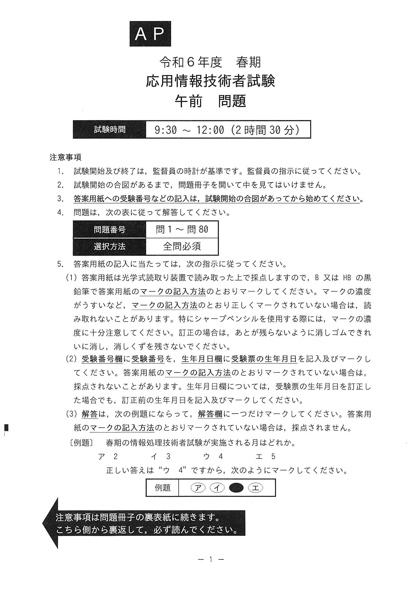

テキスト (OCR)

令和6年度 春期
応用情報技術者試験
午前 問題

 9:30 ~ 12:00 (2時間 30 分)

注意事項

1. 試験開始及び終了は, 監督員の時計が基準です。監督具の指示に従ってください。
2. 試験開始の合図があるまで, 問題冊子を開いて中を見てはいけません。
3. 答案用紙への受験番号などの記入は, 試験開始の合図があってから始めてください。
4. 問題は, 次の表に従って解答してください。
問題番号       問 1 て 問 80
選択方法         全問必須
5. 答案用紙の記入に当たっては, 次の指示に従ってください。

(1) 答案用紙は光学式読取り装置で読み取った上で採点しますので, B 又は HB の黒
鉛筆で答案用紙のマークの記入方法のとおりマークしてください。マークの濾度
がうすいなど, マークの記入方法のとおり正しくマークされていない場合は, 読
み取れないことがあります。特にシャープペンシルを使用する際には, マークの濃
度に十分注意してください。 訂正の場合は, あとが残らないように消しゴムできれ
いに消し, 消しくずを残さないでください。

(2) 受験番号欄に受験番号を, 生年月日欄に受験票の生年月日を記入及びマークし
てください。 答案用紙のマークの記入方法のとおりマークされていない場合は,
採点されないことがあります。生年月日欄については, 受験票の生年月日を訂正し
た場合でも, 訂正前の生年月日を記入及びマークしてください。

(3) 解答は, 次の例題にならって, 解答欄に一つだけマークしてください。 答案用

i        紙のマークの記入方法のとおりマークされていない場合は, 採点されません。
[例題) 春期の情報処理技術者試験が実施される月はどれか。
ア 2    イ 3    ウ 4    エ 5

正しい答えは “ウ 4 ですから, 次のようにマークしてください。
例題 | DD@a®

注意事項は問題冊子の裏表紙に続きます。
こちら側から裏返して, 必ず読んでください。

### ページ 2

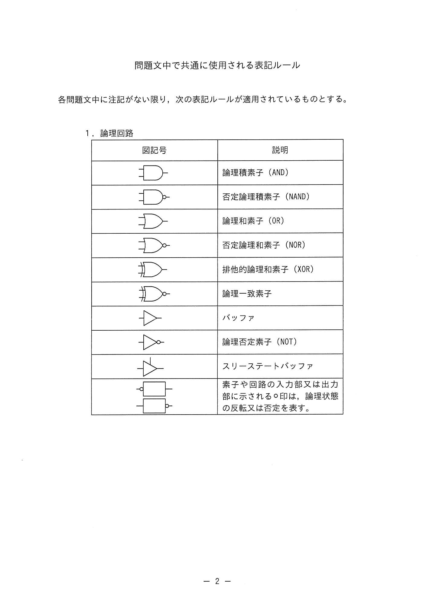

テキスト (OCR)

問題文中で共通に使用される表記ルール

各問題文中に注記がない限り, 次の表記ルールが適用されているものとする。

1. 論理回路

説明

回|
aia

論理積素子 (AND)

否定論理積素子 (NAND)

論理和素子 (OR)

否定論理和素子 (NOR)

排他的論理和素子 (XOR)

論理一致素子

バッファ

論理否定素子 (NOT)

スリーステートバッファ

素子や回路の入力部又は出力
部に示される9印は, 論理状態
の反転又は否定を表す。

HIYIYYMVMVMD

### ページ 3

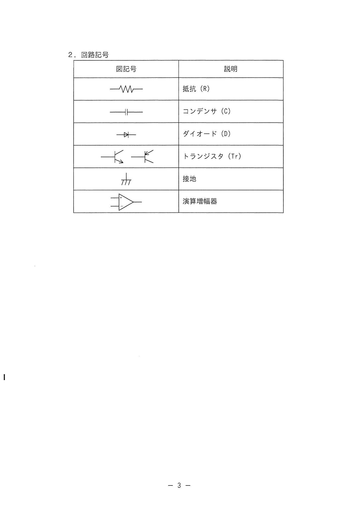

テキスト (OCR)

回路記号
図記号                 説明
ーツWW一        抵抗 (R)
ーゴーー        コンデンサ (C)
ーー           ダイオード (D)

トランジスタ (Tr)

接地

演算増幅器

### ページ 4

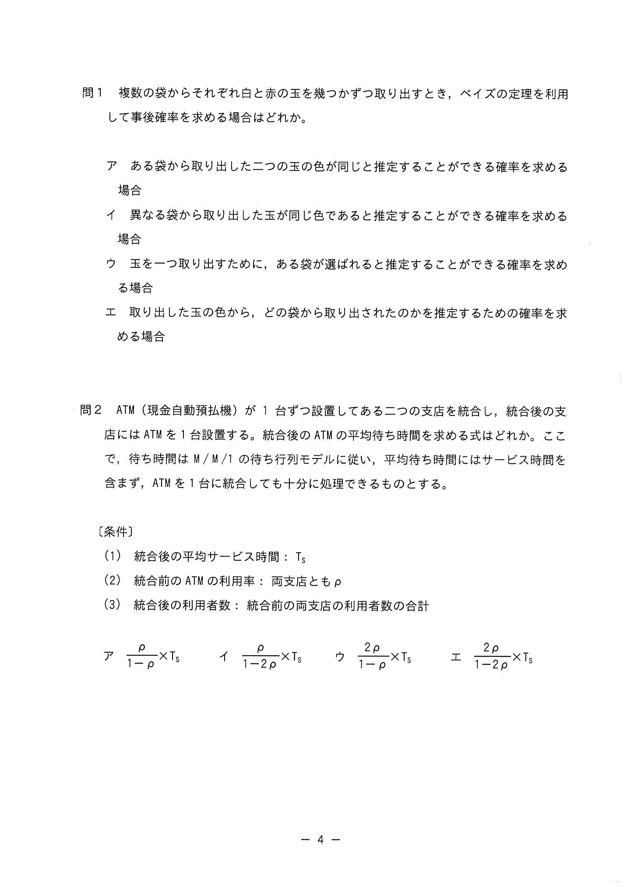

テキスト (OCR)

fll 複数の袋からそれぞれ白と赤の玉を幾つかずつ取り出すとき, ベイズの定理を利用
して事後確率を求める場合はどれか。

ア ある袋から取り出した二つの玉の色が同じと推定することができる確率を求める
場合
4 異なる袋から取り出した玉が同じ色であると推定することができる確率を求める

場合

ウ 玉を一つ取り出すために, ある袋が選ばれると推定することができる確率を求め
る場合

エエ 取り出した玉の色から, どの袋から取り出されたのかを推定するための確率を求
める場合

間2 ATM (現金自動預払機) が 1 台ずつ設置してある二つの支店を統合し, 統合後の支
店には ATM を 1 台設置する。統合後の ATM の平均待ち時間を求める式はどれか。ここ
で, 待ち時間は M/M/1 の待ち行列モデルに従い, 平均待ち時間にはサービス時間を
BES, ATM を 1 台に統合しても十分に処理できるものとする。

〔条件〕
(1) 統合後の平均サービス時間 :
(3) 統合後の利用者数 : 統合前の両支店の利用者数の合計
p                    のp                  20                  2p

ア Tp *'s   4 1-2。 “5   ウ p's   エ T=2p *'s

### ページ 5

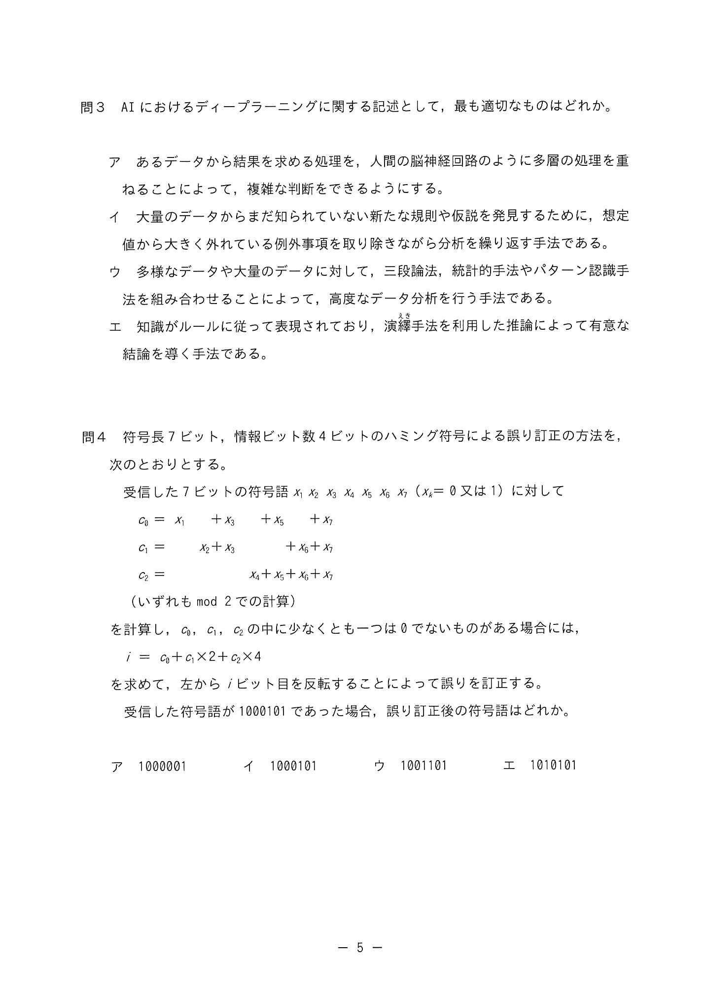

テキスト (OCR)

FAAS AI におけるディープラーニングに関する記述として, 最も適切なものはどれか。

ア あるデータから結果を求める処理を, 人間の脳神経回路のように多層の処理を重
ねることによって, 複雑な判断をできるようにする。

イ 大量のデータからまだ知られていない新たな規則や仮説を発見するために, BE
値から大きく外れている例外事項を取り除きながら分析を繰り返す手法である。

ウ 多様なデータや大量のデータに対して, 三邊論法。統計的手法やパターン認識手
法を組み合わせることによって, 高度なデータ分析を行う手法である。

エ 知識がルールに従って表現されており, 演絆手法を利用した推論によって有意な
結論を導く手法である。

間4 符号長7 ビット, 情報ビット数4 ビットのハミング符号による誤り訂正の方法を,
次のとおりとする。
受信した 7 ビットの符号語々ゎぁ色色%%る(%三0又は1) に対して
の %   + x3   + x5   +X
q=    Xt X3      +X + X%y
Q=         Xyt xg XG 4G
(いずれも mod 2 での計算)
を計算し, OO, @の中に少なくとも一つは 9 でないものがある場合には,
f= @十6X2十@※X4
を求めて, ADS /ビット目を反転することによって誤りを訂正する。
受信した符号語が 1900191 であった場合, 誤り訂正後の符号語はどれか。

ア 1000001   イ 1000101   ウ 1001101   エ 1010101

### ページ 6

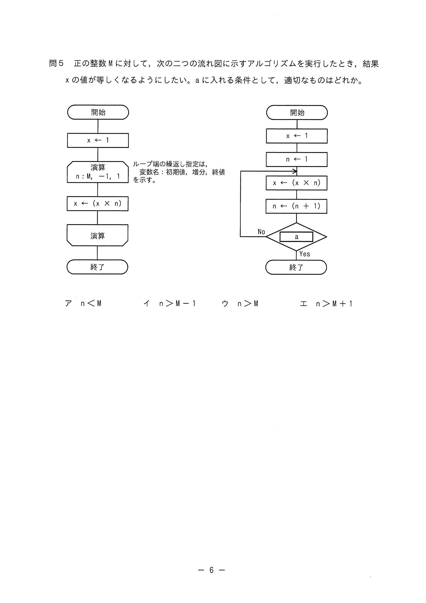

テキスト (OCR)

間5 正の整数M に対して, 次の二つの流れ図に示すアルゴリズムを実行したとき, 結果
x の値が等しくなるようにしたい。a に入れる条件として, 適切なものはどれか。

x 1                                   xe]
|
Re ループ庄の線返し指定は               oct
nM 1, 1 | , Be RE, 38, NE
かーッ    を示す。
x と (x X n)
演算
(    終了    )
ア nM     イ nM一1   ウ n>M     エ n>M二1

### ページ 7

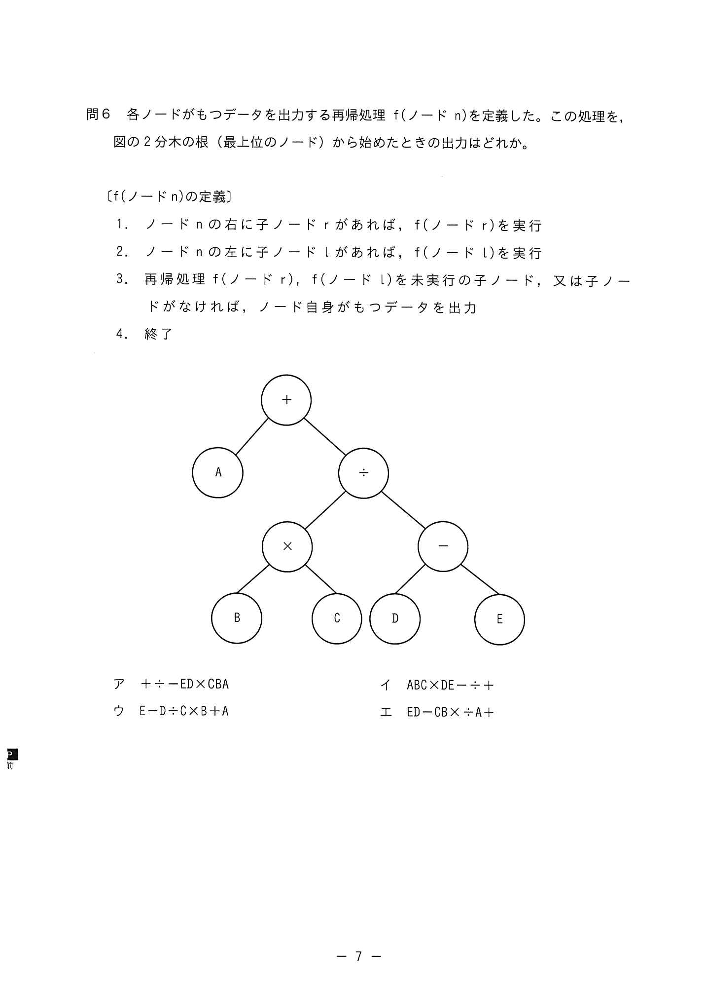

テキスト (OCR)

間6 各ノードがもつデータを出力する再帰処理 (ノード n)を定義した。この処理を,
図の 2 分木の根 (最上位のノード) から始めたときの出力はどれか。

〔f(ノード n)の定義〕

1. ノードnの右に子ノードrがあれば, f(ノードr)を実行

2. ノードnの左に子ノード |があれば, f(ノード DUを実行

3. 再帰処理f(ノードr), f(ノード DU)を未実行の子ノード, 又は子ノー
ドがなければ, ノード自身がもつデータを出力

4. 終了
ア キーEDXCBA                  イ ABCXDE-—++
ウ E-D+CXB+A                  エ ED一CBXーA十

|

### ページ 8

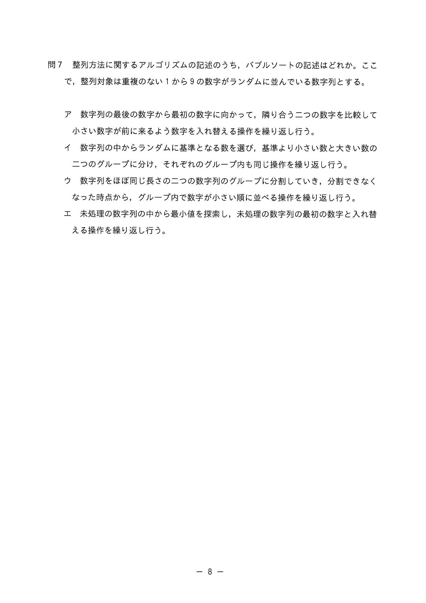

テキスト (OCR)

間7 整列方法に関するアルゴリズムの記述のうち, バブルソートの記述はどれか。ここ
で, 整列対象は重複のない 1 から 9 の数字がランダムに並んでいる数字列とする。

ア 数字列の最後の数字から最初の数字に向かって, 隣り合う二つの数字を比較して
小さい数字が前に来るよう数字を入れ替える操作を繰り返し行う。

イ 数字列の中からランダムに基準となる数を選び, 基準より小さい数と大きい数の
二つのグループに分け, それぞれのグループ内も同じ操作を繰り返し行う。

ウ 数字列をほぼ同じ長さの二つの数字列のグループに分割していき, 分割できなく
なった時点から, グループ内で数字が小さい順に並べる操作を繰り返し行う。

エ 未処理の数字列の中から最小値を探索し, 未処理の数字列の最初の数字と入れ替
える操作を繰り返し行う。

### ページ 9

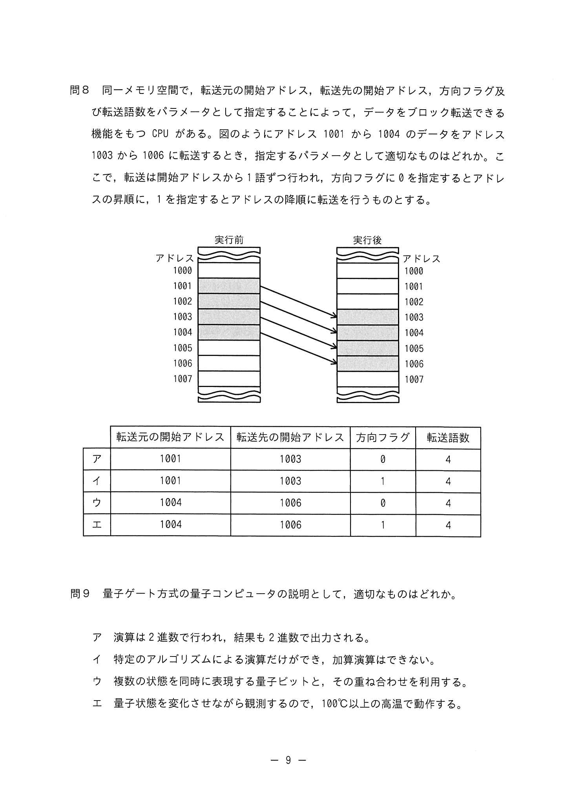

テキスト (OCR)

AS 同一メモリ空間で, 転送元の開始アドレス, 転送先の開始アドレス, 方向フラグ及
び転送語数をパラメータとして指定することによって, データをブロック転送できる
機能をもつ CPU がある。図のようにアドレス 1001 DS 1004 のデータをアドレス
1003 AS 1006 に転送するとき, 指定するパラメータとして適切なかものはどれか。こ
こで, 転送は開始アドレスから 1 語ずつ行われ, 方向フラグに 0 を指定するとアドレ
スの昇順に, 1 を指定するとアドレスの降順に転送を行うものとする。

実行前          SAT

a             ae

10001000

1001                   1001

1002 we1002

1003 RE1003

1004 oS1004

10051005

10061006

10071007

a       BSS
転送元の開始アドレス | 転送先の開始アドレス | 方向フラグ | 転送語数

アァ          1001                 1003              6          4
ィ 1001 1003 1 4
ウ          1004                1006             0          4
x         1004                1006             1          4

間9 量子ゲート方式の量子コンピュータの説明として, 適切なものはどれか。

|

演算は 2 進数で行われ, 結果も 2 進数で出力される。

特定のアルゴリズムによる演算だけができ, 加算演算はできない。
複数の状態を同時に表現する量子ビットと, その重ね合わせを利用する。
量子状態を変化させながら観測するので, 190で以上の高温で動作する。

Hot A

### ページ 10

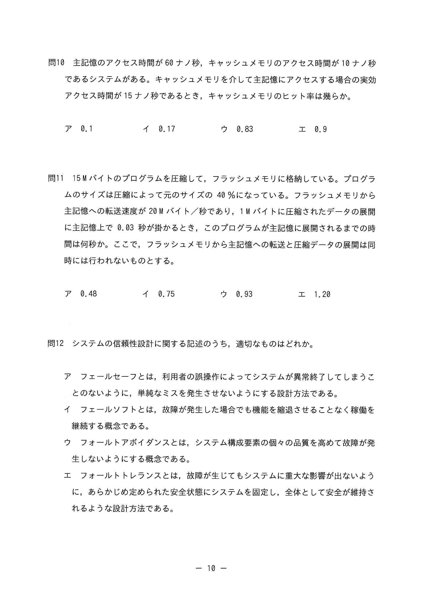

テキスト (OCR)

間16 主記憶のアクセス時間が 69 ナノ秒, キャッシュメモリのアクセス時間が19 ナノ秒
であるシステムがある。キャッシュメモリを介して主記憶にアクセスする場合の実効
アクセス時間が 15 ナノ秒であるとき, キャッシュメモリのヒット率は幾らか。

ア 9.1     イ 0.17     ウ 0.83     エ 0.9

間11 15Mバイトのプログラムを圧縮して, フラッシュメモリに格納している。プログラ
ムのサイズは圧縮によって元のサイズの 49 9%になっている。フラッシュメモリから
主記憶への転送速度が 29M バイトノ秒であり, 1M バイトに圧縮されたデータの展開
に主記憶上で 0.03 秒が掛かるとき, このプログラムが主記憶に展開されるまでの時
間は何秒か。 ここで, フラッシュメモリから主記憶への転送と圧縮データの展開は同
時には行われないものとする。

ア 0.48    イ 0.75     ウ 0.93    エ 1,20

問12 システムの信頼性設計に関する記述のうち, 適切なものはどれか。

ア フェールセーフとは, 利用者の誤操作によってシステムが異常終了してしまうこ
とのないように, 単純なミスを発生させないようにする設計方法である。

イ フェールソフトとは, 故障が発生した場合でも機能を縮退させることなく乏働を
継続する概念である。

ウ フォールトアボイダンスとは, システム構成要素の個々の品質を高めて故障が発
生しないようにする概念である。

エエ フォールトトレランスとは, 故障が生じてもシステムに重大な影響が出ないよう
に, あらかじめ定められた安全状態にシステムを固定し, 全体として安全が維持さ
れるような設計方法である。

### ページ 11

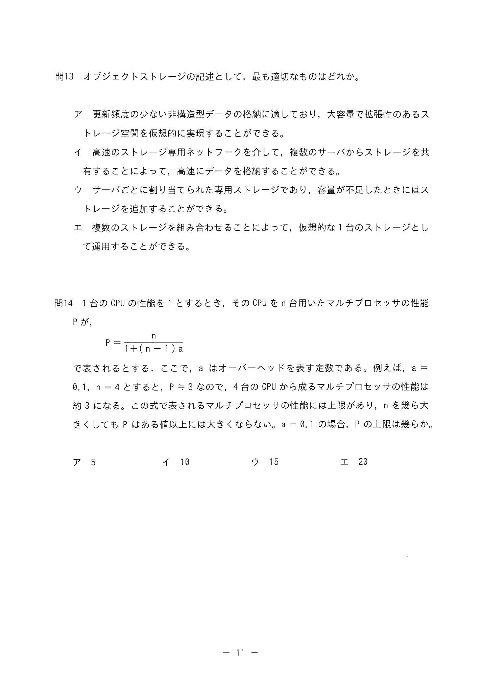

テキスト (OCR)

間13 オブジェクトストレージの記述として, 最も適切なものはどれか。

ア 更新頻度の少ない非構造型データの格納に適しており, 大容量で拡張件のあるス
トレージ空間を仮想的に実現することができる。

イ 高速のストレージ専用ネットワークを介して, 複数のサーバからストレージを共
有することによって, 高速にデータを格納することができる。

ウ サーバごとに割り当てられた専用ストレージであり, 容量が不足したときにはス
トレージを追加することができる。

エ 複数のストレージを組み合わせることによって, 仮想的な 1 台のストレージとし
て運用することができる。

間14 1台のCPUの性能を 1 とするとき, そのCPU を n 台用いたマルチプロセッサの性能

P が,
Pニーーーリ
“1 1+(n—1)a
で表されるとする。ここで, a はオーバーヘッドを表す定数である。例えば, a=
9.1,n=ニ4 とすると, PHZ なので, 4 台のCPU から成るマルチプロセッサの性能は
約 3 になる。この式で表されるマルチプロセッサの性能には上限があり, n を幾ら大

きくしても『 はある値以上には大きくならない。a = 6.1 の場合, P の上限は幾らか。

20

NI
oi
aN
回
Nig
a
H

ー 11 一

### ページ 12

テキスト (OCR)

問15 コンピュータの性能評価には, シミュレーションを用いた方法, 解析的な方法など
がある。シミュレーションを用いた方法の特徴はどれか。

に|

解析的な方法よりも計算量が少なく, 効率的に解が求まる。
解析的な方法よりも, 乱数を用いることで高精度の解が得られる。
解析的に解が求められないモデルに対しても, 数値的に解が求まる。
解析的に解が求められるモデルの検証には使用できない。

H GON

RIG ノンプリエンプティブ方式のタスクの状態遷移に関する記述として, 適切なものは
どれか。

ア OS は実行中のタスクの優先度を他のタスクよりも上げることによって, 実行中
のタスクが終了するまでタスクが切り替えられるのを防ぐ。

イ 実行中のタスクが自らの中断を 0S に要求することによってだけ, 0S は実行中の
タスクを中断し, 動作可能な他のタスクを実行中に切り替えることができる。

ウ 実行中のタスクが無限ループに陥っていることを OS が検知した場合, 0S は実行
中のタスクを終了させ, 動作可能な他のタスクを実行中に切り替える。

エ 実行中のタスクより優先度が高い動作可能なタスクが実行待ち行列に追加された
Bea, OS は実行中のタスクを中断し, 優先度が高い動作可能なタスクを実行中に
切り替える。

### ページ 13

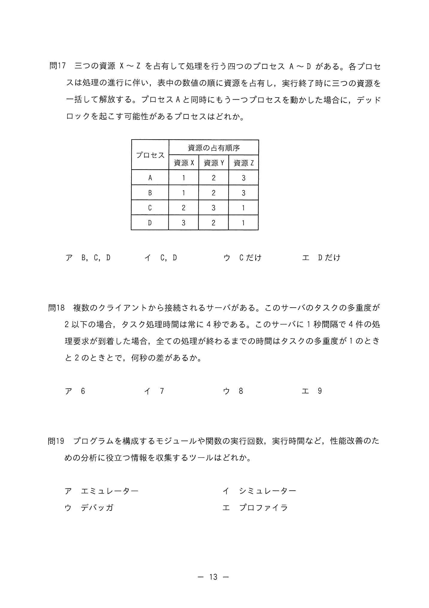

テキスト (OCR)

間17 三つの資源 X 一Z を占有して処理を行う四つのプロセス A 一 D がある。各プロセ
スは処理の進行に伴い, 表中の数値の順に資源を占有し, 実行終了時に三つの資源を
一括して解放する。プロセスAと同時にもう一つプロセスを動かした場合に, デッド
ロックを起こす可能性があるプロセスはどれか。

資源の占有順序
資源X | 資源Y | 資源7
1      2      3
2      3
2   8   1
2

プロセス

1

vlol/w]>

1

ア B, C, D    4 C, D      ウ Cだけ     エ Dだけ

間18 複数のクライアントから接続されるサーバがある。このサーバのタスクの多重度が
2 以下の場合, タスク処理時間は常に 4 秒である。このサーバに 1 秒間隔で 4 件の処
理要求が到着した場合, 全ての処理が終わるまでの時間はタスクの多重度が1のとき
と 2 のときとで, 何秒の差があるか。

に
3
~
Nay
oo
H
に

間19 プログラムを構成するモジュールや関数の実行回数 実行時間など, 性能改善のた
めの分析に役立つ情報を収集するツールはどれか。

ア エミュレーター       4 シミュレーター
ウ デバッガ           x プロファイラ

### ページ 14

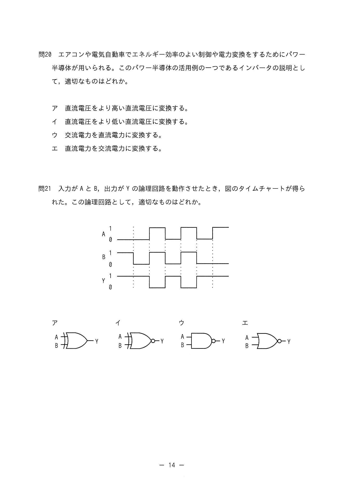

テキスト (OCR)

20 エアコンや電気自動車でエネルギー効率のよい制御や電力変換をするためにパワー
半導体が用いられる。このパワー半導体の活用例の一つであるインバータの説明とし
て, 適切なかものはどれか。

ア 直流電圧をより高い直流電圧に変換する。
イ 直流電圧をより低い直流電圧に変換する。
ウ 交流電力を直流電力に変換する。
エ 直流電力を交流電力に変換する。

間21 入力がAとB, 出力がYの論理回路を動作させたとき, 図のタイムチャートが得ら
れた。この論理回路として, 適切なものはどれか。

に

e- Ss =

A       A       A       A
yo   yoo   =D    i

= 94 =

### ページ 15

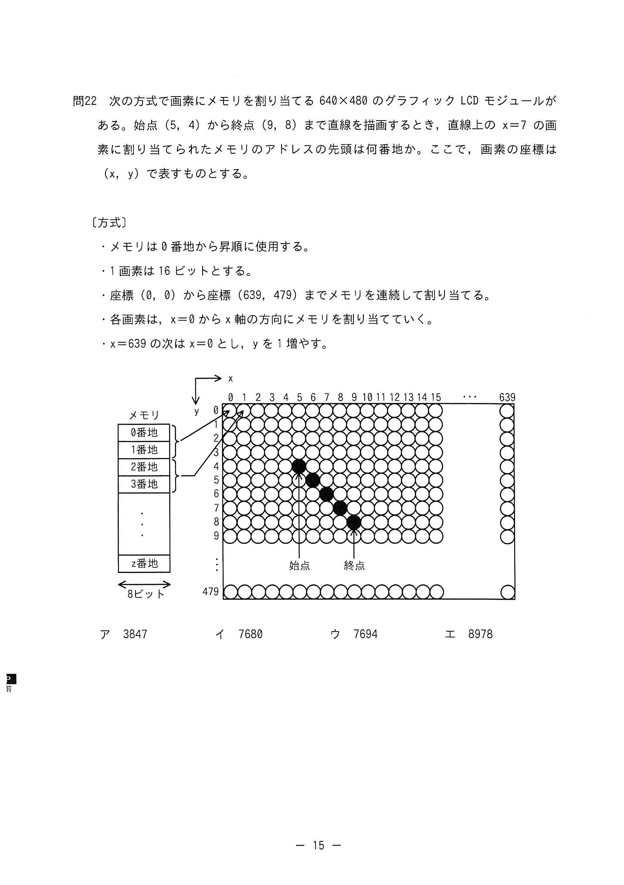

テキスト (OCR)

間22 次の方式で画素にメモリを割り当てる 640X480 のグラフィック LO モジュールが
HS. 始点 (5, 4) から終点 (9, 8) まで直線を描画するとき, 直線上の x=7 OF
素に割り当てられたメモリのアドレスの先頭は何番地か。ここで, 画素の座標は

(x, y) で表すものとする。

(Ax)
・メモリは 0 番地から昇順に使用する。
・1 画素は 16 ビットとする。
・座標 (0, 0) から座標 (639, 479) までメモリを連続して割り当てる。
・ 各画素は, x王0 から x 軸の方向にメモリを割り当てていく。
・x三639 の次は x=0 とし, y を 1 増やす。

x
J   9 1 2 3 45 67 8 9 1011 121314 15  ut  639

メモリ  y oR
番地  ae
1番地
2番地    4
3番地    5
6
7
8
9
z番地
ーーーテ>
8ビット   479                    eo
ア 3847     4 7680     ウ 7694     エ 8978

a |

### ページ 16

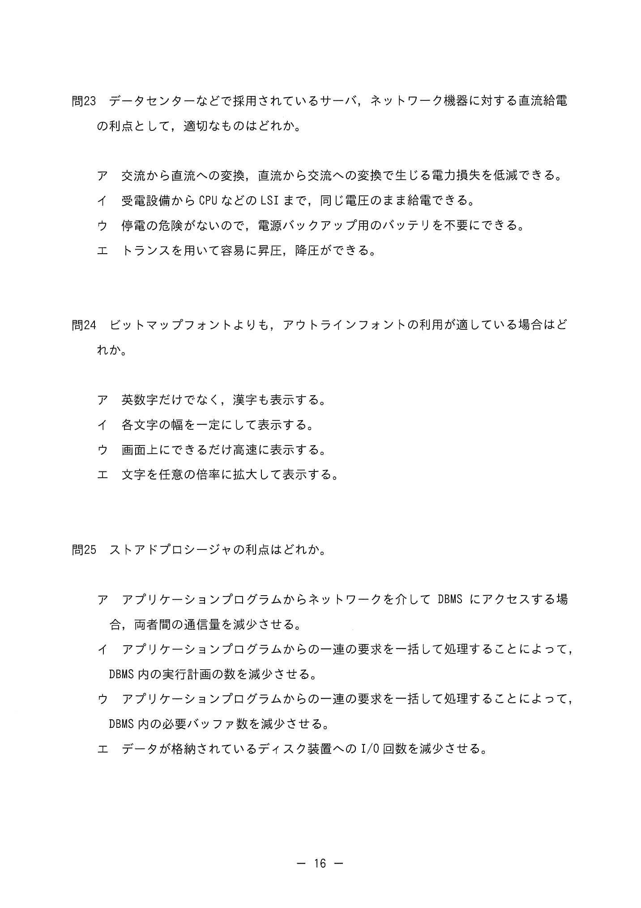

テキスト (OCR)

間23 データセンターなどで採用されているサーバ, ネットワーク機器に対する直流給電
の利点として, 適切なものはどれか。

|

交流から直流への変換, 直流から交流への変換で生じる電力損失を低減できる。
受電設備からCPU などのLSI まで, 同じ電圧のまま給電できる。

電の危険がないので, 電源バックアップ用のバッテリを不要にできる。

スを用いて容易に昇圧, 降圧ができる。

問24 ビットマップフォントよりも, アウトラインフォントの利用が適している場合はど
れか。

N

英数字だけでなく, 漢字も表示する。
各文字の幅を一定にして表示する。
画面上にできるだけ高速に表示する。
文字を任意の倍率に拡大して表示する。

H os ユ

問25 ストアドプロシージャの利点はどれか。

ア アプリケーションプログラムからネットワークを介して DBMS にアクセスする場
4, 両者間の通信量を減少させる。

イ アプリケーションプログラムからの一連の要求を一括して処理することによって,
DBMS 内の実行計画の数を減少させる。

ウ アプリケーションプログラムからの一連の要求を一括して処理することによって,
DBMS 内の必要バッファ数を減少させる。

エエ データが格納されているディスク装置への 1/0 回数を減少させる。

### ページ 17

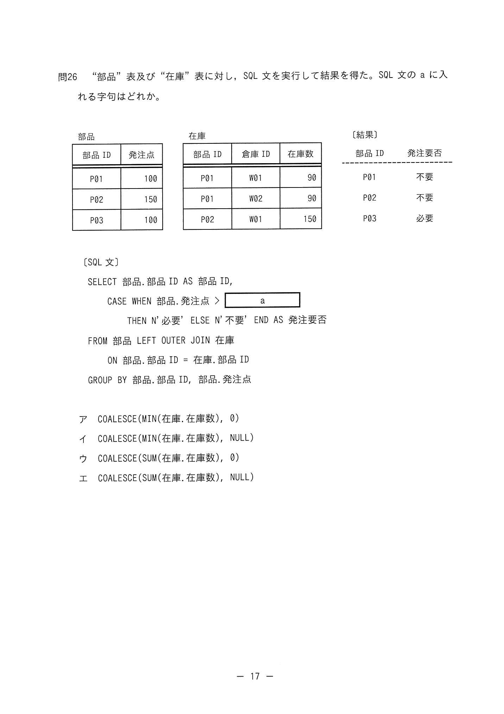

テキスト (OCR)

問26 “AR” RRO “ER” 表に対し, SOL 文を実行して結果を得た。SQL 文の a に入
れる宇旬はどれか。

部品                       在庫                                   〔結果〕

部品ID | 発注点         部品 ID     倉庫ID | 在庫数          部品 ID      KREBS
P91          100           P91         W01           90           PO1          不要
P02          150           P91         W02           90           P02          RE
P03          100           P92        W91          150           P03          必要

(SQL 32)

SELECT 部品.部品ID AS 部品ID,
CASE WHEN 部品.発注点>[ a |
THEN N 必要′ELSE N ANB’ END AS 発注要否
FROM 部品 LEFT OUTER JOIN 在庫
ON 部品.部品ID = 在庫.部品ID
GROUP BY 部品.部品 ID, 部品.発注点

N

COALESCE (MIN(在庫. 在庫数), 0)
COALESCE(MIN(在庫. 在庫数), NULL)
COALESCE(SUM(在庫. 在庫数), 0)
COALESCE(SUM(在庫. 在庫数)。 NULL)

H 二 ユ

### ページ 18

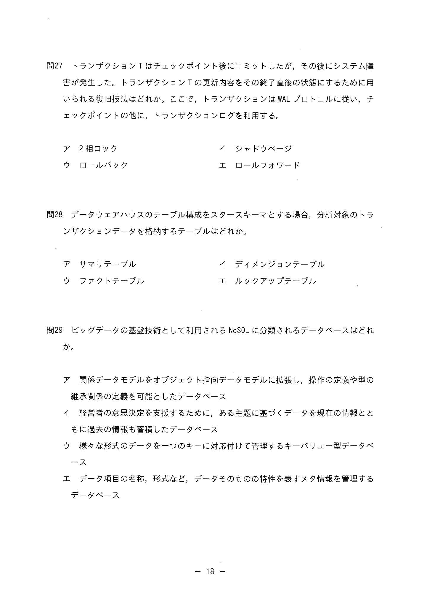

テキスト (OCR)

間27 トランザクションT はチェックポイント後にコミットしたが, その後にシステム障
害が発生した。 トランザクション T の更新内容をその終了直後の状態にするために用
いられる復旧技法はどれか。ここで, トランザクションは WAL プロトコルに従い, チ
ェックポイントの他に, トランザクションログを利用する。

ア 2相ロック                 イ シャドウページ

ウ ロールパック                エ ロールフォワード

間28 データウェアハウスのテーブル構成をスタースキーマとする場合, 分析対象のトラ
ンザクションデータを格納するテーブルはどれか。

ア サマリテーブル          イ ディメンジョンテーブル

ウ ファクトテーブル       エ ルックアップテーブル

間29 ビッグデータの基盤技術として利用される NoSQL に分類されるデータベースはどれ
か。

ア 関係データモデルをオブジェクト指向データモデルに拡張し, 操作の定義や型の
継承関係の定義を可能としたデータベース
イ 経営者の意思決定を支援するために, ある主題に基づくデータを現在の情報とと
もに過去の情報も蓄積したデータベース
ウ 様々な形式のデータを一つのキーに対応付けて管理するキーバリュー型データベ
ース
エエ データ項目の名称, BALLS, データそのものの特性を表すメタ情報を管理する
データベース

ー 18 一

### ページ 19

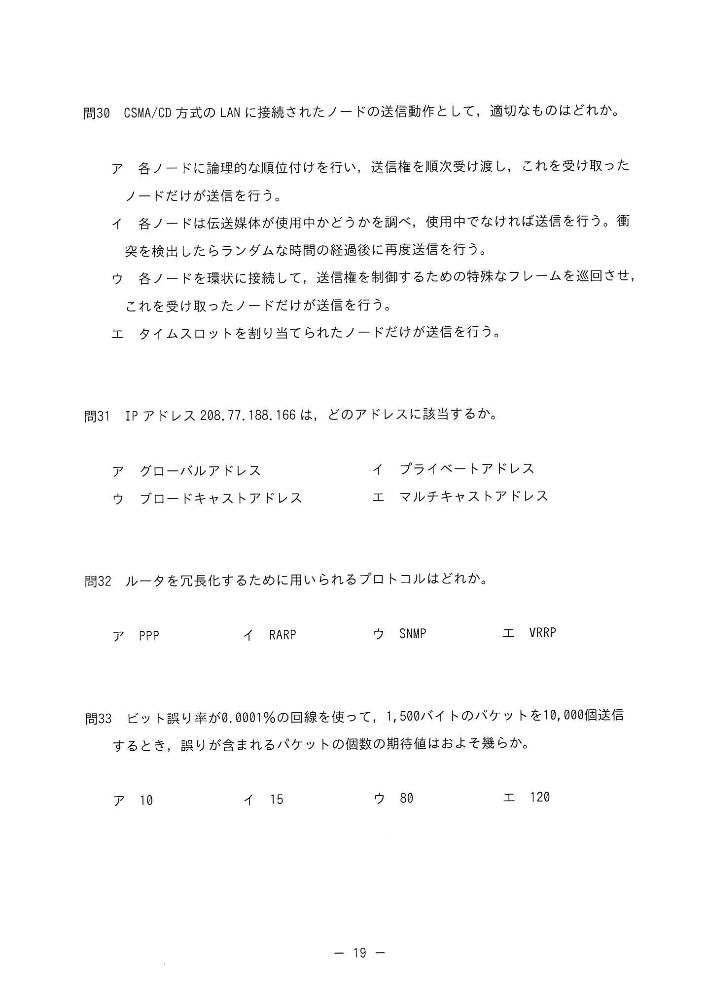

テキスト (OCR)

問39 CSMA/CD 方式の LAN に接続されたノードの送信動作として, 適切なものはどれか。
ア 各ノードに論理的な順位付けを行い, 送信権を順次受け渡し, これを受け取った
ノードだけが送信を行う。
4 各ノードは伝送媒体が使用中かどうかを調べ, 使用中でなければ送信を行う。衝
突を検出したらランダムな時間の経過後に再度送信を行う。
ウ 各ノードを環状に接続して, 送信権を制御するための特殊なフレームを巡回させ,
これを受け取ったノードだけが送信を行う。
エ タイムスロットを割り当てられたノードだけが送信を行う。
間31 IP アドレス 208.77. 188.166 ld, どのアドレスに該当するか。
ア グローバルアドレス           イ プライベートアドレス
ウ ブロードキャストアドレス       エ マルチキャストアドレス

FH32 ルータを冗長化するために用いられるプロトコルはどれか。
ア PPP     イ RARP     ウ SNMP     VRRP

問33 ビット誤り率が9.9991%の回線を使って, 1,509バイトのパケットを16, 0666個送信

するとき, 誤りが含まれるパケットの個数の期待値はおよそ幾らか。

ア 19       イ 15       ウ 80       xX 120

ー 19 一

### ページ 20

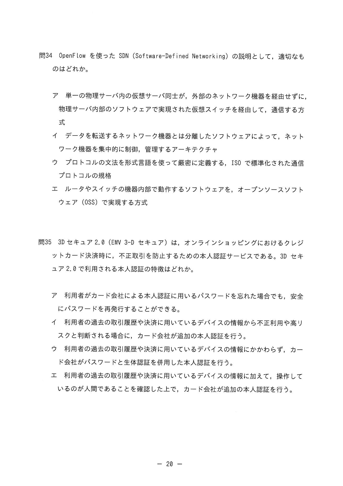

テキスト (OCR)

間34 0penFlow を使った SDN (Software-Defined Networking) の説明として, 適切なも
のはどれか。

ア 単一の物理サーバ内の仮想サーバ同士が, 外部のネットワーク機器を経由せずに,
物理サーバ内部のソフトウェアで実現された仮想スイッチを経由して, 通信する方
式

イ データを転送するネットワーク機器とは分離したソフトウェアによって, ネット
ワーク機器を集中的に制御管理するアーキテクチャ

ウ プロトコルの文法を形式言語を使って厳密に定義する, 1S0 で標準化された通信
プロトコルの規格

エエ ルータやスイッチの機器内部で動作するソフトウェアを, オープンソースソフト

ェア (0SS) で実現する方式

問35 3D セキュア 2.0 (EM 3-D セキュア) は, オンラインショッピングにおけるクレジ
ットカード決済時に, 不正取引を防止するための本人認証サービスである。3D セキ
ュア 2.0 で利用される本人認証の特徴はどれか。

ア 利用者がカード会社による本人認証に用いるパスワードを忘れた場合でも, 安全
にパスワードを再発行することができる。
イ 利用者の過去の取引履歴や決済に用いているデバイスの情報から不正利用や高リ
スクと判断される場合に, カード会社が追加の本人認証を行う。
ウ 利用者の過去の取引履歴や決済に用いているデバイスの情報にかかわらず, カー
ド会社がパスワードと生体認証を併用した本人認証を行う。
I 利用者の過去の取引履歴や決済に用いているデバイスの情報に加えて, 操作して
いるのが人間であることを確認した上で, カード会社が追加の本人認証を行う。

### ページ 21

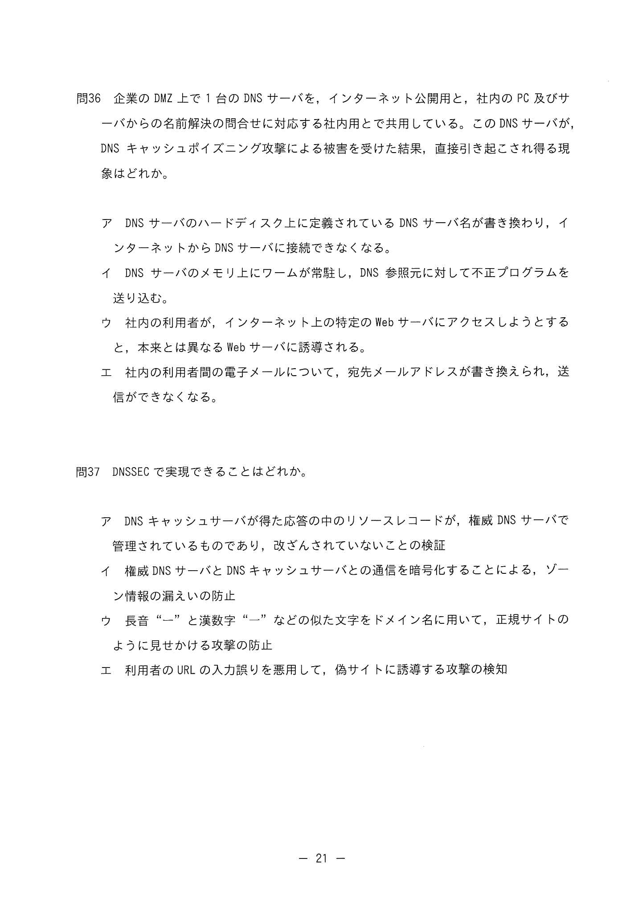

テキスト (OCR)

間36 企業の DMZ 上で 1 BOIS サーバを, インターネット公開用と, 社内のPC 及びサ
ーバからの名前解決の問合せに対応する社内用とで共用している。この DNS サーバが,
DNS キャッシュポイズニング攻撃による被害を受けた結果, 直接引き起こされ得る現
象はどれか。

ア DNS サーバのハードディスク上に定義されている DNS サーバ名が書き換わり, イ
ンターネットから DNS サーバに接続できなくなる。

イ DNS サーバのメモリ上にワームが常駐し, DNS 参照元に対して不正プログラムを
送り込む。

ウ 社内の利用者が, インターネット上の特定の Web サーバにアクセスしようとする
と, 本来とは異なる Web サーバに誘導される。

エ 社内の利用者間の電子メールについて, 宛先メールアドレスが書き換えられ, 送
信ができなくなる。

問37 DNSSEC で実現できることはどれか。

ア DNS キャッシュサーバが得た応答の中のリソースレコードが, 権威 DNS サーバで
管理されているものであり, 改ざんされていないことの検証

イ 権威 DNS サーバと DNS キャッシュサーバとの通信を暗号化することによる, ゾー
ン情報の漏えいの防止

ウ 長音"一" と漢数字 “一" などの似た文字をドメイン名に用いて, 正規サイトの
ように見せかける攻撃の防止

エ 利用者のURL の入力誤りを悪用して, 偽サイトに誘導する攻撃の検知

### ページ 22

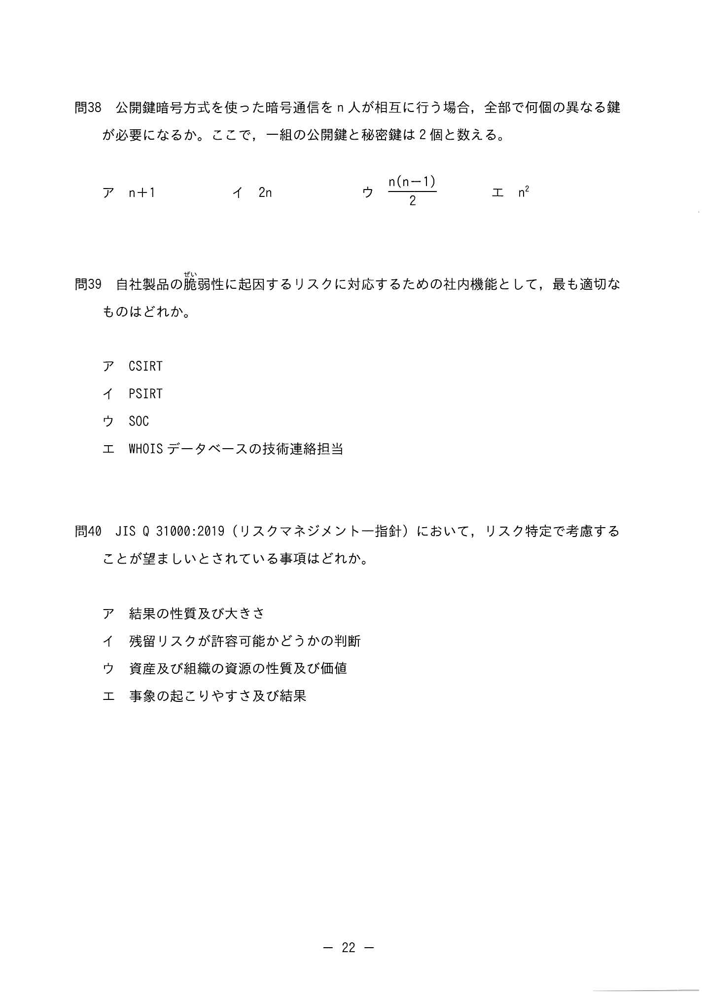

テキスト (OCR)

間38 公開鍵暗号方式を使った暗号通信を n 人が相互に行う場合, 全部で何個の異なる鍵
が必要になるか。ここで, 一組の公開鍵と秘密鍵は 2 個と数える。

n(nー1)
2

に|

n十1       イ 2n

問39 自社製品の脆弱性に起因するリスクに対応するための社内機能として, 最も適切な
ものはどれか。

に|

CSIRT

PSIRT

soc

WHOIS データベースの技術連絡担当

H ユ

問49 JIS Q 31000:2019 (リスクマネジメントー指針) において, リスク特定で考慮する
ことが望ましいとされている事項はどれか。

|

結果の性質及び大きさ

残留リスクが許容可能かどうかの判断
資産及び組織の資源の性質及び価値
事象の起こりやすさ及び結果

H さ A

### ページ 23

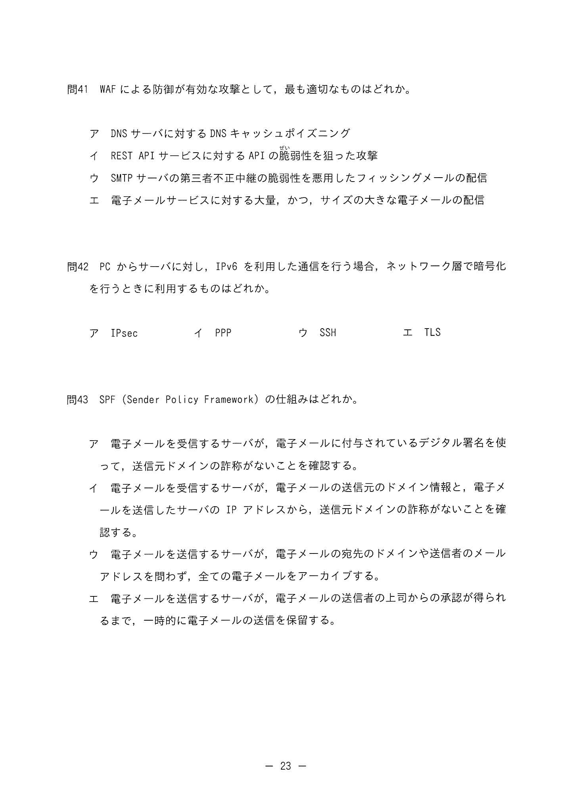

テキスト (OCR)

問41 WAF による防御が有効な攻撃として, 最も適切なものはどれか。

ア DNS サーバに対する DNS キャッシュポイズニング

イ REST API サービスに対する APL の脆弱性を狙った攻撃

ウ SMTP サーバの第三者不正中継の脆弱性を悪用したフィッシングメールの配信
エ 電子メールサービスに対する大量, かつ, サイズの大きな電子メールの配信

間42 PC からサーバに対し, IPv6 を利用した通信を行う場合, ネットワーク層で暗号化
を行うときに利用するものはどれか。

ア IPsec    イ PPP     ウ SSH     x TLS

問43 SPF (Sender Policy Framework) の仕組みはどれか。

ア 電子メールを受信するサーバが, 電子メールに付与されているデジタル署名を使
って, 送信元ドメインの詐称がないことを確認する。

イ 電子メールを受信するサーバが, 電子メールの送信元のドメイン情報と, 電子メ
ールを送信したサーバの IP アドレスから, 送信元ドメインの詐称がないことを確
認する。

ウ 電子メールを送信するサーバが, 電子メールの宛先のドメインや送信者のメール
アドレスを問わず, 全ての電子メールをアーカイブする。

エ 電子メールを送信するサーバが, 電子メールの送信者の上司からの承認が得られ
るまで, 一時的に電子メールの送信を保留する。

### ページ 24

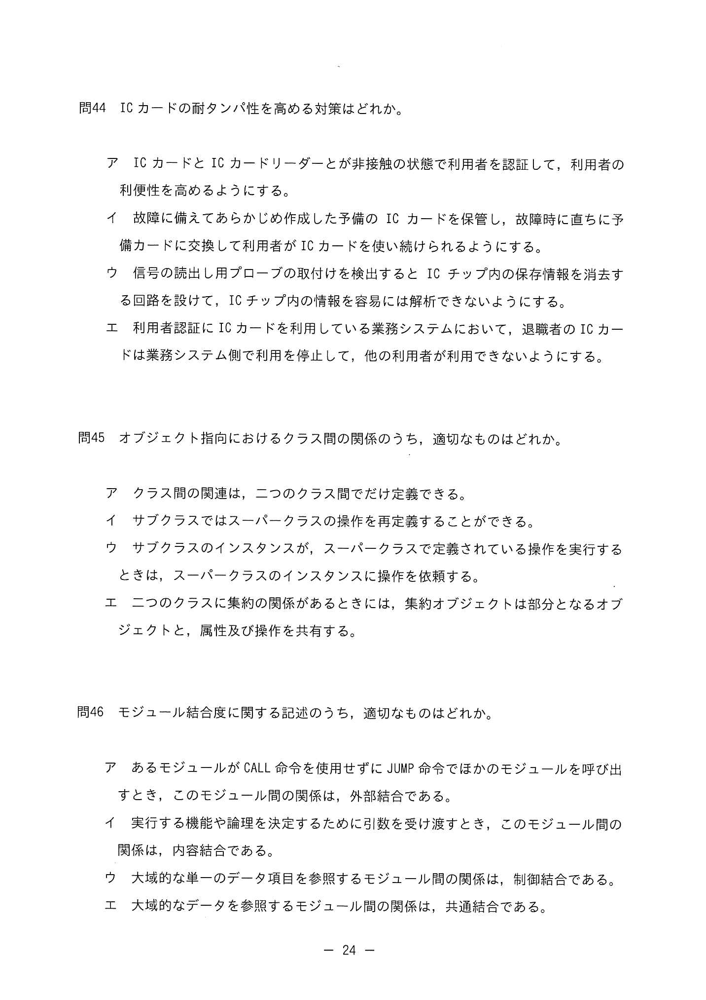

テキスト (OCR)

問44 IC カードの耐タンパ性を高める対策はどれか。

ア 1C カードと IC カードリーダーとが非接触の状態で利用者を認証して, 利用者の
利便性を高めるようにする。

イ 故障に備えてあらかじめ作成した予備の IC カードを保管し, 故障時に直ちに予
備カードに交換して利用者が IC カードを使い続けられるようにする。

ウ 信号の読出し用プローブの取付けを検出すると IC チップ内の保存情報を消去す
る回路を設けて, IC チップ内の情報を容易には解析できないようにする。

エ 利用者認証に IC カードを利用している業務システムにおいて, 退職者の IC カー
ドは業務システム側で利用を停止して, 他の利用者が利用できないようにする。

間45 オブジェクト指向におけるクラス間の関係のうち, 適切なものはどれか。

ア クラス間の関連は, 二つのクラス間でだけ定義できる。

イ サブクラスではスーパークラスの操作を再定義むすることができる。

ウ サブクラスのインスタンスが, スーパークラスで定義されている操作を実行する
ときは, スーパークラスのインスタンスに操作を依頼する。         」

DL 二つのクラスに集約の関係があるときには, 集約オブジェクトは部分となるオブ
ジェクトと, 属性及び操作を共有する。

問46 モジュール結合度に関する記述のうち, 適切なものはどれか。

ア あるモジュールがCALL 命令を使用せずに JUMP 命令でほかのモジュールを呼び出
すとき, このモジュール間の関係は, 外部結合である。

イ 実行する機能や論理を決定するために引数を受け渡すとき, このモジュール間の
関係は, 内容結合である。

ウ 大域的な単一のデータ項目を参照するモジュール間の関係は, 制御結合である。

I 大域的なデータを参照するモジュール間の関係は, 共通結合である。

### ページ 25

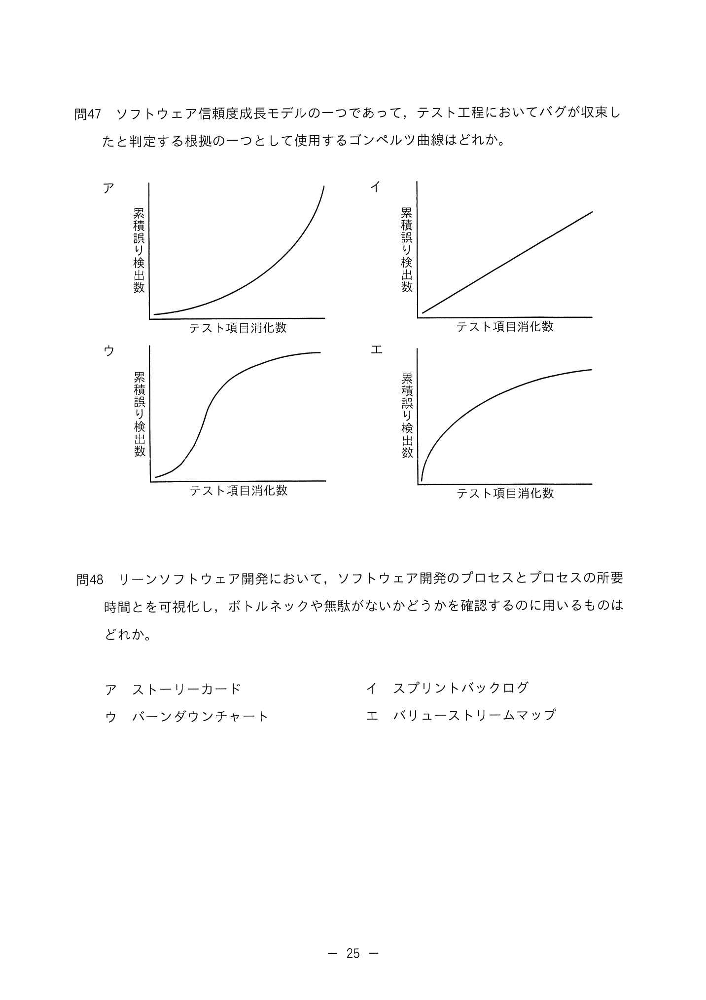

テキスト (OCR)

問47 ソフトウェア信頼度成長モデルの一つであって, テスト工程においてバグが収束し
たと判定する根拠のーーつとして使用するゴンペルツ曲線はどれか。

F                                4
EA                                EA
ia                                     cd
誤                 誤
り                                  り
検                                検
出                                出
数                                数
テスト項目消化数              テスト項目消化数
2                                 エ
EA
an                 誤
り                                         り
検                                 検
出                                                出
数                                               数
テスト項目消化数                    テスト項目消化数

間48 リーンソフトウェア開発において, ソフトウェア開発のプロセスとプロセスの所要
時間とを可視化し, ボトルネックや無駄がないかどうかを確認するのに用いるものは
どれか。

ア ストーリーカード         イ スプリントバックログ
か パーツンダウツチャート          エ バリューストリームマップ

### ページ 26

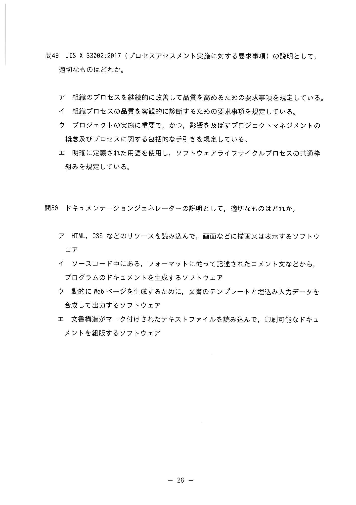

テキスト (OCR)

間49 JIS X 33002:2017 (プロセスアセスメント実施に対する要求事項) の説明として,
適切なものはどれか。

ア 組織のプロセスを継続的に改善して品質を高めるための要求事項を規定している。
イ 組織プロセスの品質を客観的に診断するための要求事項を規定している。

ウ プロジェクトの実施に重要で, かつ, 影響を及ぼすプロジェクトマネジメントの
概念及びプロセスに関する包括的な手引きを規定している。

エ 明確に定義された用語を使用し, ソフトウェアライフサイクルプロセスの共通枠
組みを規定している。

間59 ドキュメンテーションジェネレーターの説明として, 適切なかものはどれか。

ア HTML, CSS などのリソースを読み込んで, 画面などに描画又は表示するソフトウ
エア

イ ソースコード中にある, フォーマットに従って記述されたコメント文などから,
プログラムのドキュメントを生成するソフトウェア

ウ 動的に Web ページを生成するために, 文書のテンプレートと埋込み入力データを
合成して出力するソフトウェア

エ 文書構造がマーク付けされたテキストファイルを読み込んで, 印刷可能なドキュ
メントを組版するソフトウェア

### ページ 27

テキスト (OCR)

間51 EVM で管理しているプロジェクトがある。図は, プロジェクトの開始から完了予定
までの期間の半分が経過した時点での状況である。コスト効率, スケジュール効率が
このままで推移すると仮定した場合の見通しのうち, 適切なものはどれか。

if          a
'                               1
1                                                                  1
1                                                                  1
1
1                                                                  1
i= AC    I
1                                                                  1
1
EV !        1
1                               H
開始日       現時点      完了予定日

ア 計画に比べてコストは多くなり, プロジェクトの完了は遅くなる。
イ 計画に比べてコストは多くなり, プロジェクトの完了は早くなる。
ウ 計画に比べてコストは少なくなり, プロジェクトの完了は遅くなる。
エ 計画に比べてコストは少なくなり, プロジェクトの完了は早くなる。

間52 図のアローダイアグラムで表されるプロジェクトがある。結合点 5 の最早結合点時
刻はプロジェクトの開始から第何日か。ここで, プロジェクトの開始日は 6 日目とす

SI
人
aN
ol
NF
の
H
~

### ページ 28

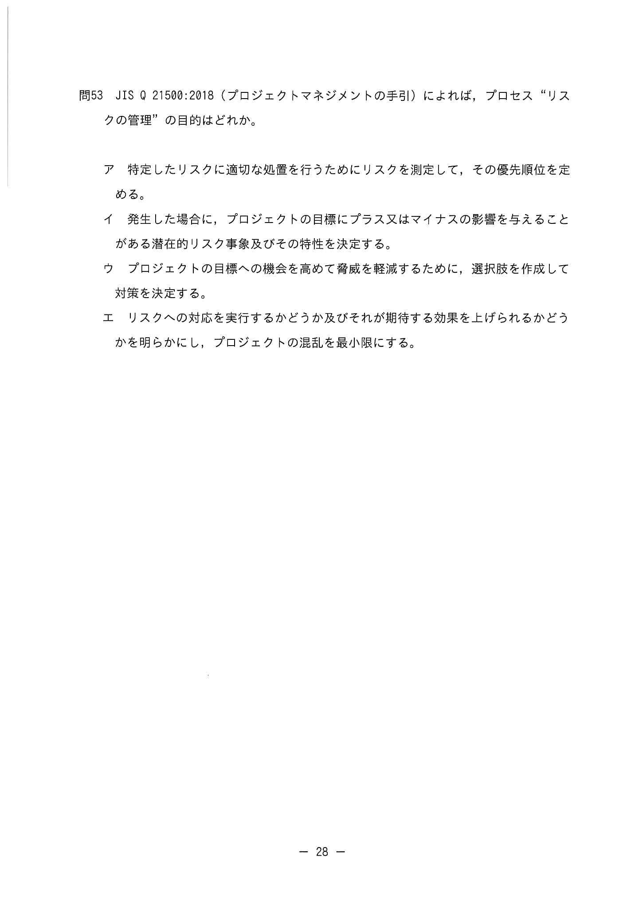

テキスト (OCR)

間53 JIS 0 21500:2018 (プロジェクトマネジメントの手引) によれば, プロセス “リス
クの管理” の目的はどれか。

ア 特定したリスクに適切な処置を行うためにリスクを測定して, その優先順位を定
める。

イ 発生した場合に, プロジェクトの目標にプラス又はマイナスの影響を与えること
がある潜在的リスク事象及びその特性を決定する。

ウ プロジェクトの目標への機会を高めて脅威を軽減するために, 選択肢を作成して
対策を決定する。

エ リスクへの対応を実行するかどうか及びそれが期待する効果を上げられるかどう
かを明らかにし, プロジェクトの混乱を最小限にする。

### ページ 29

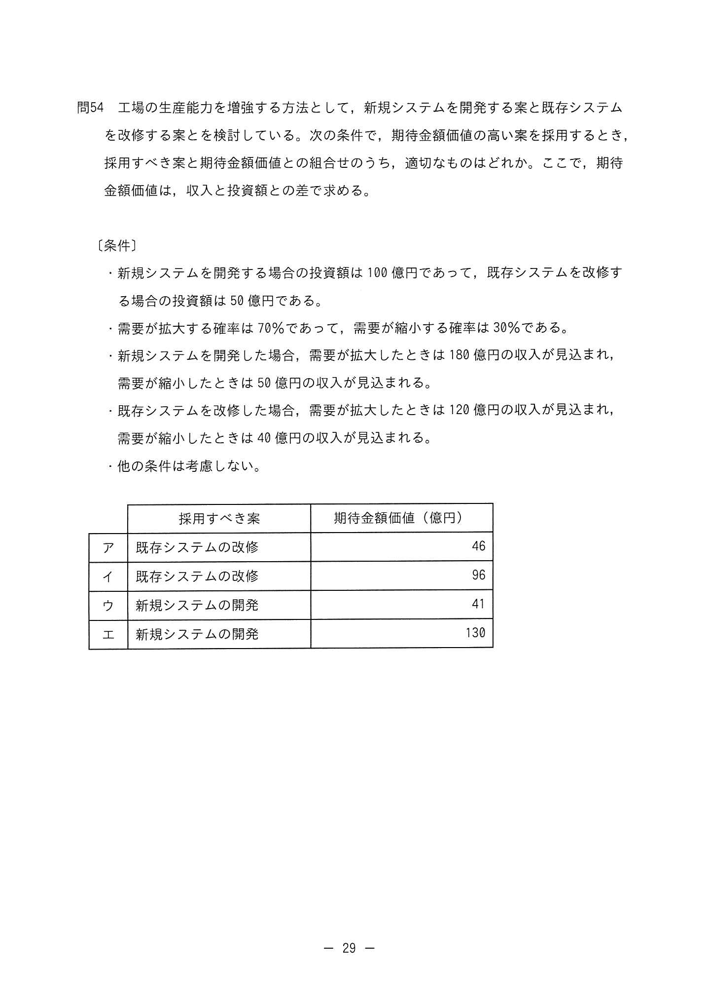

テキスト (OCR)

間54 工場の生産能力を増強する方法として, 新規システムを開発する案と既存システム
を改修する案とを検討している。 次の条件で, 期待金額価値の高い案を採用するとき,
採用すべき案と期待金額価値との組合せのうち, 適切なものはどれか。ここで, 期待
金額価値は, 収入と投資額との差で求める。

(RF)

・新規システムを開発する場合の投資額は 100 億円であって, 既存システムを改修す
る場合の投資額は 50 億円である。

・ 需要が拡大する確率は 79%であって, 需要が縮小する確率は 30%である。

・ 新規システムを開発した場合, 需要が拡大したときは 180 億円の収入が見込まれ,
需要が縮小したときは 50 億円の収入が見込まれる。

・ 既存システムを改修した場合, 需要が拡大したときは 120 億円の収入が見込まれ,
需要が縮小したときは 460 億円の収入が見込まれる。

+ 他の条件は考慮しない。

採用すべき案         期待金額価値 (億円)
ア | 既存システムの改修                           46
4 | 既存システムの改修                           96
ウ | 新規システムの開発                           41
エ | 新規システムの開発                          130

### ページ 30

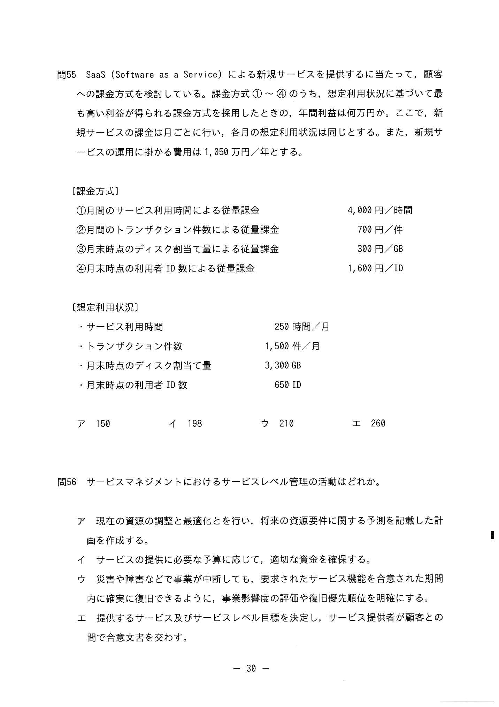

テキスト (OCR)

問55 SaaS (Software as a Service) による新規サービスを提供するに当たって, 顧客
への課金方式を検討している。 課金方式 ① … ④ のうち, 想定利用状況に基づいて最
も高い利益が得られる課金方式を採用したときの, 年間利益は何万円か、ここで, 新
規サービスの課金は月ごとに行い, 各月の想定利用状況は同じとする。また, MRT
ービスの運用に掛かる費用は 1, 056 万円年とする。

(READ)

①月間のサービス利用時間による従量課金           4, 000 円時間
②月間のトランザクション件数による従量課金            700 円件
③月末時点のディスク割当て量による従量課金        300 FS GB
④月末時点の利用者 ID 数による従量課金         1,600 円ID
〔想定利用状況]

・サービス利用時間                    250 時間ノ月

・トランザクション件数         1,500 件月

・ 月末時点のディスク割当て量          3, 300 GB

・ 月末時点の利用者 TD 数        650 ID

ア 150     4 198     ウ 210     エ 260

問56 サービスマネジメントにおけるサービスレベル管理の活動はどれか。

ア 現在の資源の調整と最適化とを行い, 将来の資源要件に関する予測を記載した計
画を作成する。                                         |
イ サービスの提供に必要な予算に応じて, 適切な資金を確保する。
ウ 災害や障害などで事業が中断しても, 要求されたサービス機能を合意された期間
内に確実に復旧できるように, 事業影響度の評価や復旧優先順位を明確にする。
エ 提供するサービス及びサービスレベル目標を決定し, サービス提供者が顧客との
間で合意文書を交わす。

### ページ 31

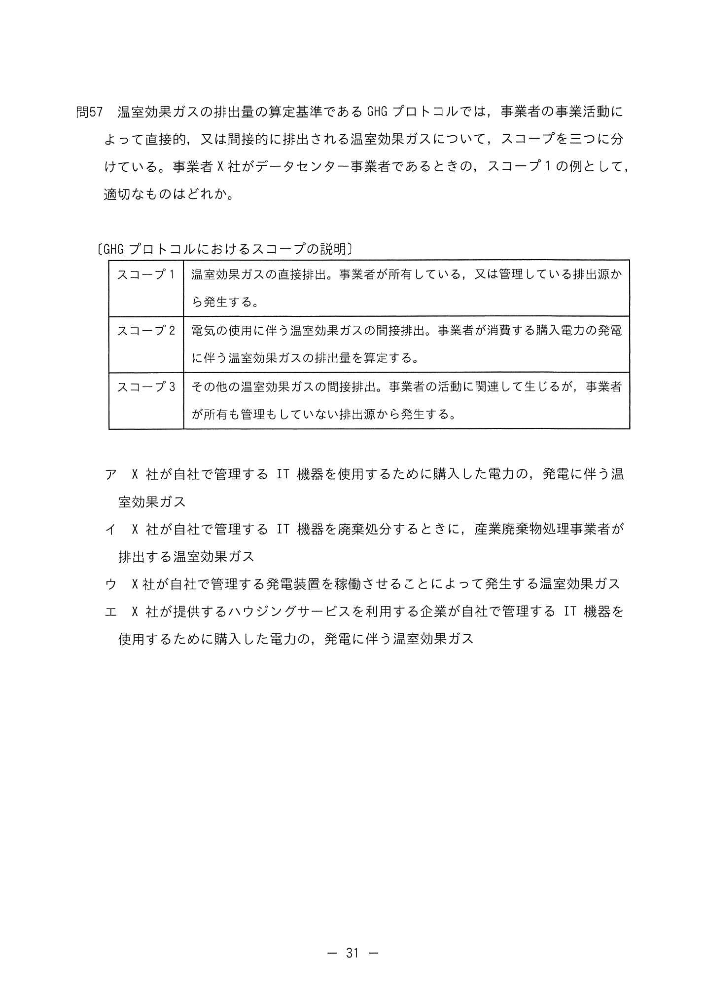

テキスト (OCR)

間57 温室効果ガスの排出量の算定基準である GHG プロトコルでは, 事業者の事業活動に
よって直接的, 又は間接的に排出される温室効果ガスについて, スコープを三つに分
けている。事業者 X 社がデータセンター事業者であるときの, スコープ 1 の例として,
適切なものはどれか。

(GHG プロトコルにおけるスコープの説明]
スコープ 1 | 混室効果ガスの直接排出。事業者が所有している, 又は管理している排出源か

ら発生する。
スコープ 2 | 電気の使用に伴う温室効果ガスの間接排出。事業者が消費する購入電力の発電
に伴う温室効果ガスの排出量を算定する。

スコープ 3 | その他の温室効果ガスの間接排出。事業者の活動に関連して生じるが, 事業者
が所有も管理もしていない排出源から発生する。

ア X 社が自社で管理する IT 機器を使用するために購入した電力の, 発電に伴う温
室効果ガス

4 X 社が自社で管理する IT 機器を廃棄処分するときに, 産業廃棄物処理事業者が
排出する温室効果ガス

ウ X社が自社で管理する発電装置を稼働させることによって発生する温室効果ガス
エ X 社が提供するハウジングサービスを利用する企業が自社で管理する IT 機器を
使用するために購入した電力の, 発電に伴う温室効果ガス

### ページ 32

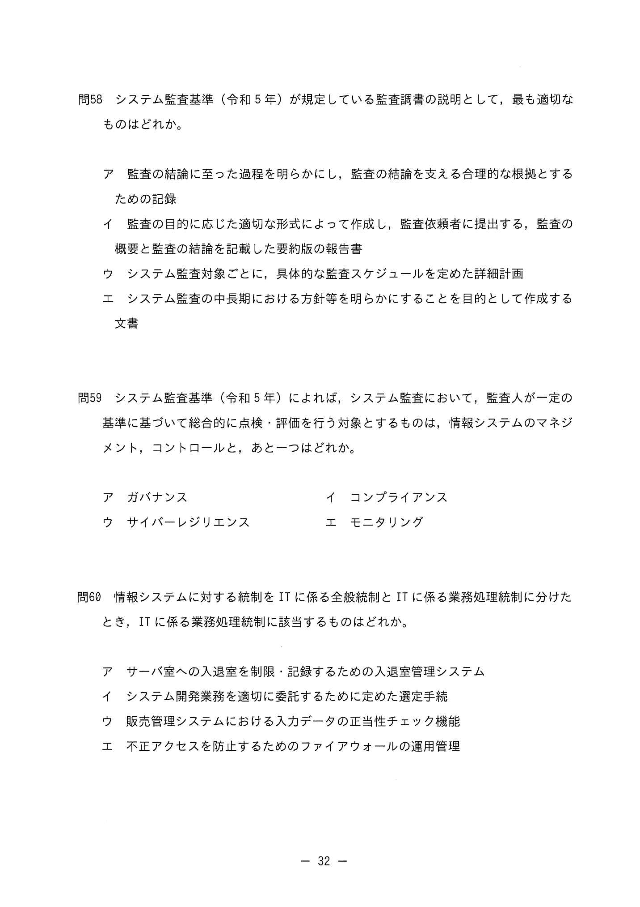

テキスト (OCR)

間58 システム監査基準 (令和 5年) が規定している監査調書の説明として, 最も適切な
ものはどれか。

ア 監査の結論に至った過程を明らかにし, 監査の結論を支える合理的な根拠とする
ための記録

イ 監査の目的に応じた適切な形式によって作成し, 監査依頼者に提出する, 監査の
概要と監査の結論を記載した要約版の報告書

ウ システム監査対象ごとに, 具体的な監査スケジュールを定めた詳細計画

エ システム監査の中長期における方針等を明らかにすることを目的として作成する
文書

59 システム監査基準 (令和5年) によれば, システム監査において, 監査人が一定の
基準に基づいて総合的に点検・評価を行う対象とするものは, 情報システムのマネジ
メント, コントロールと, あと一つはどれか。

ア ガバナンス           イ コンプライアンス

ウ サイバーレジリエンス      エ モニタリング

ICO 情報システムに対する統制を IT に係る全般統制と IT に係る業務処理統制に分けた
とき, IT に係る業務処理統制に該当するものはどれか。

N

サーバ室への入退室を制限・記録するための入退室管理レシレステム
システム開発業務を適切に委託するために定めた選定手続
販売管理システムにおける入力データの正当性チェック機能
不正アクセスを防止するためのファイアウォールの運用管理

H GAN

### ページ 33

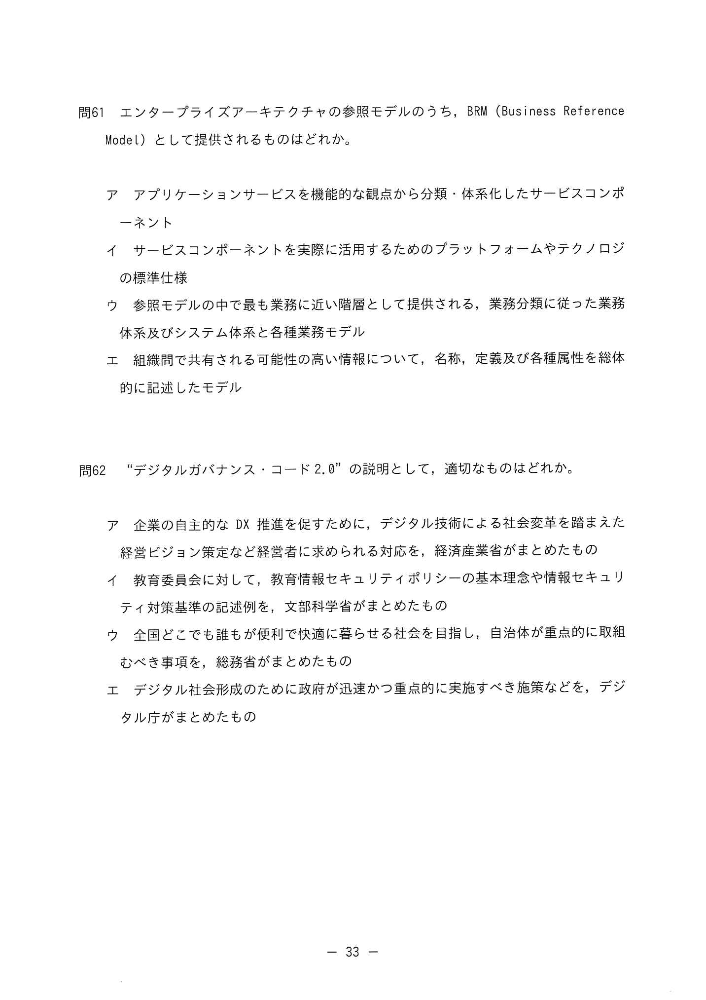

テキスト (OCR)

間61 エンタープライズアーキテクチャの参照モデルのうち, BRM (Business Reference
Model) として提供されるものはどれか。

ア アプリケーションサービスを機能的な観点から分類・体系化したサービスコンポ
ーネント

イ サービスコンポーネントを実際に活用するためのプラットフォームやテクノロジ
の標準仕様

ウ 参照モデルの中で最も業務に近い階層として提供される, 業務分類に従った業務
体系及びシステム体系と各種業務モデル

組織間で共有される可能性の高い情報について, 名称, 定義及び各種属性を総体

H

的に記述したモデル

間62 “デジタルガバナンス・コード 2.0" の説明として, 適切なものはどれか。

ア 企業の自主的な DX 推進を促すために, デジタル技術による社会変革を踏まえた
経営ビジョン策定など経営者に求められる対応を, 経済産業省がまとめたもの
イ 教育委員会に対して, 教育情報セキュリティポリシーの基本理念や情報セキュリ
ティ対策基準の記述例を, 文部科学省がまとめたもの
ウ 全国どこでも誰もが便利で快適に暮らせる社会を目指し, 自治体が重点的に取組
むべき事項を, 総務省がまとめたもの
エ デジタル社会形成のために政府が迅速かつ重点的に実施すべき施策などを, デジ
タル庁がまとめたもの

### ページ 34

テキスト (OCR)

問63 SOA の説明はどれか。

ア 会計, AS, 製造, 購買, 在庫管理, 販売などの企業の業務プロセスを一元管理
することによって, 業務の効率化や経営資源の全体最適を図る手法

イ 企業の業務プロセス, システム化要求などのニーズと, ソフトウェアパッケージ
の機能性がどれだけ適合し, どれだけかい離しているかを分析する手法

ウ 業務プロセスの問題点を洗い出して, 目標設定, 実行チェック, 修正行動のマ
ネジメントサイクルを適用し, 継続的な改善を図る手法

エ 利用者の視点から業務システムの機能を幾つかの独立した部品に分けることによ
って, 業務プロセスとの対応付けや他ソフトウェアとの連携を容易にする手法

問64 IT 投資案件において, 投資効果を PBP (Pay Back Period) で評価する。投資額が
500 のとき, 期待できるキャッシュインの四つのシナリオ a~d のうち, 効果が最も
高いものはどれか。

年目    1  2  3  4  5

a
キャッシュイン   199| 159| 299| 259| 300
年目    1  2  3  4  5

b
キャッシュイン  109| 200) 369| 200] 100
年目  1 2 3 | 4 5

C
キャッシュイン   200] 159| 199| 150] 200
年目    1  2  3  4  5

d
キャッシュイン  300] 200] 100  50  50

ア a   4 b   ウ c   エ d

ー 34 一

### ページ 35

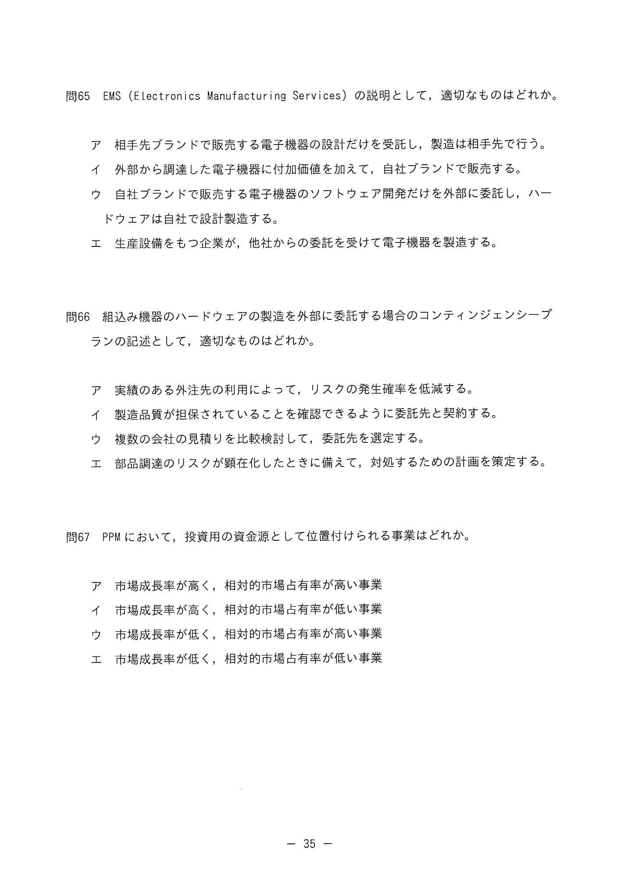

テキスト (OCR)

P§65 EMS (Electronics Manufacturing Services) の説明として, 適切なものはどれか。

ア 相手先ブランドで販売する電子機器の設計だけを受託し, 製造は相手先で行う。

イ 外部から調達した電子機器に付加価値を加えて, 自社プランドで販売する。

ウ 自社ブランドで販売する電子機器のソフトウェア開発だけを外部に委託し, ハー
ドウェアは自社で設計製造する。

エ 生産設備をもつ企業が, 他社からの委託を受けて電子機器を製造する。

問66 組込み機器のハードウェアの製造を外部に委託する場合のコンティンジェンシープ
ランの記述として, 適切なものはどれか。

実績のある外注先の利用によって, リスクの発生確率を低減する。

製造品質が担介されていることを確認できるように委託先と契約する。
複数の会社の見積りを比較検討して, 委託先を選定する。

部品調達のリスクが顕在化したときに備えて, 対処するための計画を策定する。

H GAN

問67 PPM において, RAAORSIRC LTBI ONSBREEND.

N

市場成長率が高く, 相対的市場占有率が高い事業
市場成長率が高く, 相対的市場占有率が低い事業
市場成長率が低く, 相対的市場占有率が高い事業
市場成長率が低く, 相対的市場占有率が低い事業

H さ A

### ページ 36

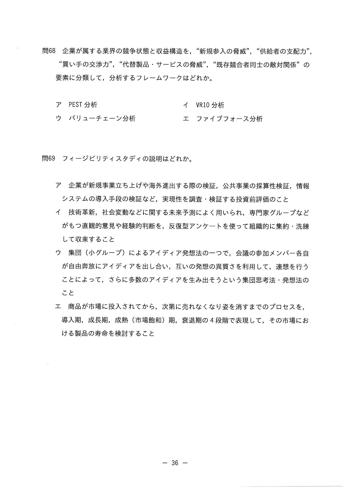

テキスト (OCR)

間68 企業が属する業界の競争状態と収益構造を, “新規参入の脅威", "供給者の支配力,
“買い手の交渉力", “代替製品・サービスの谷威", "既存競合者同士の敵対関係” の
要素に分類して, 分析するフレームワークはどれか。

ア PEST 分析           イ VRIO分析
ウ バリューチェーン分析     エ ファイブフォース分析

fel69 フィージビリティスタディの説明はどれか。

ア 企業が新規事業立ち上げや海外進出する際の検証, 公共事業の採算性検証, 情報
システムの導入手段の検証など, 実現性を調査・検証する投資前評価のこと

イ 技術革新, 社会変動などに関する未来予測によく用いられ, 専門家グループなど
がもつ直観的意見や経験的判断を, 反復型アンケートを使って組織的に集約・洗練
して収束すること

ウ 集団 (小グループ) によるアイディア発想法の一つで, 会議の参加メンバー各自
が自由奏放にアイディアを出し合い, 互いの発想の異質さを利用して, 連想を行う
ことによって, さらに多数のアイディアを生み出そうという集団思考法・発想法の
こと

エ 商品が市場に投入されてから, 次第に売れなくなり姿を消すまでのプロセスを.,
導入期, 成長期, 成熟 (市場飽和) 期, 衰退期の 4 段階で表現して, その市場にお
ける製品の寿命を検討すること

### ページ 37

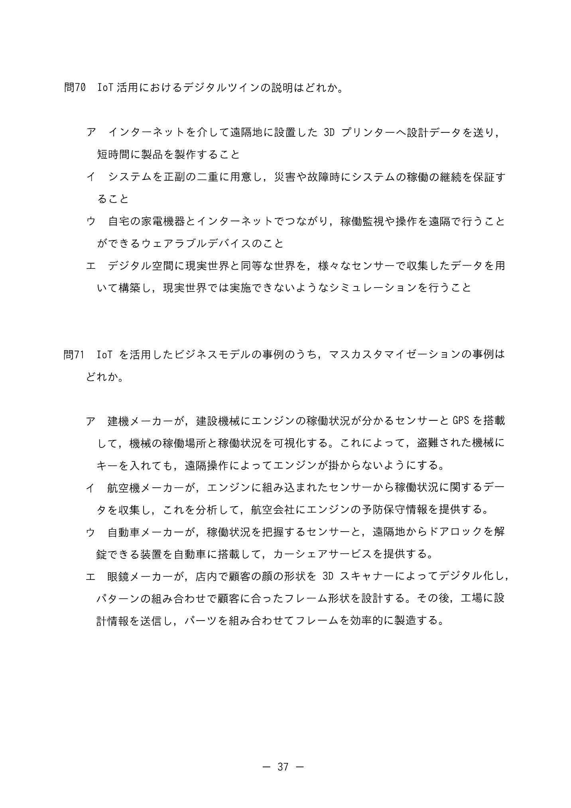

テキスト (OCR)

間76 1oT 活用におけるデジタルツインの説明はどれか。

ア インターネットを介して遠隔地に設置した 3D プリンターへ設計データを送り,
短時間に製品を製作すること
4 システムを正副の二重に用意し, 災害や故障時にシステムの乏働の継続を保証す
ること
ウ 自宅の家電機器とインターネットでつながり, 稼働監視や操作を遠隔で行うこと
ができるウェアラブルデバイスのこと
エ デジタル空間に現実世界と同等な世界を, 様々なセンサーで収集したデータを用
いて構築し, 現実世界では実施できないようなシミュレーションを行うこと

問71 lol を活用したビジネスモデルの事例のうち, マスカスタマイゼーションの事例は
どれか。

ア 建機メーカーが, 建設機械にエンジンの乏働状況が分かるセンサーと GPS を搭載
LT, 機械の稼働場所と稼働状況を可視化する。これによって, 盗難された機械に
キーを入れても, 遠隔操作によってエンジンが掛からないようにする。

イ 航空機メーカーが, エンジンに組み込まれたセンサーから乏働状況に関するデー
タを収集し, これを分析して, 航空会社にエンジンの予防保守情報を提供する。

ウ 自動車メーカーが, 稼働状況を把握するセンサーと, 遠隔地からドアロックを解
錠できる装置を自動車に搭載して, カーシェアサービスを提供する。

エ 有眼鏡メーカーが, 店内で顧容の顔の形状を 3D スキャナーによってデジタル化し,
パターンの組み合わせで顧客に合ったフレーム形状を設計する。 その後, 工場に設
計情報を送信し, パーツを組み合わせてフレームを効率的に製造する。

### ページ 38

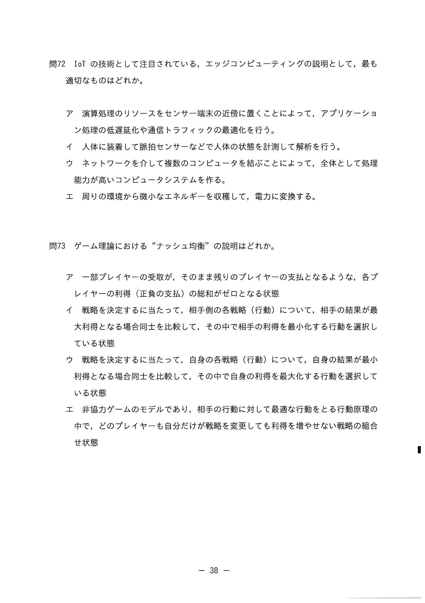

テキスト (OCR)

間72 lol の技術として注目されている, エッジコンピューティングの説明として, 最も
適切なものはどれか。

ア 演算処理のリソースをセンサー端末の近傍に置くことによって, アプリケーショ
ン処理の低遅延化や通信トラフィックの最適化を行う。
イ 人体に装着して脈拍センサーなどで人体の状態を計測して解析を行う。
ウ ネットワークを介して複数のコンピュータを結ぶことによって, 全体として処理
高いコンピュータシステムを作る。
TL 周りの環境から微小なエネルギーを収穫して, 電力に変換する。

Fd
es
に
Ut
u

間73 ゲーム理論における “ナッシュ均衡" の説明はどれか。

ア 一部プレイヤーの受取が, そのまま残りのプレイヤーの支払となるような, BT
レイヤーの利得 (正負の支払) の総和がゼロとなる状態

イ 戦略を決定するに当たって, 相手側の各戦略 (行動) について, 相手の結果が最
大利得となる場合同士を比較して, その中で相手の利得を最小化する行動を選択し
ている状態

ウ 戦略を決定するに当たって, 自身の各戦略 (行動) について, 自身の結果が最小
利得となる場合同士を比較して, その中で自身の利得を最大化する行動を選択して
いる状態

エ 非協力ゲームのモデルであり, 相手の行動に対して最適な行動をとる行動原理の
RC, どのプレイヤーも自分だけが戦略を変更しても利得を増やせない戦略の組合
せ状態

### ページ 39

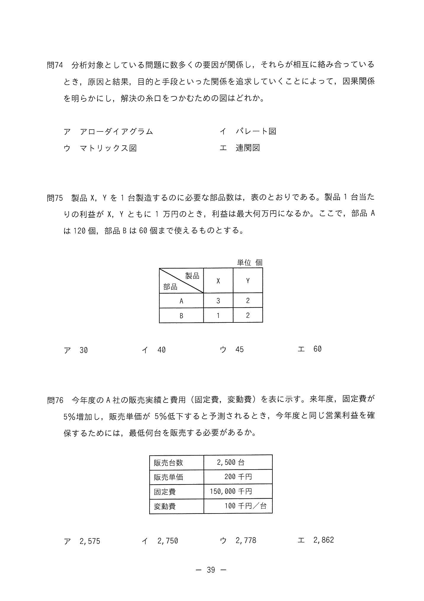

テキスト (OCR)

間74 分析対象としている問題に数多くの要因が関係し, それらが相互に絡み合っている
とき, 原因と結果, 目的と手段といった関係を追求していくことによって, 因果関係
を明らかにし, 解決の糸口をつかむための図はどれか。

ア アローダイアグラム      イ パレート図
ウ マトリックス図        エ 連関図

間75 製品XYを1台製造するのに必要な部品数は, 表のとおりである。製品 1 台当た
りの利益が X, Y ともに 1 万円のとき, 利益は最大何万円になるか。ここで, 部品A
は 120 個, 部品B は66 個まで使えるものとする。

単位 個
製品
X   Y
部品
A    3   2
B    1   2
ア 30      イ 49      ウ 45      エ 69

問76 今年度のA社の販売実績と費用 (固定費, 変動費) を表に示す。来年度, BERD
5%増加し, 販売単価が 5%低下すると予測されるとき, 今年度と同じ営業利益を確
保するためには, 最低何台を販売する必要があるか。

販売台数    2,500 台
販売単価    200 千円
固定費    150, 000 FF
変動費     100 千円ノ台
F i2)b75    4 2,750    ウ 2,778    エ 2,862

ー 39 一

### ページ 40

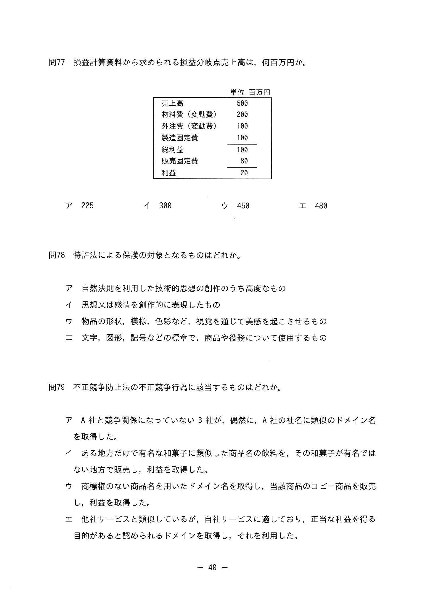

テキスト (OCR)

問77 損益計算資料から求められる損益分岐点売上高は, 何百万円か。

単位 百万円
売上高          500
材料費 (変動費)    200
外注費 (変動費)    100

製造固定費    100
総利益      100
販売固定費     80
利益20
ア 225     イ 300     ウ 450     エ 480

間78 特許法による保護の対象となるものはどれか。

に|

自然法則を利用した技術的思想の創作のうち高度なもの

イ 思想又は感情を創作的に表現したもの

ウ 物品の形状, 模様, 色彩など, 視覚を通じて美感を起こさせるもの
エ 文字, 図形, 記号などの標章で, 商品や役務について使用するもの

間79 不正競争防止法の不正競争行為に該当するものはどれか。

ア A社と競争関係になっていない B 社が, 偶然に, A 社の社名に類似のドメイン名
を取得した。

イ ある地方だけで有名な和菓子に類似した商品名の飲料を, その和菓子が有名では
ない地方で販売し, 利益を取得した。

ウ 商標権のない商品名を用いたドメイン名を取得し, 当該商品のコピー商品を販
し, 利益を取得した。

エ 他社サービスと類似しているが, 自社サービスに適しており, 正当な利益を得る
目的があると認められるドメインを取得し, それを利用した。

alt

### ページ 41

テキスト (OCR)

問80 個人情報のうち, 個人情報保護法における要配慮個人情報に該当するものはどれか。

ア 個人情報の取得時に, 本人が取扱いの配慮を申告することによって設定される情
aR

イ 個人に割り当てられた, Beste, クレジットカードなどの番号

ウ 生存する個人に関する, 個人を特定するために用いられる勤務先や住所などの情
報

I 本人の病歴。 犯罪の経歴など不当な差別や不利益を生じさせるおそれのある情報

ーー 41

### ページ 42

テキスト (OCR)

【

x モ 用 紙 J

### ページ 43

テキスト (OCR)

[ メ モ 用 紙 J

ー 43 一

### ページ 44

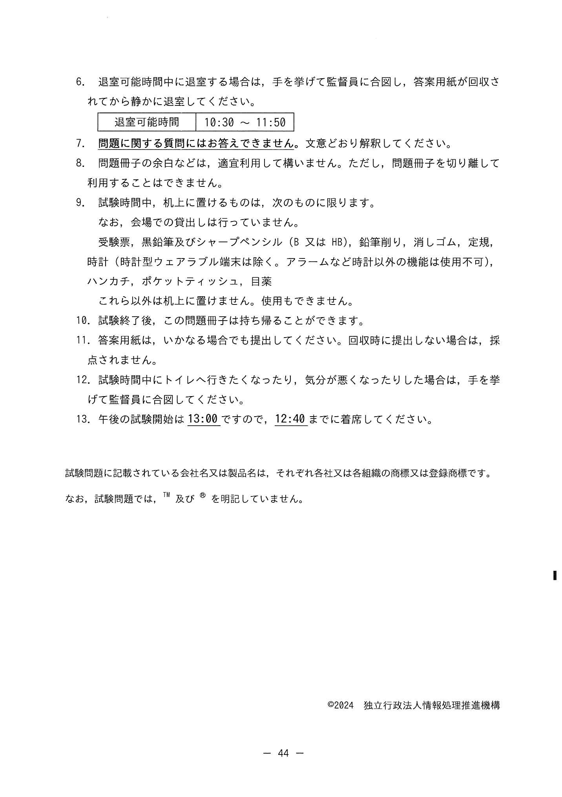

テキスト (OCR)

6. 退室可能時間中に退室する場合は, 手を挙げて監督具に合図し, 答案用紙が回収さ
れてから静かに退室してください。
退室可能時間   10:30 ~ 11:50
7. 問題に関する質問にはお答えできません。文意どおり解釈してください。
8. 問題冊子の余白などは, 適宜利用して構いません。ただし, 問題冊子を切り離して
利用することはできません。
9. 試験時間中, 机上に置けるものは, 次のものに限ります。
なお, 会場での貸出しは行っていません。
受験票, 黒鉛筆及びシャープペンシル (B 又は HB), 鉛筆削り, 消しゴム, 定規,
時計 (時計型ウェアラブル端末は除く。アラームなど時計以外の機能は使用不可),
ハンカチ, ポケットティッシュ, 目薬
これら以外は机上に置けません。 使用もできません。
19. 試験終了後, この問題冊子は持ち帰ることができます。
11. SRAM, いかなる場合でも提出してください。回収時に提出しない場合は, 採
点されません。
12. 試験時間中にトイレへ行きたくなったり, 気分が悪くなったりした場合は, FES
げて監督具に合図してください。
13. 午後の試験開始は 13:99 ですので, 12:49 までに着席してください。

ir

試験問題に記載されている会社名又は製品名は, それぞれ各社又は各組織の商標又は登録商標です。

なお, 試験問題では, " Rue を明記していません。

@2024 独立行政法人情報処理推進機構

ー 44 一

---

## 午前解答

©2024 独立行政法人情報処理推進機構 
令和6 年度 春期 応用情報技術者試験 解答例 
 
午前試験 
問番号
正解
分野
問1 
エ 
Ｔ 
問2 
エ 
Ｔ 
問3 
ア 
Ｔ 
問4 
エ 
Ｔ 
問5 
ウ 
Ｔ 
問6 
エ 
Ｔ 
問7 
ア 
Ｔ 
問8 
エ 
Ｔ 
問9 
ウ 
Ｔ 
問10 
エ 
Ｔ 
問11 
ア 
Ｔ 
問12 
ウ 
Ｔ 
問13 
ア 
Ｔ 
問14 
イ 
Ｔ 
問15 
ウ 
Ｔ 
問16 
イ 
Ｔ 
問17 
イ 
Ｔ 
問18 
イ 
Ｔ 
問19 
エ 
Ｔ 
問20 
エ 
Ｔ 
 
 
問番号
正解
分野
問21 
ウ 
Ｔ 
問22 
ウ 
Ｔ 
問23 
ア 
Ｔ 
問24 
エ 
Ｔ 
問25 
ア 
Ｔ 
問26 
ウ 
Ｔ 
問27 
エ 
Ｔ 
問28 
ウ 
Ｔ 
問29 
ウ 
Ｔ 
問30 
イ 
Ｔ 
問31 
ア 
Ｔ 
問32 
エ 
Ｔ 
問33 
エ 
Ｔ 
問34 
イ 
Ｔ 
問35 
イ 
Ｔ 
問36 
ウ 
Ｔ 
問37 
ア 
Ｔ 
問38 
イ 
Ｔ 
問39 
イ 
Ｔ 
問40 
ウ 
Ｔ 
 
 
問番号
正解
分野
問41 
イ 
Ｔ 
問42 
ア 
Ｔ 
問43 
イ 
Ｔ 
問44 
ウ 
Ｔ 
問45 
イ 
Ｔ 
問46 
エ 
Ｔ 
問47 
ウ 
Ｔ 
問48 
エ 
Ｔ 
問49 
イ 
Ｔ 
問50 
イ 
Ｔ 
問51 
ア 
Ｍ 
問52 
エ 
Ｍ 
問53 
エ 
Ｍ 
問54 
ア 
Ｍ 
問55 
ウ 
Ｍ 
問56 
エ 
Ｍ 
問57 
ウ 
Ｍ 
問58 
ア 
Ｍ 
問59 
ア 
Ｍ 
問60 
ウ 
Ｍ 
 
 
問番号
正解
分野
問61 
ウ 
Ｓ 
問62 
ア 
Ｓ 
問63 
エ 
Ｓ 
問64 
エ 
Ｓ 
問65 
エ 
Ｓ 
問66 
エ 
Ｓ 
問67 
ウ 
Ｓ 
問68 
エ 
Ｓ 
問69 
ア 
Ｓ 
問70 
エ 
Ｓ 
問71 
エ 
Ｓ 
問72 
ア 
Ｓ 
問73 
エ 
Ｓ 
問74 
エ 
Ｓ 
問75 
ウ 
Ｓ 
問76 
エ 
Ｓ 
問77 
ウ 
Ｓ 
問78 
ア 
Ｓ 
問79 
ウ 
Ｓ 
問80 
エ 
Ｓ 
 
 
分野の「Ｔ」はテクノロジ系，「Ｍ」はマネジメント系，「Ｓ」はストラテジ系の問題です。

---

## 午後問題

### ページ 1

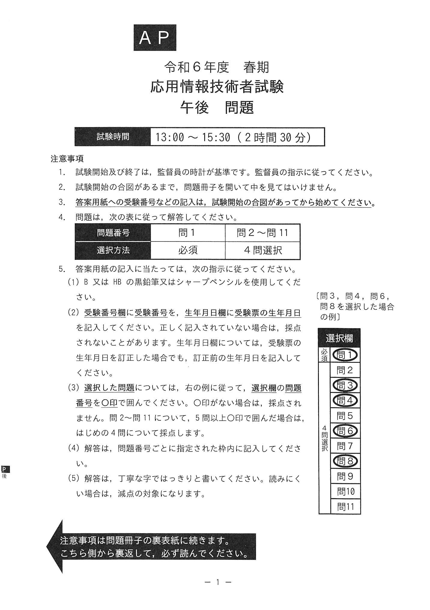

テキスト (OCR)

令和6年度 春期
応用情報技術者試験
午後 問題

 13:00 ~ 15:30 (2 時間 30 分)

注意事項
1. 試験開始及び終了は。双具上の時計が基準です。双普員の指示に従ってください。
2, 試験開始の合図があるまで, 問題地子を開いて中を見てはいけません。
3. 和朱用紙への受験番号などの記入は, 試験開始の合図があってから始めてください
4. 問題は, 次の表に従って解答してください。
問題番号     問 1    問2て問1
BRAK          必タ           4 間選択
5. 答案用紙の記入に当たっては, 次の指示に従ってください。
(1) B 又は HB の黒鉛筆又はシャープペンシルを使用してくだ
さい。                              (lS, 問4, 問6,
2) 受験番号欄に受験番号を生年朋日欄に受験時生年有日 Fe eRR LBS
を記入してください。正しく記入されていない場合は, 採点

されないことがあります。生年月日材については, Seo RRR

生年月日を訂正した場合でも訂正前の生年月日を記入して |B
ください。                                    間2
(3) 選択した問題については, 右の例に従って, 選択欄の問題   Gid
番号を〇印で囲んでください。O〇印がない場合は, 採点され   Gad
ません。間 2一問 11 について, 5 問以上O印で囲んだ場合は,     問5
はじめの 4 問について採点します。                 a|\G@s
(4) 解答は問題番号ごとに指定された枠内に記入してくださ [RL 問7
、                            Gis
P
a          (5) 解答は, 丁寧な字ではっきりと書いてください。読みにく      問9
い場合は, 減点の対象になります。               間19
間11

注意事項は問題冊子の裏表紙に続きます。
こちら側から裏返して, 必ず読んでください。

### ページ 2

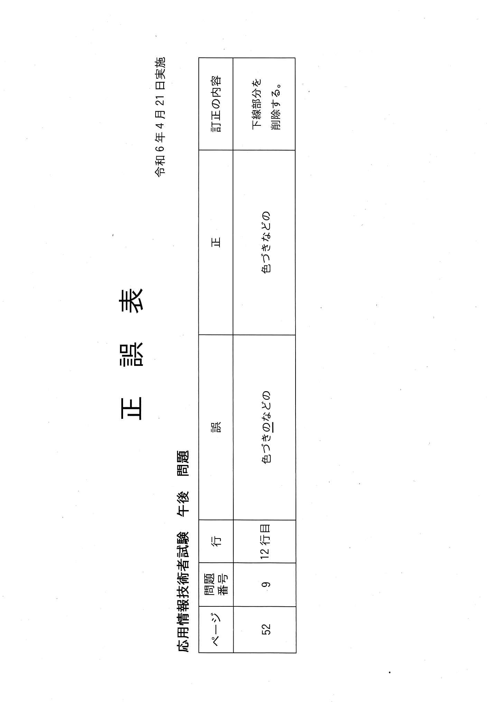

テキスト (OCR)

MA ICH pr Hows

°S $ SAlif                                                     ーー
a             の並ぶと号                   ORGORCR          BL 21    6      <G
4G Tae
yt                       =e
SYMork                a                           BE                Ly    Fife!   ぐーシシ
BH #5 BE2WaRs HY

### ページ 3

### ページ 4

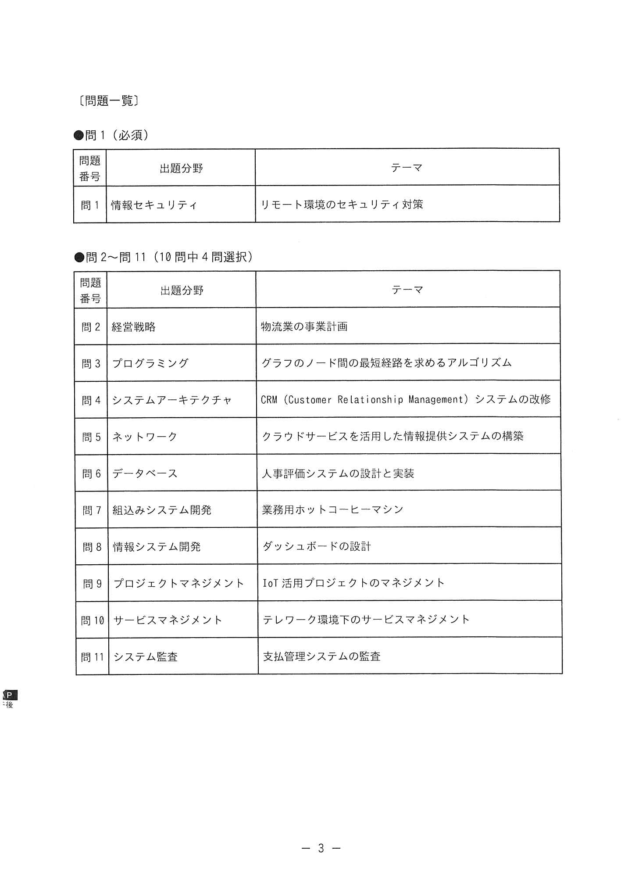

テキスト (OCR)

〔問題一覧〕

@問1 (必須)

Ma     出題分野                 TR

問 1 | 情報セキュリティ      リモート環境のセキュリティ対策

@問 2一問 11 (10 問中 4 問選択)

     出題分野                 テーマ

問 2 | 経営戦略          物流業の事業計画

問 3 | プログラミング       グラフのノード間の最短経路を求めるアルゴリズム
問4 | システムアーキテクチャ    CRM (Customer Relationship Management) システムの改修
間5 | ネットワーク        クラウドサービスを活用した情報提供システムの構築
問6 | データベース        人事評価システムの設計と実装

問 7 | 組込みシステム開発     業務用ホットコーヒーマシン

問 8 | 情報システム開発      ダッシュボードの設計

問 9 | プロジェクトマネジメント | IoT 活用プロジェクトのマネジメント

問10| サービスマネジメント      テレワーク環境下のサービスマネジメント

問 11] システム監査        支払管理システムの監査

### ページ 5

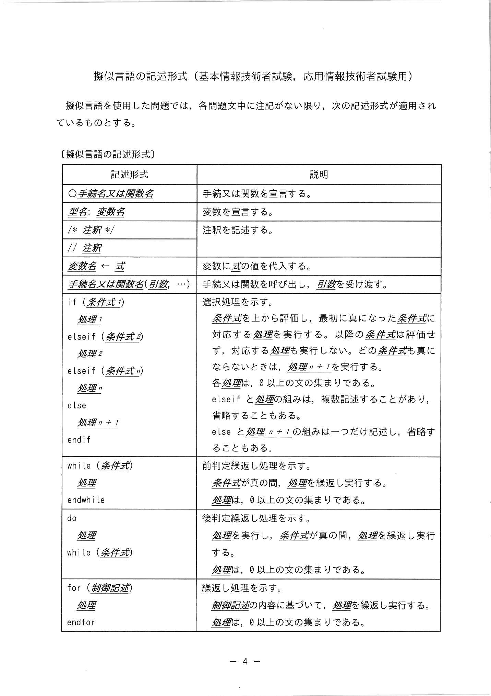

テキスト (OCR)

擬似言語の記述形式 (基本情報技術者試験, 応用情報技術者試験用)

擬似言語を使用した問題では, 各問題文中に注記がない限り, 次の記述形式が適用され

ているものとする。

〔擬似言語の記述形式

記述形式                       説明
OF&E RE BRE       手続又は関数を宣言する。
BA. BRA           変数を宣言する。
/* SER */               注釈を記述する。
// SEER
BRE — zt             BMI HOGEKAT S.
FitG RBG BWR, …) | 手続又は関数を呼び出し, HRERIET.
if (Az)           選択処理を示す。
MB 1             RAACEDSOMMGL, 最初に真になった壮族区に
elseif (Az 2         WHT SUBERATS. UBOAA HM t
MB 2             ず, WHT SUBERALAW, COMMA
elseif (<Azt'n)            ならないときは, Mn+ 1eRTSTS,
NIB 0              SMB, 9 以上の文の集まりである。
alse                elseif CMHOMA, 複数記述することがあり,
rr           省略することもある。
mf                  else ¢M#n+ 7の組みはーつだけ記述し, 省略す

ることもある。

while (#f#z¢)

前判定繰返し処理を示す。

while (zt)

MB               RAADROR, MB HoRLRTTS.
endwhi Le                  MBS, 0 以上の文の集まりである。
do                      後判定繰返し処理を示す。
SOE                    MBE RIL, RAFAKROM, MBAR

する。
MFRS, 9 以上の文の集まりである。

for ( @il@faczt)

ME

endfor

繰返し処理を示す。
競線朗巡の内容に基づいて, 刀杏を繰返し実行する。
MHS, 0 以上の文の集まりである。

### ページ 6

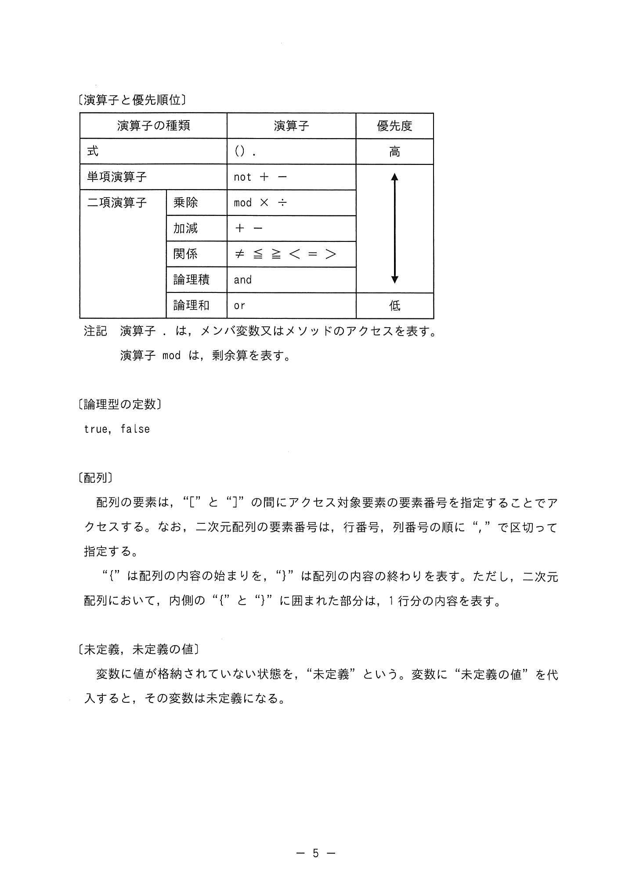

テキスト (OCR)

(演算子と優先順位

演算子の種類         演算子       優先度

式              QO.              fo
単項演算子         not 十 一
二項演算子 | 乗除    mod X +

加減    + 一

関係    #52<=>

論理積 | and

論理和 | or               低

注記 演算子 ld, メンバ変数又はメソッドのアクセスを表す。
演算子 mod は, 剰余算を表す。

〔論理型の定数

true, false

〔配列〕

配列の要素は, “[” と “]” の間にアクセス対象要素の要素番号を指定することでア
クセスする。 なお, 二次元配列の要素番号は, TES, 列番号の順に “|” で区切って
指定する。

“C" は配列の内容の始まりを, }” は配列の内容の終わりを表す。ただし, 二次元
配列において, AMO “{? と 中” に囲まれた部分は, 1 行分の内容を表す。

〔未定義, 未定義の値〕
変数に値が格納されていない状態を, “未定義=ーという。変数に “未定義の値" を代
入すると, その変数は未定義になる。

### ページ 7

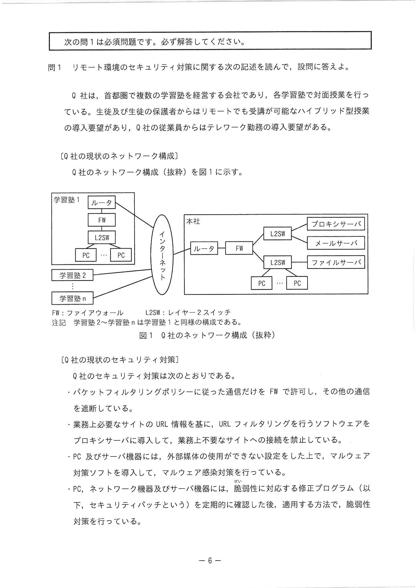

テキスト (OCR)

次の問 1 は必須問題です。必ず解答してください。

fll リモート環境のセキュリティ対策に関する次の記述を読んで, 設問に答えよ

0 社は, 首都圏で複数の学習塾を経営する会社であり, 各学習塾で対面授業を行っ
ている。 生徒及び生徒の保護者からはリモートでも受講が可能なハイブリッド型授業
の導入要望があり, 0 社の従業員からはテレワーク勤務の導入要望がある。

[Q 社の現状のネットワーク構成]
Q 社のネットワーク構成 (抜粋) を図 1 に示す。

Last トー| ファイルサーバ |
pc |…| Pc

Pe Pond Pe ール   L2SW : レイヤー2 スイッチ
BB 2~ FRE n は学習塾 1 と同様の構成である。

図1 Q社のネットワーク構成 (抜粋)

[Q 社の現状のセキュリティ対策】

0Q 社のセキュリティ対策は次のとおりである。

・パケットフィルタリングポリシーに従った通信だけを FW で許可し, その他の通信
を遮断している。

・業務上必要なサイトの URL 情報を基に, URL フィルタリングを行うソフトウェアを
プロキシサーバに中入して, 業務上不要なサイトへの接続を禁止している。

・PC 及びサーバ機器には, 外部媒体の使用ができない設定をした上で, マルウェア
対策ソフトを導入して, マルウェア感染対策を行っている。

PC, ネットワーク機器及びサーバ機器には, 脆弱性に対応する修正プログラム (以
KB, セキュリティパッチという) を定期的に確認した後, 適用する方法で, 脆弱性
対策を行っている。

### ページ 8

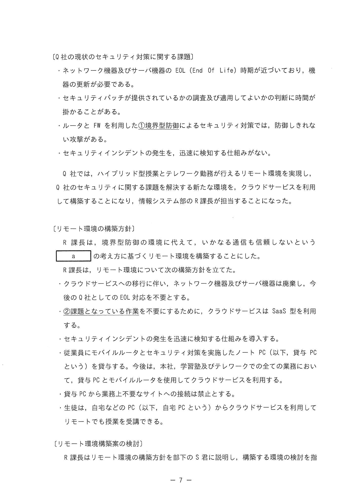

テキスト (OCR)

〔Q 社の現状のセキュリティ対策に関する課題〕

・ネットワーク機器及びサーバ機器の EOL (End 0f Life) 時期が近づいており, 機
器の更新が必要である。

・セキュリティパッチが提供されているかの調査及び適用してよいかの判断に時間が
時かることがある。

・ルータと FW を利用した①境界型防御によるセキュリティ対策では, 防御しきれな
い攻撃がある。

・セキュリティインシデントの発生を, 迅速に検知する仕組みがない。

‘put

Q 社では, ハイブリッド型授業とテレワーク勤務が行えるリモート環境を実現し,
Q 社のセキュリティに関する課題を解決する新たな環境を, クラウドサービスを利用
して構築することになり, 情報システム部の R 課長が担当することになった。

[リモート環境の構築方針}

R 課長は, 境界型防御の環境に代えて, いかなる通信も信頼しないという
[a | の考え方に基づくリモート環境を構築することにした。

R 課長は, リモート環境について次の構築方針を立てた。

・クラウドサービスへの移行に伴い, ネットワーク機器及びサーバ機器は廃棄し, 今
後の Q 社としての EOL 対応を不要とする。

・②課題となっている作業を不要にするために, クラウドサービスは SaaS 型を利用
する。

・セキュリティインシデントの発生を迅速に検知する仕組みを導入する。

・ 従業員にモバイルルータとセキュリティ対策を実施したノート PC (以下, 貸与 PC
という) を貸与する。 今後は, AH, 学習塾及びテレワークでの全ての業務におい
て, 貸与PC とモバイルルータを使用してクラウドサービスを利用する。

・ 貸与 PC から業務上不要なサイトへの接続は禁止とする。

・生徒は, 自宅などの PC (以下, 自宅PC という) からクラウドサービスを利用して
リモートでも授業を受講できる。

[リモート環境構築案の検討〕
R 課長はリモート環境の構築方針を部下の S 君に説明し, 構築する環境の検討を指

ーア7アー

### ページ 9

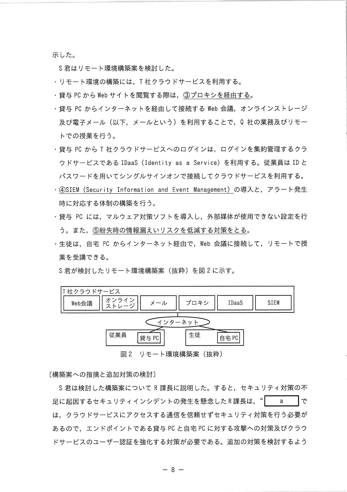

テキスト (OCR)

示した。
S 君はリモート環境構築案を検討した。
・リモート環境の構築には, T社クラウドサービスを利用する。
・貸与 PC から Web サイトを閲覧する際は, ③プロキシを経由する。
・貸与 PC からインターネットを経由して接続する Web 会議,オンラインストレージ
及び電子メール (以下, メールという) を利用することで, 0 社の業務及びリモー
トでの授業を行う。
・貸与 PC から T 社クラウドサービスへのログインは, ログインを集約管理するクラ
ウドサービスである IDaaS (Identity as a Service) を利用する。従業員は ID と
パスワードを用いてシングルサインオンで接続してクラウドサービスを利用する。
・④SIEM (Security Information and Event Management) の導入と, アラート発生
時に対応する体制の構築を行う。
・ 貸与 PC には, マルウェア対策ソフトを導入し, 外部媒体が使用できない設定を行
う。また, ⑤紛失時の情報漏えいリスクを低減する対策をとる。
・生徒は, 自宅 PC からインターネット経由で, Web 会議に接続して, リモートで授
業を受講できる。
S 君が検討したリモート環境構築案 (抜粋) を図 2 に示す。

T社クラウドサービス

Web会議 || 3イアイン|| メール |] プロキシ || mass   SIEM
インターネット
1H [me             生徒  [eare

図2 リモート環境構築案 (抜粋)

(構築案への指摘と追加対策の検討
S 君は検討した構築案について R 課長に説明した。すると, セキュリティ対策の不
足に起因するセキュリティインシデントの発生を懸念したR課長は。 "| a |で
lt, クラウドサービスにアクセスする通信を信頼せずセキュリティ対策を行う必要が
あるので, エンドポイントである貸与 PC と自宅 PC に対する攻撃への対策及びクラウ
ドサービスのユーザー認証を強化する対策が必要である。追加の対策を検討するよう

### ページ 10

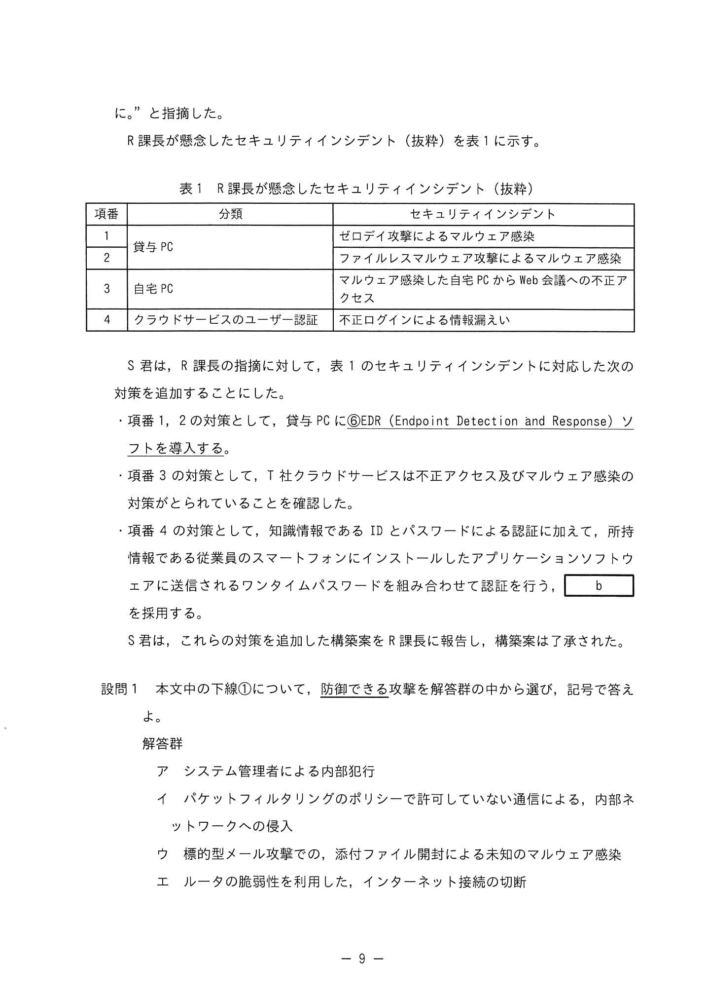

テキスト (OCR)

「

こ。 と指摘した。

R 課長が懸念したセキュリティインシデント (抜粋) を表 1 に示す。

表1 R課長が懸念したセキュリティインシデント (抜粋)

項番        分類              セキュリティインシデント
1            ゼロデイ攻撃によるマル ア感2

貸与PC          デイ攻撃 る ウェア感染
2                  ファイルレスマルウェア攻撃によるマルウェア感染

本              マルウェア感染した自宅 PC から Web 会議への不正ア
3 |自宅PC
クセス

4 |クラウドサービスのユーザー主衣  不正ログインによる情報漏えい

設問 1

S 君は, R 課長の指摘に対して, 表1 のセキュリティインシデントに対応した次の
対策を追加することにした。
・項番 1, 2 の対策として, 貸与PC に⑥EDR (Endpoint Detection and Response) ソ

フトを導入する。

・項番 3 の対策として, T 社クラウドサービスは不正アクセス及びマルウェア感染の
対策がとられていることを確認した。
・項番 4 の対策として, 知識情報である ID とパスワードによる認証に加えて, 所持
情報である従業員のスマートフォンにインストールしたアプリケーションソフトウ
ェアに送信されるワンタイムパスワードを組み合わせて認証を行う,| b |

を採用する。

S#ld, これらの対策を追加した構築案を R 課長に報告し, 構築案は了承された。

本文中の下線について, 防御できる攻撃を解答群の中から選び,

ア システム管理者による内部犯行
イ パケットフィルタリングのポリシーで許可していない通信による, 内部ネ

ットワークへの侵入

部
MD
A
4
が

ウ 標的型メール攻撃での, 添付ファイル開封による未知のマルウェア感染
エ ルータの脆弱性を利用した, インターネット接続の切断

### ページ 11

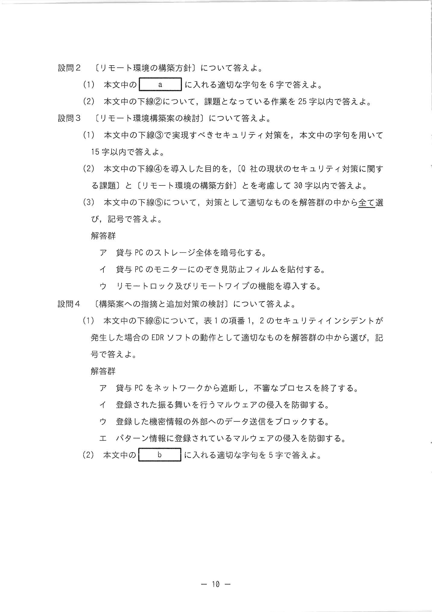

テキスト (OCR)

設問2 〔リモート環境の構築方針}について答えよ。
(1) 本文中の|  。 |] に入れる適切な字句を6字で答えよ。
(2) 本文中の下線の@について, 課題となかっている作業を 25 字以内で答えよ。
設問3 〔リモート環境構築案の検討1について答えよ。
(1) 本文中の下線③で実現すべきセキュリティ対策を, 本文中の字句を用いて
15 字以内で答えよ。
(2) 本文中の下線④を導入した目的を, (0 社の現状のセキュリティ対策に関す
る課題】 と 〔リモート環境の構築方針] とを考慮して 39 字以内で答えよ。
(3) 本文中の下線⑤⑥について, 対策として適切なものを解答群の中から全て選
び, 記号で答えよ。
解答群
ア 貸与PCのストレージ全体を暗号化する。
イ 貸与PCのモニターにのぞき見防止フィルムを貼付する。
ウ リモートロック及びリモートワイプの機能を導入する。
設問4 (構築案への指摘と追加対策の検討]について答えよ。
(1) 本文中の下線⑥について, 表 1 の項番 1, 2 のセキュリティインシデントが
発生した場合のEDR ソフトの動作として適切なものを解答群の中から選び, 記
号で答えよ。
PSE
貸与PC をネットワークから遮断し, 不審なかプロセスを終了する。
登録された振る舞いを行うマルウェアの侵入を防御する。
登録した機密情報の外部へのデータ送信をブロックする。
パターン情報に登録されているマルウェアの侵入を防御する。
(2) 本文中の[| b | に入れる適切な字句を5字で答えよ。

23

Ee

NI

H GA

### ページ 12

テキスト (OCR)

C

メ = 用 紙 J

### ページ 13

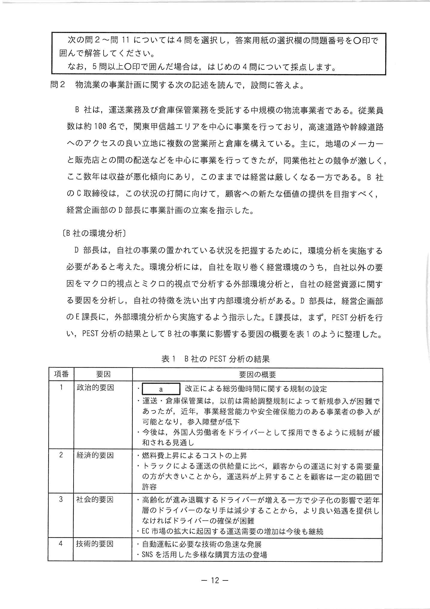

テキスト (OCR)

RORM2~f 11 については4 問を選択し, 答案用紙の選択欄の問題番号を〇印で
囲んで解答してください。
なお, 5 問以上〇印で囲んだ場合は, はじめの 4 問について採点します。

問2 物流業の事業計画に関する次の記述を読んで, 設問に答えよ。

B 社は, 運送業務及び倉庫保管業務を受託する中規模の物流事業者である。 HHA
数は約 199 名で, 関東甲信越エリアを中心に事業を行っており, 高速道路や幹線道路
へのアクセスの良い立地に複数の営業所と倉庫を構えている。主に, 地場のメーカー
と販売店との間の配送などを中心に事業を行ってきたが, 同業他社との競争が激しく,
ここ数年は収益が悪化傾向にあり, このままでは経営は厳しくなる一方である。B 社
OC 取締役は, この状況の打開に向けて, 顧客への新たな価値の提供を目指すべく,
経営企画部の D 部長に事業計画の立案を指示した。

〔B 社の環境分析]

D 部長は, 自社の事業の置かれている状況を把握するために, 環境分析を実施する
必要があると考えた。 環境分析には, 自社を取り巻く経営環境のうち, 自社以外の要
因をマクロ的視点とミクロ的視点で分析する外部環境分析と, 自社の経営資源に関す
る要因を分析し, 自社の特徴を洗い出す内部環境分析がある。D 部長は, 経営企画部
のE 課長に, 外部環境分析から実施するよう指示した。E 課長は, まず, PEST 分析を行
い, PEST 分析の結果として B 社の事業に影響する要因の概要を表1 のように整理した。

表1 B社のPEST 分析の結果
項番    要因                  要因の概要
1 |政治的要因   ‘Lia  ] 履正による総労働時間に関する規制の設定
・運送・食庫保管業は, 以前は需給調整規制によって新規参入が困難で
あったが, 近年, 事業経営能力や安全確保能力のある事業者の参入が
可能となり, 参入障壁が低下
・今後は, 外国人労働者をドライバーとして採用できるように規制が緩
和される見通し
2 |経済的要因   ・ 燃料費上昇によるコストの上昇
・トラックによる運送の供給量に比べ, 顧客からの運送に対する順要量
の方が大きいことから, 運送料が上昇することを顧客は一定の範囲で
許容
3 | 社会的要因   ・ 高齢化が進み退職するドライバーが増える一方で少子化の影響で若年
層のドライバーのなり手は減少することから, より良い処遇を提供し
なければドライバーの確保が困難
・EC 市場の拡大に起因する運送需要の増加は今後も継続
4 |技術的要因   ・ 自動運転に必要な技術の急速な発展
・SNS を活用した多様な購買方法の登場

### ページ 14

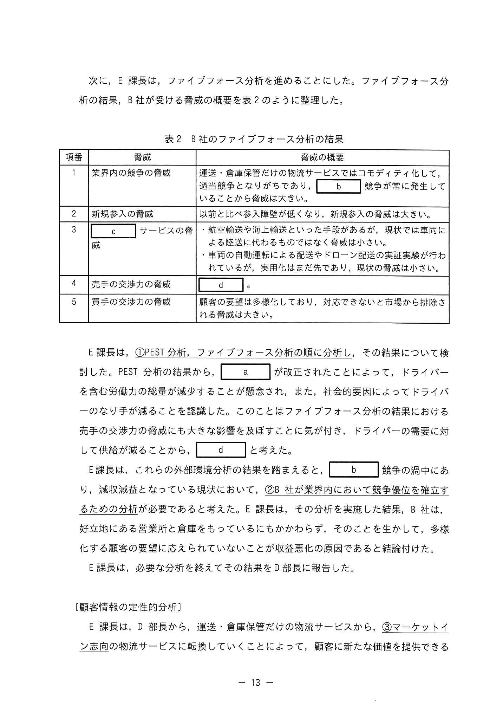

テキスト (OCR)

mic, ERR, ファイブフォース分析を進めることにした。ファイブフォース分
析の結果, B 社が受ける脅威の概要を表2 のように整理した。

表2 B社のファイブフォース分析の結果

項番      脅威                 脅威の概要

HRAORSOGR |運送・食庫保管だけの物流サービスではコモディティ化して,
過当欧争となりがちであり, | b | 競争が常に発生して
いることから脅威は大きい。

2 | MMBAD ER     以前と比べ参入障壁が低くなり, 新規参入の脅威は大きい。

3 | c Je -E Ame] ・航空輸送や海上輸送といった手段があるが, 現状では車両に

威                      よる陸送に代わるものではなく益威は小さい。
・ 車両の自動運転による配送やドローン配送の実証実験が行わ
れているが, 実用化はまだ先であり, 現状の脅威は小さい。
4 | 売手の交渉力の脅威  |[ gd ]。

交
5 |買手の交渉力の誰威   顧客の要望は多様化しており, 対応できないてと市場から排除さ
れる脅威は大きい。

rm

課長は, ①PEST 分析. ファイブフォース分析の順に分析し, その結果について検
討した。PEST 分析の結果から,|  a | が改正されたことによって, ドライバー
を含む労働力の総量が減少することが懸念され, また, 社会的要因によってドライバ
ーのなり手が減ることを認識した。このことはファイブフォース分析の結果における
売手の交渉力の脅威にも大きな影響を及ぼすことに気が付き, ドライバーの需要に対
して供給が減ることから, |  d | と考えた。

E 課長は, これらの外部環境分析の結果を踏まえると, |  b |競争の渦中にあ
り, 減収減益となっている現状において, OB 社が業界内において競争優位を確立す
るための分析が必要であると考えた。E 課長は。 その分析を実施した結果 B 社は,
好立地にある営業所と倉庫をもっているにもかかわらず, そのことを生かして, 多様
化する顧客の要望に応えられていないことが収益悪化の原因であると結論付けた。

E 課長は, 必要な分析を終えてその結果を 部長に報告した。

[顧客情報の定性的分析〕
E 課長は, D 部長から, 運送・倉庫保管だけの物流サービスから, ③マーケットイ
ン志向の物流サービスに転換していくことによって, 顧客に新たな価値を提供できる

### ページ 15

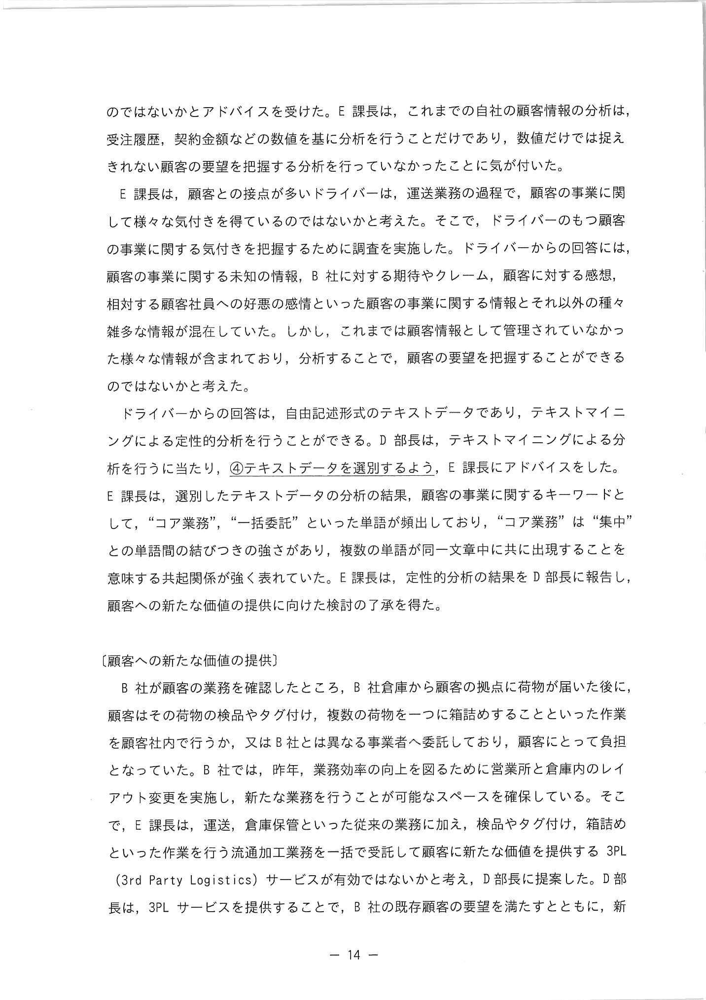

テキスト (OCR)

のではないかとアドバイスを受けた。E 課長は, これまでの自社の顧客情報の分析は,
受注履歴, 契約金額などの数値を基に分析を行うことだけであり, 数値だけでは捉え
きれない顧客の要望を把握する分析を行っていなかったことに気が付いた。

E 課長は, 顧客との接点が多いドライバーは, 運送業務の過程で, 顧客の事業に関
して様々な気付きを得ているのではないかと考えた。そこで, ドライバーのもつつ顧客
の事業に関する気付きを把握するために調査を実施した。ドライバーからの回答には
顧客の事業に関する未知の情報。B 社に対する期待やクレーム, 顧客に対する感想,
相対する顧客社員への好悪の感情といった顧客の事業に関する情報とそれ以外の種々
雑多な情報が混在していた。しかし, これまでは顧客情報として管理されていなかっ
た様々な情報が含まれており, 分析することで, 顧客の要望を把握することができる
のではないかと考えた。

ドライバーからの回答は, 自由記述形式のテキストデータであり, テキストマイニ
ングによる定性的分析を行うことができる。『D 部長は, テキストマイニングによる分
析を行うに当たり, ④テキストデータを選別するよう, E 課長にアドバイスをした。
E 課長は, 選別したテキストデータの分析の結果, 顧客の事業に関するキーワードと
して, “コア業務", “一括委託" といった単語が頻出しており, “コア業務"は 集中"
との単語間の結びつきの強さがあり, 複数の単語が同一文章中に共に出現することを
意味する共起関係が強く表れていた。E 課長は, 定性的分析の結果を 部長に報告し,
顧客への新たな価値の提供に向けた検討の了承を得た。

[顧客への新たな価値の提供]

B 社が顧客の業務を確認したところ, B 社倉庫から顧客の拠点に荷物が届いた後に,
顧客はその荷物の検品やタグ付け, 複数の荷物を一つに箱詰めすることといった作業
を顧客社内で行うか, 又は B 社とは異なる事業者へ委託しており, 顧客にとって負担
となっていた。B 社では, 昨年, 業務効率の向上を図るために営業所と倉庫内のレイ
アウト変更を実施し, 新たな業務を行うことが可能なスペースを確保している。 そこ
で, E 課長は, 運送, 倉庫保管といった従来の業務に加え, 検品やタグ付け, Hea
といった作業を行う流通加工業務を一括で受託して顧客に新たな価値を提供する 3PL
(3rd Party Logistics) サービスが有効ではないかと考え, D 部長に提案した。D 部
長は, 3PL サービスを提供することで, B 社の既存顧客の要望を満たすとともに, 新

ー 14 一

### ページ 16

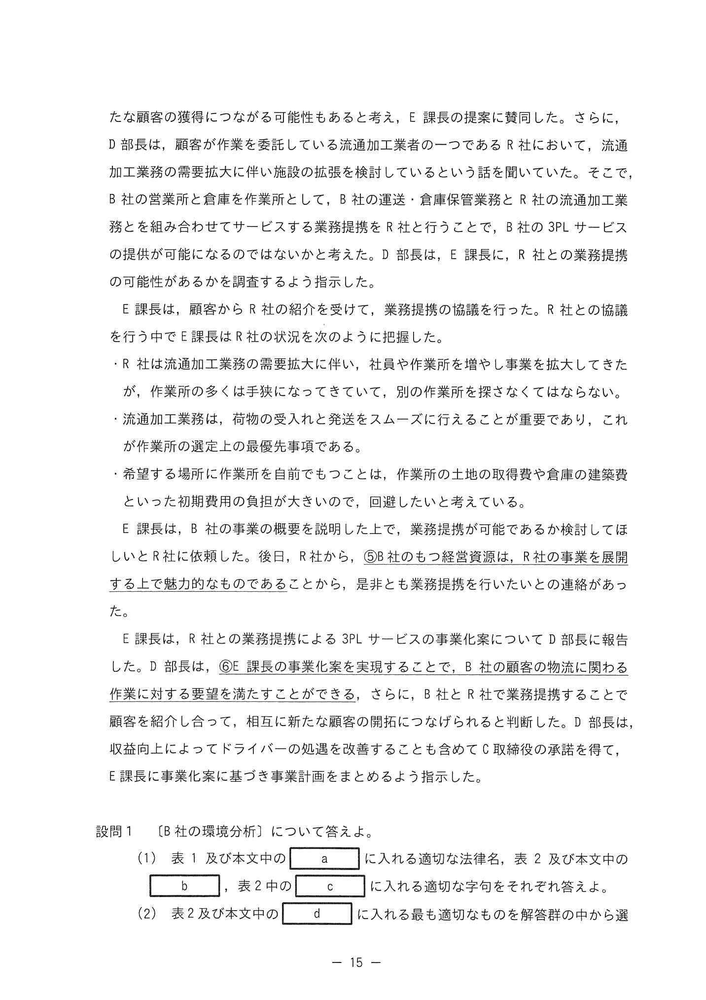

テキスト (OCR)

たな顧客の獲得につながる可能性もあると考え, E 課長の提案に疲同した。さらに,

D 部長は, 顧客が作業を委託している流通加工業者の一つである R 社において, 流通
加工業務の需要拡大に伴い施設の拡張を検討しているという話を聞いていた。 そこで,
B 社の営業所と倉庫を作業所として, B 社の運送・倉庫保管業務と R 社の流通加工業
務とを組み合わせてサービスする業務提携を R 社と行うことで, B 社の 3PL サービス
の提供が可能になるのではないかと考えた。D 部長は, E 課長に, R 社との業務提携
の可能性があるかを調査するよう指示した。

E 課長は, 顧客から R 社の紹介を受けて, 業務提携の協議を行った。R 社との協議
を行う中で 課長は R 社の状況を次のように把握した。

・R 社は流通加工業務の需要拡大に伴い, 社員や作業所を増やし事業を拡大してきた

が, 作業所の多くは手狭になってきていて, 別の作業所を探さなくてはならない。

・流通加工業務は, 荷物の受入れと発送をスムーズに行えることが重要であり, これ

が作業所の選定上の最優先事項である。

・希望する場所に作業所を自前でもつことは, 作業所の土地の取得費や倉庫の建築費

といった初期強用の負担が大きいので, 回避したいと考えている。

E 課長は, B 社の事業の概要を説明した上で, 業務提携が可能であるか検討してほ
しいとR社に依頼した。後日, R 社から, ⑤B 社のもつ経営資源は, R社の事業を展開
する上で魅力的なものであることから, 是非とも業務提携を行いたいとの連絡があっ
es

E 課長は, R 社との業務提携による 3PL サービスの事業化案について D 部長に報告
Lic, 部長は, ⑥E 課長の事業化案を実現することで, B 社の顧客の物流に関わる
作業に対する要望を満たすことができる, さらに, B 社とR 社で業務提携することで
顧客を紹介し合って, 相互に新たな顧客の開拓につなげられると判断した。D 部長は,
収益向上によってドライバーの処遇を改善することも含めてC 取締役の承諾を得て,
E 課長に事業化案に基づき事業計画をまとめるよう指示した。

設問1 〔B社の環境分析) について答えよ。
(1) 表 1 及び本文中の|  。 |] に入れる適切な法律名,表 2 及び本文中の

| 5 | , 表2 中の| < | に入れる適切な字句をそれぞれ答えよ。

(2) 表2及び本文中の| d | に入れる最も適切なものを解答群の中から選

ー 15 一

### ページ 17

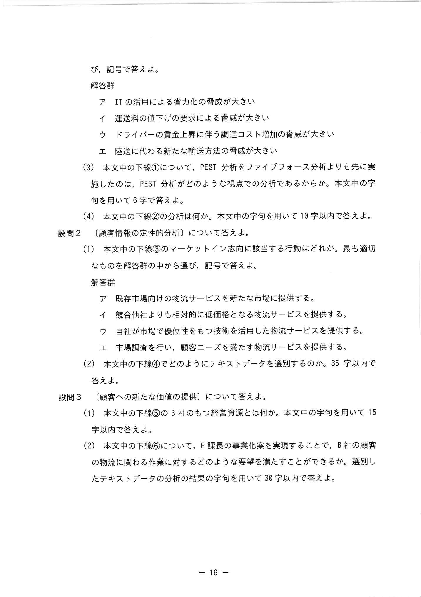

テキスト (OCR)

び, 記号で答えよ。
解答群
ア TIT の活用による省力化の脅威が大きい
イ 運送料の値下げの要求による脅威が大きい
ウ ドライバーの賃金上昇に伴う調達コスト増加の脅威が大きい
エ 陸送に代わる新たな輸送方法の脅威が大きい
(3) 本文中の下線について, PEST 分析をファイブフォース分析よりも先に実
施したのは, PEST 分析がどのような視点での分析であるからか。本文中の字
句を用いて 6 字で答えよ。
(4) 本文中の下線②の分析は何か。本文中の字句を用いて 19 字以内で答えよ。
設問2 [顧客情報の定性的分析]】について答えよ。
(1) 本文中の下線のマーケットイン志向に該当する行動はどれか。最も適切
なものを解答群の中から選び, 記号で答えよ。
解答群
ア 既存市場向けの物流サービスを新たな市場に提供する。
競合他社よりも相対的に低価格となる物流サービスを提供する。
自社が市場で優位性をもつ技術を活用した物流サービスを提供する。
市場調査を行い, 顧客ニーズを満たす物流サービスを提供する。
(2) 本文中の下線のでどのようにテキストデータを選別するのか。35 字以内で
答えよ。
設問3 [顧客への新たな価値の提供〕」 について答えよ。
(1) 本文中の下線⑤の B 社のもつ経営資源とは何か。本文中の字句を用いて 15
字以内で答えよ。
(2) 本文中の下線⑥について, E 課長の事業化案を実現することで, B 社の顧客
の物流に関わる作業に対するどのような要望を満たすことができるか。 選別し
たテキストデータの分析の結果の字句を用いて 30 字以内で答えよ。

H GN

### ページ 18

テキスト (OCR)

C

x モ 用 紙

J

### ページ 19

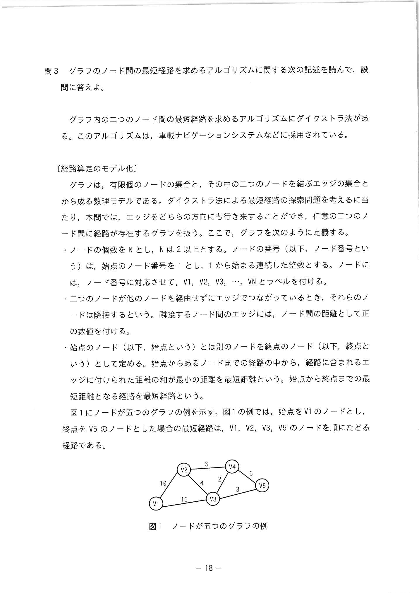

テキスト (OCR)

M3 グラフのノード間の最短経路を求めるアルゴリズムに関する次の記述を読んで, 設

間に答えよ。

グラフ内の二つのノード間の最短経路を求めるアルゴリズムにダイクストラ法があ
る。このアルゴリズムは, 車載ナビゲーションシステムなどに採用されている。

[経路算定のモデル化〕
グラフは, 有限個のノードの集合と, その中の二つのノードを結ぶエッジの集合と

から成る数理モデルである。 ダイクストラ法による最短経路の探索問題を者えるに当

EY, 本問では, エッジをどちらの方向にも行き来することができ, 任意の二つのノ

ード間に経路が存在するグラフを扱う。ここで, グラフを次のように定義する。

・ノードの個数をN とし, Nは2 以上とする。ノードの番号 (以下, ノード番号とい
う) lt, 始点のノード番号を 1 とし, 1 から始まる連続した整数とする。ノードに
は, ノード番号に対応させて, VI, V2, V3, …, VN とラベルを付ける。

・二つのノードが他のノードを経由せずにエッジでつながっているとき, それらのノ
ードは隣接するという。隣接するノード間のエッジには, ノード間の距離として正
の数値を付ける。

・始点のノード (以下, 始点という) とは別のノードを終点のノード (以下, 終点と
いう) として定める。 始点からあるノードまでの経路の中から, 経路に含まれるエ
ッジに付けられた距離の和が最小の距離を最短距離という。始点から終点までの最
短距離となる経路を最短経路という。

図1にノードが五つのグラフの例を示す。図 1 の例では, 始点をV1 のノードとし
終点を V5 のノードとした場合の最短経路は, VI, V2, V3,、V5 のノードを順にたどる
経路である。

 1 ノードが五つのグラフの例

### ページ 20

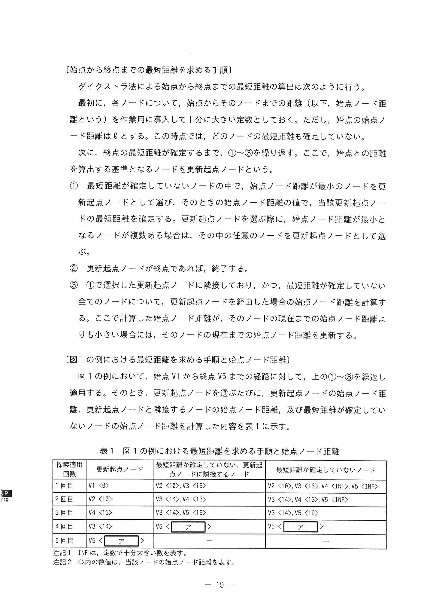

テキスト (OCR)

〔始点から終点までの最短距離を求める手順]
ダイクストラ法による始点から終点までの最短距離の算出は次のように行う。
最初に。 各ノードについて, 始点からそのノードまでの距離 (以下, 始点ノード距

離という) を作業用に導入して十分に大きい定数としておく。ただし, 始点の始点ノ

ード距離は 9 とする。この時点では, どのノードの最短距離も確定していない。
次に, 終点の最短距離が確定するまで, ①て③を繰り返す。ここで, 始点との距離

を算出する基準となるノードを更新起点ノードという。

QO 最短距離が確定していないノードの中で, 始点ノード距離が最小のノードを更
新起点ノードとして選び, そのときの始点ノード距離の値で, 当該更新起点ノー
ドの最短距離を確定する。 更新起点ノードを選ぶ際に, 始点ノード距離が最小と
なるノードが複数ある場合は, その中の任意のノードを更新起点ノードとして選
Bo

② 更新起点ノードが終点であれば, 終了する。

③ ④で選択した更新起点ノードに隣接しており, DO, 最短距離が確定していない
全てのノードについて, 更新起点ノードを経由した場合の始点ノード距離を計算す
る。 ここで計算した始点ノード距離が, そのノードの現在までの始点ノード距離よ
りも小さい場合には, そのノードの現在までの始点ノード距離を更新する。

〔図 1 の例における最短距離を求める手順と始点ノード距離〕

 1 の例において, 始点 V1 から終点 V5 までの経路に対して, 上の①~て③を繰返し
適用する。そのとき, 更新起点ノードを選ぶたびに, 更新起点ノードの始点ノード距
離, 更新起点ノードと隣接するノードの始点ノード距離, 及び最短距離が確定してい
ないノードの始点ノード距離を計算した内容を表 1 に示す。

表 1 1 の例における最短距離を求める手順と始点ノード距離

Fee ノー ない理夫が確定していないノード

1 回目    V1 <@>           V2 <10>,V3 <16>               V2 <10>,V3 <16>, V4 <INF>, V5 <INF>
a           2 回目    V2 <10>           V3 <14>,V4 <13>                V3 <14>,V4 <13>,V5 <INF>

3 回目    V4 <13>           V3 <14>,V5 <19>               V3 <14>,V5 <19>

4回目 |V3 <14>         <[ ァ >           V5 <トにァ |

sae |V5<[| ァ |>                ー                            ー

注記 1 INF は, 定数で十分大きい数を表す。
注記 2 <内の数値は, 当該ノードの始点ノード距離を表す。

### ページ 21

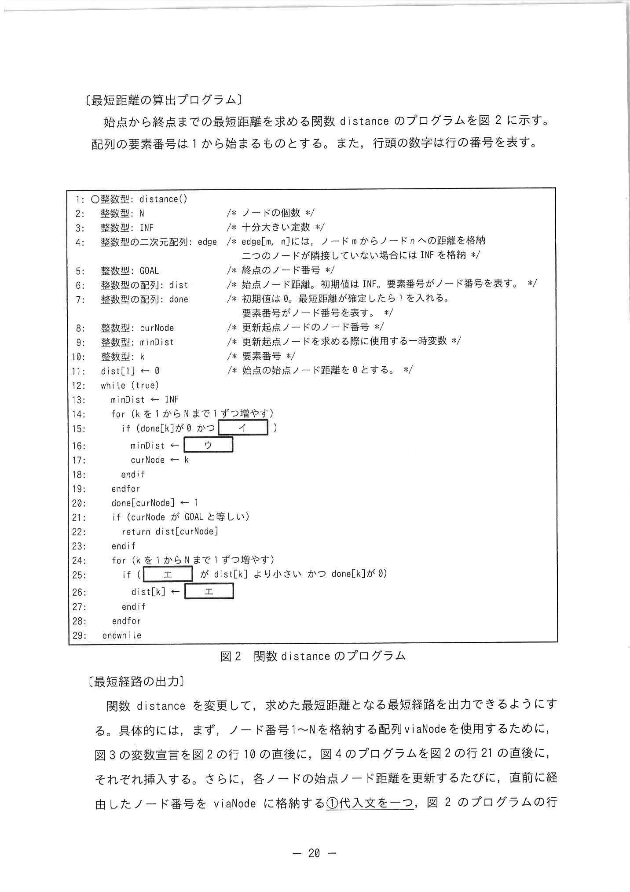

テキスト (OCR)

〔最短距離の算出プログラム〕
始点から終点までの最短距離を求める関数 distance のプログラムを図 2 に示す。
配列の要素番号は 1 から始まるものとする。 Kk, 行頭の数字は行の番号を表す。

: 〇整数型: distance()

1

2: 整数型:N              /* ノードの個数 */

3: 整数型: INF            /* 十分大きい定数 */

4: 整数型の二次元配列: edge /* edge[m。n]には, ノードmからノードnへの距離を格納
ニニつのノードが隣接していない場合には INF を格納 */

5: 整数型: GOAL            /* 終点のノード番号 */

6: 整数型の配列: dist        /* 始点ノード距離。初期値は INF。要素番号がノード番号を表す。 */

7: 整数型の配列: done       /* 初期値は 9。最短距離が確定したら 1 を入れる。
要素番号がノード番号を表す。 */

8: 整数型: curNode          /* 更新起点ノードのノード番号 */

9: 整数型: minDist         /* 更新起点ノードを求める際に使用する一時変数 */

19: 整数型:k             /* 要素番号 */

11: dist[1]と6           /* 始点の始点ノード距離を 0 とする。 */

12: while (true)

13:    minDist < INF

14:     for (kを1からNまで1 ずつ増やす)

15:      if (done[k]が0 かっ| ィ |)
16:      minDist <[ 5

Vee       curNode — k

18:      endif

19:     endfor

20:    done[curNode] で 1

21:     if (curNode が GOAL と等しい)

22:      return dist[curNode]

23:     endif

24:     for (k を1 からN まで 1 ずつ増やす)

25:     if (| エ | がdist[k] より小さい HD done[k]がの
26:        distk] <

27:       endif
28:     endfor
29: endwhile
 2 関数 distance のプログラム
〔最短経路の出力]

関数 distance を変更して, 求めた最短距離となる最短経路を出力できるようにす
る。具体的には, まず, ノード番号1Nを格納する配列viaNode を使用するために,
図 3 の変数宣言を図 2 の行 19 の直後に, 図 4 のプログラムを図 2 の行 21 の直後に,
それぞれ挿入する。さらに, 各ノードの始点ノード距離を更新するたびに, 直前に経
由したノード番号を viaNode に格納する①代入文を一つ, 2 のプログラムの行

### ページ 22

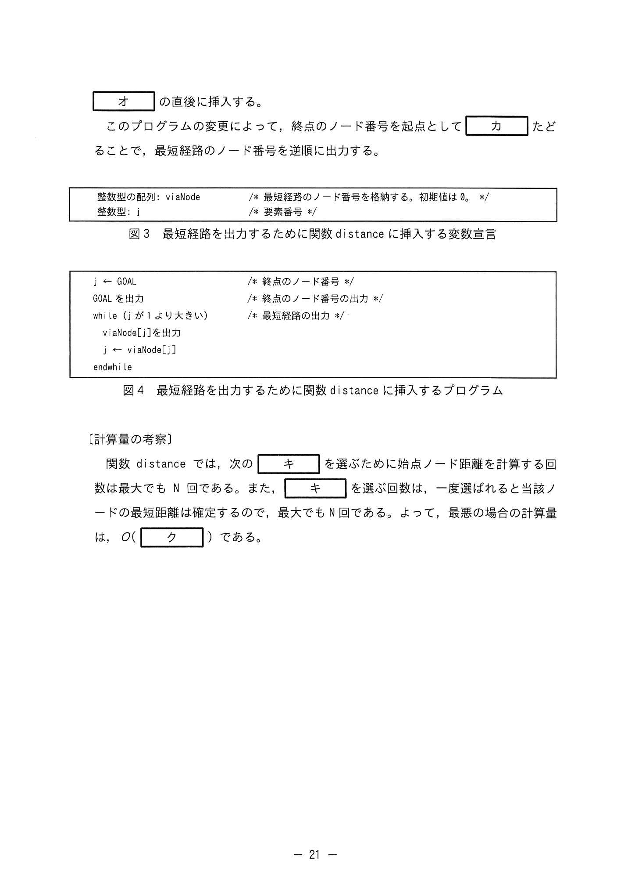

テキスト (OCR)

| オ | の直後に挿入する。

このプログラムの変更によって, 終点のノード番号を起点として| カ |たど
ることで, 最短経路のノード番号を逆順に出力する。

整数型の配列: viaNode        /* 最短経路のノード番号を格納する。初期値は0。 */
整数型: 」                /* 要素番号 */

 3 最短経路を出力するために関数 distance に挿入する変数宣

=I

j で GOAL                  /* 終点のノード番号 */
GOAL を出力                  /* 終点のノード番号の出力 */
while (」が1 より大きい)       /* 最短経路の出力 */
viaNode[j]を出力
j < viaNode[j]
endwhi le

図4 最短経路を出力するために関数 distance に挿入するプログラム

〔計算量の考察]

関数 distance では, 次の を選ぶために始点ノード距離を計算する回

数は最大でも N 回である。また, | キ | を選ぶ回数は, 一度選ばれると当該ノ
ードの最短距離は確定するので, 最大でも N 回である。よって, 最悪の場合の計算量

は, の(| 2ク |) でぁる。

### ページ 23

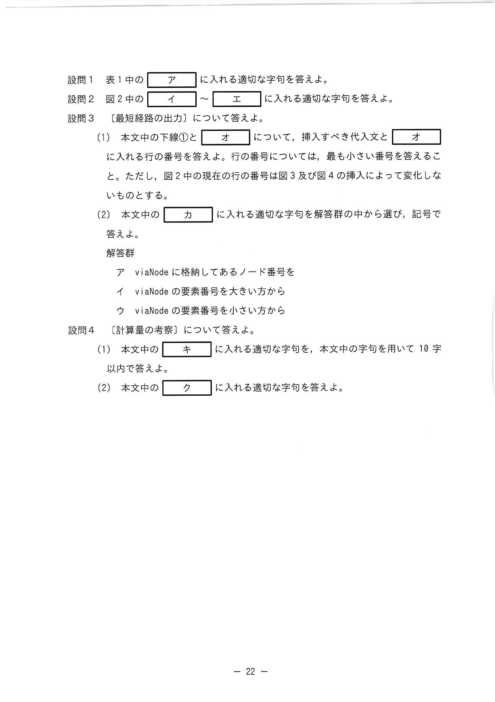

テキスト (OCR)

設問1 表1中の| ア | に入れる適切な字句を答えよ。
設問2 図2中の| イ |一| エ |に入れる適切な字句を答えよ。
設問3 [最短経路の出力)について答えよ。
(1) 本文中の下線①と | オ |] について, 挿入すべき代入文と
に入れる行の番号を答えよ。 行の番号については, 最も小さい番号を答えるこ
と。ただし, 図 2 中の現在の行の番号は図 3 及び図 4 の挿入によって変化しな
いものとする。
(2) 本文中の| カ | に入れる適切な字句を解答群の中から選び,
答えよ。
SE
ア viaNode に格納してあるノード番号を
イ viaNode の要素番号を大きい方から
ウ viaNode の要素番号を小さい方から
設問4 [計算量の考察) について答えよ。
(1) 本文中の | キ | に入れる適切な字句を, 本文中の宇句を用いて 10 字
以内で答えよ。

(2) 本文中の | ク | に入れる適切な字句を答えよ。

記号で

mu

### ページ 24

テキスト (OCR)

〔

x = 用 紙 J

### ページ 25

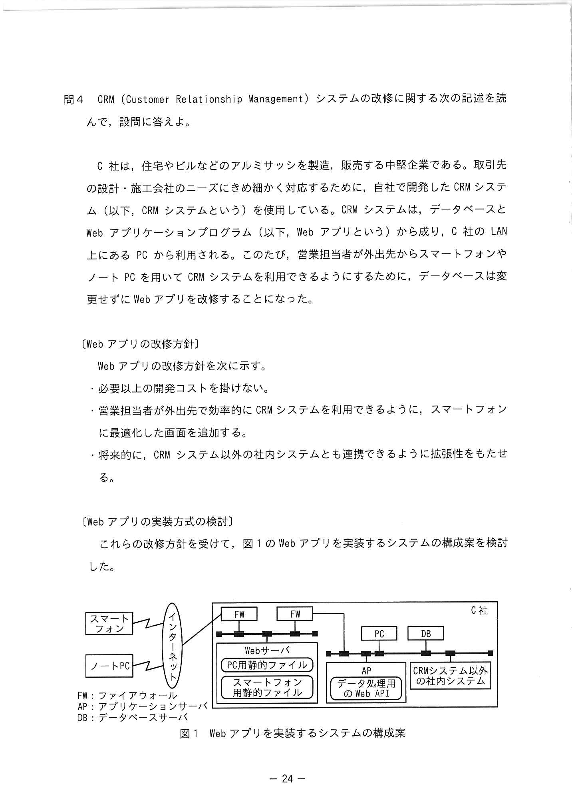

テキスト (OCR)

間4 CRM (Customer Relationship Management) システムの改修に関する次の記述を読
んで, 設問に答えよ。

C 社は, 住宅やビルなどのアルミサッシを製造, 販売する中堅企業である。 取引先
の設計・施工会社のニーズにきめ細かく対応するために, 自社で開発したCRM システ
ム (以下, CRM システムという) を使用している。CRM システムは, データベースと
Web アプリケーションプログラム (以下, Web アプリという) から成り, C 社の LAN
上にある PC から利用される。このたび, 営業担当者が外出先からスマートフォンや
ノート PC を用いて CRM システムを利用できるようにするために, データベースは変
更せずに Web アプリを改修することになった。

(Web アプリの改修方針〕
Web アプリの改修方針を次に示す。

・必要以上の開発コストを掛けない。

・営業担当者が外出先で効率的に CRM システムを利用できるように, スマートフォン
に最適化した画面を追加する。

・ 将来的に, CRM システム以外の社内システムとも連携できるように拡張性をもたせ
る。

(Web アプリの実装方式の検討〕
これらの改修方針を受けて, 図1の Web アプリを実装するシステムの構成案を検討
した。

スマート
フォン
Webサーバ
ノートPC          PC用静的ファイル     jp   CRMシステム以外
スマートフォン      データ処理用 ] || の社内システム

FW: ファイアウォール     用静的ファイル    の Web API
AP : アプリケーションサーバ
DB: データベースサーバ

図1 Web アプリを実装するシステムの構成案

### ページ 26

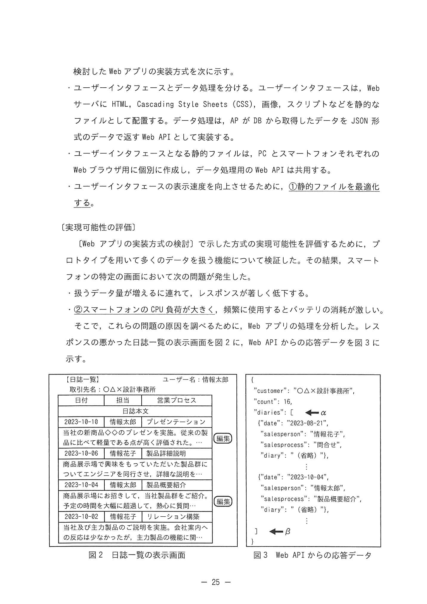

テキスト (OCR)

検討した Web アプリの実装方式を次に示す。

・ユーザーインタフェースとデータ処理を分ける。 ユーザーインタフェースは, Web
サーバに HTML, Cascading Style Sheets (CSS), 画像, スクリプトなどを更的な
ファイルとして配置する。データ処理は, AP が DB から取得したデータを JSON 形
式のデータで返す Web API として実装する。

・ユーザーインタフェースとなる静的ファイルは, PC とスマートフォンそれぞれの
Web ブラウザ用に個別に作成し, データ処理用の Web API は共用する。

・ ユーザーインタフェースの表示速度を向上させるために, ①静的ファイルを最適化
する。

(実現可能性の評価〕

Web アプリの実装方式の検討で示した方式の実現可能性を評価するために, プ
ロトタイプを用いて多くのデータを扱う機能について検証した。その結果, スマート
フォンの特定の画面において次の問題が発生した。

・扱うデータ量が増えるに連れて, レスポンスが著しく低下する。
・②スマートフォンの CPU 負荷が大きく, 頻繁に使用するとバッテリの消耗が激しい。

そこで, これらの問題の原因を調べるために, Web アプリの処理を分析した。レス
ポンスの悪かった日誌一覧の表示画面を図 2 に, Web API からの応答データを図 3 に

示す。
[日誌一覧】                 ユーザー名 : 情報太郎      {
取引先名 : O〇へメ設計事務所                         "customer": "〇A※ぶ設計事務所",

at | 担当 | 営業プロセス        "count": 16,

日誌本文                     "diaries": [ <amq

2023-10-10 | 情報太郎 | プレゼンテーション       ("date": "2023-08-21",
当社の新商品のののプレゼンを実施。従来の製 |一      "salesperson": "情報花子",
品に比べて軽量である点が高く評価された。…   iS      "salesprocess”: "問合せ",
2023-10-06 | 情報花子 | 製品詳細説明              "diary": " (省略) "},
商品展示場で興味をもっていただいた製品群に                  :
ついてエンジニアを同行させ, 詳細な説明を…        "date": "2023-10-04",
2023-10-04 | 情報太郎 | 製品概要紹介              "salesperson": "情報太郎",
商品展示場にお招きして, 当社製品群をご紹介。|ン一      "salesprocess”: "製品概要紹介"
予定の時間を大幅に超過して, Bocgim |B     diary”: ” (RR) 中    ‘
2023-10-02 | 情報花子 | リレーション構筑               」   :   ‘
当社及び主力製品のご説明を実施。会社案内へ           ] 一8
の反応は少なかったが, 主力製品の機能に関…         )

図2 日誌一覧の表示画面 3 Web API からの応答データ

### ページ 27

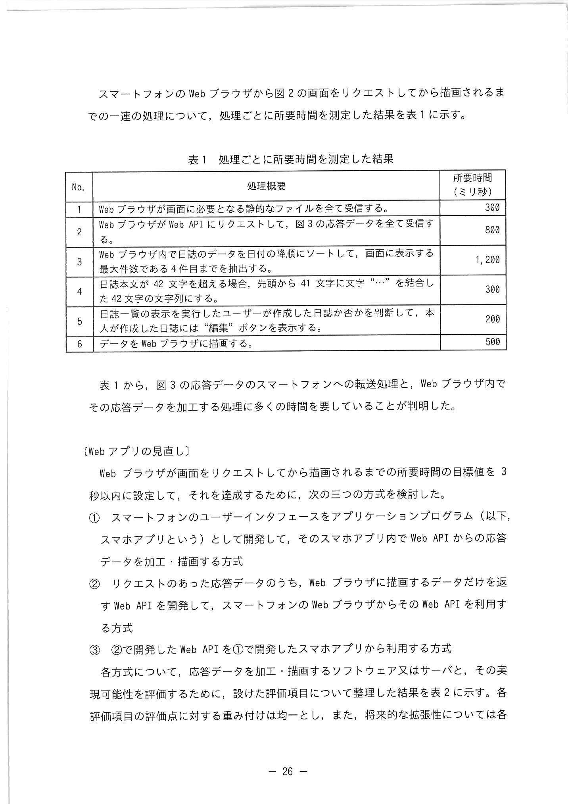

テキスト (OCR)

スマートフォンの Web ブラウザから図 2 の画面をリクエストしてから描画されるま
での一連の処理について, 処理ごとに所要時間を測定した結果を表 1 に示す。

表1 処理ごとに所要時間を測定した結果

所要時間
処理概要               (ミリ秒)
Web ブラウザが画面に必要となる静的なファイルを全て受信する。            300
Web ブラウザが Web APIT にリクエストして, 図3 の応答データを全て受信す           800
る。
Web ブラウザ内で日誌のデータを日付の降順にソート して, 画面に表示する    1,200
Se Ee                    ‘
誌本文が 42 文字を超える場合, 先頭から 41 文字に文字 “…”を結合し     300
‘ 2 文字の文字列にする。
日誌一覧の表示を実行したユーザーが作成した日誌か否かを判断して, 本     200
人が作成した日誌には “編集"ボタンを表示する。
データを Web ブラウザに描画する。                                     500

表 1 から, 図 3 の応答データのスマートフォンへの転送処理と, Web ブラウザ内で
その応答データを加工する処理に多くの時間を要していることが判明した。

(Web アプリの見直し〕
Web ブラウザが画面をりクエストしてから描画されるまでの所要時間の目標値を 3
秒以内に設定して, それを達成するために, 次の三つの方式を検討した。
① スマートフォンのユーザーインタフェースをアプリケーションプログラム (以下
スマホアプリという) として開発して, そのスマホアプリ内で Web API からの応答
ータを加工・描画する方式
② リクエストのあった応答データのうち, Web ブラウザに描画するデータだけを返
す Web API を開発して, スマートフォンの Web ブラウザからその Web API を利用す
る方式
③ ②で開発した Web API を①で開発したスマホアプリから利用する方式
各方式について, 応答データを加工・描画するソフトウェア又はサーバと, その実
現可能性を評価するために, 設けた評価項目について整理した結果を表 2 に示す。各
評価項目の評価点に対する重み付けは均一とし, また, 将来的な拡張性については各

### ページ 28

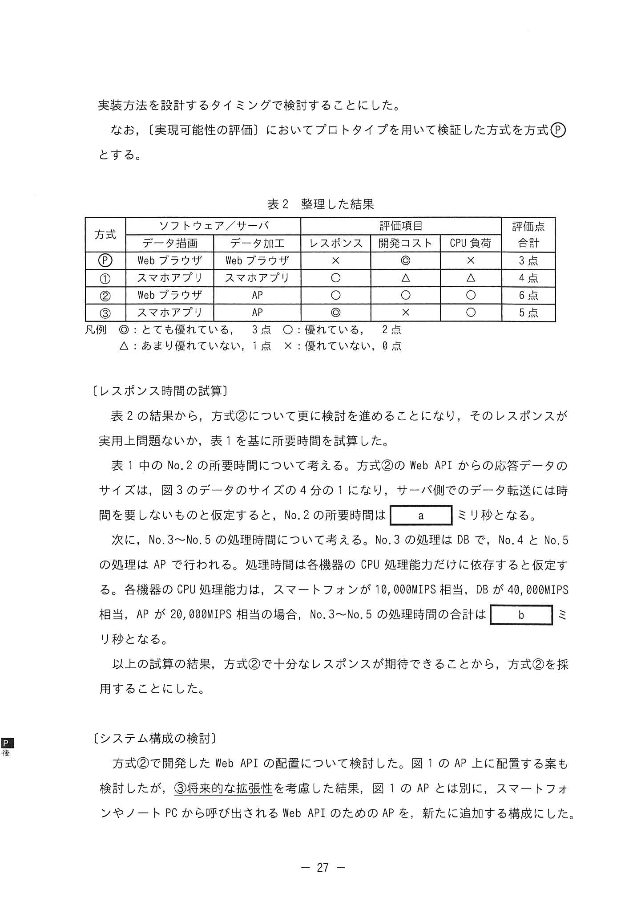

テキスト (OCR)

*H

実装方法を設計するタイミングで検討することにした。
なお, 〔実現可能性の評価] においてプロトタイプを用いて検証した方式を方式⑤)
とする。

表2 整理した結果

est      ソフトウェアプサーバ                評価項目             評価点

データ描画   データ加工 | レスポンス | 開発コスト | CPU負荷  Ba
® | Web ブラウザ | Web ブラウザ    x      ©     x    3 点
①  スマホアプリ | スマホアプリ   O     A     A   4 点
②  Web ブラウザ     AP      (e)      O     O    6 点
③  スマホアプリ    AP      ©     x     O   5点

凡例 ©: とても優れている, 3点 〇: 優れている, 2点
A: あまり優れていない, 1点 X : 優れていない, OR

【レスポンス時間の試算〕

表 2 の結果から, 方式②について更に検討を進めることになり, そのレスポンスが
実用上問題ないか, 表 1 を基に所要時間を試算した。

表 1 中の No.2 の所要時間について考える。方式⑦の Web API からの応答データの
サイズは, 図 3 のデータのサイズの 4 分の 1 になり, サーバ側でのデータ転送には時
間を要しないものと仮定すると, No.2 の所要時間は|  a | ミリ秒となる。

次に, No. 3~No.5 の処理時間について考える。No.3 の処理は DB で, No.4 と No.5
の処理は AP で行われる。 処理時間は各機器の CPU 処理能力だけに依存すると仮定す
る。各機器の CPU 処理能力は, スマートフォンが 10, OOOMIPS 相当, DB が 40, QOOMIPS
相当, AP が 20, OOOMIPS 相当の場合No.3一No.5 の負理時間の合計は| b |ミ
リ秒となる。

以上の試算の結果, 方式ので十分なしレスポンスが期待できることから, 方式②を採
用することにした。

(VAT AMOR)

FARO CHA Le Web API の配置について検討した。図 1 の AP 上に配置する案も
検討したが, ③将来的な拡張性を考慮した結果, 図1 の AP とは別に, スマートフォ
ンやノート PC から呼び出される Web API のための AP を, 新たに追加する構成にした。

### ページ 29

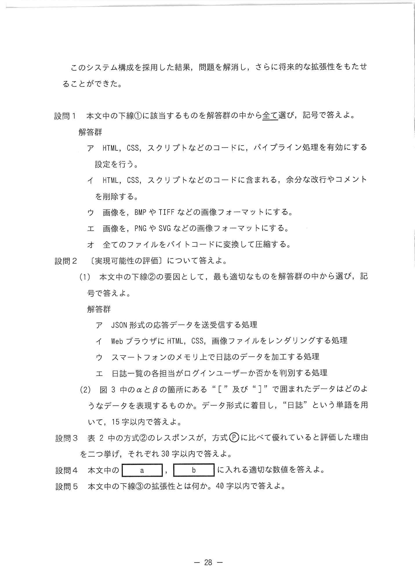

テキスト (OCR)

このシステム構成を採用した結果, 問題を解消し, さらに将来的な拡張性をもたせ
ることができた。

設問1 本文中の下線①に該当するものを解答群の中から全て選び
解答群
ア HTML, CSS, スクリプトなどのコードに, パイプライン処理を有効にする

ミル=

設定を行う。

CS CBA LK.

Duh

4 HTML, CSS, スクリプトなどのコードに含まれる, 余分な改行やコメント
を削除する。
ウ 画像を, BMP やTIFF などの画像フォーマットにする。
エ 画像を, PNG や SVG などの画像フォーマットにする。
オ 全てのファイルをバイトコードに変換して圧縮する。
設問2 〔実現可能性の評価] について答えよ。
(1) 本文中の下線の②の要因として, 最も適切なものを解答群の中から選び, 記
号で答えよ。
解答群
ア JSON 形式の応答データを送受信する処理
Web ブラウザに HTML, CSS, 画像ファイルをレンダリングする処理
スマートフォンのメモリ上で日誌のデータを加工する処理
日誌一覧の各担当がログインユーザーか否かを判別する処理
(2) 図 3 中のeと8の箇所にある “[” 及び “]” で囲まれたデータはどのよ
うなデータを表現するものか。データ形式に着目し, “日誌 "という単語を用
WT, 15 字以内で答えよ。
設問3 表 2 中の方式ののレスポンスが, 方式(に比べて優れていると評価した理由
を二つ挙げ, THEN 字以内で答えよ。
設問4 本文中の| oa |,| 5 |に入れる適切な数値を答えよ。
設問5 本文中の下線③の拡張性とは何か。40 字以内で答えよ。

H wsOAN

### ページ 30

テキスト (OCR)

〔

メ モ 用 紙 ]

### ページ 31

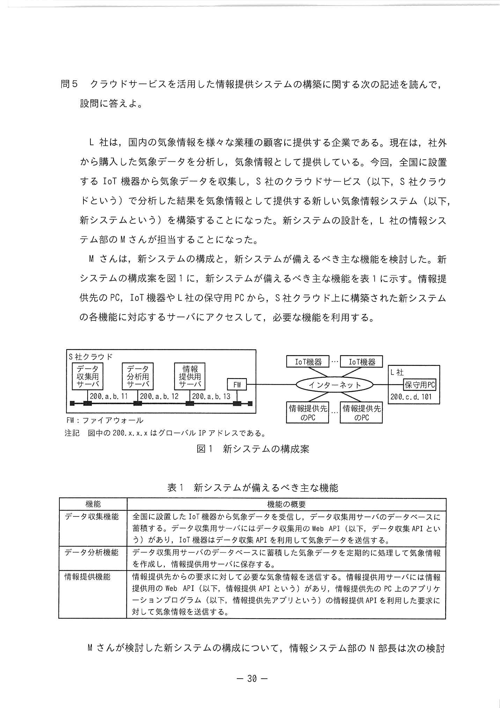

テキスト (OCR)

lS クラウドサービスを活用した情報提供システムの構築に関する次の記述を読んで,
設問に答えよ

L 社は, 国内の気象情報を様々な業種の顧客に提供する企業である。現在は, 社外
から購入した気象データを分析し, 気象情報として提供している。今回, 全国に設置
する lol 機器から気象データを収集し, S 社のクラウドサービス (WE, S 社クラウ
ドという) で分析した結果を気象情報として提供する新しい気象情報システム (以下
新システムという) を構築することになった。新システムの設計を, L 社の情報シス
テム部のM さんが担当することになった。

M SAI, 新システムの構成と, 新システムが備えるべき主な機能を検討した。新
システムの構成案を図1 に, 新システムが備えるべき主な機能を表 1 に示す。情報提
供先の PC, ToT 機器やL 社の保守用 PC から, S 社クラウド上に構築された新システム
の各機能に対応するサーバにアクセスして, 必要な機能を利用する。

ae                 ce Coma]
Bae    4    re                          Ca
サーバ                サーバ                   インターネット        保守用PO
290.a.b. 11  1 a.b. 12    290.a.b. Em                                200.c.d. 101

情報提供先| |情報提供先
のPC          のPC

FW: ファイアウォール
注記 図中の200.x.x.x はグローバル IP アドレスである。

図1 新システムの構成案

表1 新システムが備えるべき主な機能

機能                           機能の概要
データ収集機能 | 全国に設置した 1oT 機器から気象データを受信し, データ収集用サーバのデータベースに
MA a タ収集用サーバにはデータ収集用の Web API (以下, データ収集 API とい
う) があり, lol 機器はデータ収集 API を利用して気象データを送信する。
データ分析機能 | デー  a  PR-ARBRLERRF—4 © EH ICME LT RRR
を作成し, 情報提供用サーバに保存する。
情報提供機能    情報提供先からの要求に対して必要な気象情報を送信する。 情報提供用サーバには情報
提供用の Web API (以下, 情報提供 API という) があり, 情報提供先の PC 上のアプリケ
ーションプログラム (以下, 情報提供先アプリという) の情報提供API を利用した要求に
対して気象情報を送信する。

M さんが検討した新システムの構成について, 情報システム部の N 部長は次の検討

### ページ 32

テキスト (OCR)

を行うようにMさんに指示した。

・ToT 機器から送信される気象データの特徴を踏まえて, データ収集 API に用いる通
信プロトコルを選定すること。

・新システムにインターネットからアクセス可能な機器の数を最小限にするように,
S 社クラウド上の 『FW に設定する通信を許可するルール (以下, FW の許可ルールと
いう) の設計を行うこと。

・ 将来, IoT 機器の数や情報提供先の数が増加した場合に備えて, 各機能の処理遅延
対策を行うこと。

〔データ収集 API に用いる通信プロトコルの検討

ToT 機器は全国に 10,000 台設置する計画であり, 通信事業者の LPWA (Low Power
Wide Area) サービスを用いて各 IoT 機器から 1 件当たり最大 509 バイトの気象デー
タを, 1 分ごどとに①データ収集用サーバに送信する設計とした。和気象データは, 1件
当たりのデータ量は少ないが, IoT 機器からデータ収集サーバへの通信回数が多く,
データ収集用サーバヘアクセスが集中するおそれがある。 そこで, データ収集 API に
は, 通信の都度 TCPP コネクションを確立して通信を行う HTTP ではなく, ②TCP 上で
HTTP よりプロトコルヘッダサイズが小さく, 多対 1 通信に対応するプロトコルを用
いることにした。

(FW の許可ルールの設計】〕

M さんは, $S 社クラウド上の FW の許可ルールの設計方針を検討した。

・ToT 機器からデータ収集用サーバへのアクセスや情報提供先アプリから情報提供用
サーバへのアクセスに対しては, 通信プロトコルの制限を行うが, インターネット
の接続元 I『 アドレスによる制限は行わない。

・L 社の保守用 PC から各サーバへのアクセスに対しては, 各サーバにログインして
更新プログラムの適用などの保守作業を行うために, SSH だけを許可する。

・各サーバからインターネットへのアクセスに対しては, ソフトウェアベンダーの
Web サイトから更新プログラムをダウンロードするために, 任意の Web サイトへの
HTTPS だけを許可する。

### ページ 33

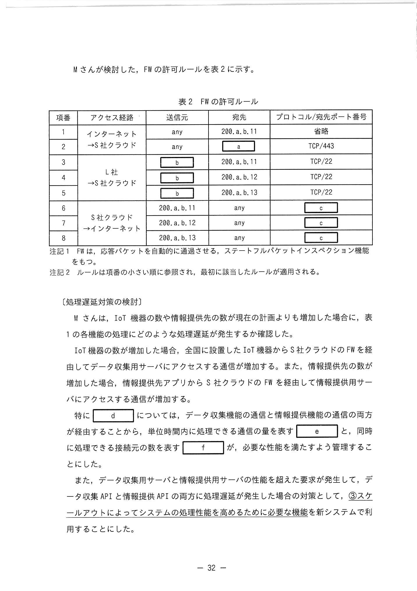

テキスト (OCR)

Mさんが検討した, FW の許可ルールを表 2 に示す。

表2 FWの許可ルール

項番     アクセス経路       送信元            宛先        プロトコル/宛先ポート番号
1     インターネット       any        200.a.b.11            省略
2 | っ$社クラウド             any              しュ                   TCP/443
3                                  し5 |          209.a.b.11                    TCP/22
L社
4                              200.a.b.12          TCP/22
つS 社クラウド      Ce]           .                      /
5                                   [し |          200.a.b.13                    TCP/22
6                       200.a.b.11          any
S社クラウド
7                       260.a.b.12
っインターネット しーー         ーー
8                         290.a.b.13          any

注記

注記

C

1 FW は, 応答パケットを自動的に通過させる, ステートフルパケットインスペクション機能
をもつ。
2 ルールは項番の小さい順に参照され, 最初に該当したルールが適用される。

UREN ORE)

M さんは, Io 機器の数や情報提供先の数が現在の計画よりも増加した場合に, 表
1 の各機能の処理にどのような処理補延が発生するか確認した。

ToT 機器の数が増加した場合, 全国に設置した IoT 機器から SHIT I KOU ER
由してデータ収集用サーバにアクセスする通信が増加する。 また, 情報提供先の数が
増加した場合情報提供先アプリから $ 社クラウドの FM を経由して情報提供用サー
バにアクセスする通信が増加する。

特に| q |] については, データ収集機能の通信と情報提供機能の通信の両方
が経由することから, 単位時間内に処理できる通信の量を表す|  e | と,同時
に処理できる接続元の数を表す| fF | が, 必要な性能を満たすよう管理するこ
とにした。

また, データ収集用サーバと情報提供用サーバの性能を超えた要求が発生して, デ
ータ収集 API と情報提供 APL の両方に処理補延が発生した場合の対策として, OAT
ールアウトによってシステムの処理性能を高めるために必要な機能を新システムで利

用することにした。

### ページ 34

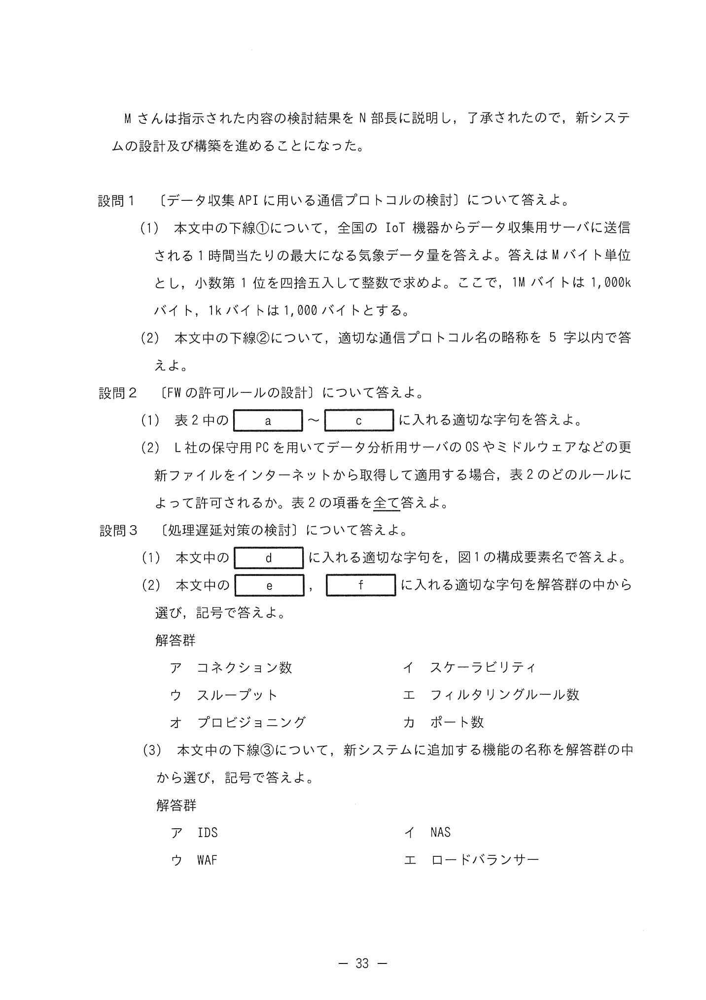

テキスト (OCR)

M さんは指示された内容の検討結果を N 部長に説明し, 了承されたので, 新システ
の設計及び構築を進めることになった。

設問1 〔データ収集 API に用いる通信プロトコルの検討] について答えよ。

(1) 本文中の下線やについて, 全国の IoT 機器からデータ収集用サーバに送信

される 1 時間当たりの最大になる気象データ量を答えよ。答えはMバイト単位
し, 小数第 1 位を四捨五入して整数で求めよ。ここで, 1M バイトは 1, 000k
バイト, 1k バイトは1,999 バイトとする。

(2) 本文中の下線@について, 適切な通信プロトコル名の略称を 5 FUATE
えよ。

設問2 〔FWの許可ルールの設計})について答えよ。

(1) 表2中の| 。』 |~[  c |に入れる適切な字句を答えよ。

(2) L社の保守用PC を用いてデータ分析用サーバの 0S5 やミドルウェアなどの更
新ファイルをインターネットから取得して適用する場合, 表2 のどのルールに
よって許可されるか。表 2 の項番を全て答えよ。

設問3 [処理遅延対策の検討]について答えよ。
(1) 本文中の| 』d | に入れる適切な字句を,図1の構成要素名で答えよ。

(2) 本文中の| oe |, |  f | に入れる適切な字句を解答群の中から
選び, 記号で答えよ。

解答群

ア コネクション数      イ スケーラビリティ

ウ スループット       エ フィルタリングルール数

オ プロビジョニング      カ ポート数

(3) 本文中の下線について, 新システムに追加する機能の名称を解答群の中
から選び, 記号で答えよ。

解答群
ア Ds                    イ NAS
ウ WAF                    エ ロードバランサー

### ページ 35

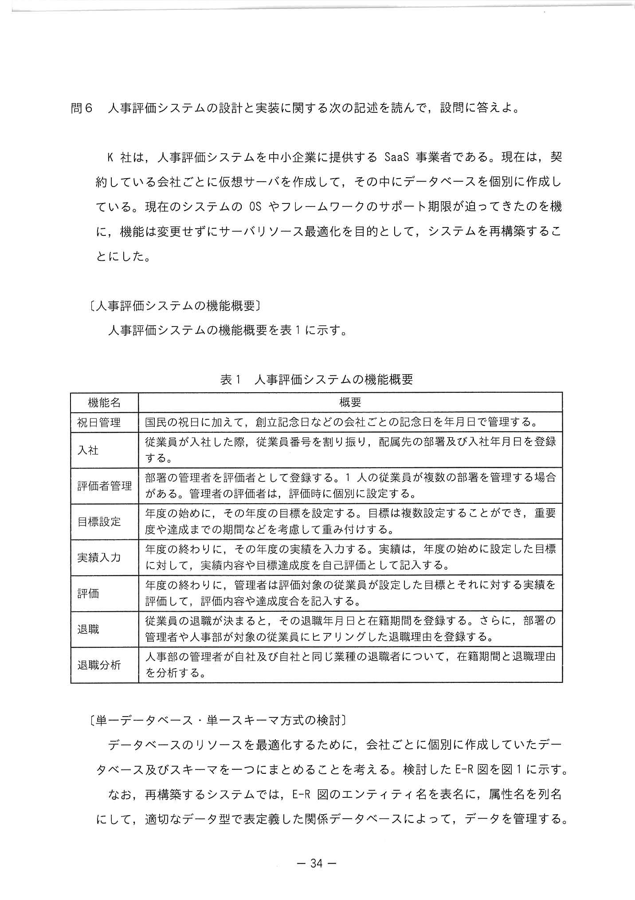

テキスト (OCR)

間6 人事評価システムの設計と実装に関する次の記述を読んで, 設問に答えよ。

K 社は, 人事評価システムを中小企業に提供する SaaS 事業者である。現在は, 契
約している会社ごとに仮想サーバを作成して, その中にデータベースを個別に作成し
ている。 現在のシステムの 0S やフレームワークのサポート期限が迫ってきたのを機
に, 機能は変更せずにサーバリソース最適化を目的として, システムを再構築するこ
bea eal a

[人事評価システムの機能概要〕
人事評価システムの機能概要を表 1 に示す。

表1 人事評価システムの機能概要

機能名                                         概要

祝日管理 | 国民の祝日に加えて, 創立記念日などの会社ごとの記念日を年月日で管理する。

入社    ECR, CARES ERED, RBZ ONE ROMS BEES

評価者管理   部閉の管理者を評価者と して登録す Bo |  ADR ADERORE ERE SS
がある。管理者の評価者は, 評価時に個別に設定する。

age  年度の始めに, TOFRORRERET S. 目標は複数設定することができ, 重要
度や達成までの期間などを考慮して重み付けする。

BAD  年度の終わりに, その年度の実績を入力する。 実績は, 年度の始めに設定した目標
に対して, 実績内容や目標達成度を自己評価として記入する。

評価    年度の終わりに, 管理者は評価対象の従業員が設定した目標とそれに対する実問を
評価して, 評価内容や達成度合を記入する。

退職         従業員の退職が決まると, その退職年月日と在籍期間を登録する。さらに, MBO
管理者や人事部が対象の従業員にヒアリングした退職理由を登録する。

ieee         人事部の管理者が自社及び自社と同じ業種の退職者について, 在籍期間と退職理由

ical  を分析する。

[単ーデータベース・単一スキーマ方式の検討〕
データベースのリソースを最適化するために, 会社ごとに個別に作成していたデー
タベース及びスキーマを一つにまとめることを考える。 検討した E-R 図を図 1 に示す。
なお, 再構築するシステムでは, ER 図のエンティティ名を表名に, 属性名を列名
にして, 適切なデータ型で表定義した関係データベースによって, データを管理する。

### ページ 36

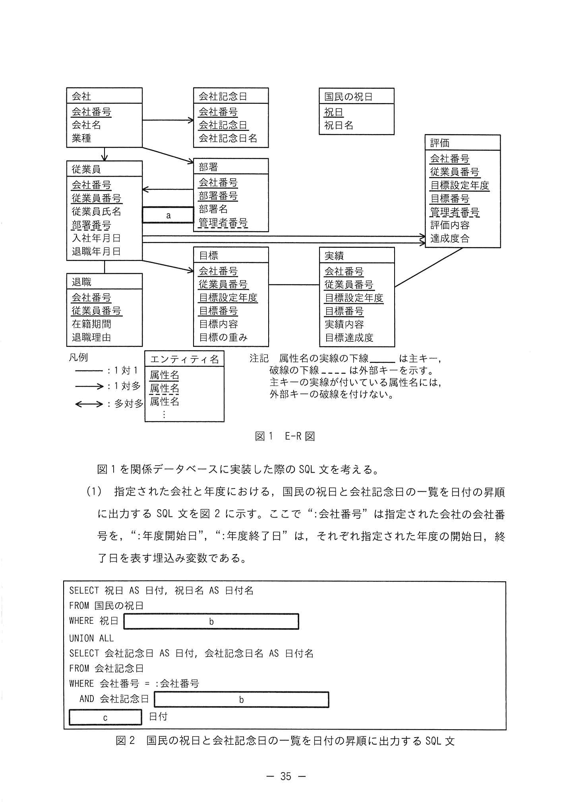

テキスト (OCR)

会社          全社記念        国民の祝日
会社番号                     祝日
会社名                      祝日名
業種                                  評価

\                               会社番号
従業員         ae                    従業員番号
会社番号         会社番号                   目標設定年度
従業貞番号       部署番号                  目標番号
従業員氏名  部署名                   算理者番号
部署番号        BRASS                 評価内容
入社年月日                               達成度合
退職年月日        目標           実績

        SHES        SHES
退職           従業員番号        従業員番号
会社番号         目標設定年度       目標設定年度
従業員番号        目標番号         目標番号
在籍期間         目標内容         実績内容
退職理由         目標の重み        目標達成度
凡例      エンティティ名   注記 属性名の実線の下線   は主キー
ーー : 181 eae            破線の下線 - --- は外部キーを示す。

>: 182] Rie,              主キーの実線が付いている属性名には,

FES         部キーの破線を付けない。
|人名          外部キーの破線を付けない

図1 E-R図

図 1 を関係データベースに実装した際の SQL 文を考える。

QC) 指定された会社と年度における, 国民の祝日と会社記念日の一覧を日付の昇順
に出力する SQL 文を図 2 に示す。ここで “:会社番号” は指定された会社の会社番
号を, “SERIA”, “:年度終了日" は, それぞれ指定された年度の開始日, 終
了日を表す埋込み変数である。

SELECT 祝日 AS 日付, 祝日名 AS 日付名
FROM 国民の祝日
WHERE 祝日|              b              |
UNION ALL
SELECT 会社記念日 AS 日付, 会社記念日名 AS 日付名
FROM 会社記念日
WHERE 会社番号 = :会社番号
AND 会社記念日|             b             |

図2 国民の祝日と会社記念日の一覧を日付の昇順に出力する SQL 文

### ページ 37

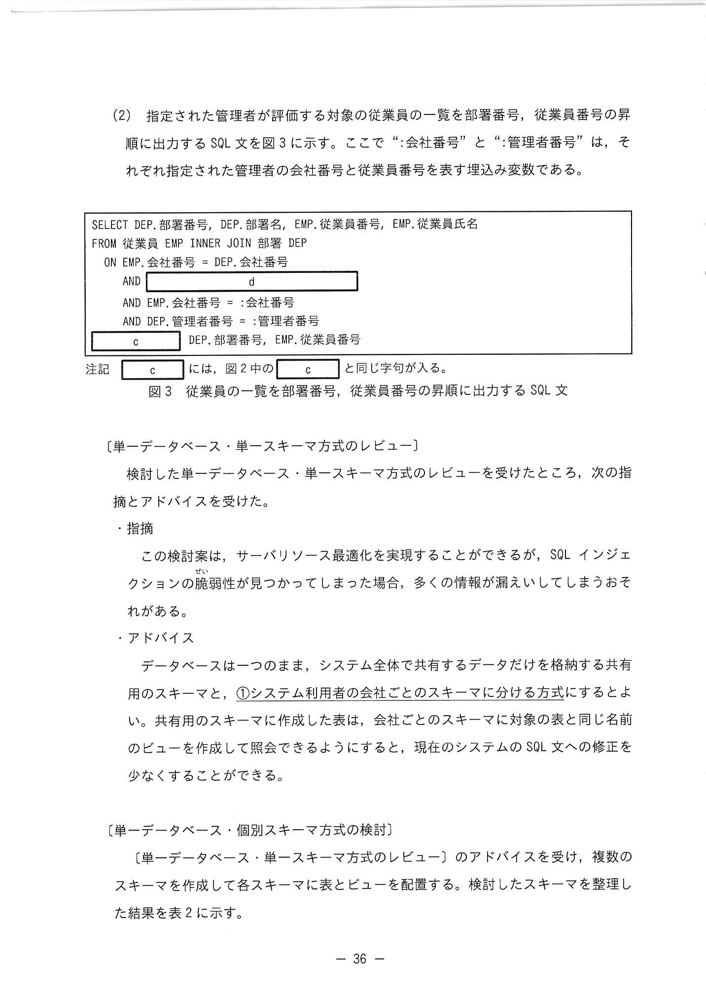

テキスト (OCR)

(2) 指定された管理者が評価する対象の従業員の一覧を部署番号, 従業員番号の昇
順に出力する SQL 文を図 3 に示す。ここで 『:会社番号′ と“:管理者番号”は, そ
れぞれ指定された管理者の会社番号と従業員番号を表す埋込み変数である。

SELECT DEP. 部署番号, DEP. 部署名, EW. 従業員番号, EMP.従業員氏名
FROM 従業員 EMP INNER JOIN 部署 DEP
ON EMP. 会社番号 = DEP. 会社番号
ann |              d              |
AND EMP. 会社番号 = :会社番号
AND DEP. 管理者番号 = :管理者番号

 DEP. 部署番号, EMP. 従業員番号

注記 には, 図 2中の|  c | と同じ字句が入る。
図3 従業員の一覧を部署番号, 従業員番号の昇順に出力する SUX

[単-データベース・単一スキーマ方式のレビュー]
検討した単-データベース・単一スキーマ方式のレビューを受けたところ, ROP
摘とアドバイスを受けた。
・指摘
この検討案は, サーバリソース最適化を実現することができるが, SQL インジェ
クションの脆弱性が見つかってしまった場合 多くの情報が漏えいしてしまうおそ
れがある。
・アドバイス
データベースは一つのまま, システム全体で共有するデータだけを格納する共有
用のスキーマと, ①システム利用者の会社どとのスキーマに分ける方式にするとよ
い。共有用のスキーマに作成した表は, 会社どとのスキーマに対象の表と同じ名前
のビューを作成して照会できるようにすると, 現在のシステムの SQL 文への修正を
少なくすることができる。

〔[単ーデータベース・個別スキーマ方式の検討〕

〔単ーデータベース・単一スキーマ方式のレビュー〕 のアドバイスを受け, 複数の
スキーマを作成して各スキーマに表とビューを配置する。 検討したスキーマを整理し
た結果を表 2 に示す。

### ページ 38

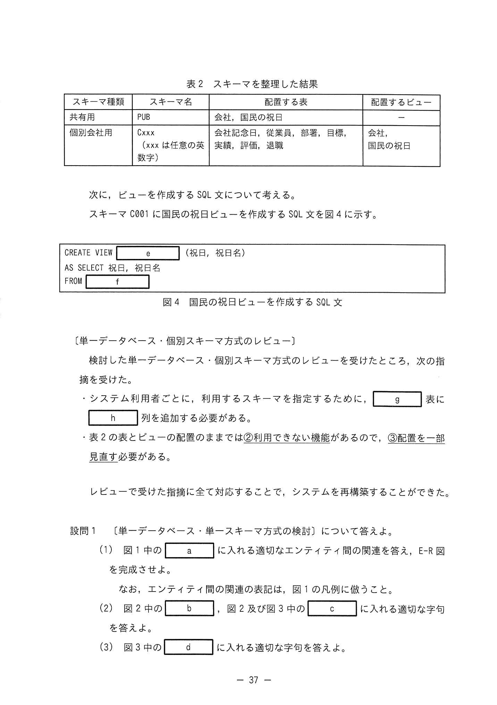

テキスト (OCR)

表2 スキーマを整理した結果

スキーマ種類    スキーマ名          配置する表         配置するビュー
共有用      PUB         att, 国民の祝日               ー
個別会社用    Cxxx        会社記念日, 従業貞, 部署, 目標,   会社,

(xxx は任意の英 | 実績,
数字)

EAR, 退職                           国民の祝日

次に, ビューを作成する SQL 文について考える。
スキーマ 0001 に国民の祝日ビューを作成する SQL 文を図 4 に示す。

CREATE weW|  e | (祝日, 祝日名)

AS SELECT 祝日, 祝日名

 4 国民の祝日ビューを作成する SQL 文

(単ーデータベース ・個別スキーマ方式のレビュー〕

検討した単一データベース・個別スキーマ方式のレビューを受けたところ, 次の指
摘を受けた。

・システム利用者ごとに, 利用するスキーマを指定するために, |  g | 表に
| ! | 列を追加する必要がある。

・表 2 の表とビューの配置のままでは②利用できない機能があるので, ③配置を部
見直す必要がある。

レビューで受けた指摘に全て対応することで, システムを再構築することができた。

設問1 【〔単一データベース・単一スキーマ方式の検討1について答えよ。
(1) Bitola | に入れる適切なエンティティ間の関連を答え, ER
を完成させよ。
なお, エンティティ間の関連の表記は, 図 1 の凡例に信うこと。
(2) 図2 中の| 5 | ,図2及び図3中の| c | に入れる適切な字句
を答えよ。

(3) 図3中の| gd | に入れる適切な字句を答えよ。

in|

### ページ 39

テキスト (OCR)

設問2 本文中の下線①の方式にする利点は何か。20 字以内で答えよ。

設問3 図4中の|  e ||,|  f |に入れる適切な字句を答えよ。
設問4 【〔単ー-データベース・個別スキーマ方式のレビュー〕 について答えよ。
(1) 本文中の|  g |, |  h |に入れる適切な字句を答えよ。

(2) 本文中の下線②の機能を, 表1 の機能名から答えよ。
(3) 本文中の下線③の見直した内容を, 29 字以内で答えよ。

### ページ 40

テキスト (OCR)

( メ モ 用 紙 ]

### ページ 41

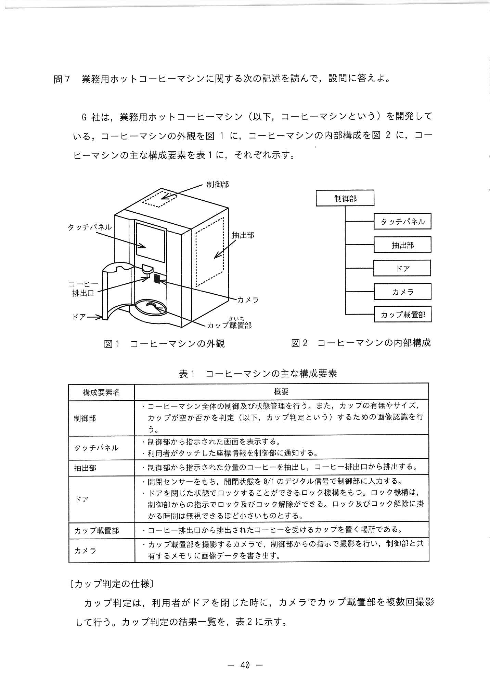

テキスト (OCR)

間7 業務用ホットコーヒーマシンに関する次の記述を読んで, 設問に答えよ。

G 社は, 業務用ホットコーヒーマシン (以下, コーヒーマシンという) を開発して
いる。コーヒーマシンの外観を図 1 に, コーヒーマシンの内部構成を図 2 に, コー
ヒーマシンの主な構成要素を表 1 に, それぞれ示す。

制御部

制御部

H                                   タッチパネル
| 抽出部
i                               抽出部

4

カ
カメラ

Dy Tih EB

i

さいち

カップ載置部
図1 コーヒーマシンの外観       図2 コーヒーマシンの内部構成

表1 コーヒーマシンの主な構成要素

構成要素名                                      概要
・コーヒーマシン全体の制御及び状態管理を行う。また, カップの有無やサイズ,
制御部               カップが空か否かを判定 (AK, AY THREW) するための画像認識を行
う。

・制御部から指示された画面を表示する。

・利用者がタッチした座標情報を制御部に通知する。

抽出部              ・制御痢から指示された分量のコーヒーを抽出し, コーヒー排出口から排出する。

・開開センサーをもち, 開閉状態を 9/1 のデジタル信号で制御部に入力する。

・ドアを閉じた状態でロックすることができるロック機構をもつ。ロック機構は,
制御部からの指示でロック及びロック解除ができる。ロック及びロック解除に掛
かる時間は無視できるほど小さいものとする。

カップ載置部       ・コーヒー排出口から排出されたコーヒーを受けるカップを置く場所である。

・カップ載置部を撮影するカメラで, 制御部からの指示で撮影を行い, 制御部と共
有するメモリに画像データを書き出す。

タッチパネル

カメラ

〔【カップ判定の仕様〕
カップ判定は, 利用者がドアを閉じた時に, カメラでカップ載置部を複数回撮影
して行う。カップ判定の結果一覧を, 表2 に示す。

~

### ページ 42

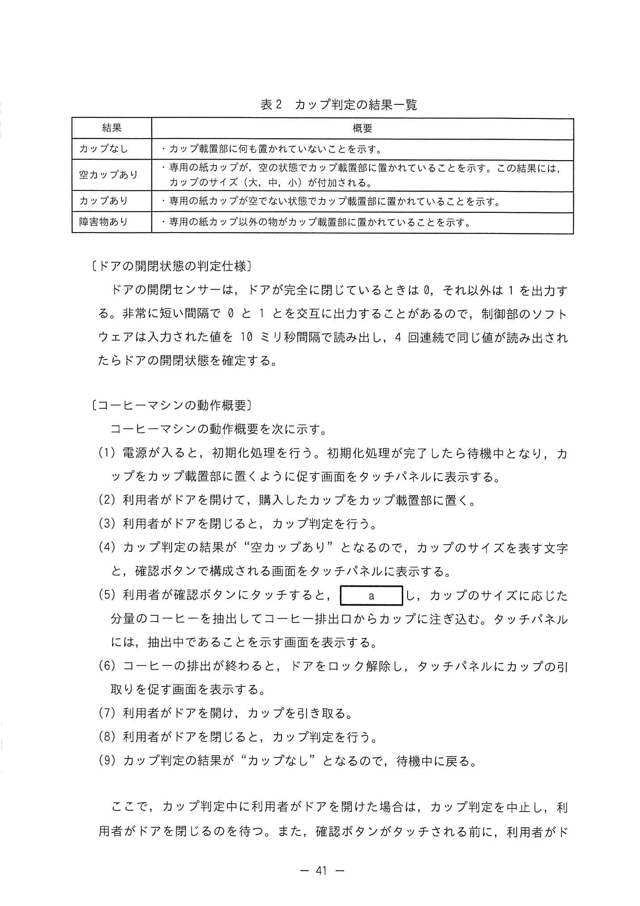

テキスト (OCR)

表2 カップ判定の結果一覧

結果                                     概要

カップなし   ・カップ戦置部に何も置かれていないことを示す。

・ 専用の紙カップが, 空の状態でカップ載置部に置かれていることを示す。この結果には,

go   y  あし

カップあり | カップのサイズ (大, 中。小) が付加される。

カップあり         ・専用の紙カップが空でない状態でカップ載置部に置かれていることを示す。
障害物あり         ・専用の紙カップ以外の物がカップ載置部に置かれていることを示す。

〔ドアの開閉状態の判定仕様]

ドアの開閉センサーは, ドアが完全に閉じているときは 0, それ以外は 1 を出力す
る。非常に短い間隔で 9 と 1 とを交互に出力することがあるので, 制御部のソフト
ウェアは入力された値を 10 ミリ秒間隔で読み出し, 4 回連続で同じ値が読み出され
たらドアの開閉状態を確定する。

[コーヒーマシンの動作概要〕
コーヒーマシンの動作概要を次に示す。

(1) 電源が入ると, 初期化処理を行う。初期化処理が完了したら待機中となり, カ
ップをカップ載置部に置くように促す画面をタッチパネルに表示する。

(2) 利用者がドアを開けて, 購入したカップをカップ載置部に置く。

(3) 利用者がドアを閉じると, カップ判定を行う。

(4) カップ判定の結果が “空カップあり"” となるので, カップのサイズを表す文字
と, 確認ボタンで構成される画面をタッチパネルに表示する。

(5) 利用者が確認ボタンにタッチすると, |  a |し, カップのサイズに応じた
分量のコーヒーを抽出してコーヒー排出口からカップに注ぎ込む。タッチパネル
には, 抽出中であることを示す画面を表示する。

(6) コーヒーの排出が終わると, ドアをロック解除し, タッチパネルにカップの引
取りを促す画面を表示する。

(7) 利用者がドアを開け, カップを引き取る。

(8) 利用者がドアを閉じると, カップ判定を行う。

(9) カップ判定の結果が“カップなし” となるので, 待機中に戻る。

ここで, カップ判定中に利用者がドアを開けた場合は, カップ判定を中止し, 利
用者がドアを閉じるのを待つ。また, 確認ボタンがタッチされる前に, 利用者がド

ーー 交 —-

### ページ 43

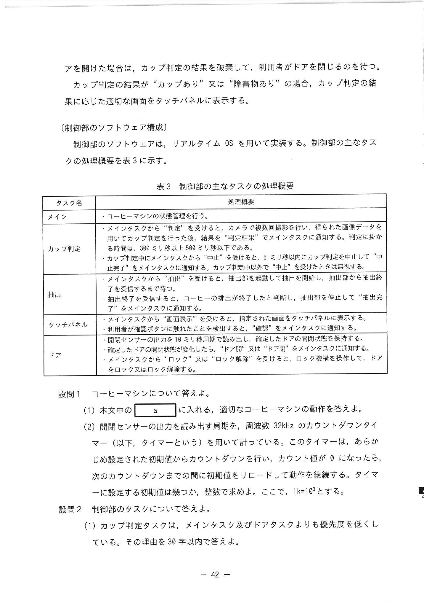

テキスト (OCR)

アを開けた場合は, カップ判定の結果を破棄して, 利用者がドアを閉じるのを待つ。
カップ判定の結果が “Hy THY” Rik “BMH” OWA, Hy THEO
果に応じた適切な画面をタッチパネルに表示する。

〔制御部のソフトウェア構成〕
制御部のソフトウェアは, リアルタイム OS を用いて実装する。制御部の主なタス
クの処理概要を表 3 に示す。

表3 制御部の主なタスクの処理概要

タスク名

処理概要

メイン

・コーヒーマシンの状態管理を行う。

カップ判定

・メインタスクから “判定” を受けると, カメラで複数回撮影を行い, 得られた画像データを

用いてカップ判定を行った後, 結果を "判定結果"でメインタスクに通知する。判定に掛か
る時間は, 300 ミリ秒以上 509 ミリ秒以下である。

・カップ判定中にメインタスクから “ib” を受けると, 5 ミリ秒以内にカップ判定を中止して “中

ERT” をメインタスクに通知する。カップ判定中以外で“中止" を受けたときは無視する。

抽出

- メインタスクから “抽出" を受けると, 抽出部を起動して抽出を開始し, 抽出部から抽出終

了を受信するまで待つ。

・ 抽出終了を受信すると, コーヒーの排出が終了したと判断し, 抽出部を停止して “抽出完

T” をメインタスクに通知する。

タッチパネル

・メインタスクから “WHR” を受けると, 指定された画面をタッチパネルに表示する。
・ 利用者が確認ボタンに触れたことを検出すると, "確認" をメインタスクに通知する。

・ 開閉センサーの出力を 10 ミリ秒周期で読み出し, 確定したドアの開閉状態を保持する。
・確定したドアの開閉状態が変化したら, "ドア開"又は “ドア閉" をメインタスクに通知する。
・メインタスクから "ロック" 又は “Oy ORR” を受けると, ロック機構を操作して, ドア

をロック又はロック解除する。

設問 1

コーヒーマシンについて答えよ。

(1) 本文中の| a |] に入れる, 適切なコーヒーマシンの動作を答えよ。
(2) 開閉センサーの出力を読み出す周期を, 周波数 32kHz のカウントダウンタイ

設問2

マー (UE, タイマーという) を用いて計っている。このタイマーは, あらか
じめ設定された初期値からカウントダウンを行い, カウント値が 9 になったら,
次のカウントダウンまでの間に初期値をリロードして動作を継続する。タイマ
ーに設定する初期値は幾つか, 整数で求めよ。ここで, 1k=10?とする。

制御部のタスクについて答えよ。

(1) カップ判定タスクは, メインタスク及びドアタスクよりも優先度を低くし

ている。その理由を 39 字以内で答えよ。

### ページ 44

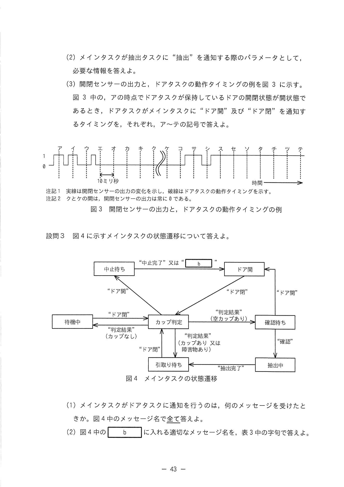

テキスト (OCR)

(2) メインタスクが抽出タスクに “抽出” を通知する際のパラメータとして,
必要な情報を答えよ。

(3) 開閉センサーの出力と, ドアタスクの動作タイミングの例を図 3 に示す。
図 3 中の, アの時点でドアタスクが保持しているドアの開閉状態が開状態で
あるとき, ドアタスクがメインタスクに『ドア開” RO OR PR” SST
るタイミングを, それぞれ, アーテの記号で答えよ。

Ff 9 エ オ カ キ 9 FAHY Re ソ FF ツ テ
1 H H H H H : i : : : H H H H H H H  =
19ミリ秒           時間 ——>
注記1 実線は開閉センサーの出力の変化を示し, 破線はドアタスクの動作タイミングを示す。
注記 2 クとケの間は, 開閉センサーの出力は常に 9 である。
図3 開閉センサーの出力と, ドアタスクの動作タイミングの例
設問3 図4 に示すメインタスクの状態乱移について答えよ。
中止待ち                     ドア開  Ke
『ドア開"                                         『ドア閉"            “ドア開"
ドア閉        i
待相                          ny Wee          (BA y7b)        認待ち
“判定結果"
(カップなし)            ‘eR                —
(カップあり 又は            確認
“ドア閉"    障害物あり)
引取り待ち   "抽出売了"  抽出中

図4 メインタスクの状態居移
(1) メインタスクがドアタスクに通知を行うのは, 何のメッセージを受けたと

きか。図 4 中のメッセージ名で全て答えよ。
(2) 図4 中の| b | に入れる適切なメッセージ名を, 表 3中の字句で答えよ。

### ページ 45

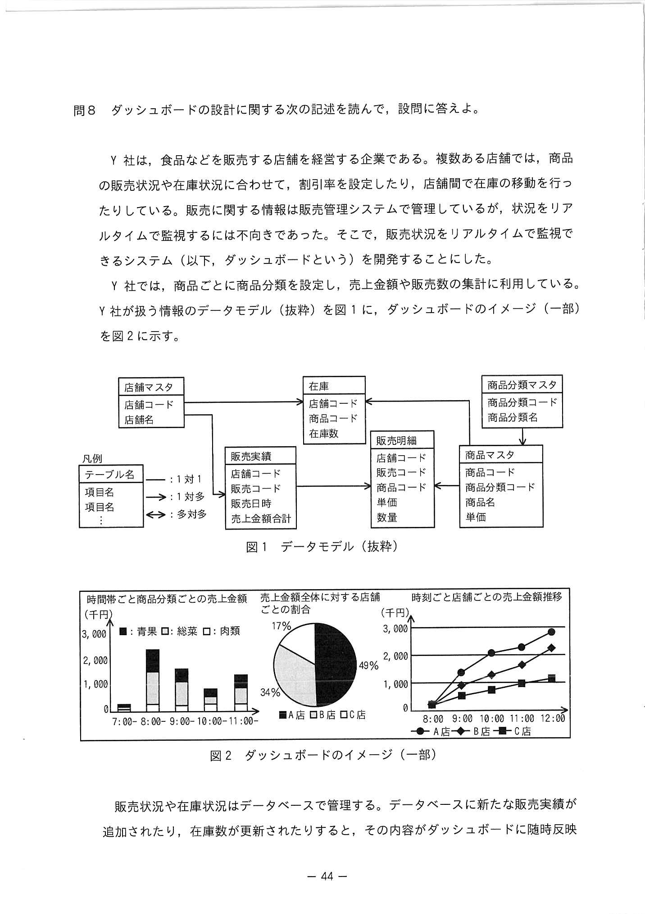

テキスト (OCR)

HS ダッシュボードの設計に関する次の記述を読んで, 設問に答えよ。

Y 社は, 食品などを販売する店舗を経営する企業である。 複数ある店舗では, 商品
の販売状況や在庫状況に合わせて, 割引率を設定したり, 店舗間で在庫の移動を行っ
たりしている。販売に関する情報は販売管理システムで管理しているが, 状況をリア
ルタイムで監視するには不向きであった。 そこで, 販売状況とそリアルタイムで監視で
きるシステム (以下, ダッシュボードという) を開発することにした。

Y 社では, 商品ごとに商品分類を設定し, 売上金額や販売数の集計に利用している。
Y 社が扱う情報のデータモデル (抜粋) を図 1 に.。 ダッシュボードのイメージ (一部)
を図 2 に示す。

店舗マスタ             在庫               商品分類マスタ
店舗コード                    店舗コード                   商品分類コード
店舗名                商品コード             商品分類名
el (aaa          i
凡例             販売実績           店舗コード    商品マスタ
テーブル名 | a    店舗コード             販売コード      商品コード
項目名     し 販売コード          商品コード    商品分類コード
項目名   Ne   販売日時           単価       商品名
:   <>: 382 | 売上金額人        数量      単価

 1 データモデル (抜粋)

時間帯ごと商品分類ごとの売上金額 売上金額全体に対する店舗        時刻ごと店舗ごとの売上金額推移
(FA                                  ごとの割合                (FR)
3,000) @: RO: wo: = 17%        3, 000

2, 000
2, 000                                                                                49%

1, 000
[  ka  A  8              1, 000
Les                                      0

7:00- 8:00- 9:00-10:00-11:00- SAM OB OCH       8:00 9:00 10:00 11:00 12:00
ー@- ム店9- 8 店 ECE

図2 ダッシュボードのイメージ (一部)

販売状況や在庫状況はデータベースで管理する。データベースに新たな販売実績が
追加されたり, 在庫数が更新されたりすると, その内容がダッシュボードに随時反映

ー 44 一

### ページ 46

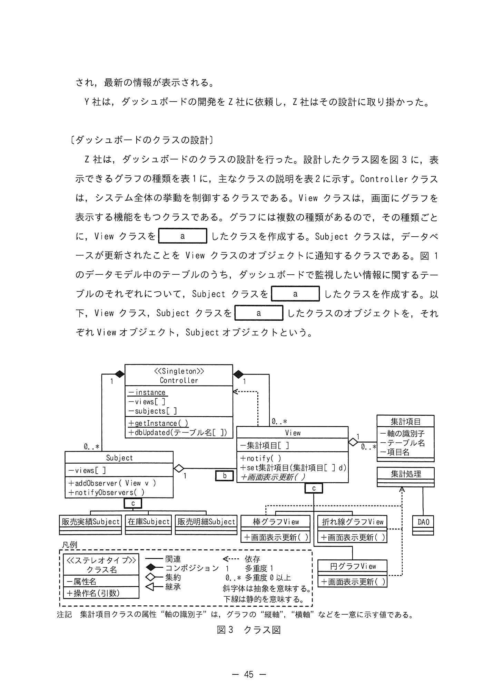

テキスト (OCR)

され, 最新の情報が表示される。
Y 社は, ダッシュボードの開発を Z 社に依頼し, Z 社はその設計に取り掛かった。

〔ダッシュボードのクラスの設計〕

Z 社は, ダッシュボードのクラスの設計を行った。設計したクラス図を図 3 に 表
示できるグラフの種類を表 1 に, 主なクラスの説明を表 2 に示す。Controller クラス
は, システム全体の挙動を制御するクラスである。View クラスは, 画面にグラフを
表示する機能をもつクラスである。グラフには複数の種類があるので, その種類ごと
に, View クラスを|  。 | したクラスを作成する。Subject クラスは, データベ
ースが更新されたことを View クラスのオブジェクトに通知するクラスである。図 1
のデータモデル中のテーブルのうち, ダッシュボードで監視したい情報に関するテー
ブルのそれぞれについて, Subject クラスを|  a | したクラスを作成する。以
下, View クラス, Subject クラスを|  a | したクラスのオブジェクトを, それ
ぞれView オブジェクト, Subject オブジェクトという。

<<Singleton>>      le
1         Controller         1
— instance             人っH
ーviews[ ]                     H
ーsubjects[ ]                  :
土getInstance( )             i 19..*                    集計項目
dbUpdated(テーブル名[ ])           View          1    ー軸の識別子
6..*                  ー集計項目[ ]       ae ee
Subject                    +notify( )
ーー                   KCーーーーーーー] set集計項目(集計項目[ ] d)           =
eet __       1 DBO Lame enc           RAE
十addObserver( View v )
+notifyObservers( )                             Le]              K
Lc                                       wad
it           I           1           : エーーーーーナーーーーーー」         ;
販売実績Subject| | 在庫Subjectl | 販売明細Subject      棒グラフView       折れ線グラフView     H     DAO
nil                             画面表示更新( )| | | 画面表示更新()| |
ドーニニーーーコニーニニニニーーーーニニーニーニニーニーーニニニニニニニーニーニーニニニニニーニニ
| <<ステレオォタイプ> | 一一関連     ぐ…- 依存      1    |
!     クラス名     一 コンポジション 1 多重度1       |し 円グラフView
1                   O-— 集約          0..* 多重度 0 以上     !         er
‘| 一属性名            間         ma      =     1 | 填画面表示更新( )
 Tiere GIBD     <本 継承        eee re

下線は静的を意味する。

注記 集計項目クラスの属性 “軸の識別子"” は, グラフの “終軸", "横軸" などを一意に示す値である。

図3 クラス図

ー 45 一

### ページ 47

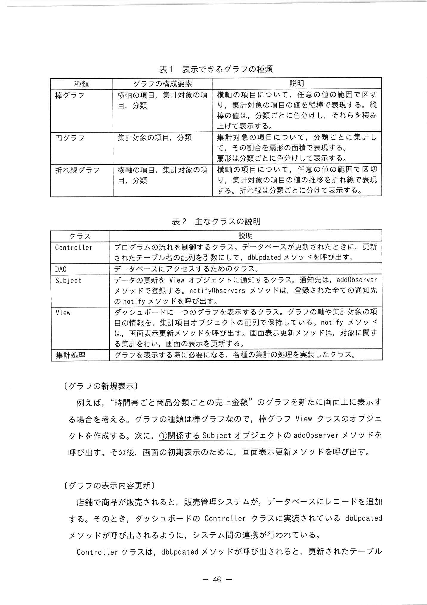

テキスト (OCR)

表1 表示できるグラフの種類

種類       グラフの構成要素                説明
棒グラフ     横軸の項目, 集計対象の項 | 横軸の項目について, 任意の値の範囲で区切
目, 分類           り, 集計対象の項目の値を縦棒で表現する。終
棒の値は, 分類ごとに色分けし, それらを積み
上げて表示する。

円グラフ     集計対象の項目, 分類    集計対象の項目について, 分類ごとに集計し
て, その割合を扇形の面積で表現する。
扇形は分類ごとに色分けして表示する。

折れ線グラフ   横軸の項目, 集計対象の項 | 横軸の項目について, 任意の値の範囲で区切

目, 分類           り, 集計対象の項目の値の推移を折れ線で表現
する。 折れ線は分類ごとに分けて表示する。
表2 主なクラスの説明
クラス                        説明

Controller    プログラムの流れを制御するクラス。データベースが更新されたときに, 更新

されたテーブル名の配列を引数にして, dbUpdated メソッドを呼び出す。
DAO        データベースにアクセスするためのクラス。
Subject    データの更新を View オブジェクトに通知するクラス。通知先は, add0bserver
メソッドで登録する。notifyObservers メソッドは, 登録された全ての通知先
のnotify メソッドを呼び出す。

View       ダッシュボードに一つのグラフを表示するクラス。 グラフの軸や集計対象の項
目の情報を, 集計項目オブジェクトの配列で保持している。notify メソッド
は, 画面表示更新メソッドを呼び出す。画面表示更新メソッドは, 対象に関す
る集計を行い, 画面の表示を更新する。

集計処理     グラフを表示する際に必要になる, 各種の集計の処理を実装したクラス。

[グラフの新規表示〕

例えば, “時間帯ごと商品分類ごとの売上金額′' のグラフを新たに画面上に表示す
る場合を考える。グラフの種類は棒グラフなので, 棒グラフ View クラスのオブジェ
クトを作成する。次に, ①関係する Subject オブジェクトのsddObserver メソッドを
呼び出す。 その後, 画面の初期表示のために, 画面表示更新メソッドを呼び出す。

〔グラフの表示内容更新]

店舗で商品が販売されると, 販売管理システムが, データベースにレコードを追加
する。そのとき, ダッシュボードの Controller クラスに実装されている dbUpdated
メソッドが呼び出されるように, システム間の連携が行われている。

Controller クラスは, dbUpdated メソッドが呼び出されると, 更新されたテーブル

### ページ 48

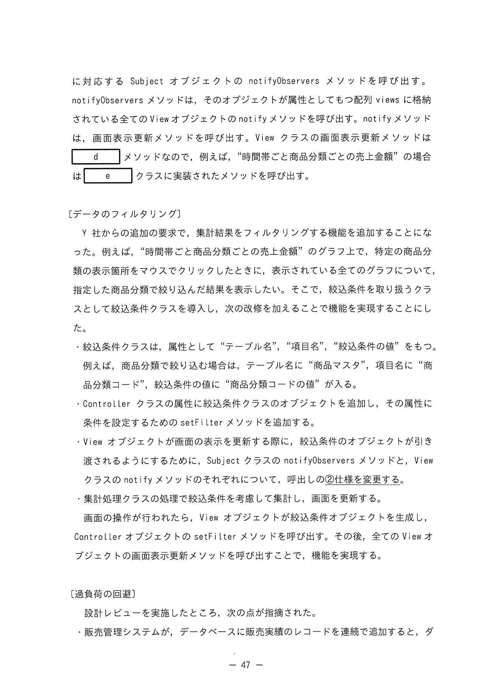

テキスト (OCR)

に対応する Subject オブジェクトの notify0bservers メソッドを呼び出す。
notifyObservers メソリッドは, そのオブジェクトが属性としてもつ配列 views に格納
されている全てのView オブジェクトのnotify メソッドを呼び出す。notify メソッド
は, 画面表示更新メソッドを呼び出す。View クラスの画面表示更新メソッドは
| 』 | メソッドなので, 例えば, “時間壮ごと商品分類ごとの売上金額′ の場合
は|  s | クラスに実装されたメソッドを呼び出す。

[データのフィルタリング〕

Y 社からの追加の要求で, 集計結果をフィルタリングする機能を追加することにな
った。例えば, “時間帯ごと商品分類ごとの売上金額" のグラフ上で, 特定の商品分
類の表示箇所をマウスでクリックしたときに, 表示されている全てのグラフについて,
指定した商品分類で絞り込んだ結果を表示したい。 そこで, 絞込条件を取り扱うクラ
スとして絞込条件クラスを導入し, 次の改修を加えることで機能を実現することにし
た。

・絞込条件クラスは, 属性として "テーブル名", “項目名", “絞込条件の値"をもつ。
例えば, 商品分類で絞り込むお場合は, テーブル名に “商品マスタ", 項目名に “商
品分類コード”, 絞込条件の値に “商品分類コードの値" が入る。

・Controller クラスの属性に絞込条件クラスのオブジェクトを追加し, その属性に
条件を設定するためのsetFilter メソッドを追加する。

View オブジェクトが画面の表示を更新する際に, 絞込条件のオブジェクトが引き
渡されるようにするために, Subject クラスの notifyObservers メソッドと, View
クラスのnotify メソッドのそれぞれについて, 呼出しの②仕様を変更する。

・集計処理クラスの処理で絞込条件を考慮して集計し, 画面を更新する。
画面の操作が行われたら, View オブジェクトが絞込条件オブジェクトを生成し,

Controller オブジェクトのsetFilter メソッドを呼び出す。 その後, 全てのView オ

ブジェクトの画面表示更新メソッドを呼び出すことで, 機能を実現する。

【過負荷の回避]〕
設計レビューを実施したところ, 次の点が指摘された。
・販売管理システムが, データベースに販売実績のレコードを連続で追加すると, ダ

### ページ 49

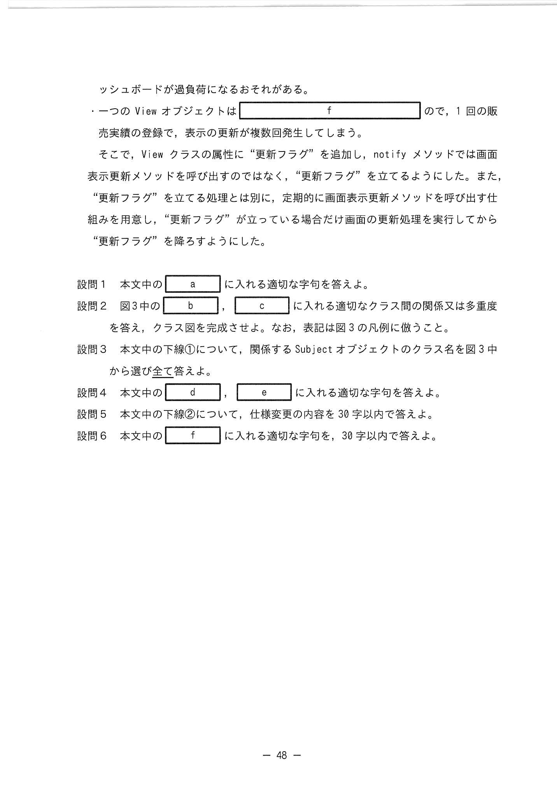

テキスト (OCR)

ッシュボードが過人負荷になるおそれがある。

・ーつの View オブジェクトは|          f          jot, 1 BOR

売実績の登録で, 表示の更新が複数回発生してしまう。

そこで, View クラスの属性に “更新フラグ” を追加し, notify メソッドでは画面
表示更新メソッドを呼び出すのではなく, “更新フラグ” を立てるようにした。 また,
"更新フラグ” を立てる処理とは別に, 定期的に画面表示更新メソッドを呼び出す仕
組みを用意し, “更新フラグ” が立っている場合だけ画面の更新処理を実行してから

“更新フラグ” を降ろすようにした。

設問1 本文中の| a | に入れる適切な字句を答えよ。
設問2 図3中の| b |, | < |に入れる適切なクラス間の関係又は多重度

を答え, クラス図を完成させよ。なお, 表記は図 3 の凡例に信うこと。
設問3 本文中の下線について, 関係する Subject オブジェクトのクラス名を図 3 中

から選び全て答えよ。
設問4 本文中の| dg |, | ec |に入れる適切な字句を答えよ。
設問5 本文中の下線②@について, 仕様変更の内容を 30 字以内で答えよ。

設問6 本文中の| f | に入れる適切な字句を, 30字以内で答えよ。

### ページ 50

テキスト (OCR)

C

メ モ 用 if

J]

### ページ 51

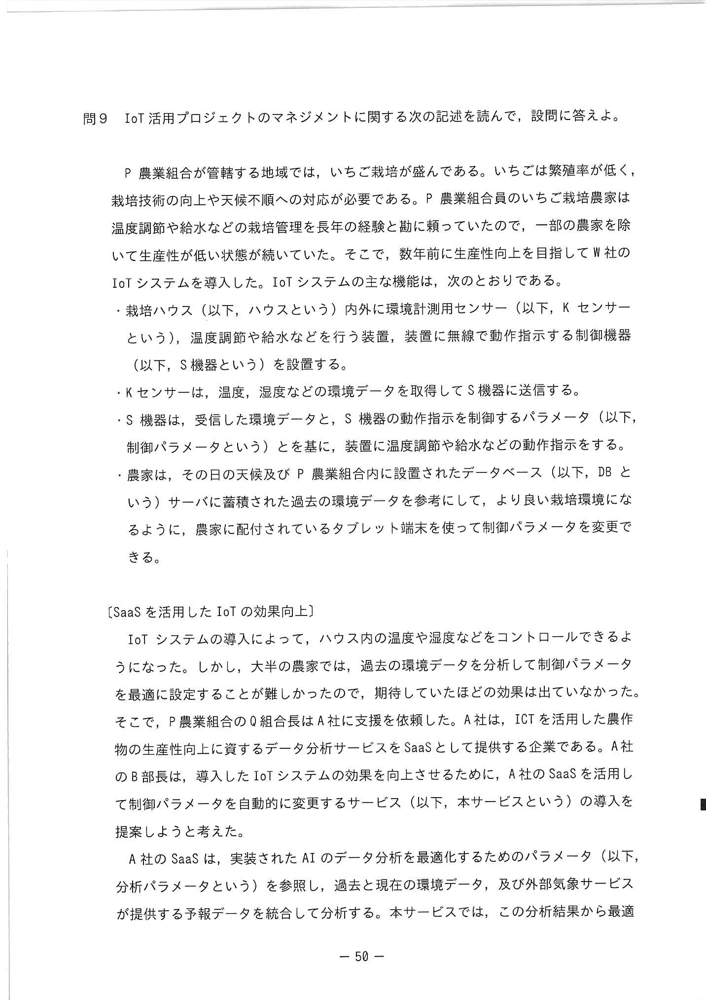

テキスト (OCR)

間9 LoT 活用プロジェクトのマネジメントに関する次の記述を読んで, 設問に答えよ。

P 農業組合が管轄する地域では, いちご栽培が盛んである。いちごは繁殖率が低く
栽培技術の向上や天候不順への対応が必要である。P 農業組合員のいちご栽培農家は
温度調節や給水などの栽培管理を長年の経験と勘に頼っていたので, 一部の農家を除
いて生産性が低い状態が続いていた。そこで, 数年前に生産性向上を目指して WHO
lol システムを導入した。 lol システムの主な機能は, 次のとおりである。

・栽培ハウス (以下,ハウスという) 内外に環境計測用センサー (以下, K センサー
という), 温度調節や給水などを行う装置, 装置に無線で動作指示する制御機器
(以下, S 機器という) を設置する。

・K センサーは, 温度, 湿度などの環境データを取得して 5 機器に送信する。

・S 機器は, 受信した環境データと, S 機器の動作指示を制御するパラメータ (以下,
制御パラメータという) とを基に, 装置に温度調節や給水などの動作指示をする。

・農家は, その日の天候及び P 農業組合内に設置されたデータベース (UF, DB と
WS) サーバに甘積された過去の環境データを参考にして, より良い栽培環境にな
るように, 農家に配付されているタブレット端末を使って制御パラメータを変更で

きる。

(SaaS を活用した lol の効果向上}

ToT システムの導入によって, ハウス内の温度や湿度などをコントロールできるよ
うになった。 しかし, 大半の農家では, 過去の環境データを分析して制御パラメータ
を最適に設定することが難しかったので, 期待していたほどの効果は出ていなかった。
そこで, P 農業組合の 0 組合長はA 社に支援を依頼した。A 社は, ICT を活用した農作
物の生産性向上に資するデータ分析サービスを3SaaS として提供する企業である。A社
のB 部長は, 導入した IoT システムの効果を向上させるために, A社のSaaS を活用し
て制御パラメータを自動的に変更するサービス (以下, 本サービスという) OBA
提案しようと考えた。

A 社の SaaS は, 実装された AI のデータ分析を最適化するためのパラメータ (以下
分析パラメータという) を参照し, 過去と現在の環境データ, 及び外部気象サービス
が提供する予報データを統合して分析する。本サービスでは, この分析結果から最適

### ページ 52

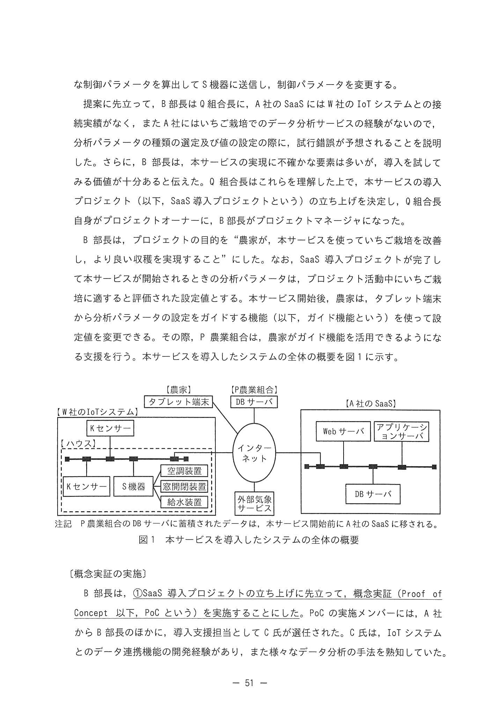

テキスト (OCR)

な制御パラメータを算出して$機器に送信し, 制御パラメータを変更する。

提案に先立って, B部長は 0 組合長に, A 社の SaaS には W 社の IoT システムとの接
続実績がなく, またA社にはいちご栽培でのデータ分析サービスの経験がないので,
分析パラメータの種類の選定及び値の設定の際に, 試行錯誤が予想されることを説明
した。さらに, B 部長は, 本サービスの実現に不確かな要素は多いが, 導入を試して
みる価値が十分あると伝えた。Q 組合長はこれらを理解した上で, 本サービスの導入
プロジェクト (以下, SaaS 導入プロジェクトという) の立ち上げを決定し, 0 組合長
自身がプロジェクトオーナーに, B 部長がプロジェクトマネージャになった。

B 部長は,。 プロジェクトの目的を“農家が, 本サービスを使っていちご栽培を改善
し, より良い収穫を実現すること"にした。なお, SaaS 導入プロジェクトが完了し
て本サービスが開始されるときの分析パラメータは, プロジェクト活動中にいちご栽
培に適すると評価された設定値とする。本サービス開始後, 農家は, タブレット端末
から分析パラメータの設定をガイドする機能 (以下, ガイド機能という) を使って設
定値を変更できる。その際, P 農業組合は, 農家がガイド機能を活用できるようにな
る支援を行う。本サービスを人導入したシステムの全体の概要を図 1 に示す。

(ER)    【P農業組合】
| タブレット上端末     LDB サーバ |               [A 社の SaaS}
[W社のloTシステム】

Keo

Web サーバ   アプリケーシ

ョンサーバ
[LA9A)_ | ee
i}
!                                ネット
Kセンサー   $機器                                      Gore
1                    給水3          外部気象
(にニニコココーニニニニニニニニジニニコココニコニニニニ     ザービス

注記 『農業組合のDB サーバに蓄積されたデータは, 本サービス開始前に AHO SaaS に移される。
図1 本サービスを導入したシステムの全体の概要

〔概念実証の実施〕

B 部長は, ①SaaS 導入プロジェクトの立ち上げに先立って, 概念実証 (Proof of
Concept LAK, PoC という) を実施することにした。PoC の実施メンバーには, A 社
からB 部長のほかに, 導入支援担当として(C 氏が選任された。C 氏は, IoT システム
とのデータ連携機能の開発経験があり, また様々なデータ分析の手法を熟知していた。

### ページ 53

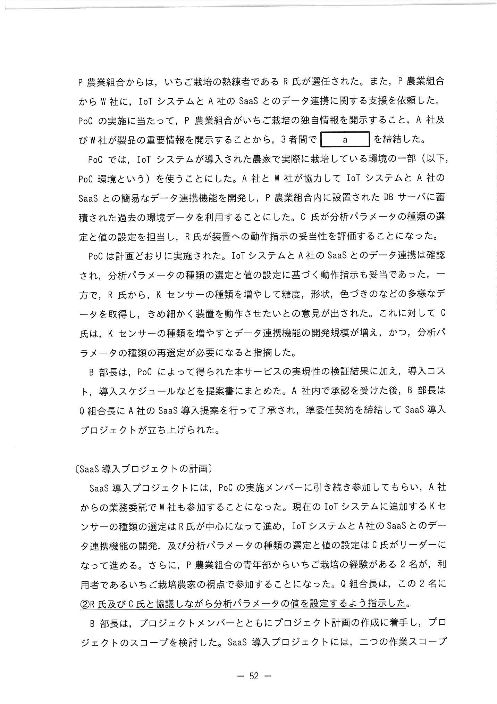

テキスト (OCR)

P 農業組合からは, いちご栽培の熟練者である R 氏が選任された。また, P 農業組合
から W 社に, IoT システムと A 社の SaaS とのデータ連携に関する支援を依頼した。
PoC の実施に当たって, P 農業組合がいちご栽培の独自情報を開示すること, A 社及
び 社が製品の重要情報を開示することから, 3 者間で|  a | を純結した。
PoC では, IoT システムが導入された農家で実際に栽培している環境の一部 (以下,
PoC 環境という) を使うことにした。A 社と W 社が協力して roT システムと AHO
SaaS との簡易なデータ 連携機能を開発し, P 農業組合内に設置された DYNES
積された過去の環境データを利用することにした。C(C 氏が分析パラメータの種類の選
定と値の設定を担当し, R 氏が装置への動作指示の受当性を評価することになった。
PoC は計画どおりに実施された。TIoT システムと AMO SaaS とのデータ連携は確認
され, 分析パラメータの種類の選定と値の設定に基づく動作指示も妥当であった。一
方で, REDS, K センサーの種類を増やして糖度, 形状、 色づきのなどの多様なデ
ータを取得し, きめ細かく装置を動作させたいとの意見が出された。これに対して C
氏は, K センサーの種類を増やすとデータ連携機能の開発規模が増え, DO, 分析パ
ラメータの種類の再選定が必要になると指摘した。

B 部長は, PoC によって得られた本サービスの実現性の検証結果に加え, 導入コス
ト, 導入スケジュールなどを提案書にまとめた。A 社内で承認を受けた後, B MRI
0 組合長に AOD SaaS 導入提案を行って了承され, 準委任契約を締結して SaaS 導入
プロジェクトが立ち上げられた。

(SaaS 導入プロジェクトの計画〕

SaaS 導入プロジェクトには, PoC の実施メンバーに引き続き参加してもらい, At
からの業務委託で W 社も参加することになった。現在の of システムに追加するKセ
ンサーの種類の選定は R 氏が中心になって進め, ToT システムとA社のSaaS とのデー
タ連携機能の開発, 及び分析パラメータの種類の選定と値の設定はC 氏がリーダーに
なって進める。さらに, P 農業組合の青年部からいちご栽培の経験がある 2 名が, Fil
用者であるいちご栽培農家の視点で参加することになった。0 組合長は, この 2 名に
②R 氏及びC 氏と協議しながら分析パラメータの値を設定するよう指示した。

B 部長は, プロジェクトメンバーとともにプロジェクト計画の作成に着手し, プロ
ジェクトのスコープを検討した。SaaS 導入プロジェクトには, 二つの作業スコープ

### ページ 54

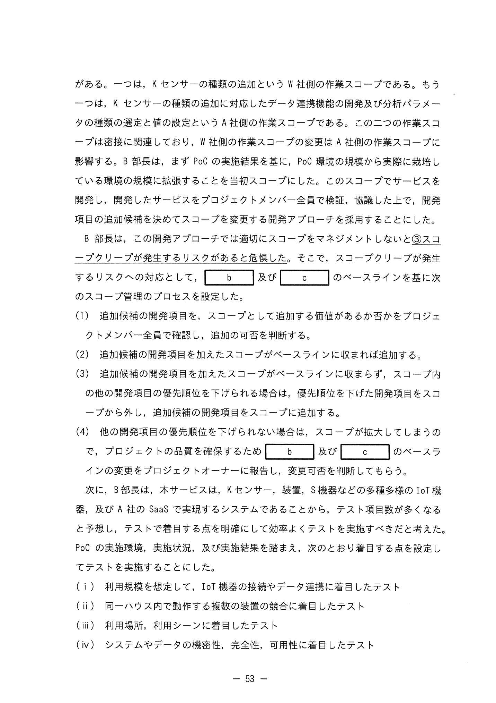

テキスト (OCR)

がある。一つは, K センサーの種類の追加という W 社側の作業スコープである。 もう

ーつは, K センサーの種類の追加に対応したデータ連携機能の開発及び分析パラメー

タの種類の選定と値の設定という A 社側の作業スコープである。この二つの作業スコ

ープは密接に関連しており, W 社側の作業スコープの変更は A 社側の作業スコープに

影響する。B 部長は, まず Pol の実施結果を基に, Pol 環境の規模から実際に栽培し

ている環境の規模に拡張することを当初スコープにした。このスコープでサービスを

開発し, 開発したサービスをプロジェクトメンバー全員で検証, 協議した上で, 開発

項目の追加候補を決めてスコープを変更する開発アプローチを採用することにした。

B 部長は, この開発アプローチでは適切にスコープをマネジメントしないと③スコ
ープクリープが発生するリスクがあると危健した。そこで, スコープクリープが発生
するリスクへの対応として, |  b |及び|  c |のベースラインを基に次
のスコープ管理のプロセスを設定した。

(1) 追加候補の開発項目を,. スコープとして追加する価値があるか否かをプロジェ
クトメンバー全員で確認し, 追加の可否を判断する。

(2) 追加候補の開発項目を加えたスコープがベースラインに収まれば追加する。

(3) 追加候補の開発項目を加えたスコープがベースラインに収まらず, スコープ内
の他の開発項目の優先順位を下げられる場合は, 優先順位を下げた開発項目をスコ
ープから外し, 追加候補の開発項目をスコープに追加する。

(4) 他の開発項目の優先順位を下げられない場合は, スコープが拡大してしまうの
で, プロジェクトの品質を確保するため| b |及び| c |のベースラ
インの変更をプロジェクトオーナーに報告し, 変更可否を判断してもらう。

Ric, BBR, 本サービスは, K センサー, 装置。S 機器などの多種多様の IoT機
器, 及び A 社の SaaS で実現するシステムであることから, テスト項目数が多くなる
と予想し, テストで着目する点を明確にして効率よくテストを実施すべきだと考えた。
PoC の実施環境, 実施状況, 及び実施結果を踏まえ, 次のとおり着目する点を設定し
てテストを実施することにした。

Ci) 利用規模を想定して, IoT 機器の接続やデータ連携に着目したテスト

(ii) 同一ハウス内で動作する複数の装置の競合に着目したテスト

(ii) 利用場所, 利用シーンに着目したテスト

(iv) システムやデータの機密性, 完全性, 可用性に着目したテスト

### ページ 55

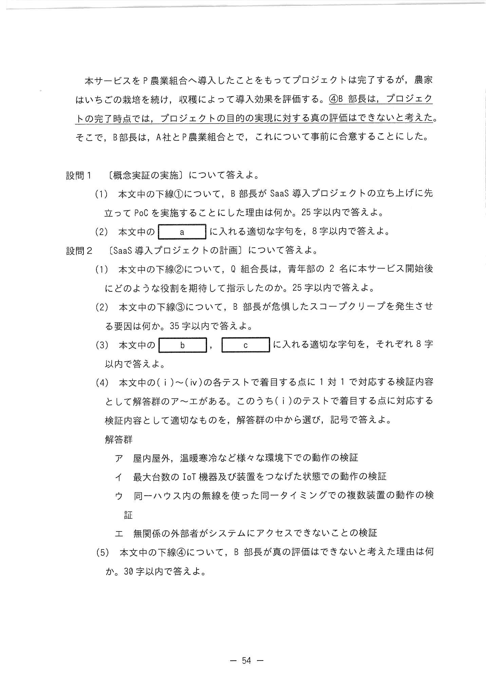

テキスト (OCR)

本サービスを農業組合へ導入したことをもってプロジェクトは完了するが, 農家
はいちごの栽培を続け, 収穫によって導入効果を評価する。④B 部長は, プロジェク
ト の完了時点では, プロジェクトの目的の実現に対する真の評価はできないと考えた。
そこで, B部長は, A社とP農業組合とで, これについて事前に合意することにした。

設問1 [概念実証の実施] について答えよ。

(1) 本文中の下線①について, B 部長が SaaS 導入プロジェクトの立ち上げに先
立って Pol を実施することにした理由は何か。25 字以内で答えよ。

(2) 本文中の|  』 | に入れる適切な字句を,8字以内で答えよ。

設問2 (SaaS 導入プロジェクトの計画] について答えよ。

(1) 本文中の下線②@について, 0 MAR, 青年部の 2 名に本サービス開始後
にどのような役割を期待して指示したのか。25 字以内で答えよ。

(2) 本文中の下線について, B 部長が危根したスコープクリープを発生させ
る要因は何か。35 字以内で答えよ。

(3) 本文中の| b |, |  c |に入れる適切な字句を, それぞれ8字
以内で答えよ。

(4) 本文中の(ij)~(iv)の各テストで着目する点に 1 対 1 で対応する検証内容
として解答群のアーエがある。このうち( i )のテストで着目する点に対応する
検証内容として適切なものを, 解答群の中から選び, 記号で答えよ。
解答群

ア BABA, 温暖寒冷など様々な環境下での動作の検証

イ 最大台数の IoT 機器及び装置をつなげた状態での動作の検証

ウ 同一ハウス内の無線を使った同一タイミングでの複数装置の動作の検
alk

エ 無関係の外部者がシステムにアクセスできないことの検証

(5) 本文中の下線④@について, B 部長が真の評価はできないと考えた理由は何
か。39 字以内で答えよ。

### ページ 56

テキスト (OCR)

〔

x = 用 紙 J

ー 55 一

### ページ 57

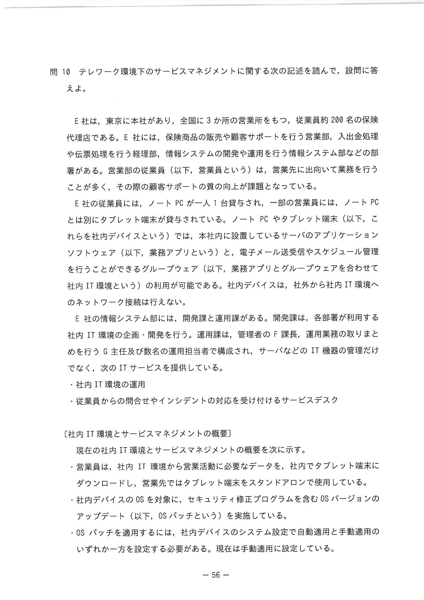

テキスト (OCR)

310 テレワーク環境下のサービスマネジメントに関する次の記述を読んで, 設問に答

えよ。

E 社は, 東京に本社があり, 全国に 3 か所の営業所をもつ, 従業員約 200 名の保険
代理店である。E 社には, 保険商品の販売や顧客サポートを行う営業部, 入出金処理
や伝票処理を行う経理部, 情報システムの開発や運用を行う情報システム部などの部
署がある。営業部の従業員 (以下, 営業員という) は, 営業先に出向いて業務を行う
ことが多く, その際の顧客サポートの質の向上が課題となかっている。

E 社の従業員には, ノート PC が一人 1 台貸与され, 一部の営業員には, ノート PC
とは別にタブレット端末が貸与されている。ノート PC やタブレット端末 (以下, こ
れらを社内デバイスという) では, 本社内に設置しているサーバのアプリケーション
ソフトウェア (以下, 業務アプリという) と, 電子メール送受信やスケジュール管理
を行うことができるグループウェア (以下, 業務アプリとグループウェアを合わせて
社内 IT 環境という) の利用が可能である。社内デバイスは, 社外から社内 IT 環境へ
のネットワーク接続は行えない。

E 社の情報システム部には, 開発課と運用課がある。 MRR, 各部署が利用する
社内 IT 環境の企画・開発を行う。運用課は, 管理者のF RR, 運用業務の取りまと
めを行う 6G 主任及び数名の運用担当者で構成され, サーバなどの IT 機器の管理だけ
でなく, 次の IT サービスを提供している。

・社内 IT 環境の運用
・従業員からの問合せやインシデントの対応を受け付けるサービスデスク

[社内 IT 環境とサービスマネジメントの概要]
現在の社内 IT 環境とサービスマネジメントの概要を次に示す。

・営業員は, 社内 IT 環境から営業活動に必要なデータを, 社内でタブレット端末に
ダウンロードし, 営業先ではタブレット端末をスタンドアロンで使用している。

・社内デバイスの 0S を対象に, セキュリティ修正プログラムを含む 0S5 バージョンの
アップデート (以下, 0S パッチという) を実施している。

・0S パッチを適用するには, 社内デバイスのシステム設定で自動適用と手動適用の
いずれか一方を設定する必要がある。現在は手動適用に設定している。

### ページ 58

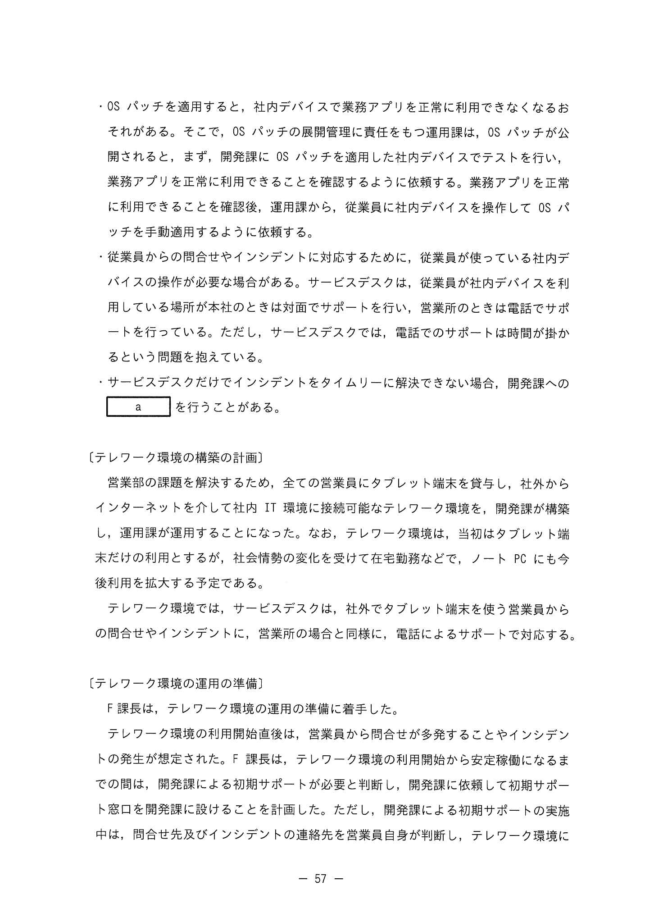

テキスト (OCR)

・0S パッチを適用すると, 社内デバイスで業務アプリを正常に利用できなくなるお
それがある。 そこで, 0S パッチの展開管理に責任をもつ運用課は, OS パッチが公
開されると, まず, 開発課に OS パッチを適用した社内デバイスでテストを行い,
業務アプリを正常に利用できることを確認するように依頼する。業務アプリを正常
に利用できることを確認後, 運用課から, 従業員に社内デバイスを操作して 0S パ
ッチを手動適用するように依頼する。

・従業員からの問合せやインシデントに対応するために, 従業員が使っている社内デ
バイスの操作が必要な場合がある。サービスデスクは, 従業員が社内デバイスを利
用している場所が本社のときは対面ですサポートを行い, 営業所のときは電話でサポ
ートを行っている。ただし, サービスデスクでは, 電話でのサポートは時間が掛か
るという問題を抱えている。

・サービスデスクだけでインシデントをタイムリーに解決できない場合, 開発課への

[a | を行うことがある。

〔テレワーク環境の構築の計画

営業部の課題を解決するため, 全ての営業員にタブレット端末を貸与し, 社外から
インターネットを介して社内 IT 環境に接続可能なテレワーク環境を, 開発課が構築
し, 運用課が運用することになった。なお, テレワーク環境は, 当初はタブレット端
未だけの利用とするが, 社会情勢の変化を受けて在宅勤務などで, ノート PC にも今
後利用を拡大する予定である。

テレワーク環境では, サービスデスクは, 社外でタブレット端末を使う営業員から
の問合せやインシデントに, 営業所の場合と同様に, 電話によるサポートで対応する。

〔テレワーク環境の運用の準備]

F 課長は, テレワーク環境の運用の準備に着手した。

テレワーク環境の利用開始直後は, 営業員から問合せが多発することやインシデン
トの発生が想定された。F 課長は, テレワーク環境の利用開始から安定稼働になるま
での間は, 開発課による初期サポートが必要と判断し, 開発課に依頼して初期サポー
ト窓口を開発課に設けることを計画した。ただし, 開発課による初期サポートの実施
中は, 問合せ先及びインシデントの連絡先を営業員自身が判断し, テレワーク環境に

ー: 67 ッ一

### ページ 59

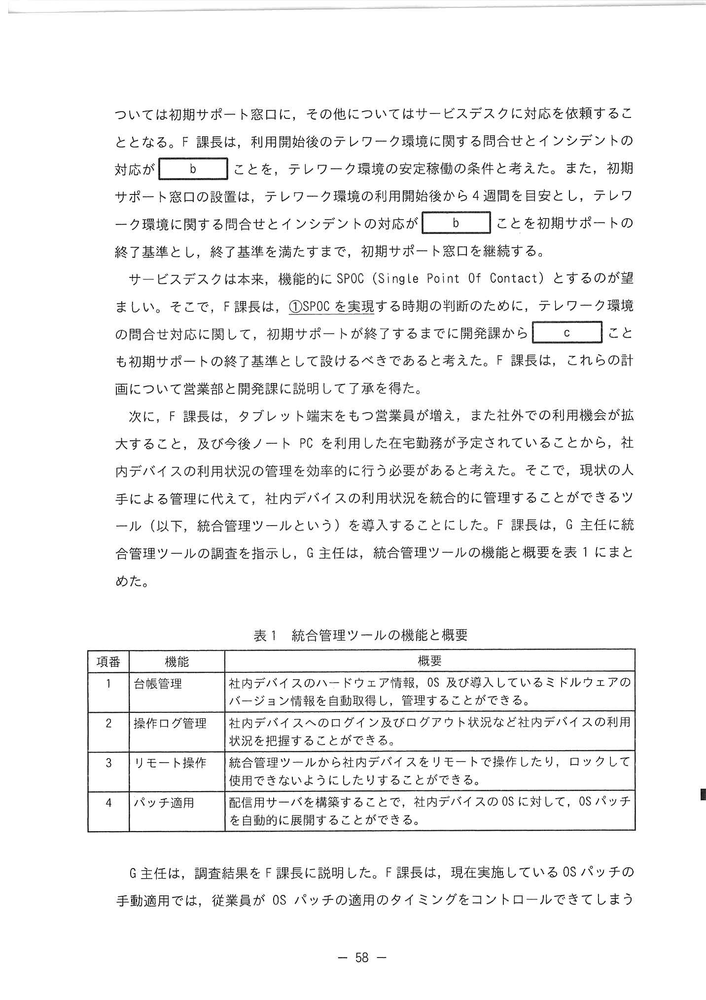

テキスト (OCR)

ついては初期サポート窓口に.。 その他についてはサービスデスクに対応を依頼するこ
ととなる。F 課長は, 利用開始後のテレワーク環境に関する問合せとインシデントの
対応が[| bp | ことを, テレワーク環境の安定稼働の条件と考えた。また, 初期
サポート窓口の設置は, テレワーク環境の利用開始後から 4 週間を目安とし, テレワ
ーク環境に関する問合せとインシデントの対応が| b | ことを初期サポートの
終了基準とし, 終了基準を満たすまで, 初期サポート窓口を継続する。

サービスデスクは本来, 機能的に SPOC (Single Point Of Contact) EF SORA
ましい。 そこで, 「 課長は, ①SP0C を実現する時期の判断のために, テレワーク環境
の問合せ対応に関して, 初期サポートが終了するまでに開発課から とを
も初期サポートの終了基準として設けるべきであると考えた。F 課長は, これらの計
画について営業部と開発課に説明して了承を得た。

次に, F 課長は。 タブレット端末をもつ営業員が増え, また社外での利用機会が拡
大すること, 及び今後ノート PC を利用した在宅勤務が予定されていることから, 社
内デバイスの利用状況の管理を効率的に行う必要があると考えた。そこで, 現状の人
手による管理に代えて, 社内デバイスの利用状況を統合的に管理することができるツ
ール (以下, 統合管理ツールという) を導入することにした。F 課長は, G 主任に統
合管理ツールの調査を指示し, G 主任は, 統合管理ツールの機能と概要を表1 にまと
めた。

Rl 統合管理ツールの機能と概要

項番             機能                                                                  概要

1 | 台帳管理    社内デバイスのハードウェア情報, 0S 及び導入しているミドルウェアの
バージョン情報を自動取得し, 管理することができる。

2 |操作ログ管理 |社内デバイスへのログイン及びログアウト状況など社内デバイスの利用
状況を把握することができる。

3 |リモート操作 |統合管理ツールから社内デバイスをリモートで操作したり, ロックして
使用できないようにしたりすることができる。

4 |パッチ適用    配信用サーバを構築することで, 社内デバイスの 0S に対して, 0S パッチ
を自動的に展開することができる。

6 主任は, 調査結果をF 課長に説明した。『F 課長は, 現在実施している OS パッチの
手動適用では, 従業員が 0S パッチの適用のタイミングをコントロールできてしまう

### ページ 60

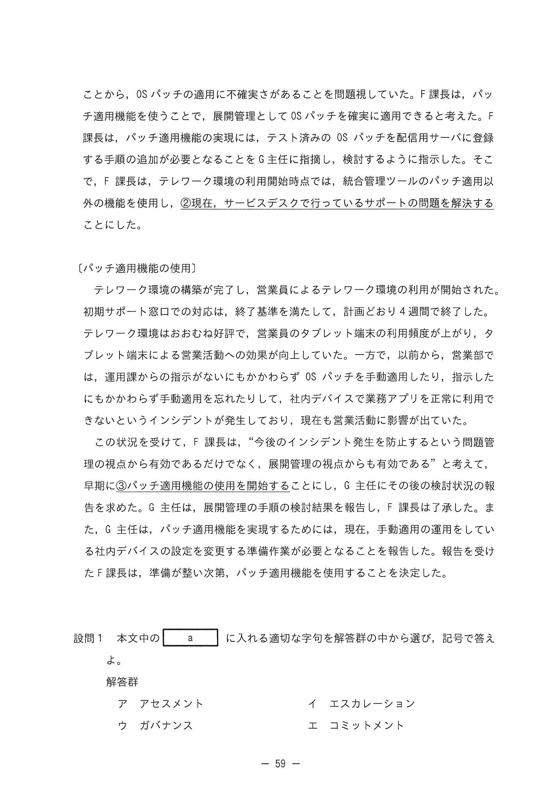

テキスト (OCR)

こととから, 0S パッチの適用に不確実さがあることを問題視していた。「 課長は, パッ
チ適用機能を使うことで, 展開管理として 0S パッチを確実に適用できると考えた。F
課長は, パッチ適用機能の実現には, テスト済みの OS パッチを配信用サーバに登録
する手順の追加が必要となることを6主任に指摘し, 検討するように指示した。そこ
で, F 課長は, テレワーク環境の利用開始時点では, 統合管理ツールのパッチ適用以
外の機能を使用し, ②現在, サービスデスクで行っているサポートの問題を解決する
ととにした。

〔パッチ適用機能の使用〕

テレワーク環境の構築が完了し, 営業員によるテレワーク環境の利用が開始された。
初期サポート窓口での対応は, 終了基準を満たして, 計画どおり 4 週間で終了した。
テレワーク環境はおおむね好評で, 営業員のタブレット端末の利用頻度が上がり, タ
ブレット端末による営業活動への効果が向上していた。一方で, 以前から, 営業部で
は, 運用課からの指示がないにもかかわらず 0S パッチを手動適用したり, 指示した
にもかかわらず手動適用を忘れたりして, 社内デバイスで業務アプリを正常に利用で
きないというインシデントが発生しており, 現在も営業活動に影響が出ていた。

この状況を受けて, F 課長は, “今後のインシデント発生を防止するという問題管
理の視点から有効でもるだけでなく, 展開管理の視点からも有効である"と考えて,
早期に②パッチ適用機能の使用を開始することにし, G 主任にその後の検討状況の報
告を求めた。G 主任は, 展開管理の手順の検討結果を報告し, F 課長は了承した。ま
た, G EE, パッチ適用機能を実現するためには, 現在, 手動適用の運用をしてい
る社内デバイスの設定を変更する準備作業が必要となることを報告した。報告を受け
Te 課長は, 準備が整い次第, パッチ適用機能を使用することを決定した。

設問1 本文中の|  a | に入れる適切な字句を解答群の中から選び, 記号で答え
bs
ABBE
ア アセスメント       イ エスカレーション
ウ ガバナンス           エエ コミットメント

### ページ 61

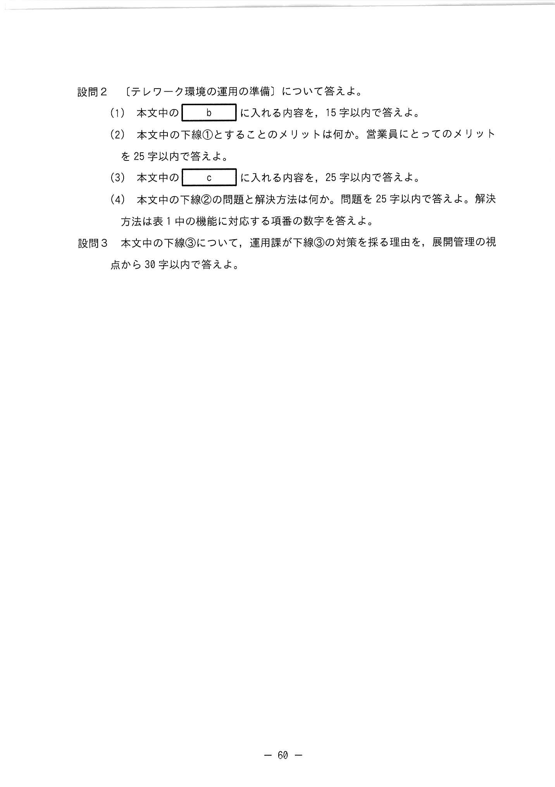

テキスト (OCR)

設問2 〔テレワーク環境の運用の準備】について答えよ。
(1) 本文中の| b | に入れる内容を, 15字以内で答えよ。
(2) 本文中の下線わとすることのメリットは何か。 営業員にとってのメリット
を 25 字以内で答えよ。
(3) 本文中の[| c | に入れる内容を, 25字以内で答えよ。
(4) 本文中の下線のの問題と解決方法は何か。問題を 25 字以内で答えよ。解決
方法は表 1 中の機能に対応する項番の数字を答えよ。

設問3 本文中の下線③について, 運用課が下線③の対策を採る理由を, 展開管理の視
点から 30 字以内で答えよ。

### ページ 62

テキスト (OCR)

〔

メ モ 用 紙

J]

### ページ 63

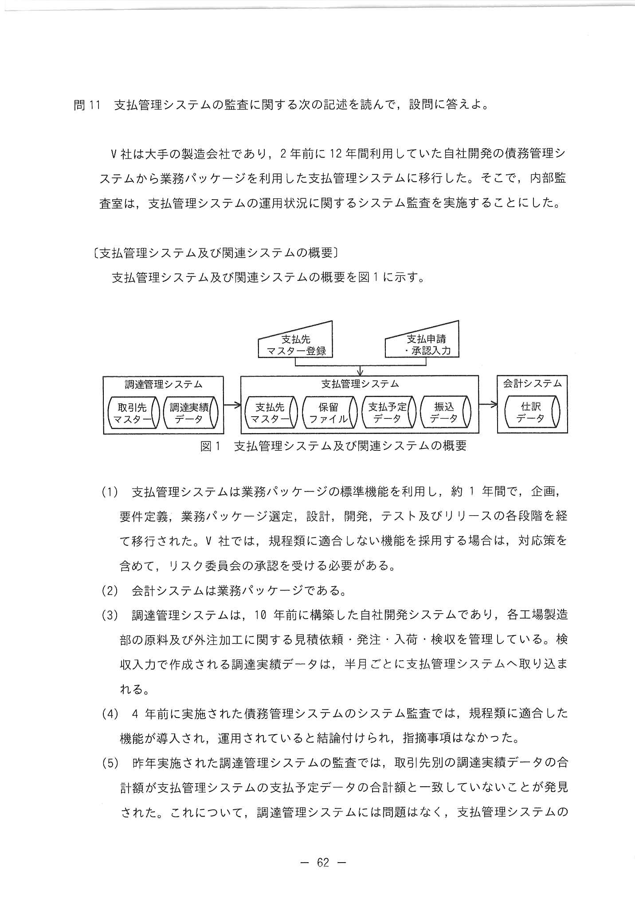

テキスト (OCR)

問11 支払管理システムの監査に関する次の記述を読んで, 設問に答えよ。

V 社は大手の製造会社であり, 2 年前に 12 年間利用していた自社開発の債務管理シ
ステムから業務パッケージを利用した支払管理システムに移行した。そこで, 内部監
査室は, 支払管理レステムの運用状況に関するシステム監査を実施することにした。

〔支払管理システム及び関連システムの概要〕
支払管理システム及び関連システムの概要を図 1 に示す。

マスター登録        ・承認入力

調達管理システム                      支払管理システム

>
(253i ()( mate) I(r ()( BB (\(2224()( #8 () 71 ( HEIR ()
VAI     データ         マスター    ファイル     データ      データ           データ

図1 支払管理システム及び関連システムの概要

(1) 支払管理システムは業務パッケージの標準機能を利用し, 約 1 年間で, 企画,
要件定義, 業務パッケージ選定, BH, 開発,テスト及びリリースの各段階を経
て移行された。V 社では, 規程類に適合しない機能を採用する場合は, 対応策を
含めて,リスク委員会の承認を受ける必要がある。

(2) 会計システムは業務パッケージである。

(3) 調達管理システムは, 10 年前に構築した自社開発システムであり, 各工場製造
部の原料及び外注加工に関する見積依頼・発注・入荷・検収を管理している。検
収入力で作成される調達実績データは, 半月ごとに支払管理システムへ取り込ま
れる。

(4) 4 年前に実施された債務管理システムのシステム監査では, 規程類に適合した
機能が導入され, 運用されていると結論付けられ, 指摘事項はなかった。

(5) 昨年実施された調達管理システムの監査では, 取引先別の調達実績データの合
計額が支払管理システムの支払予定データの合計額と一致していないことが発見
された。これについて, 調達管理システムには問題はなく, 支払管理システムの

### ページ 64

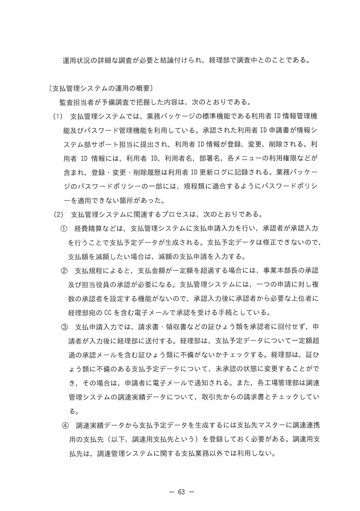

テキスト (OCR)

運用状況の詳細な調査が必要と結論付けられ, 経理部で調査中とのことである。

〔支払管理システムの運用の概要〕
監査担当者が予備調査で把握した内容は, 次のとおりである。

(1) 支払管理システムでは, 業務パッケージの標準機能である利用者 ID 情報管理機
能及びパスワード管理機能を利用している。 承認された利用者 ID 申請書が情報シ
ステム部サポート担当に提出され, 利用者 ID 情報が登録, 変更, 削除される。利
用者 ID 情報には, 利用者 ID, 利用者名, MSS, 各メニューの利用権限などが
含まれ, 登録・変更・削除履歴は利用者 ID 更新ログに記録される。業務パッケー
ジのパスワードポリシーの一部には, 規程類に適合するようにパスワードポリシ
ーを適用できない箇所があった。

(2) 支払管理システムに関連するプロセスは, 次のとおりである。

OD 経費精算などは, 支払管理システムに支払申請入力を行い, 承認者が承認入力
を行うことで支払予定データが生成される。 支払予定データは修正できないので,
支払額を減額したい場合は, 減額の支払申請を入力する。

② 支払規程によると, 支払金額が一定額を超過する場合には, 事業本部長の承認
及び担当役員の承認が必要になる。支払管理システムには, 一つの申請に対し複
数の承認者を設定する機能がないので, 承認入力後に承認者から必要な上位者に
経理部宛のCC を含む電子メールで承認を受ける手続としている。

③ 支払申請入力では, 請求書・領収書などの証ひょう類を承認者に回付せず, 申
請者が入力後に経理部に送付する。経理部は, 支払予定データについて一定額超
過の承認メールを含む証ひょう類に不備がないかチェックする。 経理部は, 証ひ
ょう類に不備のある支払予定データについて, 未承認の状態に変更することがで
き, その場合は, 申請者に電子メールで通知される。また, 各工場管理部は調達
管理システムの調達実績データについて, 取引先からの請求書とチェックしてい
る。

④ 調達実績データから支払予定データを生成するには支払先マスターに調達連携
用の支払先 (以下, 調達用支払先という) を登録しておく必要がある。調達用支
払先は, 調達管理システムに関する支払業務以外では利用しない。

### ページ 65

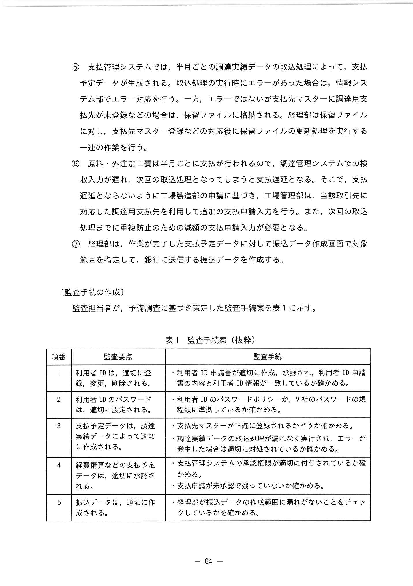

テキスト (OCR)

© 支払管理システムでは, 半月ごとの調達実績データの取込処理によって, 支払
予定データが生成される。 取込処理の実行時にエラーがあった場合は, 情報シス
テム部でエラー対応を行う。 一方, エラーではないが支払先マスターに調達用支

払先が未登録などの場合は

保留ファイルに格納される。経理部は保留ファイル

に対し, 支払先マスター登録などの対応後に保留ファイルの更新処理を実行する

ー連の作業を行う。

© 原料・外注加工費は半月ごとに支払が行われるので, 調達管理システムでの検
収入力が遅れ, 次回の取込処理となってしまうと支払遅延となかる。そこで, 支払
遅延とならないように工場製造部の申請に基づき, 工場管理部は, 当該取引先に

対応した調達用支払先を利用して追加の支払申請入力を行う。

また, 次回の取込

処理までに重複防止のための減額の支払申請入力が必要となる。
⑦ 経理部は, 作業が完了した支払予定データに対して振込データ作成画面で対象
範囲を指定して, 銀行に送信する振込データを作成する。

(監査手続の作成
監査担当者が, 予備調査に基づき策定した監査手続案を表 1 に示す。

表1 監査手続案 (抜粋)

項番     監査要点                監査手続

1 | 利用者 D は, 適切に登   ・利用者 ID 申請書が適切に作成, 承認され, 利用者 ID 申請
録, 変更, 削除される。   書の内容と利用者 ID 情報が一致しているか確かめる。

2 | 利用者ID のパスワード   ・利用者 ID のパスワードポリシーが, V 社のパスワードの規
は, 適切に設定される。   程類に準拠しているか確かめる。

3 | 支払予定データは, 調達 | ・支払先マスターが正確に登録されるかどうか確かめる。
実績データによって適切 | .調達実績データの取込処理が漏れなく実行され, エラーが
に作成される。       発生した場合は適切に対処されているか確かめる。

4 | 経費精算などの支払予定  ・支払管理システムの承認権限が適切に付与されているか確
データは, 適切に承認さ   かめる。
れる。          ・ 支払申請が未承認で残っていないか確かめる。

5 | 振込データは, 適切に作 | ・経理部が振込データの作成範囲に漏れがないことをチェッ

成される。

クしているかを確かめる。

### ページ 66

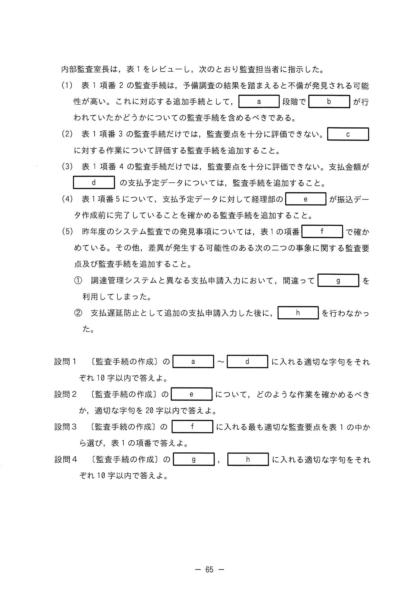

テキスト (OCR)

内部監査室長は, 表 1 をレビューし, 次のとおり監査担当者に指示した。

(1) 表 1 項番 2 の監査手続は, 予備調査の結果を踏まえると不備が発見される可能
性が高い。これに対応する追加手続として, |  a |段階で| b |が行
われていたかどうかについての監査手続を含めるべきである。

(2) 表 1 項番 3 の監査手続だけでは, 監査要点を十分に評価できない。
に対する作業について評価する監査手続を追加すること。

(3) 表 1 項番 4 の監査手続だけでは, 監査要点を十分に評価できない。 支払金額が
| d  ] の支払予定データについては, 監査手続を追加すること。

(4) 表1項番5について, 支払予定データに対して経理部の| e | が振込デー
タ作成前に完了していることを確かめる監査手続を追加すること。

(5) 昨年度のシステム監査での発見事項については, 表 1 の項番[ 「 | で確か
めている。 その他, 差異が発生する可能性のある次の二つの事象に関する監査要

点及び監査手続を追加すること。
OQ 調達管理システムと異なる支払申請入力において, 間違って| g |を
利用してしまった。
@ 支払遅延防止として追加の支払申請入力した後に, | h | を行わなかっ
た。

設問1 監査手続の作成】の| a |~| a |に入れる適切な字句をそれ

ぞれ 19 字以内で答えよ。

設問2 【監査手続の作成〕の[| e | について, どのような作業を確かめるべき
か, 適切な字句を 20 字以内で答えよ。

設問3 [監査手続の作成〕】 の | f | に入れる最も適切な監査要点を表1 の中か
ら選び, 表 1 の項番で答えよ。

設問4 監査手続の作成】 の| 9 |, | h | に入れる適切な字句をそれ
ENO 字以内で答えよ。

ー 65 一

### ページ 67

テキスト (OCR)

〔

x = 用 紙

### ページ 68

テキスト (OCR)

〔

A モ 用 紙 J

### ページ 69

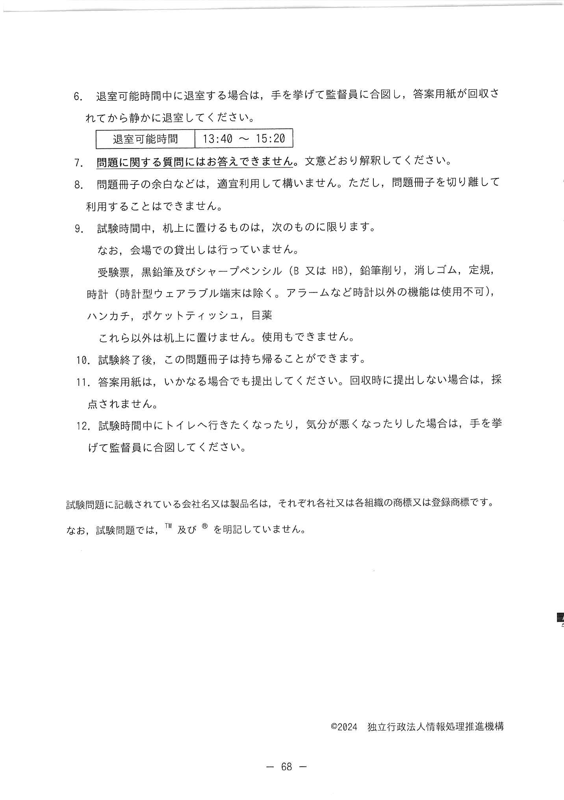

テキスト (OCR)

6. 退室可能時間中に退室する場合は, 手を挙げて監督具に合図し, 答案用紙が回収さ
れてから静かに退室してください。
退室可能時間   13:40 ~ 15:20
7. 問題に関する質問にはお答えできません。文意どおり解釈してください。
8. 間題冊子の余白などは, 適宜利用して構いません。ただし, 問題冊子を切り離して
利用することはできません。
9. 試験時間中, 机上に置けるものは, 次のものに限ります。
なお, 会場での貸出しは行っていません。
受験票, 黒鉛筆及びシャープペンシル (B 又は HB), 鉛筆削り, 消しゴム, 定規
時計 (時計型ウェアラブル端末は除く。アラームなど時計以外の機能は使用不可),
ハンカチ, ポケットティッシュ, 目薬
これら以外は机上に置けません。使用もできません。
10. 試験終了後, この問題冊子は持ち帰ることができます。
11, 答案用紙は, いかなる場合でも提出してください。回収時に提出しない場合は, 採
点されません。
12, 試験時間中にトイレへ行きたくなったり, 気分が悪くなったりした場合は, FES
げて監督具に合図してください。

試験問題に記載されている会社名又は製品名は, それぞれ各社又は各組織の商標又は登録商標です。

なお, 試験問題では, "及び 『 を明記していません。

©2024 独立行政法人情報処理推進機構

---

## 午後解答

1/6 
©2024 独立行政法人情報処理推進機構 
令和６年度 春期 応用情報技術者試験 解答例 
 
午後試験 
問１ 
出題趣旨 
 従来，信頼できる内部のネットワークと信頼できない外部のネットワークを分離する，境界型防御によるセ
キュリティ対策が行われてきた。昨今のクラウドサービスの普及によって，外部のネットワークに保護すべき
データが置かれることが多くなり，いかなる通信も信頼しないゼロトラストの考え方が広まってきた。 
 本問では，リモート環境の構築を題材として，境界型防御の環境からゼロトラスト環境への移行時に必要と
なるセキュリティ対策の基本的な知識を問う。 
 
設問 
解答例・解答の要点 
備考 
設問１ 
イ 
 
設問２(1)
a
ゼロトラスト 
 
 
(2) セキュリティパッチ提供の調査及び適用の判断 
 
設問３(1) ・URL フィルタリング 
・業務上不要なサイトへの接続禁止 
 
 
(2) セキュリティインシデントの発生を迅速に検知するため 
 
 
(3) ア，ウ 
 
設問４(1) ア 
 
 
(2)
b
多要素認証 又は 2 要素認証（多段階認証 又は 2 段階認証も可) 
 
 
問２ 
出題趣旨 
 近年，顧客へ新たな価値を提供するためには，自社を取り巻く経営環境を把握し，分析して事業計画を立案
することが重要になってきている。 
 本問では，中規模の物流事業者における事業計画の立案を題材として，従来までの物を運ぶという自社視点
の物流サービスから，顧客のもつ問題の解決に総合的に取り組むという顧客視点の物流サービスに転換する過
程で必要となる，分析方法の基本的な知識や事業計画立案の考え方を問う。 
 
設問 
解答例・解答の要点 
備考 
設問１
(1)
a
労働基準法 
 
 
 
b
価格 
 
 
 
c
代替 
 
 
(2)
d
ウ 
 
 
(3)
マクロ的視点 
 
 
(4)
内部環境分析 
 
設問２
(1)
エ 
 
 
(2)
顧客の事業に関するテキストデータを分析の対象とする。 
 
設問３
(1)
好立地にある営業所と倉庫 
 
 
(2)
一括委託することでコア業務に集中したいという要望

2/6 
©2024 独立行政法人情報処理推進機構 
問３ 
出題趣旨 
 交通機関の経路検索を始め，最短経路問題に帰着するアルゴリズムを活用する機会がますます広がっている。
 本問では，動的計画法の一種であるダイクストラ法を題材として，グラフにおける最短経路探索についての
基礎知識，実装方法及びアルゴリズムの効率についての理解を問う。 
 
設問 
解答例・解答の要点 
備考 
設問１ 
ア
17 
 
設問２ 
イ
dist[k]がminDist より小さい 
 
 
 
ウ
dist[k] 
 
 
 
エ
dist[curNode] ＋ edge [curNode, k] 
 
設問３(1)
代入文 
viaNode[k] ← curNode 
 
 
 
オ
25 
 
 
(2) カ
ア 
 
設問４(1) キ
更新起点ノード 
 
 
(2) ク
N2 
 
 
問４ 
出題趣旨 
 昨今，Web システムの構築において，PC だけでなくスマートフォンのWeb ブラウザやアプリケーションプロ
グラムなど，様々なユーザーインタフェースに対応することが定着しつつある。 
 本問では，CRM（Customer Relationship Management）システムの改修を題材として，フロントエンド専用の
サーバの配置がレスポンスに与える効果に関する基本的な理解や評価について問う。 
 
設問 
解答例・解答の要点 
備考 
設問１ 
イ，エ 
 
設問２(1) ウ 
 
 
(2) 日誌の繰返しデータ 
 
設問３ 
①
②
・応答データの加工処理をサーバ側で行うから 
・応答データの転送量が削減されるから 
 
設問４ 
a
200 
 
 
 
b
550 
 
設問５ 
Web API を介してCRM システム以外の社内システムとも連携する拡張性

3/6 
©2024 独立行政法人情報処理推進機構 
問５ 
出題趣旨 
 昨今，センサーなどを搭載したIoT 機器からデータをクラウドサービスに収集し，そのデータを分析して情
報提供するサービスが普及しているが，その際にはIoT 機器やクラウドサービスの性質を理解し，適切なネッ
トワーク構成にする必要がある。 
 本問では，クラウドサービスを活用した情報提供システムの構築を題材に，IoT 機器に適した通信プロトコル
の特徴や通信量が増加した際の処理遅延対策に関する基本的な理解について問う。 
 
設問 
解答例・解答の要点 
備考 
設問１(1) 300 
 
 
(2) MQTT 
 
設問２(1)
a
200.a.b.13 
 
 
 
b
200.c.d.101 
 
 
 
c
TCP/443 
 
 
(2) 4，7 
 
設問３(1)
d
FW 
 
 
(2)
e
ウ 
 
 
 
f
ア 
 
 
(3) エ 
 
 
問６ 
出題趣旨 
 近年，働き方改革及びリモートワークの普及に伴い，企業向けのSaaS 事業者が増えつつある。 
 本問では，SaaS 事業者が提供する人事評価システムのマルチテナント化を題材として，E-R 図やSQL 文に関
する基本的な理解，複数スキーマを用いた設計に関する能力や留意事項について問う。 
 
設問 
解答例・解答の要点 
備考 
設問１(1)
a
→ 
 
 
(2)
b
BETWEEN :年度開始日 AND :年度終了日 
 
 
 
c
ORDER BY 
 
 
(3)
d
EMP.部署番号 = DEP.部署番号 
 
設問２ 
漏れる情報を会社単位に制限できる。 
 
設問３ 
e
C001.国民の祝日 
 
 
 
f
PUB.国民の祝日 
 
設問４(1)
g
会社 
 
 
 
h
スキーマ名 
 
 
(2) 退職分析 
 
 
(3) 退職表を共有用スキーマに配置する。

4/6 
©2024 独立行政法人情報処理推進機構 
問７ 
出題趣旨 
熱などの物理現象を取り扱う業務用機器では，業務の適正な実現のみならず，利用者の安全確保の取組みが
求められ，各種のセンサーを活用した組込みシステムがそれを実現している。 
本問では，熱いコーヒーの排出が行われる業務用ホットコーヒーマシンを題材に，組込みシステムの仕様の
理解能力，リアルタイムOS を用いたタスクの設計能力を問う。 
 
設問 
解答例・解答の要点 
備考 
設問１(1)
a
ドアをロック 
 
 
(2) 320 
 
設問２(1) カップ判定中にドアが開けられたことを検出したいから 
 
 
(2) コーヒーの分量 
 
 
(3) ドア開
タ 
 
 
 
ドア閉
カ 
 
設問３(1) “確認”，“抽出完了” 
 
 
(2)
b
判定結果 
 
 
問８ 
出題趣旨 
 アプリケーションの設計を行う際，デザインパターンを参考にすることで，効率よく妥当な設計ができるこ
とが多い。また，デザインパターンに沿った設計を行うことで，アプリケーションの設計思想を他者と共有し
やすくなる利点もある。 
 本問では，販売情報をリアルタイムに可視化するダッシュボードの設計を題材として，デザインパターンの
一つであるObserver パターンを参考にしたクラス設計に関する理解と応用力を問う。 
 
設問 
解答例・解答の要点 
備考 
設問１ 
a
継承 
 
設問２ 
b
0..* 
 
 
 
c
 
設問３ 
販売実績Subject，販売明細Subject 
 
設問４ 
d
抽象 
 
 
 
e
棒グラフView 
 
設問５ 
引数に絞込条件クラスのオブジェクトを追加する。 
 
設問６ 
f
複数のSubject オブジェクトに登録される

5/6 
©2024 独立行政法人情報処理推進機構 
問９ 
出題趣旨 
 昨今，IoT 機器及びネットワークの進化，並びにクラウドサービスの浸透によって，様々な場面でIoT システ
ムが活用されている。 
 本問では，いちご農家が栽培ハウスにIoT 及びSaaS を導入して実現する農業DX のプロジェクトを題材とし
て，PoC の実施に関する理解，プロジェクトの立ち上げ後のスコープクリープの理解及びプロジェクトの目的の
実現に関する理解を問う。 
 
設問 
解答例・解答の要点 
備考 
設問１(1) 本サービスの実現に不確かな要素が多いから 
 
 
(2)
a
守秘契約 
 
設問２(1) 農家がガイド機能を活用できるようになる支援 
 
 
(2) ・K センサーの種類を増やすとデータ連携機能の開発規模が増えること 
・W 社側の作業スコープの変更はA 社側の作業スコープに影響すること 
 
 
(3)
b
コスト 
順不同 
 
 
c
スケジュール 
 
(4) イ 
 
 
(5) いちごを収穫するまで導入効果を評価できないから 
 
 
問10 
出題趣旨 
 近年の社会情勢の変化でテレワークが多くの企業で浸透しつつある中，テレワーク環境ゆえの問題が発生し
ている。 
 本問では，テレワーク環境下での新たなサービスの導入を題材として，サービスデスクの在り方や確実な展
開管理の方式など，サービスマネジメントの実務能力を問う。 
 
設問 
解答例・解答の要点 
備考 
設問１ 
a
イ 
 
設問２(1)
b
・収束した状態になる 
・サービスデスクだけでできる 
・定常状態に落ち着く 
 
 
(2) 営業員による問合せ先の判断が不要になること 
 
 
(3)
c
・初期サポート内容の引継ぎが完了している 
・初期サポート窓口での対応内容の確認が完了している 
 
 
(4)
問題 
電話によるサポートは時間が掛かること 
 
 
 
解決方法 
3 
 
設問３ 
OS パッチの適用のタイミングをコントロールできるから

6/6 
©2024 独立行政法人情報処理推進機構 
問11 
出題趣旨 
 業務システムを効率よく導入するに当たり，機能別に最適な業務パッケージを組み合わせて，システムを構
築することが増えている。この場合，業務パッケージ間の連携，パッケージ標準機能とこれを補完する手作業
を組み合わせる必要がある。 
 本問では，業務パッケージである支払管理システムを題材にして，業務パッケージ機能だけでなく，手作業
を含めたコントロールの妥当性及びデータの一貫性におけるシステム監査の基本的な理解を問う。 
 
設問 
解答例・解答の要点 
備考 
設問１ 
a
業務パッケージ選定 
 
 
b
リスク委員会の承認 
 
 
c
保留ファイル 
 
 
d
一定額を超過する場合 
 
設問２ 
e
証ひょう類に不備がないかのチェック 
 
設問３ 
f
3 
 
設問４ 
g
調達用支払先 
 
 
h
減額の支払申請入力

---

## 午後採点講評

1/3 
©2024 独立行政法人情報処理推進機構 
令和６年度 春期 応用情報技術者試験 採点講評 
 
午後試験 
問１ 
 問1 では，リモート環境の構築を題材に，境界型防御の環境からゼロトラスト環境への移行時に必要となる
セキュリティ対策の基本的な知識について出題した。全体として正答率は高かった。 
 設問1 は，正答率が高く，境界型防御に関する理解が高いことがうかがえたが，設問2(1)は正答率が低かっ
た。近年，境界型防御に基づいたセキュリティモデルではサイバー攻撃を防ぎきれなくなっており，ゼロトラ
ストに基づいたセキュリティモデルが広まっているので，理解しておいてほしい。 
 設問3(2)は，正答率が高く，SIEM に関する理解が高いことがうかがえた。様々な機器で出力されるログを一
元的に集約して相関分析することは，インシデントを迅速に検知する上で重要である。 
 
問２ 
 問2 では，物流事業者における事業計画の立案を題材に，顧客視点のサービスを提供するための事業計画立
案に必要な基本的な知識や考え方について出題した。全体として正答率は平均的であった。 
 設問1(3)は，正答率が平均的であった。PEST 分析とファイブフォース分析それぞれの手法に関する分析の視
点の違いの理解を求めたが，分析の視点と関係のない解答が散見された。分析手法は，分析の視点の違いを理
解して活用することが重要であることを理解してほしい。 
 設問3(2)は，正答率がやや低かった。テキストデータの分析結果を基に顧客の要望を読み取ることを期待し
たが，“顧客のコア業務を一括委託する”といった3PL の理解が不十分な解答が見られた。昨今，物流を取り
巻く現状と課題に関する社会的関心は高いことから，物流業界と製造業などとの関係についての理解を深めて
ほしい。 
 
問３ 
 問3 では，動的計画法の一種であるダイクストラ法を題材に，グラフにおける最短経路探索に関する基礎知
識，実装方法及びアルゴリズムの効率に関する理解について出題した。全体として正答率は平均的であった。
 設問2 のイは，正答率が平均的であった。大小の判定が正解と逆になっている解答が散見された。最小値を
求めるアルゴリズムはよく用いられており，プログラムを記述できる能力を身につけてほしい。 
 設問2 のエは，正答率がやや低かった。“更新起点ノード”から当該ノードまでの距離を加えておらず，更
新起点ノードの始点ノード距離だけの式を記述した解答が散見された。アルゴリズムを理解しその操作を机上
で再現する能力を身につけるとともに，注意深く解答してほしい。 
 設問3(1)のオは，正答率が低かった。本文を読み取り，プログラムの処理の流れを正確に理解して解答して
ほしい。 
 
問４ 
 問4 では，CRM（Customer Relationship Management）システムの改修を題材に，フロントエンド専用のサー
バの配置がレスポンスに与える効果について出題した。全体として正答率は平均的であった。 
 設問2(2)は，正答率が低かった。応答データのデータ形式であるJSON は，様々なデータ型やデータ構造を
組み合わせて複雑なデータ集合を記述することができる。日誌一覧の表示画面と対比して，Web API からの応
答データが何を表現するものかを正しく理解し，注意深く解答してほしい。 
 設問3 は，正答率がやや低かった。Web アプリケーションプラグラムにおいて，レスポンス時間に影響を及
ぼす要因として，ネットワーク上のデータ転送処理やWeb ブラウザ内でのCPU 処理などがある。それらの処理
に要する時間が改善した理由について，もう一歩踏み込んで考えてほしい。

2/3 
©2024 独立行政法人情報処理推進機構 
問５ 
 問5 では，IoT 機器とクラウドサービスを活用した情報提供システムの構築を題材に，IoT 機器に適した通信
プロトコルの特徴や，通信量が増加した際の処理遅延対策について出題した。全体として正答率は平均的であ
った。 
 設問1(2)は，正答率が低かった。インターネット向けの通信によく使われるHTTP に加えて，IoT 機器の性能
や利用用途に適した新しい通信プロトコルの利用が進んできている。こうしたIoT 機器向けの通信プロトコル
についても，その特性を含めて理解を深めてほしい。 
 設問3(2)は，正答率が高かった。通信量増加による処理遅延の対策において考慮すべき指標値を理解するこ
とは，長期にわたって利用できるシステムを設計する上で重要である。 
 
問６ 
 問6 では，SaaS 事業者が提供する人事評価システムのマルチテナント化を題材に，E-R 図やSQL 文に関する
基本的な理解，スキーマを用いた設計について出題した。全体として正答率は平均的であった。 
 設問2 は，正答率が低かった。データ保護は，データベースの重要な役割の一つである。特に，マルチテナ
ントにおいて情報漏えいの被害範囲をできるだけ狭めることが，セキュリティ対策を考える上で必要である。
スキーマを会社ごとに分ける方式にすることで，何を実現できるのか。もう一歩踏み込んで考えてほしい。 
 設問4(3)は，正答率がやや低かった。単一データベース・個別スキーマ方式において，他社のデータも照会
できるようにするためには各表の配置をどうするべきか，各スキーマの役割を理解した上で解答してほしい。
 
問７ 
問7 では，業務用ホットコーヒーマシンを題材に，組込みシステムの仕様の理解及びソフトウェア設計につ
いて出題した。全体として正答率は平均的であった。 
設問1(2)は，正答率が平均的であった。タイマーのカウント値をリロードするタイミングに関する考慮が不
足している解答が散見された。設問のカウントダウンタイマーの仕組みに留意して解答してほしい。 
設問2(1)は，正答率がやや低かった。タスク優先度の設計理由を問うたのに対し，タスクの処理が始まるま
での動作順序やタスクの処理が終わった後の動作仕様を理由とした解答，及びリアルタイムOS を用いて実装
するソフトウェアの理解が不足していると思われる解答が散見された。タスクの優先度について正しく把握す
ることは，組込みシステムのソフトウェア設計において極めて重要である。是非理解を深めてほしい。 
 
問８ 
 問8 では，販売情報をリアルタイムに可視化するダッシュボードの設計を題材に，デザインパターンの一つ
であるObserver パターンを参考にしたクラス設計について出題した。全体として正答率は平均的であった。 
 設問4 のd は，正答率が平均的であった。オブジェクト指向のクラス設計において，抽象化に関する概念は
非常に重要なので，関連した語句やUML の表記法についても，よく理解しておいてほしい。 
 設問5 は，正答率が平均的であった。クラス間の関連の構造を変更するなど，メソッドの呼出しに関する仕
様変更に留まらない解答が散見された。設問をよく読み，求められていることを理解した上で解答してほし
い。 
 設問6 は，正答率が低かった。クラスからオブジェクトを作成して利用する際の，オブジェクト同士の関係
や，関連したオブジェクト間におけるメソッドの呼出しの流れについて，具体的にイメージする能力を身につ
けてほしい。

3/3 
©2024 独立行政法人情報処理推進機構 
問９ 
 問9 では，いちご農家が栽培ハウスにIoT 及びSaaS を導入して実現する農業DX のプロジェクトを題材に，
PoC の実施，プロジェクトの立ち上げ後のスコープクリープの発生リスク及びプロジェクトの目的の実現につ
いて出題した。全体として正答率は平均的であった。 
 設問2(2)は，正答率がやや高かった。本問のケースでは，W 社側の作業スコープの追加を容易に許すと，関
連するA 社側の作業スコープも拡大してしまう。個々の要求が小さくても，スコープが拡大してスコープクリ
ープが発生するリスクがあることを理解し，スコープ追加のルールなどを定めて適切に管理してほしい。 
 設問2(3)は，正答率がやや低かった。プロジェクトの品質は，スケジュール，コスト，スコープの3 要素か
ら影響を受ける。プロジェクト途中でこれらの3 要素に変更が発生した場合，品質を確保するために3 要素を
適切に調整してほしい。 
 
問10 
 問10 では，テレワーク環境下での新たなサービスの導入を題材に，サービスデスクの在り方や確実な展開
管理の実施方法に関する基本的な知識や考え方について出題した。全体として正答率は平均的であった。 
 設問2(3)は，正答率が低かった。サービスデスクは，初期サポートをしている開発課からサービスデスク業
務に必要な内容について，十分な引継ぎを受けることが重要であることを理解してほしい。 
 設問3 は，正答率がやや低かった。設問では，“展開管理の視点から”OS パッチの適用に関して必要な対策
を本文から読み取ることを期待したが，統合管理ツールの機能についてだけ言及した解答が散見された。サー
ビスマネジメントにおける展開管理の意味について理解を深めてほしい。 
 
問11 
 問11 では，支払管理システムを題材に，パッケージ標準機能とこれを補完する手作業の組み合わせによる
コントロールの妥当性及びデータの一貫性に関する監査手続について出題した。全体として正答率は平均的で
あった。 
 設問1 のa 及びb は，正答率がやや低かった。会社の規程類に適合しない業務パッケージの標準機能を採用
するリスクを踏まえて，承認の適切な時期及び手続を解答してほしい。 
 設問4 のg は，正答率がやや低かった。調達実績データからの支払予定データ作成について，表1 項番3 の
監査手続を踏まえて，差異が発生するその他の原因を読み取ってほしい。

