# 令和7年度秋期 応用情報技術者試験

---

## 午前問題

### ページ 1

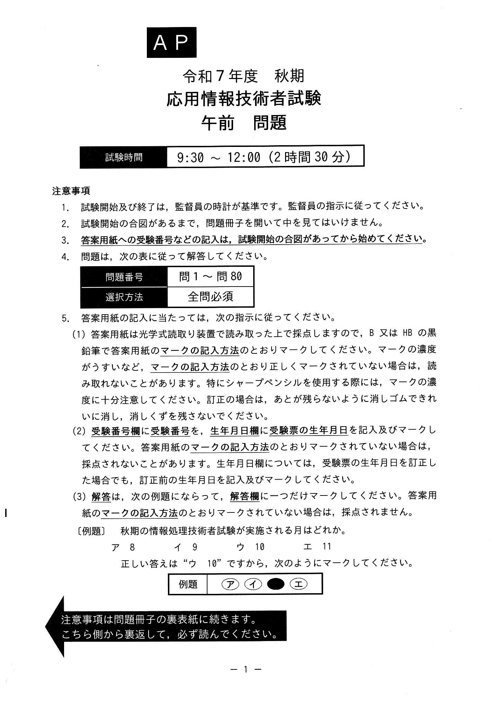

テキスト (OCR)

令和7年度 秋期
応用情報技術者試験
午前 問題

 9:30 ~ TBO) (CAE 90 2)

注意事項
1. 試験開始及び終了は, 監督貞の時計が基準です。監督具の指示に従ってください。
2. 試験開始の合図があるまで, 問題冊子を開いて中を見てはいけません。
3. 答案用紙への受験番号などの記入は, 試験開始の合図があってから始めてください。
4. 問題は, 次の表に従って解答してください。

問題番号       問1 ~ fal 80

選択方法    全間必2
5. 答案用紙の記入に当たっては, 次の指示に従ってください。

(1) 管案用紙は光学式読取り装置で読み取った上で採点しますので, B 又は HB の黒
鉛筆で答案用紙のマークの記入方法のとおりマークしてください。マークの濃度
がうすいなど, マークの記入方法のとおり正しくマークされていない場合は, 読
み取れないことがあります。特にシャープペンシルを使用する際には, マークの濃
度に十分注意してください。訂正の場合は, あとが残らないように消しゴムできれ
いに消し, 消しくずを残さないでください。

(2) 受験番号欄に受験番号を, 生年月日欄に受験票の生年月日を記入及びマークし
てください。管案用紙のマークの記入方法のとおりマークされていない場合は,
採点されないことがあります。生年月日欄については, 受験票の生年月日を訂正し
た場合でも, 訂正前の生年月日を記入及びマークしてください。

(3) 解答は, 次の例題にならって, 解答欄に一つだけマークしてください。 SRA
紙のマークの記入方法のとおりマークされていない場合は, 採点されません。
(A) 秋期の情報処理技術者試験が実施される月はどれか。

ア 8    イ 9    ウ 10    エ 11
正しい答えは“ウ 10” ですから, 次のようにマークしてください。

例題 | (ア) (で (や)

注意事項は問題冊子の裏表紙に続きます。
こちら側から裏返して, 必ず読んでください。

### ページ 2

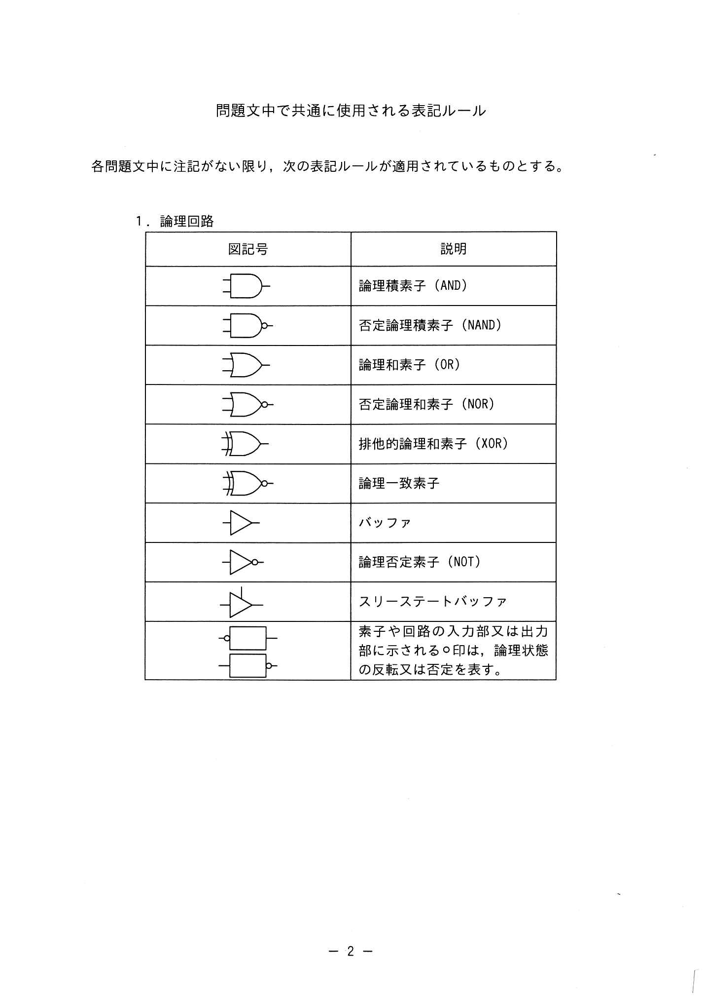

テキスト (OCR)

問題文中で共通に使用される表記ルール

各問題文中に注記がない限り, 次の表記ルールが適用されているものとする。

1 . 論理回路

4
ET
al
a

説明

論理積素子 (AND)

否定論理積素子 (NAND)

論理和素子 (OR)

否定論理和素子 (NOR)

排他的論理和素子 (XOR)

論理一致素子

バッファ

論理否定素子 (NOT)

スリーステートバッファ

素子や回路の入力部又は出力
部に示される9印は, 論理状態
の反転又は否定を表す。

LHJYIYIYMVIMMO

### ページ 3

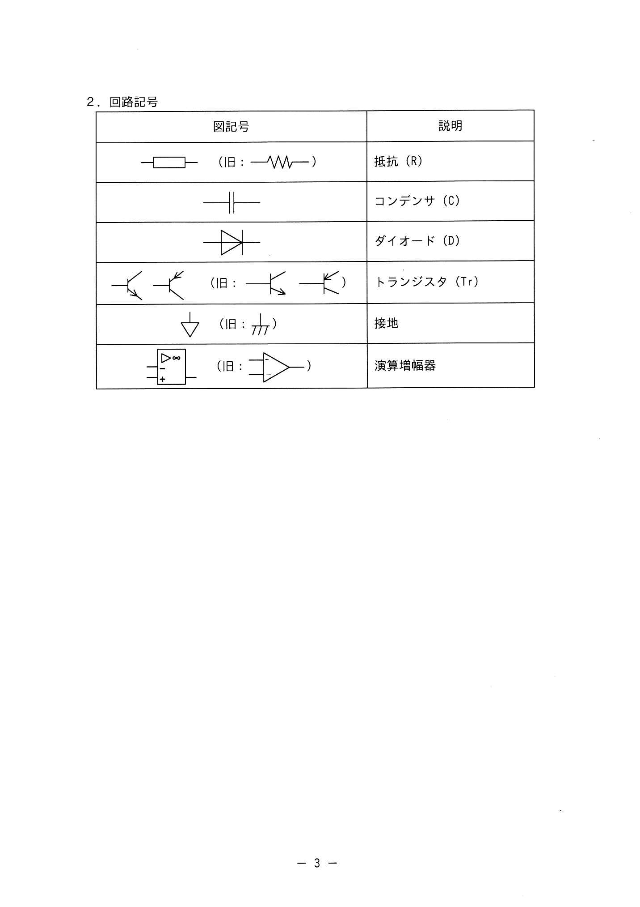

テキスト (OCR)

2. 回路記号

説明

抵抗 (R)

コンデンサ (C)

ダイオード (D)

トランジスタ (Tr)

接地

LI

(IB:

演算増幅器

### ページ 4

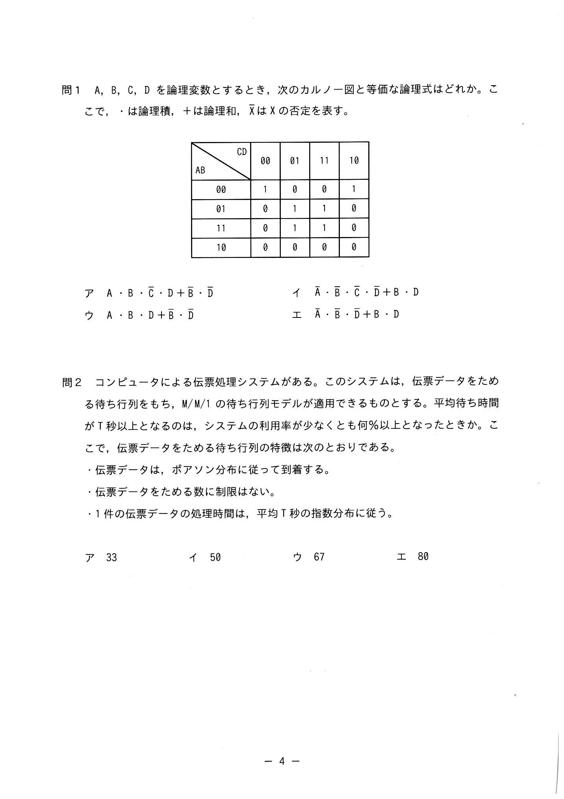

テキスト (OCR)

問1 oA, B, C, D を論理変数とするとき, 次のカルノー図と等価な論理式はどれか。こ
こで, ・は論理積, は論理和, XはXの否定を表す。

CD
00    01    11    10
AB

00       1     9     9     1

91      9    1    1    0

11      0    1    1    0

10   9 | 9 | 9 | 9
ア A・B・C・D十B・D        4 A・B・C・D十B・D
ウ A・B・D十B・D          エ A・B・D十B・D

間2 コンピュータによる伝票処理システムがある。このシステムは, 伝票データをため
る待ち行列をもち, M/M/1 の待ち行列モデルが適用できるものとする。 平均待ち時間
がT 秒以上となるのは, システムの利用率が少なくとも何%以上となったときか。こ
こで, 伝票データをためる待ち行列の特徴は次のとおりである。
・ 伝票データは, ポアソン分布に従って到着する。
・ 伝票データをためる数に制限はない。
・1 件の伝票データの処理時間は, 平均T秒の指数分布に従う。

### ページ 5

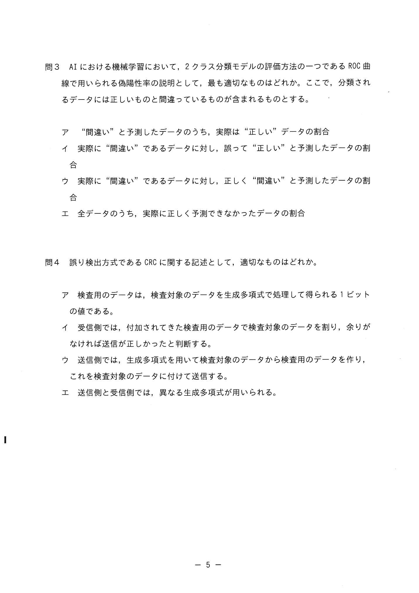

テキスト (OCR)

AS AIにおける機械学習において, 2 クラス分類モデルの評価方法の一つである ROC Hh
線で用いられる偽陽性率の説明として, 最も適切なものはどれか。ここで, 分類され
るデータには正しいものと間違っているものが含まれるものとする。

ア “BBW” と予測したデータのうち, 実際は“正しい” データの割合

イ 実際に“間違い" であるデータに対し, 誤って“正しい” と予測したデータの割
合

ウ 実際に“間違い" であるデータに対し, 正しく “間違い” と予測したデータの割
za
A

エ 全データのうち, 実際に正しく予測できなかったデータの割合

間4 誤り検出方式であるCRC に関する記述として, 適切ながものはどれか。

ア 検査用のデータは, 検査対象のデータを生成多項式で処理して得られる 1 ビット
の値である。

イ 受信側では, 付加されてきた検査用のデータで検査対象のデータを割り, 余りが
なければ送信が正しかったと判断する。

ウ 送信側では, 生成多項式を用いて検査対象のデータから検査用のデータを作り,
これを検査対象のデータに付けて送信する。

エ 送信側と受信側では, 異なる生成多項式が用いられる。

### ページ 6

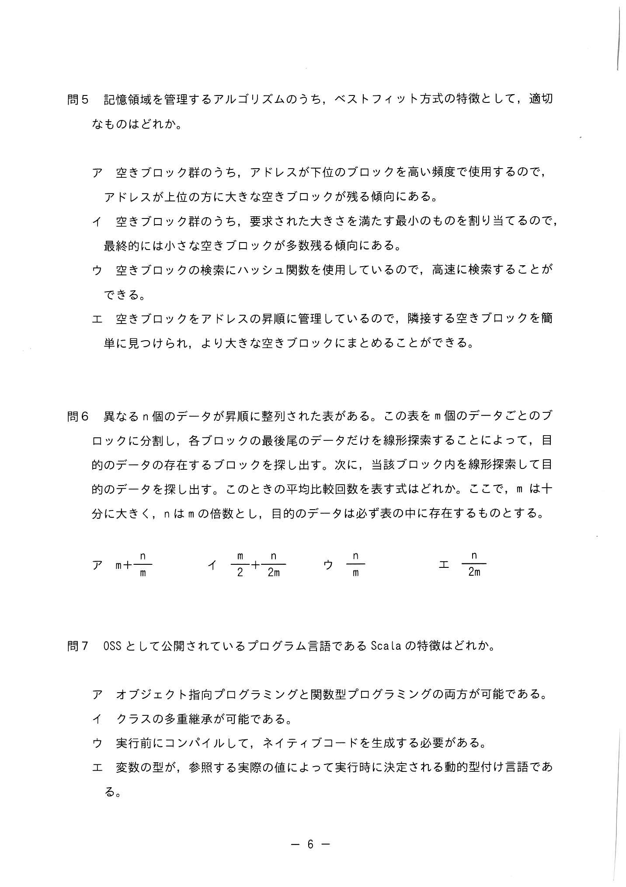

テキスト (OCR)

問5 記憶領域を管理するアルゴリズムのうち, ベストフィット方式の特徴として, 適切
なものはどれか。

ア 空きブロック群のうち, アドレスが下位のブロックを高い頻度で使用するので,
アドレスが上位の方に大きな空きブロックが残る傾向にある。

イ 空きブロック群のうち, 要求された大きさを満たす最小のものを割り当てるので,
最終的には小さな空きブロックが多数残る傾向にある。

ウ 空きブロックの検索にハッシュ関数を使用しているので, 高速に検索することが
できる。

エ 空きブロックをアドレスの昇順に管理しているので, 隣接する空きブロックを簡
単に見つけられ, より大きな空きブロックにまとめることができる。

問6 異なる n個のデータが昇順に整列された表がある。この表をm個のデータごとのブ
ロックに分割し, 各ブロックの最後尾のデータだけを線形探索することによって, 目
的のデータの存在するブロックを探し出す。次に, 当該ブロック内を線形探索して目
的のデータを探し出す。このときの平均比較回数を表す式はどれか。ここで, m は十
分に大きく, n はm の倍数とし, 目的のデータは必ず表の中に存在するものとする。

m         n                         n                                     n
2        2m                        m                                    2m

問7 0SS として公開されているプログラム言語である Scala の特徴はどれか。

に|

オブジェクト指向プログラミングと関数型プログラミングの両方が可能である。
クラスの多重継承が可能である。

実行前にコンパイルして, ネイティブコードを生成する必要がある。
変数の型が, 参照する実際の値によって実行時に決定される動的型付け言語で
る。

H DG A

### ページ 7

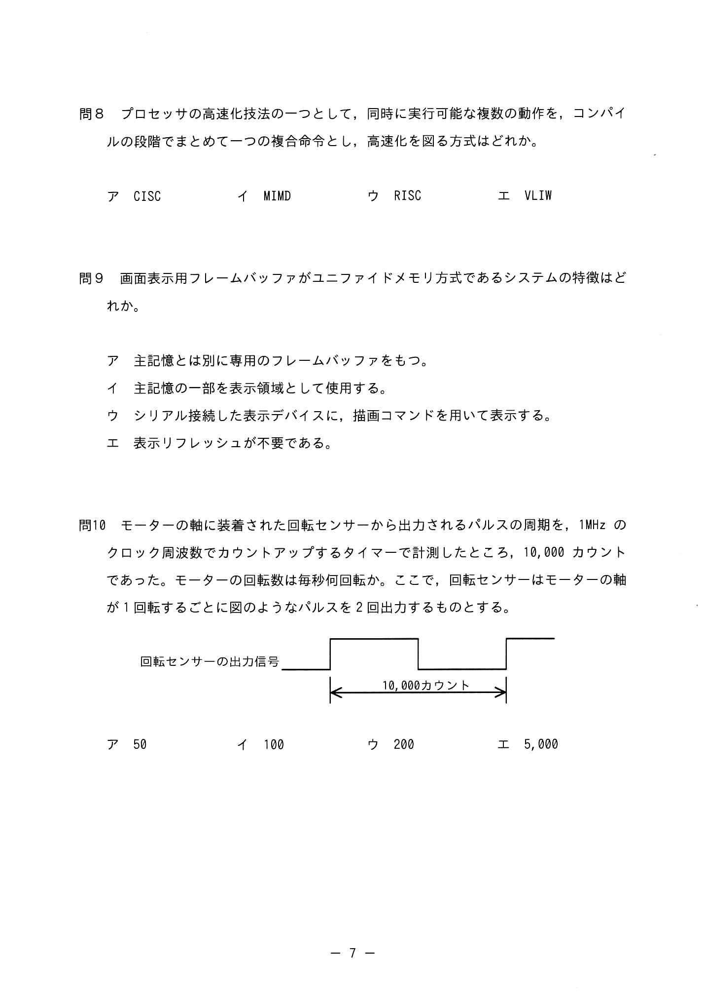

テキスト (OCR)

問8 プロセッサの高速化技法の一つとして, 同時に実行可能な複数の動作を, コンパイ
ルの段階でまとめて一つの複合命令とし, 高速化を図る方式はどれか。

ア CISC     イ MIMD     ウ RISC     エ VLIW

間9 画面表示用フレームバッファがユニファイドメモリ方式であるシステムの特徴はど
れか。

に|

主記憶とは別に専用のフレームバッファをもつ。

主記憶の一部を表示領域として使用する。

シリアル接続した表示デバイスに, 描画コマンドを用いて表示する。
表示リフレッシュが不要である。

H GA

問19 E-4Y -—OBM(CBSS HEMEL YY-—DSOHKASHSENIVAOAHME, 1MHz の
クロック周波数でカウントアップするタイマーで計測したところ, 10,000 カウント
であった。 モーターの回転数は毎秒何回転か。ここで, 回転センサーはモーターの軸
が 1 回転するごとに図のようなパルスを 2 回出力するものとする。

回転センサーの出力信号

19,999カウント

ア 50      イ 100     ウ 200     エ 5,000

### ページ 8

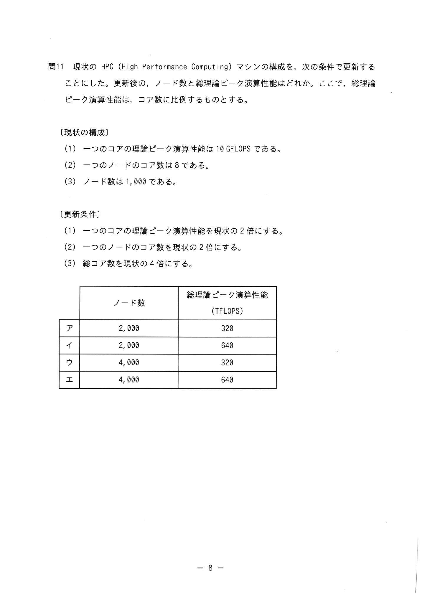

テキスト (OCR)

間11 現状の HPC (High Performance Computing) マシンの構成を, 次の条件で更新する
ことにした。 更新後の, ノード数と総理論ピーク演算性能はどれか。ここで, 総理論
ピーク演算性能は, コア数に比例するものとする。

[現状の構成

(1) 一つのコアの理論ピーク演算性能は 10 GFLOPS である。
(2) 一つのノードのコア数は 8 である。

(3) ノード数は 1,000 CHS,

〔更新条件]

(1) 一つのコアの理論ピーク演算性能を現状の 2 倍にする。
(2) 一つのノードのコア数を現状の 2 倍にする。

(3) 総コア数を現状の 4 倍にする。

-                総理論ピーク演算性能
ノード数
(TFLOPS)
ア                  2, 000                               320
4                  2, 000                               640
9                  4, 000                               320
=                 4, 000                               640

### ページ 9

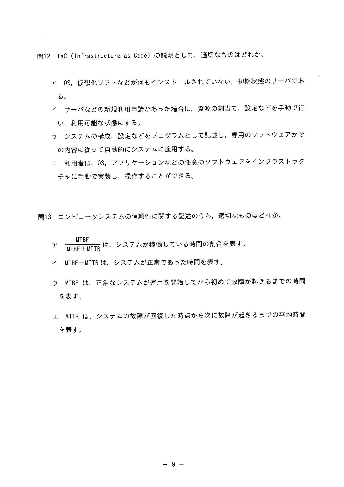

テキスト (OCR)

間12 1aC (Infrastructure as Code) の説明として, 適切なかものはどれか。

ア 0S, 仮想化ソフトなどが何もインストールされていない, 初期状態のサーバであ
る。

イ サーバなどの新規利用申請があった場合に, 資源の割当て, 設定などを手動で行
い, 利用可能な状態にする。

ウ システムの構成, 設定などをプログラムとして記述し, 専用のソフトウェアがそ
の内容に従って自動的にシステムに適用する。

エエ 利用者は, 05。 アプリケーションなどの任意のソフトウェアをインフラストラク
チャに手動で実装し, 操作することができる。

問13 コンピュータシステムの信頼性に関する記述のうち, 適切なものはどれか。

MTBF

BETMTTR は, システムが稼働している時間の割合を表す。

ア
イ MTBF一MTTR は, システムが正常であった時間を表す。

ウ MTBF は, 正常なシステムが運用を開始してから初めて故障が起きるまでの時間
を表す。

エ MTTR は, システムの故障が回復した時点から次に故障が起きるまでの平均時間
を表す。

### ページ 10

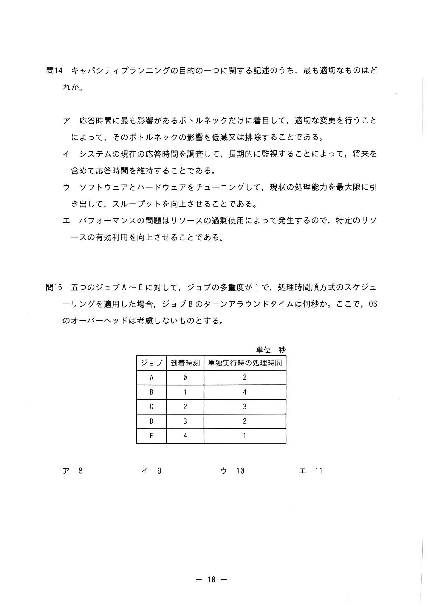

テキスト (OCR)

問14 キャパシティプランニングの目的の一つに関する記述のうち, 最も適切ながものはど
れか。

ア 応答時間に最も影響があるボトルネックだけに着目して, 適切な変更を行うこと
によって, そのボトルネックの影響を低減又は排除することである。

イ システムの現在の応答時間を調査して, 長期的に監視することによって, 将来を
含めて応答時間を維持することである。

ウ ソフトウェアとハードウェアをチューニングして, 現状の処理能力を最大限に引
き出して, スループットを向上させることである。

エエ パフォーマンスの問題はリソースの過剰使用によって発生するので, 特定のリソ
ースの有効利用を向上させることである。

間15 五つのジョブA一Eに対して, ジョブの多重度が 1 で, 処理時間順方式のスケジュ
ーリングを適用した場合, ジョブ B のターンアラウンドタイムは何秒か。ここで, 0S
のオーバーヘッドは考慮しないものとする。

単位 秒

ジョブ | 到着時刻 | 単独実行時の処理時間
A      0           2
B      1           4
C      2           3
D      3           2
E      4           1

ア 8       4 9       ウ 10       エ 11

### ページ 11

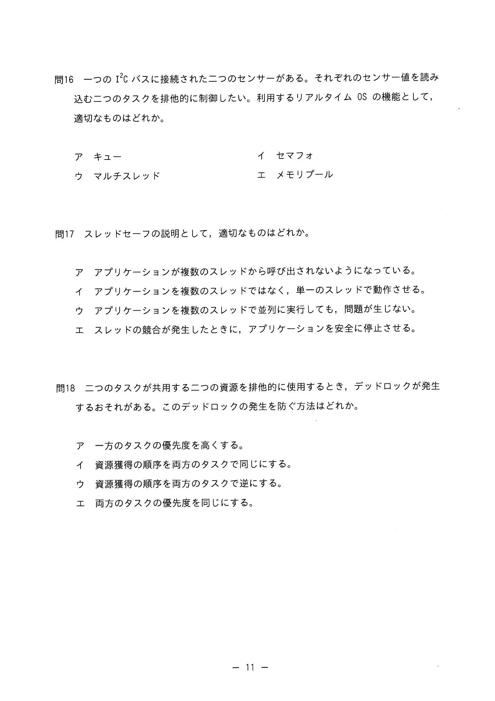

テキスト (OCR)

問16 一つの PC バスに接続された二つのセンサーがある。それぞれのセンサー値を読み
込む二つのタスクを排他的に制御したい。利用するリアルタイム 0S の機能として,
適切なものはどれか。

ア キュー              イ セマフォ
ウ マルチスレッド          エ メモリプール

間17 スレッドセーフの説明として, 適切かものはどれか。

NI

アプリケーションが複数のスレッドから呼び出されないようになっている。
アプリケーションを複数のスレッドではなく, 単一のスレッドで動作させる。
アプリケーションを複数のスレッドで並列に実行しても, 問題が生じない。
スレッドの競合が発生したときに, アプリケーションを安全に停止させる。

Hot A

B18 二つのタスクが共用する二つの資源を排他的に使用するとき, デッドロックが発生
するおそれがある。このデッドロックの発生を防ぐ方法はどれか。

N

一方のタスクの優先度を高くする。
資源獲得の順序を両方のタスクで同じにする。
資源獲得の順序を両方のタスクで逆にする。
両方のタスクの優先度を同じにする。

H ユ

### ページ 12

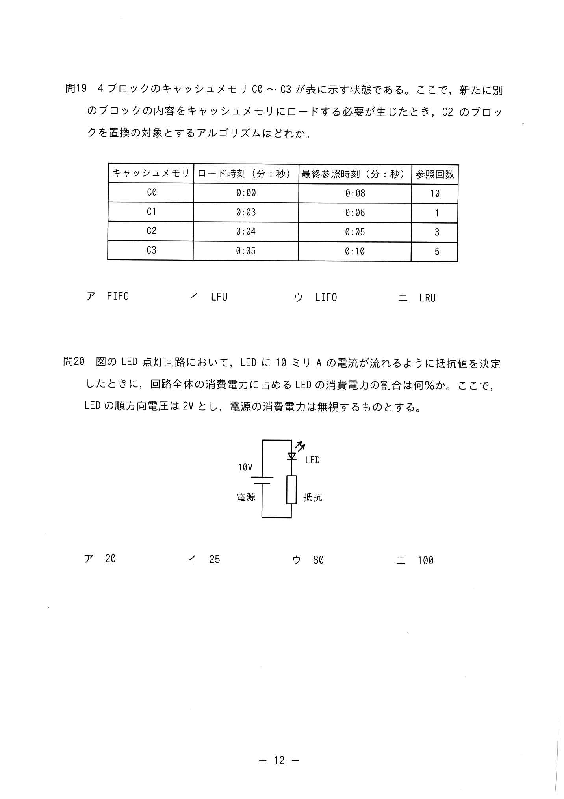

テキスト (OCR)

FAS 4 ブロックのキャッシュメモリ CO~ C2 が表に示す状態である。ここで, 新たに別
のブロックの内容をキャッシュメモリにロードする必要が生じたとき, C2 のブロッ
クを叶換の対象とするアルゴリズムはどれか。

キャッシュメモリ| ロード時刻 (分 : 秒) |最終参照時刻 (分 : 秒) | 参照回数
C9              0:00               0:08           10
C1              8:03               0:06            1
C2              0:04               0:05            3
C3              0:05               0:10            5
ア FIFO          4 LFU           ウ LIFO          エ LRU

間20 図のLED 点灯回路において, LED に 10 ミリ A の電流が流れるように抵抗値を決定
したときに, 回路全体の消費電力に占める LED の消費電力の割合は何%か。ここで,
LED の順方向電圧は 2V とし, 電源の消費電力は無視するものとする。

7a
LED
10V
電源    抵抗
ア 20     イ 25     ウ 80     エ 109

### ページ 13

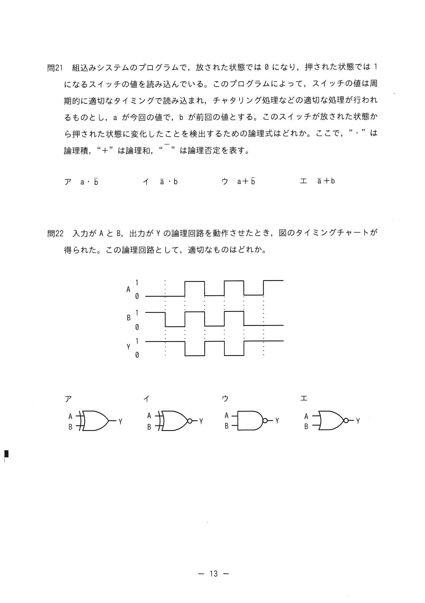

テキスト (OCR)

間21 組込みシステムのプログラムで, 放された状態では 9 になり, 押された状態では 1
になるスイッチの値を読み込んでいる。このプログラムによって, スイッチの値は周
期的に適切なタイミングで読み込まれ, チャタリング処理などの適切な処理が行われ
るものとし, a が今回の値で, b が前回の値とする。このスイッチが放された状態か

ら押された状態に変化したことを検出するための論理式はどれか。ここで, "・” は
論理積,"十" は論理和, “" "は論理否定を表す。
ア a・b     4 a:b     ウ atb     = atb

間22 入力がAとB, 出力がYの論理回路を動作させたとき, 図のタイミングチャートが
得られた。この論理回路として, 適切なものはどれか。

### ページ 14

テキスト (OCR)

問23 16 ビットのダウンカウンターを用い, カウンターの値が 9 になると割込みを発生
するハードウェアタイマーがある。カウンターに初期値として 10 進数の 150 をセッ
トしてタイマーをスタートすると, 最初の割込みが発生するまでの時間は何マイクロ
PD. CIT, タイマーの入力クロック周波数は 16 MHz を 32 分周したものとする。

ア 0.3     イ 2      ウ 150     エ 300
問24 画面サイズの制約によって, レイアウト上, 常にメニューを表示しておくことが難

しいときに使用する仕組みであって, 三本線のアイコンを選択するとメニューが表示
されるものはどれか。

ア アコーディオンメニュー      イ ドロップダウンメニュー

ウ ハンバーガーメニュー       エ ポップアップメニュー

問25 6 kHz一20kHz の帯域幅のオーディオ信号をデジタル信号に変換するのに必要な最
大のサンプリング周期を標本化定理によって求めると, 何マイクロ秒か。

ーー 14 一

### ページ 15

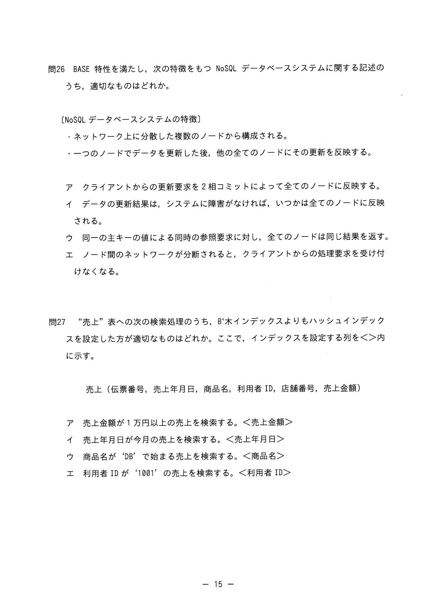

テキスト (OCR)

問26 BASE 特性を満たし, 次の特徴をもつ NoSQOL データベースシステムに関する記述の
うち, 適切ながものはどれか。

[NoSOL データベースシステムの特徴〕
・ネットワーク上に分散した複数のノードから構成される。
・一つのノードでデータを更新した後, 他の全てのノードにその更新を反映する。

ア クライアントからの更新要求を 2 相コミットによって全てのノードに反映する。

イ データの更新結果は, システムに障害がなければ, いつかは全てのノードに反映
される。

ウ 同一の主キーの値による同時の参照要求に対し, 全てのノードは同じ結果を返す。

エエ ノード間のネットワークが分断されると, クライアントからの処理要求を受け付
けなくなる。

間27 “売上" 表への次の検索処理のうち, B*木インデックスよりもハッシュインデック
スを設定した方が適切なものはどれか。ここで, インデックスを設定する列をベツ内

に示す。

売上 (伝票番号, 売上年月日, 商品名, 利用者 D, 店舗番号, 売上金額)

に|

売上金額が 1 万円以上の売上を検索する。ぐ売上金額>
売上年月日が今月の売上を検索する。ぐ売上年月日
商品名が DB"で始まる売上を検索する。ぐ商品名
利用者 ID が 1091′の売上を検索する。ぐ利用者 ID>

H GA

### ページ 16

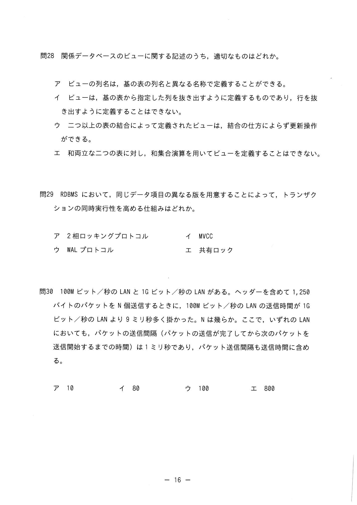

テキスト (OCR)

問28 関係データベースのビューに関する記述のうち, 適切なものはどれか。

ア ビューの列名は, 基の表の列名と異なる名称で定義むせすることができる。

イ ビューは, 基の表から指定した列を抜き出すように定義むするものであり, GER
き出すように定義むせすることはできない。

ウ ニニつ以上の表の結合によって定義されたビューは, 結合の仕方によらず更新操作
ができる。

I 和両立な二つの表に対し, 和集合演算を用いてビューを定義むせすることはできない。

間29 RDBMS において, 同じデータ項目の異なる版を用意することによって, トランザク
ションの同時実行性を高める仕組みはどれか。

ア 2相ロッキングプロトコル    イ MVCC
ウ WAL プロトコル         エ 共有ロック

間36 199M ビットノ秒の LAN と 1G ビットノ秒の LAN がある。 ヘッダーを含めて 1, 250
バイトのパケットをN 個送信するときに, 100M ビットノ秒の LAN の送信時間が 16
ビットノ/秒のLAN より 9 ミリ秒多く掛かった。N は幾らか。ここで, いずれの LAN
においても, パケットの送信間隔 (パケットの送信が完了してから次のパケットを
送信開始するまでの時間) は 1 ミリ秒であり, パケット送信間隔も送信時間に含め
る。

ア 19     イ 80     ウ 100     xX 800

### ページ 17

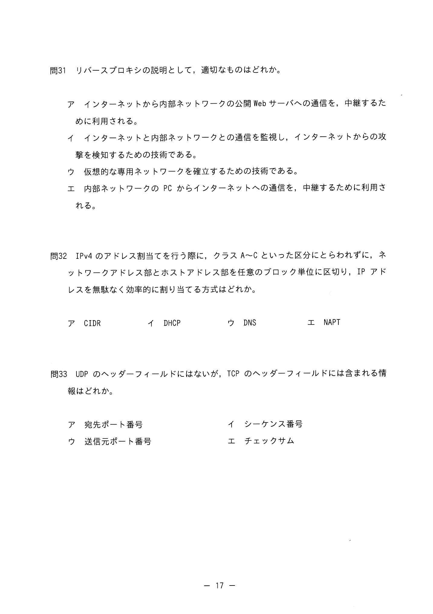

テキスト (OCR)

間31 リバースプロキシの説明として, 適切なものはどれか。

ア インターネットから内部ネットワークの公開 Web サーバへの通信を, PRISE
めに利用される。

イ インターネットと内部ネットワークとの通信を監視し, インターネットからの攻
撃を検和するための技術である。

ウ 仮想的な専用ネットワークを確立するための技術である。

エ 内部ネットワークの PC からインターネットへの通信を, 中継するために利用さ
れる。

間32 IPv4 のアドレス割当てを行う際に, クラス A一C といった区分にとらわれずに, ネ
ットワークアドレス部とホストアドレス部を任意のブロック単位に区切り, IP アド
レスを無駄なく効率的に割り当てる方式はどれか。

ア CIDR        イ DHCP        ウ DNS        エ NAPT
F433 UDP のヘッダーフィールドにはないが, TCP のヘッダーフィールドには含まれる情

報はどれか。

ア 宛先ポート番号       イ シーケンス番号
ウ 送信元ポート番号       エ チェックサム

### ページ 18

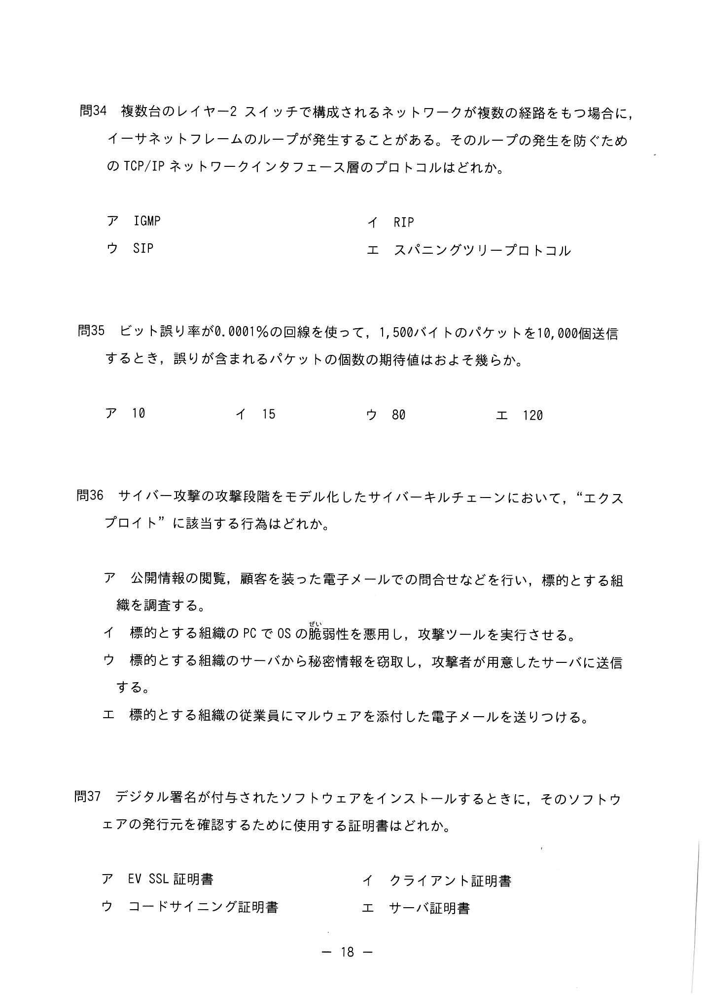

テキスト (OCR)

間34 複数台のレイヤー2 スイッチで構成されるネットワークが複数の経路をもつ場合に,
イーサネットフレームのループが発生することがある。そのループの発生を防ぐため
の TCP/IP ネットワークインタフェース層のプロトコルはどれか。

ア IGMP            4 RIP
ウ SIP             エ スパニングツリープロトコル

問35 ビット誤り率が9.9991%の回線を使って, 1,509バイトのパケットを16, 606個送信
TEER, 誤りが含まれるパケットの個数の期待値はおよそ幾らか。

ア 10     イ 15     ウ 80     エ 120

問36 サイバー攻撃の攻撃段階をモデル化したサイバーキルチェーンにおいて, “LIOR
プロイト"に該当する行為はどれか。

ア 公開情報の閲覧, 顧客を装った電子メールでの問合せなどを行い, 標的とする組
織を調査する。

イ 標的とする組織の PC で 0S の脆弱性を悪用し, 攻撃ツールを実行させる。

ウ 標的とする組織のサーバから秒密情報を初取し, 攻撃者が用意したサーバに送信
する。

エ 標的とする組織の従業員にマルウェアを添付した電子メールを送りつける。

間37 デジタル署名が付与されたソフトウェアをインストールするときに, そのソフトウ
ェアの発行元を確認するために使用する証明書はどれか。

ア EV SSL 証明書                 イ クライアント証明書
ウ コードサイニング証明書       エ サーバ証明書

### ページ 19

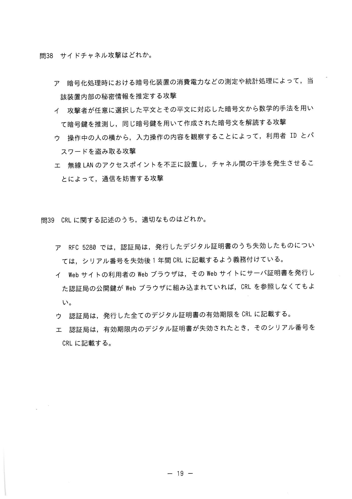

テキスト (OCR)

F938 サイドチャネル攻撃はどれか。

ア 晴号化処理時における暗号化装置の消費電力などの測定や統計処理によって, 当
該装置内部の秘密情報を推定する攻撃

イ 攻撃者が任意に選択した平文とその平文に対応した暗号文から数学的手法を用い
て暗号鍵を推測し, 同じ暗号鍵を用いて作成された暗号文を解読する攻撃

ウ 操作中の人の横から, 入力操作の内容を観察することによって, 利用者 ID とパ
スワードを盗み取る攻撃

エ 無線LANのアクセスポイントを不正に設置し, チャネル間の干渉を発生させるこ
とによって, 通信を妨害する攻撃

問39 CRL に関する記述のうち, 適切なものはどれか。

ア RFC 5280 では, 認証局は, 発行したデジタル証明書のうち失効したものについ
ては, シリアル番号を失効後 1 年間 CRL に記載するよう義務付けている。

4 Web サイトの利用者の Web ブラウザは, その Web サイトにサーバ証明書を発行し
た認証局の公開鍵が Web ブラウザに組み込まれていれば, CRL を参照しなくてもよ
い。

ウ 認証局は, 発行した全てのデジタル証明書の有効期限をCRL に記載する。

エエ 認証局は, 有効期限内のデジタル証明書が失効されたとき, そのシリアル番号を
CRL に記載する。

ー 19 一

### ページ 20

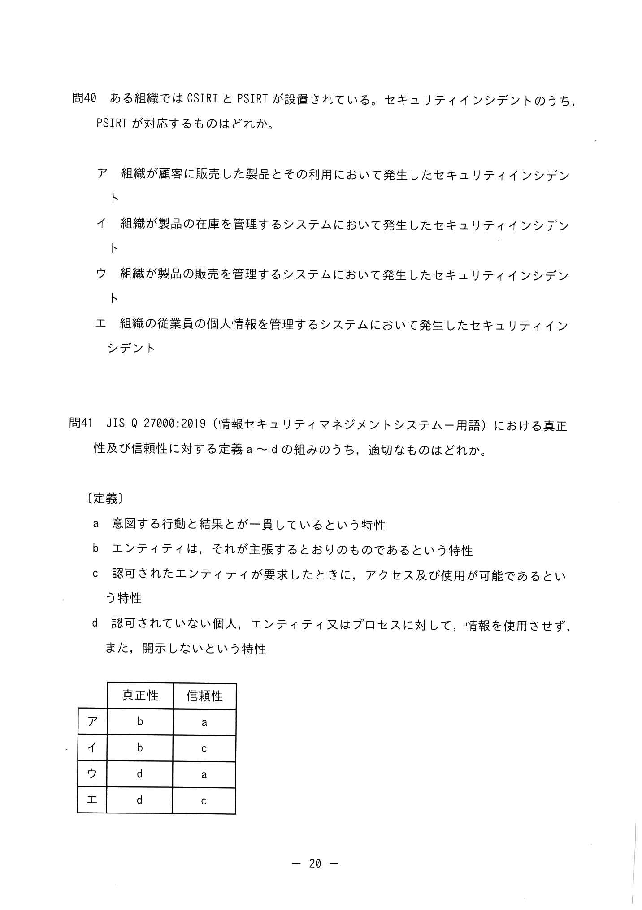

テキスト (OCR)

問40 ある組織ではCSIRT と PSIRT が設置されている。セキュリティインシデントのうち
PSIRT が対応するものはどれか。

ア 組織が顧客に販売した製品とその利用において発生したセキュリティインシデン
ト

イ 組織が製品の在庫を管理するシステムにおいて発生したセキュリティインシデン
ト

ウ 組織が製品の販売を管理するシステムにおいて発生したセキュリティインシデン
ト

エ 組織の従業員の個人情報を管理するシステムにおいて発生したセキュリティイン

シデント

問41 JIS Q 27000:2019 (情報セキュリティマネジメントシステムー用語) における真正
性及び信頼性に対する定義 a  d の組みのうち, 適切なものはどれか。

(Es)

a 意図する行動と結果とが一貫しているという特性

b エンティティは, それが主張するとおりのものであるという特性

c 認可されたエンティティが要求したときに, アクセス及び使用が可能であるとい
う特性

認可されていない個人, エンティティ又はプロセスに対して, 情報を使用させず
また, 開示しないという特性

a

真正性 | 信頼性
ア   b    a
a   b    c
ウ   d    a
エ   9    c

### ページ 21

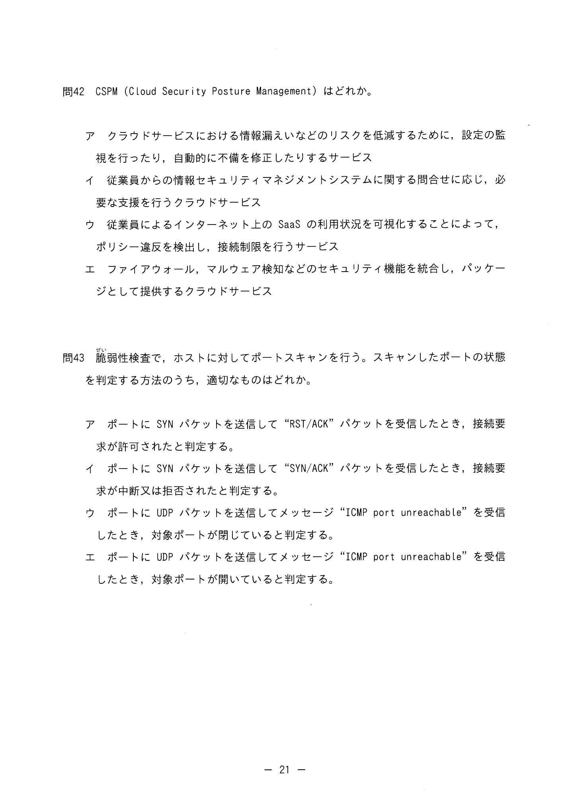

テキスト (OCR)

間42 CSPM (Cloud Security Posture Management) はどれか。

xe
fill
S
aR

ア クラウドサービスにおける情報漏えいなどのリスクを低減するために,
視を行ったり, 自動的に不備を修正したりするサービス

イ 従業員からの情報セキュリティマネジメントシステムに関する問合せに応じ, 必
要な支援を行うクラウドサービス

ウ 従業員によるインターネット上の SaaS の利用状況を可視化することによって,
ポリシー違反を検出し, 接続制限を行うサービス

エエ ファイアウォール, マルウェア検知などのセキュリティ機能を統合し, パッケー
ジとして提供するクラウドサービス

問43 脆弱性検査だ. ホストに対してポートスキャンを行う。スキャンしたポートの状態
を判定する方法のうち, 適切なものはどれか。

ア ポートに SYN パケットを送信して “RST/ACK”" パケットを受信したとき, 接続要
求が許可されたと判定する。

イ ポートに SYN パケットを送信して “SYN/ACK” パケットを受信したとき, BRE
求が中断又は拒否されたと判定する。

ウ ポートに UP パケットを送信してメッセージ “ICMP port unreachable”を受信
したとき, 対象ポートが閉じていると判定する。

エ ポートに UP パケットを送信してメッセージ “ICMP port unreachable”を受信
したとき, 対象ポートが開いていると判定する。

### ページ 22

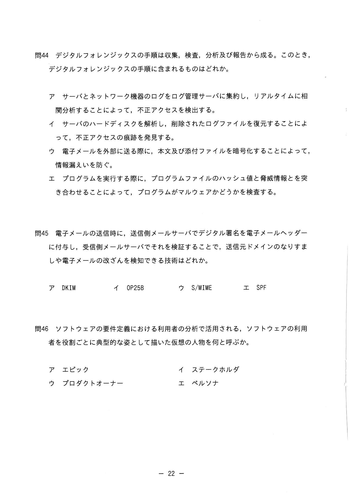

テキスト (OCR)

間44 デジタルフォレンジックスの手順は収集, RA, 分析及び報告から成る。このとき,
デジタルフォレンジックスの手順に含まれるものはどれか。

ア サーバとネットワーク機器のログをログ管理サーバに集約し, リアルタイムに相
関分析することによって, 不正アクセスを検出する。

イ サーバのハードディスクを解析し, 削除されたログファイルを復元することによ
って, 不正アクセスの痕跡を発見する。

ウ 電子メールを外部に送る際に, 本文及び添付ファイルを暗号化することによって,
情報漏えいを防ぐ。

エ プログラムを実行する際に, プログラムファイルのハッシュ値と脅威情報とを突
き合わせることによって, プログラムがマルウェアかどうかを検査する。

問45 電子メールの送信時に, 送信側メールサーバでデジタル署名を電子メールヘッダー
に付与し, 受信側メールサーバでそれを検証することで, 送信元ドメインのなりすま
しや電子メールの改ざんを検知できる技術はどれか。
ア DKIM     イ 0P25B    ウ S/MIME    エ SPF

問46 ソフトウェアの要件定義における利用者の分析で活用される, ソフトウェアの利用

者を役割ごとに典型的な姿として描いた仮想の人物を何と呼ぶか。

ア エピック             イ ステークホルダ
ウ プロダクトオーナー        エ ペルソナ

### ページ 23

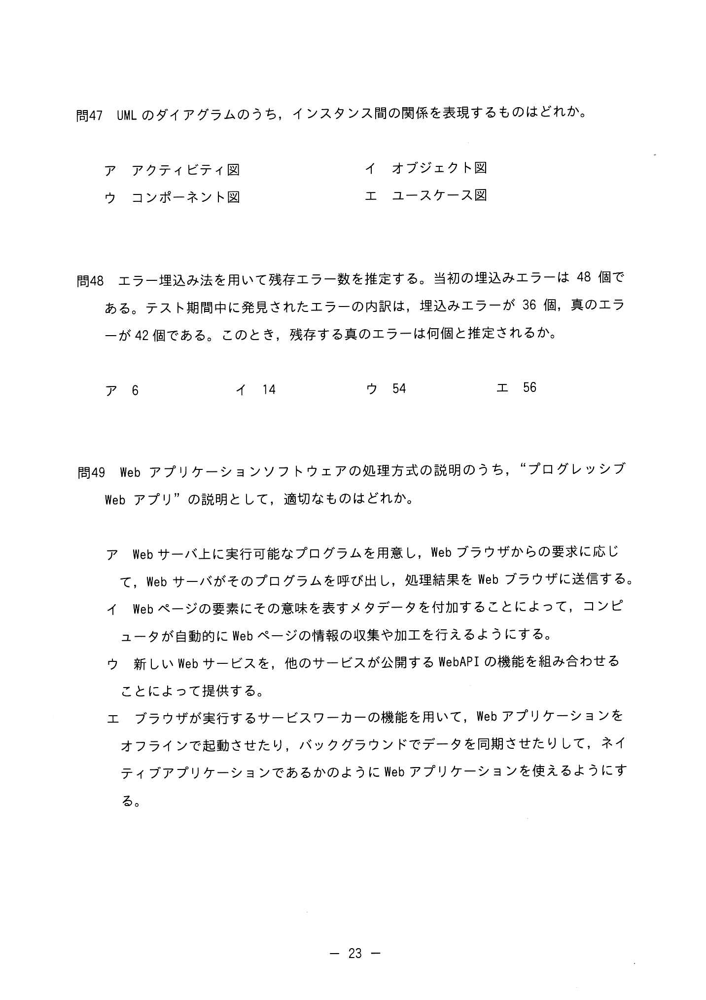

テキスト (OCR)

間47 UML のダイアグラムのうち, インスタンス間の関係を表現するものはどれか。

|

イ オブジェクト図
エ ユースケース図

SI
NI
NY
MI
x
re
MI

Nig
日
4
PA
|
区 a
マン
テ HX
図

問48 エラー埋込み法を用いて残存エラー数を推定する。 当初の埋込みエラーは 48 個で
ある。テスト期間中に発見されたエラーの内訳は, 埋込みエラーが 36 個, 真のエラ
ーーが 42 個である。 このとき, 残存する真のエラーは何個と推定されるか。

イ 14      ウ 54      x= 56

に
の

間49 Web アプリケーションソフトウェアの処理方式の説明のうち, “プログレッシブ
Web アプリ" の説明として, 適切なものはどれか。

ア Web サーバ上に実行可能なプログラムを用意し, Web ブラウザからの要求に応じ
て, Web サーバがそのプログラムを呼び出し, 処理結果を Web ブラウザに送信する。

イ Web ページの要素にその意味を表すメタデータを付加することによって, AVE
ュータガが自動的に Web ページの情報の収集や加工を行えるようにする。

ウ 新しい Web サービスを, 他のサービスが公開する WebAP1 の機能を組み合わせる
ことによって提供する。

エエ ブラウザが実行するサービスワーカーの機能を用いて, Web アプリケーションを
オフラインで起動させたり, バックグラウンドでデータを同期させたりして, ネイ
ティブアプリケーションであるかのように Web アプリケーションを使えるようにす
る。

### ページ 24

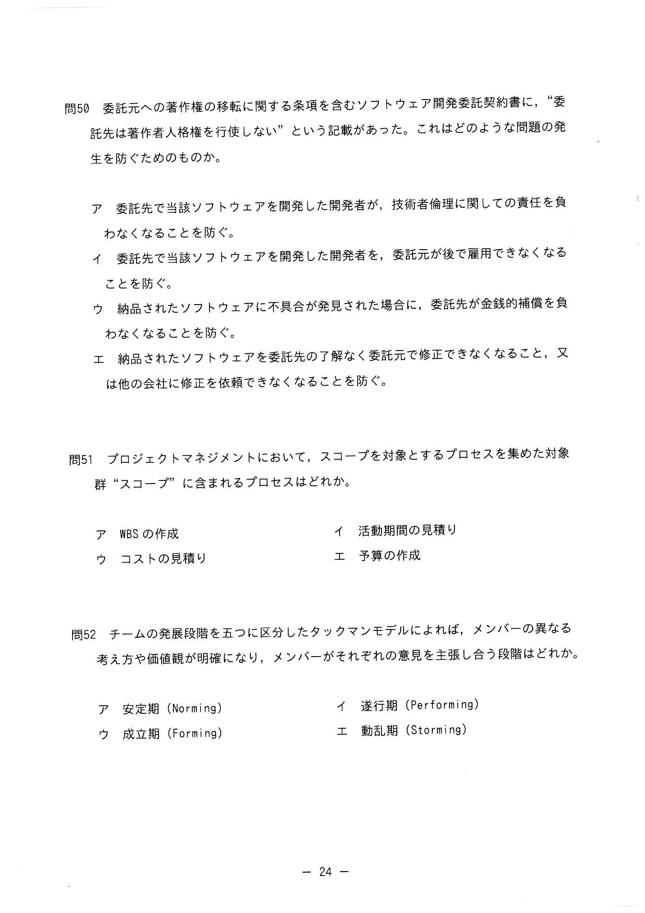

テキスト (OCR)

間59 委託元への著作権の移転に関する条項を含むソフトウェア開発委旗契約書に, “委
託先は著作者人格権を行使しない” という記載があった。これはどのよう な問題の発
生を防ぐためのものか。

ア 委託先で当該ソフトウェアを開発した開発者が, 技術者倫理に関しての責任を負
わなくなることを防ぐ。

イ 委託先で当該ソフトウェアを開発した開発者を, 委託元が後で雇用できなくなる
ことを防ぐ。

ウ 納品されたソフトウェアに不具合が発見された場合に, 委託先が金銭的補償を負
わなくなることを防ぐ。

エ 納品されたソフトウェアを委託先の了解なく委託元で修正できなくなること, X
は他の会社に修正を依頼できなくなることを防ぐ。

問51 プロジェクトマネジメントにおいて, スコープを対象とするプロセスを集めた対象

群 “スコープ"に含まれるプロセスはどれか。

ア WBS の作成                       4 活動期間の見積り

ウ コストの見積り        エ 予算の作成

間52 チームの発展段階を五つに区分したタックマンモデルによれば, メンバーの異なる

考え方や価値観が明確になり, メンバーがそれぞれの意見を主張し合う段階はどれか。

ア 安定期 (Norming)          イ 遂行期 (Performing)

ウ 成立期 (Forming)          エ 動乱期 (Storming)

ー 24 一

### ページ 25

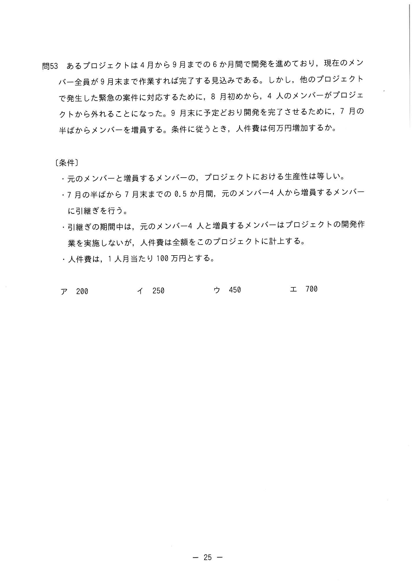

テキスト (OCR)

問53 あるプロジェクトは 4 月から 9 月までの6 か月間で開発を進めており, 現在のメン
バー全員が 9 月末まで作業すれば完了する見込みである。 しかし, 他のプロジェクト
で発生した緊急の案件に対応するために, 8 月初めから, 4 人のメンバーがプロジェ
クトから外れることになった。9 月末に予定どおり開発を完了させるために, 7 月の
半ばからメンバーを増員する。 条件に従うとき, 人件費は何万円増加するか。

(REI
・ 元のメンバーと増員するメンバーの, プロジェクトにおける生産性は等しい。
- 7 月の半ばから 7 月末までの 0.5 か月間, 元のメンバー4 人から増上員するメ ンバー
に引継ぎを行う。
・引継ぎの期間中は, 元のメンバー4 人と増員するメンバーはプロジェクトの開発作
業を実施しないが, 人件費は全額をこのプロジェクトに計上する。
・人件費は, 1 人月当たり 100 万円とする。

ア 200     イ 250     ウ 450     エ 700

### ページ 26

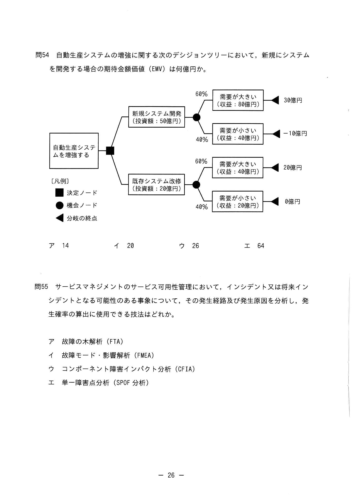

テキスト (OCR)

間54 自動生産システムの増強に関する次のデシジョンツリーにおいて, 新規にシステム
を開発する場合の期待金額価値 (EMV) は何億円か。

60%

需要が大きい                ー
Gas : borers) | 008

新規システム開発
(投資額 : 56億円)

露要が小さい   |-—~<@ ー16億円

40% | (収益 : 46億円)
自動生産システ
ムを増強する              60%
Co | 需要が大きい  q 20185
(収益 : 408K FS)    j
(ABI        既存システム改修
cae ps       (投資額 : 26億円)
め  グ*ー
Mixes           需要が小さい | 4 oes
@ 携会ノード          40% | (収益 : 26億円)   -
< sikoes
ア 14     イ 29     ウ 26     エ 64

問55 サービスマネジメントのサービス可用性管理において, インシデント又は将来イン
シデントとなる可能性のある事象について, その発生経路及び発生原因を分析し, 発
生確率の算出に使用できる技法はどれか。

|

故障の木解析 (FTA)

故障モード・影響解析 (FMEA)

コンポーネント障害インパクト分析 (CFIA)
単一障害点分析 (SPOF 分析)

H ユ

### ページ 27

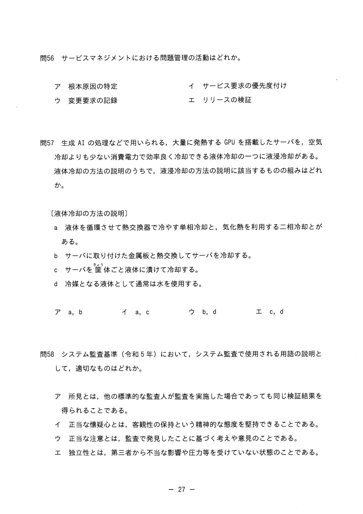

テキスト (OCR)

FSS サービスマネジメントにおける問題管理の活動はどれか。

ア 根本原因の特定          イ サービス要求の優先度付け
ウ 変更要求の記録          エ リリースの検証

問57 生成 AI の処理などで用いられる, 大量に発熱する GPU を搭載したサーバを, 空気
冷却よりも少ない消費電力で効率良く冷却できる液体冷却の一つに液浸冷却がある。
液体冷却の方法の説明のうちで, 液浸冷却の方法の説明に該当するものの組みはどれ
か。

(液体冷却の方法の説明〕

a 液体を循環させて熱交換器で冷やす単相冷却と, 気化熱を利用する二相冷却とが
ある。

b サーバに取り付けた金属板と熱交換してサーバを冷却する。

c サーバを 穫 体ごと液体に漬けて冷却する。

d 冷媒となる液体として通常は水を使用する。

NI

a, b   イ ac   ウ b, d   エ c, d

58 システム監査基準 (令和5年) において, システム監査で使用される用語の説明と
して, 適切なものはどれか。

ア 所見とは, 他の標準的な監査人が監査を実施した場合であっても同じ検証結果を
得られることである。

イ 正当な懐疑心とは, 客観性の保持という精神的な態度を堅持できることである。
ウ 正当な注意とは, 監査で発見したことに基づく考えや意見のことである。

エ 独立性とは, 第三者から不当な影響や圧力等を受けていない状態のことである。

### ページ 28

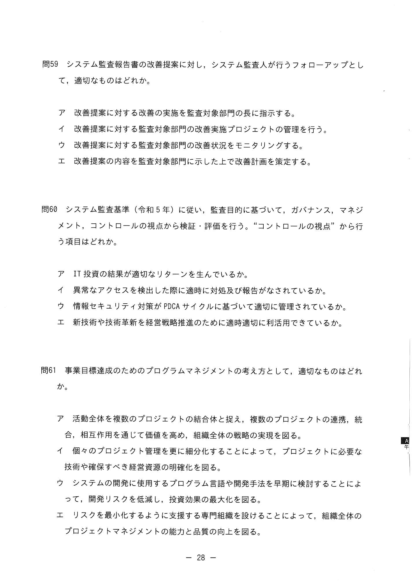

テキスト (OCR)

問59 システム監査報告書の改善提案に対し, システム監査人が行うフォローアップとし
て, 適切なものはどれか。

NI

改善提案に対する改善の実施を監査対象部門の長に指示する。

改善提案に対する監査対象部門の改善実施プロジェクトの管理を行う。
改善提案に対する監査対象部門の改善状況とをモニタリングする。

改善提案の内容を監査対象部門に示した上で改善計画を策定する。

Hos ユ

問69 システム監査基準 (令和5年) に従い, 監査目的に基づいて, ガバナンス, マネジ
メント, コントロールの視点から検証・評価を行う。"コントロールの視点" から行
う項目はどれか。

に|

IT 投資の結果が適切なリターンを生んでいるか。

4 異常なアクセスを検出した際に適時に対処及び報告がなされているか。

ウ 情報セキュリティ対策が PDCA サイクルに基づいて適切に管理されているか。
エ 新技術や技術革新を経営戦略推進のために適時適切に利活用できているか。

間61 事業目標達成のためのプログラムマネジメントの考え方として, 適切なものはどれ
か。

ア 活動全体を複数のプロジェクトの結合体と捉え, 複数のプロジェクトの連携, 統
合, 相互作用を通じて価値を高め, 組織全体の戦略の実現を図る。

4 個々のプロジェクト管理を更に細分化することによって, プロジェクトに必要な
技術や確保すべき経営資源の明確化を図る。

ウ システムの開発に使用するプログラム言語や開発手法を早期に検討することによ
って, 開発リスクを低減し, 投資効果の最大化を図る。

エエ リスクを最小化するように支援する専門組織を設けることによって, 組織全体の
プロジェクトマネジメントの能力と品質の向上を図る。

_ +8

### ページ 29

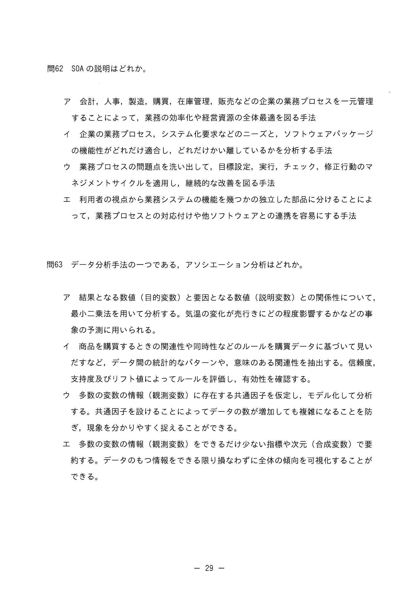

テキスト (OCR)

間62 SOA の説明はどれか。

ア SH, AS, 製造, 購買, 在庫管理, 販売などの企業の業務プロセスを一元管理
することによって, 業務の効率化や経営資源の全体最適を図る手法

イ 企業の業務プロセス, システム化要求などすのニーズと, ソフトウェアパッケージ
の機能性がどれだけ適合し, どれだけかい離しているかを分析する手法

ウ 業務プロセスの問題点を洗い出して, 目標設定, 実行, チェック, 修正行動のマ
ネジメントサイクルを適用し, 継続的な改善を図る手法

エ 利用者の視点から業務システムの機能を幾つかの独立した部品に分けることによ
って, 業務プロセスとの対応付けや他ソフトウェアとの連携を容易にする手法

間63 データ分析手法の一つである, アソシエーション分析はどれか。

ア 結果となる数値 (目的変数) と要因となる数値 (説明変数) との関係性について,
最小二乗法を用いて分析する。 気温の変化が売行きにどの程度影響するかなどの事
象の予測に用いられる。

イ 商品を購買するときの関連性や同時性などのルールを購買データに基づいて見い
だすなど, データ間の統計的なパターンや, 意味のある関連性を抽出する。 信頼度
支持度及びリフト値によってルールを評価し, 有効性を確認する。

ウ 多数の変数の情報 (観測変数) に存在する共通因子を仮定し, モデル化して分析
する。 共通因子を設けることによってデータの数が増加しても複雑になることを防
ぎ, 現象を分かりやすく捉えることができる。

エ 多数の変数の情報 (観測変数) をできるだけ少ない指標や次元 (合成変数) CB
約する。データのもっつ情報をできる限り損なわずに全体の傾向を可視化することが

### ページ 30

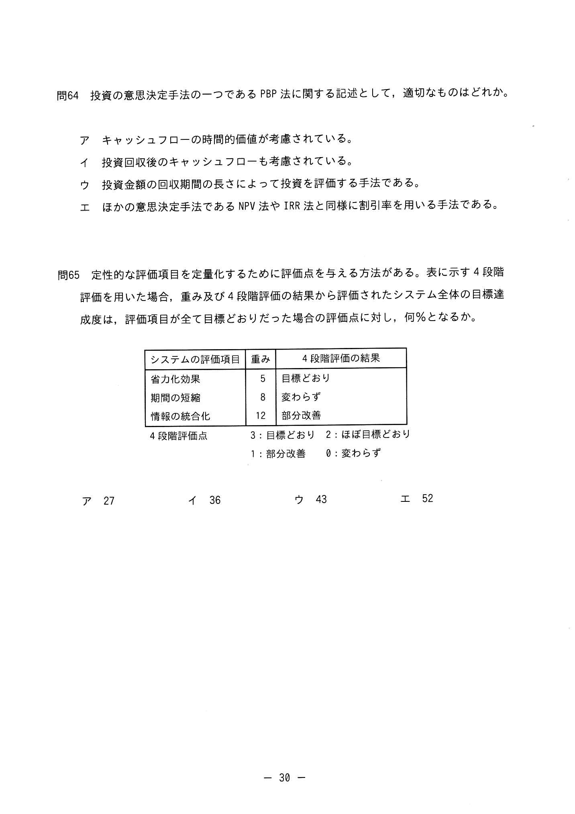

テキスト (OCR)

問64 投資の意思決定手法の一つである PBP 法に関する記述として, 適切なものはどれか。

NI

キャッシュフローの時間的価値が考慮されている。

投資回収後のキャッシュフローも考慮されている。

投資金額の回収期間の長さによって投資を評価する手法である。

ほかの意思決定手法である NPV 法や IRR 法と同様に割引率を用いる手法である。

H GX

間65 定性的な評価項目を定量化するために評価点を与える方法がある。表に示す 4 段階
評価を用いた場合, 重み及び 4 段階評価の結果から評価されたシステム全体の目標達
成度は, 評価項目が全て目標どおりだった場合の評価点に対し, 何%となるか。

システムの評価項目 | 重み      4 段階評価の結果

省力化効果            5 | 目標どおり

期間の短縮            8 | 変わらず

情報の統合化          12 | 部分改善

4 段階評価点         3 : 目標どおり 2 : ほぼ目標どおり

1 : 部分改善 。 0 :変わらず

### ページ 31

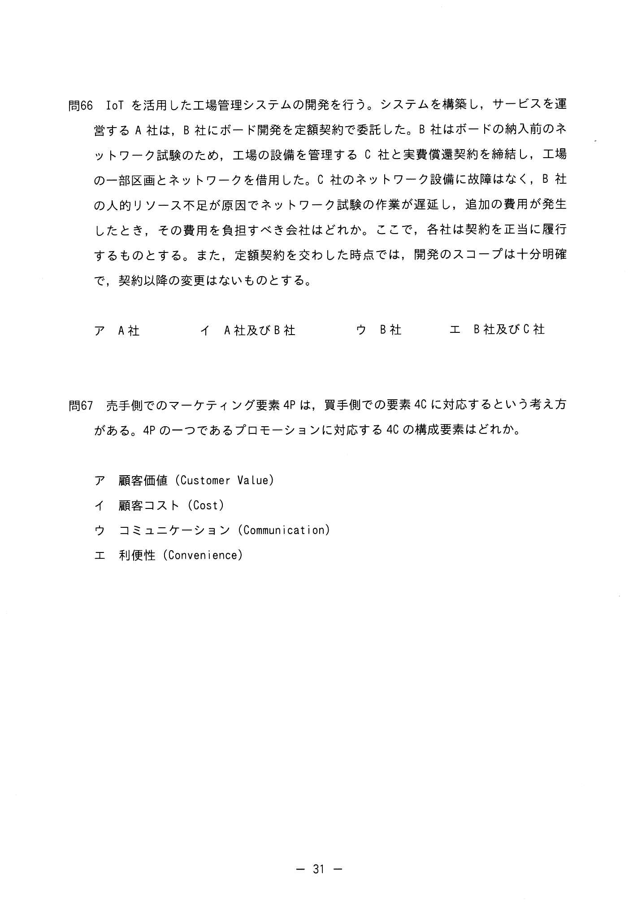

テキスト (OCR)

間66 1oT を活用した工場管理システムの開発を行う。システムを構築し, サービスを運
営する A 社は, B 社にボード開発を定額契約で委託した。B 社はボードの納入前のネ
ットワーク試験のため, 工場の設備を管理する C 社と実費償且契約を締結し, 工場
の一部区画とネットワークを借用した。C 社のネットワーク設備に故障はなく, B 社
の人的リソース不足が原因でネットワーク試験の作業が遅延し, 追加の費用が発生
したとき, その費用を負担すべき会社はどれか。 ここで, 各社は契約を正当に履行
するものとする。 また, 定額契約を交わした時点では, 開発のスコープは十分明確
で, 契約以降の変更はないものとする。

ア A社    4 A社及びB社    ウ B社   エ B社及び(社

間67 売手側でのマーケティング要素 4P は, 買手側での要素 4C に対応するという考え方
がある。4P のーーつであるプロモーションに対応する 4C の構成要素はどれか。

NI

顧客価値 (Customer Value)
顧客コスト (Cost)
コミュニケーション (Communication)

利便性 (Convenience)

H GN

### ページ 32

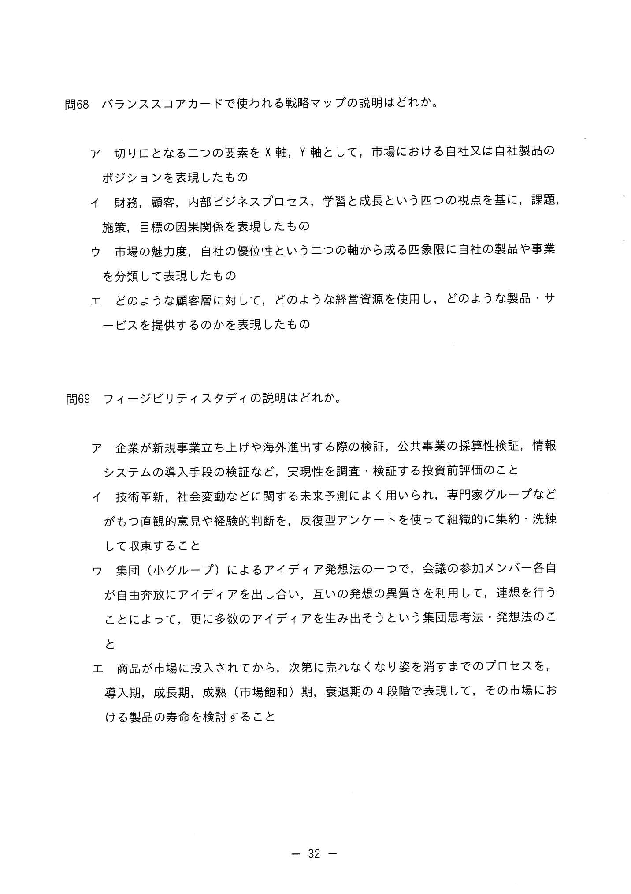

テキスト (OCR)

PIES バランススコアカードで使われる戦略マップの説明はどれか。

ア 切り口となる二つの要素を XM, Y 軸として, 市場における自社又は自社製品の
ポジションを表現したもの

4 財務, BS, 内部ビジネスプロセス, 学習と成長という四つの視点を基に, 課題,
施策, 目標の因果関係を表現したもの

ウ 市場の魅力度, 自社の優位性という二つの軸から成る四象限に自社の製品や事業
を分類して表現したもの

エ どのような顧客層に対して, どのような経営資源を使用し, どのような製品・サ
ービスを提供するのかを表現したもの

間69 フィージビリティスタディの説明はどれか。

ア 企業が新規事業立ち上げや海外進出する際の検証, 公共事業の採算性検証, 情報
システムの導入手段の検証など, 実現性を調査・検証する投資前評価のこと

4 技術革新, 社会変動などに関する未来予測によく用いられ, 専門家グループなど
がもつ直観的意見や経験的判断を, 反復型アンケートを使って組織的に集約・洗練
して収束すること

ウ 集団 (小グループ) によるアイディア発想法のーつで, 会議の参加メンバー各自
が自由奉放にアイディアを出し合い, 互いの発想の異質さを利用して, 連想を行う
ことによって, 更に多数のアイディアを生み出そうという集団思考法・発想法のこ
と

エ 商品が市場に投入されてから, 次第に売れなくなり姿を消すまでのプロセスを,
導入期, 成長期, 成熟 (市場飽和) 期, 衰退期の 4 段階で表現して, その市場にお
ける製品の寿命を検討すること

### ページ 33

テキスト (OCR)

間76 図のアンゾフの成長マトリクスのうち, 市場浸透戦略の例として, 適切なものはど
れか。

製品
既存                                                 新規
既存                市場浸透戦略                       新製品開発戦略
市場
新規              新市場開拓戦略                         多角化戦略

ア ある商品が高いシェアを確保したため, 最近の技術開発の成果を取り入れた上位
機種を, 既存のユーザー向けに販売する。

イ ある地域において特別価格で販売することで, 商品の知名度を上げ, その地域の
多くの住民に販売する。

ウ ある地方で長年販売してきた商品を, 今年から他の地方でも販売する。

エ 販売実績がないある国の商習慣に合う製品を一から開発し, その国で販売する。

間71 生産事業所のシステムを, 生産計画などの計画層, 各指示や工程管理・製造管理な
どの実行層, 機械・機器の制御を行う制御層の三つの層に大きく分けたとき, MES が
運用される層はどれか。

|

計画層              イ 実行層
ウ 制御剛              エ 計画層・実行層・制御層

### ページ 34

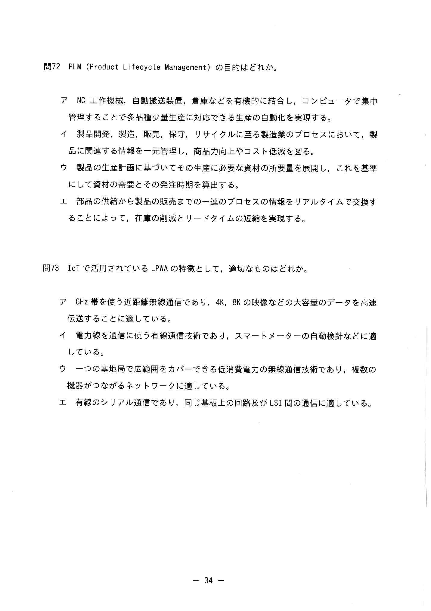

テキスト (OCR)

問72 PLM (Product Lifecycle Management) の目的はどれか。

ア NC 工作機械, 自動搬送装置, 倉庫などを有機的に結合し, コンピュータで集中
管理することで多品種少量生産に対応できる生産の自動化を実現する。

イ 製品開発, 製造, 販売, AT, リサイクルに至る製造業のプロセスにおいて, 製
品に関連する情報を一元管理し, 商品力向上やコスト低減を図る。

ウ 製品の生産計画に基づいてその生産に必要な資材の所要量を展開し, これを基準
にして資材の需要とその発注時期を算出する。

エ 部品の供給から製品の販売までの一連のプロセスの情報をリアルタイムで交換す
ることによって, 在庫の削減とリードタイムの短縮を実現する。

間73 1oT で活用されている LPWA の特徴として, 適切なものはどれか。

ア GHz 帯を使う近距離無線通信であり, 4K, 8K の映像などの大容量のデータを高速
伝送することに適している。

イ 電力線を通信に使う有線通信技術であり, スマートメーターの自動検針などに適
している。

ウ 一つの基地局で広範囲をカバーできる低消費電力の無線通信技術であり, 複数の
機器がつながるネットワークに適している。

エ 有線のシリアル通信であり, 同じ基板上の回路及び LSI 間の通信に適している。

### ページ 35

テキスト (OCR)

問74 ある工場で扱っている部品 ヵ は, 使用量 (BE) が一定であり, 定量発注方式を採
用して発注されている。この場合の経済的発注量は, グラフの年間の発注費と, 年間
の保管費が等しくなったときの値を計算することで求めることができる。表の条件の
場合の経済的発注量を求めよ。ここで, 部品Aに関する安全在庫は考慮しないものと
する。

年間需要量                                                              100, 000 個
1 個当たりの年間保管費 (金利を含む)                       1,000 円
1 回当たりの発注費用 (発注量に関係ない)                  5, 000 円

費
用
年間総費用
年間の
eS
年間の             保管費
経済的発注量     一回当たりの
発注量
ア 10     4 200     ウ 500     エ 1,000

### ページ 36

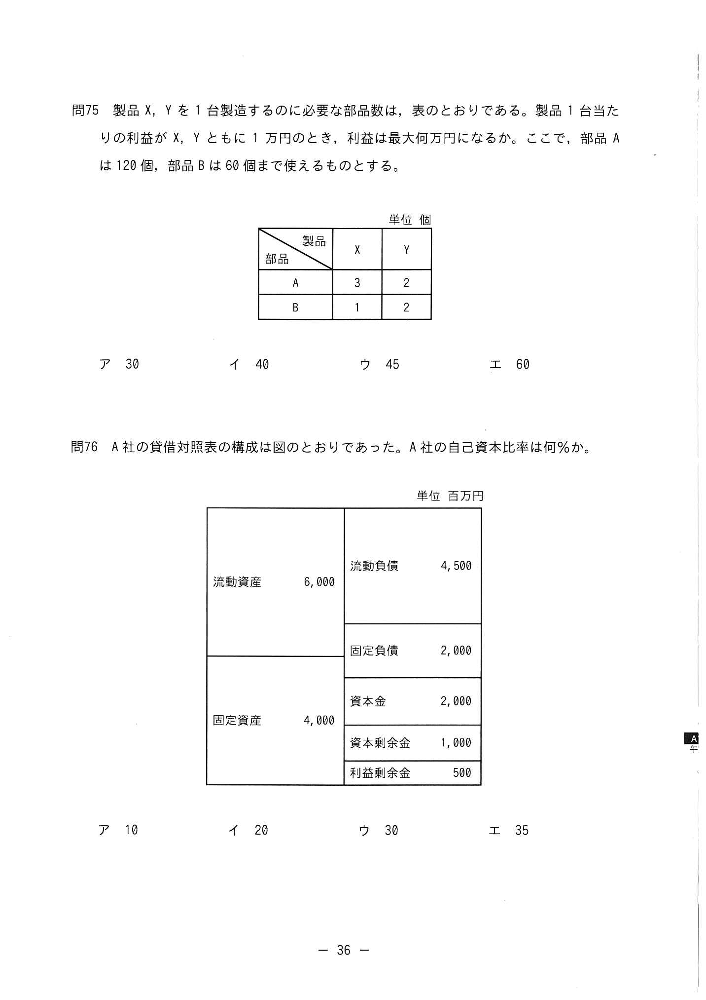

テキスト (OCR)

問75 製品X%,Yを1台製造するのに必要な部品数は, 表のとおりである。製品 1 台当た
りの利益が X, Y ともに 1 万円のとき, 利益は最大何万円になるか。ここで, 部品 A
(£120 個, 部品B は60 個まで使えるものとする。

単位 個
製品
X   0
部品
A   3   2
B    1   2
ア 30      イ 40      ウ 45      x 60

間76 A社の貸借対照表の構成は図のとおりであった。A 社の自己資本比率は何%か。

単位 百万円
流動負債         4, 500
流動資産         6, 000
固定負債         2, 000
資本金           2, 000
固定資産         4,000
資本剰余金      1, 000
利益剰余金           500

30              エ 35

NI
S
x
nO
S
a

### ページ 37

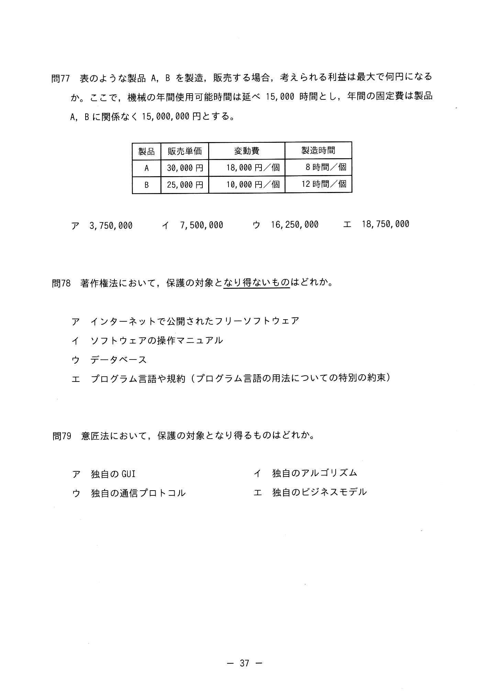

テキスト (OCR)

間77 表のような製品 A, B を製造, MAT SRA, 考えられる利益は最大で何円になる
か。ここで, 機械の年間使用可能時間は延べ 15,000 時間とし, 年間の固定費は製品
A, Bに関係なく 15,000, 999 円とする。

製品 | 販売単価         RHR           製造時間
A | 39,690円      18, 000 円/個       8 時間個
B | 25,000 A      10, 000 円個      12 時間ノ個

ア 3,750, 000        イ 7,500, 000        ウ 16, 250, 000       エ 18, 750, 000

間78 著作権法において, 保護の対象となり得ないものはどれか。

ア インターネットで公開されたフリーソフトウェア

イ ソフトウェアの操作マニュアル

ウ データベース

エエ プログラム言語や規約 (プログラム言語の用法についての特別の約束)

間79 意匠法において, 保護の対象となり得るものはどれか。

ア REO GU            イ 独自のアルゴリズム
ウ 独自の通信プロトコル            エ 独自のビジネスモデル

### ページ 38

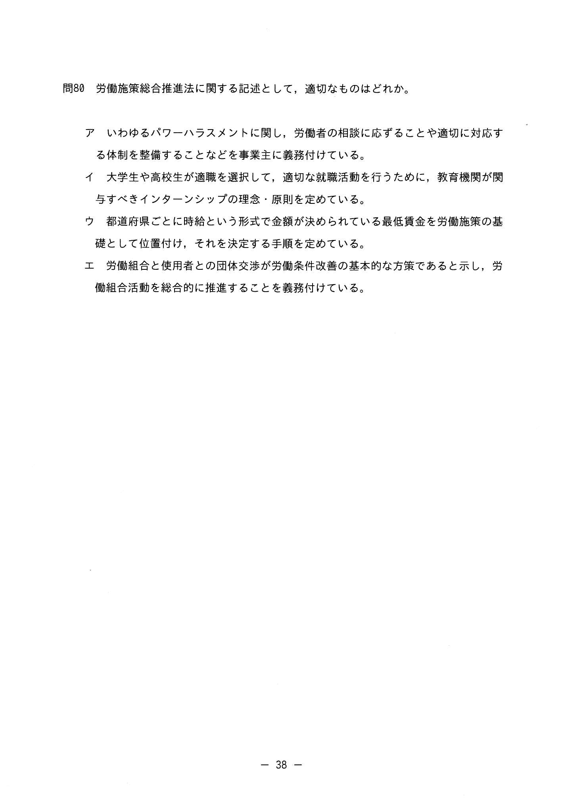

テキスト (OCR)

間86 労働施策総合推進法に関する記述として, 適切なものはどれか。

ア いわゆるパワーハラスメントに関し, 労働者の相談に応ずることや適切に対応す
る体制を整備することなどを事業主に義務付けている。

イ 大学生や高校生が適職を選択して, 適切な就職活動を行うために, 教育機関が関
与すべきインターンシップの理念・原則を定めている。

ウ 都道府県ごとに時給という形式で金額が決められている最低賃金を労働施策の基
礎として位置付け, それを決定する手順を定めている。

エ 労働組合と使用者との団体交渉が労働条件改善の基本的な方策であると示し, 労
働組合活動を総合的に推進することを義務付けている。

### ページ 39

テキスト (OCR)

C

メ モ 用 紙 J

### ページ 40

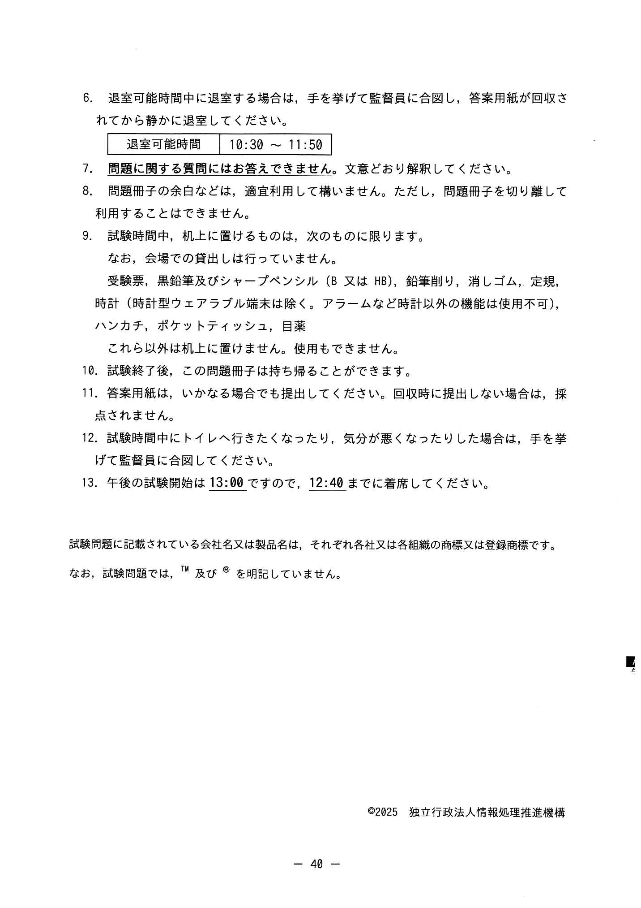

テキスト (OCR)

6. 退室可能時間中に退室する場合は, 手を挙げて監督具に合図し, 答案用紙が回収さ
れてから静かに退室してください。
退室可能時間 | 10:30 ~ 11:50 |
7. 問題に関する質問にはお答えできません。文意どおり解釈してください。
8. 問題冊子の余白などは, 適宜利用して構いません。ただし, 問題冊子を切り離して
利用することはできません。
9. 試験時間中, 机上に置けるものは, 次のものに限ります。
なお, 会場での貸出しは行っていません。
BRS, 黒鉛筆及びシャープペンシル (B 又は HB), 鉛筆削り, 消しゴム, 定規
時計 (時計型ウェアラブル端末は除く。アラームなど時計以外の機能は使用不可),
ハンカチ, ポケットティッシュ, BR
これら以外は机上に置けません。使用もできません。
10. 試験終了後, この問題冊子は持ち帰ることができます。
11. 答案用紙は, いかなる場合でも提出してください。回収時に提出しない場合は, 採
点されません。
12. 試験時間中にトイレへ行きたくなったり, 気分が悪くなったりした場合は, FAB
げて監督貞に合図してください。
13. 午後の試験開始は 13:00 ですので, 12:40 までに着席してください。

試験問題に記載されている会社名又は製品名は, それぞれ各社又は各組織の商標又は登録商標です。

なお, 試験問題では, " Ru © を明記していません。

@2025 独立行政法人情報処理推進機構

---

## 午前解答

©2025 独立行政法人情報処理推進機構 
令和7 年度 秋期 応用情報技術者試験 解答例 
 
午前試験 
問番号
正解
分野
問1 
エ 
Ｔ 
問2 
イ 
Ｔ 
問3 
イ 
Ｔ 
問4 
ウ 
Ｔ 
問5 
イ 
Ｔ 
問6 
イ 
Ｔ 
問7 
ア 
Ｔ 
問8 
エ 
Ｔ 
問9 
イ 
Ｔ 
問10 
ア 
Ｔ 
問11 
イ 
Ｔ 
問12 
ウ 
Ｔ 
問13 
ア 
Ｔ 
問14 
イ 
Ｔ 
問15 
エ 
Ｔ 
問16 
イ 
Ｔ 
問17 
ウ 
Ｔ 
問18 
イ 
Ｔ 
問19 
エ 
Ｔ 
問20 
ア 
Ｔ 
 
 
問番号
正解
分野
問21 
ア 
Ｔ 
問22 
ウ 
Ｔ 
問23 
エ 
Ｔ 
問24 
ウ 
Ｔ 
問25 
ウ 
Ｔ 
問26 
イ 
Ｔ 
問27 
エ 
Ｔ 
問28 
ア 
Ｔ 
問29 
イ 
Ｔ 
問30 
ウ 
Ｔ 
問31 
ア 
Ｔ 
問32 
ア 
Ｔ 
問33 
イ 
Ｔ 
問34 
エ 
Ｔ 
問35 
エ 
Ｔ 
問36 
イ 
Ｔ 
問37 
ウ 
Ｔ 
問38 
ア 
Ｔ 
問39 
エ 
Ｔ 
問40 
ア 
Ｔ 
 
 
問番号
正解
分野
問41 
ア 
Ｔ 
問42 
ア 
Ｔ 
問43 
ウ 
Ｔ 
問44 
イ 
Ｔ 
問45 
ア 
Ｔ 
問46 
エ 
Ｔ 
問47 
イ 
Ｔ 
問48 
イ 
Ｔ 
問49 
エ 
Ｔ 
問50 
エ 
Ｔ 
問51 
ア 
Ｍ 
問52 
エ 
Ｍ 
問53 
ウ 
Ｍ 
問54 
ア 
Ｍ 
問55 
ア 
Ｍ 
問56 
ア 
Ｍ 
問57 
イ 
Ｍ 
問58 
エ 
Ｍ 
問59 
ウ 
Ｍ 
問60 
イ 
Ｍ 
 
 
問番号
正解
分野
問61 
ア 
Ｓ 
問62 
エ 
Ｓ 
問63 
イ 
Ｓ 
問64 
ウ 
Ｓ 
問65 
イ 
Ｓ 
問66 
ウ 
Ｓ 
問67 
ウ 
Ｓ 
問68 
イ 
Ｓ 
問69 
ア 
Ｓ 
問70 
イ 
Ｓ 
問71 
イ 
Ｓ 
問72 
イ 
Ｓ 
問73 
ウ 
Ｓ 
問74 
エ 
Ｓ 
問75 
ウ 
Ｓ 
問76 
エ 
Ｓ 
問77 
イ 
Ｓ 
問78 
エ 
Ｓ 
問79 
ア 
Ｓ 
問80 
ア 
Ｓ 
 
 
分野の「Ｔ」はテクノロジ系，「Ｍ」はマネジメント系，「Ｓ」はストラテジ系の問題です。

---

## 午後問題

### ページ 1

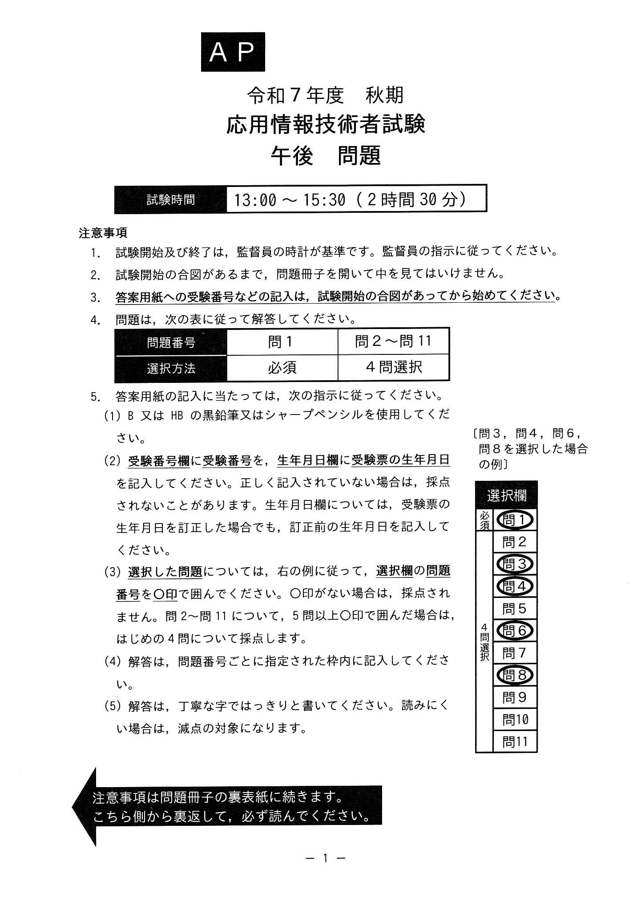

テキスト (OCR)

令和7年度 秋期
応用情報技術者試験
午後 問題

| www 3:00 ~ 15:50 (2508 304)

注意事項

xs の DO >

mn

注意事項は問題冊子の裏表紙に続きます。
こちら側から裏返して, 必ず読んでください。

試験開始及び終了は, 監督貞の時計が基準です。監督貞の指示に従ってください。

試験開始の合図があるまで, 問題冊子を開いて中を見てはいけません。

答案用紙への受験番号などの記入は, 試験開始の合図があってから始めてください。

間題は, 次の表に従って解答してください。
問題番号          問 1         fa] 2 ~ fej 11
選択方法               DAS                4 問選択
答案用紙の記入に当たっては, 次の指示に従ってください。

(1) B 又は HB の黒鉛筆又はシャープペンシルを使用してくだ
さい。

(2) 受験番号欄に受験番号を, 生年月日欄に受験票の生年月日
を記入してください。正しく記入されていない場合は, 採点
されないことがあります。 生年月日欄については, 受験票の
生年月日を訂正した場合でも, 訂正前の生年月日を記入して
ください。

(3) 選択した問題については, 右の例に従って, 選択棚の問題
番号を〇印で囲んでください。〇印がない場合は, 採点され
ません。 間 2一問 11 について, 5 問以上〇印で囲んだ場合は,
はじめの 4 問について採点します。

(4) 解答は, 問題番号ごとに指定された枠内に記入してくださ
い。

(5) 解答は, 丁寧な字ではっきりと書いてください。 読みにく
い場合は, 減点の対象になります。

〔問
fal

3, 問4, 問6,
8 を選択した場合

の例]

選択欄

須

言わ

fa] 2

### ページ 2

### ページ 3

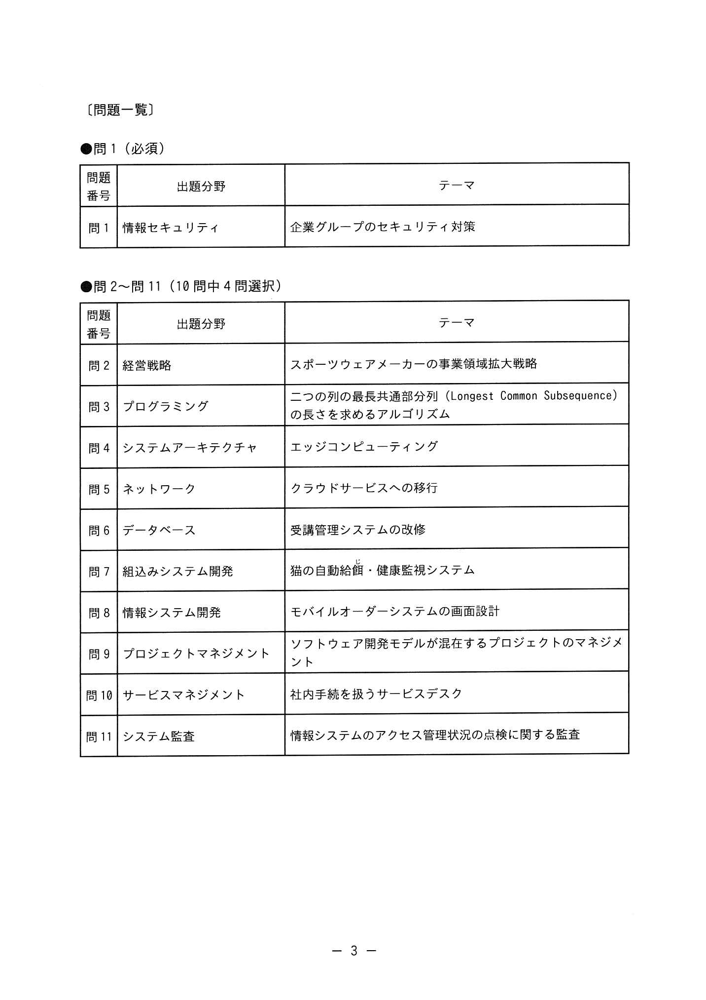

テキスト (OCR)

〔問題一覧]

人@問1 (必須)
問題     出題分野                 テーマ
番号
問 1 | 情報セキュリティ      企業グループのセキュリティ対策
休問 2一問 11 (10 問中 4 問選択)
Ma          出題分野                               テーマ
番号
問 2 | 経営戦略          スポーツウェアメーカーの事業領域拡大戦略
ar             ニニつの列の最長共通部分列 (Longest Common Subsequence)
Me | PAM e see            の長さを求めるアルゴリズム
間4 |システムアーキテクチャ   エッジコンピューティング
間5 |ネットワーク        クラウドサービスへの移行
間6 | データベース        受講管理システムの改修
問 7 | 組込みシステム開発        猫の自動給偽・健康監視システム
間 8 | 情報システム開発      モバイルオーダーシステムの画面設計
ere | Fis o RRO ESR  PF UP
問19 | サービスマネジメント    社内手続を抜うサービスデスク

間11

システム監査

情報システムのアクセス管理状況の点検に関する監査

### ページ 4

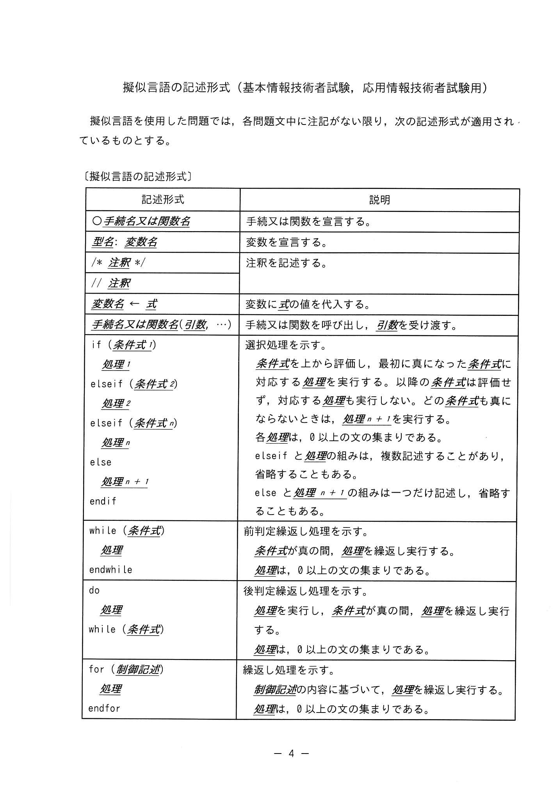

テキスト (OCR)

擬似言語の記述形式 (基本情報技術者試験, 応用情報技術者試験用)

擬似言語を使用した問題では, 各問題文中に注記がない限り, 次の記述形式が適用され・

ているものとする。

〔擬似言語の記述形式

記述形式                       説明
OF EXILE       手続又は関数を宣言する。
BE: BRE           変数を宣言する。
/* SERR */                注釈を記述する。
// ER
BRE — Xt             BRU HOIWEKAT S.
FRE RIE HK, …) | 手続又は関数を呼び出し, WHERE.
if (Rx?)              選択処理を示す。
$B 1             Rte EDO OMML, BMICRIC Go kRA aI
elseif (KAzxt2         対応する女下を実行する。 UMOKAMAP Gt
MEE 2             ず, WHT SMBERTLEY., CORMFAtAK
elseif (Mixes)             ならないときは, Mn + eRTTS,
ME n             SMBS, 9 以上の文の集まりである。
sise                elseif ¢MBOMAlS, 複数記述することがあり,
MB 41               省略することもある。
ae                  else ¢MHn+1OMAl-DKEGIRL, 省略す
ることもある。
while (zt)          前判定繰返し処理を示す。
ME               RAADROM, MBeGRLRATS.
endwhi le              MBS, 9 以上の文の集まりである。
do                  後判定繰返し処理を示す。
BEES              MBERIITL, RAARROM, MEx BR LRA
while (zt)            する。
MBS, 9 以上の文の集まりである。
for ( @i/ifzc zt)          繰返し処理を示す。
BLE               MACAO ABIBIWC, MBRBSRLEAtTS.
endfor              MBS, 9 以上の文の集まりである。

### ページ 5

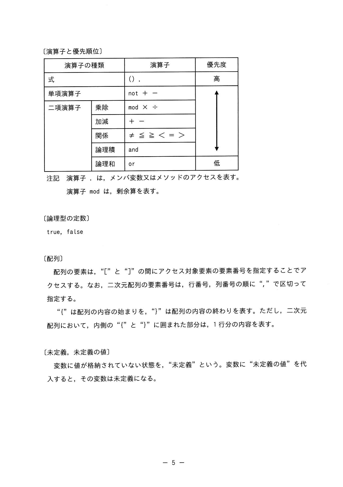

テキスト (OCR)

(演算子と優先順位]

演算子の種類         演算子       優先度

式               () .               高
単項演算子         not + 一
二項演算子 | 乗除    mod X +

加減    + 一

関係    #8582<=°>

論理積 | and

論理和 | or                低

注記 演算子 ld, メンバ変数又はメソッドのアクセスを表す。
WHF mod は, 剰余算を表す。

〔論理型の定数〕

true, false

〔配列
配列の要素は, “[” と “)” の間にアクセス対象要素の要素番号を指定することでア

クセスする。なお, 二次元配列の要素番号は, 行番号, 列番号の順に “.” で区切って
指定する。

“{” は配列の内容の始まりを, "は配列の内容の終わりを表す。ただし, OKT
配列において, AMO “{” と 9” に囲まれた部分は, 1 行分の内容を表す。

(AEB, 未定義の値]
変数に値が格納されていない状態を, “未定義”という。変数に “未定義の値" を代
入すると, その変数は未定義になる。

### ページ 6

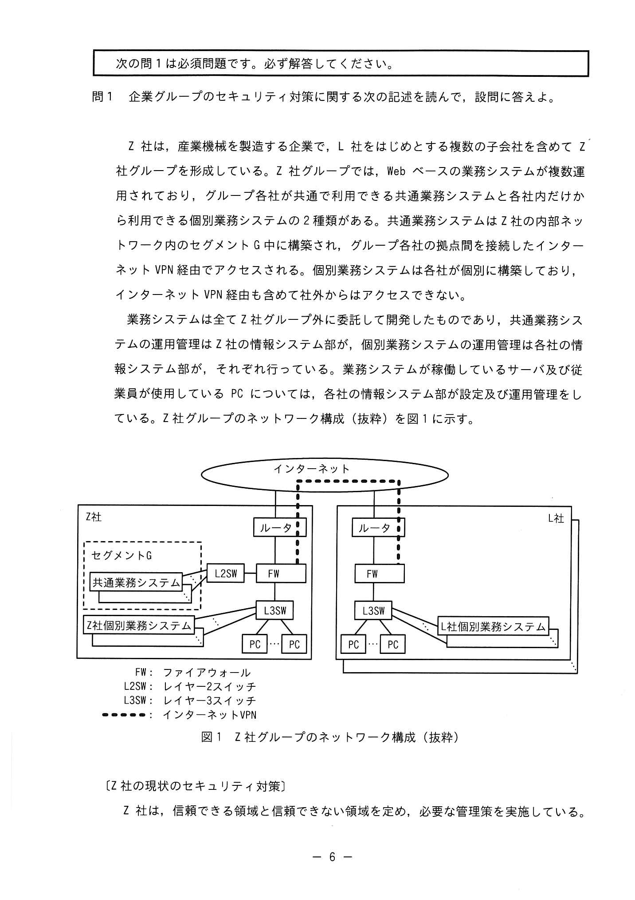

テキスト (OCR)

ROB 1 は必須問題です。必ず解答してください。

fal 1

企業グループのセキュリティ対策に関する次の記述を読んで, 設問に答えよ。

Z 社は, 産業機械を製造する企業で, L 社をはじめとする複数の子会社を含めて ZL
社グループを形成している。Z 社グループでは, Web ベースの業務システムが複数運
用されており, グループ各社が共通で利用できる共通業務システムと各社内だけか
ら利用できる個別業務システムの 2 種類がある。 共通業務システムは Z 社の内部ネッ
トワーク内のセグメント G中に構築され, グループ各社の拠点問を接続したインター
ネット VPN 経由でアクセスされる。 個別業務システムは各社が個別に構築しており,
インターネット VPN 経由も含めて社外からはアクセスできない。

業務システムは全て Z 社グループ外に委託して開発したものであり, 共通業務シス
テムの運用管理は Z 社の情報システム部が, 個別業務システムの運用管理は各社の情
報システム部が, それぞれ行っている。 業務システムが稼働しているサーバ及び従
業員が使用している PC については, 各社の情報システム部が設定及び運用管理をし
ている。Z 社グループのネットワーク構成 (抜粋) を図 1 に示す。

インターネット

z-2引| | bz                oar

FW: ファイアウォール
L2SW: レイヤー2スイッチ
L3SW: レイヤー3スイッチ

==ーこここ: インターネットVPN

図1 Z社グループのネットワーク構成 (抜粋)

〔Z 社の現状のセキュリティ対策〕
Z 社は, 信頼できる領域と信頼できない領域を定め, 必要な管理策を実施している。

ー 6一

### ページ 7

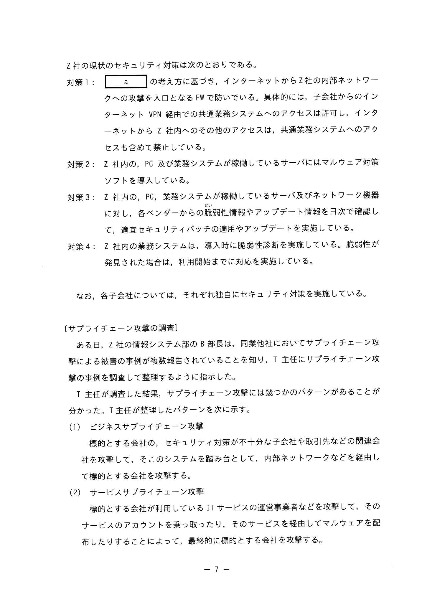

テキスト (OCR)

7 社の現状のセキュリティ対策は次のとおりである。

対策1: [a | の考え方に基づき, インターネットからZ社の内者ネットワー
クへの攻撃を入口となる FW で防いでいる。具体的には, 子会社からのイン
ターネット VPN 経由での共通業務システムへのアクセスは許可し, インタ
ーネットから Z 社内へのその他のアクセスは, 共通業務システムへのアク
セスも含めて禁止している。

対策 2: 7 社内の,PC 及び業務システムが稼働しているサーバにはマルウェア対策
ソフトを導入している。

対策 3 : Z 社内の, PC, 業務システムが稼働しているサーバ及びネットワーク機器
に対し, 各ベンダーからの脆性情報やアップデート情報を日次で確認し
て, 適宜セキュリティパッチの適用やアップデートを実施している。

対策 4: Z 社内の業務システムは, 導入時に脆弱性診断を実施している。脆弱性が
発見された場合は, 利用開始までに対応を実施している。

なお, 各子会社については, それぞれ独自にセキュリティ対策を実施している。

〔サプライチェーン攻撃の調査〕

HSA, Z 社の情報システム部の B 部長は, 同業他社においてサプライチェーン攻
撃による被害の事例が複数報告されていることを知り, T 主任にサプライチェーン攻
撃の事例を調査して整理するように指示した。

T 主任が調査した結果, サプライチェーン攻撃には幾つかのパターンがあることが
分かった。T 主任が整理したパターンを次に示す。

(1) ビジネスサプライチェーン攻撃
標的とする会社の, セキュリティ対策が不十分な子会社や取引先などの関連会
社を攻撃して, そこのシステムを踏み台として, 内部ネットワークなどを経由し
て標的とする会社を攻撃する。

(2) サービスサプライチェーン攻撃
標的とする会社が利用している IT サービスの運営事業者などを攻撃して, その
サービスのアカウントを乗っ取ったり, そのサービスを経由してマルウェアを配
布したりすることによって, 最終的に標的とする会社を攻撃する。

ー7ー

### ページ 8

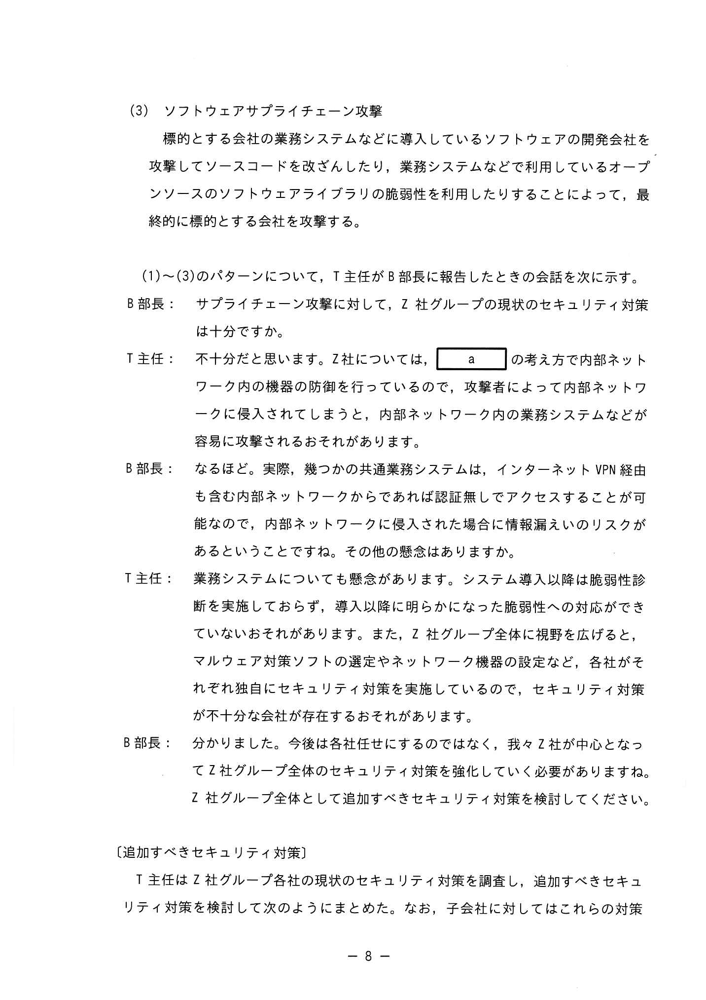

テキスト (OCR)

(3) ソフトウェアサプライチェーン攻撃
標的とする会社の業務システムなどに導入しているソフトウェアの開発会社を
攻撃してソースコードを改ざんしたり, 業務システムなどで利用しているオープ
ンソースのソフトウェアライブラリの脆弱性を利用したりすることによって, 最
終的に標的とする会社を攻撃する。

(1)て(3)のパターンについて, T 主任がB 部長に報告したときの会話を次に示す。

B部長: サプライチェーン攻撃に対して, Z 社グループの現状のセキュリティ対策
は十分ですか。

TEE: 不十分だと思います。Z社については, |  』 | の考え方で内部ネット
ワーク内の機器の防御を行っているので, 攻撃者によって内部ネットワ
ークに侵入されてしまうと, 内部ネットワーク内の業務システムなどが
容易に攻撃されるおそれがあります。

BRR: なるほど。 実際, 幾つかの共通業務システムは, インターネット VN 経由
も含む内部ネットワークからであれば認証無しでアクセスすることが可
能なので, 内部ネットワークに侵入された場合に情報漏えいのリスクが
あるということですね。その他の懸念はありますか。

TEE: 業務システムについても懸念があります。システム導入以降は脆弱性診
断を実施しておらず, 導入以降に明らかになった脆弱性への対応ができ
ていないおそれがあります。また, Z 社グループ全体に視野を広げると,
マルウェア対策ソフトの選定やネットワーク機器の設定など, 各社がそ
れぞれ独自にセキュリティ対策を実施しているので, セキュリティ対策
が不十分な会社が存在するおそれがあります。

BRR: 分かりました。 今後は各社任せにするのではなく, 我々Z社が中心となっ
て Z 社グループ全体のセキュリティ対策を強化していく必要がありますね。
Z 社グループ全体として追加すべきセキュリティ対策を検討してください。

追加すべきセキュリティ対策〕
T 主任は Z 社グループ各社の現状のセキュリティ対策を調査し, 追加すべきセキュ
リティ対策を検討して次のようにまとめた。なお, 子会社に対してはこれらの対策

ー8 一

### ページ 9

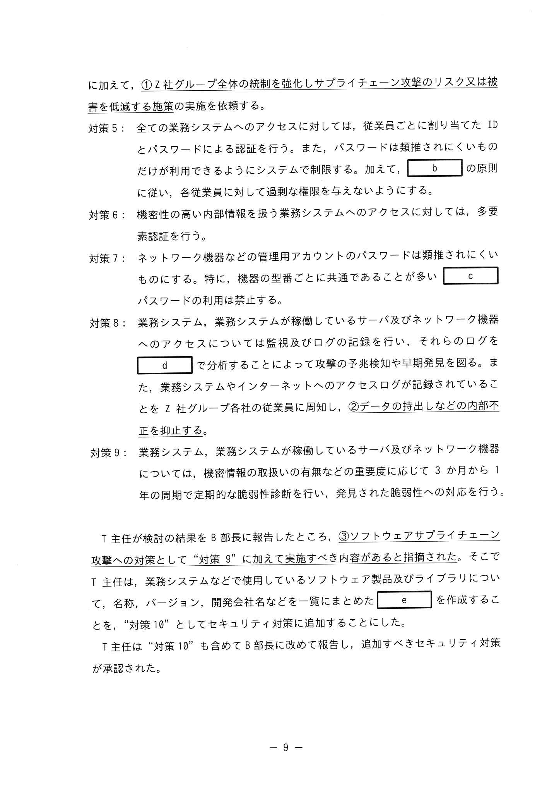

テキスト (OCR)

に加えて, ① Z 社グループ全体の統制を強化しサプライチェーン攻撃のリスク又は被
害を低減する施策の実施を依頼する。

対策 5 :

対策 6 :

対策 7 :

対策 8 :

対策 9 :

全ての業務システムへのアクセスに対しては, 従業員ごとに割り当てた ID
とパスワードによる認証を行う。また, パスワードは類推されにくいもの
だけが利用できるようにシステムで制限する。加えて, | b | の原則
に従い, 各従業員に対して過剰な権限を与えないようにする。

機密性の高い内部情報を扱う業務システムへのアクセスに対しては, BB
素認証を行う。

ネットワーク機器などの管理用アカウントのパスワードは類推されにくい
ものにする。特に, 機器の型番ごとに共通であることが多い
パスワードの利用は禁止する。

業務システム, 業務システムが稼働しているサーバ及びネットワーク機器
へのアクセスについては監視及びログの記録を行い, それらのログを
[3 | で分析することによって攻撃の予兆検知や早期発見を図る。ま
た, 業務システムやインターネットへのアクセスログが記録されているこ
とを Z 社グループ各社の従業員に周知し, ②データの持出しなどの内部不
正を抑止する。

業務システム, 業務システムが稼働しているサーバ及びネッ トワーク機器
については, 機密情報の取扱いの有無などの重要度に応じて 3 か月から 1
年の周期で定期的な脆弱性診断を行い, 発見された脆弱性への対応を行う。

T 主任が検討の結果を B 部長に報告したところ, ③ソフトウェアサプライチェーン
攻撃への対策として“対策 9" に加えて実施すべき内容があると指摘された。そこで

T 主任は, 業務システムなどで使用しているソフトウェア製品及びライ ブラリについ
て, 名称。 バージョン, 開発会社名などを一覧にまとめた|  e | を作成するこ
とを, “対策 10"” としてセキュリティ対策に追加することにした。

T 主任は "対策 10" も含めて 部長に改めて報告し, 追加すべきセキュリティ対策

が承認された。

### ページ 10

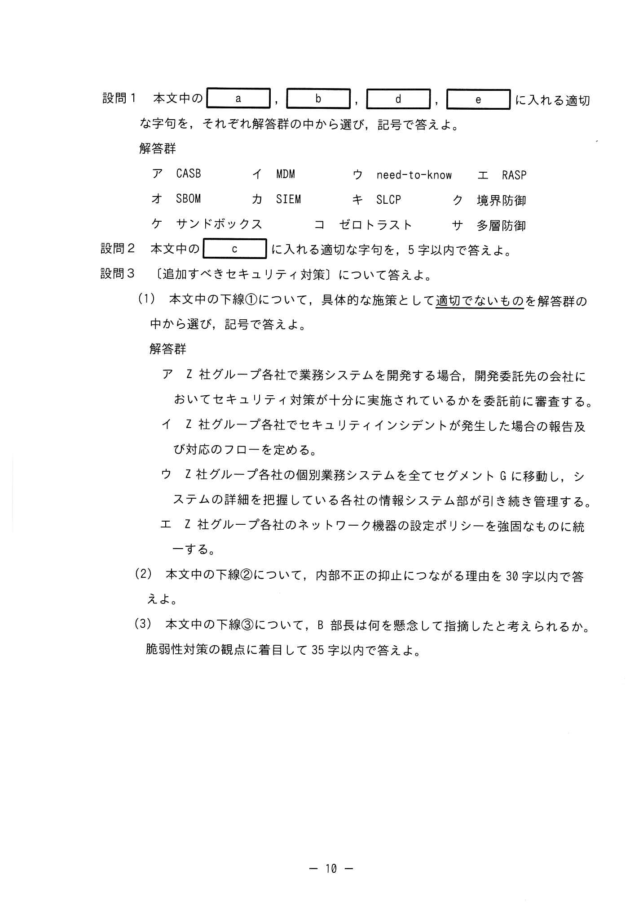

テキスト (OCR)

@ |に入れる適切

設問1 本文中の| ai 中| 5 ],[ a],

な字句を, それぞれ解答群の中から選び, 記号で答えよ。

解答群
ア CASB        イ MDM         ウ need-to-know    エ RASP
オ SBOM        7 SIEM        キ SLCP        ク 境界防御
ケ サンドボックス      コ ゼロトラスト     サ 多層防御

設問2 本文中の| c | に入れる適切な字名を, 5字以内で答えよ。
設問3 〔追加すべきセキュリティ対策] について答えよ。
(1) 本文中の下線について, 具体的な施策として適切でないものを解答群の
中から選び, 記号で答えよ。
解答群
ア 2 社グループ各社で業務システムを開発する場合 開発委託先の会社に
おいてセキュリティ対策が十分に実施されているかを委託前に審査する。
イ Z 社グループ各社でセキュリティインシデントが発生した場合の報告及
び対応のフローを定める。
ウ Z 社グループ各社の個別業務システムを全てセグメント G に移動し, シ
ステムの詳細を把握している各社の情報システム部が引き続き管理する。
エ Z 社グループ各社のネットワーク機器の設定ポリシーを強固なものに統
ーする。
(2) 本文中の下線②について, 内部不正の抑止につながる理由を 39 字以内で答
えよ。
(3) 本文中の下線について, B 部長は何を懸念して指摘したと考えられるか。
脆弱性対策の観点に着目して 35 字以内で答えよ。

### ページ 11

テキスト (OCR)

〔

メ = 用 紙 J

### ページ 12

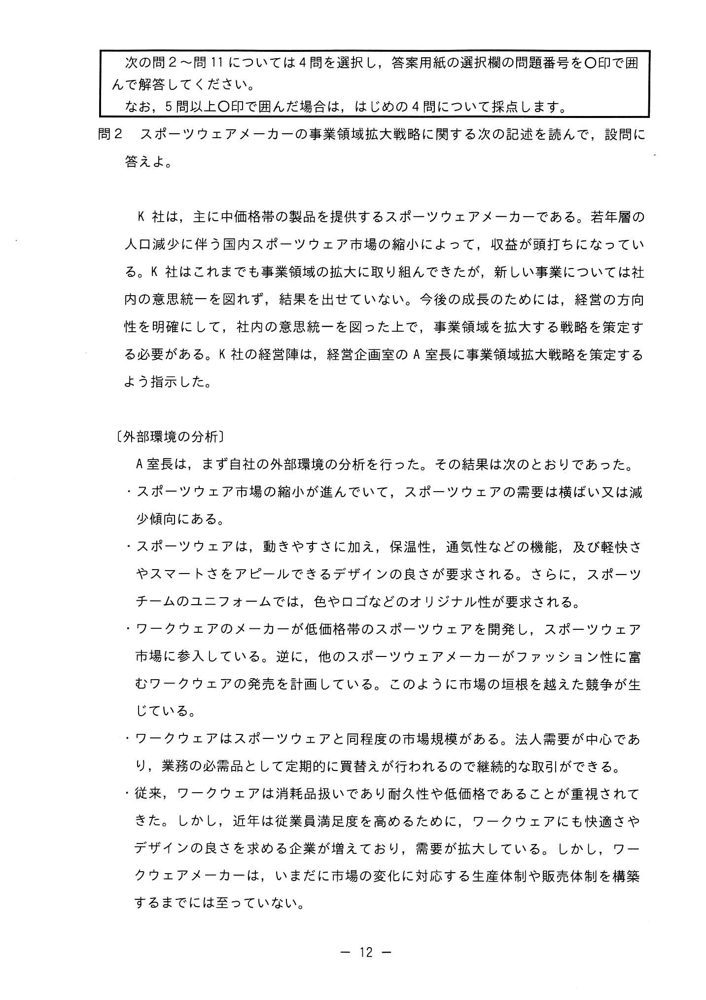

テキスト (OCR)

次の問2 一問 11 については 4 問を選択し, 答案用紙の選択欄の問題番号を〇印で囲
んで解答してください。
なお, 5 問以上〇印で囲んだ場合は, はじめの 4 問について採点します。

間2 スポーツウェアメーカーの事業領域拡大戦略に関する次の記述を読んで, 設問に

答えよ。

K 社は, 主に中価格帯の製品を提供するスポーツウェアメーカーである。若年層の
人口減少に伴う国内スポーツウェア市場の縮小によって, 収益が頭打ちになってい
る。K 社はこれまでも事業領域の拡大に取り組んできたが, 新しい事業については社
内の意思統一を図れず, 結果を出せていない。 今後の成長のためには, 経営の方向
性を明確にして, 社内の意思統一を図った上で, 事業領域を拡大する戦略を策定す
る必要がある。【 社の経営陣は, 経営企画室のA 室長に事業領域拡大戦略を策定する
よう指示した。

〔外部環境の分析〕
A 室長は, まず自社の外部環境の分析を行った。 その結果は次のとおりであった。

・スポーツウェア市場の縮小が進んでいて, スポーツウェアの需要は横ばい又は減
少傾向にある。

・スポーツウェアは, 動きやすさに加え, 保温性, 通気性などの機能, 及び軽快さ
やスマートさをアピールできるデザインの良さが要求される。さらに, スポーツ
チームのユニフォームでは, 色やロゴなどのオリジナル性が要求される。

・ワークウェアのメーカーが低価格帯のスポーツウェアを開発し, スポーツウェア
市場に参入している。逆に, 他のスポーツウェアメーカーがファッション性に富
おむおワークウェアの発売を計画している。このように市場の垣根を越えた競争が生
じている。

・ワークウェアはスポーツウェアと同程度の市場規模がある。 法人需要が中心であ
り, 業務の必需品として定期的に買替えが行われるので継続的な取引ができる。

・ 従来, ワークウェアは消耗品扱いであり耐久性や低価格であることが重視されて
きた。 LOL, 近年は従業員満足度を高めるために, ワークウェアにも快適さや
デザインの良さを求める企業が増えており, 需要が拡大している。しかし, ワー
クウェアメーカーは, いまだに市場の変化に対応する生産体制や販売体制を構築
するまでには至っていない。

### ページ 13

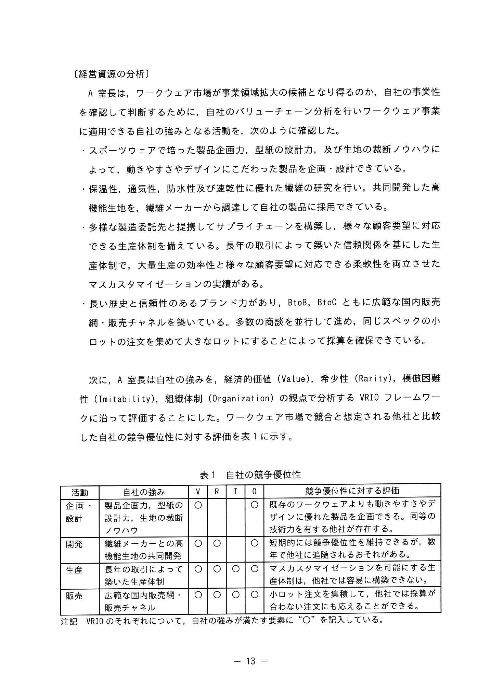

テキスト (OCR)

〔経営資源の分析]

A 室長は, ワークウェア市場が事業領域拡大の候補となり得るのか, 自社の事業性
を確認して判断するために, 自社のバリューチェーン分析を行いワークウェア事業
に適用できる自社の強みとなる活動を, 次のように確認した。

・スポーツウェアで培った製品企画力, 型紙の設計力, 及び生地の裁断ノウハウに
よって, 動きやすさやデザインにこだわった製品を企画・設計できている。

・ 保温性, 通気性, 防水性及び速乾性に優れた繊維の研究を行い, 共同開発した高
機能生地を, 繊維メーカーから調達して自社の製品に採用できている。

・ 多様な製造委託先と提携してサプライチェーンを構築し, 様々な顧客要望に対応

できる生産体制を備えている。長年の取引によって築いた信頼関係を基にした生

産体制で, 大量生産の効率性と様々な顧客要望に対応できる柔軟性を両立させた

マスカスタマイゼーションの実績がある。

- 長い歴史と信頼性のあるブランド力があり, BtoB, BtoC ともに広範な国内販売

網・販売チャネルを築いている。 多数の商談を並行して進め,、 同じスペックの小

ロットの注文を集めて大きなロットにすることによって採算を確保できている。

次に, A 室長は自社の強みを, 経済的価値 (Value), 希少性 (Rarity), BAAR
性 (Imitability), 組織体制 (0rganization) の観点で分析する VRIO フレームワー
クに沿って評価することにした。ワークウェア市場で競合と想定される他社と比較
した自社の競争優位性に対する評価を表 1 に示す。

表1 自社の競争優位性

活動      自社の強み     Vi R]|I{0        競争優位性に対する評価

企画・| 製品企画力, 型紙の            O | 既存のワークウェアよりも動きやすさやデ

axa    設計力, 生地の裁断            ザインに優れた製品を企画できる。同等の
ノウハウ                        技術力を有する他社が存在する。

開発   繊維メーカーとの高 |〇1O    〇 | 短期的には競争優位性を維持できるが, 数
機能生地の共同開発              年で他社に追随されるおそれがある。

生産    長年の取引によって |〇|〇|〇|〇| マスカスタマイゼーションを可能にする生
築いた生産体制               産体制は, 他社では容易に構築できない。

販売    広範な国内販売網・| 〇| 〇|〇| O| ホロット注文を集積して, 他社では採算が
販売チャネル                   合わない注文にも応えることができる。

注記 VRIO のそれぞれについて,

自社の強みが満たす要素に “〇"を記入している。

### ページ 14

テキスト (OCR)

A 室長は, RI から自社の強みを次のように分析した。

・『生産体制” と 『国内販売網・販売チャネル"は, 希少性のある模人困難な強みで
ある。"マスカスタマイゼーションカ"によって, ワークウェアに色やロゴなどの ©
オリジナル性を求める顧客の要望にも柔軟に対応できる。また, “小ロット注文の
SAN” lt, ワークウェアの生産販売にも生かすことができる。

・『広範な国内販売網・販売チャネル"で集めた顧客の要望に, "長年の取引によっ
て築いた生産体制" で対応できることが, 他社が容易にまねできない自社のコア
コンピタンスであり, 競合他社に対して持続的な| sa | を築ける。

〔ワークウェア市場への参入の検討]

A 室長は, ①ワークウェア市場の変化は自社のコアコンピタンスを生かせる新事業
領域としての魅力を高めると考え, ワークウェア市場に参入するための施策を次の
ように検討した。

・法人からの需要に対して, スポーツウェアの軽量性, 伸縮性, 保温性, 通気性な
どの機能を生かしたワークウェアを開発する。
・生地やファスナーなどのスポーツウェアの素材をワークウェアにも使用すること

によって, 作業中の動きやすさと快適性を提供する。

・ターゲットとなる企業の購買担当者や業界関係者の間で自然に共有されるような,
信頼できる情報を提供する。

・ワークウェアとして会社や職場で着用するユニフォームに|  b | を要求する

顧客に対しては製品をカスタマイズする。

・現場作業者から事務スタッフまでカバーする, 実用的かつスタイリッシュなデザ
インをアピールする。

・ 業種や業務に特有な作業特性に合致した製品を幅広く提供する。

・②小規模な法人や大企業の中の特定部署といった少人数分の注文を集積し, KE

なロットにする。

・スポーツウェアの製造では経験したことのない機能を求められた場合には, 自社

のサプライチェーンを足掛かりにして, 不足する技術を補う提携先を開拓する。

・スポーツウェアの素材を使用してワークウェアを生産することによって, 調達に

おいて規模の経済性を発揮し, を実現する。

### ページ 15

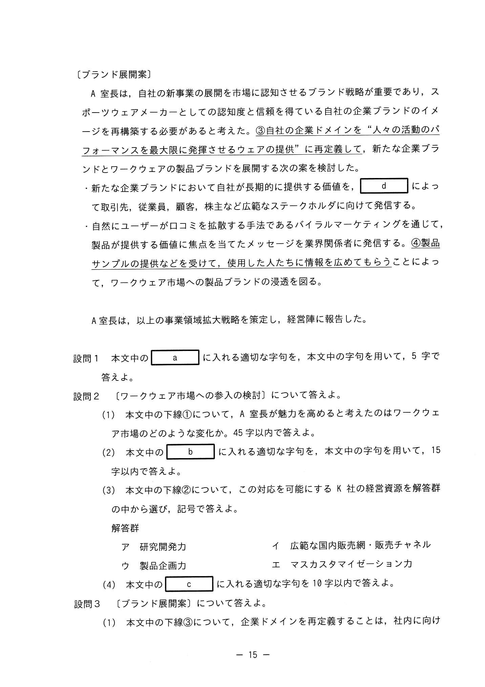

テキスト (OCR)

〔ブランド展開案]

A 室長は, 自社の新事業の展開を市場に認知させるブランド戦略が重要であり, ス
ポーツウェアメーカーとしての認知度と信頼を得ている自社の企業ブランドのイメ
ージを再構築する必要があると考えた。③自社の企業ドメインを "人々の活動のパ
フォーマンスを最大限に発揮させるウェアの提供”" に再定義して, 新たな企業ブラ
ンドとワークウェアの製品ブランドを展開する次の案を検討した。

・ 新たな企業ブランドにおいて自社が長期的に提供する価値を, | d |にょっ

て取引先, 従業員, 顧客, 株主など広範なステークホルダに向けて発信する。

・ 自然にユーザーが口コミを拡散する手法であるバイラルマーケティングを通じて,

製品が提供する価値に焦点を当てたメッセージを業界関係者に発信する。@⑳製品

サンプルの提供などを受けて, 使用した人たちに情報を広めてもらうことによっ

て, ワークウェア市場への製品ブランドの浸透を図る。

A 室長は, 以上の事業領域拡大戦略を策定し, 経営陣に報告した。

設問1 本文中の| sa | に入れる適切な字句を, 本文中の字句を用いて, 5 FT
答えよ。
設問 2 〔ワークウェア市場への参入の検討]について答えよ。
(1) 本文中の下線①について, A 室長が魅力を高めると考えたのはワークウェ
ア市場のどのような変化か。45 字以内で答えよ。
(2) 本文中の| b | に入れる適切な字句を, 本文中の字句を用いて, 15
字以内で答えよ。
(3) 本文中の下線のについて, この対応を可能にする K 社の経営資源を解答群
の中から選び, 記号で答えよ。

解答群
ア 研究開発力         イ 広範な国内販売網・販売チャネル
ウ Ratan         エ マスカスタマイゼーションカ

(4) 本文中の| c | に入れる適切な字句を10字以内で答えよ。
設問3 〔ブランド展開案) について答えよ。
(1) 本文中の下線について, 企業ドメインを再定義することは, 社内に向け

ー 15 一

### ページ 16

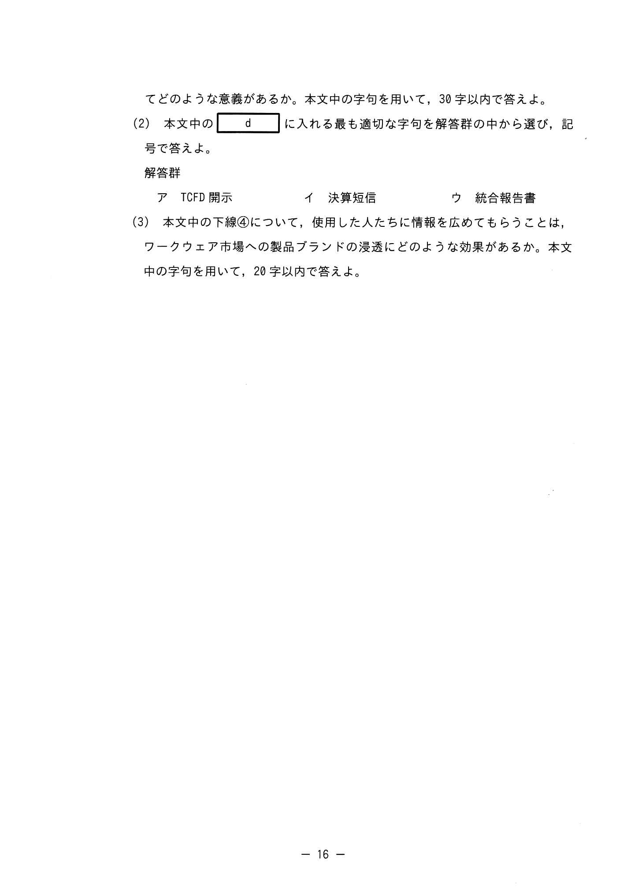

テキスト (OCR)

てどのような意義があるか。本文中の字句を用いて, 30 字以内で答えよ。
(2) 本文中の| 』 |] に入れる最も適切な字句を解答群の中から選び, 記
号で答えよ。
解答群
ア CFD 開示     イ 決算短信     ウ 統合報告書
(3) 本文中の下線@について, 使用した人たちに情報を広めてもらうことは,
ワークウェア市場への製品ブランドの浸透にどのような効果があるか。本文
中の字句を用いて, 20 字以内で答えよ。

### ページ 17

テキスト (OCR)

x = 用 紙 J

ー 17 一

### ページ 18

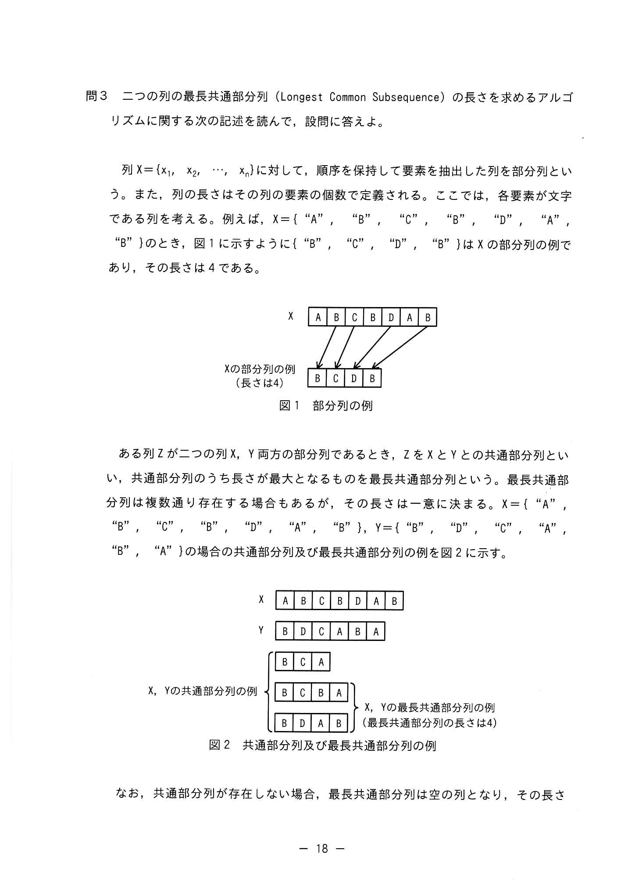

テキスト (OCR)

問3 二つの列の最長共通部分列 (Longest Common Subsequence) の長さを求めるアルゴ

リズムに関する次の記述を読んで, 設問に答えよ。

x JOLT, 順序を保持して要素を抽出した列を部分列とい

PWUX={xy, Xp,
う。 また, 列の長さはその列の要素の個数で定義される。ここでは, 各要素が文字

7 CD PP AP

である列を考える。 例えば, X={ “A”,
“B” }はXの部分列の例で

*B” }のとき, 図1 に示すように( "B", “CD 。
あり, その長さは 4 である。

Xの部分列の例
(長さは4)

 1 部分列の例

ある列Z が二つの列X。 両方の部分列であるとき, Z をXとYとの共通部分列とい
い, 共通部分列のうち長さが最大となるものを最長共通部分列という。最長共通部
分列は複数通り存在する場合もあるが, その長さは一意に決まる。X={ “A”,

POP PP の BY=( BDP "CP 人

“A” }の場合の共通部分列及び最長共通部分列の例を図 2 に示す。

lalmlelglplAlgl
Y [glplellgla
XYの共通部分列の例 | gc|g| al
X, Yの最長共通都分列の例
| 5 | 5 | Ag | (最長共通部分列の長さは4)

 2 共通部分列及び最長共通部分列の例

BY,

なお, 共通部分列が存在しない場合, 最長共通部分列は空の列となり, その長さ

### ページ 19

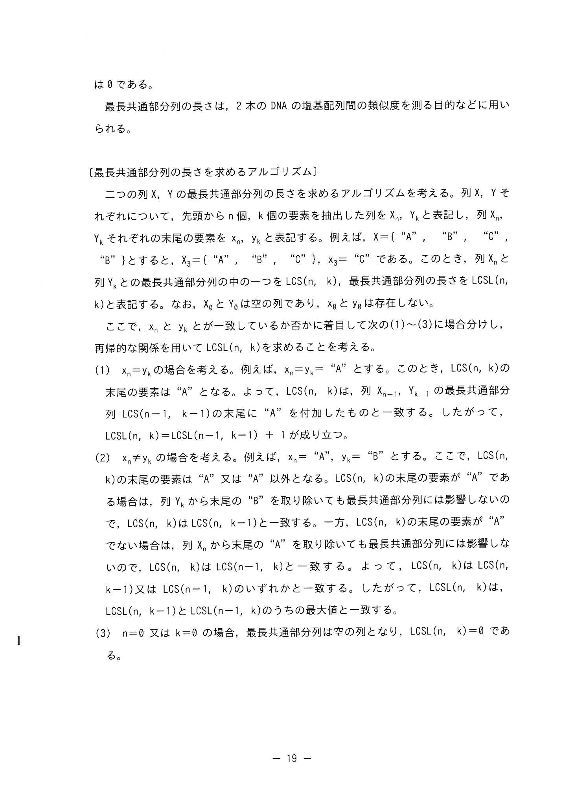

テキスト (OCR)

は 0 である。
最長共通部分列の長さは, 2 本の DNA の塩基配列間の類似度を測る目的などに用い
られる。

[最長共通部分列の長さを求めるアルゴリズム]〕
ニニっの列 XY の最長共通部分列の長さを求めるアルゴリズムを考える。列%, VE

れぞれについて, 先頭からn 個, k 個の要素を抽出した列を %, Y,と表記し, WX,

Y, それぞれの未尾の要素を x。, y, と表記する。例えば, %=ニ(AV,。 PP. PC 。
“By })とすると, Xg={ “a”, “B", “CJ, xg= “C” である。このとき, WKHE

列 Y,との最長共通部分列の中の一つを LCS(n, k), 最長共通部分列の長さを LCSL(n,

k) と表記する。 BSE, X。 と Y。は空の列であり, x。 と y。 は存在しない。
ここで, x と y,。とが一致しているか否かに着目して次の(1)一(3)に場合分けし,

再帰的な関係を用いて LCSL(n, k)を求めることを考える。

(1) xy, の場合を考える。例えば, x=y= “A” とする。このとき, LCS(n, k)の
末尾の要素は “A” となる。よって, LCS(n, k) は, 列 Xp Y,-」 の最長共通部分
列 LCS(nー1, k-1)OREK “A” を付加したものと一致する。したがって,
LCSL(n, k)=LCSL(n—1, kー1) + 1 が成り立つ。

(2) x,#y, の場合を考える。例えば, x= “A", y= “BY EFS. TIE, LCS(n,
k) の未尾の要素は “A” 又は “A” 以外となる。LCS(n, k)の未尾の要素が “A" CH
る場合は, WY, DOREO "B" を取り除いても最長共通部分列には影響しないの
で, LCS(n。 k)はLCS(n, kー1)と一致する。一方, LCS(n, k)の未尾の要素が “A"
でない場合は, FIX, DORBO “A” を取り除いても最長共通部分列には影響しな
WOT, LCS(n, k)は LCS(nー1, k)と一致する。よって, LES(n, k)は LCS(n,
k一1)又は LCS(nー1, k)のいずれかと一致する。したがって, LCSL(n, k) は,
LCSL(n, k—1)& LCSL(nー1, k)のうちの最大値と一致する。

(3) n=0 又は k=0 OWA, 最長共通部分列は空の列となり, LCSL(n,。 k)=0 TH
る。

### ページ 20

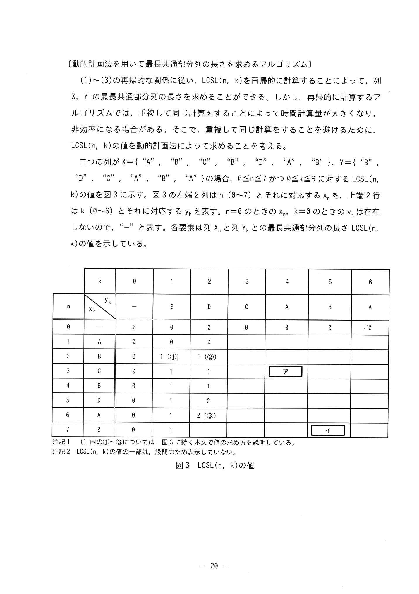

テキスト (OCR)

〔動的計画法を用いて最長共通部分列の長さを求めるアルゴリズム]〕

(1)~(3)の再帰的な関係に従い。LCSL(n, k) を再帰的に計算することによって, 列
X, Y の最長共通部分列の長さを求めることができる。しかし, 再帰的に計算するア
ルゴリズムでは, 重複して同じ計算をすることによって時間計算量が大きくなり,
非効率になる場合がある。 そこで, 重複して同じ計算をすることを避けるために,
LCSL(n, k)の値を動的計画法によって求めることを考える。

ニニっの列が%=( “A”, PC 。 BPD, AM “BT Y= LB”,
DC 。 PBP 。 “A” )の場合, 9ミnミ7 かつ 9ミkミ6 に対する LCSL(n,
k)の値を図 3 に示す。図 3 の左端 2 列は n (O~7) とそれに対応する x, を, 上端 2 行
はk (O~6) とそれに対応する y, を表す。n=ニ0 のときの x。, k三6 のときの y, は存在
しないので, “-" と表す。各要素は列 X。と列 Y,、との最長共通部分列の長さ LCSL(n,
k)の値を示している。

k     0      1      2      3      4       5      6
Yk
n   x,      ー      B      D      c      A       B      A
9     ー     0      0      0      0      9       0      0
1     A     0      9      0
2     B     6    1 (①)   1 (@)
3     C     0      1      1
4     B     9      1      1
5     D     0      1      2
6      A       0        1      2 (③)
7     B     9      1

注記1 () 内のやて③については, 図 3 に続く本文で値の求め方を説明している。
注記 2 LCSL(n, k)の値の一部は, 設問のため表示していない。

 3 LCSL(n, k)の値

### ページ 21

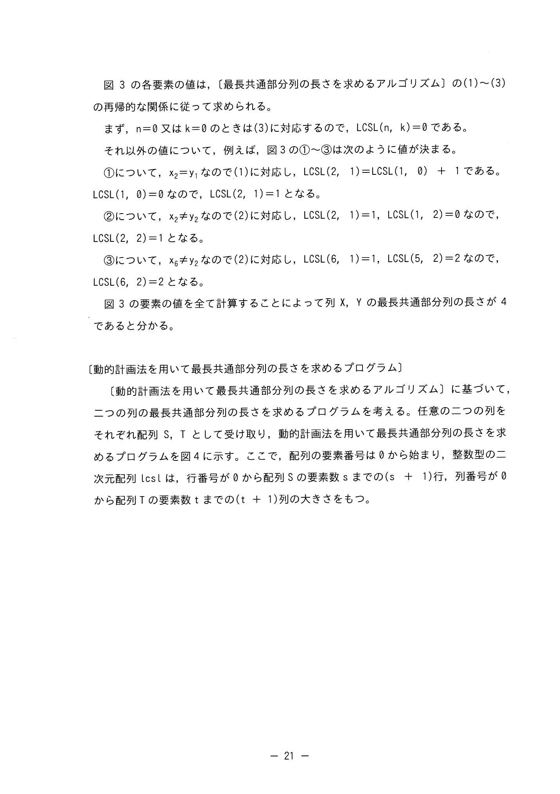

テキスト (OCR)

3 の各要素の値は, 〔最長共通部分列の長さを求めるアルゴリズム]〕] O(1)~(3)
の再帰的な関係に従って求められる。

EF, n=O 又は k三6 のときは(3)に対応するので, LCSL(n, k)=0 である。

それ以外の値について, 例えば, 図 3 ののひて③は次のように値が決まる。

①について, H=y, なので(1)に対応し, LCSL(2, 1)=LCSLM, 0) + 1である。
LCSL(1, 0)=0 なので, LCSL(2, 1)=1 となる。

について, x>才y。 なので(2)に対応し, LCSL(2。 1)=1, LCSL(1, 2)=ニ0 なので,
LCSL(2, 2)=1 となる。

について, x。才y。 なので(2) に対応し, LCSL(6, 1)=1, LCSL(5, 2)=ニ2 なので,
LCSL(6, 2)=2 となる。

 3 の要素の値を全て計算することによって列 XY の最長共通部分列の長さが 4
であると分かる。

[動的計画法を用いて最長共通部分列の長さを求めるプログラム〕

(動的計画法を用いて最長共通部分列の長さを求めるアルゴリズム]〕 に基づいて,
ニニつっの列の最長共通部分列の長さを求めるプログラムを考える。 任意の二つの列を
それぞれ配列 $,T として受け取り, 動的計画法を用いて最長共通部分列の長さを求
めるプログラムを図 4 に示す。ここで, 配列の要素番号は 0 から始まり, 整数型のニ
次元配列 LcsL は, 行番号が 9 から配列 S の要素数 s までの(s + 1)行, 列番号が9
から配列T の要素数t までの(1{ + 1)列の大きさをもつ。

### ページ 22

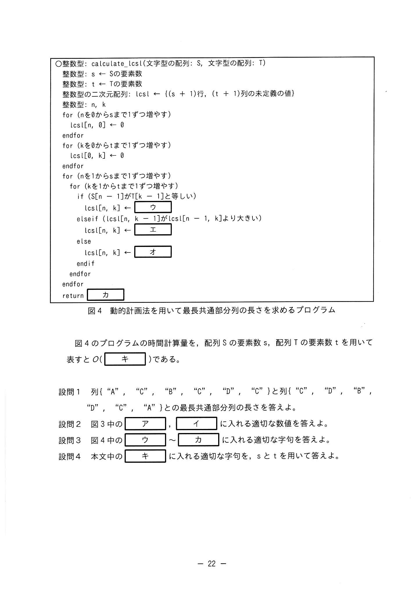

テキスト (OCR)

〇整数型: calculate_lcsI(文字型の配列: S, 文字型の配列:T)
整数型: s < S$の要素数
整数型: 1 — Tの要素数
整数型の二次元配列: lcsl — ((s + 1)行, (t + 1)列の未定義の値}
整数型: nk
for (nを9からsまで1ずつ増やす)
lesl[n, 0] < 0
endfor
for (kを9からtまで1ずつ増やす)
lcsI[9, k] <— 0
endfor
for (nを1からsまで1ずつ増やす)
for (kを1から{tまで1ずつ増やす)
if (S[n 一 1]がT[k 一 1]と等しい)
lesl[n, k] で
elseif (lesl[n, k 一 1]がlcsl[n 一 1, k]より大きい)
lcst[n k] で
else
lcsl[n k] <—
endif
endfor
endfor

 4 動的計画法を用いて最長共通部分列の長さを求めるプログラム

 4 のプログラムの時間計算量を, 配列 S の要素数 s, 配列T の要素数t を用いて

表すとの(| キ |)でぁぁs。

“py, “Cc”, “A” ]との最長共通部分列の長さを答えよ。
設問2 図3中の| ア |,| イ | に入れる適切な数値を答えよ。

設問3 図4中の| ウ |~| カ |に入れる適切な字句を答えよ。
設問4 本文中の[| +  ] に入れる適切な字句を, s とtを用いて答えよ。

### ページ 23

テキスト (OCR)

〔

メ モ 用 紙 J

### ページ 24

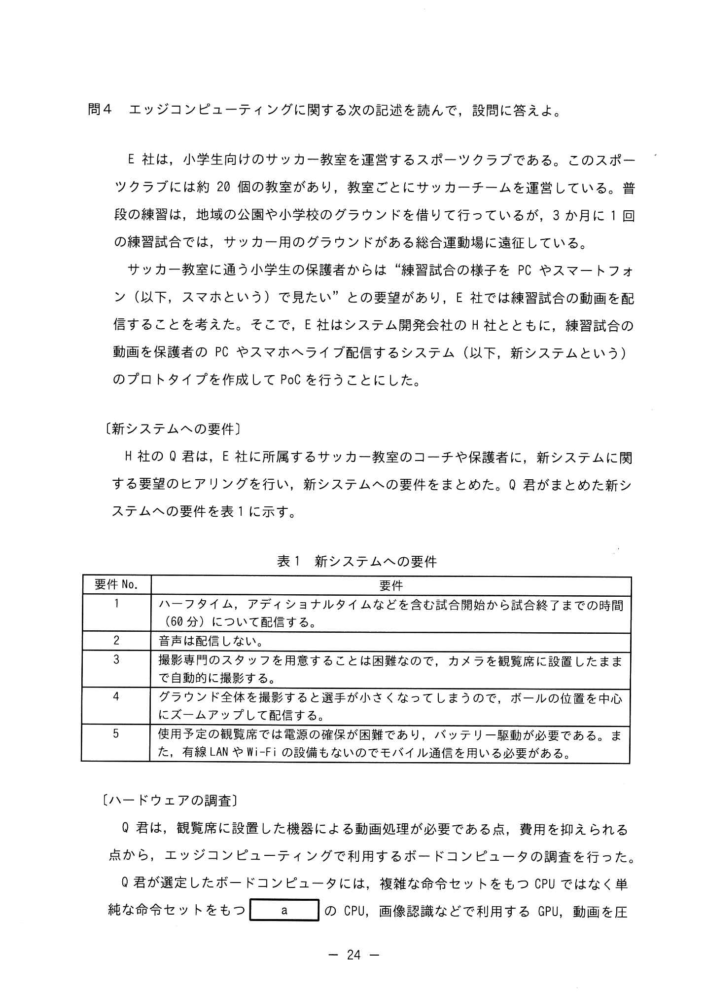

テキスト (OCR)

fl4 エッジコンピューティングに関する次の記述を読んで, 設問に答えよ。

E 社は, 小学生向けのサッカー教室を運営するスポーツクラブである。このスポー
ツクラブには約 29 個の教室があり, 教室どとにサッカーチームを運営している。普
段の練習は, 地域の公園や小学校のグラウンドを借りて行っているが, 3 か月に 1 回
の練習試合では, サッカー用のグラウンドがある総合運動場に遠征している。

サッカー教室に通う小学生の保護者からは “練習試合の様子を PC やスマートフォ
ン (以下, スマホという) CREW” との要望があり, E 社では練習試合の動画を配
信することを考えた。そこで, E 社はシステム開発会社のH 社とともに, 練習試合の
動画を保護者の PC やスマホヘライブ配信するシステム (以下, 新システムという)
のプロトタイプを作成して PoC を行うことにした。

〔新システムへの要件〕

H 社の 0 Bld, E 社に所属するサッカー教室のコーチや保護者に, 新システムに関
する要望のヒアリングを行い,新システムへの要件をまとめた。0Q 君がまとめた新シ
ステムへの要件を表 1 に示す。

表1 新システムへの要件

要件 No.                要件

1   ハーフタイム, アディショナルタイムなどを含む試合開始から試合終了までの時間
(60 分) について配信する。
音声は配信しない。
撮影専門のスタッフを用意することは困難なので, カメラを観覧席に設置したまま
で自動的に撮影する。
4   グラウンド全体を撮影すると選手が小さくなってしまうので, ボールの位置を中心
にズームアップして配信する。
5    使用予定の観覧席では電源の確保が困難であり, バッテリー駆動が必要である。ま
た, 有線 LAN や Wi-Fi の設備もないのでモバイル通信を用いる必要がある。

【ハードウェアの調査]
Q 君は, 観覧席に設置した機器による動画処理が必要である点, 費用を抑えられる
MDS, エッジコンピューティングで利用するボードコンピュータの調査を行った。
Q 君が選定したボードコンピュータには, 複雑な命令セットをもつ CPU ではなく単
純な命令セットをもつ|  a | の CPU,画像認識などで利用する GPU, 動画を圧

### ページ 25

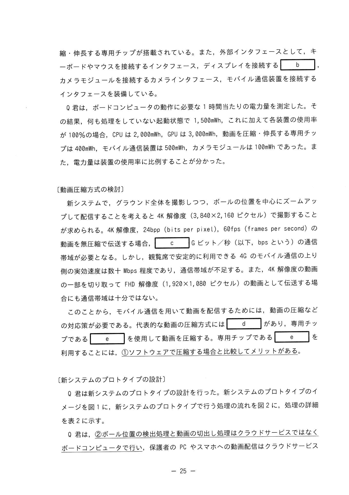

テキスト (OCR)

縮・伸長する専用チップが搭載されている。 また, 外部インタフェースとして, キ
ーボードやマウスを接続するインタフェース, ディスプレイを接続する[ 5 |,
カメラモジュールを接続するカメラインタフェース, モバイル通信装置を接続する
インタフェースを装備している。

Q 君は。 ボードコンピュータの動作に必要な 1 時間当たりの電力量を測定した。そ
の結果, 何も処理をしていない起動状態で 1,500mWh, これに加えて各装置の使用率
が 1009%の場合, CPU は 2, 999mWh, GPU は 3, 9096mWh, 動画を圧縮・伸長する専用チッ
プは 400mWh, モバイル通信装置は 500mWh。 カメラモジュールは 109mWh であった。 ま
た, 電力量は装置の使用率に比例することが分かった。

[動画圧縮方式の検討]

新システムで, グラウンド全体を撮影しつつ, ボールの位置を中心にズームアッ
プして配信することを考えると 4K 解像度 (3,840X2, 160 ピクセル) で撮影すること
が求められる。 4K 解像度, 24bpp (bits per pixel), 60fps (frames per second) の
動画を無圧縮で伝送する場合, | c | 6 ビットノ秒 (以下, bps という) の通信
帯域が必要となる。しかし, 観覧席で安定的に利用できる 46 のモバイル通信の上り
側の実効速度は数十 Mbps 程度であり, 通信帯域が不足する。また, 4K 解像度の動画
の一部を切り取って FHD 解像度 (1.920X1,680 ピクセル) の動画として伝送する場
合にも通信帯域は十分ではない。

このことから, モバイル通信を用いて動画を配信するためには, 動画の圧縮など
の対応策が必要である。 代表的な動画の圧縮方式には| d | があり, 専用チッ
プである|  s  ] を使用して動画を圧給する。専用チップである[| e |を

利用することには, ①ソフトウェアで圧縮する場合と比較してメリットがある。

[新システムのプロトタイプの設計】〕

Q 君は新システムのプロトタイプの設計を行った。新システムのプロトタイプのイ
メージを図 1 に, 新システムのプロトタイプで行う処理の流れを図 2 に, 処理の詳細
を表 2 に示す。

Q Flt, ②ボール位置の検出処理と動画の切出し処理はクラウドサービスではなく
ボードコンピュータで行い, 保護者の PC やスマホへの動画配信はクラウドサービス

### ページ 26

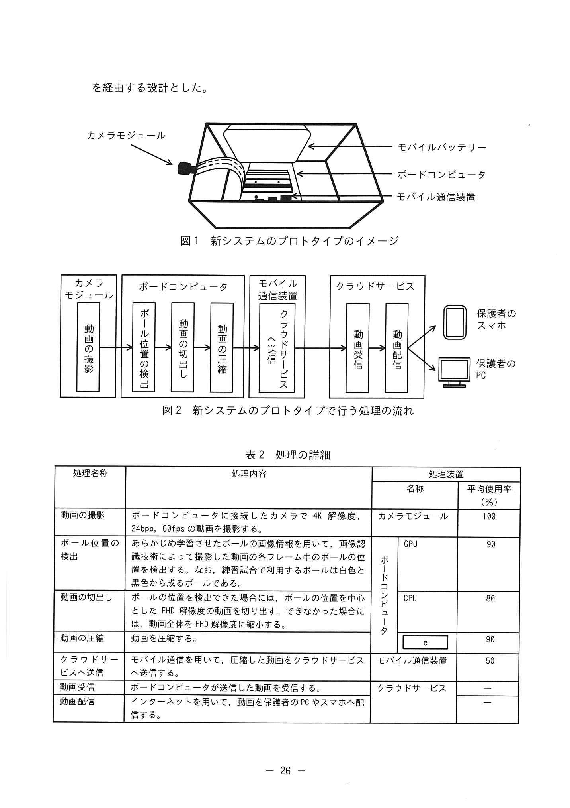

テキスト (OCR)

を経由する設計とした。

カメラモジュール

A

モバイルバッテリー

ボードコンピュータ

モバイル通信装置

 1 新システムのプロトタイプのイメージ

カメラ     ボードコンピュータ    モバイル     クラウドサービス
モジュール                            通信装置
a   a         ク                   保護者の
ラ                                        スマホ
i          ル| |画| |®         A?              動| |動| イ UW
1          中                         =
i          の| || |B         信 |               fel |e] N Ca
BO          栓       ls       a             ビ                                        PC
出                            ス                                 —s
M2 新システムのプロトタイプで行う処理の流れ
表2 処理の詳細
処理名称                          処理内容                                  処理装置
名称         平均使用率
(%)
動画の撮影    ボードコンピュータに接続したカメラで 4K 解像度,   カメラモジュール      100
24bpp, 60fps の動画を撮影する。
ボール位置の | あらかじめ学習させたボールの画像情報を用いて, BRB        GPU              90
検出           識技術によって撮影した動画の各フレーム中のボールの位 | x
置を検出する。なお。練書試合で利用するポールは白色と | |
黒色から成るボールである。                              =)
動画の切出し | ボールの位置を検出できた場合には, ボールの位置を中心 | と | cru               80
とした FHD 解像度の動画を切り出す。できなかった場合に | ュ
は, 動画全体をFHD 解像度に縮小する。                 4
動画の圧縮      動画を圧縮する。                                           に 。」        90
クラウドサー | モバイル通信を用いて, 圧縮した動画をクラウドサービス | モバイル通信装置       50
CANE      へ送信する。
動画受信     ボードコンピュータが送信した動画を受信する。       クラウドサービス     =
動画配信       インターネットを用いて, 動画を保護者のPC やスマホへ配                       一
信する。

### ページ 27

テキスト (OCR)

ia |

[新システムのプロトタイプのテスト〕}

Q Blt, 観覧席に新システムのプロトタイプを設置し, 実効容量が 5,090mWh OF
バイルバッテリーを接続してテストを開始した。試合開始から全ての処理は正常に
動作し, ボードコンピュータの温度と配信速度も安定していたが, ③試合の終盤に
電力不足によってボードコンピュータが停止する問題が発生した。

この問題の原因を調査したところ, ボール位置の検出処理で利用する GPU の使用率
が高かったので, GPU が処理するデータ量を低減する対応を検討した。データ量を低
減する複数の方法のうち, 広いグラウンドから小さなボールを検出する必要がある
A, ボールが高速に移動する点を考慮し, ボール位置の検出処理の前に④撮影した
動画のデータ量を小さくする処理を追加した。この結果, 追加した処理に必要な電
力量と比較し, GPU の使用率の低減によって削減される電力量の方が多く, 動画を試
合終了まで配信できるようになった。

その後, 0 君は新システムのプロトタイプを完成させ, 練習試合のライブ配信の
PoC を開始した。

設問1 本文中の| a |,| b |に入れる適切な字句を解答群の中から選び,

記号で答えよ。

解答

ア CISC        イ DC ジャック      ウ HDMI
エ RISC        オ RJ45

設問2 【〔動画圧縮方式の検討]について答えよ。
(1) 本文中の| c |] に入れる適切な数値を答えよ。16bpsは10bps とし,
答えは小数第 1 位を四捨五入し, 整数で求めよ。
(2) 本文及び表 2 中の|  d |,|  e |に入れる適切な字句を解答群
の中から選び, 記号で答えよ。

解答群

ア H.265       イ MP3        ウ PNG

エ WebP         オ エンコーダ      A デコーダ
(3) 本文中の下線やについて, どのようなメリットかを解答群の中から選び
記号で答えよ。

### ページ 28

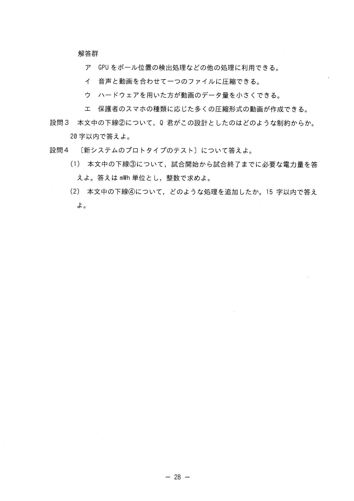

テキスト (OCR)

GPU をボール位置の検出処理などの他の処理に利用できる。
イ 音声と動画を合わせて一つのファイルに圧縮できる。
ウ ハードウェアを用いた方が動画のデータ量を小さくできる。
I 保護者のスマホの種類に応じた多くの圧縮形式の動画が作成できる。
設問3 本文中の下線のについて, Q 君がこの設計としたのはどのような制約からか。
20 字以内で答えよ。
設問4 〔新システムのプロトタイプのテスト]〕 について答えよ。
(1) 本文中の下線について, 試合開始から試合終了までに必要な電力量を答
えよ。 答えは Wh 単位とし, 整数で求めよ。
(2) 本文中の下線@について, どのような処理を追加したか。 15 字以内で答え
よ。

### ページ 29

テキスト (OCR)

【

メ モ 用 紙 J

### ページ 30

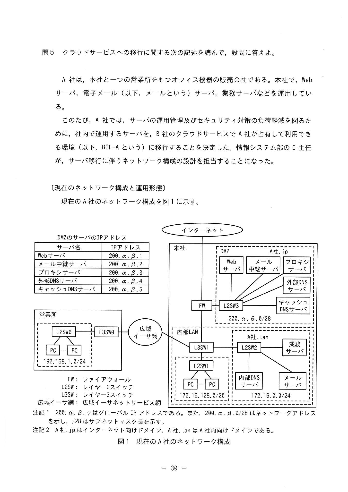

テキスト (OCR)

間5 クラウドサービスへの移行に関する次の記述を読んで, 設問に答えよ。

A 社は, 本社とーつの営業所をもつオフィス機器の販売会社である。本社で, Web
サーバ, 電子メール (以下。 メールという) サーバ, 業務サーバなどを運用してい
る。

このたび, A 社では, サーバの運用管理及びセキュリティ対策の負荷軽減を図るた
Hl, 社内で運用するサーバを, B 社のクラウドサービスで A 社が占有して利用でき
る環境 (以下, BCL-A という) に移行することを決定した。 情報システム部の CEE
が, サーバ移行に伴うネットワーク構成の設計を担当することになった。

〔現在のネットワーク構成と運用形態
現在のA社のネットワーク構成を図 1 に示す。

L3SW: レイヤー3スイッチ                                    172.16.0.0/24
広域イーサ網: 広域イーサネットサービス網 | しニニニニニニニニニニニニニ」トーーーーーーーーーーーーーーーーニーーー 1
注記1 200.g.8.yはグローバル IP アドレスである。 また, 200.e.8.0/28 はネットワークアドレス
を示し, /28 はサブネットマスク長を示す。

注記 2 A社.jpはインターネット向けドメイン, Att. lan はA 社内向けドメインである。
図1 現在のA社のネットワーク構成

インターネット
DMZのサーバのIPアドレス
サーバ名           IPアドレス            本社           IE                      コーニニーー          1
A

Webサーバ          200.e.8.1 PME         oe
メール中継サーバ     209.e.8.2               | Web    メール    ロキシ[
プロキシサーバ    200.e.8.3          pee el) Po
外部DNSサーバ     209.e.8.4            !            外部DNS |
キャッシュDNSサーバ  200.w. 8.5         1         サー/バ|!
1               1
|           | キャッシュ|
W H] L2SW3 ビー 」 pNsサーバ|
1
1
『     | ここキューーューニーロニーニニー
1
1             業務 |i!
1                   サーバ| 中
1         im            1
it        iy            Hn
1
FW: ファイアウォール        11 | 内部DNS    メール |
L2SW: レイヤー2スイッチ     Hi       リルサーバ   FOR
'y        it            (1
1                     1

1

### ページ 31

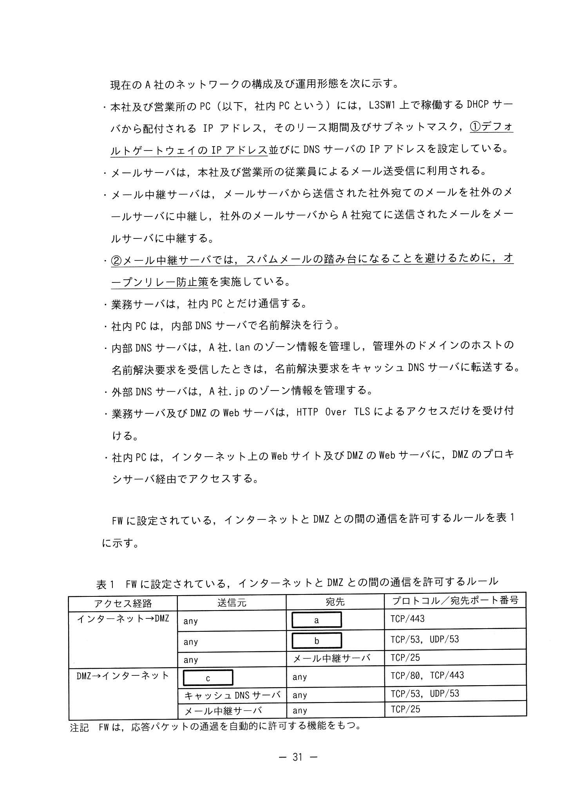

テキスト (OCR)

現在の A 社のネットワークの構成及び運用形態を次に示す。

・ 本社及び営業所の PC (以下, 社内 PC という) には, L3SW1 上で稼働する DHCP サー
バから配付される IP アドレス, そのリース期間及びサブネットマスク, ①デフォ
ルトゲートウェイの1IP アドレス並びに DNS サーバの IP アドレスを設定している。

- メールサーバは, 本社及び営業所の従業員によるメール送受信に利用される。

+ メール中継サーバは, メールサーバから送信された社外宛てのメールを社外のメ
ールサーバに中継し, 社外のメールサーバからA社宛てに送信されたメールをメー
ルサーバに中継する。

-・②メール中継サーバでは, スパムメールの踏み台になることを避けるために, オ
ープンリレー防止策を実施している。

・業務サーバは, 社内 PC とだけ通信する。

・社内 PC は, 内部 DNS サーバで名前解決を行う。

- 内部 DNS サーバは, A 社. Lan のゾーン情報を管理し, 管理外のドメインのホストの
名前解決要求を受信したときは, 名前解決要求をキャッシュ DNS サーバに転送する。

・外部 DNS サーバは, A 社. jp のゾーン情報を管理する。

- 業務サーバ及び DMZ の Web サーバは, HTTP Over TLS によるアクセスだけを受け付

ける。
- 社内 PC は。 インターネット上の Web サイト及び DMZ の Web サーバに, DMZ のプロキ

シサーバ経由でアクセスする。

FW に設定されている, インターネットとDMZ との間の通信を許可するルールを表 1

に示す。
表1 FWに設定されている, インターネットとDMZ との間の通信を許可するルール
アクセス経路        送信元          宛先      FRAN / sR hBS
インターネットつDMZ | any                  [a]         TCP/443
any                  {> |         TCP/53, UDP/53
any                   メール中継サーバ    TCP/25
DMZっインターネット          any              TCP/80, TCP/443
キャッシュDNS サーバ | any                  TCP/53, UDP/53
メール中継サーバ      any                 TCP/25

注記 FW は, 応答パケットの通過を自動的に許可する機能をもつ。

### ページ 32

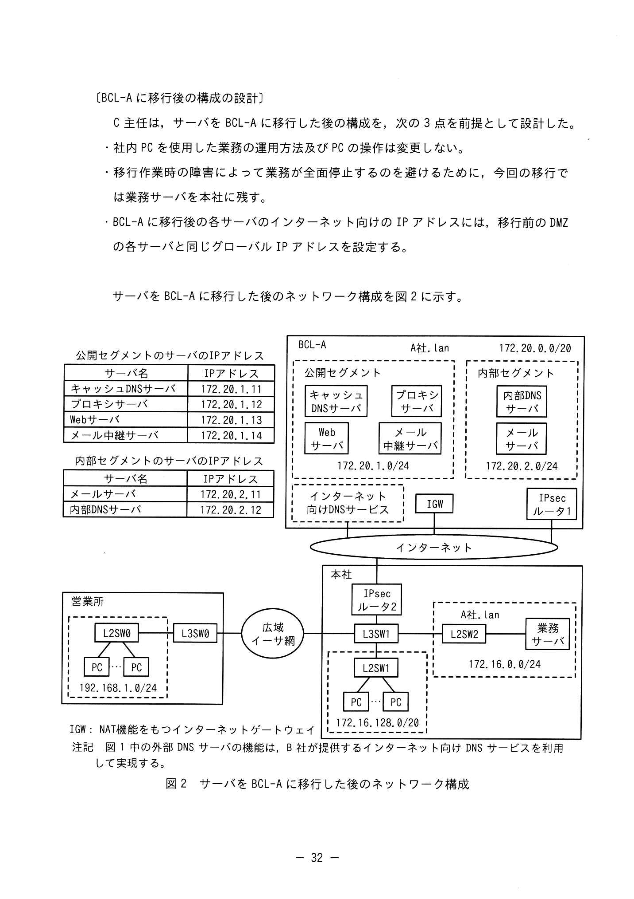

テキスト (OCR)

(BCL-A に移行後の構成の設計〕
C 主任は, サーバを BCL-A に移行した後の構成を, 次の 3 点を前提として設計した。
・社内 PC を使用した業務の運用方法及び PC の操作は変更しない。
・ 移行作業時の障害によって業務が全面停止するのを避けるために, 今回の移行で
は業務サーバを本社に残す。
・BCL-A に移行後の各サーバのインターネット向けの IP アドレスには, 移行前の DMZ
の各サーバと同じグローバル IP アドレスを設定する。

サーバを BCL-A に移行した後のネットワーク構成を図 2 に示す。

BCL-A
公開セグメントのサーバのIPアドレス | ーー                     ME tan 12 2000720 |
サーバ名       IPアドレス    ! 公開セグメント         ! ! 内部セグメント |
wt      mgt:               1                                    1
キャッシュDNSサーバ | 172.26.1.11 | |! Gaya   al | |   内部DNS
プロキシサーバ       172.26.1.12    1 | pNsサーバ     サーバ | ! 1     サーバ     1
Webサーバ       172.20.1.13   '              My          1
メール中継サーバ     172.20.1.14 | |; | Web       メール | ii     メール     1
! | サーバ    中継サーバ| i!    サーバ   1
内部セグメントのサーバのIPアドレス |!      172.20.1./24     ! 1 172.20.2.0724 |
サーバ名        1Pアドレス | | ---ニニニニニニニニニニニーーーーーー~ ーードーミーピーービビビニー
メールサーバ         172.29.2.11     ! インターネット I                   IPsec
内部DNSサーバ              172.20.2.12 | |! 向けDNSサービス !     0                     ルータ1
しーーーーーーmoここに
本社
IPsec
=      | NE
ルータ2     !    A社. lan           H
広域                  !            業務 |i
イーサ網                    1              中一パ] 1
『ーーーニニービーニーーーー                 1
!                                172. 16. 0. 0/24        1
!            旨IE
1            1
1            1
1            ;
IGW: MT機能をもつインターネットゲートゥェイィ1た16.128.079 |
注記 1 中の外部 DNS サーバの機能は, B 社が提供するインターネット向け DNS サービスを利用

して実現する。
図2 サーバを BCL-A に移行した後のネットワーク構成

### ページ 33

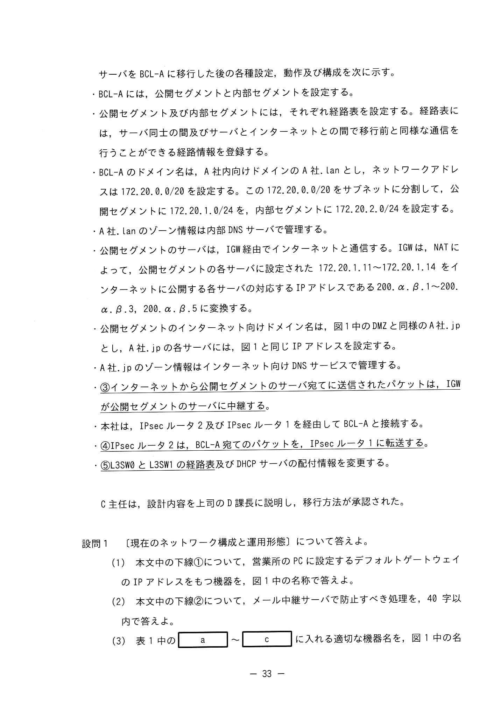

テキスト (OCR)

サーバを BCL-A に移行した後の各種設定, 動作及び構成を次に示す。

・BCL-A には, 公開セグメントと内部セグメントを設定する。

- 公開セグメント及び内部セグメントには, それぞれ経路表を設定する。 経路表に
は, サーバ同士の間及びサーバとインターネットとの間で移行前と同様な通信を
行うことができる経路情報を登録する。

- BCL-A のドメイン名は, A 社内向けドメインのA 社. lan とし, ネットワークアドレ
スは 172.20.0.0/20 を設定する。この 172.20.0.0/29 をサブネットに分割して, 公
開セグメントに 172.20.1.0/24 を, 内部セグメントに 172.20.2.0/24 を設定する。
・A 社. lan のゾーン情報は内部 DNS サーバで管理する。

・ 公開セグメントのサーバは, 1GW 経由でインターネットと通信する。16Wは, NATに
よって, 公開セグメントの各サーバに設定された 172.29.1.11一172.20.1.14 をイ
ンターネットに公開する各サーバの対応する ITPアドレスである200.gw.8.1一200.
w.8.3, 200.w.8.5に変換する。

- 公開セグメントのインターネット向けドメイン名は, 図1中のDMZ と同様のA社.jp
とし, A社.jp の各サーバには, 図 1 と同じ IP アドレスを設定する。

-A 社. jp のゾーン情報はインターネット向け DNS サービスで管理する。

・③インターネットから公開セグメン トのサーバ宛てに送信されたパケットは, IGW
が公開セグメントのサーバに中継する。

- 本社は, IPsec ルータ 2 及び IPsec ルータ 1 を経由して BCL-A と接続する。
・④IPsec ルータ 2 は, BCL-A 宛てのパケットを, IPsec ルータ 1 に転送する。

・ ⑤L3SW0 と L3SW1 の経路表及び DHCP サーバの配付情報を変更する。

C 主任は, 設計内容を上司のD 課長に説明し, 移行方法が承認された。

設問1 【現在のネットワーク構成と運用形態】 について答えよ。
(1) 本文中の下線①について, 営業所の PC に設定するデフォルトゲートウェイ
の IP アドレスをもつづ機器を, 図 1 中の名称で答えよ。
(2) 本文中の下線②について, メール中継サーバで防止すべき処理を, 40 FLL
内で答えよ。
3) 表1中の| a |-|  c | に入れる適切な機器名を, 図 1 中の名

### ページ 34

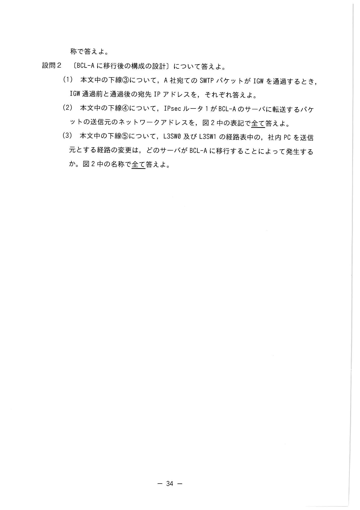

テキスト (OCR)

称で答えよ。
設問2 〔BCL-A に移行後の構成の設計]】について答えよ。

(1) 本文中の下線③について, A 社宛ての SMTP パケットが IGW を通過するとき,
IGW 通過前と通過後の宛先 IP アドレスを, それぞれ答えよ。

(2) 本文中の下線のについて, IPsec ルータ 1 がBCL-A のサーバに転送するパケ
ットの送信元のネットワークアドレスを。,  図 2 中の表記で全て答えよ。

(3) 本文中の下線⑤@について, L3SW9 及び L3SW1 の経路表中の, 社内PC を送信
元とする経路の変更は, どのサーバが BCL-A に移行することによって発生する
か。図 2 中の名称で全て答えよ。

ー 34 一

### ページ 35

テキスト (OCR)

[ メ モ 用 紙 J

### ページ 36

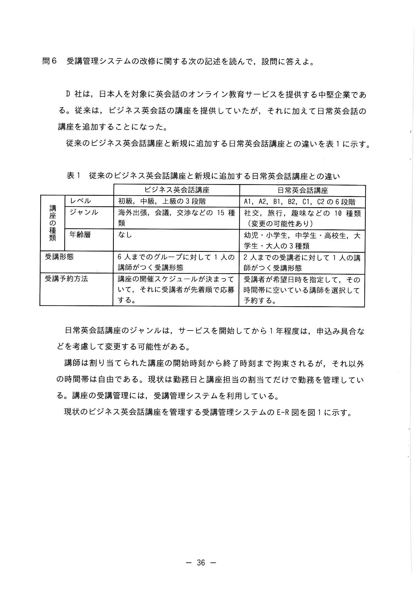

テキスト (OCR)

問6 受講管理システムの改修に関する次の記述を読んで, 設問に答えよ。

D 社は, 日本人を対象に英会話のオンライン教育サービスを提供する中堅企業であ
る。 従来は. ビジネス英会話の講座を提供していたが, それに加えて日常英会話の
講座を追加することになった。

従来のビジネス英会話講座と新規に追加する日

常英会話講座との違いを表 1 に示す。

表1 従来のビジネス英会話講座と新規に追加する日常英会話講座との違い

ビジネス英会語講座         日常英会話講座
_   レベル    DR, 中級, EMO 3 段階      Al, A2, Bl, B2, C1, C2 の6段階
@ | ジャンル | BAH, SH, 交渉などの 15 種| 社交 旅行趣味などの 10 種類
の         類                 (変更の可能性あり)
2 fame [ae                 DEE, PRE BRE, K
学生・大人の 3 種類
受講形態      6 人までのグループに対して 1 人の | 2 人までの受講者に対して 1 人の講
講師がつく受講形態        師がつく受講形態
受講予約方法    講座の開催スケジュールが決まって | 受講者が希望日時を指定して, その
WC, それに受講者が先着順で応募 | 時間帯に空いている講師を選択して
する。             予約する。
日常英会話講座のジャンルは, サービスを開始してから 1 FRE, 申込み具合な

どを考慮して変更する可能性がある。
講師は割り当てられた講座の開始時刻から終了時刻まで拘束されるが, それ以外
の時間帯は自由である。 現状は勤務日と講座担当の割当てだけで勤務を管理してい
る。 講座の受講管理には, 受講管理システムを利用している。
現状のビジネス英会話講座を管理する受講管理システムの E-R 図を図 1 に示す。

### ページ 37

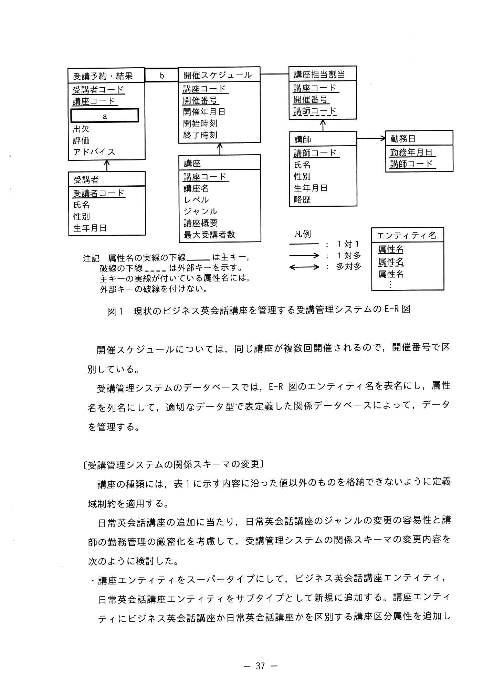

テキスト (OCR)

受講予約・結果      開催スケジュール     講座担当割当
受講者コード       講座コード        講座コード
講座コード        開催番号         開催番号
CL. |    開催年月日      講師コード
開始時刻
ah          終了時記        ー  1
評価                       講師         勤務日
MA       -   1        講師コード      勤務年月日
1        講座          氏名         講師コード
受講者         講座コード       性別
受講者コード       講座名          生年月日
氏名           レベル          略歴
性別           ジャンル
生年月日         aE=
最大受講者数       凡例        エンティティ名
ーーー : 1対1
破線の下線 -__- は外部キーを示す。     <> : 多対多 | RIES
主キーの実線が付いている属性名には,              属性名
外部キーの破線を付けない。                    i

図1 現状のビジネス英会話講座を管理する受講管理システムの E-R図

開催えスケジュールについては, 同じ講座が複数回開催されるので, 開催番号で区
別している。
受講管理システムのデータベースでは, ER 図のエンティティ名を表名にし, 属性
名を列名にして, 適切なデータ型で表定義した関係データベースによって, データ
を管理する。

[受講管理システムの関係スキーマの変更]
講座の種類には, 表 1 に示す内容に沿った値以外のものを格納できないように定義
域制約を適用する。
日常英会話講座の追加に当たり, 日常英会話講座のジャンルの変更の容易性と講
師の勤務管理の厳密化を考慮して, 受講管理システムの関係スキーマの変更内容を
次のように検討した。
・ 講座エンティティをスーパータイプにして, ビジネス英会話講座エンティティ,
日淀英会話講座エンティティをサブタイプとして新規に追加する。講座エンティ
ティにビジネス英会話講座か日常英会話講座かを区別する講座区分属性を追加し

### ページ 38

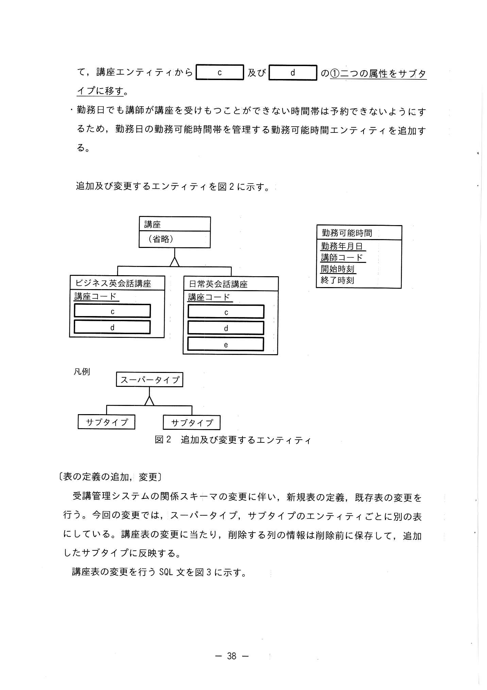

テキスト (OCR)

て, 講座エンティティから|  c |及び| dg |の①ニっの属性をサブタ
イプに移す。

・ 勤務日でも講師が講座を受けもつととができない時間帯は予約できないようにす
るため, 勤務日の勤務可能時間帯を管理する勤務可能時間エンティティを追加す

る。

追加及び変更するエンティティを図 2 に示す。

ae                  勤務可能時間
sk                勤務年月日
人                講師コード
[          ]        開始時刻
ビジネス英会語講座    日党英会話講座        een
講座コード        講座コード

| サフタイプ | | サフブタィブ|
図2 追加及び変更するエンティティ

〔表の定義の追加, FR)
受講管理システムの関係スキーマの変更に伴い, 新規表の定義, 既存表の変更を

行う。 今回の変更では, スーパータイプ, サブタイプのエンティティごとに別の表
にしている。講座表の変更に当たり, 削除する列の情報は削除前に保存して, 追加
したサブタイプに反映する。

講座表の変更を行う SQL 文を図 3 に示す。

### ページ 39

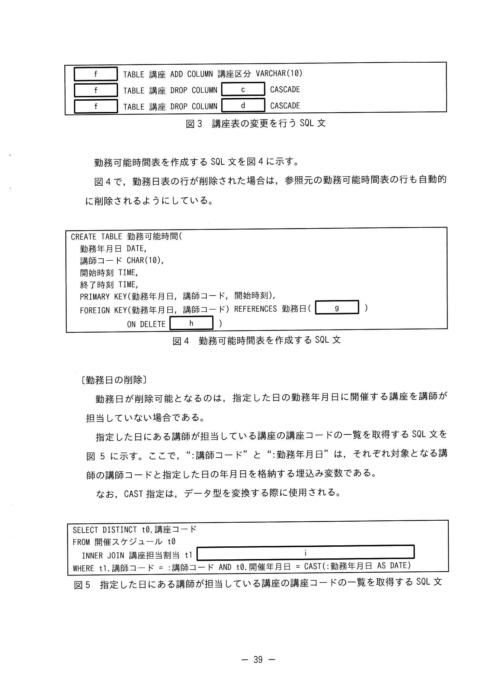

テキスト (OCR)

f     TABLE 講座 ADD COLUMN 講座区分 VARCHAR(10)

f | TABLE講座 DROP COLUMN CASCADE

f     TABLE 講座 DROP coLumn |    d    ] CASCADE

HH

 3 講座表の変更を行う SQL文

勤務可能時間表を作成する SQL 文を図 4 に示す。
図 4 で, 勤務日表の行が削除された場合は, 参照元の勤務可能時間表の行も自動的
に削除されるようにしている。

CREATE TABLE 勤務可能時間(
勤務年月日 DATE,
講師コード CHAR(10),
開始時刻 TIME,
終了時刻 TIME,
PRIMARY KEY(勤務年月日, 講師コード, 開始時刻),
FORETGN KEY(勤務征月日, 講師コード) REFERENCES 勤務日( | g | )
ON DELETE |    h    | )

 4 勤務可能時間表を作成する SOL 文

勤務日の削除]

勤務日が削除可能となるのは, 指定した日の勤務年月日に開催する講座を講師が
担当していない場合である。

指定した日にある講師が担当している講座の講座コードの一覧を取得する SOL 文を
 5 に示す。ここで, “:講師コード"と “SMEAR” lt, それぞれ対象となる講
師の講師コードと指定した日の年月日を格納する埋込み変数である。

なお, CAST 指定は, データ型を変換する際に使用される。

SELECT DISTINCT t0.講座コード

FROM 開催スケジュール tO
INNER JOIN 講座担当割当 t1 |                   J

WHERE t1.講師コード = :講師コード AND t0.開催年月日 = CAST(:勤務年月日 AS DATE)

 5 指定した日にある講師が担当している講座の講座コードの一覧を取得する SLX

### ページ 40

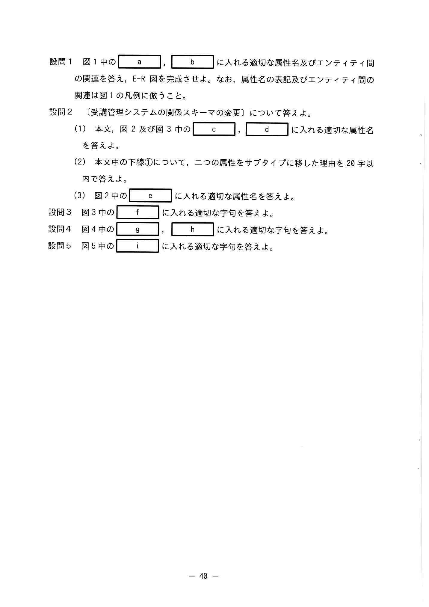

テキスト (OCR)

設問1 図1中の| a |,|  b |に入れる適切な属性名及びエンティティ問
の関連を答え, E-R 図を完成させよ。なお, 属性名の表記及びエンティティ間の
関連は図 1 の凡例に條うこと。

設問2 [受講管理システムの関係スキーマの変更] について答えよ。

(1) 本文, 図 2 及び図 3 中の|  c |,|  』 |に入れる適切な属性名
を答えよ。

(2) 本文中の下線わについて, 二つの属性をサブタイプに移した理由を 20 字以
内で答えよ。

(3) 図2中の|  s | に入れる適切な属性名を答えよ。

設問3 図3中の| f | に入れる適切な字句を答えよ。

設問4 図4中の|  g |, |  h |に入れる適切な字句を答えよ。
設問5 図5中の| i | に入れる適切な字句を答えよ。

### ページ 41

テキスト (OCR)

〔

メ = 用 紙 J

### ページ 42

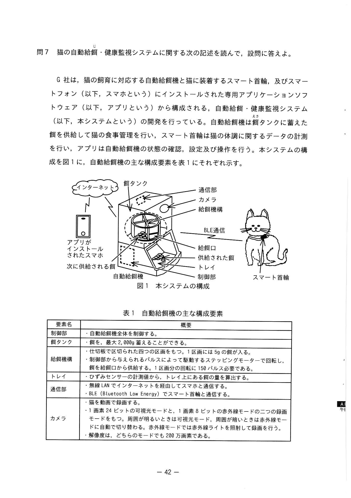

テキスト (OCR)

fel 7  猫の自動給人 ・ 健康監視システムに関する次の記述を読んで, 設問に答えよ。

6 社は, 猫の飼育に対応する自動給餌機と猫に装着するスマート首輪, 及びスマー
トフォン (以下,。 スマホという) にインストールされた専用アプリケーションソフ
トウェア (UR, アプリという) から構成される, 自動給餌・健康監視レステム
(以下本システムという) の開発を行っている。 自動給人ソ機は個タンクに蓄えた
餌を供給して猫の食事管理を行い スマート首輪は猫の体調に関するデータの計測
を行い, アプリは自動給餌機の状態の確認, 設定及び操作を行う。本システムの構
成を図 1 に, 自動給餌機の主な構成要素を表 1 にそれぞれ示す。

ps                          4          BLE通信
アプリが
ィンストール |ジ        へ \~ 給人ソロ
されたスマホ                      シー 供給された餌
ict af CANS ny
Smee                   制御部

図1 本システムの構成

表1 自動給餌機の主な構成要素

要素名                                  概要
制御部      ・ 自動給餌機全体を制御する。
餌タンク    ・餌を, 最大 2, 900g 蓄えることができる。

・仕切板で区切られた四つの区画をもつ。1 区画には 5g の餌が入る。

給餌機構      ・ 制御部から与えられるパルスによって駆動するステッピングモーターで回転し,
餌を給餌口から供給する。1 区画分の回転に 159 パルス必要である。

トレイ     ・ひずみセンサーの計測値から, トレイ上にある餌の量を算出する。

・ 無線LAN でインターネットを経由してスマホと通信する。

ae      “BLE (Bluetooth Low Energy) でスマート首輪と通信する。

・ 猫を動画で録画する。

・ 1 画素 24 ビットの可視光モードと, 1 画素 8 ビットの赤外線モードの二つの録画
カメラ         モードをもつ。 周囲が明るいときは可視光モード, 周囲が暗いときは赤外線モー

ドに自動で切り替わる。赤外線モードでは赤外線ライトを照射して録画を行う。
・ 解像度は, どちらのモードでも 200 万画素である。

### ページ 43

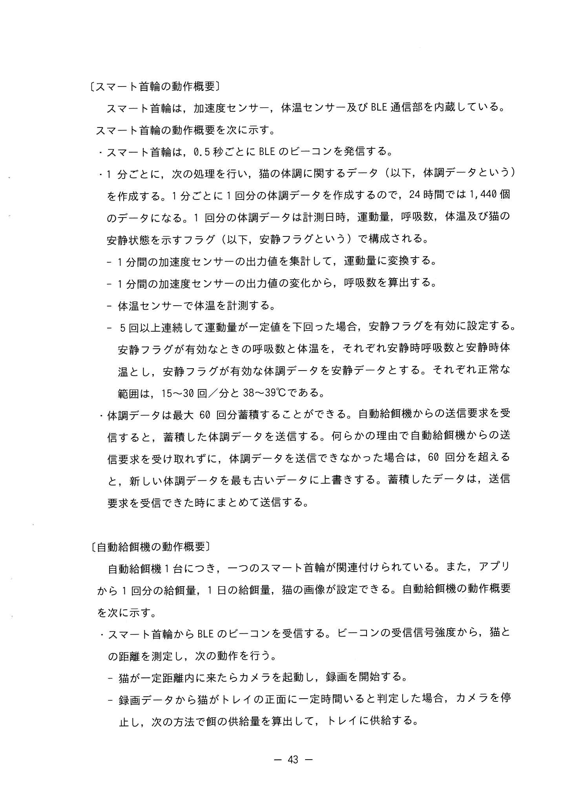

テキスト (OCR)

〔スマート首輪の動作概要]

スマート首輪は, 加速度センサー, 体温モンサー及び BLE 通信部を内蔵している。

スマート首輪の動作概要を次に示す。

-・スマート首輸は, 9.5 秒ごとに BLE のビーコンを発信する。

- 1 分ごとに, 次の処理を行い, 猫の体調に関するデータ (以下, 体調データという)
を作成する。1 分ごとに 1 回分の体調データを作成するので, 24 時間では 1, 440 個
のデータになる。1 回分の体調データは計測日時, 運動量, 呼吸数, 体温及び猫の
安静状態をた示すフラグ (以下, 安静フラグという) で構成される。

- 1 分間の加速度センサーの出力値を集計して, 運動量に変換する。

- 1 分間の加速度センサーの出力値の変化から, 呼吸数を算出する。

- 体温センサーで体温を計測する。

- 5回以上連続して運動量が一定値を下回った場合, 安静フラグを有効に設定する。
安静フラグが有効なときの呼吸数と体温を,. それぞれ安静時呼吸数と安静時体
温とし, 安静フラグが有効な体調データを安静データとする。 それぞれ正常な
範囲は, 15~30 回分と 38一39Cである。

・ 体調データは最大 60 回分鞭積することができる。自動給餌機からの送信要求を受
信すると, 蓄積した体調データを送信する。 何らかの理由で自動給餌機からの送
信要求を受け取れずに, 体調データを送信できなかった場合は, 60 回分を超える
と, 新しい体調データを最も古いデータに上書きする。薔積したデータは, 送信
要求を受信できた時にまとめて送信する。

[自動給餌機の動作概要〕
自動給餌機 1 台につき, 一つのスマート首輪が関連付けられている。 また, PTY
DS 回分の給餌量, 1 日の給餌量, 猫の画像が設定できる。自動給餌機の動作概要
を次に示す。
- スマート首輪から BLE のビーコンを受信する。 ビーコンの受信信号強度から, 猫と
の距離を測定し, 次の動作を行う。
- 猫が一定距離内に来たらカメラを起動し, 録画を開始する。
- 録画データから猫がトレイの正面に一定時間いると判定した場合, カメラを停
止し, 次の方法で餌の供給量を算出して, トレイに供給する。

### ページ 44

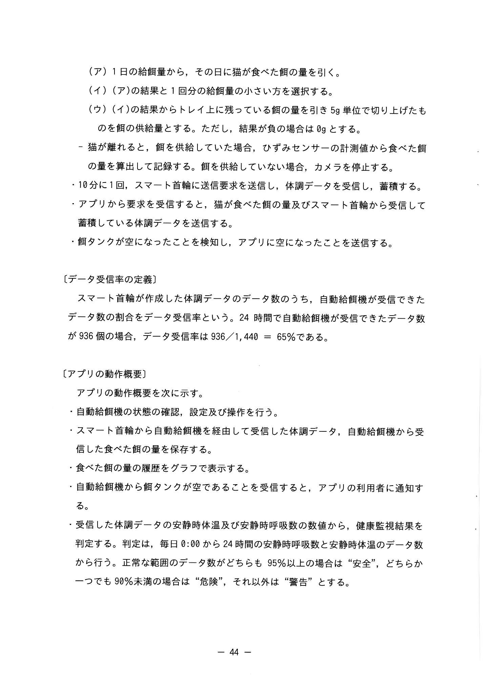

テキスト (OCR)

(ア) 1 日の給餌量から, その日に猫が食べた餌の量を引く。
(イ) (ア)の結果と 1 回分の給餌量の小さい方を選択する。
(ウ) (イ)の結果からトレイ上に残っている餌の量を引き 5g 単位で切り上げたも
のを餌の供給量とする。ただし, 結果が負の場合は 69 とする。
~ 猫が離れると, 餌を供給していた場合, ひずみセンサーの計測値から食べた餌
の量を算出して記録する。餌を供給していない場合, カメラを停止する。
- 19分に1回, スマート首輪に送信要求を送信し, 体調データを受信し, BATS.
・アプリから要求を受信すると, 猫が食べた餌の量及びスマート首輪から受信して
蓄積している体調データを送信する。
・餌タンクが空になったことを検知し, アプリに空になったことを送信する。

〔データ受信率の定義

スマート首輪が作成した体調データのデータ数のうち, 自動給餌機が受信できた
データ数の割合をデータ受信率という。24 時間で自動給餌機が受信できたデータ数
が 936 個の場合,データ受信率は 936/1, 449 = 65%である。

〔アプリの動作概要〕
アプリの動作概要を次に示す。

・ 自動給餌機の状態の確認, 設定及び操作を行う。

・スマート首輪から自動給餌機を経由して受信した体調データ, 自動給餌機から受
信した食べた餌の量を保存する。

・ 食べた餌の量の履歴をグラフで表示する。

・ 自動給餌機から餌タンクが空でもあることを受信すると, アプリの利用者に通知す
る。

・ 受信した体調データ の安静時体温及び安静時呼吸数の数値から, 健康監視結果を
判定する。判定は, 毎日 9:99 から 24 時間の安静時呼吸数と安静時体温のデータ数
から行う。 正常な範囲のデータ数がどちらも 95%以上の場合は “安全", どちらか
ーつでも 96%未満の場合は “和危険", それ以外は “警告" とする。

### ページ 45

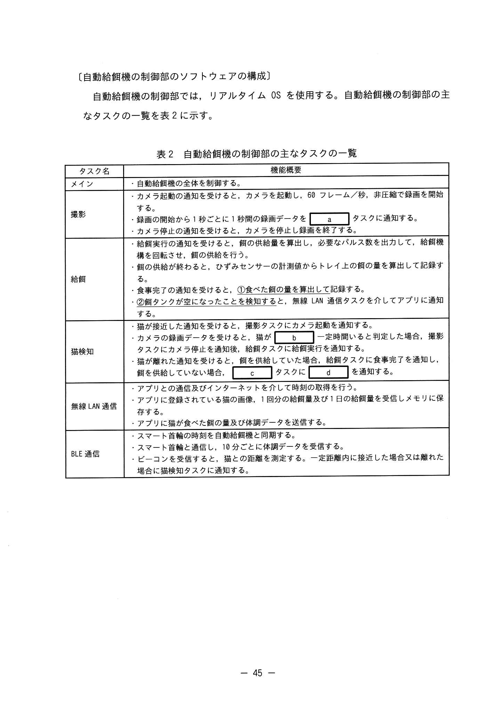

テキスト (OCR)

[自動給餌機の制御部のソフトウェアの構成]
自動給餌機の制御部では, リアルタイム 0S を使用する。自動給餌機の制御部の主
なタスクの一覧を表 2 に示す。

表2 自動給餌機の制御部の主なタスクの一覧

タスク名

機能概要

メイン

・ 自動給餌機の全体を制御する。

撮影

- カメラ起動の通知を受けると, カメラを起動し, 69 フレームン秒, 非圧縮で録画を開始

・ 録画の開始から 1 秒ごとに 秒間の録画データを |  。 | タスクに通知する。
・カメラ停止の通知を受けると, カメラを停止し録画を終了する。

する。

給餌

・ 給餌実行の通知を受けると, 餌の供給量を算出し, 必要なパルス数を出力して, 給餌機
・餌の供給が終わると, ひずみセンサーの計測値からトレイ上の餌の量を算出して記録す

・食事完了の通知を受けると, ①食べた餌の量を算出して記録する。
・②餌タンクが空になったことを検知すると, 無線 LAN 通信タスクを介してアプリに通知

構を回転させ, 餌の供給を行う。

る。

する。

猫検知

・ 猫が接近した通知を受けると, 撮影タスクにカメラ起動を通知する。
- カメラの録画データを受けると, 猫が| b | 一定時間いると判定した場合, 撮影

- 猫が離れた通知を受けると, 餌を供給していた場合, 給餌タスクに食事完了を通知し,

タスクにカメラ停止を通知後, 給餌タスクに給餌実行を通知する。

餌を供給していない場合, | < | タスクに|  q | を通知する。

無線 LAN 通信

・アプリとの通信及びインターネットを介して時刻の取得を行う。
・アプリに登録されている猫の画像, 1 回分の給餌量及び 1 日の給餌量を受信しメモリに保

・アプリに猫が食べた餌の量及び体調データを送信する。

存する。

BLE 通信

・スマート首輪の時刻を自動給餌機と同期する。
・スマート首輪と通信し, 10 分ごとに体調データを受信する。
・ ビーコンを受信すると, 猫との距離を測定する。一定距離内に接近した場合又は離れた

場合に猫検知タスクに通知する。

### ページ 46

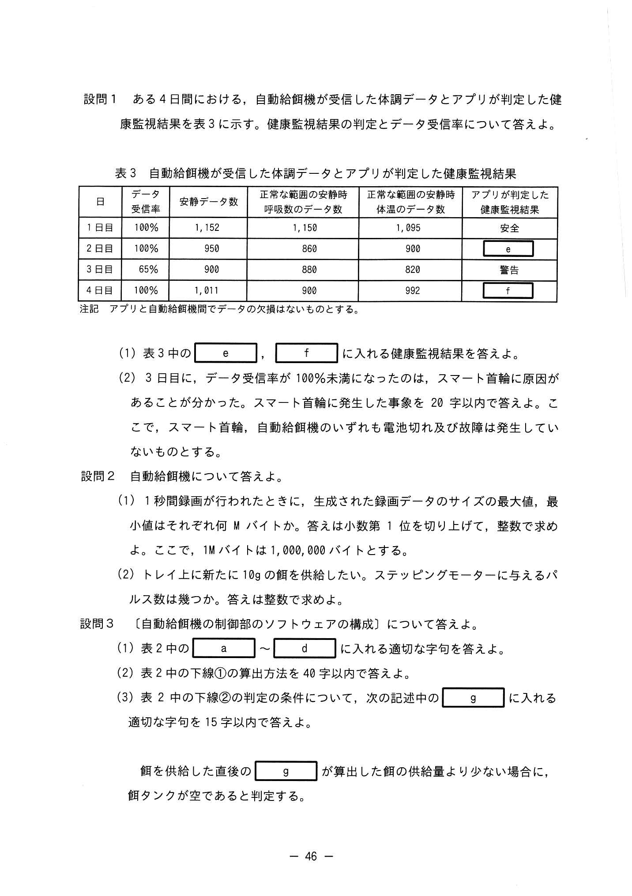

テキスト (OCR)

設問1 ある4日間における, 自動給餌機が受信した体調データとアプリが判定した健
康監視結果を表 3 に示す。 健康監視結果の判定とデータ受信率について答えよ。

表3 自動給餌機が受信した体調データとアプリが判定した健康監視結果

3    データ   安静データ数   正常な範囲の安静時 | 正常な範囲の安静時 | アプリが判定した
受信率               呼吸数のデータ数     体温のデータ数     健康監視結果
1日目 | 100%     1,152           1,150           1,095           安全
2日目 | 100%           959                   860                    900                    e
3 日目      65%           900                   880                    820                  警告
4日目 | 100%        1,011                  900                   992              Lot]

注記 アプリと自動給餌機問でデータの欠損はないものとする。

(1) 表3中の| ce |, |  f |に入れる健康監視結果を答えよ。

(2) 日目に, データ受信率が 169%未満になったのは, スマート首輪に原因が
あることが分かった。スマート首輪に発生した事象を 29 字以内で答えよ。こ
CC, スマート首輪, 自動給餌機のいずれも電池切れ及び故障は発生してい
ないものとする。

設問2 ESR PICOUTHAL.

(1) 1 秒間録画が行われたときに, 生成された録画データのサイズの最大値, 最

小値はそれぞれ何 M バイトか。 答えは小数第 1 位を切り上げて, 整数で求め

to TOC, 1M バイトは 1,000, 999 バイトとする。

(2) トレイ上に新たに 109 の餌を供給したい。ステッピングモーターに与えるパ
ルス数は幾つか。答えは整数で求めよ。

設問3 自動給人ツ機の制御部のソフトウェアの構成】 について管えよ。

(1) 表2中の| a |-| od |に入れる適切な字句を答えよ。

(2) 表 2 中の下線①の算出方法を 49 字以内で答えよ。

(3) 表 2 中の下線のの判定の条件について, 次の記述中の|  g | に入れる
適切な字句を 15 字以内で答えよ。

餌を供給した直後の| g | が算出した餌の供給量より少ない場合に,
餌タンクが空であると判定する。

ー 46 一

### ページ 47

テキスト (OCR)

〔

x モ 用 紙 〕

### ページ 48

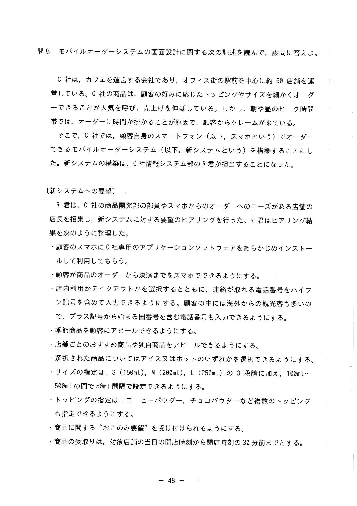

テキスト (OCR)

AIS モバイルオーダーシステムの画面設計に関する次の記述を読んで, 設問に答えよ。

C 社は, カフェを運営する会社であり, オフィス街の駅前を中心に約 50 店舗を運
営している。C 社の商品は, 顧客の好みに応じたトッピングやサイズを細かくオーダ
ーできることが人気を呼び, 売上げを伸ばしている。 LAL, 朝や昼のピーク時間
帯では, オーダーに時間が掛かることが原因で, 顧客からクレームが来ている。

そこで, C HTH, 顧客自身のスマートフォン (以下, スマホという) でオーダー
できるモバイルオーダーシステム (以下, 新システムという) を構築することにし
た。新システムの構築は, C 社情報システム部の R 君が担当することになった。

〔新システムへの要望〕

R 君は, C 社の商品開発部の部員やスマホからのオーダーへのニーズがある店舗の
店長を招集し, 新システムに対する要望のヒアリングを行った。R 君はヒにアリング結
果を次のように整理した。

・ 顧客のスマホに( 社専用のアプリケーションソフトウェアをあらかじめインストー
ルして利用してもらう。

・ 顧客が商品のオーダーから決済までをスマホでできるようにする。

・ 店内利用かテイクアウトかを選択するとともに, 連絡が取れる電話番号をハイフ
ン記号を含めて入力できるようにする。 顧客の中には海外からの観光客も多いの
で, プラス記号から始まる国番号を含む電話番号も入力できるようにする。

・ 季節商品を顧客にアピールできるようにする。

・ 店舗ごとのおすすめ商品や独自商品をアピールできるようにする。

・ 選択された商品についてはアイス又はホットのいずれかを選択できるようにする。

・サイズの指定は, S (159m), M (200ml), L (259ml) の 3 段階に加え, 100mL~
500ml の間で 59ml 間隔で設定できるようにする。

・トッピングの指定は, コーヒーパウダー, チョコパウダーなど複数のトッピング
も指定できるようにする。

・ 商品に関する “おこのみ要望" を受け付けられるようにする。

・ 商品の受取りは, 対象店舗の当日の開店時刻から閉店時刻の 30 分前までとする。

### ページ 49

テキスト (OCR)

R 君は,

これらの要望を満たすための要件定義書を作成した。

[画面の設計]

| ニ=
の画面レイアウト例を図 1 に,

画面と商品選択画面
mi

面設計を開始した。R 君が設計中のトッ
トップ画面の画面項目定義書を

トップ画面                                   商品選択画面
み、の                                ーー      a0                                ーー
S08) C社カフェ      =| (08) C社カフェ      =
Sui                                         商品選所                                   a
a erュー | | 語!本日のコーヒー   Vat 本日の紅茶      I
1ュ              )   a        ia!
|  1                                  i  '         が 」S ¥300 mM ¥400 L ¥500 | [Li S \300 M ¥400 L ¥500
ri       商品画像       1     「軍!アメリカンコーヒー | 『画!アールグレイティー
i  1                                  |         (eh S ¥300 M ¥400 L ¥500  hon S ¥300 M ¥400 L ¥500
eeナー 」 |語!カフェラテ      ! 語| プリーンティー
ooowooo                    | 像1 s *a00 My00 L *500  | 像1 s ya00 M*400 L\500   +
ホットノアイス指定
モバイルオーダー              〇ホット 〇アァアイス
Ph     OOO駅北口店             以    サイズ指定
were                        Os On OL 〇自由指定[269mL M
芝
時刻 | 5                     Dv |
si                         パウダー (複数選択可)           a
連絡先 | +1-123-4567890            ロコーヒーパウダー 抹茶パウダー   |
〇 店内利用 。 〇 テイクアウト     ロロチョコパウダー 口 モンブランパウダー |v
SLOSES
商品選択へ進む                                        注文
図1 トップ画面と商品選択画面の画面レイアウト例
表1 トップ画面の画面項目定義書
No.      面項目名    コンポーネ        選択肢            初期値         入力チェック      その他仕欄
ント種別
1    メニュー     [    a    ]   商品紹介サイト,    設定なし         なし            なし
ログイン, 顧客情
報変更
2 | 季節商品       (省略)      なし              季節商品の画像     なし              3 秒で画像を
切替え
3 | 店舗選択                         現在位置から半径 | 現在位置から最も | なし                   なし
L』 』   5km 以内の店舗     近い店舗

ー 49 一

### ページ 50

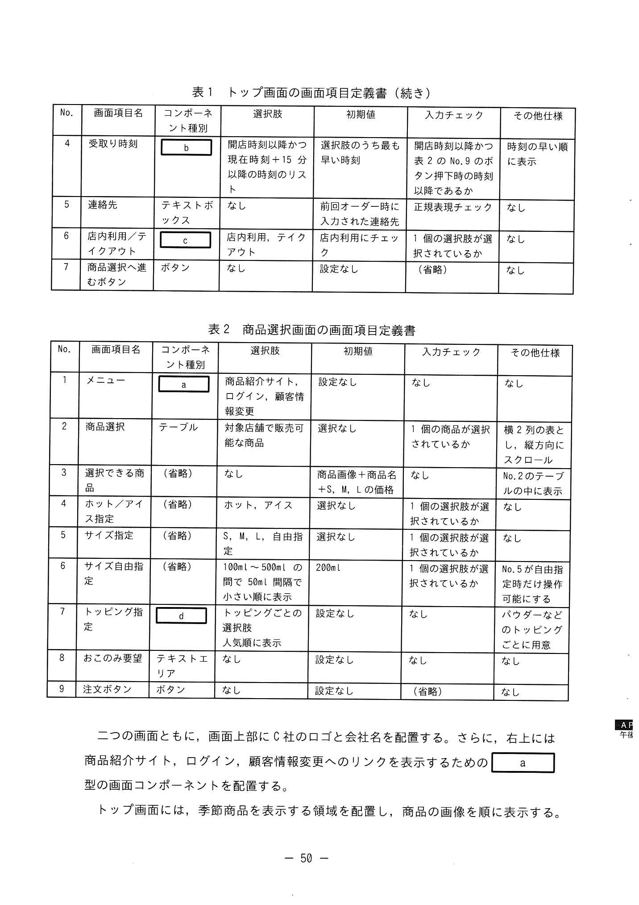

テキスト (OCR)

表1 トップ画面の画面項目定義書 (続き)
No. | 画面項目名 | コンポーネ          選択肢                初期値            入力チェック        その他仕欄
ント種別
4 | 受取り時刻    [5   開店時刻以降かつ | 選択肢のうち最も | 開店時刻以降かつ | 時刻の早い順
現在時刻十15 分 | 早い時刻          表 2 の No.9 ORK | に表示
以降の時刻のリス                   タン押下時の時刻
ト                                 以降であるか
5 | 連絡先       テキストボ | なし           前回オーダー時に | 正規表現チェック | なし
ックス                         入力された連絡先
6 | 店内利用/テ   店内利用, テイク | 店内利用にチェッ | 1 個の選択肢が選 | なし
イグアウウト            アウト         ク           択されているか
7 | 商品選択へ進 | ボタン       なし             設定なし          (省略)          なし
むボタン
表2 商品選択画面の画面項目定義書
No. | 画面項目名 | コンポーネ          選択肢               初期値            入力チェック        その他仕様
ント種別
1    深雪ミー                 商品紹介サイト,    設定なし          なし             なし
C2]   ログイン, 顧客情
報変更
2 | 商品選択       テーブル     対象店舗で販売可 | 選択なし           1 個の商品が選択 | 横 2 列の表と
能な商品                        されているか      し, 縦方向に
スクロール
3 | 選択できる商 | (省略)     なし           商品画像十商品名 | なし           No.2のテーブ
品                                          +S, M, L の価格                     ルの中に表示
4 | ホットブアイ | (省略)      ホット, アイス    選択なし         1 個の選択肢が選 | なし
ス指定                                                        択されているか
5 | サイズ指定    (省略)    S, M, L, 自由指 | 選択なし       1 個の選択肢が選 | なし
定                                 択されているか
6 | サイズ自由指 | (省略)      100mL~ 500mL の| 200ml             1 個の選択肢が選 | No.5が自由指
定                    間で 59ml 間隔で                択されているか    定時だけ操作
小さい順に表示                                       可能にする
7    トッピング指              トッピングごとの | 設定なし          なし             パウダーなど
定           Ca]   選択肢                                           のトッピング
人気順に表示                                                              ごとに用意
8 | おこのみ和要望 | テキストエ | なし          設定なし       なし          なし
wg
9 | 注文ボタン    ボタン      なし             設定なし          (省略)          なし

ニニつの画面ともに, 画面上部にC 社のロゴと会社名を配置する。さらに, 右上には
商品紹介サイト, ログイン, 顧客情報変更へのリンクを表示するための|  a |
型の画面コンポーネントを配置する。

トップ画面には, 地節商品を表示する領域を配置し, 商品の画像を順に表示する。

Fi

### ページ 51

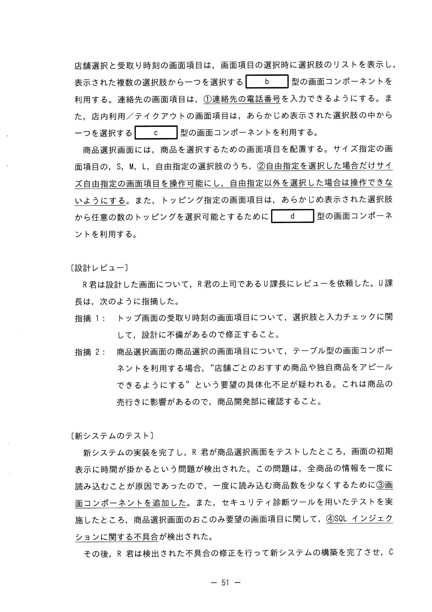

テキスト (OCR)

店舗選択と受取り時刻の画面項目は, 画面項目の選択時に選択肢のリストを表示し,
表示された複数の選択肢から一つを選択する |  b | 型の画面コンポーネントを
利用する。 連絡先の画面項目は,①連絡先の電話番号を入力できるようにする。ま
た, 店内利用プテイクアウトの画面項目は, あらかじめ表示された選択肢の中から
ーつを選択する| c | 型の画面コンポーネントを利用する。

商品選択画面には, 商品を選択するための画面項目を配置する。サイズ指定の画
面項目の, S, ML, 自由指定の選択肢のうち, @自由指定を選択した場合だけサイ
ズ自由指定の画面項目を操作可能にし, 自由指定以外を選択した場合は操作できな
いようにする。また, トッピング指定の画面項目は, あらかじめ表示された選択肢
から任意の数のトッピングを選択可能とするために|  d | 型の画面コンポーネ
ントを利用する。

設計レビュー〕
R 君は設計した画面について, R 君の上司であるU課長にレビューを依頼した。U課

長は, 次のように指摘した。

指摘1: トップ画面の受取り時刻の画面項目について, 選択肢と入力チェックに関
して, 設計に不備があるので修正すること。

指摘 2: 商品選択画面の商品選択の画面項目について, テーブル型の画面コンポー
ネントを利用する場合, "店舗ごとのおすすめ商品や独自商品をアピール
できるようにする"という要望の具体化不足が疑われる。これは商品の

行きに影響があるので, 商品開発部に確認すること。

EN

〔新システムのテスト]

新システムの実装を完了し, R 君が商品選択画面をテストしたところ, 画面の初期
表示に時間が掛かるという問題が検出された。この問題は, 全商品の情報を一度に
読み込むことが原因であったので, 一度に読み込む商品数を少なくするために③画
面コンポーネントを追加した。また, セキュリティ診断ツールを用いたテストを実
施したところ, 商品選択画面のおこのみ要望の画面項目に関して, OSA インジェク
ションに関する不具合が検出された。

EOE, R 君は検出された不具合の修正を行って新システムの構築を完了させ, C

ー 51 一

### ページ 52

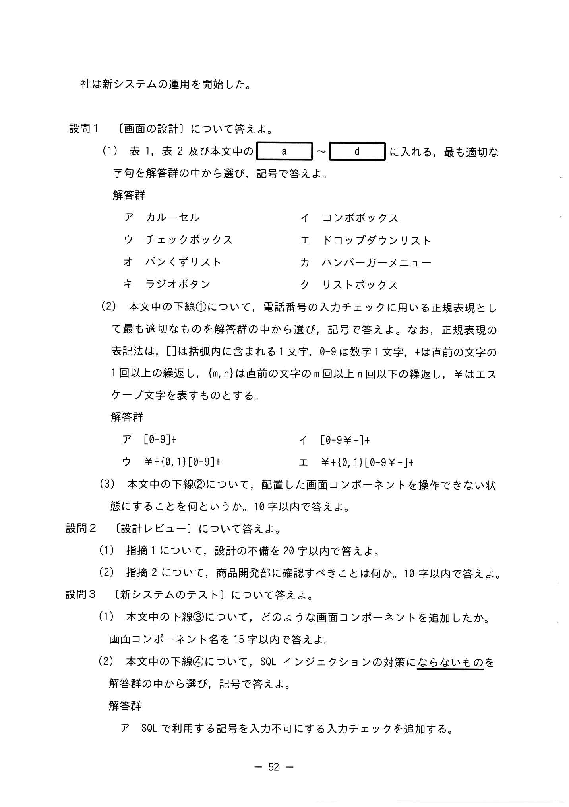

テキスト (OCR)

社は新システムの運用を開始した。

設問1 [画面の設計)について答えよ。
(1) 表 1, 表 2 及び本文中の| a |~|  g |に入れる, 最も適切な
宇句を解答群の中から選び, 記号で答えよ。

解答群
ア カルーセル         イ コンボボックス
ウ チェックボックス      I ドロップダウンリスト
A パン<くずリスト       A ハンバーガーメニュー
キ ラジオボタン        ク リストボックス

(2) 本文中の下線わについて, 電話番号の入力チェックに用いる正規表現とし
て最も適切なものを解答群の中から選び, 記号で答えよ。なお, 正規表現の
表記法は, []は括弧内に含まれる 1 文字, 9-9 は数字 1 文字, +は直前の文字の
1 回以上の繰返し, {m, n} は直前の文字のm 回以上n 回以下の繰返し, \はエス
ケープ文字を表すものとする。

解答群
ア [0-9]+         イ [9-9\-]+
ウ ¥+{0,1}[0-9]+     エ ¥+(0,1)[0-9¥-]+

(3) 本文中の下線の@について, 配置した画面コンポーネントを操作できない状
態にすることを何というか。169 字以内で答えよ。
設問2 【〔設計レビュー〕 について答えよ。
(1) 指摘1 について, 設計の不備を 20 字以内で答えよ。
(2) 指摘 2 について, 商品開発部に確認すべきことは何か。10 字以内で答えよ。
設問3 【〔新システムのテスト〕 について答えよ。
(1) 本文中の下線について, どのような画面コンポーネントを追加したか。
画面コンポーネント名を 15 字以内で答えよ。
(2) 本文中の下線について, SL インジェクションの対策にならないものを
解答群の中から選び, 記号で答えよ。
解答群
ア SOL で利用する記号を入力不可にする入力チェックを追加する。

### ページ 53

テキスト (OCR)

イ SQL 文の組立てにおいて, プレースホルダを使用する。
ウ 新システムへのアクセスは WAF 経由とする。
エ 新システムを動作させるサーバにマルウェア対策ソフトを導入する。

### ページ 54

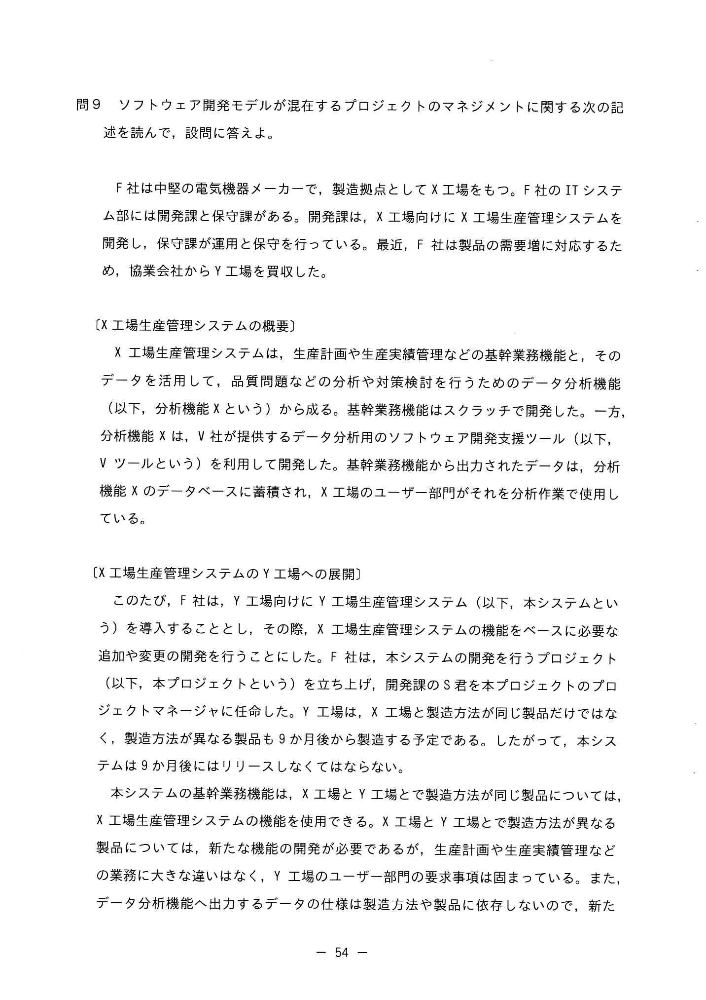

テキスト (OCR)

間9 ソフトウェア開発モデルが混在するプロジェクトのマネジメントに関する次の記
述を読んで, 設問に答えよ。

F 社は中堅の電気機器メーカーで, 製造拠点として X 工場をもつ。『 社の IT システ
ム部には開発課と保守課がある。 開発課は, X 工場向けに X 工場生産管理システムを
開発し, 保守課が運用と保守を行っている。最近,F 社は製品の需要増に対応するた
め, 協業会社からY工場を買収した。

【X 工場生産管理システムの概要]

X 工場生産管理システムは, 生産計画や生産実績管理などの基幹業務機能と, その
データを活用して, 品質問題などの分析や対策検討を行うためのデータ分析機能
(以下, 分析機能X という) から成る。基幹業務機能よスクラッチで開発した。 一方,
分析機能 X は, V 社が提供するデータ分析用のソフトウェア開発支援ツール (以下
V ツールという) を利用して開発した。基幹業務機能から出力されたデータは, DAT
機能 X のデータベースに蓄積され, X 工場のユーザー部門がそれを分析作業で使用し
ている。

〔X 工場生産管理システムのY工場への展開〕

このたび, F 社は, Y 工場向けに Y 工場生産管理システム (以下, 本システムとい
う) を導入することとし, その際, X 工場生産管理システムの機能をベースに必要な
追加や変更の開発を行うことにした。「F 社は, 本システムの開発を行うプロジェクト
GAR, 本プロジェクトという) を立ち上げ, 開発課の S 君を本プロジェクトのプロ
ジェクトマネージャに任命した。Y 工場は, X 工場と製造方法が同じ製品だけではな
く, 製造方法が異なる製品も 9 か月後から製造する予定である。したがって, 本シス
テムは9か月後にはリリースしなくてはならない。

本システムの基幹業務機能は, X 工場と Y 工場とで製造方法が同じ製品については,
X 工場生産管理システムの機能を使用できる。X 工場と Y 工場とで製造方法が異なる
製品については, 新たな機能の開発が必要であるが, 生産計画や生産実績管理など
の業務に大きな違いはなく, Y 工場のユーザー部門の要求事項は固まっている。また
データ分析機能へ出力するデータの仕様は製造方法や製品に依存しないので, 新た

ー 54 一

### ページ 55

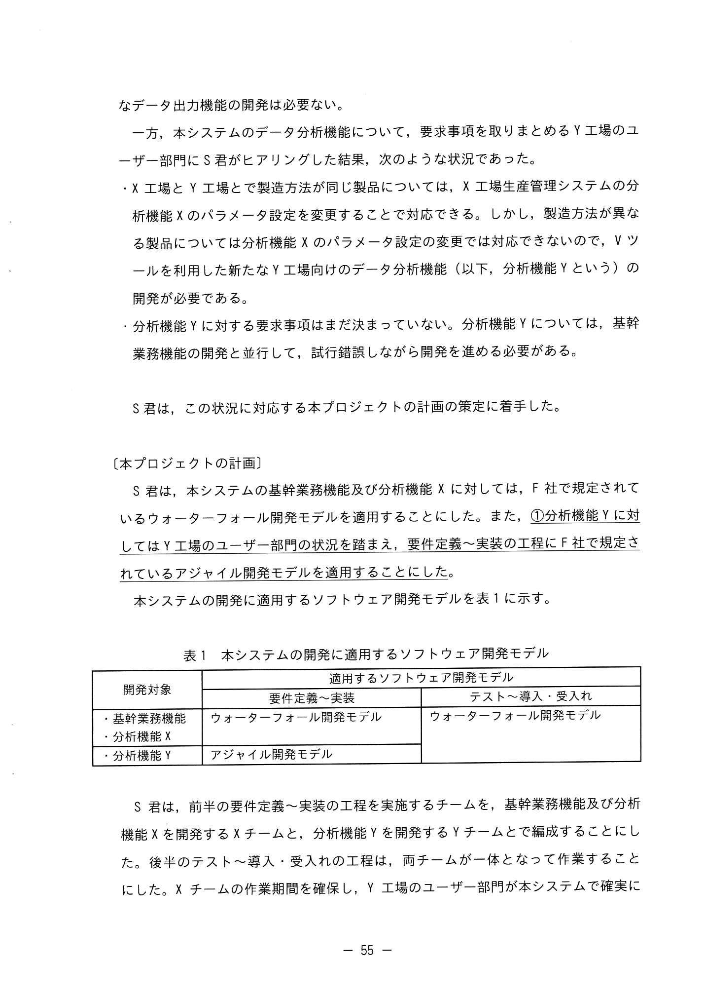

テキスト (OCR)

なデータ出力機能の開発は必要ない。
一方, 本システムのデータ分析機能こついて, 要求事項を取りまとめる Y 工場のユ
ーザー部門に S 君がヒアリングした結果, 次のような状況であった。
・X 工場と Y 工場とで製造方法が同じ製品については, X 工場生産管理システムの分
析機能 X のパラメータ設定を変更することで対応できる。しかし, 製造方法が異な
る製品については分析機能 X のパラメータ設定の変更では対応できないので, VY
ールを利用した新たな Y 工場向けのデータ分析機能 (以下, 分析機能Y という) の
開発が必要である。
・ 分析機能 Y に対する要求事項はまだ決まっていない。分析機能Y については, 基幹
業務機能の開発と並行して, 試行錯誤しながら開発を進める必要がある。

S#lt, この状況に対応する本プロジェクトの計画の策定に着手した。

[本プロジェクトの計画〕

S 君は, 本システムの基幹業務機能及び分析機能 X に対しては, F 社で規定されて
いるウォーターフォール開発モデルを適用することにした。また, ①分析機能 Y に対
してはY 工場のユーザー部門の状況を踏まえ, 要件定義一実装の工程に 社で規定さ
れているアジャイル開発モデルを適用することにした。

本システムの開発に適用するソフトウェア開発モデルを表 1 に示す。

Hl 本システムの開発に適用するソフトウェア開発モデル

適用するソフトウェア開発モデル
        要件定義実装         テスト~導入・受入れ
・基幹業務機能 | ウォーターフォール開発モデル    ウォーターフォール開発モデル
・分析機能 X
・分析機能 Y   アジャイル開発モデル

S Blt, 前半の要件定義一実装の工程を実施するチームを, 基幹業務機能及び分析
機能 X を開発する X チームと, 分析機能Y を開発するYチームとで編成することにし
た。後半のテスト~導入・受入れの工程は, 両チームが一体となって作業すること
にした。X チームの作業期間を確保し, Y 工場のユーザー部門が本システムで確実に

### ページ 56

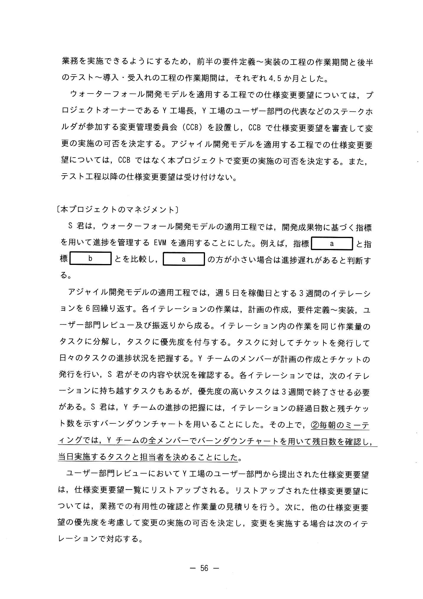

テキスト (OCR)

業務を実施できるようにするため, 前半の要件定義一実装の工程の作業期間と後半
のテスト~導入・受入れの工程の作業期間は, それぞれ 4.5 か月とした。

ウォーターフォール開発モデルを適用する工程での仕様変更要望については, プ
ロジェクトオーナーである Y 工場長, Y 工場のユーザー部門の代表などのステークホ
ルダが参加する変更管理委員会 (CCB) を設置し, CCB で仕様変更要望を審査して変
更の実施の可否を決定する。アジャイル開発モデルを適用する工程での仕様変更要
望については, CCB ではなく本プロジェクトで変更の実施の可否を決定する。また
テストエ程以降の仕様変更要望は受け付けない。

〔本プロジェクトのマネジメント〕

S Bld, ウォーターフォール開発モデルの適用工程では, 開発成果物に基づく指標
を用いて進捗を管理する EW を適用することにした。例えば, 指標[ 』 | と指
標| b eee, (a  ] の方が小さい場合は進捗遅れがあると判断す
る。

アジャイル開発モデルの適用工程では, 週5日を稼働日とする 3 週間のイテレーシ
ョンを 6 回繰り返す。各イテレーションの作業は, 計画の作成、要件定義実装, ユ
ーザー部門レビュー及び振返りから成る。イテレーション内の作業を同じ作業量の
タスクに分解し, タスクに優先度を付与する。 タスクに対してチケットを発行して
日々のタスクの進捗状況を把握する。Y チームのメンバーが計画の作成とチケットの
発行を行い, $ 君がその内容や状況を確認する。各イテレーションでは, 次のイテレ
ーションに持ち越すタスクもあるが, 優先度の高いタスクは3 週間で終了させる必要
DHS. S Bld, Y チームの進捗の把握には, イテレーションの経過日数と残チケッ
ト数を示すバーンダウンチャートを用いることにした。その上で, ぐ②毎朝のミーテ
ィングでは, Y チームの全メンバーでバーンダウンチャー トを用いて残日数を確認し,

当日実施するタスクと担当者を決めることにした。

ユーザー部門レビューにおいて Y工場のユーザー部門から提出された仕様変更要望
は, 仕様変更要望一覧しリストアップされる。リストアップされた仕様変更要望に
ついては, 業務での有用性の確認と作業量の見積りを行う。 次に, 他の仕様変更要
望の優先度を考慮して変更の実施の可否を決定し, 変更を実施する場合は次のイテ
レーションで対応する。

### ページ 57

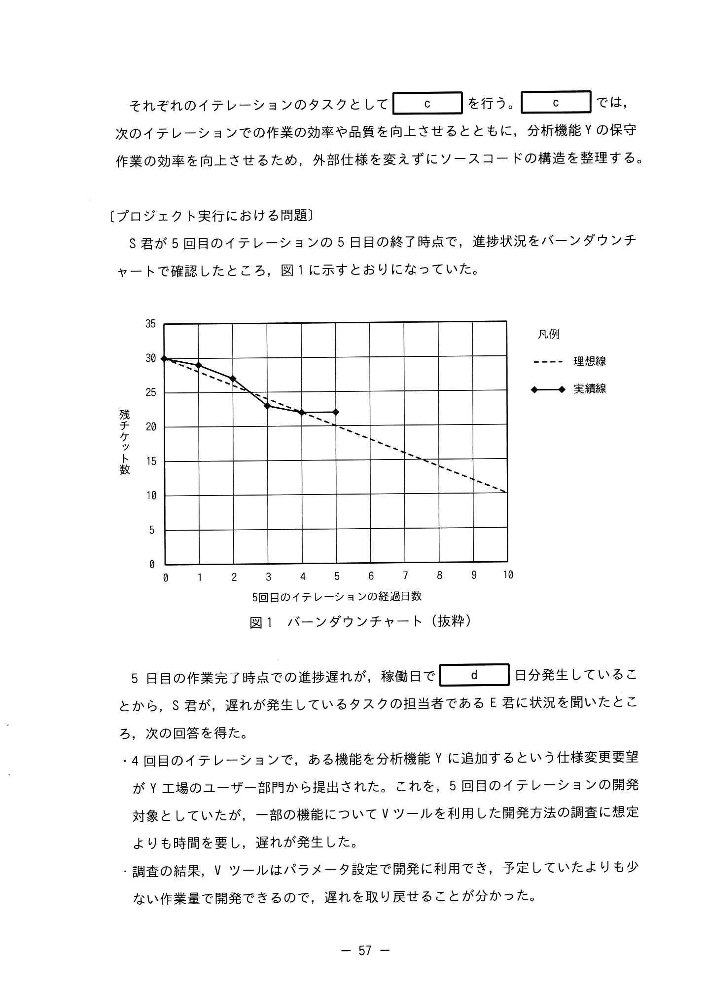

テキスト (OCR)

それぞれのイテレーションのタスクとして|  c |を行う。| c |でほ,
次のイテレーションでの作業の効率や品質を向上させるとともに, 分析機能 Y の保守
作業の効率を向上させるため, 外部仕様を変えずにソースコードの構造を整理する。

[プロジェクト実行における問題〕
S 君が 5 回目のイテレーションの 5 日目の終了時点で, 進捗状況をバーンダウンチ
ャートで確認したところ, 図1 に示すとおりになっていた。

35

凡例
30   =                                      ーー-- 理想線
25     he                    ゃーー 実績線
          でキー
チ 2            ニオーー
ケ                             ssh
?                  Se
ト 15                               >
数                                                   “Pes.
10                                      =
5
0
0    1    2    3    4    5    6    7    8    9    19

5回目のイテレーションの経過日数
図1 バーンダウンチャート (抜粋)

5 日目の作業完了時点での進捗遅れが, 稼働日で| d |日分発生しているこ
とから, S SEM, 遅れが発生しているタスクの担当者である E 君に状況を聞いたとこ
ろ, 次の回答を得た。

・ 4 回目のイテレーションで, ある機能を分析機能 Y に追加するという仕様変更要望
が Y 工場のユーザー部門から提出された。これを, 5 回目のイテレーションの開発
対象としていたが, 一部の機能こついて V ツールを利用した開発方法の調査に想定
よりも時間を要し, 遅れが発生した。

- 調査の結果, V ツールはパラメータ設定で開発に利用でき, 予定していたよりも少
ない作業量で開発できるので, 遅れを取り戻せることが分かった。

ー 57 一

### ページ 58

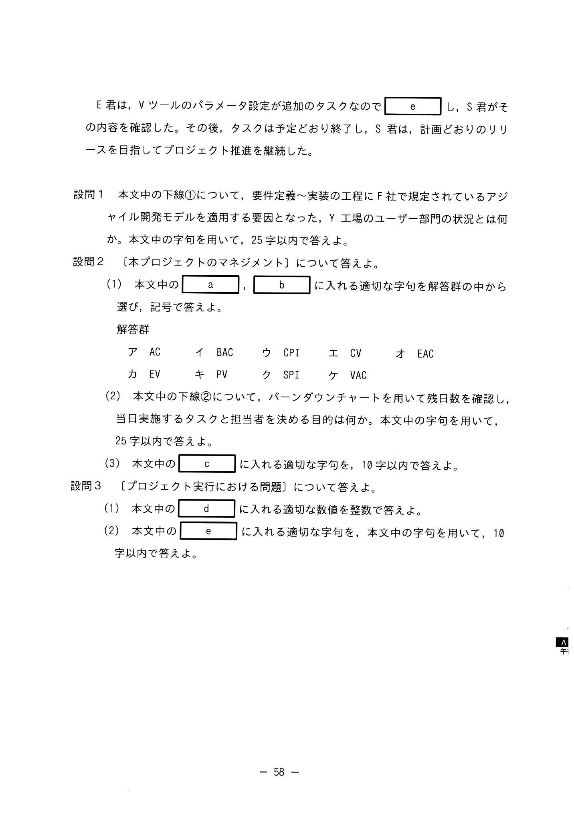

テキスト (OCR)

E Blt, V ツールのパラメータ設定が追加のタスクなので|  e | し, SBA
の内容を確認した。 その後, タスクは予定どおり終了し, $ Bld, 計画どおりのリリ
ースを目指してプロジェクト推進を継続した。

設問1 本文中の下線わについて, 要件定義一実装の工程に 社で規定されているアジ
ャイル開発モデルを適用する要因となった, Y 工場のユーザー部門の状況とは何

か。本文中の字句を用いて, 25 字以内で答えよ。
設問2 〔本プロジェクトのマネジメント] について答えよ。

(1) 本文中の| a |,| 5 |に入れる適切な宇句を解答群の中から
選び, 記号で答えよ。
解答群

ア AC   イ BAC  ウ CPI  aT GV   オ EAC

カ EV   キ PV   ク SPI  ケ VAC

(2) 本文中の下線のについて, バーンダウンチャートを用いて残日数を確認し
当日実施するタスクと担当者を決める目的は何か。本文中の字句を用いて,

25 字以内で答えよ。

(3) 本文中の| c | に入れる適切な字句を, 10字以内で答えよ。

設問3 〔プロジェクト実行における問題] について答えよ。

(1) 本文中の| gd |] に入れる適切な数値を整数で答えよ。
(2) 本文中の| s | に入れる適切な字句を, 本文中の字句を用いて, 10

字以内で答えよ。

### ページ 59

テキスト (OCR)

C

x モ 用 紙 〕

### ページ 60

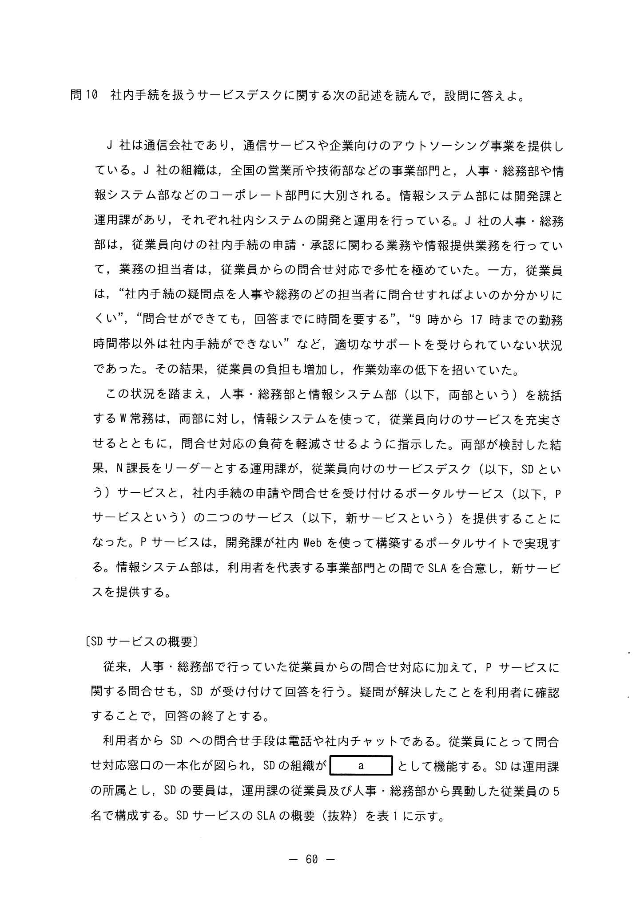

テキスト (OCR)

fel 10 社内手続を扱うサービスデスクに関する次の記述を読んで, 設問に答えよ。

J 社は通信会社であり, 通信サービスや企業向けのアウトソーシング事業を提供し
ている。J 社の組織は, 全国の営業所や技術部などの事業部門と, 人事・総務部や情
報システム部などのコーポレート部門に大別される。 情報システム部には開発課と
運用課があり, それぞれ社内システムの開発と運用を行っている。J 社の人事・総務
部は, 従業員向けの社内手続の申請・承認に関わる業務や情報提供業務を行ってい
て, 業務の担当者は, 従業員からの問合せ対応で多忙を極めていた。一方, 従業員
は, “社内手続の疑問点を人事や総務のどの担当者に問合せすればよいのか分かりに
CW", “問合せができても, 回答までに時間を要する", “9 時から 17 時までの勤務
時間帯以外は社内手続ができない"” など, 適切なサポートを受けられていない状況
であった。 その結果, 従業員の負担も増加し, 作業効率の低下を招いていた。

この状況を踏まえ, 人事・総務部と情報システム部 (以下, 両部という) を統括
する W 常務は, 両部に対し, 情報システムを使って, 従業員向けのサービスを充実さ
せるとともに, 問合せ対応の負荷を軽減させるように指示した。両部が検討した結
果, N課長をリーダーとする運用課が, 従業員向けのサービスデスク (以下, SD とい
う) サービスと, 社内手続の申請や問合せを受け付けるポータルサービス (以下, P
サービスという) の二つのサービス (以下, 新サービスという) を提供することに
なった。P サービスは, 開発課が社内 Web を使って構築するポータルサイトで実現す
る。情報システム部は, 利用者を代表する事業部門との間で SLA を合意し, 新サービ
スを提供する。

(SD サービスの概要〕

従来, 人事・総務部で行っていた従業員からの問合せ対応に加えて, P サービスに
関する問合せも, SD が受け付けて回答を行う。疑問が解決したことを利用者に確認
することで, 回答の終了とする。

利用者から SD への問合せ手段は電話や社内チャットである。従業員にとって問合
せ対応窓口の一本化が図られ, SD の組織が|  。 |] として機能する。SDは運用課
の所属とし, SD の要員は, 運用課の従業員及び人事・総務部から異動した従業員の 5
名で構成する。SD サービスの SLA の概要 (抜粋) を表 1 に示す。

### ページ 61

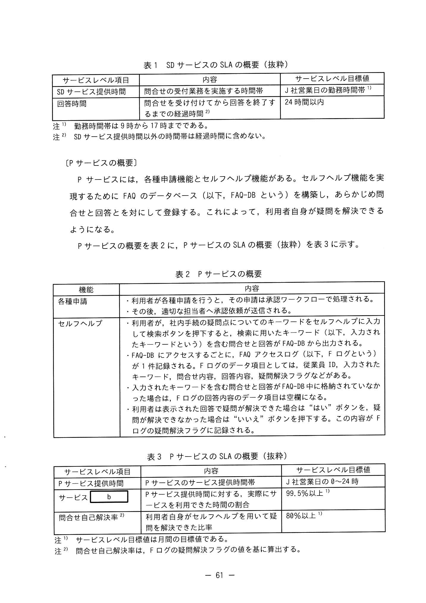

テキスト (OCR)

表1 SD サービスの SLA の概要 (抜粋)

サービスレベル項目               内容                サービスレベル目標値
SD サービス提供時間  問合せの受付業務を実施する時間帯   J 社営業日の勤務時間帯 !
回答時間       問合せを受け付けてから回答を終了す | 24 時間以内

るまでの経過時間 ?

SE? 勤務時間帯は 9 時から17 時までである。
注 ? SD サービス提供時間以外の時間帯は経過時間に含めない。

[P サービスの概要〕

P サービスには, 各種申請機能とセルフヘルプ機能がある。セルフヘルプ機能を実
現するために FAQ のデータベース (LAF, FAQ-DB という) を構築し. あらかじめ問
合せと回答とを対にして登録する。これによって, 利用者自身が疑問を解決できる
ようになる。

P サービスの概要を表 2 に, P サービスの SLA の概要 (抜粋) を表3 に示す。

表2 Pサービスの概要

機能                     内容
各種申請     ・ 利用者が各種申請を行うと, その申請は承認ワークフローで処理される。
・その後, 適切な担当者へ承認依頼が送信される。
セルフヘルプ      ・ 利用者が, 社内手続の疑問点についてのキーワードをセルフヘルプに入力

して検索ボタンを押下すると, 検索に用いたキーワード (以下, 入力され
たキーワードという) を含む問合せと回答がFAQ-DB から出力される。

- FA0-DB にアクセスするごとに, FA アクセスログ (以下,F ログという)
が 1 件記録される。F ログのデータ項目としては, HEB ID, 入力された
キーワード, 問合せ内容, 回答内容, 疑問解決フラグなどがある。

・入力されたキーワードを含む問合せと回答がFAQ-DB 中に格納されていなか
った場合は, F ログの回答内容のデータ項目は空欄になる。

・利用者は表示された回答で疑問が解決できた場合は “はい"ボタンを, 疑
間が解決できなかった場合は "いいえ" ボタンを押下する。この内容がF
ログの疑問解決フラグに記録される。

表 3 P サービスの SLA の概要 (抜粋)

サービスレベル項目          内容           サービスレベル目標値
P サービス提供時間     P サービスのサービス提供時間帯       J 社営業日の 9一24 時

sips        P サービス提供時間に対する, 実際にサ | 99.59%以上り
 |  ービスを利用できた時間の割合
問合せ自己解決率 ?  利用者自身がセルフヘルプを用いて疑 | 89%以上
問を解決できた比率
SEP サービスレベル目標値は月間の目標値である。
2 問合せ自己解決率は, Fログの疑問解決フラグの値を基に算出する。

### ページ 62

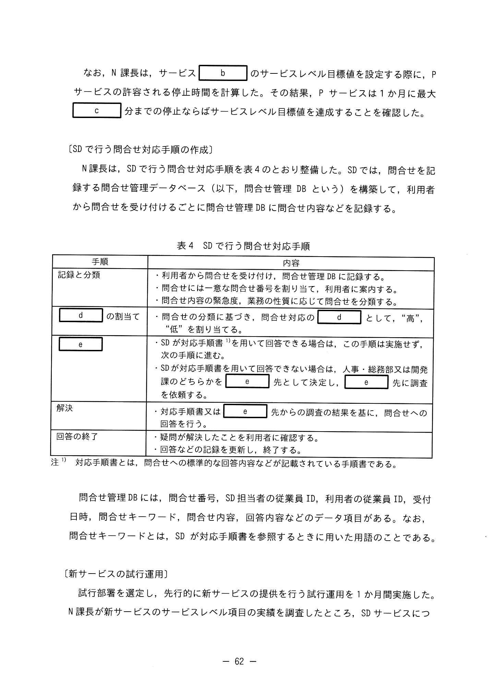

テキスト (OCR)

なお, N 課長は。 サービス|  b | のサービスレベル目標値を設定する際に,P
サービスの許容される停止時間を計算した。その結果, P サービスは 1 か月に最大
| C  ] 分までの停止ならばサービスレベル目標値を達成することを確認した。

(SD で行う問合せ対応手順の作成〕

N課長は, SD で行う問合せ対応手順を表4のとおり整備した。SD では, 問合せを記
録する問合せ管理データベース (以下, 問合せ管理 DB という) を構築して, 利用者
から問合せを受け付けるごとに問合せ管理 DB に問合せ内容などを記録する。

表 4 SD で行う問合せ対応手順
手順                           内容
記録と分類        ・利用者から問合せを受け付け, 問合せ管理 DB に記録する。
・ 問合せには一意な問合せ番号を割り当て, 利用者に案内する。
・ 問合せ内容の緊急度, 業務の性質に応じて問合せを分類する。
Los jon | ・問合せの分類に基づき, 問合せ対応の[ d | として,"高"
"低"を割り当てる。
[_s      ・ SD が対応手順書 "を用いて回答できる場合は, この手順は実施せず,
次の手順に進む。
・ SD が対応手順書を用いて回答できない場合は, 人事・総務部又は開発
課のどちらかを|  e | 先として決定し,[| le | 先に調査

を依頼する。
解決                   ・対応手順書又は|  e | 先からの調査の結果を基に, 問合せへの
回答を行う。
回答の終了        ・ 疑問が解決したことを利用者に確認する。

・回答などの記録を更新し, 終了する。
EY 対応手順書とは, 問合せへの標準的な回答内容などが記載されている手順書である。

問合せ管理DB には, 問合せ番号, SD 担当者の従業員 ID利用者の従業員 ID, 受付
日時, 問合せキーワード, 問合せ内容, 回答内容などのデータ項目がある。なお,
問合せキーワードとは, SD が対応手順書を参照するときに用いた用語のことである。

〔新サービスの試行運用〕

試行部署を選定し, 先行的に新サービスの提供を行う試行運用を 1 か月間実施した。
N 課長が新サービスのサービスレベル項目の実績を調査したところ, SD サービスにつ

### ページ 63

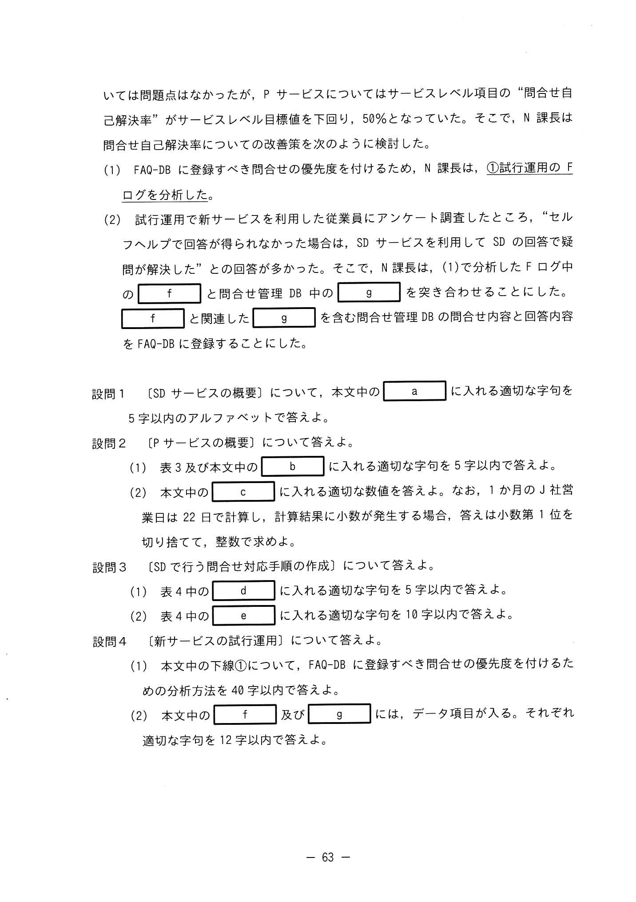

テキスト (OCR)

いては問題点はなかったが, P サービスについてはサービスレベル項目の “問合せ自

己解決率′” がサービスレベル目標値を下回り, 50%%となっていた。 ECT, N 課長は

問合せ自己解決率についての改善策を次のように検討した。

(1) FAQ-DB に登録すべき問合せの優先度を付けるため, N 課長は, ①試行運用の『
ログを分析した。

(2) 試行運用で新サービスを利用した従業員にアンケート調査したところ, “セル
フヘルプで回答が得られなかった場合は, SD サービスを利用して SD の回答で疑
間が解決した"との回答が多かった。そこで, N 課長は, (1)で分析したF ログ中

の| f | と問合せ管理DB 中の| g | を突き合わせることにした。
 と関連した|  g | を含む問合せ管理 DB の問合せ内容と回答内容

を FAQ-DB に登録することにした。

設問1 〔SD サービスの概要] について, 本文中の|  。 | に入れる適切な字句を
5 字以内のアルファベットで答えよ。
設問2 〔P サービスの概要] について答えよ。
(1) 表3及び本文中の| b | に入れる適切な字句を5字以内で答えよ。
(2) 本文中の| < | に入れる適切な数値を答えよ。なお, 1か月の 社営
業日は 22 日で計算し, 計算結果に小数が発生する場合 答えは小数第 1 位を
切り捨てて, 整数で求めよ。
設問3 [SDで行う問合せ対応手順の作成〕]について答えよ。
(1) 表4中の|  d | に入れる適切な字句を5字以内で答えよ。
(2) 表4中の| se | に入れる適切な字句を10字以内で答えよ。
設問4 〔新サービスの試行運用}について答えよ。
(1) 本文中の下線①について, FAQ-DB に登録すべき問合せの優先度を付けるた
めの分析方法を 40 字以内で答えよ。
(2) 本文中の|  f |及び|  g |には, データ項目が入る。それぞれ
適切な字句を 12 字以内で答えよ。

### ページ 64

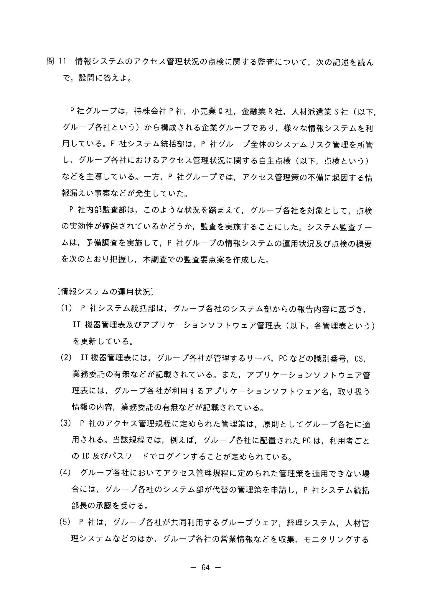

テキスト (OCR)

間 11 情報システムのアクセス管理状況の点検に関する監査について, 次の記述を読ん

で, 設問に答えよ。

P 社グループは, 持株会社 P 社, 小売業 0 Ht, 金融業 R 社, 人材派遣業S 社 (以下
グループ各社という) から構成される企業グループであり, 様々な情報システムを利
用している。P 社システム統括部は, P 社グループ全体のシステムリスク管理を所管
し, グループ各社におけるアクセス管理状況に関する自主点検 (以下, 点検という)
などを主導している。 一方, P 社グループでは, アクセス管理策の不備に起因する情
報漏えい事案などが発生していた。

P 社内部監査部は, このような状況を踏まえて, グループ各社を対象として, 点検
の実効性が確保されているかどうか, 監査を実施することにした。システム監査チー
Ald, 予備調査を実施して, P 社グループの情報システムの運用状況及び点検の概要
を次のとおり把握し, 本調査での監査要点案を作成した。

〔情報システムの運用状況]

(1) P 社システム統括部は, グループ各社のシステム部からの報告内容に基づき
IT 機器管理表及びアプリケーションソフトウェア管理表 (以下, 各管理表という)
を更新している。

(2) IT 機器管理表には, グループ各社が管理するサーバ, PC などの識別番号, 0S,
業務委託の有無などが記載されている。また, アプリケーションソフトウェア管
理表には, グループ各社が利用するアプリケーションソフトウェア名, 取り扱う
情報の内容, 業務委託の有無などが記載されている。

(3) P 社のアクセス管理規程に定められた管理策は, 原則としてグループ各社に適
用される。 当該規程では, 例えば, グループ各社に配置された PC は, 利用者ごと
の ID 及びパスワードでログインすることが定められている。

(4) グループ各社においてアクセス管理規程に定められた管理策を適用できない場
合には, グループ各社のシステム部が代替の管理策を申請し, P 社システム統括
部長の承認を受ける。

(5) P 社は, グループ各社が共同利用するグループウェア, 経理システム, 人材管
理システムなどのほか, グループ各社の営業情報などを収集. モニタリングする

ー 64 一

### ページ 65

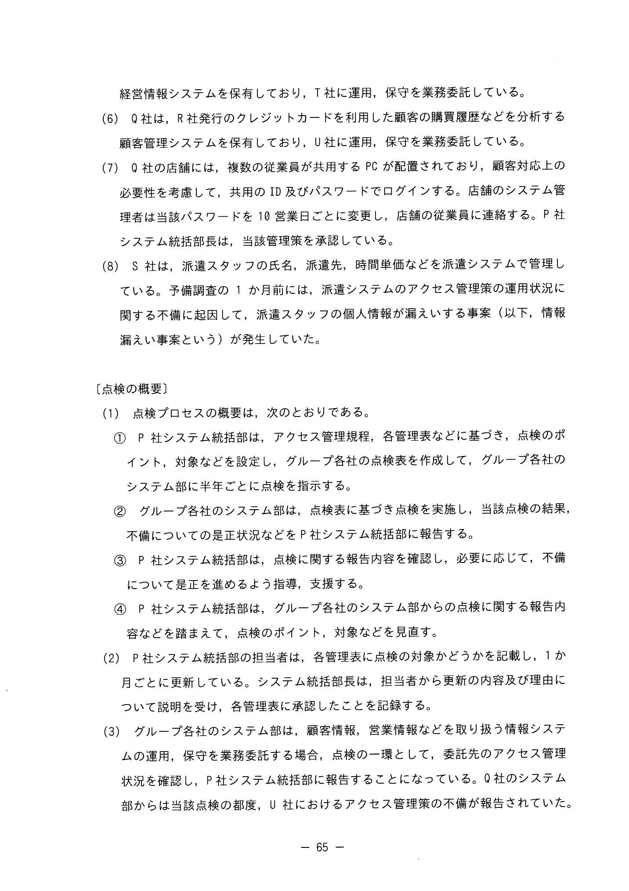

テキスト (OCR)

経営情報システムを保有しており, T社に運用, 保守を業務委託している。

(6) 0 社は, R社発行のクレジットカードを利用した顧客の購買履歴などを分析する
顧客管理システムを保有しており, U社に運用, 保守を業務委託している。

(7) 0 社の店舗には, 複数の従業員が共用する PC が配置されており, 顧客対応上の
必要性を考慮して, 共用の ID 及びパスワードでログインする。 店舗のシステム管
理者は当該パスワードを 10 営業日ごとに変更し, 店舗の従業員に連絡する。P 社
システム統括部長は, 当該管理策を承認している。

(8) S 社は, 派遣スタッフの氏名, 派遣先, 時間単価などを派遣システムで管理し
ている。 予備調査の 1 か月前には, 派遣システムのアクセス管理策の運用状況に
関する不備に起因して, 派遣スタッフの個人情報が漏えいする事案 (以下, 情報
漏えい事案という) が発生していた。

[点検の概要]

(1) 点検プロセスの概要は, 次のとおりである。

O P 社システム統括部は, アクセス管理規程, 各管理表などに基づき, 点検のポ
イント, 対象などを設定し, グループ各社の点検玩を作成して, グループ各社の
システム部に半年ごとに点検を指示する。

② グループ各社のシステム部は, 点検に基づき点検を実施し, 当該点検の結果
不備についての是正状況などを『P 社システム統括部に報告する。

③ P 社システム統括部は, 点検に関する報告内容を確認し, 必要に応じて, 不備
について是正を進めるよう指導, 支援する。

④ P 社システム統括部は, グループ各社のシステム部からの点検に関する報告内
容などを踏まえて, 点検のポイント, 対象などを見直す。

(2) P社システム統括部の担当者は, 各管理表に点検の対象かどうかを記載し, 1 か
月ごとに更新している。システム統括部長は, 担当者から更新の内容及び理由に
ついて説明を受け, 各管理表に承認したことを記録する。

(3) グループ各社のシステム部は, 顧客情報, 営業情報などを取り扱う情報システ
ムの運用, 保守を業務委託する場合, 点検の一環として, 委託先のアクセス管理
状況を確認し, P 社システム統括部に報告することになっている。0 社のシステム
部からは当該点検の都度, U 社におけるアクセス管理策の不備が報告されていた。

### ページ 66

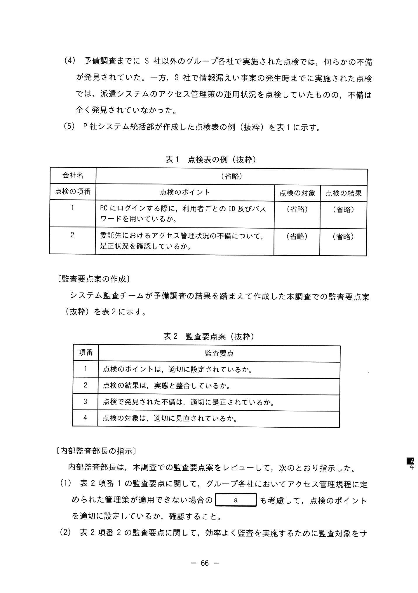

テキスト (OCR)

(4) 予備調査までに S 社以外のグループ各社で実施された点検では, 何らかの不備
が発見されていた。一方,S 社で情報漏えい事案の発生時までに実施された点検
では, 派遣システムのアクセス管理策の運用状況を点検していたものの, 不備は
全く発見されていなかった。

(5) P社システム統括部が作成した点検表の例 (抜粋) を表 1 に示す。

表1 点検表の例 (抜粋)

会社名                   (省略)
点検の項番         点検のポイント         点検の対象 | 点検の結果
1     PC にログインする際に, 利用者ごとの ID 及びパス    (省略)     (省略)
ワードを用いているか。
2   委託先におけるアクセス管理状況の不備について,  (省略)  (省略)
是正状況を確認しているか。
〔監査要点案の作成

システム監査チームが予備調査の結果を踏まえて作成した本調査での監査要点案
(抜粋) を表 2 に示す。

表2 監査要点案 (抜粋)
項番                監査要点

1    点検のポイントは, 適切に設定されているか。

2    点検の結果は, 実態と整合しているか。

3    点検で発見された不備は, 適切に是正されているか。

4  点検の対象は, 適切に見直されているか。

(AMER OFT)
内部監査部長は, 本調査での監査要点案をレビューして, 次のとおり指示した。

(1) 表 2 項番 1 の監査要点に関して, グループ各社においてアクセス管理規程に定
められた管理策が適用できない場合の| sa | も考慮して, 点検のポイント
を適切に設定しているか, 確認すること。

(2) 表 2 項番 2 の監査要点に関して, 効率よく監査を実施するために監査対象をサ

+8

### ページ 67

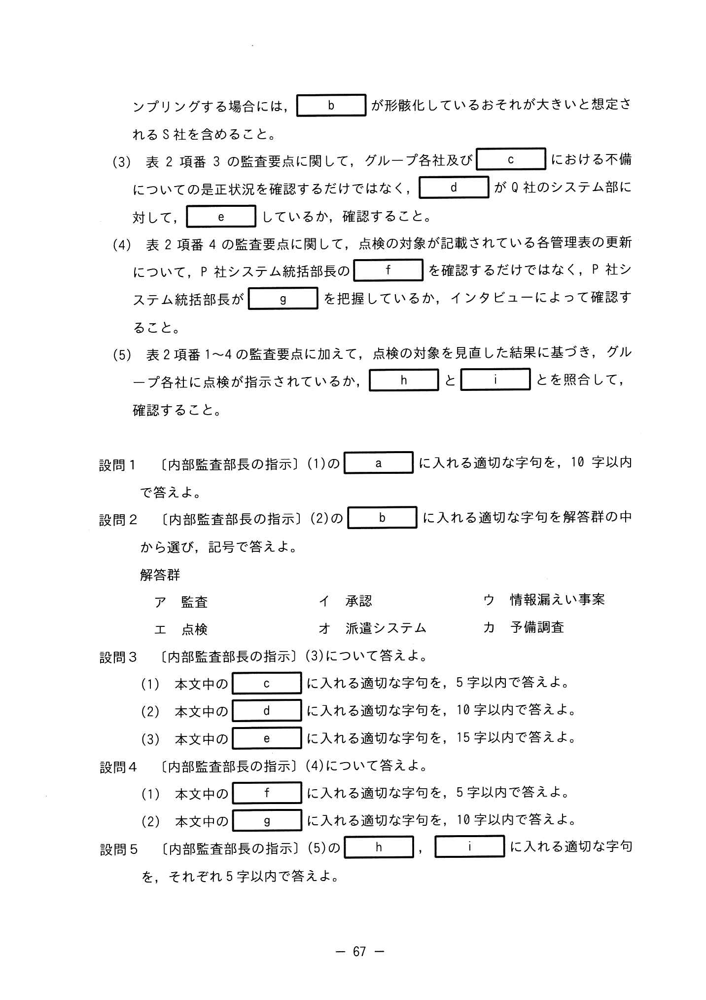

テキスト (OCR)

ンプリングする場合には, | b | が形骸化しているおそれが大きいと想定さ
れる $ 社を含めること。

(3) 表 2 項番 3 の監査要点に関して, グループ各社及び| c | における不備
についての是正状況を確認するだけではなく, |  d | が0社のシステム部に
対して, |  e |] しているか, 確認すること。

(4) 表 2 項番 4 の監査要点に関して, 点検の対象が記載されている各管理表の更新
について, P 社システム統括部長の| ft | を確認するだけではなく,P社シ
ステム続括部長が| g | を抱握しているか, インタビューによって確認す

ること。

(5) 表2項番14 の監査要点に加えて, 点検の対象を見直した結果に基づき, グル
ープ各社に点検が指示されているか, | h |と| i | とを照合して,
確認すること。

設問1 【内部監査部長の指示] (1)の|  a | に入れる適切な字句を, 10 字以内
で答えよ。

設問 2 【内部監査部長の指示] (2)の| b | に入れる適切な字句を解答群の中
から選び, 記号で答えよ。

ARSE

ア Be       イ iB       ウ 情報漏えい事案

エ 点検      A 派遣システム   カ 予備調査
設問3 【〔内部監査部長の指示] (3)について答えよ。

(1) 本文中の| c | に入れる適切な字句を, 5字以内で答えよ。

(2) 本文中の| dg | に入れる適切な字句を, 10字以内で答えよ。

(3) 本文中の[| es | に入れる適切な字句を, 15字以内で答えよ。

設問4 【内部監査部長の指示] (4)について答えよ。
(1) 本文中の[| f | に入れる適切な字句を, 5字以内で答えよ。
(2) 本文中の| 9 | に入れる適切な字句を, 10字以内で答えよ。

設問5 【内部監査部長の指示] (5)の| oh |, | ! |に入れる適切な字句
を, それぞれ5 字以内で答えよ。

### ページ 68

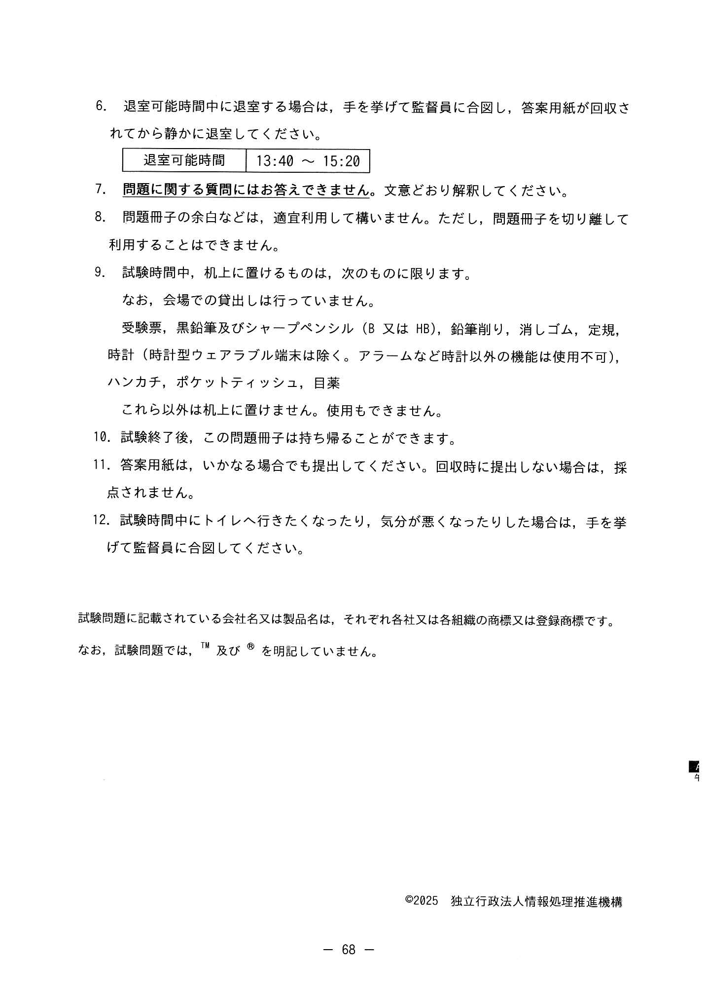

テキスト (OCR)

6. 退室可能時間中に退室する場合は, 手を挙げて監督貞に合図し, 答案用紙が回収さ
れてから静かに退室してください。
退室可能時間  13:40 ~ 15:20
7. 問題に関する質問にはお答えできません。文意どおり解釈してください。
8. 問題冊子の余白などは, 適宜利用して構いません。ただし, 問題冊子を切り離して
利用することはできません。
9. 試験時間中, 机上に置けるものは, 次のものに限ります。
なお, 会場での貸出しは行っていません。
受験票, 黒鉛筆及びシャープペンシル (B 又は HB), 鉛筆削り, 消しゴム, 定規
時計 (時計型ウェアラブル端末は除く。アラームなど時計以外の機能は使用不可),
ハンカチ, ポケットティッシュ, 目薬
これら以外は机上に置けません。使用もできません。
10. 試験終了後, この問題冊子は持ち帰ることができます。
11. 答案用紙は, いかなる場合でも提出してください。回収時に提出しない場合は, 採
点されません。
12.、試験時間中にトイレへ行きたくなったり, 気分が悪くなったりした場合は, ESE
げて監督中に合図してください。

試験問題に記載されている会社名又は製品名は, それぞれ各社又は各組織の商標又は登録商標です。

なお, 試験問題では, " RU ® を明記していません。

@2025 独立行政法人情報処理推進機構

a |

---

## 午後解答

1/6 
©2025 独立行政法人情報処理推進機構 
令和７年度 秋期 応用情報技術者試験 解答例 
 
午後試験 
問１ 
出題趣旨 
 近年，様々な分野の企業においてサプライチェーン攻撃による被害事例が増加している。サプライチェーン
攻撃には自社だけではなく関連企業も含めた包括的な対策が必要となる。 
 本問では，サプライチェーン攻撃を題材として，ビジネスサプライチェーン攻撃，ソフトウェアサプライチ
ェーン攻撃の二つを取り上げ，それらに対する技術的観点での対処方法や付随する情報管理の基本原則につい
ての理解を問う。 
 
設問 
解答例・解答の要点 
備考 
設問１ 
a
ク 
 
 
b
ウ 
 
 
d
カ 
 
 
e
オ 
 
設問２ 
c
初期 
 
設問３(1) ウ 
 
 
(2) 不正の発覚リスクが高いことが心理的障壁になるから 
 
 
(3) 脆弱性が発見された際に影響範囲を迅速に判断できないこと 
 
 
問２ 
出題趣旨 
 企業の事業領域拡大戦略の策定においては，自社のコアコンピタンスを明確にした上で，企業ドメインを定
義することが重要である。 
 本問では，成長戦略として事業領域の拡大を図ろうとするスポーツウェアメーカーを題材として，現状分析，
コアコンピタンスの明確化，企業ドメイン設定及びブランド戦略策定に関する基本的な知識と応用力を問う。
 
設問 
解答例・解答の要点 
備考 
設問１ 
a 
競争優位性 
 
設問２
(1) ワークウェアに快適さやデザインの良さを求める企業が増加しており，需要が
拡大している。 
 
 
(2)
b 
色やロゴなどのオリジナル性 
 
 
(3) イ 
 
 
(4)
c 
調達コストの削減 
 
設問３
(1) 経営の方向性を明確にして社内の意思統一を図る。 
 
 
(2)
d 
ウ 
 
 
(3) 信頼できる情報として自然に共有される。

2/6 
©2025 独立行政法人情報処理推進機構 
問３ 
出題趣旨 
 ある種の最適化問題では，問題の構造を捉えて部分問題に場合分けすることで，動的計画法によって再帰法
よりも効率的に解くことができる。 
 本問では，最長共通部分列問題を題材として，動的計画法を用いたアルゴリズムを理解する力と，アルゴリ
ズムをプログラムとして実装する能力を問う。 
 
設問 
解答例・解答の要点 
備考 
設問１ 
4 
 
設問２ 
ア
2 
 
 
イ
4 
 
設問３ 
ウ
lcsl[n － 1, k － 1] ＋ 1 
 
 
エ
lcsl[n, k － 1] 
 
 
オ
lcsl[n － 1, k] 
 
 
カ
lcsl[s, t] 
 
設問４ 
キ
st 
 
 
問４ 
出題趣旨 
 昨今，小型かつ安価で利用できるボードコンピュータが普及しつつあり，これらを用いたエッジコンピュー
ティングによる様々なサービスが開始されている。 
 本問では，サッカー教室における練習試合の動画配信サービスを題材として，コンピュータのハードウェア
に関する基本的な理解と，ハードウェア制約やネットワーク制約を意識したシステムの設計能力について問う。
 
設問 
解答例・解答の要点 
備考 
設問１ 
a
エ 
 
 
b
ウ 
 
設問２(1)
c
12 
 
 
(2)
d
ア 
 
 
 
e
オ 
 
 
(3) ア 
 
設問３ 
モバイル通信の帯域が不足する制約 
 
設問４(1) 6,510 
 
 
(2) 動画のbpp を下げる。

3/6 
©2025 独立行政法人情報処理推進機構 
問５ 
出題趣旨 
 サーバの運用負荷の軽減，セキュリティ対策の強化などを目的に，クラウドサービスの活用が推進されてい
る。 
 本問では，仮想サーバによって構築されるクラウド環境への社内のサーバの移行を題材として，DHCP，DNS，
NAT，経路制御などIP ネットワークの基本機能の理解を問う。 
 
設問 
解答例・解答の要点 
備考 
設問１(1) L3SW0 
 
 
(2) 社外のメールサーバから送信された社外宛てのメールを中継する処理 
 
 
(3)
a
Web サーバ 
 
 
 
b
外部DNS サーバ 
 
 
 
c
プロキシサーバ 
 
設問２(1)
通過前 
200.α.β.2 
 
 
 
通過後 
172.20.1.14 
 
 
(2) 192.168.1.0/24，172.16.128.0/20 
 
 
(3) プロキシサーバ，メールサーバ，内部DNS サーバ 
 
 
問６ 
出題趣旨 
 システム改修においては，データベースに対する要求事項を理解し，信頼性・安全性・効率性を考慮して，
適切にデータモデルを変更する必要がある。 
 本問では，受講管理システムの改修を題材として，データモデルの設計能力，E-R 図やSQL 文に対する基本的
な理解，スーパータイプ，サブタイプや制約に対する理解を問う。 
 
設問 
解答例・解答の要点 
備考 
設問１ 
a
開催番号 
 
 
b
← 
 
設問２(1)
c
レベル 
順不同 
 
 
d
ジャンル 
 
(2) 定義域が講座区分によって異なるから 
 
 
(3)
e
年齢層 
 
設問３ 
f
ALTER 
 
設問４ 
g
勤務年月日, 講師コード 
 
 
h
CASCADE 
 
設問５ 
i
ON t0.講座コード = t1.講座コード AND t0.開催番号 = t1.開催番号

4/6 
©2025 独立行政法人情報処理推進機構 
問７ 
出題趣旨 
 近年，センサーのデータを収集し，ネットワーク経由で分析を行う様々なヘルスケア製品が開発・販売され
ている。 
 本問では，猫の自動給餌・健康監視システムを題材として，要求仕様の理解力，及び要求仕様に基づいてリ
アルタイムOS 下で動作するタスクの設計能力を問う。 
 
設問 
解答例・解答の要点 
備考 
設問１(1)
e
警告 
 
 
 
f
危険 
 
 
(2) 古い体調データが上書きされた。 
 
設問２(1)
最大値
360 
 
 
 
最小値
120 
 
 
(2) 300 
 
設問３(1)
a
猫検知 
 
 
 
b
トレイの正面に 
 
 
 
c
撮影 
 
 
 
d
カメラ停止 
 
 
(2) 餌を供給した直後のトレイ上の餌の量から食事完了時のトレイ上の餌の量を引
く。 
 
 
(3)
g
トレイ上の餌の増加量 
 
 
問８ 
出題趣旨 
 昨今，スマートフォンを用いてオーダーから決済まで完了できるモバイルオーダーシステムを利用する会社
が増えている。 
 本問では，カフェの店舗でのモバイルオーダーシステムを題材として，画面設計に関する理解と設計能力を
問う。 
 
設問 
解答例・解答の要点 
備考 
設問１(1)
a
カ 
 
 
 
b
エ 
 
 
 
c
キ 
 
 
 
d
ウ 
 
 
(2) エ 
 
 
(3) 非活性化 
 
設問２(1) 閉店時刻の30 分前までとする。 
 
 
(2) 商品の並び順 
 
設問３(1) ページネーション 
 
 
(2) エ

5/6 
©2025 独立行政法人情報処理推進機構 
問９ 
出題趣旨 
 情報システム開発のプロジェクトマネジメントにおいては，開発するシステムやステークホルダの特性に応
じて，適切なソフトウェア開発モデルを適用することが重要である。 
 本問では，生産管理システムの開発プロジェクトを題材として，ウォーターフォール開発モデルとアジャイ
ル開発モデルが混在するソフトウェア開発モデルを選択した際の，プロジェクトの計画，マネジメント及び実
行時の問題対応に必要な能力を問う。 
 
設問 
解答例・解答の要点 
備考 
設問１ 
試行錯誤しながら開発を進める必要があること 
 
設問２(1)
a
カ 
 
 
 
b
キ 
 
 
(2) 優先度の高いタスクを3 週間で終了させるため 
 
 
(3)
c
リファクタリング 
 
設問３(1)
d
1 
 
 
(2)
e
チケットを発行 
 
 
問10 
出題趣旨 
 近年，企業を取り巻く競争環境の激化やデジタル技術の進展によって，従来にも増して社内業務プロセスの
標準化と効率化が求められている。このような背景の中，管理部門の業務効率性と従業員の利便性を両立する
手段として，社内手続を支援するサービスデスクの導入が注目されている。 
 本問では，サービスデスクの運用や企業内部の情報共有を目的として作られた社内向けFAQ 運用の課題解決
を題材として，サービスマネジメントの基本的な考え方と実務への応用能力について問う。 
 
設問 
解答例・解答の要点 
備考 
設問１ 
a
SPOC 
 
設問２(1)
b
・可用性 
・稼働率 
 
 
(2)
c
158 
 
設問３(1)
d
優先度 
 
 
(2)
e
エスカレーション 
 
設問４(1) 利用者の疑問が解決しなかった問合せの発生頻度を分析する。 
 
 
(2)
f
入力されたキーワード 
 
 
 
g
問合せキーワード

6/6 
©2025 独立行政法人情報処理推進機構 
問11 
出題趣旨 
企業などの組織においては，様々な情報システムが利活用される一方，システムリスクは増大の傾向にある。
このような状況の下，組織全体として，システムリスク管理部門が主導する点検などを通じて発見された問題
に適切に対応することによって，システムリスク管理の実効性を確保することが重要である。 
 本問では，企業グループ全体を対象とした情報システムのアクセス管理状況の点検に関する監査を題材とし
て，点検の実効性が確保されているか確認するための監査手続などを検討する能力を問う。 
 
設問 
解答例・解答の要点 
備考 
設問１ 
a
代替の管理策の適用 
 
設問２ 
b
エ 
 
設問３(1)
c
委託先 
 
 
(2)
d
P 社システム統括部 
 
 
(3)
e
是正を進めるよう指導，支援 
 
設問４(1)
f
承認の記録 
 
 
(2)
g
更新の内容及び理由 
 
設問５ 
h
各管理表 
順不同 
 
i
点検表

---

## 午後採点講評

1/3 
©2026 独立行政法人情報処理推進機構 
令和７年度 秋期 応用情報技術者試験 採点講評 
 
午後試験 
問１ 
問1 では，サプライチェーン攻撃を題材に，ビジネスサプライチェーン攻撃，ソフトウェアサプライチェー
ン攻撃の二つを取り上げ，それらに対する技術的観点での対処方法や付随する情報管理の基本原則について出
題した。全体として正答率は平均的であった。 
設問3(2)は，正答率がやや低かった。内部不正への対策として，不正を検知できるようにするといった技術
的な対策に着目しがちではあるが，それらに加えて不正を未然に防止するために，不正のトライアングルの三
要素を低減させるといった心理的な面での対策もあることを是非知っておいてほしい。 
設問3(3)は，正答率が平均的であった。攻撃者は日々更新される脆弱性情報を悪用して攻撃してくる。した
がって対策する側としても迅速な対応ができるような仕組みを作ることが重要である。 
 
問２ 
問2 では，スポーツウェアメーカーの事業領域拡大戦略を題材に，新事業領域への参入施策と企業ブランド
の浸透策について出題した。全体として正答率は平均的であった。 
設問2(1)は，正答率がやや高かった。“競合他社が市場の変化に対応できていない”や“自社のコアコンピ
タンスを発揮できる”という誤答が散見されたものの，ワークウェア市場の変化を正しく捉えた解答が多かっ
た。企業が新たな領域に参入する上で，市場の変化を的確に捉える重要性について理解を深めてほしい。 
設問2(4)は，正答率が低かった。素材の調達とは関係のない効果を答えた解答が目立った。調達における規
模の経済性がもたらす効果に着目して，正答を導き出してほしい。 
設問3(3)は，正答率が低かった。製品ブランドの浸透を図るためには，製品の価値を信頼できる情報として
発信すること，また，その情報が自然に拡散されるマーケティング手法が効果的であることを理解してほし
い。 
 
問３ 
問3 では，最長共通部分列問題を題材に，動的計画法を用いたアルゴリズムの実装について出題した。全体
として正答率は高かった。 
設問3 は，正答率が平均的であった。二次元配列lcsl の要素番号の誤りが散見された。二次元配列のどの要
素をどのように更新するべきかを理解し，アルゴリズムの操作を適切にプログラムとして記述する能力を身に
つけてほしい。 
設問4 は，正答率が平均的であった。効率的なアルゴリズムを選択するために，時間計算量を理解すること
は重要であるので，理解を深めてほしい。 
 
問４ 
問4 では，サッカー教室における動画配信サービスを題材に，コンピュータのハードウェアに関する基本的
な理解と，ハードウェア制約やネットワーク制約を意識したシステムの設計能力について出題した。全体とし
て正答率は平均的であった。 
設問3 は，正答率が平均的であった。モバイル通信のネットワーク帯域を考慮した設計を問うた。エッジコ
ンピューティングでは，ハードウェア制約やネットワーク制約を考慮した設計を行うことが，必要不可欠であ
るので，是非理解しておいてほしい。 
設問4(2)は，正答率が低かった。画像認識技術によるボール位置の検出に必要な情報を問うた。動画のデー
タ量は大量になりやすいが，利用目的に応じて不必要な情報を除去することでデータ量を削減できる。動画の
基本的な特性（解像度，bpp，fps）について理解を深めてほしい。

2/3 
©2026 独立行政法人情報処理推進機構 
問５ 
問5 では，仮想サーバによって構築されるクラウド環境へのサーバ移行を題材に，DHCP，DNS，NAT，経路制
御などIP ネットワークの基本機能について出題した。全体として正答率は平均的であった。 
設問1(2)は，正答率が低かった。スパムメールの踏み台になることを避けるために，防止すべきメールの中
継処理について問うた。防止する処理としてOP25B（Outbound Port 25 Blocking）を説明した解答が散見され
た。OP25B は，自身が接続したISP のメールサーバを経由せずに，他のISP に直接メールを送信するのを防ぐ
ための技術であり，オープンリレーを防止するための処理ではないことを理解して，正答を導いてほしい。 
設問2(2)は，正答率がやや低かった。クラウド環境に転送するパケットについて問うた。サーバをクラウド
環境に移行した後も，業務の運用方法及びPC の操作は変わらないことを理解して，正答を導いてほしい。 
 
問６ 
問6 では，受講管理システムの改修を題材に，データモデルの設計能力，E-R 図やSQL 文に対する基本的な
理解，スーパータイプ，サブタイプや制約について出題した。全体として正答率は平均的であった。 
設問1 は，正答率が平均的であった。実線の下線が付いていない解答や，1 対1 の関連を記載した解答が散
見された。一つの開催スケジュールに対して，複数の受講者が参加することに注意して解答をしてほしい。 
設問2(2)は，正答率がやや低かった。スーパータイプ／サブタイプにおいては，共通の属性はスーパータイ
プに，固有の属性はサブタイプに定義するという基本に従い，属性名に惑わされることなく正答を導き出して
ほしい。 
設問4 h は，正答率がやや低かった。削除時のアクションではなく，属性名を記載するなどの誤った解答が
散見された。CREATE 文やALTER 文などのDDL は，データベースの設計や実装をする上で必要な知識なので，文
法を正確に理解してほしい。 
 
問７ 
問7 では，猫の自動給餌・健康監視システムを題材に，要求仕様の理解，要求仕様に基づいたリアルタイム
OS を使用した設計について出題した。全体として正答率は平均的であった。 
設問1(2)は，正答率がやや低かった。データの欠落の原因を問うているが，欠落に至る前の状況を記述して
いる解答が散見された。設問の意図を正しく理解して記述してほしい。 
設問3(2)は，正答率がやや低かった。食べた餌の量の算出方法を問うており，食べる前後2 回の計測値の差
を求めるが，トレイ上の餌の量を計測するタイミングが違う解答が散見された。仕様を正しく読み解いて解答
してほしい。 
設問3(3)は，正答率が低かった。トレイが空であると判定できる条件を正しく読み解いて解答してほしい。
 
問８ 
問8 では，カフェの店舗でのモバイルオーダーシステムを題材に，画面設計に関する理解と設計能力につい
て出題した。全体として正答率は平均的であった。 
設問2(2)は，正答率が低かった。テーブル型の画面コンポーネントを用いる場合に必要な設計要素について
問うた。要求や要件をインプットに，画面コンポーネントの種類に応じた必要な設計要素について網羅的に設
計することは，設計工程への手戻りを減少させるだけではなく，システム利用者のユーザビリティにも影響を
与えるので，よく理解しておいてほしい。 
設問3(1)は，正答率が低かった。モバイル通信の通信帯域を意識した画面設計について問うた。画面設計に
おいては，要件やアプリケーションについて考慮するだけではなく，システムの利用環境を想定して設計する
ことが重要である。

3/3 
©2026 独立行政法人情報処理推進機構 
問９ 
問9 では，生産管理システムの開発プロジェクトを題材に，ウォーターフォール開発モデルとアジャイル開
発モデルが混在するソフトウェア開発モデルを選択した際の，プロジェクトの計画，マネジメント及び実行時
の問題対応について出題した。全体として正答率は平均的であった。 
設問2(2)は，正答率がやや低かった。アジャイル開発モデルの適用工程のマネジメントにおいて，バーンダ
ウンチャートを確認して当日実施するタスクと担当者を決める目的を問うたが，残チケット数や進捗状況を可
視化するため，という解答が散見された。本プロジェクトでは優先度の高いタスクを3 週間で終了させる必要
があり，それを達成することが目的であることを理解してほしい。 
設問3(2)は，正答率がやや低かった。本プロジェクトのアジャイル開発モデルの適用工程では実施中のタス
クの量を残チケット数で把握するので，タスクが追加された場合には，それに対するマネジメントを適切に行
うためにチケットを発行する必要があることを理解してほしい。 
 
問10 
問10 では，企業内部の情報共有を目的として作られた社内向けFAQ 運用の課題解決を題材に，サービスマネ
ジメントの基本的な考え方と実務への応用能力について出題した。全体として正答率は平均的であった。 
設問1 は，正答率が低かった。サービスマネジメントにおいて，問合せ対応窓口の一本化を図ることの重要
性や基本的な用語について正しく理解してほしい。 
設問2(2)は，正答率が平均的であった。サービス停止可能時間を計算するに当たり，本文中から必要な情報
を読み取り，正しく計算してほしい。 
設問4(2)は，正答率が平均的であった。N 課長が検討した問合せ自己解決率についての改善策の手順は，お
おむね理解されているようであった。一方で，問題文中に記載のない項目についての解答も散見された。サー
ビスデスクの具体的なオペレーションを考える上で，内部で管理しているデータベースにどのようなデータが
格納されているのかを確認することの重要性を理解してほしい。 
 
問11 
問11 では，企業グループ全体を対象とした情報システムのアクセス管理状況の点検に関する監査を題材と
して，点検の実効性が確保されているかどうかを確かめるための監査手続などについて出題した。全体として
正答率は平均的であった。 
設問3(3)は，正答率が低かった。点検プロセスの概要などを踏まえて，点検に関するシステムリスク管理部
門の役割の遂行状況について確認する必要があることを理解してほしい。 
設問5 は，正答率がやや低かった。点検プロセスの概要などを踏まえて，点検の対象を見直した結果に基づ
き，点検が指示されているかを確認するために照合すべき監査資料について，理解してほしい。

