# 令和7年度春期 応用情報技術者試験

---

## 午前問題

### ページ 1

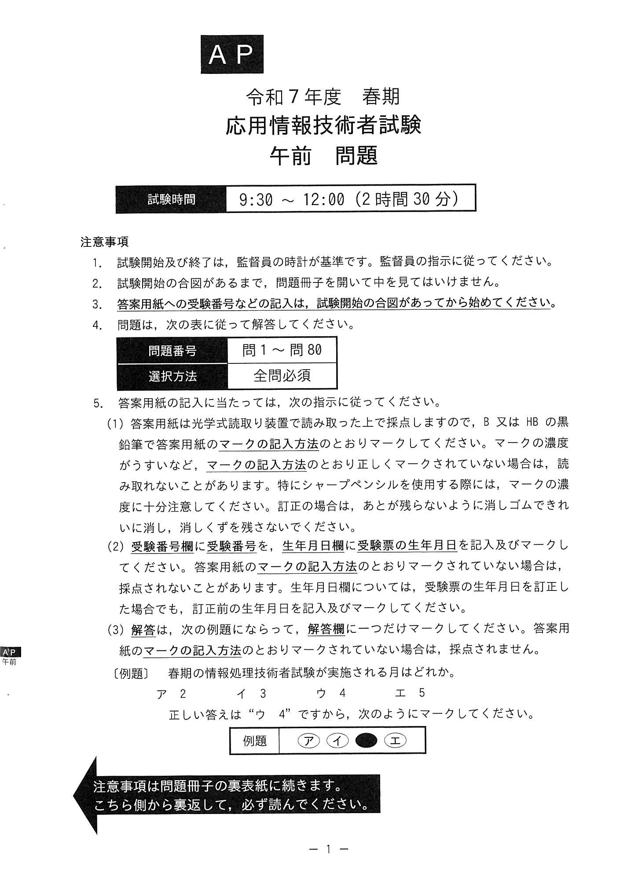

テキスト (OCR)

令和7年度 春期
応用情報技術者試験
午前 問題

 9:30 ~ 12:00 (2時間 30 分)

1. 試験開始及び終了は, 監督具の時計が基準です。監督具の指示に従ってください。
2. 試験開始の合図があるまで, 問題冊子を開いて中を見てはいけません。
3. 答案用紙への受験番号などの記入は, 試験開始の合図があってから始めてください。
4. 問題は, 次の表に従って解答してください。
問題番号       fal 1 ~ fal 80
選択方法       全問必ク
5. 管案用紙の記入に当たっては, 次の指示に従ってください。

(1) 管案用紙は光学式読取り装置で読み取った上で採点しますので, B 又は HB の黒
鉛筆で答案用紙のマークの記入方法のとおりマークしてください。 マークの濃度
がうすいなど, マークの記入方法のとおり正しくマークされていない場合は, 読
み取れないことがあります。特にシャープペンシルを使用する際には, マークの濃
度に十分注意してください。 訂正の場合は, あとが残らないように消しゴムできれ
いに消し, 消しくずを残さないでください。

(2) 受験番号欄に受験番号を, 生年月日欄に受験票の生年月日を記入及びマークし
てください。和案用紙のマークの記入方法のとおりマークされていない場合は,
採点されないことがあります。生年月日欄については, 受験票の生年月日を訂正し
た場合でも, 訂正前の生年月日を記入及びマークしてください。

(3) 解答は, 次の例題にならって, 解答棚に一つだけマーク LOSES. SRA
紙のマークの記入方法のとおりマークされていない場合は, 採点されません。
例題】 春期の情報処理技術者試験が実施される月はどれか。

ア 2      イ 3      ウ 4      エ 5
正しい答えは『"ウ 4" ですから, 次のようにマークしてください。

例題 | (の(の (や)

id

sil

注意事項は問題冊子の裏表紙に続きます。
こちら側から裏返して, 必ず読んでください。

### ページ 2

テキスト (OCR)

問題文中で共通に使用される表記ルール

各間題文中に注記がない限り, 次の表記ルールが適用されているものとする。

1. 論理回路

説明

4
a
cu
aia

論理積素子 (AND)

否定論理積素子 (NAND)

論理和素子 (OR)

否定論理和素子 (NOR)

排他的論理和素子 (XOR)

論理一致素子

バッファ

諭理否定素子 (NOT)

スリーステートバッファ
素子や回路の入力部又は出力

部に示されるo印は, 論理状態
の反転又は否定を表す。

JHIYYIYMVIMMIMD

### ページ 3

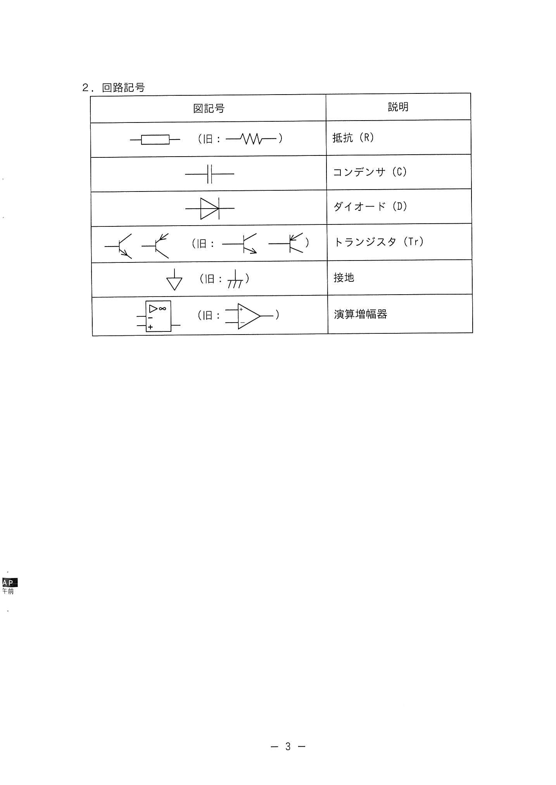

テキスト (OCR)

. 回路記号

図記号

説明

ーービーー (一WW一)

抵抗 (R)

ーー

コンデンサ (C)

ダイオード (D)

He  (a: +E

トランジスタ (Tr)

ママ iB: yp)

接地

PT  (a: >)

演算増幅器

ゴ

=| .

### ページ 4

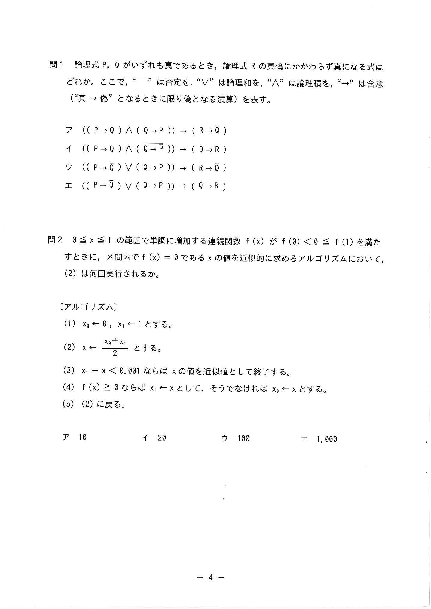

テキスト (OCR)

間 1

論理式 P, 0 がいずれも真であるとき, 論理式R の真偽にかかわらず真になる式は
どれか。ここで, " ” BRE, “V" は論理和を, “A” は論理積を,“つ"は含意
真っ偽" となるときに限り偽となる演算) を表す。

アァ ((Pっ0)人(0っP))っ(Rっ6)
((Pっ0)和(0っP))っ(0っR)
((PっQ)V(QュっP)) っ(Rっ6 )
((Pっ0)V(0っP))っ(0っR)

H 半 て

問2 OSx 51 の範囲で単調に増加する連続関数 f (x) Mf) <0 ミf(1) を満た

すときに, RAAT Ff (x) = 6 である x の値を近似的に求めるアルゴリズムにおいて,
(2) は何回実行されるか。

〔アルゴリズム〕
(1) x%で9, x% と1とする。

Xp tx,

2

(3) x」 —x< 0,001 ならば x の値を近似値として終了する。

(4) f(x) ORS x」 と x として, そうでなければ x。 で x とする。
(5) (2) に戻る。

(2) x<        とする。

20            ウ 100           エ 1,000

NI
S
ENG

### ページ 5

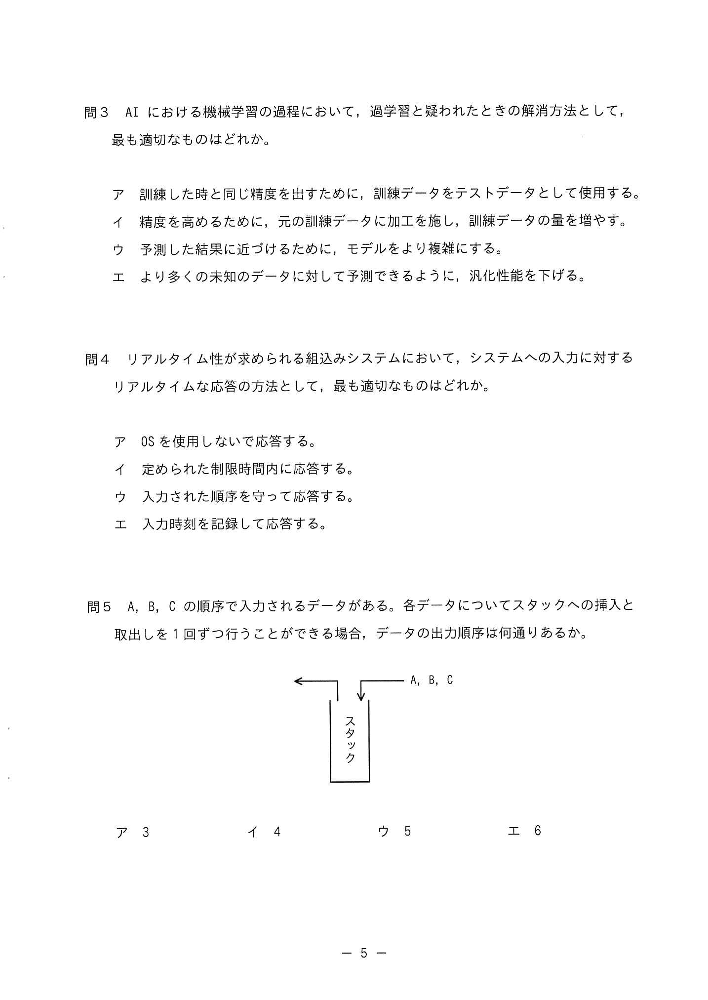

テキスト (OCR)

間3 AI における機械学習の過程において, 過学習と疑われたときの解消方法として,
最も適切なものはどれか。

|

訓練した時と同じ精度を出すために, 訓練データをテストデータとして使用する。
4 精度を高めるために, 元の訓練データに加工を施し, 訓練データの量を増やす。
ウ 予測した結果に近づけるために, モデルをより複雑にする。

エ より多くの未知のデータに対して予測できるように, 汎化性能を下げる。

問4 リアルタイム性が求められる組込みシステムにおいて, システムへの入力に対する
リアルタイムな応答の方法として, 最も適切なものはどれか。

N

0S を使用しないで応答する。

定められた制限時間内に応答する。
入力された順序を守って応答する。
入力時刻を記録して応答する。

H os oN

問5 A, B, C の順序で入力されるデータがある。各データについてスタックへの挿入と
取出しを 1 回ずつ行うことができる場合, データの出力順序は何通りあるか。

SI
CS
aN
+S
Nag
oa
H
〇>

### ページ 6

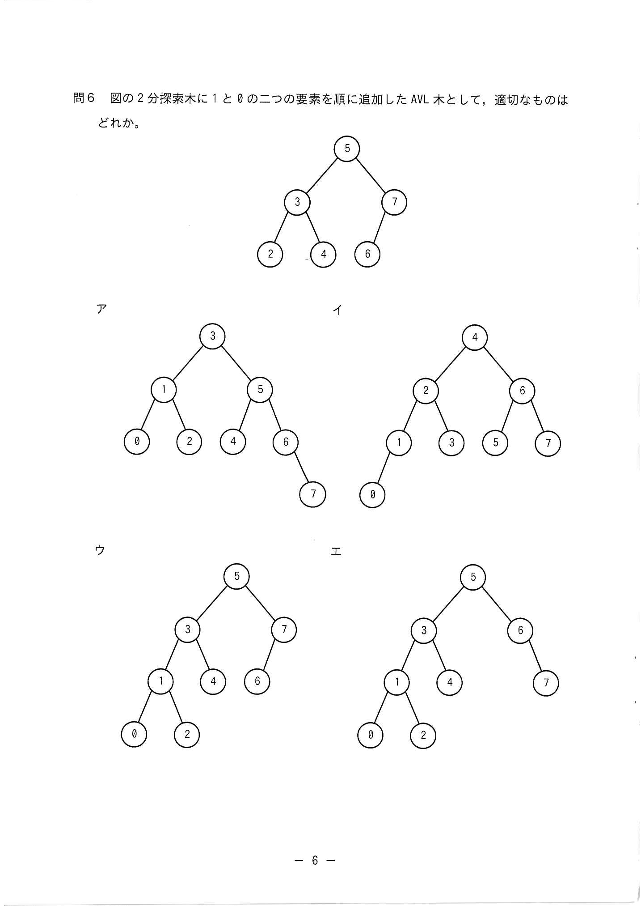

テキスト (OCR)

問6 図の2分探索木に 1 と 0 の二つの要素を順に追加した AVL 木として, 適切なものは
どれか。

SI
に

### ページ 7

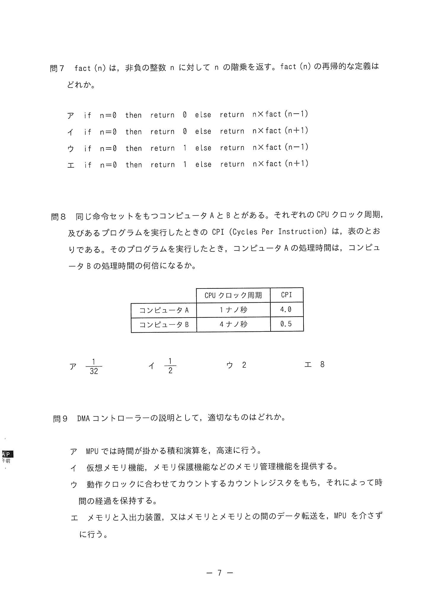

テキスト (OCR)

問7 fact (n) は, 非負の整数 n に対して n の階乗を返す。fact (n) の再帰的な定義は

どれか。

ア if n=0 then return ® else return nX fact (n—1)
4 if n=0 then return 0 else return nx fact (n+1)
ウ if n=Q then return 1 else return nXfact (n—1)
エ if n=0 then return 1 else return nX fact (n+1)

問8 同じ命令セットをもつコンピュータ Aと B とがある。それぞれのCPU クロック周期,
及びあるプログラムを実行したときの CPI (Cycles Per Instruction) は, 表のとお
りである。そのプログラムを実行したとき, コンピュータ A の処理時間は, コンピュ
ータ B の処理時間の何倍になるか。

CPU クロック周期    CPI

コンピュータ A   1ナノ秒   4.0
コンピュータ B   4ナノ秒   0.5
ァ ーールレ     ィ +     ウ 2      xB
32       2

問9 DMAコントローラーの説明として, 適切なものはどれか。

ア MPU では時間が掛かる積和演算を, 高速に行う。

イ 仮想メモリ機能, メモリ保護機能などのメモリ管理機能を提供する。

ウ 動作クロックに合わせてカウントするカウントレジスタをもち, それによって時
間の経過を保持する。

エエ メモリと入出力装置, 又はメモリとメモリとの間のデータ転送を, MPU を介さず

|

Fl

に行う。

### ページ 8

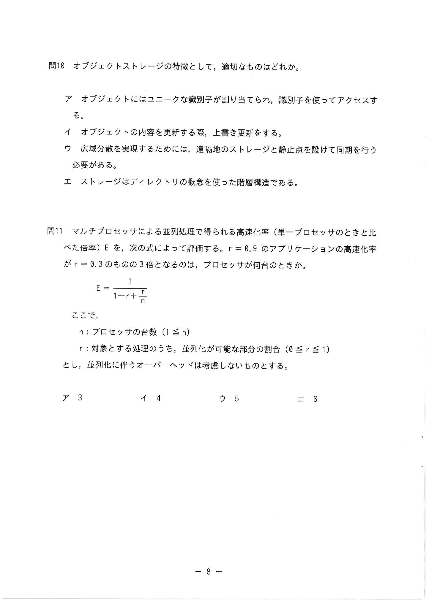

テキスト (OCR)

問19 オブジェクトストレージの特徴として, 適切なものはどれか。

ア オブジェクトにはユニークな識別子が割り当てられ, 識別子を使ってアクセスす
る。

イ オブジェクトの内容を更新する際, 上書き更新をする。

ウ 広域分散を実現するためには, 遠隔地のストレージと静止点を設けて同期を行う
必要がある。

エエ ストレージはディレクトリの概念を使った階層構造である。

間11 マルチプロセッサによる並列処理で得られる高速化率 (単二プロセッサのときと比
べた倍率) E を, 次の式によって評価する。r =9.9 のアプリケーションの高速化率
Br =O0.3 のものの 3 倍となるのは, プロセッサが何台のときか。

]

n: プロセッサの台数 (1 Sn)
ri 対象とする処理のうち, 並列化が可能な部分の割合 (0 ミrミ1)
とし, 並列化に伴うオーバーヘッドは考慮しないものとする。

NI
w
NM
bh
No
oa
H
lop]

### ページ 9

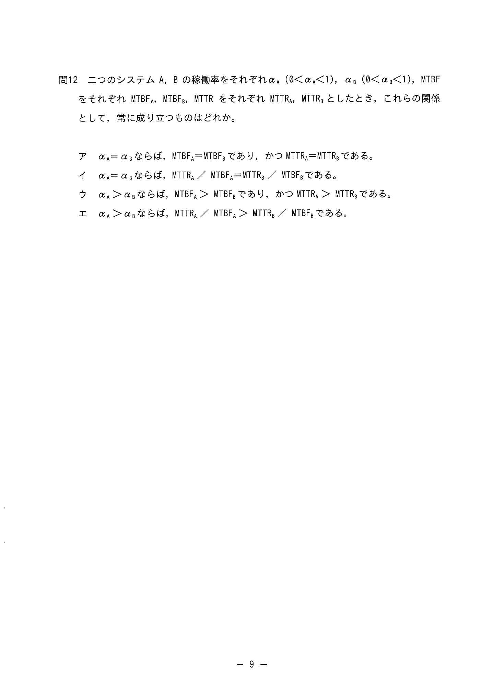

テキスト (OCR)

問12 二つのシステム A, B の稼働率をそれぞれw。 (96ぐe。ぐ1), ws (O<as<1), MTBF
をそれぞれ MIBF,, MTBF』,。 MTTR をそれぞれ MTITR, MTTR。としたとき, これらの関係
として, 淀に成り立つものはどれか。

に|

@』ー wsならば, MTBF。三MTBF。であり, かつ MTTR三MTTR。である。
@w』ー wsならば, MTTR。 プ MTBF。三MTTR。 7 MTBF。である。

Gy, >a, Sle, MTBF, > MTBF。であり, かつ MTTR。 MTTR。である。
@4グsesならば, MTTR 7 MTBF, > MTTRa プ MTBF。である。

H sos

### ページ 10

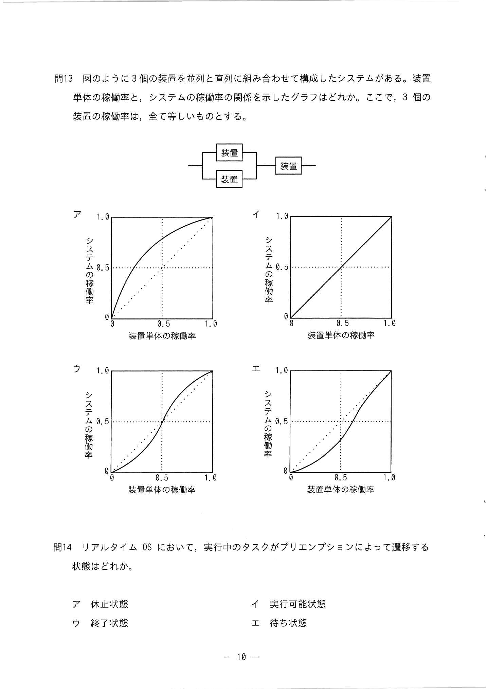

テキスト (OCR)

間13 図のように3 個の装置を並列と直列に組み合わせて構成したシステムがある。装軒
単体の稼働率と, システムの稼働率の関係を示したグラフはどれか。 ここで, 3 個の
装置の稼働率は, 全て等しいものとする。

a

EA] | a
we
Ba

Mt

ア 1.0          :        -        イ 1.0

シ                                シ

ス                                Z

テ                                7

40.5                                   ム 0.5トーーググーードーーー
の                                の

稼                                稼

働                                fe)

6       6.5      7.0           06       0.5      7.0
装置単体の稼働率                     装置単体の稼働率
ウ 1.0                      エエ 1.0

シ                                シ

a                                ス

テ                                テ

ム 6.                              人ム 6.

の                                の

稼                                稼

働                                働

6        0.5       1.0             6        0.5       1.0
装置単体の稼働率                     装置単体の稼働率

問14 リアルタイム OS において, 実行中のタスクがプリエンプションによって居移する
状態はどれか。

ア 休止状態          イ 実行可能状態

### ページ 11

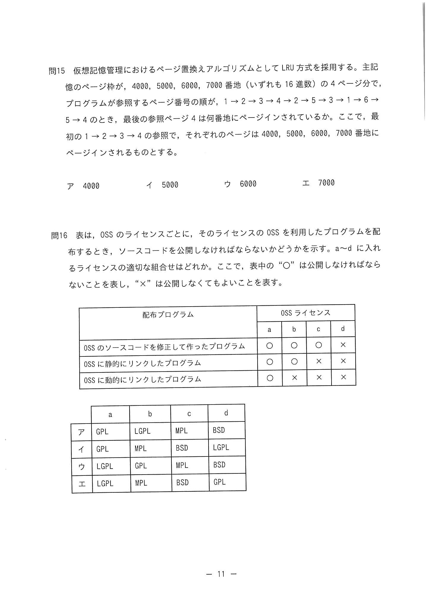

テキスト (OCR)

間15 仮想記憶管理におけるページ軒換えアルゴリズムとして LRU 方式を採用する。主記
杖のページ桁が, 4000, 5000, 6000, 7000 番地 (いずれも 16 進数) の 4 ページ分で,
プログラムが参照するページ番号の順が,.1つ2っつ3つ4つづ2つ5つ3っつ1つ6っ
5 っ 4 のとき, 最後の参照ページ 4 は何番地にページインされているか。 ここで, 最
初の 1 2 一 3 つ 4 の参照で, それぞれのページは 4000, 5000, 6000, 7000 番地に
ページインされるものとする。

ア 4000     イ 5000     ウ 6000     エ 7000

間16 表は, 0SS のライセンスごとに, そのライセンスの OSS を利用 したプログラムを配
布するとき, ソースコードを公開しなければならないかどうかを示す。 ad に入れ
るライセンスの適切な組合せはどれか。ここで, 表中の“〇"は公開しなければなら
ないことを表し, “X” は公開しなくてもよいことを表す。

配布プログラム                0SS ライセンス
a     b     C     d
0SS のソースコードを修正して作ったプログラム    1⑥)    O    〇    x
OSS に静的にリンクしたプログラム                 O     O     x     x
OSS に動的にリンクしたプログラム             O    x    x    x

a                  b                 C                d
ア | GPL             LGPL            MPL            BSD
イ | GPL             MPL              BSD            LGPL
ウ | LGPL           GPL              MPL            BSD
x | LGPL           MPL              BSD            GPL

### ページ 12

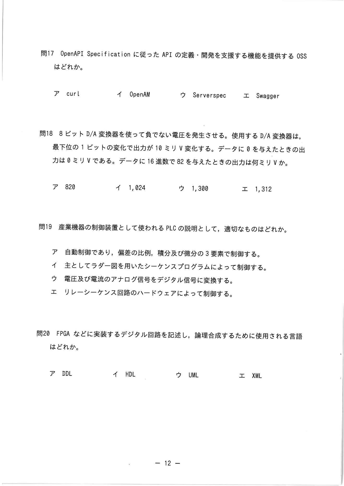

テキスト (OCR)

問17 0penAPI Specification に従った API の定義・開発を支援する機能を提供する oss
はどれか。

ア curl     イ OpenAM    ウ Serverspec  I Swagger

問18 8 ビット D/A 変換器を使って負でない電圧を発生させる。使用する D/A 変換器は,

最下位の 1 ビットの変化で出力が 10 ミリ V変化する。データに 9 を与えたときの出

力は9 ミリVである。 データに 16 進数で 82 を与えたときの出力は何ミリ V か。

ア 820     イ 1,024    ウ 1,300    エ 1,312

問19 産業機器の制御装置として使われる PLC の説明として, 適切なものはどれか。

に|

自動制御であり, 偏差の比例, 積分及び微分の 3 要素で制御する。
主としてラダー図を用いたシーケンスプログラムによって制御する。
電圧及び電流のアナログ信号をデジタル信号に変換する。

リレーシーケンス回路のハードウェアによって制御する。

H GA

F120 FPGA などに実装するデジタル回路を記述し, 論理合成するために使用される言語
はどれか。

ア DDL     イ HDL     ウ UML     エ XML

### ページ 13

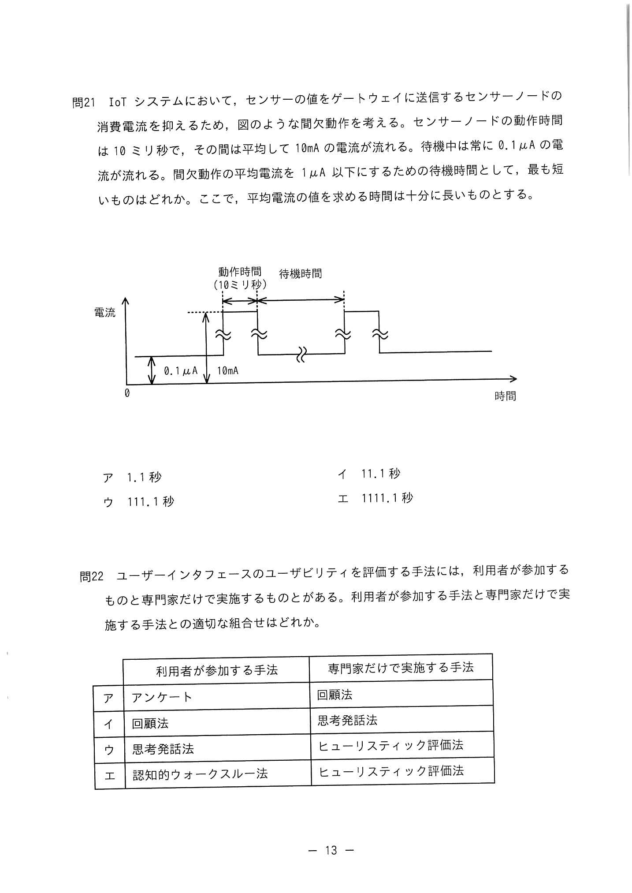

テキスト (OCR)

問21 lol システムにおいて, センサーの値をゲートウェイに送信するセンサーノードの
消費電流を抑えるため, 図のような間欠動作を考える。 センサーノードの動作時間
は 10 ミリ秒で, その間は平均して 19mA の電流が流れる。待機中は常に 0.1A OB
流が流れる。間欠動作の平均電流を 1A 以下にするための待機時間として, 最も短
いものはどれか。ここで, 平均電流の値を求める時間は十分に長いものとする。

動作時間 待機時間
(10ミリ秒)      」

CC
0.1 uA 10mA
9
時間
ア 1.1秒          イ 11.1秒
ウ 111.1秒           エ 1111.1秒

間22 ユーザーインタフェースのユーザビリティを評価する手法には, 利用者が参加する
ものと専門家だけで実施するものとがある。 利用者が参加する手法と専門家だけで実
施する手法との適切な組合せはどれか。

利用者が参加する手法         専門家だけで実施する手法
ア | アンケート         回顧法
4 | 回顧法                            思考発話法
ウ | 思考発話法                   ヒューリスティック評価法
エ | 認知的ウォークスル一法         ヒューリスティック評価法

ー 13 一

### ページ 14

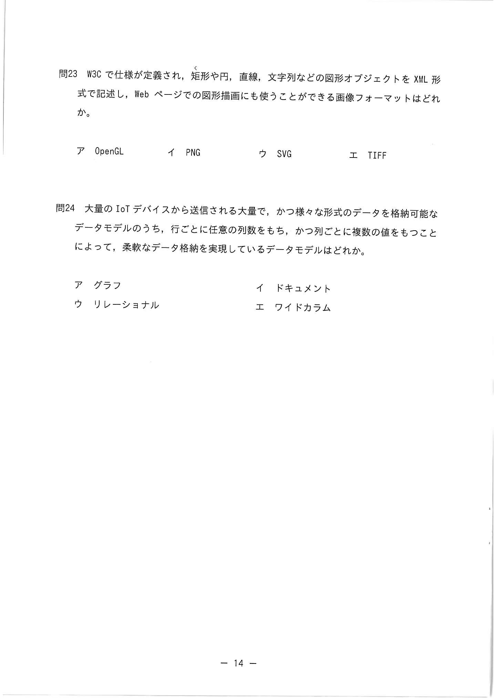

テキスト (OCR)

問23 W3C で仕様が定義され, SET, 直線, 文字列などの図形オブジェクトを XML 形
式で記述し, Web ページでの図形描画にも使うことができる画像フォーマッ トはどれ
か。

ア 0penGL    イ PNG     ウ SVG     エ TIFF
問24 AHO lol デバイスから送信される大量で, かつ様々 な形式のデータを格納可能な
データモデルのうち, 行ごとに任意の列数をもち, かつ列ごとに複数の値をもつこと

によって, 柔軟なデータ格納を実現しているデータモデルはどれか。

ア グラフ           イ ドキュメント
ウ リレーショナル        I ワイドカラム

### ページ 15

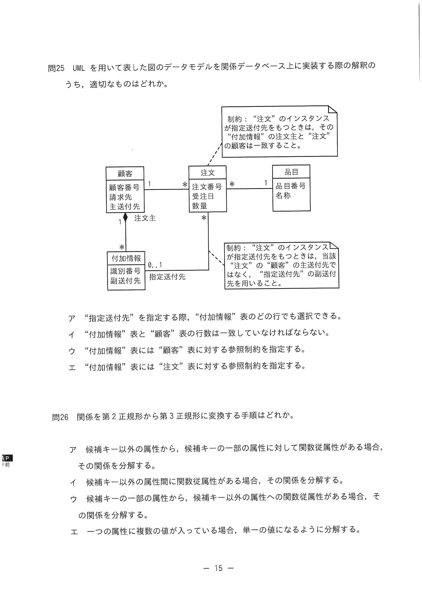

テキスト (OCR)

間25 UML を用いて表した図のデータモデルを関係データベース上に実装する除の解釈の
うち, 適切かものはどれか。

制約 : “注文" のインスタンス
が指定送付先をもつときは, その
"付加情報" の注文主と “注文"
の顧客は一致すること。

さ

顧客        注文         品
顧客番号 U    | 注文番号 |    1 |品目番号
請求先        受注日        名称
主送付先       数量

{9 注文      Ed

a                制約: "注文"のインスタンス
付加情報          へヽ、|が指定送付先をもつときは, 当該
識別番号 9..1         “注文" の顧客” の主送付先で
     RTE       ae"    9
副送付先 指定送付先 の副送付

ア “指定送付先” を指定する際, “付加情報”" 表のどの行でも選択できる。
イ “付加情報” 表と顧客” 表の行数は一致していなければならない。

> “付加情報" 表には “HR” 表に対する参照制約を指定する。

エ “付加情報" 表には “SEM” 表に対する参照制約を指定する。

問26 関係を第2 正規形から第 3 正規形に変換する手順はどれか。

ア 候補キー以外の属性から, 候補キーの一部の属性に対して関数従属性がある場合,
J          その関係を分解する。
イ 候補キー以外の属性間に関数従属性がある場合, その関係を分解する。
ウ 候補キーの一部の属性から, 候補キー以外の属性への関数従属性がある場合, そ
の関係を分解する。
エ ーつの属性に複数の値が入っている場合, 単一の値になるように分解する。

### ページ 16

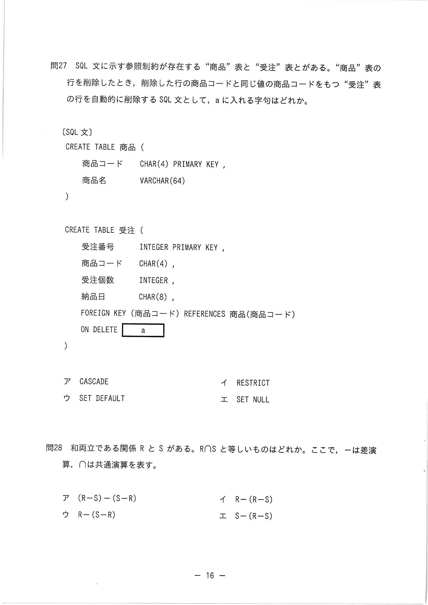

テキスト (OCR)

問27 SOL 文に示す参照制約が存在する “商品” 表と「『受注” 表とがある。 “商品” KO
行を削除したとき, 削除した行の商品コードと同じ値の商品コードをもつ "受注" 表
の行を自動的に削除する SQL 文として, a に入れる字句はどれか。

(SOL 文〕
CREATE TABLE 商品 (

商品コード   CHAR(4) PRIMARY KEY ,
商品名       VARCHAR(64)

CREATE TABLE 受注 (

受注番号     INTEGER PRIMARY KEY ,
商品コード CHAR(4) ,
受注個数     INTEGER ,
納品日      CHAR(8) ,

FOREIGN KEY (商品コード) REFERENCES 商品(商品コード)

ON DELETE [La]

ア CASCADE          イ RESTRICT
ウ SET DEFAULT          エエ SET NULL

問28 和両立である関係 R と S がある。 ROS と等しいものはどれか。ここで, 一は差演
算, は共通演算を表す。

ア (R—-S)—(S—R)        4 R一(RS)
ウ R-(S—R)           xX S—(R-S)

### ページ 17

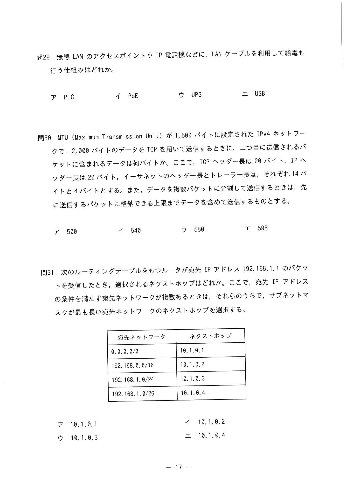

テキスト (OCR)

問29 無線 LAN のアクセスポイントや IP 電話機などに, LAN ケーブルを利用して給電
行う仕組みはどれか。

ア PLC     イ PoE     ウ UPS     エ USB

問39 MTU (Maximum Transmission Unit) 2° 1,500 バイトに設定された IPv4 ネットワー
DG, 2,000 バイトのデータを TCP を用いて送信するときに, ニつ目に送信されるパ
ケットに含まれるデータは何バイトか。ここで, TCP ヘッダー長は 29 バイト, IP へ
ッダー長は 20 バイト, イーサネットのヘッダー長とトレーラー長は, それぞれ14バ
イトと 4 バイトとする。また, データ を複数パケッ トに分割して送信するときは, 先
に送信するパケットに格納できる上限までデータ を含めて送信するものとする。

ア 500     イ 540     ウ 580     エ 598

問31 次のルーティ ングテーブルをもつルータが宛先 IP アドレス 192.168.1.1 のパケッ
トを受信したとき, 選択されるネクス トホップはどれか。ここで, 宛先 IP アドレス
の条件を満たす宛先ネットワークが複数あるときは, それらのうちで, サブネットマ
スクが最も長い宛先ネットワークのネクストホッ プを選択する。

宛先ネットワーク   ネクストホップ
0.0.0. 0/0     10.1.0.1
192, 168. 0. 0/16   10.1.0.2
192. 168. 1. 0/24   10.1.0.3
192. 168. 1. 0/26   10.1.0.4
ア 19.1.0.1         イ 10.1.0.2
ウ 10.1.0.3           エ 10.1.0.4

### ページ 18

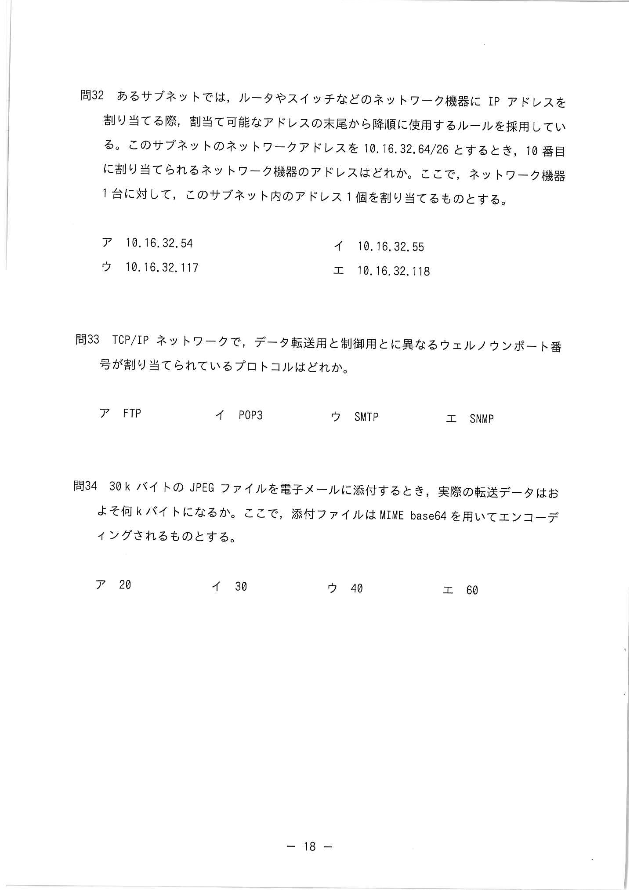

テキスト (OCR)

間32 あるサブネットでは, ルータやスイッチなどのネットワーク機器に ITP アドレスを
割り当てる際, 割当て可能なアドレスの未尾から隆順に使用するルールを採用してい
る。このサブネットのネットワークアドレスを 10. 16,32, 64/26 とするとき, 10 番目
に割り当てられるネットワーク機器のア ドレスはどれか。ここで, ネットワーク機器

台に対して, このサブネット内のアドレス 1 個を割り当てるものとする。

ア 19.16.32.54                   イ 19.16.32.55

ウ 19.16.32.117                 I 19.16.32.118

問33 TCP/IP ネットワークで, データ転送用と制御用とに異なるウェルノウンポート番

号が割り当てられているプロトコルはどれか。

ア FIP     イ POP3     ウ SMTP     エ SNMP

間34 39k バイトの JPEG ファイルを電子メールに添付するとき, 実際の転送データはお

よそ何kバイトになるか。ここで, 添付ファイルはMIME base64 を用いてエンコーデ
ィングされるものとする。

### ページ 19

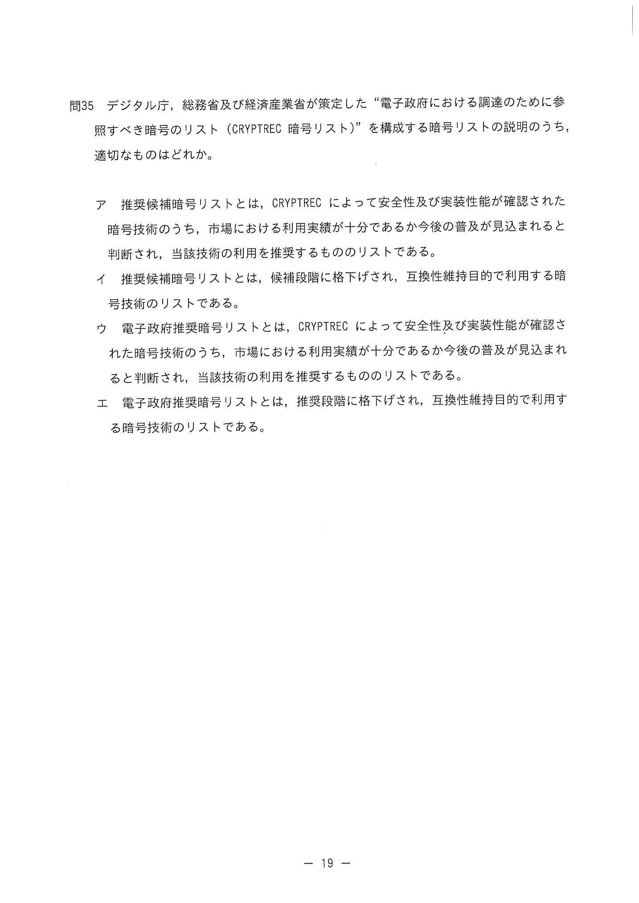

テキスト (OCR)

間35 デジタル庁, 総務省及び経済産業省が策定した "電子政府における調達のために参
照すべき暗号のリスト (CRYPTREC 暗号リスト)” を構成する暗号リストの説明のうち,
適切なものはどれか。

ア 推奨候補暗号リストとは, CRYPTREC によって安全性及び実装性能が確認された
暗号技術のうち, 市場における利用実績が十分であるか今後の普及が見込まれると
判断され, 当該技術の利用を推奨するもののリストである。

イ 推奨候補暗号リストとは, 候補段階に格下げされ, 互換性維持目的で利用する暗
号技術のリストである。

ウ 電子政府推奨暗号リストとは, CRYPTREC によって安全性及び実装性能が確認さ
れた暗号技術のうち, 市場における利用実績が十分であるか今後の普及が見込まれ
ると判断され, 当該技術の利用を推奨するもののリストである。

エ 電子政府推奨暗号リストとは, 推奨段階に格下げされ, 互換性維持目的で利用す
る暗号技術のリストである。

### ページ 20

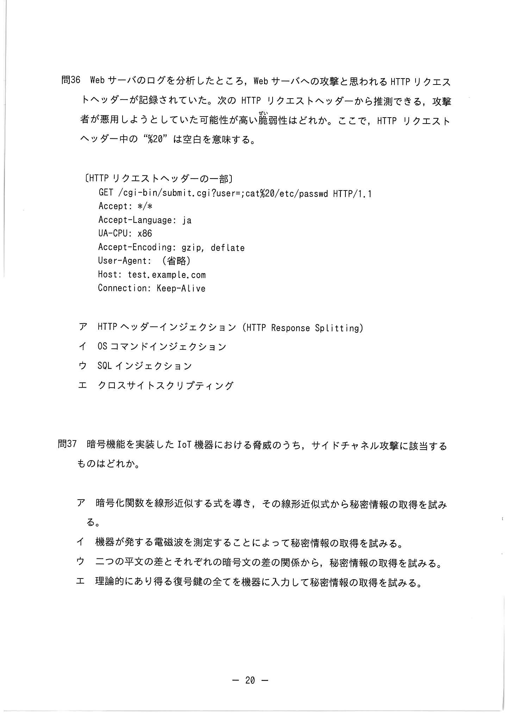

テキスト (OCR)

問36 Web サーバのログを分析したところ, Web サーバへの攻撃と思われる HTTP リクエス
トヘッダーが記録されていた。 次の HTTP リクエストヘッダーから推測できる, 攻撃
者が悪用しようとしていた可能性が高い脆弱性はどれか。ここで, HTTP リクエスト
ヘッダー中の “%20” は空白を意味する。

(HTTP リクエストヘッダーの一部〕
GET /cgi-bin/submit.cgi?user=:cat%20/etc/passwd HTTP/1.1
Accept: */*
Accept-Language: ja
UA-CPU: x86
Accept-Encoding: gzip, deflate
User-Agent: (省略)
Host: test.example.com
Connection: Keep-Alive

3

HTTP ヘッダーインジェクション (HTTP Response Splitting)
0S コマンドインジェクション
SQL インジェクション

クロスサイトスクリプティング

H GA

問37 暗号機能を実装した IoT 機器における脅威のうち, サイドチャネル攻撃に該当する
ものはどれか。

ア 暗号化関数を線形近似する式を導き, その線形近似式から秘密情報の取得を試み
る。
4 機器が発する電磁波を測定することによって秘密情報の取得を試みる。
ニニつの平文の差とそれぞれの暗号文の差の関係から, 秘密情報の取得を試みる。
理論的にあり得る復号鍵の全てを機器に入力して秘密情報の取得を試みる。

### ページ 21

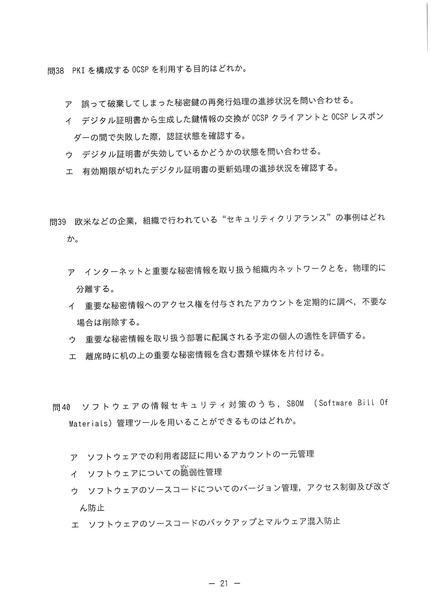

テキスト (OCR)

間38 PKIを構成する 0CSP を利用する目的はどれか。

ア 誤って破棄してしまった秘密鍵の再発行処理の進捗状況を問い合わせる。

イ デジタル証明書から生成した鍵情報の交換が 0CSP クライアントと0CSP レ スポン
ダーの間で失敗した際, 認証状態を確認する。

ウ デジタル証明書が失効しているかどうかの状態を問い合わせる。

エ 有効期限が切れたデジタル証明書の更新処理の進捗状況を確認する。

問39 欧米などの企業, 組織で行われている“セキュリティクリ アランス"の事例はどれ
か。

ア インターネットと重要な秘密情報を取り扱う組織内ネットワークとを, 物理的に
分離する。

イ 重要な秘密情報へのアクセス権を付与されたアカウントを定期的に調べ, 不要な
場合は削除する。

ウ 重要な秘密情報を取り扱う部署に配属される予定の個人の適性を評価する。

エ 離席時に机の上の重要な秘密情報を含む書類や媒体を片付ける。

B40 ソフトウェアの情報セキュリティ対策のうち,  SBOM (Software Bill Of
Materials) 管理ツールを用いることができるものはどれか。

N

ソフトウェアでの利用者認証に用いるアカウントの一元管理

イ ソフトウェアについての騰羽性管理

ウ ソフトウェアのソースコードについてのバージョン管理, アクセス制御及び改ざ
ん防止

エエ ソフトウェアのソースコードのバックアップとマルウェア混入防止

### ページ 22

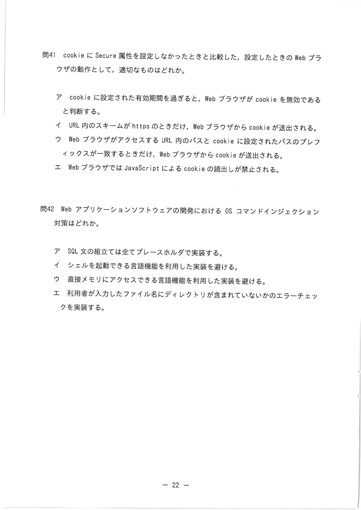

テキスト (OCR)

間41 cookie に Secure 属性を設定しなかったときと比較した, 設定したときの Web ブラ
ウザの動作として, 適切なものはどれか。

ア cookie に設定された有効期間を過ぎると, Web ブラウザが cookie を無効である
と判断する。

イ URL 内のスキームがhttps のときだけ, Web ブラウザから cookie が送出される。

ウ Web ブラウザがアクセスする URL 内のパスと cookie に設定されたパスのプレフ
ィックスが一致するときだけ, Web ブラウザから cookie が送出される。

工 Web ブラウザでは JavaScript による cookie の読出しが禁止される。

問42 Web アプリケーションソフトウェアの開発における OS コマンドインジェクション
対策はどれか。

に|

SQL 文の組立ては全てプレースホルダで実装する。

シェルを起動できる言語機能を利用した実装を避ける。

直接メモリにアクセスできる言語機能を利用した実装を避ける。

利用者が入力したファイル名にディレクトリが含まれていないかのエラーチェッ
クを実装する。

H GA

### ページ 23

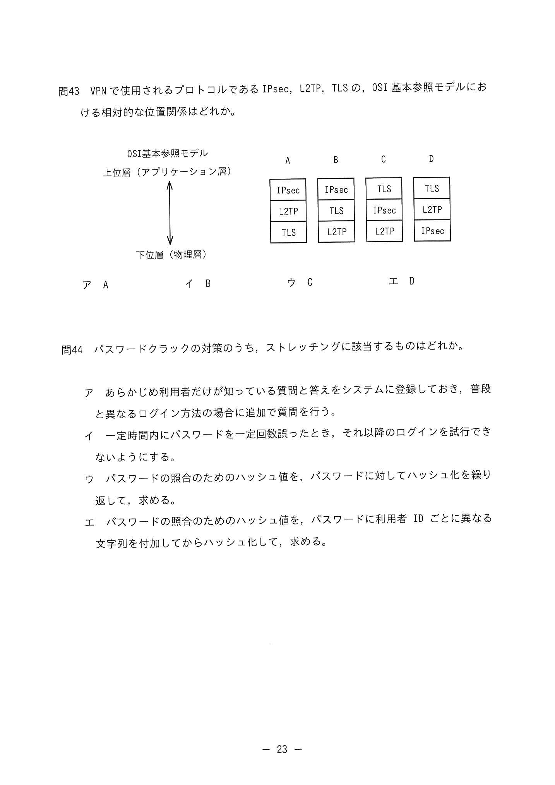

テキスト (OCR)

問43 VPNで使用されるプロトコルである IPsec, L2TP, TLS の, OSI 基本参照モデルにお
ける相対的な位置関係はどれか。

0SI基本参照モデル

A      B      C      D
上位層 (アプリケーション層)
IPsec    IPsec    TLS     TLS
L2TP    TLS    IPsec    L2TP
TLS    L2TP    L2TP    IPsec
下位層 (物理層)
PA           4 B           ウ C           = OD

問44 パスワードクラックの対策のうち, ストレッチングに該当するものはどれか。
ア あらかじめ利用者だけが知っている質問と答えをシステムに登録しておき, 普段

と異なるログイン方法の場合に追加で質問を行う。

イ 一定時間内にパスワードを一定回数誤ったとき, それ以降のログインを試行でき
ないようにする。

ウ パスワードの照合のためのハッシュ値を。パスワードに対してハッシュ化を繰り
返して, 求める。

XL パスワードの照合のためのハッシュ値を, パスワードに利用者 ID ごとに異なる
文字列を付加してからハッシュ化して, 求める。

### ページ 24

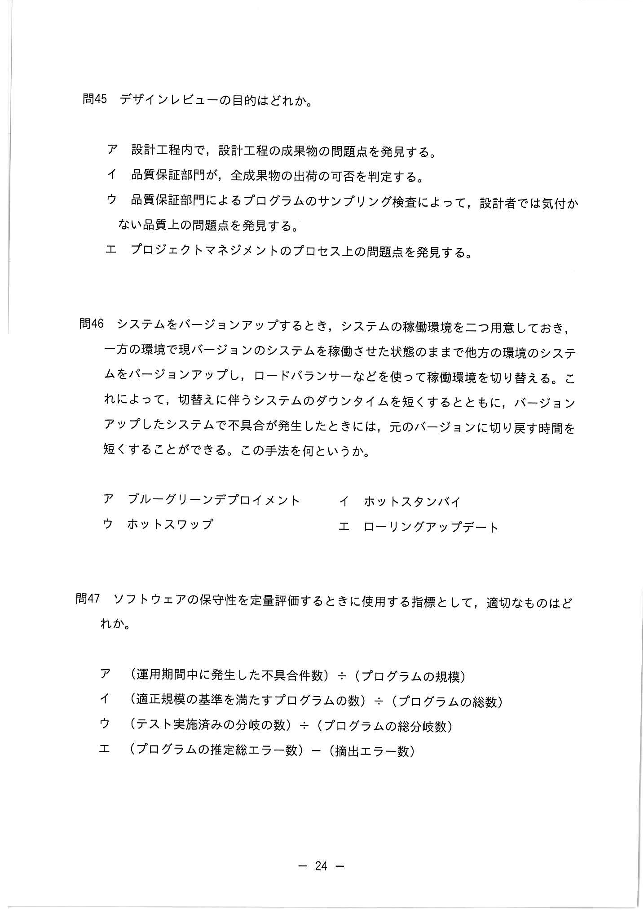

テキスト (OCR)

問45 デザインレビューの目的はどれか。

NI

設計工程内で, 設計工程の成果物の問題点を発見する。

イ 品質保証部門が, 全成果物の出荷の可否を判定する。

ウ 品質保証部門によるプログラムのサンプリング検査によって, 設計者では気付か
ない品質上の問題点を発見する。

エ プロジェクトマネジメントのプロセス上の問題点を発見する。

問46 システムをバージョンアップするとき, システムの乏働環境を二つ用意しておき,
一方の環境で現バージョンのシステムを稼働させた状態のままで他方の環境のシステ
ムをバージョンアップし, ロードバランサーなどを使って乏働環境を切り替える。こ
れによって, 切替えに伴うシステムのダウンタイムを短くするとともに, バージョン
アップしたシステムで不具合が発生したときには, 元のバージョンに切り戻す時間を
短くすることができる。この手法を何というか。

ア ブルーグリーンデプロイメント    イ ホットスタンバイ

ウ ホットスワップ             エエ ローリングアップデート

間47 ソフトウェアの保守性を定量評価するときに使用する指標として, 適切なものはど
れか。

ア (運用期間中に発生した不具合件数) ~+ (プログラムの規模)

イ (適正規模の基準を満たすプログラムの数) + (プログラムの総数)
ウ (テスト実施済みの分岐の数) ~ (プログラムの総分岐数)

エエ (プログラムの推定総エラー数) 一 (摘出エラー数)

### ページ 25

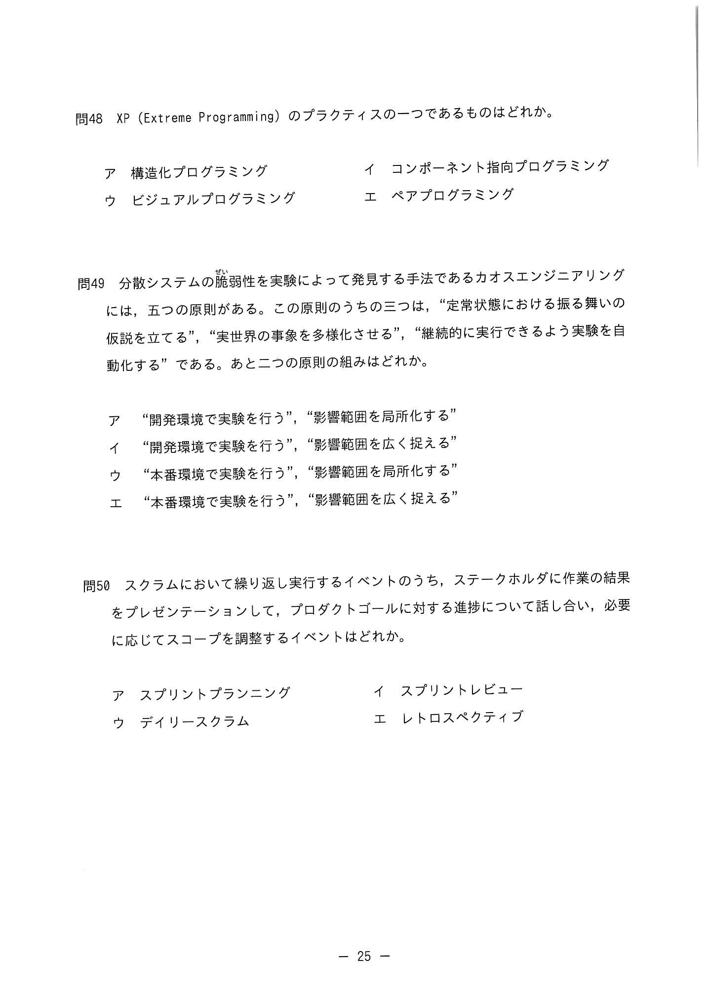

テキスト (OCR)

問48 XP (Extreme Programming) のプラクティ スの一つであるものはどれか。

ア 構造化プログラミン         イ コンポーネント指向プログラミング
中      グ

ンポー
ウ ビジュアルプログラミング          ペアプログラ

7/

ン

問49 分散システムの脆弱性を実験によって発見する手法であるカオスエンジニアリング
には。 五つの原則がある。 この原則のうちの三つは “定常状態における振る舞いの
仮説を立てる”, “実世界の事象を多様化させる”, "継続的に実行できるよう実験を自
動化する" である。あと二つの原則の組みはどれか。

ア "開発環境で実験を行う", “影響範囲を局所化する”
イ “開発環境で実験を行う", "影響範囲をた広く捉える"
ウ “本番環境で実験を行う", “影響範囲を局所化する"
エ "本番環境で実験を行う", "影響範囲を広く捉える"

間59 スクラムにおいて繰り返し実行するイベントのうち, ステークホルダに作業の結果
をプレゼンテーションして, プロダクトゴールに  対する進捗について話し合い, 必要
に応じてスコープを調整するイベントはどれか。

ア スプリントプランニング      イ スプリントレビュー
ウ デイリースクラム         エエ レトロスペクティブ

### ページ 26

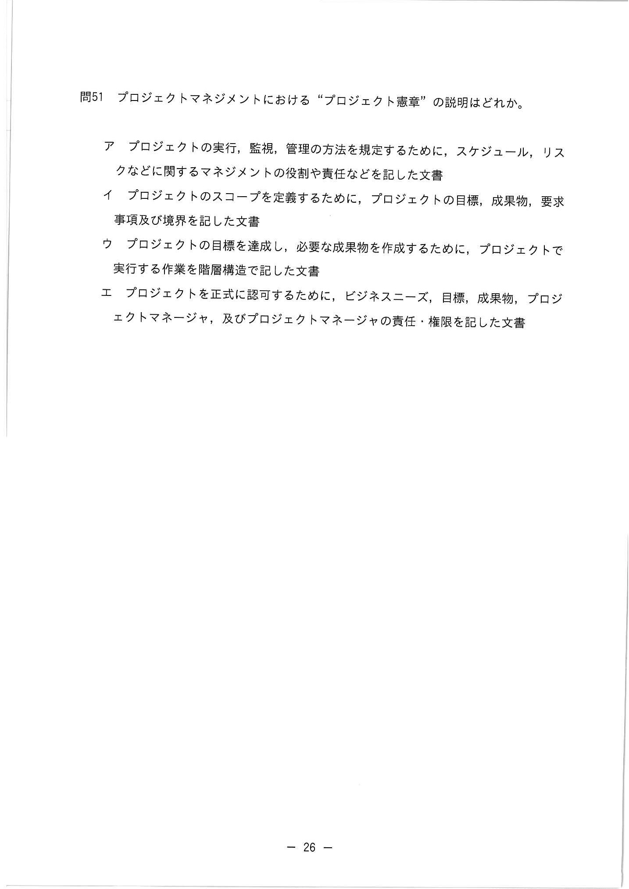

テキスト (OCR)

間51 プロジェクトマネジメントにおける “FOV SB’ の説明はどれか。

F プロジェクトの実行, BH, 管理の方法を規定するために, スケジュール, リス
クなどに関するマネジメントの役割や責任などを記した文書

イ プロジェクトのスコープを定義むするために, プロジェクトの目標, 成果物, BR
事項及び境界を記した文書

ウ プロジェクトの目標を達成し, 必要な成果物を作成するために, プロジェクトで
実行する作業を階層構造で記した文書

エ プロジェクトを正式に認可するために, ビジネスニーズ, 目標, RRM, Pov
エクトマネージャ, 及びプロジェクトマネージャの責任・権限を記した文書

### ページ 27

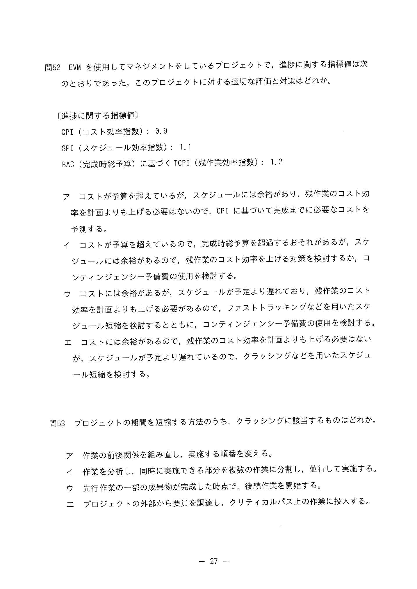

テキスト (OCR)

間52 EVM を使用してマネジメントをしているプロジェクトで, 進捗に関する指標値は次
のとおりであった。このプロジェクトに対する適切な評価と対策はどれか。

(進捗に関する指標値]

CPI (コスト効率指数) : 9.9

SPI (スケジュール効率指数) : 1.

BAC (完成時総予算) に基づくTCPI (残作業効率指数): 1.2

ア コストが予算を超えているが, スケジュールには余裕があり, 残作業のコスト効
率を計画よりも上げる必要はないので, CPI に基づいて完成までに必要なコストを
予測する。

イ コストが予算を超えているので, 完成時総予算を超過するおそれがあるが, スケ
ジュールには余裕があるので, 残作業のコスト効率を上げる対策を検討するか, コ
ンティンジェンシー予備費の使用を検討する。

ウ コストには余裕があるが, スケジュールが予定より遅れており, 残作業のコスト
効率を計画よりも上げる必要があるので, ファストトラッキングなどを用いたスケ
ジュール短縮を検討するとともに, コンティンジェンシー予備費の使用を検討する。

エエ コストには余裕があるので, 残作業のコスト効率を計画よりも上げる必要はない
が, スケジュールが予定より遅れているので, クラッシングなどを用いたスケジュ
ール短縮を検討する。

B53 プロジェクトの期間を短縮する方法のうち, クラッシングに該当するものはどれか。

作業の前後関係を組み直し, 実施する順番を変える。

作業を分析し, 同時に実施できる部分を複数の作業に分割し, 並行して実施する。
先行作業の一部の成果物が完成した時点で, 後続作業を開始する。

プロジェクトの外部から要上員を調達し, クリティカルパス上の作業に投入する。

H 二 ユ

### ページ 28

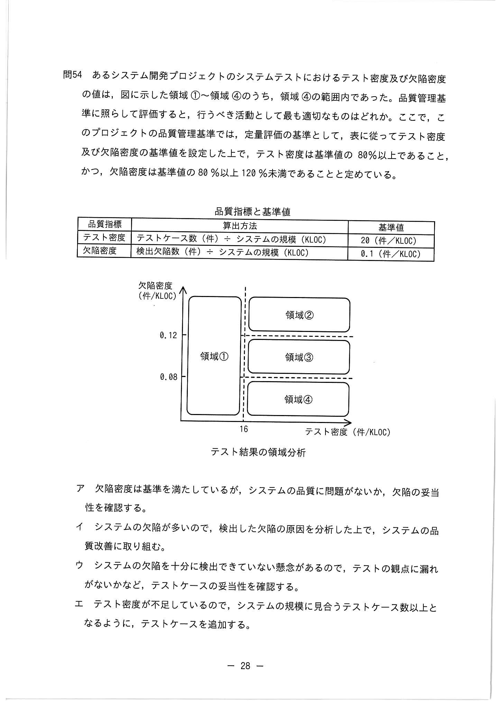

テキスト (OCR)

間54 あるシステム開発プロジェクトのシステムテストにおけるテスト密度及び欠陥密度
の値は, 図に示した領域 〇領域 ののうち, 領域 ④の範囲内であった。品質管理基
準に照らして評価すると, 行うべき活動と して最も適切なものはどれか。ここで, こ
のプロジェクトの品質管理基準では, 定量評価の基準として, 表に従ってテスト密度
及び欠陥密度の基準値を設定した上で, テスト密度は基準値の 80%以上であること,
DD, 欠陥密度は基準値の 80 %以上 120 %未満であることと定めている。

品費指標と基準値
品質指標                算出方法                    基準値
テスト密度 | テストケース数 (HH) + システムの規模 (KLOC)      20 (件プKLOC)
欠陥密度   検出欠陥数 (件) エ システムの規模 (KLOC)        6.1 (件プKLOC)
欠陥密度            1
(件/kL00) 人トレ       st¢              =
’               t
1      領域②
1
9.12 上         ーーニーニーニニ
}
領域〇 |!    領域⑨
\ーーーーーーーーーーーーーーーーーー 一
0.08 F           ーーーニーニーてとここ-
'
       領域の
ぃ          i ーー                  ノ
16           テスト容度 (件/KLOC)

テスト結果の領域分析

ア 欠陥密度は基準を満たしているが, システムの品質に問題がないか, 欠陥の妥当

性を確認する。
イ システムの欠陥が多いので, 検出した欠陥の原因を分析した上で, システムの品
質改善に取り組む。

ウ システムの欠陥を十分に検出できていない懸念があるので, テストの観点に漏れ
がないかなど, テストケースの妥当性を確認する。

L テスト密度が不足しているので, システムの規模に見合うテストケース数以上と
なるように, テストケースを追加する。

### ページ 29

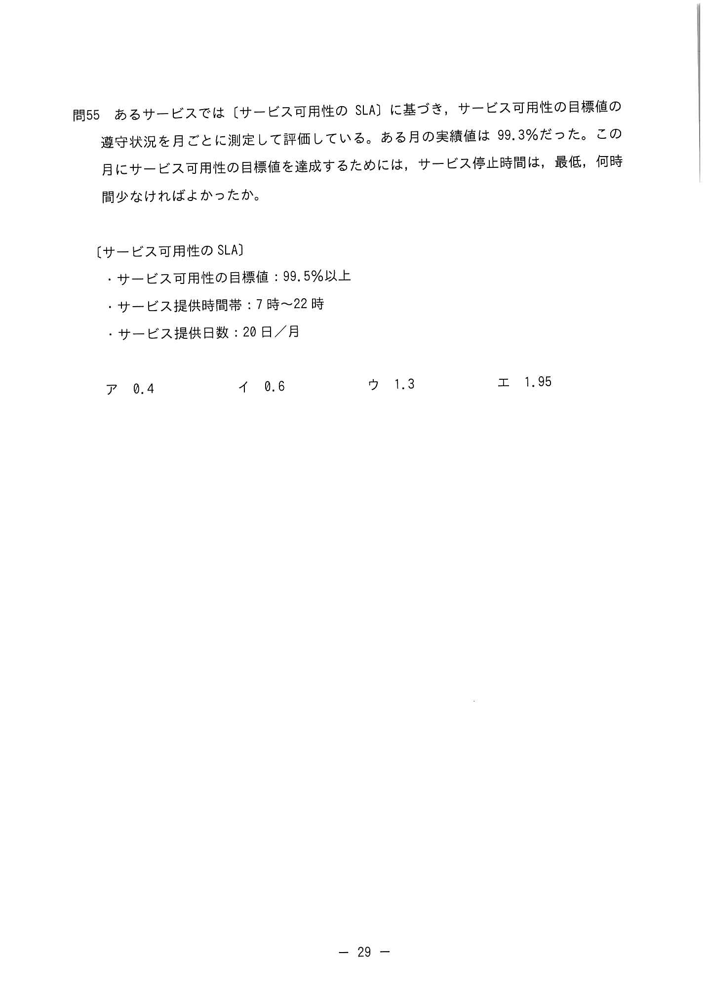

テキスト (OCR)

問55 あるサービスでは【サービス可用性の SLAJ に基づき, サービス可用性の目標値の
遵守状況を月ごとに測定して評価している。ある月の実績値は 99.3%だった。この
月にサービス可用性の目標値を達成するためには, サービス停止時間は, 最低, 何時
間少なければよかったか。

[サービス可用性の SLA)
・サービス可用性の目標値 : 99.56以上
・サービス提供時間帯 : 7 時一22 時

・サービス提供日数 : 20 日月

ア 0.4     イ 9.6     ウ 1.3     m 1.95

### ページ 30

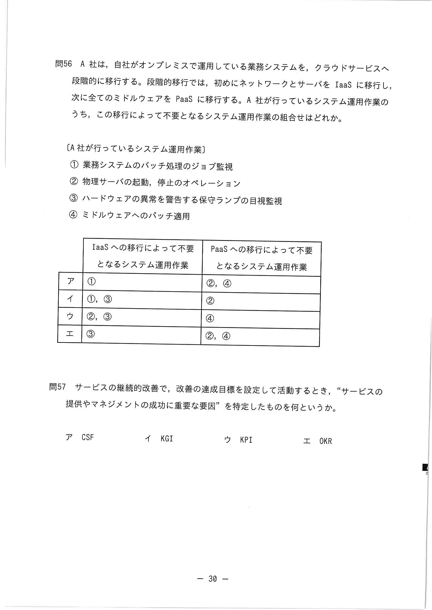

テキスト (OCR)

問56 A 社は, 自社がオンプレミスで運用している業務システムを, クラウ ドサービスへ
段階的に移行する。段階的移行では, 初めにネットワークとサーバを TaaS に移行し,
次に全てのミドルウェアを PaaS に移行する。A 社が行っているシステム運用作業の
うち, この移行によって不要となるシステム運用作業の組合せはどれか。

〔A 社が行っているシステム運用作業】

① 業務システムのバッチ処理のジョブ監視

② 物理サーバの起動, 停止のオペレーション

⑬ ハードウェアの異常を警告する保守ランプの目視監視
@ ミドルウェアへのパッチ適用

TaaS への移行によって不要 | PaaS への移行によって不要
となるシステム運用作業   となるシステム運用作業
アァ |①            ②, ④
4 |, ©            @
ウゥ1@, ©            @
x |®          ②, ④

問57 サービスの継続的改善で, 改善の達成目標を設定して活動するとき, “サービスの
提供やマネジメントの成功に重要な要因” を特定 したものを何というか。

ア CSF     イ KGI     ウ KPI     エエ OKR

### ページ 31

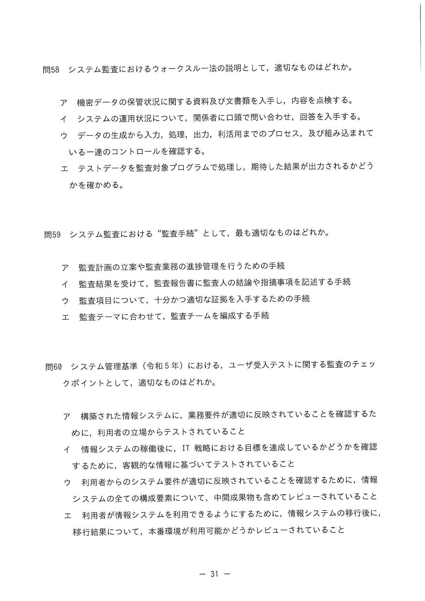

テキスト (OCR)

問58 システム監査におけるウォークスルー法の説明として, 適切なものはどれか。

ア 機密データの保管状況に関する資料及び文書類を入手し, 内容を点検する。

イ システムの運用状況について, 関係者に口頭で問い合わせ, 回答を入手する。

ウ データの生成から入力, 処理, WH, 利活用までのプロセス, 及び組み込まれて
いる一連のコントロールを確認する。

エエ テストデータを監査対象プログラムで処理し, 期待した結果が出力されるかどう
かを確かめる。

M59 システム監査における “監査手続" として, 最も適切ながものはどれか。

|

監査計画の立案や監査業務の進捗管理を行うための手続

監査結果を受けて, 監査報告書に監査人の結論や指摘事項を記述する手続
監査項目について, 十分かつ適切な証拠を入手するための手続

監査テーマに合わせて, 監査チームを編成する手続

H 寺 ユ

RIGO システム管理基準 (偽和5 年) における, ユーザ受入テストに関する監査のチェッ
クポイントとして, 適切なかものはどれか。

ア 構築された情報システムに, 業務要件が適切に反映されていることを確認するた
めに, 利用者の立場からテストされていること

イ 情報システムの乏働後に, IT 戦略における目標を達成しているかどうかを確認
するために, 客観的な情報に基づいてテストされていること

ウ 利用者からのシステム要件が適切に反映されていることを確認するために, 情報
システムの全ての構成要素について, 中間成果物も含めてレビューされていること
エ 利用者が情報システムを利用できるようにするために, 情報システムの移行後に,
移行結果について, 本番環境が利用可能かどうかレビューされていること

### ページ 32

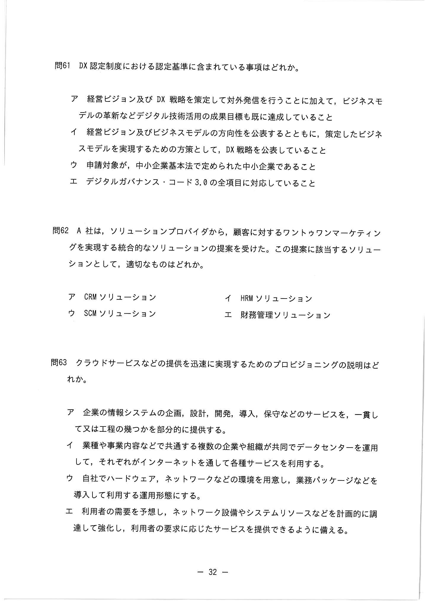

テキスト (OCR)

問61 DX認定制度における認定基準に含まれている事項はどれか。
経営ビジョン及び DX 戦略を策定して対外発信を行うことに加えて, ビジネスモ
デルの革新などデジタル技術活用の成果目標も既に達成していること

イ 経営ビジョン及びビジネスモデルの方向性を公表するとともに, 策定したビジネ

スモデルを実現するための方策として, DX 戦略を公表していること
ウ 申請対象が, 中小企業基本法で定められた中小企業であること
xr

ッアア

デジタルガバナンス・コード 3.6 の全項目に対応していること

問62 A 社は, ソリューションプロバイダから, 顧客に対するワントゥワンマーケティン
グを実現する統合的なソリューションの提案を受けた。この提案に該当するソリュー

ションとして, 適切なものはどれか。

イ HRMソリューション

ア CRMソリューション
エ 財務管理ソリリューション

ウ SCMソリューション

間63 クラウドサービスなどの提供を迅速に実現するためのプロビジョニングの説明はど

れか。

ア 企業の情報システムの企画, Rit, 開発, BA, 保守などのサービスを, 一貫し
て又は工程の幾つかを部分的に提供する。

イ 業種や事業内容などで共通する複数の企業や組織が共同でデータセンターを運用
して, それぞれがインターネットを通して各種サービスを利用する。

ウ 自社でハードウェア, ネットワークなどの環境を用意し, 業務パッケージなどを
導入して利用する運用形態にする。

TC 利用者の需要を予想し, ネットワーク設備やシステムリソースなどを計画的に調
達して強化し, 利用者の要求に応じたサービスを提供できるように備える。

### ページ 33

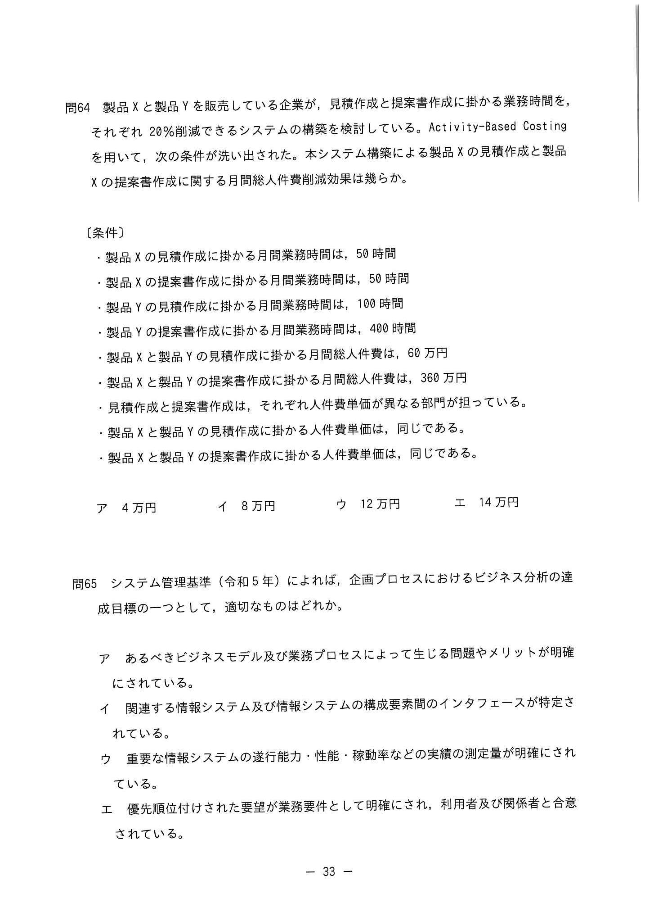

テキスト (OCR)

問64 製品 X と製品Y を販売している企業が,  見積作成と提案書作成に掛かる業務時間を,
それぞれ 206%削減できるシステムの構築を検討している。Activity-Based  Costing
を用いて, 次の条件が洗い出された。本システム構築による製品X の見積作成と製品
X の提案書作成に関する月間総人件費削減効果は壮らか。

〔条件〕
LEX の見積作成に掛かる月問業務時間は, 50 時間
・ 製品 X の提案書作成に掛かる月間業務時間は, 59 時間
・ 製品 Y の見積作成に掛かる月間業務時間は, 100 時間
・ 製品 Y の提案書作成に掛かる月問業務時間は, 409 時間
UX と製品 Y の見積作成に掛かる月間総人件費は, 66 万円
- 製品 X と製品 Y の提案書作成に掛かる月間総人件費は, 369 万円
・ 見積作成と提案書作成ょは, それぞれ人件費単価が異なる部門が担っている。
・ 製品 X と製品 Y の見積作成に掛かる人件費単価は, 同じである。
- 製品 X と製品 Y の提案書作成に掛かる人件費単価は, 同じである。

ア 4万円    イ 8万円    ウ 12万円   エ 14万円

間65 システム管理基準 (令和 5 年) によれば, 企画プロセスにおけるビジネス分析の達
成目標のーつとして, 適切なものはどれか。

ア あるべきビジネスモデル及び業務プロセスによって生じる問題やヤメリットが明確
にされている。

イ 関連する情報システム及び情報システムの構成要素間のインタフェースが特定さ
れている。

ウ 重要な情報システムの送行能力・性能・稼動率などの実績の測定量が明確にされ
ている。

エ 優先順位付けされた要望が業務要件として明確にされ, 利用者及び関係者と合
されている。

ca

### ページ 34

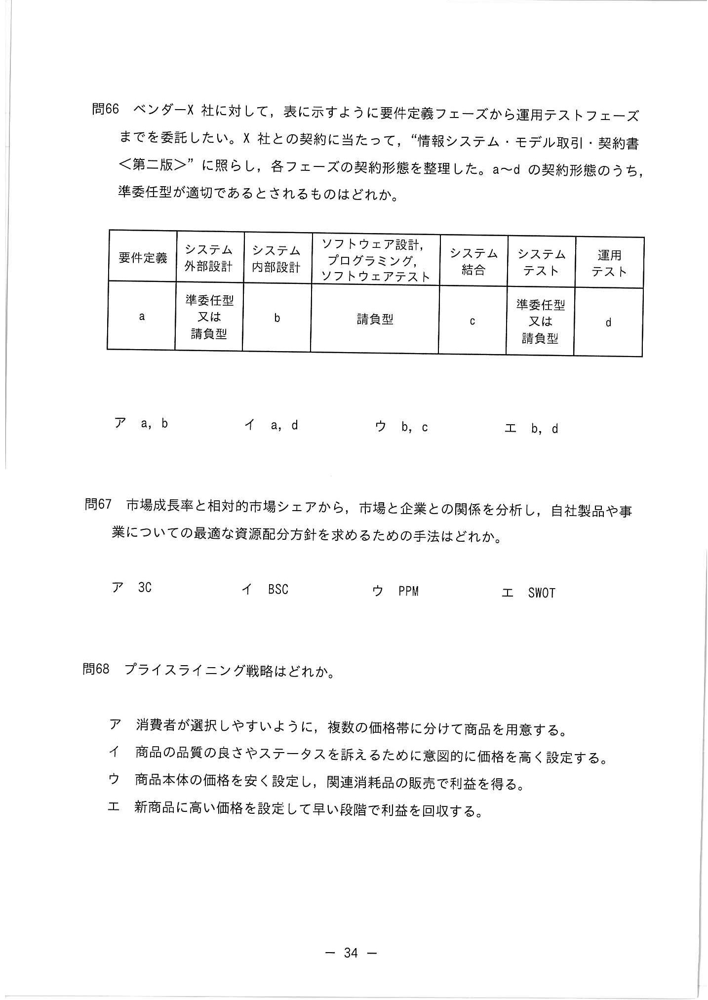

テキスト (OCR)

問66 ベンダーX 社に対して, 表に示すように要件定義フェーズから運用テストフェーズ
までを委託したい。 X 社との契約に当たって, “情報システム・モデル取引・契約書
第二版>” に照らし, 各フェーズの契約形態を整理した。ad の契約形態のうち,
準委任型が適切であるとされるものはどれか。

こっラー     こっーー     ソフトウェア設     ンュっニー     こっニー
システム | システム                ,    システム | システム    運用

要件定義     serpents:      YE     プログラミング,         へ      =         ~
外部設計 | PIBBERE    ソフトウェアテスト     結合      テスト     テスト
準委任型                                      準委任型

a       又は       b          請負型          c       又は       d

請負型                                        請負型

Poa, b           4 ad           FT by &          エ b, d

問67 市場成長率と相対的市場シェアから, 市場と企業との関係を分析し, 自社製品や事
業についての最適な資源配分方針を求めるための手法はどれか。

ア 3      イ BSC     ウ PPM     エ SWOT

問68 プライスライニング戦略はどれか。

|

消費者が選択しやすいように, 複数の価格帯に分けて商品を用意する。
商品の品質の良さやステータスを訴えるために意図的に価格を高く
商品本体の価格を安く設定し, 関連消耗品の販売で利益を得る。

新商品に高い価格を設定して早い段階で利益を回収する。

H GA
ye
fit
sol.
の

### ページ 35

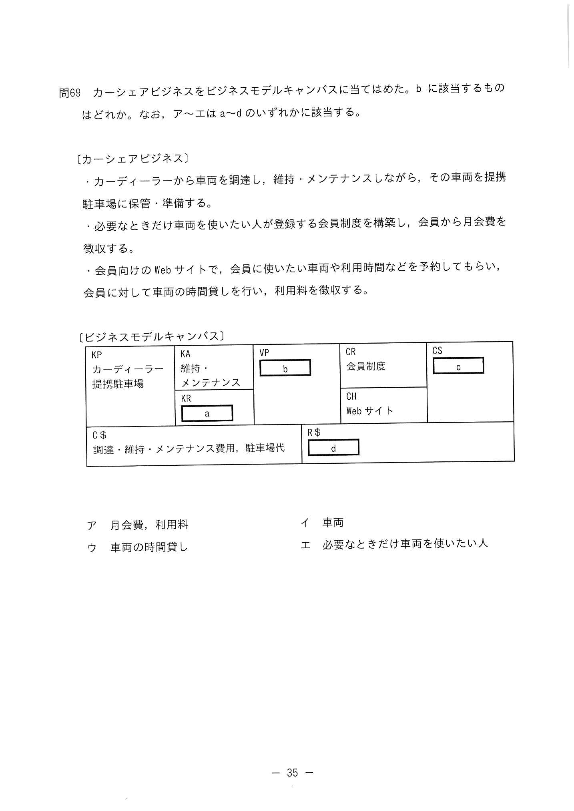

テキスト (OCR)

間69  カーシェアビジネスをビジネスモデルキャンバスに当てはめた。b に該当するもの
はどれか。なお, アーエはa一d のいずれかに該当する。

[カーシェアビジネス〕

- カーディーラーから車両を調達し, 維持・メンテナンスしながら, その車両を提携
駐車場に保管・準備する。

・ 必要なときだけ車両を使いたい人が登録する会員制度を構築し, 会員から月会費を
徴収する。

・ 会員向けの Web サイトで, 会員に使いたい車両や利用時間などを予約してもらい,
会員に対して車両の時間貸しを行い, 利用料を徴収する。

[ビジネスモデルキャンバス〕

KP                 KA               VP                CR                CS
カーディーラー | 維持・          LCL. |       会員制度
提携駐車場        メンテナンス
KR                                 CH
[a]                  Web サイト
C$                                       R$
調遅・維持・メンテナンス偶用,難車場人 | | d |

ア 月会費, 利用料       イ 車両
ウ 車両の時間貸し        エ 必要なときだけ車両を使いたい人

### ページ 36

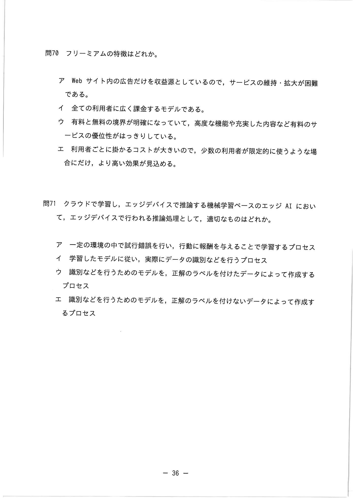

テキスト (OCR)

問79 フリーミアムの特徴はどれか。

ア Web サイト内の広告だけを収益源としているので, サービスの維持・拡大が困難
である。

4 全ての利用者に広く課金するモデルである。

ウ 有料と無料の境界が明確になかっていて, 高度な機能や充実した内容など有料のサ
ービスの優位性がはっきりしている。

工 利用者ごとに掛かるコストが大きいので, 少数の利用者が限定的に使うような場
合にだけ, より高い効果が見込める。

問71 クラウドで学習し, エッジデバイスで推論する機械学習ベースのエッジ AI におい
て, エッジデバイスで行われる推論処理として, 適切なものはどれか。

N

一定の環境の中で試行錯誤を行い, 行動に報酬を与えることで学習するプロセス

イ 学習したモデルに従い, 実際にデータの識別などを行うプロセス

ウ 識別などを行うためのモデルを, 正解のラベルを付けたデータによって作成する
プロセス

エ 識別などを行うためのモデルを, 正解のラベルを付けないデータによって作成す

るプロセス

### ページ 37

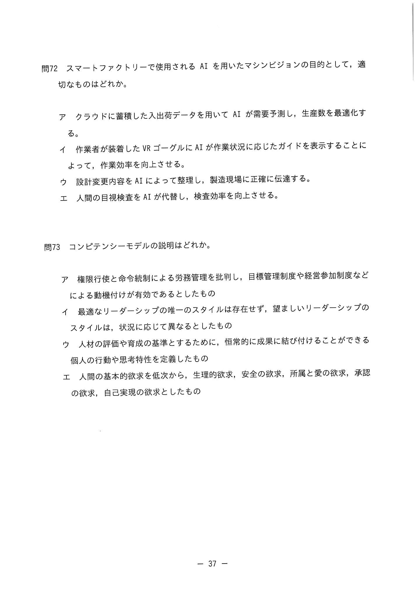

テキスト (OCR)

問72 スマートファクトリーで使用される AL を用いたマシンビジョンの目的として, 適
切なものはどれか。

ア クラウドに鞭積した入出荷データを用いて AI が需要予測し, 生産数を最適化す
る。

イ 作業者が装着した VR ゴーグルに AL が作業状況に応じたガイドを表示することに
よって, 作業効率を向上させる。

ウ 設計変更内容を AI によって整理し, 製造現場に正確に伝達する。

エ 人間の目視検査を AI が代替し, 検査効率を向上させる。

FA73 コンピテンシーモデルの説明はどれか。

ア 権限行使と命令統制による労務管理を批判し, 目標管理制度や経営参加制度など
による動機付けが有効でもるとしたもの

イ 最適なリーダーシップの唯一のスタイルは存在せず, 望ましいリーダーシップの
スタイルは, 状況に応じて異なるとしたもの

ウ 人材の評価や育成の基準とするために, 恒常的に成果に結び付けることができる
個人の行動や思考特性を定義したもの

エエ 人間の基本的欲求を低次から, 生理的欲求, 安全の欲求, 所属と要の欲求, 承認
の欲求, 自己実現の欲求としたもの

### ページ 38

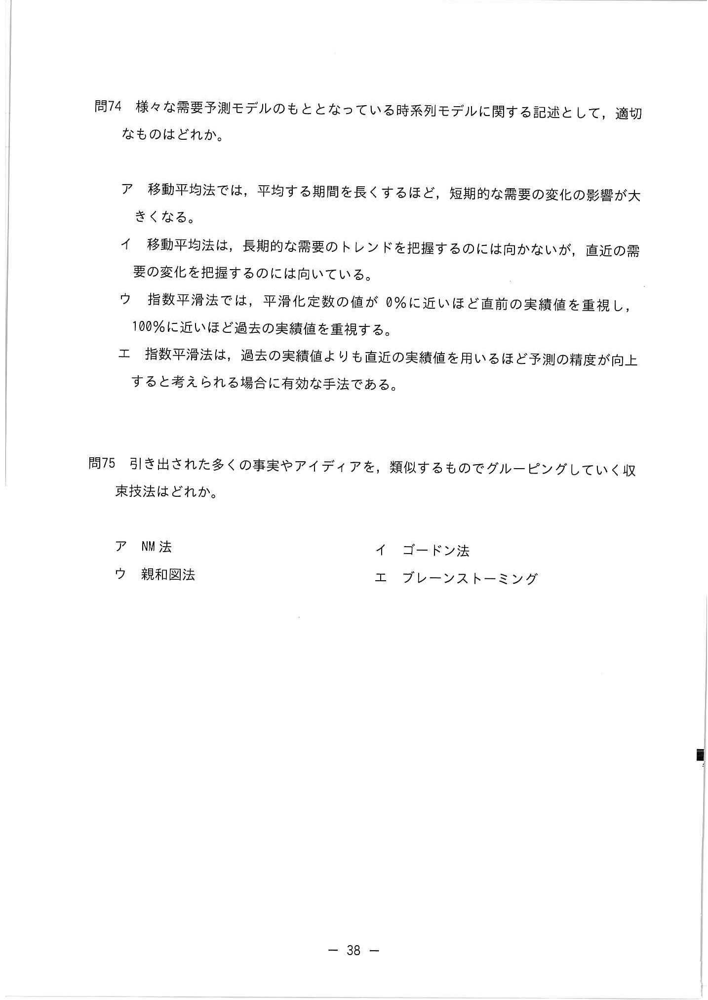

テキスト (OCR)

問74 様々な需要予測モデルのもととなっている時系列モデルに関する記述と して, 適切
なものはどれか。

ア 移動平均法では, 平均する期間を長くするほど, 短期的な中要の変化の影響が大
きくなる。

イ 移動平均法は, 長期的な雷要のトレン ドを把握するのには向かないが, 直近の寺
要の変化を把握するのには向いている。

ウ 指数平滑法では, 平滑化定数の値が 9%に近いほど直前の実績値を重視し
1999%%に近いほど過去の実績値を重視する。

エ 指数平滑法は, 過去の実績値よりも直近の実績値を用いるほど予測の精度が向上
すると考えられる場合に有効な手法である。

間75 引き出された多くの事実やアイディアを, 類似するものでグルーピングしていく収
東技法はどれか。

ア NWSE            4 ゴードン決

ウ 親和図法             エ ブレーンストーミング

77

### ページ 39

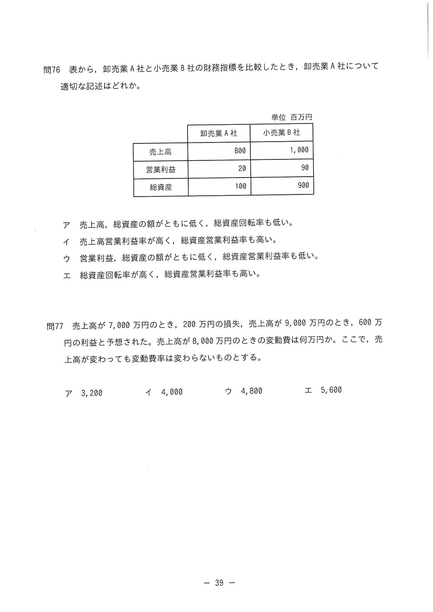

テキスト (OCR)

問76 表から, 卸売業 A 社と小売業 B 社の財務指標を比較したとき, 卸売業A 社について
適切な記述はどれか。

単位 百万円
卸売業A社      小売業 B 社
売上高                       800                 1, 000
営業利益                       20                     90
AE                        100                   900

ア 売上高, 総資産の額がともに低く, 総資産回転率も低い。
売上高営業利益率が高く, 総資産営業利益率も高い。

営業利益, 総資産の額がともに低く, 総資産営業利益率も低い。
総資産回転率が高く, 総資産営業利益率も高い。

H GAN

問77 売上高が 7,000 万円のとき, 200 万円の損失, 売上高が 9,000 万円のとき, 60045
円の利益と予想された。 売上高が 8, 009 万円のときの変動費は何万円か。ここで, 売
上高が変わっても変動費率は変わらないものとする。

ア 3,200    イ 4,000    ウ 4,800    エ 5,600

### ページ 40

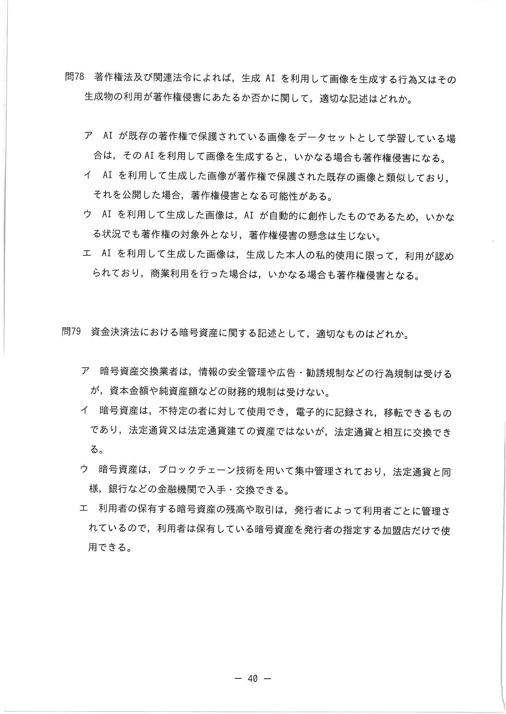

テキスト (OCR)

問78 著作権法及び関連法令によれば, 生成 AI を利用して画像を生成する行為又はその
生成物の利用が著作権侵害にあたるか否かに関して, 適切な記述はどれか。

ア AT が既存の著作権で保護されている画像をデータセットとして学習している場
合は, その AT を利用して画像を生成すると, いかなる場合も著作権侵害になる。

イ Al を利用して生成した画像が著作権で保護された既存の画像と類似しており,
それを公開した場合 著作権侵害となる可能性がある。

ウ AL を利用して生成した画像は, AI が自動的に創作したものであるため, いかな
る状況でも著作権の対象外となり, 著作権侵害の懸念は生じない。

エエ AT を利用して生成した画像は, 生成した本人の私的使用に限って, 利用が認め
られており, 商業利用を行った場合は。 いかなる場合も著作権侵害となる。

問79 資金決済法における暗号資産に関する記述として, 適切なものはどれか。

ア 暗号資産交換業者は, 情報の安全管理や広告・勧誘規制などの行為規制は受ける
が, 資本金額や純資産額などの財務的規制は受けない。

イ 暗号資産は, 不特定の者に対して使用でき, 電子的に記録され, 移転できるもの
であり, 法定通貨又は法定通貨建ての資産ではないが, 法定通貨と相互に交換でき
る。

ウ 暗号資産は。 ブロックチェーン技術を用いて集中管理されており, 法定通貨と同
ER, 銀行などの金融機関で入手・交換できる。

I 利用者の保有する暗号資産の残高や取引は, 発行者によって利用者ごとに管理さ
れているので, 利用者は保有している暗号資産を発行者の指定する加盟店だけで使
用できる。

### ページ 41

テキスト (OCR)

問80 欧州へ電子部品を輸出するには, ROHS 指令への対応が必要である。この RoHS 指令
の目的として, 適切なかものはどれか。

ア 家電製品から有用な部品や材料をリサイクルし, 廃棄物を減量するとともに, 資
源の有効利用を推進する。

イ 機器が発生する電磁妨害が, 無線通信機器及びその他の機器の正常な動作を妨げ
るレベルを超えないようにする。

ウ 大量破壊兵器の開発及び拡散, 通常兵器の過剰備鞭に関わるおそれがある場合な
ど, 国際社会の平和と安全を脅かす輸出行為を防止する。

エエ 電気電子製品の生産から処分までの全ての段階で, 有害物質が環境及び人の健康
に及ぼす危険を最小化する。

### ページ 42

テキスト (OCR)

〔

x モ 用 紙 〕

### ページ 43

テキスト (OCR)

[ x モ 用 紙 J

### ページ 44

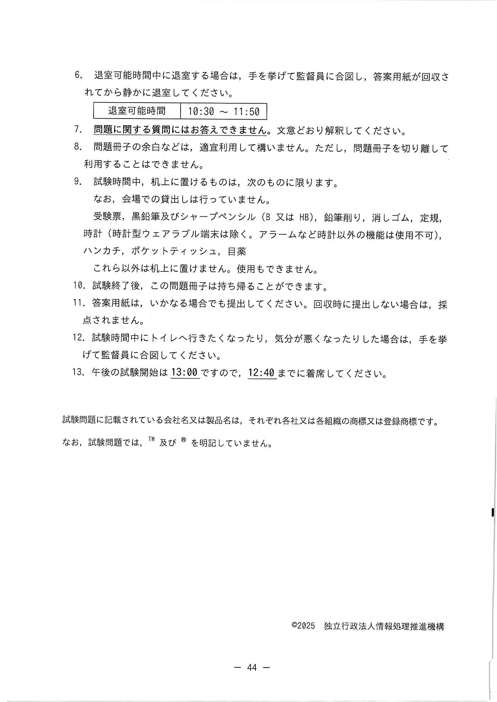

テキスト (OCR)

6. 退室可能時間中に退室する場合は, 手を挙げて監督貞に合図し, 答案用紙が回収さ
れてから静かに退室してください。
| 候宣可能時間 | 10:30 ~ 11:50
7. 問題に関する質問にはお答えできません。文意どおり解釈してください。
8. 問題冊子の余白などは, 適宜利用して構いません。ただし, 問題冊子を切り離して
利用することはできません。
9. 試験時間中, 机上に置けるものは, 次のものに限ります。
なお, 会場での貸出しは行っていません。
受験票, 黒鉛筆及びシャープペンシル (B 又は HB), 鉛筆削り, 消しゴム, 定規,
時計 (時計型ウェアラブル端末は除く。アラームなど時計以外の機能は使用不可),
ハンカチ, ポケットティッシュ, 目薬
これら以外は机上に置けません。 使用もできません。
10. 試験終了後, この問題冊子は持ち帰ることができます。
11. 答案用紙は, いかなる場合でも提出してください。回収時に提出しない場合は, 採
点されません。
12. 試験時間中にトイレへ行きたくなったり, 気分が悪くなったりした場合は, 手を挙
げて監督具に合図してください。
13. 午後の試験開始は 13:00 ですので, 12:40 までに着席してください。

試験問題に記載されている会社名又は製品名は, それぞれ各社又は各組織の商標又は登録商標です。

なお, 試験問題では, "Ru ® を明記していません。

@2025 独立行政法人情報処理推進機構

---

## 午前解答

©2025 独立行政法人情報処理推進機構 
令和7 年度 春期 応用情報技術者試験 解答例 
 
午前試験 
問番号
正解
分野
問1 
エ 
Ｔ 
問2 
ア 
Ｔ 
問3 
イ 
Ｔ 
問4 
イ 
Ｔ 
問5 
ウ 
Ｔ 
問6 
ウ 
Ｔ 
問7 
ウ 
Ｔ 
問8 
ウ 
Ｔ 
問9 
エ 
Ｔ 
問10 
ア 
Ｔ 
問11 
エ 
Ｔ 
問12 
イ 
Ｔ 
問13 
エ 
Ｔ 
問14 
イ 
Ｔ 
問15 
ウ 
Ｔ 
問16 
ア 
Ｔ 
問17 
エ 
Ｔ 
問18 
ウ 
Ｔ 
問19 
イ 
Ｔ 
問20 
イ 
Ｔ 
 
 
問番号
正解
分野
問21 
ウ 
Ｔ 
問22 
ウ 
Ｔ 
問23 
ウ 
Ｔ 
問24 
エ 
Ｔ 
問25 
ウ 
Ｔ 
問26 
イ 
Ｔ 
問27 
ア 
Ｔ 
問28 
イ 
Ｔ 
問29 
イ 
Ｔ 
問30 
イ 
Ｔ 
問31 
エ 
Ｔ 
問32 
ウ 
Ｔ 
問33 
ア 
Ｔ 
問34 
ウ 
Ｔ 
問35 
ウ 
Ｔ 
問36 
イ 
Ｔ 
問37 
イ 
Ｔ 
問38 
ウ 
Ｔ 
問39 
ウ 
Ｔ 
問40 
イ 
Ｔ 
 
 
問番号
正解
分野
問41 
イ 
Ｔ 
問42 
イ 
Ｔ 
問43 
ウ 
Ｔ 
問44 
ウ 
Ｔ 
問45 
ア 
Ｔ 
問46 
ア 
Ｔ 
問47 
イ 
Ｔ 
問48 
エ 
Ｔ 
問49 
ウ 
Ｔ 
問50 
イ 
Ｔ 
問51 
エ 
Ｍ 
問52 
イ 
Ｍ 
問53 
エ 
Ｍ 
問54 
ウ 
Ｍ 
問55 
イ 
Ｍ 
問56 
ウ 
Ｍ 
問57 
ア 
Ｍ 
問58 
ウ 
Ｍ 
問59 
ウ 
Ｍ 
問60 
ア 
Ｍ 
 
 
問番号
正解
分野
問61 
イ 
Ｓ 
問62 
ア 
Ｓ 
問63 
エ 
Ｓ 
問64 
ウ 
Ｓ 
問65 
ア 
Ｓ 
問66 
イ 
Ｓ 
問67 
ウ 
Ｓ 
問68 
ア 
Ｓ 
問69 
ウ 
Ｓ 
問70 
ウ 
Ｓ 
問71 
イ 
Ｓ 
問72 
エ 
Ｓ 
問73 
ウ 
Ｓ 
問74 
エ 
Ｓ 
問75 
ウ 
Ｓ 
問76 
エ 
Ｓ 
問77 
ウ 
Ｓ 
問78 
イ 
Ｓ 
問79 
イ 
Ｓ 
問80 
エ 
Ｓ 
 
 
分野の「Ｔ」はテクノロジ系，「Ｍ」はマネジメント系，「Ｓ」はストラテジ系の問題です。

---

## 午後問題

### ページ 1

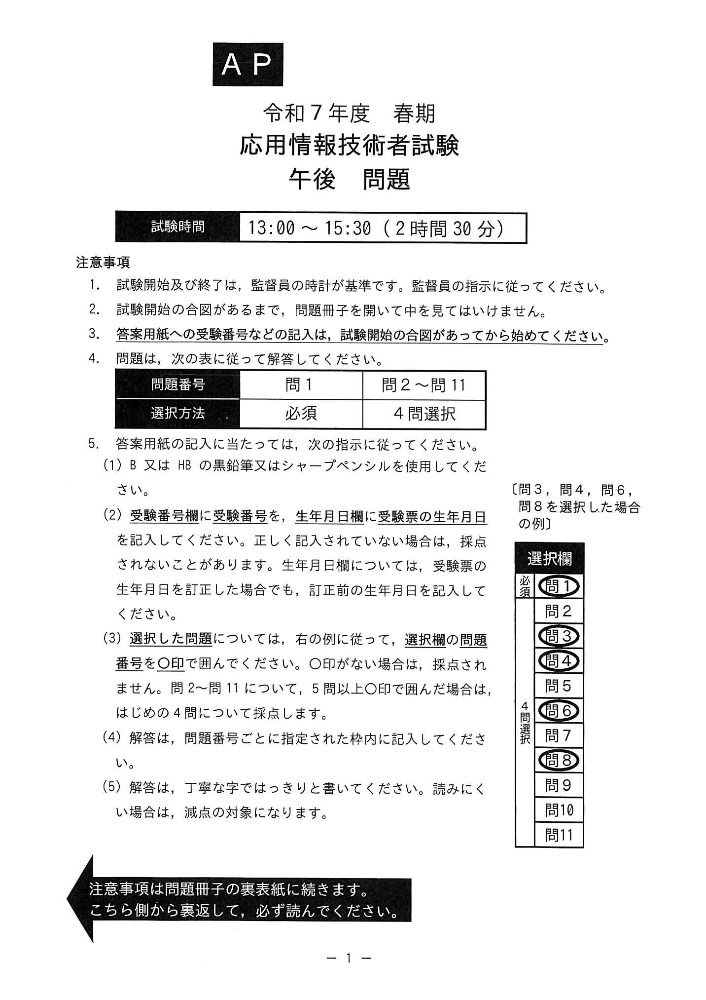

テキスト (OCR)

令和7年度 春期
応用情報技術者試験
午後 問題

ee 13:00 ~ 15:30 (2時間39 分)

試験開始及び終了は, 監督貞の時計が基準です。監督貞の指示に従ってください。
試験開始の合図があるまで, 問題冊子を開いて中を見てはいけません。

1
2
3. 答案用紙への受験番号などの記入は, 試験開始の合図があってから始めてください。
4

問題は, 次の表に従って解答してください。
問題番号     fa] 1    問2 ~間 11
BRAK.       必須          4 間選択
答案用紙の記入に当たっては, 次の指示に従ってください。

(1) B 又は HB の黒鉛筆又はシャープペンシルを使用してくだ
さい。

(2) 受験番号欄に受験番号を, 生年月日欄に受験票の生年月日
を記入してください。 正しく記入されていない場合は, 採点
されないことがあります。 生年月日欄については, 受験票の
生年月日を訂正した場合でも, 訂正前の生年月日を記入して
ください。

(3) 選択した問題については, 右の例に従って, 選択欄の問題
番号を〇印で囲んでください。〇印がない場合は, 採点され
ません。 間 2一問 11 について, 5 問以上〇印で囲んだ場合は,
はじめの 4 問について採点します。

(4) 解答は, 問題番号ごとに指定された枠内に記入してくださ
Ws

(5) 解答は, 丁寧な字ではっきりと書いてください。読みにく
い場合は, 減点の対象になかります。

注意事項は問題冊子の裏表紙に続きます。
こちら側から裏返して, 必ず読んでください。

(3, 問4, 問6,
問8 を選択した場合
の例〕

GRIM

Sakgna

### ページ 2

### ページ 3

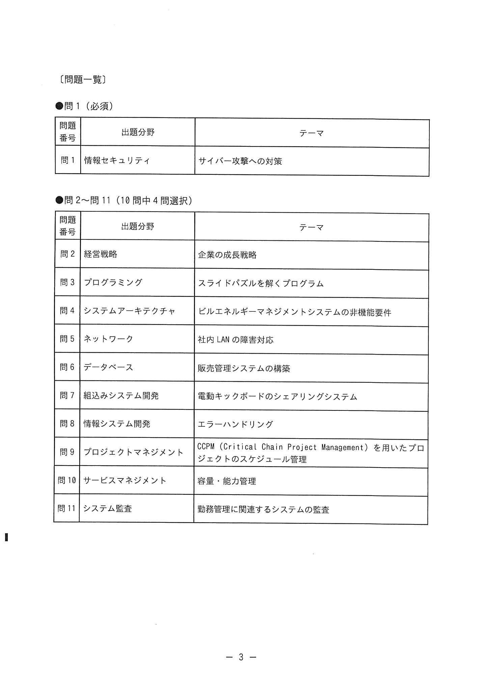

テキスト (OCR)

〔問題一覧〕

信問1 (必須)
lan     出題分野                デーママ
番号
問 1 | 情報セキュリティ      サイバー攻撃への対策
@ ie} 2一問11 (10 間中 4 問選択)
Be     出題分野                 テーマ
番号
問2 | 経営戦略          企業の成長戦略
問3 | プログラミング       スライドパズルを解くプログラム
問 4 | システムアーキテクチャ   ビルエネルギーマネジメントシステムの非機能要件
問 5 | ネットワーク        社内 LAN の障害対応
問6 | データベース        販売管理システムの構築
fl 7 | 組込みシステム開発      電動キックボードのシェアリングシステム
問 8 | 情報システム開発      エラーハシンドリング
of       adres    CCPM (Critical Chain Project Management) を用いたプロ
問 9 | プロジェクトマネジメント   ジェクトのスケジュール管理
問 19 | サービスマネジメント    容量・能力管理
問11| システム監査        勤務管理に関連するシステムの監査

### ページ 4

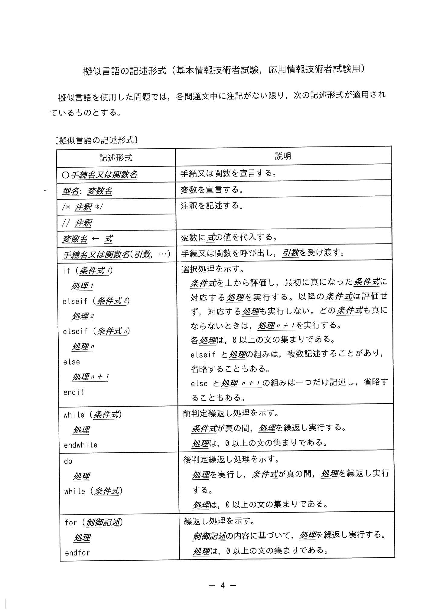

テキスト (OCR)

擬似言語の記述形式 (基本情報技術者試験, 応用情報技術者試験用)

擬似言語を使用した問題では, 各問題文中に注記がない限り, 次の記述形式が適用され

ているものとする。

[擬似言語の記述形式

記述形式                       説明
OFKkERIABRE       手続又は関数を宣言する。
Be. BRE           変数を宣言する。
/* SEAR */               注釈を記述する。
// ERR
BRE — 却              BRC HOWZKAT S.
EME RARE WK) | 手続又は関数を呼び出し, HERES.
if (RA)          選択処理を示す。
MIB 1             徐夏式を上から評価し, BURR OkKRAA
elseif (Kx)         Wiss SMBLEATS. UROKA MS THE
の             ず, WHT SMBtRTLAV, CORMAAI
elseif (txt 2)            ならないときは, MH + 7を実行する。
MEE 0               SMBs, 9 以上の文の集まりである。
else                 elseif ¢MBnWalt, 複数記述することがあり,
EB n +1              省略することもある。
                else ¢MMBn+ 7の組みはーつだけ記述し, 省略す

ることもある。

while (zt)

前判定繰返し処理を示す。

ME

endfor

ROHE              KAADROM, 女列を繰返し実行する。
endwhile              MBit, 9 以上の文の集まりである。
do                後判定繰返し処理を示す。
UE              MBL, AARON, CHCBRRA
while (fz)            する。
MBE, 0 以上の文の集まりである。
for (gifilacz)          繰返し処理を示す。

MABBORBICIOWC, 女理を繰返し実行する。
MBS, 9 以上の文の集まりである。

### ページ 5

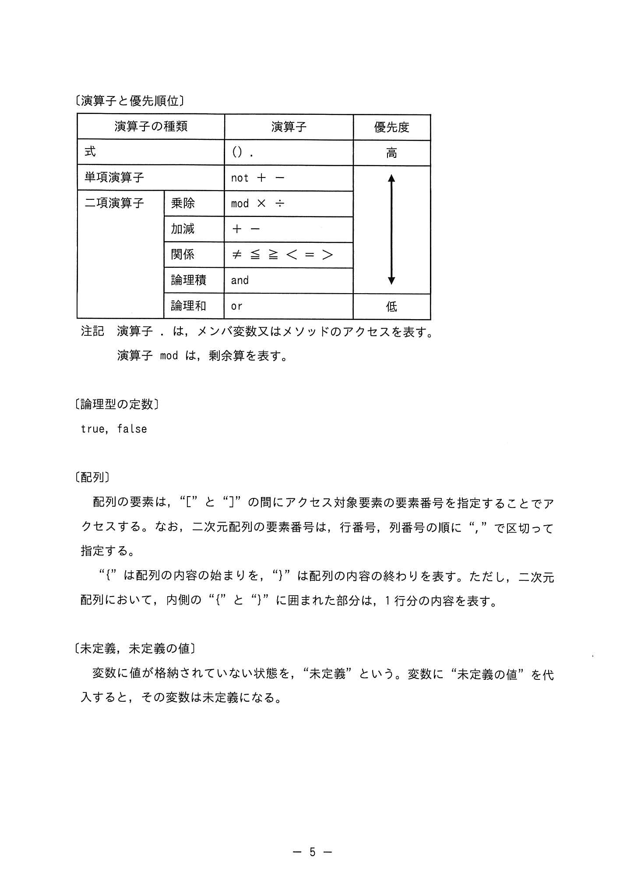

テキスト (OCR)

(演算子と優先順位]

演算子の種類         演算子       優先度

式               Q.               a
単項演算子         not + 一
二項演算子 | 乗除    mod X +

加減    +

関係    ミーマテンク

論理積 | and

論理和 | or               低

注記 演算子 ld, メンバ変数又はメソッドのアクセスを表す。
演算子 mod は, 剰余算を表す。

〔論理型の定数〕

true, false

〔配列〕
配列の要素は, “[”" と “)” の間にアクセス対象要素の要素番号を指定することでア

クセスする。 なお, 二次元配列の要素番号は, TES, 列番号の順に“," で区切って
指定する。

“{” は配列の内容の始まりを, )” は配列の内容の終わりを表す。ただし, 二次元
配列において, 内側の “{” と 人 ” に囲まれた部分は, 1 行分の内容を表す。

未定義, 未定義の値〕
変数に値が格納されていない状態を, “未定義” という。変数に “未定義の値" を代

入すると, その変数は未定義になる。

### ページ 6

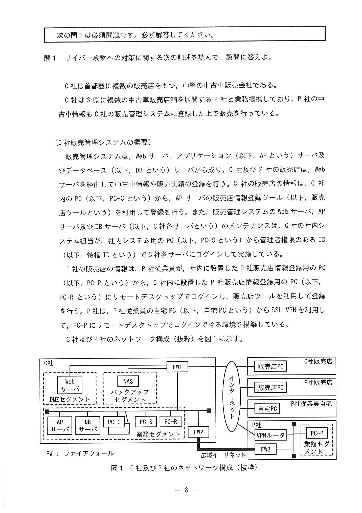

テキスト (OCR)

次の問 1 は必須問題です。必ず人解答してください。

fal 1

サイバー攻撃への対策に関する次の記述を読んで, 設問に答えよ。

( 社は首都圏に複数の販売店をもつ, 中堅の中古車販売会社である。
C 社は $ 県に複数の中古車販売店舗を展開する 社と業務提携しており, P 社の中
古車情報もC 社の販売管理システムに登録した上で販売を行っている。

(C 社販売管理システムの概要〕

販売管理システムは, Web サーバ, アプリケーション (以下, AP という) サーバ及
びデータベース (LUE, DB という) サーバから成り, C 社及びP 社の販売店は, Web
サーバを経由して中古車情報や販売実績の登録を行う。C 社の販売店の情報は, C 社
内の PC (以下, PC-C という) DS, AP サーバの販売店情報登録ツール (以下, 販売
店ツールという) を利用して登録を行う。また, 販売管理システムの Web サーバ, AP
サーバ及び DB サーバ (以下, C 社各サーバという) のメンテナンスは, C 社の社内シ
ステム担当が, 社内システム用の PC (以下, PC-S という) から管理者権限のある ID
(以下, 特権 ID という) で(社各サーバにログインして実施している。

P 社の販売店の情報は, P 社従業員が, 社内に設置したP 社販売店情報登録用の PC
(以下, PC-P という) から, C 社内に設置したP 社販売店情報登録用の PC (以下,
PC-R という) にリモートデスクトップでログインし, 販売店ツールを利用して登録
を行う。P 社は, P社従業員の自宅PC (以下, 自宅PC という) から SSL-VPN を利用し
て, PC-P にリモートデスクトップでログインできる環境を構築している。

6 社及びP 社のネットワーク構成 (抜粋) を図 1 に示す。

a                       i    CHER
eee eeュ ーーーーーゴーーーーーー7
|    Web    1  1         い            『社販売店
    1              1                 2       =            売
!     a  も  1  !  バックアップ |                      7    | 双売店Pc |
」 DMZセグメント ! ! セグメント !
MRse          ネ             P社従業員自宅
i      I       T=     I      Ct     =     【     | 自宅Pc |
| AP     pp || pe-c " | pc-s || Po-R |!               Pat       BW iこ=ニニニニー1
ーバ    ーバ       ・

! 業務セグ

FW : ファイアウォール                    広域イーサネット           上 トメント

図1 C社及びP社のネットワーク構成 (抜粋)

ー 6一

### ページ 7

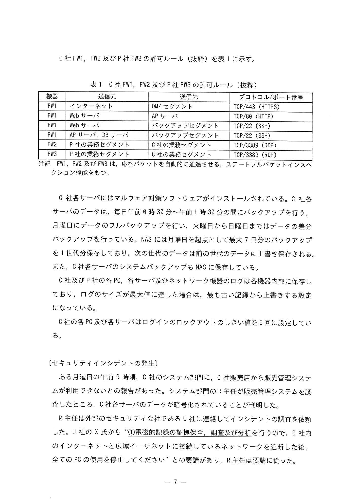

テキスト (OCR)

C 社FW1, FW2 及びP 社 FW3 の許可ルール (抜粋) を表 1 に示す。

表1 C社FW1, FW2 及びP 社 FW3 の許可ルール (抜粋)

機器       送信元           送信先       プロトコル/ポート番号
FW1  インターネット      DMZ セグメント      TCP/443 (HTTPS)

FW1 | Web サーバ AP サーバ TCP/80 (HTTP)

FMW1 | Web サーバ        バックアップセグメント  TCP/22 (SSH)

FW1 | AP サーバ, DB サーバ    バックアップセグメント  TCP/22 (SSH)

FW2 | P社の業務セグメント   ( 社の業務セグメント   TCP/3389 (RDP)

FW3 | P社の業務セグメント   ( 社の業務セグメント   TCP/3389 (RDP)

注記 FW, FW 及び FW3 は, 応答パケットを自動的に通過させる, ステートフルパケットインスペ

クション機能をもつ。

C 社各サーバにはマルウェア対策ソフトウェアがインストールされている。 CHE
サーバのデータ は, 毎日午前 0 時 30 分午前 1 30 分の間にバックアップを行う。
月曜日にデータのフルバックアップを行い, 火曜日から日曜日まではデータの差分
バックアップを行っている。NAS には月曜日を起点として最大 7 日分のバックアップ
を 1 世代分保存しており, 次の世代のデータは前の世代のデータに上書き保存される。
また, ( 社各サーバのシステムバックアップも NAS に保存している。

( 社及び『P 社の各 PC, 各サーバ及びネットワーク機器のログは各機器内部に保存し
ており, ログのサイズが最大値に達した場合は, 最も古い記録から上書きする設定
になっている。

( 社の各 PC 及び各サーバはログインのロックアウトのしきい値を5回に設定してい
る。

〔【セキュリティインシデントの発生〕

ある月曜日の午前 9 BFA, C 社のシステム部門に, C 社販売店から販売管理システ
ムが利用できないとの報告があった。システム部門の R 主任が販売管理システムを調
査したところ, ( 社各サーバのデータが暗号化されていることが判明した。

R 主任は外部のセキュリティ会社である U 社に連絡してインシデントの調査を依頼
した。リU 社の X KAS “①電磁的記録の証拠保全, 調査及び分析を行うので, ( 社内
のインターネットと広域イーサネットに接続しているネットワークを遮断した後,
全ての PC の使用を停止してください"との要請があり, R 主任は要請に従った。

ー7ー

### ページ 8

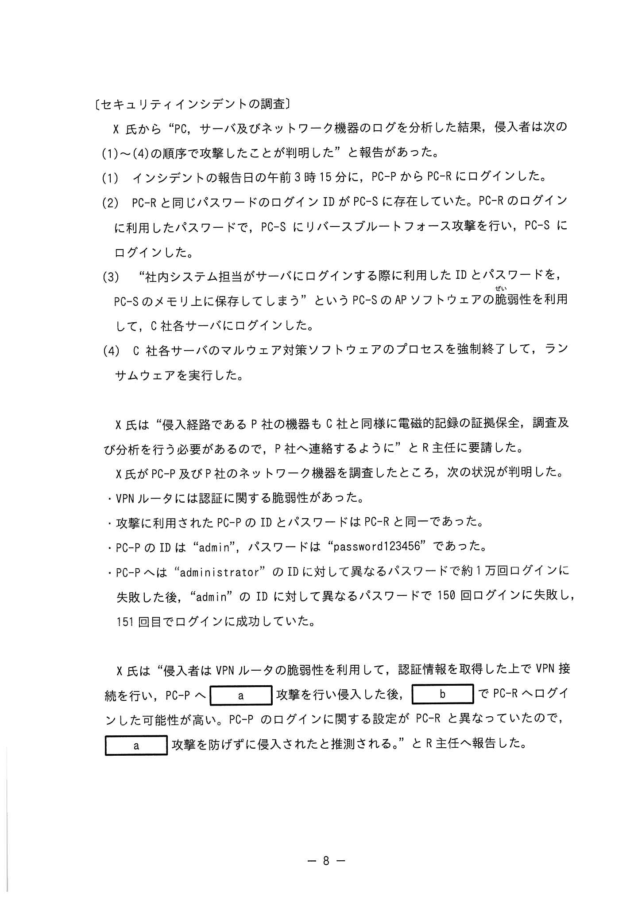

テキスト (OCR)

[セキュリティインシデントの調査
X 氏から “PC, サーバ及びネットワーク機器のログを分析した結果, 侵入者は次の

(1)て(4) の順序で攻撃したことが判明した” と報告があった。

(1) インシデントの報告日の午前 3 時 15 分に, PC-P から PC-R にログインした。

(2) PC-R と同じパスワードのログイン ID がPC-S に存在していた。PC-R のログイン
に利用したパスワードで, PC-S にリバースブルートフォース攻撃を行い, PC-S に
ログインした。

(3) "社内システム担当がサーバにログインする際に利用した ID とパスワードを,
PC-S のメモリ上に保存してしまう” というPC-SのAPソフト ウェアの脆弱性を利用
LT, ( 社各サーバにログインした。

(4) C 社各サーバのマルウェア対策ソフトウェアのプロセスを強制終了して, ラン
サムウェアを実行した。

X 氏は“侵入経路である『 社の機器も C 社と同様に電磁的記録の証拠保全, 調査及
び分析を行う必要があるので, P 社へ連絡するように” とR主任に要請した。
X 氏がPC-P 及びP社のネットワーク機器を調査したところ, 次の状況が判明した。
・VPN ルータには認証に関する脆弱性があった。
・攻撃に利用された PC-P の ID とパスワードはPC-R と同一であった。
・PC-P の ID は “admin”, パスワードは “password123456” であった。
・PC-P へは"administrator” の1D に対して異なるパスワードで約 1 万回ログインに
失敗した後, “admin” の ID に対して異なるパスワードで 150 回ログインに失敗し,
151 回目でログインに成功していた。

X 氏は "侵入者は VPN ルータの脆弱性を利用して, 認証情報を取得した上で VPN 接

続を行い, PC-P へ[| sa |攻撃を行い侵入した後,| b |でPC-Rヘログイ

ンした可能性が高い。PC-P のログインに関する設定が PC-R と異なっていたので,
|  。 | 攻撃を防げずに侵入されたと推測される。” とR 主任へ報告した。

### ページ 9

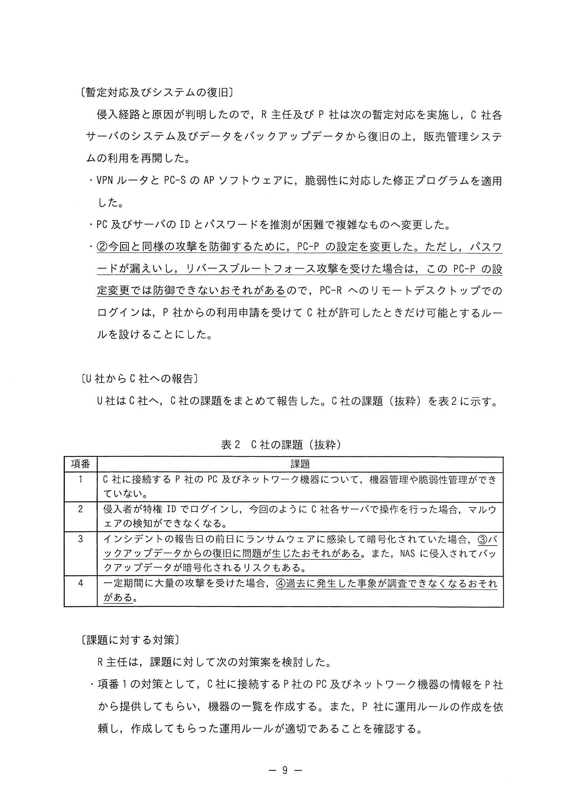

テキスト (OCR)

(暫定対応及びシステムの復旧]〕
侵入経路と原因が判明したので, R 主任及び P 社は次の暫定対応を実施し, CHE

サーバのシステム及びデータをバックアップデータから復旧の上, 販売管理システ

ムの利用を再開した。

・VPN ルータと PC-S の AP ソフトウェアに, 脆弱性に対応した修正プログラムを適用
した。

・PC 及びサーバの ID とパスワードを推測が困難で複雑なものへ変更した。

・②今回と同様の攻撃を防御するために, PC-P の設定を変更した。ただし, NAD
ードが漏えいし, リバースブルートフォース攻撃を受けた場合は, この PC-P OB
定変更では防御できないおそれがあるので, PC-R へのリモートデスクトップでの
ログインは, P 社からの利用申請を受けて C 社が許可したときだけ可能とするルー
ルを設けることにした。

〔U 社から(C 社への報告]
U社はC 社へ, C社の課題をまとめて報告した。C 社の課題 (抜粋) を表2 に示す。

表2 C社の課題 (抜粋)

項番                                                                         課題

1 | C 社に接続する P 社の PC 及びネットワーク機器について, 機器管理や脆弱性管理ができ
ていない。

2 | 侵入者が特権 TD でログインし, 今回のように C 社各サーバで操作を行った場合, マルウ
ェアの検知ができなくなる。

3 | インシデントの報告日の前日にランサムウェアに感染して暗号化されていた場合,③バ
ックアップデータからの復旧に問題生じたおそれがある。また, NAS に侵入されてバッ
クアップデータが暗号化されるリスクもある。

4 | 一定期間に大量の攻撃を受けた場合, ④過去に発生した事象が調査できなくなるおそれ
がある。

(課題に対する対策]
R 主任は, 課題に対して次の対策案を検討した。

・項番 1 の対策として, C 社に接続するP 社の PC 及びネットワーク機器の情報をP社
から提供してもらい, 機器の一覧を作成する。 また, P 社に運用ルールの作成を依
頼し, 作成してもらった運用ルールが適切であることを確認する。

ー 9一

### ページ 10

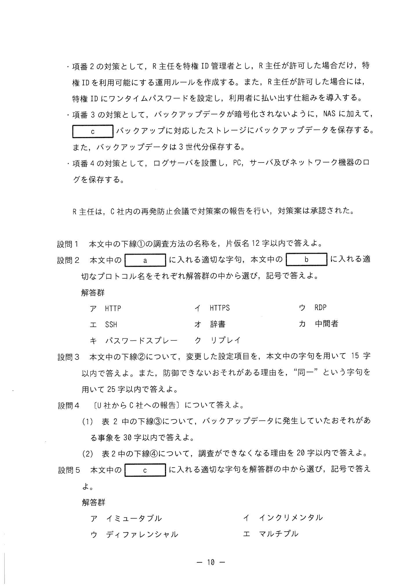

テキスト (OCR)

・ 項番 2 の対策として, R 主任を特権 ID 管理者とし, R 主任が許可した場合だけ, 特
権 ID を利用可能にする運用ルールを作成する。また, R主任が許可した場合には
特権 ) にワンタイムパスワードを設定し, 利用者に払い出す仕組みを導入する。

・項番 3 の対策として, バックアップデータが暗号化されないように, NAS に加えて
| < バックアップに対応したストレージにバックアップデータを保存する。
また, バックアップデータは 3 世代分保存する。

・ 項番 4 の対策として, ログサーバを設置し, PC。 サーバ及びネットワーク機器の品
グを保存する。

R 主任は, ( 社内の再発防止会議で対策案の報告を行い, 対策案は承認された。
設問1 本文中の下線①の調査方法の名称を, 片仮名 12 字以内で答えよ。

設問2 本文中の| a | に入れる適切な字句, 本文中の| b | に入れる敵

切なプロトコル名をそれぞれ解答群の中から選び, 記号で答えよ。

解答群

ア HTTP       イ HTTPS       ウ RDP
エ SSH        オ 辞書        カ 中間者
キ パスワードスプレー ク リプレイ

設問3 本文中の下線②について, 変更した設定項目を, 本文中の字句を用いて 15 字
以内で答えよ。また, 防御できないおそれがある理由を, “同一” という字句を
用いて 25 字以内で答えよ。
設問4 【U社からC社への報告}】 について答えよ。
(1) 表 2 中の下線$について, バックアップデータに発生していたおそれがあ
る事象を 30 字以内で答えよ。
(2) 表2 中の下線②について, 調査ができなくなる理由を 20 字以内で答えよ。
設問5 本文中の[| c | に入れる適切な字名を解答群の中から選び, 記号で答え

よ。
解答群
イミュータブル       イ インクリメンタル
ウ ディファレンシャル       エ マルチプル

### ページ 11

テキスト (OCR)

C

メ モ 用 紙 J

ー 1】 一

### ページ 12

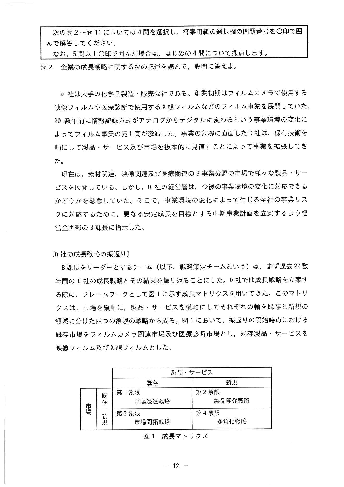

テキスト (OCR)

次の問2 一間 11 については 4 問を選択し, 答案用紙の選択欄の問題番号を〇印で囲
んで解答してください。
なお, 5問以上〇印で囲んだ場合は, はじめの 4 問について採点します。

間2 企業の成長戦略に関する次の記述を読んで, 設問に答え

D 社は大手の化学品製造・販売会社である。 創業初期はフィルムカメラで使用する
映像フィルムや医療診断で使用する X 線フィルムなどのフィルム事業を展開していた。
20 数年前に情報記録方式がアナログからデジタルに変わるという事業環境の変化に
よってフィルム事業の売上高が激減した。 事業の危機に直面した 社は, 保有技術を
軸にして製品・サービス及び市場を抜本的に見直すことによって事業を拡張してき
た。

現在は, 素材関連, 映像関連及び医療関連の 3 事業分野の市場で様々な製品・サー
ビスを展開している。 しかし, D 社の経営層は, 今後の事業環境の変化に対応できる
かどうかを懸念していた。そこで, 事業環境の変化によって生じる全社の事業リス
クに対応するために, 更なる安定成長を目標とする中期事業計画を立案するよう経

企画部の B 課長に指示した。

D 社の成長戦略の振返り〕

B課長をリーダーとするチーム (以下, 戦略策定チームという) は, まず過去 20数
年間の D 社の成長戦略とその結果を振り返ることにした。D 社では成長戦略を立案す
る際に, フレームワークとして図 1 に示す成長マトリクスを用いてきた。このマトリ
クスは, 市場を縦軸に, 製品・サービスを横軸にしてそれぞれの軸を既存と新規の
領域に分けた四つの人象限の戦略から成る。図 1 において, 振返りの開始時点における
既存市場をフィルムカメラ関連市場及び医療診断市場とし, 既存製品・サービスを
映像フィルム及び X 線フィルムとした。

製品・サービス
既存      新規
既 | 第1象限        第 2 RMR
a. | #   ToS a    製品開発戦略
| ae | 第3象限      第4 象限
規   市場開拓戦略     多角化戦略

図1 成長マトリクス

### ページ 13

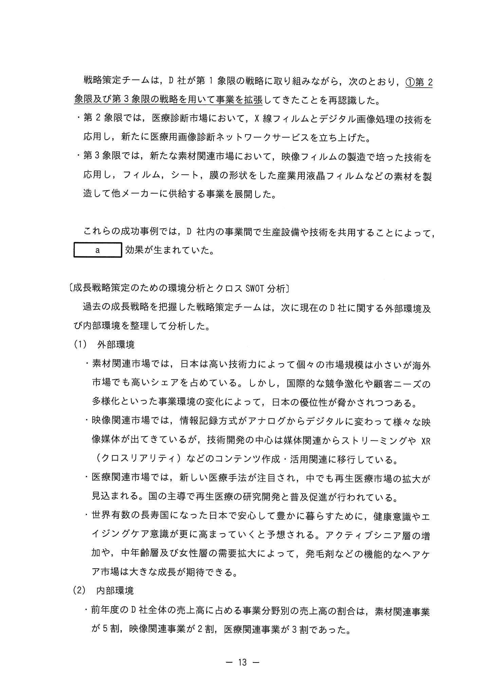

テキスト (OCR)

戦略策定チームは, D 社が第 1 象限の戦略に取り組みながら, 次のとおり, ①第 2
象限及び第 3 象限の戦略を用いて事業を拡張してきたことを再認識した。

・ 第 2 象限では, 医療診断市場において, X 線フィルムとデジタル画像処理の技術を
応用し, 新たに医療用画像診断ネットワークサービスを立ち上げた。

・第 3 象限では, 新たな素材関連市場において, 映像フィルムの製造で培った技術を
応用し, フィルム, シート, 膜の形状をした産業用液晶フィルムなどの素材を製
造して他メーカーに供給する事業を展開した。

これらの成功事例では, D 社内の事業間で生産設備や技術を共用することによって

| 』 | 効果が生まれていた。

[成長戦略策定のための環境分析とクロス SWOT 分析]

過去の成長戦略を把握した戦略策定チームは, 次に現在の D 社に関する外部環境及
び内部環境を整理して分析した。

(1) 外部環境

・素材関連市場では, 日本は高い技術力によって個々の市場規模は小さいが海外
市場でも高いシェアを占めている。しかし, 国際的な競争激化や顧客ニーズの
多様化といった事業環境の変化によって, 日本の優位性が脅かされつつある。

・ 映像関連市場では, 情報記録方式がアナログからデジタルに変わって様々な映
像媒体が出てきているが, 技術開発の中心は媒体関連からストリーミングや XR
(クロスリアリティ) などのコンテンツ作成・活用関連に移行している。

・ 医療関連市場では, 新しい医療手法が注目され, 中でも再生医療市場の拡大が
見込まれる。国の主導で再生医療の研究開発と普及促進が行われている。

・ 世界有数の長寿国になった日本で安心して豊かに暮らすために, 健康意識やエ
イジングケア意識が更に高まっていくと予想される。アクティブシニア層の増
加や, 中年齢層及び女性層の需要拡大によって, 発毛剤などの機能的なヘアケ
ア市場は大きな成長が期待できる。

(2) 内部環境

・ 前年度の 社全体の売上高に占める事業分野別の売上高の割合は, 素材関連事業

が5割, 映像関連事業が2割, 医療関連事業が 3 割であった。

### ページ 14

テキスト (OCR)

・ 素材関連事業の売上高は, 従来では量産が困難であった特性や機能を備えた特
殊な素材 (以下, 機能性素材という) の海外市場を含めた取扱高の増大が寄与
し, BRBICHALTWS. Kk, 自社の最適化された生産プロセスを活用する
ことによって, 最先端製品に欠かせない機能性素材を短期間で開発・製造し
顧客ニーズの多様化に対応できている。

・ 映像関連事業の売上高は, ここ数年間は横ばいで, 他の事業分野の成長によっ
てD 社全体の売上高に占める割合は減少している。有望なコンテンツ作成・活用
関連事業は行っていないので, 現時点ではこれ以上の事業拡張は見込めない。

・医療関連事業の売上高は, 医療用画像診断ネットワークサービスなどの診断型
の事業が大半を占め, ここ数年の伸びは鈍化傾向にあるものの, 今後も市場は
拡大すると見られ, D 社の市場シェアから見ると成長の余地がある。

・D 社は現在に至るまで長年にわたって, 競合他社と差別化できて事業を進める上
で強みになり得るコア技術を維持してきた。 現在のコア技術を応用した将来有
BRM BELT, フィルムの劣化を防ぐ抗酸化技術を応用した再生医療向け
製品,ナノテクノロジーを応用した高機能な発毛剤が挙げられている。

・D 社は映像関連事業での実績から全国的に企業知名度が高い。

戦略策定チームは, これらを基に SWOT 分析及びクロス SWOT 分析を行った。クロス
SWOT 分析では, SWOT 分析で抽出した外部環境及び内部環境におけるプラス要因及び
マイナス要因の組合せをマトリクスで表し, 覆合的な視点で戦略を立てた。 今回の
環境分析の結果から一例を挙げると, RMB CAKDBIUEDBD ENDO
あるとき, | bd Jel  c |との組合せによる戦略を用いることによって,
他社と差別化できる最先端の機能性素材を短期間で開発・製造する施策につながる。
戦略策定チームは, D 社が今後も安定成長を続けるために, 事業環境の変化による
事業リスクを分散・軽減する戦略について図 1 の第 4 象限に踏み込んで検討した。そ
OER, ②クロス SMT 分析における機会と強みとの組合せによって生まれる戦略か
ら導かれる再生医療事業は, 従来の診断型の事業とは一線を画す治療型の新たな事
業として位置づけられ, 将来有望視できると考えた。 事業化への大きな課題として,
投資資金の確保。 及び本格的な事業化までの期間の短縮を挙げた。B 課長は, この検
討結果を経営層に報告したところ, 新たな事業化については多角化戦略を用いて検

ー 14 一

### ページ 15

テキスト (OCR)

討を継続するよう指示を受けた。

〔多角化戦略の検討
その後の検討を経て, 戦略策定チームは, 再生医療事業と比較すると事業化まで
に要する期間が短いと予想される③新たなヘアケア市場への事業参入を多角化戦略
の最初のターゲットに設定した。B 課長は, D 社が発毛剤を主力製品とするヘアケア
事業を立ち上げ, ここから多角化戦略を推し進めることによって, 事業拡張が見込
めるだけでなく, 経営層が望んでいる④安定成長の実現に寄与できると考えた。
戦略策定チームは, へヘアケア事業の実現に関する分析を次のように整理した。
・クロス SNOT 分析から導き出される, 機会と強みとの組合せによる戦略と合致する。
・へヘアケア市場は成就している。 しかし, D 社が得意とする機能性に特長をもつ発毛
剤などの製品を揃える強力な競合他社は少ない。D 社の高い企業知名度を生かせる
ので, 市場参入の可能性はある。
・発毛剤は医薬品の分類に属しており, 今後の治療型の医療事業との| a |
果が期待できる。
・ 新規事業の実現には新製品の開発推進, 製造プロセスの整備, 関連する事業ノウ
ハウの習得, 及び経営資源の獲得に要する多額の投資資金と長期の時間が必要で
ある。一方で, 事業環境の変化は急速で対応スピードを最も重視する必要がある。
・ 新規事業が十分に成長するまでには期間を要するので, その間は既存事業も一定
の成長を維持する必要がある。

また, 戦略策定チームは, ARCH SD 社の経営資源の活用に関して次のとおり考

えた。

・ 将来需要減退が進行する既存事業は選択と集中による事業再編を進め将来性の
ある新規事業に資金をはじめとする経営資源を再配分する。

・ 既存事業では, 成長が見込めて D 社の優位性が維持できる素材関連事業と医療関連
事業に経営資源を集中する。製品開発, M&A などの新規事業立上げの投資資金を確
RISO, 既存事業の再編の施策として| d | することを検討する。

・D 社がもっていない技術や事業ノウハウ, 設備・人・組織などの経営資源は, 事業
特性や将来性を見極めながら, OMA などを通じて外部から獲得することで補う。

### ページ 16

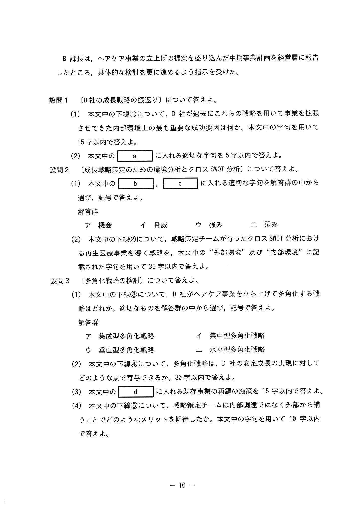

テキスト (OCR)

B 課長は, ヘアケア事業の立上げの提案を盛り込んだ中期事業計画を経営層に報告
したところ, 具体的な検討を更に進めるよう指示を受けた。

設問1  〔D社の成長戦略の振返り]について答えよ。
(1) 本文中の下線①について, D 社が過去にとれらの戦略を用いて事業を拡張
させてきた内部環境上の最も重要な成功要因は何か。本文中の字句を用いて
15 字以内で答えよ。
(2) 本文中の| a | に入れる適切な字句を5字以内で答えよ。

設問2 [成長戦略策定のための環境分析とクロス SWOT 分析】について答えよ。

(1) 本文中の| b |,|  c | に入れる適切な字句を解答群の中から
選び, 記号で答えよ。

解答群

ア 機会    イ Rm    ウ 強み    エ Be

(2) 本文中の下線のについて, 戦略策定チームが行ったクロス SWOT 分析におけ
る再生医療事業を導く戦略を, 本文中の“外部環境" 及び“内部環境"に記
載された字句を用いて 35 字以内で答えよ。
設問3 多角化戦略の検討)について答えよ。
(1) 本文中の下線おについて, D 社がヘアケア事業を立ち上げて多角化する戦
略はどれか。 適切なものを解答群の中から選び, 記号で答えよ。

解答群
ア 集成型多角化戦略             イ 集中型多角化戦略
ウ 垂直型多角化戦略             エ 水平型多角化戦略

(2) 本文中の下線のについて, 多角化戦略は, D 社の安定成長の実現に対して
どのような点で寄与できるか。39 字以内で答えよ。

(3) 本文中の| dg | に入れる既存事業の再編の施策を 15 字以内で答えよ。

(4) 本文中の下線@について, 戦略策定チームは内部調達ではなく外者から補

うことでどのようなメリットを期待したか。本文中の宇名を用いて 10 字以内

### ページ 17

テキスト (OCR)

〔

メ モ 用 紙

ー Tm

### ページ 18

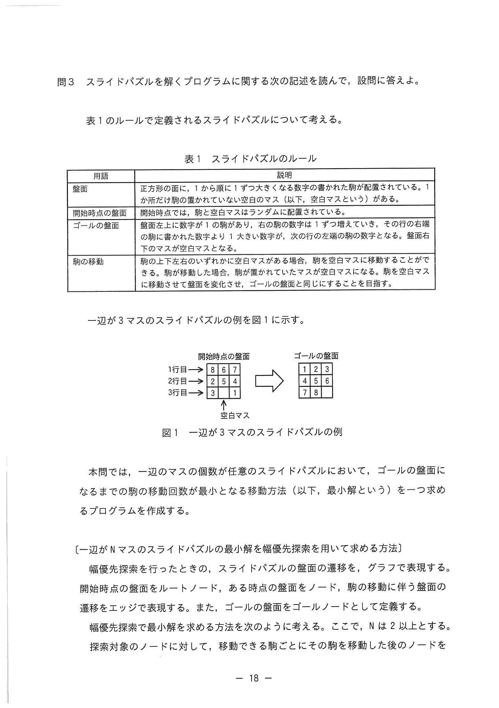

テキスト (OCR)

FS スライドパズルを解くプログラムに関する次の記述を読んで, 設問に答えよ。

表1 のルールで定義されるスライドパズルについて考える。

表1 スライドパズルのルール

語説明
盤面           正方形の面に, 1 から順に 1 ずつ大きくなる数字の書かれた駒が配置されている。1
か所だけ駒の置かれていない空白のマス (以下, 空白マスという) がある。
開始時点の盤面 | 開始時点では, 駒と空白マスはランダムに配置されている。
ゴールの盤面   盤面左上に数字が 1 の駒があり, 右の有駒の数字は 1 ずつ増えていき, その行の右端
の駒に書かれた数字より 1 大きい数字が, ROGPOAMOMORS CAS, BHA
下のマスが空白マスとなる。
駒の移動      駒の上下左右のいずれかに空白マスがある場合, 駒を空白マスに移動することがで
きる。駒が移動した場合, 駒が置かれていたマスが空白マスになる。駒を空白マス
に移動させて盤面を変化させ, ゴールの盤面と同じにすることを目指す。

一辺が 3 マスのスライドパズルの例を図 1 に示す。

開始時点の盤面      ゴールの盤面
1行目一> | 8|6|7        1|213
2行目一> | 2 | 5|4     > |4|5|6
3行目一>|3| |1        7/8
空白マス
図1 一辺が3マスのスライドパズルの例

本問では, 一辺のマスの個数が任意のスライドパズルにおいて, ゴールの盤面に
なるまでの駒の移動回数が最小となる移動方法 (以下, 最小解という) を一つ求め
るプログラムを作成する。

一辺がNマスのスライドパズルの最小解を幅優先探索を用いて求める方法〕

幅優先探索を行ったときの, スライドパズルの盤面の遷移を, グラフで表現する。
開始時点の盤面をルートノード, ある時点の盤面をノード, 駒の移動に伴う盤面の
有居移をエッジで表現する。また, ゴールの角面をゴールノードとして定義する。

幅優先探索で最小解を求める方法を次のように考える。ここで, N は 2 以上とする。

探索対象のノードに対して, 移動できる駒ごとにその胞を移動した後のノードを

### ページ 19

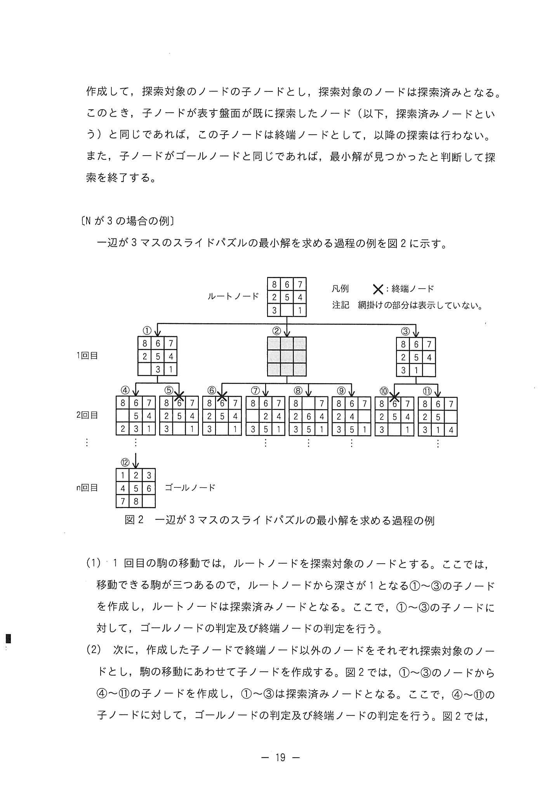

テキスト (OCR)

作成して, 探索対象のノードの子ノードとし, 探索対象のノードは探索済みとなる。
COLE, 子ノードが表す盤面が既に探索したノード (以下, 探索済みノードとい
う) と同じであれば, この子ノードは終端ノードとして, 以降の探索は行わない。

また, 子ノードがゴールノードと同じであれば, 最小解が見つかったと判断して探
索を終了する。

〔N が3 の場合の例]
一辺が3 マスのスライドパズルの最小解を求める過程の例を図 2 に示す。

81617   凡例 KR
ルートノード | 21514    に =         =
注記 網掛けの部分は表示していない。

OL            回            Oy
81617                         81617
1回目     21514                         21514
311                        311
I             I             I
of OL of of of ey of ey
81617118ド617118ド6171181617118  71181617118T6171181617
2回目    51411215141121514    411216   214   215|1411215
21311113  1113  111315111131511   5|11113  11131114
@\
11 213
n回目  4|15|16| ゴールノード
718

 2 一辺が3マスのスライドパズルの最小解を求める過程の例

(1) 1 回目の駒の移動では, ルートノードを探索対象のノードとする。ここでは
移動できる駒が三つあるので, ルートノードから深さが 1 となる①ー③の子ノード
を作成し, ルートノードは探索済みノードとなる。ここで, ①てー③の子ノードに
対して, ゴールノードの判定及び終端ノードの判定を行う。

(2) lc, 作成した子ノードで終端ノード以外のノードをそれぞれ探索対象のノー
REL, 駒の移動にあわせて子ノードを作成する。図 2 では, ①て③のノードから
て⑪の子ノードを作成し, ①て③は探索済みノードとなる。ここで, @-OO
子ノードに対して, ゴールノードの判定及び終端ノードの判定を行う。図 2 では,

### ページ 20

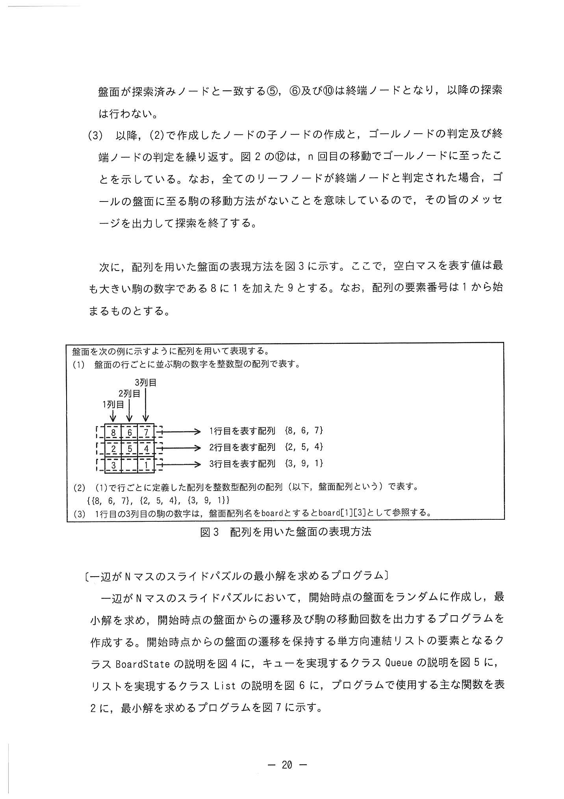

テキスト (OCR)

盤面が探索済みノードと一致する⑤, ⑥及び⑩は終端ノードとなり, 以降の探索
は行わない。

(3) 以降, (2)で作成したノードの子ノードの作成と, ゴールノードの判定及び終
端ノードの判定を繰り返す。図 2 の⑫は, n 回目の移動でゴールノードに至ったこ
とを示している。 なお, 全てのリーフノードが終端ノードと判定された場合,ゴ
ールの盤面に至る駒の移動方法がないことを意味しているので, その旨のメッセ
ージを出力して探索を終了する。

次に, 配列を用いた盤面の表現方法を図 3 に示す。ここで, 空白マスを表す値は最
も大きい駒の数字である 8 に 1 を加えた 9 とする。なお, 配列の要素番号は 1 から始
まるものとする。

盤面を次の例に示すように配列を用いて表現する。
(1) 盤面の行ごとに並ぶ駒の数字を整数型の配列で表す。

3列目
2列目
1 FY
v
「] 16| 74> 1行目を表す配列 (8, 6, 7}
"2 | 5].4 +> 2行目を表す配列 (2, 5, 4)
「十3| | 1ローーーテ 3行目を表す配列 3, 9, 1}

(2) (1)で行ごとに定義した配列を整数型配列の配列 (以下, 盤面配列という) TRI.
{{8, 6, 7}, {2, 5, 4}, {3, 9, 1}}
(3) 1行目の3列目の駒の数字は, 盤面配列名をboardとするとboard[1][3]として参照する。

 3 配列を用いた盤面の表現方法

[一辺がN マスのスライドパズルの最小解を求めるプログラム〕

一辺がN マスのスライドパズルにおいて, 開始時点の盤面をランダムに作成し, 最
小解を求め, 開始時点の盤面からの須移及び駒の移動回数を出力するプログラムを
作成する。 開始時点からの盤面の遷移を保持する単方向連結リストの要素となるク
ラス BoardState の説明を図 4 に, キューを実現するクラス Queue の説明を図 5 に,
リストを実現するクラス List の説明を図 ic, プログラムで使用する主な関数を表
2 に, 最小解を求めるプログラムを図 7 に示す。

### ページ 21

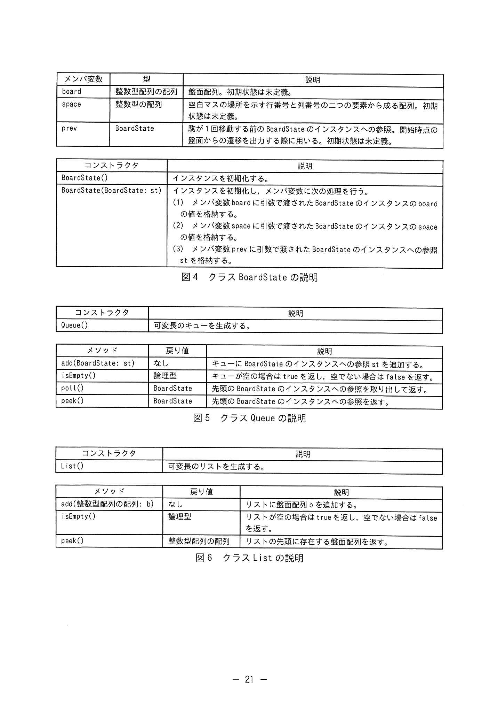

テキスト (OCR)

メンバ変数            型                                             説明
board      整数型配列の配列 | 盤面配列。初期状態は未定義。
space      整数型の配列     空白マスの場所を示す行番号と列番号の二つの要素から成る配列。初其

状態は未定義。

prev            BoardState           駒が 1 回移動する前の BoardState のインスタンスへの参照。開始時点の
盤面からの居移を出力する際に用いる。 初期状態は未定義。
ヨンストラクタ                                                   説明
BoardState()               インスタンスを初期化する。

BoardState(BoardState: st)

インスタンスを初期化し, メンバ変数に次の処理を行う。

(1) メンバ変数board に引数で渡されたBoardState のインスタンスのboard
の値を格納する。

(2) メンバ変数 space に引数で渡された BoardState のインスタンスのspace
の値を格納する。

(3) メンバ変数 prev に引数で渡された BoardState のインスタンスへの参照
st を格納する。

図4 クラス BoardState の説明

コンストラクタ                                                 説明

Queue()                可変長のキューを生成する。
メソッド              RY fifi                                   説明
add(BoardState: st)      なし             キューに BoardState のインスタンスへの参照 st を追加する。
isEmpty()                  論理型           キューが空の場合は true を返し, 空でない場合は false を返す。
poll()                 BoardState     先頭の BoardState のインスタンスへの参照を取り出して返す。
peek()                 BoardState     先頭の BoardState のインスタンスへの参照を返す。
図5 クラス Queue の説明
コンストラクタ                                                 説明
List()                   可変長のリストを生成する。
メソッド               戻り値                           説明
add(整数型配列の配列: b) | なし                 リストに盤面配列 b を追加する。
isEmpty()                  論理型              リストが空の場合は true を返し, 空でない場合はfalse
を返す。

peek()                   整数型配列の配列 | リストの先頭に存在する盤面配列を返す。

図6 クラスList の説明

### ページ 22

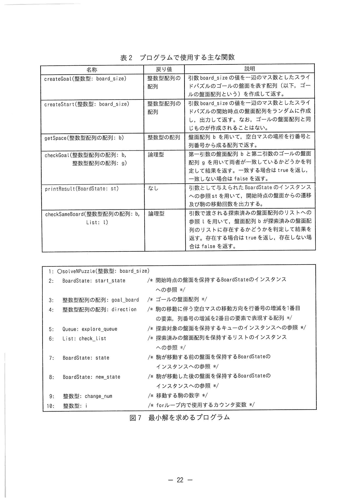

テキスト (OCR)

表2 プログラムで使用する主な関数

名称                  RY ih                       説明
createGoal(整数型: board_size)        整数型配列の | 引数board_size の値を一辺のマス数としたスライ
配列          ドパズルのゴールの盤面を表す配列(以下,ゴー

ルの盤面配列という) を作成して返す。

createStart(整数型: board_sjze)

整数型配列の | 引数board_size の値を一辺のマス数としたスライ
配列       ドパズルの開始時点の盤面配列をランダムに作成
し, 出力して返す。なお, ゴールの盤面配列と同
じものが作成されることはない。

getSpace(整数型配列の配列: b)

整数型の配列 | 盤面配列 b を用いて, 空白マスの場所を行番号と
列番号から成る配列で返す。

checkGoal(整数型配列の配列: b,
整数型配列の配列: 9)

論理型       第一引数の盤面配列 b と第二引数のゴールの盤面
配列 g を用いて両者が一致しているかどうかを判
定して結果を返す。 一致する場合は true を返し,
一致しない場合は false を返す。

printResult(BoardState: st)          なし           引数として与えられた BoardState のインスタンス
への参照 st を用いて, PR RORMD 5 DEB
及び駒の移動回数を出力する。

checkSameBoard(整数型配列の配列: b, | 論理型        引数で渡される探索済みの盤面配列のリストへの

List: D

参照 | を用いて, 盤面配列 b ARRAY OM MAC
列のリストに存在するかどうかを判定して結果を
返す。存在する場合は true を返し, 存在しない場
合は false を返す。

1: OsolveNPuzz le(整数型: board_size)

2: BoardState: start_state

3: 整数型配列の配列: goaしboard
4: 整数型配列の配列: direction

5: Queue: explore_queue

6: List: check_list

7: BoardState: state

8: BoardState: new_state

9: 整数型: change_num
10: 整数型:i

/* 開始時点の盤面を保持するBoardStateのインスタンス
への参照 */
/* ゴールの盤面配列 */
/* 駒の移動に伴う空白マスの移動方向を行番号の増減を1番目
ORR, 列番号の増減を2番目の要素で表現する配列 */
/* 探索対象の盤面を保持するキューのインスタンスへの参照 */
/* 探索済みの盤面配列を保持するリストのインスタンス
への参照 */
/* 駒が移動する前の盤面を保持するBoardStateの
インスタンスへの参照 */
/* 駒が移動した後の盤面を保持するBoardStateの
インスタンスへの参照 */
/* 移動する駒の数字 */
/* forループ内で使用するカウンタ変数 */

最小解を求めるプログラム

### ページ 23

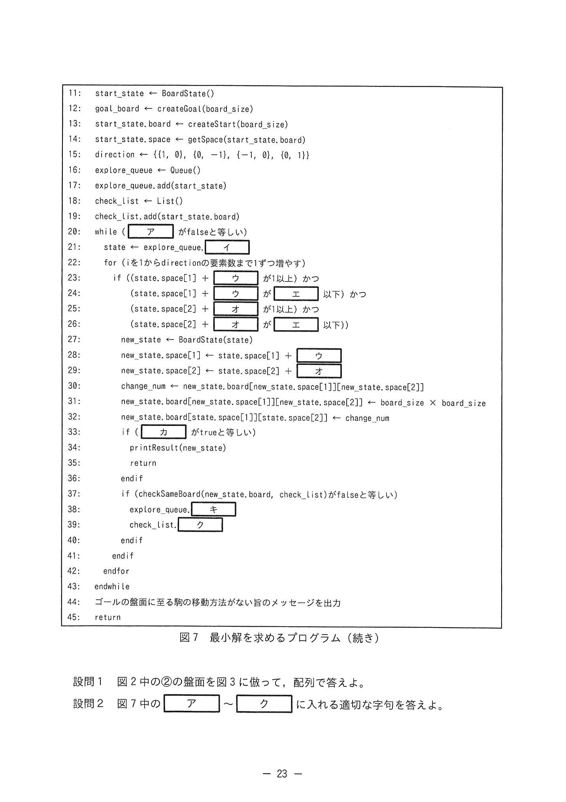

テキスト (OCR)

12:
13:
14:
15:
16:
17:
18:
19:
20:
20:
22:
23:
24:
25:
26:
27:
28:
29%
30:
31:
32s
33:
34:
35:
36:
37:
38:
39:
40:
Al:
42:
43:
44:
45:

start_state < BoardState()
goal_board < createGoal(board_size)
start_state. board < createStart(board_size)
start_state. space < getSpace(start_state, board)
direction で {{1, 0}, {0, —1}, {—1, 9, {0, 1}}
explore_queue < Queue()
explore_queue.add(start_state)
check_list <— List()
check_List.add(start_state.board)
while (          がfalseと等しい)

state と explore_queue.| イ |

for (iを1からdirectionの要素数まで1ずつ増やす)

if ((state.space[1] + が1以上) かつ
(state.space[1] + | | が[| ェ | 以下) かつ

(state.space[2] +        が1以上) かつ

(state.space[2] + |   オ | が|   | 以下))

new_state - BoardState(state)

new state.space[1] < state.space[1] + |   ウ   ]
new_state. space[2] < state. space[2] + |   オ   ]

change_num と new_state. board[new_state. space[1]][new_state. space[2]]

new_state. board[new_state. space[1]][new_state, space[2]] board_size X board_size
new_state. board[state. space[1]][state. space[2]] <— change _num
if (          がtrueと等しい)

printResult(new_state)

return
endif
if (checkSameBoard(new_state. board, check_List)がfalseと等しい)

explore queue

check_list
endif
endif
endfor
endwhi le
ゴールの盤面に至る駒の移動方法がない旨のメッセージを出力
return

 7 最小解を求めるプログラム (続き)

設問1 図2中の②の盤面を図 3 に父って, 配列で答えよ。
設問2 図7中の| ア |~l ク |に入れる適切な字句を答えよ。

### ページ 24

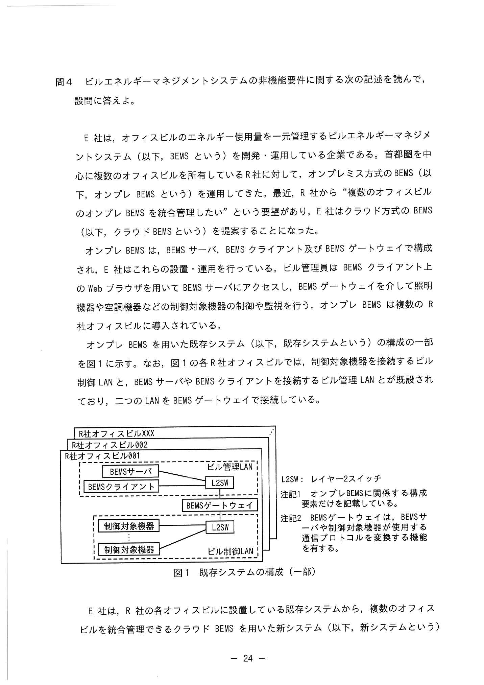

テキスト (OCR)

問4 ビルエネルギーマネジメントシステムの非機能要件に関する次の記述を読んで

設問に答えよ。

E 社は, オフィスビルのエネルギー使用量を一元管理するビルエネルギーマネジメ
ントシステム (以下, BEMS という) を開発・運用している企業である。 首都圏を中
心に複数のオフィスビルを所有しているR社に対して, オンプレミス方式のBEMS (以
下, オンプレ BEMS という) を運用してきた。最近, R 社から “複数のオフィスピル
のオンプレ BEMS を統合管理したい” という要望があり, E 社はクラウド方式の BEMS
GAR, クラウド BEMS という) を提案することになった。

オンプレ BEMS は, BEMS サーバ, BEMS クライアント及び BEMS ゲートウェイで構成
xh, E 社はこれらの設置・運用を行っている。ビル管理員は BEMNS クライアント上
の Web ブラウザを用いて BEMS サーバにアクセスし, BEMS ゲートウェイを介して照明
機器や空調機器などの制御対象機器の制御や監視を行う。オンプレ BEMS は複数のR
社オフィスピビルに導入されている。

オンプレ BEMS を用いた既存システム (以下, 既存システムという) の構成の一部
を図 1 に示す。 なお, 図 1 の各R社オフィスピルでは, 制御対象機器を接続するビル
制御 LAN と, BEMS サーバや BEMS クライアントを接続するビル管理 LAN とが既設され
THY, 二つのLAN をBEMS ゲートウェイで接続している。

| R社オフィスピルXXX
| R社オフィスピル6092
R社オフィスピル06601
1フィスピビル001 uu」

ビル管理LAN

L2SW: レイヤー2スイッチ

注記1 オンプレBEMSに関係する構成
要素だけを記載している。

レー   注記2 BEMSゲートウェイは, BEMSサ
ーバや制御対象機器が使用する
「   通信プロトコルを変換する機能
を有する。

図1 既存システムの構成 (一部)

E 社は, R 社の各オフィスピルに設置している既存システムから, 複数のオフィス
ビルを統合管理できるクラウド BEMS を用いた新システム (以下, 新システムという)

### ページ 25

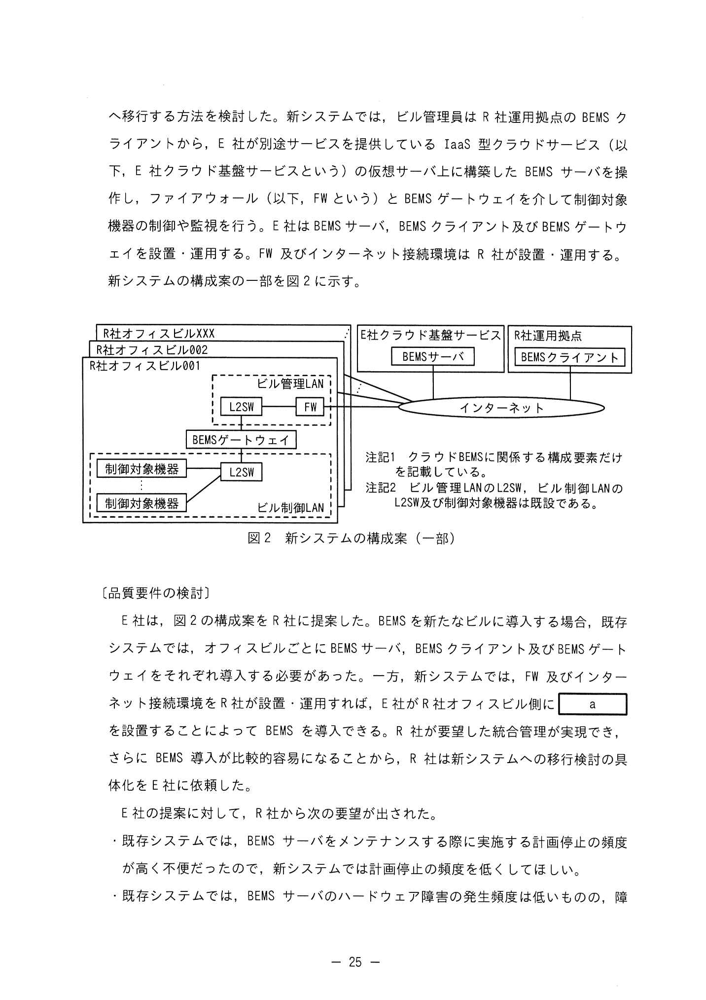

テキスト (OCR)

へ移行する方法を検討した。新システムでは, ビル管理員は R 社運用拠点の BEMS ク
ライアントから, E 社が別途サービスを提供している raaS 型クラウドサービス (以
FB, E 社クラウド基盤サービスという) の仮想サーバ上に構築した BEMS サーバを操
作し, ファイアウォール (以下, FW という) と BEMS ゲートウェイを介して制御対象
機器の制御や監視を行う。E 社は BEMS サーバ, BEMS クライアント及び BEMS ゲートウ
ェイを設置・運用する。FW 及びインターネット接続環境は R 社が設置・運用する。
新システムの構成案の一部を図 2 に示す。

| R社オフィスピルXXX         :| |E社クラウド基盤サービス|]| R社運用拠点

R社オフィスピル0602

BEMSサーバ      BEMSクライアッ
R往オフィスピル91 CS     [BEWsサーバ | ||LBEWSクライアント|
| 給電LENS |]
1            トー-
1        Lav}            インターネット >

ーーーーーーニーーニーーー ーー ーートー ーー ーーーーー1     注記1 クラウドBEMSに関係する構成要素だけ

制御対象機器             を記載している。
1                             1  H 注記2 ビル管理LANのL2SW, ビル制御LANの
制御対象機器                ビル制御LN ! H           L2SW及び制御対象機器は既設である。

図2 新システムの構成案 (一部)

[品質要件の検討]

E 社は, 図2 の構成案を R 社に提案した。BEMS を新たなビルに導入する場合, 既存
システムでは, オフィスピルごとに BEMS サーバ, BEMS クライアント及びBEMS ゲート
ウェイをそれぞれ導入する必要があった。一方, 新システムでは, FW 及びインター
ネット接続環境を R 社が設置・運用すれば, E 社がR社オフィスピル側に|  a |
を設置することによって BEMS を導入できる。R 社が要望した統合管理が実現でき,
さらに BEMS 導入が比較的容易になることから, R 社は新システムへの移行検討の具
体化をE 社に依頼した。

E 社の提案に対して, R 社から次の要望が出された。

・ 既存システムでは, BEMS サーバをメンテナンスする際に実施する計画停止の頻度

が高く不便だったので, 新システムでは計画停止の頻度を低くしてほしい。

・ 既存システムでは, BEMS サーバのハードウェア障害の発生頻度は低いものの, 障

### ページ 26

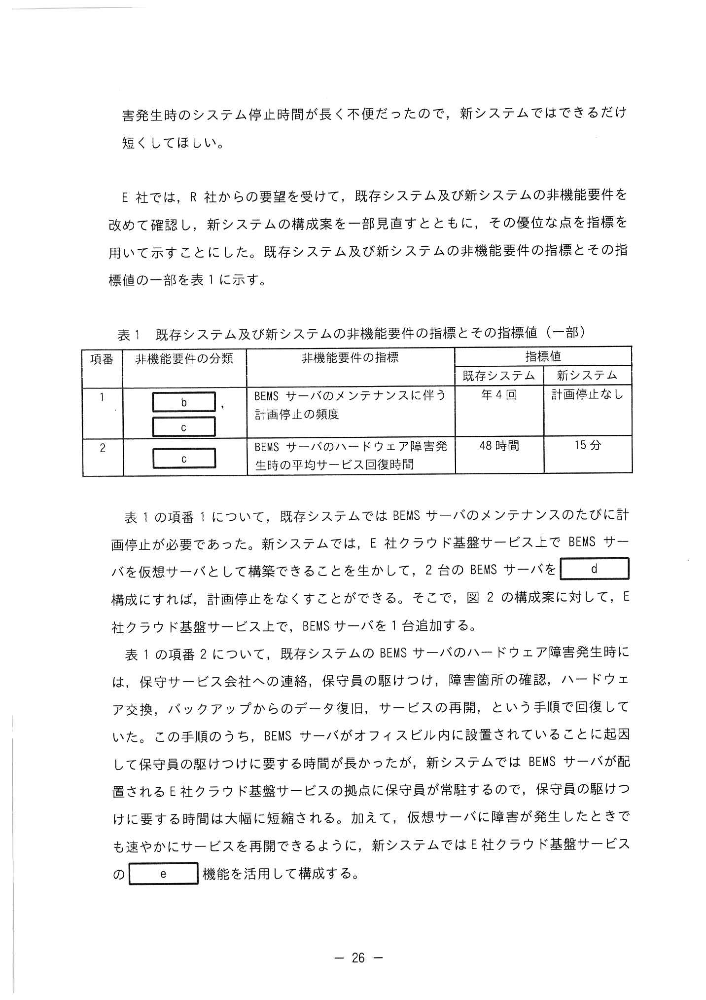

テキスト (OCR)

害発生時のシステム停止時間が長く不便だったので, 新システムではできるだけ
短くしてほしい。

E 社では, R 社からの要望を受けて, 既存システム及び新システムの非機能要件を
改めて確認し, 新システムの構成案を一部見直すとともに, その優位な点を指標を
用いて示すことにした。 既存システム及び新システムの非機能要件の指標とその指
標値の一部を表 1 に示す。

表1 既存システム及び新システムの非機能要件の指標とその指標値 (一部)

項番 | 非機能要件の分類                   非機能要件の指標                                   指標値

既存システム | 新システム

BEMS サーバのメンテナンスに伴う    年4 回    計画停止なし
計画停止の頻度

BEMS サーバのハードウェア障害発    48 時間       15 分
生時の平均サービス回復時間

HH

表 1 の項番 1 について, 既存システムでは BEMS サーバのメンテナンスのたびに計
画停止が必要であった。新システムでは, E 社クラウド基盤サービス上で BEMS サー
バを仮想サーバとして構築できることを生かして, 2 台の Bens サーバを|  d |
構成にすれば, 計画停止をなくすことができる。 そこで, 図 2 の構成案に対して, E
社クラウド基盤サービス上で, BEMS サーバを 1 台追加する。

表 1 の項番 2 について, 既存システムの BEMS サーバのハードウェア障害発生時に
は, 保守サービス会社への連絡, 保守員の駆けつけ, 障害箇所の確認 ハードウェ
PB, バックアップからのデータ復旧, サービスの再開, という手順で回復して
いた。この手順のうち, BEMS サーバがオフィスピル内に設置されていることに起因
して保守員の駆けつけに要する時間が長かったが, 新システムでは BEMS サーバが配
置される E 社クラウド基盤サービスの拠点に保守員が常駐するので, 保守員の駆けつ
けに要する時間は大幅に短縮される。加えて, 仮想サーバに障害が発生したときで
も速やかにサービスを再開できるように, 新システムではE 社クラウド基盤サービス

の| es |機能を活用して構成する。

### ページ 27

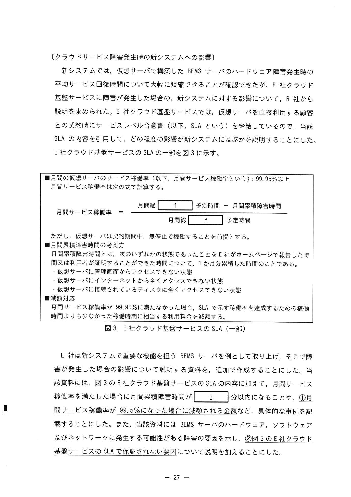

テキスト (OCR)

[クラウドサービス障害発生時の新システムへの影響〕

新システムでは, 仮想サーバで構築した BEMS サーバのハードウェア障害発生時の
平均サービス回復時間について大幅に短縮できることが確認できたが, E 社クラウド
基盤サービスに障害が発生した場合の, 新システムに対する影響について, R 社から
説明を求められた。E 社クラウド基盤サービスでは, 仮想サーバを直接利用する顧客
との契約時にサービスレベル合意書 (LLB, SLA という) を締結しているので, 当該
SLA の内容を引用して, どの程度の影響が新システムに及ぶかを説明することにした。
E 社クラウド基盤サービスの SLA の一部を図 3 に示す。

玉月間の仮想サーバのサービス乏働率 (以下, 月間サービス乏働率という) : 99.95%以上
月間サービス稼働率は次の式で計算する。

月問総 | 1 | 予定時間 — 月間累積障害時間
Ae 予定時間

ただし, 仮想サーバは契約期間中, 無停止で稼働することを前提とする。
画月問累積障害時間の考え方
月間累積障害時間とは, 次のいずれかの状態であったことを E 社がホームページで報告した時
間又は利用者が証明することができた時間について, 1 か月分累積した時間のことである。
・ 仮想サーバに管理画面からアクセスできない状態
・ 仮想サーバにインターネットから全くアクセスできない状態
・仮想サーバに接続されているディスクに全くアクセスできない状態
画減額対応
月間サービス乏働率が 99.959%に満たなかった場合, SLA で示す稼働率を達成するための乏働
時間よりも少なかった乏働時間に相当する利用料金を減額する。

月間サービス乏働率 =

図3 E社クラウド基盤サービスの SLA (一部)

E 社は新システムで重要な機能を担う BEMS サーバを例として取り上げ, そこで障
害が発生した場合の影響について説明する資料を, 追加で作成することにした。 当
該資料には, 図3のE社クラウド基盤サービスの SLA の内容に加えて, 月間サービス
稼働率を満たした場合に月間累積障害時間が| 9 | 分以内になることや,①月
間サービス稼働率が 99.59%になった場合に減額される金額など, 具体的な事例を記
載することにした。 また, 当該資料には BEMNS サーバのハードウェア, ソフトウェア
及びネットワークに発生する可能性がある障害の要因を示し, ②図 3 のE社クラウド
基盤サービスの SLA で保証されない要因について説明を加えることにした。

### ページ 28

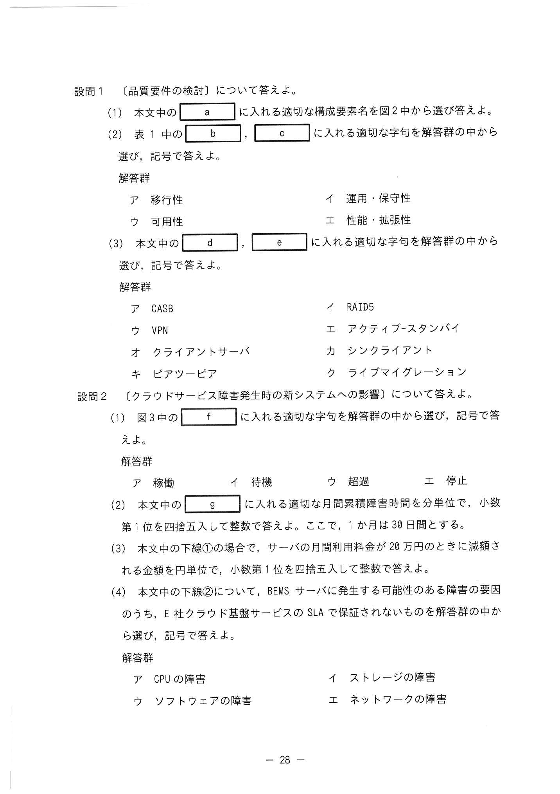

テキスト (OCR)

設問1 (品質要件の検討}について答えよ。
(1) 本文中の|  』 | に入れる適切な構成要素名を図2中から選び答えよ。

(2) 表1 中の| b |,|  c |に入れる適切な字句を解答群の中から
選び, 記号で答えよ。

解答群

ア 移行性           イ 運用・保守性

ウ 可用性           エ 性能・拡張性
(3) 本文中の|  d | | ee |に入れる適切な字句を解答群の中から
選び, 記号で答えよ。

AOS BE

ア CASB           イ RAID5

ウ VPN               エ アクティブ-スタンバイ

オ クライアントサーバ      カ シンクライアント

キ ピアツーピア        ク ライブマイグレーション

設問2 〔クラウドサービス障害発生時の新システムへの影響})について答えよ。
(1) 図3中の に入れる適切な字句を解答群の中から選び, STE

ア 乏働    イ 待機    ウ 超過    xe

(2) 本文中の[|  g | に入れる適切な月間累積障害時間を分単位で, 小数
第 1 位を四捨五入して整数で答えよ。ここで, 1 か月は 30 日間とする。

(3) 本文中の下線①の場合で, サーバの月間利用料金が 29 万円のときに減額さ
れる金額を円単位で, 小数第 1 位を四捨五入して整数で答えよ。

(4) 本文中の下線のについて, BEMS サーバに発生する可能性のある障害の要因
のうち, E 社クラウド基盤サービスの SLA で保証されないものを解答群の中か
ら選び, 記号で答えよ。

解答群
ア CPU の障害           イ ストレージの障害
ウ ソフトウェアの障害       エエ ネットワークの障害

### ページ 29

テキスト (OCR)

[ メ モ 用 紙 J

### ページ 30

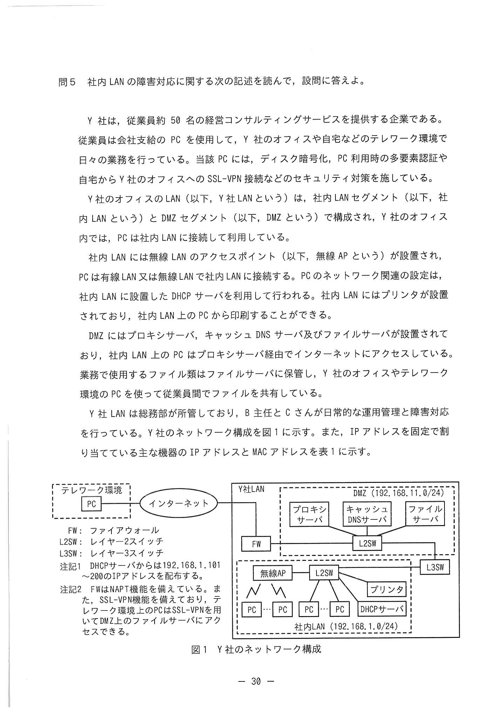

テキスト (OCR)

問5

FW:
L2SW :
L3SW :

注記1

注記2 FWはNAPT機能を備えている。 ま

社内 LAN の障害対応に関する次の記述を読んで, 設問に答えよ

Y 社は, 従業員約 59 名の経営コンサルティングサービスを提供する企業である。
従業員は会社支給の PC を使用して, Y 社のオフィスや自宅などのテレワーク環境で
日々の業務を行っている。 当該 PP には, ディスク暗号化, PC 利用時の多要素認証や
自宅から Y 社のオフィスへの SSL-VPN 接続などのセキュリティ対策を施している。

Y 社のオフィスのLAN (以下, Y 社LAN という) は, 社内LANセグメント (以下, 社
内 LAN という) と DMZ セグメント (以下, DMZ という) で構成され, Y 社のオフィス
内では, PC は社内 LAN に接続して利用している。

社内 LAN には無線 LAN のアクセスポイント (以下, 無線 AP という) が設置され,
PC は有線 LAN 又は無線LAN で社内 LAN に接続する。PC のネットワーク関連の設定は,
社内 LAN に設置した DHCP サーバを利用して行われる。社内 LAN にはプリンタが設置
されており, 社内 LAN 上のPC から印刷することができる。

DMZ にはプロキシサーバ, キャッシュ DNS サーバ及びファイルサーバが設置されて

おり, 社内 LAN 上の PC はプロキシサーバ経由でインターネットにアクセスしている。

業務で使用するファイル類はファイルサーバに保管し, Y 社のオフィスやテレワーク
環境の PC を使って従業員間でファイルを共有している。

Y 社 LAN は総務部が所管しており, B 主任と C さんが日常的な運用管理と障害対応
を行っている。Y 社のネットワーク構成を図 1 に示す。また, IP アドレスを固定で割
り当てている主な機器の IP アドレスと MAC アドレスを表 1 に示す。

DMZ (192.168.11.9/24)
プロキシ   キャッシュ    ファイル

インターネット

ファイアウォール

レイヤー2スイッチ

レイヤー3スイッチ

DHCPサーバからは192.168.1.191
て200のIPアドレスを配布する。

た, SSL-VPN機能を備えており, テ
レワーク環境上のPCはSSL-VPNを用
いてDMZ上のファイルサーバにアク
セスできる。

VELA mmmーーーーーーーーnnrPTODTTEETTT'2405

図1 Y社のネットワーク構成

### ページ 31

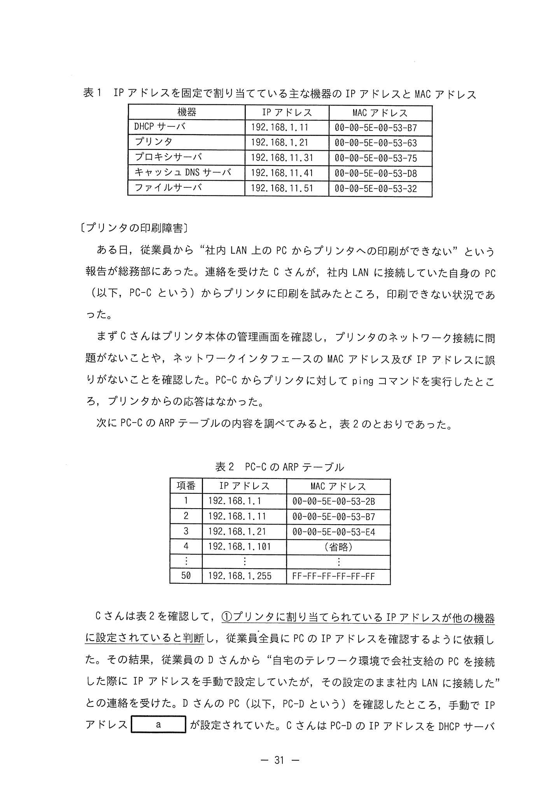

テキスト (OCR)

表1 IP アドレスを固定で割り当てている主な機器の IP アドレスと MAC アドレス

機器         IP アドレス      MAC アドレス

DHCP サーバ                 192.168.1.11       00-00-5E-00-53-B7
プリンタ                     192.168.1.21       00-00-5E-00-53-63
プロキシサーバ             192.168.11.31 | 00-00-5E-00-53-75
キャッシュ DNS サーバ | 192.168.11.41 | 00-00-5E-00-53-D8
ファイルサーバ             192.168.11.51 | 00-00-5E-00-53-32

【プリンタの印刷障害〕

HOA, 従業員から “社内 LAN 上の PC からプリンタへの印刷ができない”という
報告が総務部にあった。 連絡を受けた C さんが, 社内 LAN に接続していた自身の PC

(以下。PC-C という) からプリンタに印刷を試みたところ, 印刷できない状況であ
oe,

まずC さんはプリンタ本体の管理画面を確認し, プリンタのネットワーク接続に問
題がなかいことや, ネットワークインタフェースの MAC アドレス及び IP アドレスに誤
りがないことを確認した。PC-C からプリンタに対して ping コマンドを実行したとこ
ろ, プリンタからの応答はなかった。

次に PC-C の ARP テーブルの内容を調べてみると, 表 2 のとおりであった。

表2 PC-CのARP テーブル

項番   IP アドレス     MAC アドレス
1 | 192.168.1.1         00-00-5E-00-53-2B
2 | 192.168.1.11        60-00-5E-00-53-B7
3 | 192.168.1.21       00-00-5E-00-53-E4
4 | 192.168.1.191        (省略)

50 | 192.168.1.255 | FF-FF-FF-FF-FF-FF

Cさんは表 2 を確認して, ①プリンタに割り当てられている IP アドレスが他の機器
に設定されていると判断し, 従業員全員に PC の ITP アドレスを確認するように依頼し
た。 その結果, 従業員の D さんから “自宅のテレワーク環境で会社支給の PC を接続
した際に IP アドレスを手動で設定していたが, その設定のまま社内 LAN に接続した”
との連絡を受けた。D さんの PC (以下, PC-D という) を確認したところ, 手動で IP
アドレス| sa | が設定されていた。Cさんは PC-D の IP アドレスを DHCP サーバ

### ページ 32

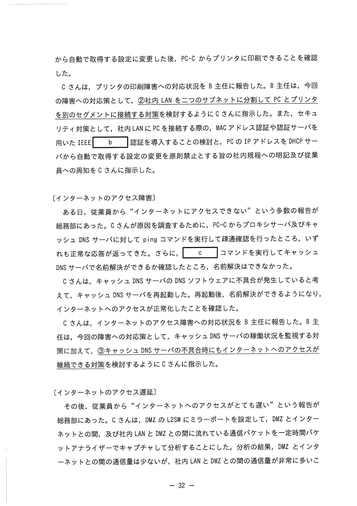

テキスト (OCR)

から自動で取得する設定に変更した後, PC-C からプリンタに印刷できることを確認
した。

C さんは, プリンタの印刷障害への対応状況を B 主任に報告した。B 主任は, 今回
の障害への対応策として, ②社内 LAN を二つのサブネットに分割して PC とプリンタ
を別のセグメントに接続する対策を検討するようにCさんに指示した。また, セキュ
リティ対策として, 社内LANにPC を接続する除の, MAC アドレス認証や認証サーバを
用いた IEEE|  b | 認証を導入することの検討と.PCのTPアドレスをDHCPサー
バから自動で取得する設定の変更を原則禁止とする旨の社内規程への明記及び従業
員への周知をCさんに指示した。

[インターネットのアクセス障害〕

HSA, 従業員から “インターネットにアクセスできない” という多数の報告が
総務部にあった。C さんが原因を調査するために, PC-C からプロキシサーバ及びキャ
ッシュ DNS サーバに対して ping コマンドを実行して中・通確認を行ったところ, WS
れも正常な応答が返ってきた。さらに, |  c | コマンドを実行してキャッシュ
DNS サーバで名前解決ができるか確認したところ, 名前解決はできなかった。

C さんは, キャッシュ DNS サーバの DNS ソフトウェアに不具合が発生していると考
AT, キャッシュ DNS サーバを再起動した。再起動後, 名前解決ができるようになり,
インターネットへのアクセスが正常化したことを確認した。

C さんは, インターネットのアクセス障害への対応状況を B 主任に報告した。B 主
任は, 今回の障害への対応策として, キャッシュ DNS サーバの稼働状況を監視する対
策に加えて, ③キャッシュ DNS サーバの不具合時にもインターネットへのアクセスが
継続できる対策を検討するようにCさんに指示した。

【インターネットのアクセス遅延〕

その後, 従業員から“インターネットへのアクセスがとても遅い”" という報告が
総務部にあった。C さんは, DMZ のL2SW にミラーポートを設定して, DMZ とインター
ネットとの間, 及び社内 LAN と DMZ との間に流れている通信パケットを一定時間パケ
ットアナライザーでキャプチャして分析することにした。分析の結果, DW とインタ
ーネットとの間の通信量は少ないが, 社内LAN とDMZ との間の通信量が非常に多いこ

### ページ 33

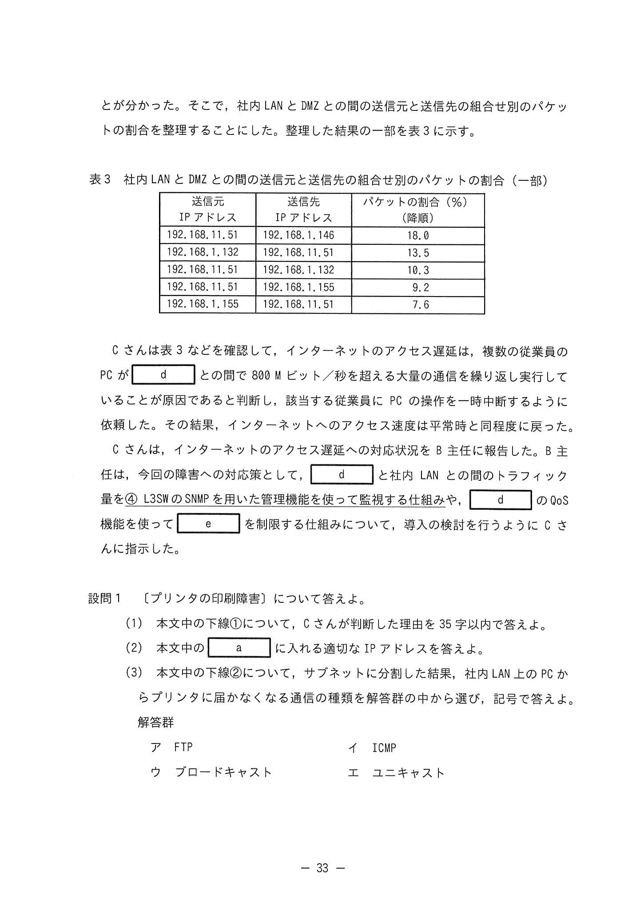

テキスト (OCR)

とが分かった。 そこで, 社内LAN とDMZ との間の送信元と送信先の組合せ別のパケッ
トの割合を整理することにした。整理した結果の一部を表 3 に示す。

表3 社内LANとDMZ との間の送信元と送信先の組合せ別のパケットの割合 (一部)

送信元           送信先        パケットの割合 (%)
1P アドレス     IP アドレス         (降順)
192.168.11.51   192.168.1.146         18.0
192.168.1.132 | 192.168.11.51         13.5
192.168.11.51   192.168.1.132         10.3
192, 168. 11, 51   192, 168. 1. 155          9.2
192.168.1.155 | 192.168. 11,51          7.6

C さんは表 3 などを確認して, インターネットのアクセス遅延は, 複数の従業員の
PC が| d | との間で800 Mビットノ秒を超える大量の通信を繰り返し実行して
いることが原因であると判断し, 該当する従業員に PC の操作を一時中断するように
依頼した。 その結果, インターネットへのアクセス速度は平常時と同程度に戻った。

C さんは, インターネットのアクセス遅延への対応状況を B 主任に報告した。B 主
任は, 今回の障害への対応策として, | d | と社内 LAN との間のトラフィック
量を④ L3SW のSNMP を用いた管理機能を使って監視する仕組みや,| d |のoos
機能を使って| e | を制限する仕組みについて, 導入の検討を行うようにCさ
んに指示した。

設問1 〔プリンタの印刷障害) について答えよ。
(1) 本文中の下線わについて, Cさんが判断した理由を 35 字以内で答えよ。
(2) 本文中の[|  a |] に入れる適切な IPアドレスを答えよ。
(3) 本文中の下線のについて, サブネットに分割した結果, 社内LAN上のPCか
らプリンタに届かなくなる通信の種類を解答群の中から選び, 記号で答えよ。

解答群
ア FTP                   イ ICMP
ウ ブロードキャスト         エエ ユニキャスト

### ページ 34

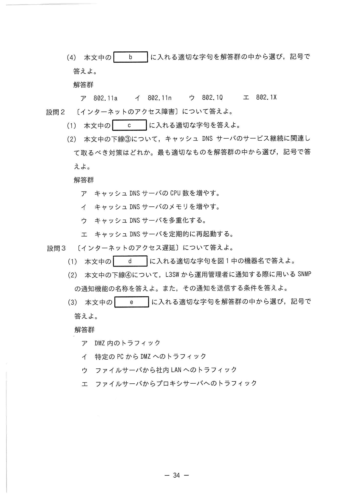

テキスト (OCR)

(4) 本文中の| 5 |] に入れる適切な字句を解答群の中から選び, 記号で
答えよ。

ARSE

ア 802.11a  4 802.11n  ウ 802.10   エ 802. 1X

設問2 〔インターネットのアクセス障害) について答えよ。
(1) 本文中の[| c | に入れる適切な字句を答えよ。
(2) 本文中の下線③について, キャッシュ DNS サーバのサービス継続に関連し
て取るべき対策はどれか。最も適切なものを解答群の中から選び, BETS
Ades
na
ア キャッシュDNS サーバの CPU 数を増やす。
キャッシュ DNS サーバのメモリを増やす。
キャッシュ DNS サーバを多重化する。
キャッシュ DNS サーバを定期的に再起動する。
設問3 〔インターネットのアクセス遅延}] について答えよ。
(1) 本文中の| d | に入れる適切な字句を図 1 中の機器名で答えよ。
(2) 本文中の下線について, L3SW から運用管理者に通知する際に用いる SNMP
の通知機能の名称を答えよ。また, その通知を送信する条件を答えよ。
(3) 本文中の| e | に入れる適切な字句を解答群の中から選び,
答えよ。
解答群
 ア DMZ 内のトラフィック
特定の PC から DMZ へのトラフィック
ファイルサーバから社内 LAN へのトラフィック
ファイルサーバからプロキシサーバへのトラフィック

補 A

H

osc

mult

Hoos

### ページ 35

テキスト (OCR)

C

メ モ 用 紙 )

### ページ 36

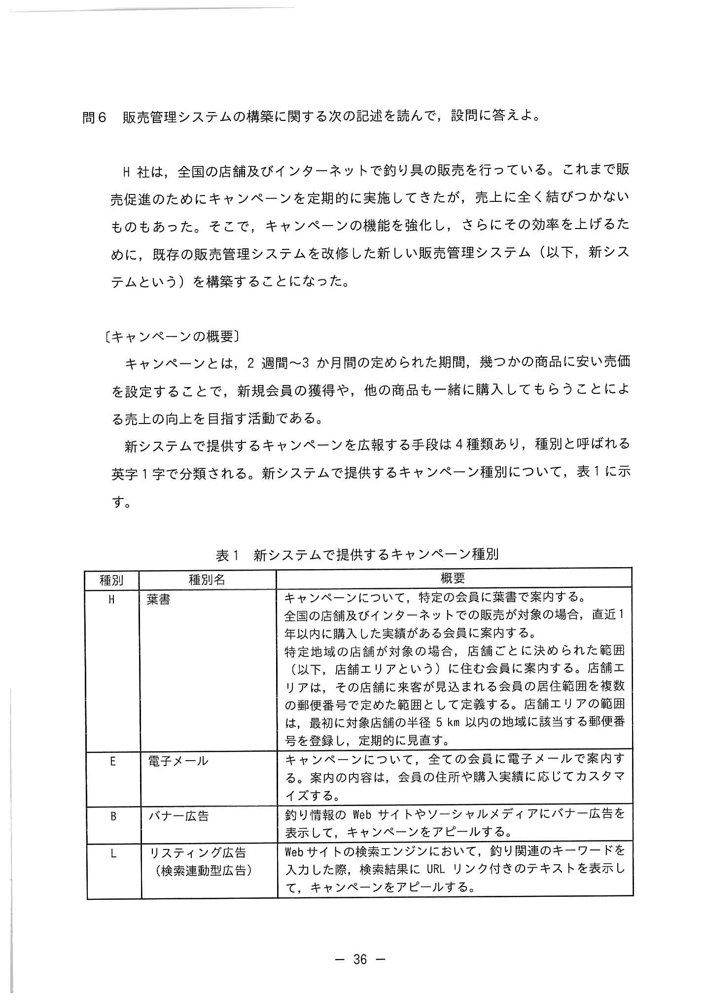

テキスト (OCR)

問6 販売管理システムの構築に関する次の記述を読んで, 設問に答えよ。

H 社は, 全国の店舗及びインターネットで釣り具の販売を行っている。これまで販
売促進のためにキャンペーンを定期的に実施してきたが, 売上に全く結びつかない
ものもあった。 そこで, キャンペーンの機能を強化し, さらにその効率を上げるた
めに, 既存の販売管理システムを改修した新しい販売管理システム (以下, 新シス
テムという) を構築することになった。

[キャンペーンの概要〕

キャンペーンとは, 2 週間3 か月間の定められた期間 幾つかの商品に安い売価
を設定することで, 新規会員の獲得や, 他の商品も一緒に購入してもらうことによ
る売上の向上を目指す活動である。

新システムで提供するキャンペーンを広報する手段は 4 種類あり, 種別と呼ばれる
英字 1 字で分類される。新システムで提供するキャンペーン種別について, 表1 に示
す。

表1 新システムで提供するキャンペーン種別

種別         種別名                             概要

H  葉書         キャンペーンについて, 特定の会員に葉書で案内する。
全国の店舗及びインターネットでの販売が対象の場合, 直近1
年以内に購入した実績がある会員に案内する。

特定地域の店舗が対象の場合, 店舗ごとに決められた範囲
(以下, 店舗エリアという) に住む会員に案内する。店舗エ
リアは, その店舗に来客が見込まれる会員の居住範囲を複数
の郵便番号で定めた範囲として定義する。店舗エリアの範囲
は, 最初に対象店舗の半径 5 km 以内の地域に該当する郵便番
号を登録し, 定期的に見直す。

E  電子メール      キャンペーンについて, 全ての会員に電子メールで案内す
る。案内の内容は, 会員の住所や購入実績に応じてカスタマ
イズする。

B  バナー広告      釣り情報の Weib サイトやソーシャルメディアにバナー広告を
表示して, キャンペーンをアピールする。

L  リスティング広告   Web サイトの検索エンジンにおいて, 釣り関連のキーワードを

(検索連動型広告   入力した際, 検索結果に URL リンク付きのテキストを表示し
て, キャンペーンをアピールする。

### ページ 37

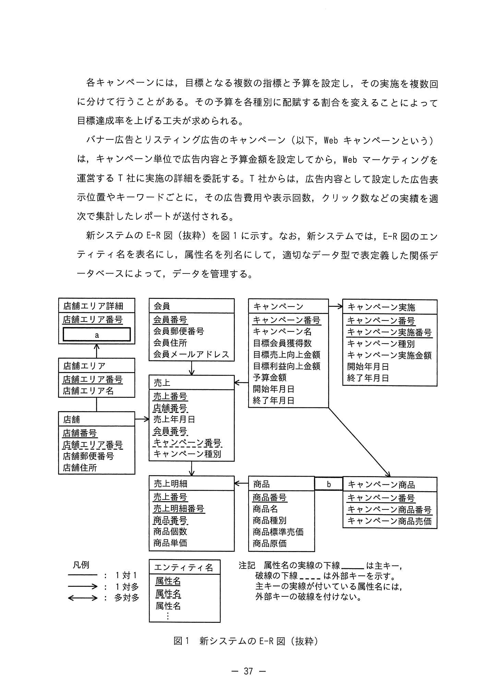

テキスト (OCR)

各キャンペーンには, 目標となる複数の指標と予算を設定し, その実施を複数回
に分けて行うことがある。 その予算を各種別に配虹する割合を変えることによって
目標達成率を上げる工夫が求められる。

バナー広告とリスティング広告のキャンペーン (以下, We キャンペーンという)
は, キャンペーン単位で広告内容と予算金額を設定してから, Web マーケティングを
運営する T 社に実施の詳細を委託する。T 社からは, 広告内容として設定した広告表
示位置やキーワードごとに, その広告費用や表示回数 クリック数などの実績を週
次で集計したレポートが送付される。

新システムの ERM (抜粋) を図 1 に示す。なお, 新システムでは, E-R 図のエン
ティティ名を表名にし, 属性名を列名にして, 適切なデータ型で表定義した関係デ
ータベースによって, データを管理する。

店舗エリア詳細    会員          キャンペーン   トう| キャンペーン実施
店舗エリア番号   会員番号        キャンペーン番号   キャンペーン番号
[La |   会員郵便番号      キャンペーン名    キャンペーン実施番号
会員住所        目標会員獲得数    キャンペーン種別
]      会員メールアドレス   目標売上向上金額   キャンペーン実施金額
店舗エリア          A       目標利益向上金額   開始年月日
店舗エリア番号   売上        し| 予算金額       終了年月日
店舗エリア名         Aiea               BIAS AB
|      店人番号       終了年月日
店舗      | 売上年月日
店舗番号      会員番号
店舗エリア番号   キャンペーン番号
店舗郵便番号       キャンペーン種別
店舗住所          J
売上明細      に一| 商品         キャンペーン商品
売上番号        商品番号       キャンペーン番号
売上明細番号      商品名        キャンペーン商品番号
商品番号       商品種別       キャンペーン商品売価
商品個数        商品標準売価
商品単価        商品原価
凡例        エンティティ名   注記 属性名の実線の下線   は主キー,
ーーー 1対1  属性名        BRO FR... は外部キーを示す。
ーータテ: ine | SG         主キーの実線が付いている属性名には,
<> : 3x3    _                 外部キーの破線を付けない。

図1 新システムのE-R図 (抜粋)

### ページ 38

テキスト (OCR)

[キャンペーン種別ごとの実績の集計〕

新しいキャンペーンを計画するために, 指定したキャンペーンについて, キャン
ペーン種別ごとの実績として, 売上, 原価, A, 実施金額を集計する SOL 文を図 2
に示す。ここで, “":キャンペーン番号"は指定したキャンペーン番号を表す埋込み
変数である。なお, 関数 COALESCE(A, B)は, AがNULL でないときはAを, AがNULL の
ときはB を返す。

SELECT CK.キャンペーン種別, COALESCE(UK. 売上計, 9) AS 売上計
COALESCE(UK.原価計,9) AS 原価計
COALESCE(UK. 売上計, 9) - COALESCE(UK. 原価計,9) AS 粗利計
CK. キャンペーン実施金額計
し     c     j
(SELECT キャンペーン種別, SUM(キャンペーン実施金額) AS キャンペーン実施金額計
FROM キャンペーン実施
WHERE キャンペーン番号 = :キャンペーン番号
GROUP BY キャンペーン種別) CK
|      d     ]
(SELECT U.キャンペーン種別, SUM(M. 商品個数 * M.商品単価) AS 売上計,
|            e           | AS 原価計
FROM 売上 U
INNER JOIN 売上明細 M ON U.売上番号 = M.売上番号
INNER JOIN 商品 S ON M.商品番号 = S.商品番号
WHERE U.キャンペーン番号 = :キャンペーン番号
GROUP BY U.キャンペーン種別) UK
ON CK.キャンペーン種別 = UK.キャンペーン種別

図2 キャンペーン種別ごとの実績を集計する SQL 文

〔葉書を送る店舗エリアの見直し]
葉書を送る対象となる店舗エリアを, 葉書キャンペーンによる会員の購入実績を
基に見直すことを考える。対象の店舗における過去 1 年間に葉書キャンペーンで購入
した会員の郵便番号ごとの売上実績数を, 売上実績数の降順に出力する SOL 文を図 3
に示す。ここで, “SERBS” は指定した店舗番号を, “:一年前年月日" は現在か
ら 1 年前の年月日を表す埋込み変数である。

### ページ 39

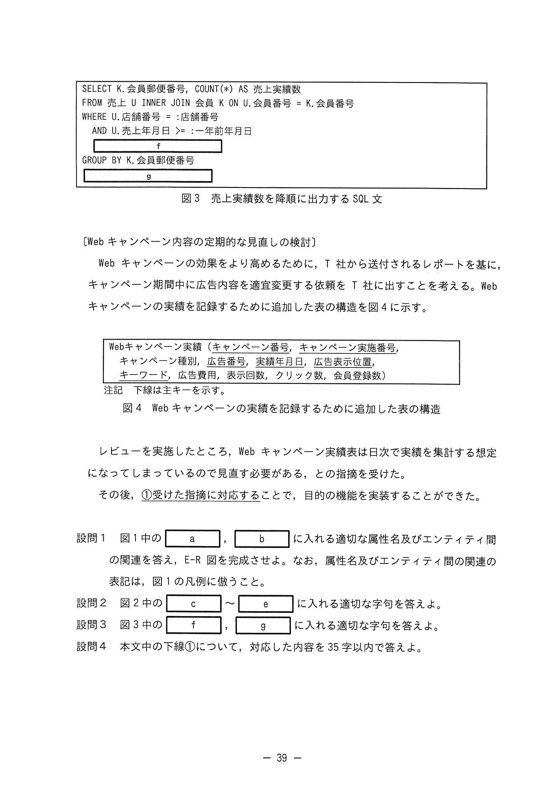

テキスト (OCR)

SELECT K. 会員郵便番号, COUNT(*) AS 売上実績数
FROM 売上 U INNER JOIN 会員K ON U.会員番
WHERE U.店舗番号 = :店舗番号

AND U.売上年月日 >= :一年前年月日

[     5    ]
GROUP BY K.会員郵便番号

[     9    」

図3 売上実績数を降順に出力する SQL 文

Web キャンペーン内容の定期的な見直しの検討〕

Web キャンペーンの効果をより高めるために, T 社から送付されるレポートを基に,
キャンペーン期間中に広告内容を適家変更する依頼を T 社に出すことを考える。Web
キャンペーンの実績を記録するために追加した表の構造を図 4 に示す。

Webキャンペーン実績 (キャンペーン番号, キャンペーン実施番号,
キャンペーン種別, 広告番号, 実績年月日, 広告表示位置
キーワード, 広告費用, 表示回数, クリック数, 会員登録数)

注記 下線は主キーを示す。

図4 Web キャンペーンの実績を記録するために追加した表の構造

レビューを実施したところ, Web キャンペーン実績表は日次で実績を集計する想定
になってしまっているので見直す必要がある, との指摘を受けた。
その後, ①受けた指摘に対応することで, 目的の機能を実装することができた。

設問1 図1中の| a |,|  b | に入れる適切な属性名及びエンティティ間
の関連を答え, ER 図を完成させよ。なお, 属性名及びエンティティ間の関連の
表記は, 図 1 の凡例に信うこと。

設問2 図2中の|  c |~[  e |に入れる適切な字句を答えよ。

設問3 図3中の| f |,| 9 | に入れる適切な字句を答えよ。

設問4 本文中の下線①について, 対応した内容を 35 字以内で答えよ。

### ページ 40

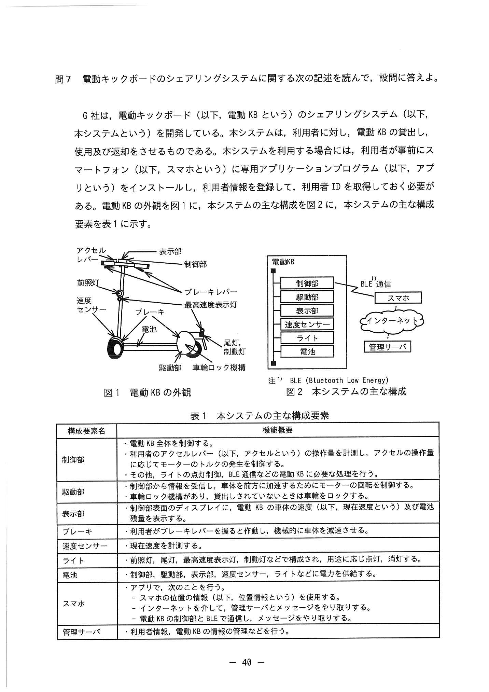

テキスト (OCR)

問7 電動キックボードのシェアリングシステムに関する次の記述を読んで, 設問に答えよ。

6 社は, 電動キックボード (以下, 電動 という) のシェアリングシステム (以下,
本システムという) を開発している。本システムは, 利用者に対し, 電動KB の貸出し
使用及び返却をさせるものである。本システムを利用する場合には, 利用者が事前にス
マートフォン (以下, スマホという) に専用アプリケーションプログラム (以下, アプ
リという) をインストールし, 利用者情報を登録して, 利用者 ID を取得しておく必要が
HS, 電動 KB の外観を図 1 に, 本システムの主な構成を図 IC, 本システムの主な構成
要素を表 1 に示す。

アクセル                表示部
PT                            制御部                     電動KB
aR                                                           制御部 WL BLE se
ブレーキレバー
速度                              aces                 駆動部        |そー    スマホ
センサー          os elealalaai        表示部
作度センサー |
尾知                ライト    ー
制動灯     電池     管理サーバ |
駆動部 車輪ロック機構

注り BLE (Bluetooth Low Energy)

図1 電動KBの外観              図2 本システムの主な構成
表1 本システムの主な構成要素

構成要素名                          機能概要

・電動 KB 全体を制御する。
制御部       ・利用者のアクセルレバー (以下, アクセルという) の操作量を計測し, アクセルの操作量

        に応じてモーターのトルクの発生を制御する。

・ その他, ライトの点灯制御, BLE 通信などの電動 KB に必要な処理を行う。

阪和部         ・制御部から情報を受信し, 車体を前方に加速するためにモーターの回転を制御する。
       ・ 車輸ロック機構があり, 貸出しされていないときは車輪をロックする。
表示部       ・ 制御部表面のディスプレイに, 電動 KB の車体の速度 (以下, 現在速度という) 及び電池
aa      残量を表示する。

ブレーキ       ・利用者がブレーキレバーを握ると作動し, 機械的に車体を減速させる。
速度センサー | ・現在速度を計測する。
ライト       ‘HRT, 尾灯, 最高速度表示灯, 制動条などで構成され, 用途に応じ点灯, 消灯する。
電池       制御部 駆動部, 表示部, 速度センサー, ライトなどに電力を供給する。

- アプリで, 次のことを行う。
スマホ        - スマホの位置の情報 (以下, 位置情報という) を使用する。

ーインターネットを介して, 管理サーバとメッセージをやり取りする。

- 電動KB の制御部と BLE で通信し, メッセージをやり取りする。
管理サーバ    ・利用者情報, 電動 KB の情報の管理などを行う。

### ページ 41

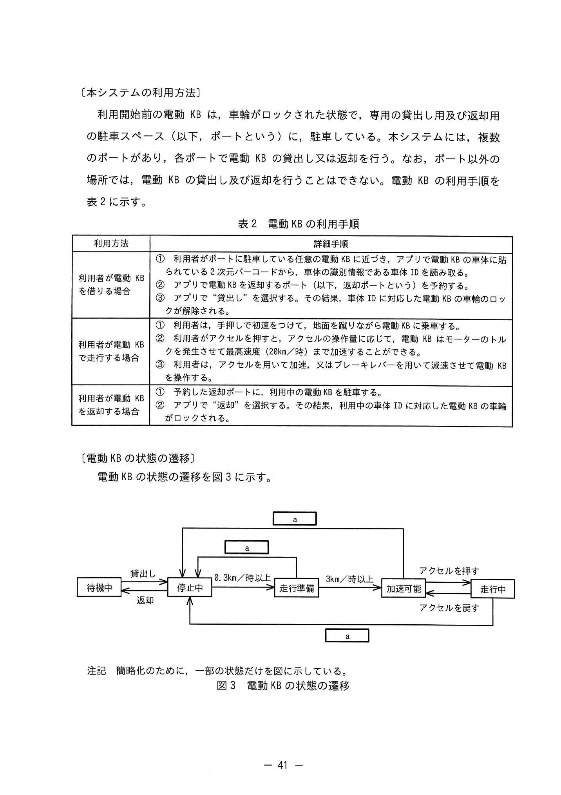

テキスト (OCR)

〔本システムの利用方法〕
利用開始前の電動 KB は, 車輪がロックされた状態で, 専用の貸出し用及び返却用

の駐車スペー

A (以下, ポートという) に, 駐車している。本システムには, 複数

のポートがあり, 各ポートで電動 KB の貸出し又は返却を行う。なお, ポート以外の
場所では, 電動 KB の貸出し及び返却たを行うことはできない。 電動 KB の利用手順を

表 2 に示す。

表2 電動KB の利用手順

利用方法

詳細手順

利用者が電動 KB
を借りる場合

① 利用者がポートに駐車している任意の電動 KB に近づき, アプリで電動 KB の車体に貼
られている 2 次元バーコードから, 車体の識別情報である車体 ID を読み取る。

@ アプリで電動 KB を返却するポート (以下, 返却ポートという) を予約する。

@ アプリで “貸出し"を選択する。その結果, Blk ID に対応した電動 KB の車輸のロッ
クが解除される。

利用者が電動 KB
で走行する場合

O 利用者は, 手押しで初速をつけて, 地面を蹴りながら電動 KB に乗車する。

Q 利用者がアクセルを押すと, アクセルの操作量に応じて, BH KB はモーターのトル
クを発生させて最高速度 (20kmン時) まで加速することができる。

③ 利用者は, アクセルを用いて加速, 又はブレーキレバーを用いて減速させて電動 KB
を操作する。

利用者が電動 KB
を返却する場合

① 予約した返却ポートに, 利用中の電動 KB を駐車する。
② アプリで “BE” を選択する。その結果, 利用中の車体 ID に対応した電動 KB の車輸
がロックされる。

電動 KB の状態の乱移]
電動 KB の状態の乱移を図 3 に示す。

貸出し         03Kmノ時以上         den, RL       アクセルを押す

待機中       its |} eae       加速可能      走行中
sil                                           アクセルを戻す

注記 簡略化のために, 一部の状態だけを図に示している。

図3 電動KB の状態の須移

### ページ 42

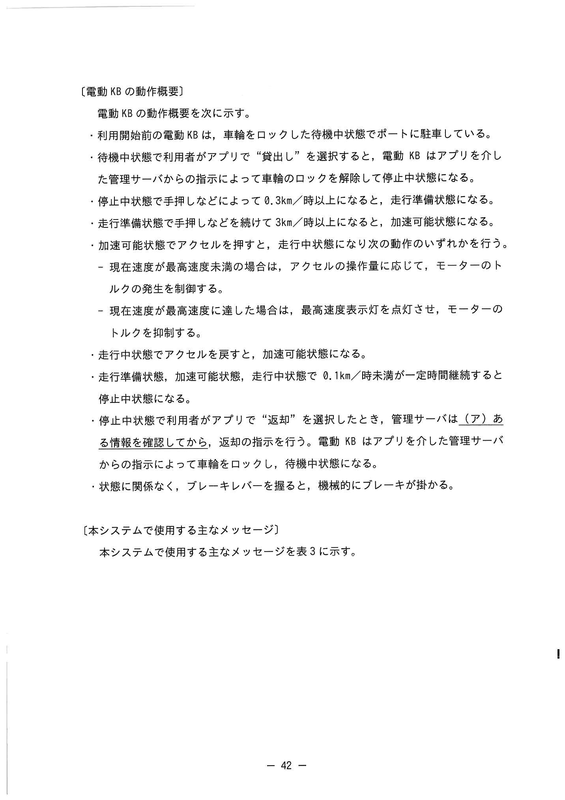

テキスト (OCR)

(BH KB の動作概要〕
電動 KB の動作概要を次に示す。

・利用開始前の電動 KB は, 車輪をロックした待機中状態でポートに駐車している。

・待機中状態で利用者がアプリで“貸出し” を選択すると, 電動 B はアプリを介し
た管理サーバからの指示によって車輪のロックを解除して停止中状態になる。

・停止中状態で手押しなどによって 9.3kmノ時以上になると, 走行準備状態になる。

・ 走行準備状態で手押しなどを続けて 3kmノ時以上になると, 加速可能状態になる。

・ 加速可能状態でアクセルを押すと, 走行中状態になり次の動作のいずれかを行う。
- 現在速度が最高速度未満の場合は, アクセルの操作量に応じて, モーターのト

ルクの発生を制御する。
- 現在速度が最高速度に達した場合は, 最高速度表示灯を点灯させ, モーターの
トルクを抑制する。

・ 走行中状態でアクセルを戻すと, 加速可能状態になる。

・ 走行準備状態, 加速可能状態, 走行中状態で 9.1kmン時未満が一定時間継続すると
厚止中状態になる。

・停止中状態で利用者がアプリで SRM” を選択したとき, 管理サーバは (ア) あ
る情報を確認してから, 返却の指示を行う。電動 B はアプリを介した管理サーバ
からの指示によって車輪をロックし, 待機中状態になる。

・状態に関係なく, ブレーキレバーを握ると, 機械的にブレーキが掛かる。

[本システムで使用する主なメッセージ〕
本システムで使用する主なメッセージを表 3 に示す。

### ページ 43

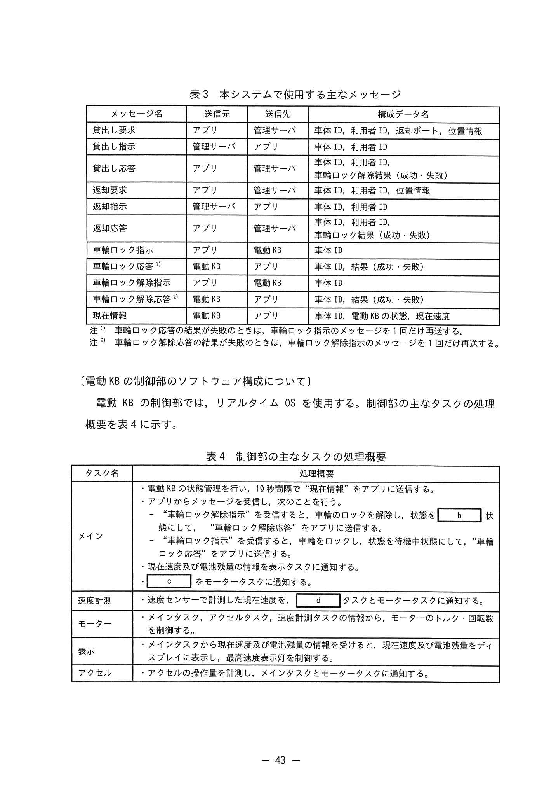

テキスト (OCR)

表3 本システムで使用する主なメッセージ

メッセージ名     送信元    送信先          構成データ名
貸出し要求      アプリ    管理サーバ | 車体 ID, 利用者 ID、返却ポート, 位置情報
貸出し指示      管理サーバ  アプリ    車体 ID, 利用者 ID

1D, 利      1D,
RE DES                dal           サー     oe ORE GH SHH)
返却要求       アプリ    管理サーバ | 車体 ID, 利用者 ID、位置情報
返却指示              管理サーバ    アプリ        車体 ID, 利用者ID
返却応和                  アプリ          管理サーバ     fan vem ooh stk)
車輪ロック指示    アプリ    電動KB    車体 D
車輪ロック応答    電動 KB    アプリ    車体 LD, 結果 (成功・失敗)
車輪ロック解除指示  アプリ    電動KB    車体 D
車輪ロック解除応答? | 電動KB    アプリ    車体 LD, 結果 (成功・失敗)
現在情報       電動 KB    アプリ    車体 LD, 電動KB の状態, 現在速度

=) 車輪ロック応答の結果が失敗のときは, 車輪ロック指示のメッセージを 1 回だけ再送する。
i? 車輸ロック解除応答の結果が失敗のときは, 車輪ロック解除指示のメッセージを 1 回だけ再送する。

[電動 KB の制御部のソフトウェア構成について〕
電動 KB の制御部では, リアルタイム 0S を使用する。制御部の主なタスクの処理
概要を表 4 に示す。

表4 制御部の主なタスクの処理概要

タスク名                    処理概要
・ 電動 KB の状態管理を行い, 19 秒間隔で “現在情報" をアプリに送信する。
・アプリからメッセージを受信し, 次のことを行う。
"車輸ロック解除指示"を受信すると, 車輪のロックを解除し, 状態を[ 5 |状
態にして, “車輪ロック解除応答" をアプリに送信する。
aay         “GRO y HR" を受信すると, 車輸をロックし, 状態を待機中状態にして, “aia
ロック応答" をアプリに送信する。
・ 現在速度及び電池残量の情報を表示タスクに通知する。
‘(Loe をモータータスクに通知する。
速度計測     ・ 速度センサーで計測した現在速度を。 | d | タスクとモータータスクに通知する。
eH   ・メインタスク, アクセルタスク, 速度計測タスクの情報から, モーターのトルク・回転数
を制御する。
dem             XA IRI PD ORERERUGHRRONBE LSC, RELEROD WERE T 4
スプレイに表示し, 最高速度表示灯を制御する。
アクセル     - アクセルの操作量を計測し,。 メインタスクとモータータスクに通知する。

### ページ 44

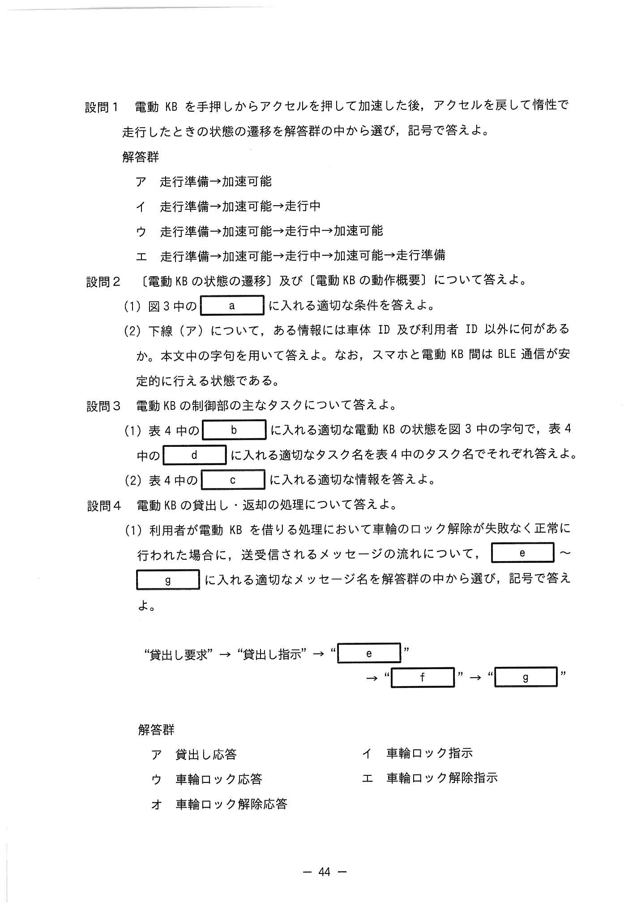

テキスト (OCR)

設問1 電動KB を手押しからアクセルを押して加速した後, アクセルを戻して情性で
走行したときの状態の遷移を解答群の中から選び, 記号で答えよ。
解答群

NI

走行準備っ加速可能

走行準備加速可能走行中

走行準備っ加速可能走行中加速可能

走行準備っ加速可能走行中加吉可能走行準備

設問 2 [電動KBの状態の居移] 及び電動KB の動作概要] について答えよ。
(1) 図3 中の|  a | に入れる適切な条件を答えよ。
(2) 下線 (ア) について, ある情報には車体 ID 及び利用者 ID 以外に何がある
か。本文中の字句を用いて答えよ。なお, スマホと電動 KB 間は BLE 通信が安
定的に行える状態である。

設問3 電動KBの制御部の主なタスクについて答えよ。
(1) 表4 中の[| b | に入れる適切な電動 KB の状態を図 3 中の字句で, 表 4
中の[|  d | に入れる適切なタスク名を表 4中のタスク名でそれぞれ答えよ。
(2) 表4中の|  c | に入れる適切な情報を答えよ。

設問4 電動KBの貸出し・返却の処理について答えよ。
(1) 利用者が電動 KB を借りる処理において車輪のロック解除が失敗なく正常に
行われた場合に, 送受信されるメッセージの流れについて, | e |~

H GON

| 』 | に入れる適切なメッセージ名を解答群の中から選び, 記号で答え
7
= 引 f   |” = |   g   |”
解答群
ア 貸出し応答          イ 車輪ロック指示
ウ 車輪ロック応答        エ 車輪ロック解除指示

A 車輪ロック解除応答

### ページ 45

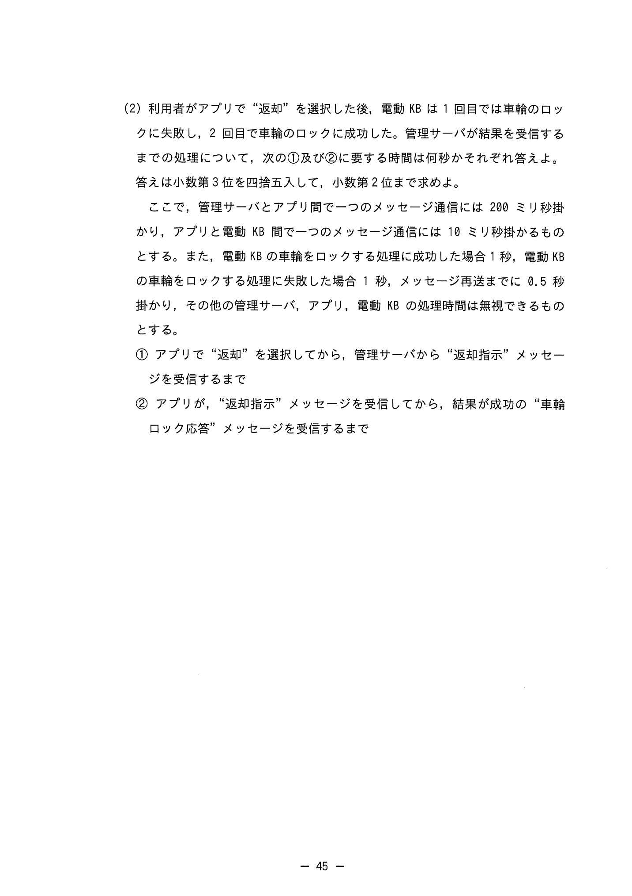

テキスト (OCR)

(2) 利用者がアプリで SRA” を選択した後, 電動KB は 1 回目では車輪のロッ
クに失敗 し, 2 回目で車輪のロックに成功した。管理サーバが結果を受信する
までの処理について, 次の①及び②に要する時間は何秒かそれぞれ答えよ。
答えは小数第 3 位を四捨五入して, 小数第2 位まで求めよ。

COC, 管理サーバとアプリ間で一つのメッセージ通信には 200 ミリ秒掛
DY, アプリと電動 KB 間で一つのメッセージ通信には 10 ミリ秒掛かるもの
とする。 また, 電動 KB の車輪をロックする処理に成功した場合 1 秒, 電動KB
の車輪をロックする処理に失敗した場合 1 秒, メッセージ再送までに 6.5 秒
掛かり, その他の管理サーバ, アプリ, 電動 KB の処理時間は無視できるもの
とする。
① アプリで “RE” を選択してから, 管理サーバから “返却指示” メッセー

ジを受信するまで
② アプリが, “返却指示” メッセージを受信してから, 結果が成功の “BH

Oy obs” メッセージを受信するまで

### ページ 46

テキスト (OCR)

FAAS エラーハンドリングに関する次の記述を読んで, 設問に答えよ。

Q 社は, 業務システムの受託開発会社である。Q tlt, スーパーマーケットの複数
の店舗を運営する B 社から, CRM (Customer Relationship Management) システムの
開発と運用保守業務を受託した。CRM システムは各店舗で利用され, 顧客からの意見
やクレーム, 店舗での対応の内容が登録・区積される。CRM システムを運用する際の
関係者の一覧を表 1 に示す。

表1 関係者の一覧

関係者                                       説明
顧客          B 社の店舗に来店した顧客。意見やクレームを, 店舗に勤務する B 社の従業員に伝
える。
利用者       CRM システムへのアクセスが許可された B 社の従業員。顧客からの意見やクレーム

をCRM システムに入力し, 過去の類似案件の記録を参考に顧客対応を行う。顧客か
ら聞き取った氏名と連絡先を, CR システムに願客情報として登録することがあ
る。顧客情報は, B 社の従業員が顧客に連絡するためだけに利用する。

運用担当者 | B 社に常駐している 0 社の従業員。CRM システムの運用手順書に従って, 利用者か
らの質問や不具合発生時の問合せに対応する。問合せ時の状況や不具合の再現手順
の確認のために, 運用中の CRM システムへのアクセスが許可されている。 運用手順
書で対応しきれない技術的な問題については, 0 社の開発担当者に対応を依頼す
る。

開発担当者 | 0 社内で勤務している 0 社の開発担当者。運用担当者からの問合せの際は, 調査に
必要な最小限の情報として, 不具合の状況, 再現手順及び発生時刻付近のログを受
け取る。運用中のCRM システムへの入力情報を, 直接参照することはできない。

Q 社は, システムのリリース後に想定される, 店舗からの問合せに対する迅速な対
応を可能にするために, 想定される問合せのパターンと対応方法を事前に整理し,
対応の際に必要な要件をシステムの設計に反映させることにした。

(CRM システムの構造]

CRM システムのクラス図 (一部) を図 1 に示す。 AbstractController,
AbstractService 及び AbstractDao は, それぞれ画面乱移, ビジネスロジック及びデ
ータベースアクセスの共通処理が実装された抽象クラスである。これらのクラスを
|  』 | したクラスを作成して, 具体的な機能を実装する。ログを出力するには
Logger クラスを利用する。ログの出力時には “DEBUG”, “ERROR” などの, ログの種

### ページ 47

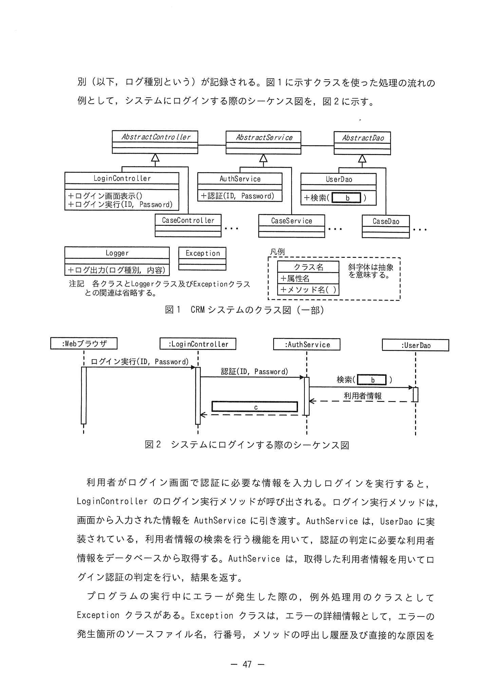

テキスト (OCR)

別 (以下ログ種別という) が記録される。図 1 に示すクラスを使った処理の流れの
例として, システムにログインする際のシーケンス図を, 図 2 に示す。

AbstractController                      AbstractService                         AbstractDao
—— 架            mE:                —*
LoginController                AuthService               UserDao
キログイン画面表示()        寺認証GD, Password)    検索([ 5 ])
キログイン実行(ID, Password)
CaseController                       CaseService                        CaseDao
Logger                        Exception                     凡例ーー
=           iy        1
エログ出力(ログ種別, WA)            tee る
注記 各クラスとLoggerクラス及びExceptionクラス |  +メソッド名( )             1
との関連は省略する。              ビデ!
図1 CRMシステムのクラス図 (一部)
|   :Webブラウザ  |          |  :LoginController |        |   :AuthService  |         |    :UserDao |
7

1
|ログイン実行(ID, Password) 4

認証(ID, Password)

検索([ 5 ])

利用者情報  |
1
1
1

1
'
1                                 1                                1

図2 システムにログインする除のシーケンス図

利用者がログイン画面で認証に必要な情報を入力しログインを実行すると
LoginController のログイン実行メソッドが呼び出される。ログイン実行メリッドは,
画面から入力された情報を AuthService に引き渡す。AuthService は, UserDao に実
装されている, 利用者情報の検索を行う機能を用いて, 認証の判定に必要な利用者
情報をデータベースから取得する。AuthService は, 取得した利用者情報を用いてロ
グイン認証の判定を行い, 結果を返す。

プログラムの実行中にエラーが発生した除の, 例外処理用のクラスとして
Exception クラスがある。Exception クラスは, エラーの詳細情報として, エラーの
発生箇所のソースファイル名, 行番号, メソッドの呼出し履歴及び直接的な原因を

### ページ 48

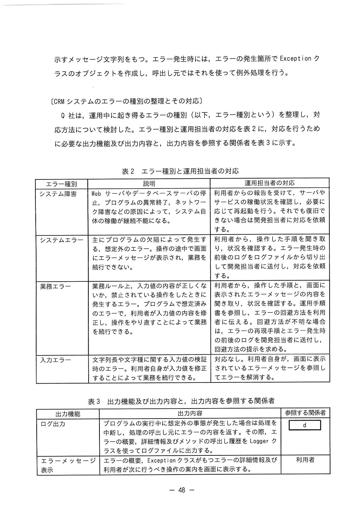

テキスト (OCR)

示すメッセージ文字列をもつ。エラー発生時には, エラーの発生箇所で Exception ク
ラスのオブジェクトを作成し, 呼出し元ではそれを使って例外処理を行う。

(CRM システムのエラーの種別の整理とその対応〕

Q 社は, 運用中に起き得るエラーの種別 (AF, エラー種別という) を整理し, 対
応方法について検討した。エラー種別と運用担当者の対応を表 2 に, 対応を行うため
に必要な出力機能及び出力内容と, 出力内容を参照する関係者を表 3 に示す。

表2

エラー種別と運用担当者の対応

エラー種別

説明

運用担当者の対応

システム障害

Web サーバやデータベースサーバの停
止,プログラムの異常終了, ネットワー
ク障害などの原因によって, システム自
体の稼働が継続不能になる。

利用者からの報告を受けて, サーバや
サービスの稼働状況を確認し, 必要に
応じて再起動を行う。それでも復旧で
きない場合は開発担当者に対応を依頼
する。

主にプログラムの欠陥によって発生す
る, 想定外のエラー。 操作の途中で画面
にエラーメッセージが表示され, 業務を
続行できない。

利用者から, 操作した手順を聞き取
り, 状況を確認する。エラー発生時の
前後のログをログファイルから切り出
して開発担当者に送付し, 対応を依頼
する。

業務エラー

業務ルール上, 入力値の内容が正しくな
いか, 禁止されている操作をしたときに
発生するエラー。 プログラムで想定済み
のエラーで, 利用者が入力値の内容を修
正し, 操作をやり直すことによって業務
を続行できる。

利用者から, 操作した手順と, 画面に
表示されたエラーメッセージの内容を
聞き取り, 状況を確認する。運用手順
書を参照し, エラーの回避方法を利用
者に伝える。 回避方法が不明な場合
は, エラーの再現手順とエラー発生時
の前後のログを開発担当者に送付し
回避方法の提示を求める。

入力エラー

文字列長や文字種に関する入力値の検証
時のエラー。利用者自身が入力値を修正
することによって業務を続行できる。

対応なし。利用者自身が, 画面に表示
されているエラーメッセージを参照し
てエラーを解消する。

表3 出力機能及び出力内容と, 出力内容を参照する関係者

出力機能

出力内容

参照する関係者

ログ出力

ラスを使ってログファイルに出力する。

プログラムの実行中に想定外の事態が発生した場合は処理を
中断し, 処理の呼出し元にエラーの内容を返す。その際, エ
ラーの概要, 詳細情報及びメソッドの呼出し履歴を Logger ク

La]

エラーメ ツギセーツジ

表示

エラーの概要, Exception クラスがもつエラーの詳細情報及び
利用者が次に行うべき操作の案内を画面に表示する。

利用者

### ページ 49

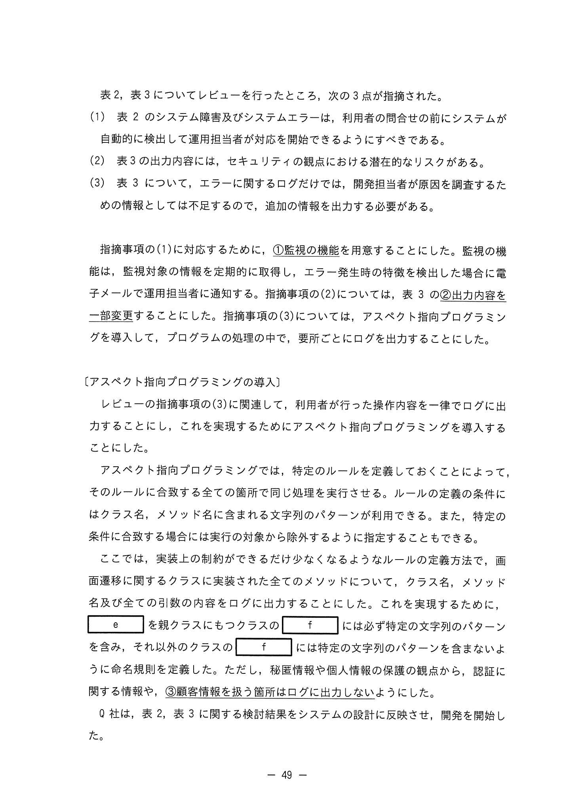

テキスト (OCR)

表2, 表3についてレビューを行ったところ, 次の 3 点が指摘された。

(1) 表 2 のシステム障害及びシステムエラーは, 利用者の問合せの前にシステムが
自動的に検出して運用担当者が対応を開始できるようにすべきである。

(2) 表3の出力内容には, セキュリティの観点における潜在的なリスクがある。
(3) 表 3 について, エラーに関するログだけでは, 開発担当者が原因を調査するた
めの情報としては不足するので, 追加の情報を出力する必要がある。

指摘事項の(1)に対応するために, 監視の機能を用意することにした。 BROW

能は, 監視対象の情報を定期的に取得し, エラー発生時の特徴を検出した場合に電
子メールで運用担当者に通知する。 指摘事項の(2)については, 表 3 の②出力内容を
ー部変更することにした。 指摘事項の(3)については, アスペクト指向プログラミン
グを導入して, プログラムの処理の中で, 要所ごとにログを出力することにした。

【アスペクト指向プログラミングの導入〕

レビューの指摘事項の(3)に関連して, 利用者が行った操作内容を一律でログに出
力することにし, これを実現するためにアスペクト指向プログラミングを導入する
ことにした。

アスペクト指向プログラミングでは, 特定のルールを定義しておくことによって,
そのルールに合致する全ての箇所で同じ処理を実行させる。ルールの定義の条件に
はクラス名, メソッド名に含まれる文字列のパターンが利用できる。また, 特定の
条件に合致する場合には実行の対象から除外するように指定することもできる。

こことでは, 実装上の制約ができるだけ少なくなるようなルールの定義方法で, 画
面遷移に関するクラスに実装された全てのメソッドについて, クラス名, メソッド
名及び全ての引数の内容をログに出力することにした。これを実現するために,
| 6 | を親クラスにもつクラスの|  f | には必ず特定の文字列のパターン
を含み,。 それ以外のクラスの|  f | には特定の文字列のパターンを含まないよ
うに命名規則を定義した。ただし, 秘匿情報や個人情報の保護の観点から, 認証に
関する情報や. ③顧客情報を扱う箇所はログに出力しないようにした。

0 社は, 表2, 表3 に関する検討結果をシステムの設計に反映させ, 開発を開始し
た。

### ページ 50

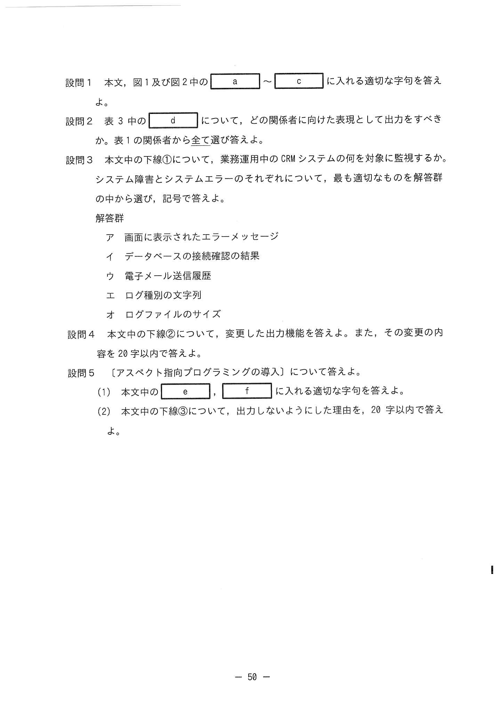

テキスト (OCR)

設問1 本文,図1及び図2中の| a |~[  c |に入れる適切な字句を答え
よ。

設問2 表 3 中の| d |] について, どの関係者に向けた表現として出力をすべき
か。表 1 の関係者から全て選び答えよ。

設問3 本文中の下線やについて, 業務運用中のCRM システムの何を対象に監視するか。

システム障害とシステムエラーのそれぞれについて, 最も適切なものを解答群
の中から選び, 記号で答えよ。
解答群
ア 画面に表示されたエラーメッセージ
データベースの接続確認の結果
電子メール送信履歴
ログ種別の文字列
ログファイルのサイズ

AL H GA

設問4 本文中の下線@について, 変更した出力機能を答えよ。また, その変更の内
Be 20 字以内で答えよ。
設問5 〔アスペクト指向プログラミングの導入〕について答えよ。

(1) 本文中の|  e |,|  f | に入れる適切な字句を答えよ。
(2) 本文中の下線③について, 出力しないようにした理由を, 20 字以内で答え
よ。

### ページ 51

テキスト (OCR)

〔

x モ 用 紙 )

### ページ 52

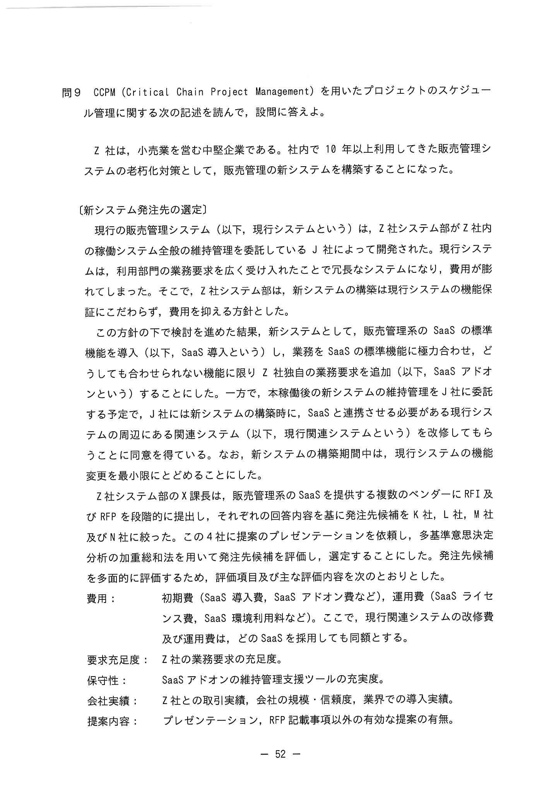

テキスト (OCR)

間9 CCPM (Critical Chain Project Management) を用いたプロジェクトのスケジュー
ル管理に関する次の記述を読んで, 設問に答えよ。

Z 社は, NBA BORRRECHS, HAT 10 年以上利用してきた販売管理シ
ステムの老朽化対策として, 販売管理の新システムを構築することになった。

〔新システム発注先の選定
現行の販売管理システム (以下, 現行システムという) は, Z 社システム部がZ 社内
の稼働システム全般の維持管理を委託している J 社によって開発された。現行システ
Ald, 利用部門の業務要求を広く受け入れたことで冗長なシステムになり, 費用が膨
れてしまった。そこで, Z 社システム部は, 新システムの構築は現行システムの機能保
証にこだわらず, 費用を抑える方針とした。
この方針の下で検討を進めた結果, 新システムとして, 販売管理系の SaaS の標準
機能を導入 (以下, SaaS 導入という) し, 業務を SaaS の標準機能に極力合わせ, ど
うしても合わせられなひい機能に限り Z 社独自の業務要求を追加 CAF, Saas アドオ
ンという) することにした。一方で, 本稼働後のじ新システムの維持管理を 」 社に委託
する予定で, J 社には新システムの構築時に, SaaS と連携させる必要がある現行シス
テムの周辺にある関連システム (以下, 現行関連システムという) を改修してもら
うことに同意を得ている。 なお, 新システムの構築期間中は, 現行システムの機能
変更を最小限にとどめることにした。
Z 社システム部の X 課長は, 販売管理系の SaaS を提供する複数のベンダーに RFI 及
び RFP を段階的に提出し, それぞれの回答内容を基に発注先候補を K 社, L 社, M 社
及び N 社に絞った。この 4 社に提案のプレゼンテーションを依頼し, 多基準意思決定
分析の加重総和法を用いて発注先候補を評価し, 選定することにした。発注先候補
を多面的に評価するため, 評価項目及び主な評価内容を次のとおりとした。
費用 :       初期費 (SaaS BAB, SaaS アドオン費など), BAB (Saas ライセ
YAS, SaaS 環境利用料など)。ここで, 現行関連システムの改修費
及び運用費は, どの SaaS を採用しても同額とする。

要求充足度: Z社の業務要求の充足度。

保守性 :   SaaS アドオンの維持管理支援ツールの充実度。

会社実績 :  7 社との取引実績, 会社の規模・信頼度, 業界での導入実績。

提案内容 :  プレゼンテーション, RFP 記載事項以外の有効な提案の有無。

### ページ 53

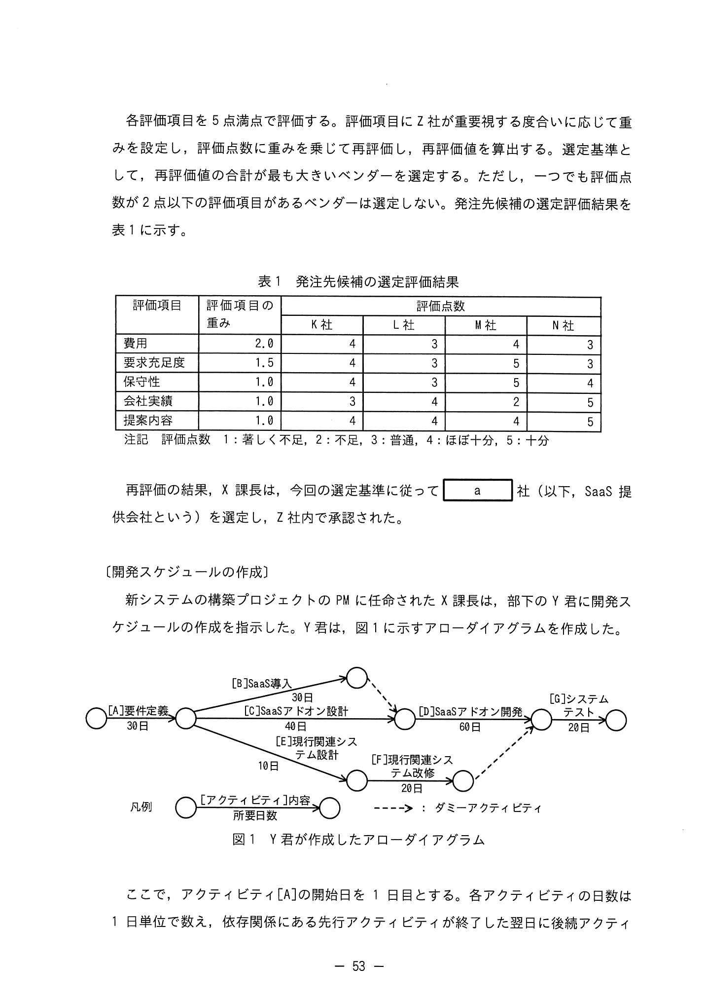

テキスト (OCR)

各評価項目を 5 点満点で評価する。評価項目に Z 社が重要視する度合いに応じて重
みを設定し, 評価点数に重みを乗じて再評価し, 再評価値を算出する。選定基準と
LC, 再評価値の合計が最も大きいベンダーを選定する。ただし, 一つでも評価点
数が 2 点以下の評価項目があるベンダーは選定しない。発注先候補の選定評価結果を
表 1 に示す。

表1 発注先候補の選定評価結果

評価項目 | 評価項目の                       評価点数
重み                  K社             Lt             M社            N社
費用                   2.0             4             3             4            3
要求充足度            1.5             4             3             5            3
保守性                1.0             4             3             5            4
会社実績              1.0             3             4             2            5
提案内容             1.0            4            4            4           5

注記 評価点数 1:著しく不足, 2 : 不足, 3 : 普通, 4 : ほぼ十分, 5 : 十分

再評価の結果, X 課長は, 今回の選定基準に従って| a  ]社 (以下, SaaS提
供会社という) SHEL, 7 社内で承認された。

〔開発スケジュールの作成〕
新システムの構築プロジェクトの PM に任命された X 課長は, BRO Y 君に開発ス
ケジュールの作成を指示した。Y 君は, 図 1 に示すアローダイアグラムを作成した。

[B]Saas導入               Na
308             ヽ、                             [6G]システム
[A]要件定義               [C]SaaSアドオン設計        へへ [D]SaaSアドオン開発        テスト
えー  0)

308                                           408                          ^ヽプ              66日
[E]行関連シス               ン
a ot F]現行関連シス
テム改修
208

凡例     人      ーーーー> : ダミーアクティビピティ

図1 Y君が作成したアローダイアグラム

COC, アクティビティ[A]の開始日を 1 日目とする。各アクティビティの日数は
1 日単位で数え, 依存関係にある先行アクティビティが終了した翌日に後続アクティ

### ページ 54

テキスト (OCR)

ビティを速やかに開始する。図 1 中の[B]に関して, 最早開始日は[A]を開始してから

31 日目であり, 最遅開始日は| b | 日目である。

Z 社の過去のプロジェクトでは, 所要日数のうち 10%の日数をアクティビティごと
に安全余裕(以下,バッファという) として設定していた。Z 社システム部及び外部
委託先の開発担当者 (以下, 開発担当者という) は, バッファを含んだ所要日数で
作業スケジュールを作成し, 作業の実施でバッファを不必要に消費する傾向にあっ
た。これが原因で, 開発スケジュール全体が遅延したことが度々あった。

このような状況を改善し, バッファを含む完了予定日までにプロジェクトを完了
させるために, X 課長は次のとおり CCPM の考えを取り入れたガントチャート形式の
開発スケジュールを作成して, スケジュールを管理するよう Y 君に指示した。

アローダイアグラムの①アクティビティごとに設けられたバッファを削除してク

リティカルチェーンを設定する。

・クリティカルチェーンのアクティビティから削除したバッファを合計して
| < | バッファを設定する。クリティカルチェーンのアクティビティの進捗
が遅延した場合はこのバッファを使い, これ以降のアクティビティのスケジュー
ルを, 遅延した日数分だけ後ろにずらす。

・クリティカルチェーンにないアクティビティが遅延してもスケジュール全体に影
響しないように, クリティカルチェーンにつながるアクティビティの直後に

[a バッファを設定する。

SaaS 提供会社の SaaS アドオンはローコード開発が特長で, 数日間のオンライン研
修を受講すればローコード開発の技術を習得できるということであった。J 社は, 本
稼働後の新システムの維持管理を見据え, 現行システムの維持管理要員のうち数名
に研修を受講させた。 そこで良い感触をつかんだ J社から, “弊社が Saas アドオンの
設計及び開発を担当すれば, 御社の外部委託費用を抑えることができる” という提
案があった。X 課長は, 元々J 社の現行システムの維持管理要員に委託する予定であ
った[E], [F]に加え, SaaS 提供会社に委託する予定であった[C], [D]も J 社に委託
することにし, J 社と新たに準委任契約を締結することに決めた。これによって, J
社内で[C]~[F]間の要員シフトの調整が可能になった。

さらに IHS, [C]を独立に実施可能な[C1]と[C2]に分割して並行作業し, [D]も

### ページ 55

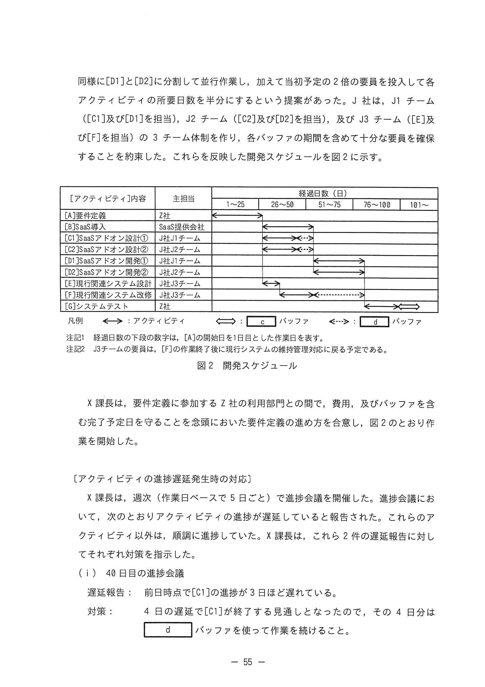

テキスト (OCR)

同様に[D1]と[D2]に分割して並行作業し, 加えて当初予定の 2 倍の要員を投入して各
アクティビティの所要日数を半分にするという提案があった。J tld, J1 チーム
(LC1]及び[D1]を担当), J2 チーム ([C2]及び[D2]を担当), 及び J3 チーム ([E]及
び[F]を担当) の 3 チーム体制を作り, 各バッファの期間を含めて十分な要員を確保
することを約束した。これらを反映した開発スケジュールを図 2 に示す。

ーー        Set                            経過日数 (日)

アクディビディ]内容     2188      1~25     26~50 | 5i~75 | 76~100 | 101~
[A]要件定義              7社
[B]SaaS導入              SaaS提供会社
[C1]SaaSアドオン設計① | J社J1チーム                   <--->
[C2]SaaSアドオン設計②④ | J社J2チーム                   にーーータぐー
[D1 ]SaaSアドオン開発① | J社11チーム
[D2]SaaSアドオン開発② | J社2チーム
[E]現行関連システム設計 | J社J3テチーム                 <>
[F]現行関連システム改修 | 社J3チーム                     YR           >
[6G]システムテスト         7社                                                    ーーー><ーーツ>

凡例    <> : アクティビティ      => ビビてコバッラファ    <->: (Fa ] バッファ

注記1 経過日数の下段の数字は, [A]の開始日を1日目とした作業日を表す。
注記2 J3チームの要員は, [F]の作業終了後に現行システムの維持管理対応に戻る予定である。

図2 開発スケジュール

X 課長は, 要件定義に参加する Z 社の利用部門との間で, BA, 及びバッファを含
お完了予定日を守ることを念頭においた要件定義の進め方を合意し, 図2のとおり作
業を開始した。

(PIF 4 CF 4 OW BETO MI)

X 課長は 週次 (作業日ペースで 5 ACE) THBAMEMRLE, 進捗会議にお
いて, 次のとおりアクティビティの進捗が遅延していると報告された。これらのア
クティビティ以外は, 順調に進捗していた。X 課長は。 これら 2 件の遅延報告に対し
てそれぞれ対策を指示した。

(i) 40 BROS:

MEGS: 前日時点で[C1]の進捗が 3 日ほど遅れている。

対策 :     4 日の遅延で[C1]が終了する見通しとなったので, その 4 日分は

| d |] バッファを使って作業を続けること。

### ページ 56

テキスト (OCR)

(ii) 79 日目の進捗会議

遅延報告: SaaSs アドオン開発のスキルが必要とされる作業において, 予期しな
い技術上の問題が発生したことによって作業量が増大したので,
[D2]の進捗が遅延している。最大で 12 日の遅延となるおそれがあり,
②その場合, プロジェクトの完了がバッファを含む完了予定日より
も遅れることが懸念される。 なお, [D2]の作業手順に問題は見られ
ず, 中間成果物の品質は担保されていた。 また, 並行作業している
[D1]は, 遅延していないが余裕はない状況である。

対策 :   これ以上[D2]の遅延を拡大させないように, J2 チームの要員を発生
した問題の解決作業に専念させ, それ以外の作業を実施するために
③早急にリソース視点の対策をとること。

(ji )の対策によって, [D2]の遅延は最小限に抑えられた。[D2]の終了後の[G]は順
調に実施され, バッファを含む完了予定日より前にプロジェクトが完了した。

設問1 〔新システム発注先の選定〕】 について答えよ。
(1) 2 社が新システム構築の発注先の選定評価に加重総和法を用いた狙いを 25
字以内で具体的に答えよ。
(2) 本文中の| a | に入れる適切な社名を英字1字で答えよ。

設問2 (開発スケジュールの作成】 について答えよ。
(1) 本文中の| b |] に入れる適切な数字を答えよ。
(2) 本文中の下線やについて, X 課長はこの対策によって個々の開発担当者の
作業にどのような効果が期待できると考えたのか。20 字以内で答えよ。

(3) 本文中及び図 2 中の| ” c |,|  d |に入れる適切な字句を解答
群の中から選び, 記号で答えよ。

解答群

ア キャパシティ   イ 合流  ウ 資源  エ プロジェクト

設問3 〔アクティビティの進捗遅延発生時の対応】について答えよ。
(1) 本文中の下線@について, 対策をせずに最大日数の遅延になった場合,プ
ロジェクトの完了はバッファを含む完了予定日に対して何日遅れるか。数字
CHAE.
(2) 本文中の下線について, 対策の内容を 25 字以内で具体的に答えよ。

### ページ 57

テキスト (OCR)

C

メ = 用 紙 J

### ページ 58

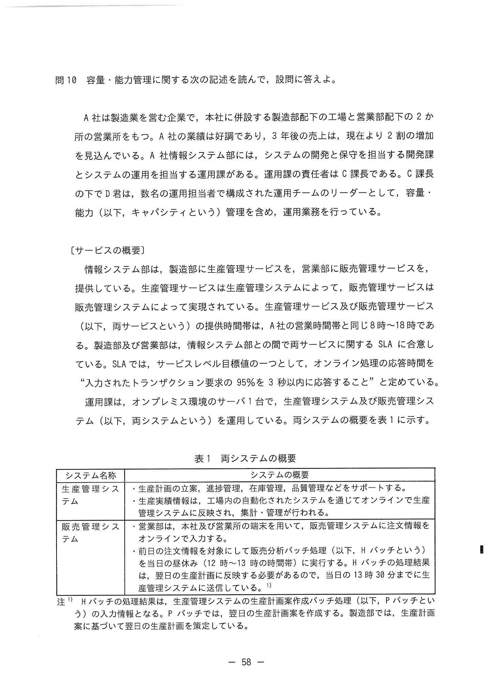

テキスト (OCR)

問19 容量・能力管理に関する次の記述を読んで, 設問に答えよ。

A 社は製造業を営む企業で, 本社に併設する製造部配下の工場と営業部配下の 2 か
所の営業所をもつ。A 社の業績は好調であり, 3 年後の売上は, 現在より 2 割の増加
を見込んでいる。A 社情報システム部には, システムの開発と保守を担当する開発課
とシステムの運用を担当する運用課がある。運用課の責任者は C 課長である。C 課長
の下で D Bs, 数名の運用担当者で構成された運用チームのリーダーとして, 容量・
能力 (以下、キャパシティという) 管理を含め, 運用業務を行っている。

[サービスの概要]〕
情報システム部は, 製造部に生産管理サービスを, 営業部に販売管理サービスを,
提供している。生産管理サービスは生産管理システムによって, 販売管理サービスは
販売管理システムによって実現されている。生産管理サービス及び販売管理サービス
(以下, 両サービスという) の提供時間帯は, A社の営業時間帯と同じ 8 時一18 時であ
る。 製造部及び営業部は, 情報システム部との間で両サービスに関する SLA に合意し
ている。SLA では, サービスレベル目標値の二つとして, オンライン処理の応答時間を
“入力されたトランザクション要求の 95%を 3 秒以内に応答すること"と定めている。
JERR, オンプレミス環境のサーバ 1 台で, 生産管理システム及び販売管理シス
テム (以下, 両システムという) を運用している。両システムの概要を表 1 に示す。

Rl 両システムの概要

システム名称                システムの概要
生産管理シス | ・生産計画の立案, 進捗管理, 在庫管理, 品質管理などをサポートする。
テム      ・生産実績情報は, 工場内の自動化されたシステムを通じてオンラインで生産

管理システムに反映され, 集計・管理が行われる。

販売管理シス | ・営業部は, 本社及び営業所の端末を用いて, 販売管理システムに注文情報を
テム       オンラインで入力する。

・前日の注文情報を対象にして販売分析バッチ処理 (以下, H バッチという)
を当日の昼休み (12 時一13 時の時間帯) に実行する。H バッチの処理結果
は, 翌日の生産計画に反映する必要があるので, 当日の 13 時 30 分までに生
産管理システムに送信している。リ
SED Hバッチの処理結果は, 生産管理システムの生産計画案作成バッチ処理 (LLB, PANY FEW
う) の入力情報となる。P バッチでは, 翌日の生産計画案を作成する。製造部では, 生産計画
案に基づいて翌日の生産計画を策定している。

### ページ 59

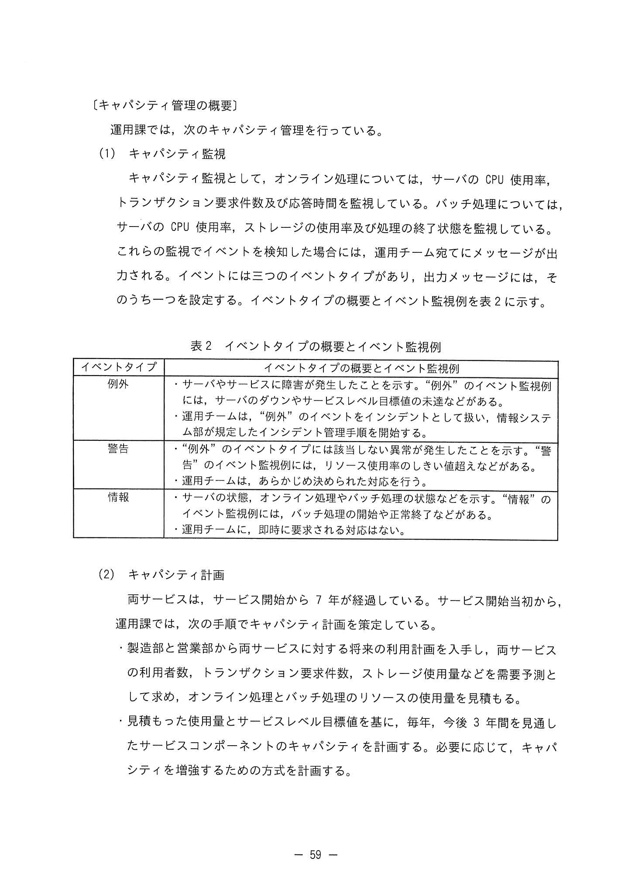

テキスト (OCR)

〔キャパシティ管理の概要〕
運用課では, 次のキャパシティ管理を行っている。
(1) キャパシティ監視
キャパシティ監視として, オンライン処理については, サーバの CPU 使用率,
トランザクション要求件数及び応答時間を監視している。バッチ処理については,
サーバの CPU 使用率, ストレージの使用率及び処理の終了状態を監視している。
これらの監視でイベントを検知した場合には, 運用チーム宛てにメッセージが出
カカされる。イベントには三つのイベントタイプがあり, 出力メッセージには, そ
のうち一つを設定する。イベントタイプの概要とイベント監視例を表 2 に示す。

表2 イベントタイプの概要とイベント監視例

イベントタイプ             イベントタイプの概要とイベント監視例

例外    ・サーバやサービスに障害が発生したことを示す。"例外”" のイベント監視例
には, サーバのダウンやサービスレベル目標値の未達などがある。

・運用チームは, “例外"” のイベントをインシデントとして扱い, 情報システ
ム部が規定したインシデント管理手順を開始する。

bt
OF

“GI” DI AY KI 4 TIMKS LAURER RELETOERS, “HE
告" のイベント監視例には, リソース使用率のしきい値超えなどがある。
・運用チームは, あらかじめ決められた対応を行う。

情報    ・ サーバの状態,オンライン処理やバッチ処理の状態などを示す。 "情報" の
イベント監視例には, バッチ処理の開始や正常終了などがある。
・ 運用チームに, 即時に要求される対応はない。

(2) キャパシティ計画

両サービスは, サービス開始から 7 年が経過している。サービス開始当初から,

運用課では, 次の手順でキャパシティ計画を策定している。

・ 製造部と営業部から両サービスに対する将来の利用計画を入手し, 両サービス
の利用者数。 トランザクション要求件数,、 ストレージ使用量などを需要予測と
して求め, オンライン処理とバッチ処理のリソースの使用量を見積もる。

・ 見積もった使用量とサービスレベル目標値を基に, BF, 今後3 年間を見通し
たサービスコンポーネントのキャパシティを計画する。 必要に応じて, キャパ
シティを増強するための方式を計画する。

### ページ 60

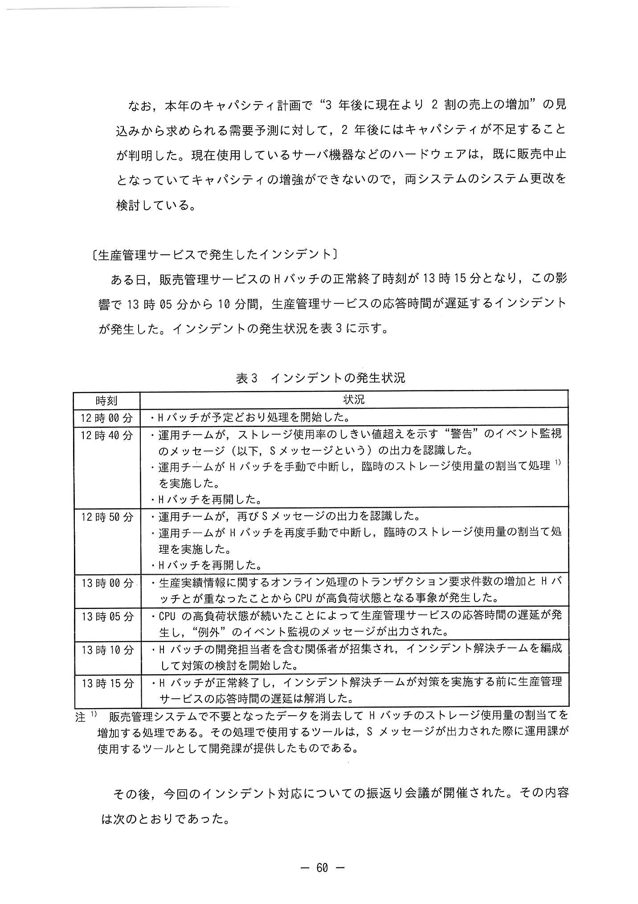

テキスト (OCR)

なお, 本年のキャパシティ計画で “3 年後に現在より 2 割の売上の増加” の見
込みから求められる需要予測に対して, 2 年後にはキャパシティが不足すること
が判明した。 現在使用しているサーバ機器などのハードウェアは, 既に販売中止
となっていてキャパシティの増強ができないので, 両システムのシステム更改を
検討している。

(生産管理サービスで発生したインシデント〕}

HSA, 販売管理サービスのHバッチの正常終了時刻が13 時15 分となり, COR
BBC 13 時 95 分から 19 分間, 生産管理サービスの応答時間が遅延するインシデント
が発生した。インシデントの発生状況を表 3 に示す。

表3 インシデントの発生状況
時刻                                状況
12 時99分 | ・Hバッチが予定どおり処理を開始した。
12 時 49 分 | ・運用チームが, ストレージ使用率のしきい値超えを示す “BA” OAV hE
のメッセージ (以下,S メッセージという) の出力を認識した。
・ 運用チームが H バッチを手動で中断し, 臨時のストレージ使用量の割当て処理
を実施した。
・H バッチを再開した。
12 時 59 分 | ・運用チームが, BUS メッセージの出力を認識した。
・運用チームが H バッチを再度手動で中断し, 臨時のストレージ使用量の割当て処
理を実施した。
・H バッチを再開した。
13 時99 分 | ・生産実績情報に関するオンライン処理のトランザクション要求件数の増加と Hバ
ッチとが重なったことから CPU が高負荷状態となる事象が発生した。
13 時95分 | ・CPU の高負荷状態が続いたことによって生産管理サービスの応答時間の遅延が発
生し, “BIS” のイベント監視のメッセージが出力された。
13 時19 分 | ・H バッチの開発担当者を含む関係者が招集され, インシデント解決チームを編成
して対策の検討を開始した。
13 時15分 | ・H バッチが正常終了し, インシデント解決チームが対策を実施する前に生産管理
サービスの応答時間の遅延は解消した。
注 り 販売管理システムで不要となったデータを消去して H バッチのストレージ使用量の割当てを
増加する処理である。その処理で使用するツールは, S メッセージが出力された際に運用課が
使用するツールとして開発課が提供したものである。

その後, 今回のインシデント対応についての振返り会議が開催された。その内容
は次のとおりであった。

### ページ 61

テキスト (OCR)

・H バッチのストレージ使用量が増加した原因は, 前日の注文データに大口顧客から
の一括注文人含まれていたことである。

・インシデント対応としては, 両サービスの応答時間の遅延を発生させないために,
リソース使用率の状況を注視しながら, H バッチのデータ量を操作することになる。
・この対応を行うと, H バッチの正常終了時刻が 13 時 30 分以降となる場合があるの
で, その場合に備えて①翌日の工場での製造に支障が生じないように, 運用課が
場を設定して製造部と営業部とともに協議を行う必要がある。

振返り会議の内容を受けて, C 課長は, 今後,H バッチの処理中に S メッセージが
複数回出力されるというイベントを規定した上で, このイベントに適切なイベン
トタイプを設定することにした。

C 課長は, 今回のキャパシティ不足の事象に対して, 早急に根本的な対策が必要と
考えた。 そこで, C 課長は, DAK, システム更改の検討を急ぐよう指示した。

〔クラウドサービスの調査〕

D Bld, システム更改の検討の中で, クラウドサービスについて調査した。クラウ
ドサービスは, 利用者のリソースの使用量に応じて柔軟にリソースを追加・削除で
きる。 なお, 両システムのミドルウェアの仕様に関する指定があることから, IaaS
型のクラウドサービスの採用が適していることを確認した。

D 君は, 複数のクラウド事業者にヒアリングし, 「『 社のクラウドサービス (LE, F
クラウドという) を候補として選定した。F クラウドの概要は次のとおりである。

・F クラウドでは, サーバとストレージのリソースは, 利用者の要求に応じて動的に

割り当てること (以下, リソースオンデマンドという) ができる。

・F クラウドには, キャパシティに応じてF1 からF5 までの契約モデルがあり, クラ

ウド利用料が異なる。

・F 社からは, リソースオンデマンド用の管理ツールとその利用権限が利用者に与え

られる。 管理ツールを利用すると瞬時に契約モデルのキャパシティを超えてリソ

ースが増強され, リソース増強に見合ったクラウド利用料が加算される。 増強さ

れたリソースが不要になれば, 管理ツールを利用して元のキャパシティに戻すこ

とができる。

### ページ 62

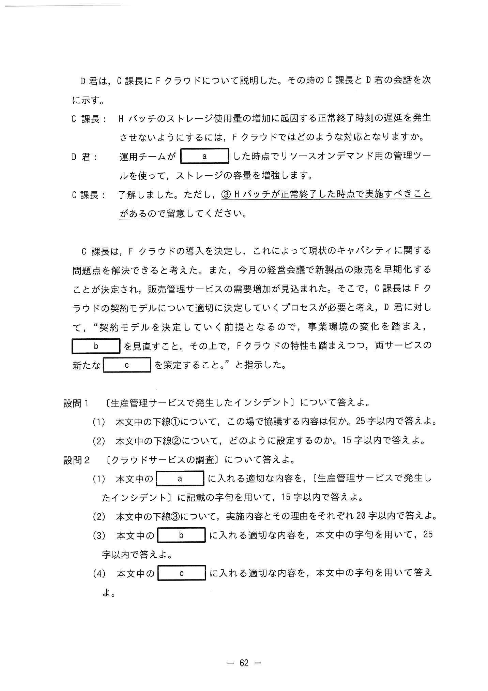

テキスト (OCR)

D 君は, C 課長にF クラウドについて説明した。その時の C 課長と D 君の会話を次

に示す。

C 課長: H バッチのストレージ使用量の増加に起因する正常終了時刻の遅延を発生
させないようにするには, F クラウドではどのような対応となりますか。

D君: 運用チームが|  a』 | した時点でリソースオンデマンド用の管理ツー
ルを使って,。 ストレージの容量を増強します。

CRE: 了解しました。ただし, ③ H バッチが正常終了した時点で実施すべきこと
があるので留意してください。

C REI, F クラウドの導入を決定し, これによって現状のキャパシティに関する
問題点を解決できると考えた。また。, 今月の経営会議で新製品の販売を早期化する
ことが決定され販売管理サービスの需要増加が見込まれた。そこで, ( 課長はF ク
ラウドの契約モデルについて適切に決定していくプロセスが必要と考え, D 君に対し
て, "契約モデルを決定していく前提となるので, 事業環境の変化を踏まえ,
[| | を見直すこと。その上で,Fクラウドの特性も踏まえつつ, 両サービスの

新たな| c | を策定すること。"と指示した。

設問1 (生産管理サービスで発生したインシデント〕 について答えよ。
(1) 本文中の下線①について, この場で協議する内容は何か。25 字以内で答えよ。
(2) 本文中の下線のについて, どのように設定するのか。15 字以内で答えよ。
設問2 (クラウドサービスの調査}] について答えよ。
(1) 本文中の| a |] に入れる適切な内容を,【生産管理サービスで発生し
たインシデント〕 に記載の字句を用いて, 15 字以内で答えよ。
(2) 本文中の下線③について, 実施内容とその理由をそれぞれ 20 字以内で答えよ。
(3) 本文中の| b |] に入れる適切な内容を, 本文中の字旬を用いて, 25
字以内で答えよ。
(4) 本文中の| c | に入れる適切な内容を, 本文中の字句を用いて答え
。

### ページ 63

テキスト (OCR)

C

メ モ 用 紙

J

### ページ 64

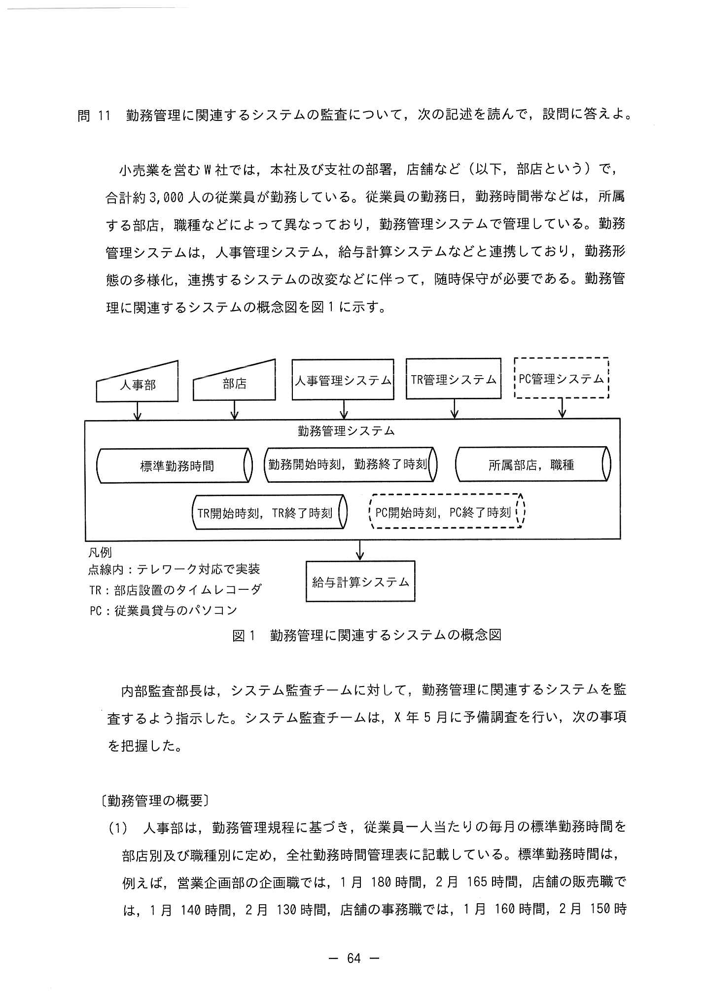

テキスト (OCR)

Pl 11 勤務管理に関連するシステムの監査について, 次の記述を読んで, 設問に答えよ。

小売業を営む W 社では, 本社及び支社の部署, 店舗など (AK, 部店という) で,
AHHH 3,000 人の従業員が勤務している。 従業員の勤務日, 勤務時間帯などは, 所属
する部店, 職種などによって異なっており, 勤務管理システムで管理している。 勤務
管理システムは, 人事管理システム, 給与計算システムなどと連携しており, 勤務形
態の多様化, 連携するシステムの改変などに伴って, 随時保守が必要である。勤務管
理に関連するシステムの概念図を図 1 に示す。

cr                i
Koen | ia | 人事管理ンステム| | 管理システム| !PG管理システム!
1ニーニーニュコーニーーー4

\                  M                     y                     M                    \

勤務管理システム

(    標準勤務時間   () (ae ーー  (   所属部店, 職種   ()

凡例                  7
点線内 : テレワーク対応で実装
TR: 部店設置のタイムレコーダ
PC : 従業員貸与のパソコン

 1 勤務管理に関連するシステムの概念図

給与計算システム

内部監査部長は, システム監査チームに対して, 勤務管理に関連するシステムを監
査するよう指示した。システム監査チームは, X 年 5 月に予備調査を行い, 次の事項
を把握した。

勤務管理の概要〕

(1) 人事部は, 勤務管理規程に基づき, 従業員一人当たりの毎月の標準勤務時間を
部店別及び職種別に定め, 全社勤務時間管理表に記載している。標準勤務時間は,
例えば, 営業企画部の企画職では, 1 月 186 時間, 2月 165時間, 店舗の販売職で
ld, 1 月 140 時間, 2 月 130 時間, 店舗の事務職では, 1 月 160 時間, 2月 150 BF

### ページ 65

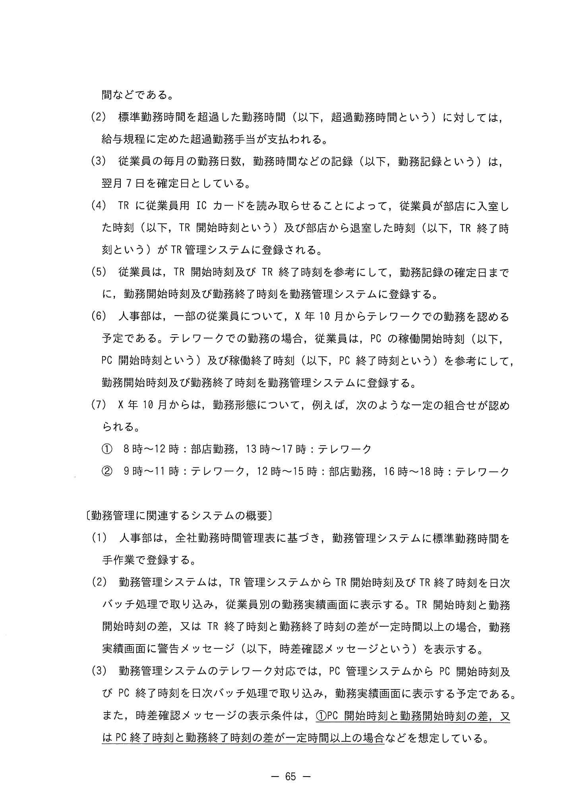

テキスト (OCR)

間などである。

(2) 標準勤務時間を超過した勤務時間 (以下, 超過勤務時間という) に対しては,
給与規程に定めた超過勤務手当が支払われる。

(3) 従業員の毎月の勤務日数, 勤務時間などの記録 (以下, 勤務記録という) は
翌月 7 日を確定日としている。

(4) TR に従業員用 IC カードを読み取らせることによって, 従業員が部店に入室し
た時刻 (以下, TR 開始時刻という) 及び部店から退室した時刻 (以下, TR 終了時
刻という) DIR 管理システムに登録される。

(5) 従業員は, TR 開始時刻及び TR 終了時刻を参考にして, 勤務記録の確定日まで
に, 勤務開始時刻及び勤務終了時刻を勤務管理システムに登録する。

(6) 人事部は, 一部の従業員について, X 年 19 月からテレワークでの勤務を認める
予定である。テレワークでの勤務の場合 従業員は, PC の稼働開始時刻 (以下,
PC 開始時刻という) 及び稼働終了時刻 (以下, PC 終了時刻という) を参考にして,
勤務開始時刻及び勤務終了時刻を勤務管理システムに登録する。

(7) X 年 19 月からは, 勤務形態について, 例えば, 次のような一定の組合せが認め
られる。
① 8時一12 時 : 部店勤務, 13 時17 時 : テレワーク
② 9時11 時 : テレワーク, 12 時一15 時 : 部店勤務, 16 時一18 時 : テレワーク

〔勤務管理に関連するシステムの概要〕

(1) 人事部は, 全社勤務時間管理表に基づき, 勤務管理システムに標準勤務時間を
手作業で登録する。

(2) 勤務管理システムは, TR 管理システムから TR 開始時刻及び TR 終了時刻を日次
バッチ処理で取り込み, 従業員別の勤務実績画面に表示する。TR 開始時刻と勤務
開始時刻の差, 又は TR 終了時刻と勤務終了時刻の差が一定時間以上の場合, 勤務
実績画面に警告メッセージ (以下, 時差確認メッセージという) を表示する。

(3) 勤務管理システムのテレワーク対応では, PC 管理システムから PC 開始時刻及
び PC 終了時刻を日次バッチ処理で取り込み, 勤務実績画面に表示する予定である。
また, 時差確認メッセージの表示条件は, OPC 開始時刻と勤務開始時刻の差, 又
は PC 終了時刻と勤務終了時刻の差が一定時間以上の場合などを想定している。

### ページ 66

テキスト (OCR)

(4) 従業員の超過勤務時間は, 人事管理システムから月次バッチ処理で連携された

従業員の所属部店及び職種, 人事部が登録した標準勤務時間に基づき, 算出される。
(5) 給与計算システムは, 勤務記録の確定日の夜間バッチ処理で, 勤務記録を勤務
管理システムから取り込み, 給与支給額を算出する。

勤務管理に関連するシステム障害]

(1) W 社では, 発生したシステム障害について, 発生日, BR, 重要度, 直接原因
根本原因, 暫定対応, 恒久対応などを障害管理データベースに登録し, 随時更新し
でいる。

(2) 障害管理データベースを閲覧した結果, X 年 1 月に, 勤務管理に関連するシス
テム障害が発生していたことが分かった。X 年 2 月末日時点における障害管理デー

タベースの登録内容 (抜粋) を表 1 に示す。

表1 障害管理データベースの登録内容 (抜粋)

項目                                       登録内容
発生日       X年1月25日
事象        給与計算システムで算出した一部の給与支給額が誤っていた。
重要度       高
直接原因       勤務管理システムから給与計算システムに連携された超過勤務時間が誤ってい
た。

根本原因   人事部が, 人事管理システムに一部の従業員の職種を誤登録したことから, 超過
勤務時間が誤って算出された。

Ben    人事部が, 従業員の正しい職種に基づき, 適正な給与支給額を算出した。

恒久対応  人事管理システムについて, 従業員の職種に関する入力コントロールを, X 年 3
月末日までに改修する予定である。

(3) さらに障定管理データベースを閲覧した結果, 表 1 に示すシステム障害と同様
の根本原因であるシステム障害が X 年 4 月に再発していた。

内部監査部長は, システム監査チームから予備調査の結果報告を受けて, X 年 7 月
に実施予定の本調査での監査手続について, 次のとおり指示した。

### ページ 67

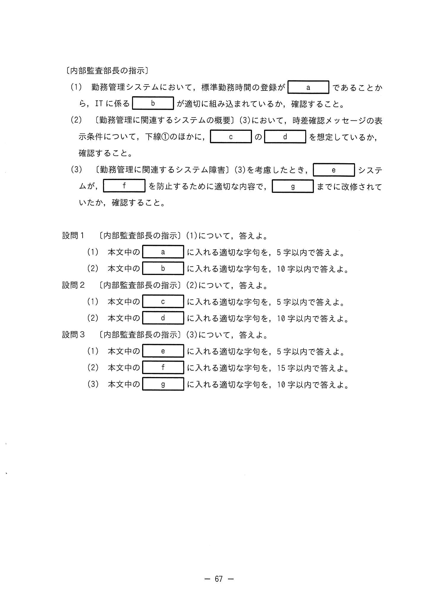

テキスト (OCR)

【内部監査部長の指示

(1) 勤務管理システムにおいて, 標準勤務時間の登録が| a | であぁることか
ら, IT に係る[| b | が適切に組み込まれているか, 確認すること。

(2)  【勤務管理に関連するシステムの概要〕 (3)において, 時差確認メッセージの表
示条件について, 下線①のほかに, | c |の|  』 |を門定しているか,
確認すること。

(3)  【勤務管理に関連するシステム障害) (3) を考慮したとき, | e | システ

ムが, を防止するために適切な内容で, | g | までに改修されて

いたか, 確認すること。

設問1 【〔内部監査部長の指示] (1)について, 答えよ。
(1) 本文中の|  a |] に入れる適切な字句を, 5字以内で答えよ。
(2) 本文中の| b | に入れる適切な字句を, 10字以内で答えよ。
設問2 内部監査部長の指示] (2)について, BAL.
(1) 本文中の| c | に入れる適切な字句を, 5字以内で答えよ。
(2) 本文中の| g |] に入れる適切な字句を, 10字以内で答えよ。
設問3 【〔内部監査部長の指示] (3)について, BAL.
(1) 本文中の| s | に入れる適切な字旬を, 5字以内で答えよ。
(2) 本文中の| f |] に入れる適切な字句を, 15字以内で答えよ。
(3) 本文中の|  g | に入れる適切な字句を, 10字以内で答えよ。

### ページ 68

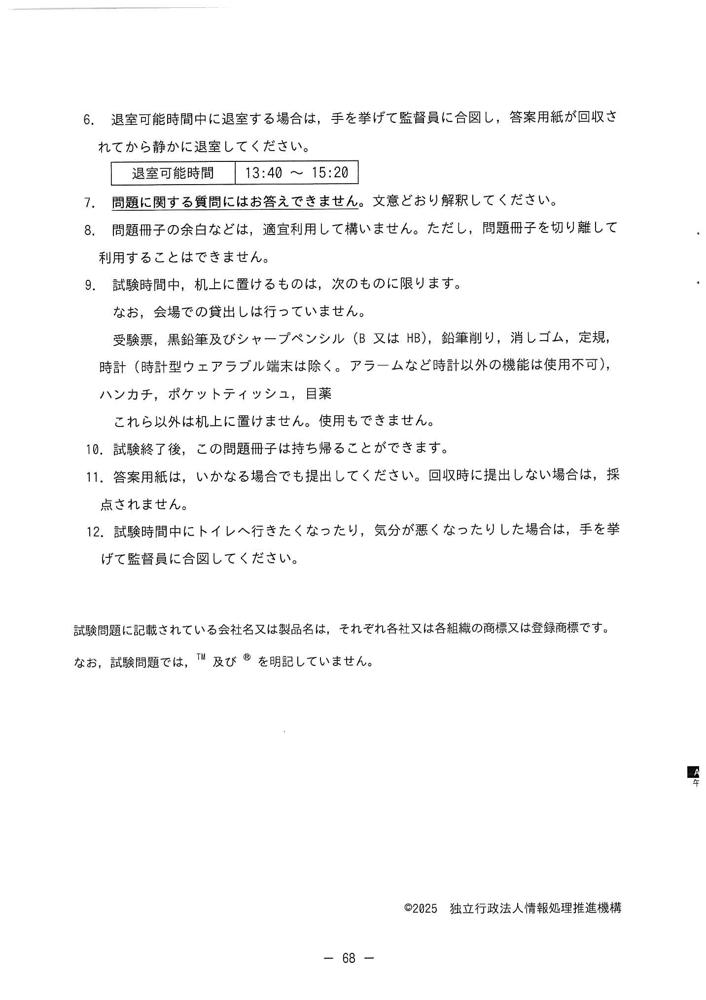

テキスト (OCR)

6. 退室可能時間中に退室する場合は, 手を挙げて監督員に合図し, 答案用紙が回収さ
れてから静かに退室してください。
| 退室可能時間 | 13:40 ~ 15:20 |
7. 問題に関する質問にはお答えできません。文意どおり解釈してください。
8. 問題冊子の余白などは, 適宜利用して構いません。ただし, 問題冊子を切り離して
利用することはできません。
9. 試験時間中, 机上に置けるものは, 次のものに限ります。
なお, 会場での貸出しは行っていません。
受験票, 黒鉛筆及びシャープペンシル (B 又は HB), 鉛筆削り, 消しゴム, ER,
時計 (時計型ウェアラブル端末は除く<。アラームなど時計以外の機能は使用不可),
ハンカチ, ポケットティッシュ, 目薬
これら以外は机上に置けません。使用もできません。
10. 試験終了後, この問題冊子は持ち帰ることができます。
11, 管案用紙は, いかなる場合でも提出してください。回収時に提出しない場合は, 採
点されません。
12. 試験時間中にトイレへ行きたくなったり, 気分が悪くなったりした場合は, FES
げて監督具に合図してください。

試験問題に記載されている会社名又は製品名は, それぞれ各社又は各組織の商標又は登録商標です。

なお, 試験問題では, " 及び © を明記していません。

@2025 独立行政法人情報処理推進機構

|

---

## 午後解答

1/6 
©2025 独立行政法人情報処理推進機構 
令和７年度 春期 応用情報技術者試験 解答例 
 
午後試験 
問１ 
出題趣旨 
 昨今，サプライチェーンを構成する企業群の中から脆
ぜい
弱性のある企業のシステムを狙って攻撃を行い，その
システムを起点としてサプライチェーン全体に被害を及ぼすサプライチェーン攻撃が発生している。 
 本問では，サプライチェーン攻撃によるランサムウェア被害を題材として，インシデント発生原因の調査，
侵入経路の特定及び再発防止策の立案についての基本的な知識を問う。 
 
設問 
解答例・解答の要点 
備考 
設問１ 
デジタルフォレンジックス 
 
設問２ 
a
オ 
 
 
b
ウ 
 
設問３ 
設定項目
ロックアウトのしきい値 
 
 
理由 
・同一のID で2 回以上ログイン試行しないから 
・同一のパスワードで異なるID にログイン試行するから 
 
 
設問４(1) 暗号化されたデータで上書きされている。 
 
 
(2) 古い記録のログが上書きされるから 
 
設問５ 
c
ア 
 
 
問２ 
出題趣旨 
 昨今の事業環境の変化に順応し，企業は既存市場や既存製品・サービスだけに固執せず，新市場を開拓した
り，新製品・サービスを開発したりすることが重要になってきている。さらに，全社の事業リスクに対応し，
安定成長の実現に寄与できるように多角化戦略がとられるようになってきている。 
 本問では，化学品製造・販売会社の中期事業計画の策定を題材として，アンゾフの成長マトリクス及びクロ
スSWOT 分析を用いた成長戦略と，そこから導かれる多角化戦略の検討に関する理解について問う。 
 
設問 
解答例・解答の要点 
備考 
設問１
(1) コア技術を維持してきたこと 
 
 
(2)
a 
シナジー 
 
設問２
(1)
b 
イ 
順不同 
 
 
c 
ウ 
 
(2) 再生医療市場の拡大を見込み，抗酸化技術を応用した製品を開発する。 
 
設問３
(1) イ 
 
 
(2) 事業環境の変化による事業リスクを分散・軽減できること 
 
 
(3)
d 
映像関連事業を売却 
 
 
(4) 対応スピードの速さ

2/6 
©2025 独立行政法人情報処理推進機構 
問３ 
出題趣旨 
 幅優先探索アルゴリズムは探索アルゴリズムの一つであり，オペレーティングシステムのファイル階層の探
索，道路網における最短経路の探索，Web クローラーの探索など多くの場面で活用されている。 
 本問では，スライドパズルを題材として，幅優先探索アルゴリズムの理解と，配列，キュー，リストなどの
データ構造を活用したプログラム実装能力を問う。 
 
設問 
解答例・解答の要点 
備考 
設問１ 
{{8, 6, 7}, {2, 9, 4}, {3, 5, 1}} 
 
設問２ 
ア
explore_queue.isEmpty() 
 
 
イ
poll() 
 
 
ウ
direction[i][1] 
 
 
エ
board_size 
 
 
オ
direction[i][2] 
 
 
カ
checkGoal(new_state.board, goal_board) 
 
 
キ
add(new_state) 
 
 
ク
add(new_state.board) 
 
 
問４ 
出題趣旨 
 昨今，クラウドコンピューティング技術の進展を背景に，オンプレミス方式からクラウド方式へシステムを
移行する事例が増えている。クラウド方式への移行に当たってはクラウド方式の性質を理解し，適切なシステ
ム構成を採用する必要がある。 
 本問では，ビルエネルギーマネジメントシステム（BEMS）のクラウド方式への移行を題材として，システム
の非機能要件やクラウドサービスのサービスレベル合意書（SLA）などに関する基本的な理解について問う。 
 
設問 
解答例・解答の要点 
備考 
設問１(1)
a
BEMS ゲートウェイ 
 
 
(2)
b
イ 
 
 
 
c
ウ 
 
 
(3)
d
エ 
 
 
 
e
ク 
 
設問２(1)
f
ア 
 
 
(2)
g
22 
 
 
(3) 900 
 
 
(4) ウ

3/6 
©2025 独立行政法人情報処理推進機構 
問５ 
出題趣旨 
 オフィス内にLAN を敷設して業務を行うことは一般的となっている。LAN を経由したオンプレミスのアプリケ
ーションやインターネット上のクラウドサービスの利用など，用途が多様化しており，障害発生時の原因究明
や障害を予防・対処する方策が複雑化してきている。 
 本問では，社内LAN の障害対応を題材として，LAN 上で利用される通信の仕組みや，障害発生時の原因究明方
法及び対策に関する基本的な理解について問う。 
 
設問 
解答例・解答の要点 
備考 
設問１(1) 表2 項番3 のMAC アドレスがプリンタのものと異なっていたから 
 
 
(2)
a
192.168.1.21 
 
 
(3) ウ 
 
 
(4)
b
エ 
 
設問２(1)
c
nslookup 
 
 
(2) ウ 
 
設問３(1)
d
ファイルサーバ 
 
 
(2)
名称 
SNMP トラップ 
 
 
 
条件 
トラフィック量が800 M ビット／秒を超える 
 
 
(3)
e
ウ 
 
 
問６ 
出題趣旨 
 近年，顧客を複数のセグメントに分けて，データ主導で意思決定するデータドリブンマーケティングを実施
する事業者が増えつつある。 
 本問では，販売管理システムの構築を題材として，E-R 図やSQL 文に関する基本的な理解，データを収集・分
析する際に求められる設計能力や留意事項について問う。 
 
設問 
解答例・解答の要点 
備考 
設問１ 
a
店舗エリア郵便番号 
 
 
b
→ 
 
設問２ 
c
FROM 
 
 
d
LEFT OUTER JOIN 
 
 
e
SUM(M.商品個数 * S.商品原価) 
 
設問３ 
f
AND U.キャンペーン種別 = 'H' 
 
 
g
ORDER BY 売上実績数 DESC 
 
設問４ 
Web キャンペーン実績表の集計粒度を日次から週次に修正する。

4/6 
©2025 独立行政法人情報処理推進機構 
問７ 
出題趣旨 
 近年，新しいモビリティに対応するための法改正が行われ，対応するシェアリングサービスなどが実用化さ
れている。 
 本問では，電動キックボードのシェアリングシステムを題材として，要求仕様への理解力，要求仕様に基づ
いてソフトウェアを設計する能力を問う。 
 
設問 
解答例・解答の要点 
備考 
設問１ 
ウ 
 
設問２(1)
a
0.1km／時未満が一定時間継続 
 
 
(2) 位置情報 
 
設問３(1)
b
停止中 
 
 
 
d
メイン 
 
 
(2)
c
電動KB の状態 
 
設問４(1)
e
エ 
 
 
 
f
オ 
 
 
 
g
ア 
 
 
(2)
①
0.40 
 
 
 
②
2.54 
 
 
問８ 
出題趣旨 
 業務運用の開始後に想定外の不具合が発生した場合，不具合の再現手順やシステムから出力されるログなど，
限られた情報を頼りに対応を行う必要があるので，それを見越したエラーハンドリングの機能を設計時に考慮
しておくことが望ましい。 
 本問では，CRM システムの設計を題材として，エラーハンドリングに関する理解と設計する能力を問う。 
 
設問 
解答例・解答の要点 
備考 
設問１ 
a
継承 
 
 
b
ID 
 
 
c
ログイン認証の判定結果 
 
設問２ 
d
運用担当者，開発担当者 
 
設問３ 
システム障害 
イ 
 
 
システムエラー
エ 
 
設問４ 
出力機能
エラーメッセージ表示 
 
 
内容 
エラーの詳細情報を出力しない。 
 
設問５(1)
e
AbstractController 
 
 
 
f
クラス名 
 
 
(2) ログは開発担当者も参照するから

5/6 
©2025 独立行政法人情報処理推進機構 
問９ 
出題趣旨 
 “人はバッファを含んだ計画値を与えるとその計画どおりに作業してしまいがちである”というパーキンソ
ンの法則が一般に知られている。CCPM（Critical Chain Project Management）はこれに対応する手法の一つで
あり，各アクティビティに含まれるバッファを取り除いた後にそれらをつなげることによって納期の遅延を最
小限に抑えるものである。 
 本問では，小売業を営む会社の販売管理システムの再構築を題材として，CCPM を適用したプロジェクトのス
ケジュール作成と管理に関する理解及び応用力を問う。 
 
設問 
解答例・解答の要点 
備考 
設問１(1) 費用及び要求充足度を重要視するため 
 
 
(2)
a
K 
 
設問２(1)
b
41 
 
 
(2) バッファを不必要に消費しなくなる。 
 
 
(3)
c
エ 
 
 
 
d
イ 
 
設問３(1) １ 
 
 
(2) J3 チームだった要員を[D2]に投入する。 
 
 
問10 
出題趣旨 
 昨今，情報システムの稼働環境はオンプレミス環境からクラウド環境へ変化しつつある。クラウド環境にお
いても，サービス提供における容量・能力（キャパシティ）管理に関するサービスマネジメント活動は重要で
ある。 
 本問では，オンプレミス環境からクラウドサービスへの移行を検討している製造業を営む企業のシステムを
題材として，キャパシティ監視やキャパシティ計画についての実務能力を問う。 
 
設問 
解答例・解答の要点 
備考 
設問１(1) ・前日の注文情報に基づく翌日の生産計画 
・バッチ処理遅延による生産部への業務影響と対策 
 
 
 
(2) 例外になるように設定する。 
 
設問２(1)
a
S メッセージの出力を認識 
 
 
(2)
実施内容
増強したストレージの容量を元に戻す。 
 
 
 
理由 
クラウド利用料が加算されるから 
 
 
(3)
b
需要予測に基づくリソースの使用量の見積り 
 
 
(4)
c
キャパシティ計画

6/6 
©2025 独立行政法人情報処理推進機構 
問11 
出題趣旨 
 企業などの勤務管理システムは，人事管理システム，給与計算システムなどと連携する場合があり，また，
勤務形態の多様化，連携するシステムの変更などへの対応が求められる場合もある。勤務管理の実効性を確保
するためには，勤務管理に関連するシステムを適切に運用，保守することが重要である。 
 本問では，勤務管理に関連するシステムの運用，保守段階における監査を題材として，システム監査の着眼
点，手続などについて，基本的な理解を問う。 
 
設問 
解答例・解答の要点 
備考 
設問１(1)
a
手作業 
 
 
(2)
b
入力コントロール 
 
設問２(1)
c
勤務形態 
 
 
(2)
d
一定の組合せ 
 
設問３(1)
e
人事管理 
 
 
(2)
f
従業員の職種の誤登録 
 
 
(3)
g
X 年3 月末日

---

## 午後採点講評

1/3 
©2025 独立行政法人情報処理推進機構 
令和７年度 春期 応用情報技術者試験 採点講評 
 
午後試験 
問１ 
問1 では，サプライチェーン攻撃によるランサムウェア被害を題材に，インシデント発生原因の調査，侵入
経路の特定及び再発防止策の立案について出題した。全体として正答率は平均的であった。 
設問3 の“理由”は，正答率が低かった。リバースブルートフォース攻撃の理解が不十分と思われる解答が
散見された。ログインのロックアウトのしきい値を設定することは，同一のID に対して連続してログインを
試行する攻撃には有効である。ただし，パスワードが漏えいして，リバースブルートフォース攻撃を受けた場
合は同一のID で2 回以上ログインを試行することはないので，しきい値に達する前にログインされてしまうお
それがある。様々な攻撃に対応した防御を行うことが重要である。 
設問5 は，正答率が低かった。バックアップを保存していても，バックアップデータ自体が攻撃対象となっ
て書き換えられてしまうと，システムの復旧ができなくなってしまう。バックアップデータの保護には，書き
込んだデータが変更できないストレージを採用することが有効であることを理解してほしい。 
 
問２ 
問2 では，化学品製造・販売会社の中期事業計画の策定を題材に，アンゾフの成長マトリクス及びクロス
SWOT 分析を用いた成長戦略と，そこから導かれる多角化戦略について出題した。全体として正答率は平均的で
あった。 
設問2(2)は，正答率がやや高かった。クロスSWOT 分析に関しておおむね理解しているようであった。しか
し，外部環境（本問では機会），又は内部環境（本問では強み）のどちらか一方だけのキーワードを用いて解
答した答案が散見された。クロスSWOT 分析は外部環境（機会又は脅威）と内部環境（強み又は弱み）の組合
せによって戦略を導く手法であることを理解してほしい。 
設問3(2)は，正答率が平均的であった。複数事業に経営資源を分散しておくことによって，事業環境が変化
しても全社の事業リスクに対応でき，安定成長の実現に寄与できることを理解してほしい。 
 
問３ 
問3 では，スライドパズルの最小解を求める問題を題材に，幅優先探索アルゴリズムの実装について出題し
た。全体として正答率はやや高かった。 
設問2 アは，正答率がやや低かった。幅優先探索では，探索対象をキューに格納し，そこから探索対象を取
り出しながら処理を進めていく。その過程で新たな処理対象が見つかれば，それはキューに追加される。探索
が終了するのは，探索対象が存在しない，すなわち，探索対象を格納するキューが空になったときであること
を理解してほしい。 
設問2 エは，正答率が低かった。変数direction は空白マスの移動方向，エを含むif 文は移動後の空白マ
スが盤面内に収まっているかをチェックしている。プログラムで使用する変数の仕様を理解した上で，条件式
を設定するよう心掛けてほしい。 
 
問４ 
問4 では，ビルエネルギーマネジメントシステム（BEMS）のクラウド方式への移行を題材に，システムの非
機能要件やクラウドサービスのサービスレベル合意書（SLA）などについて出題した。全体として正答率は平
均的であった。 
設問1(3) e は，正答率がやや低かった。クラウドサービスには，障害発生時に活用できる様々な機能が備え
られていることを理解してほしい。 
設問2(3)は，正答率がやや低かった。クラウドサービスの選定時には，そのクラウドサービスのSLA で示さ
れたサービス稼働率が要求水準を満たしているか，SLA 未達であった場合の減額などの保証が十分か，などに
留意する必要があることを理解してほしい。

2/3 
©2025 独立行政法人情報処理推進機構 
問５ 
問5 では，社内LAN の障害対応を題材に，LAN 上で利用される通信の仕組みや，障害発生時の原因究明方法
及び対策について出題した。全体として正答率はやや高かった。 
設問1(4)は，正答率がやや低かった。PC をLAN に接続する際に認証を行う仕組みには，MAC アドレス認証や
IEEE 802.1X 認証があることを理解してほしい。 
設問2(1)は，正答率が低かった。nslookup コマンドなどを用いて対象のDNS サーバに対して実際に名前解決
を行うことによって，DNS サーバの不具合の有無が確認できることを理解してほしい。 
設問3(2)の“名称”は，正答率が低かった。SNMP のトラップ機能は，ルータやネットワークスイッチなど
で発生した障害を検知して運用管理者に通知する機能である。SNMP のトラップ機能を利用することによって，
障害の検知ができることを理解してほしい。 
 
問６ 
問6 では，販売管理システムの構築を題材に，E-R 図やSQL 文に関する基本的な理解，データを収集・分析
する際に求められる設計能力や留意事項について出題した。全体として正答率は平均的であった。 
設問1 a は，正答率が低かった。属性名が主キーであることを示す，実線の下線が付いていない解答が散見
された。店舗エリア表から店舗エリア詳細表への関連が1 対多であることや設問の指示に注意して解答してほ
しい。 
設問2 c は，正答率が高かったが，d は，正答率が低かった。副問合せ間を結合する際，関連や多重度まで
考えることが重要である。実施したキャンペーンに対して売上に結びつかないものもあった点について，よく
考えて適切なSQL 文を組み立てて記述してほしい。 
設問3 f は，正答率がやや低かった。SQL 文を考える上で，表の各列にどのようなデータが格納されている
のかを意識することが，正しいSQL 文を記述する上で重要であることを理解してほしい。 
 
問７ 
問7 では，電動キックボードのシェアリングシステムを題材に，要求仕様の理解及び要求仕様に基づいたソ
フトウェアの設計について出題した。全体的として正答率は平均的であった。 
設問3(2)は，正答率が低かった。電動キックボードの仕様から各タスクに必要な情報を読み解いて解答して
ほしい。 
設問4(2)①は，正答率が平均的であったが，②は，正答率がやや低かった。どちらも問題文にある小数点以
下の桁数の指示を無視した解答が散見された。技術者は桁数を考慮する機会が多いので，桁数を気にする習慣
をつけて，問題文に従った解答をしてほしい。 
 
問８ 
問8 では，CRM システムの設計を題材に，エラーハンドリングについて出題した。全体として正答率は平均
的であった。 
設問3 の“システムエラー”は，正答率がやや低かった。システムの機能や挙動に影響を与えず，異常や状
態変化を捉えるために，どの情報をよりどころにすることができるかを見極めることは，無理なく有効な監視
機能を用意するために非常に重要である。 
設問4 は，正答率が平均的であった。システムが出力する情報は，必ずしも多ければよいわけではない。誰
に向けての情報を，どこに，どのように出力するべきかについて，適切に判断するよう心掛けてほしい。 
設問5(2)は，正答率が低かった。システムに関連する情報について，誰が，どのような場合に参照する可能
性があるのかを見誤ると，重大なセキュリティインシデントを引き起こしかねない。システムに関連する情報
の参照可能性については，条件をよく読み慎重に判断するよう心掛けてほしい。

3/3 
©2025 独立行政法人情報処理推進機構 
問９ 
問9 では，小売業を営む会社の販売管理システムの再構築を題材に，CCPM（Critical Chain Project 
Management）を適用したプロジェクトのスケジュール作成と管理について出題した。全体として正答率は平均
的であった。 
設問1(1)は，正答率がやや高かった。加重総和法は，評価項目ごとの評価点数に評価項目の重みを乗じた値
の総和を求め，その多寡によって対象を評価する方法であることはおおむね理解されているようであった。 
設問2(2)は，正答率がやや高かった。CCPM はパーキンソンの法則に対応するプロジェクト管理手法の一つ
であり，納期の遅延を最小限に抑えるものであることを，受験者はおおむね理解しているようであった。 
設問3(2)は，正答率が平均的であった。プロジェクト内の要員シフトについての解答を期待したが，“スケ
ジュールの延期”という解答が散見された。CCPM はスケジュールの可視化のほか，プロジェクト全体の協力体
制を確立する上でも有効であることを理解してほしい。 
 
問10 
問10 では，オンプレミス環境からクラウドサービスへの移行を検討している製造業のシステムを題材に，
キャパシティ監視やキャパシティ計画に関する基本的な知識や考え方について出題した。全体として正答率は
やや低かった。 
設問1(1)は，正答率がやや低かった。本問のケースでは，インシデントの発生によって翌日の工場での製造
業務に支障が生じないように，製造部と営業部との間で協議する具体的な施策を解答することを期待したが，
“合意しているSLA の変更を協議する”という解答が散見された。SLA は，インシデントの発生を理由に容易
に変更されるべきものではないので，まずはインシデントが発生しても翌日の業務に支障を来さない施策を検
討する必要性について理解してほしい。 
設問2(2)は，正答率がやや高かった。クラウドサービスは，リソースの追加・削除を柔軟に行うことができ
る利点がある一方で，その使用量の監視と適切な割当てが重要である点を理解してほしい。 
 
問11 
問11 では，勤務管理に関連するシステムの運用，保守段階における監査を題材に，システム監査の着眼点，
手続などについて出題した。全体として正答率は平均的であった。 
設問1(2)は，正答率がやや低かった。標準勤務時間を誤登録するリスクに対する入力コントロールが，勤務
管理システムに組み込まれているか，監査において確認する必要があることを理解してほしい。 
設問2 は，正答率がやや低かった。勤務管理システムのテレワーク対応において，時差確認メッセージの表
示条件について，勤務形態の一定の組合せを想定しているか，監査において確認する必要があることを理解し
てほしい。

